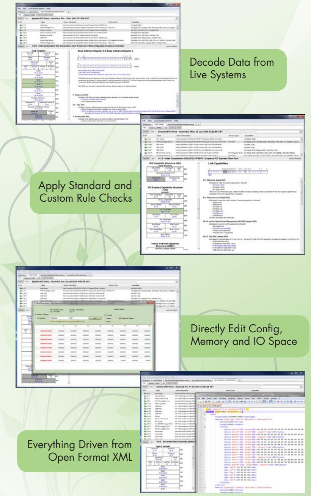
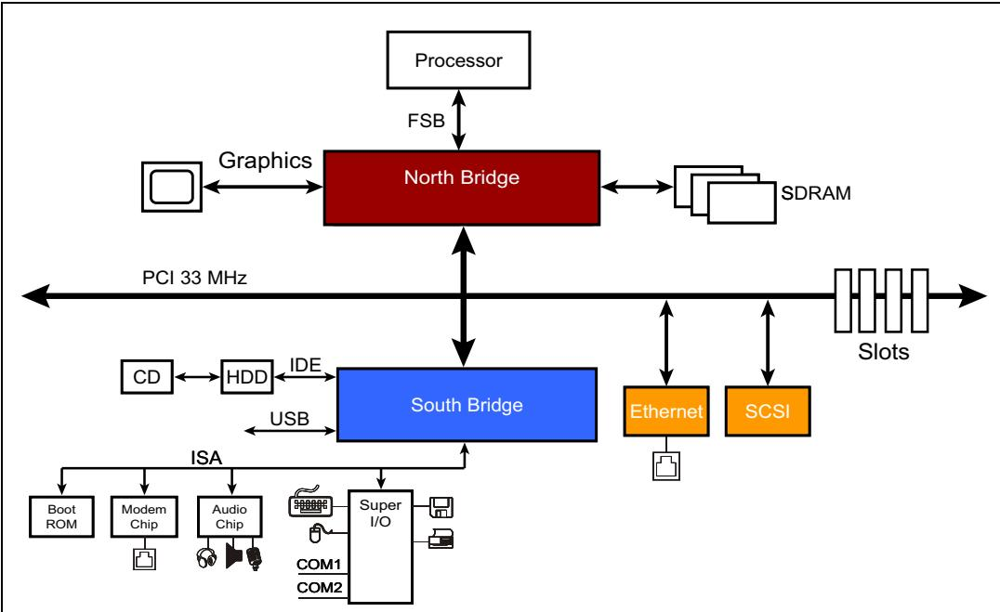
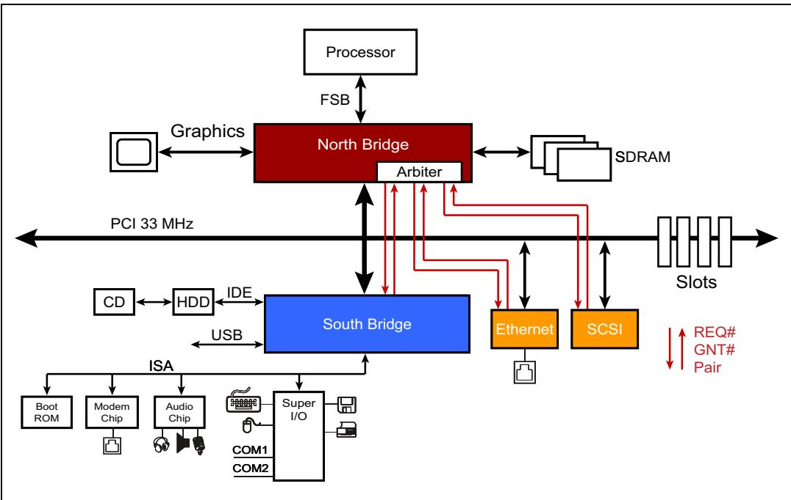
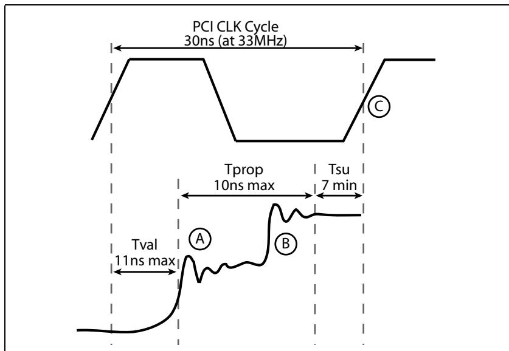
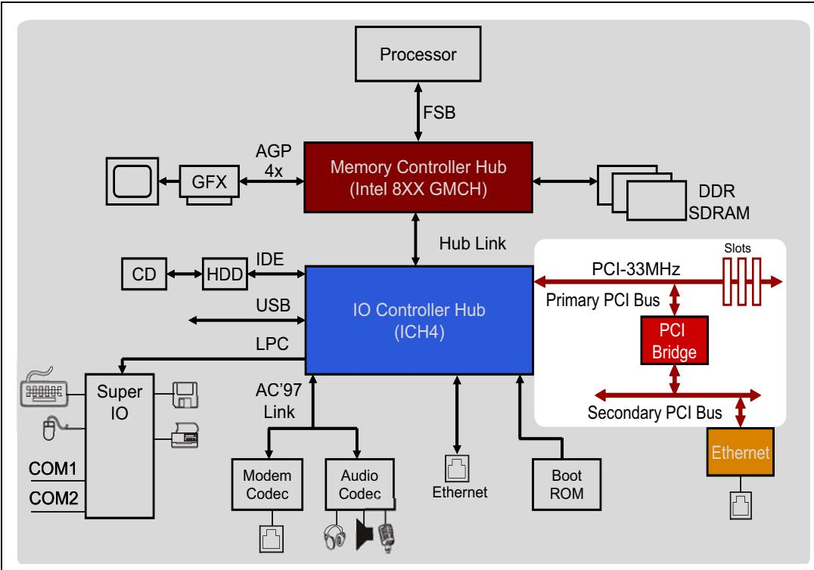
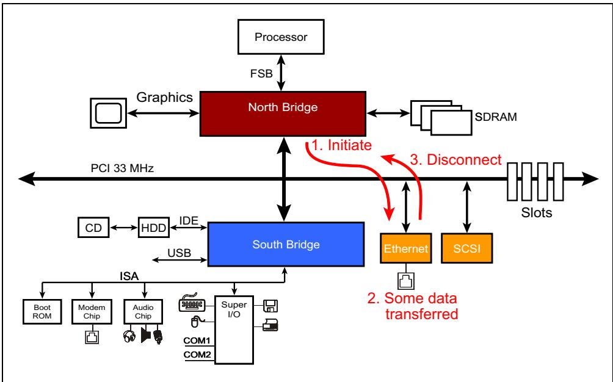
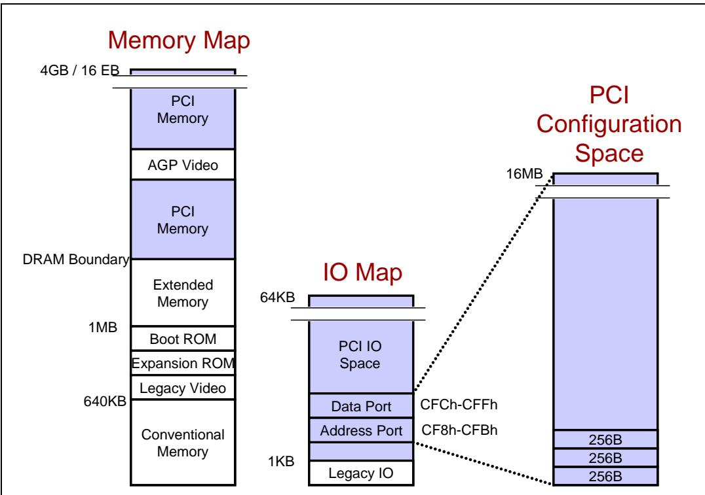
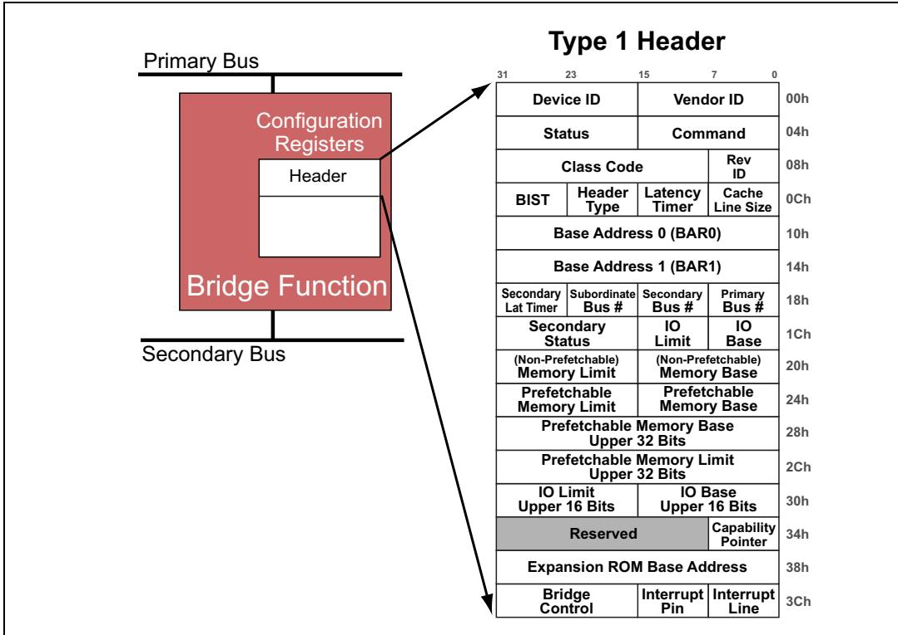
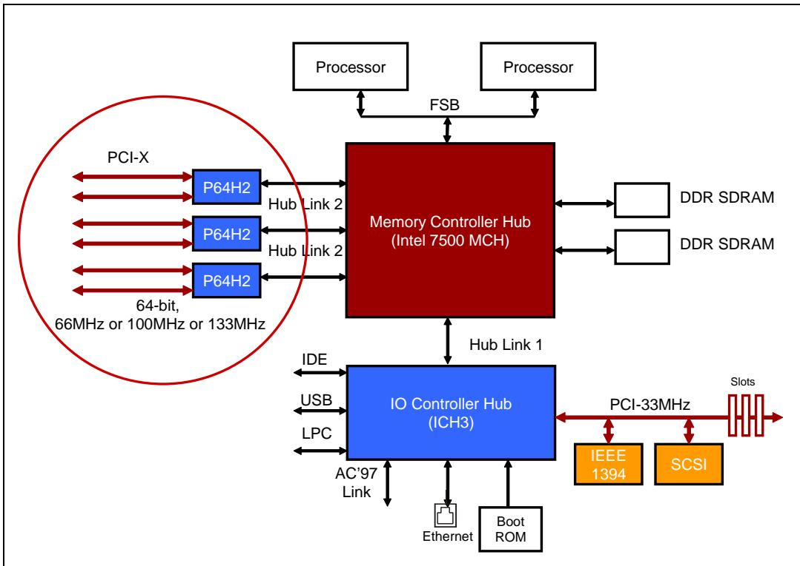
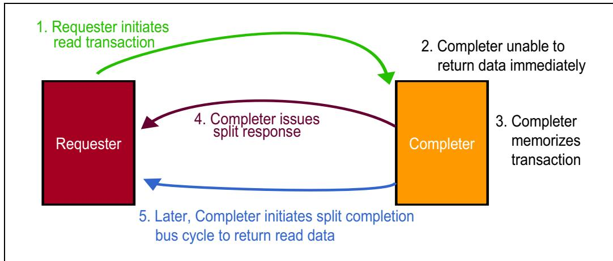

# Ch01_Front_Matter_and_Introduction

---

<table>
<tr>
<td width="50%">
*(This chunk contains no translatable content — only a separator.)*
</td>
<td width="50%" style="background-color:#e8e8e8">
*(本分块无可翻译内容——仅包含分隔符。)*
</td>
</tr>
</table>

---

<table>
<tr>
<td width="50%">
Part part01 — `mindshare_part01_p0001-0180`
</td>
<td width="50%" style="background-color:#e8e8e8">
第一部分 part01 — `mindshare_part01_p0001-0180`
</td>
</tr>
<tr>
<td width="50%">
For training, visit mindshare.com
</td>
<td width="50%" style="background-color:#e8e8e8">
如需培训，请访问 mindshare.com
</td>
</tr>
<tr>
<td width="50%">
MindShare Technology Series
</td>
<td width="50%" style="background-color:#e8e8e8">
MindShare 技术丛书系列
</td>
</tr>
</table>

<table>
<tr>
<td width="50%">
PCI Express Technology
</td>
<td width="50%" style="background-color:#e8e8e8">
PCI Express 技术
</td>
</tr>
</table>


# Comprehensive Guide to Generations 1.x, 2.x and 3.0 | 1.x、2.x 及 3.0 代综合指南

<table>
<tr>
<td width="50%">
Mike Jackson, Ravi Budruk
</td>
<td width="50%" style="background-color:#e8e8e8">
Mike Jackson, Ravi Budruk
</td>
</tr>
<tr>
<td width="50%">
MindShare, Inc.
</td>
<td width="50%" style="background-color:#e8e8e8">
MindShare, Inc.
</td>
</tr>
</table>

# PCI Express Technology | PCI Express 技术

<table>
<tr>
<td width="50%">
Comprehensive Guide to Generations 1.x, 2.x, 3.0
</td>
<td width="50%" style="background-color:#e8e8e8">
1.x、2.x、3.0 代全面指南
</td>
</tr>
<tr>
<td width="50%">
MINDSHARE, INC.
</td>
<td width="50%" style="background-color:#e8e8e8">
MINDSHARE, INC.
</td>
</tr>
<tr>
<td width="50%">
Mike Jackson
</td>
<td width="50%" style="background-color:#e8e8e8">
Mike Jackson
</td>
</tr>
<tr>
<td width="50%">
Ravi Budruk Technical Edit by Joe Winkles and Don Anderson
</td>
<td width="50%" style="background-color:#e8e8e8">
Ravi Budruk 著，Joe Winkles 与 Don Anderson 技术编辑
</td>
</tr>
</table>

<table>
<tr>
<td width="50%">
MindShare Live Training and Self-Paced Training
</td>
<td width="50%" style="background-color:#e8e8e8">
MindShare 实时培训和自定进度培训
</td>
</tr>
</table>

MindShare offers a wide range of courses covering processors, buses, firmware, storage, graphics, programming, and more. The following table lists some of the key training areas available.

<table><tr><td>Intel ArchitectureIntel Ivy Bridge ProcessorIntel 64 (x86) ArchitectureIntel QuickPath Interconnect (QPI)Computer Architecture</td><td>Virtualization TechnologyPC VirtualizationIO Virtualization</td></tr><tr><td>AMD ArchitectureAMD Opteron Processor (Bulldozer)AMD64 Architecture</td><td>IO BusesPCI Express 3.0USB 3.0 / 2.0xHCI for USB</td></tr><tr><td>Firmware TechnologyUEFI ArchitectureBIOS Essentials</td><td>Storage TechnologySAS ArchitectureSerial ATA ArchitectureNVMe Architecture</td></tr><tr><td>ARM ArchitectureARM Architecture</td><td>Memory TechnologyModern DRAM Architecture</td></tr><tr><td>Graphics ArchitectureGraphics Hardware Architecture</td><td>High Speed DesignHigh Speed DesignEMI/EMC</td></tr><tr><td>ProgrammingX86 Architecture ProgrammingX86 Assembly Language BasicsOpenCL Programming</td><td>Surface-Mount Technology (SMT)SMT ManufacturingSMT Testing</td></tr></table>

<table>
<tr>
<td width="50%">
Are your company's technical training needs being addressed in the most effective manner?
</td>
<td width="50%" style="background-color:#e8e8e8">
贵公司的技术培训需求是否正在以最有效的方式得到满足？
</td>
</tr>
<tr>
<td width="50%">
MindShare has over 25 years experience in conducting technical training on cutting-edge technologies. We understand the challenges companies have when searching for quality, effective training which reduces the students' time away from work and provides cost-effective alternatives. MindShare offers many flexible solutions to meet those needs. Our courses are taught by highly-skilled, enthusiastic, knowledgeable and experienced instructors. We bring life to knowledge through a wide variety of learning methods and delivery options.
</td>
<td width="50%" style="background-color:#e8e8e8">
MindShare 在尖端技术领域拥有超过25年的技术培训经验。我们深知企业在寻求高质量、高效率的培训时所面临的挑战——他们需要既能减少学员离岗时间又能提供高性价比的替代方案。MindShare 提供多种灵活的解决方案来满足这些需求。我们的课程由技术精湛、充满热情、知识渊博且经验丰富的讲师授课。我们通过多样化的学习方法和交付选项，为知识注入生命力。
</td>
</tr>
<tr>
<td width="50%">
MindShare offers numerous courses in a self‑paced training format (eLearning). We've taken our 25+ years of experience in the technical training industry and made that knowledge available to you at the click of a mouse.
</td>
<td width="50%" style="background-color:#e8e8e8">
MindShare 提供大量自定进度培训形式（在线学习）的课程。我们将25年以上的技术培训行业经验凝聚于此，轻点鼠标即可触达这些知识。
</td>
</tr>
</table>




# The Ultimate Tool to View, Edit and Verify Configuration Settings of a Computer | 查看、编辑和验证计算机配置设置的终极工具

## 1.1 Feature List | 1.1 功能列表

<table>
<tr>
<td width="50%">
Scan config space for all PCI-visible functions in system
</td>
<td width="50%" style="background-color:#e8e8e8">
扫描系统中所有 PCI 可见功能的配置空间
</td>
</tr>
<tr>
<td width="50%">
Run standard and custom rule checks to find errors and non-optimal settings
</td>
<td width="50%" style="background-color:#e8e8e8">
运行标准和自定义规则检查，以发现错误和非最优设置
</td>
</tr>
<tr>
<td width="50%">
Write to any config space location, memory address or IO address
</td>
<td width="50%" style="background-color:#e8e8e8">
写入任意配置空间位置、存储器地址或 IO 地址
</td>
</tr>
<tr>
<td width="50%">
View standard and non-standard structures in a decoded format
</td>
<td width="50%" style="background-color:#e8e8e8">
以解码格式查看标准和非标准结构
</td>
</tr>
<tr>
<td width="50%">
Import raw scan data from other tools (e.g. lspci) to view in Arbor's decoded format
</td>
<td width="50%" style="background-color:#e8e8e8">
从其他工具（如 lspci）导入原始扫描数据，以 Arbor 的解码格式查看
</td>
</tr>
<tr>
<td width="50%">
Decode info included for standard PCI, PCI-X and PCI Express structures
</td>
<td width="50%" style="background-color:#e8e8e8">
包含标准 PCI、PCI-X 和 PCI Express 结构的解码信息
</td>
</tr>
<tr>
<td width="50%">
Decode info included for some x86-based structures and device-specific registers
</td>
<td width="50%" style="background-color:#e8e8e8">
包含某些基于 x86 的结构和设备特定寄存器的解码信息
</td>
</tr>
<tr>
<td width="50%">
Create decode files for structures in config space, memory address space and IO space
</td>
<td width="50%" style="background-color:#e8e8e8">
为配置空间、存储器地址空间和 IO 空间中的结构创建解码文件
</td>
</tr>
<tr>
<td width="50%">
Save system scans for viewing later or on other systems
</td>
<td width="50%" style="background-color:#e8e8e8">
保存系统扫描结果，以便以后或在其他系统上查看
</td>
</tr>
<tr>
<td width="50%">
All decode files and saved system scans are XML-based and open-format
</td>
<td width="50%" style="background-color:#e8e8e8">
所有解码文件和已保存的系统扫描结果均基于 XML 且为开放格式
</td>
</tr>
</table>

## 1.2 COMING SOON | 1.2 即将推出

<table>
<tr>
<td width="50%">
Decoded view of x86 structures (MSRs, ACPI, Paging, Virtualization, etc.)
</td>
<td width="50%" style="background-color:#e8e8e8">
x86 结构的解码视图（MSR、ACPI、分页、虚拟化等）
</td>
</tr>
<tr>
<td width="50%">
MindShare Arbor is a computer system debug, validation, analysis and learning tool that allows the user to read and write any memory, IO or configuration space address. The data from these address spaces can be viewed in a clean and informative style as well as checked for configuration errors and non-optimal settings.
</td>
<td width="50%" style="background-color:#e8e8e8">
MindShare Arbor 是一款计算机系统调试、验证、分析和学习工具，允许用户读写任意存储器、IO 或配置空间地址。这些地址空间中的数据可以以清晰且信息丰富的方式查看，还可检查配置错误和非优化设置。
</td>
</tr>
</table>

## 1.3 View Reference Info | 1.3 查看参考资料

<table>
<tr>
<td width="50%">
MindShare Arbor is an excellent reference tool to quickly look at standard PCI, PCI-X and PCIe structures. All the register and field definitions are up-to-date with the PCI Express 3.0. x86, ACPI and USB reference info will be coming soon as well.
</td>
<td width="50%" style="background-color:#e8e8e8">
MindShare Arbor 是一款出色的参考工具，可用于快速查看标准 PCI、PCI-X 和 PCIe 结构。所有寄存器和字段定义均与 PCI Express 3.0 保持同步。x86、ACPI 和 USB 参考资料也即将推出。
</td>
</tr>
</table>

## 1.4 Decoding Standard and Custom Structures from a Live System | 1.4 从运行系统中解码标准与自定义结构

<table>
<tr>
<td width="50%">
MindShare Arbor can perform a scan of the system it is running on to record the config space from all PCI-visible functions and show it in a clean and intuitive decoded format. In addition to scanning PCI config space, MindShare Arbor can also be directed to read any memory address space and IO address space and display the collected data in the same decoded fashion.
</td>
<td width="50%" style="background-color:#e8e8e8">
MindShare Arbor 可以对运行所在系统执行扫描，记录所有 PCI 可见功能的配置空间，并以清晰、直观的解码格式显示。除了扫描 PCI 配置空间外，MindShare Arbor 还可以被指定读取任意的存储器地址空间和 IO 地址空间，并以相同的解码方式显示所收集的数据。
</td>
</tr>
</table>

## 1.5 Run Rule Checks of Standard and Custom Structures | 1.5 对标准与自定义结构运行规则检查

<table>
<tr>
<td width="50%">
In addition to capturing and displaying headers and capability structures from PCI config space, Arbor can also check the settings of each field for errors (e.g. violates the spec) and non-optimal values (e.g. a PCIe link trained to something less than its max capability).
</td>
<td width="50%" style="background-color:#e8e8e8">
除了从 PCI 配置空间中捕获并显示头部和能力结构之外，Arbor 还可以检查每个字段的设置是否存在错误（例如违反规范）和非最优值（例如 PCIe 链路训练结果低于其最大能力）。
</td>
</tr>
<tr>
<td width="50%">
MindShare Arbor has scores of these checks built in and can be run on any system scan (live or saved).
</td>
<td width="50%" style="background-color:#e8e8e8">
MindShare Arbor 内置了数十种此类检查，可对任何系统扫描（实时或已保存的）运行。
</td>
</tr>
<tr>
<td width="50%">
Any errors or warnings are flagged and displayed for easy evaluation and debugging.
</td>
<td width="50%" style="background-color:#e8e8e8">
任何错误或警告都会被标记并显示，以便于评估和调试。
</td>
</tr>
<tr>
<td width="50%">
MindShare Arbor allows users to create their own rule checks to be applied to system scans.
</td>
<td width="50%" style="background-color:#e8e8e8">
MindShare Arbor 允许用户创建自己的规则检查，并将其应用于系统扫描。
</td>
</tr>
<tr>
<td width="50%">
These rule checks can be for any structure, or set of structures, in PCI config space, memory space or IO space.
</td>
<td width="50%" style="background-color:#e8e8e8">
这些规则检查可针对 PCI 配置空间、内存空间或 IO 空间中的任何结构或结构集。
</td>
</tr>
<tr>
<td width="50%">
The rule checks are written in JavaScript. (Python support coming soon.)
</td>
<td width="50%" style="background-color:#e8e8e8">
规则检查使用 JavaScript 编写。（即将支持 Python。）
</td>
</tr>
</table>

## 1.6 Write Capability | 1.6 写操作功能

<table>
<tr>
<td width="50%">
MindShare Arbor provides a very simple interface to directly edit a register in PCI config space, memory address space or IO address space. This can be done in the decoded view so you see what the meaning of each bit, or by simply writing a hex value to the target location.
</td>
<td width="50%" style="background-color:#e8e8e8">
MindShare Arbor 提供了一个非常简单的界面，可直接编辑 PCI 配置空间、存储器地址空间或 IO 地址空间中的寄存器。这可以在解码视图中完成，以便您查看每个比特位的含义，或者直接向目标位置写入一个十六进制值。
</td>
</tr>
</table>

<table>
<tr>
<td width="50%">
Saving System Scans (XML)
</td>
<td width="50%" style="background-color:#e8e8e8">
保存系统扫描结果 (XML)
</td>
</tr>
<tr>
<td width="50%">
After a system scan has been performed, MindShare Arbor allows saving of that system's scanned data (PCI config space, memory space and IO space) all in a single file to be looked at later or sent to a colleague. The scanned data in these Arbor system scan files (.ARBSYS files) are XML-based and can be looked at with any text editor or web browser. Even scans performed with other tools can be easily converted to the Arbor XML format and evaluated with MindShare Arbor.
</td>
<td width="50%" style="background-color:#e8e8e8">
在执行系统扫描之后，MindShare Arbor 允许将系统的扫描数据（PCI 配置空间、存储器空间和 IO 空间）全部保存到单个文件中，以便日后查看或发送给同事。这些 Arbor 系统扫描文件（.ARBSYS 文件）中的扫描数据基于 XML 格式，可以使用任何文本编辑器或 web 浏览器查看。即使使用其他工具执行的扫描，也可以轻松转换为 Arbor XML 格式，并通过 MindShare Arbor 进行评估。
</td>
</tr>
</table>

# PCI Express Technology | PCI Express 技术

<table>
<tr>
<td width="50%">
Comprehensive Guide to Generations 1.x, 2.x, 3.0
</td>
<td width="50%" style="background-color:#e8e8e8">
涵盖 1.x、2.x、3.0 代的全面指南
</td>
</tr>
<tr>
<td width="50%">
MINDSHARE, INC.
</td>
<td width="50%" style="background-color:#e8e8e8">
MINDSHARE, INC.
</td>
</tr>
<tr>
<td width="50%">
Mike Jackson
</td>
<td width="50%" style="background-color:#e8e8e8">
Mike Jackson
</td>
</tr>
<tr>
<td width="50%">
Ravi Budruk Technical Edit by Joe Winkles and Don Anderson
</td>
<td width="50%" style="background-color:#e8e8e8">
Ravi Budruk 著，Joe Winkles 与 Don Anderson 技术编辑
</td>
</tr>
<tr>
<td width="50%">
Many of the designations used by manufacturers and sellers to distinguish their products are claimed as trademarks. Where those designators appear in this book, and MindShare was aware of the trademark claim, the designations have been printed in initial capital letters or all capital letters.
</td>
<td width="50%" style="background-color:#e8e8e8">
制造商和销售商用于区分其产品的许多名称已被声明为商标。在本书中出现这些名称时，若 MindShare 知晓该商标声明，则这些名称将以首字母大写或全大写形式印刷。
</td>
</tr>
<tr>
<td width="50%">
The authors and publishers have taken care in preparation of this book, but make no expressed or implied warranty of any kind and assume no responsibility for errors or omissions. No liability is assumed for incidental or consequential damages in connection with or arising out of the use of the information or programs contained herein.
</td>
<td width="50%" style="background-color:#e8e8e8">
作者和出版商在编写本书时已尽力审慎，但不提供任何明示或暗示的保证，并且不对错误或遗漏承担任何责任。对于因使用本书所含信息或程序而产生或与之相关的附带或间接损害，不承担任何责任。
</td>
</tr>
</table>

## 1.7 Library of Congress Cataloging-in-Publication Data | 1.7 美国国会图书馆出版编目数据

<table>
<tr>
<td width="50%">
Jackson, Mike and Budruk, Ravi PCI Express Technology / MindShare, Inc., Mike Jackson, Ravi Budruk....[et al.]
</td>
<td width="50%" style="background-color:#e8e8e8">
Jackson, Mike 与 Budruk, Ravi：《PCI Express 技术》/ MindShare, Inc.，Mike Jackson，Ravi Budruk 等著
</td>
</tr>
<tr>
<td width="50%">
Includes index ISBN: 978-0-9836465-2-5 (alk. paper) 1. Computer Architecture. 2.0 Microcomputers - buses. I. Jackson, Mike    II. MindShare, Inc.   III. Title
</td>
<td width="50%" style="background-color:#e8e8e8">
含索引。ISBN：978-0-9836465-2-5（无酸纸）。1. 计算机体系结构。2. 微型计算机 - 总线。I. Jackson, Mike  II. MindShare, Inc.  III. 书名
</td>
</tr>
<tr>
<td width="50%">
Library of Congress Number: 2011921066 ISBN: 978-0-9836465-2-5 Copyright ©2012 by MindShare, Inc.
</td>
<td width="50%" style="background-color:#e8e8e8">
美国国会图书馆编号：2011921066。ISBN：978-0-9836465-2-5。版权所有 ©2012，MindShare, Inc.
</td>
</tr>
<tr>
<td width="50%">
All rights reserved. No part of this publication may be reproduced, stored in a retrieval system, or transmitted, in any form or by any means, electronic, mechanical, photocopying, recording, or otherwise, without the prior written permission of the publisher. Printed in the United States of America.
</td>
<td width="50%" style="background-color:#e8e8e8">
保留所有权利。未经出版者事先书面许可，不得以任何形式或任何方式（电子、机械、影印、录音或其他方式）复制、存储于检索系统中或传播本书的任何部分。在美国印刷。
</td>
</tr>
<tr>
<td width="50%">
Editors: Joe Winkles and Don Anderson Project Manager: Maryanne Daves Cover Design: Greenhouse Creative and MindShare, Inc.
</td>
<td width="50%" style="background-color:#e8e8e8">
编辑：Joe Winkles 与 Don Anderson。项目经理：Maryanne Daves。封面设计：Greenhouse Creative 与 MindShare, Inc.
</td>
</tr>
<tr>
<td width="50%">
Set in 10 point Palatino Linotype by MindShare, Inc. Text printed on recycled and acid-free paper
</td>
<td width="50%" style="background-color:#e8e8e8">
由 MindShare, Inc. 以 10 磅 Palatino Linotype 字体排版。正文采用再生无酸纸印刷。
</td>
</tr>
<tr>
<td width="50%">
First Edition, First Printing, September, 2012
</td>
<td width="50%" style="background-color:#e8e8e8">
第一版，第一次印刷，2012 年 9 月。
</td>
</tr>
<tr>
<td width="50%">
"This book is dedicated to my sons, Jeremy and Bryan -- I love you guys deeply. Creating a book takes a long time and a team effort, but it's finally done and now you hold the results in your hand. It's a picture of the way life is sometimes: investing over a long time with your team before you see the result. You were a gift to us when you were born and we've invested in you for many years, along with a number of people who have helped us. Now you've become fine young men in your own right and it's been a joy to become your friend as grown men. What will you invest in that will become the big achievements in your lives? I can hardly wait to find out."
</td>
<td width="50%" style="background-color:#e8e8e8">
"本书献给我的儿子们，Jeremy 和 Bryan——我深深地爱着你们。创作一本书需要漫长的时间和团队的共同努力，但它终于完成了，如今你们手中拿着的就是成果。这有时就像生活的写照：与团队一起长期投入，才能看到结果。你们出生时是上天给我们的礼物，多年来，我们和许多帮助过我们的人一起在你们身上倾注心血。如今，你们已凭自身的努力成长为优秀的年轻人，能以成年人的身份成为你们的朋友，是我莫大的喜悦。你们打算在什么事业上投入，使之成为人生中的重大成就？我已迫不及待地想知道答案。"
</td>
</tr>
</table>

## 1.8 Acknowledgments | 1.8 致谢

<table>
<tr>
<td width="50%">
Thanks to those who made significant contributions to this book:
</td>
<td width="50%" style="background-color:#e8e8e8">
感谢对此书做出重要贡献的人们：
</td>
</tr>
<tr>
<td width="50%">
Maryanne Daves — for being book project manager and getting the book to press in a timely manner.
</td>
<td width="50%" style="background-color:#e8e8e8">
Maryanne Daves — 担任本书项目经理，让本书得以按时出版。
</td>
</tr>
<tr>
<td width="50%">
Don Anderson — for excellent work editing numerous chapters and doing a complete re-write of Chapter 8 on "Transaction Ordering".
</td>
<td width="50%" style="background-color:#e8e8e8">
Don Anderson — 出色地编辑了多个章节，并完整重写了第8章"事务排序"。
</td>
</tr>
<tr>
<td width="50%">
Joe Winkles — for his superb job of technical editing and doing a complete rewrite of Chapter 4 on "Address Space and Transaction Routing".
</td>
<td width="50%" style="background-color:#e8e8e8">
Joe Winkles — 出色地完成了技术编辑工作，并完整重写了第4章"地址空间与事务路由"。
</td>
</tr>
<tr>
<td width="50%">
Jay Trodden — for his contribution in developing Chapter 4 on "Address Space and Transaction Routing"
</td>
<td width="50%" style="background-color:#e8e8e8">
Jay Trodden — 为第4章"地址空间与事务路由"的开发做出了贡献。
</td>
</tr>
<tr>
<td width="50%">
Special thanks to LeCroy Corporation, Inc. for supplying:
</td>
<td width="50%" style="background-color:#e8e8e8">
特别感谢 LeCroy Corporation, Inc. 提供：
</td>
</tr>
<tr>
<td width="50%">
Appendix A: Debugging PCI Express™ Traffic using LeCroy Tools
</td>
<td width="50%" style="background-color:#e8e8e8">
附录A：使用 LeCroy 工具调试 PCI Express™ 流量
</td>
</tr>
<tr>
<td width="50%">
Special thanks to PLX Technology for contributing two appendices:
</td>
<td width="50%" style="background-color:#e8e8e8">
特别感谢 PLX Technology 贡献了两个附录：
</td>
</tr>
<tr>
<td width="50%">
Appendix B: Markets & Applications for PCI Express™
</td>
<td width="50%" style="background-color:#e8e8e8">
附录B：PCI Express™ 的市场与应用
</td>
</tr>
<tr>
<td width="50%">
Appendix C: Implementing Intelligent Adapters and Multi-Host Systems With PCI Express™ Technology
</td>
<td width="50%" style="background-color:#e8e8e8">
附录C：使用 PCI Express™ 技术实现智能适配器和多主机系统
</td>
</tr>
<tr>
<td width="50%">
Thanks also to the PCI SIG for giving permission to use some of the mechanical drawings from the specification.
</td>
<td width="50%" style="background-color:#e8e8e8">
同时感谢 PCI SIG 允许使用规范中的部分机械图纸。
</td>
</tr>
</table>

## 1.9 Revision Updates: | 1.9 修订更新：


## 1.10 About This Book | 1.10 关于本书

<table>
<tr>
<td width="50%">
1.0 - Initial eBook release
</td>
<td width="50%" style="background-color:#e8e8e8">
1.0 - 初始电子书发布
</td>
</tr>
<tr>
<td width="50%">
1.01 - Fixed Revision ID field in Figures 1-12, 1-13, 4-2, 4-4, 4-5, 4-6, 4-8, 4-9, 4-10, 4-17, 4-20, 4-21
</td>
<td width="50%" style="background-color:#e8e8e8">
1.01 - 修正了图1-12、1-13、4-2、4-4、4-5、4-6、4-8、4-9、4-10、4-17、4-20、4-21中的修订ID字段
</td>
</tr>
<tr>
<td width="50%">
The MindShare Technology Series .... 1
</td>
<td width="50%" style="background-color:#e8e8e8">
MindShare技术系列 .... 1
</td>
</tr>
<tr>
<td width="50%">
Cautionary Note .... 2
</td>
<td width="50%" style="background-color:#e8e8e8">
注意事项 .... 2
</td>
</tr>
<tr>
<td width="50%">
Intended Audience .... 2
</td>
<td width="50%" style="background-color:#e8e8e8">
预期读者 .... 2
</td>
</tr>
<tr>
<td width="50%">
Prerequisite Knowledge .... 2
</td>
<td width="50%" style="background-color:#e8e8e8">
预备知识 .... 2
</td>
</tr>
<tr>
<td width="50%">
Book Topics and Organization .... 3
</td>
<td width="50%" style="background-color:#e8e8e8">
本书主题与组织结构 .... 3
</td>
</tr>
<tr>
<td width="50%">
Documentation Conventions .... 3
</td>
<td width="50%" style="background-color:#e8e8e8">
文档约定 .... 3
</td>
</tr>
<tr>
<td width="50%">
PCI Express™ .... 3
</td>
<td width="50%" style="background-color:#e8e8e8">
PCI Express™ .... 3
</td>
</tr>
<tr>
<td width="50%">
Hexadecimal Notation .... 4
</td>
<td width="50%" style="background-color:#e8e8e8">
十六进制表示法 .... 4
</td>
</tr>
<tr>
<td width="50%">
Binary Notation .... 4
</td>
<td width="50%" style="background-color:#e8e8e8">
二进制表示法 .... 4
</td>
</tr>
<tr>
<td width="50%">
Decimal Notation .... 4
</td>
<td width="50%" style="background-color:#e8e8e8">
十进制表示法 .... 4
</td>
</tr>
<tr>
<td width="50%">
Bits, Bytes and Transfers Notation .... 4
</td>
<td width="50%" style="background-color:#e8e8e8">
位、字节与传输表示法 .... 4
</td>
</tr>
<tr>
<td width="50%">
Bit Fields .... 4
</td>
<td width="50%" style="background-color:#e8e8e8">
位字段 .... 4
</td>
</tr>
<tr>
<td width="50%">
Active Signal States .... 5
</td>
<td width="50%" style="background-color:#e8e8e8">
有效信号状态 .... 5
</td>
</tr>
<tr>
<td width="50%">
Visit Our Web Site .... 5
</td>
<td width="50%" style="background-color:#e8e8e8">
访问我们的网站 .... 5
</td>
</tr>
<tr>
<td width="50%">
We Want Your Feedback .... 5
</td>
<td width="50%" style="background-color:#e8e8e8">
我们期待您的反馈 .... 5
</td>
</tr>
</table>

## Part One: The Big Picture | 第一部分：总览

<table>
<tr>
<td width="50%">
Chapter 1: Background
</td>
<td width="50%" style="background-color:#e8e8e8">
第1章：背景
</td>
</tr>
<tr>
<td width="50%">
Introduction......9
</td>
<td width="50%" style="background-color:#e8e8e8">
简介......9
</td>
</tr>
<tr>
<td width="50%">
PCI and PCI-X......10
</td>
<td width="50%" style="background-color:#e8e8e8">
PCI 与 PCI-X......10
</td>
</tr>
<tr>
<td width="50%">
PCI Basics......11
</td>
<td width="50%" style="background-color:#e8e8e8">
PCI 基础......11
</td>
</tr>
<tr>
<td width="50%">
Basics of a PCI-Based System......11
</td>
<td width="50%" style="background-color:#e8e8e8">
基于 PCI 的系统基础......11
</td>
</tr>
<tr>
<td width="50%">
PCI Bus Initiator and Target......12
</td>
<td width="50%" style="background-color:#e8e8e8">
PCI 总线发起方与目标方......12
</td>
</tr>
<tr>
<td width="50%">
Typical PCI Bus Cycle......13
</td>
<td width="50%" style="background-color:#e8e8e8">
典型的 PCI 总线周期......13
</td>
</tr>
<tr>
<td width="50%">
Reflected-Wave Signaling......16
</td>
<td width="50%" style="background-color:#e8e8e8">
反射波信号......16
</td>
</tr>
<tr>
<td width="50%">
PCI Bus Architecture Perspective......18
</td>
<td width="50%" style="background-color:#e8e8e8">
PCI 总线架构视角......18
</td>
</tr>
<tr>
<td width="50%">
PCI Transaction Models......18
</td>
<td width="50%" style="background-color:#e8e8e8">
PCI 事务模型......18
</td>
</tr>
<tr>
<td width="50%">
Programmed I/O......18
</td>
<td width="50%" style="background-color:#e8e8e8">
程控 I/O (PIO)......18
</td>
</tr>
<tr>
<td width="50%">
Direct Memory Access (DMA)......19
</td>
<td width="50%" style="background-color:#e8e8e8">
直接存储器访问 (DMA)......19
</td>
</tr>
<tr>
<td width="50%">
Peer-to-Peer......20
</td>
<td width="50%" style="background-color:#e8e8e8">
端对端传输......20
</td>
</tr>
<tr>
<td width="50%">
PCI Bus Arbitration......20
</td>
<td width="50%" style="background-color:#e8e8e8">
PCI 总线仲裁......20
</td>
</tr>
<tr>
<td width="50%">
PCI Inefficiencies......21
</td>
<td width="50%" style="background-color:#e8e8e8">
PCI 的低效问题......21
</td>
</tr>
<tr>
<td width="50%">
PCI Retry Protocol......21
</td>
<td width="50%" style="background-color:#e8e8e8">
PCI 重试协议......21
</td>
</tr>
<tr>
<td width="50%">
PCI Disconnect Protocol......22
</td>
<td width="50%" style="background-color:#e8e8e8">
PCI 断开协议......22
</td>
</tr>
<tr>
<td width="50%">
PCI Interrupt Handling......23
</td>
<td width="50%" style="background-color:#e8e8e8">
PCI 中断处理......23
</td>
</tr>
<tr>
<td width="50%">
PCI Error Handling......24
</td>
<td width="50%" style="background-color:#e8e8e8">
PCI 错误处理......24
</td>
</tr>
<tr>
<td width="50%">
PCI Address Space Map......25
</td>
<td width="50%" style="background-color:#e8e8e8">
PCI 地址空间映射......25
</td>
</tr>
<tr>
<td width="50%">
PCI Configuration Cycle Generation......26
</td>
<td width="50%" style="background-color:#e8e8e8">
PCI 配置周期生成......26
</td>
</tr>
<tr>
<td width="50%">
PCI Function Configuration Register Space 27
</td>
<td width="50%" style="background-color:#e8e8e8">
PCI 功能配置寄存器空间......27
</td>
</tr>
<tr>
<td width="50%">
Higher-bandwidth PCI 29
</td>
<td width="50%" style="background-color:#e8e8e8">
更高带宽的 PCI......29
</td>
</tr>
<tr>
<td width="50%">
Limitations of 66 MHz PCI bus 30
</td>
<td width="50%" style="background-color:#e8e8e8">
66 MHz PCI 总线的局限性......30
</td>
</tr>
<tr>
<td width="50%">
Signal Timing Problems with the Parallel PCI Bus Model beyond 66 MHz 31
</td>
<td width="50%" style="background-color:#e8e8e8">
超过 66 MHz 时并行 PCI 总线模型的信号时序问题......31
</td>
</tr>
<tr>
<td width="50%">
Introducing PCI-X 31
</td>
<td width="50%" style="background-color:#e8e8e8">
引入 PCI-X......31
</td>
</tr>
<tr>
<td width="50%">
PCI-X System Example 31
</td>
<td width="50%" style="background-color:#e8e8e8">
PCI-X 系统示例......31
</td>
</tr>
<tr>
<td width="50%">
PCI-X Transactions 32
</td>
<td width="50%" style="background-color:#e8e8e8">
PCI-X 事务......32
</td>
</tr>
<tr>
<td width="50%">
PCI-X Features 33
</td>
<td width="50%" style="background-color:#e8e8e8">
PCI-X 特性......33
</td>
</tr>
<tr>
<td width="50%">
Split-Transaction Model 33
</td>
<td width="50%" style="background-color:#e8e8e8">
拆分事务模型......33
</td>
</tr>
<tr>
<td width="50%">
Message Signaled Interrupts 34
</td>
<td width="50%" style="background-color:#e8e8e8">
消息信号中断 (MSI)......34
</td>
</tr>
<tr>
<td width="50%">
Transaction Attributes 35
</td>
<td width="50%" style="background-color:#e8e8e8">
事务属性......35
</td>
</tr>
<tr>
<td width="50%">
No Snoop (NS): 35
</td>
<td width="50%" style="background-color:#e8e8e8">
无窥探 (NS)：......35
</td>
</tr>
<tr>
<td width="50%">
Relaxed Ordering (RO): 35
</td>
<td width="50%" style="background-color:#e8e8e8">
宽松排序 (RO)：......35
</td>
</tr>
<tr>
<td width="50%">
Higher Bandwidth PCI-X 36
</td>
<td width="50%" style="background-color:#e8e8e8">
更高带宽的 PCI-X......36
</td>
</tr>
<tr>
<td width="50%">
Problems with the Common Clock Approach of PCI and PCI-X 1.0
</td>
<td width="50%" style="background-color:#e8e8e8">
PCI 与 PCI-X 1.0 公共时钟方案的问题
</td>
</tr>
<tr>
<td width="50%">
Parallel Bus Model 36
</td>
<td width="50%" style="background-color:#e8e8e8">
并行总线模型......36
</td>
</tr>
<tr>
<td width="50%">
PCI-X 2.0 Source-Synchronous Model 37
</td>
<td width="50%" style="background-color:#e8e8e8">
PCI-X 2.0 源同步模型......37
</td>
</tr>
<tr>
<td width="50%">
Chapter 2: PCIe Architecture Overview
</td>
<td width="50%" style="background-color:#e8e8e8">
第2章：PCIe 架构概述
</td>
</tr>
<tr>
<td width="50%">
Introduction to PCI Express 39
</td>
<td width="50%" style="background-color:#e8e8e8">
PCI Express 简介......39
</td>
</tr>
<tr>
<td width="50%">
Software Backward Compatibility 41
</td>
<td width="50%" style="background-color:#e8e8e8">
软件向后兼容......41
</td>
</tr>
<tr>
<td width="50%">
Serial Transport 41
</td>
<td width="50%" style="background-color:#e8e8e8">
串行传输......41
</td>
</tr>
<tr>
<td width="50%">
The Need for Speed 41
</td>
<td width="50%" style="background-color:#e8e8e8">
速度之需......41
</td>
</tr>
<tr>
<td width="50%">
Overcoming Problems 41
</td>
<td width="50%" style="background-color:#e8e8e8">
克服问题......41
</td>
</tr>
<tr>
<td width="50%">
Bandwidth 42
</td>
<td width="50%" style="background-color:#e8e8e8">
带宽......42
</td>
</tr>
<tr>
<td width="50%">
PCIe Bandwidth Calculation 43
</td>
<td width="50%" style="background-color:#e8e8e8">
PCIe 带宽计算......43
</td>
</tr>
<tr>
<td width="50%">
Differential Signals 44
</td>
<td width="50%" style="background-color:#e8e8e8">
差分信号......44
</td>
</tr>
<tr>
<td width="50%">
No Common Clock 45
</td>
<td width="50%" style="background-color:#e8e8e8">
无公共时钟......45
</td>
</tr>
<tr>
<td width="50%">
Packet-based Protocol 46
</td>
<td width="50%" style="background-color:#e8e8e8">
基于数据包的协议......46
</td>
</tr>
<tr>
<td width="50%">
Links and Lanes 46
</td>
<td width="50%" style="background-color:#e8e8e8">
链路与通道......46
</td>
</tr>
<tr>
<td width="50%">
Scalable Performance 46
</td>
<td width="50%" style="background-color:#e8e8e8">
可扩展的性能......46
</td>
</tr>
<tr>
<td width="50%">
Flexible Topology Options 47
</td>
<td width="50%" style="background-color:#e8e8e8">
灵活的拓扑选项......47
</td>
</tr>
<tr>
<td width="50%">
Some Definitions 47
</td>
<td width="50%" style="background-color:#e8e8e8">
一些定义......47
</td>
</tr>
<tr>
<td width="50%">
Root Complex 48
</td>
<td width="50%" style="background-color:#e8e8e8">
根复合体 (Root Complex)......48
</td>
</tr>
<tr>
<td width="50%">
Switches and Bridges 48
</td>
<td width="50%" style="background-color:#e8e8e8">
交换机与桥......48
</td>
</tr>
<tr>
<td width="50%">
Native PCIe Endpoints and Legacy PCIe Endpoints 49
</td>
<td width="50%" style="background-color:#e8e8e8">
原生 PCIe 端点与传统 PCIe 端点......49
</td>
</tr>
<tr>
<td width="50%">
Software Compatibility Characteristics 49
</td>
<td width="50%" style="background-color:#e8e8e8">
软件兼容特性......49
</td>
</tr>
<tr>
<td width="50%">
System Examples 52
</td>
<td width="50%" style="background-color:#e8e8e8">
系统示例......52
</td>
</tr>
<tr>
<td width="50%">
Introduction to Device Layers 54
</td>
<td width="50%" style="background-color:#e8e8e8">
设备分层简介......54
</td>
</tr>
<tr>
<td width="50%">
Device Core / Software Layer 59
</td>
<td width="50%" style="background-color:#e8e8e8">
设备核心 / 软件层......59
</td>
</tr>
<tr>
<td width="50%">
Transaction Layer 59
</td>
<td width="50%" style="background-color:#e8e8e8">
事务层......59
</td>
</tr>
<tr>
<td width="50%">
TLP (Transaction Layer Packet) Basics 60
</td>
<td width="50%" style="background-color:#e8e8e8">
TLP (事务层包) 基础......60
</td>
</tr>
<tr>
<td width="50%">
TLP Packet Assembly....62
</td>
<td width="50%" style="background-color:#e8e8e8">
TLP 包组装......62
</td>
</tr>
<tr>
<td width="50%">
TLP Packet Disassembly....64
</td>
<td width="50%" style="background-color:#e8e8e8">
TLP 包拆解......64
</td>
</tr>
<tr>
<td width="50%">
Non-Posted Transactions....65
</td>
<td width="50%" style="background-color:#e8e8e8">
非转发事务......65
</td>
</tr>
<tr>
<td width="50%">
Ordinary Reads....65
</td>
<td width="50%" style="background-color:#e8e8e8">
普通读......65
</td>
</tr>
<tr>
<td width="50%">
Locked Reads....66
</td>
<td width="50%" style="background-color:#e8e8e8">
锁定读......66
</td>
</tr>
<tr>
<td width="50%">
IO and Configuration Writes....68
</td>
<td width="50%" style="background-color:#e8e8e8">
IO 与配置写......68
</td>
</tr>
<tr>
<td width="50%">
Posted Writes....69
</td>
<td width="50%" style="background-color:#e8e8e8">
转发写......69
</td>
</tr>
<tr>
<td width="50%">
Memory Writes....69
</td>
<td width="50%" style="background-color:#e8e8e8">
存储器写......69
</td>
</tr>
<tr>
<td width="50%">
Message Writes....70
</td>
<td width="50%" style="background-color:#e8e8e8">
消息写......70
</td>
</tr>
<tr>
<td width="50%">
Transaction Ordering....71
</td>
<td width="50%" style="background-color:#e8e8e8">
事务排序......71
</td>
</tr>
<tr>
<td width="50%">
Data Link Layer....72
</td>
<td width="50%" style="background-color:#e8e8e8">
数据链路层......72
</td>
</tr>
<tr>
<td width="50%">
DLLPs (Data Link Layer Packets)....73
</td>
<td width="50%" style="background-color:#e8e8e8">
DLLP (数据链路层包)......73
</td>
</tr>
<tr>
<td width="50%">
DLLP Assembly....73
</td>
<td width="50%" style="background-color:#e8e8e8">
DLLP 组装......73
</td>
</tr>
<tr>
<td width="50%">
DLLP Disassembly....73
</td>
<td width="50%" style="background-color:#e8e8e8">
DLLP 拆解......73
</td>
</tr>
<tr>
<td width="50%">
Ack/Nak Protocol....74
</td>
<td width="50%" style="background-color:#e8e8e8">
ACK/Nak 协议......74
</td>
</tr>
<tr>
<td width="50%">
Flow Control....76
</td>
<td width="50%" style="background-color:#e8e8e8">
流控......76
</td>
</tr>
<tr>
<td width="50%">
Power Management....76
</td>
<td width="50%" style="background-color:#e8e8e8">
电源管理......76
</td>
</tr>
<tr>
<td width="50%">
Physical Layer....76
</td>
<td width="50%" style="background-color:#e8e8e8">
物理层......76
</td>
</tr>
<tr>
<td width="50%">
General....76
</td>
<td width="50%" style="background-color:#e8e8e8">
概述......76
</td>
</tr>
<tr>
<td width="50%">
Physical Layer - Logical....77
</td>
<td width="50%" style="background-color:#e8e8e8">
物理层 - 逻辑子层......77
</td>
</tr>
<tr>
<td width="50%">
Link Training and Initialization....78
</td>
<td width="50%" style="background-color:#e8e8e8">
链路训练与初始化......78
</td>
</tr>
<tr>
<td width="50%">
Physical Layer - Electrical....78
</td>
<td width="50%" style="background-color:#e8e8e8">
物理层 - 电气子层......78
</td>
</tr>
<tr>
<td width="50%">
Ordered Sets....79
</td>
<td width="50%" style="background-color:#e8e8e8">
有序集......79
</td>
</tr>
<tr>
<td width="50%">
Protocol Review Example....81
</td>
<td width="50%" style="background-color:#e8e8e8">
协议回顾示例......81
</td>
</tr>
<tr>
<td width="50%">
Memory Read Request....81
</td>
<td width="50%" style="background-color:#e8e8e8">
存储器读请求......81
</td>
</tr>
<tr>
<td width="50%">
Completion with Data....83
</td>
<td width="50%" style="background-color:#e8e8e8">
带数据的完成报文......83
</td>
</tr>
<tr>
<td width="50%">
Chapter 3: Configuration Overview
</td>
<td width="50%" style="background-color:#e8e8e8">
第3章：配置概述
</td>
</tr>
<tr>
<td width="50%">
Definition of Bus, Device and Function....85
</td>
<td width="50%" style="background-color:#e8e8e8">
总线、设备与功能的定义......85
</td>
</tr>
<tr>
<td width="50%">
PCIe Buses....86
</td>
<td width="50%" style="background-color:#e8e8e8">
PCIe 总线......86
</td>
</tr>
<tr>
<td width="50%">
PCIe Devices....86
</td>
<td width="50%" style="background-color:#e8e8e8">
PCIe 设备......86
</td>
</tr>
<tr>
<td width="50%">
PCIe Functions....86
</td>
<td width="50%" style="background-color:#e8e8e8">
PCIe 功能......86
</td>
</tr>
<tr>
<td width="50%">
Configuration Address Space....88
</td>
<td width="50%" style="background-color:#e8e8e8">
配置地址空间......88
</td>
</tr>
<tr>
<td width="50%">
PCI-Compatible Space....88
</td>
<td width="50%" style="background-color:#e8e8e8">
PCI 兼容空间......88
</td>
</tr>
<tr>
<td width="50%">
Extended Configuration Space....89
</td>
<td width="50%" style="background-color:#e8e8e8">
扩展配置空间......89
</td>
</tr>
<tr>
<td width="50%">
Host-to-PCI Bridge Configuration Registers....90
</td>
<td width="50%" style="background-color:#e8e8e8">
主机到 PCI 桥配置寄存器......90
</td>
</tr>
<tr>
<td width="50%">
General....90
</td>
<td width="50%" style="background-color:#e8e8e8">
概述......90
</td>
</tr>
<tr>
<td width="50%">
Only the Root Sends Configuration Requests....91
</td>
<td width="50%" style="background-color:#e8e8e8">
仅根复合体发送配置请求......91
</td>
</tr>
<tr>
<td width="50%">
Generating Configuration Transactions....91
</td>
<td width="50%" style="background-color:#e8e8e8">
生成配置事务......91
</td>
</tr>
<tr>
<td width="50%">
Legacy PCI Mechanism....91
</td>
<td width="50%" style="background-color:#e8e8e8">
传统 PCI 机制......91
</td>
</tr>
<tr>
<td width="50%">
Configuration Address Port....92
</td>
<td width="50%" style="background-color:#e8e8e8">
配置地址端口......92
</td>
</tr>
<tr>
<td width="50%">
Bus Compare and Data Port Usage....93
</td>
<td width="50%" style="background-color:#e8e8e8">
总线比较与数据端口使用......93
</td>
</tr>
<tr>
<td width="50%">
Single Host System....94
</td>
<td width="50%" style="background-color:#e8e8e8">
单主机系统......94
</td>
</tr>
<tr>
<td width="50%">
Multi-Host System....96
</td>
<td width="50%" style="background-color:#e8e8e8">
多主机系统......96
</td>
</tr>
<tr>
<td width="50%">
Enhanced Configuration Access Mechanism....96
</td>
<td width="50%" style="background-color:#e8e8e8">
增强型配置访问机制......96
</td>
</tr>
<tr>
<td width="50%">
General....96
</td>
<td width="50%" style="background-color:#e8e8e8">
概述......96
</td>
</tr>
<tr>
<td width="50%">
Some Rules....98
</td>
<td width="50%" style="background-color:#e8e8e8">
一些规则......98
</td>
</tr>
<tr>
<td width="50%">
Configuration Requests....99
</td>
<td width="50%" style="background-color:#e8e8e8">
配置请求......99
</td>
</tr>
<tr>
<td width="50%">
Type 0 Configuration Request....99
</td>
<td width="50%" style="background-color:#e8e8e8">
Type 0 配置请求......99
</td>
</tr>
<tr>
<td width="50%">
Type 1 Configuration Request....100
</td>
<td width="50%" style="background-color:#e8e8e8">
Type 1 配置请求......100
</td>
</tr>
<tr>
<td width="50%">
Example PCI-Compatible Configuration Access....102
</td>
<td width="50%" style="background-color:#e8e8e8">
PCI 兼容配置访问示例......102
</td>
</tr>
<tr>
<td width="50%">
Example Enhanced Configuration Access....103
</td>
<td width="50%" style="background-color:#e8e8e8">
增强型配置访问示例......103
</td>
</tr>
<tr>
<td width="50%">
Enumeration - Discovering the Topology....104
</td>
<td width="50%" style="background-color:#e8e8e8">
枚举 - 发现拓扑......104
</td>
</tr>
<tr>
<td width="50%">
Discovering the Presence or Absence of a Function....105
</td>
<td width="50%" style="background-color:#e8e8e8">
发现功能的存在与否......105
</td>
</tr>
<tr>
<td width="50%">
Device not Present....105
</td>
<td width="50%" style="background-color:#e8e8e8">
设备不存在......105
</td>
</tr>
<tr>
<td width="50%">
Device not Ready....106
</td>
<td width="50%" style="background-color:#e8e8e8">
设备未就绪......106
</td>
</tr>
<tr>
<td width="50%">
Determining if a Function is an Endpoint or Bridge....108
</td>
<td width="50%" style="background-color:#e8e8e8">
判断功能是端点还是桥......108
</td>
</tr>
<tr>
<td width="50%">
Single Root Enumeration Example....109
</td>
<td width="50%" style="background-color:#e8e8e8">
单根枚举示例......109
</td>
</tr>
<tr>
<td width="50%">
Multi-Root Enumeration Example....114
</td>
<td width="50%" style="background-color:#e8e8e8">
多根枚举示例......114
</td>
</tr>
<tr>
<td width="50%">
General....114
</td>
<td width="50%" style="background-color:#e8e8e8">
概述......114
</td>
</tr>
<tr>
<td width="50%">
Multi-Root Enumeration Process....114
</td>
<td width="50%" style="background-color:#e8e8e8">
多根枚举过程......114
</td>
</tr>
<tr>
<td width="50%">
Hot-Plug Considerations....116
</td>
<td width="50%" style="background-color:#e8e8e8">
热插拔注意事项......116
</td>
</tr>
<tr>
<td width="50%">
MindShare Arbor: Debug/Validation/Analysis and Learning Software Tool....117
</td>
<td width="50%" style="background-color:#e8e8e8">
MindShare Arbor：调试/验证/分析与学习软件工具......117
</td>
</tr>
<tr>
<td width="50%">
General....117
</td>
<td width="50%" style="background-color:#e8e8e8">
概述......117
</td>
</tr>
<tr>
<td width="50%">
MindShare Arbor Feature List....119
</td>
<td width="50%" style="background-color:#e8e8e8">
MindShare Arbor 功能列表......119
</td>
</tr>
<tr>
<td width="50%">
Chapter 4: Address Space & Transaction Routing
</td>
<td width="50%" style="background-color:#e8e8e8">
第4章：地址空间与事务路由
</td>
</tr>
<tr>
<td width="50%">
I Need An Address....121
</td>
<td width="50%" style="background-color:#e8e8e8">
我需要一个地址......121
</td>
</tr>
<tr>
<td width="50%">
Configuration Space....122
</td>
<td width="50%" style="background-color:#e8e8e8">
配置空间......122
</td>
</tr>
<tr>
<td width="50%">
Memory and IO Address Spaces....122
</td>
<td width="50%" style="background-color:#e8e8e8">
存储器与 IO 地址空间......122
</td>
</tr>
<tr>
<td width="50%">
General....122
</td>
<td width="50%" style="background-color:#e8e8e8">
概述......122
</td>
</tr>
<tr>
<td width="50%">
Prefetchable vs. Non-prefetchable Memory Space....123
</td>
<td width="50%" style="background-color:#e8e8e8">
可预取与不可预取存储器空间......123
</td>
</tr>
<tr>
<td width="50%">
Base Address Registers (BARs)....126
</td>
<td width="50%" style="background-color:#e8e8e8">
基址寄存器 (BAR)......126
</td>
</tr>
<tr>
<td width="50%">
General....126
</td>
<td width="50%" style="background-color:#e8e8e8">
概述......126
</td>
</tr>
<tr>
<td width="50%">
BAR Example 1: 32-bit Memory Address Space Request....128
</td>
<td width="50%" style="background-color:#e8e8e8">
BAR 示例 1：32 位存储器地址空间请求......128
</td>
</tr>
<tr>
<td width="50%">
BAR Example 2: 64-bit Memory Address Space Request....130
</td>
<td width="50%" style="background-color:#e8e8e8">
BAR 示例 2：64 位存储器地址空间请求......130
</td>
</tr>
<tr>
<td width="50%">
BAR Example 3: IO Address Space Request....133
</td>
<td width="50%" style="background-color:#e8e8e8">
BAR 示例 3：IO 地址空间请求......133
</td>
</tr>
<tr>
<td width="50%">
All BARs Must Be Evaluated Sequentially....135
</td>
<td width="50%" style="background-color:#e8e8e8">
所有 BAR 必须按顺序评估......135
</td>
</tr>
<tr>
<td width="50%">
Resizable BARs....135
</td>
<td width="50%" style="background-color:#e8e8e8">
可调整大小的 BAR......135
</td>
</tr>
<tr>
<td width="50%">
Base and Limit Registers....136
</td>
<td width="50%" style="background-color:#e8e8e8">
基址与界限寄存器......136
</td>
</tr>
<tr>
<td width="50%">
General....136
</td>
<td width="50%" style="background-color:#e8e8e8">
概述......136
</td>
</tr>
<tr>
<td width="50%">
Prefetchable Range (P-MMIO)....137
</td>
<td width="50%" style="background-color:#e8e8e8">
可预取范围 (P-MMIO)......137
</td>
</tr>
<tr>
<td width="50%">
Non-Prefetchable Range (NP-MMIO)....139
</td>
<td width="50%" style="background-color:#e8e8e8">
不可预取范围 (NP-MMIO)......139
</td>
</tr>
<tr>
<td width="50%">
IO Range....141
</td>
<td width="50%" style="background-color:#e8e8e8">
IO 范围......141
</td>
</tr>
<tr>
<td width="50%">
Unused Base and Limit Registers....144
</td>
<td width="50%" style="background-color:#e8e8e8">
未使用的基址与界限寄存器......144
</td>
</tr>
<tr>
<td width="50%">
Sanity Check: Registers Used For Address Routing....144
</td>
<td width="50%" style="background-color:#e8e8e8">
完整性检查：用于地址路由的寄存器......144
</td>
</tr>
<tr>
<td width="50%">
TLP Routing Basics....145
</td>
<td width="50%" style="background-color:#e8e8e8">
TLP 路由基础......145
</td>
</tr>
<tr>
<td width="50%">
Receivers Check For Three Types of Traffic....147
</td>
<td width="50%" style="background-color:#e8e8e8">
接收方检查三种类型的流量......147
</td>
</tr>
<tr>
<td width="50%">
Routing Elements....147
</td>
<td width="50%" style="background-color:#e8e8e8">
路由要素......147
</td>
</tr>
<tr>
<td width="50%">
Three Methods of TLP Routing....147
</td>
<td width="50%" style="background-color:#e8e8e8">
TLP 路由的三种方法......147
</td>
</tr>
<tr>
<td width="50%">
General....147
</td>
<td width="50%" style="background-color:#e8e8e8">
概述......147
</td>
</tr>
<tr>
<td width="50%">
Purpose of Implicit Routing and Messages....148
</td>
<td width="50%" style="background-color:#e8e8e8">
隐式路由与消息的目的......148
</td>
</tr>
<tr>
<td width="50%">
Why Messages?....148
</td>
<td width="50%" style="background-color:#e8e8e8">
为何使用消息？......148
</td>
</tr>
<tr>
<td width="50%">
How Implicit Routing Helps....148
</td>
<td width="50%" style="background-color:#e8e8e8">
隐式路由如何提供帮助......148
</td>
</tr>
<tr>
<td width="50%">
Split Transaction Protocol....149
</td>
<td width="50%" style="background-color:#e8e8e8">
拆分事务协议......149
</td>
</tr>
<tr>
<td width="50%">
Posted versus Non-Posted....150
</td>
<td width="50%" style="background-color:#e8e8e8">
转发与非转发......150
</td>
</tr>
<tr>
<td width="50%">
Header Fields Define Packet Format and Type....151
</td>
<td width="50%" style="background-color:#e8e8e8">
包头字段定义包格式与类型......151
</td>
</tr>
<tr>
<td width="50%">
General....151
</td>
<td width="50%" style="background-color:#e8e8e8">
概述......151
</td>
</tr>
<tr>
<td width="50%">
Header Format/Type Field Encodings....153
</td>
<td width="50%" style="background-color:#e8e8e8">
包头格式/类型字段编码......153
</td>
</tr>
<tr>
<td width="50%">
TLP Header Overview....154
</td>
<td width="50%" style="background-color:#e8e8e8">
TLP 包头概述......154
</td>
</tr>
<tr>
<td width="50%">
Applying Routing Mechanisms....155
</td>
<td width="50%" style="background-color:#e8e8e8">
应用路由机制......155
</td>
</tr>
<tr>
<td width="50%">
ID Routing....155
</td>
<td width="50%" style="background-color:#e8e8e8">
ID 路由......155
</td>
</tr>
<tr>
<td width="50%">
Bus Number, Device Number, Function Number Limits....155
</td>
<td width="50%" style="background-color:#e8e8e8">
总线号、设备号、功能号的限制......155
</td>
</tr>
<tr>
<td width="50%">
Key TLP Header Fields in ID Routing....155
</td>
<td width="50%" style="background-color:#e8e8e8">
ID 路由中的关键 TLP 包头字段......155
</td>
</tr>
<tr>
<td width="50%">
Endpoints: One Check....156
</td>
<td width="50%" style="background-color:#e8e8e8">
端点：一次检查......156
</td>
</tr>
<tr>
<td width="50%">
Switches (Bridges): Two Checks Per Port....157
</td>
<td width="50%" style="background-color:#e8e8e8">
交换机 (桥)：每端口两次检查......157
</td>
</tr>
<tr>
<td width="50%">
Address Routing....158
</td>
<td width="50%" style="background-color:#e8e8e8">
地址路由......158
</td>
</tr>
<tr>
<td width="50%">
Key TLP Header Fields in Address Routing....159
</td>
<td width="50%" style="background-color:#e8e8e8">
地址路由中的关键 TLP 包头字段......159
</td>
</tr>
<tr>
<td width="50%">
TLPs with 32-Bit Address....159
</td>
<td width="50%" style="background-color:#e8e8e8">
带 32 位地址的 TLP......159
</td>
</tr>
<tr>
<td width="50%">
TLPs with 64-Bit Address....159
</td>
<td width="50%" style="background-color:#e8e8e8">
带 64 位地址的 TLP......159
</td>
</tr>
<tr>
<td width="50%">
Endpoint Address Checking....160
</td>
<td width="50%" style="background-color:#e8e8e8">
端点地址检查......160
</td>
</tr>
<tr>
<td width="50%">
Switch Routing....161
</td>
<td width="50%" style="background-color:#e8e8e8">
交换路由......161
</td>
</tr>
<tr>
<td width="50%">
Downstream Traveling TLPs (Received on Primary Interface)....162
</td>
<td width="50%" style="background-color:#e8e8e8">
下游传输的 TLP (在主要接口上接收)......162
</td>
</tr>
<tr>
<td width="50%">
Upstream Traveling TLPs (Received on Secondary Interface)....163
</td>
<td width="50%" style="background-color:#e8e8e8">
上游传输的 TLP (在次要接口上接收)......163
</td>
</tr>
<tr>
<td width="50%">
Multicast Capabilities....163
</td>
<td width="50%" style="background-color:#e8e8e8">
多播能力......163
</td>
</tr>
<tr>
<td width="50%">
Implicit Routing....163
</td>
<td width="50%" style="background-color:#e8e8e8">
隐式路由......163
</td>
</tr>
<tr>
<td width="50%">
Only for Messages....163
</td>
<td width="50%" style="background-color:#e8e8e8">
仅用于消息......163
</td>
</tr>
<tr>
<td width="50%">
Key TLP Header Fields in Implicit Routing....164
</td>
<td width="50%" style="background-color:#e8e8e8">
隐式路由中的关键 TLP 包头字段......164
</td>
</tr>
<tr>
<td width="50%">
Message Type Field Summary....164
</td>
<td width="50%" style="background-color:#e8e8e8">
消息类型字段汇总......164
</td>
</tr>
<tr>
<td width="50%">
Endpoint Handling....165
</td>
<td width="50%" style="background-color:#e8e8e8">
端点处理......165
</td>
</tr>
<tr>
<td width="50%">
Switch Handling....165
</td>
<td width="50%" style="background-color:#e8e8e8">
交换机处理......165
</td>
</tr>
<tr>
<td width="50%">
DLLPs and Ordered Sets Are Not Routed....166
</td>
<td width="50%" style="background-color:#e8e8e8">
DLLP 与有序集不参与路由......166
</td>
</tr>
</table>

## Part Two: Transaction Layer | 第二部分：事务层

<table>
<tr>
<td width="50%">
Chapter 5: TLP Elements
</td>
<td width="50%" style="background-color:#e8e8e8">
第5章：TLP元素
</td>
</tr>
<tr>
<td width="50%">
Introduction to Packet-Based Protocol....169
</td>
<td width="50%" style="background-color:#e8e8e8">
基于数据包协议的介绍....169
</td>
</tr>
<tr>
<td width="50%">
General....169
</td>
<td width="50%" style="background-color:#e8e8e8">
概述....169
</td>
</tr>
<tr>
<td width="50%">
Motivation for a Packet-Based Protocol....171
</td>
<td width="50%" style="background-color:#e8e8e8">
采用基于数据包协议的动机....171
</td>
</tr>
<tr>
<td width="50%">
1. Packet Formats Are Well Defined....171
</td>
<td width="50%" style="background-color:#e8e8e8">
1. 数据包格式定义明确....171
</td>
</tr>
<tr>
<td width="50%">
2. Framing Symbols Define Packet Boundaries....171
</td>
<td width="50%" style="background-color:#e8e8e8">
2. 帧符号定义数据包边界....171
</td>
</tr>
<tr>
<td width="50%">
3. CRC Protects Entire Packet....172
</td>
<td width="50%" style="background-color:#e8e8e8">
3. CRC保护整个数据包....172
</td>
</tr>
<tr>
<td width="50%">
Transaction Layer Packet (TLP) Details....172
</td>
<td width="50%" style="background-color:#e8e8e8">
事务层包(TLP)详细说明....172
</td>
</tr>
<tr>
<td width="50%">
TLP Assembly And Disassembly....172
</td>
<td width="50%" style="background-color:#e8e8e8">
TLP组装与拆解....172
</td>
</tr>
<tr>
<td width="50%">
TLP Structure....174
</td>
<td width="50%" style="background-color:#e8e8e8">
TLP结构....174
</td>
</tr>
<tr>
<td width="50%">
Generic TLP Header Format....175
</td>
<td width="50%" style="background-color:#e8e8e8">
通用TLP头格式....175
</td>
</tr>
<tr>
<td width="50%">
General....175
</td>
<td width="50%" style="background-color:#e8e8e8">
概述....175
</td>
</tr>
<tr>
<td width="50%">
Generic Header Field Summary....175
</td>
<td width="50%" style="background-color:#e8e8e8">
通用头字段摘要....175
</td>
</tr>
<tr>
<td width="50%">
Generic Header Field Details....178
</td>
<td width="50%" style="background-color:#e8e8e8">
通用头字段详细说明....178
</td>
</tr>
<tr>
<td width="50%">
Header Type/Format Field Encodings....179
</td>
<td width="50%" style="background-color:#e8e8e8">
头类型/格式字段编码....179
</td>
</tr>
<tr>
<td width="50%">
Digest / ECRC Field....180
</td>
<td width="50%" style="background-color:#e8e8e8">
摘要/ECRC字段....180
</td>
</tr>
<tr>
<td width="50%">
ECRC Generation and Checking....180
</td>
<td width="50%" style="background-color:#e8e8e8">
ECRC生成与校验....180
</td>
</tr>
<tr>
<td width="50%">
Who Checks ECRC?....180
</td>
<td width="50%" style="background-color:#e8e8e8">
由谁校验ECRC？....180
</td>
</tr>
<tr>
<td width="50%">
Using Byte Enables....181
</td>
<td width="50%" style="background-color:#e8e8e8">
字节使能的使用....181
</td>
</tr>
<tr>
<td width="50%">
General....181
</td>
<td width="50%" style="background-color:#e8e8e8">
概述....181
</td>
</tr>
<tr>
<td width="50%">
Byte Enable Rules....181
</td>
<td width="50%" style="background-color:#e8e8e8">
字节使能规则....181
</td>
</tr>
<tr>
<td width="50%">
Byte Enable Example....182
</td>
<td width="50%" style="background-color:#e8e8e8">
字节使能示例....182
</td>
</tr>
<tr>
<td width="50%">
Transaction Descriptor Fields....182
</td>
<td width="50%" style="background-color:#e8e8e8">
事务描述符字段....182
</td>
</tr>
<tr>
<td width="50%">
Transaction ID....183
</td>
<td width="50%" style="background-color:#e8e8e8">
事务ID....183
</td>
</tr>
<tr>
<td width="50%">
Traffic Class....183
</td>
<td width="50%" style="background-color:#e8e8e8">
流量类....183
</td>
</tr>
<tr>
<td width="50%">
Transaction Attributes....183
</td>
<td width="50%" style="background-color:#e8e8e8">
事务属性....183
</td>
</tr>
<tr>
<td width="50%">
Additional Rules For TLPs With Data Payloads....183
</td>
<td width="50%" style="background-color:#e8e8e8">
带数据载荷TLP的附加规则....183
</td>
</tr>
<tr>
<td width="50%">
Specific TLP Formats: Request & Completion TLPs....184
</td>
<td width="50%" style="background-color:#e8e8e8">
特定TLP格式：请求与完成TLP....184
</td>
</tr>
<tr>
<td width="50%">
IO Requests....184
</td>
<td width="50%" style="background-color:#e8e8e8">
IO请求....184
</td>
</tr>
<tr>
<td width="50%">
IO Request Header Format....185
</td>
<td width="50%" style="background-color:#e8e8e8">
IO请求头格式....185
</td>
</tr>
<tr>
<td width="50%">
IO Request Header Fields....186
</td>
<td width="50%" style="background-color:#e8e8e8">
IO请求头字段....186
</td>
</tr>
<tr>
<td width="50%">
Memory Requests....188
</td>
<td width="50%" style="background-color:#e8e8e8">
存储器请求....188
</td>
</tr>
<tr>
<td width="50%">
Memory Request Header Fields....188
</td>
<td width="50%" style="background-color:#e8e8e8">
存储器请求头字段....188
</td>
</tr>
<tr>
<td width="50%">
Memory Request Notes....192
</td>
<td width="50%" style="background-color:#e8e8e8">
存储器请求注意事项....192
</td>
</tr>
<tr>
<td width="50%">
Configuration Requests....192
</td>
<td width="50%" style="background-color:#e8e8e8">
配置请求....192
</td>
</tr>
<tr>
<td width="50%">
Definitions Of Configuration Request Header Fields....193
</td>
<td width="50%" style="background-color:#e8e8e8">
配置请求头字段定义....193
</td>
</tr>
<tr>
<td width="50%">
Configuration Request Notes....196
</td>
<td width="50%" style="background-color:#e8e8e8">
配置请求注意事项....196
</td>
</tr>
<tr>
<td width="50%">
Completions....196
</td>
<td width="50%" style="background-color:#e8e8e8">
完成报文....196
</td>
</tr>
<tr>
<td width="50%">
Definitions Of Completion Header Fields....197
</td>
<td width="50%" style="background-color:#e8e8e8">
完成报文头字段定义....197
</td>
</tr>
<tr>
<td width="50%">
Summary of Completion Status Codes....200
</td>
<td width="50%" style="background-color:#e8e8e8">
完成状态码汇总....200
</td>
</tr>
<tr>
<td width="50%">
Calculating The Lower Address Field....200
</td>
<td width="50%" style="background-color:#e8e8e8">
低地址字段的计算....200
</td>
</tr>
<tr>
<td width="50%">
Using The Byte Count Modified Bit....201
</td>
<td width="50%" style="background-color:#e8e8e8">
字节计数修改位的使用....201
</td>
</tr>
<tr>
<td width="50%">
Data Returned For Read Requests:....201
</td>
<td width="50%" style="background-color:#e8e8e8">
读请求返回的数据：....201
</td>
</tr>
<tr>
<td width="50%">
Receiver Completion Handling Rules:....202
</td>
<td width="50%" style="background-color:#e8e8e8">
接收端完成报文处理规则：....202
</td>
</tr>
<tr>
<td width="50%">
Message Requests....203
</td>
<td width="50%" style="background-color:#e8e8e8">
消息请求....203
</td>
</tr>
<tr>
<td width="50%">
Message Request Header Fields....204
</td>
<td width="50%" style="background-color:#e8e8e8">
消息请求头字段....204
</td>
</tr>
<tr>
<td width="50%">
Message Notes:....206
</td>
<td width="50%" style="background-color:#e8e8e8">
消息注意事项：....206
</td>
</tr>
<tr>
<td width="50%">
INTx Interrupt Messages....206
</td>
<td width="50%" style="background-color:#e8e8e8">
INTx中断消息....206
</td>
</tr>
<tr>
<td width="50%">
Power Management Messages....208
</td>
<td width="50%" style="background-color:#e8e8e8">
电源管理消息....208
</td>
</tr>
<tr>
<td width="50%">
Error Messages....209
</td>
<td width="50%" style="background-color:#e8e8e8">
错误消息....209
</td>
</tr>
<tr>
<td width="50%">
Locked Transaction Support....209
</td>
<td width="50%" style="background-color:#e8e8e8">
锁定事务支持....209
</td>
</tr>
<tr>
<td width="50%">
Set Slot Power Limit Message....210
</td>
<td width="50%" style="background-color:#e8e8e8">
设置插槽功率限制消息....210
</td>
</tr>
<tr>
<td width="50%">
Vendor-Defined Message 0 and 1....210
</td>
<td width="50%" style="background-color:#e8e8e8">
厂商定义消息0和1....210
</td>
</tr>
<tr>
<td width="50%">
Ignored Messages....211
</td>
<td width="50%" style="background-color:#e8e8e8">
忽略消息....211
</td>
</tr>
<tr>
<td width="50%">
Latency Tolerance Reporting Message....212
</td>
<td width="50%" style="background-color:#e8e8e8">
延迟容忍报告消息....212
</td>
</tr>
<tr>
<td width="50%">
Optimized Buffer Flush and Fill Messages....213
</td>
<td width="50%" style="background-color:#e8e8e8">
优化缓冲区刷新与填充消息....213
</td>
</tr>
<tr>
<td width="50%">
Chapter 6: Flow Control
</td>
<td width="50%" style="background-color:#e8e8e8">
第6章：流控
</td>
</tr>
<tr>
<td width="50%">
Flow Control Concept ....215
</td>
<td width="50%" style="background-color:#e8e8e8">
流控概念....215
</td>
</tr>
<tr>
<td width="50%">
Flow Control Buffers and Credits....217
</td>
<td width="50%" style="background-color:#e8e8e8">
流控缓冲区与信用....217
</td>
</tr>
<tr>
<td width="50%">
VC Flow Control Buffer Organization....218
</td>
<td width="50%" style="background-color:#e8e8e8">
VC流控缓冲区组织....218
</td>
</tr>
<tr>
<td width="50%">
Flow Control Credits....219
</td>
<td width="50%" style="background-color:#e8e8e8">
流控信用....219
</td>
</tr>
<tr>
<td width="50%">
Initial Flow Control Advertisement....219
</td>
<td width="50%" style="background-color:#e8e8e8">
初始流控通告....219
</td>
</tr>
<tr>
<td width="50%">
Minimum and Maximum Flow Control Advertisement....219
</td>
<td width="50%" style="background-color:#e8e8e8">
最小与最大流控通告....219
</td>
</tr>
<tr>
<td width="50%">
Infinite Credits....221
</td>
<td width="50%" style="background-color:#e8e8e8">
无限信用....221
</td>
</tr>
<tr>
<td width="50%">
Special Use for Infinite Credit Advertisements....221
</td>
<td width="50%" style="background-color:#e8e8e8">
无限信用通告的特殊用途....221
</td>
</tr>
<tr>
<td width="50%">
Flow Control Initialization....222
</td>
<td width="50%" style="background-color:#e8e8e8">
流控初始化....222
</td>
</tr>
<tr>
<td width="50%">
General....222
</td>
<td width="50%" style="background-color:#e8e8e8">
概述....222
</td>
</tr>
<tr>
<td width="50%">
The FC Initialization Sequence....223
</td>
<td width="50%" style="background-color:#e8e8e8">
FC初始化序列....223
</td>
</tr>
<tr>
<td width="50%">
FC_Init1 Details....224
</td>
<td width="50%" style="background-color:#e8e8e8">
FC_Init1详细说明....224
</td>
</tr>
<tr>
<td width="50%">
FC_Init2 Details....225
</td>
<td width="50%" style="background-color:#e8e8e8">
FC_Init2详细说明....225
</td>
</tr>
<tr>
<td width="50%">
Rate of FC_INIT1 and FC_INIT2 Transmission....226
</td>
<td width="50%" style="background-color:#e8e8e8">
FC_INIT1与FC_INIT2的传输速率....226
</td>
</tr>
<tr>
<td width="50%">
Violations of the Flow Control Initialization Protocol....227
</td>
<td width="50%" style="background-color:#e8e8e8">
违反流控初始化协议的情形....227
</td>
</tr>
<tr>
<td width="50%">
Introduction to the Flow Control Mechanism....227
</td>
<td width="50%" style="background-color:#e8e8e8">
流控机制介绍....227
</td>
</tr>
<tr>
<td width="50%">
General....227
</td>
<td width="50%" style="background-color:#e8e8e8">
概述....227
</td>
</tr>
<tr>
<td width="50%">
The Flow Control Elements....227
</td>
<td width="50%" style="background-color:#e8e8e8">
流控要素....227
</td>
</tr>
<tr>
<td width="50%">
Transmitter Elements....228
</td>
<td width="50%" style="background-color:#e8e8e8">
发送端要素....228
</td>
</tr>
<tr>
<td width="50%">
Receiver Elements....229
</td>
<td width="50%" style="background-color:#e8e8e8">
接收端要素....229
</td>
</tr>
<tr>
<td width="50%">
</
</td>
<td width="50%" style="background-color:#e8e8e8">
</
</td>
</tr>
</table>

## 1.11 Contents | 1.11 目录


## Chapter 7: Quality of Service | 第 7 章：服务质量


## Chapter 8: Transaction Ordering | 第 8 章：事务排序

<table>
<tr>
<td width="50%">
Flow Control Example....230
</td>
<td width="50%" style="background-color:#e8e8e8">
流控示例....230
</td>
</tr>
<tr>
<td width="50%">
Stage 1 — Flow Control Following Initialization....230
</td>
<td width="50%" style="background-color:#e8e8e8">
阶段 1 — 初始化后的流控....230
</td>
</tr>
<tr>
<td width="50%">
Stage 2 — Flow Control Buffer Fills Up....233
</td>
<td width="50%" style="background-color:#e8e8e8">
阶段 2 — 流控缓冲区填满....233
</td>
</tr>
<tr>
<td width="50%">
Stage 3 — Counters Roll Over....234
</td>
<td width="50%" style="background-color:#e8e8e8">
阶段 3 — 计数器翻转....234
</td>
</tr>
<tr>
<td width="50%">
Stage 4 — FC Buffer Overflow Error Check....235
</td>
<td width="50%" style="background-color:#e8e8e8">
阶段 4 — FC 缓冲区溢出错误检查....235
</td>
</tr>
<tr>
<td width="50%">
Flow Control Updates....237
</td>
<td width="50%" style="background-color:#e8e8e8">
流控更新....237
</td>
</tr>
<tr>
<td width="50%">
FC\_Update DLLP Format and Content....238
</td>
<td width="50%" style="background-color:#e8e8e8">
FC\_Update DLLP 格式与内容....238
</td>
</tr>
<tr>
<td width="50%">
Flow Control Update Frequency....239
</td>
<td width="50%" style="background-color:#e8e8e8">
流控更新频率....239
</td>
</tr>
<tr>
<td width="50%">
Immediate Notification of Credits Allocated....239
</td>
<td width="50%" style="background-color:#e8e8e8">
信用分配即时通知....239
</td>
</tr>
<tr>
<td width="50%">
Maximum Latency Between Update Flow Control DLLPs....240
</td>
<td width="50%" style="background-color:#e8e8e8">
更新流控 DLLP 之间的最大延迟....240
</td>
</tr>
<tr>
<td width="50%">
Calculating Update Frequency Based on Payload Size and Link Width....240
</td>
<td width="50%" style="background-color:#e8e8e8">
基于净荷大小与链路宽度计算更新频率....240
</td>
</tr>
<tr>
<td width="50%">
Error Detection Timer — A Pseudo Requirement....243
</td>
<td width="50%" style="background-color:#e8e8e8">
错误检测定时器 — 一个伪需求....243
</td>
</tr>
<tr>
<td width="50%">

</td>
<td width="50%" style="background-color:#e8e8e8">

</td>
</tr>
<tr>
<td width="50%">
Motivation ....245
</td>
<td width="50%" style="background-color:#e8e8e8">
动机....245
</td>
</tr>
<tr>
<td width="50%">
Basic Elements ....246
</td>
<td width="50%" style="background-color:#e8e8e8">
基本要素....246
</td>
</tr>
<tr>
<td width="50%">
Traffic Class (TC)....247
</td>
<td width="50%" style="background-color:#e8e8e8">
流量类 (TC)....247
</td>
</tr>
<tr>
<td width="50%">
Virtual Channels (VCs) ....247
</td>
<td width="50%" style="background-color:#e8e8e8">
虚通道 (VC)....247
</td>
</tr>
<tr>
<td width="50%">
Assigning TCs to each VC — TC/VC Mapping ....248
</td>
<td width="50%" style="background-color:#e8e8e8">
将 TC 分配到各 VC — TC/VC 映射....248
</td>
</tr>
<tr>
<td width="50%">
Determining the Number of VCs to be Used ....249
</td>
<td width="50%" style="background-color:#e8e8e8">
确定要使用的 VC 数量....249
</td>
</tr>
<tr>
<td width="50%">
Assigning VC Numbers (IDs) ....251
</td>
<td width="50%" style="background-color:#e8e8e8">
分配 VC 编号 (ID)....251
</td>
</tr>
<tr>
<td width="50%">
VC Arbitration ....252
</td>
<td width="50%" style="background-color:#e8e8e8">
VC 仲裁....252
</td>
</tr>
<tr>
<td width="50%">
General....252
</td>
<td width="50%" style="background-color:#e8e8e8">
概述....252
</td>
</tr>
<tr>
<td width="50%">
Strict Priority VC Arbitration....253
</td>
<td width="50%" style="background-color:#e8e8e8">
严格优先级 VC 仲裁....253
</td>
</tr>
<tr>
<td width="50%">
Group Arbitration....255
</td>
<td width="50%" style="background-color:#e8e8e8">
组仲裁....255
</td>
</tr>
<tr>
<td width="50%">
Hardware Fixed Arbitration Scheme....257
</td>
<td width="50%" style="background-color:#e8e8e8">
硬件固定仲裁方案....257
</td>
</tr>
<tr>
<td width="50%">
Weighted Round Robin Arbitration Scheme....257
</td>
<td width="50%" style="background-color:#e8e8e8">
加权轮询仲裁方案....257
</td>
</tr>
<tr>
<td width="50%">
Setting up the Virtual Channel Arbitration Table ....258
</td>
<td width="50%" style="background-color:#e8e8e8">
建立虚通道仲裁表....258
</td>
</tr>
<tr>
<td width="50%">
Port Arbitration ....261
</td>
<td width="50%" style="background-color:#e8e8e8">
端口仲裁....261
</td>
</tr>
<tr>
<td width="50%">
General....261
</td>
<td width="50%" style="background-color:#e8e8e8">
概述....261
</td>
</tr>
<tr>
<td width="50%">
Port Arbitration Mechanisms....264
</td>
<td width="50%" style="background-color:#e8e8e8">
端口仲裁机制....264
</td>
</tr>
<tr>
<td width="50%">
Hardware-Fixed Arbitration....265
</td>
<td width="50%" style="background-color:#e8e8e8">
硬件固定仲裁....265
</td>
</tr>
<tr>
<td width="50%">
Weighted Round Robin Arbitration....265
</td>
<td width="50%" style="background-color:#e8e8e8">
加权轮询仲裁....265
</td>
</tr>
<tr>
<td width="50%">
Time-Based, Weighted Round Robin Arbitration (TBWRR)....266
</td>
<td width="50%" style="background-color:#e8e8e8">
基于时间的加权轮询仲裁 (TBWRR)....266
</td>
</tr>
<tr>
<td width="50%">
Loading the Port Arbitration Tables....267
</td>
<td width="50%" style="background-color:#e8e8e8">
加载端口仲裁表....267
</td>
</tr>
<tr>
<td width="50%">
Switch Arbitration Example....269
</td>
<td width="50%" style="background-color:#e8e8e8">
交换机仲裁示例....269
</td>
</tr>
<tr>
<td width="50%">
Arbitration in Multi-Function Endpoints ....270
</td>
<td width="50%" style="background-color:#e8e8e8">
多功能端点中的仲裁....270
</td>
</tr>
<tr>
<td width="50%">
Isochronous Support ....272
</td>
<td width="50%" style="background-color:#e8e8e8">
同步传输支持....272
</td>
</tr>
<tr>
<td width="50%">
Timing is Everything ....273
</td>
<td width="50%" style="background-color:#e8e8e8">
时序决定一切....273
</td>
</tr>
<tr>
<td width="50%">
How Timing is Defined....274
</td>
<td width="50%" style="background-color:#e8e8e8">
如何定义时序....274
</td>
</tr>
<tr>
<td width="50%">
How Timing is Enforced....275
</td>
<td width="50%" style="background-color:#e8e8e8">
如何强制执行时序....275
</td>
</tr>
<tr>
<td width="50%">

</td>
<td width="50%" style="background-color:#e8e8e8">

</td>
</tr>
<tr>
<td width="50%">
Software Support ....275
</td>
<td width="50%" style="background-color:#e8e8e8">
软件支持....275
</td>
</tr>
<tr>
<td width="50%">
Device Drivers....276
</td>
<td width="50%" style="background-color:#e8e8e8">
设备驱动程序....276
</td>
</tr>
<tr>
<td width="50%">
Isochronous Broker....276
</td>
<td width="50%" style="background-color:#e8e8e8">
同步传输代理....276
</td>
</tr>
<tr>
<td width="50%">
Bringing it all together ....276
</td>
<td width="50%" style="background-color:#e8e8e8">
综合汇总....276
</td>
</tr>
<tr>
<td width="50%">
Endpoints....276
</td>
<td width="50%" style="background-color:#e8e8e8">
端点....276
</td>
</tr>
<tr>
<td width="50%">
Switches....278
</td>
<td width="50%" style="background-color:#e8e8e8">
交换机....278
</td>
</tr>
<tr>
<td width="50%">
Arbitration Issues ....278
</td>
<td width="50%" style="background-color:#e8e8e8">
仲裁问题....278
</td>
</tr>
<tr>
<td width="50%">
Timing Issues ....278
</td>
<td width="50%" style="background-color:#e8e8e8">
时序问题....278
</td>
</tr>
<tr>
<td width="50%">
Bandwidth Allocation Problems....280
</td>
<td width="50%" style="background-color:#e8e8e8">
带宽分配问题....280
</td>
</tr>
<tr>
<td width="50%">
Latency Issues ....281
</td>
<td width="50%" style="background-color:#e8e8e8">
延迟问题....281
</td>
</tr>
<tr>
<td width="50%">
Root Complex....281
</td>
<td width="50%" style="background-color:#e8e8e8">
根复合体....281
</td>
</tr>
<tr>
<td width="50%">
Problem: Snooping....281
</td>
<td width="50%" style="background-color:#e8e8e8">
问题：窥探....281
</td>
</tr>
<tr>
<td width="50%">
Snooping Solutions....282
</td>
<td width="50%" style="background-color:#e8e8e8">
窥探解决方案....282
</td>
</tr>
<tr>
<td width="50%">
Power Management....282
</td>
<td width="50%" style="background-color:#e8e8e8">
电源管理....282
</td>
</tr>
<tr>
<td width="50%">
Error Handling....282
</td>
<td width="50%" style="background-color:#e8e8e8">
错误处理....282
</td>
</tr>
<tr>
<td width="50%">

</td>
<td width="50%" style="background-color:#e8e8e8">

</td>
</tr>
<tr>
<td width="50%">
Introduction....285
</td>
<td width="50%" style="background-color:#e8e8e8">
引言....285
</td>
</tr>
<tr>
<td width="50%">
Definitions....286
</td>
<td width="50%" style="background-color:#e8e8e8">
定义....286
</td>
</tr>
<tr>
<td width="50%">
Simplified Ordering Rules....287
</td>
<td width="50%" style="background-color:#e8e8e8">
简化排序规则....287
</td>
</tr>
<tr>
<td width="50%">
Ordering Rules and Traffic Classes (TCs)....287
</td>
<td width="50%" style="background-color:#e8e8e8">
排序规则与流量类 (TC)....287
</td>
</tr>
<tr>
<td width="50%">
Ordering Rules Based On Packet Type....288
</td>
<td width="50%" style="background-color:#e8e8e8">
基于包类型的排序规则....288
</td>
</tr>
<tr>
<td width="50%">
The Simplified Ordering Rules Table....288
</td>
<td width="50%" style="background-color:#e8e8e8">
简化排序规则表....288
</td>
</tr>
<tr>
<td width="50%">
Producer/Consumer Model....290
</td>
<td width="50%" style="background-color:#e8e8e8">
生产者/消费者模型....290
</td>
</tr>
<tr>
<td width="50%">
Producer/Consumer Sequence — No Errors....291
</td>
<td width="50%" style="background-color:#e8e8e8">
生产者/消费者序列 — 无错误....291
</td>
</tr>
<tr>
<td width="50%">
Producer/Consumer Sequence — Errors....295
</td>
<td width="50%" style="background-color:#e8e8e8">
生产者/消费者序列 — 有错误....295
</td>
</tr>
<tr>
<td width="50%">
Relaxed Ordering....296
</td>
<td width="50%" style="background-color:#e8e8e8">
宽松排序....296
</td>
</tr>
<tr>
<td width="50%">
RO Effects on Memory Writes and Messages....297
</td>
<td width="50%" style="background-color:#e8e8e8">
宽松排序对存储器写和消息的影响....297
</td>
</tr>
<tr>
<td width="50%">
RO Effects on Memory Read Transactions....298
</td>
<td width="50%" style="background-color:#e8e8e8">
宽松排序对存储器读事务的影响....298
</td>
</tr>
<tr>
<td width="50%">
Weak Ordering....299
</td>
<td width="50%" style="background-color:#e8e8e8">
弱排序....299
</td>
</tr>
<tr>
<td width="50%">
Transaction Ordering and Flow Control....299
</td>
<td width="50%" style="background-color:#e8e8e8">
事务排序与流控....299
</td>
</tr>
<tr>
<td width="50%">
Transaction Stalls....300
</td>
<td width="50%" style="background-color:#e8e8e8">
事务停滞....300
</td>
</tr>
<tr>
<td width="50%">
VC Buffers Offer an Advantage....301
</td>
<td width="50%" style="background-color:#e8e8e8">
VC 缓冲区提供优势....301
</td>
</tr>
<tr>
<td width="50%">
ID Based Ordering (IDO)....301
</td>
<td width="50%" style="background-color:#e8e8e8">
基于 ID 的排序 (IDO)....301
</td>
</tr>
<tr>
<td width="50%">
The Solution....301
</td>
<td width="50%" style="background-color:#e8e8e8">
解决方案....301
</td>
</tr>
<tr>
<td width="50%">
When to use IDO....302
</td>
<td width="50%" style="background-color:#e8e8e8">
何时使用 IDO....302
</td>
</tr>
<tr>
<td width="50%">
Software Control....303
</td>
<td width="50%" style="background-color:#e8e8e8">
软件控制....303
</td>
</tr>
<tr>
<td width="50%">
Deadlock Avoidance....303
</td>
<td width="50%" style="background-color:#e8e8e8">
死锁避免....303
</td>
</tr>
</table>

## Part Three: Data Link Layer | 第三部分：数据链路层

<table>
<tr>
<td width="50%">

</td>
<td width="50%" style="background-color:#e8e8e8">

</td>
</tr>
<tr>
<td width="50%">
Chapter 9: DLLP Elements
</td>
<td width="50%" style="background-color:#e8e8e8">
第9章：DLLP 要素
</td>
</tr>
<tr>
<td width="50%">
General......307
</td>
<td width="50%" style="background-color:#e8e8e8">
概述......307
</td>
</tr>
<tr>
<td width="50%">
DLLPs Are Local Traffic......308
</td>
<td width="50%" style="background-color:#e8e8e8">
DLLP 是本地流量......308
</td>
</tr>
<tr>
<td width="50%">
Receiver handling of DLLPs......309
</td>
<td width="50%" style="background-color:#e8e8e8">
接收端对 DLLP 的处理......309
</td>
</tr>
<tr>
<td width="50%">
Sending DLLPs......309
</td>
<td width="50%" style="background-color:#e8e8e8">
发送 DLLP......309
</td>
</tr>
<tr>
<td width="50%">
General......309
</td>
<td width="50%" style="background-color:#e8e8e8">
概述......309
</td>
</tr>
<tr>
<td width="50%">
DLLP Packet Size is Fixed at 8 Bytes......310
</td>
<td width="50%" style="background-color:#e8e8e8">
DLLP 包大小固定为 8 字节......310
</td>
</tr>
<tr>
<td width="50%">
DLLP Packet Types......311
</td>
<td width="50%" style="background-color:#e8e8e8">
DLLP 包类型......311
</td>
</tr>
<tr>
<td width="50%">
Ack/Nak DLLP Format......312
</td>
<td width="50%" style="background-color:#e8e8e8">
Ack/Nak DLLP 格式......312
</td>
</tr>
<tr>
<td width="50%">
Power Management DLLP Format......313
</td>
<td width="50%" style="background-color:#e8e8e8">
电源管理 DLLP 格式......313
</td>
</tr>
<tr>
<td width="50%">
Flow Control DLLP Format......314
</td>
<td width="50%" style="background-color:#e8e8e8">
流控 DLLP 格式......314
</td>
</tr>
<tr>
<td width="50%">
Vendor-Specific DLLP Format......316
</td>
<td width="50%" style="background-color:#e8e8e8">
厂商自定义 DLLP 格式......316
</td>
</tr>
<tr>
<td width="50%">

</td>
<td width="50%" style="background-color:#e8e8e8">

</td>
</tr>
<tr>
<td width="50%">
Chapter 10: Ack/Nak Protocol
</td>
<td width="50%" style="background-color:#e8e8e8">
第10章：Ack/Nak 协议
</td>
</tr>
<tr>
<td width="50%">
Goal: Reliable TLP Transport......317
</td>
<td width="50%" style="background-color:#e8e8e8">
目标：可靠的 TLP 传输......317
</td>
</tr>
<tr>
<td width="50%">
Elements of the Ack/Nak Protocol......320
</td>
<td width="50%" style="background-color:#e8e8e8">
Ack/Nak 协议的要素......320
</td>
</tr>
<tr>
<td width="50%">
Transmitter Elements......320
</td>
<td width="50%" style="background-color:#e8e8e8">
发送端要素......320
</td>
</tr>
<tr>
<td width="50%">
NEXT\_TRANSMIT\_SEQ Counter......321
</td>
<td width="50%" style="background-color:#e8e8e8">
NEXT\_TRANSMIT\_SEQ 计数器......321
</td>
</tr>
<tr>
<td width="50%">
LCRC Generator......321
</td>
<td width="50%" style="background-color:#e8e8e8">
LCRC 生成器......321
</td>
</tr>
<tr>
<td width="50%">
Replay Buffer......321
</td>
<td width="50%" style="background-color:#e8e8e8">
重放缓冲......321
</td>
</tr>
<tr>
<td width="50%">
REPLAY\_TIMER Count......323
</td>
<td width="50%" style="background-color:#e8e8e8">
REPLAY\_TIMER 计数......323
</td>
</tr>
<tr>
<td width="50%">
REPLAY\_NUM Count......323
</td>
<td width="50%" style="background-color:#e8e8e8">
REPLAY\_NUM 计数......323
</td>
</tr>
<tr>
<td width="50%">
ACKD\_SEQ Register......323
</td>
<td width="50%" style="background-color:#e8e8e8">
ACKD\_SEQ 寄存器......323
</td>
</tr>
<tr>
<td width="50%">
DLLP CRC Check......324
</td>
<td width="50%" style="background-color:#e8e8e8">
DLLP CRC 校验......324
</td>
</tr>
<tr>
<td width="50%">
Receiver Elements......324
</td>
<td width="50%" style="background-color:#e8e8e8">
接收端要素......324
</td>
</tr>
<tr>
<td width="50%">
LCRC Error Check......325
</td>
<td width="50%" style="background-color:#e8e8e8">
LCRC 错误校验......325
</td>
</tr>
<tr>
<td width="50%">
NEXT\_RCV\_SEQ Counter......326
</td>
<td width="50%" style="background-color:#e8e8e8">
NEXT\_RCV\_SEQ 计数器......326
</td>
</tr>
<tr>
<td width="50%">
Sequence Number Check......326
</td>
<td width="50%" style="background-color:#e8e8e8">
序列号校验......326
</td>
</tr>
<tr>
<td width="50%">
NAK\_SCHEDULED Flag......327
</td>
<td width="50%" style="background-color:#e8e8e8">
NAK\_SCHEDULED 标志......327
</td>
</tr>
<tr>
<td width="50%">
AckNak\_LATENCY\_TIMER......328
</td>
<td width="50%" style="background-color:#e8e8e8">
AckNak\_LATENCY\_TIMER......328
</td>
</tr>
<tr>
<td width="50%">
Ack/Nak Generator......328
</td>
<td width="50%" style="background-color:#e8e8e8">
Ack/Nak 生成器......328
</td>
</tr>
<tr>
<td width="50%">
Ack/Nak Protocol Details......329
</td>
<td width="50%" style="background-color:#e8e8e8">
Ack/Nak 协议细节......329
</td>
</tr>
<tr>
<td width="50%">
Transmitter Protocol Details......329
</td>
<td width="50%" style="background-color:#e8e8e8">
发送端协议细节......329
</td>
</tr>
<tr>
<td width="50%">
Sequence Number......329
</td>
<td width="50%" style="background-color:#e8e8e8">
序列号......329
</td>
</tr>
<tr>
<td width="50%">
32-Bit LCRC......329
</td>
<td width="50%" style="background-color:#e8e8e8">
32 位 LCRC......329
</td>
</tr>
<tr>
<td width="50%">
Replay (Retry) Buffer......330
</td>
<td width="50%" style="background-color:#e8e8e8">
重放（重试）缓冲......330
</td>
</tr>
<tr>
<td width="50%">
General......330
</td>
<td width="50%" style="background-color:#e8e8e8">
概述......330
</td>
</tr>
<tr>
<td width="50%">
Replay Buffer Sizing......330
</td>
<td width="50%" style="background-color:#e8e8e8">
重放缓冲大小计算......330
</td>
</tr>
<tr>
<td width="50%">

</td>
<td width="50%" style="background-color:#e8e8e8">

</td>
</tr>
<tr>
<td width="50%">
Transmitter's Response to an Ack DLLP .... 331
</td>
<td width="50%" style="background-color:#e8e8e8">
发送端对 Ack DLLP 的响应 .... 331
</td>
</tr>
<tr>
<td width="50%">
Ack/Nak Examples .... 331
</td>
<td width="50%" style="background-color:#e8e8e8">
Ack/Nak 示例 .... 331
</td>
</tr>
<tr>
<td width="50%">
Example 1.... 331
</td>
<td width="50%" style="background-color:#e8e8e8">
示例 1.... 331
</td>
</tr>
<tr>
<td width="50%">
Example 2.... 332
</td>
<td width="50%" style="background-color:#e8e8e8">
示例 2.... 332
</td>
</tr>
<tr>
<td width="50%">
Transmitter's Response to a Nak.... 333
</td>
<td width="50%" style="background-color:#e8e8e8">
发送端对 Nak 的响应.... 333
</td>
</tr>
<tr>
<td width="50%">
TLP Replay.... 333
</td>
<td width="50%" style="background-color:#e8e8e8">
TLP 重放.... 333
</td>
</tr>
<tr>
<td width="50%">
Efficient TLP Replay.... 334
</td>
<td width="50%" style="background-color:#e8e8e8">
高效的 TLP 重放.... 334
</td>
</tr>
<tr>
<td width="50%">
Example of a Nak.... 334
</td>
<td width="50%" style="background-color:#e8e8e8">
Nak 示例.... 334
</td>
</tr>
<tr>
<td width="50%">
Repeated Replay of TLPs.... 335
</td>
<td width="50%" style="background-color:#e8e8e8">
TLP 的重复重放.... 335
</td>
</tr>
<tr>
<td width="50%">
General.... 335
</td>
<td width="50%" style="background-color:#e8e8e8">
概述.... 335
</td>
</tr>
<tr>
<td width="50%">
Replay Number Rollover.... 336
</td>
<td width="50%" style="background-color:#e8e8e8">
重放编号翻转.... 336
</td>
</tr>
<tr>
<td width="50%">
Replay Timer .... 336
</td>
<td width="50%" style="background-color:#e8e8e8">
重放定时器 .... 336
</td>
</tr>
<tr>
<td width="50%">
REPLAY\_TIMER Equation.... 337
</td>
<td width="50%" style="background-color:#e8e8e8">
REPLAY\_TIMER 计算公式.... 337
</td>
</tr>
<tr>
<td width="50%">
REPLAY\_TIMER Summary Table .... 338
</td>
<td width="50%" style="background-color:#e8e8e8">
REPLAY\_TIMER 汇总表 .... 338
</td>
</tr>
<tr>
<td width="50%">
Transmitter DLLP Handling.... 340
</td>
<td width="50%" style="background-color:#e8e8e8">
发送端 DLLP 处理.... 340
</td>
</tr>
<tr>
<td width="50%">
Receiver Protocol Details .... 340
</td>
<td width="50%" style="background-color:#e8e8e8">
接收端协议细节 .... 340
</td>
</tr>
<tr>
<td width="50%">
Physical Layer .... 340
</td>
<td width="50%" style="background-color:#e8e8e8">
物理层 .... 340
</td>
</tr>
<tr>
<td width="50%">
TLP LCRC Check .... 341
</td>
<td width="50%" style="background-color:#e8e8e8">
TLP LCRC 校验 .... 341
</td>
</tr>
<tr>
<td width="50%">
Next Received TLP's Sequence Number.... 341
</td>
<td width="50%" style="background-color:#e8e8e8">
下一个接收到的 TLP 的序列号.... 341
</td>
</tr>
<tr>
<td width="50%">
Duplicate TLP.... 342
</td>
<td width="50%" style="background-color:#e8e8e8">
重复 TLP.... 342
</td>
</tr>
<tr>
<td width="50%">
Out of Sequence TLP.... 342
</td>
<td width="50%" style="background-color:#e8e8e8">
失序 TLP.... 342
</td>
</tr>
<tr>
<td width="50%">
Receiver Schedules An Ack DLLP .... 342
</td>
<td width="50%" style="background-color:#e8e8e8">
接收端调度 Ack DLLP .... 342
</td>
</tr>
<tr>
<td width="50%">
Receiver Schedules a Nak.... 343
</td>
<td width="50%" style="background-color:#e8e8e8">
接收端调度 Nak.... 343
</td>
</tr>
<tr>
<td width="50%">
AckNak\_LATENCY\_TIMER.... 343
</td>
<td width="50%" style="background-color:#e8e8e8">
AckNak\_LATENCY\_TIMER.... 343
</td>
</tr>
<tr>
<td width="50%">
AckNak\_LATENCY\_TIMER Equation.... 344
</td>
<td width="50%" style="background-color:#e8e8e8">
AckNak\_LATENCY\_TIMER 计算公式.... 344
</td>
</tr>
<tr>
<td width="50%">
AckNak\_LATENCY\_TIMER Summary Table .... 345
</td>
<td width="50%" style="background-color:#e8e8e8">
AckNak\_LATENCY\_TIMER 汇总表 .... 345
</td>
</tr>
<tr>
<td width="50%">
More Examples .... 345
</td>
<td width="50%" style="background-color:#e8e8e8">
更多示例 .... 345
</td>
</tr>
<tr>
<td width="50%">
Lost TLPs.... 345
</td>
<td width="50%" style="background-color:#e8e8e8">
TLP 丢失.... 345
</td>
</tr>
<tr>
<td width="50%">
Bad Ack .... 347
</td>
<td width="50%" style="background-color:#e8e8e8">
错误 Ack .... 347
</td>
</tr>
<tr>
<td width="50%">
Bad Nak.... 348
</td>
<td width="50%" style="background-color:#e8e8e8">
错误 Nak.... 348
</td>
</tr>
<tr>
<td width="50%">
Error Situations Handled by Ack/Nak.... 349
</td>
<td width="50%" style="background-color:#e8e8e8">
Ack/Nak 处理的错误情形.... 349
</td>
</tr>
<tr>
<td width="50%">
Recommended Priority To Schedule Packets.... 350
</td>
<td width="50%" style="background-color:#e8e8e8">
调度数据包的推荐优先级.... 350
</td>
</tr>
<tr>
<td width="50%">
Timing Differences for Newer Spec Versions .... 350
</td>
<td width="50%" style="background-color:#e8e8e8">
较新规范版本的时序差异 .... 350
</td>
</tr>
<tr>
<td width="50%">
Ack Transmission Latency (AckNak Latency).... 351
</td>
<td width="50%" style="background-color:#e8e8e8">
Ack 传输延迟（AckNak 延迟）.... 351
</td>
</tr>
<tr>
<td width="50%">
2.5 GT/s Operation.... 351
</td>
<td width="50%" style="background-color:#e8e8e8">
2.5 GT/s 操作.... 351
</td>
</tr>
<tr>
<td width="50%">
5.0 GT/s Operation.... 352
</td>
<td width="50%" style="background-color:#e8e8e8">
5.0 GT/s 操作.... 352
</td>
</tr>
<tr>
<td width="50%">
8.0 GT/s Operation.... 352
</td>
<td width="50%" style="background-color:#e8e8e8">
8.0 GT/s 操作.... 352
</td>
</tr>
<tr>
<td width="50%">
Replay Timer .... 353
</td>
<td width="50%" style="background-color:#e8e8e8">
重放定时器 .... 353
</td>
</tr>
<tr>
<td width="50%">
2.5 GT/s Operation.... 353
</td>
<td width="50%" style="background-color:#e8e8e8">
2.5 GT/s 操作.... 353
</td>
</tr>
<tr>
<td width="50%">
5.0 GT/s Operation.... 354
</td>
<td width="50%" style="background-color:#e8e8e8">
5.0 GT/s 操作.... 354
</td>
</tr>
<tr>
<td width="50%">
8.0 GT/s Operation.... 354
</td>
<td width="50%" style="background-color:#e8e8e8">
8.0 GT/s 操作.... 354
</td>
</tr>
<tr>
<td width="50%">

</td>
<td width="50%" style="background-color:#e8e8e8">

</td>
</tr>
<tr>
<td width="50%">
Switch Cut-Through Mode .... 354
</td>
<td width="50%" style="background-color:#e8e8e8">
交换机直通模式 .... 354
</td>
</tr>
<tr>
<td width="50%">
Background.... 355
</td>
<td width="50%" style="background-color:#e8e8e8">
背景.... 355
</td>
</tr>
<tr>
<td width="50%">
A Latency Improvement Option.... 355
</td>
<td width="50%" style="background-color:#e8e8e8">
一种延迟改善选项.... 355
</td>
</tr>
<tr>
<td width="50%">
Cut-Through Operation.... 356
</td>
<td width="50%" style="background-color:#e8e8e8">
直通操作.... 356
</td>
</tr>
<tr>
<td width="50%">
Example of Cut-Through Operation.... 356
</td>
<td width="50%" style="background-color:#e8e8e8">
直通操作示例.... 356
</td>
</tr>
</table>

## Part Four: Physical Layer | 第四部分：物理层

<table>
<tr>
<td width="50%">
Chapter 11: Physical Layer - Logical (Gen1 and Gen2)
</td>
<td width="50%" style="background-color:#e8e8e8">
第11章：物理层 - 逻辑子层 (Gen1与Gen2)
</td>
</tr>
<tr>
<td width="50%">
Physical Layer Overview .... 362
</td>
<td width="50%" style="background-color:#e8e8e8">
物理层概述 .... 362
</td>
</tr>
<tr>
<td width="50%">
Observation.... 364
</td>
<td width="50%" style="background-color:#e8e8e8">
观察.... 364
</td>
</tr>
<tr>
<td width="50%">
Transmit Logic Overview .... 364
</td>
<td width="50%" style="background-color:#e8e8e8">
发送逻辑概述 .... 364
</td>
</tr>
<tr>
<td width="50%">
Receive Logic Overview .... 366
</td>
<td width="50%" style="background-color:#e8e8e8">
接收逻辑概述 .... 366
</td>
</tr>
<tr>
<td width="50%">
Transmit Logic Details (Gen1 and Gen2 Only) .... 368
</td>
<td width="50%" style="background-color:#e8e8e8">
发送逻辑详解 (仅Gen1与Gen2) .... 368
</td>
</tr>
<tr>
<td width="50%">
Tx Buffer.... 368
</td>
<td width="50%" style="background-color:#e8e8e8">
发送缓冲 (Tx Buffer).... 368
</td>
</tr>
<tr>
<td width="50%">
Mux and Control Logic.... 368
</td>
<td width="50%" style="background-color:#e8e8e8">
多路复用器与控制逻辑.... 368
</td>
</tr>
<tr>
<td width="50%">
Byte Striping (for Wide Links).... 371
</td>
<td width="50%" style="background-color:#e8e8e8">
字节拆分 (用于宽链路).... 371
</td>
</tr>
<tr>
<td width="50%">
Packet Format Rules.... 373
</td>
<td width="50%" style="background-color:#e8e8e8">
包格式规则.... 373
</td>
</tr>
<tr>
<td width="50%">
General Rules.... 373
</td>
<td width="50%" style="background-color:#e8e8e8">
通用规则.... 373
</td>
</tr>
<tr>
<td width="50%">
Example: x1 Format.... 374
</td>
<td width="50%" style="background-color:#e8e8e8">
示例：x1格式.... 374
</td>
</tr>
<tr>
<td width="50%">
x4 Format Rules.... 374
</td>
<td width="50%" style="background-color:#e8e8e8">
x4格式规则.... 374
</td>
</tr>
<tr>
<td width="50%">
Example x4 Format.... 375
</td>
<td width="50%" style="background-color:#e8e8e8">
示例：x4格式.... 375
</td>
</tr>
<tr>
<td width="50%">
Large Link-Width Packet Format Rules.... 376
</td>
<td width="50%" style="background-color:#e8e8e8">
大链路宽度包格式规则.... 376
</td>
</tr>
<tr>
<td width="50%">
x8 Packet Format Example.... 376
</td>
<td width="50%" style="background-color:#e8e8e8">
x8包格式示例.... 376
</td>
</tr>
<tr>
<td width="50%">
Scrambler.... 377
</td>
<td width="50%" style="background-color:#e8e8e8">
加扰器.... 377
</td>
</tr>
<tr>
<td width="50%">
Scrambler Algorithm.... 378
</td>
<td width="50%" style="background-color:#e8e8e8">
加扰器算法.... 378
</td>
</tr>
<tr>
<td width="50%">
Some Scrambler implementation rules:.... 379
</td>
<td width="50%" style="background-color:#e8e8e8">
若干加扰器实现规则：.... 379
</td>
</tr>
<tr>
<td width="50%">
Disabling Scrambling.... 379
</td>
<td width="50%" style="background-color:#e8e8e8">
禁用加扰.... 379
</td>
</tr>
<tr>
<td width="50%">
8b/10b Encoding.... 380
</td>
<td width="50%" style="background-color:#e8e8e8">
8b/10b 编码.... 380
</td>
</tr>
<tr>
<td width="50%">
General.... 380
</td>
<td width="50%" style="background-color:#e8e8e8">
概述.... 380
</td>
</tr>
<tr>
<td width="50%">
Motivation.... 380
</td>
<td width="50%" style="background-color:#e8e8e8">
设计动机.... 380
</td>
</tr>
<tr>
<td width="50%">
Properties of 10-bit Symbols.... 381
</td>
<td width="50%" style="background-color:#e8e8e8">
10位码元的属性.... 381
</td>
</tr>
<tr>
<td width="50%">
Character Notation.... 382
</td>
<td width="50%" style="background-color:#e8e8e8">
字符表示法.... 382
</td>
</tr>
<tr>
<td width="50%">
Disparity.... 383
</td>
<td width="50%" style="background-color:#e8e8e8">
不均等性 (Disparity).... 383
</td>
</tr>
<tr>
<td width="50%">
Definition.... 383
</td>
<td width="50%" style="background-color:#e8e8e8">
定义.... 383
</td>
</tr>
<tr>
<td width="50%">
CRD (Current Running Disparity)... 383
</td>
<td width="50%" style="background-color:#e8e8e8">
CRD (当前运行不均等性)... 383
</td>
</tr>
<tr>
<td width="50%">
Encoding Procedure.... 383
</td>
<td width="50%" style="background-color:#e8e8e8">
编码过程.... 383
</td>
</tr>
<tr>
<td width="50%">
Example Transmission.... 385
</td>
<td width="50%" style="background-color:#e8e8e8">
传输示例.... 385
</td>
</tr>
<tr>
<td width="50%">
Control Characters.... 386
</td>
<td width="50%" style="background-color:#e8e8e8">
控制字符.... 386
</td>
</tr>
<tr>
<td width="50%">
Ordered sets.... 388
</td>
<td width="50%" style="background-color:#e8e8e8">
有序集.... 388
</td>
</tr>
<tr>
<td width="50%">
General.... 388
</td>
<td width="50%" style="background-color:#e8e8e8">
概述.... 388
</td>
</tr>
<tr>
<td width="50%">
TS1 and TS2 Ordered Set (TS1OS/TS2OS)....388
</td>
<td width="50%" style="background-color:#e8e8e8">
TS1与TS2有序集 (TS1OS/TS2OS)....388
</td>
</tr>
<tr>
<td width="50%">
Electrical Idle Ordered Set (EIOS)....388
</td>
<td width="50%" style="background-color:#e8e8e8">
电气空闲有序集 (EIOS)....388
</td>
</tr>
<tr>
<td width="50%">
FTS Ordered Set (FTSOS)....388
</td>
<td width="50%" style="background-color:#e8e8e8">
FTS有序集 (FTSOS)....388
</td>
</tr>
<tr>
<td width="50%">
SKP Ordered Set (SOS)....389
</td>
<td width="50%" style="background-color:#e8e8e8">
SKP有序集 (SOS)....389
</td>
</tr>
<tr>
<td width="50%">
Electrical Idle Exit Ordered Set (EIEOS)....389
</td>
<td width="50%" style="background-color:#e8e8e8">
电气空闲退出有序集 (EIEOS)....389
</td>
</tr>
<tr>
<td width="50%">
Serializer....389
</td>
<td width="50%" style="background-color:#e8e8e8">
串行化器....389
</td>
</tr>
<tr>
<td width="50%">
Differential Driver....389
</td>
<td width="50%" style="background-color:#e8e8e8">
差分驱动器....389
</td>
</tr>
<tr>
<td width="50%">
Transmit Clock (Tx Clock)....390
</td>
<td width="50%" style="background-color:#e8e8e8">
发送时钟 (Tx Clock)....390
</td>
</tr>
<tr>
<td width="50%">
Miscellaneous Transmit Topics....390
</td>
<td width="50%" style="background-color:#e8e8e8">
其他发送相关主题....390
</td>
</tr>
<tr>
<td width="50%">
Logical Idle....390
</td>
<td width="50%" style="background-color:#e8e8e8">
逻辑空闲....390
</td>
</tr>
<tr>
<td width="50%">
Tx Signal Skew....390
</td>
<td width="50%" style="background-color:#e8e8e8">
发送信号偏移....390
</td>
</tr>
<tr>
<td width="50%">
Clock Compensation....391
</td>
<td width="50%" style="background-color:#e8e8e8">
时钟补偿....391
</td>
</tr>
<tr>
<td width="50%">
Background....391
</td>
<td width="50%" style="background-color:#e8e8e8">
背景....391
</td>
</tr>
<tr>
<td width="50%">
SKIP ordered set Insertion Rules....391
</td>
<td width="50%" style="background-color:#e8e8e8">
SKIP有序集插入规则....391
</td>
</tr>
<tr>
<td width="50%">
Receive Logic Details (Gen1 and Gen2 Only)....392
</td>
<td width="50%" style="background-color:#e8e8e8">
接收逻辑详解 (仅Gen1与Gen2)....392
</td>
</tr>
<tr>
<td width="50%">
Differential Receiver....393
</td>
<td width="50%" style="background-color:#e8e8e8">
差分接收器....393
</td>
</tr>
<tr>
<td width="50%">
Rx Clock Recovery....394
</td>
<td width="50%" style="background-color:#e8e8e8">
接收时钟恢复....394
</td>
</tr>
<tr>
<td width="50%">
General....394
</td>
<td width="50%" style="background-color:#e8e8e8">
概述....394
</td>
</tr>
<tr>
<td width="50%">
Achieving Bit Lock....395
</td>
<td width="50%" style="background-color:#e8e8e8">
获取比特锁定....395
</td>
</tr>
<tr>
<td width="50%">
Losing Bit Lock....395
</td>
<td width="50%" style="background-color:#e8e8e8">
丢失比特锁定....395
</td>
</tr>
<tr>
<td width="50%">
Regaining Bit Lock....395
</td>
<td width="50%" style="background-color:#e8e8e8">
重新获取比特锁定....395
</td>
</tr>
<tr>
<td width="50%">
Deserializer....395
</td>
<td width="50%" style="background-color:#e8e8e8">
解串器....395
</td>
</tr>
<tr>
<td width="50%">
General....395
</td>
<td width="50%" style="background-color:#e8e8e8">
概述....395
</td>
</tr>
<tr>
<td width="50%">
Achieving Symbol Lock....396
</td>
<td width="50%" style="background-color:#e8e8e8">
获取码元锁定....396
</td>
</tr>
<tr>
<td width="50%">
Receiver Clock Compensation Logic....396
</td>
<td width="50%" style="background-color:#e8e8e8">
接收器时钟补偿逻辑....396
</td>
</tr>
<tr>
<td width="50%">
Background....396
</td>
<td width="50%" style="background-color:#e8e8e8">
背景....396
</td>
</tr>
<tr>
<td width="50%">
Elastic Buffer's Role....397
</td>
<td width="50%" style="background-color:#e8e8e8">
弹性缓冲的作用....397
</td>
</tr>
<tr>
<td width="50%">
Lane-to-Lane Skew....398
</td>
<td width="50%" style="background-color:#e8e8e8">
通道间偏移....398
</td>
</tr>
<tr>
<td width="50%">
Flight Time Will Vary Between Lanes....398
</td>
<td width="50%" style="background-color:#e8e8e8">
各通道的飞行时间存在差异....398
</td>
</tr>
<tr>
<td width="50%">
Ordered sets Help De-Skewing....398
</td>
<td width="50%" style="background-color:#e8e8e8">
有序集辅助去偏移....398
</td>
</tr>
<tr>
<td width="50%">
Receiver Lane-to-Lane De-Skew Capability....398
</td>
<td width="50%" style="background-color:#e8e8e8">
接收器通道间去偏移能力....398
</td>
</tr>
<tr>
<td width="50%">
De-Skew Opportunities....399
</td>
<td width="50%" style="background-color:#e8e8e8">
去偏移时机....399
</td>
</tr>
<tr>
<td width="50%">
8b/10b Decoder....400
</td>
<td width="50%" style="background-color:#e8e8e8">
8b/10b 解码器....400
</td>
</tr>
<tr>
<td width="50%">
General....400
</td>
<td width="50%" style="background-color:#e8e8e8">
概述....400
</td>
</tr>
<tr>
<td width="50%">
Disparity Calculator....400
</td>
<td width="50%" style="background-color:#e8e8e8">
不均等性计算器....400
</td>
</tr>
<tr>
<td width="50%">
Code Violation and Disparity Error Detection....400
</td>
<td width="50%" style="background-color:#e8e8e8">
码违例与不均等性错误检测....400
</td>
</tr>
<tr>
<td width="50%">
General....400
</td>
<td width="50%" style="background-color:#e8e8e8">
概述....400
</td>
</tr>
<tr>
<td width="50%">
Code Violations....400
</td>
<td width="50%" style="background-color:#e8e8e8">
码违例....400
</td>
</tr>
<tr>
<td width="50%">
Disparity Errors....400
</td>
<td width="50%" style="background-color:#e8e8e8">
不均等性错误....400
</td>
</tr>
<tr>
<td width="50%">
Descrambler....402
</td>
<td width="50%" style="background-color:#e8e8e8">
解扰器....402
</td>
</tr>
<tr>
<td width="50%">
Some Descrambler Implementation Rules:....402
</td>
<td width="50%" style="background-color:#e8e8e8">
若干解扰器实现规则：....402
</td>
</tr>
<tr>
<td width="50%">
Disabling Descrambling....402
</td>
<td width="50%" style="background-color:#e8e8e8">
禁用解扰....402
</td>
</tr>
<tr>
<td width="50%">
Byte Un-Striping....402
</td>
<td width="50%" style="background-color:#e8e8e8">
字节合并 (Byte Un-Striping)....402
</td>
</tr>
<tr>
<td width="50%">
Filter and Packet Alignment Check....403
</td>
<td width="50%" style="background-color:#e8e8e8">
过滤与包对齐检查....403
</td>
</tr>
<tr>
<td width="50%">
Receive Buffer (Rx Buffer)....403
</td>
<td width="50%" style="background-color:#e8e8e8">
接收缓冲 (Rx Buffer)....403
</td>
</tr>
<tr>
<td width="50%">
Physical Layer Error Handling....404
</td>
<td width="50%" style="background-color:#e8e8e8">
物理层错误处理....404
</td>
</tr>
<tr>
<td width="50%">
General....404
</td>
<td width="50%" style="background-color:#e8e8e8">
概述....404
</td>
</tr>
<tr>
<td width="50%">
Response of Data Link Layer to Receiver Error....404
</td>
<td width="50%" style="background-color:#e8e8e8">
数据链路层对接收器错误的响应....404
</td>
</tr>
<tr>
<td width="50%">
Active State Power Management....405
</td>
<td width="50%" style="background-color:#e8e8e8">
活动状态电源管理....405
</td>
</tr>
<tr>
<td width="50%">
Link Training and Initialization....405
</td>
<td width="50%" style="background-color:#e8e8e8">
链路训练与初始化....405
</td>
</tr>
<tr>
<td width="50%">
Chapter 12: Physical Layer - Logical (Gen3)
</td>
<td width="50%" style="background-color:#e8e8e8">
第12章：物理层 - 逻辑子层 (Gen3)
</td>
</tr>
<tr>
<td width="50%">
Introduction to Gen3....407
</td>
<td width="50%" style="background-color:#e8e8e8">
Gen3 简介....407
</td>
</tr>
<tr>
<td width="50%">
New Encoding Model....409
</td>
<td width="50%" style="background-color:#e8e8e8">
新的编码模型....409
</td>
</tr>
<tr>
<td width="50%">
Sophisticated Signal Equalization....410
</td>
<td width="50%" style="background-color:#e8e8e8">
复杂的信号均衡....410
</td>
</tr>
<tr>
<td width="50%">
Encoding for 8.0 GT/s....410
</td>
<td width="50%" style="background-color:#e8e8e8">
8.0 GT/s 编码....410
</td>
</tr>
<tr>
<td width="50%">
Lane-Level Encoding....410
</td>
<td width="50%" style="background-color:#e8e8e8">
通道级编码....410
</td>
</tr>
<tr>
<td width="50%">
Block Alignment....411
</td>
<td width="50%" style="background-color:#e8e8e8">
块对齐....411
</td>
</tr>
<tr>
<td width="50%">
Ordered Set Blocks....412
</td>
<td width="50%" style="background-color:#e8e8e8">
有序集块....412
</td>
</tr>
<tr>
<td width="50%">
Data Stream and Data Blocks....413
</td>
<td width="50%" style="background-color:#e8e8e8">
数据流与数据块....413
</td>
</tr>
<tr>
<td width="50%">
Data Block Frame Construction....414
</td>
<td width="50%" style="background-color:#e8e8e8">
数据块帧构造....414
</td>
</tr>
<tr>
<td width="50%">
Framing Tokens....415
</td>
<td width="50%" style="background-color:#e8e8e8">
成帧令牌....415
</td>
</tr>
<tr>
<td width="50%">
Packets....415
</td>
<td width="50%" style="background-color:#e8e8e8">
包....415
</td>
</tr>
<tr>
<td width="50%">
Transmitter Framing Requirements....417
</td>
<td width="50%" style="background-color:#e8e8e8">
发送器成帧要求....417
</td>
</tr>
<tr>
<td width="50%">
Receiver Framing Requirements....419
</td>
<td width="50%" style="background-color:#e8e8e8">
接收器成帧要求....419
</td>
</tr>
<tr>
<td width="50%">
Recovery from Framing Errors....420
</td>
<td width="50%" style="background-color:#e8e8e8">
成帧错误恢复....420
</td>
</tr>
<tr>
<td width="50%">
Gen3 Physical Layer Transmit Logic....421
</td>
<td width="50%" style="background-color:#e8e8e8">
Gen3 物理层发送逻辑....421
</td>
</tr>
<tr>
<td width="50%">
Multiplexer....421
</td>
<td width="50%" style="background-color:#e8e8e8">
多路复用器....421
</td>
</tr>
<tr>
<td width="50%">
Byte Striping....423
</td>
<td width="50%" style="background-color:#e8e8e8">
字节拆分....423
</td>
</tr>
<tr>
<td width="50%">
Byte Striping x8 Example....424
</td>
<td width="50%" style="background-color:#e8e8e8">
字节拆分 x8 示例....424
</td>
</tr>
<tr>
<td width="50%">
Nullified Packet x8 Example....425
</td>
<td width="50%" style="background-color:#e8e8e8">
空包 x8 示例....425
</td>
</tr>
<tr>
<td width="50%">
Ordered Set Example - SOS....426
</td>
<td width="50%" style="background-color:#e8e8e8">
有序集示例 - SOS....426
</td>
</tr>
<tr>
<td width="50%">
Transmitter SOS Rules....429
</td>
<td width="50%" style="background-color:#e8e8e8">
发送器SOS规则....429
</td>
</tr>
<tr>
<td width="50%">
Receiver SOS Rules....430
</td>
<td width="50%" style="background-color:#e8e8e8">
接收器SOS规则....430
</td>
</tr>
<tr>
<td width="50%">
Scrambling....430
</td>
<td width="50%" style="background-color:#e8e8e8">
加扰....430
</td>
</tr>
<tr>
<td width="50%">
Number of LFSRs....430
</td>
<td width="50%" style="background-color:#e8e8e8">
LFSR数量....430
</td>
</tr>
<tr>
<td width="50%">
First Option: Multiple LFSRs....431
</td>
<td width="50%" style="background-color:#e8e8e8">
第一选项：多个LFSR....431
</td>
</tr>
<tr>
<td width="50%">
Second Option: Single LFSR....432
</td>
<td width="50%" style="background-color:#e8e8e8">
第二选项：单个LFSR....432
</td>
</tr>
<tr>
<td width="50%">
Scrambling Rules....433
</td>
<td width="50%" style="background-color:#e8e8e8">
加扰规则....433
</td>
</tr>
<tr>
<td width="50%">
Serializer....434
</td>
<td width="50%" style="background-color:#e8e8e8">
串行化器....434
</td>
</tr>
<tr>
<td width="50%">
Mux for Sync Header Bits....435
</td>
<td width="50%" style="background-color:#e8e8e8">
同步头比特多路复用器....435
</td>
</tr>
<tr>
<td width="50%">
Gen3 Physical Layer Receive Logic....435
</td>
<td width="50%" style="background-color:#e8e8e8">
Gen3 物理层接收逻辑....435
</td>
</tr>
<tr>
<td width="50%">
Differential Receiver....435
</td>
<td width="50%" style="background-color:#e8e8e8">
差分接收器....435
</td>
</tr>
<tr>
<td width="50%">
CDR (Clock and Data Recovery) Logic....437
</td>
<td width="50%" style="background-color:#e8e8e8">
CDR (时钟数据恢复) 逻辑....437
</td>
</tr>
<tr>
<td width="50%">
Rx Clock Recovery .... 437
</td>
<td width="50%" style="background-color:#e8e8e8">
接收时钟恢复 .... 437
</td>
</tr>
<tr>
<td width="50%">
Deserializer .... 438
</td>
<td width="50%" style="background-color:#e8e8e8">
解串器 .... 438
</td>
</tr>
<tr>
<td width="50%">
Achieving Block Alignment .... 438
</td>
<td width="50%" style="background-color:#e8e8e8">
获取块对齐 .... 438
</td>
</tr>
<tr>
<td width="50%">
Unaligned Phase .... 439
</td>
<td width="50%" style="background-color:#e8e8e8">
未对齐阶段 .... 439
</td>
</tr>
<tr>
<td width="50%">
Aligned Phase .... 439
</td>
<td width="50%" style="background-color:#e8e8e8">
已对齐阶段 .... 439
</td>
</tr>
<tr>
<td width="50%">
Locked Phase .... 439
</td>
<td width="50%" style="background-color:#e8e8e8">
已锁定阶段 .... 439
</td>
</tr>
<tr>
<td width="50%">
Special Case: Loopback .... 439
</td>
<td width="50%" style="background-color:#e8e8e8">
特殊情况：环回 .... 439
</td>
</tr>
<tr>
<td width="50%">
Block Type Detection .... 439
</td>
<td width="50%" style="background-color:#e8e8e8">
块类型检测 .... 439
</td>
</tr>
<tr>
<td width="50%">
Receiver Clock Compensation Logic .... 440
</td>
<td width="50%" style="background-color:#e8e8e8">
接收器时钟补偿逻辑 .... 440
</td>
</tr>
<tr>
<td width="50%">
Background .... 440
</td>
<td width="50%" style="background-color:#e8e8e8">
背景 .... 440
</td>
</tr>
<tr>
<td width="50%">
Elastic Buffer's Role .... 440
</td>
<td width="50%" style="background-color:#e8e8e8">
弹性缓冲的作用 .... 440
</td>
</tr>
<tr>
<td width="50%">
Lane-to-Lane Skew .... 442
</td>
<td width="50%" style="background-color:#e8e8e8">
通道间偏移 .... 442
</td>
</tr>
<tr>
<td width="50%">
Flight Time Variance Between Lanes .... 442
</td>
<td width="50%" style="background-color:#e8e8e8">
各通道间飞行时间差异 .... 442
</td>
</tr>
<tr>
<td width="50%">
De-skew Opportunities .... 442
</td>
<td width="50%" style="background-color:#e8e8e8">
去偏移时机 .... 442
</td>
</tr>
<tr>
<td width="50%">
Receiver Lane-to-Lane De-skew Capability .... 443
</td>
<td width="50%" style="background-color:#e8e8e8">
接收器通道间去偏移能力 .... 443
</td>
</tr>
<tr>
<td width="50%">
Descrambler .... 444
</td>
<td width="50%" style="background-color:#e8e8e8">
解扰器 .... 444
</td>
</tr>
<tr>
<td width="50%">
General .... 444
</td>
<td width="50%" style="background-color:#e8e8e8">
概述 .... 444
</td>
</tr>
<tr>
<td width="50%">
Disabling Descrambling .... 444
</td>
<td width="50%" style="background-color:#e8e8e8">
禁用解扰 .... 444
</td>
</tr>
<tr>
<td width="50%">
Byte Un-Striping .... 445
</td>
<td width="50%" style="background-color:#e8e8e8">
字节合并 .... 445
</td>
</tr>
<tr>
<td width="50%">
Packet Filtering .... 446
</td>
<td width="50%" style="background-color:#e8e8e8">
包过滤 .... 446
</td>
</tr>
<tr>
<td width="50%">
Receive Buffer (Rx Buffer) .... 446
</td>
<td width="50%" style="background-color:#e8e8e8">
接收缓冲 (Rx Buffer) .... 446
</td>
</tr>
<tr>
<td width="50%">
Notes Regarding Loopback with 128b/130b .... 446
</td>
<td width="50%" style="background-color:#e8e8e8">
关于128b/130b环回的注意事项 .... 446
</td>
</tr>
<tr>
<td width="50%">
Chapter 13: Physical Layer - Electrical
</td>
<td width="50%" style="background-color:#e8e8e8">
第13章：物理层 - 电气子层
</td>
</tr>
<tr>
<td width="50%">
Backward Compatibility .... 448
</td>
<td width="50%" style="background-color:#e8e8e8">
后向兼容性 .... 448
</td>
</tr>
<tr>
<td width="50%">
Component Interfaces .... 449
</td>
<td width="50%" style="background-color:#e8e8e8">
组件接口 .... 449
</td>
</tr>
<tr>
<td width="50%">
Physical Layer Electrical Overview .... 449
</td>
<td width="50%" style="background-color:#e8e8e8">
物理层电气概述 .... 449
</td>
</tr>
<tr>
<td width="50%">
High Speed Signaling .... 451
</td>
<td width="50%" style="background-color:#e8e8e8">
高速信号传输 .... 451
</td>
</tr>
<tr>
<td width="50%">
Clock Requirements .... 452
</td>
<td width="50%" style="background-color:#e8e8e8">
时钟要求 .... 452
</td>
</tr>
<tr>
<td width="50%">
General.... 452
</td>
<td width="50%" style="background-color:#e8e8e8">
概述.... 452
</td>
</tr>
<tr>
<td width="50%">
SSC (Spread Spectrum Clocking) .... 453
</td>
<td width="50%" style="background-color:#e8e8e8">
SSC (扩频时钟) .... 453
</td>
</tr>
<tr>
<td width="50%">
Refclk Overview .... 455
</td>
<td width="50%" style="background-color:#e8e8e8">
参考时钟概述 .... 455
</td>
</tr>
<tr>
<td width="50%">
2.5 GT/s.... 455
</td>
<td width="50%" style="background-color:#e8e8e8">
2.5 GT/s.... 455
</td>
</tr>
<tr>
<td width="50%">
5.0 GT/s.... 455
</td>
<td width="50%" style="background-color:#e8e8e8">
5.0 GT/s.... 455
</td>
</tr>
<tr>
<td width="50%">
Common Refclk .... 456
</td>
<td width="50%" style="background-color:#e8e8e8">
公共参考时钟 .... 456
</td>
</tr>
<tr>
<td width="50%">
Data Clocked Rx Architecture .... 456
</td>
<td width="50%" style="background-color:#e8e8e8">
数据时钟同步接收架构 .... 456
</td>
</tr>
<tr>
<td width="50%">
Separate Refclks .... 457
</td>
<td width="50%" style="background-color:#e8e8e8">
独立参考时钟 .... 457
</td>
</tr>
<tr>
<td width="50%">
8.0 GT/s.... 457
</td>
<td width="50%" style="background-color:#e8e8e8">
8.0 GT/s.... 457
</td>
</tr>
<tr>
<td width="50%">
Transmitter (Tx) Specs .... 458
</td>
<td width="50%" style="background-color:#e8e8e8">
发送器 (Tx) 规范 .... 458
</td>
</tr>
<tr>
<td width="50%">
Measuring Tx Signals .... 458
</td>
<td width="50%" style="background-color:#e8e8e8">
测量发送信号 .... 458
</td>
</tr>
<tr>
<td width="50%">
Tx Impedance Requirements.... 459
</td>
<td width="50%" style="background-color:#e8e8e8">
发送器阻抗要求.... 459
</td>
</tr>
<tr>
<td width="50%">
ESD and Short Circuit Requirements.... 459
</td>
<td width="50%" style="background-color:#e8e8e8">
ESD与短路要求.... 459
</td>
</tr>
<tr>
<td width="50%">
Receiver Detection .... 460
</td>
<td width="50%" style="background-color:#e8e8e8">
接收器检测 .... 460
</td>
</tr>
<tr>
<td width="50%">
General .... 460
</td>
<td width="50%" style="background-color:#e8e8e8">
概述 .... 460
</td>
</tr>
<tr>
<td width="50%">
Detecting Receiver Presence .... 460
</td>
<td width="50%" style="background-color:#e8e8e8">
检测接收器是否存在 .... 460
</td>
</tr>
<tr>
<td width="50%">
Transmitter Voltages .... 462
</td>
<td width="50%" style="background-color:#e8e8e8">
发送器电压 .... 462
</td>
</tr>
<tr>
<td width="50%">
DC Common Mode Voltage .... 462
</td>
<td width="50%" style="background-color:#e8e8e8">
直流共模电压 .... 462
</td>
</tr>
<tr>
<td width="50%">
Full-Swing Differential Voltage .... 462
</td>
<td width="50%" style="background-color:#e8e8e8">
全摆幅差分电压 .... 462
</td>
</tr>
<tr>
<td width="50%">
Differential Notation .... 463
</td>
<td width="50%" style="background-color:#e8e8e8">
差分表示法 .... 463
</td>
</tr>
<tr>
<td width="50%">
Reduced-Swing Differential Voltage .... 464
</td>
<td width="50%" style="background-color:#e8e8e8">
降摆幅差分电压 .... 464
</td>
</tr>
<tr>
<td width="50%">
Equalized Voltage .... 464
</td>
<td width="50%" style="background-color:#e8e8e8">
均衡后电压 .... 464
</td>
</tr>
<tr>
<td width="50%">
Voltage Margining .... 465
</td>
<td width="50%" style="background-color:#e8e8e8">
电压裕度测试 .... 465
</td>
</tr>
<tr>
<td width="50%">
Receiver (Rx) Specs .... 466
</td>
<td width="50%" style="background-color:#e8e8e8">
接收器 (Rx) 规范 .... 466
</td>
</tr>
<tr>
<td width="50%">
Receiver Impedance .... 466
</td>
<td width="50%" style="background-color:#e8e8e8">
接收器阻抗 .... 466
</td>
</tr>
<tr>
<td width="50%">
Receiver DC Common Mode Voltage .... 466
</td>
<td width="50%" style="background-color:#e8e8e8">
接收器直流共模电压 .... 466
</td>
</tr>
<tr>
<td width="50%">
Transmission Loss .... 468
</td>
<td width="50%" style="background-color:#e8e8e8">
传输损耗 .... 468
</td>
</tr>
<tr>
<td width="50%">
AC Coupling .... 468
</td>
<td width="50%" style="background-color:#e8e8e8">
交流耦合 .... 468
</td>
</tr>
<tr>
<td width="50%">
Signal Compensation .... 468
</td>
<td width="50%" style="background-color:#e8e8e8">
信号补偿 .... 468
</td>
</tr>
<tr>
<td width="50%">
De-emphasis Associated with Gen1 and Gen2 PCIe .... 468
</td>
<td width="50%" style="background-color:#e8e8e8">
Gen1与Gen2 PCIe相关的去加重 .... 468
</td>
</tr>
<tr>
<td width="50%">
The Problem .... 468
</td>
<td width="50%" style="background-color:#e8e8e8">
问题描述 .... 468
</td>
</tr>
<tr>
<td width="50%">
How Does De-Emphasis Help? .... 469
</td>
<td width="50%" style="background-color:#e8e8e8">
去加重如何改善信号？ .... 469
</td>
</tr>
<tr>
<td width="50%">
Solution for 2.5 GT/s .... 470
</td>
<td width="50%" style="background-color:#e8e8e8">
2.5 GT/s 的解决方案 .... 470
</td>
</tr>
<tr>
<td width="50%">
Solution for 5.0 GT/s .... 472
</td>
<td width="50%" style="background-color:#e8e8e8">
5.0 GT/s 的解决方案 .... 472
</td>
</tr>
<tr>
<td width="50%">
Solution for 8.0 GT/s - Transmitter Equalization .... 474
</td>
<td width="50%" style="background-color:#e8e8e8">
8.0 GT/s 的解决方案 - 发送器均衡 .... 474
</td>
</tr>
<tr>
<td width="50%">
Three-Tap Tx Equalizer Required .... 475
</td>
<td width="50%" style="background-color:#e8e8e8">
要求的三抽头发送均衡器 .... 475
</td>
</tr>
<tr>
<td width="50%">
Pre-shoot, De-emphasis, and Boost .... 476
</td>
<td width="50%" style="background-color:#e8e8e8">
预冲、去加重与增强 .... 476
</td>
</tr>
<tr>
<td width="50%">
Presets and Ratios .... 478
</td>
<td width="50%" style="background-color:#e8e8e8">
预设值与比率 .... 478
</td>
</tr>
<tr>
<td width="50%">
Equalizer Coefficients .... 479
</td>
<td width="50%" style="background-color:#e8e8e8">
均衡器系数 .... 479
</td>
</tr>
<tr>
<td width="50%">
Coefficient Example .... 480
</td>
<td width="50%" style="background-color:#e8e8e8">
系数示例 .... 480
</td>
</tr>
<tr>
<td width="50%">
EIEOS Pattern .... 483
</td>
<td width="50%" style="background-color:#e8e8e8">
EIEOS码型 .... 483
</td>
</tr>
<tr>
<td width="50%">
Reduced Swing .... 483
</td>
<td width="50%" style="background-color:#e8e8e8">
降摆幅 .... 483
</td>
</tr>
<tr>
<td width="50%">
Beacon Signaling .... 483
</td>
<td width="50%" style="background-color:#e8e8e8">
信标信号 .... 483
</td>
</tr>
<tr>
<td width="50%">
General .... 483
</td>
<td width="50%" style="background-color:#e8e8e8">
概述 .... 483
</td>
</tr>
<tr>
<td width="50%">
Properties of the Beacon Signal .... 484
</td>
<td width="50%" style="background-color:#e8e8e8">
信标信号的特性 .... 484
</td>
</tr>
<tr>
<td width="50%">
Eye Diagram .... 485
</td>
<td width="50%" style="background-color:#e8e8e8">
眼图 .... 485
</td>
</tr>
<tr>
<td width="50%">
Jitter, Noise, and Signal Attenuation .... 485
</td>
<td width="50%" style="background-color:#e8e8e8">
抖动、噪声与信号衰减 .... 485
</td>
</tr>
<tr>
<td width="50%">
The Eye Test .... 485
</td>
<td width="50%" style="background-color:#e8e8e8">
眼图测试 .... 485
</td>
</tr>
<tr>
<td width="50%">
Normal Eye Diagram .... 486
</td>
<td width="50%" style="background-color:#e8e8e8">
正常眼图 .... 486
</td>
</tr>
<tr>
<td width="50%">
Effects of Jitter .... 487
</td>
<td width="50%" style="background-color:#e8e8e8">
抖动的影响 .... 487
</td>
</tr>
<tr>
<td width="50%">
Transmitter Driver Characteristics .... 489
</td>
<td width="50%" style="background-color:#e8e8e8">
发送器驱动器特性 .... 489
</td>
</tr>
<tr>
<td width="50%">
Receiver Characteristics .... 492
</td>
<td width="50%" style="background-color:#e8e8e8">
接收器特性 .... 492
</td>
</tr>
<tr>
<td width="50%">
Stressed-Eye Testing .... 492
</td>
<td width="50%" style="background-color:#e8e8e8">
压力眼图测试 .... 492
</td>
</tr>
<tr>
<td width="50%">
2.5 and 5.0 GT/s .... 492
</td>
<td width="50%" style="background-color:#e8e8e8">
2.5与5.0 GT/s .... 492
</td>
</tr>
<tr>
<td width="50%">
8.0 GT/s .... 492
</td>
<td width="50%" style="background-color:#e8e8e8">
8.0 GT/s .... 492
</td>
</tr>
<tr>
<td width="50%">
Receiver (Rx) Equalization .... 493
</td>
<td width="50%" style="background-color:#e8e8e8">
接收器 (Rx) 均衡 .... 493
</td>
</tr>
<tr>
<td width="50%">
Continuous-Time Linear Equalization (CTLE) .... 493
</td>
<td width="50%" style="background-color:#e8e8e8">
连续时间线性均衡 (CTLE) .... 493
</td>
</tr>
<tr>
<td width="50%">
Decision Feedback Equalization (DFE) .... 495
</td>
<td width="50%" style="background-color:#e8e8e8">
判决反馈均衡 (DFE) .... 495
</td>
</tr>
<tr>
<td width="50%">
Receiver Characteristics .... 497
</td>
<td width="50%" style="background-color:#e8e8e8">
接收器特性 .... 497
</td>
</tr>
<tr>
<td width="50%">
Link Power Management States.... 500
</td>
<td width="50%" style="background-color:#e8e8e8">
链路电源管理状态.... 500
</td>
</tr>
<tr>
<td width="50%">
Chapter 14: Link Initialization & Training
</td>
<td width="50%" style="background-color:#e8e8e8">
第14章：链路初始化与训练
</td>
</tr>
<tr>
<td width="50%">
Overview.... 506
</td>
<td width="50%" style="background-color:#e8e8e8">
概述.... 506
</td>
</tr>
<tr>
<td width="50%">
Ordered Sets in Link Training .... 509
</td>
<td width="50%" style="background-color:#e8e8e8">
链路训练中的有序集 .... 509
</td>
</tr>
<tr>
<td width="50%">
General.... 509
</td>
<td width="50%" style="background-color:#e8e8e8">
概述.... 509
</td>
</tr>
<tr>
<td width="50%">
TS1 and TS2 Ordered Sets.... 510
</td>
<td width="50%" style="background-color:#e8e8e8">
TS1与TS2有序集.... 510
</td>
</tr>
<tr>
<td width="50%">
Link Training and Status State Machine (LTSSM).... 518
</td>
<td width="50%" style="background-color:#e8e8e8">
链路训练与状态机 (LTSSM).... 518
</td>
</tr>
<tr>
<td width="50%">
General.... 518
</td>
<td width="50%" style="background-color:#e8e8e8">
概述.... 518
</td>
</tr>
<tr>
<td width="50%">
Overview of LTSSM States.... 519
</td>
<td width="50%" style="background-color:#e8e8e8">
LTSSM状态概述.... 519
</td>
</tr>
<tr>
<td width="50%">
Introductions, Examples and State/Substates.... 521
</td>
<td width="50%" style="background-color:#e8e8e8">
介绍、示例与状态/子状态.... 521
</td>
</tr>
<tr>
<td width="50%">
Detect State.... 522
</td>
<td width="50%" style="background-color:#e8e8e8">
检测状态 (Detect).... 522
</td>
</tr>
<tr>
<td width="50%">
Introduction.... 522
</td>
<td width="50%" style="background-color:#e8e8e8">
简介.... 522
</td>
</tr>
<tr>
<td width="50%">
Detailed Detect Substate.... 523
</td>
<td width="50%" style="background-color:#e8e8e8">
检测子状态详解.... 523
</td>
</tr>
<tr>
<td width="50%">
Detect.Quiet.... 523
</td>
<td width="50%" style="background-color:#e8e8e8">
Detect.Quiet.... 523
</td>
</tr>
<tr>
<td width="50%">
Detect.Active.... 524
</td>
<td width="50%" style="background-color:#e8e8e8">
Detect.Active.... 524
</td>
</tr>
<tr>
<td width="50%">
Polling State.... 525
</td>
<td width="50%" style="background-color:#e8e8e8">
轮询状态 (Polling).... 525
</td>
</tr>
<tr>
<td width="50%">
Introduction.... 525
</td>
<td width="50%" style="background-color:#e8e8e8">
简介.... 525
</td>
</tr>
<tr>
<td width="50%">
Detailed Polling Substates.... 526
</td>
<td width="50%" style="background-color:#e8e8e8">
轮询子状态详解.... 526
</td>
</tr>
<tr>
<td width="50%">
Polling.Active.... 526
</td>
<td width="50%" style="background-color:#e8e8e8">
Polling.Active.... 526
</td>
</tr>
<tr>
<td width="50%">
Polling.Configuration.... 527
</td>
<td width="50%" style="background-color:#e8e8e8">
Polling.Configuration.... 527
</td>
</tr>
<tr>
<td width="50%">
Polling.Compliance.... 529
</td>
<td width="50%" style="background-color:#e8e8e8">
Polling.Compliance.... 529
</td>
</tr>
<tr>
<td width="50%">
Compliance Pattern for 8b/10b.... 529
</td>
<td width="50%" style="background-color:#e8e8e8">
8b/10b合规码型.... 529
</td>
</tr>
<tr>
<td width="50%">
Compliance Pattern for 128b/130b.... 530
</td>
<td width="50%" style="background-color:#e8e8e8">
128b/130b合规码型.... 530
</td>
</tr>
<tr>
<td width="50%">
Modified Compliance Pattern for 8b/10b.... 532
</td>
<td width="50%" style="background-color:#e8e8e8">
8b/10b修改合规码型.... 532
</td>
</tr>
<tr>
<td width="50%">
Modified Compliance Pattern for 128b/130b.... 533
</td>
<td width="50%" style="background-color:#e8e8e8">
128b/130b修改合规码型.... 533
</td>
</tr>
<tr>
<td width="50%">
Compliance Pattern.... 537
</td>
<td width="50%" style="background-color:#e8e8e8">
合规码型.... 537
</td>
</tr>
<tr>
<td width="50%">
Modified Compliance Pattern.... 537
</td>
<td width="50%" style="background-color:#e8e8e8">
修改合规码型.... 537
</td>
</tr>
<tr>
<td width="50%">
Configuration State.... 539
</td>
<td width="50%" style="background-color:#e8e8e8">
配置状态 (Configuration).... 539
</td>
</tr>
<tr>
<td width="50%">
Configuration State — General.... 540
</td>
<td width="50%" style="background-color:#e8e8e8">
配置状态 — 概述.... 540
</td>
</tr>
<tr>
<td width="50%">
Designing Devices with Links that can be Merged.... 541
</td>
<td width="50%" style="background-color:#e8e8e8">
设计支持链路合并的设备.... 541
</td>
</tr>
<tr>
<td width="50%">
Configuration State — Training Examples.... 542
</td>
<td width="50%" style="background-color:#e8e8e8">
配置状态 — 训练示例.... 542
</td>
</tr>
<tr>
<td width="50%">
Introduction.... 542
</td>
<td width="50%" style="background-color:#e8e8e8">
简介.... 542
</td>
</tr>
<tr>
<td width="50%">
Link Configuration Example 1.... 542
</td>
<td width="50%" style="background-color:#e8e8e8">
链路配置示例1.... 542
</td>
</tr>
<tr>
<td width="50%">
Link Number Negotiation.... 542
</td>
<td width="50%" style="background-color:#e8e8e8">
链路号协商.... 542
</td>
</tr>
<tr>
<td width="50%">
Lane Number Negotiation.... 543
</td>
<td width="50%" style="background-color:#e8e8e8">
通道号协商.... 543
</td>
</tr>
<tr>
<td width="50%">
Confirming Link and Lane Numbers.... 544
</td>
<td width="50%" style="background-color:#e8e8e8">
确认链路号与通道号.... 544
</td>
</tr>
<tr>
<td width="50%">
Link Configuration Example 2....545
</td>
<td width="50%" style="background-color:#e8e8e8">
链路配置示例2....545
</td>
</tr>
<tr>
<td width="50%">
Link Number Negotiation....546
</td>
<td width="50%" style="background-color:#e8e8e8">
链路号协商....546
</td>
</tr>
<tr>
<td width="50%">
Lane Number Negotiation....547
</td>
<td width="50%" style="background-color:#e8e8e8">
通道号协商....547
</td>
</tr>
<tr>
<td width="50%">
Confirming Link and Lane Numbers....548
</td>
<td width="50%" style="background-color:#e8e8e8">
确认链路号与通道号....548
</td>
</tr>
<tr>
<td width="50%">
Link Configuration Example 3: Failed Lane....549
</td>
<td width="50%" style="background-color:#e8e8e8">
链路配置示例3：通道故障....549
</td>
</tr>
<tr>
<td width="50%">
Link Number Negotiation....549
</td>
<td width="50%" style="background-color:#e8e8e8">
链路号协商....549
</td>
</tr>
<tr>
<td width="50%">
Lane Number Negotiation....550
</td>
<td width="50%" style="background-color:#e8e8e8">
通道号协商....550
</td>
</tr>
<tr>
<td width="50%">
Confirming Link and Lane Numbers....551
</td>
<td width="50%" style="background-color:#e8e8e8">
确认链路号与通道号....551
</td>
</tr>
<tr>
<td width="50%">
Detailed Configuration Substates....552
</td>
<td width="50%" style="background-color:#e8e8e8">
配置子状态详解....552
</td>
</tr>
<tr>
<td width="50%">
Configuration.Linkwidth.Start....553
</td>
<td width="50%" style="background-color:#e8e8e8">
Configuration.Linkwidth.Start....553
</td>
</tr>
<tr>
<td width="50%">
Downstream Lanes....553
</td>
<td width="50%" style="background-color:#e8e8e8">
下游通道....553
</td>
</tr>
<tr>
<td width="50%">
Crosslinks....554
</td>
<td width="50%" style="background-color:#e8e8e8">
交叉链路....554
</td>
</tr>
<tr>
<td width="50%">
Upconfiguring the Link Width....554
</td>
<td width="50%" style="background-color:#e8e8e8">
上调链路宽度....554
</td>
</tr>
<tr>
<td width="50%">
Upstream Lanes....556
</td>
<td width="50%" style="background-color:#e8e8e8">
上游通道....556
</td>
</tr>
<tr>
<td width="50%">
Crosslinks....556
</td>
<td width="50%" style="background-color:#e8e8e8">
交叉链路....556
</td>
</tr>
<tr>
<td width="50%">
Configuration.Linkwidth.Accept....558
</td>
<td width="50%" style="background-color:#e8e8e8">
Configuration.Linkwidth.Accept....558
</td>
</tr>
<tr>
<td width="50%">
Configuration.Lanenum.Wait....559
</td>
<td width="50%" style="background-color:#e8e8e8">
Configuration.Lanenum.Wait....559
</td>
</tr>
<tr>
<td width="50%">
Configuration.Lanenum.Accept....560
</td>
<td width="50%" style="background-color:#e8e8e8">
Configuration.Lanenum.Accept....560
</td>
</tr>
<tr>
<td width="50%">
Configuration.Complete....562
</td>
<td width="50%" style="background-color:#e8e8e8">
Configuration.Complete....562
</td>
</tr>
<tr>
<td width="50%">
Configuration.Idle....566
</td>
<td width="50%" style="background-color:#e8e8e8">
Configuration.Idle....566
</td>
</tr>
<tr>
<td width="50%">
L0 State....568
</td>
<td width="50%" style="background-color:#e8e8e8">
L0状态....568
</td>
</tr>
<tr>
<td width="50%">
Speed Change....568
</td>
<td width="50%" style="background-color:#e8e8e8">
速率变更....568
</td>
</tr>
<tr>
<td width="50%">
Link Width Change....570
</td>
<td width="50%" style="background-color:#e8e8e8">
链路宽度变更....570
</td>
</tr>
<tr>
<td width="50%">
Link Partner Initiated....570
</td>
<td width="50%" style="background-color:#e8e8e8">
链路对端发起....570
</td>
</tr>
<tr>
<td width="50%">
Recovery State....571
</td>
<td width="50%" style="background-color:#e8e8e8">
恢复状态 (Recovery)....571
</td>
</tr>
<tr>
<td width="50%">
Reasons for Entering Recovery State....572
</td>
<td width="50%" style="background-color:#e8e8e8">
进入恢复状态的原因....572
</td>
</tr>
<tr>
<td width="50%">
Initiating the Recovery Process....572
</td>
<td width="50%" style="background-color:#e8e8e8">
启动恢复过程....572
</td>
</tr>
<tr>
<td width="50%">
Detailed Recovery Substates....573
</td>
<td width="50%" style="background-color:#e8e8e8">
恢复子状态详解....573
</td>
</tr>
<tr>
<td width="50%">
Speed Change Example....576
</td>
<td width="50%" style="background-color:#e8e8e8">
速率变更示例....576
</td>
</tr>
<tr>
<td width="50%">
Link Equalization Overview....577
</td>
<td width="50%" style="background-color:#e8e8e8">
链路均衡概述....577
</td>
</tr>
<tr>
<td width="50%">
Phase 0....578
</td>
<td width="50%" style="background-color:#e8e8e8">
阶段0....578
</td>
</tr>
<tr>
<td width="50%">
Phase 1....581
</td>
<td width="50%" style="background-color:#e8e8e8">
阶段1....581
</td>
</tr>
<tr>
<td width="50%">
Phase 2....583
</td>
<td width="50%" style="background-color:#e8e8e8">
阶段2....583
</td>
</tr>
<tr>
<td width="50%">
Phase 3....586
</td>
<td width="50%" style="background-color:#e8e8e8">
阶段3....586
</td>
</tr>
<tr>
<td width="50%">
Equalization Notes....586
</td>
<td width="50%" style="background-color:#e8e8e8">
均衡注意事项....586
</td>
</tr>
<tr>
<td width="50%">
Detailed Equalization Substates....587
</td>
<td width="50%" style="background-color:#e8e8e8">
均衡子状态详解....587
</td>
</tr>
<tr>
<td width="50%">
Recovery.Equalization....587
</td>
<td width="50%" style="background-color:#e8e8e8">
Recovery.Equalization....587
</td>
</tr>
<tr>
<td width="50%">
Phase 1 Downstream....589
</td>
<td width="50%" style="background-color:#e8e8e8">
阶段1 下游....589
</td>
</tr>
<tr>
<td width="50%">
Phase 2 Downstream....589
</td>
<td width="50%" style="background-color:#e8e8e8">
阶段2 下游....589
</td>
</tr>
<tr>
<td width="50%">
Phase 3 Downstream....591
</td>
<td width="50%" style="background-color:#e8e8e8">
阶段3 下游....591
</td>
</tr>
<tr>
<td width="50%">
Phase 0 Upstream....592
</td>
<td width="50%" style="background-color:#e8e8e8">
阶段0 上游....592
</td>
</tr>
<tr>
<td width="50%">
Phase 1 Upstream....593
</td>
<td width="50%" style="background-color:#e8e8e8">
阶段1 上游....593
</td>
</tr>
<tr>
<td width="50%">
Phase 2 Upstream....593
</td>
<td width="50%" style="background-color:#e8e8e8">
阶段2 上游....593
</td>
</tr>
<tr>
<td width="50%">
Phase 3 Upstream....594
</td>
<td width="50%" style="background-color:#e8e8e8">
阶段3 上游....594
</td>
</tr>
<tr>
<td width="50%">
Recovery.Speed....595
</td>
<td width="50%" style="background-color:#e8e8e8">
Recovery.Speed....595
</td>
</tr>
<tr>
<td width="50%">
Recovery.RcvrCfg....598
</td>
<td width="50%" style="background-color:#e8e8e8">
Recovery.RcvrCfg....598
</td>
</tr>
<tr>
<td width="50%">
Recovery.Idle....601
</td>
<td width="50%" style="background-color:#e8e8e8">
Recovery.Idle....601
</td>
</tr>
<tr>
<td width="50%">
L0s State....603
</td>
<td width="50%" style="background-color:#e8e8e8">
L0s状态....603
</td>
</tr>
<tr>
<td width="50%">
L0s Transmitter State Machine....603
</td>
<td width="50%" style="background-color:#e8e8e8">
L0s发送器状态机....603
</td>
</tr>
<tr>
<td width="50%">
Tx\_L0s.Entry....604
</td>
<td width="50%" style="background-color:#e8e8e8">
Tx\_L0s.Entry....604
</td>
</tr>
<tr>
<td width="50%">
Tx\_L0s.Idle....604
</td>
<td width="50%" style="background-color:#e8e8e8">
Tx\_L0s.Idle....604
</td>
</tr>
<tr>
<td width="50%">
Tx\_L0s.FTS....604
</td>
<td width="50%" style="background-color:#e8e8e8">
Tx\_L0s.FTS....604
</td>
</tr>
<tr>
<td width="50%">
L0s Receiver State Machine....605
</td>
<td width="50%" style="background-color:#e8e8e8">
L0s接收器状态机....605
</td>
</tr>
<tr>
<td width="50%">
Rx\_L0s.Entry....606
</td>
<td width="50%" style="background-color:#e8e8e8">
Rx\_L0s.Entry....606
</td>
</tr>
<tr>
<td width="50%">
Rx\_L0s.Idle....606
</td>
<td width="50%" style="background-color:#e8e8e8">
Rx\_L0s.Idle....606
</td>
</tr>
<tr>
<td width="50%">
Rx\_L0s.FTS....606
</td>
<td width="50%" style="background-color:#e8e8e8">
Rx\_L0s.FTS....606
</td>
</tr>
<tr>
<td width="50%">
L1 State....607
</td>
<td width="50%" style="background-color:#e8e8e8">
L1状态....607
</td>
</tr>
<tr>
<td width="50%">
L1.Entry....608
</td>
<td width="50%" style="background-color:#e8e8e8">
L1.Entry....608
</td>
</tr>
<tr>
<td width="50%">
L1.Idle....609
</td>
<td width="50%" style="background-color:#e8e8e8">
L1.Idle....609
</td>
</tr>
<tr>
<td width="50%">
L2 State....609
</td>
<td width="50%" style="background-color:#e8e8e8">
L2状态....609
</td>
</tr>
<tr>
<td width="50%">
L2.Idle....611
</td>
<td width="50%" style="background-color:#e8e8e8">
L2.Idle....611
</td>
</tr>
<tr>
<td width="50%">
L2.TransmitWake....612
</td>
<td width="50%" style="background-color:#e8e8e8">
L2.TransmitWake....612
</td>
</tr>
<tr>
<td width="50%">
Hot Reset State....612
</td>
<td width="50%" style="background-color:#e8e8e8">
热复位状态 (Hot Reset)....612
</td>
</tr>
<tr>
<td width="50%">
Disable State....613
</td>
<td width="50%" style="background-color:#e8e8e8">
禁用状态 (Disable)....613
</td>
</tr>
<tr>
<td width="50%">
Loopback State....613
</td>
<td width="50%" style="background-color:#e8e8e8">
环回状态 (Loopback)....613
</td>
</tr>
<tr>
<td width="50%">
Loopback.Entry....614
</td>
<td width="50%" style="background-color:#e8e8e8">
Loopback.Entry....614
</td>
</tr>
<tr>
<td width="50%">
Loopback.Active....617
</td>
<td width="50%" style="background-color:#e8e8e8">
Loopback.Active....617
</td>
</tr>
<tr>
<td width="50%">
Loopback.Exit....618
</td>
<td width="50%" style="background-color:#e8e8e8">
Loopback.Exit....618
</td>
</tr>
<tr>
<td width="50%">
Dynamic Bandwidth Changes....618
</td>
<td width="50%" style="background-color:#e8e8e8">
动态带宽变更....618
</td>
</tr>
<tr>
<td width="50%">
Dynamic Link Speed Changes....619
</td>
<td width="50%" style="background-color:#e8e8e8">
动态链路速率变更....619
</td>
</tr>
<tr>
<td width="50%">
Upstream Port Initiates Speed Change....622
</td>
<td width="50%" style="background-color:#e8e8e8">
上游端口发起速率变更....622
</td>
</tr>
<tr>
<td width="50%">
Speed Change Example....622
</td>
<td width="50%" style="background-color:#e8e8e8">
速率变更示例....622
</td>
</tr>
<tr>
<td width="50%">
Software Control of Speed Changes....627
</td>
<td width="50%" style="background-color:#e8e8e8">
速率变更的软件控制....627
</td>
</tr>
<tr>
<td width="50%">
Dynamic Link Width Changes....629
</td>
<td width="50%" style="background-color:#e8e8e8">
动态链路宽度变更....629
</td>
</tr>
<tr>
<td width="50%">
Link Width Change Example....630
</td>
<td width="50%" style="background-color:#e8e8e8">
链路宽度变更示例....630
</td>
</tr>
<tr>
<td width="50%">
Related Configuration Registers....638
</td>
<td width="50%" style="background-color:#e8e8e8">
相关配置寄存器....638
</td>
</tr>
<tr>
<td width="50%">
Link Capabilities Register....638
</td>
<td width="50%" style="background-color:#e8e8e8">
链路能力寄存器....638
</td>
</tr>
<tr>
<td width="50%">
Max Link Speed [3:0]....639
</td>
<td width="50%" style="background-color:#e8e8e8">
最大链路速率 [3:0]....639
</td>
</tr>
<tr>
<td width="50%">
Maximum Link Width[9:4]....640
</td>
<td width="50%" style="background-color:#e8e8e8">
最大链路宽度[9:4]....640
</td>
</tr>
<tr>
<td width="50%">
Link Capabilities 2 Register....640
</td>
<td width="50%" style="background-color:#e8e8e8">
链路能力2寄存器....640
</td>
</tr>
<tr>
<td width="50%">
Link Status Register....641
</td>
<td width="50%" style="background-color:#e8e8e8">
链路状态寄存器....641
</td>
</tr>
<tr>
<td width="50%">
Current Link Speed[3:0]:....641
</td>
<td width="50%" style="background-color:#e8e8e8">
当前链路速率[3:0]:....641
</td>
</tr>
<tr>
<td width="50%">
Negotiated Link Width[9:4]....641
</td>
<td width="50%" style="background-color:#e8e8e8">
协商链路宽度[9:4]....641
</td>
</tr>
<tr>
<td width="50%">
Undefined[10]....642
</td>
<td width="50%" style="background-color:#e8e8e8">
未定义[10]....642
</td>
</tr>
<tr>
<td width="50%">
Link Training[11]....642
</td>
<td width="50%" style="background-color:#e8e8e8">
链路训练[11]....642
</td>
</tr>
<tr>
<td width="50%">
Link Control Register....642
</td>
<td width="50%" style="background-color:#e8e8e8">
链路控制寄存器....642
</td>
</tr>
<tr>
<td width="50%">
Link Disable....643
</td>
<td width="50%" style="background-color:#e8e8e8">
链路禁用....643
</td>
</tr>
<tr>
<td width="50%">
Retrain Link....643
</td>
<td width="50%" style="background-color:#e8e8e8">
重训练链路....643
</td>
</tr>
<tr>
<td width="50%">
Extended Synch....643
</td>
<td width="50%" style="background-color:#e8e8e8">
扩展同步....643
</td>
</tr>
</table>

## Part Five: Additional System Topics | 第五部分：附加系统主题

<table>
<tr>
<td width="50%">
Part Five: Additional System Topics
< | td>
<td width="50%" style="background-color:#e8e8e8">
第五部分：附加系统专题
</td>
</tr>
</table>

Chapter 15: Error Detection and Handling

<table>
<tr>
<td width="50%">
Chapter 15: Error Detection and Handling
</td>
<td width="50%" style="background-color:#e8e8e8">
第15章：错误检测与处理
</td>
</tr>
<tr>
<td width="50%">
Background ..... 648
</td>
<td width="50%" style="background-color:#e8e8e8">
背景 ..... 648
</td>
</tr>
<tr>
<td width="50%">
PCIe Error Definitions ..... 650
</td>
<td width="50%" style="background-color:#e8e8e8">
PCIe 错误定义 ..... 650
</td>
</tr>
<tr>
<td width="50%">
PCIe Error Reporting ..... 650
</td>
<td width="50%" style="background-color:#e8e8e8">
PCIe 错误报告 ..... 650
</td>
</tr>
<tr>
<td width="50%">
Baseline Error Reporting ..... 650
</td>
<td width="50%" style="background-color:#e8e8e8">
基线错误报告 ..... 650
</td>
</tr>
<tr>
<td width="50%">
Advanced Error Reporting (AER) ..... 651
</td>
<td width="50%" style="background-color:#e8e8e8">
高级错误报告 (AER) ..... 651
</td>
</tr>
<tr>
<td width="50%">
Error Classes ..... 651
</td>
<td width="50%" style="background-color:#e8e8e8">
错误类别 ..... 651
</td>
</tr>
<tr>
<td width="50%">
Correctable Errors ..... 651
</td>
<td width="50%" style="background-color:#e8e8e8">
可纠正错误 ..... 651
</td>
</tr>
<tr>
<td width="50%">
Uncorrectable Errors ..... 652
</td>
<td width="50%" style="background-color:#e8e8e8">
不可纠正错误 ..... 652
</td>
</tr>
<tr>
<td width="50%">
Non-fatal Uncorrectable Errors ..... 652
</td>
<td width="50%" style="background-color:#e8e8e8">
非致命不可纠正错误 ..... 652
</td>
</tr>
<tr>
<td width="50%">
Fatal Uncorrectable Errors ..... 652
</td>
<td width="50%" style="background-color:#e8e8e8">
致命不可纠正错误 ..... 652
</td>
</tr>
<tr>
<td width="50%">
PCIe Error Checking Mechanisms ..... 652
</td>
<td width="50%" style="background-color:#e8e8e8">
PCIe 错误检查机制 ..... 652
</td>
</tr>
<tr>
<td width="50%">
CRC ..... 653
</td>
<td width="50%" style="background-color:#e8e8e8">
CRC ..... 653
</td>
</tr>
<tr>
<td width="50%">
Error Checks by Layer ..... 655
</td>
<td width="50%" style="background-color:#e8e8e8">
各层错误检查 ..... 655
</td>
</tr>
<tr>
<td width="50%">
Physical Layer Errors ..... 655
</td>
<td width="50%" style="background-color:#e8e8e8">
物理层错误 ..... 655
</td>
</tr>
<tr>
<td width="50%">
Data Link Layer Errors ..... 655
</td>
<td width="50%" style="background-color:#e8e8e8">
数据链路层错误 ..... 655
</td>
</tr>
<tr>
<td width="50%">
Transaction Layer Errors ..... 656
</td>
<td width="50%" style="background-color:#e8e8e8">
事务层错误 ..... 656
</td>
</tr>
<tr>
<td width="50%">
Error Pollution ..... 656
</td>
<td width="50%" style="background-color:#e8e8e8">
错误污染 ..... 656
</td>
</tr>
<tr>
<td width="50%">
Sources of PCI Express Errors ..... 657
</td>
<td width="50%" style="background-color:#e8e8e8">
PCI Express 错误来源 ..... 657
</td>
</tr>
<tr>
<td width="50%">
ECRC Generation and Checking ..... 657
</td>
<td width="50%" style="background-color:#e8e8e8">
ECRC 生成与校验 ..... 657
</td>
</tr>
<tr>
<td width="50%">
TLP Digest ..... 659
</td>
<td width="50%" style="background-color:#e8e8e8">
TLP 摘要 ..... 659
</td>
</tr>
<tr>
<td width="50%">
Variant Bits Not Included in ECRC Mechanism ..... 659
</td>
<td width="50%" style="background-color:#e8e8e8">
ECRC 机制中不包含的可变位 ..... 659
</td>
</tr>
<tr>
<td width="50%">
Data Poisoning ..... 660
</td>
<td width="50%" style="background-color:#e8e8e8">
数据污染 ..... 660
</td>
</tr>
<tr>
<td width="50%">
Split Transaction Errors ..... 662
</td>
<td width="50%" style="background-color:#e8e8e8">
拆分事务错误 ..... 662
</td>
</tr>
<tr>
<td width="50%">
Unsupported Request (UR) Status ..... 663
</td>
<td width="50%" style="background-color:#e8e8e8">
不支持的请求 (UR) 状态 ..... 663
</td>
</tr>
<tr>
<td width="50%">
Completer Abort (CA) Status ..... 664
</td>
<td width="50%" style="background-color:#e8e8e8">
完成方中止 (CA) 状态 ..... 664
</td>
</tr>
<tr>
<td width="50%">
Unexpected Completion ..... 664
</td>
<td width="50%" style="background-color:#e8e8e8">
意外完成报文 ..... 664
</td>
</tr>
<tr>
<td width="50%">
Completion Timeout ..... 665
</td>
<td width="50%" style="background-color:#e8e8e8">
完成超时 ..... 665
</td>
</tr>
<tr>
<td width="50%">
Link Flow Control Related Errors ..... 666
</td>
<td width="50%" style="background-color:#e8e8e8">
链路流控相关错误 ..... 666
</td>
</tr>
<tr>
<td width="50%">
Malformed TLP ..... 666
</td>
<td width="50%" style="background-color:#e8e8e8">
畸形 TLP ..... 666
</td>
</tr>
<tr>
<td width="50%">
Internal Errors ..... 667
</td>
<td width="50%" style="background-color:#e8e8e8">
内部错误 ..... 667
</td>
</tr>
<tr>
<td width="50%">
The Problem ..... 667
</td>
<td width="50%" style="background-color:#e8e8e8">
问题描述 ..... 667
</td>
</tr>
<tr>
<td width="50%">
The Solution ..... 668
</td>
<td width="50%" style="background-color:#e8e8e8">
解决方案 ..... 668
</td>
</tr>
<tr>
<td width="50%">
How Errors are Reported....668
</td>
<td width="50%" style="background-color:#e8e8e8">
错误如何被报告....668
</td>
</tr>
<tr>
<td width="50%">
Introduction....668
</td>
<td width="50%" style="background-color:#e8e8e8">
引言....668
</td>
</tr>
<tr>
<td width="50%">
Error Messages....668
</td>
<td width="50%" style="background-color:#e8e8e8">
错误消息....668
</td>
</tr>
<tr>
<td width="50%">
Advisory Non-Fatal Errors....670
</td>
<td width="50%" style="background-color:#e8e8e8">
报告性非致命错误....670
</td>
</tr>
<tr>
<td width="50%">
Advisory Non-Fatal Cases....671
</td>
<td width="50%" style="background-color:#e8e8e8">
报告性非致命错误案例....671
</td>
</tr>
<tr>
<td width="50%">
Baseline Error Detection and Handling....674
</td>
<td width="50%" style="background-color:#e8e8e8">
基线错误检测与处理....674
</td>
</tr>
<tr>
<td width="50%">
PCI-Compatible Error Reporting Mechanisms....674
</td>
<td width="50%" style="background-color:#e8e8e8">
PCI 兼容的错误报告机制....674
</td>
</tr>
<tr>
<td width="50%">
General....674
</td>
<td width="50%" style="background-color:#e8e8e8">
概述....674
</td>
</tr>
<tr>
<td width="50%">
Legacy Command and Status Registers....675
</td>
<td width="50%" style="background-color:#e8e8e8">
传统命令与状态寄存器....675
</td>
</tr>
<tr>
<td width="50%">
Baseline Error Handling....677
</td>
<td width="50%" style="background-color:#e8e8e8">
基线错误处理....677
</td>
</tr>
<tr>
<td width="50%">
Enabling/Disabling Error Reporting....678
</td>
<td width="50%" style="background-color:#e8e8e8">
启用/禁用错误报告....678
</td>
</tr>
<tr>
<td width="50%">
Device Control Register....680
</td>
<td width="50%" style="background-color:#e8e8e8">
设备控制寄存器....680
</td>
</tr>
<tr>
<td width="50%">
Device Status Register....681
</td>
<td width="50%" style="background-color:#e8e8e8">
设备状态寄存器....681
</td>
</tr>
<tr>
<td width="50%">
Root's Response to Error Message....682
</td>
<td width="50%" style="background-color:#e8e8e8">
根复合体对错误消息的响应....682
</td>
</tr>
<tr>
<td width="50%">
Link Errors....683
</td>
<td width="50%" style="background-color:#e8e8e8">
链路错误....683
</td>
</tr>
<tr>
<td width="50%">
Advanced Error Reporting (AER)....685
</td>
<td width="50%" style="background-color:#e8e8e8">
高级错误报告 (AER)....685
</td>
</tr>
<tr>
<td width="50%">
Advanced Error Capability and Control....686
</td>
<td width="50%" style="background-color:#e8e8e8">
高级错误能力与控制....686
</td>
</tr>
<tr>
<td width="50%">
Handling Sticky Bits....688
</td>
<td width="50%" style="background-color:#e8e8e8">
粘性位的处理....688
</td>
</tr>
<tr>
<td width="50%">
Advanced Correctable Error Handling....688
</td>
<td width="50%" style="background-color:#e8e8e8">
高级可纠正错误处理....688
</td>
</tr>
<tr>
<td width="50%">
Advanced Correctable Error Status....689
</td>
<td width="50%" style="background-color:#e8e8e8">
高级可纠正错误状态....689
</td>
</tr>
<tr>
<td width="50%">
Advanced Correctable Error Masking....690
</td>
<td width="50%" style="background-color:#e8e8e8">
高级可纠正错误屏蔽....690
</td>
</tr>
<tr>
<td width="50%">
Advanced Uncorrectable Error Handling....691
</td>
<td width="50%" style="background-color:#e8e8e8">
高级不可纠正错误处理....691
</td>
</tr>
<tr>
<td width="50%">
Advanced Uncorrectable Error Status....691
</td>
<td width="50%" style="background-color:#e8e8e8">
高级不可纠正错误状态....691
</td>
</tr>
<tr>
<td width="50%">
Selecting Uncorrectable Error Severity....693
</td>
<td width="50%" style="background-color:#e8e8e8">
选择不可纠正错误严重级别....693
</td>
</tr>
<tr>
<td width="50%">
Uncorrectable Error Masking....694
</td>
<td width="50%" style="background-color:#e8e8e8">
不可纠正错误屏蔽....694
</td>
</tr>
<tr>
<td width="50%">
Header Logging....695
</td>
<td width="50%" style="background-color:#e8e8e8">
包头记录....695
</td>
</tr>
<tr>
<td width="50%">
Root Complex Error Tracking and Reporting....696
</td>
<td width="50%" style="background-color:#e8e8e8">
根复合体错误跟踪与报告....696
</td>
</tr>
<tr>
<td width="50%">
Root Complex Error Status Registers....696
</td>
<td width="50%" style="background-color:#e8e8e8">
根复合体错误状态寄存器....696
</td>
</tr>
<tr>
<td width="50%">
Advanced Source ID Register....697
</td>
<td width="50%" style="background-color:#e8e8e8">
高级源 ID 寄存器....697
</td>
</tr>
<tr>
<td width="50%">
Root Error Command Register....698
</td>
<td width="50%" style="background-color:#e8e8e8">
根错误命令寄存器....698
</td>
</tr>
<tr>
<td width="50%">
Summary of Error Logging and Reporting....698
</td>
<td width="50%" style="background-color:#e8e8e8">
错误记录与报告总结....698
</td>
</tr>
<tr>
<td width="50%">
Example Flow of Software Error Investigation....699
</td>
<td width="50%" style="background-color:#e8e8e8">
软件错误调查示例流程....699
</td>
</tr>
</table>

Chapter 16: Power Management

<table>
<tr>
<td width="50%">
Chapter 16: Power Management
</td>
<td width="50%" style="background-color:#e8e8e8">
第16章：电源管理
</td>
</tr>
<tr>
<td width="50%">
Introduction....704
</td>
<td width="50%" style="background-color:#e8e8e8">
引言....704
</td>
</tr>
<tr>
<td width="50%">
Power Management Primer....705
</td>
<td width="50%" style="background-color:#e8e8e8">
电源管理入门....705
</td>
</tr>
<tr>
<td width="50%">
Basics of PCI PM....705
</td>
<td width="50%" style="background-color:#e8e8e8">
PCI PM 基础....705
</td>
</tr>
<tr>
<td width="50%">
ACPI Spec Defines Overall PM....707
</td>
<td width="50%" style="background-color:#e8e8e8">
ACPI 规范定义全局 PM....707
</td>
</tr>
<tr>
<td width="50%">
System PM States....708
</td>
<td width="50%" style="background-color:#e8e8e8">
系统 PM 状态....708
</td>
</tr>
<tr>
<td width="50%">
Device PM States....709
</td>
<td width="50%" style="background-color:#e8e8e8">
设备 PM 状态....709
</td>
</tr>
<tr>
<td width="50%">
Definition of Device Context....709
</td>
<td width="50%" style="background-color:#e8e8e8">
设备上下文的定义....709
</td>
</tr>
<tr>
<td width="50%">
General....709
</td>
<td width="50%" style="background-color:#e8e8e8">
概述....709
</td>
</tr>
<tr>
<td width="50%">
PME Context .... 710
</td>
<td width="50%" style="background-color:#e8e8e8">
PME 上下文 .... 710
</td>
</tr>
<tr>
<td width="50%">
Device-Class-Specific PM Specs .... 710
</td>
<td width="50%" style="background-color:#e8e8e8">
设备类别特定 PM 规范 .... 710
</td>
</tr>
<tr>
<td width="50%">
Default Device Class Spec .... 710
</td>
<td width="50%" style="background-color:#e8e8e8">
默认设备类别规范 .... 710
</td>
</tr>
<tr>
<td width="50%">
Device Class-Specific PM Specs .... 711
</td>
<td width="50%" style="background-color:#e8e8e8">
设备类别特定 PM 规范 .... 711
</td>
</tr>
<tr>
<td width="50%">
Power Management Policy Owner .... 711
</td>
<td width="50%" style="background-color:#e8e8e8">
电源管理策略所有者 .... 711
</td>
</tr>
<tr>
<td width="50%">
PCI Express Power Management vs. ACPI.... 711
</td>
<td width="50%" style="background-color:#e8e8e8">
PCI Express 电源管理与 ACPI 对比.... 711
</td>
</tr>
<tr>
<td width="50%">
PCI Express Bus Driver Accesses PM Registers.... 711
</td>
<td width="50%" style="background-color:#e8e8e8">
PCI Express 总线驱动访问 PM 寄存器.... 711
</td>
</tr>
<tr>
<td width="50%">
ACPI Driver Controls Non-Standard Embedded Devices.... 712
</td>
<td width="50%" style="background-color:#e8e8e8">
ACPI 驱动控制非标准嵌入式设备.... 712
</td>
</tr>
<tr>
<td width="50%">
Function Power Management.... 713
</td>
<td width="50%" style="background-color:#e8e8e8">
功能电源管理.... 713
</td>
</tr>
<tr>
<td width="50%">
The PM Capability Register Set .... 713
</td>
<td width="50%" style="background-color:#e8e8e8">
PM 能力寄存器组 .... 713
</td>
</tr>
<tr>
<td width="50%">
Device PM States.... 713
</td>
<td width="50%" style="background-color:#e8e8e8">
设备 PM 状态.... 713
</td>
</tr>
<tr>
<td width="50%">
D0 State—Full On.... 714
</td>
<td width="50%" style="background-color:#e8e8e8">
D0 状态——全开.... 714
</td>
</tr>
<tr>
<td width="50%">
Mandatory.... 714
</td>
<td width="50%" style="background-color:#e8e8e8">
强制要求.... 714
</td>
</tr>
<tr>
<td width="50%">
D0 Uninitialized.... 714
</td>
<td width="50%" style="background-color:#e8e8e8">
D0 未初始化.... 714
</td>
</tr>
<tr>
<td width="50%">
D0 Active.... 714
</td>
<td width="50%" style="background-color:#e8e8e8">
D0 活跃.... 714
</td>
</tr>
<tr>
<td width="50%">
Dynamic Power Allocation (DPA).... 714
</td>
<td width="50%" style="background-color:#e8e8e8">
动态功率分配 (DPA).... 714
</td>
</tr>
<tr>
<td width="50%">
D1 State—Light Sleep.... 716
</td>
<td width="50%" style="background-color:#e8e8e8">
D1 状态——浅睡眠.... 716
</td>
</tr>
<tr>
<td width="50%">
D2 State—Deep Sleep.... 717
</td>
<td width="50%" style="background-color:#e8e8e8">
D2 状态——深睡眠.... 717
</td>
</tr>
<tr>
<td width="50%">
D3—Full Off.... 719
</td>
<td width="50%" style="background-color:#e8e8e8">
D3——全关.... 719
</td>
</tr>
<tr>
<td width="50%">
D3Hot State.... 719
</td>
<td width="50%" style="background-color:#e8e8e8">
D3Hot 状态.... 719
</td>
</tr>
<tr>
<td width="50%">
D3Cold State.... 721
</td>
<td width="50%" style="background-color:#e8e8e8">
D3Cold 状态.... 721
</td>
</tr>
<tr>
<td width="50%">
Function PM State Transitions.... 722
</td>
<td width="50%" style="background-color:#e8e8e8">
功能 PM 状态转换.... 722
</td>
</tr>
<tr>
<td width="50%">
Detailed Description of PCI-PM Registers.... 724
</td>
<td width="50%" style="background-color:#e8e8e8">
PCI-PM 寄存器详细描述.... 724
</td>
</tr>
<tr>
<td width="50%">
PM Capabilities (PMC) Register.... 724
</td>
<td width="50%" style="background-color:#e8e8e8">
PM 能力 (PMC) 寄存器.... 724
</td>
</tr>
<tr>
<td width="50%">
PM Control and Status Register (PMCSR).... 727
</td>
<td width="50%" style="background-color:#e8e8e8">
PM 控制与状态寄存器 (PMCSR).... 727
</td>
</tr>
<tr>
<td width="50%">
Data Register.... 731
</td>
<td width="50%" style="background-color:#e8e8e8">
数据寄存器.... 731
</td>
</tr>
<tr>
<td width="50%">
Determining Presence of the Data Register.... 731
</td>
<td width="50%" style="background-color:#e8e8e8">
确定数据寄存器的存在.... 731
</td>
</tr>
<tr>
<td width="50%">
Operation of the Data Register.... 731
</td>
<td width="50%" style="background-color:#e8e8e8">
数据寄存器的操作.... 731
</td>
</tr>
<tr>
<td width="50%">
Multi-Function Devices.... 732
</td>
<td width="50%" style="background-color:#e8e8e8">
多功能设备.... 732
</td>
</tr>
<tr>
<td width="50%">
Virtual PCI-to-PCI Bridge Power Data.... 732
</td>
<td width="50%" style="background-color:#e8e8e8">
虚拟 PCI-to-PCI 桥电源数据.... 732
</td>
</tr>
<tr>
<td width="50%">
Introduction to Link Power Management.... 733
</td>
<td width="50%" style="background-color:#e8e8e8">
链路电源管理导论.... 733
</td>
</tr>
<tr>
<td width="50%">
Active State Power Management (ASPM).... 735
</td>
<td width="50%" style="background-color:#e8e8e8">
活动状态电源管理 (ASPM).... 735
</td>
</tr>
<tr>
<td width="50%">
Electrical Idle.... 736
</td>
<td width="50%" style="background-color:#e8e8e8">
电气空闲.... 736
</td>
</tr>
<tr>
<td width="50%">
Transmitter Entry to Electrical Idle.... 736
</td>
<td width="50%" style="background-color:#e8e8e8">
发送端进入电气空闲.... 736
</td>
</tr>
<tr>
<td width="50%">
Gen1/Gen2 Mode Encoding.... 737
</td>
<td width="50%" style="background-color:#e8e8e8">
Gen1/Gen2 模式编码.... 737
</td>
</tr>
<tr>
<td width="50%">
Gen3 Mode Encoding.... 737
</td>
<td width="50%" style="background-color:#e8e8e8">
Gen3 模式编码.... 737
</td>
</tr>
<tr>
<td width="50%">
Transmitter Exit from Electrical Idle.... 738
</td>
<td width="50%" style="background-color:#e8e8e8">
发送端退出电气空闲.... 738
</td>
</tr>
<tr>
<td width="50%">
Gen1 Mode.... 738
</td>
<td width="50%" style="background-color:#e8e8e8">
Gen1 模式.... 738
</td>
</tr>
<tr>
<td width="50%">
Gen2 Mode.... 738
</td>
<td width="50%" style="background-color:#e8e8e8">
Gen2 模式.... 738
</td>
</tr>
<tr>
<td width="50%">
Gen3 Mode.... 739
</td>
<td width="50%" style="background-color:#e8e8e8">
Gen3 模式.... 739
</td>
</tr>
<tr>
<td width="50%">
Receiver Entry to Electrical Idle.... 740
</td>
<td width="50%" style="background-color:#e8e8e8">
接收端进入电气空闲.... 740
</td>
</tr>
<tr>
<td width="50%">
Detecting Electrical Idle Voltage.... 740
</td>
<td width="50%" style="background-color:#e8e8e8">
检测电气空闲电压.... 740
</td>
</tr>
<tr>
<td width="50%">
Inferring Electrical Idle....741
</td>
<td width="50%" style="background-color:#e8e8e8">
推断电气空闲....741
</td>
</tr>
<tr>
<td width="50%">
Receiver Exit from Electrical Idle....742
</td>
<td width="50%" style="background-color:#e8e8e8">
接收端退出电气空闲....742
</td>
</tr>
<tr>
<td width="50%">
L0s State....744
</td>
<td width="50%" style="background-color:#e8e8e8">
L0s 状态....744
</td>
</tr>
<tr>
<td width="50%">
Entry into L0s....745
</td>
<td width="50%" style="background-color:#e8e8e8">
进入 L0s....745
</td>
</tr>
<tr>
<td width="50%">
Flow Control Credits Must be Delivered....746
</td>
<td width="50%" style="background-color:#e8e8e8">
流控信用必须已交付....746
</td>
</tr>
<tr>
<td width="50%">
Transmitter Initiates Entry to L0s....746
</td>
<td width="50%" style="background-color:#e8e8e8">
发送端发起进入 L0s....746
</td>
</tr>
<tr>
<td width="50%">
Exit from L0s State....746
</td>
<td width="50%" style="background-color:#e8e8e8">
退出 L0s 状态....746
</td>
</tr>
<tr>
<td width="50%">
Transmitter Initiates L0s Exit....746
</td>
<td width="50%" style="background-color:#e8e8e8">
发送端发起 L0s 退出....746
</td>
</tr>
<tr>
<td width="50%">
Actions Taken by Switches that Receive L0s Exit....746
</td>
<td width="50%" style="background-color:#e8e8e8">
接收 L0s 退出的交换机采取的动作....746
</td>
</tr>
<tr>
<td width="50%">
L1 ASPM State....747
</td>
<td width="50%" style="background-color:#e8e8e8">
L1 ASPM 状态....747
</td>
</tr>
<tr>
<td width="50%">
Downstream Component Decides to Enter L1 ASPM....748
</td>
<td width="50%" style="background-color:#e8e8e8">
下游组件决定进入 L1 ASPM....748
</td>
</tr>
<tr>
<td width="50%">
Negotiation Required to Enter L1 ASPM....748
</td>
<td width="50%" style="background-color:#e8e8e8">
进入 L1 ASPM 需要协商....748
</td>
</tr>
<tr>
<td width="50%">
Scenario 1: Both Ports Ready to Enter L1 ASPM State....748
</td>
<td width="50%" style="background-color:#e8e8e8">
场景1：两端均准备好进入 L1 ASPM 状态....748
</td>
</tr>
<tr>
<td width="50%">
Downstream Component Requests L1 State....748
</td>
<td width="50%" style="background-color:#e8e8e8">
下游组件请求 L1 状态....748
</td>
</tr>
<tr>
<td width="50%">
Upstream Component Response to L1 ASPM Request....749
</td>
<td width="50%" style="background-color:#e8e8e8">
上游组件对 L1 ASPM 请求的响应....749
</td>
</tr>
<tr>
<td width="50%">
Upstream Component Acknowledges Request to Enter L1....749
</td>
<td width="50%" style="background-color:#e8e8e8">
上游组件确认进入 L1 的请求....749
</td>
</tr>
<tr>
<td width="50%">
Downstream Component Sees Acknowledgement....749
</td>
<td width="50%" style="background-color:#e8e8e8">
下游组件收到确认....749
</td>
</tr>
<tr>
<td width="50%">
Upstream Component Receives Electrical Idle....749
</td>
<td width="50%" style="background-color:#e8e8e8">
上游组件接收电气空闲....749
</td>
</tr>
<tr>
<td width="50%">
Scenario 2: Upstream Component Transmits TLP Just Prior to Receiving L1 Request....750
</td>
<td width="50%" style="background-color:#e8e8e8">
场景2：上游组件在接收 L1 请求之前刚好发送了 TLP....750
</td>
</tr>
<tr>
<td width="50%">
TLP Must Be Accepted by Downstream Component....751
</td>
<td width="50%" style="background-color:#e8e8e8">
TLP 必须被下游组件接收....751
</td>
</tr>
<tr>
<td width="50%">
Upstream Component Receives Request to Enter L1....751
</td>
<td width="50%" style="background-color:#e8e8e8">
上游组件接收进入 L1 的请求....751
</td>
</tr>
<tr>
<td width="50%">
Scenario 3: Downstream Component Receives TLP During Negotiation....751
</td>
<td width="50%" style="background-color:#e8e8e8">
场景3：下游组件在协商期间接收到 TLP....751
</td>
</tr>
<tr>
<td width="50%">
Scenario 4: Upstream Component Receives TLP During Negotiation....751
</td>
<td width="50%" style="background-color:#e8e8e8">
场景4：上游组件在协商期间接收到 TLP....751
</td>
</tr>
<tr>
<td width="50%">
Scenario 5: Upstream Component Rejects L1 Request....752
</td>
<td width="50%" style="background-color:#e8e8e8">
场景5：上游组件拒绝 L1 请求....752
</td>
</tr>
<tr>
<td width="50%">
Exit from L1 ASPM State....753
</td>
<td width="50%" style="background-color:#e8e8e8">
退出 L1 ASPM 状态....753
</td>
</tr>
<tr>
<td width="50%">
L1 ASPM Exit Signaling....753
</td>
<td width="50%" style="background-color:#e8e8e8">
L1 ASPM 退出信令....753
</td>
</tr>
<tr>
<td width="50%">
Switch Receives L1 Exit from Downstream Component....753
</td>
<td width="50%" style="background-color:#e8e8e8">
交换机从下游组件接收 L1 退出....753
</td>
</tr>
<tr>
<td width="50%">
Switch Receives L1 Exit from Upstream Component....754
</td>
<td width="50%" style="background-color:#e8e8e8">
交换机从上游组件接收 L1 退出....754
</td>
</tr>
<tr>
<td width="50%">
ASPM Exit Latency....756
</td>
<td width="50%" style="background-color:#e8e8e8">
ASPM 退出延迟....756
</td>
</tr>
<tr>
<td width="50%">
Reporting a Valid ASPM Exit Latency....756
</td>
<td width="50%" style="background-color:#e8e8e8">
报告有效的 ASPM 退出延迟....756
</td>
</tr>
<tr>
<td width="50%">
L0s Exit Latency Update....756
</td>
<td width="50%" style="background-color:#e8e8e8">
L0s 退出延迟更新....756
</td>
</tr>
<tr>
<td width="50%">
L1 Exit Latency Update....757
</td>
<td width="50%" style="background-color:#e8e8e8">
L1 退出延迟更新....757
</td>
</tr>
<tr>
<td width="50%">
Calculating Latency from Endpoint to Root Complex....758
</td>
<td width="50%" style="background-color:#e8e8e8">
计算从端点到根复合体的延迟....758
</td>
</tr>
<tr>
<td width="50%">
Software Initiated Link Power Management....760
</td>
<td width="50%" style="background-color:#e8e8e8">
软件发起的链路电源管理....760
</td>
</tr>
<tr>
<td width="50%">
D1/D2/D3Hot and the L1 State....760
</td>
<td width="50%" style="background-color:#e8e8e8">
D1/D2/D3Hot 与 L1 状态....760
</td>
</tr>
<tr>
<td width="50%">
Entering the L1 State....760
</td>
<td width="50%" style="background-color:#e8e8e8">
进入 L1 状态....760
</td>
</tr>
<tr>
<td width="50%">
Exiting the L1 State....762
</td>
<td width="50%" style="background-color:#e8e8e8">
退出 L1 状态....762
</td>
</tr>
<tr>
<td width="50%">
Upstream Component Initiates....762
</td>
<td width="50%" style="background-color:#e8e8e8">
上游组件发起....762
</td>
</tr>
<tr>
<td width="50%">
Downstream Component Initiates L1 to L0 Transition....763
</td>
<td width="50%" style="background-color:#e8e8e8">
下游组件发起 L1 到 L0 转换....763
</td>
</tr>
<tr>
<td width="50%">
The L1 Exit Protocol....763
</td>
<td width="50%" style="background-color:#e8e8e8">
L1 退出协议....763
</td>
</tr>
<tr>
<td width="50%">
L2/L3 Ready — Removing Power from the Link....763
</td>
<td width="50%" style="background-color:#e8e8e8">
L2/L3 Ready —— 从链路移除电源....763
</td>
</tr>
<tr>
<td width="50%">
L2/L3 Ready Handshake Sequence....764
</td>
<td width="50%" style="background-color:#e8e8e8">
L2/L3 Ready 握手序列....764
</td>
</tr>
<tr>
<td width="50%">
Exiting the L2/L3 Ready State — Clock and Power Removed....767
</td>
<td width="50%" style="background-color:#e8e8e8">
退出 L2/L3 Ready 状态 —— 时钟和电源已移除....767
</td>
</tr>
<tr>
<td width="50%">
The L2 State....767
</td>
<td width="50%" style="background-color:#e8e8e8">
L2 状态....767
</td>
</tr>
<tr>
<td width="50%">
The L3 State....767
</td>
<td width="50%" style="background-color:#e8e8e8">
L3 状态....767
</td>
</tr>
<tr>
<td width="50%">
Link Wake Protocol and PME Generation....768
</td>
<td width="50%" style="background-color:#e8e8e8">
链路唤醒协议与 PME 生成....768
</td>
</tr>
<tr>
<td width="50%">
The PME Message....769
</td>
<td width="50%" style="background-color:#e8e8e8">
PME 消息....769
</td>
</tr>
<tr>
<td width="50%">
The PME Sequence....770
</td>
<td width="50%" style="background-color:#e8e8e8">
PME 序列....770
</td>
</tr>
<tr>
<td width="50%">
PME Message Back Pressure Deadlock Avoidance....770
</td>
<td width="50%" style="background-color:#e8e8e8">
PME 消息反压死锁避免....770
</td>
</tr>
<tr>
<td width="50%">
Background....770
</td>
<td width="50%" style="background-color:#e8e8e8">
背景....770
</td>
</tr>
<tr>
<td width="50%">
The Problem....771
</td>
<td width="50%" style="background-color:#e8e8e8">
问题描述....771
</td>
</tr>
<tr>
<td width="50%">
The Solution....771
</td>
<td width="50%" style="background-color:#e8e8e8">
解决方案....771
</td>
</tr>
<tr>
<td width="50%">
The PME Context....771
</td>
<td width="50%" style="background-color:#e8e8e8">
PME 上下文....771
</td>
</tr>
<tr>
<td width="50%">
Waking Non-Communicating Links....772
</td>
<td width="50%" style="background-color:#e8e8e8">
唤醒非通信链路....772
</td>
</tr>
<tr>
<td width="50%">
Beacon....772
</td>
<td width="50%" style="background-color:#e8e8e8">
信标 (Beacon)....772
</td>
</tr>
<tr>
<td width="50%">
WAKE#....773
</td>
<td width="50%" style="background-color:#e8e8e8">
WAKE#....773
</td>
</tr>
<tr>
<td width="50%">
Auxiliary Power....775
</td>
<td width="50%" style="background-color:#e8e8e8">
辅助电源....775
</td>
</tr>
<tr>
<td width="50%">
Improving PM Efficiency....776
</td>
<td width="50%" style="background-color:#e8e8e8">
提高 PM 效率....776
</td>
</tr>
<tr>
<td width="50%">
Background....776
</td>
<td width="50%" style="background-color:#e8e8e8">
背景....776
</td>
</tr>
<tr>
<td width="50%">
OBFF (Optimized Buffer Flush and Fill)....776
</td>
<td width="50%" style="background-color:#e8e8e8">
OBFF (优化缓冲刷新与填充)....776
</td>
</tr>
<tr>
<td width="50%">
The Problem....776
</td>
<td width="50%" style="background-color:#e8e8e8">
问题描述....776
</td>
</tr>
<tr>
<td width="50%">
The Solution....778
</td>
<td width="50%" style="background-color:#e8e8e8">
解决方案....778
</td>
</tr>
<tr>
<td width="50%">
Using the WAKE# Pin....779
</td>
<td width="50%" style="background-color:#e8e8e8">
使用 WAKE# 引脚....779
</td>
</tr>
<tr>
<td width="50%">
Using the OBFF Message....780
</td>
<td width="50%" style="background-color:#e8e8e8">
使用 OBFF 消息....780
</td>
</tr>
<tr>
<td width="50%">
LTR (Latency Tolerance Reporting)....784
</td>
<td width="50%" style="background-color:#e8e8e8">
LTR (延迟容忍度报告)....784
</td>
</tr>
<tr>
<td width="50%">
LTR Registers....784
</td>
<td width="50%" style="background-color:#e8e8e8">
LTR 寄存器....784
</td>
</tr>
<tr>
<td width="50%">
LTR Messages....786
</td>
<td width="50%" style="background-color:#e8e8e8">
LTR 消息....786
</td>
</tr>
<tr>
<td width="50%">
Guidelines Regarding LTR Use....786
</td>
<td width="50%" style="background-color:#e8e8e8">
关于 LTR 使用的指南....786
</td>
</tr>
<tr>
<td width="50%">
LTR Example....789
</td>
<td width="50%" style="background-color:#e8e8e8">
LTR 示例....789
</td>
</tr>
</table>

Chapter 17: Interrupt Support

<table>
<tr>
<td width="50%">
Chapter 17: Interrupt Support
</td>
<td width="50%" style="background-color:#e8e8e8">
第17章：中断支持
</td>
</tr>
<tr>
<td width="50%">
Interrupt Support Background....794
</td>
<td width="50%" style="background-color:#e8e8e8">
中断支持背景....794
</td>
</tr>
<tr>
<td width="50%">
General....794
</td>
<td width="50%" style="background-color:#e8e8e8">
概述....794
</td>
</tr>
<tr>
<td width="50%">
Two Methods of Interrupt Delivery....794
</td>
<td width="50%" style="background-color:#e8e8e8">
两种中断传递方法....794
</td>
</tr>
<tr>
<td width="50%">
The Legacy Model....796
</td>
<td width="50%" style="background-color:#e8e8e8">
传统模型....796
</td>
</tr>
<tr>
<td width="50%">
General....796
</td>
<td width="50%" style="background-color:#e8e8e8">
概述....796
</td>
</tr>
<tr>
<td width="50%">
Changes to Support Multiple Processors....798
</td>
<td width="50%" style="background-color:#e8e8e8">
支持多处理器的变更....798
</td>
</tr>
<tr>
<td width="50%">
Legacy PCI Interrupt Delivery....800
</td>
<td width="50%" style="background-color:#e8e8e8">
传统 PCI 中断传递....800
</td>
</tr>
<tr>
<td width="50%">
Device INTx# Pins....800
</td>
<td width="50%" style="background-color:#e8e8e8">
设备 INTx# 引脚....800
</td>
</tr>
<tr>
<td width="50%">
Determining INTx# Pin Support....801
</td>
<td width="50%" style="background-color:#e8e8e8">
确定 INTx# 引脚支持....801
</td>
</tr>
<tr>
<td width="50%">
Interrupt Routing....802
</td>
<td width="50%" style="background-color:#e8e8e8">
中断路由....802
</td>
</tr>
<tr>
<td width="50%">
Associating the INTx# Line to an IRQ Number....802
</td>
<td width="50%" style="background-color:#e8e8e8">
将 INTx# 线关联到 IRQ 号....802
</td>
</tr>
<tr>
<td width="50%">
INTx# Signaling ....803
</td>
<td width="50%" style="background-color:#e8e8e8">
INTx# 信令 ....803
</td>
</tr>
<tr>
<td width="50%">
Interrupt Disable....803
</td>
<td width="50%" style="background-color:#e8e8e8">
中断禁止....803
</td>
</tr>
<tr>
<td width="50%">
Interrupt Status....804
</td>
<td width="50%" style="background-color:#e8e8e8">
中断状态....804
</td>
</tr>
<tr>
<td width="50%">
Virtual INTx Signaling ....805
</td>
<td width="50%" style="background-color:#e8e8e8">
虚拟 INTx 信令 ....805
</td>
</tr>
<tr>
<td width="50%">
General ....805
</td>
<td width="50%" style="background-color:#e8e8e8">
概述 ....805
</td>
</tr>
<tr>
<td width="50%">
Virtual INTx Wire Delivery....806
</td>
<td width="50%" style="background-color:#e8e8e8">
虚拟 INTx 线传递....806
</td>
</tr>
<tr>
<td width="50%">
INTx Message Format....807
</td>
<td width="50%" style="background-color:#e8e8e8">
INTx 消息格式....807
</td>
</tr>
<tr>
<td width="50%">
Mapping and Collapsing INTx Messages....808
</td>
<td width="50%" style="background-color:#e8e8e8">
INTx 消息映射与压缩....808
</td>
</tr>
<tr>
<td width="50%">
INTx Mapping....808
</td>
<td width="50%" style="background-color:#e8e8e8">
INTx 映射....808
</td>
</tr>
<tr>
<td width="50%">
INTx Collapsing....810
</td>
<td width="50%" style="background-color:#e8e8e8">
INTx 压缩....810
</td>
</tr>
<tr>
<td width="50%">
INTx Delivery Rules....812
</td>
<td width="50%" style="background-color:#e8e8e8">
INTx 传递规则....812
</td>
</tr>
<tr>
<td width="50%">
The MSI Model....812
</td>
<td width="50%" style="background-color:#e8e8e8">
MSI 模型....812
</td>
</tr>
<tr>
<td width="50%">
The MSI Capability Structure....812
</td>
<td width="50%" style="background-color:#e8e8e8">
MSI 能力结构....812
</td>
</tr>
<tr>
<td width="50%">
Capability ID....814
</td>
<td width="50%" style="background-color:#e8e8e8">
能力 ID....814
</td>
</tr>
<tr>
<td width="50%">
Next Capability Pointer....814
</td>
<td width="50%" style="background-color:#e8e8e8">
下一能力指针....814
</td>
</tr>
<tr>
<td width="50%">
Message Control Register....814
</td>
<td width="50%" style="background-color:#e8e8e8">
消息控制寄存器....814
</td>
</tr>
<tr>
<td width="50%">
Message Address Register....816
</td>
<td width="50%" style="background-color:#e8e8e8">
消息地址寄存器....816
</td>
</tr>
<tr>
<td width="50%">
Message Data Register....817
</td>
<td width="50%" style="background-color:#e8e8e8">
消息数据寄存器....817
</td>
</tr>
<tr>
<td width="50%">
Mask Bits Register and Pending Bits Register....817
</td>
<td width="50%" style="background-color:#e8e8e8">
屏蔽位寄存器与挂起位寄存器....817
</td>
</tr>
<tr>
<td width="50%">
Basics of MSI Configuration....817
</td>
<td width="50%" style="background-color:#e8e8e8">
MSI 配置基础....817
</td>
</tr>
<tr>
<td width="50%">
Basics of Generating an MSI Interrupt Request....820
</td>
<td width="50%" style="background-color:#e8e8e8">
生成 MSI 中断请求基础....820
</td>
</tr>
<tr>
<td width="50%">
Multiple Messages....820
</td>
<td width="50%" style="background-color:#e8e8e8">
多消息....820
</td>
</tr>
<tr>
<td width="50%">
The MSI-X Model....821
</td>
<td width="50%" style="background-color:#e8e8e8">
MSI-X 模型....821
</td>
</tr>
<tr>
<td width="50%">
General....821
</td>
<td width="50%" style="background-color:#e8e8e8">
概述....821
</td>
</tr>
<tr>
<td width="50%">
MSI-X Capability Structure....822
</td>
<td width="50%" style="background-color:#e8e8e8">
MSI-X 能力结构....822
</td>
</tr>
<tr>
<td width="50%">
MSI-X Table....824
</td>
<td width="50%" style="background-color:#e8e8e8">
MSI-X 表....824
</td>
</tr>
<tr>
<td width="50%">
Pending Bit Array....825
</td>
<td width="50%" style="background-color:#e8e8e8">
挂起位数组....825
</td>
</tr>
<tr>
<td width="50%">
Memory Synchronization When Interrupt Handler Entered....826
</td>
<td width="50%" style="background-color:#e8e8e8">
进入中断处理程序时的存储器同步....826
</td>
</tr>
<tr>
<td width="50%">
The Problem....826
</td>
<td width="50%" style="background-color:#e8e8e8">
问题描述....826
</td>
</tr>
<tr>
<td width="50%">
One Solution....827
</td>
<td width="50%" style="background-color:#e8e8e8">
一种解决方案....827
</td>
</tr>
<tr>
<td width="50%">
An MSI Solution....827
</td>
<td width="50%" style="background-color:#e8e8e8">
MSI 解决方案....827
</td>
</tr>
<tr>
<td width="50%">
Traffic Classes Must Match....828
</td>
<td width="50%" style="background-color:#e8e8e8">
流量类必须匹配....828
</td>
</tr>
<tr>
<td width="50%">
Interrupt Latency....829
</td>
<td width="50%" style="background-color:#e8e8e8">
中断延迟....829
</td>
</tr>
<tr>
<td width="50%">
MSI May Result In Errors....829
</td>
<td width="50%" style="background-color:#e8e8e8">
MSI 可能导致错误....829
</td>
</tr>
<tr>
<td width="50%">
Some MSI Rules and Recommendations....830
</td>
<td width="50%" style="background-color:#e8e8e8">
一些 MSI 规则与建议....830
</td>
</tr>
<tr>
<td width="50%">
Special Consideration for Base System Peripherals....830
</td>
<td width="50%" style="background-color:#e8e8e8">
对基础系统外设的特殊考虑....830
</td>
</tr>
<tr>
<td width="50%">
Example Legacy System....831
</td>
<td width="50%" style="background-color:#e8e8e8">
传统系统示例....831
</td>
</tr>
</table>

Chapter 18: System Reset

<table>
<tr>
<td width="50%">
Chapter 18: System Reset
</td>
<td width="50%" style="background-color:#e8e8e8">
第18章：系统复位
</td>
</tr>
<tr>
<td width="50%">
Two Categories of System Reset....833
</td>
<td width="50%" style="background-color:#e8e8e8">
两类系统复位....833
</td>
</tr>
<tr>
<td width="50%">
Conventional Reset....834
</td>
<td width="50%" style="background-color:#e8e8e8">
常规复位....834
</td>
</tr>
<tr>
<td width="50%">
Fundamental Reset....834
</td>
<td width="50%" style="background-color:#e8e8e8">
基础复位....834
</td>
</tr>
<tr>
<td width="50%">
PERST# Fundamental Reset Generation....835
</td>
<td width="50%" style="background-color:#e8e8e8">
PERST# 基础复位生成....835
</td>
</tr>
<tr>
<td width="50%">
Autonomous Reset Generation....835
</td>
<td width="50%" style="background-color:#e8e8e8">
自主复位生成....835
</td>
</tr>
<tr>
<td width="50%">
Link Wakeup from L2 Low Power State....836
</td>
<td width="50%" style="background-color:#e8e8e8">
从 L2 低功耗状态唤醒链路....836
</td>
</tr>
<tr>
<td width="50%">
Hot Reset (In-band Reset)....837
</td>
<td width="50%" style="background-color:#e8e8e8">
热复位 (带内复位)....837
</td>
</tr>
<tr>
<td width="50%">
Response to Receiving Hot Reset....837
</td>
<td width="50%" style="background-color:#e8e8e8">
接收热复位的响应....837
</td>
</tr>
<tr>
<td width="50%">
Switches Generate Hot Reset on Downstream Ports....838
</td>
<td width="50%" style="background-color:#e8e8e8">
交换机在下游端口生成热复位....838
</td>
</tr>
<tr>
<td width="50%">
Bridges Forward Hot Reset to the Secondary Bus....838
</td>
<td width="50%" style="background-color:#e8e8e8">
桥将热复位转发到次级总线....838
</td>
</tr>
<tr>
<td width="50%">
Software Generation of Hot Reset....838
</td>
<td width="50%" style="background-color:#e8e8e8">
软件生成热复位....838
</td>
</tr>
<tr>
<td width="50%">
Software Can Disable the Link....840
</td>
<td width="50%" style="background-color:#e8e8e8">
软件可禁止链路....840
</td>
</tr>
<tr>
<td width="50%">
Function Level Reset (FLR)....842
</td>
<td width="50%" style="background-color:#e8e8e8">
功能级复位 (FLR)....842
</td>
</tr>
<tr>
<td width="50%">
Time Allowed....844
</td>
<td width="50%" style="background-color:#e8e8e8">
允许的时间....844
</td>
</tr>
<tr>
<td width="50%">
Behavior During FLR....845
</td>
<td width="50%" style="background-color:#e8e8e8">
FLR 期间的行为....845
</td>
</tr>
<tr>
<td width="50%">
Reset Exit....846
</td>
<td width="50%" style="background-color:#e8e8e8">
复位退出....846
</td>
</tr>
</table>

Chapter 19: Hot Plug and Power Budgeting

<table>
<tr>
<td width="50%">
Chapter 19: Hot Plug and Power Budgeting
</td>
<td width="50%" style="background-color:#e8e8e8">
第19章：热插拔与功率预算
</td>
</tr>
<tr>
<td width="50%">
Background....848
</td>
<td width="50%" style="background-color:#e8e8e8">
背景....848
</td>
</tr>
<tr>
<td width="50%">
Hot Plug in the PCI Express Environment....848
</td>
<td width="50%" style="background-color:#e8e8e8">
PCI Express 环境中的热插拔....848
</td>
</tr>
<tr>
<td width="50%">
Surprise Removal Notification....849
</td>
<td width="50%" style="background-color:#e8e8e8">
意外移除通知....849
</td>
</tr>
<tr>
<td width="50%">
Differences between PCI and PCIe Hot Plug....849
</td>
<td width="50%" style="background-color:#e8e8e8">
PCI 与 PCIe 热插拔的差异....849
</td>
</tr>
<tr>
<td width="50%">
Elements Required to Support Hot Plug....852
</td>
<td width="50%" style="background-color:#e8e8e8">
支持热插拔所需的要素....852
</td>
</tr>
<tr>
<td width="50%">
Software Elements....852
</td>
<td width="50%" style="background-color:#e8e8e8">
软件要素....852
</td>
</tr>
<tr>
<td width="50%">
Hardware Elements....853
</td>
<td width="50%" style="background-color:#e8e8e8">
硬件要素....853
</td>
</tr>
<tr>
<td width="50%">
Card Removal and Insertion Procedures....855
</td>
<td width="50%" style="background-color:#e8e8e8">
卡移除与插入流程....855
</td>
</tr>
<tr>
<td width="50%">
On and Off States....855
</td>
<td width="50%" style="background-color:#e8e8e8">
开与关状态....855
</td>
</tr>
<tr>
<td width="50%">
Turning Slot Off....855
</td>
<td width="50%" style="background-color:#e8e8e8">
关闭插槽....855
</td>
</tr>
<tr>
<td width="50%">
Turning Slot On....855
</td>
<td width="50%" style="background-color:#e8e8e8">
开启插槽....855
</td>
</tr>
<tr>
<td width="50%">
Card Removal Procedure....856
</td>
<td width="50%" style="background-color:#e8e8e8">
卡移除流程....856
</td>
</tr>
<tr>
<td width="50%">
Card Insertion Procedure....857
</td>
<td width="50%" style="background-color:#e8e8e8">
卡插入流程....857
</td>
</tr>
<tr>
<td width="50%">
Standardized Usage Model....858
</td>
<td width="50%" style="background-color:#e8e8e8">
标准化使用模型....858
</td>
</tr>
<tr>
<td width="50%">
Background....858
</td>
<td width="50%" style="background-color:#e8e8e8">
背景....858
</td>
</tr>
<tr>
<td width="50%">
Standard User Interface....859
</td>
<td width="50%" style="background-color:#e8e8e8">
标准用户界面....859
</td>
</tr>
<tr>
<td width="50%">
Attention Indicator....859
</td>
<td width="50%" style="background-color:#e8e8e8">
注意指示灯....859
</td>
</tr>
<tr>
<td width="50%">
Power Indicator....860
</td>
<td width="50%" style="background-color:#e8e8e8">
电源指示灯....860
</td>
</tr>
<tr>
<td width="50%">
Manually Operated Retention Latch and Sensor....861
</td>
<td width="50%" style="background-color:#e8e8e8">
手动操作的固定卡扣与传感器....861
</td>
</tr>
<tr>
<td width="50%">
Electromechanical Interlock (optional)....862
</td>
<td width="50%" style="background-color:#e8e8e8">
机电联锁 (可选)....862
</td>
</tr>
<tr>
<td width="50%">
Software User Interface....862
</td>
<td width="50%" style="background-color:#e8e8e8">
软件用户界面....862
</td>
</tr>
<tr>
<td width="50%">
Attention Button....862
</td>
<td width="50%" style="background-color:#e8e8e8">
注意按钮....862
</td>
</tr>
<tr>
<td width="50%">
Slot Numbering Identification....862
</td>
<td width="50%" style="background-color:#e8e8e8">
插槽编号标识....862
</td>
</tr>
<tr>
<td width="50%">
Standard Hot Plug Controller Signaling Interface....863
</td>
<td width="50%" style="background-color:#e8e8e8">
标准热插拔控制器信令接口....863
</td>
</tr>
<tr>
<td width="50%">
The Hot-Plug Controller Programming Interface....864
</td>
<td width="50%" style="background-color:#e8e8e8">
热插拔控制器编程接口....864
</td>
</tr>
<tr>
<td width="50%">
Slot Capabilities....865
</td>
<td width="50%" style="background-color:#e8e8e8">
插槽能力....865
</td>
</tr>
<tr>
<td width="50%">
Slot Power Limit Control....867
</td>
<td width="50%" style="background-color:#e8e8e8">
插槽功率限制控制....867
</td>
</tr>
<tr>
<td width="50%">
Slot Control....868
</td>
<td width="50%" style="background-color:#e8e8e8">
插槽控制....868
</td>
</tr>
<tr>
<td width="50%">
Slot Status and Events Management....870
</td>
<td width="50%" style="background-color:#e8e8e8">
插槽状态与事件管理....870
</td>
</tr>
<tr>
<td width="50%">
Add-in Card Capabilities....872
</td>
<td width="50%" style="background-color:#e8e8e8">
附加卡能力....872
</td>
</tr>
<tr>
<td width="50%">
Quiescing Card and Driver....873
</td>
<td width="50%" style="background-color:#e8e8e8">
静止卡与驱动....873
</td>
</tr>
<tr>
<td width="50%">
General....873
</td>
<td width="50%" style="background-color:#e8e8e8">
概述....873
</td>
</tr>
<tr>
<td width="50%">
Pausing a Driver (Optional)....874
</td>
<td width="50%" style="background-color:#e8e8e8">
暂停驱动 (可选)....874
</td>
</tr>
<tr>
<td width="50%">
Quiescing a Driver That Controls Multiple Devices....874
</td>
<td width="50%" style="background-color:#e8e8e8">
静止控制多个设备的驱动....874
</td>
</tr>
<tr>
<td width="50%">
Quiescing a Failed Card....874
</td>
<td width="50%" style="background-color:#e8e8e8">
静止故障卡....874
</td>
</tr>
<tr>
<td width="50%">
The Primitives....874
</td>
<td width="50%" style="background-color:#e8e8e8">
原语....874
</td>
</tr>
<tr>
<td width="50%">
Introduction to Power Budgeting....876
</td>
<td width="50%" style="background-color:#e8e8e8">
功率预算导论....876
</td>
</tr>
<tr>
<td width="50%">
The Power Budgeting Elements....877
</td>
<td width="50%" style="background-color:#e8e8e8">
功率预算要素....877
</td>
</tr>
<tr>
<td width="50%">
System Firmware....877
</td>
<td width="50%" style="background-color:#e8e8e8">
系统固件....877
</td>
</tr>
<tr>
<td width="50%">
The Power Budget Manager....878
</td>
<td width="50%" style="background-color:#e8e8e8">
功率预算管理器....878
</td>
</tr>
<tr>
<td width="50%">
Expansion Ports....878
</td>
<td width="50%" style="background-color:#e8e8e8">
扩展端口....878
</td>
</tr>
<tr>
<td width="50%">
Add-in Devices....879
</td>
<td width="50%" style="background-color:#e8e8e8">
附加设备....879
</td>
</tr>
<tr>
<td width="50%">
Slot Power Limit Control....881
</td>
<td width="50%" style="background-color:#e8e8e8">
插槽功率限制控制....881
</td>
</tr>
<tr>
<td width="50%">
Expansion Port Delivers Slot Power Limit....881
</td>
<td width="50%" style="background-color:#e8e8e8">
扩展端口提供插槽功率限制....881
</td>
</tr>
<tr>
<td width="50%">
Expansion Device Limits Power Consumption....883
</td>
<td width="50%" style="background-color:#e8e8e8">
扩展设备限制功耗....883
</td>
</tr>
<tr>
<td width="50%">
The Power Budget Capabilities Register Set....883
</td>
<td width="50%" style="background-color:#e8e8e8">
功率预算能力寄存器组....883
</td>
</tr>
</table>

Chapter 20: Updates for Spec Revision 2.1

<table>
<tr>
<td width="50%">
Chapter 20: Updates for Spec Revision 2.1
</td>
<td width="50%" style="background-color:#e8e8e8">
第20章：规范修订版 2.1 的更新
</td>
</tr>
<tr>
<td width="50%">
Changes for PCIe Spec Rev 2.1....887
</td>
<td width="50%" style="background-color:#e8e8e8">
PCIe 规范 Rev 2.1 的变更....887
</td>
</tr>
<tr>
<td width="50%">
System Redundancy Improvement: Multi-casting....888
</td>
<td width="50%" style="background-color:#e8e8e8">
系统冗余改进：多播 (Multi-casting)....888
</td>
</tr>
<tr>
<td width="50%">
Multicast Capability Registers....889
</td>
<td width="50%" style="background-color:#e8e8e8">
多播能力寄存器....889
</td>
</tr>
<tr>
<td width="50%">
Multicast Capability....889
</td>
<td width="50%" style="background-color:#e8e8e8">
多播能力....889
</td>
</tr>
<tr>
<td width="50%">
Multicast Control....890
</td>
<td width="50%" style="background-color:#e8e8e8">
多播控制....890
</td>
</tr>
<tr>
<td width="50%">
Multicast Base Address....891
</td>
<td width="50%" style="background-color:#e8e8e8">
多播基址....891
</td>
</tr>
<tr>
<td width="50%">
MC Receive....892
</td>
<td width="50%" style="background-color:#e8e8e8">
MC 接收....892
</td>
</tr>
<tr>
<td width="50%">
MC Block All....892
</td>
<td width="50%" style="background-color:#e8e8e8">
MC 全部阻止....892
</td>
</tr>
<tr>
<td width="50%">
MC Block Untranslated....892
</td>
<td width="50%" style="background-color:#e8e8e8">
MC 阻止未翻译....892
</td>
</tr>
<tr>
<td width="50%">
Multicast Example....893
</td>
<td width="50%" style="background-color:#e8e8e8">
多播示例....893
</td>
</tr>
<tr>
<td width="50%">
MC Overlay BAR....894
</td>
<td width="50%" style="background-color:#e8e8e8">
MC 覆盖 BAR....894
</td>
</tr>
<tr>
<td width="50%">
Overlay Example....895
</td>
<td width="50%" style="background-color:#e8e8e8">
覆盖示例....895
</td>
</tr>
<tr>
<td width="50%">
Routing Multicast TLPs....896
</td>
<td width="50%" style="background-color:#e8e8e8">
多播 TLP 的路由....896
</td>
</tr>
<tr>
<td width="50%">
Congestion Avoidance....897
</td>
<td width="50%" style="background-color:#e8e8e8">
拥塞避免....897
</td>
</tr>
<tr>
<td width="50%">
Performance Improvements....897
</td>
<td width="50%" style="background-color:#e8e8e8">
性能改进....897
</td>
</tr>
<tr>
<td width="50%">
AtomicOps....897
</td>
<td width="50%" style="background-color:#e8e8e8">
原子操作 (AtomicOps)....897
</td>
</tr>
<tr>
<td width="50%">
TPH (TLP Processing Hints)....899
</td>
<td width="50%" style="background-color:#e8e8e8">
TPH (TLP 处理提示)....899
</td>
</tr>
<tr>
<td width="50%">
TPH Examples....900
</td>
<td width="50%" style="background-color:#e8e8e8">
TPH 示例....900
</td>
</tr>
<tr>
<td width="50%">
Device Write to Host Read....900
</td>
<td width="50%" style="background-color:#e8e8e8">
设备写入到主机读取....900
</td>
</tr>
<tr>
<td width="50%">
Host Write to Device Read....902
</td>
<td width="50%" style="background-color:#e8e8e8">
主机写入到设备读取....902
</td>
</tr>
<tr>
<td width="50%">
Device to Device....903
</td>
<td width="50%" style="background-color:#e8e8e8">
设备到设备....903
</td>
</tr>
<tr>
<td width="50%">
TPH Header Bits ....904
</td>
<td width="50%" style="background-color:#e8e8e8">
TPH 包头位 ....904
</td>
</tr>
<tr>
<td width="50%">
Steering Tags ....906
</td>
<td width="50%" style="background-color:#e8e8e8">
导向标签 (Steering Tags) ....906
</td>
</tr>
<tr>
<td width="50%">
TLP Prefixes....908
</td>
<td width="50%" style="background-color:#e8e8e8">
TLP 前缀....908
</td>
</tr>
<tr>
<td width="50%">
IDO (ID-based Ordering)....909
</td>
<td width="50%" style="background-color:#e8e8e8">
IDO (基于 ID 的排序)....909
</td>
</tr>
<tr>
<td width="50%">
ARI (Alternative Routing-ID Interpretation)....909
</td>
<td width="50%" style="background-color:#e8e8e8">
ARI (替代路由 ID 解释)....909
</td>
</tr>
<tr>
<td width="50%">
Power Management Improvements ....910
</td>
<td width="50%" style="background-color:#e8e8e8">
电源管理改进 ....910
</td>
</tr>
<tr>
<td width="50%">
DPA (Dynamic Power Allocation)....910
</td>
<td width="50%" style="background-color:#e8e8e8">
DPA (动态功率分配)....910
</td>
</tr>
<tr>
<td width="50%">
LTR (Latency Tolerance Reporting)....910
</td>
<td width="50%" style="background-color:#e8e8e8">
LTR (延迟容忍度报告)....910
</td>
</tr>
<tr>
<td width="50%">
OBFF (Optimized Buffer Flush and Fill)....910
</td>
<td width="50%" style="background-color:#e8e8e8">
OBFF (优化缓冲刷新与填充)....910
</td>
</tr>
<tr>
<td width="50%">
ASPM Options....910
</td>
<td width="50%" style="background-color:#e8e8e8">
ASPM 选项....910
</td>
</tr>
<tr>
<td width="50%">
Configuration Improvements ....911
</td>
<td width="50%" style="background-color:#e8e8e8">
配置改进 ....911
</td>
</tr>
<tr>
<td width="50%">
Internal Error Reporting ....911
</td>
<td width="50%" style="background-color:#e8e8e8">
内部错误报告 ....911
</td>
</tr>
<tr>
<td width="50%">
Resizable BARs....911
</td>
<td width="50%" style="background-color:#e8e8e8">
可调整大小的 BAR....911
</td>
</tr>
<tr>
<td width="50%">
Capability Register ....912
</td>
<td width="50%" style="background-color:#e8e8e8">
能力寄存器 ....912
</td>
</tr>
<tr>
<td width="50%">
Control Register ....912
</td>
<td width="50%" style="background-color:#e8e8e8">
控制寄存器 ....912
</td>
</tr>
<tr>
<td width="50%">
Simplified Ordering Table ....914
</td>
<td width="50%" style="background-color:#e8e8e8">
简化排序表 ....914
</td>
</tr>
</table>

## 1.12 Appendices | 1.12 附录

<table>
<tr>
<td width="50%">
Appendix A: Debugging PCIe Traffic with LeCroy Tools
</td>
<td width="50%" style="background-color:#e8e8e8">
附录A：使用LeCroy工具调试PCIe流量
</td>
</tr>
<tr>
<td width="50%">
Overview......917
</td>
<td width="50%" style="background-color:#e8e8e8">
概述......917
</td>
</tr>
<tr>
<td width="50%">
Pre-silicon Debugging......918
</td>
<td width="50%" style="background-color:#e8e8e8">
流片前调试......918
</td>
</tr>
<tr>
<td width="50%">
RTL Simulation Perspective......918
</td>
<td width="50%" style="background-color:#e8e8e8">
RTL仿真视角......918
</td>
</tr>
<tr>
<td width="50%">
PCI Express RTL Bus Monitor......918
</td>
<td width="50%" style="background-color:#e8e8e8">
PCI Express RTL总线监视器......918
</td>
</tr>
<tr>
<td width="50%">
RTL vector export to PETracer Application......918
</td>
<td width="50%" style="background-color:#e8e8e8">
RTL向量导出至PETracer应用程序......918
</td>
</tr>
<tr>
<td width="50%">
Post-Silicon Debug......919
</td>
<td width="50%" style="background-color:#e8e8e8">
流片后调试......919
</td>
</tr>
<tr>
<td width="50%">
Oscilloscope......919
</td>
<td width="50%" style="background-color:#e8e8e8">
示波器......919
</td>
</tr>
<tr>
<td width="50%">
Protocol Analyzer......920
</td>
<td width="50%" style="background-color:#e8e8e8">
协议分析仪......920
</td>
</tr>
<tr>
<td width="50%">
Logic Analyzer......921
</td>
<td width="50%" style="background-color:#e8e8e8">
逻辑分析仪......921
</td>
</tr>
<tr>
<td width="50%">
Using a Protocol Analyzer Probing Option......921
</td>
<td width="50%" style="background-color:#e8e8e8">
使用协议分析仪探测选项......921
</td>
</tr>
<tr>
<td width="50%">
Viewing Traffic Using the PETracer Application......924
</td>
<td width="50%" style="background-color:#e8e8e8">
使用PETracer应用程序查看流量......924
</td>
</tr>
<tr>
<td width="50%">
CATC Trace Viewer......924
</td>
<td width="50%" style="background-color:#e8e8e8">
CATC跟踪查看器......924
</td>
</tr>
<tr>
<td width="50%">
LTSSM Graphs......927
</td>
<td width="50%" style="background-color:#e8e8e8">
LTSSM图表......927
</td>
</tr>
<tr>
<td width="50%">
Flow Control Credit Tracking......928
</td>
<td width="50%" style="background-color:#e8e8e8">
流控信用追踪......928
</td>
</tr>
<tr>
<td width="50%">
Bit Tracer......929
</td>
<td width="50%" style="background-color:#e8e8e8">
位跟踪器......929
</td>
</tr>
<tr>
<td width="50%">
Analysis overview......931
</td>
<td width="50%" style="background-color:#e8e8e8">
分析概述......931
</td>
</tr>
<tr>
<td width="50%">
Traffic generation......931
</td>
<td width="50%" style="background-color:#e8e8e8">
流量生成......931
</td>
</tr>
<tr>
<td width="50%">
Pre-Silicon......931
</td>
<td width="50%" style="background-color:#e8e8e8">
流片前......931
</td>
</tr>
<tr>
<td width="50%">
Post-Silicon......931
</td>
<td width="50%" style="background-color:#e8e8e8">
流片后......931
</td>
</tr>
<tr>
<td width="50%">
Exerciser Card......931
</td>
<td width="50%" style="background-color:#e8e8e8">
练习卡......931
</td>
</tr>
<tr>
<td width="50%">
PTC card......932
</td>
<td width="50%" style="background-color:#e8e8e8">
PTC卡......932
</td>
</tr>
<tr>
<td width="50%">
Conclusion....933
</td>
<td width="50%" style="background-color:#e8e8e8">
小结......933
</td>
</tr>
<tr>
<td width="50%">
Appendix B: Markets & Applications for PCI Express
</td>
<td width="50%" style="background-color:#e8e8e8">
附录B：PCI Express的市场与应用
</td>
</tr>
<tr>
<td width="50%">
Introduction....935
</td>
<td width="50%" style="background-color:#e8e8e8">
引言......935
</td>
</tr>
<tr>
<td width="50%">
PCI Express IO Virtualization Solutions....937
</td>
<td width="50%" style="background-color:#e8e8e8">
PCI Express IO虚拟化解决方案......937
</td>
</tr>
<tr>
<td width="50%">
Multi-Root (MR) PCIe Switch Solution....938
</td>
<td width="50%" style="background-color:#e8e8e8">
多根(MR) PCIe交换机解决方案......938
</td>
</tr>
<tr>
<td width="50%">
PCIe Beyond Chip-to-Chip Interconnect....939
</td>
<td width="50%" style="background-color:#e8e8e8">
PCIe超越芯片间互连......939
</td>
</tr>
<tr>
<td width="50%">
SSD/Storage IO Expansion Boxes....940
</td>
<td width="50%" style="background-color:#e8e8e8">
SSD/存储IO扩展盒......940
</td>
</tr>
<tr>
<td width="50%">
PCIe in SSD Modules for Servers....940
</td>
<td width="50%" style="background-color:#e8e8e8">
服务器中SSD模块的PCIe......940
</td>
</tr>
<tr>
<td width="50%">
Conclusion....942
</td>
<td width="50%" style="background-color:#e8e8e8">
小结......942
</td>
</tr>
<tr>
<td width="50%">
Appendix C: Implementing Intelligent Adapters and Multi-Host Systems With PCI Express Technology
</td>
<td width="50%" style="background-color:#e8e8e8">
附录C：使用PCI Express技术实现智能适配器和多主机系统
</td>
</tr>
<tr>
<td width="50%">
Introduction....943
</td>
<td width="50%" style="background-color:#e8e8e8">
引言......943
</td>
</tr>
<tr>
<td width="50%">
Usage Models....944
</td>
<td width="50%" style="background-color:#e8e8e8">
使用模型......944
</td>
</tr>
<tr>
<td width="50%">
Intelligent Adapters....944
</td>
<td width="50%" style="background-color:#e8e8e8">
智能适配器......944
</td>
</tr>
<tr>
<td width="50%">
Host Failover....944
</td>
<td width="50%" style="background-color:#e8e8e8">
主机故障切换......944
</td>
</tr>
<tr>
<td width="50%">
Multiprocessor Systems....945
</td>
<td width="50%" style="background-color:#e8e8e8">
多处理器系统......945
</td>
</tr>
<tr>
<td width="50%">
The History Multi-Processor Implementations Using PCI....945
</td>
<td width="50%" style="background-color:#e8e8e8">
使用PCI的多处理器实现历史......945
</td>
</tr>
<tr>
<td width="50%">
Implementing Multi-host/Intelligent Adapters in PCI Express Base Systems....947
</td>
<td width="50%" style="background-color:#e8e8e8">
在PCI Express基础系统中实现多主机/智能适配器......947
</td>
</tr>
<tr>
<td width="50%">
Example: Implementing Intelligent Adapters in a PCI Express Base System ....950
</td>
<td width="50%" style="background-color:#e8e8e8">
示例：在PCI Express基础系统中实现智能适配器......950
</td>
</tr>
<tr>
<td width="50%">
Example: Implementing Host Failover in a PCI Express System ....952
</td>
<td width="50%" style="background-color:#e8e8e8">
示例：在PCI Express系统中实现主机故障切换......952
</td>
</tr>
<tr>
<td width="50%">
Example: Implementing Dual Host in a PCI Express Base System....955
</td>
<td width="50%" style="background-color:#e8e8e8">
示例：在PCI Express基础系统中实现双主机......955
</td>
</tr>
<tr>
<td width="50%">
Summary....957
</td>
<td width="50%" style="background-color:#e8e8e8">
总结......957
</td>
</tr>
<tr>
<td width="50%">
Address Translation....958
</td>
<td width="50%" style="background-color:#e8e8e8">
地址转换......958
</td>
</tr>
<tr>
<td width="50%">
Direct Address Translation....959
</td>
<td width="50%" style="background-color:#e8e8e8">
直接地址转换......959
</td>
</tr>
<tr>
<td width="50%">
Lookup Table Based Address Translation....959
</td>
<td width="50%" style="background-color:#e8e8e8">
基于查找表的地址转换......959
</td>
</tr>
<tr>
<td width="50%">
Downstream BAR Limit Registers....960
</td>
<td width="50%" style="background-color:#e8e8e8">
下游BAR限制寄存器......960
</td>
</tr>
<tr>
<td width="50%">
Forwarding 64bit Address Memory Transactions....961
</td>
<td width="50%" style="background-color:#e8e8e8">
转发64位地址存储器事务......961
</td>
</tr>
<tr>
<td width="50%">
Appendix D: Locked Transactions
</td>
<td width="50%" style="background-color:#e8e8e8">
附录D：锁定事务
</td>
</tr>
<tr>
<td width="50%">
Introduction....963
</td>
<td width="50%" style="background-color:#e8e8e8">
引言......963
</td>
</tr>
<tr>
<td width="50%">
Background....963
</td>
<td width="50%" style="background-color:#e8e8e8">
背景......963
</td>
</tr>
<tr>
<td width="50%">
The PCI Express Lock Protocol....964
</td>
<td width="50%" style="background-color:#e8e8e8">
PCI Express锁定协议......964
</td>
</tr>
<tr>
<td width="50%">
Lock Messages — The Virtual Lock Signal....964
</td>
<td width="50%" style="background-color:#e8e8e8">
锁定消息——虚拟锁定信号......964
</td>
</tr>
<tr>
<td width="50%">
The Lock Protocol Sequence — an Example....965
</td>
<td width="50%" style="background-color:#e8e8e8">
锁定协议序列——示例......965
</td>
</tr>
<tr>
<td width="50%">
The Memory Read Lock Operation....965
</td>
<td width="50%" style="background-color:#e8e8e8">
存储器读锁定操作......965
</td>
</tr>
<tr>
<td width="50%">
Read Data Modified and Written to Target and Lock Completes....967
</td>
<td width="50%" style="background-color:#e8e8e8">
读取数据已修改并写入目标，锁定完成......967
</td>
</tr>
<tr>
<td width="50%">
Notification of an Unsuccessful Lock....970
</td>
<td width="50%" style="background-color:#e8e8e8">
锁定失败通知......970
</td>
</tr>
</table>

## 1.13 Contents | 1.13 目录

<table>
<tr>
<td width="50%">
Summary of Locking Rules....970
</td>
<td width="50%" style="background-color:#e8e8e8">
锁定规则摘要....970
</td>
</tr>
<tr>
<td width="50%">
Rules Related To the Initiation and Propagation of Locked Transactions....970
</td>
<td width="50%" style="background-color:#e8e8e8">
与被锁定事务的发起和传播相关的规则....970
</td>
</tr>
<tr>
<td width="50%">
Rules Related to Switches....971
</td>
<td width="50%" style="background-color:#e8e8e8">
与交换机相关的规则....971
</td>
</tr>
<tr>
<td width="50%">
Rules Related To PCI Express/PCI Bridges....972
</td>
<td width="50%" style="background-color:#e8e8e8">
与 PCI Express/PCI 桥相关的规则....972
</td>
</tr>
<tr>
<td width="50%">
Rules Related To the Root Complex....972
</td>
<td width="50%" style="background-color:#e8e8e8">
与根复合体相关的规则....972
</td>
</tr>
<tr>
<td width="50%">
Rules Related To Legacy Endpoints....972
</td>
<td width="50%" style="background-color:#e8e8e8">
与传统端点相关的规则....972
</td>
</tr>
<tr>
<td width="50%">
Rules Related To PCI Express Endpoints....972
</td>
<td width="50%" style="background-color:#e8e8e8">
与 PCI Express 端点相关的规则....972
</td>
</tr>
<tr>
<td width="50%">
Glossary....973
</td>
<td width="50%" style="background-color:#e8e8e8">
术语表....973
</td>
</tr>
<tr>
<td width="50%">
1-1 Legacy PCI Bus-Based Platform....12
</td>
<td width="50%" style="background-color:#e8e8e8">
1-1 传统 PCI 总线平台....12
</td>
</tr>
<tr>
<td width="50%">
1-2 PCI Bus Arbitration....13
</td>
<td width="50%" style="background-color:#e8e8e8">
1-2 PCI 总线仲裁....13
</td>
</tr>
<tr>
<td width="50%">
1-3 Simple PCI Bus Transfer....15
</td>
<td width="50%" style="background-color:#e8e8e8">
1-3 简单的 PCI 总线传输....15
</td>
</tr>
<tr>
<td width="50%">
1-4 PCI Reflected-Wave Signaling....17
</td>
<td width="50%" style="background-color:#e8e8e8">
1-4 PCI 反射波信号....17
</td>
</tr>
<tr>
<td width="50%">
1-5 33 MHz PCI System, Including a PCI-to-PCI Bridge....18
</td>
<td width="50%" style="background-color:#e8e8e8">
1-5 33 MHz PCI 系统，包含 PCI-to-PCI 桥....18
</td>
</tr>
<tr>
<td width="50%">
1-6 PCI Transaction Models....19
</td>
<td width="50%" style="background-color:#e8e8e8">
1-6 PCI 事务模型....19
</td>
</tr>
<tr>
<td width="50%">
1-7 PCI Transaction Retry Mechanism....21
</td>
<td width="50%" style="background-color:#e8e8e8">
1-7 PCI 事务重试机制....21
</td>
</tr>
<tr>
<td width="50%">
1-8 PCI Transaction Disconnect Mechanism....23
</td>
<td width="50%" style="background-color:#e8e8e8">
1-8 PCI 事务断开机制....23
</td>
</tr>
<tr>
<td width="50%">
1-9 PCI Error Handling....24
</td>
<td width="50%" style="background-color:#e8e8e8">
1-9 PCI 错误处理....24
</td>
</tr>
<tr>
<td width="50%">
1-10 Address Space Mapping....26
</td>
<td width="50%" style="background-color:#e8e8e8">
1-10 地址空间映射....26
</td>
</tr>
<tr>
<td width="50%">
1-11 Configuration Address Register....27
</td>
<td width="50%" style="background-color:#e8e8e8">
1-11 配置地址寄存器....27
</td>
</tr>
<tr>
<td width="50%">
1-12 PCI Configuration Header Type 1 (Bridge)....28
</td>
<td width="50%" style="background-color:#e8e8e8">
1-12 PCI 配置头类型 1（桥）....28
</td>
</tr>
<tr>
<td width="50%">
1-13 PCI Configuration Header Type 0 (not a Bridge)....29
</td>
<td width="50%" style="background-color:#e8e8e8">
1-13 PCI 配置头类型 0（非桥）....29
</td>
</tr>
<tr>
<td width="50%">
1-14 66 MHz PCI Bus Based Platform....30
</td>
<td width="50%" style="background-color:#e8e8e8">
1-14 66 MHz PCI 总线平台....30
</td>
</tr>
<tr>
<td width="50%">
1-15 66 MHz/133 MHz PCI-X Bus Based Platform....32
</td>
<td width="50%" style="background-color:#e8e8e8">
1-15 66 MHz/133 MHz PCI-X 总线平台....32
</td>
</tr>
<tr>
<td width="50%">
1-16 Example PCI-X Burst Memory Read Bus Cycle....33
</td>
<td width="50%" style="background-color:#e8e8e8">
1-16 PCI-X 突发存储器读总线周期示例....33
</td>
</tr>
<tr>
<td width="50%">
1-17 PCI-X Split Transaction Protocol....34
</td>
<td width="50%" style="background-color:#e8e8e8">
1-17 PCI-X 拆分事务协议....34
</td>
</tr>
<tr>
<td width="50%">
1-18 Inherent Problems in a Parallel Design....36
</td>
<td width="50%" style="background-color:#e8e8e8">
1-18 并行设计的固有问题....36
</td>
</tr>
<tr>
<td width="50%">
1-19 Source-Synchronous Clocking Model....38
</td>
<td width="50%" style="background-color:#e8e8e8">
1-19 源同步时钟模型....38
</td>
</tr>
<tr>
<td width="50%">
2-1 Dual-Simplex Link....40
</td>
<td width="50%" style="background-color:#e8e8e8">
2-1 双单工链路....40
</td>
</tr>
<tr>
<td width="50%">
2-2 One Lane....40
</td>
<td width="50%" style="background-color:#e8e8e8">
2-2 单通道....40
</td>
</tr>
<tr>
<td width="50%">
2-3 Parallel Bus Limitations....42
</td>
<td width="50%" style="background-color:#e8e8e8">
2-3 并行总线的局限性....42
</td>
</tr>
<tr>
<td width="50%">
2-4 Differential Signaling....44
</td>
<td width="50%" style="background-color:#e8e8e8">
2-4 差分信号....44
</td>
</tr>
<tr>
<td width="50%">
2-5 Simple PLL Block Diagram....45
</td>
<td width="50%" style="background-color:#e8e8e8">
2-5 简单 PLL 框图....45
</td>
</tr>
<tr>
<td width="50%">
2-6 Example PCIe Topology....47
</td>
<td width="50%" style="background-color:#e8e8e8">
2-6 PCIe 拓扑示例....47
</td>
</tr>
<tr>
<td width="50%">
2-7 Configuration Headers....50
</td>
<td width="50%" style="background-color:#e8e8e8">
2-7 配置头....50
</td>
</tr>
<tr>
<td width="50%">
2-8 Topology Example....51
</td>
<td width="50%" style="background-color:#e8e8e8">
2-8 拓扑示例....51
</td>
</tr>
<tr>
<td width="50%">
2-9 Example Results of System Enumeration....52
</td>
<td width="50%" style="background-color:#e8e8e8">
2-9 系统枚举结果示例....52
</td>
</tr>
<tr>
<td width="50%">
2-10 Low-Cost PCIe System....53
</td>
<td width="50%" style="background-color:#e8e8e8">
2-10 低成本 PCIe 系统....53
</td>
</tr>
<tr>
<td width="50%">
2-11 Server PCIe System....54
</td>
<td width="50%" style="background-color:#e8e8e8">
2-11 服务器 PCIe 系统....54
</td>
</tr>
<tr>
<td width="50%">
2-12 PCI Express Device Layers....56
</td>
<td width="50%" style="background-color:#e8e8e8">
2-12 PCI Express 设备层....56
</td>
</tr>
<tr>
<td width="50%">
2-13 Switch Port Layers....57
</td>
<td width="50%" style="background-color:#e8e8e8">
2-13 交换机端口层....57
</td>
</tr>
<tr>
<td width="50%">
2-14 Detailed Block Diagram of PCI Express Device's Layers....58
</td>
<td width="50%" style="background-color:#e8e8e8">
2-14 PCI Express 设备层的详细框图....58
</td>
</tr>
<tr>
<td width="50%">
2-15 TLP Origin and Destination....62
</td>
<td width="50%" style="background-color:#e8e8e8">
2-15 TLP 的起源与目的地....62
</td>
</tr>
<tr>
<td width="50%">
2-16 TLP Assembly....63
</td>
<td width="50%" style="background-color:#e8e8e8">
2-16 TLP 组装....63
</td>
</tr>
<tr>
<td width="50%">
2-17 TLP Disassembly....64
</td>
<td width="50%" style="background-color:#e8e8e8">
2-17 TLP 拆解....64
</td>
</tr>
<tr>
<td width="50%">
2-18 Non-Posted Read Example....65
</td>
<td width="50%" style="background-color:#e8e8e8">
2-18 非转发读示例....65
</td>
</tr>
<tr>
<td width="50%">
2-19 Non-Posted Locked Read Transaction Protocol....67
</td>
<td width="50%" style="background-color:#e8e8e8">
2-19 非转发锁定读事务协议....67
</td>
</tr>
<tr>
<td width="50%">
2-20 Non-Posted Write Transaction Protocol....68
</td>
<td width="50%" style="background-color:#e8e8e8">
2-20 非转发写事务协议....68
</td>
</tr>
<tr>
<td width="50%">
2-21 Posted Memory Write Transaction Protocol....69
</td>
<td width="50%" style="background-color:#e8e8e8">
2-21 转发存储器写事务协议....69
</td>
</tr>
<tr>
<td width="50%">
2-22 QoS Example....71
</td>
<td width="50%" style="background-color:#e8e8e8">
2-22 QoS 示例....71
</td>
</tr>
<tr>
<td width="50%">
2-23 Flow Control Basics....72
</td>
<td width="50%" style="background-color:#e8e8e8">
2-23 流控基础....72
</td>
</tr>
<tr>
<td width="50%">
2-24 DLLP Origin and Destination....73
</td>
<td width="50%" style="background-color:#e8e8e8">
2-24 DLLP 的起源与目的地....73
</td>
</tr>
<tr>
<td width="50%">
2-25 Data Link Layer Replay Mechanism....74
</td>
<td width="50%" style="background-color:#e8e8e8">
2-25 数据链路层重放机制....74
</td>
</tr>
<tr>
<td width="50%">
2-26 TLP and DLLP Structure at the Data Link Layer....75
</td>
<td width="50%" style="background-color:#e8e8e8">
2-26 数据链路层的 TLP 和 DLLP 结构....75
</td>
</tr>
<tr>
<td width="50%">
2-27 Non-Posted Transaction with Ack/Nak Protocol....76
</td>
<td width="50%" style="background-color:#e8e8e8">
2-27 带 Ack/Nak 协议的非转发事务....76
</td>
</tr>
<tr>
<td width="50%">
2-28 TLP and DLLP Structure at the Physical Layer....77
</td>
<td width="50%" style="background-color:#e8e8e8">
2-28 物理层的 TLP 和 DLLP 结构....77
</td>
</tr>
<tr>
<td width="50%">
2-29 Physical Layer Electrical....79
</td>
<td width="50%" style="background-color:#e8e8e8">
2-29 物理层电气....79
</td>
</tr>
<tr>
<td width="50%">
2-30 Ordered Sets Origin and Destination....80
</td>
<td width="50%" style="background-color:#e8e8e8">
2-30 有序集的起源与目的地....80
</td>
</tr>
<tr>
<td width="50%">
2-31 Ordered-Set Structure....80
</td>
<td width="50%" style="background-color:#e8e8e8">
2-31 有序集结构....80
</td>
</tr>
<tr>
<td width="50%">
2-32 Memory Read Request Phase....81
</td>
<td width="50%" style="background-color:#e8e8e8">
2-32 存储器读请求阶段....81
</td>
</tr>
<tr>
<td width="50%">
2-33 Completion with Data Phase....83
</td>
<td width="50%" style="background-color:#e8e8e8">
2-33 带数据的完成阶段....83
</td>
</tr>
<tr>
<td width="50%">
3-1 Example System....87
</td>
<td width="50%" style="background-color:#e8e8e8">
3-1 系统示例....87
</td>
</tr>
<tr>
<td width="50%">
3-2 PCI Compatible Configuration Register Space....89
</td>
<td width="50%" style="background-color:#e8e8e8">
3-2 PCI 兼容配置寄存器空间....89
</td>
</tr>
<tr>
<td width="50%">
3-3 4KB Configuration Space per PCI Express Function....90
</td>
<td width="50%" style="background-color:#e8e8e8">
3-3 每个 PCI Express 功能的 4KB 配置空间....90
</td>
</tr>
<tr>
<td width="50%">
3-4 Configuration Address Port at 0CF8h....92
</td>
<td width="50%" style="background-color:#e8e8e8">
3-4 配置地址端口 0CF8h....92
</td>
</tr>
<tr>
<td width="50%">
3-5 Single-Root System....95
</td>
<td width="50%" style="background-color:#e8e8e8">
3-5 单根系统....95
</td>
</tr>
<tr>
<td width="50%">
3-6 Multi-Root System....97
</td>
<td width="50%" style="background-color:#e8e8e8">
3-6 多根系统....97
</td>
</tr>
<tr>
<td width="50%">
3-7 Type 0 Configuration Read and Write Request Headers....100
</td>
<td width="50%" style="background-color:#e8e8e8">
3-7 类型 0 配置读和写请求头....100
</td>
</tr>
<tr>
<td width="50%">
3-8 Type 1 Configuration Read and Write Request Headers....101
</td>
<td width="50%" style="background-color:#e8e8e8">
3-8 类型 1 配置读和写请求头....101
</td>
</tr>
<tr>
<td width="50%">
3-9 Example Configuration Read Access....104
</td>
<td width="50%" style="background-color:#e8e8e8">
3-9 配置读访问示例....104
</td>
</tr>
<tr>
<td width="50%">
3-10 Topology View At Startup....105
</td>
<td width="50%" style="background-color:#e8e8e8">
3-10 启动时的拓扑视图....105
</td>
</tr>
<tr>
<td width="50%">
3-11 Root Control Register in PCIe Capability Block....108
</td>
<td width="50%" style="background-color:#e8e8e8">
3-11 PCIe 能力块中的根控制寄存器....108
</td>
</tr>
<tr>
<td width="50%">
3-12 Header Type Register....108
</td>
<td width="50%" style="background-color:#e8e8e8">
3-12 头类型寄存器....108
</td>
</tr>
<tr>
<td width="50%">
3-13 Single-Root System....113
</td>
<td width="50%" style="background-color:#e8e8e8">
3-13 单根系统....113
</td>
</tr>
<tr>
<td width="50%">
3-14 Multi-Root System....116
</td>
<td width="50%" style="background-color:#e8e8e8">
3-14 多根系统....116
</td>
</tr>
<tr>
<td width="50%">
3-15 Partial Screenshot of MindShare Arbor....118
</td>
<td width="50%" style="background-color:#e8e8e8">
3-15 MindShare Arbor 部分截图....118
</td>
</tr>
<tr>
<td width="50%">
4-1 Generic Memory And IO Address Maps....125
</td>
<td width="50%" style="background-color:#e8e8e8">
4-1 通用存储器和 IO 地址映射....125
</td>
</tr>
<tr>
<td width="50%">
4-2 BARs in Configuration Space....127
</td>
<td width="50%" style="background-color:#e8e8e8">
4-2 配置空间中的 BAR....127
</td>
</tr>
<tr>
<td width="50%">
4-3 PCI Express Devices And Type 0 And Type 1 Header Use....128
</td>
<td width="50%" style="background-color:#e8e8e8">
4-3 PCI Express 设备及类型 0 和类型 1 头的使用....128
</td>
</tr>
<tr>
<td width="50%">
4-4 32-Bit Non-Prefetchable Memory BAR Set Up....130
</td>
<td width="50%" style="background-color:#e8e8e8">
4-4 32 位非预取存储器 BAR 设置....130
</td>
</tr>
<tr>
<td width="50%">
4-5 64-Bit Prefetchable Memory BAR Set Up....132
</td>
<td width="50%" style="background-color:#e8e8e8">
4-5 64 位预取存储器 BAR 设置....132
</td>
</tr>
<tr>
<td width="50%">
4-6 IO BAR Set Up....134
</td>
<td width="50%" style="background-color:#e8e8e8">
4-6 IO BAR 设置....134
</td>
</tr>
<tr>
<td width="50%">
4-7 Example Topology for Setting Up Base and Limit Values....137
</td>
<td width="50%" style="background-color:#e8e8e8">
4-7 设置基址和限值的拓扑示例....137
</td>
</tr>
<tr>
<td width="50%">
4-8 Example Prefetchable Memory Base/Limit Register Values....138
</td>
<td width="50%" style="background-color:#e8e8e8">
4-8 预取存储器基址/限值寄存器值示例....138
</td>
</tr>
<tr>
<td width="50%">
4-9 Example Non-Prefetchable Memory Base/Limit Register Values....140
</td>
<td width="50%" style="background-color:#e8e8e8">
4-9 非预取存储器基址/限值寄存器值示例....140
</td>
</tr>
<tr>
<td width="50%">
4-10 Example IO Base/Limit Register Values....142
</td>
<td width="50%" style="background-color:#e8e8e8">
4-10 IO 基址/限值寄存器值示例....142
</td>
</tr>
<tr>
<td width="50%">
4-11 Final Example Address Routing Setup....145
</td>
<td width="50%" style="background-color:#e8e8e8">
4-11 最终地址路由设置示例....145
</td>
</tr>
<tr>
<td width="50%">
4-12 Multi-Port PCIe Devices Have Routing Responsibilities....146
</td>
<td width="50%" style="background-color:#e8e8e8">
4-12 多端口 PCIe 设备具有路由职责....146
</td>
</tr>
<tr>
<td width="50%">
4-13 PCI Express Transaction Request And Completion TLPs....149
</td>
<td width="50%" style="background-color:#e8e8e8">
4-13 PCI Express 事务请求与完成 TLP....149
</td>
</tr>
<tr>
<td width="50%">
4-14 Transaction Layer Packet Generic 3DW And 4DW Headers....152
</td>
<td width="50%" style="background-color:#e8e8e8">
4-14 事务层包通用 3DW 和 4DW 头....152
</td>
</tr>
<tr>
<td width="50%">
4-15 3DW TLP Header - ID Routing Fields....156
</td>
<td width="50%" style="background-color:#e8e8e8">
4-15 3DW TLP 头 - ID 路由字段....156
</td>
</tr>
<tr>
<td width="50%">
4-16 4DW TLP Header - ID Routing Fields....156
</td>
<td width="50%" style="background-color:#e8e8e8">
4-16 4DW TLP 头 - ID 路由字段....156
</td>
</tr>
<tr>
<td width="50%">
4-17 Switch Checks Routing Of An Inbound TLP Using ID Routing....158
</td>
<td width="50%" style="background-color:#e8e8e8">
4-17 交换机使用 ID 路由检查入站 TLP 的路由....158
</td>
</tr>
<tr>
<td width="50%">
4-18 3DW TLP Header - Address Routing Fields....159
</td>
<td width="50%" style="background-color:#e8e8e8">
4-18 3DW TLP 头 - 地址路由字段....159
</td>
</tr>
<tr>
<td width="50%">
4-19 4DW TLP Header - Address Routing Fields....160
</td>
<td width="50%" style="background-color:#e8e8e8">
4-19 4DW TLP 头 - 地址路由字段....160
</td>
</tr>
<tr>
<td width="50%">
4-20 Endpoint Checks Incoming TLP Address....161
</td>
<td width="50%" style="background-color:#e8e8e8">
4-20 端点检查入站 TLP 地址....161
</td>
</tr>
<tr>
<td width="50%">
4-21 Switch Checks Routing Of An Inbound TLP Using Address....162
</td>
<td width="50%" style="background-color:#e8e8e8">
4-21 交换机使用地址检查入站 TLP 的路由....162
</td>
</tr>
<tr>
<td width="50%">
4-22 4DW Message TLP Header - Implicit Routing Fields....164
</td>
<td width="50%" style="background-color:#e8e8e8">
4-22 4DW 消息 TLP 头 - 隐式路由字段....164
</td>
</tr>
<tr>
<td width="50%">
5-1 TLP And DLLP Packets....170
</td>
<td width="50%" style="background-color:#e8e8e8">
5-1 TLP 和 DLLP 包....170
</td>
</tr>
<tr>
<td width="50%">
5-2 PCIe TLP Assembly/Disassembly....173
</td>
<td width="50%" style="background-color:#e8e8e8">
5-2 PCIe TLP 组装/拆解....173
</td>
</tr>
<tr>
<td width="50%">
5-3 Generic TLP Header Fields....175
</td>
<td width="50%" style="background-color:#e8e8e8">
5-3 通用 TLP 头字段....175
</td>
</tr>
<tr>
<td width="50%">
5-4 Using First DW and Last DW Byte Enable Fields....182
</td>
<td width="50%" style="background-color:#e8e8e8">
5-4 首 DW 和末 DW 字节使能字段的使用....182
</td>
</tr>
<tr>
<td width="50%">
5-5 Transaction Descriptor Fields....183
</td>
<td width="50%" style="background-color:#e8e8e8">
5-5 事务描述符字段....183
</td>
</tr>
<tr>
<td width="50%">
5-6 System IO Map....185
</td>
<td width="50%" style="background-color:#e8e8e8">
5-6 系统 IO 映射....185
</td>
</tr>
<tr>
<td width="50%">
5-7 3DW IO Request Header Format....185
</td>
<td width="50%" style="background-color:#e8e8e8">
5-7 3DW IO 请求头格式....185
</td>
</tr>
<tr>
<td width="50%">
5-8 3DW And 4DW Memory Request Header Formats....188
</td>
<td width="50%" style="background-color:#e8e8e8">
5-8 3DW 和 4DW 存储器请求头格式....188
</td>
</tr>
<tr>
<td width="50%">
5-9 3DW Configuration Request And Header Format....193
</td>
<td width="50%" style="background-color:#e8e8e8">
5-9 3DW 配置请求及头格式....193
</td>
</tr>
<tr>
<td width="50%">
5-10 3DW Completion Header Format....197
</td>
<td width="50%" style="background-color:#e8e8e8">
5-10 3DW 完成头格式....197
</td>
</tr>
<tr>
<td width="50%">
5-11 4DW Message Request Header Format....203
</td>
<td width="50%" style="background-color:#e8e8e8">
5-11 4DW 消息请求头格式....203
</td>
</tr>
<tr>
<td width="50%">
5-12 Vendor-Defined Message Header....211
</td>
<td width="50%" style="background-color:#e8e8e8">
5-12 供应商定义的消息头....211
</td>
</tr>
<tr>
<td width="50%">
5-13 LTR Message Header....212
</td>
<td width="50%" style="background-color:#e8e8e8">
5-13 LTR 消息头....212
</td>
</tr>
<tr>
<td width="50%">
5-14 OBFF Message Header....213
</td>
<td width="50%" style="background-color:#e8e8e8">
5-14 OBFF 消息头....213
</td>
</tr>
<tr>
<td width="50%">
6-1 Location of Flow Control Logic....217
</td>
<td width="50%" style="background-color:#e8e8e8">
6-1 流控逻辑的位置....217
</td>
</tr>
<tr>
<td width="50%">
6-2 Flow Control Buffer Organization....218
</td>
<td width="50%" style="background-color:#e8e8e8">
6-2 流控缓冲组织....218
</td>
</tr>
<tr>
<td width="50%">
6-3 Physical Layer Reports That It's Ready....222
</td>
<td width="50%" style="background-color:#e8e8e8">
6-3 物理层报告其已就绪....222
</td>
</tr>
<tr>
<td width="50%">
6-4 The Data Link Control & Management State Machine....223
</td>
<td width="50%" style="background-color:#e8e8e8">
6-4 数据链路控制与管理状态机....223
</td>
</tr>
<tr>
<td width="50%">
6-5 INIT1 Flow Control DLLP Format and Contents....224
</td>
<td width="50%" style="background-color:#e8e8e8">
6-5 INIT1 流控 DLLP 格式和内容....224
</td>
</tr>
<tr>
<td width="50%">
6-6 Devices Send InitFC1 in the DL_Init State....225
</td>
<td width="50%" style="background-color:#e8e8e8">
6-6 设备在 DL_Init 状态下发送 InitFC1....225
</td>
</tr>
<tr>
<td width="50%">
6-7 FC Values Registered - Send InitFC2s, Report DL_Up....226
</td>
<td width="50%" style="background-color:#e8e8e8">
6-7 流控值已注册 - 发送 InitFC2，报告 DL_Up....226
</td>
</tr>
<tr>
<td width="50%">
6-8 Flow Control Elements....228
</td>
<td width="50%" style="background-color:#e8e8e8">
6-8 流控元素....228
</td>
</tr>
<tr>
<td width="50%">
6-9 Types and Format of Flow Control DLLPs....229
</td>
<td width="50%" style="background-color:#e8e8e8">
6-9 流控 DLLP 的类型和格式....229
</td>
</tr>
<tr>
<td width="50%">
6-10 Flow Control Elements Following Initialization....231
</td>
<td width="50%" style="background-color:#e8e8e8">
6-10 初始化之后的流控元素....231
</td>
</tr>
<tr>
<td width="50%">
6-11 Flow Control Elements After First TLP Sent....232
</td>
<td width="50%" style="background-color:#e8e8e8">
6-11 首个 TLP 发送后的流控元素....232
</td>
</tr>
<tr>
<td width="50%">
6-12 Flow Control Elements with Flow Control Buffer Filled....234
</td>
<td width="50%" style="background-color:#e8e8e8">
6-12 流控缓冲填满时的流控元素....234
</td>
</tr>
<tr>
<td width="50%">
6-13 Flow Control Rollover Problem....235
</td>
<td width="50%" style="background-color:#e8e8e8">
6-13 流控翻转问题....235
</td>
</tr>
<tr>
<td width="50%">
6-14 Buffer Overflow Error Check....236
</td>
<td width="50%" style="background-color:#e8e8e8">
6-14 缓冲溢出错误检查....236
</td>
</tr>
<tr>
<td width="50%">
6-15 Flow Control Update Example....238
</td>
<td width="50%" style="background-color:#e8e8e8">
6-15 流控更新示例....238
</td>
</tr>
<tr>
<td width="50%">
6-16 Update Flow Control Packet Format and Contents....239
</td>
<td width="50%" style="background-color:#e8e8e8">
6-16 更新流控包格式和内容....239
</td>
</tr>
<tr>
<td width="50%">
7-1 Virtual Channel Capability Registers....246
</td>
<td width="50%" style="background-color:#e8e8e8">
7-1 虚通道能力寄存器....246
</td>
</tr>
<tr>
<td width="50%">
7-2 Traffic Class Field in TLP Header....247
</td>
<td width="50%" style="background-color:#e8e8e8">
7-2 TLP 头中的流量类字段....247
</td>
</tr>
<tr>
<td width="50%">
7-3 TC to VC Mapping Example....249
</td>
<td width="50%" style="background-color:#e8e8e8">
7-3 TC 到 VC 映射示例....249
</td>
</tr>
<tr>
<td width="50%">
7-4 Multiple VCs Supported by a Device....250
</td>
<td width="50%" style="background-color:#e8e8e8">
7-4 设备支持的多个 VC....250
</td>
</tr>
<tr>
<td width="50%">
7-5 Extended VCs Supported Field....251
</td>
<td width="50%" style="background-color:#e8e8e8">
7-5 扩展 VC 支持字段....251
</td>
</tr>
<tr>
<td width="50%">
7-6 VC Arbitration Example....253
</td>
<td width="50%" style="background-color:#e8e8e8">
7-6 VC 仲裁示例....253
</td>
</tr>
<tr>
<td width="50%">
7-7 Strict Priority Arbitration....254
</td>
<td width="50%" style="background-color:#e8e8e8">
7-7 严格优先级仲裁....254
</td>
</tr>
<tr>
<td width="50%">
7-8 Low-Priority Extended VCs....255
</td>
<td width="50%" style="background-color:#e8e8e8">
7-8 低优先级扩展 VC....255
</td>
</tr>
<tr>
<td width="50%">
7-9 VC Arbitration Capabilities....256
</td>
<td width="50%" style="background-color:#e8e8e8">
7-9 VC 仲裁能力....256
</td>
</tr>
<tr>
<td width="50%">
7-10 VC Arbitration Priorities....257
</td>
<td width="50%" style="background-color:#e8e8e8">
7-10 VC 仲裁优先级....257
</td>
</tr>
<tr>
<td width="50%">
7-11 WRR VC Arbitration Table....258
</td>
<td width="50%" style="background-color:#e8e8e8">
7-11 WRR VC 仲裁表....258
</td>
</tr>
<tr>
<td width="50%">
7-12 VC Arbitration Table Offset and Load VC Arbitration Table Fields....259
</td>
<td width="50%" style="background-color:#e8e8e8">
7-12 VC 仲裁表偏移和加载 VC 仲裁表字段....259
</td>
</tr>
<tr>
<td width="50%">
7-13 Loading the VC Arbitration Table Entries....260
</td>
<td width="50%" style="background-color:#e8e8e8">
7-13 加载 VC 仲裁表项....260
</td>
</tr>
<tr>
<td width="50%">
7-14 Port Arbitration Concept....262
</td>
<td width="50%" style="background-color:#e8e8e8">
7-14 端口仲裁概念....262
</td>
</tr>
<tr>
<td width="50%">
7-15 Port Arbitration Tables for Each VC....263
</td>
<td width="50%" style="background-color:#e8e8e8">
7-15 每个 VC 的端口仲裁表....263
</td>
</tr>
<tr>
<td width="50%">
7-16 Port Arbitration Buffering....264
</td>
<td width="50%" style="background-color:#e8e8e8">
7-16 端口仲裁缓冲....264
</td>
</tr>
<tr>
<td width="50%">
7-17 Software Selects Port Arbitration Scheme....265
</td>
<td width="50%" style="background-color:#e8e8e8">
7-17 软件选择端口仲裁方案....265
</td>
</tr>
<tr>
<td width="50%">
7-18 Maximum Time Slots Register....267
</td>
<td width="50%" style="background-color:#e8e8e8">
7-18 最大时隙寄存器....267
</td>
</tr>
<tr>
<td width="50%">
7-19 Format of Port Arbitration Tables....268
</td>
<td width="50%" style="background-color:#e8e8e8">
7-19 端口仲裁表格式....268
</td>
</tr>
<tr>
<td width="50%">
7-20 Arbitration Examples in a Switch....270
</td>
<td width="50%" style="background-color:#e8e8e8">
7-20 交换机中的仲裁示例....270
</td>
</tr>
<tr>
<td width="50%">
7-21 Simple Multi-Function Arbitration....271
</td>
<td width="50%" style="background-color:#e8e8e8">
7-21 简单多功能仲裁....271
</td>
</tr>
<tr>
<td width="50%">
7-22 QoS Support in Multi-Function Arbitration....272
</td>
<td width="50%" style="background-color:#e8e8e8">
7-22 多功能仲裁中的 QoS 支持....272
</td>
</tr>
<tr>
<td width="50%">
7-23 Example Application of Isochronous Transaction....274
</td>
<td width="50%" style="background-color:#e8e8e8">
7-23 等时事务应用示例....274
</td>
</tr>
<tr>
<td width="50%">
7-24 Example Isochronous System....277
</td>
<td width="50%" style="background-color:#e8e8e8">
7-24 等时系统示例....277
</td>
</tr>
<tr>
<td width="50%">
7-25 Injection of Isochronous Packets....279
</td>
<td width="50%" style="background-color:#e8e8e8">
7-25 等时包的注入....279
</td>
</tr>
<tr>
<td width="50%">
7-26 Over-Subscribing the Bandwidth....280
</td>
<td width="50%" style="background-color:#e8e8e8">
7-26 带宽超额订阅....280
</td>
</tr>
<tr>
<td width="50%">
7-27 Bandwidth Congestion....281
</td>
<td width="50%" style="background-color:#e8e8e8">
7-27 带宽拥塞....281
</td>
</tr>
<tr>
<td width="50%">
8-1 Example Producer/Consumer Topology....291
</td>
<td width="50%" style="background-color:#e8e8e8">
8-1 生产者/消费者拓扑示例....291
</td>
</tr>
<tr>
<td width="50%">
8-2 Producer/Consumer Sequence Example — Part 1....293
</td>
<td width="50%" style="background-color:#e8e8e8">
8-2 生产者/消费者序列示例 — 第 1 部分....293
</td>
</tr>
<tr>
<td width="50%">
8-3 Producer/Consumer Sequence Example — Part 2....294
</td>
<td width="50%" style="background-color:#e8e8e8">
8-3 生产者/消费者序列示例 — 第 2 部分....294
</td>
</tr>
<tr>
<td width="50%">
8-4 Producer/Consumer Sequence with Error....296
</td>
<td width="50%" style="background-color:#e8e8e8">
8-4 带错误的生产者/消费者序列....296
</td>
</tr>
<tr>
<td width="50%">
8-5 Relaxed Ordering Bit in a 32-bit Header....297
</td>
<td width="50%" style="background-color:#e8e8e8">
8-5 32 位头中的宽松排序位....297
</td>
</tr>
<tr>
<td width="50%">
8-6 Strongly Ordered Example Results in Temporary Stall....300
</td>
<td width="50%" style="background-color:#e8e8e8">
8-6 强排序示例导致暂时停顿....300
</td>
</tr>
<tr>
<td width="50%">
8-7 Different Sources are Unlikely to Have Dependencies....302
</td>
<td width="50%" style="background-color:#e8e8e8">
8-7 不同来源不太可能具有依赖性....302
</td>
</tr>
<tr>
<td width="50%">
8-8 IDO Attribute in 64-bit Header....303
</td>
<td width="50%" style="background-color:#e8e8e8">
8-8 64 位头中的 IDO 属性....303
</td>
</tr>
<tr>
<td width="50%">
9-1 Data Link Layer Sends A DLLP....308
</td>
<td width="50%" style="background-color:#e8e8e8">
9-1 数据链路层发送 DLLP....308
</td>
</tr>
<tr>
<td width="50%">
9-2 Generic Data Link Layer Packet Format....310
</td>
<td width="50%" style="background-color:#e8e8e8">
9-2 通用数据链路层包格式....310
</td>
</tr>
<tr>
<td width="50%">
9-3 Ack Or Nak DLLP Format....312
</td>
<td width="50%" style="background-color:#e8e8e8">
9-3 ACK 或 Nak DLLP 格式....312
</td>
</tr>
<tr>
<td width="50%">
9-4 Power Management DLLP Format....314
</td>
<td width="50%" style="background-color:#e8e8e8">
9-4 电源管理 DLLP 格式....314
</td>
</tr>
<tr>
<td width="50%">
9-5 Flow Control DLLP Format....315
</td>
<td width="50%" style="background-color:#e8e8e8">
9-5 流控 DLLP 格式....315
</td>
</tr>
<tr>
<td width="50%">
9-6 Vendor-Specific DLLP Format....316
</td>
<td width="50%" style="background-color:#e8e8e8">
9-6 供应商特定 DLLP 格式....316
</td>
</tr>
<tr>
<td width="50%">
10-1 Data Link Layer....318
</td>
<td width="50%" style="background-color:#e8e8e8">
10-1 数据链路层....318
</td>
</tr>
<tr>
<td width="50%">
10-2 Overview of the Ack/Nak Protocol....319
</td>
<td width="50%" style="background-color:#e8e8e8">
10-2 Ack/Nak 协议概述....319
</td>
</tr>
<tr>
<td width="50%">
10-3 Elements of the Ack/Nak Protocol....320
</td>
<td width="50%" style="background-color:#e8e8e8">
10-3 Ack/Nak 协议的要素....320
</td>
</tr>
<tr>
<td width="50%">
10-4 Transmitter Elements Associated with the Ack/Nak Protocol....322
</td>
<td width="50%" style="background-color:#e8e8e8">
10-4 与 Ack/Nak 协议相关的发送器要素....322
</td>
</tr>
<tr>
<td width="50%">
10-5 Receiver Elements Associated with the Ack/Nak Protocol....325
</td>
<td width="50%" style="background-color:#e8e8e8">
10-5 与 Ack/Nak 协议相关的接收器要素....325
</td>
</tr>
<tr>
<td width="50%">
10-6 Examples of Sequence Number Ranges....327
</td>
<td width="50%" style="background-color:#e8e8e8">
10-6 序列号范围示例....327
</td>
</tr>
<tr>
<td width="50%">
10-7 Ack Or Nak DLLP Format....328
</td>
<td width="50%" style="background-color:#e8e8e8">
10-7 ACK 或 Nak DLLP 格式....328
</td>
</tr>
<tr>
<td width="50%">
10-8 Example 1 - Example of Ack....332
</td>
<td width="50%" style="background-color:#e8e8e8">
10-8 示例 1 - ACK 示例....332
</td>
</tr>
<tr>
<td width="50%">
10-9 Example 2 - Ack with Sequence Number Rollover....333
</td>
<td width="50%" style="background-color:#e8e8e8">
10-9 示例 2 - 带序列号翻转的 ACK....333
</td>
</tr>
<tr>
<td width="50%">
10-10 Example of a Nak....335
</td>
<td width="50%" style="background-color:#e8e8e8">
10-10 Nak 示例....335
</td>
</tr>
<tr>
<td width="50%">
10-11 Gen1 Unadjusted REPLAY_TIMER Values....339
</td>
<td width="50%" style="background-color:#e8e8e8">
10-11 Gen1 未调整的 REPLAY_TIMER 值....339
</td>
</tr>
<tr>
<td width="50%">
10-12 Ack/Nak Receiver Elements....341
</td>
<td width="50%" style="background-color:#e8e8e8">
10-12 Ack/Nak 接收器要素....341
</td>
</tr>
<tr>
<td width="50%">
10-13 Handling Lost TLPs....346
</td>
<td width="50%" style="background-color:#e8e8e8">
10-13 丢失 TLP 的处理....346
</td>
</tr>
<tr>
<td width="50%">
10-14 Handling Bad Ack....347
</td>
<td width="50%" style="background-color:#e8e8e8">
10-14 错误 ACK 的处理....347
</td>
</tr>
<tr>
<td width="50%">
10-15 Handling Bad Nak....349
</td>
<td width="50%" style="background-color:#e8e8e8">
10-15 错误 Nak 的处理....349
</td>
</tr>
<tr>
<td width="50%">
10-16 Switch Cut-Through Mode Showing Error Handling....357
</td>
<td width="50%" style="background-color:#e8e8e8">
10-16 交换机直通模式展示错误处理....357
</td>
</tr>
<tr>
<td width="50%">
11-1 PCIe Port Layers....362
</td>
<td width="50%" style="background-color:#e8e8e8">
11-1 PCIe 端口层....362
</td>
</tr>
<tr>
<td width="50%">
11-2 Logical and Electrical Sub-Blocks of the Physical Layer....363
</td>
<td width="50%" style="background-color:#e8e8e8">
11-2 物理层的逻辑与电气子块....363
</td>
</tr>
<tr>
<td width="50%">
11-3 Physical Layer Transmit Details....365
</td>
<td width="50%" style="background-color:#e8e8e8">
11-3 物理层发送细节....365
</td>
</tr>
<tr>
<td width="50%">
11-4 Physical Layer Receive Logic Details....367
</td>
<td width="50%" style="background-color:#e8e8e8">
11-4 物理层接收逻辑细节....367
</td>
</tr>
<tr>
<td width="50%">
11-5 Physical Layer Transmit Logic Details (Gen1 and Gen2 Only)....369
</td>
<td width="50%" style="background-color:#e8e8e8">
11-5 物理层发送逻辑细节（仅 Gen1 和 Gen2）....369
</td>
</tr>
<tr>
<td width="50%">
11-6 Transmit Logic Multiplexer....370
</td>
<td width="50%" style="background-color:#e8e8e8">
11-6 发送逻辑多路复用器....370
</td>
</tr>
<tr>
<td width="50%">
11-7 TLP and DLLP Packet Framing with Start and End Control Characters....371
</td>
<td width="50%" style="background-color:#e8e8e8">
11-7 使用起始和结束控制字符的 TLP 和 DLLP 包帧....371
</td>
</tr>
<tr>
<td width="50%">
11-8 x1 Byte Striping....372
</td>
<td width="50%" style="background-color:#e8e8e8">
11-8 x1 字节拆分....372
</td>
</tr>
<tr>
<td width="50%">
11-9 x4 Byte Striping....372
</td>
<td width="50%" style="background-color:#e8e8e8">
11-9 x4 字节拆分....372
</td>
</tr>
<tr>
<td width="50%">
11-10 x8 Byte Striping with DWord Parallel Data....373
</td>
<td width="50%" style="background-color:#e8e8e8">
11-10 x8 字节拆分与 DWord 并行数据....373
</td>
</tr>
<tr>
<td width="50%">
11-11 x1 Packet Format....374
</td>
<td width="50%" style="background-color:#e8e8e8">
11-11 x1 包格式....374
</td>
</tr>
<tr>
<td width="50%">
11-12 x4 Packet Format....375
</td>
<td width="50%" style="background-color:#e8e8e8">
11-12 x4 包格式....375
</td>
</tr>
<tr>
<td width="50%">
11-13 x8 Packet Format....377
</td>
<td width="50%" style="background-color:#e8e8e8">
11-13 x8 包格式....377
</td>
</tr>
<tr>
<td width="50%">
11-14 Scrambler....378
</td>
<td width="50%" style="background-color:#e8e8e8">
11-14 加扰器....378
</td>
</tr>
<tr>
<td width="50%">
11-15 Example of 8-bit Character 00h Encoding....381
</td>
<td width="50%" style="background-color:#e8e8e8">
11-15 8 位字符 00h 编码示例....381
</td>
</tr>
<tr>
<td width="50%">
11-16 8b/10b Nomenclature....382
</td>
<td width="50%" style="background-color:#e8e8e8">
11-16 8b/10b 命名法....382
</td>
</tr>
<tr>
<td width="50%">
11-17 8-bit to 10-bit (8b/10b) Encoder....384
</td>
<td width="50%" style="background-color:#e8e8e8">
11-17 8 位到 10 位（8b/10b）编码器....384
</td>
</tr>
<tr>
<td width="50%">
11-18 Example 8b/10b Encodings....385
</td>
<td width="50%" style="background-color:#e8e8e8">
11-18 8b/10b 编码示例....385
</td>
</tr>
<tr>
<td width="50%">
11-19 Example 8b/10b Transmission....386
</td>
<td width="50%" style="background-color:#e8e8e8">
11-19 8b/10b 传输示例....386
</td>
</tr>
<tr>
<td width="50%">
11-20 SKIP Ordered Set....392
</td>
<td width="50%" style="background-color:#e8e8e8">
11-20 SKIP 有序集....392
</td>
</tr>
<tr>
<td width="50%">
11-21 Physical Layer Receive Logic Details (Gen1 and Gen2 Only)....393
</td>
<td width="50%" style="background-color:#e8e8e8">
11-21 物理层接收逻辑细节（仅 Gen1 和 Gen2）....393
</td>
</tr>
<tr>
<td width="50%">
11-22 Receiver Logic's Front End Per Lane....394
</td>
<td width="50%" style="background-color:#e8e8e8">
11-22 接收器逻辑的每通道前端....394
</td>
</tr>
<tr>
<td width="50%">
11-23 Receiver's Link De-Skew Logic....399
</td>
<td width="50%" style="background-color:#e8e8e8">
11-23 接收器链路消除偏移逻辑....399
</td>
</tr>
<tr>
<td width="50%">
11-24 8b/10b Decoder per Lane....401
</td>
<td width="50%" style="background-color:#e8e8e8">
11-24 每通道 8b/10b 解码器....401
</td>
</tr>
<tr>
<td width="50%">
11-25 Example of Delayed Disparity Error Detection....401
</td>
<td width="50%" style="background-color:#e8e8e8">
11-25 延迟不一致性错误检测示例....401
</td>
</tr>
<tr>
<td width="50%">
11-26 Example of x8 Byte Un-Striping....403
</td>
<td width="50%" style="background-color:#e8e8e8">
11-26 x8 字节合并示例....403
</td>
</tr>
<tr>
<td width="50%">
12-1 8b/10b Lane Encoding....409
</td>
<td width="50%" style="background-color:#e8e8e8">
12-1 8b/10b 通道编码....409
</td>
</tr>
<tr>
<td width="50%">
12-2 128b/130b Block Encoding....410
</td>
<td width="50%" style="background-color:#e8e8e8">
12-2 128b/130b 块编码....410
</td>
</tr>
<tr>
<td width="50%">
12-3 Sync Header Data Block Example....411
</td>
<td width="50%" style="background-color:#e8e8e8">
12-3 同步头数据块示例....411
</td>
</tr>
<tr>
<td width="50%">
12-4 Gen3 Mode EIEOS Symbol Pattern....411
</td>
<td width="50%" style="background-color:#e8e8e8">
12-4 Gen3 模式的 EIEOS 码型....411
</td>
</tr>
<tr>
<td width="50%">
12-5 Gen3 x1 Ordered Set Block Example....412
</td>
<td width="50%" style="background-color:#e8e8e8">
12-5 Gen3 x1 有序集块示例....412
</td>
</tr>
<tr>
<td width="50%">
12-6 Gen3 FTS Ordered Set Example....413
</td>
<td width="50%" style="background-color:#e8e8e8">
12-6 Gen3 FTS 有序集示例....413
</td>
</tr>
<tr>
<td width="50%">
12-7 Gen3 x1 Frame Construction Example....414
</td>
<td width="50%" style="background-color:#e8e8e8">
12-7 Gen3 x1 帧构造示例....414
</td>
</tr>
<tr>
<td width="50%">
12-8 Gen3 Frame Token Examples....417
</td>
<td width="50%" style="background-color:#e8e8e8">
12-8 Gen3 帧令牌示例....417
</td>
</tr>
<tr>
<td width="50%">
12-9 AER Correctable Error Register....421
</td>
<td width="50%" style="background-color:#e8e8e8">
12-9 AER 可纠正错误寄存器....421
</td>
</tr>
<tr>
<td width="50%">
12-10 Gen3 Physical Layer Transmitter Details....422
</td>
<td width="50%" style="background-color:#e8e8e8">
12-10 Gen3 物理层发送器细节....422
</td>
</tr>
<tr>
<td width="50%">
12-11 Gen3 Byte Striping x4....424
</td>
<td width="50%" style="background-color:#e8e8e8">
12-11 Gen3 x4 字节拆分....424
</td>
</tr>
<tr>
<td width="50%">
12-12 Gen3 x8 Example: TLP Straddles Block Boundary....425
</td>
<td width="50%" style="background-color:#e8e8e8">
12-12 Gen3 x8 示例：TLP 跨越块边界....425
</td>
</tr>
<tr>
<td width="50%">
12-13 Gen3 x8 Nullified Packet....426
</td>
<td width="50%" style="background-color:#e8e8e8">
12-13 Gen3 x8 无效包....426
</td>
</tr>
<tr>
<td width="50%">
12-14 Gen3 x1 Ordered Set Construction....427
</td>
<td width="50%" style="background-color:#e8e8e8">
12-14 Gen3 x1 有序集构造....427
</td>
</tr>
<tr>
<td width="50%">
12-15 Gen3 x8 Skip Ordered Set (SOS) Example....428
</td>
<td width="50%" style="background-color:#e8e8e8">
12-15 Gen3 x8 SKIP 有序集（SOS）示例....428
</td>
</tr>
<tr>
<td width="50%">
12-16 Gen3 Per-Lane LFSR Scrambling Logic....431
</td>
<td width="50%" style="background-color:#e8e8e8">
12-16 Gen3 每通道 LFSR 加扰逻辑....431
</td>
</tr>
<tr>
<td width="50%">
12-17 Gen3 Single-LFSR Scrambler....433
</td>
<td width="50%" style="background-color:#e8e8e8">
12-17 Gen3 单 LFSR 加扰器....433
</td>
</tr>
<tr>
<td width="50%">
12-18 Gen3 Physical Layer Receiver Details....436
</td>
<td width="50%" style="background-color:#e8e8e8">
12-18 Gen3 物理层接收器细节....436
</td>
</tr>
<tr>
<td width="50%">
12-19 Gen3 CDR Logic....437
</td>
<td width="50%" style="background-color:#e8e8e8">
12-19 Gen3 CDR 逻辑....437
</td>
</tr>
<tr>
<td width="50%">
12-20 EIEOS Symbol Pattern....438
</td>
<td width="50%" style="background-color:#e8e8e8">
12-20 EIEOS 码型....438
</td>
</tr>
<tr>
<td width="50%">
12-21 Gen3 Elastic Buffer Logic....441
</td>
<td width="50%" style="background-color:#e8e8e8">
12-21 Gen3 弹性缓冲逻辑....441
</td>
</tr>
<tr>
<td width="50%">
12-22 Receiver Link De-Skew Logic....444
</td>
<td width="50%" style="background-color:#e8e8e8">
12-22 接收器链路消除偏移逻辑....444
</td>
</tr>
<tr>
<td width="50%">
12-23 Physical Layer Receive Logic Details....445
</td>
<td width="50%" style="background-color:#e8e8e8">
12-23 物理层接收逻辑细节....445
</td>
</tr>
<tr>
<td width="50%">
13-1 Electrical Sub-Block of the Physical Layer....450
</td>
<td width="50%" style="background-color:#e8e8e8">
13-1 物理层的电气子块....450
</td>
</tr>
<tr>
<td width="50%">
13-2 Differential Transmitter/Receiver....451
</td>
<td width="50%" style="background-color:#e8e8e8">
13-2 差分发送器/接收器....451
</td>
</tr>
<tr>
<td width="50%">
13-3 Differential Common-Mode Noise Rejection....452
</td>
<td width="50%" style="background-color:#e8e8e8">
13-3 差分共模噪声抑制....452
</td>
</tr>
<tr>
<td width="50%">
13-4 SSC Motivation....454
</td>
<td width="50%" style="background-color:#e8e8e8">
13-4 SSC 的动机....454
</td>
</tr>
<tr>
<td width="50%">
13-5 Signal Rate Less Than Half the Clock Rate....454
</td>
<td width="50%" style="background-color:#e8e8e8">
13-5 信号速率低于时钟速率的一半....454
</td>
</tr>
<tr>
<td width="50%">
13-6 SSC Modulation Example....455
</td>
<td width="50%" style="background-color:#e8e8e8">
13-6 SSC 调制示例....455
</td>
</tr>
<tr>
<td width="50%">
13-7 Shared Refclk Architecture....456
</td>
<td width="50%" style="background-color:#e8e8e8">
13-7 共享 Refclk 架构....456
</td>
</tr>
<tr>
<td width="50%">
13-8 Data Clocked Rx Architecture....457
</td>
<td width="50%" style="background-color:#e8e8e8">
13-8 数据时钟接收器架构....457
</td>
</tr>
<tr>
<td width="50%">
13-9 Separate Refclk Architecture....457
</td>
<td width="50%" style="background-color:#e8e8e8">
13-9 独立 Refclk 架构....457
</td>
</tr>
<tr>
<td width="50%">
13-10 Test Circuit Measurement Channels....458
</td>
<td width="50%" style="background-color:#e8e8e8">
13-10 测试电路测量通道....458
</td>
</tr>
<tr>
<td width="50%">
13-11 Receiver Detection Mechanism....461
</td>
<td width="50%" style="background-color:#e8e8e8">
13-11 接收器检测机制....461
</td>
</tr>
<tr>
<td width="50%">
13-12 Differential Signaling....463
</td>
<td width="50%" style="background-color:#e8e8e8">
13-12 差分信号....463
</td>
</tr>
<tr>
<td width="50%">
13-13 Differential Peak-to-Peak (VDIFFp-p) and Peak (VDIFFp) Voltages....464
</td>
<td width="50%" style="background-color:#e8e8e8">
13-13 差分峰峰值（VDIFFp-p）和峰值（VDIFFp）电压....464
</td>
</tr>
<tr>
<td width="50%">
13-14 Transmit Margin Field in Link Control 2 Register....465
</td>
<td width="50%" style="background-color:#e8e8e8">
13-14 链路控制 2 寄存器中的发送裕量字段....465
</td>
</tr>
<tr>
<td width="50%">
13-15 Receiver DC Common-Mode Voltage Adjustment....467
</td>
<td width="50%" style="background-color:#e8e8e8">
13-15 接收器直流共模电压调整....467
</td>
</tr>
<tr>
<td width="50%">
13-16 Transmission with De-emphasis....469
</td>
<td width="50%" style="background-color:#e8e8e8">
13-16 带去加重的传输....469
</td>
</tr>
<tr>
<td width="50%">
13-17 Benefit of De-emphasis at the Receiver....471
</td>
<td width="50%" style="background-color:#e8e8e8">
13-17 去加重在接收器的益处....471
</td>
</tr>
<tr>
<td width="50%">
13-18 Benefit of De-emphasis at Receiver Shown With Differential Signals....472
</td>
<td width="50%" style="background-color:#e8e8e8">
13-18 用差分信号展示去加重在接收器的益处....472
</td>
</tr>
<tr>
<td width="50%">
13-19 De-emphasis Options for 5.0 GT/s....473
</td>
<td width="50%" style="background-color:#e8e8e8">
13-19 5.0 GT/s 的去加重选项....473
</td>
</tr>
<tr>
<td width="50%">
13-20 Reduced-Swing Option for 5.0 GT/s with No De-emphasis....474
</td>
<td width="50%" style="background-color:#e8e8e8">
13-20 5.0 GT/s 无去加重的降低摆幅选项....474
</td>
</tr>
<tr>
<td width="50%">
13-21 3-Tap Tx Equalizer....475
</td>
<td width="50%" style="background-color:#e8e8e8">
13-21 3 抽头发送均衡器....475
</td>
</tr>
<tr>
<td width="50%">
13-22 Tx 3-Tap Equalizer Shaping of an Output Pulse....476
</td>
<td width="50%" style="background-color:#e8e8e8">
13-22 发送 3 抽头均衡器对输出脉冲的整形....476
</td>
</tr>
<tr>
<td width="50%">
13-23 8.0 GT/s Tx Voltage Levels....477
</td>
<td width="50%" style="background-color:#e8e8e8">
13-23 8.0 GT/s 发送电压电平....477
</td>
</tr>
<tr>
<td width="50%">
13-24 Tx 3-Tap Equalizer Output....482
</td>
<td width="50%" style="background-color:#e8e8e8">
13-24 发送 3 抽头均衡器输出....482
</td>
</tr>
<tr>
<td width="50%">
13-25 Example Beacon Signal....484
</td>
<td width="50%" style="background-color:#e8e8e8">
13-25 信标信号示例....484
</td>
</tr>
<tr>
<td width="50%">
13-26 Transmitter Eye Diagram....486
</td>
<td width="50%" style="background-color:#e8e8e8">
13-26 发送器眼图....486
</td>
</tr>
<tr>
<td width="50%">
13-27 Rx Normal Eye (No De-emphasis)....488
</td>
<td width="50%" style="background-color:#e8e8e8">
13-27 接收器正常眼图（无去加重）....488
</td>
</tr>
</table>

## Chapter 13: Physical Layer — Transmitter and Receiver | 第13章：物理层 — 发送器和接收器

<table>
<tr>
<td width="50%">
13-28 Rx Bad Eye (No De-emphasis)
< | td>
<td width="50%" style="background-color:#e8e8e8">
13-28 接收端不良眼图（无去加重）
</td>
</tr>
<tr>
<td width="50%">
13-29 Rx Discrete-Time Linear Equalizer (DLE)
</td>
<td width="50%" style="background-color:#e8e8e8">
13-29 接收端离散时间线性均衡器 (DLE)
</td>
</tr>
<tr>
<td width="50%">
13-30 Rx Continuous-Time Linear Equalizer (CTLE)
</td>
<td width="50%" style="background-color:#e8e8e8">
13-30 接收端连续时间线性均衡器 (CTLE)
</td>
</tr>
<tr>
<td width="50%">
13-31 Effect of Rx Continuous-Time Linear Equalizer (CTLE) on Received Signal
</td>
<td width="50%" style="background-color:#e8e8e8">
13-31 接收端连续时间线性均衡器 (CTLE) 对接收信号的影响
</td>
</tr>
<tr>
<td width="50%">
13-32 Rx 1-Tap DFE
</td>
<td width="50%" style="background-color:#e8e8e8">
13-32 接收端 1-Tap 判决反馈均衡器 (DFE)
</td>
</tr>
<tr>
<td width="50%">
13-33 Rx 2-Tap DFE
</td>
<td width="50%" style="background-color:#e8e8e8">
13-33 接收端 2-Tap 判决反馈均衡器 (DFE)
</td>
</tr>
<tr>
<td width="50%">
13-34 2.5 GT/s Receiver Eye Diagram
</td>
<td width="50%" style="background-color:#e8e8e8">
13-34 2.5 GT/s 接收端眼图
</td>
</tr>
<tr>
<td width="50%">
13-35 L0 Full-On Link State
</td>
<td width="50%" style="background-color:#e8e8e8">
13-35 L0 全开启链路状态
</td>
</tr>
<tr>
<td width="50%">
13-36 L0s Low Power Link State
</td>
<td width="50%" style="background-color:#e8e8e8">
13-36 L0s 低功耗链路状态
</td>
</tr>
<tr>
<td width="50%">
13-37 L1 Low Power Link State
</td>
<td width="50%" style="background-color:#e8e8e8">
13-37 L1 低功耗链路状态
</td>
</tr>
<tr>
<td width="50%">
13-38 L2 Low Power Link State
</td>
<td width="50%" style="background-color:#e8e8e8">
13-38 L2 低功耗链路状态
</td>
</tr>
<tr>
<td width="50%">
13-39 L3 Link Off State
</td>
<td width="50%" style="background-color:#e8e8e8">
13-39 L3 链路关闭状态
</td>
</tr>
</table>

## Chapter 14: Link Training and Status State Machine (LTSSM) | 第14章：链路训练和状态机（LTSSM）

<table>
<tr>
<td width="50%">
14-1 Link Training and Status State Machine Location
</td>
<td width="50%" style="background-color:#e8e8e8">
14-1 链路训练与状态机在系统中的位置
</td>
</tr>
<tr>
<td width="50%">
14-2 Lane Reversal Example (Support Optional)
</td>
<td width="50%" style="background-color:#e8e8e8">
14-2 通道反转示例（支持为可选项）
</td>
</tr>
<tr>
<td width="50%">
14-3 Polarity Inversion Example (Support Required)
</td>
<td width="50%" style="background-color:#e8e8e8">
14-3 极性反转示例（支持为必选项）
</td>
</tr>
<tr>
<td width="50%">
14-4 TS1 and TS2 Ordered Sets When In Gen1 or Gen2 Mode
</td>
<td width="50%" style="background-color:#e8e8e8">
14-4 Gen1 或 Gen2 模式下的 TS1 和 TS2 有序集
</td>
</tr>
<tr>
<td width="50%">
14-5 TS1 and TS2 Ordered Set Block When In Gen3 Mode of Operation
</td>
<td width="50%" style="background-color:#e8e8e8">
14-5 Gen3 工作模式下的 TS1 和 TS2 有序集块
</td>
</tr>
<tr>
<td width="50%">
14-6 Link Training and Status State Machine (LTSSM)
</td>
<td width="50%" style="background-color:#e8e8e8">
14-6 链路训练与状态机 (LTSSM)
</td>
</tr>
<tr>
<td width="50%">
14-7 States Involved in Initial Link Training at 2.5 Gb/s
</td>
<td width="50%" style="background-color:#e8e8e8">
14-7 2.5 Gb/s 初始链路训练涉及的状态
</td>
</tr>
<tr>
<td width="50%">
14-8 Detect State Machine
</td>
<td width="50%" style="background-color:#e8e8e8">
14-8 Detect 状态机
</td>
</tr>
<tr>
<td width="50%">
14-9 Polling State Machine
</td>
<td width="50%" style="background-color:#e8e8e8">
14-9 Polling 状态机
</td>
</tr>
<tr>
<td width="50%">
14-10 Polling State Machine with Legacy Speed Change
</td>
<td width="50%" style="background-color:#e8e8e8">
14-10 带传统速率切换的 Polling 状态机
</td>
</tr>
<tr>
<td width="50%">
14-11 Link Control 2 Register
</td>
<td width="50%" style="background-color:#e8e8e8">
14-11 Link Control 2 寄存器
</td>
</tr>
<tr>
<td width="50%">
14-12 Link Control 2 Register's "Enter Compliance" Bit
</td>
<td width="50%" style="background-color:#e8e8e8">
14-12 Link Control 2 寄存器的 "Enter Compliance" 位
</td>
</tr>
<tr>
<td width="50%">
14-13 Link and Lane Number Encoding in TS1/TS2
</td>
<td width="50%" style="background-color:#e8e8e8">
14-13 TS1/TS2 中的链路号和通道号编码
</td>
</tr>
<tr>
<td width="50%">
14-14 Combining Lanes to Form Wider Links (Link Merging)
</td>
<td width="50%" style="background-color:#e8e8e8">
14-14 合并通道以形成更宽的链路（链路合并）
</td>
</tr>
<tr>
<td width="50%">
14-15 Example 1 - Steps 1 and 2
</td>
<td width="50%" style="background-color:#e8e8e8">
14-15 示例 1 - 步骤 1 和步骤 2
</td>
</tr>
<tr>
<td width="50%">
14-16 Example 1 - Steps 3 and 4
</td>
<td width="50%" style="background-color:#e8e8e8">
14-16 示例 1 - 步骤 3 和步骤 4
</td>
</tr>
<tr>
<td width="50%">
14-17 Example 1 - Steps 5 and 6
</td>
<td width="50%" style="background-color:#e8e8e8">
14-17 示例 1 - 步骤 5 和步骤 6
</td>
</tr>
<tr>
<td width="50%">
14-18 Example 2 - Step 1
</td>
<td width="50%" style="background-color:#e8e8e8">
14-18 示例 2 - 步骤 1
</td>
</tr>
<tr>
<td width="50%">
14-19 Example 2 - Step 2
</td>
<td width="50%" style="background-color:#e8e8e8">
14-19 示例 2 - 步骤 2
</td>
</tr>
<tr>
<td width="50%">
14-20 Example 2 - Steps 3, 4 and 5
</td>
<td width="50%" style="background-color:#e8e8e8">
14-20 示例 2 - 步骤 3、4 和步骤 5
</td>
</tr>
<tr>
<td width="50%">
14-21 Example 3 - Steps 1 and 2
</td>
<td width="50%" style="background-color:#e8e8e8">
14-21 示例 3 - 步骤 1 和步骤 2
</td>
</tr>
<tr>
<td width="50%">
14-22 Example 3 - Steps 3 and 4
</td>
<td width="50%" style="background-color:#e8e8e8">
14-22 示例 3 - 步骤 3 和步骤 4
</td>
</tr>
<tr>
<td width="50%">
14-23 Example 3 - Steps 5 and 6
</td>
<td width="50%" style="background-color:#e8e8e8">
14-23 示例 3 - 步骤 5 和步骤 6
</td>
</tr>
<tr>
<td width="50%">
14-24 Configuration State Machine
</td>
<td width="50%" style="background-color:#e8e8e8">
14-24 Configuration 状态机
</td>
</tr>
<tr>
<td width="50%">
14-25 Link Control Register
</td>
<td width="50%" style="background-color:#e8e8e8">
14-25 Link Control 寄存器
</td>
</tr>
<tr>
<td width="50%">
14-26 Link Control 2 Register
</td>
<td width="50%" style="background-color:#e8e8e8">
14-26 Link Control 2 寄存器
</td>
</tr>
<tr>
<td width="50%">
14-27 Recovery State Machine
</td>
<td width="50%" style="background-color:#e8e8e8">
14-27 Recovery 状态机
</td>
</tr>
<tr>
<td width="50%">
14-28 EC Field in TS1s and TS2s for 8.0 GT/s
</td>
<td width="50%" style="background-color:#e8e8e8">
14-28 8.0 GT/s 时 TS1 和 TS2 中的 EC 字段
</td>
</tr>
<tr>
<td width="50%">
14-29 Equalization Control Registers
</td>
<td width="50%" style="background-color:#e8e8e8">
14-29 均衡控制寄存器
</td>
</tr>
<tr>
<td width="50%">
14-30 Equalization Process: Starting Point
</td>
<td width="50%" style="background-color:#e8e8e8">
14-30 均衡过程：起始点
</td>
</tr>
<tr>
<td width="50%">
14-31 Equalization Process: Initiating Phase 2
</td>
<td width="50%" style="background-color:#e8e8e8">
14-31 均衡过程：启动阶段 2
</td>
</tr>
<tr>
<td width="50%">
14-32 Equalization Coefficients Exchanged
</td>
<td width="50%" style="background-color:#e8e8e8">
14-32 均衡系数交换
</td>
</tr>
<tr>
<td width="50%">
14-33 3-Tap Transmitter Equalization
</td>
<td width="50%" style="background-color:#e8e8e8">
14-33 3-Tap 发送端均衡
</td>
</tr>
<tr>
<td width="50%">
14-34 Equalization Process: Adjustments During Phase 2
</td>
<td width="50%" style="background-color:#e8e8e8">
14-34 均衡过程：阶段 2 期间的调整
</td>
</tr>
<tr>
<td width="50%">
14-35 Equalization Process: Adjustments During Phase 3
</td>
<td width="50%" style="background-color:#e8e8e8">
14-35 均衡过程：阶段 3 期间的调整
</td>
</tr>
<tr>
<td width="50%">
14-36 Link Status 2 Register
</td>
<td width="50%" style="background-color:#e8e8e8">
14-36 Link Status 2 寄存器
</td>
</tr>
<tr>
<td width="50%">
14-37 Link Control 3 Register
</td>
<td width="50%" style="background-color:#e8e8e8">
14-37 Link Control 3 寄存器
</td>
</tr>
<tr>
<td width="50%">
14-38 TS1s - Rejecting Coefficient Values
</td>
<td width="50%" style="background-color:#e8e8e8">
14-38 TS1 - 拒绝系数值
</td>
</tr>
<tr>
<td width="50%">
14-39 Link Status Register
</td>
<td width="50%" style="background-color:#e8e8e8">
14-39 Link Status 寄存器
</td>
</tr>
<tr>
<td width="50%">
14-40 L0s Tx State Machine
</td>
<td width="50%" style="background-color:#e8e8e8">
14-40 L0s 发送端状态机
</td>
</tr>
<tr>
<td width="50%">
14-41 L0s Receiver State Machine
</td>
<td width="50%" style="background-color:#e8e8e8">
14-41 L0s 接收端状态机
</td>
</tr>
<tr>
<td width="50%">
14-42 L1 State Machine
</td>
<td width="50%" style="background-color:#e8e8e8">
14-42 L1 状态机
</td>
</tr>
<tr>
<td width="50%">
14-43 L2 State Machine
</td>
<td width="50%" style="background-color:#e8e8e8">
14-43 L2 状态机
</td>
</tr>
<tr>
<td width="50%">
14-44 Loopback State Machine
</td>
<td width="50%" style="background-color:#e8e8e8">
14-44 Loopback 状态机
</td>
</tr>
<tr>
<td width="50%">
14-45 LTSSM Overview
</td>
<td width="50%" style="background-color:#e8e8e8">
14-45 LTSSM 概览
</td>
</tr>
<tr>
<td width="50%">
14-46 TS1 Contents
</td>
<td width="50%" style="background-color:#e8e8e8">
14-46 TS1 内容
</td>
</tr>
<tr>
<td width="50%">
14-47 TS2 Contents
</td>
<td width="50%" style="background-color:#e8e8e8">
14-47 TS2 内容
</td>
</tr>
<tr>
<td width="50%">
14-48 Recovery Sub-States
</td>
<td width="50%" style="background-color:#e8e8e8">
14-48 Recovery 子状态
</td>
</tr>
<tr>
<td width="50%">
14-49 Speed Change - Initiated
</td>
<td width="50%" style="background-color:#e8e8e8">
14-49 速率切换 - 发起
</td>
</tr>
<tr>
<td width="50%">
14-50 Speed Change - Part 2
</td>
<td width="50%" style="background-color:#e8e8e8">
14-50 速率切换 - 第二部分
</td>
</tr>
<tr>
<td width="50%">
14-51 Speed Change - Part 3
</td>
<td width="50%" style="background-color:#e8e8e8">
14-51 速率切换 - 第三部分
</td>
</tr>
<tr>
<td width="50%">
14-52 Bandwidth Change Status Bits
</td>
<td width="50%" style="background-color:#e8e8e8">
14-52 带宽变更状态位
</td>
</tr>
<tr>
<td width="50%">
14-53 Bandwidth Notification Capability
</td>
<td width="50%" style="background-color:#e8e8e8">
14-53 带宽通知能力
</td>
</tr>
<tr>
<td width="50%">
14-54 Bandwidth Change Notification Bits
</td>
<td width="50%" style="background-color:#e8e8e8">
14-54 带宽变更通知位
</td>
</tr>
<tr>
<td width="50%">
14-55 Speed Change Finish
</td>
<td width="50%" style="background-color:#e8e8e8">
14-55 速率切换完成
</td>
</tr>
<tr>
<td width="50%">
14-56 Link Control 2 Register
</td>
<td width="50%" style="background-color:#e8e8e8">
14-56 Link Control 2 寄存器
</td>
</tr>
<tr>
<td width="50%">
14-57 Link Control Register
</td>
<td width="50%" style="background-color:#e8e8e8">
14-57 Link Control 寄存器
</td>
</tr>
<tr>
<td width="50%">
14-58 TS2 Contents
</td>
<td width="50%" style="background-color:#e8e8e8">
14-58 TS2 内容
</td>
</tr>
<tr>
<td width="50%">
14-59 Link Width Change Example
</td>
<td width="50%" style="background-color:#e8e8e8">
14-59 链路宽度变更示例
</td>
</tr>
<tr>
<td width="50%">
14-60 Link Width Change LTSSM Sequence
</td>
<td width="50%" style="background-color:#e8e8e8">
14-60 链路宽度变更 LTSSM 序列
</td>
</tr>
<tr>
<td width="50%">
14-61 Simplified Configuration Substates
</td>
<td width="50%" style="background-color:#e8e8e8">
14-61 简化的 Configuration 子状态
</td>
</tr>
<tr>
<td width="50%">
14-62 Link Width Change - Start
</td>
<td width="50%" style="background-color:#e8e8e8">
14-62 链路宽度变更 - 启动
</td>
</tr>
<tr>
<td width="50%">
14-63 Link Width Change - Recovery.Idle
</td>
<td width="50%" style="background-color:#e8e8e8">
14-63 链路宽度变更 - Recovery.Idle
</td>
</tr>
<tr>
<td width="50%">
14-64 Marking Active Lanes
</td>
<td width="50%" style="background-color:#e8e8e8">
14-64 标记活动通道
</td>
</tr>
<tr>
<td width="50%">
14-65 Response to Lane Number Changes
</td>
<td width="50%" style="background-color:#e8e8e8">
14-65 对通道号变更的响应
</td>
</tr>
<tr>
<td width="50%">
14-66 Link Width Change - Finish
</td>
<td width="50%" style="background-color:#e8e8e8">
14-66 链路宽度变更 - 完成
</td>
</tr>
<tr>
<td width="50%">
14-67 Link Control Register
</td>
<td width="50%" style="background-color:#e8e8e8">
14-67 Link Control 寄存器
</td>
</tr>
<tr>
<td width="50%">
14-68 Link Capabilities Register
</td>
<td width="50%" style="background-color:#e8e8e8">
14-68 Link Capabilities 寄存器
</td>
</tr>
<tr>
<td width="50%">
14-69 Link Capabilities 2 Register
</td>
<td width="50%" style="background-color:#e8e8e8">
14-69 Link Capabilities 2 寄存器
</td>
</tr>
<tr>
<td width="50%">
14-70 Link Status Register
</td>
<td width="50%" style="background-color:#e8e8e8">
14-70 Link Status 寄存器
</td>
</tr>
<tr>
<td width="50%">
14-71 Link Control Register
</td>
<td width="50%" style="background-color:#e8e8e8">
14-71 Link Control 寄存器
</td>
</tr>
</table>

## Chapter 15: Error Handling | 第15章：错误处理

<table>
<tr>
<td width="50%">
15-1 PCI Error Handling
</td>
<td width="50%" style="background-color:#e8e8e8">
15-1 PCI 错误处理
</td>
</tr>
<tr>
<td width="50%">
15-2 Scope of PCI Express Error Checking and Reporting
</td>
<td width="50%" style="background-color:#e8e8e8">
15-2 PCI Express 错误检查与报告的范围
</td>
</tr>
<tr>
<td width="50%">
15-3 ECRC Usage Example
</td>
<td width="50%" style="background-color:#e8e8e8">
15-3 ECRC 使用示例
</td>
</tr>
<tr>
<td width="50%">
15-4 Location of Error-Related Configuration Registers
</td>
<td width="50%" style="background-color:#e8e8e8">
15-4 错误相关配置寄存器的位置
</td>
</tr>
<tr>
<td width="50%">
15-5 TLP Digest Bit in a Completion Header
</td>
<td width="50%" style="background-color:#e8e8e8">
15-5 完成报文头中的 TLP Digest 位
</td>
</tr>
<tr>
<td width="50%">
15-6 The Error/Poisoned Bit in a Completion Header
</td>
<td width="50%" style="background-color:#e8e8e8">
15-6 完成报文头中的 Error/Poisoned 位
</td>
</tr>
<tr>
<td width="50%">
15-7 Completion Status Field within the Completion Header
</td>
<td width="50%" style="background-color:#e8e8e8">
15-7 完成报文头中的 Completion Status 字段
</td>
</tr>
<tr>
<td width="50%">
15-8 Device Control Register 2
</td>
<td width="50%" style="background-color:#e8e8e8">
15-8 Device Control Register 2
</td>
</tr>
<tr>
<td width="50%">
15-9 Error Message Format
</td>
<td width="50%" style="background-color:#e8e8e8">
15-9 错误消息格式
</td>
</tr>
<tr>
<td width="50%">
15-10 Device Capabilities Register
</td>
<td width="50%" style="background-color:#e8e8e8">
15-10 Device Capabilities 寄存器
</td>
</tr>
<tr>
<td width="50%">
15-11 Role-Based Error Reporting Example
</td>
<td width="50%" style="background-color:#e8e8e8">
15-11 基于角色的错误报告示例
</td>
</tr>
<tr>
<td width="50%">
15-12 Advanced Source ID Register
</td>
<td width="50%" style="background-color:#e8e8e8">
15-12 Advanced Source ID 寄存器
</td>
</tr>
<tr>
<td width="50%">
15-13 Command Register in Configuration Header
</td>
<td width="50%" style="background-color:#e8e8e8">
15-13 配置头中的 Command 寄存器
</td>
</tr>
<tr>
<td width="50%">
15-14 Status Register in Configuration Header
</td>
<td width="50%" style="background-color:#e8e8e8">
15-14 配置头中的 Status 寄存器
</td>
</tr>
<tr>
<td width="50%">
15-15 PCI Express Capability Structure
</td>
<td width="50%" style="background-color:#e8e8e8">
15-15 PCI Express 能力结构
</td>
</tr>
<tr>
<td width="50%">
15-16 Device Control Register Fields Related to Error Handling
</td>
<td width="50%" style="background-color:#e8e8e8">
15-16 Device Control 寄存器中与错误处理相关的字段
</td>
</tr>
<tr>
<td width="50%">
15-17 Device Status Register Bit Fields Related to Error Handling
</td>
<td width="50%" style="background-color:#e8e8e8">
15-17 Device Status 寄存器中与错误处理相关的位字段
</td>
</tr>
<tr>
<td width="50%">
15-18 Root Control Register
</td>
<td width="50%" style="background-color:#e8e8e8">
15-18 Root Control 寄存器
</td>
</tr>
<tr>
<td width="50%">
15-19 Link Control Register - Force Link Retraining
</td>
<td width="50%" style="background-color:#e8e8e8">
15-19 Link Control 寄存器 - 强制链路重新训练
</td>
</tr>
<tr>
<td width="50%">
15-20 Link Training Status in the Link Status Register
</td>
<td width="50%" style="background-color:#e8e8e8">
15-20 Link Status 寄存器中的链路训练状态
</td>
</tr>
<tr>
<td width="50%">
15-21 Advanced Error Capability Structure
</td>
<td width="50%" style="background-color:#e8e8e8">
15-21 Advanced Error 能力结构
</td>
</tr>
<tr>
<td width="50%">
15-22 The Advanced Error Capability and Control Register
</td>
<td width="50%" style="background-color:#e8e8e8">
15-22 Advanced Error 能力与控制寄存器
</td>
</tr>
<tr>
<td width="50%">
15-23 Advanced Correctable Error Status Register
</td>
<td width="50%" style="background-color:#e8e8e8">
15-23 Advanced Correctable Error Status 寄存器
</td>
</tr>
<tr>
<td width="50%">
15-24 Advanced Correctable Error Mask Register
</td>
<td width="50%" style="background-color:#e8e8e8">
15-24 Advanced Correctable Error Mask 寄存器
</td>
</tr>
<tr>
<td width="50%">
15-25 Advanced Uncorrectable Error Status Register
</td>
<td width="50%" style="background-color:#e8e8e8">
15-25 Advanced Uncorrectable Error Status 寄存器
</td>
</tr>
<tr>
<td width="50%">
15-26 Advanced Uncorrectable Error Severity Register
</td>
<td width="50%" style="background-color:#e8e8e8">
15-26 Advanced Uncorrectable Error Severity 寄存器
</td>
</tr>
<tr>
<td width="50%">
15-27 Advanced Uncorrectable Error Mask Register
</td>
<td width="50%" style="background-color:#e8e8e8">
15-27 Advanced Uncorrectable Error Mask 寄存器
</td>
</tr>
<tr>
<td width="50%">
15-28 Root Error Status Register
</td>
<td width="50%" style="background-color:#e8e8e8">
15-28 Root Error Status 寄存器
</td>
</tr>
<tr>
<td width="50%">
15-29 Advanced Source ID Register
</td>
<td width="50%" style="background-color:#e8e8e8">
15-29 Advanced Source ID 寄存器
</td>
</tr>
<tr>
<td width="50%">
15-30 Advanced Root Error Command Register
</td>
<td width="50%" style="background-color:#e8e8e8">
15-30 Advanced Root Error Command 寄存器
</td>
</tr>
<tr>
<td width="50%">
15-31 Flow Chart of Error Handling Within a Function
</td>
<td width="50%" style="background-color:#e8e8e8">
15-31 功能内部错误处理流程图
</td>
</tr>
<tr>
<td width="50%">
15-32 Error Investigation Example System
</td>
<td width="50%" style="background-color:#e8e8e8">
15-32 错误调查示例系统
</td>
</tr>
</table>

## Chapter 16: Power Management | 第16章：电源管理

<table>
<tr>
<td width="50%">
16-1 Relationship of OS, Device Drivers, Bus Driver, PCI Express Registers, and ACPI
</td>
<td width="50%" style="background-color:#e8e8e8">
16-1 操作系统、设备驱动、总线驱动、PCI Express 寄存器与 ACPI 之间的关系
</td>
</tr>
<tr>
<td width="50%">
16-2 PCI Power Management Capability Register Set
</td>
<td width="50%" style="background-color:#e8e8e8">
16-2 PCI 电源管理能力寄存器组
</td>
</tr>
<tr>
<td width="50%">
16-3 Dynamic Power Allocation Registers
</td>
<td width="50%" style="background-color:#e8e8e8">
16-3 动态功率分配寄存器
</td>
</tr>
<tr>
<td width="50%">
16-4 DPA Capability Register
</td>
<td width="50%" style="background-color:#e8e8e8">
16-4 DPA Capability 寄存器
</td>
</tr>
<tr>
<td width="50%">
16-5 DPA Status Register
</td>
<td width="50%" style="background-color:#e8e8e8">
16-5 DPA Status 寄存器
</td>
</tr>
<tr>
<td width="50%">
16-6 PCIe Function D-State Transitions
</td>
<td width="50%" style="background-color:#e8e8e8">
16-6 PCIe 功能 D 状态转换
</td>
</tr>
<tr>
<td width="50%">
16-7 PCI Function's PM Registers
</td>
<td width="50%" style="background-color:#e8e8e8">
16-7 PCI 功能的 PM 寄存器
</td>
</tr>
<tr>
<td width="50%">
16-8 PM Registers
</td>
<td width="50%" style="background-color:#e8e8e8">
16-8 PM 寄存器
</td>
</tr>
<tr>
<td width="50%">
16-9 Gen1/Gen2 Mode EIOS Pattern
</td>
<td width="50%" style="background-color:#e8e8e8">
16-9 Gen1/Gen2 模式 EIOS 码型
</td>
</tr>
<tr>
<td width="50%">
16-10 Gen3 Mode EIOS Pattern
</td>
<td width="50%" style="background-color:#e8e8e8">
16-10 Gen3 模式 EIOS 码型
</td>
</tr>
<tr>
<td width="50%">
16-11 Gen1/Gen2 Mode EIEOS Symbol Pattern
</td>
<td width="50%" style="background-color:#e8e8e8">
16-11 Gen1/Gen2 模式 EIEOS 符号码型
</td>
</tr>
<tr>
<td width="50%">
16-12 128b/130b EIEOS Block
</td>
<td width="50%" style="background-color:#e8e8e8">
16-12 128b/130b EIEOS 块
</td>
</tr>
<tr>
<td width="50%">
16-13 ASPM Link State Transitions
</td>
<td width="50%" style="background-color:#e8e8e8">
16-13 ASPM 链路状态转换
</td>
</tr>
<tr>
<td width="50%">
16-14 ASPM Support
</td>
<td width="50%" style="background-color:#e8e8e8">
16-14 ASPM 支持
</td>
</tr>
<tr>
<td width="50%">
16-15 Active State PM Control Field
</td>
<td width="50%" style="background-color:#e8e8e8">
16-15 Active State PM Control 字段
</td>
</tr>
<tr>
<td width="50%">
16-16 Only Upstream Ports Initiate L1 ASPM
</td>
<td width="50%" style="background-color:#e8e8e8">
16-16 只有上游端口发起 L1 ASPM
</td>
</tr>
<tr>
<td width="50%">
16-17 Negotiation Sequence Required to Enter L1 Active State PM
</td>
<td width="50%" style="background-color:#e8e8e8">
16-17 进入 L1 Active State PM 所需的协商序列
</td>
</tr>
<tr>
<td width="50%">
16-18 Negotiation Sequence Resulting in Rejection to Enter L1 ASPM State
</td>
<td width="50%" style="background-color:#e8e8e8">
16-18 导致拒绝进入 L1 ASPM 状态的协商序列
</td>
</tr>
<tr>
<td width="50%">
16-19 Switch Behavior When Downstream Component Signals L1 Exit
</td>
<td width="50%" style="background-color:#e8e8e8">
16-19 下游组件发出 L1 退出信号时的交换机行为
</td>
</tr>
<tr>
<td width="50%">
16-20 Switch Behavior When Upstream Component Signals L1 Exit
</td>
<td width="50%" style="background-color:#e8e8e8">
16-20 上游组件发出 L1 退出信号时的交换机行为
</td>
</tr>
<tr>
<td width="50%">
16-21 Config. Registers for ASPM Exit Latency Management and Reporting
</td>
<td width="50%" style="background-color:#e8e8e8">
16-21 用于 ASPM 退出延迟管理与报告的配置寄存器
</td>
</tr>
<tr>
<td width="50%">
16-22 Example of Total L1 Latency
</td>
<td width="50%" style="background-color:#e8e8e8">
16-22 总 L1 延迟示例
</td>
</tr>
<tr>
<td width="50%">
16-23 Devices Transition to L1 When Software Changes their Power Level from D0
</td>
<td width="50%" style="background-color:#e8e8e8">
16-23 当软件将设备功耗级别从 D0 更改时设备转换到 L1
</td>
</tr>
<tr>
<td width="50%">
16-24 Procedure Used to Transition a Link from the L0 to L1 State
</td>
<td width="50%" style="background-color:#e8e8e8">
16-24 将链路从 L0 状态转换到 L1 状态的过程
</td>
</tr>
<tr>
<td width="50%">
16-25 Link States Transitions Associated with Preparing Devices for Removal of the Reference Clock and Power
</td>
<td width="50%" style="background-color:#e8e8e8">
16-25 与准备设备以移除参考时钟和电源相关的链路状态转换
</td>
</tr>
<tr>
<td width="50%">
16-26 Negotiation for Entering L2/L3 Ready State
</td>
<td width="50%" style="background-color:#e8e8e8">
16-26 进入 L2/L3 Ready 状态的协商
</td>
</tr>
<tr>
<td width="50%">
16-27 State Transitions from L2/L3 Ready When Power is Removed
</td>
<td width="50%" style="background-color:#e8e8e8">
16-27 电源移除时从 L2/L3 Ready 的状态转换
</td>
</tr>
<tr>
<td width="50%">
16-28 PME Message Format
</td>
<td width="50%" style="background-color:#e8e8e8">
16-28 PME 消息格式
</td>
</tr>
<tr>
<td width="50%">
16-29 WAKE# Signal Implementations
</td>
<td width="50%" style="background-color:#e8e8e8">
16-29 WAKE# 信号实现
</td>
</tr>
<tr>
<td width="50%">
16-30 Auxiliary Current Enable for Devices Not Supporting PMEs
</td>
<td width="50%" style="background-color:#e8e8e8">
16-30 不支持 PME 的设备的辅助电流使能
</td>
</tr>
<tr>
<td width="50%">
16-31 Poor System Idle Time
</td>
<td width="50%" style="background-color:#e8e8e8">
16-31 系统空闲时间不佳
</td>
</tr>
<tr>
<td width="50%">
16-32 Improved System Idle Time
</td>
<td width="50%" style="background-color:#e8e8e8">
16-32 改善后的系统空闲时间
</td>
</tr>
<tr>
<td width="50%">
16-33 OBFF Signaling Example
</td>
<td width="50%" style="background-color:#e8e8e8">
16-33 OBFF 信令示例
</td>
</tr>
<tr>
<td width="50%">
16-34 WAKE# Pin OBFF Signaling
</td>
<td width="50%" style="background-color:#e8e8e8">
16-34 WAKE# 引脚 OBFF 信令
</td>
</tr>
<tr>
<td width="50%">
16-35 OBFF Message Contents
</td>
<td width="50%" style="background-color:#e8e8e8">
16-35 OBFF 消息内容
</td>
</tr>
<tr>
<td width="50%">
16-36 OBFF Support Indication
</td>
<td width="50%" style="background-color:#e8e8e8">
16-36 OBFF 支持指示
</td>
</tr>
<tr>
<td width="50%">
16-37 OBFF Enable Register
</td>
<td width="50%" style="background-color:#e8e8e8">
16-37 OBFF Enable 寄存器
</td>
</tr>
<tr>
<td width="50%">
16-38 LTR Capability Status
</td>
<td width="50%" style="background-color:#e8e8e8">
16-38 LTR Capability Status
</td>
</tr>
<tr>
<td width="50%">
16-39 LTR Enable
</td>
<td width="50%" style="background-color:#e8e8e8">
16-39 LTR Enable
</td>
</tr>
<tr>
<td width="50%">
16-40 LTR Message Format
</td>
<td width="50%" style="background-color:#e8e8e8">
16-40 LTR 消息格式
</td>
</tr>
<tr>
<td width="50%">
16-41 LTR Example
</td>
<td width="50%" style="background-color:#e8e8e8">
16-41 LTR 示例
</td>
</tr>
<tr>
<td width="50%">
16-42 LTR - Change but no Update
</td>
<td width="50%" style="background-color:#e8e8e8">
16-42 LTR - 有变更但无更新
</td>
</tr>
<tr>
<td width="50%">
16-43 LTR - Change with Update
</td>
<td width="50%" style="background-color:#e8e8e8">
16-43 LTR - 有变更且有更新
</td>
</tr>
<tr>
<td width="50%">
16-44 LTR - Link Down Case
</td>
<td width="50%" style="background-color:#e8e8e8">
16-44 LTR - 链路断开情况
</td>
</tr>
</table>

## Chapter 17: Interrupts | 第17章：中断

<table>
<tr>
<td width="50%">
17-1 PCI Interrupt Delivery
</td>
<td width="50%" style="background-color:#e8e8e8">
17-1 PCI 中断传递
</td>
</tr>
<tr>
<td width="50%">
17-2 Interrupt Delivery Options in PCIe System
</td>
<td width="50%" style="background-color:#e8e8e8">
17-2 PCIe 系统中的中断传递选项
</td>
</tr>
<tr>
<td width="50%">
17-3 Legacy Interrupt Example
</td>
<td width="50%" style="background-color:#e8e8e8">
17-3 传统中断示例
</td>
</tr>
<tr>
<td width="50%">
17-4 APIC Model for Interrupt Delivery
</td>
<td width="50%" style="background-color:#e8e8e8">
17-4 用于中断传递的 APIC 模型
</td>
</tr>
<tr>
<td width="50%">
17-5 Interrupt Registers in PCI Configuration Header
</td>
<td width="50%" style="background-color:#e8e8e8">
17-5 PCI 配置头中的中断寄存器
</td>
</tr>
<tr>
<td width="50%">
17-6 INTx Signal Routing is Platform Specific
</td>
<td width="50%" style="background-color:#e8e8e8">
17-6 INTx 信号路由是平台相关的
</td>
</tr>
<tr>
<td width="50%">
17-7 Configuration Command Register — Interrupt Disable Field
</td>
<td width="50%" style="background-color:#e8e8e8">
17-7 Configuration Command 寄存器 — Interrupt Disable 字段
</td>
</tr>
<tr>
<td width="50%">
17-8 Configuration Status Register — Interrupt Status Field
</td>
<td width="50%" style="background-color:#e8e8e8">
17-8 Configuration Status 寄存器 — Interrupt Status 字段
</td>
</tr>
<tr>
<td width="50%">
17-9 Example of INTx Messages to Virtualize INTA#-INTD# Signal Transitions
</td>
<td width="50%" style="background-color:#e8e8e8">
17-9 使用 INTx 消息虚拟化 INTA#-INTD# 信号转换的示例
</td>
</tr>
<tr>
<td width="50%">
17-10 INTx Message Format and Type
</td>
<td width="50%" style="background-color:#e8e8e8">
17-10 INTx 消息格式和类型
</td>
</tr>
<tr>
<td width="50%">
17-11 Example of INTx Mapping
</td>
<td width="50%" style="background-color:#e8e8e8">
17-11 INTx 映射示例
</td>
</tr>
<tr>
<td width="50%">
17-12 Switch Uses Bridge Mapping of INTx Messages
</td>
<td width="50%" style="background-color:#e8e8e8">
17-12 交换机使用桥接方式映射 INTx 消息
</td>
</tr>
<tr>
<td width="50%">
17-13 MSI Capability Structure Variations
</td>
<td width="50%" style="background-color:#e8e8e8">
17-13 MSI 能力结构变体
</td>
</tr>
<tr>
<td width="50%">
17-14 Message Control Register
</td>
<td width="50%" style="background-color:#e8e8e8">
17-14 Message Control 寄存器
</td>
</tr>
<tr>
<td width="50%">
17-15 Device MSI Configuration Process
</td>
<td width="50%" style="background-color:#e8e8e8">
17-15 设备 MSI 配置过程
</td>
</tr>
<tr>
<td width="50%">
17-16 Format of Memory Write Transaction for Native-Device MSI Delivery
</td>
<td width="50%" style="background-color:#e8e8e8">
17-16 用于原生设备 MSI 传递的存储器写事务格式
</td>
</tr>
<tr>
<td width="50%">
17-17 MSI-X Capability Structure
</td>
<td width="50%" style="background-color:#e8e8e8">
17-17 MSI-X 能力结构
</td>
</tr>
<tr>
<td width="50%">
17-18 Location of MSI-X Table
</td>
<td width="50%" style="background-color:#e8e8e8">
17-18 MSI-X 表的位置
</td>
</tr>
<tr>
<td width="50%">
17-19 MSI-X Table Entries
</td>
<td width="50%" style="background-color:#e8e8e8">
17-19 MSI-X 表条目
</td>
</tr>
<tr>
<td width="50%">
17-20 Pending Bit Array
</td>
<td width="50%" style="background-color:#e8e8e8">
17-20 Pending Bit 数组
</td>
</tr>
<tr>
<td width="50%">
17-21 Memory Synchronization Problem
</td>
<td width="50%" style="background-color:#e8e8e8">
17-21 存储器同步问题
</td>
</tr>
<tr>
<td width="50%">
17-22 MSI Delivery
</td>
<td width="50%" style="background-color:#e8e8e8">
17-22 MSI 传递
</td>
</tr>
<tr>
<td width="50%">
17-23 PCI Express System with PCI-Based IO Controller Hub
</td>
<td width="50%" style="background-color:#e8e8e8">
17-23 带有基于 PCI 的 IO 控制器集线器的 PCI Express 系统
</td>
</tr>
</table>

## Chapter 18: Reset | 第18章：复位

<table>
<tr>
<td width="50%">
18-1 PERST# Generation
</td>
<td width="50%" style="background-color:#e8e8e8">
18-1 PERST# 生成
</td>
</tr>
<tr>
<td width="50%">
18-2 TS1 Ordered-Set Showing the Hot Reset Bit
</td>
<td width="50%" style="background-color:#e8e8e8">
18-2 TS1 有序集显示 Hot Reset 位
</td>
</tr>
<tr>
<td width="50%">
18-3 Switch Generates Hot Reset on One Downstream Port
</td>
<td width="50%" style="background-color:#e8e8e8">
18-3 交换机在一个下游端口上产生 Hot Reset
</td>
</tr>
<tr>
<td width="50%">
18-4 Switch Generates Hot Reset on All Downstream Ports
</td>
<td width="50%" style="background-color:#e8e8e8">
18-4 交换机在所有下游端口上产生 Hot Reset
</td>
</tr>
<tr>
<td width="50%">
18-5 Secondary Bus Reset Register to Generate Hot Reset
</td>
<td width="50%" style="background-color:#e8e8e8">
18-5 用于产生 Hot Reset 的 Secondary Bus Reset 寄存器
</td>
</tr>
<tr>
<td width="50%">
18-6 Link Control Register
</td>
<td width="50%" style="background-color:#e8e8e8">
18-6 Link Control 寄存器
</td>
</tr>
<tr>
<td width="50%">
18-7 TS1 Ordered-Set Showing Disable Link Bit
</td>
<td width="50%" style="background-color:#e8e8e8">
18-7 TS1 有序集显示 Disable Link 位
</td>
</tr>
<tr>
<td width="50%">
18-8 Function-Level Reset Capability
</td>
<td width="50%" style="background-color:#e8e8e8">
18-8 Function-Level Reset 能力
</td>
</tr>
<tr>
<td width="50%">
18-9 Function-Level Reset Initiate Bit
</td>
<td width="50%" style="background-color:#e8e8e8">
18-9 Function-Level Reset Initiate 位
</td>
</tr>
</table>

## Chapter 19: Hot Plug and Power Budgeting | 第19章：热插拔和功率预算

<table>
<tr>
<td width="50%">
19-1 PCI Hot Plug Elements
</td>
<td width="50%" style="background-color:#e8e8e8">
19-1 PCI 热插拔元素
</td>
</tr>
<tr>
<td width="50%">
19-2 PCI Express Hot Plug Elements
</td>
<td width="50%" style="background-color:#e8e8e8">
19-2 PCI Express 热插拔元素
</td>
</tr>
<tr>
<td width="50%">
19-3 Hot Plug Control Functions within a Switch
</td>
<td width="50%" style="background-color:#e8e8e8">
19-3 交换机内部的热插拔控制功能
</td>
</tr>
<tr>
<td width="50%">
19-4 PCIe Capability Registers Used for Hot-Plug
</td>
<td width="50%" style="background-color:#e8e8e8">
19-4 用于热插拔的 PCIe 能力寄存器
</td>
</tr>
<tr>
<td width="50%">
19-5 Slot Capabilities Register
</td>
<td width="50%" style="background-color:#e8e8e8">
19-5 Slot Capabilities 寄存器
</td>
</tr>
<tr>
<td width="50%">
19-6 Slot Control Register
</td>
<td width="50%" style="background-color:#e8e8e8">
19-6 Slot Control 寄存器
</td>
</tr>
<tr>
<td width="50%">
19-7 Slot Status Register
</td>
<td width="50%" style="background-color:#e8e8e8">
19-7 Slot Status 寄存器
</td>
</tr>
<tr>
<td width="50%">
19-8 Device Capabilities Register
</td>
<td width="50%" style="background-color:#e8e8e8">
19-8 Device Capabilities 寄存器
</td>
</tr>
<tr>
<td width="50%">
19-9 Power Budget Registers
</td>
<td width="50%" style="background-color:#e8e8e8">
19-9 Power Budget 寄存器
</td>
</tr>
<tr>
<td width="50%">
19-10 Elements Involved in Power Budget
</td>
<td width="50%" style="background-color:#e8e8e8">
19-10 涉及功率预算的元素
</td>
</tr>
<tr>
<td width="50%">
19-11 Slot Power Limit Sequence
</td>
<td width="50%" style="background-color:#e8e8e8">
19-11 插槽功率限制序列
</td>
</tr>
<tr>
<td width="50%">
19-12 Power Budget Capability Registers
</td>
<td width="50%" style="background-color:#e8e8e8">
19-12 Power Budget 能力寄存器
</td>
</tr>
<tr>
<td width="50%">
19-13 Power Budget Data Field Format and Definition
</td>
<td width="50%" style="background-color:#e8e8e8">
19-13 Power Budget 数据字段格式与定义
</td>
</tr>
</table>

## Chapter 20: Multicast, TPH, and Resizable BAR | 第20章：多播、TPH 和可调整大小 BAR

<table>
<tr>
<td width="50%">
20-1 Multicast System Example
</td>
<td width="50%" style="background-color:#e8e8e8">
20-1 多播系统示例
</td>
</tr>
<tr>
<td width="50%">
20-2 Multicast Capability Registers
</td>
<td width="50%" style="background-color:#e8e8e8">
20-2 Multicast 能力寄存器
</td>
</tr>
<tr>
<td width="50%">
20-3 Multicast Capability Register
</td>
<td width="50%" style="background-color:#e8e8e8">
20-3 Multicast Capability 寄存器
</td>
</tr>
<tr>
<td width="50%">
20-4 Multicast Control Register
</td>
<td width="50%" style="background-color:#e8e8e8">
20-4 Multicast Control 寄存器
</td>
</tr>
<tr>
<td width="50%">
20-5 Multicast Base Address Register
</td>
<td width="50%" style="background-color:#e8e8e8">
20-5 Multicast Base Address Register
</td>
</tr>
<tr>
<td width="50%">
20-6 Position of Multicast Group Number
</td>
<td width="50%" style="background-color:#e8e8e8">
20-6 多播组号的位置
</td>
</tr>
<tr>
<td width="50%">
20-7 Multicast Address Example
</td>
<td width="50%" style="background-color:#e8e8e8">
20-7 多播地址示例
</td>
</tr>
<tr>
<td width="50%">
20-8 Multicast Overlay BAR
</td>
<td width="50%" style="background-color:#e8e8e8">
20-8 多播覆盖 BAR
</td>
</tr>
<tr>
<td width="50%">
20-9 Overlay Example
</td>
<td width="50%" style="background-color:#e8e8e8">
20-9 覆盖示例
</td>
</tr>
<tr>
<td width="50%">
20-10 Device Capabilities 2 Register
</td>
<td width="50%" style="background-color:#e8e8e8">
20-10 Device Capabilities 2 寄存器
</td>
</tr>
<tr>
<td width="50%">
20-11 TPH Example
</td>
<td width="50%" style="background-color:#e8e8e8">
20-11 TPH 示例
</td>
</tr>
<tr>
<td width="50%">
20-12 TPH Example with System Cache
</td>
<td width="50%" style="background-color:#e8e8e8">
20-12 带有系统缓存的 TPH 示例
</td>
</tr>
<tr>
<td width="50%">
20-13 TPH Usage for TLPs to Endpoint
</td>
<td width="50%" style="background-color:#e8e8e8">
20-13 发往端点的 TLP 的 TPH 使用
</td>
</tr>
<tr>
<td width="50%">
20-14 TPH Usage Between Endpoints
</td>
<td width="50%" style="background-color:#e8e8e8">
20-14 端点之间的 TPH 使用
</td>
</tr>
<tr>
<td width="50%">
20-15 TPH Header Bits
</td>
<td width="50%" style="background-color:#e8e8e8">
20-15 TPH 头部位
</td>
</tr>
<tr>
<td width="50%">
20-16 TPH Requester Capability Structure
</td>
<td width="50%" style="background-color:#e8e8e8">
20-16 TPH Requester 能力结构
</td>
</tr>
<tr>
<td width="50%">
20-17 TPH Capability and Control Registers
</td>
<td width="50%" style="background-color:#e8e8e8">
20-17 TPH 能力与控制寄存器
</td>
</tr>
<tr>
<td width="50%">
20-18 TPH Capability ST Table
</td>
<td width="50%" style="background-color:#e8e8e8">
20-18 TPH 能力 ST 表
</td>
</tr>
<tr>
<td width="50%">
20-19 TPH Prefix Indication
</td>
<td width="50%" style="background-color:#e8e8e8">
20-19 TPH 前缀指示
</td>
</tr>
<tr>
<td width="50%">
20-20 Resizable BAR Registers
</td>
<td width="50%" style="background-color:#e8e8e8">
20-20 可调整大小的 BAR 寄存器
</td>
</tr>
<tr>
<td width="50%">
20-21 Resizable BAR Capability Register
</td>
<td width="50%" style="background-color:#e8e8e8">
20-21 Resizable BAR Capability 寄存器
</td>
</tr>
<tr>
<td width="50%">
20-22 Resizable BAR Control Register
</td>
<td width="50%" style="background-color:#e8e8e8">
20-22 Resizable BAR Control 寄存器
</td>
</tr>
<tr>
<td width="50%">
20-23 BARs in a Type0 Configuration Header
</td>
<td width="50%" style="background-color:#e8e8e8">
20-23 Type0 配置头中的 BAR
</td>
</tr>
</table>

## Appendix: Analysis Tools and Test Equipment | 附录：分析工具与测试设备

<table>
<tr>
<td width="50%">
1 LeCroy Oscilloscope with ProtoSync Software Option
</td>
<td width="50%" style="background-color:#e8e8e8">
1 带有 ProtoSync 软件选项的 LeCroy 示波器
</td>
</tr>
<tr>
<td width="50%">
2 LeCroy PCI Express Slot Interposer x16
</td>
<td width="50%" style="background-color:#e8e8e8">
2 LeCroy PCI Express x16 插槽内插器
</td>
</tr>
<tr>
<td width="50%">
3 LeCroy XMC, AMC, and Mini Card Interposers
</td>
<td width="50%" style="background-color:#e8e8e8">
3 LeCroy XMC、AMC 和 Mini Card 内插器
</td>
</tr>
<tr>
<td width="50%">
4 LeCroy PCI Express Gen3 Mid-Bus Probe
</td>
<td width="50%" style="background-color:#e8e8e8">
4 LeCroy PCI Express Gen3 中间总线探头
</td>
</tr>
<tr>
<td width="50%">
5 LeCroy PCI Express Gen2 Flying Lead Probe
</td>
<td width="50%" style="background-color:#e8e8e8">
5 LeCroy PCI Express Gen2 飞线探头
</td>
</tr>
<tr>
<td width="50%">
6 TLP Packet with ECRC Error
</td>
<td width="50%" style="background-color:#e8e8e8">
6 带有 ECRC 错误的 TLP 包
</td>
</tr>
<tr>
<td width="50%">
7 "Link Level" Groups TLP Packets with their Link Layer Response
</td>
<td width="50%" style="background-color:#e8e8e8">
7 "Link Level" 将 TLP 包与其链路层响应分组
</td>
</tr>
<tr>
<td width="50%">
8 "Split Level" Groups Completions with Associated Non-Posted Request
</td>
<td width="50%" style="background-color:#e8e8e8">
8 "Split Level" 将完成报文与关联的非转发请求分组
</td>
</tr>
<tr>
<td width="50%">
9 "Compact View" Collapses Related Packets for Easy Viewing of Link Training
</td>
<td width="50%" style="background-color:#e8e8e8">
9 "Compact View" 折叠相关包以便于查看链路训练
</td>
</tr>
<tr>
<td width="50%">
10 LTSSM Graph Shows Link State Transitions Across the Trace
</td>
<td width="50%" style="background-color:#e8e8e8">
10 LTSSM 图显示跟踪过程中链路状态的转换
</td>
</tr>
<tr>
<td width="50%">
11 Flow Control Credit Tracking
</td>
<td width="50%" style="background-color:#e8e8e8">
11 流控信用跟踪
</td>
</tr>
<tr>
<td width="50%">
12 BitTracer View of Gen2 Traffic
</td>
<td width="50%" style="background-color:#e8e8e8">
12 Gen2 流量的 BitTracer 视图
</td>
</tr>
<tr>
<td width="50%">
13 LeCroy Gen3 PETrainer Exerciser Card
</td>
<td width="50%" style="background-color:#e8e8e8">
13 LeCroy Gen3 PETrainer 测试卡
</td>
</tr>
<tr>
<td width="50%">
14 LeCroy Gen2 Protocol Test Card (PTC)
</td>
<td width="50%" style="background-color:#e8e8e8">
14 LeCroy Gen2 协议测试卡 (PTC)
</td>
</tr>
</table>

## Appendix: Switch and Data Center Applications | 附录：交换机和数据中心应用

<table>
<tr>
<td width="50%">
1 MR-IOV Switch Usage
</td>
<td width="50%" style="background-color:#e8e8e8">
1 MR-IOV 交换机使用
</td>
</tr>
<tr>
<td width="50%">
2 MR-IOV Switch Internal Architecture
</td>
<td width="50%" style="background-color:#e8e8e8">
2 MR-IOV 交换机内部架构
</td>
</tr>
<tr>
<td width="50%">
3 PCIe in a Data Center for HPC Applications
</td>
<td width="50%" style="background-color:#e8e8e8">
3 数据中心中用于 HPC 应用的 PCIe
</td>
</tr>
<tr>
<td width="50%">
4 PCIe Switch Application in an SSD Add-In Card
</td>
<td width="50%" style="background-color:#e8e8e8">
4 SSD 附加卡中的 PCIe 交换机应用
</td>
</tr>
<tr>
<td width="50%">
5 Server Motherboard Use PCIe Switches
</td>
<td width="50%" style="background-color:#e8e8e8">
5 服务器主板使用 PCIe 交换机
</td>
</tr>
<tr>
<td width="50%">
6 Server Failover in 1 + N Failover Scheme
</td>
<td width="50%" style="background-color:#e8e8e8">
6 1 + N 故障切换方案中的服务器故障切换
</td>
</tr>
</table>

## Appendix: Address Translation and Host Failover | 附录：地址转换与主机故障切换

<table>
<tr>
<td width="50%">
1 Enumeration Using Transparent Bridges
</td>
<td width="50%" style="background-color:#e8e8e8">
1 使用透明桥的枚举
</td>
</tr>
<tr>
<td width="50%">
2 Direct Address Translation
</td>
<td width="50%" style="background-color:#e8e8e8">
2 直接地址转换
</td>
</tr>
<tr>
<td width="50%">
3 Look Up Table Translation Creates Multiple Windows
</td>
<td width="50%" style="background-color:#e8e8e8">
3 查找表转换创建多个窗口
</td>
</tr>
<tr>
<td width="50%">
4 Intelligent Adapters in PCI and PCI Express Systems
</td>
<td width="50%" style="background-color:#e8e8e8">
4 PCI 和 PCI Express 系统中的智能适配器
</td>
</tr>
<tr>
<td width="50%">
5 Host Failover in PCI and PCI Express Systems
</td>
<td width="50%" style="background-color:#e8e8e8">
5 PCI 和 PCI Express 系统中的主机故障切换
</td>
</tr>
<tr>
<td width="50%">
6 Dual Host in a PCI and PCI Express System
</td>
<td width="50%" style="background-color:#e8e8e8">
6 PCI 和 PCI Express 系统中的双主机
</td>
</tr>
<tr>
<td width="50%">
7 Dual-Star Fabric
</td>
<td width="50%" style="background-color:#e8e8e8">
7 双星形拓扑结构
</td>
</tr>
<tr>
<td width="50%">
8 Direct Address Translation
</td>
<td width="50%" style="background-color:#e8e8e8">
8 直接地址转换
</td>
</tr>
<tr>
<td width="50%">
9 Lookup Table Based Translation
</td>
<td width="50%" style="background-color:#e8e8e8">
9 基于查找表的转换
</td>
</tr>
<tr>
<td width="50%">
10 Use of Limit Register
</td>
<td width="50%" style="background-color:#e8e8e8">
10 Limit 寄存器的使用
</td>
</tr>
</table>

## Appendix: Lock Sequence | 附录：锁定序列

<table>
<tr>
<td width="50%">
1 Lock Sequence Begins with Memory Read Lock Request
</td>
<td width="50%" style="background-color:#e8e8e8">
1 锁定序列从存储器读锁定请求开始
</td>
</tr>
<tr>
<td width="50%">
2 Lock Completes with Memory Write Followed by Unlock Message
</td>
<td width="50%" style="background-color:#e8e8e8">
2 锁定以存储器写及随后的解锁消息完成
</td>
</tr>
</table>

<table>
<tr>
<td width="50%">
1 PC Architecture Book Series .... 1
</td>
<td width="50%" style="background-color:#e8e8e8">
PC体系结构丛书系列 .... 1
</td>
</tr>
<tr>
<td width="50%">
1-1 Comparison of Bus Frequency, Bandwidth and Number of Slots .... 11
</td>
<td width="50%" style="background-color:#e8e8e8">
总线频率、带宽与插槽数量对比 .... 11
</td>
</tr>
<tr>
<td width="50%">
2-1 PCIe Aggregate Gen1, Gen2 and Gen3 Bandwidth for Various Link Widths... 43
</td>
<td width="50%" style="background-color:#e8e8e8">
不同链路宽度下PCIe Gen1、Gen2和Gen3的总聚合带宽... 43
</td>
</tr>
<tr>
<td width="50%">
2-2 PCI Express Request Types .... 59
</td>
<td width="50%" style="background-color:#e8e8e8">
PCI Express请求类型 .... 59
</td>
</tr>
<tr>
<td width="50%">
2-3 PCI Express TLP Types .... 61
</td>
<td width="50%" style="background-color:#e8e8e8">
PCI Express TLP类型 .... 61
</td>
</tr>
<tr>
<td width="50%">
3-1 Enhanced Configuration Mechanism Memory-Mapped Address Range.... 98
</td>
<td width="50%" style="background-color:#e8e8e8">
增强型配置机制的内存映射地址范围.... 98
</td>
</tr>
<tr>
<td width="50%">
4-1 Results of Reading the BAR after Writing All 1s To It.... 129
</td>
<td width="50%" style="background-color:#e8e8e8">
向BAR写入全1后读取BAR的结果.... 129
</td>
</tr>
<tr>
<td width="50%">
4-2 Results Of Reading the BAR Pair after Writing All 1s To Both .... 132
</td>
<td width="50%" style="background-color:#e8e8e8">
向BAR对写入全1后读取BAR对的结果 .... 132
</td>
</tr>
<tr>
<td width="50%">
4-3 Results Of Reading the IO BAR after Writing All 1s To It.... 134
</td>
<td width="50%" style="background-color:#e8e8e8">
向IO BAR写入全1后读取IO BAR的结果.... 134
</td>
</tr>
<tr>
<td width="50%">
4-4 Example Prefetchable Memory Base/Limit Register Meanings.... 139
</td>
<td width="50%" style="background-color:#e8e8e8">
可预取存储器基址/上限寄存器含义示例.... 139
</td>
</tr>
<tr>
<td width="50%">
4-5 Example Non-Prefetchable Memory Base/Limit Register Meanings.... 141
</td>
<td width="50%" style="background-color:#e8e8e8">
不可预取存储器基址/上限寄存器含义示例.... 141
</td>
</tr>
<tr>
<td width="50%">
4-6 Example IO Base/Limit Register Meanings.... 143
</td>
<td width="50%" style="background-color:#e8e8e8">
IO基址/上限寄存器含义示例.... 143
</td>
</tr>
<tr>
<td width="50%">
4-7 PCI Express TLP Types And Routing Methods.... 147
</td>
<td width="50%" style="background-color:#e8e8e8">
PCI Express TLP类型与路由方法.... 147
</td>
</tr>
<tr>
<td width="50%">
4-8 Posted and Non-Posted Transactions.... 150
</td>
<td width="50%" style="background-color:#e8e8e8">
Posted与非Posted事务.... 150
</td>
</tr>
<tr>
<td width="50%">
4-9 TLP Header Format and Type Field Encodings.... 153
</td>
<td width="50%" style="background-color:#e8e8e8">
TLP包头格式与Type字段编码.... 153
</td>
</tr>
<tr>
<td width="50%">
4-10 Message Request Header Type Field Usage.... 165
</td>
<td width="50%" style="background-color:#e8e8e8">
消息请求包头Type字段用法.... 165
</td>
</tr>
<tr>
<td width="50%">
5-1 TLP Header Type Field Defines Transaction Variant.... 174
</td>
<td width="50%" style="background-color:#e8e8e8">
TLP包头Type字段定义事务变体.... 174
</td>
</tr>
<tr>
<td width="50%">
5-2 Generic Header Field Summary.... 176
</td>
<td width="50%" style="background-color:#e8e8e8">
通用包头字段摘要.... 176
</td>
</tr>
<tr>
<td width="50%">
5-3 TLP Header Type and Format Field Encodings.... 179
</td>
<td width="50%" style="background-color:#e8e8e8">
TLP包头Type与Format字段编码.... 179
</td>
</tr>
<tr>
<td width="50%">
5-4 IO Request Header Fields.... 186
</td>
<td width="50%" style="background-color:#e8e8e8">
IO请求包头字段.... 186
</td>
</tr>
<tr>
<td width="50%">
5-5 4DW Memory Request Header Fields.... 189
</td>
<td width="50%" style="background-color:#e8e8e8">
4DW存储器请求包头字段.... 189
</td>
</tr>
<tr>
<td width="50%">
5-6 Configuration Request Header Fields.... 194
</td>
<td width="50%" style="background-color:#e8e8e8">
配置请求包头字段.... 194
</td>
</tr>
<tr>
<td width="50%">
5-7 Completion Header Fields.... 197
</td>
<td width="50%" style="background-color:#e8e8e8">
完成报文包头字段.... 197
</td>
</tr>
<tr>
<td width="50%">
5-8 Message Request Header Fields.... 204
</td>
<td width="50%" style="background-color:#e8e8e8">
消息请求包头字段.... 204
</td>
</tr>
<tr>
<td width="50%">
5-9 INTx Interrupt Signaling Message Coding.... 207
</td>
<td width="50%" style="background-color:#e8e8e8">
INTx中断信令消息编码.... 207
</td>
</tr>
<tr>
<td width="50%">
5-10 Power Management Message Coding.... 208
</td>
<td width="50%" style="background-color:#e8e8e8">
电源管理消息编码.... 208
</td>
</tr>
<tr>
<td width="50%">
5-11 Error Message Coding.... 209
</td>
<td width="50%" style="background-color:#e8e8e8">
错误消息编码.... 209
</td>
</tr>
<tr>
<td width="50%">
5-12 Unlock Message Coding.... 209
</td>
<td width="50%" style="background-color:#e8e8e8">
解锁消息编码.... 209
</td>
</tr>
<tr>
<td width="50%">
5-13 Slot Power Limit Message Coding.... 210
</td>
<td width="50%" style="background-color:#e8e8e8">
插槽功率限制消息编码.... 210
</td>
</tr>
<tr>
<td width="50%">
5-14 Vendor-Defined Message Coding.... 211
</td>
<td width="50%" style="background-color:#e8e8e8">
厂商自定义消息编码.... 211
</td>
</tr>
<tr>
<td width="50%">
5-15 Hot Plug Message Coding.... 212
</td>
<td width="50%" style="background-color:#e8e8e8">
热插拔消息编码.... 212
</td>
</tr>
<tr>
<td width="50%">
5-16 LTR Message Coding.... 213
</td>
<td width="50%" style="background-color:#e8e8e8">
LTR消息编码.... 213
</td>
</tr>
<tr>
<td width="50%">
5-17 LTR Message Coding.... 213
</td>
<td width="50%" style="background-color:#e8e8e8">
LTR消息编码.... 213
</td>
</tr>
<tr>
<td width="50%">
6-1 Required Minimum Flow Control Advertisements.... 219
</td>
<td width="50%" style="background-color:#e8e8e8">
所需的最小流控通告.... 219
</td>
</tr>
<tr>
<td width="50%">
6-2 Maximum Flow Control Advertisements.... 220
</td>
<td width="50%" style="background-color:#e8e8e8">
最大流控通告.... 220
</td>
</tr>
<tr>
<td width="50%">
6-3 Gen1 Unadjusted AckNak\_LATENCY\_TIMER Values (Symbol Times).... 241
</td>
<td width="50%" style="background-color:#e8e8e8">
Gen1未调整的AckNak\_LATENCY\_TIMER值（符号时间）.... 241
</td>
</tr>
<tr>
<td width="50%">
6-4 Gen2 Unadjusted AckNak\_LATENCY\_TIMER Values (Symbol Times).... 241
</td>
<td width="50%" style="background-color:#e8e8e8">
Gen2未调整的AckNak\_LATENCY\_TIMER值（符号时间）.... 241
</td>
</tr>
<tr>
<td width="50%">
6-5 Gen3 Unadjusted AckNak\_LATENCY\_TIMER Values (Symbol Times).... 242
</td>
<td width="50%" style="background-color:#e8e8e8">
Gen3未调整的AckNak\_LATENCY\_TIMER值（符号时间）.... 242
</td>
</tr>
<tr>
<td width="50%">
8-1 Simplified Ordering Rules Table.... 289
</td>
<td width="50%" style="background-color:#e8e8e8">
简化的排序规则表.... 289
</td>
</tr>
<tr>
<td width="50%">
8-2 Transactions That Can Be Reordered Due to Relaxed Ordering.... 299
</td>
<td width="50%" style="background-color:#e8e8e8">
因宽松排序而可被重排的事务.... 299
</td>
</tr>
<tr>
<td width="50%">
9-1 DLLP Types .... 311
</td>
<td width="50%" style="background-color:#e8e8e8">
DLLP类型 .... 311
</td>
</tr>
<tr>
<td width="50%">
9-2 Ack/Nak DLLP Fields .... 313
</td>
<td width="50%" style="background-color:#e8e8e8">
Ack/Nak DLLP字段 .... 313
</td>
</tr>
<tr>
<td width="50%">
9-3 Power Management DLLP Fields.... 314
</td>
<td width="50%" style="background-color:#e8e8e8">
电源管理DLLP字段.... 314
</td>
</tr>
<tr>
<td width="50%">
9-4 Flow Control DLLP Fields.... 315
</td>
<td width="50%" style="background-color:#e8e8e8">
流控DLLP字段.... 315
</td>
</tr>
<tr>
<td width="50%">
10-1 Ack or Nak DLLP Fields.... 329
</td>
<td width="50%" style="background-color:#e8e8e8">
Ack或Nak DLLP字段.... 329
</td>
</tr>
<tr>
<td width="50%">
10-2 Gen1 Unadjusted Ack Transmission Latency.... 345
</td>
<td width="50%" style="background-color:#e8e8e8">
Gen1未调整的Ack传输延迟.... 345
</td>
</tr>
<tr>
<td width="50%">
10-3 Gen1 Unadjusted AckNak\_LATENCY\_TIMER Values (Symbol Times).... 351
</td>
<td width="50%" style="background-color:#e8e8e8">
Gen1未调整的AckNak\_LATENCY\_TIMER值（符号时间）.... 351
</td>
</tr>
<tr>
<td width="50%">
10-4 Gen2 Unadjusted AckNak\_LATENCY\_TIMER Values (Symbol Times).... 352
</td>
<td width="50%" style="background-color:#e8e8e8">
Gen2未调整的AckNak\_LATENCY\_TIMER值（符号时间）.... 352
</td>
</tr>
<tr>
<td width="50%">
10-5 Gen3 Unadjusted AckNak\_LATENCY\_TIMER Values (Symbol Times).... 352
</td>
<td width="50%" style="background-color:#e8e8e8">
Gen3未调整的AckNak\_LATENCY\_TIMER值（符号时间）.... 352
</td>
</tr>
<tr>
<td width="50%">
10-6 Gen1 Unadjusted REPLAY\_TIMER Values in Symbol Times.... 353
</td>
<td width="50%" style="background-color:#e8e8e8">
Gen1未调整的REPLAY\_TIMER值（符号时间）.... 353
</td>
</tr>
<tr>
<td width="50%">
10-7 Gen2 Unadjusted REPLAY\_TIMER Values in Symbol Times.... 354
</td>
<td width="50%" style="background-color:#e8e8e8">
Gen2未调整的REPLAY\_TIMER值（符号时间）.... 354
</td>
</tr>
<tr>
<td width="50%">
10-8 Gen3 Unadjusted REPLAY\_TIMER Values.... 354
</td>
<td width="50%" style="background-color:#e8e8e8">
Gen3未调整的REPLAY\_TIMER值.... 354
</td>
</tr>
<tr>
<td width="50%">
11-1 Control Character Encoding and Definition.... 386
</td>
<td width="50%" style="background-color:#e8e8e8">
控制字符编码与定义.... 386
</td>
</tr>
<tr>
<td width="50%">
11-2 Allowable Transmitter Signal Skew.... 391
</td>
<td width="50%" style="background-color:#e8e8e8">
允许的发送端信号偏移.... 391
</td>
</tr>
<tr>
<td width="50%">
11-3 Allowable Receiver Signal Skew.... 399
</td>
<td width="50%" style="background-color:#e8e8e8">
允许的接收端信号偏移.... 399
</td>
</tr>
<tr>
<td width="50%">
12-1 PCI Express Aggregate Bandwidth for Various Link Widths.... 408
</td>
<td width="50%" style="background-color:#e8e8e8">
不同链路宽度下PCI Express的总聚合带宽.... 408
</td>
</tr>
<tr>
<td width="50%">
12-2 Gen3 16-bit Skip Ordered Set Encoding.... 428
</td>
<td width="50%" style="background-color:#e8e8e8">
Gen3 16位Skip有序集编码.... 428
</td>
</tr>
<tr>
<td width="50%">
12-3 Gen3 Scrambler Seed Values.... 432
</td>
<td width="50%" style="background-color:#e8e8e8">
Gen3加扰器种子值.... 432
</td>
</tr>
<tr>
<td width="50%">
12-4 Gen3 Tap Equations for Single-LFSR Scrambler.... 433
</td>
<td width="50%" style="background-color:#e8e8e8">
Gen3单LFSR加扰器的抽头方程.... 433
</td>
</tr>
<tr>
<td width="50%">
12-5 Signal Skew Parameters.... 443
</td>
<td width="50%" style="background-color:#e8e8e8">
信号偏移参数.... 443
</td>
</tr>
<tr>
<td width="50%">
13-1 Tx Preset Encodings with Coefficients and Voltage Ratios.... 478
</td>
<td width="50%" style="background-color:#e8e8e8">
含系数与电压比的Tx预设编码.... 478
</td>
</tr>
<tr>
<td width="50%">
13-2 Tx Coefficient Table.... 480
</td>
<td width="50%" style="background-color:#e8e8e8">
Tx系数表.... 480
</td>
</tr>
<tr>
<td width="50%">
13-3 Transmitter Specs.... 489
</td>
<td width="50%" style="background-color:#e8e8e8">
发送端规格.... 489
</td>
</tr>
<tr>
<td width="50%">
13-4 Parameters Specific to 8.0 GT/s.... 491
</td>
<td width="50%" style="background-color:#e8e8e8">
8.0 GT/s特定参数.... 491
</td>
</tr>
<tr>
<td width="50%">
13-5 Common Receiver Characteristics.... 498
</td>
<td width="50%" style="background-color:#e8e8e8">
通用接收端特性.... 498
</td>
</tr>
<tr>
<td width="50%">
14-1 Summary of TS1 Ordered Set Contents.... 514
</td>
<td width="50%" style="background-color:#e8e8e8">
TS1有序集内容摘要.... 514
</td>
</tr>
<tr>
<td width="50%">
14-2 Summary of TS2 Ordered Set Contents.... 516
</td>
<td width="50%" style="background-color:#e8e8e8">
TS2有序集内容摘要.... 516
</td>
</tr>
<tr>
<td width="50%">
14-3 Symbol Sequence 8b/10b Compliance Pattern.... 529
</td>
<td width="50%" style="background-color:#e8e8e8">
符号序列8b/10b合规性码型.... 529
</td>
</tr>
<tr>
<td width="50%">
14-4 Second Block of 128b/130b Compliance Pattern.... 530
</td>
<td width="50%" style="background-color:#e8e8e8">
128b/130b合规性码型的第二块.... 530
</td>
</tr>
<tr>
<td width="50%">
14-5 Third Block of 128b/130b Compliance Pattern.... 531
</td>
<td width="50%" style="background-color:#e8e8e8">
128b/130b合规性码型的第三块.... 531
</td>
</tr>
<tr>
<td width="50%">
14-6 Symbol Sequence of 8b/10b Modified Compliance Pattern.... 532
</td>
<td width="50%" style="background-color:#e8e8e8">
8b/10b修改版合规性码型的符号序列.... 532
</td>
</tr>
<tr>
<td width="50%">
14-7 Sequence of Compliance Tx Settings.... 535
</td>
<td width="50%" style="background-color:#e8e8e8">
合规性Tx设置序列.... 535
</td>
</tr>
<tr>
<td width="50%">
14-8 Tx Preset Encodings.... 579
</td>
<td width="50%" style="background-color:#e8e8e8">
Tx预设编码.... 579
</td>
</tr>
<tr>
<td width="50%">
14-9 Rx Preset Hint Encodings.... 580
</td>
<td width="50%" style="background-color:#e8e8e8">
Rx预设提示编码.... 580
</td>
</tr>
<tr>
<td width="50%">
14-10 Conditions for Inferring Electrical Idle.... 596
</td>
<td width="50%" style="background-color:#e8e8e8">
推断电气空闲的条件.... 596
</td>
</tr>
<tr>
<td width="50%">
15-1 Completion Code and Description.... 663
</td>
<td width="50%" style="background-color:#e8e8e8">
完成码与描述.... 663
</td>
</tr>
<tr>
<td width="50%">
15-2 Error Message Codes and Description.... 669
</td>
<td width="50%" style="background-color:#e8e8e8">
错误消息码与描述.... 669
</td>
</tr>
<tr>
<td width="50%">
15-3 Error-Related Fields in Command Register.... 675
</td>
<td width="50%" style="background-color:#e8e8e8">
Command寄存器中与错误相关的字段.... 675
</td>
</tr>
<tr>
<td width="50%">
15-4 Error-Related Fields in Status Register.... 677
</td>
<td width="50%" style="background-color:#e8e8e8">
Status寄存器中与错误相关的字段.... 677
</td>
</tr>
<tr>
<td width="50%">
15-5 Default Classification of Errors.... 679
</td>
<td width="50%" style="background-color:#e8e8e8">
错误的默认分类.... 679
</td>
</tr>
<tr>
<td width="50%">
15-6 Errors That Can Use Header Log Registers.... 695
</td>
<td width="50%" style="background-color:#e8e8e8">
可使用包头日志寄存器的错误.... 695
</td>
</tr>
<tr>
<td width="50%">
16-1 Major Software/Hardware Elements Involved In PC PM.... 706
</td>
<td width="50%" style="background-color:#e8e8e8">
PC电源管理中涉及的主要软件/硬件元素.... 706
</td>
</tr>
<tr>
<td width="50%">
16-2 System PM States as Defined by the OnNow Design Initiative.... 708
</td>
<td width="50%" style="background-color:#e8e8e8">
OnNow设计倡议定义的系统PM状态.... 708
</td>
</tr>
<tr>
<td width="50%">
16-3 OnNow Definition of Device-Level PM States.... 709
</td>
<td width="50%" style="background-color:#e8e8e8">
OnNow对设备级PM状态的定义.... 709
</td>
</tr>
<tr>
<td width="50%">
16-4 Default Device Class PM States.... 710
</td>
<td width="50%" style="background-color:#e8e8e8">
默认设备类别PM状态.... 710
</td>
</tr>
<tr>
<td width="50%">
16-5 D0 Power Management Policies.... 714
</td>
<td width="50%" style="background-color:#e8e8e8">
D0电源管理策略.... 714
</td>
</tr>
<tr>
<td width="50%">
16-6 D1 Power Management Policies.... 717
</td>
<td width="50%" style="background-color:#e8e8e8">
D1电源管理策略.... 717
</td>
</tr>
<tr>
<td width="50%">
16-7 D2 Power Management Policies.... 719
</td>
<td width="50%" style="background-color:#e8e8e8">
D2电源管理策略.... 719
</td>
</tr>
<tr>
<td width="50%">
16-8 D3hot Power Management Policies.... 721
</td>
<td width="50%" style="background-color:#e8e8e8">
D3hot电源管理策略.... 721
</td>
</tr>
<tr>
<td width="50%">
16-9 D3cold Power Management Policies.... 722
</td>
<td width="50%" style="background-color:#e8e8e8">
D3cold电源管理策略.... 722
</td>
</tr>
<tr>
<td width="50%">
16-10 Description of Function State Transitions.... 723
</td>
<td width="50%" style="background-color:#e8e8e8">
功能状态转换描述.... 723
</td>
</tr>
<tr>
<td width="50%">
16-11 Function State Transition Delays.... 724
</td>
<td width="50%" style="background-color:#e8e8e8">
功能状态转换延迟.... 724
</td>
</tr>
<tr>
<td width="50%">
16-12 The PMC Register Bit Assignments.... 725
</td>
<td width="50%" style="background-color:#e8e8e8">
PMC寄存器位分配.... 725
</td>
</tr>
<tr>
<td width="50%">
16-13 PM Control/Status Register (PMCSR) Bit Assignments.... 728
</td>
<td width="50%" style="background-color:#e8e8e8">
PM控制/状态寄存器(PMCSR)位分配.... 728
</td>
</tr>
<tr>
<td width="50%">
16-14 Data Register Interpretation.... 733
</td>
<td width="50%" style="background-color:#e8e8e8">
Data寄存器含义解读.... 733
</td>
</tr>
<tr>
<td width="50%">
16-15 Relationship Between Device and Link Power States.... 734
</td>
<td width="50%" style="background-color:#e8e8e8">
设备电源状态与链路电源状态之间的关系.... 734
</td>
</tr>
<tr>
<td width="50%">
16-16 Link Power State Characteristics.... 735
</td>
<td width="50%" style="background-color:#e8e8e8">
链路电源状态特性.... 735
</td>
</tr>
<tr>
<td width="50%">
16-17 Electrical Idle Inference Conditions.... 741
</td>
<td width="50%" style="background-color:#e8e8e8">
电气空闲推断条件.... 741
</td>
</tr>
<tr>
<td width="50%">
16-18 Active State Power Management Control Field Definition.... 743
</td>
<td width="50%" style="background-color:#e8e8e8">
活跃状态电源管理控制字段定义.... 743
</td>
</tr>
<tr>
<td width="50%">
17-1 INTx Message Mapping Across Virtual PCI-to-PCI Bridges.... 809
</td>
<td width="50%" style="background-color:#e8e8e8">
跨虚拟PCI-to-PCI桥的INTx消息映射.... 809
</td>
</tr>
<tr>
<td width="50%">
17-2 Format and Usage of Message Control Register.... 814
</td>
<td width="50%" style="background-color:#e8e8e8">
Message Control寄存器格式与用法.... 814
</td>
</tr>
<tr>
<td width="50%">
17-3 Format and Usage of MSI-X Message Control Register.... 823
</td>
<td width="50%" style="background-color:#e8e8e8">
MSI-X Message Control寄存器格式与用法.... 823
</td>
</tr>
<tr>
<td width="50%">
19-1 Introduction to Major Hot-Plug Software Elements.... 852
</td>
<td width="50%" style="background-color:#e8e8e8">
主要热插拔软件元素介绍.... 852
</td>
</tr>
<tr>
<td width="50%">
19-2 Major Hot-Plug Hardware Elements.... 853
</td>
<td width="50%" style="background-color:#e8e8e8">
主要热插拔硬件元素.... 853
</td>
</tr>
<tr>
<td width="50%">
19-3 Behavior and Meaning of the Slot Attention Indicator.... 860
</td>
<td width="50%" style="background-color:#e8e8e8">
插槽注意指示灯的行为与含义.... 860
</td>
</tr>
<tr>
<td width="50%">
19-4 Behavior and Meaning of the Power Indicator.... 861
</td>
<td width="50%" style="background-color:#e8e8e8">
电源指示灯的行为与含义.... 861
</td>
</tr>
<tr>
<td width="50%">
19-5 Slot Capability Register Fields and Descriptions.... 866
</td>
<td width="50%" style="background-color:#e8e8e8">
Slot Capability寄存器字段与描述.... 866
</td>
</tr>
<tr>
<td width="50%">
19-6 Slot Control Register Fields and Descriptions.... 869
</td>
<td width="50%" style="background-color:#e8e8e8">
Slot Control寄存器字段与描述.... 869
</td>
</tr>
<tr>
<td width="50%">
19-7 Slot Status Register Fields and Descriptions.... 871
</td>
<td width="50%" style="background-color:#e8e8e8">
Slot Status寄存器字段与描述.... 871
</td>
</tr>
<tr>
<td width="50%">
19-8 The Primitives.... 875
</td>
<td width="50%" style="background-color:#e8e8e8">
原语.... 875
</td>
</tr>
<tr>
<td width="50%">
19-9 Maximum Power Consumption for System Board Expansion Slots.... 881
</td>
<td width="50%" style="background-color:#e8e8e8">
系统板扩展插槽的最大功耗.... 881
</td>
</tr>
<tr>
<td width="50%">
20-1 PH Encoding Table.... 905
</td>
<td width="50%" style="background-color:#e8e8e8">
PH编码表.... 905
</td>
</tr>
<tr>
<td width="50%">
20-2 ST Table Location Encoding.... 907
</td>
<td width="50%" style="background-color:#e8e8e8">
ST表位置编码.... 907
</td>
</tr>
</table>

## 1.14 The MindShare Technology Series | 1.14 MindShare 技术丛书系列

<table>
<tr>
<td width="50%">
The MindShare Technology series includes the books listed in Table 1.
</td>
<td width="50%" style="background-color:#e8e8e8">
MindShare 技术丛书系列包含表 1 中所列的书籍。
</td>
</tr>
</table>

Table 1: PC Architecture Book Series | 表1：PC架构丛书

<table><tr><td>Category</td><td>Title</td><td>Edition</td><td>ISBN</td></tr><tr><td rowspan="7">Processor Architectures</td><td>x86 Instruction Set Architecture</td><td>1st</td><td>978-0-9770878-5-3</td></tr><tr><td>The Unabridged Pentium 4</td><td>1st</td><td>0-321-24656-X</td></tr><tr><td>Pentium Pro and Pentium II System Architecture</td><td>2nd</td><td>0-201-30973-4</td></tr><tr><td>Pentium Processor System Architecture</td><td>2nd</td><td>0-201-40992-5</td></tr><tr><td>Protected Mode Software Architecture</td><td>1st</td><td>0-201-55447-X</td></tr><tr><td>80486 System Architecture</td><td>3rd</td><td>0-201-40994-1</td></tr><tr><td>PowerPC 601 System Architecture</td><td>1st</td><td>0-201-40990-9</td></tr><tr><td rowspan="11">Interconnect Architectures</td><td>PCI Express Technology 1.x, 2.x, 3.0</td><td>1st</td><td>978-0-9770878-6-0</td></tr><tr><td>Universal Serial Bus System Architecture 3.0</td><td>1st</td><td>978-0-9836465-1-8</td></tr><tr><td>HyperTransport 3.1 Interconnect Technology</td><td>1st</td><td>978-0-9770878-2-2</td></tr><tr><td>PCI Express System Architecture</td><td>2nd</td><td>0-321-15630-7</td></tr><tr><td>Universal Serial Bus System Architecture 2.0</td><td>2nd</td><td>0-201-46137-4</td></tr><tr><td>HyperTransport System Architecture</td><td>1st</td><td>0-321-16845-3</td></tr><tr><td>PCI-X System Architecture</td><td>1st</td><td>0-201-72682-3</td></tr><tr><td>PCI System Architecture</td><td>4th</td><td>0-201-30974-2</td></tr><tr><td>Firewire System Architecture: IEEE 1394a</td><td>2nd</td><td>0-201-48535-4</td></tr><tr><td>EISA System Architecture</td><td>Out-of-print</td><td>0-201-40995-X</td></tr><tr><td>ISA System Architecture</td><td>3rd</td><td>0-201-40996-8</td></tr><tr><td>Network Architecture</td><td>InfiniBand Network Architecture</td><td>1st</td><td>0-321-11765-4</td></tr><tr><td rowspan="4">Other Architectures</td><td>PCMCIA System Architecture: 16-Bit PC Cards</td><td>2nd</td><td>0-201-40991-7</td></tr><tr><td>CardBus System Architecture</td><td>1st</td><td>0-201-40997-6</td></tr><tr><td>Plug and Play System Architecture</td><td>1st</td><td>0-201-41013-3</td></tr><tr><td>AGP System Architecture</td><td>1st</td><td>0-201-37964-3</td></tr><tr><td rowspan="2">Storage Technologies</td><td>SAS Storage Architecture</td><td>1st</td><td>978-0-9770878-0-8</td></tr><tr><td>SATA Storage Technology</td><td>1st</td><td>978-0-9770878-1-5</td></tr></table>

## 1.15 Cautionary Note | 1.15 注意事项

<table>
<tr>
<td width="50%">
Please keep in mind that MindShare's books often describe rapidly changing technologies, and that's true for PCI Express as well. This book is a "snapshot" of the state of the technology at the time the book was completed. We make every effort to produce the books on a timely basis, but the next revision of the spec doesn't always arrive in time to be included in a book. This PCI Express book comprehends revision 3.0 of the PCI Express™ Base Specification released and trademarked by the PCISIG (PCI Special Interest Group).
</td>
<td width="50%" style="background-color:#e8e8e8">
请记住，MindShare 的书籍通常描述快速变化的技术，PCI Express 也不例外。本书是技术状态在成书时的"快照"。我们尽一切努力及时完成出版，但规范的下一版本并不总能赶在本书出版之前发布。本 PCI Express 书籍涵盖由 PCISIG（PCI 特别兴趣小组）发布并拥有商标的 PCI Express™ 基本规范修订版 3.0。
</td>
</tr>
</table>

## 1.16 Intended Audience | 1.16 目标读者

<table>
<tr>
<td width="50%">
The intended audience for this book is hardware and software design, verification, and other support personnel. The tutorial approach taken may also make it useful to technical people who aren't directly involved.
</td>
<td width="50%" style="background-color:#e8e8e8">
本书的目标读者是硬件和软件设计、验证及其他支持人员。本书采用的教程式方法也可能对不直接参与的工程技术人员提供帮助。
</td>
</tr>
</table>

## 1.17 Prerequisite Knowledge | 1.17 预备知识

<table>
<tr>
<td width="50%">
To get the full benefit of this material, it's recommended that the reader have a reasonable background in PC architecture, including knowledge of an I/O bus and its related protocol. Because PCI Express maintains several levels of compatibility with the original PCI design, critical background information regarding PCI has been incorporated into this book. However, the reader may well find it beneficial to read the MindShare book PCI System Architecture.
</td>
<td width="50%" style="background-color:#e8e8e8">
为了充分利用本教材，建议读者具备一定的PC体系架构背景知识，包括对I/O总线及其相关协议的了解。由于PCI Express与原始PCI设计保持了多个层次的兼容性，本书已纳入了关于PCI的关键背景信息。不过，读者可能会发现阅读MindShare出版的《PCI System Architecture》一书也大有裨益。
</td>
</tr>
</table>

## 1.18 Book Topics and Organization | 1.18 本书主题与组织结构

<table>
<tr>
<td width="50%">
Topics covered in this book and chapter flow are as follows:
</td>
<td width="50%" style="background-color:#e8e8e8">
本书涵盖的主题及各章流程如下：
</td>
</tr>
<tr>
<td width="50%">
Part 1: Big Picture. Provides an architectural perspective of the PCI Express technology by comparing and contrasting it with PCI and PCI‑X buses. It also introduces features of the PCI Express architecture. An overview of configuration space concepts plus methods of packet routing are described.
</td>
<td width="50%" style="background-color:#e8e8e8">
第一部分：全景概览。通过将 PCI Express 技术与 PCI 及 PCI‑X 总线进行对比，从架构视角审视 PCI Express 技术。同时介绍 PCI Express 架构的特性，并描述配置空间概念及数据包路由方法。
</td>
</tr>
<tr>
<td width="50%">
Part 2: Transaction Layer. Includes high‑level packet (TLP) format and field definitions, along with Transaction Layer functions and responsibilities such as Quality of Service, Flow Control and Transaction Ordering.
</td>
<td width="50%" style="background-color:#e8e8e8">
第二部分：事务层。包括高层数据包（TLP）格式与字段定义，以及事务层的功能与职责，例如服务质量（Quality of Service）、流控（Flow Control）和事务排序（Transaction Ordering）。
</td>
</tr>
<tr>
<td width="50%">
Part 3: Data Link Layer. Includes description of ACK/NAK error detection and correction mechanism of the Data Link Layer. DLLP format is also described.
</td>
<td width="50%" style="background-color:#e8e8e8">
第三部分：数据链路层。包括数据链路层的 ACK/NAK 错误检测与纠正机制的描述，同时也描述了 DLLP 的格式。
</td>
</tr>
<tr>
<td width="50%">
Part 4: Physical Layer. Describes Lane management functions, as well as link training and initialization, reset, electrical signaling, and logical Physical Layer responsibilities associated with Gen1, Gen2 and Gen3 PCI Express.
</td>
<td width="50%" style="background-color:#e8e8e8">
第四部分：物理层。描述通道（Lane）管理功能，以及与 Gen1、Gen2 和 Gen3 PCI Express 相关的链路训练与初始化、复位、电气信号以及逻辑物理层职责。
</td>
</tr>
<tr>
<td width="50%">
Part 5: Additional System Topics. Discusses additional system topics of PCI Express, including error detection and handling, power management, interrupt handling, Hot Plug and Power Budgeting details. Additional changes made in the PCI Express 2.1 spec not described in earlier chapters are covered here.
</td>
<td width="50%" style="background-color:#e8e8e8">
第五部分：其他系统主题。讨论 PCI Express 的其他系统主题，包括错误检测与处理、电源管理、中断处理、热插拔（Hot Plug）和功率预算（Power Budgeting）细节。此处还涵盖了 PCI Express 2.1 规范中新增但在前面章节中未描述的变更。
</td>
</tr>
<tr>
<td width="50%">
Part 6: Appendices.
</td>
<td width="50%" style="background-color:#e8e8e8">
第六部分：附录。
</td>
</tr>
<tr>
<td width="50%">
• Debugging PCI Express Traffic using LeCroy Tools
</td>
<td width="50%" style="background-color:#e8e8e8">
• 使用 LeCroy 工具调试 PCI Express 流量
</td>
</tr>
<tr>
<td width="50%">
• Markets & Applications of PCI Express Architecture
</td>
<td width="50%" style="background-color:#e8e8e8">
• PCI Express 架构的市场与应用
</td>
</tr>
<tr>
<td width="50%">
• Implementing Intelligent Adapters and Multi‑Host Systems with PCI Express Technology
</td>
<td width="50%" style="background-color:#e8e8e8">
• 使用 PCI Express 技术实现智能适配器与多主机系统
</td>
</tr>
<tr>
<td width="50%">
• Legacy Support for Locking
</td>
<td width="50%" style="background-color:#e8e8e8">
• 对锁定（Locking）的遗留支持
</td>
</tr>
<tr>
<td width="50%">
• Glossary
</td>
<td width="50%" style="background-color:#e8e8e8">
• 术语表
</td>
</tr>
</table>

## 1.19 Documentation Conventions | 1.19 文档规范

<table>
<tr>
<td width="50%">
This section defines the typographical convention used throughout this book.
</td>
<td width="50%" style="background-color:#e8e8e8">
本节定义了本书通篇所采用的排版印刷规范。
</td>
</tr>
</table>

## 1.20 PCI Express™ | 1.20 PCI Express™

<table>
<tr>
<td width="50%">
PCI Express™ is a trademark of the PCI SIG, commonly abbreviated as "PCIe".
</td>
<td width="50%" style="background-color:#e8e8e8">
PCI Express™ 是 PCI-SIG 的商标，通常缩写为"PCIe"。
</td>
</tr>
</table>

## 1.21 PCI Express Technology | 1.21 PCI Express 技术

<table>
<tr>
<td width="50%">
Hexadecimal Notation
</td>
<td width="50%" style="background-color:#e8e8e8">
十六进制表示法
</td>
</tr>
<tr>
<td width="50%">
All hex numbers are followed by a lower case "h." For example:
</td>
<td width="50%" style="background-color:#e8e8e8">
所有十六进制数字后跟小写字母"h"。例如：
</td>
</tr>
</table>

```
89F2BD02h
0111h
```

## 1.22 Binary Notation | 1.22 二进制记法

<table>
<tr>
<td width="50%">
All binary numbers are followed by a lower case "b." For example:
</td>
<td width="50%" style="background-color:#e8e8e8">
所有二进制数后跟小写字母"b"。例如：
</td>
</tr>
</table>

1000 1001 1111 0010b

01b

## 1.23 Decimal Notation | 1.23 十进制表示法

<table>
<tr>
<td width="50%">
Number without any suffix are decimal. When required for clarity, decimal numbers are followed by a lower case "d." Examples:
</td>
<td width="50%" style="background-color:#e8e8e8">
不带任何后缀的数字均为十进制数。为明确起见，十进制数字后可跟小写字母"d"。示例：
</td>
</tr>
<tr>
<td width="50%">
9
</td>
<td width="50%" style="background-color:#e8e8e8">
9
</td>
</tr>
<tr>
<td width="50%">
15
</td>
<td width="50%" style="background-color:#e8e8e8">
15
</td>
</tr>
<tr>
<td width="50%">
512d
</td>
<td width="50%" style="background-color:#e8e8e8">
512d
</td>
</tr>
</table>

## 1.24 Bits, Bytes and Transfers Notation | 1.24 比特、字节与传输记法

<table>
<tr>
<td width="50%">
This book represents bits with a lower-case "b" and bytes with an upper-case "B." For example:
</td>
<td width="50%" style="background-color:#e8e8e8">
本书以小写字母"b"表示比特，以大写字母"B"表示字节。例如：
</td>
</tr>
<tr>
<td width="50%">
Megabits/second = Mb/s
</td>
<td width="50%" style="background-color:#e8e8e8">
兆比特/秒 = Mb/s
</td>
</tr>
<tr>
<td width="50%">
Megabytes/second = MB/s
</td>
<td width="50%" style="background-color:#e8e8e8">
兆字节/秒 = MB/s
</td>
</tr>
<tr>
<td width="50%">
Megatransfers/second = MT/s
</td>
<td width="50%" style="background-color:#e8e8e8">
兆次传输/秒 = MT/s
</td>
</tr>
</table>

## 1.25 Bit Fields | 1.25 位字段

<table>
<tr>
<td width="50%">
Groups bits are represented with the high-order bits first followed by the low-order bits and enclosed by brackets. For example: [7:0] = bits 0 through 7
</td>
<td width="50%" style="background-color:#e8e8e8">
位字段组以高位在前、低位在后的方式表示，并用方括号括起来。例如：[7:0] = bits 0 through 7
</td>
</tr>
</table>

## 1.26 Active Signal States | 1.26 有效信号状态

<table>
<tr>
<td width="50%">
Signals that are active low are followed by #, as in PERST# and WAKE#. Active high signals have no suffix, such as POWERGOOD.
</td>
<td width="50%" style="background-color:#e8e8e8">
低电平有效的信号在后面加上 # 后缀，例如 PERST# 和 WAKE#。高电平有效的信号则没有后缀，例如 POWERGOOD。
</td>
</tr>
</table>

## 1.27 Visit Our Web Site | 1.27 访问我们的网站

<table>
<tr>
<td width="50%">
Our web site, www.mindshare.com, lists all of our current courses and the delivery options available for each course:
</td>
<td width="50%" style="background-color:#e8e8e8">
我们的网站 www.mindshare.com 列出了我们所有当前课程以及每门课程可用的授课方式:
</td>
</tr>
<tr>
<td width="50%">
eLearning modules
</td>
<td width="50%" style="background-color:#e8e8e8">
在线学习模块
</td>
</tr>
<tr>
<td width="50%">
Live web-delivered classes
</td>
<td width="50%" style="background-color:#e8e8e8">
网络直播授课
</td>
</tr>
<tr>
<td width="50%">
Live on-site classes.
</td>
<td width="50%" style="background-color:#e8e8e8">
现场授课
</td>
</tr>
<tr>
<td width="50%">
In addition, other items are available on our site:
</td>
<td width="50%" style="background-color:#e8e8e8">
此外，我们网站上还提供其他资源:
</td>
</tr>
<tr>
<td width="50%">
Free short courses on selected topics
</td>
<td width="50%" style="background-color:#e8e8e8">
精选主题的免费短期课程
</td>
</tr>
<tr>
<td width="50%">
Technical papers
</td>
<td width="50%" style="background-color:#e8e8e8">
技术论文
</td>
</tr>
<tr>
<td width="50%">
Errata for our books
</td>
<td width="50%" style="background-color:#e8e8e8">
我们书籍的勘误表
</td>
</tr>
<tr>
<td width="50%">
Our books can be ordered in hard copy or eBook versions.
</td>
<td width="50%" style="background-color:#e8e8e8">
我们的书籍可订购纸质版或电子版。
</td>
</tr>
</table>

## 1.28 We Want Your Feedback | 1.28 欢迎提供反馈意见

<table>
<tr>
<td width="50%">
MindShare values your comments and suggestions. Contact us at:
</td>
<td width="50%" style="background-color:#e8e8e8">
MindShare 重视您的评论和建议。请通过以下方式联系我们:
</td>
</tr>
<tr>
<td width="50%">
www.mindshare.com
</td>
<td width="50%" style="background-color:#e8e8e8">
www.mindshare.com
</td>
</tr>
<tr>
<td width="50%">
Phone: US 1-800-633-1440, International 1-575-373-0336
</td>
<td width="50%" style="background-color:#e8e8e8">
电话: 美国 1-800-633-1440, 国际 1-575-373-0336
</td>
</tr>
<tr>
<td width="50%">
General information: training@mindshare.com
</td>
<td width="50%" style="background-color:#e8e8e8">
一般信息咨询: training@mindshare.com
</td>
</tr>
<tr>
<td width="50%">
Corporate Mailing Address:
</td>
<td width="50%" style="background-color:#e8e8e8">
公司邮寄地址:
</td>
</tr>
<tr>
<td width="50%">
MindShare, Inc.
</td>
<td width="50%" style="background-color:#e8e8e8">
MindShare, Inc.
</td>
</tr>
<tr>
<td width="50%">
481 Highway 105
</td>
<td width="50%" style="background-color:#e8e8e8">
481 Highway 105
</td>
</tr>
<tr>
<td width="50%">
Suite B, # 246
</td>
<td width="50%" style="background-color:#e8e8e8">
Suite B, # 246
</td>
</tr>
<tr>
<td width="50%">
Monument, CO 80132
</td>
<td width="50%" style="background-color:#e8e8e8">
Monument, CO 80132
</td>
</tr>
<tr>
<td width="50%">
USA
</td>
<td width="50%" style="background-color:#e8e8e8">
美国
</td>
</tr>
<tr>
<td width="50%">
Part One:
</td>
<td width="50%" style="background-color:#e8e8e8">
第一部分:
</td>
</tr>
<tr>
<td width="50%">
The Big Picture
</td>
<td width="50%" style="background-color:#e8e8e8">
全局概览
</td>
</tr>
</table>

# Background | 背景

## This Chapter | 本章

<table>
<tr>
<td width="50%">
This chapter reviews the PCI (Peripheral Component Interface) bus models that preceded PCI Express (PCIe) as a way of building a foundation for understanding PCI Express architecture. PCI and PCI-X (PCI-eXtended) are introduced and their basic features and characteristics are described, followed by a discussion of the motivation for migrating from those earlier parallel bus models to the serial bus model used by PCIe.
</td>
<td width="50%" style="background-color:#e8e8e8">
本章回顾了先于PCI Express (PCIe)出现的PCI (外设组件互连)总线模型，以此为基础来理解PCI Express架构。本章介绍PCI和PCI-X (PCI eXtended)并描述其基本特性和特点，随后讨论从这些早期并行总线模型迁移到PCIe所用串行总线模型的动机。
</td>
</tr>
</table>

## The Next Chapter | 下一章

<table>
<tr>
<td width="50%">
The next chapter provides an introduction to the PCI Express architecture and is intended to serve as an "executive level" overview, covering all the basics of the architecture at a high level. It introduces the layered approach to PCIe port design given in the spec and describes the responsibilities of each layer.
</td>
<td width="50%" style="background-color:#e8e8e8">
下一章提供PCI Express架构的入门介绍，旨在作为一个"高层级"概述，从较高的层次涵盖该架构的所有基础知识。它介绍了规范中给出的PCIe端口设计的分层方法，并描述了每一层的职责。
</td>
</tr>
</table>

## 1.29 Introduction | 1.29 引言

<table>
<tr>
<td width="50%">
Establishing a solid foundation in the technologies on which PCIe is built is a helpful first step to understanding it, and an overview of those architectures is presented here. Readers already familiar with PCI may prefer to skip to the next chapter. This background is only intended as a brief overview. For more depth and detail on PCI and PCI‑X, please refer to MindShare's books: PCI System Architecture, and PCI‑X System Architecture.
</td>
<td width="50%" style="background-color:#e8e8e8">
在构成 PCIe 的基础技术上建立坚实的基础是理解 PCIe 的一个有益的第一步，这里给出了这些架构的概述。已经熟悉 PCI 的读者可直接跳至下一章。此背景知识只作为简要概述。有关 PCI 和 PCI‑X 的更深入详细内容，请参阅 MindShare 的书籍：《PCI System Architecture》和《PCI‑X System Architecture》。
</td>
</tr>
<tr>
<td width="50%">
As an example of how this background can be helpful, the software used for PCIe remains much the same as it was for PCI. Maintaining this backward compatibility encourages migration from the older designs to the new by making the software changes as simple and inexpensive as possible. As a result, older PCI software works unchanged in a PCIe system and new software will continue to use the same models of operation. For this reason and others, understanding PCI and its models of operation will facilitate an understanding of PCIe.
</td>
<td width="50%" style="background-color:#e8e8e8">
举一个说明此背景知识如何发挥作用的例子：用于 PCIe 的软件与用于 PCI 的软件基本相同。保持这种向后兼容性使得软件改动尽可能简单且成本低廉，从而鼓励从旧设计向新设计的迁移。结果就是，旧的 PCI 软件无需改动即可在 PCIe 系统中运行，而新软件也将继续使用相同的操作模型。基于这个原因及其他因素，理解 PCI 及其操作模型将有助于理解 PCIe。
</td>
</tr>
</table>

## 1.30 PCI and PCI-X | 1.30 PCI 与 PCI-X

<table>
<tr>
<td width="50%">
The PCI (Peripheral Component Interface) bus was developed in the early 1990's to address the shortcomings of the peripheral buses that were used in PCs (personal computers) at the time. The standard at the time was IBM's AT (Advanced Technology) bus, referred to by other vendors as the ISA (Industry Standard Architecture) bus. ISA had been sufficient for the 286 16-bit machines for which it was designed, but additional bandwidth and improved capabilities, such plug-and-play, were needed for the newer 32-bit machines and their peripherals. Besides that, ISA used big connectors that had a high pin count. PC vendors recognized the need for a change and several alternate bus designs were proposed, such as IBM's MCA (Micro-Channel Architecture), the EISA bus (Extended ISA, proposed as an open standard by IBM competitors), and the VESA bus (Video Electronics Standards Association, proposed by video card vendors for video devices). However, all of these designs had drawbacks that prevented wide acceptance. Eventually, PCI was developed as an open standard by a consortium of major players in the PC market who formed a group called the PCISIG (PCI Special Interest Group). The performance of the newly-developed bus architecture was much higher than ISA, and it also defined a new set of registers within each device referred to as configuration space. These registers allowed software to see the memory and IO resources a device needed and assign each device addresses that wouldn't conflict with other addresses in the system. These features: open design, high speed, and software visibility and control, helped PCI overcome the obstacles that had limited ISA and other buses PCI quickly became the standard peripheral bus in PCs.
</td>
<td width="50%" style="background-color:#e8e8e8">
PCI（Peripheral Component Interface，外设组件互连）总线于 20 世纪 90 年代初开发，旨在解决当时 PC（个人计算机）中使用的外设总线的不足之处。当时的标准是 IBM 的 AT（Advanced Technology，先进技术）总线，其他厂商称之为 ISA（Industry Standard Architecture，工业标准架构）总线。ISA 对于其所设计的 286 16 位机器来说已经足够，但对于新型 32 位机器及其外设而言，需要更大的带宽和改进的功能，例如即插即用。此外，ISA 使用的连接器体积大、引脚数多。PC 厂商认识到变革的必要性，提出了几种替代总线设计，如 IBM 的 MCA（Micro-Channel Architecture，微通道架构）、EISA 总线（Extended ISA，扩展 ISA，由 IBM 的竞争对手作为开放标准提出）以及 VESA 总线（Video Electronics Standards Association，视频电子标准协会，由显卡厂商针对视频设备提出）。然而，所有这些设计都存在缺陷，阻碍了其广泛接受。最终，PCI 由 PC 市场主要参与者组成的联盟作为开放标准进行开发，该联盟成立了一个名为 PCISIG（PCI Special Interest Group，PCI 特别兴趣小组）的组织。新开发的总线架构性能远高于 ISA，并且还在每个设备内定义了一组新的寄存器，称为配置空间。这些寄存器使软件能够查看设备所需的存储器和 IO 资源，并为每个设备分配不会与系统中其他地址冲突的地址。这些特性——开放设计、高速以及软件可见性和可控性——帮助 PCI 克服了曾经限制 ISA 和其他总线的障碍，PCI 迅速成为 PC 中的标准外设总线。
</td>
</tr>
<tr>
<td width="50%">
A few years later, PCI-X (PCI-eXtended) was developed as a logical extension of the PCI architecture and improved the performance of the bus quite a bit. We'll discuss the changes a little later, but a major design goal for PCI-X was maintaining compatibility with PCI devices, both in hardware and software, to make migration from PCI as simple as possible. Later, the PCI-X 2.0 revision added even higher speeds, achieving a raw data rate of up to 4 GB/s. Since PCI-X maintained hardware backward compatibility with PCI, it remained a parallel bus and inherited the problems associated with that model. That's interesting for us because parallel buses eventually reach a practical ceiling on effective bandwidth and can't readily be made to go faster. Going to a higher data rate with PCI-X was explored by the PCISIG, but the effort was eventually abandoned. That speed ceiling, along with a high pin count, motivated the transition away from the parallel bus model to the new serial bus model.
</td>
<td width="50%" style="background-color:#e8e8e8">
几年后，PCI-X（PCI-eXtended，PCI 扩展）作为 PCI 架构的逻辑扩展被开发出来，并显著提升了总线性能。我们将稍后讨论这些变化，但 PCI-X 的一个主要设计目标是在硬件和软件两方面保持与 PCI 设备的兼容性，使从 PCI 的迁移尽可能简单。后来，PCI-X 2.0 修订版增加了更高的速度，实现了高达 4 GB/s 的原始数据速率。由于 PCI-X 保持了与 PCI 的硬件向后兼容性，它仍然是一种并行总线，并继承了与该模型相关的问题。这对我们来说很有趣，因为并行总线最终会达到有效带宽的实际上限，无法轻易做到更快。PCISIG 曾探索过将 PCI-X 提升到更高的数据速率，但这项工作最终被放弃了。这一速度上限，加上高引脚数，推动了从并行总线模型向新型串行总线模型的转变。
</td>
</tr>
<tr>
<td width="50%">
These earlier bus definitions are listed in Table 1-1 on page 11, which shows the development over time of higher frequencies and bandwidths. One of the interesting things to note in this table is the correlation of clock frequency and the number of add-in card slots on the bus. This was due to PCI's low-power signaling model, which meant that higher frequencies required shorter traces and fewer loads on the bus (see "Reflected-Wave Signaling" on page 16). Another point of interest is that, as the clock frequency increases, the number of devices permitted on the shared bus decreases. When PCI-X 2.0 was introduced, its high speed mandated that the bus become a point-to-point interconnect.
</td>
<td width="50%" style="background-color:#e8e8e8">
这些早期的总线定义列在第 11 页的表 1-1 中，该表展示了随时间推移频率和带宽不断提升的发展过程。表中一个值得注意的有趣之处是时钟频率与总线上附加卡插槽数量之间的相关性。这是由于 PCI 的低功耗信号模型所致，即更高的频率要求更短的走线和更少的总线负载（参见第 16 页的"反射波信号"）。另一个值得关注的点是，随着时钟频率的增加，共享总线上允许的设备数量减少。当 PCI-X 2.0 推出时，其高速要求使得总线必须成为点对点互连。
</td>
</tr>
</table>

Table 1-1:  Comparison of Bus Frequency, Bandwidth and Number of Slots | 表1-1：总线频率、带宽和插槽数量的比较

<table><tr><td>Bus Type</td><td>Clock Frequency</td><td>Peak Bandwidth 32-bit - 64-bit bus</td><td>Number of Card Slots per Bus</td></tr><tr><td>PCI</td><td>33 MHz</td><td>133 - 266 MB/s</td><td>4-5</td></tr><tr><td>PCI</td><td>66 MHz</td><td>266 - 533 MB/s</td><td>1-2</td></tr><tr><td>PCI-X 1.0</td><td>66 MHz</td><td>266 - 533 MB/s</td><td>4</td></tr><tr><td>PCI-X 1.0</td><td>133 MHz</td><td>533 - 1066 MB/s</td><td>1-2</td></tr><tr><td>PCI-X 2.0 (DDR)</td><td>133 MHz</td><td>1066 - 2132 MB/s</td><td>1 (point-to-point bus)</td></tr><tr><td>PCI-X 2.0 (QDR)</td><td>133 MHz</td><td>2132 - 4262 MB/s</td><td>1 (point-to-point bus)</td></tr></table>

## 1.31 PCI Basics | 1.31 PCI 基础

<table>
<tr>
<td width="50%">
Basics of a PCI-Based System
</td>
<td width="50%" style="background-color:#e8e8e8">
PCI系统基础
</td>
</tr>
<tr>
<td width="50%">
Figure 1-1 on page 12 shows an older system based on a PCI bus.
</td>
<td width="50%" style="background-color:#e8e8e8">
第12页的图1-1展示了一个基于PCI总线的较早期系统。
</td>
</tr>
<tr>
<td width="50%">
The system includes a North Bridge (called "north" because if the diagram is viewed as a map, it appears geographically north of the central PCI bus) that interfaces between the processor and the PCI bus.
</td>
<td width="50%" style="background-color:#e8e8e8">
该系统包含一个北桥（之所以称为"北桥"，是因为如果把该框图看作一张地图，它在地理上位于中央PCI总线的北方），它充当处理器与PCI总线之间的接口。
</td>
</tr>
<tr>
<td width="50%">
Associated with the North Bridge is the processor bus, system memory bus, AGP graphics bus, and PCI.
</td>
<td width="50%" style="background-color:#e8e8e8">
与北桥相连的有处理器总线、系统存储器总线、AGP图形总线和PCI总线。
</td>
</tr>
<tr>
<td width="50%">
Several devices share the PCI bus and are either connected directly to the bus or plugged into an add-in card connector.
</td>
<td width="50%" style="background-color:#e8e8e8">
多个设备共享PCI总线，它们要么直接连接到总线上，要么通过插卡连接器插入。
</td>
</tr>
<tr>
<td width="50%">
A South Bridge connects PCI to system peripherals, such as the ISA bus where legacy peripherals were carried forward for a few years.
</td>
<td width="50%" style="background-color:#e8e8e8">
南桥将PCI连接到系统外设，例如ISA总线——传统外设曾在ISA总线上延续使用了几年时间。
</td>
</tr>
<tr>
<td width="50%">
The South Bridge was typically also the central resource for PCI that provided system signals like reset, reference clock, and error reporting.
</td>
<td width="50%" style="background-color:#e8e8e8">
南桥通常也是PCI的中央资源，负责提供系统信号，如复位、参考时钟和错误报告。
</td>
</tr>
</table>

Figure 1-1: Legacy PCI Bus-Based Platform | 图1-1：基于传统PCI总线的平台


## 1.32 PCI Bus Initiator and Target | 1.32 PCI 总线发起方和目标

<table>
<tr>
<td width="50%">
In a PCI hierarchy each device on the bus may contain up to eight functions that all share the bus interface for that device, numbered 0-7 (a single-function device is always assigned function number 0).
< | td>
<td width="50%" style="background-color:#e8e8e8">
在 PCI 层次结构中，总线上的每个设备最多可包含八个功能，这些功能全部共享该设备的总线接口，编号为 0-7（单功能设备始终分配功能编号 0）。
</td>
</tr>
<tr>
<td width="50%">
Every function is capable of acting as a target for transactions on the bus, and most will also be able to initiate transactions.
</td>
<td width="50%" style="background-color:#e8e8e8">
每个功能都能够充当总线传输的目标方，并且大多数功能还能够发起传输。
</td>
</tr>
<tr>
<td width="50%">
Such an initiator (called a Bus Master) has a pair of pins (REQ# and GNT#) dedicated to arbitrating for use of the shared PCI bus.
</td>
<td width="50%" style="background-color:#e8e8e8">
此类发起方（称为总线主控）拥有一对专用引脚（REQ# 和 GNT#），用于为使用共享 PCI 总线而进行仲裁。
</td>
</tr>
<tr>
<td width="50%">
As shown in Figure 1-2 on page 13, a Request (REQ#) pin indicates that the master needs to use the bus and is sent to the bus arbiter for evaluation against all the other requests at that moment.
</td>
<td width="50%" style="background-color:#e8e8e8">
如图 1-2（第 13 页）所示，请求（REQ#）引脚表示该主控需要使用总线，并将该请求发送至总线仲裁器，以便与该时刻所有其他请求一同进行评估。
</td>
</tr>
<tr>
<td width="50%">
The arbiter is often located in the bridge that is hierarchically above the bus and receives arbitration requests from all the devices that can act as initiators (Bus Masters) on that bus.
</td>
<td width="50%" style="background-color:#e8e8e8">
仲裁器通常位于总线层次结构上方的桥中，并接收来自该总线上所有能够充当发起方（总线主控）的设备的仲裁请求。
</td>
</tr>
<tr>
<td width="50%">
The arbiter decides which requester should be the next owner of the bus and asserts the Grant (GNT#) pin for that device.
</td>
<td width="50%" style="background-color:#e8e8e8">
仲裁器决定哪个请求方应成为总线的下一个所有者，并为该设备置位准许（GNT#）引脚。
</td>
</tr>
<tr>
<td width="50%">
According to the protocol, whenever the previous transaction finishes and the bus goes idle, whichever device sees its GNT# asserted at that time is designated as the next Bus Master and can begin its transaction.
</td>
<td width="50%" style="background-color:#e8e8e8">
根据协议，每当上一个传输完成且总线进入空闲状态时，此时看到其 GNT# 被置位的任何设备即被指定为下一个总线主控，并可开始其传输。
</td>
</tr>
</table>

Figure 1-2: PCI Bus Arbitration | 图1-2：PCI总线仲裁  



## 1.33 Typical PCI Bus Cycle | 1.33 典型PCI总线周期


Figure 1-3 on page 15 represents a typical PCI bus cycle. PCI is synchronous, meaning events happen on clock edges, so the clock is shown at the top of the diagram and it's rising edges are marked with dotted lines because those are the times when signals are driven out or sampled. A brief description of what happens on the bus is as follows:

<table>
<tr>
<td width="50%">
Figure 1-3 on page 15 represents a typical PCI bus cycle.
</td>
<td width="50%" style="background-color:#e8e8e8">
第15页的图1-3展示了一个典型的PCI总线周期。
</td>
</tr>
<tr>
<td width="50%">
PCI is synchronous, meaning events happen on clock edges, so the clock is shown at the top of the diagram and its rising edges are marked with dotted lines because those are the times when signals are driven out or sampled.
</td>
<td width="50%" style="background-color:#e8e8e8">
PCI是同步的,即事件发生在时钟边沿上,因此时钟显示在图表的顶部,其上升沿用虚线标记,因为这些时刻是信号被驱动输出或采样的时间。
</td>
</tr>
<tr>
<td width="50%">
A brief description of what happens on the bus is as follows:
</td>
<td width="50%" style="background-color:#e8e8e8">
总线上发生的事情简要描述如下:
</td>
</tr>
</table>

<table>
<tr>
<td width="50%">
1. On clock edge 1, FRAME# (used to indicate when a bus access is in progress) and IRDY# (Initiator Ready for data) are both inactive, showing that the bus is idle. At the same time, GNT# is active, meaning the bus arbiter has selected this device to be the next initiator.
</td>
<td width="50%" style="background-color:#e8e8e8">
1. 在时钟边沿1,FRAME#(用于指示总线访问正在进行中)和IRDY#(发起方数据就绪)均无效,表明总线处于空闲状态。与此同时,GNT#有效,意味着总线仲裁器已选择该设备作为下一个发起方。
</td>
</tr>
<tr>
<td width="50%">
2. On clock edge 2, FRAME# is asserted by the initiator, indicating that a new transaction has started. At the same time, it drives the address and command for this transaction. All of the other devices on the bus will latch this information and begin the process of decoding the address to see whether it's a match for them.
</td>
<td width="50%" style="background-color:#e8e8e8">
2. 在时钟边沿2,发起方将FRAME#置为有效,表示一个新的传输已经开始。同时,它驱动本次传输的地址和命令。总线上的所有其他设备将锁存此信息,并开始对地址进行译码以查看是否与自己匹配。
</td>
</tr>
<tr>
<td width="50%">
3. On clock edge 3, the initiator indicates its readiness for data transfer by asserting IRDY#. The round arrow symbol shown on the AD bus indicates that the tri-stated bus is undergoing a "turn-around cycle" as ownership of the signals changes (needed here because this is a read transaction; the initiator drives the address but receives data on the same pins). The target's buffer is not turned on using the same clock edge that turns the initiator's buffer off because we want to avoid the possibility of both buffers trying to drive a signal simultaneously, even for a brief time. That contention on the bus could damage the devices so, instead, the previous buffer is turned off one clock before the new one is turned on. Every shared signal is handled this way before changing direction.
</td>
<td width="50%" style="background-color:#e8e8e8">
3. 在时钟边沿3,发起方通过将IRDY#置为有效来表明其已准备就绪进行数据传输。AD总线上显示的圆形箭头符号表示,随着信号所有权发生变化,三态总线正在经历一个"周转周期"(此处需要是因为这是一个读传输;发起方驱动地址但在相同的引脚上接收数据)。目标方的缓冲器不会在关闭发起方缓冲器的同一个时钟边沿打开,因为我们希望避免两个缓冲器同时尝试驱动信号的可能性,即便是短暂的时间。总线上的这种竞争可能损坏设备,因此,前一个缓冲器在新缓冲器打开之前一个时钟关闭。每一个共享信号在改变方向之前都按此方式处理。
</td>
</tr>
<tr>
<td width="50%">
4. On clock edge 4, a device on the bus has recognized the requested address and responded by asserting DEVSEL# (device select) to claim this transaction and participate in it. At the same time, it asserts TRDY# (target ready) to show that it is delivering the first part of the read data and drives that data onto the AD bus (this could have been delayed — the target is allowed 16 clocks from the assertion of FRAME# until TRDY#). Since both IRDY# and TRDY# are active at the same time here, data will be transferred on that clock edge, completing the first data phase. The initiator knows how many bytes will eventually be transferred, but the target does not. The command does not provide a byte count, so the target must look at the status of FRAME# whenever a data phase completes to learn when the initiator is satisfied with the amount of data transferred. If FRAME# is still asserted, this was not the last data phase and the transaction will continue with the next contiguous set of bytes, as is the case here.
</td>
<td width="50%" style="background-color:#e8e8e8">
4. 在时钟边沿4,总线上的某个设备已识别出所请求的地址,并通过将DEVSEL#(设备选择)置为有效来响应,以认领此传输并参与其中。同时,它还将TRDY#(目标就绪)置为有效,表明它正在交付第一部分的读数据,并将该数据驱动到AD总线上(这可能会被延迟——目标方允许在FRAME#有效之后最多16个时钟内完成TRDY#)。由于此处IRDY#和TRDY#同时有效,数据将在该时钟边沿上传输,完成第一个数据阶段。发起方知道最终将传输多少字节,但目标方不知道。命令不提供字节计数,因此目标方必须在每次数据阶段完成时查看FRAME#的状态,以获知发起方对所传输的数据量何时满意。如果FRAME#仍然有效,则表明这不是最后一个数据阶段,传输将继续进行下一组连续的字节,如此处的情况。
</td>
</tr>
<tr>
<td width="50%">
5. On clock edge 5, the target is not prepared to deliver the next set of data, so it deasserts TRDY#. This is called inserting a "Wait State" and the transaction is delayed for a clock. Both initiator and target are allowed to do this, and each can delay the next data transfer by up to 8 consecutive clocks.
</td>
<td width="50%" style="background-color:#e8e8e8">
5. 在时钟边沿5,目标方未准备好交付下一组数据,因此它将TRDY#置为无效。这称为插入一个"等待状态",传输被延迟一个时钟。发起方和目标方都可以这样做,且每一方最多可将下一次数据传输延迟8个连续的时钟。
</td>
</tr>
<tr>
<td width="50%">
6. On clock edge 6, the second data item is transferred, and since FRAME# is still asserted, the target knows that the initiator still wants more data.
</td>
<td width="50%" style="background-color:#e8e8e8">
6. 在时钟边沿6,第二个数据项被传输,并且由于FRAME#仍然有效,目标方知道发起方还需要更多数据。
</td>
</tr>
<tr>
<td width="50%">
7. On clock edge 7, the initiator forces a Wait State. Wait States allow devices to pause a transaction to quickly fill or empty a buffer and can be helpful because they allow the transaction to resume without having to stop and restart. On the other hand, they are often very inefficient because they not only stall the current transaction, they also prevent other devices from gaining access to the bus while it's stalled.
</td>
<td width="50%" style="background-color:#e8e8e8">
7. 在时钟边沿7,发起方强制插入一个等待状态。等待状态允许设备暂停传输以快速填充或清空缓冲器,这非常有用,因为它们允许传输在无需停止和重新启动的情况下恢复。另一方面,它们通常非常低效,因为它们不仅阻塞当前传输,还阻止其他设备在总线被阻塞时获得总线访问权。
</td>
</tr>
<tr>
<td width="50%">
8. On clock edge 8, the third data set is transferred and now FRAME# has been deasserted so the target can tell that this was the last data item. Consequently, after this clock, all the control lines are turned off and the bus once again goes to the idle state.
</td>
<td width="50%" style="background-color:#e8e8e8">
8. 在时钟边沿8,第三组数据被传输,此时FRAME#已被置为无效,因此目标方可以判断这是最后一个数据项。因此,在此时钟之后,所有控制线被关闭,总线再次回到空闲状态。
</td>
</tr>
</table>

<table>
<tr>
<td width="50%">
In keeping with the low cost design goal for PCI, several signals have more than one meaning on the bus to reduce the pin count. The 32 address and data signals are multiplexed and the C/BE# (Command/Byte Enable) signals share their four pins for the same reason. Although reducing the pin count is desirable, it's also the reason that PCI uses "turn-around cycles", which add more delay. It also precludes the option to pipeline transactions (sending the address for the next cycle while data for the previous one is delivered). Handshake signals like FRAME#, DEVSEL#, TRDY#, IRDY#, and STOP# control the timing of events during the transaction.
</td>
<td width="50%" style="background-color:#e8e8e8">
为了符合PCI的低成本设计目标,总线上的若干信号具有不止一种含义,以减少引脚数量。32位地址和数据信号是复用的,C/BE#(命令/字节使能)信号出于同样的原因共享其四个引脚。虽然减少引脚数是可取的,但这也是PCI使用"周转周期"的原因,这增加了更多的延迟。它也排除了流水线传输的选项(在前一个传输交付数据的同时发送下一个传输的地址)。诸如FRAME#、DEVSEL#、TRDY#、IRDY#和STOP#之类的握手信号控制传输过程中事件的时间顺序。
</td>
</tr>
</table>

Figure 1-3: Simple PCI Bus Transfer | 图1-3：简单PCI总线传输


<table>
<tr>
<td width="50%">
Reflected-Wave Signaling
</td>
<td width="50%" style="background-color:#e8e8e8">
反射波信令
</td>
</tr>
<tr>
<td width="50%">
PCI architecturally supports up to 32 devices on each bus, but the practical electrical limit is considerably less, on the order of 10 to 12 electrical loads at the base frequency of 33MHz. The reason for this is that the bus uses a technique called "reflected-wave signaling" to reduce the power consumption on the bus (see Figure 1-4 on page 17). In this model, devices save cost and power by implementing weak transmit buffers that can only drive the signal to about half the voltage needed to switch the signal. The incident wave of the signal propagates down the transmission line until it reaches the end. By design, there is no termination at the end of the line so the wavefront encounters an infinite impedance and reflects back. This reflection is additive in nature and increases the signal to the full voltage level as it makes its way back to the transmitter. When the signal reaches the originating buffer, the low output impedance of the driver terminates the signal and prevents further reflections. The total elapsed time from the buffer asserting a signal until the receiver detects a valid signal is thus the propagation time down the wire plus the reflection delay coming back and the setup time. All of that must be less than the clock period.
</td>
<td width="50%" style="background-color:#e8e8e8">
PCI 在架构上支持每个总线上最多 32 个设备，但在 33MHz 基频下的实际电气限制要少得多，约为 10 到 12 个电气负载。其原因在于总线采用了一种称为"反射波信令"的技术来降低总线上的功耗（参见第 17 页图 1-4）。在这种模型中，设备通过实现只能将信号驱动到切换信号所需电压的大约一半的弱发送缓冲器来节省成本和功耗。信号的入射波沿传输线传播，直到到达末端。按设计，线路末端没有终端匹配，因此波前遇到无限阻抗并反射回来。这种反射本质上是叠加的，在它返回发送器的过程中将信号增强到完整的电压电平。当信号到达始发缓冲器时，驱动器的低输出阻抗终止信号并防止进一步反射。因此，从缓冲器发出信号到接收器检测到有效信号的总耗时为沿导线的传播时间加上反射回来的延迟和建立时间。所有这些时间之和必须小于时钟周期。
</td>
</tr>
<tr>
<td width="50%">
As the length of the trace and the number of electrical loads on a bus increase, the time required for the signal to make this round trip increases. A 33 MHz PCI bus can only meet the signal timing with about 10-12 electrical loads. An electrical load is one device installed on the system board, but a populated connector slot actually counts as two loads. Therefore, as indicated in Table 1-1 on page 11, a 33 MHz PCI bus can only be designed for reliable operation with a maximum of 4 or 5 add-in card connectors.
</td>
<td width="50%" style="background-color:#e8e8e8">
随着走线长度和总线上电气负载数量的增加，信号完成这一往返所需的时间也随之增加。33 MHz PCI 总线只能在约 10 到 12 个电气负载下满足信号时序要求。一个电气负载是安装在系统板上的一个设备，但一个已插卡的连接器插槽实际上计为两个负载。因此，如第 11 页表 1-1 所示，33 MHz PCI 总线最多只能设计为使用 4 或 5 个附加卡连接器来保证可靠运行。
</td>
</tr>
</table>

Figure 1-4: PCI Reflected-Wave Signaling | 图1-4：PCI反射波信令



<table>
<tr>
<td width="50%">
To connect more loads in a system, a PCI-to-PCI bridge is needed, as shown in Figure 1-5. By the time more modern chipsets were available, peripherals had grown so fast that their competition for access to the shared PCI bus was limiting their performance. PCI speeds didn't keep up, and it became a system bottleneck even though it was still very popular for peripherals. The solution to this problem was to move PCI out of the main path between system peripherals and memory, replacing the chipset interconnect with a proprietary solution (in this example, Intel's Hub Link interface).
</td>
<td width="50%" style="background-color:#e8e8e8">
为了在系统中连接更多的负载，需要一个 PCI-to-PCI 桥，如图 1-5 所示。当更现代的芯片组问世时，外设已经发展得如此之快，以至于它们对共享 PCI 总线访问权的竞争限制了其性能。PCI 的速度未能跟上，即使它对于外设来说仍然非常流行，它还是成为了系统瓶颈。解决这一问题的方案是将 PCI 移出系统外设与存储器之间的主路径，用专有解决方案（在本例中为 Intel 的 Hub Link 接口）取代芯片组互连。
</td>
</tr>
<tr>
<td width="50%">
A PCI Bridge is an extension to the topology. Each Bridge creates a new PCI bus that is electrically isolated from the bus above it, allowing another 10-12 loads. Some of these devices could also be bridges, allowing a large number of devices to be connected in a system. The PCI architecture allows up to 256 buses in a single system and each of those buses can have up to 32 devices.
</td>
<td width="50%" style="background-color:#e8e8e8">
PCI 桥是拓扑结构的扩展。每个桥创建一个新的 PCI 总线，该总线与其上方的总线电气隔离，从而允许再增加 10 到 12 个负载。这些设备中的一些也可能是桥，从而允许在单个系统中连接大量设备。PCI 架构允许在单个系统中最多有 256 条总线，且每条总线最多可以有 32 个设备。
</td>
</tr>
</table>

Figure 1-5: 33 MHz PCI System, Including a PCI-to-PCI Bridge | 图1-5：33 MHz PCI系统，含PCI-to-PCI桥



## 1.34 PCI Bus Architecture Perspective | 1.34 PCI总线架构视角

## 1.35 PCI Transaction Models | 1.35 PCI 事务模型

<table>
<tr>
<td width="50%">
PCI uses three models for data transfer just as previous bus models did: Programmed I/O (PIO), Peer‐to‐peer, and DMA. These models are illustrated in Figure 1‐6 on page 19 and described in the following sections.
</td>
<td width="50%" style="background-color:#e8e8e8">
PCI 与前代总线模型一样，使用三种数据传输模型：程序控制 I/O (PIO)、点对点传输和 DMA。这些模型如图 1-6（第 19 页）所示，并在以下各节中描述。
</td>
</tr>
</table>

## 1.36 Programmed I/O | 1.36 编程I/O (PIO)


PIO was commonly used in the early days of the PC because designers were reluctant to add the expense or complexity to their devices of transaction management logic. The processor could do the job faster than any other device anyway so, in this model, it handles all the work. For example, if a PCI device interrupts the CPU to indicate that it needs to put data in memory, the CPU will end up reading data from the PCI device into an internal register and then copying that register to memory. Going the other way, if data is to be moved from memory to the PCI device, software instructs the CPU to read from memory into its internal register and then write that register to the PCI device.

| PIO在PC早期被广泛使用，因为设计者不愿为其设备增加事务管理逻辑的成本或复杂性。处理器执行任务的速度本来也比任何其他设备都快，因此在这种模式下，它承担了所有工作。例如，如果一个PCI设备向CPU发出中断，表明它需要将数据放入存储器，CPU最终会从PCI设备读取数据到一个内部寄存器，然后将该寄存器中的数据拷贝到存储器。反过来，如果需要将数据从存储器移到PCI设备，软件会指示CPU从存储器读取数据到其内部寄存器，然后将该寄存器的值写入PCI设备。 |

| The process works but is inefficient for two reasons. First, there are two bus cycles generated by the CPU for every data transfer, and second, the CPU is busy with data transfer housekeeping rather than more interesting work. In the early days this was the fastest transfer method and the single‐tasking processor didn't have much else to do. These types of inefficiencies are typically not acceptable in modern systems, so this method is no longer very common for data transfers, and instead the DMA method described in the next section is the preferred approach. However, programmed IO is still a necessary transaction model in order for software to interact with a device. | 这个过程可行但效率低下，原因有二。第一，每次数据传输CPU会产生两个总线周期；第二，CPU忙于数据传输的簿记工作，而非更有价值的任务。在早期，这是最快的传输方法，而且单任务处理器也没有太多其他事情可做。这类低效在现代系统中通常不可接受，因此这种方法在数据传输中已不再普遍，取而代之的是下一节描述的DMA方法，这也是目前的首选方案。然而，编程I/O仍然是软件与设备交互所必需的一种事务模型。 |

Figure 1-6: PCI Transaction Models | 图1-6：PCI事务模型


## 1.37 Direct Memory Access (DMA) | 1.37 直接存储器访问 (DMA)

<table>
<tr>
<td width="50%">
A more efficient method of transferring data is called DMA (direct memory access). In this model another device, called a DMA engine, handles the details of memory transfers to a peripheral on behalf of the processor, off-loading this tedious task. Once the CPU has programmed the starting address and byte count into it, the DMA engine handled the bus protocol and address sequencing on its own. This didn't involve any change to the PCI peripherals and allowed them to keep their low-cost designs. Later, improved integration allowed peripherals to integrate this DMA functionality locally, so they didn't need an external DMA engine. These devices were capable of handling their own bus transfers and were called Bus Master devices.
</td>
<td width="50%" style="background-color:#e8e8e8">
一种更高效的数据传输方式称为DMA（直接存储器访问）。在这种模型中，另一个称为DMA引擎的设备代表处理器处理到外设的存储器传输细节，从而卸下这一繁琐的任务。一旦CPU将起始地址和字节计数编程写入其中，DMA引擎便会自行处理总线协议和地址排序。这并不涉及对PCI外设的任何更改，从而使它们能够保持低成本的设计。后来，集成度的提升使外设能够在本地集成这种DMA功能，因此它们不再需要外部DMA引擎。这些设备能够自行处理其总线传输，被称为总线主控（Bus Master）设备。
</td>
</tr>
<tr>
<td width="50%">
Figure 1-3 on page 15 is an example of a Bus Master transaction on PCI. The North Bridge might decode the address and recognize that it will be the target for the transaction. In the data phase of the bus cycle, data is transferred between the Bus Master and the North Bridge acting as the target. The North Bridge in turn will generate DRAM bus cycles to communicate with system memory. After the transfer is completed, the PCI peripheral might generate an interrupt to inform the system. The DMA method of data transfer is more efficient because the CPU is not involved in the data movement, and a single bus cycle may be sufficient to move a block of data.
</td>
<td width="50%" style="background-color:#e8e8e8">
图1-3（第15页）是PCI总线上总线主控事务的一个例子。北桥可以译码地址并识别出自己将是该事务的目标。在总线周期的数据阶段，数据在总线主控设备与作为目标的北桥之间进行传输。北桥反过来将生成DRAM总线周期以与系统存储器进行通信。传输完成后，PCI外设可以产生一个中断来通知系统。DMA数据传输方式更为高效，因为CPU不参与数据搬移，且单个总线周期可能足以搬移一个数据块。
</td>
</tr>
</table>

## 1.38 Peer-to-Peer | 1.38 对等传输

<table>
<tr>
<td width="50%">
If a device is capable of acting as a Bus Master, then another interesting option presents itself. One PCI Bus Master could initiate a transfer to another PCI device, with the result that the entire transaction remains local to the PCI bus and doesn't involve any other system resources. Since this transaction takes place between devices that are considered peers in the system, it's referred to as a peer‑to‑peer transaction. This has some obvious efficiencies because the rest of the system remains free to do other work. Nevertheless, it's rarely used in practice because the initiator and target don't often use the same format for the data unless both are made by the same vendor. Consequently, the data usually must first be sent to memory where the CPU can reformat it before it is then transferred to the target, defeating the goal of a peer‑to‑peer transfer.
</td>
<td width="50%" style="background-color:#e8e8e8">
如果设备具有充当总线主控（Bus Master）的能力，那么另一个有趣的选项就出现了。一个PCI总线主控可以发起向另一个PCI设备的数据传输，其结果是整个事务完全保持在PCI总线本地，不涉及任何其他系统资源。由于该事务发生在系统中被视为对等实体的设备之间，因此被称为对等传输（peer‑to‑peer transaction）。这种方式具有明显的效率优势，因为系统的其余部分可以自由地执行其他工作。然而，在实际中它很少被使用，因为除非发起方和目标方由同一厂商制造，否则它们通常不会使用相同的数据格式。因此，数据通常必须首先发送到存储器，由CPU对其进行重新格式化，然后再传输到目标设备，这就违背了对等传输的初衷。
</td>
</tr>
</table>

## 1.39 PCI Bus Arbitration | 1.39 PCI 总线仲裁

<table>
<tr>
<td width="50%">
Consider Figure 1‑2 on page 13. Since PCI devices today are almost all capable of being bus‑master, they are able to do both DMA and peer‑to‑peer transfers. In a shared bus architecture like PCI, they have to take turns on the bus, so a device that wants to initiate transactions must first request ownership of the bus from the bus arbiter. The arbiter sees all the current requests and uses an implementation‑specific algorithm to decide which Bus Master gets ownership of the bus next. The PCI spec doesn't describe this algorithm, but does state that it must be "fair" and not starve any device for access.
</td>
<td width="50%" style="background-color:#e8e8e8">
参见第13页的图1‑2。由于当今的PCI设备几乎都具备总线主控能力，它们能够执行DMA和点对点传输。在像PCI这样的共享总线架构中，设备必须轮流使用总线，因此想要发起事务的设备必须首先向总线仲裁器请求总线所有权。仲裁器监控所有当前请求，并使用特定于实现的算法来决定下一个获得总线所有权的总线主控设备。PCI规范并未描述该算法，但明确指出其必须"公平"，且不得使任何设备因无法获得访问权限而饥饿。
</td>
</tr>
<tr>
<td width="50%">
The arbiter can grant bus ownership to the next requesting device while the previous Bus Master is still executing its transfer, so that no clocks are used on the bus to sort out the next owner. As a result, the arbitration appears to happen behind the scenes and is referred to as "hidden" bus arbitration, which was a design improvement over earlier bus protocols.
</td>
<td width="50%" style="background-color:#e8e8e8">
仲裁器可以在前一个总线主控设备仍在执行传输期间，将总线所有权授予下一个请求设备，这样就不会在总线上消耗时钟周期来裁决下一个所有者。因此，仲裁看起来是在后台进行的，被称为"隐藏式"总线仲裁，这是相对于早期总线协议的一项设计改进。
</td>
</tr>
</table>

## 1.40 PCI Inefficiencies | 1.40 PCI 低效率问题

## 1.41 PCI Retry Protocol | 1.41 PCI 重试协议

<table>
<tr>
<td width="50%">
When a PCI master initiates a transaction to access a target device and the target device is not ready, the target signals a transaction retry. This scenario is shown in Figure 1-7.
</td>
<td width="50%" style="background-color:#e8e8e8">
当一个 PCI 主设备发起事务以访问目标设备而目标设备尚未就绪时，目标设备会发出事务重试信号。该场景如图 1-7 所示。
</td>
</tr>
</table>

Figure 1-7: PCI Transaction Retry Mechanism | 图1-7：PCI事务重试机制


<table>
<tr>
<td width="50%">
Consider the following example in which the North bridge initiates a memory read transaction to read data from the Ethernet device. The Ethernet target claims the bus cycle. However, the Ethernet target does not immediately have the data to return to the North bridge master. The Ethernet device has two choices by which to delay the data transfer. The first is to insert wait‑states in the data phase. If only a few wait‑states are needed, then the data is still transferred efficiently. If however the target device requires more time (more than 16 clocks from the beginning of the transaction), then the second option the target has is to signal a retry with a signal called STOP#. A retry tells the master to end the bus cycle prematurely without transferring data. Doing so prevents the bus from being held for a long time in wait‑states, which compromises the bus efficiency. The Bus Master that is retried by the target waits a minimum of 2 clocks and must once again arbitrate for use of the bus to re‑initiate the identical bus cycle. During the time that the Bus Master is retried, the arbiter can grant the bus to other requesting masters so that the PCI bus is more efficiently utilized. By the time the retried master is granted the bus and it re‑initiates the bus cycle, hopefully the target will claim the cycle and will be ready to transfer data. The bus cycle goes to completion with data transfer. Otherwise, if the target is still not ready, it retries the master's bus cycle again and the process is repeated until the master successfully transfers data.
</td>
<td width="50%" style="background-color:#e8e8e8">
考虑以下示例：北桥发起一个存储器读事务，从以太网设备读取数据。以太网目标设备认领了该总线周期。然而，以太网目标设备并没有立即准备好要返回给北桥主设备的数据。以太网设备有两种选择来延迟数据传输。第一种是在数据阶段插入等待状态。如果只需要少量等待状态，那么数据仍可以高效地完成传输。但如果目标设备需要更多时间（从事务开始超过 16 个时钟周期），则目标的第二种选择是使用一个称为 STOP# 的信号来发出重试。重试告诉主设备提前终止总线周期而不传输数据。这样做可以避免总线因长时间处于等待状态而被占用，从而损害总线效率。被目标重试的总线主设备最少等待 2 个时钟周期，然后必须重新参与总线仲裁，以重新发起完全相同的总线周期。在总线主设备被重试期间，仲裁器可以将总线授予其他请求中的主设备，从而使 PCI 总线得到更高效的利用。当被重试的主设备再次获得总线授权并重新发起总线周期时，希望目标设备会认领该周期并准备好传输数据。总线周期将以数据传输完成。否则，如果目标设备仍未就绪，它会再次重试主设备的总线周期，该过程将重复进行，直到主设备成功完成数据传输。
</td>
</tr>
</table>

Figure 1-8: PCI Transaction Disconnect Mechanism | 图1-8：PCI事务断开机制



## 1.42 PCI Disconnect Protocol | 1.42 PCI断开协议

<table>
<tr>
<td width="50%">
When a PCI master initiates a transaction to access a target device and if the target device is able to transfer at least one doubleword of data but cannot complete the entire data transfer, it disconnects the transaction at the point at which it cannot continue. This scenario is illustrated in Figure 1-8 on page 23.
</td>
<td width="50%" style="background-color:#e8e8e8">
当PCI主设备发起事务访问目标设备时，如果目标设备能够传输至少一个双字的数据，但无法完成整个数据传输，则目标设备会在无法继续的位置断开该事务。此场景如图1-8（第23页）所示。
</td>
</tr>
<tr>
<td width="50%">
Consider the following example in which the North bridge initiates a burst memory read transaction to read data from the Ethernet device. The Ethernet target device claims the bus cycle and transfers some data, but then runs out of data to transfer. The Ethernet device has two choices to delay the data transfer. The first option is to insert wait-states during the current data phase while waiting for additional data to arrive. If the target needs to insert only a few waitstates, then the data is still transferred efficiently. If however the target device requires more time (the PCI specification allows maximum of 8 clocks in the data phase), then the target device must signal a disconnect. To do this the target asserts STOP# in the middle of the bus cycle to tell the master to end the bus cycle prematurely. A disconnect results in some data transferred, while a retry does not. Disconnect frees the bus from long periods of wait states. The disconnected master waits a minimum of 2 clocks before once again arbitrating for use of the bus and continuing the bus cycle at the disconnected address. During the time that the Bus Master is disconnected, the arbiter may grant the bus to other requesting masters so that the PCI bus is utilized more efficiently. By the time the disconnected master is granted the bus and continues the bus cycle, hopefully the target is ready to continue the data transfer until it is completed. Otherwise, the target once again retries or disconnects the master\'s bus cycle and the process is repeated until the master successfully transfers all its data.
</td>
<td width="50%" style="background-color:#e8e8e8">
考虑以下示例：北桥发起一个突发存储器读事务，从以太网设备读取数据。以太网目标设备认领该总线周期并传输了一些数据，但随后数据耗尽，无法继续传输。以太网设备有两种选择来延迟数据传输。第一种选择是在当前数据阶段插入等待状态，同时等待更多数据到达。如果目标设备仅需插入少量等待状态，数据仍可高效传输。然而，如果目标设备需要更多时间（PCI规范允许数据阶段最多8个时钟周期），则目标设备必须发出断开信号。为此，目标设备在总线周期中间置位STOP#，告知主设备提前结束该总线周期。断开（disconnect）会导致部分数据已传输，而重试（retry）则不会传输任何数据。断开操作将总线从长时间的等待状态中释放出来。被断开的主设备至少等待2个时钟周期后，再次仲裁总线使用权，并在断开地址处继续该总线周期。在主设备被断开的期间，仲裁器可以将总线授予其他请求的主设备，从而更高效地利用PCI总线。当被断开的主设备重新获得总线并继续该总线周期时，希望目标设备已准备好继续数据传输，直至完成。否则，目标设备将再次重试或断开主设备的总线周期，此过程重复进行，直到主设备成功传输其所有数据。
</td>
</tr>
</table>

## 1.43 PCI Interrupt Handling | 1.43 PCI 中断处理

<table>
<tr>
<td width="50%">
PCI devices use one of four sideband interrupt signals (INTA#, INTB#, INTC#, or INTD#) to send an interrupt request to the system. When one of the pins is asserted, the interrupt controller in a single‑CPU system responded by asserting the INTR (interrupt request) pin to the CPU. Later multi‑CPU designs needed to improve on the single wire input for interrupts and changed to an APIC (Advanced Programmable Interrupt Controller) model, in which the controller sends a message to the multiple CPUs instead of asserting the INTR pin to one of them. Regardless of the delivery model, an interrupted CPU must determine the source of the interrupt and then service the interrupt. The legacy model required several bus cycles for this and wasn't very efficient. The APIC model is better but also leaves room for improvement.
</td>
<td width="50%" style="background-color:#e8e8e8">
PCI 设备使用四条边带中断信号（INTA#、INTB#、INTC# 或 INTD#）之一向系统发送中断请求。当其中一个引脚被置位时，单 CPU 系统中的中断控制器通过向 CPU 置位 INTR（中断请求）引脚来响应。后来的多 CPU 设计需要改进单线中断输入方式，转而采用 APIC（高级可编程中断控制器）模型，在该模型中，控制器向多个 CPU 发送消息，而不是向其中一个 CPU 置位 INTR 引脚。无论采用何种传递模型，被中断的 CPU 都必须确定中断源，然后对中断进行服务。传统模型需要多个总线周期来完成这一过程，效率不高。APIC 模型更好，但仍有改进空间。
</td>
</tr>
</table>

<table>
<tr>
<td width="50%">
PCI Error Handling
</td>
<td width="50%" style="background-color:#e8e8e8">
PCI 错误处理
</td>
</tr>
<tr>
<td width="50%">
PCI devices can optionally detect and report address and data phase parity errors during transactions. PCI generates "even parity" across most of the signals during a transaction by using the PAR signal. This means that if the number of set bits during an address or data phase is odd, the master device will set the PAR signal to make the parity "even." The target device receives the address or data and checks for errors. Parity errors are detectable only as long as an odd number of signals are affected causing the received number of ones to be odd. If a device detects a data phase parity error, it asserts PERR# (parity error). This is potentially a recoverable error since, for cases like a memory read, just repeating the transaction may resolve the problem. PCI does not include any automatic or hardware-based recovery mechanisms, though, so any attempts to resolve the error would be handled by software.
</td>
<td width="50%" style="background-color:#e8e8e8">
PCI 设备可以选择性地在事务期间检测并报告地址阶段和数据阶段的奇偶校验错误。PCI 在事务期间使用 PAR 信号对大多数信号生成"偶校验"。这意味着，如果在地址阶段或数据阶段中置位比特的数量为奇数，主设备将置位 PAR 信号以使校验为"偶"。目标设备接收地址或数据并检查错误。只有当受影响的信号数量为奇数（导致接收到的 1 的数量为奇数）时，才能检测到奇偶校验错误。如果设备检测到数据阶段的奇偶校验错误，它将断言 PERR#（奇偶校验错误）。这有可能是一种可恢复的错误，因为对于像存储器读取这样的情况，只需重复该事务即可解决问题。不过，PCI 不包含任何基于硬件的自动恢复机制，因此任何尝试解决该错误的操作都将由软件处理。
</td>
</tr>
</table>

Figure 1-9: PCI Error Handling | 图1-9：PCI错误处理


<table>
<tr>
<td width="50%">
However, it's a different matter if a parity error is detected during the address phase. In this case the address was corrupted and the wrong target may have recognized the address. There's no way to tell what the corrupted address became or what devices on the bus did in response to it, so there's also no simple recovery. As a result, errors of this type result in the assertion of the SERR# (system error) pin, which typically results in a call to the system error handler. In older machines, this would often halt the system as a precaution, resulting in the "blue screen of death."
</td>
<td width="50%" style="background-color:#e8e8e8">
然而，如果在地址阶段检测到奇偶校验错误，情况就不同了。在这种情况下，地址已被损坏，并且可能由错误的目标设备认领了该地址。无法知道损坏后的地址变成了什么，也无法知道总线上的设备对此做出了什么响应，因此也没有简单的恢复方法。因此，此类错误会导致 SERR#（系统错误）引脚的断言，这通常会引发对系统错误处理程序的调用。在较旧的机器中，作为一种预防措施，这通常会使系统停机，从而出现"蓝屏死机"。
</td>
</tr>
<tr>
<td width="50%">
In older machines, both PERR# and SERR# were connected to the error logic in the South Bridge. For reasons of simplicity and cost, this typically resulted in the assertion of an NMI signal (non-maskable interrupt signal) to the CPU, which would often simply halt the system.
</td>
<td width="50%" style="background-color:#e8e8e8">
在较旧的机器中，PERR# 和 SERR# 都连接到南桥中的错误逻辑电路。出于简化和成本的考虑，这通常会导致向 CPU 断言一个 NMI 信号（不可屏蔽中断信号），而其结果往往就是简单地使系统停机。
</td>
</tr>
</table>

Figure 1-10: Address Space Mapping | 图1-10：地址空间映射



## 1.44 PCI Address Space Map | 1.44 PCI 地址空间映射

<table>
<tr>
<td width="50%">
PCI architecture supports 3 address spaces as shown in Figure 1-10 on page 26: memory, I/O and configuration address space. x86 processors can access memory and IO space directly. A PCI device maps into the processors memory address space and can either support 32 or 64 bit memory addressing. In I/O address space, PCI supports 32 bit addresses but, since x86 CPUs only used 16 bits for I/O space, many platforms limit the I/O space to 64 KB (16 bits worth).
</td>
<td width="50%" style="background-color:#e8e8e8">
PCI 架构支持三种地址空间，如第 26 页图 1-10 所示：存储器地址空间、I/O 地址空间和配置地址空间。x86 处理器可以直接访问存储器空间和 I/O 空间。PCI 设备映射到处理器的存储器地址空间中，可以支持 32 位或 64 位存储器寻址。在 I/O 地址空间中，PCI 支持 32 位地址，但由于 x86 CPU 仅使用 16 位 I/O 空间，许多平台将 I/O 空间限制为 64 KB（16 位）。
</td>
</tr>
<tr>
<td width="50%">
PCI also introduced a third address space called configuration space that the CPU could only indirectly access. Each function contains internal registers for configuration space that allow software visibility and control of its addresses and resources in a standardized way, providing a true "plug and play" environment in the PC. Each PCI function may have up to 256 Bytes of configuration address space. Given that PCI supports up to 8 functions/device, 32 devices/bus and up to 256 buses/system, then the total amount of configuration space associated with a system is 256 Bytes/function x 8 functions/device x 32 devices/bus x 256 buses/system = 16MB of configuration space.
</td>
<td width="50%" style="background-color:#e8e8e8">
PCI 还引入了第三种地址空间，称为配置空间，CPU 只能间接访问该空间。每个功能包含用于配置空间的内部寄存器，这些寄存器以标准化的方式允许软件对其地址和资源进行可见性和控制，从而在 PC 中提供真正的"即插即用"环境。每个 PCI 功能最多可有 256 字节的配置地址空间。鉴于 PCI 最多支持每设备 8 个功能、每总线 32 个设备以及每系统最多 256 条总线，那么系统中配置空间的总量为：每功能 256 字节 x 每设备 8 个功能 x 每总线 32 个设备 x 每系统 256 条总线 = 16 MB 配置空间。
</td>
</tr>
<tr>
<td width="50%">
Since an x86 CPU cannot access configuration space directly, it must do so indirectly by indexing through IO registers (although with PCI Express a new method to access configuration space was introduced by mapping it into the memory address space). The legacy model, shown in Figure 1-10 on page 26, uses an IO Port called Configuration Address Port located at address CF8h-CFBh and a Configuration Data Port mapped to address CFCh-CFFh. Details regarding this method and the memory mapped method of accessing configuration space are explained in the next section.
</td>
<td width="50%" style="background-color:#e8e8e8">
由于 x86 CPU 无法直接访问配置空间，它必须通过 I/O 寄存器间接索引访问（尽管 PCI Express 引入了一种新方法，通过将配置空间映射到存储器地址空间中来访问它）。旧版模型（如第 26 页图 1-10 所示）使用一个称为配置地址端口的 I/O 端口，位于地址 CF8h-CFBh 处，以及一个映射到地址 CFCh-CFFh 的配置数据端口。有关此方法和通过存储器映射访问配置空间的方法的详细信息将在下一节中说明。
</td>
</tr>
</table>

## 1.45 PCI Configuration Cycle Generation | 1.45 PCI 配置周期生成

<table>
<tr>
<td width="50%">
Since IO address space is limited, the legacy model was designed to be very conservative with addresses. The common way of doing that in IO space was to have one register for pointing to an internal location, and a second one for reading or writing the data. In PCI configuration that involves two steps.
</td>
<td width="50%" style="background-color:#e8e8e8">
由于 IO 地址空间有限，传统模型在设计上对地址的使用非常保守。在 IO 空间中，常见的做法是使用一个寄存器指向内部位置，再使用第二个寄存器来读取或写入数据。在 PCI 配置中，这涉及两个步骤。
</td>
</tr>
<tr>
<td width="50%">
Step 1: The CPU generates an IO write to the Address Port at IO address CF8h in the North Bridge to give the address of the configuration register to be accessed. This address, shown in Figure 1-11 on page 27, consists primarily of the three things that locate a PCI function within the topology: which bus we want to access out of the 256 possible, which device on that bus out of the 32 possible, and which function within that device out of the 8 possible. The only other information needed is to identify which of the 64 dwords (256 bytes) in that function's configuration space is to be accessed.
</td>
<td width="50%" style="background-color:#e8e8e8">
步骤 1: CPU 向北桥芯片中 IO 地址 CF8h 处的地址端口（Address Port）发起一次 IO 写操作，以给出要访问的配置寄存器的地址。该地址（如图 1-11 第 27 页所示）主要由三项信息组成，用于在拓扑结构中定位一个 PCI 功能：我们要访问 256 条可能总线中的哪一条总线，该总线上 32 个可能设备中的哪一个设备，以及该设备中 8 个可能功能中的哪一个功能。唯一需要的其他信息是标识该功能配置空间中 64 个双字（256 字节）中的哪一个双字要被访问。
</td>
</tr>
<tr>
<td width="50%">
Step 2: The CPU generates either an IO read or IO write to the Data Port at location CFCh in the North Bridge. Based on that, the North Bridge then generates a configuration read or configuration write transaction to the PCI bus specified in the Address Port.
</td>
<td width="50%" style="background-color:#e8e8e8">
步骤 2: CPU 向北桥芯片中 IO 地址 CFCh 处的数据端口（Data Port）发起一次 IO 读或 IO 写操作。基于此操作，北桥芯片随后向地址端口中指定的 PCI 总线发起一个配置读或配置写事务。
</td>
</tr>
</table>

Figure 1-11: Configuration Address Register | 图1-11：配置地址寄存器

<table><tr><td></td><td>0CFBh</td><td>0CFAh</td><td>0CF9h</td><td>0CF8h</td></tr><tr><td>31 30</td><td>24 23</td><td>16 15</td><td>11 10</td><td>7 2 1 0</td></tr><tr><td></td><td>Reserved</td><td>Bus Number</td><td>Device Number</td><td>Function Number Doubleword 0 0</td></tr></table>

## 1.46 PCI Function Configuration Register Space | 1.46 PCI 功能配置寄存器空间

<table>
<tr>
<td width="50%">
Each PCI function contains up to 256 bytes of configuration space. The first 64 bytes of each function's configuration space contains a structure called the Header, while the remaining 192 Bytes support optional functionality. System configuration is first performed by Boot ROM firmware. After the OS loads, it may reconfigure the system and rearrange resource assignments, with the result that the process of system configuration may be done twice.
</td>
<td width="50%" style="background-color:#e8e8e8">
每个 PCI 功能最多包含 256 字节的配置空间。每个功能配置空间的前 64 字节包含一个称为头标区（Header）的结构，而其余 192 字节支持可选功能。系统配置首先由启动 ROM 固件执行。操作系统加载后，它可能会重新配置系统并重新安排资源分配，因此系统配置过程可能会执行两次。
</td>
</tr>
<tr>
<td width="50%">
There are two basic classes of PCI functions as defined by their header types. A Type 1 header identifies a function that is a bridge (as shown in Figure 1‑12 on page 28) and creates another bus in the topology, while a Type 0 header indicates a function that is NOT a bridge (as shown in Figure 1‑13 on page 29). This header type information is contained in a field by the same name in dword 3, byte 2, and should be one of the first things software checks when discovering which functions exist in the system (a process called "enumeration").
</td>
<td width="50%" style="background-color:#e8e8e8">
PCI 功能按其头标区类型分为两个基本类别。Type 1 头标区标识一个作为桥的功能（如图 1‑12 第 28 页所示），并在拓扑中创建另一条总线；而 Type 0 头标区表示一个非桥功能（如图 1‑13 第 29 页所示）。该头标区类型信息包含在双字 3、字节 2 的同名字段中，并且应当是软件在发现系统中存在哪些功能（该过程称为"枚举"）时最先检查的事项之一。
</td>
</tr>
</table>

## 1.47 PCI Express Technology | 1.47 PCI Express 技术

Figure 1-12: PCI Configuration Header Type 1 (Bridge) | 图1-12：PCI配置头类型1（桥）

Figure 1-13: PCI Configuration Header Type 0 (not a Bridge) | 图1-13：PCI配置头类型0（非桥）



## 1.48 PCI Express Technology | 1.48 PCI Express 技术

<table>
<tr>
<td width="50%">
Details of the configuration register space and the enumeration process are described later. For now we simply want you to become familiar with the big picture of how all the parts fit together.
</td>
<td width="50%" style="background-color:#e8e8e8">
配置寄存器空间的详细信息和枚举过程将在后面描述。目前，我们只希望您熟悉各个部分如何协同工作的整体图景。
</td>
</tr>
</table>

## 1.49 Higher-bandwidth PCI | 1.49 更高带宽 PCI

Figure 1-14: 66 MHz PCI Bus Based Platform | 图1-14：基于66 MHz PCI总线的平台


## 1.50 Higher-bandwidth PCI | 1.50 更高带宽的 PCI

<table>
<tr>
<td width="50%">
To support higher bandwidth, the PCI specification was updated to support both wider (64-bit) and faster (66 MHz) versions, achieving 533 MB/s.
</td>
<td width="50%" style="background-color:#e8e8e8">
为了支持更高带宽，PCI 规范进行了更新，以同时支持更宽（64 位）和更快（66 MHz）的版本，实现 533 MB/s 的带宽。
</td>
</tr>
<tr>
<td width="50%">
Figure 1-14 shows an example of a 66 MHz, 64-bit PCI system.
</td>
<td width="50%" style="background-color:#e8e8e8">
图 1-14 展示了一个 66 MHz、64 位 PCI 系统的示例。
</td>
</tr>
</table>

## 1.51 Limitations of 66 MHz PCI bus | 1.51 66 MHz PCI总线的局限

<table>
<tr>
<td width="50%">
While the throughput of the bus was doubled at this speed relative to the 33 MHz bus, the diagram illustrates one of its major shortcomings: using the same reflected‑wave switching model with only half the timing budget meant that the loading on the bus had to be greatly reduced. The result was that only one add‑in card could be supported on each bus. Adding more devices meant adding more PCI bridges and buses, which would increase both cost and board real estate requirements. The 64‑bit PCI bus increases pin count, increasing system cost and lowering system reliability. In combination, it's easy to see why these factors limited the popularity of the 64‑bit or 66 MHz version of the PCI bus.
</td>
<td width="50%" style="background-color:#e8e8e8">
虽然在此速度下总线吞吐量相对于33 MHz总线翻了一番，但图中说明了其主要缺点之一：采用相同的反射波切换模型且时序预算减半，意味着必须大幅减少总线上的负载。结果是每条总线只能支持一个扩展卡。增加更多设备意味着需要增加更多的PCI桥和PCI总线，这会增加成本和板面积需求。64位PCI总线增加了引脚数，提高了系统成本并降低了系统可靠性。综合来看，不难看出这些因素为何限制了64位或66 MHz版本PCI总线的普及。
</td>
</tr>
</table>

<table>
<tr>
<td width="50%">
Signal Timing Problems with the Parallel PCI Bus Model beyond 66 MHz
</td>
<td width="50%" style="background-color:#e8e8e8">
并行PCI总线模型在66 MHz以上的信号时序问题
</td>
</tr>
<tr>
<td width="50%">
PCI bus clock frequency cannot be increased beyond 66MHz given the realistic loads that exist on a PCI bus and signal flight times. With a 66 MHz clock, the clock period is 15 ns. Setup time allocated at the receiver is 3 ns. With the PCI "non-registered input" signal bus model, reducing signal setup time below this 3 ns value is not realistic. The rest of the 12 ns timing budget is allocated towards output delays at the transmitter and signal flight time. Clocking PCI bus any faster than 66 MHz implies reducing clock period. A transmitted signal will not be received in time enough to be sampled at the receiver.
</td>
<td width="50%" style="background-color:#e8e8e8">
考虑到PCI总线上存在的实际负载和信号飞行时间，PCI总线时钟频率无法提高到超过66 MHz。在66 MHz时钟下，时钟周期为15 ns。接收端分配的建立时间为3 ns。在PCI"非寄存输入"信号总线模型下，将信号建立时间降低到3 ns以下是不现实的。时序预算中剩余的12 ns分配给发送端的输出延迟和信号飞行时间。以超过66 MHz的频率为PCI总线提供时钟意味着缩短时钟周期。发送的信号将无法及时到达接收端并被采样。
</td>
</tr>
<tr>
<td width="50%">
The PCI-X bus introduced in the next section takes the approach of registering all input signals with a Flip-Flop before using them. Doing so reduced signal setup time to below 1 ns. The setup time savings of PCI setup time allows PCI-X bus to be run at higher frequencies of 100 MHz or even 133 Mhz. In the next section, we describe PCI-X bus architecture briefly.
</td>
<td width="50%" style="background-color:#e8e8e8">
下一节介绍的PCI-X总线采取的方法是在使用所有输入信号之前，先用触发器对其进行寄存。这样做将信号建立时间降低到1 ns以下。PCI建立时间的节省使得PCI-X总线能够以100 MHz甚至133 MHz的更高频率运行。在下一节中，我们将简要描述PCI-X总线架构。
</td>
</tr>
</table>

## 1.52 Introducing PCI-X | 1.52 PCI-X 简介

<table>
<tr>
<td width="50%">
PCI‐X is backward compatible with PCI in both hardware and software, but provides better performance and higher efficiency. It uses the same connector format, so PCI‐X devices can be plugged into PCI slots and vice‐versa. And it uses the same configuration model, so device drivers, operating systems, and applications that run on a PCI system also run on a PCI‐X system.
</td>
<td width="50%" style="background-color:#e8e8e8">
PCI-X 在硬件和软件层面均向后兼容 PCI，但提供了更好的性能和更高的效率。它使用相同的连接器规格，因此 PCI-X 设备可以插入 PCI 插槽，反之亦然。此外，它采用相同的配置模型，因此在 PCI 系统上运行的设备驱动程序、操作系统和应用程序也能在 PCI-X 系统上运行。
</td>
</tr>
<tr>
<td width="50%">
To achieve higher speeds without changing the PCI signaling model, PCI‐X added a few tricks to improve the bus timing. First, they implement PLL (phase‐locked loop) clock generators that provide phase‐shifted clocks internally. That allows the outputs to be driven a little earlier and the inputs to be sampled a little later, improving the timing on the bus. Likewise, PCI‐X inputs are registered (latched) at the input pin of the target device, resulting in shorter setup times. The time gained by these means increased the time available for signal propagation on the bus and allowed higher clock frequencies.
</td>
<td width="50%" style="background-color:#e8e8e8">
为了在不改变 PCI 信令模型的前提下实现更高的速度，PCI-X 引入了一些技巧来改善总线时序。首先，它实现了 PLL（锁相环）时钟发生器，可在内部提供移相的时钟。这使得输出可以稍微提前驱动，输入可以稍微延迟采样，从而改善了总线上的时序。类似地，PCI-X 的输入在目标设备的输入引脚处进行寄存（锁存），从而缩短了建立时间。通过这些手段赢得的时间增加了总线上信号传播的可用时间，并允许使用更高的时钟频率。
</td>
</tr>
</table>

## 1.53 PCI-X System Example | 1.53 PCI-X 系统示例

<table>
<tr>
<td width="50%">
An example of an Intel 7500 server chipset‐based system is shown in Figure 1‑15 on page 32. The MCH chip includes three additional high‐performance Hub Link 2.0 ports that are connected to three PCI‐X Hub 2 bridges (P64H2). Each
</td>
<td width="50%" style="background-color:#e8e8e8">
图1-15（第32页）展示了一个基于Intel 7500服务器芯片组的系统示例。MCH芯片包含三个额外的高性能Hub Link 2.0端口，分别连接到三个PCI-X Hub 2桥（P64H2）。每个
</td>
</tr>
</table>

## 1.54 PCI Express Technology | 1.54 PCI Express 技术

<table>
<tr>
<td width="50%">
bridge supports two PCI‐X buses that can run at frequencies up to 133MHz. The Hub Link 2.0 can sustain the higher bandwidth requirements for PCI‐X traffic. Note that we have the same loading problem that we did for 66‐MHz PCI, resulting in a large number of buses needed to support more devices and a relatively expensive solution. The bandwidth is much higher now, though.
< | td>
<td width="50%" style="background-color:#e8e8e8">
该桥接器支持两条PCI-X总线，运行频率最高可达133MHz。Hub Link 2.0能够满足PCI-X流量更高的带宽需求。请注意，这里存在与66MHz PCI相同的负载问题，导致需要大量总线来支持更多设备，这是一种相对昂贵的解决方案。不过，此时的带宽已大幅提升。
</td>
</tr>
</table>

Figure 1‐15: 66 MHz/133 MHz PCI‐X Bus Based Platform | 图1‐15：基于66 MHz/133 MHz PCI-X总线的平台


## 1.55 PCI-X Transactions | 1.55 PCI-X 事务


Figure 1‐16: Example PCI‐X Burst Memory Read Bus Cycle | 图1‐16：PCI-X突发存储器读总线周期示例

<table>
<tr>
<td width="50%">
Figure 1‐16 on page 33 shows an example of a PCI‐X burst memory read transaction. Note that PCI‐X does not allow Wait States after the first data phase. This is possible because the transfer size is now provided to the target device in the Attribute phase of the transaction, so the target devices knows exactly what is going to be required of him. In addition, most PCI‐X bus cycles are bursts and data is generally transferred in blocks of 128 Bytes. These features allow for more efficient bus utilization and device buffer management.
</td>
<td width="50%" style="background-color:#e8e8e8">
图1-16(第33页)展示了一个PCI-X突发存储器读事务的示例。注意,PCI-X在第一个数据期之后不允许等待状态。这是可能的,因为传输大小现在在事务的属性阶段提供给目标设备,因此目标设备确切地知道将需要对它提出什么要求。此外,大多数PCI-X总线周期是突发的,数据通常以128字节的块传输。这些特性允许更高效的总线利用率和设备缓冲区管理。
</td>
</tr>
</table>

<table>
<tr>
<td width="50%">
PCI-X Features
</td>
<td width="50%" style="background-color:#e8e8e8">
PCI-X 特性
</td>
</tr>
</table>

## 1.56 Split-Transaction Model | 1.56 拆分事务模型

<table>
<tr>
<td width="50%">
In a conventional PCI read transaction, the Bus Master initiates a read to a target device on the bus. As described earlier, if the target is unprepared to finish the transaction it can either hold the bus with Wait States while fetching the data, or issue a Retry in the process of a Delayed Transaction.
< | td>
<td width="50%" style="background-color:#e8e8e8">
在传统PCI读事务中，总线主控器向总线上的目标设备发起一次读取。如前所述，如果目标设备尚未准备好完成事务，它可以在获取数据期间通过等待状态保持总线，或者在延迟事务过程中发出重试。
</td>
</tr>
<tr>
<td width="50%">
PCI-X bus uses a Split Transaction to handle these cases, as illustrated in Figure 1-17 on page 34. To help keep track of what each device is doing, the device initiating the read is now called the Requester, and the device fulfilling the read request is called the Completer. If the completer is unable to service the request immediately, it memorizes the transaction (address, transaction type, byte count, requester ID) and signals a split response. This tells the requester to put this transaction aside in a queue, end the current bus cycle, and release the bus to the idle state. That makes the bus available for other transactions while the completer is awaiting the requested data. The requester is free to do whatever it likes while it waits for the completer, such as initiating other requests, even to the same completer. Once the completer has gathered the requested data, it then arbitrates for ownership of the bus and initiates a split completion during which it returns the requested data. The requester claims the split completion bus cycle and accepts the data from the completer. The split completion looks very much like a write transaction to the system. This Split Transaction Model is possible because not only does the request indicate how much data they are requesting in the Attribute phase, but they also indicate who they are (their Bus:Device:Function number) which allows the completer to target the correct device with the completion.
</td>
<td width="50%" style="background-color:#e8e8e8">
PCI-X总线使用拆分事务来处理这些情况，如图1-17所示（第34页）。为了跟踪每个设备的行为，发起读取的设备现在称为请求者（Requester），而完成读取请求的设备称为完成者（Completer）。如果完成者无法立即处理请求，它会记住该事务（地址、事务类型、字节计数、请求者ID）并发出拆分响应。这告诉请求者将该事务放入队列，结束当前总线周期，并将总线释放到空闲状态。这使得在完成者等待请求数据期间，总线可用于其他事务。请求者在等待完成者时可以自由执行任何操作，例如发起其他请求，甚至可以向同一完成者发起。一旦完成者收集到请求的数据，它会仲裁总线所有权并发起拆分完成，在拆分完成期间返回请求的数据。请求者认领拆分完成总线周期并接受来自完成者的数据。拆分完成对系统来说看起来非常像一次写事务。这种拆分事务模型之所以成为可能，是因为请求不仅在属性阶段指示了请求的数据量，还指示了它们的身份（它们的总线:设备:功能编号），这使得完成者能够将完成数据正确地定向到目标设备。
</td>
</tr>
<tr>
<td width="50%">
Two bus transactions are needed to complete the entire data transfer, but between the read request and the split completion the bus is available for other work. The requester does not need to poll the device with retries to learn when the data is ready. The completer simply arbitrates for the bus and drives the requested data back when it is ready. This makes for a much more efficient transaction model in terms of bus utilization.
</td>
<td width="50%" style="background-color:#e8e8e8">
完成整个数据传输需要两次总线事务，但在读请求和拆分完成之间，总线可用于其他工作。请求者无需通过重试轮询设备来了解数据何时就绪。完成者只需仲裁总线，并在数据就绪时将其驱动回去。这使得总线利用率方面的效率大大提高。
</td>
</tr>
<tr>
<td width="50%">
These protocol enhancements made to the PCI-X bus architecture described so far contribute towards an increased transfer efficiency of around 85% for PCI-X as compared to 50%-60% with the standard PCI protocol.
</td>
<td width="50%" style="background-color:#e8e8e8">
迄今为止描述的这些对PCI-X总线架构所做的协议增强，使得PCI-X的传输效率提高到约85%，而标准PCI协议的传输效率为50%-60%。
</td>
</tr>
</table>

Figure 1-17: PCI-X Split Transaction Protocol | 图1-17：PCI-X分离事务协议



## 1.57 Message Signaled Interrupts | 1.57 消息信号中断 (MSI)

<table>
<tr>
<td width="50%">
PCI-X devices require MSI (Message Signaled Interrupt) capability, which was developed as a way to reduce or eliminate the need to share interrupts across multiple devices as was typically required in the legacy interrupt architecture.
</td>
<td width="50%" style="background-color:#e8e8e8">
PCI-X 设备必须支持 MSI（消息信号中断）能力，该机制的开发目的是减少或消除在传统中断架构中通常需要的跨多个设备共享中断的需求。
</td>
</tr>
<tr>
<td width="50%">
To generate an interrupt request using MSI, a device initiates a memory write transaction using a pre-defined address range that is understood to be an interrupt which should be delivered to one of more CPUs, and the data is a unique interrupt vector associated with that device. The CPU, armed with the interrupt number, is able to immediately jump to the interrupt service routine for the device and avoids the overhead associated with finding which device generated the interrupt. In addition, no sideband pins are needed.
</td>
<td width="50%" style="background-color:#e8e8e8">
要使用 MSI 产生中断请求，设备使用一个预定义的地址范围发起存储器写事务——该地址范围被理解为应递送到一个或多个 CPU 的中断，而数据是与该设备关联的唯一中断向量。CPU 凭借该中断号，能够立即跳转到该设备的中断服务例程，避免了查找哪个设备产生了中断所带来的开销。此外，不需要任何边带引脚。
</td>
</tr>
</table>

## 1.58 Transaction Attributes | 1.58 事务属性

<table>
<tr>
<td width="50%">
Finally, PCI-X also added another phase to the beginning of each transaction called the Attribute Phase (see Figure 1-16 on page 33). In this time slot the requester delivers information that can be used to help improve the efficiency of transactions on the bus, such as the byte count for this request and who the requester is (Bus:Device:Function number). In addition to those items, two new bits were added to help characterize this transaction: the "No Snoop" bit and the "Relaxed Ordering" bit.
</td>
<td width="50%" style="background-color:#e8e8e8">
最后，PCI-X还在每个事务的开头增加了另一个阶段，称为属性阶段（参见第33页的图1-16）。在此时间槽中，请求方提供的信息可用于帮助提高总线上事务的效率，例如本次请求的字节计数以及请求方是谁（总线:设备:功能号）。除了这些内容外，还增加了两个新的比特位来帮助表征本次事务的特征："无监听"(No Snoop)位和"宽松排序"(Relaxed Ordering)位。
</td>
</tr>
<tr>
<td width="50%">
No Snoop (NS): Normally, when a transaction moves data into or out of memory, the CPU's internal caches need to be checked to see if that memory location has been copied into one or more CPU caches. If so, the cache contents may need to be written back to memory or invalidated before the requested transaction is allowed to access memory. Naturally, this snoop process takes time and adds latency to a request. Sometimes the software is aware that a requested location will never be found in the CPU caches (perhaps because the location was defined by the system as uncacheable), so snooping is unnecessary and that step could be skipped. The No Snoop bit was added with precisely that case in mind.
</td>
<td width="50%" style="background-color:#e8e8e8">
无监听(NS)：通常，当事务将数据移入或移出存储器时，需要检查CPU的内部缓存，以查看该存储器位置是否已被复制到一个或多个CPU缓存中。如果是，则可能需要先将缓存内容写回存储器或使其失效，然后才允许被请求的事务访问存储器。自然，此监听过程需要时间并增加请求的延迟。有时，软件知道被请求的位置永远不会出现在CPU缓存中（可能是因为该系统将该位置定义为不可缓存），因此监听是不必要的，可以跳过该步骤。无监听位正是为此情况而添加的。
</td>
</tr>
<tr>
<td width="50%">
Relaxed Ordering (RO): Normally, transactions are required to remain in the same order that they were issued on the bus while they go through buffers in bridges. This is referred to as the Strongly Ordered model, and PCI and PCI-X generally follow that rule with a few exceptions. That's because it helps resolve dependencies among transactions that are related to each other, such as writing and then reading the same location. However, not all transactions actually have dependencies. If they don't, then forcing them to stay in order can result in loss of performance, and that's what this bit was designed to alleviate. If the requester knows that a particular transaction is unrelated to the other transactions that have gone before, it can set this bit to tell bridges that this transaction is allowed to jump ahead in the queue to give better performance.
</td>
<td width="50%" style="background-color:#e8e8e8">
宽松排序(RO)：通常，事务在通过桥接器中的缓冲区时，需要保持它们在总线上发出时的相同顺序。这被称为强排序(Strongly Ordered)模型，而PCI和PCI-X通常遵循该规则，仅有少数例外。这是因为该规则有助于解决彼此相关的事务之间的依赖关系，例如先写入再读取同一位置。然而，并非所有事务实际上都有依赖关系。如果没有，那么强制它们保持顺序可能导致性能损失，而此位的设计正是为了缓解这一问题。如果请求方知道某个特定事务与之前发出的其他事务无关，它可以设置此位来告知桥接器，该事务允许在队列中超前，以获得更好的性能。
</td>
</tr>
</table>

## 1.59 Higher Bandwidth PCI-X | 1.59 更高带宽的PCI-X

<table>
<tr>
<td width="50%">
Problems with the Common Clock Approach of PCI and PCI-X 1.0 Parallel Bus Model
</td>
<td width="50%" style="background-color:#e8e8e8">
PCI与PCI-X 1.0并行总线模型公共时钟方法存在的问题
</td>
</tr>
<tr>
<td width="50%">
An issue that becomes clear when trying to migrate a bus like PCI to higher speeds is that parallel bus designs have some inherent limitations. Figure 1‑18 on page 36 helps illustrate these. These designs use a common or distributed clock, in which data is driven out on one clock edge and latched in on the next clock edge so that the total timing budget is the time for one clock period. Naturally, the higher the frequency, the smaller the clock period and thus the smaller the timing budget.
</td>
<td width="50%" style="background-color:#e8e8e8">
在试图将PCI这样的总线迁移到更高速度时，一个显而易见的问题是：并行总线设计存在一些固有的局限性。第36页的图1-18有助于说明这些问题。这些设计采用公共时钟或分布式时钟，数据在一个时钟沿上驱动输出，在下一个时钟沿上锁存输入，因此总时序预算为一个时钟周期的时间。自然地，频率越高，时钟周期越小，因而时序预算也越小。
</td>
</tr>
</table>


Figure 1‐18: Inherent Problems in a Parallel Design | 图1‐18：并行设计中的固有问题

<table>
<tr>
<td width="50%">
The first issue to note is signal skew. When multiple data bits are sent at once, they experience slightly different delays and arrive at slightly different times at the receiver. If that difference is too large, incorrect signal sampling with clock may occur at the receiver as shown in the diagram. A second issue is clock skew between multiple devices. The arrival time of the common clock at one device is not precisely the same as the arrival time at the other which further reduces the timing budget. Finally, a third issue relates to the time it takes for the signal to propagate from a transmitter to a receiver, called the flight time. The clock period or timing budget must be greater than the signal flight time. To ensure this, the board design is required to implement signal traces that are short enough such that signal propagation delays are smaller than the clock period. In many board designs, this short signal traces may not be realistic enough to design for.
</td>
<td width="50%" style="background-color:#e8e8e8">
首先需要注意的是信号偏移(signal skew)。当多个数据位同时发送时，它们经历略有不同的延迟，并在略微不同的时刻到达接收器。如果这种差异过大，如该图所示，接收器处可能会产生不正确的时钟信号采样。第二个问题是多设备之间的时钟偏移(clock skew)。公共时钟到达一个器件的时刻与到达另一个器件的时刻并非精确一致，这进一步缩减了时序预算。最后，第三个问题涉及信号从发送器传播到接收器所需的时间，称为飞行时间(flight time)。时钟周期（即时序预算）必须大于信号的飞行时间。为确保这一点，电路板设计要求信号走线必须足够短，以保证信号传播延迟小于时钟周期。在许多电路板设计中，这样的短信号走线在实际设计中可能不够现实。
</td>
</tr>
<tr>
<td width="50%">
To further improve performance in spite of these limitations, a couple of techniques can be used. First, the existing protocol can be streamlined and made more efficient. And second, the bus model can be changed to a source synchronous clocking model where the bus signal and clock (strobe) are driven at the same time on signals that experience equal propagation delay. This is the approach taken by PCI‑X 2.0 protocol.
</td>
<td width="50%" style="background-color:#e8e8e8">
尽管存在这些局限性，为了进一步提高性能，可以采用两种技术。第一，可以对现有协议进行精简，使其更加高效。第二，可以将总线模型改为源同步时钟(source synchronous clocking)模型，在该模型中，总线信号和时钟（选通信号）在具有相同传播延迟的信号上同时被驱动。这就是PCI-X 2.0协议采用的方法。
</td>
</tr>
</table>

## 1.60 PCI-X 2.0 Source-Synchronous Model | 1.60 PCI-X 2.0 源同步模型

<table>
<tr>
<td width="50%">
PCI-X 2.0 further increased the bandwidth of PCI-X. As before, the devices and connectors remained hardware and software backward compatible with PCI devices and connectors. To achieve the higher speeds, the bus uses a source-synchronous delivery model to support either Dual Data Rate (DDR) or Quad Data Rate (QDR).
</td>
<td width="50%" style="background-color:#e8e8e8">
PCI-X 2.0 进一步提升了 PCI-X 的带宽。与之前一样，设备和连接器在硬件和软件层面仍然向后兼容 PCI 设备和连接器。为了实现更高的速度，总线采用了源同步传输模型，以支持双倍数据速率 (DDR) 或四倍数据速率 (QDR)。
</td>
</tr>
<tr>
<td width="50%">
The term "source synchronous" means that the device transmitting the data also provides another signal that travels the same basic path as the data. As illustrated in Figure 1-19 on page 38, that signal in PCI-X 2.0 is called a "strobe" and is used by the receiver for latching the incoming data bits. The transmitter assigns the timing relationship between the data and strobe and as long as their paths are similar in length and other characteristics that can affect transmission latency, that relationship will be about the same when they arrive at the receiver and the receiver can simply use the Strobe as the signal to latch the data in with. This allows higher speeds because clock skew with respect to the common clock is removed as a separate budget item and because the issue of flight time goes away. It no longer matters how long it takes for the data to travel from point A to point B because the strobe that latches it in takes about the same time and so their relationship will be unaffected.
</td>
<td width="50%" style="background-color:#e8e8e8">
"源同步"一词意味着传输数据的设备同时还提供另一个信号，该信号与数据走基本相同路径。如图 1-19（第 38 页）所示，在 PCI-X 2.0 中该信号称为"选通信号"(strobe)，接收器使用它来锁存输入的数据位。发送器确定数据与选通信号之间的时序关系，只要它们的路径长度及其他可能影响传输延迟的特性相似，当它们到达接收器时该时序关系将基本保持不变，接收器即可直接使用选通信号作为锁存数据的信号。这允许更高的速度，因为相对于公共时钟的时钟偏移不再作为独立的预算项，而且飞行时间的问题也不复存在。数据从 A 点传输到 B 点需要多长时间不再重要，因为用于锁存数据的选通信号大致同时到达，因此它们之间的时序关系不会受到影响。
</td>
</tr>
<tr>
<td width="50%">
It's important to note again that the very high-speed signal timing eliminates the possibility of using a shared-bus model and forces a point-to-point design instead. As a result, increasing the number of devices means more bridges will be needed to create more buses. A device could be designed to support this with three interfaces and an internal bridge structure to allow them all to communicate with each other. Such a device would have a very high pin count, though, and a higher cost, relegating PCI-X 2.0 to the very high-end market.
</td>
<td width="50%" style="background-color:#e8e8e8">
需要再次强调的是，极高的信号时序速度消除了使用共享总线模型的可能性，而强制采用点对点设计。因此，增加设备数量意味着需要更多的桥接器来创建更多的总线。可以设计一款具有三个接口和一个内部桥接结构的设备来支持这种需求，以使它们能够互相通信。然而，这样的器件将具有非常高的引脚数和更高的成本，使得 PCI-X 2.0 仅限于极高端的市场。
</td>
</tr>
</table>

Figure 1-19: Source-Synchronous Clocking Model | 图1-19：源同步时钟模型


<table>
<tr>
<td width="50%">
Despite the improvements in bandwidth, efficiency and reliability that came with PCI-X (2.0), the parallel bus model was approaching its end of life and a new model was needed to address the relentless demand for higher bandwidth and lower cost. The new model chosen was a serial interface which is a drastically different bus from a physical perspective, but was still made to be software backwards compatible. We know this new model as PCI Express.
</td>
<td width="50%" style="background-color:#e8e8e8">
尽管 PCI-X (2.0) 带来了带宽、效率和可靠性的提升，但并行总线模型已接近其生命周期的终点，需要一种新的模型来满足对更高带宽和更低成本的无止境需求。所选择的新模型是一种串行接口，从物理角度来看它是一种截然不同的总线，但仍被设计为软件向后兼容。我们所熟知的这种新型号就是 PCI Express。
</td>
</tr>
<tr>
<td width="50%">
Since it was recognized that this would be an expensive solution that would appeal more to high-end designers, PCI-X 2.0 also supports ECC generation and checking. ECC is much more robust and sophisticated than parity detection, allowing automatic correction of single-bit errors on the fly, and robust detection of multi-bit errors. This improved error handling adds cost, but high end platforms need the improved reliability it provides, hence a logical choice.
</td>
<td width="50%" style="background-color:#e8e8e8">
由于认识到这将是一种成本高昂的解决方案，更吸引高端设计者，PCI-X 2.0 还支持 ECC 生成和校验。ECC 比奇偶校验检测更为强大和精密，能够实时自动纠正单比特错误，并强健地检测多比特错误。这种改进的错误处理增加了成本，但高端平台需要它所提供的更高可靠性，因此这是一个合乎逻辑的选择。
</td>
</tr>
</table>

# 2 PCIe Architecture Overview | 2 PCIe 架构概览

## Previous Chapter | 前一章

<table>
<tr>
<td width="50%">
The previous chapter provided historical background to establish a foundation for understanding PCI Express. This included reviewing the basics of PCI and PCI‑X 1.0/2.0. The goal was to provide a context for the overview of PCI Express that follows.
</td>
<td width="50%" style="background-color:#e8e8e8">
前一章提供了历史背景，为理解 PCI Express 奠定基础。这包括回顾 PCI 和 PCI‑X 1.0/2.0 的基本知识。其目标是为后续的 PCI Express 概述提供上下文。
</td>
</tr>
</table>

## This Chapter | 本章内容

<table>
<tr>
<td width="50%">
This chapter provides a thorough introduction to the PCI Express architecture and is intended to serve as an "executive level" overview, covering all the basics of the architecture at a high level. It introduces the layered approach given in the spec and describes the responsibilities of each layer. The various packet types are introduced along with the protocol used to communicate them and facilitate reliable transmission.
</td>
<td width="50%" style="background-color:#e8e8e8">
本章对PCI Express架构进行了全面介绍，旨在作为一份"执行层"层面的概述，从较高层次涵盖该架构的所有基础知识。本章介绍了规范中所给出的分层方法，并描述了各层的职责。同时介绍了各种包类型，以及用于通信这些包并实现可靠传输的协议。
</td>
</tr>
</table>

## The Next Chapter | 下一章

<table>
<tr>
<td width="50%">
The next chapter provides an introduction to configuration in the PCI Express environment. This includes the space in which a Function's configuration registers are implemented, how a Function is discovered, how configuration transactions are generated and routed, the difference between PCI-compatible space and PCIe extended space, and how software differentiates between an Endpoint and a Bridge.
</td>
<td width="50%" style="background-color:#e8e8e8">
下一章介绍PCI Express环境中的配置机制。内容包括：Function配置寄存器的实现空间、Function的发现方式、配置事务的生成与路由方式、PCI兼容空间与PCIe扩展空间之间的区别，以及软件如何区分端点(Endpoint)与桥(Bridge)。
</td>
</tr>
</table>