# Ch02_PCIe_Architecture_Overview

## Introduction to PCI Express | PCI Express 简介

<table>
<tr>
<td width="50%">
PCI Express represents a major shift from the parallel bus model of its predecessors. As a serial bus, it has more in common with earlier serial designs like InfiniBand or Fibre Channel, but it remains fully backward compatible with PCI in software.
</td>
<td width="50%" style="background-color:#e8e8e8">
PCI Express 代表了与其前身的并行总线模型的重大转变。作为一种串行总线，它与 InfiniBand 或 Fibre Channel 等早期的串行设计有更多共同之处，但在软件层面它仍然完全向后兼容 PCI。
</td>
</tr>
</table>

## PCI Express Technology | PCI Express 技术

<table>
<tr>
<td width="50%">
As is true of many high-speed serial transports, PCIe uses a bidirectional connection and is capable of sending and receiving information at the same time. The model used is referred to as a dual-simplex connection because each interface has a simplex transmit path and a simplex receive path, as shown in Figure 2-1 on page 40. Since traffic is allowed in both directions at once, the communication path between two devices is technically full duplex, but the spec uses the term dual-simplex because it's a little more descriptive of the actual communication channels that exist.
</td>
<td width="50%" style="background-color:#e8e8e8">
与许多高速串行传输一样，PCIe 使用双向连接，能够同时发送和接收信息。所使用的模型被称为双单工连接，因为每个接口都有一个单工发送路径和一个单工接收路径，如图 2-1（第 40 页）所示。由于允许同时在两个方向上传输流量，两个设备之间的通信路径在技术上是全双工的，但规范使用双单工这一术语，因为它更能描述实际存在的通信通道。
</td>
</tr>
</table>

Figure 2-1: Dual-Simplex Link | 图2-1：双单工链路
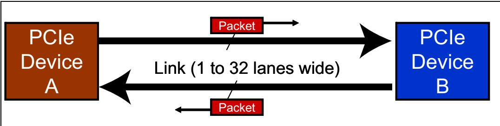

<table>
<tr>
<td width="50%">
The term for this path between the devices is a Link, and is made up of one or more transmit and receive pairs. One such pair is called a Lane, and the spec allows a Link to be made up 1, 2, 4, 8, 12, 16, or 32 Lanes. The number of lanes is called the Link Width and is represented as x1, x2, x4, x8, x16, and x32. The trade-off regarding the number of lanes to be used in a given design is straightforward: more lanes increase the bandwidth of the Link but add to its cost, space requirement, and power consumption. For more on this, see "Links and Lanes" on page 46.
</td>
<td width="50%" style="background-color:#e8e8e8">
设备之间这条通路的术语是链路（Link），它由一个或多个发送/接收对组成。每一对这样的发送/接收对称为一个通道（Lane），规范允许链路由 1、2、4、8、12、16 或 32 个通道构成。通道数量称为链路宽度（Link Width），表示为 x1、x2、x4、x8、x16 和 x32。在给定设计中关于使用多少通道的权衡是直接的：更多的通道会增加链路的带宽，但也会增加成本、空间需求和功耗。更多相关内容，请参见第 46 页的"链路与通道"。
</td>
</tr>
</table>

Figure 2-2: One Lane | 图2-2：一条通道

## Software Backward Compatibility | 软件向后兼容性

<table>
<tr>
<td width="50%">
One of the most important design goals for PCIe was backward compatibility with PCI software. Encouraging migration away from a design that is already installed and working in existing systems requires two things: First, a compelling improvement that motivates even considering a change and, second, minimizing the cost, risk, and effort of changing. A common way to help this second factor in computers is to maintain the viability of software written for the old model in the new one. To achieve this for PCIe, all the address spaces used for PCI are carried forward either unchanged or simply extended. Memory, IO, and Configuration spaces are still visible to software and programmed in exactly the same way they were before. Consequently, software written years ago for PCI (BIOS code, device drivers, etc.) will still work with PCIe devices today. The configuration space has been extended dramatically to include many new registers to support new functionality, but the old registers are still there and still accessible in the regular way (see "Software Compatibility Characteristics" on page 49).
</td>
<td width="50%" style="background-color:#e8e8e8">
PCIe 最重要的设计目标之一是与 PCI 软件的向后兼容性。要促使人们从已在现有系统中安装并正常工作的设计迁移出去，需要两个条件：第一，提供令人信服的改进，让人有理由考虑变更；第二，将变更的成本、风险和投入降至最低。在计算机领域，有助于满足第二个条件的常见做法是，在新模型中保持为旧模型所编写的软件的可用性。为实现 PCIe 的这一目标，PCI 所使用的所有地址空间均被继承下来，要么保持不变，要么仅做简单扩展。存储器空间、IO 空间和配置空间对软件来说仍然可见，并且其编程方式与此前完全相同。因此，多年前为 PCI 编写的软件（BIOS 代码、设备驱动程序等）至今仍能在 PCIe 设备上正常工作。配置空间已经大幅扩展，包含了大量支持新功能的新寄存器，但原有的寄存器依然存在，并且仍然可以通过常规方式访问（参见第 49 页的"软件兼容性特性"）。
</td>
</tr>
</table>

<table>
<tr>
<td width="50%">
Serial Transport
</td>
<td width="50%" style="background-color:#e8e8e8">
串行传输
</td>
</tr>
</table>

## The Need for Speed | 速度需求

<table>
<tr>
<td width="50%">
Of course, a serial model must run much faster than a parallel design to accomplish the same bandwidth because it may only send one bit at a time. This has not proven difficult, though, and in the past PCIe has worked reliably at 2.5 GT/s and 5.0 GT/s. The reason these and still higher speeds (8 GT/s) are attainable is that the serial model overcomes the shortcomings of the parallel model.
</td>
<td width="50%" style="background-color:#e8e8e8">
当然，串行模型必须以比并行设计快得多的速度运行才能达到相同的带宽，因为它每次只能发送一个比特。不过，这已被证明并非难事，而且过去PCIe已能可靠地工作在2.5 GT/s和5.0 GT/s的速率下。这些速率以及更高速度（8 GT/s）之所以能够实现，是因为串行模型克服了并行模型的缺点。
</td>
</tr>
<tr>
<td width="50%">
Overcoming Problems. By way of review, there are a handful of problems that limit the performance of a parallel bus and three are illustrated in Figure 2-3 on page 42. To get started, recall that parallel buses use a common clock; outputs are clocked out on one clock edge and clocked into the receiver on the next edge. One issue with this model is the time it takes to send a signal from transmitter to receiver, called the flight time. The flight time must be less than the clock period or the model won't work, so going to smaller clock periods is challenging. To make this possible, traces must get shorter and loads reduced but eventually this becomes impractical. Another factor is the difference in the arrival time of the clock at the sender and receiver, called clock skew. Board layout designers work hard to minimize this value because it detracts from the timing budget but it can never be eliminated. A third factor is signal skew, which is
</td>
<td width="50%" style="background-color:#e8e8e8">
克服问题。回顾一下，有若干问题限制了并行总线的性能，其中三个问题在图2-3（第42页）中做了说明。首先，回想一下并行总线使用公共时钟；输出在一个时钟沿上被送出，接收器在下一个时钟沿进行采样。这种模型的一个问题是信号从发送器传输到接收器所需的时间，称为传播时延(flight time)。传播时延必须小于时钟周期，否则该模型将无法工作，因此缩短时钟周期极具挑战。为了使其可行，走线必须更短，负载必须减小，但这最终会变得不切实际。另一个因素是时钟到达发送器和接收器的时间差，称为时钟偏差(clock skew)。板级布局设计人员努力将此值降至最低，因为它会侵蚀时序预算，但始终无法完全消除。第三个因素是信号偏差(signal skew),即
</td>
</tr>
</table>

## PCI Express Technology | PCI Express 技术

<table>
<tr>
<td width="50%">
the difference in arrival times for all the signals needed on a given clock. Clearly, the data can't be latched until all the bits are ready and stable, so we end up waiting for the slowest one.
< | td>
<td width="50%" style="background-color:#e8e8e8">
给定时钟下所有信号到达时间的差异。显然，在所有比特位就绪并稳定之前，数据无法被锁存，因此我们最终不得不等待最慢的那一个。
</td>
</tr>
</table>

Figure 2-3: Parallel Bus Limitations | 图2-3：并行总线限制
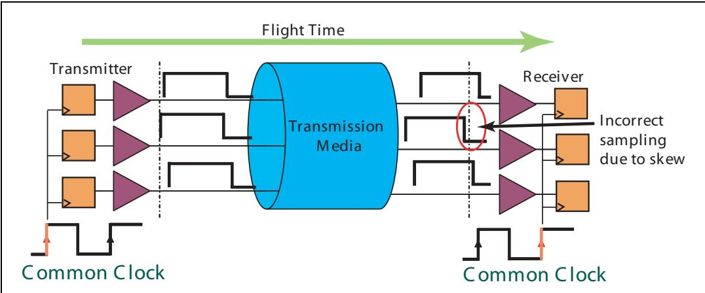

<table>
<tr>
<td width="50%">
How does a serial transport like PCIe get around these problems? First, flight time becomes a non-issue because the clock that will latch the data into the receiver is actually built into the data stream and no external reference clock is necessary. As a result, it doesn't matter how small the clock period is or how long it takes the signal to arrive at the receiver because the clock arrives with it at the same time. For the same reason there's no clock skew, again because the latching clock is recovered from the data stream. Finally, signal skew is eliminated within a Lane because there's only one data bit being sent. The signal skew problem returns if a multi-lane design is used, but the receiver corrects for this automatically and can fix a generous amount of skew. Although serial designs overcome many of the problems of parallel models, they have their own set of complications. Still, as we'll see later, the solutions are manageable and allow for high-speed, reliable communication.
</td>
<td width="50%" style="background-color:#e8e8e8">
像 PCIe 这样的串行传输如何规避这些问题？首先，飞行时间不再成为问题，因为将数据锁存到接收器中的时钟实际上已内嵌于数据流中，无需外部参考时钟。因此，时钟周期有多小、信号到达接收器需要多长时间都无关紧要，因为时钟与数据同时到达。同理，不存在时钟偏差，同样因为锁存时钟是从数据流中恢复的。最后，在一条通道（Lane）内部，信号偏差（signal skew）被消除，因为一次只发送一个数据比特。如果采用多通道设计，信号偏差问题会重新出现，但接收器会自动纠正，并且能够修正相当大的偏差量。尽管串行设计克服了并行模型的许多问题，但它们自身也有一套复杂性。不过，我们稍后会看到，这些解决方案是可控的，并且能够实现高速、可靠的通信。
</td>
</tr>
<tr>
<td width="50%">
Bandwidth. The combination of high speed and wide Links that PCIe supports can result in some impressive bandwidth numbers, as shown in Table 2-1 on page 43. These numbers are derived from the bit rate and bus characteristics. One such characteristic is that, like many other serial transports, the first two generations of PCIe use an encoding process called 8b/10b that generates a 10-bit output based on an 8-bit input. In spite of the overhead this introduces, there are several good reasons for doing it as we'll see later. For now it's enough to
</td>
<td width="50%" style="background-color:#e8e8e8">
带宽。PCIe 所支持的高速度与宽链路相结合，能够产生令人印象深刻的带宽数值，如第 43 页表 2-1 所示。这些数值源自比特率和总线特性。其中一个特性是，与许多其他串行传输一样，PCIe 的前两代使用一种称为 8b/10b 的编码过程，该过程基于 8 比特输入生成 10 比特输出。尽管这会引入开销，但正如我们稍后将看到的，这样做有几个充分的理由。目前只需知道这些就足够了。
</td>
</tr>
</table>

## Chapter 2: PCIe Architecture Overview | 第2章：PCIe 架构概述

<table>
<tr>
<td width="50%">
know that sending one byte of data requires transmitting 10 bits. The first generation (Gen1 or PCIe spec version 1.x) bit rate is 2.5 GT/s and dividing that by 10 means that one lane will be able to send 0.25 GB/s. Since the Link permits sending and receiving at the same time, the aggregate bandwidth can be twice that amount, or 0.5 GB/s per Lane. Doubling the frequency for the second generation (Gen2 or PCIe 2.x) doubled the bandwidth. The third generation (Gen3 or PCIe 3.0) doubles the bandwidth yet again, but this time the spec writers chose not to double the frequency. Instead, for reasons we'll discuss later, they chose to increase the frequency only to 8 GT/s and remove the 8b/10b encoding in favor of another encoding mechanism called 128b/130b encoding (for more on this, see the chapter "Physical Layer — Logical (Gen3)" on page 407). Table 2‑1 summarizes the bandwidth available for all the current possible combinations and shows the peak throughput the Link could deliver in that configuration.
</td>
<td width="50%" style="background-color:#e8e8e8">
知道发送一个字节的数据需要传输10个比特。第一代（Gen1 或 PCIe 规范版本 1.x）比特率为 2.5 GT/s，除以 10 意味着一条通道能够发送 0.25 GB/s。由于链路允许同时发送和接收，因此总带宽可以是该值的两倍，即每条通道 0.5 GB/s。将频率翻倍用于第二代（Gen2 或 PCIe 2.x）则使带宽翻倍。第三代（Gen3 或 PCIe 3.0）再次将带宽翻倍，但这次规范编写者选择不将频率翻倍。取而代之的是，出于我们稍后将讨论的原因，他们选择仅将频率提高到 8 GT/s，并移除 8b/10b 编码，转而采用另一种称为 128b/130b 编码的编码机制（更多内容请参阅第 407 页的"物理层 — 逻辑层（Gen3）"章节）。表 2‑1 总结了当前所有可能组合的可用带宽，并显示了链路在这些配置下可提供的峰值吞吐量。
</td>
</tr>
</table>

Table 2‑1: PCIe Aggregate Gen1, Gen2 and Gen3 Bandwidth for Various Link Widths | 表2‑1：各种链路宽度的PCIe Gen1、Gen2和Gen3聚合带宽

<table><tr><td>Link Width</td><td>x1</td><td>x2</td><td>x4</td><td>x8</td><td>x12</td><td>x16</td><td>x32</td></tr><tr><td>Gen1 Bandwidth (GB /s)</td><td>0.5</td><td>1</td><td>2</td><td>4</td><td>6</td><td>8</td><td>16</td></tr><tr><td>Gen2 Bandwidth (GB/s)</td><td>1</td><td>2</td><td>4</td><td>8</td><td>12</td><td>16</td><td>32</td></tr><tr><td>Gen3 Bandwidth (GB/s)</td><td>2</td><td>4</td><td>8</td><td>16</td><td>24</td><td>32</td><td>64</td></tr></table>

## PCIe Bandwidth Calculation | PCIe 带宽计算

<table>
<tr>
<td width="50%">
To calculate the bandwidth numbers included in the table above, see the calculations outlined below.
</td>
<td width="50%" style="background-color:#e8e8e8">
要计算上表中包含的带宽数值，请参见下面列出的计算过程。
</td>
</tr>
<tr>
<td width="50%">
Gen1 PCIe Bandwidth = (2.5 Gb/s x 2 directions) / 10 bits per symbol = 0.5 GB/s.
</td>
<td width="50%" style="background-color:#e8e8e8">
Gen1 PCIe 带宽 = (2.5 Gb/s x 2 个方向) / 10 比特每符号 = 0.5 GB/s。
</td>
</tr>
<tr>
<td width="50%">
Gen2 PCIe Bandwidth = (5.0 Gb/s x 2 directions) / 10 bits per symbol = 1.0 GB/s.
</td>
<td width="50%" style="background-color:#e8e8e8">
Gen2 PCIe 带宽 = (5.0 Gb/s x 2 个方向) / 10 比特每符号 = 1.0 GB/s。
</td>
</tr>
<tr>
<td width="50%">
Note that in the above calculations, we divide by 10 bits per symbol not 8 bits per byte, because both Gen1 and Gen2 protocols require packet bytes to be encoded using 8b/10b encoding schemes before packet transmission.
</td>
<td width="50%" style="background-color:#e8e8e8">
请注意，在上述计算中，我们除以的是 10 比特每符号而非 8 比特每字节，这是因为 Gen1 和 Gen2 协议都要求数据包字节在发送之前必须使用 8b/10b 编码方案进行编码。
</td>
</tr>
</table>

## PCI Express Technology | PCI Express 技术

<table>
<tr>
<td width="50%">
Gen3 PCIe Bandwidth = (8.0 Gb/s x 2 directions) / 8 bits per byte = 2.0 GB/s.
</td>
<td width="50%" style="background-color:#e8e8e8">
Gen3 PCIe 带宽 = (8.0 Gb/s x 2 个方向) / 8 bits/byte = 2.0 GB/s。
</td>
</tr>
<tr>
<td width="50%">
Note that at Gen3 speed, we divide by 8 bits per byte not by 10 bits per symbol because at Gen3 speed, packets are NOT 8b/10b encoded, rather they are 128b/130b encoded. There is an addition 2 bit overhead every 128 bits, but it is not large enough to account for in the calculation.
</td>
<td width="50%" style="background-color:#e8e8e8">
请注意，在 Gen3 速率下，我们除以 8 bits/byte 而非 10 bits/symbol，因为在 Gen3 速率下，数据包不再采用 8b/10b 编码，而是采用 128b/130b 编码。每 128 位额外有 2 位的开销，但这一开销很小，在计算中可忽略不计。
</td>
</tr>
<tr>
<td width="50%">
These 3 calculated bandwidth numbers are multiplied by Link width to result in total Link bandwidth on multi‑Lane Links.
</td>
<td width="50%" style="background-color:#e8e8e8">
以上三种计算得出的带宽数值再乘以链路宽度，即可得到多通道链路的总链路带宽。
</td>
</tr>
</table>

## Differential Signals | 差分信号

<table>
<tr>
<td width="50%">
Each Lane uses differential signaling, sending both a positive and negative version (D+ and D-) of the same signal as shown in Figure 2-4 on page 44. This doubles the pin count, of course, but that's offset by two clear advantages over single-ended signaling that are important for high speed signals: improved noise immunity and reduced signal voltage.
</td>
<td width="50%" style="background-color:#e8e8e8">
每个通道采用差分信号，同时发送同一信号的正相和反相版本（D+ 和 D-），如图 2-4（第 44 页）所示。这当然会使引脚数量翻倍，但相比单端信号，它有两个明显的优势，这对高速信号至关重要：提高的抗噪声能力和降低的信号电压。
</td>
</tr>
<tr>
<td width="50%">
The differential receiver gets both signals and subtracts the negative voltage from the positive one to find the difference between them and determine the value of the bit. Noise immunity is built in to the differential design because the paired signals are on adjacent pins of each device and their traces must also be routed very near each other to maintain the proper transmission line impedance. Consequently, anything that affects one signal will also affect the other by about the same amount and in the same direction. The receiver is looking at the difference between them and the noise doesn't really change that difference, so the result is that most noise affecting the signals doesn't affect the receiver's ability to accurately distinguish the bits.
</td>
<td width="50%" style="background-color:#e8e8e8">
差分接收器获取两个信号，并从正相信号电压中减去反相信号电压，以求出它们之间的差值，从而确定比特值。差分设计内置了抗噪声能力，因为这对信号位于每个设备的相邻引脚上，并且它们的走线也必须彼此非常靠近来布线，以保持适当的传输线阻抗。因此，影响其中一个信号的任何因素也会以大致相同的幅度和相同的方向影响另一个信号。接收器关注的是两者之间的差值，而噪声实际上并不改变该差值，因此结果是，影响信号的大多数噪声并不会影响接收器准确区分比特的能力。
</td>
</tr>
</table>

Figure 2-4: Differential Signaling | 图2-4：差分信令
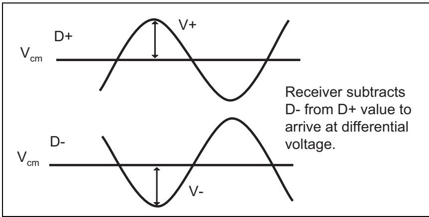

## No Common Clock | 无需公共时钟

<table>
<tr>
<td width="50%">
As mentioned earlier, a common clock is not required for a PCIe Link because it uses a source‑synchronous model, meaning the transmitter supplies the clock to the receiver to use in latching the incoming data. A PCIe Link does not include a forwarded clock. Instead, the transmitter embeds the clock into the data stream using 8b/10b encoding. The receiver then recovers the clock from the data stream and uses it to latch the incoming data. As mysterious as this might sound, the process by which this is done is actually fairly straightforward. In the receiver, a PLL circuit (Phase‑Locked Loop, see Figure 2‑5 on page 45) takes the incoming bit stream as a reference clock and compares its timing, or phase, to that of an output clock that it has created with a specified frequency. Based on the result of that comparison, the output clock's frequency is increased or decreased until a match is obtained. At that point the PLL is said to be locked, and the output (recovered) clock frequency precisely matches the clock that was used to transmit the data. The PLL continually adjusts the recovered clock, so changes in temperature or voltage that affect the transmitter clock frequency will always be quickly compensated.
</td>
<td width="50%" style="background-color:#e8e8e8">
如前所述，PCIe链路不需要公共时钟，因为它采用源同步模型，即发送端向接收端提供时钟以用于锁存输入数据。PCIe链路不包含前传时钟。相反，发送端使用8b/10b编码将时钟嵌入数据流中。接收端随后从数据流中恢复时钟，并用其锁存输入数据。尽管这听起来可能很神秘，但其实现过程实际上相当直接。在接收端中，PLL电路（锁相环，见图2-5，第45页）将输入的比特流作为参考时钟，并将其时序（即相位）与自身产生的具有指定频率的输出时钟进行比较。基于比较结果，输出时钟的频率会相应地升高或降低，直到获得匹配。此时PLL被称为已锁定，输出（恢复）时钟的频率与用于发送数据的时钟精确匹配。PLL持续调整恢复时钟，因此影响发送端时钟频率的温度或电压变化始终会被迅速补偿。
</td>
</tr>
<tr>
<td width="50%">
One thing to note regarding clock recovery is that the PLL does need transitions on the input in order to make its phase comparison. If a long time goes by without any transitions in the data, the PLL could begin to drift away from the correct frequency. To prevent that problem, one of the design goals of 8b/10b encoding is ensure no more than 5 consecutive ones or zeroes in a bit‑stream (to learn more on this, refer to "8b/10b Encoding" on page 380).
</td>
<td width="50%" style="background-color:#e8e8e8">
关于时钟恢复需要注意的一点是，PLL确实需要输入信号上有跳变才能进行相位比较。如果长时间没有数据跳变，PLL可能会开始偏离正确的频率。为了防止这一问题，8b/10b编码的设计目标之一就是确保比特流中不会出现超过5个连续的1或0（要了解更多相关内容，请参阅第380页的"8b/10b编码"）。
</td>
</tr>
</table>

Figure 2‑5: Simple PLL Block Diagram | 图2‑5：简单PLL框图
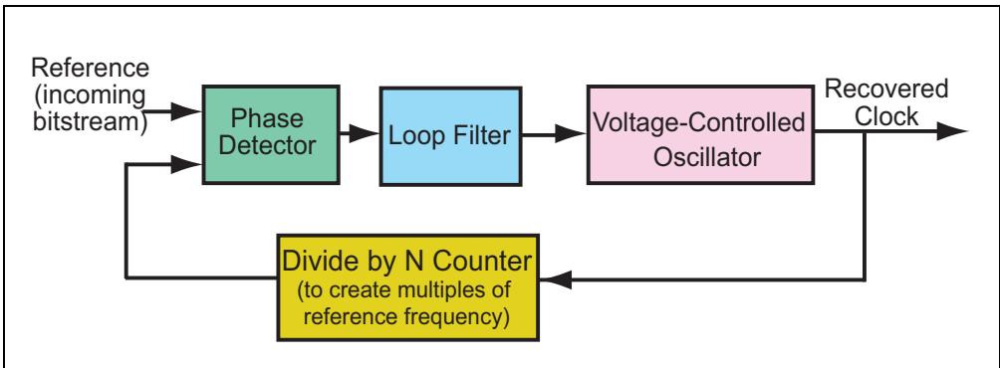

<table>
<tr>
<td width="50%">
Once the clock has been recovered it's used to latch the bits of the incoming data stream into the deserializer. Sometimes students wonder whether this recovered clock can be used to clock all the logic in the receiver, but it turns out that the answer is no. One reason is that a receiver can't count on this reference always being present, because low power states on the Link involve stopping data transmission. Consequently, the receiver must also have it's own internal clock that can be locally generated.
</td>
<td width="50%" style="background-color:#e8e8e8">
时钟一旦被恢复，便用于将输入数据流的比特锁存到解串器中。有时学生会想知道这个恢复时钟是否可用于驱动接收端中的所有逻辑，但答案是否定的。一个原因是接收端不能依赖该参考时钟始终存在，因为链路上的低功耗状态会涉及停止数据传输。因此，接收端还必须拥有自身可本地产生的内部时钟。
</td>
</tr>
</table>

## Packet-based Protocol | 基于数据包的协议

<table>
<tr>
<td width="50%">
Moving from a parallel to a serial transport greatly reduces the pins needed to carry data. PCIe, like most other serial‑based protocols, also reduces pin count by eliminating most side‑band control signals typically found in parallel buses. However, if there are no control signals indicating the type of information being received, how can the receiver interpret the incoming bits? All transactions in PCIe are sent in defined structures called packets. The receiver finds the packet boundaries and, knowing the pattern to expect, decodes the packet structure to determine what it should do.
</td>
<td width="50%" style="background-color:#e8e8e8">
从并行传输转向串行传输极大地减少了传输数据所需的引脚数量。与其他大多数基于串行的协议一样，PCIe 也通过消除并行总线中常见的多数边带控制信号来减少引脚数。然而，如果没有控制信号来指示所接收信息的类型，接收端又该如何解读传入的比特流呢？PCIe 中的所有事务都以称为数据包（packet）的已定义结构进行发送。接收端找到数据包边界，并根据预知的格式模式，解码数据包结构以确定应采取的操作。
</td>
</tr>
<tr>
<td width="50%">
The details of the packet‑based protocol are covered in the chapter called "TLP Elements" on page 169, but an overview of the various packet types and their uses can be found in this chapter; see "Data Link Layer" on page 72.
</td>
<td width="50%" style="background-color:#e8e8e8">
基于数据包的协议的详细信息将在第 169 页的"TLP 要素"一章中介绍，但各类数据包类型及其用途的概述可在本章中找到；请参阅第 72 页的"数据链路层"。
</td>
</tr>
</table>

## Links and Lanes | 链路与通道

<table>
<tr>
<td width="50%">
As mentioned earlier, a physical connection between two PCIe devices is called a Link and is made up of one or more Lanes. Each Lane consists of a differential send and receive signal pair, as shown in Figure 2‐2 on page 40. One lane is sufficient for all communications between devices and no other signals are required.
</td>
<td width="50%" style="background-color:#e8e8e8">
如前所述，两个 PCIe 设备之间的物理连接称为链路 (Link)，由一条或多条通道 (Lane) 组成。每条通道由一对差分发送和接收信号对组成，如第 40 页图 2-2 所示。一条通道即足以满足设备之间的所有通信需求，且无需其他信号。
</td>
</tr>
</table>

## Scalable Performance | 可扩展性能

<table>
<tr>
<td width="50%">
However, using more Lanes will increase the performance of a Link, which depends on its speed and Link width. For example, using multiple Lanes increases the number of bits that can be sent with each clock and thus improves the bandwidth. As noted earlier in Table 2-1 on page 43, the number of Lanes supported by the spec includes powers of 2 up to 32 Lanes. A x12 Link is also supported, which may have been intended to support the x12 Link width used by InfiniBand, an earlier serial design. Allowing a variety of Link widths permits a platform designer to make the appropriate trade-off between cost and performance, easily scaling up or down based on the number of Lanes.
</td>
<td width="50%" style="background-color:#e8e8e8">
然而，使用更多通道会提高链路的性能，链路性能取决于其速率和链路宽度。例如，使用多条通道可增加每个时钟周期能发送的比特数，从而提升带宽。如之前在表2-1（第43页）中所述，规范支持的通道数包括2的幂次，最高可达32条通道。规范也支持x12链路，这可能是为了兼容InfiniBand（一种较早的串行设计）所使用的x12链路宽度。允许使用多种链路宽度使平台设计者能够在成本与性能之间做出适当的权衡，并可根据通道数量轻松地进行扩展或缩减。
</td>
</tr>
</table>

<table>
<tr>
<td width="50%">
Flexible Topology Options
</td>
<td width="50%" style="background-color:#e8e8e8">
灵活的拓扑选项
</td>
</tr>
<tr>
<td width="50%">
A Link must be a point-to-point connection, rather than a shared bus like PCI, because of the very high speeds it uses. Since a Link can therefore only connect two interfaces, a means for fanning out the connections is needed for building a non-trivial system. This is accomplished in PCIe with the use of Switches and Bridges, which allow flexibility in constructing the system topology — the set of connections between the elements in the system. Definitions of the elements in a system and some topology examples are given in the following section.
</td>
<td width="50%" style="background-color:#e8e8e8">
链路必须是点对点连接，而不能像PCI那样采用共享总线，因为PCIe所使用的速率非常高。由于一条链路因此只能连接两个接口，所以构建一个有实际意义的系统就需要一种将连接扇出的方法。这在PCIe中是通过使用交换机和桥来实现的，它们提供了构建系统拓扑（即系统中各元素之间的连接集合）的灵活性。下文将给出系统元素的定义以及一些拓扑示例。
</td>
</tr>
</table>

## Some Definitions | 一些定义

<table>
<tr>
<td width="50%">
A simple PCIe topology example is shown in Figure 2-6 on page 47, and will help illustrate some definitions at this point.
</td>
<td width="50%" style="background-color:#e8e8e8">
图2-6（第47页）展示了一个简单的PCIe拓扑示例，这将有助于说明此处的一些定义。
</td>
</tr>
</table>

Figure 2-6: Example PCIe Topology | 图2-6：PCIe拓扑示例
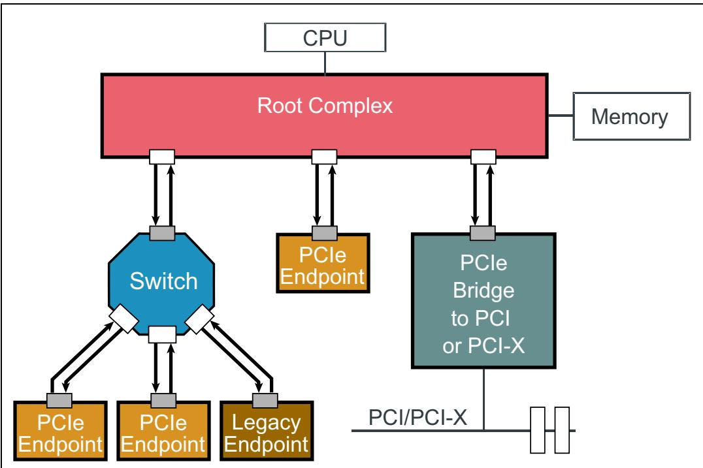

## Topology Characteristics | 拓扑特性

<table>
<tr>
<td width="50%">
At the top of the diagram is a CPU. The point to make here is that the CPU is considered the top of the PCIe hierarchy. Just like PCI, only simple tree structures are permitted for PCIe, meaning no loops or other complex topologies are allowed. That's done to maintain backward compatibility with PCI software, which used a simple configuration scheme to track the topology and did not support complex environments.
</td>
<td width="50%" style="background-color:#e8e8e8">
图中顶部是一个CPU。此处需要说明的是，CPU被视为PCIe层次结构的顶部。与PCI一样，PCIe仅允许简单的树形结构，即不允许环路或其他复杂的拓扑结构。这样做是为了保持与PCI软件的后向兼容性，因为PCI软件使用简单的配置方案来跟踪拓扑结构，不支持复杂的环境。
</td>
</tr>
<tr>
<td width="50%">
To maintain that compatibility, software must be able to generate configuration cycles in the same way as before and the bus topology must appear the same as it did before. Consequently, all the configurations registers software expects to find are still there and behave in the same way they always have. We'll come back to this discussion a little later, after we've had a chance to define some more terms.
</td>
<td width="50%" style="background-color:#e8e8e8">
为了保持这种兼容性，软件必须能够以与之前相同的方式生成配置周期，并且总线拓扑结构必须看起来与之前相同。因此，软件期望找到的所有配置寄存器仍然存在，并且其行为方式与以往完全一样。我们将在稍后定义更多术语之后，再回到这个讨论。
</td>
</tr>
</table>

## Root Complex | 根复合体

<table>
<tr>
<td width="50%">
The interface between the CPU and the PCIe buses may contain several components (processor interface, DRAM interface, etc.) and possibly even several chips. Collectively, this group is referred to as the Root Complex (RC or Root). The RC resides at the "root" of the PCI inverted tree topology and acts on behalf of the CPU to communicate with the rest of the system. The spec does not carefully define it, though, giving instead a list of required and optional functionality. In broad terms, the Root Complex can be understood as the interface between the system CPU and the PCIe topology, with PCIe Ports labeled as "Root Ports" in configuration space.
</td>
<td width="50%" style="background-color:#e8e8e8">
CPU 与 PCIe 总线之间的接口可能包含多个组件（处理器接口、DRAM 接口等），甚至可能包含多个芯片。这一组件的集合统称为根复合体（Root Complex，简称 RC 或 Root）。RC 位于 PCI 倒置树形拓扑的"根部"，代表 CPU 与系统的其余部分进行通信。不过，规范并未对其进行精确定义，而是给出了一份必需功能和可选功能的列表。广义上讲，根复合体可以理解为系统 CPU 与 PCIe 拓扑之间的接口，其在配置空间中被标记为"根端口"(Root Ports)的 PCIe 端口即隶属于此。
</td>
</tr>
</table>

## Switches and Bridges | 交换机与桥

<table>
<tr>
<td width="50%">
Switches provide a fanout or aggregation capability and allow more devices to be attached to a single PCIe Port. They act as packet routers and recognize which path a given packet will need to take based on its address or other routing information.
</td>
<td width="50%" style="background-color:#e8e8e8">
交换机提供扇出或汇聚能力，允许将更多设备连接到一个单一的 PCIe 端口。它们充当数据包路由器，根据数据包的地址或其他路由信息识别给定数据包需要采取的路径。
</td>
</tr>
<tr>
<td width="50%">
Bridges provide an interface to other buses, such as PCI or PCI‑X, or even another PCIe bus. The bridge shown in the "Example PCIe Topology" on page 47 is sometimes called a "forward bridge" and allows an older PCI or PCI‑X card to be plugged into a new system. The opposite type or "reverse bridge" allows a new PCIe card to be plugged into an old PCI system.
</td>
<td width="50%" style="background-color:#e8e8e8">
桥提供与其他总线（例如 PCI 或 PCI‑X，甚至是另一个 PCIe 总线）的接口。第 47 页"示例 PCIe 拓扑"中所示的桥有时被称为"前向桥"，允许将较旧的 PCI 或 PCI‑X 卡插入新系统中。相反的类型或"反向桥"允许将新的 PCIe 卡插入旧的 PCI 系统中。
</td>
</tr>
</table>

## Native PCIe Endpoints and Legacy PCIe Endpoints | 原生PCIe端点与传统PCIe端点

<table>
<tr>
<td width="50%">
Endpoints are devices in a PCIe topology that are not Switches or bridges and act as initiators and Completers of transactions on the bus. They reside at the bottom of the branches of the tree topology and only implement a single Upstream Port (facing toward the Root). By comparison, a Switch may have several Downstream Ports but can only have one Upstream Port. Devices that were designed for the operation of an older bus like PCI-X but now have a PCIe interface designate themselves as "Legacy PCIe Endpoints" in a configuration register and this topology includes one. They make use of things that are prohibited in newer PCIe designs, such as IO space and support for IO transactions or Locked requests. In contrast, "Native PCIe Endpoints" would be PCIe devices designed from scratch as opposed to adding a PCIe interface to old PCI device designs. Native PCIe Endpoints device are memory mapped devices (MMIO devices).
</td>
<td width="50%" style="background-color:#e8e8e8">
端点是PCIe拓扑中非交换机或桥的设备，充当总线上事务的发起者和完成者。它们位于树形拓扑分支的最底层，仅实现一个上游端口（朝向根复合体）。相比之下，交换机可以有多个下游端口，但只能有一个上游端口。为PCI-X等旧总线运行而设计但现在具有PCIe接口的设备，在配置寄存器中将自身标识为"传统PCIe端点"，并且这种拓扑包含此类设备。它们使用在新式PCIe设计中已被禁止的功能，例如IO空间以及对IO事务或锁定请求的支持。相比之下，"原生PCIe端点"是从零开始设计的PCIe设备，而非在旧PCI设备设计基础上添加PCIe接口。原生PCIe端点是内存映射设备（MMIO设备）。
</td>
</tr>
</table>

## Software Compatibility Characteristics | 软件兼容性特性

<table>
<tr>
<td width="50%">
One way compatibility with older software is maintained is that the configuration headers for Endpoints and bridges, shown in Figure 2-7 on page 50, are unchanged from PCI. One difference now is that bridges are often aggregated into Switches and Roots, but legacy software is unaware of that distinction and will still simply see them as bridges. At this point we just want to get familiar with the concepts, so we won't get into the details of the registers here. An introduction to the rather large topic of configuration can be found in "Configuration Overview" on page 85.
</td>
<td width="50%" style="background-color:#e8e8e8">
保持与旧软件兼容的一种方式是，端点与桥的配置头（见第50页图2-7）与PCI保持不变。现在的一个区别是，桥通常被聚合到交换机和根复合体中，但遗留软件无法感知这种区别，仍然会简单地将它们视为桥。在这一点上我们只是想熟悉这些概念，因此这里不会深入讨论寄存器的细节。关于配置这个庞大主题的介绍，可参见第85页的"配置概述"。
</td>
</tr>
</table>

Figure 2-7: Configuration Headers | 图2-7：配置头

<table>
<tr>
<td width="50%">
To illustrate the way the system appears to software, consider the example topology shown in Figure 2-8 on page 51. As before, the Root resides at the top of the hierarchy. The Root can be quite complex internally, but it will usually implement an internal bus structure and several bridges to fan out the topology to several ports. That internal bus will appear to configuration software as PCI bus number zero and the PCIe Ports will appear as PCI-to-PCI bridges. This internal structure is not likely to be an actual PCI bus, but it will appear that way to software for this purpose. Since this bus is internal to the Root, its actual logical design doesn't have to conform to any standard and can be vendor specific.
</td>
<td width="50%" style="background-color:#e8e8e8">
为了说明系统呈现给软件的方式，请考虑第51页图2-8所示的示例拓扑。与前面一样，根复合体位于层次结构的顶端。根复合体内部可以相当复杂，但它通常会实现一个内部总线结构和若干个桥，以将拓扑扇出到多个端口。该内部总线对配置软件而言将显示为PCI总线号0，而PCIe端口将显示为PCI-to-PCI桥。这种内部结构不太可能是实际的PCI总线，但为此目的它会以这种方式呈现给软件。由于该总线位于根复合体内部，其实际的逻辑设计不必遵循任何标准，可以是供应商特定的。
</td>
</tr>
</table>

Figure 2-8: Topology Example | 图2-8：拓扑示例

<table>
<tr>
<td width="50%">
In a similar way, the internal organization of a Switch, shown in Figure 2-9 on page 52, will appear to software as simply a collection of bridges sharing a common bus. A major advantage of this approach is that it allows transaction routing to take place in the same way it did for PCI. Enumeration, the process by which configuration software discovers the system topology and assigns bus numbers and system resources, works the same way, too. We'll see some examples of how enumeration works later, but once it's been completed the bus numbers in the system will have all been assigned in a manner like that shown in Figure 2-9 on page 52.
</td>
<td width="50%" style="background-color:#e8e8e8">
类似地，交换机（Switch）的内部组织结构（见第52页图2-9）对软件而言将简单地显示为共享一条公共总线的一组桥的集合。这种方法的一个主要优势是，它允许事务路由以与PCI相同的方式进行。枚举（Enumeration）—— 即配置软件发现系统拓扑并分配总线号和系统资源的过程 —— 也以同样的方式工作。我们稍后将看到一些关于枚举如何工作的示例，但一旦枚举完成，系统中的总线号将全部按照类似第52页图2-9所示的方式进行分配。
</td>
</tr>
</table>

Figure 2-9: Example Results of System Enumeration | 图2-9：系统枚举结果示例

## System Examples | 系统示例

<table>
<tr>
<td width="50%">
Figure 2-10 on page 53 illustrates an example of a PCIe-based system designed for a low-cost application like a consumer desktop machine. A few PCIe Ports are implemented, along with a few add-in cards slots, but the basic architecture doesn't differ much from the old-style PCI system.
</td>
<td width="50%" style="background-color:#e8e8e8">
第53页的图2-10展示了一个为低成本应用（如消费级台式机）设计的PCIe系统示例。系统中实现了少数几个PCIe端口以及少量插卡插槽，但其基本架构与旧式PCI系统并无太大差异。
</td>
</tr>
<tr>
<td width="50%">
By contrast, the high-end server system shown in Figure 2-11 on page 54 shows other networking interfaces built into the system. In the early days of PCIe some thought was given to making it capable of operating as a network that could replace those older models. After all, if PCIe is basically a simplified version of other networking protocols, couldn't it fill all the needs? For a variety of reasons, this concept never really achieved much momentum and PCIe-based systems still generally connect to external networks using other transports.
</td>
<td width="50%" style="background-color:#e8e8e8">
相比之下，第54页图2-11所示的高端服务器系统展示了内置于系统中的其他网络接口。在PCIe的早期，人们曾考虑使其能够作为一种网络来运行，以取代那些旧有的模式。毕竟，如果PCIe本质上是其他网络协议的简化版，它难道不能满足所有需求吗？出于各种原因，这一概念从未真正获得太大动力，基于PCIe的系统至今仍普遍使用其他传输方式连接到外部网络。
</td>
</tr>
<tr>
<td width="50%">
This also gives us an opportunity to revisit the question of what constitutes the Root Complex. In this example, the block labeled as "Intel Processor" contains a number of components, as is true of most modern CPU architectures. This one includes a x16 PCIe Port for access to graphics, and 2 DRAM channels, which means the memory controller and some routing logic has been integrated into the CPU package. Collectively, these resources are often called the "Uncore" logic to distinguish them from the several CPU cores and their associated logic in the package. Since we previously described the Root as being the interface between the CPU and the PCIe topology, that means that part of the Root must be inside the CPU package. As shown by the dashed line in Figure 2-11 on page 54, the Root here consists of part of several packages. This will likely be the case for many future system designs.
</td>
<td width="50%" style="background-color:#e8e8e8">
这也给了我们一个机会来重新审视什么构成了根复合体（Root Complex）这个问题。在本示例中，标记为"Intel Processor"的模块包含了多个组件，正如大多数现代CPU架构一样。该处理器包含一个用于图形访问的x16 PCIe端口和2个DRAM通道，这意味着存储器控制器和一些路由逻辑已被集成到CPU封装中。这些资源统称为"Uncore"逻辑，以区别于封装中的若干个CPU核心及其关联逻辑。既然我们之前将根复合体描述为CPU与PCIe拓扑之间的接口，这就意味着根复合体的一部分必须位于CPU封装内部。正如第54页图2-11中的虚线所示，此处的根复合体由多个封装的部分组成。这很可能是未来许多系统设计的常态。
</td>
</tr>
</table>

Figure 2-10: Low-Cost PCIe System | 图2-10：低成本PCIe系统
Figure 2-11: Server PCIe System | 图2-11：服务器PCIe系统

Figure 2-12: PCI Express Device Layers | 图2-12：PCI Express设备层
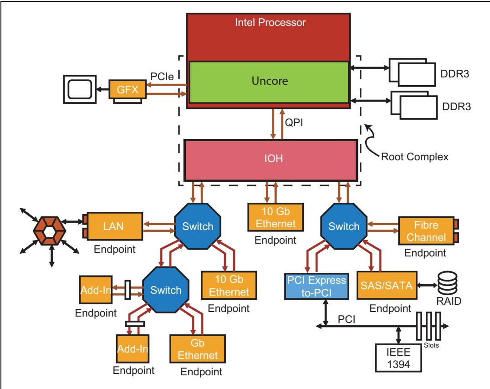
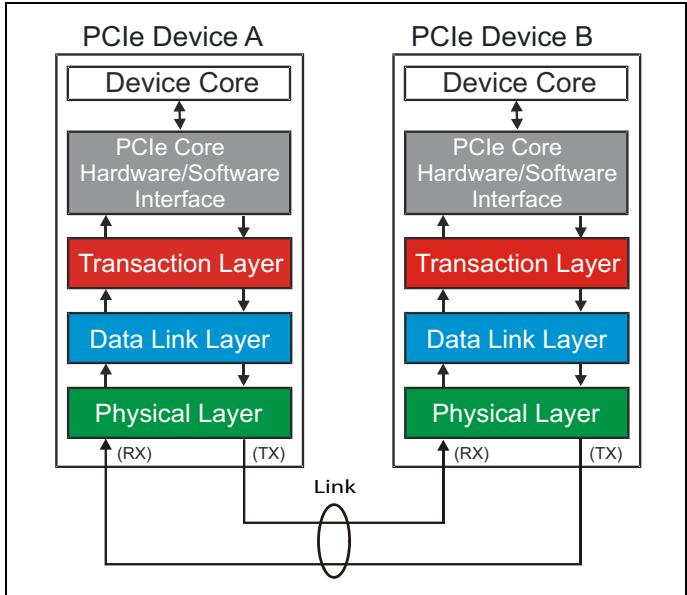

## Introduction to Device Layers | 设备层介绍

<table>
<tr>
<td width="50%">
PCIe defines a layered architecture as illustrated in Figure 2-12 on page 56. The layers can be considered as being logically split into two parts that operate independently because they each have a transmit side for outbound traffic and a receive side for inbound traffic. The layered approach has some advantages for hardware designers because, if the logic is partitioned carefully, it can be easier to migrate to new versions of the spec by changing one layer of an existing design while leaving the others unaffected. Even so, it's important to note that the layers simply define interface responsibilities and a design is not required to be partitioned according to the layers to be compliant with the spec. The goal in this section is to describe the responsibilities of each layer and the flow of events involved in accomplishing a data transfer.
</td>
<td width="50%" style="background-color:#e8e8e8">
PCIe定义了一种分层架构，如图2-12（第56页）所示。这些层在逻辑上可视为分为两个独立运行的部分，因为每一层都有用于出站流量的发送侧和用于入站流量的接收侧。分层方法对硬件设计人员有一些优势，因为如果逻辑仔细划分，在迁移到新版本的规范时，只需更改现有设计中的一层而保持其他层不受影响即可。即便如此，必须注意，这些层仅定义了接口职责，符合规范的设计不要求必须按照这些层来进行划分。本节的目的是描述每一层的职责以及完成数据传输所涉及的事件流程。
</td>
</tr>
<tr>
<td width="50%">
The device layers as shown in Figure 2-12 on page 56 consist of:
</td>
<td width="50%" style="background-color:#e8e8e8">
如图2-12（第56页）所示的设备层包括：
</td>
</tr>
<tr>
<td width="50%">
Device core and interface to Transaction Layer. The core implements the main functionality of the device. If the device is an endpoint, it may consist of up to 8 functions, each function implementing its own configuration space. If the device is a switch, the switch core consists of packet routing logic and an internal bus for accomplishing this goal. If the device is a root, the root core implements a virtual PCI bus 0 on which resides all the chipset embedded endpoints and virtual bridges.
</td>
<td width="50%" style="background-color:#e8e8e8">
设备核心及事务层接口。核心实现设备的主要功能。如果设备是一个端点，它最多可包含8个功能，每个功能实现自己的配置空间。如果设备是一个交换机，交换机核心由数据包路由逻辑和用于实现此目的的内部总线组成。如果设备是一个根，根核心实现了一个虚拟PCI总线0，其上驻留着所有的芯片组嵌入式端点和虚拟桥。
</td>
</tr>
<tr>
<td width="50%">
Transaction Layer. This layer is responsible for Transaction Layer Packet (TLP) creation on the transmit side and TLP decoding on the receive side. This layer is also responsible for Quality of Service functionality, Flow Control functionality and Transaction Ordering functionality. All these four Transaction Layer functions are described in book Part two.
</td>
<td width="50%" style="background-color:#e8e8e8">
事务层。该层负责发送侧的TLP（事务层包）创建和接收侧的TLP解码。该层还负责服务质量功能、流控功能和事务排序功能。所有这四项事务层功能在本书第二部分中描述。
</td>
</tr>
<tr>
<td width="50%">
Data Link Layer. This layer is responsible for Data Link Layer Packet (DLLP) creation on the transmit side and decoding on the receive side. This layer is also responsible for Link error detection and correction. This Data Link Layer function is referred to as the Ack/Nak protocol. Both these Data Link Layer functions are described in book Part Three.
</td>
<td width="50%" style="background-color:#e8e8e8">
数据链路层。该层负责发送侧的DLLP（数据链路层包）创建和接收侧的解码。该层还负责链路错误检测和纠正。这项数据链路层功能被称为ACK/Nak协议。这两项数据链路层功能在本书第三部分中描述。
</td>
</tr>
<tr>
<td width="50%">
Physical Layer. This layer is responsible for Ordered-Set packet creation on the transmit side and Ordered-Set packet decoding on the receive side. This layer processes all three types of packets (TLPs, DLLPs and Ordered-Sets) to be transmitted on the Link and processes all types of packets received from the Link. Packets are processed on the transmit side by byte striping logic, scramblers, 8b/10b encoders (associated with Gen1/Gen2 protocol) or 128b/130b encoders (associated with Gen3 protocol) and packet serializers. The packet is finally differentially clocking out on all Lanes at the trained Link speed. On the receive Physical Layer, packet processing consists of serially receiving differentially encoded bits and converting to digital format and then deserializing the incoming bit-stream. The is done at a clock rate derived from a recovered clock from the CDR (Clock and Data Recovery) circuit. The received packets are processed by elastic buffers, 8b/10b decoders (associated with Gen1/Gen2 protocol) or 128b/130b decoders (associated with Gen3 protocol), de-scramblers and byte un-striping logic. Finally, the Link Training and Status State Machine (LTSSM) of the Physical Layer is responsible for Link Initialization and Training. All these Physical Layer functions are described in book Part Four.
</td>
<td width="50%" style="background-color:#e8e8e8">
物理层。该层负责发送侧的有序集包创建和接收侧的有序集包解码。该层处理所有三类要在链路上发送的数据包（TLP、DLLP和有序集），并处理所有从链路接收的数据包类型。数据包在发送侧通过字节拆分逻辑、加扰器、8b/10b编码器（与Gen1/Gen2协议相关）或128b/130b编码器（与Gen3协议相关）以及数据包串行化器进行处理。数据包最终以已训练的链路速度在所有通道上差分时钟输出。在接收物理层，数据包处理包括串行接收差分编码的比特并转换为数字格式，然后对输入的比特流进行解串化。这是通过从CDR（时钟与数据恢复）电路恢复出的时钟所导出的时钟速率来完成的。接收到的数据包由弹性缓冲、8b/10b解码器（与Gen1/Gen2协议相关）或128b/130b解码器（与Gen3协议相关）、解扰器和字节反拆分逻辑进行处理。最后，物理层的链路训练与状态机（LTSSM）负责链路初始化和训练。所有这些物理层功能在本书第四部分中描述。
</td>
</tr>
</table>

Figure 2-13: Switch Port Layers | 图2-13：交换机端口层
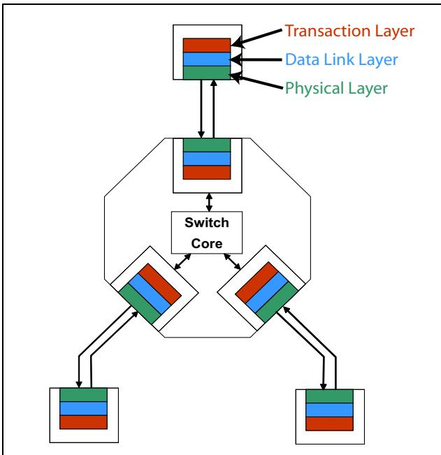

<table>
<tr>
<td width="50%">
Every PCIe interface supports the functionality of these layers, including Switch Ports, as shown in Figure 2-13 on page 57. A question often came up in earlier classes as to whether a Switch Port needs to implement all the layers, since it's typically only forwarding packets. The answer is yes, and the reason is that evaluating the contents of packets to determine their routing requires looking into the internal details of a packet, and that takes place in the Transaction Layer logic.
</td>
<td width="50%" style="background-color:#e8e8e8">
每个PCIe接口都支持这些层的功能，包括交换机端口，如图2-13（第57页）所示。在早期的课程中经常出现的一个问题是，交换机端口是否需要实现所有层，因为它通常只是转发数据包。答案是肯定的，原因在于，评估数据包的内容以确定其路由需要查看数据包的内部细节，而这发生在事务层逻辑中。
</td>
</tr>
<tr>
<td width="50%">
In principle, each layer communicates with the corresponding layer in the device on the other end of the Link. The upper two layers do so by organizing a string of bits into a packet, creating a pattern that is recognizable by the corresponding layer in the receiver. The packets are forwarded through the other layers along the way to get to or from the Link. The Physical Layer also communicates directly with that layer in the other device but it does differently.
</td>
<td width="50%" style="background-color:#e8e8e8">
原则上，每一层都与链路另一端设备中的对应层进行通信。上面两层通过将一串比特组织成一个数据包来实现这一点，创建一个接收端对应层可以识别的模式。这些数据包在到达或离开链路的过程中通过其他层进行转发。物理层也直接与另一设备中的物理层进行通信，但方式不同。
</td>
</tr>
<tr>
<td width="50%">
Before we go deeper, let's first walk through an overview to see how the layers interact. In broad terms, the contents of an outgoing request or completion packet from the device are assembled in the Transaction Layer based on information presented by the device core logic, which we also sometimes call the Software Layer (although the spec doesn't use that term). That information would usually include the type of command desired, the address of the target device, attributes of the request, and so on. The newly created packet is then stored in a buffer called a Virtual Channel until it's ready for passing to the next layer. When the packet is passed down to the Data Link Layer, additional information is added to the packet for error checking at the neighboring receiver, and a copy is stored locally so we can send it again if a transmission error occurs. When the packet arrives at the Physical Layer it's encoded and transmitted differentially using all the available Lanes of the Link.
</td>
<td width="50%" style="background-color:#e8e8e8">
在我们深入之前，先来概览一下各层如何交互。概括而言，来自设备的出站请求或完成报文的内容，是根据设备核心逻辑（我们有时也称之为软件层，尽管规范并未使用该术语）所呈现的信息在事务层中组装而成的。这些信息通常包括所需的命令类型、目标设备的地址、请求的属性等。新创建的数据包然后被存储在一个称为虚通道的缓冲中，直到准备好传递到下一层。当数据包向下传递到数据链路层时，附加信息会被添加到数据包中，用于在相邻接收端进行错误检查，并且会在本地存储一份副本，以便在发生传输错误时可以重新发送。当数据包到达物理层时，它会被编码并使用链路所有可用通道进行差分传输。
</td>
</tr>
</table>

Figure 2-14: Detailed Block Diagram of PCI Express Device's Layers | 图2-14：PCI Express设备层的详细框图
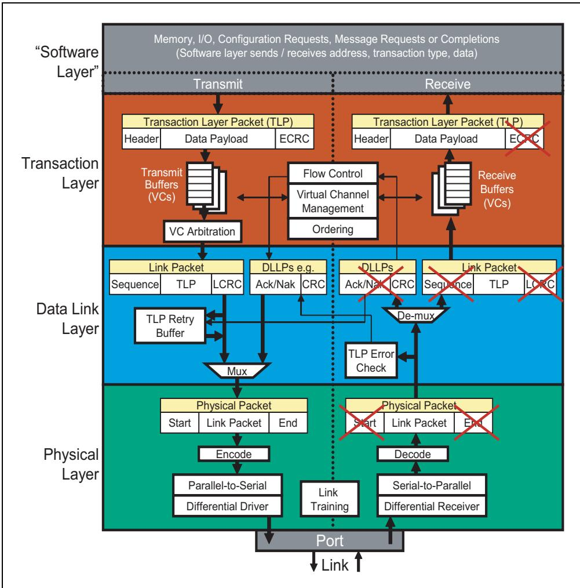

<table>
<tr>
<td width="50%">
The receiver decodes the incoming bits in the Physical Layer, checks for errors that can be seen at this level and, if there are none, forwards the resulting packet up to the Data Link Layer. Here the packet is checked for different errors and, if there are no errors, is forwarded up to the Transaction Layer. The packet is buffered, checked for errors, and disassembled into the original information (command, attributes, etc.) so the contents can be delivered to the device core of the receiver. Next, let's explore in greater depth what each of the layers must do to make this process work, using Figure 2-14 on page 58. We start at the top.
</td>
<td width="50%" style="background-color:#e8e8e8">
接收端在物理层中对输入的比特进行解码，检查在此层面可见的错误，如果没有错误，则将所得数据包向上转发到数据链路层。在这里，数据包被检查是否存在不同的错误，如果没有错误，则向上转发到事务层。数据包被缓冲、检查错误，并拆解为原始信息（命令、属性等），以便将内容传递给接收端的设备核心。接下来，让我们使用图2-14（第58页）更深入地探讨每一层必须做什么才能使这个过程正常工作。我们从顶层开始。
</td>
</tr>
</table>

## Device Core / Software Layer | 设备核心 / 软件层

<table>
<tr>
<td width="50%">
This is the core functionality of the device, such as a network interface or hard drive controller. This isn't defined as a layer in the PCIe spec, but can be thought of in that way since it resides above the Transaction Layer and will be either the source or destination of all Requests. It provides the transmit side of the Transaction Layer with requests that include information like the transaction type, the address, amount of data to transfer, and so on. It's also the destination for information forwarded up from the Transaction Layer when incoming packets have been received.
</td>
<td width="50%" style="background-color:#e8e8e8">
这是设备的核心功能，例如网络接口或硬盘控制器。在PCIe规范中，它并未被定义为一个层，但可以这样理解，因为它位于事务层之上，并且是所有请求的源头或目的地。它向事务层的发送侧提供请求，其中包含事务类型、地址、要传输的数据量等信息。它也是当接收到入站报文时，从事务层向上转发信息的目的地。
</td>
</tr>
</table>

## Transaction Layer | 事务层

<table>
<tr>
<td width="50%">
In response to requests from the Software Layer, the Transaction Layer generates outbound packets. It also examines inbound packets and forwards the information contained in them up to the Software Layer. It supports the split transaction protocol for non-posted transactions and associates an inbound Completion with an outbound non-posted Request that was transmitted earlier. The transactions handled by this layer use TLPs (Transaction Layer Packets) and can be grouped into four request categories:
< | td>
<td width="50%" style="background-color:#e8e8e8">
响应软件层的请求，事务层生成出站数据包。它还检查入站数据包，并将其包含的信息转发给软件层。它支持非发布事务的拆分事务协议，并将入站完成与先前发送的出站非发布请求相关联。该层处理的事务使用TLP（事务层数据包），可分为四类请求：
</td>
</tr>
<tr>
<td width="50%">
1. Memory
</td>
<td width="50%" style="background-color:#e8e8e8">
1. 内存
</td>
</tr>
<tr>
<td width="50%">
2. IO
</td>
<td width="50%" style="background-color:#e8e8e8">
2. IO
</td>
</tr>
<tr>
<td width="50%">
3. Configuration
</td>
<td width="50%" style="background-color:#e8e8e8">
3. 配置
</td>
</tr>
<tr>
<td width="50%">
4. Messages
</td>
<td width="50%" style="background-color:#e8e8e8">
4. 消息
</td>
</tr>
<tr>
<td width="50%">
The first three of these were already supported in PCI and PCI-X, but messages are a new type for PCIe. A Transaction is defined as the combination of a Request packet that a delivers a command to a targeted device, together with any Completion packets the target sends back in reply. A list of the request types is given in Table 2-2 on page 59.
</td>
<td width="50%" style="background-color:#e8e8e8">
前三种已在PCI和PCI-X中得到支持，但消息是PCIe的新类型。事务被定义为一个向目标设备传递命令的请求数据包，以及目标设备回复发送的任何完成数据包的组合。表2-2（第59页）给出了请求类型列表。
</td>
</tr>
</table>

Table 2-2: PCI Express Request Types | 表2-2：PCI Express请求类型

<table><tr><td>Request Type</td><td>Non-Posted or Posted</td></tr><tr><td>Memory Read</td><td>Non-Posted</td></tr><tr><td>Memory Write</td><td>Posted</td></tr><tr><td>Memory Read Lock</td><td>Non-Posted</td></tr><tr><td>IO Read</td><td>Non-Posted</td></tr><tr><td>IO Write</td><td>Non-Posted</td></tr><tr><td>Configuration Read (Type 0 and Type 1)</td><td>Non-Posted</td></tr><tr><td>Configuration Write (Type 0 and Type 1)</td><td>Non-Posted</td></tr><tr><td>Message</td><td>Posted</td></tr></table>

<table>
<tr>
<td width="50%">
The requests also fall into one of two categories as shown in the right column of the table: non-posted and posted. For non-posted requests, a Requester sends a packet for which a Completer should generate a response in the form of a Completion packet. The reader may recognize this as the split transaction protocol inherited from PCI-X. For example, any read request will be non-posted because the requested data will need to be returned in a completion. Perhaps unexpectedly, IO writes and Configuration writes are also non-posted. Even though they are delivering the data for the command, these requests still expect to receive a completion from the target to confirm that the write data has in fact made it to the destination without error.
</td>
<td width="50%" style="background-color:#e8e8e8">
请求也分为右侧列所示的两类：非发布和发布。对于非发布请求，请求者发送一个数据包，完成者应生成一个完成数据包形式的响应。读者可能会认出这是从PCI-X继承而来的拆分事务协议。例如，任何读请求都是非发布的，因为请求的数据需要通过完成来返回。可能出乎意料的是，IO写和配置写也是非发布的。尽管它们正在传递命令的数据，但这些请求仍然期望收到来自目标的完成，以确认写数据确实已无错误地到达目的地。
</td>
</tr>
<tr>
<td width="50%">
In contrast, Memory Writes and Messages are posted, meaning the targeted device does not return a completion TLP to the Requester. Posted transactions improve performance because the Requester doesn't have to wait for a reply or incur the overhead of a completion. The trade-off is that they get no feedback about whether the write has finished or encountered an error. This behavior is inherited from PCI and is still considered a good thing to do because the likelihood of a failure is small and the performance gain is significant. Note that, even though they don't require Completions, Posted Writes do still participate in the Ack/Nak protocol in the Data Link Layer that ensures reliable packet delivery. For more on this, see Chapter 10, entitled "Ack/Nak Protocol," on page 317.
</td>
<td width="50%" style="background-color:#e8e8e8">
相比之下，内存写和消息是发布的，这意味着目标设备不会向请求者返回完成TLP。发布事务提高了性能，因为请求者无需等待回复或承担完成开销。其代价是它们无法获得关于写入是否完成或遇到错误的反馈。这种行为继承自PCI，并且仍然被认为是一件好事，因为失败的可能性很小，而性能提升显著。请注意，尽管不需要完成，发布写仍然参与数据链路层中确保可靠数据包传递的Ack/Nak协议。更多信息请参见第10章" Ack/Nak协议"（第317页）。
</td>
</tr>
</table>

## TLP (Transaction Layer Packet) Basics | TLP（事务层包）基础

<table>
<tr>
<td width="50%">
A list of all of the PCIe request and completion packet types is given in Table 2‐3 on page 61.
</td>
<td width="50%" style="background-color:#e8e8e8">
PCIe 所有请求和完成报文类型的列表见第 61 页的表 2-3。
</td>
</tr>
</table>

Table 2‐3: PCI Express TLP Types | 表2‐3：PCI Express TLP类型

<table><tr><td>TLP Packet Types</td><td>Abbreviated Name</td></tr><tr><td>Memory Read Request</td><td>MRd</td></tr><tr><td>Memory Read Request - Locked access</td><td>MRdLk</td></tr><tr><td>Memory Write Request</td><td>MWr</td></tr><tr><td>IO Read</td><td>IORd</td></tr><tr><td>IO Write</td><td>IOWr</td></tr><tr><td>Configuration Read (Type 0 and Type 1)</td><td>CfgRd0, CfgRd1</td></tr><tr><td>Configuration Write (Type 0 and Type 1)</td><td>CfgWr0, CfgWr1</td></tr><tr><td>Message Request without Data</td><td>Msg</td></tr><tr><td>Message Request with Data</td><td>MsgD</td></tr><tr><td>Completion without Data</td><td>Cpl</td></tr><tr><td>Completion with Data</td><td>CplD</td></tr><tr><td>Completion without Data - associated with Locked Memory Read Requests</td><td>CplLk</td></tr><tr><td>Completion with Data - associated with Locked Memory Read Requests</td><td>CplDLk</td></tr></table>

<table>
<tr>
<td width="50%">
TLPs originate at the Transaction Layer of a transmitter and terminate at the Transaction Layer of a receiver, as shown in Figure 2‐15 on page 62. The Data Link Layer and Physical Layer add parts to the packet as it moves through the layers of the transmitter, and then verify at the receiver that those parts were transmitted correctly across the Link.
</td>
<td width="50%" style="background-color:#e8e8e8">
TLP 起源于发送方的事务层，终止于接收方的事务层，如第 62 页的图 2-15 所示。数据链路层和物理层在报文经过发送方的各层时向其添加组成部分，然后在接收方验证这些部分是否在链路上被正确传输。
</td>
</tr>
</table>

Figure 2‐15: TLP Origin and Destination | 图2‐15：TLP源和目的
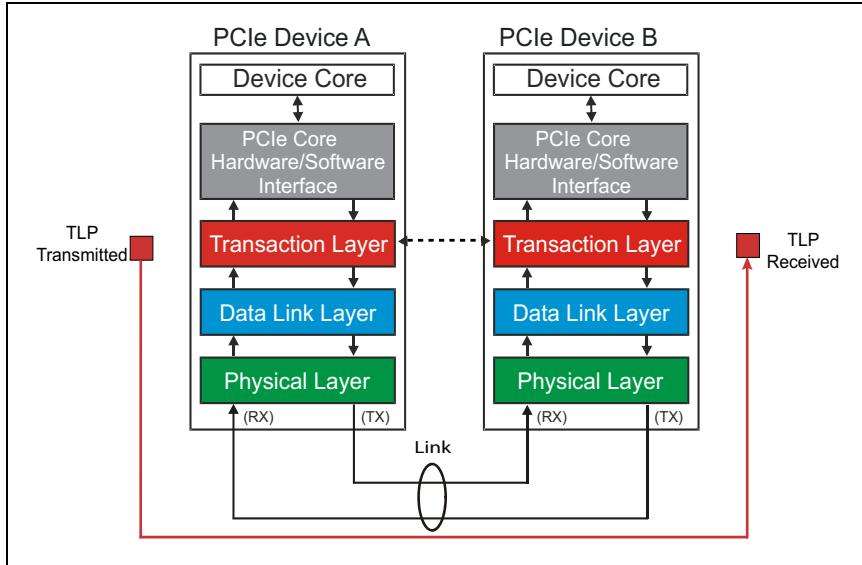

<table>
<tr>
<td width="50%">
TLP Packet Assembly. An illustration of the parts of a finished TLP as it is sent over the Link is shown in Figure 2‐16 on page 63, where it can be seen that different parts of the packet are added in each of the layers. To make it easier to recognize how the packet gets constructed, the different parts of the TLP are color coded to indicate which layer is responsible for them: red for Transaction Layer, blue for Data Link Layer, and green for the Physical Layer.
</td>
<td width="50%" style="background-color:#e8e8e8">
TLP 报文组装。图 2-16（第 63 页）展示了完整 TLP 在链路上发送时的各部分示意图，从中可以看出报文的不同部分是在各层中添加的。为便于识别报文的构建方式，TLP 的不同部分采用了颜色编码以标明负责它们的层级：红色代表事务层，蓝色代表数据链路层，绿色代表物理层。
</td>
</tr>
<tr>
<td width="50%">
The device core sends the information required to assemble the core section of the TLP in the Transaction Layer. Every TLP will have a header, although some, like a read request, won't contain data. An optional End‐to‐End CRC (ECRC) field may be calculated and appended to the packet. CRC stands for Cyclic Redundancy Check (or Code) and is employed by almost all serial architectures for the simple reason that it's simple to implement and provides very robust error detection capability. The CRC also detects "burst errors," or string of repeated mistaken bits, up to the length of the CRC value (32 bits for PCIe). Since this type of error is likely to be encountered when sending a long string of bits, this characteristic is very useful for serial transports. The ECRC field is passed unchanged through any service points ("service point" usually refers to a Switch or Root Port that has TLP routing options) between the sender and receiver of the packet, making it useful for verifying at the destination that there were no errors anywhere along the way.
</td>
<td width="50%" style="background-color:#e8e8e8">
设备核心发送组装 TLP 核心部分所需的信息到事务层。每个 TLP 都有一个包头（header），尽管某些 TLP（如读请求）不包含数据。可选的端到端 CRC（ECRC）字段可被计算并附加到报文尾部。CRC 代表循环冗余校验（Cyclic Redundancy Check/Code），几乎所有串行架构都采用它，原因是它实现简单且提供非常强大的检错能力。CRC 还能检测"突发错误"（即连续重复的错误比特串），检测长度可达 CRC 值的位宽（PCIe 为 32 位）。由于在发送长比特串时很可能遇到这类错误，这一特性对串行传输非常有用。ECRC 字段在报文发送方与接收方之间的任何服务点（"服务点"通常指具有 TLP 路由选项的交换机或根端口）之间原样传递，因此有助于在目的地验证沿路任何地方均未发生错误。
</td>
</tr>
<tr>
<td width="50%">
For transmission, the core section of the TLP is forwarded to the Data Link Layer, which is responsible to append a Sequence Number and another CRC field called the Link CRC (LCRC). The LCRC is used by the neighboring receiver to check for errors and report the results of that check back to the transmitter for every packet sent on that Link. The thoughtful reader may wonder why the ECRC would be helpful if the mandatory LCRC check already verifies error‐free transmission across the Link. The reason is that there is still a place where transmission errors aren't checked, and that is within devices that route packets. A packet arrives and is checked for errors on one port, the routing is checked, and when it's sent out on another port a new LCRC value is calculated and added to it. The internal forwarding between ports could encounter an error that isn't checked as part of the normal PCIe protocol, and that's why ECRC is helpful.
</td>
<td width="50%" style="background-color:#e8e8e8">
在发送时，TLP 的核心部分被转发到数据链路层，该层负责附加一个序列号（Sequence Number）和另一个称为链路 CRC（LCRC）的 CRC 字段。邻近的接收方使用 LCRC 来检查错误，并针对该链路上发送的每个报文将检查结果回报给发送方。细心的读者可能会问：既然强制性的 LCRC 检查已经验证了跨链路的无错传输，ECRC 又有何用？原因是仍存在一处传输错误未被检查的地方，那就是在路由报文的设备内部。报文在一个端口上到达并经错误检查后，检查路由信息，当它从另一个端口发出时，会计算新的 LCRC 值并附加到报文上。端口之间的内部转发可能会遇到错误，而该错误并非正常 PCIe 协议检查的一部分，这就是 ECRC 有价值的原因。
</td>
</tr>
<tr>
<td width="50%">
Finally, the resulting packet is forwarded to the Physical Layer where other characters are added to the packet to let the receiver know what to expect. For the first two generations of PCIe, these were control characters added to the beginning and end of the packet. For the third generation, control characters are no longer used but other bits are appended to the blocks that give the needed information about the packets. The packet is then encoded and differentially transmitted on the Link using all of the available lanes.
</td>
<td width="50%" style="background-color:#e8e8e8">
最后，生成的报文被转发到物理层，在此向报文添加其他字符以便接收方知道接下来应期待什么内容。对于 PCIe 的前两代，这些是添加到报文开头和结尾的控制字符。对于第三代，不再使用控制字符，而是向数据块附加其他比特以提供关于报文的必要信息。然后报文被编码，并使用所有可用通道在链路上进行差分传输。
</td>
</tr>
</table>

Figure 2‐16: TLP Assembly | 图2‐16：TLP组装
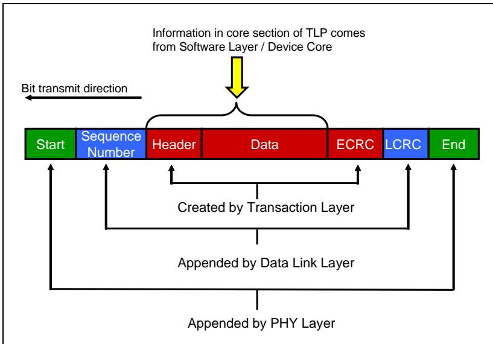

<table>
<tr>
<td width="50%">
**PCI Express Technology**
</td>
<td width="50%" style="background-color:#e8e8e8">
**PCI Express 技术**
</td>
</tr>
<tr>
<td width="50%">
TLP Packet Disassembly. When the neighboring receiver sees the incoming TLP bit stream, it needs to identify and remove the parts that were added to recover the original information requested by the core logic of the transmitter. As shown in Figure 2-17 on page 64, the Physical Layer will verify that the proper Start and End or other characters are present and remove them, forwarding the remainder of the TLP to the Data Link Layer. This layer first checks for LCRC and Sequence Number errors. If no errors are found, it removes those fields from the TLP and forwards it to the Transaction Layer. If the receiver is a Switch, the packet is evaluated in the Transaction Layer to find the routing information in the header of the TLP and determine to which port the packet should be forwarded. Even when it's not the intended destination, a Switch is allowed to check and report an ECRC error if it finds one. However, it's not allowed to modify the ECRC, so the targeted device will be able to detect the ECRC error as well.
</td>
<td width="50%" style="background-color:#e8e8e8">
TLP 拆解。当相邻接收器看到传入的 TLP 比特流时，它需要识别并移除已添加的部分，以恢复发送器核心逻辑所请求的原始信息。如第 64 页的图 2-17 所示，物理层将验证是否存在正确的 Start 和 End 或其他字符并将其移除，然后将 TLP 的剩余部分转发到数据链路层。该层首先检查 LCRC 和序列号错误。如果未发现错误，它将从 TLP 中移除这些字段并将其转发到事务层。如果接收器是交换机，则在事务层中对数据包进行评估，以找到 TLP 头部中的路由信息并确定将数据包转发到哪个端口。即使不是预期的目的地，交换机也允许在发现 ECRC 错误时检查并报告它。但是，不允许修改 ECRC，因此目标设备也能够检测到 ECRC 错误。
</td>
</tr>
<tr>
<td width="50%">
The target device can check ECRC errors if it's capable and was enabled. If this is the target device and there was no error, the ECRC field is removed, leaving the header and data portion of the packet to be forwarded to the Software Layer.
</td>
<td width="50%" style="background-color:#e8e8e8">
目标设备如果支持并且已启用，则可以检查 ECRC 错误。如果这是目标设备且没有错误，则移除 ECRC 字段，留下数据包的头部和数据部分转发到软件层。
</td>
</tr>
</table>

Figure 2-17: TLP Disassembly | 图2-17：TLP拆解
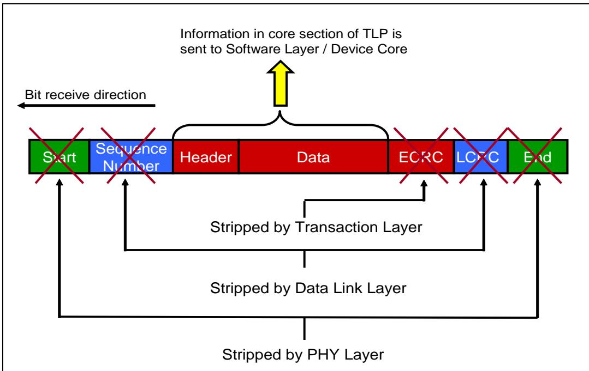

## Non-Posted Transactions | 非转发事务

<table>
<tr>
<td width="50%">
Ordinary Reads. Figure 2-18 on page 65 shows an example of a Memory Read Request sent from an Endpoint to system memory. A detailed discussion of the TLP contents can be found in Chapter 5, entitled "TLP Elements," on page 169, but an important part of any memory read request is the target address. The address for a memory Request can be 32 or 64 bits, and determines the packet routing. In this example, the request gets routed through two Switches that forward it up to the target, which is the Root in this case. When the Root decodes the request and recognizes that the address in the packet targets system memory, it fetches the requested data. To return that data to the Requester, the Transaction Layer of the Root Port creates as many Completions as are needed to deliver all the requested data to the Requester. The largest possible data payload for PCIe is 4 KB per packet, but devices are often designed to use smaller payloads than that, so several completions may be needed to return a large amount of data.
</td>
<td width="50%" style="background-color:#e8e8e8">
普通读操作。图 2-18（第65页）展示了一个从端点发送到系统内存的存储器读请求的示例。有关 TLP 内容的详细讨论可在第169页题为"TLP 要素"的第5章中找到，但任何存储器读请求的一个重要部分是目标地址。存储器请求的地址可以是 32 位或 64 位，并决定了数据包的路由。在本示例中，请求通过两个交换机进行路由，交换机将请求向上转发到目标，在本例中目标是根复合体。当根复合体解码请求并识别出数据包中的地址指向系统内存时，它会取出所请求的数据。为了将数据返回给请求方，根端口的事务层会创建尽可能多的完成报文，以将所有的请求数据交付给请求方。PCIe 每个数据包的最大数据有效载荷为 4 KB，但设备通常被设计为使用比这更小的有效载荷，因此可能需要多个完成报文来返回大量数据。
</td>
</tr>
</table>

Figure 2-18: Non-Posted Read Example | 图2-18：非投递读示例

<table>
<tr>
<td width="50%">
Those Completion packets also contain routing information to direct them back to the Requester, and the Requester includes its return address for this purpose in the original request. This "return address" is simply the Device ID of the Requester as it was defined for PCI, which is a combination of three things: its PCI Bus number in the system, its Device number on that bus, and its Function number within that device. This Bus, Device, and Function number information (sometimes abbreviated as BDF) is the routing information that Completions will use to get back to the original Requester. As was true for PCI-X, a Requester can have several split transactions in progress at the same time and must be able to associate incoming completions with the correct requests. To facilitate that, another value was added to the original request called a Tag that is unique to each request. The Completer copies this transaction Tag and uses it in the Completion so the Requester can quickly identify which Request this Completion is servicing.
</td>
<td width="50%" style="background-color:#e8e8e8">
这些完成报文也包含路由信息，用于将它们定向回请求方，而请求方为此目的在原始请求中包含了其返回地址。这个"返回地址"就是 PCI 规范中定义的请求方的设备 ID，它由三部分信息组合而成：该设备在系统中的 PCI 总线号、该总线上设备的设备号、以及该设备内的功能号。这些总线号、设备号和功能号信息（有时缩写为 BDF）就是完成报文用于返回到原始请求方的路由信息。与 PCI-X 一样，一个请求方可以同时有多个分离事务在进行中，并且必须能够将传入的完成报文与正确的请求关联起来。为了实现这一点，在原始请求中添加了另一个值，称为 Tag，它对每个请求是唯一的。完成方复制这个事务 Tag 并在完成报文中使用它，以便请求方能够快速识别此完成报文正在响应哪个请求。
</td>
</tr>
</table>

| Finally, a Completer can also indicate error conditions by setting bits in the completion status field. That gives the Requester at least a broad idea of what might have gone wrong. How the Requester handles most of these errors will be determined by software and is outside the scope of the PCIe spec. | 最后，完成方还可以通过在完成状态字段中设置位来指示错误状况。这至少能让请求方大致了解可能出了什么问题。请求方如何处理这些错误中的大多数将由软件决定，这超出了 PCIe 规范的范围。 |

| Locked Reads. Locked Memory Reads are intended to support what are called Atomic Read-Modify-Write operations, a type of uninterruptable transaction that processors use for tasks like testing and setting a semaphore. While the test and set is in progress, no other access to the semaphore can take place or a race condition could develop. To prevent this, processors use a lock indicator (such as a separate pin on the parallel Front-Side Bus) that prevents other transactions on the bus until the locked one is finished. What follows here is just a high level introduction to the topic. For more information on Locked transactions, refer to Appendix D called "Appendix D: Locked Transactions" on page 963. | 锁定读操作。锁定存储器读旨在支持所谓的原子读-修改-写操作，这是一种不可中断的事务类型，处理器用它来完成诸如测试和设置信号量之类的任务。当测试和设置操作正在进行时，不允许其他访问信号量，否则可能发生竞争条件。为了防止这种情况，处理器使用锁定指示符（例如并行前端总线上的一个独立引脚），它阻止总线上的其他事务，直到锁定的事务完成。以下内容只是该主题的概要介绍。有关锁定事务的更多信息，请参考第963页的附录 D"附录 D：锁定事务"。 |

| As a bit of history, in the early days of PCI the spec writers anticipated cases where PCI would actually replace the processor bus. Consequently, support for things that a processor would need to do on the bus were included in the PCI spec, such as locked transactions. However, PCI was only rarely ever used this way and, in the end, much of this processor bus support was dropped. Locked cycles remained, though, to support a few special cases, and PCIe carries this mechanism forward for legacy support. Perhaps to speed migration away from its use, new PCIe devices are prohibited from accepting locked requests; it's only legal for those that self-identify as Legacy Devices. In the example shown in Figure 2-19 on page 67, a Requester begins the process by sending a locked request (MRdLk). By definition, such a request is only allowed to come from the CPU, so in PCIe only a Root Port will ever initiate one of these. | 回顾一下历史，在 PCI 的早期，规范编写者预见到 PCI 可能实际取代处理器总线的情况。因此，PCI 规范中包含了处理器在总线上需要执行的操作的支持，例如锁定事务。然而，PCI 很少以这种方式被使用，最终大部分这种处理器总线支持被放弃。不过锁定周期被保留下来，以支持少数特殊情况，而 PCIe 将此机制延续下来以提供对传统设备的支持。也许是为了加速摆脱对它的使用，新的 PCIe 设备被禁止接受锁定请求；只有那些自识别为传统设备的设备才被允许接受此类请求。在图 2-19（第67页）所示的示例中，请求方通过发送一个锁定请求（MRdLk）来开始此过程。根据定义，这样的请求只允许来自 CPU，因此在 PCIe 中只有根端口才会发起这种请求。 |

| The locked request is routed through the topology using the target memory address and eventually reaches the Legacy Endpoint. As the packet makes its way through each routing device (called a service point) along the way, the Egress Port for the packet is locked, meaning no other packets will be allowed in that direction until the path is unlocked. | 锁定请求使用目标内存地址通过拓扑进行路由，最终到达传统端点。当数据包沿途经过每个路由设备（称为服务点）时，该数据包的出口端口被锁定，这意味着在路径解锁之前，不允许其他数据包沿该方向传输。 |

Figure 2-19: Non-Posted Locked Read Transaction Protocol | 图2-19：非投递锁定读事务协议

<table>
<tr>
<td width="50%">
When the Completer receives the packet and decodes its contents, it gathers the data and creates one or more Locked Completions with data. These Completions are routed back to the Requester using the Requester ID, and each Egress Port they pass through is then locked, too.
</td>
<td width="50%" style="background-color:#e8e8e8">
当完成方接收到数据包并解码其内容后，它会收集数据并创建一个或多个带数据的锁定完成报文。这些完成报文使用请求方 ID 路由回请求方，并且它们经过的每个出口端口随后也被锁定。
</td>
</tr>
</table>

| If the Completer encounters a problem, it returns a locked completion packet without data (the original read should have resulted in data so if there isn't any we know there's been a problem) and the status field will indicate something about the error. The Requester will understand that to mean that the lock did not succeed and so the transaction will be cancelled and software will need to decide what to do next. | 如果完成方遇到问题，它会返回一个不带数据的锁定完成报文（原始读操作本应产生数据，因此如果没有数据，我们就知道出了问题），并且状态字段将指示关于该错误的信息。请求方将理解为锁定没有成功，因此事务将被取消，软件需要决定下一步该做什么。 |

| IO and Configuration Writes. Figure 2-20 on page 68 illustrates a nonposted IO write transaction. Like a locked request, an IO cycle can also legally target only a Legacy Endpoint. The request is routed through the Switches based on the IO address until it reaches the target Endpoint. When the Completer receives the request, it accepts the data and returns a single completion packet without data that confirms reception of the packet. The status field in the completion would report whether an error had occurred and, if so, the Requester's software would handle it. | IO 和配置写操作。图 2-20（第68页）展示了一个非转发 IO 写事务。与锁定请求一样，IO 周期在法律上也只能以传统端点作为目标。请求基于 IO 地址通过交换机进行路由，直到到达目标端点。当完成方接收到请求时，它接受数据并返回一个不带数据的单个完成报文以确认已收到数据包。完成报文中的状态字段将报告是否发生了错误，如果发生了错误，请求方的软件将对它进行处理。 |

| If the completion reports no errors the Requester knows that the write data has been successfully delivered and the next step in the sequence of instructions for that Completer is now permitted. And that really summarizes the motivation for the non-posted write: unlike a memory write, it's not enough to know that the data will get to the destination sometime in the future. Instead, the next step can't logically take place until we know that it has gotten there. As with locked cycles, non-posted writes can only come from the processor. | 如果完成报文报告没有错误，请求方就知道写数据已成功交付，并且针对该完成方的指令序列中的下一步现在可以执行了。这实际上总结了非转发写的动机：与存储器写不同，仅仅知道数据将在未来某个时刻到达目的地是不够的；相反，只有在我们知道数据已经到达之后，下一步在逻辑上才能进行。与锁定周期一样，非转发写只能来自处理器。 |

Figure 2-20: Non-Posted Write Transaction Protocol | 图2-20：非投递写事务协议
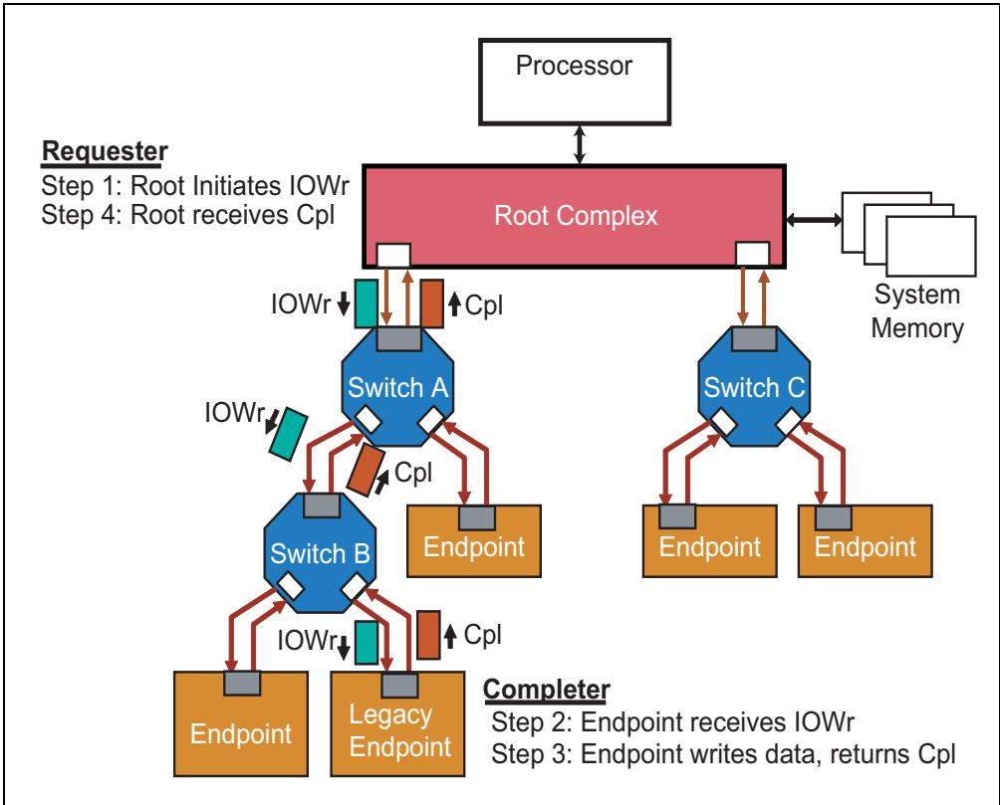

## Posted Writes | Posted写操作

<table>
<tr>
<td width="50%">
Memory Writes. Memory writes are always posted and never receive completions. Once the request has been sent, the Requester doesn't wait for any feedback before going on to the next request, and no time or bandwidth is spent returning a completion. As a result, posted writes are faster and more efficient than non‑posted requests and improve system performance. As shown in Figure 2‑21 on page 69, the packet is routed through the system using its target memory address to the Completer. Once a Link has successfully sent the request, that transaction is finished on that Link and its available for other packets. Eventually, the Completer accepts the data and the transaction is truly finished. Of course, one trade‑off with this approach is that, since no Completion packets are sent, there's also no means for reporting errors back to the Requester. If the Completer encounters an error, it can log it and send a Message to the Root to inform system software about the error, but the Requester won't see it.
</td>
<td width="50%" style="background-color:#e8e8e8">
存储器写操作。存储器写操作始终是posted类型的，永远不会收到完成报文。一旦请求被发送出去，请求者不会等待任何反馈即继续处理下一个请求，并且不会花费任何时间或带宽来返回完成报文。因此，posted写操作比非posted请求更快、更高效，从而提升了系统性能。如图2‑21（第69页）所示，数据包通过其目标存储器地址在系统中路由到完成者。一旦某条链路成功发送了该请求，该事务在该链路上即告完成，该链路即可用于其他数据包。最终，完成者接收数据，事务真正完成。当然，这种方法的一个trade‑off是，由于不发送完成报文，因此也没有向请求者报告错误的机制。如果完成者遇到错误，它可以记录该错误并向根复合体发送Message以通知系统软件，但请求者不会看到它。
</td>
</tr>
</table>

Figure 2‑21: Posted Memory Write Transaction Protocol | 图2‑21：投递存储器写事务协议
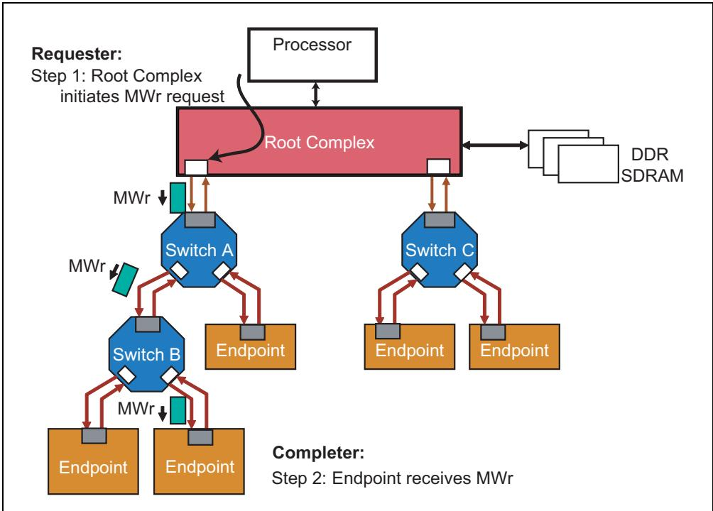

<table>
<tr>
<td width="50%">
Message Writes. Interestingly, unlike the other requests we've looked at so far, there are several possible routing methods for messages, and a field within the message indicates which type to use. For example, some messages are posted write requests that target a specific Completer, others are broadcast from the Root to all Endpoints, while still others sent from an Endpoint are automatically routed to the Root. To learn more about the different types of routing refer to Chapter 4, entitled "Address Space & Transaction Routing," on page 121.
</td>
<td width="50%" style="background-color:#e8e8e8">
Message写操作。有趣的是，与我们目前所讨论的其他请求不同，Message有几种可能的路由方法，Message内部有一个字段指示应使用哪种路由类型。例如，某些Message是指向特定完成者的posted写请求，其他Message是从根复合体广播到所有端点的，而另一些从端点发送的Message则自动路由到根复合体。要了解更多关于不同路由类型的信息，请参阅第121页第4章"地址空间与事务路由"。
</td>
</tr>
<tr>
<td width="50%">
Messages are useful in PCIe to help achieve a design goal of lowering the pin count. They eliminate the need for the side‑band signals that PCI used to report things like interrupts, power management events, and errors because they can report that information in a packet over the normal data path.
</td>
<td width="50%" style="background-color:#e8e8e8">
Message在PCIe中非常有用，有助于实现降低引脚数量的设计目标。它们消除了PCI用于报告中断、电源管理事件和错误等信息的边带信号的需求，因为这些信息可以通过正常数据路径以数据包的形式进行报告。
</td>
</tr>
</table>

## Quality of Service (QoS) | 服务质量 (QoS)

<table>
<tr>
<td width="50%">
PCIe was designed from its inception to be able to support time‐sensitive transactions for applications like streaming audio or video where data delivery must be timely in order to be useful. This is referred to as providing Quality of Service and is accomplished by the addition of a few things. First, each packet is assigned a priority by software by setting a 3‐bit field within it called Traffic Class (TC). Generally speaking, assigning a higher‐numbered TC to a packet is expected to give it a higher priority in the system. Second, multiple buffers, called Virtual Channels (VC), are built into the hardware for each port and a packet is placed into the appropriate buffer based on its TC. Third, since a port now has multiple buffers with packets available for transmission at a given time, arbitration logic is needed to select among the VCs. Finally, Switches must select between competing input ports for access to the VCs of a given output port. This is called Port Arbitration and can be hardware assigned or software programmable. All of these hardware pieces must be in place to allow a system to prioritize packets. If properly programmed and set up, such a system can even provide guaranteed service for a given path.
</td>
<td width="50%" style="background-color:#e8e8e8">
PCIe 从设计之初就被设计为能够支持对时间敏感的事务，例如流式音频或视频等数据必须及时交付才能发挥作用的应用场景。这被称为提供服务质量 (Quality of Service)，通过增加以下几项机制来实现。首先，软件通过设置数据包中一个称为流量类 (Traffic Class, TC) 的 3 位字段，为每个数据包分配优先级。一般而言，为数据包分配较高编号的 TC，预期会使其在系统中获得更高的优先级。其次，每个端口的硬件中都内置了多个称为虚通道 (Virtual Channel, VC) 的缓冲，并且数据包根据其 TC 被放入相应的缓冲中。第三，由于此时一个端口有多个缓冲，在给定时刻都有数据包等待发送，因此需要仲裁逻辑 (arbitration logic) 在各 VC 之间进行选择。最后，交换机 (Switch) 必须在竞争输入端口之间进行选择，以访问给定输出端口的 VC。这称为端口仲裁 (Port Arbitration)，可以由硬件分配，也可由软件编程。所有这些硬件组件都必须就位，才能使系统对数据包进行优先级排序。如果经过正确编程和设置，这样的系统甚至可以为给定路径提供有保证的服务 (guaranteed service)。
</td>
</tr>
<tr>
<td width="50%">
To illustrate the concept, consider Figure 2‐22 on page 71, in which a video camera and SCSI device both need to send data to system DRAM. The difference is that the camera data is time critical; if the transmission path to the target device is unable to keep up with its bandwidth, frames will get dropped. The system needs to be able to guarantee a bandwidth that's at least as high as the camera or the captured video may appear choppy. At the same time, the SCSI data needs to be delivered without errors, but how long it takes is not as important. Clearly, then, when both a video data packet and a SCSI packet need to be sent at the same time, the video traffic should have a higher priority. QoS refers to the ability of the system to assign different priorities to packets and route them through the topology with deterministic latencies and bandwidth. For more detail on QoS, refer to Chapter 7, entitled "Quality of Service," on page 245.
</td>
<td width="50%" style="background-color:#e8e8e8">
为了说明这一概念，请参见第 71 页的图 2‐22，其中视频摄像头和 SCSI 设备都需要向系统 DRAM 发送数据。区别在于，摄像头数据是时间关键的；如果到目标设备的传输路径无法跟上其带宽，帧就会被丢弃。系统需要能够保证至少达到摄像头所需的带宽，否则捕获的视频可能会显得卡顿。与此同时，SCSI 数据需要无差错地交付，但传输所需的时间并不那么重要。因此，显然当视频数据包和 SCSI 数据包需要同时发送时，视频流量应该具有更高的优先级。QoS 指的是系统为数据包分配不同优先级并以确定的延迟 (deterministic latencies) 和带宽 (bandwidth) 将其路由通过拓扑的能力。有关 QoS 的更多详细信息，请参阅第 245 页标题为"服务质量"的第 7 章。
</td>
</tr>
</table>

Figure 2‐22: QoS Example | 图2‐22：QoS示例
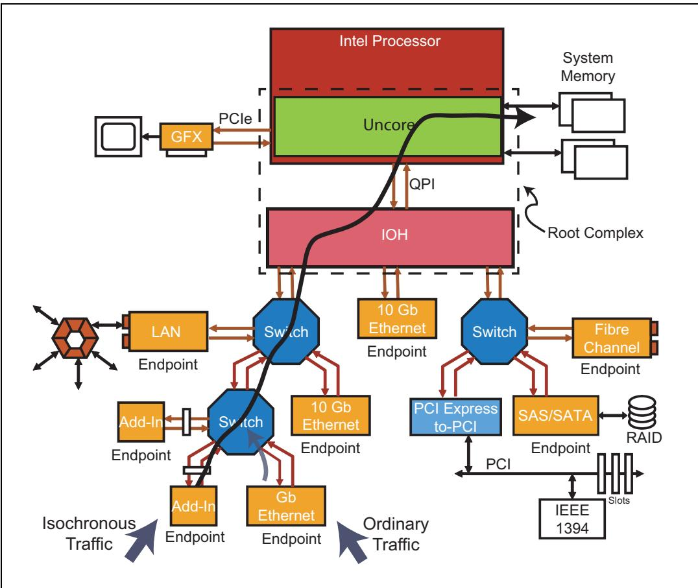

## Transaction Ordering | 事务排序

<table>
<tr>
<td width="50%">
Within a VC, the packets normally all flow through in the same order in which they arrived, but there are exceptions to this general rule. PCI Express protocol inherits the PCI transaction-ordering model, including support for relaxed-ordering cases added with the PCI-X architecture. These ordering rules guarantee that packets using the same traffic class will be routed through the topology in the correct order, preventing potential deadlock or live-lock conditions. An interesting point to note is that, since ordering rules only apply within a VC and packets that use different TCs may not get mapped into the same VC, packets using different TCs are understood by software to have no ordering relationship. This ordering is maintained in the VCs within the transaction layer.
< | td>
<td width="50%" style="background-color:#e8e8e8">
在一个虚通道（VC）内，包通常按其到达的顺序进行传输，但这一通用规则存在例外情况。PCI Express 协议继承了 PCI 事务排序模型，包括对 PCI-X 架构中引入的宽松排序情况的支持。这些排序规则保证了使用相同流量类（TC）的包能够按正确的顺序通过拓扑结构进行路由，从而防止潜在的死锁或活锁状况。值得注意的一点是，由于排序规则仅在同一个 VC 内适用，而使用不同 TC 的包可能不会被映射到同一个 VC 中，因此软件将使用不同 TC 的包视为彼此之间没有排序关系。这种排序在事务层内的各个 VC 中得到维护。
</td>
</tr>
</table>

## Flow Control | 流控

<table>
<tr>
<td width="50%">
A typical protocol used by serial transports is to require that a transmitter only send a packet to its neighbor if there is sufficient buffer space to receive it. That cuts down on performance‑wasting events on the bus like the disconnects and retries that PCI allowed and thus removes that class of problems from the transport. The trade‑off is that the receiver must report its buffer space often enough to avoid unnecessary stalls and that reporting takes a little bandwidth of its own. In PCIe this reporting is done with DLLPs (Data Link Layer Packets), as we'll see in the next section. The reason is to avoid a possible deadlock condition that might occur if TLPs were used, in which a transmitter can't get a buffer size update because its own receive buffer is full. DLLPs can always be sent and received regardless of the buffer situation, so that problem is avoided. This flow control protocol is automatically managed at the hardware level and is transparent to software.
</td>
<td width="50%" style="background-color:#e8e8e8">
串行传输中一种典型的协议要求发送端仅在相邻接收端有足够缓冲空间时才发送报文。这减少了总线上浪费性能的事件（如PCI所允许的断开和重试），从而从传输层中消除了此类问题。其代价是接收端必须足够频繁地报告其缓冲空间以避免不必要的停顿，而该报告行为本身也会占用少量带宽。在PCIe中，该报告通过DLLP（数据链路层包）完成，我们将在下一节中看到。其原因是避免在采用TLP时可能出现的死锁状况：发送端因自身接收缓冲已满而无法获取缓冲大小更新。DLLP无论缓冲状况如何都可以随时发送和接收，因此避免了该问题。此流控协议由硬件层面自动管理，对软件透明。
</td>
</tr>
</table>

Figure 2‑23: Flow Control Basics | 图2‑23：流控基础

<table>
<tr>
<td width="50%">
As shown in Figure 2‑23 on page 72, the Receiver contains the VC Buffers that hold received TLPs. The Receiver advertises the size of those buffers to the Transmitters using Flow Control DLLPs. The Transmitter tracks the available space in the Receiver's VC Buffers and is not allowed to send more packets than the Receiver can hold. As the Receiver processes the TLPs and removes them from the buffer, it periodically sends Flow Control Update DLLPs to keep the Transmitter up‑to‑date regarding the available space. To learn more about this, see Chapter 6, entitled "Flow Control," on page 215.
</td>
<td width="50%" style="background-color:#e8e8e8">
如图2‑23（第72页）所示，接收端包含用于存放接收到的TLP的VC（虚通道）缓冲。接收端通过流控DLLP向发送端通告这些缓冲的大小。发送端跟踪接收端VC缓冲中的可用空间，并且不得发送超过接收端所能容纳的报文数量。随着接收端处理TLP并将其从缓冲中移除，它会定期发送流控更新DLLP以使发送端了解最新的可用空间情况。欲了解更多信息，请参阅第215页第6章"流控"。
</td>
</tr>
</table>

## Data Link Layer | 数据链路层

<table>
<tr>
<td width="50%">
This logic is responsible for Link management and performs three major functions: TLP error correction, flow control, and some Link power management. It accomplishes these by generating DLLPs as shown in Figure 2‑24 on page 73.
</td>
<td width="50%" style="background-color:#e8e8e8">
该逻辑负责链路管理，并执行三项主要功能：TLP 纠错、流控以及部分链路电源管理。它通过生成 DLLP (数据链路层包) 来完成这些功能，如第 73 页图 2‑24 所示。
</td>
</tr>
</table>

## DLLPs (Data Link Layer Packets) | DLLP (数据链路层包)

<table>
<tr>
<td width="50%">
DLLPs are transferred between Data Link Layers of the two neighboring devices on a Link. The Transaction Layer is not even aware of these packets, which only travel between neighboring devices and are not routed anywhere else. They are small (always just 8 bytes) compared to TLPs, and that's a good thing because they represent overhead for maintaining Link protocol.
</td>
<td width="50%" style="background-color:#e8e8e8">
DLLP在一条链路上的两个相邻设备的数据链路层之间传输。事务层甚至不知道这些包的存在，它们仅在相邻设备之间传输，不会被路由到其他任何地方。与TLP相比，DLLP很小（始终只有8字节），这是一件好事，因为它们代表着维持链路协议的开销。
</td>
</tr>
</table>

Figure 2-24: DLLP Origin and Destination | 图2-24：DLLP源和目的

<table>
<tr>
<td width="50%">
DLLP Assembly. As shown in Figure 2-24 on page 73, a DLLP originates at the Data Link Layer of the transmitter and is consumed by the Data Link Layer of the receiver. A 16-bit CRC is added to the DLLP Core to check for errors at the receiver. The DLLP contents are forwarded to the Physical Layer which appends a Start and End character to the packet (for the first two generations of PCIe), and then encodes and differentially transmits it over the Link using all the available lanes.
</td>
<td width="50%" style="background-color:#e8e8e8">
DLLP组装。如图2-24（第73页）所示，DLLP起源于发送端的数据链路层，由接收端的数据链路层消费。16位CRC被附加到DLLP核心上，用于在接收端检查错误。DLLP内容被转发到物理层，物理层为包附加起始和结束字符（针对前两代PCIe），然后进行编码并使用所有可用通道在链路上差分传输。
</td>
</tr>
<tr>
<td width="50%">
DLLP Disassembly. When a DLLP is received by the Physical Layer, the bit stream is decoded and the Start and End frame characters are removed. The rest of the packet is forwarded to the Data Link Layer, which checks for CRC errors and then takes the appropriate action based on the packet. The Data Link Layer is the destination for the DLLP, so it isn't forwarded up to the Transaction Layer.
</td>
<td width="50%" style="background-color:#e8e8e8">
DLLP拆解。当物理层接收到DLLP时，比特流被解码，起始和结束帧字符被移除。包的其余部分被转发到数据链路层，数据链路层检查CRC错误，然后根据包采取适当的操作。数据链路层是DLLP的目的地，因此它不会被继续向上转发到事务层。
</td>
</tr>
</table>

<table>
<tr>
<td width="50%">
**Ack/Nak Protocol**
</td>
<td width="50%" style="background-color:#e8e8e8">
**Ack/Nak 协议**
</td>
</tr>
<tr>
<td width="50%">
The error correction function, illustrated in Figure 2-25 on page 74, is provided through a hardware-based automatic retry mechanism. As shown in Figure 2-26 on page 75, an LCRC and Sequence Number are added to each outgoing TLP and checked at the receiver. The transmitter's Replay Buffer holds a copy of every TLP that has been sent until receipt at the neighboring device has been confirmed. That confirmation takes the form of an Ack DLLP (positive acknowledgement) sent by the Receiver with the Sequence Number of the last good TLP it has seen. When the Transmitter sees the Ack, it flushes the TLP with that Sequence Number out of the Replay Buffer, along with all the TLPs that were sent before the one that was acknowledged.
</td>
<td width="50%" style="background-color:#e8e8e8">
纠错功能（如图2-25第74页所示）通过基于硬件的自动重试机制实现。如图2-26第75页所示，每个发出的TLP都会附加LCRC和序列号，并在接收端进行检查。发送端的重放缓冲区保存着每一个已发送TLP的副本，直到相邻设备确认收到为止。该确认以Ack DLLP（正确认）的形式由接收端发送，其中包含其所见最后一个正确TLP的序列号。当发送端收到Ack后，它会将该序列号对应的TLP连同所有在该被确认TLP之前发送的TLP一起从重放缓冲区中清除。
</td>
</tr>
<tr>
<td width="50%">
If the Receiver detects a TLP error, it drops the TLP and returns a Nak to the Transmitter, which then replays all unacknowledged TLPs in hopes of a better result the next time. Since detected errors are almost always transient events, a replay will very often correct the problem. This process is often referred to as the Ack/Nak protocol.
</td>
<td width="50%" style="background-color:#e8e8e8">
如果接收端检测到TLP错误，它将丢弃该TLP并向发送端返回Nak，发送端随后重放所有未确认的TLP，以期下次获得更好的结果。由于检测到的错误几乎总是瞬态事件，重放通常可以纠正问题。这一过程通常称为Ack/Nak协议。
</td>
</tr>
</table>

Figure 2-25: Data Link Layer Replay Mechanism | 图2-25：数据链路层重放机制
Figure 2-26: TLP and DLLP Structure at the Data Link Layer | 图2-26：数据链路层的TLP和DLLP结构

<table>
<tr>
<td width="50%">
The basic form of a DLLP is also shown in Figure 2-26 on page 75, and consists of a 4-byte DLLP type field that may include some other information and a 2-byte CRC.
</td>
<td width="50%" style="background-color:#e8e8e8">
DLLP的基本格式也在图2-26第75页中给出，由一个4字节的DLLP类型字段（可能包含一些其他信息）和一个2字节的CRC组成。
</td>
</tr>
<tr>
<td width="50%">
Figure 2-27 on page 76 shows an example of a memory read going across a Switch. In general, the steps for this case would be as follows:
</td>
<td width="50%" style="background-color:#e8e8e8">
图2-27第76页展示了一个存储器读取穿越交换机的示例。通常，这种情况下的步骤如下：
</td>
</tr>
<tr>
<td width="50%">
Step 1a: Requester sends a memory read request and saves a copy in its Replay Buffer. Switch receives the MRd TLP and checks the LCRC and Sequence Number. Step 1b: No error is seen, so the Switch returns an Ack DLLP to Requester. In response, Requester discards its copy of the TLP from the Replay Buffer.
</td>
<td width="50%" style="background-color:#e8e8e8">
步骤1a：请求端发送一个存储器读取请求，并在其重放缓冲区中保存一份副本。交换机接收该MRd TLP并检查LCRC和序列号。步骤1b：未检测到错误，因此交换机向请求端返回一个Ack DLLP。作为响应，请求端将其TLP副本从重放缓冲区中丢弃。
</td>
</tr>
<tr>
<td width="50%">
Step 2a: Switch forwards the MRd TLP to the correct Egress Port using memory address for its routing and saves a copy in the Egress Port's Replay Buffer. The Completer receives the MRd TLP and checks for errors. Step 2b: No error is seen, so the Completer returns an Ack DLLP to the Switch. Switch Port purges its copy of the MRd TLP from its Replay Buffer.
</td>
<td width="50%" style="background-color:#e8e8e8">
步骤2a：交换机使用存储器地址进行路由，将MRd TLP转发到正确的出口端口，并在出口端口的重放缓冲区中保存一份副本。完成端接收该MRd TLP并检查错误。步骤2b：未检测到错误，因此完成端向交换机返回一个Ack DLLP。交换机端口将其MRd TLP副本从重放缓冲区中清除。
</td>
</tr>
<tr>
<td width="50%">
Step 3a: As the final destination of the request, the Completer checks the optional ECRC field in MRd TLP. No errors are seen so the request is passed to the core logic. Based on the command, the device fetches the requested data and returns a Completion with Data TLP (CplD) while saving a copy in its Replay Buffer. Switch receives CplD TLP and checks for errors. Step 3b: No error is seen, so the Switch returns an Ack DLLP to the Completer. Completer discards its copy of the CplD TLP from its Replay Buffer.
</td>
<td width="50%" style="background-color:#e8e8e8">
步骤3a：作为请求的最终目的地，完成端检查MRd TLP中的可选ECRC字段。未检测到错误，因此请求被传递给核心逻辑。设备根据命令取出所请求的数据，并返回一个带数据的完成TLP（CplD），同时在其重放缓冲区中保存一份副本。交换机接收CplD TLP并检查错误。步骤3b：未检测到错误，因此交换机向完成端返回一个Ack DLLP。完成端将其CplD TLP副本从重放缓冲区中丢弃。
</td>
</tr>
<tr>
<td width="50%">
Step 4a: Switch decodes the Requester ID field in CplD TLP and routes the packet to the correct Egress Port, saving a copy in the Egress Port's Replay Buffer. Requester receives CplD TLP and checks for errors.
</td>
<td width="50%" style="background-color:#e8e8e8">
步骤4a：交换机解码CplD TLP中的请求端ID字段，并将数据包路由到正确的出口端口，同时在出口端口的重放缓冲区中保存一份副本。请求端接收CplD TLP并检查错误。
</td>
</tr>
<tr>
<td width="50%">
Step 4b: No error is seen, so the Requester returns Ack DLLP to Switch. Switch discards its copy of the CplD TLP from its Replay Buffer. Requester checks the optional ECRC field and finds no error, so data is passed up to the core logic.
</td>
<td width="50%" style="background-color:#e8e8e8">
步骤4b：未检测到错误，因此请求端向交换机返回Ack DLLP。交换机将其CplD TLP副本从重放缓冲区中丢弃。请求端检查可选ECRC字段，未发现错误，因此数据被向上传递给核心逻辑。
</td>
</tr>
</table>

Figure 2-27: Non-Posted Transaction with Ack/Nak Protocol | 图2-27：带Ack/Nak协议的非投递事务

## Flow Control | 流控

<table>
<tr>
<td width="50%">
The second major Link Layer function is Flow Control. Following power-up or Reset, this mechanism is initialized by the Data Link Layer automatically in hardware and then updated during run-time. An overview of this was already presented in the section on TLPs so that won't be repeated here. To learn more about this topic, see Chapter 6, entitled "Flow Control," on page 215.
</td>
<td width="50%" style="background-color:#e8e8e8">
数据链路层的第二大功能是流控。在上电或复位之后，该机制由数据链路层在硬件中自动初始化，然后在运行期间进行更新。关于流控的概述已在前面的TLP章节中介绍过，此处不再重复。如需进一步了解此主题，请参阅第215页第6章"流控"。
</td>
</tr>
</table>

## Power Management | 电源管理

<table>
<tr>
<td width="50%">
Finally, the Link Layer participates in power management, as well, because DLLPs are used to communicate the requests and handshakes associated with Link and system power states. For a detailed discussion on this topic, refer to Chapter 16, entitled "Power Management," on page 703.
</td>
<td width="50%" style="background-color:#e8e8e8">
最后，数据链路层也参与电源管理，因为DLLP用于传递与链路和系统电源状态相关的请求及握手信号。关于此主题的详细讨论，请参阅第703页第16章"电源管理"。
</td>
</tr>
</table>

## Physical Layer | 物理层

## General | 概述

<table>
<tr>
<td width="50%">
The Physical Layer is the lowest hierarchical layer for PCIe as shown in Figure 2-14 on page 58. Both TLP and DLLP type packets are forwarded down from the Data Link Layer to the Physical Layer for transmission over the Link and forwarded up to the Data Link Layer at the Receiver. The spec divides the Physical Layer discussion into two portions: a logical part and an electrical part, and we'll preserve that split here as well. The Logical Physical Layer contains the digital logic associated with preparing the packets for serial transmission on the Link and reversing that process for inbound packets. The Electrical Physical Layer is the analog interface of the Physical Layer that connects to the Link and consists of differential drivers and receivers for each lane.
</td>
<td width="50%" style="background-color:#e8e8e8">
物理层是PCIe中最低的层次化层级，如第58页的图2-14所示。TLP和DLLP类型的报文均由数据链路层向下转发至物理层以便在链路上进行传输，并在接收端向上转发至数据链路层。规范将物理层的讨论分为两个部分：逻辑部分和电气部分，我们在此也保持这一划分。逻辑物理层包含与准备报文以在链路上进行串行传输以及为入站报文逆转此过程相关的数字逻辑。电气物理层是物理层连接到链路的模拟接口，由每条通道的差分驱动器和接收器组成。
</td>
</tr>
</table>

<table>
<tr>
<td width="50%">
Physical Layer - Logical
</td>
<td width="50%" style="background-color:#e8e8e8">
物理层 - 逻辑子层
</td>
</tr>
<tr>
<td width="50%">
TLPs and DLLPs from the Data Link Layer are clocked into a buffer in the Physical Layer, where Start and End characters are added to facilitate detection of the packet boundaries at the receiver. Since the Start and End characters appear on both ends of a packet they are also called "framing" characters. The framing characters are shown appended to a TLP and DLLP in Figure 2-28 on page 77, which also shows the size of each field.
</td>
<td width="50%" style="background-color:#e8e8e8">
来自数据链路层的TLP和DLLP被时钟送入物理层的一个缓冲器中，在那里添加起始字符(Start)和结束字符(End)，以便接收端检测数据包边界。由于起始字符和结束字符出现在数据包的两端，它们也被称为"成帧"(framing)字符。成帧字符附加在TLP和DLLP上的情况如图2-28(第77页)所示，该图还显示了每个字段的大小。
</td>
</tr>
</table>

Figure 2-28: TLP and DLLP Structure at the Physical Layer | 图2-28：物理层的TLP和DLLP结构
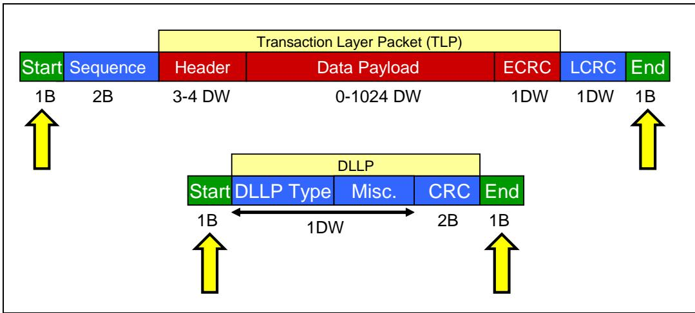

<table>
<tr>
<td width="50%">
Within this layer, each byte of a packet is split out across all of the lanes in use for the Link in a process called byte striping. Effectively, each lane operates as an independent serial path across the Link and their data is all aggregated back together at the receiver. Each byte is scrambled to reduce repetitive patterns on the transmission line and reduce EMI (electro-magnetic interference) seen on the Link. For the first two generations of PCIe (Gen1 and Gen2 PCIe), the 8-bit characters are encoded into 10-bit "symbols" using what is called 8b/10b encoding logic. This encoding adds overhead to the outgoing data stream, but also adds a number of useful characteristics (for more on this, see "8b/10b Encoding" on page 380). Gen3 Physical Layer logic when transmitting at Gen3 speed, does not encode the packet bytes using 8b/10b encoding. Rather another encoding scheme referred to as 128b/130b encoding is employed with the packet bytes scrambled transmitted. The 10b symbols on each Lane (Gen1 and Gen2) or the packet bytes on each Lane (Gen3) are then serialized and clocked out differentially on each Lane of the Link at 2.5 GT/s (Gen1), or 5 GT/s (Gen2) or 8 GT/s (Gen3).
</td>
<td width="50%" style="background-color:#e8e8e8">
在该层中，数据包的每个字节通过一种称为"字节拆分"(byte striping)的过程分散到链路所使用的所有通道上。实际上，每条通道都作为一条独立的串行路径在链路上运行，它们的数据在接收端全部重新汇聚。每个字节都进行加扰，以减少传输线路上的重复模式并降低链路上看到的EMI(电磁干扰)。对于前两代PCIe (Gen1和Gen2 PCIe)，8位字符被编码为10位"符号"(symbol)，使用所谓的8b/10b编码逻辑。这种编码为输出数据流增加了开销，但也增加了一些有用的特性(更多内容参见第380页的"8b/10b编码")。当以Gen3速度传输时，Gen3物理层逻辑不使用8b/10b编码对数据包字节进行编码。相反，采用另一种称为128b/130b编码的方案，将数据包字节加扰后传输。每条通道上的10b符号(Gen1和Gen2)或每条通道上的数据包字节(Gen3)随后被串行化，并以差分方式在链路的每条通道上以2.5 GT/s (Gen1)、5 GT/s (Gen2)或8 GT/s (Gen3)的速率时钟输出。
</td>
</tr>
<tr>
<td width="50%">
Receivers clock in the packet bits at the trained clock speeds as they arrive on all lanes. If 8b/10b is in use (at Gen1 and Gen2 mode), the serial bit stream of the packet is converted into 10-bit symbols using a deserializer so it's ready for 8b/10b decoding. However, before decoding, the symbols pass through an elastic buffer, a clever device that compensates for the slight difference in frequency between the internal clocks of two connected devices. Next, the 10-bit symbol stream is decoded back to the proper 8-bit characters via an 8b/10b decoder. Gen3 Physical Layer logic, when receiving serial bit stream of the packet at Gen3 speed, will convert it into a byte stream using a deserializer that has established block lock. The byte stream is passed through an elastic buffer which does clock tolerance compensation. The 8b/10b decoder stage is skipped given packets clocked at Gen3 speeds are not 8b/10b encoded. The 8-bit characters on all lanes are de-scrambled, the bytes from all the lanes are un-striped back into a single character stream and, finally, the original data stream from the Transmitter is recovered.
</td>
<td width="50%" style="background-color:#e8e8e8">
接收端在所有通道上以训练好的时钟速率对到达的数据包比特进行时钟采样。如果使用8b/10b编码(在Gen1和Gen2模式下)，数据包的串行比特流通过解串器(deserializer)转换为10位符号，以便进行8b/10b解码。然而，在解码之前，符号要先通过弹性缓冲(elastic buffer)——这是一种巧妙的装置，用于补偿两个连接设备内部时钟之间微小的频率差异。接下来，10位符号流通过8b/10b解码器解码回正确的8位字符。Gen3物理层逻辑在以Gen3速度接收数据包的串行比特流时，将使用已建立块锁定(block lock)的解串器将其转换为字节流。字节流通过弹性缓冲进行时钟容差补偿。由于以Gen3速度时钟传输的数据包未经过8b/10b编码，因此跳过8b/10b解码阶段。所有通道上的8位字符被解扰，来自所有通道的字节被反向拆分(un-striped)回单字符流，最终恢复出发送端(Transmitter)的原始数据流。
</td>
</tr>
</table>

## Link Training and Initialization | 链路训练与初始化

<table>
<tr>
<td width="50%">
Another responsibility of the Physical Layer is the initialization and training process on the Link. In this fully automatic process, several steps are taken to prepare the Link for normal operation, which involves determining the status of several optional conditions. For example, the Link width can be from one lane to 32 lanes, and multiple speeds might be available. The training process will discover these options and go through a state machine sequence to resolve the best combination. In that process, several things are checked or established to ensure proper and optimal operation, such as:
</td>
<td width="50%" style="background-color:#e8e8e8">
物理层的另一项职责是链路上的初始化与训练过程。在这个全自动的过程中，需执行若干步骤以使链路为正常运作做好准备，其中涉及确定多个可选条件的状态。例如，链路宽度可以是从一条通道到 32 条通道，并且可能支持多种速率。训练过程将发现这些选项，并通过状态机序列来确定最佳组合。在此过程中，会检查或建立若干事项以确保正确且最优的运作，例如：
</td>
</tr>
<tr>
<td width="50%">
• Link width • Link data rate • Lane reversal — Lanes connected in reverse order • Polarity inversion — Lane polarity connected backward • Bit lock per Lane — Recovering the transmitter clock • Symbol lock per Lane — Finding a recognizable position in the bit‑stream • Lane‑to‑Lane de‑skew within a multi‑Lane Link.
</td>
<td width="50%" style="background-color:#e8e8e8">
• 链路宽度 • 链路数据速率 • 通道反转 — 通道以反向顺序连接 • 极性反转 — 通道极性反接 • 每通道位锁定 — 恢复发送端时钟 • 每通道符号锁定 — 在位流中找到可识别的位置 • 多通道链路内的通道间去偏移。
</td>
</tr>
</table>

<table>
<tr>
<td width="50%">
Physical Layer - Electrical
</td>
<td width="50%" style="background-color:#e8e8e8">
物理层 - 电气特性
</td>
</tr>
<tr>
<td width="50%">
The physical sender and receiver on a Link are connected with an AC-coupled Link as shown in Figure 2-29 on page 79. The term "AC-coupled" simply means that a capacitor resides physically in the path between the devices and serves to pass the high-frequency (AC) component of the signal while blocking the low-frequency (DC) part. Many serial transports use this approach because it allows the common mode voltage (the level at which the positive and negative versions of the signal cross) to be different at the transmitter and receiver, meaning they're not required to have the same reference voltage. This isn't a big issue if the two devices are nearby and in the same box, but if they were in different buildings it would be very difficult for them to have a common reference voltage that was precisely the same.
</td>
<td width="50%" style="background-color:#e8e8e8">
链路上的物理发送器和接收器通过交流耦合链路连接，如图2-29（第79页）所示。术语"交流耦合"简单意味着在设备之间的路径中物理放置了一个电容器，用于传递信号的高频（交流）分量，同时阻挡低频（直流）部分。许多串行传输采用这种方法，因为它允许共模电压（信号正负版本交叉的电压水平）在发送器和接收器处不同，这意味着它们不需要具有相同的参考电压。如果两个设备距离很近且位于同一机箱内，这不是什么大问题，但如果它们位于不同的建筑中，要使它们具有完全相同的一致参考电压将非常困难。
</td>
</tr>
</table>

Figure 2-29: Physical Layer Electrical | 图2-29：物理层电气

## Ordered Sets | 有序集

<table>
<tr>
<td width="50%">
The last type of traffic sent between devices uses only the Physical Layers. Although easily recognized by the receiver, this information is not technically in the form of a packet because it doesn't have Start and End characters, for example. Instead, it's organized into what are called Ordered Sets that originate at the Transmitter's Physical Layer and terminate at the Receiver's Physical Layer, as shown in Figure 2-30 on page 80.
< | td>
<td width="50%" style="background-color:#e8e8e8">
设备之间发送的最后一种类型的流量仅使用物理层。尽管接收器可以很容易地识别这些信息，但从技术上讲，它并不采用数据包的形式，因为它没有起始和结束字符。相反，它被组织成所谓的有序集（Ordered Sets），这些有序集起源于发送器的物理层并终止于接收器的物理层，如图2-30（第80页）所示。
</td>
</tr>
<tr>
<td width="50%">
For Gen1 and Gen2 data rates, an Ordered Set starts with a single COM character followed by three or more other characters that define the information to be sent. The nomenclature for the type of characters used in PCIe is discussed in more detail in "Character Notation" on page 382; for now it's enough to say that the COM character has characteristics that make it work well for this purpose.
</td>
<td width="50%" style="background-color:#e8e8e8">
对于Gen1和Gen2数据速率，一个有序集以一个COM字符开始，后跟三个或更多其他字符，这些字符定义了要发送的信息。PCIe中使用的字符类型的命名法在第382页的"字符表示法"中有更详细的讨论；目前只需知道COM字符具有使其非常适合此目的的特性即可。
</td>
</tr>
<tr>
<td width="50%">
Ordered Sets are always a multiple of 4 bytes in size, and an example is shown in Figure 2-31 on page 80. In Gen3 mode of operation, the Ordered Set format is different from Gen1/Gen2 described above. Details to be covered in Chapter 14, entitled "Link Initialization & Training," on page 505.
</td>
<td width="50%" style="background-color:#e8e8e8">
有序集的大小始终是4字节的整数倍，图2-31（第80页）展示了一个示例。在Gen3工作模式下，有序集的格式与上述Gen1/Gen2不同。详细内容将在第14章"链路初始化与训练"（第505页）中介绍。
</td>
</tr>
<tr>
<td width="50%">
Ordered Sets always terminate at the neighboring device and are not routed through the PCIe fabric.
</td>
<td width="50%" style="background-color:#e8e8e8">
有序集始终终止于相邻设备，不会通过PCIe架构进行路由。
</td>
</tr>
</table>

Figure 2-30: Ordered Sets Origin and Destination | 图2-30：有序集源和目的

<table>
<tr>
<td width="50%">
Ordered Sets are used in the Link Training process, as described in Chapter 14, entitled "Link Initialization & Training," on page 505. They're also used to compensate for the slight differences between the internal clocks of the transmitter and receiver, a process called clock tolerance compensation. Finally, Ordered Sets are used to indicate entry into or exit from a low power state on the Link.
</td>
<td width="50%" style="background-color:#e8e8e8">
有序集用于链路训练过程，如第14章"链路初始化与训练"（第505页）所述。它们还用于补偿发送器和接收器内部时钟之间的微小差异，这一过程称为时钟容差补偿。最后，有序集还用于指示链路上低功耗状态的进入或退出。
</td>
</tr>
</table>

Figure 2-31: Ordered-Set Structure | 图2-31：有序集结构

## Protocol Review Example | 协议回顾示例

<table>
<tr>
<td width="50%">
At this point, let's review the overall Link protocol by using an example to illustrate the steps that take place from the time a Requester initiates a memory read request until it obtains the requested data from a Completer.
</td>
<td width="50%" style="background-color:#e8e8e8">
此处，让我们通过一个示例来回顾整个链路协议，该示例将说明从请求方发起存储器读请求到它从完成方获取所请求数据的整个过程所涉及的各个步骤。
</td>
</tr>
</table>

## Memory Read Request | 存储器读请求

<table>
<tr>
<td width="50%">
For the first part of the discussion, refer to Figure 2‑32 on page 81. The Requester's Device Core or Software Layer sends a request to the Transaction Layer and includes the following information: 32‑bit or 64‑bit memory address, transaction type, amount of data to read calculated in dwords, traffic class, byte enables, attributes etc.
</td>
<td width="50%" style="background-color:#e8e8e8">
关于讨论的第一部分，请参见第81页的图2‑32。请求方的设备核心或软件层向事务层发送一个请求，其中包含以下信息：32位或64位存储器地址、事务类型、以双字（dword）计算的待读取数据量、流量类、字节使能、属性等。
</td>
</tr>
</table>

Figure 2‑32: Memory Read Request Phase | 图2‑32：存储器读请求阶段
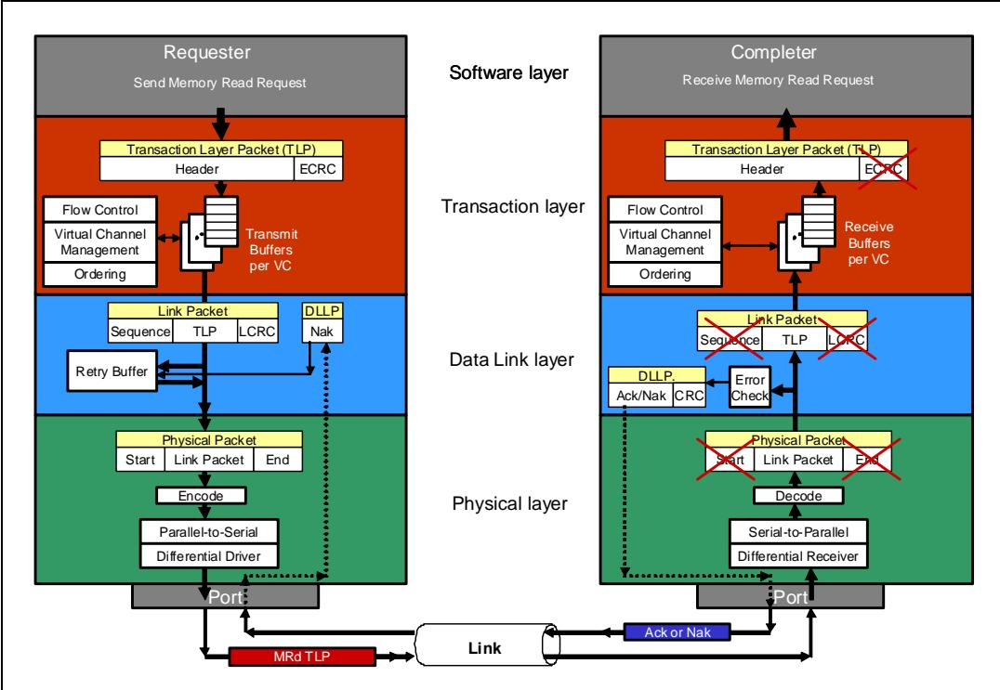

## PCI Express Technology | PCI Express 技术

<table>
<tr>
<td width="50%">
The Transaction layer uses this information to build a MRd TLP. The details of the TLP packet format are described later, but for now it's enough to say that a 3 DW or 4 DW header is created depending on address size (32-bit or 64-bit). In addition, the Transaction Layer adds the Requester ID (bus#, device#, function#) to the header so the Completer can use that to return the completion. The TLP is placed in the appropriate virtual channel buffer to wait its turn for transmission. Once the TLP has been selected, the Flow Control logic confirms there is sufficient space available in the neighboring device's receive buffer (VC), and then the memory read request TLP is sent to the Data Link Layer.
</td>
<td width="50%" style="background-color:#e8e8e8">
事务层使用这些信息来构建一个存储器读请求 TLP（MRd TLP）。TLP 包格式的细节将在后文描述，但就目前而言，只需知道根据地址大小（32 位或 64 位）会创建一个 3 DW 或 4 DW 的包头。此外，事务层将请求者 ID（总线号、设备号、功能号）添加到包头中，以便完成者可以使用该信息返回完成报文。TLP 被放入相应的虚通道缓冲中等待发送。一旦该 TLP 被选中发送，流控逻辑会确认相邻设备的接收缓冲（VC）中有足够的可用空间，然后该存储器读请求 TLP 被发送到数据链路层。
</td>
</tr>
<tr>
<td width="50%">
The Data Link Layer adds a 12-bit Sequence Number and a 32-bit LCRC value to the packet. A copy of the TLP with Sequence Number and LCRC is stored in the Replay Buffer and the packet is forwarded to the Physical Layer.
</td>
<td width="50%" style="background-color:#e8e8e8">
数据链路层为包添加一个 12 位的序列号和一个 32 位的 LCRC 值。带有序列号和 LCRC 的 TLP 副本被存储在重放缓冲中，然后该包被转发到物理层。
</td>
</tr>
<tr>
<td width="50%">
In the Physical Layer the Start and End characters are added to the packet, which is then byte striped across the available Lanes, scrambled, and 8b/10b encoded. Finally the bits are serialized on each lane and transmitted differentially across the Link to the neighbor.
</td>
<td width="50%" style="background-color:#e8e8e8">
在物理层中，起始字符和结束字符被添加到包上，然后该包被字节拆分到可用的通道上、进行加扰和 8b/10b 编码。最后，每个通道上的比特被串行化，并通过链路差分传输到相邻设备。
</td>
</tr>
<tr>
<td width="50%">
The Completer de-serializes the incoming bit stream back into 10-bit symbols and passes them through the elastic buffer. The 10-bit symbols are decoded back to bytes and the bytes from all Lanes are de-scrambled and un-striped. The Start and End characters are detected and removed. The rest of the TLP is forwarded up to the Data Link Layer.
</td>
<td width="50%" style="background-color:#e8e8e8">
完成者将输入的比特流解串化回 10 位符号，并将其通过弹性缓冲。10 位符号被解码回字节，所有通道的字节被解扰和还原合并。起始字符和结束字符被检测并移除。TLP 的其余部分被向上转发到数据链路层。
</td>
</tr>
<tr>
<td width="50%">
The Completer's Data Link Layer checks for LCRC errors in the received TLP and checks the Sequence Number for missing or out-of-sequence TLPs. If there's no error, it creates an Ack that contains the same Sequence Number that was used in the read request. A 16-bit CRC is calculated and appended to the Ack contents to create a DLLP that is sent back to the Physical Layer which adds the proper framing symbols and transmits the Ack DLLP to the Requester.
</td>
<td width="50%" style="background-color:#e8e8e8">
完成者的数据链路层检查接收到的 TLP 中的 LCRC 错误，并检查序列号是否存在丢失或乱序的 TLP。如果没有错误，它会创建一个 Ack，其中包含与读请求中使用的相同序列号。计算出一个 16 位 CRC 并附加到 Ack 内容上，从而创建一个 DLLP，该 DLLP 被发送回物理层，物理层添加适当的帧符号并将 Ack DLLP 发送给请求者。
</td>
</tr>
<tr>
<td width="50%">
The Requester Physical Layer receives the Ack DLLP, checks and removes the framing symbols, and forwards it up to the Data Link Layer. If the CRC is valid, it compares the acknowledged Sequence Number with the Sequence Numbers of the TLPs stored in the Replay Buffer. The stored memory read request TLP associated with the Ack received is recognized and that TLP is discarded from the Replay Buffer. If a Nak DLLP was received by the Requester instead, it would re-send a copy of the stored memory read request TLP. Since the DLLP only has meaning to the Data Link Layer, nothing is forwarded to the Transaction Layer.
</td>
<td width="50%" style="background-color:#e8e8e8">
请求者的物理层接收 Ack DLLP，检查并移除帧符号，然后将其向上转发到数据链路层。如果 CRC 有效，它会将已确认的序列号与重放缓冲中存储的 TLP 的序列号进行比较。与收到的 Ack 相关联的已存储存储器读请求 TLP 被识别出来，该 TLP 从重放缓冲中被丢弃。如果请求者收到的是 Nak DLLP，它将重新发送已存储的存储器读请求 TLP 的副本。由于 DLLP 仅对数据链路层有意义，因此不会有任何内容被转发到事务层。
</td>
</tr>
<tr>
<td width="50%">
In addition to generating the Ack, the Completer's Link Layer also forwards the TLP up to its Transaction Layer. In the Completer's Transaction Layer, the TLP is placed in the appropriate VC receive buffer to be processed. An optional ECRC check can be performed, and if no error is found, the contents of the header (address, Requester ID, memory read transaction type, amount of data requested, traffic class etc.) are forwarded to the Completer's Software Layer.
</td>
<td width="50%" style="background-color:#e8e8e8">
除了生成 Ack 之外，完成者的链路层还将 TLP 向上转发到其事务层。在完成者的事务层中，TLP 被放入相应的 VC 接收缓冲中进行处理。可以执行可选的 ECRC 检查，如果没有发现错误，包头的内容（地址、请求者 ID、存储器读事务类型、请求的数据量、流量类等）将被转发到完成者的软件层。
</td>
</tr>
</table>

## Completion with Data | 带数据的完成报文

<table>
<tr>
<td width="50%">
For the second half of this discussion, refer to Figure 2-33 on page 83. To service the memory read request, the Completer Device Core/Software Layer sends a completion with data (CplD) request down to its Transaction Layer that includes the Requester ID and Tag copied from the original memory read request, transaction type, other parts of the completion header contents and the requested data.
</td>
<td width="50%" style="background-color:#e8e8e8">
关于本讨论的下半部分，请参考第83页的图2-33。为服务该存储器读请求，完成者设备核心/软件层向其事务层发送一个带数据的完成报文（CplD）请求，该请求包含了从原始存储器读请求中复制的请求者ID和标记、事务类型、完成报文头部内容的其他部分以及所请求的数据。
</td>
</tr>
</table>

Figure 2-33: Completion with Data Phase | 图2-33：带数据阶段的完成

<table>
<tr>
<td width="50%">
The Transaction layer uses this information to build the CplD TLP, which always has a 3 DW header (it uses ID routing and never needs a 64-bit address). It also adds its own Completer ID to the header. This packet is also placed into the appropriate VC transmit buffer and, once selected, the flow control logic verifies that sufficient space is available at the neighboring device to receive this packet and, once confirmed, forwards the packet down to the Data Link Layer.
</td>
<td width="50%" style="background-color:#e8e8e8">
事务层使用这些信息来构建CplD TLP，该TLP始终具有3 DW的头部（它使用ID路由，从不需要64位地址）。事务层同时将其自身的完成者ID添加到头部中。该包同样被放入相应的虚通道（VC）发送缓冲中，一旦被选中，流控逻辑会验证相邻设备是否有足够空间接收该包，一旦确认，便将包向下转发至数据链路层。
</td>
</tr>
<tr>
<td width="50%">
As before, the Data Link Layer adds a 12-bit Sequence Number and a 32-bit LCRC to the packet. A copy of the TLP with Sequence Number and LCRC is stored in the Replay Buffer and the packet is forwarded to the Physical Layer.
</td>
<td width="50%" style="background-color:#e8e8e8">
与之前相同，数据链路层为该包添加一个12位的序列号和一个32位的LCRC。带有序列号和LCRC的TLP副本被存储在重播缓冲中，然后该包被转发至物理层。
</td>
</tr>
<tr>
<td width="50%">
As before, the Physical Layer adds a Start and End character to the packet, byte stripes it across the available lanes, scrambles it, and 8b/10b encodes it. Finally, the CplD packet is serialized on all lanes and transmitted differentially across the Link to the neighbor.
</td>
<td width="50%" style="background-color:#e8e8e8">
与之前相同，物理层为该包添加起始和结束字符，在所有可用通道上进行字节拆分，对其进行加扰，并进行8b/10b编码。最后，CplD包在所有通道上被串行化，并以差分方式通过链路发送给相邻设备。
</td>
</tr>
<tr>
<td width="50%">
The Requester converts the incoming serial bit stream back to 10-bit symbols and passes them through the elastic buffer. The 10-bit symbols are decoded back to bytes, de-scrambled and un-striped. The Start and End characters are detected and removed and the resultant TLP is sent up to the Data Link Layer.
</td>
<td width="50%" style="background-color:#e8e8e8">
请求者将传入的串行比特流转换回10位符号，并将其通过弹性缓冲。这些10位符号被解码回字节，进行解扰和去拆分。起始和结束字符被检测并移除，得到的TLP被向上发送至数据链路层。
</td>
</tr>
<tr>
<td width="50%">
As before, the Data Link Layer checks for LCRC errors in the received CplD TLP and checks the Sequence Number for missing or out-of-sequence TLPs. If there are no errors, it creates an Ack DLLP which contains the same Sequence Number as the CplD TLP used. A 16-bit CRC is added to the Ack DLLP and it's sent back to the Physical Layer which adds the proper framing symbols and transmits the Ack DLLP to the Completer.
</td>
<td width="50%" style="background-color:#e8e8e8">
与之前相同，数据链路层检查接收到的CplD TLP中的LCRC错误，并检查序列号以确认是否有丢失或乱序的TLP。如果没有错误，则创建一个Ack DLLP，其中包含与所用CplD TLP相同的序列号。一个16位的CRC被添加到Ack DLLP中，然后其被送回物理层，物理层添加适当的帧符号并将Ack DLLP发送给完成者。
</td>
</tr>
<tr>
<td width="50%">
The Completer Physical Layer checks and removes the framing symbols from the Ack DLLP and sends the remainder up to the Data Link Layer which checks the CRC. If there are no errors, it compares the Sequence Number with the Sequence Numbers for the TLPs stored in the Replay Buffer. The stored CplD TLP associated with the Ack received is recognized and that TLP is discarded from the Replay Buffer. If a Nak DLLP was received by the Completer instead, it would re-send a copy of the stored CplD TLP.
</td>
<td width="50%" style="background-color:#e8e8e8">
完成者物理层检查并移除Ack DLLP的帧符号，并将剩余部分向上发送至数据链路层，后者检查CRC。如果没有错误，则将序列号与存储在重播缓冲中的TLP的序列号进行比对。与所收到的Ack相关联的已存储CplD TLP被识别，且该TLP从重播缓冲中被丢弃。如果完成者收到的是Nak DLLP，则它将重新发送已存储的CplD TLP的副本。
</td>
</tr>
<tr>
<td width="50%">
In the meantime, the Requester Transaction Layer receives the CplD TLP in the appropriate virtual channel buffer. Optionally, the Transaction layer can check for an ECRC error. If there are no errors, it forwards the header contents and data payload, including the Completion Status, to the Requester Software Layer, and we're done.
</td>
<td width="50%" style="background-color:#e8e8e8">
与此同时，请求者事务层在相应的虚通道缓冲中接收CplD TLP。可选地，事务层可检查ECRC错误。如果没有错误，则将头部内容和数据载荷（包括完成状态）转发至请求者软件层，至此整个过程完成。
</td>
</tr>
</table>

# 3 Configuration Overview | 3 配置概述

## The Previous Chapter | 上一章回顾

<table>
<tr>
<td width="50%">
The previous chapter provides a thorough introduction to the PCI Express architecture and is intended to serve as an "executive level" overview. It introduces the layered approach to PCIe port design described in the spec. The various packet types are introduced along with the transaction protocol.
</td>
<td width="50%" style="background-color:#e8e8e8">
上一章对 PCI Express 架构进行了全面介绍，旨在提供一个"执行层级别"的概述。该章介绍了规范中所描述的 PCIe 端口设计的分层方法，并引入了各种数据包类型以及事务协议。
</td>
</tr>
</table>

## This Chapter | 本章内容

<table>
<tr>
<td width="50%">
This chapter provides an introduction to configuration in the PCIe environment. This includes the space in which a Function's configuration registers are implemented, how a Function is discovered, how configuration transactions are generated and routed, the difference between PCI-compatible configuration space and PCIe extended configuration space, and how software differentiates between an Endpoint and a Bridge.
</td>
<td width="50%" style="background-color:#e8e8e8">
本章介绍PCIe环境中的配置机制。内容包括：Function配置寄存器所在的实现空间、如何发现Function、如何生成和路由配置事务、PCI兼容配置空间与PCIe扩展配置空间之间的区别，以及软件如何区分端点（Endpoint）与桥（Bridge）。
</td>
</tr>
</table>

## The Next Chapter | 下一章

<table>
<tr>
<td width="50%">
The next chapter describes the purpose and methods of a function requesting memory or IO address space through Base Address Registers (BARs) and how software initializes them. The chapter describes how bridge Base/Limit registers are initialized, thus allowing switches to route TLPs through the PCIe fabric.
</td>
<td width="50%" style="background-color:#e8e8e8">
下一章将描述一个功能（function）通过基址寄存器（BAR）请求存储器或IO地址空间的目的和方法，以及软件如何对其进行初始化。该章还描述了桥基址/界限寄存器（Base/Limit寄存器）的初始化方式，从而使交换机能够通过PCIe架构路由TLP（事务层包）。
</td>
</tr>
</table>

## Definition of Bus, Device and Function | 总线、设备与功能的定义

<table>
<tr>
<td width="50%">
Just as in PCI, every PCIe Function is uniquely identified by the Device it resides within and the Bus to which the Device connects. This unique identifier is commonly referred to as a 'BDF'. Configuration software is responsible for detecting every Bus, Device and Function (BDF) within a given topology. The following sections discuss the primary BDF characteristics in the context of a sample PCIe topology. Figure 3-1 on page 87 depicts a PCIe topology that highlights the Buses, Devices and Functions implemented in a sample system. Later in this chapter the process of assigning Bus and Device Numbers is explained.
</td>
<td width="50%" style="background-color:#e8e8e8">
与 PCI 一样，每个 PCIe 功能由其所在的设备以及该设备所连接的总线来唯一标识。该唯一标识符通常被称为"BDF"。配置软件负责检测给定拓扑中的每一个总线、设备和功能（BDF）。后续章节将结合一个示例 PCIe 拓扑来讨论 BDF 的主要特征。第 87 页的图 3-1 描绘了一个 PCIe 拓扑，突出展示了示例系统中实现的总线、设备和功能。本章稍后将解释总线号和设备号的分配过程。
</td>
</tr>
</table>

## PCIe Buses | PCIe 总线

<table>
<tr>
<td width="50%">
Up to 256 Bus Numbers can be assigned by configuration software.
</td>
<td width="50%" style="background-color:#e8e8e8">
配置软件最多可分配 256 个总线号。
</td>
</tr>
<tr>
<td width="50%">
The initial Bus Number, Bus 0, is typically assigned by hardware to the Root Complex.
</td>
<td width="50%" style="background-color:#e8e8e8">
初始总线号，即总线 0，通常由硬件分配给根复合体 (Root Complex)。
</td>
</tr>
<tr>
<td width="50%">
Bus 0 consists of a Virtual PCI bus with integrated endpoints and Virtual PCI-to-PCI Bridges (P2P) which are hard-coded with a Device number and Function number.
</td>
<td width="50%" style="background-color:#e8e8e8">
总线 0 由一条虚拟 PCI 总线构成，其上包含集成的端点以及虚拟 PCI-to-PCI 桥 (P2P)，这些桥的设备号 (Device Number) 和功能号 (Function Number) 都是硬编码的。
</td>
</tr>
<tr>
<td width="50%">
Each P2P bridge creates a new bus that additional PCIe devices can be connected to.
</td>
<td width="50%" style="background-color:#e8e8e8">
每个 P2P 桥都会创建一条新的总线，可连接额外的 PCIe 设备。
</td>
</tr>
<tr>
<td width="50%">
Each bus must be assigned a unique bus number.
</td>
<td width="50%" style="background-color:#e8e8e8">
每条总线必须分配一个唯一的总线号。
</td>
</tr>
<tr>
<td width="50%">
Configuration software begins the process of assigning bus numbers by searching for bridges starting with Bus 0, Device 0, Function 0.
</td>
<td width="50%" style="background-color:#e8e8e8">
配置软件从总线 0、设备 0、功能 0 开始搜索桥，从而启动总线号分配过程。
</td>
</tr>
<tr>
<td width="50%">
When a bridge is found, software assigns the new bus a bus number that is unique and larger than the bus number the bridge lives on.
</td>
<td width="50%" style="background-color:#e8e8e8">
当发现一个桥时，软件会为该桥所创建的新总线分配一个唯一且大于桥所在总线号的总线号。
</td>
</tr>
<tr>
<td width="50%">
Once the new bus has been assigned a bus number, software begins looking for bridges on the new bus before continuing scanning for more bridges on the current bus.
</td>
<td width="50%" style="background-color:#e8e8e8">
一旦新总线被分配了总线号，软件就会开始在新总线上查找桥，然后再继续扫描当前总线上的其他桥。
</td>
</tr>
<tr>
<td width="50%">
This is referred to as a "depth first search" and is described in detail in "Enumeration - Discovering the Topology" on page 104.
</td>
<td width="50%" style="background-color:#e8e8e8">
这种方式被称为"深度优先搜索"(depth first search)，并在第 104 页"枚举——发现拓扑结构"(Enumeration - Discovering the Topology) 一节中有详细描述。
</td>
</tr>
</table>

## PCIe Devices | PCIe 设备

<table>
<tr>
<td width="50%">
PCIe permits up to 32 device attachments on a single PCI bus, however, the point‐to‐point nature of PCIe means only a single device can be attached directly to a PCIe link and that device will always end up being Device 0. Root Complexes and Switches have Virtual PCI buses which do allow multiple Devices being "attached" to the bus. Each Device must implement Function 0 and may contain a collection of up to eight Functions. When two or more Functions are implemented the Device is called a multi‐function device.
</td>
<td width="50%" style="background-color:#e8e8e8">
PCIe 允许在单条 PCI 总线上连接最多 32 个设备，然而，PCIe 的点对点特性意味着只有单个设备可以直接连接到一条 PCIe 链路上，并且该设备将始终成为设备 0。根复合体和交换机拥有虚拟 PCI 总线，这些虚拟 PCI 总线允许多个设备"连接"到总线上。每个设备必须实现功能 0，并且可以包含最多八个功能的集合。当实现了两个或更多功能时，该设备被称为多功能设备。
</td>
</tr>
</table>

Figure 3-1: Example System | 图3-1：示例系统

## PCIe Functions | PCIe 功能

<table>
<tr>
<td width="50%">
As previously discussed Functions are designed into every Device. These Functions may include hard drive interfaces, display controllers, ethernet controllers, USB controllers, etc. Devices that have multiple Functions do not need to be implemented sequentially. For example, a Device might implement Functions 0, 2, and 7. As a result, when configuration software detects a multifunction device, each of the possible Functions must be checked to learn which of them are present. Each Function also has its own configuration address space that is used to setup the resources associated with the Function.
</td>
<td width="50%" style="background-color:#e8e8e8">
如前所述，每个设备中都设计了功能（Function）。这些功能可能包括硬盘驱动器接口、显示控制器、以太网控制器、USB控制器等。具有多个功能的设备不需要按顺序实现。例如，一个设备可能实现功能0、功能2和功能7。因此，当配置软件检测到一个多功能设备时，必须检查每个可能的功能以确定哪些功能存在。每个功能还拥有自己的配置地址空间，用于设置与该功能相关的资源。
</td>
</tr>
</table>

## Configuration Address Space | 配置地址空间

<table>
<tr>
<td width="50%">
The first PCs required users to set switches and jumpers to assign resources for each card installed and this frequently resulted in conflicting memory, IO and interrupt settings. The subsequent IO architectures, Extended ISA (EISA) and the IBM PS2 systems, were the first to implemented plug and play architectures. In these architectures configuration files were shipped with each plug-in card that allowed system software to assign basic resources. PCI extended this capability by implementing standardized configuration registers that permit generic shrink-wrapped OSs to manage virtually all system resources. Having a standard way to enable error reporting, interrupt delivery, address mapping and more, allows one entity, the configuration software, to allocate and configure the system resources which virtually eliminates resource conflicts.
</td>
<td width="50%" style="background-color:#e8e8e8">
早期的PC要求用户设置开关和跳线来为每块安装的卡分配资源，这经常导致内存、IO和中断设置的冲突。随后的IO体系结构——扩展ISA（EISA）和IBM PS2系统——是最早实现即插即用架构的。在这些架构中，每块插卡都附带配置文件，允许系统软件分配基本资源。PCI通过实现标准化的配置寄存器扩展了这一能力，使得通用的成品操作系统能够管理几乎所有的系统资源。拥有一种标准方式来启用错误报告、中断传递、地址映射等功能，使得一个实体——配置软件——能够分配和配置系统资源，从而几乎消除了资源冲突。
</td>
</tr>
<tr>
<td width="50%">
PCI defines a dedicated block of configuration address space for each Function. Registers mapped into the configuration space allow software to discover the existence of a Function, configure it for normal operation and check the status of the Function. Most of the basic functionality that needs to be standardized is in the header portion of the configuration register block, but the PCI architects realized that it would beneficial to standardize optional features, called capability structures (e.g. Power Management, Hot Plug, etc.). The PCI-Compatible configuration space includes 256 bytes for each Function.
</td>
<td width="50%" style="background-color:#e8e8e8">
PCI为每个功能定义了一块专用的配置地址空间。映射到配置空间中的寄存器允许软件发现功能的存在、将其配置为正常工作状态并检查功能的状态。大多数需要标准化的基本功能位于配置寄存器块的头部区域，但PCI架构师意识到，将可选特性（称为能力结构，例如电源管理、热插拔等）标准化也是有益的。PCI兼容的配置空间为每个功能包含256字节。
</td>
</tr>
</table>

<table>
<tr>
<td width="50%">
PCI-Compatible Space
</td>
<td width="50%" style="background-color:#e8e8e8">
PCI兼容空间
</td>
</tr>
<tr>
<td width="50%">
Refer to Figure 3-2 on page 89 during the following discussion. The 256 bytes of PCI-compatible configuration space was so named because it was originally designed for PCI. The first 16 dwords (64 bytes) of this space are the configuration header (Header Type 0 or Header Type 1). Type 0 headers are required for every Function except for the bridge functions that use a Type 1 header. The remaining 48 dwords are used for optional registers including PCI capability structures. For PCIe Functions, some capability structures are required. For example, PCIe Functions must implement the following Capability Structures:
</td>
<td width="50%" style="background-color:#e8e8e8">
在以下讨论中，请参阅第89页的图3-2。256字节的PCI兼容配置空间之所以如此命名，是因为它最初是为PCI设计的。该空间的前16个双字（64字节）是配置头（Header Type 0或Header Type 1）。除使用Type 1头的桥功能外，每个功能都必须实现Type 0头。其余48个双字用于可选寄存器，包括PCI能力结构。对于PCIe功能，某些能力结构是必需的。例如，PCIe功能必须实现以下能力结构：
</td>
</tr>
<tr>
<td width="50%">
PCI Express Capability
</td>
<td width="50%" style="background-color:#e8e8e8">
PCI Express能力
</td>
</tr>
<tr>
<td width="50%">
Power Management
</td>
<td width="50%" style="background-color:#e8e8e8">
电源管理
</td>
</tr>
<tr>
<td width="50%">
MSI and/or MSI-X
</td>
<td width="50%" style="background-color:#e8e8e8">
MSI和/或MSI-X
</td>
</tr>
</table>

Figure 3-2: PCI Compatible Configuration Register Space | 图3-2：PCI兼容配置寄存器空间

## Extended Configuration Space | 扩展配置空间

<table>
<tr>
<td width="50%">
Refer to Figure 3‑3 on page 90 during this discussion. When PCIe was introduced, there was not enough room in the original 256‑byte configuration region to contain all the new capability structures needed. So the size of configuration space was expanded from 256 bytes per function to 4KB, called the Extended Configuration Space. The 960‑dword Extended Configuration area is only accessible using the Enhanced configuration mechanism and is therefore not visible to legacy PCI software. It contains additional optional Extended Capability registers for PCIe such as those listed in Figure 3‑3 (not a complete list).
</td>
<td width="50%" style="background-color:#e8e8e8">
在讨论过程中请参考第90页的图3‑3。当PCIe被引入时，原有的256字节配置区域空间不足，无法容纳所有需要的新能力结构。因此，配置空间的大小从每个功能256字节扩展到了4KB，称为扩展配置空间（Extended Configuration Space）。960双字的扩展配置区域仅能通过增强型配置机制（Enhanced Configuration Mechanism）访问，因此对于传统的PCI软件是不可见的。该区域包含了额外的可选PCIe扩展能力寄存器，例如图3‑3中所列出的那些（并非完整列表）。
</td>
</tr>
</table>

Figure 3‑3: 4KB Configuration Space per PCI Express Function | 图3‑3：每个PCI Express功能的4KB配置空间

<table>
<tr>
<td width="50%">
Host-to-PCI Bridge Configuration Registers
</td>
<td width="50%" style="background-color:#e8e8e8">
主机至PCI桥配置寄存器
</td>
</tr>
</table>

## General | 概述

<table>
<tr>
<td width="50%">
The Host-to-PCI bridge's configuration registers don't have to be accessible using either of the configuration mechanisms mentioned in the previous section. Instead, it's typically implemented as device-specific registers in memory address space, which is known by the platform firmware. However, its configuration register layout and usage must adhere to the standard Type 0 template defined by the PCI 2.3 specification.
</td>
<td width="50%" style="background-color:#e8e8e8">
主桥到PCI桥的配置寄存器不必通过前文所述的任何一种配置机制来访问。相反，它通常被实现为位于存储器地址空间中的设备特定寄存器，其地址由平台固件所知。然而，其配置寄存器的布局与用法必须遵循PCI 2.3规范定义的标准Type 0模板。
</td>
</tr>
</table>

## Only the Root Sends Configuration Requests | 仅根复合体发送配置请求

<table>
<tr>
<td width="50%">
The specification states that only the Root Complex is permitted to originate Configuration Requests. It acts as the system processor's liaison to inject Requests into the fabric and pass Completions back. The ability to originate configuration transactions is restricted to the processor through the Root Complex to avoid the anarchy that could result if any device had the ability to change the configuration of other devices.
</td>
<td width="50%" style="background-color:#e8e8e8">
规范规定，仅根复合体（Root Complex）被允许发起配置请求。它作为系统处理器的联络中介，负责将请求注入到互连架构中并将完成报文传回。发起配置事务的能力被限制为仅处理器通过根复合体来行使，以避免若任何设备都能更改其他设备的配置而可能导致的混乱局面。
</td>
</tr>
<tr>
<td width="50%">
Since only the Root can initiate these requests, they also can only move downstream, which means that peer-to-peer Configuration Requests are not allowed. The Requests are routed based on the target device's ID, meaning its BDF (Bus number in the topology, Device number on that bus, and Function number within that Device).
</td>
<td width="50%" style="background-color:#e8e8e8">
由于只有根复合体能够发起这些请求，因此它们也只能向下游方向移动，这意味着不允许点到点配置请求。这些请求根据目标设备的ID（即其BDF：拓扑中的总线号、该总线上的设备号以及该设备内的功能号）进行路由。
</td>
</tr>
</table>

<table>
<tr>
<td width="50%">
Generating Configuration Transactions
</td>
<td width="50%" style="background-color:#e8e8e8">
生成配置事务
</td>
</tr>
<tr>
<td width="50%">
Processors are generally unable to perform configuration read and write requests directly because they can only generate memory and IO requests. That means the Root Complex will need to translate certain of those accesses into configuration requests in support of this process. Configuration space can be accessed using either of two mechanisms:
</td>
<td width="50%" style="background-color:#e8e8e8">
处理器通常无法直接执行配置读写请求，因为它们只能生成存储器和IO请求。这意味着根复合体需要将某些此类访问转换为配置请求以支持这一过程。配置空间可以通过以下两种机制之一进行访问：
</td>
</tr>
<tr>
<td width="50%">
The legacy PCI configuration mechanism, using IO-indirect accesses.
</td>
<td width="50%" style="background-color:#e8e8e8">
传统的PCI配置机制，使用IO间接访问。
</td>
</tr>
<tr>
<td width="50%">
The enhanced configuration mechanism, using memory-mapped accesses.
</td>
<td width="50%" style="background-color:#e8e8e8">
增强型配置机制，使用存储器映射访问。
</td>
</tr>
</table>

## Legacy PCI Mechanism | 传统PCI机制

<table>
<tr>
<td width="50%">
The PCI spec defined an IO‑indirect method for instructing the system (the Root Complex or its equivalent) to perform PCI configuration accesses. As it happened, the dominant PC processors (Intel x86) were only designed to address 64KB of IO address space. By the time PCI was defined, this limited IO space had become badly cluttered and only a few address ranges remained available: 0800h ‑ 08FFh and 0C00h ‑ 0CFFh. Consequently, it wasn't feasible to map the configuration registers for all the possible Functions directly into IO space. At the same time, memory address space was also limited in size and mapping all of configuration space into memory address space was not seen as a good solution either. So the spec writers chose a commonly‑used solution to this problem, use indirect address mapping instead. To do this, one register holds the target address, while a second holds the data going to or coming from the target. A write to the address register, followed by a read or write to the data register, causes a single read or write transaction to the correct internal address for the target function. This solves the problem of limited address space nicely, but it means that two IO accesses are needed to create one configuration access.
</td>
<td width="50%" style="background-color:#e8e8e8">
PCI规范定义了一种IO间接方法，用于指示系统（根复合体或其等效组件）执行PCI配置访问。当时，主流的PC处理器（Intel x86）仅能寻址64KB的IO地址空间。到PCI规范定义时，这有限的IO空间已变得非常拥挤，只剩下少数几个地址范围可用：0800h‑08FFh和0C00h‑0CFFh。因此，将所有可能功能的配置寄存器直接映射到IO空间中是不现实的。同时，内存地址空间的大小也有限，将所有配置空间映射到内存地址空间同样不被视为好的解决方案。因此，规范制定者选择了一种常用的方法来解决这个问题，即采用间接地址映射。为此，一个寄存器保存目标地址，另一个寄存器保存送往或来自目标的数据。向地址寄存器写入后，再向数据寄存器读取或写入，即可对目标功能的正确内部地址发起一次读或写事务。这很好地解决了地址空间有限的问题，但这意味着创建一次配置访问需要两次IO访问。
</td>
</tr>
<tr>
<td width="50%">
The PCI‑Compatible mechanism uses two 32‑bit IO ports in the Host bridge of the Root Complex. They are the Configuration Address Port, at IO addresses 0CF8h ‑ 0CFBh, and the Configuration Data Port, at IO addresses 0CFCh ‑ CFFh.
</td>
<td width="50%" style="background-color:#e8e8e8">
PCI兼容机制使用根复合体中宿主桥内的两个32位IO端口。它们是配置地址端口（Configuration Address Port），位于IO地址0CF8h‑0CFBh；以及配置数据端口（Configuration Data Port），位于IO地址0CFCh‑CFFh。
</td>
</tr>
<tr>
<td width="50%">
Accessing a Function's PCI‑compatible configuration registers is accomplished by first writing the target Bus, Device, Function and dword numbers into the Configuration Address Port, setting its Enable bit in the process. Secondly, a one‑, two‑, or four‑byte IO read or write is sent to the Configuration Data Port. The host bridge in the Root Complex compares the specified target bus to the range of buses that exist downstream of the bridge. If the target bus is within that range, the bridge initiates a configuration read or write request (depending on whether the IO access to the Configuration Data Port was a read or a write).
</td>
<td width="50%" style="background-color:#e8e8e8">
访问某个功能的PCI兼容配置寄存器的过程如下：首先，将目标总线号、设备号、功能号和双字编号写入配置地址端口，并在此过程中设置其使能位（Enable bit）。其次，向配置数据端口发起一字节、两字节或四字节的IO读或写操作。根复合体中的宿主桥将指定的目标总线与其下游存在的总线范围进行比较。如果目标总线在该范围内，则该桥发起配置读或写请求（取决于对配置数据端口的IO访问是读还是写）。
</td>
</tr>
</table>

Figure 3-4: Configuration Address Port at 0CF8h | 图3-4：0CF8h处的配置地址端口

<table><tr><td>31</td><td>30</td><td>24</td><td>23</td><td>16</td><td>15</td><td>11</td><td>10</td><td>8</td><td>7</td><td>2</td><td>1</td><td>0</td></tr><tr><td></td><td colspan="2">Reserved</td><td>Bus Number</td><td>Device Number</td><td>Function Number</td><td colspan="4">Doubleword</td><td>0</td><td>0</td><td></td></tr><tr><td colspan="13">Register pointer (64 DW)Should always be zerosEnable Configuration Space Mapping1 = enabled</td></tr></table>

## Configuration Address Port | 配置地址端口

<table>
<tr>
<td width="50%">
The Configuration Address Port only latches information when the processor performs a full 32‑bit write to the port, as shown in Figure 3‑4, and a 32‑bit read from the port returns its contents. The information written to the Configuration Address Port must conform to the following template (illustrated in Figure 3‑4) and described on the facing page.
</td>
<td width="50%" style="background-color:#e8e8e8">
配置地址端口仅在处理器对该端口执行完整的32位写操作（如图3-4所示）时锁存信息，而从该端口执行32位读操作时返回其内容。写入配置地址端口的信息必须遵循以下模板（如图3-4所示），并在对页中加以说明。
</td>
</tr>
<tr>
<td width="50%">
Bits [1:0] are hard‑wired, read‑only and must return zeros when read. The location is dword aligned and no byte‑specific offset is allowed.
</td>
<td width="50%" style="background-color:#e8e8e8">
位[1:0]是硬连接的、只读的，读取时必须返回零。该位置按双字对齐，不允许任何字节特定的偏移。
</td>
</tr>
<tr>
<td width="50%">
Bits [7:2] identify the target dword (also called the Register Number) in the target Function's PCI‑compatible configuration space. This mechanism is limited to the compatible configuration space (i.e., the first 64 doublewords of a Function's configuration space).
</td>
<td width="50%" style="background-color:#e8e8e8">
位[7:2]标识目标功能（Function）的PCI兼容配置空间中的目标双字（也称为寄存器编号，Register Number）。此机制仅限于兼容配置空间（即功能配置空间的前64个双字）。
</td>
</tr>
<tr>
<td width="50%">
Bits [10:8] identify the target Function number (0 – 7) within the target device.
</td>
<td width="50%" style="background-color:#e8e8e8">
位[10:8]标识目标设备内的目标功能编号（Function number，0 – 7）。
</td>
</tr>
<tr>
<td width="50%">
• Bits [15:11] identify the target Device number (0 – 31).
</td>
<td width="50%" style="background-color:#e8e8e8">
• 位[15:11]标识目标设备编号（Device number，0 – 31）。
</td>
</tr>
<tr>
<td width="50%">
• Bits [23:16] identify the target Bus number (0 – 255).
</td>
<td width="50%" style="background-color:#e8e8e8">
• 位[23:16]标识目标总线编号（Bus number，0 – 255）。
</td>
</tr>
<tr>
<td width="50%">
• Bits [30:24] are reserved and must be zero.
</td>
<td width="50%" style="background-color:#e8e8e8">
• 位[30:24]为保留位，必须为零。
</td>
</tr>
<tr>
<td width="50%">
Bit [31] must be set to 1b to enable translation of the subsequent IO access to the Configuration Data Port into a configuration access. If bit 31 is zero and an IO read or write is sent to the Configuration Data Port, the transaction is treated as an ordinary IO Request.
</td>
<td width="50%" style="background-color:#e8e8e8">
位[31]必须设置为1b，以使后续对配置数据端口（Configuration Data Port）的IO访问转换为配置访问。如果位31为零，且向配置数据端口发送IO读或写操作，则该事务将被视为普通的IO请求。
</td>
</tr>
</table>

## Bus Compare and Data Port Usage | 总线比较与数据端口使用

<table>
<tr>
<td width="50%">
The Host Bridge within the Root Complex, shown in Figure 3-5 on page 95, implements a Secondary Bus Number register and a Subordinate Bus Number register. The Secondary Bus Number is the bus number of the bus immediately beneath the bridge. The Subordinate Bus Number is the target bus number that lives downstream of the bridge.
</td>
<td width="50%" style="background-color:#e8e8e8">
根复合体中的主机桥（见图3-5，第95页）实现了一个二级总线号（Secondary Bus Number）寄存器和一个从属总线号（Subordinate Bus Number）寄存器。二级总线号是紧邻桥下方的总线的编号。从属总线号是位于桥下游的目标总线编号。
</td>
</tr>
<tr>
<td width="50%">
In a single Root Complex system, the bridge may have a Secondary Bus Number register that is hardwired to 0, a read/write register that reset forces to 0, or it may just implicitly know that the first accessible bus will be Bus 0. If bit 31 in the Configuration Address Port (see Figure 3-4 on page 92) is set to 1b, the bridge will compare the target bus number to the range of buses that exists downstream.
</td>
<td width="50%" style="background-color:#e8e8e8">
在单根复合体系统中，桥的二级总线号寄存器可能硬连线为0，也可能是复位时强制为0的读/写寄存器，或者它可能仅隐式地知道第一个可访问的总线将是总线0。如果配置地址端口（见图3-4，第92页）的第31位设置为1b，则桥会将目标总线号与下游存在的总线范围进行比较。
</td>
</tr>
<tr>
<td width="50%">
When a Request is seen, the Bridge evaluates whether the target bus number is within the range of bus numbers downstream, from the value of the Secondary Bus number to the Subordinate Bus number, inclusive. If the target bus matches the Secondary Bus, then that bus is targeted and the Request is passed through as a Type 0 Configuration Request. When devices see a Type 0 Request, they know that a device local to that bus is the target device (rather than one on a subordinate bus downstream).
</td>
<td width="50%" style="background-color:#e8e8e8">
当检测到一个请求时，桥会评估目标总线号是否在下游总线号的范围内——即从二级总线号的值到从属总线号的值（含两端）。如果目标总线号与二级总线号匹配，则该总线即为目标，请求将作为Type 0配置请求传递出去。当设备检测到Type 0请求时，它知道该总线上的本地设备是目标设备（而不是下游从属总线上的设备）。
</td>
</tr>
<tr>
<td width="50%">
If the target bus is larger than the bridge's Secondary Bus number, but less than or equal to the bridge's Subordinate Bus number, the Request will be forwarded as a Type 1 configuration request on the bridge's secondary bus. A Type 1 configuration access is understood to mean that, even though the Request has to go across this bus, it does not target a device on this bus. Instead, the request will be forwarded downstream by one of the Bridges on this bus, whose Secondary and Subordinate bus number range contains the target bus number. For that reason, only Bridge devices pay attention to Type 1 configuration Requests. See "Configuration Requests" on page 99 for additional information regarding Type 0 and Type 1 configuration Requests.
</td>
<td width="50%" style="background-color:#e8e8e8">
如果目标总线号大于桥的二级总线号，但小于或等于桥的从属总线号，则该请求将作为Type 1配置请求在桥的二级总线上转发。Type 1配置访问应理解为：尽管该请求必须跨越此总线，但它并不以该总线上的设备为目标。相反，该请求将由该总线上的某个桥转发到下游——该桥的二级总线号到从属总线号的范围必须包含目标总线号。因此，只有桥设备才会关注Type 1配置请求。有关Type 0和Type 1配置请求的更多信息，请参见第99页的"配置请求"一节。
</td>
</tr>
</table>

## Single Host System | 单主机系统

<table>
<tr>
<td width="50%">
The information written to the Configuration Address Port is latched by the Host/PCI bridge within the Root Complex, as shown in Figure 3‑1 on page 87. If bit 31 is 1b and the target bus is within the downstream range of bus numbers, the bridge translates a subsequent processor access targeting its Configuration Data Port into a configuration request on bus 0. The processor then initiates an IO read or write transaction to the Configuration Data Port at 0CFCh. This causes the bridge to generate a Configuration Request that is a read when the IO access to the Configuration Data Port was a read, or a Configuration write if the IO access was a write. It will be a Type 0 configuration transaction if the target bus is bus 0, or a Type 1 for another bus within the range, or not forwarded at all if the target bus is outside of the range.
</td>
<td width="50%" style="background-color:#e8e8e8">
写入配置地址端口的信息由根复合体中的主机/PCI桥锁存，如第87页图3-1所示。如果bit 31为1b且目标总线在下游总线号范围内，则桥会将处理器随后对其配置数据端口的访问转换为总线0上的配置请求。然后，处理器对位于0CFCh的配置数据端口发起一个IO读或写事务。这将导致桥产生一个配置请求：当对配置数据端口的IO访问是读操作时，该配置请求为读请求；若IO访问是写操作，则为配置写请求。如果目标总线是总线0，则为Type 0配置事务；若目标总线是范围内的另一条总线，则为Type 1配置事务；如果目标总线在范围之外，则根本不转发。
</td>
</tr>
</table>