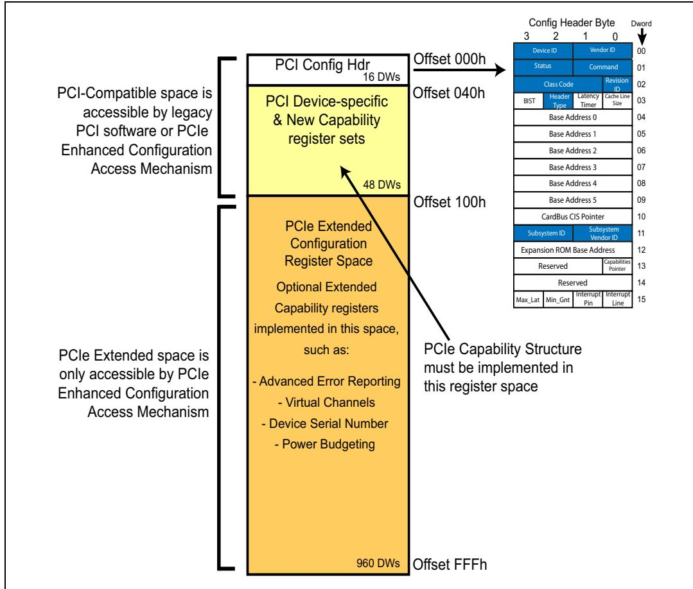
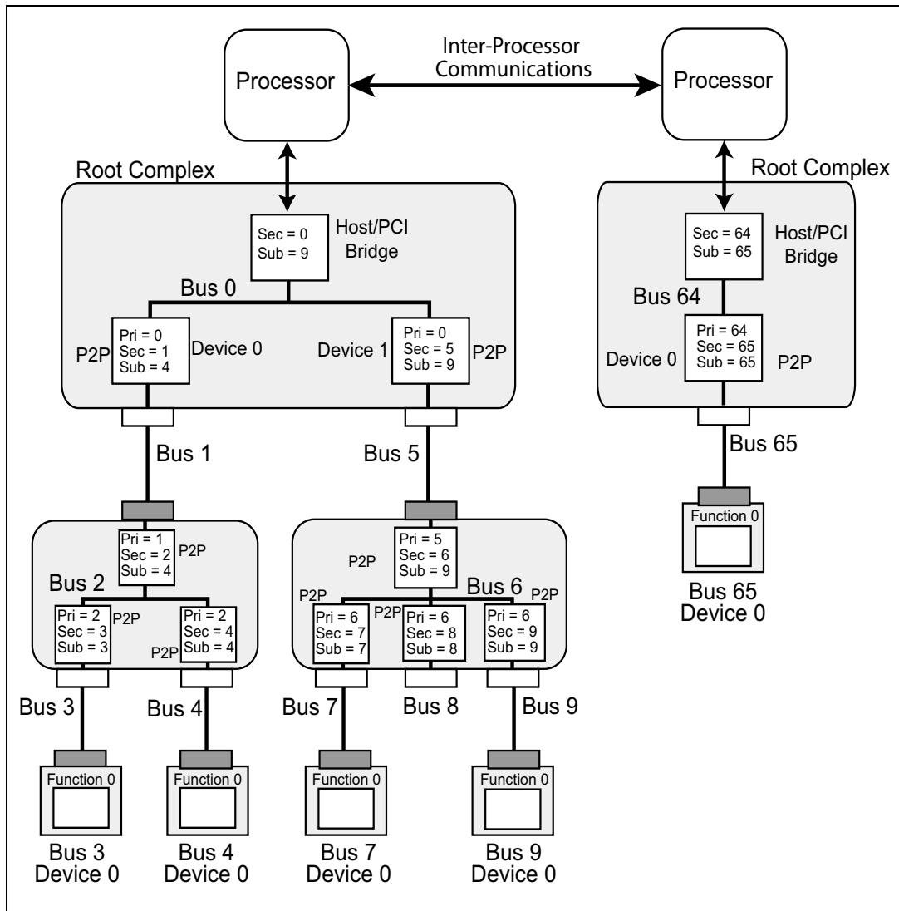
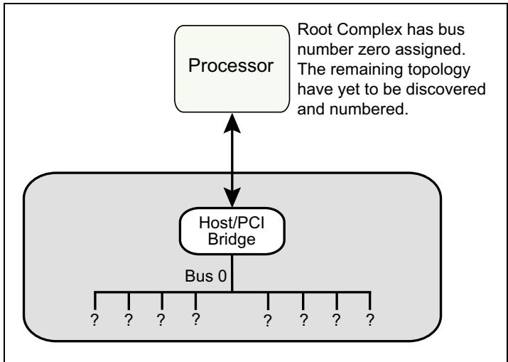
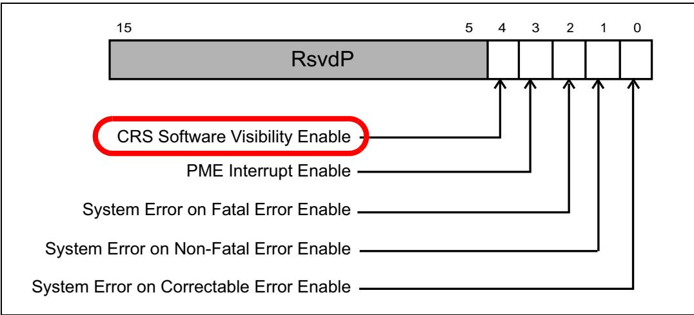
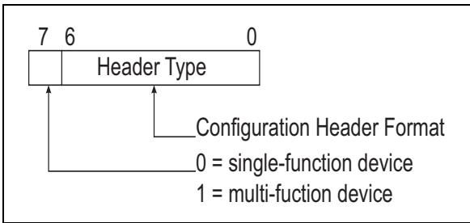
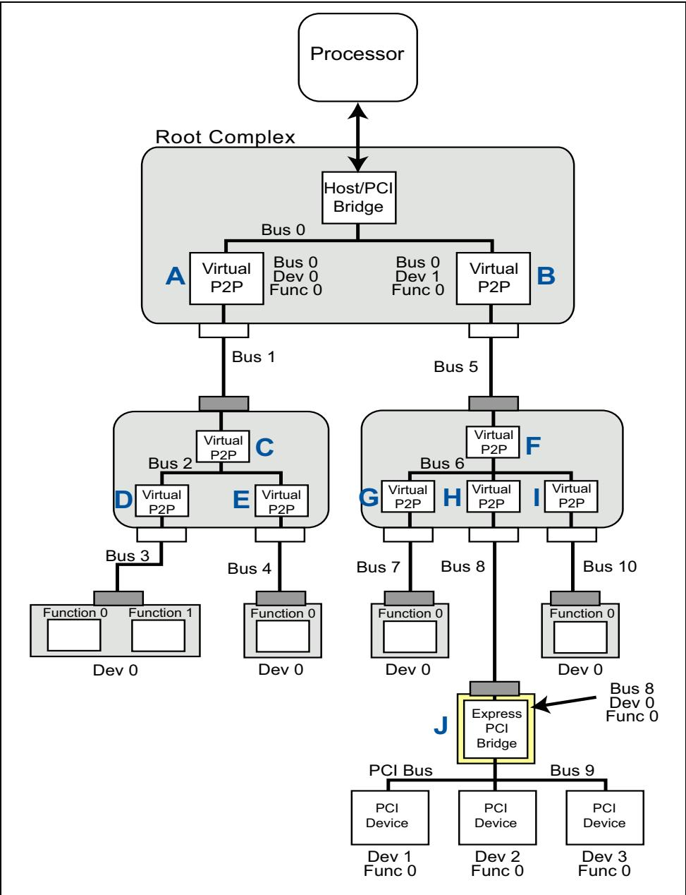
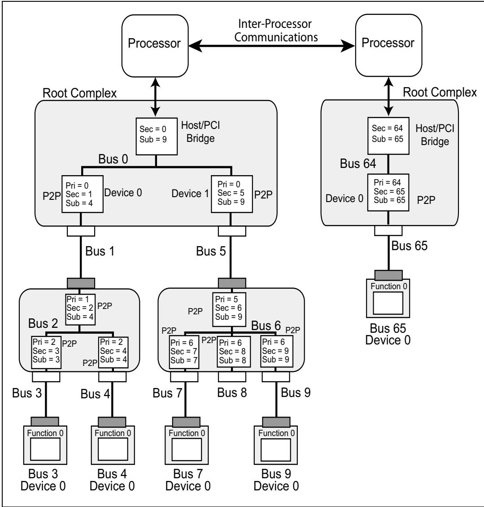

# Ch03_Configuration_Overview

# 3 Configuration Overview | 3 配置概述

## The Previous Chapter | 上一章回顾

<table style="border:2px solid #000;border-collapse:collapse;width:100%" cellpadding="4" cellspacing="0" rules="all" frame="border">
<tr>
<td width="50%" style="border:2px solid #000;">
The previous chapter provides a thorough introduction to the PCI Express architecture and is intended to serve as an "executive level" overview. It introduces the layered approach to PCIe port design described in the spec. The various packet types are introduced along with the transaction protocol.
</td>
<td width="50%" style="border:2px solid #000;background-color:#e8e8e8">
上一章对 PCI Express 架构进行了全面介绍，旨在提供一个"执行层级别"的概述。该章介绍了规范中所描述的 PCIe 端口设计的分层方法，并引入了各种数据包类型以及事务协议。
</td>
</tr>
</table>

## This Chapter | 本章内容

<table style="border:2px solid #000;border-collapse:collapse;width:100%" cellpadding="4" cellspacing="0" rules="all" frame="border">
<tr>
<td width="50%" style="border:2px solid #000;">
This chapter provides an introduction to configuration in the PCIe environment. This includes the space in which a Function's configuration registers are implemented, how a Function is discovered, how configuration transactions are generated and routed, the difference between PCI-compatible configuration space and PCIe extended configuration space, and how software differentiates between an Endpoint and a Bridge.
</td>
<td width="50%" style="border:2px solid #000;background-color:#e8e8e8">
本章介绍PCIe环境中的配置机制。内容包括：Function配置寄存器所在的实现空间、如何发现Function、如何生成和路由配置事务、PCI兼容配置空间与PCIe扩展配置空间之间的区别，以及软件如何区分端点（Endpoint）与桥（Bridge）。
</td>
</tr>
</table>

## The Next Chapter | 下一章

<table style="border:2px solid #000;border-collapse:collapse;width:100%" cellpadding="4" cellspacing="0" rules="all" frame="border">
<tr>
<td width="50%" style="border:2px solid #000;">
The next chapter describes the purpose and methods of a function requesting memory or IO address space through Base Address Registers (BARs) and how software initializes them. The chapter describes how bridge Base/Limit registers are initialized, thus allowing switches to route TLPs through the PCIe fabric.
</td>
<td width="50%" style="border:2px solid #000;background-color:#e8e8e8">
下一章将描述一个功能（function）通过基址寄存器（BAR）请求存储器或IO地址空间的目的和方法，以及软件如何对其进行初始化。该章还描述了桥基址/界限寄存器（Base/Limit寄存器）的初始化方式，从而使交换机能够通过PCIe架构路由TLP（事务层包）。
</td>
</tr>
</table>

## 3.1 Definition of Bus, Device and Function | 3.1 总线、设备与功能的定义

<table style="border:2px solid #000;border-collapse:collapse;width:100%" cellpadding="4" cellspacing="0" rules="all" frame="border">
<tr>
<td width="50%" style="border:2px solid #000;">
Just as in PCI, every PCIe Function is uniquely identified by the Device it resides within and the Bus to which the Device connects. This unique identifier is commonly referred to as a 'BDF'. Configuration software is responsible for detecting every Bus, Device and Function (BDF) within a given topology. The following sections discuss the primary BDF characteristics in the context of a sample PCIe topology. Figure 3-1 on page 87 depicts a PCIe topology that highlights the Buses, Devices and Functions implemented in a sample system. Later in this chapter the process of assigning Bus and Device Numbers is explained.
</td>
<td width="50%" style="border:2px solid #000;background-color:#e8e8e8">
与 PCI 一样，每个 PCIe 功能由其所在的设备以及该设备所连接的总线来唯一标识。该唯一标识符通常被称为"BDF"。配置软件负责检测给定拓扑中的每一个总线、设备和功能（BDF）。后续章节将结合一个示例 PCIe 拓扑来讨论 BDF 的主要特征。第 87 页的图 3-1 描绘了一个 PCIe 拓扑，突出展示了示例系统中实现的总线、设备和功能。本章稍后将解释总线号和设备号的分配过程。
</td>
</tr>
</table>

## 3.1.1 PCIe Buses | 3.1.1 PCIe 总线

<table style="border:2px solid #000;border-collapse:collapse;width:100%" cellpadding="4" cellspacing="0" rules="all" frame="border">
<tr>
<td width="50%" style="border:2px solid #000;">
Up to 256 Bus Numbers can be assigned by configuration software.
</td>
<td width="50%" style="border:2px solid #000;background-color:#e8e8e8">
配置软件最多可分配 256 个总线号。
</td>
</tr>
<tr>
<td width="50%" style="border:2px solid #000;">
The initial Bus Number, Bus 0, is typically assigned by hardware to the Root Complex.
</td>
<td width="50%" style="border:2px solid #000;background-color:#e8e8e8">
初始总线号，即总线 0，通常由硬件分配给根复合体 (Root Complex)。
</td>
</tr>
<tr>
<td width="50%" style="border:2px solid #000;">
Bus 0 consists of a Virtual PCI bus with integrated endpoints and Virtual PCI-to-PCI Bridges (P2P) which are hard-coded with a Device number and Function number.
</td>
<td width="50%" style="border:2px solid #000;background-color:#e8e8e8">
总线 0 由一条虚拟 PCI 总线构成，其上包含集成的端点以及虚拟 PCI-to-PCI 桥 (P2P)，这些桥的设备号 (Device Number) 和功能号 (Function Number) 都是硬编码的。
</td>
</tr>
<tr>
<td width="50%" style="border:2px solid #000;">
Each P2P bridge creates a new bus that additional PCIe devices can be connected to.
</td>
<td width="50%" style="border:2px solid #000;background-color:#e8e8e8">
每个 P2P 桥都会创建一条新的总线，可连接额外的 PCIe 设备。
</td>
</tr>
<tr>
<td width="50%" style="border:2px solid #000;">
Each bus must be assigned a unique bus number.
</td>
<td width="50%" style="border:2px solid #000;background-color:#e8e8e8">
每条总线必须分配一个唯一的总线号。
</td>
</tr>
<tr>
<td width="50%" style="border:2px solid #000;">
Configuration software begins the process of assigning bus numbers by searching for bridges starting with Bus 0, Device 0, Function 0.
</td>
<td width="50%" style="border:2px solid #000;background-color:#e8e8e8">
配置软件从总线 0、设备 0、功能 0 开始搜索桥，从而启动总线号分配过程。
</td>
</tr>
<tr>
<td width="50%" style="border:2px solid #000;">
When a bridge is found, software assigns the new bus a bus number that is unique and larger than the bus number the bridge lives on.
</td>
<td width="50%" style="border:2px solid #000;background-color:#e8e8e8">
当发现一个桥时，软件会为该桥所创建的新总线分配一个唯一且大于桥所在总线号的总线号。
</td>
</tr>
<tr>
<td width="50%" style="border:2px solid #000;">
Once the new bus has been assigned a bus number, software begins looking for bridges on the new bus before continuing scanning for more bridges on the current bus.
</td>
<td width="50%" style="border:2px solid #000;background-color:#e8e8e8">
一旦新总线被分配了总线号，软件就会开始在新总线上查找桥，然后再继续扫描当前总线上的其他桥。
</td>
</tr>
<tr>
<td width="50%" style="border:2px solid #000;">
This is referred to as a "depth first search" and is described in detail in "Enumeration - Discovering the Topology" on page 104.
</td>
<td width="50%" style="border:2px solid #000;background-color:#e8e8e8">
这种方式被称为"深度优先搜索"(depth first search)，并在第 104 页"枚举——发现拓扑结构"(Enumeration - Discovering the Topology) 一节中有详细描述。
</td>
</tr>
</table>

## 3.1.2 PCIe Devices | 3.1.2 PCIe 设备

<table style="border:2px solid #000;border-collapse:collapse;width:100%" cellpadding="4" cellspacing="0" rules="all" frame="border">
<tr>
<td width="50%" style="border:2px solid #000;">
PCIe permits up to 32 device attachments on a single PCI bus, however, the point‐to‐point nature of PCIe means only a single device can be attached directly to a PCIe link and that device will always end up being Device 0. Root Complexes and Switches have Virtual PCI buses which do allow multiple Devices being "attached" to the bus. Each Device must implement Function 0 and may contain a collection of up to eight Functions. When two or more Functions are implemented the Device is called a multi‐function device.
</td>
<td width="50%" style="border:2px solid #000;background-color:#e8e8e8">
PCIe 允许在单条 PCI 总线上连接最多 32 个设备，然而，PCIe 的点对点特性意味着只有单个设备可以直接连接到一条 PCIe 链路上，并且该设备将始终成为设备 0。根复合体和交换机拥有虚拟 PCI 总线，这些虚拟 PCI 总线允许多个设备"连接"到总线上。每个设备必须实现功能 0，并且可以包含最多八个功能的集合。当实现了两个或更多功能时，该设备被称为多功能设备。
</td>
</tr>
</table>

Figure 3-1: Example System | 图3-1：示例系统


## 3.1.3 PCIe Functions | 3.1.3 PCIe 功能

<table style="border:2px solid #000;border-collapse:collapse;width:100%" cellpadding="4" cellspacing="0" rules="all" frame="border">
<tr>
<td width="50%" style="border:2px solid #000;">
As previously discussed Functions are designed into every Device. These Functions may include hard drive interfaces, display controllers, ethernet controllers, USB controllers, etc. Devices that have multiple Functions do not need to be implemented sequentially. For example, a Device might implement Functions 0, 2, and 7. As a result, when configuration software detects a multifunction device, each of the possible Functions must be checked to learn which of them are present. Each Function also has its own configuration address space that is used to setup the resources associated with the Function.
</td>
<td width="50%" style="border:2px solid #000;background-color:#e8e8e8">
如前所述，每个设备中都设计了功能（Function）。这些功能可能包括硬盘驱动器接口、显示控制器、以太网控制器、USB控制器等。具有多个功能的设备不需要按顺序实现。例如，一个设备可能实现功能0、功能2和功能7。因此，当配置软件检测到一个多功能设备时，必须检查每个可能的功能以确定哪些功能存在。每个功能还拥有自己的配置地址空间，用于设置与该功能相关的资源。
</td>
</tr>
</table>

## 3.2 Configuration Address Space | 3.2 配置地址空间

<table style="border:2px solid #000;border-collapse:collapse;width:100%" cellpadding="4" cellspacing="0" rules="all" frame="border">
<tr>
<td width="50%" style="border:2px solid #000;">
The first PCs required users to set switches and jumpers to assign resources for each card installed and this frequently resulted in conflicting memory, IO and interrupt settings. The subsequent IO architectures, Extended ISA (EISA) and the IBM PS2 systems, were the first to implemented plug and play architectures. In these architectures configuration files were shipped with each plug-in card that allowed system software to assign basic resources. PCI extended this capability by implementing standardized configuration registers that permit generic shrink-wrapped OSs to manage virtually all system resources. Having a standard way to enable error reporting, interrupt delivery, address mapping and more, allows one entity, the configuration software, to allocate and configure the system resources which virtually eliminates resource conflicts.
</td>
<td width="50%" style="border:2px solid #000;background-color:#e8e8e8">
早期的PC要求用户设置开关和跳线来为每块安装的卡分配资源，这经常导致内存、IO和中断设置的冲突。随后的IO体系结构——扩展ISA（EISA）和IBM PS2系统——是最早实现即插即用架构的。在这些架构中，每块插卡都附带配置文件，允许系统软件分配基本资源。PCI通过实现标准化的配置寄存器扩展了这一能力，使得通用的成品操作系统能够管理几乎所有的系统资源。拥有一种标准方式来启用错误报告、中断传递、地址映射等功能，使得一个实体——配置软件——能够分配和配置系统资源，从而几乎消除了资源冲突。
</td>
</tr>
<tr>
<td width="50%" style="border:2px solid #000;">
PCI defines a dedicated block of configuration address space for each Function. Registers mapped into the configuration space allow software to discover the existence of a Function, configure it for normal operation and check the status of the Function. Most of the basic functionality that needs to be standardized is in the header portion of the configuration register block, but the PCI architects realized that it would beneficial to standardize optional features, called capability structures (e.g. Power Management, Hot Plug, etc.). The PCI-Compatible configuration space includes 256 bytes for each Function.
</td>
<td width="50%" style="border:2px solid #000;background-color:#e8e8e8">
PCI为每个功能定义了一块专用的配置地址空间。映射到配置空间中的寄存器允许软件发现功能的存在、将其配置为正常工作状态并检查功能的状态。大多数需要标准化的基本功能位于配置寄存器块的头部区域，但PCI架构师意识到，将可选特性（称为能力结构，例如电源管理、热插拔等）标准化也是有益的。PCI兼容的配置空间为每个功能包含256字节。
</td>
</tr>
</table>

<table style="border:2px solid #000;border-collapse:collapse;width:100%" cellpadding="4" cellspacing="0" rules="all" frame="border">
<tr>
<td width="50%" style="border:2px solid #000;">
PCI-Compatible Space
</td>
<td width="50%" style="border:2px solid #000;background-color:#e8e8e8">
PCI兼容空间
</td>
</tr>
<tr>
<td width="50%" style="border:2px solid #000;">
Refer to Figure 3-2 on page 89 during the following discussion. The 256 bytes of PCI-compatible configuration space was so named because it was originally designed for PCI. The first 16 dwords (64 bytes) of this space are the configuration header (Header Type 0 or Header Type 1). Type 0 headers are required for every Function except for the bridge functions that use a Type 1 header. The remaining 48 dwords are used for optional registers including PCI capability structures. For PCIe Functions, some capability structures are required. For example, PCIe Functions must implement the following Capability Structures:
</td>
<td width="50%" style="border:2px solid #000;background-color:#e8e8e8">
在以下讨论中，请参阅第89页的图3-2。256字节的PCI兼容配置空间之所以如此命名，是因为它最初是为PCI设计的。该空间的前16个双字（64字节）是配置头（Header Type 0或Header Type 1）。除使用Type 1头的桥功能外，每个功能都必须实现Type 0头。其余48个双字用于可选寄存器，包括PCI能力结构。对于PCIe功能，某些能力结构是必需的。例如，PCIe功能必须实现以下能力结构：
</td>
</tr>
<tr>
<td width="50%" style="border:2px solid #000;">
PCI Express Capability
</td>
<td width="50%" style="border:2px solid #000;background-color:#e8e8e8">
PCI Express能力
</td>
</tr>
<tr>
<td width="50%" style="border:2px solid #000;">
Power Management
</td>
<td width="50%" style="border:2px solid #000;background-color:#e8e8e8">
电源管理
</td>
</tr>
<tr>
<td width="50%" style="border:2px solid #000;">
MSI and/or MSI-X
</td>
<td width="50%" style="border:2px solid #000;background-color:#e8e8e8">
MSI和/或MSI-X
</td>
</tr>
</table>

Figure 3-2: PCI Compatible Configuration Register Space | 图3-2：PCI兼容配置寄存器空间


## 3.2.2 Extended Configuration Space | 3.2.2 扩展配置空间

<table style="border:2px solid #000;border-collapse:collapse;width:100%" cellpadding="4" cellspacing="0" rules="all" frame="border">
<tr>
<td width="50%" style="border:2px solid #000;">
Refer to Figure 3‑3 on page 90 during this discussion. When PCIe was introduced, there was not enough room in the original 256‑byte configuration region to contain all the new capability structures needed. So the size of configuration space was expanded from 256 bytes per function to 4KB, called the Extended Configuration Space. The 960‑dword Extended Configuration area is only accessible using the Enhanced configuration mechanism and is therefore not visible to legacy PCI software. It contains additional optional Extended Capability registers for PCIe such as those listed in Figure 3‑3 (not a complete list).
</td>
<td width="50%" style="border:2px solid #000;background-color:#e8e8e8">
在讨论过程中请参考第90页的图3‑3。当PCIe被引入时，原有的256字节配置区域空间不足，无法容纳所有需要的新能力结构。因此，配置空间的大小从每个功能256字节扩展到了4KB，称为扩展配置空间（Extended Configuration Space）。960双字的扩展配置区域仅能通过增强型配置机制（Enhanced Configuration Mechanism）访问，因此对于传统的PCI软件是不可见的。该区域包含了额外的可选PCIe扩展能力寄存器，例如图3‑3中所列出的那些（并非完整列表）。
</td>
</tr>
</table>

Figure 3‑3: 4KB Configuration Space per PCI Express Function | 图3‑3：每个PCI Express功能的4KB配置空间


<table style="border:2px solid #000;border-collapse:collapse;width:100%" cellpadding="4" cellspacing="0" rules="all" frame="border">
<tr>
<td width="50%" style="border:2px solid #000;">
Host-to-PCI Bridge Configuration Registers
</td>
<td width="50%" style="border:2px solid #000;background-color:#e8e8e8">
主机至PCI桥配置寄存器
</td>
</tr>
</table>

## 3.4.3 General | 3.4.3 概述

<table style="border:2px solid #000;border-collapse:collapse;width:100%" cellpadding="4" cellspacing="0" rules="all" frame="border">
<tr>
<td width="50%" style="border:2px solid #000;">
The Host-to-PCI bridge's configuration registers don't have to be accessible using either of the configuration mechanisms mentioned in the previous section. Instead, it's typically implemented as device-specific registers in memory address space, which is known by the platform firmware. However, its configuration register layout and usage must adhere to the standard Type 0 template defined by the PCI 2.3 specification.
</td>
<td width="50%" style="border:2px solid #000;background-color:#e8e8e8">
主桥到PCI桥的配置寄存器不必通过前文所述的任何一种配置机制来访问。相反，它通常被实现为位于存储器地址空间中的设备特定寄存器，其地址由平台固件所知。然而，其配置寄存器的布局与用法必须遵循PCI 2.3规范定义的标准Type 0模板。
</td>
</tr>
</table>

## 3.3.1 Only the Root Sends Configuration Requests | 3.3.1 仅根复合体发送配置请求

<table style="border:2px solid #000;border-collapse:collapse;width:100%" cellpadding="4" cellspacing="0" rules="all" frame="border">
<tr>
<td width="50%" style="border:2px solid #000;">
The specification states that only the Root Complex is permitted to originate Configuration Requests. It acts as the system processor's liaison to inject Requests into the fabric and pass Completions back. The ability to originate configuration transactions is restricted to the processor through the Root Complex to avoid the anarchy that could result if any device had the ability to change the configuration of other devices.
</td>
<td width="50%" style="border:2px solid #000;background-color:#e8e8e8">
规范规定，仅根复合体（Root Complex）被允许发起配置请求。它作为系统处理器的联络中介，负责将请求注入到互连架构中并将完成报文传回。发起配置事务的能力被限制为仅处理器通过根复合体来行使，以避免若任何设备都能更改其他设备的配置而可能导致的混乱局面。
</td>
</tr>
<tr>
<td width="50%" style="border:2px solid #000;">
Since only the Root can initiate these requests, they also can only move downstream, which means that peer-to-peer Configuration Requests are not allowed. The Requests are routed based on the target device's ID, meaning its BDF (Bus number in the topology, Device number on that bus, and Function number within that Device).
</td>
<td width="50%" style="border:2px solid #000;background-color:#e8e8e8">
由于只有根复合体能够发起这些请求，因此它们也只能向下游方向移动，这意味着不允许点到点配置请求。这些请求根据目标设备的ID（即其BDF：拓扑中的总线号、该总线上的设备号以及该设备内的功能号）进行路由。
</td>
</tr>
</table>

<table style="border:2px solid #000;border-collapse:collapse;width:100%" cellpadding="4" cellspacing="0" rules="all" frame="border">
<tr>
<td width="50%" style="border:2px solid #000;">
Generating Configuration Transactions
</td>
<td width="50%" style="border:2px solid #000;background-color:#e8e8e8">
生成配置事务
</td>
</tr>
<tr>
<td width="50%" style="border:2px solid #000;">
Processors are generally unable to perform configuration read and write requests directly because they can only generate memory and IO requests. That means the Root Complex will need to translate certain of those accesses into configuration requests in support of this process. Configuration space can be accessed using either of two mechanisms:
</td>
<td width="50%" style="border:2px solid #000;background-color:#e8e8e8">
处理器通常无法直接执行配置读写请求，因为它们只能生成存储器和IO请求。这意味着根复合体需要将某些此类访问转换为配置请求以支持这一过程。配置空间可以通过以下两种机制之一进行访问：
</td>
</tr>
<tr>
<td width="50%" style="border:2px solid #000;">
The legacy PCI configuration mechanism, using IO-indirect accesses.
</td>
<td width="50%" style="border:2px solid #000;background-color:#e8e8e8">
传统的PCI配置机制，使用IO间接访问。
</td>
</tr>
<tr>
<td width="50%" style="border:2px solid #000;">
The enhanced configuration mechanism, using memory-mapped accesses.
</td>
<td width="50%" style="border:2px solid #000;background-color:#e8e8e8">
增强型配置机制，使用存储器映射访问。
</td>
</tr>
</table>

## 3.4.1 Legacy PCI Mechanism | 3.4.1 传统 PCI 机制

<table style="border:2px solid #000;border-collapse:collapse;width:100%" cellpadding="4" cellspacing="0" rules="all" frame="border">
<tr>
<td width="50%" style="border:2px solid #000;">
The PCI spec defined an IO‑indirect method for instructing the system (the Root Complex or its equivalent) to perform PCI configuration accesses. As it happened, the dominant PC processors (Intel x86) were only designed to address 64KB of IO address space. By the time PCI was defined, this limited IO space had become badly cluttered and only a few address ranges remained available: 0800h ‑ 08FFh and 0C00h ‑ 0CFFh. Consequently, it wasn't feasible to map the configuration registers for all the possible Functions directly into IO space. At the same time, memory address space was also limited in size and mapping all of configuration space into memory address space was not seen as a good solution either. So the spec writers chose a commonly‑used solution to this problem, use indirect address mapping instead. To do this, one register holds the target address, while a second holds the data going to or coming from the target. A write to the address register, followed by a read or write to the data register, causes a single read or write transaction to the correct internal address for the target function. This solves the problem of limited address space nicely, but it means that two IO accesses are needed to create one configuration access.
</td>
<td width="50%" style="border:2px solid #000;background-color:#e8e8e8">
PCI规范定义了一种IO间接方法，用于指示系统（根复合体或其等效组件）执行PCI配置访问。当时，主流的PC处理器（Intel x86）仅能寻址64KB的IO地址空间。到PCI规范定义时，这有限的IO空间已变得非常拥挤，只剩下少数几个地址范围可用：0800h‑08FFh和0C00h‑0CFFh。因此，将所有可能功能的配置寄存器直接映射到IO空间中是不现实的。同时，内存地址空间的大小也有限，将所有配置空间映射到内存地址空间同样不被视为好的解决方案。因此，规范制定者选择了一种常用的方法来解决这个问题，即采用间接地址映射。为此，一个寄存器保存目标地址，另一个寄存器保存送往或来自目标的数据。向地址寄存器写入后，再向数据寄存器读取或写入，即可对目标功能的正确内部地址发起一次读或写事务。这很好地解决了地址空间有限的问题，但这意味着创建一次配置访问需要两次IO访问。
</td>
</tr>
<tr>
<td width="50%" style="border:2px solid #000;">
The PCI‑Compatible mechanism uses two 32‑bit IO ports in the Host bridge of the Root Complex. They are the Configuration Address Port, at IO addresses 0CF8h ‑ 0CFBh, and the Configuration Data Port, at IO addresses 0CFCh ‑ CFFh.
</td>
<td width="50%" style="border:2px solid #000;background-color:#e8e8e8">
PCI兼容机制使用根复合体中宿主桥内的两个32位IO端口。它们是配置地址端口（Configuration Address Port），位于IO地址0CF8h‑0CFBh；以及配置数据端口（Configuration Data Port），位于IO地址0CFCh‑CFFh。
</td>
</tr>
<tr>
<td width="50%" style="border:2px solid #000;">
Accessing a Function's PCI‑compatible configuration registers is accomplished by first writing the target Bus, Device, Function and dword numbers into the Configuration Address Port, setting its Enable bit in the process. Secondly, a one‑, two‑, or four‑byte IO read or write is sent to the Configuration Data Port. The host bridge in the Root Complex compares the specified target bus to the range of buses that exist downstream of the bridge. If the target bus is within that range, the bridge initiates a configuration read or write request (depending on whether the IO access to the Configuration Data Port was a read or a write).
</td>
<td width="50%" style="border:2px solid #000;background-color:#e8e8e8">
访问某个功能的PCI兼容配置寄存器的过程如下：首先，将目标总线号、设备号、功能号和双字编号写入配置地址端口，并在此过程中设置其使能位（Enable bit）。其次，向配置数据端口发起一字节、两字节或四字节的IO读或写操作。根复合体中的宿主桥将指定的目标总线与其下游存在的总线范围进行比较。如果目标总线在该范围内，则该桥发起配置读或写请求（取决于对配置数据端口的IO访问是读还是写）。
</td>
</tr>
</table>

Figure 3-4: Configuration Address Port at 0CF8h | 图3-4：0CF8h处的配置地址端口

<table style="border:2px solid #000;border-collapse:collapse;width:100%" cellpadding="4" cellspacing="0" rules="all" frame="border"><tr><td style="border:2px solid #000;">31</td><td style="border:2px solid #000;">30</td><td style="border:2px solid #000;">24</td><td style="border:2px solid #000;">23</td><td style="border:2px solid #000;">16</td><td style="border:2px solid #000;">15</td><td style="border:2px solid #000;">11</td><td style="border:2px solid #000;">10</td><td style="border:2px solid #000;">8</td><td style="border:2px solid #000;">7</td><td style="border:2px solid #000;">2</td><td style="border:2px solid #000;">1</td><td style="border:2px solid #000;">0</td></tr><tr><td style="border:2px solid #000;"></td><td colspan="2" style="border:2px solid #000;">Reserved</td><td style="border:2px solid #000;">Bus Number</td><td style="border:2px solid #000;">Device Number</td><td style="border:2px solid #000;">Function Number</td><td colspan="4" style="border:2px solid #000;">Doubleword</td><td style="border:2px solid #000;">0</td><td style="border:2px solid #000;">0</td><td style="border:2px solid #000;"></td></tr><tr><td colspan="13" style="border:2px solid #000;">Register pointer (64 DW)Should always be zerosEnable Configuration Space Mapping1 = enabled</td></tr></table>


## 3.4.1.1 Configuration Address Port | 3.4.1.1 配置地址端口

<table style="border:2px solid #000;border-collapse:collapse;width:100%" cellpadding="4" cellspacing="0" rules="all" frame="border">
<tr>
<td width="50%" style="border:2px solid #000;">
The Configuration Address Port only latches information when the processor performs a full 32‑bit write to the port, as shown in Figure 3‑4, and a 32‑bit read from the port returns its contents. The information written to the Configuration Address Port must conform to the following template (illustrated in Figure 3‑4) and described on the facing page.
</td>
<td width="50%" style="border:2px solid #000;background-color:#e8e8e8">
配置地址端口仅在处理器对该端口执行完整的32位写操作（如图3-4所示）时锁存信息，而从该端口执行32位读操作时返回其内容。写入配置地址端口的信息必须遵循以下模板（如图3-4所示），并在对页中加以说明。
</td>
</tr>
<tr>
<td width="50%" style="border:2px solid #000;">
Bits [1:0] are hard‑wired, read‑only and must return zeros when read. The location is dword aligned and no byte‑specific offset is allowed.
</td>
<td width="50%" style="border:2px solid #000;background-color:#e8e8e8">
位[1:0]是硬连接的、只读的，读取时必须返回零。该位置按双字对齐，不允许任何字节特定的偏移。
</td>
</tr>
<tr>
<td width="50%" style="border:2px solid #000;">
Bits [7:2] identify the target dword (also called the Register Number) in the target Function's PCI‑compatible configuration space. This mechanism is limited to the compatible configuration space (i.e., the first 64 doublewords of a Function's configuration space).
</td>
<td width="50%" style="border:2px solid #000;background-color:#e8e8e8">
位[7:2]标识目标功能（Function）的PCI兼容配置空间中的目标双字（也称为寄存器编号，Register Number）。此机制仅限于兼容配置空间（即功能配置空间的前64个双字）。
</td>
</tr>
<tr>
<td width="50%" style="border:2px solid #000;">
Bits [10:8] identify the target Function number (0 – 7) within the target device.
</td>
<td width="50%" style="border:2px solid #000;background-color:#e8e8e8">
位[10:8]标识目标设备内的目标功能编号（Function number，0 – 7）。
</td>
</tr>
<tr>
<td width="50%" style="border:2px solid #000;">
• Bits [15:11] identify the target Device number (0 – 31).
</td>
<td width="50%" style="border:2px solid #000;background-color:#e8e8e8">
• 位[15:11]标识目标设备编号（Device number，0 – 31）。
</td>
</tr>
<tr>
<td width="50%" style="border:2px solid #000;">
• Bits [23:16] identify the target Bus number (0 – 255).
</td>
<td width="50%" style="border:2px solid #000;background-color:#e8e8e8">
• 位[23:16]标识目标总线编号（Bus number，0 – 255）。
</td>
</tr>
<tr>
<td width="50%" style="border:2px solid #000;">
• Bits [30:24] are reserved and must be zero.
</td>
<td width="50%" style="border:2px solid #000;background-color:#e8e8e8">
• 位[30:24]为保留位，必须为零。
</td>
</tr>
<tr>
<td width="50%" style="border:2px solid #000;">
Bit [31] must be set to 1b to enable translation of the subsequent IO access to the Configuration Data Port into a configuration access. If bit 31 is zero and an IO read or write is sent to the Configuration Data Port, the transaction is treated as an ordinary IO Request.
</td>
<td width="50%" style="border:2px solid #000;background-color:#e8e8e8">
位[31]必须设置为1b，以使后续对配置数据端口（Configuration Data Port）的IO访问转换为配置访问。如果位31为零，且向配置数据端口发送IO读或写操作，则该事务将被视为普通的IO请求。
</td>
</tr>
</table>

## 3.4.1.2 Bus Compare and Data Port Usage | 3.4.1.2 总线比较与数据端口使用

<table style="border:2px solid #000;border-collapse:collapse;width:100%" cellpadding="4" cellspacing="0" rules="all" frame="border">
<tr>
<td width="50%" style="border:2px solid #000;">
The Host Bridge within the Root Complex, shown in Figure 3-5 on page 95, implements a Secondary Bus Number register and a Subordinate Bus Number register. The Secondary Bus Number is the bus number of the bus immediately beneath the bridge. The Subordinate Bus Number is the target bus number that lives downstream of the bridge.
</td>
<td width="50%" style="border:2px solid #000;background-color:#e8e8e8">
根复合体中的主机桥（见图3-5，第95页）实现了一个二级总线号（Secondary Bus Number）寄存器和一个从属总线号（Subordinate Bus Number）寄存器。二级总线号是紧邻桥下方的总线的编号。从属总线号是位于桥下游的目标总线编号。
</td>
</tr>
<tr>
<td width="50%" style="border:2px solid #000;">
In a single Root Complex system, the bridge may have a Secondary Bus Number register that is hardwired to 0, a read/write register that reset forces to 0, or it may just implicitly know that the first accessible bus will be Bus 0. If bit 31 in the Configuration Address Port (see Figure 3-4 on page 92) is set to 1b, the bridge will compare the target bus number to the range of buses that exists downstream.
</td>
<td width="50%" style="border:2px solid #000;background-color:#e8e8e8">
在单根复合体系统中，桥的二级总线号寄存器可能硬连线为0，也可能是复位时强制为0的读/写寄存器，或者它可能仅隐式地知道第一个可访问的总线将是总线0。如果配置地址端口（见图3-4，第92页）的第31位设置为1b，则桥会将目标总线号与下游存在的总线范围进行比较。
</td>
</tr>
<tr>
<td width="50%" style="border:2px solid #000;">
When a Request is seen, the Bridge evaluates whether the target bus number is within the range of bus numbers downstream, from the value of the Secondary Bus number to the Subordinate Bus number, inclusive. If the target bus matches the Secondary Bus, then that bus is targeted and the Request is passed through as a Type 0 Configuration Request. When devices see a Type 0 Request, they know that a device local to that bus is the target device (rather than one on a subordinate bus downstream).
</td>
<td width="50%" style="border:2px solid #000;background-color:#e8e8e8">
当检测到一个请求时，桥会评估目标总线号是否在下游总线号的范围内——即从二级总线号的值到从属总线号的值（含两端）。如果目标总线号与二级总线号匹配，则该总线即为目标，请求将作为Type 0配置请求传递出去。当设备检测到Type 0请求时，它知道该总线上的本地设备是目标设备（而不是下游从属总线上的设备）。
</td>
</tr>
<tr>
<td width="50%" style="border:2px solid #000;">
If the target bus is larger than the bridge's Secondary Bus number, but less than or equal to the bridge's Subordinate Bus number, the Request will be forwarded as a Type 1 configuration request on the bridge's secondary bus. A Type 1 configuration access is understood to mean that, even though the Request has to go across this bus, it does not target a device on this bus. Instead, the request will be forwarded downstream by one of the Bridges on this bus, whose Secondary and Subordinate bus number range contains the target bus number. For that reason, only Bridge devices pay attention to Type 1 configuration Requests. See "Configuration Requests" on page 99 for additional information regarding Type 0 and Type 1 configuration Requests.
</td>
<td width="50%" style="border:2px solid #000;background-color:#e8e8e8">
如果目标总线号大于桥的二级总线号，但小于或等于桥的从属总线号，则该请求将作为Type 1配置请求在桥的二级总线上转发。Type 1配置访问应理解为：尽管该请求必须跨越此总线，但它并不以该总线上的设备为目标。相反，该请求将由该总线上的某个桥转发到下游——该桥的二级总线号到从属总线号的范围必须包含目标总线号。因此，只有桥设备才会关注Type 1配置请求。有关Type 0和Type 1配置请求的更多信息，请参见第99页的"配置请求"一节。
</td>
</tr>
</table>

## 3.4.1.3 Single Host System | 3.4.1.3 单主机系统

<table style="border:2px solid #000;border-collapse:collapse;width:100%" cellpadding="4" cellspacing="0" rules="all" frame="border">
<tr>
<td width="50%" style="border:2px solid #000;">
The information written to the Configuration Address Port is latched by the Host/PCI bridge within the Root Complex, as shown in Figure 3‑1 on page 87. If bit 31 is 1b and the target bus is within the downstream range of bus numbers, the bridge translates a subsequent processor access targeting its Configuration Data Port into a configuration request on bus 0. The processor then initiates an IO read or write transaction to the Configuration Data Port at 0CFCh. This causes the bridge to generate a Configuration Request that is a read when the IO access to the Configuration Data Port was a read, or a Configuration write if the IO access was a write. It will be a Type 0 configuration transaction if the target bus is bus 0, or a Type 1 for another bus within the range, or not forwarded at all if the target bus is outside of the range.
</td>
<td width="50%" style="border:2px solid #000;background-color:#e8e8e8">
写入配置地址端口的信息由根复合体中的主机/PCI桥锁存，如第87页图3-1所示。如果bit 31为1b且目标总线在下游总线号范围内，则桥会将处理器随后对其配置数据端口的访问转换为总线0上的配置请求。然后，处理器对位于0CFCh的配置数据端口发起一个IO读或写事务。这将导致桥产生一个配置请求：当对配置数据端口的IO访问是读操作时，该配置请求为读请求；若IO访问是写操作，则为配置写请求。如果目标总线是总线0，则为Type 0配置事务；若目标总线是范围内的另一条总线，则为Type 1配置事务；如果目标总线在范围之外，则根本不转发。
</td>
</tr>
</table>

## Chapter 3: Configuration Overview | 第3章：配置概览


Figure 3-5: Single-Root System | 图3-5：单根系统


<table style="border:2px solid #000;border-collapse:collapse;width:100%" cellpadding="4" cellspacing="0" rules="all" frame="border">
<tr>
<td width="50%" style="border:2px solid #000;">
Multi-Host System
</td>
<td width="50%" style="border:2px solid #000;background-color:#e8e8e8">
多主机系统
</td>
</tr>
<tr>
<td width="50%" style="border:2px solid #000;">
If there are multiple Root Complexes (refer to Figure 3‑6 on page 97), the Configuration Address and Data ports can be duplicated at the same IO addresses in each of their respective Host/PCI bridges. In order to prevent contention, only one of the bridges responds to the processor's accesses to the configuration ports.
</td>
<td width="50%" style="border:2px solid #000;background-color:#e8e8e8">
如果存在多个根复合体（参见第97页图3-6），则配置地址端口和配置数据端口可以在各个主机/PCI桥中相同的I/O地址处进行复制。为防止竞争，只有一个桥会响应处理器对配置端口的访问。
</td>
</tr>
<tr>
<td width="50%" style="border:2px solid #000;">
1. When the processor initiates the IO write to the Configuration Address Port, the host bridges are configured so that only one will actively participate in the transaction.
</td>
<td width="50%" style="border:2px solid #000;background-color:#e8e8e8">
1. 当处理器发起对配置地址端口的I/O写操作时，主机桥被配置为仅有一个桥主动参与该事务。
</td>
</tr>
<tr>
<td width="50%" style="border:2px solid #000;">
2. During enumeration, software discovers and numbers all the buses under the active bridge. When that's done, it enables the inactive host bridge and assigns a bus number to it that is outside the range already assigned to the active bridge and continues the enumeration process. Both host bridges see the Requests, but since they have non‑overlapping bus numbers they only respond to the appropriate bus number requests and so there's no conflict.
</td>
<td width="50%" style="border:2px solid #000;background-color:#e8e8e8">
2. 在枚举过程中，软件发现并为活动桥下的所有总线编号。完成后，软件启用非活动主机桥，为其分配一个在已分配给活动桥范围之外的总线号，然后继续枚举过程。两个主机桥都能看到请求，但由于它们拥有不重叠的总线号，它们仅响应相应总线号的请求，因此不会产生冲突。
</td>
</tr>
<tr>
<td width="50%" style="border:2px solid #000;">
3. Accesses to the Configuration Address Port go to both host bridges after that, and a subsequent read or write access to the Configuration Data Port is only accepted by the host/PCI bridge that is the gateway to the target bus. This bridge responds to the processor's transaction and the other ignores it.
</td>
<td width="50%" style="border:2px solid #000;background-color:#e8e8e8">
3. 此后，对配置地址端口的访问会同时到达两个主机桥，而后续对配置数据端口的读或写访问仅由作为目标总线网关的那个主机/PCI桥接受。该桥响应处理器的事务，另一个桥则忽略该事务。
</td>
</tr>
<tr>
<td width="50%" style="border:2px solid #000;">
o If the target bus is the Secondary Bus, the bridge converts the access to a Type 0 configuration access.
</td>
<td width="50%" style="border:2px solid #000;background-color:#e8e8e8">
o 如果目标总线是辅助总线，桥将访问转换为Type 0配置访问。
</td>
</tr>
<tr>
<td width="50%" style="border:2px solid #000;">
o Otherwise, it converts it into a Type 1 configuration access.
</td>
<td width="50%" style="border:2px solid #000;background-color:#e8e8e8">
o 否则，将其转换为Type 1配置访问。
</td>
</tr>
</table>

## 3.4.2 Enhanced Configuration Access Mechanism | 3.4.2 增强型配置访问机制

## 3.4.3 General | 3.4.3 概述

<table style="border:2px solid #000;border-collapse:collapse;width:100%" cellpadding="4" cellspacing="0" rules="all" frame="border">
<tr>
<td width="50%" style="border:2px solid #000;">
When the spec writers were choosing how PCI‐X and, later, PCIe, would access Configuration space, there were two concerns. First, the 256‐byte space per Function limited vendors who wanted to put proprietary information there, as well as future spec writers who would need room for more standardized capability structures. To solve that problem, the space was simply extended from 256 bytes to 4KB per Function. Secondly, when PCI was developed there were few multi‐processor systems in use. When there's only one CPU and it's only running one thread, the fact that the old model takes two steps to generate one access isn't a problem. But newer machines using multi‐core, multi‐threaded CPUs present a problem for the IO‐indirect model because there's nothing to stop multiple threads from trying to access Configuration space at the same time. Consequently, the two‐step model will no longer work without some locking semantics. With no locking semantics, once thread A writes a value into the
</td>
<td width="50%" style="border:2px solid #000;background-color:#e8e8e8">
当规范制定者选择 PCI-X 以及后来的 PCIe 如何访问配置空间时，有两个关注点。首先，每个功能 256 字节的空间限制了希望在其中放置专有信息的厂商，也限制了未来规范制定者为更多标准化能力结构预留空间。为解决该问题，空间被简单地从每个功能 256 字节扩展到 4KB。其次，当 PCI 被开发时，很少有使用的多处理器系统。当只有一个 CPU 且它只运行一个线程时，旧模型需要两步才能产生一次访问的事实并不成问题。但是，使用多核、多线程 CPU 的新型机器对 IO 间接模型提出了一个问题，因为没有什么能阻止多个线程同时尝试访问配置空间。因此，两步模型在没有某种锁定语义的情况下将不再有效。在没有锁定语义的情况下，一旦线程 A 向
</td>
</tr>
</table>

## Chapter 3: Configuration Overview | 第3章：配置概述

<table style="border:2px solid #000;border-collapse:collapse;width:100%" cellpadding="4" cellspacing="0" rules="all" frame="border">
<tr>
<td width="50%" style="border:2px solid #000;">
Configuration Address Port (CF8h), there is nothing to prevent thread B from overwriting that value before thread A can perform its corresponding access to the Configuration Data Port (CFCh).
</td>
<td width="50%" style="border:2px solid #000;background-color:#e8e8e8">
在写入配置地址端口(CF8h)之后，没有任何机制能阻止线程B在线程A完成对配置数据端口(CFCh)的相应访问之前覆盖该值。
</td>
</tr>
</table>

Figure 3-6: Multi-Root System | 图3-6：多根系统


<table style="border:2px solid #000;border-collapse:collapse;width:100%" cellpadding="4" cellspacing="0" rules="all" frame="border">
<tr>
<td width="50%" style="border:2px solid #000;">
To solve this new problem, the spec writers decided to take a different approach. Rather than try to conserve address space, they would create a single-step, uninterruptable process by mapping all of configuration space into memory addresses. That allows a single command sequence, since one memory request in the specified address range will generate one Configuration Request on the bus. The trade-off now is address size. Mapping 4KB per Function for all the possible implementations requires allocating 256MB of memory address space. The difference in that regard today is that modern architectures typically support anywhere between 36 and 48 bits of physical memory address space. With these memory address space sizes, 256MB is insignificant.
</td>
<td width="50%" style="border:2px solid #000;background-color:#e8e8e8">
为解决这个新问题，规范制定者决定采取一种不同的方法。与其试图节省地址空间，他们选择通过将所有配置空间映射到内存地址中来创建一个单步、不可中断的过程。这使得可以使用单一命令序列，因为在指定地址范围内的一次存储器请求将在总线上生成一个配置请求。此时的权衡因素是地址大小。为所有可能的实现按每个功能4KB进行映射，需要分配256MB的内存地址空间。如今在这方面的区别在于，现代架构通常支持36到48位的物理内存地址空间。对于这些内存地址空间大小来说，256MB是微不足道的。
</td>
</tr>
<tr>
<td width="50%" style="border:2px solid #000;">
To handle this mapping, each Function's 4KB configuration space starts at a 4KB-aligned address within the 256MB memory address space set aside for configuration access, and the address bits now carry the identifying information about which Function is targeted (refer to Table 3-1 on page 98).
</td>
<td width="50%" style="border:2px solid #000;background-color:#e8e8e8">
为了处理这种映射，每个功能的4KB配置空间起始于为配置访问预留的256MB内存地址空间内一个4KB对齐的地址，并且地址位现在承载着关于目标是哪个功能的标识信息（参见第98页表3-1）。
</td>
</tr>
</table>

## 3.4.2 Some Rules | 3.4.2 一些规则

<table style="border:2px solid #000;border-collapse:collapse;width:100%" cellpadding="4" cellspacing="0" rules="all" frame="border">
<tr>
<td width="50%" style="border:2px solid #000;">
A Root Complex is not required to support an access to enhanced configuration memory space if it crosses a dword address boundary (straddles two adjacent memory dwords). Nor are they required to support the bus locking protocol that some processor types use for an atomic, or uninterrupted series of commands. Software should avoid both of these situations when accessing configuration space unless it is known that the Root Complex does support them.
</td>
<td width="50%" style="border:2px solid #000;background-color:#e8e8e8">
根复合体不需要支持跨越双字地址边界（跨越两个相邻存储器双字）的增强配置存储器空间访问。它们也不需要支持某些处理器类型用于原子操作或无间断命令序列的总线锁定协议。软件在访问配置空间时应避免这两种情况，除非已知根复合体确实支持它们。
</td>
</tr>
</table>

Table 3-1: Enhanced Configuration Mechanism Memory-Mapped Address Range | 表3-1：增强配置机制存储器映射地址范围

<table style="border:2px solid #000;border-collapse:collapse;width:100%" cellpadding="4" cellspacing="0" rules="all" frame="border"><tr><td style="border:2px solid #000;">Memory Address Bit Field</td><td style="border:2px solid #000;">Description</td></tr><tr><td style="border:2px solid #000;">A[63:28]</td><td style="border:2px solid #000;">Upper bits of the 256MB-aligned base address of the 256MB memory-mapped address range allocated for the Enhanced Configuration Mechanism. The manner in which the base address is allocated is implementation-specific. It is supplied to the OS by system firmware (typically through the ACPI tables).</td></tr><tr><td style="border:2px solid #000;">A[27:20]</td><td style="border:2px solid #000;">Target Bus Number (0 - 255).</td></tr><tr><td style="border:2px solid #000;">A[19:15]</td><td style="border:2px solid #000;">Target Device Number (0 - 31).</td></tr><tr><td style="border:2px solid #000;">A[14:12]</td><td style="border:2px solid #000;">Target Function Number (0 - 7).</td></tr><tr><td style="border:2px solid #000;">A[11:2]</td><td style="border:2px solid #000;">A[11:2] this range can address one of 1024 dwords, whereas the legacy method is limited to only address one of 64 dwords.</td></tr><tr><td style="border:2px solid #000;">A[1:0]</td><td style="border:2px solid #000;">Defines the access size and the Byte Enable setting.</td></tr></table>

## 3.5 Configuration Requests | 3.5 配置请求

<table style="border:2px solid #000;border-collapse:collapse;width:100%" cellpadding="4" cellspacing="0" rules="all" frame="border">
<tr>
<td width="50%" style="border:2px solid #000;">
Two request types, Type 0 or Type 1, may be generated by bridges in response to a configuration access. The type used depends on whether the target Bus number matches the bridge's Secondary Bus Number, as described below.
</td>
<td width="50%" style="border:2px solid #000;background-color:#e8e8e8">
桥可以生成两种请求类型——类型0(Type 0)或类型1(Type 1)——以响应配置访问。具体使用哪种类型取决于目标总线编号是否匹配该桥的辅助总线编号(Secondary Bus Number)，如下所述。
</td>
</tr>
</table>

## 3.5.1 Type 0 Configuration Request | 3.5.1 Type 0 配置请求

<table style="border:2px solid #000;border-collapse:collapse;width:100%" cellpadding="4" cellspacing="0" rules="all" frame="border">
<tr>
<td width="50%" style="border:2px solid #000;">
If the target bus number matches the Secondary Bus Number, a Type 0 configuration read or write is forwarded to the secondary bus and:
</td>
<td width="50%" style="border:2px solid #000;background-color:#e8e8e8">
如果目标总线号与辅助总线号匹配，则Type 0配置读或写请求将被转发到辅助总线，并且：
</td>
</tr>
<tr>
<td width="50%" style="border:2px solid #000;">
1. Devices on that Bus check the Device Number to see which of them is the target device. Note that Endpoints on an external Link will always be Device 0.
</td>
<td width="50%" style="border:2px solid #000;background-color:#e8e8e8">
1. 该总线上的设备检查设备号以确定哪个设备是目标设备。注意，外部链路上的端点始终为设备0。
</td>
</tr>
<tr>
<td width="50%" style="border:2px solid #000;">
2. The selected Device checks the Function Number to see which Function is selected within the device.
</td>
<td width="50%" style="border:2px solid #000;background-color:#e8e8e8">
2. 被选中的设备检查功能号以确定设备内的哪个功能被选中。
</td>
</tr>
<tr>
<td width="50%" style="border:2px solid #000;">
3. The selected Function uses the Register Number field to select the target dword in its configuration space, and uses the First Dword Byte Enable field to select which bytes to read or write within the selected dword.
</td>
<td width="50%" style="border:2px solid #000;background-color:#e8e8e8">
3. 被选中的功能使用寄存器号字段在其配置空间中选择目标双字，并使用首双字字节使能字段来选择在所选双字中要读取或写入哪些字节。
</td>
</tr>
<tr>
<td width="50%" style="border:2px solid #000;">
Figure 3-7 illustrates the Type 0 configuration read and write Request header formats. In both cases, the Type field = 00100, while the Format field indicates whether it's a read or a write.
</td>
<td width="50%" style="border:2px solid #000;background-color:#e8e8e8">
图3-7展示了Type 0配置读和写请求头的格式。在两种情况下，Type字段=00100，而Format字段指示是读还是写操作。
</td>
</tr>
</table>

Figure 3-7: Type 0 Configuration Read and Write Request Headers | 图3-7：Type 0配置读写请求头

<table style="border:2px solid #000;border-collapse:collapse;width:100%" cellpadding="4" cellspacing="0" rules="all" frame="border"><tr><td colspan="19" style="border:2px solid #000;">Type 0 Configuration Read</td></tr><tr><td rowspan="2" style="border:2px solid #000;"></td><td colspan="3" style="border:2px solid #000;">+0</td><td colspan="6" style="border:2px solid #000;">+1</td><td colspan="4" style="border:2px solid #000;">+2</td><td colspan="5" style="border:2px solid #000;">+3</td></tr><tr><td style="border:2px solid #000;">7</td><td style="border:2px solid #000;">6</td><td style="border:2px solid #000;">5</td><td style="border:2px solid #000;">4</td><td style="border:2px solid #000;">3</td><td style="border:2px solid #000;">2</td><td style="border:2px solid #000;">1</td><td style="border:2px solid #000;">0</td><td style="border:2px solid #000;">7</td><td style="border:2px solid #000;">6</td><td style="border:2px solid #000;">5</td><td style="border:2px solid #000;">4</td><td style="border:2px solid #000;">3</td><td style="border:2px solid #000;">2</td><td style="border:2px solid #000;">1</td><td style="border:2px solid #000;">0</td><td style="border:2px solid #000;">7</td><td style="border:2px solid #000;">6</td></tr><tr><td style="border:2px solid #000;">Byte 0</td><td style="border:2px solid #000;">Fmt0</td><td style="border:2px solid #000;">0</td><td style="border:2px solid #000;">0</td><td style="border:2px solid #000;">0</td><td style="border:2px solid #000;">0</td><td style="border:2px solid #000;">1</td><td style="border:2px solid #000;">0</td><td style="border:2px solid #000;">0</td><td style="border:2px solid #000;">R</td><td style="border:2px solid #000;">TC0</td><td style="border:2px solid #000;">0</td><td style="border:2px solid #000;">0</td><td style="border:2px solid #000;">0</td><td style="border:2px solid #000;">0</td><td style="border:2px solid #000;">0</td><td style="border:2px solid #000;">0</td><td style="border:2px solid #000;">Length0</td><td style="border:2px solid #000;">0</td></tr><tr><td style="border:2px solid #000;">Byte 4</td><td colspan="11" style="border:2px solid #000;">Requester ID</td><td colspan="4" style="border:2px solid #000;">Tag</td><td style="border:2px solid #000;">Last BE0</td><td style="border:2px solid #000;">0</td><td style="border:2px solid #000;">0</td></tr><tr><td style="border:2px solid #000;">Byte 8</td><td colspan="4" style="border:2px solid #000;">Bus Number</td><td colspan="4" style="border:2px solid #000;">Device Number</td><td colspan="3" style="border:2px solid #000;">Function Number</td><td style="border:2px solid #000;">R</td><td colspan="5" style="border:2px solid #000;">Register Number</td><td style="border:2px solid #000;">R</td></tr><tr><td colspan="19" style="border:2px solid #000;">Type 0 Configuration Write</td></tr><tr><td rowspan="2" style="border:2px solid #000;"></td><td colspan="3" style="border:2px solid #000;">+0</td><td colspan="8" style="border:2px solid #000;">+1</td><td colspan="4" style="border:2px solid #000;">+2</td><td colspan="3" style="border:2px solid #000;">+3</td></tr><tr><td style="border:2px solid #000;">7</td><td style="border:2px solid #000;">6</td><td style="border:2px solid #000;">5</td><td style="border:2px solid #000;">4</td><td style="border:2px solid #000;">3</td><td style="border:2px solid #000;">2</td><td style="border:2px solid #000;">1</td><td style="border:2px solid #000;">0</td><td style="border:2px solid #000;">7</td><td style="border:2px solid #000;">6</td><td style="border:2px solid #000;">5</td><td style="border:2px solid #000;">4</td><td style="border:2px solid #000;">3</td><td style="border:2px solid #000;">2</td><td style="border:2px solid #000;">1</td><td style="border:2px solid #000;">0</td><td style="border:2px solid #000;">7</td><td style="border:2px solid #000;">6</td></tr><tr><td style="border:2px solid #000;">Byte 0</td><td style="border:2px solid #000;">Fmt0</td><td style="border:2px solid #000;">1</td><td style="border:2px solid #000;">0</td><td style="border:2px solid #000;">Type0</td><td style="border:2px solid #000;">0</td><td style="border:2px solid #000;">0</td><td style="border:2px solid #000;">1</td><td style="border:2px solid #000;">0</td><td style="border:2px solid #000;">R</td><td style="border:2px solid #000;">TC0</td><td style="border:2px solid #000;">0</td><td style="border:2px solid #000;">0</td><td style="border:2px solid #000;">0</td><td style="border:2px solid #000;">0</td><td style="border:2px solid #000;">0</td><td style="border:2px solid #000;">Length0</td><td style="border:2px solid #000;">0</td><td style="border:2px solid #000;">0</td></tr><tr><td style="border:2px solid #000;">Byte 4</td><td colspan="11" style="border:2px solid #000;">Requester ID</td><td colspan="4" style="border:2px solid #000;">Tag</td><td style="border:2px solid #000;">Last BE0</td><td style="border:2px solid #000;">0</td><td style="border:2px solid #000;">0</td></tr><tr><td style="border:2px solid #000;">Byte 8</td><td colspan="4" style="border:2px solid #000;">Bus Number</td><td colspan="4" style="border:2px solid #000;">Device Number</td><td colspan="3" style="border:2px solid #000;">Function Number</td><td style="border:2px solid #000;">R</td><td colspan="5" style="border:2px solid #000;">Register Number</td><td style="border:2px solid #000;">R</td></tr></table>

## 3.5.2 Type 1 Configuration Request | 3.5.2 Type 1 配置请求


<table style="border:2px solid #000;border-collapse:collapse;width:100%" cellpadding="4" cellspacing="0" rules="all" frame="border">
<tr>
<td width="50%" style="border:2px solid #000;">
When a bridge sees a configuration access whose target bus number does not match its Secondary Bus Number but is in the range between its Secondary and Subordinate Bus Numbers, it forwards the packet as a Type 1 Request to its Secondary Bus. Devices that are not bridges (Endpoints) know to ignore Type 1 Requests since the target resides on a different bus, but bridges that see it will make the same comparison of the target bus number to the range of buses downstream (see Figure 3‑1 on page 87 and Figure 3‑6 on page 97).
</td>
<td width="50%" style="border:2px solid #000;background-color:#e8e8e8">
当桥看到一个配置访问的目标总线号与其Secondary Bus Number不匹配，但落在其Secondary Bus Number与Subordinate Bus Number之间时，它将这个包作为Type 1请求转发到其Secondary Bus。非桥设备（端点）知道要忽略Type 1请求，因为目标位于不同的总线上；但看到该请求的桥将对目标总线号与其下游总线范围进行同样的比较（参见第87页的图3‑1和第97页的图3‑6）。
</td>
</tr>
</table>

<table style="border:2px solid #000;border-collapse:collapse;width:100%" cellpadding="4" cellspacing="0" rules="all" frame="border">
<tr>
<td width="50%" style="border:2px solid #000;">
If the target bus matches the Bridge's secondary bus, the packet is converted from Type 1 to Type 0 and passed to the secondary bus. Devices local to that bus then check the packet header as previously described.
</td>
<td width="50%" style="border:2px solid #000;background-color:#e8e8e8">
如果目标总线匹配桥的Secondary Bus，则该包从Type 1转换为Type 0并传递到Secondary Bus。然后，该总线上的本地设备按照前述方式检查包头。
</td>
</tr>
</table>

<table style="border:2px solid #000;border-collapse:collapse;width:100%" cellpadding="4" cellspacing="0" rules="all" frame="border">
<tr>
<td width="50%" style="border:2px solid #000;">
If the target bus is not the Bridge's secondary bus but is within its range, the packet is forwarded to the Bridge's secondary bus as a Type 1 Request.
</td>
<td width="50%" style="border:2px solid #000;background-color:#e8e8e8">
如果目标总线不是桥的Secondary Bus，但落在其范围内，则该包作为Type 1请求转发到桥的Secondary Bus。
</td>
</tr>
</table>

Figure 3‑8 illustrates the Type 1 configuration read and write request header formats. In both cases, the Type field = 00101, while the Fmt field indicates whether it's a read or a write.

Figure 3‑8: Type 1 Configuration Read and Write Request Headers | 图3‑8：Type 1配置读写请求头


Type 1 Configuration Write


## 3.6 Example PCI-Compatible Configuration Access | 3.6 PCI兼容配置访问示例

<table style="border:2px solid #000;border-collapse:collapse;width:100%" cellpadding="4" cellspacing="0" rules="all" frame="border">
<tr>
<td width="50%" style="border:2px solid #000;">
Refer to Figure 3-9 on page 104. To illustrate the concept of generating a Configuration Request using the legacy CF8h/CFCh mechanism, consider the following x86 assembly code sample, which will cause the Root Complex to perform a 2-byte read from Bus 4, Device 0, Function 0, Register 0 (Vendor ID).
</td>
<td width="50%" style="border:2px solid #000;background-color:#e8e8e8">
请参考第104页的图3-9。为了说明使用传统的CF8h/CFCh机制生成配置请求的概念，考虑以下x86汇编代码示例，该示例将使根复合体(Root Complex)对总线4、设备0、功能0、寄存器0（厂商ID）执行一次2字节读取。
</td>
</tr>
</table>

```csv
mov dx,0CF8h ;set dx = config address port address
mov eax,80040000h;enable=1, bus 4, dev 0, func 0, DW 0
out dx,eax ;IO write to set up address port
mov dx,0CFCh ; set dx = config data port address
in ax,dx ;2-byte read from config data port
```

<table style="border:2px solid #000;border-collapse:collapse;width:100%" cellpadding="4" cellspacing="0" rules="all" frame="border">
<tr>
<td width="50%" style="border:2px solid #000;">
1. The out instruction generates an IO write from the processor targeting the Configuration Address Port in the Root Complex Host bridge (0CF8h), as shown in Figure 3-4 on page 92.
</td>
<td width="50%" style="border:2px solid #000;background-color:#e8e8e8">
1. out指令从处理器产生一次IO写操作，目标是根复合体宿主桥中的配置地址端口(0CF8h)，如第92页图3-4所示。
</td>
</tr>
<tr>
<td width="50%" style="border:2px solid #000;">
2. The Host bridge compares the target bus number (4) specified in the Configuration Address Port to the range of buses (0-through-10) that reside downstream. The target bus falls within the range, so the bridge is primed with the destination of the next configuration request.
</td>
<td width="50%" style="border:2px solid #000;background-color:#e8e8e8">
2. 宿主桥将配置地址端口中指定的目标总线号(4)与位于下游的总线范围(0到10)进行比较。目标总线落在该范围内，因此该桥被预置了下一次配置请求的目的地。
</td>
</tr>
<tr>
<td width="50%" style="border:2px solid #000;">
3. The in instruction, generates an IO read transaction from the processor targeting the Configuration Data Port in the Root Complex Host bridge. It's a 2-byte read from the first two locations in the Configuration Data Port.
</td>
<td width="50%" style="border:2px solid #000;background-color:#e8e8e8">
3. in指令从处理器产生一次IO读事务，目标是根复合体宿主桥中的配置数据端口。这是从配置数据端口的前两个位置进行的2字节读取。
</td>
</tr>
<tr>
<td width="50%" style="border:2px solid #000;">
4. Since the target bus is not bus 0, the Host/PCI bridge initiates a Type 1 Configuration read on bus 0.
</td>
<td width="50%" style="border:2px solid #000;background-color:#e8e8e8">
4. 由于目标总线不是总线0，宿主/PCI桥在总线0上发起一次Type 1配置读操作。
</td>
</tr>
<tr>
<td width="50%" style="border:2px solid #000;">
5. All of the devices on bus 0 latch the transaction request and see that it's a Type 1 Configuration Request. As a result, both of the virtual PCI-to-PCI bridges in the Root Complex compare the target bus number in the Type 1 request to the range of buses downstream from each of them.
</td>
<td width="50%" style="border:2px solid #000;background-color:#e8e8e8">
5. 总线0上的所有设备锁存该事务请求并识别出这是一个Type 1配置请求。因此，根复合体中的两个虚拟PCI-to-PCI桥分别将Type 1请求中的目标总线号与各自下游的总线范围进行比较。
</td>
</tr>
<tr>
<td width="50%" style="border:2px solid #000;">
6. The destination bus (4) is within the range of buses downstream of the lefthand bridge, so it passes the packet through to its secondary bus, but as a Type 1 request because the destination bus doesn't match the Secondary Bus Number.
</td>
<td width="50%" style="border:2px solid #000;background-color:#e8e8e8">
6. 目标总线(4)在左侧桥下游的总线范围内，因此该桥将数据包传递到其次级总线，但由于目标总线与其次级总线号不匹配，仍然保持为Type 1请求。
</td>
</tr>
<tr>
<td width="50%" style="border:2px solid #000;">
7. The upstream port on the left-hand switch receives the packet and delivers it to the upstream PCI-to-PCI bridge.
</td>
<td width="50%" style="border:2px solid #000;background-color:#e8e8e8">
7. 左侧交换机上的上游端口接收该数据包，并将其传递给上游PCI-to-PCI桥。
</td>
</tr>
<tr>
<td width="50%" style="border:2px solid #000;">
8. The bridge determines that the destination bus resides beneath it, but is not targeting its secondary bus, so it passes the packet to bus 2 as a Type 1 request.
</td>
<td width="50%" style="border:2px solid #000;background-color:#e8e8e8">
8. 该桥判断目标总线位于其下方，但并非针对其次级总线，因此将数据包作为Type 1请求传递到总线2。
</td>
</tr>
<tr>
<td width="50%" style="border:2px solid #000;">
9. Both of the bridges on bus 2 receive the Type 1 request packet. The righthand bridge determines that the destination bus matches its Secondary Bus Number.
</td>
<td width="50%" style="border:2px solid #000;background-color:#e8e8e8">
9. 总线2上的两个桥都收到该Type 1请求数据包。右侧桥判断目标总线与其次级总线号匹配。
</td>
</tr>
<tr>
<td width="50%" style="border:2px solid #000;">
10. The bridge passes the configuration read request through to bus 4, but converts into a Type 0 Configuration Read request because the packet has reached the destination bus (target bus number matches the secondary bus number).
</td>
<td width="50%" style="border:2px solid #000;background-color:#e8e8e8">
10. 该桥将配置读请求传递到总线4，但由于数据包已到达目标总线（目标总线号与次级总线号匹配），因此将其转换为Type 0配置读请求。
</td>
</tr>
<tr>
<td width="50%" style="border:2px solid #000;">
11. Device 0 on bus 4 receives the packet and decodes the target Device, Function, and Register Number fields to select the target dword in its configuration space (see Figure 3-3 on page 90).
</td>
<td width="50%" style="border:2px solid #000;background-color:#e8e8e8">
11. 总线4上的设备0接收该数据包，并解码目标设备号、功能号和寄存器号字段，以选择其配置空间中的目标双字（参见第90页图3-3）。
</td>
</tr>
<tr>
<td width="50%" style="border:2px solid #000;">
12. Bits 0 and 1 in the First Dword Byte Enable field are asserted, so the Function returns its first two bytes, (Vendor ID in this case) in the Completion packet. The Completion packet is routed to the Host bridge using the Requester ID field obtained from the Type 0 request packet.
</td>
<td width="50%" style="border:2px solid #000;background-color:#e8e8e8">
12. 首个双字字节使能字段中的位0和位1被置为有效，因此该功能在完成报文(Completion)中返回其前两个字节（在此例中为厂商ID）。完成报文使用从Type 0请求数据包中获取的请求者ID(Requester ID)字段，路由回宿主桥。
</td>
</tr>
<tr>
<td width="50%" style="border:2px solid #000;">
13. The two bytes of read data are delivered to the processor, thus completing the execution of the "in" instruction. The Vendor ID is placed in the processor's AX register.
</td>
<td width="50%" style="border:2px solid #000;background-color:#e8e8e8">
13. 读取的两字节数据被传送到处理器，从而完成"in"指令的执行。厂商ID被放入处理器的AX寄存器中。
</td>
</tr>
</table>

## 3.7 Example Enhanced Configuration Access | 3.7 增强型配置访问示例

<table style="border:2px solid #000;border-collapse:collapse;width:100%" cellpadding="4" cellspacing="0" rules="all" frame="border">
<tr>
<td width="50%" style="border:2px solid #000;">
Refer to Figure 3-9 on page 104. The following x86 code sample causes the Root Complex to perform a read from Bus 4, Device 0, Function 0, Register 0 (Vendor ID). Before this will work, the Host Bridge must have been assigned a base address value. This example assumes that the 256MB-aligned base address of the Enhanced Configuration memory-mapped range is E0000000h:
</td>
<td width="50%" style="border:2px solid #000;background-color:#e8e8e8">
请参考第104页的图3-9。以下x86代码示例使根复合体从总线4、设备0、功能0、寄存器0（Vendor ID）执行一次读取操作。在此之前，必须已为主桥分配了一个基地址值。本例假设增强型配置存储器映射范围的256MB对齐基地址为E0000000h:
</td>
</tr>
</table>

```
mov ax,[E0400000h];memory-mapped Config read
```

<table style="border:2px solid #000;border-collapse:collapse;width:100%" cellpadding="4" cellspacing="0" rules="all" frame="border">
<tr>
<td width="50%" style="border:2px solid #000;">
Address bits 63:28 indicate the upper 36 bits of the 256MB-aligned base address of the overall Enhanced Configuration address range (in this case, 00000000 E0000000h).
</td>
<td width="50%" style="border:2px solid #000;background-color:#e8e8e8">
地址位63:28指示整个增强型配置地址范围的256MB对齐基地址的高36位（本例中为00000000 E0000000h）。
</td>
</tr>
<tr>
<td width="50%" style="border:2px solid #000;">
Address bits 27:20 select the target bus (in this case, 4).
</td>
<td width="50%" style="border:2px solid #000;background-color:#e8e8e8">
地址位27:20选择目标总线（本例中为4）。
</td>
</tr>
<tr>
<td width="50%" style="border:2px solid #000;">
Address bits 19:15 select the target device (in this case, 0) on the bus.
</td>
<td width="50%" style="border:2px solid #000;background-color:#e8e8e8">
地址位19:15选择目标总线上的目标设备（本例中为0）。
</td>
</tr>
<tr>
<td width="50%" style="border:2px solid #000;">
Address bits 14:12 select the target Function (in this case, 0) within the device.
</td>
<td width="50%" style="border:2px solid #000;background-color:#e8e8e8">
地址位14:12选择目标设备内的目标功能（本例中为0）。
</td>
</tr>
<tr>
<td width="50%" style="border:2px solid #000;">
Address bits 11:2 selects the target dword (in this case, 0) within the selected Function's configuration space.
</td>
<td width="50%" style="border:2px solid #000;background-color:#e8e8e8">
地址位11:2选择所选功能配置空间内的目标双字（本例中为0）。
</td>
</tr>
<tr>
<td width="50%" style="border:2px solid #000;">
Address bits 1:0 define the start byte location within the selected dword (in this case, 0).
</td>
<td width="50%" style="border:2px solid #000;background-color:#e8e8e8">
地址位1:0定义所选双字内的起始字节位置（本例中为0）。
</td>
</tr>
<tr>
<td width="50%" style="border:2px solid #000;">
The processor initiates a 2-byte memory read starting from memory location E0400000h, and this is latched by the Host Bridge in the Root Complex. The Host Bridge recognizes that the address matches the area designated for Configuration and generates a Configuration read Request for the first two bytes in dword 0, Function 0, device 0, bus 4. The remainder of the operation is the same as that described in the previous section.
</td>
<td width="50%" style="border:2px solid #000;background-color:#e8e8e8">
处理器从存储器地址E0400000h发起一个2字节的存储器读操作，该操作被根复合体中的主桥锁存。主桥识别出该地址匹配于配置空间所指定的区域，并生成一个针对总线4、设备0、功能0、双字0中前两个字节的配置读请求。操作的其余部分与前一节所述相同。
</td>
</tr>
</table>

Figure 3-9: Example Configuration Read Access | 图3-9：配置读访问示例


## 3.8 Enumeration - Discovering the Topology | 3.8 枚举——发现拓扑结构

<table style="border:2px solid #000;border-collapse:collapse;width:100%" cellpadding="4" cellspacing="0" rules="all" frame="border">
<tr>
<td width="50%" style="border:2px solid #000;">
After a system reset or power up, configuration software has to scan the PCIe fabric to discover the machine topology and learn how the fabric is populated. Before that happens, as shown in Figure 3‑10 on page 105, the only thing that software can know for sure is that there will be a Host/PCI bridge and that bus number 0 will be on the secondary side of that bridge. Note that the upstream side of a bridge device is called its primary bus, while the downstream side is referred to as its secondary bus. The process of scanning the PCI Express fabric to discover its topology is referred to as the enumeration process.
</td>
<td width="50%" style="border:2px solid #000;background-color:#e8e8e8">
在系统复位或上电之后，配置软件必须扫描 PCIe 交换结构以发现机器拓扑并了解该交换结构的设备填充情况。在此之前，如第 105 页图 3‑10 所示，软件唯一能确定的事情是：系统中将存在一个主桥/PCI 桥，且总线号 0 将位于该桥的次级总线上。请注意，桥设备的上游侧称为其主总线（primary bus），而下游侧则称为其次级总线（secondary bus）。扫描 PCI Express 交换结构以发现其拓扑的过程被称为枚举过程（enumeration process）。
</td>
</tr>
</table>

Figure 3‑10: Topology View At Startup | 图3‑10：启动时的拓扑视图



## 3.8.1 Discovering the Presence or Absence of a Function | 3.8.1 发现功能的存在或缺失

<table style="border:2px solid #000;border-collapse:collapse;width:100%" cellpadding="4" cellspacing="0" rules="all" frame="border">
<tr>
<td width="50%" style="border:2px solid #000;">
The configuration software executing on the processor normally discovers the existence of a Function by reading from its Vendor ID register. A unique 16‑bit value is assigned to each vendor by the PCI‑SIG and is hardwired into the Vendor ID register of each Function designed by that vendor. By reading this register in all of the possible combinations of Bus, Device, and Function numbers in the system, enumeration software can search through the entire topology to learn which devices are present. This process is fairly simple, but there are two problems that can arise: a targeted device may not be present, or it may be present but unprepared to respond. Handling these two cases is described next.
</td>
<td width="50%" style="border:2px solid #000;background-color:#e8e8e8">
在处理器上执行的配置软件通常通过读取其Vendor ID（厂商ID）寄存器来发现一个Function（功能）的存在。PCI-SIG为每个厂商分配一个唯一的16位值，该值被硬编码到由该厂商设计的每个Function的Vendor ID寄存器中。通过按系统中所有可能的Bus（总线）号、Device（设备）号和Function（功能）号组合读取该寄存器，枚举软件可以遍历整个拓扑结构，以了解哪些设备存在。这一过程相当简单，但可能会出现两个问题：目标设备可能不存在，或者它可能存在但尚未准备好响应。接下来将描述如何处理这两种情况。
</td>
</tr>
</table>

## 3.8.1 Device not Present | 3.8.1 设备不存在

<table style="border:2px solid #000;border-collapse:collapse;width:100%" cellpadding="4" cellspacing="0" rules="all" frame="border">
<tr>
<td width="50%" style="border:2px solid #000;">
It can happen several times during the process of discovery that the targeted device doesn't actually exist in the system and when that happens it needs to be understood correctly. In PCI, the Configuration Read Request would timeout on the bus and generate a Master Abort error condition. Since no device was driving the bus and all the signals were pulled up, the data bits on the bus would be seen as all ones and that would become the data value seen. The resulting Vendor ID of FFFFh is reserved. If enumeration software saw that result for the read, it understood that the device wasn't present. Since this wasn't really an error condition, the Master Abort would not be reported as an error during the enumeration process.
</td>
<td width="50%" style="border:2px solid #000;background-color:#e8e8e8">
在设备发现过程中，目标设备在系统中实际不存在的情况可能会多次发生，当这种情况发生时需要正确理解。在 PCI 中，配置读请求会在总线上超时并产生 Master Abort 错误条件。由于没有设备驱动总线且所有信号都被上拉，总线上的数据位将被视为全 1，这就是所看到的数据值。由此得到的 Vendor ID 为 FFFFh，该值是保留的。如果枚举软件看到该读取结果，它就会明白该设备不存在。由于这并不是真正的错误条件，因此在枚举过程中 Master Abort 不会被报告为错误。
</td>
</tr>
<tr>
<td width="50%" style="border:2px solid #000;">
For PCIe, a Configuration Read Request to a non-existent device will result in the bridge above the target device returning a Completion without data that has a status of UR (Unsupported Request). For backward compatibility with the legacy enumeration model, the Root Complex returns all ones (FFFFh) to the processor for the data when this Completion is seen during enumeration. Note that enumeration software depends on receiving a value of all 1s for a Configuration Read Request that returns an Unsupported Request when probing for the existence of Functions in the system.
</td>
<td width="50%" style="border:2px solid #000;background-color:#e8e8e8">
对于 PCIe，向不存在的设备发出的配置读请求将导致目标设备上方的桥返回一个不带数据的 Completion，其状态为 UR（不支持的请求）。为了向后兼容传统的枚举模型，当在枚举过程中看到此 Completion 时，根复合体（Root Complex）会向处理器返回全 1（FFFFh）作为数据。请注意，枚举软件依赖于在探测系统中功能（Function）的存在性时，对于返回 Unsupported Request 的配置读请求接收到全 1 值。
</td>
</tr>
<tr>
<td width="50%" style="border:2px solid #000;">
It's important to avoid accidentally reporting an error for this case. Even though this timeout or UR result would be seen as an error during runtime, it's an expected result that isn't considered an error during enumeration. To help avoid confusion on this, devices are usually not enabled to signal errors until later. For PCIe it may still be useful to make a note of this event, and that's why a fourth "error" status bit, called Unsupported Request Status is given in the PCIe Capability register block (refer to "Enabling/Disabling Error Reporting" on page 678 for more on this). That allows this condition to be noted without marking it as an error, and that's important because a detected error might stop the enumeration process to call the system error handler. The error handling software might have only limited capabilities during this time and thus have trouble resolving the problem. The enumeration software could fail in that case, since it's typically written to execute before the OS or other error handling software is available. To avoid this risk, errors should not normally be reported during enumeration.
</td>
<td width="50%" style="border:2px solid #000;background-color:#e8e8e8">
避免对此情况意外报告错误非常重要。尽管此超时或 UR 结果在运行时会被视为错误，但在枚举过程中它是预期结果，不被视为错误。为避免混淆，设备通常要到稍后才会被启用报告错误。对于 PCIe，记录此事件可能仍然有用，这就是为什么在 PCIe Capability 寄存器块中提供了第四个"错误"状态位，称为 Unsupported Request Status（不支持的请求状态）（更多信息请参见第 678 页的"启用/禁用错误报告"）。这允许在记录此状况时不将其标记为错误，这一点很重要，因为检测到的错误可能会停止枚举过程以调用系统错误处理程序。在此期间错误处理软件的能力可能有限，因此难以解决问题。在这种情况下枚举软件可能会失败，因为它通常是在操作系统或其他错误处理软件可用之前编写执行的。为避免此风险，在枚举期间通常不应报告错误。
</td>
</tr>
</table>

## 3.8.2 Device not Ready | 3.8.2 设备未就绪

<table style="border:2px solid #000;border-collapse:collapse;width:100%" cellpadding="4" cellspacing="0" rules="all" frame="border">
<tr>
<td width="50%" style="border:2px solid #000;">
Another problem that can arise is that the targeted device is present but isn't ready to respond to a configuration access. There is a timing consideration for configuration because of the time it takes devices to prepare for access. If the data rate is 5.0 GT/s or less, software must wait 100ms after reset before initiating a Configuration Request. If the rate is higher than 5.0 GT/s (Gen3 speed), software must wait until 100ms after Link training completes before attempting this. The reason for the longer delay for the higher speeds is that the Gen3 Equalization Process during Link training can take a long time (on the order of 50ms; see "Link Equalization Overview" on page 577 for more on this topic).
</td>
<td width="50%" style="border:2px solid #000;background-color:#e8e8e8">
另一个可能出现的问题是目标设备虽然存在，但尚未准备好响应配置访问。配置存在时序方面的考虑，因为设备准备访问需要时间。如果数据速率在5.0 GT/s或更低，软件必须在复位后等待100ms才能发起配置请求。如果速率高于5.0 GT/s（Gen3速度），软件必须等到链路训练完成后100ms才能尝试发起配置请求。更高速度需要更长延迟的原因是，链路训练期间的Gen3均衡过程可能耗时较长（约50ms量级；有关此话题的更多信息，请参见第577页的"链路均衡概述"）。
</td>
</tr>
<tr>
<td width="50%" style="border:2px solid #000;">
As defined in the PCI 2.3 spec, Initialization Time $( \mathrm { { T _ { r h f a } } }$ - Time from Reset High to First Access) begins when RST# is deasserted and completes $2 ^ { 2 5 }$ PCI clocks later. That works out to one full second during which the Function is preparing for its first configuration access and that value has been carried forward for PCIe as 1.0s (+50%/-0%). A Function could use that time to populate its configuration registers by loading the contents from an external serial EEPROM, for example. That might take a while to load and the Function would be unprepared for a successful access until it finished. In PCI, if a configuration access was seen before the Function was ready, it had three choices: ignore the Request, Retry the Request, or accept the Request but postpone delivering its response until it was fully ready. That last response could cause trouble for Hotplug systems because the shared bus could end up being stalled for one second until the Request resolved.
</td>
<td width="50%" style="border:2px solid #000;background-color:#e8e8e8">
根据PCI 2.3规范的定义，初始化时间$( \mathrm { { T _ { r h f a } } }$——从复位释放到首次访问的时间）从RST#撤销断言时开始，在$2 ^ { 2 5 }$个PCI时钟周期后完成。这相当于整整一秒钟，在此期间功能模块为其首次配置访问做准备，而该值已被延续用于PCIe，即为1.0秒（+50%/-0%）。例如，功能模块可以利用这段时间通过从外部串行EEPROM加载内容来填充其配置寄存器。加载可能需要一段时间，在此之前功能模块无法成功完成访问。在PCI中，如果在功能模块就绪之前收到了配置访问，它有三种选择：忽略该请求、重试该请求，或者接受该请求但推迟其响应的发送直到完全就绪。最后一种响应可能会给热插拔系统带来麻烦，因为共享总线可能会被阻塞长达一秒，直到该请求最终解决。
</td>
</tr>
<tr>
<td width="50%" style="border:2px solid #000;">
In PCIe we have the same problem, but the process is a little different now. First, PCIe Functions must always give a Completion with a specific status when they are temporarily unable to respond to a configuration access, which is the Configuration Request Retry Status (CRS). This status is only legal in response to a configuration request and may optionally be considered a Malformed Packet error if seen in response to other Requests. This response is also only valid for the one second after reset because the Function is supposed to respond by then and can be considered broken if it won't.
</td>
<td width="50%" style="border:2px solid #000;background-color:#e8e8e8">
在PCIe中我们面临同样的问题，但处理过程现在略有不同。首先，PCIe功能模块在暂时无法响应配置访问时，必须始终返回带有特定状态的完成报文，即配置请求重试状态（Configuration Request Retry Status，CRS）。此状态仅在响应配置请求时合法，且如果在响应其他请求时出现，可被视为畸形包错误。此响应也仅在复位后的一秒内有效，因为功能模块本应在此时之前完成响应，如果届时仍不响应则可被视为故障。
</td>
</tr>
<tr>
<td width="50%" style="border:2px solid #000;">
The way the Root Complex handles a CRS Completion in response to a Configuration Read Request is implementation specific, except for the period following a system reset. During that time, there are two options for what the Root will do next, based on the setting of the CRS Software Visibility bit in its Root Control Register, shown in Figure 3-11 on page 108:
</td>
<td width="50%" style="border:2px solid #000;background-color:#e8e8e8">
根复合体在响应配置读请求时如何处理CRS完成报文的机制是特定于实现的，但系统复位后的一段时间除外。在此期间，根据其Root Control寄存器中CRS Software Visibility位的设置（如图3-11第108页所示），根复合体的后续操作有两种选择：
</td>
</tr>
<tr>
<td width="50%" style="border:2px solid #000;">
If the bit is set and the Request was a Configuration Read to both bytes of the Vendor ID register (as an enumeration access would do to discover the presence of a Function), the Root must give the host an artificial value of 0001h for this register, and all 1's for any additional bytes in this Request. This Vendor ID is not used for any real devices and will be interpreted by software as an indication of a potentially lengthy delay in accessing this device. This can be helpful because software could choose to go on to another task and make better use of the time that would otherwise be spent waiting for the device to respond, returning to query this device later. For this to work, software must ensure that its first access to a Function after a reset condition is a Configuration Read of both bytes of the Vendor ID.
</td>
<td width="50%" style="border:2px solid #000;background-color:#e8e8e8">
如果该位被置位，且请求是对Vendor ID寄存器两个字节的配置读（正如枚举访问为发现功能模块是否存在所做的那样），则根复合体必须向主机返回该寄存器的人工值0001h，并且此请求中任何额外字节全部返回全1。此Vendor ID未被任何真实设备使用，将被软件解读为访问此设备可能存在较长延迟的指示。这可能很有帮助，因为软件可以选择转而执行其他任务，更好地利用本会花费在等待设备响应上的时间，之后再返回查询此设备。为此，软件必须确保其在复位条件之后对功能模块的首次访问是对Vendor ID两个字节的配置读。
</td>
</tr>
<tr>
<td width="50%" style="border:2px solid #000;">
For configuration writes or any other configuration reads, the Root must automatically re-issue the Configuration Request again as a new request.
</td>
<td width="50%" style="border:2px solid #000;background-color:#e8e8e8">
对于配置写或任何其他配置读，根复合体必须自动将配置请求作为新请求重新发起。
</td>
</tr>
</table>

Figure 3-11: Root Control Register in PCIe Capability Block | 图3-11：PCIe能力块中的根控制寄存器



## 3.8.2 Determining if a Function is an Endpoint or Bridge | 3.8.2 确定一个功能是端点还是桥

<table style="border:2px solid #000;border-collapse:collapse;width:100%" cellpadding="4" cellspacing="0" rules="all" frame="border">
<tr>
<td width="50%" style="border:2px solid #000;">
A critical part of the enumeration process is being able to determine if a function is a bridge or an endpoint. As seen in Figure 3‐12 on page 108, the lower 7 bits of the Header Type register (offset 0Eh in config space header) identify the basic category of the Function, and three values are defined:
</td>
<td width="50%" style="border:2px solid #000;background-color:#e8e8e8">
枚举过程的一个关键部分是能够确定一个功能是桥还是端点。如图 3-12（第 108 页）所示，Header Type 寄存器（配置空间头部中偏移地址 0Eh）的低 7 位标识了该功能的基本类别，共定义了三个值：
</td>
</tr>
<tr>
<td width="50%" style="border:2px solid #000;">
• 0 = not a bridge (Endpoint in PCIe)
</td>
<td width="50%" style="border:2px solid #000;background-color:#e8e8e8">
• 0 = 非桥（PCIe 中的端点）
</td>
</tr>
<tr>
<td width="50%" style="border:2px solid #000;">
• 1 = PCI‐to‐PCI bridge (abbreviated as P2P) connecting two buses
</td>
<td width="50%" style="border:2px solid #000;background-color:#e8e8e8">
• 1 = PCI‐to‐PCI 桥（缩写为 P2P），连接两条总线
</td>
</tr>
<tr>
<td width="50%" style="border:2px solid #000;">
• 2 = CardBus bridge (legacy interface not often used today)
</td>
<td width="50%" style="border:2px solid #000;background-color:#e8e8e8">
• 2 = CardBus 桥（传统接口，如今已很少使用）
</td>
</tr>
<tr>
<td width="50%" style="border:2px solid #000;">
In Figure 3‐1 on page 87, the Header Type field (DW3, byte 2) in each of the Virtual P2Ps would return a value of 1, as would the PCI Express‐to‐PCI bridge (Bus 8, Device 0), while the Endpoints would return a Header Type of zero.
</td>
<td width="50%" style="border:2px solid #000;background-color:#e8e8e8">
在图 3-1（第 87 页）中，每个 Virtual P2P 中的 Header Type 字段（DW3，字节 2）将返回值 1，PCI Express‐to‐PCI 桥（Bus 8，Device 0）也是如此，而端点将返回 Header Type 值为零。
</td>
</tr>
</table>

Figure 3‐12: Header Type Register | 图3‐12：头类型寄存器


## 3.9 Single Root Enumeration Example | 3.9 单根枚举示例

<table style="border:2px solid #000;border-collapse:collapse;width:100%" cellpadding="4" cellspacing="0" rules="all" frame="border">
<tr>
<td width="50%" style="border:2px solid #000;">
Now that we've discussed the basic elements involved in the enumeration process, let's walk through an example of the process. Figure 3-13 on page 113 illustrates an example system after the buses and devices have been enumerated. The discussion that follows assumes that the configuration software uses either of the two configuration access mechanisms defined in this chapter to achieve this result. At startup time, the configuration software executing on the processor performs enumeration as described below.
</td>
<td width="50%" style="border:2px solid #000;background-color:#e8e8e8">
既然我们已经讨论了枚举过程中涉及的基本要素，下面让我们通过一个具体的例子来走一遍这个过程。第113页的图3-13展示了一个完成总线和设备枚举后的示例系统。接下来的讨论假设配置软件使用本章定义的两种配置访问机制之一来达成此结果。在启动时，在处理器上执行的配置软件按照如下所述进行枚举。
</td>
</tr>
<tr>
<td width="50%" style="border:2px solid #000;">
1. Software updates the Host/PCI bridge Secondary Bus Number to zero and the Subordinate Bus Number to 255. Setting this to the max value means that it won't have to be changed again until all the bus numbers downstream have been identified. For the moment, buses 0 through 255 are identified as being downstream.
</td>
<td width="50%" style="border:2px solid #000;background-color:#e8e8e8">
1. 软件将Host/PCI桥的Secondary Bus Number更新为0，Subordinate Bus Number更新为255。将其设置为最大值意味着在下游所有总线号都被识别出来之前无需再次更改。此时，总线0到255被标识为下游总线。
</td>
</tr>
<tr>
<td width="50%" style="border:2px solid #000;">
2. Starting with Device 0 (bridge A), the enumeration software attempts to read the Vendor ID from Function 0 in each of the 32 possible devices on bus 0. If a valid Vendor ID is returned from Bus 0, Device 0, Function 0, the device exists and contains at least one Function. If not, go on to probe bus 0, device 1, Function 0.
</td>
<td width="50%" style="border:2px solid #000;background-color:#e8e8e8">
2. 从设备0（桥A）开始，枚举软件尝试从总线0上32个可能设备中的每一个的Function 0读取Vendor ID。如果从总线0、设备0、Function 0返回了有效的Vendor ID，则该设备存在且至少包含一个Function。如果没有，则继续探测总线0、设备1、Function 0。
</td>
</tr>
<tr>
<td width="50%" style="border:2px solid #000;">
3. The Header Type field in this example (Figure 3-12 on page 108) contains the value one (01h) indicating this is a PCI-to-PCI bridge. The Multifunction bit (bit 7) in the Header Type register is 0, indicating that Function 0 is the only Function in this bridge. The spec doesn't preclude implementing multiple Functions within this Device and each of these Functions, in turn, could represent other virtual PCI-to-PCI bridges or even non-bridge functions.
</td>
<td width="50%" style="border:2px solid #000;background-color:#e8e8e8">
3. 在本示例中（第108页图3-12），Header Type字段的值为1 (01h)，表明这是一个PCI-to-PCI桥。Header Type寄存器中的Multifunction位（bit 7）为0，表明Function 0是该桥中的唯一Function。规范并不禁止在此Device内实现多个Function，而这些Function中的每一个都可以进而代表其他虚拟PCI-to-PCI桥，甚至是非桥功能。
</td>
</tr>
<tr>
<td width="50%" style="border:2px solid #000;">
4. Now that software has found a bridge, performs a series of configuration writes to set the bridge's bus number registers as follows:
</td>
<td width="50%" style="border:2px solid #000;background-color:#e8e8e8">
4. 既然软件已找到一个桥，则执行一系列配置写操作来设置该桥的总线号寄存器，如下所示：
</td>
</tr>
<tr>
<td width="50%" style="border:2px solid #000;">
- Primary Bus Number Register = 0
</td>
<td width="50%" style="border:2px solid #000;background-color:#e8e8e8">
- Primary Bus Number Register = 0
</td>
</tr>
<tr>
<td width="50%" style="border:2px solid #000;">
- Secondary Bus Number Register = 1
</td>
<td width="50%" style="border:2px solid #000;background-color:#e8e8e8">
- Secondary Bus Number Register = 1
</td>
</tr>
<tr>
<td width="50%" style="border:2px solid #000;">
- Subordinate Bus Number Register = 255
</td>
<td width="50%" style="border:2px solid #000;background-color:#e8e8e8">
- Subordinate Bus Number Register = 255
</td>
</tr>
<tr>
<td width="50%" style="border:2px solid #000;">
The bridge is now aware that the number of the bus directly attached downstream is 1 (Secondary Bus Number = 1) and that the largest bus number downstream of it is 255 (Subordinate Bus Number = 255).
</td>
<td width="50%" style="border:2px solid #000;background-color:#e8e8e8">
此时该桥意识到，直接连接在下游的总线号为1（Secondary Bus Number = 1），且其下游的最大总线号为255（Subordinate Bus Number = 255）。
</td>
</tr>
<tr>
<td width="50%" style="border:2px solid #000;">
5. Enumeration software must perform a depth-first search. Before proceeding to discover additional Devices/Functions on bus 0, it must proceed to search bus 1.
</td>
<td width="50%" style="border:2px solid #000;background-color:#e8e8e8">
5. 枚举软件必须执行深度优先搜索。在继续发现总线0上的其他Device/Function之前，它必须先搜索总线1。
</td>
</tr>
<tr>
<td width="50%" style="border:2px solid #000;">
6. Software reads the Vendor ID of Bus 1, Device 0, Function 0, which targets bridge C in our example. A valid Vendor ID is returned, indicating that Device 0, Function 0 exists on Bus 1.
</td>
<td width="50%" style="border:2px solid #000;background-color:#e8e8e8">
6. 软件读取总线1、设备0、Function 0的Vendor ID，在本示例中对应的是桥C。返回了有效的Vendor ID，表明设备0、Function 0存在于总线1上。
</td>
</tr>
<tr>
<td width="50%" style="border:2px solid #000;">
7. The Header Type field in the Header register contains the value one (0000001b) indicating another PCI-to-PCI bridge. As before, bit 7 is a 0, indicating that bridge C is a single-function device.
</td>
<td width="50%" style="border:2px solid #000;background-color:#e8e8e8">
7. Header寄存器中的Header Type字段的值为1 (0000001b)，表明这是另一个PCI-to-PCI桥。和之前一样，bit 7为0，表明桥C是一个单功能设备。
</td>
</tr>
<tr>
<td width="50%" style="border:2px solid #000;">
8. Software now performs a series of configuration writes to set bridge C's bus number registers as follows:
</td>
<td width="50%" style="border:2px solid #000;background-color:#e8e8e8">
8. 软件现在执行一系列配置写操作来设置桥C的总线号寄存器，如下所示：
</td>
</tr>
<tr>
<td width="50%" style="border:2px solid #000;">
- Primary Bus Number Register = 1
</td>
<td width="50%" style="border:2px solid #000;background-color:#e8e8e8">
- Primary Bus Number Register = 1
</td>
</tr>
<tr>
<td width="50%" style="border:2px solid #000;">
- Secondary Bus Number Register = 2
</td>
<td width="50%" style="border:2px solid #000;background-color:#e8e8e8">
- Secondary Bus Number Register = 2
</td>
</tr>
<tr>
<td width="50%" style="border:2px solid #000;">
- Subordinate Bus Number Register = 255
</td>
<td width="50%" style="border:2px solid #000;background-color:#e8e8e8">
- Subordinate Bus Number Register = 255
</td>
</tr>
<tr>
<td width="50%" style="border:2px solid #000;">
9. Continuing the depth-first search, a read is performed from bus 2, device 0, Function 0's Vendor ID register. The example assumes that bridge D is Device 0, Function 0 on Bus 2.
</td>
<td width="50%" style="border:2px solid #000;background-color:#e8e8e8">
9. 继续深度优先搜索，从总线2、设备0、Function 0的Vendor ID寄存器执行一次读操作。本示例假设桥D是总线2上的设备0、Function 0。
</td>
</tr>
<tr>
<td width="50%" style="border:2px solid #000;">
10. A valid Vendor ID is returned, indicating bus 2, device 0, Function 0 exists.
</td>
<td width="50%" style="border:2px solid #000;background-color:#e8e8e8">
10. 返回了有效的Vendor ID，表明总线2、设备0、Function 0存在。
</td>
</tr>
<tr>
<td width="50%" style="border:2px solid #000;">
11. The Header Type field in the Header register contains the value one (0000001b) indicating that this is a PCI-to-PCI bridge, and bit 7 is a 0, indicating that bridge D is a single-function device.
</td>
<td width="50%" style="border:2px solid #000;background-color:#e8e8e8">
11. Header寄存器中的Header Type字段的值为1 (0000001b)，表明这是一个PCI-to-PCI桥，且bit 7为0，表明桥D是一个单功能设备。
</td>
</tr>
<tr>
<td width="50%" style="border:2px solid #000;">
12. Software now performs a series of configuration writes to set bridge D's bus number registers as follows:
</td>
<td width="50%" style="border:2px solid #000;background-color:#e8e8e8">
12. 软件现在执行一系列配置写操作来设置桥D的总线号寄存器，如下所示：
</td>
</tr>
<tr>
<td width="50%" style="border:2px solid #000;">
- Primary Bus Number Register = 2
</td>
<td width="50%" style="border:2px solid #000;background-color:#e8e8e8">
- Primary Bus Number Register = 2
</td>
</tr>
<tr>
<td width="50%" style="border:2px solid #000;">
- Secondary Bus Number Register = 3
</td>
<td width="50%" style="border:2px solid #000;background-color:#e8e8e8">
- Secondary Bus Number Register = 3
</td>
</tr>
<tr>
<td width="50%" style="border:2px solid #000;">
- Subordinate Bus Number Register = 255
</td>
<td width="50%" style="border:2px solid #000;background-color:#e8e8e8">
- Subordinate Bus Number Register = 255
</td>
</tr>
<tr>
<td width="50%" style="border:2px solid #000;">
13. Continuing the depth-first search, a read is performed from bus 3, device 0, Function 0's Vendor ID register.
</td>
<td width="50%" style="border:2px solid #000;background-color:#e8e8e8">
13. 继续深度优先搜索，从总线3、设备0、Function 0的Vendor ID寄存器执行一次读操作。
</td>
</tr>
<tr>
<td width="50%" style="border:2px solid #000;">
14. A valid Vendor ID is returned, indicating bus 3, device 0, Function 0 exists.
</td>
<td width="50%" style="border:2px solid #000;background-color:#e8e8e8">
14. 返回了有效的Vendor ID，表明总线3、设备0、Function 0存在。
</td>
</tr>
<tr>
<td width="50%" style="border:2px solid #000;">
15. The Header Type field in the Header register contains the value zero (0000000b) indicating that this is an Endpoint function. Since this is an endpoint and not a bridge, it has a Type 0 header and there are no PCI-compatible buses beneath it. This time, bit 7 is a 1, indicating that this is a multifunction device.
</td>
<td width="50%" style="border:2px solid #000;background-color:#e8e8e8">
15. Header寄存器中的Header Type字段的值为0 (0000000b)，表明这是一个Endpoint功能。由于这是一个端点而非桥，它具有Type 0头部，并且其下方没有PCI兼容的总线。这一次，bit 7为1，表明这是一个多功能设备。
</td>
</tr>
<tr>
<td width="50%" style="border:2px solid #000;">
16. Enumeration software performs accesses to the Vendor ID of all 8 possible functions in bus 3, device 0 and determines that only Function 1 exists in addition to Function 0. Function 1 is also an Endpoint (Type 0 header), so there are no additional buses beneath this device.
</td>
<td width="50%" style="border:2px solid #000;background-color:#e8e8e8">
16. 枚举软件对总线3、设备0中所有8个可能Function的Vendor ID进行访问，确定除Function 0外仅有Function 1存在。Function 1也是一个Endpoint（Type 0头部），因此该设备下方没有额外的总线。
</td>
</tr>
<tr>
<td width="50%" style="border:2px solid #000;">
17. Enumeration software continues scanning across on bus 3 to look for valid functions on devices 1-31 but does not find any additional functions.
</td>
<td width="50%" style="border:2px solid #000;background-color:#e8e8e8">
17. 枚举软件继续在总线3上扫描，寻找设备1-31上的有效功能，但没有找到任何额外的功能。
</td>
</tr>
<tr>
<td width="50%" style="border:2px solid #000;">
18. Having found every function there was to find downstream of bridge D, enumeration software updates bridge D, with the real Subordinate Bus Number of 3. Then it backs up one level (to bus 2) and continues scanning across on that bus looking for valid functions. The example assumes that bridge E is device 1, Function 0 on bus 2.
</td>
<td width="50%" style="border:2px solid #000;background-color:#e8e8e8">
18. 在已经找到桥D下游的所有功能之后，枚举软件用实际Subordinate Bus Number 3更新桥D。然后它回退一层（到总线2），继续在该总线上扫描以寻找有效功能。本示例假设桥E是总线2上的设备1、Function 0。
</td>
</tr>
<tr>
<td width="50%" style="border:2px solid #000;">
19. A valid Vendor ID is returned, indicating that this Function exists.
</td>
<td width="50%" style="border:2px solid #000;background-color:#e8e8e8">
19. 返回了有效的Vendor ID，表明此Function存在。
</td>
</tr>
<tr>
<td width="50%" style="border:2px solid #000;">
20. The Header Type field in bridge E's Header register contains the value one (0000001b) indicating that this is a PCI-to-PCI bridge, and bit 7 is a 0, indicating a single-function device.
</td>
<td width="50%" style="border:2px solid #000;background-color:#e8e8e8">
20. 桥E的Header寄存器中的Header Type字段的值为1 (0000001b)，表明这是一个PCI-to-PCI桥，且bit 7为0，表明这是单功能设备。
</td>
</tr>
<tr>
<td width="50%" style="border:2px solid #000;">
21. Software now performs a series of configuration writes to set bridge E's bus number registers as follows:
</td>
<td width="50%" style="border:2px solid #000;background-color:#e8e8e8">
21. 软件现在执行一系列配置写操作来设置桥E的总线号寄存器，如下所示：
</td>
</tr>
<tr>
<td width="50%" style="border:2px solid #000;">
- Primary Bus Number Register = 2
</td>
<td width="50%" style="border:2px solid #000;background-color:#e8e8e8">
- Primary Bus Number Register = 2
</td>
</tr>
<tr>
<td width="50%" style="border:2px solid #000;">
- Secondary Bus Number Register = 4
</td>
<td width="50%" style="border:2px solid #000;background-color:#e8e8e8">
- Secondary Bus Number Register = 4
</td>
</tr>
<tr>
<td width="50%" style="border:2px solid #000;">
- Subordinate Bus Number Register = 255
</td>
<td width="50%" style="border:2px solid #000;background-color:#e8e8e8">
- Subordinate Bus Number Register = 255
</td>
</tr>
<tr>
<td width="50%" style="border:2px solid #000;">
22. Continuing the depth-first search, a read is performed from bus 4, device 0, Function 0's Vendor ID register.
</td>
<td width="50%" style="border:2px solid #000;background-color:#e8e8e8">
22. 继续深度优先搜索，从总线4、设备0、Function 0的Vendor ID寄存器执行一次读操作。
</td>
</tr>
<tr>
<td width="50%" style="border:2px solid #000;">
23. A valid Vendor ID is returned, indicating that this Function exists.
</td>
<td width="50%" style="border:2px solid #000;background-color:#e8e8e8">
23. 返回了有效的Vendor ID，表明此Function存在。
</td>
</tr>
<tr>
<td width="50%" style="border:2px solid #000;">
24. The Header Type field in the Header register contains the value zero (0000000b) indicating that this is an Endpoint device, and bit 7 is a 0, indicating that this is a single-function device.
</td>
<td width="50%" style="border:2px solid #000;background-color:#e8e8e8">
24. Header寄存器中的Header Type字段的值为0 (0000000b)，表明这是一个Endpoint设备，且bit 7为0，表明这是一个单功能设备。
</td>
</tr>
<tr>
<td width="50%" style="border:2px solid #000;">
25. Enumeration software scans bus 4 to look for valid functions on devices 1-31 but does not find any additional functions.
</td>
<td width="50%" style="border:2px solid #000;background-color:#e8e8e8">
25. 枚举软件扫描总线4以寻找设备1-31上的有效功能，但没有找到任何额外的功能。
</td>
</tr>
<tr>
<td width="50%" style="border:2px solid #000;">
26. Having reached the bottom of this tree branch, enumeration software updates the bridge above that bus, E in this case, with the real Subordinate Bus Number of 4. It then backs up one level (to bus 2) and moves on to read the Vendor ID of the next device (device 2). The example assumes that devices 2-31 are not implemented on bus 2, so no additional devices are discovered on bus 2.
</td>
<td width="50%" style="border:2px solid #000;background-color:#e8e8e8">
26. 到达此树分支的底部后，枚举软件用实际Subordinate Bus Number 4更新该总线上方的桥（本例中为E）。然后它回退一层（到总线2），继续读取下一个设备（设备2）的Vendor ID。本示例假设设备2-31未在总线2上实现，因此总线2上没有发现额外的设备。
</td>
</tr>
<tr>
<td width="50%" style="border:2px solid #000;">
27. Enumeration software updates the bridge above bus 2, C in this case, with the real Subordinate Bus Number of 4 and backs up to the previous bus (bus 1) and attempts to read the Vendor ID of the next device (device 1). The example assumes that devices 1-31 are not implemented on bus 1, so no additional devices are discovered on bus 1.
</td>
<td width="50%" style="border:2px solid #000;background-color:#e8e8e8">
27. 枚举软件用实际Subordinate Bus Number 4更新总线2上方的桥（本例中为C），并回退到前一级总线（总线1），尝试读取下一个设备（设备1）的Vendor ID。本示例假设设备1-31未在总线1上实现，因此总线1上没有发现额外的设备。
</td>
</tr>
<tr>
<td width="50%" style="border:2px solid #000;">
28. Enumeration software updates the bridge above bus 1, A in this case, with the real subordinate Bus Number of 4. and backs up to the previous bus (bus 0) and moves on to read the Vendor ID of the next device (device 1). The example assumes that bridge B is device 1, function 0 on bus 0.
</td>
<td width="50%" style="border:2px solid #000;background-color:#e8e8e8">
28. 枚举软件用实际Subordinate Bus Number 4更新总线1上方的桥（本例中为A），并回退到前一级总线（总线0），继续读取下一个设备（设备1）的Vendor ID。本示例假设桥B是总线0上的设备1、Function 0。
</td>
</tr>
<tr>
<td width="50%" style="border:2px solid #000;">
29. In the same manner as previously described, the enumeration software discovers bridge B and performs a series of configuration writes to set bridge B's bus number registers as follows:
</td>
<td width="50%" style="border:2px solid #000;background-color:#e8e8e8">
29. 按照与前述相同的方式，枚举软件发现桥B，并执行一系列配置写操作来设置桥B的总线号寄存器，如下所示：
</td>
</tr>
<tr>
<td width="50%" style="border:2px solid #000;">
- Primary Bus Number Register = 0
</td>
<td width="50%" style="border:2px solid #000;background-color:#e8e8e8">
- Primary Bus Number Register = 0
</td>
</tr>
<tr>
<td width="50%" style="border:2px solid #000;">
- Secondary Bus Number Register = 5
</td>
<td width="50%" style="border:2px solid #000;background-color:#e8e8e8">
- Secondary Bus Number Register = 5
</td>
</tr>
<tr>
<td width="50%" style="border:2px solid #000;">
- Subordinate Bus Number Register = 255
</td>
<td width="50%" style="border:2px solid #000;background-color:#e8e8e8">
- Subordinate Bus Number Register = 255
</td>
</tr>
<tr>
<td width="50%" style="border:2px solid #000;">
30. Bridge F is then discovered and a series of configuration writes are performed to set its bus number registers as follows:
</td>
<td width="50%" style="border:2px solid #000;background-color:#e8e8e8">
30. 随后发现桥F，并执行一系列配置写操作来设置其总线号寄存器，如下所示：
</td>
</tr>
<tr>
<td width="50%" style="border:2px solid #000;">
- Primary Bus Number Register = 5
</td>
<td width="50%" style="border:2px solid #000;background-color:#e8e8e8">
- Primary Bus Number Register = 5
</td>
</tr>
<tr>
<td width="50%" style="border:2px solid #000;">
- Secondary Bus Number Register = 6
</td>
<td width="50%" style="border:2px solid #000;background-color:#e8e8e8">
- Secondary Bus Number Register = 6
</td>
</tr>
<tr>
<td width="50%" style="border:2px solid #000;">
- Subordinate Bus Number Register = 255
</td>
<td width="50%" style="border:2px solid #000;background-color:#e8e8e8">
- Subordinate Bus Number Register = 255
</td>
</tr>
<tr>
<td width="50%" style="border:2px solid #000;">
31. Bridge G is then discovered and a series of configuration writes are performed to set its bus number registers as follows:
</td>
<td width="50%" style="border:2px solid #000;background-color:#e8e8e8">
31. 随后发现桥G，并执行一系列配置写操作来设置其总线号寄存器，如下所示：
</td>
</tr>
</table>

## PCI Express Technology | PCI Express 技术

<table style="border:2px solid #000;border-collapse:collapse;width:100%" cellpadding="4" cellspacing="0" rules="all" frame="border">
<tr>
<td width="50%" style="border:2px solid #000;">
• Primary Bus Number Register = 6
</td>
<td width="50%" style="border:2px solid #000;background-color:#e8e8e8">
• 主总线号寄存器 = 6
</td>
</tr>
<tr>
<td width="50%" style="border:2px solid #000;">
• Secondary Bus Number Register = 7
</td>
<td width="50%" style="border:2px solid #000;background-color:#e8e8e8">
• 次级总线号寄存器 = 7
</td>
</tr>
<tr>
<td width="50%" style="border:2px solid #000;">
• Subordinate Bus Number Register = 255
</td>
<td width="50%" style="border:2px solid #000;background-color:#e8e8e8">
• 从属总线号寄存器 = 255
</td>
</tr>
<tr>
<td width="50%" style="border:2px solid #000;">
32. A single-function Endpoint device is discovered at bus 7, device 0, function 0, so the Subordinate Bus Number of Bridge G is updated to 7.
</td>
<td width="50%" style="border:2px solid #000;background-color:#e8e8e8">
32. 在总线 7、设备 0、功能 0 处发现一个单功能端点设备，因此桥 G 的从属总线号寄存器更新为 7。
</td>
</tr>
<tr>
<td width="50%" style="border:2px solid #000;">
33. Bridge H is then discovered and a series of configuration writes are performed to set its bus number registers as follows:
</td>
<td width="50%" style="border:2px solid #000;background-color:#e8e8e8">
33. 随后发现桥 H，并执行一系列配置写操作以设置其总线号寄存器如下：
</td>
</tr>
<tr>
<td width="50%" style="border:2px solid #000;">
• Primary Bus Number Register = 6
</td>
<td width="50%" style="border:2px solid #000;background-color:#e8e8e8">
• 主总线号寄存器 = 6
</td>
</tr>
<tr>
<td width="50%" style="border:2px solid #000;">
• Secondary Bus Number Register = 8
</td>
<td width="50%" style="border:2px solid #000;background-color:#e8e8e8">
• 次级总线号寄存器 = 8
</td>
</tr>
<tr>
<td width="50%" style="border:2px solid #000;">
• Subordinate Bus Number Register = 255
</td>
<td width="50%" style="border:2px solid #000;background-color:#e8e8e8">
• 从属总线号寄存器 = 255
</td>
</tr>
<tr>
<td width="50%" style="border:2px solid #000;">
34. Bridge J is discovered and a series of configuration writes are performed to set its bus number registers as follows:
</td>
<td width="50%" style="border:2px solid #000;background-color:#e8e8e8">
34. 发现桥 J，并执行一系列配置写操作以设置其总线号寄存器如下：
</td>
</tr>
<tr>
<td width="50%" style="border:2px solid #000;">
• Primary Bus Number Register = 8
</td>
<td width="50%" style="border:2px solid #000;background-color:#e8e8e8">
• 主总线号寄存器 = 8
</td>
</tr>
<tr>
<td width="50%" style="border:2px solid #000;">
• Secondary Bus Number Register = 9
</td>
<td width="50%" style="border:2px solid #000;background-color:#e8e8e8">
• 次级总线号寄存器 = 9
</td>
</tr>
<tr>
<td width="50%" style="border:2px solid #000;">
• Subordinate Bus Number Register = 255
</td>
<td width="50%" style="border:2px solid #000;background-color:#e8e8e8">
• 从属总线号寄存器 = 255
</td>
</tr>
<tr>
<td width="50%" style="border:2px solid #000;">
35. All devices and their respective Functions on bus 9 are discovered and none of them are bridges, so the Subordinate Bus Number of bridges H and J are updated to 9.
</td>
<td width="50%" style="border:2px solid #000;background-color:#e8e8e8">
35. 总线 9 上的所有设备及其各自的功能均被发现，且均非桥设备，因此桥 H 和 J 的从属总线号寄存器更新为 9。
</td>
</tr>
<tr>
<td width="50%" style="border:2px solid #000;">
36. Bridge I is then discovered and a series of configuration writes are performed to set its bus number registers as follows:
</td>
<td width="50%" style="border:2px solid #000;background-color:#e8e8e8">
36. 随后发现桥 I，并执行一系列配置写操作以设置其总线号寄存器如下：
</td>
</tr>
<tr>
<td width="50%" style="border:2px solid #000;">
• Primary Bus Number Register = 6
</td>
<td width="50%" style="border:2px solid #000;background-color:#e8e8e8">
• 主总线号寄存器 = 6
</td>
</tr>
<tr>
<td width="50%" style="border:2px solid #000;">
• Secondary Bus Number Register = 10
</td>
<td width="50%" style="border:2px solid #000;background-color:#e8e8e8">
• 次级总线号寄存器 = 10
</td>
</tr>
<tr>
<td width="50%" style="border:2px solid #000;">
• Subordinate Bus Number Register = 255
</td>
<td width="50%" style="border:2px solid #000;background-color:#e8e8e8">
• 从属总线号寄存器 = 255
</td>
</tr>
<tr>
<td width="50%" style="border:2px solid #000;">
37. A single-function Endpoint device is discovered at bus 10, device 0, function 0.
</td>
<td width="50%" style="border:2px solid #000;background-color:#e8e8e8">
37. 在总线 10、设备 0、功能 0 处发现一个单功能端点设备。
</td>
</tr>
<tr>
<td width="50%" style="border:2px solid #000;">
38. Since software has reached the bottom of this branch of the tree structure required for PCIe topologies, the Subordinate Bus Number registers for bridges B, F, and I are updated to 10, and so is the Host/PCI bridge's Subordinate Bus Number register.
</td>
<td width="50%" style="border:2px solid #000;background-color:#e8e8e8">
38. 由于软件已到达 PCIe 拓扑所需树状结构此分支的底部，桥 B、F 和 I 的从属总线号寄存器更新为 10，主机/PCI 桥的从属总线号寄存器也一并更新。
</td>
</tr>
<tr>
<td width="50%" style="border:2px solid #000;">
The final values encoded into each bridge's Primary, Secondary and Subordinate Bus Number fields can be found in Figure 3-9 on page 104.
</td>
<td width="50%" style="border:2px solid #000;background-color:#e8e8e8">
写入各桥的主总线号、次级总线号和从属总线号字段的最终值见第 104 页的图 3-9。
</td>
</tr>
</table>

## Chapter 3: Configuration Overview | 第3章：配置概览


Figure 3-13: Single-Root System | 图3-13：单根系统


## 3.10 Multi-Root Enumeration Example | 3.10 多根枚举示例

## 3.4.3 General | 3.4.3 概述

<table style="border:2px solid #000;border-collapse:collapse;width:100%" cellpadding="4" cellspacing="0" rules="all" frame="border">
<tr>
<td width="50%" style="border:2px solid #000;">
Consider the Multi-Root System shown in Figure 3-14 on page 116.
</td>
<td width="50%" style="border:2px solid #000;background-color:#e8e8e8">
请参考第116页图3-14所示的多根系统。
</td>
</tr>
<tr>
<td width="50%" style="border:2px solid #000;">
In this system, each Root Complex:
</td>
<td width="50%" style="border:2px solid #000;background-color:#e8e8e8">
在该系统中，每个根复合体：
</td>
</tr>
<tr>
<td width="50%" style="border:2px solid #000;">
Implements the Configuration Address Port and the Configuration Data Port at the same IO addresses (an x86-based system).
</td>
<td width="50%" style="border:2px solid #000;background-color:#e8e8e8">
在相同的IO地址处实现配置地址端口和配置数据端口（基于x86的系统）。
</td>
</tr>
<tr>
<td width="50%" style="border:2px solid #000;">
Implements the Enhanced Configuration Mechanism.
</td>
<td width="50%" style="border:2px solid #000;background-color:#e8e8e8">
实现增强型配置机制。
</td>
</tr>
<tr>
<td width="50%" style="border:2px solid #000;">
Contains a Host/PCI bridge.
</td>
<td width="50%" style="border:2px solid #000;background-color:#e8e8e8">
包含一个Host/PCI桥。
</td>
</tr>
<tr>
<td width="50%" style="border:2px solid #000;">
Implements the Secondary Bus Number and Subordinate Bus Number registers at separate addresses known to the configuration software.
</td>
<td width="50%" style="border:2px solid #000;background-color:#e8e8e8">
在配置软件已知的独立地址处实现次级总线编号和从属总线编号寄存器。
</td>
</tr>
<tr>
<td width="50%" style="border:2px solid #000;">
In the illustration, each Root Complex is a chipset member and one of them is designated as the bridge to bus 0 (the primary Root Complex) while the other is designated as the bridge to bus 255 (secondary Root Complex).
</td>
<td width="50%" style="border:2px solid #000;background-color:#e8e8e8">
在图中，每个根复合体都是芯片组的一个成员，其中一个被指定为总线0的桥（主根复合体），而另一个被指定为总线255的桥（次根复合体）。
</td>
</tr>
</table>

## 3.10.1 Multi-Root Enumeration Process | 3.10.1 多根枚举过程

<table style="border:2px solid #000;border-collapse:collapse;width:100%" cellpadding="4" cellspacing="0" rules="all" frame="border">
<tr>
<td width="50%" style="border:2px solid #000;">
During enumeration of the left-hand tree structure in Figure 3-14 on page 116, the Host/PCI bridge in the secondary Root Complex ignores all configuration accesses because the targeted bus number is no greater than 9. Note that, although detected and numbered, Bus 8 has no device attached. Once that enumeration process has been completed, the enumeration software takes the following steps to enumerate the secondary Root Complex:
</td>
<td width="50%" style="border:2px solid #000;background-color:#e8e8e8">
在枚举第116页图3-14中左侧树形结构的过程中，第二根复合体中的Host/PCI桥会忽略所有的配置访问，因为目标总线号不大于9。请注意，尽管总线8已被检测到并分配了编号，但该总线上没有连接任何设备。一旦该枚举过程完成，枚举软件将采取以下步骤来枚举第二根复合体：
</td>
</tr>
<tr>
<td width="50%" style="border:2px solid #000;">
1. The enumeration software changes the Secondary and Subordinate Bus Number values in the secondary Root Complex's Host/PCI bridge to bus 64 in this example. (The values of 64 and 128 are commonly used as the starting bus number in multi-root systems, but this is just a software convention. There are no PCI or PCIe rules requiring that configuration. There would be nothing wrong with starting the secondary Root Complex's bus numbers at 10 in this example.)
</td>
<td width="50%" style="border:2px solid #000;background-color:#e8e8e8">
1. 在此示例中，枚举软件将第二根复合体的Host/PCI桥中的次级总线号和从属总线号值改为总线64。（64和128通常用作多根系统中的起始总线号，但这仅仅是软件惯例。PCI或PCIe规范中没有要求这种配置的规则。在此示例中，将第二根复合体的起始总线号设为10也完全没有问题。）
</td>
</tr>
<tr>
<td width="50%" style="border:2px solid #000;">
2. Enumeration software then starts searching on bus 64 and discovers the bridge attached to the downstream Root Port.
</td>
<td width="50%" style="border:2px solid #000;background-color:#e8e8e8">
2. 然后，枚举软件开始在总线64上搜索，并发现连接到下游根端口的桥。
</td>
</tr>
<tr>
<td width="50%" style="border:2px solid #000;">
3. A series of configuration writes are performed to set its bus number registers as follows:
</td>
<td width="50%" style="border:2px solid #000;background-color:#e8e8e8">
3. 执行一系列配置写操作，以如下方式设置其总线号寄存器：
</td>
</tr>
<tr>
<td width="50%" style="border:2px solid #000;">
* Primary Bus Number Register = 64
</td>
<td width="50%" style="border:2px solid #000;background-color:#e8e8e8">
* 主总线号寄存器 = 64
</td>
</tr>
<tr>
<td width="50%" style="border:2px solid #000;">
* Secondary Bus Number Register = 65
</td>
<td width="50%" style="border:2px solid #000;background-color:#e8e8e8">
* 次级总线号寄存器 = 65
</td>
</tr>
<tr>
<td width="50%" style="border:2px solid #000;">
* Subordinate Bus Number Register = 255
</td>
<td width="50%" style="border:2px solid #000;background-color:#e8e8e8">
* 从属总线号寄存器 = 255
</td>
</tr>
<tr>
<td width="50%" style="border:2px solid #000;">
The bridge is now aware that the number of the bus directly attached to its downstream side is 65 (Secondary Bus Number = 65) and the number of the bus farthest downstream of it is 65 (Subordinate Bus Number = 65).
</td>
<td width="50%" style="border:2px solid #000;background-color:#e8e8e8">
此时，该桥知道直接连接到其下游一侧的总线号是65（次级总线号 = 65），其最远下游的总线号也是65（从属总线号 = 65）。
</td>
</tr>
<tr>
<td width="50%" style="border:2px solid #000;">
4. Device 0 is discovered on Bus 65 that implements a only Function 0, and further searching reveals no other Devices are present on Bus 65, so the search process moves back up one Bus level.
</td>
<td width="50%" style="border:2px solid #000;background-color:#e8e8e8">
4. 在总线65上发现了设备0，该设备仅实现了功能0；进一步搜索发现总线65上没有其他设备存在，因此搜索过程回退到上一总线级别。
</td>
</tr>
<tr>
<td width="50%" style="border:2px solid #000;">
5. Enumeration continues on bus 64 and no additional devices are discovered, so the Host/PCI's Subordinate Bus Number is updated to 65.
</td>
<td width="50%" style="border:2px solid #000;background-color:#e8e8e8">
5. 枚举在总线64上继续进行，未发现额外的设备，因此Host/PCI的从属总线号被更新为65。
</td>
</tr>
<tr>
<td width="50%" style="border:2px solid #000;">
6. This completes the enumeration process.
</td>
<td width="50%" style="border:2px solid #000;background-color:#e8e8e8">
6. 枚举过程至此完成。
</td>
</tr>
</table>

<table style="border:2px solid #000;border-collapse:collapse;width:100%" cellpadding="4" cellspacing="0" rules="all" frame="border">
<tr>
<td width="50%" style="border:2px solid #000;">
PCI Express Technology
</td>
<td width="50%" style="border:2px solid #000;background-color:#e8e8e8">
PCI Express 技术
</td>
</tr>
</table>

Figure 3-14: Multi-Root System | 图3-14：多根系统


## 3.11 Hot-Plug Considerations | 3.11 热插拔考虑因素

<table style="border:2px solid #000;border-collapse:collapse;width:100%" cellpadding="4" cellspacing="0" rules="all" frame="border">
<tr>
<td width="50%" style="border:2px solid #000;">
In a hot-plug environment, meaning one in which add-in cards can be added or removed during runtime, the situation illustrated by Bus number 8 in Figure 3-14 on page 116 can potentially cause trouble.
< | td>
<td width="50%" style="border:2px solid #000;background-color:#e8e8e8">
在热插拔环境中，即插卡可以在运行时被添加或移除的环境中，图3-14（第116页）中总线号8所示的情况可能会引起麻烦。
</td>
</tr>
<tr>
<td width="50%" style="border:2px solid #000;">
A problem can occur if the system has been enumerated and is up and running and then a card is plugged into Bus 8 that has a bridge on it.
</td>
<td width="50%" style="border:2px solid #000;background-color:#e8e8e8">
如果系统已完成枚举并正在运行，然后向总线8插入了一块带有桥的卡，就可能出现问题。
</td>
</tr>
<tr>
<td width="50%" style="border:2px solid #000;">
The bridge would need to have bus numbers assigned for its Secondary and Subordinate Bus Numbers that are higher than the bus number on its primary bus and completely inclusive.
</td>
<td width="50%" style="border:2px solid #000;background-color:#e8e8e8">
该桥需要分配辅助总线号和从属总线号，这些总线号必须高于其主总线的总线号，并且完全包含在其上游桥的辅助和从属总线号范围内。
</td>
</tr>
<tr>
<td width="50%" style="border:2px solid #000;">
The reason is that the bus numbers have to be within the Secondary and Subordinate Bus Numbers of the bridge upstream of the new card.
</td>
<td width="50%" style="border:2px solid #000;background-color:#e8e8e8">
原因是这些总线号必须位于新卡上游桥的辅助总线号和从属总线号之内。
</td>
</tr>
<tr>
<td width="50%" style="border:2px solid #000;">
One approach is to assign the Bus number(s) required for the bridge residing on Bus number 8 and increment the current Bus number 9 to a number that is one greater than the previous bus number, thereby making room for the new bus(s).
</td>
<td width="50%" style="border:2px solid #000;background-color:#e8e8e8">
一种方法是为位于总线8上的桥分配所需的总线号，并将当前的总线号9增加到比之前总线号大1的数值，从而为新的总线腾出空间。
</td>
</tr>
<tr>
<td width="50%" style="border:2px solid #000;">
Swizzling the bus numbers around during runtime can be done, but experienced people say it's hard to get it to work very well.
</td>
<td width="50%" style="border:2px solid #000;background-color:#e8e8e8">
在运行时重新编排总线号是可以做到的，但有经验的人认为很难使其稳定运行。
</td>
</tr>
<tr>
<td width="50%" style="border:2px solid #000;">
There is a simpler solution to this potential problem: simply leave a bus number gap whenever an unpopulated slot is found.
</td>
<td width="50%" style="border:2px solid #000;background-color:#e8e8e8">
针对这个潜在问题，有一个更简单的解决方案：每当发现未占用的插槽时，就留出一个总线号间隙。
</td>
</tr>
<tr>
<td width="50%" style="border:2px solid #000;">
For example, when Bus 8 is assigned but then an open slot is seen below it, give the next discovered bus a higher number, like 19 instead of 9, so as to leave room for these add-in situations to be resolved easily.
</td>
<td width="50%" style="border:2px solid #000;background-color:#e8e8e8">
例如，当总线8分配后但在其下方发现一个空闲插槽时，为下一个发现的总线分配一个更大的号，比如19而非9，以便为这些插卡场景预留空间，使其易于解决。
</td>
</tr>
<tr>
<td width="50%" style="border:2px solid #000;">
Then, if a card with a bridge is added, the new bus number can be assigned as Bus 9 without causing any trouble.
</td>
<td width="50%" style="border:2px solid #000;background-color:#e8e8e8">
这样，如果添加了一块带有桥的卡，新的总线号可以分配为总线9而不会引起任何问题。
</td>
</tr>
<tr>
<td width="50%" style="border:2px solid #000;">
In most cases, leaving a bus number gap will not be an issue since the system can assign up to 256 bus numbers in total.
</td>
<td width="50%" style="border:2px solid #000;background-color:#e8e8e8">
在大多数情况下，留出总线号间隙不会有什么问题，因为系统最多可以分配256个总线号。
</td>
</tr>
</table>

<table style="border:2px solid #000;border-collapse:collapse;width:100%" cellpadding="4" cellspacing="0" rules="all" frame="border">
<tr>
<td width="50%" style="border:2px solid #000;">
MindShare Arbor: Debug/Validation/Analysis and Learning Software Tool
</td>
<td width="50%" style="border:2px solid #000;background-color:#e8e8e8">
MindShare Arbor：调试/验证/分析及学习软件工具
</td>
</tr>
</table>

## 3.4.3 General | 3.4.3 概述

<table style="border:2px solid #000;border-collapse:collapse;width:100%" cellpadding="4" cellspacing="0" rules="all" frame="border">
<tr>
<td width="50%" style="border:2px solid #000;">
MindShare Arbor is a computer system debug, validation, analysis and learning tool that allows the user to read and write any memory, IO or configuration space address. The data from these address spaces can be viewed in a clean and informative style.
</td>
<td width="50%" style="border:2px solid #000;background-color:#e8e8e8">
MindShare Arbor 是一款计算机系统调试、验证、分析和学习工具，允许用户读写任意内存、IO 或配置空间地址。这些地址空间中的数据可以以一种清晰且信息丰富的方式查看。
</td>
</tr>
<tr>
<td width="50%" style="border:2px solid #000;">
The book authors made a decision to not include detailed descriptions of all configuration registers summarized in a signal chapter. Rather, registers are described through out the book in associated chapters where they are relevant.
</td>
<td width="50%" style="border:2px solid #000;background-color:#e8e8e8">
本书作者决定不将所有配置寄存器的详细描述汇总在一个单独的章节中。相反，寄存器将贯穿全书在相关的章节中进行描述。
</td>
</tr>
<tr>
<td width="50%" style="border:2px solid #000;">
In lieu of a configuration register space description chapter in this book, Mind‐Share Arbor is an excellent reference learning tool to quickly understand configuration registers and structures implemented in PCI, PCI‐X and PCI Express devices. All the register and field definitions are up‐to‐date with the latest version of the PCI Express spec. Several other types of structures (e.g. x86 MSRs, ACPI, USB, NVM Express) can also be viewed with MindShare Arbor (or will be coming soon).
</td>
<td width="50%" style="border:2px solid #000;background-color:#e8e8e8">
作为本书中配置寄存器空间描述章节的替代，MindShare Arbor 是一个极佳的参考学习工具，可快速理解 PCI、PCI-X 和 PCI Express 设备中实现的配置寄存器和结构。所有寄存器和字段定义均与最新版本的 PCI Express 规范保持同步。还可以使用 MindShare Arbor 查看多种其他类型的结构（例如 x86 MSR、ACPI、USB、NVM Express）（或即将支持）。
</td>
</tr>
<tr>
<td width="50%" style="border:2px solid #000;">
Visit www.mindshare.com/arbor to download a free trial version of MindShare Arbor.
</td>
<td width="50%" style="border:2px solid #000;background-color:#e8e8e8">
请访问 www.mindshare.com/arbor 下载 MindShare Arbor 的免费试用版。
</td>
</tr>
</table>

Figure 3-15: Partial Screenshot of MindShare Arbor | 图3-15：MindShare Arbor部分截图


## 3.12.1 MindShare Arbor Feature List | 3.12.1 MindShare Arbor 功能列表

<table style="border:2px solid #000;border-collapse:collapse;width:100%" cellpadding="4" cellspacing="0" rules="all" frame="border">
<tr>
<td width="50%" style="border:2px solid #000;">
Description of all config registers included in the PCIe 3.0 spec
</td>
<td width="50%" style="border:2px solid #000;background-color:#e8e8e8">
描述 PCIe 3.0 规范中包含的所有配置寄存器
</td>
</tr>
<tr>
<td width="50%" style="border:2px solid #000;">
Scan config space for all PCI-visible functions in system and a description of every one of these registers displayed in an easily readable format
</td>
<td width="50%" style="border:2px solid #000;background-color:#e8e8e8">
扫描系统中所有 PCI 可见功能的配置空间，并以易于阅读的格式显示每一个寄存器的描述
</td>
</tr>
<tr>
<td width="50%" style="border:2px solid #000;">
Directly access any memory or IO address
</td>
<td width="50%" style="border:2px solid #000;background-color:#e8e8e8">
直接访问任意存储器或 IO 地址
</td>
</tr>
<tr>
<td width="50%" style="border:2px solid #000;">
Write to any config space location, memory address or IO address
</td>
<td width="50%" style="border:2px solid #000;background-color:#e8e8e8">
写入任意配置空间位置、存储器地址或 IO 地址
</td>
</tr>
<tr>
<td width="50%" style="border:2px solid #000;">
View standard and non-standard structures in a decoded format
</td>
<td width="50%" style="border:2px solid #000;background-color:#e8e8e8">
以解码格式查看标准与非标准结构
</td>
</tr>
<tr>
<td width="50%" style="border:2px solid #000;">
Decode info included for standard PCI, PCI-X and PCI Express structures
</td>
<td width="50%" style="border:2px solid #000;background-color:#e8e8e8">
包含标准 PCI、PCI-X 和 PCI Express 结构的解码信息
</td>
</tr>
<tr>
<td width="50%" style="border:2px solid #000;">
Decode info included for some x86-based structures and device-specific registers
</td>
<td width="50%" style="border:2px solid #000;background-color:#e8e8e8">
包含某些基于 x86 的结构以及设备特定寄存器的解码信息
</td>
</tr>
<tr>
<td width="50%" style="border:2px solid #000;">
Create your own XML-based decode files to drive Arbor's display
</td>
<td width="50%" style="border:2px solid #000;background-color:#e8e8e8">
创建您自己的基于 XML 的解码文件来驱动 Arbor 的显示
</td>
</tr>
<tr>
<td width="50%" style="border:2px solid #000;">
Create decode files for structures in config space, memory address space and IO space
</td>
<td width="50%" style="border:2px solid #000;background-color:#e8e8e8">
为配置空间、存储器地址空间和 IO 空间中的结构创建解码文件
</td>
</tr>
<tr>
<td width="50%" style="border:2px solid #000;">
Save system scans for viewing later or on other systems
</td>
<td width="50%" style="border:2px solid #000;background-color:#e8e8e8">
保存系统扫描结果以便稍后或在其他系统上查看
</td>
</tr>
<tr>
<td width="50%" style="border:2px solid #000;">
Saved system scans are XML-based and open-format
</td>
<td width="50%" style="border:2px solid #000;background-color:#e8e8e8">
保存的系统扫描基于 XML 且为开放格式
</td>
</tr>
<tr>
<td width="50%" style="border:2px solid #000;">
New features that are either already in or coming soon:
</td>
<td width="50%" style="border:2px solid #000;background-color:#e8e8e8">
已加入或即将推出的新功能：
</td>
</tr>
<tr>
<td width="50%" style="border:2px solid #000;">
Difference checking between scans
</td>
<td width="50%" style="border:2px solid #000;background-color:#e8e8e8">
扫描之间的差异检查
</td>
</tr>
<tr>
<td width="50%" style="border:2px solid #000;">
Post-processing scans for illegal or non-optimal settings
</td>
<td width="50%" style="border:2px solid #000;background-color:#e8e8e8">
对非法或非最优设置进行扫描后处理
</td>
</tr>
<tr>
<td width="50%" style="border:2px solid #000;">
Scripting support for automation
</td>
<td width="50%" style="border:2px solid #000;background-color:#e8e8e8">
自动化脚本支持
</td>
</tr>
<tr>
<td width="50%" style="border:2px solid #000;">
Decode for x86 structures (MSRs, paging, segmentation, interrupt tables, etc.)
</td>
<td width="50%" style="border:2px solid #000;background-color:#e8e8e8">
x86 结构解码（MSR、分页、分段、中断表等）
</td>
</tr>
<tr>
<td width="50%" style="border:2px solid #000;">
Decode for ACPI structures
</td>
<td width="50%" style="border:2px solid #000;background-color:#e8e8e8">
ACPI 结构解码
</td>
</tr>
<tr>
<td width="50%" style="border:2px solid #000;">
Decode for USB structures
</td>
<td width="50%" style="border:2px solid #000;background-color:#e8e8e8">
USB 结构解码
</td>
</tr>
<tr>
<td width="50%" style="border:2px solid #000;">
Decode for NVM Express structures
</td>
<td width="50%" style="border:2px solid #000;background-color:#e8e8e8">
NVM Express 结构解码
</td>
</tr>
</table>