# Ch04_Address_Space_and_Transaction_Routing

# 4 Address Space & Transaction Routing | 4 地址空间与事务路由

## The Previous Chapter | 前一章

<table>
<tr>
<td width="50%">
The previous chapter provides an introduction to configuration in the PCI Express environment. This includes the space in which a Function's configuration registers are implemented, how a Function is discovered, how configuration transactions are generated and routed, the difference between PCI-compatible configuration space and PCIe extended configuration space, and how software differentiates between an Endpoint and a Bridge.
</td>
<td width="50%" style="background-color:#e8e8e8">
前一章介绍了 PCI Express 环境中的配置机制。这包括功能（Function）的配置寄存器所实现的地址空间、如何发现功能、如何生成和路由配置事务、PCI 兼容配置空间与 PCIe 扩展配置空间之间的区别，以及软件如何区分端点（Endpoint）与桥（Bridge）。
</td>
</tr>
</table>

## This Chapter | 本章内容

<table>
<tr>
<td width="50%">
This chapter describes the purpose and methods of a function requesting address space (either memory address space or IO address space) through Base Address Registers (BARs) and how software must setup the Base/Limit registers in all bridges to route TLPs from a source port to the correct destination port. The general concepts of TLP routing in PCI Express are also discussed, including address-based routing, ID-based routing and implicit routing.
</td>
<td width="50%" style="background-color:#e8e8e8">
本章描述功能（function）通过基址寄存器（BAR）请求地址空间（存储器地址空间或 IO 地址空间）的目的和方法，以及软件必须如何设置所有桥中的基址/限制（Base/Limit）寄存器，以便将 TLP 从源端口路由到正确的目标端口。本章还讨论了 PCI Express 中 TLP 路由的一般概念，包括基于地址的路由、基于 ID 的路由和隐式路由。
</td>
</tr>
</table>

## The Next Chapter | 下一章

<table>
<tr>
<td width="50%">
The next chapter describes Transaction Layer Packet (TLP) content in detail. We describe the use, format, and definition of the TLP packet types and the details of their related fields.
</td>
<td width="50%" style="background-color:#e8e8e8">
下一章将详细描述事务层包(TLP)的内容。我们将描述TLP包类型的使用、格式和定义，以及其相关字段的详细信息。
</td>
</tr>
</table>

<table>
<tr>
<td width="50%">
I Need An Address
</td>
<td width="50%" style="background-color:#e8e8e8">
我需要一个地址
</td>
</tr>
<tr>
<td width="50%">
Almost all devices have internal registers or storage locations that software (and potentially other devices) need to be able to access. These internal locations may control the device's behavior, report the status of the device, or may be a location to hold data for the device to process. Regardless of the purpose of the internal registers/storage, it is important to be able to access them from outside.
</td>
<td width="50%" style="background-color:#e8e8e8">
几乎所有设备都有内部寄存器或存储位置，软件（以及其他可能的设备）需要能够访问这些位置。这些内部位置可以控制设备的行为、报告设备的状态，也可以是存放数据供设备处理的位置。无论内部寄存器/存储的用途是什么，能够从外部访问它们都至关重要。
</td>
</tr>
</table>

# Part part02 — `mindshare_part02_p0181-0360` | 第二部分 part02 — `mindshare_part02_p0181-0360`

## PCI Express Technology | PCI Express 技术

<table>
<tr>
<td width="50%">
the device itself. This means these internal locations need to be addressable. Software must be able to perform a read or write operation with an address that will access the appropriate internal location within the targeted device. In order to make this work, these internal locations need to be assigned addresses from one of the address spaces supported in the system.
</td>
<td width="50%" style="background-color:#e8e8e8">
设备自身。这意味着这些内部位置必须是可寻址的。软件必须能够通过一个地址执行读取或写入操作，该地址将访问目标设备内的相应内部位置。为了实现这一点，这些内部位置需要从系统支持的地址空间中分配地址。
</td>
</tr>
<tr>
<td width="50%">
PCI Express supports the exact same three address spaces that were supported in PCI:
</td>
<td width="50%" style="background-color:#e8e8e8">
PCI Express 支持与 PCI 完全相同的三种地址空间：
</td>
</tr>
<tr>
<td width="50%">
- Configuration
</td>
<td width="50%" style="background-color:#e8e8e8">
- 配置空间
</td>
</tr>
<tr>
<td width="50%">
- Memory
</td>
<td width="50%" style="background-color:#e8e8e8">
- 存储器空间
</td>
</tr>
<tr>
<td width="50%">
- IO
</td>
<td width="50%" style="background-color:#e8e8e8">
- I/O 空间
</td>
</tr>
</table>

## 4.1.1 Configuration Space | 4.1.1 配置空间

<table>
<tr>
<td width="50%">
As we saw in Chapter 1, configuration space was introduced with PCI to allow software to control and check the status of devices in a standardized way. PCI Express was designed to be software backwards compatible with PCI, so configuration space is still supported and used for the same reason as it was in PCI. More info about configuration space (purpose of, how to access, size, contents, etc.) can be found in Chapter 3.
</td>
<td width="50%" style="background-color:#e8e8e8">
正如我们在第1章中看到的，配置空间随PCI引入，目的是让软件能够以标准化的方式控制和检查设备状态。PCI Express在设计上对PCI保持软件向后兼容，因此配置空间仍受支持，其使用原因也与PCI中相同。关于配置空间的更多信息（用途、访问方式、大小、内容等），请参见第3章。
</td>
</tr>
<tr>
<td width="50%">
Even though configuration space was originally meant to hold standardized structures (PCI-defined headers, capability structures, etc.), it is very common for PCIe devices to have device-specific registers mapped into their config space. In these cases, the device-specific registers mapped into config space are often control, status or pointer registers as opposed to data storage locations.
</td>
<td width="50%" style="background-color:#e8e8e8">
尽管配置空间最初意在容纳标准化结构（PCI定义的头标区、能力结构等），但PCIe设备通常会将设备特定的寄存器映射到其配置空间中。在这些情况下，映射到配置空间的设备特定寄存器通常是控制寄存器、状态寄存器或指针寄存器，而非数据存储位置。
</td>
</tr>
</table>

<table>
<tr>
<td width="50%">
Memory and IO Address Spaces
</td>
<td width="50%" style="background-color:#e8e8e8">
存储器与IO地址空间
</td>
</tr>
</table>

## General | 概述

<table>
<tr>
<td width="50%">
In the early days of PCs, the internal registers/storage in IO devices were accessed via IO address space (as defined by Intel). However, because of several limitations and undesirable effects related to IO address space, that we will not be going into here, that address space quickly lost favor with software and hardware vendors. This resulted in the internal registers/storage of IO devices being mapped into memory address space (commonly referred to as memory-mapped IO, or MMIO). However, because early software was written to use IO address space to access internal registers/storage on IO devices, it became common practice to map the same set of device-specific registers in memory
</td>
<td width="50%" style="background-color:#e8e8e8">
在 PC 的早期，IO 设备中的内部寄存器/存储是通过 IO 地址空间（由 Intel 定义）来访问的。然而，由于 IO 地址空间存在若干限制和不良影响（此处不展开讨论），该地址空间很快便失去了软件和硬件厂商的青睐。这导致 IO 设备的内部寄存器/存储被映射到了存储器地址空间（通常称为内存映射 IO，即 MMIO）。然而，由于早期的软件是使用 IO 地址空间来访问 IO 设备上的内部寄存器/存储的，因此将同一组设备专用寄存器也映射到存储器空间中便成为了一种通行做法。
</td>
</tr>
</table>

## Chapter 4: Address Space & Transaction Routing | 第4章：地址空间和事务路由

<table>
<tr>
<td width="50%">
address space as well as in IO address space. This allows new software to access the internal locations of a device using memory address space (MMIO), while allowing legacy (old) software to continue to function because it can still access the internal registers of devices using IO address space.
< | td>
<td width="50%" style="background-color:#e8e8e8">
地址空间以及IO地址空间中。这使得新软件可以使用存储器地址空间(MMIO)访问设备的内部存储位置，同时允许旧有(legacy)软件继续正常工作，因为它仍然可以使用IO地址空间访问设备的内部寄存器。
</td>
</tr>
<tr>
<td width="50%">
Newer devices that do not rely on legacy software or have legacy compatibility issues typically just map internal registers/storage through memory address space (MMIO), with no IO address space being requested. In fact, the PCI Express specification actually discourages the use of IO address space, indicating that it is only supported for legacy reasons and may be deprecated in a future revision of the spec.
</td>
<td width="50%" style="background-color:#e8e8e8">
不依赖旧有软件或不存在旧有兼容性问题的新设备通常仅通过存储器地址空间(MMIO)映射内部寄存器/存储，而不请求任何IO地址空间。事实上，PCI Express规范实际上不鼓励使用IO地址空间，指出它仅出于旧有兼容性原因而受支持，并且可能在未来的规范修订版中被废弃。
</td>
</tr>
<tr>
<td width="50%">
A generic memory and IO map is shown in Figure 4-1 on page 125. The size of the memory map is a function of the range of addresses that the system can use (often dictated by the CPU addressable range). The size of the IO map in PCIe is limited to 32 bits (4GB), although in many computers using Intel-compatible (x86) processors, only the lower 16 bits (64KB) are used. PCIe can support memory addresses up to 64 bits in size.
</td>
<td width="50%" style="background-color:#e8e8e8">
一个通用的存储器和IO映射图如图4-1(第125页)所示。存储器映射的大小取决于系统可使用的地址范围(通常由CPU可寻址范围决定)。PCIe中IO映射的大小限制为32位(4GB)，尽管在许多使用Intel兼容(x86)处理器的计算机中，仅使用低16位(64KB)。PCIe可支持高达64位的存储器地址。
</td>
</tr>
<tr>
<td width="50%">
The mapping example in Figure 4-1 is only showing MMIO and IO space being claimed by Endpoints, but that ability is not exclusive to Endpoints. It is very common for Switches and Root Complexes to also have device-specific registers accessed via MMIO and IO addresses.
</td>
<td width="50%" style="background-color:#e8e8e8">
图4-1中的映射示例仅展示了端点(Endpoint)所声明的MMIO和IO空间，但该能力并非端点独有。交换机和根复合体也常常具有通过MMIO和IO地址访问的设备特定寄存器。
</td>
</tr>
</table>

<!-- 错误的 Figure 4-1 已移除，正确图片在下文 -->

## Prefetchable vs. Non-prefetchable Memory Space | 可预取内存空间与不可预取内存空间

<table>
<tr>
<td width="50%">
Figure 4-1 shows two different types of MMIO being claimed by PCIe devices: Prefetchable MMIO (P-MMIO) and Non-Prefetchable MMIO (NP-MMIO). It's important to describe the distinction between prefetchable and non-prefetchable memory space. Prefetchable space has two very well defined attributes:
</td>
<td width="50%" style="background-color:#e8e8e8">
图4-1展示了PCIe设备申请的两种不同类型的MMIO：可预取MMIO (P-MMIO) 和不可预取MMIO (NP-MMIO)。描述可预取与不可预取内存空间之间的区别非常重要。可预取空间具有两个非常明确的属性：
</td>
</tr>
<tr>
<td width="50%">
- Reads do not have side effects
</td>
<td width="50%" style="background-color:#e8e8e8">
- 读取操作没有副作用
</td>
</tr>
<tr>
<td width="50%">
- Write merging is allowed
</td>
<td width="50%" style="background-color:#e8e8e8">
- 允许写合并
</td>
</tr>
<tr>
<td width="50%">
Defining a region of MMIO as prefetchable allows the data in that region to be speculatively fetched ahead in anticipation that a Requester might need more data in the near future than was actually requested. The reason it's safe to do this minor caching of the data is that reading the data doesn't change any state info at the target device. That is to say there are no side effects from the act of reading the location. For example, if a Requester asks to read 128 bytes from an address, the Completer might prefetch the next 128 bytes as well in an effort to improve performance by having it on hand when it's requested. However, if the Requester never asks for the extra data, the Completer will eventually have to discard it to free up the buffer space. If the act of reading the data changed the value at that address (or had some other side effect), it would be impossible to recover the discarded data. However, for prefetchable space, the read had no side effects, so it is always possible to go back and get it later since the original data would still be there.
</td>
<td width="50%" style="background-color:#e8e8e8">
将一块MMIO区域定义为可预取，意味着该区域中的数据可以被推测性地提前读取，以应对请求者在不久的将来可能需要比实际请求更多的数据。这种小量数据缓存之所以是安全的，是因为读取数据不会改变目标设备中的任何状态信息。也就是说，读取该地址的操作没有任何副作用。例如，如果一个请求者请求从某个地址读取128字节，完成者可能会一并预取接下来的128字节，以便在后续请求时手头就有这些数据，从而提高性能。然而，如果请求者从未请求这些额外的数据，完成者最终将不得不丢弃它们以释放缓冲空间。如果读取数据的操作改变了该地址的值（或产生其他副作用），那么恢复被丢弃的数据将是不可能的。但是，对于可预取空间，读取没有副作用，因此总是可以在之后重新获取数据，因为原始数据仍然在那里。
</td>
</tr>
<tr>
<td width="50%">
You may be wondering what sort of memory space might have read side effects? One example would be a memory-mapped status register that was designed to automatically clear itself when read to save the programmer the extra step of explicitly clearing the bits after reading the status.
</td>
<td width="50%" style="background-color:#e8e8e8">
你可能会问，什么样的内存空间会有读取副作用？一个例子是内存映射的状态寄存器，它被设计为读取时自动清零，以省去程序员在读取状态后还需显式清除相应位的额外步骤。
</td>
</tr>
<tr>
<td width="50%">
Making this distinction was more important for PCI than it is for PCIe because transactions in that bus protocol did not include a transfer size. That wasn't a problem when the devices exchanging data were on the same bus, because there was a real-time handshake to indicate when the requester was finished and did not need anymore data, therefore knowing the byte count wasn't so important. But when the transfer had to cross a bridge it wasn't as easy because for reads, the bridge would need to guess the byte count when gathering data on the other bus. Guessing wrong on the transfer size would add latency and reduce performance, so having permission to prefetch could be very helpful. That's why the notion of memory space being designated as prefetchable was helpful in PCI. Since PCIe requests do include a transfer size it's less interesting than it was, but it's carried forward for backward compatibility.
</td>
<td width="50%" style="background-color:#e8e8e8">
这种区分在PCI中比在PCIe中更为重要，因为PCI总线协议中的事务不包含传输长度。当交换数据的设备在同一总线上时，这不是问题，因为存在实时握手信号来指示请求者何时完成且不再需要更多数据，因此知道字节数并不那么重要。但是当传输必须跨越桥时，情况就不那么简单了——对于读操作，桥在另一条总线上收集数据时需要猜测字节数。猜错传输长度会增加延迟并降低性能，因此获得预取权限可能非常有帮助。这就是在PCI中将内存空间指定为可预取这一概念之所以有用的原因。由于PCIe请求确实包含传输长度，这一概念不再像以前那样重要，但为了向后兼容而被保留下来。
</td>
</tr>
</table>

## Chapter 4: Address Space & Transaction Routing | 第4章：地址空间与事务路由

Figure 4-1: Generic Memory And IO Address Maps | 图4-1：通用存储器和IO地址映射
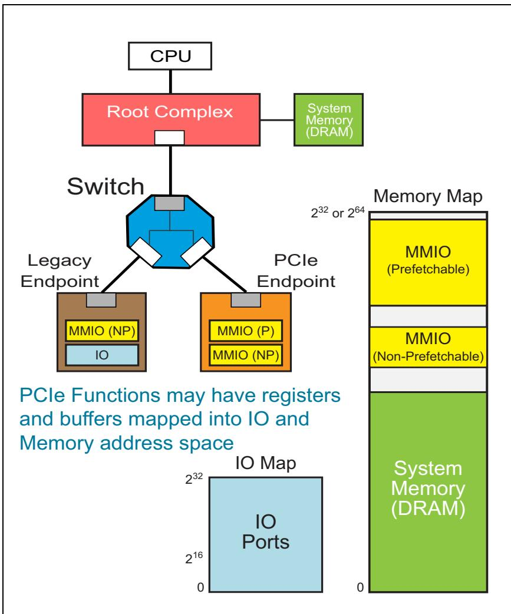

## 4.2 Base Address Registers (BARs) | 4.2 基址寄存器 (BAR)

## General | 概述

<table>
<tr>
<td width="50%">
Each device in a system may have different requirements in terms of the amount and type of address space needed. For example, one device may have 256 bytes worth of internal registers | storage that should be accessible through IO address space and another device may have 16KB of internal registers/storage that should be accessible through MMIO.
</td>
<td width="50%" style="background-color:#e8e8e8">
系统中的每个设备对地址空间的数量和类型可能有不同的需求。例如，某个设备可能有256字节的内部寄存器/存储需要通过IO地址空间访问，而另一个设备可能有16KB的内部寄存器/存储需要通过MMIO访问。
</td>
</tr>
<tr>
<td width="50%">
PCI‐based devices are not allowed to decide on their own, which addresses should be used to access their internal locations, that is the job of system software (i.e. BIOS and OS kernel). So the devices must provide a way for system software to determine the address space needs of the device. Once software knows what the device's requirements are in terms of address space, then assuming the request can be fulfilled, software will simply allocate an available range of addresses, of the appropriate type (IO, NP‐MMIO or P‐MMIO), to that device.
</td>
<td width="50%" style="background-color:#e8e8e8">
基于PCI的设备不允许自行决定应使用哪些地址来访问其内部位置，这是系统软件（即BIOS和操作系统内核）的工作。因此，设备必须提供一种方式，让系统软件能够确定设备的地址空间需求。一旦软件了解了设备在地址空间方面的需求，那么假设该请求可以被满足，软件将简单地分配一个适当类型（IO、NP-MMIO或P-MMIO）的可用地址范围给该设备。
</td>
</tr>
<tr>
<td width="50%">
This is all accomplished through the Base Address Registers (BARs) in the header of configuration space. As shown in Figure 4‐2 on page 127, a Type 0 header has six BARs available (each one being 32 bits in size), while a Type 1 header has only two BARs. Type 1 headers are found in all bridge devices, which means every switch port and root complex port has a Type 1 header. Type 0 headers are in non‐bridge devices like endpoints. An example of this can be seen in Figure 4‐3 on page 128.
</td>
<td width="50%" style="background-color:#e8e8e8">
这一切都是通过配置空间头部中的基址寄存器（BAR）来实现的。如图4-2（第127页）所示，Type 0头部有六个可用的BAR（每个大小为32位），而Type 1头部只有两个BAR。Type 1头部存在于所有桥设备中，这意味着每个交换机端口和根复合体端口都有一个Type 1头部。Type 0头部位于非桥设备（如端点）中。有关示例请参见图4-3（第128页）。
</td>
</tr>
<tr>
<td width="50%">
System software must first determine the size and type of address space being requested by a device. The device designer knows the collective size of the internal registers/storage that should be accessible via IO or MMIO. The device designer also knows how the device will behave when those registers are accessed (i.e. do reads have side‐effects or not). This will determine whether prefetchable MMIO (reads have no side‐effects) or non‐prefetchable MMIO (reads do have side‐effects) should be requested. Knowing this information, the device designer hard‐codes the lower bits of the BARs to certain values indicating the type and size of the address space being requested.
</td>
<td width="50%" style="background-color:#e8e8e8">
系统软件必须首先确定设备所请求的地址空间的大小和类型。设备设计者知道应通过IO或MMIO访问的内部寄存器/存储的总大小。设备设计者还知道访问这些寄存器时设备的行为（即读取是否有副作用）。这将决定应该请求可预取的MMIO（读取无副作用）还是不可预取的MMIO（读取有副作用）。了解了这些信息后，设备设计者将BAR的低位硬编码为特定值，以指示所请求的地址空间的类型和大小。
</td>
</tr>
<tr>
<td width="50%">
The upper bits of the BARs are writable by software. Once system software checks the lower bits of the BARs to determine the size and type of address space requested, system software will then write the base address of the address range being allocated to this device into the upper bits of the BAR. Since a single
</td>
<td width="50%" style="background-color:#e8e8e8">
BAR的高位可由软件写入。一旦系统软件检查BAR的低位以确定所请求的地址空间的大小和类型，系统软件随后将分配给该设备的地址范围的基地址写入BAR的高位。由于单个
</td>
</tr>
<tr>
<td width="50%">
Endpoint (Type 0 header) has six BARs, up to six different address space requests can be made. However, this is not common in the real world. Most devices will request 1‐3 different address ranges.
</td>
<td width="50%" style="background-color:#e8e8e8">
端点（Type 0头部）有六个BAR，因此最多可以发出六个不同的地址空间请求。然而，这在现实世界中并不常见。大多数设备会请求1-3个不同的地址范围。
</td>
</tr>
<tr>
<td width="50%">
Not all BARs have to be implemented. If a device does not need all the BARs to map their internal registers, the extra BARs are hard‐coded with all 0's notifying software that these BARs are not implemented.
</td>
<td width="50%" style="background-color:#e8e8e8">
并非所有BAR都必须实现。如果设备不需要所有的BAR来映射其内部寄存器，则多余的BAR被硬编码为全0，以通知软件这些BAR未实现。
</td>
</tr>
</table>

Figure 4‐2: BARs in Configuration Space | 图4‐2：配置空间中的BAR
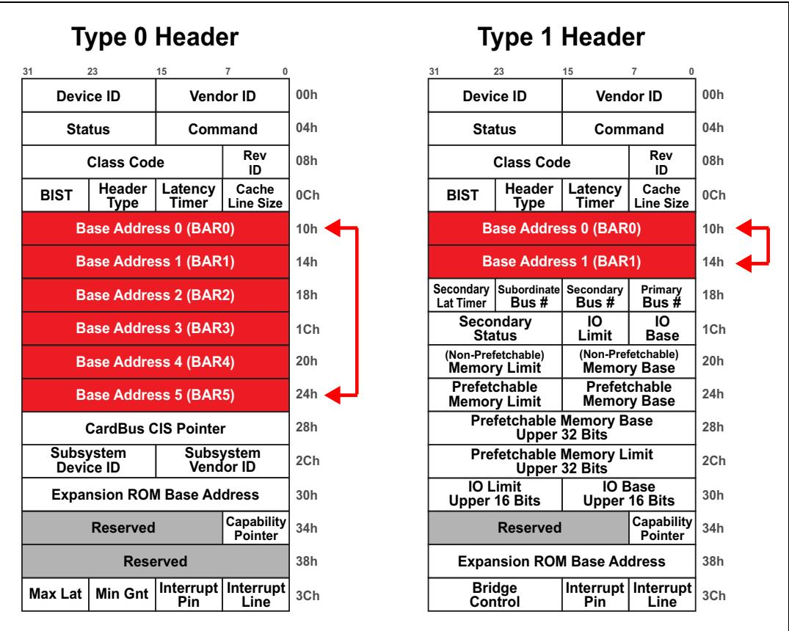

<table>
<tr>
<td width="50%">
Once the BARs have been programmed, the internal registers or local memory within the device can be accessed via the address ranges programmed into the BARs. Anytime the device sees a request with an address that maps to one of its BARs, it will accept that request because it is the target.
</td>
<td width="50%" style="background-color:#e8e8e8">
一旦BAR被编程完毕，设备内部的寄存器或本地存储器就可以通过编程到BAR中的地址范围来访问。每当设备看到一个地址映射到其某个BAR的请求时，它就会接受该请求，因为它是目标。
</td>
</tr>
</table>

Figure 4‐3: PCI Express Devices And Type 0 And Type 1 Header Use | 图4‐3：PCI Express设备与Type 0和Type 1头的使用
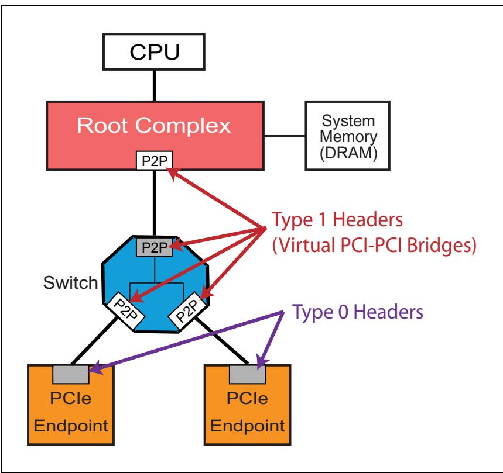

<table>
<tr>
<td width="50%">
BAR Example 1: 32-bit Memory Address Space Request
</td>
<td width="50%" style="background-color:#e8e8e8">
BAR 示例 1：32 位存储器地址空间请求
</td>
</tr>
<tr>
<td width="50%">
Figure 4-4 on page 130 shows the basic steps in setting up a BAR, which in this example, is requesting a 4KB block of non-prefetchable memory (NP-MMIO). In the figure, the BAR is shown at three points in the configuration process:
</td>
<td width="50%" style="background-color:#e8e8e8">
第 130 页的图 4-4 展示了设置 BAR 的基本步骤，在本例中，该 BAR 请求一块 4KB 的不可预取存储器（NP-MMIO）空间。图中展示了 BAR 在配置过程中的三个时刻：
</td>
</tr>
<tr>
<td width="50%">
1. In (1) of Figure 4-4, we see the uninitialized state of the BAR. The device designer has fixed the lower bits to indicate the size and type, but the upper bits (which are read-write) are shown as Xs to indicate their value is not known. System software will first write all 1s to every BAR (using config writes) to set all writable bits. (Of course, the hard-coded lower bits are unaffected by any configuration writes.) The second view of the BAR, shown in (2) of Figure 4-4, shows how it looks after configuration software has written all 1's to it.
</td>
<td width="50%" style="background-color:#e8e8e8">
1. 在图 4-4 的 (1) 中，我们看到 BAR 的未初始化状态。设备设计者已将低位固定以指示大小和类型，但高位（可读写位）用 X 表示，表明其值未知。系统软件首先会向每个 BAR 写入全 1（通过配置写操作）以设置所有可写位。（当然，硬编码的低位不受任何配置写操作的影响。）图 4-4 中的 (2) 展示了 BAR 的第二种视图，即配置软件向其写入全 1 后的状态。
</td>
</tr>
<tr>
<td width="50%">
Writing all 1s is done to determine what the least-significant writable bit is. This bit position indicates the size of the address space being requested. In this example, the least-significant writable bit is bit 12, so this BAR is requesting $2 ^ { 1 2 }$ (or 4KB) of address space. If the least significant writable bit would have been bit 20, then the BAR would have been requesting $2 ^ { 2 0 }$ (or 1MB) of address space.
</td>
<td width="50%" style="background-color:#e8e8e8">
写入全 1 的目的是确定最低有效可写位是哪一位。该位的位置指明了所请求地址空间的大小。在本例中，最低有效可写位是第 12 位，因此该 BAR 请求 $2 ^ { 1 2 }$（即 4KB）的地址空间。如果最低有效可写位是第 20 位，那么该 BAR 就会请求 $2 ^ { 2 0 }$（即 1MB）的地址空间。
</td>
</tr>
<tr>
<td width="50%">
2. After writing all 1s to the BARs, software turns around and reads the value of each BAR, starting with BAR0, to determine the type and size of the address space being requested. Table 4-1 on page 129 summarizes the results of the configuration read of BAR0 for this example.
</td>
<td width="50%" style="background-color:#e8e8e8">
2. 在向 BAR 写入全 1 之后，软件回读每个 BAR 的值，从 BAR0 开始，以确定所请求地址空间的类型和大小。对于本例，第 129 页的表 4-1 总结了读取 BAR0 配置值的各项结果。
</td>
</tr>
<tr>
<td width="50%">
3. The final step in this process is for system software to allocate an address range to BAR0 now that software knows the size and type of the address space being requested. The third view of the BAR, in (3) of Figure 4-4, shows how it looks after software has written the start address for the allocated block of addresses. In this example, the start address is F900_0000h.
</td>
<td width="50%" style="background-color:#e8e8e8">
3. 此过程的最后一步是系统软件为 BAR0 分配一个地址范围，因为此时软件已经知道所请求地址空间的大小和类型。图 4-4 的 (3) 中 BAR 的第三种视图展示了软件写入已分配地址块的起始地址之后的状态。在本例中，起始地址为 F900_0000h。
</td>
</tr>
<tr>
<td width="50%">
At this point the configuration of BAR0 is complete. Once software enables memory address decoding in the Command register (offset 04h), this device will accept any memory requests it receives that fall within the range from F900_0000h - F900_0FFFh (4KB in size).
</td>
<td width="50%" style="background-color:#e8e8e8">
至此，BAR0 的配置完成。一旦软件使能命令寄存器（偏移 04h）中的存储器地址解码，该设备将接受其接收到的任何落在 F900_0000h - F900_0FFFh（大小为 4KB）范围内的存储器请求。
</td>
</tr>
</table>

Table 4-1: Results of Reading the BAR after Writing All 1s To It | 表4-1：写入全1后读取BAR的结果

<table><tr><td>BAR Bits</td><td>Meaning</td></tr><tr><td>0</td><td>Read as 0b, indicating a memory request. Since this is a memory request, bits 3:1 also have an encoded meaning.</td></tr><tr><td>2:1</td><td>Read as 00b indicating the target only supports decoding a 32-bit address</td></tr><tr><td>3</td><td>Read as 0b, indicating request is for non-prefetchable memory (meaning reads do have side-effects); NP-MMIO</td></tr><tr><td>11:4</td><td>Read as all 0s, indicating the size of the request (these bits are hard-coded to 0)</td></tr><tr><td>31:12</td><td>Read as all 1s because software has not yet programmed the upper bits with a start address for the block. Since bit 12 is the least significant bit that could be written, the memory size requested is  $2^{12} = 4KB$ .</td></tr></table>

Figure 4-4: 32-Bit Non-Prefetchable Memory BAR Set Up | 图4-4：32位非预取存储器BAR设置

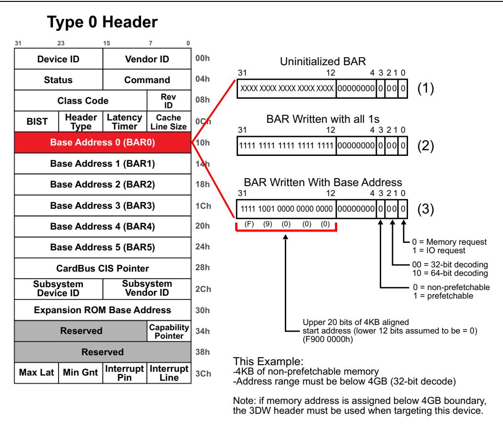

## 4.2.2 BAR Example 2: 64-bit Memory Address Space Request | 4.2.2 BAR 示例 2: 64 位存储器地址空间请求

<table>
<tr>
<td width="50%">
In the previous example, we saw BAR0 being used to request non-prefetchable memory address space (NP-MMIO). In this example, as shown in Figure 4-5 on page 132, BAR1 and BAR2 are being used to request a 64MB block of prefetchable memory address space. Two sequential BARs are being used here because the device supports a 64-bit address for this request, meaning that software can allocate the requested address space above the 4GB address boundary if it wants to (but that is not a requirement). Since the address can be a 64-bit address, two sequential BARs must be used together.
</td>
<td width="50%" style="background-color:#e8e8e8">
在上一个示例中，我们看到 BAR0 用于请求不可预取存储器地址空间 (NP-MMIO)。在本示例中，如图 4-5（第 132 页）所示，BAR1 和 BAR2 用于请求一个 64MB 的可预取存储器地址空间块。这里使用了两个连续的 BAR，因为该设备对此请求支持 64 位地址，这意味着软件可以将所请求的地址空间分配在 4GB 地址边界之上（但这并非强制要求）。由于地址可以是 64 位的，因此必须同时使用两个连续的 BAR。
</td>
</tr>
<tr>
<td width="50%">
As before, the BARs are shown at three points in the configuration process:
</td>
<td width="50%" style="background-color:#e8e8e8">
与之前一样，BAR 在配置过程中的三个时间点展示：
</td>
</tr>
<tr>
<td width="50%">
1. In (1) of Figure 4-5, we see the uninitialized state of the BAR pair. The device designer has hard-coded the lower bits of the lower BAR (BAR1 in our example) to indicate the request type and size, while the bits of the upper BAR (BAR2) are all read-write. System software's first step was to write all 1s to every BAR. In (2) of Figure 4-5, we see the BARs after having all 1s written to them.
</td>
<td width="50%" style="background-color:#e8e8e8">
1. 在图 4-5 的 (1) 中，我们看到 BAR 对的未初始化状态。设备设计者已将低位 BAR（本例中的 BAR1）的低位进行硬编码，以指示请求类型和大小，而高位 BAR (BAR2) 的所有位都是可读写的。系统软件的第一步是向每个 BAR 写入全 1。在图 4-5 的 (2) 中，我们看到写入全 1 之后的 BAR。
</td>
</tr>
<tr>
<td width="50%">
2. As described in the previous example, system software already evaluated BAR0. So software's next step is to read the next BAR (BAR1) and evaluate it to see if the device is requesting additional address space. Once BAR1 is read, software realizes that more address space is being requested and this request is for prefetchable memory address space that can be allocated anywhere in the 64-bit address range. Since it supports a 64-bit address, the next sequential BAR (BAR2 in this case) is treated as the upper 32 bits of BAR1. So software now also reads in the contents of BAR2. However, software does not evaluate the lower bits of BAR2 in the same way it did for BAR1, because it knows BAR2 is simply the upper 32 bits of the 64-bit address request started in BAR1. Table 4-2 on page 132 summarizes the results of these configuration reads.
</td>
<td width="50%" style="background-color:#e8e8e8">
2. 如上一个示例所述，系统软件已经评估了 BAR0。因此，软件的下一步是读取下一个 BAR (BAR1) 并评估它，以确定设备是否在请求额外的地址空间。一旦读取了 BAR1，软件就意识到正在请求更多的地址空间，而且该请求是针对可预取存储器地址空间的，可分配在 64 位地址范围内的任意位置。由于它支持 64 位地址，因此下一个连续 BAR（本例中的 BAR2）被视为 BAR1 的高 32 位。因此，软件现在也读取 BAR2 的内容。但是，软件不会像对 BAR1 那样评估 BAR2 的低位，因为它知道 BAR2 只是 BAR1 中开始的 64 位地址请求的高 32 位。第 132 页的表 4-2 总结了这些配置读取的结果。
</td>
</tr>
<tr>
<td width="50%">
3. The final step in this process is for system software to allocate an address range to the BARs now that software knows the size and type of the address space being requested. The third view of the BARs in (3) of Figure 4-5 shows the result after software has used two configuration writes to program the 64-bit start address for the allocated range. In this example, bit 1 of the Upper BAR (address bit 33 in the BAR pair) is set and bit 30 of the Lower BAR (address bit 30 in the BAR pair) is set to indicate a start address of 2_4000_0000h. All other writable bits in both BARs are cleared.
</td>
<td width="50%" style="background-color:#e8e8e8">
3. 此过程的最后一步是，在软件知道了所请求地址空间的大小和类型之后，由系统软件为 BAR 分配地址范围。图 4-5 中 (3) 的第三个 BAR 视图显示了软件使用两次配置写操作对所分配范围的 64 位起始地址进行编程之后的结果。在本例中，高位 BAR 的位 1（BAR 对中的地址位 33）被置位，低位 BAR 的位 30（BAR 对中的地址位 30）被置位，以指示起始地址为 2\_4000\_0000h。两个 BAR 中的所有其他可写位均被清零。
</td>
</tr>
<tr>
<td width="50%">
At this point, the configuration of the BAR pair (BAR1 & BAR2) is complete. Once software enables memory address decoding in the Command register (offset 04h), this device will accept any memory requests it receives that fall within the range from 2_4000_0000h-2_43FF_FFFFh (64MB in size).
</td>
<td width="50%" style="background-color:#e8e8e8">
此时，BAR 对（BAR1 和 BAR2）的配置完成。一旦软件在命令寄存器（偏移量 04h）中启用存储器地址解码，该设备将接受其接收到的落在 2\_4000\_0000h 至 2\_43FF\_FFFFh 范围内（大小为 64MB）的任何存储器请求。
</td>
</tr>
</table>

Figure 4-5: 64-Bit Prefetchable Memory BAR Set Up | 图4-5：64位可预取存储器BAR设置

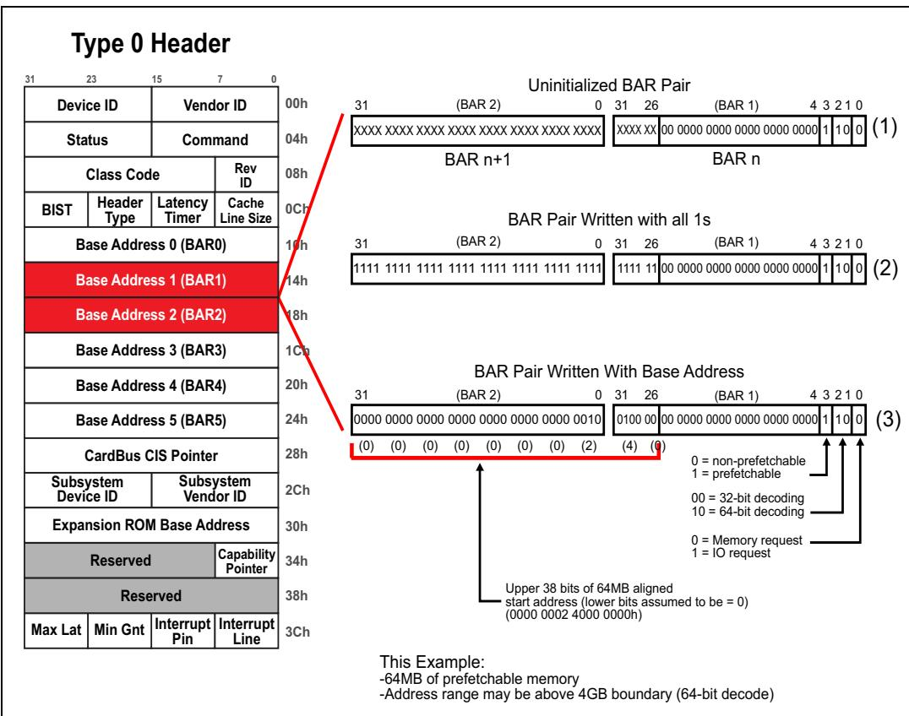

Table 4-2: Results Of Reading the BAR Pair after Writing All 1s To Both | 表4-2：写入全1后读取BAR对的结果

<table><tr><td>BAR</td><td>BAR Bits</td><td>Meaning</td></tr><tr><td>Lower</td><td>0</td><td>Read as 0b, indicating a memory request. Since this is a memory request, bits 3:1 also have an encoded meaning.</td></tr><tr><td>Lower</td><td>2:1</td><td>Read as 10b indicating the target supports a 64-bit address decoder, and that the next sequential BAR contains the upper 32 bits of the address information.</td></tr><tr><td>Lower</td><td>3</td><td>Read as 1b, indicating request is for prefetchable memory (meaning reads do not have side-effects); P-MMIO</td></tr><tr><td>Lower</td><td>25:4</td><td>Read as all 0s, indicating the size of the request (these bits are hard-coded to 0)</td></tr><tr><td>Lower</td><td>31:26</td><td>Read as all 1s because software has not yet programmed the upper bits with a start address for the block. Note that because bit 26 was the least significant writable bit, the memory address space request size is $2^{26}$, or 64MB.</td></tr><tr><td>Upper</td><td>31:0</td><td>Read as all 1s. These bits will be used as the upper 32 bits of the 64-bit start address programmed by system software.</td></tr></table>

## 4.2.3 BAR Example 3: IO Address Space Request | 4.2.3 BAR 示例 3：IO 地址空间请求

<table>
<tr>
<td width="50%">
Continuing from the previous two examples, this same function is also requesting IO space, as shown in Figure 4‑6 on page 134. In the diagram, the requesting BAR (BAR3 in the example) is shown at three points in the configuration process:
</td>
<td width="50%" style="background-color:#e8e8e8">
继续前面两个示例，同一个功能也在请求 IO 空间，如第 134 页的图 4‑6 所示。在图中，请求 BAR（本例中为 BAR3）在配置过程的三个时间点被展示：
</td>
</tr>
<tr>
<td width="50%">
1. In (1) of Figure 4‑6, we see the uninitialized state of the BAR. System software has previously written all 1s to every BAR and has evaluated BAR0, then BAR1 and BAR2. Now software is going to see if this device is requesting additional address space with BAR3. State (2) of Figure 4‑6 shows the state of the BAR3 after the write of all 1s.
</td>
<td width="50%" style="background-color:#e8e8e8">
1. 在图 4‑6 的 (1) 中，我们看到 BAR 的未初始化状态。系统软件此前已向每一个 BAR 写入全 1，并已评估了 BAR0、BAR1 和 BAR2。现在软件将检查此设备是否通过 BAR3 请求额外的地址空间。图 4‑6 的状态 (2) 展示了写入全 1 后 BAR3 的状态。
</td>
</tr>
<tr>
<td width="50%">
2. Software now reads in BAR3 to evaluate the size and type of the request. Table 4‑3 on page 134 summarizes the results of this configuration read.
</td>
<td width="50%" style="background-color:#e8e8e8">
2. 软件现在读取 BAR3 以评估请求的大小和类型。第 134 页的表 4‑3 总结了此次配置读取的结果。
</td>
</tr>
<tr>
<td width="50%">
3. Now that software knows this is a request for 256 bytes of IO address space, the final step is to program the BAR with the base address of the IO address range being allocated to this device, specifically this BAR. State (3) of Figure 4‑6 shows the state of the BAR after this step. In our example, the device start address is 16KB, so bit 14 is written resulting in a base address of 4000h; all other upper bits are cleared.
</td>
<td width="50%" style="background-color:#e8e8e8">
3. 既然软件已知这是一个 256 字节 IO 地址空间的请求，最后一步是向 BAR 写入分配给此设备（具体为此 BAR）的 IO 地址范围的基址。图 4‑6 的状态 (3) 展示了此步骤之后 BAR 的状态。在我们的示例中，设备起始地址为 16KB，因此写入位 14，结果基址为 4000h；所有其他高位均被清零。
</td>
</tr>
<tr>
<td width="50%">
At this point, the configuration of BAR3 is complete. Once software enables IO address decoding in the Command register (offset 04h), the device will accept and respond to IO transactions within the range 4000h — 40FFh (256 bytes in size).
</td>
<td width="50%" style="background-color:#e8e8e8">
至此，BAR3 的配置完成。一旦软件在命令寄存器（偏移 04h）中启用 IO 地址译码，设备将接受并响应 4000h — 40FFh 范围内（大小为 256 字节）的 IO 事务。
</td>
</tr>
</table>

Figure 4‑6: IO BAR Set Up | 图4‑6：IO BAR设置

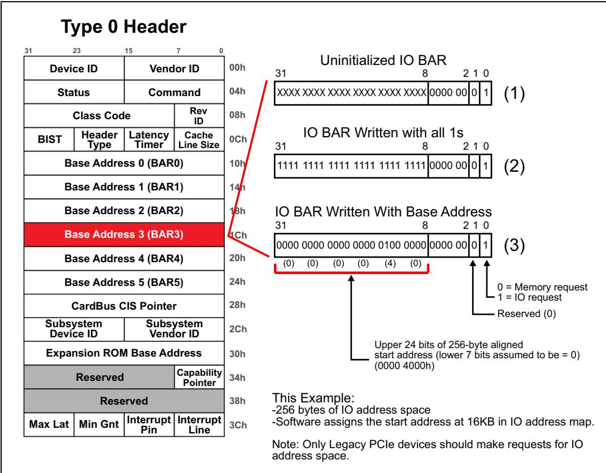

Table 4‑3: Results Of Reading the IO BAR after Writing All 1s To It | 表4‑3：写入全1后读取IO BAR的结果

<table><tr><td>BAR Bits</td><td>Meaning</td></tr><tr><td>0</td><td>Read as 1b, indicating an IO request. Since this is an IO request, bit 1 is reserved.</td></tr><tr><td>1</td><td>Reserved. Hard-coded to 0b.</td></tr><tr><td>7:2</td><td>Read as 0s Indicates size of the request (these bits are hard-coded to 0)</td></tr><tr><td>31:8</td><td>Read as 1s because software has not yet programmed the upper bits with a start address for the block. Note that because bit 8 was the least significant writable bit, the IO request size is $2^{8}$, or 256 bytes.</td></tr></table>

## 4.2.4 All BARs Must Be Evaluated Sequentially | 4.2.4 所有BAR必须按顺序评估

<table>
<tr>
<td width="50%">
After going through the previous three examples, it becomes clear that software must evaluate BARs in a sequential fashion.
</td>
<td width="50%" style="background-color:#e8e8e8">
通过前面三个示例，可以清楚地看到，软件必须按顺序依次评估各个BAR。
</td>
</tr>
<tr>
<td width="50%">
Most of the time, functions do not need all six BARs. Even in the examples we went through, only four of the six available BARs were used. If the function in our example did not need to request any additional address space, the device designer would hard-code all bits of BAR4 and BAR5 to 0s. So even though software writes those BARs with all 1s, the writes have no affect. After evaluating BAR3, software would move on to evaluating BAR4. Once it detected that none of the bits were set, software would know this BAR is not being used and move on to evaluating the next BAR.
</td>
<td width="50%" style="background-color:#e8e8e8">
大多数情况下，功能不需要全部六个BAR。即使在我们所讨论的示例中，六个可用BAR中也只使用了四个。如果我们的示例功能不需要请求任何额外的地址空间，设备设计者会将BAR4和BAR5的所有位硬编码为0。因此，即使软件向这些BAR写入全1，写入操作也不会产生任何影响。在评估完BAR3之后，软件将继续评估BAR4。一旦检测到没有任何位被置位（即为0），软件就知道该BAR未被使用，并继续评估下一个BAR。
</td>
</tr>
<tr>
<td width="50%">
All BARs must be evaluated, even if software finds a BAR that is not being used. There are no rules in PCI or PCIe, that state that BAR0 must be the first BAR used for address space requests. If a device designer chooses to, they can use BAR4 for an address space request and hard-code BAR0, BAR1, BAR2, BAR3 and BAR5 to all 0s. This means software must evaluate every BAR in the header.
</td>
<td width="50%" style="background-color:#e8e8e8">
即使软件发现某个BAR未被使用，也必须评估所有的BAR。PCI或PCIe规范中没有任何规则规定BAR0必须是用于地址空间请求的第一个BAR。如果设备设计者选择这样做，他们可以使用BAR4来请求地址空间，而将BAR0、BAR1、BAR2、BAR3和BAR5全部硬编码为0。这意味着软件必须评估头部中的每一个BAR。
</td>
</tr>
</table>

## 20.5.2 Resizable BARs | 20.5.2 可调整大小的 BAR

<table>
<tr>
<td width="50%">
The 2.1 version of the PCI Express specification added support for changing the size of the requested address space in the BARs by defining a new capability structure in extended config space. The new structure allows the function to advertise what address space sizes it can operate with and then have software enable one of the sizes based on the available system resources. For example, if a function would ideally like to have 2GB of prefetchable memory address space, but it could still operate with only 1GB, 512MB or 256MB of P‑MMIO, system software may only enable the function to request 256MB of address space if software would not be able to accommodate a request of a larger size.
</td>
<td width="50%" style="background-color:#e8e8e8">
PCI Express 规范 2.1 版通过在扩展配置空间中定义一种新的能力结构，增加了对改变 BAR 中请求地址空间大小的支持。这种新结构允许功能通告它能够以哪些地址空间大小进行操作，然后由软件根据可用的系统资源使能其中一种大小。例如，如果一个功能理想情况下希望拥有 2GB 的可预取存储器地址空间，但它仍可以仅用 1GB、512MB 或 256MB 的 P‑MMIO 进行操作，那么当系统软件无法满足更大容量的请求时，软件可以仅使能该功能请求 256MB 的地址空间。
</td>
</tr>
</table>

## 4.3 Base and Limit Registers | 4.3 基址与界限寄存器

## General | 概述

<table>
<tr>
<td width="50%">
Once a function's BARs are programmed, the function knows what address range(s) it owns, which means that function will claim any transactions it sees that is targeting an address range it owns, an address range programmed into one of its BARs.
< | td>
<td width="50%" style="background-color:#e8e8e8">
一旦某个功能的 BAR 被编程设置好，该功能就知道它拥有哪些地址范围，这意味着该功能将认领它所看到的、目标是它所拥有的地址范围（即编程写入其某个 BAR 中的地址范围）的任何事务。
</td>
</tr>
<tr>
<td width="50%">
This is good, but it's important to realize that the only way that function is going to "see" the transactions it should claim is if the bridge(s) upstream of it, forward those transactions downstream to the appropriate link that the target function is connected to.
</td>
<td width="50%" style="background-color:#e8e8e8">
这很好，但必须认识到：该功能要能"看到"它应认领的事务，唯一途径是其上游的桥（一个或多个）将这些事务向下游转发到目标功能所连接的对应链路上。
</td>
</tr>
<tr>
<td width="50%">
Therefore, each bridge (e.g. switch ports and root complex ports) needs to know what address ranges live beneath it so it can determine which requests should be forwarded from its primary interface (upstream side) to its secondary interface (downstream side).
</td>
<td width="50%" style="background-color:#e8e8e8">
因此，每个桥（例如交换机端口和根复合体端口）都需要知道它下方存在哪些地址范围，以便能够确定哪些请求应从其主接口（上游侧）转发到其从接口（下游侧）。
</td>
</tr>
<tr>
<td width="50%">
If the request is targeting an address that is owned by a BAR in a function beneath the bridge, the request should be forwarded to the bridge's secondary interface.
</td>
<td width="50%" style="background-color:#e8e8e8">
如果请求目标地址属于该桥下方某个功能中的 BAR 所拥有的地址，则该请求应被转发到该桥的从接口。
</td>
</tr>
</table>

<table>
<tr>
<td width="50%">
It is the Base and Limit registers in the Type 1 headers that are programmed with the range of addresses that live beneath this bridge.
</td>
<td width="50%" style="background-color:#e8e8e8">
正是 Type 1 头中的基址/界限寄存器被编程设置为该桥下方所存在的地址范围。
</td>
</tr>
<tr>
<td width="50%">
There are the three sets of Base and Limit registers found in each Type 1 header.
</td>
<td width="50%" style="background-color:#e8e8e8">
每个 Type 1 头中都有三组基址/界限寄存器。
</td>
</tr>
<tr>
<td width="50%">
Three sets of registers are needed because there can be three separate address ranges living below a bridge:
</td>
<td width="50%" style="background-color:#e8e8e8">
之所以需要三组寄存器，是因为桥下方可能存在三种不同的地址范围：
</td>
</tr>
</table>

- Prefetchable Memory space (P-MMIO)
- Non-Prefetchable Memory space (NP-MMIO)
- IO space (IO)

<table>
<tr>
<td width="50%">
To explain how these Base and Limit registers work, let's continue the example from the previous section and place that programmed function (an endpoint) beneath a switch as shown in Figure 4-7 on page 137.
</td>
<td width="50%" style="background-color:#e8e8e8">
为了解释这些基址/界限寄存器是如何工作的，我们继续沿用上一节的示例，并将那个已编程的功能（一个端点）置于一个交换机下方，如图 4-7（第 137 页）所示。
</td>
</tr>
<tr>
<td width="50%">
The figure also lists the address ranges owned by the BARs of that function.
</td>
<td width="50%" style="background-color:#e8e8e8">
该图还列出了该功能的 BAR 所拥有的地址范围。
</td>
</tr>
</table>

<table>
<tr>
<td width="50%">
The Base and Limit registers of every bridge upstream of the endpoint will need to be programmed, but to start out, we're going to focus on the bridge that is connected to the endpoint (Port B).
</td>
<td width="50%" style="background-color:#e8e8e8">
端点上游的每个桥的基址/界限寄存器都需要被编程设置，但作为开始，我们将重点讨论与端点相连的那个桥（端口 B）。
</td>
</tr>
</table>

Figure 4-7: Example Topology for Setting Up Base and Limit Values | 图4-7：设置基址和限制值的示例拓扑
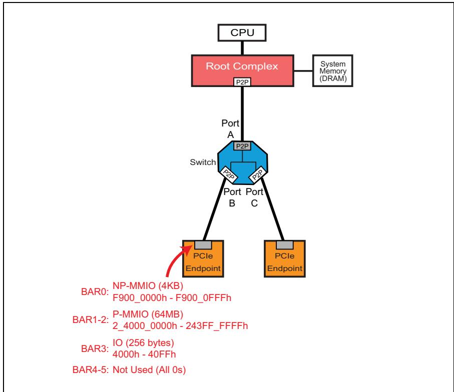

## 4.3.1 Prefetchable Range (P-MMIO) | 4.3.1 可预取范围 (P-MMIO)

<table>
<tr>
<td width="50%">
Type 1 headers have two pairs of prefetchable memory base/limit registers. The Prefetchable Memory Base/Limit registers store address info for the lower 32 bits of the prefetchable address range. If this bridge supports decoding 64-bit addresses, then the Prefetchable Memory Base/Limit Upper 32 Bits registers are also used and hold the upper 32 bits (bits [63:32]) of the address range. Figure 4-8 on page 138 shows the values software would program into these registers to indicate that the prefetchable address range of 2\_4000\_0000h - 2\_43FF\_FFFFh lives beneath that bridge (Port B). The meaning of each field in those registers is summarized in Table 4-4.
</td>
<td width="50%" style="background-color:#e8e8e8">
Type 1 头中有两对可预取存储器基址/上限寄存器。可预取存储器基址/上限寄存器存储可预取地址范围低 32 位的地址信息。如果该桥支持 64 位地址译码，则还需使用可预取存储器基址/上限高 32 位寄存器，它们保存地址范围的高 32 位 (位 [63:32])。第 138 页图 4-8 展示了软件为指示可预取地址范围 2\_4000\_0000h - 2\_43FF\_FFFFh 位于该桥 (端口 B) 下方时应写入这些寄存器的值。这些寄存器中各字段的含义汇总于表 4-4。
</td>
</tr>
</table>

Figure 4-8: Example Prefetchable Memory Base/Limit Register Values | 图4-8：可预取存储器基址/限制寄存器值示例

<table><tr><td colspan="2">Device ID</td><td colspan="2">Vendor ID</td></tr><tr><td colspan="2">Status</td><td colspan="2">Command</td></tr><tr><td colspan="3">Class Code</td><td>Rev ID</td></tr><tr><td>BIST</td><td>Header Type</td><td>Latency Timer</td><td>Cache Line Size</td></tr><tr><td colspan="4">Base Address 0 (BAR0)</td></tr><tr><td colspan="4">Base Address 1 (BAR1)</td></tr><tr><td>Secondary Lat Timer</td><td>Subordinate Bus #</td><td>Secondary Bus #</td><td>Primary Bus #</td></tr><tr><td colspan="2">Secondary Status</td><td>IO Limit</td><td>IO Base</td></tr><tr><td colspan="2">(Non-Prefetchable) Memory Limit</td><td colspan="2">(Non-Prefetchable) Memory Base</td></tr><tr><td colspan="2">Prefetchable Memory Limit</td><td colspan="2">Prefetchable Memory Base</td></tr><tr><td colspan="4">Prefetchable Memory Base Upper 32 Bits</td></tr><tr><td colspan="4">Prefetchable Memory Limit Upper 32 Bits</td></tr><tr><td colspan="2">IO Limit Upper 16 Bits</td><td colspan="2">IO Base Upper 16 Bits</td></tr><tr><td colspan="3">Reserved</td><td>Capability Pointer</td></tr><tr><td colspan="4">Expansion ROM Base Address</td></tr><tr><td colspan="2">Bridge Control</td><td>Interrupt Pin</td><td>Interrupt Line</td></tr></table>

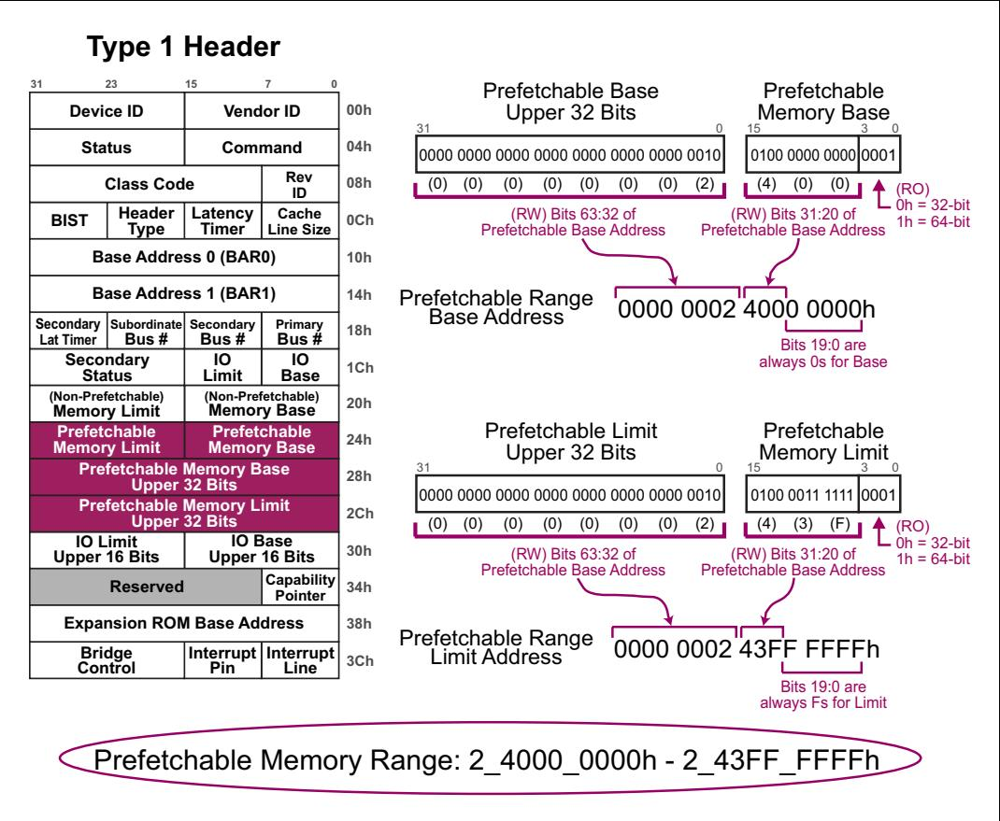

<table>
<tr>
<td width="50%">
Chapter 4: Address Space &amp; Transaction Routing
</td>
<td width="50%" style="background-color:#e8e8e8">
第4章：地址空间与事务路由
</td>
</tr>
</table>

Table 4-4: Example Prefetchable Memory Base/Limit Register Meanings | 表4-4：可预取存储器基址/限制寄存器含义示例

<table><tr><td>Register</td><td>Value</td><td>Use</td></tr><tr><td>Prefetchable Memory Base</td><td>4001h</td><td>The upper 12 bits of this register hold the upper 12 bits of the 32-bit BASE address (bits [31:20]). The lower 20 bits of the base address are implied to be all 0s, meaning the base address is always aligned on a 1MB boundary.The lower 4 bits of this register indicate whether a 64-bit address decoder is supported in the bridge, meaning the Upper Base/Limit Registers are used.</td></tr><tr><td>Prefetchable Memory Limit</td><td>43F1h</td><td>Similarly, the upper 12 bits of this register hold the upper 12 bits of the 32-bit LIMIT address (bits [31:20]). The lower 20 bits of the limit address are all implied to be all Fs.The lower 4 bits of this register have the same meaning as the lower 4 bits of the base register.</td></tr><tr><td>Prefetchable Memory Base Upper 32 Bits</td><td>00000002h</td><td>Holds the upper 32 bits of the 64-bit BASE address for Prefetchable Memory downstream of this port.</td></tr><tr><td>Prefetchable Memory Limit Upper 32 Bits</td><td>00000002h</td><td>Holds the upper 32 bits of the 64-bit LIMIT address for Prefetchable Memory downstream of this port.</td></tr></table>

## 4.3.2 Non-Prefetchable Range (NP-MMIO) | 4.3.2 不可预取范围 (NP-MMIO)

<table>
<tr>
<td width="50%">
Unlike the prefetchable memory range, the non-prefetchable memory range can only support 32-bit addresses. So there is only one register for the base and one register for the limit. Following the example in Figure 4-7, the Non-Prefetchable Memory Base/Limit registers of Port B would be programmed with the values shown in Figure 4-9 on page 140. The meaning of these values is summarized in Table 4-5.
</td>
<td width="50%" style="background-color:#e8e8e8">
与可预取存储器范围不同，不可预取存储器范围仅支持32位地址。因此，基址和界限各只有一个寄存器。按照图4-7中的示例，Port B的不可预取存储器基址/界限寄存器将被编程为第140页图4-9所示的值。这些值的含义总结在表4-5中。
</td>
</tr>
</table>

Figure 4-9: Example Non-Prefetchable Memory Base/Limit Register Values | 图4-9：非预取存储器基址/限制寄存器值示例
Type 1 Header

<table><tr><td colspan="2">Device ID</td><td colspan="2">Vendor ID</td></tr><tr><td colspan="2">Status</td><td colspan="2">Command</td></tr><tr><td colspan="3">Class Code</td><td>Rev ID</td></tr><tr><td>BIST</td><td>Header Type</td><td>Latency Timer</td><td>Cache Line Size</td></tr><tr><td colspan="4">Base Address 0 (BAR0)</td></tr><tr><td colspan="4">Base Address 1 (BAR1)</td></tr><tr><td>Secondary Lat Timer</td><td>Subordinate Bus #</td><td>Secondary Bus #</td><td>Primary Bus #</td></tr><tr><td colspan="2">Secondary Status</td><td>IO Limit</td><td>IO Base</td></tr><tr><td colspan="2">(Non-Prefetchable) Memory Limit</td><td colspan="2">(Non-Prefetchable) Memory Base</td></tr><tr><td colspan="2">Prefetchable Memory Limit</td><td colspan="2">Prefetchable Memory Base</td></tr><tr><td colspan="4">Prefetchable Memory Base Upper 32 Bits</td></tr><tr><td colspan="4">Prefetchable Memory Limit Upper 32 Bits</td></tr><tr><td colspan="2">IO Limit Upper 16 Bits</td><td colspan="2">IO Base Upper 16 Bits</td></tr><tr><td colspan="3">Reserved</td><td>Capability Pointer</td></tr><tr><td colspan="4">Expansion ROM Base Address</td></tr><tr><td colspan="2">Bridge Control</td><td>Interrupt Pin</td><td>Interrupt Line</td></tr></table>

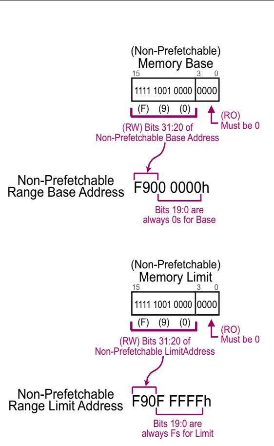

Non-Prefetchable Memory Range: F900\_0000h - F90F\_FFFFh

Table 4-5: Example Non-Prefetchable Memory Base/Limit Register Meanings | 表4-5：非预取存储器基址/限制寄存器含义示例

<table><tr><td>Register</td><td>Value</td><td>Use</td></tr><tr><td>(Non-Prefetchable) Memory Base</td><td>F900h</td><td>The upper 12 bits of this register hold the upper 12 bits of the 32-bit BASE address (bits [31:20]). The lower 20 bits of the base address are implied to be all 0s, meaning the base address is always aligned on a 1MB boundary.The lower 4 bits of this register must be 0s.</td></tr><tr><td>(Non-Prefetchable) Memory Limit</td><td>F900h</td><td>Similarly, the upper 12 bits of this register hold the upper 12 bits of the 32-bit LIMIT address (bits [31:20]). The lower 20 bits of the limit address are all implied to be all Fs.The lower 4 bits of this register must be 0s.</td></tr></table>

<table>
<tr>
<td width="50%">
This example shows an interesting case where the non-prefetchable address range programmed in Port B's configuration space indicates a much larger range (1MB) than the NP-MMIO range (4KB) owned by the endpoint living downstream. This is because the memory base/limit registers in the Type 1 header, can only be used to specify address bits 20 and above ([31:20]). The lower 20 address bits, [19:0], are implied. So the smallest address range that can be specified with the memory base/limit registers is 1MB.
</td>
<td width="50%" style="background-color:#e8e8e8">
此示例展示了一个有趣的情况：Port B配置空间中编程的不可预取地址范围所指示的范围(1MB)远大于下游端点拥有的NP-MMIO范围(4KB)。这是因为Type 1头中的存储器基址/界限寄存器仅可用于指定地址位20及以上([31:20])。低20位地址位[19:0]是隐式的。因此，使用存储器基址/界限寄存器可指定的最小地址范围为1MB。
</td>
</tr>
<tr>
<td width="50%">
In our example, the endpoint requested, and was granted, 4KB of NP-MMIO (F900\_0000h - F900\_0FFFh). Port B was programmed with values indicating 1MB, or 1024KB, of NP-MMIO lived downstream of that port (F900\_0000h - F90F\_FFFFh). This means 1020KB (F900\_1000h - F90F\_FFFFh) of memory address space is wasted. This address space CANNOT be allocated to another endpoint because the routing of the packets would not work.
</td>
<td width="50%" style="background-color:#e8e8e8">
在我们的示例中，端点请求并获得了4KB的NP-MMIO (F900\_0000h - F900\_0FFFh)。Port B被编程的值指示该端口下游有1MB(即1024KB)的NP-MMIO (F900\_0000h - F90F\_FFFFh)。这意味着1020KB (F900\_1000h - F90F\_FFFFh)的存储器地址空间被浪费了。该地址空间不能分配给其他端点，因为报文的正确路由将无法工作。
</td>
</tr>
</table>

## 4.3.3 IO Range | 4.3.3 IO 范围

<table>
<tr>
<td width="50%">
Like with the prefetchable memory range, Type 1 headers have two pairs of IO base/limit registers. The IO Base/Limit registers store address info for the lower 16 bits of the IO address range. If this bridge supports decoding 32‑bit IO addresses (which is rare in real‑world devices), then the IO Base/Limit Upper 16 Bits registers are also used and hold the upper 16 bits (bits [31:16]) of the IO address range. Following our example, Figure 4‑10 on page 142 shows the values software would program into these registers to indicate that the IO address range of 4000h ‑ 4FFFh lives beneath that bridge (Port B). The meaning of each field in those registers is summarized in Table 4‑6.
</td>
<td width="50%" style="background-color:#e8e8e8">
与可预取存储器范围类似，Type 1 头拥有两对 IO 基址/上限寄存器。IO Base/Limit 寄存器存储 IO 地址范围低 16 位的地址信息。如果此桥支持解码 32 位 IO 地址（在实际设备中极少见），则还会使用 IO Base/Limit Upper 16 Bits 寄存器，用于存放 IO 地址范围的高 16 位（位 [31:16]）。沿用我们的示例，第 142 页的图 4-10 显示了软件应写入这些寄存器的值，以指示 IO 地址范围 4000h‑4FFFh 位于该桥（端口 B）的下游。这些寄存器中每个字段的含义汇总于表 4-6。
</td>
</tr>
</table>

Figure 4-10: Example IO Base/Limit Register Values | 图4-10：IO基址/限制寄存器值示例

<table><tr><td colspan="2">Device ID</td><td colspan="2">Vendor ID</td></tr><tr><td colspan="2">Status</td><td colspan="2">Command</td></tr><tr><td colspan="3">Class Code</td><td>RevID</td></tr><tr><td>BIST</td><td>Header Type</td><td>Latency Timer</td><td>Cache Line Size</td></tr><tr><td colspan="4">Base Address 0 (BAR0)</td></tr><tr><td colspan="4">Base Address 1 (BAR1)</td></tr><tr><td>Secondary Lat Timer</td><td>Subordinate Bus #</td><td>Secondary Bus #</td><td>Primary Bus #</td></tr><tr><td colspan="2">Secondary Status</td><td>IO Limit</td><td>IO Base</td></tr><tr><td colspan="2">(Non-Prefetchable) Memory Limit</td><td colspan="2">(Non-Prefetchable) Memory Base</td></tr><tr><td colspan="2">Prefetchable Memory Limit</td><td colspan="2">Prefetchable Memory Base</td></tr><tr><td colspan="4">Prefetchable Memory Base Upper 32 Bits</td></tr><tr><td colspan="4">Prefetchable Memory Limit Upper 32 Bits</td></tr><tr><td colspan="2">IO Limit Upper 16 Bits</td><td colspan="2">IO Base Upper 16 Bits</td></tr><tr><td colspan="3">Reserved</td><td>Capability Pointer</td></tr><tr><td colspan="4">Expansion ROM Base Address</td></tr><tr><td colspan="2">Bridge Control</td><td>Interrupt Pin</td><td>Interrupt Line</td></tr></table>

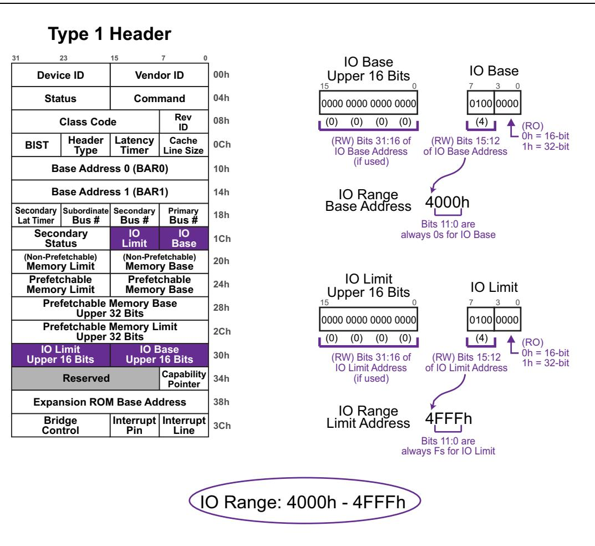

Table 4-6: Example IO Base/Limit Register Meanings | 表4-6：IO基址/限制寄存器含义示例

<table><tr><td>Register</td><td>Value</td><td>Use</td></tr><tr><td>IO Base</td><td>40h</td><td>The upper 4 bits of this register hold the upper 4 bits of the 16-bit BASE address (bits [15:12]). The lower 12 bits of the base address are implied to be all 0s, meaning the base address is always aligned on a 4KB boundary. The lower 4 bits of this register indicate whether a 32-bit IO address decoder is supported in the bridge, meaning the Upper Base/ Limit Registers are used.</td></tr><tr><td>IO Limit</td><td>40h</td><td>Similarly, the upper 4 bits of this register hold the upper 4 bits of the 16-bit LIMIT address (bits [15:12]). The lower 12 bits of the limit address are all implied to be all Fs. The lower 4 bits of this register have the same meaning as the lower 4 bits of the base regis- ter.</td></tr><tr><td>IO Base Upper 16 Bits</td><td>0000h</td><td>Holds the upper 16 bits of the 32-bit BASE address for IO downstream of this port.</td></tr><tr><td>IO Limit Upper 16 Bits</td><td>0000h</td><td>Holds the upper 16 bits of the 32-bit LIMIT address for IO downstream of this port.</td></tr></table>

<table>
<tr>
<td width="50%">
In this example, we see another situation where the address range programmed into the upstream bridge far exceeds the actual address range owned by the downstream function. The endpoint in our example owns 256 bytes of IO address space (specifically 4000h ‑ 40FFh). Port B has been programmed with values indicating that 4KB of IO address space lives downstream (addresses 4000h ‑ 4FFFh). Again, this is simply a limitation of Type 1 headers. For IO address space, the lower 12 bits (bits [11:0]) have implied values, so the smallest range of IO addresses that can be specified is 4KB. This limitation turns out to be more serious than the 1MB minimum window for memory ranges. In x86‑based (Intel compatible) systems, the processors only support 16 bits of IO address space, and since only bits [15:12] of the IO address range can be specified in a bridge, that means that there can be a maximum of 16 (24) different IO address ranges in a system.
</td>
<td width="50%" style="background-color:#e8e8e8">
在此示例中，我们看到了另一种情形：写入上游桥的地址范围远超下游功能模块实际拥有的地址范围。示例中的端点拥有 256 字节的 IO 地址空间（具体为 4000h‑40FFh）。端口 B 被编程的值表明下游存在 4KB 的 IO 地址空间（地址 4000h‑4FFFh）。这同样是 Type 1 头的一个局限性。对于 IO 地址空间，低 12 位（位 [11:0]）具有隐含值，因此可指定的最小 IO 地址范围是 4KB。这一局限性比存储器范围的最小 1MB 窗口更为严重。在基于 x86（Intel 兼容）的系统中，处理器仅支持 16 位的 IO 地址空间，并且由于在桥中只能指定 IO 地址范围的位 [15:12]，这意味着系统中最多只能有 16（24）个不同的 IO 地址范围。
</td>
</tr>
</table>

## 4.3.4 Unused Base and Limit Registers | 4.3.4 未使用基址和限制寄存器

<table>
<tr>
<td width="50%">
Not every PCIe device will use all three types of address space. In fact, the PCI Express specification actually discourages the use of IO address space, indicating that it is only supported for legacy reasons and may be deprecated in a future revision of the spec.
< | td>
<td width="50%" style="background-color:#e8e8e8">
并非每个PCIe设备都会使用全部三种类型的地址空间。事实上，PCI Express规范实际上不鼓励使用IO地址空间，并指出对其的支持仅仅出于遗留原因，且在规范的未来版本中可能会被弃用。
</td>
</tr>
<tr>
<td width="50%">
In the cases where an endpoint does not request all three types of address space, what are the base and limit registers of the bridges upstream of those devices programmed with? They can't be programmed with all 0s because the lower address bits would still be implied to be different (base = 0s; limit = Fs) which would represent a valid range. So to handle these cases, the limit register must be programmed with a higher address than the base. For example, if an endpoint does not request IO address space, then the bridge immediately upstream of that function would have its IO Base register programmed to 00h and its IO Limit register programmed with F0h. Since the limit address is higher than the base address, the bridge understands this is an invalid setting and takes it to mean that there are no functions downstream of it that own IO address space.
</td>
<td width="50%" style="background-color:#e8e8e8">
当端点不请求全部三种类型的地址空间时，这些设备上游的桥的基址和界限寄存器会被编程为何值？它们不能全部编程为0，因为低位地址位仍会被隐含地解读为不同（基址 = 0；界限 = F），这将表示一个有效范围。因此，为处理这类情况，界限寄存器必须被编程为一个高于基址的地址。例如，若某个端点不请求IO地址空间，则该功能紧上游的桥的IO基址寄存器将被编程为00h，而IO界限寄存器将被编程为F0h。由于界限地址高于基址地址，该桥理解为这是一个无效的设置，并据此认为其下游没有任何功能拥有IO地址空间。
</td>
</tr>
<tr>
<td width="50%">
This method of invalidating base and limit registers is valid for all three base and limit pairs, not just for the IO base/limit registers.
</td>
<td width="50%" style="background-color:#e8e8e8">
这种将基址和界限寄存器设为无效的方法对所有三对基址/界限寄存器均有效，而不仅限于IO基址/界限寄存器。
</td>
</tr>
</table>

Figure 4-11: Final Example Address Routing Setup | 图4-11：最终示例地址路由设置

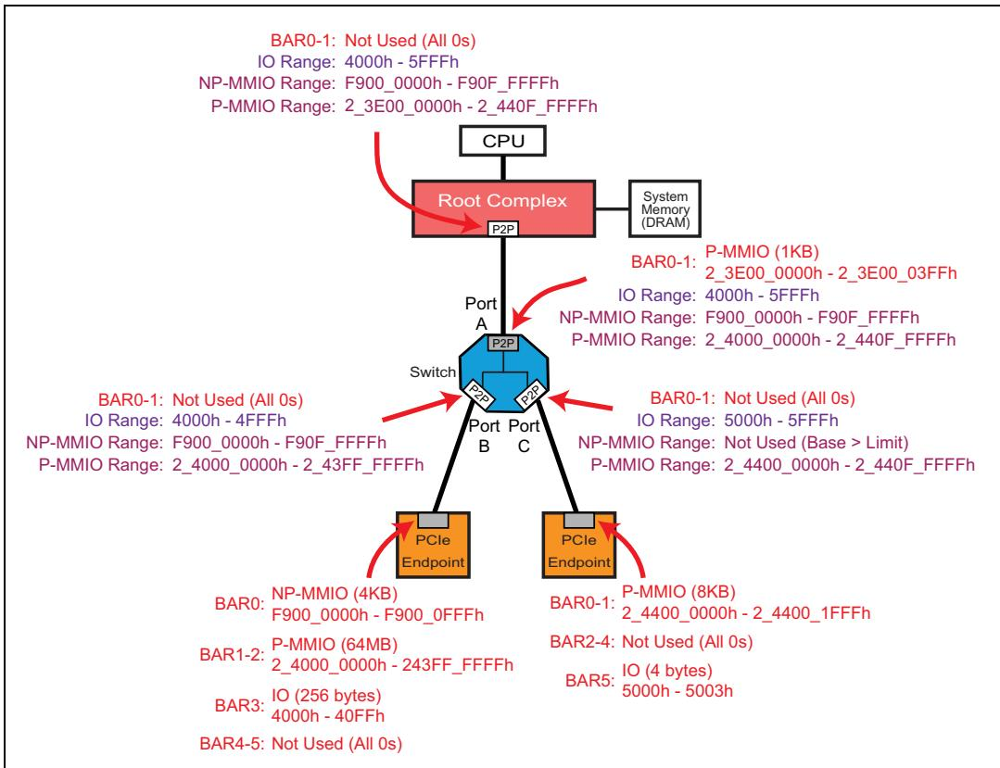

## 4.4 Sanity Check: Registers Used For Address Routing | 4.4 正确性检查：用于地址路由的寄存器

<table>
<tr>
<td width="50%">
To ensure that you understand the rules and methods for setting up BARs and Base/Limit registers, please look over Figure 4-11 on page 145 to make sure it makes sense.
</td>
<td width="50%" style="background-color:#e8e8e8">
为确保你已理解设置 BAR 和 Base/Limit 寄存器的规则与方法，请仔细查看第 145 页的图 4-11 以确认其是否合理。
</td>
</tr>
<tr>
<td width="50%">
We have simply extended the example system to include additional address space requests from the other endpoint, as well as from one of the switch ports (Port A).
</td>
<td width="50%" style="background-color:#e8e8e8">
我们只是扩展了示例系统，增加了来自另一个端点以及来自一个交换机端口（端口 A）的额外地址空间请求。
</td>
</tr>
<tr>
<td width="50%">
Remember that Type 1 headers also have BARs (two of them to be exact) and can request address space too.
</td>
<td width="50%" style="background-color:#e8e8e8">
请记住，Type 1 头也拥有 BAR（确切地说是两个），也可以请求地址空间。
</td>
</tr>
<tr>
<td width="50%">
The Base/Limit registers in a bridge do NOT include the addresses owned by that same bridge's BARs.
</td>
<td width="50%" style="background-color:#e8e8e8">
桥中的 Base/Limit 寄存器并不包含该桥自身 BAR 所拥有的地址。
</td>
</tr>
<tr>
<td width="50%">
The Base/Limit registers only represent the addresses that live downstream of that bridge.
</td>
<td width="50%" style="background-color:#e8e8e8">
Base/Limit 寄存器仅表示位于该桥下游的地址。
</td>
</tr>
</table>

## 4.5 TLP Routing Basics | 4.5 TLP 路由基础

<table>
<tr>
<td width="50%">
The purpose of setting up the BARs and Base/Limit registers as described in the previous sections, is to ensure that traffic targeting a function will be routed correctly so the targeted function can see the transactions and claim them. In shared‐bus architectures like PCI, all the traffic is visible to every device. The only time routing of requests happens is when the target is on another bus and must cross a bridge. Since PCIe Links are point‐to‐point, more routing will be needed to deliver transactions between devices.
</td>
<td width="50%" style="background-color:#e8e8e8">
如前几节所述，设置 BAR 和 Base/Limit 寄存器的目的，是确保以某个功能为目标的事务能被正确路由，使目标功能能够看到这些事务并将其认领。在 PCI 等共享总线架构中，所有事务对每个设备都是可见的。只有在目标位于另一条总线上且必须穿过桥片时，才会发生请求的路由。由于 PCIe 链路是点对点的，因此在设备之间传递事务将需要更多的路由。
</td>
</tr>
</table>

Figure 4‐12: Multi‐Port PCIe Devices Have Routing Responsibilities | 图4‐12：多端口PCIe设备具有路由职责
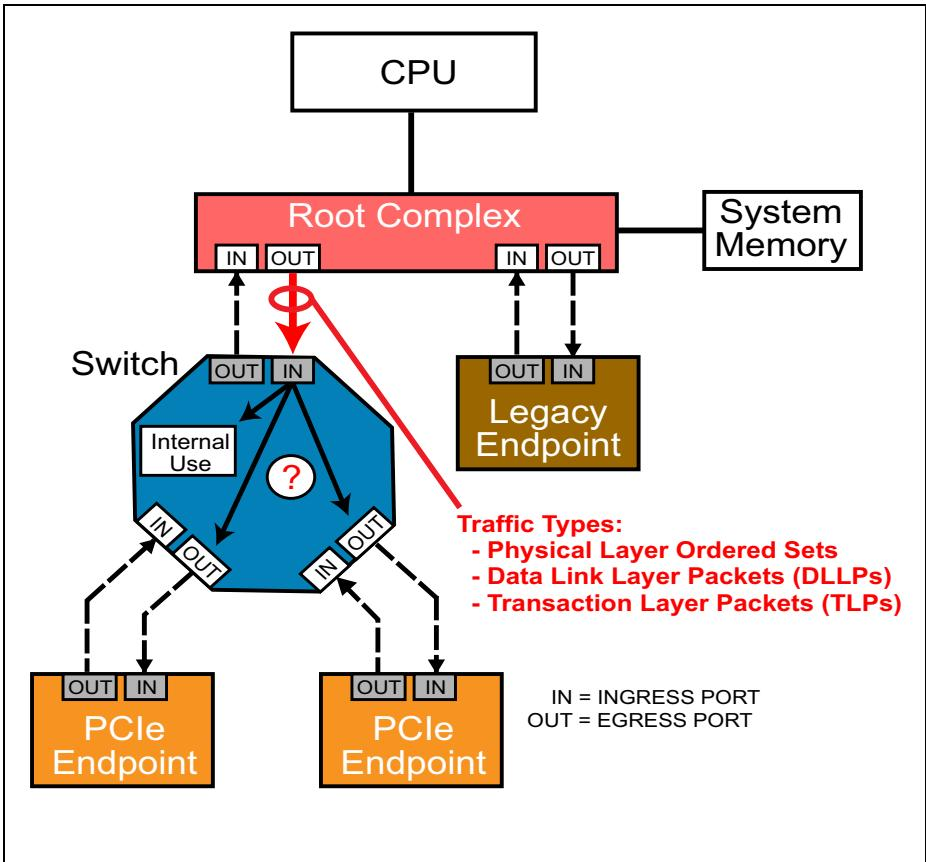

<table>
<tr>
<td width="50%">
As illustrated in Figure 4‐12 on page 146, a PCI Express topology consists of independent, point‐to‐point links connecting each device with one or more neighbors. As traffic arrives at the inbound side of a link interface (called the ingress port), the port checks for errors, then makes one of three decisions:
</td>
<td width="50%" style="background-color:#e8e8e8">
如第 146 页图 4-12 所示，PCI Express 拓扑由独立的点对点链路组成，每条链路将一个设备与一个或多个相邻设备连接起来。当事务到达链路接口的入站侧（称为入口端口）时，该端口会检查错误，然后做出以下三种决定之一：
</td>
</tr>
<tr>
<td width="50%">
1. Accept the traffic and use it internally
</td>
<td width="50%" style="background-color:#e8e8e8">
1. 接受该事务并在内部使用它
</td>
</tr>
<tr>
<td width="50%">
2. Forward the traffic to the appropriate outbound (egress) port
</td>
<td width="50%" style="background-color:#e8e8e8">
2. 将该事务转发到适当的出站（出口）端口
</td>
</tr>
<tr>
<td width="50%">
3. Reject the traffic because it is neither the intended target, nor an interface to it (Note that there are other reasons why traffic may be rejected)
</td>
<td width="50%" style="background-color:#e8e8e8">
3. 拒绝该事务，因为它既不是预期的目标，也不是通往该目标的接口（注意，事务被拒绝还可能有其他原因）
</td>
</tr>
</table>

## 4.5.1 Receivers Check For Three Types of Traffic | 4.5.1 接收器检查三种类型的流量

<table>
<tr>
<td width="50%">
Assuming a link is fully operational, the receiver interface of each device (ingress port) must detect and evaluate the arrival of the three types of link traffic: Ordered Sets, Data Link Layer Packets (DLLPs), and Transaction Layer Packets (TLPs). Ordered Sets and DLLPs are local to a link and thus are never routed to another link. TLPs can and do move from link to link, based on routing information contained in the packet headers.
</td>
<td width="50%" style="background-color:#e8e8e8">
假定链路已完全正常工作，每个设备的接收器接口（入口端口）必须检测并评估三种链路流量的到达：有序集（Ordered Sets）、数据链路层包（DLLP）和事务层包（TLP）。有序集和DLLP仅限于本链路，因此绝不会被路由到另一条链路。TLP可以并且确实会根据包含在包头中的路由信息逐链路传递。
</td>
</tr>
</table>

## 4.5.2 Routing Elements | 4.5.2 路由元素

<table>
<tr>
<td width="50%">
Devices with multiple ports, like Root Complexes and Switches, can forward TLPs between the ports and are sometimes called Routing Agents or Routing Elements. They accept TLPs that target internal resources and forward TLPs between ingress and egress ports.
</td>
<td width="50%" style="background-color:#e8e8e8">
具有多个端口的设备，如根复合体和交换机，可以在各端口之间转发 TLP，有时被称为路由代理或路由元素。它们接受以内部资源为目标的 TLP，并在入口端口和出口端口之间转发 TLP。
</td>
</tr>
<tr>
<td width="50%">
Interestingly, peer‐to‐peer routing support is required in Switches, but for a Root Complex it's optional. Peer‐to‐peer traffic is typically where one Endpoint sends packets that target another Endpoint.
</td>
<td width="50%" style="background-color:#e8e8e8">
值得注意的是，对等路由支持在交换机中是必需的，但对于根复合体则是可选的。对等流量通常是指一个端点发送以另一个端点为目标的报文。
</td>
</tr>
<tr>
<td width="50%">
Endpoints have only one Link and never expect to see ingress traffic other than what is targeting them. They simply accept or reject incoming TLPs.
</td>
<td width="50%" style="background-color:#e8e8e8">
端点仅有一条链路，并且除了以自身为目标的流量之外，从不期望看到其他入口流量。它们仅简单地接受或拒绝进入的 TLP。
</td>
</tr>
</table>

## 4.5.3 Three Methods of TLP Routing | 4.5.3 TLP 路由的三种方法

## General | 概述

<table>
<tr>
<td width="50%">
TLPs can be routed based on address (either memory or IO), based on ID (meaning Bus, Device, Function number), or routed implicitly. The routing method used is based on the TLP type. Table 4‑7 on page 147 summarizes the TLP types and the routing methods used for each.
</td>
<td width="50%" style="background-color:#e8e8e8">
TLP可以基于地址（存储器或IO）进行路由，也可以基于ID（即总线号、设备号、功能号）进行路由，或者通过隐式方式进行路由。所使用的路由方法取决于TLP类型。第147页的表4-7总结了各种TLP类型及其所采用的路由方法。
</td>
</tr>
</table>

Table 4‑7: PCI Express TLP Types And Routing Methods | 表4‑7：PCI Express TLP类型和路由方法

<table><tr><td>TLP Type</td><td>Routing Method Used</td></tr><tr><td>Memory Read [Lock], Memory Write, AtomicOp</td><td>Address Routing</td></tr><tr><td>IO Read and Write</td><td>Address Routing</td></tr><tr><td>Configuration Read and Write</td><td>ID Routing</td></tr><tr><td>Message, Message With Data</td><td>Address Routing, ID Routing, or Implicit routing</td></tr><tr><td>Completion, Completion With Data</td><td>ID Routing</td></tr></table>

<table>
<tr>
<td width="50%">
Messages are the only TLP type that support more than one routing method. Most of the message TLPs defined in the PCI Express spec use implicit routing, however, the vendor‑defined messages could use address routing or ID routing if desired.
</td>
<td width="50%" style="background-color:#e8e8e8">
消息报文是唯一支持多种路由方法的TLP类型。PCI Express规范中定义的大多数消息TLP使用隐式路由，然而，厂商定义的消息可以根据需要采用地址路由或ID路由。
</td>
</tr>
</table>

## Purpose of Implicit Routing and Messages | 隐式路由和报文的目的

<table>
<tr>
<td width="50%">
In implicit routing, neither address or ID routing information applies; instead, the packet is routed based on a code in the packet header indicating a destination with a known location in the topology, such as the Root Complex. This simplifies routing of messages in the cases where a type of implicit routing applies.
</td>
<td width="50%" style="background-color:#e8e8e8">
在隐式路由中，地址路由或ID路由信息均不适用；取而代之的是，数据包根据其包头中的一个编码进行路由，该编码指明了目的地在拓扑中具有已知位置（例如根复合体）。在适用隐式路由的情况下，这简化了报文的路由。
</td>
</tr>
<tr>
<td width="50%">
Why Messages? Message transactions were not defined in PCI or PCI‑X, but were introduced with PCIe. The main reason for adding Messages as a packet type was to pursue the PCIe design goal to drastically reduce the number of sideband signals implemented in PCI (e.g. interrupt pins, error pins, power management signals, etc.). Consequently, most of the sideband signals were replaced with in‑band packets in the form of Message TLPs.
</td>
<td width="50%" style="background-color:#e8e8e8">
为什么需要报文？报文事务在PCI或PCI‑X中并未定义，而是随PCIe引入的。将报文作为一种数据包类型添加的主要原因是追求PCIe的设计目标——大幅减少PCI中实现的边带信号数量（例如中断引脚、错误引脚、电源管理信号等）。因此，大多数边带信号被以报文TLP（Message TLP）形式的带内包所取代。
</td>
</tr>
<tr>
<td width="50%">
How Implicit Routing HelpsUsing in‑band messages in place of sideband signals requires a means of routing them to the proper recipient in a topology consisting of numerous point‑to‑point links. Implicit routing takes advantage of the fact that Switches and other routing elements understand the concept of upstream and downstream, and that the Root Complex is found at the top of the topology while Endpoints are found at the bottom. As a result, a Message can use a simple code to show that it should go to the Root Complex, for example, or to be sent to all devices downstream. This ability eliminates the need to define address ranges or ID lists specifically used as the target of different message transactions.
</td>
<td width="50%" style="background-color:#e8e8e8">
隐式路由如何提供帮助：使用带内报文代替边带信号需要一种方法将它们路由到由众多点对点链路构成的拓扑中的适当接收方。隐式路由利用了这样一个事实：交换机和其他路由元件理解上行和下游的概念，并且根复合体位于拓扑的顶部，而端点位于底部。因此，报文可以简单地使用一个编码来表示它应去往根复合体，或者应被发送到下游的所有设备。这种能力消除了为不同报文事务专门定义目标地址范围或ID列表的需要。
</td>
</tr>
<tr>
<td width="50%">
The different types of implicit routing can be found in "Implicit Routing" on page 163.
</td>
<td width="50%" style="background-color:#e8e8e8">
隐式路由的不同类型可参见第163页的"Implicit Routing"（隐式路由）部分。
</td>
</tr>
</table>

## 4.5.4 Split Transaction Protocol | 4.5.4 拆分事务协议

<table>
<tr>
<td width="50%">
Like most other serial technologies, PCI Express uses the split transaction protocol which allows a target device to receive one or more requests and then respond to each request with a separate completion. This is a significant improvement over the PCI bus protocol that used wait-states or delayed transactions (retries) to deal with latencies in accessing targets. Instead of testing to see when the target becomes ready to do a long-latency transfer, the target initiates the response whenever it's ready. This results in at least two separate TLPs per transaction - the Request and the Completion (as will be discussed later, a single read request may result in multiple completion TLPs being sent back). Figure 4-13 on page 149 illustrates the Request-Completion components of a split transaction. This example shows software reading data from an Endpoint.
</td>
<td width="50%" style="background-color:#e8e8e8">
与大多数其他串行技术一样，PCI Express采用拆分事务协议，该协议允许目标设备接收一个或多个请求，然后以单独的完成报文对每个请求进行响应。这相比PCI总线协议是一个重大改进，后者使用等待状态或延迟事务（重试）来处理访问目标设备时的延迟。拆分事务协议无需测试目标设备何时准备好进行长延迟传输，而是由目标设备在准备就绪时随时发起响应。这导致每项事务至少产生两个独立的TLP——请求TLP和完成TLP（如后续所述，单个读请求可能导致发回多个完成TLP）。第149页的图4-13展示了一个拆分事务的请求-完成组成部分。此示例展示了软件从端点读取数据的过程。
</td>
</tr>
</table>

Figure 4-13: PCI Express Transaction Request And Completion TLPs | 图4-13：PCI Express事务请求和完成TLP

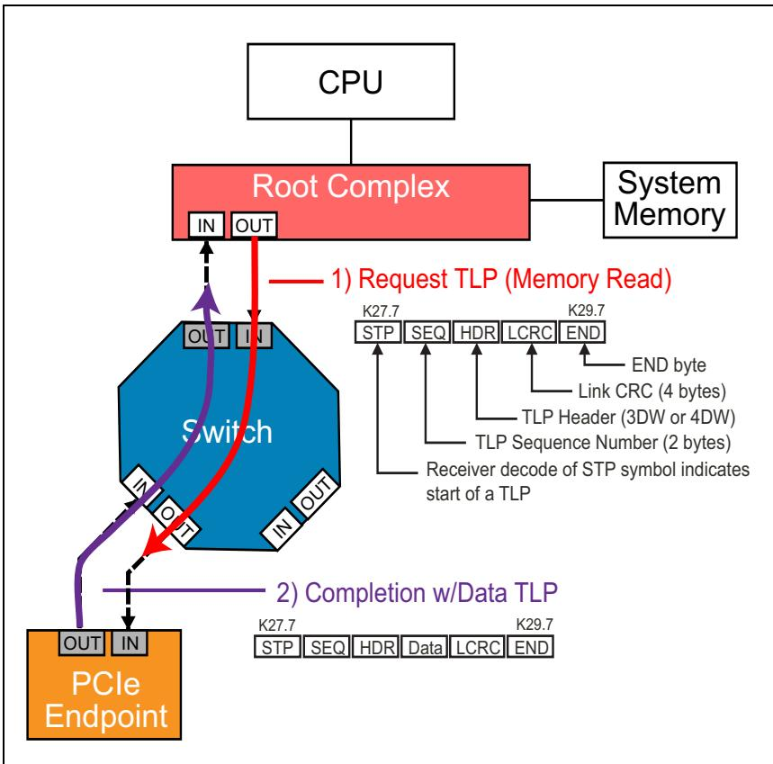

## 4.5.5 Posted versus Non-Posted | 4.5.5 Posted 与非 Posted 事务

<table>
<tr>
<td width="50%">
To mitigate the penalty of the Request-Completion latency, memory write transactions are posted, meaning the transaction is considered completed from the Requester's perspective as soon as the request leaves the Requester. If helpful, you can associate the term "posting" with the postal system, where posting a memory write is analogous to posting a letter in the mail. Once you've placed a letter in the postal box you put your faith in the system to deliver it and don't wait for verification of delivery. This approach can be much faster than waiting for the entire Request-Completion transit, but -- as in all posting schemes -- uncertainty exists concerning when (and if) the transaction completed successfully at the ultimate recipient.
</td>
<td width="50%" style="background-color:#e8e8e8">
为减轻请求-完成延迟带来的性能损失，存储器写事务采用 posted 方式，即从事务请求者的角度看，一旦请求离开请求者，事务即视为完成。若有助于理解，可以将"posting"一词与邮政系统联系起来——posted 存储器写操作类似于寄信。一旦你将信件投入邮箱，便寄望于系统将其送达，而不会等待送达确认。这种方式比等待整个请求-完成往返要快得多，但与所有 posting 机制一样，存在不确定性——即事务何时（以及是否）在最终接收方成功完成。
</td>
</tr>
<tr>
<td width="50%">
In PCIe, the small amount of uncertainty involved by making all memory writes posted is considered acceptable in exchange for the performance gained. By contrast, writes to IO and configuration space almost always affect device behavior and have a timeliness associated with them. Consequently, it is important to know when (and if) those write requests completed. Because of this, IO writes and configuration writes are always non-posted and a completion will always be returned to report the status of the operation.
</td>
<td width="50%" style="background-color:#e8e8e8">
在 PCIe 中，将所有存储器写操作设为 posted 所带来的少量不确定性，在换取的性能提升面前被认为是可接受的。相比之下，对 IO 和配置空间的写入几乎总是会影响设备行为，并且具有时效性要求。因此，了解这些写请求何时（以及是否）完成非常重要。正因如此，IO 写和配置写始终是 non-posted 的，并且始终会返回一个完成报文来报告操作的状态。
</td>
</tr>
<tr>
<td width="50%">
In summary, non-posted transactions require a completion. Posted transactions do not require, and should never receive, a completion. Table 4-8 on page 150 lists which PCIe transactions are posted and non-posted.
</td>
<td width="50%" style="background-color:#e8e8e8">
总之，non-posted 事务需要一个完成报文。Posted 事务不需要，并且绝不应收到完成报文。第 150 页的表 4-8 列出了哪些 PCIe 事务是 posted 的，哪些是 non-posted 的。
</td>
</tr>
</table>

Table 4-8: Posted and Non-Posted Transactions | 表4-8：投递和非投递事务

<table><tr><td>Request</td><td>How Request Is Handled</td></tr><tr><td>Memory Write</td><td>All memory write requests are posted. No completions are expected or sent.</td></tr><tr><td>Memory Read Memory Read Lock</td><td>All memory read requests are non-posted. A completion with data (made of one or more TLPs) will be returned by the Completer to deliver both the requested data and the status of the memory read. In the event of an error, a completion without data will be returned reporting the status.</td></tr><tr><td>AtomicOp</td><td>All AtomicOp requests are non-posted. A completion with data will be returned by the Completer containing the original value of the target location.</td></tr></table>

<table>
<tr>
<td width="50%">
Chapter 4: Address Space &amp; Transaction Routing
</td>
<td width="50%" style="background-color:#e8e8e8">
第4章：地址空间与事务路由
</td>
</tr>
</table>

Table 4-8: Posted and Non-Posted Transactions (Continued) | 表4-8：投递和非投递事务（续）

<table><tr><td>Request</td><td>How Request Is Handled</td></tr><tr><td>IO ReadIO Write</td><td>All IO requests are non-posted. A completion without data will be returned for writes or failed reads, and a completion with data will be returned for successful reads.</td></tr><tr><td>Configuration ReadConfiguration Write</td><td>All configuration requests are non-posted. A completion without data will be returned for writes and failed reads, while a completion with data will be returned for successful reads.</td></tr><tr><td>Message</td><td>All messages are posted. The routing method depends on the Message type, but they&#x27;re all considered posted requests.</td></tr></table>

<table>
<tr>
<td width="50%">
Header Fields Define Packet Format and Type
</td>
<td width="50%" style="background-color:#e8e8e8">
包头字段定义了数据包的格式与类型
</td>
</tr>
</table>

## General | 概述

<table>
<tr>
<td width="50%">
As shown in Figure 4-14 on page 152, each TLP contains a three or four doubleword (12 or 16 byte) header. This includes Format and Type fields that define the content of the rest of the header and indicate the routing method to be used for the TLP as it traverses the topology.
</td>
<td width="50%" style="background-color:#e8e8e8">
如第152页图4-14所示，每个TLP包含一个三双字或四双字（12或16字节）的包头。包头中包含格式（Format）和类型（Type）字段，这些字段定义了包头其余部分的内容，并指示该TLP在穿越拓扑时所使用的路由方法。
</td>
</tr>
</table>

Figure 4-14: Transaction Layer Packet Generic 3DW And 4DW Headers | 图4-14：事务层数据包通用3DW和4DW头
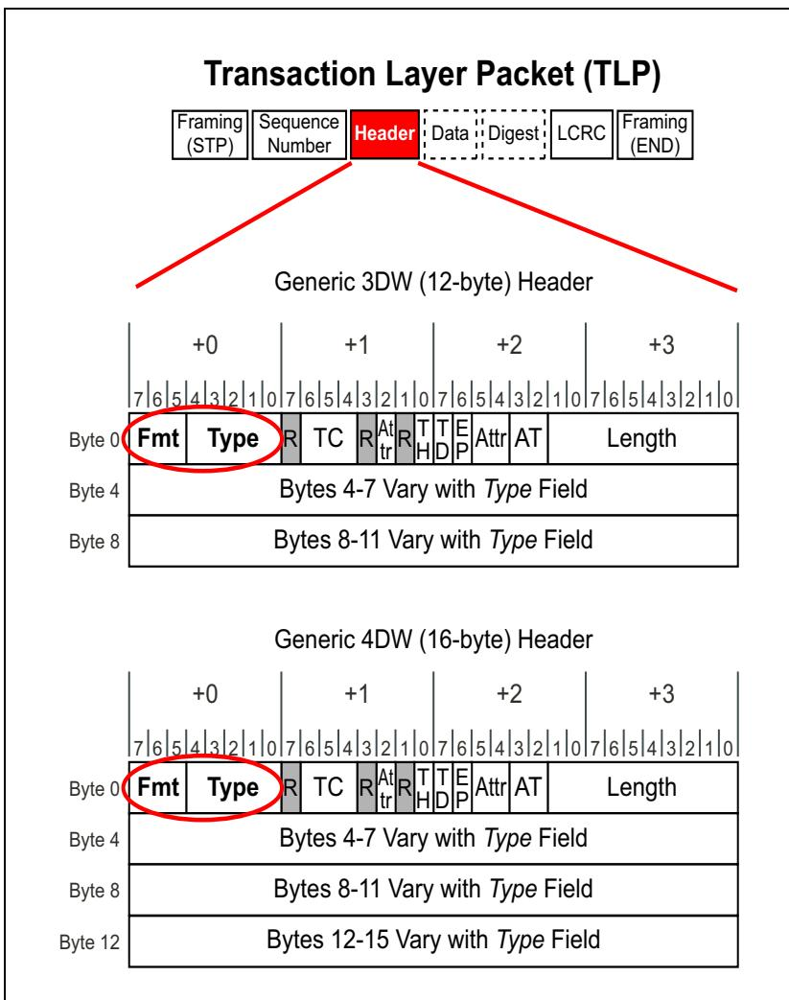

<table>
<tr>
<td width="50%">
Chapter 4: Address Space and Transaction Routing
</td>
<td width="50%" style="background-color:#e8e8e8">
第4章：地址空间与事务路由
</td>
</tr>
</table>

<table>
<tr>
<td width="50%">
Header Format/Type Field Encodings
</td>
<td width="50%" style="background-color:#e8e8e8">
头标格式/类型字段编码
</td>
</tr>
<tr>
<td width="50%">
Table 4-9 on page 153 below summarizes the encodings used in TLP header Format and Type fields.
</td>
<td width="50%" style="background-color:#e8e8e8">
下面第153页的表4-9总结了TLP头标中格式(Format)和类型(Type)字段所使用的编码。
</td>
</tr>
</table>

Table 4-9: TLP Header Format and Type Field Encodings | 表4-9：TLP头格式与类型字段编码

<table><tr><td>TLP</td><td>FMT[2:0]</td><td>TYPE [4:0]</td></tr><tr><td>Memory Read Request (MRd)</td><td>000 = 3DW, no data001 = 4DW, no data</td><td>0 0000</td></tr><tr><td>Memory Read Lock Request (MRdLk)</td><td>000 = 3DW, no data001 = 4DW, no data</td><td>0 0001</td></tr><tr><td>Memory Write Request (MWr)</td><td>010 = 3DW, w/data011 = 4DW, w/data</td><td>0 0000</td></tr><tr><td>IO Read Request (IORd)</td><td>000 = 3DW, no data</td><td>00010</td></tr><tr><td>IO Write Request (IOWr)</td><td>010 = 3DW, w/data</td><td>0 0010</td></tr><tr><td>Config Type 0 Read Request (CfgRd0)</td><td>000 = 3DW, no data</td><td>0 0100</td></tr><tr><td>Config Type 0 Write Request (CfgWr0)</td><td>010 = 3DW, w/data</td><td>0 0100</td></tr><tr><td>Config Type 1 Read Request (CfgRd1)</td><td>000 = 3DW, no data</td><td>0 0101</td></tr><tr><td>Config Type 1 Write Request (CfgWr1)</td><td>010 = 3DW, w/data</td><td>0 0101</td></tr><tr><td>Message Request (Msg)</td><td>001 = 4DW, no data</td><td>1 0RRR* (for RRR, see routing subfield in "Message Type Field Summary" on page 164)</td></tr><tr><td>Message Request w/Data (MsgD)</td><td>011 = 4DW, w/data</td><td>1 0RRR* (for RRR, see routing subfield in "Message Type Field Summary" on page 164)</td></tr><tr><td>Completion (Cpl)</td><td>000 = 3DW, no data</td><td>0 1010</td></tr><tr><td>Completion W/Data (CplD)</td><td>010 = 3DW, w/ data</td><td>0 1010</td></tr><tr><td>Completion-Locked (CplLk)</td><td>000 = 3DW, no data</td><td>0 1011</td></tr><tr><td>Completion w/Data (CplDLk)</td><td>010 = 3DW, w/ data</td><td>0 1011</td></tr><tr><td>Fetch and Add AtomicOp Request (FetchAdd)</td><td>010 = 3DW, w/data011 = 4DW, w/data</td><td>0 1100</td></tr><tr><td>Unconditional Swap AtomicOp Request (Swap)</td><td>010 = 3DW, w/data011 = 4DW, w/data</td><td>0 1101</td></tr><tr><td>Compare and Swap AtomicOp Request (CAS)</td><td>010 = 3DW, w/data011 = 4DW, w/data</td><td>0 1110</td></tr><tr><td>Local TLP Prefix (LPrfx)</td><td>100 = 1DW</td><td>0 LLLL</td></tr><tr><td>End-to-End TLP Prefix (EPrfx)</td><td>100 = 1DW</td><td>1 EEEE</td></tr></table>

## 4.5.7 TLP Header Overview | 4.5.7 TLP 头部概述

<table>
<tr>
<td width="50%">
When TLPs are received at an ingress port, they are first checked for errors at the Physical and Data Link Layers. If there are no errors, the TLP is examined at the Transaction Layer to learn which routing method is to be used. The basic steps are:
</td>
<td width="50%" style="background-color:#e8e8e8">
当 TLP 在入口端口被接收时，首先在物理层和数据链路层检查其是否存在错误。如果没有错误，则在事务层检查该 TLP，以确定应使用哪种路由方法。基本步骤如下：
</td>
</tr>
<tr>
<td width="50%">
1. Format and Type fields determine the header size, format and type of the packet.
</td>
<td width="50%" style="background-color:#e8e8e8">
1. 格式与类型字段决定了包的头部大小、格式和类型。
</td>
</tr>
<tr>
<td width="50%">
2. Depending on the routing method associated with the packet type, the device determines whether it's the intended recipient. If so, it will accept (consume) the TLP, but if not, it will forward the TLP to the appropriate egress port — subject to the rules for ordering and flow control for that egress port.
</td>
<td width="50%" style="background-color:#e8e8e8">
2. 根据与该包类型相关联的路由方法，设备判断自身是否为目标接收方。如果是，则接受（消费）该 TLP；如果不是，则将 TLP 转发到相应的出口端口——但需遵循该出口端口的排序和流控规则。
</td>
</tr>
<tr>
<td width="50%">
3. If this device is not the intended recipient nor is it in the path to the intended recipient, it will generally reject the packet as an Unsupported Request (UR).
</td>
<td width="50%" style="background-color:#e8e8e8">
3. 如果该设备既不是目标接收方，也不位于通往目标接收方的路径上，则通常将以不支持的请求 (UR) 拒绝该包。
</td>
</tr>
</table>

## 4.6 Applying Routing Mechanisms | 4.6 应用路由机制

<table>
<tr>
<td width="50%">
Once the system addresses have been configured and transactions are enabled, devices examine incoming TLPs and use the corresponding configuration fields to route the packet. The following sections describe the basic features/functionality of each routing mechanism used in routing TLPs through the PCI Express fabric.
</td>
<td width="50%" style="background-color:#e8e8e8">
一旦系统地址配置完成且事务使能后，设备检查传入的TLP并使用相应的配置字段来路由数据包。以下各节描述了在通过PCI Express架构路由TLP时使用的每种路由机制的基本特性/功能。
</td>
</tr>
</table>

## 4.6.1 ID Routing | 4.6.1 ID 路由

<table>
<tr>
<td width="50%">
ID routing is used to target the logical position - Bus Number, Device Number, Function Number (typically referred to as BDF), of a Function within the topology. It's compatible with routing methods used in the PCI and PCI-X protocols for configuration transactions. In PCIe, it is still used for routing configuration packets and is also used to route completions and some messages.
</td>
<td width="50%" style="background-color:#e8e8e8">
ID 路由用于定位拓扑中某个功能（Function）的逻辑位置——即总线号（Bus Number）、设备号（Device Number）、功能号（Function Number）（通常合称为 BDF）。它与 PCI 和 PCI-X 协议中用于配置事务的路由方法兼容。在 PCIe 中，ID 路由仍然用于路由配置包，同时也用于路由完成报文和某些消息。
</td>
</tr>
</table>

<table>
<tr>
<td width="50%">
**Bus Number, Device Number, Function Number Limits**
</td>
<td width="50%" style="background-color:#e8e8e8">
**总线号、设备号、功能号限制**
</td>
</tr>
<tr>
<td width="50%">
PCI Express supports the same topology limits as PCI and PCI‑X:
</td>
<td width="50%" style="background-color:#e8e8e8">
PCI Express支持与PCI和PCI‑X相同的拓扑限制：
</td>
</tr>
<tr>
<td width="50%">
1. Eight bits are used to give the bus number, so a maximum of 256 busses are possible in a system. This includes internal busses created by Switches.
</td>
<td width="50%" style="background-color:#e8e8e8">
1. 使用8位表示总线号，因此系统中最多可有256条总线。这包括交换机创建的内部总线。
</td>
</tr>
<tr>
<td width="50%">
2. Five bits give the device number, so a maximum of 32 devices are possible per bus. An older PCI bus or an internal bus in a switch or root complex may host more than one downstream device. However, external PCIe links are always point‑to‑point and there's only one downstream device on the link. The device number for an external link is forced by the downstream port to always be Device 0, so every external Endpoint will always be Device 0 (unless using Alternative Routing‑ID Interpretation (ARI), in which case, there are no device numbers; more about ARI can be found in the section on "IDO (ID‑based Ordering)" on page 909).
</td>
<td width="50%" style="background-color:#e8e8e8">
2. 使用5位表示设备号，因此每条总线上最多可有32个设备。较旧的PCI总线或交换机或根复合体中的内部总线可以承载多个下游设备。然而，外部PCIe链路始终是点对点的，链路上只有一个下游设备。下游端口强制将外部链路的设备号始终设为设备0，因此每个外部端点将始终是设备0（除非使用替代路由ID解释（ARI），在这种情况下没有设备号；关于ARI的更多信息可以在第909页的"IDO（基于ID的排序）"一节中找到）。
</td>
</tr>
<tr>
<td width="50%">
3. Three bits give the function number, so a maximum of 8 internal functions is possible per device.
</td>
<td width="50%" style="background-color:#e8e8e8">
3. 使用3位表示功能号，因此每个设备最多可有8个内部功能。
</td>
</tr>
</table>

## Key TLP Header Fields in ID Routing | ID 路由中的关键 TLP 头部字段

<table>
<tr>
<td width="50%">
If the Type field in a received TLP indicates ID routing is to be used, then the ID fields in the header (Bus, Device, Function) are used to perform the routing check. There are two cases: ID routing with a 3DW header and ID routing with a 4DW header (only possible in messages). Figure 4-15 on page 156 illustrates a TLP using ID routing and the 3DW header, while Figure 4-16 on page 156 shows the 4DW header for ID routing.
</td>
<td width="50%" style="background-color:#e8e8e8">
如果接收到的 TLP 中的类型字段指示应使用 ID 路由，则头部中的 ID 字段（总线号、设备号、功能号）将被用于执行路由检查。存在两种情况：使用 3DW 头部的 ID 路由和使用 4DW 头部的 ID 路由（仅在消息中可行）。第 156 页的图 4-15 展示了使用 ID 路由和 3DW 头部的 TLP，而第 156 页的图 4-16 展示了 ID 路由的 4DW 头部。
</td>
</tr>
</table>

Figure 4-15: 3DW TLP Header - ID Routing Fields | 图4-15：3DW TLP头 - ID路由字段

Figure 4-16: 4DW TLP Header - ID Routing Fields | 图4-16：4DW TLP头 - ID路由字段
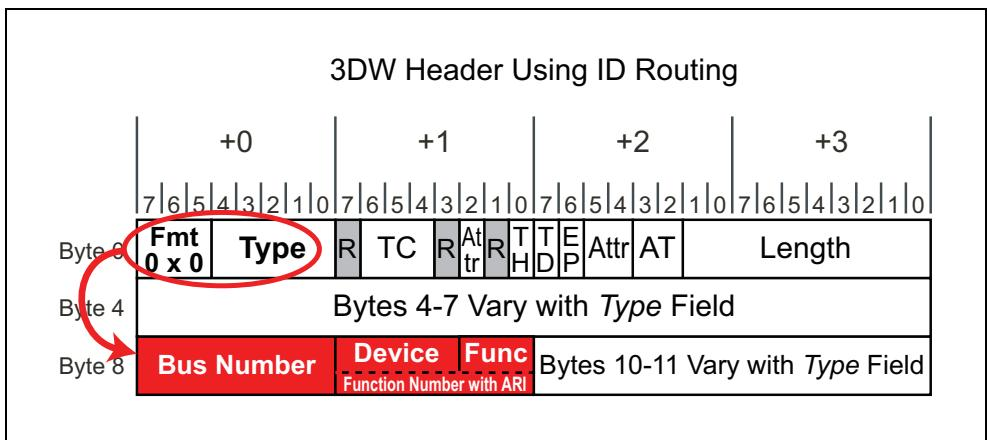

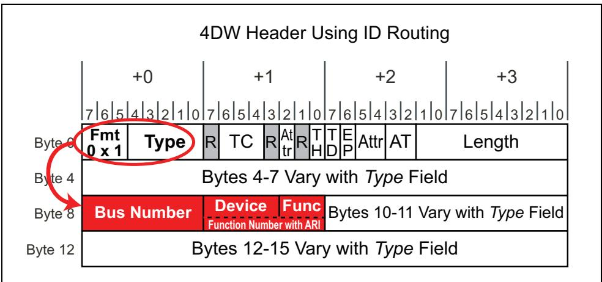

## Endpoints: One Check | 端点：单一检查

<table>
<tr>
<td width="50%">
For ID routing, an Endpoint simply checks the ID field in the packet header against its own BDF. Each function "captures" its own Bus and Device Number every time a Type 0 configuration write is seen on its link from bytes 8-9 in the TLP Header. Where the captured Bus and Device Number information should be stored is not specified, only that functions must save it. The saved Bus and
</td>
<td width="50%" style="background-color:#e8e8e8">
对于 ID 路由，端点只需将数据包头中的 ID 字段与自身的 BDF 进行比对。每当在其链路上检测到 Type 0 配置写操作时，每个功能都会从 TLP 头的第 8-9 字节中"捕获"其自身的总线号和设备号。捕获到的总线号和设备号信息应存储在何处并未明确规定，只要求功能必须保存这些信息。已保存的总线和
</td>
</tr>
</table>

<table>
<tr>
<td width="50%">
Chapter 4: Address Space & Transaction Routing
</td>
<td width="50%" style="background-color:#e8e8e8">
第4章：地址空间与事务路由
</td>
</tr>
<tr>
<td width="50%">
Device numbers are used as the Requester ID in TLP requests that this Endpoint initiates so the Completer of that request can include the Requester ID value in the completion packet(s). The Requester ID in a completion packet is used to route the completion.
</td>
<td width="50%" style="background-color:#e8e8e8">
设备号用作该端点发起的TLP请求中的请求者ID，以便该请求的完成者能够在完成报文中包含请求者ID值。完成报文中的请求者ID用于路由该完成报文。
</td>
</tr>
</table>

<table>
<tr>
<td width="50%">
Switches (Bridges): Two Checks Per Port
</td>
<td width="50%" style="background-color:#e8e8e8">
交换机（桥）：每端口两次检查
</td>
</tr>
<tr>
<td width="50%">
For an ID-routed TLP, a switch port first checks to see whether it is the intended target by comparing the target ID in the TLP Header against its own BDF, as shown by (1) in Figure 4-17 on page 158. As was true for an Endpoint, each switch port captures its own Bus and Device number every time a configuration write (Type 0) is detected on its Upstream Port. If the target ID field in the TLP agrees with the ID of the switch port, it consumes the packet. If the ID field doesn't match, it then checks to see if the TLP is targeting a device below this switch port. It does this by checking the Secondary and Subordinate Bus Number registers to see if the target Bus Number in the TLP is within this range (inclusive). If so, then the TLP should be forwarded downstream. This check is indicated by (2) in Figure 4-17 on page 158. If the packet was moving downstream (arrived on the Upstream Port) and doesn't match the BDF of the Upstream Port or fall within the Secondary-Subordinate bus range, it will be handled as an Unsupported Request on the Upstream Port.
</td>
<td width="50%" style="background-color:#e8e8e8">
对于ID路由的TLP，交换机端口首先通过将TLP头中的目标ID与自己的BDF进行比较，来检查自身是否为目标，如图4-17第158页中的(1)所示。与端点一样，每当在其上游端口上检测到配置写（类型0）时，每个交换机端口都会捕获自己的总线和设备号。如果TLP中的目标ID字段与交换机端口的ID一致，则该端口消费此包。如果ID字段不匹配，则接下来检查该TLP是否以本交换机端口下游的设备为目标。通过检查Secondary Bus Number和Subordinate Bus Number寄存器，看TLP中的目标总线号是否在此范围内（含边界）。如果是，则该TLP应向下游转发。此检查如图4-17第158页中的(2)所示。如果包是向下游移动的（到达上游端口），且既不匹配上游端口的BDF，也不在Secondary-Subordinate总线范围内，则它将在上游端口上作为不支持的请求（Unsupported Request）处理。
</td>
</tr>
<tr>
<td width="50%">
If the Upstream Port determines that a TLP it received is for one of the devices beneath it (because the target bus number was within the range of its Secondary-Subordinate bus number range), then it forwards it downstream and all the downstream ports of the switch perform the same checks. Each downstream port checks to see if the TLP is targeting them. If so, the targeted port will consume the TLP and the other ports ignore it. If not, all downstream ports check to see if the TLP is targeting a device beneath their port. The one port that returns true on that check will forward the TLP to its Secondary Bus and the other downstream ports ignore the TLP.
</td>
<td width="50%" style="background-color:#e8e8e8">
如果上游端口确定其接收到的TLP是发往其下游的某个设备（因为目标总线号在其Secondary-Subordinate总线号范围内），则将TLP向下游转发，交换机的所有下游端口执行相同的检查。每个下游端口检查该TLP是否以自己为目标。如果是，目标端口消费该TLP，其他端口忽略。如果不是，所有下游端口检查该TLP是否以其端口下游的设备为目标。对该检查返回真的那个端口将TLP转发到其Secondary Bus，其他下游端口忽略该TLP。
</td>
</tr>
<tr>
<td width="50%">
In this section, it is important to remember that each port on a switch is a Bridge, and thus has its own configuration space with a Type 1 Header. Even though Figure 4-17 on page 158 only shows a single Type 1 Header, in reality, each port (each P2P Bridge) has its own Type 1 Header and performs the same two checks on TLPs when they are seen by that port.
</td>
<td width="50%" style="background-color:#e8e8e8">
在本节中，重要的是要记住，交换机上的每个端口都是一个桥（Bridge），因此拥有自己的配置空间，带有类型1头（Type 1 Header）。尽管图4-17第158页只显示了一个Type 1 Header，但实际上，每个端口（每个P2P桥）都有自己的Type 1 Header，并在该端口看到TLP时对其执行相同的两次检查。
</td>
</tr>
</table>

Figure 4-17: Switch Checks Routing Of An Inbound TLP Using ID Routing | 图4-17：交换机使用ID路由检查入站TLP的路由

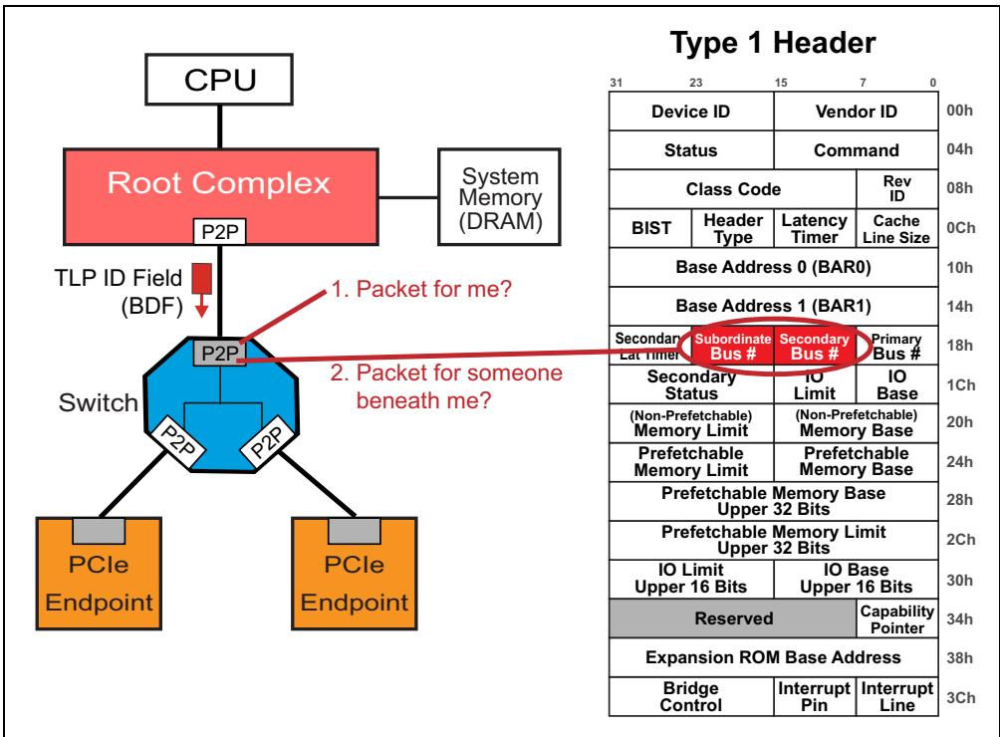

## 4.6.2 Address Routing | 4.6.2 地址路由

<table>
<tr>
<td width="50%">
TLPs that use address routing refer to the same memory (system memory and memory‑mapped IO) and IO address maps that PCI and PCI‑X transactions do. Memory requests targeting an address below 4GB (i.e. a 32‑bit address) must use a 3DW header, and requests targeting an address above 4GB (i.e. a 64‑bit address) must use a 4DW header. IO requests are restricted to 32‑bit addresses and are only implemented to support legacy functionality.
</td>
<td width="50%" style="background-color:#e8e8e8">
使用地址路由的TLP参照与PCI和PCI‑X事务相同的存储器（系统存储器和存储器映射IO）及IO地址映射。目标地址低于4GB（即32位地址）的存储器请求必须使用3DW包头，目标地址高于4GB（即64位地址）的请求必须使用4DW包头。IO请求仅限于32位地址，且仅为实现传统功能而保留。
</td>
</tr>
</table>

## Key TLP Header Fields in Address Routing | 地址路由中的关键 TLP 头标字段

<table>
<tr>
<td width="50%">
When the Type field indicates address routing is to be used for a TLP, then the Address Fields in the header are used to perform the routing check. These can be 32‑bit addresses or 64‑bit addresses.
</td>
<td width="50%" style="background-color:#e8e8e8">
当 Type 字段指示某个 TLP 应使用地址路由时，则头标中的地址字段用于执行路由检查。这些地址可以是 32 位地址或 64 位地址。
</td>
</tr>
<tr>
<td width="50%">
TLPs with 32‑Bit Address — For IO or 32‑bit memory requests, a 3DW header is used as shown in Figure 4‑18. The memory‑mapped registers targeted with these TLPs will therefore reside below the 4GB memory or IO address boundary.
</td>
<td width="50%" style="background-color:#e8e8e8">
32 位地址 TLP —— 对于 IO 或 32 位存储器请求，使用 3DW 头标，如图 4-18 所示。因此，这些 TLP 所寻址的内存映射寄存器将位于 4GB 存储器或 IO 地址边界以下。
</td>
</tr>
<tr>
<td width="50%">
TLPs with 64‑Bit Address — For 64‑bit memory requests, a 4DW header is used as shown in Figure 4‑19 on page 160. The memory‑mapped registers targeted with these TLPs are able to reside above the 4GB memory boundary.
</td>
<td width="50%" style="background-color:#e8e8e8">
64 位地址 TLP —— 对于 64 位存储器请求，使用 4DW 头标，如第 160 页图 4-19 所示。这些 TLP 所寻址的内存映射寄存器可以位于 4GB 存储器边界以上。
</td>
</tr>
</table>

Figure 4‑18: 3DW TLP Header — Address Routing Fields | 图4‑18：3DW TLP头 — 地址路由字段

Figure 4‑19: 4DW TLP Header — Address Routing Fields | 图4‑19：4DW TLP头 — 地址路由字段
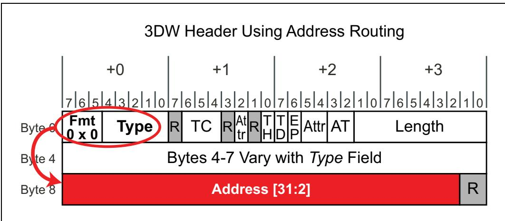

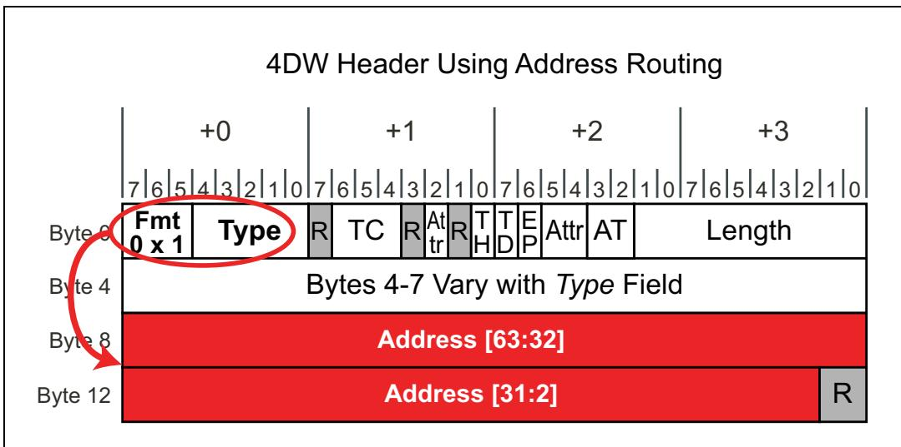

## Endpoint Address Checking | 端点地址检查

<table>
<tr>
<td width="50%">
If an Endpoint receives a TLP that uses address routing then it checks the address in the header against each of its implemented Base Address Registers (BARs) in its configuration header, as shown in Figure 4-20. Since Endpoints only have one link interface, it will either accept the packet or reject it. The Endpoint will accept the packet if the target address in the TLP matches one of the ranges programmed into its BARs. More info on how the BARs are used can be found in section "Base Address Registers (BARs)" on page 126.
</td>
<td width="50%" style="background-color:#e8e8e8">
如果端点接收到一个采用地址路由的 TLP，则它会将包头中的地址与其配置头中实现的每一个基址寄存器 (BAR) 进行比对，如图 4-20 所示。由于端点只有一个链路接口，它要么接受该包，要么拒绝该包。如果 TLP 中的目标地址与端点的 BAR 中所编程的某一地址范围相匹配，则该端点将接受此包。关于 BAR 如何使用的更多信息，请参见第 126 页的"基址寄存器 (BAR)"一节。
</td>
</tr>
</table>

<table>
<tr>
<td width="50%">
Chapter 4: Address Space & Transaction Routing
</td>
<td width="50%" style="background-color:#e8e8e8">
第4章：地址空间与事务路由
</td>
</tr>
</table>

Figure 4-20: Endpoint Checks Incoming TLP Address | 图4-20：端点检查入站TLP地址

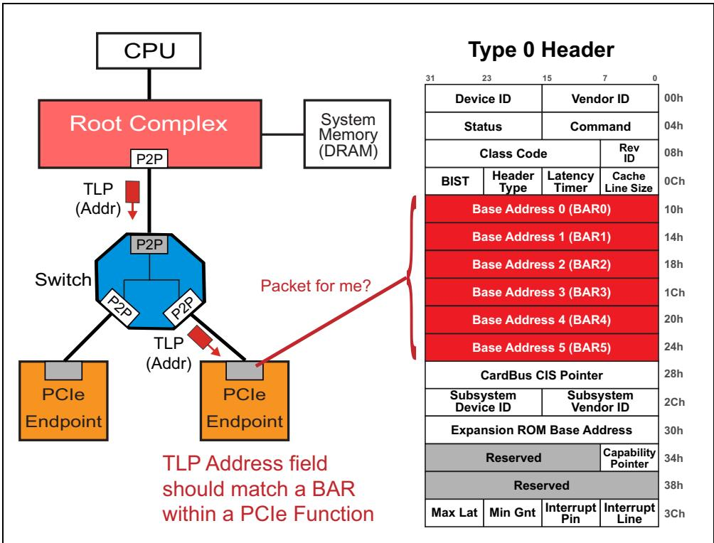

## Switch Routing | 交换机路由

<table>
<tr>
<td width="50%">
If an incoming TLP uses address routing, a Switch Port first checks to see if the address is local within the Port itself by comparing the address in the packet header against its two BARs in its Type 1 configuration header, as shown in Step 1 of Figure 4-21 on page 162. If it matches one of these BARs, the switch port is the target of the TLP and consumes the packet. If not, the port then checks its Base/Limit register pairs to see if the TLP is targeting a function beneath (downstream of) this bridge. If the Request targets IO space, it will check the IO Base and Limit registers, as shown in Step 2a. However, if the Request targets memory space, it will check the Nonprefetchable Memory Base/Limit registers and the Prefetchable Memory Base/Limit registers, as indicated by Step 2b in Figure 4-21 on page 162. More info on how the Base/Limit register pairs are evaluated can be found in section "Base and Limit Registers" on page 136.
</td>
<td width="50%" style="background-color:#e8e8e8">
如果传入的TLP采用地址路由,则交换机端口首先通过将数据包头中的地址与其Type 1配置头中的两个BAR进行比较,来检查该地址是否在端口自身本地范围内,如第162页图4-21中的步骤1所示。如果地址与这两个BAR之一匹配,则该交换机端口即为TLP的目标并且会接收该数据包。如果不匹配,则该端口随后检查其Base/Limit寄存器对,以判断该TLP是否以本桥下游(之下的)某个功能为目标。如果请求以IO空间为目标,则会检查IO Base和IO Limit寄存器,如步骤2a所示。然而,如果请求以存储器空间为目标,则会检查不可预取存储器Base/Limit寄存器和可预取存储器Base/Limit寄存器,如第162页图4-21中的步骤2b所示。关于如何评估Base/Limit寄存器对的更多信息,请参见第136页"Base and Limit Registers"一节。
</td>
</tr>
</table>

Figure 4-21: Switch Checks Routing Of An Inbound TLP Using Address | 图4-21：交换机使用地址检查入站TLP的路由
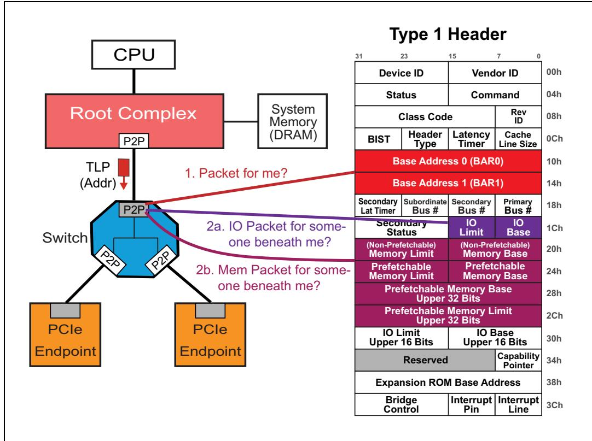

<table>
<tr>
<td width="50%">
To understand routing of address-based TLPs in switches, it is good to remember that each switch port is its own bridge. Below are the steps that a bridge (switch port) takes upon receiving an address-based TLP:
</td>
<td width="50%" style="background-color:#e8e8e8">
要理解交换机中基于地址的TLP路由,有必要记住每个交换机端口自身就是一个桥。下面是桥(交换机端口)在接收到基于地址的TLP时所执行的步骤:
</td>
</tr>
</table>

## Downstream Traveling TLPs (Received on Primary Interface) | 下游传输的TLP（在主接口上接收）

<table>
<tr>
<td width="50%">
1. IF the target address in the TLP matches one of the BARs, then this bridge (switch port) consumes the TLP because it is the target of the TLP.
</td>
<td width="50%" style="background-color:#e8e8e8">
1. 如果TLP中的目标地址与某个BAR匹配，则该桥（交换机端口）将消费该TLP，因为它是该TLP的目标。
</td>
</tr>
<tr>
<td width="50%">
2. IF the target address in the TLP falls in the range of one of its Base/Limit register sets, the packet will be forwarded to the secondary interface (downstream).
</td>
<td width="50%" style="background-color:#e8e8e8">
2. 如果TLP中的目标地址落在其某个基址/限制寄存器组的范围内，则该包将被转发到辅助接口（下游）。
</td>
</tr>
<tr>
<td width="50%">
3. ELSE the TLP will be handled as an Unsupported Request on the primary interface. (This is true if no other bridges on the primary interface claim the TLP either.)
</td>
<td width="50%" style="background-color:#e8e8e8">
3. 否则，该TLP将在主接口上作为不支持的请求处理。（如果主接口上没有其他桥也声明该TLP，则确实如此。）
</td>
</tr>
</table>

## Upstream Traveling TLPs (Received on Secondary Interface) | 向上游传输的 TLP（在次级接口上接收）

<table>
<tr>
<td width="50%">
1. IF the target address in the TLP matches one of the BARs, then this bridge (switch port) consumes the TLP because it is the target of the TLP.
</td>
<td width="50%" style="background-color:#e8e8e8">
1. 如果 TLP 中的目标地址与某个 BAR 匹配，则该桥（交换机端口）将消费该 TLP，因为它是该 TLP 的目标。
</td>
</tr>
<tr>
<td width="50%">
2. IF the target address in the TLP falls in the range of one of its Base/Limit register sets, the TLP will be handled as an Unsupported Request on the secondary interface. (This is true unless this port is the upstream port of the switch. In these cases, the packet may be a peer-to-peer transaction and will be forwarded downstream on a different downstream port than the one it was received on.)
</td>
<td width="50%" style="background-color:#e8e8e8">
2. 如果 TLP 中的目标地址落在其某个基址/限址寄存器的范围内，则该 TLP 将在次级接口上作为不支持的请求（Unsupported Request）处理。（除非该端口是交换机的上游端口，否则此规则成立。在后一种情况下，该包可能是一个对等传输事务，并将在不同于接收端口的下游端口上向下游转发。）
</td>
</tr>
<tr>
<td width="50%">
3. ELSE the TLP will be forwarded to the primary interface (upstream) given that the TLP address is not for this bridge and is not for any function beneath this bridge.
</td>
<td width="50%" style="background-color:#e8e8e8">
3. 否则，如果 TLP 地址既不是针对该桥，也不是针对该桥下游的任何功能，则该 TLP 将被转发到主接口（上游）。
</td>
</tr>
</table>

## Multicast Capabilities | 组播能力

<table>
<tr>
<td width="50%">

</td>
<td width="50%" style="background-color:#e8e8e8">

</td>
</tr>
<tr>
<td width="50%">
The 2.1 version of the PCI Express specification added support for specifying a range of addresses that provide multicast functionality.
</td>
<td width="50%" style="background-color:#e8e8e8">
PCI Express 规范的 2.1 版本增加了对指定一个地址范围以提供组播功能的支持。
</td>
</tr>
<tr>
<td width="50%">
Any packets received that fall within the address range specified as the multicast range are routed/accepted according to the multicast rules.
</td>
<td width="50%" style="background-color:#e8e8e8">
任何接收到的、落在被指定为组播范围的地址区间内的数据包，将根据组播规则进行路由/接受。
</td>
</tr>
<tr>
<td width="50%">
This address range might not be reserved in a function's BARs and might not be within a bridge's Base/Limit register pair, but would still need to be accepted/forwarded appropriately.
</td>
<td width="50%" style="background-color:#e8e8e8">
该地址范围可能不会在某个功能的 BAR 中预留，也可能不在某个桥的 Base/Limit 寄存器对所覆盖的范围内，但仍需被适当地接受/转发。
</td>
</tr>
<tr>
<td width="50%">
More info can be found on the multicast functionality in the section on "Multicast Capability Registers" on page 889.
</td>
<td width="50%" style="background-color:#e8e8e8">
关于组播功能的更多信息，请参阅第 889 页的"组播能力寄存器"(Multicast Capability Registers) 一节。
</td>
</tr>
</table>

## 4.6.3 Implicit Routing | 4.6.3 隐式路由

<table>
<tr>
<td width="50%">
Implicit routing, used in some message packets, is based on the awareness of routing elements that the topology has upstream and downstream directions and a single Root Complex at the top. This allows some simple routing methods without the need to assign a target address or ID. Since the Root Complex generally integrates power management, interrupt, and error handling logic, it is either the source or recipient of most PCI Express messages.
</td>
<td width="50%" style="background-color:#e8e8e8">
隐式路由用于某些消息包中，它基于路由元件对拓扑结构具有上行和下行方向以及顶端单一根复合体的认知。这使得一些简单的路由方法无需分配目标地址或ID。由于根复合体通常集成了电源管理、中断和错误处理逻辑，因此它是大多数PCI Express消息的源端或接收端。
</td>
</tr>
</table>

<table>
<tr>
<td width="50%">
**Only for Messages**
</td>
<td width="50%" style="background-color:#e8e8e8">
**仅适用于消息**
</td>
</tr>
<tr>
<td width="50%">
Some messages use address or ID routing rather than implicit routing, and for them, the routing mechanisms are applied in the same way as described in the those sections. However, most messages use implicit routing. The purpose of implicit routing is to mimic side‑band signal behavior since a design goal for PCIe was to eliminate as many side‑band signals from PCI as possible. These side‑band signals in PCI were typically either the host notifying all devices of an event or devices notifying the host of an event. In PCIe, we have Message TLPs to convey these events. The types of events that PCIe has defined messages for are:
</td>
<td width="50%" style="background-color:#e8e8e8">
某些消息使用地址路由或ID路由而非隐式路由，对于这些消息，路由机制的应用方式与前述章节中描述的相同。然而，大多数消息使用隐式路由。隐式路由的目的是模拟边带信号行为，因为PCIe的一个设计目标是尽可能消除PCI中的边带信号。PCI中的这些边带信号通常是主机通知所有设备某个事件，或设备通知主机某个事件。在PCIe中，我们使用消息TLP来传递这些事件。PCIe已为其定义消息的事件类型包括：
</td>
</tr>
<tr>
<td width="50%">
Power Management
</td>
<td width="50%" style="background-color:#e8e8e8">
电源管理
</td>
</tr>
<tr>
<td width="50%">
INTx legacy interrupt signaling
</td>
<td width="50%" style="background-color:#e8e8e8">
INTx传统中断信令
</td>
</tr>
<tr>
<td width="50%">
Error signaling
</td>
<td width="50%" style="background-color:#e8e8e8">
错误信令
</td>
</tr>
<tr>
<td width="50%">
Locked Transaction support
</td>
<td width="50%" style="background-color:#e8e8e8">
锁定事务支持
</td>
</tr>
<tr>
<td width="50%">
Hot Plug signaling
</td>
<td width="50%" style="background-color:#e8e8e8">
热插拔信令
</td>
</tr>
<tr>
<td width="50%">
Vendor‑specific signaling
</td>
<td width="50%" style="background-color:#e8e8e8">
厂商特定信令
</td>
</tr>
<tr>
<td width="50%">
Slot Power Limit settings
</td>
<td width="50%" style="background-color:#e8e8e8">
插槽功率限制设置
</td>
</tr>
</table>

Figure 4-22: 4DW Message TLP Header - Implicit Routing Fields | 图4-22：4DW消息TLP头 - 隐式路由字段
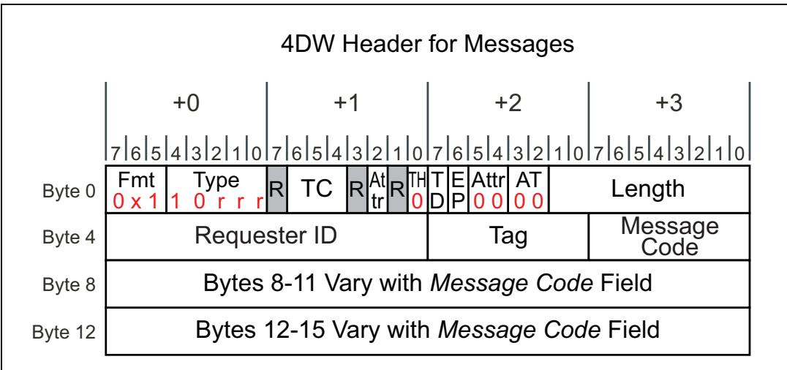

## Key TLP Header Fields in Implicit Routing | 隐式路由中的关键 TLP 头字段

<table>
<tr>
<td width="50%">
For implicit routing, the routing sub-field in the header is used to determine the message destination. Figure 4-22 on page 164 illustrates a message TLP using implicit routing.
</td>
<td width="50%" style="background-color:#e8e8e8">
对于隐式路由，头中的路由子字段用于确定报文目的地。第 164 页的图 4-22 展示了一个使用隐式路由的报文 TLP。
</td>
</tr>
</table>

## Message Type Field Summary | 消息类型字段总结

<table>
<tr>
<td width="50%">
Table 4-10 on page 165 shows how the TLP header Type field for Messages is interpreted. As shown, the upper two bits indicate the packet is a Message while the lower three bits specify the routing method to apply. Note that Message TLPs always use a 4DW header regardless of the routing option selected.
</td>
<td width="50%" style="background-color:#e8e8e8">
第165页表4-10展示了消息的TLP头Type字段是如何解析的。如图所示，高两位表示该报文为消息，而低三位指定要应用的路由方法。注意，无论选择哪种路由选项，消息TLP始终使用4DW头。
</td>
</tr>
<tr>
<td width="50%">
For address routing, bytes 8-15 contain up to a 64-bit address, and for ID routing, bytes 8 and 9 contain the target BDF.
</td>
<td width="50%" style="background-color:#e8e8e8">
对于地址路由，字节8-15包含最多64位的地址；对于ID路由，字节8和9包含目标BDF。
</td>
</tr>
</table>

Table 4-10: Message Request Header Type Field Usage | 表4-10：消息请求头类型字段用法

<table><tr><td>Type Field Bits</td><td>Description</td></tr><tr><td>Bit 4:3</td><td>Defines the type of transaction: $10b = \text{Message TLP}$ </td></tr><tr><td>Bit 2:0</td><td>Message Routing Subfield R[2:0] $\bullet$  000b = Implicit - Route to the Root Complex $\bullet$  001b = Route by Address (bytes 8-15 of header contain address) $\bullet$  010b = Route by ID (bytes 8-9 of header contain ID) $\bullet$  011b = Implicit - Broadcast downstream $\bullet$  100b = Implicit - Local: terminate at receiver $\bullet$  101b = Implicit - Gather &amp; route to the Root Complex $\bullet$  110b - 111b = Reserved: terminate at receiver</td></tr></table>

## Endpoint Handling | 端点处理

<table>
<tr>
<td width="50%">
For implicit routing, an Endpoint simply checks whether the routing sub‑field is appropriate for it. For example, an Endpoint will accept a Broadcast Message or a Message that terminates at the receiver; but not Messages that implicitly target the Root Complex.
</td>
<td width="50%" style="background-color:#e8e8e8">
对于隐式路由，端点只需检查路由子字段是否适用于它。例如，端点将接受广播消息或终止于接收方的消息；但不接受隐式目标为根复合体（Root Complex）的消息。
</td>
</tr>
</table>

## Switch Handling | 交换机处理

<table>
<tr>
<td width="50%">
Routing elements like Switches consider the port on which the TLP arrived on and whether the routing sub‐field code is appropriate for it. For example:
</td>
<td width="50%" style="background-color:#e8e8e8">
诸如交换机之类的路由元素会考虑TLP到达的端口，以及其路由子字段编码是否适用于该端口。例如：
</td>
</tr>
<tr>
<td width="50%">
1. A Switch Upstream Port may legitimately receive a Broadcast Message. It will duplicate that and forward it to all its Downstream Ports. An implicitly routed Broadcast Message received on a Downstream Port of a Switch (meaning the message was traveling upstream) would be an error that would be handled as a Malformed TLP.
</td>
<td width="50%" style="background-color:#e8e8e8">
1. 交换机的上游端口可以合法接收广播消息。它将复制该消息并将其转发到其所有下游端口。在交换机的下游端口上接收到的隐式路由广播消息（意味着该消息正在向上游方向传输）将被视为错误，并作为畸形TLP处理。
</td>
</tr>
<tr>
<td width="50%">
2. A Switch may receive implicitly routed Messages for the Root Complex on Downstream Ports and will forward these to its Upstream Port because the location of the Root Complex is understood to be upstream. It would not accept Messages received on its Upstream Port (meaning the message was traveling downstream) that are implicitly routed to the Root Complex.
</td>
<td width="50%" style="background-color:#e8e8e8">
2. 交换机可以在下游端口上接收隐式路由到根复合体的消息，并将这些消息转发到其上游端口，因为根复合体的位置被理解为在上游方向。它不会接受在其上游端口上接收到的隐式路由到根复合体的消息（意味着该消息正在向下游方向传输）。
</td>
</tr>
</table>

## PCI Express Technology | PCI Express 技术

<table>
<tr>
<td width="50%">
3. If an implicitly routed Message indicates it should terminate at the receiver, then the receiving switch port will consume the message rather than forward it.
</td>
<td width="50%" style="background-color:#e8e8e8">
3. 如果一个隐式路由的消息指示它应当在接收端处终止，那么接收端的交换机端口将消费（consume）该消息，而不是将其转发出去。
</td>
</tr>
<tr>
<td width="50%">
4. For messages routed using address or ID routing, a Switch will simply perform normal address or ID checks in deciding whether to accept or forward it.
</td>
<td width="50%" style="background-color:#e8e8e8">
4. 对于使用地址路由或 ID 路由的消息，交换机将仅执行常规的地址或 ID 检查以决定是接受还是转发该消息。
</td>
</tr>
</table>

<table>
<tr>
<td width="50%">
DLLPs and Ordered Sets Are Not Routed
</td>
<td width="50%" style="background-color:#e8e8e8">
DLLP 与有序集不进行路由
</td>
</tr>
<tr>
<td width="50%">
DLLP and Ordered Set traffic is not routed from ingress ports to egress ports of switches or root complexes. These packets move from port to port across a link from Physical Layer to Physical Layer.
</td>
<td width="50%" style="background-color:#e8e8e8">
DLLP 和有序集的流量不会从交换机或根复合体的入口端口路由到出口端口。这些报文从一个端口到另一个端口，跨链路从物理层到物理层进行传输。
</td>
</tr>
<tr>
<td width="50%">
DLLPs originate at the Data Link Layer of a PCI Express port, pass through the Physical Layer, exit the port, traverse the Link and arrive at the neighboring port. At this port, the packet passes through the Physical Layer and ends up at the Data Link Layer where it is processed and consumed. DLLPs do not proceed further up the port to the Transaction Layer and hence are not routed.
</td>
<td width="50%" style="background-color:#e8e8e8">
DLLP 起源于 PCI Express 端口的数据链路层，经过物理层，离开端口，穿越链路，到达相邻端口。在该相邻端口，报文通过物理层，最终到达数据链路层，在那里被处理和消费。DLLP 不会继续向上到达端口的事务层，因此不被路由。
</td>
</tr>
<tr>
<td width="50%">
Similarly, Ordered-Set packets originate at the Physical Layer, exit the port, traverse the Link and arrive at the neighboring port. At this port, the packet arrives at the Physical Layer where it is processed and consumed. Ordered-Sets do not proceed further up the port to the Data Link Layer and Transaction Layer and hence are not routed.
</td>
<td width="50%" style="background-color:#e8e8e8">
类似地，有序集报文起源于物理层，离开端口，穿越链路，到达相邻端口。在该相邻端口，报文到达物理层，在那里被处理和消费。有序集不会继续向上到达端口的数据链路层和事务层，因此不被路由。
</td>
</tr>
<tr>
<td width="50%">
As has been discussed in this chapter, only TLPs are routed through switches and root complexes. They originate at the Transaction Layer of a source port and end up at the Transaction Layer of a destination port.
</td>
<td width="50%" style="background-color:#e8e8e8">
如本章所述，只有 TLP 会通过交换机和根复合体进行路由。它们起源于源端口的事务层，最终到达目的端口的事务层。
</td>
</tr>
<tr>
<td width="50%">
Part Two:
</td>
<td width="50%" style="background-color:#e8e8e8">
第二部分：
</td>
</tr>
<tr>
<td width="50%">
Transaction Layer
</td>
<td width="50%" style="background-color:#e8e8e8">
事务层
</td>
</tr>
</table>