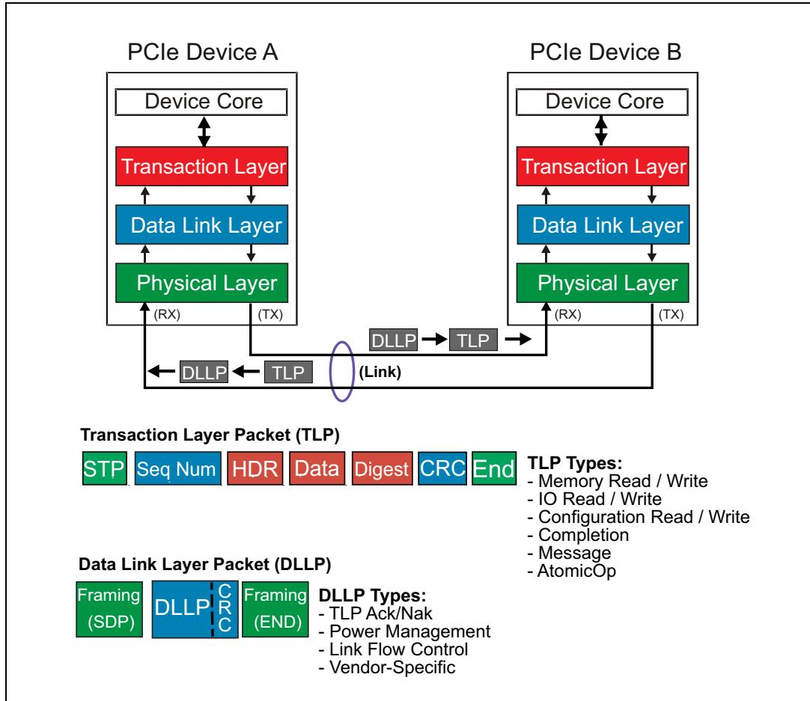
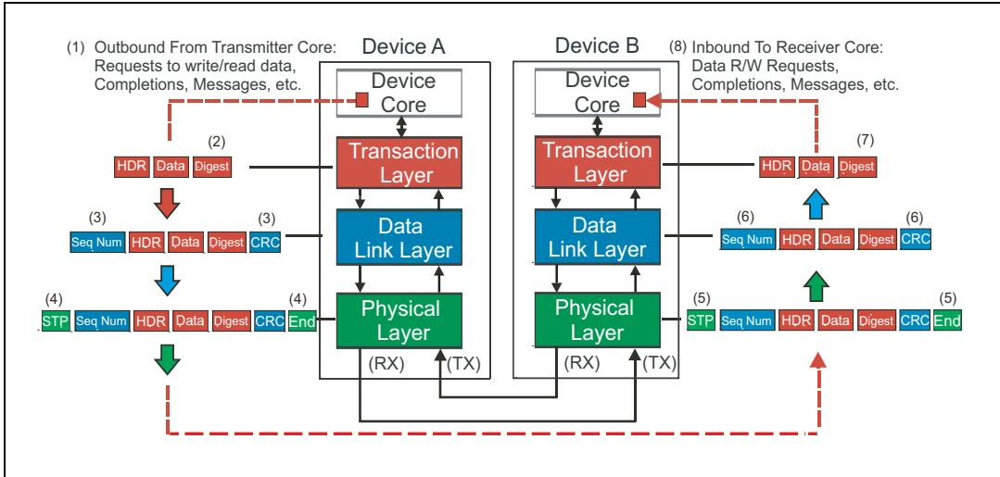
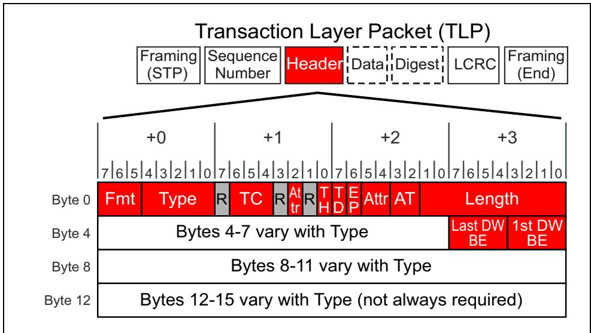
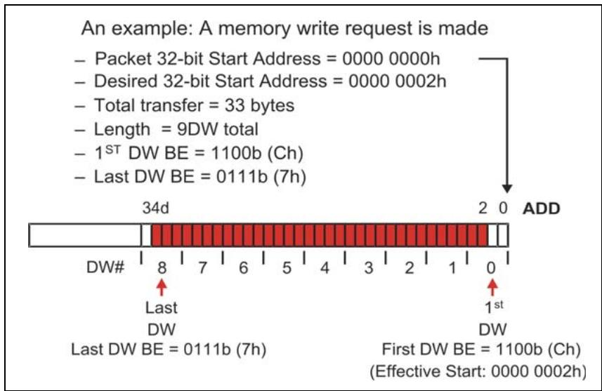
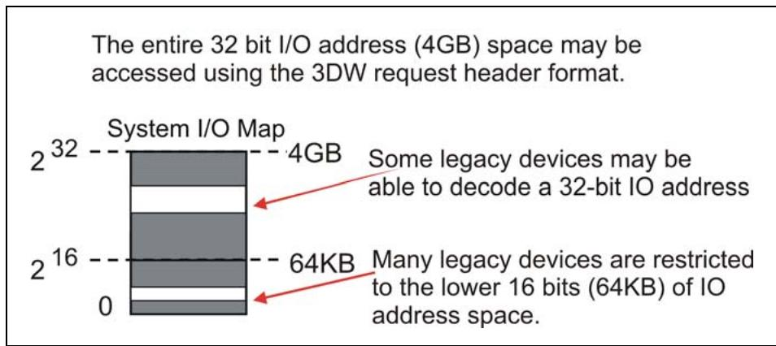
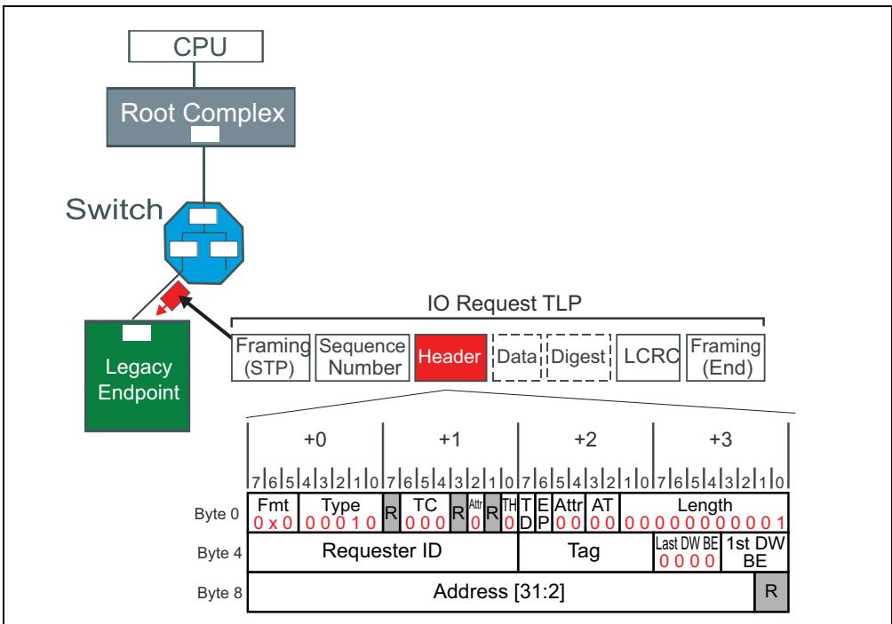
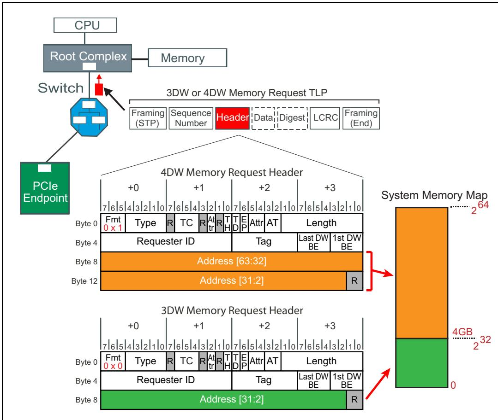
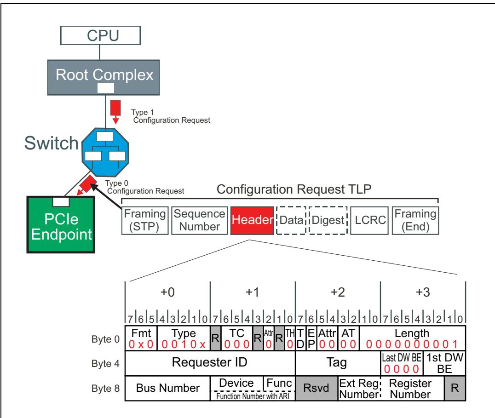
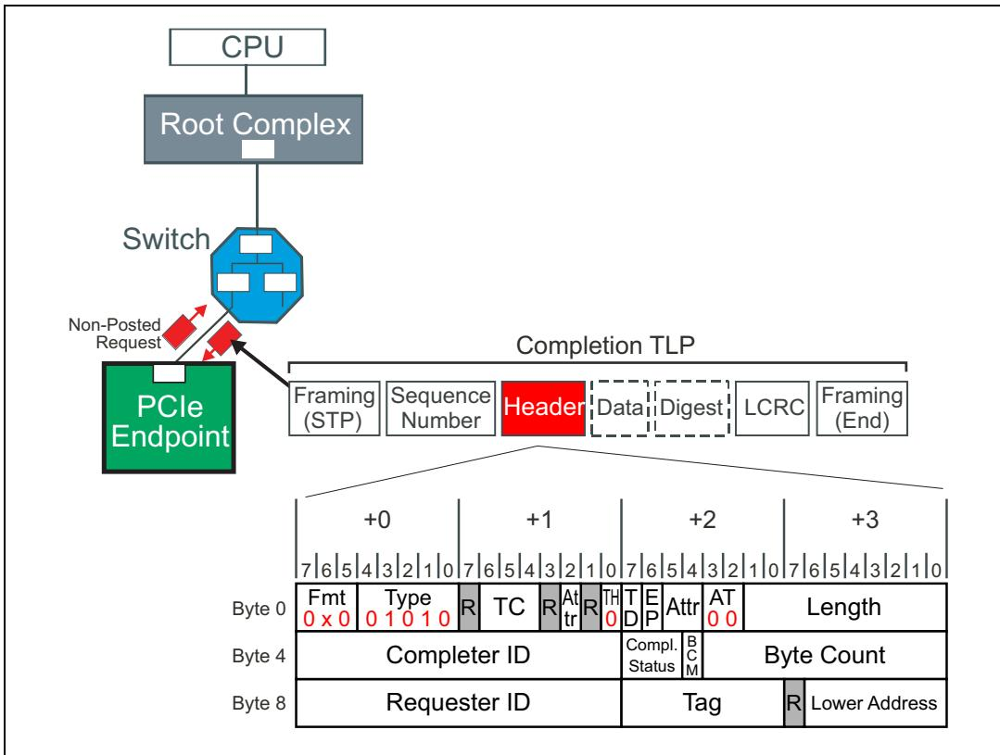

# Ch05_TLP_Elements

## 5 TLP Elements | 5 TLP 元素

<table style="border:1px solid #ddd;border-collapse:collapse;width:100%" cellpadding="4" cellspacing="0" rules="all" frame="border">
<tr>
<td width="50%" style="border:1px solid #ddd;">
The Previous Chapter
</td>
<td width="50%" style="border:1px solid #ddd;background-color:#e8e8e8">
上一章回顾
</td>
</tr>
<tr>
<td width="50%" style="border:1px solid #ddd;">
The previous chapter describes the purpose and methods of a function requesting address space (either memory address space or IO address space) through Base Address Registers (BARs) and how software must setup the Base/Limit registers in all bridges to route TLPs from a source port to the correct destination port. The general concepts of TLP routing in PCI Express are also discussed, including address-based routing, ID-based routing and implicit routing.
</td>
<td width="50%" style="border:1px solid #ddd;background-color:#e8e8e8">
上一章描述了功能（function）通过基址寄存器（BAR）请求地址空间（存储器地址空间或IO地址空间）的目的与方法，以及软件必须如何配置所有桥中的Base/Limit寄存器，以将TLP从源端口路由到正确的目标端口。还讨论了PCI Express中TLP路由的一般概念，数据包括基于地址的路由、基于ID的路由和隐式路由。
</td>
</tr>
</table>

## This Chapter | 本章内容

<table style="border:1px solid #ddd;border-collapse:collapse;width:100%" cellpadding="4" cellspacing="0" rules="all" frame="border">
<tr>
<td width="50%" style="border:1px solid #ddd;">
Information moves between PCI Express devices in packets. The three major classes of packets are Transaction Layer Packets (TLPs), Data Link Layer Packets (DLLPs) and Ordered Sets. This chapter describes the use, format, and definition of the variety of TLPs and the details of their related fields. DLLPs are described separately in Chapter 9, entitled "DLLP Elements," on page 307.
</td>
<td width="50%" style="border:1px solid #ddd;background-color:#e8e8e8">
PCI Express 设备之间的信息以数据包（packet）的形式进行传输。三大类数据包分别是：事务层数据包（TLP）、数据链路层数据包（DLLP）和有序集（Ordered Set）。本章将描述各种 TLP 的用途、格式和定义，以及其相关字段的详细说明。DLLP 将在第 9 章"数据链路层数据包元素"（第 307 页）中单独描述。
</td>
</tr>
</table>

## The Next Chapter | 下一章

<table style="border:1px solid #ddd;border-collapse:collapse;width:100%" cellpadding="4" cellspacing="0" rules="all" frame="border">
<tr>
<td width="50%" style="border:1px solid #ddd;">
The next chapter discusses the purposes and detailed operation of the Flow Control Protocol. Flow control is designed to ensure that transmitters never send Transaction Layer Packets (TLPs) that a receiver can't accept. This prevents receive buffer over-runs and eliminates the need for PCI-style inefficiencies like disconnects, retries, and wait-states.
</td>
<td width="50%" style="border:1px solid #ddd;background-color:#e8e8e8">
下一章将讨论流控(Flow Control)协议的用途与详细操作。流控的设计目的是确保发送端绝不会发送接收端无法接收的事务层数据包(TLP)。这避免了接收缓冲区溢出，并消除了PCI风格的低效机制，例如断开连接、重试和等待状态。
</td>
</tr>
</table>

## 5.1 Introduction to Packet-Based Protocol | 5.1 基于数据数据包协议的介绍

## 5.1.1 General | 5.1.1 概述

<table style="border:1px solid #ddd;border-collapse:collapse;width:100%" cellpadding="4" cellspacing="0" rules="all" frame="border">
<tr>
<td width="50%" style="border:1px solid #ddd;">
Unlike parallel buses, serial transport buses like PCIe use no control signals to identify what's happening on the Link at a given time. Instead, the bit stream they send must have an expected size and a recognizable format to make it possible for the receiver to understand the content. In addition, PCIe does not use any immediate handshake for the packet while it is being transmitted.
</td>
<td width="50%" style="border:1px solid #ddd;background-color:#e8e8e8">
与并行总线不同，像 PCIe 这样的串行传输总线不使用控制信号来标识链路上在给定时刻发生了什么。相反，它们发送的比特流必须具有预期的尺寸和可识别的格式，以便接收方能够理解其内容。此外，PCIe 在数据数据包传输过程中不使用任何即时握手。
</td>
</tr>
<tr>
<td width="50%" style="border:1px solid #ddd;">
With the exception of the Logical Idle symbols and Physical Layer packets called Ordered Sets, information moves across an active PCIe Link in fundamental chunks called packets that are comprised of symbols. The two major classes of packets exchanged are the high‐level Transaction Layer Packets (TLPs), and low‐level Link maintenance packets called Data Link Layer Packets (DLLPs). The packets and their flow are illustrated in Figure 5‐1 on page 170. Ordered Sets are packets too, however, they are not framed with a start and end symbol like TLPs and DLLPs are. They are also not byte striped like TLPs and DLLPs are. Ordered Set packets are instead replicated on all Lanes of a Link.
</td>
<td width="50%" style="border:1px solid #ddd;background-color:#e8e8e8">
除了逻辑空闲（Logical Idle）符号和称为有序集（Ordered Sets）的物理层数据数据包之外，信息在一条活跃的 PCIe 链路上是以由符号组成的基本数据块——称为数据数据包——的形式传输的。所交换的两大类数据数据包分别是高层的事务层数据包（TLP）和低层的链路维护数据包，称为数据链路层数据包（DLLP）。这些数据数据包及其流向如图 5‐1（第 170 页）所示。有序集也是数据数据包，然而，它们不像 TLP 和 DLLP 那样以起始和结束符号进行帧界定，也不像 TLP 和 DLLP 那样进行字节拆分（byte striped）。有序集数据数据包是在链路的所有通道上复制发送的。
</td>
</tr>
</table>

Figure 5‐1: TLP And DLLP Packets | 图5‐1：TLP和DLLP数据数据包

## 5.1.1 Motivation for a Packet-Based Protocol | 5.1.1 采用基于数据数据包协议的动机

<table style="border:1px solid #ddd;border-collapse:collapse;width:100%" cellpadding="4" cellspacing="0" rules="all" frame="border">
<tr>
<td width="50%" style="border:1px solid #ddd;">
There are three distinct advantages to using a packet‑based protocol especially when it comes to data integrity:
</td>
<td width="50%" style="border:1px solid #ddd;background-color:#e8e8e8">
采用基于数据数据包的协议具有三个显著的优势，尤其是在数据完整性方面：
</td>
</tr>
</table>

## 5.1.1.1 Packet Formats Are Well Defined | 5.1.1.1 数据数据包格式定义明确

<table style="border:1px solid #ddd;border-collapse:collapse;width:100%" cellpadding="4" cellspacing="0" rules="all" frame="border">
<tr>
<td width="50%" style="border:1px solid #ddd;">
Earlier buses like PCI allow transfers of indeterminate size, making identification of payload boundaries impossible until the end of the transfer. In addition, either device is able to terminate the transfer before it completes, making it difficult for the sender to calculate and send a checksum or CRC covering an entire payload. Instead, PCI uses a simple parity scheme and checks it on each data phase.
</td>
<td width="50%" style="border:1px solid #ddd;background-color:#e8e8e8">
PCI 等早期的总线允许传输不定长的数据，这使得在传输结束之前无法识别有效载荷边界。此外，任意一方设备都可以在传输完成之前终止传输，这使得发送方难以计算和发送覆盖整个有效载荷的校验和或 CRC。因此，PCI 采用简单的奇偶校验方案，并在每个数据阶段对其进行检查。
</td>
</tr>
<tr>
<td width="50%" style="border:1px solid #ddd;">
By comparison, PCIe packets have a known size and format. The packet header at the beginning indicates the packet type and contains the required and optional fields. The size of the header fields is fixed except for the address, which can be 32 bits or 64 bits in size. Once a transfer commences, the recipient can't pause or terminate it early. This structured format allows including information in the TLPs to aid in reliable delivery, including framing symbols, CRC, and a packet Sequence Number.
</td>
<td width="50%" style="border:1px solid #ddd;background-color:#e8e8e8">
相比之下，PCIe 数据数据包具有已知的大小和格式。开头的数据数据包头指示了数据数据包类型，并数据包含必需字段和可选字段。除了地址可以是 32 位或 64 位大小外，各个头字段的大小是固定的。一旦传输开始，接收方不能暂停或提前终止传输。这种结构化的格式允许在 TLP 中数据包含有助于可靠传输的信息，数据包括帧符号、CRC 和数据数据包序列号。
</td>
</tr>
</table>

## 5.1.1.2 Framing Symbols Define Packet Boundaries | 5.1.1.2 成帧符号定义数据包边界

<table style="border:1px solid #ddd;border-collapse:collapse;width:100%" cellpadding="4" cellspacing="0" rules="all" frame="border">
<tr>
<td width="50%" style="border:1px solid #ddd;">
When using 8b/10b encoding in Gen1 and Gen2 mode of operation, each TLP and DLLP packet sent is framed by Start and End control symbols, clearly defining the packet boundaries for the receiver. This is a big improvement over PCI and PCI‑X, where the assertion and de‑assertion of the single FRAME# signal indicates the beginning and end of a transaction. A glitch on that signal (or any of the other control signals) could cause a target to misconstrue bus events. A PCIe receiver must properly decode a complete 10‑bit symbol before concluding Link activity is beginning or ending, so unexpected or unrecognized symbols are more easily recognized and handled as errors.
</td>
<td width="50%" style="border:1px solid #ddd;background-color:#e8e8e8">
在 Gen1 和 Gen2 工作模式下使用 8b/10b 编码时，每个 TLP 和 DLLP 数据包的发送都由起始（Start）和结束（End）控制符号进行成帧，为接收方清晰地定义了数据包边界。这相比 PCI 和 PCI‑X 是一个重大改进，后者依靠单一 FRAME# 信号的置位和撤销来指示事务的开始和结束。该信号（或任何其他控制信号）上的毛刺可能导致目标设备错误理解总线事件。PCIe 接收方必须正确解码完整的 10 位符号后才能断定链路活动正在开始或结束，因此意外或无法识别的符号更容易被识别并作为错误处理。
</td>
</tr>
<tr>
<td width="50%" style="border:1px solid #ddd;">
For the 128b/130b encoding used in Gen3, control characters are no longer employed and there are no framing symbols as such. For more on the differences between Gen3 encoding and the earlier versions, see Chapter 12, entitled "Physical Layer — Logical (Gen3)," on page 407.
</td>
<td width="50%" style="border:1px solid #ddd;background-color:#e8e8e8">
对于 Gen3 中使用的 128b/130b 编码，不再使用控制字符，因此没有所谓的成帧符号。有关 Gen3 编码与早期版本之间差异的更多信息，请参阅第 12 章"物理层 — 逻辑层（Gen3）"，第 407 页。
</td>
</tr>
</table>

## 5.1.1.3 CRC Protects Entire Packet | 5.1.1.3 CRC 保护整个数据包

<table style="border:1px solid #ddd;border-collapse:collapse;width:100%" cellpadding="4" cellspacing="0" rules="all" frame="border">
<tr>
<td width="50%" style="border:1px solid #ddd;">
Unlike the side-band parity signals used by PCI during the address and data phases of a transaction, the in-band CRC value of PCIe verifies error-free delivery of the entire packet. TLP packets also have a Sequence Number appended to them by the transmitter's Data Link Layer so that if an error is detected at the Receiver, the problem packet can be automatically resent. The transmitter maintains a copy of each TLP sent in a Retry Buffer until it has been acknowledged by the receiver. This TLP acknowledgement mechanism, called the Ack/Nak Protocol, (and described in Chapter 10, entitled "Ack/Nak Protocol," on page 317) forms the basis of Link-level TLP error detection and correction. This Ack/Nak Protocol error recovery mechanism allows for a timely resolution of the problem at the place or Link where the problem occurred, but requires a local hardware solution to support it.
</td>
<td width="50%" style="border:1px solid #ddd;background-color:#e8e8e8">
与 PCI 在事务的地址和数据阶段使用的边带奇偶校验信号不同，PCIe 的带内 CRC 值对整个数据包的无差错传输进行验证。TLP 数据包还由发送方的数据链路层附加了一个序列号，这样若在接收方检测到错误，问题数据包即可自动重发。发送方将每个已发送 TLP 的副本保存于重试缓冲中，直到收到接收方的确认。此 TLP 确认机制称为 Ack/Nak 协议（在第 10 章"Ack/Nak 协议"中描述，见第 317 页），构成了链路级 TLP 错误检测与纠正的基础。该 Ack/Nak 协议错误恢复机制能够在问题发生的具体位置（即发生问题的链路）及时解决问题，但需要本地硬件方案来支撑。
</td>
</tr>
</table>

<table style="border:1px solid #ddd;border-collapse:collapse;width:100%" cellpadding="4" cellspacing="0" rules="all" frame="border">
<tr>
<td width="50%" style="border:1px solid #ddd;">
Transaction Layer Packet (TLP) Details
</td>
<td width="50%" style="border:1px solid #ddd;background-color:#e8e8e8">
事务层数据包（TLP）详解
</td>
</tr>
<tr>
<td width="50%" style="border:1px solid #ddd;">
In PCI Express, high-level transactions originate in the device core of the transmitting device and terminate at the core of the receiving device. The Transaction Layer acts on these requests to assemble outbound TLPs in the Transmitter and interpret them at the Receiver. Along the way, the Data Link Layer and Physical Layer of each device also contribute to the final packet assembly.
</td>
<td width="50%" style="border:1px solid #ddd;background-color:#e8e8e8">
在 PCI Express 中，高层事务起源于发送端设备的设备核心，并终止于接收端设备的核心。事务层对这些请求进行处理，在发送端组装出站 TLP，并在接收端对其进行解析。在此过程中，每个设备的数据链路层和物理层也参与了最终的数据数据包组装。
</td>
</tr>
</table>

## 5.2.1 TLP Assembly And Disassembly | 5.2.1 TLP 组装与拆解

<table style="border:1px solid #ddd;border-collapse:collapse;width:100%" cellpadding="4" cellspacing="0" rules="all" frame="border">
<tr>
<td width="50%" style="border:1px solid #ddd;">
The general flow of TLP assembly at the transmit side of a Link and disassembly at the receiver is shown in Figure 5-2 on page 173.
</td>
<td width="50%" style="border:1px solid #ddd;background-color:#e8e8e8">
链路发送端 TLP 组装与接收端 TLP 拆解的总体流程如图 5-2（第 173 页）所示。
</td>
</tr>
<tr>
<td width="50%" style="border:1px solid #ddd;">
Let's now walk through the steps from creation of a packet to its delivery to the core logic of the receiver.
</td>
<td width="50%" style="border:1px solid #ddd;background-color:#e8e8e8">
现在让我们逐步了解从数据数据包的创建到其递送至接收端核心逻辑的整个过程。
</td>
</tr>
<tr>
<td width="50%" style="border:1px solid #ddd;">
The key stages in Transaction Layer Packet assembly and disassembly are listed below.
</td>
<td width="50%" style="border:1px solid #ddd;background-color:#e8e8e8">
事务层数据包组装与拆解的关键阶段列举如下。
</td>
</tr>
<tr>
<td width="50%" style="border:1px solid #ddd;">
The list numbers correspond to the numbers in Figure 5-2 on page 173.
</td>
<td width="50%" style="border:1px solid #ddd;background-color:#e8e8e8">
列表编号与图 5-2（第 173 页）中的编号一一对应。
</td>
</tr>
</table>

## 5.2.1.1 Transmitter | 5.2.1.1 发送端

<table style="border:1px solid #ddd;border-collapse:collapse;width:100%" cellpadding="4" cellspacing="0" rules="all" frame="border">
<tr>
<td width="50%" style="border:1px solid #ddd;">
1. The core logic of Device A sends a request to its PCIe interface. How this is accomplished is outside the scope of the spec or this book. The request includes:
</td>
<td width="50%" style="border:1px solid #ddd;background-color:#e8e8e8">
1. 设备A的核心逻辑向其PCIe接口发送一个请求。其实现方式超出了规范或本书的范围。该请求数据包括：
</td>
</tr>
<tr>
<td width="50%" style="border:1px solid #ddd;">
--- Target address or ID (routing information)
</td>
<td width="50%" style="border:1px solid #ddd;background-color:#e8e8e8">
--- 目标地址或ID (路由信息)
</td>
</tr>
<tr>
<td width="50%" style="border:1px solid #ddd;">
--- Source information such as Requester ID and Tag
</td>
<td width="50%" style="border:1px solid #ddd;background-color:#e8e8e8">
--- 源信息，如请求者ID和标签(Tag)
</td>
</tr>
<tr>
<td width="50%" style="border:1px solid #ddd;">
--- Transaction type/packet type (Command to perform, such as a memory read.)
</td>
<td width="50%" style="border:1px solid #ddd;background-color:#e8e8e8">
--- 事务类型/数据包类型 (要执行的命令，如存储器读)
</td>
</tr>
<tr>
<td width="50%" style="border:1px solid #ddd;">
--- Data payload size (if any) along with data payload (if any)
</td>
<td width="50%" style="border:1px solid #ddd;background-color:#e8e8e8">
--- 数据负载大小 (如有) 以及数据负载 (如有)
</td>
</tr>
<tr>
<td width="50%" style="border:1px solid #ddd;">
--- Traffic Class (to assign packet priority)
</td>
<td width="50%" style="border:1px solid #ddd;background-color:#e8e8e8">
--- 流量类(TC) (用于分配数据包优先级)
</td>
</tr>
<tr>
<td width="50%" style="border:1px solid #ddd;">
--- Attributes of the Request (No Snoop, Relaxed Ordering, etc.)
</td>
<td width="50%" style="border:1px solid #ddd;background-color:#e8e8e8">
--- 请求属性 (No Snoop、宽松排序等)
</td>
</tr>
<tr>
<td width="50%" style="border:1px solid #ddd;">
2. Based on that request, the Transaction Layer builds the TLP header, appends any data payload, and optionally calculates and appends the digest (End-to-End CRC, ECRC) if that's supported and has been enabled. At this point the TLP is placed into a Virtual Channel buffer. The Virtual Channel manages the sequence of TLPs according to the Transaction Ordering rules and also verifies that the receiver has enough flow control credits to accept a TLP before it can be passed down to the Data Link Layer.
</td>
<td width="50%" style="border:1px solid #ddd;background-color:#e8e8e8">
2. 基于该请求，事务层构建TLP头部，附加任何数据负载，并在支持且已使能的情况下可选地计算并附加摘要(端到端CRC，ECRC)。此时，TLP被放入虚通道(VC)缓冲中。虚通道根据事务排序规则管理TLP的序列，并验证接收端有足够的流控信用值来接受TLP，然后才能将其传递到数据链路层。
</td>
</tr>
<tr>
<td width="50%" style="border:1px solid #ddd;">
3. When it arrives at the Data Link Layer, the TLP is assigned a Sequence Number and then a Link CRC is calculated based on the contents of the TLP and that Sequence Number. A copy of the resulting packet is saved in the Retry Buffer in case of transmission errors while it is also passed on to the Physical Layer.
</td>
<td width="50%" style="border:1px solid #ddd;background-color:#e8e8e8">
3. 当TLP到达数据链路层时，它被分配一个序列号，然后基于TLP的内容和该序列号计算链路CRC(LCRC)。生成的数据数据包副本被保存在重试缓冲(Retry Buffer)中，以防传输错误，同时它也被传递到物理层。
</td>
</tr>
</table>

Figure 5-2: PCIe TLP Assembly/Disassembly | 图5-2：PCIe TLP组装/拆解

<table style="border:1px solid #ddd;border-collapse:collapse;width:100%" cellpadding="4" cellspacing="0" rules="all" frame="border">
<tr>
<td width="50%" style="border:1px solid #ddd;">
4. The Physical Layer does several things to prepare the packet for serial transmission, including byte striping, scrambling, encoding, and serializing the bits. For Gen1 and Gen2 devices, when using 8b/10b encoding, the control characters STP and END are added to either end of the packet. Finally, the packet is transmitted across the Link. In Gen3 mode, STP token is added to the front end of a TLP, but END is not added to the end of the packet. Rather the STP token contains information about TLP packet size.
</td>
<td width="50%" style="border:1px solid #ddd;background-color:#e8e8e8">
4. 物理层执行多项操作以准备数据数据包进行串行传输，数据包括字节拆分、加扰、编码和位序列化。对于Gen1和Gen2设备，当使用8b/10b编码时，控制字符STP和END被添加到数据数据包的两端。最后，数据数据包通过链路传输。在Gen3模式下，STP令牌被添加到TLP的前端，但END不被添加到数据数据包的末端。相反，STP令牌数据包含有关TLP数据数据包大小的信息。
</td>
</tr>
</table>

## 5.2.1.2 Receiver | 5.2.1.2 接收端

<table style="border:1px solid #ddd;border-collapse:collapse;width:100%" cellpadding="4" cellspacing="0" rules="all" frame="border">
<tr>
<td width="50%" style="border:1px solid #ddd;">
5. At the Receiver (Device B in this example), everything done to prepare the packet for transmission must now be undone. The Physical Layer de‐serializes the bit stream, decodes the resulting symbols, and un‐stripes the bytes.
</td>
<td width="50%" style="border:1px solid #ddd;background-color:#e8e8e8">
5. 在接收端（本例中的设备B），为准备数据数据包发送所做的所有操作现在必须逆向进行。物理层对比特流进行解串行化，对得到的符号进行解码，并对字节进行逆拆分(un‑stripe)。
</td>
</tr>
<tr>
<td width="50%" style="border:1px solid #ddd;">
The control characters are removed here because they only have meaning at the Physical Layer, and then the packet is forwarded to the Data Link Layer.
</td>
<td width="50%" style="border:1px solid #ddd;background-color:#e8e8e8">
控制字符在此处被移除，因为它们仅在物理层具有含义，随后数据数据包被转发至数据链路层。
</td>
</tr>
<tr>
<td width="50%" style="border:1px solid #ddd;">
6. The Data Link Layer calculates the CRC and compares it to the received CRC. If that matches, the Sequence Number is checked. If there are no errors, the CRC and Sequence Number are removed and the TLP is passed to the Transaction Layer of the receiver and notifies the sender of good reception by returning an Ack DLLP. In the event of an error a Nak will be returned instead, and the transmitter will re‐replay TLPs in its Retry Buffer.
</td>
<td width="50%" style="border:1px solid #ddd;background-color:#e8e8e8">
6. 数据链路层计算CRC并与接收到的CRC进行比较。如果两者匹配，则检查序列号。如果没有错误，则移除CRC和序列号，TLP被传递至接收端的事务层，并通过返回ACK DLLP通知发送端接收良好。若发生错误，则将返回Nak，发送端将重放其重试缓冲区中的TLP。
</td>
</tr>
<tr>
<td width="50%" style="border:1px solid #ddd;">
7. At the Transaction Layer, the TLP is decoded and the information is passed to the core logic for appropriate action. If the receiving device is the final target of this packet, it checks for ECRC errors and reports any related ECRC error condition to the core logic should there be any.
</td>
<td width="50%" style="border:1px solid #ddd;background-color:#e8e8e8">
7. 在事务层，TLP被解码，信息被传递至核心逻辑以执行相应操作。如果接收设备是该数据数据包的最终目标，它会检查ECRC错误，并在存在任何相关ECRC错误条件时将其报告给核心逻辑。
</td>
</tr>
</table>

## 5.2.2 TLP Structure | 5.2.2 TLP 结构

<table style="border:1px solid #ddd;border-collapse:collapse;width:100%" cellpadding="4" cellspacing="0" rules="all" frame="border">
<tr>
<td width="50%" style="border:1px solid #ddd;">
The basic usage of each field in a Transaction Layer Packet is defined in Table 5-1 on page 174.
</td>
<td width="50%" style="border:1px solid #ddd;background-color:#e8e8e8">
事务层数据包中各字段的基本用法在第174页的表5-1中定义。
</td>
</tr>
</table>

Table 5-1: TLP Header Type Field Defines Transaction Variant | 表5-1：TLP头类型字段定义事务变体

<table style="border:2px solid #000;border-collapse:collapse;width:100%" cellpadding="4" cellspacing="0" rules="all" frame="border"><tr><td style="border:2px solid #000;">TLP Component</td><td style="border:2px solid #000;">Protocol Layer</td><td style="border:2px solid #000;">Component Use</td></tr><tr><td style="border:2px solid #000;">Header</td><td style="border:2px solid #000;">Transaction Layer</td><td style="border:2px solid #000;">3 or 4DW (12 or 16 bytes) in size. Format varies with type, but Header defines parameters, including:Transaction typeTarget address, ID, etc.Transfer size (if any), Byte EnablesAttributesTraffic Class</td></tr><tr><td style="border:2px solid #000;">Data</td><td style="border:2px solid #000;">Transaction Layer</td><td style="border:2px solid #000;">Optional 1-1024 DW Payload, which is qualified with Byte Enables or byte-aligned start and end addresses. Note that a length of zero can&#x27;t be specified, but a zero-length read (useful in some cases) can be approximated by specifying a length of 1 DW and Byte Enables of all zero. The resulting data from the Completer will be undefined but the Requester doesn&#x27;t use it, so the result is the same.</td></tr><tr><td style="border:2px solid #000;">Digest/ECRC</td><td style="border:2px solid #000;">Transaction Layer</td><td style="border:2px solid #000;">Optional. When present, ECRC is always 1 DW in size.</td></tr></table>

## 5.2.3 Generic TLP Header Format | 5.2.3 通用 TLP 头格式

## 5.1.1 General | 5.1.1 概述

<table style="border:1px solid #ddd;border-collapse:collapse;width:100%" cellpadding="4" cellspacing="0" rules="all" frame="border">
<tr>
<td width="50%" style="border:1px solid #ddd;">
Figure 5-3 on page 175 illustrates the format and contents of a generic TLP 4DW header.
</td>
<td width="50%" style="border:1px solid #ddd;background-color:#e8e8e8">
第175页的图5-3展示了一个通用TLP 4DW头的格式和内容。
</td>
</tr>
<tr>
<td width="50%" style="border:1px solid #ddd;">
In this section, fields common to nearly all transactions are summarized.
</td>
<td width="50%" style="border:1px solid #ddd;background-color:#e8e8e8">
本节概述了几乎所有事务共有的字段。
</td>
</tr>
<tr>
<td width="50%" style="border:1px solid #ddd;">
Header format differences associated with specific transaction types are covered later.
</td>
<td width="50%" style="border:1px solid #ddd;background-color:#e8e8e8">
与特定事务类型相关的头格式差异将在后续章节中介绍。
</td>
</tr>
</table>

Figure 5-3: Generic TLP Header Fields | 图5-3：通用TLP头字段

## 5.2.3.1 Generic Header Field Summary | 5.2.3.1 通用头字段汇总

<table style="border:1px solid #ddd;border-collapse:collapse;width:100%" cellpadding="4" cellspacing="0" rules="all" frame="border">
<tr>
<td width="50%" style="border:1px solid #ddd;">
Table 5-2 on page 176 summarizes the size and use of each of the generic TLP header fields. Note that fields marked "R" in Figure 5-3 on page 175 are reserved and should be set to zero.
</td>
<td width="50%" style="border:2px solid #000;background-color:#e8e8e8">
第176页的表5-2汇总了各通用TLP头字段的大小和用途。请注意，第175页图5-3中标记为"R"的字段为保留字段，应设置为零。
</td>
</tr>
<tr>
<td width="50%" style="border:2px solid #000;">
Table 5-2: Generic Header Field Summary | 表5-2：通用头字段摘要
</td>
<td width="50%" style="border:2px solid #000;background-color:#e8e8e8">
表5-2：通用头字段汇总
</td>
</tr>
</table>

<table style="border:2px solid #000;border-collapse:collapse;width:100%" cellpadding="4" cellspacing="0" rules="all" frame="border"><tr><td style="border:2px solid #000;">Header Field</td><td style="border:2px solid #000;">Header Location</td><td style="border:2px solid #000;">Field Use</td></tr><tr><td style="border:2px solid #000;">Fmt[2:0] (Format)</td><td style="border:2px solid #000;">Byte 0 Bit 7:5</td><td style="border:2px solid #000;">These bits encode information about header size and whether a data payload will be part of the TLP:00b 3DW header, no data01b 4DW header, no data10b 3DW header, with data11b 4DW header, with dataAn address below 4GB must use a 3DW header. The spec states that receiver behavior is undefined if 4DW header is used for an address below 4GB with the upper 32 bits of the 64-bit address set to zero.</td></tr><tr><td style="border:2px solid #000;">Type[4:0]</td><td style="border:2px solid #000;">Byte 0 Bit 4:0</td><td style="border:2px solid #000;">These bits encode the transaction variant used with this TLP. The Type field is used with Fmt [1:0] field to specify transaction type, header size, and whether data payload is present. See "Generic Header Field Details" on page 178 for details.</td></tr><tr><td style="border:2px solid #000;">TC [2:0] (Traffic Class)</td><td style="border:2px solid #000;">Byte 1 Bit 6:4</td><td style="border:2px solid #000;">These bits encode the traffic class to be applied to this TLP and to the completion associated with it (if any):000b = Traffic Class 0 (Default).111b = Traffic Class 7TC 0 is the default class, while TC 1-7 are used to provide differentiated services. See "Traffic Class (TC)" on page 247 for additional information.</td></tr><tr><td style="border:2px solid #000;">Attr [2] (Attributes)</td><td style="border:2px solid #000;">Byte 1 Bit 2</td><td style="border:2px solid #000;">This third Attribute bit indicates whether ID-based Ordering is to be used for this TLP. To learn more, see "ID Based Ordering (IDO)" on page 301.</td></tr><tr><td style="border:2px solid #000;">TH (TLP Processing Hints)</td><td style="border:2px solid #000;">Byte 1 Bit 0</td><td style="border:2px solid #000;">Indicates when TLP Hints have been included to give the system some idea about how best to handle this TLP. See "TPH (TLP Processing Hints)" on page 899 for a discussion on their usage.</td></tr><tr><td style="border:2px solid #000;">TD (TLP Digest)</td><td style="border:2px solid #000;">Byte 2 Bit 7</td><td style="border:2px solid #000;">If TD = 1, the optional 4-byte TLP Digest has been included with this TLP as the ECRC value. Some rules:Presence of the Digest field must be checked by all receivers based on this bit.A TLP with TD = 1 but no Digest is handled as a Malformed TLP.If a device supports checking ECRC and TD=1, it must perform the ECRC check.If a device does not support checking ECRC (optional) at the ultimate destination, it must ignore the digest.For more on this topic see "CRC" on page 653 and "ECRC Generation and Checking" on page 657.</td></tr><tr><td style="border:2px solid #000;">EP (Poisoned Data)</td><td style="border:2px solid #000;">Byte 2 Bit 6</td><td style="border:2px solid #000;">If EP = 1, the data accompanying this data should be considered invalid although the transaction is being allowed to complete normally. For more on poisoned packets, refer to "Data Poisoning" on page 660.</td></tr><tr><td style="border:2px solid #000;">Attr [1:0] (Attributes)</td><td style="border:2px solid #000;">Byte 2 Bit 5:4</td><td style="border:2px solid #000;">Bit 5 = Relaxed ordering: When set to 1, PCI-X relaxed ordering is enabled for this TLP. If 0, then strict PCI ordering is used.Bit 4 = No Snoop: When set to 1, Requester is indicating that no host cache coherency issues exist for this TLP. System hardware can thus save time by skipping the normal processor cache snoop for this request. When 0, PCI -type cache snoop protection is required.</td></tr><tr><td style="border:2px solid #000;">Address Type [1:0]</td><td style="border:2px solid #000;">Byte 2 Bit 3:2</td><td style="border:2px solid #000;">For Memory and Atomic Requests, this field supports address translation for virtualized systems. The translation protocol is described in a separate spec called Address Translation Services, where it can be seen that the field encodes as:00 = Default/Untranslated01 = Translation Request10 = Translated11 = Reserved</td></tr><tr><td style="border:2px solid #000;">Length [9:0]</td><td style="border:2px solid #000;">Byte 2 Bit 1:0Byte 3 Bit 7:0</td><td style="border:2px solid #000;">TLP data payload transfer size, in DW. Encoding:00 0000 0001b = 1DW00 0000 0010b = 2DW..11 1111 1111b = 1023 DW00 0000 0000b = 1024 DW</td></tr><tr><td style="border:2px solid #000;">Last DW Byte Enables [3:0]</td><td style="border:2px solid #000;">Byte 7 Bit 7:4</td><td style="border:2px solid #000;">These four high-true bits map one-to-one to the bytes within the last double word of payload.Bit 7 = 1: Byte 3 in last DW is valid; otherwise notBit 6 = 1: Byte 2 in last DW is valid; otherwise notBit 5 = 1: Byte 1 in last DW is valid; otherwise notBit 4 = 1: Byte 0 in last DW is valid; otherwise not</td></tr><tr><td style="border:2px solid #000;">First DW Byte Enables [3:0]</td><td style="border:2px solid #000;">Byte 7 Bit 3:0</td><td style="border:2px solid #000;">These four high-true bits map one-to-one to the bytes within the first double word of payload.Bit 3 = 1: Byte 3 in first DW is valid; otherwise notBit 2 = 1: Byte 2 in first DW is valid; otherwise notBit 1 = 1: Byte 1 in first DW is valid; otherwise notBit 0 = 1: Byte 0 in first DW is valid; otherwise not</td></tr></table>

<table style="border:2px solid #000;border-collapse:collapse;width:100%" cellpadding="4" cellspacing="0" rules="all" frame="border">
<tr>
<td width="50%" style="border:2px solid #000;">
Generic Header Field Details
</td>
<td width="50%" style="border:2px solid #000;background-color:#e8e8e8">
通用头字段详解
</td>
</tr>
<tr>
<td width="50%" style="border:2px solid #000;">
In the following sections, we describe details of each TLP Header field depicted in Figure 5‑3 on page 175.
</td>
<td width="50%" style="border:2px solid #000;background-color:#e8e8e8">
在以下各节中，我们将描述图5-3（第175页）中所示的每个TLP头字段的详细信息。
</td>
</tr>
</table>

## 5.2.3.2 Header Type | Format Field Encodings | 5.2.3.2 头类型 | 格式字段编码

<table style="border:1px solid #ddd;border-collapse:collapse;width:100%" cellpadding="4" cellspacing="0" rules="all" frame="border">
<tr>
<td width="50%" style="border:1px solid #ddd;">
Table 5-3 on page 179 summarizes the encodings used in TLP header Type and Format (Fmt) fields.
</td>
<td width="50%" style="border:2px solid #000;background-color:#e8e8e8">
第179页的表5-3总结了TLP头部类型和格式（Fmt）字段中使用的编码。
</td>
</tr>
</table>

Table 5-3: TLP Header Type and Format Field Encodings | 表5-3：TLP头类型和格式字段编码

<table style="border:2px solid #000;border-collapse:collapse;width:100%" cellpadding="4" cellspacing="0" rules="all" frame="border"><tr><td style="border:2px solid #000;">TLP</td><td style="border:2px solid #000;">FMT[2:0]</td><td style="border:2px solid #000;">TYPE [4:0]</td></tr><tr><td style="border:2px solid #000;">Memory Read Request (MRd)</td><td style="border:2px solid #000;">000 = 3DW, no data001 = 4DW, no data</td><td style="border:2px solid #000;">0 0000</td></tr><tr><td style="border:2px solid #000;">Memory Read Lock Request (MRdLk)</td><td style="border:2px solid #000;">000 = 3DW, no data001 = 4DW, no data</td><td style="border:2px solid #000;">0 0001</td></tr><tr><td style="border:2px solid #000;">Memory Write Request (MWr)</td><td style="border:2px solid #000;">010 = 3DW, w/ data011 = 4DW, w/ data</td><td style="border:2px solid #000;">0 0000</td></tr><tr><td style="border:2px solid #000;">IO Read Request (IORd)</td><td style="border:2px solid #000;">000 = 3DW, no data</td><td style="border:2px solid #000;">0 0010</td></tr><tr><td style="border:2px solid #000;">IO Write Request (IOWr)</td><td style="border:2px solid #000;">010 = 3DW, w/ data</td><td style="border:2px solid #000;">0 0010</td></tr><tr><td style="border:2px solid #000;">Config Type 0 Read Request (CfgRd0)</td><td style="border:2px solid #000;">000 = 3DW, no data</td><td style="border:2px solid #000;">0 0100</td></tr><tr><td style="border:2px solid #000;">Config Type 0 Write Request (CfgWr0)</td><td style="border:2px solid #000;">010 = 3DW, w/ data</td><td style="border:2px solid #000;">0 0100</td></tr><tr><td style="border:2px solid #000;">Config Type 1 Read Request (CfgRd1)</td><td style="border:2px solid #000;">000 = 3DW, no data</td><td style="border:2px solid #000;">0 0101</td></tr><tr><td style="border:2px solid #000;">Config Type 1 Write Request (CfgWr1)</td><td style="border:2px solid #000;">010 = 3DW, w/ data</td><td style="border:2px solid #000;">0 0101</td></tr><tr><td style="border:2px solid #000;">Message Request (Msg)</td><td style="border:2px solid #000;">001 = 4DW, no data</td><td style="border:2px solid #000;">1 0 rrr*(see routing field)</td></tr><tr><td style="border:2px solid #000;">Message Request W/Data (MsgD)</td><td style="border:2px solid #000;">011 = 4DW, w/ data</td><td style="border:2px solid #000;">1 0rrr*(see routing field)</td></tr><tr><td style="border:2px solid #000;">Completion (Cpl)</td><td style="border:2px solid #000;">000 = 3DW, no data</td><td style="border:2px solid #000;">0 1010</td></tr><tr><td style="border:2px solid #000;">Completion W/Data (CplD)</td><td style="border:2px solid #000;">010 = 3DW, w/ data</td><td style="border:2px solid #000;">0 1010</td></tr><tr><td style="border:2px solid #000;">Completion-Locked (CplLk)</td><td style="border:2px solid #000;">000 = 3DW, no data</td><td style="border:2px solid #000;">0 1011</td></tr><tr><td style="border:2px solid #000;">Completion W/Data (CplDLk)</td><td style="border:2px solid #000;">010 = 3DW, w/ data</td><td style="border:2px solid #000;">0 1011</td></tr><tr><td style="border:2px solid #000;">Fetch and Add AtomicOp Request</td><td style="border:2px solid #000;">010 = 3DW, w/ data011 = 4DW, w/ data</td><td style="border:2px solid #000;">0 1100</td></tr><tr><td style="border:2px solid #000;">Unconditional Swap AtomicOp Request</td><td style="border:2px solid #000;">010 = 3DW, w/ data011 = 4DW, w/ data</td><td style="border:2px solid #000;">0 1101</td></tr><tr><td style="border:2px solid #000;">Compare and Swap AtomicOp Request</td><td style="border:2px solid #000;">010 = 3DW, w/ data011 = 4DW, w/ data</td><td style="border:2px solid #000;">0 1110</td></tr><tr><td style="border:2px solid #000;">Local TLP Prefix</td><td style="border:2px solid #000;">100 = TLP Prefix</td><td style="border:2px solid #000;"> $0L_3L_2L_1L_0$ </td></tr><tr><td style="border:2px solid #000;">End-to-End TLP Prefix</td><td style="border:2px solid #000;">100 = TLP Prefix</td><td style="border:2px solid #000;"> $1E_3E_2E_1E_0$ </td></tr></table>

## 5.2.3.3 Digest | ECRC Field | 5.2.3.3 摘要 | ECRC 字段

<table style="border:1px solid #ddd;border-collapse:collapse;width:100%" cellpadding="4" cellspacing="0" rules="all" frame="border">
<tr>
<td width="50%" style="border:1px solid #ddd;">
The TLP Digest bit reports the presence of the End-to-End CRC (ECRC). If this optional feature is supported and enabled by software, devices calculate and apply an ECRC for all TLPs they originate. Note that using ECRC requires devices to include the optional Advanced Error Reporting registers, since the capability and control registers for it are located there.
</td>
<td width="50%" style="border:1px solid #ddd;background-color:#e8e8e8">
TLP Digest位指示端到端CRC（ECRC）的存在。如果该可选功能被支持且由软件启用，设备将计算并为其发起的所有TLP应用ECRC。请注意，使用ECRC要求设备数据包含可选的高级错误报告寄存器，因为其能力和控制寄存器位于该处。
</td>
</tr>
<tr>
<td width="50%" style="border:1px solid #ddd;">
ECRC Generation and Checking. ECRC covers all fields that do not change as the TLP is forwarded across the fabric. However, there are two bits that can legally change as a packet makes its way across a topology:
</td>
<td width="50%" style="border:1px solid #ddd;background-color:#e8e8e8">
ECRC生成与检查。ECRC覆盖TLP在结构内转发时不会发生变化的所有字段。然而，有两个位在数据数据包穿越拓扑时可以合法地改变：
</td>
</tr>
<tr>
<td width="50%" style="border:1px solid #ddd;">
Bit 0 of the Type field -- changes when a configuration transaction is forwarded across a bridge and changes from a type 1 to a type 0 configuration transaction because it has reached the targeted bus. This is accomplished by changing bit 0 of the type field.
</td>
<td width="50%" style="border:1px solid #ddd;background-color:#e8e8e8">
Type字段的位0 -- 当配置事务通过桥转发时发生变化，从类型1配置事务变为类型0配置事务，因为它已到达目标总线。这是通过改变类型字段的位0来实现的。
</td>
</tr>
<tr>
<td width="50%" style="border:1px solid #ddd;">
Error/Poisoned (EP) bit -- this can change as a TLP traverses the fabric if the data associated with the packet is seen as corrupted. This is an optional feature referred to as error forwarding.
</td>
<td width="50%" style="border:1px solid #ddd;background-color:#e8e8e8">
错误/毒化（EP）位 -- 如果与数据数据包关联的数据被视为已损坏，该位在TLP穿越结构时可以改变。这是一个称为错误转发的可选功能。
</td>
</tr>
<tr>
<td width="50%" style="border:1px solid #ddd;">
Who Checks ECRC? The intended target of an ECRC is the ultimate recipient of the TLP. Checking the LCRC verifies no transmission errors across a given Link, but that gets recalculated for the packet at the egress port of a routing element (Switch or Root Complex) before being forwarded to the next Link, which could mask an internal error in the routing element. To protect against that, the ECRC is carried forward unchanged on its journey between the Requester and Completer. When the target device checks the ECRC, any error possibilities along the way have a high probability of being detected.
</td>
<td width="50%" style="border:1px solid #ddd;background-color:#e8e8e8">
谁检查ECRC？ECRC的目标是TLP的最终接收者。检查LCRC可以验证给定链路上没有传输错误，但该LCRC会在路由元件（交换机或根复合体）的出口端口为数据数据包重新计算，然后才转发到下一个链路，这可能会掩盖路由元件中的内部错误。为防止这种情况，ECRC在请求者和完成者之间的传输过程中保持不变。当目标设备检查ECRC时，沿途的任何错误可能性都有很高的概率被检测到。
</td>
</tr>
<tr>
<td width="50%" style="border:1px solid #ddd;">
The spec makes two statements regarding a Switch's role in ECRC checking:
</td>
<td width="50%" style="border:1px solid #ddd;background-color:#e8e8e8">
规范就交换机在ECRC检查中的角色做出了两点声明：
</td>
</tr>
<tr>
<td width="50%" style="border:1px solid #ddd;">
A Switch that supports ECRC checking performs this check on TLPs destined to a location within the Switch itself. "On all other TLPs a Switch must preserve the ECRC (forward it untouched) as an integral part of the TLP."
</td>
<td width="50%" style="border:1px solid #ddd;background-color:#e8e8e8">
支持ECRC检查的交换机对目的地为交换机内部位置的TLP执行此检查。"对于所有其他TLP，交换机必须保持ECRC不变（原封不动地转发），作为TLP的组成部分。"
</td>
</tr>
<tr>
<td width="50%" style="border:1px solid #ddd;">
"Note that a Switch may perform ECRC checking on TLPs passing through the Switch. ECRC Errors detected by the Switch are reported in the same way any other device would report them, but do not alter the TLPs passage through the Switch."
</td>
<td width="50%" style="border:1px solid #ddd;background-color:#e8e8e8">
"请注意，交换机可以对通过交换机的TLP执行ECRC检查。交换机检测到的ECRC错误将以与其他任何设备报告错误相同的方式进行报告，但不会改变TLP通过交换机的路径。"
</td>
</tr>
</table>

## 5.2.3.4 Using Byte Enables | 5.2.3.4 使用字节使能

<table style="border:1px solid #ddd;border-collapse:collapse;width:100%" cellpadding="4" cellspacing="0" rules="all" frame="border">
<tr>
<td width="50%" style="border:1px solid #ddd;">
General. Like PCI, PCIe needs a mechanism to reconcile its DW-aligned addresses with the need, at times, for transfer sizes or starting/ending addresses that are not DW aligned. Toward this end, PCI Express makes use of the two Byte Enable fields introduced earlier in Figure 5-3 on page 175 and in Table 5-2 on page 176. The First DW Byte Enable field and the Last DW Byte Enable fields allow the Requester to qualify the bytes of interest within the first and last double words transferred.
</td>
<td width="50%" style="border:1px solid #ddd;background-color:#e8e8e8">
概述。与 PCI 类似，PCIe 需要一种机制来协调其双字（DW）对齐的地址与有时所需的非双字对齐的传输大小或起始/结束地址之间的矛盾。为此，PCI Express 利用了此前在图 5-3（第 175 页）和表 5-2（第 176 页）中介绍的两个字节使能（Byte Enable）字段。第一个双字字节使能（First DW Byte Enable）字段和最后一个双字字节使能（Last DW Byte Enable）字段允许请求者限定所传输的第一个和最后一个双字中感兴趣的字节。
</td>
</tr>
</table>

## 5.2.3.5 Byte Enable Rules | 5.2.3.5 字节使能规则

<table style="border:1px solid #ddd;border-collapse:collapse;width:100%" cellpadding="4" cellspacing="0" rules="all" frame="border">
<tr>
<td width="50%" style="border:1px solid #ddd;">
1. Byte enable bits are high true. A value of 0 indicates the corresponding byte in the data payload should not be used by the Completer. A value of 1 indicates it should.
< | td>
<td width="50%" style="border:1px solid #ddd;background-color:#e8e8e8">
1. 字节使能位为高有效。值为0表示完成者不应使用数据载荷中的对应字节。值为1表示应使用。
</td>
</tr>
<tr>
<td width="50%" style="border:1px solid #ddd;">
2. If the valid data is all within a single double word, the Last DW Byte enable field must be = 0000b.
</td>
<td width="50%" style="border:1px solid #ddd;background-color:#e8e8e8">
2. 如果有效数据全部在单个双字内，则Last DW字节使能字段必须为0000b。
</td>
</tr>
<tr>
<td width="50%" style="border:1px solid #ddd;">
3. If the header Length field indicates a transfer is more than 1DW, the First DW Byte Enable must have at least one bit enabled.
</td>
<td width="50%" style="border:1px solid #ddd;background-color:#e8e8e8">
3. 如果头部Length字段指示传输超过1DW，则First DW字节使能必须至少有一个位被使能。
</td>
</tr>
<tr>
<td width="50%" style="border:1px solid #ddd;">
4. If the Length field indicates a transfer of 3DW or more, then the First DW Byte Enable field and the Last DW Byte Enable field must have contiguous bits set. In these cases, the Byte Enables are only being used to give the byte offset of the effective starting and ending address from the DW-aligned address.
</td>
<td width="50%" style="border:1px solid #ddd;background-color:#e8e8e8">
4. 如果Length字段指示传输为3DW或更多，则First DW字节使能字段和Last DW字节使能字段必须设置连续的位。在这些情况下，字节使能仅用于从DW对齐地址给出有效起始和结束地址的字节偏移。
</td>
</tr>
<tr>
<td width="50%" style="border:1px solid #ddd;">
5. Discontinuous byte enable bit patterns in the First DW Byte enable field are allowed if the transfer is 1DW.
</td>
<td width="50%" style="border:1px solid #ddd;background-color:#e8e8e8">
5. 如果传输为1DW，则允许First DW字节使能字段中出现不连续的字节使能位模式。
</td>
</tr>
<tr>
<td width="50%" style="border:1px solid #ddd;">
6. Discontinuous byte enable bit patterns in both the First and Second DW Byte enable fields are allowed if the transfer is between one and two DWs.
</td>
<td width="50%" style="border:1px solid #ddd;background-color:#e8e8e8">
6. 如果传输在1到2个DW之间，则允许First和Second DW字节使能字段中都出现不连续的字节使能位模式。
</td>
</tr>
<tr>
<td width="50%" style="border:1px solid #ddd;">
7. A write request with a transfer length of 1DW and no byte enables set is legal, but has no effect on the Completer.
</td>
<td width="50%" style="border:1px solid #ddd;background-color:#e8e8e8">
7. 传输长度为1DW且没有设置字节使能的写请求是合法的，但对完成者没有影响。
</td>
</tr>
<tr>
<td width="50%" style="border:1px solid #ddd;">
8. If a read request of 1 DW has no byte enables set, the completer returns a 1DW data payload of undefined data. This may be used as a Flush mechanism that takes advantage of transaction ordering rules to force all previously posted writes out to memory before the completion is returned.
</td>
<td width="50%" style="border:1px solid #ddd;background-color:#e8e8e8">
8. 如果1DW的读请求没有设置字节使能，完成者返回一个数据包含未定义数据的1DW数据载荷。这可用作一种Flush机制，利用事务排序规则，在返回完成之前强制将所有先前发布的写操作写入内存。
</td>
</tr>
<tr>
<td width="50%" style="border:1px solid #ddd;">
Byte Enable Example. An example of byte enable use in this case is illustrated in Figure 5-4 on page 182. Note that the transfer length must extend from the first DW with any valid byte enabled to the last DW with any valid bytes enabled. Because the transfer is more than 2DW, the byte enables may only be used to specify the start address location (2d) and end address location (34d) of the transfer.
</td>
<td width="50%" style="border:1px solid #ddd;background-color:#e8e8e8">
字节使能示例。图5-4（第182页）展示了该情况下字节使能使用的示例。请注意，传输长度必须从第一个有任何有效字节使能的DW延伸到最后一个有任何有效字节使能的DW。由于传输超过2DW，字节使能只能用于指定传输的起始地址位置（2d）和结束地址位置（34d）。
</td>
</tr>
</table>

Figure 5-4: Using First DW and Last DW Byte Enable Fields | 图5-4：使用首DW和末DW字节使能字段

## 5.2.4 Transaction Descriptor Fields | 5.2.4 事务描述符字段

<table style="border:1px solid #ddd;border-collapse:collapse;width:100%" cellpadding="4" cellspacing="0" rules="all" frame="border">
<tr>
<td width="50%" style="border:1px solid #ddd;">
As transactions move between requester and completer, it's necessary to uniquely identify a transaction, since many split transactions may be queued up from the same Requester at any instant. To help with this, the spec defines several important header fields that form a unique Transaction Descriptor, as illustrated in Figure 5-5.
</td>
<td width="50%" style="border:1px solid #ddd;background-color:#e8e8e8">
当事务在请求方与完成方之间传输时，必须唯一标识每个事务，因为在任意时刻，同一个请求方可能有多个已拆分的排队事务。为此，规范定义了若干重要的数据包头字段，这些字段共同组成一个唯一的事务描述符，如图 5-5 所示。
</td>
</tr>
</table>

Figure 5-5: Transaction Descriptor Fields | 图5-5：事务描述符字段

<table style="border:1px solid #ddd;border-collapse:collapse;width:100%" cellpadding="4" cellspacing="0" rules="all" frame="border"><tr><td rowspan="2" style="border:1px solid #ddd;"></td><td colspan="2" style="border:1px solid #ddd;">+0</td><td colspan="5" style="border:1px solid #ddd;">+1</td><td colspan="5" style="border:1px solid #ddd;">+2</td><td colspan="2" style="border:1px solid #ddd;">+3</td></tr><tr><td style="border:1px solid #ddd;">7</td><td style="border:1px solid #ddd;">6</td><td style="border:1px solid #ddd;">5</td><td style="border:1px solid #ddd;">4</td><td style="border:1px solid #ddd;">3</td><td style="border:1px solid #ddd;">2</td><td style="border:1px solid #ddd;">1</td><td style="border:1px solid #ddd;">0</td><td style="border:1px solid #ddd;">7</td><td style="border:1px solid #ddd;">6</td><td style="border:1px solid #ddd;">5</td><td style="border:1px solid #ddd;">4</td><td style="border:1px solid #ddd;">3</td><td style="border:1px solid #ddd;">2</td></tr><tr><td style="border:1px solid #ddd;">Byte 0</td><td style="border:1px solid #ddd;">Fmt</td><td style="border:1px solid #ddd;">Type</td><td style="border:1px solid #ddd;">R</td><td style="border:1px solid #ddd;">TC</td><td style="border:1px solid #ddd;">R</td><td style="border:1px solid #ddd;">Attr</td><td style="border:1px solid #ddd;">R</td><td style="border:1px solid #ddd;">TH</td><td style="border:1px solid #ddd;">TD</td><td style="border:1px solid #ddd;">EP</td><td style="border:1px solid #ddd;">Attr</td><td style="border:1px solid #ddd;">AT</td><td colspan="2" style="border:1px solid #ddd;">Length</td></tr><tr><td style="border:1px solid #ddd;">Byte 4</td><td colspan="8" style="border:1px solid #ddd;">Completer ID</td><td colspan="2" style="border:1px solid #ddd;">Cmpl Status</td><td style="border:1px solid #ddd;">BCM</td><td colspan="3" style="border:1px solid #ddd;">Byte Count</td></tr><tr><td style="border:1px solid #ddd;">Byte 8</td><td colspan="8" style="border:1px solid #ddd;">Requester ID</td><td colspan="4" style="border:1px solid #ddd;">Tag</td><td style="border:1px solid #ddd;">R</td><td style="border:1px solid #ddd;">Lower Addr</td></tr></table>

<table style="border:1px solid #ddd;border-collapse:collapse;width:100%" cellpadding="4" cellspacing="0" rules="all" frame="border">
<tr>
<td width="50%" style="border:1px solid #ddd;">
While the Transaction Descriptor fields are not in adjacent header locations, collectively they describe key transaction attributes, including:
</td>
<td width="50%" style="border:1px solid #ddd;background-color:#e8e8e8">
尽管事务描述符字段并非位于数据包头中连续的相邻位置，但它们共同描述了事务的关键属性，数据包括：
</td>
</tr>
<tr>
<td width="50%" style="border:1px solid #ddd;">
Transaction ID. The combination of the Requester ID (Bus, Device, and Function Number of the Requester) and the Tag field of the TLP.
</td>
<td width="50%" style="border:1px solid #ddd;background-color:#e8e8e8">
事务 ID。由请求方 ID（请求方的总线号、设备号和功能号）与 TLP 的 Tag 字段组合而成。
</td>
</tr>
<tr>
<td width="50%" style="border:1px solid #ddd;">
Traffic Class. The Traffic Class (TC) is added by the requester based on the core logic request and travels unmodified through the topology to the Completer. On every Link, the TC is mapped to one of the Virtual Channels.
</td>
<td width="50%" style="border:1px solid #ddd;background-color:#e8e8e8">
流量类。流量类 (TC) 由请求方根据核心逻辑请求添加，并原封不动地通过拓扑结构传递至完成方。在每条链路上，TC 被映射到其中一个虚通道。
</td>
</tr>
<tr>
<td width="50%" style="border:1px solid #ddd;">
Transaction Attributes. The ID-based Ordering, Relaxed Ordering, and No Snoop bits also travel with the Request packet to the Completer.
</td>
<td width="50%" style="border:1px solid #ddd;background-color:#e8e8e8">
事务属性。基于 ID 的排序、宽松排序和 No Snoop 位也随请求数据包一起传递至完成方。
</td>
</tr>
</table>

## 5.2.5 Additional Rules For TLPs With Data Payloads | 5.2.5 带有数据载荷的TLP的附加规则

<table style="border:1px solid #ddd;border-collapse:collapse;width:100%" cellpadding="4" cellspacing="0" rules="all" frame="border">
<tr>
<td width="50%" style="border:1px solid #ddd;">
The following rules apply when a TLP includes a data payload.
</td>
<td width="50%" style="border:1px solid #ddd;background-color:#e8e8e8">
当TLP数据包含数据载荷时，适用以下规则。
</td>
</tr>
<tr>
<td width="50%" style="border:1px solid #ddd;">
1. The Length field refers only to the data payload.
</td>
<td width="50%" style="border:1px solid #ddd;background-color:#e8e8e8">
1. Length字段仅指数据载荷。
</td>
</tr>
<tr>
<td width="50%" style="border:1px solid #ddd;">
2. The first byte of data in the payload (immediately after the header) is always associated with the lowest (start) address.
</td>
<td width="50%" style="border:1px solid #ddd;background-color:#e8e8e8">
2. 载荷中的第一个数据字节（紧接在数据包头之后）始终与最低（起始）地址相关联。
</td>
</tr>
<tr>
<td width="50%" style="border:1px solid #ddd;">
3. The Length field always represents an integral number of DWs transferred. Partial DWs are qualified using First and Last Byte Enable fields.
</td>
<td width="50%" style="border:1px solid #ddd;background-color:#e8e8e8">
3. Length字段始终表示传输的DW的整数个数。部分DW通过首字节使能和末字节使能字段来限定。
</td>
</tr>
<tr>
<td width="50%" style="border:1px solid #ddd;">
4. The spec states that, when multiple transactions are returned by a completer in response to a single memory request, each intermediate transaction must end on naturally-aligned 64- or 128-byte address boundaries for a Root Complex. This is controlled by a configuration bit called the Read Completion Boundary (RCB). All other devices follow the PCI-X protocol and break such transactions at naturally-aligned 128-byte boundaries. This makes buffer management simpler in bridges.
</td>
<td width="50%" style="border:1px solid #ddd;background-color:#e8e8e8">
4. 规范指出，当完成器响应单个存储器请求而返回多个事务时，对于根复合体，每个中间事务必须在自然对齐的64字节或128字节地址边界处结束。这由一个称为读完成边界（RCB）的配置位控制。所有其他设备遵循PCI-X协议，并在自然对齐的128字节边界处拆分此类事务。这使得桥接器中的缓冲管理更加简单。
</td>
</tr>
<tr>
<td width="50%" style="border:1px solid #ddd;">
5. The Length field is reserved when sending Message Requests unless the message is the version with data (MsgD).
</td>
<td width="50%" style="border:1px solid #ddd;background-color:#e8e8e8">
5. 发送消息请求时，Length字段为保留字段，除非该消息是带数据版本的消息（MsgD）。
</td>
</tr>
<tr>
<td width="50%" style="border:1px solid #ddd;">
6. The TLP data payload must not exceed the current value in the Max\_Payload\_Size field of the Device Control Register. Only write transactions have data payloads, so this restriction doesn't apply to read requests. A receiver is required to check for violations of the Max\_Payload\_Size limit during writes, and violations are treated as Malformed TLPs.
</td>
<td width="50%" style="border:1px solid #ddd;background-color:#e8e8e8">
6. TLP数据载荷不得超过设备控制寄存器中Max\_Payload\_Size字段的当前值。只有写事务具有数据载荷，因此此限制不适用于读请求。接收器必须检查写操作期间是否违反Max\_Payload\_Size限制，违规将被视为畸形TLP。
</td>
</tr>
<tr>
<td width="50%" style="border:1px solid #ddd;">
7. Receivers also must check for discrepancies between the value in the Length field and the actual amount of data transferred in a TLP. This type of violation is also treated as a Malformed TLP.
</td>
<td width="50%" style="border:1px solid #ddd;background-color:#e8e8e8">
7. 接收器还必须检查Length字段中的值与TLP中实际传输的数据量之间的差异。此类违规同样被视为畸形TLP。
</td>
</tr>
<tr>
<td width="50%" style="border:1px solid #ddd;">
8. Requests must not mix combinations of start address and transfer length that would cause a memory access to cross a 4KB boundary. While checking for this is optional, if seen it's treated as a Malformed TLP.
</td>
<td width="50%" style="border:1px solid #ddd;background-color:#e8e8e8">
8. 请求不得使用会导致存储器访问跨越4KB边界的起始地址和传输长度的组合。虽然对此的检查是可选的，但一旦发现，则将其视为畸形TLP。
</td>
</tr>
</table>

<table style="border:1px solid #ddd;border-collapse:collapse;width:100%" cellpadding="4" cellspacing="0" rules="all" frame="border">
<tr>
<td width="50%" style="border:1px solid #ddd;">
Specific TLP Formats: Request &amp; Completion TLPs
</td>
<td width="50%" style="border:1px solid #ddd;background-color:#e8e8e8">
具体的TLP格式：请求与完成TLP
</td>
</tr>
<tr>
<td width="50%" style="border:1px solid #ddd;">
In this section, the format of 3DW and 4DW headers used to accomplish specific transaction types are described. Many of the generic fields described previously apply, but an emphasis is placed on the fields which are handled differently with specific transaction types. Detailed description of TLP Header format are described in sections following for TLP types: 1) IO Request, 2) Memory Requests, 3) Configuration Requests, 4) Completions and 5) Message Requests.
</td>
<td width="50%" style="border:1px solid #ddd;background-color:#e8e8e8">
本节描述了用于实现特定事务类型的3DW和4DW头格式。前述许多通用字段同样适用，但重点放在了在特定事务类型中处理方式有所不同的字段上。后续章节将对以下TLP类型的头格式进行详细描述：1) IO请求，2) 存储器请求，3) 配置请求，4) 完成报文，以及5) 消息请求。
</td>
</tr>
</table>

## 5.3.1 IO Requests | 5.3.1 IO 请求

<table style="border:1px solid #ddd;border-collapse:collapse;width:100%" cellpadding="4" cellspacing="0" rules="all" frame="border">
<tr>
<td width="50%" style="border:1px solid #ddd;">
While the spec discourages the use of IO transactions, allowance is made for Legacy devices and for software that may need to rely on a compatible device residing in the system IO map rather than the memory map. While the IO transactions can technically access a 32-bit IO range, in reality many systems (and CPUs) restrict IO access to the lower 16 bits (64KB) of this range. Figure 5-6 on page 185 depicts the system IO map and the 16- and 32-bit address boundaries. Devices that don't identify themselves as Legacy devices are not permitted to request IO address space in their configuration Base Address Registers.
</td>
<td width="50%" style="border:1px solid #ddd;background-color:#e8e8e8">
虽然规范不鼓励使用 IO 事务，但为遗留设备和可能需要依赖驻留在系统 IO 映射（而非存储器映射）中的兼容设备的软件保留了允许。虽然 IO 事务在技术上可以访问 32 位 IO 范围，但实际上许多系统（和 CPU）将 IO 访问限制在该范围的低 16 位（64KB）内。图 5-6（第 185 页）描述了系统 IO 映射以及 16 位和 32 位地址边界。未将自己标识为遗留设备的设备不允许在其配置基址寄存器中请求 IO 地址空间。
</td>
</tr>
</table>

Figure 5-6: System IO Map | 图5-6：系统IO映射

<table style="border:1px solid #ddd;border-collapse:collapse;width:100%" cellpadding="4" cellspacing="0" rules="all" frame="border">
<tr>
<td width="50%" style="border:1px solid #ddd;">
IO Request Header Format. A 3 DW IO request header is shown in Figure 5-7 on page 185 and each of the fields is described in the section that follows.
</td>
<td width="50%" style="border:1px solid #ddd;background-color:#e8e8e8">
IO 请求数据包头格式。图 5-7（第 185 页）显示了一个 3 DW 的 IO 请求数据包头，每个字段将在后续章节中描述。
</td>
</tr>
</table>

Figure 5-7: 3DW IO Request Header Format | 图5-7：3DW IO请求头格式

<table style="border:1px solid #ddd;border-collapse:collapse;width:100%" cellpadding="4" cellspacing="0" rules="all" frame="border">
<tr>
<td width="50%" style="border:1px solid #ddd;">
IO Request Header Fields. The location and use of each field in an IO request header is described in Table 5-4 on page 186.
</td>
<td width="50%" style="border:1px solid #ddd;background-color:#e8e8e8">
IO 请求数据包头字段。IO 请求数据包头中每个字段的位置和用途在表 5-4（第 186 页）中描述。
</td>
</tr>
</table>

Table 5-4: IO Request Header Fields | 表5-4：IO请求头字段

<table style="border:2px solid #000;border-collapse:collapse;width:100%" cellpadding="4" cellspacing="0" rules="all" frame="border"><tr><td style="border:2px solid #000;">Field Name</td><td style="border:2px solid #000;">Header Byte/Bit</td><td style="border:2px solid #000;">Function</td></tr><tr><td style="border:2px solid #000;">Fmt [2:0](Format)</td><td style="border:2px solid #000;">Byte 0 Bit 7:5</td><td style="border:2px solid #000;">Packet Format for IO requests:000b = IO Read (3DW without data)010b = IO Write (3DW with data)</td></tr><tr><td style="border:2px solid #000;">Type [4:0]</td><td style="border:2px solid #000;">Byte 0 Bit 4:0</td><td style="border:2px solid #000;">Packet type is 00010b for IO requests</td></tr><tr><td style="border:2px solid #000;">TC [2:0](Traffic Class)</td><td style="border:2px solid #000;">Byte 1 Bit 6:4</td><td style="border:2px solid #000;">Traffic Class for IO requests is always zero, ensuring that these packets will never interfere with any high-priority packets.</td></tr><tr><td style="border:2px solid #000;">Attr [2](Attributes)</td><td style="border:2px solid #000;">Byte 1 Bit 2</td><td style="border:2px solid #000;">ID-based Ordering doesn't apply for IO requests and this bit is reserved.</td></tr><tr><td style="border:2px solid #000;">TH(TLP Processing Hints)</td><td style="border:2px solid #000;">Byte 1 Bit 0</td><td style="border:2px solid #000;">TLP processing Hints don't apply to IO requests and this bit is reserved.</td></tr><tr><td style="border:2px solid #000;">TD(TLP Digest)</td><td style="border:2px solid #000;">Byte 2 Bit 7</td><td style="border:2px solid #000;">Indicates the presence of a digest field (ECRC) at the end of the TLP.</td></tr><tr><td style="border:2px solid #000;">EP(Poisoned Data)</td><td style="border:2px solid #000;">Byte 2 Bit 6</td><td style="border:2px solid #000;">Indicates whether the data payload (if present) is poisoned.</td></tr><tr><td style="border:2px solid #000;">Attr [1:0](Attributes)</td><td style="border:2px solid #000;">Byte 2 Bit 5:4</td><td style="border:2px solid #000;">Relaxed Ordering and No Snoop bits don't apply for IO requests and are always zero.</td></tr><tr><td style="border:2px solid #000;">AT [1:0](Address Type)</td><td style="border:2px solid #000;">Byte 2 Bit 3:2</td><td style="border:2px solid #000;">Address Type doesn't apply for IO requests and these bits must be zero.</td></tr><tr><td style="border:2px solid #000;">Length [9:0]</td><td style="border:2px solid #000;">Byte 2 Bit 1:0Byte 3 Bit 7:0</td><td style="border:2px solid #000;">Indicates data payload size in DW. For IO requests, this field is always just 1 since no more than 4 bytes can be transferred. The First DW Byte Enables qualify which bytes are used.</td></tr><tr><td style="border:2px solid #000;">Requester ID [15:0]</td><td style="border:2px solid #000;">Byte 4 Bit 7:0Byte 5 Bit 7:0</td><td style="border:2px solid #000;">Identifies the Requester's "return address" for corresponding Completion.Byte 4, 7:0 = Bus NumberByte 5, 7:3 = Device NumberByte 5, 2:0 = Function Number</td></tr><tr><td style="border:2px solid #000;">Tag [7:0]</td><td style="border:2px solid #000;">Byte 6 Bit 7:0</td><td style="border:2px solid #000;">These bits identify the specific requests from the requester. A unique tag value is assigned to each outgoing Request. By default, only bits 4:0 are used, but the Extended Tag and Phantom Functions options can extend that to 11 bits, permitting up to 2048 outstanding requests to be in progress simultaneously.</td></tr><tr><td style="border:2px solid #000;">Last DW BE [3:0](Last DW Byte Enables)</td><td style="border:2px solid #000;">Byte 7 Bit 7:4</td><td style="border:2px solid #000;">These bits must be 0000b because IO requests can only be one DW in size.</td></tr><tr><td style="border:2px solid #000;">1st DW BE [3:0](First DW Byte Enables)</td><td style="border:2px solid #000;">Byte 7 Bit 3:0</td><td style="border:2px solid #000;">These bits qualify the bytes in the one-DW payload. For IO requests, any bit combination is valid (including all zeros).</td></tr><tr><td style="border:2px solid #000;">Address [31:2]</td><td style="border:2px solid #000;">Byte 8 Bit 7:0Byte 9 Bit 7:0Byte 10 Bit 7:0Byte 11 Bit 7:2</td><td style="border:2px solid #000;">The upper 30 bits of the 32-bit start address for the IO transfer. The lower two bits of the 32 bit address are reserved (00b), forcing a DW-aligned start address.</td></tr></table>

## 5.3.2 Memory Requests | 5.3.2 存储器请求

<table style="border:1px solid #ddd;border-collapse:collapse;width:100%" cellpadding="4" cellspacing="0" rules="all" frame="border">
<tr>
<td width="50%" style="border:1px solid #ddd;">
PCI Express memory transactions include two classes: Read Requests with their corresponding Completions, and Write Requests. The system memory map shown in Figure 5-8 on page 188 depicts both a 3DW and 4DW memory request packet. Keep in mind a point that the spec reiterates several times: a memory transfer is never permitted to cross a 4KB address boundary.
</td>
<td width="50%" style="border:1px solid #ddd;background-color:#e8e8e8">
PCI Express存储器事务数据包括两类：读请求及其对应的完成报文，以及写请求。第188页图5-8所示的系统存储器映射描绘了3DW和4DW存储器请求数据包。请牢记规范反复强调的一点：存储器传输绝不允许跨越4KB地址边界。
</td>
</tr>
</table>

Figure 5-8: 3DW And 4DW Memory Request Header Formats | 图5-8：3DW和4DW存储器请求头格式

<table style="border:1px solid #ddd;border-collapse:collapse;width:100%" cellpadding="4" cellspacing="0" rules="all" frame="border">
<tr>
<td width="50%" style="border:1px solid #ddd;">
Memory Request Header Fields. The location and use of each field in a 4DW memory request header is listed in Table 5-5 on page 189. Note that the difference between a 3DW header and a 4DW header is simply the location and size of the starting Address field.
</td>
<td width="50%" style="border:1px solid #ddd;background-color:#e8e8e8">
存储器请求数据包头字段。表5-5（第189页）列出了4DW存储器请求数据包头中每个字段的位置和用途。请注意，3DW数据包头与4DW数据包头的区别仅在于起始地址字段的位置和大小。
</td>
</tr>
</table>

Table 5-5: 4DW Memory Request Header Fields | 表5-5：4DW存储器请求头字段

<table style="border:2px solid #000;border-collapse:collapse;width:100%" cellpadding="4" cellspacing="0" rules="all" frame="border"><tr><td style="border:2px solid #000;">Field Name</td><td style="border:2px solid #000;">Header Byte/Bit</td><td style="border:2px solid #000;">Function</td></tr><tr><td style="border:2px solid #000;">Fmt [2:0](Format)</td><td style="border:2px solid #000;">Byte 0 Bit 7:5</td><td style="border:2px solid #000;">Packet Formats:000b = Memory Read (3DW w/o data)010b = Memory Write (3DW w/ data)001b = Memory Read (4DW w/o data)011b = Memory Write (4DW w/ data)1xxb = TLP Prefix has been added to the beginning of the packet. See "TPH (TLP Processing Hints)" on page 899 for more on this.</td></tr><tr><td style="border:2px solid #000;">Type[4:0]</td><td style="border:2px solid #000;">Byte 0 Bit 4:0</td><td style="border:2px solid #000;">TLP packet Type field:00000b = Memory Read or Write00001b = Memory Read Locked Type field is used with Fmt [1:0] field to specify transaction type, header size, and whether data payload is present.</td></tr><tr><td style="border:2px solid #000;">TC [2:0](Traffic Class)</td><td style="border:2px solid #000;">Byte 1 Bit 6:4</td><td style="border:2px solid #000;">These bits encode the traffic class to be applied to a Request and to any associated Completion.000b = Traffic Class 0 (Default).111b = Traffic Class 7See"Traffic Class (TC)" on page 247 for more on this.</td></tr><tr><td style="border:2px solid #000;">Attr [2](Attributes)</td><td style="border:2px solid #000;">Byte 1 Bit 2</td><td style="border:2px solid #000;">Indicates whether ID-based Ordering is to be used for this TLP. To learn more, see "ID Based Ordering (IDO)" on page 301.</td></tr><tr><td style="border:2px solid #000;">TH(TLP Processing Hints)</td><td style="border:2px solid #000;">Byte 1 Bit 0</td><td style="border:2px solid #000;">Indicates whether TLP Hints have been included. See "TPH (TLP Processing Hints)" on page 899 for a discussion on these hints.</td></tr></table>

## PCI Express Technology | PCI Express 技术

Table 5-5: 4DW Memory Request Header Fields (Continued) | 表5-5：4DW存储器请求头字段（续）

<table style="border:2px solid #000;border-collapse:collapse;width:100%" cellpadding="4" cellspacing="0" rules="all" frame="border"><tr><td style="border:2px solid #000;">Field Name</td><td style="border:2px solid #000;">Header Byte/Bit</td><td style="border:2px solid #000;">Function</td></tr><tr><td style="border:2px solid #000;">TD(TLP Digest)</td><td style="border:2px solid #000;">Byte 2 Bit 7</td><td style="border:2px solid #000;">If 1, the optional TLP Digest field is included with this TLP.Some rules:The presence of the Digest field must be checked by all receivers (using this bit)TLPs with TD = 1 but no Digest field are treated as Malformed.If the TD bit is set, recipient must perform the ECRC check if enabled.If a Receiver doesn't support the optional ECRC checking, it must ignore the digest field.</td></tr><tr><td style="border:2px solid #000;">EP(Poisoned Data)</td><td style="border:2px solid #000;">Byte 2 Bit 6</td><td style="border:2px solid #000;">If 1, the data accompanying this packet should be considered to have an error although the transaction is allowed to complete normally.</td></tr><tr><td style="border:2px solid #000;">Attr [1:0](Attributes)</td><td style="border:2px solid #000;">Byte 2 Bit 5:4</td><td style="border:2px solid #000;">Bit 5 = Relaxed ordering.When set = 1, PCI-X relaxed ordering is enabled for this TLP. Otherwise, strict PCI ordering is used.Bit 4 = No Snoop.If 1, system hardware is not required to cause processor cache snoop for coherency for this TLP. Otherwise, cache snooping is required.</td></tr><tr><td style="border:2px solid #000;">Address Type [1:0]</td><td style="border:2px solid #000;">Byte 2 Bit 3:2</td><td style="border:2px solid #000;">This field supports address translation for virtualized systems. The translation protocol is described in a separate spec called Address Translation Services, where it can be seen that the field encodes as:00 = Default/Untranslated01 = Translation Request10 = Translated11 = Reserved</td></tr><tr><td style="border:2px solid #000;">Length [9:0]</td><td style="border:2px solid #000;">Byte 2 Bit 1:0Byte 3 Bit 7:0</td><td style="border:2px solid #000;">TLP data payload transfer size, in DW. Maximum size is 1024 DW (4KB), encoded as:00 0000 0001b = 1DW00 0000 0010b = 2DW..11 1111 1111b = 1023 DW00 0000 0000b = 1024 DW</td></tr><tr><td style="border:2px solid #000;">Requester ID [15:0]</td><td style="border:2px solid #000;">Byte 4 Bit 7:0Byte 5 Bit 7:0</td><td style="border:2px solid #000;">Identifies a Requester's return address for a completion:Byte 4, 7:0 = Bus NumberByte 5, 7:3 = Device NumberByte 5, 2:0 = Function Number</td></tr><tr><td style="border:2px solid #000;">Tag [7:0]</td><td style="border:2px solid #000;">Byte 6 Bit 7:0</td><td style="border:2px solid #000;">These identify each outstanding request issued by the Requester. By default only bits 4:0 are used, allowing up to 32 requests to be in progress at a time. If the Extended Tag bit in the Control Register is set, then all 8 bits may be used (256 tags).</td></tr><tr><td style="border:2px solid #000;">Last BE [3:0](Last DW Byte Enables)</td><td style="border:2px solid #000;">Byte 7 Bit 7:4</td><td style="border:2px solid #000;">These qualify bytes within the last DW of data transferred.</td></tr><tr><td style="border:2px solid #000;">1st DW BE [3:0](First DW Byte Enables)</td><td style="border:2px solid #000;">Byte 7 Bit 3:0</td><td style="border:2px solid #000;">These qualify bytes within the first DW of the data payload.</td></tr><tr><td style="border:2px solid #000;">Address [63:32]</td><td style="border:2px solid #000;">Byte 8 Bit 7:0Byte 9 Bit 7:0Byte 10 Bit 7:0Byte 11 Bit 7:0</td><td style="border:2px solid #000;">The upper 32 bits of the 64-bit start address for the memory transfer.</td></tr><tr><td style="border:2px solid #000;">Address [31:2]</td><td style="border:2px solid #000;">Byte 12 Bit 7:0Byte 13 Bit 7:0Byte 14 Bit 7:0Byte 15 Bit 7:2</td><td style="border:2px solid #000;">The lower 32 bits of the 64 bit start address for the memory transfer. The lower two bits of the address are reserved, forcing a DW-aligned start address.</td></tr></table>

<table style="border:2px solid #000;border-collapse:collapse;width:100%" cellpadding="4" cellspacing="0" rules="all" frame="border">
<tr>
<td width="50%" style="border:2px solid #000;">
Memory Request Notes. Features of memory requests include:
</td>
<td width="50%" style="border:2px solid #000;background-color:#e8e8e8">
存储器请求注意事项。存储器请求的特性数据包括：
</td>
</tr>
<tr>
<td width="50%" style="border:2px solid #000;">
1. Memory data transfers are not permitted to cross a 4KB boundary.
</td>
<td width="50%" style="border:2px solid #000;background-color:#e8e8e8">
1. 存储器数据传输不允许跨越 4KB 边界。
</td>
</tr>
<tr>
<td width="50%" style="border:2px solid #000;">
2. All memory-mapped writes are posted to improve performance.
</td>
<td width="50%" style="border:2px solid #000;background-color:#e8e8e8">
2. 所有存储器映射写操作均为 posted（异步提交）方式，以提高性能。
</td>
</tr>
<tr>
<td width="50%" style="border:2px solid #000;">
3. Either 32- or 64-bit addressing may be used.
</td>
<td width="50%" style="border:2px solid #000;background-color:#e8e8e8">
3. 可使用 32 位或 64 位寻址。
</td>
</tr>
<tr>
<td width="50%" style="border:2px solid #000;">
4. Data payload size is between 0 and 1024 DW (0-4KB).
</td>
<td width="50%" style="border:2px solid #000;background-color:#e8e8e8">
4. 数据有效载荷大小介于 0 至 1024 DW（0-4KB）之间。
</td>
</tr>
<tr>
<td width="50%" style="border:2px solid #000;">
5. Quality of Service features may be used, including up to 8 Traffic Classes.
</td>
<td width="50%" style="border:2px solid #000;background-color:#e8e8e8">
5. 可使用服务质量（Quality of Service）特性，数据包括最多 8 个流量类（Traffic Class）。
</td>
</tr>
<tr>
<td width="50%" style="border:2px solid #000;">
6. The No Snoop attribute can be used to relieve the system of the need to snoop processor caches when transactions target main memory.
</td>
<td width="50%" style="border:2px solid #000;background-color:#e8e8e8">
6. 当事务以主存储器为目标时，可使用 No Snoop 属性使系统无需监听处理器缓存以保持一致性。
</td>
</tr>
<tr>
<td width="50%" style="border:2px solid #000;">
7. The Relaxed Ordering attribute may be used to allow devices in the packet's path to apply the relaxed ordering rules in hopes of improving performance.
</td>
<td width="50%" style="border:2px solid #000;background-color:#e8e8e8">
7. 可使用 Relaxed Ordering 属性，允许报文传输路径上的设备应用宽松排序规则，以期提高性能。
</td>
</tr>
</table>

## 3.5 Configuration Requests | 3.5 配置请求

<table style="border:1px solid #ddd;border-collapse:collapse;width:100%" cellpadding="4" cellspacing="0" rules="all" frame="border">
<tr>
<td width="50%" style="border:1px solid #ddd;">
PCI Express uses both Type 0 and Type 1 configuration requests the same way PCI did to maintain backward compatibility. A Type 1 cycle propagates downstream until it reaches the bridge whose secondary bus matches the target bus. At that point, the configuration transaction is converted from Type 1 to Type 0 by the bridge. The bridge knows when to forward and convert configuration cycles based on the previously programmed bus number registers: Primary, Secondary, and Subordinate Bus Numbers. For more on this topic, refer to the section "Legacy PCI Mechanism" on page 91.
</td>
<td width="50%" style="border:1px solid #ddd;background-color:#e8e8e8">
PCI Express 使用 Type 0 和 Type 1 两种配置请求，方式与 PCI 相同，以保持向后兼容性。Type 1 周期向下游传播，直到到达次级总线与目标总线匹配的桥。此时，配置事务由桥从 Type 1 转换为 Type 0。桥根据先前编程的总线号寄存器（主总线号、次级总线号和从属总线号）来决定何时转发和转换配置周期。有关此主题的更多信息，请参阅第 91 页的"传统 PCI 机制"一节。
</td>
</tr>
</table>

Figure 5‐9: 3DW Configuration Request And Header Format | 图5‐9：3DW配置请求和头格式

<table style="border:1px solid #ddd;border-collapse:collapse;width:100%" cellpadding="4" cellspacing="0" rules="all" frame="border">
<tr>
<td width="50%" style="border:1px solid #ddd;">
In Figure 5‐9 on page 193, a Type 1 configuration cycle is shown making its way downstream, where it is converted to Type 0 by the bridge for that bus (accomplished by changing bit 0 of the Type field). Note that, unlike PCI, only one device can reside downstream on a Link. Consequently, no IDSEL or other hardware indication is needed to tell the device that it should claim the Type 0 cycle; any Type 0 configuration cycle a device sees on its Upstream Link will be understood as targeting that device.
</td>
<td width="50%" style="border:1px solid #ddd;background-color:#e8e8e8">
在第 193 页的图 5-9 中，展示了一个 Type 1 配置周期向下游行进的过程，在该总线的桥上被转换为 Type 0（通过更改 Type 字段的 bit 0 实现）。请注意，与 PCI 不同，链路下游只能驻留一个设备。因此，不需要 IDSEL 或其他硬件指示来告知设备应认领该 Type 0 周期；设备在其上游链路上看到的任何 Type 0 配置周期都将被理解为以该设备为目标。
</td>
</tr>
<tr>
<td width="50%" style="border:1px solid #ddd;">
Definitions Of Configuration Request Header Fields. Table 5‐6 on page 194 describes the location and use of each field in the configuration request header illustrated in Figure 5‐9 on page 193.
</td>
<td width="50%" style="border:1px solid #ddd;background-color:#e8e8e8">
配置请求头字段定义。第 194 页的表 5-6 描述了第 193 页图 5-9 所示的配置请求头中每个字段的位置和用途。
</td>
</tr>
</table>

Table 5‐6: Configuration Request Header Fields | 表5‐6：配置请求头字段

<table style="border:1px solid #ddd;border-collapse:collapse;width:100%" cellpadding="4" cellspacing="0" rules="all" frame="border"><tr><td style="border:1px solid #ddd;">Field Name</td><td style="border:1px solid #ddd;">Header Byte/Bit</td><td style="border:1px solid #ddd;">Function</td></tr><tr><td style="border:1px solid #ddd;">Fmt [2:0](Format)</td><td style="border:1px solid #ddd;">Byte 0 Bit 7:5</td><td style="border:1px solid #ddd;">Always a 3DW header000b = configuration read (no data)010b = configuration write (with data)</td></tr><tr><td style="border:1px solid #ddd;">Type [4:0]</td><td style="border:1px solid #ddd;">Byte 0 Bit 4:0</td><td style="border:1px solid #ddd;">00100b = Type 0 Config Request00101b = Type 1 Config Request</td></tr><tr><td style="border:1px solid #ddd;">TC [2:0](Transfer Class)</td><td style="border:1px solid #ddd;">Byte 1 Bit 6:4</td><td style="border:1px solid #ddd;">Traffic Class must be zero for Configuration requests, ensuring that these packets will never interfere with any high-priority packets.</td></tr><tr><td style="border:1px solid #ddd;">Attr [2](Attributes)</td><td style="border:1px solid #ddd;">Byte 1 Bit 2</td><td rowspan="2" style="border:1px solid #ddd;">These bits are reserved and must be zero for Config Requests.</td></tr><tr><td style="border:1px solid #ddd;">TH(TLP Processing Hints)</td><td style="border:1px solid #ddd;">Byte 1 Bit 0</td></tr><tr><td style="border:1px solid #ddd;">TD(TLP Digest)</td><td style="border:1px solid #ddd;">Byte 2 Bit 7</td><td style="border:1px solid #ddd;">Indicates the presence of a digest field (1 DW) at the end of the TLP.</td></tr><tr><td style="border:1px solid #ddd;">EP(Poisoned Data)</td><td style="border:1px solid #ddd;">Byte 2 Bit 6</td><td style="border:1px solid #ddd;">Indicates that data payload is poisoned.</td></tr><tr><td style="border:1px solid #ddd;">Attr [1:0](Attributes)</td><td style="border:1px solid #ddd;">Byte 2 Bit 5:4</td><td style="border:1px solid #ddd;">Relaxed Ordering and No Snoop bits are both always = 0 in configuration requests.</td></tr><tr><td style="border:1px solid #ddd;">AT [1:0](Address Type)</td><td style="border:1px solid #ddd;">Byte 2 Bit 3:2</td><td style="border:1px solid #ddd;">Address Type is reserved for config requests and must be zero.</td></tr><tr><td style="border:1px solid #ddd;">Length [9:0]</td><td style="border:1px solid #ddd;">Byte 2 Bit 1:0Byte 3 Bit 7:0</td><td style="border:1px solid #ddd;">Data payload size in DW is always = 1 for configuration requests. Byte Enables qualify bytes within the DW and any combination is legal.</td></tr><tr><td style="border:1px solid #ddd;">Requester ID [15:0]</td><td style="border:1px solid #ddd;">Byte 4 Bit 7:0Byte 5 Bit 7:0</td><td style="border:1px solid #ddd;">Identifies the Requester's return address for a completion:Byte 4, 7:0 = Bus NumberByte 5, 7:3 = Device NumberByte 5, 2:0 = Function Number</td></tr><tr><td style="border:1px solid #ddd;">Tag [7:0]</td><td style="border:1px solid #ddd;">Byte 6 Bit 7:0</td><td style="border:1px solid #ddd;">These bits identify outstanding request issued by the requester. By default, only bits 4:0 are used (32 outstanding transactions at a time), but if the Extended Tag bit in the Control Register is set = 1, then all 8 bits may be used (256 tags).</td></tr><tr><td style="border:1px solid #ddd;">Last BE [3:0](Last DW Byte Enables)</td><td style="border:1px solid #ddd;">Byte 7 Bit 7:4</td><td style="border:1px solid #ddd;">These qualify bytes in the last data DW transferred. Since config requests can only be one DW in size, these bits must be zero.</td></tr><tr><td style="border:1px solid #ddd;">1st DW BE [3:0](First DW Byte Enables)</td><td style="border:1px solid #ddd;">Byte 7 Bit 3:0</td><td style="border:1px solid #ddd;">These high-true bits qualify bytes in the first data DW transferred. For config requests, any bit combination is valid (including none active).</td></tr><tr><td style="border:1px solid #ddd;">Completer ID [15:0]</td><td style="border:1px solid #ddd;">Byte 8 Bit 7:0Byte 9 Bit 7:0</td><td style="border:1px solid #ddd;">Identifies the completer being accessed with this configuration cycle.Byte 8, 7:0 = Bus NumberByte 9, 7:3 = Device NumberByte 9, 2:0 = Function Number</td></tr><tr><td style="border:1px solid #ddd;">Ext Register Number[3:0](Extended Register Number)</td><td style="border:1px solid #ddd;">Byte 10 Bit 3:0</td><td style="border:1px solid #ddd;">These provide the upper 4 bits of DW space for accessing the extended config space. They're combined with Register Number to create the 10-bit address needed to access the 1024 DW (4096 byte) space. For PCI-compatible config space, this field must be zero.</td></tr><tr><td style="border:1px solid #ddd;">Register Number [5:0]</td><td style="border:1px solid #ddd;">Byte 11 Bit 7:0</td><td style="border:1px solid #ddd;">As the lower 8 bits of configuration DW space, these specify the register number. The two lowest bits are always zero, forcing DW-aligned accesses.</td></tr></table>

<table style="border:1px solid #ddd;border-collapse:collapse;width:100%" cellpadding="4" cellspacing="0" rules="all" frame="border">
<tr>
<td width="50%" style="border:1px solid #ddd;">
Configuration Request Notes. Configuration requests always use the 3DW header format and are routed based on the target Bus, Device and Function numbers. All devices "capture" their Bus and Device Number from the target numbers in the Request whenever they receive a Type 0 configuration write cycle. The reason for that is because they'll need it later to use as their Requester ID when they send requests of their own in the future.
</td>
<td width="50%" style="border:1px solid #ddd;background-color:#e8e8e8">
配置请求注意事项。配置请求始终使用 3DW 头格式，并根据目标总线号、设备号和功能号进行路由。所有设备在收到 Type 0 配置写周期时，都会从请求中的目标号"捕获"其总线号和设备号。这样做的原因是，它们以后在发送自己的请求时，需要将其用作请求者 ID。
</td>
</tr>
</table>

## 5.3.3 Completions | 5.3.3 完成报文

<table style="border:1px solid #ddd;border-collapse:collapse;width:100%" cellpadding="4" cellspacing="0" rules="all" frame="border">
<tr>
<td width="50%" style="border:1px solid #ddd;">
Completions are expected in response to non-posted Request, unless errors prevent them. For example Memory, IO, or Configuration Read requests usually result in Completions with data. On the other hand, IO or Configuration Write requests usually result in a completion without data that merely reports the status of the transaction.
</td>
<td width="50%" style="border:1px solid #ddd;background-color:#e8e8e8">
除非发生错误，否则非转发请求（non-posted Request）均会返回完成报文。例如，存储器读、IO读或配置读请求通常会返回带数据的完成报文。而IO写或配置写请求通常返回无数据的完成报文，仅报告事务的状态。
</td>
</tr>
<tr>
<td width="50%" style="border:1px solid #ddd;">
Many fields in the Completion use the same values as the associated request, including Traffic Class, Attribute bits, and the original Requester ID (used to route the completion back to the Requester). Figure 5-10 on page 197 shows a completion returned for a non-posted request, and the 3DW header format it uses. Completions also supply the Completer ID in the header. Completer ID is not interesting during normal operation, but knowing where the Completion came from could be useful for error diagnosis during system debug.
</td>
<td width="50%" style="border:1px solid #ddd;background-color:#e8e8e8">
完成报文中的许多字段使用与关联请求相同的值，数据包括流量类（Traffic Class）、属性位（Attribute bits）以及原始请求方ID（用于将完成报文路由回请求方）。图5-10（第197页）展示了一个针对非转发请求返回的完成报文及其所使用的3DW头格式。完成报文还会在头部提供完成方ID（Completer ID）。完成方ID在正常操作期间并不引人关注，但了解完成报文的来源对于系统调试期间的错误诊断可能很有用。
</td>
</tr>
</table>

Figure 5-10: 3DW Completion Header Format | 图5-10：3DW完成头格式

<table style="border:1px solid #ddd;border-collapse:collapse;width:100%" cellpadding="4" cellspacing="0" rules="all" frame="border">
<tr>
<td width="50%" style="border:1px solid #ddd;">
Definitions Of Completion Header Fields. Table 5-7 on page 197 describes the location and use of each field in a completion header.
</td>
<td width="50%" style="border:1px solid #ddd;background-color:#e8e8e8">
完成报头字段定义。表5-7（第197页）描述了完成报头中各字段的位置和用途。
</td>
</tr>
</table>

Table 5-7: Completion Header Fields | 表5-7：完成头字段

<table style="border:2px solid #000;border-collapse:collapse;width:100%" cellpadding="4" cellspacing="0" rules="all" frame="border"><tr><td style="border:2px solid #000;">Field Name</td><td style="border:2px solid #000;">Header Byte/Bit</td><td style="border:2px solid #000;">Function</td></tr><tr><td style="border:2px solid #000;">Fmt [2:0] (Format)</td><td style="border:2px solid #000;">Byte 0 Bit 7:5</td><td style="border:2px solid #000;">Packet Format (always a 3DW header)000b = Completion without data (Cpl)010b = Completion with data (CplD)</td></tr><tr><td style="border:2px solid #000;">Type [4:0]</td><td style="border:2px solid #000;">Byte 0 Bit 4:0</td><td style="border:2px solid #000;">Packet type is 01010b for Completions.</td></tr></table>

<table style="border:2px solid #000;border-collapse:collapse;width:100%" cellpadding="4" cellspacing="0" rules="all" frame="border">
<tr>
<td width="50%" style="border:2px solid #000;">
PCI Express Technology
</td>
<td width="50%" style="border:2px solid #000;background-color:#e8e8e8">
PCI Express 技术
</td>
</tr>
</table>

Table 5-7: Completion Header Fields (Continued) | 表5-7：完成头字段（续）

<table style="border:2px solid #000;border-collapse:collapse;width:100%" cellpadding="4" cellspacing="0" rules="all" frame="border"><tr><td style="border:2px solid #000;">Field Name</td><td style="border:2px solid #000;">HeaderByte/Bit</td><td style="border:2px solid #000;">Function</td></tr><tr><td style="border:2px solid #000;">TC [2:0](Traffic Class)</td><td style="border:2px solid #000;">Byte 1 Bit 6:4</td><td style="border:2px solid #000;">Completions must use the same value here as the corresponding Request.</td></tr><tr><td style="border:2px solid #000;">Attr [2](Attributes)</td><td style="border:2px solid #000;">Byte 1 Bit 2</td><td style="border:2px solid #000;">Indicates whether ID-based Ordering is to be used for this TLP. To learn more, see "ID Based Ordering (IDO)" on page 301.</td></tr><tr><td style="border:2px solid #000;">TH(TLP Processing Hints)</td><td style="border:2px solid #000;">Byte 1 Bit 0</td><td style="border:2px solid #000;">Reserved for Completions.</td></tr><tr><td style="border:2px solid #000;">TD(TLP Digest)</td><td style="border:2px solid #000;">Byte 2 Bit 7</td><td style="border:2px solid #000;">If = 1, indicates the presence of a digest field at the end of the TLP.</td></tr><tr><td style="border:2px solid #000;">EP(Poisoned Data)</td><td style="border:2px solid #000;">Byte 2 Bit 6</td><td style="border:2px solid #000;">If = 1, indicates the data payload is poisoned.</td></tr><tr><td style="border:2px solid #000;">Attr [1:0](Attributes)</td><td style="border:2px solid #000;">Byte 2 Bit 5:4</td><td style="border:2px solid #000;">Completions must use the same values here as the corresponding Request.</td></tr><tr><td style="border:2px solid #000;">AT [1:0](Address Type)</td><td style="border:2px solid #000;">Byte 2 Bit 3:2</td><td style="border:2px solid #000;">Address Type is reserved for Completions and must be zero, but Receivers are not required or even encouraged to check this.</td></tr><tr><td style="border:2px solid #000;">Length [9:0]</td><td style="border:2px solid #000;">Byte 2 Bit 1:0Byte 3 Bit 7:0</td><td style="border:2px solid #000;">Indicates data payload size in DW. For Completions, this field reflects the size of the data payload associated with this completion.</td></tr><tr><td style="border:2px solid #000;">Completer ID [15:0]</td><td style="border:2px solid #000;">Byte 4 Bit 7:0Byte 5 Bit 7:0</td><td style="border:2px solid #000;">Identifies the Completer to support debugging problems.Byte 4 7:0 = Completer Bus #Byte 5 7:3 = Completer Dev #Byte 5 2:0 = Completer Function #</td></tr></table>

## Chapter 5: TLP Elements | 第5章：TLP元素

<table style="border:1px solid #ddd;border-collapse:collapse;width:100%" cellpadding="4" cellspacing="0" rules="all" frame="border">
<tr>
<td width="50%" style="border:1px solid #ddd;">
Table 5-7: Completion Header Fields (Continued) | 表5-7：完成头字段（续）
</td>
<td width="50%" style="border:2px solid #000;background-color:#e8e8e8">
表5-7：完成报文头字段（续）
</td>
</tr>
</table>

<table style="border:2px solid #000;border-collapse:collapse;width:100%" cellpadding="4" cellspacing="0" rules="all" frame="border"><tr><td style="border:2px solid #000;">Field Name</td><td style="border:2px solid #000;">Header Byte/Bit</td><td style="border:2px solid #000;">Function</td></tr><tr><td style="border:2px solid #000;">Compl. Status [2:0] (Completion Status Code)</td><td style="border:2px solid #000;">Byte 6 Bit 7:5</td><td style="border:2px solid #000;">These bits indicate status for this Completion.000b = Successful Completion (SC)001b = Unsupported Request (UR)010b = Config Req Retry Status (CRS)100b = Completer abort (CA)All other codes are reserved. See "Summary of Completion Status Codes" on page 200.</td></tr><tr><td style="border:2px solid #000;">BCM (Byte Count Modified)</td><td style="border:2px solid #000;">Byte 6 Bit 4</td><td style="border:2px solid #000;">This is only used by PCI-X Completers and indicates that the Byte Count field reports only the first payload rather than the total payload remaining. See "Using The Byte Count Modified Bit" on page 201.</td></tr><tr><td style="border:2px solid #000;">Byte Count [11:0]</td><td style="border:2px solid #000;">Byte 6 Bit 3:0Byte 7 Bit 7:0</td><td style="border:2px solid #000;">Byte count remaining to satisfy a read request, as derived from the original request Length field. See "Data Returned For Read Requests:" on page 201 for special cases caused by multiple completions.</td></tr><tr><td style="border:2px solid #000;">Requester ID [15:0]</td><td style="border:2px solid #000;">Byte 8 Bit 7:0Byte 9 Bit 7:0</td><td style="border:2px solid #000;">Copied from the Request for use as the return address (target) for this Completion.Byte 8, 7:0 = Requester Bus #Byte 9, 7:3 = Requester Device #Byte 9, 2:0 = Requester Function #</td></tr><tr><td style="border:2px solid #000;">Tag [7:0]</td><td style="border:2px solid #000;">Byte 10 Bit 7:0</td><td style="border:2px solid #000;">This must be the Tag value received with the Request. Requester associates this Completion with a pending Request based on the Tag.</td></tr><tr><td style="border:2px solid #000;">Lower Address [6:0]</td><td style="border:2px solid #000;">Byte 11 Bit 6:0</td><td style="border:2px solid #000;">The lower 7 bits of address for the first data returned for a read request. Calculated from Request Length and Byte Enables, it assists buffer management by showing how many bytes can be transferred before reaching the next Read Completion Boundary. See "Calculating Lower Address Field" on page 200.</td></tr></table>

## 5.3.4 Summary of Completion Status Codes | 5.3.4 完成状态码概述

<table style="border:1px solid #ddd;border-collapse:collapse;width:100%" cellpadding="4" cellspacing="0" rules="all" frame="border">
<tr>
<td width="50%" style="border:1px solid #ddd;">
000b (SC) Successful Completion: the Request was serviced properly.
</td>
<td width="50%" style="border:1px solid #ddd;background-color:#e8e8e8">
000b (SC) 成功完成：请求已被正确处理。
</td>
</tr>
<tr>
<td width="50%" style="border:1px solid #ddd;">
001b (UR) Unsupported Request: Request is not legal or was not recognized by the Completer. This is an error condition but how the Completer responds depends on the spec revision to which it was designed. Before the 1.1 spec, this were considered an uncorrectable error, but for 1.1 and later it's treated as an Advisory Non-Fatal Error. See the "Unsupported Request (UR) Status" on page 663 for details.
</td>
<td width="50%" style="border:1px solid #ddd;background-color:#e8e8e8">
001b (UR) 不支持的请求：请求不合法，或完成者无法识别该请求。这是一个错误条件，但完成者如何响应取决于其所遵循的规范版本。在 1.1 规范之前，这被视为不可纠正错误，但对于 1.1 及更高版本，它被视为咨询性非致命错误。详见第 663 页的"不支持的请求 (UR) 状态"。
</td>
</tr>
<tr>
<td width="50%" style="border:1px solid #ddd;">
010b (CRS) Configuration Request Retry Status: Completer is temporarily unable to service a configuration request, and the request should be attempted again later.
</td>
<td width="50%" style="border:1px solid #ddd;background-color:#e8e8e8">
010b (CRS) 配置请求重试状态：完成者暂时无法处理配置请求，请求应在稍后重新尝试。
</td>
</tr>
<tr>
<td width="50%" style="border:1px solid #ddd;">
100b (CA) Completer Abort: Completer should have been able to service the request but has failed for some reason. This is an uncorrectable error.
</td>
<td width="50%" style="border:1px solid #ddd;background-color:#e8e8e8">
100b (CA) 完成者中止：完成者本应能够处理该请求，但因某种原因失败了。这是一个不可纠正错误。
</td>
</tr>
<tr>
<td width="50%" style="border:1px solid #ddd;">
Calculating The Lower Address Field. This field is set up by the Completer to reflect the byte-aligned address of the first enabled byte of data being returned in the Completion payload. Hardware calculates this by considering both the DW start address and the Byte Enable pattern in the First DW Byte Enable field provided in the original request.
</td>
<td width="50%" style="border:1px solid #ddd;background-color:#e8e8e8">
低位地址字段的计算。此字段由完成者设置，用于反映完成报文中返回的、第一个被使能字节数据的字节对齐地址。硬件通过综合考虑原始请求中提供的 DW 起始地址和首个 DW 字节使能字段中的字节使能模式来计算此值。
</td>
</tr>
<tr>
<td width="50%" style="border:1px solid #ddd;">
For Memory Read Requests, the address is an offset from the DW start address:
</td>
<td width="50%" style="border:1px solid #ddd;background-color:#e8e8e8">
对于存储器读请求，该地址是 DW 起始地址的偏移量：
</td>
</tr>
<tr>
<td width="50%" style="border:1px solid #ddd;">
If the First DW Byte Enable field is 1111b, all bytes are enabled in the first DW and the offset is 0. This field matches the DW-aligned start address.
</td>
<td width="50%" style="border:1px solid #ddd;background-color:#e8e8e8">
如果首个 DW 字节使能字段为 1111b，则第一个 DW 中的所有字节均被使能，偏移量为 0。此字段与 DW 对齐的起始地址一致。
</td>
</tr>
<tr>
<td width="50%" style="border:1px solid #ddd;">
If the First DW Byte Enable field is 1110b, the upper three bytes are enabled in the first DW and the offset is 1. This field is the DW start address + 1.
</td>
<td width="50%" style="border:1px solid #ddd;background-color:#e8e8e8">
如果首个 DW 字节使能字段为 1110b，则第一个 DW 中的高三位字节被使能，偏移量为 1。此字段为 DW 起始地址 + 1。
</td>
</tr>
<tr>
<td width="50%" style="border:1px solid #ddd;">
If the First DW Byte Enable field is 1100b, the upper two bytes are enabled in the first DW and the offset is 2. This field is the DW start address + 2.
</td>
<td width="50%" style="border:1px solid #ddd;background-color:#e8e8e8">
如果首个 DW 字节使能字段为 1100b，则第一个 DW 中的高两位字节被使能，偏移量为 2。此字段为 DW 起始地址 + 2。
</td>
</tr>
<tr>
<td width="50%" style="border:1px solid #ddd;">
If the First DW Byte Enable field is 1000b, only the upper byte is enabled in the first DW and the offset is 3. This field is the DW start address + 3.
</td>
<td width="50%" style="border:1px solid #ddd;background-color:#e8e8e8">
如果首个 DW 字节使能字段为 1000b，则第一个 DW 中仅高位字节被使能，偏移量为 3。此字段为 DW 起始地址 + 3。
</td>
</tr>
<tr>
<td width="50%" style="border:1px solid #ddd;">
Once calculated, the lower 7 bits are placed in the Lower Address field of the Completion header to facilitate the case in which the read completion is smaller than the entire payload and needs to stop at the first RCB. Breaking a transaction must be done on RCBs, and the number of bytes transferred to reach the first one is based on start address.
</td>
<td width="50%" style="border:1px solid #ddd;background-color:#e8e8e8">
计算完成后，低 7 位被放入完成报文头中的低位地址字段，以便在读完成小于整个有效载荷并需要在第一个 RCB 处停止时使用。事务拆分必须在 RCB 边界进行，到达第一个 RCB 所传输的字节数取决于起始地址。
</td>
</tr>
<tr>
<td width="50%" style="border:1px solid #ddd;">
For AtomicOp Completions, the Lower Address field is reserved. For all other Completion types, it's set to zero.
</td>
<td width="50%" style="border:1px solid #ddd;background-color:#e8e8e8">
对于 AtomicOp 完成报文，低位地址字段为保留字段。对于所有其他完成类型，该字段设为零。
</td>
</tr>
<tr>
<td width="50%" style="border:1px solid #ddd;">
Using The Byte Count Modified Bit. This bit is only set by PCI-X Completers, but they could exist in a PCIe topology if a bridge from PCIe to PCI-X is used. Rules for its assertion include:
</td>
<td width="50%" style="border:1px solid #ddd;background-color:#e8e8e8">
字节计数修改位 (Byte Count Modified Bit) 的使用。此位仅由 PCI-X 完成者设置，但如果使用了从 PCIe 到 PCI-X 的桥接器，则它们可能存在于 PCIe 拓扑中。其置位规则数据包括：
</td>
</tr>
<tr>
<td width="50%" style="border:1px solid #ddd;">
1. It's only set by a PCI-X Completer if a read request is going to be broken into multiple completions.
</td>
<td width="50%" style="border:1px solid #ddd;background-color:#e8e8e8">
1. 仅当读请求将被拆分为多个完成报文时，PCI-X 完成者才会置位该位。
</td>
</tr>
<tr>
<td width="50%" style="border:1px solid #ddd;">
2. It's only set for the first Completion of the series, and only then to indicate that the first Completion contains a Byte Count field that reflects the first Completion payload rather than the total remaining (as it normally would). The Requester understands that, even though the Byte Count appears to show that this is the last Completion for this request, this Completion will instead be followed by others to satisfy the original request as required.
</td>
<td width="50%" style="border:1px solid #ddd;background-color:#e8e8e8">
2. 它仅在系列中的第一个完成报文中置位，此时仅用于指示第一个完成报文数据包含的字节计数字段反映的是第一个完成报文的有效载荷，而非（通常情况下的）剩余总量。请求者明白，即使字节计数看起来显示这是该请求的最后一个完成报文，实际上该完成报文后面还会跟随其他完成报文，以按要求满足原始请求。
</td>
</tr>
<tr>
<td width="50%" style="border:1px solid #ddd;">
3. For subsequent Completions in the series, the BCM bit must be deasserted and the Byte Count field will reflect the total remaining count as it normally would.
</td>
<td width="50%" style="border:1px solid #ddd;background-color:#e8e8e8">
3. 对于该系列中后续的完成报文，BCM 位必须取消置位，字节计数字段将按正常方式反映剩余总量。
</td>
</tr>
<tr>
<td width="50%" style="border:1px solid #ddd;">
4. Devices receiving Completions with the BCM bit set must interpret this case properly.
</td>
<td width="50%" style="border:1px solid #ddd;background-color:#e8e8e8">
4. 接收到 BCM 位置位的完成报文的设备必须正确解释这种情况。
</td>
</tr>
<tr>
<td width="50%" style="border:1px solid #ddd;">
5. The Lower Address field is set by the Completer during completions with data to reflect the address of the first enabled byte of data being returned
</td>
<td width="50%" style="border:1px solid #ddd;background-color:#e8e8e8">
5. 在带数据的完成报文中，低位地址字段由完成者设置，用于反映所返回数据的第一个被使能字节的地址。
</td>
</tr>
</table>

## 5.3.5 Data Returned For Read Requests | 5.3.5 读请求返回的数据

<table style="border:1px solid #ddd;border-collapse:collapse;width:100%" cellpadding="4" cellspacing="0" rules="all" frame="border">
<tr>
<td width="50%" style="border:1px solid #ddd;">
A read request may require multiple completions to be fulfilled, but total data transfer must eventually equal the size of original request, or a Completion Timeout error will probably result.
< | td>
<td width="50%" style="border:1px solid #ddd;background-color:#e8e8e8">
一个读请求可能需要多个完成报文才能完成，但总的数据传输量最终必须等于原始请求的大小，否则将可能导致完成超时错误。
</td>
</tr>
<tr>
<td width="50%" style="border:1px solid #ddd;">
A given Completion can only service one Request.
</td>
<td width="50%" style="border:1px solid #ddd;background-color:#e8e8e8">
一个给定的完成报文只能服务于一个请求。
</td>
</tr>
<tr>
<td width="50%" style="border:1px solid #ddd;">
IO and Configuration reads are always 1 DW, and will always be satisfied with a single Completion
</td>
<td width="50%" style="border:1px solid #ddd;background-color:#e8e8e8">
IO和配置读总是一个DW，并且总是通过一个完成报文来满足。
</td>
</tr>
<tr>
<td width="50%" style="border:1px solid #ddd;">
A Completion with a Status Code other than SC (successful) terminates a transaction.
</td>
<td width="50%" style="border:1px solid #ddd;background-color:#e8e8e8">
带有非SC(成功)状态码的完成报文将终止一个事务。
</td>
</tr>
<tr>
<td width="50%" style="border:1px solid #ddd;">
The Read Completion Boundary (RCB) must be observed when handling a read request with multiple completions. The RCB is 64 bytes or 128 bytes for the Root Complex, since it is allowed to modify the size of packets flowing between its ports, and the value used is visible in a configuration register.
</td>
<td width="50%" style="border:1px solid #ddd;background-color:#e8e8e8">
在处理带有多个完成报文的读请求时，必须遵守读完成边界(RCB)。对于根复合体，RCB可以是64字节或128字节，因为它允许修改在其端口之间流动的数据数据包大小，并且所使用的值在配置寄存器中可见。
</td>
</tr>
<tr>
<td width="50%" style="border:1px solid #ddd;">
Bridges and endpoints may implement a bit for selecting the RCB size (64 or 128 bytes) under software control.
</td>
<td width="50%" style="border:1px solid #ddd;background-color:#e8e8e8">
桥和端点可以通过软件控制实现一个位来选择RCB大小(64或128字节)。
</td>
</tr>
<tr>
<td width="50%" style="border:1px solid #ddd;">
Completions that are entirely within an aligned RCB boundary must complete in one transfer, since the transfer won't reach the RCB, which is the only place it can legally stop early.
</td>
<td width="50%" style="border:1px solid #ddd;background-color:#e8e8e8">
完全位于对齐的RCB边界内的完成报文必须在一个传输中完成，因为该传输不会到达RCB，而RCB是唯一可以合法提前停止的地方。
</td>
</tr>
<tr>
<td width="50%" style="border:1px solid #ddd;">
Multiple Completions for a single read request must return data in increasing address order.
</td>
<td width="50%" style="border:1px solid #ddd;background-color:#e8e8e8">
针对单个读请求的多个完成报文必须以地址递增的顺序返回数据。
</td>
</tr>
</table>

## 5.3.6 Receiver Completion Handling Rules | 5.3.6 接收器完成报文处理规则

<table style="border:1px solid #ddd;border-collapse:collapse;width:100%" cellpadding="4" cellspacing="0" rules="all" frame="border">
<tr>
<td width="50%" style="border:1px solid #ddd;">
1. A received Completion that doesn't match a pending request is an Unexpected Completion and treated as an error.
</td>
<td width="50%" style="border:1px solid #ddd;background-color:#e8e8e8">
1. 接收到的完成报文若与任何待处理请求不匹配，则视为意外完成报文（Unexpected Completion），并按错误处理。
</td>
</tr>
<tr>
<td width="50%" style="border:1px solid #ddd;">
2. Completions with a completion status other than SC or CRS will be handled as errors and buffer space associated with them will be released.
</td>
<td width="50%" style="border:1px solid #ddd;background-color:#e8e8e8">
2. 完成状态不是SC（成功完成）或CRS（配置重试状态）的完成报文将按错误处理，与之关联的缓冲空间将被释放。
</td>
</tr>
<tr>
<td width="50%" style="border:1px solid #ddd;">
3. When the Root Complex receives a CRS status during a configuration cycle, the request is terminated. What happens next is implementation specific, but if the Root supports it, the action is defined by the setting of its CRS Software Visibility bit in the Root Control register.
</td>
<td width="50%" style="border:1px solid #ddd;background-color:#e8e8e8">
3. 当根复合体在配置周期中收到CRS状态时，该请求即告终止。后续行为取决于具体实现，但如果根复合体支持，则其行为由根控制寄存器（Root Control register）中的CRS软件可见位（CRS Software Visibility bit）的设置决定。
</td>
</tr>
<tr>
<td width="50%" style="border:1px solid #ddd;">
— If CRS Software Visibility is not enabled, the Root will reissue the config request for an implementation‑specific number of times before giving up and concluding the target has a problem.
</td>
<td width="50%" style="border:1px solid #ddd;background-color:#e8e8e8">
— 若CRS软件可见位未使能，根复合体将重新发起配置请求，重试次数取决于具体实现，之后放弃并认定目标设备存在问题。
</td>
</tr>
<tr>
<td width="50%" style="border:1px solid #ddd;">
If CRS Software Visibility is enabled, software designed to support it will always read both bytes of the Vendor ID field first. If the hardware then receives a CRS for that Request, it returns the value 0001h for the Vendor ID. This value, reserved for this use by the PCI‑SIG, doesn't correspond to any valid Vendor ID and informs software about this event. This allows software to go on to some other task while waiting for the target to become ready (which could take as long as 1 second after reset) rather than being stalled. Any other config read or write will simply be automatically retried by the Root as a new Request for the design‑specific number of iterations.
</td>
<td width="50%" style="border:1px solid #ddd;background-color:#e8e8e8">
若CRS软件可见位已使能，支持该功能的软件将始终首先读取Vendor ID字段的两个字节。若硬件随后对该请求收到CRS，则返回Vendor ID值0001h。该值由PCI-SIG为此用途保留，不对应任何有效Vendor ID，用于通知软件此事件。这样软件可以在等待目标设备就绪（复位后可能长达1秒）的同时转去处理其他任务，而不是停滞等待。任何其他配置读或写操作将被根复合体简单地作为新请求自动重试，重试次数取决于设计实现。
</td>
</tr>
<tr>
<td width="50%" style="border:1px solid #ddd;">
4. A CRS status in response to a request other than configuration is illegal and may be reported as a Malformed TLP.
</td>
<td width="50%" style="border:1px solid #ddd;background-color:#e8e8e8">
4. 对非配置请求返回CRS状态是非法的，可报告为畸形TLP（Malformed TLP）。
</td>
</tr>
<tr>
<td width="50%" style="border:1px solid #ddd;">
5. Completions with status = reserved code are treated as if the code was UR.
</td>
<td width="50%" style="border:1px solid #ddd;background-color:#e8e8e8">
5. 完成状态为保留编码的完成报文按UR（不支持的请求）编码处理。
</td>
</tr>
<tr>
<td width="50%" style="border:1px solid #ddd;">
6. If a Read Completion or an AtomicOp Completion is received with a status other than SC, no data is included with the completion and the Requester must consider this Request terminated. How the Requester handles this case is implementation‑specific.
</td>
<td width="50%" style="border:1px solid #ddd;background-color:#e8e8e8">
6. 若接收到的读完成（Read Completion）或AtomicOp完成的状态不是SC，则完成报文中不含数据，请求方必须将该请求视为已终止。请求方如何处理此情况取决于具体实现。
</td>
</tr>
<tr>
<td width="50%" style="border:1px solid #ddd;">
7. In the event multiple completions are being returned for a read request, a completion status other than SC ends the transaction. Device handling of data received prior to the error is implementation‑specific.
</td>
<td width="50%" style="border:1px solid #ddd;background-color:#e8e8e8">
7. 若一个读请求返回多个完成报文，则非SC的完成状态将终止该事务。设备如何处理出错前已接收的数据取决于具体实现。
</td>
</tr>
<tr>
<td width="50%" style="border:1px solid #ddd;">
8. For compatibility with PCI, a Root Complex may be required to synthesize a read value of all "1's" when a configuration cycle ends with a completion indicating an Unsupported Request. This is analogous to a PCI Master Abort that happens when enumeration software attempts to read from devices that are not present.
</td>
<td width="50%" style="border:1px solid #ddd;background-color:#e8e8e8">
8. 为与PCI兼容，当配置周期以指示不支持的请求（Unsupported Request）的完成报文结束时，根复合体可能需要合成全"1"的读值。这类似于当枚举软件尝试从不存在设备读取时发生的PCI主设备中止（Master Abort）。
</td>
</tr>
</table>

## Message Requests | 消息请求

<table style="border:1px solid #ddd;border-collapse:collapse;width:100%" cellpadding="4" cellspacing="0" rules="all" frame="border">
<tr>
<td width="50%" style="border:1px solid #ddd;">
Message Requests replace many of the interrupt, error, and power management sideband signals used on PCI and PCI-X. All Message Requests use the 4DW header format, but not all of the fields are used in every Message type. Fields in bytes 8 through 15 are not defined for some Messages and are reserved for those cases. Messages are treated much like posted Memory Write transactions but their routing can be based on address, ID, and in some cases the routing can be implicit. The routing subfield (Byte 0, bits 2:0) in the packet header indicates which routing method is used and which additional header registers are defined. The general Message Request header format is shown in Figure 5-11 on page 203.
< | td>
<td width="50%" style="border:1px solid #ddd;background-color:#e8e8e8">
消息请求取代了PCI和PCI-X上使用的许多中断、错误和电源管理边带信号。所有消息请求使用4DW头部格式，但并非所有字段在每个消息类型中都使用。对于某些消息，字节8至15的字段未被定义，在这些情况下为保留字段。消息的处理方式与发布的内存写事务非常相似，但其路由可以基于地址、ID，在某些情况下路由可以是隐式的。数据数据包头部的路由子字段（字节0，位2:0）指示使用哪种路由方法以及定义了哪些额外的头部寄存器。通用消息请求头部格式如图5-11所示（第203页）。
</td>
</tr>
</table>

Figure 5-11: 4DW Message Request Header Format | 图5-11：4DW消息请求头格式

<table style="border:1px solid #ddd;border-collapse:collapse;width:100%" cellpadding="4" cellspacing="0" rules="all" frame="border"><tr><td colspan="19" style="border:1px solid #ddd;">4DW Header for Messages</td><td style="border:1px solid #ddd;"></td></tr><tr><td rowspan="2" style="border:1px solid #ddd;"></td><td colspan="3" style="border:1px solid #ddd;">+0</td><td colspan="6" style="border:1px solid #ddd;">+1</td><td colspan="5" style="border:1px solid #ddd;">+2</td><td colspan="4" style="border:1px solid #ddd;">+3</td><td style="border:1px solid #ddd;"></td></tr><tr><td style="border:1px solid #ddd;">7</td><td style="border:1px solid #ddd;">6</td><td style="border:1px solid #ddd;">5</td><td style="border:1px solid #ddd;">4</td><td style="border:1px solid #ddd;">3</td><td style="border:1px solid #ddd;">2</td><td style="border:1px solid #ddd;">1</td><td style="border:1px solid #ddd;">0</td><td style="border:1px solid #ddd;">7</td><td style="border:1px solid #ddd;">6</td><td style="border:1px solid #ddd;">5</td><td style="border:1px solid #ddd;">4</td><td style="border:1px solid #ddd;">3</td><td style="border:1px solid #ddd;">2</td><td style="border:1px solid #ddd;">1</td><td style="border:1px solid #ddd;">0</td><td style="border:1px solid #ddd;">7</td><td style="border:1px solid #ddd;">6</td><td style="border:1px solid #ddd;">5</td></tr><tr><td style="border:1px solid #ddd;">Byte 0</td><td colspan="2" style="border:1px solid #ddd;">Fmt0 x 1</td><td style="border:1px solid #ddd;">Type1</td><td style="border:1px solid #ddd;">0</td><td style="border:1px solid #ddd;">rr</td><td style="border:1px solid #ddd;">r</td><td style="border:1px solid #ddd;">R</td><td style="border:1px solid #ddd;">TC</td><td style="border:1px solid #ddd;">R</td><td style="border:1px solid #ddd;">Attr</td><td style="border:1px solid #ddd;">R</td><td style="border:1px solid #ddd;">TH0</td><td style="border:1px solid #ddd;">TD</td><td style="border:1px solid #ddd;">EP</td><td style="border:1px solid #ddd;">Attr0</td><td style="border:1px solid #ddd;">0</td><td style="border:1px solid #ddd;">0</td><td style="border:1px solid #ddd;">Length</td><td style="border:1px solid #ddd;"></td></tr><tr><td style="border:1px solid #ddd;">Byte 4</td><td colspan="12" style="border:1px solid #ddd;">Requester ID</td><td colspan="4" style="border:1px solid #ddd;">Tag</td><td colspan="2" style="border:1px solid #ddd;">MessageCode</td><td style="border:1px solid #ddd;"></td></tr><tr><td style="border:1px solid #ddd;">Byte 8</td><td colspan="18" style="border:1px solid #ddd;">Bytes 8-11 Vary with Message Code Field</td><td style="border:1px solid #ddd;"></td></tr><tr><td style="border:1px solid #ddd;">Byte 12</td><td colspan="18" style="border:1px solid #ddd;">Bytes 12-15 Vary with Message Code Field</td><td style="border:1px solid #ddd;"></td></tr></table>

<table style="border:1px solid #ddd;border-collapse:collapse;width:100%" cellpadding="4" cellspacing="0" rules="all" frame="border">
<tr>
<td width="50%" style="border:1px solid #ddd;">
Message Request Header Fields.
</td>
<td width="50%" style="border:1px solid #ddd;background-color:#e8e8e8">
消息请求头部字段。
</td>
</tr>
</table>

Table 5-8: Message Request Header Fields | 表5-8：消息请求头字段

<table style="border:2px solid #000;border-collapse:collapse;width:100%" cellpadding="4" cellspacing="0" rules="all" frame="border"><tr><td style="border:2px solid #000;">Field Name</td><td style="border:2px solid #000;">Header Byte/Bit</td><td style="border:2px solid #000;">Function</td></tr><tr><td style="border:2px solid #000;">Fmt [2:0](Format)</td><td style="border:2px solid #000;">Byte 0 Bit 7:5</td><td style="border:2px solid #000;">Packet Format. Always a 4DW header001b = Message Request without data011b = Message Request with data</td></tr><tr><td style="border:2px solid #000;">Type [4:0]</td><td style="border:2px solid #000;">Byte 0 Bit 4:0</td><td style="border:2px solid #000;">TLP packet type field. Set to:Bit 4:3:10b = MsgBit 2:0 (Message Routing Subfield)000b = Implicitly Routed to RC (Root Complex)001b = Routed by address010b = Routed by ID011b = Implicitly Broadcast from RC100b = Local; terminate at receiver101b = Gather &amp; route to RC0thers = Reserved, treated as Local</td></tr><tr><td style="border:2px solid #000;">TC [2:0](Traffic Class)</td><td style="border:2px solid #000;">Byte 1 Bit 6:4</td><td style="border:2px solid #000;">TC is always zero for most Message Requests, ensuring that they don't interfere with high-priority packets.</td></tr><tr><td style="border:2px solid #000;">Attr [2](Attributes)</td><td style="border:2px solid #000;">Byte 1 Bit 2</td><td style="border:2px solid #000;">Indicates whether ID-based Ordering is to be used for this TLP. To learn more, see "ID Based Ordering (IDO)" on page 301.</td></tr><tr><td style="border:2px solid #000;">TH(TLP Processing Hints)</td><td style="border:2px solid #000;">Byte 1 Bit 0</td><td style="border:2px solid #000;">Reserved, except as noted.</td></tr><tr><td style="border:2px solid #000;">TD</td><td style="border:2px solid #000;">Byte 2 Bit 7</td><td style="border:2px solid #000;">If = 1, indicates the presence of a digest field (1 DW) at the end of the TLP (preceding LCRC and END)</td></tr><tr><td style="border:2px solid #000;">EP</td><td style="border:2px solid #000;">Byte 2 Bit 6</td><td style="border:2px solid #000;">If = 1, indicates the data payload (if present) is poisoned.</td></tr></table>

## Chapter 5: TLP Elements | 第5章：TLP元素

Table 5‐8: Message Request Header Fields (Continued) | 表5‐8：消息请求头字段（续）

<table style="border:1px solid #ddd;border-collapse:collapse;width:100%" cellpadding="4" cellspacing="0" rules="all" frame="border"><tr><td style="border:1px solid #ddd;">Field Name</td><td style="border:1px solid #ddd;">Header Byte/Bit</td><td style="border:1px solid #ddd;">Function</td></tr><tr><td style="border:1px solid #ddd;">Attr [1:0](Attributes)</td><td style="border:1px solid #ddd;">Byte 2 Bit 5:4</td><td style="border:1px solid #ddd;">Except as noted, these are always reserved in Message Requests.</td></tr><tr><td style="border:1px solid #ddd;">AT [1:0](Address Type)</td><td style="border:1px solid #ddd;">Byte 2 Bit 3:2</td><td style="border:1px solid #ddd;">Address Type is reserved for Messages and must be zero, but Receivers are not required or even encouraged to check this.</td></tr><tr><td style="border:1px solid #ddd;">Length [9:0]</td><td style="border:1px solid #ddd;">Byte 2 Bit 1:0Byte 3 Bit 7:0</td><td style="border:1px solid #ddd;">Indicates data payload size in DW. For Message Requests, this field is always 0 (no data) or 1 (one DW of data)</td></tr><tr><td style="border:1px solid #ddd;">Requester ID [15:0]</td><td style="border:1px solid #ddd;">Byte 4 Bit 7:0Byte 5 Bit 7:0</td><td style="border:1px solid #ddd;">Identifies the Requester sending the message.Byte 4, 7:0 = Requester Bus #Byte 5, 7:3 = Requester Device #Byte 5, 2:0 = Requester Function #</td></tr><tr><td style="border:1px solid #ddd;">Tag [7:0]</td><td style="border:1px solid #ddd;">Byte 6 Bit 7:0</td><td style="border:1px solid #ddd;">Since all Message Requests are posted and don't receive Completions, no tag is assigned to them. These bits should be zero.</td></tr><tr><td style="border:1px solid #ddd;">Message Code [7:0]</td><td style="border:1px solid #ddd;">Byte 7 Bit 7:0</td><td style="border:1px solid #ddd;">This field contains the code indicating the type of message being sent.0000 0000b = Unlock Message0001 0000b = Lat. Tolerance Reporting0001 0010b = Optimized Buffer Flush/Fill0001 xxxxb = Power Mgt. Message0010 0xxxb = INTx Message0011 00xxb = Error Message0100 xxxxb = Ignored Messages0101 0000b = Set Slot Power Message0111 111xb = Vendor-Defined Messages</td></tr><tr><td style="border:1px solid #ddd;">Address [63:32]</td><td style="border:1px solid #ddd;">Byte 8 Bit 7:0Byte 9 Bit 7:0Byte 10 Bit 7:0Byte 11 Bit 7:0</td><td style="border:1px solid #ddd;">If address routing was selected for the message (see Type 4:0 field above), then this field contains the upper 32 bits of the 64 bit starting address.Otherwise, this field is not used.</td></tr><tr><td style="border:1px solid #ddd;">Address [31:2]</td><td style="border:1px solid #ddd;">Byte 12 Bit 7:0Byte 13 Bit 7:0Byte 14 Bit 7:0Byte 15 Bit 7:2</td><td style="border:1px solid #ddd;">If address routing is selected (see Type field above), then this field contains the lower part of the 64-bit starting address.If ID routing is selected, Bytes 8 and 9 form the target ID.Otherwise, this field is not used.</td></tr></table>

<table style="border:1px solid #ddd;border-collapse:collapse;width:100%" cellpadding="4" cellspacing="0" rules="all" frame="border">
<tr>
<td width="50%" style="border:1px solid #ddd;">
Message Notes: The following tables specify the message coding used for each of the nine message groups, and is based on the message code field listed in Table 5‐8 on page 204. The defined message groups include:
</td>
<td width="50%" style="border:1px solid #ddd;background-color:#e8e8e8">
消息说明：以下各表给出了九个消息组各自使用的消息编码，其依据为第204页表5-8中所列的消息代码字段。已定义的消息组数据包括：
</td>
</tr>
<tr>
<td width="50%" style="border:1px solid #ddd;">
1. INTx Interrupt Signaling
</td>
<td width="50%" style="border:1px solid #ddd;background-color:#e8e8e8">
1. INTx中断信令
</td>
</tr>
<tr>
<td width="50%" style="border:1px solid #ddd;">
2. Power Management
</td>
<td width="50%" style="border:1px solid #ddd;background-color:#e8e8e8">
2. 电源管理
</td>
</tr>
<tr>
<td width="50%" style="border:1px solid #ddd;">
3. Error Signaling
</td>
<td width="50%" style="border:1px solid #ddd;background-color:#e8e8e8">
3. 错误信令
</td>
</tr>
<tr>
<td width="50%" style="border:1px solid #ddd;">
4. Locked Transaction Support
</td>
<td width="50%" style="border:1px solid #ddd;background-color:#e8e8e8">
4. 锁定事务支持
</td>
</tr>
<tr>
<td width="50%" style="border:1px solid #ddd;">
5. Slot Power Limit Support
</td>
<td width="50%" style="border:1px solid #ddd;background-color:#e8e8e8">
5. 插槽功率限制支持
</td>
</tr>
<tr>
<td width="50%" style="border:1px solid #ddd;">
6. Vendor-Defined Messages
</td>
<td width="50%" style="border:1px solid #ddd;background-color:#e8e8e8">
6. 供应商自定义消息
</td>
</tr>
<tr>
<td width="50%" style="border:1px solid #ddd;">
7. Ignored Messages (related to Hot-Plug support in spec revision 1.1)
</td>
<td width="50%" style="border:1px solid #ddd;background-color:#e8e8e8">
7. 忽略的消息（与规范修订版1.1中的热插拔支持相关）
</td>
</tr>
<tr>
<td width="50%" style="border:1px solid #ddd;">
8. Latency Tolerance Reporting (LTR)
</td>
<td width="50%" style="border:1px solid #ddd;background-color:#e8e8e8">
8. 延迟容忍度报告 (LTR)
</td>
</tr>
<tr>
<td width="50%" style="border:1px solid #ddd;">
9. Optimized Buffer Flush and Fill (OBFF)
</td>
<td width="50%" style="border:1px solid #ddd;background-color:#e8e8e8">
9. 优化的缓冲区刷新与填充 (OBFF)
</td>
</tr>
<tr>
<td width="50%" style="border:1px solid #ddd;">
INTx Interrupt Messages. Many devices are capable of using the PCI 2.3 Message Signaled Interrupt (MSI) method of delivering interrupts, but older devices may not support it. For these cases, PCIe defines a "virtual wire" alternative in which devices simulate the assertion and deassertion of the PCI interrupt pins (INTA-INTD) by sending Messages. The interrupting device sends the first Message to inform the upstream device that an interrupt has been asserted. Once the interrupt has been serviced, the interrupting device sends a second Message to communicate that the signal has been released. For more on this protocol, refer to the section called "Virtual INTx Signaling" on page 805 for details.
</td>
<td width="50%" style="border:1px solid #ddd;background-color:#e8e8e8">
INTx中断消息。许多设备能够使用PCI 2.3的消息信令中断 (MSI) 方法来传递中断，但较旧的设备可能不支持此方法。针对这些情况，PCIe定义了一种"虚拟线路"替代方案，设备通过发送消息来模拟PCI中断引脚 (INTA-INTD) 的置位和撤销。中断设备发送第一条消息以通知上游设备中断已被置位。中断被服务后，中断设备发送第二条消息以通告该信号已被释放。关于此协议的更多细节，请参阅第805页的"虚拟INTx信令"一节。
</td>
</tr>
</table>

Table 5‐9: INTx Interrupt Signaling Message Coding | 表5‐9：INTx中断信令消息编码

<table style="border:1px solid #ddd;border-collapse:collapse;width:100%" cellpadding="4" cellspacing="0" rules="all" frame="border"><tr><td style="border:1px solid #ddd;">INTx Message</td><td style="border:1px solid #ddd;">Message Code 7:0</td><td style="border:1px solid #ddd;">Routing 2:0</td></tr><tr><td style="border:1px solid #ddd;">Assert_INTA</td><td style="border:1px solid #ddd;">0010 0000b</td><td rowspan="8" style="border:1px solid #ddd;">100b(Local - Terminate at Rx)</td></tr><tr><td style="border:1px solid #ddd;">Assert_INTB</td><td style="border:1px solid #ddd;">0010 0001b</td></tr><tr><td style="border:1px solid #ddd;">Assert_INTC</td><td style="border:1px solid #ddd;">0010 0010b</td></tr><tr><td style="border:1px solid #ddd;">Assert_INTD</td><td style="border:1px solid #ddd;">0010 0011b</td></tr><tr><td style="border:1px solid #ddd;">Deassert_INTA</td><td style="border:1px solid #ddd;">0010 0100b</td></tr><tr><td style="border:1px solid #ddd;">Deassert_INTB</td><td style="border:1px solid #ddd;">0010 0101b</td></tr><tr><td style="border:1px solid #ddd;">Deassert_INTC</td><td style="border:1px solid #ddd;">0010 0110b</td></tr><tr><td style="border:1px solid #ddd;">Deassert_INTD</td><td style="border:1px solid #ddd;">0010 0111b</td></tr></table>

<table style="border:1px solid #ddd;border-collapse:collapse;width:100%" cellpadding="4" cellspacing="0" rules="all" frame="border">
<tr>
<td width="50%" style="border:1px solid #ddd;">
Rules regarding the use of INTx Messages:
</td>
<td width="50%" style="border:1px solid #ddd;background-color:#e8e8e8">
关于INTx消息使用的规则：
</td>
</tr>
<tr>
<td width="50%" style="border:1px solid #ddd;">
1. They have no data payload and so the Length field is reserved.
</td>
<td width="50%" style="border:1px solid #ddd;background-color:#e8e8e8">
1. 它们没有数据载荷，因此Length字段为保留字段。
</td>
</tr>
<tr>
<td width="50%" style="border:1px solid #ddd;">
2. They're only issued by Upstream Ports. Checking this rule for received packets is optional but, if checked, violations will be handled as Malformed TLPs.
</td>
<td width="50%" style="border:1px solid #ddd;background-color:#e8e8e8">
2. 它们只能由上游端口发出。对接收到的数据包检查此规则是可选的，但如果检查，违规将按畸形TLP处理。
</td>
</tr>
<tr>
<td width="50%" style="border:1px solid #ddd;">
3. They're required to use the default traffic class TC0. Receivers must check for this and violations will be handled as Malformed TLPs.
</td>
<td width="50%" style="border:1px solid #ddd;background-color:#e8e8e8">
3. 它们必须使用默认流量类TC0。接收方必须对此进行检查，违规将按畸形TLP处理。
</td>
</tr>
<tr>
<td width="50%" style="border:1px solid #ddd;">
4. Components at both ends of the Link must track the current state of the four virtual interrupts. If the logical state of one interrupt changes at the Upstream Port, it must send the appropriate INTx message.
</td>
<td width="50%" style="border:1px solid #ddd;background-color:#e8e8e8">
4. 链路两端的组件必须跟踪四个虚拟中断的当前状态。如果某个中断在上游端口处的逻辑状态发生变化，则必须发送相应的INTx消息。
</td>
</tr>
<tr>
<td width="50%" style="border:1px solid #ddd;">
5. INTx signaling is disabled when the Interrupt Disable bit of the Command Register is set = 1 (as would be the case for physical interrupt lines).
</td>
<td width="50%" style="border:1px solid #ddd;background-color:#e8e8e8">
5. 当命令寄存器的中断禁用位被设置为1时，INTx信令被禁用（这与物理中断线的情况相同）。
</td>
</tr>
<tr>
<td width="50%" style="border:1px solid #ddd;">
6. If any virtual INTx signals are active when the Interrupt Disable bit is set in the device, the Upstream Port must send corresponding Deassert_INTx messages.
</td>
<td width="50%" style="border:1px solid #ddd;background-color:#e8e8e8">
6. 如果设备中设置了中断禁用位时仍有任何虚拟INTx信号处于有效状态，则上游端口必须发送相应的Deassert_INTx消息。
</td>
</tr>
<tr>
<td width="50%" style="border:1px solid #ddd;">
7. Switches must track the state of the four INTx signals independently for each Downstream Port and combine the states for the Upstream Port.
</td>
<td width="50%" style="border:1px solid #ddd;background-color:#e8e8e8">
7. 交换机必须针对每个下游端口独立跟踪四个INTx信号的状态，并为上游端口组合这些状态。
</td>
</tr>
<tr>
<td width="50%" style="border:1px solid #ddd;">
8. The Root Complex must track the state of the four INTx lines independently and convert them into system interrupts in an implementation-specific way.
</td>
<td width="50%" style="border:1px solid #ddd;background-color:#e8e8e8">
8. 根复合体必须独立跟踪四个INTx线路的状态，并以特定于实现的方式将其转换为系统中断。
</td>
</tr>
</table>

## PCI Express Technology | PCI Express 技术

<table style="border:1px solid #ddd;border-collapse:collapse;width:100%" cellpadding="4" cellspacing="0" rules="all" frame="border">
<tr>
<td width="50%" style="border:1px solid #ddd;">
9. They use the routing type "Local-Terminate at Receiver" to allow a Switch to remap the designated interrupt pin when necessary (see "Mapping and Collapsing INTx Messages" on page 808). Consequently, the Requester ID in an INTx message may be assigned by the last transmitter.
</td>
<td width="50%" style="border:1px solid #ddd;background-color:#e8e8e8">
9. 它们使用"Local-Terminate at Receiver"路由类型，以允许交换机在必要时重新映射指定的中断引脚（参见第808页"INTx 消息的映射与折叠"）。因此，INTx 消息中的请求者 ID 可能由最后一个发送器分配。
</td>
</tr>
<tr>
<td width="50%" style="border:1px solid #ddd;">
Power Management Messages. PCI Express is compatible with PCI power management, and adds hardware-based Link power management as well. Messages are used to convey some of this information, but to learn how the overall PCIe power management protocol works, refer to Chapter 16, entitled "Power Management," on page 703. Table 5-10 on page 208 summarizes the four power management message types.
</td>
<td width="50%" style="border:1px solid #ddd;background-color:#e8e8e8">
电源管理消息。PCI Express 兼容 PCI 电源管理，并增加了基于硬件的链路电源管理。消息用于传递部分此类信息，但若要了解 PCIe 电源管理协议的整体工作原理，请参阅第703页第16章"电源管理"。第208页的表5-10总结了四种电源管理消息类型。
</td>
</tr>
</table>

Table 5-10: Power Management Message Coding | 表5-10：电源管理消息编码

<table style="border:2px solid #000;border-collapse:collapse;width:100%" cellpadding="4" cellspacing="0" rules="all" frame="border"><tr><td style="border:2px solid #000;">Power Management Message</td><td style="border:2px solid #000;">Message Code 7:0</td><td style="border:2px solid #000;">Routing 2:0</td></tr><tr><td style="border:2px solid #000;">PM_Active_State_Nak</td><td style="border:2px solid #000;">0001 0100b</td><td style="border:2px solid #000;">100b</td></tr><tr><td style="border:2px solid #000;">PM_PME</td><td style="border:2px solid #000;">0001 1000b</td><td style="border:2px solid #000;">000b</td></tr><tr><td style="border:2px solid #000;">PM_Turn_Off</td><td style="border:2px solid #000;">0001 1001b</td><td style="border:2px solid #000;">011b</td></tr><tr><td style="border:2px solid #000;">PME_TO_Ack</td><td style="border:2px solid #000;">0001 1011b</td><td style="border:2px solid #000;">101b</td></tr></table>

<table style="border:2px solid #000;border-collapse:collapse;width:100%" cellpadding="4" cellspacing="0" rules="all" frame="border">
<tr>
<td width="50%" style="border:2px solid #000;">
Power Management Message Rules:
</td>
<td width="50%" style="border:2px solid #000;background-color:#e8e8e8">
电源管理消息规则：
</td>
</tr>
<tr>
<td width="50%" style="border:2px solid #000;">
1. Power Management Messages don't have a data payload, so the Length field is reserved.
</td>
<td width="50%" style="border:2px solid #000;background-color:#e8e8e8">
1. 电源管理消息没有数据载荷，因此长度字段保留。
</td>
</tr>
<tr>
<td width="50%" style="border:2px solid #000;">
2. They're required to use the default traffic class TC0. Receivers must check for this and handle violations as Malformed TLPs.
</td>
<td width="50%" style="border:2px solid #000;background-color:#e8e8e8">
2. 它们必须使用默认流量类 TC（流量类）0。接收器必须检查此项，并将违规作为畸形 TLP 处理。
</td>
</tr>
<tr>
<td width="50%" style="border:2px solid #000;">
3. PM_Active_State_Nak is sent from a Downstream Port after it observes a request from the Link neighbor to change the Link power state to L1 but it has chosen not to do so (Local - Terminate at Receiver routing).
</td>
<td width="50%" style="border:2px solid #000;background-color:#e8e8e8">
3. PM_Active_State_Nak 由下游端口发送，当它观察到链路邻居请求将链路电源状态更改为 L1 但选择不这样做时（Local - Terminate at Receiver 路由）。
</td>
</tr>
<tr>
<td width="50%" style="border:2px solid #000;">
4. PM_PME is sent upstream by the component requesting a Power Management Event (Implicitly Routed to the Root Complex).
</td>
<td width="50%" style="border:2px solid #000;background-color:#e8e8e8">
4. PM_PME 由请求电源管理事件的组件向上游发送（隐式路由到根复合体）。
</td>
</tr>
<tr>
<td width="50%" style="border:2px solid #000;">
5. PM_Turn_Off is sent downstream to all endpoints (Implicitly Broadcast from the Root Complex routing).
</td>
<td width="50%" style="border:2px solid #000;background-color:#e8e8e8">
5. PM_Turn_Off 向下游发送到所有端点（从根复合体隐式广播路由）。
</td>
</tr>
<tr>
<td width="50%" style="border:2px solid #000;">
6. PME_TO_Ack is sent upstream by endpoints. For switches with multiple Downstream Ports, this message won't be forwarded upstream until all Downstream Ports have received it (Gather and Route to the Root Complex routing).
</td>
<td width="50%" style="border:2px solid #000;background-color:#e8e8e8">
6. PME_TO_Ack 由端点向上游发送。对于具有多个下游端口的交换机，此消息在所有下游端口都收到之前不会向上游转发（汇聚并路由到根复合体路由）。
</td>
</tr>
<tr>
<td width="50%" style="border:2px solid #000;">
Error Messages. Error Messages are sent upstream (Implicitly Routed to the Root Complex) by enabled components that detect errors. To assist software in knowing how to service the error, the Error Message identifies the requesting agent in the Requester ID field of the message header. Table 5-11 on page 209 describes the three error message types.
</td>
<td width="50%" style="border:2px solid #000;background-color:#e8e8e8">
错误消息。错误消息由检测到错误的已启用组件向上游发送（隐式路由到根复合体）。为帮助软件了解如何处理错误，错误消息在消息头的请求者 ID 字段中标识请求代理。第209页的表5-11描述了三种错误消息类型。
</td>
</tr>
</table>

Table 5-11: Error Message Coding | 表5-11：错误消息编码

<table style="border:2px solid #000;border-collapse:collapse;width:100%" cellpadding="4" cellspacing="0" rules="all" frame="border"><tr><td style="border:2px solid #000;">Error Message</td><td style="border:2px solid #000;">Message Code 7:0</td><td style="border:2px solid #000;">Routing 2:0</td></tr><tr><td style="border:2px solid #000;">ERR_COR (Correctable)</td><td style="border:2px solid #000;">0011 0000b</td><td rowspan="3" style="border:2px solid #000;">000b</td></tr><tr><td style="border:2px solid #000;">ERR_NONFATAL (Uncorrectable, Non-fatal)</td><td style="border:2px solid #000;">0011 0001b</td></tr><tr><td style="border:2px solid #000;">ERR_FATAL (Uncorrectable, Fatal)</td><td style="border:2px solid #000;">0011 0011b</td></tr></table>

<table style="border:2px solid #000;border-collapse:collapse;width:100%" cellpadding="4" cellspacing="0" rules="all" frame="border">
<tr>
<td width="50%" style="border:2px solid #000;">
Error Signaling Message Rules:
</td>
<td width="50%" style="border:2px solid #000;background-color:#e8e8e8">
错误信令消息规则：
</td>
</tr>
<tr>
<td width="50%" style="border:2px solid #000;">
1. They're required to use the default traffic class TC0. Receivers must check for this and handle violations as Malformed TLPs.
</td>
<td width="50%" style="border:2px solid #000;background-color:#e8e8e8">
1. 它们必须使用默认流量类 TC（流量类）0。接收器必须检查此项，并将违规作为畸形 TLP 处理。
</td>
</tr>
<tr>
<td width="50%" style="border:2px solid #000;">
2. They don't have a data payload, so the Length field is reserved.
</td>
<td width="50%" style="border:2px solid #000;background-color:#e8e8e8">
2. 它们没有数据载荷，因此长度字段保留。
</td>
</tr>
<tr>
<td width="50%" style="border:2px solid #000;">
3. The Root Complex converts Error Messages into system-specific events.
</td>
<td width="50%" style="border:2px solid #000;background-color:#e8e8e8">
3. 根复合体将错误消息转换为系统特定事件。
</td>
</tr>
<tr>
<td width="50%" style="border:2px solid #000;">
Locked Transaction Support. The Unlock Message is used as part of the Locked transaction protocol defined for PCI and still available to Legacy Devices. The protocol begins with a Memory Read Locked Request. When that Request is seen by Ports along the path to the target device, they implement an atomic read-modify-write protocol by locking out other Requesters from using VC0 until the Unlock Message is received. This Message is sent to the target to release all the Ports in the path to it and finish the Locked Transaction sequence. Table 5-12 on page 209 summarizes the coding for this message.
</td>
<td width="50%" style="border:2px solid #000;background-color:#e8e8e8">
锁定事务支持。Unlock 消息用作 PCI 定义的锁定事务协议的一部分，传统设备仍可使用该协议。该协议以存储器读锁定请求开始。当通往目标设备路径上的端口看到该请求时，它们通过锁定其他请求者使其无法使用 VC（虚通道）0 来实现原子读-修改-写协议，直到收到 Unlock 消息。此消息发送到目标以释放通往它的路径中的所有端口，并完成锁定事务序列。第209页的表5-12总结了此消息的编码。
</td>
</tr>
</table>

Table 5-12: Unlock Message Coding | 表5-12：解锁消息编码

<table style="border:2px solid #000;border-collapse:collapse;width:100%" cellpadding="4" cellspacing="0" rules="all" frame="border"><tr><td style="border:2px solid #000;">Unlock Message</td><td style="border:2px solid #000;">Message Code 7:0</td><td style="border:2px solid #000;">Routing 2:0</td></tr><tr><td style="border:2px solid #000;">Unlock</td><td style="border:2px solid #000;">0000 0000b</td><td style="border:2px solid #000;">011b</td></tr></table>

<table style="border:2px solid #000;border-collapse:collapse;width:100%" cellpadding="4" cellspacing="0" rules="all" frame="border">
<tr>
<td width="50%" style="border:2px solid #000;">
PCI Express Technology
</td>
<td width="50%" style="border:2px solid #000;background-color:#e8e8e8">
PCI Express 技术
</td>
</tr>
</table>

## Unlock Message Rules | 解锁消息规则

<table style="border:1px solid #ddd;border-collapse:collapse;width:100%" cellpadding="4" cellspacing="0" rules="all" frame="border">
<tr>
<td width="50%" style="border:1px solid #ddd;">
1. They're required to use the default traffic class TC0. Receivers must check for this and handle violations as Malformed TLPs.
< | td>
<td width="50%" style="border:1px solid #ddd;background-color:#e8e8e8">
1. 它们必须使用默认流量类别TC0。接收者必须检查此项，并将违规视为畸形TLP处理。
</td>
</tr>
<tr>
<td width="50%" style="border:1px solid #ddd;">
2. They don't have a data payload, and the Length field is reserved.
</td>
<td width="50%" style="border:1px solid #ddd;background-color:#e8e8e8">
2. 它们没有数据载荷，Length字段为保留。
</td>
</tr>
<tr>
<td width="50%" style="border:1px solid #ddd;">
Set Slot Power Limit Message. This is sent from a Downstream Port to the device plugged into the slot. This power limit is stored in the endpoint in its Device Capabilities Register. Table 5-13 summarizes the message coding.
</td>
<td width="50%" style="border:1px solid #ddd;background-color:#e8e8e8">
Set Slot Power Limit消息。该消息从下游端口发送到插入槽位的设备。该功率限制存储在端点设备的Device Capabilities寄存器中。表5-13总结了消息编码。
</td>
</tr>
</table>

Table 5-13: Slot Power Limit Message Coding | 表5-13：插槽功耗限制消息编码

<table style="border:2px solid #000;border-collapse:collapse;width:100%" cellpadding="4" cellspacing="0" rules="all" frame="border"><tr><td style="border:2px solid #000;">Slot Power Limit Message</td><td style="border:2px solid #000;">Message Code 7:0</td><td style="border:2px solid #000;">Routing 2:0</td></tr><tr><td style="border:2px solid #000;">Set_Slot_Power_Limit</td><td style="border:2px solid #000;">0101 0000b</td><td style="border:2px solid #000;">100b</td></tr></table>

<table style="border:2px solid #000;border-collapse:collapse;width:100%" cellpadding="4" cellspacing="0" rules="all" frame="border">
<tr>
<td width="50%" style="border:2px solid #000;">
**Set\_Slot\_Power\_Limit Message Rules:**
</td>
<td width="50%" style="border:2px solid #000;background-color:#e8e8e8">
**Set\_Slot\_Power\_Limit 消息规则：**
</td>
</tr>
<tr>
<td width="50%" style="border:2px solid #000;">
1. They're required to use the default traffic class TC0. Receivers must check for this and handle violations as Malformed TLPs.
</td>
<td width="50%" style="border:2px solid #000;background-color:#e8e8e8">
1. 此类消息必须使用默认流量类TC0。接收方必须对此进行检查，并将违规情况作为畸形TLP处理。
</td>
</tr>
<tr>
<td width="50%" style="border:2px solid #000;">
2. The data payload is 1 DW and so the Length field is set to one. Only the lower 10 bits of the 32-bit data payload are used for slot power scaling; the upper payload bits must be set to zero.
</td>
<td width="50%" style="border:2px solid #000;background-color:#e8e8e8">
2. 数据负载为1个DW，因此长度字段设置为1。32位数据负载中仅低10位用于插槽功率调节；高位负载位必须设置为零。
</td>
</tr>
<tr>
<td width="50%" style="border:2px solid #000;">
3. This message is sent automatically anytime the Data Link Layer transitions to DL_Up status or if a configuration write to the Slot Capabilities Register occurs while the Data Link Layer is already reporting DL_Up status.
</td>
<td width="50%" style="border:2px solid #000;background-color:#e8e8e8">
3. 每当数据链路层转换到DL_Up状态，或者在数据链路层已报告DL_Up状态时对插槽能力寄存器进行配置写入时，此消息都会自动发送。
</td>
</tr>
<tr>
<td width="50%" style="border:2px solid #000;">
4. If the card in the slot already consumes less power than the power limit specified, it's allowed to ignore the Message.
</td>
<td width="50%" style="border:2px solid #000;background-color:#e8e8e8">
4. 如果插槽中的卡已消耗的功率低于指定的功率限制，则允许忽略此消息。
</td>
</tr>
<tr>
<td width="50%" style="border:2px solid #000;">
**Vendor-Defined Message 0 and 1.** These are intended to allow expansion of the PCIe messaging capabilities either by the spec or by vendor-specific extensions. The header for them is shown in Figure 5-12 on page 211, and the codes are given in Figure 5-14 on page 211.
</td>
<td width="50%" style="border:2px solid #000;background-color:#e8e8e8">
**厂商定义消息0和1。** 这两种消息旨在允许通过规范或厂商特定扩展来扩展PCIe消息传递能力。其头部格式如图5-12（第211页）所示，编码如图5-14（第211页）所示。
</td>
</tr>
</table>

Figure 5-12: Vendor-Defined Message Header | 图5-12：厂商定义消息头

<table style="border:1px solid #ddd;border-collapse:collapse;width:100%" cellpadding="4" cellspacing="0" rules="all" frame="border"><tr><td rowspan="2" style="border:1px solid #ddd;"></td><td colspan="2" style="border:1px solid #ddd;">+0</td><td colspan="5" style="border:1px solid #ddd;">+1</td><td colspan="5" style="border:1px solid #ddd;">+2</td><td colspan="2" style="border:1px solid #ddd;">+3</td></tr><tr><td style="border:1px solid #ddd;">7</td><td style="border:1px solid #ddd;">6</td><td style="border:1px solid #ddd;">5</td><td style="border:1px solid #ddd;">4</td><td style="border:1px solid #ddd;">3</td><td style="border:1px solid #ddd;">2</td><td style="border:1px solid #ddd;">1</td><td style="border:1px solid #ddd;">0</td><td style="border:1px solid #ddd;">7</td><td style="border:1px solid #ddd;">6</td><td style="border:1px solid #ddd;">5</td><td style="border:1px solid #ddd;">4</td><td style="border:1px solid #ddd;">3</td><td style="border:1px solid #ddd;">2</td></tr><tr><td style="border:1px solid #ddd;">Byte 0</td><td style="border:1px solid #ddd;">Fmt0 x 1</td><td style="border:1px solid #ddd;">Type1</td><td style="border:1px solid #ddd;">0</td><td style="border:1px solid #ddd;">r</td><td style="border:1px solid #ddd;">r</td><td style="border:1px solid #ddd;">r</td><td style="border:1px solid #ddd;">R</td><td style="border:1px solid #ddd;">TC</td><td style="border:1px solid #ddd;">R</td><td style="border:1px solid #ddd;">Attr</td><td style="border:1px solid #ddd;">R</td><td style="border:1px solid #ddd;">TH</td><td style="border:1px solid #ddd;">TDP</td><td style="border:1px solid #ddd;">Attr</td></tr><tr><td style="border:1px solid #ddd;">Byte 4</td><td colspan="11" style="border:1px solid #ddd;">Requester ID</td><td colspan="3" style="border:1px solid #ddd;">Tag</td></tr><tr><td style="border:1px solid #ddd;">Byte 8</td><td colspan="11" style="border:1px solid #ddd;">Target BDF if ID Routing used,otherwise Reserved</td><td colspan="3" style="border:1px solid #ddd;">Vendor ID</td></tr><tr><td style="border:1px solid #ddd;">Byte 12</td><td colspan="14" style="border:1px solid #ddd;">For Vendor Definition</td></tr></table>

Table 5-14: Vendor-Defined Message Coding | 表5-14：厂商定义消息编码

<table style="border:2px solid #000;border-collapse:collapse;width:100%" cellpadding="4" cellspacing="0" rules="all" frame="border"><tr><td style="border:2px solid #000;">Vendor-Defined Message</td><td style="border:2px solid #000;">Message Code 7:0</td><td style="border:2px solid #000;">Routing 2:0</td></tr><tr><td style="border:2px solid #000;">Vendor Defined Message 0</td><td style="border:2px solid #000;">0111 1110b</td><td rowspan="2" style="border:2px solid #000;">000b, 010b, 011b, 100b</td></tr><tr><td style="border:2px solid #000;">Vendor Defined Message 1</td><td style="border:2px solid #000;">0111 1111b</td></tr></table>

<table style="border:2px solid #000;border-collapse:collapse;width:100%" cellpadding="4" cellspacing="0" rules="all" frame="border">
<tr>
<td width="50%" style="border:2px solid #000;">
**Vendor-Defined Message Rules:**
</td>
<td width="50%" style="border:2px solid #000;background-color:#e8e8e8">
**厂商定义消息规则：**
</td>
</tr>
<tr>
<td width="50%" style="border:2px solid #000;">
1. A data payload may or may not be included with either type.
</td>
<td width="50%" style="border:2px solid #000;background-color:#e8e8e8">
1. 两种类型的消息可以数据包含也可以不数据包含数据负载。
</td>
</tr>
<tr>
<td width="50%" style="border:2px solid #000;">
2. Messages are distinguished by the Vendor ID field.
</td>
<td width="50%" style="border:2px solid #000;background-color:#e8e8e8">
2. 消息通过Vendor ID字段来区分。
</td>
</tr>
<tr>
<td width="50%" style="border:2px solid #000;">
3. Attribute bits [2] and [1:0] are not reserved.
</td>
<td width="50%" style="border:2px solid #000;background-color:#e8e8e8">
3. 属性位[2]和[1:0]不是保留位。
</td>
</tr>
<tr>
<td width="50%" style="border:2px solid #000;">
4. If the Receiver doesn't recognize the Message:
</td>
<td width="50%" style="border:2px solid #000;background-color:#e8e8e8">
4. 如果接收方不识别该消息：
</td>
</tr>
<tr>
<td width="50%" style="border:2px solid #000;">
- Type 1 Messages are silently discarded
</td>
<td width="50%" style="border:2px solid #000;background-color:#e8e8e8">
- 类型1消息将被静默丢弃
</td>
</tr>
<tr>
<td width="50%" style="border:2px solid #000;">
- Type 0 Messages are treated as an Unsupported Request error condition
</td>
<td width="50%" style="border:2px solid #000;background-color:#e8e8e8">
- 类型0消息将被视为不支持的请求错误条件
</td>
</tr>
<tr>
<td width="50%" style="border:2px solid #000;">
**Ignored Messages.** Listing an entire category of Messages that are to be ignored sounds a little strange without the context for it. These were formerly Hot Plug Signaling messages that supported devices that had Hot Plug indicators and push buttons on the add-in card itself rather than on the system board. This Message type was defined through spec rev 1.0a, but this option was no longer supported beginning with the 1.1 spec release, so the details are only included here for reference. As the name now suggests, Transmitters are strongly encouraged not to send these messages, and Receivers are strongly encouraged to ignore them if they are seen. If they're still going to be used anyway, they must conform to the 1.0a spec details.
</td>
<td width="50%" style="border:2px solid #000;background-color:#e8e8e8">
**已忽略的消息。** 在没有上下文的情况下，将一整类消息列为应被忽略的消息听起来有些奇怪。这些消息以前是热插拔信令消息，用于支持那些将热插拔指示灯和按钮置于附加卡本身而非系统板上的设备。此类消息类型在规范修订版1.0a中定义，但从1.1版规范发布开始，此选项不再受支持，因此此处仅数据包含其细节作为参考。正如其名称所示，强烈建议发送方不要发送这些消息，强烈建议接收方在看到这些消息时将其忽略。如果仍然要使用它们，则必须符合1.0a版规范的详细规定。
</td>
</tr>
</table>

Table 5-15: Hot Plug Message Coding | 表5-15：热插拔消息编码

<table style="border:2px solid #000;border-collapse:collapse;width:100%" cellpadding="4" cellspacing="0" rules="all" frame="border"><tr><td style="border:2px solid #000;">Error Message</td><td style="border:2px solid #000;">Message Code 7:0</td><td style="border:2px solid #000;">Routing 2:0</td></tr><tr><td style="border:2px solid #000;">Attention_Indicator_On</td><td style="border:2px solid #000;">0100 0001b</td><td style="border:2px solid #000;">100b</td></tr><tr><td style="border:2px solid #000;">Attention_Indicator_Blink</td><td style="border:2px solid #000;">0100 0011b</td><td style="border:2px solid #000;">100b</td></tr><tr><td style="border:2px solid #000;">Attention_Indicator_Off</td><td style="border:2px solid #000;">0100 0000b</td><td style="border:2px solid #000;">100b</td></tr><tr><td style="border:2px solid #000;">Power_Indicator_On</td><td style="border:2px solid #000;">0100 0101b</td><td style="border:2px solid #000;">100b</td></tr><tr><td style="border:2px solid #000;">Power_Indicator_Blink</td><td style="border:2px solid #000;">0100 0111b</td><td style="border:2px solid #000;">100b</td></tr><tr><td style="border:2px solid #000;">Power_Indicator_Off</td><td style="border:2px solid #000;">0100 0100b</td><td style="border:2px solid #000;">100b</td></tr><tr><td style="border:2px solid #000;">Attention_Button_Pressed</td><td style="border:2px solid #000;">0100 1000b</td><td style="border:2px solid #000;">100b</td></tr></table>

<table style="border:2px solid #000;border-collapse:collapse;width:100%" cellpadding="4" cellspacing="0" rules="all" frame="border">
<tr>
<td width="50%" style="border:2px solid #000;">
**Hot Plug Message Rules:**
</td>
<td width="50%" style="border:2px solid #000;background-color:#e8e8e8">
**热插拔消息规则：**
</td>
</tr>
<tr>
<td width="50%" style="border:2px solid #000;">
- They are driven by a Downstream Port to the card in the slot.
</td>
<td width="50%" style="border:2px solid #000;background-color:#e8e8e8">
- 它们由下游端口驱动发送给插槽中的卡。
</td>
</tr>
<tr>
<td width="50%" style="border:2px solid #000;">
- The Attention Button Message is driven upstream by a slot device.
</td>
<td width="50%" style="border:2px solid #000;background-color:#e8e8e8">
- Attention Button 消息由插槽设备向上游驱动发送。
</td>
</tr>
<tr>
<td width="50%" style="border:2px solid #000;">
**Latency Tolerance Reporting Message.** LTR Messages are used to optionally report acceptable read/write service latencies for a device. To learn more about this power management technique, see the section called "LTR (Latency Tolerance Reporting)" on page 784.
</td>
<td width="50%" style="border:2px solid #000;background-color:#e8e8e8">
**延迟容忍报告消息。** LTR消息用于可选地报告设备可接受的读/写服务延迟。要了解有关此电源管理技术的更多信息，请参阅第784页的"LTR（延迟容忍报告）"一节。
</td>
</tr>
</table>

Figure 5-13: LTR Message Header | 图5-13：LTR消息头

<table style="border:1px solid #ddd;border-collapse:collapse;width:100%" cellpadding="4" cellspacing="0" rules="all" frame="border"><tr><td rowspan="2" style="border:1px solid #ddd;"></td><td colspan="2" style="border:1px solid #ddd;">+0</td><td colspan="5" style="border:1px solid #ddd;">+1</td><td colspan="5" style="border:1px solid #ddd;">+2</td><td colspan="2" style="border:1px solid #ddd;">+3</td></tr><tr><td style="border:1px solid #ddd;">7</td><td style="border:1px solid #ddd;">6</td><td style="border:1px solid #ddd;">5</td><td style="border:1px solid #ddd;">4</td><td style="border:1px solid #ddd;">3</td><td style="border:1px solid #ddd;">2</td><td style="border:1px solid #ddd;">1</td><td style="border:1px solid #ddd;">0</td><td style="border:1px solid #ddd;">7</td><td style="border:1px solid #ddd;">6</td><td style="border:1px solid #ddd;">5</td><td style="border:1px solid #ddd;">4</td><td style="border:1px solid #ddd;">3</td><td style="border:1px solid #ddd;">2</td></tr><tr><td rowspan="2" style="border:1px solid #ddd;">Byte 0</td><td rowspan="2" style="border:1px solid #ddd;">Fmt0</td><td rowspan="2" style="border:1px solid #ddd;">Type1</td><td rowspan="2" style="border:1px solid #ddd;">0</td><td rowspan="2" style="border:1px solid #ddd;">1</td><td rowspan="2" style="border:1px solid #ddd;">0</td><td rowspan="2" style="border:1px solid #ddd;">0</td><td style="border:1px solid #ddd;"></td><td style="border:1px solid #ddd;"></td><td style="border:1px solid #ddd;"></td><td style="border:1px solid #ddd;"></td><td style="border:1px solid #ddd;"></td><td style="border:1px solid #ddd;"></td><td style="border:1px solid #ddd;"></td><td style="border:1px solid #ddd;"></td></tr><tr><td style="border:1px solid #ddd;">R</td><td style="border:1px solid #ddd;">TC</td><td style="border:1px solid #ddd;">R</td><td style="border:1px solid #ddd;">Attr</td><td style="border:1px solid #ddd;">R</td><td style="border:1px solid #ddd;">TH</td><td style="border:1px solid #ddd;">TDP</td><td style="border:1px solid #ddd;">Attr</td></tr><tr><td style="border:1px solid #ddd;">Byte 4</td><td colspan="11" style="border:1px solid #ddd;">Requester ID</td><td colspan="2" style="border:1px solid #ddd;">Tag</td><td style="border:1px solid #ddd;">Message Code0 0 0 1 0 0 0 0</td></tr><tr><td style="border:1px solid #ddd;">Byte 8</td><td colspan="14" style="border:1px solid #ddd;">Reserved</td></tr><tr><td style="border:1px solid #ddd;">Byte 12</td><td colspan="11" style="border:1px solid #ddd;">No-Snoop Latency</td><td colspan="3" style="border:1px solid #ddd;">Snoop Latency</td></tr></table>

Table 5-16: LTR Message Coding | 表5-16：LTR消息编码

<table style="border:2px solid #000;border-collapse:collapse;width:100%" cellpadding="4" cellspacing="0" rules="all" frame="border"><tr><td style="border:2px solid #000;">Latency Tolerance Reporting Message</td><td style="border:2px solid #000;">Message Code 7:0</td><td style="border:2px solid #000;">Routing 2:0</td></tr><tr><td style="border:2px solid #000;">LTR</td><td style="border:2px solid #000;">0001 0000</td><td style="border:2px solid #000;">100</td></tr></table>

<table style="border:2px solid #000;border-collapse:collapse;width:100%" cellpadding="4" cellspacing="0" rules="all" frame="border">
<tr>
<td width="50%" style="border:2px solid #000;">
**LTR Message Rules:**
</td>
<td width="50%" style="border:2px solid #000;background-color:#e8e8e8">
**LTR 消息规则：**
</td>
</tr>
<tr>
<td width="50%" style="border:2px solid #000;">
1. They're required to use the default traffic class TC0. Receivers must check for this and handle violations as Malformed TLPs.
</td>
<td width="50%" style="border:2px solid #000;background-color:#e8e8e8">
1. 此类消息必须使用默认流量类TC0。接收方必须对此进行检查，并将违规情况作为畸形TLP处理。
</td>
</tr>
<tr>
<td width="50%" style="border:2px solid #000;">
2. They don't have a data payload, and the Length field is reserved.
</td>
<td width="50%" style="border:2px solid #000;background-color:#e8e8e8">
2. 它们没有数据负载，长度字段为保留字段。
</td>
</tr>
<tr>
<td width="50%" style="border:2px solid #000;">
**Optimized Buffer Flush and Fill Messages.** OBFF Messages are used to report platform power status to Endpoints and facilitate more effective system power management. To learn more about this technique, see the discussion called "OBFF (Optimized Buffer Flush and Fill)" on page 776.
</td>
<td width="50%" style="border:2px solid #000;background-color:#e8e8e8">
**优化缓冲刷新与填充消息。** OBFF消息用于向端点报告平台电源状态，并促进更有效的系统电源管理。要了解有关此技术的更多信息，请参阅第776页的"OBFF（优化缓冲刷新与填充）"讨论。
</td>
</tr>
</table>

Figure 5-14: OBFF Message Header | 图5-14：OBFF消息头

<table style="border:1px solid #ddd;border-collapse:collapse;width:100%" cellpadding="4" cellspacing="0" rules="all" frame="border"><tr><td rowspan="2" style="border:1px solid #ddd;"></td><td colspan="2" style="border:1px solid #ddd;">+0</td><td colspan="5" style="border:1px solid #ddd;">+1</td><td colspan="5" style="border:1px solid #ddd;">+2</td><td colspan="2" style="border:1px solid #ddd;">+3</td></tr><tr><td style="border:1px solid #ddd;">7</td><td style="border:1px solid #ddd;">6</td><td style="border:1px solid #ddd;">5</td><td style="border:1px solid #ddd;">4</td><td style="border:1px solid #ddd;">3</td><td style="border:1px solid #ddd;">2</td><td style="border:1px solid #ddd;">1</td><td style="border:1px solid #ddd;">0</td><td style="border:1px solid #ddd;">7</td><td style="border:1px solid #ddd;">6</td><td style="border:1px solid #ddd;">5</td><td style="border:1px solid #ddd;">4</td><td style="border:1px solid #ddd;">3</td><td style="border:1px solid #ddd;">2</td></tr><tr><td style="border:1px solid #ddd;">Byte 0</td><td style="border:1px solid #ddd;">Fmt0</td><td style="border:1px solid #ddd;">Type1</td><td style="border:1px solid #ddd;">0</td><td style="border:1px solid #ddd;">1</td><td style="border:1px solid #ddd;">0</td><td style="border:1px solid #ddd;">0</td><td style="border:1px solid #ddd;"></td><td style="border:1px solid #ddd;"></td><td style="border:1px solid #ddd;"></td><td style="border:1px solid #ddd;"></td><td style="border:1px solid #ddd;"></td><td style="border:1px solid #ddd;"></td><td style="border:1px solid #ddd;"></td><td style="border:1px solid #ddd;"></td></tr><tr><td style="border:1px solid #ddd;">Byte 4</td><td colspan="8" style="border:1px solid #ddd;">Requester ID</td><td colspan="4" style="border:1px solid #ddd;">Tag</td><td style="border:1px solid #ddd;">Message Code0</td><td style="border:1px solid #ddd;">0</td></tr><tr><td style="border:1px solid #ddd;">Byte 8</td><td colspan="14" style="border:1px solid #ddd;">Reserved</td></tr><tr><td style="border:1px solid #ddd;">Byte 12</td><td colspan="13" style="border:1px solid #ddd;">Reserved</td><td style="border:1px solid #ddd;">OBFFCode</td></tr></table>

Table 5-17: LTR Message Coding | 表5-17：LTR消息编码

<table style="border:2px solid #000;border-collapse:collapse;width:100%" cellpadding="4" cellspacing="0" rules="all" frame="border"><tr><td style="border:2px solid #000;">Optimized Buffer Flush/Fill Message</td><td style="border:2px solid #000;">Message Code 7:0</td><td style="border:2px solid #000;">Routing 2:0</td></tr><tr><td style="border:2px solid #000;">OBFF</td><td style="border:2px solid #000;">0001 0010</td><td style="border:2px solid #000;">100</td></tr></table>

<table style="border:2px solid #000;border-collapse:collapse;width:100%" cellpadding="4" cellspacing="0" rules="all" frame="border">
<tr>
<td width="50%" style="border:2px solid #000;">
PCI Express Technology
</td>
<td width="50%" style="border:2px solid #000;background-color:#e8e8e8">
PCI Express 技术
</td>
</tr>
</table>

## OBFF Message Rules | OBFF 消息规则

<table style="border:1px solid #ddd;border-collapse:collapse;width:100%" cellpadding="4" cellspacing="0" rules="all" frame="border">
<tr>
<td width="50%" style="border:1px solid #ddd;">
1. They're required to use the default traffic class TC0. Receivers must check for this and handle violations as Malformed TLPs.
< | td>
<td width="50%" style="border:1px solid #ddd;background-color:#e8e8e8">
1. 它们必须使用默认流量类别TC0。接收者必须检查此项，并将违规视为畸形TLP处理。
</td>
</tr>
<tr>
<td width="50%" style="border:1px solid #ddd;">
2. They don't have a data payload, and the Length field is reserved.
</td>
<td width="50%" style="border:1px solid #ddd;background-color:#e8e8e8">
2. 它们没有数据载荷，Length字段为保留。
</td>
</tr>
<tr>
<td width="50%" style="border:1px solid #ddd;">
3. The Requester ID must be set to the Transmitting Port's ID.
</td>
<td width="50%" style="border:1px solid #ddd;background-color:#e8e8e8">
3. 请求者ID必须设置为发送端口的ID。
</td>
</tr>
</table>