# Ch06_Flow_Control

# 6 Flow Control | 6 流控

## The Previous Chapter | 上一章回顾

<table>
<tr>
<td width="50%">
The previous chapter discusses the three major classes of packets: Transaction Layer Packets (TLPs), Data Link Layer Packets (DLLPs) and Ordered Sets. This chapter describes the use, format, and definition of the variety of TLPs and the details of their related fields. DLLPs are described separately in Chapter 9, entitled "DLLP Elements," on page 307.
</td>
<td width="50%" style="background-color:#e8e8e8">
上一章讨论了三大类数据包：事务层包 (TLP)、数据链路层包 (DLLP) 和有序集 (Ordered Set)。本章将描述各类 TLP 的用途、格式和定义，以及其相关字段的详细信息。DLLP 将在第 9 章"数据链路层包元素"（第 307 页）中单独介绍。
</td>
</tr>
</table>

## This Chapter | 本章

<table>
<tr>
<td width="50%">
This chapter discusses the purposes and detailed operation of the Flow Control Protocol. Flow control is designed to ensure that transmitters never send Transaction Layer Packets (TLPs) that a receiver can't accept. This prevents receive buffer over-runs and eliminates the need for PCI-style inefficiencies like disconnects, retries, and wait-states.
</td>
<td width="50%" style="background-color:#e8e8e8">
本章讨论流控协议的目的与详细运作机制。流控的设计目的是确保发送端绝不会发送接收端无法接受的TLP（事务层包），从而防止接收缓冲区溢出，并消除PCI风格的低效机制（如断开连接、重试和等待状态）。
</td>
</tr>
</table>

## The Next Chapter | 下一章

<table>
<tr>
<td width="50%">
The next chapter discusses the mechanisms that support Quality of Service and describes the means of controlling the timing and bandwidth of different packets traversing the fabric. These mechanisms include application-specific software that assigns a priority value to every packet, and optional hardware that must be built into each device to enable managing transaction priority.
</td>
<td width="50%" style="background-color:#e8e8e8">
下一章将讨论支持服务质量（Quality of Service）的机制，并描述控制不同数据包在互连结构中传输的时序和带宽的方法。这些机制包括为每个数据包分配优先级值的特定应用软件，以及为实现事务优先级管理而必须在每个设备中内置的可选硬件。
</td>
</tr>
</table>

## 6.1 Flow Control Concept | 6.1 流控概念

<table>
<tr>
<td width="50%">
Ports at each end of every PCIe Link must implement Flow Control. Before a packet can be transmitted, flow control checks must verify that the receiving port has sufficient buffer space to accept it. In parallel bus architectures like PCI, transactions are attempted without knowing whether the target is prepared to handle the data. If the request is rejected due to insufficient buffer space, the transaction is repeated (retried) until it completes. This is the "Delayed Transaction Model" of PCI and while it works the efficiency is poor.
</td>
<td width="50%" style="background-color:#e8e8e8">
每条 PCIe 链路两端的端口都必须实现流控。在发送数据包之前，流控检查必须验证接收端口是否有足够的缓冲空间来接收它。在 PCI 等并行总线架构中，事务的发起并不知晓目标方是否准备好处理数据。如果请求因缓冲空间不足而被拒绝，则事务将被重复（重试）直至完成。这就是 PCI 的"延迟事务模型"，虽然它能工作，但效率很低。
</td>
</tr>
<tr>
<td width="50%">
Flow Control mechanisms can improve transmission efficiency if multiple Virtual Channels (VCs) are used. Each Virtual Channel carries transactions that are independent from the traffic flowing in other VCs because flow‑control buffers are maintained separately. Therefore, a full Flow Control buffer in one VC will not block access to other VC buffers. PCIe supports up to 8 Virtual Channels.
</td>
<td width="50%" style="background-color:#e8e8e8">
如果使用多个虚通道（VC），流控机制可以提高传输效率。每个虚通道承载的事务独立于其他 VC 中流动的流量，因为流控缓冲是分开维护的。因此，一个 VC 中的流控缓冲已满并不会阻塞对其他 VC 缓冲的访问。PCIe 最多支持 8 个虚通道。
</td>
</tr>
<tr>
<td width="50%">
The Flow Control mechanism uses a credit‑based mechanism that allows the transmitting port to be aware of buffer space available at the receiving port. As part of its initialization, each receiver reports the size of its buffers to the transmitter on the other end of the Link, and then during run‑time it regularly updates the number of credits available using Flow Control DLLPs. Technically, of course, DLLPs are overhead because they don't convey any data payload, but they are kept small (always 8 symbols in size) to minimize their impact on performance.
</td>
<td width="50%" style="background-color:#e8e8e8">
流控机制采用基于信用的机制，使发送端口能够了解接收端口可用的缓冲空间。作为初始化的一部分，每个接收端将其缓冲区的大小报告给链路另一端的发送端，然后在运行期间使用流控 DLLP 定期更新可用的信用数。当然，从技术上讲，DLLP 属于开销，因为它们不传送任何数据载荷，但它们被保持得很小（始终为 8 个符号大小），以最大限度地减少对性能的影响。
</td>
</tr>
<tr>
<td width="50%">
Flow control logic is actually a shared responsibility between two layers: the Transaction Layer contains the counters, but the Link Layer sends and receives the DLLPs that convey the information. Figure 6‑1 on page 217 illustrates that shared responsibility. In the process of making flow control work:
</td>
<td width="50%" style="background-color:#e8e8e8">
流控逻辑实际上是两个层之间的共同职责：事务层包含计数器，而链路层负责发送和接收传递信息的 DLLP。第 217 页的图 6‑1 说明了这种共同职责。使流控工作的过程如下：
</td>
</tr>
<tr>
<td width="50%">
Devices Report Available Buffer Space — The receiver of each port reports the size of its Flow Control buffers in units called credits. The number of credits within a buffer is sent from the receive‑side transaction layer to the transmit‑side of the Link Layer. At the appropriate times, the Link Layer creates a Flow Control DLLP to forward this credit information to the receiver at the other end of the Link for each Flow Control Buffer.
</td>
<td width="50%" style="background-color:#e8e8e8">
设备报告可用的缓冲空间 — 每个端口的接收端以称为信用的单位报告其流控缓冲的大小。缓冲内的信用数从接收端事务层发送到链路层的发送侧。在适当时刻，链路层创建一个流控 DLLP，将此信用信息转发给链路另一端每个流控缓冲的接收端。
</td>
</tr>
<tr>
<td width="50%">
Receivers Register Credits — The receiver gets Flow Control DLLPs and transfers the credit values to the transmit‑side of the transaction layer. The completes the transfer of credits from one link partner to the other. These actions are performed in both directions until all flow control information has been exchanged.
</td>
<td width="50%" style="background-color:#e8e8e8">
接收端登记信用 — 接收端获取流控 DLLP，并将信用值传递给事务层的发送侧。这完成了从一个链路伙伴到另一个链路伙伴的信用传输。这些操作在双向均执行，直到所有流控信息交换完毕。
</td>
</tr>
<tr>
<td width="50%">
Transmitters Check Credits — Before it can send a TLP, a transmitter checks the Flow Control Counters to learn whether sufficient credits are available. If so, the TLP is forwarded to the Link Layer but, if not, the transaction is blocked until more Flow Control credits are reported.
</td>
<td width="50%" style="background-color:#e8e8e8">
发送端检查信用 — 在发送 TLP 之前，发送端检查流控计数器以了解是否有足够的信用可用。如果有，TLP 将被转发到链路层；但如果没有，事务将被阻塞，直到有更多的流控信用被报告。
</td>
</tr>
</table>

Figure 6‑1: Location of Flow Control Logic | 图6‑1：流控逻辑位置

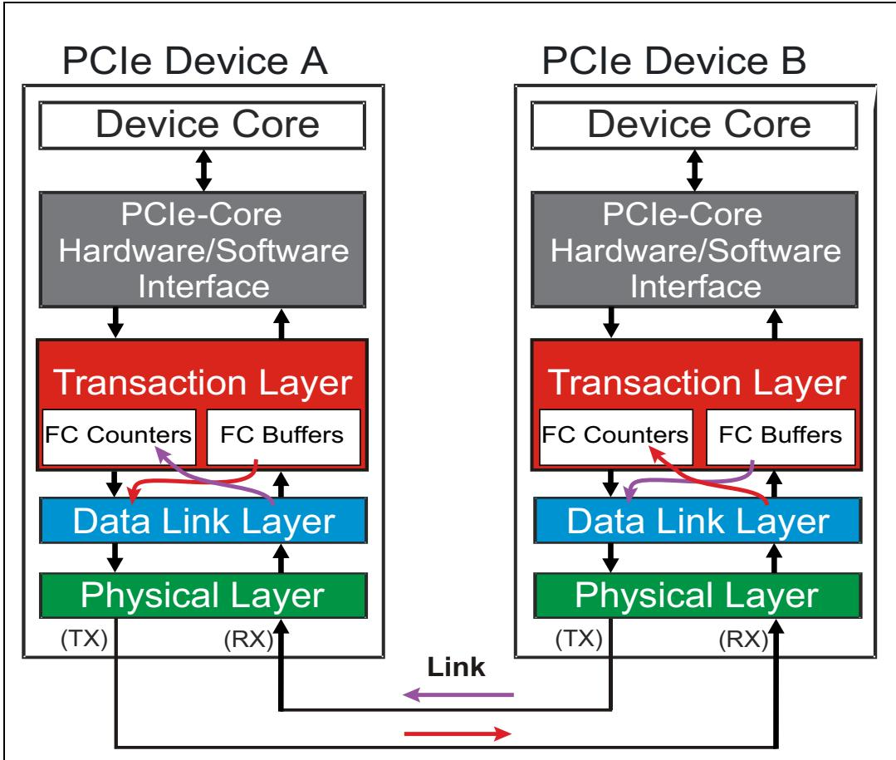

## 6.2 Flow Control Buffers and Credits | 6.2 流控缓冲与信用

<table>
<tr>
<td width="50%">
Flow control buffers are implemented for each VC resource supported by a port. Recall that ports at each end of the Link may not support the same number of VCs, therefore the maximum number of VCs configured and enabled by software is the highest common number between the two ports.
</td>
<td width="50%" style="background-color:#e8e8e8">
流控缓冲是针对端口所支持的每个虚通道（VC）资源而实现的。回顾一下，链路两端的端口可能不支持相同数量的VC，因此由软件配置并使能的VC最大数量是两端端口之间最高的公共数量。
</td>
</tr>
</table>

<table>
<tr>
<td width="50%">
VC Flow Control Buffer Organization
</td>
<td width="50%" style="background-color:#e8e8e8">
虚通道流控缓冲区组织
</td>
</tr>
<tr>
<td width="50%">
Each VC Flow Control buffer at the receiver is managed for each category of transaction flowing through the virtual channel. These categories are:
</td>
<td width="50%" style="background-color:#e8e8e8">
接收端的每个虚通道流控缓冲区按流经该虚通道的事务类别进行管理。这些类别包括：
</td>
</tr>
<tr>
<td width="50%">
Posted Transactions — Memory Writes and Messages
</td>
<td width="50%" style="background-color:#e8e8e8">
Posted 事务 — 存储器写与消息
</td>
</tr>
<tr>
<td width="50%">
Non-Posted Transactions — Memory Reads, Configuration Reads and Writes, and I/O Reads and Writes
</td>
<td width="50%" style="background-color:#e8e8e8">
Non-Posted 事务 — 存储器读、配置读和写、以及 I/O 读和写
</td>
</tr>
<tr>
<td width="50%">
Completions — Read and Write Completions
</td>
<td width="50%" style="background-color:#e8e8e8">
完成报文 — 读和写完成
</td>
</tr>
<tr>
<td width="50%">
In addition, each of these categories is separated into header and data portions for transactions that have both header and data. This yields six different buffers each of which implements its own flow control (see Figure 6-2 on page 218).
</td>
<td width="50%" style="background-color:#e8e8e8">
此外，对于同时具有头部和数据的事务，上述每一类别进一步分为头部部分和数据部分。这样就产生了六个不同的缓冲区，每个缓冲区都实现各自的流控（参见第 218 页的图 6-2）。
</td>
</tr>
<tr>
<td width="50%">
Some transactions, like read requests, consist of a header only while others, like write requests, have both a header and data. The transmitter must ensure that both header and data buffer space is available as needed for a transaction before it can be sent. Note that transaction ordering must be maintained within a VC Flow Control buffer when the transactions are forwarded to software or to an egress port in the case of a switch. Consequently, the receiver must also track the order of header and data components within the buffer.
</td>
<td width="50%" style="background-color:#e8e8e8">
某些事务（如读请求）仅包含头部，而其他事务（如写请求）则同时包含头部和数据。发送端在发送事务之前，必须确保所需的头部缓冲区和数据缓冲区空间都可用。请注意，当事务被转发至软件或在交换机中转发至出口端口时，必须在虚通道流控缓冲区内维护事务排序。因此，接收端还必须跟踪缓冲区内头部和数据组件的顺序。
</td>
</tr>
</table>

Figure 6-2: Flow Control Buffer Organization | 图6-2：流控缓冲组织
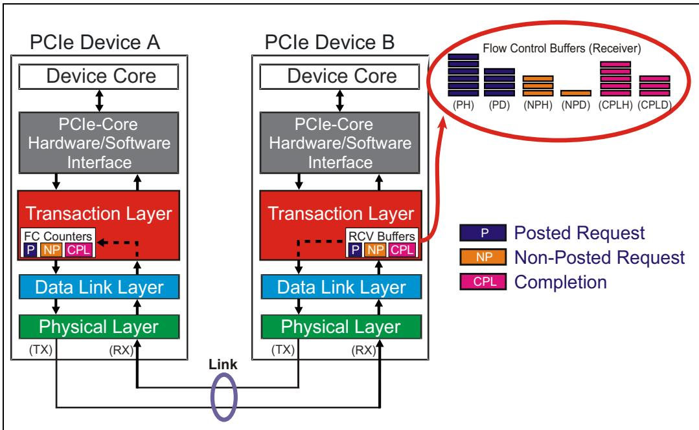

## 6.2.2 Flow Control Credits | 6.2.2 流控信用量

<table>
<tr>
<td width="50%">
Buffer space is reported by the receiver in units called Flow Control credits. The unit value of Flow Control Credits (FCCs) for header and data buffers are:
</td>
<td width="50%" style="background-color:#e8e8e8">
接收端以称为流控信用量的单位报告缓冲空间。报头缓冲和数据缓冲的流控信用量（FCC）单位值如下：
</td>
</tr>
<tr>
<td width="50%">
• Header credits — maximum header size + digest
</td>
<td width="50%" style="background-color:#e8e8e8">
• 报头信用量 — 最大报头大小 + 摘要
</td>
</tr>
<tr>
<td width="50%">
— 4 DWs for completions
</td>
<td width="50%" style="background-color:#e8e8e8">
— 完成报文为 4 个 DW
</td>
</tr>
<tr>
<td width="50%">
— 5 DWs for requests
</td>
<td width="50%" style="background-color:#e8e8e8">
— 请求为 5 个 DW
</td>
</tr>
<tr>
<td width="50%">
• Data credits — 4 DWs (aligned 16 bytes)
</td>
<td width="50%" style="background-color:#e8e8e8">
• 数据信用量 — 4 个 DW（对齐到 16 字节）
</td>
</tr>
<tr>
<td width="50%">
Flow Control DLLPs communicate this information, and do not require Flow Control credits themselves. That's because they originate and terminate at the Link Layer and don't use the Transaction Layer buffers.
</td>
<td width="50%" style="background-color:#e8e8e8">
流控 DLLP 负责传递这些信息，其自身不需要消耗流控信用量。这是因为流控 DLLP 在数据链路层发起并终止，不使用事务层的缓冲。
</td>
</tr>
</table>

## 6.3 Initial Flow Control Advertisement | 6.3 初始流控通告

<table>
<tr>
<td width="50%">
During Flow Control initialization, PCIe devices communicate their buffer sizes by "advertising" their buffer space via flow control credits. PCIe also defines an infinite Flow Control credit value that is required for some buffers. A receiver that advertises infinite buffer space is effectively guaranteeing that its buffer space will never overflow.
</td>
<td width="50%" style="background-color:#e8e8e8">
在流控初始化过程中，PCIe设备通过流控信用量来"通告"其缓冲空间，以此传递自身的缓冲大小信息。PCIe还定义了一个无限流控信用量值，该值对于某些缓冲是必需的。通告了无限缓冲空间的接收器，实际上是在保证其缓冲空间永远不会溢出。
</td>
</tr>
</table>

## 6.3.1 Minimum and Maximum Flow Control Advertisement | 6.3.1 最小和最大流控通告

<table>
<tr>
<td width="50%">
The specification defines the minimum number of credits that can be reported for the different Flow Control buffer types as listed in Table 6‑1. However, devices normally advertise considerably more credits than the minimum. Table 6‑2 on page 220 lists the maximum advertisement allowed by the specification.
</td>
<td width="50%" style="background-color:#e8e8e8">
规范定义了不同类型流控缓冲可报告的最小信用数，如表6-1所列。然而，设备通常通告的信用数远大于最小值。第220页的表6-2列出了规范允许的最大通告值。
</td>
</tr>
</table>

Table 6‑1: Required Minimum Flow Control Advertisements | 表6‑1：所需最小流控通告

<table><tr><td>Credit Type</td><td>Minimum Advertisement</td></tr><tr><td>Posted Request Header (PH)</td><td>1 unit. Credit Value = one 4DW HDR + Digest = 5DW.</td></tr><tr><td>Posted Request Data (PD)</td><td>Largest possible setting of the Max_Payload_Size in credits. Example: If the largest Max_Payload_Size value supported is 1024 bytes, the smallest permitted initial credit value would be 040h.</td></tr><tr><td>Non-Posted Request HDR (NPH)</td><td>1 unit. Credit Value = one 4 DW HDR + Digest = 5DW.</td></tr><tr><td>Non-Posted Request Data (NPD)</td><td>1 unit. Credit Value = 4DW.2 unit. Receivers supporting AtomicOp routing or AtomicOp Completer capability have credit value of 02h</td></tr><tr><td>Completion HDR (CPLH)</td><td>1 unit. Credit Value = one 3DW HDR + Digest = 4DW; for Root Complex with peer-to-peer support and Switches.Infinite units. Initial Credit Value = all 0's for Root Complex with no peer-to-peer support and Endpoints.</td></tr><tr><td>Completion Data (CPLD)</td><td>n unit. Value of largest possible setting of Max_Payload_Size or size of largest Read Request (which ever is smaller) divided by FC Unit Size (4DW); for Root Complex with peer-to-peer support and Switches.Infinite units. Initial Credit Value = all 0's; for Root Complex with no peer-to-peer support and Endpoints.</td></tr></table>

Table 6‑2: Maximum Flow Control Advertisements | 表6‑2：最大流控通告

<table><tr><td>Credit Type</td><td>Maximum Advertisement</td></tr><tr><td>Posted Request Header (PH)</td><td>128 units. 128 credits @ 5 DWs = 2,560 bytes.</td></tr><tr><td>Posted Request Data (PD)</td><td>2048 units. Value of the Max_Payload_Size (4096 bytes) including all functions supported by device (8) divided by the credit size (4 DWs) = 32,768 bytes2048 credits @ 4 DWs = 32,768 bytes</td></tr><tr><td>Non-Posted Request HDR (NPH)</td><td>128 units. 128 credits @ 5 DWs = 2,560 bytes.</td></tr><tr><td>Non-Posted Request Data (NPD)</td><td>The author's could not find a precise value for the maximum number of credits for Non-Posted Data. The maximum number of credits listed for Data is 2048. However, a more reasonable approach might use the Non-Posted header limit of 128 credits, because Non-Posted Data is always associated with Non-Posted Headers.</td></tr><tr><td>Completion HDR (CPLH)</td><td>128 units. 128 credits @ 5 DWs = 2,560 bytes. This in the limit for ports that do not originate transactions (e.g., Root Complex with peer-to-peer support and Switches).Infinite units. Initial Credit Value = all 0's for ports that originate transactions (e.g., Root Complex with no peer-to-peer support and Endpoints).</td></tr><tr><td>Completion Data (CPLD)</td><td>2048 units. Value of the Max_Payload_Size (4096 bytes) including all functions supported by a device (8) divided by the credit size (4 DWs) = 32,768 bytes2048 credits @ 4 DWs = 32,768 bytesInfinite units. Initial Credit Value = all 0's for ports that originate transactions (e.g., Root Complex with no peer-to-peer support and Endpoints).</td></tr></table>

<table>
<tr>
<td width="50%">
Infinite Credits
</td>
<td width="50%" style="background-color:#e8e8e8">
无限信用
</td>
</tr>
<tr>
<td width="50%">
Note that a flow control value of 00h will be understood to mean infinite credits during initialization. Following Flow-Control initialization no further advertisements are made. Devices that originate transactions must reserve buffer space for the data or status information that will return during split transactions. These transaction combinations include:
</td>
<td width="50%" style="background-color:#e8e8e8">
注意，在初始化期间，流控值 00h 将被理解为无限信用。流控初始化完成后，不再进行进一步的信用通告。发起事务的设备必须为在拆分事务期间将返回的数据或状态信息预留缓冲区空间。这些事务组合包括：
</td>
</tr>
<tr>
<td width="50%">
Non-posted Read requests and return of Completion Data
</td>
<td width="50%" style="background-color:#e8e8e8">
非转发读请求与完成数据返回
</td>
</tr>
<tr>
<td width="50%">
Non-posted Read requests and return of Completion Status
</td>
<td width="50%" style="background-color:#e8e8e8">
非转发读请求与完成状态返回
</td>
</tr>
<tr>
<td width="50%">
Non-posted Write requests and return of Completion Status
</td>
<td width="50%" style="background-color:#e8e8e8">
非转发写请求与完成状态返回
</td>
</tr>
</table>

| EN | ZH |
| --- | --- |
| ## Special Use for Infinite Credit Advertisements. | ## 无限信用通告的特殊用途 |
| The specification points out a special consideration for devices that implement only VC0. For example, the only Non-Posted writes are I/O Writes and Configuration Writes both of which are permitted only on VC0. Thus, Non-Posted data buffers are not used for VC1 - VC7 and an infinite value can be advertised for those values. However, the Non-Posted Header must still operate and header credits must still need to be updated. | 规范指出了对于仅实现VC0的设备的特殊考虑。例如，唯一的非发布写入是I/O写入和配置写入，两者都仅在VC0上允许。因此，非发布数据缓冲器不用于VC1-VC7，可以为这些虚通道通告无限值。然而，非发布报头仍必须操作，且报头信用仍需更新。 |

## 6.4 Flow Control Initialization | 6.4 流控初始化

## General | 概述

| EN | ZH |
|---|---|
| Prior to sending any transactions, flow control initialization is needed. In fact, TLPs cannot be sent across the Link until Flow Control Initialization is performed successfully. Initialization occurs on every Link in the system and involves a handshake between the devices at each end of a link. This process begins as soon as the Physical Layer link training has completed. The Link Layer knows the Physical Layer is ready when it observes the LinkUp signal is active, as illustrated in Figure 6-3. | 在发送任何事务之前，需要进行流控初始化。实际上，在流控初始化成功完成之前，TLP无法通过链路发送。初始化在系统中的每条链路上进行，涉及链路两端设备之间的握手。一旦物理层链路训练完成，该过程即开始。当数据链路层观察到LinkUp信号有效时，就知道物理层已就绪，如图6-3所示。 |

Figure 6-3: Physical Layer Reports That It's Ready | 图6-3：物理层报告就绪

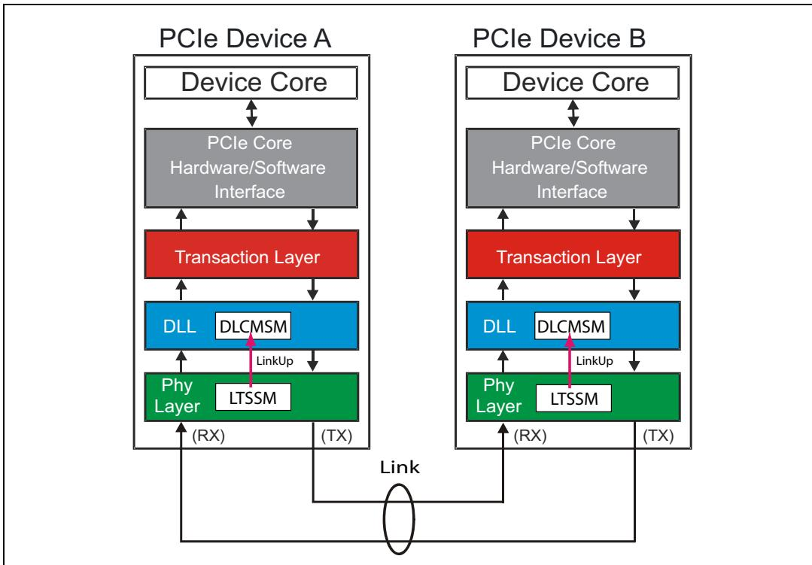

| EN | ZH |
|---|---|
| Once started, the Flow Control initialization process is fundamentally the same for all Virtual Channels and is controlled by hardware once a VC has been enabled. VC0 is always enabled by default, so its initialization is automatic. | 一旦开始，流控初始化过程对于所有虚通道基本相同，并且在虚通道使能后由硬件控制。VC0始终默认使能，因此其初始化是自动的。 |
| That allows configuration transactions to traverse the topology and carry out the enumeration process. Other VCs only initialize when configuration software has set up and enabled them at both ends of the Link. | 这使得配置事务能够遍历整个拓扑结构并执行枚举过程。其他VC仅在配置软件在链路两端设置并使能它们后才进行初始化。 |

## 6.4.1 The FC Initialization Sequence | 6.4.1 FC 初始化序列

| EN | ZH |
|---|---|
| The flow control initialization process involves the Link Layer's DLCMSM (Data Link Control and Management State Machine). As shown in Figure 6-4 on page 223, a reset puts the state machine into the DL_Inactive state. While in the DL_Inactive state, DL_Down is signaled to both the Link and Transaction Layers. Meanwhile, it waits to see LinkUp from the Physical Layer to indicate that the LTSSM has finished its work and the Physical Layer is ready. That causes a transition to the DL_Init sub-state, which contains two stages that handle flow control initialization: FC_INIT1 and FC_INIT2. | 流控初始化过程涉及数据链路层的DLCMSM（数据链路控制与管理状态机）。如第223页图6-4所示，复位使状态机进入DL_Inactive状态。在DL_Inactive状态期间，DL_Down被通知给链路层和事务层。同时，它等待来自物理层的LinkUp信号，以指示LTSSM已完成其工作且物理层已就绪。这导致转换到DL_Init子状态，该子状态包含处理流控初始化的两个阶段：FC_INIT1和FC_INIT2。 |

Figure 6-4: The Data Link Control & Management State Machine | 图6-4：数据链路控制与管理状态机

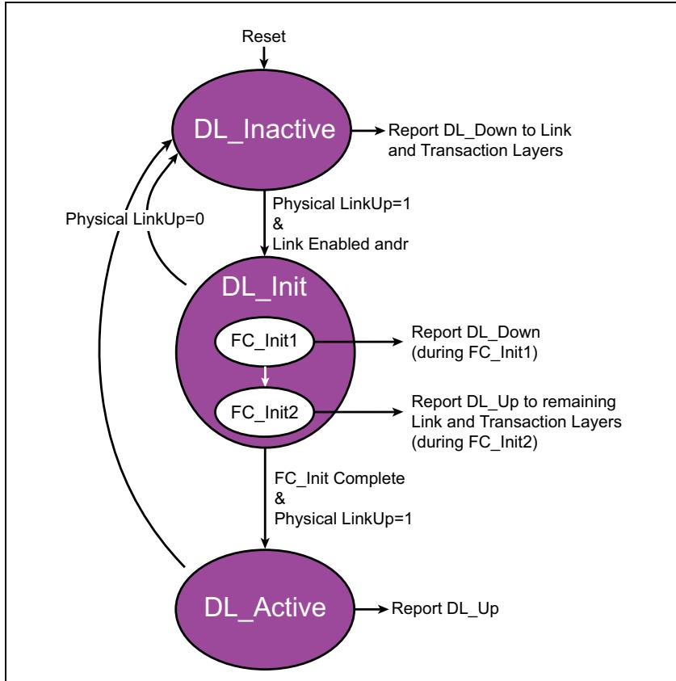

| EN | ZH |
|---|---|
| ## FC\_Init1 Details | ## FC\_Init1 详解 |
| During the FC\_INIT1 state, devices continuously send a sequence of 3 InitFC1 Flow Control DLLPs advertising their receiver buffer sizes (see Figure 6‐5). According to the spec, the packets must be sent in this order: Posted, Nonposted, and Completions as illustrated in Figure 6‐6 on page 225. The specification strongly encourages that these be repeated frequently to make it easier for the receiving device to see them, especially if there are no TLPs or DLLPs to send. | 在 FC\_INIT1 状态下，设备持续发送由 3 个 InitFC1 流控 DLLP 组成的序列，通告其接收缓冲区大小（见图 6‐5）。根据规范，这些报文必须按以下顺序发送：Posted、Nonposted 和 Completions，如第 225 页图 6‐6 所示。规范强烈建议频繁重复发送这些序列，以便接收设备更容易识别到它们，尤其是在没有 TLP 或 DLLP 需要发送时。 |
| Each device should also receive this sequence from its neighbor so it can register the buffer sizes. Once a device has sent its own values and received the complete sequence enough times to be confident that the values were seen correctly, it's ready to exit FC\_INIT1. To do that, it records the received values in its transmit counters, sets an internal flag (FL1), and changes to the FC\_INIT2 state to begin the second initialization step. | 每个设备还应从其链路对端接收该序列，以便记录对方的缓冲区大小。一旦设备发送了自身的值，并足够多次地接收到完整的序列以确保对方已正确收到这些值，即可退出 FC\_INIT1。为此，设备将接收到的值记录到其发送计数器中，设置一个内部标志（FL1），然后切换到 FC\_INIT2 状态以开始第二步初始化。 |

Figure 6‐5: INIT1 Flow Control DLLP Format and Contents | 图6‐5：INIT1流控DLLP格式和内容
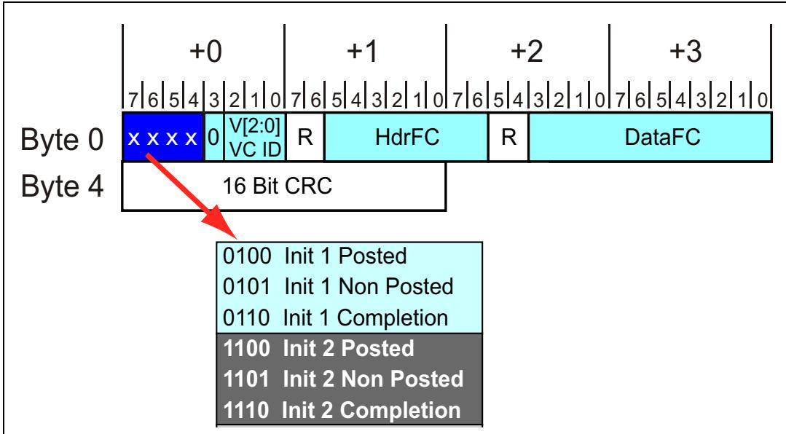

Figure 6‐6: Devices Send InitFC1 in the DL\_Init State | 图6‐6：设备在DL_Init状态下发送InitFC1
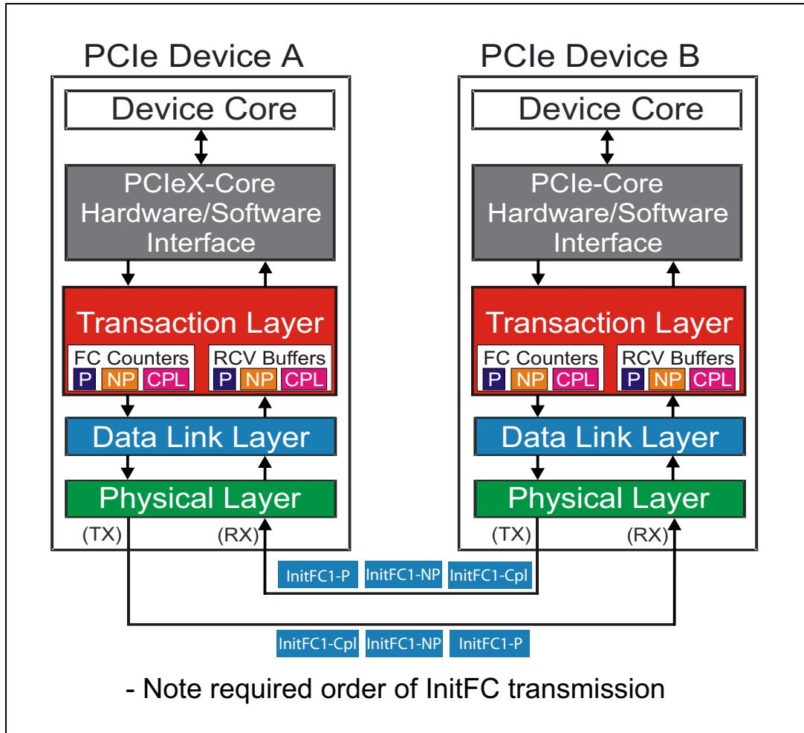

## 6.4.3 FC_Init2 Details | 6.4.3 FC_Init2 详情

<table>
<tr>
<td width="50%">
In this state a device continuously sends InitFC2 DLLPs. These are sent in the same sequence as the InitFC1s and contain the same credit information, but they also confirm that FC initialization has succeeded at the sender. Since the device has already registered the values from the neighbor it doesn't need any more credit information and will ignore any incoming InitFC1s while it waits to see InitFC2s. It can even send TLPs at this point, even though initialization hasn't completed for the other side of the Link, and this is indicated to the Transaction Layer by the DL_Up signal (See Figure 6-7).
</td>
<td width="50%" style="background-color:#e8e8e8">
在此状态中，设备持续发送 InitFC2 DLLP。这些 DLLP 以与 InitFC1 相同的序列发送，包含相同的信用量信息，但它们同时确认发送端的 FC 初始化已成功。由于设备已寄存来自对端的值，它不再需要更多信用量信息，并在等待接收 InitFC2 期间忽略任何传入的 InitFC1。此时设备甚至可以发送 TLP，即使链路另一端的初始化尚未完成，这一点通过 DL_Up 信号向事务层指示（见图 6-7）。
</td>
</tr>
<tr>
<td width="50%">
Why is this second initialization step needed? The simple answer is that neighboring devices may finish FC initialization at different times and this method ensures that the late one will continue to receive the FC information it needs even if the neighbor finishes early. Once a device receives an FC_INIT2 packet for any buffer type, it sets an internal flag (Fl2). (It doesn't wait to receive an FC_Init2 for each type.) Note that FL2 is also set upon receipt of an UpdateFC packet or TLP. When both sides are done and have sent InitFC2s, the DLCMSM transitions to the DL_Active state and the Link Layer is ready for normal operation.
</td>
<td width="50%" style="background-color:#e8e8e8">
为何需要第二个初始化步骤？简单的答案是：相邻设备可能在不同时间完成 FC 初始化，而该方法确保即使对端提前完成，完成较晚的设备仍能持续接收到所需的 FC 信息。一旦设备接收到任意缓冲类型的 FC_INIT2 报文，它将设置一个内部标志 (Fl2)。（它不等待接收每种类型的 FC_Init2。）注意，FL2 在接收到 UpdateFC 报文或 TLP 时也会被设置。当双方均已完成并发送了 InitFC2 后，DLCMSM 转换到 DL_Active 状态，链路层即可进入正常运行。
</td>
</tr>
</table>

Figure 6-7: FC Values Registered - Send InitFC2s, Report DL_Up | 图6-7：注册FC值 - 发送InitFC2，报告DL_Up

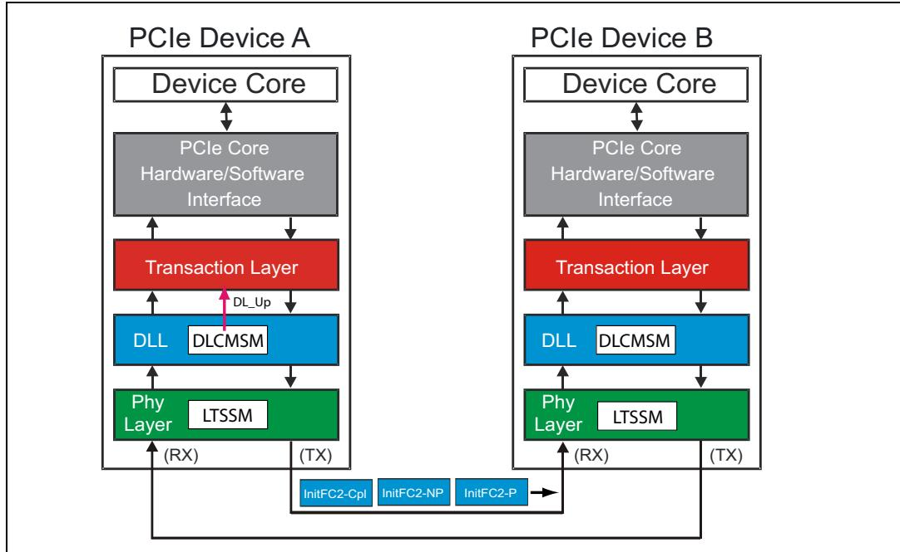

<table>
<tr>
<td width="50%">
**Rate of FC_INIT1 and FC_INIT2 Transmission**
</td>
<td width="50%" style="background-color:#e8e8e8">
**FC_INIT1 与 FC_INIT2 的发送速率**
</td>
</tr>
<tr>
<td width="50%">
The specification defines the latency between sending FC_INIT DLLPs as follows:
</td>
<td width="50%" style="background-color:#e8e8e8">
规范定义了 FC_INIT DLLP 发送间隔的延迟，如下所示：
</td>
</tr>
<tr>
<td width="50%">
**VC0.** Hardware-initiated flow control of VC0 requires that FC_INIT1 and FC_INIT2 packets be transmitted "continuously at the maximum rate possible." That is, the resend timer is set to a value of zero.
</td>
<td width="50%" style="background-color:#e8e8e8">
**VC0.** VC0 的硬件发起流控要求 FC_INIT1 和 FC_INIT2 报文"以最大可能速率连续"发送。即，重发定时器的值设为零。
</td>
</tr>
<tr>
<td width="50%">
**VC1-VC7.** When software initiates flow control initialization for other VCs, the FC_INIT sequence is repeated "when no other TLPs or DLLPs are available for transmission." However, the latency between the beginning of one sequence to the next can be no greater than 17μs.
</td>
<td width="50%" style="background-color:#e8e8e8">
**VC1-VC7.** 当软件发起其他 VC 的流控初始化时，FC_INIT 序列在"没有其他 TLP 或 DLLP 可供发送时"重复。然而，从一个序列开始到下一个序列开始的延迟不得超过 17μs。
</td>
</tr>
</table>

| EN | ZH |
|---|---|
| ## Violations of the Flow Control Initialization Protocol | ## 流控初始化协议违规 |
| A violation of the flow control initialization protocol can be optionally checked by a device. An error detected can be reported as a Data Link Layer protocol error. | 设备可选择检查流控初始化协议的违规行为。检测到的错误可报告为数据链路层协议错误。 |

## 6.5 Introduction to the Flow Control Mechanism | 6.5 流控机制简介

## General | 概述

| EN | ZH |
|---|---|
| The specification defines the requirements of the Flow Control mechanism using registers, counters, and mechanisms for reporting, tracking, and calculating whether a transaction can be sent. These elements are not required and the actual implementation is left to the device designer. This section introduces the specification model and serves to explain the concepts and to define the requirements. | 规范使用寄存器、计数器以及用于报告、跟踪和计算事务是否可发送的机制，定义了流控机制的要求。这些要素并非强制，具体实现由设备设计者自行决定。本节介绍规范模型，用于解释相关概念并定义各项要求。 |

## 6.5.1 The Flow Control Elements | 6.5.1 流控元素

| EN | ZH |
|---|---|
| Figure 6‑8 illustrates the elements used for managing flow control. The diagram shows transactions flowing in a single direction across a Link, and another set of these elements supports transfers in the opposite direction. The primary function of each element is listed below. While these Flow Control elements are duplicated for all six receive buffers, for simplicity this example only deals with non‑posted header flow control. | 图6-8展示了用于管理流控的元素。该图显示了事务在链路上单向流动的情况，另一组相同的元素则支持相反方向的传输。每个元素的主要功能如下所列。虽然这些流控元素对所有六个接收缓冲区都是重复的，但为简化起见，本示例仅涉及非发布请求头的流控。 |
| One final element associated with managing flow control is the Flow Control Update DLLP. This is the only Flow Control packet that is used during normal transmission. The format of the FC Update packet is illustrated in Figure 6‑9 on page 229. | 与管理流控相关的最后一个元素是流控更新DLLP。这是在正常传输过程中使用的唯一流控报文。FC更新报文的格式如图6-9（第229页）所示。 |

Figure 6‑8: Flow Control Elements | 图6‑8：流控元素

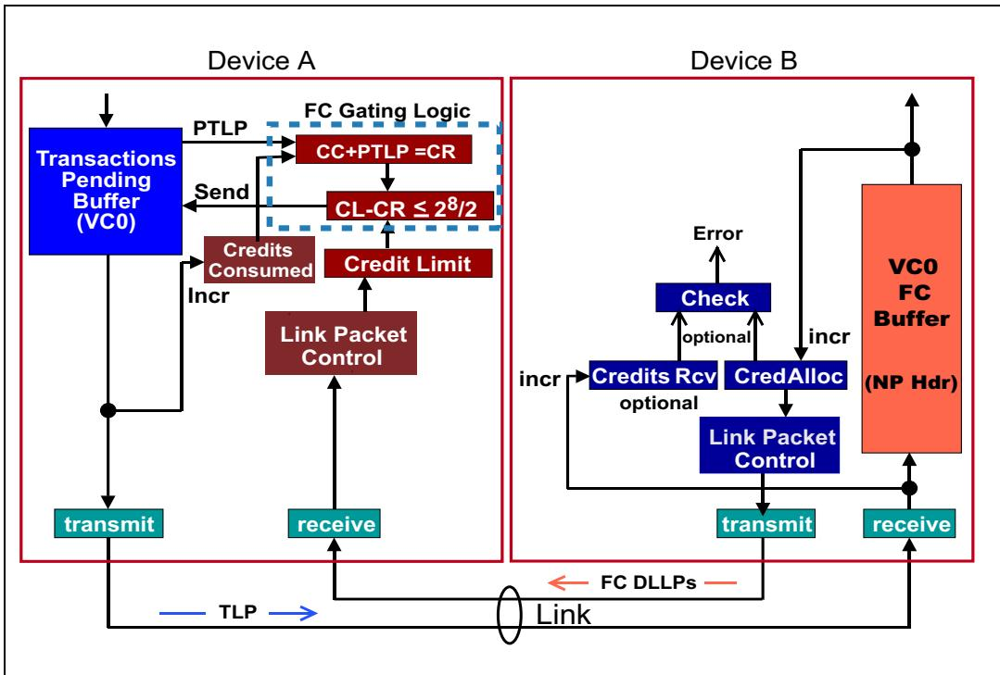

| EN | ZH |
|---|---|
| ## Transmitter Elements | ## 发送器单元 |
| • Transactions Pending Buffer — holds transactions that are waiting to be sent in the same virtual channel. | • 事务待发送缓冲器 — 保存等待在同一虚通道中发送的事务。 |
| • Credits Consumed counter — contains the credit sum of all transactions sent for this buffer. This count is abbreviated "CC." | • 已消耗信用量计数器 — 包含针对该缓冲器已发送的所有事务的信用量总和。该计数值缩写为"CC"。 |
| • Credit Limit counter — initialized by the receiver with the size of the corresponding Flow Control buffer. After initialization, Flow Control update packets are sent periodically to update the Flow Control credits as they become available at the receiver. This value is abbreviated "CL." | • 信用量上限计数器 — 由接收方初始化为相应流控缓冲器的大小。初始化后，流控更新报文被周期性发送，以在接收方有可用流控信用量时更新之。该值缩写为"CL"。 |
| Flow Control Gating Logic — performs the calculations to determine if the receiver has sufficient Flow Control credits to accept the pending TLP (PTLP). In essence, this logic checks that the CREDITS_CONSUMED (CC) plus the credits required for the next Pending TLP (PTLP) does not exceed the CREDIT_LIMIT (CL). This specification defines the following equation for performing the check, with all values represented in credits. | 流控门控逻辑 — 执行计算以确定接收方是否有足够的流控信用量来接受待发送TLP（PTLP）。本质上，该逻辑检查CREDITS_CONSUMED (CC)加上下一个待发送TLP所需信用量是否不超过CREDIT_LIMIT (CL)。本规范定义了以下方程来执行该检查，所有值均以信用量为单位表示。 |

$$
C L - (C C + P T L P) \text { mod } 2 ^ {[ F i e l d S i z e ]} \leq 2 ^ {[ F i e l d S i z e ]} / 2
$$

| EN | ZH |
|---|---|
| For an example application of this equation, See "Stage 1 — Flow Control Following Initialization" on page 230. | 关于该方程的应用示例，请参见第230页的"阶段1 — 初始化后的流控"。 |

## 10.2.2 Receiver Elements | 10.2.2 接收器要素

| EN | ZH |
| --- | --- |
| Flow Control Buffer — stores incoming headers or data. | 流控(Flow Control)缓冲区——存储入队的头部或数据。 |
| Credit Allocated — tracks the total Flow Control credits that have been allocated (made available). It's initialized by hardware to reflect the size of the associated Flow Control buffer. The buffer fills as transactions arrive but then they are eventually removed from the buffer by the core logic at the receiver. When they are removed, the number of Flow Control credits is added to the CREDIT_ALLOCATED counter. Thus the counter tracks the number of credits currently available. | Credit Allocated（已分配信用）——跟踪已分配（已提供）的流控信用总数。由硬件初始化以反映关联流控缓冲区的大小。当事务到达时缓冲区被填充，但随后接收端的核心逻辑会将它们从缓冲区中移除。当它们被移除时，流控信用数被加到CREDIT_ALLOCATED计数器上。因此该计数器跟踪当前可用的信用数。 |
| Credits Received counter (optional) — tracks the total credits of all TLPs received into the Flow Control buffer. When flow control is functioning properly, the CREDITS_RECEIVED count should be equal to or less than the CREDIT_ALLOCATED count. If this test ever becomes false, a flow control buffer overflow has occurred and an error is detected. The spec recommends that this optional mechanism be implemented and notes that a failure here will be considered a fatal error. | Credits Received计数器（可选）——跟踪接收到流控缓冲区中的所有TLP的信用总数。当流控正常工作时，CREDITS_RECEIVED计数值应等于或小于CREDIT_ALLOCATED计数值。若该检查结果为假，则发生了流控缓冲区溢出并检测到错误。规范建议实现该可选机制，并指出此处失效将被视为致命错误(fatal error)。 |

Figure 6‐9: Types and Format of Flow Control DLLPs | 图6‐9：流控DLLP的类型和格式
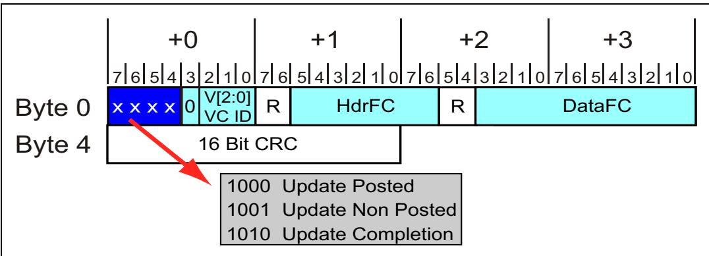

| EN | ZH |
|---|---|
| ## Flow Control Example | ## 流控示例 |
| The following example describes the non‑posted header Flow Control buffer, and attempts to capture the nuances of the flow control implementation in several situations. The discussion of Flow Control is described with a series of basic stages as follows: | 下面的示例描述非发布头流控缓冲区，并试图捕捉几种情况下流控实现的细微差别。流控的讨论通过一系列基本阶段来描述，如下所示： |
| Stage One — Immediately following initialization a transaction is transmitted and tracked to explain the basic operation of the counters and registers. | 阶段一 — 紧跟初始化之后，发送并跟踪一个事务，以解释计数器和寄存器的基本操作。 |
| Stage Two — The transmitter sends transactions faster than the receiver can process them and the buffer becomes full. | 阶段二 — 发送端发送事务的速度快于接收端处理它们的能力，缓冲区变满。 |
| Stage Three — When counters roll over to zero, the mechanism still works but there are a couple of issues to consider. | 阶段三 — 当计数器归零回绕时，该机制仍然有效，但有几个问题需要考虑。 |
| Stage Four — The optional receiver error check for a buffer overflow. | 阶段四 — 针对缓冲区溢出的可选接收端错误检查。 |

| EN | ZH |
|---|---|
| ## Stage 1 — Flow Control Following Initialization | ## 阶段1 — 初始化后的流控 |
| Once flow control initialization has completed, the devices are ready for normal operation. The Flow Control buffer in our example is 2KB in size. We're describing the non‑posted header buffer, and each credit is 5 dwords in size or 20 bytes. That means 102d (66h) Flow Control units are available. Figure 6‑10 on page 231 illustrates the elements involved, including the values that would be in each counter and register following flow control initialization. | 一旦流控初始化完成，设备即可进入正常运行。本例中的流控缓冲区大小为2KB。我们描述的是非发布头缓冲区，每个信用量大小为5个dword（即20字节）。这意味着有102d（66h）个流控单元可用。第231页的图6‑10展示了相关元素，包括流控初始化后各计数器和寄存器中的值。 |
| When the transmitter is ready to send a TLP, it must first check Flow Control credits. Our example is simple because a non‑posted header is the only packet being sent and it always requires just one Flow Control credit, and we are also assuming that no data is included in the transaction. | 当发送端准备发送TLP时，必须先检查流控信用量。本例很简单，因为仅发送一个非发布头报文，且始终只需一个流控信用量，同时我们假定该事务中不包含数据。 |
| The header credit check is made using unsigned arithmetic (2's complement), and must satisfy the following formula: | 头信用量检查使用无符号算术运算（二进制补码），必须满足以下公式： |
| $$ C L - (C C + P T L P) m o d 2 ^ {[ F i e l d S i z e ]} \leq 2 ^ {[ F i e l d S i z e ]} / 2 $$ | $$ C L - (C C + P T L P) m o d 2 ^ {[ F i e l d S i z e ]} \leq 2 ^ {[ F i e l d S i z e ]} / 2 $$ |
| Substituting values from Figure 6‑10 yields: | 代入图6‑10的值得到： |
| $$ 6 6 h - (0 0 h + 0 1 h) \text { mod } 2 ^ {8} \leq 2 ^ {8} / 2 $$ | $$ 6 6 h - (0 0 h + 0 1 h) \text { mod } 2 ^ {8} \leq 2 ^ {8} / 2 $$ |
| $$ 6 6 h - 0 1 h \mod 2 5 6 \leq 8 0 h $$ | $$ 6 6 h - 0 1 h \mod 2 5 6 \leq 8 0 h $$ |
| In this case, the current CREDITS\_CONSUMED count (CC) is added to the PTLP credits required, to determine the CREDITS\_REQUIRED (CR), and that gives 00h + 01h = 01h. The CREDITS\_REQUIRED count is subtracted from the CREDIT\_LIMIT count (CL) to determine whether or not sufficient credits are available. | 在此情况下，当前CREDITS\_CONSUMED计数（CC）与所需PTLP信用量相加，得到CREDITS\_REQUIRED（CR），即00h + 01h = 01h。从CREDIT\_LIMIT计数（CL）中减去CREDITS\_REQUIRED计数，以确定是否有足够的信用量可用。 |
| The following description incorporates a brief review of 2's complement subtraction. When performing subtraction using 2's complement the number to be subtracted is complemented (1's complement) and 1 is added (2's complement). This value is then added to the number from which we wish to subtract. Any carry due to the addition is dropped. | 以下描述简要回顾了二进制补码减法。使用补码执行减法时，先对要减的数取反（1的补码），再加1（2的补码）。然后将该值加到被减数上。相加产生的进位被丢弃。 |
| Credit Check: | 信用量检查： |
| ```txt CL 01100110b (66h) - CR 00000001b (01h) = n ``` | ```txt CL 01100110b (66h) - CR 00000001b (01h) = n ``` |
| CR is converted to 2's complement: | CR转换为二进制补码： |
| ```txt 00000001b (CR) 11111110b (CR inverted) 11111110b +1 11111111b (2's complement) ``` | ```txt 00000001b (CR) 11111110b (CR inverted) 11111110b +1 11111111b (2's complement) ``` |
| 2's complement added to CL: | 补码加到CL： |
| ```txt 01100110 (CL) 11111111 (2's complement of CR) 01100101 = 65h (carry bit is dropped) ``` | ```txt 01100110 (CL) 11111111 (2's complement of CR) 01100101 = 65h (carry bit is dropped) ``` |
| Is result <= 80h? Yes. If the subtraction result is equal to or less than half the max value, which is tracked with a modulo 256 counter (128), then we know there is sufficient space in the receiver buffer and this packet can be sent. The decision to use only half the counter value avoids a potential count alias problem. See "Stage 3 — Counters Roll Over" on page 234. | 结果是否 <= 80h？是。如果减法结果小于或等于最大值的一半（使用模256计数器即128），则可知接收端缓冲区有足够的空间，可以发送该报文。仅使用计数器值的一半来决策，可避免潜在的计数别名问题。参见第234页的"阶段3 — 计数器翻转"。 |
| ```txt CL 01100111 (67) CR 10011001 add 2's complement of 67 00000000 = 00h<=80h (true, send transaction ``` | ```txt CL 01100111 (67) CR 10011001 add 2's complement of 67 00000000 = 00h<=80h (true, send transaction ``` |

Figure 6‑10: Flow Control Elements Following Initialization | 图6‑10：初始化后的流控元素

Figure 6‑11: Flow Control Elements After First TLP Sent | 图6‑11：发送首个TLP后的流控元素
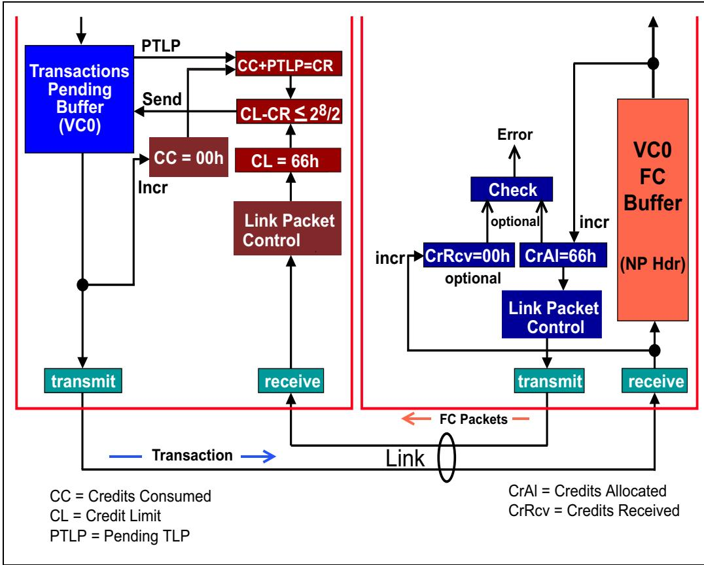

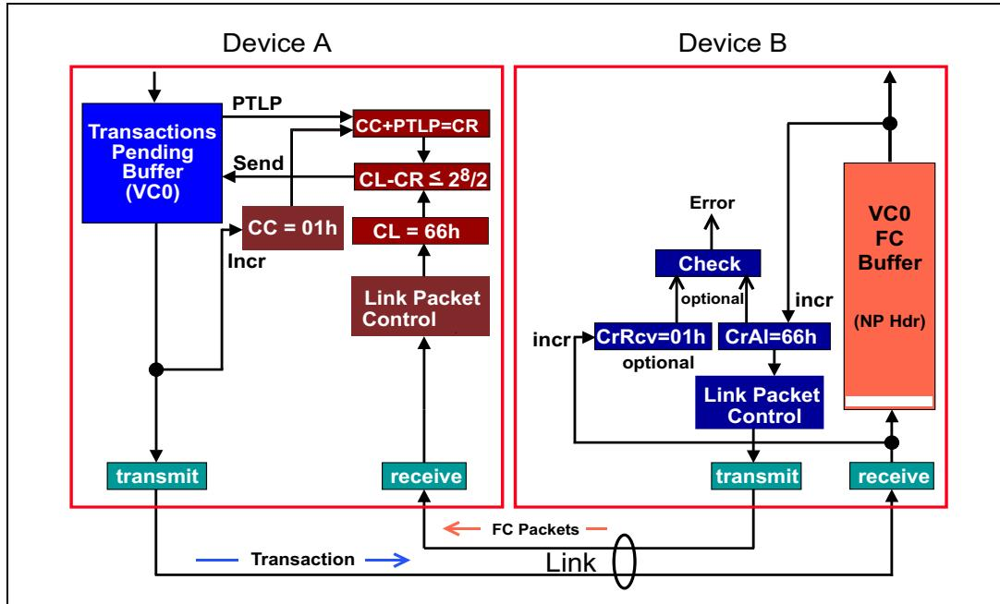

## Stage 2 — Flow Control Buffer Fills Up | 阶段2 — 流控缓冲器填满

| EN | ZH |
|---|---|
| Assume now that the receiver has been unable to remove transactions from the Flow Control buffer for some time. Perhaps the device core logic was temporarily busy and unable to process transactions. Eventually, the Flow Control buffer becomes completely full, as shown in Figure 6‐12 on page 234. If the transmitter wishes to send another TLP and checks the Flow Control credits: | 现在假设接收方已经有一段时间无法从流控缓冲器中移除事务。可能是设备核心逻辑暂时繁忙，无法处理事务。最终，流控缓冲器完全填满，如图6‐12所示（第234页）。如果发送方希望发送另一个TLP并检查流控信用量： |
| Credit Limit (CL) = 66h<br>Credits Required (CR) = 67h<br>CL 01100110 (66) | Credit Limit (CL) = 66h<br>Credits Required (CR) = 67h<br>CL 01100110 (66) |
| ```txt<br>CR 10011001 (add 2's complement of 67h)<br>11111111 = FFh<=80h (not true; don't send packet)<br>``` | ```txt<br>CR 10011001 (add 2's complement of 67h)<br>11111111 = FFh<=80h (not true; don't send packet)<br>``` |
| This channel is blocked until an Update Flow Control DLLP is received with a new CREDIT\_LIMIT value of 67h or greater. When the new valued is loaded into the CL register the transmitter credit check will pass the test and a TLP can be sent. | 该通道被阻塞，直到收到一个带有新的CREDIT\_LIMIT值（67h或更大）的更新流控DLLP。当新值被加载到CL寄存器后，发送方的信用量检查将可通过测试，并可以发送TLP。 |

Figure 6‐12: Flow Control Elements with Flow Control Buffer Filled | 图6‐12：流控缓冲已满时的流控元素
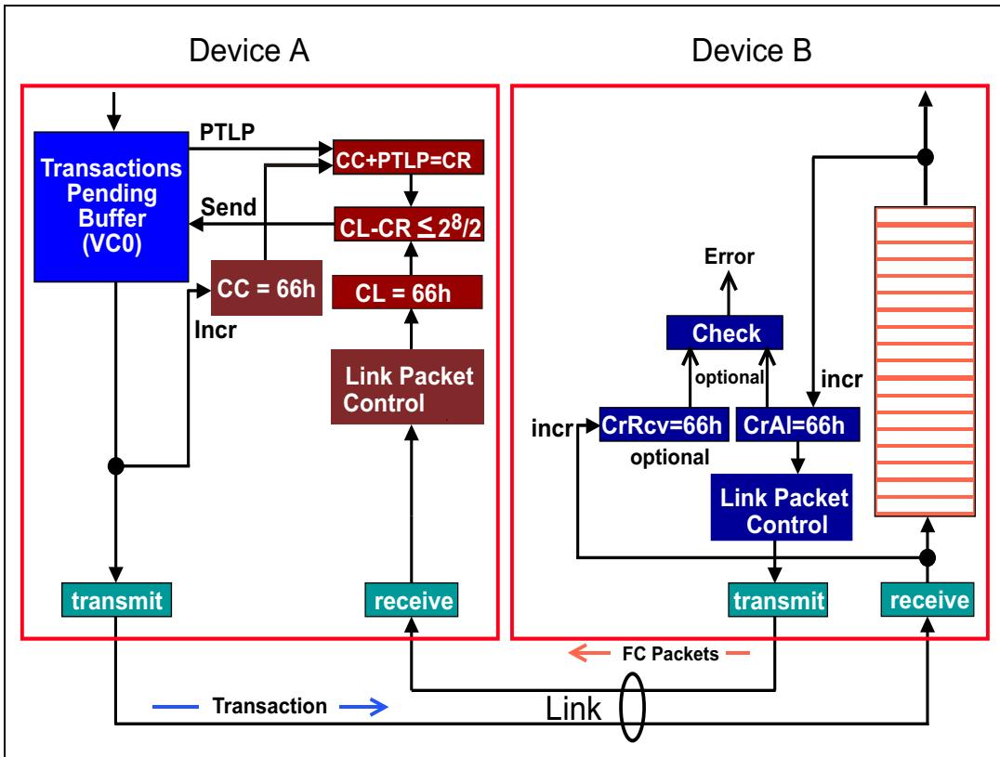

## Stage 3 — Counters Roll Over | 阶段3 — 计数器回绕

| EN | ZH |
|---|---|
| Since the Credit Limit (CL) and Credits Required (CR) counts only increment upward, they eventually roll over back to zero. When CL rolls over and CR has not, the credit check (CL‐CR) results in a small CL value and a large CR value. However, what might appear to be a problem is not when using unsigned arithmetic. As described in the previous examples the results are handled correctly when performing 2's complement subtraction. Figure 6‐13 on page 235 shows the CL and CR counts before and after CL rollover along with the 2's complement results. | 由于信用额度(CL)和所需信用量(CR)计数只递增，它们最终会回绕到零。当CL回绕而CR尚未回绕时，信用量检查(CL-CR)会得到小的CL值和大的CR值。然而，在使用无符号算术时，看似问题的情况实际上并非问题。如前例所述，执行2的补码减法时，结果会被正确处理。图6‐13（第235页）显示了CL回绕前后CL和CR的计数值以及2的补码结果。 |

Figure 6‐13: Flow Control Rollover Problem | 图6‐13：流控翻转问题
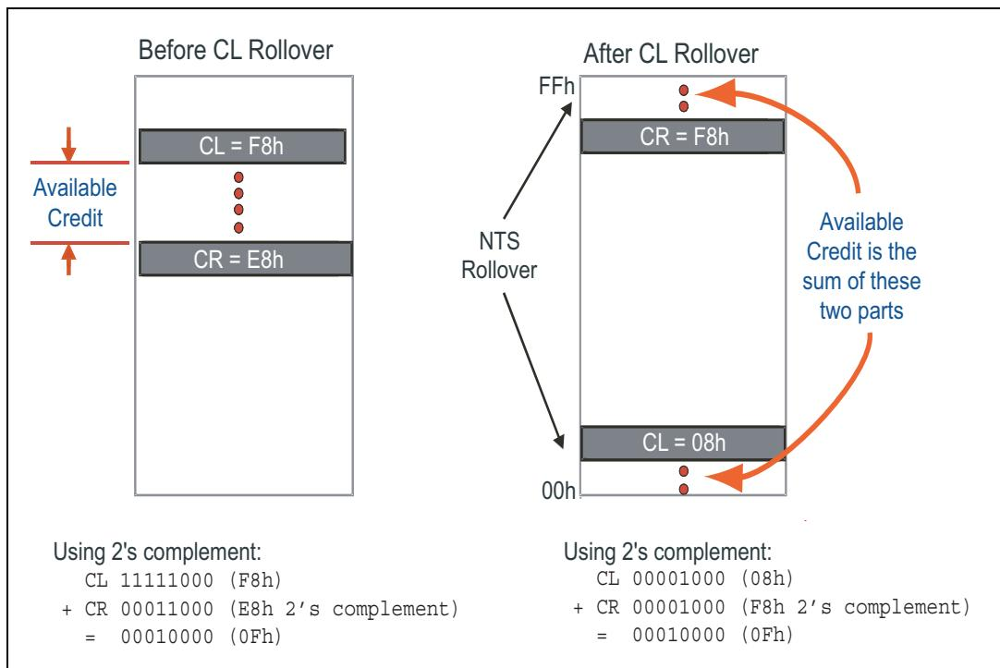

| EN | ZH |
| --- | --- |
| ## Stage 4 — FC Buffer Overflow Error Check<br><br>Although it's optional to do so, the specification recommends implementation of the FC buffer overflow error checking mechanism. Figure 6-14 on page 236 shows the elements associated with the overflow error check that include: | ## 第4阶段——FC缓冲区溢出错误检查<br><br>虽然这是可选的，但规范建议实现FC缓冲区溢出错误检查机制。第236页的图6-14显示了与溢出错误检查相关的元素，包括： |
| • Credits Received (CR) counter<br><br>• Credits Allocated (CA) counter<br><br>• Error Check Logic | • 已接收信用量(CR)计数器<br><br>• 已分配信用量(CA)计数器<br><br>• 错误检查逻辑 |
| This permits the receiver to track Flow Control credits in the same manner as the transmitter. If flow control is working correctly, the transmitter's Credits Consumed count will never exceed its Credit Limit, and the receiver's Credits Received count will never exceed its Credits Allocated count. | 这使得接收方能够以与发送方相同的方式跟踪流控信用量。如果流控工作正常，发送方的已消耗信用量计数永远不会超过其信用量限制，并且接收方的已接收信用量计数永远不会超过其已分配信用量计数。 |
| An overflow condition is detected if the following formula evaluates true. Note that the field size is either 8 (headers) or 12 (data): | 如果以下公式计算结果为真，则表示检测到溢出条件。注意，字段大小为8（头部）或12（数据）： |
| $$(C A - C R) \text { mod } 2 ^ {[ F i e l d S i z e ]} > 2 ^ {[ F i e l d S i z e ]} / 2$$ | $$(C A - C R) \text { mod } 2 ^ {[ F i e l d S i z e ]} > 2 ^ {[ F i e l d S i z e ]} / 2$$ |
| If it does evaluate true, then more credits have been sent to the FC buffer than were available and an overflow has occurred. Note that the 1.0a version of the specification defines the equation as ≥ rather than > as shown above. That appears to be an error, because when CA = CR no overflow condition exists. | 如果确实评估为真，则表明发送到FC缓冲区的信用量超过了可用信用量，发生了溢出。注意，1.0a版本的规范将公式定义为≥而不是上面所示的>。这似乎是一个错误，因为当CA=CR时不存在溢出条件。 |

Figure 6-14: Buffer Overflow Error Check | 图6-14：缓冲溢出错误检查  

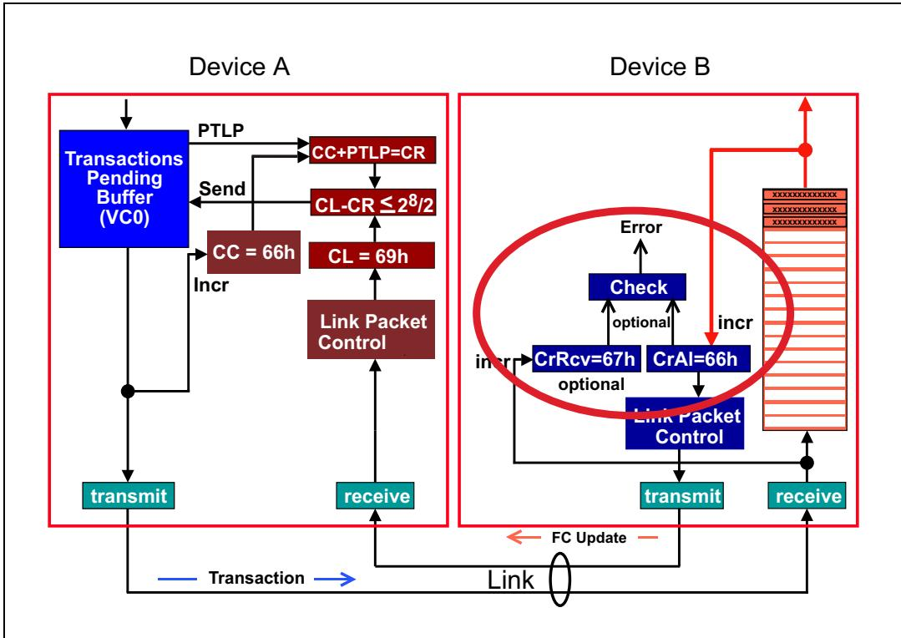

## 6.7 Flow Control Updates | 6.7 流控更新

| EN | ZH |
|---|---|
| The receiver must regularly update its neighboring device with Flow Control credits that become available when transactions are removed from the buffer. Figure 6-15 on page 238 illustrates an example where the transmitter was previously blocked from sending header transactions because the buffer was full. In the illustration, the receiver has just removed three headers from the Flow Control buffer. More space is now available, but the neighboring device is unaware of this. As headers are removed from the buffer, the CREDITS_ALLOCATED count increments from 66h to 69h. This new count is reported to the CREDIT_LIMIT register of the neighboring device using a Flow Control update packet. Once the credit limit has been updated, transmission of additional TLPs can proceed. | 接收方必须定期将其新释放的流控信用量（当事务从缓冲区中移除时变得可用）更新给相邻设备。第238页的图6-15示出了一个示例：发送方此前因缓冲区满而被阻塞，无法发送头标事务。在图中，接收方刚刚从流控缓冲区中移除了三个头标。现在有更多空间可用，但相邻设备并不知道这一点。当头标从缓冲区中移除时，CREDITS_ALLOCATED 计数从 66h 递增到 69h。该新计数值通过一个流控更新包报告给相邻设备的 CREDIT_LIMIT 寄存器。一旦信用量门限被更新，就可以继续传输更多的 TLP。 |
| An interesting note here is that the update reports the actual value of the Credits Allocated register. It would have worked to report just the change in the register, as perhaps "+3 credits on NP Headers" for example, but that represents a potential problem. To understand the risk, consider what would happen if the DLLP containing that increment information was lost for some reason. There is no replay mechanism for DLLPs; if an error occurs the packet is simply dropped. In this case, the increment information would be lost without a means of recovering it. | 这里有一个值得注意的要点：更新报告的是 Credits Allocated 寄存器的实际值。仅报告寄存器的变化量（例如"NP 头标 +3 信用量"）本也可行，但这存在潜在问题。为了理解其中的风险，请考虑如果包含该增量信息的 DLLP 因某种原因丢失会发生什么。DLLP 没有重播机制；如果发生错误，该报文会被直接丢弃。在这种情况下，增量信息将丢失且无法恢复。 |
| If, on the other hand, the actual value of the register is reported instead and the DLLP fails, the next DLLP that succeeds will get the counters back in synchronization. In that case some time might be wasted if the transmitter is waiting on the FC credits before it can send the next TLP, but no information is lost. | 反之，如果改为报告寄存器的实际值，并且 DLLP 传输失败，那么下一个成功传输的 DLLP 将使计数器重新同步。在这种情况下，如果发送方正在等待 FC 信用量才能发送下一个 TLP，则可能会浪费一些时间，但不会丢失任何信息。 |

Figure 6-15: Flow Control Update Example | 图6-15：流控更新示例

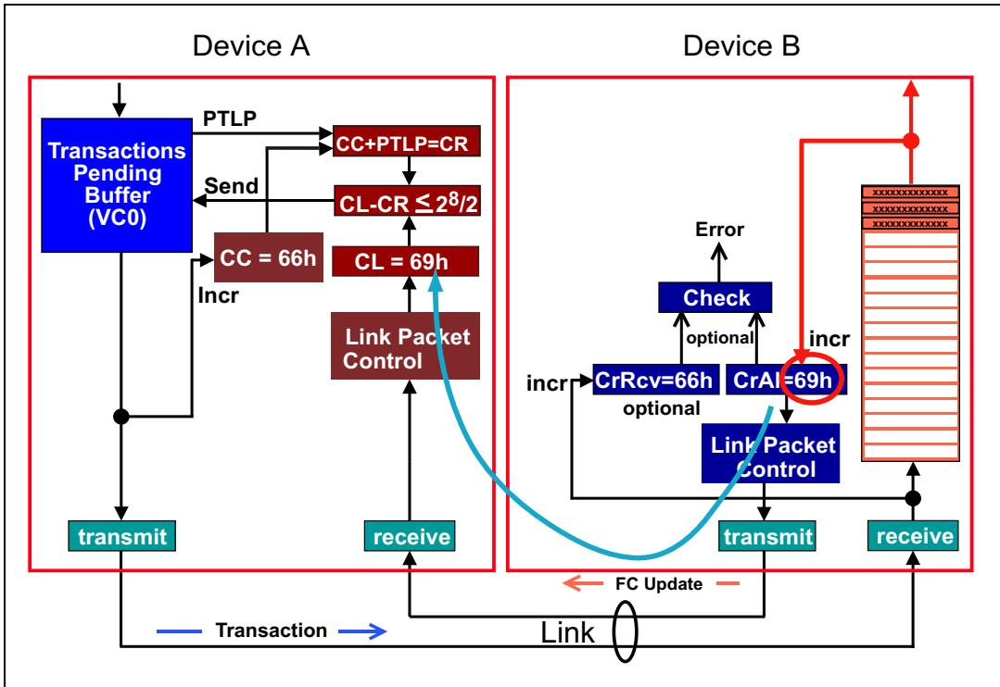

## FC_Update DLLP 格式与内容

| EN | ZH |
|---|---|
| Recall that Flow Control update packets, like the Flow Control initialization packets, contain two credit fields, one for header and one for data, as shown in Figure 6‐16 on page 239. The receiver’s credit values reported in the HdrFC and DataFC fields may have been updated many times or not at all since the last update packet was sent. | 回想一下，流控更新报文（Flow Control update packets）与流控初始化报文一样，包含两个信用量字段，一个用于头标，一个用于数据，如第239页的图6‐16所示。自上次发送更新报文以来，接收方在 HdrFC 和 DataFC 字段中报告的信用量值可能已更新多次，也可能根本未更新。 |

Figure 6‐16: Update Flow Control Packet Format and Contents | 图6‐16：更新流控数据包格式和内容
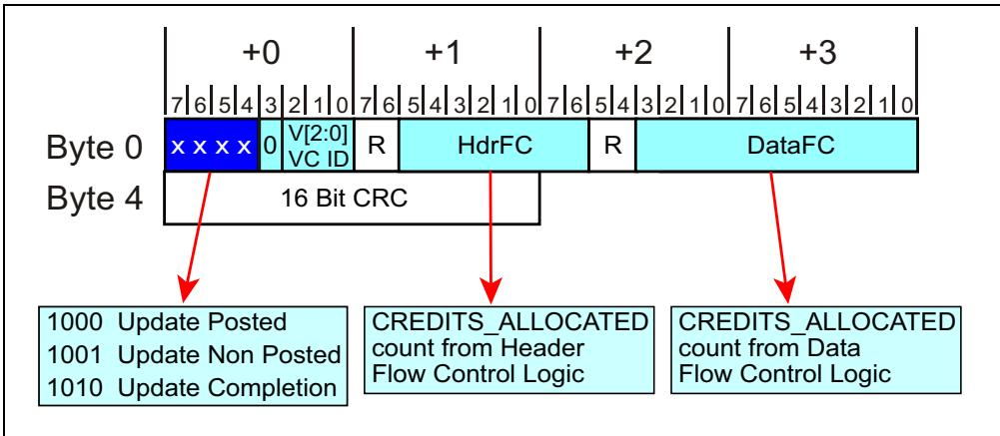

| EN | ZH |
|---|---|
| ## Flow Control Update Frequency | ## 流控更新频率 |
| The specification defines a variety of rules and suggested implementations that govern when and how often Flow Control Update DLLPs should be sent. These are motivated by a desire to: | 规范定义了一系列规则和建议的实现方式，用于管控何时以及以何种频率发送流控更新DLLP。这些规则基于以下考虑： |
| Notify the transmitting device as early as possible about new credits allocated, especially if any transactions were previously blocked. | 尽可能早地将新分配的信用通知给发送设备，特别是当之前有事务被阻塞时。 |
| • Establish worst‑case latency between FC Packets. | • 确定流控报文之间的最差情况延迟。 |
| • Balance the requirements associated with flow control operation, such as: | • 平衡与流控操作相关的各种需求，例如： |
| — the need to report credits often enough to prevent transaction blocking | — 需要足够频繁地报告信用，以防止事务被阻塞 |
| — the desire to reduce the Link bandwidth needed for FC\_Update DLLPs | — 希望减少FC\_Update DLLP所需的链路带宽 |
| — selecting the optimum buffer size | — 选择最优的缓冲区大小 |
| — selecting the maximum data payload size | — 选择最大的数据有效载荷大小 |
| • Detect violations of the maximum latency between Flow Control packets. | • 检测流控报文之间最大延迟的违规情况。 |
| Flow Control updates are permitted only when the Link is in the active state (L0 or L0s). All other Link states represent more aggressive power management that have longer recovery latencies. | 流控更新仅在链路处于活动状态（L0或L0s）时才被允许。所有其他链路状态代表更激进的电源管理策略，具有更长的恢复延迟。 |

| EN | ZH |
|----|----|
| ## Immediate Notification of Credits Allocated | ## 已分配信用量的即时通知 |
| When a Flow Control buffer is so full that maximum‐sized packets cannot be sent, the spec requires immediate delivery of a FC_Update DLLP when more space becomes available. Two cases exist: | 当流控缓冲区的可用空间不足以发送最大尺寸的数据包时，规范要求在出现更多可用空间时立即发送 FC_Update DLLP。存在两种情况： |

| EN | ZH |
|---|---|
| ## PCI Express Technology | ## PCI Express 技术 |
| Maximum Packet Size = 1 Credit. When packet transmission is blocked due to a buffer full condition for non‑infinite NPH, NPD, PH, and CPLH buffer types, an UpdateFC packet must be scheduled for Transmission when one or more credits are made available (allocated) for that buffer type. | 最大包大小 = 1 个信用量。当对于非无限的 NPH、NPD、PH 和 CPLH 缓冲类型，由于缓冲区满导致包传输被阻塞时，一旦为该缓冲类型分配（使其可用）一个或多个信用量，就必须调度一个 UpdateFC 包进行传输。 |
| Maximum Packet Size = Max\_Payload\_Size. Flow Control buffer space may decrease to the extent that a maximum‑sized packet cannot be sent for non‑infinite PD and CPLD credit types. In this case, when one or more additional credits are allocated, an Update FCP must be scheduled for transmission. | 最大包大小 = Max\_Payload\_Size。对于非无限的 PD 和 CPLD 信用类型，流控缓冲区空间可能减少到无法发送最大尺寸包的程度。在这种情况下，当分配一个或多个额外信用量时，必须调度一个 Update FCP 进行传输。 |

| EN | ZH |
|----|----|
| ## Maximum Latency Between Update Flow Control DLLPs | ## 更新流控DLLP之间的最大延迟 |
| The transmission frequency of Update FCPs for each FC credit type (non-infinite) must be scheduled for transmission at least once every 30 μs (-0%/+50%). If the Extended Sync bit within the Control Link register is set, updates must be scheduled no later than every 120 μs (-0%/+50%). Note that Update FCPs may be scheduled for transmission more frequently than is required. | 对于每种FC信用类型（非无限），更新FCP的发送频率必须调度为至少每30 μs发送一次（-0%/+50%）。如果控制链路寄存器中的Extended Sync位被置位，则更新必须调度为不迟于每120 μs发送一次（-0%/+50%）。请注意，更新FCP的调度发送频率可以高于所要求的频率。 |

## 根据有效载荷大小和链路宽度计算更新频率

| EN | ZH |
|---|---|
| The specification offers a formula for calculating the frequency at which update packets need to be sent for maximum data payload sizes and Link widths. The formula, shown below, defines FC Update delivery intervals in symbol times. For reference, a symbol time is defined as the time it takes to deliver one symbol: 4ns for Gen1, 2ns for Gen2, 1ns for Gen3. Table 6‑3, Table 6‑4 and Table 6‑5 show the unadjusted FC Update values for each speed. | 规范提供了一个公式，用于计算在最大数据有效载荷大小和链路宽度下需要发送更新包的频率。如下所示的公式以符号时间定义了FC更新交付间隔。作为参考，一个符号时间定义为传输一个符号所需的时间：Gen1为4ns，Gen2为2ns，Gen3为1ns。表6‑3、表6‑4和表6‑5显示了每种速度下未调整的FC更新值。 |

$$
\frac {(M a x P a y l o a d S i z e + T L P O v e r h e a d) \times U p d a t e F a c t o r}{L i n k W i d t h} + I n t e r n a l D e l a y
$$

| EN | ZH |
|---|---|
| MaxPayloadSize = The value in the Max\_Payload\_Size field of the Device Control register | MaxPayloadSize = 设备控制寄存器中Max\_Payload\_Size字段的值 |
| TLPOverhead = the constant value (28 symbols) representing the additional TLP components that consume Link bandwidth (TLP Prefix, Sequence Number, Packet Header, LCRC, Framing Symbols) | TLPOverhead = 常量值（28个符号），表示消耗链路带宽的额外TLP组件（TLP前缀、序列号、包头、LCRC、帧标志） |
| UpdateFactor = the number of maximum size TLPs sent during the interval between UpdateFC Packets received. This number is intended to balance Link bandwidth efficiency and receive buffer sizes – the value varies with Max\_Payload\_Size and Link width | UpdateFactor = 在接收到UpdateFC包的时间间隔内发送的最大尺寸TLP的数量。该数字旨在平衡链路带宽效率和接收缓冲区大小——该值随Max\_Payload\_Size和链路宽度变化 |
| • LinkWidth = The number of Lanes the Link is using | • LinkWidth = 链路正在使用的通道数 |
| InternalDelay = a constant value of 19 symbol times that represents the internal processing delays for received TLPs and transmitted DLLPs | InternalDelay = 常量值19个符号时间，表示接收TLP和发送DLLP的内部处理延迟 |

| EN | ZH |
|---|---|
| The relationship defined by the formula shows that the frequency of update packet delivery decreases as the Linkwidth increases and suggests a timer that triggers scheduling of update packets. Note that this formula does not account for delays associated with the receiver or transmitter being in the L0s power management state. | 公式定义的关系表明，更新包交付频率随着链路宽度增加而降低，并暗示存在一个触发更新包调度的定时器。请注意，该公式未考虑接收器或发射器处于L0s电源管理状态所带来的延迟。 |

Table 6‑3: Gen1 Unadjusted AckNak_LATENCY_TIMER Values (Symbol Times) | 表6‑3：Gen1未调整的AckNak_LATENCY_TIMER值（符号时间）

<table><tr><td>Max Payload</td><td>x1Link</td><td>x2Link</td><td>x4Link</td><td>x8Link</td><td>x12Link</td><td>x16Link</td><td>x32Link</td></tr><tr><td>128 Bytes</td><td>237UF=1.4</td><td>128UF=1.4</td><td>73UF=1.4</td><td>67UF=2.5</td><td>58UF=3.0</td><td>48UF=3.0</td><td>33UF=3.0</td></tr><tr><td>256 Bytes</td><td>416FC=1.4</td><td>217FC=1.4</td><td>118UF=1.4</td><td>107UF=2.5</td><td>90UF=3.0</td><td>72UF=3.0</td><td>45UF=3.0</td></tr><tr><td>512 Bytes</td><td>559UF=1.0</td><td>289UF=1.0</td><td>154UF=1.0</td><td>86UF=1.0</td><td>109UF=2.0</td><td>86UF=2.0</td><td>52UF=2.0</td></tr><tr><td>1024 Bytes</td><td>1071UF=1.0</td><td>545UF=1.0</td><td>282UF=1.0</td><td>150UF=1.0</td><td>194UF=2.0</td><td>150UF=2.0</td><td>84UF=2.0</td></tr><tr><td>2048 Bytes</td><td>2095UF=1.0</td><td>1057UF=1.0</td><td>538UF=1.0</td><td>278UF=1.0</td><td>365UF=2.0</td><td>278UF=2.0</td><td>148UF=2.0</td></tr><tr><td>4096 Bytes</td><td>4143UF=1.0</td><td>2081UF=1.0</td><td>1050UF=1.0</td><td>534UF=1.0</td><td>706UF=2.0</td><td>534UF=2.0</td><td>276UF=2.0</td></tr></table>

Table 6‑4: Gen2 Unadjusted AckNak_LATENCY_TIMER Values (Symbol Times) | 表6‑4：Gen2未调整的AckNak_LATENCY_TIMER值（符号时间）

<table><tr><td>Max Payload</td><td>x1Link</td><td>x2Link</td><td>x4Link</td><td>x8Link</td><td>x12Link</td><td>x16Link</td><td>x32Link</td></tr><tr><td>128 Bytes</td><td>288UF=1.4</td><td>179UF=1.4</td><td>124UF=1.4</td><td>118UF=2.5</td><td>109UF=3.0</td><td>99UF=3.0</td><td>84UF=3.0</td></tr><tr><td>256 Bytes</td><td>467FC=1.4</td><td>268FC=1.4</td><td>169UF=1.4</td><td>158UF=2.5</td><td>141UF=3.0</td><td>123UF=3.0</td><td>96UF=3.0</td></tr><tr><td>512 Bytes</td><td>610UF=1.0</td><td>340UF=1.0</td><td>205UF=1.0</td><td>137UF=1.0</td><td>160UF=2.0</td><td>137UF=2.0</td><td>103UF=2.0</td></tr><tr><td>1024 Bytes</td><td>1122UF=1.0</td><td>596UF=1.0</td><td>333UF=1.0</td><td>201UF=1.0</td><td>245UF=2.0</td><td>201UF=2.0</td><td>135UF=2.0</td></tr><tr><td>2048 Bytes</td><td>2146UF=1.0</td><td>1108UF=1.0</td><td>589UF=1.0</td><td>329UF=1.0</td><td>416UF=2.0</td><td>329UF=2.0</td><td>199UF=2.0</td></tr><tr><td>4096 Bytes</td><td>4194UF=1.0</td><td>2132UF=1.0</td><td>1101UF=1.0</td><td>585UF=1.0</td><td>757UF=2.0</td><td>585UF=2.0</td><td>327UF=2.0</td></tr></table>

Table 6‑5: Gen3 Unadjusted AckNak_LATENCY_TIMER Values (Symbol Times) | 表6‑5：Gen3未调整的AckNak_LATENCY_TIMER值（符号时间）

<table><tr><td>Max Payload</td><td>x1 Link</td><td>x2 Link</td><td>x4 Link</td><td>x8 Link</td><td>x12 Link</td><td>x16 Link</td><td>x32 Link</td></tr><tr><td>128 Bytes</td><td>333UF=1.4</td><td>224UF=1.4</td><td>169UF=1.4</td><td>163UF=2.5</td><td>154UF=3.0</td><td>144UF=3.0</td><td>129UF=3.0</td></tr><tr><td>256 Bytes</td><td>512FC=1.4</td><td>313FC=1.4</td><td>214UF=1.4</td><td>203UF=2.5</td><td>186UF=3.0</td><td>168UF=3.0</td><td>141UF=3.0</td></tr><tr><td>512 Bytes</td><td>655UF=1.0</td><td>385UF=1.0</td><td>250UF=1.0</td><td>182UF=1.0</td><td>205UF=2.0</td><td>182UF=2.0</td><td>148UF=2.0</td></tr><tr><td>1024 Bytes</td><td>1167UF=1.0</td><td>641UF=1.0</td><td>378UF=1.0</td><td>246UF=1.0</td><td>290UF=2.0</td><td>246UF=2.0</td><td>180UF=2.0</td></tr><tr><td>2048 Bytes</td><td>2191UF=1.0</td><td>1153UF=1.0</td><td>643UF=1.0</td><td>374UF=1.0</td><td>461UF=2.0</td><td>374UF=2.0</td><td>244UF=2.0</td></tr><tr><td>4096 Bytes</td><td>4239UF=1.0</td><td>2177UF=1.0</td><td>1146UF=1.0</td><td>630UF=1.0</td><td>802UF=2.0</td><td>630UF=2.0</td><td>372UF=2.0</td></tr></table>

| EN | ZH |
|---|---|
| The specification recognizes that the formula will be inadequate for many applications such as those that stream large blocks of data. These applications may require buffer sizes larger than the minimum specified, as well as a more sophisticated update policy in order to optimize performance and reduce power consumption. Because a given solution is dependent on the particular requirements of an application, no definition for such policies is provided. | 规范承认该公式对于许多应用（例如流式传输大数据块的应用）是不足够的。这些应用可能需要大于规定最小值的缓冲区大小，以及更复杂的更新策略，以优化性能并降低功耗。由于特定解决方案取决于应用的具体需求，因此未提供此类策略的定义。 |

| EN | ZH |
|---|---|
| ## Error Detection Timer — A Pseudo Requirement | ## 错误检测定时器——一个伪要求 |
| The specification defines an optional time‑out mechanism for Flow Control packets that is highly recommended and may become a requirement in future versions of the specification. The maximum latency between FC packets for a given credit type is 120μs, and this timeout has a maximum limit of 200μs. A separate timer is implemented for each FC credit type (P, NP, Cpl), and each timer is reset when a FC Update DLLP of the corresponding type is received. Note that a timer associated with infinite FC credit values must not report an error. | 规范为流控报文定义了一种可选的超时机制，该机制被强烈推荐，并可能在未来版本的规范中成为一项要求。对于给定信用类型，FC报文之间的最大延迟为120μs，该超时的最大限制为200μs。每种FC信用类型（P、NP、Cpl）都实现了独立的定时器，每个定时器在收到相应类型的FC Update DLLP时复位。注意，与无限FC信用值相关联的定时器不得报告错误。 |
| Apart from the infinite case, a timeout implies a serious problem with the Link. If it occurs, the Physical Layer is signaled to go into the Recovery state and retrain the Link in hopes of clearing the error condition. Timer characteristics include: | 除无限情况外，超时意味着链路存在严重问题。如果发生超时，物理层被通知进入Recovery状态并重新训练链路，以期清除错误状况。定时器特性包括： |
| • Operates only when the Link is in an active state (L0 or L0s). | • 仅在链路处于活动状态（L0或L0s）时运行。 |
| • Max time limited to 200 μs (‐0%/+50%) | • 最大时间限制为200 μs（-0%/+50%） |
| • Timer is reset when any Init or Update FCP is received, or optionally by receipt of any DLLP. | • 收到任何Init或Update FCP时定时器复位，或者可选地在收到任何DLLP时复位。 |
| Timeout forces the Physical Layer to enter Link Training and Status State Machine (LTSSM) Recovery state. | 超时强制物理层进入链路训练和状态状态机（LTSSM）Recovery状态。 |