# Ch07_Quality_of_Service

<table style="border-collapse:collapse;width:100%" cellpadding="4" cellspacing="0" rules="all" frame="border">
  <thead>
    <tr>
      <th width="50%" style="border:2px solid #000;background:#f5f5f5;padding:4px 8px;">EN</th>
      <th width="50%" style="border:2px solid #000;background-color:#e8e8e8;padding:4px 8px;">中文</th>
    </tr>
  </thead>
  <tbody>
    <tr><td width="50%" style="border:2px solid #000; background:#fff;padding:4px 8px;"># Quality of Service</td><td width="50%" style="border:2px solid #000; background-color:#e8e8e8;padding:4px 8px;"># 服务质量</td></tr>
    <tr><td width="50%" style="border:2px solid #000; background:#fff;padding:4px 8px;">## The Previous Chapter</td><td width="50%" style="border:2px solid #000; background-color:#e8e8e8;padding:4px 8px;">## 前一章</td></tr>
    <tr><td width="50%" style="border:2px solid #000; background:#fff;padding:4px 8px;">The previous chapter discusses the purposes and detailed operation of the Flow Control Protocol. Flow control is designed to ensure that transmitters never send Transaction Layer Packets (TLPs) that a receiver can't accept. This prevents receive buffer over‑runs and eliminates the need for PCI‑style inefficiencies like disconnects, retries, and wait‑states.</td><td width="50%" style="border:2px solid #000; background-color:#e8e8e8;padding:4px 8px;">前一章讨论了流控协议的目的和详细操作。流控旨在确保发送方绝不会发送接收方无法接受的事务层数据包（TLP）。这防止了接收缓冲区溢出，并消除了 PCI 风格的低效机制（如断开连接、重试和等待状态）的必要性。</td></tr>
  </tbody>
</table>

## This Chapter | 本章

<table style="border-collapse:collapse;width:100%" cellpadding="4" cellspacing="0" rules="all" frame="border">
  <thead>
    <tr>
      <th width="50%" style="border:2px solid #000;background:#f5f5f5;padding:4px 8px;">EN</th>
      <th width="50%" style="border:2px solid #000;background-color:#e8e8e8;padding:4px 8px;">中文</th>
    </tr>
  </thead>
  <tbody>
    <tr><td width="50%" style="border:2px solid #000; background:#fff;padding:4px 8px;">This chapter discusses the mechanisms that support Quality of Service and describes the means of controlling the timing and bandwidth of different packets traversing the fabric. These mechanisms include application-specific software that assigns a priority value to every packet, and optional hardware that must be built into each device to enable managing transaction priority.</td><td width="50%" style="border:2px solid #000; background-color:#e8e8e8;padding:4px 8px;">本章讨论支持服务质量的机制，并描述控制穿过交换结构的不同数据包时序和带宽的方法。这些机制包括为每个数据包分配优先级值的应用特定软件，以及必须内置于每个设备中以实现事务优先级管理的可选硬件。</td></tr>
    <tr><td width="50%" style="border:2px solid #000; background:#fff;padding:4px 8px;">## The Next Chapter</td><td width="50%" style="border:2px solid #000; background-color:#e8e8e8;padding:4px 8px;">## 下一章</td></tr>
    <tr><td width="50%" style="border:2px solid #000; background:#fff;padding:4px 8px;">The next chapter discusses the ordering requirements for transactions in a PCI Express topology. These rules are inherited from PCI. The Producer/Consumer programming model motivated many of them, so its mechanism is described here. The original rules also took into consideration possible deadlock conditions that must be avoided.</td><td width="50%" style="border:2px solid #000; background-color:#e8e8e8;padding:4px 8px;">下一章讨论PCI Express拓扑结构中事务的排序要求。这些规则继承自PCI。其中许多规则源于生产者/消费者（Producer/Consumer）编程模型，因此本节将描述其机制。原始规则还考虑了必须避免的死锁情况。</td></tr>
  </tbody>
</table>

## 7.1 Motivation | 7.1 动机

<table style="border:1px solid #ddd;border-collapse:collapse; width:100%;" cellpadding="4" cellspacing="0" rules="all" frame="border">
  <thead style="border:1px solid #ddd;">
    <tr>
      <th width="50%" style="border:1px solid #ddd; background:#f5f5f5;">EN</th>
      <th width="50%" style="border:1px solid #ddd; background-color:#e8e8e8;">中文</th>
    </tr>
  </thead>
  <tbody>
    <tr><td width="50%" style="border:1px solid #ddd; background:#fff;padding:4px 8px;">Many computer systems today don't include mechanisms to manage bandwidth for peripheral traffic, but there are some applications that need it. One example is streaming video across a general-purpose data bus, that requires data be delivered at the right time. In embedded guidance control systems timely delivery of video data is also critical to system operation. Foreseeing those needs, the original PCIe spec included Quality of Service (QoS) mechanisms that can give preference to some traffic flows. The broader term for this is</td><td width="50%" style="border:1px solid #ddd; background-color:#e8e8e8;padding:4px 8px;">如今许多计算机系统并未包含管理外设流量带宽的机制，但有些应用确实需要这种能力。一个例子是通过通用数据总线传输流式视频，这要求数据在正确的时间送达。在嵌入式制导控制系统中，视频数据的及时传递对系统运行同样至关重要。预见到这些需求，原始PCIe规范包含了服务质量（QoS）机制，可以为某些流量流提供优先处理。与此相关的更广泛术语是</td></tr>
    <tr><td width="50%" style="border:1px solid #ddd; background:#fff;padding:4px 8px;">Differentiated Service, since packets are treated differently based on an assigned priority and it allows for a wide range of service preferences. At the high end of that range, QoS can provide predictable and guaranteed performance for applications that need it. That level of support is called "isochronous" service, a term derived from the two Greek words "isos" (equal) and "chronos" (time) that together mean something that occurs at equal time intervals. To make that work in PCIe requires both hardware and software elements.</td><td width="50%" style="border:1px solid #ddd; background-color:#e8e8e8;padding:4px 8px;">区分服务（Differentiated Service），即根据分配的优先级对数据包进行不同处理，从而允许广泛的服务偏好选择。在该范围的高端，QoS可以为需要它的应用提供可预测且有保障的性能。这种支持级别称为"等时"（isochronous）服务，该术语源自两个希腊词"isos"（相等）和"chronos"（时间），合在一起意指按相等时间间隔发生的事情。要在PCIe中实现这一点，需要硬件和软件两方面的支持。</td></tr>
  </tbody>
</table>

## 7.2 Basic Elements | 7.2 基本要素

<table style="border:1px solid #ddd;border-collapse:collapse; width:100%;" cellpadding="4" cellspacing="0" rules="all" frame="border">
  <thead style="border:1px solid #ddd;">
    <tr>
      <th width="50%" style="border:1px solid #ddd; background:#f5f5f5;">EN</th>
      <th width="50%" style="border:1px solid #ddd; background-color:#e8e8e8;">中文</th>
    </tr>
  </thead>
  <tbody>
    <tr><td width="50%" style="border:1px solid #ddd; background:#fff;padding:4px 8px;">Supporting high levels of service places requirements on system performance. For example, the transmission rate must be high enough to deliver sufficient data within a time frame that meets the demands of the application while accommodating competition from other traffic flows. In addition, the latency must be low enough to ensure timely arrival of packets and avoid delay problems. Finally, error handling must be managed so that it doesn't interfere with timely packet delivery. Achieving these goals requires some specific hardware elements, one of which is a set of configuration registers called the Virtual Channel Capability Block as shown in Figure 7‐1.</td><td width="50%" style="border:1px solid #ddd; background-color:#e8e8e8;padding:4px 8px;">支持高水平的服务对系统性能提出了要求。例如，传输速率必须足够高，以在满足应用需求的时间范围内传送足够的数据，同时容纳来自其他流量流的竞争。此外，延迟必须足够低，以确保数据包及时到达并避免延迟问题。最后，错误处理必须加以管理，使其不干扰数据包的及时传送。实现这些目标需要一些特定的硬件元素，其中之一是一组称为虚通道能力块的配置寄存器，如图7‐1所示。</td></tr>
  </tbody>
</table>

Figure 7‐1: Virtual Channel Capability Registers | 图7‐1：虚拟通道能力寄存器  
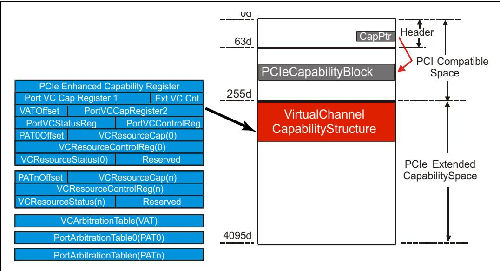

## 7.2.1 Traffic Class (TC) | 7.2.1 流量类（TC）

<table style="border:1px solid #ddd;border-collapse:collapse; width:100%;" cellpadding="4" cellspacing="0" rules="all" frame="border">
  <thead style="border:1px solid #ddd;">
    <tr>
      <th width="50%" style="border:1px solid #ddd; background:#f5f5f5;">EN</th>
      <th width="50%" style="border:1px solid #ddd; background-color:#e8e8e8;">中文</th>
    </tr>
  </thead>
  <tbody>
    <tr><td width="50%" style="border:1px solid #ddd; background:#fff;padding:4px 8px;">The first thing we need is a way to differentiate traffic; something to distinguish which packets have high priority. This is accomplished by designating Traffic Classes (TCs) that define eight priorities specified by a 3-bit TC field within each TLP header (with ascending priority; TC 0-7). The 32-bit memory request header in Figure 7-2 reveals the location of the TC field. During initialization, the device driver communicates the level of services to the isochronous management software, which returns the appropriate TC values to use for each type of packet. The driver then assigns the correct TC priority for the packet. The TC value defaults to zero so packets that don't need priority service won't accidentally interfere with those that do.</td><td width="50%" style="border:1px solid #ddd; background-color:#e8e8e8;padding:4px 8px;">我们首先需要一种区分流量的方法，用于识别哪些数据包具有高优先级。这通过指定流量类（TC）来实现，TC由每个TLP包头中的3位TC字段定义了八个优先级（优先级递增；TC 0-7）。图7-2中的32位存储器请求包头展示了TC字段的位置。在初始化期间，设备驱动程序将服务等级告知等时管理软件，后者返回适用于每种数据包类型的TC（流量类）值。然后驱动程序为数据包分配正确的TC优先级。TC（流量类）值默认为零，这样不需要优先级服务的数据包就不会意外干扰需要优先级服务的数据包。</td></tr>
  </tbody>
</table>

Figure 7-2: Traffic Class Field in TLP Header | 图7-2：TLP头中的流量类别字段

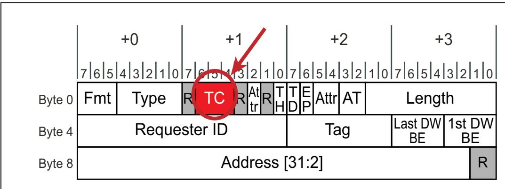

<table style="border:1px solid #ddd;border-collapse:collapse; width:100%;" cellpadding="4" cellspacing="0" rules="all" frame="border">
  <thead style="border:1px solid #ddd;">
    <tr>
      <th width="50%" style="border:1px solid #ddd; background:#f5f5f5;">EN</th>
      <th width="50%" style="border:1px solid #ddd; background-color:#e8e8e8;">中文</th>
    </tr>
  </thead>
  <tbody>
    <tr><td width="50%" style="border:1px solid #ddd; background:#fff;padding:4px 8px;">Configuration software that's unaware of PCIe won't recognize the new registers and will use the default TC0/VC0 combination for all transactions. In addition, there are some packets that are always required to use TC0/VC0, including Configuration, I/O, and Message transactions. If these packets are thought of as maintenance-level traffic, then it makes sense that they would need to be confined to VC0 and kept out of the path of high-priority packets.</td><td width="50%" style="border:1px solid #ddd; background-color:#e8e8e8;padding:4px 8px;">不了解PCIe的配置软件无法识别这些新寄存器，并将对所有事务使用默认的TC0/VC0组合。此外，有些数据包始终要求使用TC0/VC0，包括配置事务、I/O事务和消息事务。如果将这些数据包视为维护级流量，那么将它们限制在VC0中并使其远离高优先级数据包的路径也就合情合理了。</td></tr>
  </tbody>
</table>

<table style="border:1px solid #ddd;border-collapse:collapse; width:100%;" cellpadding="4" cellspacing="0" rules="all" frame="border">
  <thead style="border:1px solid #ddd;">
    <tr>
      <th width="50%" style="border:1px solid #ddd; background:#f5f5f5;">EN</th>
      <th width="50%" style="border:1px solid #ddd; background-color:#e8e8e8;">中文</th>
    </tr>
  </thead>
  <tbody>
    <tr><td width="50%" style="border:1px solid #ddd; background:#fff;padding:4px 8px;">## Virtual Channels (VCs)</td><td width="50%" style="border:1px solid #ddd; background-color:#e8e8e8;padding:4px 8px;">## 虚通道 (VC)</td></tr>
    <tr><td width="50%" style="border:1px solid #ddd; background:#fff;padding:4px 8px;">VCs are hardware buffers that act as queues for outgoing packets. Each port must include the default VC0, but may have as many as eight (from VC0 to VC7). Each channel represents a different path available for outgoing packets.</td><td width="50%" style="border:1px solid #ddd; background-color:#e8e8e8;padding:4px 8px;">VC是作为发送数据包队列的硬件缓冲区。每个端口必须包含默认的VC0，但可以有最多八个（从VC0到VC7）。每个通道代表一条可供发送数据包的不同路径。</td></tr>
    <tr><td width="50%" style="border:1px solid #ddd; background:#fff;padding:4px 8px;">The motivation for multiple paths is analogous to that of a toll road in which drivers purchase a radio tag that lets them take one of several high priority lanes at the toll booth. Those who don't purchase a tag can still use the road but they'll have to stop at the booth and pay cash each time they go through, and that takes longer. If there was only one path, everyone's access time would be limited by the slowest driver, but having multiple paths available means that those who have priority are not delayed by those who don't.</td><td width="50%" style="border:1px solid #ddd; background-color:#e8e8e8;padding:4px 8px;">多路径的动机类似于收费公路，司机购买电子标签后便可在收费站使用若干高优先级车道之一。未购买标签的司机仍可使用公路，但每次通过时必须停车现金缴费，耗时更长。如果只有一条路径，所有人的通行时间都将受限于最慢的司机，而拥有多条路径则意味着有优先权的司机不会因无优先权的司机而延误。</td></tr>
  </tbody>
</table>

## 7.2.1.1 Assigning TCs to each VC — TC/VC Mapping | 7.2.1.1 为每个 VC（虚通道） 分配 TC（流量类） — TC/VC 映射

<table style="border:1px solid #ddd;border-collapse:collapse; width:100%;" cellpadding="4" cellspacing="0" rules="all" frame="border">
  <thead style="border:1px solid #ddd;">
    <tr>
      <th width="50%" style="border:1px solid #ddd; background:#f5f5f5;">EN</th>
      <th width="50%" style="border:1px solid #ddd; background-color:#e8e8e8;">中文</th>
    </tr>
  </thead>
  <tbody>
    <tr><td width="50%" style="border:1px solid #ddd; background:#fff;padding:4px 8px;">The Traffic Class value assigned to each packet travels unchanged to the destination and must be mapped to a VC at each service point as it traverses the path to the target. VC mapping is specific to a Link and can change from one Link to another. Configuration software establishes this association during initialization using the TC/VC Map field of the VC Resource Control Register. This 8‑bit field permits TC values to be mapped to a selected VC, where each bit position represents the corresponding TC value (bit 0 = TC0, bit 1 = TC1, etc.). Setting a bit assigns the corresponding TC value to the VC ID. Figure 7‑3 on page 249 shows a mapping example where TC0 and TC1 are mapped to VC0 and TC2:TC4 are mapped to VC3.</td><td width="50%" style="border:1px solid #ddd; background-color:#e8e8e8;padding:4px 8px;">分配给每个报文的流量类(TC)值在到达目的地前保持不变，并且在报文前往目标的路径上，必须在每个服务点将其映射到一个虚通道(VC)。VC映射是特定于一条链路的，可以在不同链路之间改变。配置软件在初始化期间通过VC资源控制寄存器中的TC/VC映射字段建立这种关联。该8位字段允许将TC（流量类）值映射到所选的VC，其中每个位位置代表相应的TC（流量类）值（位0 = TC0，位1 = TC1，以此类推）。置位某位即将对应的TC（流量类）值分配给该VC ID。第249页的图7‑3展示了一个映射示例，其中TC0和TC1映射到VC0，TC2:TC4映射到VC3。</td></tr>
    <tr><td width="50%" style="border:1px solid #ddd; background:#fff;padding:4px 8px;">Software has a great deal of flexibility in assigning VC IDs and mapping the TCs, but there are some rules regarding the TC/VC mapping:</td><td width="50%" style="border:1px solid #ddd; background-color:#e8e8e8;padding:4px 8px;">软件在分配VC ID和映射TC方面具有很大的灵活性，但TC/VC映射有一些规则：</td></tr>
    <tr><td width="50%" style="border:1px solid #ddd; background:#fff;padding:4px 8px;">• TC/VC mapping must be identical for the two ports attached on either end of the same Link.</td><td width="50%" style="border:1px solid #ddd; background-color:#e8e8e8;padding:4px 8px;">• 同一链路两端的两个端口的TC/VC映射必须相同。</td></tr>
    <tr><td width="50%" style="border:1px solid #ddd; background:#fff;padding:4px 8px;">• TC0 will automatically be mapped to VC0.</td><td width="50%" style="border:1px solid #ddd; background-color:#e8e8e8;padding:4px 8px;">• TC0将自动映射到VC0。</td></tr>
    <tr><td width="50%" style="border:1px solid #ddd; background:#fff;padding:4px 8px;">• Other TCs may be mapped to any VC.</td><td width="50%" style="border:1px solid #ddd; background-color:#e8e8e8;padding:4px 8px;">• 其他TC可映射到任何VC。</td></tr>
    <tr><td width="50%" style="border:1px solid #ddd; background:#fff;padding:4px 8px;">• A TC may not be mapped to more than one VC.</td><td width="50%" style="border:1px solid #ddd; background-color:#e8e8e8;padding:4px 8px;">• 一个TC不得映射到多个VC。</td></tr>
    <tr><td width="50%" style="border:1px solid #ddd; background:#fff;padding:4px 8px;">The number of virtual channels used depends on the greatest capability shared by the two devices attached to a given link. Software assigns an ID for each VC and maps one or more TCs to the VCs.</td><td width="50%" style="border:1px solid #ddd; background-color:#e8e8e8;padding:4px 8px;">所使用的虚通道数量取决于连接到给定链路的两个设备所共有的最大能力。软件为每个VC分配一个ID，并将一个或多个TC映射到这些VC。</td></tr>
  </tbody>
</table>

Figure 7‑3: TC to VC Mapping Example | 图7‑3：TC到VC映射示例

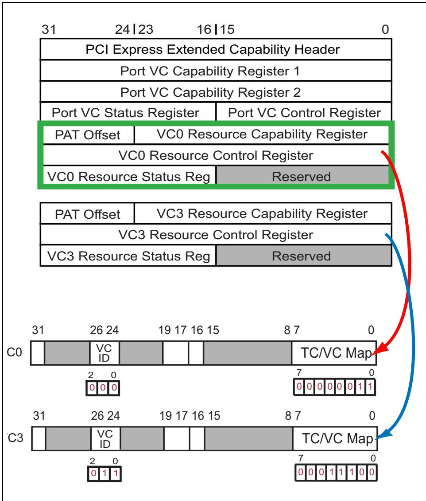

## 7.2.1.2 Determining the Number of VCs to be Used | 7.2.1.2 确定要使用的 VC（虚通道） 数量

<table style="border:1px solid #ddd;border-collapse:collapse; width:100%;" cellpadding="4" cellspacing="0" rules="all" frame="border">
  <thead style="border:1px solid #ddd;">
    <tr>
      <th width="50%" style="border:1px solid #ddd; background:#f5f5f5;">EN</th>
      <th width="50%" style="border:1px solid #ddd; background-color:#e8e8e8;">中文</th>
    </tr>
  </thead>
  <tbody>
    <tr><td width="50%" style="border:1px solid #ddd; background:#fff;padding:4px 8px;">Software checks the number of VCs supported by the devices attached to a common link and would usually assign the greatest number of VCs that both devices can support. Consider the example topology in Figure 7-4 on page 250.</td><td width="50%" style="border:1px solid #ddd; background-color:#e8e8e8;padding:4px 8px;">软件检查连接到公共链路的设备所支持的 VC（虚通道） 数量，并通常会分配两个设备都能支持的最大 VC（虚通道） 数量。请参考第 250 页图 7-4 中的示例拓扑。</td></tr>
  </tbody>
</table>

<table style="border:1px solid #ddd;border-collapse:collapse; width:100%;" cellpadding="4" cellspacing="0" rules="all" frame="border">
  <thead style="border:1px solid #ddd;">
    <tr>
      <th width="50%" style="border:1px solid #ddd; background:#f5f5f5;">EN</th>
      <th width="50%" style="border:1px solid #ddd; background-color:#e8e8e8;">中文</th>
    </tr>
  </thead>
  <tbody>
    <tr><td width="50%" style="border:1px solid #ddd; background:#fff;padding:4px 8px;">Here, the switch supports all 8 VCs on each of its ports, while Device A supports only the default VC0, Device B supports 4 VCs, and Device C support 8 VCs. Note that even though switch port A supports all 8 VCs, Device A only supports VC0, so 7 VCs are left unused in switch port A. Similarly, only 4 VCs are used by switch port B.</td><td width="50%" style="border:1px solid #ddd; background-color:#e8e8e8;padding:4px 8px;">此处，交换机的每个端口均支持全部8个VC，而设备A仅支持默认的VC0，设备B支持4个VC，设备C支持8个VC。需要注意的是，即使交换机端口A支持全部8个VC，设备A仅支持VC0，因此交换机端口A中有7个VC未被使用。类似地，交换机端口B仅使用了4个VC。</td></tr>
  </tbody>
</table>

Figure 7-4: Multiple VCs Supported by a Device | 图7-4：设备支持的多个VC

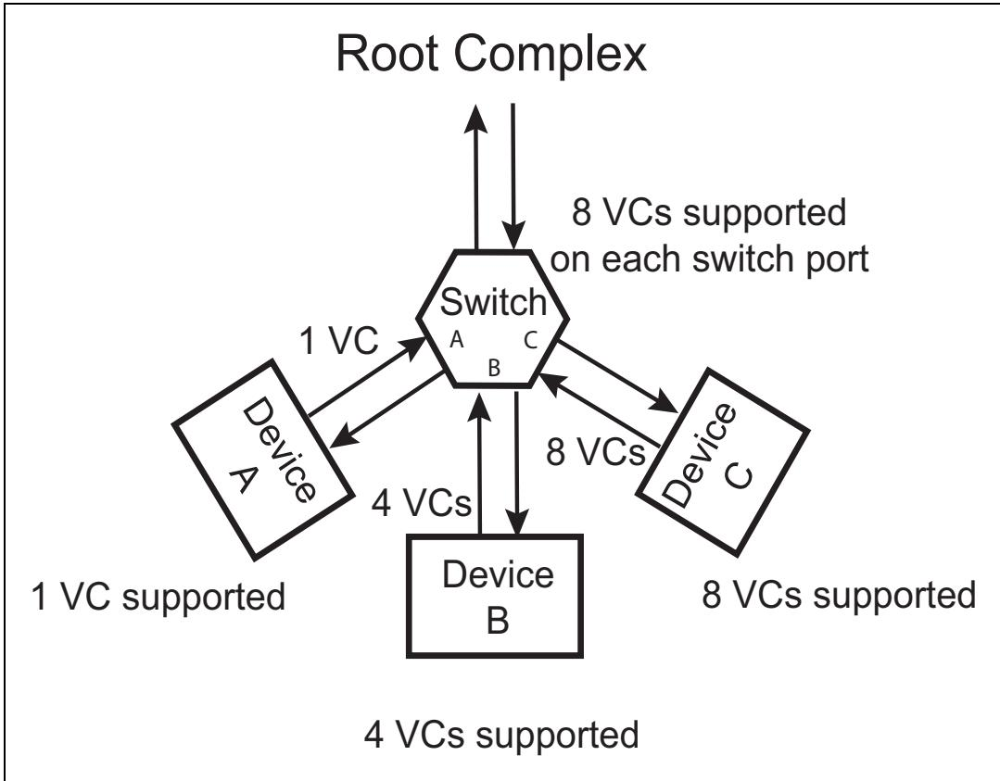

<table style="border:1px solid #ddd;border-collapse:collapse; width:100%;" cellpadding="4" cellspacing="0" rules="all" frame="border">
  <thead style="border:1px solid #ddd;">
    <tr>
      <th width="50%" style="border:1px solid #ddd; background:#f5f5f5;">EN</th>
      <th width="50%" style="border:1px solid #ddd; background-color:#e8e8e8;">中文</th>
    </tr>
  </thead>
  <tbody>
    <tr><td width="50%" style="border:1px solid #ddd; background:#fff;padding:4px 8px;">Configuration software determines the maximum number of VCs supported by each port interface by reading the Extended VC Count field in the Virtual Channel Capability registers, as shown in Figure 7-5 on page 251. Software checks the Extended VC Count at both ends of the Link and selects the highest common count. Using all the available VCs is not mandatory, though. Software may choose to enable fewer VCs as well.</td><td width="50%" style="border:1px solid #ddd; background-color:#e8e8e8;padding:4px 8px;">配置软件通过读取虚通道能力寄存器（Virtual Channel Capability registers）中的扩展VC计数字段（Extended VC Count），来确定每个端口接口支持的最大VC数量，如图7-5（第251页）所示。软件检查链路两端的扩展VC计数，并选取最高的公共计数。不过，使用所有可用VC并非强制要求。软件也可以选择启用较少的VC。</td></tr>
  </tbody>
</table>

Figure 7-5: Extended VCs Supported Field | 图7-5：扩展VC支持字段

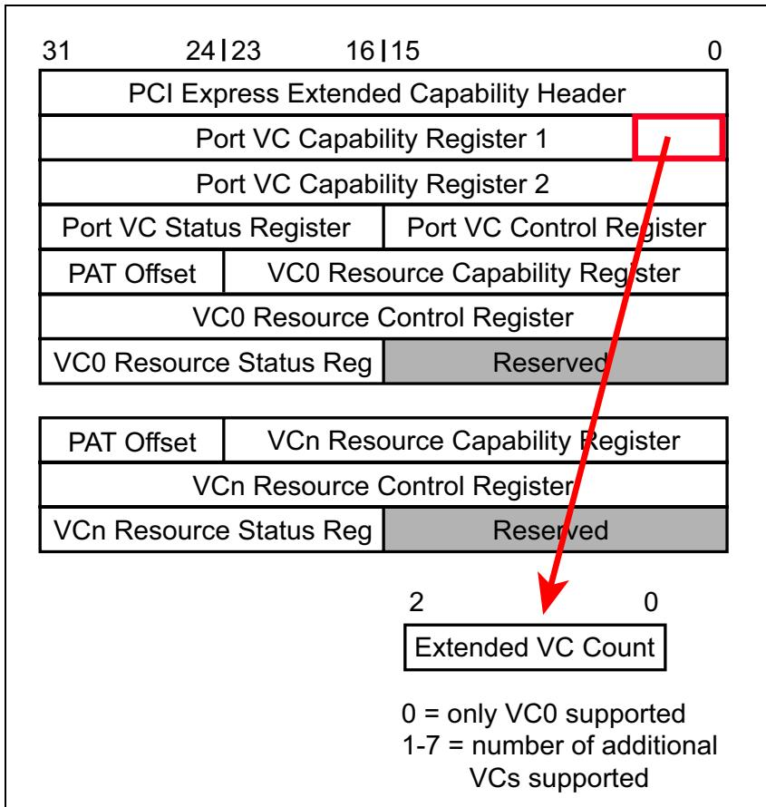

## 7.2.1.3 Assigning VC Numbers (IDs) | 7.2.1.3 分配 VC（虚通道） 编号（ID）

<table style="border-collapse:collapse;width:100%" cellpadding="4" cellspacing="0" rules="all" frame="border">
  <thead>
    <tr>
      <th width="50%" style="border:2px solid #000;background:#f5f5f5;padding:4px 8px;">EN</th>
      <th width="50%" style="border:2px solid #000;background-color:#e8e8e8;padding:4px 8px;">中文</th>
    </tr>
  </thead>
  <tbody>
    <tr><td width="50%" style="border:2px solid #000; background:#fff;padding:4px 8px;">Configuration software assigns a number (ID) to each of the VCs, except VC0 which is always hardwired. As shown in Figure 7-3 on page 249, the VC Capabilities registers include 12 bytes of configuration registers for each VC. The first set of registers always applies to VC0. The Extended VC Count field defines the number of additional VCs implemented by this port, each of which will have a set of registers. The value "n" represents the number of additional VCs implemented. For example, if the Extended VC Count contains a value of 3, then there are three VCs and register sets in addition to VC0.</td><td width="50%" style="border:2px solid #000; background-color:#e8e8e8;padding:4px 8px;">配置软件为每个VC分配一个编号（ID），VC0除外（VC0始终是硬连线的）。如第249页图7-3所示，VC Capabilities寄存器为每个VC包含12字节的配置寄存器。第一组寄存器始终适用于VC0。Extended VC Count字段定义该端口实现的额外VC数量，每个额外VC都将拥有一组寄存器。值"n"表示所实现的额外VC数量。例如，如果Extended VC Count的值为3，则除了VC0之外还有三个VC及其寄存器组。</td></tr>
    <tr><td width="50%" style="border:2px solid #000; background:#fff;padding:4px 8px;">Software assigns a number for each of the additional VCs via the VC ID field. (See Figure 7-3 on page 249) The IDs don't have to be contiguous but each number can only be used once.</td><td width="50%" style="border:2px solid #000; background-color:#e8e8e8;padding:4px 8px;">软件通过VC ID字段为每个额外VC分配一个编号。（参见第249页图7-3）这些编号不必连续，但每个编号只能使用一次。</td></tr>
    <tr><td width="50%" style="border:2px solid #000; background:#fff;padding:4px 8px;">## VC Arbitration</td><td width="50%" style="border:2px solid #000; background-color:#e8e8e8;padding:4px 8px;">## VC 仲裁</td></tr>
  </tbody>
</table>

<table style="border:1px solid #ddd;border-collapse:collapse; width:100%;" cellpadding="4" cellspacing="0" rules="all" frame="border">
  <thead style="border:1px solid #ddd;">
    <tr>
      <th width="50%" style="border:1px solid #ddd; background:#f5f5f5;">EN</th>
      <th width="50%" style="border:1px solid #ddd; background-color:#e8e8e8;">中文</th>
    </tr>
  </thead>
  <tbody>
    <tr><td width="50%" style="border:1px solid #ddd; background:#fff;padding:4px 8px;">## General</td><td width="50%" style="border:1px solid #ddd; background-color:#e8e8e8;padding:4px 8px;">## 概述</td></tr>
    <tr><td width="50%" style="border:1px solid #ddd; background:#fff;padding:4px 8px;">If a device has more than one VC and they all have a packet ready to send, VC arbitration determines the order of packet transmission. Any of several schemes can be chosen by software from among the options implemented by hardware. The goals are to implement the desired service policy and ensure that all transactions are making forward progress to prevent inadvertent time‐outs. In addition, VC Arbitration is affected by the requirements associated with flow control and transaction ordering. These topics are discussed in other chapters, but they affect arbitration, too, because:</td><td width="50%" style="border:1px solid #ddd; background-color:#e8e8e8;padding:4px 8px;">如果一个设备具有多个VC，并且它们都有准备发送的数据包，VC仲裁决定数据包传输的顺序。软件可以从硬件实现的多种方案中选择任何一种。其目标是实现所需的服务策略，并确保所有事务都能向前推进，以防止意外的超时。此外，VC仲裁还受到与流控和事务排序相关的要求的影响。这些主题在其他章节中讨论，但它们也会影响仲裁，因为：</td></tr>
    <tr><td width="50%" style="border:1px solid #ddd; background:#fff;padding:4px 8px;">• Each supported VC provides its own buffers and flow control.</td><td width="50%" style="border:1px solid #ddd; background-color:#e8e8e8;padding:4px 8px;">• 每个支持的VC都提供自己的缓冲区和流控。</td></tr>
    <tr><td width="50%" style="border:1px solid #ddd; background:#fff;padding:4px 8px;">Transactions mapped to the same VC are normally passed along in strict order (although there are exceptions, such as when a packet has the “Relaxed Ordering” attribute bit set).</td><td width="50%" style="border:1px solid #ddd; background-color:#e8e8e8;padding:4px 8px;">映射到同一VC的事务通常按严格顺序传递（但也有例外，例如当数据包设置了"Relaxed Ordering"属性位时）。</td></tr>
    <tr><td width="50%" style="border:1px solid #ddd; background:#fff;padding:4px 8px;">• Transaction ordering only applies within a VC, so there’s no ordering relationship among packets assigned to different VCs.</td><td width="50%" style="border:1px solid #ddd; background-color:#e8e8e8;padding:4px 8px;">• 事务排序仅适用于同一个VC内部，因此分配给不同VC的数据包之间没有排序关系。</td></tr>
    <tr><td width="50%" style="border:1px solid #ddd; background:#fff;padding:4px 8px;">The example in Figure 7‐6 on page 253 illustrates two VCs (VC0 and VC1) with a transmission priority based on a 3:1 ratio, meaning three VC1 packets are sent for every one VC0 packet. The device core sends requests (including a TC value) to the TC/VC Mapping logic. Based on the programmed mapping, the packet is placed into the appropriate VC buffer for transmission. Finally, the VC arbiter determines the VC priority for forwarding the packets. This example illustrates the flow in one direction, but the same logic exists for transmitting in the opposite direction at the same time.</td><td width="50%" style="border:1px solid #ddd; background-color:#e8e8e8;padding:4px 8px;">第253页的图7-6示例说明了两个VC（VC0和VC1）基于3:1比率的传输优先级，即每发送一个VC0数据包就发送三个VC1数据包。设备内核发送请求（包括TC（流量类）值）到TC/VC映射逻辑。基于编程的映射关系，数据包被放入相应的VC缓冲区中以备传输。最后，VC仲裁器决定转发数据包的VC优先级。该示例说明了单向的数据流，但同时在相反方向传输时也存在相同的逻辑。</td></tr>
    <tr><td width="50%" style="border:1px solid #ddd; background:#fff;padding:4px 8px;">The VC capability registers provide three basic VC arbitration approaches:</td><td width="50%" style="border:1px solid #ddd; background-color:#e8e8e8;padding:4px 8px;">VC能力寄存器提供了三种基本的VC仲裁方式：</td></tr>
    <tr><td width="50%" style="border:1px solid #ddd; background:#fff;padding:4px 8px;">1. Strict Priority Arbitration — the highest numbered VC with a packet ready always wins.</td><td width="50%" style="border:1px solid #ddd; background-color:#e8e8e8;padding:4px 8px;">1. 严格优先级仲裁——编号最高的、有数据包就绪的VC始终获胜。</td></tr>
    <tr><td width="50%" style="border:1px solid #ddd; background:#fff;padding:4px 8px;">2. Group Arbitration — VCs are divided by hardware into one low‐priority group and one high‐priority group. The low‐priority group uses an arbitration method selected by software from the available choices, while the highpriority group always uses strict‐priority arbitration.</td><td width="50%" style="border:1px solid #ddd; background-color:#e8e8e8;padding:4px 8px;">2. 组仲裁——VC由硬件分为一个低优先级组和一个高优先级组。低优先级组使用软件从可用选项中选定的仲裁方法，而高优先级组始终使用严格优先级仲裁。</td></tr>
    <tr><td width="50%" style="border:1px solid #ddd; background:#fff;padding:4px 8px;">3. Hardware Fixed arbitration — scheme built into the hardware.</td><td width="50%" style="border:1px solid #ddd; background-color:#e8e8e8;padding:4px 8px;">3. 硬件固定仲裁——内置于硬件中的方案。</td></tr>
  </tbody>
</table>

Figure 7‐6: VC Arbitration Example | 图7‐6：VC仲裁示例

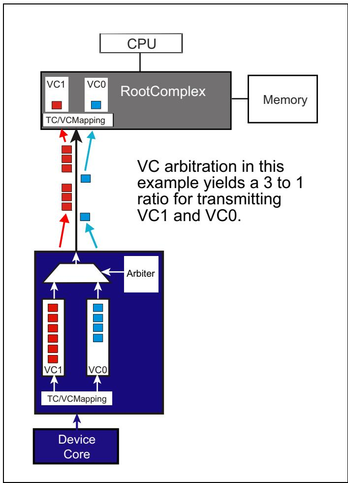

<table style="border:1px solid #ddd;border-collapse:collapse; width:100%;" cellpadding="4" cellspacing="0" rules="all" frame="border">
  <thead style="border:1px solid #ddd;">
    <tr>
      <th width="50%" style="border:1px solid #ddd; background:#f5f5f5;">EN</th>
      <th width="50%" style="border:1px solid #ddd; background-color:#e8e8e8;">中文</th>
    </tr>
  </thead>
  <tbody>
    <tr><td width="50%" style="border:1px solid #ddd; background:#fff;padding:4px 8px;">## Strict Priority VC Arbitration</td><td width="50%" style="border:1px solid #ddd; background-color:#e8e8e8;padding:4px 8px;">## 严格优先级VC仲裁</td></tr>
    <tr><td width="50%" style="border:1px solid #ddd; background:#fff;padding:4px 8px;">The default priority scheme is based on the inherent priority of VC IDs (VC0=lowest priority and VC7=highest priority). The mechanism is automatic and requires no configuration. Figure 7-7 on page 254 illustrates a strict priority arbitration example that includes all VCs. The VC ID governs the order in which transactions are sent. The maximum number of VCs that use strict priority arbitration cannot be greater than the value in the Extended VC Count field.</td><td width="50%" style="border:1px solid #ddd; background-color:#e8e8e8;padding:4px 8px;">默认优先级方案基于VC ID的内在优先级（VC0为最低优先级，VC7为最高优先级）。该机制是自动的，无需配置。第254页的图7-7给出了一个包含所有VC的严格优先级仲裁示例。VC ID决定了事务发送的顺序。使用严格优先级仲裁的VC最大数量不能超过扩展VC计数字段中的值。</td></tr>
    <tr><td width="50%" style="border:1px solid #ddd; background:#fff;padding:4px 8px;">(See Figure 7-5 on page 251.) Furthermore, if the designer has chosen strict priority arbitration for all VCs supported, the Low Priority Extended VC Count field of Port VC Capability Register 1 is hardwired to zero. (See Figure 7-8 on page 255.)</td><td width="50%" style="border:1px solid #ddd; background-color:#e8e8e8;padding:4px 8px;">（参见第251页的图7-5。）此外，如果设计者为所有支持的VC选择了严格优先级仲裁，则端口VC能力寄存器1的低优先级扩展VC计数字段被硬连线为0。（参见第255页的图7-8。）</td></tr>
  </tbody>
</table>

Figure 7-7: Strict Priority Arbitration | 图7-7：严格优先级仲裁

<table style="border:1px solid #ddd;border-collapse:collapse;width:100%" cellpadding="4" cellspacing="0" rules="all" frame="border"><tr><td style="border:1px solid #ddd;">VC Resources</td><td style="border:1px solid #ddd;">Priority Order</td></tr><tr><td style="border:1px solid #ddd;">8th VC</td><td style="border:1px solid #ddd;">VC7 Highest</td></tr><tr><td style="border:1px solid #ddd;">7th VC</td><td style="border:1px solid #ddd;">VC6</td></tr><tr><td style="border:1px solid #ddd;">6th VC</td><td style="border:1px solid #ddd;">VC5</td></tr><tr><td style="border:1px solid #ddd;">5th VC</td><td style="border:1px solid #ddd;">VC4</td></tr><tr><td style="border:1px solid #ddd;">4th VC</td><td style="border:1px solid #ddd;">VC3</td></tr><tr><td style="border:1px solid #ddd;">3rd VC</td><td style="border:1px solid #ddd;">VC2</td></tr><tr><td style="border:1px solid #ddd;">2nd VC</td><td style="border:1px solid #ddd;">VC1</td></tr><tr><td style="border:1px solid #ddd;">1st VC</td><td style="border:1px solid #ddd;">VC0 Lowest</td></tr></table>

<table style="border:1px solid #ddd;border-collapse:collapse; width:100%;" cellpadding="4" cellspacing="0" rules="all" frame="border">
  <thead style="border:1px solid #ddd;">
    <tr>
      <th width="50%" style="border:1px solid #ddd; background:#f5f5f5;">EN</th>
      <th width="50%" style="border:1px solid #ddd; background-color:#e8e8e8;">中文</th>
    </tr>
  </thead>
  <tbody>
    <tr><td width="50%" style="border:1px solid #ddd; background:#fff;padding:4px 8px;">Strict priority requires that higher-numbered VCs always get precedence over lower-priority VCs. For example, if all eight VCs are governed by strict priority, then packets in VC0 can only be sent when no other VCs have packets pending. This achieves the goal of giving the highest priority packets very high bandwidth with minimal latencies. However, strict priority has the potential to starve low-priority channels for bandwidth, so care must be taken to ensure this doesn't happen. The spec requires that high priority traffic be regulated to avoid starvation, and gives two possible methods of regulation:</td><td width="50%" style="border:1px solid #ddd; background-color:#e8e8e8;padding:4px 8px;">严格优先级要求编号较高的VC始终优先于优先级较低的VC。例如，如果所有八个VC都受严格优先级支配，则VC0中的数据包只能在其他VC都没有待发送数据包时才能被发送。这实现了以最小延迟为最高优先级数据包提供极高带宽的目标。然而，严格优先级有可能使低优先级通道在带宽方面被饿死，因此必须注意确保不发生这种情况。规范要求对高优先级的流量进行调节以避免饿死，并给出了两种可能的调节方法：</td></tr>
    <tr><td width="50%" style="border:1px solid #ddd; background:#fff;padding:4px 8px;">The originating port can restrict the injection rate of high priority packets to allow more bandwidth for lower priority transactions.</td><td width="50%" style="border:1px solid #ddd; background-color:#e8e8e8;padding:4px 8px;">源端口可以限制高优先级数据包的注入速率，从而为较低优先级的事务提供更多带宽。</td></tr>
    <tr><td width="50%" style="border:1px solid #ddd; background:#fff;padding:4px 8px;">Switches can regulate multiple traffic flows at the egress port. This method may limit the throughput from high bandwidth applications and devices that attempt to exceed the limitations of the available bandwidth.</td><td width="50%" style="border:1px solid #ddd; background-color:#e8e8e8;padding:4px 8px;">交换机可以在出口端口调节多个流量流。该方法可能会限制来自高带宽应用和设备的吞吐量，这些应用和设备试图超出可用带宽的限制。</td></tr>
    <tr><td width="50%" style="border:1px solid #ddd; background:#fff;padding:4px 8px;">A device designer may also limit the number of VCs that participate in strict priority by splitting the VCs into a low-priority group and a high-priority group as discussed in the next section.</td><td width="50%" style="border:1px solid #ddd; background-color:#e8e8e8;padding:4px 8px;">设备设计者还可以将VC划分为低优先级组和高优先级组来限制参与严格优先级的VC数量，这将在下一节中讨论。</td></tr>
  </tbody>
</table>

## 7.3.2 Group Arbitration | 7.3.2 组仲裁

<table style="border:1px solid #ddd;border-collapse:collapse; width:100%;" cellpadding="4" cellspacing="0" rules="all" frame="border">
  <thead style="border:1px solid #ddd;">
    <tr>
      <th width="50%" style="border:1px solid #ddd; background:#f5f5f5;">EN</th>
      <th width="50%" style="border:1px solid #ddd; background-color:#e8e8e8;">中文</th>
    </tr>
  </thead>
  <tbody>
    <tr><td width="50%" style="border:1px solid #ddd; background:#fff;padding:4px 8px;">Figure 7-8 illustrates the Low Priority Extended VC Count field within VC Capability Register 1. This read-only field specifies a VC ID that identifies the upper limit of the low-priority arbitration group for this device. For example, if this value is 4, then VC0-VC4 are members of the low-priority group and VC5-VC7 are in the high-priority group. Note that a Low Priority Extended VC Count of 7 means that no strict priority is used.</td><td width="50%" style="border:1px solid #ddd; background-color:#e8e8e8;padding:4px 8px;">图7-8展示了VC能力寄存器1中的低优先级扩展VC计数字段。该只读字段指定了一个VC ID，用于标识该设备的低优先级仲裁组的上限。例如，若该值为4，则VC0-VC4属于低优先级组，而VC5-VC7属于高优先级组。注意，低优先级扩展VC计数为7表示不使用严格优先级。</td></tr>
  </tbody>
</table>

Figure 7-8: Low-Priority Extended VCs | 图7-8：低优先级扩展VC

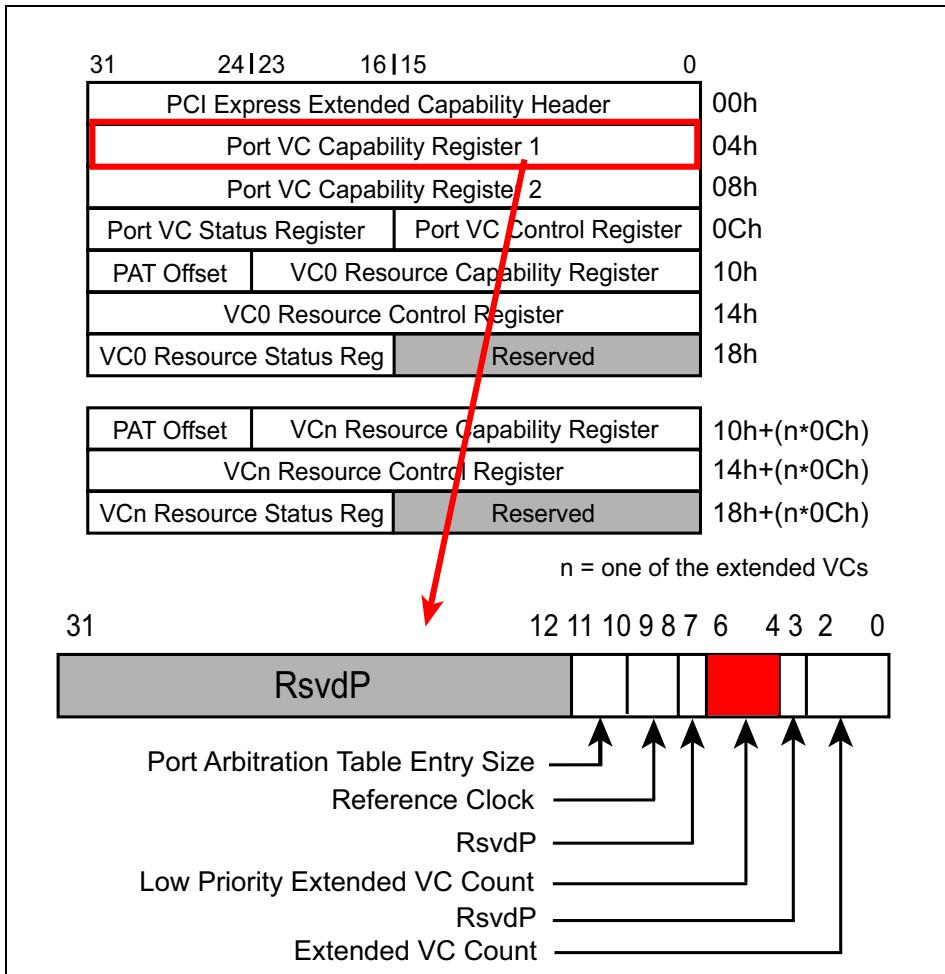

<table style="border:1px solid #ddd;border-collapse:collapse; width:100%;" cellpadding="4" cellspacing="0" rules="all" frame="border">
  <thead style="border:1px solid #ddd;">
    <tr>
      <th width="50%" style="border:1px solid #ddd; background:#f5f5f5;">EN</th>
      <th width="50%" style="border:1px solid #ddd; background-color:#e8e8e8;">中文</th>
    </tr>
  </thead>
  <tbody>
    <tr><td width="50%" style="border:1px solid #ddd; background:#fff;padding:4px 8px;">As depicted in Figure 7-10 on page 257, the high-priority VCs continue to use strict priority arbitration, while the low-priority arbitration group uses one of the other arbitration methods supported by the device. VC Capability Register 2 reports which alternate methods are supported for this group, as shown in Figure 7-9, and the VC Control Register permits selection of the method to be used. The low-priority arbitration schemes include:</td><td width="50%" style="border:1px solid #ddd; background-color:#e8e8e8;padding:4px 8px;">如第257页图7-10所示，高优先级虚通道继续使用严格优先级仲裁，而低优先级仲裁组则使用设备支持的另一种仲裁方法。VC能力寄存器2报告该组支持哪些备选方法（如图7-9所示），VC控制寄存器允许选择所使用的方法。低优先级仲裁方案包括：</td></tr>
    <tr><td width="50%" style="border:1px solid #ddd; background:#fff;padding:4px 8px;">• Hardware Based Fixed Arbitration</td><td width="50%" style="border:1px solid #ddd; background-color:#e8e8e8;padding:4px 8px;">• 基于硬件的固定仲裁</td></tr>
    <tr><td width="50%" style="border:1px solid #ddd; background:#fff;padding:4px 8px;">• Weighted Round Robin Arbitration (WRR)</td><td width="50%" style="border:1px solid #ddd; background-color:#e8e8e8;padding:4px 8px;">• 加权轮询仲裁（WRR）</td></tr>
  </tbody>
</table>

Figure 7-9: VC Arbitration Capabilities | 图7-9：VC仲裁能力

Figure 7-10: VC Arbitration Priorities | 图7-10：VC仲裁优先级
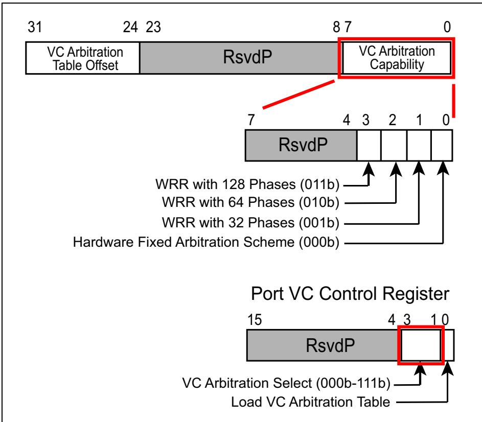

<table style="border:1px solid #ddd;border-collapse:collapse;width:100%" cellpadding="4" cellspacing="0" rules="all" frame="border"><tr><td style="border:1px solid #ddd;">VC Resources</td><td style="border:1px solid #ddd;">VC IDs</td><td style="border:1px solid #ddd;">Split Priority</td></tr><tr><td style="border:1px solid #ddd;">8th VC</td><td style="border:1px solid #ddd;">VC7</td><td style="border:1px solid #ddd;">Highest</td></tr><tr><td style="border:1px solid #ddd;">7th VC</td><td style="border:1px solid #ddd;">VC6</td><td style="border:1px solid #ddd;">High-Priority (Strict Priority Scheme)</td></tr><tr><td style="border:1px solid #ddd;">6th VC</td><td style="border:1px solid #ddd;">VC5</td><td rowspan="3" style="border:1px solid #ddd;">Low-Priority VC ID = 4</td></tr><tr><td style="border:1px solid #ddd;">5th VC</td><td style="border:1px solid #ddd;">VC4</td></tr><tr><td style="border:1px solid #ddd;">4th VC</td><td style="border:1px solid #ddd;">VC3</td></tr><tr><td style="border:1px solid #ddd;">3rd VC</td><td style="border:1px solid #ddd;">VC2</td><td rowspan="2" style="border:1px solid #ddd;">Low-Priority (Alternate Priority Scheme) (Selected by Software)</td></tr><tr><td style="border:1px solid #ddd;">2nd VC</td><td style="border:1px solid #ddd;">VC1</td></tr><tr><td style="border:1px solid #ddd;">1st VC</td><td style="border:1px solid #ddd;">VC0</td><td style="border:1px solid #ddd;">Lowest</td></tr></table>

## 7.3.1.1 Hardware Fixed Arbitration Scheme | 7.3.1.1 硬件固定仲裁方案

<table style="border:1px solid #ddd;border-collapse:collapse; width:100%;" cellpadding="4" cellspacing="0" rules="all" frame="border">
  <thead style="border:1px solid #ddd;">
    <tr>
      <th width="50%" style="border:1px solid #ddd; background:#f5f5f5;">EN</th>
      <th width="50%" style="border:1px solid #ddd; background-color:#e8e8e8;">中文</th>
    </tr>
  </thead>
  <tbody>
    <tr><td width="50%" style="border:1px solid #ddd; background:#fff;padding:4px 8px;">This selection defines a hardware‑based method and requires no additional software setup. This method can be anything the hardware designer chooses to build in, and could be based on anticipated loading or bandwidth needs for the device. A simple example might be an ordinary round robin sequence, in which each VC gets an equal turn at sending packets during the rotation.</td><td width="50%" style="border:1px solid #ddd; background-color:#e8e8e8;padding:4px 8px;">此选项定义了一种基于硬件的方法，无需额外的软件设置。该方法可以是硬件设计者选择内置的任何方式，并且可以基于预期的设备负载或带宽需求。一个简单的例子是普通的轮询顺序，其中每个虚通道在轮转期间获得相等的发送报文机会。</td></tr>
  </tbody>
</table>

## 7.3.1.2 Weighted Round Robin Arbitration Scheme | 7.3.1.2 加权轮询仲裁方案

<table style="border:1px solid #ddd;border-collapse:collapse; width:100%;" cellpadding="4" cellspacing="0" rules="all" frame="border">
  <thead style="border:1px solid #ddd;">
    <tr>
      <th width="50%" style="border:1px solid #ddd; background:#f5f5f5;">EN</th>
      <th width="50%" style="border:1px solid #ddd; background-color:#e8e8e8;">中文</th>
    </tr>
  </thead>
  <tbody>
    <tr><td width="50%" style="border:1px solid #ddd; background:#fff;padding:4px 8px;">Weighted Round Robin Arbitration Scheme</td><td width="50%" style="border:1px solid #ddd; background-color:#e8e8e8;padding:4px 8px;">加权轮询仲裁方案</td></tr>
    <tr><td width="50%" style="border:1px solid #ddd; background:#fff;padding:4px 8px;">This is a scheme in which some VCs can be weighted more (given higher priority) than others by giving them more entries in the sequence than others. The spec defines three WRR options, each with a different number of entries (called phases). The table size is selected by writing the corresponding value in to the VC Arbitration Select field of the Port VC Control Register (see Figure 7‐9 on page 256). Each entry in the table represents one phase that software loads with a low priority VC number. The VC arbiter will repeatedly scan all table entries in a sequential fashion and send packets from the VC specified in the table entries. Once a packet has been sent, the arbiter immediately proceeds to the next phase. Figure 7‐11 on page 258 shows an example of a WRR arbitration table with 64 entries.</td><td width="50%" style="border:1px solid #ddd; background-color:#e8e8e8;padding:4px 8px;">这是一种仲裁方案，其中某些VC可以通过在序列中获得比其他VC更多的条目来获得更高的权重（即被赋予更高优先级）。规范定义了三种WRR选项，每种选项具有不同数量的条目（称为相位）。通过向端口VC控制寄存器的VC仲裁选择字段写入相应的值来选择表大小（参见第256页的图7-9）。表中的每个条目代表一个相位，软件在其中加载一个低优先级VC号。VC仲裁器将以顺序方式重复扫描所有表条目，并从表条目中指定的VC发送报文。一旦发送了一个报文，仲裁器立即进入下一个相位。第258页的图7-11展示了一个具有64个条目的WRR仲裁表示例。</td></tr>
  </tbody>
</table>

Figure 7‐11: WRR VC Arbitration Table | 图7‐11：WRR VC仲裁表
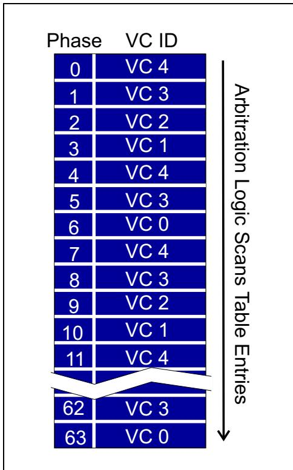

## 7.3.1.3 Setting up the Virtual Channel Arbitration Table | 7.3.1.3 设置虚拟通道仲裁表

<table style="border:1px solid #ddd;border-collapse:collapse; width:100%;" cellpadding="4" cellspacing="0" rules="all" frame="border">
  <thead style="border:1px solid #ddd;">
    <tr>
      <th width="50%" style="border:1px solid #ddd; background:#f5f5f5;">EN</th>
      <th width="50%" style="border:1px solid #ddd; background-color:#e8e8e8;">中文</th>
    </tr>
  </thead>
  <tbody>
    <tr><td width="50%" style="border:1px solid #ddd; background:#fff;padding:4px 8px;">The location of the VC Arbitration Table (VAT) in configuration space is given as an offset from the base address of the VC Capability Structure, as shown in Figure 7‐12 on page 259.</td><td width="50%" style="border:1px solid #ddd; background-color:#e8e8e8;padding:4px 8px;">VC仲裁表(VAT)在配置空间中的位置以距VC能力结构基地址的偏移量给出，如第259页图7‐12所示。</td></tr>
    <tr><td width="50%" style="border:1px solid #ddd; background:#fff;padding:4px 8px;">As shown in Figure 7‐13 on page 260, each entry in the VAT is a 4‐bit field that identifies the VC number of the buffer that is scheduled to deliver data during that phase. The table length is selected by the arbitration option shown in Figure 7‐9 on page 256.</td><td width="50%" style="border:1px solid #ddd; background-color:#e8e8e8;padding:4px 8px;">如第260页图7‐13所示，VAT中的每个条目是一个4位字段，标识在该阶段被调度传送数据的缓冲区的VC编号。表长度由图7‐9(第256页)所示的仲裁选项选择。</td></tr>
  </tbody>
</table>

Figure 7‐12: VC Arbitration Table Offset and Load VC Arbitration Table Fields | 图7‐12：VC仲裁表偏移量和加载VC仲裁表字段
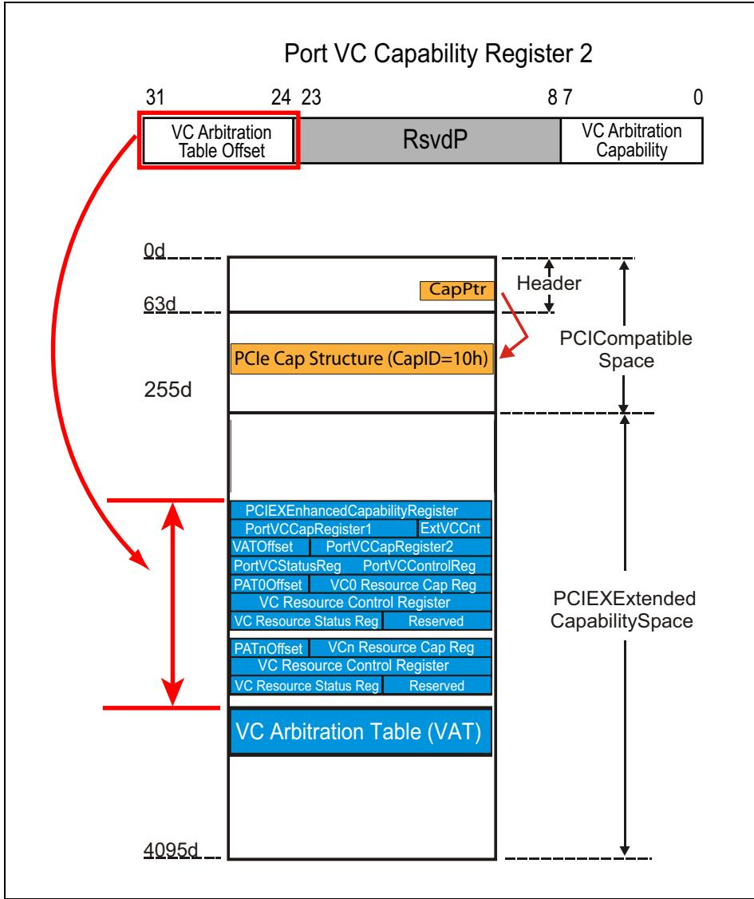

<table style="border:1px solid #ddd;border-collapse:collapse; width:100%;" cellpadding="4" cellspacing="0" rules="all" frame="border">
  <thead style="border:1px solid #ddd;">
    <tr>
      <th width="50%" style="border:1px solid #ddd; background:#f5f5f5;">EN</th>
      <th width="50%" style="border:1px solid #ddd; background-color:#e8e8e8;">中文</th>
    </tr>
  </thead>
  <tbody>
    <tr><td width="50%" style="border:1px solid #ddd; background:#fff;padding:4px 8px;">The table is loaded by configuration software to achieve the desired priority order for the virtual channels. Hardware sets the VC Arbitration Table Status bit whenever any changes are made to the table, giving software a way to verify whether changes have been made but not yet applied to the hardware. Once the table is loaded, software sets the Load VC Arbitration Table bit.</td><td width="50%" style="border:1px solid #ddd; background-color:#e8e8e8;padding:4px 8px;">该表由配置软件加载，以实现虚通道所需的优先级顺序。每当表发生任何更改时，硬件设置VC仲裁表状态位，为软件提供一种验证更改是否已做出但尚未应用于硬件的方法。表加载完成后，软件设置加载VC仲裁表位。</td></tr>
  </tbody>
</table>

<table style="border:1px solid #ddd;border-collapse:collapse;width:100%" cellpadding="4" cellspacing="0" rules="all" frame="border"><tr><td colspan="8" style="border:1px solid #ddd;">32 Phase Virtual Channel Arbitration Table</td></tr><tr><td style="border:1px solid #ddd;">31</td><td style="border:1px solid #ddd;">28</td><td style="border:1px solid #ddd;">27</td><td style="border:1px solid #ddd;">24</td><td style="border:1px solid #ddd;">23</td><td style="border:1px solid #ddd;">20</td><td style="border:1px solid #ddd;">19</td><td style="border:1px solid #ddd;">16</td></tr><tr><td style="border:1px solid #ddd;"></td><td style="border:1px solid #ddd;"></td><td style="border:1px solid #ddd;"></td><td style="border:1px solid #ddd;"></td><td style="border:1px solid #ddd;"></td><td style="border:1px solid #ddd;"></td><td style="border:1px solid #ddd;"></td><td style="border:1px solid #ddd;">15</td></tr><tr><td style="border:1px solid #ddd;"></td><td style="border:1px solid #ddd;"></td><td style="border:1px solid #ddd;"></td><td style="border:1px solid #ddd;"></td><td style="border:1px solid #ddd;"></td><td style="border:1px solid #ddd;"></td><td style="border:1px solid #ddd;"></td><td style="border:1px solid #ddd;">12</td></tr><tr><td style="border:1px solid #ddd;"></td><td style="border:1px solid #ddd;"></td><td style="border:1px solid #ddd;"></td><td style="border:1px solid #ddd;"></td><td style="border:1px solid #ddd;"></td><td style="border:1px solid #ddd;"></td><td style="border:1px solid #ddd;"></td><td style="border:1px solid #ddd;">11</td></tr><tr><td style="border:1px solid #ddd;"></td><td style="border:1px solid #ddd;"></td><td style="border:1px solid #ddd;"></td><td style="border:1px solid #ddd;"></td><td style="border:1px solid #ddd;"></td><td style="border:1px solid #ddd;"></td><td style="border:1px solid #ddd;"></td><td style="border:1px solid #ddd;">12</td></tr><tr><td style="border:1px solid #ddd;"></td><td style="border:1px solid #ddd;"></td><td style="border:1px solid #ddd;"></td><td style="border:1px solid #ddd;"></td><td style="border:1px solid #ddd;"></td><td style="border:1px solid #ddd;"></td><td style="border:1px solid #ddd;"></td><td style="border:1px solid #ddd;">8</td></tr><tr><td style="border:1px solid #ddd;"></td><td style="border:1px solid #ddd;"></td><td style="border:1px solid #ddd;"></td><td style="border:1px solid #ddd;"></td><td style="border:1px solid #ddd;"></td><td style="border:1px solid #ddd;"></td><td style="border:1px solid #ddd;"></td><td style="border:1px solid #ddd;">7</td></tr><tr><td style="border:1px solid #ddd;"></td><td style="border:1px solid #ddd;"></td><td style="border:1px solid #ddd;"></td><td style="border:1px solid #ddd;"></td><td style="border:1px solid #ddd;"></td><td style="border:1px solid #ddd;"></td><td style="border:1px solid #ddd;"></td><td style="border:1px solid #ddd;">4</td></tr><tr><td style="border:1px solid #ddd;"></td><td style="border:1px solid #ddd;"></td><td style="border:1px solid #ddd;"></td><td style="border:1px solid #ddd;"></td><td style="border:1px solid #ddd;"></td><td style="border:1px solid #ddd;"></td><td style="border:1px solid #ddd;"></td><td style="border:1px solid #ddd;">3</td></tr><tr><td style="border:1px solid #ddd;"></td><td style="border:1px solid #ddd;"></td><td style="border:1px solid #ddd;"></td><td style="border:1px solid #ddd;"></td><td style="border:1px solid #ddd;"></td><td style="border:1px solid #ddd;"></td><td style="border:1px solid #ddd;"></td><td style="border:1px solid #ddd;">0</td></tr></table>

Figure 7‐13: Loading the VC Arbitration Table Entries | 图7‐13：加载VC仲裁表项

<table style="border:1px solid #ddd;border-collapse:collapse; width:100%;" cellpadding="4" cellspacing="0" rules="all" frame="border">
  <thead style="border:1px solid #ddd;">
    <tr>
      <th width="50%" style="border:1px solid #ddd; background:#f5f5f5;">EN</th>
      <th width="50%" style="border:1px solid #ddd; background-color:#e8e8e8;">中文</th>
    </tr>
  </thead>
  <tbody>
    <tr><td width="50%" style="border:1px solid #ddd; background:#fff;padding:4px 8px;">in the Port VC Control register. That causes hardware to load, or apply, the new values to the VC Arbiter. Hardware clears the VC Arbitration Table Status bit when table loading is complete, signaling to software that loading has finished. This method is probably motivated by the desire to change the table contents during run time without disruption. The problem is that configuration writes are only able to update a dword at a time and are relatively slow transactions, which means it could take a long time to finish making changes, during which the table is only partially updated. That, in turn, could result in unexpected behavior by the device as it continues to operate during this time. To avoid that, this mechanism allows software to complete all the changes to the table and then apply them all at once to the hardware arbiter.</td><td width="50%" style="border:1px solid #ddd; background-color:#e8e8e8;padding:4px 8px;">中的端口VC控制寄存器。这将使硬件将新值加载（或称应用）到VC仲裁器。当表加载完成时，硬件清除VC仲裁表状态位，向软件指示加载已完成。这种方法的设计动机可能是希望在运行时无中断地更改表内容。问题在于配置写入每次只能更新一个双字，且属于相对较慢的事务，这意味着可能需要很长时间才能完成更改，在此期间表仅被部分更新。这反过来可能导致设备在这段时间内继续运行时出现意外行为。为避免这种情况，此机制允许软件完成对表的所有更改，然后一次性将其全部应用到硬件仲裁器。</td></tr>
  </tbody>
</table>

## 7.4 Port Arbitration | 7.4 端口仲裁

<table style="border:1px solid #ddd;border-collapse:collapse; width:100%;" cellpadding="4" cellspacing="0" rules="all" frame="border">
  <thead style="border:1px solid #ddd;">
    <tr>
      <th width="50%" style="border:1px solid #ddd; background:#f5f5f5;">EN</th>
      <th width="50%" style="border:1px solid #ddd; background-color:#e8e8e8;">中文</th>
    </tr>
  </thead>
  <tbody>
    <tr><td width="50%" style="border:1px solid #ddd; background:#fff;padding:4px 8px;">## Port Arbitration</td><td width="50%" style="border:1px solid #ddd; background-color:#e8e8e8;padding:4px 8px;">## 端口仲裁</td></tr>
  </tbody>
</table>

## 7.4.1.1 General | 7.4.1.1 概述

<table style="border:1px solid #ddd;border-collapse:collapse; width:100%;" cellpadding="4" cellspacing="0" rules="all" frame="border">
  <thead style="border:1px solid #ddd;">
    <tr>
      <th width="50%" style="border:1px solid #ddd; background:#f5f5f5;">EN</th>
      <th width="50%" style="border:1px solid #ddd; background-color:#e8e8e8;">中文</th>
    </tr>
  </thead>
  <tbody>
    <tr><td width="50%" style="border:1px solid #ddd; background:#fff;padding:4px 8px;">Switch ports and root ports will often receive incoming packets that need to be routed to another port. Since packets arriving from multiple ports can all target the same VC in the same outgoing port, arbitration is needed to decide which incoming port's packet gets next access to that VC. Like VC arbitration, port arbitration has several optional schemes available for selection by configuration software. The combination of TCs, VCs, and arbitration support a range of service levels that fall into two broad categories:</td><td width="50%" style="border:1px solid #ddd; background-color:#e8e8e8;padding:4px 8px;">交换端口和根端口通常会接收到需要路由到另一端口的数据包。由于从多个端口到达的数据包可能全部指向同一输出端口中的同一VC，因此需要仲裁来决定哪个输入端口的数据包将获得对该VC的下一次访问权限。与VC仲裁类似，端口仲裁有几种可选方案可供配置软件选择。TC、VC和仲裁的组合支持一系列服务水平，这些服务水平分为两大类：</td></tr>
    <tr><td width="50%" style="border:1px solid #ddd; background:#fff;padding:4px 8px;">1. Asynchronous — Packets get "best effort" service and may receive no preference at all. Many devices and applications, like mass storage devices, have no stringent requirements for bandwidth or latency and don't need special timing mechanisms. On the other hand, packets generated by more demanding applications can still be prioritized without much trouble by establishing a hierarchy of traffic classes for different packets. Differentiated service is still considered to be asynchronous until the level of service requires guarantees. Naturally, asynchronous service is always available and doesn't need any special software or hardware options.</td><td width="50%" style="border:1px solid #ddd; background-color:#e8e8e8;padding:4px 8px;">1. 异步 — 数据包获得"尽力而为"服务，可以不获得任何优先级。许多设备和应用（如大容量存储设备）对带宽或延迟没有严格要求，不需要特殊的定时机制。另一方面，通过为不同的数据包建立流量类层次结构，对要求更高的应用所生成的数据包进行优先级排序仍然不难。在服务级别需要保证之前，差异化服务仍被视为异步。异步服务自然始终可用，不需要任何特殊的软件或硬件选项。</td></tr>
    <tr><td width="50%" style="border:1px solid #ddd; background:#fff;padding:4px 8px;">2. Isochronous — When latency and bandwidth guarantees are needed, we move into the isochronous category. This would be useful when a synchronous connection would normally be required between two devices. For example, a CD-ROM sourcing data from a music CD uses a synchronous connection when a headset is plugged directly into the drive. However, when the audio must be routed across a general-purpose bus like PCIe to get to external speakers, the connection cannot be synchronous because other traffic may also need to use the same data stream. To achieve an equivalent result, isochronous service must guarantee proper delivery of the time-sensitive audio data without preventing other traffic from using the Link during the same time. Not surprisingly, specialized software and hardware are needed to support this.</td><td width="50%" style="border:1px solid #ddd; background-color:#e8e8e8;padding:4px 8px;">2. 等时 — 当需要延迟和带宽保证时，就进入了等时类别。当两个设备之间通常需要同步连接时，这将很有用。例如，当耳机直接插入光驱时，从音乐CD读取数据的光盘驱动器使用同步连接。然而，当音频必须通过像PCIe这样的通用总线路由到外部扬声器时，连接不能是同步的，因为其他流量可能也需要使用同一数据流。为了达到等效的结果，等时服务必须保证及时传送对时间敏感的音频数据，同时不妨碍其他流量在同一时间使用链路。毫不奇怪，需要专门的软件和硬件来支持这一点。</td></tr>
    <tr><td width="50%" style="border:1px solid #ddd; background:#fff;padding:4px 8px;">The concept of port arbitration is pictured in Figure 7-14 on page 262. Note that port arbitration exists in several places in a system:</td><td width="50%" style="border:1px solid #ddd; background-color:#e8e8e8;padding:4px 8px;">端口仲裁的概念如图7-14（第262页）所示。请注意，端口仲裁存在于系统中的多个位置：</td></tr>
    <tr><td width="50%" style="border:1px solid #ddd; background:#fff;padding:4px 8px;">• Egress ports of switches</td><td width="50%" style="border:1px solid #ddd; background-color:#e8e8e8;padding:4px 8px;">• 交换机的出口端口</td></tr>
    <tr><td width="50%" style="border:1px solid #ddd; background:#fff;padding:4px 8px;">• Root Complex ports when peer-to-peer transactions are supported</td><td width="50%" style="border:1px solid #ddd; background-color:#e8e8e8;padding:4px 8px;">• 支持对等传输时的根复合体端口</td></tr>
    <tr><td width="50%" style="border:1px solid #ddd; background:#fff;padding:4px 8px;">• Root Complex egress ports that lead to targets such as main memory</td><td width="50%" style="border:1px solid #ddd; background-color:#e8e8e8;padding:4px 8px;">• 通向主存储器等目标的根复合体出口端口</td></tr>
    <tr><td width="50%" style="border:1px solid #ddd; background:#fff;padding:4px 8px;">Port arbitration will usually need software configuration for each virtual channel supported by a switch or root egress port. In the example below, root port 2 supports peer-to-peer transfers from root ports 1 and 2 and therefore needs port arbitration. It should be noted, though, that peer-to-peer support between root ports is optional, so it may be that not every root egress port would need port arbitration.</td><td width="50%" style="border:1px solid #ddd; background-color:#e8e8e8;padding:4px 8px;">端口仲裁通常需要为交换机或根出口端口支持的每个虚通道进行软件配置。在下面的示例中，根端口2支持来自根端口1和2的对等传输，因此需要端口仲裁。但应注意，根端口之间的对等支持是可选的，因此可能并非每个根出口端口都需要端口仲裁。</td></tr>
    <tr><td width="50%" style="border:1px solid #ddd; background:#fff;padding:4px 8px;">The connection to system memory is an interesting path. There will likely be packets from multiple ingress ports trying to access this port at the same time, so it needs to support port arbitration. However, it doesn't use a PCIe port, so it doesn't have the set of PCIe registers to support arbitration that we're describing here. Instead, the root will need to supply a vendor-specific set of registers called a Root Complex Register Block (RCRB) to provide the same functionality.</td><td width="50%" style="border:1px solid #ddd; background-color:#e8e8e8;padding:4px 8px;">通往系统内存的连接是一条有趣的路径。很可能有来自多个输入端口的数据包同时试图访问该端口，因此它需要支持端口仲裁。然而，它不使用PCIe端口，因此没有我们此处所述的用于支持仲裁的那组PCIe寄存器。相反，根复合体需要提供一组称为根复合体寄存器块（RCRB）的厂商特定寄存器来提供相同的功能。</td></tr>
    <tr><td width="50%" style="border:1px solid #ddd; background:#fff;padding:4px 8px;">Because port arbitration is managed independently for each VC of the egress port, a separate table is required for each VC that supports programmable port arbitration, as shown in Figure 7-15 on page 263. Port arbitration tables are supported only by switches and root ports and are not allowed in endpoints.</td><td width="50%" style="border:1px solid #ddd; background-color:#e8e8e8;padding:4px 8px;">由于端口仲裁是针对出口端口的每个VC独立管理的，因此对于每个支持可编程端口仲裁的VC都需要一个独立的表，如图7-15（第263页）所示。端口仲裁表仅由交换机和根端口支持，不允许在端点中使用。</td></tr>
  </tbody>
</table>

Figure 7-14: Port Arbitration Concept | 图7-14：端口仲裁概念

Figure 7-15: Port Arbitration Tables for Each VC | 图7-15：每个VC的端口仲裁表
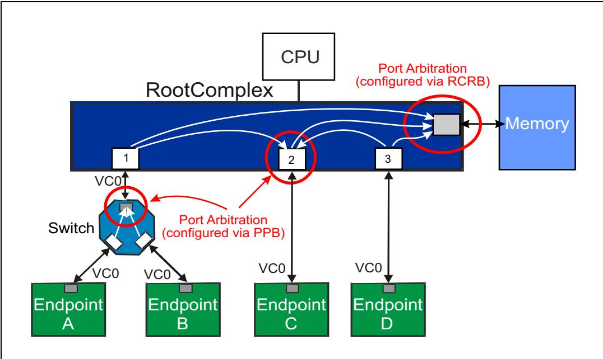

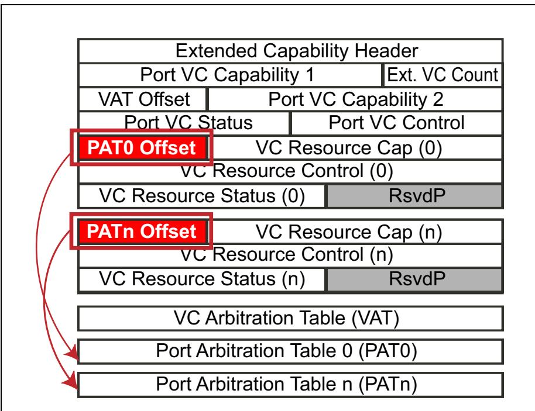

<table style="border:1px solid #ddd;border-collapse:collapse; width:100%;" cellpadding="4" cellspacing="0" rules="all" frame="border">
  <thead style="border:1px solid #ddd;">
    <tr>
      <th width="50%" style="border:1px solid #ddd; background:#f5f5f5;">EN</th>
      <th width="50%" style="border:1px solid #ddd; background-color:#e8e8e8;">中文</th>
    </tr>
  </thead>
  <tbody>
    <tr><td width="50%" style="border:1px solid #ddd; background:#fff;padding:4px 8px;">Although it isn't stated in the spec, the process of arbitrating between different packet streams also implies the use of additional buffers to accumulate traffic from each port in the egress port as illustrated in Figure 7-16 on page 264. This example illustrates two ingress ports (1 and 2) whose transactions are routed to an egress port (3). The actions taken by the switch include the following:</td><td width="50%" style="border:1px solid #ddd; background-color:#e8e8e8;padding:4px 8px;">尽管规范中没有明说，但在不同数据包流之间进行仲裁的过程也意味着需要使用额外的缓冲区来累积来自各端口的流量到出口端口，如图7-16（第264页）所示。此示例说明了两个输入端口（1和2），它们的事务被路由到一个输出端口（3）。交换机执行的操作包括以下步骤：</td></tr>
    <tr><td width="50%" style="border:1px solid #ddd; background:#fff;padding:4px 8px;">1. Packets arriving at the ingress ports are directed to the appropriate flow control buffers (VC) based on the TC/VC mapping.</td><td width="50%" style="border:1px solid #ddd; background-color:#e8e8e8;padding:4px 8px;">1. 到达输入端口的数据包根据TC/VC映射被引导到适当的流控缓冲区（VC）。</td></tr>
    <tr><td width="50%" style="border:1px solid #ddd; background:#fff;padding:4px 8px;">2. Packets are forwarded from the flow control buffers to the routing logic, which determines and routes them to the proper egress port.</td><td width="50%" style="border:1px solid #ddd; background-color:#e8e8e8;padding:4px 8px;">2. 数据包从流控缓冲区转发到路由逻辑，路由逻辑确定并将其路由到正确的输出端口。</td></tr>
    <tr><td width="50%" style="border:1px solid #ddd; background:#fff;padding:4px 8px;">3. Packets routed to the egress port (3) use TC/VC mapping to determine into which VC buffer they should be placed.</td><td width="50%" style="border:1px solid #ddd; background-color:#e8e8e8;padding:4px 8px;">3. 路由到输出端口（3）的数据包使用TC/VC映射来确定应放入哪个VC缓冲区。</td></tr>
    <tr><td width="50%" style="border:1px solid #ddd; background:#fff;padding:4px 8px;">4. A set of buffers is associated with each of the ingress ports, allowing the ingress port number to be tracked until port arbitration can be done.</td><td width="50%" style="border:1px solid #ddd; background-color:#e8e8e8;padding:4px 8px;">4. 一组缓冲区与每个输入端口相关联，允许跟踪输入端口号，直到端口仲裁可以完成。</td></tr>
    <tr><td width="50%" style="border:1px solid #ddd; background:#fff;padding:4px 8px;">5. Port arbitration logic determines the order in which transactions are sent from each group of ingress buffers.</td><td width="50%" style="border:1px solid #ddd; background-color:#e8e8e8;padding:4px 8px;">5. 端口仲裁逻辑确定事务从每组输入缓冲区发送的顺序。</td></tr>
  </tbody>
</table>

Figure 7-16: Port Arbitration Buffering | 图7-16：端口仲裁缓冲

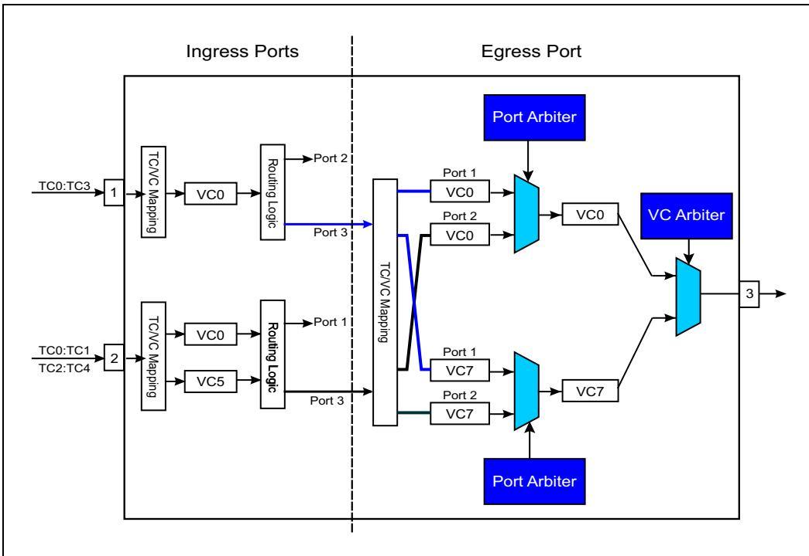

## 7.4.1 Port Arbitration Mechanisms | 7.4.1 端口仲裁机制

Figure 7‑17: Software Selects Port Arbitration Scheme | 图7‑17：软件选择端口仲裁方案

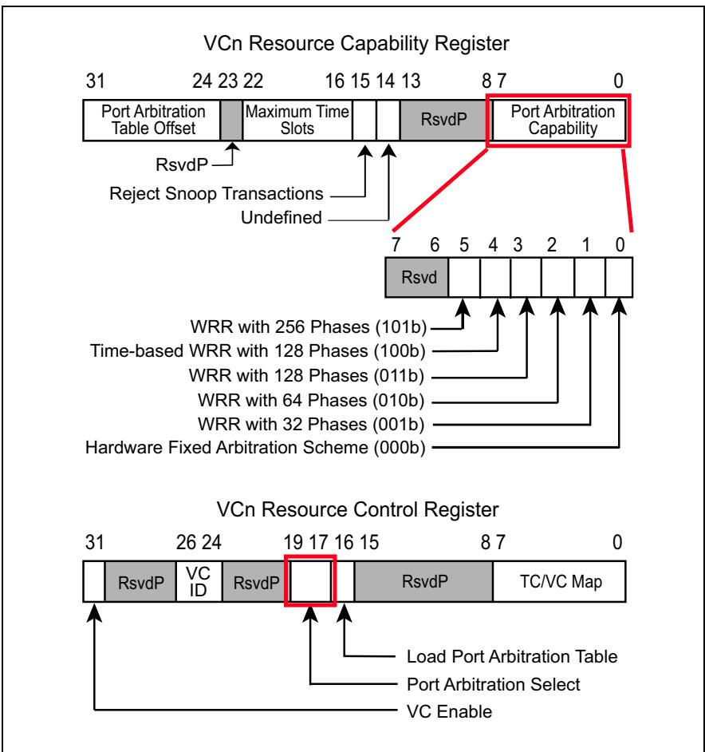

<table style="border:1px solid #ddd;border-collapse:collapse; width:100%;" cellpadding="4" cellspacing="0" rules="all" frame="border">
  <thead style="border:1px solid #ddd;">
    <tr>
      <th width="50%" style="border:1px solid #ddd; background:#f5f5f5;">EN</th>
      <th width="50%" style="border:1px solid #ddd; background-color:#e8e8e8;">中文</th>
    </tr>
  </thead>
  <tbody>
    <tr><td width="50%" style="border:1px solid #ddd; background:#fff;padding:4px 8px;">The actual port arbitration mechanisms defined are similar to the models used for VC arbitration. Configuration software determines the capability for a port by reading the registers shown in Figure 7‑17 on page 265 and selects the port arbitration scheme to use for each VC.</td><td width="50%" style="border:1px solid #ddd; background-color:#e8e8e8;padding:4px 8px;">实际定义的端口仲裁机制与用于虚通道仲裁的模型类似。配置软件通过读取第265页图7‑17所示的寄存器来确定端口的能力，并为每个虚通道选择要使用的端口仲裁方案。</td></tr>
  </tbody>
</table>

## 7.4.1.1.1 Hardware-Fixed Arbitration | 7.4.1.1.1 硬件固定仲裁

<table style="border:1px solid #ddd;border-collapse:collapse; width:100%;" cellpadding="4" cellspacing="0" rules="all" frame="border">
  <thead style="border:1px solid #ddd;">
    <tr>
      <th width="50%" style="border:1px solid #ddd; background:#f5f5f5;">EN</th>
      <th width="50%" style="border:1px solid #ddd; background-color:#e8e8e8;">中文</th>
    </tr>
  </thead>
  <tbody>
    <tr><td width="50%" style="border:1px solid #ddd; background:#fff;padding:4px 8px;">This mechanism doesn't require software setup. Once selected, it's managed solely by hardware. The actual arbitration scheme is chosen by the hardware designer, possibly based on the expected demands for the device. This may simply ensure fairness or it may optimize some aspect of the design, but it doesn't support differentiated or isochronous services.</td><td width="50%" style="border:1px solid #ddd; background-color:#e8e8e8;padding:4px 8px;">该机制无需软件设置。一旦选定，完全由硬件管理。实际的仲裁方案由硬件设计者选择，可能基于对该设备预期需求的考虑。它可能仅仅是确保公平性，也可能优化设计的某些方面，但不支持区分服务或等时服务。</td></tr>
  </tbody>
</table>

<table style="border:1px solid #ddd;border-collapse:collapse; width:100%;" cellpadding="4" cellspacing="0" rules="all" frame="border">
  <thead style="border:1px solid #ddd;">
    <tr>
      <th width="50%" style="border:1px solid #ddd; background:#f5f5f5;">EN</th>
      <th width="50%" style="border:1px solid #ddd; background-color:#e8e8e8;">中文</th>
    </tr>
  </thead>
  <tbody>
    <tr><td width="50%" style="border:1px solid #ddd; background:#fff;padding:4px 8px;">## Weighted Round Robin Arbitration</td><td width="50%" style="border:1px solid #ddd; background-color:#e8e8e8;padding:4px 8px;">## 加权轮询仲裁</td></tr>
    <tr><td width="50%" style="border:1px solid #ddd; background:#fff;padding:4px 8px;">Just like the weighted round robin mechanism in VC arbitration, software can set up the port arbitration table so that some ports receive more opportunities than others. This approach assigns different weights to traffic coming from different ports.</td><td width="50%" style="border:1px solid #ddd; background-color:#e8e8e8;padding:4px 8px;">与VC仲裁中的加权轮询机制类似，软件可以设置端口仲裁表，使得某些端口获得比其他端口更多的机会。这种方法为来自不同端口的流量分配了不同的权重。</td></tr>
    <tr><td width="50%" style="border:1px solid #ddd; background:#fff;padding:4px 8px;">As the table is scanned, each phase specifies the port number from which the next packet is received. Once the packet is delivered, the arbitration logic immediately proceeds to the next phase. If no transaction is pending transmission for the selected port, the arbiter advances immediately to the next phase. There is no time value associated with these entries.</td><td width="50%" style="border:1px solid #ddd; background-color:#e8e8e8;padding:4px 8px;">扫描该表时，每个相位指定了接收下一个数据包的端口号。一旦数据包被传送，仲裁逻辑立即进入下一相位。如果所选端口没有待发送的事务，仲裁器立即前进到下一相位。这些表项不关联任何时间值。</td></tr>
    <tr><td width="50%" style="border:1px solid #ddd; background:#fff;padding:4px 8px;">Four table lengths are given for WRR port arbitration, determined by the number of phases used by the table. Presumably, a larger number of entries in the table allows for more interesting ratios of arbitration selection. On the other hand, a smaller number of entries would use less storage and cost less.</td><td width="50%" style="border:1px solid #ddd; background-color:#e8e8e8;padding:4px 8px;">WRR端口仲裁提供了四种表长度，由表所使用的相位数量决定。可以认为，表中条目越多，仲裁选择的比例可以更加多样化。另一方面，条目越少，占用的存储空间越少，成本也更低。</td></tr>
  </tbody>
</table>

## 7.4.1.1.2 Time-Based, Weighted Round Robin Arbitration (TBWRR) | 7.4.1.1.2 基于时间的加权轮询仲裁（TBWRR）

<table style="border:1px solid #ddd;border-collapse:collapse; width:100%;" cellpadding="4" cellspacing="0" rules="all" frame="border">
  <thead style="border:1px solid #ddd;">
    <tr>
      <th width="50%" style="border:1px solid #ddd; background:#f5f5f5;">EN</th>
      <th width="50%" style="border:1px solid #ddd; background-color:#e8e8e8;">中文</th>
    </tr>
  </thead>
  <tbody>
    <tr><td width="50%" style="border:1px solid #ddd; background:#fff;padding:4px 8px;">This mechanism is required for isochronous support. As the name implies, time‑based weighted round robin adds the element of time to each arbitration phase. Just as in WRR the port arbiter delivers one transaction from the ingress port VC buffer indicated by the Port Number of the current phase. Now though, rather than immediately advancing to the next phase, the time‑based arbiter waits until the current virtual timeslot elapses before advancing. This ensures that transactions are accepted from the ingress port buffer at regular intervals. If the selected port does not have a packet ready to send then nothing will be sent until the next timeslot. Note that the timeslot does not govern the duration of the transfer, but rather the interval between transfers. The maximum duration of a transaction is the time it takes to complete the round robin and return to the original timeslot. The length of the timeslot may change in the future, but currently has the value of 100ns.</td><td width="50%" style="border:1px solid #ddd; background-color:#e8e8e8;padding:4px 8px;">该机制为等时支持所必需。顾名思义，基于时间的加权轮询将时间元素引入每个仲裁阶段。与WRR一样，端口仲裁器从当前阶段端口号所指明的入口端口VC缓冲器中交付一笔事务。但现在，基于时间的仲裁器不会立即前进到下一阶段，而是等待当前虚拟时隙耗尽后才前进。这确保了以固定时间间隔从入口端口缓冲器接收事务。如果所选端口没有准备好发送的数据包，则在下一个时隙之前不会发送任何数据。请注意，时隙并不控制传输的持续时间，而是控制传输之间的间隔。一次事务的最大持续时间是完成一轮轮询并返回到原始时隙所需的时间。时隙长度将来可能会改变，但目前为100ns。</td></tr>
    <tr><td width="50%" style="border:1px solid #ddd; background:#fff;padding:4px 8px;">Time‑based WRR arbitration supports a maximum table length of 128 phases, but the actual number of table entries available for a given VC may be less than that. The value is hardware initialized and reported in the Maximum Time Slots field of each virtual channel that supports TBWRR, as shown in Figure 7‑18 on page 267.</td><td width="50%" style="border:1px solid #ddd; background-color:#e8e8e8;padding:4px 8px;">基于时间的WRR仲裁支持最大128个阶段的表长度，但给定VC可用的实际表项数可能少于该值。该值由硬件初始化，并在支持TBWRR的每个虚通道的最大时隙字段中报告，如第267页图7‑18所示。</td></tr>
  </tbody>
</table>

Figure 7‑18: Maximum Time Slots Register | 图7‑18：最大时隙寄存器

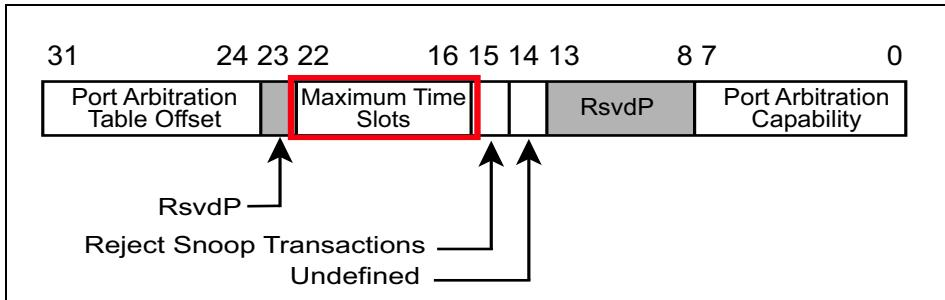

## 7.4.2 Loading the Port Arbitration Tables | 7.4.2 加载端口仲裁表

<table style="border:1px solid #ddd;border-collapse:collapse; width:100%;" cellpadding="4" cellspacing="0" rules="all" frame="border">
  <thead style="border:1px solid #ddd;">
    <tr>
      <th width="50%" style="border:1px solid #ddd; background:#f5f5f5;">EN</th>
      <th width="50%" style="border:1px solid #ddd; background-color:#e8e8e8;">中文</th>
    </tr>
  </thead>
  <tbody>
    <tr><td width="50%" style="border:1px solid #ddd; background:#fff;padding:4px 8px;">The actual size and format of the Port Arbitration Tables are a function of the number of phases and the number of ingress ports supported by the Switch, RCRB, or Root Port that supports peer-to-peer transfers. The maximum number of ingress ports supported by the Port Arbitration Table is 256 ports. The actual number of bits within each table entry is design dependent and governed by the number of ingress ports whose transactions can be delivered to the egress port. The size of each table entry is reported in the 2-bit Port Arbitration Table Entry Size field of Port VC Capability Register 1. The permissible values are:</td><td width="50%" style="border:1px solid #ddd; background-color:#e8e8e8;padding:4px 8px;">端口仲裁表的实际大小和格式取决于所支持的相位数量以及支持对等传输的交换机、RCRB或根端口所支持的入端口数量。端口仲裁表支持的最大入端口数量为256个。每个表项的实际位数取决于具体设计，并由其事务可传递到出端口的入端口数量决定。每个表项的大小在端口VC能力寄存器1的2位端口仲裁表项大小字段中报告。允许的值为：</td></tr>
    <tr><td width="50%" style="border:1px solid #ddd; background:#fff;padding:4px 8px;">• 00b — 1 bit (selects between 2 ports)</td><td width="50%" style="border:1px solid #ddd; background-color:#e8e8e8;padding:4px 8px;">• 00b — 1位（在2个端口之间选择）</td></tr>
    <tr><td width="50%" style="border:1px solid #ddd; background:#fff;padding:4px 8px;">• 01b — 2 bits (4 ports)</td><td width="50%" style="border:1px solid #ddd; background-color:#e8e8e8;padding:4px 8px;">• 01b — 2位（4个端口）</td></tr>
    <tr><td width="50%" style="border:1px solid #ddd; background:#fff;padding:4px 8px;">• 10b — 4 bits (16 ports)</td><td width="50%" style="border:1px solid #ddd; background-color:#e8e8e8;padding:4px 8px;">• 10b — 4位（16个端口）</td></tr>
    <tr><td width="50%" style="border:1px solid #ddd; background:#fff;padding:4px 8px;">• 11b — 8 bits (256 ports)</td><td width="50%" style="border:1px solid #ddd; background-color:#e8e8e8;padding:4px 8px;">• 11b — 8位（256个端口）</td></tr>
    <tr><td width="50%" style="border:1px solid #ddd; background:#fff;padding:4px 8px;">Configuration software loads each table with port numbers to accomplish the desired port priority for each VC supported. As illustrated in Figure 7-19 on page 268, the table format depends on the size of each entry and the number of phases supported by this design.</td><td width="50%" style="border:1px solid #ddd; background-color:#e8e8e8;padding:4px 8px;">配置软件为每个表加载端口号，以实现每个支持的VC所需的端口优先级。如图7-19（第268页）所示，表格式取决于每个表项的大小以及该设计支持的相位数量。</td></tr>
  </tbody>
</table>

Figure 7-19: Format of Port Arbitration Tables | 图7-19：端口仲裁表格式

<table style="border:1px solid #ddd;border-collapse:collapse;width:100%" cellpadding="4" cellspacing="0" rules="all" frame="border"><tr><td colspan="8" style="border:1px solid #ddd;">32-Phase Port Arbitration Table
with 4-bit entries</td></tr><tr><td style="border:1px solid #ddd;">31</td><td style="border:1px solid #ddd;">28</td><td style="border:1px solid #ddd;">27</td><td style="border:1px solid #ddd;">24</td><td style="border:1px solid #ddd;">23</td><td style="border:1px solid #ddd;">20</td><td style="border:1px solid #ddd;">19</td><td style="border:1px solid #ddd;">16</td></tr><tr><td style="border:1px solid #ddd;">15</td><td style="border:1px solid #ddd;">Phase[7]</td><td style="border:1px solid #ddd;">Phase[6]</td><td style="border:1px solid #ddd;">Phase[5]</td><td style="border:1px solid #ddd;">Phase[4]</td><td style="border:1px solid #ddd;">Phase[3]</td><td style="border:1px solid #ddd;">Phase[2]</td><td style="border:1px solid #ddd;">Phase[1]</td></tr><tr><td style="border:1px solid #ddd;">15</td><td style="border:1px solid #ddd;">Phase[15]</td><td style="border:1px solid #ddd;">Phase[14]</td><td style="border:1px solid #ddd;">Phase[13]</td><td style="border:1px solid #ddd;">Phase[12]</td><td style="border:1px solid #ddd;">Phase[11]</td><td style="border:1px solid #ddd;">Phase[10]</td><td style="border:1px solid #ddd;">Phase[9]</td></tr><tr><td style="border:1px solid #ddd;">23</td><td style="border:1px solid #ddd;">Phase[23]</td><td style="border:1px solid #ddd;">Phase[22]</td><td style="border:1px solid #ddd;">Phase[21]</td><td style="border:1px solid #ddd;">Phase[20]</td><td style="border:1px solid #ddd;">Phase[19]</td><td style="border:1px solid #ddd;">Phase[18]</td><td style="border:1px solid #ddd;">Phase[17]</td></tr><tr><td style="border:1px solid #ddd;">31</td><td style="border:1px solid #ddd;">Phase[31]</td><td style="border:1px solid #ddd;">Phase[30]</td><td style="border:1px solid #ddd;">Phase[29]</td><td style="border:1px solid #ddd;">Phase[28]</td><td style="border:1px solid #ddd;">Phase[27]</td><td style="border:1px solid #ddd;">Phase[26]</td><td style="border:1px solid #ddd;">Phase[25]</td></tr></table>

## 7.4.3 Switch Arbitration Example | 7.4.3 交换机仲裁示例

## 7.4.3.1 Switch Arbitration Example | 7.4.3.1 交换机仲裁示例

<table style="border:1px solid #ddd;border-collapse:collapse; width:100%;" cellpadding="4" cellspacing="0" rules="all" frame="border">
  <thead style="border:1px solid #ddd;">
    <tr>
      <th width="50%" style="border:1px solid #ddd; background:#f5f5f5;">EN</th>
      <th width="50%" style="border:1px solid #ddd; background-color:#e8e8e8;">中文</th>
    </tr>
  </thead>
  <tbody>
    <tr><td width="50%" style="border:1px solid #ddd; background:#fff;padding:4px 8px;">Let's consider an example of a three-port switch to illustrate both Port and VC arbitration. The example presumes that packets arriving on ingress ports 0 and 1 are moving in the upstream direction and port 2 is the egress port facing upstream (toward the Root Complex). Refer to Figure 7-20 on page 270 during the following discussion.</td><td width="50%" style="border:1px solid #ddd; background-color:#e8e8e8;padding:4px 8px;">让我们考虑一个三端口交换机的示例，以说明端口仲裁和VC仲裁。该示例假设到达入口端口0和1的数据包正在向上游方向移动，端口2是面向上游（朝向根复合体）的出口端口。在接下来的讨论中，请参考第270页的图7-20。</td></tr>
    <tr><td width="50%" style="border:1px solid #ddd; background:#fff;padding:4px 8px;">1. Packets arriving at ingress port 0 are placed in a receiver VC based on the TC/VC mapping for port 0. As shown, TLPs with traffic class TC0 or TC1 are sent to the VC0 buffers. TLPs carrying traffic class TC3 or TC5 are sent to the VC1 buffers. No other TCs are permitted on this link. As an aside, if a packet does arrive with a TC that has not been mapped to an existing VC, it will be treated as an error.</td><td width="50%" style="border:1px solid #ddd; background-color:#e8e8e8;padding:4px 8px;">1. 到达入口端口0的数据包根据端口0的TC/VC映射放入接收VC。如图所示，带有流量类TC0或TC1的TLP被发送到VC0缓冲区。带有流量类TC3或TC5的TLP被发送到VC1缓冲区。此链路上不允许其他TC。顺便提一下，如果某个数据包确实带有未映射到现有VC的TC，它将被视为错误。</td></tr>
    <tr><td width="50%" style="border:1px solid #ddd; background:#fff;padding:4px 8px;">2. Packets arriving at ingress port 1 are placed in a VC based on TC/VC mapping, too, but it's not the same for this port. As indicated, TLPs carrying traffic class TC0 are sent to VC0, while TLPs carrying traffic class TC2-TC4 are sent to VC3. No other TCs are permitted on this link.</td><td width="50%" style="border:1px solid #ddd; background-color:#e8e8e8;padding:4px 8px;">2. 到达入口端口1的数据包也根据TC/VC映射放入VC，但该端口的映射不同。如图所示，带有流量类TC0的TLP被发送到VC0，而带有流量类TC2-TC4的TLP被发送到VC3。此链路上不允许其他TC。</td></tr>
    <tr><td width="50%" style="border:1px solid #ddd; background:#fff;padding:4px 8px;">3. In both ports, the target egress port is determined from routing information in each packet. For example, address routing is used in memory or IO request TLPs.</td><td width="50%" style="border:1px solid #ddd; background-color:#e8e8e8;padding:4px 8px;">3. 在两个端口中，目标出口端口根据每个数据包中的路由信息确定。例如，在内存或IO请求TLP中使用地址路由。</td></tr>
    <tr><td width="50%" style="border:1px solid #ddd; background:#fff;padding:4px 8px;">4. All packets destined for egress port 2 are submitted to the TC/VC mapping logic for that port. As shown, TLPs carrying traffic class TC0-TC2 are placed into buffers for VC0 that are labeled with their ingress port number, while TLPs carrying traffic class TC3-TC7 are managed for VC1.</td><td width="50%" style="border:1px solid #ddd; background-color:#e8e8e8;padding:4px 8px;">4. 所有目的地为出口端口2的数据包都提交给该端口的TC/VC映射逻辑。如图所示，带有流量类TC0-TC2的TLP被放入VC0的缓冲区，这些缓冲区标有其入口端口号，而带有流量类TC3-TC7的TLP则由VC1管理。</td></tr>
    <tr><td width="50%" style="border:1px solid #ddd; background:#fff;padding:4px 8px;">5. Port Arbitration is applied independently to queued up packets to decide which port's packets will get loaded next into the real VC.</td><td width="50%" style="border:1px solid #ddd; background-color:#e8e8e8;padding:4px 8px;">5. 端口仲裁独立应用于已排队的数据包，以决定哪个端口的数据包将下一个加载到实际VC中。</td></tr>
    <tr><td width="50%" style="border:1px solid #ddd; background:#fff;padding:4px 8px;">6. Finally, VC arbitration determines the order in which transactions in the VC buffers will be sent across the link.</td><td width="50%" style="border:1px solid #ddd; background-color:#e8e8e8;padding:4px 8px;">6. 最后，VC仲裁决定VC缓冲区中的事务通过链路发送的顺序。</td></tr>
    <tr><td width="50%" style="border:1px solid #ddd; background:#fff;padding:4px 8px;">7. Note that the VC arbiter selects packets for transmission only if sufficient flow control credits exist.</td><td width="50%" style="border:1px solid #ddd; background-color:#e8e8e8;padding:4px 8px;">7. 注意，VC仲裁器仅在存在足够的流控信用时才会选择数据包进行传输。</td></tr>
  </tbody>
</table>

Figure 7-20: Arbitration Examples in a Switch | 图7-20：交换机中的仲裁示例

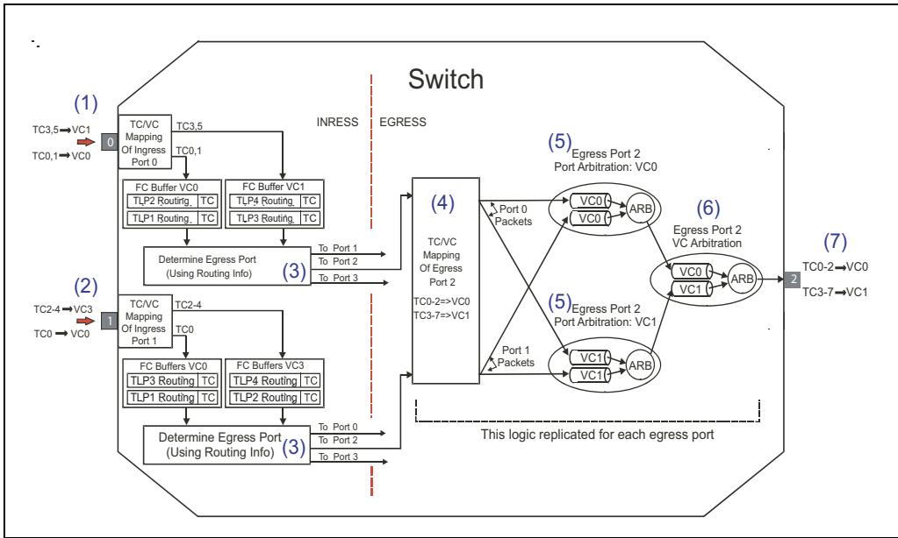

## 7.5 Arbitration in Multi-Function Endpoints | 7.5 多功能端点中的仲裁

<table style="border:1px solid #ddd;border-collapse:collapse; width:100%;" cellpadding="4" cellspacing="0" rules="all" frame="border">
  <thead style="border:1px solid #ddd;">
    <tr>
      <th width="50%" style="border:1px solid #ddd; background:#f5f5f5;">EN</th>
      <th width="50%" style="border:1px solid #ddd; background-color:#e8e8e8;">中文</th>
    </tr>
  </thead>
  <tbody>
    <tr><td width="50%" style="border:1px solid #ddd; background:#fff;padding:4px 8px;">Another set of registers called Multi-Function Virtual Channel (MFVC) capability is defined for the specific case of endpoints that will implement QoS in a device with multiple functions. Not surprisingly, this case presents the same arbitration issues internally that a switch port must handle.</td><td width="50%" style="border:1px solid #ddd; background-color:#e8e8e8;padding:4px 8px;">另一组称为多函数虚通道（MFVC）能力的寄存器针对特定情况定义，即在具有多个函数的设备中实现服务质量的端点。毫不意外，这种情况内部呈现了与交换机端口必须处理的相同的仲裁问题。</td></tr>
    <tr><td width="50%" style="border:1px solid #ddd; background:#fff;padding:4px 8px;">There are two cases described in the spec for this arbitration. In the first case, shown in Figure 7-21 on page 271, there are two Functions but only Function 0 includes VC Capability registers and the assignments made there are implicitly the same for all functions. For this option, arbitration between the functions will be handled in some vendor-specific manner. That's the simplest approach, but doesn't include a standard structure to define priority between requests from different functions and so it doesn't support QoS.</td><td width="50%" style="border:1px solid #ddd; background-color:#e8e8e8;padding:4px 8px;">规范描述了这种仲裁的两种情况。第一种情况如第271页图7-21所示，存在两个函数，但仅有函数0包含VC能力寄存器，且其中的分配隐式适用于所有函数。对于此选项，函数间的仲裁将以某种厂商特定的方式处理。这是最简单的方法，但不包含用于定义不同函数请求间优先级的标准结构，因此不支持QoS。</td></tr>
  </tbody>
</table>

Figure 7-21: Simple Multi-Function Arbitration | 图7-21：简单多功能仲裁

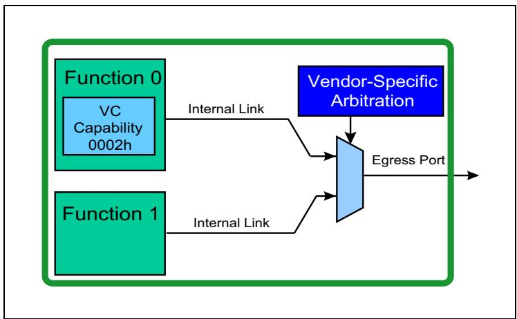

<table style="border:1px solid #ddd;border-collapse:collapse; width:100%;" cellpadding="4" cellspacing="0" rules="all" frame="border">
  <thead style="border:1px solid #ddd;">
    <tr>
      <th width="50%" style="border:1px solid #ddd; background:#f5f5f5;">EN</th>
      <th width="50%" style="border:1px solid #ddd; background-color:#e8e8e8;">中文</th>
    </tr>
  </thead>
  <tbody>
    <tr><td width="50%" style="border:1px solid #ddd; background:#fff;padding:4px 8px;">If QoS support is desired, then an MFVC is implemented in VC0 and each function has its own unique set of VC Capability registers. To preserve software backward compatibility, the spec states that the VC Capability ID for a device that does not use MFVC must be 0002h, while the VC Capability ID for a device that does implement an MFVC structure must be 0009h.</td><td width="50%" style="border:1px solid #ddd; background-color:#e8e8e8;padding:4px 8px;">如果需要QoS支持，则在VC0中实现MFVC，且每个函数拥有自己唯一的一组VC能力寄存器。为保持软件向后兼容性，规范规定：不使用MFVC的设备的VC能力ID必须为0002h，而实现了MFVC结构的设备的VC能力ID必须为0009h。</td></tr>
    <tr><td width="50%" style="border:1px solid #ddd; background:#fff;padding:4px 8px;">Figure 7-22 on page 272 shows the MFVC register block and a block diagram of an example with two functions in an endpoint whose port supports two VCs. Each function has a Transaction Layer and its own VC Capability registers, but doesn't implement the lower layers. Instead, they connect to the Transaction Layer of the shared port that does have all the layers. Sharing the hardware interface results in lower cost, of course, and the addition of MFVC allows the functions to handle isochronous traffic.</td><td width="50%" style="border:1px solid #ddd; background-color:#e8e8e8;padding:4px 8px;">第272页图7-22展示了MFVC寄存器块以及一个端点中两个函数的示例框图，该端口的端口支持两个VC。每个函数拥有事务层和其自己的VC能力寄存器，但不实现下层。相反，它们连接到共享端口的事务层，该端口拥有所有层。共享硬件接口当然会降低成本，而MFVC的添加允许这些函数处理等时流量。</td></tr>
    <tr><td width="50%" style="border:1px solid #ddd; background:#fff;padding:4px 8px;">As can be seen in the figure, the MFVC registers reside in Function 0 only and define the VCs and arbitration methods to be used for this interface. The MFVC registers look very much the same as VC capability registers and support VC arbitration and Function arbitration. Since packets from multiple functions can attempt to access the same VC at the same time, Function Arbitration decides the priorities among them. That should look familiar by now because it's the same concept as port arbitration and even uses the same arbitration options, including TBWRR. VC arbitration options are also the same as they are in the single-function VC registers.</td><td width="50%" style="border:1px solid #ddd; background-color:#e8e8e8;padding:4px 8px;">从图中可以看出，MFVC寄存器仅存在于函数0中，并定义了该接口使用的VC和仲裁方法。MFVC寄存器看起来与VC能力寄存器非常相似，支持VC仲裁和函数仲裁。由于来自多个函数的数据包可能同时尝试访问同一个VC，函数仲裁决定它们之间的优先级。这现在看起来应该很熟悉了，因为它与端口仲裁概念相同，甚至使用相同的仲裁选项，包括TBWRR。VC仲裁选项也与单函数VC寄存器中的相同。</td></tr>
  </tbody>
</table>

Figure 7-22: QoS Support in Multi-Function Arbitration | 图7-22：多功能仲裁中的QoS支持

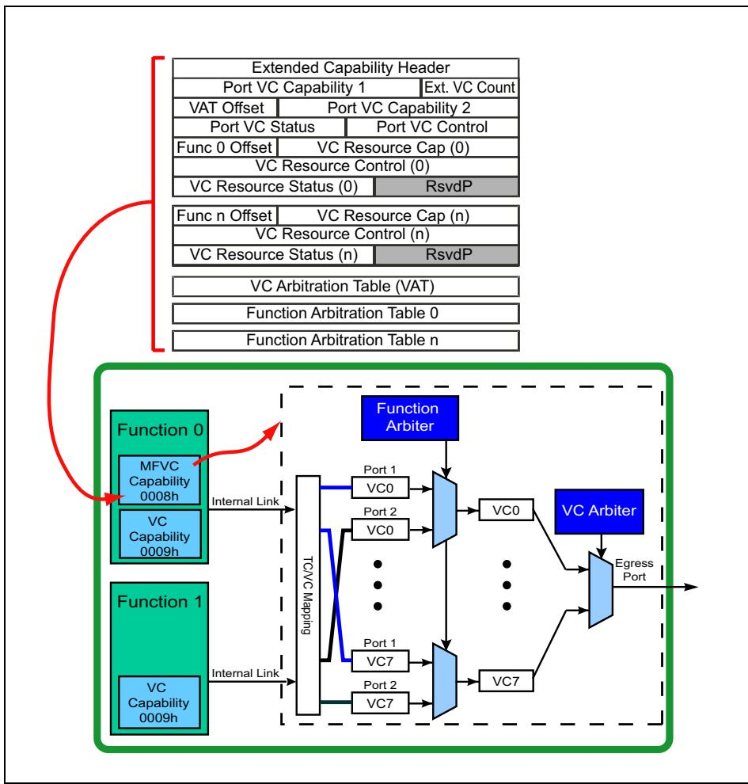

## 7.6 Isochronous Support | 7.6 等时支持

<table style="border:1px solid #ddd;border-collapse:collapse; width:100%;" cellpadding="4" cellspacing="0" rules="all" frame="border">
  <thead style="border:1px solid #ddd;">
    <tr>
      <th width="50%" style="border:1px solid #ddd; background:#f5f5f5;">EN</th>
      <th width="50%" style="border:1px solid #ddd; background-color:#e8e8e8;">中文</th>
    </tr>
  </thead>
  <tbody>
    <tr><td width="50%" style="border:1px solid #ddd; background:#fff;padding:4px 8px;">As mentioned earlier, not every machine or application needs isochronous support, but there are some that can't get by without it. Since PCIe was designed to support it from the beginning, let's consider what would need to be in place to make this work.</td><td width="50%" style="border:1px solid #ddd; background-color:#e8e8e8;padding:4px 8px;">如前所述，并非每台机器或每个应用都需要等时支持，但有些应用离开它则无法工作。由于PCIe从设计之初就支持等时特性，下面我们来考虑需要具备哪些条件才能使其正常工作。</td></tr>
  </tbody>
</table>

## 7.6.1 Timing is Everything | 7.6.1 时序至关重要

<table style="border:1px solid #ddd;border-collapse:collapse; width:100%;" cellpadding="4" cellspacing="0" rules="all" frame="border">
  <thead style="border:1px solid #ddd;">
    <tr>
      <th width="50%" style="border:1px solid #ddd; background:#f5f5f5;">EN</th>
      <th width="50%" style="border:1px solid #ddd; background-color:#e8e8e8;">中文</th>
    </tr>
  </thead>
  <tbody>
    <tr><td width="50%" style="border:1px solid #ddd; background:#fff;padding:4px 8px;">Consider the example shown in Figure 7-23 on page 274, where a synchronous connection would be desirable but isn't possible. Instead, we emulate a synchronous path with isochronous mechanisms. In this example, isochrony defines the amount of data that will be delivered within each Service Interval to achieve the required service. The following sequence describes the operation:</td><td width="50%" style="border:1px solid #ddd; background-color:#e8e8e8;padding:4px 8px;">考虑图7-23（第274页）所示的示例，其中同步连接是理想的但不可行。相反，我们使用等时机制来模拟同步路径。在此示例中，等时性定义了在每个服务间隔内为达到所需服务而将交付的数据量。以下序列描述了该操作：</td></tr>
    <tr><td width="50%" style="border:1px solid #ddd; background:#fff;padding:4px 8px;">1. The synchronous source (video camera and PCI Express interface) accumulates data in Buffer A during the first of the equal service intervals (SI 1).</td><td width="50%" style="border:1px solid #ddd; background-color:#e8e8e8;padding:4px 8px;">1. 同步源（摄像机和PCI Express接口）在第一个等长服务间隔（SI 1）期间将数据累积到缓冲区A中。</td></tr>
    <tr><td width="50%" style="border:1px solid #ddd; background:#fff;padding:4px 8px;">2. The camera delivers all of the accumulated data across the general-purpose bus during the next service interval (SI 2) while it accumulates the next block of data in Buffer B.</td><td width="50%" style="border:1px solid #ddd; background-color:#e8e8e8;padding:4px 8px;">2. 摄像机在下一个服务间隔（SI 2）期间通过通用总线交付所有累积数据，同时将下一块数据累积到缓冲区B中。</td></tr>
    <tr><td width="50%" style="border:1px solid #ddd; background:#fff;padding:4px 8px;">Clearly, the system must be able to guarantee that the entire contents of buffer A can be delivered during the service interval, regardless of whether other traffic is in flight on the Link. This is handled by assigning a high priority to the time-sensitive packets and programming arbitration schemes so they'll be handled first any time there is competition with other traffic. Also note that, as long as all the data is delivered within the time window, it doesn't matter exactly when it arrives. It might be spread out across the interval or bunched up in one place inside it. As long as it's all delivered with the Service Interval the guarantees can still be met.</td><td width="50%" style="border:1px solid #ddd; background-color:#e8e8e8;padding:4px 8px;">显然，系统必须能够保证缓冲区A的全部内容可以在服务间隔内交付，无论链路上是否有其他流量正在传输。这通过为时间敏感报文分配高优先级并编程仲裁方案来实现，使得它们在与其他流量竞争时始终优先被处理。还需注意，只要所有数据在时间窗口内交付，其确切到达时间并不重要。数据可能分散在间隔内，也可能集中在间隔内的某处。只要所有数据都在服务间隔内交付，保证仍然可以满足。</td></tr>
    <tr><td width="50%" style="border:1px solid #ddd; background:#fff;padding:4px 8px;">3. During SI 2, the tape deck receives and buffers the incoming data, which can then be delivered to storage for recording during SI 3. The camera unloads Buffer B onto the Link during SI 3 while accumulating new data into Buffer A, and the cycle repeats.</td><td width="50%" style="border:1px solid #ddd; background-color:#e8e8e8;padding:4px 8px;">3. 在SI 2期间，磁带机接收并缓冲传入数据，随后可在SI 3期间将这些数据交付到存储设备进行记录。摄像机在SI 3期间将缓冲区B卸载到链路上，同时将新数据累积到缓冲区A中，如此循环重复。</td></tr>
  </tbody>
</table>

Figure 7-23: Example Application of Isochronous Transaction | 图7-23：等时事务应用示例

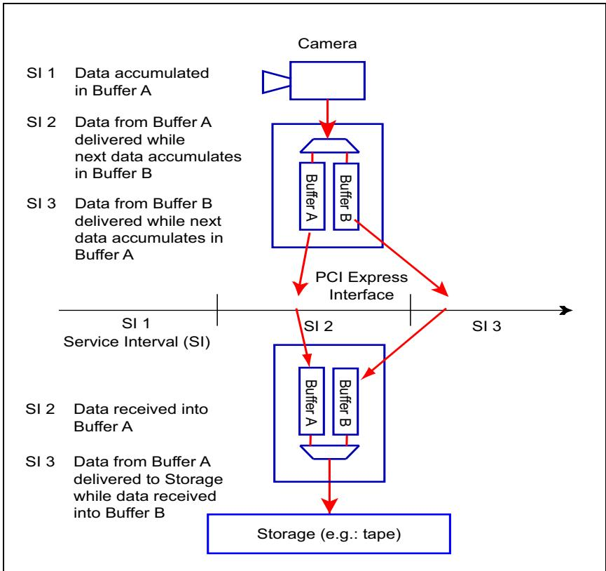

<table style="border:1px solid #ddd;border-collapse:collapse; width:100%;" cellpadding="4" cellspacing="0" rules="all" frame="border">
  <thead style="border:1px solid #ddd;">
    <tr>
      <th width="50%" style="border:1px solid #ddd; background:#f5f5f5;">EN</th>
      <th width="50%" style="border:1px solid #ddd; background-color:#e8e8e8;">中文</th>
    </tr>
  </thead>
  <tbody>
    <tr><td width="50%" style="border:1px solid #ddd; background:#fff;padding:4px 8px;">## How Timing is Defined</td><td width="50%" style="border:1px solid #ddd; background-color:#e8e8e8;padding:4px 8px;">## 时序如何定义</td></tr>
    <tr><td width="50%" style="border:1px solid #ddd; background:#fff;padding:4px 8px;">Isochronous timing is defined in PCIe by the time slot used in the Time-Based Weighted Round Robin port arbitration scheme. At present, the time for each slot is 100ns, and represents one entry of the 128 entries in the TBWRR table. Once set up, the arbiter will repeatedly cycle through this table once every 12.8us, which represents the overall Service Interval.</td><td width="50%" style="border:1px solid #ddd; background-color:#e8e8e8;padding:4px 8px;">在 PCIe 中，等时时序由基于时间的加权轮询端口仲裁方案中使用的时间槽定义。目前，每个时间槽为 100ns，代表 TBWRR 表中 128 个表项中的一个。一旦设置完成，仲裁器将每 12.8us 重复循环遍历该表一次，此周期代表整体服务间隔。</td></tr>
    <tr><td width="50%" style="border:1px solid #ddd; background:#fff;padding:4px 8px;">Making an isochronous path work as intended requires a few considerations. First, the data packets must be delivered with predictable timing at regular intervals. Second, the maximum amount of isochronous data to be delivered must be known ahead of time and packets must not be allowed to exceed that limit. Third, the Link bandwidth must be sufficient to support the amount of data that needs to be delivered in a given time slot.</td><td width="50%" style="border:1px solid #ddd; background-color:#e8e8e8;padding:4px 8px;">要使等时路径按预期工作，需要考虑几个因素。第一，数据包必须以可预测的时序按固定间隔交付。第二，必须提前知道要交付的最大等时数据量，并且不允许数据包超过该限制。第三，链路带宽必须足以支持在给定时间槽内需要交付的数据量。</td></tr>
    <tr><td width="50%" style="border:1px solid #ddd; background:#fff;padding:4px 8px;">Consider the following example. A single-Lane Link running at 2.5 Gbps delivers one symbol every 4ns. That allows it to send 25 symbols within a 100ns time slot, but is that enough to be useful? In many cases it's not, because a TLP may need 28 bytes of overhead for the combination of header, sequence number, LCRC, and so forth. That would mean there isn't even time to finish sending the overhead, much less any data payload in 100ns. If we needed to send 128 bytes of data, then the bandwidth requirement would be 128+overhead = 156 bytes. One option for solving this problem would be to increase the Link width to 8 Lanes, allowing eight times as many bytes to be sent at once. That change would deliver 200 bytes in 100ns and allow a single time slot to deliver all the isochronous data. Another solution would be to use a single Lane but give the port more time slots, since 8 time slots at the lower Link width would deliver the same amount of data. The choice of solution depends on cost and performance constraints, but the system designer must know the timing and bandwidth requirements of the isochronous path to be able to set it up correctly.</td><td width="50%" style="border:1px solid #ddd; background-color:#e8e8e8;padding:4px 8px;">考虑以下示例。一条运行在 2.5 Gbps 的单通道链路每 4ns 传送一个符号。这意味着它可以在一个 100ns 的时间槽内发送 25 个符号，但这足够有用吗？在很多情况下是不够的，因为一个 TLP 可能需要 28 字节的开销用于包头、序列号、LCRC 等的组合。这意味着在 100ns 内甚至没有时间完成开销的发送，更不用说任何数据负载了。如果我们需要发送 128 字节的数据，那么带宽需求将是 128+开销 = 156 字节。解决此问题的一个方案是将链路宽度增加到 8 通道，从而允许一次发送八倍数量的字节。这一改变将在 100ns 内交付 200 字节，并允许单个时间槽交付所有等时数据。另一个方案是使用单通道，但为该端口分配更多时间槽，因为在较低链路宽度下使用 8 个时间槽将交付相同数量的数据。方案的选择取决于成本和性能约束，但系统设计人员必须了解等时路径的时序和带宽需求，才能正确进行设置。</td></tr>
  </tbody>
</table>

## 7.6.1.1 How Timing is Enforced | 7.6.1.1 时序如何执行

<table style="border-collapse:collapse;width:100%" cellpadding="4" cellspacing="0" rules="all" frame="border">
  <thead>
    <tr>
      <th width="50%" style="border:2px solid #000;background:#f5f5f5;padding:4px 8px;">EN</th>
      <th width="50%" style="border:2px solid #000;background-color:#e8e8e8;padding:4px 8px;">中文</th>
    </tr>
  </thead>
  <tbody>
    <tr><td width="50%" style="border:2px solid #000; background:#fff;padding:4px 8px;">## How Timing is Enforced</td><td width="50%" style="border:2px solid #000; background-color:#e8e8e8;padding:4px 8px;">## 时序如何强制执行</td></tr>
    <tr><td width="50%" style="border:2px solid #000; background:#fff;padding:4px 8px;">When timing is an integral part of the proper operation of a design, as in the previous example, it is enforced by the combination of things we've discussed so far. First, high‑priority TCs must be selected in software and VCs set up in hardware with the mappings between them defined so that only the correct packets will be placed into the high‑priority VCs. Then the desired timing is a matter of programming the arbitration schemes to accommodate the needed bandwidth in the specified time. For example, the choice for VC arbitration would probably be the Strict Priority option, since it's the only choice that can ensure that a high‑priority packet won't be delayed by other packets. For Port arbitration the choice must be TBWRR to enforce timing.</td><td width="50%" style="border:2px solid #000; background-color:#e8e8e8;padding:4px 8px;">如前例所示，当时序是设计正确运行不可或缺的一部分时，它由我们迄今讨论的各项要素共同强制执行。首先，必须通过软件选择高优先级TC，并在硬件中设置VC，同时定义它们之间的映射关系，以确保只有正确的报文被放入高优先级VC。然后，所需的时序就是通过编程仲裁方案，在指定时间内容纳所需带宽的问题。例如，VC仲裁很可能应选择严格优先级选项，因为它是唯一能确保高优先级报文不会被其他报文延迟的选择。对于端口仲裁，必须选择TBWRR以强制执行时序。</td></tr>
    <tr><td width="50%" style="border:2px solid #000; background:#fff;padding:4px 8px;">## Software Support</td><td width="50%" style="border:2px solid #000; background-color:#e8e8e8;padding:4px 8px;">## 软件支持</td></tr>
    <tr><td width="50%" style="border:2px solid #000; background:#fff;padding:4px 8px;">Supporting isochronous service requires some coordination between the software elements in the system. In a PC system, device drivers will report isochronous requirements and capabilities to the OS, which will then evaluate the overall system demands and allocate resources appropriately. Embedded systems will be different, because the all the pieces are known at the outset and software can be simpler. In the following discussion we'll describe the PC case since an embedded system should simply be a simpler subset of that.</td><td width="50%" style="border:2px solid #000; background-color:#e8e8e8;padding:4px 8px;">支持等时服务需要系统中各软件元素之间进行一定的协调。在PC系统中，设备驱动程序将向操作系统报告等时需求与能力，操作系统随后评估整体系统需求并合理分配资源。嵌入式系统则有所不同，因为所有组件在初始阶段便已明确，软件可以更为简单。在后续讨论中，我们将描述PC的情况，因为嵌入式系统应只是其一个更简单的子集。</td></tr>
  </tbody>
</table>

## 7.6.1.2 Device Drivers | 7.6.1.2 设备驱动程序

<table style="border:1px solid #ddd;border-collapse:collapse; width:100%;" cellpadding="4" cellspacing="0" rules="all" frame="border">
  <thead style="border:1px solid #ddd;">
    <tr>
      <th width="50%" style="border:1px solid #ddd; background:#f5f5f5;">EN</th>
      <th width="50%" style="border:1px solid #ddd; background-color:#e8e8e8;">中文</th>
    </tr>
  </thead>
  <tbody>
    <tr><td width="50%" style="border:1px solid #ddd; background:#fff;padding:4px 8px;">A device driver must be able to report its timing requirements to the software that oversees isochronous operation and obtain permission before trying to use isochronous packets.</td><td width="50%" style="border:1px solid #ddd; background-color:#e8e8e8;padding:4px 8px;">设备驱动程序必须能够向监督等时操作的软件报告其定时需求，并在尝试使用等时报文之前获得许可。</td></tr>
    <tr><td width="50%" style="border:1px solid #ddd; background:#fff;padding:4px 8px;">It's important to note that driver-level software should not directly change hardware assignments or arbitration policies on its own, even though it could, because the result would be chaos.</td><td width="50%" style="border:1px solid #ddd; background-color:#e8e8e8;padding:4px 8px;">需要特别指出的是，驱动程序级别的软件不应自行直接更改硬件分配或仲裁策略——尽管它有能力这样做——因为其结果将导致混乱。</td></tr>
    <tr><td width="50%" style="border:1px solid #ddd; background:#fff;padding:4px 8px;">If multiple drivers were each independently trying to do this, the last one to make changes would overwrite any previous assignments.</td><td width="50%" style="border:1px solid #ddd; background-color:#e8e8e8;padding:4px 8px;">如果有多个驱动程序各自独立地尝试这样做，那么最后一个进行更改的驱动程序将覆盖之前的所有分配。</td></tr>
    <tr><td width="50%" style="border:1px solid #ddd; background:#fff;padding:4px 8px;">To avoid that, an OS-level program called an Isochronous Broker receives the timing requests from the system devices and assigns system resources in a coordinated way that accommodates them all.</td><td width="50%" style="border:1px solid #ddd; background-color:#e8e8e8;padding:4px 8px;">为避免这种情况，一个名为等时代理（Isochronous Broker）的操作系统级程序接收来自系统设备的定时请求，并以协调的方式分配系统资源，以满足所有设备的需求。</td></tr>
  </tbody>
</table>

## 7.6.1.3 Isochronous Broker | 7.6.1.3 等时代理

<table style="border:1px solid #ddd;border-collapse:collapse; width:100%;" cellpadding="4" cellspacing="0" rules="all" frame="border">
  <thead style="border:1px solid #ddd;">
    <tr>
      <th width="50%" style="border:1px solid #ddd; background:#f5f5f5;">EN</th>
      <th width="50%" style="border:1px solid #ddd; background-color:#e8e8e8;">中文</th>
    </tr>
  </thead>
  <tbody>
    <tr><td width="50%" style="border:1px solid #ddd; background:#fff;padding:4px 8px;">This program manages the end-to-end flow of isochronous packets. It receives the isochronous timing requests from device drivers and allocates system resources in a way that accommodates the requests through the target path. In the spec this is referred to as establishing an isochronous contract between the requester/completer pair and the PCIe fabric. Doing so requires verifying that the intended path can indeed support isochronous traffic, and then programming the appropriate arbitration schemes to ensure it works within the specified timing requirements.</td><td width="50%" style="border:1px solid #ddd; background-color:#e8e8e8;padding:4px 8px;">该程序管理等时数据包的端到端流控。它接收来自设备驱动程序的等时时序请求，并以满足请求的方式通过目标路径分配系统资源。在规范中，这称为在Requester/Completer对与PCIe结构之间建立等时合约。这样做需要验证预期路径确实能够支持等时流量，然后对适当的仲裁方案进行编程，以确保其在指定的时序要求内正常工作。</td></tr>
  </tbody>
</table>

## 7.6.3 Bringing it all together | 7.6.3 综合概述

<table style="border:1px solid #ddd;border-collapse:collapse; width:100%;" cellpadding="4" cellspacing="0" rules="all" frame="border">
  <thead style="border:1px solid #ddd;">
    <tr>
      <th width="50%" style="border:1px solid #ddd; background:#f5f5f5;">EN</th>
      <th width="50%" style="border:1px solid #ddd; background-color:#e8e8e8;">中文</th>
    </tr>
  </thead>
  <tbody>
    <tr><td width="50%" style="border:1px solid #ddd; background:#fff;padding:4px 8px;">By now it should be reasonably clear what needs to be done to support isochronous traffic flow in a system, but let's look at one last example to bring all the pieces together.</td><td width="50%" style="border:1px solid #ddd; background-color:#e8e8e8;padding:4px 8px;">到目前为止，支持系统中等时流量所需的工作应该已经相当清楚了，但让我们再看最后一个示例来将所有内容整合在一起。</td></tr>
    <tr><td width="50%" style="border:1px solid #ddd; background:#fff;padding:4px 8px;">If we expand on the previous video capture example to show a more complex system, like the one in Figure 7-24 on page 277, we'll be able to discuss all the parts that must be in place if the video camera is going to be able to deliver captured data into system memory.</td><td width="50%" style="border:1px solid #ddd; background-color:#e8e8e8;padding:4px 8px;">如果我们扩展之前的视频捕获示例以展示一个更复杂的系统，如图 7-24（第 277 页）所示，我们将能够讨论如果摄像机要将捕获的数据传送到系统内存，所有必须到位的部件。</td></tr>
    <tr><td width="50%" style="border:1px solid #ddd; background:#fff;padding:4px 8px;">This would be a difficult environment for isochronous service because there are so many devices that can compete for bandwidth in the path, but that also makes it useful to illustrate the various things that must be considered.</td><td width="50%" style="border:1px solid #ddd; background-color:#e8e8e8;padding:4px 8px;">这对于等时服务来说将是一个困难的环境，因为路径中有太多设备会竞争带宽，但这同时也使其成为说明必须考虑的各种因素的绝佳示例。</td></tr>
  </tbody>
</table>

## 7.6.3.1 Endpoints | 7.6.3.1 端点

<table style="border:1px solid #ddd;border-collapse:collapse; width:100%;" cellpadding="4" cellspacing="0" rules="all" frame="border">
  <thead style="border:1px solid #ddd;">
    <tr>
      <th width="50%" style="border:1px solid #ddd; background:#f5f5f5;">EN</th>
      <th width="50%" style="border:1px solid #ddd; background-color:#e8e8e8;">中文</th>
    </tr>
  </thead>
  <tbody>
    <tr><td width="50%" style="border:1px solid #ddd; background:#fff;padding:4px 8px;">Starting at the bottom, what will be needed in the PCIe interface for the video endpoint device itself? In hardware, more than one VC will be required if we're going to differentiate packets. Let's assume a single-function device for simplicity. The device driver would need to report the device capabilities and isochronous timing requirements to the OS-level Isochronous broker, which would evaluate the system and then report back whether an isochronous contract was possible and which TCs the software should use.</td><td width="50%" style="border:1px solid #ddd; background-color:#e8e8e8;padding:4px 8px;">从底层开始，视频端点设备本身的PCIe接口需要什么？在硬件上，如果要区分数据包，则需要多个VC。为简单起见，我们假设一个单功能设备。设备驱动程序需要向操作系统级的等时代理报告设备能力和等时时序要求，该代理将评估系统，然后报告等时契约是否可能以及软件应使用哪些TC。</td></tr>
  </tbody>
</table>

Figure 7-24: Example Isochronous System | 图7-24：等时系统示例

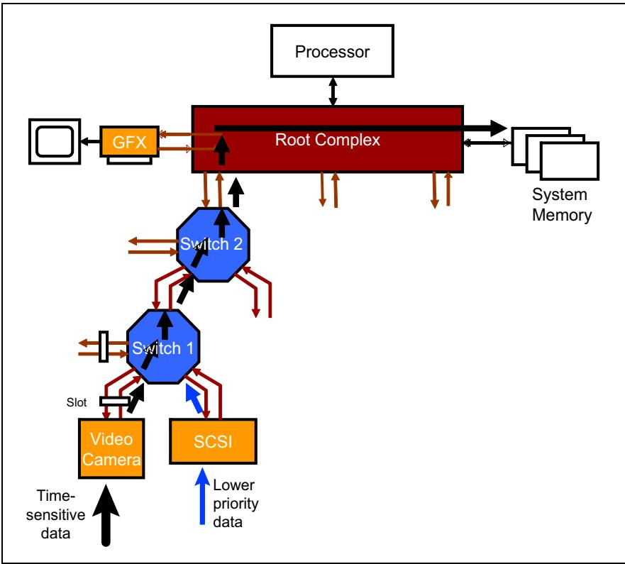

<table style="border:1px solid #ddd;border-collapse:collapse; width:100%;" cellpadding="4" cellspacing="0" rules="all" frame="border">
  <thead style="border:1px solid #ddd;">
    <tr>
      <th width="50%" style="border:1px solid #ddd; background:#f5f5f5;">EN</th>
      <th width="50%" style="border:1px solid #ddd; background-color:#e8e8e8;">中文</th>
    </tr>
  </thead>
  <tbody>
    <tr><td width="50%" style="border:1px solid #ddd; background:#fff;padding:4px 8px;">The driver would then program VC numbers and map the appropriate TCs to each VC. It would also most likely program the VC arbitration to be Strict Priority for the high-priority channels. The one caveat here is that the arbitration must still be "fair", meaning the low-priority channels won't get starved for access. That means the high-priority VCs can't have traffic pending constantly but instead must spread out packet injection over time.</td><td width="50%" style="border:1px solid #ddd; background-color:#e8e8e8;padding:4px 8px;">驱动程序随后将编程VC编号并将适当的TC映射到每个VC。它也很可能将VC仲裁编程为高优先级通道的严格优先级。这里的一个注意事项是仲裁仍必须"公平"，这意味着低优先级通道不会被饿死。也就是说，高优先级VC不能持续有待处理流量，而必须随时间分散注入数据包。</td></tr>
    <tr><td width="50%" style="border:1px solid #ddd; background:#fff;padding:4px 8px;">One other observation regarding Link operation is necessary before we finish our discussion of endpoints, and that is regarding Flow Control. The receive buffers of devices in the isochronous path must be large enough to handle the expected packet flow without causing any back pressure as long as packets are injected uniformly according to the Isochronous Contract. In addition, Flow Control Updates must be returned quickly enough to avoid stalls.</td><td width="50%" style="border:1px solid #ddd; background-color:#e8e8e8;padding:4px 8px;">在结束对端点的讨论之前，还需要对链路操作进行另一个说明，即关于流控的。等时路径中设备的接收缓冲区必须足够大，以处理预期的数据包流，只要根据等时契约均匀注入数据包，就不会引起任何反压。此外，必须足够快地返回流控更新以避免停顿。</td></tr>
  </tbody>
</table>

## Switches | 交换机

<table style="border:1px solid #ddd;border-collapse:collapse; width:100%;" cellpadding="4" cellspacing="0" rules="all" frame="border">
  <thead style="border:1px solid #ddd;">
    <tr>
      <th width="50%" style="border:1px solid #ddd; background:#f5f5f5;">EN</th>
      <th width="50%" style="border:1px solid #ddd; background-color:#e8e8e8;">中文</th>
    </tr>
  </thead>
  <tbody>
    <tr><td width="50%" style="border:1px solid #ddd; background:#fff;padding:4px 8px;">Next, consider what would need to be present in each of the switches that reside between the endpoint and the Root Complex. Switches don't commonly have device drivers, so it would fall to OS-level software like the Isochronous Broker to read their configuration information and determine what service they support. First, all the ports in the isochronous path must support more than one VC, and the TC/VC mapping must match on both ends of each Link. Remember that once the packet gets into the Transaction Layer of the Switch port, only the TC remains with the packet, and the VC assignment for that TC is specific to each port. The TC/VC mapping of the downstream port of Switch 1 must match the mapping of the endpoint, but the other switch port mappings may be different to match the other end of their Links.</td><td width="50%" style="border:1px solid #ddd; background-color:#e8e8e8;padding:4px 8px;">接下来，考虑端点与根复合体之间的每个交换机中需要具备什么。交换机通常没有设备驱动程序，因此需要由操作系统级软件（如等时代理）读取其配置信息并确定它们支持的服务。首先，等时路径中的所有端口必须支持多个VC，并且每条链路两端的TC/VC映射必须匹配。请记住，一旦报文进入交换机端口的事务层，只有TC随报文保留，而该TC的VC分配是每个端口特有的。交换机1的下行端口的TC/VC映射必须与端点的映射匹配，但其他交换机端口的映射可以不同，以匹配其链路另一端的映射。</td></tr>
    <tr><td width="50%" style="border:1px solid #ddd; background:#fff;padding:4px 8px;">Arbitration Issues. The choices for arbitration are straight-forward. In our example, the isochronous path is shown as carrying traffic in only one direction for simplicity. It is possible to have isochronous traffic flowing in both directions in the case of a memory read, for example, but our example was chosen to resemble the video streaming case.</td><td width="50%" style="border:1px solid #ddd; background-color:#e8e8e8;padding:4px 8px;">仲裁问题。仲裁的选择很简单。在我们的示例中，为简单起见，等时路径仅显示为单向传输流量。例如，在内存读取的情况下，等时流量有可能双向流动，但我们选择此示例是为了模拟视频流场景。</td></tr>
    <tr><td width="50%" style="border:1px solid #ddd; background:#fff;padding:4px 8px;">VC arbitration for the isochronous egress port will most likely need to use the Strict Priority scheme for the same reasons the endpoint does. Port arbitration will need to use the Time-Based WRR scheme, and that means software must understand the proper access ratios and program the Port Arbitration Tables to implement them. This might not be as simple as it sounds if multiple switches are in the path because even though they'll all use the same TBWRR arbitration scheme, it's not clear how the service intervals for each of them would be coordinated. If the SIs are not aligned, meaning timing guarantees could be more difficult depending on the how busy the Links are. Coordinating the service intervals wasn't considered in the spec, though, so it would again involve a non-standard method. Clearly, this problem would be much simpler if we didn't have multiple switches in an isochronous path.</td><td width="50%" style="border:1px solid #ddd; background-color:#e8e8e8;padding:4px 8px;">等时出口端口的VC仲裁很可能需要使用与端点相同的严格优先级方案。端口仲裁需要使用基于时间的WRR方案，这意味着软件必须了解正确的访问比率并编程端口仲裁表来实现它们。如果路径中有多个交换机，这可能不像听起来那么简单，因为即使它们都使用相同的TBWRR仲裁方案，每个交换机的服务间隔如何协调也不明确。如果SI未对齐，意味着时序保证可能更加困难，具体取决于链路的繁忙程度。不过，规范中并未考虑协调服务间隔的问题，因此这又将涉及到非标准方法。显然，如果等时路径中没有多个交换机，这个问题会简单得多。</td></tr>
    <tr><td width="50%" style="border:1px solid #ddd; background:#fff;padding:4px 8px;">Timing Issues. Figure 7-25 on page 279 shows the timing of packets being delivered by the two endpoints for our example. Packets from the video device, with a known size and delivered in regular and predictable intervals, are shown as the heavier arrows. The smaller, lighter arrows represent packets from the SCSI drive that are lower priority and whose timing is not predictable. In the endpoint, the packets simply need to have the proper TC assigned to them, but a switch needs to ensure that the proper timing policy is enforced. This is done by using TBWRR, which specifies which port will have access at a given time and for how long. Knowing the size and frequency of the isochronous packets allows software to properly arrange the timing, but what kind of timing is needed?</td><td width="50%" style="border:1px solid #ddd; background-color:#e8e8e8;padding:4px 8px;">时序问题。第279页的图7-25显示了我们示例中两个端点传送报文的时序。来自视频设备的报文具有已知大小，并以规律且可预测的间隔传送，以较粗的箭头表示。较小、较细的箭头表示来自SCSI驱动器的报文，这些报文优先级较低且时序不可预测。在端点中，报文只需要分配正确的TC，但交换机需要确保执行正确的时序策略。这是通过使用TBWRR来实现的，它指定哪个端口在何时可以访问以及访问多长时间。了解等时报文的大小和频率使软件能够正确安排时序，但需要什么样的时序呢？</td></tr>
  </tbody>
</table>

Figure 7-25: Injection of Isochronous Packets | 图7-25：等时数据包注入

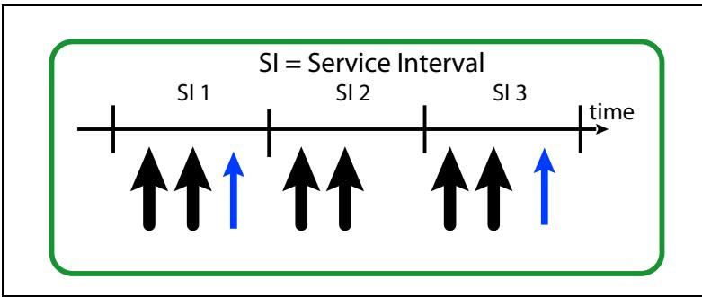

<table style="border:1px solid #ddd;border-collapse:collapse; width:100%;" cellpadding="4" cellspacing="0" rules="all" frame="border">
  <thead style="border:1px solid #ddd;">
    <tr>
      <th width="50%" style="border:1px solid #ddd; background:#f5f5f5;">EN</th>
      <th width="50%" style="border:1px solid #ddd; background-color:#e8e8e8;">中文</th>
    </tr>
  </thead>
  <tbody>
    <tr><td width="50%" style="border:1px solid #ddd; background:#fff;padding:4px 8px;">First, let's review the parameters involved by considering a simple example. Recall that PCIe bases a time slot on the reference clock period is given by the Port Capability Register 1 field called Reference Clock. At present the only option for that field is 100ns, and the TBWRR table has no options besides 128 entries. The length of the Service Interval is the multiple of those, making it 12.8μs. The bandwidth for a given device can be expressed by the equation below, where Y is the data to be delivered in one time slot (the spec states that the Max Payload Size programmed during configuration must be used for this bandwidth calculation), M is the number of time slots, and T is the overall Service Interval. If we choose 128 bytes as the payload, and we know that SI is 12.8μs, then the BW = 10 MB/s for each time slot allocated.</td><td width="50%" style="border:1px solid #ddd; background-color:#e8e8e8;padding:4px 8px;">首先，通过一个简单示例来回顾所涉及的参数。请回忆，PCIe 将时隙基于参考时钟周期，该周期由端口能力寄存器1中称为参考时钟的字段给出。目前该字段的唯一选项是100ns，并且TBWRR表除了128个条目外没有其他选项。服务间隔的长度是这些值的倍数，即12.8μs。给定设备的带宽可以用以下公式表示，其中Y是在一个时隙中要传送的数据（规范规定必须使用配置期间编程的最大有效载荷大小进行此带宽计算），M是时隙数，T是总的服务间隔。如果我们选择128字节作为有效载荷，并且我们知道SI为12.8μs，那么每个分配的时隙的带宽为10 MB/s。</td></tr>
  </tbody>
</table>

$$
B W = \frac {Y \times M}{T}
$$

<table style="border:1px solid #ddd;border-collapse:collapse; width:100%;" cellpadding="4" cellspacing="0" rules="all" frame="border">
  <thead style="border:1px solid #ddd;">
    <tr>
      <th width="50%" style="border:1px solid #ddd; background:#f5f5f5;">EN</th>
      <th width="50%" style="border:1px solid #ddd; background-color:#e8e8e8;">中文</th>
    </tr>
  </thead>
  <tbody>
    <tr><td width="50%" style="border:1px solid #ddd; background:#fff;padding:4px 8px;">Now let's consider a more realistic example. Let's say that our Links are running at the Gen2 speed, that the video device needs to have a guaranteed bandwidth of 100MB/s, and that it will send 512 byte packets. Filling in the equation shows M = 2.5 instances of 512 bytes are needed. But how much data can actually be</td><td width="50%" style="border:1px solid #ddd; background-color:#e8e8e8;padding:4px 8px;">现在考虑一个更实际的示例。假设我们的链路以Gen2速率运行，视频设备需要保证100MB/s的带宽，并且它将发送512字节的报文。代入公式后显示需要M = 2.5个512字节实例。但实际在一个时隙中能发送多少数据呢？</td></tr>
  </tbody>
</table>

$$
1 0 0 \times 1 0 ^ {6} = \frac {5 1 2 \times M}{1 2 . 8 \times 1 0 ^ {- 6}}, M = \frac {1 0 0 \times 1 0 ^ {6} \times 1 2 . 8 \times 1 0 ^ {- 6}}{5 1 2} = 2. 5
$$

<table style="border:1px solid #ddd;border-collapse:collapse; width:100%;" cellpadding="4" cellspacing="0" rules="all" frame="border">
  <thead style="border:1px solid #ddd;">
    <tr>
      <th width="50%" style="border:1px solid #ddd; background:#f5f5f5;">EN</th>
      <th width="50%" style="border:1px solid #ddd; background-color:#e8e8e8;">中文</th>
    </tr>
  </thead>
  <tbody>
    <tr><td width="50%" style="border:1px solid #ddd; background:#fff;padding:4px 8px;">sent in one time slot? The answer depends on speed and Link width, of course. At 5.0 Gb/s it takes 2ns to send each 10-bit symbol, so 50 symbols can be delivered per Lane in 100ns. If the packet size is 512 bytes of data plus another 28 or so for the header, then 11 time slots would be needed to deliver 550 symbols for one packet using a x1 Link. It is possible to give one port several contiguous slots if needed, so that's one solution. Since the packet size that will be sent is always the same, we can't really program 2.5 instances of it, so we'd have to use 3 instead. From our equation, 3 instances of 512 bytes each results in an actual bandwidth of 120MB/s. That's higher than we need, but it solves the problem. The number of time slots used would then be 11 x 3 = 33, leaving 95 for other use in the Service Interval. Each group of 11 time slots would need to be contiguous but the groups could be spaced out over the service interval.</td><td width="50%" style="border:1px solid #ddd; background-color:#e8e8e8;padding:4px 8px;">答案当然取决于速率和链路宽度。在5.0 Gb/s速率下，发送每个10位符号需要2ns，因此在100ns内每条通道可以传送50个符号。如果报文大小为512字节数据加上约28字节的包头，那么使用x1链路传送一个报文的550个符号需要11个时隙。如有需要，可以给一个端口分配多个连续时隙，这是一种解决方案。由于发送的报文大小始终相同，我们实际上无法编程2.5个实例，因此必须使用3个实例。根据公式，3个实例（每个512字节）导致实际带宽为120MB/s。这高于我们的需求，但它解决了问题。所使用的时隙数将为11 x 3 = 33，服务间隔中剩余95个时隙供其他用途。每组11个时隙需要连续，但各组可以分布在服务间隔内。</td></tr>
    <tr><td width="50%" style="border:1px solid #ddd; background:#fff;padding:4px 8px;">Another solution would be increase the Link width. Although the hardware would cost more, using 11 Lanes would allow delivery of all the data in one time slot. The CEM spec doesn't currently support a x11 option, but a x12 option is available and would work for our example. Using a wide Link like that means software would only need to program one time slot for each packet, and just three over the whole service interval to support isochronous traffic for this device. Unlike the x1 case, now we wouldn't need contiguous time slots. Instead, they could be spaced over the service interval in some optimal fashion.</td><td width="50%" style="border:1px solid #ddd; background-color:#e8e8e8;padding:4px 8px;">另一种解决方案是增加链路宽度。虽然硬件成本更高，但使用11条通道可以在一个时隙内传送所有数据。CEM规范目前不支持x11选项，但x12选项可用，并且适用于我们的示例。使用如此宽的链路意味着软件只需为每个报文编程一个时隙，在整个服务间隔内只需三个时隙即可支持该设备的等时流量。与x1情况不同，现在不需要连续时隙。相反，它们可以以某种最优方式分布在服务间隔内。</td></tr>
    <tr><td width="50%" style="border:1px solid #ddd; background:#fff;padding:4px 8px;">Bandwidth Allocation Problems. The TBWRR table must be programmed to guarantee sufficient timely bandwidth for isochronous traffic, and that other traffic won't be allowed to interfere. In Figure 7-25 on page 279, the SCSI controller is shown as sending one packet in SI 1 and another in SI 3. If the timing was such that one packet from that endpoint per SI was allowed then this works fine.</td><td width="50%" style="border:1px solid #ddd; background-color:#e8e8e8;padding:4px 8px;">带宽分配问题。必须对TBWRR表进行编程，以保证为等时流量提供足够的及时带宽，并且不允许其他流量干扰。在第279页的图7-25中，SCSI控制器在SI 1中发送一个报文，在SI 3中发送另一个报文。如果时序允许每个SI从该端点发送一个报文，那么这可以正常工作。</td></tr>
    <tr><td width="50%" style="border:1px solid #ddd; background:#fff;padding:4px 8px;">Now let's say the SCSI controller attempts to inject more packets than it has permission to do in SI 1, illustrated in Figure 7-26 on page 280. This is the first of two bandwidth allocation problems mentioned in the spec and is called "oversubscription." This could interfere with isochronous traffic flow, but programming the TBWRR table readily avoids that problem because the arbitration only allows a packet from that port at specific times. If more packets from that port are queued up, they simply have to wait until the next available time, which might be in SI 2, as shown in this example. Eventually, this can result in flow control back-pressure at the sending agent.</td><td width="50%" style="border:1px solid #ddd; background-color:#e8e8e8;padding:4px 8px;">现在假设SCSI控制器试图在SI 1中注入比其允许数量更多的报文，如图7-26（第280页）所示。这是规范中提到的两个带宽分配问题中的第一个，称为"超额认购"。这可能会干扰等时流量流，但编程TBWRR表可以轻松避免该问题，因为仲裁只允许在特定时间从该端口发送报文。如果从该端口排队了更多报文，它们必须等待下一个可用时间，可能是SI 2，如此例所示。最终，这可能导致发送代理处的流控反压。</td></tr>
  </tbody>
</table>

Figure 7-26: Over-Subscribing the Bandwidth | 图7-26：带宽超额预订

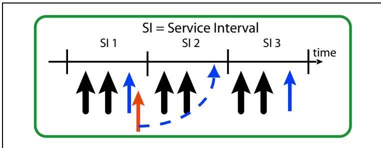

<table style="border:1px solid #ddd;border-collapse:collapse; width:100%;" cellpadding="4" cellspacing="0" rules="all" frame="border">
  <thead style="border:1px solid #ddd;">
    <tr>
      <th width="50%" style="border:1px solid #ddd; background:#f5f5f5;">EN</th>
      <th width="50%" style="border:1px solid #ddd; background-color:#e8e8e8;">中文</th>
    </tr>
  </thead>
  <tbody>
    <tr><td width="50%" style="border:1px solid #ddd; background:#fff;padding:4px 8px;">The second timing problem is called "congestion" and happens when too many isochronous requests are sent within a given time window, as shown in Figure 7-27 on page 281. This is a similar problem but now there is no simple solution. Unlike the previous case, postponing high-priority packets until another time slot is not an option, so the system must make an effort to handle them all. The result is that some requests may experience excessive service latencies. To correct this, software would need to change the distribution of packets so that they can be supported by the available hardware bandwidth.</td><td width="50%" style="border:1px solid #ddd; background-color:#e8e8e8;padding:4px 8px;">第二个时序问题称为"拥塞"，当在给定的时间窗口内发送了过多的等时请求时发生，如图7-27（第281页）所示。这是一个类似的问题，但此时没有简单的解决方案。与前面情况不同，将高优先级报文推迟到另一个时隙是不可行的，因此系统必须尽力处理所有报文。结果是某些请求可能经历过长的服务延迟。要纠正此问题，软件需要更改报文的分布，使其能够由可用的硬件带宽支持。</td></tr>
  </tbody>
</table>

Figure 7-27: Bandwidth Congestion | 图7-27：带宽拥塞

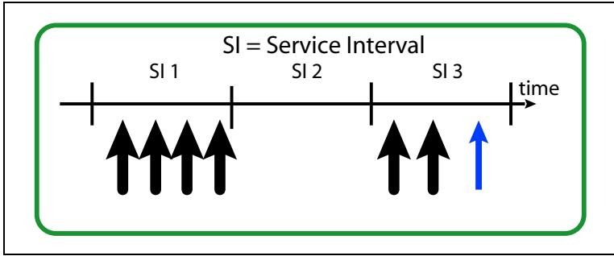

<table style="border:1px solid #ddd;border-collapse:collapse; width:100%;" cellpadding="4" cellspacing="0" rules="all" frame="border">
  <thead style="border:1px solid #ddd;">
    <tr>
      <th width="50%" style="border:1px solid #ddd; background:#f5f5f5;">EN</th>
      <th width="50%" style="border:1px solid #ddd; background-color:#e8e8e8;">中文</th>
    </tr>
  </thead>
  <tbody>
    <tr><td width="50%" style="border:1px solid #ddd; background:#fff;padding:4px 8px;">Latency Issues. Managing latency for packet delivery is an important part of isochrony, and involves the combination of the fabric latency and the Completer latency. Fabric latency depends on all the characteristics of the Link between the various components in the system, especially the Link width and frequency of operation. A simple way to minimize this value is to constrain the complexity of the PCIe topology for isochronous paths. Completer latency depends on the target endpoint internal characteristics, such as memory speed and internal arbitration.</td><td width="50%" style="border:1px solid #ddd; background-color:#e8e8e8;padding:4px 8px;">延迟问题。管理报文传送的延迟是等时性的重要部分，涉及结构延迟和Completer延迟的组合。结构延迟取决于系统中各组件之间链路的所有特性，特别是链路宽度和工作频率。最小化该值的一个简单方法是限制等时路径的PCIe拓扑复杂度。Completer延迟取决于目标端点的内部特性，如存储器速度和内部仲裁。</td></tr>
  </tbody>
</table>

## Root Complex | 根复合体

<table style="border:1px solid #ddd;border-collapse:collapse; width:100%;" cellpadding="4" cellspacing="0" rules="all" frame="border">
  <thead style="border:1px solid #ddd;">
    <tr>
      <th width="50%" style="border:1px solid #ddd; background:#f5f5f5;">EN</th>
      <th width="50%" style="border:1px solid #ddd; background-color:#e8e8e8;">中文</th>
    </tr>
  </thead>
  <tbody>
    <tr><td width="50%" style="border:1px solid #ddd; background:#fff;padding:4px 8px;">The RC has the same arbitration and timing requirements as a switch. It receives packets on several downstream ports and forwards them to the target in a way that's consistent with the rules for isochrony described earlier. However, much of how this is done will be vendor specific because the spec doesn't define the RC or how it should be programmed.</td><td width="50%" style="border:1px solid #ddd; background-color:#e8e8e8;padding:4px 8px;">RC 与交换机具有相同的仲裁和时序要求。它通过多个下游端口接收数据包，并按照先前描述的等时规则将其转发到目标。然而，其中大部分实现方式由厂商决定，因为规范并未定义 RC 或其编程方式。</td></tr>
    <tr><td width="50%" style="border:1px solid #ddd; background:#fff;padding:4px 8px;">Problem: Snooping. One interesting thing affecting timing and latency in the root that we haven't yet discussed is the process of snooping. Normally, anytime an access to system memory takes place it will be to a location that the processor considers cacheable, meaning it has permission to store a temporary copy in its local caches. If an external device attempts to accesses that area of memory, the chipset must first check the processor caches before allowing the access because a cached copy may have been modified. If so, the modified data will need to be written back to memory before it will be available for the device access. Although it's necessary to ensure memory coherency, the problem is that snooping takes time. How long it takes is typically bounded but not predictable because it depends on what else the CPUs are doing at that time. Depending on the timing requirements, that kind of uncertainty could ruin an isochronous data flow.</td><td width="50%" style="border:1px solid #ddd; background-color:#e8e8e8;padding:4px 8px;">问题：侦听。一个尚未讨论的影响根中时序和延迟的有趣问题是侦听过程。通常，每当访问系统内存时，访问的目标位置会被处理器视为可缓存的，即允许在其本地缓存中存储临时副本。如果外部设备尝试访问该内存区域，芯片组必须首先检查处理器缓存，然后才允许该访问，因为缓存副本可能已被修改。如果被修改，修改后的数据需要先写回内存，然后才能供设备访问。虽然这对于确保内存一致性是必要的，但问题在于侦听需要时间。所需的时间通常有界但不可预测，因为这取决于 CPU 当时正在执行的其他操作。根据时序要求，这种不确定性可能会破坏等时数据流。</td></tr>
    <tr><td width="50%" style="border:1px solid #ddd; background:#fff;padding:4px 8px;">Snooping Solutions. One way to avoid snooping is for devices to only access areas of memory that have been designated as uncacheable. Another option is for software to set the "No Snoop" attribute bit in the high-priority packet headers. That forces the chipset to skip the snoop step regardless of the memory type and go directly to memory because software has guaranteed that doing so won't cause a problem. To enforce this as a requirement for the isochronous path, another bit can be initialized by hardware in the root port for the high-priority VC called "Reject Snoop Transactions" (see the VC Resource Capability Register in Figure 7-17 on page 265). The purpose of this is to allow only transactions for that VC that have the No Snoop attribute set. Any incoming packets that don't have it set are discarded to ensure that the timing will never be violated by waiting for a snoop.</td><td width="50%" style="border:1px solid #ddd; background-color:#e8e8e8;padding:4px 8px;">侦听解决方案。避免侦听的一种方法是让设备仅访问被标记为不可缓存的内存区域。另一种选择是由软件在高优先级数据包头中设置 "No Snoop" 属性位。这会强制芯片组跳过侦听步骤，直接访问内存，而不管内存类型如何，因为软件已保证这样做不会引发问题。为了将其作为等时路径的强制性要求，硬件可在高优先级 VC（虚通道） 的根端口中初始化另一个称为 "Reject Snoop Transactions" 的位（参见第 265 页图 7-17 中的 VC（虚通道） Resource Capability 寄存器）。其目的在于仅允许设置了 No Snoop 属性的该 VC（虚通道） 事务通过。任何未设置该属性的传入数据包将被丢弃，以确保时序绝不会因等待侦听而被违反。</td></tr>
  </tbody>
</table>

## Power Management | 电源管理

<table style="border:1px solid #ddd;border-collapse:collapse; width:100%;" cellpadding="4" cellspacing="0" rules="all" frame="border">
  <thead style="border:1px solid #ddd;">
    <tr>
      <th width="50%" style="border:1px solid #ddd; background:#f5f5f5;">EN</th>
      <th width="50%" style="border:1px solid #ddd; background-color:#e8e8e8;">中文</th>
    </tr>
  </thead>
  <tbody>
    <tr><td width="50%" style="border:1px solid #ddd; background:#fff;padding:4px 8px;">It's a simple observation, but if timing is important for a path in PCIe, then power management (PM) mechanisms for devices in that path will need to handled carefully. Configuration software can read the latencies associated with every PM condition and select those cases that the timing budget will permit. The simplest approach, though, would just be to disable all PM options in an isochronous path. Fortunately, this is easily done using existing configuration registers. Devices can be placed into the device state D0 and left there, while the hardware-controlled Link PM mechanism can be disabled (for more on PM, see Chapter 16, entitled "Power Management," on page 703).</td><td width="50%" style="border:1px solid #ddd; background-color:#e8e8e8;padding:4px 8px;">这是一个简单的观察结论，但如果时序对于PCIe中的某条路径至关重要，那么该路径上设备的电源管理(PM)机制就需要谨慎处理。配置软件可以读取与每个PM条件相关的延迟，并选择时序预算允许的那些情况。不过，最简单的方法是在等时路径中禁用所有PM选项。幸运的是，使用现有的配置寄存器可以轻松实现这一点。设备可以被置于设备状态D0并保持在该状态，同时硬件控制的链路PM机制可以被禁用（有关PM的更多信息，请参见第703页第16章"电源管理"）。</td></tr>
  </tbody>
</table>

## Error Handling | 错误处理

<table style="border:1px solid #ddd;border-collapse:collapse; width:100%;" cellpadding="4" cellspacing="0" rules="all" frame="border">
  <thead style="border:1px solid #ddd;">
    <tr>
      <th width="50%" style="border:1px solid #ddd; background:#f5f5f5;">EN</th>
      <th width="50%" style="border:1px solid #ddd; background-color:#e8e8e8;">中文</th>
    </tr>
  </thead>
  <tbody>
    <tr><td width="50%" style="border:1px solid #ddd; background:#fff;padding:4px 8px;">Finally, there is one last issue: what to do when errors occur on the Link. The ACK/NAK protocol, covered in Chapter 7, provides an automatic, hardwarebased retry mechanism to correct packets that encounter transmission problems. This otherwise desirable feature presents a problem for isochrony because it takes time to do it. And how long it takes to resolve an error can vary widely depending on things like how the problem was detected.</td><td width="50%" style="border:1px solid #ddd; background-color:#e8e8e8;padding:4px 8px;">最后，还有一个问题：当链路（Link）上发生错误时应如何处理。第7章讨论的ACK/NAK协议提供了一种自动的、基于硬件的重试机制，用于纠正遇到传输问题的报文。这个原本理想的特性给等时性（isochrony）带来了问题，因为它需要花费时间来完成。而解决一个错误所需的时间会因问题的检测方式等因素而产生很大差异。</td></tr>
    <tr><td width="50%" style="border:1px solid #ddd; background:#fff;padding:4px 8px;">To decide this question we have to know how much time uncertainty the system can tolerate and still deliver isochronous data. If the latency budget is too tight, there simply won't be time for retrying failed packets and the ACK/NAK protocol will have to be disabled. Interestingly, the spec writers evidently didn't consider that possibility because no configuration bits are included for disabling it or deciding how to handle packets that would have been retried but now won't be. Therefore disabling this will require non‑standard mechanisms like vendor‑specific registers.</td><td width="50%" style="border:1px solid #ddd; background-color:#e8e8e8;padding:4px 8px;">要解决这个问题，我们必须了解系统在仍能传输等时数据的情况下能容忍多大的时间不确定性。如果延迟预算过于紧张，就没有时间重试失败的报文，ACK/NAK协议将必须被禁用。有趣的是，规范编写者显然没有考虑到这种可能性，因为没有包含用于禁用它或决定如何处理那些原本会被重试但现在不会重试的报文的配置位。因此，禁用它需要非标准机制，例如厂商特定的寄存器。</td></tr>
    <tr><td width="50%" style="border:1px solid #ddd; background:#fff;padding:4px 8px;">If there isn't enough time available for retries, the target agent may simply choose to discard any bad packets. Another option would be to use the bad packets as they are, errors and all. For some applications using isochronous support that isn't as counter‑intuitive as it sounds. An error in video streaming, for example, might cause an occasional glitch on the display, but that could be considered an acceptable risk.</td><td width="50%" style="border:1px solid #ddd; background-color:#e8e8e8;padding:4px 8px;">如果没有足够的时间进行重试，目标代理可以简单地选择丢弃任何错误报文。另一种选择是直接使用错误的报文，包括其中的所有错误。对于某些使用等时性支持的应用程序来说，这并不像听起来那么反直觉。例如，视频流中的错误可能偶尔会导致显示画面出现异常，但这可以被视为可接受的风险。</td></tr>
    <tr><td width="50%" style="border:1px solid #ddd; background:#fff;padding:4px 8px;">If there is enough time in the Service Interval to allow retries, a limit could be placed on the possible latency they might add by adding a timer to track the time until the end of the Service Interval and use that to decide whether a retry could be attempted. Errors shouldn't happen very often, of course, so this might be sufficient to correct the occasional transmission fault while still maintaining isochronous timing.</td><td width="50%" style="border:1px solid #ddd; background-color:#e8e8e8;padding:4px 8px;">如果服务间隔（Service Interval）中有足够的时间允许重试，则可以通过添加一个定时器来跟踪到服务间隔结束前的时间，并以此决定是否可以进行重试，从而限制重试可能增加的延迟。当然，错误不应频繁发生，因此这或许足以纠正偶发的传输故障，同时仍能维持等时定时。</td></tr>
  </tbody>
</table>

