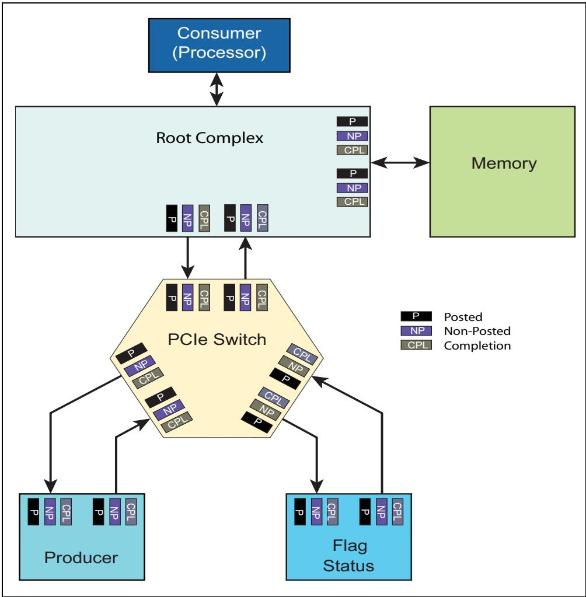
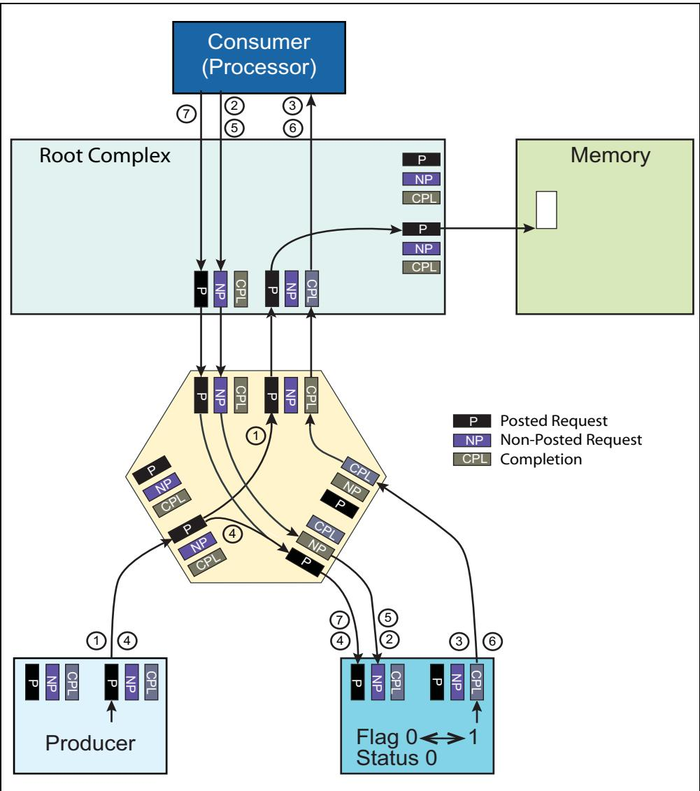
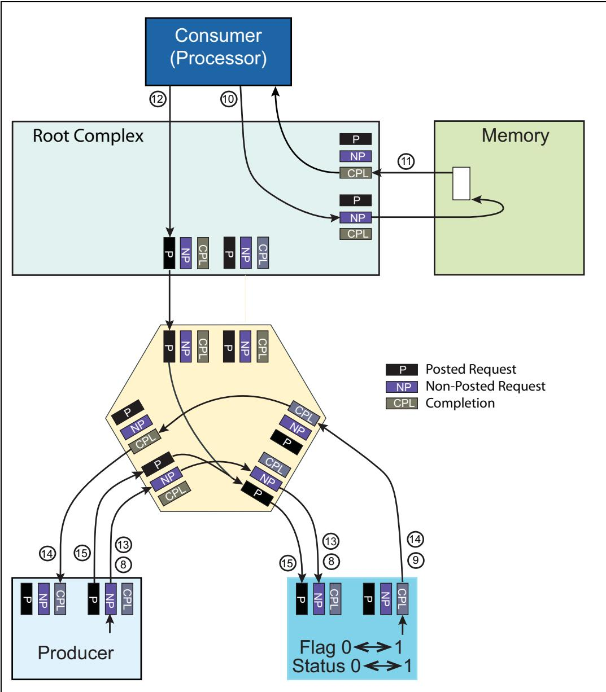
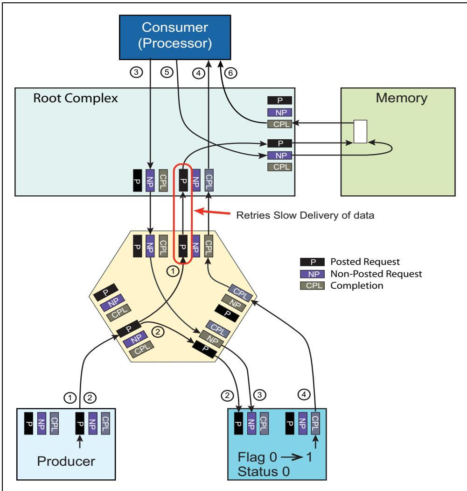
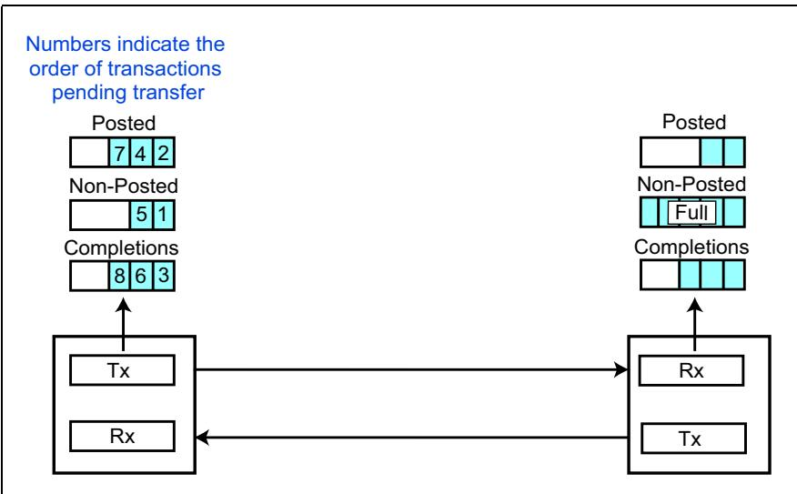
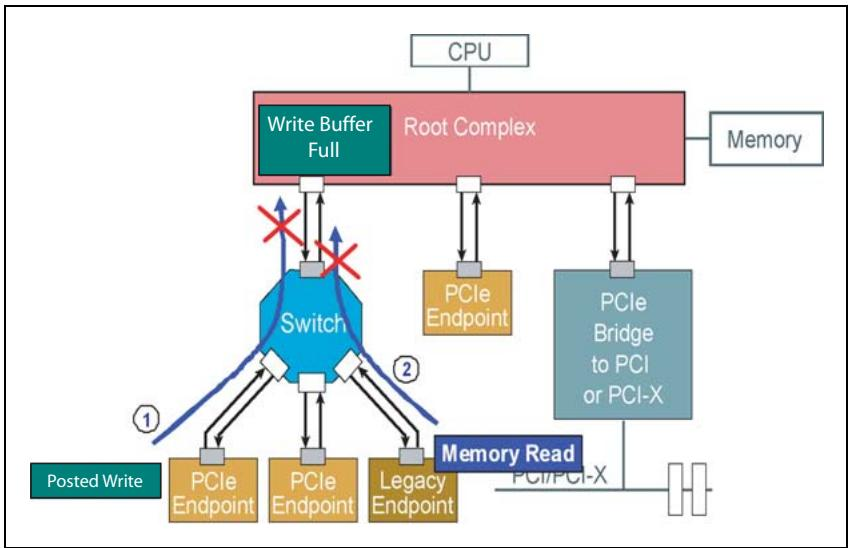
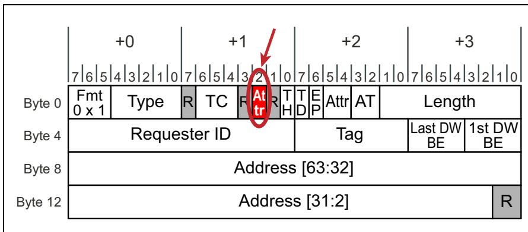

# Ch08_Transaction_Ordering

<table style="border-collapse:collapse; width:100%;">
  <thead>
    <tr>
      <th width="50%" style="border:2px solid #000; background:#f5f5f5;">EN</th>
      <th width="50%" style="border:2px solid #000; background-color:#e8e8e8;">中文</th>
    </tr>
  </thead>
  <tbody>
    <tr><td width="50%" style="border:2px solid #000; background:#fff;padding:4px 8px;"># Transaction Ordering</td><td width="50%" style="border:2px solid #000; background-color:#e8e8e8;padding:4px 8px;"># 事务排序</td></tr>
  </tbody>
</table>

<table style="border-collapse:collapse; width:100%;">
  <thead>
    <tr>
      <th width="50%" style="border:2px solid #000; background:#f5f5f5;">EN</th>
      <th width="50%" style="border:2px solid #000; background-color:#e8e8e8;">中文</th>
    </tr>
  </thead>
  <tbody>
    <tr><td width="50%" style="border:2px solid #000; background:#fff;padding:4px 8px;">## The Previous Chapter</td><td width="50%" style="border:2px solid #000; background-color:#e8e8e8;padding:4px 8px;">## 前一章</td></tr>
    <tr><td width="50%" style="border:2px solid #000; background:#fff;padding:4px 8px;">The previous chapter discusses the mechanisms that support Quality of Service and describes the means of controlling the timing and bandwidth of different packets traversing the fabric. These mechanisms include application-specific software that assigns a priority value to every packet, and optional hardware that must be built into each device to enable managing transaction priority.</td><td width="50%" style="border:2px solid #000; background-color:#e8e8e8;padding:4px 8px;">前一章讨论了支持服务质量（Quality of Service）的机制，并描述了控制穿越互连结构中不同数据包时序和带宽的方法。这些机制包括为每个数据包分配优先级值的应用特定软件，以及必须内置于每个设备中以实现事务优先级管理的可选硬件。</td></tr>
  </tbody>
</table>

<table style="border-collapse:collapse; width:100%;">
  <thead>
    <tr>
      <th width="50%" style="border:2px solid #000; background:#f5f5f5;">EN</th>
      <th width="50%" style="border:2px solid #000; background-color:#e8e8e8;">中文</th>
    </tr>
  </thead>
  <tbody>
    <tr><td width="50%" style="border:2px solid #000; background:#fff;padding:4px 8px;">## This Chapter</td><td width="50%" style="border:2px solid #000; background-color:#e8e8e8;padding:4px 8px;">## 本章</td></tr>
    <tr><td width="50%" style="border:2px solid #000; background:#fff;padding:4px 8px;">This chapter discusses the ordering requirements for transactions in a PCI Express topology. These rules are inherited from PCI. The Producer/Consumer programming model motivated many of them, so its mechanism is described here. The original rules also took into consideration possible deadlock conditions that must be avoided.</td><td width="50%" style="border:2px solid #000; background-color:#e8e8e8;padding:4px 8px;">本章讨论PCI Express拓扑结构中事务的排序要求。这些规则继承自PCI。生产者/消费者编程模型是其中许多规则的动因，因此此处描述了其机制。原始规则还考虑了必须避免的可能死锁条件。</td></tr>
  </tbody>
</table>

## The Next Chapter | 下一章

<table style="border-collapse:collapse; width:100%;">
  <thead>
    <tr>
      <th width="50%" style="border:2px solid #000; background:#f5f5f5;">EN</th>
      <th width="50%" style="border:2px solid #000; background-color:#e8e8e8;">中文</th>
    </tr>
  </thead>
  <tbody>
    <tr><td width="50%" style="border:2px solid #000; background:#fff;padding:4px 8px;">The next chapter describes, Data Link Layer Packets (DLLPs). We describe the use, format, and definition of the DLLP packet types and the details of their related fields. DLLPs are used to support Ack/Nak protocol, power management, flow control mechanism and can be used for vender defined purposes.</td><td width="50%" style="border:2px solid #000; background-color:#e8e8e8;padding:4px 8px;">下一章描述数据链路层包(DLLP)。我们将介绍DLLP包类型的使用、格式和定义及其相关字段的详细信息。DLLP用于支持Ack/Nak协议、电源管理、流控机制，并可用于厂商自定义目的。</td></tr>
  </tbody>
</table>

## 8.1 Introduction | 8.1 引言

<table style="border-collapse:collapse; width:100%;">
  <thead>
    <tr>
      <th width="50%" style="border:2px solid #000; background:#f5f5f5;">EN</th>
      <th width="50%" style="border:2px solid #000; background-color:#e8e8e8;">中文</th>
    </tr>
  </thead>
  <tbody>
    <tr><td width="50%" style="border:2px solid #000; background:#fff;padding:4px 8px;">As with other protocols, PCI Express imposes ordering rules on transactions of the same traffic class (TC) moving through the fabric at the same time. Transactions with different TCs do not have ordering relationships. The reasons for these ordering rules related to transactions of the same TC include:</td><td width="50%" style="border:2px solid #000; background-color:#e8e8e8;padding:4px 8px;">与其他协议一样，PCI Express 对同时在同一结构中移动的相同流量类（TC）的事务施加了排序规则。不同 TC 的事务之间没有排序关系。与相同 TC 事务相关的这些排序规则的原因包括：</td></tr>
    <tr><td width="50%" style="border:2px solid #000; background:#fff;padding:4px 8px;">• Maintaining compatibility with legacy buses (PCI, PCI‐X, and AGP).</td><td width="50%" style="border:2px solid #000; background-color:#e8e8e8;padding:4px 8px;">• 保持与传统总线（PCI、PCI-X 和 AGP）的兼容性。</td></tr>
    <tr><td width="50%" style="border:2px solid #000; background:#fff;padding:4px 8px;">• Ensuring that the completion of transactions is deterministic and in the sequence intended by the programmer.</td><td width="50%" style="border:2px solid #000; background-color:#e8e8e8;padding:4px 8px;">• 确保事务的完成是确定性的，并符合程序员预期的顺序。</td></tr>
  </tbody>
</table>

## PCI Express 3.0 Technology | PCI Express 3.0 技术

<table style="border-collapse:collapse; width:100%;">
  <thead>
    <tr>
      <th width="50%" style="border:2px solid #000; background:#f5f5f5;">EN</th>
      <th width="50%" style="border:2px solid #000; background-color:#e8e8e8;">中文</th>
    </tr>
  </thead>
  <tbody>
    <tr><td width="50%" style="border:2px solid #000; background:#fff;padding:4px 8px;">## PCI Express 3.0 Technology</td><td width="50%" style="border:2px solid #000; background-color:#e8e8e8;padding:4px 8px;">## PCI Express 3.0 技术</td></tr>
    <tr><td width="50%" style="border:2px solid #000; background:#fff;padding:4px 8px;">• Avoiding deadlock conditions.</td><td width="50%" style="border:2px solid #000; background-color:#e8e8e8;padding:4px 8px;">• 避免死锁条件。</td></tr>
    <tr><td width="50%" style="border:2px solid #000; background:#fff;padding:4px 8px;">• Maximize performance and throughput by minimizing read latencies and managing read and write ordering.</td><td width="50%" style="border:2px solid #000; background-color:#e8e8e8;padding:4px 8px;">• 通过最小化读取延迟和管理读写排序来最大化性能和吞吐量。</td></tr>
    <tr><td width="50%" style="border:2px solid #000; background:#fff;padding:4px 8px;">Implementation of the specific PCI/PCIe transaction ordering is based on the following features:</td><td width="50%" style="border:2px solid #000; background-color:#e8e8e8;padding:4px 8px;">特定 PCI/PCIe 事务排序的实现基于以下特性：</td></tr>
    <tr><td width="50%" style="border:2px solid #000; background:#fff;padding:4px 8px;">1. Producer/Consumer programming model on which the fundamental ordering rules are based.</td><td width="50%" style="border:2px solid #000; background-color:#e8e8e8;padding:4px 8px;">1. 生产者/消费者编程模型，基本排序规则基于该模型。</td></tr>
    <tr><td width="50%" style="border:2px solid #000; background:#fff;padding:4px 8px;">2. Relaxed Ordering option that allows an exception to this when the Requester knows that a transaction does not have any dependencies on previous transactions.</td><td width="50%" style="border:2px solid #000; background-color:#e8e8e8;padding:4px 8px;">2. 宽松排序选项，当请求者知道某个事务不依赖于先前事务时，允许对此进行例外处理。</td></tr>
    <tr><td width="50%" style="border:2px solid #000; background:#fff;padding:4px 8px;">3. ID Ordering option that allows a switches to permit requests from one device to move ahead of requests from another device because unrelated threads of execution are being performed by these two devices.</td><td width="50%" style="border:2px solid #000; background-color:#e8e8e8;padding:4px 8px;">3. ID 排序选项，允许交换机让一个设备的请求优先于另一个设备的请求，因为这两个设备正在执行不相关的执行线程。</td></tr>
    <tr><td width="50%" style="border:2px solid #000; background:#fff;padding:4px 8px;">4. Means for avoiding deadlock conditions and supporting PCI legacy implementations.</td><td width="50%" style="border:2px solid #000; background-color:#e8e8e8;padding:4px 8px;">4. 用于避免死锁条件和支持 PCI 遗留实现的手段。</td></tr>
  </tbody>
</table>

## 8.2 Definitions | 8.2 定义

<table style="border-collapse:collapse; width:100%;">
  <thead>
    <tr>
      <th width="50%" style="border:2px solid #000; background:#f5f5f5;">EN</th>
      <th width="50%" style="border:2px solid #000; background-color:#e8e8e8;">中文</th>
    </tr>
  </thead>
  <tbody>
    <tr><td width="50%" style="border:2px solid #000; background:#fff;padding:4px 8px;">There are three general models for ordering transactions in a traffic flow:</td><td width="50%" style="border:2px solid #000; background-color:#e8e8e8;padding:4px 8px;">在流量流中，事务排序有三种通用模型：</td></tr>
    <tr><td width="50%" style="border:2px solid #000; background:#fff;padding:4px 8px;">1. **Strong Ordering**: PCI Express requires strong ordering of transactions flowing through the fabric that have the same Traffic Class (TC) assignment. Transactions that have the same TC value assigned to them are mapped to a given VC, therefore the same rules apply to transactions within each VC. Consequently, when multiple TCs are assigned to the same VC all transactions are typically handled as a single TC, even though no ordering relationship exists between different TCs.</td><td width="50%" style="border:2px solid #000; background-color:#e8e8e8;padding:4px 8px;">1. **强排序(Strong Ordering)**：PCI Express要求对通过结构(Fabric)传输且具有相同流量类(Traffic Class, TC)分配的事务进行强排序。被分配相同TC值的事务被映射到给定VC(Virtual Channel)，因此相同的规则适用于每个VC内的事务。因此，当多个TC被分配到同一个VC时，所有事务通常被视为单个TC处理，即使不同TC之间不存在排序关系。</td></tr>
    <tr><td width="50%" style="border:2px solid #000; background:#fff;padding:4px 8px;">2. **Weak Ordering**: Transactions stay in sequence unless reordering would be helpful. Maintaining the strong ordering relationship between transactions can result in all transactions being blocked due to dependencies associated with a given transaction model (e.g., The Producer/Consumer Model). Some of the blocked transactions very likely are not related to the dependencies and can safely be reordered ahead of blocking transactions.</td><td width="50%" style="border:2px solid #000; background-color:#e8e8e8;padding:4px 8px;">2. **弱排序(Weak Ordering)**：事务保持顺序，除非重新排序会有帮助。维持事务之间的强排序关系可能导致所有事务因给定事务模型（例如生产者/消费者模型，Producer/Consumer Model）的相关依赖而被阻塞。某些被阻塞的事务很可能与这些依赖无关，可以安全地重新排序到阻塞事务之前。</td></tr>
    <tr><td width="50%" style="border:2px solid #000; background:#fff;padding:4px 8px;">3. **Relaxed Ordering**: Transactions can be reordered, but only under certain controlled conditions. The benefit is improved performance like the weak-ordered model, but only when specified by software so as to avoid problems with dependencies. The drawback is that only some transactions will be optimized for performance. There is some overhead for software to enable transactions for Relaxed Ordering (RO).</td><td width="50%" style="border:2px solid #000; background-color:#e8e8e8;padding:4px 8px;">3. **宽松排序(Relaxed Ordering)**：事务可以被重新排序，但仅在特定的受控条件下。其优点是像弱排序模型一样提升性能，但仅在软件指定时生效，以避免依赖问题。缺点是只有部分事务会得到性能优化，并且软件启用宽松排序(RO)会有一定的开销。</td></tr>
  </tbody>
</table>

<table style="border-collapse:collapse; width:100%;">
  <thead>
    <tr>
      <th width="50%" style="border:2px solid #000; background:#f5f5f5;">EN</th>
      <th width="50%" style="border:2px solid #000; background-color:#e8e8e8;">中文</th>
    </tr>
  </thead>
  <tbody>
    <tr><td width="50%" style="border:2px solid #000; background:#fff;padding:4px 8px;">## Simplified Ordering Rules</td><td width="50%" style="border:2px solid #000; background-color:#e8e8e8;padding:4px 8px;">## 简化排序规则</td></tr>
    <tr><td width="50%" style="border:2px solid #000; background:#fff;padding:4px 8px;">The 2.1 revision of the spec introduced a simplified version of the Ordering Table as shown in Table 8‑1 on page 289. The table can be segmented on a per topic basis as follows:</td><td width="50%" style="border:2px solid #000; background-color:#e8e8e8;padding:4px 8px;">2.1修订版规范引入了排序表的简化版本，如表8-1（第289页）所示。该表可按主题分类如下：</td></tr>
    <tr><td width="50%" style="border:2px solid #000; background:#fff;padding:4px 8px;">• Producer/Consumer rules (page 290)</td><td width="50%" style="border:2px solid #000; background-color:#e8e8e8;padding:4px 8px;">• 生产者/消费者规则（第290页）</td></tr>
    <tr><td width="50%" style="border:2px solid #000; background:#fff;padding:4px 8px;">• Relaxed Ordering rules (page 296)</td><td width="50%" style="border:2px solid #000; background-color:#e8e8e8;padding:4px 8px;">• 宽松排序规则（第296页）</td></tr>
    <tr><td width="50%" style="border:2px solid #000; background:#fff;padding:4px 8px;">• Weak Ordering rules (page 299)</td><td width="50%" style="border:2px solid #000; background-color:#e8e8e8;padding:4px 8px;">• 弱排序规则（第299页）</td></tr>
    <tr><td width="50%" style="border:2px solid #000; background:#fff;padding:4px 8px;">• ID Ordering rules (page 301)</td><td width="50%" style="border:2px solid #000; background-color:#e8e8e8;padding:4px 8px;">• ID排序规则（第301页）</td></tr>
    <tr><td width="50%" style="border:2px solid #000; background:#fff;padding:4px 8px;">• Deadlock avoidance (page 303)</td><td width="50%" style="border:2px solid #000; background-color:#e8e8e8;padding:4px 8px;">• 死锁避免（第303页）</td></tr>
    <tr><td width="50%" style="border:2px solid #000; background:#fff;padding:4px 8px;">These sections provide details associated with the ordering models, operation, rationales, conditions and requirement.</td><td width="50%" style="border:2px solid #000; background-color:#e8e8e8;padding:4px 8px;">这些章节提供了与排序模型、操作、原理、条件和要求相关的详细信息。</td></tr>
  </tbody>
</table>

## 8.3.1 Ordering Rules and Traffic Classes (TCs) | 8.3.1 排序规则和流量类别（TC）

<table style="border-collapse:collapse; width:100%;">
  <thead>
    <tr>
      <th width="50%" style="border:2px solid #000; background:#f5f5f5;">EN</th>
      <th width="50%" style="border:2px solid #000; background-color:#e8e8e8;">中文</th>
    </tr>
  </thead>
  <tbody>
    <tr><td width="50%" style="border:2px solid #000; background:#fff;padding:4px 8px;">PCI Express ordering rules apply to transactions of the same Traffic Class (TC). Transactions moving through the fabric that have different TCs have no ordering requirement and are considered to be associated with unrelated applications. As a result, there is no transaction ordering related performance degradation associated with packets of different TCs.</td><td width="50%" style="border:2px solid #000; background-color:#e8e8e8;padding:4px 8px;">PCI Express 排序规则适用于同一流量类（TC）的事务。在结构中传输且具有不同 TC 的事务之间没有排序要求，它们被视为与不相关的应用相关联。因此，不同 TC 的数据包之间不存在与事务排序相关的性能下降。</td></tr>
    <tr><td width="50%" style="border:2px solid #000; background:#fff;padding:4px 8px;">Packets that do share the same TC may experience performance degradation as they flow through the PCIe fabric. This is because switches and devices must support ordering rules that may require packets to be delayed or forwarded in front of packets previously sent.</td><td width="50%" style="border:2px solid #000; background-color:#e8e8e8;padding:4px 8px;">共享同一 TC 的数据包在流经 PCIe 结构时可能会经历性能下降。这是因为交换机和设备必须支持排序规则，这些规则可能要求数据包被延迟，或者被优先转发到先前已发送的数据包之前。</td></tr>
    <tr><td width="50%" style="border:2px solid #000; background:#fff;padding:4px 8px;">As discussed in Chapter 7, entitled "Quality of Service," on page 245, transactions of different TC may map to the same VC. The TC-to-VC mapping configuration determines which packets of a given TC map to a specific VC. Even though the transaction ordering rules apply only to packets of the same TC, it may be simpler to design endpoint devices/switches/root complexes that apply the transaction ordering rules to all packets within a VC even though multiple TCs are mapped to the same VC.</td><td width="50%" style="border:2px solid #000; background-color:#e8e8e8;padding:4px 8px;">如第 245 页第 7 章"服务质量"所述，不同 TC 的事务可以映射到同一 VC。TC 到 VC 的映射配置决定了给定 TC 的哪些数据包映射到特定的 VC。尽管事务排序规则仅适用于同一 TC 的数据包，但将端点设备/交换机/根复合体设计为对同一 VC 内的所有数据包应用事务排序规则可能更为简单，即使多个 TC 映射到同一 VC 也是如此。</td></tr>
    <tr><td width="50%" style="border:2px solid #000; background:#fff;padding:4px 8px;">As one would expect, there are no ordering relationships between packets that map to different VCs no matter their TC.</td><td width="50%" style="border:2px solid #000; background-color:#e8e8e8;padding:4px 8px;">正如所料，映射到不同 VC 的数据包之间无论其 TC 如何，都不存在排序关系。</td></tr>
  </tbody>
</table>

## 8.3.2 Ordering Rules Based On Packet Type | 8.3.2 基于数据包类型的排序规则

<table style="border-collapse:collapse; width:100%;">
  <thead>
    <tr>
      <th width="50%" style="border:2px solid #000; background:#f5f5f5;">EN</th>
      <th width="50%" style="border:2px solid #000; background-color:#e8e8e8;">中文</th>
    </tr>
  </thead>
  <tbody>
    <tr><td width="50%" style="border:2px solid #000; background:#fff;padding:4px 8px;">Ordering relationships defined by the PCIe spec are based on TLP type. TLPs are divided into three categories: 1) Posted, 2) Completion and 3) Non-Posted TLPs.</td><td width="50%" style="border:2px solid #000; background-color:#e8e8e8;padding:4px 8px;">PCIe 规范定义的排序关系基于 TLP 类型。TLP 分为三类：1) Posted（发布），2) Completion（完成报文）和 3) Non-Posted（非发布）TLP。</td></tr>
    <tr><td width="50%" style="border:2px solid #000; background:#fff;padding:4px 8px;">The Posted category of TLPs include memory write requests (MWr) and Messages (Msg/MsgD). Completion category of TLPs include Cpl and CplD. Non-Posted category of TLPs include MRd, IORd, IOWr, CfgRd0, CfgRd1, CfgWr0 and CfgWr1.</td><td width="50%" style="border:2px solid #000; background-color:#e8e8e8;padding:4px 8px;">Posted 类 TLP 包括存储器写请求 (MWr) 和消息 (Msg/MsgD)。Completion 类 TLP 包括 Cpl 和 CplD。Non-Posted 类 TLP 包括 MRd、IORd、IOWr、CfgRd0、CfgRd1、CfgWr0 和 CfgWr1。</td></tr>
    <tr><td width="50%" style="border:2px solid #000; background:#fff;padding:4px 8px;">The transaction ordering rules are described by a table in the following section "The Simplified Ordering Rules Table" on page 288. As you will notice, the table shows TLPs listed according to the three categories mentioned above with their ordering relationships defined.</td><td width="50%" style="border:2px solid #000; background-color:#e8e8e8;padding:4px 8px;">事务排序规则由下一节（第 288 页的 "简化排序规则表"）中的表格描述。您会注意到，该表根据上述三类列出 TLP，并定义了它们的排序关系。</td></tr>
  </tbody>
</table>

## 8.3.3 The Simplified Ordering Rules Table | 8.3.3 简化排序规则表

<table style="border-collapse:collapse; width:100%;">
  <thead>
    <tr>
      <th width="50%" style="border:2px solid #000; background:#f5f5f5;">EN</th>
      <th width="50%" style="border:2px solid #000; background-color:#e8e8e8;">中文</th>
    </tr>
  </thead>
  <tbody>
    <tr><td width="50%" style="border:2px solid #000; background:#fff;padding:4px 8px;">The table is organized in a Row Pass Column fashion. All of the rules are summarized following the Simplified Ordering Table. Each rule or group of rules define the actions that are required.</td><td width="50%" style="border:2px solid #000; background-color:#e8e8e8;padding:4px 8px;">该表采用行可超越列的编排方式。所有规则均在简化排序表之后进行了总结。每一条或每一组规则定义了所需采取的操作。</td></tr>
    <tr><td width="50%" style="border:2px solid #000; background:#fff;padding:4px 8px;">In Table 8-1 on page 289, columns 2-5 represent transactions that have previously been delivered by a PCI Express device, while row A-D represents a new transaction that has just arrived. For outbound transactions, the table specifies whether a transaction represented in the row (A-D) is allowed to pass a previous transaction represented by the column (2-5). A 'No' entry means the transaction in the row is not allowed to pass the transaction in the column. A 'Yes' entry means the transaction in the row must be allowed to pass the transaction in the column to avoid a deadlock. A 'Yes/No' entry means a transaction in a row is allowed to pass the transaction in the column but is not required to do so. The entries in the following have the meaning.</td><td width="50%" style="border:2px solid #000; background-color:#e8e8e8;padding:4px 8px;">在第289页的表8-1中，第2至5列表示PCI Express设备先前已传送的事务，而行A至D表示刚刚到达的新事务。对于对外事务，该表规定了行(A-D)所代表的事务是否被允许超越列(2-5)所代表的先前事务。"No"表项表示行中的事务不允许超越列中的事务。"Yes"表项表示行中的事务必须被允许超越列中的事务，以避免死锁。"Yes/No"表项表示行中的事务被允许超越列中的事务，但并非必须这样做。以下各项具有相应的含义。</td></tr>
  </tbody>
</table>

**Table 8-1: Simplified Ordering Rules Table**
**表8-1：简化排序规则表**

<table><tr><td rowspan="2" colspan="2">Row pass Column? (Col 1)</td><td rowspan="2">Posted Request (Col 2)</td><td colspan="2">Non-Posted Request</td><td rowspan="2">Completion (Col 5)</td></tr><tr><td>Read Request (Col 3)</td><td>NPR with Data (Col 4)</td></tr><tr><td colspan="2">Posted Request (Row A)</td><td>a) No b) Y/N</td><td>Yes</td><td>Yes</td><td>a) Y/Nb) Yes</td></tr><tr><td rowspan="2">Non-Posted Request</td><td>Read Request (Row B)</td><td>a) No b) Y/N</td><td>Y/N</td><td>Y/N</td><td>Y/N</td></tr><tr><td>NPR with Data (Row C)</td><td>a) No b) Y/N</td><td>Y/N</td><td>Y/N</td><td>Y/N</td></tr><tr><td colspan="2">Completion (Row D)</td><td>a) No b) Y/N</td><td>Yes</td><td>Yes</td><td>a) Y/Nb) No</td></tr></table>

<table style="border-collapse:collapse; width:100%;">
  <thead>
    <tr>
      <th width="50%" style="border:2px solid #000; background:#f5f5f5;">EN</th>
      <th width="50%" style="border:2px solid #000; background-color:#e8e8e8;">中文</th>
    </tr>
  </thead>
  <tbody>
    <tr><td width="50%" style="border:2px solid #000; background:#fff;padding:4px 8px;">• A2a, B2a, C2a, D2a — to enforce the Producer/Consumer model, a subsequent transaction is not allowed to pass a Posted Request.</td><td width="50%" style="border:2px solid #000; background-color:#e8e8e8;padding:4px 8px;">• A2a、B2a、C2a、D2a——为了强制执行生产者/消费者模型，后续事务不允许超越Posted请求。</td></tr>
    <tr><td width="50%" style="border:2px solid #000; background:#fff;padding:4px 8px;">• A2, D2b — If RO is set, then a Read Completion is permitted to pass a previously queued Memory Write or Message Request.</td><td width="50%" style="border:2px solid #000; background-color:#e8e8e8;padding:4px 8px;">• A2、D2b——如果设置了RO（宽松排序），则允许读完成超越先前排队的存储器写或消息请求。</td></tr>
    <tr><td width="50%" style="border:2px solid #000; background:#fff;padding:4px 8px;">A2b, B2b, C2b, D2b — if the optional IDO is being used, a subsequent transaction is allowed to pass a Posted Request, as long as their Requester IDs are different.</td><td width="50%" style="border:2px solid #000; background-color:#e8e8e8;padding:4px 8px;">A2b、B2b、C2b、D2b——如果使用了可选的IDO（基于ID的排序），则只要其请求者ID不同，后续事务就被允许超越Posted请求。</td></tr>
    <tr><td width="50%" style="border:2px solid #000; background:#fff;padding:4px 8px;">• A3, A4 — A Memory Write or Message Request must be allowed to pass Non-Posted Requests to avoid deadlocks.</td><td width="50%" style="border:2px solid #000; background-color:#e8e8e8;padding:4px 8px;">• A3、A4——存储器写或消息请求必须被允许超越Non-Posted请求，以避免死锁。</td></tr>
    <tr><td width="50%" style="border:2px solid #000; background:#fff;padding:4px 8px;">• A5a — Posted Request is permitted but not required to pass Completions.</td><td width="50%" style="border:2px solid #000; background-color:#e8e8e8;padding:4px 8px;">• A5a——Posted请求被允许但非必须超越完成报文。</td></tr>
    <tr><td width="50%" style="border:2px solid #000; background:#fff;padding:4px 8px;">A5b — Deadlock avoidance case. In a PCIe-to-PCI/PCI-X bridge, for transactions going from PCIe to PCI or PCI-X, a Posted Request must be able to pass a Completion, or a deadlock may occur.</td><td width="50%" style="border:2px solid #000; background-color:#e8e8e8;padding:4px 8px;">A5b——死锁避免情况。在PCIe到PCI/PCI-X桥中，对于从PCIe到PCI或PCI-X的事务，Posted请求必须能够超越完成报文，否则可能发生死锁。</td></tr>
    <tr><td width="50%" style="border:2px solid #000; background:#fff;padding:4px 8px;">• B3, B4, B5, C3, C4, C5, — These cases implement weak ordering without risking any ordering related problems.</td><td width="50%" style="border:2px solid #000; background-color:#e8e8e8;padding:4px 8px;">• B3、B4、B5、C3、C4、C5——这些情况实现了弱排序，而不会带来任何排序相关问题的风险。</td></tr>
    <tr><td width="50%" style="border:2px solid #000; background:#fff;padding:4px 8px;">D3, D4 — Completions must be allowed to pass Read and I/O or Configuration Write Requests (Non-Posted Requests) to avoid deadlocks.</td><td width="50%" style="border:2px solid #000; background-color:#e8e8e8;padding:4px 8px;">D3、D4——完成报文必须被允许超越读请求和I/O或配置写请求（Non-Posted请求），以避免死锁。</td></tr>
    <tr><td width="50%" style="border:2px solid #000; background:#fff;padding:4px 8px;">• D5a — Completions with different Transaction IDs may pass each other.</td><td width="50%" style="border:2px solid #000; background-color:#e8e8e8;padding:4px 8px;">• D5a——具有不同事务ID的完成报文可以相互超越。</td></tr>
    <tr><td width="50%" style="border:2px solid #000; background:#fff;padding:4px 8px;">D5b — Completions with the same Transaction ID are not allowed to pass each other. This ensures that multiple completions for a single request will remain in ascending address order.</td><td width="50%" style="border:2px solid #000; background-color:#e8e8e8;padding:4px 8px;">D5b——具有相同事务ID的完成报文不允许相互超越。这确保了对单个请求的多个完成报文将保持地址升序。</td></tr>
  </tbody>
</table>

## 8.4.1 Producer/Consumer Model | 8.4.1 生产者/消费者模型

<table style="border-collapse:collapse; width:100%;">
  <thead>
    <tr>
      <th width="50%" style="border:2px solid #000; background:#f5f5f5;">EN</th>
      <th width="50%" style="border:2px solid #000; background-color:#e8e8e8;">中文</th>
    </tr>
  </thead>
  <tbody>
    <tr><td width="50%" style="border:2px solid #000; background:#fff;padding:4px 8px;">This section describes the operation of the Producer/Consumer model and the associated ordering rules required for proper operation. Figure 8-1 on page 291 simply illustrates a sample topology. Subsequent examples of this topology describe the operation of the Producer/Consumer model with proper ordering, followed by an example of the model failing due to improper ordering.</td><td width="50%" style="border:2px solid #000; background-color:#e8e8e8;padding:4px 8px;">本节描述生产者/消费者模型的操作以及正确运行所需的关联排序规则。图8-1（第291页）简单展示了一个示例拓扑。基于该拓扑的后续示例描述了在正确排序下生产者/消费者模型的操作，随后给出了一个因排序不当而导致模型失败的示例。</td></tr>
    <tr><td width="50%" style="border:2px solid #000; background:#fff;padding:4px 8px;">The Producer/Consumer model is the common method for data delivery in PCI and PCIe. The model comprises five elements as depicted in Figure 8-1:</td><td width="50%" style="border:2px solid #000; background-color:#e8e8e8;padding:4px 8px;">生产者/消费者模型是PCI和PCIe中数据传输的常用方法。该模型包含如图8-1所示的五个要素：</td></tr>
    <tr><td width="50%" style="border:2px solid #000; background:#fff;padding:4px 8px;">• Producer of data</td><td width="50%" style="border:2px solid #000; background-color:#e8e8e8;padding:4px 8px;">• 数据生产者</td></tr>
    <tr><td width="50%" style="border:2px solid #000; background:#fff;padding:4px 8px;">• Memory data buffer</td><td width="50%" style="border:2px solid #000; background-color:#e8e8e8;padding:4px 8px;">• 内存数据缓冲区</td></tr>
    <tr><td width="50%" style="border:2px solid #000; background:#fff;padding:4px 8px;">• Flag semaphore indicating data has been send by the Producer</td><td width="50%" style="border:2px solid #000; background-color:#e8e8e8;padding:4px 8px;">• 标志信号量，指示生产者已发送数据</td></tr>
    <tr><td width="50%" style="border:2px solid #000; background:#fff;padding:4px 8px;">• Consumer of data</td><td width="50%" style="border:2px solid #000; background-color:#e8e8e8;padding:4px 8px;">• 数据消费者</td></tr>
    <tr><td width="50%" style="border:2px solid #000; background:#fff;padding:4px 8px;">• Status semaphore indicating Consumer has read data</td><td width="50%" style="border:2px solid #000; background-color:#e8e8e8;padding:4px 8px;">• 状态信号量，指示消费者已读取数据</td></tr>
    <tr><td width="50%" style="border:2px solid #000; background:#fff;padding:4px 8px;">The specification states that the Producer/Consumer model will work regardless of the arrangement of all the elements involved. In this example, the Flag and Status elements reside in the same physical device, but could be located in different devices.</td><td width="50%" style="border:2px solid #000; background-color:#e8e8e8;padding:4px 8px;">规范指出，无论所有相关元素的排列如何，生产者/消费者模型都能正常工作。在本示例中，Flag和Status元素位于同一物理设备中，但它们也可以位于不同的设备中。</td></tr>
  </tbody>
</table>

**Figure 8-1: Example Producer/Consumer Topology**

## 8.4.2 Producer/Consumer Sequence — No Errors | 8.4.2 生产者/消费者序列 — 无错误

Refer to Figure 8-2 on page 293 during the following discussion. The example presumes that the Flag and Status element are cleared to start with. These semaphores are included within the same device in this example. The sequence of numbered events in the description below and depicted in Figure 8-2 on page 293 reflect the correct ordering in this Part 1 sequence.

1. In the example, a device called the Producer performs one or more Memory Write transactions (Posted Requests) targeting a Data Buffer in memory. Some delay can occur as the data flows through Posted buffers.

2. The Consumer periodically checks the Flag by initiating a Memory Read transaction (Non-Posted Request) to determine if data has been delivered by the Producer.

3. The Flag semaphore is read by the device and a Memory Read Completion is returned to the Consumer, indicating that notification of data delivery has not been performed by the Producer (Flag = 0) yet.

4. The Producer sends a Memory Write Transaction (Posted Request) to update the Flag to 1.

5. Once again, the Consumer checks the Flag by performing the same transaction performed in step 2.

6. When Flag semaphore is read this time, the Flag is set to 1, indicating to the Consumer, via the Completion, that all of the data has been delivered by the Producer to memory.

7. Next, the Consumer performs a Memory Write transaction (Posted Request) to clear the Flag semaphore back to zero.

Figure 8-3 on page 294 continues the example in this Part 2 sequence.

8. The Producer, having more data to send, periodically checks the Status semaphore by initiating a Memory Read transaction (Non-Posted Request).

9. The Status semaphore is read by the Producer and a Memory Read Completion is returned to the Producer, indicating that the Consumer has not read the memory buffer contents and updated Status (Status = 0).

10. The Consumer, knowing that the memory buffer has data available, performs one or more Memory Read Requests (Non-Posted Requests) to get the contents from the buffer.

11. Memory contents are read and returned to the Consumer.

12. Upon completing the data transfer, the Consumer initiates a Memory Write Request (Posted Request) to set the Status semaphore to a 1.

13. Once again, the Producer checks the Status semaphore by delivering a Memory Read Request (Non-Posted Request).

14. The device reads the Status and this time it is set to 1. The Completion is returned to the Producer, thereby indicating data can be sent to Memory.

15. The Producer sends a Memory Write to Clear the Status semaphore to 0.

16. The sequence of events starting with step 1. is repeated by the Producer.

## 8.4.2 Producer/Consumer Sequence — No Errors | 8.4.2 生产者/消费者序列 — 无错误

<table style="border-collapse:collapse; width:100%;">
  <thead>
    <tr>
      <th width="50%" style="border:2px solid #000; background:#f5f5f5;">EN</th>
      <th width="50%" style="border:2px solid #000; background-color:#e8e8e8;">中文</th>
    </tr>
  </thead>
  <tbody>
    <tr><td width="50%" style="border:2px solid #000; background:#fff;padding:4px 8px;">Refer to Figure 8-2 on page 293 during the following discussion. The example presumes that the Flag and Status element are cleared to start with. These semaphores are included within the same device in this example. The sequence of numbered events in the description below and depicted in Figure 8-2 on page 293 reflect the correct ordering in this Part 1 sequence.</td><td width="50%" style="border:2px solid #000; background-color:#e8e8e8;padding:4px 8px;">以下讨论请参考第293页的图8-2。本示例假定标志(Flag)和状态(Status)元素初始时已被清除。这些信号量位于同一设备内。下文描述中及图8-2所描绘的编号事件序列反映了本部分1序列的正确顺序。</td></tr>
    <tr><td width="50%" style="border:2px solid #000; background:#fff;padding:4px 8px;">1. In the example, a device called the Producer performs one or more Memory Write transactions (Posted Requests) targeting a Data Buffer in memory. Some delay can occur as the data flows through Posted buffers.</td><td width="50%" style="border:2px solid #000; background-color:#e8e8e8;padding:4px 8px;">1. 在本示例中，一个称为生产者(Producer)的设备执行一次或多次指向存储器中数据缓冲器的存储器写事务（发布请求）。数据流经发布缓冲器时可能会产生一些延迟。</td></tr>
    <tr><td width="50%" style="border:2px solid #000; background:#fff;padding:4px 8px;">2. The Consumer periodically checks the Flag by initiating a Memory Read transaction (Non-Posted Request) to determine if data has been delivered by the Producer.</td><td width="50%" style="border:2px solid #000; background-color:#e8e8e8;padding:4px 8px;">2. 消费者(Consumer)通过发起存储器读事务（非发布请求）周期性地检查标志，以确定生产者是否已交付数据。</td></tr>
    <tr><td width="50%" style="border:2px solid #000; background:#fff;padding:4px 8px;">3. The Flag semaphore is read by the device and a Memory Read Completion is returned to the Consumer, indicating that notification of data delivery has not been performed by the Producer (Flag = 0) yet.</td><td width="50%" style="border:2px solid #000; background-color:#e8e8e8;padding:4px 8px;">3. 设备读取标志信号量，并向消费者返回存储器读完成报文，指示生产者尚未执行数据交付的通知（标志 = 0）。</td></tr>
    <tr><td width="50%" style="border:2px solid #000; background:#fff;padding:4px 8px;">4. The Producer sends a Memory Write Transaction (Posted Request) to update the Flag to 1.</td><td width="50%" style="border:2px solid #000; background-color:#e8e8e8;padding:4px 8px;">4. 生产者发送存储器写事务（发布请求）将标志更新为1。</td></tr>
    <tr><td width="50%" style="border:2px solid #000; background:#fff;padding:4px 8px;">5. Once again, the Consumer checks the Flag by performing the same transaction performed in step 2.</td><td width="50%" style="border:2px solid #000; background-color:#e8e8e8;padding:4px 8px;">5. 消费者再次执行与步骤2相同的事务来检查标志。</td></tr>
    <tr><td width="50%" style="border:2px solid #000; background:#fff;padding:4px 8px;">6. When Flag semaphore is read this time, the Flag is set to 1, indicating to the Consumer, via the Completion, that all of the data has been delivered by the Producer to memory.</td><td width="50%" style="border:2px solid #000; background-color:#e8e8e8;padding:4px 8px;">6. 本次读取标志信号量时，标志被设置为1，通过完成报文向消费者指示生产者已将所有数据交付至存储器。</td></tr>
    <tr><td width="50%" style="border:2px solid #000; background:#fff;padding:4px 8px;">7. Next, the Consumer performs a Memory Write transaction (Posted Request) to clear the Flag semaphore back to zero.</td><td width="50%" style="border:2px solid #000; background-color:#e8e8e8;padding:4px 8px;">7. 接下来，消费者执行存储器写事务（发布请求）将标志信号量清除回零。</td></tr>
    <tr><td width="50%" style="border:2px solid #000; background:#fff;padding:4px 8px;">Figure 8-3 on page 294 continues the example in this Part 2 sequence.</td><td width="50%" style="border:2px solid #000; background-color:#e8e8e8;padding:4px 8px;">第294页的图8-3在本部分2序列中继续该示例。</td></tr>
    <tr><td width="50%" style="border:2px solid #000; background:#fff;padding:4px 8px;">8. The Producer, having more data to send, periodically checks the Status semaphore by initiating a Memory Read transaction (Non-Posted Request).</td><td width="50%" style="border:2px solid #000; background-color:#e8e8e8;padding:4px 8px;">8. 生产者有更多数据要发送，通过发起存储器读事务（非发布请求）周期性地检查状态信号量。</td></tr>
    <tr><td width="50%" style="border:2px solid #000; background:#fff;padding:4px 8px;">9. The Status semaphore is read by the Producer and a Memory Read Completion is returned to the Producer, indicating that the Consumer has not read the memory buffer contents and updated Status (Status = 0).</td><td width="50%" style="border:2px solid #000; background-color:#e8e8e8;padding:4px 8px;">9. 生产者读取状态信号量，并向生产者返回存储器读完成报文，指示消费者尚未读取存储器缓冲器内容并更新状态（状态 = 0）。</td></tr>
    <tr><td width="50%" style="border:2px solid #000; background:#fff;padding:4px 8px;">10. The Consumer, knowing that the memory buffer has data available, performs one or more Memory Read Requests (Non-Posted Requests) to get the contents from the buffer.</td><td width="50%" style="border:2px solid #000; background-color:#e8e8e8;padding:4px 8px;">10. 消费者得知存储器缓冲器中有数据可用，执行一次或多次存储器读请求（非发布请求）以从缓冲器获取内容。</td></tr>
    <tr><td width="50%" style="border:2px solid #000; background:#fff;padding:4px 8px;">11. Memory contents are read and returned to the Consumer.</td><td width="50%" style="border:2px solid #000; background-color:#e8e8e8;padding:4px 8px;">11. 存储器内容被读取并返回给消费者。</td></tr>
    <tr><td width="50%" style="border:2px solid #000; background:#fff;padding:4px 8px;">12. Upon completing the data transfer, the Consumer initiates a Memory Write Request (Posted Request) to set the Status semaphore to a 1.</td><td width="50%" style="border:2px solid #000; background-color:#e8e8e8;padding:4px 8px;">12. 完成数据传输后，消费者发起存储器写请求（发布请求）将状态信号量设置为1。</td></tr>
    <tr><td width="50%" style="border:2px solid #000; background:#fff;padding:4px 8px;">13. Once again, the Producer checks the Status semaphore by delivering a Memory Read Request (Non-Posted Request).</td><td width="50%" style="border:2px solid #000; background-color:#e8e8e8;padding:4px 8px;">13. 生产者再次通过发送存储器读请求（非发布请求）检查状态信号量。</td></tr>
    <tr><td width="50%" style="border:2px solid #000; background:#fff;padding:4px 8px;">14. The device reads the Status and this time it is set to 1. The Completion is returned to the Producer, thereby indicating data can be sent to Memory.</td><td width="50%" style="border:2px solid #000; background-color:#e8e8e8;padding:4px 8px;">14. 设备读取状态，本次状态被设置为1。完成报文返回给生产者，从而指示可以向存储器发送数据。</td></tr>
    <tr><td width="50%" style="border:2px solid #000; background:#fff;padding:4px 8px;">15. The Producer sends a Memory Write to Clear the Status semaphore to 0.</td><td width="50%" style="border:2px solid #000; background-color:#e8e8e8;padding:4px 8px;">15. 生产者发送存储器写操作将状态信号量清除为0。</td></tr>
    <tr><td width="50%" style="border:2px solid #000; background:#fff;padding:4px 8px;">16. The sequence of events starting with step 1. is repeated by the Producer.</td><td width="50%" style="border:2px solid #000; background-color:#e8e8e8;padding:4px 8px;">16. 生产者重复从步骤1开始的事件序列。</td></tr>
  </tbody>
</table>

Figure 8-2: Producer/Consumer Sequence Example — Part 1 | 图8-2：生产者/消费者序列示例 — 第1部分

Figure 8-3: Producer/Consumer Sequence Example — Part 2 | 图8-3：生产者/消费者序列示例 — 第2部分

## 8.4.3 Producer/Consumer Sequence — Errors | 8.4.3 生产者/消费者序列——错误

<table style="border-collapse:collapse; width:100%;">
  <thead>
    <tr>
      <th width="50%" style="border:2px solid #000; background:#f5f5f5;">EN</th>
      <th width="50%" style="border:2px solid #000; background-color:#e8e8e8;">中文</th>
    </tr>
  </thead>
  <tbody>
    <tr><td width="50%" style="border:2px solid #000; background:#fff;padding:4px 8px;">The previous example was handled correctly without a discussion of the ordering rules; however it may have been apparent that race conditions can cause the Producer/Consumer sequence to fail. Figure 8-4 on page 296 illustrates a simple sequence to demonstrate one of several problems that can arise without ordering rules being enforced. Refer to Figure Figure 8-4 on page 296 during the following discussion.</td><td width="50%" style="border:2px solid #000; background-color:#e8e8e8;padding:4px 8px;">之前的例子在没有讨论排序规则的情况下被正确处理；然而，可能很明显的是，竞态条件可能导致生产者/消费者序列失败。第296页的图8-4展示了一个简单序列，用于说明在没有强制实施排序规则时可能出现的几个问题之一。在接下来的讨论中，请参考第296页的图8-4。</td></tr>
    <tr><td width="50%" style="border:2px solid #000; background:#fff;padding:4px 8px;">1. Producer performs a Memory Write request (Posted Request) to the memory buffer. Let us assume that the memory write data is temporarily stuck in the Switch upstream port Posted Flow Control buffer.</td><td width="50%" style="border:2px solid #000; background-color:#e8e8e8;padding:4px 8px;">1. 生产者执行一次存储器写请求（发布请求）到存储器缓冲区。假设存储器写数据暂时卡在交换机上行端口的发布流控缓冲区中。</td></tr>
    <tr><td width="50%" style="border:2px solid #000; background:#fff;padding:4px 8px;">2. The Producer sends a Memory Write Transaction (Posted Request) to update the Flag to 1.</td><td width="50%" style="border:2px solid #000; background-color:#e8e8e8;padding:4px 8px;">2. 生产者发送一次存储器写事务（发布请求）以将标志更新为1。</td></tr>
    <tr><td width="50%" style="border:2px solid #000; background:#fff;padding:4px 8px;">3. The Consumer initiates a Memory Read Request (Non-Posted Request) to check if the Flag has been set to 1.</td><td width="50%" style="border:2px solid #000; background-color:#e8e8e8;padding:4px 8px;">3. 消费者发起一次存储器读请求（非发布请求）以检查标志是否已被设置为1。</td></tr>
    <tr><td width="50%" style="border:2px solid #000; background:#fff;padding:4px 8px;">4. The contents of the Flag is returned to the Consumer via a Completion.</td><td width="50%" style="border:2px solid #000; background-color:#e8e8e8;padding:4px 8px;">4. 标志的内容通过完成报文返回给消费者。</td></tr>
    <tr><td width="50%" style="border:2px solid #000; background:#fff;padding:4px 8px;">5. Knowing that data has been delivered to memory, the Consumer performs a memory read request to fetch the data. However, the Consumer is unaware that the data is temporarily stuck in a Posted Flow Control buffer due to lack of flow control credits associated with the link between the upstream switch port and the Root Complex. Consequently, the Consumer receives old data when the Completion is returned to the Consumer.</td><td width="50%" style="border:2px solid #000; background-color:#e8e8e8;padding:4px 8px;">5. 消费者知道数据已传送到存储器后，执行一次存储器读请求以获取数据。然而，消费者不知道的是，由于与上行交换机端口和根复合体之间的链路相关联的流控信用不足，数据暂时卡在发布流控缓冲区中。因此，当完成报文返回给消费者时，消费者接收到了旧数据。</td></tr>
    <tr><td width="50%" style="border:2px solid #000; background:#fff;padding:4px 8px;">The problem is avoided with ordering rules supported by virtual PCI bridges within the topology. In this example, when the Consumer performed the Memory Read transaction in steps 3 and 4, the Virtual PCI bridge at the upstream switch port should not allow the contents of the flag (Completion 4) to be forwarded ahead of the previously posted data.</td><td width="50%" style="border:2px solid #000; background-color:#e8e8e8;padding:4px 8px;">通过拓扑中虚拟PCI桥支持的排序规则可以避免该问题。在此示例中，当消费者在第3步和第4步执行存储器读事务时，上行交换机端口处的虚拟PCI桥不应允许标志的内容（完成报文4）在先前发布的数据之前被转发。</td></tr>
  </tbody>
</table>

Figure 8-4: Producer/Consumer Sequence with Error | 图8-4：带错误的生产者/消费者序列

## 8.5 Relaxed Ordering | 8.5 宽松排序

<table style="border-collapse:collapse; width:100%;">
  <thead>
    <tr>
      <th width="50%" style="border:2px solid #000; background:#f5f5f5;">EN</th>
      <th width="50%" style="border:2px solid #000; background-color:#e8e8e8;">中文</th>
    </tr>
  </thead>
  <tbody>
    <tr><td width="50%" style="border:2px solid #000; background:#fff;padding:4px 8px;">PCI Express supports the Relaxed Ordering (RO) mechanism added for PCI-X. RO allows switches in the path between the Requester and Completer to reorder some transactions when doing so would improve performance.</td><td width="50%" style="border:2px solid #000; background-color:#e8e8e8;padding:4px 8px;">PCI Express 支持为 PCI-X 增加的宽松排序（Relaxed Ordering，RO）机制。RO 允许位于请求者（Requester）与完成者（Completer）路径上的交换机（Switch）在某些情况下重新排序事务，从而提升性能。</td></tr>
    <tr><td width="50%" style="border:2px solid #000; background:#fff;padding:4px 8px;">The ordering rules that support the Producer/Consumer model may result in transactions being blocked in cases when they're unrelated to any Producer/Consumer transaction sequence. To alleviate this problem, a transaction can have its RO attribute bit set, indicating that software verifies it to be unrelated to other transactions, and that allows it to be re-ordered ahead of other transactions. For example, if a posted write is delayed because the target's buffer space is unavailable, then all subsequent transactions must wait until that finally resolves and the write is delivered. If a subsequent transaction was known by software to be unrelated to previous ones and the RO bit was set to show that, then it could be allowed to go before the write without risking a problem.</td><td width="50%" style="border:2px solid #000; background-color:#e8e8e8;padding:4px 8px;">支持生产者/消费者（Producer/Consumer）模型的排序规则可能导致与任何生产者/消费者事务序列无关的事务被阻塞。为解决此问题，事务可设置其 RO 属性位，表示软件已验证其与其他事务无关，从而允许其被重新排序到其他事务之前。例如，如果 posted 写入因目标缓冲区空间不可用而延迟，则所有后续事务必须等待该问题最终解决且写入完成。如果软件确认某个后续事务与先前事务无关，且设置了 RO 位以表明此情况，则该事务可被允许在写入之前执行而不会引发问题。</td></tr>
    <tr><td width="50%" style="border:2px solid #000; background:#fff;padding:4px 8px;">The RO bit (bit 5 of byte 2 of dword 0 in the TLP header as shown in Figure 8-5 on page 297) may be used by the device if its device driver has enabled it to do so. Request packets are then allowed to use this attribute as directed by software when it requests that a packet be sent. When switches or the Root Complex see a packet with this attribute bit set, they have permission to reorder it although it's not required that they should.</td><td width="50%" style="border:2px solid #000; background-color:#e8e8e8;padding:4px 8px;">RO 位（TLP 头中 dword 0 的 byte 2 的 bit 5，如第 297 页图 8-5 所示）可在设备驱动程序允许的情况下由设备使用。随后，请求包可按照软件的指示使用该属性。当交换机或根复合体（Root Complex）看到设置了此属性位的包时，它们有权对其重新排序，但并不要求必须执行。</td></tr>
  </tbody>
</table>

Figure 8-5: Relaxed Ordering Bit in a 32-bit Header | 图8-5：32位头中的宽松排序位

<table><tr><td rowspan="2"></td><td colspan="2">+0</td><td colspan="6">+1</td><td colspan="5">+2</td><td colspan="5">+3</td><td></td><td></td><td></td><td></td><td></td><td></td></tr><tr><td>7</td><td>6</td><td>5</td><td>4</td><td>3</td><td>2</td><td>1</td><td>0</td><td>7</td><td>6</td><td>5</td><td>4</td><td>3</td><td>2</td><td>1</td><td>0</td><td>7</td><td>6</td><td>5</td><td>4</td><td>3</td><td>2</td><td>1</td><td>0</td></tr><tr><td>Byte 0</td><td>Fmt</td><td>Type</td><td>R</td><td>TC</td><td>R</td><td>Attr</td><td>R</td><td>TH</td><td>TD</td><td>ER</td><td>Attr</td><td>AT</td><td colspan="12">Length</td></tr><tr><td>Byte 4</td><td colspan="8">Requester ID</td><td colspan="5">Tag</td><td colspan="2">Last DW BE</td><td colspan="9">1st DW BE</td></tr><tr><td>Byte 8</td><td colspan="22">Address [31:2]</td><td colspan="2">R</td></tr></table>

<table style="border-collapse:collapse; width:100%;">
  <thead>
    <tr>
      <th width="50%" style="border:2px solid #000; background:#f5f5f5;">EN</th>
      <th width="50%" style="border:2px solid #000; background-color:#e8e8e8;">中文</th>
    </tr>
  </thead>
  <tbody>
    <tr><td width="50%" style="border:2px solid #000; background:#fff;padding:4px 8px;">## RO Effects on Memory Writes and Messages</td><td width="50%" style="border:2px solid #000; background-color:#e8e8e8;padding:4px 8px;">## RO位对存储器写和消息的影响</td></tr>
    <tr><td width="50%" style="border:2px solid #000; background:#fff;padding:4px 8px;">Switches and Root Complexes must observe the setting of the RO bit in transactions. Memory writes and Messages are both posted writes, both are received into the same Posted buffer, and both are subject to the same ordering requirements. When the RO bit is set, switches handle these transactions as follows:</td><td width="50%" style="border:2px solid #000; background-color:#e8e8e8;padding:4px 8px;">交换机和根复合体必须关注事务中RO位的设置。存储器写和消息都是发布写，都被接收到同一个发布缓存中，并且都遵循相同的排序要求。当RO位被设置时，交换机按如下方式处理这些事务：</td></tr>
    <tr><td width="50%" style="border:2px solid #000; background:#fff;padding:4px 8px;">Switches are permitted to reorder memory write transactions just posted ahead of previously posted memory write transactions or message transactions. Similarly, message transactions just posted may be ordered ahead of previously posted memory write or message transactions. Switches must also forward the RO bit unmodified. The RO bit is ignored by PCI-X bridges, which always forward writes in order (there would be little purpose in allowing them to go out of order anyway; if one is blocked for some reason, the next will be blocked, too). Another difference is that message transactions had not been defined for PCI-X, either.</td><td width="50%" style="border:2px solid #000; background-color:#e8e8e8;padding:4px 8px;">允许交换机将刚刚发布的存储器写事务重新排序到先前发布的存储器写事务或消息事务之前。类似地，刚刚发布的消息事务也可以排序到先前发布的存储器写或消息事务之前。交换机还必须保持不变地转发RO位。PCI-X桥接器忽略RO位，它们始终按顺序转发写（允许它们乱序也几乎没有意义；如果一个事务因某种原因被阻塞，下一个事务也会被阻塞）。另一个区别是，PCI-X也没有定义消息事务。</td></tr>
    <tr><td width="50%" style="border:2px solid #000; background:#fff;padding:4px 8px;">The Root Complex is permitted to reorder posted write transactions (here it makes sense because the Root could write to different areas of memory so, if one area is busy it can write to a different one). Also, when receiving writes with RO set, the Root is permitted to write each byte to memory in any address order.</td><td width="50%" style="border:2px solid #000; background-color:#e8e8e8;padding:4px 8px;">允许根复合体对发布写事务进行重新排序（这在此处是合理的，因为根复合体可以写入存储器的不同区域，因此如果一个区域繁忙，它可以写入另一个区域）。此外，当接收到设置了RO位的写事务时，允许根复合体以任意地址顺序将每个字节写入存储器。</td></tr>
  </tbody>
</table>

## 8.5.2 RO Effects on Memory Read Transactions | 8.5.2 RO对存储器读事务的影响

<table style="border-collapse:collapse; width:100%;">
  <thead>
    <tr>
      <th width="50%" style="border:2px solid #000; background:#f5f5f5;">EN</th>
      <th width="50%" style="border:2px solid #000; background-color:#e8e8e8;">中文</th>
    </tr>
  </thead>
  <tbody>
    <tr><td width="50%" style="border:2px solid #000; background:#fff;padding:4px 8px;">All read transactions in PCI Express are handled as split transactions. When a device issues a memory read request with the RO bit set, the Completer returns the requested read data in a series of one or more split completion transactions, and uses the same RO setting as in the request. Switch behavior in this case is as follows:</td><td width="50%" style="border:2px solid #000; background-color:#e8e8e8;padding:4px 8px;">PCI Express中的所有读事务都作为拆分事务处理。当设备发出设置了RO位的存储器读请求时，完成者以一个或多个拆分完成事务序列返回所请求的读数据，并使用与请求中相同的RO设置。此情况下的交换机行为如下：</td></tr>
    <tr><td width="50%" style="border:2px solid #000; background:#fff;padding:4px 8px;">1. A switch that receives a memory read with RO forwards the request in the order received, and must not reorder it ahead of memory write transactions that were previously posted. That guarantees that all write transactions moving in the direction of the read request are pushed ahead of the read. This is part of the Producer/Consumer example shown earlier, and software may depend on this flushing action for proper operation. The RO bit must not be modified by the switch.</td><td width="50%" style="border:2px solid #000; background-color:#e8e8e8;padding:4px 8px;">1. 收到带RO的存储器读的交换机按接收顺序转发该请求，并且不得将其重排序到先前已发布的存储器写事务之前。这保证了所有朝读请求方向移动的写事务都被推送到读之前。这是前面所示生产者/消费者示例的一部分，软件可以依赖此刷新操作来保证正确运行。RO位不得被交换机修改。</td></tr>
    <tr><td width="50%" style="border:2px solid #000; background:#fff;padding:4px 8px;">2. When the Completer receives the memory read, it fetches the requested data and delivers one or more Completions that also have the RO bit set (its value is copied from the original request).</td><td width="50%" style="border:2px solid #000; background-color:#e8e8e8;padding:4px 8px;">2. 当完成者收到存储器读时，它获取所请求的数据并交付一个或多个完成报文，这些完成报文也设置了RO位（其值从原始请求复制而来）。</td></tr>
    <tr><td width="50%" style="border:2px solid #000; background:#fff;padding:4px 8px;">3. A switch receiving the Completions is allowed to re-order them ahead of previously posted memory writes moving in the direction of the Completion. If the writes were blocked (for example, due to flow control), then the Completions will be allowed to go ahead of them. Relaxed ordering in this case improves read performance. Table 8-2 summarizes the relaxed ordering behavior allowed by switches.</td><td width="50%" style="border:2px solid #000; background-color:#e8e8e8;padding:4px 8px;">3. 收到完成报文的交换机被允许将它们重排序到先前已发布的、朝完成方向移动的存储器写之前。如果写事务被阻塞（例如，由于流控），则允许完成报文先行通过。此情况下的宽松排序提高了读性能。表8-2总结了交换机允许的宽松排序行为。</td></tr>
  </tbody>
</table>

Table 8-2: Transactions That Can Be Reordered Due to Relaxed Ordering | 表8-2：因宽松排序可被重排序的事务

<table><tr><td>These Transactions with RO=1 Can Pass</td><td>These Transactions</td></tr><tr><td>Memory Write Request</td><td>Memory Write Request</td></tr><tr><td>Message Request</td><td>Memory Write Request</td></tr><tr><td>Memory Write Request</td><td>Message Request</td></tr><tr><td>Message Request</td><td>Message Request</td></tr><tr><td>Read Completion</td><td>Memory Write Request</td></tr><tr><td>Read Completion</td><td>Message Request</td></tr></table>

## 8.5.1 Weak Ordering | 8.5.1 弱排序

<table style="border-collapse:collapse; width:100%;">
  <thead>
    <tr>
      <th width="50%" style="border:2px solid #000; background:#f5f5f5;">EN</th>
      <th width="50%" style="border:2px solid #000; background-color:#e8e8e8;">中文</th>
    </tr>
  </thead>
  <tbody>
    <tr><td width="50%" style="border:2px solid #000; background:#fff;padding:4px 8px;">Temporary transaction blocking can occur when strong ordering rules are rigorously enforced. Modifications that don't violate the Producer/Consumer programming model can eliminate some blocking conditions and improve link efficiency. Implementing the Weakly-Ordered model can alleviate this problem.</td><td width="50%" style="border:2px solid #000; background-color:#e8e8e8;padding:4px 8px;">当严格强制执行强排序规则时，可能会发生临时事务阻塞。不违反生产者/消费者编程模型的修改可以消除某些阻塞条件并提高链路效率。实现弱排序模型可以缓解此问题。</td></tr>
  </tbody>
</table>

<table style="border-collapse:collapse; width:100%;">
  <thead>
    <tr>
      <th width="50%" style="border:2px solid #000; background:#f5f5f5;">EN</th>
      <th width="50%" style="border:2px solid #000; background-color:#e8e8e8;">中文</th>
    </tr>
  </thead>
  <tbody>
    <tr><td width="50%" style="border:2px solid #000; background:#fff;padding:4px 8px;">## Transaction Ordering and Flow Control</td><td width="50%" style="border:2px solid #000; background-color:#e8e8e8;padding:4px 8px;">## 事务排序与流控</td></tr>
    <tr><td width="50%" style="border:2px solid #000; background:#fff;padding:4px 8px;">The motivation behind splitting VC buffers of a given number into flow controlled sub‑buffers P, NP and CPL is because it simplifies processing of the transaction ordering rules once TLPs have been parsed or binned into their respective buffers. The transaction ordering processing logic then applies ordering rules between these three sub‑buffers or to each sub‑buffer.</td><td width="50%" style="border:2px solid #000; background-color:#e8e8e8;padding:4px 8px;">将给定数量的VC缓冲区分割为受流控的P、NP和CPL子缓冲区的动机在于，一旦TLP被解析并归类到各自缓冲区后，这简化了事务排序规则的处理过程。事务排序处理逻辑随后在三个子缓冲区之间或对每个子缓冲区应用排序规则。</td></tr>
    <tr><td width="50%" style="border:2px solid #000; background:#fff;padding:4px 8px;">Since TLPs are binned into their respective three sub‑buffers in order to process transaction ordering rules, it is necessary to define the flow control mechanism between each virtual channel sub‑buffer (P, NP, CPL) of neighboring ports at opposite ends of the Link. In fact, you may recall that there is an independent flow control mechanism between Header (Hdr) and Data (D) sub‑buffers of each sub‑buffer category (P, NP, CPL) of each virtual channel number.</td><td width="50%" style="border:2px solid #000; background-color:#e8e8e8;padding:4px 8px;">由于TLP被归类到各自对应的三个子缓冲区中以处理事务排序规则，因此有必要在链路两端相邻端口的每个虚通道子缓冲区（P、NP、CPL）之间定义流控机制。事实上，您可以回想一下，在每个虚通道编号的每个子缓冲区类别（P、NP、CPL）的Header（Hdr）与Data（D）子缓冲区之间也存在独立的流控机制。</td></tr>
  </tbody>
</table>

## 8.6.2 Transaction Stalls | 8.6.2 事务阻塞

<table style="border-collapse:collapse; width:100%;">
  <thead>
    <tr>
      <th width="50%" style="border:2px solid #000; background:#f5f5f5;">EN</th>
      <th width="50%" style="border:2px solid #000; background-color:#e8e8e8;">中文</th>
    </tr>
  </thead>
  <tbody>
    <tr><td width="50%" style="border:2px solid #000; background:#fff;padding:4px 8px;">Strong ordering can result in instances where all transactions are blocked due to a single full receive buffer. For example, the ordering requirements for the Producer/Consumer model cannot be changed, but ordering for transactions that aren't part of that model can. To improve performance, let's consider a weaklyordered scheme; one that puts the minimum requirements on transaction ordering.</td><td width="50%" style="border:2px solid #000; background-color:#e8e8e8;padding:4px 8px;">强排序可能导致所有事务因单个接收缓冲器（receive buffer）满而被阻塞的情况。例如，生产者/消费者（Producer/Consumer）模型的排序要求不能更改，但不属于该模型的事务的排序可以更改。为了提高性能，让我们考虑一种弱排序方案，即对事务排序施加最小要求的方案。</td></tr>
    <tr><td width="50%" style="border:2px solid #000; background:#fff;padding:4px 8px;">This example depicts transmit and receive buffers associated with the delivery of transactions in a single direction for a single VC. Recall that each of the transaction types (Posted, Non-Posted, and Completions) have independent flow control within the same VC. The numbers in the transmit buffers show the order in which these transactions were issued, and the non-posted receive buffer is currently full. Consider the following sequence.</td><td width="50%" style="border:2px solid #000; background-color:#e8e8e8;padding:4px 8px;">此示例描述了与单个虚通道（VC）的单方向事务传送相关联的发送缓冲器（transmit buffer）和接收缓冲器（receive buffer）。回想一下，每种事务类型（发布（Posted）、非发布（Non-Posted）和完成报文（Completions））在同一个VC内都有独立的流控（flow control）。发送缓冲器中的数字显示了这些事务发出的顺序，并且非发布接收缓冲器当前已满。考虑以下序列。</td></tr>
    <tr><td width="50%" style="border:2px solid #000; background:#fff;padding:4px 8px;">1. Transaction 1 (memory read) is the next transaction to send, but there aren't enough flow control credits so it must wait.</td><td width="50%" style="border:2px solid #000; background-color:#e8e8e8;padding:4px 8px;">1. 事务1（存储器读取）是下一个要发送的事务，但没有足够的流控信用量（flow control credits），因此它必须等待。</td></tr>
    <tr><td width="50%" style="border:2px solid #000; background:#fff;padding:4px 8px;">2. Transaction 2 (posted memory write) is the next subsequent transaction. If strong ordering is enforced, a memory write must not pass a previously queued read transaction.</td><td width="50%" style="border:2px solid #000; background-color:#e8e8e8;padding:4px 8px;">2. 事务2（发布存储器写）是下一个后续事务。如果强制实施强排序，则存储器写不能越过（pass）先前排队的读取事务。</td></tr>
    <tr><td width="50%" style="border:2px solid #000; background:#fff;padding:4px 8px;">3. This restriction applies to all subsequent transactions, too, with the result that they're all stalled until the first one finishes.</td><td width="50%" style="border:2px solid #000; background-color:#e8e8e8;padding:4px 8px;">3. 此限制也适用于所有后续事务，导致它们全部被阻塞，直到第一个事务完成。</td></tr>
  </tbody>
</table>

Figure 8-6: Strongly Ordered Example Results in Temporary Stall | 图8-6：强排序示例导致临时停顿

## 8.6.3 VC Buffers Offer an Advantage | 8.6.3 VC 缓冲器的优势

<table style="border-collapse:collapse; width:100%;">
  <thead>
    <tr>
      <th width="50%" style="border:2px solid #000; background:#f5f5f5;">EN</th>
      <th width="50%" style="border:2px solid #000; background-color:#e8e8e8;">中文</th>
    </tr>
  </thead>
  <tbody>
    <tr><td width="50%" style="border:2px solid #000; background:#fff;padding:4px 8px;">Transaction ordering is managed within Virtual Channel buffers. These buffers are grouped into Posted, Non‐Posted, and Completion transactions, and flow control is managed independently for each group. That makes weak ordering more useful because, as in our example, even if one buffer was full, others could still have space available.</td><td width="50%" style="border:2px solid #000; background-color:#e8e8e8;padding:4px 8px;">事务排序在虚通道缓冲区内进行管理。这些缓冲区分为 Posted、Non-Posted 和 Completion 三类事务，每类的流控独立管理。这使得弱排序更为有用，因为如本例所示，即使一个缓冲区已满，其他缓冲区仍可能有可用空间。</td></tr>
  </tbody>
</table>

<table style="border-collapse:collapse; width:100%;">
  <thead>
    <tr>
      <th width="50%" style="border:2px solid #000; background:#f5f5f5;">EN</th>
      <th width="50%" style="border:2px solid #000; background-color:#e8e8e8;">中文</th>
    </tr>
  </thead>
  <tbody>
    <tr><td width="50%" style="border:2px solid #000; background:#fff;padding:4px 8px;">## ID Based Ordering (IDO)</td><td width="50%" style="border:2px solid #000; background-color:#e8e8e8;padding:4px 8px;">## 基于ID的排序（IDO）</td></tr>
    <tr><td width="50%" style="border:2px solid #000; background:#fff;padding:4px 8px;">Another opportunity for optimizing ordering and improving performance is related to the nature of traffic streams. Packets from different requesters are very unlikely to have dependencies; after all, one device could hardly know when the other had finished certain steps based on ordering because they could have different paths to their shared resource. Bearing this in mind, the 2.1 revision of the PCIe spec introduced what is called ID‑based Ordering to improve performance.</td><td width="50%" style="border:2px solid #000; background-color:#e8e8e8;padding:4px 8px;">优化排序和提升性能的另一个机会与流量流的性质有关。来自不同请求者的数据包极不可能存在依赖关系；毕竟，一个设备几乎无法知道另一个设备何时基于排序完成了某些步骤，因为它们到达共享资源的路径可能不同。考虑到这一点，PCIe规约的2.1修订版引入了所谓的基于ID的排序（ID-based Ordering）以提升性能。</td></tr>
  </tbody>
</table>

## 8.7.1 The Solution | 8.7.1 解决方案

<table style="border-collapse:collapse; width:100%;">
  <thead>
    <tr>
      <th width="50%" style="border:2px solid #000; background:#f5f5f5;">EN</th>
      <th width="50%" style="border:2px solid #000; background-color:#e8e8e8;">中文</th>
    </tr>
  </thead>
  <tbody>
    <tr><td width="50%" style="border:2px solid #000; background:#fff;padding:4px 8px;">If the packet source isn't taken into account for transaction ordering then performance can suffer, as shown in Figure 8-7 on page 302. In the illustration, transaction 1 makes it way to the upstream port of the switch but is blocked from further progress by a buffer-full condition for that packet type in the Root port (which would be indicated by insufficient Flow Control credits). To use the spec terminology, packets from the same Requester are called a TLP stream. In this example, the path shown for Transaction 1 might include several TLPs as part of a TLP stream. Transaction 2 then arrives at the same egress port and is also blocked from moving forward because it must stay in order with Transaction 1. Since the packets came from different sources, (different TLP streams) this delay is almost certainly unnecessary; it's very unlikely they could have dependencies between them, but the normal ordering model doesn't take this into account. To get improved performance, we need another option.</td><td width="50%" style="border:2px solid #000; background-color:#e8e8e8;padding:4px 8px;">如果在事务排序时不考虑数据包来源，则性能可能会受到影响，如图8-7（第302页）所示。在该图中，事务1到达交换机的上游端口，但因根端口中该数据包类型的缓冲区满条件（这通过流控信用不足来指示）而被阻塞无法继续前进。按照规范术语，来自同一请求者的数据包称为TLP流。在此示例中，事务1所经路径可能包含多个TLP，作为同一TLP流的一部分。随后事务2到达同一出口端口，也因必须与事务1保持顺序而被阻塞无法前进。由于这些数据包来自不同源（不同的TLP流），这种延迟几乎肯定是不必要的——它们之间极不可能存在依赖关系，但常规排序模型并未考虑这一点。为获得更优性能，我们需要另一种方案。</td></tr>
    <tr><td width="50%" style="border:2px solid #000; background:#fff;padding:4px 8px;">The solution is simple: allow packets to be reordered if they don't use the same Requester ID (or Completer ID, for Completion packets). This optional capability allows software to enable a device to use IDO and a switch port can recognize that the packets are part of different TLP streams. This is done by setting the enable bits in Device Control 2 Register.</td><td width="50%" style="border:2px solid #000; background-color:#e8e8e8;padding:4px 8px;">解决方案很简单：允许对不使用相同请求者ID（对于完成报文，则为完成者ID）的数据包进行重排序。这一可选能力允许软件使能设备使用IDO，并且交换机端口能够识别这些数据包属于不同的TLP流。这是通过设置设备控制2寄存器中的使能位来实现的。</td></tr>
  </tbody>
</table>

---

# 第3部分 — `mindshare_part03_p0361-0540`

Figure 8‐7: Different Sources are Unlikely to Have Dependencies | 图8‐7：不同源不太可能存在依赖关系

## 8.7.2 When to use IDO | 8.7.2 何时使用 IDO

<table style="border-collapse:collapse; width:100%;">
  <thead>
    <tr>
      <th width="50%" style="border:2px solid #000; background:#f5f5f5;">EN</th>
      <th width="50%" style="border:2px solid #000; background-color:#e8e8e8;">中文</th>
    </tr>
  </thead>
  <tbody>
    <tr><td width="50%" style="border:2px solid #000; background:#fff;padding:4px 8px;">The spec highly recommends that both IDO and RO be used whenever safely possible. For example, it should be safe for Endpoints to use IDO for all TLPs when communicating directly with only one other entity, such as the Root Complex. On the other hand, it would not be safe to use it if the Endpoint is communicating with multiple agents. An example failure case for this from the spec begins with one device doing a DMA write to memory and then doing a peer-to-peer write to a flag in another device. When the second device receives the flag, it also initiates a DMA write to the same area of memory. Normally, the two DMA operations would stay in order, but with IDO that ordering can't be guaranteed because upstream devices will see them as coming from different device IDs. Similarly, it would not be safe to use RO with packets that are involved in control traffic.</td><td width="50%" style="border:2px solid #000; background-color:#e8e8e8;padding:4px 8px;">规范强烈建议在安全可行的情况下同时使用IDO和RO。例如，当端点仅与单一实体（如根复合体）直接通信时，对所有TLP使用IDO应是安全的。另一方面，如果端点与多个代理通信，则使用IDO就不安全。规范中给出的一个失败案例始于一个设备对内存执行DMA写入，然后对另一个设备中的标志位执行对等写入。当第二个设备接收到该标志位时，它也会对同一内存区域发起DMA写入。正常情况下，这两个DMA操作会保持顺序，但使用IDO后无法保证该顺序，因为上游设备会将它们视为来自不同的设备ID。类似地，对涉及控制流量的报文使用RO也不安全。</td></tr>
    <tr><td width="50%" style="border:2px solid #000; background:#fff;padding:4px 8px;">For Completers, if IDO is enabled it's recommended that it be used for all Completions unless there is a specific reason not to do so.</td><td width="50%" style="border:2px solid #000; background-color:#e8e8e8;padding:4px 8px;">对于完成者，如果启用了IDO，建议对所有完成报文使用IDO，除非有特定原因不这样做。</td></tr>
  </tbody>
</table>

## 8.7.3 Software Control | 8.7.3 软件控制

<table style="border-collapse:collapse; width:100%;">
  <thead>
    <tr>
      <th width="50%" style="border:2px solid #000; background:#f5f5f5;">EN</th>
      <th width="50%" style="border:2px solid #000; background-color:#e8e8e8;">中文</th>
    </tr>
  </thead>
  <tbody>
    <tr><td width="50%" style="border:2px solid #000; background:#fff;padding:4px 8px;">Software can enable the use of IDO for Requests or Completions from a given port by setting the appropriate bits in its Device Control 2 Register. As with RO, there are no capability bits to let software find out what the device supports, just enable bits, so software would need to know by some other means that the device was capable of doing this. These bits enable the use of IDO for that packet type, but software must still decide whether each individual packet will have its IDO bit set. A new attribute bit in the header indicates whether a TLP is using IDO, as shown in Figure 8‐8 on page 303. This brings up another related point: Completions normally inherit all the attribute bits of the Request that generated them, but this may not be true for IDO, since this can be enabled independently by the Completer. In other words, Completions may use IDO even if the Request that initiated them did not.</td><td width="50%" style="border:2px solid #000; background-color:#e8e8e8;padding:4px 8px;">软件可通过设置端口的 Device Control 2 寄存器中的相应位，使能来自该端口的请求或完成报文使用 IDO。与 RO 类似，这里没有能力位让软件了解设备支持什么，只有使能位，因此软件需要通过其他方式获知设备具备此项能力。这些位用于使能该报文类型使用 IDO，但软件仍需决定每个单独的数据包是否设置其 IDO 位。头部中的一个新属性位指示 TLP 是否正在使用 IDO，如第 303 页的图 8‐8 所示。这引出了另一个相关要点：完成报文通常继承生成它们的请求的所有属性位，但对于 IDO 可能并非如此，因为完成者可以独立使能 IDO。换言之，即使发起请求未使用 IDO，完成报文也可以使用 IDO。</td></tr>
  </tbody>
</table>

Figure 8‐8: IDO Attribute in 64‐bit Header / 图 8‐8：64 位头部中的 IDO 属性 | 图8‐8：64 位头部中的 IDO 属性

## 8.8 Deadlock Avoidance | 8.8 死锁避免

<table style="border-collapse:collapse; width:100%;">
  <thead>
    <tr>
      <th width="50%" style="border:2px solid #000; background:#f5f5f5;">EN</th>
      <th width="50%" style="border:2px solid #000; background-color:#e8e8e8;">中文</th>
    </tr>
  </thead>
  <tbody>
    <tr><td width="50%" style="border:2px solid #000; background:#fff;padding:4px 8px;">Because the PCI bus employs delayed transactions or because PCI Express memory read request may be blocked due to lack of flow control credits, several deadlock scenarios can develop. These deadlock avoidance rules are included in PCI Express ordering to ensure that no deadlocks occur regardless of topology. Adhering to the ordering rules prevent problems when boundary conditions develop due to unanticipated topologies (e.g., two PCI Express to PCI bridges connected across the PCI Express fabric). Refer to the MindShare book entitled PCI System Architecture, Fourth Edition (published by Addison-Wesley) for a detailed explanation of the scenarios that are the basis for the PCI Express</td><td width="50%" style="border:2px solid #000; background-color:#e8e8e8;padding:4px 8px;">由于PCI总线采用延迟事务，或者PCI Express存储器读请求可能因缺乏流控信用而受阻，可能会产生几种死锁场景。这些死锁避免规则被纳入PCI Express排序规则中，以确保无论拓扑结构如何都不会发生死锁。遵守排序规则可防止因未预料到的拓扑结构（例如，两个PCI Express到PCI桥接器通过PCI Express结构相连）产生边界条件时出现问题。有关作为PCI Express排序规则基础的场景的详细说明，请参阅MindShare出版的《PCI系统架构》第四版（Addison-Wesley出版）一书。</td></tr>
  </tbody>
</table>

<table style="border-collapse:collapse; width:100%;">
  <thead>
    <tr>
      <th width="50%" style="border:2px solid #000; background:#f5f5f5;">EN</th>
      <th width="50%" style="border:2px solid #000; background-color:#e8e8e8;">中文</th>
    </tr>
  </thead>
  <tbody>
    <tr><td width="50%" style="border:2px solid #000; background:#fff;padding:4px 8px;">## PCI Express 3.0 Technology</td><td width="50%" style="border:2px solid #000; background-color:#e8e8e8;padding:4px 8px;">## PCI Express 3.0 Technology</td></tr>
    <tr><td width="50%" style="border:2px solid #000; background:#fff;padding:4px 8px;">ordering rules related to deadlock avoidance. Table 8-1 on page 289 lists the deadlock avoidance ordering rules which are identified as entries A3, A4, D3, D4 and A5b. Note that avoiding the deadlocks involves "Yes" entries in each of these 5 cases. If blocking occurs due to lack of flow control credits associated with the Non-Posted Request buffer identified in column 3 or 4, the Posted Requests associated with row A or the Completions associated with row D must be moved ahead of the Non-Posted Requests specified in the column 3 or 4 where the "Yes" entry exists. Note also that the "Yes" entry in A5b applies only to PCI Express to PCI or PCI-X Bridges.</td><td width="50%" style="border:2px solid #000; background-color:#e8e8e8;padding:4px 8px;">与死锁避免相关的排序规则。第289页的表8-1列出了死锁避免排序规则，标识为条目A3、A4、D3、D4和A5b。注意，避免死锁涉及这5种情况中的"是"条目。如果由于第3列或第4列中标识的非通告请求缓冲区缺少流控信用而导致阻塞，则必须将行A关联的通告请求或行D关联的完成报文移至存在"是"条目的第3列或第4列中所指定的非通告请求之前。另请注意，A5b中的"是"条目仅适用于PCI Express到PCI或PCI-X桥接器。</td></tr>
    <tr><td width="50%" style="border:2px solid #000; background:#fff;padding:4px 8px;">Essentially, this deadlock avoidance rule can be summarized as "later arriving Memory Write Requests or Completions must be allowed to pass earlier blocked Non-Posted Requests otherwise a deadlock could result".</td><td width="50%" style="border:2px solid #000; background-color:#e8e8e8;padding:4px 8px;">本质上，这一死锁避免规则可概括为"必须允许后到达的存储器写请求或完成报文超越先前被阻塞的非通告请求，否则可能导致死锁"。</td></tr>
    <tr><td width="50%" style="border:2px solid #000; background:#fff;padding:4px 8px;">Part Three:</td><td width="50%" style="border:2px solid #000; background-color:#e8e8e8;padding:4px 8px;">第三部分：</td></tr>
    <tr><td width="50%" style="border:2px solid #000; background:#fff;padding:4px 8px;">Data Link Layer</td><td width="50%" style="border:2px solid #000; background-color:#e8e8e8;padding:4px 8px;">数据链路层</td></tr>
  </tbody>
</table>
