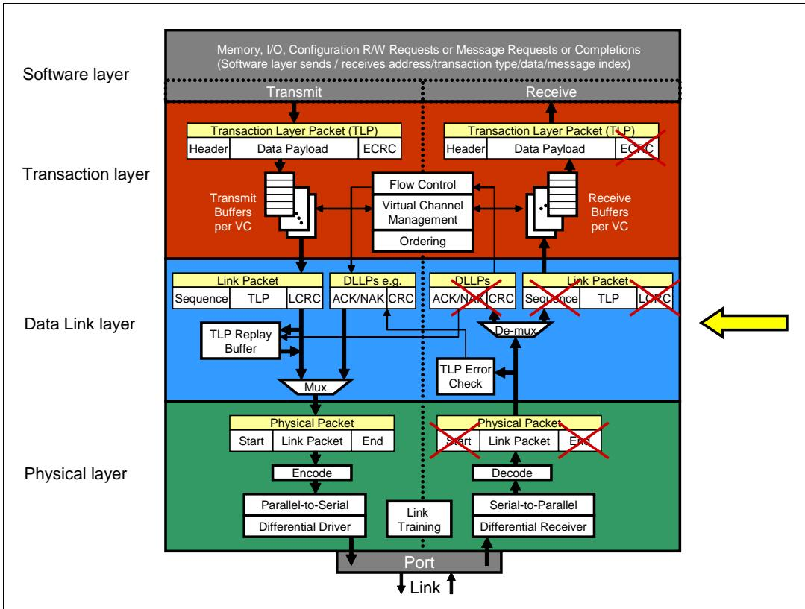
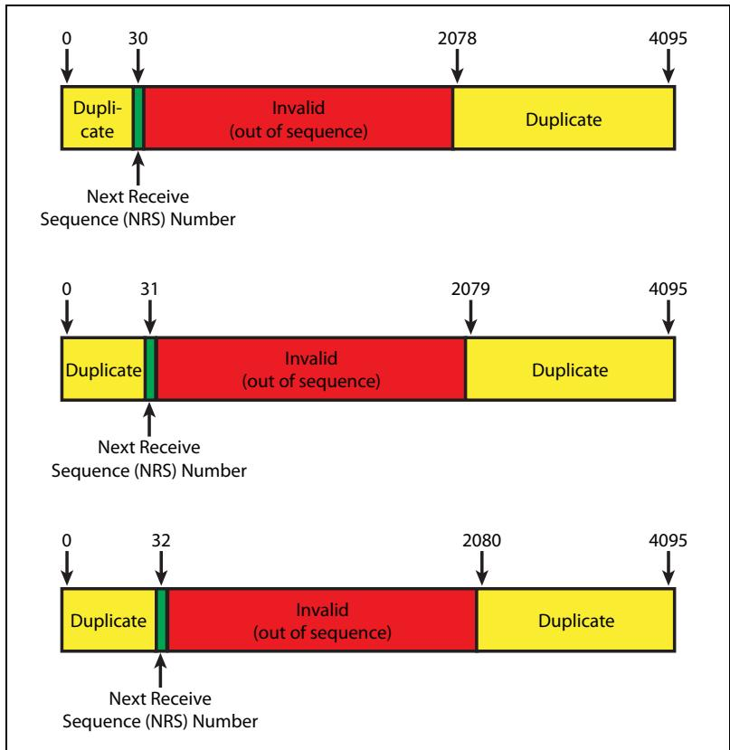
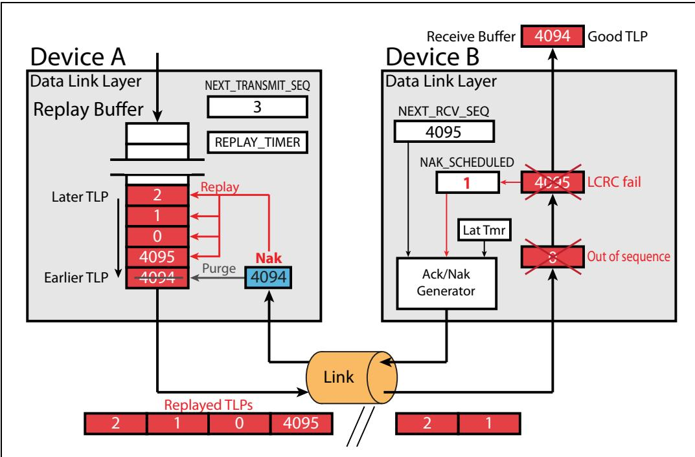
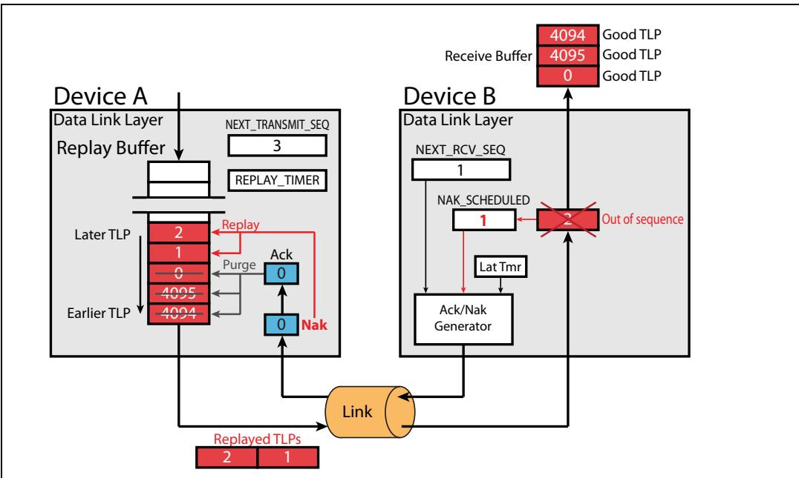

# Ch10_AckNak_Protocol

# 10 Ack/Nak Protocol

| EN | ZH |
|----|----|
| # 10 Ack/Nak Protocol | # 第10章 Ack/Nak协议 |

## The Previous Chapter | 上一章

| EN | ZH |
|----|----|
| In the previous chapter we describe Data Link Layer Packets (DLLPs). We describe the use, format, and definition of the DLLP types and the details of their related fields. DLLPs are used to support Ack/Nak protocol, power management, flow control mechanism and can be used for vendor‑defined purposes. | 在上一章中，我们描述了数据链路层包（DLLP）。我们阐述了DLLP类型的使用、格式和定义以及其相关字段的细节。DLLP用于支持Ack/Nak协议、电源管理、流控机制，并可用于厂商自定义的目的。 |

| EN | ZH |
|----|----|
| ## This Chapter | ## 本章内容 |
| This chapter describes a key feature of the Data Link Layer: an automatic, hardware-based mechanism for ensuring reliable transport of TLPs across the Link. Ack DLLPs confirm successful reception of TLPs while Nak DLLPs indicate a transmission error. We describe the normal rules of operation when no TLP or DLLP error is detected as well as error recovery mechanisms associated with both TLP and DLLP errors. | 本章描述数据链路层的一个关键特性：一种基于硬件的自动机制，用于确保TLP在链路上的可靠传输。Ack DLLP确认TLP成功接收，而Nak DLLP则表示传输错误。本章介绍未检测到TLP或DLLP错误时的正常操作规则，以及与TLP和DLLP错误相关的错误恢复机制。 |

| EN | ZH |
|----|----|
| ## The Next Chapter | ## 下一章 |
| The next chapter describes the Logical sub-block of the Physical Layer, which prepares packets for serial transmission and reception. Several steps are needed to accomplish this and they are described in detail. This chapter covers the logic associated with the first two spec versions Gen1 and Gen2 that use 8b/10b encoding. The logic for Gen3 does not use 8b/10b encoding and is described separately in the chapter called "Physical Layer - Logical (Gen3)" on page 407. | 下一章描述物理层的逻辑子块，该子块负责准备数据包以进行串行发送和接收。完成此工作需若干步骤，这些步骤将在本章中详细描述。本章涵盖与前两个规范版本 Gen1 和 Gen2 相关的逻辑，这两个版本使用 8b/10b 编码。Gen3 的逻辑不使用 8b/10b 编码，将在第 407 页名为"物理层 - 逻辑（Gen3）"的章节中单独描述。 |

## 10.1 Goal: Reliable TLP Transport | 10.1 目标：可靠的 TLP 传输

Figure 10-1: Data Link Layer | 图10-1：数据链路层  

| EN | ZH |
|----|----|
| The function of the Data Link Layer (shown in Figure 10‐1 on page 318) is to ensure reliable delivery of TLPs. The spec requires a BER (Bit Error Rate) of no worse than 10‐12, but errors will still happen often enough to cause trouble, and a single bit error will corrupt an entire packet. This problem will only become more pronounced as Link rates continue to increase with new generations. | 数据链路层（如图10-1所示，见第318页）的功能是确保TLP的可靠传输。规范要求误码率（BER）不劣于10-12，但错误仍会频繁发生并引发问题，且单个比特错误就足以破坏整个数据包。随着新一代技术中链路速率的不断提升，这一问题将愈发显著。 |
| To facilitate this goal, an error detection code called an LCRC (Link Cyclic Redundancy Code) is added to each TLP. The first step in error checking is simply to verify that this code still evaluates correctly at the receiver. If each packet is given a unique incremental Sequence Number as well, then it will be easy to sort out which packet, out of several that have been sent, encountered an error. Using that Sequence Number, we can also require that TLPs must be successfully received in the same order they were sent. This simple rule makes it easy to detect missing TLPs at the Receiver's Data Link Layer. | 为实现这一目标，每个TLP中附加了一种称为LCRC（链路循环冗余码）的错误检测码。错误检查的第一步就是验证该码在接收端仍然正确。如果每个数据包还被赋予一个唯一的递增序列号，那么就能轻松地从已发送的多个数据包中找出哪个发生了错误。利用该序列号，我们还要求TLP必须按照发送顺序成功接收。这一简单规则使得接收端数据链路层能够容易地检测到丢失的TLP。 |
| The basic blocks in the Data Link Layer associated with the Ack/Nak protocol are shown in greater detail in Figure 10‐2 on page 319. Every TLP sent across the Link is checked at the receiver by evaluating the LCRC (first) and Sequence Number (second) in the packet. The receiving device notifies the transmitting device that a good TLP has been received by returning an Ack. Reception of an Ack at the transmitter means that the receiver has received at least one TLP successfully. On the other hand, reception of a Nak by the transmitter indicates that the receiver has received at least one TLP in error. In that case, the transmitter will re‐send the appropriate TLP(s) in hopes of a better result this time. This is sensible, because things that would cause a transmission error would likely be transient events and a replay will have a very good chance of solving the problem. | 与Ack/Nak协议相关的数据链路层基本模块如图10-2所示（见第319页），图中更详细地展示了这些模块。每条链路上发送的每个TLP在接收端通过检查数据包中的LCRC（首先）和序列号（其次）进行校验。接收设备通过返回Ack通知发送设备已成功收到一个TLP。发送端收到Ack表示接收端已至少成功接收了一个TLP。另一方面，发送端收到Nak表示接收端至少接收到了一个错误的TLP。此时，发送端将重新发送相应的TLP，以期本次获得更好的结果。这是合理的，因为导致传输错误的原因很可能是瞬时事件，重播有很大机会解决问题。 |

Figure 10-2: Overview of the Ack/Nak Protocol | 图10-2：Ack/Nak协议概述  

| EN | ZH |
|----|----|
| Since both the sending and receiving devices in the protocol have both a transmit and a receive side, this chapter will use the terms: | 由于协议中的发送设备和接收设备都有发送端和接收端两侧，本章将使用以下术语： |
| • Transmitter to mean the device that sends TLPs | • Transmitter（发送器）指发送TLP的设备 |
| • Receiver to mean the device that receives TLPs | • Receiver（接收器）指接收TLP的设备 |

## Elements of the Ack | Nak Protocol

| EN | ZH |
|----|----|
| The major Ack/Nak protocol elements of the Data Link Layer are shown in Figure 10-3 on page 320. There's too much to consider all at once, though, so let's begin by focusing on just the transmitter elements, which are shown in a larger view in Figure 10-4 on page 322. | 数据链路层的 Ack/Nak 协议主要元素如图 10-3（第 320 页）所示。然而，一次性考虑所有元素过于复杂，因此我们先聚焦于发送端元素，其放大视图如图 10-4（第 322 页）所示。 |

Figure 10-3: Elements of the Ack/Nak Protocol | 图10-3：Ack/Nak协议元素

## 10.2.1 Transmitter Elements | 10.2.1 发送器要素

| EN | ZH |
|----|----|
| As TLPs arrive from the Transaction Layer, several things are done to prepare them for robust error detection at the receiver. As shown in the diagram TLPs are first assigned the next sequential Sequence Number, obtained from the 12-bit NEXT_TRANSMIT_SEQ counter. | 当TLP从事务层到达时，需执行若干操作以使其为接收端的鲁棒错误检测做好准备。如图所示，TLP首先被分配下一个连续的序列号，该序列号来自12位的NEXT_TRANSMIT_SEQ计数器。 |

## NEXT_TRANSMIT_SEQ Counter | NEXT_TRANSMIT_SEQ 计数器

| EN | ZH |
|----|----|
| This counter generates the Sequence Number that will be assigned to the next incoming TLP. It's a 12-bit counter that is initialized to 0 at reset or when the Link Layer reports DL_Down (Link Layer is inactive). Since it increments continuously with each TLP and only counts forward, the counter eventually reaches its max value of 4095 and rolls over to 0 as it continues to count. | 该计数器生成将被分配给下一个传入 TLP 的序列号。它是一个 12 位计数器，在复位或当数据链路层报告 DL_Down（数据链路层未激活）时初始化为 0。由于它随每个 TLP 连续递增且仅向前计数，该计数器最终会达到其最大值 4095，并在继续计数时回绕到 0。 |
| This Sequence Number assigned to the TLP will be used in the Ack or Nak sent by the receiver to reference this TLP in the Replay Buffer. One might think that such a large counter means that a large number of unacknowledged TLPs could be in flight, but in practice this is very unlikely. The main reason is that the receiver has a requirement to send an Ack back for successfully received TLPs within a certain amount of time. That amount of time is discussed in detail in "AckNak_LATENCY_TIMER" on page 328, but is typically only long enough to transmit a few max sized packets. | 分配给 TLP 的该序列号将用于接收端发送的 Ack 或 Nak 中，以引用重放缓冲区中的此 TLP。有人可能会认为，如此大的计数器意味着可能有大量未确认的 TLP 在传输中，但实际上这几乎不可能发生。主要原因是接收端要求在特定时间内为成功接收的 TLP 发回 Ack。该时间量在 328 页的 "AckNak_LATENCY_TIMER" 中有详细讨论，但通常仅够传输几个最大尺寸的数据包。 |

## LCRC Generator | LCRC 生成器

| EN | ZH |
|----|----|
| This block generates a 32-bit CRC (Cyclic Redundancy Check) code based on the header and data to be sent and adds it to the end of the outgoing packet to facilitate error detection. The name is derived from the fact that this check code (calculated from the packet to be sent) is redundant (adds no information), and is derived from cyclic codes. | 该模块基于待发送的头部和数据生成32位CRC（循环冗余校验）码，并将其附加到输出数据包的末尾，以便进行错误检测。其名称来源于：该校验码（根据待发送数据包计算得出）是冗余的（不增加额外信息），并且源自循环码。 |
| Although a CRC doesn't supply enough information for the Receiver to do automatic error correction the way ECC (Error Correcting Code) methods can, it does provide robust error detection. | 虽然CRC无法像ECC（纠错码）方法那样为接收方提供足够的自动纠错信息，但它确实提供了强大的错误检测能力。 |
| CRCs are commonly used in serial transports because they're easy to implement in hardware, and because they're good at detecting burst errors: a string of incorrect bits. | CRC通常用于串行传输，因为它们易于硬件实现，并且擅长检测突发错误（即一连串的错误比特位）。 |
| Since this is more likely to happen in a serial design than a parallel model, it helps explain why a CRC is a good choice for error detection in serial transports. | 由于这种情况在串行设计中比并行模型中更可能发生，这有助于解释为什么CRC是串行传输中错误检测的优选方案。 |
| The CRC code is calculated using all fields of the TLP, including the Sequence Number. | CRC码使用TLP的所有字段（包括序列号）进行计算。 |
| The receiver will make the same calculation and compare its result to the LCRC field in the TLP. | 接收方将进行相同的计算，并将结果与TLP中的LCRC字段进行比较。 |
| If they don't match, an error is detected in the Receiver's Link Layer. | 如果不匹配，则接收方的数据链路层检测到错误。 |

| EN | ZH |
|----|----|
| ## Replay Buffer | ## 重放缓冲区 |
| The replay buffer, or retry buffer, stores TLPs, including the Sequence Number and LCRC, in the order of their transmission. When the transmitter receives an Ack indicating that TLPs have reached the receiver successfully, it purges from the Replay Buffer those TLPs whose Sequence Number is equal to or earlier than the number in the Ack. In this way, the design allows one Ack to represent several successful TLPs, reducing the number of Acks that must be sent. Since the packets must always be seen in order, then if an Ack is received with a Sequence Number of 7, then not only was TLP 7 received successfully, but all the packets before it must also have been received successfully, so there is no reason to keep a copy of them in the replay buffer. | 重放缓冲区（或称重试缓冲区）按照传输顺序存储TLP，包括序列号和LCRC。当发送端收到指示TLP已成功到达接收端的Ack时，它会从重放缓冲区中清除那些序列号等于或早于Ack中编号的TLP。通过这种方式，设计允许一个Ack代表多个成功的TLP，从而减少必须发送的Ack数量。由于报文必须始终按序呈现，因此如果收到序列号为7的Ack，则不仅TLP 7已成功接收，而且其之前的所有报文也必定已成功接收，因此无需在重放缓冲区中保留它们的副本。 |
| If a Nak is received, the Sequence Number in the Nak still indicates the last good packet received. So even receiving a Nak can cause the transmitter to purge TLPs from the replay buffer. However, because it is a Nak, it means that something was not received successfully at the receiver, so after purging all the acknowledged TLPs, the transmitter must replay everything still in the replay buffer in order. For example, if a Nak is received with a Sequence Number of 9, then packet 9 and all prior packets are purged from the replay buffer, because the receiver acknowledged that they have been successfully received. However, because it is a Nak, the transmitter must then replay all the remaining TLPs in the replay buffer in order, starting with packet 10. | 如果收到Nak，Nak中的序列号仍然指示最后成功接收的报文。因此，即使收到Nak，也会导致发送端从重放缓冲区中清除TLP。但由于这是Nak，意味着接收端有某些内容未被成功接收，因此在清除所有已确认的TLP之后，发送端必须按序重放重放缓冲区中剩余的所有内容。例如，如果收到序列号为9的Nak，则报文9及其之前的所有报文都将从重放缓冲区中清除，因为接收端已确认它们被成功接收。但由于是Nak，发送端必须随后按序重放重放缓冲区中剩余的所有TLP，从报文10开始。 |

Figure 10‐4: Transmitter Elements Associated with the Ack/Nak Protocol | 图10‐4：与Ack/Nak协议相关的发送器元素

## REPLAY_TIMER Count | 重发定时器计数

| EN | ZH |
|----|----|
| This timer is effectively a watchdog timer. It makes sure that the transmitter is receiving Ack/Nak packets for TLPs that have been transmitted. If this timer expires, it means that the transmitter has sent one or more TLPs that it has not received an acknowledgement for in the expected time frame. The fix is to retransmit everything in the replay buffer and restart the REPLAY_TIMER. | 该定时器本质上是一个看门狗定时器。它确保发送端能够收到已发送TLP的Ack/Nak报文。如果该定时器超时，意味着发送端已发送一个或多个TLP，但在预期时间内未收到相应的确认。解决方法是重传重放缓冲区中的所有内容，并重新启动REPLAY_TIMER。 |
| This timer is running anytime a TLP has been transmitted but not yet acknowledged. If the REPLAY_TIMER is not currently running, it is started when the last Symbol of any TLP is transmitted. If the timer is already running, then sending additional TLPs does not reset the timer value. When an Ack or Nak is received that acknowledges TLPs in the replay buffer, the timer resets back to 0, and if there are still TLPs in the replay buffer (TLPs that have been transmitted, but not yet acknowledged), it immediately starts counting again. However, if an Ack is received that acknowledges the last TLP in the replay buffer, meaning the replay buffer is now empty, the REPLAY_TIMER resets to 0 but does not count. It will not begin counting again until the last Symbol of the next TLP is transmitted. | 每当有TLP已发送但尚未被确认时，该定时器就会运行。如果REPLAY_TIMER当前未运行，则在发送任一TLP的最后一个符号时启动它。如果定时器已在运行，则发送额外的TLP不会重置定时器值。当收到确认重放缓冲区中TLP的Ack或Nak时，定时器重置回0；如果重放缓冲区中仍有TLP（即已发送但尚未被确认的TLP），则立即重新开始计数。然而，如果收到确认重放缓冲区中最后一个TLP的Ack（即重放缓冲区现已为空），则REPLAY_TIMER重置为0但不再计数。直到下一个TLP的最后一个符号被发送时，它才会重新开始计数。 |

| EN | ZH |
|----|----|
| ## REPLAY_NUM Count | ## REPLAY_NUM 计数 |
| This 2-bit counter tracks the number of replay attempts after reception of a Nak or a REPLAY_TIMER time-out. When the REPLAY_NUM count rolls over from 11b to 00b (indicating 4 failed attempts to deliver the same set of TLPs), the Data Link Layer automatically forces the Physical Layer to retrain the Link (LTSSM goes to the Recovery state). When re-training is finished, it will attempt to send the failed TLPs again. The REPLAY_NUM counter is initialized to 00b at reset, or when the Link Layer is inactive. It is also reset whenever an Ack DLLP is received with a Sequence Number that is more recent than the last one seen, meaning forward progress is being made. | 这个 2 位计数器跟踪在收到 Nak 或 REPLAY_TIMER 超时后的重试次数。当 REPLAY_NUM 计数从 11b 翻转到 00b（表示同一组 TLP 的 4 次传送尝试均失败）时，数据链路层自动迫使物理层对链路进行重新训练（LTSSM 进入 Recovery 状态）。重新训练完成后，它将再次尝试发送失败的 TLP。REPLAY_NUM 计数器在复位时或链路层处于非活跃状态时被初始化为 00b。每当收到序号比上一次所见更新的 Ack DLLP 时（表示正在取得正向进展），它也会被复位。 |

## ACKD\_SEQ Register

| EN | ZH |
|----|----|
| This 12-bit register stores the Sequence Number of the most recently received Ack or Nak. It is initialized to all 1s at reset, or when the Data Link Layer is inactive. This register is updated with the AckNak\_Seq\_Num [11:0] field of a received Ack or Nak. The ACKD\_SEQ count is compared with the Sequence Number in the last received Ack or Nak to check for forward progress. If the latest Ack/Nak had a Sequence Number later than the ACKD\_SEQ register, then we're making forward progress. | 该12位寄存器存储最近接收到的 Ack 或 Nak 的 Sequence Number（序列号）。它在复位时或数据链路层非活跃时初始化为全1。该寄存器通过接收到的 Ack 或 Nak 中的 AckNak\_Seq\_Num [11:0] 字段进行更新。ACKD\_SEQ 计数值与最近接收到的 Ack 或 Nak 中的 Sequence Number 进行比较，以检查前向进展。如果最新的 Ack/Nak 的 Sequence Number 晚于 ACKD\_SEQ 寄存器中的值，则表明正在取得前向进展。 |
| As an aside, we use the term "later Sequence Number" to account for the fact that, like most counters in PCIe, the Sequence Number counters only count forward, meaning that they'll eventually roll over back to zero. Technically, a later number would mean a numerically higher value, but we have to remember that when the counter reaches 4095 (it's a 12-bit counter), the next higher number will be zero. This wrap-around effect will be easier to see in the examples later, as in "Ack/Nak Examples" on page 331. | 顺便说明，我们使用"较晚的 Sequence Number"这一术语是基于以下事实：与 PCIe 中的大多数计数器一样，Sequence Number 计数器仅向前计数，这意味着它们最终会回绕到零。从技术上讲，较晚的数字意味着数值更大，但我们必须记住，当计数器达到 4095（它是一个12位计数器）时，下一个更大的数字将是零。这种回绕效应将在后面的示例中更容易看出，例如第331页的"Ack/Nak Examples"。 |
| As shown in Figure 10-4 on page 322, when an Ack or Nak makes forward progress it causes TLPs with Sequence Numbers equal to or older than the value in the DLLP to be purged out of the Replay Buffer. It also resets both the REPLAY\_TIMER and the REPLAY\_NUM count. If no forward progress is made, no TLPs can be purged so we only check to see if it's a Nak that would necessitate a replay. | 如第322页的图10-4所示，当 Ack 或 Nak 取得前向进展时，它会使得 Sequence Number 等于或早于 DLLP 中值的 TLP 从重放缓冲器中清除。它还会复位 REPLAY\_TIMER 和 REPLAY\_NUM 计数值。如果未取得前向进展，则无法清除任何 TLP，因此我们仅检查是否存在需要重放的 Nak。 |
| This is a good place to mention a potential problem with the counters: the number of TLPs sent might theoretically become much larger than the number that have been acknowledged by the receiver. As mentioned earlier, this is very unlikely; it's only mentioned here for completeness. The problem is basically the same as it for the Flow Control counters (see "Stage 3 — Counters Roll Over" on page 234) and has the same solution: the NEXT\_TRANSMIT\_SEQ and ACKD\_SEQ counters are never allowed to be separated by more than half their total count value. If a large number of TLPs are sent without acknowledgement so that the NEXT\_TRANSMIT\_SEQ count value is later than ACKD\_SEQ count by 2048, no more TLPs will be accepted from the Transaction Layer until this is resolved by receiving more Acks. If the difference between the Sequence Number sent and the acknowledged count ever did exceed half the maximum count value, a Data Link Layer protocol error would be reported. (For more on error reporting, see "Data Link Layer Errors" on page 655.) | 此处是提及计数器潜在问题的好时机：发送的 TLP 数量理论上可能远大于接收方已确认的数量。如前所述，这种情况极不可能发生；此处仅为完整性而提及。该问题与流控计数器的问题基本相同（参见第234页的"Stage 3 — Counters Roll Over"），并且具有相同的解决方案：NEXT\_TRANSMIT\_SEQ 和 ACKD\_SEQ 计数器之间的差值绝不允许超过其总计数值的一半。如果大量 TLP 在未获确认的情况下被发送，导致 NEXT\_TRANSMIT\_SEQ 计数值比 ACKD\_SEQ 计数值晚 2048，则在收到更多 Ack 解决此问题之前，事务层将不再接受更多的 TLP。如果发送的 Sequence Number 与已确认计数值之间的差值确实超过最大计数值的一半，则会报告数据链路层协议错误。（有关错误报告的更多信息，请参见第655页的"Data Link Layer Errors"。） |

## DLLP CRC Check | DLLP CRC 检查

| EN | ZH |
|----|----|
| This block checks for errors in the 16-bit CRC of DLLPs. If an error is detected, the DLLP is discarded and a Correctable Error may be reported, if enabled. | 该模块检查 DLLP 的 16 位 CRC 中的错误。若检测到错误，DLLP 被丢弃，并且如果使能，可报告一个可校正错误。 |
| No further action is taken because there is no mechanism to replay or correct failed DLLPs. | 不会采取进一步行动，因为没有机制可重放或纠正失败的 DLLP。 |
| Instead, we simply wait for the next successful Ack/Nak, which will get the counters back up-to-date and allow normal operation to continue. | 而是只需等待下一个成功的 Ack/Nak，它将使计数器重新更新，并允许正常操作继续进行。 |

| EN | ZH |
|----|----|
| ## Receiver Elements | ## 接收器元素 |
| Incoming TLPs are first checked for LCRC errors and then for Sequence Numbers. If there are no errors, the TLP is forwarded to the receiver's Transaction Layer. If there are errors, the TLP is discarded and a Nak will be scheduled unless there was already a Nak outstanding. | 传入的TLP首先被检查LCRC错误，然后检查序列号。如果没有错误，TLP被转发到接收端的事务层。如果有错误，TLP被丢弃，并且除非已有一个Nak未处理，否则将调度一个Nak。 |
| Figure 10-5 on page 325 illustrates the receiver Data Link Layer elements associated with processing of inbound TLPs and outbound Ack/Nak DLLPs. | 第325页的图10-5展示了与入站TLP和出站Ack/Nak DLLP处理相关的接收端数据链路层元素。 |

Figure 10-5: Receiver Elements Associated with the Ack/Nak Protocol | 图10-5：与Ack/Nak协议相关的接收器元素  

## LCRC Error Check | LCRC 错误检查

| EN | ZH |
|----|----|
| This block checks for transmission errors in the received TLP by verifying the 32-bit LCRC. This block calculates an LCRC value based on the received bits of the TLP and then compares the calculated LCRC to the received LCRC. If they match, then all the bits of the packet were received exactly as they were transmitted. If it doesn't match, then there was a bit error in the TLP so it gets dropped and a Nak will be sent to get a replay of that packet and any TLPs sent after the bad packet. | 该模块通过验证32位LCRC来检查接收到的TLP中的传输错误。该模块基于接收到的TLP位计算出一个LCRC值，然后将计算出的LCRC与接收到的LCRC进行比较。如果两者匹配，则数据包的所有位都与发送时完全一致地被接收。如果不匹配，则TLP中存在位错误，因此该TLP将被丢弃，并发送Nak以请求重传该数据包以及错误数据包之后发送的任何TLP。 |

| EN | ZH |
|----|----|
| ## NEXT\_RCV\_SEQ Counter | ## NEXT\_RCV\_SEQ 计数器 |
| The 12‐bit NEXT\_RCV\_SEQ (Next Receive Sequence number) counter keeps track of the expected Sequence Number and is used to verify sequential packet reception. It's initialized to 0 at reset or when the Data Link Layer is inactive, and is incremented once for each good TLP forwarded to the Transaction Layer. TLPs that have errors or were nullified are not sent to the Transaction Layer and therefore don't increment this counter. | 12 位的 NEXT\_RCV\_SEQ（下一个接收序列号）计数器用于跟踪期望的序列号，并用于验证数据包的顺序接收。在复位或数据链路层处于非活跃状态时，该计数器初始化为 0，并且每有一个正确的 TLP 被转发给事务层，计数器就递增一次。包含错误或被无效化的 TLP 不会被发送到事务层，因此不会递增此计数器。 |

## Sequence Number Check | 序列号检查

| EN | ZH |
|----|----|
| If the LCRC check was OK, the TLP's Sequence Number is checked against the expected count (the NRS number). As can be seen in Figure 10-5 on page 325, there are three possible outcomes of this check: | 如果LCRC检查通过，则会将TLP的序列号与预期计数值（NRS编号）进行比较。如第325页图10-5所示，此检查存在三种可能的结果： |
| 1. The TLP Sequence Number equals the NRS count (the number we're expecting). In this case, everything is good: the TLP is accepted and forwarded to the Transaction Layer and the NRS count is incremented. The Receiver schedules an Ack, but it doesn't have to be sent until the AckNak_LATENCY_TIMER expires. In the meantime, other good TLPs may be received, incrementing the NEXT_RCV_SEQ counter. Then, once the timer expires, a single Ack is sent with the Sequence Number of the last good TLP received (NRS - 1). That allows one Ack to represent several successful TLPs and reduces overhead, since a dedicated Ack is not required for every TLP. | 1. TLP序列号等于NRS计数值（即期望的编号）。在这种情况下，一切正常：TLP被接收并转发给事务层，NRS计数值递增。接收器会调度一个Ack，但不必立即发送，可等到AckNak_LATENCY_TIMER超时后再发送。在此期间，可能还会接收到其他正确的TLP，从而使NEXT_RCV_SEQ计数器递增。然后，一旦定时器超时，会发送一个Ack，其中包含最后一个正确接收的TLP的序列号（NRS - 1）。这样，一个Ack就可以代表多个成功接收的TLP，从而减少了开销，因为不需要为每个TLP都发送一个专用的Ack。 |
| 2. If the TLP's Sequence Number is earlier than the NRS count (smaller than expected), this TLP has been seen before and is a duplicate. As long as the expected Sequence Number and received Sequence Number don't get separated by more than half the total count value (2048), this is not an error, but is seen as a duplicate, meaning the TLP has already been accepted earlier. In this case, the TLP is silently dropped (no Nak, no error reporting) and an Ack is sent with the Sequence Number of the last good TLP it received (NRS - 1). Why would this situation happen? The transmitter may not have received a transmitted Ack, so his REPLAY_TIMER expired and he retransmitted everything in his Replay Buffer. By sending the transmitter an Ack with the Sequence Number of the last good packet we received, we're notifying him of the furthest progress we've made. | 2. 如果TLP的序列号早于NRS计数值（小于期望值），则说明该TLP之前已被接收过，属于重复TLP。只要期望序列号与接收到的序列号之间的差值不超过总计数值的一半（2048），这不视为错误，而是视为重复，意味着该TLP先前已被接收过。在这种情况下，TLP被静默丢弃（不发送Nak，也不上报错误），并向发送方发送一个Ack，其中包含最后一个正确接收的TLP的序列号（NRS - 1）。为什么会出现这种情况？发送方可能未收到已发送的Ack，导致其REPLAY_TIMER超时，从而重发了其重放缓冲中的所有内容。通过向发送方发送包含我们已接收到最后一个正确TLP序列号的Ack，我们可以告知发送方我们所取得的最新进展。 |
| 3. If the TLP's Sequence Number is a later Sequence Number than NEXT_RCV_SEQ count (larger than expected), then the Link Layer has missed a TLP. For example, if we're expecting Sequence Number 30 and the incoming TLP has Sequence Number 31 we know there's a problem. The numbers must be sequential and, since they aren't, one must have failed and been dropped, as might happen at the Physical Layer. This out-of-order TLP is discarded, whether or not it had any other errors because we must accept TLPs in order, and a Nak will be sent if there wasn't one already outstanding. | 3. 如果TLP的序列号晚于NEXT_RCV_SEQ计数值（大于期望值），则说明数据链路层丢失了一个TLP。例如，如果我们期望的序列号是30，而接收到的TLP序列号是31，我们就知道出了问题。序列号必须是连续的，既然不是连续的，说明某个TLP已经失败并被丢弃了，这种情况可能发生在物理层。这个乱序的TLP将被丢弃，无论它是否有其他错误，因为我们必须按顺序接收TLP，并且如果当前没有未完成的Nak，则会发送一个Nak。 |
| The concept of the expected sequence number (NRS) incrementing as new TLPs are successfully received and seeing how that affects the sliding windows for the invalid range of sequence numbers and the duplicate range of sequence numbers can be seen in Figure 10-6. | 随着新的TLP被成功接收，期望序列号（NRS）递增的概念，以及这如何影响无效序列号范围和重复序列号范围的滑动窗口，可以在图10-6中看到。 |

Figure 10-6: Examples of Sequence Number Ranges | 图10-6：序列号范围示例

| EN | ZH |
|----|----|
| ## NAK_SCHEDULED Flag | ## NAK_SCHEDULED 标志 |
| This flag is set whenever the receiver schedules a Nak, and is cleared when the receiver successfully receives the TLP with the expected Sequence Number (NRS). The spec is clear that the receiver must not schedule additional Nak DLLPs while the NAK_SCHEDULED flag remains set. The author's opinion is that this is intended to prevent the possibility of an endless loop; a case in which the transmitter begins to replay some packets but the receiver sends another Nak before the replays finish and causes it to restart sending them again. Whatever the motivation, once a Nak has been sent there will be no more Naks forthcoming until the problem is resolved by successful receipt of the replayed TLP with the correct Sequence Number. | 每当接收器调度一个Nak时，该标志被设置，当接收器成功接收到具有期望序列号(NRS)的TLP时，该标志被清除。规范明确指出，当NAK_SCHEDULED标志保持置位时，接收器不得调度额外的Nak DLLP。作者认为，这是为了防止无限循环的可能性；即发送器开始重放某些报文，但在重放完成前接收器发送了另一个Nak，导致发送器重新开始发送这些报文的情况。无论动机如何，一旦Nak已被发送，在通过成功接收具有正确序列号的重放TLP解决问题之前，将不再有更多的Nak发送。 |

## AckNak\_LATENCY\_TIMER

| EN | ZH |
|----|----|
| This timer is running anytime a receiver successfully receives a TLP that it has not yet acknowledged. The receiver is required to send an Ack once the timer expires. The length of time the AckNak Latency Timer runs is dictated by the spec (see "AckNak\_LATENCY\_TIMER" on page 328) and determines how long a receiver can coalesce Acks. Once the AckNak Latency Timer expires, an Ack with sequence number NRS-1 is generated and sent which indicates the last good packet it received. This timer is reset whenever an Ack or Nak are sent and it only restarts once a new good TLP is received. | 每当接收端成功收到一个尚未确认的TLP时，该定时器便会运行。定时器到期后，接收端必须发送一个Ack。AckNak延迟定时器的运行时长由规范规定（参见第328页的"AckNak\_LATENCY\_TIMER"），它决定了接收端可以合并Ack的时间长度。一旦AckNak延迟定时器到期，就会生成并发送一个带有序列号NRS-1的Ack，指示其收到的最后一个正确TLP。每当发送Ack或Nak时，该定时器都会被复位，并且只有在收到新的正确TLP后才会重新启动。 |

## Ack | Nak Generator

| EN | ZH |
|----|----|
| Ack or Nak DLLPs are scheduled by the error checking blocks and contain a 12‑bit AckNak_Seq_Num field as illustrated in Figure 10‑7 on page 328. It calculates this number by subtracting one from the NRS count, which results in reporting the last good Sequence Number received. That's because a good TLP received increments NRS before scheduling the Ack, while a failed TLP just schedules a Nak without incrementing NRS. This method makes it easier to handle failed packets because the error in the TLP might have been in the Sequence Number, so that number can't be used in the Nak. Instead, it uses the number of the last good TLP; what we're expecting minus one. The only case where this value doesn't represent the last good TLP is for the first TLP after a reset. If that first TLP, using Sequence Number 0, fails, the resulting Nak will have an AckNak_Seq_Num value of zero minus one which results in all 1's. | Ack或Nak DLLP由错误检查模块调度，包含一个12位的AckNak_Seq_Num字段，如图10‑7（第328页）所示。它通过将NRS计数减1来计算该值，从而报告最后收到的有效序列号（Sequence Number）。这是因为：收到有效TLP会在调度Ack之前递增NRS，而失败的TLP仅调度Nak而不递增NRS。该方法使处理失败报文更加容易，因为TLP中的错误可能发生在序列号字段，因此该号码不能用于Nak。取而代之的是，它使用最后一个有效TLP的编号，即我们所期望的值减1。该值不代表最后一个有效TLP的唯一情况是复位之后的第一个TLP。如果使用序列号0的第一个TLP失败，则产生的Nak将具有零减一的AckNak_Seq_Num值，结果为全1。 |

Figure 10‑7: Ack Or Nak DLLP Format | 图10‑7：Ack或Nak DLLP格式

<table><tr><td rowspan="2"></td><td>+0</td><td>+1</td><td>+2</td><td>+3</td></tr><tr><td>7|6|5|4|3|2|1|0</td><td>7|6|5|4|3|2|1|0</td><td>7|6|5|4|3|2|1|0</td><td>7|6|5|4|3|2|1|0</td></tr><tr><td rowspan="2">Byte 0</td><td>0000 0000 - Ack</td><td rowspan="2">Reserved</td><td rowspan="2" colspan="2">AckNak_Seq_Num</td></tr><tr><td>0001 0000 - Nak</td></tr><tr><td>Byte 4</td><td colspan="4">16-bit CRC</td></tr></table>

Table 10‑1: Ack or Nak DLLP Fields | 表10‑1：Ack或Nak DLLP字段

| Field Name | Header Byte/Bit | DLLP Function |
|----|----|---|
| DLLP Type | Byte 0, [7:0] | Indicates the type: 0000 0000b = Ack, 0001 0000b = Nak |
| AckNak_Seq_Num | Byte 2, [3:0] Byte 3, [7:0] | This value will always be NEXT_RCV_SEQ count - 1. |
| 16-bit CRC | Byte 4, [7:0] Byte 5, [7:0] | 16-bit CRC used to protect the contents of this DLLP. |

## Ack | Nak Protocol Details

| EN | ZH |
|----|----|
| This section describes the detailed transmitter and receiver behavior in processing TLPs and Ack/Nak DLLPs. Several examples are used to demonstrate various cases that may occur. | 本节详细描述发送端和接收端在处理 TLP 和 Ack/Nak DLLP 时的行为。通过几个示例演示可能出现的各种情况。 |

| EN | ZH |
|----|----|
| ## Transmitter Protocol Details | ## 发送器协议细节 |

## Sequence Number | 序列号

| EN | ZH |
|----|----|
| Referring back to Figure 10-4 on page 322, when TLPs are delivered by the Transaction Layer to the Link Layer, one of the first steps is to append a 12-bit Sequence Number. Keep in mind that the next incremental Sequence Number may actually be smaller, as will happen when the counter rolls over back to zero after it reaches a maximum value of 4095. Consequently, a value of zero can actually be 'larger' than a value of 4095, for example. It may help to think of the Sequence Number comparison as evaluating a 'window' of numbers that consistently moves upward and rolls over. To clarify this concept, such a count roll over is used in several of the upcoming examples. | 回顾第322页的图10-4，当TLP由事务层递交至数据链路层时，首要步骤之一就是附加一个12位的序列号。需要注意的是，下一个递增的序列号实际可能更小，当计数器达到最大值4095后回滚到零时就会发生这种情况。因此，例如值0实际上可能"大于"值4095。不妨将序列号比较理解为对一个持续向上移动并回滚的数字"窗口"进行评估。为阐明这一概念，后续几个示例中均使用了这种计数回滚。 |

| EN | ZH |
|----|----|
| The transmitter also generates and appends a 32‑bit LCRC (Link CRC) based on the TLP contents (Sequence Number, Header, Data Payload and ECRC). | 发送端还会根据TLP内容（序列号、头部、数据负载和ECRC）生成并附加一个32位LCRC（链路CRC）。 |

## Replay (Retry) Buffer | 重放（重试）缓冲区

| EN | ZH |
|----|----|
| General. Before a device transmits a TLP, it stores a copy of the TLP in the Replay Buffer. (Note that the spec uses the term Retry Buffer but in this book 'Replay' was chosen instead of 'Retry' to more clearly distinguish this mechanism from the old PCI Retry mechanism). Each buffer entry stores a complete TLP with all of its fields including the Sequence Number (12 bits wide, it occupies two bytes), Header (up to 16 bytes), an optional Data Payload (up to 4KB), an optional ECRC (four bytes) and the LCRC field (four bytes). | 概述。设备在发送 TLP 之前，会将 TLP 的副本存储在重放缓冲区（Replay Buffer）中。（注意，规范使用术语 Retry Buffer，但本书选择使用 'Replay' 而非 'Retry'，以更清晰地将本机制与旧的 PCI 重试机制区分开来）。每个缓冲区条目存储一个完整的 TLP，包含其所有字段：序列号（Sequence Number，12 位宽，占用两个字节）、头标（Header，最多 16 字节）、可选的数据负载（Data Payload，最多 4KB）、可选的 ECRC（四个字节）以及 LCRC 字段（四个字节）。 |
| It is important to note that the spec describes the Replay Buffer in this fashion, but it is NOT a spec requirement that it be implemented this way. As long as your device can replay a sequence of TLPs if required, as defined by the spec, then how that is accomplished within a device is completely up to the designer. Having a Replay Buffer that behaves as described above is one way to accomplish this. | 需要注意的是，规范虽如此描述重放缓冲区，但并**未**要求必须按此方式实现。只要设备能够按照规范的定义，在必要时重放一系列 TLP，那么设备内部如何实现完全由设计者决定。拥有一个行为如上所述的重放缓冲区只是实现该功能的一种方式。 |
| Replay Buffer Sizing. The spec writers chose not to specify the Replay Buffer size, leaving it as an optimization for the device designers. It should be made big enough to store TLPs that haven't yet been acknowledged by Acks so that under normal operating conditions it doesn't become full and stall new TLPs coming in from the Transaction Layer, but also small enough to keep the cost down. To determine the optimal buffer size, a designer will consider: | 重放缓冲区大小。规范编写者选择不指定重放缓冲区的大小，将其留给设备设计者进行优化。该缓冲区应足够大，以存储尚未被 Ack 确认的 TLP，从而在正常工作条件下不会变满而阻塞来自事务层的新 TLP；同时又要足够小以控制成本。为确定最佳缓冲区大小，设计者需要考虑： |
| • Ack DLLP Latency from the receiver. | • 来自接收端的 Ack DLLP 延迟。 |
| • Delays caused by the physical Link. | • 物理链路引起的延迟。 |
| Receiver L0s exit latency to L0. In other words, the buffer should be big enough to hold TLPs without stalling while the Link returns from the L0s state to L0. | 接收端从 L0s 退出到 L0 的延迟。换言之，缓冲区应足够大，以在链路从 L0s 状态返回到 L0 期间能够保持 TLP 而不发生阻塞。 |
| When the transmitter receives an Ack, it purges TLPs from the Replay Buffer with Sequence Numbers equal to or earlier than the Sequence Number in the Ack (normally this term would be 'smaller than' but the counter roll over behavior will sometimes make that an incorrect evaluation, so the term 'earlier than' was chosen instead). Similarly, when the transmitter receives a Nak, it still purges the Replay Buffer of TLPs with Sequence Numbers that are equal to or earlier than the Sequence Number that arrives in the Nak, but then it also replays (re‑sends) TLPs of later Sequence Numbers (the remaining TLPs in the Replay Buffer). | 当发送端收到 Ack 时，它会从重放缓冲区中清除序列号等于或早于（earlier than）Ack 中序列号的 TLP（通常本应使用 '小于' 这一表述，但由于计数器翻转行为有时会导致该判断不正确，因此选择了 '早于' 这一说法）。类似地，当发送端收到 Nak 时，它仍会从重放缓冲区中清除序列号等于或早于 Nak 中序列号的 TLP，但随后还会重放（重新发送）序列号更晚的 TLP（即重放缓冲区中剩余的 TLP）。 |

## Transmitter's Response to an Ack DLLP | 发送器对 Ack DLLP 的响应

| EN | ZH |
|----|----|
| A single Ack returned by the receiver may acknowledge multiple TLPs; it isn't necessary that every TLP transmitted receive a dedicated Ack. The receiver can get multiple good TLPs and send one Ack with the Sequence Number of the last good TLP received. The transmitter's response to an Ack that makes forward progress (has a Sequence Number that is later than the last one seen) is to load the AckD\_SEQ register with the Sequence Number of the new Ack. It also resets the REPLAY\_NUM counter and REPLAY\_TIMER, and purges the Replay Buffer of all TLPs that were acknowledged by that Ack. | 接收方返回的一个 Ack 可确认多个 TLP；并非每个发送的 TLP 都需获得专用的 Ack。接收方可收到多个正确的 TLP，然后发送一个 Ack，其中携带最后一个正确收到的 TLP 的序列号。发送方对推动进度（即其序列号晚于上一次所见序列号）的 Ack 的响应是：将新 Ack 的序列号加载到 AckD\_SEQ 寄存器中。同时它还复位 REPLAY\_NUM 计数器和 REPLAY\_TIMER，并清除重放缓冲区中该 Ack 已确认的所有 TLP。 |

## Ack | Nak Examples
## Ack/Nak 示例

| EN | ZH |
|----|----|
| Example 1. Consider Figure 10-8 on page 332 for the following discussion. | 示例1. 请参考第332页的图10-8进行以下讨论。 |
| 1. Device A transmits TLPs with Sequence Numbers 3, 4, 5, 6, 7. | 1. 设备A发送序列号为3、4、5、6、7的TLP。 |
| 2. Device B successfully receives TLP 3 and increments its NEXT_RCV_SEQ counter from 3 to 4. Since Device B had previously acknowledged all successfully received TLPs, the AckNak_LATENCY_TIMER was not running. Having received TLP 3, Device B has now successfully received a TLP that it has not acknowledged, so the AckNak_LATENCY_TIMER is started (this is equivalent of scheduling an Ack). | 2. 设备B成功接收TLP 3，并将其NEXT_RCV_SEQ计数器从3递增至4。由于设备B先前已确认所有成功接收的TLP，AckNak_LATENCY_TIMER并未运行。收到TLP 3后，设备B现在已成功接收了一个尚未确认的TLP，因此启动AckNak_LATENCY_TIMER（这相当于调度一个Ack）。 |
| 3. Device B successfully receives TLPs 4 and 5 before the AckNak_LATENCY_TIMER expires. Receiving TLPs 4 and 5 does NOT reset the AckNak_LATENCY_TIMER. | 3. 设备B在AckNak_LATENCY_TIMER超时前成功接收TLP 4和TLP 5。接收TLP 4和TLP 5不会重置AckNak_LATENCY_TIMER。 |
| 4. Once the AckNak_LATENCY_TIMER expires, Device B sends a single Ack with the Sequence Number 5, the last good TLP received. The AckNak_LATENCY_TIMER is reset but does not restart until it successfully receives TLP 6. | 4. 一旦AckNak_LATENCY_TIMER超时，设备B发送一个带有序列号5（即最后正确接收的TLP）的单个Ack。AckNak_LATENCY_TIMER被重置，但在成功接收TLP 6之前不会重新启动。 |
| 5. Device A receives Ack 5, resets the REPLAY_TIMER and REPLAY_NUM counter, because forward progress is being made. And it purges TLPs from the Replay Buffer that have Sequence Numbers earlier than or equal to 5. | 5. 设备A收到Ack 5，由于正向进展正在推进，因此重置REPLAY_TIMER和REPLAY_NUM计数器。同时，它会从重放缓冲区中清除序列号小于或等于5的TLP。 |
| 6. Once Device B receives TLPs 6 and 7 and its AckNak_LATENCY_TIMER expires again, it will send an Ack with a Sequence Number of 7 which will purge the last two TLPs in the Replay Buffer of Device A (according to this example). | 6. 一旦设备B收到TLP 6和TLP 7，并且其AckNak_LATENCY_TIMER再次超时，它将发送一个序列号为7的Ack，从而清除设备A重放缓冲区中的最后两个TLP（根据本示例）。 |

Figure 10-8: Example 1 - Example of Ack | 图10-8：示例1 - Ack示例

| EN | ZH |
|----|----|
| Example 2. This example is showing the exact same behavior as Example 1, but it is pointing out the rollover behavior for the Sequence Numbers, as show in Figure 10-9 on page 333. | 示例2. 本示例展示与示例1完全相同的行为，但重点指出序列号的回绕行为，如图10-9（第333页）所示。 |
| 1. Device A transmits TLPs with Sequence Numbers 4094, 4095, 0, 1, and 2 where TLP 4094 is the first TLP sent and TLP 2 is the last TLP sent in this example. | 1. 设备A发送序列号为4094、4095、0、1和2的TLP，其中TLP 4094是本示例中发送的第一个TLP，TLP 2是发送的最后一个TLP。 |
| 2. Device B successfully receives TLPs with Sequence Numbers 4094, 4095, 0, 1 in that order. Reception of TLP 4094 causes the AckNak_LATENCY_TIMER to start. TLPs 4095, 0 and 1 are received before the AckNak_LATENCY_TIMER expires. TLP 2 is still en route. | 2. 设备B按顺序成功接收序列号为4094、4095、0、1的TLP。接收TLP 4094导致AckNak_LATENCY_TIMER启动。TLP 4095、0和1在AckNak_LATENCY_TIMER超时前被接收。TLP 2仍在传输中。 |
| 3. Because the AckNak_LATENCY_TIMER expires, Device B send an Ack with a Sequence Number of 1 to acknowledge receipt of TLP 1 and all prior TLPs (0, 4095 and 4094 in this example). | 3. 由于AckNak_LATENCY_TIMER超时，设备B发送一个序列号为1的Ack，以确认已收到TLP 1及其之前的所有TLP（本示例中为0、4095和4094）。 |
| 4. Device A successfully receives Ack 1, purges TLPs 4094, 4095, 0, and 1 from the Replay Buffer and resets the REPLAY_TIMER and REPLAY_NUM count. | 4. 设备A成功接收Ack 1，从重放缓冲区中清除TLP 4094、4095、0和1，并重置REPLAY_TIMER和REPLAY_NUM计数。 |

Figure 10-9: Example 2 - Ack with Sequence Number Rollover | 图10-9：示例2 - 序列号翻转的Ack

## Transmitter's Response to a Nak | 发送方对 Nak 的响应

| EN | ZH |
|----|----|
| A Nak indicates that a problem has occurred. | Nak 指示发生了问题。 |
| When a transmitter receives one, it first purges from the Replay Buffer any TLPs with earlier or equal Sequence Numbers and then replays the remaining TLPs starting with the Sequence Number immediately after the Sequence Number in the Nak. | 当发送方收到 Nak 时，它首先从重放缓冲区中清除所有具有更早或相同序列号的 TLP，然后从 Nak 中序列号紧接之后的一个序列号开始重放剩余的 TLP。 |
| If the Nak caused at least one TLP to be purged from the buffer, then we've made forward progress. In that case, the transmitter resets the REPLAY_NUM counter and REPLAY_TIMER and loads the AckD_SEQ register with the Sequence Number of the Nak. | 如果该 Nak 导致至少一个 TLP 从缓冲区中被清除，则说明取得了正向进展。在这种情况下，发送方重置 REPLAY_NUM 计数器和 REPLAY_TIMER，并将 AckD_SEQ 寄存器加载为 Nak 的序列号。 |

| EN | ZH |
|----|----|
| ## TLP Replay | ## TLP 重发 |
| When a Replay becomes necessary, the transmitter blocks acceptance of new TLPs from its Transaction Layer. It then replays the necessary TLPs in the buffer in the same order they were placed into the buffer (like a FIFO). After the replay event, the Data Link Layer unblocks acceptance of new TLPs from its Transaction Layer. The replayed TLPs remain in the buffer until they are finally acknowledged at some later time. | 当需要重发时，发送方阻止从其事务层接受新的 TLP。然后，它按照这些 TLP 被放入缓冲区的相同顺序（如同 FIFO）重发缓冲区中所需的 TLP。重发事件后，数据链路层解除对从其事务层接受新 TLP 的阻止。被重发的 TLP 将一直保留在缓冲区中，直到它们在稍后的某个时间被最终确认。 |

## Efficient TLP Replay | 高效的TLP重放

| EN | ZH |
|----|----|
| Ack or Nak DLLPs received during replay must be processed. So there are two main options here, the transmitter may hold them until the replay is finished and then evaluate the Acks or Naks and take the appropriate steps. Another option would be to begin processing the new Ack/Nak DLLPs even during the replay. If this option is used, the newly received Acks might purge some entries from the buffer while replay is in progress, possibly reducing the number of TLPs that need to be replayed and saving time on the Link. This is allowed, but it is important to remember that once a TLP is started for transmission, it must be completed. | 重放期间收到的Ack或Nak DLLP必须被处理。因此主要有两种选择：发送器可以将它们暂存，直到重放完成后再评估这些Ack或Nak并采取适当步骤。另一种选择是即使在重放期间也开始处理新的Ack/Nak DLLP。如果采用此选项，新收到的Ack可能会在重放进行过程中从缓冲区中清除某些条目，从而可能减少需要重放的TLP数量并节省链路时间。这是允许的，但务必记住，一旦TLP开始传输，就必须完成该传输。 |

| EN | ZH |
|----|----|
| ## Example of a Nak | ## Nak 示例 |
| Consider Figure 10‐10 on page 335. | 参考第335页的图10-10。 |
| 1. Device A transmits TLPs with Sequence Number 4094, 4095, 0, 1, and 2. | 1. 设备A发送序列号为4094、4095、0、1和2的TLP。 |
| 2. Device B receives TLP 4094 without error and increments the NEXT\_RCV\_SEQ count to 4095 starts the AckNak\_LATENCY\_TIMER. | 2. 设备B无错误地接收TLP 4094，将NEXT\_RCV\_SEQ计数递增至4095，并启动AckNak\_LATENCY\_TIMER。 |
| 3. Device B detects a CRC error in the next TLP received (TLP 4095) and sets the NAK\_SCHEDULED flag, which will cause a Nak to be sent with Sequence Number 4094 (NEXT\_RCV\_SEQ count  -  1). Device B does NOT wait until the AckNak\_LATENCY\_TIMER expires before sending the Nak. It will typically be sent on the next packet boundary. In face, since a Nak is scheduled for transmission, the AckNak\_LATENCY\_TIMER is stopped and reset. | 3. 设备B在接收到的下一个TLP（TLP 4095）中检测到CRC错误，并设置NAK\_SCHEDULED标志，这将导致发送序列号为4094（NEXT\_RCV\_SEQ计数减1）的Nak。设备B不会等到AckNak\_LATENCY\_TIMER超时才发送Nak，通常会在下一个包边界处发送。实际上，由于已安排发送Nak，AckNak\_LATENCY\_TIMER会被停止并复位。 |
| 4. Device B will continue evaluating incoming TLPs looking for TLP 4095. However, because Device A did not know there was a problem yet, it had sent packets 0, 1 and 2, which Device B will receive. However, Device B will not accept them, even though they may be good TLPs (meaning they did not fail the LCRC check). This is because all packets have to be accepted in order. So Device B will simply drop those packets because they are considered out of sequence, but no addition Nak will be sent. Even if one or more of these TLPs fail the LCRC check, no additional NAK is sent. The NAK\_SCHEDULED flag is already set and it will only be cleared once Device B successfully receives the TLP it is expecting (TLP 4095 in this example). | 4. 设备B将继续评估入站的TLP，寻找TLP 4095。但由于设备A尚不知晓存在问题，它已发送了包0、1和2，这些包将被设备B接收。然而，设备B不会接收它们，即使它们可能是正确的TLP（即未通过LCRC检查）。这是因为所有包必须按顺序接收。因此设备B将直接丢弃这些包，因为它们被视为失序包，但不会发送额外的Nak。即使其中某些TLP未通过LCRC检查，也不会发送额外的NAK。NAK\_SCHEDULED标志已置位，只有当设备B成功接收到它所期望的TLP（本例中为TLP 4095）时，该标志才会被清除。 |
| 5. Device A receives Nak 4094 and purges TLP 4094 and earlier TLPs (none in this example) from the Replay Buffer. Also, since forward progress was made, it resets the REPLAY\_TIMER and REPLAY\_NUM count. | 5. 设备A接收到Nak 4094，并从重放缓冲中清除TLP 4094及更早的TLP（本例中无）。同时，由于已取得正向进展，它复位REPLAY\_TIMER和REPLAY\_NUM计数。 |
| 6. Since the acknowledge DLLP received was a Nak and not an Ack, Device A then replays all remaining TLPs in the Replay Buffer (TLPs 4095, 0, 1, and 2) and restarts the REPLAY\_TIMER and increments the REPLAY\_NUM count by one. | 6. 由于接收到的确认DLLP是Nak而非Ack，设备A随后重放重放缓冲中所有剩余的TLP（TLP 4095、0、1和2），重新启动REPLAY\_TIMER，并将REPLAY\_NUM计数加1。 |
| 7. Once Device B receives the replayed TLP 4095, it will clear the NAK\_SCHEDULED flag, increment the NEXT\_RCV\_SEQ count and start the AckNak\_LATENCY\_TIMER. | 7. 一旦设备B接收到重放的TLP 4095，它将清除NAK\_SCHEDULED标志，递增NEXT\_RCV\_SEQ计数，并启动AckNak\_LATENCY\_TIMER。 |

Figure 10‐10: Example of a Nak | 图10‐10：Nak示例  
  
Repeated Replay of TLPs

| EN | ZH |
|----|----|
| General. Each time the transmitter receives a Nak, it replays the buffer contents, and the 2‐bit REPLAY\_NUM counter is incremented to keep track of the number of replay events. The replay caused by a Nak in the previous example will increment REPLAY\_NUM. | 概述。每次发送器接收到Nak时，它会重放缓冲内容，并且2位REPLAY\_NUM计数器递增以记录重放事件的次数。上例中由Nak引起的重放将使REPLAY\_NUM递增。 |
| If the replay doesn't clear the problem, though, we enter a new situation. The receiver has set the Nak Scheduled Flag and cannot send any more Acks or Naks until it sees the offending TLP correctly received. If the replay doesn't make that happen for some reason, then there will be no response from the receiver. What saves us now is the transmitter's REPLAY\_TIMER. When it times out, the entire contents of the Replay Buffer will be resent, the REPLAY\_NUM counter will be incremented and the REPLAY\_TIMER will be reset and restarted. If the REPLAY\_TIMER expires without receiving an Ack or Nak indicating forward progress, this replay process can be repeated up to three times. If after the third replay, there is still no forward progress and the REPLAY\_TIMER expires again, this would cause the REPLAY\_NUM counter to roll over from 3 back to 0. | 但如果重放未能解决问题，则进入一种新情况。接收器已设置Nak Scheduled标志，在看到出错的TLP被正确接收之前，无法再发送任何Ack或Nak。如果重放由于某种原因未能实现这一点，则接收器将没有任何响应。此时起作用的是发送器的REPLAY\_TIMER。当其超时时，重放缓冲的全部内容将被重新发送，REPLAY\_NUM计数器递增，REPLAY\_TIMER被复位并重新启动。如果REPLAY\_TIMER超时且未收到指示正向进展的Ack或Nak，此重放过程最多可重复三次。如果第三次重放后仍无正向进展且REPLAY\_TIMER再次超时，则将导致REPLAY\_NUM计数器从3回绕到0。 |
| Replay Number Rollover. When this happens, the assumption is that there must be something wrong with the Link, so the Link Layer triggers the Physical Layer to re‐train the Link, causing it to go into the Recovery State (see "Recovery State" on page 571). If the optional Advanced Error Reporting registers are implemented, the Replay Number Rollover error status bit will also be set ("Advanced Correctable Error Handling" on page 688). The Replay Buffer contents are preserved and the Link Layer is not initialized during the re‐training process (this is simply re‐training the Link, not performing a reset of the Link). When re‐training completes, the transmitter resumes the same replay process again in hopes that the problem has been cleared and the TLPs can now be replayed successfully. | 重放次数回绕。当发生这种情况时，假定链路必定存在某种问题，因此数据链路层触发物理层重新训练链路，使其进入恢复状态（参见第571页的"恢复状态"）。如果实现了可选的高级错误报告寄存器，则重放次数回绕错误状态位也将被置位（参见第688页的"高级可纠正错误处理"）。重放缓冲内容被保留，并且在重新训练过程中数据链路层不会被初始化（这只是重新训练链路，而非执行链路复位）。当重新训练完成时，发送器再次恢复相同的重放过程，希望问题已被清除并且TLP现在可以成功重放。 |
| The spec does not describe how a device might handle repeated rollover events if the Link training doesn't clear the problem. The author has seen commercially available hardware that had no mechanism to detect this condition and got stuck in an endless loop of re‐training. It seems good therefore, to recommend that a device track the number of re‐train attempts. After sufficient attempts, the device could signal an Uncorrectable Fatal Error or an interrupt as a way to notify software of this condition. | 规范未描述如果链路训练未能清除问题，设备应如何处理重复的回绕事件。作者曾见过商用硬件没有检测此状况的机制，而陷入无限重新训练循环。因此，建议设备跟踪重新训练尝试次数似乎是好的做法。在足够的尝试次数后，设备可发出不可恢复致命错误信号或中断，以此方式将这一状况通知给软件。 |

| EN | ZH |
|----|----|
| ## Replay Timer | ## 重放定时器 |
| The transmitter REPLAY\_TIMER is running anytime there are TLPs that have been transmitted but have not yet been acknowledged. The goal of the REPLAY\_TIMER is to ensure that TLPs are being acknowledged in a timely fashion. If this timer expires, it indicates that an Ack or Nak should have been received by that point in time, so something must have gone wrong and the fix from the transmitter's point-of-view is to perform a replay, meaning to re-send everything in the Replay Buffer. | 只要存在已发送但尚未被确认的TLP，发送方的REPLAY\_TIMER（重放定时器）就会运行。REPLAY\_TIMER的目标是确保TLP能够及时得到确认。如果该定时器超时，说明此时本应已收到Ack或Nak，因此必定发生了某种错误，从发送方的角度来看，修复措施是执行一次重放（replay），即重新发送重放缓冲区（Replay Buffer）中的所有内容。 |
| Based on the purpose of this timer, it makes sense that its timeout value should be correlated the AckNak\_LATENCY\_TIMER in the receiver. In fact, the REPLAY\_TIMER is simply three times longer than the AckNak\_LATENCY\_TIMER. | 基于该定时器的用途，其超时值应与接收方中的AckNak\_LATENCY\_TIMER（AckNak延迟定时器）相关。实际上，REPLAY\_TIMER的值正好是AckNak\_LATENCY\_TIMER的三倍。 |
| A formula in the spec determines the timer's count value. Its expiration triggers a replay event and increments the REPLAY\_NUM counter. A couple of cases where timeout may arise is if an Ack or Nak is lost en route, or because an error in the receiver prevents it from returning an Ack or Nak. Timer-related rules: | 规范中的一个公式决定该定时器的计数值。其超时会触发重放事件并使REPLAY\_NUM计数器递增。可能发生超时的几种情况包括：Ack或Nak在传输途中丢失，或者接收方中的错误导致其无法返回Ack或Nak。与定时器相关的规则如下： |
| - If not already running, the timer starts when the last symbol of any TLP is transmitted | - 若定时器尚未运行，则在任意TLP的最后一个符号被发送时启动 |
| - The timer is reset and restarted when: | - 在以下情况下，定时器被复位并重新启动： |
| — An Ack indicating forward progress is received, AND there are still unacknowledged TLPs in the Replay Buffer | — 收到指示前向进展的Ack，且重放缓冲区中仍有未确认的TLP |
| — A Replay event occurs and the last symbol of the first replayed TLP is sent | — 发生重放事件，且第一个被重放TLP的最后一个符号已发送 |
| - The timer is reset and held when: | - 在以下情况下，定时器被复位并保持停止： |
| — There are no TLPs to transmit, or the Replay Buffer is empty | — 没有待发送的TLP，或重放缓冲区为空 |
| — A Nak is received; it restarts when the last symbol of the first replayed TLP is sent | — 收到Nak；当第一个被重放TLP的最后一个符号发送时重新启动 |
| — The timer expires; it restarts when the last symbol of the first replayed TLP is sent | — 定时器超时；当第一个被重放TLP的最后一个符号发送时重新启动 |
| — The Data Link Layer is inactive | — 数据链路层处于非活动状态 |
| - The timer is held during Link training or re-training | - 在链路训练或重新训练期间，定时器保持停止 |
| REPLAY\_TIMER Equation. The timeout value depends primarily on the max data payload and the width of the Link. The equation to calculate the REPLAY\_TIMER value in symbol times is given below. Note that the value is simply three times the Ack/Nak Latency value. | REPLAY\_TIMER方程。超时值主要取决于最大数据有效载荷（Max_Payload_Size）和链路宽度。下面给出了以符号时间（symbol times）为单位计算REPLAY\_TIMER值的方程。请注意，该值正好是Ack/Nak延迟值的三倍。 |

$$
\left(\frac {(\text { Max\_Payload\_Size } + \text { TLPOverhead }) * \text { AckFactor }}{\text { LinkWidth }} + \text { InternalDelay }\right) * 3 + R x _ {-} L O s _ {-} A d j u s t m e n t   \begin{array}{c} \uparrow \\ \text {(this term removed)} \\ \text { for Gen2 and later} \end{array}
$$

| The equation fields are defined as follows: | 方程中各字段定义如下： |
| Max\_Payload\_Size - the value in the Device Control Register. In the case of multiple Functions with different Max\_Payload\_Size values, the spec recommends using the smallest one of them. | Max\_Payload\_Size — 设备控制寄存器（Device Control Register）中的值。若存在多个功能（Function）且具有不同的Max\_Payload\_Size值，规范建议使用其中最小的值。 |
| TLP Overhead - the additional TLP fields beyond the data payload (sequence number, header, digest, LCRC and Start/End framing symbols). In the spec, the overhead value is treated as a constant of 28 symbols. | TLP开销（TLP Overhead）— 除数据有效载荷之外的附加TLP字段（序列号、头部、摘要、LCRC以及开始/结束帧定界符号）。在规范中，开销值被视为一个常量为28个符号。 |
| AckFactor (AF) - is basically a fudge factor representing the number of max payload-sized TLPs that can be received before an Ack must be sent. The AF value ranges from 1.0 to 3.0 and is intended to balance Link bandwidth efficiency and Replay Buffer size. The table in Figure 10-11 on page 339 shows the Ack Factor values for various link widths and payload sizes. These Ack Factor values are chosen to allow implementations to achieve good performance without requiring a large uneconomical buffer. | AckFactor (AF) — 基本上是一个修正因子，表示在必须发送Ack之前可以接收的最大有效载荷大小的TLP数量。AF值的范围为1.0到3.0，旨在平衡链路带宽效率和重放缓冲区大小。第339页图10-11中的表格显示了各种链路宽度和有效载荷大小的Ack Factor值。选择这些Ack Factor值是为了让实现能够在不需要大量不经济的缓冲区的情况下获得良好的性能。 |
| — LinkWidth - ranges from x1 (1-bit wide) to x32 (32-bits wide). | — LinkWidth — 范围从x1（1位宽）到x32（32位宽）。 |
| InternalDelay - the internal delay of processing a TLP within the receiver and DLLPs (Acks) within the transmitter. This value is defined in the spec in symbol times, and depends on the Link speed: Gen1 = 19, Gen2 = 70, Gen3 = 115. | InternalDelay — 接收方内部处理TLP以及发送方内部处理DLLP（Ack）的内部延迟。该值在规范中以符号时间定义，取决于链路速度：Gen1 = 19，Gen2 = 70，Gen3 = 115。 |
| Rx\_L0s\_Adjustment - This is a value that was included in the 1.x PCIe specs but was dropped for 2.0 and later PCIe specs. It could be used to account for the time required by the receive circuits to exit from L0s to L0. Setting the Extended Sync bit of the Link Control register affects the exit time from L0s and must be taken into account in this adjustment. Interestingly, the spec writers chose to assume this to be zero when creating their table of Replay Timer values. More on this in the following section. | Rx\_L0s\_Adjustment — 该值包含在1.x PCIe规范中，但在2.0及更高版本的PCIe规范中被移除。它可用于考虑接收电路从L0s退出到L0所需的时间。设置链路控制寄存器（Link Control register）的Extended Sync位会影响从L0s退出的时间，必须在此调整中加以考虑。有趣的是，规范编写者在创建重放定时器值表时选择将其假设为零。更多内容将在下一节中讨论。 |
| REPLAY\_TIMER Summary Table. Figure 10-11 on page 339 is a summary table for the Gen1 rate that shows timer load values for various values of the variables in the REPLAY\_TIMER equation. The numbers have changed for the newer generations of the spec, and the new tables and a discussion of them can be found in the section called "Timing Differences for Newer Spec Versions" on page 350. The tolerance for all of the table values is -0% to +100%. | REPLAY\_TIMER汇总表。第339页的图10-11是Gen1速率下的汇总表，显示了REPLAY\_TIMER方程中各变量取不同值时的定时器装载值。较新版本的规范中这些数值有所变化，新的表格及其讨论可参见第350页的"Timing Differences for Newer Spec Versions"（更新规范版本的时序差异）一节。所有表格值的容差为-0%至+100%。 |
| Note that the table values in the spec (copied here for convenience) are considered "unadjusted" because they leave out the last item of the equation involving the time to recover from L0s. No explanation is given for this in the spec, but if the Link had to wake up from L0s to L0 just to replay a packet in case the timeout might have been an error, that would be poor power management. | 请注意，规范中的表格值（此处为方便而复制）被认为是"未调整的"（unadjusted），因为它们省略了方程中涉及从L0s恢复时间的最后一项。规范对此没有给出解释，但如果链路必须从L0s唤醒到L0仅仅是为了在超时可能是个错误的情况下重放一个数据包，那将是糟糕的电源管理。 |
| A simple way to avoid this problem altogether is for the transmitter to ensure that the Replay Buffer is empty before entering L0s. The spec requires that step for entry into L1 but not L0s, and the reason probably has to do with the relative risk involved. Going to L1 requires a longer recovery process back to L0 that has some small risk of failure. If it fails to recover, the Physical Layer state machine will have to do more of the Link training, a process that clears the LinkUp flag to the Link Layer, causing the Link Layer to re-initialize. If there were entries in the Replay Buffer when that happened they'd be lost and problems could result. The recovery risk from L0s was evidently considered low enough not to warrant that requirement. Still, the L0s latency was left out when the table was constructed, leaving the reader to wonder about this. In the author's opinion, the spec writers expected designers to take steps to ensure that a Replay Timer timeout either doesn't occur while in L0s (by emptying the Replay Buffer before L0s entry), or will be delayed if the path for the Acks is observed to be in L0s. | 完全避免此问题的一种简单方法是让发送方确保在进入L0s之前重放缓冲区为空。规范要求进入L1时必须执行该步骤，但对L0s没有此要求，原因可能与所涉及的相对风险有关。进入L1需要更长的恢复到L0的过程，存在一定的失败风险。如果恢复失败，物理层状态机将不得不执行更多的链路训练，该过程会清除指向链路层的LinkUp标志，导致链路层重新初始化。如果此时重放缓冲区中仍有条目，它们将丢失并可能导致问题。显然，从L0s恢复的风险被认为足够低，不值得提出该要求。尽管如此，在构建表格时仍然忽略了L0s延迟，这让读者对此感到疑惑。笔者看来，规范编写者期望设计者采取措施确保重放定时器超时要么不会在L0s期间发生（通过在进入L0s之前清空重放缓冲区），要么在观察到Ack的路径处于L0s时被延迟。 |

Figure 10-11: Gen1 Unadjusted REPLAY\_TIMER Values | 图10-11：Gen1未调整的REPLAY_TIMER值

<table><tr><td>Max_Payload Size</td><td>X1 Link</td><td>X2 Link</td><td>X4 Link</td><td>X8 Link</td><td>X12 Link</td><td>x16 Link</td><td>X32 Link</td></tr><tr><td>128 Bytes</td><td>711</td><td>384</td><td>219</td><td>201</td><td>174</td><td>144</td><td>99</td></tr><tr><td>256 Bytes</td><td>1248</td><td>651</td><td>354</td><td>321</td><td>270</td><td>216</td><td>135</td></tr><tr><td>512 Bytes</td><td>1677</td><td>867</td><td>462</td><td>258</td><td>327</td><td>258</td><td>156</td></tr><tr><td>1024 Bytes</td><td>3213</td><td>1635</td><td>846</td><td>450</td><td>582</td><td>450</td><td>252</td></tr><tr><td>2048 Bytes</td><td>6285</td><td>3171</td><td>1614</td><td>834</td><td>1095</td><td>834</td><td>444</td></tr><tr><td>4096 Bytes</td><td>12,429</td><td>6243</td><td>3150</td><td>1602</td><td>2118</td><td>1602</td><td>828</td></tr></table>

## Transmitter DLLP Handling | 发送器 DLLP 处理

| EN | ZH |
|----|----|
| The Ack/Nak Error Checking block determines whether there is an error in the 16‑bit CRC of a received DLLP. If an error is detected, the DLLP is discarded. This is considered a correctable error and may have been set up to be reported in the optional Advanced Error Reporting registers (see Bad DLLP in "Advanced Correctable Error Handling" on page 688), but no further action is taken because this isn't really a problem. The next successfully received DLLP of that type will bring the counters back up to speed. Consequently, TLPs might be purged a little later than they would have been or a replay may happen at a later time, but no information is lost. Of course, if the delay between successful Acks becomes too large, the REPLAY_TIMER could expire, causing the TLPs to be replayed. | Ack/Nak错误检测模块判断接收到的DLLP的16位CRC中是否存在错误。若检测到错误，则丢弃该DLLP。这被视为可更正错误，可被配置为在可选的高级错误报告寄存器中报告（参见第688页"高级可更正错误处理"中的Bad DLLP），但由于这实际上并非问题，因此不采取进一步行动。下一个成功接收的同一类型DLLP将使计数器恢复正常。因此，TLP可能会比正常情况下稍晚被清除，或者重放可能稍后发生，但不会丢失任何信息。当然，如果成功Ack之间的延迟变得过大，REPLAY_TIMER可能超时，导致TLP被重放。 |

| EN | ZH |
|----|----|
| ## Receiver Protocol Details | ## 接收器协议细节 |

| EN | ZH |
|----|----|
| ## Physical Layer | ## 物理层 |
| TLPs received at the Physical Layer are checked for receiver errors (such as framing, disparity, and invalid symbols). If there are errors at this level, the TLP is discarded and the Link Layer may be informed by some design‐specific method so it can schedule a Nak and have the packet replayed. If the Link Layer is not informed, then eventually it will detect a Sequence Number violation and that will cause a Nak and a replay. | 物理层接收到的TLP会接受接收器错误检查（例如帧错误、不一致错误和无效符号）。如果此层级存在错误，TLP将被丢弃，并可通过某些设计特定方法通知数据链路层，以便其调度Nak并重放该报文。如果未通知数据链路层，则最终它会检测到序列号违例，这将导致Nak和重放。 |

Figure 10‐12: Ack/Nak Receiver Elements | 图10‐12：Ack/Nak接收器元素

## TLP LCRC Check | TLP LCRC 检查

| EN | ZH |
|----|----|
| If there were no Physical Layer errors, the Link Layer checks first for CRC errors. The receiver calculates an expected LCRC value from the received TLP (excluding the LCRC field) and compares this value with the TLP's 32-bit LCRC. If the two match, the TLP is good. Otherwise, the TLP is discarded and the receiver schedules a Nak. | 如果物理层无错误，则数据链路层首先检查 CRC 错误。接收端根据收到的 TLP（不包括 LCRC 字段）计算预期 LCRC 值，并将该值与 TLP 的 32 位 LCRC 进行比较。如果两者匹配，则 TLP 有效。否则，丢弃该 TLP，接收端安排发送 Nak。 |

## Next Received TLP's Sequence Number | 下一个接收TLP的序列号

| EN | ZH |
|----|----|
| If the LCRC was correct, the receiver next compares the NEXT_RCV_SEQ counter against the Sequence Number that should be in the newly-received TLP. Under normal operational conditions, these two numbers will match. If they do, the receiver forwards the TLP to the Transaction Layer, increments the NEXT_RCV_SEQ counter, and schedules an Ack. | 如果LCRC正确，接收器接下来将NEXT_RCV_SEQ计数器与新接收TLP中应包含的序列号进行比较。在正常操作条件下，这两个数字将匹配。如果匹配，接收器将TLP转发给事务层，递增NEXT_RCV_SEQ计数器，并安排一个Ack。 |
| If the received TLP's Sequence Number turns out to be earlier or later than the NEXT_RCV_SEQ count, we have one of two cases: a duplicate TLP or an out of sequence TLP. | 如果接收到的TLP的序列号比NEXT_RCV_SEQ计数值更早或更晚，则面临两种情况之一：重复TLP或乱序TLP。 |
| **Duplicate TLP.** If the Sequence Number of the incoming packet is earlier (logically smaller) than the expected value, it means the transmitter decided to resend a packet that the receiver has already seen before. This duplicate packet is not an error although we are wasting time on the Link by resending it. This might be caused by a timeout at the transmitter if the Ack or Nak for a previous TLP failed. When this is seen at the receiver, the duplicate packet is discarded and an Ack is scheduled with the Sequence Number of the last good TLP it has received (which is probably not the same Sequence Number in the replayed TLP). | **重复TLP。** 如果传入数据包的序列号比期望值更早（逻辑上更小），则意味着发送器决定重发接收器之前已看到过的数据包。这个重复的数据包并不是错误，尽管在链路上重发它浪费了时间。这可能是由于发送器超时引起的，即先前TLP的Ack或Nak失败。当接收器看到此情况时，重复数据包被丢弃，并安排一个携带其接收到的最后一个好TLP序列号的Ack（该序列号可能与重放TLP中的序列号不同）。 |
| **Out of Sequence TLP.** If the Sequence Number of the incoming packet is later (logically larger) than the expected value, the only explanation is that a TLP must have been lost. This is a correctable error and is handled by sending a Nak. It doesn't matter if the incoming packet is good because they can only be accepted in correct Sequence Number order. The packet is discarded and the receiver waits for a TLP with the expected Sequence Number. | **乱序TLP。** 如果传入数据包的序列号比期望值更晚（逻辑上更大），唯一的解释是某个TLP必定已丢失。这是一个可纠正的错误，通过发送Nak来处理。传入数据包是否完好无关紧要，因为它们只能按正确的序列号顺序被接收。该数据包被丢弃，接收器等待具有期望序列号的TLP。 |
| The NEXT_RCV_SEQ counter is not incremented when a TLP is received with a CRC error, or was nullified, or for which the Sequence Number check fails. | 当接收到的TLP存在CRC错误、已被无效化、或其序列号检查失败时，NEXT_RCV_SEQ计数器不会递增。 |
| A transmitter orders TLPs according to the PCI ordering rules to maintain correct program flow and avoid potential deadlock and livelock conditions (see Chapter 8, entitled "Transaction Ordering," on page 285). The Receiver is required to preserve this order and applies these three rules: | 发送器根据PCI排序规则对TLP进行排序，以维护正确的程序流程并避免潜在的死锁和活锁情况（参见第285页第8章"Transaction Ordering"）。接收器必须保持此顺序，并应用以下三条规则： |
| When the receiver detects a bad TLP, it discards the TLP and all new TLPs that follow in the pipeline until the replayed TLPs are detected. | 当接收器检测到坏TLP时，它将丢弃该TLP以及流水线中紧随其后的所有新TLP，直到检测到重放的TLP。 |
| - Duplicate TLPs are discarded. | - 重复的TLP被丢弃。 |
| - TLPs received while waiting for a lost or corrupt TLP are discarded. | - 在等待丢失或损坏的TLP期间接收到的TLP被丢弃。 |

## Receiver Schedules An Ack DLLP | 接收方调度Ack DLLP

| EN | ZH |
|----|----|
| If the Data Link Layer of the receiver does not detect an error in an incoming TLP, it forwards the TLP to the Transaction Layer. The NEXT_RCV_SEQ counter is incremented and the receiver starts the AckNak_LATENCY_TIMER (assuming it was not already running). This is the equivalent of "scheduling an Ack." The receiver is allowed to continue receiving good TLPs without sending an Ack until the AckNak_LATENCY_TIMER expires. When the timer expires it sends just one Ack with the Sequence Number of the last good TLP, acknowledging good receipt of all received TLPs up to the Sequence Number in the current Ack. This technique improves Link efficiency by reducing Ack/Nak traffic. For review, recall that this technique works because the TLPs must always be successfully received in order. | 如果接收方数据链路层在传入的TLP中未检测到错误，则将该TLP转发给事务层。NEXT_RCV_SEQ计数器递增，且接收方启动AckNak_LATENCY_TIMER（假设其尚未运行）。这相当于"调度一个Ack"。在AckNak_LATENCY_TIMER超时之前，允许接收方继续接收好TLP而无需发送Ack。当定时器超时时，它仅发送一个带有最后一个好TLP的序列号的Ack，确认已正确接收到当前Ack中序列号之前的所有已收TLP。该技术通过减少Ack/Nak流量来提高链路效率。回顾一下，该技术之所以有效，是因为TLP必须始终按顺序成功接收。 |

## Receiver Schedules a Nak | 接收端调度 Nak

| EN | ZH |
|----|----|
| As mentioned earlier in the discussion of the receiver logic (see "Receiver Elements" on page 324), when the receiver detects an error on a TLP, it discards the bad packet and sets the NAK_SCHEDULED flag if it was clear, which will cause a Nak to be scheduled with the Sequence Number of NEXT_RCV_SEQ count - 1. Since a Nak is now scheduled, the AckNak_LATENCY_TIMER is reset and halted. Scheduling a Nak can be thought of as being an "edge-triggered" event instead of a level-triggered event. It is seeing the rising edge of the NAK_SCHEDULED flag that causes a Nak to be scheduled. Another Nak cannot be sent until the next rising edge, which means the NAK_SCHEDULED flag must be cleared (falling edge) first. There are only two events that will clear the NAK_SCHEDULED flag. The first is successfully receiving the expected next TLP (TLP with a Sequence Number that matches the NEXT_RCV_SEQ count). The second is a reset of the link (not retraining, but reset). | 如前文在接收端逻辑讨论中所述（参见第 324 页的"接收端要素"），当接收端在 TLP 上检测到错误时，它会丢弃该错误报文，并在 NAK_SCHEDULED 标志为清除状态时将其置位，这将导致调度一个 Nak，其序列号为 NEXT_RCV_SEQ 计数值减 1。由于 Nak 现已调度，AckNak_LATENCY_TIMER 被复位并停止。Nak 的调度可视为"边沿触发"事件而非电平触发事件。正是 NAK_SCHEDULED 标志的上升沿触发了 Nak 的调度。在下一次上升沿到来之前无法发送另一个 Nak，这意味着必须先清除 NAK_SCHEDULED 标志（下降沿）。只有两个事件会清除 NAK_SCHEDULED 标志：第一是成功接收到期望的下一个 TLP（序列号与 NEXT_RCV_SEQ 计数值匹配的 TLP）；第二是链路复位（非重新训练，而是复位）。 |
| Although it's important to get the Nak to the transmitter quickly (no other TLPs can be accepted until the failed one is seen without errors), other outgoing TLPs, DLLPs or Ordered Sets already in progress or have a higher priority than the Nak which means the receiver would have to delay the transmission of the Nak until they're done (see "Recommended Priority To Schedule Packets" on page 350). In the meantime, if other TLPs arrive at the receiver they are discarded and no additional Acks or Naks will be scheduled while the NAK_SCHEDULED flag is set. | 尽管快速将 Nak 发送至发送端非常重要（在错误报文被无错误地接收之前，无法接受其他 TLP），但其他正在传输中或优先级高于 Nak 的待发送 TLP、DLLP 或 Ordered Set 意味着接收端必须延迟 Nak 的发送，直到这些传输完成（参见第 350 页的"调度报文的推荐优先级"）。在此期间，如果其他 TLP 到达接收端，它们将被丢弃，并且在 NAK_SCHEDULED 标志置位期间不会调度额外的 Ack 或 Nak。 |

## AckNak_LATENCY_TIMER | AckNak_LATENCY_TIMER

| EN | ZH |
|----|----|
| This timer defines how long a receiver can wait before it must send an Ack for a successfully received TLP (or sequence of TLPs). | 该定时器定义了接收器在必须为成功接收的TLP（或TLP序列）发送Ack之前可以等待的最长时间。 |
| As stated before, this timer is running anytime a receiver successfully receives a TLP that it has not yet acknowledged. | 如前所述，每当接收器成功接收到尚未确认的TLP时，该定时器都在运行。 |
| Once the timer expires, an Ack is scheduled for transmission with the Sequence Number of the last good TLP it received. | 一旦定时器到期，就会调度发送一个Ack，其中包含接收到的最后一个正确TLP的序列号。 |
| Scheduling an Ack resets the AckNak_LATENCY_TIMER and it only starts counting again once the next TLP is successfully received. | 调度Ack会重置AckNak_LATENCY_TIMER，并且只有在成功接收到下一个TLP时，它才会重新开始计数。 |

## AckNak\_LATENCY\_TIMER Equation.

| EN | ZH |
|----|----|
| The timeout value for the AckNak\_LATENCY\_TIMER is defined by the spec and varies based on the Negotiated Link Width and Max Payload Size Enabled. The equation which defines the timeout is shown below: | AckNak\_LATENCY\_TIMER 的超时值由规范定义，并根据协商的链路宽度(Negotiated Link Width)和启用的最大有效载荷大小(Max Payload Size)而变化。定义该超时的方程如下所示： |

$$
\frac {(\text { Max\_Payload\_Size } + \text { TLPOverhead }) * \text { AckFactor }}{\text { LinkWidth }} + \text { InternalDelay } + \underset {\substack {\text { this term removed} \\ \text { for Gen2 and later }}} {\text { Tx\_L0s\_Adjustment}}
$$

| EN | ZH |
|----|----|
| The value in the timer is given in symbol times, the time it takes to send one symbol across the Link: 4ns for Gen1, 2ns for Gen2, and 1ns for Gen3. | 定时器中的值以符号时间(symbol time)表示，即通过链路发送一个符号所需的时间：Gen1 为 4ns，Gen2 为 2ns，Gen3 为 1ns。 |
| The equation fields are: | 方程中的字段如下： |

| EN | ZH |
|----|----|
| **Max\_Payload\_Size** -- the value in the Device Control Register. In the case of multiple Functions with different Max\_Payload\_Size values, the spec recommends using the smallest one of them. | **Max\_Payload\_Size** -- 设备控制寄存器(Device Control Register)中的值。若多个功能(Functions)具有不同的 Max\_Payload\_Size 值，规范建议使用其中最小的值。 |
| **TLPOverhead** -- the additional TLP fields beyond the data payload (sequence number, header, digest, LCRC and Start/End framing symbols). In the spec, the overhead value is treated as a constant of 28 symbols. | **TLPOverhead** -- 除数据有效载荷(data payload)之外的额外 TLP 字段（序列号、头部、摘要、LCRC 以及起始/结束帧定界符号）。在规范中，开销值被视为 28 个符号的常量。 |
| **AckFactor (AF)** -- is basically a fudge factor representing the number of max payload-sized TLPs that can be received before an Ack must be sent. The AF value ranges from 1.0 to 3.0 and is intended to balance Link bandwidth efficiency and Replay Buffer size. The table in Figure 10-11 on page 339 shows the Ack Factor values for various link widths and payload sizes. These Ack Factor values are chosen to allow implementations to achieve good performance without requiring a large uneconomical buffer. | **AckFactor (AF)** -- 本质上是一个经验因子，表示在必须发送 Ack 之前可以接收的最大有效载荷大小 TLP 的数量。AF 值范围为 1.0 到 3.0，旨在平衡链路带宽效率和重放缓冲区(Replay Buffer)大小。第 339 页图 10-11 中的表格显示了各种链路宽度和有效载荷大小的 Ack Factor 值。选择这些 Ack Factor 值是为了让实现能够获得良好性能，而无需使用过大且不经 济的缓冲区。 |
| **LinkWidth** -- ranges from x1 (1-bit wide) to x32 (32-bits wide) -- from 1 to 32 Lanes. | **LinkWidth** -- 范围从 x1（1 位宽）到 x32（32 位宽），即从 1 到 32 个通道(Lanes)。 |
| **InternalDelay** -- the internal delay of processing a TLP within the receiver and DLLPs (Acks) within the transmitter. This value is defined in the spec in symbol times, and depends on the Link speed: Gen1 = 19, Gen2 = 70, Gen3 = 115. | **InternalDelay** -- 接收器内部处理 TLP 以及发送器内部处理 DLLP（Ack）的内部延迟。该值在规范中以符号时间定义，并取决于链路速度：Gen1 = 19，Gen2 = 70，Gen3 = 115。 |
| **Tx\_L0s\_Adjustment:** -- This is a value that was included in the 1.x PCIe specs but was dropped for 2.0 and later PCIe specs. It could be used to account for the time required by the receive circuits to exit from L0s to L0. Setting the Extended Sync bit of the Link Control register affects the exit time from L0s and must be taken into account in this adjustment. Interestingly, the spec writers chose to assume this to be zero when creating their table of Replay Timer values. | **Tx\_L0s\_Adjustment:** -- 该值包含在 1.x PCIe 规范中，但在 2.0 及更高版本的 PCIe 规范中被移除了。它可用于说明接收电路从 L0s 退出到 L0 所需的时间。设置链路控制寄存器(Link Control register)的扩展同步位(Extended Sync bit)会影响从 L0s 的退出时间，必须在此调整中予以考虑。有趣的是，规范编写者在创建其重放定时器(Replay Timer)值表时选择假定该值为零。 |

| EN | ZH |
|----|----|
| **AckNak\_LATENCY\_TIMER Summary Table.** Figure 10-2 on page 345 shows the Gen1 timer load values for all the possible values used in the AckNak\_LATENCY\_TIMER equation. Higher data rates change the equation and the resulting table (see "Timing Differences for Newer Spec Versions" on page 350). Like the Replay Timer table, this table is constructed by assuming the L0s adjustment in the equation is zero and then referring to the resulting values as 'unadjusted'. Note that the tolerance for all of the table values is -0% to +100%. | **AckNak\_LATENCY\_TIMER 汇总表。** 第 345 页图 10-2 显示了 Gen1 定时器加载值，对应 AckNak\_LATENCY\_TIMER 方程中使用的所有可能值。更高的数据速率会改变该方程及由此产生的表格（参见第 350 页 "Timing Differences for Newer Spec Versions"）。与重放定时器表类似，该表的构造方式是假定方程中的 L0s 调整为 0，并将所得值称为"未调整的(unadjusted)"。请注意，所有表值的容差为 -0% 到 +100%。 |
| **Table 10-2: Gen1 Unadjusted Ack Transmission Latency** | **表 10-2：Gen1 未调整的 Ack 传输延迟** |

<table><tr><td>Max_Payload Size</td><td>X1 Link</td><td>X2 Link</td><td>X4 Link</td><td>X8 Link</td><td>X12 Link</td><td>x16 Link</td><td>X32 Link</td></tr><tr><td>128 Bytes</td><td>237 (AF=1.4)</td><td>128 (AF=1.4)</td><td>73 (AF=1.4)</td><td>67 (AF=2.5)</td><td>58 (AF=3.0)</td><td>48 (AF=3.0)</td><td>33 (AF=3.0)</td></tr><tr><td>256 Bytes</td><td>416 (AF=1.4)</td><td>217 (AF=1.4)</td><td>118 (AF=1.4)</td><td>107 (AF=2.5)</td><td>90 (AF=3.0)</td><td>72 (AF=3.0)</td><td>45 (AF=3.0)</td></tr><tr><td>512 Bytes</td><td>559 (AF=1.0)</td><td>289 (AF=1.0)</td><td>154 (AF=1.0)</td><td>86 (AF=1.0)</td><td>109 (AF=2.0)</td><td>86 (AF=2.0)</td><td>52 (AF=2.0)</td></tr><tr><td>1024 Bytes</td><td>1071 (AF=1.0)</td><td>545 (AF=1.0)</td><td>282 (AF=1.0)</td><td>150 (AF=1.0)</td><td>194 (AF=2.0)</td><td>150 (AF=2.0)</td><td>84 (AF=2.0)</td></tr><tr><td>2048 Bytes</td><td>2095 (AF=1.0)</td><td>1057 (AF=1.0)</td><td>538 (AF=1.0)</td><td>278 (AF=1.0)</td><td>365 (AF=2.0)</td><td>278 (AF=2.0)</td><td>148 (AF=2.0)</td></tr><tr><td>4096 Bytes</td><td>4143 (AF=1.0)</td><td>2081 (AF=1.0)</td><td>1050 (AF=1.0)</td><td>534 (AF=1.0)</td><td>706 (AF=2.0)</td><td>534 (AF=2.0)</td><td>276 (AF=2.0)</td></tr></table>

| EN | ZH |
|----|----|
| ## More Examples | ## 更多示例 |
| In the classroom setting examples often make it much easier to grasp the Ack/Nak process and so some of them are presented here to illustrate special cases. | 在课堂教学中，示例通常能大大简化对 Ack/Nak 过程的理解，因此这里提供了一些示例来说明特殊情况。 |

## 10.4.1 Lost TLPs | 10.4.1 丢失的TLP

Consider Figure 10-13 on page 346, showing how a lost TLP is detected and handled.
考虑第346页的图10-13，展示了如何检测和处理丢失的TLP。

| EN | ZH |
|----|----|
| 1. Device A transmits TLPs 4094, 4095, 0, 1, and 2. | 1. 设备A发送TLP 4094、4095、0、1和2。 |
| 2. Device B successfully receives TLP 4094 so it starts its AckNak\_LATENCY\_TIMER and increments its NEXT\_RCV\_SEQ count. After that, it also receives TLPs 4095 and 0. | 2. 设备B成功接收TLP 4094，因此启动其AckNak\_LATENCY\_TIMER并递增其NEXT\_RCV\_SEQ计数。之后，它还接收了TLP 4095和0。 |
| 3. After receiving TLP 0, the AckNak\_LATENCY\_TIMER expires which causes it to schedule an Ack with Sequence Number of 0. | 3. 接收TLP 0后，AckNak\_LATENCY\_TIMER超时，导致其调度一个序列号为0的Ack。 |
| 4. Seeing Ack 0, Device A purges TLPs 4094, 4095, and 0 from its replay buffer. | 4. 看到Ack 0后，设备A从其重放缓冲区中清除TLP 4094、4095和0。 |
| 5. TLP 1 is lost en route for some reason (maybe the Physical Layer dropped it), and TLP 2 arrives instead. The Sequence Number check shows Device B that TLP 2's Sequence Number is not equal to the NEXT\_RCV\_SEQ count but is in the out of sequence range. | 5. TLP 1因某种原因在途中丢失（可能是物理层丢弃了它），而TLP 2却到达了。序列号检查向设备B表明TLP 2的序列号不等于NEXT\_RCV\_SEQ计数，但处于失序范围内。 |
| 6. Device B discards TLP 2 and sets the NAK\_SCHEDULED flag which will send a Nak 0 (NEXT\_RCV\_SEQ count - 1) in this case. | 6. 设备B丢弃TLP 2并设置NAK\_SCHEDULED标志，在此情况下将发送Nak 0（NEXT\_RCV\_SEQ计数减1）。 |
| 7. Upon receipt of Nak 0, Device A replays TLPs 1 and 2. It would purge TLP 0 and any earlier ones in the Replay Buffer, but they were removed earlier so that becomes unnecessary. | 7. 收到Nak 0后，设备A重放TLP 1和2。它将清除重放缓冲区中的TLP 0及任何更早的TLP，但这些TLP先前已被移除，因此该操作变得不必要。 |
| 8. TLPs 1 and 2 arrive without error at Device B and are forwarded to the Transaction Layer. | 8. TLP 1和2无错误地到达设备B，并被转发到事务层。 |

Figure 10-13: Handling Lost TLPs | 图10-13：丢失TLP的处理

| EN | ZH |
|----|----|
| ## Bad Ack | ## Bad Ack（错误确认） |
| Figure 10‐14 on page 347 which shows the protocol for handling a corrupt Ack. | 图10-14（第347页）展示了处理损坏Ack的协议。 |
| 1. Device A transmits TLPs 4094, 4095, 0, 1, and 2. | 1. 设备A发送TLP 4094、4095、0、1和2。 |
| 2. Device B receives TLPs 4094, 4095, and 0, sets NEXT_RCV_SEQ to 1, and returns Ack 0 because the AckNak_LATENCY_TIMER had expired. | 2. 设备B接收TLP 4094、4095和0，将NEXT_RCV_SEQ设为1，并由于AckNak_LATENCY_TIMER已超时而返回Ack 0。 |
| 3. Ack 0 has a bit during its flight on the Link, so when Device A checks its 16‐bit CRC, it fails the check and is discarded. This means TLPs 4094, 4095, and 0 remain in Device A's Replay Buffer. | 3. Ack 0在链路上传输期间出现了一个比特错误，因此当设备A检查其16位CRC时，校验失败并被丢弃。这意味着TLP 4094、4095和0仍保留在设备A的重放缓冲区（Replay Buffer）中。 |
| 4. TLPs 1 and 2 arrive at Device B and are good, so NEXT_RCV_SEQ count increments to 3 and Ack 2 is returned once the AckNak_LATENCY_TIMER expires again. | 4. TLP 1和2到达设备B且完好，因此NEXT_RCV_SEQ计数递增至3，当AckNak_LATENCY_TIMER再次超时后返回Ack 2。 |
| 5. Ack 2 arrives safely at Device A, which purges its Replay Buffer of TLPs 4094, 4095, 0, 1, and 2. | 5. Ack 2安全到达设备A，设备A将其重放缓冲区中的TLP 4094、4095、0、1和2清除。 |
| If Ack 2 is also lost or corrupted and no further Ack or Nak DLLPs are returned to Device A, its REPLAY_TIMER expires causing a replay of its entire buffer. Device B sees TLPs 4094, 4095, 0, 1 and 2 and considers them to be duplicates [their sequence numbers are earlier than NEXT_RCV_SEQ count (3)]. They are discarded and another Ack 2 would be returned to Device A because of the duplicate packets. | 如果Ack 2也丢失或损坏，且没有进一步的Ack或Nak DLLP返回给设备A，其REPLAY_TIMER超时将导致其整个缓冲区重放。设备B看到TLP 4094、4095、0、1和2，并将其视为重复报文[它们的序列号早于NEXT_RCV_SEQ计数(3)]。这些TLP被丢弃，并且由于重复报文，另一个Ack 2将返回给设备A。 |

Figure 10‐14: Handling Bad Ack | 图10‐14：错误Ack的处理

## 10.4.3 Bad Nak | 10.4.3 错误 Nak

| EN | ZH |
|----|----|
| Figure 10‐15 on page 349 which shows protocol for handling a corrupt Nak. | 第349页的图10-15展示了处理损坏Nak的协议。 |
| 1. Device A transmits TLPs 4094, 4095, 0, 1, and 2. | 1. 设备A发送TLP 4094、4095、0、1和2。 |
| 2. Device B receives TLPs 4094, 4095, and 0 all successfully (and the AckNak\_LATENCY\_TIMER has not yet expired). The next TLP that it receives fails the LCRC check, so Device B sets the NAK\_SCHEDULED flag, and resets and holds the AckNak\_LATENCY\_TIMER. The Nak is transmitted back with a Sequence Number of the last good TLP received, 0. | 2. 设备B成功接收TLP 4094、4095和0（且AckNak\_LATENCY\_TIMER尚未超时）。它接收的下一个TLP未通过LCRC检查，因此设备B设置NAK\_SCHEDULED标志，并复位并保持AckNak\_LATENCY\_TIMER。回传的Nak携带最后正确接收的TLP的序列号，即0。 |
| 3. Nak 0 fails the 16‐bit CRC check at Device A and is discarded. | 3. Nak 0在设备A处未通过16位CRC检查并被丢弃。 |
| 4. At this point, Device B will not be sending anymore Acks or Naks until it successfully receives the next TLP it is expecting, TLP 1 in this example. However, this will require a replay. Device A does not yet know that a replay is required because the one Nak that was sent back was corrupted and discarded. This gets resolved by the REPLAY\_TIMER. The REPLAY\_TIMER will eventually expire because it has not seen an Ack or Nak that makes forward progress in the specified time frame. | 4. 此时，设备B将不再发送任何Ack或Nak，直到它成功接收其期望的下一个TLP（本例中为TLP 1）。然而，这需要一次重播。设备A尚不知道需要重播，因为回传的那一个Nak已损坏并被丢弃。此问题由REPLAY\_TIMER解决。REPLAY\_TIMER最终将超时，因为在指定时间窗口内未见到使前向进度推进的Ack或Nak。 |
| 5. Once the REPLAY\_TIMER expires, Device A will replay all TLPs in the Replay Buffer, increment REPLAY\_NUM count and reset and restart the REPLAY\_TIMER. | 5. 一旦REPLAY\_TIMER超时，设备A将重播重播缓冲区中的所有TLP，递增REPLAY\_NUM计数，并复位并重启REPLAY\_TIMER。 |
| 6. Device B will receive TLPs 4094, 4095 and 0 and recognize that they are duplicates. The duplicate TLPs will be dropped and an Ack will be scheduled with a Sequence Number 0 (indicating the furthest progress made). | 6. 设备B将接收TLP 4094、4095和0，并识别出它们是重复的。重复的TLP将被丢弃，并调度一个序列号为0的Ack（指示已取得的最远进度）。 |
| 7. Once TLP 1 is successfully received by Device B, it will clear the NAK\_SCHEDULED flag, increment the NEXT\_RCV\_SEQ and restart the AckNak\_LATENCY\_TIMER because it has successfully received a TLP that it has not yet acknowledged. | 7. 一旦设备B成功接收TLP 1，它将清除NAK\_SCHEDULED标志，递增NEXT\_RCV\_SEQ，并重启AckNak\_LATENCY\_TIMER，因为它已成功接收到一个尚未确认的TLP。 |

Figure 10‐15: Handling Bad Nak | 图10‐15：错误Nak的处理

## Error Situations Handled by Ack | Nak

## Ack/Nak 协议处理的错误情况

| EN | ZH |
|----|----|
| The Ack/Nak protocol guarantees reliable delivery of TLPs despite several possible errors. The list of errors below includes the correction mechanism used to resolve them. | Ack/Nak 协议保证了 TLP 的可靠传输，尽管可能出现若干错误。下面的错误列表包含了用于解决这些错误的校正机制。 |
| LCRC error in a TLP. Solution: Receiver detects LCRC error and schedules a Nak that contains the NEXT\_RCV\_SEQ count − 1. In response, the transmitter replays at least one TLP, starting with the one that failed. | TLP 中的 LCRC 错误。解决方式：接收方检测到 LCRC 错误并调度一个包含 NEXT\_RCV\_SEQ 计数减 1 的 Nak。作为响应，发送方至少重发一个 TLP，从失败的那个开始。 |
| TLPs lost en route to the receiver's Data Link Layer (e.g. Physical Layer detects issue with packet and drops it). Solution: The receiver checks the Sequence Number on all received TLPs, expecting them to arrive with the next sequential Sequence Number. If a TLP is lost, the Sequence Number of the next one that succeeds will be out of sequence. In response, the Receiver schedules a Nak with NRS count − 1, and the transmitter replays at least one TLP, starting with the missing one. | TLP 在前往接收方数据链路层的途中丢失（例如，物理层检测到数据包问题并将其丢弃）。解决方式：接收方检查所有接收到的 TLP 上的序列号，期望它们按下一个连续的序列号到达。如果某个 TLP 丢失，下一个成功到达的 TLP 的序列号将失序。作为响应，接收方调度一个 NRS 计数减 1 的 Nak，发送方至少重发一个 TLP，从丢失的那个开始。 |
| Corrupted Ack or Nak en route to the transmitter. Solution: The Transmitter detects a CRC error in the DLLP (see "Receiver handling of DLLPs" on page 309), discards the packet and simply waits for the next one. | 发往发送方的 Ack 或 Nak 损坏。解决方式：发送方检测到 DLLP 中的 CRC 错误（参见第 309 页的"接收方对 DLLP 的处理"），丢弃该数据包，然后等待下一个数据包。 |
| Ack Case: A subsequent Ack received with a later Sequence Number causes the transmitter Replay Buffer to purge all TLPs with Sequence Numbers equal to or earlier than it. The transmitter is unaware that anything was wrong (except for a potential case of the Replay Buffer temporarily filling up). | Ack 情况：随后接收到的带有较新序列号的 Ack 会使发送方的重放缓冲区清除所有序列号等于或早于该值的 TLP。发送方并不知道发生了任何问题（重放缓冲区可能暂时填满的情况除外）。 |
| Nak Case: The receiver, having set the Nak Scheduled flag, will not send another Nak or any Acks until it successfully receives the next expected TLP, meaning a replay is needed. Of course, the transmitter doesn't know it needs to replay if the Nak was lost. In this case, the REPLAY\_TIMER will eventually expire and trigger the replay. | Nak 情况：接收方在设置了 Nak 调度标志后，将不会发送另一个 Nak 或任何 Ack，直到它成功接收到下一个预期的 TLP，这意味着需要进行重放。当然，如果 Nak 丢失，发送方并不知道需要进行重放。在这种情况下，REPLAY\_TIMER 最终会超时并触发重放。 |
| • No Ack/Nak seen within the expected time. Solution: REPLAY\_TIMER timeout triggers a replay. | • 在预期时间内未收到 Ack/Nak。解决方式：REPLAY\_TIMER 超时触发重放。 |
| Receiver fails to send Ack/Nak for a received TLP. Solution: Again, the transmitter's REPLAY\_TIMER will expire and result in a replay. | 接收方未能为接收到的 TLP 发送 Ack/Nak。解决方式：同样，发送方的 REPLAY\_TIMER 将超时并导致重放。 |

## 10.6 Recommended Priority To Schedule Packets | 10.6 推荐的数据包调度优先级

| EN | ZH |
|----|----|
| A device may have many types of TLPs, DLLPs and Ordered Sets to transmit on a given Link. The recommended priority for scheduling packets is: | 一个设备在给定的链路上可能需要传输多种类型的TLP、DLLP和有序集。推荐的数据包调度优先级如下： |
| 1. Completion of any TLP or DLLP currently in progress (highest priority) | 1. 完成当前正在传输的任何TLP或DLLP（最高优先级） |
| 2. Ordered Set | 2. 有序集 |
| 3. Nak | 3. Nak |
| 4. Ack | 4. Ack |
| 5. Flow Control | 5. 流控 |
| 6. Replay Buffer re-transmissions | 6. 重放缓冲器重传 |
| 7. TLPs that are waiting in the Transaction Layer | 7. 在事务层中等待的TLP |
| 8. All other DLLP transmissions (lowest priority) | 8. 所有其他DLLP传输（最低优先级） |

## 10.7 Timing Differences for Newer Spec Versions | 10.7 较新规范版本的时序差异

| EN | ZH |
|----|----|
| As mentioned earlier, the timer values for the Ack/Nak protocol are different for Gen2 and later versions of the spec. To improve readability of the text, only the Gen1 versions (2.5 GT/s rate) were included in the earlier discussion, but all three versions are included here for convenience. | 如前所述，Ack/Nak 协议的定时器值在 Gen2 及之后的规范版本中有所不同。为提升文本可读性，前面的讨论仅包含了 Gen1 版本（2.5 GT/s 速率），但此处为方便起见，三个版本均列出。 |
| As before, the values given are in symbol times, so the actual time is that value multiplied by the time needed to deliver one symbol over the Link at that rate. For review, the time to transmit one symbol (known as a Symbol Time) is 4ns for Gen1, 2ns for Gen2, and 1.25ns to transmit 1 byte for Gen3. | 与之前相同，所给出的值均以符号时间为单位，因此实际时间等于该值乘以在该速率下通过链路传输一个符号所需的时间。回顾一下，传输一个符号的时间（称为符号时间）在 Gen1 中为 4ns，Gen2 中为 2ns，Gen3 中传输 1 字节为 1.25ns。 |

| EN | ZH |
|----|----|
| ## Ack Transmission Latency (AckNak Latency) | ## Ack 传输延迟（AckNak 延迟） |
| One interesting difference between the spec versions is the way the L0s recovery time is considered. In the 1.x specs, an argument is included in the AckNak\_LATENCY\_TIMER equation to account for this, but the tables in the spec based on that equation put its value at zero and call the resulting values 'unadjusted'. Beginning with the 2.0 spec, the L0s recovery value is dropped from the equation altogether and the text states that the receiver is not required to adjust Ack scheduling based on L0s exit latency or the value of the Extended Sync bit. None of the table values contain an L0s recovery component and are therefore all still called 'unadjusted'. | 各版本规范之间一个有趣的区别在于对 L0s 恢复时间的处理方式。在 1.x 规范中，AckNak\_LATENCY\_TIMER 公式中包含一个参数来考虑这一因素，但基于该公式的规范表格将其值设为零，并将所得结果称为"未调整"。从 2.0 规范开始，L0s 恢复值被完全从公式中移除，规范文本指出接收方无需根据 L0s 退出延迟或 Extended Sync 位的值来调整 Ack 调度。所有表格值均不包含 L0s 恢复分量，因此仍然全部称为"未调整"。 |
| Note that, since the AF (Ack Factor) values are the same in all the tables and were shown in the earlier presentation of the Gen1 table, they're not included in the tables here. | 请注意，由于 AF（确认因子）值在所有表格中均相同，且已在前面 Gen1 表格的介绍中给出，因此此处表格不再包含它们。 |
| Also, as it was for Gen1, the tolerance for all of the table values is -0% to +100%. To illustrate this, Table 10-3 on page 351 lists the time for a x1 Link and Max Payload size of 128 Bytes as 237 symbol times. Legal values would therefore range from no less than 237 symbol times to no more than 474. | 此外，与 Gen1 相同，所有表格值的容差范围为 -0% 到 +100%。为说明这一点，第 351 页的表 10-3 列出了 x1 链路、最大有效载荷大小为 128 字节时的时间为 237 个符号时间。因此，合法值的范围应不小于 237 个符号时间且不超过 474 个符号时间。 |

| EN | ZH |
|----|----|
| Table 10‐3: Gen1 Unadjusted AckNak\_LATENCY\_TIMER Values (Symbol Times) | 表10‐3：Gen1 未调整的 AckNak\_LATENCY\_TIMER 值（符号时间） |

<table><tr><td>Max Payload</td><td>x1Link</td><td>x2Link</td><td>x4Link</td><td>x8Link</td><td>x12Link</td><td>x16Link</td><td>x32Link</td></tr><tr><td>128 Bytes</td><td>237</td><td>128</td><td>73</td><td>67</td><td>58</td><td>48</td><td>33</td></tr><tr><td>256 Bytes</td><td>416</td><td>217</td><td>118</td><td>107</td><td>90</td><td>72</td><td>45</td></tr><tr><td>512 Bytes</td><td>559</td><td>289</td><td>154</td><td>86</td><td>109</td><td>86</td><td>52</td></tr><tr><td>1024 Bytes</td><td>1071</td><td>545</td><td>282</td><td>150</td><td>194</td><td>150</td><td>84</td></tr><tr><td>2048 Bytes</td><td>2095</td><td>1057</td><td>538</td><td>278</td><td>365</td><td>278</td><td>148</td></tr><tr><td>4096 Bytes</td><td>4143</td><td>2081</td><td>1050</td><td>534</td><td>706</td><td>534</td><td>276</td></tr></table>

## GT | s Operation

Table 10‑4: Gen2 Unadjusted AckNak\_LATENCY\_TIMER Values (Symbol Times) | 表10‑4：Gen2未调整的AckNak_LATENCY_TIMER值（符号时间）

<table><tr><td>Max Payload</td><td>x1 Link</td><td>x2 Link</td><td>x4 Link</td><td>x8 Link</td><td>x12 Link</td><td>x16 Link</td><td>x32 Link</td></tr><tr><td>128 Bytes</td><td>288</td><td>179</td><td>124</td><td>118</td><td>109</td><td>99</td><td>84</td></tr><tr><td>256 Bytes</td><td>467</td><td>268</td><td>169</td><td>158</td><td>141</td><td>123</td><td>96</td></tr><tr><td>512 Bytes</td><td>610</td><td>340</td><td>205</td><td>137</td><td>160</td><td>137</td><td>103</td></tr><tr><td>1024 Bytes</td><td>1122</td><td>596</td><td>333</td><td>201</td><td>245</td><td>201</td><td>135</td></tr><tr><td>2048 Bytes</td><td>2146</td><td>1108</td><td>589</td><td>329</td><td>416</td><td>329</td><td>199</td></tr><tr><td>4096 Bytes</td><td>4194</td><td>2132</td><td>1101</td><td>585</td><td>757</td><td>585</td><td>327</td></tr></table>

| EN | ZH |
|----|----|
| Table 10‑4: Gen2 Unadjusted AckNak\_LATENCY\_TIMER Values (Symbol Times) | 表 10‑4：Gen2 未调整 AckNak\_LATENCY\_TIMER 值（符号时间） |

## GT | s Operation

| EN | ZH |
|----|----|
| Table 10-5: Gen3 Unadjusted AckNak\_LATENCY\_TIMER Values (Symbol Times) | 表 10-5：Gen3 未调整的 AckNak\_LATENCY\_TIMER 值（符号时间） |

Table 10-5: Gen3 Unadjusted AckNak\_LATENCY\_TIMER Values (Symbol Times) | 表10-5：Gen3未调整的AckNak_LATENCY_TIMER值（符号时间）

<table><tr><td>Max Payload</td><td>x1Link</td><td>x2Link</td><td>x4Link</td><td>x8Link</td><td>x12Link</td><td>x16Link</td><td>x32Link</td></tr><tr><td>128 Bytes</td><td>333</td><td>224</td><td>169</td><td>163</td><td>154</td><td>144</td><td>129</td></tr><tr><td>256 Bytes</td><td>512</td><td>313</td><td>214</td><td>203</td><td>186</td><td>168</td><td>141</td></tr><tr><td>512 Bytes</td><td>655</td><td>385</td><td>250</td><td>182</td><td>205</td><td>182</td><td>148</td></tr><tr><td>1024 Bytes</td><td>1167</td><td>641</td><td>378</td><td>246</td><td>290</td><td>246</td><td>180</td></tr><tr><td>2048 Bytes</td><td>2191</td><td>1153</td><td>634</td><td>374</td><td>461</td><td>374</td><td>244</td></tr><tr><td>4096 Bytes</td><td>4239</td><td>2177</td><td>1146</td><td>630</td><td>802</td><td>630</td><td>372</td></tr></table>

## 10.7.2 Replay Timer | 10.7.2 重放定时器

| EN | ZH |
|----|----|
| Much like the AckNak Latency Timer calculation, L0s recovery time is considered differently for the Replay Timer in newer spec versions. In the 1.x specs, an argument is included in the Replay Timer equation to account for this, but the tables in the spec based on that equation put its value at zero and call the resulting values 'unadjusted'. Beginning with the 2.0 spec, the argument is dropped from the equation altogether and the text states that the transmitter should compensate for L0s exit if it will be used, either by statically adding that time to the table values or by sensing when the Link is in that state and allowing extra time in that case. The table values still don't contain an L0s component and are still called 'unadjusted'. | 与AckNak延迟定时器计算类似，在新版规范中，重放定时器对L0s恢复时间的处理方式也有所不同。在1.x版规范中，重放定时器公式中包含一个参数来考虑这一因素，但基于该公式的规范表格将该参数值设为零，并将所得结果称为"未调整值"。从2.0版规范开始，该参数已从公式中完全去除，正文指出发送器若将使用L0s退出，则应补偿该时间，可通过静态地将该时间加到表格值中，或通过检测链路何时处于该状态并在该情况下允许额外时间来实现。表格值仍然不包含L0s分量，仍被称为"未调整值"。 |
| As a final word on this topic, the spec strongly recommends that a transmitter should not do a replay on a Replay Timer timeout if it's possible that the delay in receiving an Ack was caused by the other device's transmitter being in the L0s state. | 作为该主题的最终说明，规范强烈建议，如果接收Ack的延迟可能是由对端设备的发送器处于L0s状态所致，则发送器不应在重放定时器超时时执行重放。 |
| Note that, just like for the Ack Latency Timer tables, the tolerance for all of the table values is -0% to +100%. To illustrate this, Table 10-6 on page 353 lists the time for a x1 Link and Max Payload size of 128 Bytes as 711 symbol times. Legal values would therefore range from no less than 711 symbol times to no more than 1422. | 注意，与Ack延迟定时器表格一样，所有表格值的容差为 -0% 到 +100%。为说明这一点，第353页的表10-6将x1链路、最大有效载荷大小为128字节的时间列为711个符号时间。因此，合法值范围应不小于711个符号时间且不超过1422个符号时间。 |

| EN | ZH |
|----|----|
| Table 10-6: Gen1 Unadjusted REPLAY_TIMER Values in Symbol Times | 表 10-6：Gen1 未调整的 REPLAY_TIMER 值（以符号时间计） |

<table><tr><td>Max Payload</td><td>x1Link</td><td>x2Link</td><td>x4Link</td><td>x8Link</td><td>x12Link</td><td>x16Link</td><td>x32Link</td></tr><tr><td>128 Bytes</td><td>711</td><td>384</td><td>219</td><td>201</td><td>174</td><td>144</td><td>99</td></tr><tr><td>256 Bytes</td><td>1248</td><td>651</td><td>354</td><td>321</td><td>270</td><td>216</td><td>135</td></tr><tr><td>512 Bytes</td><td>1677</td><td>867</td><td>462</td><td>258</td><td>327</td><td>258</td><td>156</td></tr><tr><td>1024 Bytes</td><td>3213</td><td>1635</td><td>846</td><td>450</td><td>582</td><td>450</td><td>252</td></tr><tr><td>2048 Bytes</td><td>6285</td><td>3171</td><td>1614</td><td>834</td><td>1095</td><td>834</td><td>444</td></tr><tr><td>4096 Bytes</td><td>12429</td><td>6243</td><td>3150</td><td>1602</td><td>2118</td><td>1602</td><td>828</td></tr></table>

| EN | ZH |
|----|----|
| Table 10-7: Gen2 Unadjusted REPLAY_TIMER Values in Symbol Times | 表 10-7: Gen2 未调整的 REPLAY_TIMER 值（以符号时间计） |

<table><tr><td>Max Payload</td><td>x1Link</td><td>x2Link</td><td>x4Link</td><td>x8Link</td><td>x12Link</td><td>x16Link</td><td>x32Link</td></tr><tr><td>128 Bytes</td><td>864</td><td>537</td><td>372</td><td>354</td><td>327</td><td>297</td><td>252</td></tr><tr><td>256 Bytes</td><td>1401</td><td>804</td><td>507</td><td>474</td><td>423</td><td>369</td><td>288</td></tr><tr><td>512 Bytes</td><td>1830</td><td>1020</td><td>615</td><td>411</td><td>480</td><td>411</td><td>309</td></tr><tr><td>1024 Bytes</td><td>3366</td><td>1788</td><td>999</td><td>603</td><td>735</td><td>603</td><td>405</td></tr><tr><td>2048 Bytes</td><td>6438</td><td>3324</td><td>1767</td><td>987</td><td>1248</td><td>987</td><td>597</td></tr><tr><td>4096 Bytes</td><td>12582</td><td>6396</td><td>3303</td><td>1755</td><td>2271</td><td>1755</td><td>981</td></tr></table>

| EN | ZH |
|----|----|
| Table 10-8: Gen3 Unadjusted REPLAY_TIMER Values | 表 10-8：Gen3 未调整的 REPLAY_TIMER 值 |

<table><tr><td>Max Payload</td><td>x1 Link</td><td>x2 Link</td><td>x4 Link</td><td>x8 Link</td><td>x12 Link</td><td>x16 Link</td><td>x32 Link</td></tr><tr><td>128 Bytes</td><td>999</td><td>672</td><td>507</td><td>489</td><td>462</td><td>432</td><td>387</td></tr><tr><td>256 Bytes</td><td>1536</td><td>939</td><td>642</td><td>609</td><td>558</td><td>504</td><td>423</td></tr><tr><td>512 Bytes</td><td>1965</td><td>1155</td><td>750</td><td>546</td><td>615</td><td>546</td><td>444</td></tr><tr><td>1024 Bytes</td><td>3501</td><td>1923</td><td>1134</td><td>738</td><td>870</td><td>738</td><td>540</td></tr><tr><td>2048 Bytes</td><td>6573</td><td>3459</td><td>1902</td><td>1122</td><td>1383</td><td>1122</td><td>732</td></tr><tr><td>4096 Bytes</td><td>12717</td><td>6531</td><td>3438</td><td>1890</td><td>2406</td><td>1890</td><td>1116</td></tr></table>

## 10.8 Switch Cut-Through Mode | 10.8 交换机关发直通模式

| EN | ZH |
|----|----|
| Now that we've described how the protocol works, this is a good time to explain an exception to its general operation. PCIe supports a Switch feature, called 'cut-through mode', that can be used to improve the transfer latency for large TLPs through a Switch. | 在描述了协议工作原理之后，现在是时候解释一个与其一般操作不同的例外情况了。PCIe 支持一种称为"关发直通模式"的交换机特性，可用于改善大型 TLP 经过交换机时的传输延迟。 |

| EN | ZH |
|----|----|
| ## Background | ## 背景 |
| Consider an example where a large TLP needs to pass through a Switch as shown in Figure 10-16 on page 357. Since the Ingress Switch Port can't tell whether there was an error in the packet until it has seen the whole TLP, it'll normally store the entire packet and check it for errors before forwarding it to the Egress Port. This store-and-forward method works but, for large packets, the latency to get through the Switch can be large which may be an issue for some applications. It would be nice to minimize this latency if possible. | 考虑这样一个示例：一个大型 TLP 需要经过 Switch（交换机），如图 10-16（第 357 页）所示。由于 Ingress Switch Port（入口交换端口）在收到整个 TLP 之前无法判断该数据包中是否存在错误，因此它通常会先存储整个数据包并检查错误，然后再将其转发至 Egress Port（出口交换端口）。这种存储转发方法虽然可行，但对于大型数据包而言，通过 Switch 的延迟可能很大，这对某些应用来说可能是个问题。如有可能，尽量减少此延迟将是可取的。 |

## 10.8.2 A Latency Improvement Option | 10.8.2 延迟改善选项

| EN | ZH |
|----|----|
| Since the first part of the TLP contains the header with the routing information for the packet, one option would be to assume that the packet is a good packet and start evaluating the routing info in header even before the entire packet is received. This would allow a Switch to begin forwarding the TLP to the Egress Port as soon as that routing is evaluated. The Egress Port could then go ahead and start sending it out onto its Link, as long as doing so will not cause an underflow condition within the Switch. (A potential underflow case could easily happen if the Ingress Port is x1 and the Egress Port is x16. The Egress Port would be sending the packet out much faster than it is being received.) | 由于TLP的第一部分包含带有数据包路由信息的头部，一种选择是假设该数据包是完好的，甚至在完整接收整个数据包之前就开始评估头部中的路由信息。这将允许交换机一旦完成路由评估，立即开始将TLP转发到出口端口。只要这样做不会在交换机内引起欠载（underflow）情况，出口端口就可以继续开始将TLP发送到其链路上。（如果入口端口是x1而出口端口是x16，则很容易发生潜在的欠载情况。出口端口发送数据包的速度将远快于其接收速度。） |
| Of course, the Ingress Port can't check for errors in the packet until it receives the LCRC at the end of the packet, so there is a small risk involved that the TLP being forwarded out may actually contain an error. Eventually, the end of the TLP arrives at the Ingress Port and the packet can be checked. If it turns out there was an error, the Ingress Port takes the normal behavior to a bad TLP and simply sends a Nak to have the packet replayed. However, we now have to deal with the problem that most of a packet that we now know is bad has already been forwarded on to the Egress Port. What are our options at this point? We could finish forwarding the packet and wait for a Nak from the neighboring receiver when it sees the error, but the packet in the replay buffer would be the bad one, and so a replay there won't fix the problem. We might truncate the bad packet in flight, but the spec doesn't allow for that possibility. To make this work, we need another option, and that's where the Cut-Through option comes into play. | 当然，入口端口在收到数据包末尾的LCRC之前无法检查数据包中的错误，因此存在一个小风险：被转发的TLP实际上可能包含错误。最终，TLP的末尾到达入口端口，数据包得以被检查。如果发现存在错误，入口端口对错误TLP采取正常行为，仅发送Nak以请求重放该数据包。然而，我们现在必须面对一个问题：我们已知为坏的数据包大部分已经被转发到了出口端口。此时我们有何选择？我们可以完成数据包的转发，并等待相邻接收器在看到错误时发送Nak，但重放缓冲区中的数据包是那个坏的数据包，因此在那里重放无法解决问题。我们可能会截断正在传输中的坏数据包，但规范不允许这种可能性。要使此方案可行，我们需要另一个选项，这就是直通（Cut-Through）选项发挥作用的地方。 |

## 10.8.3 Cut-Through Operation | 10.8.3 直通模式操作

| EN | ZH |
|----|----|
| Cut-through mode provides the solution to the forwarding problem described in the previous section: if an error is seen in the incoming packet, the packet that is already on its way out must be 'nullified'. | 直通模式为前一节所述的转发问题提供了解决方案：如果在入站数据包中检测到错误，则必须将已在发送途中的数据包作废（nullified）。 |
| A nullified packet is terminated with an EDB (end bad) symbol instead of an END (end good) symbol and, to make the condition very clear, the TLP's 32-bit LCRC is inverted (1's complement) from the original calculated value. In essence, a nullified packet is handled as though it had never existed. On the Switch Egress Port, that means the replay buffer discards the packet and the NEXT_TRANSMIT_SEQ counter is decremented by one (rolled back). | 作废的数据包以 EDB（结束-错误）符号而非 END（结束-正常）符号终止；并且为明确指示该状态，TLP 的 32 位 LCRC 被取反（1 的补码），与原始计算值相反。本质上，作废的数据包被视为从未存在过。在交换机的出口端口上，这意味着重放缓冲区丢弃该数据包，并且 NEXT_TRANSMIT_SEQ 计数器减一（回滚）。 |
| When a device receives a TLP that it recognizes as being a nullified TLP, it simply drops the packet and treats it as if it never existed. The NEXT_RCV_SEQ is not incremented, the AckNak_LATENCY_TIMER is not started, nor is the NAK_SCHEDULED set. The receiving device silently discards the nullified TLP and does not return an Ack/Nak for it. | 当设备接收到它识别为作废 TLP 的数据包时，直接丢弃该数据包并将其视为从未存在。NEXT_RCV_SEQ 不会递增，AckNak_LATENCY_TIMER 不会启动，NAK_SCHEDULED 也不会置位。接收设备静默丢弃该作废 TLP，且不为其返回 Ack/Nak。 |

## 10.8.4 Example of Cut-Through Operation | 10.8.4 直通模式操作示例

## 10.8.4 Example of Cut-Through Operation | 10.8.4 直通模式操作示例

| EN | ZH |
|----|----|
| Figure 10-16 on page 357 illustrates a TLP coming in from the left, going through the Switch, and ending up at an Endpoint on the right. A TLP error occurs on the left Link. The steps are as follows: | 第357页的图10-16说明了一个TLP从左侧进入，穿过交换机，最终到达右侧端点。左侧链路上发生了一个TLP错误。步骤如下： |
| 1. An incoming TLP is seen at the Switch Ingress Port. It has become corrupted in flight but that isn't known yet. | 1. 在交换机入口端口看到一个传入的TLP。它在传输过程中已损坏，但此时尚不知晓。 |
| 2. The TLP header arrives, is decoded, and the packet is forwarded to the destination Egress Port in cut-through operation. | 2. TLP头部到达，被解码，然后在直通操作中将该数据包转发到目标出口端口。 |
| 3. Eventually, the end of the packet arrives and the Switch Ingress Port is able to complete the LCRC error check. It finds a CRC error and returns a Nak to the TLP source. | 3. 最终，数据包末尾到达，交换机入口端口能够完成LCRC错误检查。它发现CRC错误并向TLP源返回一个Nak。 |
| 4. At the Egress Port, the Switch replaces the END framing symbol at the end of the bad TLP with EDB and inverts the calculated LCRC value. The TLP is now 'nullified' and the Switch discards it from the Replay Buffer. | 4. 在出口端口，交换机将错误TLP末尾的END组帧符号替换为EDB，并反转计算出的LCRC值。该TLP现在被"废止"，交换机将其从重放缓冲区中丢弃。 |
| 5. The nullified packet arrives at the Endpoint. The Endpoint detects the EDB symbol and inverted LCRC and silently discards the packet. It does not return a Nak. | 5. 废止的数据包到达端点。端点检测到EDB符号和反转的LCRC，并静默丢弃该数据包。它不返回Nak。 |
| Now let's say the TLP source device replays the packet and no error occurs. As before, the TLP is forwarded to the Egress Port with very short latency. When the rest of the TLP arrives at the Switch, there is no error, so an Ack is returned to the TLP source which then purges this TLP from its Replay Buffer. This time the Switch Egress Port keeps a copy of the TLP in its Replay Buffer. When the TLP reaches the destination, the packet has no errors and the Endpoint returns an Ack. Based on that, the Switch purges the copy of the TLP from its Replay Buffer and the sequence is complete. | 现在假设TLP源设备重放该数据包且未发生错误。和之前一样，TLP以极短的延迟被转发到出口端口。当TLP的其余部分到达交换机时，没有错误，因此向TLP源返回一个Ack，TLP源随后从其重放缓冲区中清除此TLP。这一次，交换机出口端口在重放缓冲区中保留TLP的一个副本。当TLP到达目的地时，数据包没有错误，端点返回一个Ack。基于此，交换机从其重放缓冲区中清除TLP的副本，该序列完成。 |

Figure 10-16: Switch Cut-Through Mode Showing Error Handling | 图10-16：显示错误处理的交换机直通模式

| EN | ZH |
|----|----|
| Part Four: | 第四部分： |
| Physical Layer | 物理层 |