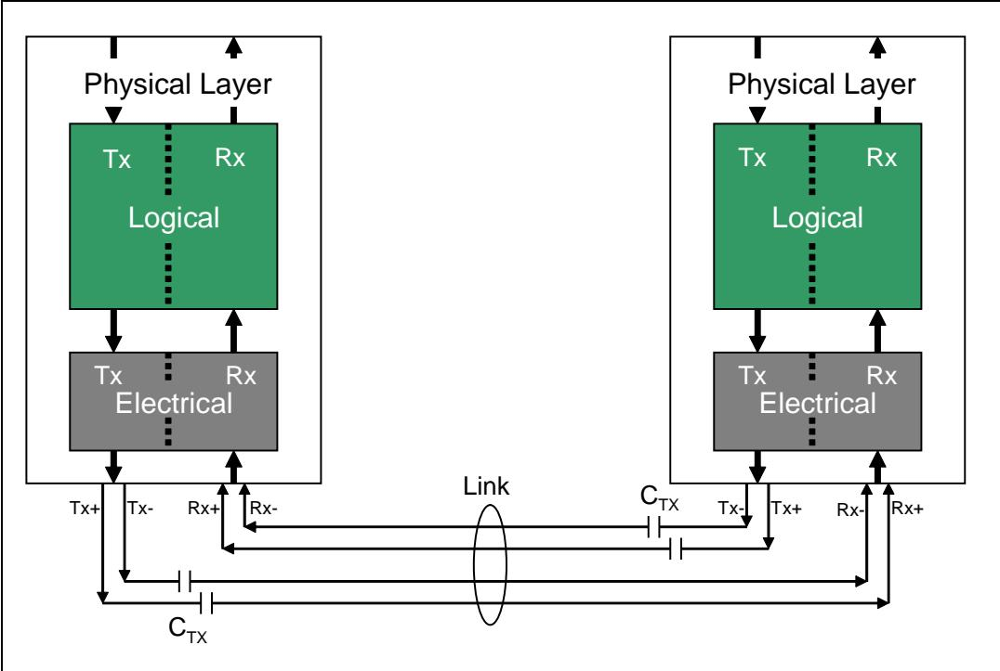
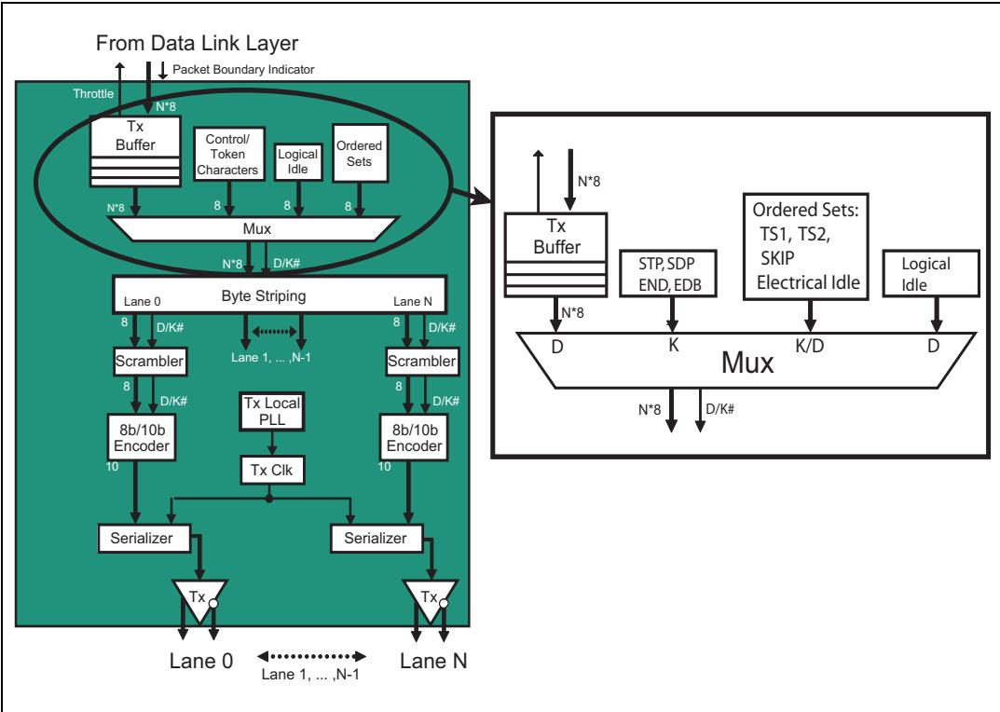
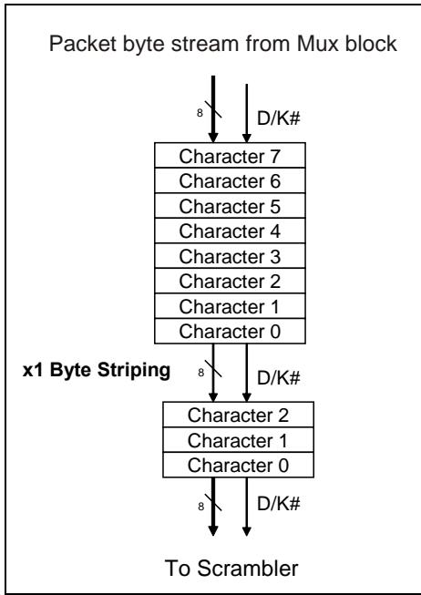
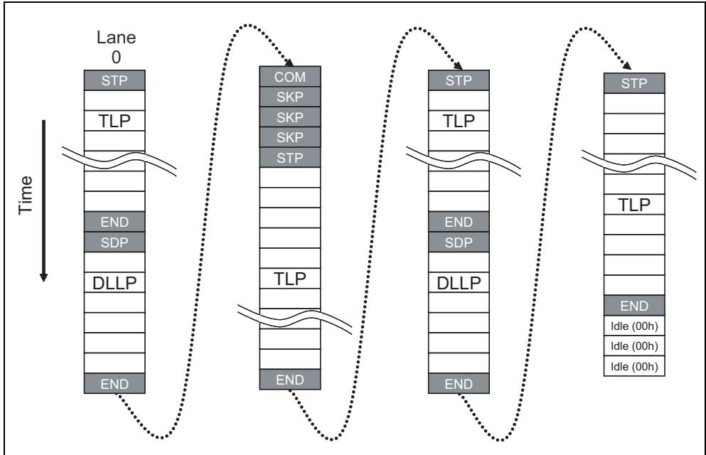
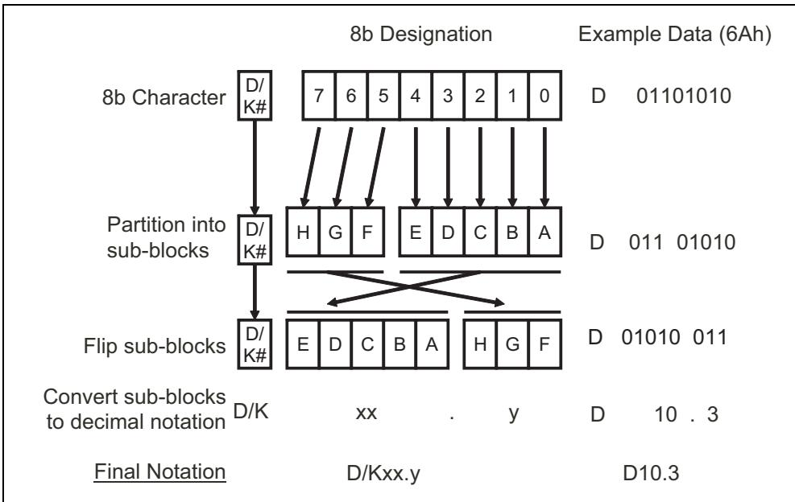
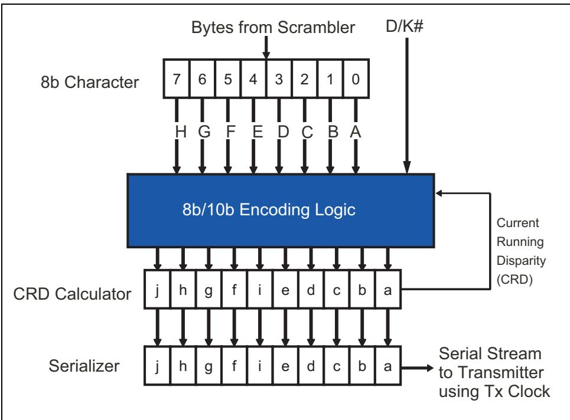
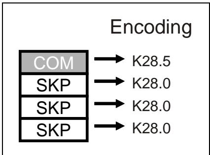
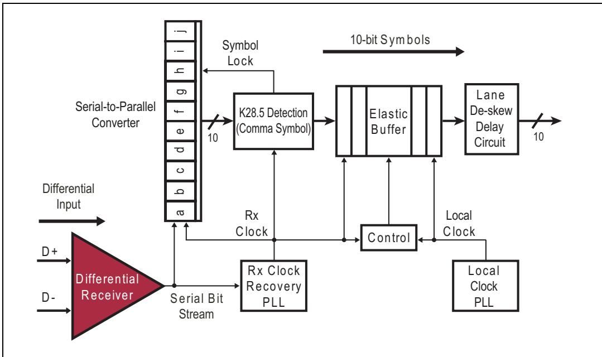
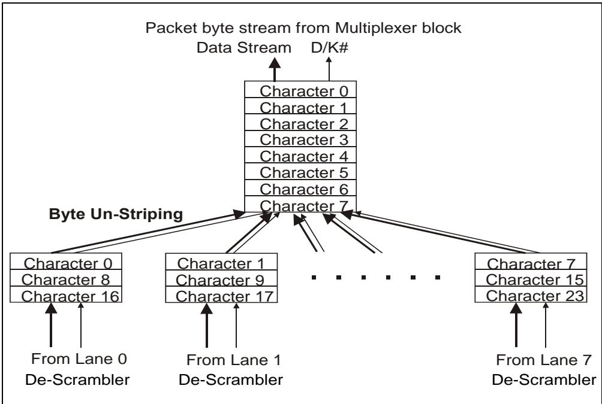

# Ch11_Physical_Layer_Logical_Gen1_Gen2

# 11 Physical Layer - Logical (Gen1 and Gen2)

| EN | ZH |
|---|---|
| # 11 Physical Layer - Logical (Gen1 and Gen2) | # 11 物理层 - 逻辑子层（Gen1 和 Gen2） |

## The Previous Chapter | 上一章

| EN | ZH |
|---|---|
| The previous chapter describes the Ack/Nak Protocol: an automatic, hardware-based mechanism for ensuring reliable transport of TLPs across the Link. Ack DLLPs confirm good reception of TLPs while Nak DLLPs indicate a transmission error. The chapter describes the normal rules of operation as well as error recovery mechanisms. | 前一章描述了 Ack/Nak 协议：一种基于硬件的自动机制，用于确保 TLP 在链路上的可靠传输。Ack DLLP 确认 TLP 已被正确接收，而 Nak DLLP 则指示发生了传输错误。该章描述了正常操作规则以及错误恢复机制。 |

| EN | ZH |
|---|---|
| ## This Chapter | ## 本章 |
| This chapter describes the Logical sub‑block of the Physical Layer. This prepares packets for serial transmission and recovery. Several steps are needed to accomplish this and they are described in detail. This chapter covers the logic associated with the Gen1 and Gen2 protocol that use 8b/10b encoding. The logic for Gen3 does not use 8b/10b encoding and is described separately in the chapter called "Physical Layer ‑ Logical (Gen3)" on page 407. | 本章描述物理层的逻辑子块。该子块为数据包的串行传输和恢复做准备。完成这一过程需要若干步骤，本章将对这些步骤进行详细说明。本章涵盖使用 8b/10b 编码的 Gen1 和 Gen2 协议所涉及的相关逻辑。Gen3 的逻辑不使用 8b/10b 编码，将在第 407 页的"物理层——逻辑（Gen3）"一章中单独描述。 |

## The Next Chapter | 下一章

| EN | ZH |
|----|----|
| The next chapter describes the Physical Layer characteristics for the third generation (Gen3) of PCIe. The major change includes the ability to double the bandwidth relative to Gen2 without needing to double the frequency by eliminating the need for 8b/10b encoding. More robust signal compensation is necessary at Gen3 speed. Making these changes is more complex than might be expected. | 下一章描述第三代（Gen3）PCIe的物理层特性。主要变化包括：通过消除8b/10b编码的需求，能够在无需加倍频率的情况下，相对于Gen2将带宽翻倍。在Gen3速率下需要更鲁棒的信号补偿。实施这些变更比预想的更为复杂。 |

## 11.1 Physical Layer Overview | 11.1 物理层概述

| EN | ZH |
|---|---|
| This Physical Layer Overview introduces the relationships between the Gen1, Gen2 and Gen3 implementations. Thereafter the focus is the logical Physical Layer implementation associated with Gen1 and Gen2. The logical Physical Layer implementation for Gen3 is described in the next chapter. | 本物理层概述介绍了Gen1、Gen2和Gen3实现之间的关系。随后重点介绍与Gen1和Gen2相关的逻辑物理层实现。Gen3的逻辑物理层实现将在下一章中描述。 |
| The Physical Layer resides at the bottom of the interface between the external physical link and Data Link Layer. It converts outbound packets from the Data Link Layer into a serialized bit stream that is clocked onto all Lanes of the Link. This layer also recovers the bit stream from all Lanes of the Link at the receiver. The receive logic de‑serializes the bits back into a Symbol stream, re‑assembles the packets, and forwards TLPs and DLLPs up to the Data Link Layer. | 物理层位于外部物理链路与数据链路层之间的接口底部。它将来自数据链路层的出站包转换为串行化比特流，并在链路的所有通道上进行时钟同步传输。该层还在接收端从链路的所有通道中恢复比特流。接收逻辑将比特反串行化回符号流，重新组装报文，并将TLP和DLLP向上传递到数据链路层。 |

Figure 11‐1: PCIe Port Layers | 图11‐1：PCIe端口层  

| EN | ZH |
|---|---|
| The contents of the layers are conceptual and don't define precise logic blocks, but to the extent that designers do partition them to match the spec their implementations can benefit because of the constantly increasing data rates affect the Physical Layer more than the others. Partitioning a design by layered responsibilities allows the Physical Layer to be adapted to the higher clock rates while changing as little as possible in the other layers. | 各层的内容是概念性的，并未定义精确的逻辑模块，但如果设计人员确实按照规范进行划分，其实现将受益，因为不断提高的数据速率对物理层的影响比其他层更大。按分层职责划分设计使得物理层能够适应更高的时钟速率，同时尽可能少地改动其他层。 |
| The 3.0 revision of the PCIe spec does not use specific terms to distinguish the different transmission rates defined by the versions of the spec. With that in mind, the following terms are defined and used in this book. | PCIe规范的3.0修订版未使用特定术语来区分各版本规范所定义的不同传输速率。有鉴于此，本书定义并使用以下术语。 |
| • Gen1 ‐ the first generation of PCIe (rev 1.x) operating at 2.5 GT/s • Gen2 ‐ the second generation (rev 2.x) operating at 5.0 GT/s • Gen3 ‐ the third generation (rev 3.x) operating at 8.0 GT/s | • Gen1 — 第一代PCIe（修订版1.x），运行于2.5 GT/s • Gen2 — 第二代（修订版2.x），运行于5.0 GT/s • Gen3 — 第三代（修订版3.x），运行于8.0 GT/s |
| The Physical Layer is made up of two sub‑blocks: the Logical part and the Electrical part as shown in Figure 11‑2. Both contain independent transmit and receive logic, allowing dual‑simplex communication. | 物理层由两个子模块组成：逻辑部分和电气部分，如图11-2所示。两者均包含独立的发送和接收逻辑，可实现双工通信。 |

Figure 11‐2: Logical and Electrical Sub‑Blocks of the Physical Layer | 图11‐2：物理层的逻辑和电子子块  

## 11.1.1 Observation | 11.1.1 观察

| EN | ZH |
|---|---|
| The spec describes the functionality of the Physical Layer but is purposefully vague regarding implementation details. Evidently, the spec writers were reluctant to give details or example implementations because they wanted to leave room for individual vendors to add value with clever or creative versions of the logic. | 规范描述了物理层的功能，但在实现细节方面有意含糊其辞。显然，规范编写者不愿提供细节或实现示例，因为他们希望为各个供应商留出空间，以便通过巧妙或创造性的逻辑版本增加价值。 |
| For our discussion though, an example is indispensable, and one was chosen that illustrates the concepts. It's important to make clear that this example has not been tested or validated, nor should a designer feel compelled to implement a Physical Layer in such a manner. | 不过，为了我们的讨论，一个示例是必不可少的，因此选择了一个能够说明这些概念的示例。需要明确的是，此示例尚未经过测试或验证，设计人员也不应感到必须以此种方式实现物理层。 |

| EN | ZH |
|---|---|
| ## Transmit Logic Overview | ## 发送逻辑概述 |
| For simplicity, let's begin with a high-level overview of the transmit side of this layer, shown in Figure 11-3 on page 365. Starting at the top, we can see that packet bytes entering from the Data Link layer first go into a buffer. It makes sense to have a buffer here because there will be times when the packet flow from the Data Link Layer must be delayed to allow Ordered Set packets and other items to be injected into the flow of bytes. | 为简单起见，我们先从该层发送端的高层概览开始，如图 11-3（第 365 页）所示。从顶部开始，我们可以看到从数据链路层进入的数据包字节首先进入一个缓冲区。在此处设置缓冲区是合理的，因为有时数据链路层的数据包流必须被延迟，以便允许 Ordered Set 数据包和其他内容注入到字节流中。 |
| For Gen1 and Gen2 operation, these injected items are control and data characters used to mark packet boundaries and create ordered sets. To differentiate between these two types of characters, a D/K# bit (Data or "Kontrol") is added. The logic can see what value D/K# should take on based on the source of the character. | 对于 Gen1 和 Gen2 操作，这些注入的内容是用于标记数据包边界和创建 Ordered Set 的控制字符和数据字符。为了区分这两类字符，添加了一个 D/K# 位（Data 或 "Kontrol"）。逻辑可以根据字符的来源来确定 D/K# 应取何值。 |
| Gen3 mode of operation, doesn't use control characters, so data patterns are used to make up the ordered sets that identify if transmitted bytes are associated with TLPs / DLLPs or Ordered Sets. A 2-bit Sync Header is inserted at the beginning of a 128 bit (16 byte) block of data. The Sync Header informs the receiver whether the received block is a Data Block (TLP or DLLP related bytes) or an Ordered Set Block. Since there are no control characters in Gen3 mode, the D/K# bit is not needed. | Gen3 操作模式不使用控制字符，而是使用数据模式构成 Ordered Set，以标识发送的字节是与 TLP/DLLP 相关联还是与 Ordered Set 相关联。在每个 128 位（16 字节）数据块的开始处插入一个 2 位同步头（Sync Header）。同步头告知接收方收到的块是数据块（TLP 或 DLLP 相关字节）还是 Ordered Set 块。由于 Gen3 模式中没有控制字符，因此不需要 D/K# 位。 |

Figure 11-3: Physical Layer Transmit Details | 图11-3：物理层发送详情

| EN | ZH |
|---|---|
| Next, the parallel data bytes coming from the upper layers are sent to Byte Striping logic where they are spread out, or striped, onto all the lanes of this link. One byte of the packet is transferred per lane, and all active lanes are used for each packet going out. The Lanes of the Link are all transmitting at the same time, so the bytes must come into this logic fast enough to accommodate that. For example, if there are eight Lanes, eight bytes of parallel from the upper layers may arrive at the byte-striping logic allowing data to be clocked onto all lanes simultaneously. | 接下来，来自上层的并行数据字节被送入字节分送（Byte Striping）逻辑，在此它们被分散（即分送）到该链路的所有通道上。每个通道传输数据包的一个字节，每个发出的数据包使用所有激活的通道。链路的所有通道同时发送，因此字节必须以足够快的速度进入该逻辑以满足这一要求。例如，如果有八个通道，来自上层的八个并行字节可以到达字节分送逻辑，从而允许数据同时时钟打入所有通道。 |
| Next is the Scrambler, which XORs a pseudo-random pattern onto the outgoing data bytes to mix up the bits. Although it would seem that this might introduce problems, it doesn't because the scrambling pattern is predictable and not truly random, so the receiver can use the same algorithm to easily recover the original data. If the scramblers get out of step then the Receiver won't be able to make sense of the bit stream so, to guard against that problem, the scrambler is reset periodically (Gen1 and Gen2). That way, if the scramblers do get out of step with each other it won't be long before they're both re-initialized and back in step again. For Gen1 and Gen2 modes that re-initialization happens whenever the COM character is detected. For Gen3 mode, it happens whenever an EIEOS ordered set is seen. A more sophisticated 24-bit based scrambler is utilized in Gen3 mode, hence the alternate path through the Gen3 scrambler, as depicted in Figure 11-3 on page 365. | 接下来是加扰器（Scrambler），它将一个伪随机模式与发送的数据字节进行 XOR 运算，以打乱比特位。虽然这看起来可能会引入问题，但实际上不会，因为加扰模式是可预测的，并非真正的随机，因此接收方可以使用相同的算法轻松恢复原始数据。如果加扰器失去同步，接收方将无法理解比特流。为防止此问题，加扰器会定期复位（Gen1 和 Gen2）。这样，即使加扰器彼此失步，它们也会很快重新初始化并恢复同步。对于 Gen1 和 Gen2 模式，每当检测到 COM 字符时就会发生重新初始化。对于 Gen3 模式，每当看到 EIEOS Ordered Set 时就会发生重新初始化。Gen3 模式使用了一个更复杂的基于 24 位的加扰器，因此如图 11-3（第 365 页）所示，有一条经过 Gen3 加扰器的替代路径。 |
| For Gen1 and Gen2 mode, the scrambled 8-bit characters are then encoded for transmission by the 8b/10b Encoder. Recall that a Character is an 8-bit unencoded byte, while a Symbol is the 10-bit encoded output of the 8b/10b logic. There are several advantages to 8b/10b encoding, but it does add overhead. | 对于 Gen1 和 Gen2 模式，加扰后的 8 位字符随后由 8b/10b 编码器进行编码以便传输。回顾一下，Character 是 8 位未编码的字节，而 Symbol 是 8b/10b 逻辑的 10 位编码输出。8b/10b 编码有几个优点，但它确实增加了开销。 |
| For Gen3 a separate path is shown bypassing the encoder. In other words, scrambled bytes of a packet are transmitted without 8b/10b encoding. The Sync Bit Generator adds a 2-bit Sync Header prior to every 16 byte block of a packet. The added 2-bit Sync Header identifies the following 16 byte block to be either a data block or an ordered set block. This addition of a 2-bit Sync Header every 16 bytes (128 bits) is the basis of Gen3's 128b/130b encoding scheme. | 对于 Gen3，显示了一条绕过编码器的独立路径。换句话说，数据包的加扰字节无需 8b/10b 编码即可发送。同步位生成器（Sync Bit Generator）在每个数据包的 16 字节块之前添加一个 2 位同步头。添加的 2 位同步头标识随后的 16 字节块是数据块还是 Ordered Set 块。每 16 字节（128 位）添加一个 2 位同步头，这是 Gen3 128b/130b 编码方案的基础。 |
| Finally, the Symbols are serialized into a bit stream and forwarded to the electrical sub-block of the Physical Layer and transmitted to the other end of the link. | 最后，Symbol 被串行化为比特流，转发到物理层的电气子块，并传输到链路的另一端。 |

| English | 中文 |
|---------|------|
| ## Receive Logic Overview | ## 接收逻辑概述 |
| Figure 11‐4 on page 367 shows the key elements that make up the receiver logic. The process described below is performed for each lane. Starting at the bottom this time, the first thing to mention is the receiver Clock and Data Recovery (CDR). The first step in this process is to recover the clock based on transitions in the incoming bit stream. This recovered clock faithfully reproduces the Transmitter's clock that was used to send the data and is used to latch the incoming bits into a deserializing buffer. | 第367页的图11-4展示了构成接收器逻辑的关键元件。下面描述的过程针对每条通道（Lane）执行。这次从底部开始，首先要提及的是接收器时钟与数据恢复（CDR）。该过程的第一步是根据进入的比特流中的电平跳变来恢复时钟。这个恢复出的时钟忠实地复现了用于发送数据的发送器时钟，并用于将进入的比特锁存到解串缓冲器中。 |
| The next steps in the CDR process are to find the Gen1/Gen2 Symbol boundaries and divide the recovered clock by 10 to latch the 10‐bit Symbols into the Elastic Buffer. For Gen3, the next step is to acquire Block Lock and then latch the 8‐bit Symbols associated with each of the 16 bytes in the block into the Elastic Buffer — more on this in the next chapter. | CDR过程接下来的步骤是找到Gen1/Gen2的符号边界，并将恢复出的时钟除以10，以将10位符号锁存到弹性缓冲器中。对于Gen3，下一步是获取块锁定（Block Lock），然后将与该块中16个字节各自关联的8位符号锁存到弹性缓冲器中——更多内容将在下一章中介绍。 |

| EN | ZH |
|---|---|
| ## Chapter 11: Physical Layer - Logical (Gen1 and Gen2) | ## 第11章：物理层 - 逻辑子层（Gen1和Gen2） |
| Logic controlling the Elastic Buffer adjusts for minor clock variations between the recovered clock and the local clock of the receiver by adding or removing SKP Symbols as needed when an SOS (SKP Ordered Set) is detected. Finally, the Receiver's local clock moves each Symbol out of the Elastic Buffer. | 控制弹性缓冲区的逻辑通过在检测到SOS（SKP有序集）时按需添加或移除SKP符号，来调整恢复时钟与接收器本地时钟之间的微小时钟变化。最后，接收器的本地时钟将每个符号移出弹性缓冲区。 |
| Using the 8b/10b Decoder, Gen1/Gen2 Symbols are decoded thus converting the 10-bit symbols to 8-bit characters. The descrambler applies the same scrambling method used at the transmitter to recover the original data. Finally, the bytes from each Lane are un-striped to form a byte stream that will be forwarded up to the Data Link Layer. Only TLPs and DLLPs are loaded into the receive buffer and sent to the Data Link Layer. | 使用8b/10b解码器，Gen1/Gen2符号被解码，从而将10位符号转换为8位字符。解扰器应用与发送端相同的加扰方法来恢复原始数据。最后，来自每个通道的字节被解除交错，形成字节流并向上转发至数据链路层。只有TLP和DLLP被载入接收缓冲区并发送到数据链路层。 |

Figure 11‐4: Physical Layer Receive Logic Details | 图11‐4：物理层接收逻辑详情

## 11.2 Transmit Logic Details (Gen1 and Gen2 Only) | 11.2 发送逻辑细节（仅 Gen1 和 Gen2）

| EN | ZH |
| --- | --- |
| The section provides more detail associated with the steps identified in the previous section. Refer to the block diagram in Figure 11‐5 on page 369 during this discussion. | 本节提供与前一节所标识步骤相关的更多细节。在讨论过程中，请参考第369页图11-5中的框图。 |

## 11.2.1 Tx Buffer | 11.2.1 Tx 缓冲器

| EN | ZH |
|---|---|
| Starting from the top of the diagram once again, the buffer accepts TLPs and DLLPs from the Data Link Layer, along with 'Control' information that specifies when a new packet begins. | 再次从图的顶部开始，该缓冲器从数据链路层接收TLP和DLLP，以及指定新报文何时开始的"控制"信息。 |
| As mentioned, the buffer allows us to stall the flow of characters from time to time in order to insert control characters and ordered sets. | 如前所述，该缓冲器允许我们不时地暂停字符流，以便插入控制字符和有序集。 |
| A 'throttle' signal is also shown going back up to the Data Link Layer to stop the flow of characters if the buffer should become full. | 图中还显示了一个"节流"信号向上返回到数据链路层，以便在缓冲器变满时停止字符流。 |

## 11.2.2 Mux and Control Logic | 11.2.2 多路选择器和控制逻辑

| EN | ZH |
|---|---|
| The multiplexer, shown in Figure 11-6 on page 370, is used to insert special control (K) characters into the data flow coming from the buffer. Only the Physical Layer uses K control characters; they are inserted during transmission and removed at the receiver. The four different inputs to the mux are: | 如图11-6（第370页）所示的复用器，用于将特殊控制（K）字符插入来自缓冲区的数据流中。只有物理层使用K控制字符；它们在发送时被插入，并在接收端被移除。复用器的四个不同输入为： |
| **Transmit Data Buffer.** When the Data Link Layer supplies a packet, the mux gates the character stream through. All of the characters coming from the buffer are D characters, so the D/K# signal is driven high when Tx Buffer contents are gated. | **发送数据缓冲器。** 当数据链路层提供报文时，复用器将字符流选通通过。来自缓冲区的所有字符都是D字符，因此当发送缓冲器内容被选通时，D/K#信号被驱动力高电平。 |
| **Start and End characters.** These Control characters are added to the start and end of every TLP and DLLP (see Figure 11-7 on page 371) and allow a receiver to readily detect the boundaries of a packet. There are two Start characters: STP indicates the start of a TLP, while SDP indicates the start of a DLLP. An indicator from the Data Link Layer, along with the packet type, determines what type of framing character to insert. There are also two end characters, the End Good character (END) for normal transmission, and the End Bad character (EDB) to handle some error cases. Start and End characters are K characters, so the D/K# signal is driven low when the Start and End characters are inserted (see Table 11-1 on page 386 for a list of Control characters). | **起始与结束字符。** 这些控制字符被添加到每个TLP和DLLP的起始和结束位置（见图11-7，第371页），使接收器能够容易地检测报文的边界。有两个起始字符：STP指示TLP的起始，而SDP指示DLLP的起始。来自数据链路层的指示信号以及报文类型决定了插入何种类型的帧定界字符。还有两个结束字符：End Good字符（END）用于正常传输，End Bad字符（EDB）用于处理某些错误情况。起始和结束字符是K字符，因此当插入起始和结束字符时，D/K#信号被驱动为低电平（控制字符列表见表11-1，第386页）。 |

Figure 11-5: Physical Layer Transmit Logic Details (Gen1 and Gen2 Only) | 图11-5：物理层发送逻辑详情（仅Gen1和Gen2）

| EN | ZH |
|---|---|
| **Ordered Sets.** As mentioned earlier, control characters are only used by the Physical Layer and are not seen by the higher layers. Some communication across the Link is necessary to initiate and maintain Link operation, and that is accomplished by exchanging Ordered Sets. Every ordered set starts with a K character called a comma (COM), and contains other K or D characters depending on the type of Order Set be delivered. Ordered Sets are always aligned on four byte boundaries and are transmitted during a variety of circumstances including: | **有序集。** 如前所述，控制字符仅由物理层使用，高层不可见。链路上需要进行一些通信来启动和维护链路操作，这是通过交换有序集来实现的。每个有序集以一个称为逗号（COM）的K字符开始，并根据要发送的有序集类型包含其他K或D字符。有序集始终按四字节边界对齐，并在多种情况下发送，包括： |
| — Error recovery, initiating events (such as Hot Reset), or exit from lowpower states. In these cases, the Training Sequence 1 and 2 (TS1 and TS2) ordered sets are exchanged across the Link. | — 错误恢复、启动事件（如热复位）或退出低功耗状态。在这些情况下，训练序列1和2（TS1和TS2）有序集通过链路交换。 |
| — At periodic intervals, the mux inserts the SKIP ordered set pattern to facilitate clock tolerance compensation in the receiver. For a detailed description of this process, refer to "Clock Compensation" on page 391. | — 在周期性间隔，复用器插入SKIP有序集模式以促进接收器中的时钟容差补偿。有关此过程的详细描述，请参阅第391页的"时钟补偿"。 |
| When a device wants to place its transmitter in the Electrical Idle state, it must inform the remote receiver at the other end of the Link. The mux inserts an Electrical Idle ordered set to accomplish this. | 当一个设备希望将其发送器置于电气空闲状态时，它必须通知链路另一端的远程接收器。复用器插入一个电气空闲有序集来实现这一点。 |
| — When a device wants to change the Link power state from L0s low power state to the L0 full-on power state, it sends a set of Fast Training Sequence (FTS) ordered sets to the receiver. The receiver uses this ordered set to re-synchronize its PLL to the transmitter clock. | — 当一个设备希望将链路功耗状态从L0s低功耗状态更改为L0全开功耗状态时，它向接收器发送一组快速训练序列（FTS）有序集。接收器使用该有序集将其PLL重新同步到发送器时钟。 |
| **Logical Idle Sequence.** When there are no packets ready to transmit and no ordered sets to send, the link is logically idle. In order to keep the receiver PLL locked on to the transmitter's frequency, it's important that the transmitter keep sending something, so Logical Idle characters are inserted for that case. Logical Idle is very simple, and consists of nothing more than a string of Data 00h characters. | **逻辑空闲序列。** 当没有报文准备发送且没有有序集需要发送时，链路处于逻辑空闲状态。为了使接收器PLL保持锁定在发送器频率上，发送器必须持续发送一些内容，因此在这种情况下插入逻辑空闲字符。逻辑空闲非常简单，仅由一串数据00h字符组成。 |

Figure 11-6: Transmit Logic Multiplexer | 图11-6：发送逻辑多路复用器

Figure 11-7: TLP and DLLP Packet Framing with Start and End Control Characters | 图11-7：使用起始和结束控制字符的TLP和DLLP数据包组帧

## 11.2.3 Byte Striping (for Wide Links) | 11.2.3 字节条带化（宽链路）

| EN | ZH |
|---|---|
| The next step shown in our example is Byte Striping, although this is only needed if the port implements more than one Lane (called a wide Link). Striping means that each consecutive outbound character in a character stream is routed onto consecutive Lanes. The number of Lanes used is configured during the Link training process based on what is supported by both devices that share the Link. | 示例中展示的下一步是字节条带化（Byte Striping），但这仅在端口实现了多条通道（称为宽链路）时才需要。条带化意味着字符流中每个连续的出站字符被路由到连续的通道上。所使用的通道数量在链路训练过程中根据共享该链路的两个设备所支持的能力进行配置。 |
| Three examples of byte striping are illustrated in the following diagrams. In Figure 11-8 on page 372, a single-lane link (x1) is shown. This is not a very interesting case, since the packet enters the Physical Layer a byte at a time and goes out the same way, but illustrates the way the sequence of characters will be drawn. | 下图展示了字节条带化的三个示例。图11-8（第372页）显示了一个单通道链路（x1）。这并不是一个非常有趣的案例，因为数据包以字节为单位进入物理层并以相同方式输出，但它说明了字符序列的绘制方式。 |
| Figure 11-9 on page 372 shows the incoming Dword packets from the mutiplexer. Each byte is directed to the corresponding lanes. Finally, Figure 11-10 on page 373 illustrates an eight-lane (x8) link. In this example, two Dwords are required to populate all 8 lanes. This requires the Dword to arrive at twice the rate as the previous example. The format of the data being sent across each lane is described in the sections that follow. | 图11-9（第372页）显示了来自多路复用器的传入Dword数据包。每个字节被导向相应的通道。最后，图11-10（第373页）展示了一个八通道（x8）链路。在此示例中，需要两个Dword来填充所有8条通道。这要求Dword以比前一个示例快两倍的速率到达。每条通道上发送的数据格式将在后续章节中描述。 |

Figure 11-8: x1 Byte Striping | 图11-8：x1字节条带化

Figure 11-9: x4 Byte Striping | 图11-9：x4字节条带化

| EN | ZH |
|---|---|
| ## Chapter 11: Physical Layer - Logical (Gen1 and Gen2) | ## 第11章：物理层——逻辑子层（Gen1和Gen2） |
| Figure 11-10: x8 Byte Striping with DWord Parallel Data | 图11-10：x8字节条带化与双字并行数据 |

Figure 11-10: x8 Byte Striping with DWord Parallel Data | 图11-10：DWord并行数据的x8字节条带化

## 11.2.4 Packet Format Rules | 11.2.4 数据包格式规则

| EN | ZH |
|---|---|
| ## Packet Format Rules | ## 包格式规则 |

## General Rules | 通用规则

| EN | ZH |
|----|----|
| The total packet length (including Start and End characters) of each packet is always a multiple of four characters. This is a natural extension of the fact that the data length is measured in dwords. | 每个报文的总长度（包括起始字符和结束字符）始终是四个字符的整数倍。这是数据长度以双字（dword）为单位度量的自然延伸。 |
| TLPs start with the STP character and finish with either an END or EDB character. | TLP以STP字符开始，以END或EDB字符结束。 |
| DLLPs start with SDP, terminate with the END character, and are exactly 8 characters long (SDP + 6 characters + END). | DLLP以SDP开始，以END字符结束，且长度恰好为8个字符（SDP + 6个字符 + END）。 |
| STP and SDP characters are placed on Lane 0 when starting the transmission of a packet after the transmission of Logical Idles. In other cases, they may start on a Lane number divisible by 4. | 在传输逻辑空闲（Logical Idle）后开始传输报文时，STP和SDP字符位于通道0（Lane 0）上。在其他情况下，它们可以从可被4整除的通道号开始。 |
| The receiver's Physical Layer is allowed to watch for violation of these rules and may report them as Receiver Errors to the Data Link Layer. | 接收端的物理层应监视对这些规则的违反情况，并可将其作为接收器错误报告给数据链路层。 |

## PCI Express Technology | PCI Express 技术

| EN | ZH |
|---|---|
| PCI Express Technology | PCI Express 技术 |

## Example: x1 Format | 示例：x1格式

| EN | ZH |
|---|---|
| The example shown in Figure 11-11 on page 374 illustrates the format of packets transmitted over a x1 link (a link with only one lane operational). A sequence of packets is shown interspersed with one SKIP Ordered Set. Logical Idles are shown at the end to represent the case when the transmitter has no more packets to send and uses idle characters as filler. | 第374页图11-11所示的示例说明了通过x1链路（仅一条通道工作的链路）传输的数据包格式。图中显示了一串数据包，其中穿插了一个SKIP有序集。末尾显示了逻辑空闲状态，表示发送方没有更多数据包要发送，并使用空闲字符作为填充。 |

Figure 11-11: x1 Packet Format | 图11-11：x1数据包格式

## x4 Format Rules | x4 格式规则

| EN | ZH |
|----|----|
| STP and SDP characters are always sent on Lane 0. | STP 和 SDP 字符总是在通道 0 上发送。 |
| END and EDB characters are always sent on Lane 3. | END 和 EDB 字符总是在通道 3 上发送。 |
| When an ordered set such as the SKIP is sent, it must appear on all lanes simultaneously. | 当发送诸如 SKIP 这样的有序集时，它必须同时出现在所有通道上。 |
| When Logical Idles are transmitted, they must be sent on all lanes simultaneously. | 当传输逻辑空闲时，它们必须同时在所有通道上发送。 |
| Any violation of these rules may be reported as a Receiver Error to the Data Link Layer. | 任何违反这些规则的行为都可以作为接收器错误报告给数据链路层。 |

| EN | ZH |
| --- | --- |
| ## Chapter 11: Physical Layer - Logical (Gen1 and Gen2) | ## 第11章：物理层 - 逻辑子层（Gen1和Gen2） |

## x4 格式示例

| EN | ZH |
|---|---|
| The example shown in Figure 11‑12 on page 375 illustrates the format of packets sent over a x4 Link (link with four data lanes operational). The illustration shows one TLP followed by a SKIP ordered set transmitted on all Lanes for receiver clock compensation. Next is a DLLP, followed by Logical Idle on all lanes. This example highlights that the packets are always multiples of 4 characters because the start character always appears in lane 0 and the end character is always in lane 3. It also illustrates that ordered sets must appear on all the lanes simultaneously. | 第375页图11-12所示的示例说明了通过x4链路（具有四条数据通道运行的链路）发送的报文的格式。该图示显示了一个TLP，后跟一个在所有通道上发送的用于接收端时钟补偿的SKIP有序集。接着是一个DLLP，随后是所有通道上的逻辑空闲。此示例强调了报文始终是4个字符的整数倍，因为起始字符始终出现在通道0，而结束字符始终在通道3。它还说明了有序集必须同时出现在所有通道上。 |

Figure 11-12: x4 Packet Format | 图11-12：x4数据包格式

<table><tr><td>Lane0</td><td>Lane1</td><td>Lane2</td><td>Lane3</td></tr><tr><td>STP</td><td>Sequence</td><td>Sequence</td><td></td></tr><tr><td></td><td></td><td></td><td></td></tr><tr><td></td><td></td><td></td><td></td></tr><tr><td></td><td colspan="2">TLP</td><td></td></tr><tr><td></td><td></td><td></td><td></td></tr><tr><td></td><td></td><td></td><td></td></tr><tr><td></td><td></td><td></td><td>LCRC</td></tr><tr><td>LCRC</td><td>LCRC</td><td>LCRC</td><td>END</td></tr><tr><td>COM</td><td>COM</td><td>COM</td><td>COM</td></tr><tr><td>SKP</td><td>SKP</td><td>SKP</td><td>SKP</td></tr><tr><td>SKP</td><td>SKP</td><td>SKP</td><td>SKP</td></tr><tr><td>SKP</td><td>SKP</td><td>SKP</td><td>SKP</td></tr><tr><td>SDP</td><td colspan="2">DLLP</td><td></td></tr><tr><td></td><td></td><td></td><td>END</td></tr><tr><td>Idle (00h)</td><td>Idle (00h)</td><td>Idle (00h)</td><td>Idle (00h)</td></tr><tr><td>Idle (00h)</td><td>Idle (00h)</td><td>Idle (00h)</td><td>Idle (00h)</td></tr><tr><td>Idle (00h)</td><td>Idle (00h)</td><td>Idle (00h)</td><td>Idle (00h)</td></tr><tr><td>Idle (00h)</td><td>Idle (00h)</td><td>Idle (00h)</td><td>Idle (00h)</td></tr><tr><td>Idle (00h)</td><td></td><td></td><td></td></tr></table>

## Large Link-Width Packet Format Rules | 大链路宽度数据包格式规则

| EN | ZH |
|---|---|
| The following rules apply when a packet is transmitted over a x8, x12, x16, or x32 Link: | 以下规则适用于通过 x8、x12、x16 或 x32 链路传输数据包时： |
| STP/SDP characters are always sent on Lane 0 when transmission starts after a period during which Logical Idles are transmitted. After that, they may only be sent on Lane numbers divisible by 4 when sending back‐toback packets (Lane 4, 8, 12, etc.). | 当传输在经过一段逻辑空闲传输后开始时，STP/SDP 字符始终在通道 0 上发送。此后，当发送连续数据包时，它们只能发送在可被 4 整除的通道号上（通道 4、8、12 等）。 |
| • END/EDB characters are sent on Lane numbers divisible by 4 and then minus one (Lane 3, 7, 11, etc.). | • END/EDB 字符发送在可被 4 整除再减 1 的通道号上（通道 3、7、11 等）。 |
| If a packet doesn't end on the last Lane of the Link and there are no more packets ready to go, PAD Symbols are used as filler on the remaining lane numbers. Logical Idle can't be used for this purpose because it must appear on all Lanes at the same time. | 如果数据包未结束于链路的最后一条通道，且没有更多数据包准备发送，则在其余通道号上使用 PAD 符号作为填充。逻辑空闲不能用于此目的，因为它必须同时出现在所有通道上。 |
| • Ordered sets must be sent on all lanes simultaneously. | • 有序集必须同时在所有通道上发送。 |
| • Similarly, logical idles must be sent on all lanes when they are used. | • 类似地，逻辑空闲在使用时必须发送在所有通道上。 |
| • Any violation of these rules may be reported as a Receiver Error to the Data Link Layer. | • 任何违反这些规则的行为可能会作为接收器错误报告给数据链路层。 |

## x8 Packet Format Example | x8 数据包格式示例

| EN | ZH |
|---|---|
| The example shown in Figure 11-13 on page 377 illustrates the format of packets transmitted over a x8 link. The illustration shows a TLP followed by a SKIP ordered set, a DLLP, and finally a TLP that ends on Lane 3. At that point, the transmitter has no more packets ready to send but the current packet doesn't extend to include all the available lanes. One might expect the extra lanes to be filled with Logical Idle, but it won't work here because idles must appear on all lanes at the same time. So another fill character is needed, and the spec writers chose to use the PAD control character here. The only other place that PAD is used is during the training process. Finally, since there are still no more packets to send, Logical Idles are sent on all the lanes. | 第377页图11-13所示的示例说明了通过 x8 链路传输的报文格式。图中展示了一个 TLP，后跟一个 SKIP 有序集、一个 DLLP，以及最后一个结束于 Lane 3 的 TLP。此时，发送方已没有更多报文要发送，但当前报文并未扩展到涵盖所有可用通道。有人可能预计多余通道会用逻辑空闲来填充，但这里行不通，因为空闲必须同时出现在所有通道上。因此需要另一种填充字符，规范作者选择了在此处使用 PAD 控制字符。PAD 唯一被使用的另一个地方是在训练过程中。最后，由于仍然没有更多报文要发送，在所有通道上发送逻辑空闲。 |

Figure 11-13: x8 Packet Format | 图11-13：x8数据包格式

<table><tr><td>Time\Lane 0</td><td>Lane 1</td><td>Lane 2</td><td>Lane 3</td><td>Lane 4</td><td>Lane 5</td><td>Lane 6</td><td>Lane 7</td></tr><tr><td>Idle (00h)</td><td>Idle (00h)</td><td>Idle (00h)</td><td>Idle (00h)</td><td>Idle (00h)</td><td>Idle (00h)</td><td>Idle (00h)</td><td>Idle (00h)</td></tr><tr><td>STP</td><td>Sequence</td><td>Sequence</td><td></td><td></td><td></td><td></td><td></td></tr><tr><td></td><td></td><td></td><td colspan="2">TLP</td><td></td><td></td><td></td></tr><tr><td></td><td></td><td></td><td>LCRC</td><td>LCRC</td><td>LCRC</td><td>LCRC</td><td>END</td></tr><tr><td>COM</td><td>COM</td><td>COM</td><td>COM</td><td>COM</td><td>COM</td><td>COM</td><td>COM</td></tr><tr><td>SKP</td><td>SKP</td><td>SKP</td><td>SKP</td><td>SKP</td><td>SKP</td><td>SKP</td><td>SKP</td></tr><tr><td>SKP</td><td>SKP</td><td>SKP</td><td>SKP</td><td>SKP</td><td>SKP</td><td>SKP</td><td>SKP</td></tr><tr><td>SKP</td><td>SKP</td><td>SKP</td><td>SKP</td><td>SKP</td><td>SKP</td><td>SKP</td><td>SKP</td></tr><tr><td>SDP</td><td></td><td></td><td colspan="2">DLLP</td><td></td><td></td><td>END</td></tr><tr><td>STP</td><td>Sequence</td><td>Sequence</td><td></td><td></td><td></td><td></td><td></td></tr><tr><td></td><td></td><td></td><td colspan="2">TLP</td><td></td><td></td><td></td></tr><tr><td></td><td></td><td></td><td colspan="2"></td><td></td><td></td><td>LCRC</td></tr><tr><td>LCRC</td><td>LCRC</td><td>LCRC</td><td>END</td><td>PAD</td><td>PAD</td><td>PAD</td><td>PAD</td></tr><tr><td>Idle (00h)</td><td>Idle (00h)</td><td>Idle (00h)</td><td>Idle (00h)</td><td>Idle (00h)</td><td>Idle (00h)</td><td>Idle (00h)</td><td>Idle (00h)</td></tr><tr><td>Idle (00h)</td><td>Idle (00h)</td><td>Idle (00h)</td><td>Idle (00h)</td><td>Idle (00h)</td><td>Idle (00h)</td><td>Idle (00h)</td><td>Idle (00h)</td></tr></table>

## 11.2.5 Scrambler | 11.2.5 扰码器

| EN | ZH |
|---|---|
| The next step in our example is scrambling, as shown in Figure 11‐5 on page 369, which is intended to prevent repetitive patterns in the data stream. Repetitive patterns create "pure tones" on the link, meaning a consistent frequency caused by the pattern that generates more than the usual noise, or EMI. Reducing this problem by spreading this energy over a wider frequency range is the primary goal of scrambling. In addition, though, scrambled transmission on one Lane also reduces interference with adjacent Lanes on a wide Link. This "spatial frequency de‐correlation", or reduction of crosstalk noise, helps the receiver on each lane to distinguish the desired signal. | 本例中的下一步是扰码，如图 11‐5（第 369 页）所示，其目的是防止数据流中出现重复模式。重复模式会在链路上产生"纯音"，即由该模式引起的一致频率，从而产生比通常更多的噪声或 EMI。通过将这种能量分散到更宽的频率范围来减少此问题是扰码的主要目标。此外，一条通道上的扰码传输也减少了宽链路上相邻通道之间的干扰。这种"空间频率去相关"（即减少串扰噪声）有助于每个通道上的接收器区分所需信号。 |
| To help the receiver maintain synchronization with the scrambled sequence, control characters do not get scrambled and are thus recognizable even if the scramblers get out of sync. In addition, the arrival of the COM control character (K28.5) reinitializes the scramblers on both ends of the Link each time it arrives and thus re‐synchronizes them. | 为了帮助接收器与扰码序列保持同步，控制字符不会被扰码，因此即使扰码器失去同步，它们也是可识别的。此外，每次 COM 控制字符（K28.5）到达时，都会重新初始化链路两端的扰码器，从而使其重新同步。 |

## Scrambler Algorithm | 扰码器算法

| EN | ZH |
|---|---|
| The scrambler described in the spec is shown in Figure 11-14 on page 378. It's made of a 16-bit Linear Feedback Shift Register (LFSR) with feedback points that implement the following polynomial: | 规范中描述的扰码器如图11-14（第378页）所示。它由一个16位线性反馈移位寄存器（LFSR）构成，其反馈点实现了以下多项式： |

$$
G (x) = X ^ {1 6} + X ^ {5} + X ^ {4} + X ^ {3} + 1
$$

Figure 11-14: Scrambler | 图11-14：加扰器

| EN | ZH |
|---|---|
| The LFSR is clocked at 8 times the frequency of the clock feeding the data bytes, and its output is clocked into an 8-bit register that is XORed with the 8-bit data characters to form the scrambled data output. | LFSR的时钟频率是驱动数据字节的时钟频率的8倍，其输出被时钟打入一个8位寄存器，并与8位数据字符进行异或运算，以形成加扰后的数据输出。 |

## Some Scrambler implementation rules: | 一些扰码器实现规则：

| EN | ZH |
|---|---|
| • On a multi-Lane Link implementation, Scramblers associated with each Lane must operate in concert, maintaining the same simultaneous value in each LFSR. | • 在多通道链路实现中，每条通道相关的加扰器必须协同工作，保持每个 LFSR 中同时具有相同的值。 |
| Scrambling is applied to 'D' characters only, meaning those associated with TLP and DLLPs and the Logical Idle (00h) characters. However, those 'D' characters that are within the TS1 and TS2 ordered sets are not scrambled. | 加扰仅应用于 'D' 字符，即与 TLP 和 DLLP 以及逻辑空闲 (00h) 字符相关的那些字符。但是，TS1 和 TS2 有序集合中的 'D' 字符不进行加扰。 |
| Scrambling is never applied to 'K' characters and characters within ordered sets, such as TS1, TS2, SKIP, FTS and Electrical Idle. These characters bypass the scrambler logic. One reason for this is to ensure they'll still be recognizable by the receiver even if the scramblers somehow get out of sequence. | 加扰从不应用于 'K' 字符以及有序集合中的字符，例如 TS1、TS2、SKIP、FTS 和电气空闲。这些字符绕过加扰器逻辑。其原因之一是确保即使加扰器因某种原因失去同步，接收端仍能识别它们。 |
| • Compliance Pattern characters (used for testing) are also not scrambled. | • 一致性模板字符（用于测试）也不进行加扰。 |
| The COM character, a control character that does not get scrambled, is used to reinitialize the LFSR to FFFFh at both the transmitter and receiver. | COM 字符是一种不进行加扰的控制字符，用于在发送端和接收端将 LFSR 重新初始化为 FFFFh。 |
| Except for the COM character, the LFSR normally will serially advance eight times for every D or K character sent, but it does not advance on SKP characters associated with the SKIP ordered set. The reason is that a receiver may add or delete SKP Symbols to perform clock tolerance compensation. Changing the number of characters in the receiver compared to the number that were sent would cause the value in the receiver LFSR to lose synchronization with the transmitter LFSR value if they were not ignored. | 除 COM 字符外，LFSR 通常每发送一个 D 或 K 字符就串行前移八次，但不会在与 SKIP 有序集合相关的 SKP 字符上前移。原因是接收端可能会添加或删除 SKP 符号以执行时钟容差补偿。如果不忽略这些字符，接收端字符数相对于发送端字符数的变化将导致接收端 LFSR 中的值与发送端 LFSR 值失去同步。 |

## Disabling Scrambling | 禁用加扰

| EN | ZH |
|---|---|
| Scrambling is enabled by default, but the spec allows it to be disabled for test and debug purposes. That's because testing may require control of the exact bit pattern sent and, since the hardware handles scrambling, there's no reasonable way for the software to be able to force a specific pattern. No specific software mechanism is defined by which to instruct the Physical Layer to disable scrambling, so this has to be a design-specific implementation. | 加扰默认是启用的，但规范允许为测试和调试目的将其禁用。这是因为测试可能需要控制发送的确切比特图案，而由于硬件负责处理加扰，软件没有合理的方法来强制产生特定图案。规范没有定义任何具体的软件机制来指示物理层禁用加扰，因此这必须是设计特定的实现。 |
| If scrambling is disabled by a device, this gets communicated to the neighboring device by sending at least two TS1s and TS2s that have the appropriate bit set in the control field as described in "Configuration State" on page 539. In response, the neighboring device also disables its scrambling. | 如果某个设备禁用了加扰，它会通过发送至少两个 TS1 和 TS2（其控制字段中设置了相应位，如第 539 页的 "Configuration State" 所述）来将此信息告知相邻设备。作为响应，相邻设备也会禁用其加扰。 |

| EN | ZH |
|---|---|
| ## 8b/10b Encoding | ## 8b/10b 编码 |

## General | 概述

| EN | ZH |
|---|---|
| The first two generations of PCIe use 8b/10b encoding. Each Lane implements an 8b/10b Encoder that translates the 8‑bit characters into 10‑bit Symbols. This coding scheme was patented by IBM in 1984 and is widely used in many serial transports today, such as Gigabit Ethernet and Fibre Channel. | PCIe 的前两代使用 8b/10b 编码。每条通道（Lane）实现一个 8b/10b 编码器，将 8 位字符转换为 10 位符号（Symbol）。该编码方案由 IBM 于 1984 年获得专利，如今广泛应用于许多串行传输中，例如千兆以太网和光纤通道。 |

## 7.1 Motivation | 7.1 动机

## 7.1 Motivation | 7.1 动机

| EN | ZH |
|---|---|
| Encoding accomplishes several desirable goals for serial transmission. Three of the most important are listed here: | 编码实现了串行传输的若干理想目标。以下列出其中最重要的三点： |
| **Embedding a Clock into the Data.** Encoding ensures that the data stream has enough edges in it to recover a clock at the Receiver, with the result that a distributed clock is not needed. This avoids some limitations of a parallel bus design, such as flight time and clock skew. It also eliminates the need to distribute a high-frequency clock that would cause other problems like increased EMI and difficult routing. | **将时钟嵌入数据中。** 编码确保数据流中有足够的跳变沿供接收器恢复时钟，从而无需分布式时钟。这避免了并行总线设计的某些局限性，如传输时间和时钟偏斜。此外，也无需分配高频时钟，从而避免了诸如电磁干扰增加和布线困难等其他问题。 |
| As an example of this process, Figure 11-15 on page 381 shows the encoding results of the data byte 00h. As can be seen, this 8-bit character that had no transitions converts to a 10-bit Symbol with 5 transitions. The 8b/10b guarantees enough edges to ensure the "run length" (sequence of consecutive ones or zeros) in the bit stream to no more than 5 consecutive bits under any conditions. | 作为此过程的一个示例，第381页的图11-15展示了数据字节00h的编码结果。可以看出，这个没有跳变的8位字符被转换为具有5个跳变的10位符号。8b/10b编码保证有足够的跳变沿，从而确保比特流中的"游程长度"（连续1或0的序列）在任何条件下不超过5个连续比特。 |
| **Maintaining DC Balance.** PCIe uses an AC-coupled link, placing a capacitor serially in the path to isolate the DC part of the signal from the other end of the Link. This allows the Transmitter and Receiver to use different common-mode voltages and makes the electrical design easier for cases where the path between them is long enough that they're less likely to have exactly the same reference voltages. That DC value, or common-mode voltage, can change during run time because the line charges up when the signal is driven. Normally, the signal changes so quickly that there is not time for this to cause a problem but, if the signal average is predominantly one level or the other, the common-mode value will appear to drift. Referred to as "DC Wander", this drifting voltage degrades signal integrity at the Receiver. To compensate, the 8b/10b encoder tracks the "disparity" of the last Symbol that was sent. Disparity, or inequality, simply indicates whether the previous Symbol had more ones than zeros (called positive disparity), more zeros than ones (negative disparity), or a balance of ones and zeros (neutral disparity). If the previous Symbol had negative disparity, for example, the next one should balance that by using more ones. | **维持直流平衡。** PCIe使用交流耦合链路，在路径中串联一个电容器，以隔离链路另一端的信号直流分量。这使得发送器和接收器可以使用不同的共模电压，并且在两端路径足够长、不太可能具有完全相同参考电压的情况下，使电气设计更加容易。该直流值（即共模电压）可能在运行期间发生变化，因为信号驱动时线路会充电。通常，信号变化非常快，来不及造成问题，但如果信号平均值主要偏向某一电平，共模值就会发生漂移。这种漂移电压称为"直流游走"，会降低接收器处的信号完整性。为补偿这一点，8b/10b编码器跟踪最近发送的符号的"不一致性"。不一致性（即不平衡）仅指示前一个符号是1多于0（称为正不一致）、0多于1（负不一致），还是1和0平衡（中性不一致）。例如，如果前一个符号具有负不一致性，则下一个符号应通过使用更多的1来平衡它。 |
| **Enhancing Error Detection.** The encoding scheme also facilitates the detection of transmission errors. For a 10-bit value, 1024 codes are possible, but the character to be encoded only has 256 unique codes. To maintain DC balance the design uses two codes for each character, and chooses which one based on the disparity of the last Symbol that was sent, so 512 codes would be needed. However, many of the neutral disparity encodings have the same values (D28.5 is one example), so not all 512 are used. As a result, more than half the possible encodings are not used and will be considered illegal if seen at a Receiver. If a transmission error does change the bit pattern of a Symbol, there is a good chance the result would be one of these illegal patterns that can be recognized right away. For more on this see the section titled, "Disparity" on page 383. | **增强错误检测。** 该编码方案也有助于检测传输错误。对于一个10位值，可能有1024种编码，但要编码的字符只有256个唯一编码。为维持直流平衡，设计对每个字符使用两种编码，并根据最近发送的符号的不一致性选择其一，因此需要512种编码。然而，许多中性不一致性编码具有相同的值（D28.5是一个例子），因此并非全部512种都被使用。结果，超过一半的可能编码未被使用，如果在接收器处看到这些编码，将被视为非法。如果传输错误确实改变了某个符号的比特模式，结果很有可能成为这些可被立即识别出的非法模式之一。有关更多信息，请参见第383页的"不一致性"一节。 |
| The major disadvantage of 8b/10b encoding is the overhead it requires. The actual transmission performance is degraded by 20% from the Receiver's point of view because 10 bits are sent for each byte, but only 8 useful bits are recovered at the receiver. This is a non-trivial price to pay but is still considered acceptable to gain the advantages mentioned. | 8b/10b编码的主要缺点是其所需的开销。从接收器的角度来看，实际传输性能降低了20%，因为每字节发送了10位，但接收器只恢复了8个有效位。这是不小的代价，但为了获得上述优势，仍然认为可以接受。 |

Figure 11-15: Example of 8-bit Character 00h Encoding | 图11-15：8位字符00h编码示例  
图11-15：8位字符00h编码示例

## Properties of 10-bit Symbols | 10 位符号的属性

| EN | ZH |
|---|---|
| As described in the literature on 8b/10b coding, the design isn't strictly 8 bits to 10 bits. Instead, it's really a 5-to-6 bit encoding followed by a 3-to-4 bit encoding. The sub-blocks are internal to the design but their existence helps to explain some of the properties for a legal Symbol, as listed below. A Symbol that doesn't follow these properties is considered invalid. | 如关于8b/10b编码的文献所述，该设计并非严格的8位到10位转换。实际上，它是一个5位到6位编码后接一个3位到4位编码。子块是设计内部的，但它们的存在有助于解释合法符号的一些属性，如下所列。不符合这些属性的符号被视为无效。 |

## PCI Express Technology | PCI Express 技术

| EN | ZH |
|---|---|
| The bit stream never contains more than five continuous 1s or 0s, even from the end of one Symbol to beginning of the next. | 比特流中绝不会包含超过五个连续的1或0，即便从一个符号的末尾到下一个符号的开头也是如此。 |
| Each 10-bit Symbol contains: | 每个10位符号包含： |
| Four 0s and six 1s (not necessarily contiguous), or | 四个0和六个1（不一定连续），或 |
| Six 0s and four 1s (not necessarily contiguous), or | 六个0和四个1（不一定连续），或 |
| Five 0s and five 1s (not necessarily contiguous). | 五个0和五个1（不一定连续）。 |
| Each 10-bit Symbol is subdivided into two sub-blocks: the first is six bits wide and the second is four bits wide. | 每个10位符号被细分为两个子块：第一个子块为6位宽，第二个子块为4位宽。 |
| The 6-bit sub-block contains no more than four 1s or four 0s. | 6位子块包含不超过四个1或四个0。 |
| The 4-bit sub-block contains no more than three 1s or three 0s. | 4位子块包含不超过三个1或三个0。 |

| EN | ZH |
| --- | --- |
| ## Character Notation | ## 字符表示法 |
| The 8b/10b uses a special notation shorthand, and Figure 11-16 on page 382 illustrates the steps to arrive at the shorthand for a given character: | 8b/10b使用一种特殊的简写记法，第382页的图11-16展示了为给定字符得出简写形式的步骤： |
| 1. Partition the character into its 3-bit and 5-bit sub-blocks. | 1. 将字符分成其3位和5位子块。 |
| 2. Transpose the position of the sub-blocks. | 2. 调换子块的位置。 |
| 3. Create the decimal equivalent for each sub-block. | 3. 为每个子块创建十进制等价形式。 |
| 4. The character takes the form Dxx.y for Data characters, or Kxx.y for Control characters. In this notation, xx is the decimal equivalent of the 5-bit field, and y is the decimal equivalent of the 3-bit field. | 4. 数据字符采用Dxx.y形式，控制字符采用Kxx.y形式。在此记法中，xx是5位字段的十进制值，y是3位字段的十进制值。 |

Figure 11-16: 8b/10b Nomenclature | 图11-16：8b/10b命名法

## Disparity | 差异

| EN | ZH |
|---|---|
| Definition. Disparity refers to the inequality between the number of ones and zeros within a 10-bit Symbol and is used to help maintain DC balance on the link. A Symbol with more zeros is said to have a negative (–) disparity, while a Symbol with more ones has a positive (+) disparity. When a Symbol has an equal number of ones and zeros, it's said to have a neutral disparity. Interestingly, most characters encode into Symbols with + or – disparity, but some only encode into Symbols with neutral disparity. | 定义。差异指一个10位符号中1和0数量之间的不相等性，用于帮助维持链路上的直流平衡。包含更多0的符号称为负(–)差异，而包含更多1的符号称为正(+)差异。当一个符号中1和0的数量相等时，称为中性差异。有趣的是，大多数字符编码为具有正或负差异的符号，但有些仅编码为具有中性差异的符号。 |
| CRD (Current Running Disparity). The CRD is the information as to the current state of disparity on the link. Since it's just a single bit it can only be positive or negative and doesn't always change when the next Symbol is sent out. To see how it works, remember that the next Symbol decoded can have negative, neutral, or positive disparity, then consider the following example. If the CRD was positive, an outgoing Symbol with a negative disparity would change it to negative, a neutral disparity would leave it as positive, and a positive disparity would be an error because the CRD is only one bit and can't be made more positive. | CRD（当前运行差异）。CRD是关于链路上差异当前状态的信息。由于它只是一个比特，所以只能是正或负，并且在发送下一个符号时并不总是改变。要理解其工作原理，请记住下一个被解码的符号可以具有负、中性或正差异，然后考虑以下示例。如果CRD为正，则具有负差异的待发送符号会将其变为负，中性差异会使其保持为正，而正差异则会出错，因为CRD只有一个比特，无法变得更正。 |
| The initial state of the CRD (before any characters are transmitted) may not match between the sender and receiver but it turns out that it doesn't matter. When the receiver sees the first Symbol after training is complete, it will check for a disparity error and, if one is found, just change the CRD. This won't be considered an error but simply an adjustment of the CRD to match the receiver and sender. After that, there are only two legal CRD cases: it can remain the same if the new Symbol has neutral disparity, or it can flip to the opposite polarity if the new Symbol has the opposite disparity. What is not legal is for the disparity of the new Symbol to be the same as the CRD. Such an event would be a disparity error and should never occur after the initial adjustment unless an error has occurred. | CRD的初始状态（在任何字符被传输之前）在发送方和接收方之间可能不匹配，但事实证明这并不重要。当接收方在训练完成后看到第一个符号时，它会检查差异错误，如果发现错误，只需改变CRD。这不会被视为错误，而仅仅是CRD的调整以使接收方和发送方匹配。此后，只有两种合法的CRD情况：如果新符号具有中性差异，它可以保持不变；如果新符号具有相反的差异，它可以翻转到相反的极性。不合法的情况是新符号的差异与CRD相同。这种情况将是差异错误，并且在初始调整之后除非发生了错误，否则不应发生。 |

## Encoding Procedure | 编码过程

| EN | ZH |
|---|---|
| There are different ways that 8b/10b encoding could be accomplished. The simplest approach is probably to implement a look‑up table that contains all the possible output values. However, this table can require a comparatively large number of gates. Another approach is to implement the decoder as a logic block, and this is usually the preferred choice because it typically results in a smaller and cheaper solution. The specifics of the encoding logic are described in detail in the referenced literature, so we’ll focus here on the bigger picture of how it works instead. | 有多种方式可以实现8b/10b编码。最简单的方法是实现一个包含所有可能输出值的查找表。然而，这种表可能需要相对大量的门电路。另一种方法是把解码器实现为逻辑块，这通常是首选方案，因为它通常能产生更小、更廉价的解决方案。编码逻辑的具体细节在参考文献中有详细描述，因此我们这里将关注其工作原理的宏观层面。 |

## PCI Express Technology | PCI Express技术

| EN | ZH |
| --- | --- |
| An example 8b/10b block diagram is shown in Figure 11-17 on page 384. A new outgoing Symbol is created based on three things: the incoming character, the D/K# indication for that character, and the CRD. A new CRD value is computed based on the outgoing Symbol and is fed back for use in encoding the next character. After encoding, the resulting Symbol is fed to a serializer that clocks out the individual bits. Figure 11-18 on page 385 shows some sample 8b/10b encodings that will be useful for the example that follows. | 图11-17（第384页）展示了一个8b/10b编码器框图示例。新的输出符号基于三个要素生成：输入字符、该字符的D/K#指示以及CRD。新的CRD值根据输出符号计算得出，并反馈用于编码下一个字符。编码完成后，生成的符号被送入串行器，逐位时钟输出。图11-18（第385页）展示了一些示例8b/10b编码，这些编码对后续示例非常有用。 |
| Figure 11-17: 8-bit to 10-bit (8b/10b) Encoder | 图11-17：8位到10位（8b/10b）编码器 |

Figure 11-17: 8-bit to 10-bit (8b/10b) Encoder | 图11-17：8位到10位（8b/10b）编码器

| EN | ZH |
| --- | --- |
| Figure 11-18: Example 8b/10b Encodings | 图11-18：8b/10b编码示例 |

<table><tr><td>D or K Character</td><td>Hex Byte</td><td>Binary Bits HGF EDCBA</td><td>Byte Name</td><td colspan="2">CRD - abcdei fghj</td><td colspan="2">CRD + abcdei fghj</td></tr><tr><td>Data (D)</td><td>6A</td><td>011 01010</td><td>D10.3</td><td colspan="2">010101 1100</td><td colspan="2">010101 0011</td></tr><tr><td>Data (D)</td><td>1B</td><td>000 11011</td><td>D27.0</td><td colspan="2">110110 0100</td><td colspan="2">001001 1011</td></tr><tr><td>Data (D)</td><td>F7</td><td>111 10111</td><td>D23.7</td><td colspan="2">111010 0001</td><td colspan="2">000101 1110</td></tr><tr><td>Control (K)</td><td>F7</td><td>111 10111</td><td>K23.7</td><td colspan="2">111010 1000</td><td colspan="2">000101 0111</td></tr><tr><td>Control (K)</td><td>BC</td><td>101 11100</td><td>K28.5</td><td colspan="2">001111 1010</td><td colspan="2">110000 0101</td></tr></table>

| EN | ZH |
|---|---|
| ## Example Transmission | ## 传输示例 |
| Figure 11‐19 illustrates the encode and transmission of three characters: the first and second are the control character K28.5 and the third character is the data character D10.3. | 图11-19说明了三个字符的编码和传输：第一个和第二个是控制字符K28.5，第三个字符是数据字符D10.3。 |
| In this example the initial CRD is negative so K28.5 encodes into 001111 1010b. This Symbol has positive disparity (more ones than zeros), and causes the CRD polarity to flip to positive. The next K28.5 is encoded into 110000 0101b and has a negative disparity. That causes the CRD this time to flip to negative. Finally, D10.3 is encoded into 010101 1100b. Since its disparity is neutral, the CRD doesn't change in this case but remains negative for whatever the next character will be. | 在本示例中，初始CRD为负，因此K28.5编码为001111 1010b。该符号具有正极性（1比0多），使CRD极性翻转为正。下一个K28.5编码为110000 0101b，具有负极性，使CRD此次翻转为负。最后，D10.3编码为010101 1100b。由于其极性为中性，CRD在这种情况下不改变，对于下一个字符仍保持为负。 |
| Initialized value of CRD is don't care. Receiver can determine from incoming bit stream | CRD的初始化值无关紧要。接收器可以从传入的比特流中确定。 |

Figure 11‐19: Example 8b/10b Transmission | 图11‐19：8b/10b传输示例

| EN | ZH |
|---|---|
| Use these two characters in the example below: | 在下面的示例中使用这两个字符： |

<table><tr><td>D/K#</td><td>Hex Byte</td><td>Binary Bits HGF EDCBA</td><td>Byte Name</td><td>CRD – abcdei fghj</td><td>CRD + abcdei fghj</td></tr><tr><td>Control (K)</td><td>BC</td><td>101 11100</td><td>K28.5</td><td>001111 1010</td><td>110000 0101</td></tr><tr><td>Data (D)</td><td>6A</td><td>011 01010</td><td>D10.3</td><td>010101 1100</td><td>010101 0011</td></tr></table>

| EN | ZH |
|---|---|
| Example Transmission | 传输示例 |

<table><tr><td></td><td>CRD</td><td>Character</td><td>CRD</td><td>Character</td><td>CRD</td><td>Character</td><td>CRD</td></tr><tr><td>Character to be transmitted</td><td rowspan="2">-</td><td>K28.5 (BCh)</td><td rowspan="2">+</td><td>K28.5 (BCh)</td><td rowspan="2">-</td><td>D10.3 (6Ah)</td><td rowspan="2">-</td></tr><tr><td>Bit stream transmitted</td><td>Yields 001111 1010 CRD is +</td><td>Yields 110000 0101 CRD is -</td><td>Yields 010101 1100 CRD is neutral</td></tr></table>

| EN | ZH |
| --- | --- |
| ## Control Characters | ## 控制字符 |
| The 8b/10b encoding provides several special characters for Link management and Table 11‑1 on page 386 shows their encoding. | 8b/10b编码提供了多个用于链路管理的特殊字符，表11‑1（第386页）展示了它们的编码。 |

Table 11‑1: Control Character Encoding and Definition | 表11‑1：控制字符编码和定义

<table><tr><td>Character Name</td><td>8b/10b Name</td><td>Description</td></tr><tr><td>COM</td><td>K28.5</td><td>First character in any ordered set. Also used by Rx to achieve Symbol lock during training.</td></tr><tr><td>PAD</td><td>K23.7</td><td>Packet filler</td></tr><tr><td>SKP</td><td>K28.0</td><td>Used in SKIP ordered set for Clock Tolerance Compensation</td></tr><tr><td>STP</td><td>K27.7</td><td>Start of a TLP</td></tr><tr><td>SDP</td><td>K28.2</td><td>Start of a DLLP</td></tr><tr><td>END</td><td>K29.7</td><td>End of Good Packet</td></tr><tr><td>EDB</td><td>K30.7</td><td>End of a bad or 'nullified' TLP.</td></tr><tr><td>FTS</td><td>K28.1</td><td>Used to exit from L0s low power state to L0</td></tr><tr><td>IDL</td><td>K28.3</td><td>Used to place Link into Electrical Idle state</td></tr><tr><td>EIE</td><td>K28.7</td><td>Part of the Electrical Idle Exit Ordered Set sent prior to bringing the Link back to full power for speeds higher than 2.5 GT/s</td></tr></table>

| EN | ZH |
| --- | --- |
| COM (Comma): One of the main functions of this is to be the first Symbol in the physical layer communications called ordered sets (see "Ordered sets" on page 388). It has an interesting property that makes both of its Symbol encodings easily recognizable at the receiver: they start with two bits of one polarity followed by five bits of the opposite polarity (001111 1010 or 110000 0101). This property is especially helpful for initial training, when the receiver is trying to make sense of the string of bits coming in, because it helps the receiver lock onto the incoming Symbol stream. See "Link Training and Initialization" on page 405 for more on how this works. | COM（逗号）：其主要功能之一是作为被称为有序集的物理层通信中的第一个符号（参见第388页的"有序集"）。它具有一个有趣的特性，使其两种符号编码在接收端易于识别：它们以两个相同极性的比特开始，后跟五个相反极性的比特（001111 1010或110000 0101）。该特性在初始训练时尤其有用，此时接收端正试图理解传入的比特流，因为它帮助接收端锁定传入的符号流。更多工作原理请参见第405页的"链路训练和初始化"。 |
| PAD: On a multi‑Lane Link, if a packet to be sent doesn't cover all the available lanes and there are no more packets ready to send, the PAD character is used to fill in the remaining Lanes. | PAD：在多通道链路上，如果待发送的数据包未覆盖所有可用通道且没有更多数据包准备发送，则使用PAD字符填充剩余通道。 |
| SKP (Skip): This is used as part of the SKIP ordered set that is sent periodically to facilitate clock tolerance compensation. | SKP（跳过）：作为SKIP有序集的一部分使用，定期发送以实现时钟容差补偿。 |
| • STP (Start TLP): Inserted to identify the start of a TLP. | • STP（TLP起始）：插入用于标识TLP的起始。 |
| • SDP (Start DLLP): Inserted to identify the start of a DLLP. | • SDP（DLLP起始）：插入用于标识DLLP的起始。 |
| • END: Appended to identify the end of an error‑free TLP or DLLP. | • END：附加用于标识无错误TLP或DLLP的结束。 |
| EDB (EnD Bad): Inserted to identify the end of a TLP that a forwarding device (such as a switch) wishes to 'nullify'. This case can arise when a switch using the "cut‑through mode" forwards a packet from an ingress port to an egress port without buffering the whole packet first. Any error detected during the forwarding process creates a problem because a portion of the packet is already being delivered before the packet can be checked for errors. To handle this case, the switch must cancel the one that's already in route to the destination. This is accomplished by nullifying it: ending the packet with EDB and inverting the LCRC from what it should have been. When a receiver sees a nullified packet, it discards the packet and does not return an ACK or NAK. (See the "Example of Cut‑Through Operation" on page 356.) | EDB（坏结束）：插入用于标识转发设备（如交换机）希望"作废"的TLP的结束。当使用"直通模式"的交换机在不预先缓存整个数据包的情况下将数据包从入端口转发到出端口时，可能会出现这种情况。转发过程中检测到的任何错误都会产生问题，因为在可以检查数据包错误之前，数据包的一部分已经在传送中。为处理这种情况，交换机必须取消已经在发往目的地的数据包。这通过作废该数据包来实现：以EDB结束数据包，并将LCRC取反（使其与应有的值相反）。当接收端看到作废的数据包时，它会丢弃该数据包，不返回ACK或NAK。（参见第356页的"直通操作示例"。） |
| FTS (Fast Training Sequence): Part of the FTS ordered set sent by a device to recover a link from the L0s standby state back to the full‑on L0 state. | FTS（快速训练序列）：设备发送的FTS有序集的一部分，用于将链路从L0s待机状态恢复到完全工作的L0状态。 |
| IDL (Idle): Part of the Electrical Idle ordered set sent to inform the receiver that the Link is transitioning into a low power state. | IDL（空闲）：电气空闲有序集的一部分，发送以通知接收端链路正在进入低功耗状态。 |
| EIE (Electrical Idle Exit): Added in the PCIe 2.0 spec and used to help an electrically‑idle link begin the wake up process. | EIE（电气空闲退出）：在PCIe 2.0规范中新增，用于帮助电气空闲的链路开始唤醒过程。 |

## Ordered sets | 有序集

| EN | ZH |
|---|---|
| General. Ordered Sets are used for communication between the Physical Layers of Link partners and may be thought of as Lane management packets. By definition they are a series of characters that are not TLPs or DLLPs. For Gen1 and Gen2 they always begin with the COM character. Ordered Sets are replicated on all Lanes at the same time, because each Lane is technically an independent serial path. This also allows Receivers to verify alignment and de‐skewing. Ordered Sets are used for things like Link training, clock tolerance compensation, and changing Link power states. | 概述。有序集用于链路伙伴物理层之间的通信，可视为通道管理包。根据定义，它们是一系列不属于TLP或DLLP的字符。对于Gen1和Gen2，它们始终以COM字符开头。有序集在同一时间被复制到所有通道上，因为每条通道在技术上都是一个独立的串行路径。这也允许接收器验证对齐和去偏移。有序集用于链路训练、时钟容差补偿以及改变链路电源状态等用途。 |
| TS1 and TS2 Ordered Set (TS1OS/TS2OS). Training sequences one and two are used for Link initialization and training. They allow the Link partners to achieve bit lock and Symbol lock, negotiate the link speed, and report other variables associated with Link operation. They are described in more detail in the section titled "TS1 and TS2 Ordered Sets" on page 510. | TS1和TS2有序集（TS1OS/TS2OS）。训练序列一和训练序列二用于链路初始化和训练。它们使链路伙伴能够实现位锁定和符号锁定，协商链路速度，并报告与链路操作相关的其他变量。在第510页标题为"TS1和TS2有序集"的章节中有更详细的描述。 |
| Electrical Idle Ordered Set (EIOS). A Transmitter that wishes to go to a lower‐power link state sends this before ceasing transmission. Upon receipt, Receivers know to prepare for the low power state. The EIOS consists of four Symbols: the COM Symbol followed by three IDL Symbols. Receivers detect this Ordered Set and prepare for the Link to go to into Electrical Idle by ignoring input errors until exiting from Electrical Idle. Shortly after sending EIOS, the Transmitter reduces its differential voltage to less than 20mV peak. | 电气空闲有序集（EIOS）。希望进入较低功耗链路状态的发送器在停止传输之前发送此有序集。接收器收到后，可知需准备进入低功耗状态。EIOS由四个符号组成：一个COM符号后跟三个IDL符号。接收器检测到该有序集后，通过忽略输入错误来准备链路进入电气空闲状态，直到退出电气空闲。发送EIOS后不久，发送器将其差分电压降至低于20mV峰值。 |
| FTS Ordered Set (FTSOS). A Transmitter sends the proper number of these (the minimum number was given by the Link neighbor during training) to take a Link from the low‐power L0s state back to the fully‐operational L0 state. The receiver detects the FTSs, recognizes that the Link is exiting from Electrical Idle, and uses them to recover Bit and Symbol Lock.The FTS Ordered Set consists of four Symbols: the COM Symbol followed by three FTS Symbols. | FTS有序集（FTSOS）。发送器发送适当数量的FTS有序集（最小数量由链路邻居在训练期间给出），以使链路从低功耗L0s状态返回到完全运行状态的L0。接收器检测到FTS，识别出链路正在退出电气空闲，并使用它们来恢复位锁定和符号锁定。FTS有序集由四个符号组成：一个COM符号后跟三个FTS符号。 |
| SKP Ordered Set (SOS). This consists of four Symbols: the COM Symbol followed by three SKP Symbols. It's transmitted at regular intervals and is used for Clock Tolerance Compensation as described in "Clock Compensation" on page 391 and "Receiver Clock Compensation Logic" on page 396. Basically, the Receiver evaluates the SOS and internally adds or removes SKP Symbols as needed to prevent its elastic buffer from under‐flowing or over‐flowing. | SKP有序集（SOS）。它由四个符号组成：一个COM符号后跟三个SKP符号。它以固定间隔传输，用于时钟容差补偿，如第391页"时钟补偿"和第396页"接收器时钟补偿逻辑"所述。基本上，接收器评估SOS并根据需要在内部添加或删除SKP符号，以防止其弹性缓冲器欠载或过载。 |
| Electrical Idle Exit Ordered Set (EIEOS). Added in the PCIe 2.0 spec, this Ordered Set was defined to provide a lower‐frequency sequence required to exit the electrical idle Link state. The EIEOS for 8b/10b encoding, uses repeated K28.7 control characters to appear as a repeating string of 5 ones followed by 5 zeros. This low frequency string produces a low‐frequency signal that allows for higher signal voltages that are more readily detected at the receiver. In fact, the spec states that this pattern guarantees that the Receiver will properly detect an exit from Electrical Idle, something that scrambled data cannot do. For details on electrical idle exit, refer to the section "Electrical Idle" on page 736. | 电气空闲退出有序集（EIEOS）。该有序集在PCIe 2.0规范中新增，定义用于提供退出电气空闲链路状态所需的低频序列。对于8b/10b编码的EIEOS，使用重复的K28.7控制字符，呈现为重复的5个1后跟5个0的字符串。该低频字符串产生低频信号，允许更高的信号电压，从而更易于在接收器端被检测到。实际上，规范指出该模式保证接收器能够正确检测到电气空闲退出，这是加扰数据无法做到的。有关电气空闲退出的详细信息，请参考第736页"电气空闲"章节。 |

## 12.3.4 Serializer | 12.3.4 串行器

| EN | ZH |
|----|----|
| The 8b/10b encoder on each lane feeds a serializer that clocks the Symbols out in bit order (see Figure 11-17 on page 384), with the least significant bit (a) shifted out first and the most significant bit (j) shifted out last. For each lane, the Symbols will be supplied to the serializer at either 250MHz or 500MHz to support a serial bit rate 10 times faster than that at 2.5 GHz or 5.0 GHz. | 每条通道上的8b/10b编码器将数据馈入串化器，串化器按比特顺序时钟输出符号（参见第384页图11-17），最低有效位(a)最先移出，最高有效位(j)最后移出。对于每条通道，符号将以250MHz或500MHz的频率供给串化器，以支持比2.5GHz或5.0GHz快10倍的串行比特率。 |

| EN | ZH |
|---|---|
| ## Differential Driver | ## 差分驱动器 |
| The differential driver that actually sends the bit stream onto the wire uses NRZ encoding. NRZ simply means that there are no special or intermediate voltage levels used. Differential signalling improves signal integrity and allows for both higher frequencies and lower voltages. Details regarding the electrical characteristics of the driver are discussed in the section "Transmitter Voltages" on page 462. | 实际将比特流发送到线缆上的差分驱动器使用NRZ编码。NRZ简单地说就是没有使用特殊或中间电压电平。差分信号提高了信号完整性，并允许更高的频率和更低的电压。有关驱动器电气特性的详细信息，请参见第462页的"发送器电压"一节。 |

## 11.2.9 Transmit Clock (Tx Clock) | 11.2.9 发送时钟（Tx 时钟）

| EN | ZH |
|---|---|
| The serialized output on each Lane is clocked out by the Tx Clock signal. As mentioned earlier, the clock frequency must be accurate to +/–300ppm around the center frequency (600ppm total variation). There are two options regarding the source of this clock. It can be generated internally or derived from an external reference that may optionally be available. The PCIe spec for peripheral cards includes the definition of a 100MHz reference clock supplied by the system board for this purpose. This reference clock is multiplied internally to derive the local clock that drives the internal logic and the Tx clock used by the serializer. | 每条Lane上的串行输出由Tx Clock信号提供时钟。如前所述，时钟频率必须精确到中心频率的+/-300ppm以内（总变化量600ppm）。该时钟源有两种选择：可在内部生成，或从可选的外部参考时钟导出。针对外设卡的PCIe规范包含一个由系统板提供的100MHz参考时钟定义，用于此目的。该参考时钟在内部倍频后，产生驱动内部逻辑的本地时钟以及供串行器使用的Tx时钟。 |

## 11.2.10 Miscellaneous Transmit Topics | 11.2.10 杂项发送主题

| EN | ZH |
|---|---|
| ## Miscellaneous Transmit Topics | ## 杂项发送主题 |

## Logical Idle | 逻辑空闲

| EN | ZH |
|---|---|
| In order to keep the receiver's PLL from drifting, something must be transmitted during periods when there are no TLPs, DLLPs or ordered sets to transmit, and it is logical idle characters that are injected into the character flow during these times. Some properties of the logical idle character: | 为防止接收器PLL漂移，在没有TLP、DLLP或有序集需要传输的期间必须发送某种内容，此时向字符流中注入的就是逻辑空闲字符。逻辑空闲字符的一些特性如下： |
| • It's an 8-bit Data character with a value of 00h. | • 它是一个值为00h的8位数据字符。 |
| When sent, it goes on all Lanes at the same time and the Link is said to be in the logical idle state (not to be confused with electrical Idle—the state when the output driver stops transmitting altogether and the receiver PLL loses synchronization). | 发送时，它在所有Lane上同时发送，此时链路被称为处于逻辑空闲状态（不要与电气空闲混淆——电气空闲是指输出驱动器完全停止发送且接收器PLL失去同步的状态）。 |
| The logical idle character is scrambled, but a receiver can distinguish it from other data because it occurs outside of a packet framing context (i.e.: after an END or EDB, but before an STP or SDP). | 逻辑空闲字符被加扰，但接收器能将其与其他数据区分开，因为它出现在报文组帧上下文之外（即：在END或EDB之后，但在STP或SDP之前）。 |
| • It is 8b/10b encoded. | • 它采用8b/10b编码。 |
| During logical idle transmission, SKIP ordered sets are still sent periodically. | 在逻辑空闲传输期间，SKIP有序集仍然会被周期性地发送。 |

| EN | ZH |
|---|---|
| ## Tx Signal Skew | ## 发送器信号偏斜（Tx Signal Skew） |
| Understandably, the transmitter should introduce a minimal skew between lanes to leave as much Rx skew budget as possible for routing and other variations. The spec lists the Tx skew values as 500ps + 2 UI for Gen1, 500ps + 4UI for Gen2, and 500ps + 6 UI for Gen3. Recalling that UI (unit interval) represents one bit time on the Link, this works out as shown in Table 11‐2 below. | 可以理解，发送器应在通道之间引入最小的偏斜，以便为布线和其他变化留出尽可能多的接收器偏斜预算。规范列出的发送器偏斜值为：Gen1 为 500ps + 2 UI，Gen2 为 500ps + 4 UI，Gen3 为 500ps + 6 UI。UI（单位间隔）表示链路上一个比特的时间，据此计算得出的结果如下表 11-2 所示。 |
| Table 11‐2: Allowable Transmitter Signal Skew | 表 11-2：允许的发送器信号偏斜 |

Table 11‐2: Allowable Transmitter Signal Skew | 表11‐2：允许的发送器信号偏斜

<table><tr><td>Spec Version</td><td>Allowable Tx Skew</td></tr><tr><td>Gen1</td><td>1300 ps</td></tr><tr><td>Gen2</td><td>1300 ps</td></tr><tr><td>Gen3</td><td>1250 ps</td></tr></table>

## Clock Compensation | 时钟补偿

| EN | ZH |
|---|---|
| Background. High‐speed serial transports like PCIe have a particular clock problem to solve. The receiver recovers a clock from the incoming bit stream and uses that to latch in the data bits, but this recovered clock is not synchronized with the receiver's internal clock and at some point it has to begin clocking the data with its own internal clock. Even if they have an optional common external reference clock, the best they can do is to generate an internal clock within a specified tolerance of the desired frequency. Consequently, one of the clocks will almost always have a slightly higher frequency than the other. If the transmitter clock is faster, the packets will be arriving faster than they can be taken in. To compensate, the transmitter must inject some "throw‐away characters" in the bit stream that the receiver can discard if it proves necessary to avoid a buffer over‐run condition. For PCIe, these characters which can be deleted take the form of the SKIP ordered set, which consists of a COM character followed by three SKP characters (see Figure 11‐20). For more detail on this topic, refer to "Receiver Clock Compensation Logic" on page 396). | 背景。像PCIe这样的高速串行传输需要解决一个特定的时钟问题。接收器从输入比特流中恢复时钟，并用该时钟锁存数据比特，但恢复出的时钟与接收器的内部时钟不同步，因此在某个时刻，它必须开始使用自己的内部时钟对数据进行时钟控制。即使它们有一个可选的公共外部参考时钟，它们也只能在指定容差范围内生成接近所需频率的内部时钟。因此，其中一个时钟的频率几乎总是略高于另一个。如果发送器时钟较快，报文到达的速度将超过接收器的处理能力。为补偿这种差异，发送器必须在比特流中注入一些"可丢弃字符"，接收器在必要时可以丢弃这些字符以避免缓冲器上溢情况。对于PCIe，这些可删除字符采用SKIP有序集的形式，该有序集由一个COM字符后跟三个SKP字符组成（见图11-20）。有关此主题的更多详细信息，请参阅第396页的"接收器时钟补偿逻辑"。 |
| SKIP ordered set Insertion Rules. A transmitter is required to send SKIP ordered sets on a periodic basis, and the following rules apply: | SKIP有序集插入规则。发送器必须周期性地发送SKIP有序集，并适用以下规则： |
| The SKIP ordered set must be scheduled for insertion between 1180 and 1538 Symbol times (a Symbol time is the time required to send one Symbol and is 10 bit times, so at 2.5 GT/s, a Symbol time is 4ns and at 5.0 GT/s, it's 2ns). | SKIP有序集必须安排在1180到1538个符号时间之间插入（一个符号时间是发送一个符号所需的时间，为10个比特时间，因此在2.5 GT/s时，一个符号时间为4ns；在5.0 GT/s时，为2ns）。 |
| They are only inserted on packet boundaries (nothing is allowed to interrupt a packet) and must go simultaneously on all Lanes. If a packet is already in progress the SKP Ordered Set will have to wait. The maximum possible packet size would require more than 4096 Symbol times, though, and during that time several SKIP ordered sets should have | 它们仅在报文边界处插入（不允许中断任何报文），且必须在所有通道上同时发送。如果报文正在进行中，则SKP有序集必须等待。不过，最大可能的报文大小需要超过4096个符号时间，在此期间本应插入多个SKIP有序集 |

## PCI Express Technology | PCI Express 技术

| EN | ZH |
|---|---|
| been sent. This case is handled by accumulating the SKIPs that should have gone out and injecting them all at the next packet boundary. | 已被发送。这种情况通过累积本应发出的SKIP，并在下一个包边界处全部注入来处理。 |
| Since this ordered set must be transmitted on all Lanes simultaneously, a multi‑lane link may need to add PAD characters on some Lanes to allow the ordered set to go on all Lanes simultaneously (see Figure 11‑13 on page 377). | 由于该有序集必须在所有通道上同时传输，多通道链路可能需要在某些通道上添加PAD字符，以使有序集能在所有通道上同时传输（参见第377页图11-13）。 |
| During low‑power link states, any counters used to schedule SKIP ordered sets must be reset. There's no need for them when the transmitter isn't signaling, and it wouldn't make sense to wake up the link to send them. | 在低功耗链路状态期间，用于调度SKIP有序集的任何计数器必须复位。当发送器不发送信号时不需要它们，且唤醒链路来发送SKIP是没有意义的。 |
| SKIP ordered sets must not be transmitted while the Compliance Pattern is in progress. | 在进行合规性码型期间，不得发送SKIP有序集。 |

Figure 11‑20: SKIP Ordered Set | 图11‑20：SKIP有序集

# Receive Logic Details (Gen1 and Gen2 Only) | 接收逻辑细节（仅Gen1和Gen2）

<table>
<tr>
<td width="50%">
Figure 11-21 shows the receiver logic of the Logical Physical Layer. This section describes packet processing from the time the data is received serially on each lane until the packet byte stream is clocked into the Data Link Layer.
</td>
<td width="50%" style="background-color:#e8e8e8">
图11-21展示了逻辑物理层的接收逻辑。本节描述从数据在每个通道上串行接收开始，直到报文字节流被时钟同步进入数据链路层的整个报文处理过程。
</td>
</tr>
</table>

Figure 11-21: Physical Layer Receive Logic Details (Gen1 and Gen2 Only) | 图11-21：物理层接收逻辑详情（仅Gen1和Gen2）

| EN | ZH |
|----|----|
| ## Differential Receiver | ## 差分接收器 |
| The first parts of the receiver logic are shown in Figure 11-22, including the differential input buffer for each lane. The buffer senses peak-to-peak voltage differences and determines whether the difference represents a logical one or zero. | 接收器逻辑的前几部分如图11-22所示，包括每条通道(Lane)的差分输入缓冲器。该缓冲器检测峰-峰值电压差，并确定该差值代表逻辑1还是逻辑0。 |

## PCI Express Technology | PCI Express 技术

<table>
<tr>
<td width="50%">
For a detailed discussion of receiver characteristics, see section "Receiver Characteristics" on page 492.
</td>
<td width="50%" style="background-color:#e8e8e8">
有关接收器特性的详细讨论，请参见第492页的"接收器特性"章节。
</td>
</tr>
</table>

Figure 11-22: Receiver Logic's Front End Per Lane | 图11-22：每条通道的接收器逻辑前端  

## 11.3.2 Rx Clock Recovery | 11.3.2 接收时钟恢复

## General | 概述

| EN | ZH |
| --- | --- |
| Next the receiver generates an Rx Clock from the data bit transitions in the input data stream, probably using a PLL. | 接下来，接收器根据输入数据流中的比特跳变生成接收时钟（Rx Clock），通常使用锁相环（PLL）实现。 |
| This recovered clock has the same frequency (2.5 or 5.0 GHz) as that of the Tx Clock that was used to clock the bit stream onto the wire. | 该恢复时钟与用于将比特流时钟输出到链路上的发送时钟（Tx Clock）具有相同的频率（2.5 或 5.0 GHz）。 |
| The Rx Clock is used to clock the inbound bit stream into the deserializer. | 接收时钟用于将入站比特流时钟送入解串器。 |
| The deserializer has to be aligned to the 10-bit Symbol boundary (a process called achieving Symbol lock), and then its Symbol stream output is clocked into the elastic buffer with a version of the Rx Clock that's been divided by 10. | 解串器必须对齐到 10 位符号边界（该过程称为实现符号锁定），然后其符号流输出通过将接收时钟除以 10 后的版本时钟送入弹性缓冲器。 |
| Even thought both must be accurate to within +/-300ppm of the center frequency, the Rx Clock is probably a little different from the Local Clock and if so, compensation is needed. | 尽管两者都必须精确到中心频率的 +/-300ppm 以内，但接收时钟可能与本地时钟略有差异，若存在差异，则需要进行补偿。 |

## Achieving Bit Lock | 实现位锁

| EN | ZH |
|---|---|
| Recall that the 8b/10b encoding scheme guarantees the inbound serial Symbol stream will contain frequent transitions. The receiver PLL uses those transitions to create an Rx Clock that is synchronized with the Tx Clock that was used to clock the bit stream out of the transmitter. When the receiver locks on to the Tx Clock frequency, the receiver is said to have achieved "Bit Lock". | 回顾一下，8b/10b 编码方案保证了入站串行符号流将包含频繁的跳变。接收端 PLL 利用这些跳变来创建一个 Rx 时钟，该时钟与发送端用于将比特流时钟输出的 Tx 时钟同步。当接收端锁定到 Tx 时钟频率时，称接收端实现了"位锁"。 |
| During Link training, the transmitter sends a long series of TS1 and TS2 ordered sets to the receiver, which then uses the bit transitions in them to achieve Bit Lock. There are enough transitions on the Link during normal operation for the receiver to maintain Bit Lock after that. | 在链路训练期间，发送端向接收端发送一长串 TS1 和 TS2 有序集，接收端随后利用其中的位跳变来实现位锁。在正常操作期间，链路上有足够的跳变供接收端在此之后维持位锁。 |

## Losing Bit Lock | 丢失位锁定

<table>
<tr>
<td width="50%">
If the Link is put in a low power state (such as L0s or L1) in which packet transmission ceases, the receiver will lose synchronization. To avoid having the error circuit see this as an error, the transmitter sends an electrical Idle ordered set (EIOS) before going to the lower power state to tell the receiver to de‐gate its input.
</td>
<td width="50%" style="background-color:#e8e8e8">
如果链路进入低功耗状态（如 L0s 或 L1），此时报文传输停止，接收器将失去同步。为了避免错误电路将此视为错误，发送器在进入低功耗状态之前会发送电气空闲有序集（EIOS），通知接收器关闭其输入门控。
</td>
</tr>
</table>

## Regaining Bit Lock | 重新获取位锁定

| EN | ZH |
|---|---|
| When the transmitter is ready to wake the Link from the L0s state, it sends a specific number FTS ordered sets (the actual number is design specific) and the receiver uses these to regain bit and Symbol lock. | 当发送端准备将链路从L0s状态唤醒时，会发送特定数量的FTS有序集（实际数量由具体设计决定），接收端利用这些有序集重新获得位锁定和符号锁定。 |
| A relatively small number of FTSs are needed to recover and so the recovery latency is short. | 恢复过程只需要相对较少的FTS，因此恢复延迟很短。 |
| Because the Link is in the L0s state for a short time, the receiver PLL does not usually drift too far from the Tx Clock before it begins to receive the FTSs. | 由于链路处于L0s状态的时间很短，接收端PLL在开始接收FTS之前通常不会与发送时钟偏离太远。 |
| If the Link was instead in the L1 low power state and the transmitter instead starts transmitting TS1OSs. | 如果链路处于L1低功耗状态，发送端则会开始发送TS1OS。 |
| This results in the Link getting re-trained and wakeup time is longer than L0s wakeup time. | 这会导致链路重新训练，唤醒时间比L0s唤醒时间更长。 |
| Should the Link have a more serious error and the Ack/Nak mechanism be unsuccessful in error recovery after four attempts of retrying the TLPs, the Data Link Layer signals the Physical Layer to re-training the Link. | 如果链路出现更严重的错误，且Ack/Nak机制在重试TLP四次后仍无法成功恢复错误，数据链路层会通知物理层重新训练链路。 |
| Here again, Bit Lock is re-established during the re-training process. | 在此过程中，位锁定会在重新训练期间重新建立。 |

## 11.3.3 Deserializer | 11.3.3 解串器

## General | 概述

| EN | ZH |
| --- | --- |
| The incoming data is clocked into each Lane's deserializer (serial‐to‐parallel converter) by the Rx clock (see Figure 11‐22 on page 394). The 10‑bit Symbols produced are clocked into the Elastic Buffer using a divided‑by‑10 version of the Rx Clock. | 传入数据由接收时钟(Rx Clock)钟控进入每条通道(Lane)的解串器(串并转换器)(见图11‑22, 第394页)。产生的10位符号(10‑bit Symbol)使用接收时钟的10分频版本钟控进入弹性缓冲器(Elastic Buffer)。 |

## PCI Express Technology | PCI Express 技术

| EN | ZH |
|------|------|
| ## PCI Express Technology | ## PCI Express 技术 |

## Achieving Symbol Lock | 获取符号锁定

<table>
<tr>
<td width="50%">
When the receive logic starts receiving a bit stream, it is JABOB (just a bunch of bits) with no markers to differentiate Symbols or any boundaries. The receive logic must have a way to find the start and end of a 10-bit Symbol, and the Comma (COM) Symbol serves this purpose.
</td>
<td width="50%" style="background-color:#e8e8e8">
当接收逻辑开始接收比特流时，它只是一堆比特（JABOB），没有任何标记来区分符号或任何边界。接收逻辑必须有一种方法来找到10位符号的起始和结束，而逗号（COM）符号就用于此目的。
</td>
</tr>
</table>

<table>
<tr>
<td width="50%">
The 10-bit encoding of the COM Symbol contains two bits of one polarity followed by five bits of the opposite polarity (0011111010b or 1100000101b), making it easily detectable. Recall that the COM Control character, like all other Control characters, is also not scrambled by the transmitter, and that ensures that the desired sequence will be seen at the receiver. Upon detection of the COM, the logic knows that the next bit received will be the first bit of the next 10-bit Symbol. At that point, the deserializer is said to have achieved 'Symbol Lock'.
</td>
<td width="50%" style="background-color:#e8e8e8">
COM符号的10位编码包含两个相同极性的比特后跟五个相反极性的比特（0011111010b或1100000101b），使其易于检测。回忆一下，COM控制字符与所有其他控制字符一样，也不被发送器加扰，这确保了接收器将看到所需的序列。一旦检测到COM，逻辑就知道下一个接收到的比特将是下一个10位符号的第一个比特。此时，解串器被认为已经实现了"符号锁定"。
</td>
</tr>
</table>

<table>
<tr>
<td width="50%">
The COM Symbol is used to achieve Symbol Lock as follows:
</td>
<td width="50%" style="background-color:#e8e8e8">
COM符号用于实现符号锁定如下：
</td>
</tr>
</table>

<table>
<tr>
<td width="50%">
During Link training when the Link is first established or when re-training is needed, and TS1 and TS2 ordered sets are transmitted.
</td>
<td width="50%" style="background-color:#e8e8e8">
在链路训练期间，当链路首次建立或需要重新训练时，会发送TS1和TS2有序集。
</td>
</tr>
</table>

<table>
<tr>
<td width="50%">
• When FTS ordered sets are sent to inform the receiver to change the state of the Link from L0s to L0.
</td>
<td width="50%" style="background-color:#e8e8e8">
• 当发送FTS有序集以通知接收器将链路状态从L0s更改为L0时。
</td>
</tr>
</table>

| EN | ZH |
|----|----|
| ## Receiver Clock Compensation Logic | ## 接收端时钟补偿逻辑 |

## 99.2 Background | 99.2 背景

| EN | ZH |
| --- | --- |
| We've observed before that the clocks used by the transmitter and receiver on either end of a link aren't required to have exactly the same frequencies. This will be the case whenever the link doesn't use a common reference clock and introduces the problem that one of them is running slightly faster than the other. | 我们之前已经观察到，链路两端发送器和接收器所使用的时钟并不要求具有完全相同的频率。当链路不使用公共参考时钟时就会出现这种情况，并引入一个问题：其中一个时钟运行速度略快于另一个。 |
| The only requirement is that both clocks must be within +/- 300 ppm (parts per million) of the center frequency. Since one could be +300 ppm and the other could be -300 ppm in the worst case, the worst separation between them could be 600 ppm. | 唯一的要求是这两个时钟都必须处于中心频率的 +/- 300 ppm（百万分比）范围内。在最坏情况下，一个时钟可能为 +300 ppm，而另一个可能为 -300 ppm，因此它们之间的最大偏差可达 600 ppm。 |
| That difference translates into a gain or loss of one Symbol clock every 1666 clocks. | 这个差异意味着每 1666 个时钟周期就会产生一个符号时钟的得失。 |
| Once the Link is trained, the receive clock (Rx Clock) in the receiver is the same as the transmit clock (Tx Clock) at the other end of the Link (because the receive clock is derived from the bit stream). | 一旦链路完成训练，接收器中的接收时钟（Rx Clock）与链路另一端的发送时钟（Tx Clock）是相同的（因为接收时钟是从比特流中恢复出来的）。 |

## Elastic Buffer's Role | 弹性缓冲器的作用

<table>
<tr>
<td width="50%">
To compensate for that worst‐case frequency difference, an elastic buffer (see Figure 11‐22 on page 394) is built into the receive path. Received Symbols are clocked into it using the recovered clock and clocked out using the receiver's local clock. The Elastic Buffer compensates for the frequency difference by adding or removing SKP Symbols. When a SKP ordered set arrives, logic watching the status of the elastic buffer makes an evaluation. If the local clock is running faster, Symbols are being clocked out faster than they're coming in, so the buffer will be approaching an underflow condition. The logic will compensate for this by appending an extra SKP Symbol to the ordered set when it arrives to quickly refill the buffer. On the other hand, if the recovered clock is running faster, the buffer will be approaching an overflow condition and the logic will compensate for that by deleting one of the SKP Symbols to quickly drain the buffer. These actions will make up for difference in rates of arrival and consumption of the Symbols and prevent any confusion or loss of data.
</td>
<td width="50%" style="background-color:#e8e8e8">
为了补偿这种最坏情况下的频率差异，在接收路径中内置了一个弹性缓冲器（参见第394页图11-22）。接收到的符号使用恢复时钟写入该缓冲器，并使用接收器的本地时钟读出。弹性缓冲器通过添加或移除SKP符号来补偿频率差异。当SKP有序集到达时，监视弹性缓冲器状态的逻辑会进行评估。如果本地时钟运行较快，符号被读出的速度比进入的速度快，那么缓冲器将接近下溢状态。逻辑将通过在该有序集到达时附加一个额外的SKP符号来快速补充缓冲器，从而补偿此差异。另一方面，如果恢复时钟运行较快，缓冲器将接近上溢状态，逻辑将通过删除其中一个SKP符号来快速排空缓冲器，从而补偿此差异。这些操作将弥补符号到达和消耗速率的差异，并防止任何数据混淆或丢失。
</td>
</tr>
</table>

<table>
<tr>
<td width="50%">
The transmitter periodically sends the SKIP ordered sets for this purpose. As the name implies, the SKP characters are really disposable characters. Deleting or adding a SKP Symbol prevents a buffer overflow or underflow in the elastic buffer and then they get discarded along with all the other control characters when the Symbols are forwarded to the next layer. Consequently, they use a little bandwidth but don't otherwise affect the flow of packets at all.
</td>
<td width="50%" style="background-color:#e8e8e8">
为此，发送器会定期发送SKIP有序集。顾名思义，SKP字符实际上是可丢弃的字符。删除或添加SKP符号可以防止弹性缓冲器中的缓冲器上溢或下溢，然后当符号被转发到下一层时，这些SKP符号会与所有其他控制字符一起被丢弃。因此，它们会使用少量带宽，但除此之外完全不会影响数据包的流动。
</td>
</tr>
</table>

<table>
<tr>
<td width="50%">
Although lost Symbols due to an Elastic Buffer overflow or underflow is an error condition, it's optional for receivers to check for this. If they do, and this situation occurs, a Receiver Error will be indicated to the Data Link Layer.
</td>
<td width="50%" style="background-color:#e8e8e8">
虽然因弹性缓冲器上溢或下溢导致的符号丢失是一种错误条件，但接收器是否检查此情况是可选的。如果接收器进行检查且发生这种情况，则会向数据链路层指示接收器错误（Receiver Error）。
</td>
</tr>
</table>

<table>
<tr>
<td width="50%">
The transmitter schedules a SKIP ordered set transmission once every 1180 to 1538 Symbol times. However, if the transmitter starts a maximum sized TLP transmission right at the 1538 Symbol time boundary when a SKIP ordered set is scheduled to be transmitted, the SKIP ordered set transmission is deferred. Receivers must be able to tolerate SKIP ordered sets that have a maximum separation dependent on the maximum packet payload size a device supports. The formula for the maximum number of Symbols (n) between SKIP ordered sets is: n = 1538 + (maximum packet payload size + 28)
</td>
<td width="50%" style="background-color:#e8e8e8">
发送器每1180到1538个符号时间调度一次SKIP有序集传输。然而，如果在计划发送SKIP有序集时，发送器恰好在1538个符号时间边界开始传输最大尺寸的TLP，则SKIP有序集的传输会被推迟。接收器必须能够容忍最大间隔依赖于设备所支持的最大数据包有效负载大小的SKIP有序集。SKIP有序集之间的最大符号数（n）的公式为：n = 1538 +（最大数据包有效负载大小 + 28）
</td>
</tr>
</table>

<table>
<tr>
<td width="50%">
The number 28 in the equation is the TLP overhead. It is the largest number of Symbols that would be associated with the header (16 bytes), the optional ECRC (4 bytes), the LCRC (4 bytes), the sequence number (2 bytes) and the framing Symbols STP and END (2 bytes).
</td>
<td width="50%" style="background-color:#e8e8e8">
公式中的数字28是TLP开销。这是与标头（16字节）、可选的ECRC（4字节）、LCRC（4字节）、序列号（2字节）以及成帧符号STP和END（2字节）相关联的最大符号数。
</td>
</tr>
</table>

## 12.4.4 Lane-to-Lane Skew | 12.4.4 通道间偏移

## Flight Time Will Vary Between Lanes | 传输时间在各通道之间会有差异

<table>
<tr>
<td width="50%">
For wide links, skew between lanes is an issue that can't be avoided and which must be compensated at the receiver. Symbols are sent simultaneously on all lanes using the same transmit clock, but they can't be expected to arrive at the receiver at precisely the same time. Sources of Lane-to-Lane skew include:

• Differences between electrical drivers and receivers

• Printed wiring board impedance variations

• Trace length mismatches
</td>
<td width="50%" style="background-color:#e8e8e8">
对于宽链路，通道间的偏移（skew）是一个无法避免并且必须在接收端加以补偿的问题。符号（Symbol）使用相同的发送时钟在所有通道上同时发送，但不能期望它们精确地在同一时刻到达接收端。通道间偏移的来源包括：

• 电气驱动器和接收器之间的差异

• 印制电路板阻抗变化

• 走线长度不匹配
</td>
</tr>
</table>

<table>
<tr>
<td width="50%">
When the serial bit streams carrying a packet arrive at the receiver, this Lane-to-Lane skew must be removed to receive the bytes in the correct order. This process is referred to as de-skewing the link.
</td>
<td width="50%" style="background-color:#e8e8e8">
当携带数据包的串行比特流到达接收端时，必须消除这种通道间偏移，才能按正确顺序接收字节。这一过程被称为链路去偏移（de-skewing）。
</td>
</tr>
</table>

## Ordered sets Help De-Skewing | 有序集辅助去偏斜

| EN | ZH |
|---|---|
| The unique structure of the ordered sets and the fact that they are sent simultaneously on all the lanes makes them useful for detecting timing misalignment between Lanes. | 有序集的独特结构及其在所有通道上同时发送的特性，使其可用于检测通道间的时序偏差。 |
| The spec doesn't define a method for doing this but in Gen1 and Gen2 the receiver logic can simply look for the COM character on each lane. | 规范未定义具体实现方法，但在 Gen1 和 Gen2 中，接收逻辑只需在每个通道上查找 COM 字符。 |
| If it doesn't appear at the same time on all Lanes, then the early arriving COMs are delayed until they all match up on all Lanes. | 如果 COM 字符未在所有通道上同时出现，则提前到达的 COM 被延迟，直到所有通道上的 COM 对齐。 |

## Receiver Lane-to-Lane De-Skew Capability | 接收器通道间去偏斜能力

<table>
<tr>
<td width="50%">
This could be done by adjusting an analog delay line on the incoming signals. Alternatively, it could be done after the elastic buffer, which has the advantage that the arrival time differences are now digitized to Symbol times by the local clock of the receiver (see Figure 11-23 on page 399). If the input to one lane makes it on a clock edge and another one doesn't, the early arrival COMs can simply be delayed by the appropriate number of Symbol clocks to line it up with the late arriving COMs. The fact that the maximum allowable skew at the receiver is a multiple of the clock periods infers that the spec writers probably had an implementation like this in mind (see Table 11-3 on page 399).
</td>
<td width="50%" style="background-color:#e8e8e8">
这可以通过调整输入信号上的模拟延迟线来完成。或者，也可以在弹性缓冲器之后完成，这样做的优点是到达时间差现在由接收器的本地时钟数字化为符号时间（参见第399页的图11-23）。如果一个通道的输入在一个时钟边沿到达而另一个通道没有，则较早到达的COM可以简单地延迟适当数量的符号时钟，以便与较晚到达的COM对齐。接收器允许的最大偏斜是时钟周期的倍数这一事实表明，规范编写者可能考虑了这样的实现（参见第399页的表11-3）。
</td>
</tr>
</table>

Table 11-3: Allowable Receiver Signal Skew | 表11-3：允许的接收器信号偏斜

<table><tr><td>Spec Version</td><td>Allowable Rx Skew</td></tr><tr><td>Gen1</td><td>20 ns(5 clocks at 4ns per Symbol)</td></tr><tr><td>Gen2</td><td>8 ns(4 clocks at 2ns per Symbol)</td></tr><tr><td>Gen3</td><td>6 ns(4 clocks at 1.25ns per Symbol)</td></tr></table>

<table>
<tr>
<td width="50%">
In Gen3 mode there aren't any COM characters to use for de-skewing, but detecting Ordered Sets can still provide the necessary timing alignment.
</td>
<td width="50%" style="background-color:#e8e8e8">
在Gen3模式下，没有可用于去偏斜的COM字符，但检测有序集仍然可以提供必要的时序对齐。
</td>
</tr>
</table>

## De-Skew Opportunities | 反偏斜机会

<table>
<tr>
<td width="50%">
An unambiguous pattern is needed on all lanes at the same time to perform deskewing and any ordered set will do. Link training sends these, but the SKIP ordered set is sent regularly during normal Link operation. Checking its arrival time allows the skew to be checked on an ongoing basis in case it might change based on temperature or voltage. If it does, the Link will need to transition to the Recovery LTSSM state to correct it. If that happens while packets are in flight, however, a receiver error may occur and a packet could be dropped, possibly resulting in replayed TLPs.
</td>
<td width="50%" style="background-color:#e8e8e8">
所有通道上需要同时有一个明确的模式来执行去偏斜，任何有序集都可以。链路训练会发送这些有序集，但在正常链路操作期间，SKIP有序集会定期发送。检查其到达时间可以持续监控偏斜情况，因为偏斜可能会因温度或电压而变化。如果确实发生变化，链路需要转换到Recovery LTSSM状态以进行纠正。然而，如果在报文传输过程中发生这种情况，则可能会出现接收器错误，报文可能被丢弃，可能导致TLP重放。
</td>
</tr>
</table>

Figure 11‐23: Receiver's Link De‐Skew Logic | 图11‐23：接收器的链路解偏斜逻辑

| EN | ZH |
|----|-----|
| ## 8b/10b Decoder | ## 8b/10b 解码器 |

## General | 概述

<table>
<tr>
<td width="50%">
The first two generations of PCIe use 8b/10b, while Gen3 does not. Let's explore the operation of it first and then consider the difference for Gen3. Refer to Figure 11-24 on page 401. Each receiver Lane incorporates a 10b/8b decoder which is fed from the Elastic Buffer. The decoder is shown with two lookup tables (the D and K tables) to decode the 10-bit Symbol stream into 8-bit characters plus the D/K# signal. The state of the D/K# signal indicates that the received Symbol is a Data (D) character if a match for the received Symbol is found in the D table, or a Control (K) character if a match for the received Symbol is discovered in the K table.
</td>
<td width="50%" style="background-color:#e8e8e8">
PCIe的前两代使用8b/10b编码，而Gen3则不使用。我们首先探讨其操作机制，然后再考虑Gen3的差异。请参考第401页的图11-24。每个接收端链路通道包含一个从弹性缓冲器馈送数据的10b/8b解码器。该解码器配有两个查找表（D表和K表），用于将10位符号流解码为8位字符及D/K#信号。D/K#信号的状态表明：如果在D表中找到接收符号的匹配项，则所接收的符号为数据（D）字符；如果在K表中找到接收符号的匹配项，则为控制（K）字符。
</td>
</tr>
</table>

## Disparity Calculator | 失衡计算器

| EN | ZH |
|---|---|
| The decoder sets the disparity value based on the disparity of the first Symbol received. After the first Symbol, once Symbol lock has been achieved and disparity has been initialized, the calculated disparity for each subsequent Symbol's disparity is expected to follow the rules. If it does not, a Receiver Error is reported. | 解码器根据收到的第一个符号(Symbol)的差异值(disparity)来设置差异值。在第一个Symbol之后，一旦实现了Symbol锁定并初始化了差异值，每个后续Symbol的计算差异值应符合规则。如果不符合，则会报告接收器错误(Receiver Error)。 |

## Code Violation and Disparity Error Detection | 码违例和失衡错误检测

| EN | ZH |
|---|---|
| General. The error detection logic of the 8b/10b decoder detects illegal Symbols in the received Symbol stream. Some error checking is optional in the receiver, but the spec requires that these errors be checked and reported as a Receiver Error. The two types of errors detected are: | 概述。8b/10b 解码器的错误检测逻辑在接收到的符号流中检测非法符号。某些错误检查在接收端是可选的，但规范要求必须检查这些错误并将其报告为接收器错误。检测到的两种错误类型是： |

## Code Violations | 代码违规

<table>
<tr>
<td width="50%">

• Any 6-bit sub-block containing more than four 1s or four 0s is in error.

</td>
<td width="50%" style="background-color:#e8e8e8">

• 任何包含超过四个1或四个0的6位子块均为错误。

</td>
</tr>
<tr>
<td width="50%">

• Any 4-bit sub-block containing more than three 1s or three 0s is in error.

</td>
<td width="50%" style="background-color:#e8e8e8">

• 任何包含超过三个1或三个0的4位子块均为错误。

</td>
</tr>
<tr>
<td width="50%">

• Any 10-bit Symbol containing more than six 1s or six 0s is in error.

</td>
<td width="50%" style="background-color:#e8e8e8">

• 任何包含超过六个1或六个0的10位符号(Symbol)均为错误。

</td>
</tr>
<tr>
<td width="50%">

• Any 10-bit Symbol containing more than five consecutive 1s or five consecutive 0s is in error.

</td>
<td width="50%" style="background-color:#e8e8e8">

• 任何包含超过五个连续1或五个连续0的10位符号(Symbol)均为错误。

</td>
</tr>
<tr>
<td width="50%">

• Any 10-bit Symbol that doesn't decode into an 8-bit character is in error.

</td>
<td width="50%" style="background-color:#e8e8e8">

• 任何不能解码为8位字符的10位符号(Symbol)均为错误。

</td>
</tr>
</table>

## Disparity Errors. | 失衡错误

| EN | ZH |
| --- | --- |
| At the receiver a Symbol cannot have a disparity that doesn't match what it should be for the CRD. If it does, a disparity error is detected. Some disparity errors may not be detectable until the subsequent Symbol is processed (see Figure 11‐25 on page 401). For example, if two bits in a Symbol flip in error, the error may not be visible and the Symbol may decode into a valid 8‐bit character. Such an error won't be detected in the Physical Layer. | 在接收端，符号的差异值必须与CRD所期望的差异值匹配。若不匹配，则检测到差异错误。某些差异错误可能直到处理后续符号时才被检测到（参见第401页图11-25）。例如，如果符号中的两个比特发生错误翻转，该错误可能不可见，且该符号可能被解码为有效的8位字符。此类错误将不会在物理层中被检测到。 |

Figure 11‐24: 8b/10b Decoder per Lane | 图11‐24：每条通道的8b/10b解码器  
  
Figure 11‐25: Example of Delayed Disparity Error Detection | 图11‐25：延迟不一致性错误检测示例

<table><tr><td></td><td>CRD</td><td>Character</td><td>CRD</td><td>Character</td><td>CRD</td><td>Character</td><td>CRD</td></tr><tr><td>Transmitted Character Stream</td><td>-</td><td>D21.1</td><td>-</td><td>D10.2</td><td>-</td><td>D23.5</td><td>+</td></tr><tr><td>Transmitted Bit Stream</td><td>-</td><td>101010 1001</td><td>-</td><td>010101 0101</td><td>-</td><td>111010 1010</td><td>+</td></tr><tr><td>Bit Stream After Error</td><td>-</td><td>101010 1011</td><td>+</td><td>010101 0101</td><td>+</td><td>111010 1010</td><td>+</td></tr><tr><td>Decoded Character Stream</td><td>-</td><td>D21.0</td><td>+</td><td>D10.2</td><td>+</td><td>Invalid</td><td>+</td></tr></table>

## 12.4.5 Descrambler | 12.4.5 解扰器

<table>
<tr>
<td width="50%">
The descrambler is fed by the 8b/10b decoder. It only descrambles Data (D) characters associated with a TLP or DLLP (D/K# is high). It doesn't descramble Control (K) characters or ordered sets because they're not scrambled at the transmitter.
</td>
<td width="50%" style="background-color:#e8e8e8">
解扰器接收来自8b/10b解码器的数据。它只解扰与TLP或DLLP相关联的数据(D)字符(D/K#为高)。它不解扰控制(K)字符或有序集，因为这些在发送端未被加扰。
</td>
</tr>
</table>

## Some Descrambler Implementation Rules: | 解扰器实现规则

<table>
<tr>
<td width="50%">
On a multi-Lane Link, descramblers associated with each Lane must operate in concert, maintaining the same simultaneous value in each LFSR.
</td>
<td width="50%" style="background-color:#e8e8e8">
在多链路（multi-Lane）上，每条通道（Lane）相关的解扰器必须协同工作，在每个LFSR中保持相同的同步值。
</td>
</tr>
</table>
<table>
<tr>
<td width="50%">
Descrambling is applied to 'D' characters associated with TLP and DLLPs including the Logical Idle (00h) sequence. 'D' characters within ordered set are not descrambled.
</td>
<td width="50%" style="background-color:#e8e8e8">
解扰应用于与TLP和DLLP相关的'D'字符，包括逻辑空闲（Logical Idle, 00h）序列。有序集（Ordered Set）内的'D'字符不被解扰。
</td>
</tr>
</table>
<table>
<tr>
<td width="50%">
'K' characters and ordered set characters bypass the descrambler logic.
</td>
<td width="50%" style="background-color:#e8e8e8">
'K'字符和有序集字符绕过解扰器逻辑。
</td>
</tr>
</table>
<table>
<tr>
<td width="50%">
Compliance Pattern characters are not descrambled.
</td>
<td width="50%" style="background-color:#e8e8e8">
合规性模式（Compliance Pattern）字符不被解扰。
</td>
</tr>
</table>
<table>
<tr>
<td width="50%">
When a COM character enters the descrambler, it reinitializes the LFSR value to FFFFh.
</td>
<td width="50%" style="background-color:#e8e8e8">
当COM字符进入解扰器时，它会将LFSR值重新初始化为FFFFh。
</td>
</tr>
</table>
<table>
<tr>
<td width="50%">
With one exception, the LFSR serially advances eight times for every character (D or K character) received. The LFSR does NOT advance on SKP characters associated with the SKIP ordered sets received. The reason the LFSR is not advanced on detecting SKPs is because there may be a difference between the number of SKP characters transmitted and the SKP characters exiting the Elastic Buffer (as discussed in "Receiver Clock Compensation Logic" on page 396).
</td>
<td width="50%" style="background-color:#e8e8e8">
除一个例外之外，每个接收到的字符（D或K字符），LFSR依次前进八次。LFSR不会在接收到的SKIP有序集相关的SKP字符上前进。检测到SKP时LFSR不前进的原因是，传输的SKP字符数量与从弹性缓冲（Elastic Buffer）退出的SKP字符数量之间可能存在差异（如第396页的"接收时钟补偿逻辑"所述）。
</td>
</tr>
</table>

## Disabling Descrambling | 禁用解扰

<table>
<tr>
<td width="50%">
By default, descrambling is always enabled, but the spec allows it to be disabled for test and debug purposes although no standard software method is given for disabling it. If the descrambler receives at least two TS1/TS2 ordered sets with the "disable scrambling" bit set on all of its configured Lanes, it disables the descrambler.
</td>
<td width="50%" style="background-color:#e8e8e8">
默认情况下，解扰始终使能，但规范允许为了测试和调试目的禁用它，尽管没有给出标准的软件禁用它方法。如果解扰器在其所有已配置的通道上接收到至少两个将"disable scrambling"位置位的TS1/TS2有序集，则解扰器会禁用解扰功能。
</td>
</tr>
</table>

## 12.4.6 Byte Un-Striping | 12.4.6 字节解条带化

<table>
<tr>
<td width="50%">
Figure 11‐26 on page 403 shows eight character streams from the descramblers of a x8 Link being un‐striped into a single byte stream which is fed to the character filter logic.
</td>
<td width="50%" style="background-color:#e8e8e8">
第403页的图11-26展示了来自x8链路的解扰器的八个字符流被解条带化成一个字节流，该字节流被送入字符过滤器逻辑。
</td>
</tr>
</table>

Figure 11‐26: Example of x8 Byte Un‐Striping | 图11‐26：x8字节解条带化示例  

## 11.3.9 Filter and Packet Alignment Check | 11.3.9 过滤与包对齐检查

| EN | ZH |
|----|----|
| The serial byte stream supplied by the byte un‑striping logic contains TLPs, DLLPs, Logical Idle sequences, Control characters such as STP, SDP, END, EDB, and PADs, as well as the ordered sets. Of these, the Logical Idle sequence, the control characters and ordered sets are detected and eliminated before they get to the next layer. What remains are the TLPs and DLLPs and these are sent to the Rx Buffer along with an indicator of the start and end of each packet. | 由字节解剥离逻辑提供的串行字节流包含 TLP、DLLP、逻辑空闲序列、控制字符（如 STP、SDP、END、EDB 和 PAD）以及有序集。其中，逻辑空闲序列、控制字符和有序集在到达下一层之前被检测并移除。剩下的 TLP 和 DLLP 连同每个包的起始与结束指示符一起被发送至接收缓冲区。 |

## 12.4.8 Receive Buffer (Rx Buffer) | 12.4.8 接收缓冲器（Rx 缓冲器）

| EN | ZH |
|---|---|
| The Rx Buffer holds received TLPs and DLLPs after the start and end characters have been eliminated. | Rx 缓冲器（接收缓冲器）保存已去除起始字符和结束字符后接收到的 TLP 和 DLLP。 |
| The received packets are ready to send to the Data Link Layer. | 这些已接收的数据包已准备好发送给数据链路层。 |
| The interface to the Data Link Layer is not described in the spec, so the designer is free to decide details like data bus width. | 与数据链路层的接口在规范中未作描述，因此设计人员可自由决定诸如数据总线宽度等细节。 |
| As an example, we can | 例如，我们可以 |

| EN | ZH |
|----|----|
| ## PCI Express Technology | ## PCI Express 技术 |
| assume an interface clock of 250MHz and a Gen1 speed on the Link. For that case, the number of bytes in the data bus between these layers would be the same as the number of Lanes supported. | 假设接口时钟为250MHz，链路上为Gen1速率。在这种情况下，这些层之间的数据总线中的字节数将等于所支持的通道数。 |

## 11.4 Physical Layer Error Handling | 11.4 物理层错误处理

## General | 概述

<table>
<tr>
<td width="50%">
Physical Layer errors are reported as Receiver Errors to the Data Link Layer. According to the spec, some errors must be checked and trigger a receiver error, while others are optional.
</td>
<td width="50%" style="background-color:#e8e8e8">
物理层错误作为接收器错误上报给数据链路层。根据规范，某些错误必须被检查并触发接收器错误，而其他错误则是可选的。
</td>
</tr>
</table>

<table>
<tr>
<td width="50%">
Required error checking:
</td>
<td width="50%" style="background-color:#e8e8e8">
必需的错误检查：
</td>
</tr>
</table>

<table>
<tr>
<td width="50%">
• 8b/10b decode errors: disparity error, illegal Symbol
</td>
<td width="50%" style="background-color:#e8e8e8">
• 8b/10b 解码错误：不一致性错误（disparity error）、非法符号（illegal Symbol）
</td>
</tr>
</table>

<table>
<tr>
<td width="50%">
Optional error checking:
</td>
<td width="50%" style="background-color:#e8e8e8">
可选的错误检查：
</td>
</tr>
</table>

<table>
<tr>
<td width="50%">
• Loss of Symbol lock (see "Achieving Symbol Lock" on page 396)
</td>
<td width="50%" style="background-color:#e8e8e8">
• 符号锁定丢失（参见第 396 页的"实现符号锁定"）
</td>
</tr>
</table>

<table>
<tr>
<td width="50%">
• Elastic Buffer overflow or underflow
</td>
<td width="50%" style="background-color:#e8e8e8">
• 弹性缓冲器上溢或下溢
</td>
</tr>
</table>

<table>
<tr>
<td width="50%">
• Lane deskew errors (see "Lane-to-Lane Skew" on page 398)
</td>
<td width="50%" style="background-color:#e8e8e8">
• 通道去偏移错误（参见第 398 页的"通道间偏移"）
</td>
</tr>
</table>

<table>
<tr>
<td width="50%">
• Packets inconsistent with format rules
</td>
<td width="50%" style="background-color:#e8e8e8">
• 与格式规则不一致的报文
</td>
</tr>
</table>

## 11.4.1 Response of Data Link Layer to Receiver Error | 11.4.1 数据链路层对接收器错误的响应

| EN | ZH |
|---|---|
| If the Physical Layer indicates a Receiver Error to the Data Link Layer, the Data Link Layer discards the TLP currently being received and frees any storage allocated for the TLP. It then schedules a NAK to go back to the transmitter of the TLP. That causes the transmitter to replay TLPs from the Replay Buffer, which should automatically correct the error. The Data Link Layer may also direct the Physical Layer to initiate Link re‑training. | 如果物理层向数据链路层指示接收器错误，数据链路层将丢弃当前正在接收的TLP并释放为该TLP分配的任何存储空间。然后它调度一个NAK发送回TLP的发送端。这将导致发送端从重放缓冲器中重放TLP，从而自动纠正错误。数据链路层也可以指示物理层发起链路重新训练。 |
| If the PCI Express Extended Advanced Error Capabilities register set is implemented, a Receiver Error sets the Receiver Error Status bit in the Correctable Error Status register. If enabled, the device can send an ERR\_COR (correctable error) message to the Root Complex. | 如果实现了PCI Express扩展高级错误能力寄存器集，接收器错误将在可纠正错误状态寄存器中设置接收器错误状态位。如果使能，设备可以向根复合体发送ERR\_COR（可纠正错误）消息。 |

## 11.5 Active State Power Management | 11.5 主动状态电源管理

<table>
<tr>
<td width="50%">
There are several Link power states that allow power savings under certain conditions. These are L0s, L1, L2, and L3, which represent progressively lower power and also longer recovery time to get the link back to the fully‑operation state of L0. The L0s state can only be entered under hardware control, while L1 can be initiated by hardware or software. Since L0s and L1 can be controlled by hardware, they are referred to by the spec as ASPM (Active State Power Management) states. For more on the details of link and device power management see the section "Active State Power Management (ASPM)" on page 735.
</td>
<td width="50%" style="background-color:#e8e8e8">
有几种链路电源状态允许在特定条件下节省功耗。它们分别是 L0s、L1、L2 和 L3，代表逐渐降低的功耗等级，同时将链路恢复到完全工作状态 L0 所需的恢复时间也逐渐增加。L0s 状态只能在硬件控制下进入，而 L1 可由硬件或软件发起。由于 L0s 和 L1 可由硬件控制，因此规范将其称为 ASPM（主动状态电源管理）状态。有关链路和设备电源管理的更多详细信息，请参见第 735 页的 "主动状态电源管理（ASPM）"一节。
</td>
</tr>
</table>

## 11.6 Link Training and Initialization | 11.6 链路训练和初始化

| EN | ZH |
|---|---|
| As we've just briefly mentioned in this chapter, the Physical Layer is also responsible for initializing the link after a reset. However, this topic is too big to cover here and is instead covered in Chapter 14, entitled "Link Initialization & Training," on page 505. | 正如本章前面简要提到的，物理层还负责在复位后初始化链路。然而，该主题过于庞大，无法在此详述，相关内容安排在本书第 505 页的第 14 章"链路初始化与训练"中讲解。 |