# Ch12_Physical_Layer_Logical_Gen3

## Chapter 12: Physical Layer - Logical (Gen3) | 第12章：物理层 - 逻辑子层（Gen3）

<table>
<tr>
<td width="50%">
To give the reader an example of the Ordered Set structure, Figure 12‐6 shows the content of an FTS Ordered Set when running at 8.0 GT/s. An Ordered Set Block is only recognized as an Ordered Set by the Sync Header, and identified as an FTS type by the first Symbol in the Block. The right‐hand side of the figure lists the Ordered Set Identifiers (the first Symbol for each Ordered Set) that serve to identify the type of Ordered Set is being transmitted.
</td>
<td width="50%" style="background-color:#e8e8e8">
为了向读者展示 Ordered Set 结构的一个示例，图 12-6 显示了在 8.0 GT/s 速率下运行的 FTS Ordered Set 的内容。Ordered Set Block 仅通过同步头（Sync Header）被识别为 Ordered Set，并通过 Block 中的第一个符号（Symbol）被标识为 FTS 类型。图的右侧列出了 Ordered Set 标识符（每个 Ordered Set 的第一个符号），用于标识正在传输的 Ordered Set 的类型。
</td>
</tr>
</table>

Figure 12‐6: Gen3 FTS Ordered Set Example | 图12‐6：Gen3 FTS有序集示例

<table><tr><td colspan="2">FTS Ordered Set</td><td colspan="2">Ordered Set Identifiers</td></tr><tr><td>Symbol</td><td>Value</td><td>Ordered Set</td><td>First Symbol</td></tr><tr><td>Sync Header</td><td>01b</td><td>EIEOS</td><td>00h</td></tr><tr><td>0</td><td>55h</td><td>EIOS</td><td>66h</td></tr><tr><td>1</td><td>47h</td><td>FTS</td><td>55h</td></tr><tr><td>2</td><td>4Eh</td><td>SDS</td><td>E1</td></tr><tr><td>3</td><td>C7h</td><td>TS1</td><td>1Eh</td></tr><tr><td>4</td><td>CCh</td><td>TS2</td><td>2Dh</td></tr><tr><td>5</td><td>C6h</td><td>SKP</td><td>AAh</td></tr><tr><td>6</td><td>C9h</td><td></td><td></td></tr><tr><td>7</td><td>25h</td><td></td><td></td></tr><tr><td>8</td><td>6Eh</td><td></td><td></td></tr><tr><td>9</td><td>ECh</td><td></td><td></td></tr><tr><td>10</td><td>88h</td><td></td><td></td></tr><tr><td>11</td><td>7Fh</td><td></td><td></td></tr><tr><td>12</td><td>80h</td><td></td><td></td></tr><tr><td>13</td><td>8Dh</td><td></td><td></td></tr><tr><td>14</td><td>8Bh</td><td></td><td></td></tr><tr><td>15</td><td>8Eh</td><td></td><td></td></tr></table>

## 12.1 Data Stream and Data Blocks | 12.1 数据流和数据块

| EN | ZH |
|---|---|
| The Link enters a Data Stream by sending an SDS Ordered Set and transitioning to the L0 Link state. | 链路通过发送SDS有序集并转换到L0链路状态来进入数据流。 |
| While in a Data Stream multiple Data Blocks are transferred, until the Data Stream ends with an EDS Token (unless an error ends it early). | 在数据流中时，会传输多个数据块，直到数据流以EDS令牌结束（除非错误提前终止它）。 |
| An EDS Token always occupies the last four Symbols of the Data Block that precedes an Ordered Set. | EDS令牌始终占据有序集之前的数据块的最后四个符号。 |
| An exception is made for Skip Ordered Sets because they do not interrupt a Data Stream as long as certain conditions are met that are discussed later. | 跳过有序集是一个例外，因为它们只要满足某些条件（后文讨论）就不会中断数据流。 |
| A Data Stream is no longer in effect when the Link state transitions out of the L0 state to any other Link state, such as Recovery. | 当链路状态从L0状态转换到任何其他链路状态（如Recovery）时，数据流不再有效。 |
| For more on Link states, see "Link Training and Status State Machine (LTSSM)" on page 518. | 有关链路状态的更多信息，请参见第518页的"链路训练和状态状态机（LTSSM）"。 |

## 12.2 Data Block Frame Construction | 12.2 数据块帧结构

| EN | ZH |
|---|---|
| Data Blocks comprise TLPs, DLLP, and Tokens that are used to deliver the information. Five types of Data structures (called Tokens) are also used within a Data Block. Each has patterns for easy detection by the receiver. Three of the token may be sent at the beginning of a block (i.e., immediately following a Sync Data Block). These include: • Start TLP (STP) — followed by a TLP • Start DLLP (SDP) — followed by a DLLP • Logical Idle (IDLA) — sent when there is no packet activity | 数据块包含用于传递信息的TLP、DLLP和Token。数据块中还使用了五种称为Token的数据结构。每种结构都有便于接收器检测的格式。其中三种Token可发送在数据块的开头（即紧随同步数据块之后）。这些包括： • 启动TLP（STP）— 后跟一个TLP • 启动DLLP（SDP）— 后跟一个DLLP • 逻辑空闲（IDLA）— 在没有报文活动时发送 |
| The remaining Tokens are delivered at the end of the Data Block: • End of Data Stream (EDS) — Precedes the transition to Ordered Sets • End Bad (EDB) — reports a nullified packet has been detected | 其余Token在数据块末尾传递： • 数据流结束（EDS）— 在转换到有序集之前发送 • 错误结束（EDB）— 报告检测到无效报文 |

Figure 12‑7 provides an example of a Data Block consisting of a single lane TLP transmission.

Figure 12‑7: Gen3 x1 Frame Construction Example | 图12‑7：Gen3 x1帧构建示例

| EN | ZH |
|---|---|
| In summary, the contents of a given Data Block vary depending on the activity: • IDLs — when no packets are being delivered Data Blocks consist of nothing but IDL. (The spec designates IDL as one of the Tokens) • TLPs — One or more TLPs may be sent in a given Data Block depending on the link width. • DLLPs — One or more DLLPs may be sent in a Data Block. • Combinations of the activity listed above may be delivered in a single Data Block | 总之，给定数据块的内容因活动而异： • IDL — 当没有报文传递时，数据块仅由IDL组成（规范将IDL指定为Token之一） • TLP — 根据链路宽度，一个数据块中可发送一个或多个TLP • DLLP — 一个数据块中可发送一个或多个DLLP • 上述活动的组合可在单个数据块中传递 |

## 12.3 Framing Tokens | 12.3 成帧令牌

## 12.4 Framing Tokens | 12.4 成帧令牌

| EN | ZH |
|---|---|
| The spec defines five Framing Tokens (or just "Tokens" for short) that are allowed to appear in a Data Block, and those are repeated for convenience here in Figure 12-8 on page 417. The five Tokens are: | 规范定义了允许出现在数据块(Data Block)中的五种成帧令牌(Framing Tokens，简称"令牌")，此处为方便起见将其重复列于第417页图12-8中。五种令牌如下： |
| 1. STP - Start TLP: Much like earlier version, but now includes dword count for the entire packet. | 1. STP - 开始TLP(Start TLP)：与早期版本非常相似，但现在包含整个数据包的双字数。 |
| 2. SDP - Start DLLP | 2. SDP - 开始DLLP(Start DLLP) |
| 3. EDB - End Bad: Used to nullify a TLP the way it was in earlier Gen1 and Gen2 designs, but now four EDB symbols in a row are sent. The END (End Good) symbol is done away now; if not explicitly marked as bad, the TLP will be assumed to be good. | 3. EDB - 坏结束(End Bad)：用于像早期Gen1和Gen2设计那样使TLP无效，但现在连续发送四个EDB符号。END(好结束)符号现已废弃；若未明确标记为坏，则TLP将被假定为好。 |
| 4. EDS - End of Data Stream: Last dword of a Data Stream, indicating that at least one Ordered Set will follow. Curiously, the Data Stream may not actually be ended by this event. If the Ordered Set that follows it is an SOS and is immediately followed by another Data Block, the Data Stream continues. If the Ordered Set that follows the EDS is anything other than SOS, or if the SOS is not followed by a Data Block, the Data Stream ends. | 4. EDS - 数据流结束(End of Data Stream)：数据流的最后一个双字，指示其后至少跟有一个有序集(Ordered Set)。有趣的是，数据流可能并不会因此事件而实际结束。如果其后跟的有序集是SOS且紧随其后的是另一个数据块，则数据流继续。如果EDS后跟的有序集不是SOS，或者SOS后没有跟数据块，则数据流结束。 |
| 5. IDL - Logical Idle: The Idle Token is simply data zero bytes sent during Link Logical Idle state when no TLPs or DLLPs are ready to transmit. | 5. IDL - 逻辑空闲(Logical Idle)：空闲令牌即是在链路逻辑空闲(Link Logical Idle)状态下当没有TLP或DLLP待发送时发送的零字节数据。 |
| The difference between the way the spec shows the Tokens and the way they're presented in Figure 12-8 on page 417 is that this drawing shows both bytes and bits in little-endian order instead of the big-endian bit representation used in the spec. The reason it's shown that way is to illustrate the order that the bits will actually appear on the Lane. | 规范中展示令牌的方式与第417页图12-8所示方式之间的区别在于，该图以**小端序**(little-endian)显示字节和比特，而非规范中使用的大端序(big-endian)比特表示。如此展示的原因是为了说明比特在通道(Lane)上实际出现的顺序。 |

## 12.5 Packets | 12.5 数据包

| EN | ZH |
| --- | --- |
| The STP and SDP, indicate the start of a packet as shown in Figure 12-7. | STP和SDP指示数据包的开始，如图12-7所示。 |
| TLPs. An STP Token consists of a nibble of 1's followed by an 11-bit dword-length field. The length counts all the dwords of the TLP, including the Token, header, optional data payload, optional digest, and LCRC. That allows the receiver to count dwords to recognize where the TLP ends. Consequently, it's very important to verify that the Length field doesn't have an error, and so it has a 4-bit Frame CRC, and an even parity bit that protects both the Length and Frame CRC fields. The combination of these bits provides a robust triple-bit-flip detection capability for the Token (as many as 3 bits could be incorrect and it would still be recognized as an error). The 11-bit Length field allows for a TLP of 2K dwords (8KB) for the entire TLP. | TLP。STP令牌由1个半字节的1后跟一个11位的双字长度字段组成。该长度计量TLP的所有双字，包括令牌、标头、可选数据载荷、可选摘要和LCRC。这使得接收方能够通过计数双字来识别TLP的结束位置。因此，验证长度字段没有错误非常重要，所以它有一个4位的帧CRC和一个偶校验位，用于保护长度字段和帧CRC字段。这些位的组合为令牌提供了强大的三比特翻转检测能力（最多3个比特出错仍能被识别为错误）。11位的长度字段允许整个TLP最大为2K双字（8KB）。 |
| DLLPs. The SDP Token indicates the beginning of a DLLP and doesn't include a length field because it will always be exactly 8 bytes long: the 2-byte Token is followed by 4 bytes of DLLP payload and 2 bytes of DLLP LCRC. Perhaps coincidently, this DLLP length is the same as it was in earlier PCIe generations, but they also do not have an end good symbol. | DLLP。SDP令牌指示DLLP的开始，不包含长度字段，因为DLLP始终恰好为8字节长：2字节的令牌后跟4字节的DLLP载荷和2字节的DLLP LCRC。也许巧合的是，这个DLLP长度与早期PCIe代次相同，但它们也没有结束良好符号。 |
| The EDB Token is added to the end of TLPs that are nullified. For a normal TLP, there is no "end good" indication; it's assumed to be good unless explicitly marked as bad. If the TLP ends up being nullified, the LCRC value is inverted and an EDB Token is appended as an extension of the TLP, although it's not included in the length value. Physical layer receivers must check for the EDB at the end of every TLP and inform the Link layer if they see one. Not surprisingly, receiving an EDB at any time other than immediately after a TLP will be considered to be a Framing Error. | EDB令牌被附加到被无效化的TLP末尾。对于正常TLP，没有"结束良好"指示；除非被明确标记为错误，否则假定为良好。如果TLP最终被无效化，则LCRC值被反转，并附加EDB令牌作为TLP的扩展，尽管它不包含在长度值中。物理层接收器必须检查每个TLP末尾的EDB，并在看到时通知链路层。毫不意外，在TLP之后以外的任何时间收到EDB都将被视为帧错误。 |

Figure 12-8: Gen3 Frame Token Examples | 图12-8：Gen3帧令牌示例

## 12.6 Transmitter Framing Requirements | 12.6 发送器组帧要求

## 12.7 Transmitter Framing Requirements | 12.7 发送器组帧要求

| EN | ZH |
|---|---|
| To begin this discussion, it will be helpful first to define a couple of things. First, recall that a Data Stream starts with the first Symbol following an SDS and it may contain Data Blocks made up of Tokens, TLPs and DLLPs. The Data Stream finishes with the last Symbol before an Ordered Set other than SOS, or when a Framing Error is detected. During a Data Stream no Ordered Sets can be sent except for the SOS. | 在开始讨论之前，先定义几个概念会有帮助。首先，回忆一下，数据流(Data Stream)从SDS之后的第一个符号(Symbol)开始，它可以包含由令牌(Token)、TLP和DLLP组成的数据块(Data Block)。数据流在遇到SOS之外的有序集(Ordered Set)之前的最后一个符号处结束，或者在检测到帧错误(Framing Error)时结束。在数据流期间，除SOS外不能发送任何有序集。 |
| Secondly, since framing problems will usually result in a Framing Error, it will help to explain what happens in that case. When Framing Errors occur, they are considered Receiver Errors and will be reported as such. The Receiver stops processing the Data Stream in progress and will only process a new Data Stream when it sees an SDS Ordered Set. In response to the error, a recovery process is initiated by directing the LTSSM to the Recovery state from L0. The expectation is that this will be resolved in the Physical Layer and will not require any action by the upper layers. In addition, the spec states that the round-trip time to accomplish this is expected to take less than 1μs from the time both Ports have entered Recovery. | 其次，由于组帧问题通常会导致帧错误，因此有必要解释一下这种情况下的处理过程。当帧错误发生时，它们被视为接收器错误(Receiver Error)并会相应地被报告。接收器停止处理正在进行的数据流，并且只有在看到SDS有序集时才会处理新的数据流。作为对错误的响应，通过引导LTSSM从L0进入恢复(Recovery)状态来启动恢复过程。预期这将在物理层(Physical Layer)中解决，不需要上层采取任何操作。此外，规范指出，从两个端口都进入恢复状态开始，完成此过程的往返时间预计小于1微秒。 |
| Now, with that background in place, let's continue with the framing requirements. While in a Data Stream, a transmitter must observe the following rules: | 现在，有了这些背景知识，我们继续讨论组帧要求。在数据流中，发送器必须遵守以下规则： |
| • When sending a TLP:  — An STP Token must be immediately followed by the entire contents of the TLP as delivered from the Link Layer, even if it's nullified.  — If the TLP was nullified, the EDB Token must appear immediately after the last dword of the TLP, but must not be included in the TLP length value.  — An STP cannot be sent more than once per Symbol Time on the Link. | • 发送TLP时：  — STP令牌必须紧跟着从链路层(Link Layer)传送过来的整个TLP内容，即使该TLP已被取消(nullified)。  — 如果TLP被取消，EDB令牌必须紧跟在TLP的最后一个双字(dword)之后，但不能计入TLP长度值中。  — 在链路上，每个符号周期(Symbol Time)内STP不能发送超过一次。 |
| • When sending a DLLP:  — An SDP Token must be immediately followed by the entire contents of the DLLP as delivered from the Data Link Layer.  — An SDP cannot be sent more than once per Symbol Time on the Link. | • 发送DLLP时：  — SDP令牌必须紧跟着从数据链路层(Data Link Layer)传送过来的整个DLLP内容。  — 在链路上，每个符号周期内SDP不能发送超过一次。 |
| • When sending an SOS (SKP Ordered Set) within a Data Stream:  — Send an EDS Token in the last dword of the current Data Block.  — Send the SOS as the next Ordered Set Block.  — Send another Data Block immediately after the SOS. The Data Stream resumes with the first Symbol of this subsequent Data Block. | • 在数据流中发送SOS（SKP有序集）时：  — 在当前数据块的最后一个双字处发送EDS令牌。  — 发送SOS作为下一个有序集块(Ordered Set Block)。  — 紧跟在SOS之后发送另一个数据块。数据流从该后续数据块的第一个符号恢复。 |
| If multiple SOS's are scheduled, they can't be back-to-back as they were in earlier generations. Instead, each one must be preceded by a Data Block that ends with the EDS Token. The Data block can be filled with TLPs, DLLPs or IDLs during this time. | 如果安排了多个SOS，它们不能像早期几代那样背靠背(back-to-back)发送。相反，每个SOS之前必须有一个以EDS令牌结尾的数据块。在此期间，数据块可以用TLP、DLLP或IDL填充。 |
| To end a Data Stream, send the EDS Token in the last dword of the current Data Block and follow that with either the EIOS to go into a low power Link state, or an EIEOS for all other cases. | 要结束数据流，在当前数据块的最后一个双字处发送EDS令牌，然后根据情况选择发送EIOS以进入低功耗链路状态，或者在其他所有情况下发送EIEOS。 |
| • The IDL Token must be sent on all Lanes if a TLP, DLLP, or other Framing Token is not being sent on the Link. | • 如果链路上没有发送TLP、DLLP或其他组帧令牌(Framing Token)，则必须在所有通道(Lane)上发送IDL令牌。 |
| • For multi-Lane Links:  — After sending an IDL Token, the first Symbol of the next TLP or DLLP must be in Lane 0 when it starts. An EDS Token must always be the last dword of a Data Block and therefore may not always follow that rule.  — IDL Tokens must be used to fill in dwords during a Symbol Time that would otherwise be empty. For example, if a x8 Link has a TLP that ends in Lane 3, but the sender doesn't have another TLP or a DLLP ready to start in Lane 4, then IDLs must fill in the remaining bytes until the end of that Symbol Time. | • 对于多通道链路(multi-Lane Link)：  — 发送IDL令牌后，下一个TLP或DLLP的第一个符号必须从通道0开始。EDS令牌必须是数据块的最后一个双字，因此不一定总是遵循该规则。  — IDL令牌必须用于填充符号周期内原本为空的双字。例如，如果x8链路上的一个TLP在通道3结束，但发送方没有另一个TLP或DLLP准备在通道4开始，则必须用IDL填充剩余字节直到该符号周期结束。 |
| Since packets are still multiples of 4 bytes as they were in the earlier generations, they'll start and end on 4-Lane boundaries. For example, a x8 Link with a DLLP that ends in Lane 3 could start the next TLP by placing its STP Token in Lane 4. | 由于数据包仍像早期几代一样是4字节的倍数，它们将在4通道边界上开始和结束。例如，一个x8链路上，如果一个DLLP在通道3结束，可以通过将其STP令牌放在通道4来开始下一个TLP。 |

## 12.8 Receiver Framing Requirements | 12.8 接收器组帧要求

| EN | ZH |
|---|---|
| When a Data Stream is seen at the Receiver, the following rules apply: | 当接收器检测到数据流时，适用以下规则： |
| When Framing Tokens are expected, Symbols that look like anything else will be Framing Errors. | 当预期为帧定界令牌时，看起来像其他任何内容的符号都将视为帧定界错误。 |
| Some error checks and reports shown in the list below are optional, and the spec points out that they are independently optional. | 下面列表中显示的一些错误检查和报告是可选的，且规范指出它们是各自独立可选的。 |
| When an STP is received: | 当接收到STP时： |
| Receivers must check the Frame CRC and Frame Parity fields, and any mismatch will be a Framing Error. (Note that an STP Token with a Framing Error isn't considered to be part of a TLP when reporting this error.) | 接收器必须检查帧CRC和帧奇偶校验字段，任何不匹配都将视为帧定界错误。（注意，在报告此错误时，具有帧定界错误的STP令牌不被视为TLP的一部分。） |
| The Symbol immediately after the last DW of the TLP is the next Token to process, and Receivers must check to see whether it's the start of an EDB Token showing that the TLP has been nullified. | TLP最后一个DW之后紧邻的符号是下一个要处理的令牌，接收器必须检查它是否为EDB令牌的开头，以表明该TLP已被无效化。 |
| — Optionally check for length value of zero; if detected, it's a Framing Error. | — 可选地检查长度值是否为零；如果检测到，则为帧定界错误。 |
| — Optionally check for the arrival of more than one STP Token in the same Symbol Time. If checking and detected, this is a Framing Error. | — 可选地检查在同一符号时间内是否到达了多个STP令牌。如果进行检查并检测到，则为帧定界错误。 |

## 12.9 • When an EDB is received: | 12.9 当收到 EDB 时：

| EN | ZH |
|---|---|
| — Receiver must inform the Link Layer as soon as the first EDB Symbol is detected, or after any of the remaining bytes of it have been received. | — 接收器必须在检测到第一个EDB符号时，或在接收到其任何剩余字节后，立即通知链路层。 |
| — If any Symbols in the Token are not EDBs, the result is a Framing Error. | — 若Token中的任何符号不是EDB，则导致帧错误。 |
| — The only legal time for an EDB Token is right after a TLP; any other use will be a Framing Error. | — EDB Token的唯一合法时机是在TLP之后；任何其他使用都将导致帧错误。 |
| — The Symbol immediately following the EDB Token will be the first Symbol of the next Token to be processed. | — 紧跟在EDB Token之后的符号将是下一个待处理Token的第一个符号。 |

## 12.10 • When an EDS Token is received as the last DW of a Data Block: | 12.10 当 EDS 令牌作为数据块的最后一个 DW 收到时：

| EN | ZH |
|---|---|
| — Receivers must stop processing the Data Stream. | — 接收器必须停止处理数据流。 |
| — Only a SKP, EIOS, or EIEOS Ordered Set will be acceptable next; receiving any other Ordered set will be a Framing Error. | — 接下来仅允许SKP、EIOS或EIEOS有序集；收到任何其他有序集都将导致帧错误。 |
| — If a SKP Ordered Set is received after an EDS, Receivers must resume Data Stream processing with the first Symbol of the Data Block that follows, unless a Framing Error was detected. | — 若在EDS之后收到SKP有序集，接收器必须从后续数据块的第一个符号恢复数据流处理，除非检测到帧错误。 |

## 12.11 PCI Express Technology | 12.11 PCI Express 技术

| EN | ZH |
|---|---|
| • When an SDP Token is received: | • 当收到SDP令牌时： |
| — The Symbol immediately after the DLLP is the next Token to be processed. | — DLLP之后的符号即为要处理的下一个令牌。 |
| — Optionally check for more than one SDP Token in the same Symbol Time. If checking and this occurs, it is a Framing Error. | — 可选择检查同一符号时间内是否存在多个SDP令牌。若检查且发生此情况，则为帧错误。 |
| • When an IDL Token is received: | • 当收到IDL令牌时： |
| The next Token is allowed to begin on any DW-aligned Lane following the IDL Token. For Links that are x4 or narrower, that means the next Token can only start in Lane 0 of the next Symbol Time. For wider Links there are more options. For example, a x16 Link could start the next Token in Lane 0, 4, 8, or 12 of the current Symbol Time. | 下一个令牌允许在IDL令牌之后的任何双字(DW)对齐通道上开始。对于x4或更窄的链路，这意味着下一个令牌只能在下一个符号时间的通道0上开始。对于更宽的链路则有更多选项。例如，x16链路可以在当前符号时间的通道0、4、8或12上开始下一个令牌。 |
| — The only Token that would be expected in the same Symbol Time as an IDL would be another IDL or an EDS. | — 在同一个符号时间中，预期与IDL同时出现的令牌只能是另一个IDL或EDS。 |
| • While processing a Data Stream, Receivers will see the following as Framing Errors: | • 在处理数据流时，接收端将以下情况视为帧错误： |
| — An Ordered Set immediately following an SDS. | — 紧跟SDS之后的有序集。 |
| — A Block with an illegal Sync Header (11b or 00b). This can optionally be reported in the Lane Error Status register. | — 带有非法同步头(11b或00b)的块。此情况可选择在通道错误状态寄存器中报告。 |
| — An Ordered Set Block on any Lane without receiving an EDS Token in the previous Block. | — 在之前块中未收到EDS令牌的情况下，任何通道上出现有序集块。 |
| — A Data Block immediately following an EDS Token in the previous block. | — 在之前块中紧跟EDS令牌之后出现数据块。 |
| — Optionally, verify that all Lanes receive the same Ordered Set. | — 可选择验证所有通道收到相同的有序集。 |

## 12.12 Recovery from Framing Errors | 12.12 从组帧错误恢复

| EN | ZH |
|----|----|
| If a Framing Error is seen while processing a Data Stream, the Receiver must: | 如果在处理数据流时发现帧错误，接收器必须： |
| Report a Receiver Error (if the optional Advanced Error Reporting registers are available, set the status bit shown in Figure 12‐9 on page 421). | 报告接收器错误（如果可选的高级错误报告寄存器可用，则设置图12-9第421页所示的状态位）。 |
| Stop processing the Data Stream. Processing a new Data Stream can begin when the next SDS Ordered Set is seen. | 停止处理该数据流。当看到下一个SDS有序集时，可以开始处理新的数据流。 |
| Initiate the error recovery process. If the Link is in the L0 state, that will involve a transition to the Recovery state. The spec says that the time through the Recovery state is "expected" to be less than 1μs. | 启动错误恢复过程。如果链路处于L0状态，这将涉及转换到Recovery状态。规范规定，通过Recovery状态的时间"预期"小于1微秒。 |
| Note that recovery from Framing Errors is not necessarily expected to directly cause Data Link Layer initiated recovery activity via the Ack/Nak mechanism. Of course, if a TLP is lost or corrupted as a result of the error, then a replay event will be needed. | 注意，从帧错误中恢复不一定直接导致通过Ack/Nak机制启动数据链路层恢复活动。当然，如果TLP因错误而丢失或损坏，则需要重放事件。 |

Figure 12‐9: AER Correctable Error Register | 图12‐9：AER可校正错误寄存器

## 12.13 Gen3 Physical Layer Transmit Logic | 12.13 Gen3 物理层发送逻辑

## 12.14 Gen3 物理层发送逻辑

| EN | ZH |
|---|---|
| Figure 12‐10 on page 422 illustrates a conceptual block diagram of the Physical Layer transmit logic that supports Gen3 speeds. The overall design is very similar to Gen2 so there's no need to go through all the details again but there are some differences. Those who are new to PCIe are encouraged to review the earlier chapter called "Physical Layer  - Logical (Gen1 and Gen2)" on page 361 to learn the basics of the Physical Layer design. Let's start at the top of the diagram and explain the changes for Gen3 along the way. As before, it's important to point out that this implementation is only for instructional purposes and is not meant to show an actual Gen3 Physical Layer implementation. | 第422页的图12-10展示了支持Gen3速率的物理层发送逻辑的概念性框图。整体设计与Gen2非常相似，因此无需重复所有细节，但仍存在一些差异。建议PCIe新手回顾前面第361页题为"物理层 - 逻辑子层（Gen1和Gen2）"的章节，以了解物理层设计的基础知识。我们从图的顶部开始，逐步解释Gen3的变化。和之前一样，需要指出的是，该实现仅用于教学目的，并不代表实际的Gen3物理层实现。 |

## 12.15 Multiplexer | 12.15 多路选择器

| EN | ZH |
| --- | --- |
| TLPs and DLLPs arrive from the Data Link Layer at the top. The multiplexer mixes in the STP or SDP Tokens necessary to build a complete TLP or DLLP. The previous section described the Token formats. | TLP和DLLP从顶部的数据链路层到达。复用器混入构建完整TLP或DLLP所需的STP或SDP Token。前一节描述了Token格式。 |
| Gen3 TLP boundaries are defined by the dword count in the Length field of the STP Token at the beginning of a TLP packet, therefore, no END frame character is needed. | Gen3 TLP的边界由TLP包起始处STP Token中Length字段的双字计数定义，因此不需要END帧字符。 |
| When ending a Data Stream or just before sending an SOS, the EDS Token is muxed into the Data Stream. At regular intervals, based on a Skip timer, an SOS is inserted into the Data Stream by the multiplexer. Other Ordered-Sets such as TS1, TS2, FTS, EIEOS, EIOS, SDS may also be muxed based on Link requirements and are outside the Data Stream. | 当结束数据流或即将发送SOS时，EDS Token被复用到数据流中。基于Skip定时器，复用器按固定间隔将SOS插入数据流。其他有序集如TS1、TS2、FTS、EIEOS、EIOS、SDS也可根据链路需求被复用，但这些有序集位于数据流之外。 |
| Packets are transmitted in Blocks which are identified by the 2-bit Sync Header. The Sync Header is added by the multiplexer. However, the Sync Header is replicated on all Lanes of a multi-Lane Link by the Byte Striping logic. | 数据包以块(Block)为单位传输，块由2位同步头(Sync Header)标识。同步头由复用器添加。然而，同步头通过字节分条(Byte Striping)逻辑复制到多通道链路的所有通道上。 |
| When there are no packets or Ordered Sets to send but the Link is to remain active in L0 state, the IDL (Logical Idle, or data zero) Tokens are used as fillers. These are scrambled just like other data bytes and are recognized as filler by the Receiver. | 当没有数据包或有序集需要发送，但链路需保持L0状态活跃时，IDL（逻辑空闲或数据零）Token被用作填充。这些Token像其他数据字节一样被加扰，并被接收方识别为填充。 |

Figure 12-10: Gen3 Physical Layer Transmitter Details | 图12-10：Gen3物理层发送器详情

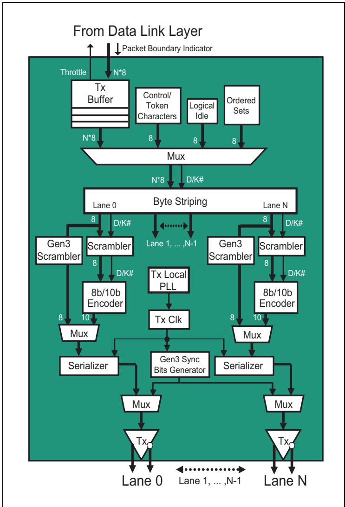

| EN | ZH |
| :-- | :-- |
| ## Byte Striping | ## 字节条带化 |
| This logic spreads the bytes to be delivered across all the available Lanes. The framing rules were described earlier in "Transmitter Framing Requirements" on page 417, so now let's look at some examples and discuss how the rules apply. | 该逻辑将待传输的字节分散到所有可用的 Lane 上。成帧规则先前已在第 417 页的"发送器成帧要求"中描述过，现在我们来看一些示例并讨论这些规则如何应用。 |
| Consider first the example shown in Figure 12-11 on page 424, where a 4-Lane Link is illustrated. Notice that the Sync Header bits appear on all the Lanes at the same time when a new Block begins and define the block type (a Data Block in this example). Block encoding is handled independently for each Lane, but the bytes (or symbols) are striped across all the Lanes just as they were for the earlier generations of PCIe. | 首先考虑第 424 页图 12-11 所示的示例，其中描绘了一条 x4 链路。注意，当一个新的块开始时，同步头比特会在所有 Lane 上同时出现，并定义块类型（本例中为一个数据块）。每个 Lane 独立进行块编码，但字节（或符号）会像前几代 PCIe 一样条带化到所有 Lane 上。 |

Figure 12-11: Gen3 Byte Striping x4 | 图12-11：Gen3 x4字节条带化

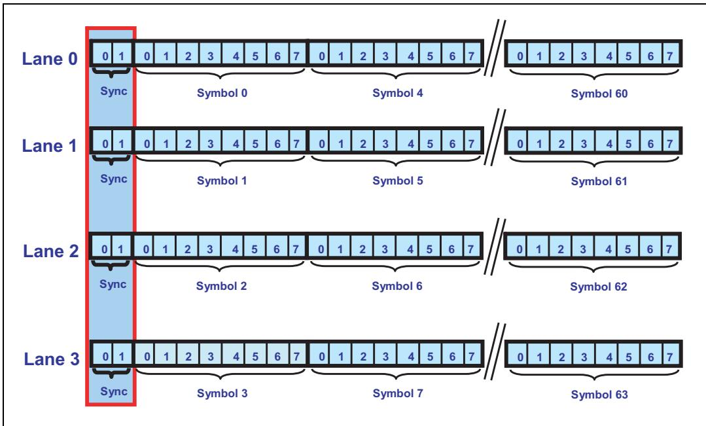

## 12.16 Byte Striping x8 Example | 12.16 字节条带化 x8 示例

| EN | ZH |
|---|---|
| Next, consider the x8 Link shown in Figure 12‑12 on page 425, which is an example from the spec redrawn to make it easier to read. Here the bit stream is vertical instead of horizontal. At the top we can see that the Sync bits, shown in little‑endian order as required, appear on all Lanes simultaneously and indicate that a Data Block is starting. | 接下来考虑第425页图12‑12所示的x8链路，该图源自规范并经重绘以更易于阅读。此处数据流为垂直方向而非水平方向。在顶部可以看到，同步位（Sync bits）按小端序（little‑endian）显示（按规定要求），同时出现在所有通道（Lanes）上，指示一个数据块（Data Block）正在开始。 |
| In this example, a TLP is sent first, so Symbols 0‑4 contain the STP framing Token, which includes a length of 7 DW for the entire TLP including the Token. The receiver needs to know the length of the TLP because for 8 GT/s speeds there is no END control character. Instead, the receiver counts the dwords and if there is no EDB (End Bad) observed, the TLP is assumed to be good. In this case, the TLP ends on Lane 3 of Symbol 3. | 在此示例中，首先发送一个TLP，因此Symbol 0‑4包含STP成帧令牌（STP framing Token），该令牌包括整个TLP（含令牌本身）的长度为7 DW。接收端需要知道TLP的长度，因为在8 GT/s速率下没有END控制字符。相反，接收端对dword进行计数，如果未观察到EDB（End Bad，异常结束），则假定该TLP正确无误。在此情形下，该TLP结束于Symbol 3的Lane 3。 |

Figure 12‑12: Gen3 x8 Example: TLP Straddles Block Boundary | 图12‑12：Gen3 x8示例：TLP跨越块边界

<table><tr><td></td><td>Lane 0</td><td>Lane 1</td><td>Lane 2</td><td>Lane 3</td><td>Lane 4</td><td>Lane 5</td><td>Lane 6</td><td>Lane 7</td></tr><tr><td>Sync</td><td>01</td><td>01</td><td>01</td><td>01</td><td>01</td><td>01</td><td>01</td><td>01</td></tr><tr><td>Symbol 0</td><td colspan="4">STP Token: Length=7, CRC, Parity, Seq Num</td><td></td><td></td><td></td><td></td></tr><tr><td>Symbol 1</td><td></td><td></td><td colspan="2">TLP</td><td></td><td></td><td></td><td></td></tr><tr><td>Symbol 2</td><td></td><td></td><td></td><td></td><td></td><td></td><td></td><td></td></tr><tr><td>Symbol 3</td><td colspan="4">LCRC</td><td colspan="2">SDP Token</td><td></td><td></td></tr><tr><td>Symbol 4</td><td></td><td>DLLP</td><td></td><td></td><td>IDL</td><td>IDL</td><td>IDL</td><td>IDL</td></tr><tr><td>Symbol 5</td><td>IDL</td><td>IDL</td><td>IDL</td><td>IDL</td><td>IDL</td><td>IDL</td><td>IDL</td><td>IDL</td></tr><tr><td>Symbol 6</td><td colspan="4">STP Token: Length=23, CRC, Parity, Seq Num</td><td></td><td colspan="2">DW 1</td><td></td></tr><tr><td>Symbol 7</td><td></td><td colspan="2">DW 2</td><td></td><td></td><td colspan="2">DW 3</td><td></td></tr><tr><td>Symbol 15</td><td></td><td colspan="2">DW 18</td><td></td><td></td><td colspan="2">DW 19</td><td></td></tr><tr><td>Sync</td><td>01</td><td>01</td><td>01</td><td>01</td><td>01</td><td>01</td><td>01</td><td>01</td></tr><tr><td>Symbol 0</td><td></td><td colspan="2">DW 20</td><td></td><td></td><td colspan="2">DW 21</td><td></td></tr><tr><td>Symbol 1</td><td colspan="4">LCRC</td><td>IDL</td><td>IDL</td><td>IDL</td><td>IDL</td></tr></table>

| EN | ZH |
|---|---|
| Next a DLLP is sent beginning with the SDP Token on Lanes 4 and 5. Since a DLLP is always 8 Symbols long, it will finish in Lane 3 of Symbol 4. Momentarily, there are no other packets to send, so IDL Symbols are transferred until another packet is ready. When IDLs are sent, the next STP Token can only start in Lane 0. In the example, the TLP starts in Lane 0 of Symbol 6. | 接下来发送一个DLLP，起始于Lane 4和Lane 5上的SDP令牌。由于DLLP长度始终为8个Symbol，因此它将在Symbol 4的Lane 3处结束。此时暂时没有其他报文需要发送，因此传输IDL符号，直到下一个报文准备就绪。当发送IDL时，下一个STP令牌只能从Lane 0开始。在示例中，TLP从Symbol 6的Lane 0开始。 |
| The packet length for the next TLP is 23 DW and that presents an interesting situation because there are only 20 dwords available before the next Block boundary. When the Data Block ends the transmitter sends Sync and continues TLP transmission during Symbol 0 of the next Block. In other words, Packets simply straddle Block boundaries when necessary. Finally, the TLP finishes in Lane 3 of Symbol 1. Once again there are no packets ready to send, so IDLs are sent. | 下一个TLP的报文长度为23 DW，这带来一个有趣的情况，因为在下一个数据块边界之前仅有20个dword可用。当数据块结束时，发送端发送Sync，并在下一个数据块的Symbol 0期间继续TLP传输。换言之，报文在必要时可直接跨越数据块边界。最后，该TLP在Symbol 1的Lane 3处结束。此时再次没有报文可发送，因此发送IDL。 |

| EN | ZH |
|---|---|
| ## Nullified Packet x8 Example | ## Nullified Packet x8 示例 |
| Nullified TLPs can occur when a TLP is being transferred across a switch to reduce latency. This is called Switch Cut-Through operation. The reader may choose to review the section entitled "Switch Cut-Through Mode" on page 354 before proceeding with this discussion. | 当TLP通过交换机传输以减少延迟时，可能会产生无效化的TLP。这称为交换机直通(Switch Cut-Through)操作。读者可自行选择在继续此讨论之前，先查阅第354页题为"Switch Cut-Through Mode"的章节。 |
| A nullified TLP can occur when a switch forwards a packet to the egress port before having received the packet at the ingress port and before error checking. Because an error was detected in this example, the TLP must be nullified. | 当交换机在入口端口接收报文之前且在进行错误检查之前，就将报文转发至出口端口时，可能会产生无效化的TLP。由于在此示例中检测到错误，该TLP必须被无效化。 |
| Figure 12-13 illustrates the steps taken to nullify TLP. The TLP being sent by the egress port, starts in the first block (Lane 0 of Symbol 6). When the error is detected, the egress port inverts the CRC (Lanes 0-3 of Symbol 1) and adds an EDB token immediately following the TLP (Lanes 4-7 of symbol 1). Together, those two changes make it clear to the Receiver that this TLP has been nullified and should be discarded. Note that the EDB bytes are not included in the packet length field, because they dynamically added to a packet in flight when an error occurs. | 图12-13说明了无效化TLP所采取的步骤。由出口端口发送的TLP从第一个块(符号6的通道0)开始。当检测到错误时，出口端口反转CRC(符号1的通道0-3)并在TLP之后立即添加EDB标记(符号1的通道4-7)。这两个变化共同向接收端表明该TLP已被无效化且应被丢弃。请注意，EDB字节未包含在报文长度字段中，因为它们是在错误发生时动态添加到正在传输的报文中的。 |

Figure 12-13: Gen3 x8 Nullified Packet | 图12-13：Gen3 x8无效数据包

<table><tr><td></td><td>Lane 0</td><td>Lane 1</td><td>Lane 2</td><td>Lane 3</td><td>Lane 4</td><td>Lane 5</td><td>Lane 6</td><td>Lane 7</td></tr><tr><td rowspan="2">Sync</td><td>0</td><td>0</td><td>0</td><td>0</td><td>0</td><td>0</td><td>0</td><td>0</td></tr><tr><td>1</td><td>1</td><td>1</td><td>1</td><td>1</td><td>1</td><td>1</td><td>1</td></tr><tr><td>Symbol 0</td><td colspan="4">STP Token: Length=7, CRC, Parity, Seq Num</td><td></td><td></td><td></td><td></td></tr><tr><td>Symbol 1</td><td></td><td></td><td colspan="2">TLP</td><td></td><td></td><td></td><td></td></tr><tr><td>Symbol 2</td><td></td><td></td><td></td><td></td><td></td><td></td><td></td><td></td></tr><tr><td>Symbol 3</td><td colspan="4">LCRC</td><td colspan="2">SDP Token</td><td></td><td></td></tr><tr><td>Symbol 4</td><td></td><td>DLLP</td><td></td><td></td><td>IDL</td><td>IDL</td><td>IDL</td><td>IDL</td></tr><tr><td>Symbol 5</td><td>IDL</td><td>IDL</td><td>IDL</td><td>IDL</td><td>IDL</td><td>IDL</td><td>IDL</td><td>IDL</td></tr><tr><td>Symbol 6</td><td colspan="4">STP Token: Length=23, CRC, Parity, Seq Num</td><td></td><td colspan="2">DW 1</td><td></td></tr><tr><td>Symbol 7</td><td></td><td colspan="2">DW 2</td><td></td><td></td><td colspan="2">DW 3</td><td></td></tr><tr><td>Symbol 15</td><td></td><td colspan="2">DW 18</td><td></td><td></td><td colspan="2">DW 19</td><td></td></tr><tr><td rowspan="2">Sync</td><td>0</td><td>0</td><td>0</td><td>0</td><td>0</td><td>0</td><td>0</td><td>0</td></tr><tr><td>1</td><td>1</td><td>1</td><td>1</td><td>1</td><td>1</td><td>1</td><td>1</td></tr><tr><td>Symbol 0</td><td></td><td colspan="2">DW 20</td><td></td><td></td><td colspan="2">DW 21</td><td></td></tr><tr><td>Symbol 1</td><td colspan="4">LCRC (inverted)</td><td>EDB</td><td>EDB</td><td>EDB</td><td>EDB</td></tr></table>

## 12.17 Ordered Set Example - SOS | 12.17 有序集示例 - SOS

## 12.18 有序集示例 - SOS（Skip Ordered Set，跳过有序集）

| EN | ZH |
|---|---|
| Now let's consider an example of Ordered Set transmission. As shown in Figure 12-14 on page 427, an Ordered Set is indicated by the 2-bit Sync Header value of 01b. The bytes that follow will be understood by the receiver to make up an Ordered Set that is always 16 bytes (128 bits) in length. The one exception is the SOS (Skip Ordered Set), because it can be changed by intermediate receivers in increments of 4 bytes at a time for clock compensation. Consequently, an SOS is legally allowed to be 8, 12, 16, 20, or 24 Symbols in length. In the absence of a Link repeater device that does not add or delete SKPs in a SOS, a SOS will also be made up of 16 bytes. | 现在让我们考虑一个有序集传输的示例。如第427页图12-14所示，有序集通过2位同步头（Sync Header）值01b来指示。接收方将理解后续字节构成一个长度始终为16字节（128位）的有序集。唯一的例外是SOS（Skip Ordered Set，跳过有序集），因为中间接收方可以每次以4字节为增量对其进行修改以进行时钟补偿。因此，SOS的合法长度可以为8、12、16、20或24个符号（Symbol）。如果不存在在SOS中添加或删除SKP的链路中继器（Link Repeater）设备，则SOS也将由16字节组成。 |

Figure 12-14: Gen3 x1 Ordered Set Construction | 图12-14：Gen3 x1有序集构建

| EN | ZH |
|---|---|
| To illustrate an Ordered Set, let's use an SOS to show the various features and how they work together. Consider Figure 12-15 on page 428, where a Data Block is followed by an SOS. The framing rules state that the previous Data Block must end with an EDS Token in the last dword to let the receiver know that an Ordered Set is coming. If the current Data Stream is to continue, the Ordered Set that follows must be an SOS, and that must be followed in turn by another Data Block. This example doesn't show it, but it's possible that a TLP might be incomplete at this point and would straddle the SOS by resuming transmission in the Data Block that must immediately follow the SOS. | 为了说明有序集，我们使用SOS来展示各种特性及其协同工作方式。考虑第428页图12-15，其中一个数据块（Data Block）后跟一个SOS。组帧规则规定，前一个数据块必须在最后一个双字（dword）以EDS令牌（Token）结束，以让接收方知道有序集即将到来。如果当前数据流要继续，则后续的有序集必须是SOS，并且该SOS之后必须紧跟另一个数据块。此示例未显示，但TLP此时可能尚未完成，并可能通过在SOS之后必须立即跟随的数据块中恢复传输而跨越该SOS。 |
| Receiving the EDS Token means that the Data Stream is either ending or pausing to insert an SOS. An EDS is the only Token that can start on a dword-aligned Lane in the same Symbol Time as an IDL, and this example does just that, beginning in Lane 4 of Symbol Time 15. Recall that EDS must also be in the last dword of the Data Block. According to the receiver framing requirements, only an Ordered Set Block is allowed after an EDS and must be an SOS, EIOS, or EIEOS or else it will be seen as a framing error. As was true for earlier spec versions, the Ordered Sets must appear on all Lanes at the same time. Receivers may optionally check to ensure that each Lane sees the same Ordered Set. | 接收EDS令牌意味着数据流正在结束或暂停以插入SOS。EDS是唯一可以与IDL在同一符号时间（Symbol Time）内从双字对齐的通道（Lane）上启动的令牌，本例正是如此，从符号时间15的通道4开始。回顾一下，EDS也必须位于数据块的最后一个双字中。根据接收方的组帧要求，EDS之后只允许出现有序集块（Ordered Set Block），且必须是SOS、EIOS或EIEOS，否则将被视为组帧错误。与早期规范版本一样，有序集必须同时在所有通道上出现。接收方可选择检查以确保每条通道看到相同的有序集。 |
| In our example, a 16 byte SOS is seen next, and is recognized by the Ordered Set Sync Header as well as the SKP byte pattern. There are always 4 Symbols at the end of the SOS that contain the current 24-bit scrambler LFSR state. In Symbol 12 the Receiver knows that the SKP characters have ended and also that the Block has three more bytes to deliver per Lane. These are the output of the scrambling logic LFSR, as shown in Table 12-2 on page 428. | 在我们的示例中，接下来看到一个16字节的SOS，通过有序集同步头以及SKP字节模式进行识别。SOS的末尾始终有4个符号包含当前24位加扰器LFSR状态。在符号12处，接收方知道SKP字符已结束，并且该块每条通道还需再传送3个字节。这些是加扰逻辑LFSR的输出，如第428页表12-2所示。 |

Figure 12-15: Gen3 x8 Skip Ordered Set (SOS) Example | 图12-15：Gen3 x8 SKIP有序集（SOS）示例

<table><tr><td></td><td>Lane 0</td><td>Lane 1</td><td>Lane 2</td><td>Lane 3</td><td>Lane 4</td><td>Lane 5</td><td>Lane 6</td><td>Lane 7</td></tr><tr><td>Sync</td><td>01</td><td>01</td><td>01</td><td>01</td><td>01</td><td>01</td><td>01</td><td>01</td></tr><tr><td>Symbol 0</td><td colspan="4">STP Token: Length=7, CRC, Parity, Seq Num</td><td></td><td></td><td></td><td></td></tr><tr><td>Symbol 1</td><td></td><td></td><td colspan="2">TLP</td><td></td><td></td><td></td><td></td></tr><tr><td>Symbol 2</td><td></td><td></td><td></td><td></td><td></td><td></td><td></td><td></td></tr><tr><td>Symbol 3</td><td colspan="4">LCRC</td><td colspan="2">SDP Token</td><td></td><td></td></tr><tr><td>Symbol 4</td><td></td><td></td><td>DLLP</td><td></td><td>IDL</td><td>IDL</td><td>IDL</td><td>IDL</td></tr><tr><td>Symbol 5</td><td>IDL</td><td>IDL</td><td>IDL</td><td>IDL</td><td>IDL</td><td>IDL</td><td>IDL</td><td>IDL</td></tr><tr><td>Symbol 6</td><td colspan="2">SDP Token</td><td></td><td></td><td></td><td>DLLP</td><td></td><td></td></tr><tr><td>Symbol 7</td><td>IDL</td><td>IDL</td><td>IDL</td><td>IDL</td><td>IDL</td><td>IDL</td><td>IDL</td><td>IDL</td></tr><tr><td>Symbol 15</td><td>IDL</td><td>IDL</td><td>IDL</td><td>IDL</td><td colspan="4">EDS Token (End of Data Stream)</td></tr><tr><td>Sync</td><td>10</td><td>10</td><td>10</td><td>10</td><td>10</td><td>10</td><td>10</td><td>10</td></tr><tr><td>Symbol 0</td><td>SKP</td><td>SKP</td><td>SKP</td><td>SKP</td><td>SKP</td><td>SKP</td><td>SKP</td><td>SKP</td></tr><tr><td>Symbol 3</td><td>SKP</td><td>SKP</td><td>SKP</td><td>SKP</td><td>SKP</td><td>SKP</td><td>SKP</td><td>SKP</td></tr><tr><td>Symbol 4</td><td>SKP_END</td><td>SKP_END</td><td>SKP_END</td><td>SKP_END</td><td>SKP_END</td><td>SKP_END</td><td>SKP_END</td><td>SKP_END</td></tr><tr><td>Symbol 5</td><td>LFSR</td><td>LFSR</td><td>LFSR</td><td>LFSR</td><td>LFSR</td><td>LFSR</td><td>LFSR</td><td>LFSR</td></tr><tr><td>Symbol 6</td><td>LFSR</td><td>LFSR</td><td>LFSR</td><td>LFSR</td><td>LFSR</td><td>LFSR</td><td>LFSR</td><td>LFSR</td></tr><tr><td>Symbol 7</td><td>LFSR</td><td>LFSR</td><td>LFSR</td><td>LFSR</td><td>LFSR</td><td>LFSR</td><td>LFSR</td><td>LFSR</td></tr><tr><td>Sync</td><td>01</td><td>01</td><td>01</td><td>01</td><td>01</td><td>01</td><td>01</td><td>01</td></tr></table>

Table 12-2: Gen3 16-bit Skip Ordered Set Encoding | 表12-2：Gen3 16位SKIP有序集编码

<table><tr><td>Symbol Number</td><td>Value</td><td>Description</td></tr><tr><td>0 to 11</td><td>AAh</td><td>SKP Symbol. Since Symbol 0 is the Ordered Set Identifier, this is seen as an SOS.</td></tr><tr><td>12</td><td>E1h</td><td>SKP_END Symbol, which indicates that the SOS will be complete after 3 more Symbols</td></tr><tr><td>13</td><td>00-FFh</td><td>a) If LTSSM state is Polling.Compliance: AAhb) Else if prior block was a Data Block:Bit [7] = Data ParityBit [6:0] = LFSR [22:16]c) ElseBit [7] = ~LFSR [22]Bit [6:0] = LFSR [22:16]</td></tr><tr><td>14</td><td>00-FFh</td><td>a) If LTSSM state is Polling.Compliance: Error_Status [7:0]b) Else LFSR [15:8]</td></tr><tr><td>15</td><td>00-FFh</td><td>a) If LTSSM state is Polling.Compliance: Error_Status [7:0]b) Else LFSR [7:0]</td></tr></table>

| EN | ZH |
|---|---|
| The Data Parity bit mentioned in the table is the even parity of all the Data Block scrambled bytes that have been sent since the most recent SDS or SOS and is created independently for each Lane. Receivers are required to calculate and check the parity. If the bits don't match, the Lane Error Status register bit corresponding to the Lane that saw the error must be set, but this is not considered a Receiver Error and does not initiate Link retraining. | 表中提到的数据校验位（Data Parity bit）是自最近的SDS或SOS以来发送的所有数据块加扰字节的偶校验，并为每条通道独立生成。接收方必须计算和检查该校验位。如果位不匹配，必须设置检测到错误的通道所对应的通道错误状态寄存器（Lane Error Status register）位，但这不被视为接收方错误（Receiver Error），也不会触发链路重新训练（Link Retraining）。 |
| The 8-bit Error_Status field only has meaning when the LTSSM is in the Polling.Compliance state (see "Polling.Compliance" on page 529 for more details). For our example of an SOS following a Data Block, byte 13 is the Data Parity bit and LFSR[22:16], while the last two bytes are LFSR bits [15:0]. | 8位Error_Status字段仅在LTSSM处于Polling.Compliance状态时才有意义（更多详情请参见第529页的"Polling.Compliance"）。对于数据块后跟SOS的示例，字节13是数据校验位和LFSR[22:16]，而最后两个字节是LFSR位[15:0]。 |

## 12.19 Transmitter SOS Rules | 12.19 发送器 SOS 规则
| EN | ZH |
|---|---|
| The SOS rules for Transmitters when using 128b/130b include: | 使用 128b/130b 编码时，发送端的 SOS 规则包括： |
| An SOS must be scheduled to occur within 370 to 375 blocks. In Loopback mode, however, the Loopback Master must schedule two SOS's within that time, and they must be no more than two blocks from each other. | SOS 必须被调度在 370 到 375 个块内发生。然而，在环回模式下，环回主控必须在该时间内调度两个 SOS，且这两个 SOS 之间的间隔不得超过两个块。 |
| SOS's can still only be sent on packet boundaries and may be accumulated as a result. However, consecutive SOS's are not permitted; they must be separated by a Data Block. | SOS 仍然只能在包边界上发送，因此可能会累积。但是，不允许连续的 SOS；它们之间必须由一个数据块分隔。 |
| • It's recommended that SOS timers and counters be reset whenever the Transmitter is Electrically Idle. | • 建议每当发送端处于电气空闲状态时，重置 SOS 定时器和计数器。 |

## 12.20 PCI Express Technology | 12.20 PCI Express 技术

| EN | ZH |
|---|---|
| The Compliance SOS bit in Link Control Register 2 has no effect when using 128b/130b. (It's used to disable SOSs during Compliance testing for 8b/10b, but that isn't an option for 128b/130b.) | 在使用 128b/130b 时，链路控制寄存器 2（Link Control Register 2）中的 Compliance SOS 位无效。（该位用于在 8b/10b 的一致性测试中禁用 SOS，但这对于 128b/130b 并不可选。） |

| EN | ZH |
|---|---|
| ## Receiver SOS Rules | ## 接收器SOS规则 |
| The Skip Ordered Set rules for Receivers when using 128b/130b include: | 使用128b/130b编码时，接收器的跳转有序集(SOS)规则包括： |
| They must tolerate receiving SOS's at an average interval of 370-375 blocks. Note that the first SOS after Electrical Idle may arrive earlier than that, since Transmitters are not required to reset SOS timers during Electrical Idle time. | 接收器必须容忍以平均370-375个块的间隔接收SOS。请注意，电气空闲后的第一个SOS可能比该间隔更早到达，因为发送器无需在电气空闲期间重置SOS定时器。 |
| • Receivers must check to see that every SOS in a Data Stream is preceded by a Data Block that ends with EDS. | • 接收器必须检查数据流中的每个SOS之前是否有一个以EDS结尾的数据块。 |

## 12.21 Scrambling (扰码)

| EN | ZH |
|---|---|
| The scrambling logic for 128b/130b is modified from the previous PCIe generations to address the two issues that 8b/10b encoding handled automatically: maintaining DC Balance and providing a sufficient transition density. By way of review, recall that DC Balance means the bit stream has an equal number of ones and zeros. This is intended to avoid the problem of "DC wonder", in which the transmission medium is charged toward one voltage or the other so much, by a prevalence of ones or zeros, that it becomes difficult to switch the signal within the necessary time. The other problem is that clock recovery at the Receiver needs to see enough edges in the input signal to be able to compare them to the recovered clock and adjust the timing and phase as needed. | 128b/130b的扰码逻辑与之前的PCIe代系相比有所修改，以解决8b/10b编码自动处理的两个问题：维持直流平衡（DC Balance）和提供足够的跳变密度。回顾一下，直流平衡意味着比特流中1和0的数量相等。这是为了避免"直流漂移"问题——由于1或0占主导地位，传输介质过多地向某一电压方向充电，以至于难以在必要时间内切换信号。另一个问题是，接收器处的时钟恢复需要在输入信号中看到足够的边沿，以便将它们与恢复的时钟进行比较，并根据需要调整时序和相位。 |
| Without 8b/10b to handle these issues, three steps were taken: First, the new scrambling method improves both transition density and DC Balance over longer time periods, but doesn't guarantee them over short periods the way 8b/10b did. Second, the TS1 and TS2 Ordered Set patterns used during training include fields that are adjusted as needed to improve DC Balance. And third, Receivers must be more robust and tolerant of these issues than they were in the earlier generations. | 由于没有8b/10b来处理这些问题，采取了三个步骤：首先，新的扰码方法在较长的时间段内改善了跳变密度和直流平衡，但不能像8b/10b那样在短时间内保证它们。其次，训练期间使用的TS1和TS2有序集模式包含可根据需要调整的字段以改善直流平衡。第三，接收器必须比前几代产品更加健壮，对这些问题的容忍度更高。 |

| EN | ZH |
|---|---|
| At the lower data rates every Lane was scrambled in the same way, so a single Linear‑Feedback Shift Register (LFSR) could supply the scrambling input for all of them. For Gen3, though, the designers wanted different scrambling values for neighboring Lanes. The reasons probably include a desire to decrease the possibility of cross‑talk between the Lanes by scrambling their outputs with respect to each other and avoid having the same value on each Lane, as might happen when sending IDLs. The spec describes two approaches to achieving this goal, one that emphasizes lower latency and one that emphasizes lower cost. | 在较低数据速率下，每条通道（Lane）以相同方式加扰，因此单个线性反馈移位寄存器（LFSR）可为所有通道提供加扰输入。但对于Gen3，设计者希望相邻通道使用不同的加扰值。其原因可能包括：通过对各通道的输出进行相互加扰来降低通道间串扰的可能性，并避免每条通道出现相同的值（如在发送IDLs时可能发生的情况）。规范描述了实现此目标的两种方法，一种侧重于低延迟，另一种侧重于低成本。 |
| First Option: Multiple LFSRs. One solution is to implement a separate LFSR for each Lane, and initialize each with a different starting value or "seed". This has the advantage of simplicity and speed, at the cost of adding logic. As shown in Figure 12‑16, each LFSR creates a pseudo‑random output based on the polynomial given in the spec as $\mathrm { G } ( \mathrm { X } ) = \dot { \mathrm { X } } ^ { 2 3 } + \mathrm { X } ^ { 2 1 } + \mathrm { X } ^ { 1 6 } +$ + $\mathsf X ^ { 8 } + \mathsf X ^ { 5 } + \mathsf X ^ { 2 } + 1$. This polynomial is longer than the previous version and also behaves a little differently because of the different seed values. Eight different seed values for each Lane are specified requiring eight different LFSRs, one per Lane 0 through 7. | 第一种方案：多个LFSR。一种解决方案是为每条通道实现独立的LFSR，并使用不同的初始值（或称"种子"）初始化每个LFSR。其优点是简单快速，代价是增加逻辑。如图12-16所示，每个LFSR基于规范中给出的多项式 $\mathrm { G } ( \mathrm { X } ) = \dot { \mathrm { X } } ^ { 2 3 } + \mathrm { X } ^ { 2 1 } + \mathrm { X } ^ { 1 6 } +$ + $\mathsf X ^ { 8 } + \mathsf X ^ { 5 } + \mathsf X ^ { 2 } + 1$ 产生伪随机输出。该多项式比之前的版本更长，且由于种子值不同，其行为也有所不同。规范为每条通道指定了8个不同的种子值，需要8个不同的LFSR，分别对应通道0到7。 |

Figure 12‑16: Gen3 Per‑Lane LFSR Scrambling Logic | 图12‑16：Gen3每条通道LFSR加扰逻辑

| EN | ZH |
|---|---|
| The 24‑bit seed value for each Lane is listed in Table 12‑3 on page 432. The series repeats itself, meaning the seed for Lane 8 will be the same as Lane 0, so only the first 8 values are shown. Every Lane uses the same LFSR and the same tap points to create the scrambling output, and the different seed values give the desired difference. | 每条通道的24位种子值列于第432页的表12-3中。该序列会重复，即通道8的种子与通道0相同，因此仅显示前8个值。每条通道使用相同的LFSR和相同的抽头点来生成加扰输出，不同的种子值提供了所需的差异。 |

Table 12‑3: Gen3 Scrambler Seed Values | 表12‑3：Gen3加扰器种子值

<table><tr><td>Lane</td><td>Seed Value</td></tr><tr><td>0</td><td>1DBFBCh</td></tr><tr><td>1</td><td>0607BBh</td></tr><tr><td>2</td><td>1EC760h</td></tr><tr><td>3</td><td>18C0DBh</td></tr><tr><td>4</td><td>010F12h</td></tr><tr><td>5</td><td>19CFC9h</td></tr><tr><td>6</td><td>0277CEh</td></tr><tr><td>7</td><td>1BB807h</td></tr></table>

| EN | ZH |
|---|---|
| Second Option: Single LFSR. The alternative solution, illustrated in Figure 12‑17 on page 433 for Lanes 2, 10, 18, and 26, is to use just one LFSR and create the scrambling inputs for each Lane by XORing different tap points together. Since there's only one LFSR, the seed value is the same for all Lanes (all ones), but the scrambling "Tap Equation" for each Lane is derived by combining different tap points, as shown in Table 12‑4 on page 433. The spec also notes that 4 of the Lanes Tap Equations can be derived by XORing the tap values of their bit neighbors: | 第二种方案：单个LFSR。另一种方案如图12-17（第433页，针对通道2、10、18和26所示）所示，仅使用一个LFSR，通过将不同抽头点进行XOR运算来生成每条通道的加扰输入。由于只有一个LFSR，所有通道的种子值相同（全1），但每条通道的加扰"抽头方程（Tap Equation）"通过组合不同的抽头点得出，如表12-4（第433页）所示。规范还指出，其中4条通道的抽头方程可通过对其相邻位的抽头值进行XOR运算得出： |
| Lane 0 = Lane 7 XOR Lane 1 (note that the process of going to lower Lane numbers wraps around, with the result that Lane 7 is considered lower that Lane 0) | Lane 0 = Lane 7 XOR Lane 1 （注意，向更低通道编号移动的过程会循环绕回，因此通道7被视为低于通道0） |
| Lane 2 = Lane 1 XOR Lane 3 | Lane 2 = Lane 1 XOR Lane 3 |
| Lane 4 = Lane 3 XOR Lane 5 | Lane 4 = Lane 3 XOR Lane 5 |
| Lane 6 = Lane 5 XOR Lane 7 | Lane 6 = Lane 5 XOR Lane 7 |
| The single‑LFSR solution uses fewer gates than the multi‑LFSR version does, but incurs extra latency through the XOR process, providing a different cost/performance option. | 单LFSR方案比多LFSR方案使用更少的逻辑门，但通过XOR过程引入了额外的延迟，提供了不同的成本/性能选择。 |

Figure 12‑17: Gen3 Single‑LFSR Scrambler | 图12‑17：Gen3单LFSR加扰器

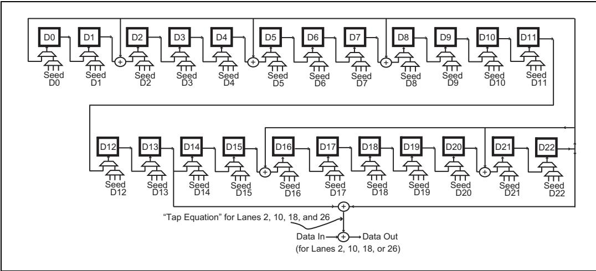

Table 12‑4: Gen3 Tap Equations for Single‑LFSR Scrambler | 表12‑4：Gen3单LFSR加扰器的抽头方程

<table><tr><td>Lane Numbers</td><td>Tap Equation</td></tr><tr><td>0, 8, 16, 24</td><td>D9 xor D13</td></tr><tr><td>1, 9, 17, 25</td><td>D1 xor D13</td></tr><tr><td>2, 10, 18, 26</td><td>D13 xor D22</td></tr><tr><td>3, 11, 19, 27</td><td>D1 xor D22</td></tr><tr><td>4, 12, 20, 28</td><td>D3 xor D22</td></tr><tr><td>5, 13, 21, 29</td><td>D1 xor D3</td></tr><tr><td>6, 14, 22, 30</td><td>D3 xor D9</td></tr><tr><td>7, 15, 23, 31</td><td>D1 xor D9</td></tr></table>

## 12.22 Scrambling Rules | 12.22 ## 加扰规则

| EN | ZH |
|---|---|
| The Gen3 scrambler LFSRs (whether one or more) do not continually advance, but only advance based on what is being sent. The scramblers must be re-initialized periodically and that takes place whenever an EIEOS or FTSOS is seen. The spec gives several rules for scrambling that are listed here for convenience: | Gen3加扰器的LFSR（无论是一个还是多个）不会持续前进，而是仅根据所发送的内容前进。加扰器必须定期重新初始化，每当检测到EIEOS或FTSOS时就会进行重新初始化。规范中给出了一些加扰规则，为了方便在此列出： |

## 12.23 PCI Express Technology | 12.23 PCI Express 技术

| EN | ZH |
|---|---|
| Sync Header bits are not scrambled and do not advance the LFSR. | Sync Header 位不进行加扰，也不推进 LFSR。 |
| The Transmitter LFSR is reset when the last EIEOS Symbol has been sent, and the Receiver LFSR is reset when the last EIEOS Symbol is received. | 发送器 LFSR 在最后一个 EIEOS 符号发送完成后复位，接收器 LFSR 在最后一个 EIEOS 符号接收完成后复位。 |
| TS1 and TS2 Ordered Sets: | TS1 和 TS2 有序集： |
| Symbol 0 bypasses scrambling | 符号 0 绕过加扰 |
| Symbols 1 to 13 are scrambled | 符号 1 到 13 被加扰 |
| Symbols 14 and 15 may or may not be scrambled. The spec states that they will bypass scrambling if necessary to improve DC Balance, but otherwise will be scrambled (see "TS1 and TS2 Ordered Sets" on page 510 for more details on how DC Balance is maintained). | 符号 14 和 15 可以加扰也可以不加扰。规范规定，如有必要改善直流平衡，它们将绕过加扰，否则将被加扰（有关如何维持直流平衡的更多详细信息，请参见第 510 页的"TS1 和 TS2 有序集"）。 |
| All Symbols of the Ordered Sets FTS, SDS, EIEOS, EIOS, and SOS bypass scrambling. Despite this, the output data stream will have sufficient transition density to allow clock recovery and the symbols chosen for the Ordered Sets result in a DC balanced output. | 有序集 FTS、SDS、EIEOS、EIOS 和 SOS 的所有符号均绕过加扰。尽管如此，输出数据流仍具有足够的跳变密度以实现时钟恢复，并且为有序集选择的符号可实现直流平衡输出。 |
| Even when bypassed, Transmitters advance their LFSRs for all Ordered Set Symbols except for those in the SOS. | 即使绕过加扰，发送器也会为除 SOS 中之外的所有有序集符号推进其 LFSR。 |
| Receivers do the same, checking Symbol 0 of an incoming Ordered Set to see whether it is an SOS. If so, the LFSRs are not advanced for any of the Symbols in that Block. Otherwise the LFSRs are advanced for all the Symbols in that Block. | 接收器执行相同操作，检查传入有序集的符号 0 是否为 SOS。如果是，则不会为该块中的任何符号推进 LFSR。否则，将为该块中的所有符号推进 LFSR。 |
| All Data Block Symbols are scrambled and advance the LFSRs. | 所有数据块符号均被加扰并推进 LFSR。 |
| Symbols are scrambled in little-endian order, meaning the least-significant bit is scrambled first and the most-significant bit is scrambled last. | 符号以小端序进行加扰，即最低有效位先加扰，最高有效位最后加扰。 |
| The seed value for a per-Lane LFSR depends on the Lane number assigned to the Lane when the LTSSM first entered Configuration.Idle (having finished the Polling state). The seed values, modulo 8, are shown in Table 12-3 on page 432 and, once assigned, won't change as long LinkUp = 1 even if Lane assignments are changed by going back to the Configuration state. | 每条通道 LFSR 的种子值取决于 LTSSM 首次进入 Configuration.Idle 时（已完成 Polling 状态）分配给该通道的通道编号。种子值（模 8）如表 12-3（第 432 页）所示，一旦分配，只要 LinkUp = 1，即使通过返回 Configuration 状态更改通道分配，种子值也不会改变。 |
| Unlike 8b/10b, scrambling cannot be disabled while using 128b/130b encoding because it is needed to help with signal integrity. It's not expected that the Link would operate reliably without it, so it must always be on. | 与 8b/10b 不同，使用 128b/130b 编码时无法禁用加扰，因为加扰有助于信号完整性。没有加扰，链路预计无法可靠运行，因此必须始终保持开启。 |
| A Loopback Slave must not scramble or de-scramble the looped-back bit. | 环回从属设备不得对环回位进行加扰或解扰。 |

## 12.24 Serializer | 12.24 串行器

| EN | ZH |
|---|---|
| This shift register works like it does for Gen1/Gen2 data rates except that it is now receiving 8 bits at a time instead of 10 (i.e., the serializer is an 8-bit parallel to serial shift register). | 该移位寄存器的工作方式与 Gen1/Gen2 数据速率时相同，区别在于它现在每次接收 8 位而非 10 位（即该串行器是一个 8 位并行转串行的移位寄存器）。 |

## 12.25 Mux for Sync Header Bits | 12.25 同步头位多路选择器

| EN | ZH |
|---|---|
| Finally, the two Sync Header bits must be injected to distinguish the next Block of characters as a Data Block or an Ordered Set Block. These are the first two bits of each 130-bit Block and the logic for them could be added anywhere in the transmitter that makes sense for the design. In this example the bits are injected at the end of the process for simplicity. Wherever they are included, the flow of bytes from above must be stalled to allow time for them. In this example there will need to be a way to inform the logic above to pause for two bit times. The flow of incoming packets will just be queued in the Tx Buffer during the time the Sync bits are being sent. | 最后，必须注入两个 Sync Header 位，以区分下一个字符块是数据块 (Data Block) 还是有序集块 (Ordered Set Block)。这两个位是每个 130 位块的前两个位，其逻辑可添加在发送器中任何对设计合理的部位。在本示例中，为简洁起见，这两个位在流程末尾注入。无论将它们置于何处，都必须暂停来自上层的字节流以留出时间插入它们。在本示例中，需要有一种方式来通知上层逻辑暂停两个位时间。在发送 Sync 位期间，传入的数据包流将仅在 Tx 缓冲器中排队。 |

## 12.26 Gen3 Physical Layer Receive Logic | 12.26 Gen3 物理层接收逻辑

| EN | ZH |
|---|---|
| As in the earlier generations, the Receiver's logic, shown in Figure 12‐18 on page 436, begins with the CDR (Clock and Data Recovery) circuit. | 与早期各代相同，如图12‐18（第436页）所示，接收器的逻辑始于CDR（时钟与数据恢复）电路。 |
| This probably includes a PLL that locks onto the frequency of the Transmitter clock based on knowledge of the expected frequency and the edges in the bit stream to generate a recovered clock (Rx Clock). | 其中可能包含一个PLL，它根据对预期频率的了解以及比特流中的边沿锁定发送器时钟的频率，从而产生恢复时钟（Rx Clock）。 |
| This recovered clock latches the incoming bits into a deserializing buffer and then, once Block Alignment has been established (during the Recovery state of the LTSSM), another version of the recovered clock that is divided by 8.125 (Rx Clock/8.125) latches the 8‐bit Symbols into the Elastic Buffer. | 该恢复时钟将输入的比特锁存到解串缓冲器中；然后，一旦确立了块对齐（在LTSSM的Recovery状态期间），恢复时钟的另一个经过8.125分频的版本（Rx Clock/8.125）将8比特符号锁存到弹性缓冲器中。 |
| After that, the de‐scrambler recreates the original data from the scrambled characters. | 之后，解扰器从加扰的字符中重新生成原始数据。 |
| The bytes bypass the 8b/10b decoder and are delivered directly to the Byte Un‐striping logic. | 字节绕过8b/10b解码器，直接送到字节解条带逻辑。 |
| Finally, the Ordered Sets are filtered out, and the remaining byte stream of TLPs and DLLPs is forwarded up to the Data Link Layer. | 最后，过滤掉有序集，剩余的TLP和DLLP字节流被向上转发到数据链路层。 |
| In the following discussion, each part is described working upward from the bottom. | 在接下来的讨论中，将从底层开始向上描述各部分。 |
| The focus is on describing aspects of the Physical Layer changed for 8.0 GT/s. | 重点描述物理层针对8.0 GT/s所做的变更。 |
| Sub‐block unchanged from Gen1/Gen2 will not be described in this section. | 本节将不描述与Gen1/Gen2相比未发生变化的子模块。 |

## 12.27 Differential Receiver | 12.27 差分接收器

| EN | ZH |
|---|---|
| The differential receiver logic is unchanged, but there are electrical changes to improve signal integrity (see "Signal Compensation" on page 468), as well as training changes to establish signal equalization, which are covered in "Link Equalization Overview" on page 577. | 差分接收器逻辑未改变，但为改善信号完整性进行了电气变更（见第468页的"信号补偿"），以及为建立信号均衡进行了训练变更，这些在第577页的"链路均衡概述"中介绍。 |

Figure 12‐18: Gen3 Physical Layer Receiver Details | 图12‐18：Gen3物理层接收器详情  

Figure 12‐19: Gen3 CDR Logic | 图12‐19：Gen3 CDR逻辑  
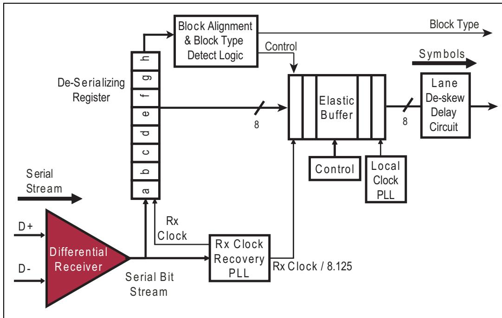

| EN | ZH |
|----|----|
| ## CDR (Clock and Data Recovery) Logic | ## CDR（时钟与数据恢复）逻辑 |

| EN | ZH |
|---|---|
| ## Rx Clock Recovery | ## 接收时钟恢复 |
| Although the new scrambling scheme helps with clock recovery, it doesn't guarantee good transition density over short intervals. As a result, the CDR logic must now be able to maintain synchronization for longer periods without as many edges. No specific method for accomplishing this is given in the spec, but a more robust PLL (Phase‑Locked Loop) or DLL (Delay‑Locked Loop) circuit will likely be needed. | 虽然新的加扰方案有助于时钟恢复，但它不能保证在短时间间隔内有良好的跳变密度。因此，CDR逻辑现在必须能够在没有那么多边沿的情况下维持更长时间的同步。规范中没有给出实现这一目标的具体方法，但可能需要更稳健的PLL（锁相环）或DLL（延迟锁定环）电路。 |
| Another aspect of the CDR logic that's different now is that the internal clock used by the Elastic Buffer is not simply the Rx clock divided by 8 as one might expect. The reason, of course, is that the input is not a regular multiple of 8‑bit bytes. Instead, it is a 2‑bit Sync Header followed by 16 bytes. Those extra two bits must be accounted for somewhere. The spec doesn't require any particular implementation, but one solution would have the clock divided by 8.125, as shown in Figure 12‑19 on page 437, to produce 16 clock edges over 130 bit times. | CDR逻辑现在不同的另一个方面是，弹性缓冲器使用的内部时钟并不像人们可能期望的那样简单地是接收时钟除以8。原因当然在于输入不是常规的8位字节的整数倍，而是一个2位同步头后跟16个字节。这两个额外的位必须在某处加以处理。规范不要求任何特定的实现，但一种解决方案是将时钟除以8.125，如图12‑19（第437页）所示，以在130位时间内产生16个时钟边沿。 |
| The Block Type Detection logic might then be used to take the extra two bits out of the deserializer that it needs to examine anyway, when a block boundary time is reached, ensuring that only 8‑bit bytes are delivered to the Elastic Buffer. | 然后，当达到块边界时刻时，可以使用块类型检测逻辑从解串器中取出它无论如何都需要检查的额外两个位，确保只将8位字节传递到弹性缓冲器。 |
| Just to tie up all the loose ends on this discussion, the internal clock for the 8.0 GT/s data rate will actually be 8.0 GHz / 8.125 = 0.985 GHz. That results in slightly less than the 1.0 GB/s data rate that's usually used to describe the Gen3 bandwidth, but the difference is small enough (1.5% less than 1 GB/s) that it usually isn't mentioned. | 为了总结本次讨论的所有未尽之处，8.0 GT/s数据速率的内部时钟实际上将是8.0 GHz / 8.125 = 0.985 GHz。这导致略低于通常用于描述Gen3带宽的1.0 GB/s数据速率，但差异足够小（比1 GB/s低1.5%），因此通常不会提及。 |

## 12.28 Deserializer | 12.28 解串器

| EN | ZH |
|----|----|
| The incoming data is clocked into each Lane's serial-to-parallel converter by the recovered Rx clock, as shown in Figure 12-19 on page 437. The 8-bit Symbols are sent to the Elastic Buffer and clocked into the Elastic Buffer by a version of the Rx Clock that has been divided by 8.125 to properly accommodate 16 bytes in 130 bits. | 传入数据由恢复出的接收时钟（Rx Clock）打入每个通道（Lane）的串并转换器，如图12-19第437页所示。8位符号（Symbol）被送至弹性缓冲器（Elastic Buffer），并由经过8.125分频的接收时钟版本打入弹性缓冲器，以正确容纳130位中的16字节。 |

## 12.29 Achieving Block Alignment | 12.29 实现块对齐

| EN | ZH |
|---|---|
| The EIEOSs sent during training serve to identify boundaries for the 130-bit blocks. As shown in Figure 12-20 on page 438, this Ordered Set can be recognized in a bit stream because it appears as a pattern of alternating bytes of 00h and FFh. When this pattern is seen, the last Symbol of the EIEOS is interpreted as the Block boundary, and testing the next 130 bits will reveal whether the boundary is correct. If not, the logic continues to search for this pattern. This process is described in the spec as occurring in three phases: Unaligned, Aligned, and Locked. | 训练期间发送的EIEOS用于标识130-bit块的边界。如第438页图12-20所示，该有序集在比特流中可被识别，因为它表现为00h和FFh字节交替出现的模式。当看到此模式时，EIEOS的最后一个符号被解释为块边界，测试接下来的130个比特将揭示该边界是否正确。如果不正确，逻辑将继续搜索此模式。规范将此过程描述为三个相位：未对齐、已对齐和锁定。 |

Figure 12-20: EIEOS Symbol Pattern | 图12-20：EIEOS符号模式

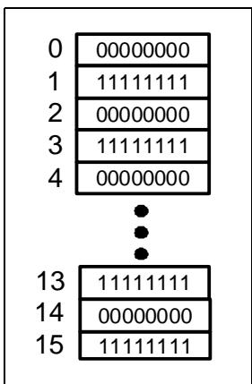

| EN | ZH |
|---|---|
| **Unaligned Phase.** Receivers enter this phase after a period of Electrical Idle, such as after changing to 8.0 GT/s or exiting from a low-power Link state. In this phase, the Block Alignment logic watches for the arrival of an EIEOS, since the end of the alternating bytes must correspond to the end of the Block. When an EIEOS is seen, the alignment is adjusted and the logic proceeds to the next phase. Until then, it must also adjust its Block alignment based on the arrival of any SOS. | **未对齐相位。** 接收器在电气空闲一段时间后进入此相位，例如在更改为8.0 GT/s后或从低功耗链路状态退出时。在此相位中，块对齐逻辑监视EIEOS的到来，因为交替字节的末尾必须对应块的末尾。当检测到EIEOS时，对齐被调整，逻辑进入下一相位。在此之前，它还必须根据任何SOS的到来调整其块对齐。 |
| **Aligned Phase.** In this phase Receivers continues to monitor for EIEOS and make any necessary adjustments to their bit and Block alignment if they see one. However, since they've tentatively identified block boundaries they can also now search for an SDS (Start of Data Stream) Ordered Set to indicate the beginning of a Data Stream. When an SDS is seen, the receiver proceeds to the Locked phase. Until then, it must also adjust its Block alignment based on the arrival of SOSs. If an undefined Sync Header is detected (value of 00b or 11b) the Receiver is allowed to return to the Unaligned phase. The spec notes that this will happen during Link training when EIEOS is followed by a TS Ordered Set. | **已对齐相位。** 在此相位中，接收器继续监视EIEOS，并在检测到EIEOS时对其比特和块对齐进行必要的调整。然而，由于它们已初步识别出块边界，现在还可以搜索SDS（数据流起始）有序集以指示数据流的开始。当看到SDS时，接收器进入锁定相位。在此之前，它还必须根据SOS的到来调整其块对齐。如果检测到未定义的同步头（值为00b或11b），允许接收器返回到未对齐相位。规范指出，这将在链路训练期间EIEOS后跟TS有序集时发生。 |
| **Locked Phase.** Once a Receiver reaches this phase, it no longer adjusts its Block alignment. Instead, it now expects to see a Data Block after the SDS and if the alignment has to be readjusted at this point, some misaligned data will probably be lost. If an undefined Sync Header is detected the Receiver is allowed to return to the Unaligned or Aligned phase. Receivers can be directed to transition out of the Locked phase to one of the others as long as Data Stream processing is stopped (see "Data Stream and Data Blocks" on page 413 for the rules regarding Data Streams). | **锁定相位。** 一旦接收器达到此相位，它不再调整其块对齐。相反，它现在期望在SDS之后看到数据块，如果此时必须重新调整对齐，一些未对齐的数据可能会丢失。如果检测到未定义的同步头，允许接收器返回到未对齐或已对齐相位。只要数据流处理已停止，就可以指示接收器从锁定相位转换到其他相位之一（关于数据流的规则请参见第413页的"数据流和数据块"）。 |
| **Special Case: Loopback.** While discussing Block alignment, the spec describes what happens when the Link is in Loopback mode. The Loopback Master must be able to adjust alignment during Loopback, and is allowed to send EIEOS and adjust its Receiver based on a detected EIEOS when they are echoed back during Loopback.Active. The Loopback Slave must be able to adjust alignment during Loopback.Entry but must not adjust alignment during Loopback.Active. The Slave's Receiver is considered to be in the Locked phase when the Slave begins to loop back the bit stream. | **特例：环回。** 在讨论块对齐时，规范描述了链路处于环回模式时发生的情况。环回主设备必须能够在环回期间调整对齐，并且允许发送EIEOS，并在Loopback.Active期间EIEOS被环回回来时根据检测到的EIEOS调整其接收器。环回从设备必须能够在Loopback.Entry期间调整对齐，但不得在Loopback.Active期间调整对齐。当从设备开始环回比特流时，从设备的接收器被认为处于锁定相位。 |

## 12.30 Block Type Detection | 12.30 块类型检测

| EN | ZH |
|----|-----|
| Once Block Alignment has been achieved, the Receiver can recognize the start times of the incoming blocks and examine the first two bits to identify which of the two possible types are coming in. Ordered Set Blocks are only interesting to the Physical Layer, so they're not forwarded to the higher layers, but Data Blocks do get forwarded. When the Sync Header is detected, this information is signaled to other parts of the Physical Layer to determine whether the current block should be removed from the byte stream going to the higher layers. The clock recovery mechanism and Sync Header detection effectively accomplishes the conversion from 130 bits to 128 bits that must take place in the Physical Layer. | 一旦实现块对齐，接收端即可识别传入块的起始时刻，并检查前两个比特以判断即将到来的是两种可能类型中的哪一种。有序集块仅对物理层有意义，因此不会转发给上层，但数据块会被转发。当检测到同步头时，此信息会通知给物理层的其他部分，以确定当前块是否应从发往上层的字节流中移除。时钟恢复机制和同步头检测有效地完成了必须在物理层中进行的从130比特到128比特的转换。 |
| Note that since the block information is the same for every Lane, this logic may simply be implemented for only one Lane, such as Lane 0 as shown in Figure 12‐18 on page 436. However, if different Link widths and Lane Reversal were supported then more Lanes would need to include this logic to ensure that there would always be one active Lane with this logic available. An example might be that every Lane which is able to operate as Lane 0 would implement it, but only the one that was currently acting as Lane 0 would use it. Note also that, since the spec doesn't give details in this regard, the examples discussed and illustrated here are only educated guesses at a workable implementation. | 请注意，由于每个通道的块信息相同，因此该逻辑可以仅针对一个通道实现，例如图12-18（第436页）中所示的通道0。然而，如果支持不同的链路宽度和通道反转，则需要更多通道包含此逻辑，以确保始终至少有一个活动通道具备该逻辑可用。一种示例做法是：每个能够作为通道0运行的通道都实现该逻辑，但只有当前实际充当通道0的那个通道才使用它。另需注意，由于规范未提供这方面的细节，此处讨论和图示的示例仅是对可行实现方案的合理推测。 |

| EN | ZH |
|----|----|
| ## Receiver Clock Compensation Logic | ## 接收端时钟补偿逻辑 |

## 12.31 Background | 12.31 背景

| EN | ZH |
|----|----|
| The clock requirements for 8.0 GT/s are the same as they were in the earlier spec versions: the clocks of both Link partners must be within +/– 300 ppm (parts per million) of the center frequency, which results (in the worst case) in gaining or losing one clock after every 1666 clocks. | 8.0 GT/s 的时钟要求与早期规范版本相同：链路双方的时钟必须在中心频率的 +/- 300 ppm（百万分之一）范围内，这导致（在最坏情况下）每 1666 个时钟后丢失或增加一个时钟。 |

## 12.32 Elastic Buffer's Role | 12.32 弹性缓冲器的作用

| EN | ZH |
|---|---|
| The received Symbols are clocked into the elastic buffer, as shown in Figure 12-21 on page 441, using the recovered clock and clocked out using the receiver's local clock. The Elastic Buffer compensates for the frequency difference by adding or removing SKP Symbols as before, but now it does so four Symbols at a time instead of only one at a time. When a SKP Ordered Set arrives, control logic watching the status of the buffer makes an evaluation. If the local clock is running faster, the buffer will be approaching an underflow condition and the logic can compensate by appending four extra SKPs when the SOS arrives to quickly refill the buffer. On the other hand, if the recovered clock is running faster, the buffer will be approaching an overflow condition and the logic will compensate for that by deleting four SKPs to quickly drain the buffer when an SOS is seen. | 接收到的符号使用恢复时钟送入弹性缓冲器（如图12-21所示，第441页），并使用接收器的本地时钟输出。弹性缓冲器通过添加或删除SKP符号来补偿频率差异，与之前相同，但现在一次操作四个符号，而非仅一个。当SKP有序集到达时，监视缓冲器状态的控制逻辑进行评估。如果本地时钟运行较快，缓冲器将接近欠载状态，逻辑可在SOS到达时追加四个额外的SKP以快速重新填充缓冲器。另一方面，如果恢复时钟运行较快，缓冲器将接近过载状态，逻辑将在检测到SOS时删除四个SKP以快速排空缓冲器。 |

Figure 12-21: Gen3 Elastic Buffer Logic | 图12-21：Gen3弹性缓冲逻辑

| EN | ZH |
|---|---|
| Gen3 Transmitters schedule an SOS once every 370 to 375 blocks but, as before, they can only be sent on block boundaries. If a packet is in progress when SOSs are scheduled, they are accumulated and inserted at the next packet boundary. However, unlike the lower data rates, two consecutive SOSs are not allowed at 8.0 GT/s; they must be separated by a Data Block. Receivers must be able to tolerate SOSs separated by the maximum packet payload size a device supports. | Gen3发送器每370到375个块调度一次SOS，但与之前一样，只能在块边界上发送。如果调度SOS时某个数据包正在进行中，则SOS会累积并在下一个数据包边界插入。然而，与较低数据速率不同，在8.0 GT/s下不允许两个连续的SOS；它们必须由数据块分隔。接收器必须能够容忍由设备支持的最大数据包负载大小分隔的SOS。 |
| The fact that adjustments are only made in increments of 4 Symbols may affect the depth of the Elastic Buffer, since a difference of 4 would need to be seen before any compensation is applied, and a large packet may be in progress at what would otherwise be the appropriate time. For that reason, care will need to be exercised in determining the optimal size of this buffer, so let's consider an example. The allowed time between SOSs of 375 blocks at 16 Symbols per block equals 6000 Symbol times. Dividing that by the worst-case time to gain or lose a clock of 1666 means that 3.6 clocks could be gained or lost during that period. If the largest possible TLP (4KB) had started just prior to the next SOS being sent, the overall delay for it becomes about 6000 + 4096 = 10096 Symbol times for a x1 Link, which translates to a gain or loss of 10096 / 1666 = 6.06 clocks. Consequently, if TLPs of 4KB in size are supported, the buffer might be designed to handle 7 Symbols too many or too few before an SOS is guaranteed to arrive. It may happen that two SOSs are scheduled before the first one is sent. At the lower data rates, the queued SOSs are sent back-to-back, but for 8.0 GT/s they are not and must be separated by a Data Block. Whenever an SOS does arrive at the Receiver, it can add or remove 4 SKP Symbols to quickly fill or drain the buffer and avoid a problem. | 调整仅以4个符号为增量进行，这一事实可能会影响弹性缓冲器的深度，因为在施加任何补偿之前需要观察到4的差异，并且一个大数据包可能恰好在原本合适的时间正在进行中。因此，在确定该缓冲器的最佳大小时需要谨慎考虑，让我们来看一个例子。SOS之间允许的时间为375个块，每块16个符号，等于6000个符号时间。将其除以获得或丢失一个时钟的最坏情况时间1666，意味着在此期间可能获得或丢失3.6个时钟。如果最大的TLP（4KB）恰好在下一个SOS发送之前开始，则对于x1链路，其总延迟约为6000 + 4096 = 10096个符号时间，这转换为10096 / 1666 = 6.06个时钟的获得或丢失。因此，如果支持大小为4KB的TLP，缓冲器可能被设计为在保证SOS到达之前处理多出或少出7个符号的情况。可能会发生调度了两个SOS而第一个尚未发送的情况。在较低数据速率下，排队的SOS被背靠背发送，但对于8.0 GT/s则不允许，必须由数据块分隔。每当SOS确实到达接收器时，它可以添加或删除4个SKP符号以快速填充或排空缓冲器并避免问题。 |

## 12.33 Lane-to-Lane Skew | 12.33 通道间偏斜

| EN | ZH |
|---|---|
| ## Lane-to-Lane Skew | ## 通道间偏移 |

## 12.34 Flight Time Variance Between Lanes | 12.34 通道间飞行时间差异

| EN | ZH |
|---|---|
| For multi-Lane Links, the difference in arrival times between lanes is automatically corrected at the Receiver by delaying the early arrivals until they all match up. | 对于多通道链路，通道间到达时间的差异在接收端通过延迟早到达的信号直至所有信号对齐而自动校正。 |
| The spec allows this to be accomplished by any means a designer prefers, but using a digital delay after the elastic buffer has one advantage in that the arrival time differences are now digitized to the local Symbol clock of the receiver. | 规范允许设计者采用任何优选方式来实现这一点，但在弹性缓冲之后使用数字延迟有一个优势：到达时间差异现在被数字化为接收端本地符号时钟的周期。 |
| If the input to one lane makes it on a clock edge and another one doesn't, the difference between them will be measured in clock periods, so the early arrival can simply be delayed by the appropriate number of clocks to get it to line up with the late-comers (see Figure 12-22 on page 444). | 如果一个通道的输入在某个时钟沿到达而另一个没有，则它们之间的差异将以时钟周期来衡量，因此早到达的信号只需延迟适当数量的时钟周期即可与晚到达的信号对齐（参见第444页图12-22）。 |
| The fact that the maximum allowable skew at the receiver is a multiple of the clock periods makes this easy and infers that the spec writers may have had this implementation in mind. | 接收端允许的最大偏移是时钟周期的整数倍，这一事实简化了此过程，并暗示规范制定者可能已经考虑到了这种实现方式。 |
| As defined in the spec, the receiver must be capable of de-skewing up to 20ns for Gen1 (5 Symbol-time clocks at 4ns per Symbol) and 8ns for Gen2 (4 Symbol-time clocks at 2ns per Symbol), and 6ns for Gen3 (6 Symbol-time clocks at 1ns per Symbol). | 根据规范定义，接收端必须能够对Gen1去偏移最多20ns（5个符号时间时钟，每个符号4ns），对Gen2去偏移8ns（4个符号时间时钟，每个符号2ns），对Gen3去偏移6ns（6个符号时间时钟，每个符号1ns）。 |

## 12.35 De-skew Opportunities | 12.35 去偏斜时机

| EN | ZH |
|---|---|
| ## De-skew Opportunities | ## 解偏斜时机 |
| The same Symbol must be seen on all lanes at the same time to perform deskewing, and any Ordered Set will do. However, de-skewing is only performed in the L0s, Recovery, and Configuration LTSSM states. In particular, it must be completed as a condition for: | 所有通道必须同时看到相同的符号(Symbol)才能执行解偏斜，任何有序集(Ordered Set)均可用于此目的。然而，解偏斜仅在 L0s、Recovery 和 Configuration LTSSM 状态下执行。具体而言，它必须完成以下条件： |
| • Leaving Configuration.Complete • Beginning to process a Data Stream after leaving Configuration.Idle or Recovery.Idle • Leaving Recovery.RcvrCfg • Leaving Rx\_L0s.FTS | • 离开 Configuration.Complete 状态 • 离开 Configuration.Idle 或 Recovery.Idle 后开始处理数据流(Data Stream) • 离开 Recovery.RcvrCfg 状态 • 离开 Rx\_L0s.FTS 状态 |
| If skew values change while in L0 (based on temperature or voltage changes, for example), a Receiver error may occur and cause replayed TLPs. If the problem becomes persistent, the Link would eventually transition to the Recovery state and de-skewing would take place there. The spec notes that, while devices are not allowed to de-skew their Lanes while in L0, the SOSs that must be sent periodically in this state contain an LFSR value that is intended to aid external tools in doing this. These tools, unconstrained by the rules for Data Streams, can search for the SOSs and use the patterns to achieve Bit Lock, Block Alignment and Lane-to-Lane de-skew in the midst of a Data Stream. | 如果偏斜值在 L0 状态下发生变化（例如由于温度或电压变化），可能发生接收器错误(Receiver error)并导致 TLP 重放。如果问题持续存在，链路(Link)最终将转换到 Recovery 状态，并在该状态下进行解偏斜。规范指出，虽然设备不允许在 L0 状态下对其通道(Lane)进行解偏斜，但在此状态下必须周期性发送的 SOS 包含一个 LFSR 值，旨在帮助外部工具完成解偏斜。这些工具不受数据流(Data Stream)规则的约束，可以在数据流中搜索 SOS 并利用这些模式实现位锁定(Bit Lock)、块对齐(Block Alignment)和通道间解偏斜(Lane-to-Lane de-skew)。 |
| The spec notes that when leaving L0s the Transmitter will send an EIEOS, then the correct number of FTSs with another EIEOS inserted after every 32 FTSs, then one last EIEOS to assist with Block Alignment and, finally, an SDS Ordered Set for the purpose of de-skewing in addition to starting the Data Stream. | 规范指出，当离开 L0s 时，发送端(Transmitter)将发送一个 EIEOS，然后是正确数量的 FTS（每 32 个 FTS 后插入另一个 EIEOS），接着是最后一个 EIEOS 以协助块对齐(Block Alignment)，最后是一个 SDS 有序集(SDS Ordered Set)，用于解偏斜以及启动数据流(Data Stream)。 |

## 12.36 Receiver Lane-to-Lane De-skew Capability | 12.36 接收器通道间去偏斜能力

| EN | ZH |
|---|---|
| Understandably, the transmitter is only allowed to introduce a minimal amount of skew so as to leave the rest of the skew budget to cover routing differences and other variations. The amount of allowed skew that can be corrected at the Receiver is shown in Table 12‐5 on page 443, where it can be seen that this skew corresponds easily to a number of Symbol times for Gen3 just as it did for the earlier data rates. That allows the same option of using delay registers to accomplish de‐skew after the elastic buffer as was described for Gen1/Gen2 Physical Layer implementations earlier. | 可以理解，发送器仅被允许引入最小量的偏斜，以便将剩余的偏斜预算留给路由差异和其他变化。接收器可校正的允许偏斜量如表12‐5（第443页）所示，可以看出该偏斜量对于Gen3而言同样对应若干符号时间，与之前的数据速率情况一致。这使得可以采用与先前描述的Gen1/Gen2物理层实现相同的方案，即在弹性缓冲之后使用延迟寄存器来完成解偏斜。 |

Table 12‐5: Signal Skew Parameters | 表12‐5：信号偏斜参数

<table><tr><td></td><td>Gen1</td><td>Gen2</td><td>Gen3</td></tr><tr><td>Tx max skew</td><td>1.3 ns</td><td>1.3 ns</td><td>1.1 ns</td></tr><tr><td>Rx max skew</td><td>20 ns</td><td>8 ns</td><td>6 ns</td></tr><tr><td>Symbol time period</td><td>4ns</td><td>2ns</td><td>1ns</td></tr><tr><td>Rx skew expressed in Symbol Times</td><td>5</td><td>4</td><td>6</td></tr></table>

| EN | ZH |
|---|---|
| When using 8b/10b encoding, an unambiguous de‐skew mechanism is to watch for the COM control character, which must appear on all Lanes simultaneously. That option is not available for 128b/130b, but Ordered Sets still arrive at the same time on all the Lanes, such as the SOS, SDS, and EIEOS. As a result, the process can be very much the same even though the pattern to search for when de‐skewing the Lanes is different. | 当使用8b/10b编码时，一种明确的解偏斜机制是监测COM控制字符，该字符必须同时在所有通道上出现。对于128b/130b编码，该选项不可用，但有序集仍然同时在所有通道上到达，例如SOS、SDS和EIEOS。因此，尽管解偏斜时需要搜索的图案不同，但其过程可以非常相似。 |

Figure 12‐22: Receiver Link De‐Skew Logic | 图12‐22：接收器链路解偏斜逻辑  
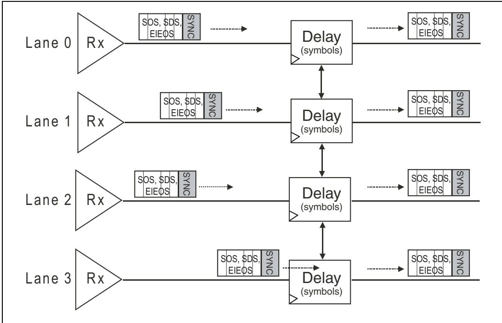

## 12.37 Descrambler | 12.37 解扰器

| EN | ZH |
|----|----|
| ## Descrambler | ## 解扰器 |

| English | 中文 |
|---------|------|
| ## General | ## 概述 |
| Receivers follow exactly the same rules for generating the scrambling polynomial that the Transmitter does and simply XOR the same value to the input data a second time to recover the original information. Like on the transmit side, they are allowed to implement a separate LFSR for each Lane or just one. | 接收器遵循与发送器完全相同的规则来生成扰码多项式，只需对输入数据再次执行相同的 XOR 运算即可恢复原始信息。与发送端一样，接收器可以为每条通道实现独立的 LFSR，也可以只实现一个。 |

| EN | ZH |
|----|----|
| ## Disabling Descrambling | ## 禁用解扰 |
| Unlike at Gen1/Gen2 data rates, in Gen3 mode, descrambling cannot be disabled because of its role in facilitating clock recovery and signal integrity. At the lower rates, the "disable scrambling" bit in the control byte of TS1s and TS2s would be used to inform a Link neighbor that scrambling was being turned off. That bit is reserved for rates of 8.0 GT/s and higher. | 与Gen1/Gen2数据速率不同，在Gen3模式下，解扰因其在促进时钟恢复和信号完整性方面的作用而无法被禁用。在较低速率下，TS1和TS2控制字节中的"禁用扰码"位曾用于通知链路对端扰码正在关闭。该位在8.0 GT/s及更高速率下为保留位。 |

## 12.38 Byte Un-Striping | 12.38 字节解交错

| EN | ZH |
|---|---|
| This logic is basically unchanged from Gen1 or Gen2 implementation. At some point, the byte streams for Gen3 and for the lower data rates will have to muxed together, and the example in Figure 12-23 on page 445 shows that happening just before the un-striping logic. | 该逻辑与Gen1或Gen2实现基本保持不变。在某个节点，Gen3与较低数据速率的字节流必须复用在一起，图12-23（第445页）中的示例展示了这一过程恰好在解交错逻辑之前发生。 |

Figure 12-23: Physical Layer Receive Logic Details | 图12-23：物理层接收逻辑详情

## 12.39 Packet Filtering | 12.39 数据包过滤

| EN | ZH |
|----|----|
| The serial byte stream supplied by the byte un-striping logic contains TLPs, DLLPs, Logical Idles (IDLs), and Ordered Sets. The Logical Idle bytes and Ordered Sets are eliminated here and are not forwarded to the Data Link layer. What remains are the TLPs and DLLPs, which get forwarded along with an indicator of their packet type. | 由字节解剥离逻辑提供的串行字节流包含TLP、DLLP、逻辑空闲(IDL)和有序集。逻辑空闲字节和有序集在此处被去除，不会被转发到数据链路层。剩下的是TLP和DLLP，它们连同其包类型指示符一起被转发。 |

## 12.40 Receive Buffer (Rx Buffer) | 12.40 接收缓冲器（Rx 缓冲器）

| EN | ZH |
|---|---|
| The Rx Buffer holds received TLPs and DLLPs until the Data Link Layer is able to accept them. The interface to the Data Link Layer is not described in the spec, and so a designer is free to choose details like the width of this bus. The wider the path, the lower the clock frequency will be, but more signals and logic will be needed to support it. | Rx Buffer 保存接收到的 TLP 和 DLLP，直到数据链路层能够接收它们。与数据链路层的接口在规范中未作描述，因此设计人员可以自由选择诸如该总线宽度等细节。路径越宽，时钟频率越低，但需要更多的信号线和逻辑来支持。 |

| EN | ZH |
|---|---|
| ## Notes Regarding Loopback with 128b/130b | ## 关于128b/130b环回的说明 |
| The spec makes a special point to describe the operation of Loopback Mode at the higher rate. The basic rules can be summarized as follows: | 规范特别强调了高速率下环回模式的操作。基本规则可总结如下： |
| Loopback masters must send actual Ordered Sets or Data Blocks, but they aren't required to follow the normal protocol rules when changing from Data Blocks to Ordered Sets or vice versa. In other words, the SDS Ordered Set and EDS token are not required. Slaves must not expect or check for the presence of them. | 环回主设备必须发送实际的有序集或数据块，但在从数据块切换到有序集或反之亦然时，不必遵循正常的协议规则。换言之，SDS有序集和EDS令牌不是必需的。从设备不得期望或检查它们的存在。 |
| Masters must send SOS as usual, and must allow for the number of SKP Symbols in the loopback stream to be different because the receiver will be performing clock compensation. | 主设备必须像往常一样发送SOS，并且必须允许环回流中的SKP符号数量有所不同，因为接收端将执行时钟补偿。 |
| Loopback slaves are allowed to modify the SOS by adding or removing 4 SKP Symbols at a time as they normally would for clock compensation, but the resulting SOS must still follow the proper format rules. | 环回从设备可以像通常为时钟补偿所做的那样，一次添加或移除4个SKP符号来修改SOS，但修改后的SOS仍需遵循正确的格式规则。 |
| Everything should be looped back exactly as it was sent except for SOS which can change as just described, and both EIEOS and EIOS which have defined purposes in loopback and should be avoided. | 除SOS可按上述方式更改外，所有内容都应严格按发送时的原样环回；而EIEOS和EIOS在环回中有明确用途，应避免使用。 |
| If a slave is unable to acquire Block alignment, it won't be able to loop back all bits as received and is allowed to add or remove Symbols as needed to continue operation. | 如果从设备无法获取块对齐，则将无法按接收到的原样环回所有比特，此时允许其根据需要添加或移除符号以继续操作。 |

| EN | ZH |
|---|---|
| # 13 Physical Layer - Electrical | # 13 物理层 - 电气特性 |

## The Previous Chapter | 上一章

| EN | ZH |
|---|---|
| The previous chapter describes the logical Physical Layer characteristics for the third generation (Gen3) of PCIe. The major change includes the ability to double the bandwidth relative to Gen2 speed without needing to double the frequency (Link speed goes from 5 GT/s to 8 GT/s). This is accomplished by eliminating 8b/10b encoding when in Gen3 mode. More robust signal compensation is necessary at Gen3 speed. Making these changes is more complex than might be expected. | 上一章描述了 PCIe 第三代（Gen3）的逻辑物理层特性。其主要变化包括：无需将频率加倍即可使带宽相对于 Gen2 速度翻倍（链路速度从 5 GT/s 提升至 8 GT/s）。这是通过在 Gen3 模式下取消 8b/10b 编码来实现的。在 Gen3 速度下需要更鲁棒的信号补偿。实施这些变更比预期的更为复杂。 |

## This Chapter | 本章

| EN | ZH |
| --- | --- |
| This chapter describes the Physical Layer electrical interface to the Link, including some low‐level characteristics of the differential Transmitters and Receivers. The need for signal equalization and the methods used to accomplish it are also discussed here. This chapter combines electrical transmitter and receiver characteristics for both Gen1, Gen2 and Gen3 speeds. | 本章描述链路物理层电气接口，包括差分发送器和接收器的一些底层特性。此外还讨论了信号均衡的必要性及其实现方法。本章综合涵盖了 Gen1、Gen2 和 Gen3 速率下的电发送器和接收器特性。 |

## The Next Chapter | 下一章

| EN | ZH |
|---|---|
| The next chapter describes the operation of the Link Training and Status State Machine (LTSSM) of the Physical Layer. | 下一章描述物理层链路训练与状态状态机（LTSSM）的操作。 |
| The initialization process of the Link is described from Power-On or Reset until the Link reaches the fully-operational L0 state during which normal packet traffic occurs. | 描述链路从上电或复位到达到完全运行状态L0（在此期间进行正常报文传输）的初始化过程。 |
| In addition, the Link power management states L0s, L1, L2, L3 are discussed along with the causes of transitions between the states. | 此外，还讨论了链路电源管理状态L0s、L1、L2、L3，以及这些状态之间转换的原因。 |
| The Recovery state during which bit lock, symbol lock or block lock can be re-established is described. | 描述了恢复状态（Recovery），在该状态下可以重新建立位锁定、符号锁定或块锁定。 |

| EN | ZH |
| ----- | ----- |
| ## Backward Compatibility | ## 向后兼容性 |
| The spec begins the Physical Layer Electrical section with the observation that newer data rates need to be backward compatible with the older rates. The following summary defines the requirements: | 规范在物理层电气部分的开头指出，较新的数据速率需要与较旧的速率保持向后兼容。以下总结定义了这些要求： |
| • Initial training is done at 2.5 GT/s for all devices. | • 所有设备的初始训练均在2.5 GT/s下完成。 |
| • Changing to other rates requires negotiation between the Link partners to determine the peak common frequency. | • 更改为其他速率需要链路双方进行协商，以确定最高的共同频率。 |
| Root ports that support 8.0 GT/s are required to support both 2.5 and 5.0 GT/s as well. | 支持8.0 GT/s的根端口也必须同时支持2.5 GT/s和5.0 GT/s。 |
| Downstream devices must obviously support 2.5 GT/s, but all higher rates are optional. This means that an 8 GT/s device is not required to support 5 GT/s. | 下游设备显然必须支持2.5 GT/s，但所有更高的速率均为可选。这意味着8 GT/s的设备不要求支持5 GT/s。 |
| In addition, the optional Reference clock (Refclk) remains the same regardless of the data rate and does not require improved jitter characteristics to support the higher rates. | 此外，可选的参考时钟(Refclk)无论数据速率如何都保持不变，且不需要改进的抖动特性来支持更高的速率。 |
| In spite of these similarities, the spec does describe some changes for the 8.0 GT/s rate: | 尽管有这些相似之处，规范确实描述了8.0 GT/s速率下的一些变化： |
| ESD standards: Earlier PCIe versions required all signal and power pins to withstand a certain level of ESD (Electro-Static Discharge) and that's true for the 3.0 spec, too. The difference is that more JEDEC standards are listed and the spec notes that they apply to devices regardless of which rates they support. | ESD标准：早期的PCIe版本要求所有信号引脚和电源引脚能够承受一定程度的静电放电(ESD)，3.0规范也是如此。不同之处在于列出了更多的JEDEC标准，并且规范指出这些标准适用于所有设备，无论它们支持何种速率。 |
| Rx powered-off Resistance: The new impedance values specified for 8.0 GT/s (ZRX-HIGH-IMP-DC-POS and ZRX-HIGH-IMP-DC-NEG) will be applied to devices supporting 2.5 and 5.0 GT/s as well. | Rx断电电阻：为8.0 GT/s指定的新阻抗值(ZRX-HIGH-IMP-DC-POS和ZRX-HIGH-IMP-DC-NEG)也将适用于支持2.5 GT/s和5.0 GT/s的设备。 |
| Tx Equalization Tolerance: Relaxing the previous spec tolerance on the Tx de-emphasis values from +/- 0.5 dB to +/- 1.0 dB makes the -3.5 and -6.0 dB de-emphasis tolerance consistent across all three data rates. | Tx均衡容限：将先前规范中Tx去加重值的容限从+/-0.5 dB放宽到+/-1.0 dB，使得-3.5 dB和-6.0 dB去加重容限在所有三种数据速率上保持一致。 |
| Tx Equalization during Tx Margining: The de-emphasis tolerance was already relaxed to +/- 1.0 dB for this case in the earlier specs. The accuracy for 8.0 GT/s is determined by the Tx coefficient granularity and the TxEQ tolerances for the Transmitter during normal operation. | Tx裕量测试期间的Tx均衡：在先前的规范中，此情况下的去加重容限已放宽到+/-1.0 dB。8.0 GT/s的精度由Tx系数粒度以及正常操作期间发送器的TxEQ容限决定。 |
| • V and V : For 2.5 and 5.0 GT/s these are relaxed to 150 mVPP for the Transmitter and 300 mVPP for the Receiver. | • V和V：对于2.5 GT/s和5.0 GT/s，发送器放宽至150 mVPP，接收器放宽至300 mVPP。 |

## 12.41 Component Interfaces | 12.41 组件接口

| EN | ZH |
|---|---|
| Components from different vendors must work reliably together, so a set of parameters are specified that must be met for the interface. For 2.5 GT/s it was implied, and for 5.0 GT/s it was explicitly stated, that the characteristics of this interface are defined at the device pins. That allows a component to be characterized independently, without requiring the use of any other PCIe components. Other interfaces may be specified at a connector or other location, but those are not covered in the base spec and would be described in other form-factor specs like the PCI Express Card Electromechanical Spec. | 来自不同厂商的组件必须能够可靠地协同工作，因此针对接口规定了一组必须满足的参数。对于 2.5 GT/s，这一规定是隐含的；而对于 5.0 GT/s，则明确说明该接口的特性是在器件引脚处定义的。这使得组件可以独立进行特性描述，无需依赖任何其他 PCIe 组件。其他接口可能在连接器或其他位置定义，但这些不在基础规范中涵盖，将在其他外形因素规范（如 PCI Express 卡机电规范）中描述。 |

## 12.42 Physical Layer Electrical Overview | 12.42 物理层电气概述

| EN | ZH |
|---|---|
| The electrical sub‑block associated with each lane, as shown in Figure 13‑1 on page 450, provides the physical interface to the Link and contains differential Transmitters and Receivers. The Transmitter delivers outbound Symbols on each Lane by converting the bit stream into two single‑ended electrical signals with opposite polarity. Receivers compare the two signals and, when the difference is sufficiently positive or negative, generate a one or zero internally to represent the intended serial bit stream to the rest of the Physical Layer. | 如图13‑1（第450页）所示，每条通道关联的电气子块提供了链路的物理接口，包含差分发送器和接收器。发送器通过将比特流转换为两个极性相反的单端电信号，在每条通道上发送传出符号。接收器比较这两个信号，当差值足够正或足够负时，内部生成1或0，以向物理层的其余部分表示预期的串行比特流。 |

Figure 13‑1: Electrical Sub‑Block of the Physical Layer | 图13‑1：物理层的电子子块

| EN | ZH |
|---|---|
| When the Link is in the L0 full‑on state, the drivers apply the differential voltage associated with a logical 1 and logical 0 while maintaining the correct DC common mode voltage. Receivers sense this voltage as the input stream, but if it drops below a threshold value, it’s understood to represent the Electrical Idle Link condition. Electrical Idle is entered when the Link is disabled, or when ASPM logic puts the Link into low‑power Link states such as L0s or L1 (see "Electrical Idle" on page 736 for more on this topic). | 当链路处于L0完全开启状态时，驱动器在保持正确直流共模电压的同时施加与逻辑1和逻辑0相关的差分电压。接收器将该电压作为输入流进行感应，但如果电压降至阈值以下，则理解为表示电气空闲链路条件。当链路被禁用，或ASPM逻辑将链路置入低功耗链路状态（如L0s或L1）时，将进入电气空闲状态（有关此主题的更多信息，请参见第736页的"电气空闲"）。 |
| Devices must support the Transmitter equalization methods required for each supported data rate so they can achieve adequate signal integrity. De‑emphasis is applied for 2.5 and 5.0 GT/s, and a more complex equalization process is applied for 8.0 GT/s. These are described in more detail in "Signal Compensation" on page 468, and "Recovery.Equalization" on page 587. | 设备必须支持每种支持的数据速率所需的发送器均衡方法，以便实现足够的信号完整性。2.5 GT/s和5.0 GT/s采用去加重，而8.0 GT/s则采用更复杂的均衡过程。这些内容在第468页的"信号补偿"和第587页的"恢复.均衡"中有更详细的描述。 |
| The drivers and Receivers are short‑circuit tolerant, making PCIe add‑in cards suited for hot (powered‑on) insertion and removal events in a hot‑plug environment. The Link connecting two components is AC‑coupled by adding a capacitor in‑line, typically near the Transmitter side of the Link. This serves to decouple the DC part of the signal between the Link partners and means they don’t have to share a common power supply or ground return path, as when the devices are connected over a cable. Figure 13‑1 on page 450 illustrates the placement of this capacitor (CTX) on the Link. | 驱动器和接收器具有短路耐受能力，使得PCIe插卡适用于热插拔环境中的带电插入和移除操作。连接两个组件的链路通过在线添加电容器（通常靠近链路的发送器侧）进行交流耦合。这用于解耦链路伙伴之间的信号直流分量，意味着它们不需要共享共同的电源或接地回路路径，就像设备通过电缆连接时一样。第450页的图13‑1展示了该电容器（CTX）在链路上的位置。 |

## 12.43 High Speed Signaling | 12.43 高速信令

| EN | ZH |
|---|---|
| The high-speed signaling environment of PCIe is characterized by the drawing in Figure 13-2 on page 451. This low-voltage differential signaling environment is a common method used in many serial transports and one reason is for the noise rejection it provides. Electrical noise that affects one signal will also affect the other because they are on adjacent pins and their traces are very close to each other. Since both signals are influenced, as shown in Figure 13-3 on page 452, the difference between them doesn't change much and is therefore not seen at the receiver. | PCIe的高速信号传输环境如图13-2（第451页）所示。这种低压差分信号传输环境是许多串行传输中常用的方法，其原因之一在于其提供的噪声抑制能力。由于两个信号位于相邻引脚上且其走线彼此非常靠近，因此影响一个信号的电噪声也会影响另一个信号。如图13-3（第452页）所示，由于两个信号都受到干扰，它们之间的差值变化不大，因此在接收端不会被察觉。 |
| A design goal for the 3.0 spec revision was that the 8.0 GT/s rate should still work with existing standard FR4 circuit boards and connectors, and that was achieved by changing the encoding scheme from the old 8b/10b to the new 128b/130b model to keep the frequency low. This goal will probably change with the next speed step (Gen4). | 3.0规范修订版的一个设计目标是8.0 GT/s速率应仍能在现有标准FR4电路板和连接器上工作，这一目标通过将编码方案从旧的8b/10b改为新的128b/130b模型以保持较低频率而得以实现。这一目标可能会随下一个速率等级（Gen4）而改变。 |

Figure 13-2: Differential Transmitter/Receiver | 图13-2：差分发送器/接收器

Figure 13-3: Differential Common-Mode Noise Rejection | 图13-3：差分共模噪声抑制
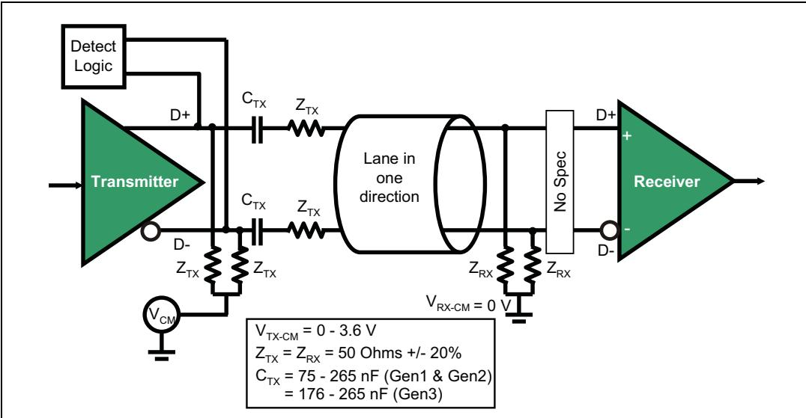

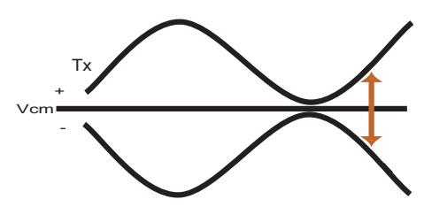

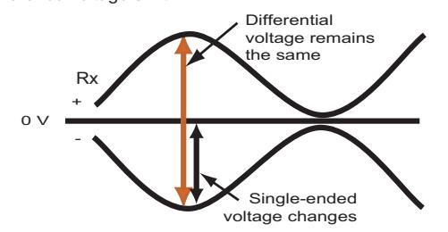

## 12.44 Clock Requirements | 12.44 时钟要求

| EN | ZH |
|---|---|
| ## Clock Requirements | ## 时钟要求 |

## 12.45 General | 12.45 概述

| EN | ZH |
| --- | --- |
| For all data rates, both Transmitter and Receiver clocks must be accurate to within +/- 300 ppm (parts per million) of the center frequency. In the worst case, the Transmitter and Receiver could both be off by 300 ppm in opposite directions, resulting in a maximum difference of 600 ppm. That worst-case model translates to a gain or loss of 1 clock every 1666 clocks and that's the difference that a Receiver's clock compensation logic must take into account. | 对于所有数据速率，发送器和接收器的时钟相对于中心频率的精度必须在 +/- 300 ppm（百万分之一）以内。在最坏情况下，发送器和接收器可能分别偏离 300 ppm 且方向相反，导致最大差异为 600 ppm。该最坏情况模型相当于每 1666 个时钟周期损失或增加 1 个时钟，这是接收器时钟补偿逻辑必须考虑到的差异。 |
| Devices are allowed to derive their clocks from an external source, and the 100 MHz Refclk is still optionally available for this purpose in the 3.0 spec. Using the Refclk permits both Link partners to readily maintain the 600 ppm accuracy even when Spread Spectrum Clocking is applied. | 允许器件从外部源导出其时钟，并且在 3.0 规范中仍可选地提供 100 MHz Refclk 用于此目的。使用 Refclk 可使链路双方即使在应用扩频时钟时也能轻松维持 600 ppm 的精度。 |

## 12.46 SSC (Spread Spectrum Clocking) | 12.46 SSC（扩频时钟）

| EN | ZH |
|----|----|
| SSC is an optional technique used to modulate the clock frequency slowly over a prescribed range to spread the signal's EMI (Electro-Magnetic Interference) across a range of frequencies rather than allowing it all to be concentrated at the center frequency. Spreading the radiated energy helps a device or system to pass government emissions standards by staying under a threshold value, as illustrated in Figure 13-4 on page 454. Note that the frequency of interest for the signal is only half the clock rate because two rising clock edges are needed to create one cycle on the data, as illustrated in Figure 13-5 on page 454. For example, a 2.5 GT/s rate uses a bit clock of 2.5 GHz, resulting in a frequency of interest on the traces of 1.25 GHz. | SSC 是一种可选技术，用于在指定范围内缓慢调制时钟频率，将信号的 EMI（电磁干扰）分散到一定频率范围内，而不是让所有能量集中在中心频率上。分散辐射能量有助于设备或系统保持在阈值以下，从而通过政府排放标准，如图 13-4（第 454 页）所示。请注意，信号关心的频率仅为时钟速率的一半，因为需要在数据上产生一个周期需要两个时钟上升沿，如图 13-5（第 454 页）所示。例如，2.5 GT/s 的速率使用 2.5 GHz 的位时钟，导致走线上关心的频率为 1.25 GHz。 |
| The use of SSC is not required by the spec but, if will be supported, the following rules apply: | 规范不要求必须使用 SSC，但如果支持，则适用以下规则： |
| The clock can be modulated by +0% to -0.5% from nominal (5000 ppm), referred to as "down spreading." A frequency modulation envelope is not specified, but a sawtooth-wave pattern like the one shown in Figure 13-6 on page 455 yields good results. Note that there is a trade-off with down spreading, because the average clock frequency will now be 0.25% lower than it would have been without SSC, resulting in a slight performance reduction. | 时钟可在标称频率的 +0% 至 -0.5%（5000 ppm）范围内调制，称为"向下扩频"。规范未指定频率调制包络线，但如图 13-6（第 455 页）所示的锯齿波模式可获得良好效果。请注意，向下扩频存在一个折衷：平均时钟频率将比不使用 SSC 时低 0.25%，从而导致轻微的性能下降。 |
| • The modulation rate must be between 30KHz and 33KHz. | • 调制速率必须在 30KHz 至 33KHz 之间。 |
| The +/- 300 ppm requirement for clock frequency accuracy still holds and therefore so does the maximum 600 ppm variation between Link partners. The spec states that most implementations will require both Link partners to use the same clock source, although it's not required. One way to do that would be for them to both use a modulated version of the Refclk to derive their own clocks (see "Common Refclk" on page 456). | 对于时钟频率精度的 +/- 300 ppm 要求仍然有效，因此链路伙伴之间的最大 600 ppm 偏差也同样适用。规范指出，大多数实现将要求两个链路伙伴使用相同的时钟源，尽管这不是强制要求。一种实现方式是两者都使用调制版本的 Refclk 来导出各自的时钟（参见第 456 页的"Common Refclk"）。 |

Figure 13-4: SSC Motivation | 图13-4：SSC动机

Figure 13-5: Signal Rate Less Than Half the Clock Rate | 图13-5：信号速率低于时钟速率的一半
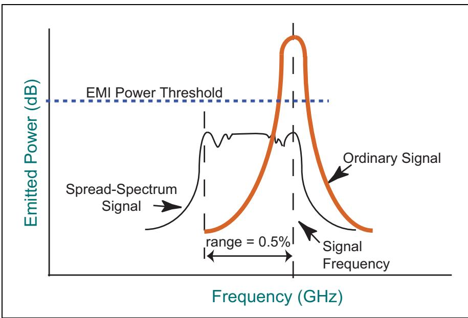

Figure 13-6: SSC Modulation Example | 图13-6：SSC调制示例
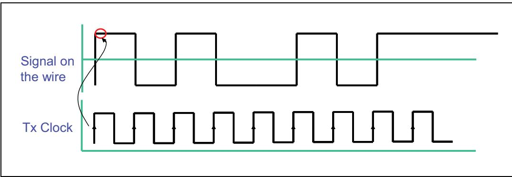

## 12.47 Refclk Overview | 12.47 Refclk 概述

| EN | ZH |
|---|---|
| Receivers must generate their own clocks to operate their internal logic, but there are some options for generating the recovered clock for the incoming bit stream. The details for them have developed with each succeeding version of the spec and are based on the data rate. | 接收器必须生成自己的时钟以运行其内部逻辑，但在为传入比特流生成恢复时钟方面存在一些选项。其细节随每个后续版本的规范而演进，并基于数据速率而定。 |

## 12.48 GT | 12.48 s

| EN | ZH |
|---|---|
| In the early spec versions using the 2.5 GT/s rate, information regarding the optional Refclk was not included in the base spec but instead in the separate CEM (Card Electro‑Mechanical) spec for PCIe. A number of parameters were specified there and several general terms have been carried forward to the newer versions of the spec. The Refclk was described as a 100 MHz differential clock driving a 100 Ω differential load (+/‑ 10%) with a trace length limited to 4 inches. SSC is allowed, as described in "SSC (Spread Spectrum Clocking)" on page 453. | 在使用 2.5 GT/s 速率的早期规范版本中，有关可选参考时钟（Refclk）的信息并未包含在基础规范中，而是放在独立的 PCIe CEM（卡机电）规范中。其中规定了若干参数，并且一些通用术语延用到了较新版本的规范中。参考时钟被描述为一个 100 MHz 差分时钟，驱动 100 Ω 差分负载（+/‑ 10%），走线长度限制在 4 英寸以内。允许使用 SSC，详见第 453 页的 "SSC（展频时钟）"。 |

## 12.49 GT | 12.49 s

| EN | ZH |
|---|---|
| When the 5.0 GT/s rate was developed, the spec writers chose to include the Refclk information in the electrical section of the base spec and listed three options for the clock architecture: | 在开发5.0 GT/s速率时，规范编写者选择将Refclk信息纳入基础规范的电气部分，并列出了三种时钟架构选项： |
| **Common Refclk.** The first architecture described is one in which both Link partners make use of the same Refclk, as shown in Figure 13-7 on page 456. There are three straightforward advantages for this implementation: | **公共Refclk.** 所描述的第一种架构是链路双方使用相同的Refclk，如第456页图13-7所示。这种实现有三个明显的优点： |
| First, the jitter associated with the reference clock is the same for both Tx and Rx and is thus tracked and accounted for intrinsically. | 第一，与参考时钟相关的抖动对发送端和接收端相同，因此可被内在跟踪和消除。 |
| Second, the use of SSC will be simplest with this model because maintaining the 600 ppm separation between the Tx and Rx clocks is easy if both follow the same modulated reference. | 第二，使用SSC在这种模式下最为简单，因为如果发送端和接收端跟随相同的调制参考，保持两者时钟之间600 ppm的间隔很容易。 |
| Third, the Refclk remains available during low-power Link states L0s and L1 and that allows the Receiver's CDR to maintain a semblance of the recovered clock even in the absence of a bit stream to supply the edges in the data. That, in turn, keeps the local PLLs from drifting as much as they otherwise would, resulting in a reduced recovery time back to L0 compared to the other clocking options. | 第三，在低功耗链路状态L0s和L1期间Refclk仍然可用，这使得接收端的CDR即使在缺少提供数据边沿的比特流时，也能保持恢复时钟的某种形态。这反过来使本地PLL不会像其他情况下那样严重漂移，从而相比其他时钟选项，恢复到L0的恢复时间更短。 |

Figure 13-7: Shared Refclk Architecture | 图13-7：共享参考时钟架构

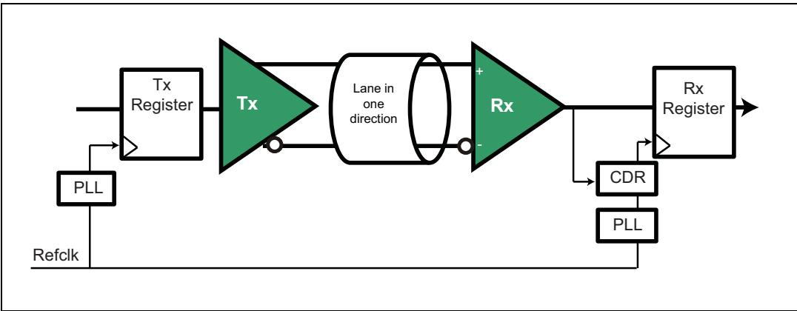

| EN | ZH |
|---|---|
| **Data Clocked Rx Architecture.** In this clock architecture, the Receiver doesn't use a reference clock at all, but simply recovers the Transmitter clock from the data stream, as shown in Figure 13-9 on page 457. This implementation is clearly the simplest of the three and would therefore ordinarily be preferred. The spec doesn't prohibit the use of SSC in this model, but doing so would bring up two issues. First, the Receiver CDR must remain locked onto the input frequency as it modulates through a much wider range (5600 ppm instead of the usual 600 ppm), and that could require more complex logic. And second, the maximum clock frequency separation of 600 ppm must still be maintained and it's less clear how that would be done without a common reference. | **数据时钟接收架构.** 在这种时钟架构中，接收端完全不使用参考时钟，而是简单地从数据流中恢复发送端时钟，如第457页图13-9所示。这种实现显然是三种中最简单的，因此通常会被优先选择。规范不禁止在这种模型中使用SSC，但这样做会带来两个问题。第一，接收端CDR必须在输入频率调制通过更宽的范围（5600 ppm而非通常的600 ppm）时保持锁定，这可能需要更复杂的逻辑。第二，600 ppm的最大时钟频率间隔仍需保持，而在没有公共参考的情况下如何做到这一点则不太明确。 |

Figure 13-8: Data Clocked Rx Architecture | 图13-8：数据时钟接收器架构

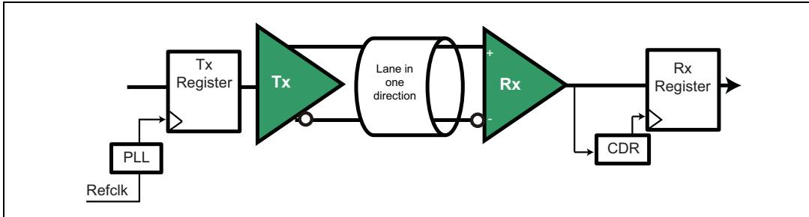

| EN | ZH |
|---|---|
| **Separate Refclks.** Finally, it's also possible for the Link partners to use different reference clocks, as shown in Figure 13-9 on page 457. However, this implementation makes substantially tighter demands on the Refclks because the jitter seen at the Receiver will be the RSS (Root Sum of Squares) combination of them both, making the timing budget difficult. It also becomes enormously more difficult to manage SSC in this model and that's why the spec states that SSC must be turned off in this case. Overall, the spec gives the impression that this is the least desirable alternative, and states that it doesn't explicitly define the requirements for this architecture. | **独立Refclks.** 最后，链路双方也可以使用不同的参考时钟，如第457页图13-9所示。然而，这种实现对Refclk提出了更严格的要求，因为接收端看到的抖动将是两者抖动的RSS（平方和根）组合，使得时序预算变得困难。在这种模式下管理SSC也变得极其困难，这就是规范规定在这种情况下必须关闭SSC的原因。总体而言，规范给人的印象是这是最不可取的选择，并指出它没有明确定义这种架构的要求。 |

Figure 13-9: Separate Refclk Architecture | 图13-9：独立参考时钟架构

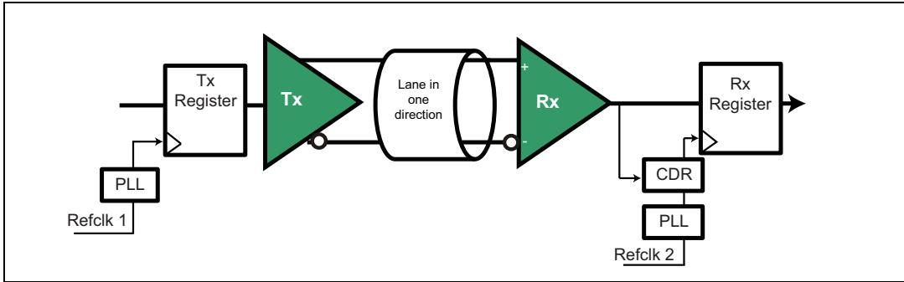

## 12.50 GT | 12.50 s

| EN | ZH |
| --- | --- |
| ## 8.0 GT/s | ## 8.0 GT/s |
| The same three clock architectures are described in the spec for this data rate, too. One difference is that two types of CDR are defined now: a 1st order CDR for the shared Refclk architecture, and a 2nd order CDR for the data clocked architecture. This just reflects the fact that, as it was for the lower data rates, the CDR for the data‐clocked architecture will need to be more sophisticated to be able to stay locked when the reference varies over a wide range for SSC. | 在该数据速率下，规范同样描述了相同的三种时钟架构。一个不同之处在于现在定义了两种类型的CDR：针对共享Refclk架构的一阶CDR，和针对数据时钟架构的二阶CDR。这仅仅反映了一个事实：与较低数据速率的情况一样，数据时钟架构的CDR需要更加复杂，以便在参考时钟因SSC发生大范围变化时能够保持锁定。 |

| EN | ZH |
|----|----|
| ## Transmitter (Tx) Specs | ## 发送器（Tx）规格 |

| English | 中文 |
|---------|------|
| **Measuring Tx Signals** | **测量发送器（Tx）信号** |
| The spec notes that the methods for measuring the Tx output are limited at the higher frequencies. At 2.5 GT/s it's possible to put a test probe very near the pins of the DUT (Device Under Test), but for the higher rates it's necessary to use a "breakout channel" with SMA (SubMiniature version A) microwave-type coaxial connectors, as illustrated at TP1 (Test Point 1), TP2, and TP3 in Figure 13-10 on page 458. Note that it's necessary to have a low-jitter clock source to the device under test, so that jitter seen at the output is only introduced by the device itself. The spec also mentions that it's important during testing for the device to have as many of its Lanes and other outputs in use at the same time as possible, so as to best simulate a real system. | 规范指出，测量发送器（Tx）输出的方法在较高频率下是有限的。在 2.5 GT/s 时，可以将测试探头非常靠近待测器件（DUT）的引脚，但对于更高速率，必须使用带有 SMA（SubMiniature version A）微波型同轴连接器的"引出通道"，如图 13-10（第 458 页）中的 TP1（测试点 1）、TP2 和 TP3 所示。需要注意，待测器件必须有一个低抖动的时钟源，以便输出端观察到的抖动仅由器件本身引入。规范还提到，在测试过程中，器件应尽可能同时使用其尽可能多的 Lane 和其他输出，以便最好地模拟真实系统。 |
| Since the breakout channel introduces some effects to the signal, for 8.0 GT/s it's necessary to be able to measure those effects and remove (de-embed) them from the signal being tested. One way to accomplish this is for the test board to supply another signal path that is very similar to the one used for the device pins. Characterizing this "replica channel" with a known signal gives the needed information about the channel, allowing its effects to be de-embedded from the DUT signals so the signal at the component pins can be recovered. | 由于引出通道会给信号引入一些影响，对于 8.0 GT/s，必须能够测量这些影响并将其从被测信号中移除（去嵌入）。实现这一目标的一种方法是让测试板提供另一条与器件引脚所用路径非常相似的信号路径。用已知信号表征这个"复制通道"可获得关于该通道的必要信息，从而将其影响从待测器件（DUT）信号中去嵌入，以便恢复器件引脚处的信号。 |

**Figure 13-10: Test Circuit Measurement Channels**
**图 13-10：测试电路测量通道**

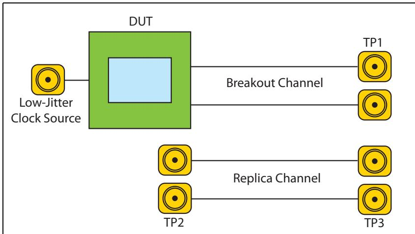

## 12.51 Tx Impedance Requirements | 12.51 发送器阻抗要求

| EN | ZH |
|---|---|
| For best accuracy, the characteristic differential impedance of the Breakout Channel should be 100 Ω differential within 10%, with a single-ended impedance of 50 Ω. To match this environment, Transmitters have a differential low-impedance value during signaling between 80 and 120 Ω at 2.5 GT/s, and no more than 120 Ω at 5.0 and 8.0 GT/s. For receivers, the single-ended impedance is 40 - 60 Ω at 2.5 or 5.0 GT/s, but for 8.0 GT/s no specific value is given. Instead, it's simply noted that the single-ended receiver impedance must be 50 Ω within 20% by the time the Detect LTSSM state is entered so that the detect circuit will sense the Receiver correctly. | 为获得最佳精度，Breakout Channel（引出通道）的特征差分阻抗应为 100 Ω（差分），容差在 10% 以内，单端阻抗为 50 Ω。为匹配该环境，发送器在 2.5 GT/s 信令时的差分低阻抗值在 80 至 120 Ω 之间，在 5.0 和 8.0 GT/s 时不超过 120 Ω。对于接收器，在 2.5 或 5.0 GT/s 时单端阻抗为 40 - 60 Ω，但在 8.0 GT/s 时未给出具体值。仅指出在进入 Detect LTSSM 状态时，接收器单端阻抗必须为 50 Ω（容差 20% 以内），以便检测电路正确感应到接收器。 |
| Transmitters must also meet the return loss parameters RLTX-DIFF and RLTX-CM anytime differential signals are sent. As a very brief introduction to this terminology, "return loss" is a measure of energy transmitted through or reflected back from a transmission path. Return loss is one of several "Scattering" parameters (S-parameters) that are used to analyze high-frequency signal environments. When frequencies are low, a lumped-element description is sufficient, but when they become high enough that the wavelength approaches the size of the circuit, a distributed model is needed and that's what S-parameters are used to represent. The spec describes a number of these to characterize a transmission path but the details of this high-frequency analysis are really beyond the scope of this book. | 发送器在发送差分信号时，还必须满足回波损耗参数 RLTX-DIFF 和 RLTX-CM。对此术语作一简要介绍："回波损耗"是衡量传输路径中能量通过或反射程度的指标。回波损耗是用于分析高频信号环境的多个"散射"参数（S 参数）之一。当频率较低时，集总元件描述就足够了；但当频率高到波长接近电路尺寸时，就需要分布式模型，而这正是 S 参数所用于表示的。规范描述了多个此类参数以表征传输路径，但高频分析的细节已超出本书范围。 |
| When a signal is not being driven, as would be the case in the low-power Link states, the Transmitter may go into a high-impedance condition to reduce the power drain. For that case, it only has to meet the I value and the differential impedance is not defined. | 当信号未被驱动时（如同低功耗链路状态下的情况），发送器可进入高阻状态以降低功耗。在这种情况下，只需满足 I 值要求，差分阻抗不作定义。 |

## 12.52 ESD and Short Circuit Requirements | 12.52 ESD 和短路要求

| EN | ZH |
|---|---|
| All signals and power pins must withstand a 2000V ESD (Electro-Static Discharge) using the Human Body Model and 500V using the Charged Device Model. For more details on these models or ESD, see the JEDEC JESE22-A114-A spec. | 所有信号和电源引脚必须承受使用人体模型(Human Body Model)的 2000V ESD（静电放电）和使用充电器件模型(Charged Device Model)的 500V ESD。有关这些模型或 ESD 的更多详细信息，请参阅 JEDEC JESE22-A114-A 规范。 |
| The ESD requirement not only protects against electro-static damage, but facilitates support of surprise hot insertion and removal events (adding or removing an add-in card while the power is on). That goal also motivates the requirement that Transmitters and Receivers be able to withstand sustained short-circuit currents of I (see Table 13-5 on page 498). | ESD 要求不仅防止静电损伤，还便于支持意外热插拔事件（在电源开启时添加或移除插卡）。该目标也促使要求发送器(Transmitters)和接收器(Receivers)能够承受持续的短路电流 I（参见第 498 页表 13-5）。 |

| EN | ZH |
|---|---|
| ## Receiver Detection | ## 接收器检测 |

| EN | ZH |
|----|----|
| ## General | ## 概述 |
| The Detect block in the Transmitter shown in Figure 13‐11 on page 461 is used to check whether a Receiver is present at the other end of the Link after coming out of reset. This step is a little unusual in the serial transport world because it's easy enough to send packets to the Link partner and test its presence by whether or not it responds. The motivation for this approach in PCIe, however, is to provide an automatic hardware assist in a test environment. If the proper load is detected, but the Link partner refuses to send TS1s and participate in Link Training, the component will assume that it must be in a test environment and will begin sending the Compliance Pattern to facilitate testing. Since a Link will always start operation at 2.5 GT/s after a reset or power‐up event, Detect is only used for the 2.5 GT/s rate. That's why the Receiver's single‐ended DC impedance is specified for that rate (Z_RX-DC = 40 to 60 Ω), and why the Detect logic must be included in every design regardless of its intended operating speed. | 发送器中的检测模块（如图13‐11，第461页所示）用于在退出复位后检查链路另一端是否存在接收器。这一步骤在串行传输领域有些不寻常，因为向链路伙伴发送数据包并通过其是否响应来测试其存在是相当容易的。然而，PCIe中采用这种方法的原因是为了在测试环境中提供自动硬件辅助。如果检测到正确的负载，但链路伙伴拒绝发送TS1序列并参与链路训练，则该组件将假定其必定处于测试环境中，并开始发送一致性测试码型以辅助测试。由于链路在复位或上电事件后总是以2.5 GT/s速率开始运行，因此检测仅用于2.5 GT/s速率。这就是为什么接收器的单端DC阻抗针对该速率进行了规定（Z_RX-DC = 40至60 Ω），以及为什么无论设计的目标工作速率如何，每个设计中都必须包含检测逻辑。 |
| Detection is accomplished by setting the Transmitter's DC common mode voltage to one value and then changing it to another. Knowing the expected charge time when a Receiver is present, the logic compares the measured time against that. If a Receiver is attached, the charge time (RC time constant) is relatively long due to the Receiver's termination. Otherwise, the charge time is much shorter. | 检测通过将发送器的DC共模电压设置为一个值，然后将其更改为另一个值来实现。根据接收器存在时的预期充电时间，逻辑将测量到的时间与之比较。如果连接了接收器，由于接收器的端接，充电时间（RC时间常数）相对较长；否则，充电时间要短得多。 |

## 12.53 Detecting Receiver Presence | 12.53 检测接收端是否存在

| EN | ZH |
|---|---|
| 1. After reset or power-up, Transmitters drive a stable voltage on the D+ and D- terminal. | 1. 复位或上电后，发送器在 D+ 和 D- 端上驱动一个稳定的电压。 |
| 2. Transmitters then change the common mode voltage in a positive direction by no more than the VTX-RCV-DETECT amount of 600mV specified for all three data rates. | 2. 然后发送器将共模电压正向改变，幅度不超过针对所有三种数据速率所规定的 600mV 的 VTX-RCV-DETECT 值。 |
| 3. Detect logic measures the charge time: | 3. 检测逻辑测量充电时间： |
| — Receiver is absent if the charge time is short. | — 若充电时间短，则接收端不存在。 |
| — Receiver is present if the charge time is long (dominated by the series capacitor and Receiver termination). | — 若充电时间长（由串联电容和接收端端接主导），则接收端存在。 |
| The spec mentions a possible problem here: the proper load may appear on one of the differential signals but not the other, and if detection doesn't check both it could misinterpret the situation. The simple way to avoid that would be to perform the Detect operation on both D+ and D-. The 3.0 spec does not require this, but mentions that future spec revisions may. Therefore, it would be wise to include this functionality in new designs. | 规范在此处提到了一个可能的问题：正确的负载可能出现在其中一个差分信号上而非另一个，若检测未对两者都进行检查，则可能误判情况。避免该问题的简单方法是对 D+ 和 D- 都执行检测操作。3.0 规范未对此作出要求，但提到未来规范修订版可能会要求。因此，在新设计中包含此功能将是明智之举。 |

Figure 13-11: Receiver Detection Mechanism | 图13-11：接收器检测机制

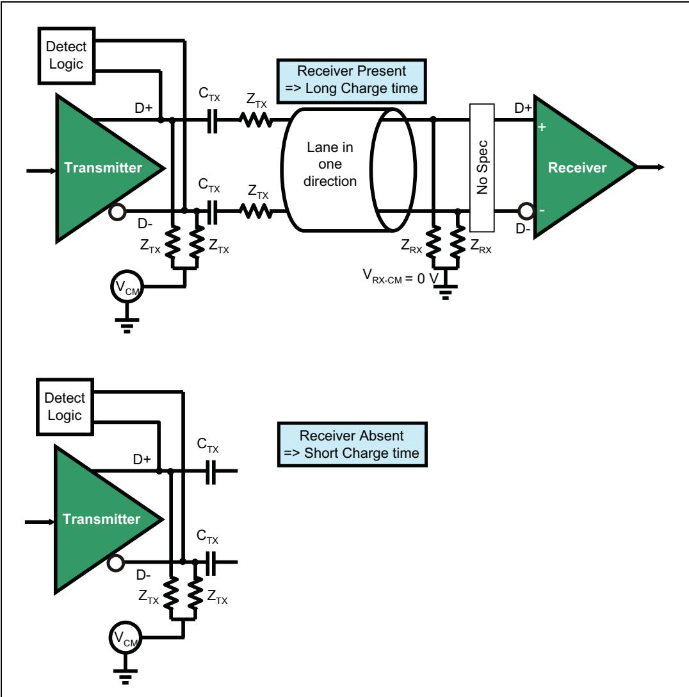

## 12.54 Transmitter Voltages | 12.54 发送器电压

| EN | ZH |
|---|---|
| Differential signaling (as opposed to the single-ended signaling employed in PCI and PCI-X) is ideal for high frequency signaling. Some advantages of differential signaling are: | 差分信令（区别于 PCI 和 PCI-X 中使用的单端信令）非常适合高频信令。差分信令的一些优点如下： |
| Receivers look at the difference between the signals, so the voltage swing for each one individually can be smaller, allowing higher frequencies without exceeding the power budget. | 接收器关注的是信号之间的差值，因此每个信号的电压摆幅可以更小，从而在不超过功耗预算的前提下实现更高的频率。 |
| EMI is reduced because of the noise cancellation that results from having the two signals side by side, using opposite-polarity voltages. | EMI 得以降低，因为两个信号并排传输且使用极性相反的电压，从而产生噪声抵消的效果。 |
| Noise immunity is very good, because noise that affects one signal will also affect the other in the same way, with the result that the Receiver doesn't notice the change (refer to Figure 13-3 on page 452). | 抗噪能力非常出色，因为影响一个信号的噪声也会以相同方式影响另一个信号，结果是接收器察觉不到这种变化（参见第 452 页的图 13-3）。 |

| EN | ZH |
|---|---|
| ## DC Common Mode Voltage | ## 直流共模电压 |
| After the Detect state of Link training, the Transmitter DC common mode voltage V (see Table 13‐3 on page 489) must remain at the same voltage. The common mode voltage is turned off only in the L2 or L3 low‑power Link states, in which main power to the device is removed. A designer can choose any common mode voltage in the range from 0 to 3.6V. | 链路训练的Detect状态之后，发送器直流共模电压V（参见第489页表13-3）必须保持在同一电压。共模电压仅在L2或L3低功耗链路状态下关闭，此时器件的主电源被移除。设计者可以选择0至3.6V范围内的任意共模电压。 |

## 12.55 Full-Swing Differential Voltage | 12.55 全摆幅差分电压

| EN | ZH |
| --- | --- |
| The Transmitter output consists of two signals, D+ and D‐, that are identical but use opposite polarities. A logical one is indicated when the D+ signal is high and the D‐ signal low, while a logical zero is represented by driving the D+ signal low and the D‐ signal high, as shown in Figure 13‐13 on page 464. | 发送器输出由两个信号 D+ 和 D- 组成，这两个信号相同但极性相反。当 D+ 信号为高电平、D- 信号为低电平时表示逻辑 1，而当 D+ 信号为低电平、D- 信号为高电平时表示逻辑 0，如图 13-13 第 464 页所示。 |
| The differential peak‐to‐peak voltage driven by the Transmitter VTX‐DIFFp‐p (see Table 13‐3 on page 489) is between 800 mV and 1200 mV (1300 mV for 8.0 GT/s). | 发送器驱动的差分峰峰值电压 VTX-DIFFp-p（参见表 13-3 第 489 页）介于 800 mV 至 1200 mV 之间（8.0 GT/s 时为 1300 mV）。 |
| • Logical 1 is signaled with a positive differential voltage. • Logical 0 is signaled with a negative differential voltage. | • 逻辑 1 通过正差分电压信号表示。 • 逻辑 0 通过负差分电压信号表示。 |
| During Electrical Idle the Transmitter holds the differential peak voltage VTX‐ (see Table 13‐3 on page 489) very near zero (0‐20 mV). During this time the Transmitter may be in either a low‐ or high‐impedance state. | 在电气空闲期间，发送器将差分峰值电压 VTX-（参见表 13-3 第 489 页）维持在非常接近零的值（0-20 mV）。在此期间，发送器可处于低阻抗或高阻抗状态。 |
| The Receiver senses a logical one or zero, as well as Electrical Idle, by evaluating the voltage on the Link. The signal loss expected at high frequency means the Receiver must be able to sense an attenuated version of the signal, defined as $\mathrm { V _ { R X - D I F F p - p } }$ (see Table 13‐5 on page 498). | 接收器通过评估链路上的电压来检测逻辑 1 或 0，以及电气空闲。在高频下预期的信号衰减意味着接收器必须能够检测到信号的衰减版本，定义为 $\mathrm{V_{RX-DIFFp-p}}$（参见表 13-5 第 498 页）。 |

Figure 13‐12: Differential Signaling | 图13‐12：差分信令  

| EN | ZH |
|---|---|
| ## Differential Notation  A differential signal voltage is defined by taking the difference in the voltage on the two conductors, D+ and D‐. The voltage with respect to ground on each conductor is $\mathrm { V _ { D + } }$ and $\mathrm { V } _ { \mathrm { D } } .$ . The differential voltage is given by $\mathrm { V _ { D I F F } = V _ { D + } - V _ { D } } .$ The Common Mode voltage, $\mathrm { V } _ { \mathrm { C M } } ,$ is defined as the voltage around which the signal is switching, which is the mean value given by $\mathrm { V } _ { \mathrm { C M } } { } ^ { = } \left( \mathrm { V } _ { \mathrm { D } + } { } ^ { + } \mathrm { V } _ { \mathrm { D } - } \right) / 2$ | ## 差分符号  差分信号电压定义为两条导线 D+ 和 D- 上电压的差值。每条导线相对于地的电压分别为 $\mathrm { V _ { D + } }$ 和 $\mathrm { V } _ { \mathrm { D } } .$ 。差分电压由 $\mathrm { V _ { D I F F } = V _ { D + } - V _ { D } } .$ 给出。共模电压 $\mathrm { V } _ { \mathrm { C M } } ,$ 定义为信号翻转所围绕的电压，即由 $\mathrm { V } _ { \mathrm { C M } } { } ^ { = } \left( \mathrm { V } _ { \mathrm { D } + } { } ^ { + } \mathrm { V } _ { \mathrm { D } - } \right) / 2$ 给出的平均值。 |
| The spec uses two terms when discussing differential voltages and confusion sometimes arises as a result. As illustrated in Figure 13‐13 on page 464, the Peak value is the maximum voltage difference between the signals, while the Peak‐to‐Peak voltage is that value plus the maximum in the opposite direction. For a symmetric signal, the Peak‐to‐Peak value is simply twice the Peak value. | 规范在讨论差分电压时使用了两个术语，有时会引起混淆。如图 13‐13（第 464 页）所示，峰值（Peak）是信号之间的最大电压差，而峰峰值（Peak‐to‐Peak）是该值加上反方向的最大值。对于对称信号，峰峰值正好是峰值的两倍。 |
| 1. Differential Peak Voltage $\Rightarrow \mathrm { \Delta V _ { D I F F p } = ( m a x \mid V _ { D + } - V _ { D - } \mid ) }$  2. Differential Peak‐to‐Peak Voltage $\Rightarrow \mathrm { V _ { D I F F p - p } } = 2 \ ^ { * } ( \mathrm { m a x } \ | \mathrm { V _ { D + } } - \mathrm { V _ { D - } } \ | )$ | 1. 差分峰值电压 $\Rightarrow \mathrm { \Delta V _ { D I F F p } = ( m a x \mid V _ { D + } - V _ { D - } \mid ) }$  2. 差分峰峰值电压 $\Rightarrow \mathrm { V _ { D I F F p - p } } = 2 \ ^ { * } ( \mathrm { m a x } \ | \mathrm { V _ { D + } } - \mathrm { V _ { D - } } \ | )$ |
| As an example, assume $\mathrm { V } _ { \mathrm { C M } } = 0 \mathrm { V } ,$ then if the D+ value is 300mV and the Dvalue is ‐300mV, then V would be $3 0 0 - ( - 3 0 0 ) = 6 0 0$ mV for a logical one. Similarly, it would be (‐300) ‐ (+300) = ‐600 mV for a logical zero. The $\mathrm { V _ { D I F F p - p } }$ for this symmetric case would be 1200 mV. The allowed $\mathrm { V _ { D I F F p - p } }$ range for 2.5 GT/s and 5.0 GT/s is 800 to 1200 mV, while for 8.0 GT/s it is 800 to 1300 mV before equalization is applied. | 例如，假设 $\mathrm { V } _ { \mathrm { C M } } = 0 \mathrm { V } ,$ 如果 D+ 值为 300mV，D- 值为 -300mV，则逻辑 1 的 V 值为 $3 0 0 - ( - 3 0 0 ) = 6 0 0$ mV。类似地，逻辑 0 的值为 (‐300) ‐ (+300) = ‐600 mV。此对称情况下的 $\mathrm { V _ { D I F F p - p } }$ 为 1200 mV。2.5 GT/s 和 5.0 GT/s 允许的 $\mathrm { V _ { D I F F p - p } }$ 范围为 800 到 1200 mV，而 8.0 GT/s 在均衡前的范围为 800 到 1300 mV。 |

Figure 13‐13: Differential Peak‐to‐Peak $( \mathrm { V _ { D I F F p - p } } )$ and Peak $( \mathrm { V _ { D I F F p } } )$ Voltages | 图13‐13：差分峰峰值 $(V_{DIFFp-p})$ 和峰值 $(V_{DIFFp})$ 电压  

| EN | ZH |
|---|---|
| The full-swing voltage is needed for channels that are long or otherwise lossy, and Transmitters are required to support it. But when the signal environment is short and low loss, a high voltage is unnecessary and a power savings can be realized by reducing it. With this in mind, the spec for 2.5 GT/s and 5.0 GT/s defines another, reduced-swing voltage for power-sensitive systems where a short channel is being used. In this mode the voltage is reduced to about half of its full-swing range. Support for this operation is optional, and the means for selecting it is not defined and will be implementation specific. | 全摆幅电压对于较长或有损耗的信道是必需的，发送器必须支持它。但当信号环境短且低损耗时，高电压是不必要的，通过降低电压可以实现功耗节省。基于此，2.5 GT/s和5.0 GT/s的规范为使用短信道的功耗敏感系统定义了另一种低摆幅电压。在此模式下，电压降低到其全摆幅范围的大约一半。对此操作的支持是可选的，选择它的方式未定义，将由具体实现决定。 |
| The same is true for 8.0 GT/s signaling, except that in this case it's achieved by using a limited range of coefficients. For example, the maximum boost for the reduced-swing case is limited to 3.5 dB. As with the lower data rates, support for this voltage model is optional, but now the means of achieving it is straightforward: just set the Tx coefficient values to make it happen. | 8.0 GT/s信令也是如此，不同之处在于它是通过使用有限范围的系数来实现的。例如，低摆幅情况下的最大提升限制为3.5 dB。与较低数据速率一样，对此电压模型的支持是可选的，但现在实现它的方式很直接：只需设置发送器（Tx）系数值即可实现。 |
| It should be noted that the Receiver voltage levels are independent of the transmitter, which is intuitively what we'd expect: the received signal always needs to meet the normal requirements and so the Transmitter and channel must be designed to guarantee that it will. | 应注意，接收器电压电平与发送器无关，这直观上符合我们的预期：接收到的信号始终需要满足正常要求，因此发送器和信道必须设计为保证这一点。 |

## 12.56 Equalization Voltage | 12.56 均衡电压

| EN | ZH |
|----|----|
| In the interest of maintaining a good flow in this section, this large topic is covered separately in the section called "Signal Compensation" on page 468. | 为保持本节的连贯性，这个较大的主题单独在第468页的"信号补偿"一节中阐述。 |

## 12.57 Voltage Margining | 12.57 电压裕量调节

## 12.58 Voltage Margining | 12.58 电压裕量调节

| EN | ZH |
|---|---|
| The concept of margining is that Transmitter characteristics like output voltage can be adjusted across a wide range of values during testing to determine how well it can handle a signaling environment. The 2.5 GT/s rate didn't include this capability, but voltage margining was added with the 5.0 GT/s rate and must be implemented by Transmitters that use that rate or higher. Other parameters, like de-emphasis or jitter can optionally be margined as well. The granularity for the margining adjustments must be controllable on a Link basis and may be controllable on a Lane basis. This control is accomplished by means of the Link Control 2 register in the PCIe Capability register block. The transmit margin field, shown in Figure 13-14 on page 465, contains 3 bits and can thus represent 8 levels. Their values are not defined, and not all of them need to be implemented. The default value is all zeros, which represents the normal operating range. | 裕量调节的概念是指：在测试过程中，发送器特性（如输出电压）可以在较大范围内进行调整，以确定其处理信号环境的能力。2.5 GT/s速率未包含此能力，但电压裕量调节随5.0 GT/s速率一同引入，并且使用该速率或更高速率的发送器必须实现此功能。其他参数（如去加重或抖动）也可选择性地进行裕量调节。裕量调节的粒度必须在链路级别可控，并可在通道级别可控。该控制通过PCIe能力寄存器块中的链路控制2寄存器来实现。如图13-14（第465页）所示的发送裕量字段包含3位，因此可表示8个级别。这些值未作定义，且不必全部实现。默认值为全零，表示正常工作范围。 |
| It's important to note that this field is only intended for debug and compliance testing purposes during which software is only allowed to modify it during those times. At all other times, the value is required to be set to the default of all zeros. | 需要特别注意的是，该字段仅用于调试和一致性测试目的，在此期间软件才允许修改它。在其他所有时间，该值必须设置为默认的全零。 |

Figure 13-14: Transmit Margin Field in Link Control 2 Register | 图13-14：链路控制2寄存器中的发送裕量字段  

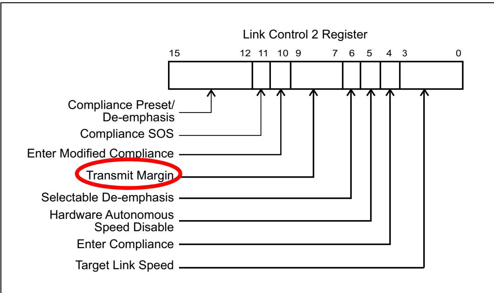

## 12.59 PCI Express Technology | 12.59 PCI Express 技术

| EN | ZH |
|---|---|
| For 8.0 GT/s, transmitters are required to implement voltage margining and use the same field in the Link Control 2 register, but equalization adds some constraints to the options because it can't require finer coefficient or preset resolution than the 1/24 resolution defined for normal operation. | 对于 8.0 GT/s，发送器必须实现电压裕度（voltage margining）并使用 Link Control 2 寄存器中的相同字段，但均衡化对选项增加了一些约束，因为它不能要求比正常操作定义的 1/24 分辨率更细的系数或预置分辨率。 |
| During Tx margining the equalization tolerance for 2.5 GT/s and 5.0 GT/s is relaxed from +/- 0.5 dB to +/- 1.0 dB. For the 8.0 GT/s rate, the tolerance is defined by the coefficient granularity and the normal equalizer tolerances specified for the transmitter. | 在发送端裕度（Tx margining）期间，2.5 GT/s 和 5.0 GT/s 的均衡容差从 +/- 0.5 dB 放宽至 +/- 1.0 dB。对于 8.0 GT/s 速率，容差由系数粒度（coefficient granularity）和发送器指定的正常均衡器容差共同定义。 |

| EN | ZH |
|---|---|
| ## Receiver (Rx) Specs | ## 接收器（Rx）规格 |

## 12.60 Receiver Impedance | 12.60 接收器阻抗

| EN | ZH |
|---|---|
| Receivers are required to meet the RLRX‐DIFF and $\mathrm { R L } _ { \mathrm { R X - C M } }$ (see Table 13‐5 on page 498) parameters unless the device is powered down, as it would be, for example, in the L2 and L3 power states or during a Fundamental Reset. In those cases, a Receiver goes to the high impedance state and must meet the ZRX‐HIGH‐IMP‐DC‐NEG and ZRX‐HIGH‐IMP‐DC‐NEG parameters. | 接收器必须满足 RLRX‐DIFF 和 $\mathrm { R L } _ { \mathrm { R X - C M } }$（参见第 498 页表 13-5）参数，除非设备处于断电状态，例如处于 L2 和 L3 电源状态或进行基本复位时。在这些情况下，接收器进入高阻抗状态，并且必须满足 ZRX‐HIGH‐IMP‐DC‐NEG 和 ZRX‐HIGH‐IMP‐DC‐NEG 参数。 |
| (See Table 13‐5 on page 498.) | （参见第 498 页表 13-5。） |

## 12.61 Receiver DC Common Mode Voltage | 12.61 接收器 DC 共模电压

| EN | ZH |
| --- | --- |
| The Receiver's DC common mode voltage is specified to be 0V for all data rates, and that's represented in Figure 13-15 on page 467 by showing the signal terminations connected to ground. The $C _ { \mathrm { T } \mathrm { X } }$ in-line capacitor permits this voltage to be something different at the Transmitter, which is specified to be in the range from 0 - 3.6V. That's not as interesting when the Transmitter and Receiver are in the same enclosure and have the same power supply, but if they're connected over a cable and reside in different machines with different power supplies it becomes more important. In that case it's difficult to avoid reference voltage differences between the machines and, since the signal voltages are already small, such a difference could make the signal difficult to recognize at the Receiver. The location of this capacitor must be near the Transmitter pins when a connector of some kind will be used but, if there's no connector, it can be located at any convenient place on the transmission line. Although it could be integrated into a device, it's expected that $C _ { \mathrm { T } \mathrm { X } }$ will be external because it would be too big to integrate. | 对于所有数据速率，接收器的直流共模电压规定为0V，图13-15（第467页）中通过将信号终端连接到地来表示这一点。$C _ { \mathrm { T } \mathrm { X } }$ 串联电容允许该电压在发送器侧有所不同，发送器侧的电压规定范围为0-3.6V。当发送器和接收器位于同一机箱内且共用同一电源时，这一点并不那么重要；但如果它们通过线缆连接且位于不同机器中（使用不同电源），则变得更为关键。在这种情况下，很难避免机器之间的参考电压差异，而且由于信号电压已经很小，这种差异可能导致接收器难以识别信号。当使用某种连接器时，该电容必须靠近发送器引脚放置；如果没有连接器，则可以放置在传输线上的任何方便位置。虽然它可以集成到器件内部，但预计 $C _ { \mathrm { T } \mathrm { X } }$ 将外置，因为它体积太大无法集成。 |
| The drawing in Figure 13-15 on page 467 also shows an optional set of resistors at the Receiver, labeled as "No Spec" because they are not mentioned in the spec. The story here is that Receiver designers dislike using a common-mode voltage of zero for the simple reason that it usually requires them to implement two reference voltages, one above zero and one below it. A preferred implementation offsets the signal entirely above or below zero, so that only one reference voltage is needed. The circuit shown within the dotted line accomplishes this by adding a small-value in-line capacitor to de-couple the DC component of the signal on the wire from that of the Receiver itself. Then, a resistor ladder serves to offset the Receiver's common-mode voltage in one direction or the other to accomplish the goal. | 图13-15（第467页）中的示意图还显示了一组可选的接收器电阻，标有"未规定(No Spec)"，因为规范中并未提及它们。原因是接收器设计人员不喜欢使用零共模电压，原因很简单：这通常要求他们实现两个参考电压，一个高于零、一个低于零。更优选的实现方式是将信号完全偏移到零以上或零以下，从而只需一个参考电压。虚线框内所示的电路通过添加一个小值串联电容来实现这一点，该电容将导线上信号的直流分量与接收器自身的直流分量去耦。然后，电阻分压网络用于将接收器的共模电压向某一方向偏移，以达到目标。 |

Figure 13-15: Receiver DC Common-Mode Voltage Adjustment | 图13-15：接收器DC共模电压调整

## 12.62 Transmission Loss | 12.62 传输损耗

| EN | ZH |
|---|---|
| The Transmitter drives a minimum differential peak‑to‑peak voltage $\mathrm { V _ { T X - D I F F p - p } }$ of 800 mV. The Receiver sensitivity is designed for a minimum differential peak‑to‑peak voltage (VRX‐DIFFp‐p) of 175 mV. This translates to a 13.2dB loss budget that a Link is designed for. Although a board designer can determine the attenuation loss budget of a Link plotted against various frequencies, the Transmitter and Receiver eye diagram measurement are the ultimate determinant of loss budget for a Link. Eye diagrams are described in "Eye Diagram" on page 485. A Transmitter that drives up to the maximum allowed differential peak‑to‑peak voltage of 1200 mV can compensate for a lossy Link that has worst‑case attenuation characteristics. | 发送器驱动的最小差分峰峰值电压 $\mathrm { V _ { T X - D I F F p - p } }$ 为 800 mV。接收器灵敏度设计的最小差分峰峰值电压 (VRX‐DIFFp‐p) 为 175 mV。这相当于链路设计所对应的 13.2dB 损耗预算。虽然电路板设计者可以根据不同频率绘制链路的衰减损耗预算曲线，但发送器和接收器的眼图测量才是决定链路损耗预算的最终依据。眼图在第 485 页的"眼图"一节中描述。发送器可驱动高达最大允许差分峰峰值电压 1200 mV，从而能够补偿具有最差衰减特性的有损链路。 |

## 12.63 AC Coupling | 12.63 交流耦合

| EN | ZH |
|---|---|
| PCI Express requires in‐line AC‐coupling capacitors be placed on each Lane, usually near the Transmitter. | PCI Express 要求在每一条 Lane 上放置串联交流耦合电容，通常靠近发送器。 |
| The capacitors can be integrated onto the system board, or integrated into the device itself, although the large size they would need makes that unlikely. | 这些电容可以集成在系统板上，也可以集成到器件内部，尽管它们所需的较大尺寸使得后者不太可能实现。 |
| An add‐in card with a PCI Express device on it must place the capacitors on the card close to the Transmitter or integrate the capacitors into the PCIe silicon. | 带有 PCI Express 器件的附加卡必须将电容放置在靠近发送器的卡上，或者将电容集成到 PCIe 硅片中。 |
| These capacitors provide DC isolation between two devices on both ends of a Link thus simplifying device design by allowing devices to use independent power and ground planes. | 这些电容在链路两端的两个器件之间提供直流隔离，从而通过允许器件使用独立的电源层和地层来简化器件设计。 |

| EN | ZH |
|---|---|
| ## Signal Compensation | ## 信号补偿 |

| EN | ZH |
|---|---|
| ## De-emphasis Associated with Gen1 and Gen2 PCIe | ## 与Gen1和Gen2 PCIe相关的去加重 |
| For 2.5 GT/s and 5.0 GT/s transmission, PCIe mandates the use of a fairly simply form of Transmitter equalization called de‑emphasis to reduce the effects of signal distortion along the Link transmission line. This distortion problem is always present but gets worse with increased frequency and lossy transmission lines. | 对于2.5 GT/s和5.0 GT/s的传输，PCIe强制要求使用一种相当简单的发射器均衡形式，称为去加重，以减少链路传输线上信号失真的影响。这种失真问题始终存在，但会随着频率增加和有损传输线而变得更加严重。 |

## 12.64 The Problem | 12.64 问题

| EN | ZH |
| --- | --- |
| As data rates get higher, the Unit Interval (UI — bit time) becomes smaller, with the result that it's increasingly difficult to avoid having the value in one bit time affect the value in another bit time. The channel always resists changes to the voltage level, The faster we attempt to switch voltage, the more pronounced that effect becomes. However, when a signal has been held at the same voltage for several bit times, as when sending several bits in a row of the same polarity, the channel has more time to approach the target voltage. The resulting higher voltage makes it difficult to change to the opposite value within the required time when the polarity does change. This problem of previous bits affecting subsequent bits is referred to as ISI (inter-symbol interference). | 随着数据速率的提高，单位间隔（UI — 位时间）变得更小，导致越来越难以避免一个位时间的值影响另一个位时间的值。信道总是抵抗电压电平的变化，我们尝试切换电压的速度越快，这种效应就越明显。然而，当信号在几个位时间内保持相同电压时，例如连续发送几个相同极性的位，信道有更多时间趋近目标电压。由此产生的较高电压使得当极性确实发生变化时，难以在所需时间内切换到相反的值。这种前导位影响后续位的问题称为ISI（码间干扰）。 |

| EN | ZH |
| --- | --- |
| ## How Does De-Emphasis Help? | ## 去加重有何作用？ |
| De‐emphasis reduces the voltage for repeated bits in a bit stream. Although it sounds counter‐intuitive at first because this reduces the signal swing and thus the energy that reaches the Receiver, reducing the Transmitter voltage for these cases can substantially improve signal quality. Figure 13‐16 on page 469 illustrates how this works by showing a Transmitter output of ‘1000010000’, where the repeated bits of the same polarity have been de‐emphasized. De‐emphasis can be thought of as a two‐tap Tx equalizer, and some rules related to it are: | 去加重会降低比特流中重复比特的电压。虽然这乍听起来有违直觉，因为这会减小信号摆幅，从而降低到达接收器的能量，但在这些情况下降低发送器电压可以显著改善信号质量。第469页的图13‐16通过显示发送器输出‘1000010000’（其中相同极性的重复比特已被去加重）来说明其工作原理。去加重可视为一种双抽头发送器均衡器，相关规则如下： |
| When the signal changes to the opposite polarity of the preceding bit it's not de‐emphasized, but uses the peak‐to‐peak differential voltage as specified by VTX‐DIFFp‐p (see Table 13‐3 on page 489). | 当信号变为与前一个比特相反的极性时，不被去加重，而是使用VTX‐DIFFp‐p规定的峰峰值差分电压（见第489页的表13‐3）。 |
| • The first bit of a series of same polarity bits is not de‐emphasized. | • 一系列相同极性比特中的第一个比特不被去加重。 |
| • Only subsequent bits of the same polarity after the first bit are de‐emphasized. | • 只有第一个比特之后相同极性的后续比特才被去加重。 |
| The de‐emphasized voltage is reduced by 3.5 dB from normal for 2.5 GT/s, which translates to about a one‐third reduction in voltage. | 对于2.5 GT/s，去加重电压比正常值降低3.5 dB，相当于电压降低约三分之一。 |
| • The Beacon signal is de‐emphasized, too, but uses slightly different rules. (see "Beacon Signaling" on page 483). | • Beacon信号也会被去加重，但使用略有不同的规则。（见第483页的"Beacon信令"）。 |

Figure 13‐16: Transmission with De‐emphasis | 图13‐16：带去加重的传输
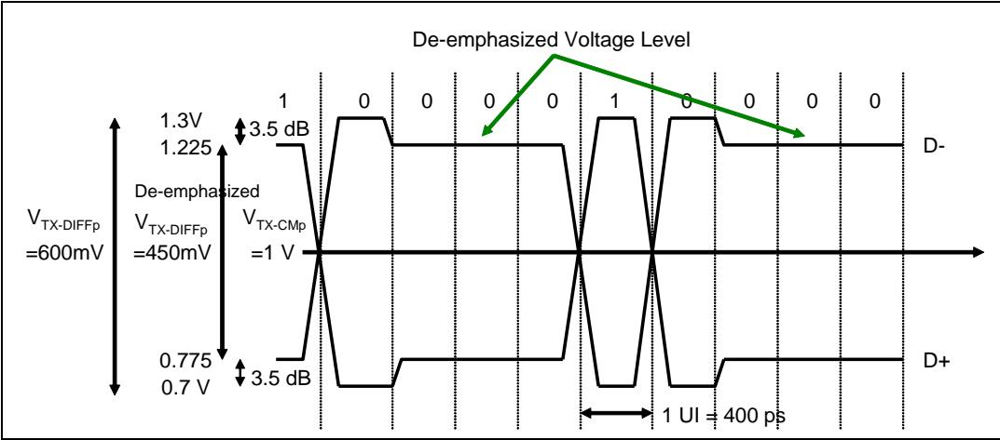

| EN | ZH |
|---|---|
| ## Solution for 2.5 GT/s | ## 2.5 GT/s的解决方案 |
| For 2.5 GT/s, each subsequent bit transmitted after the first bit of the same polarity must be de‑emphasized by 3.5dB to accommodate this worst‑case loss budget. Of course, for low‑loss environments this is less important and for a very short path it can even make the received signal look worse. After all, de‑emphasis is essentially distorting the transmitted signal in the opposite way of the distortion that is expected during transmission so as to cancel it out. If there turns out to be little or no distortion, then de‑emphasis will make the signal look worse. The spec doesn’t describe any way to test the signal environment or adjust the de‑emphasis level, but doesn’t prohibit a designer from developing an implementation‑specific method of doing so. | 对于2.5 GT/s，在发送相同极性的第一位之后，后续发送的每一位都必须进行3.5dB的去加重，以适应这一最坏情况下的损耗预算。当然，对于低损耗环境，这就不那么重要了，而对于非常短的路径，它甚至可能使接收信号变得更差。毕竟，去加重本质上是以与传输过程中预期的失真相反的方式来扭曲发送信号，从而抵消失真。如果实际失真很小或没有失真，那么去加重反而会使信号变得更差。规范没有描述任何测试信号环境或调整去加重级别的方法，但也不禁止设计人员开发实现特定的方法来实现这一点。 |
| An example of the benefit of de‑emphasis is shown in Figure 13‑17 on page 471, which is a scope capture converted into a drawing for clarity. The captures were taken from a device driving a long path and using a bit stream with several repeated bits to show the signal distortion. The trace at the top shows that the bit pattern for one side of the differential pair (also called a single‑ended signal) has 2 bits of one polarity followed by 5 bits of the opposite polarity. Five consecutive bits is the worst case for 8b/10b, and this particular pattern only appears in a few characters like the COM character. The channel resists high‑speed changes but will continue to charge up if the driver keeps trying to reach a higher voltage and that can be seen in this example. When the bits aren’t repeated there isn’t time for the voltage to go as far, but repeated bits give more time for the change. The problem this creates is seen in the bit following the 5th in a row (highlighted in the oval), which fails to reach a good signal value during its UI because the voltage difference was too large to overcome in that short time. The difference between the value it reaches and the value it should have reached is shown by the line marking the level reached by other bits that aren’t experiencing as much ISI. | 去加重优势的一个示例如图13-17（第471页）所示，该图为清晰起见由示波器捕获图转换而成。这些捕获图来自驱动长路径的设备，使用了包含多个重复比特的比特流来显示信号失真。顶部的迹线显示，差分对一侧（也称为单端信号）的比特模式具有2个相同极性的比特，随后是5个相反极性的比特。五个连续比特是8b/10b的最坏情况，这种特定模式仅出现在少数几个字符中，如COM字符。信道会阻碍高速变化，但如果驱动器持续试图达到更高电压，信道将继续充电，这一点可在本例中看到。当比特不重复时，电压没有足够时间达到更高水平，但重复比特为电压变化提供了更多时间。由此产生的问题体现在连续第5个比特之后的那个比特上（椭圆突出显示），该比特在其UI期间未能达到良好的信号值，因为电压差太大，无法在如此短的时间内克服。该比特达到的值与其应达到的值之间的差异，由标记其他未经历过多ISI的比特所达到电平的线条表示。 |

Figure 13‑17: Benefit of De‑emphasis at the Receiver | 图13‑17：接收器处去加重的优势  

| EN | ZH |
|---|---|
| In the lower half of the illustration, a de‑emphasized version of the signal is captured and compared to the original. Here we can see that reducing the voltage for repeated bits prevents the voltage from charging up as much and results in a cleaner signal because the bits that follow are not influenced as much by the previous bits. For both the 2 consecutive bits and then the 5 consecutive bits, the over‑charging problem is reduced, which improves the timing jitter as well as the voltage levels. Consequently, the troublesome bit looks much better with de‑emphasis turned on and the received signal approaches the normal voltage swing in that bit time. | 在图示的下半部分，捕获了信号的去加重版本并与原始信号进行比较。这里我们可以看到，降低重复比特的电压可以防止电压过度充电，从而产生更干净的信号，因为后续比特受前面比特的影响较小。对于2个连续比特和5个连续比特，过充电问题都得到了缓解，从而改善了时序抖动和电压电平。因此，启用去加重后，问题比特看起来好得多，接收信号在该比特时间内接近正常电压摆幅。 |
| In Figure 13‑18 on page 472 both positive and negative versions of the differential signal are shown so as to illustrate the resulting eye opening. The improved signal quality from de‑emphasis is clear because the eye opening at the troublesome time in the lower trace is so much larger than the one without de‑emphasis in the upper trace. | 在图13-18（第472页）中，同时显示了差分信号的正极和负极版本，以说明由此产生的眼图张开度。去加重带来的信号质量改善显而易见，因为下方迹线中问题时刻的眼图张开度远大于上方迹线中未使用去加重的情况。 |

Figure 13‑18: Benefit of De‑emphasis at Receiver Shown With Differential Signals | 图13‑18：差分信号显示的接收器处去加重的优势  

## 12.65 Solution for 5.0 GT | 12.65 s / 5.0 GT/s 的解决方案

| EN | ZH |
| --- | --- |
| As one might expect, increasing data rates exacerbates the problem of ISI because the bit times get progressively smaller, and more aggressive equalization techniques are needed. The change for 5.0 GT/s is incremental, and consists of providing three choices regarding the amount of de‑emphasis to be applied. | 可以预见，数据速率的提高会加剧 ISI 问题，因为比特时间逐渐变短，因此需要更激进的均衡技术。5.0 GT/s 的变化是渐进式的，主要体现在提供三种去加重程度的选择。 |
| 1. When running at 2.5 GT/s speed, ‑3.5 dB de‑emphasis is required. | 1. 当以 2.5 GT/s 速率运行时，必须采用 ‑3.5 dB 去加重。 |
| 2. When running at 5.0 GT/s speed, ‑6.0 dB de‑emphasis is recommended, while the use of ‑3.5 dB is optional. ‑6.0 dB de‑emphasis level is intended to compensate for the greater signal attenuation at higher frequency. As Figure 13‑19 on page 473 suggests, a 3.5 dB reduction represents a 33% reduction in voltage, while a 6 dB reduction represents a 50% reduction. To avoid a possible confusion, note that the dB measure of power and voltage are different by a factor of two. A 3 dB reduction represents a 50% change in power but only a 25% change in voltage. | 2. 当以 5.0 GT/s 速率运行时，建议采用 ‑6.0 dB 去加重，而 ‑3.5 dB 作为可选。‑6.0 dB 去加重电平旨在补偿较高频率下更大的信号衰减。如第 473 页图 13‑19 所示，3.5 dB 衰减对应电压降低 33%，而 6 dB 衰减对应电压降低 50%。为避免混淆，请注意功率与电压的 dB 度量相差两倍：3 dB 衰减对应功率变化 50%，但电压变化仅为 25%。 |

Figure 13‑19: De‑emphasis Options for 5.0 GT/s / 图 13‑19: 5.0 GT/s 的去加重选项 | 图13‑19：5.0 GT/s 的去加重选项

| EN | ZH |
| --- | --- |
| 3. Normally, a Transmitter operates in the full‑swing mode and can use the entire available voltage range to help overcome signal attenuation. The voltage needs to start out at a higher value to compensate for the loss, as shown in the top half of Figure 13‑20 on page 474. However, for 5.0 GT/s another option is provided called reduced‑swing mode. This is intended to support short, low‑loss signaling environments, as shown in the lower half of Figure 13‑20 on page 474, and reduces the voltage swing by about half to save power. This mode also provides the third de‑emphasis option by turning off de‑emphasis entirely, which makes sense because, as mentioned earlier, the signal distortion it creates would not be reduced by loss in the path and the resulting signal at the Receiver would look worse. | 3. 通常，发送器工作在全摆幅模式下，可利用整个可用电压范围来帮助克服信号衰减。电压需要从较高值开始以补偿损耗，如第 474 页图 13‑20 的上半部分所示。然而，针对 5.0 GT/s 提供了另一种称为减摆幅模式的选项。该模式旨在支持短距离、低损耗的信号传输环境，如图 13‑20 下半部分所示，将电压摆幅降低约一半以节省功耗。该模式还通过完全关闭去加重来提供第三种去加重选项，这是合理的，因为如前所述，去加重产生的信号失真不会因路径损耗而减小，导致接收端的信号质量更差。 |

Figure 13‑20: Reduced‑Swing Option for 5.0 GT/s with No De‑emphasis / 图 13‑20: 5.0 GT/s 无去加重的减摆幅选项 | 图13‑20：5.0 GT/s 无去加重的减摆幅选项

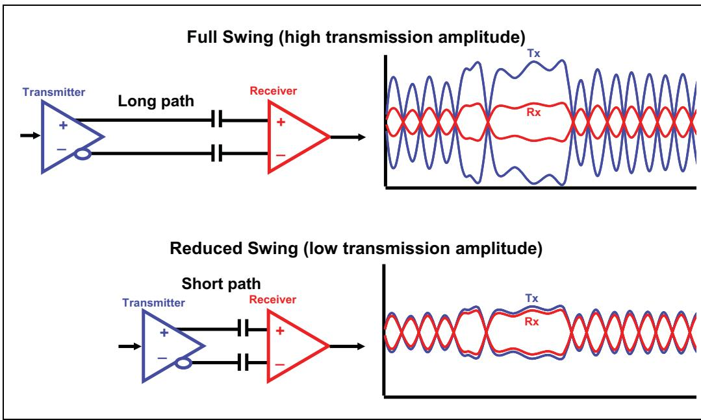

Reduced Swing (low transmission amplitude) / 减摆幅（低传输幅度）

## 12.66 Solution for 8.0 GT | 12.66 s - Transmitter Equalization

| EN | ZH |
|---|---|
| When going to the 8.0 GT/s data rate, the signal conditioning model changes significantly. Transmitter equalization becomes more complex and a handshake training procedure is used to adapt to the actual signaling environment rather than making assumptions about what will be needed. To learn more about the process of evaluating the Link, refer to the section called "Recovery.Equalization" on page 587. Basically, that process allows a Receiver to request that the Link partner's Transmitter use a certain combination of coefficients and then the receiver tests how well the received signal looks and possibly proposes others if the result isn't good enough. | 当数据速率提升到8.0 GT/s时，信号调理模型发生了显著变化。发送器均衡变得更加复杂，并且采用握手训练过程来适应实际的信号环境，而不是对所需条件进行假设。要了解更多关于评估链路的过程，请参考第587页的"Recovery.Equalization"一节。基本上，该过程允许接收器请求链路对端的发送器使用特定的系数组合，然后接收器测试接收信号的质量，如果结果不够理想，则可以提出其他系数组合。 |
| Sometimes students ask whether this model is really sufficient to achieve good error rates, since evaluating a signal across all the possible situations requires days of testing in the lab to achieve a BER of $10^{-15}$ or better. The answer to this has two parts. First, even with the handshake process, the coefficients will be an approximation that worked well when the training was done but may or may not work as well under other conditions. Extrapolation from a small sample size is a necessary part of arriving at working values quickly and it works reasonably well. Second, associated with 8 GT/s transfer rate, it's only necessary to achieve a minimum BER of $10^{-12}$, and that doesn't take as long to verify as it would BER of $10^{-15}$ | 有时学生会问，这种模型是否真的足以实现良好的误码率，因为在所有可能情况下评估信号需要在实验室里花费数天时间来测试，才能达到$10^{-15}$或更低的误码率。对此答案分为两部分。第一，即使采用了握手过程，这些系数仍是一种近似值，在训练时表现良好，但在其他条件下可能不一定同样有效。从小样本量进行外推是快速获得可用工作值的必要手段，且效果相当不错。第二，对于8 GT/s传输速率，只需达到$10^{-12}$的最小误码率即可，验证这一指标所需的时间比验证$10^{-15}$误码率要短得多。 |

## 12.67 Three-Tap Tx Equalizer Required | 12.67 需要三抽头发送器均衡器

| EN | ZH |
|----|----|
| To accomplish better wave shaping at the Transmitter, the spec requires the use of a 3-tap FIR (Finite Impulse Response) filter, meaning a filter with 3 bit-time-spaced inputs. A conceptual drawing of this is shown in Figure 13-21 on page 475, where it can be seen that the output voltage is the sum of three versions of the input: the original input, a version delayed by one bit time and a third delayed by another bit time. This type of FIR filter is often used in other SER-DES applications above 6.0 Gb/s, and it's helpful for PCIe because it compensates for the fact that the channel spreads the signal across a longer time. Another way of thinking about it is that a given bit is affected by both the bit value that preceded it and the bit that comes after it. | 为了在发送器实现更好的波形整形，规范要求使用3抽头FIR（有限脉冲响应）滤波器，即一个具有3个比特时间间隔输入的滤波器。其概念图如图13-21（第475页）所示，从中可以看出输出电压是三个输入版本的叠加：原始输入、延时一个比特时间的版本以及再延时一个比特时间的第三个版本。这种FIR滤波器常用于6.0 Gb/s以上的其他SER-DES应用中，它对PCIe很有帮助，因为它补偿了信道将信号展宽到更长时间这一效应。换个角度理解，即一个给定的比特会同时受到其前一个比特值和后一个比特值的影响。 |

Figure 13-21: 3-Tap Tx Equalizer | 图13-21：3抽头发送均衡器

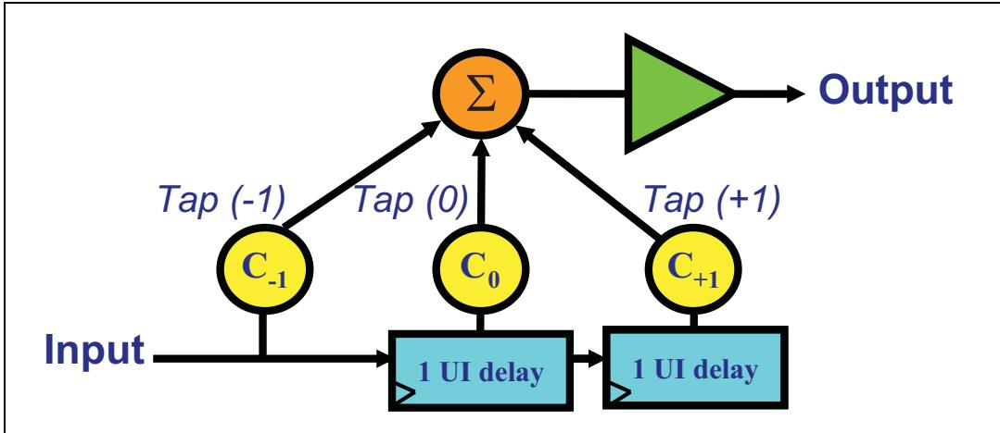

| EN | ZH |
|----|----|
| With this in mind, the three inputs can be described by their timing position as "pre-cursor" for $\mathrm { { C } _ { - 1 } }$, "cursor" for $\mathrm { C } _ { 0 }$, and "post-cursor" for $C _ { + 1 }$, which combine to create an output based on the upcoming input, the current value, and the previous value. Adjusting the coefficients for the taps allows the output wave to be optimally shaped. This effect is illustrated by the pulse-response waveform shown in Figure 13-22 on page 476. Looking at a single pulse allows the adjustment to the signal to be more easily recognized. | 基于此，这三个输入可按其时间位置分别描述为：$\mathrm { C } _ { - 1 }$ 为"预光标"（pre-cursor），$\mathrm { C } _ { 0 }$ 为"主光标"（cursor），$C _ { + 1 }$ 为"后光标"（post-cursor），它们结合起来根据即将到来的输入、当前值和前一个值产生输出。调整各抽头的系数可使输出波形达到最佳形状。这一效果由图13-22（第476页）所示的脉冲响应波形图加以说明。观察单个脉冲可以更容易地识别对信号的调整。 |
| The filter shapes the output according to the coefficient values (or tap weights) assigned to each tap. The sum of the absolute value of the three coefficient magnitudes together is defined to be unity so that only two of them need to be given for the third one to be calculated. Consequently, only $\mathrm { C } _ { - 1 }$ and $C _ { + 1 }$ are given in the spec and $\mathrm { C } _ { 0 }$ is always implied and is always positive. | 滤波器根据分配给每个抽头的系数值（或抽头权重）对输出进行整形。三个系数幅值的绝对值之和被定义为1，因此只需给出其中两个系数，第三个即可计算得出。因此，规范中只给出 $\mathrm { C } _ { - 1 }$ 和 $C _ { + 1 }$，而 $\mathrm { C } _ { 0 }$ 始终隐含且总为正数。 |

Figure 13-22: Tx 3-Tap Equalizer Shaping of an Output Pulse | 图13-22：发送3抽头均衡器输出脉冲整形

## 12.68 Pre-shoot, De-emphasis, and Boost | 12.68 预冲、去加重和增强

| EN | ZH |
|---|---|
| ## Pre-shoot, De-emphasis, and Boost | ## 预冲、去加重和增强 |
| The effect of the coefficient values is to adjust the output voltage to create up to four different voltage levels to accommodate different signaling environments, as shown in Figure 13‐23 on page 477. This waveform was taken from a test device and shows a representative example, but the voltage levels depend on whether a Transmitter implements preshoot or de‐emphasis or both. | 系数值的作用是调整输出电压，以产生多达四种不同的电压电平，适应不同的信号环境，如第477页图13-23所示。该波形取自测试设备，展示了一个代表性示例，但电压电平取决于发送器是否实现了预冲和/或去加重。 |
| The waveform shows the four general voltages to be transmitted, which are: maximum‐height (Vd), normal (Va), de‐emphasized (Vb), and pre‐shoot (Vc). | 该波形显示了要发送的四种通用电压电平，分别为：最大高度(Vd)、正常(Va)、去加重(Vb)和预冲(Vc)。 |
| This scheme is backward‐compatible with the 2.5 and 5.0 GT/s model that only uses de‐emphasis, because pre‐shoot and de‐emphasis can be defined indepen dently. The voltages both with and without de‐emphasis are the same as they have been for the lower data rates, except that now there are more options for the de‐emphasis value, ranging from 0 to  -6 dB. Preshoot is a new feature designed to improve the signal in the following bit time by boosting the voltage in the current bit time. Finally, the maximum value is simply what the signal would be if both $C _ { - 1 }$ and $C _ { + 1 }$ were zero (and $C _ { 0 }$ was 1.0). As illustrated by the bit stream shown at the top of the diagram, we may summarize the strategy for these voltages as follows: | 该方案与仅使用去加重的2.5和5.0 GT/s模型向后兼容，因为预冲和去加重可以独立定义。有去加重和无去加重的电压与较低数据速率下的电压相同，不同之处在于现在去加重值有更多选择，范围从0到-6 dB。预冲是一项新功能，旨在通过在当前比特时间内提升电压来改善下一个比特时间的信号。最后，最大值就是当$C_{-1}$和$C_{+1}$均为零（且$C_0$为1.0）时信号的值。如图顶部所示的比特流所示，我们可以总结这些电压的策略如下： |
| • When the bits on both sides of the cursor have the opposite polarity, the voltage will be Vd, the maximum voltage. | • 当光标两侧的比特极性相反时，电压为最大电压Vd。 |
| • When a repeated string of bits is to be sent: | • 当发送重复的比特串时： |
| — The first bit will use Va, the next lower voltage to the maximum voltage Vd. | — 第一个比特使用Va，即低于最大电压Vd的下一个电压电平。 |
| — Bits between the first and last bits use Vb, the lowest voltage. | — 第一个和最后一个比特之间的比特使用Vb，即最低电压。 |
| — The last repeated bit before a polarity change uses Vc, the next higher voltage to the lowest voltage Vb. | — 极性改变前的最后一个重复比特使用Vc，即高于最低电压Vb的下一个电压电平。 |

Figure 13‐23: 8.0 GT/s Tx Voltage Levels | 图13‐23：8.0 GT/s发送器电压电平

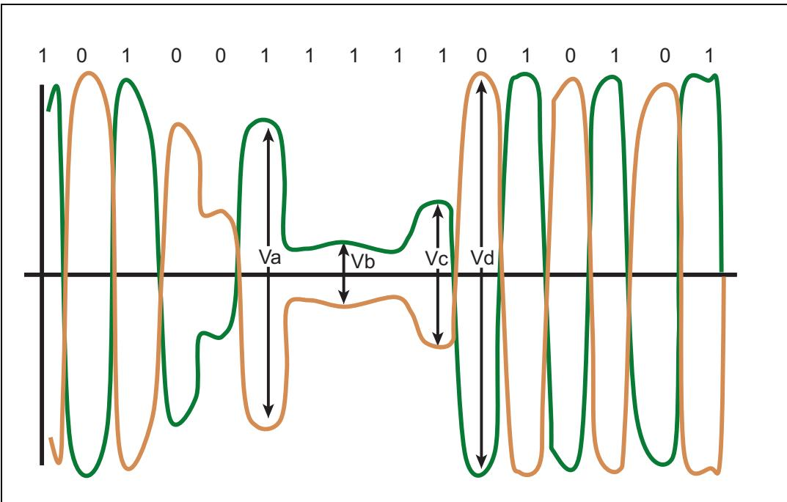

| EN | ZH |
|---|---|
| As described in "Recovery.Equalization" on page 587, when the Link is preparing to change from a lower data rate to 8.0 GT/s, the Downstream Port sends EQ TS2s that give the Upstream Port a set of preset values to use for its coefficients as a starting point from which to begin testing the Link signal quality. The list of 11 possible presets along with their corresponding coefficient values and voltage ratios is given in Table 13‐1 on page 478. Note that the voltages are given as a ratio with respect to the max value. These values were selected to match the earlier spec versions. As an example of how that is used, the first entry, P4, uses no de‐emphasis or preshoot, so all the voltage values are equal to the max value and the ratios are all 1.000. | 如第587页"Recovery.Equalization"所述，当链路准备从较低数据速率变更至8.0 GT/s时，下游端口发送EQ TS2，为上游端口提供一组预设值用于其系数，作为开始测试链路信号质量的起点。第478页的表13-1列出了11种可能的预设及其对应的系数值和电压比。请注意，电压以相对于最大值的比值形式给出。这些值的选择是为了匹配早期规范版本。以第一个条目P4为例，它不使用去加重或预冲，因此所有电压值均等于最大值，比值均为1.000。 |

**Table 13-1: Tx Preset Encodings with Coefficients and Voltage Ratios**

<table><tr><td>Preset Number</td><td>Preshoot (dB)</td><td>De-emphasis (dB)</td><td> $C_{-1}$ </td><td> $C_{+1}$ </td><td>Va/Vd</td><td>Vb/Vd</td><td>Vc/Vd</td></tr><tr><td>P4</td><td>0.0.</td><td>0.0</td><td>0.000</td><td>0.000</td><td>1.000</td><td>1.000</td><td>1.000</td></tr><tr><td>P1</td><td>0.0.</td><td>-3.5 +/- 1 dB</td><td>0.000</td><td>-0.167</td><td>1.000</td><td>0.668</td><td>0.668</td></tr><tr><td>P0</td><td>0.0.</td><td>-6.0 +/- 1.5 dB</td><td>0.000</td><td>-0.250</td><td>1.000</td><td>0.500</td><td>0.500</td></tr><tr><td>P9</td><td>3.5 +/- 1 dB</td><td>0.0</td><td>-0.166</td><td>0.000</td><td>0.668</td><td>0.668</td><td>1.000</td></tr><tr><td>P8</td><td>3.5 +/- 1 dB</td><td>-3.5 +/- 1 dB</td><td>-0.125</td><td>-0.125</td><td>0.750</td><td>0.500</td><td>0.750</td></tr><tr><td>P7</td><td>3.5 +/- 1 dB</td><td>-6.0 +/- 1.5 dB</td><td>-0.100</td><td>-0.200</td><td>0.800</td><td>0.400</td><td>0.600</td></tr><tr><td>P5</td><td>1.9 +/- 1 dB</td><td>0.0</td><td>-0.100</td><td>0.000</td><td>0.800</td><td>0.800</td><td>1.000</td></tr><tr><td>P6</td><td>2.5 +/- 1 dB</td><td>0.0</td><td>-0.125</td><td>0.000</td><td>0.750</td><td>0.750</td><td>1.000</td></tr><tr><td>P3</td><td>0.0</td><td>-2.5 +/- 1 dB</td><td>0.000</td><td>-0.125</td><td>1.000</td><td>0.750</td><td>0.750</td></tr><tr><td>P2</td><td>0.0</td><td>-4.4 +/- 1.5 dB</td><td>0.000</td><td>-0.200</td><td>1.000</td><td>0.600</td><td>0.600</td></tr><tr><td>P10</td><td>0.0</td><td>Defined by LF</td><td>0.000</td><td>(FS-LF) /2</td><td>1.000</td><td>Not fixed</td><td>Not fixed</td></tr></table>

| EN | ZH |
|---|---|
| ## Equalizer Coefficients | ## 均衡器系数 |
| Presets allow a device to use one of 11 possible starting values to be used for the partner's Transmitter coefficients when first training to the 8.0 GT/s data rate. This is accomplished by sending EQ TS1s and EQ TS2s during training which gives a coarse adjustment of Tx equalization as a starting point. If the signal using the preset delivers the desired $1 0 ^ { - 1 2 }$ error rate, no further training is needed. But if the measured error rate is too high, the equalization sequence is used to fine-tune the coefficient settings by trying different $C _ { - 1 }$ and $C _ { + 1 }$ values and evaluating the result, repeating the sequence until the desired signal quality or error rate is achieved. | 预设允许设备在首次训练至 8.0 GT/s 数据速率时，使用 11 种可能的起始值之一作为对端发送器系数。这是通过在训练期间发送 EQ TS1 和 EQ TS2 来实现的，以此对 Tx 均衡进行粗调作为起点。若使用预设的信号能达到所需的 $10^{-12}$ 误码率，则无需进一步训练。但若测量到的误码率过高，则使用均衡序列通过尝试不同的 $C_{-1}$ 和 $C_{+1}$ 值并评估结果来微调系数设置，重复该序列直至达到所需的信号质量或误码率。 |
| An 8.0 GT/s transmitter is required to report its range of supported coefficient values to its neighboring Receiver. There are some constraints on this: | 8.0 GT/s 发送器必须向相邻接收器报告其所支持的系数值范围。对此有一些约束条件： |
| • Device must support all 11 presets as listed in Table 13-1 on page 478. | • 设备必须支持表 13-1（第 478 页）所列的所有 11 种预设。 |
| • Transmitters must meet the full-swing V signaling limits | • 发送器必须满足全摆幅 V 信号限值。 |
| • Transmitters may optionally support the reduced-swing, and if they do they must meet the $\mathsf { V } _ { \mathrm { TX-EIEOS-RS } }$ limits | • 发送器可以选择支持减摆幅，若支持则必须满足 $\mathsf{V_{TX-EIEOS-RS}}$ 限值。 |
| Coefficients must meet the boost limits $( \mathrm { V } _ { \mathrm { TX-BOOST-FS } } = 8.0 \mathrm { dB } \min, \mathrm { V } _ { \mathrm { TX } } . \mathrm { BOOST-RS } = 2.5 \mathrm { dB } \min)$ and resolution limits $( \mathrm { EQ } _ { \mathrm { TX-DOEFF-RESS } } = 1/24 \max \text{ to } 1/63 \min)$. | 系数必须满足增强限制（$\mathrm{V_{TX-BOOST-FS}} = 8.0 \mathrm{dB}$ 最小值，$\mathrm{V_{TX-BOOST-RS}} = 2.5 \mathrm{dB}$ 最小值）和分辨率限制（$\mathrm{EQ_{TX-DOEFF-RESS}} = 1/24$ 最大值至 $1/63$ 最小值）。 |
| Applying these constraints and using the maximum granularity of 1/24 creates a list of pre-shoot, de-emphasis, and boost values for each setting. This is presented in a table in the spec that is partially reproduced from the spec here in Table 13-2 on page 480. The table contains blank entries because the boost value can't exceed $8.0 + / - 1.5 \ \mathrm { dB } = 9.5$ dB. That results in a diagonal boundary where the boost has reached 9.5 for the full-swing case. For reduced swing, the boundary is at 3.5 dB. The 6 shaded entries along the left and top edges of the table that go as far as 4/24 are presets supported by full- or reduced-swing signaling. The other 4 shaded entries are presets supported for full-swing signaling only. | 应用这些约束并使用 1/24 的最大粒度，可为每种设置生成预冲、去加重和增强值列表。这呈现在规范中的一张表内，此处部分转载自规范，即第 480 页的表 13-2。该表包含空白条目，因为增强值不能超过 $8.0 +/- 1.5 \ \mathrm{dB} = 9.5$ dB。这产生了一条对角线边界，在全摆幅情况下增强值达到 9.5。对于减摆幅，边界为 3.5 dB。沿表格左边缘和上边缘的 6 个阴影条目（最大至 4/24）是全摆幅或减摆幅信令支持的预设。其他 4 个阴影条目是全摆幅信令仅支持的预设。 |

|  | Table 13-2: Tx Coefficient Table |  | 表 13-2：发送器系数表 |
|---|---|---|---|

<table><tr><td rowspan="2" colspan="2">PS DEBoost</td><td colspan="7"> $C_{+1}$ </td></tr><tr><td>0/24</td><td>1/24</td><td>2/24</td><td>3/24</td><td>4/24</td><td>5/24</td><td>6/24</td></tr><tr><td rowspan="7"> $C_{-1}$ </td><td>0/24</td><td>0.0 0.00.0</td><td>0.0 -0.80.8</td><td>0.0 -1.81.6</td><td>0.0 -2.52.5</td><td>0.0 -3.53.5</td><td>0.0 -4.74.7</td><td>0.0 -6.0-6.0</td></tr><tr><td>1/24</td><td>0.8 0.00.8</td><td>0.8 -0.81.6</td><td>0.9 -1.72.5</td><td>1.0 -2.83.5</td><td>1.2 -3.94.7</td><td>1.3 -5.36.0</td><td>1.6 -6.87.6</td></tr><tr><td>2/24</td><td>1.6 0.01.6</td><td>1.7 -0.92.5</td><td>1.9 -1.93.5</td><td>2.2 -3.14.7</td><td>2.5 -4.46.0</td><td>2.9 -6.07.6</td><td>3.5 -8.09.5</td></tr><tr><td>3/24</td><td>2.5 0.02.5</td><td>2.8 -1.03.5</td><td>3.1 -2.24.7</td><td>3.5 -3.56.0</td><td>4.1 -5.17.6</td><td>4.9 -7.09.5</td><td>-</td></tr><tr><td>4/24</td><td>3.5 0.03.5</td><td>3.9 -1.24.7</td><td>4.4 -2.56.0</td><td>5.1 -4.17.6</td><td>6.0 -6.09.5</td><td>-</td><td>-</td></tr><tr><td>5/24</td><td>4.7 0.04.7</td><td>5.3 -1.36.0</td><td>6.0 -2.97.6</td><td>7.0 -4.99.5</td><td>-</td><td>-</td><td>-</td></tr><tr><td>6/24</td><td>6.0 0.06.0</td><td>6.8 -1.67.6</td><td>8.0 -3.59.5</td><td>-</td><td>-</td><td>-</td><td>-</td></tr></table>

| EN | ZH |
|---|---|
| Coefficient Example. Let's drill a little deeper on the coefficients by using preset number P7 from Table 13-1 on page 478 as an example. In this entry, $\mathrm { C _ { - 1 } } = \mathrm { -0.100 }$, and $\mathrm { C } _ { + 1 } = -0.200$, and since $C _ { 0 }$ must be positive and the sum of their absolute values must be one, it's implied that $\bar { \mathrm { C } _ { 0 } } = 0.700$ | 系数示例。我们以第 478 页表 13-1 中的预设 P7 为例，更深入地探讨系数。在该条目中，$\mathrm{C_{-1}} = -0.100$，$\mathrm{C_{+1}} = -0.200$，由于 $C_0$ 必须为正且其绝对值之和必须为 1，因此隐含得出 $\bar{\mathrm{C}_0} = 0.700$。 |
| Matching these values to the table of coefficient space given in the spec is not straightforward because the coefficients are given as fractions rather than decimal values, but converting the fractions to their decimal values matches them pretty closely. The $C _ { - 1 }$ value of 0.100 is closest to 2/24 (0.083), while $C _ { + 1 }$ at 0.200 is a little less than 5/24 (0.208) The coefficient table entry for those fractions is highlighted as one of the preset values, giving us some confidence that this is on the right track. In the preset table, P7 lists a preshoot value of 3.5 +/- 1 dB, and the value in the coefficient table is shown as 2.9 dB. If we correct for the difference in coefficient values, ((0.083/.1) * 3.5 = 2.9) we arrive at the same preshoot value. The difference in coefficient values for de-emphasis was much smaller (0.200 vs. 0.208) and so, as we might expect, both tables show this as -6.0 dB. | 将这些值与规范给出的系数空间表进行匹配并不直接，因为系数以分数而非十进制值给出，但将分数转换为十进制值后匹配度相当高。$C_{-1}$ 值 0.100 最接近 2/24 (0.083)，而 $C_{+1}$ 值 0.200 略小于 5/24 (0.208)。这些分数对应的系数表条目被高亮显示为预设值之一，这让我们有信心方向正确。在预设表中，P7 列出的预冲值为 3.5 +/- 1 dB，而系数表中显示的值是 2.9 dB。若我们修正系数值的差异，((0.083/.1) * 3.5 = 2.9)，则得出相同的预冲值。去加重系数值的差异要小得多 (0.200 对比 0.208)，因此正如我们所料，两个表均将其显示为 -6.0 dB。 |
| What voltages do the P7 coefficients create? Assuming a full-swing voltage of Vd as a starting point then, according to the ratios in the preset table, the other voltages would be $\mathrm { Va } = 0.8 \mathrm { Vd }$, $\mathrm { Vb } = 0.4 \mathrm { Vd }$, and $\mathrm { Vc } = 0.6 \mathrm { Vd }$. How well do those correspond to the values that would result from using the preshoot and de-emphasis numbers? De-emphasis was given as -6.0 dB, and we already know that represents a 50% voltage reduction, so we'd expect that Vb should be half of Va, which it is. Pre-shoot was given as 3.5 dB meaning the ratio of Vc/Vb is 0.668, and $0.4 / 0.668 = 0.598 \mathrm { Vd }$ for Vc; very close to the 0.6Vd we expected. Last of all, the Boost value, which is the ratio of Vd/Vb, is not given in the preset table but, using the formula 20*log(Vd/Vb), the boost from the preset values turns out to be 7.9 dB. That's reasonably close to the 7.6 dB value given in the coefficient table and gives us some confidence that the tables are consistent among themselves. | P7 系数会产生什么电压？假设全摆幅电压 Vd 为起点，则根据预设表中的比率，其他电压将为 $\mathrm{Va} = 0.8\mathrm{Vd}$、$\mathrm{Vb} = 0.4\mathrm{Vd}$ 和 $\mathrm{Vc} = 0.6\mathrm{Vd}$。这些值与使用预冲和去加重数值得到的结果对应得如何？去加重给定为 -6.0 dB，我们已经知道这代表电压降低 50%，因此可预期 Vb 应为 Va 的一半，事实确实如此。预冲给定为 3.5 dB，表示 Vc/Vb 比率为 0.668，Vc 为 $0.4 / 0.668 = 0.598 \mathrm{Vd}$，非常接近我们预期的 0.6Vd。最后，增强值（即 Vd/Vb 比率）未在预设表中给出，但使用公式 20*log(Vd/Vb) 计算，预设值得出的增强值为 7.9 dB，与系数表中给出的 7.6 dB 值相当接近，这让我们有信心各表之间是一致的。 |
| So how are the four voltages obtained? There are essentially three programmable drivers whose output is summed to derive the final signal value to be launched. If the cursor setting remains unchanged, and the pre- and postcursor taps are negative, then the answer can be found by simply adding the taps as $( \mathsf C _ { 0 } + \mathsf C _ { - 1 } + \mathsf C _ { + 1 } )$ | 那么这四个电压是如何获得的？本质上由三个可编程驱动器组成，其输出求和后得出待发送的最终信号值。若光标设置保持不变，且前光标和后光标抽头为负，则可通过简单相加抽头值 $( \mathsf{C_0} + \mathsf{C_{-1}} + \mathsf{C_{+1}} )$ 得出结果。 |
| $\mathrm { Vd } = ( \mathrm { C } _ { 0 } + \mathrm { C } _ { - 1 } + \mathrm { C } _ { + 1 } ) = ( 0.700 + 0.100 + 0.200 ) = 1.0$ * max voltage. This is the "boosted" value that results when a bit is both preceded and followed by bits of the opposite polarity. In all four voltages listed here, if the polarity of the bits is inverted then the values would all be negative. | $\mathrm{Vd} = (\mathrm{C_0} + \mathrm{C_{-1}} + \mathrm{C_{+1}}) = (0.700 + 0.100 + 0.200) = 1.0$ * 最大电压。这是一个位的前后均为相反极性位时产生的"增强"值。此处列出的所有四个电压，若位极性反转，则所有值都将变为负值。 |
| $\mathrm { Va } = ( 0.700 + ( -0.100 ) + 0.200 ) = 0.8$ * max voltage. This is the value that results when a bit is preceded by the opposite polarity but followed by the same polarity, meaning it is the first in a repeated string of bits. | $\mathrm{Va} = (0.700 + (-0.100) + 0.200) = 0.8$ * 最大电压。这是一个位的前一位为相反极性但后一位为相同极性时产生的值，即它是一串重复位中的第一个位。 |
| $\mathrm { Vb } = ( 0.700 + ( -0.100 ) + ( -0.200 ) ) = 0.4$ * max voltage. This is the deemphasized value that results when a bit is both preceded and followed by bits of the same polarity, meaning it's in the middle of a repeated string of bits. | $\mathrm{Vb} = (0.700 + (-0.100) + (-0.200)) = 0.4$ * 最大电压。这是一个位的前后均为相同极性位时产生的去加重值，即它位于一串重复位的中间。 |
| $\mathrm { Vc } = ( 0.700 + 0.100 + ( -0.200 ) ) = 0.6$ * max voltage. This is the pre-shoot value that results when a bit is preceded by the same polarity but followed by the opposite polarity, meaning it's the last bit in a repeated string of bits. | $\mathrm{Vc} = (0.700 + 0.100 + (-0.200)) = 0.6$ * 最大电压。这是一个位的前一位为相同极性但后一位为相反极性时产生的预冲值，即它是一串重复位中的最后一个位。 |
| What determines when the coefficients are added or subtracted to arrive at these numbers? This turns out to be fairly simple, since it's just a matter of the polarity of the time-shifted pre- and post-cursor inputs. This is illustrated in Figure 13-24 on page 482. The single-ended waveform labeled "Weighted Cursor $(\mathsf { C } _ { 0 } )$" shows the positive half of the differential bit stream currently being transmitted. If the waveforms are understood as shifting to the right with time, then the next lower trace $(\mathsf C _ { + 1 } )$ is the post-cursor signal. | 是什么决定了系数何时相加或相减以得出这些数值？答案相当简单，仅取决于时移后的前光标和后光标输入的极性。这在第 482 页的图 13-24 中说明。标记为"Weighted Cursor $(\mathsf{C_0})$"的单端波形显示了当前正在发送的差分位流的正半部分。若将波形理解为随时间向右移动，则下一个较低迹线 $(\mathsf{C_{+1}})$ 即为后光标信号。 |