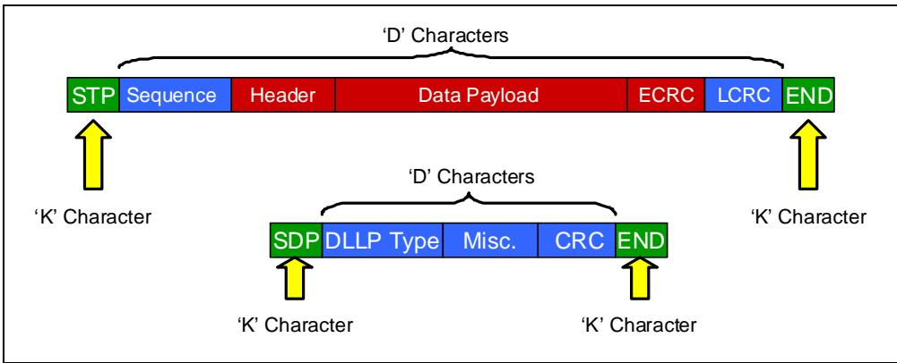
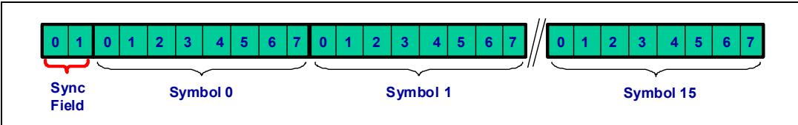
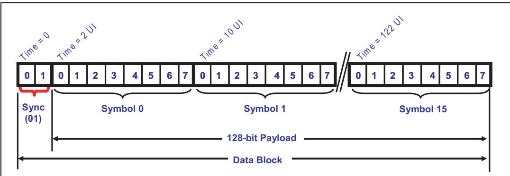

# Ch12_Physical_Layer_Logical_Gen3

# 12 Physical Layer ‐ Logical (Gen3)

## The Previous Chapter | 前一章

<table style="border:1px solid #ddd;border-collapse:collapse;width:100%" cellpadding="4" cellspacing="0" rules="all" frame="border">
<tr>
<td width="50%" style="border:1px solid #ddd;">
The previous chapter describes the Gen1/Gen2 logical sub-block of the Physical Layer. This layer prepares packets for serial transmission and recovery, and the several steps needed to accomplish this are described in detail. The chapter covers logic associated with the Gen1 and Gen2 protocol that use 8b/10b encoding/decoding.
</td>
<td width="50%" style="border:1px solid #ddd;background-color:#e8e8e8">
前一章描述了物理层的Gen1/Gen2逻辑子块。物理层为串行传输和恢复准备数据包，并详细描述了完成此过程所需的几个步骤。该章涵盖了使用8b/10b编码/解码的Gen1和Gen2协议相关的逻辑。
</td>
</tr>
</table>

## This Chapter | 本章

<table style="border:1px solid #ddd;border-collapse:collapse; width:100%;" cellpadding="4" cellspacing="0" rules="all" frame="border">
  <thead style="border:1px solid #ddd;">
    <tr>
      <th width="50%" style="border:1px solid #ddd; background:#f5f5f5;">EN</th>
      <th width="50%" style="border:1px solid #ddd; background-color:#e8e8e8;">中文</th>
    </tr>
  </thead>
  <tbody>
    <tr><td width="50%" style="border:1px solid #ddd; background:#fff;padding:4px 8px;">This chapter describes the logical Physical Layer characteristics for the third generation (Gen3) of PCIe.</td><td width="50%" style="border:1px solid #ddd; background-color:#e8e8e8;padding:4px 8px;">本章描述 PCIe 第三代（Gen3）的逻辑物理层特性。</td></tr>
    <tr><td width="50%" style="border:1px solid #ddd; background:#fff;padding:4px 8px;">The major change includes the ability to double the bandwidth relative to Gen2 speed without needing to double the frequency (Link speed goes from 5 GT/s to 8 GT/s).</td><td width="50%" style="border:1px solid #ddd; background-color:#e8e8e8;padding:4px 8px;">主要变化包括在无需加倍频率的情况下，相对于 Gen2 速率将带宽提升一倍（链路速率从 5 GT/s 提高到 8 GT/s）。</td></tr>
    <tr><td width="50%" style="border:1px solid #ddd; background:#fff;padding:4px 8px;">This is accomplished by eliminating 8b/10b encoding when in Gen3 mode.</td><td width="50%" style="border:1px solid #ddd; background-color:#e8e8e8;padding:4px 8px;">这是通过在 Gen3 模式下取消 8b/10b 编码来实现的。</td></tr>
    <tr><td width="50%" style="border:1px solid #ddd; background:#fff;padding:4px 8px;">More robust signal compensation is necessary at Gen3 speed.</td><td width="50%" style="border:1px solid #ddd; background-color:#e8e8e8;padding:4px 8px;">在 Gen3 速率下需要更鲁棒的信号补偿。</td></tr>
  </tbody>
</table>

## The Next Chapter | 下一章

<table style="border:1px solid #ddd;border-collapse:collapse; width:100%;" cellpadding="4" cellspacing="0" rules="all" frame="border">
  <thead style="border:1px solid #ddd;">
    <tr>
      <th width="50%" style="border:1px solid #ddd; background:#f5f5f5;">EN</th>
      <th width="50%" style="border:1px solid #ddd; background-color:#e8e8e8;">中文</th>
    </tr>
  </thead>
  <tbody>
    <tr><td width="50%" style="border:1px solid #ddd; background:#fff;padding:4px 8px;">The next chapter describes the Physical Layer electrical interface to the Link. The need for signal equalization and the methods used to accomplish it are also discussed here. This chapter combines electrical transmitter and receiver characteristics for both Gen1, Gen2 and Gen3 speeds.</td><td width="50%" style="border:1px solid #ddd; background-color:#e8e8e8;padding:4px 8px;">下一章描述链路物理层的电气接口。本章还将讨论信号均衡的必要性以及实现信号均衡的方法。本章综合介绍了 Gen1、Gen2 和 Gen3 速率下的电气发送器和接收器特性。</td></tr>
  </tbody>
</table>

## 12.1 Introduction to Gen3 | 12.1 Gen3 简介

<table style="border:1px solid #ddd;border-collapse:collapse; width:100%;" cellpadding="4" cellspacing="0" rules="all" frame="border">
  <thead style="border:1px solid #ddd;">
    <tr>
      <th width="50%" style="border:1px solid #ddd; background:#f5f5f5;">EN</th>
      <th width="50%" style="border:1px solid #ddd; background-color:#e8e8e8;">中文</th>
    </tr>
  </thead>
  <tbody>
    <tr><td width="50%" style="border:1px solid #ddd; background:#fff;padding:4px 8px;">Recall that when a PCIe Link enters training (i.e., after a reset) it always begins using Gen1 speed for backward compatibility. If higher speeds were advertised during the training, the Link will immediately transition to the Recovery state and attempt to change to the highest commonly‑supported speed.</td><td width="50%" style="border:1px solid #ddd; background-color:#e8e8e8;padding:4px 8px;">回顾一下，当 PCIe 链路进入训练（即复位后）时，它总是先使用 Gen1 速度以保证向后兼容。如果在训练过程中宣告了更高的速度，链路将立即转换到 Recovery 状态，并尝试更改为双方共同支持的最高速度。</td></tr>
    <tr><td width="50%" style="border:1px solid #ddd; background:#fff;padding:4px 8px;">The major motivation for upgrading the PCIe spec to Gen3 was to double the bandwidth, as shown in Table 12‑1 on page 408. The straightforward way to accomplish this would have been to simply double the signal frequency from 5 GT/s to 10 Gb/s, but doing that presented several problems:</td><td width="50%" style="border:1px solid #ddd; background-color:#e8e8e8;padding:4px 8px;">将 PCIe 规范升级到 Gen3 的主要动机是将带宽翻倍，如第 408 页的表 12‑1 所示。最直接的做法是将信号频率从 5 GT/s 简单地加倍到 10 Gb/s，但这会带来几个问题：</td></tr>
    <tr><td width="50%" style="border:1px solid #ddd; background:#fff;padding:4px 8px;">Higher frequencies consume substantially more power, a condition exacerbated by the need for sophisticated conditioning logic (equalization) to maintain signal integrity at the higher speeds. In fact, the power demand of this equalizing logic is mentioned in PCISIG literature as a big motivation for keeping the frequency as low as practical.</td><td width="50%" style="border:1px solid #ddd; background-color:#e8e8e8;padding:4px 8px;">更高的频率会消耗更多功率，而维持高速下信号完整性所需的复杂调节逻辑（均衡）进一步加剧了这一问题。事实上，PCISIG 文献中提到，这种均衡逻辑的功耗需求是将频率保持在尽可能低水平的一个重要动机。</td></tr>
    <tr><td width="50%" style="border:1px solid #ddd; background:#fff;padding:4px 8px;">Some circuit board materials experience significant signal degradation at higher frequencies. This problem can be overcome with better materials and more design effort, but those add cost and development time. Since PCIe is intended to serve a wide variety of systems, the goal was that it should work well in inexpensive designs, too.</td><td width="50%" style="border:1px solid #ddd; background-color:#e8e8e8;padding:4px 8px;">某些电路板材料在更高频率下会出现明显的信号 degradation。这个问题可以通过更好的材料和更多的设计投入来解决，但这会增加成本和开发时间。由于 PCIe 旨在服务于各种不同的系统，其目标是在低成本设计中也能良好工作。</td></tr>
    <tr><td width="50%" style="border:1px solid #ddd; background:#fff;padding:4px 8px;">Similarly, allowing new designs to use the existing infrastructure (circuit boards and connectors, for example) minimizes board design effort and cost. Using higher frequencies makes that more difficult because trace lengths and other parameters must be adjusted to account for the new timing, and that makes high frequencies less desirable.</td><td width="50%" style="border:1px solid #ddd; background-color:#e8e8e8;padding:4px 8px;">同样，允许新设计使用现有基础设施（例如电路板和连接器）可以最大限度地减少板卡设计工作量 and 成本。使用更高频率会使这变得更加困难，因为必须调整走线长度和其他参数以适应新的时序，这使得高频率不那么理想。</td></tr>
  </tbody>
</table>

Table 12‑1: PCI Express Aggregate Bandwidth for Various Link Widths | 表12‑1：各种链路宽度的PCI Express聚合带宽

<table style="border:1px solid #ddd;border-collapse:collapse;width:100%" cellpadding="4" cellspacing="0" rules="all" frame="border"><tr><td style="border:1px solid #ddd;">Link Width</td><td style="border:1px solid #ddd;">x1</td><td style="border:1px solid #ddd;">x2</td><td style="border:1px solid #ddd;">x4</td><td style="border:1px solid #ddd;">x8</td><td style="border:1px solid #ddd;">x12</td><td style="border:1px solid #ddd;">x16</td><td style="border:1px solid #ddd;">x32</td></tr><tr><td style="border:1px solid #ddd;">Gen1 Bandwidth (GB /s)</td><td style="border:1px solid #ddd;">0.5</td><td style="border:1px solid #ddd;">1</td><td style="border:1px solid #ddd;">2</td><td style="border:1px solid #ddd;">4</td><td style="border:1px solid #ddd;">6</td><td style="border:1px solid #ddd;">8</td><td style="border:1px solid #ddd;">16</td></tr><tr><td style="border:1px solid #ddd;">Gen2 Bandwidth (GB/s)</td><td style="border:1px solid #ddd;">1</td><td style="border:1px solid #ddd;">2</td><td style="border:1px solid #ddd;">4</td><td style="border:1px solid #ddd;">8</td><td style="border:1px solid #ddd;">12</td><td style="border:1px solid #ddd;">16</td><td style="border:1px solid #ddd;">32</td></tr><tr><td style="border:1px solid #ddd;">Gen3 Bandwidth (GB/s)</td><td style="border:1px solid #ddd;">2</td><td style="border:1px solid #ddd;">4</td><td style="border:1px solid #ddd;">8</td><td style="border:1px solid #ddd;">16</td><td style="border:1px solid #ddd;">24</td><td style="border:1px solid #ddd;">32</td><td style="border:1px solid #ddd;">64</td></tr></table>

<table style="border:1px solid #ddd;border-collapse:collapse; width:100%;" cellpadding="4" cellspacing="0" rules="all" frame="border">
  <thead style="border:1px solid #ddd;">
    <tr>
      <th width="50%" style="border:1px solid #ddd; background:#f5f5f5;">EN</th>
      <th width="50%" style="border:1px solid #ddd; background-color:#e8e8e8;">中文</th>
    </tr>
  </thead>
  <tbody>
    <tr><td width="50%" style="border:1px solid #ddd; background:#fff;padding:4px 8px;">These considerations led to two significant changes to the Gen3 spec compared with the previous generations: a new encoding model and a more sophisticated signal equalization model.</td><td width="50%" style="border:1px solid #ddd; background-color:#e8e8e8;padding:4px 8px;">基于这些考虑，Gen3 规范与之前几代相比引入了两项重大变化：一种新的编码模型和一种更复杂的信号均衡模型。</td></tr>
  </tbody>
</table>

## 12.1.1 New Encoding Model | 12.1.1 新的编码模型

<table style="border-collapse:collapse;width:100%" cellpadding="4" cellspacing="0" rules="all" frame="border">
  <thead>
    <tr>
      <th width="50%" style="border:2px solid #000;background:#f5f5f5;padding:4px 8px;">EN</th>
      <th width="50%" style="border:2px solid #000;background-color:#e8e8e8;padding:4px 8px;">中文</th>
    </tr>
  </thead>
  <tbody>
    <tr>
<td width="50%" style="border:2px solid #000;">
The logical part of the Physical Layer replaced the 8b/10b encoding with a new 128b/130b encoding scheme. Of course, this meant departing from the wellunderstood 8b/10b model used in many serial designs. Designers were willing to take this step to recover the 20% transmission overhead imposed by the 8b/10b encoding. Using 128b/130b means the Lanes are now delivering 8 bits/byte instead of 10 bits, and that means an 8.0 GT/s data rate that doubles the bandwidth. This equates to a bandwidth of 1 GB/s in each direction.
</td>
<td width="50%" style="border:2px solid #000;background-color:#e8e8e8">
物理层的逻辑部分用新的128b/130b编码方案取代了8b/10b编码。当然，这意味着要摒弃许多串行设计中广泛使用的成熟的8b/10b模型。设计人员愿意迈出这一步，以回收8b/10b编码所带来的20%传输开销。使用128b/130b意味着通道现在以8比特/字节而非10比特传输数据，这带来了8.0 GT/s的数据速率，使带宽翻倍。这相当于每个方向1 GB/s的带宽。
</td>
</tr>
    <tr>
<td width="50%" style="border:2px solid #000;">
To illustrate the difference between these two encodings, first consider Figure 12-1 that shows the general 8b/10b packet construction. The arrows highlight the Control (K) characters representing the framing Symbols for the 8b/10b packets. Receivers know what to expect by recognizing these control characters. See "8b/10b Encoding" on page 380 to review the benefits of this encoding scheme.
</td>
<td width="50%" style="border:2px solid #000;background-color:#e8e8e8">
为了说明这两种编码之间的差异，首先来看图12-1，该图展示了通用的8b/10b报文结构。箭头标出了代表8b/10b报文定界符的控制(K)字符。接收端通过识别这些控制字符来了解所期望的内容。请参见第380页的"8b/10b编码"以回顾该编码方案的优点。
</td>
</tr>
  </tbody>
</table>

Figure 12-1: 8b/10b Lane Encoding | 图12-1：8b/10b通道编码

<table style="border:1px solid #ddd;border-collapse:collapse;width:100%" cellpadding="4" cellspacing="0" rules="all" frame="border">
<tr>
<td width="50%" style="border:1px solid #ddd;">
By comparison, Figure 12-2 on page 410 shows the 128b/130b encoding. This encoding does not affect bytes being transferred, instead the characters are grouped into blocks of 16 bytes with a 2-bit Sync field at the beginning of each block. The 2-bit Sync field specifies whether the block includes Data (10b) or Ordered Sets (01b). Consequently, the Sync field indicates to the receiver what kind of traffic to expect and when it will begin. Ordered sets are similar to the 8b/10b version in that they must be driven on all the Lanes simultaneously. That requires getting the Lanes properly synchronized and this is part of the training process (see "Achieving Block Alignment" on page 438).
</td>
<td width="50%" style="border:1px solid #ddd;background-color:#e8e8e8">
相比之下，第410页的图12-2展示了128b/130b编码。这种编码不影响所传输的字节，而是将字符分组为16字节的块，每个块的开头有一个2位同步字段。该2位同步字段指定该块包含数据块(10b)还是有序集(01b)。因此，同步字段向接收端指示期望接收何种类型的流量以及何时开始。有序集与8b/10b版本类似，它们必须在所有通道上同时驱动。这要求通道正确同步，这是训练过程的一部分（参见第438页的"实现块对齐"）。
</td>
</tr>
</table>

Figure 12-2: 128b/130b Block Encoding | 图12-2：128b/130b块编码

## 12.1.2 Sophisticated Signal Equalization | 12.1.2 先进的信号均衡

<table style="border:1px solid #ddd;border-collapse:collapse;width:100%" cellpadding="4" cellspacing="0" rules="all" frame="border">
<tr>
<td width="50%" style="border:1px solid #ddd;">
The second change is made to the electrical sub‐block of the Physical Layer and involves more sophisticated signal equalization both at the transmit side of the Link and optionally at the receiver. Gen1 and Gen2 implementations use a fixed Tx de‐emphasis to achieve good signal quality. However, increasing transmission frequencies beyond 5 GT/s causes signal integrity problems to become more pronounced, requiring more transmitter and receiver compensation. This can be managed somewhat at the board level but the designers wanted to allow the external infrastructure to remain the same as much as possible, and instead placed the burden on the PHY transmitter and receiver circuits. For more details on signal conditioning, refer to “Solution for 8.0 GT/s  ‐  Transmitter Equalization” on page 474.
</td>
<td width="50%" style="border:1px solid #ddd;background-color:#e8e8e8">
第二项变更涉及物理层的电气子模块，在链路发送端以及可选的接收端引入了更先进的信号均衡技术。Gen1和Gen2实现使用固定的发送端去加重来获得良好的信号质量。然而，当传输频率提高到5 GT/s以上时，信号完整性问题变得更加突出，需要更多的发送器和接收器补偿。这些问题在一定程度上可以在板级进行管理，但设计人员希望尽可能保持外部基础设施不变，因而将负担转移到了PHY发送器和接收器电路上。有关信号调理的更多详细信息，请参见第474页的"8.0 GT/s的解决方案 – 发送器均衡"。
</td>
</tr>
</table>

## 12.2 Encoding for 8.0 GT/s | 12.2 GT/s编码

<table style="border:1px solid #ddd;border-collapse:collapse;width:100%" cellpadding="4" cellspacing="0" rules="all" frame="border">
<tr>
<td width="50%" style="border:1px solid #ddd;">
As previously discussed, the Gen3 128b/130b encoding method uses Link‐wide packets and per‐Lane block encoding. This section provides additional details regarding the encoding.
</td>
<td width="50%" style="border:1px solid #ddd;background-color:#e8e8e8">
如前所述，Gen3 128b/130b编码方法使用链路级数据包和每通道块编码。本节提供有关该编码的更多细节。
</td>
</tr>
</table>

## 12.2.1 Lane-Level Encoding | 12.2.1 通道级编码

<table style="border:1px solid #ddd;border-collapse:collapse;width:100%" cellpadding="4" cellspacing="0" rules="all" frame="border">
<tr>
<td width="50%" style="border:1px solid #ddd;">
To illustrate the use of Blocks, consider Figure 12-3 on page 411, where a single-Lane Data Block is shown. At the beginning are the two Sync Header bits follower by 16 bytes (128 bits) of information resulting in 130 transmitted bits. The Sync Header simply defines whether a Data block (10b) or an Ordered Set (01b) is being sent. You may have noticed the Data Block in Figure 12-3 has a Sync Header value of 01 rather than the 10b value mentioned above. This is because the least significant bit of the Sync Header is sent first when transmitting the block across the link. Notice the symbols following the Sync Header are also sent with the least significant bit first.
</td>
<td width="50%" style="border:1px solid #ddd;background-color:#e8e8e8">
为说明块的使用，请参考第411页的图12-3，其中显示了一个单通道数据块。开头是两个同步头位，后跟16字节（128位）信息，总共产生130个传输位。同步头仅定义发送的是数据块（10b）还是有序集（01b）。您可能注意到图12-3中的数据块同步头值为01，而非上述的10b值。这是因为在链路上传输块时，同步头的最低有效位先发送。请注意，同步头之后的符号也以最低有效位先发送。
</td>
</tr>
</table>

Figure 12-3: Sync Header Data Block Example | 图12-3：同步头数据块示例

## 12.2.2 Block Alignment | 12.2.2 块对齐

<table style="border:1px solid #ddd;border-collapse:collapse;width:100%" cellpadding="4" cellspacing="0" rules="all" frame="border">
<tr>
<td width="50%" style="border:1px solid #ddd;">
Like previous implementations, Gen3 achieves Bit Lock first and then attempts to establish Block Alignment locking. This requires receivers to find the Sync Header that demarcates the Block boundary. Transmitters establish this boundary by sending recognizable EIEOS patterns consisting of alternating bytes of 00h and FFh, as shown in Figure 12-4. Thus, the use of EIEOS has expanded from simply exiting Electrical Idle to also serving as the synchronizing mechanism that establishes Block Alignment. Note that the Sync Header bits immediately precede and follow the EIEOS (not shown in the illustration). See "Achieving Block Alignment" on page 438 for details regarding this process.
</td>
<td width="50%" style="border:1px solid #ddd;background-color:#e8e8e8">
与之前的实现一样，Gen3 首先实现位锁，然后尝试建立块对齐锁定。这要求接收方找到标识块边界的同步头。发送方通过发送由 00h 和 FFh 交替字节组成的可识别 EIEOS 模式来建立该边界，如图 12-4 所示。因此，EIEOS 的用途已从单纯退出电气空闲扩展为同时用作建立块对齐的同步机制。请注意，同步头比特紧邻 EIEOS 之前和之后（图中未示出）。有关此过程的详细信息，请参见第 438 页的"实现块对齐"。
</td>
</tr>
</table>

Figure 12-4: Gen3 Mode EIEOS Symbol Pattern | 图12-4：Gen3模式EIEOS符号模式

## 12.2.3 Ordered Set Blocks | 12.2.3 有序集块

<table style="border-collapse:collapse;width:100%" cellpadding="4" cellspacing="0" rules="all" frame="border">
  <thead>
    <tr>
      <th width="50%" style="border:2px solid #000;background:#f5f5f5;padding:4px 8px;">EN</th>
      <th width="50%" style="border:2px solid #000;background-color:#e8e8e8;padding:4px 8px;">中文</th>
    </tr>
  </thead>
  <tbody>
    <tr>
<td width="50%" style="border:2px solid #000;">
Ordered Sets have much the same meaning they did in Gen1 and Gen2. They are used to manage Lane protocol. When an Ordered Set Block is sent it must appear on all the Lanes at the same time and almost always consists of 16 bytes with one exception. The one exception to this size rule is the SOS (SKP Ordered Set) which can have SKP Symbols added or removed in groups of four by clock compensation logic (associated with a Link Repeater for example) and can therefore legally be 8, 12, 16, 20, or 24 bytes long.
</td>
<td width="50%" style="border:2px solid #000;background-color:#e8e8e8">
有序集的含义与Gen1和Gen2中基本相同。它们用于管理通道协议。当发送有序集块时，它必须同时在所有通道上出现，并且几乎总是由16字节组成，只有一个例外。这个大小规则的一个例外是SOS（SKP有序集），它可以由时钟补偿逻辑（例如与链路中继器关联）以四个为一组添加或删除SKP符号，因此其合法长度可以是8、12、16、20或24字节。
</td>
</tr>
    <tr>
<td width="50%" style="border:2px solid #000;">
The basic format of the Ordered Set Block is similar to the Data Block, except that the Sync Header bits are reversed, as shown in Figure 12-5 on page 412.
</td>
<td width="50%" style="border:2px solid #000;background-color:#e8e8e8">
有序集块的基本格式与数据块类似，不同之处在于同步头位被反转，如第412页的图12-5所示。
</td>
</tr>
  </tbody>
</table>

Figure 12-5: Gen3 x1 Ordered Set Block Example | 图12-5：Gen3 x1 有序集块示例

<table style="border-collapse:collapse;width:100%" cellpadding="4" cellspacing="0" rules="all" frame="border">
  <thead>
    <tr>
      <th width="50%" style="border:2px solid #000;background:#f5f5f5;padding:4px 8px;">EN</th>
      <th width="50%" style="border:2px solid #000;background-color:#e8e8e8;padding:4px 8px;">中文</th>
    </tr>
  </thead>
  <tbody>
    <tr>
<td width="50%" style="border:2px solid #000;">
The spec defines seven Ordered Sets for Gen3 (one additional Ordered Set over Gen1 and Gen2 PCIe). In most cases, their functionality is the same as it was for the previous generations.
</td>
<td width="50%" style="border:2px solid #000;background-color:#e8e8e8">
规范为Gen3定义了七种有序集（比Gen1和Gen2 PCIe多一个有序集）。在大多数情况下，它们的功能与之前各代相同。
</td>
</tr>
    <tr>
<td width="50%" style="border:2px solid #000;">
1. SOS - Skip Ordered Set: used for clock compensation. See "Ordered Set Example - SOS" on page 426 for more detail.
</td>
<td width="50%" style="border:2px solid #000;background-color:#e8e8e8">
1. SOS - 跳转有序集：用于时钟补偿。详见第426页的"有序集示例 - SOS"。
</td>
</tr>
    <tr>
<td width="50%" style="border:2px solid #000;">
2. EIOS - Electrical Idle Ordered Set: used to enter Electrical Idle state.
</td>
<td width="50%" style="border:2px solid #000;background-color:#e8e8e8">
2. EIOS - 电气空闲有序集：用于进入电气空闲状态。
</td>
</tr>
    <tr>
<td width="50%" style="border:2px solid #000;">
3. EIEOS - Electrical Idle Exit Ordered Set: used for two purposes now: — Electrical Idle Exit as before — Block alignment indicator for 8.0 GT/s.
</td>
<td width="50%" style="border:2px solid #000;background-color:#e8e8e8">
3. EIEOS - 电气空闲退出有序集：现在用于两个目的：— 同之前的电气空闲退出 — 用于8.0 GT/s的块对齐指示。
</td>
</tr>
    <tr>
<td width="50%" style="border:2px solid #000;">
4. TS1 - Training Sequence 1 Ordered Set.
</td>
<td width="50%" style="border:2px solid #000;background-color:#e8e8e8">
4. TS1 - 训练序列1有序集。
</td>
</tr>
    <tr>
<td width="50%" style="border:2px solid #000;">
5. TS2 - Training Sequence 2 Ordered Set.
</td>
<td width="50%" style="border:2px solid #000;background-color:#e8e8e8">
5. TS2 - 训练序列2有序集。
</td>
</tr>
    <tr>
<td width="50%" style="border:2px solid #000;">
6. FTS - Fast Training Sequence Ordered Set.
</td>
<td width="50%" style="border:2px solid #000;background-color:#e8e8e8">
6. FTS - 快速训练序列有序集。
</td>
</tr>
    <tr>
<td width="50%" style="border:2px solid #000;">
7. SDS - Start of Data Stream Ordered Set: new - see "Data Stream and Data Blocks" on page 413 for more.
</td>
<td width="50%" style="border:2px solid #000;background-color:#e8e8e8">
7. SDS - 数据流开始有序集：新增 - 详见第413页的"数据流和数据块"。
</td>
</tr>
  </tbody>
</table>

<table style="border:1px solid #ddd;border-collapse:collapse;width:100%" cellpadding="4" cellspacing="0" rules="all" frame="border">
<tr>
<td width="50%" style="border:1px solid #ddd;">
To give the reader an example of the Ordered Set structure, Figure 12‐6 shows the content of an FTS Ordered Set when running at 8.0 GT/s. An Ordered Set Block is only recognized as an Ordered Set by the Sync Header, and identified as an FTS type by the first Symbol in the Block. The right‐hand side of the figure lists the Ordered Set Identifiers (the first Symbol for each Ordered Set) that serve to identify the type of Ordered Set is being transmitted.
</td>
<td width="50%" style="border:1px solid #ddd;background-color:#e8e8e8">
为了向读者展示 Ordered Set 结构的一个示例，图 12-6 显示了在 8.0 GT/s 速率下运行的 FTS Ordered Set 的内容。Ordered Set Block 仅通过同步头（Sync Header）被识别为 Ordered Set，并通过 Block 中的第一个符号（Symbol）被标识为 FTS 类型。图的右侧列出了 Ordered Set 标识符（每个 Ordered Set 的第一个符号），用于标识正在传输的 Ordered Set 的类型。
</td>
</tr>
</table>

Figure 12‐6: Gen3 FTS Ordered Set Example | 图12‐6：Gen3 FTS有序集示例

<table style="border:1px solid #ddd;border-collapse:collapse;width:100%" cellpadding="4" cellspacing="0" rules="all" frame="border"><tr><td colspan="2" style="border:1px solid #ddd;">FTS Ordered Set</td><td colspan="2" style="border:1px solid #ddd;">Ordered Set Identifiers</td></tr><tr><td style="border:1px solid #ddd;">Symbol</td><td style="border:1px solid #ddd;">Value</td><td style="border:1px solid #ddd;">Ordered Set</td><td style="border:1px solid #ddd;">First Symbol</td></tr><tr><td style="border:1px solid #ddd;">Sync Header</td><td style="border:1px solid #ddd;">01b</td><td style="border:1px solid #ddd;">EIEOS</td><td style="border:1px solid #ddd;">00h</td></tr><tr><td style="border:1px solid #ddd;">0</td><td style="border:1px solid #ddd;">55h</td><td style="border:1px solid #ddd;">EIOS</td><td style="border:1px solid #ddd;">66h</td></tr><tr><td style="border:1px solid #ddd;">1</td><td style="border:1px solid #ddd;">47h</td><td style="border:1px solid #ddd;">FTS</td><td style="border:1px solid #ddd;">55h</td></tr><tr><td style="border:1px solid #ddd;">2</td><td style="border:1px solid #ddd;">4Eh</td><td style="border:1px solid #ddd;">SDS</td><td style="border:1px solid #ddd;">E1</td></tr><tr><td style="border:1px solid #ddd;">3</td><td style="border:1px solid #ddd;">C7h</td><td style="border:1px solid #ddd;">TS1</td><td style="border:1px solid #ddd;">1Eh</td></tr><tr><td style="border:1px solid #ddd;">4</td><td style="border:1px solid #ddd;">CCh</td><td style="border:1px solid #ddd;">TS2</td><td style="border:1px solid #ddd;">2Dh</td></tr><tr><td style="border:1px solid #ddd;">5</td><td style="border:1px solid #ddd;">C6h</td><td style="border:1px solid #ddd;">SKP</td><td style="border:1px solid #ddd;">AAh</td></tr><tr><td style="border:1px solid #ddd;">6</td><td style="border:1px solid #ddd;">C9h</td><td style="border:1px solid #ddd;"></td><td style="border:1px solid #ddd;"></td></tr><tr><td style="border:1px solid #ddd;">7</td><td style="border:1px solid #ddd;">25h</td><td style="border:1px solid #ddd;"></td><td style="border:1px solid #ddd;"></td></tr><tr><td style="border:1px solid #ddd;">8</td><td style="border:1px solid #ddd;">6Eh</td><td style="border:1px solid #ddd;"></td><td style="border:1px solid #ddd;"></td></tr><tr><td style="border:1px solid #ddd;">9</td><td style="border:1px solid #ddd;">ECh</td><td style="border:1px solid #ddd;"></td><td style="border:1px solid #ddd;"></td></tr><tr><td style="border:1px solid #ddd;">10</td><td style="border:1px solid #ddd;">88h</td><td style="border:1px solid #ddd;"></td><td style="border:1px solid #ddd;"></td></tr><tr><td style="border:1px solid #ddd;">11</td><td style="border:1px solid #ddd;">7Fh</td><td style="border:1px solid #ddd;"></td><td style="border:1px solid #ddd;"></td></tr><tr><td style="border:1px solid #ddd;">12</td><td style="border:1px solid #ddd;">80h</td><td style="border:1px solid #ddd;"></td><td style="border:1px solid #ddd;"></td></tr><tr><td style="border:1px solid #ddd;">13</td><td style="border:1px solid #ddd;">8Dh</td><td style="border:1px solid #ddd;"></td><td style="border:1px solid #ddd;"></td></tr><tr><td style="border:1px solid #ddd;">14</td><td style="border:1px solid #ddd;">8Bh</td><td style="border:1px solid #ddd;"></td><td style="border:1px solid #ddd;"></td></tr><tr><td style="border:1px solid #ddd;">15</td><td style="border:1px solid #ddd;">8Eh</td><td style="border:1px solid #ddd;"></td><td style="border:1px solid #ddd;"></td></tr></table>

## 12.2.4 Data Stream and Data Blocks | 12.2.4 数据流和数据块

<table style="border:1px solid #ddd;border-collapse:collapse; width:100%;" cellpadding="4" cellspacing="0" rules="all" frame="border">
  <thead style="border:1px solid #ddd;">
    <tr>
      <th width="50%" style="border:1px solid #ddd; background:#f5f5f5;">EN</th>
      <th width="50%" style="border:1px solid #ddd; background-color:#e8e8e8;">中文</th>
    </tr>
  </thead>
  <tbody>
    <tr><td width="50%" style="border:1px solid #ddd; background:#fff;padding:4px 8px;">The Link enters a Data Stream by sending an SDS Ordered Set and transitioning to the L0 Link state.</td><td width="50%" style="border:1px solid #ddd; background-color:#e8e8e8;padding:4px 8px;">链路通过发送SDS有序集并转换到L0链路状态来进入数据流。</td></tr>
    <tr><td width="50%" style="border:1px solid #ddd; background:#fff;padding:4px 8px;">While in a Data Stream multiple Data Blocks are transferred, until the Data Stream ends with an EDS Token (unless an error ends it early).</td><td width="50%" style="border:1px solid #ddd; background-color:#e8e8e8;padding:4px 8px;">在数据流中时，会传输多个数据块，直到数据流以EDS令牌结束（除非错误提前终止它）。</td></tr>
    <tr><td width="50%" style="border:1px solid #ddd; background:#fff;padding:4px 8px;">An EDS Token always occupies the last four Symbols of the Data Block that precedes an Ordered Set.</td><td width="50%" style="border:1px solid #ddd; background-color:#e8e8e8;padding:4px 8px;">EDS令牌始终占据有序集之前的数据块的最后四个符号。</td></tr>
    <tr><td width="50%" style="border:1px solid #ddd; background:#fff;padding:4px 8px;">An exception is made for Skip Ordered Sets because they do not interrupt a Data Stream as long as certain conditions are met that are discussed later.</td><td width="50%" style="border:1px solid #ddd; background-color:#e8e8e8;padding:4px 8px;">跳过有序集是一个例外，因为它们只要满足某些条件（后文讨论）就不会中断数据流。</td></tr>
    <tr><td width="50%" style="border:1px solid #ddd; background:#fff;padding:4px 8px;">A Data Stream is no longer in effect when the Link state transitions out of the L0 state to any other Link state, such as Recovery.</td><td width="50%" style="border:1px solid #ddd; background-color:#e8e8e8;padding:4px 8px;">当链路状态从L0状态转换到任何其他链路状态（如Recovery）时，数据流不再有效。</td></tr>
    <tr><td width="50%" style="border:1px solid #ddd; background:#fff;padding:4px 8px;">For more on Link states, see "Link Training and Status State Machine (LTSSM)" on page 518.</td><td width="50%" style="border:1px solid #ddd; background-color:#e8e8e8;padding:4px 8px;">有关链路状态的更多信息，请参见第518页的"链路训练和状态机（LTSSM）"。</td></tr>
  </tbody>
</table>

## 12.2.5 Data Block Frame Construction | 12.2.5 数据块帧结构

<table style="border:1px solid #ddd;border-collapse:collapse; width:100%;" cellpadding="4" cellspacing="0" rules="all" frame="border">
  <thead style="border:1px solid #ddd;">
    <tr>
      <th width="50%" style="border:1px solid #ddd; background:#f5f5f5;">EN</th>
      <th width="50%" style="border:1px solid #ddd; background-color:#e8e8e8;">中文</th>
    </tr>
  </thead>
  <tbody>
    <tr><td width="50%" style="border:1px solid #ddd; background:#fff;padding:4px 8px;">Data Blocks comprise TLPs, DLLP, and Tokens that are used to deliver the information. Five types of Data structures (called Tokens) are also used within a Data Block. Each has patterns for easy detection by the receiver. Three of the token may be sent at the beginning of a block (i.e., immediately following a Sync Data Block). These include: • Start TLP (STP) — followed by a TLP • Start DLLP (SDP) — followed by a DLLP • Logical Idle (IDLA) — sent when there is no packet activity</td><td width="50%" style="border:1px solid #ddd; background-color:#e8e8e8;padding:4px 8px;">数据块包含用于传递信息的TLP、DLLP和Token。数据块中还使用了五种称为Token的数据结构。每种结构都有便于接收器检测的格式。其中三种Token可发送在数据块的开头（即紧随同步数据块之后）。这些包括： • 启动TLP（STP）— 后跟一个TLP • 启动DLLP（SDP）— 后跟一个DLLP • 逻辑空闲（IDLA）— 在没有报文活动时发送</td></tr>
    <tr><td width="50%" style="border:1px solid #ddd; background:#fff;padding:4px 8px;">The remaining Tokens are delivered at the end of the Data Block: • End of Data Stream (EDS) — Precedes the transition to Ordered Sets • End Bad (EDB) — reports a nullified packet has been detected</td><td width="50%" style="border:1px solid #ddd; background-color:#e8e8e8;padding:4px 8px;">其余Token在数据块末尾传递： • 数据流结束（EDS）— 在转换到有序集之前发送 • 错误结束（EDB）— 报告检测到无效报文</td></tr>
  </tbody>
</table>

Figure 12‑7 provides an example of a Data Block consisting of a single lane TLP transmission.

Figure 12‑7: Gen3 x1 Frame Construction Example | 图12‑7：Gen3 x1帧构建示例

<table style="border:1px solid #ddd;border-collapse:collapse; width:100%;" cellpadding="4" cellspacing="0" rules="all" frame="border">
  <thead style="border:1px solid #ddd;">
    <tr>
      <th width="50%" style="border:1px solid #ddd; background:#f5f5f5;">EN</th>
      <th width="50%" style="border:1px solid #ddd; background-color:#e8e8e8;">中文</th>
    </tr>
  </thead>
  <tbody>
    <tr><td width="50%" style="border:1px solid #ddd; background:#fff;padding:4px 8px;">In summary, the contents of a given Data Block vary depending on the activity: • IDLs — when no packets are being delivered Data Blocks consist of nothing but IDL. (The spec designates IDL as one of the Tokens) • TLPs — One or more TLPs may be sent in a given Data Block depending on the link width. • DLLPs — One or more DLLPs may be sent in a Data Block. • Combinations of the activity listed above may be delivered in a single Data Block</td><td width="50%" style="border:1px solid #ddd; background-color:#e8e8e8;padding:4px 8px;">总之，给定数据块的内容因活动而异： • IDL — 当没有报文传递时，数据块仅由IDL组成（规范将IDL指定为Token之一） • TLP — 根据链路宽度，一个数据块中可发送一个或多个TLP • DLLP — 一个数据块中可发送一个或多个DLLP • 上述活动的组合可在单个数据块中传递</td></tr>
  </tbody>
</table>

## Framing Tokens | 成帧令牌

<table style="border:1px solid #ddd;border-collapse:collapse; width:100%;" cellpadding="4" cellspacing="0" rules="all" frame="border">
  <thead style="border:1px solid #ddd;">
    <tr>
      <th width="50%" style="border:1px solid #ddd; background:#f5f5f5;">EN</th>
      <th width="50%" style="border:1px solid #ddd; background-color:#e8e8e8;">中文</th>
    </tr>
  </thead>
  <tbody>
    <tr><td width="50%" style="border:1px solid #ddd; background:#fff;padding:4px 8px;">The spec defines five Framing Tokens (or just "Tokens" for short) that are allowed to appear in a Data Block, and those are repeated for convenience here in Figure 12-8 on page 417. The five Tokens are:</td><td width="50%" style="border:1px solid #ddd; background-color:#e8e8e8;padding:4px 8px;">规范定义了允许出现在数据块(Data Block)中的五种成帧令牌(Framing Tokens，简称"令牌")，此处为方便起见将其重复列于第417页图12-8中。五种令牌如下：</td></tr>
    <tr><td width="50%" style="border:1px solid #ddd; background:#fff;padding:4px 8px;">1. STP - Start TLP: Much like earlier version, but now includes dword count for the entire packet.</td><td width="50%" style="border:1px solid #ddd; background-color:#e8e8e8;padding:4px 8px;">1. STP - 开始TLP(Start TLP)：与早期版本非常相似，但现在包含整个数据包的双字数。</td></tr>
    <tr><td width="50%" style="border:1px solid #ddd; background:#fff;padding:4px 8px;">2. SDP - Start DLLP</td><td width="50%" style="border:1px solid #ddd; background-color:#e8e8e8;padding:4px 8px;">2. SDP - 开始DLLP(Start DLLP)</td></tr>
    <tr><td width="50%" style="border:1px solid #ddd; background:#fff;padding:4px 8px;">3. EDB - End Bad: Used to nullify a TLP the way it was in earlier Gen1 and Gen2 designs, but now four EDB symbols in a row are sent. The END (End Good) symbol is done away now; if not explicitly marked as bad, the TLP will be assumed to be good.</td><td width="50%" style="border:1px solid #ddd; background-color:#e8e8e8;padding:4px 8px;">3. EDB - 坏结束(End Bad)：用于像早期Gen1和Gen2设计那样使TLP无效，但现在连续发送四个EDB符号。END(好结束)符号现已废弃；若未明确标记为坏，则TLP将被假定为好。</td></tr>
    <tr><td width="50%" style="border:1px solid #ddd; background:#fff;padding:4px 8px;">4. EDS - End of Data Stream: Last dword of a Data Stream, indicating that at least one Ordered Set will follow. Curiously, the Data Stream may not actually be ended by this event. If the Ordered Set that follows it is an SOS and is immediately followed by another Data Block, the Data Stream continues. If the Ordered Set that follows the EDS is anything other than SOS, or if the SOS is not followed by a Data Block, the Data Stream ends.</td><td width="50%" style="border:1px solid #ddd; background-color:#e8e8e8;padding:4px 8px;">4. EDS - 数据流结束(End of Data Stream)：数据流的最后一个双字，指示其后至少跟有一个有序集(Ordered Set)。有趣的是，数据流可能并不会因此事件而实际结束。如果其后跟的有序集是SOS且紧随其后的是另一个数据块，则数据流继续。如果EDS后跟的有序集不是SOS，或者SOS后没有跟数据块，则数据流结束。</td></tr>
    <tr><td width="50%" style="border:1px solid #ddd; background:#fff;padding:4px 8px;">5. IDL - Logical Idle: The Idle Token is simply data zero bytes sent during Link Logical Idle state when no TLPs or DLLPs are ready to transmit.</td><td width="50%" style="border:1px solid #ddd; background-color:#e8e8e8;padding:4px 8px;">5. IDL - 逻辑空闲(Logical Idle)：空闲令牌即是在链路逻辑空闲(Link Logical Idle)状态下当没有TLP或DLLP待发送时发送的零字节数据。</td></tr>
    <tr><td width="50%" style="border:1px solid #ddd; background:#fff;padding:4px 8px;">The difference between the way the spec shows the Tokens and the way they're presented in Figure 12-8 on page 417 is that this drawing shows both bytes and bits in little-endian order instead of the big-endian bit representation used in the spec. The reason it's shown that way is to illustrate the order that the bits will actually appear on the Lane.</td><td width="50%" style="border:1px solid #ddd; background-color:#e8e8e8;padding:4px 8px;">规范中展示令牌的方式与第417页图12-8所示方式之间的区别在于，该图以**小端序**(little-endian)显示字节和比特，而非规范中使用的大端序(big-endian)比特表示。如此展示的原因是为了说明比特在通道(Lane)上实际出现的顺序。</td></tr>
  </tbody>
</table>

## Packets | 数据包

<table style="border:1px solid #ddd;border-collapse:collapse; width:100%;" cellpadding="4" cellspacing="0" rules="all" frame="border">
  <thead style="border:1px solid #ddd;">
    <tr>
      <th width="50%" style="border:1px solid #ddd; background:#f5f5f5;">EN</th>
      <th width="50%" style="border:1px solid #ddd; background-color:#e8e8e8;">中文</th>
    </tr>
  </thead>
  <tbody>
    <tr><td width="50%" style="border:1px solid #ddd; background:#fff;padding:4px 8px;">The STP and SDP, indicate the start of a packet as shown in Figure 12-7.</td><td width="50%" style="border:1px solid #ddd; background-color:#e8e8e8;padding:4px 8px;">STP和SDP指示数据包的开始，如图12-7所示。</td></tr>
    <tr><td width="50%" style="border:1px solid #ddd; background:#fff;padding:4px 8px;">TLPs. An STP Token consists of a nibble of 1's followed by an 11-bit dword-length field. The length counts all the dwords of the TLP, including the Token, header, optional data payload, optional digest, and LCRC. That allows the receiver to count dwords to recognize where the TLP ends. Consequently, it's very important to verify that the Length field doesn't have an error, and so it has a 4-bit Frame CRC, and an even parity bit that protects both the Length and Frame CRC fields. The combination of these bits provides a robust triple-bit-flip detection capability for the Token (as many as 3 bits could be incorrect and it would still be recognized as an error). The 11-bit Length field allows for a TLP of 2K dwords (8KB) for the entire TLP.</td><td width="50%" style="border:1px solid #ddd; background-color:#e8e8e8;padding:4px 8px;">TLP。STP令牌由1个半字节的1后跟一个11位的双字长度字段组成。该长度计量TLP的所有双字，包括令牌、标头、可选数据载荷、可选摘要和LCRC。这使得接收方能够通过计数双字来识别TLP的结束位置。因此，验证长度字段没有错误非常重要，所以它有一个4位的帧CRC和一个偶校验位，用于保护长度字段和帧CRC字段。这些位的组合为令牌提供了强大的三比特翻转检测能力（最多3个比特出错仍能被识别为错误）。11位的长度字段允许整个TLP最大为2K双字（8KB）。</td></tr>
    <tr><td width="50%" style="border:1px solid #ddd; background:#fff;padding:4px 8px;">DLLPs. The SDP Token indicates the beginning of a DLLP and doesn't include a length field because it will always be exactly 8 bytes long: the 2-byte Token is followed by 4 bytes of DLLP payload and 2 bytes of DLLP LCRC. Perhaps coincidently, this DLLP length is the same as it was in earlier PCIe generations, but they also do not have an end good symbol.</td><td width="50%" style="border:1px solid #ddd; background-color:#e8e8e8;padding:4px 8px;">DLLP。SDP令牌指示DLLP的开始，不包含长度字段，因为DLLP始终恰好为8字节长：2字节的令牌后跟4字节的DLLP载荷和2字节的DLLP LCRC。也许巧合的是，这个DLLP长度与早期PCIe代次相同，但它们也没有结束良好符号。</td></tr>
    <tr><td width="50%" style="border:1px solid #ddd; background:#fff;padding:4px 8px;">The EDB Token is added to the end of TLPs that are nullified. For a normal TLP, there is no "end good" indication; it's assumed to be good unless explicitly marked as bad. If the TLP ends up being nullified, the LCRC value is inverted and an EDB Token is appended as an extension of the TLP, although it's not included in the length value. Physical layer receivers must check for the EDB at the end of every TLP and inform the Link layer if they see one. Not surprisingly, receiving an EDB at any time other than immediately after a TLP will be considered to be a Framing Error.</td><td width="50%" style="border:1px solid #ddd; background-color:#e8e8e8;padding:4px 8px;">EDB令牌被附加到被无效化的TLP末尾。对于正常TLP，没有"结束良好"指示；除非被明确标记为错误，否则假定为良好。如果TLP最终被无效化，则LCRC值被反转，并附加EDB令牌作为TLP的扩展，尽管它不包含在长度值中。物理层接收器必须检查每个TLP末尾的EDB，并在看到时通知链路层。毫不意外，在TLP之后以外的任何时间收到EDB都将被视为帧错误。</td></tr>
  </tbody>
</table>

Figure 12-8: Gen3 Frame Token Examples | 图12-8：Gen3帧令牌示例

## Transmitter Framing Requirements | 发送器组帧要求

<table style="border:1px solid #ddd;border-collapse:collapse; width:100%;" cellpadding="4" cellspacing="0" rules="all" frame="border">
  <thead style="border:1px solid #ddd;">
    <tr>
      <th width="50%" style="border:1px solid #ddd; background:#f5f5f5;">EN</th>
      <th width="50%" style="border:1px solid #ddd; background-color:#e8e8e8;">中文</th>
    </tr>
  </thead>
  <tbody>
    <tr><td width="50%" style="border:1px solid #ddd; background:#fff;padding:4px 8px;">To begin this discussion, it will be helpful first to define a couple of things. First, recall that a Data Stream starts with the first Symbol following an SDS and it may contain Data Blocks made up of Tokens, TLPs and DLLPs. The Data Stream finishes with the last Symbol before an Ordered Set other than SOS, or when a Framing Error is detected. During a Data Stream no Ordered Sets can be sent except for the SOS.</td><td width="50%" style="border:1px solid #ddd; background-color:#e8e8e8;padding:4px 8px;">在开始讨论之前，先定义几个概念会有帮助。首先，回忆一下，数据流(Data Stream)从SDS之后的第一个符号(Symbol)开始，它可以包含由令牌(Token)、TLP和DLLP组成的数据块(Data Block)。数据流在遇到SOS之外的有序集(Ordered Set)之前的最后一个符号处结束，或者在检测到帧错误(Framing Error)时结束。在数据流期间，除SOS外不能发送任何有序集。</td></tr>
    <tr><td width="50%" style="border:1px solid #ddd; background:#fff;padding:4px 8px;">Secondly, since framing problems will usually result in a Framing Error, it will help to explain what happens in that case. When Framing Errors occur, they are considered Receiver Errors and will be reported as such. The Receiver stops processing the Data Stream in progress and will only process a new Data Stream when it sees an SDS Ordered Set. In response to the error, a recovery process is initiated by directing the LTSSM to the Recovery state from L0. The expectation is that this will be resolved in the Physical Layer and will not require any action by the upper layers. In addition, the spec states that the round-trip time to accomplish this is expected to take less than 1μs from the time both Ports have entered Recovery.</td><td width="50%" style="border:1px solid #ddd; background-color:#e8e8e8;padding:4px 8px;">其次，由于组帧问题通常会导致帧错误，因此有必要解释一下这种情况下的处理过程。当帧错误发生时，它们被视为接收器错误(Receiver Error)并会相应地被报告。接收器停止处理正在进行的数据流，并且只有在看到SDS有序集时才会处理新的数据流。作为对错误的响应，通过引导LTSSM从L0进入恢复(Recovery)状态来启动恢复过程。预期这将在物理层(Physical Layer)中解决，不需要上层采取任何操作。此外，规范指出，从两个端口都进入恢复状态开始，完成此过程的往返时间预计小于1微秒。</td></tr>
    <tr><td width="50%" style="border:1px solid #ddd; background:#fff;padding:4px 8px;">Now, with that background in place, let's continue with the framing requirements. While in a Data Stream, a transmitter must observe the following rules:</td><td width="50%" style="border:1px solid #ddd; background-color:#e8e8e8;padding:4px 8px;">现在，有了这些背景知识，我们继续讨论组帧要求。在数据流中，发送器必须遵守以下规则：</td></tr>
    <tr><td width="50%" style="border:1px solid #ddd; background:#fff;padding:4px 8px;">• When sending a TLP:  — An STP Token must be immediately followed by the entire contents of the TLP as delivered from the Link Layer, even if it's nullified.  — If the TLP was nullified, the EDB Token must appear immediately after the last dword of the TLP, but must not be included in the TLP length value.  — An STP cannot be sent more than once per Symbol Time on the Link.</td><td width="50%" style="border:1px solid #ddd; background-color:#e8e8e8;padding:4px 8px;">• 发送TLP时：  — STP令牌必须紧跟着从链路层(Link Layer)传送过来的整个TLP内容，即使该TLP已被取消(nullified)。  — 如果TLP被取消，EDB令牌必须紧跟在TLP的最后一个双字(dword)之后，但不能计入TLP长度值中。  — 在链路上，每个符号周期(Symbol Time)内STP不能发送超过一次。</td></tr>
    <tr><td width="50%" style="border:1px solid #ddd; background:#fff;padding:4px 8px;">• When sending a DLLP:  — An SDP Token must be immediately followed by the entire contents of the DLLP as delivered from the Data Link Layer.  — An SDP cannot be sent more than once per Symbol Time on the Link.</td><td width="50%" style="border:1px solid #ddd; background-color:#e8e8e8;padding:4px 8px;">• 发送DLLP时：  — SDP令牌必须紧跟着从数据链路层(Data Link Layer)传送过来的整个DLLP内容。  — 在链路上，每个符号周期内SDP不能发送超过一次。</td></tr>
    <tr><td width="50%" style="border:1px solid #ddd; background:#fff;padding:4px 8px;">• When sending an SOS (SKP Ordered Set) within a Data Stream:  — Send an EDS Token in the last dword of the current Data Block.  — Send the SOS as the next Ordered Set Block.  — Send another Data Block immediately after the SOS. The Data Stream resumes with the first Symbol of this subsequent Data Block.</td><td width="50%" style="border:1px solid #ddd; background-color:#e8e8e8;padding:4px 8px;">• 在数据流中发送SOS（SKP有序集）时：  — 在当前数据块的最后一个双字处发送EDS令牌。  — 发送SOS作为下一个有序集块(Ordered Set Block)。  — 紧跟在SOS之后发送另一个数据块。数据流从该后续数据块的第一个符号恢复。</td></tr>
    <tr><td width="50%" style="border:1px solid #ddd; background:#fff;padding:4px 8px;">If multiple SOS's are scheduled, they can't be back-to-back as they were in earlier generations. Instead, each one must be preceded by a Data Block that ends with the EDS Token. The Data block can be filled with TLPs, DLLPs or IDLs during this time.</td><td width="50%" style="border:1px solid #ddd; background-color:#e8e8e8;padding:4px 8px;">如果安排了多个SOS，它们不能像早期几代那样背靠背(back-to-back)发送。相反，每个SOS之前必须有一个以EDS令牌结尾的数据块。在此期间，数据块可以用TLP、DLLP或IDL填充。</td></tr>
    <tr><td width="50%" style="border:1px solid #ddd; background:#fff;padding:4px 8px;">To end a Data Stream, send the EDS Token in the last dword of the current Data Block and follow that with either the EIOS to go into a low power Link state, or an EIEOS for all other cases.</td><td width="50%" style="border:1px solid #ddd; background-color:#e8e8e8;padding:4px 8px;">要结束数据流，在当前数据块的最后一个双字处发送EDS令牌，然后根据情况选择发送EIOS以进入低功耗链路状态，或者在其他所有情况下发送EIEOS。</td></tr>
    <tr><td width="50%" style="border:1px solid #ddd; background:#fff;padding:4px 8px;">• The IDL Token must be sent on all Lanes if a TLP, DLLP, or other Framing Token is not being sent on the Link.</td><td width="50%" style="border:1px solid #ddd; background-color:#e8e8e8;padding:4px 8px;">• 如果链路上没有发送TLP、DLLP或其他组帧令牌(Framing Token)，则必须在所有通道(Lane)上发送IDL令牌。</td></tr>
    <tr><td width="50%" style="border:1px solid #ddd; background:#fff;padding:4px 8px;">• For multi-Lane Links:  — After sending an IDL Token, the first Symbol of the next TLP or DLLP must be in Lane 0 when it starts. An EDS Token must always be the last dword of a Data Block and therefore may not always follow that rule.  — IDL Tokens must be used to fill in dwords during a Symbol Time that would otherwise be empty. For example, if a x8 Link has a TLP that ends in Lane 3, but the sender doesn't have another TLP or a DLLP ready to start in Lane 4, then IDLs must fill in the remaining bytes until the end of that Symbol Time.</td><td width="50%" style="border:1px solid #ddd; background-color:#e8e8e8;padding:4px 8px;">• 对于多通道链路(multi-Lane Link)：  — 发送IDL令牌后，下一个TLP或DLLP的第一个符号必须从通道0开始。EDS令牌必须是数据块的最后一个双字，因此不一定总是遵循该规则。  — IDL令牌必须用于填充符号周期内原本为空的双字。例如，如果x8链路上的一个TLP在通道3结束，但发送方没有另一个TLP或DLLP准备在通道4开始，则必须用IDL填充剩余字节直到该符号周期结束。</td></tr>
    <tr><td width="50%" style="border:1px solid #ddd; background:#fff;padding:4px 8px;">Since packets are still multiples of 4 bytes as they were in the earlier generations, they'll start and end on 4-Lane boundaries. For example, a x8 Link with a DLLP that ends in Lane 3 could start the next TLP by placing its STP Token in Lane 4.</td><td width="50%" style="border:1px solid #ddd; background-color:#e8e8e8;padding:4px 8px;">由于数据包仍像早期几代一样是4字节的倍数，它们将在4通道边界上开始和结束。例如，一个x8链路上，如果一个DLLP在通道3结束，可以通过将其STP令牌放在通道4来开始下一个TLP。</td></tr>
  </tbody>
</table>

## Receiver Framing Requirements | 接收器组帧要求

<table style="border:1px solid #ddd;border-collapse:collapse; width:100%;" cellpadding="4" cellspacing="0" rules="all" frame="border">
  <thead style="border:1px solid #ddd;">
    <tr>
      <th width="50%" style="border:1px solid #ddd; background:#f5f5f5;">EN</th>
      <th width="50%" style="border:1px solid #ddd; background-color:#e8e8e8;">中文</th>
    </tr>
  </thead>
  <tbody>
    <tr><td width="50%" style="border:1px solid #ddd; background:#fff;padding:4px 8px;">When a Data Stream is seen at the Receiver, the following rules apply:</td><td width="50%" style="border:1px solid #ddd; background-color:#e8e8e8;padding:4px 8px;">当接收器检测到数据流时，适用以下规则：</td></tr>
    <tr><td width="50%" style="border:1px solid #ddd; background:#fff;padding:4px 8px;">When Framing Tokens are expected, Symbols that look like anything else will be Framing Errors.</td><td width="50%" style="border:1px solid #ddd; background-color:#e8e8e8;padding:4px 8px;">当预期为帧定界令牌时，看起来像其他任何内容的符号都将视为帧定界错误。</td></tr>
    <tr><td width="50%" style="border:1px solid #ddd; background:#fff;padding:4px 8px;">Some error checks and reports shown in the list below are optional, and the spec points out that they are independently optional.</td><td width="50%" style="border:1px solid #ddd; background-color:#e8e8e8;padding:4px 8px;">下面列表中显示的一些错误检查和报告是可选的，且规范指出它们是各自独立可选的。</td></tr>
    <tr><td width="50%" style="border:1px solid #ddd; background:#fff;padding:4px 8px;">When an STP is received:</td><td width="50%" style="border:1px solid #ddd; background-color:#e8e8e8;padding:4px 8px;">当接收到STP时：</td></tr>
    <tr><td width="50%" style="border:1px solid #ddd; background:#fff;padding:4px 8px;">Receivers must check the Frame CRC and Frame Parity fields, and any mismatch will be a Framing Error. (Note that an STP Token with a Framing Error isn't considered to be part of a TLP when reporting this error.)</td><td width="50%" style="border:1px solid #ddd; background-color:#e8e8e8;padding:4px 8px;">接收器必须检查帧CRC和帧奇偶校验字段，任何不匹配都将视为帧定界错误。（注意，在报告此错误时，具有帧定界错误的STP令牌不被视为TLP的一部分。）</td></tr>
    <tr><td width="50%" style="border:1px solid #ddd; background:#fff;padding:4px 8px;">The Symbol immediately after the last DW of the TLP is the next Token to process, and Receivers must check to see whether it's the start of an EDB Token showing that the TLP has been nullified.</td><td width="50%" style="border:1px solid #ddd; background-color:#e8e8e8;padding:4px 8px;">TLP最后一个DW之后紧邻的符号是下一个要处理的令牌，接收器必须检查它是否为EDB令牌的开头，以表明该TLP已被无效化。</td></tr>
    <tr><td width="50%" style="border:1px solid #ddd; background:#fff;padding:4px 8px;">— Optionally check for length value of zero; if detected, it's a Framing Error.</td><td width="50%" style="border:1px solid #ddd; background-color:#e8e8e8;padding:4px 8px;">— 可选地检查长度值是否为零；如果检测到，则为帧定界错误。</td></tr>
    <tr><td width="50%" style="border:1px solid #ddd; background:#fff;padding:4px 8px;">— Optionally check for the arrival of more than one STP Token in the same Symbol Time. If checking and detected, this is a Framing Error.</td><td width="50%" style="border:1px solid #ddd; background-color:#e8e8e8;padding:4px 8px;">— 可选地检查在同一符号时间内是否到达了多个STP令牌。如果进行检查并检测到，则为帧定界错误。</td></tr>
  </tbody>
</table>

## • When an EDB is received: | 当收到 EDB 时：

<table style="border:1px solid #ddd;border-collapse:collapse; width:100%;" cellpadding="4" cellspacing="0" rules="all" frame="border">
  <thead style="border:1px solid #ddd;">
    <tr>
      <th width="50%" style="border:1px solid #ddd; background:#f5f5f5;">EN</th>
      <th width="50%" style="border:1px solid #ddd; background-color:#e8e8e8;">中文</th>
    </tr>
  </thead>
  <tbody>
    <tr><td width="50%" style="border:1px solid #ddd; background:#fff;padding:4px 8px;">— Receiver must inform the Link Layer as soon as the first EDB Symbol is detected, or after any of the remaining bytes of it have been received.</td><td width="50%" style="border:1px solid #ddd; background-color:#e8e8e8;padding:4px 8px;">— 接收器必须在检测到第一个EDB符号时，或在接收到其任何剩余字节后，立即通知链路层。</td></tr>
    <tr><td width="50%" style="border:1px solid #ddd; background:#fff;padding:4px 8px;">— If any Symbols in the Token are not EDBs, the result is a Framing Error.</td><td width="50%" style="border:1px solid #ddd; background-color:#e8e8e8;padding:4px 8px;">— 若Token中的任何符号不是EDB，则导致帧错误。</td></tr>
    <tr><td width="50%" style="border:1px solid #ddd; background:#fff;padding:4px 8px;">— The only legal time for an EDB Token is right after a TLP; any other use will be a Framing Error.</td><td width="50%" style="border:1px solid #ddd; background-color:#e8e8e8;padding:4px 8px;">— EDB Token的唯一合法时机是在TLP之后；任何其他使用都将导致帧错误。</td></tr>
    <tr><td width="50%" style="border:1px solid #ddd; background:#fff;padding:4px 8px;">— The Symbol immediately following the EDB Token will be the first Symbol of the next Token to be processed.</td><td width="50%" style="border:1px solid #ddd; background-color:#e8e8e8;padding:4px 8px;">— 紧跟在EDB Token之后的符号将是下一个待处理Token的第一个符号。</td></tr>
  </tbody>
</table>

## • When an EDS Token is received as the last DW of a Data Block: | 当 EDS 令牌作为数据块的最后一个 DW 收到时：

<table style="border:1px solid #ddd;border-collapse:collapse; width:100%;" cellpadding="4" cellspacing="0" rules="all" frame="border">
  <thead style="border:1px solid #ddd;">
    <tr>
      <th width="50%" style="border:1px solid #ddd; background:#f5f5f5;">EN</th>
      <th width="50%" style="border:1px solid #ddd; background-color:#e8e8e8;">中文</th>
    </tr>
  </thead>
  <tbody>
    <tr><td width="50%" style="border:1px solid #ddd; background:#fff;padding:4px 8px;">— Receivers must stop processing the Data Stream.</td><td width="50%" style="border:1px solid #ddd; background-color:#e8e8e8;padding:4px 8px;">— 接收器必须停止处理数据流。</td></tr>
    <tr><td width="50%" style="border:1px solid #ddd; background:#fff;padding:4px 8px;">— Only a SKP, EIOS, or EIEOS Ordered Set will be acceptable next; receiving any other Ordered set will be a Framing Error.</td><td width="50%" style="border:1px solid #ddd; background-color:#e8e8e8;padding:4px 8px;">— 接下来仅允许SKP、EIOS或EIEOS有序集；收到任何其他有序集都将导致帧错误。</td></tr>
    <tr><td width="50%" style="border:1px solid #ddd; background:#fff;padding:4px 8px;">— If a SKP Ordered Set is received after an EDS, Receivers must resume Data Stream processing with the first Symbol of the Data Block that follows, unless a Framing Error was detected.</td><td width="50%" style="border:1px solid #ddd; background-color:#e8e8e8;padding:4px 8px;">— 若在EDS之后收到SKP有序集，接收器必须从后续数据块的第一个符号恢复数据流处理，除非检测到帧错误。</td></tr>
  </tbody>
</table>

<table style="border:1px solid #ddd;border-collapse:collapse; width:100%;" cellpadding="4" cellspacing="0" rules="all" frame="border">
  <thead style="border:1px solid #ddd;">
    <tr>
      <th width="50%" style="border:1px solid #ddd; background:#f5f5f5;">EN</th>
      <th width="50%" style="border:1px solid #ddd; background-color:#e8e8e8;">中文</th>
    </tr>
  </thead>
  <tbody>
    <tr><td width="50%" style="border:1px solid #ddd; background:#fff;padding:4px 8px;">• When an SDP Token is received:</td><td width="50%" style="border:1px solid #ddd; background-color:#e8e8e8;padding:4px 8px;">• 当收到SDP令牌时：</td></tr>
    <tr><td width="50%" style="border:1px solid #ddd; background:#fff;padding:4px 8px;">— The Symbol immediately after the DLLP is the next Token to be processed.</td><td width="50%" style="border:1px solid #ddd; background-color:#e8e8e8;padding:4px 8px;">— DLLP之后的符号即为要处理的下一个令牌。</td></tr>
    <tr><td width="50%" style="border:1px solid #ddd; background:#fff;padding:4px 8px;">— Optionally check for more than one SDP Token in the same Symbol Time. If checking and this occurs, it is a Framing Error.</td><td width="50%" style="border:1px solid #ddd; background-color:#e8e8e8;padding:4px 8px;">— 可选择检查同一符号时间内是否存在多个SDP令牌。若检查且发生此情况，则为帧错误。</td></tr>
    <tr><td width="50%" style="border:1px solid #ddd; background:#fff;padding:4px 8px;">• When an IDL Token is received:</td><td width="50%" style="border:1px solid #ddd; background-color:#e8e8e8;padding:4px 8px;">• 当收到IDL令牌时：</td></tr>
    <tr><td width="50%" style="border:1px solid #ddd; background:#fff;padding:4px 8px;">The next Token is allowed to begin on any DW-aligned Lane following the IDL Token. For Links that are x4 or narrower, that means the next Token can only start in Lane 0 of the next Symbol Time. For wider Links there are more options. For example, a x16 Link could start the next Token in Lane 0, 4, 8, or 12 of the current Symbol Time.</td><td width="50%" style="border:1px solid #ddd; background-color:#e8e8e8;padding:4px 8px;">下一个令牌允许在IDL令牌之后的任何双字(DW)对齐通道上开始。对于x4或更窄的链路，这意味着下一个令牌只能在下一个符号时间的通道0上开始。对于更宽的链路则有更多选项。例如，x16链路可以在当前符号时间的通道0、4、8或12上开始下一个令牌。</td></tr>
    <tr><td width="50%" style="border:1px solid #ddd; background:#fff;padding:4px 8px;">— The only Token that would be expected in the same Symbol Time as an IDL would be another IDL or an EDS.</td><td width="50%" style="border:1px solid #ddd; background-color:#e8e8e8;padding:4px 8px;">— 在同一个符号时间中，预期与IDL同时出现的令牌只能是另一个IDL或EDS。</td></tr>
    <tr><td width="50%" style="border:1px solid #ddd; background:#fff;padding:4px 8px;">• While processing a Data Stream, Receivers will see the following as Framing Errors:</td><td width="50%" style="border:1px solid #ddd; background-color:#e8e8e8;padding:4px 8px;">• 在处理数据流时，接收端将以下情况视为帧错误：</td></tr>
    <tr><td width="50%" style="border:1px solid #ddd; background:#fff;padding:4px 8px;">— An Ordered Set immediately following an SDS.</td><td width="50%" style="border:1px solid #ddd; background-color:#e8e8e8;padding:4px 8px;">— 紧跟SDS之后的有序集。</td></tr>
    <tr><td width="50%" style="border:1px solid #ddd; background:#fff;padding:4px 8px;">— A Block with an illegal Sync Header (11b or 00b). This can optionally be reported in the Lane Error Status register.</td><td width="50%" style="border:1px solid #ddd; background-color:#e8e8e8;padding:4px 8px;">— 带有非法同步头(11b或00b)的块。此情况可选择在通道错误状态寄存器中报告。</td></tr>
    <tr><td width="50%" style="border:1px solid #ddd; background:#fff;padding:4px 8px;">— An Ordered Set Block on any Lane without receiving an EDS Token in the previous Block.</td><td width="50%" style="border:1px solid #ddd; background-color:#e8e8e8;padding:4px 8px;">— 在之前块中未收到EDS令牌的情况下，任何通道上出现有序集块。</td></tr>
    <tr><td width="50%" style="border:1px solid #ddd; background:#fff;padding:4px 8px;">— A Data Block immediately following an EDS Token in the previous block.</td><td width="50%" style="border:1px solid #ddd; background-color:#e8e8e8;padding:4px 8px;">— 在之前块中紧跟EDS令牌之后出现数据块。</td></tr>
    <tr><td width="50%" style="border:1px solid #ddd; background:#fff;padding:4px 8px;">— Optionally, verify that all Lanes receive the same Ordered Set.</td><td width="50%" style="border:1px solid #ddd; background-color:#e8e8e8;padding:4px 8px;">— 可选择验证所有通道收到相同的有序集。</td></tr>
  </tbody>
</table>

## 12.4 Recovery from Framing Errors | 12.4 从组帧错误恢复

<table style="border:1px solid #ddd;border-collapse:collapse; width:100%;" cellpadding="4" cellspacing="0" rules="all" frame="border">
  <thead style="border:1px solid #ddd;">
    <tr>
      <th width="50%" style="border:1px solid #ddd; background:#f5f5f5;">EN</th>
      <th width="50%" style="border:1px solid #ddd; background-color:#e8e8e8;">中文</th>
    </tr>
  </thead>
  <tbody>
    <tr><td width="50%" style="border:1px solid #ddd; background:#fff;padding:4px 8px;">If a Framing Error is seen while processing a Data Stream, the Receiver must:</td><td width="50%" style="border:1px solid #ddd; background-color:#e8e8e8;padding:4px 8px;">如果在处理数据流时发现帧错误，接收器必须：</td></tr>
    <tr><td width="50%" style="border:1px solid #ddd; background:#fff;padding:4px 8px;">Report a Receiver Error (if the optional Advanced Error Reporting registers are available, set the status bit shown in Figure 12‐9 on page 421).</td><td width="50%" style="border:1px solid #ddd; background-color:#e8e8e8;padding:4px 8px;">报告接收器错误（如果可选的高级错误报告寄存器可用，则设置图12-9第421页所示的状态位）。</td></tr>
    <tr><td width="50%" style="border:1px solid #ddd; background:#fff;padding:4px 8px;">Stop processing the Data Stream. Processing a new Data Stream can begin when the next SDS Ordered Set is seen.</td><td width="50%" style="border:1px solid #ddd; background-color:#e8e8e8;padding:4px 8px;">停止处理该数据流。当看到下一个SDS有序集时，可以开始处理新的数据流。</td></tr>
    <tr><td width="50%" style="border:1px solid #ddd; background:#fff;padding:4px 8px;">Initiate the error recovery process. If the Link is in the L0 state, that will involve a transition to the Recovery state. The spec says that the time through the Recovery state is "expected" to be less than 1μs.</td><td width="50%" style="border:1px solid #ddd; background-color:#e8e8e8;padding:4px 8px;">启动错误恢复过程。如果链路处于L0状态，这将涉及转换到Recovery状态。规范规定，通过Recovery状态的时间"预期"小于1微秒。</td></tr>
    <tr><td width="50%" style="border:1px solid #ddd; background:#fff;padding:4px 8px;">Note that recovery from Framing Errors is not necessarily expected to directly cause Data Link Layer initiated recovery activity via the Ack/Nak mechanism. Of course, if a TLP is lost or corrupted as a result of the error, then a replay event will be needed.</td><td width="50%" style="border:1px solid #ddd; background-color:#e8e8e8;padding:4px 8px;">注意，从帧错误中恢复不一定直接导致通过Ack/Nak机制启动数据链路层恢复活动。当然，如果TLP因错误而丢失或损坏，则需要重放事件。</td></tr>
  </tbody>
</table>

Figure 12‐9: AER Correctable Error Register | 图12‐9：AER可纠正错误寄存器

## 12.3 Gen3 Physical Layer Transmit Logic | 12.3 Gen3 物理层发送逻辑

## 12.3.1 Multiplexer | 12.3.1 多路选择器

<table style="border:1px solid #ddd;border-collapse:collapse; width:100%;" cellpadding="4" cellspacing="0" rules="all" frame="border">
  <thead style="border:1px solid #ddd;">
    <tr>
      <th width="50%" style="border:1px solid #ddd; background:#f5f5f5;">EN</th>
      <th width="50%" style="border:1px solid #ddd; background-color:#e8e8e8;">中文</th>
    </tr>
  </thead>
  <tbody>
    <tr><td width="50%" style="border:1px solid #ddd; background:#fff;padding:4px 8px;">Figure 12‐10 on page 422 illustrates a conceptual block diagram of the Physical Layer transmit logic that supports Gen3 speeds. The overall design is very similar to Gen2 so there's no need to go through all the details again but there are some differences. Those who are new to PCIe are encouraged to review the earlier chapter called "Physical Layer  - Logical (Gen1 and Gen2)" on page 361 to learn the basics of the Physical Layer design. Let's start at the top of the diagram and explain the changes for Gen3 along the way. As before, it's important to point out that this implementation is only for instructional purposes and is not meant to show an actual Gen3 Physical Layer implementation.</td><td width="50%" style="border:1px solid #ddd; background-color:#e8e8e8;padding:4px 8px;">第422页的图12-10展示了支持Gen3速率的物理层发送逻辑的概念性框图。整体设计与Gen2非常相似，因此无需重复所有细节，但仍存在一些差异。建议PCIe新手回顾前面第361页题为"物理层 - 逻辑子层（Gen1和Gen2）"的章节，以了解物理层设计的基础知识。我们从图的顶部开始，逐步解释Gen3的变化。和之前一样，需要指出的是，该实现仅用于教学目的，并不代表实际的Gen3物理层实现。</td></tr>
  </tbody>
</table>

## 12.3.1 Multiplexer | 12.3.1 多路选择器

<table style="border:1px solid #ddd;border-collapse:collapse; width:100%;" cellpadding="4" cellspacing="0" rules="all" frame="border">
  <thead style="border:1px solid #ddd;">
    <tr>
      <th width="50%" style="border:1px solid #ddd; background:#f5f5f5;">EN</th>
      <th width="50%" style="border:1px solid #ddd; background-color:#e8e8e8;">中文</th>
    </tr>
  </thead>
  <tbody>
    <tr><td width="50%" style="border:1px solid #ddd; background:#fff;padding:4px 8px;">TLPs and DLLPs arrive from the Data Link Layer at the top. The multiplexer mixes in the STP or SDP Tokens necessary to build a complete TLP or DLLP. The previous section described the Token formats.</td><td width="50%" style="border:1px solid #ddd; background-color:#e8e8e8;padding:4px 8px;">TLP和DLLP从顶部的数据链路层到达。复用器混入构建完整TLP或DLLP所需的STP或SDP Token。前一节描述了Token格式。</td></tr>
    <tr><td width="50%" style="border:1px solid #ddd; background:#fff;padding:4px 8px;">Gen3 TLP boundaries are defined by the dword count in the Length field of the STP Token at the beginning of a TLP packet, therefore, no END frame character is needed.</td><td width="50%" style="border:1px solid #ddd; background-color:#e8e8e8;padding:4px 8px;">Gen3 TLP的边界由TLP数据包起始处STP Token中Length字段的双字计数定义，因此不需要END帧字符。</td></tr>
    <tr><td width="50%" style="border:1px solid #ddd; background:#fff;padding:4px 8px;">When ending a Data Stream or just before sending an SOS, the EDS Token is muxed into the Data Stream. At regular intervals, based on a Skip timer, an SOS is inserted into the Data Stream by the multiplexer. Other Ordered-Sets such as TS1, TS2, FTS, EIEOS, EIOS, SDS may also be muxed based on Link requirements and are outside the Data Stream.</td><td width="50%" style="border:1px solid #ddd; background-color:#e8e8e8;padding:4px 8px;">当结束数据流或即将发送SOS时，EDS Token被复用到数据流中。基于Skip定时器，复用器按固定间隔将SOS插入数据流。其他有序集如TS1、TS2、FTS、EIEOS、EIOS、SDS也可根据链路需求被复用，但这些有序集位于数据流之外。</td></tr>
    <tr><td width="50%" style="border:1px solid #ddd; background:#fff;padding:4px 8px;">Packets are transmitted in Blocks which are identified by the 2-bit Sync Header. The Sync Header is added by the multiplexer. However, the Sync Header is replicated on all Lanes of a multi-Lane Link by the Byte Striping logic.</td><td width="50%" style="border:1px solid #ddd; background-color:#e8e8e8;padding:4px 8px;">数据包以块(Block)为单位传输，块由2位同步头(Sync Header)标识。同步头由复用器添加。然而，同步头通过字节分条(Byte Striping)逻辑复制到多通道链路的所有通道上。</td></tr>
    <tr><td width="50%" style="border:1px solid #ddd; background:#fff;padding:4px 8px;">When there are no packets or Ordered Sets to send but the Link is to remain active in L0 state, the IDL (Logical Idle, or data zero) Tokens are used as fillers. These are scrambled just like other data bytes and are recognized as filler by the Receiver.</td><td width="50%" style="border:1px solid #ddd; background-color:#e8e8e8;padding:4px 8px;">当没有数据包或有序集需要发送，但链路需保持L0状态活跃时，IDL（逻辑空闲或数据零）Token被用作填充。这些Token像其他数据字节一样被加扰，并被接收方识别为填充。</td></tr>
  </tbody>
</table>

Figure 12-10: Gen3 Physical Layer Transmitter Details | 图12-10：Gen3物理层发送器详情

<table style="border:1px solid #ddd;border-collapse:collapse; width:100%;" cellpadding="4" cellspacing="0" rules="all" frame="border">
  <thead style="border:1px solid #ddd;">
    <tr>
      <th width="50%" style="border:1px solid #ddd; background:#f5f5f5;">EN</th>
      <th width="50%" style="border:1px solid #ddd; background-color:#e8e8e8;">中文</th>
    </tr>
  </thead>
  <tbody>
    <tr><td width="50%" style="border:1px solid #ddd; background:#fff;padding:4px 8px;">## Byte Striping</td><td width="50%" style="border:1px solid #ddd; background-color:#e8e8e8;padding:4px 8px;">## 字节条带化</td></tr>
    <tr><td width="50%" style="border:1px solid #ddd; background:#fff;padding:4px 8px;">This logic spreads the bytes to be delivered across all the available Lanes. The framing rules were described earlier in "Transmitter Framing Requirements" on page 417, so now let's look at some examples and discuss how the rules apply.</td><td width="50%" style="border:1px solid #ddd; background-color:#e8e8e8;padding:4px 8px;">该逻辑将待传输的字节分散到所有可用的 Lane 上。成帧规则先前已在第 417 页的"发送器成帧要求"中描述过，现在我们来看一些示例并讨论这些规则如何应用。</td></tr>
    <tr><td width="50%" style="border:1px solid #ddd; background:#fff;padding:4px 8px;">Consider first the example shown in Figure 12-11 on page 424, where a 4-Lane Link is illustrated. Notice that the Sync Header bits appear on all the Lanes at the same time when a new Block begins and define the block type (a Data Block in this example). Block encoding is handled independently for each Lane, but the bytes (or symbols) are striped across all the Lanes just as they were for the earlier generations of PCIe.</td><td width="50%" style="border:1px solid #ddd; background-color:#e8e8e8;padding:4px 8px;">首先考虑第 424 页图 12-11 所示的示例，其中描绘了一条 x4 链路。注意，当一个新的块开始时，同步头比特会在所有 Lane 上同时出现，并定义块类型（本例中为一个数据块）。每个 Lane 独立进行块编码，但字节（或符号）会像前几代 PCIe 一样条带化到所有 Lane 上。</td></tr>
  </tbody>
</table>

Figure 12-11: Gen3 Byte Striping x4 | 图12-11：Gen3 x4字节条带化

## 12.3.1.1 Byte Striping x8 Example | 12.3.1.1 字节条带化 x8 示例

<table style="border:1px solid #ddd;border-collapse:collapse; width:100%;" cellpadding="4" cellspacing="0" rules="all" frame="border">
  <thead style="border:1px solid #ddd;">
    <tr>
      <th width="50%" style="border:1px solid #ddd; background:#f5f5f5;">EN</th>
      <th width="50%" style="border:1px solid #ddd; background-color:#e8e8e8;">中文</th>
    </tr>
  </thead>
  <tbody>
    <tr><td width="50%" style="border:1px solid #ddd; background:#fff;padding:4px 8px;">Next, consider the x8 Link shown in Figure 12‑12 on page 425, which is an example from the spec redrawn to make it easier to read. Here the bit stream is vertical instead of horizontal. At the top we can see that the Sync bits, shown in little‑endian order as required, appear on all Lanes simultaneously and indicate that a Data Block is starting.</td><td width="50%" style="border:1px solid #ddd; background-color:#e8e8e8;padding:4px 8px;">接下来考虑第425页图12‑12所示的x8链路，该图源自规范并经重绘以更易于阅读。此处数据流为垂直方向而非水平方向。在顶部可以看到，同步位（Sync bits）按小端序（little‑endian）显示（按规定要求），同时出现在所有通道（Lanes）上，指示一个数据块（Data Block）正在开始。</td></tr>
    <tr><td width="50%" style="border:1px solid #ddd; background:#fff;padding:4px 8px;">In this example, a TLP is sent first, so Symbols 0‑4 contain the STP framing Token, which includes a length of 7 DW for the entire TLP including the Token. The receiver needs to know the length of the TLP because for 8 GT/s speeds there is no END control character. Instead, the receiver counts the dwords and if there is no EDB (End Bad) observed, the TLP is assumed to be good. In this case, the TLP ends on Lane 3 of Symbol 3.</td><td width="50%" style="border:1px solid #ddd; background-color:#e8e8e8;padding:4px 8px;">在此示例中，首先发送一个TLP，因此Symbol 0‑4包含STP成帧令牌（STP framing Token），该令牌包括整个TLP（含令牌本身）的长度为7 DW。接收端需要知道TLP的长度，因为在8 GT/s速率下没有END控制字符。相反，接收端对dword进行计数，如果未观察到EDB（End Bad，异常结束），则假定该TLP正确无误。在此情形下，该TLP结束于Symbol 3的Lane 3。</td></tr>
  </tbody>
</table>

Figure 12‑12: Gen3 x8 Example: TLP Straddles Block Boundary | 图12‑12：Gen3 x8示例：TLP跨越块边界

<table style="border:1px solid #ddd;border-collapse:collapse;width:100%" cellpadding="4" cellspacing="0" rules="all" frame="border"><tr><td style="border:1px solid #ddd;"></td><td style="border:1px solid #ddd;">Lane 0</td><td style="border:1px solid #ddd;">Lane 1</td><td style="border:1px solid #ddd;">Lane 2</td><td style="border:1px solid #ddd;">Lane 3</td><td style="border:1px solid #ddd;">Lane 4</td><td style="border:1px solid #ddd;">Lane 5</td><td style="border:1px solid #ddd;">Lane 6</td><td style="border:1px solid #ddd;">Lane 7</td></tr><tr><td style="border:1px solid #ddd;">Sync</td><td style="border:1px solid #ddd;">01</td><td style="border:1px solid #ddd;">01</td><td style="border:1px solid #ddd;">01</td><td style="border:1px solid #ddd;">01</td><td style="border:1px solid #ddd;">01</td><td style="border:1px solid #ddd;">01</td><td style="border:1px solid #ddd;">01</td><td style="border:1px solid #ddd;">01</td></tr><tr><td style="border:1px solid #ddd;">Symbol 0</td><td colspan="4" style="border:1px solid #ddd;">STP Token: Length=7, CRC, Parity, Seq Num</td><td style="border:1px solid #ddd;"></td><td style="border:1px solid #ddd;"></td><td style="border:1px solid #ddd;"></td><td style="border:1px solid #ddd;"></td></tr><tr><td style="border:1px solid #ddd;">Symbol 1</td><td style="border:1px solid #ddd;"></td><td style="border:1px solid #ddd;"></td><td colspan="2" style="border:1px solid #ddd;">TLP</td><td style="border:1px solid #ddd;"></td><td style="border:1px solid #ddd;"></td><td style="border:1px solid #ddd;"></td><td style="border:1px solid #ddd;"></td></tr><tr><td style="border:1px solid #ddd;">Symbol 2</td><td style="border:1px solid #ddd;"></td><td style="border:1px solid #ddd;"></td><td style="border:1px solid #ddd;"></td><td style="border:1px solid #ddd;"></td><td style="border:1px solid #ddd;"></td><td style="border:1px solid #ddd;"></td><td style="border:1px solid #ddd;"></td><td style="border:1px solid #ddd;"></td></tr><tr><td style="border:1px solid #ddd;">Symbol 3</td><td colspan="4" style="border:1px solid #ddd;">LCRC</td><td colspan="2" style="border:1px solid #ddd;">SDP Token</td><td style="border:1px solid #ddd;"></td><td style="border:1px solid #ddd;"></td></tr><tr><td style="border:1px solid #ddd;">Symbol 4</td><td style="border:1px solid #ddd;"></td><td style="border:1px solid #ddd;">DLLP</td><td style="border:1px solid #ddd;"></td><td style="border:1px solid #ddd;"></td><td style="border:1px solid #ddd;">IDL</td><td style="border:1px solid #ddd;">IDL</td><td style="border:1px solid #ddd;">IDL</td><td style="border:1px solid #ddd;">IDL</td></tr><tr><td style="border:1px solid #ddd;">Symbol 5</td><td style="border:1px solid #ddd;">IDL</td><td style="border:1px solid #ddd;">IDL</td><td style="border:1px solid #ddd;">IDL</td><td style="border:1px solid #ddd;">IDL</td><td style="border:1px solid #ddd;">IDL</td><td style="border:1px solid #ddd;">IDL</td><td style="border:1px solid #ddd;">IDL</td><td style="border:1px solid #ddd;">IDL</td></tr><tr><td style="border:1px solid #ddd;">Symbol 6</td><td colspan="4" style="border:1px solid #ddd;">STP Token: Length=23, CRC, Parity, Seq Num</td><td style="border:1px solid #ddd;"></td><td colspan="2" style="border:1px solid #ddd;">DW 1</td><td style="border:1px solid #ddd;"></td></tr><tr><td style="border:1px solid #ddd;">Symbol 7</td><td style="border:1px solid #ddd;"></td><td colspan="2" style="border:1px solid #ddd;">DW 2</td><td style="border:1px solid #ddd;"></td><td style="border:1px solid #ddd;"></td><td colspan="2" style="border:1px solid #ddd;">DW 3</td><td style="border:1px solid #ddd;"></td></tr><tr><td style="border:1px solid #ddd;">Symbol 15</td><td style="border:1px solid #ddd;"></td><td colspan="2" style="border:1px solid #ddd;">DW 18</td><td style="border:1px solid #ddd;"></td><td style="border:1px solid #ddd;"></td><td colspan="2" style="border:1px solid #ddd;">DW 19</td><td style="border:1px solid #ddd;"></td></tr><tr><td style="border:1px solid #ddd;">Sync</td><td style="border:1px solid #ddd;">01</td><td style="border:1px solid #ddd;">01</td><td style="border:1px solid #ddd;">01</td><td style="border:1px solid #ddd;">01</td><td style="border:1px solid #ddd;">01</td><td style="border:1px solid #ddd;">01</td><td style="border:1px solid #ddd;">01</td><td style="border:1px solid #ddd;">01</td></tr><tr><td style="border:1px solid #ddd;">Symbol 0</td><td style="border:1px solid #ddd;"></td><td colspan="2" style="border:1px solid #ddd;">DW 20</td><td style="border:1px solid #ddd;"></td><td style="border:1px solid #ddd;"></td><td colspan="2" style="border:1px solid #ddd;">DW 21</td><td style="border:1px solid #ddd;"></td></tr><tr><td style="border:1px solid #ddd;">Symbol 1</td><td colspan="4" style="border:1px solid #ddd;">LCRC</td><td style="border:1px solid #ddd;">IDL</td><td style="border:1px solid #ddd;">IDL</td><td style="border:1px solid #ddd;">IDL</td><td style="border:1px solid #ddd;">IDL</td></tr></table>

<table style="border:1px solid #ddd;border-collapse:collapse; width:100%;" cellpadding="4" cellspacing="0" rules="all" frame="border">
  <thead style="border:1px solid #ddd;">
    <tr>
      <th width="50%" style="border:1px solid #ddd; background:#f5f5f5;">EN</th>
      <th width="50%" style="border:1px solid #ddd; background-color:#e8e8e8;">中文</th>
    </tr>
  </thead>
  <tbody>
    <tr><td width="50%" style="border:1px solid #ddd; background:#fff;padding:4px 8px;">Next a DLLP is sent beginning with the SDP Token on Lanes 4 and 5. Since a DLLP is always 8 Symbols long, it will finish in Lane 3 of Symbol 4. Momentarily, there are no other packets to send, so IDL Symbols are transferred until another packet is ready. When IDLs are sent, the next STP Token can only start in Lane 0. In the example, the TLP starts in Lane 0 of Symbol 6.</td><td width="50%" style="border:1px solid #ddd; background-color:#e8e8e8;padding:4px 8px;">接下来发送一个DLLP，起始于Lane 4和Lane 5上的SDP令牌。由于DLLP长度始终为8个Symbol，因此它将在Symbol 4的Lane 3处结束。此时暂时没有其他报文需要发送，因此传输IDL符号，直到下一个报文准备就绪。当发送IDL时，下一个STP令牌只能从Lane 0开始。在示例中，TLP从Symbol 6的Lane 0开始。</td></tr>
    <tr><td width="50%" style="border:1px solid #ddd; background:#fff;padding:4px 8px;">The packet length for the next TLP is 23 DW and that presents an interesting situation because there are only 20 dwords available before the next Block boundary. When the Data Block ends the transmitter sends Sync and continues TLP transmission during Symbol 0 of the next Block. In other words, Packets simply straddle Block boundaries when necessary. Finally, the TLP finishes in Lane 3 of Symbol 1. Once again there are no packets ready to send, so IDLs are sent.</td><td width="50%" style="border:1px solid #ddd; background-color:#e8e8e8;padding:4px 8px;">下一个TLP的报文长度为23 DW，这带来一个有趣的情况，因为在下一个数据块边界之前仅有20个dword可用。当数据块结束时，发送端发送Sync，并在下一个数据块的Symbol 0期间继续TLP传输。换言之，报文在必要时可直接跨越数据块边界。最后，该TLP在Symbol 1的Lane 3处结束。此时再次没有报文可发送，因此发送IDL。</td></tr>
  </tbody>
</table>

<table style="border:1px solid #ddd;border-collapse:collapse; width:100%;" cellpadding="4" cellspacing="0" rules="all" frame="border">
  <thead style="border:1px solid #ddd;">
    <tr>
      <th width="50%" style="border:1px solid #ddd; background:#f5f5f5;">EN</th>
      <th width="50%" style="border:1px solid #ddd; background-color:#e8e8e8;">中文</th>
    </tr>
  </thead>
  <tbody>
    <tr><td width="50%" style="border:1px solid #ddd; background:#fff;padding:4px 8px;">## Nullified Packet x8 Example</td><td width="50%" style="border:1px solid #ddd; background-color:#e8e8e8;padding:4px 8px;">## Nullified Packet x8 示例</td></tr>
    <tr><td width="50%" style="border:1px solid #ddd; background:#fff;padding:4px 8px;">Nullified TLPs can occur when a TLP is being transferred across a switch to reduce latency. This is called Switch Cut-Through operation. The reader may choose to review the section entitled "Switch Cut-Through Mode" on page 354 before proceeding with this discussion.</td><td width="50%" style="border:1px solid #ddd; background-color:#e8e8e8;padding:4px 8px;">当TLP通过交换机传输以减少延迟时，可能会产生无效化的TLP。这称为交换机直通(Switch Cut-Through)操作。读者可自行选择在继续此讨论之前，先查阅第354页题为"Switch Cut-Through Mode"的章节。</td></tr>
    <tr><td width="50%" style="border:1px solid #ddd; background:#fff;padding:4px 8px;">A nullified TLP can occur when a switch forwards a packet to the egress port before having received the packet at the ingress port and before error checking. Because an error was detected in this example, the TLP must be nullified.</td><td width="50%" style="border:1px solid #ddd; background-color:#e8e8e8;padding:4px 8px;">当交换机在入口端口接收报文之前且在进行错误检查之前，就将报文转发至出口端口时，可能会产生无效化的TLP。由于在此示例中检测到错误，该TLP必须被无效化。</td></tr>
    <tr><td width="50%" style="border:1px solid #ddd; background:#fff;padding:4px 8px;">Figure 12-13 illustrates the steps taken to nullify TLP. The TLP being sent by the egress port, starts in the first block (Lane 0 of Symbol 6). When the error is detected, the egress port inverts the CRC (Lanes 0-3 of Symbol 1) and adds an EDB token immediately following the TLP (Lanes 4-7 of symbol 1). Together, those two changes make it clear to the Receiver that this TLP has been nullified and should be discarded. Note that the EDB bytes are not included in the packet length field, because they dynamically added to a packet in flight when an error occurs.</td><td width="50%" style="border:1px solid #ddd; background-color:#e8e8e8;padding:4px 8px;">图12-13说明了无效化TLP所采取的步骤。由出口端口发送的TLP从第一个块(符号6的通道0)开始。当检测到错误时，出口端口反转CRC(符号1的通道0-3)并在TLP之后立即添加EDB标记(符号1的通道4-7)。这两个变化共同向接收端表明该TLP已被无效化且应被丢弃。请注意，EDB字节未包含在报文长度字段中，因为它们是在错误发生时动态添加到正在传输的报文中的。</td></tr>
  </tbody>
</table>

Figure 12-13: Gen3 x8 Nullified Packet | 图12-13：Gen3 x8无效数据包

<table style="border:1px solid #ddd;border-collapse:collapse;width:100%" cellpadding="4" cellspacing="0" rules="all" frame="border"><tr><td style="border:1px solid #ddd;"></td><td style="border:1px solid #ddd;">Lane 0</td><td style="border:1px solid #ddd;">Lane 1</td><td style="border:1px solid #ddd;">Lane 2</td><td style="border:1px solid #ddd;">Lane 3</td><td style="border:1px solid #ddd;">Lane 4</td><td style="border:1px solid #ddd;">Lane 5</td><td style="border:1px solid #ddd;">Lane 6</td><td style="border:1px solid #ddd;">Lane 7</td></tr><tr><td rowspan="2" style="border:1px solid #ddd;">Sync</td><td style="border:1px solid #ddd;">0</td><td style="border:1px solid #ddd;">0</td><td style="border:1px solid #ddd;">0</td><td style="border:1px solid #ddd;">0</td><td style="border:1px solid #ddd;">0</td><td style="border:1px solid #ddd;">0</td><td style="border:1px solid #ddd;">0</td><td style="border:1px solid #ddd;">0</td></tr><tr><td style="border:1px solid #ddd;">1</td><td style="border:1px solid #ddd;">1</td><td style="border:1px solid #ddd;">1</td><td style="border:1px solid #ddd;">1</td><td style="border:1px solid #ddd;">1</td><td style="border:1px solid #ddd;">1</td><td style="border:1px solid #ddd;">1</td><td style="border:1px solid #ddd;">1</td></tr><tr><td style="border:1px solid #ddd;">Symbol 0</td><td colspan="4" style="border:1px solid #ddd;">STP Token: Length=7, CRC, Parity, Seq Num</td><td style="border:1px solid #ddd;"></td><td style="border:1px solid #ddd;"></td><td style="border:1px solid #ddd;"></td><td style="border:1px solid #ddd;"></td></tr><tr><td style="border:1px solid #ddd;">Symbol 1</td><td style="border:1px solid #ddd;"></td><td style="border:1px solid #ddd;"></td><td colspan="2" style="border:1px solid #ddd;">TLP</td><td style="border:1px solid #ddd;"></td><td style="border:1px solid #ddd;"></td><td style="border:1px solid #ddd;"></td><td style="border:1px solid #ddd;"></td></tr><tr><td style="border:1px solid #ddd;">Symbol 2</td><td style="border:1px solid #ddd;"></td><td style="border:1px solid #ddd;"></td><td style="border:1px solid #ddd;"></td><td style="border:1px solid #ddd;"></td><td style="border:1px solid #ddd;"></td><td style="border:1px solid #ddd;"></td><td style="border:1px solid #ddd;"></td><td style="border:1px solid #ddd;"></td></tr><tr><td style="border:1px solid #ddd;">Symbol 3</td><td colspan="4" style="border:1px solid #ddd;">LCRC</td><td colspan="2" style="border:1px solid #ddd;">SDP Token</td><td style="border:1px solid #ddd;"></td><td style="border:1px solid #ddd;"></td></tr><tr><td style="border:1px solid #ddd;">Symbol 4</td><td style="border:1px solid #ddd;"></td><td style="border:1px solid #ddd;">DLLP</td><td style="border:1px solid #ddd;"></td><td style="border:1px solid #ddd;"></td><td style="border:1px solid #ddd;">IDL</td><td style="border:1px solid #ddd;">IDL</td><td style="border:1px solid #ddd;">IDL</td><td style="border:1px solid #ddd;">IDL</td></tr><tr><td style="border:1px solid #ddd;">Symbol 5</td><td style="border:1px solid #ddd;">IDL</td><td style="border:1px solid #ddd;">IDL</td><td style="border:1px solid #ddd;">IDL</td><td style="border:1px solid #ddd;">IDL</td><td style="border:1px solid #ddd;">IDL</td><td style="border:1px solid #ddd;">IDL</td><td style="border:1px solid #ddd;">IDL</td><td style="border:1px solid #ddd;">IDL</td></tr><tr><td style="border:1px solid #ddd;">Symbol 6</td><td colspan="4" style="border:1px solid #ddd;">STP Token: Length=23, CRC, Parity, Seq Num</td><td style="border:1px solid #ddd;"></td><td colspan="2" style="border:1px solid #ddd;">DW 1</td><td style="border:1px solid #ddd;"></td></tr><tr><td style="border:1px solid #ddd;">Symbol 7</td><td style="border:1px solid #ddd;"></td><td colspan="2" style="border:1px solid #ddd;">DW 2</td><td style="border:1px solid #ddd;"></td><td style="border:1px solid #ddd;"></td><td colspan="2" style="border:1px solid #ddd;">DW 3</td><td style="border:1px solid #ddd;"></td></tr><tr><td style="border:1px solid #ddd;">Symbol 15</td><td style="border:1px solid #ddd;"></td><td colspan="2" style="border:1px solid #ddd;">DW 18</td><td style="border:1px solid #ddd;"></td><td style="border:1px solid #ddd;"></td><td colspan="2" style="border:1px solid #ddd;">DW 19</td><td style="border:1px solid #ddd;"></td></tr><tr><td rowspan="2" style="border:1px solid #ddd;">Sync</td><td style="border:1px solid #ddd;">0</td><td style="border:1px solid #ddd;">0</td><td style="border:1px solid #ddd;">0</td><td style="border:1px solid #ddd;">0</td><td style="border:1px solid #ddd;">0</td><td style="border:1px solid #ddd;">0</td><td style="border:1px solid #ddd;">0</td><td style="border:1px solid #ddd;">0</td></tr><tr><td style="border:1px solid #ddd;">1</td><td style="border:1px solid #ddd;">1</td><td style="border:1px solid #ddd;">1</td><td style="border:1px solid #ddd;">1</td><td style="border:1px solid #ddd;">1</td><td style="border:1px solid #ddd;">1</td><td style="border:1px solid #ddd;">1</td><td style="border:1px solid #ddd;">1</td></tr><tr><td style="border:1px solid #ddd;">Symbol 0</td><td style="border:1px solid #ddd;"></td><td colspan="2" style="border:1px solid #ddd;">DW 20</td><td style="border:1px solid #ddd;"></td><td style="border:1px solid #ddd;"></td><td colspan="2" style="border:1px solid #ddd;">DW 21</td><td style="border:1px solid #ddd;"></td></tr><tr><td style="border:1px solid #ddd;">Symbol 1</td><td colspan="4" style="border:1px solid #ddd;">LCRC (inverted)</td><td style="border:1px solid #ddd;">EDB</td><td style="border:1px solid #ddd;">EDB</td><td style="border:1px solid #ddd;">EDB</td><td style="border:1px solid #ddd;">EDB</td></tr></table>

## Ordered Set Example - SOS | 有序集示例 - SOS

## 有序集示例 - SOS（Skip Ordered Set，跳过有序集）

<table style="border:1px solid #ddd;border-collapse:collapse; width:100%;" cellpadding="4" cellspacing="0" rules="all" frame="border">
  <thead style="border:1px solid #ddd;">
    <tr>
      <th width="50%" style="border:1px solid #ddd; background:#f5f5f5;">EN</th>
      <th width="50%" style="border:1px solid #ddd; background-color:#e8e8e8;">中文</th>
    </tr>
  </thead>
  <tbody>
    <tr><td width="50%" style="border:1px solid #ddd; background:#fff;padding:4px 8px;">Now let's consider an example of Ordered Set transmission. As shown in Figure 12-14 on page 427, an Ordered Set is indicated by the 2-bit Sync Header value of 01b. The bytes that follow will be understood by the receiver to make up an Ordered Set that is always 16 bytes (128 bits) in length. The one exception is the SOS (Skip Ordered Set), because it can be changed by intermediate receivers in increments of 4 bytes at a time for clock compensation. Consequently, an SOS is legally allowed to be 8, 12, 16, 20, or 24 Symbols in length. In the absence of a Link repeater device that does not add or delete SKPs in a SOS, a SOS will also be made up of 16 bytes.</td><td width="50%" style="border:1px solid #ddd; background-color:#e8e8e8;padding:4px 8px;">现在让我们考虑一个有序集传输的示例。如第427页图12-14所示，有序集通过2位同步头（Sync Header）值01b来指示。接收方将理解后续字节构成一个长度始终为16字节（128位）的有序集。唯一的例外是SOS（Skip Ordered Set，跳过有序集），因为中间接收方可以每次以4字节为增量对其进行修改以进行时钟补偿。因此，SOS的合法长度可以为8、12、16、20或24个符号（Symbol）。如果不存在在SOS中添加或删除SKP的链路中继器（Link Repeater）设备，则SOS也将由16字节组成。</td></tr>
  </tbody>
</table>

Figure 12-14: Gen3 x1 Ordered Set Construction | 图12-14：Gen3 x1有序集构建

<table style="border:1px solid #ddd;border-collapse:collapse; width:100%;" cellpadding="4" cellspacing="0" rules="all" frame="border">
  <thead style="border:1px solid #ddd;">
    <tr>
      <th width="50%" style="border:1px solid #ddd; background:#f5f5f5;">EN</th>
      <th width="50%" style="border:1px solid #ddd; background-color:#e8e8e8;">中文</th>
    </tr>
  </thead>
  <tbody>
    <tr><td width="50%" style="border:1px solid #ddd; background:#fff;padding:4px 8px;">To illustrate an Ordered Set, let's use an SOS to show the various features and how they work together. Consider Figure 12-15 on page 428, where a Data Block is followed by an SOS. The framing rules state that the previous Data Block must end with an EDS Token in the last dword to let the receiver know that an Ordered Set is coming. If the current Data Stream is to continue, the Ordered Set that follows must be an SOS, and that must be followed in turn by another Data Block. This example doesn't show it, but it's possible that a TLP might be incomplete at this point and would straddle the SOS by resuming transmission in the Data Block that must immediately follow the SOS.</td><td width="50%" style="border:1px solid #ddd; background-color:#e8e8e8;padding:4px 8px;">为了说明有序集，我们使用SOS来展示各种特性及其协同工作方式。考虑第428页图12-15，其中一个数据块（Data Block）后跟一个SOS。组帧规则规定，前一个数据块必须在最后一个双字（dword）以EDS令牌（Token）结束，以让接收方知道有序集即将到来。如果当前数据流要继续，则后续的有序集必须是SOS，并且该SOS之后必须紧跟另一个数据块。此示例未显示，但TLP此时可能尚未完成，并可能通过在SOS之后必须立即跟随的数据块中恢复传输而跨越该SOS。</td></tr>
    <tr><td width="50%" style="border:1px solid #ddd; background:#fff;padding:4px 8px;">Receiving the EDS Token means that the Data Stream is either ending or pausing to insert an SOS. An EDS is the only Token that can start on a dword-aligned Lane in the same Symbol Time as an IDL, and this example does just that, beginning in Lane 4 of Symbol Time 15. Recall that EDS must also be in the last dword of the Data Block. According to the receiver framing requirements, only an Ordered Set Block is allowed after an EDS and must be an SOS, EIOS, or EIEOS or else it will be seen as a framing error. As was true for earlier spec versions, the Ordered Sets must appear on all Lanes at the same time. Receivers may optionally check to ensure that each Lane sees the same Ordered Set.</td><td width="50%" style="border:1px solid #ddd; background-color:#e8e8e8;padding:4px 8px;">接收EDS令牌意味着数据流正在结束或暂停以插入SOS。EDS是唯一可以与IDL在同一符号时间（Symbol Time）内从双字对齐的通道（Lane）上启动的令牌，本例正是如此，从符号时间15的通道4开始。回顾一下，EDS也必须位于数据块的最后一个双字中。根据接收方的组帧要求，EDS之后只允许出现有序集块（Ordered Set Block），且必须是SOS、EIOS或EIEOS，否则将被视为组帧错误。与早期规范版本一样，有序集必须同时在所有通道上出现。接收方可选择检查以确保每条通道看到相同的有序集。</td></tr>
    <tr><td width="50%" style="border:1px solid #ddd; background:#fff;padding:4px 8px;">In our example, a 16 byte SOS is seen next, and is recognized by the Ordered Set Sync Header as well as the SKP byte pattern. There are always 4 Symbols at the end of the SOS that contain the current 24-bit scrambler LFSR state. In Symbol 12 the Receiver knows that the SKP characters have ended and also that the Block has three more bytes to deliver per Lane. These are the output of the scrambling logic LFSR, as shown in Table 12-2 on page 428.</td><td width="50%" style="border:1px solid #ddd; background-color:#e8e8e8;padding:4px 8px;">在我们的示例中，接下来看到一个16字节的SOS，通过有序集同步头以及SKP字节模式进行识别。SOS的末尾始终有4个符号包含当前24位加扰器LFSR状态。在符号12处，接收方知道SKP字符已结束，并且该块每条通道还需再传送3个字节。这些是加扰逻辑LFSR的输出，如第428页表12-2所示。</td></tr>
  </tbody>
</table>

Figure 12-15: Gen3 x8 Skip Ordered Set (SOS) Example | 图12-15：Gen3 x8 SKIP有序集（SOS）示例

<table style="border:1px solid #ddd;border-collapse:collapse;width:100%" cellpadding="4" cellspacing="0" rules="all" frame="border"><tr><td style="border:1px solid #ddd;"></td><td style="border:1px solid #ddd;">Lane 0</td><td style="border:1px solid #ddd;">Lane 1</td><td style="border:1px solid #ddd;">Lane 2</td><td style="border:1px solid #ddd;">Lane 3</td><td style="border:1px solid #ddd;">Lane 4</td><td style="border:1px solid #ddd;">Lane 5</td><td style="border:1px solid #ddd;">Lane 6</td><td style="border:1px solid #ddd;">Lane 7</td></tr><tr><td style="border:1px solid #ddd;">Sync</td><td style="border:1px solid #ddd;">01</td><td style="border:1px solid #ddd;">01</td><td style="border:1px solid #ddd;">01</td><td style="border:1px solid #ddd;">01</td><td style="border:1px solid #ddd;">01</td><td style="border:1px solid #ddd;">01</td><td style="border:1px solid #ddd;">01</td><td style="border:1px solid #ddd;">01</td></tr><tr><td style="border:1px solid #ddd;">Symbol 0</td><td colspan="4" style="border:1px solid #ddd;">STP Token: Length=7, CRC, Parity, Seq Num</td><td style="border:1px solid #ddd;"></td><td style="border:1px solid #ddd;"></td><td style="border:1px solid #ddd;"></td><td style="border:1px solid #ddd;"></td></tr><tr><td style="border:1px solid #ddd;">Symbol 1</td><td style="border:1px solid #ddd;"></td><td style="border:1px solid #ddd;"></td><td colspan="2" style="border:1px solid #ddd;">TLP</td><td style="border:1px solid #ddd;"></td><td style="border:1px solid #ddd;"></td><td style="border:1px solid #ddd;"></td><td style="border:1px solid #ddd;"></td></tr><tr><td style="border:1px solid #ddd;">Symbol 2</td><td style="border:1px solid #ddd;"></td><td style="border:1px solid #ddd;"></td><td style="border:1px solid #ddd;"></td><td style="border:1px solid #ddd;"></td><td style="border:1px solid #ddd;"></td><td style="border:1px solid #ddd;"></td><td style="border:1px solid #ddd;"></td><td style="border:1px solid #ddd;"></td></tr><tr><td style="border:1px solid #ddd;">Symbol 3</td><td colspan="4" style="border:1px solid #ddd;">LCRC</td><td colspan="2" style="border:1px solid #ddd;">SDP Token</td><td style="border:1px solid #ddd;"></td><td style="border:1px solid #ddd;"></td></tr><tr><td style="border:1px solid #ddd;">Symbol 4</td><td style="border:1px solid #ddd;"></td><td style="border:1px solid #ddd;"></td><td style="border:1px solid #ddd;">DLLP</td><td style="border:1px solid #ddd;"></td><td style="border:1px solid #ddd;">IDL</td><td style="border:1px solid #ddd;">IDL</td><td style="border:1px solid #ddd;">IDL</td><td style="border:1px solid #ddd;">IDL</td></tr><tr><td style="border:1px solid #ddd;">Symbol 5</td><td style="border:1px solid #ddd;">IDL</td><td style="border:1px solid #ddd;">IDL</td><td style="border:1px solid #ddd;">IDL</td><td style="border:1px solid #ddd;">IDL</td><td style="border:1px solid #ddd;">IDL</td><td style="border:1px solid #ddd;">IDL</td><td style="border:1px solid #ddd;">IDL</td><td style="border:1px solid #ddd;">IDL</td></tr><tr><td style="border:1px solid #ddd;">Symbol 6</td><td colspan="2" style="border:1px solid #ddd;">SDP Token</td><td style="border:1px solid #ddd;"></td><td style="border:1px solid #ddd;"></td><td style="border:1px solid #ddd;"></td><td style="border:1px solid #ddd;">DLLP</td><td style="border:1px solid #ddd;"></td><td style="border:1px solid #ddd;"></td></tr><tr><td style="border:1px solid #ddd;">Symbol 7</td><td style="border:1px solid #ddd;">IDL</td><td style="border:1px solid #ddd;">IDL</td><td style="border:1px solid #ddd;">IDL</td><td style="border:1px solid #ddd;">IDL</td><td style="border:1px solid #ddd;">IDL</td><td style="border:1px solid #ddd;">IDL</td><td style="border:1px solid #ddd;">IDL</td><td style="border:1px solid #ddd;">IDL</td></tr><tr><td style="border:1px solid #ddd;">Symbol 15</td><td style="border:1px solid #ddd;">IDL</td><td style="border:1px solid #ddd;">IDL</td><td style="border:1px solid #ddd;">IDL</td><td style="border:1px solid #ddd;">IDL</td><td colspan="4" style="border:1px solid #ddd;">EDS Token (End of Data Stream)</td></tr><tr><td style="border:1px solid #ddd;">Sync</td><td style="border:1px solid #ddd;">10</td><td style="border:1px solid #ddd;">10</td><td style="border:1px solid #ddd;">10</td><td style="border:1px solid #ddd;">10</td><td style="border:1px solid #ddd;">10</td><td style="border:1px solid #ddd;">10</td><td style="border:1px solid #ddd;">10</td><td style="border:1px solid #ddd;">10</td></tr><tr><td style="border:1px solid #ddd;">Symbol 0</td><td style="border:1px solid #ddd;">SKP</td><td style="border:1px solid #ddd;">SKP</td><td style="border:1px solid #ddd;">SKP</td><td style="border:1px solid #ddd;">SKP</td><td style="border:1px solid #ddd;">SKP</td><td style="border:1px solid #ddd;">SKP</td><td style="border:1px solid #ddd;">SKP</td><td style="border:1px solid #ddd;">SKP</td></tr><tr><td style="border:1px solid #ddd;">Symbol 3</td><td style="border:1px solid #ddd;">SKP</td><td style="border:1px solid #ddd;">SKP</td><td style="border:1px solid #ddd;">SKP</td><td style="border:1px solid #ddd;">SKP</td><td style="border:1px solid #ddd;">SKP</td><td style="border:1px solid #ddd;">SKP</td><td style="border:1px solid #ddd;">SKP</td><td style="border:1px solid #ddd;">SKP</td></tr><tr><td style="border:1px solid #ddd;">Symbol 4</td><td style="border:1px solid #ddd;">SKP_END</td><td style="border:1px solid #ddd;">SKP_END</td><td style="border:1px solid #ddd;">SKP_END</td><td style="border:1px solid #ddd;">SKP_END</td><td style="border:1px solid #ddd;">SKP_END</td><td style="border:1px solid #ddd;">SKP_END</td><td style="border:1px solid #ddd;">SKP_END</td><td style="border:1px solid #ddd;">SKP_END</td></tr><tr><td style="border:1px solid #ddd;">Symbol 5</td><td style="border:1px solid #ddd;">LFSR</td><td style="border:1px solid #ddd;">LFSR</td><td style="border:1px solid #ddd;">LFSR</td><td style="border:1px solid #ddd;">LFSR</td><td style="border:1px solid #ddd;">LFSR</td><td style="border:1px solid #ddd;">LFSR</td><td style="border:1px solid #ddd;">LFSR</td><td style="border:1px solid #ddd;">LFSR</td></tr><tr><td style="border:1px solid #ddd;">Symbol 6</td><td style="border:1px solid #ddd;">LFSR</td><td style="border:1px solid #ddd;">LFSR</td><td style="border:1px solid #ddd;">LFSR</td><td style="border:1px solid #ddd;">LFSR</td><td style="border:1px solid #ddd;">LFSR</td><td style="border:1px solid #ddd;">LFSR</td><td style="border:1px solid #ddd;">LFSR</td><td style="border:1px solid #ddd;">LFSR</td></tr><tr><td style="border:1px solid #ddd;">Symbol 7</td><td style="border:1px solid #ddd;">LFSR</td><td style="border:1px solid #ddd;">LFSR</td><td style="border:1px solid #ddd;">LFSR</td><td style="border:1px solid #ddd;">LFSR</td><td style="border:1px solid #ddd;">LFSR</td><td style="border:1px solid #ddd;">LFSR</td><td style="border:1px solid #ddd;">LFSR</td><td style="border:1px solid #ddd;">LFSR</td></tr><tr><td style="border:1px solid #ddd;">Sync</td><td style="border:1px solid #ddd;">01</td><td style="border:1px solid #ddd;">01</td><td style="border:1px solid #ddd;">01</td><td style="border:1px solid #ddd;">01</td><td style="border:1px solid #ddd;">01</td><td style="border:1px solid #ddd;">01</td><td style="border:1px solid #ddd;">01</td><td style="border:1px solid #ddd;">01</td></tr></table>

Table 12-2: Gen3 16-bit Skip Ordered Set Encoding | 表12-2：Gen3 16位SKIP有序集编码

<table style="border:2px solid #000;border-collapse:collapse;width:100%" cellpadding="4" cellspacing="0" rules="all" frame="border"><tr><td style="border:2px solid #000;">Symbol Number</td><td style="border:2px solid #000;">Value</td><td style="border:2px solid #000;">Description</td></tr><tr><td style="border:2px solid #000;">0 to 11</td><td style="border:2px solid #000;">AAh</td><td style="border:2px solid #000;">SKP Symbol. Since Symbol 0 is the Ordered Set Identifier, this is seen as an SOS.</td></tr><tr><td style="border:2px solid #000;">12</td><td style="border:2px solid #000;">E1h</td><td style="border:2px solid #000;">SKP_END Symbol, which indicates that the SOS will be complete after 3 more Symbols</td></tr><tr><td style="border:2px solid #000;">13</td><td style="border:2px solid #000;">00-FFh</td><td style="border:2px solid #000;">a) If LTSSM state is Polling.Compliance: AAhb) Else if prior block was a Data Block:Bit [7] = Data ParityBit [6:0] = LFSR [22:16]c) ElseBit [7] = ~LFSR [22]Bit [6:0] = LFSR [22:16]</td></tr><tr><td style="border:2px solid #000;">14</td><td style="border:2px solid #000;">00-FFh</td><td style="border:2px solid #000;">a) If LTSSM state is Polling.Compliance: Error_Status [7:0]b) Else LFSR [15:8]</td></tr><tr><td style="border:2px solid #000;">15</td><td style="border:2px solid #000;">00-FFh</td><td style="border:2px solid #000;">a) If LTSSM state is Polling.Compliance: Error_Status [7:0]b) Else LFSR [7:0]</td></tr></table>

<table style="border:2px solid #000;border-collapse:collapse; width:100%;" cellpadding="4" cellspacing="0" rules="all" frame="border">
  <thead style="border:2px solid #000;">
    <tr>
      <th width="50%" style="border:2px solid #000; background:#f5f5f5;">EN</th>
      <th width="50%" style="border:2px solid #000; background-color:#e8e8e8;">中文</th>
    </tr>
  </thead>
  <tbody>
    <tr><td width="50%" style="border:2px solid #000; background:#fff;padding:4px 8px;">The Data Parity bit mentioned in the table is the even parity of all the Data Block scrambled bytes that have been sent since the most recent SDS or SOS and is created independently for each Lane. Receivers are required to calculate and check the parity. If the bits don't match, the Lane Error Status register bit corresponding to the Lane that saw the error must be set, but this is not considered a Receiver Error and does not initiate Link retraining.</td><td width="50%" style="border:2px solid #000; background-color:#e8e8e8;padding:4px 8px;">表中提到的数据校验位（Data Parity bit）是自最近的SDS或SOS以来发送的所有数据块加扰字节的偶校验，并为每条通道独立生成。接收方必须计算和检查该校验位。如果位不匹配，必须设置检测到错误的通道所对应的通道错误状态寄存器（Lane Error Status register）位，但这不被视为接收方错误（Receiver Error），也不会触发链路重新训练（Link Retraining）。</td></tr>
    <tr><td width="50%" style="border:2px solid #000; background:#fff;padding:4px 8px;">The 8-bit Error_Status field only has meaning when the LTSSM is in the Polling.Compliance state (see "Polling.Compliance" on page 529 for more details). For our example of an SOS following a Data Block, byte 13 is the Data Parity bit and LFSR[22:16], while the last two bytes are LFSR bits [15:0].</td><td width="50%" style="border:2px solid #000; background-color:#e8e8e8;padding:4px 8px;">8位Error_Status字段仅在LTSSM处于Polling.Compliance状态时才有意义（更多详情请参见第529页的"Polling.Compliance"）。对于数据块后跟SOS的示例，字节13是数据校验位和LFSR[22:16]，而最后两个字节是LFSR位[15:0]。</td></tr>
  </tbody>
</table>

## 12.3.1.3 Transmitter SOS Rules | 12.3.1.3 发送器 SOS 规则
<table style="border:1px solid #ddd;border-collapse:collapse; width:100%;" cellpadding="4" cellspacing="0" rules="all" frame="border">
  <thead style="border:1px solid #ddd;">
    <tr>
      <th width="50%" style="border:1px solid #ddd; background:#f5f5f5;">EN</th>
      <th width="50%" style="border:1px solid #ddd; background-color:#e8e8e8;">中文</th>
    </tr>
  </thead>
  <tbody>
    <tr><td width="50%" style="border:1px solid #ddd; background:#fff;padding:4px 8px;">The SOS rules for Transmitters when using 128b/130b include:</td><td width="50%" style="border:1px solid #ddd; background-color:#e8e8e8;padding:4px 8px;">使用 128b/130b 编码时，发送端的 SOS 规则包括：</td></tr>
    <tr><td width="50%" style="border:1px solid #ddd; background:#fff;padding:4px 8px;">An SOS must be scheduled to occur within 370 to 375 blocks. In Loopback mode, however, the Loopback Master must schedule two SOS's within that time, and they must be no more than two blocks from each other.</td><td width="50%" style="border:1px solid #ddd; background-color:#e8e8e8;padding:4px 8px;">SOS 必须被调度在 370 到 375 个块内发生。然而，在环回模式下，环回主控必须在该时间内调度两个 SOS，且这两个 SOS 之间的间隔不得超过两个块。</td></tr>
    <tr><td width="50%" style="border:1px solid #ddd; background:#fff;padding:4px 8px;">SOS's can still only be sent on packet boundaries and may be accumulated as a result. However, consecutive SOS's are not permitted; they must be separated by a Data Block.</td><td width="50%" style="border:1px solid #ddd; background-color:#e8e8e8;padding:4px 8px;">SOS 仍然只能在数据包边界上发送，因此可能会累积。但是，不允许连续的 SOS；它们之间必须由一个数据块分隔。</td></tr>
    <tr><td width="50%" style="border:1px solid #ddd; background:#fff;padding:4px 8px;">• It's recommended that SOS timers and counters be reset whenever the Transmitter is Electrically Idle.</td><td width="50%" style="border:1px solid #ddd; background-color:#e8e8e8;padding:4px 8px;">• 建议每当发送端处于电气空闲状态时，重置 SOS 定时器和计数器。</td></tr>
  </tbody>
</table>

<table style="border:1px solid #ddd;border-collapse:collapse; width:100%;" cellpadding="4" cellspacing="0" rules="all" frame="border">
  <thead style="border:1px solid #ddd;">
    <tr>
      <th width="50%" style="border:1px solid #ddd; background:#f5f5f5;">EN</th>
      <th width="50%" style="border:1px solid #ddd; background-color:#e8e8e8;">中文</th>
    </tr>
  </thead>
  <tbody>
    <tr><td width="50%" style="border:1px solid #ddd; background:#fff;padding:4px 8px;">The Compliance SOS bit in Link Control Register 2 has no effect when using 128b/130b. (It's used to disable SOSs during Compliance testing for 8b/10b, but that isn't an option for 128b/130b.)</td><td width="50%" style="border:1px solid #ddd; background-color:#e8e8e8;padding:4px 8px;">在使用 128b/130b 时，链路控制寄存器 2（Link Control Register 2）中的 Compliance SOS 位无效。（该位用于在 8b/10b 的一致性测试中禁用 SOS，但这对于 128b/130b 并不可选。）</td></tr>
  </tbody>
</table>

<table style="border:1px solid #ddd;border-collapse:collapse; width:100%;" cellpadding="4" cellspacing="0" rules="all" frame="border">
  <thead style="border:1px solid #ddd;">
    <tr>
      <th width="50%" style="border:1px solid #ddd; background:#f5f5f5;">EN</th>
      <th width="50%" style="border:1px solid #ddd; background-color:#e8e8e8;">中文</th>
    </tr>
  </thead>
  <tbody>
    <tr><td width="50%" style="border:1px solid #ddd; background:#fff;padding:4px 8px;">## Receiver SOS Rules</td><td width="50%" style="border:1px solid #ddd; background-color:#e8e8e8;padding:4px 8px;">## 接收器SOS规则</td></tr>
    <tr><td width="50%" style="border:1px solid #ddd; background:#fff;padding:4px 8px;">The Skip Ordered Set rules for Receivers when using 128b/130b include:</td><td width="50%" style="border:1px solid #ddd; background-color:#e8e8e8;padding:4px 8px;">使用128b/130b编码时，接收器的跳转有序集(SOS)规则包括：</td></tr>
    <tr><td width="50%" style="border:1px solid #ddd; background:#fff;padding:4px 8px;">They must tolerate receiving SOS's at an average interval of 370-375 blocks. Note that the first SOS after Electrical Idle may arrive earlier than that, since Transmitters are not required to reset SOS timers during Electrical Idle time.</td><td width="50%" style="border:1px solid #ddd; background-color:#e8e8e8;padding:4px 8px;">接收器必须容忍以平均370-375个块的间隔接收SOS。请注意，电气空闲后的第一个SOS可能比该间隔更早到达，因为发送器无需在电气空闲期间重置SOS定时器。</td></tr>
    <tr><td width="50%" style="border:1px solid #ddd; background:#fff;padding:4px 8px;">• Receivers must check to see that every SOS in a Data Stream is preceded by a Data Block that ends with EDS.</td><td width="50%" style="border:1px solid #ddd; background-color:#e8e8e8;padding:4px 8px;">• 接收器必须检查数据流中的每个SOS之前是否有一个以EDS结尾的数据块。</td></tr>
  </tbody>
</table>

## Scrambling (扰码)

<table style="border-collapse:collapse;width:100%" cellpadding="4" cellspacing="0" rules="all" frame="border">
  <thead>
    <tr>
      <th width="50%" style="border:2px solid #000;background:#f5f5f5;padding:4px 8px;">EN</th>
      <th width="50%" style="border:2px solid #000;background-color:#e8e8e8;padding:4px 8px;">中文</th>
    </tr>
  </thead>
  <tbody>
    <tr><td width="50%" style="border:2px solid #000; background:#fff;padding:4px 8px;">The scrambling logic for 128b/130b is modified from the previous PCIe generations to address the two issues that 8b/10b encoding handled automatically: maintaining DC Balance and providing a sufficient transition density. By way of review, recall that DC Balance means the bit stream has an equal number of ones and zeros. This is intended to avoid the problem of "DC wonder", in which the transmission medium is charged toward one voltage or the other so much, by a prevalence of ones or zeros, that it becomes difficult to switch the signal within the necessary time. The other problem is that clock recovery at the Receiver needs to see enough edges in the input signal to be able to compare them to the recovered clock and adjust the timing and phase as needed.</td><td width="50%" style="border:2px solid #000; background-color:#e8e8e8;padding:4px 8px;">128b/130b的扰码逻辑与之前的PCIe代系相比有所修改，以解决8b/10b编码自动处理的两个问题：维持直流平衡（DC Balance）和提供足够的跳变密度。回顾一下，直流平衡意味着比特流中1和0的数量相等。这是为了避免"直流漂移"问题——由于1或0占主导地位，传输介质过多地向某一电压方向充电，以至于难以在必要时间内切换信号。另一个问题是，接收器处的时钟恢复需要在输入信号中看到足够的边沿，以便将它们与恢复的时钟进行比较，并根据需要调整时序和相位。</td></tr>
    <tr><td width="50%" style="border:2px solid #000; background:#fff;padding:4px 8px;">Without 8b/10b to handle these issues, three steps were taken: First, the new scrambling method improves both transition density and DC Balance over longer time periods, but doesn't guarantee them over short periods the way 8b/10b did. Second, the TS1 and TS2 Ordered Set patterns used during training include fields that are adjusted as needed to improve DC Balance. And third, Receivers must be more robust and tolerant of these issues than they were in the earlier generations.</td><td width="50%" style="border:2px solid #000; background-color:#e8e8e8;padding:4px 8px;">由于没有8b/10b来处理这些问题，采取了三个步骤：首先，新的扰码方法在较长的时间段内改善了跳变密度和直流平衡，但不能像8b/10b那样在短时间内保证它们。其次，训练期间使用的TS1和TS2有序集模式包含可根据需要调整的字段以改善直流平衡。第三，接收器必须比前几代产品更加健壮，对这些问题的容忍度更高。</td></tr>
    <tr><td width="50%" style="border:2px solid #000; background:#fff;padding:4px 8px;">At the lower data rates every Lane was scrambled in the same way, so a single Linear‑Feedback Shift Register (LFSR) could supply the scrambling input for all of them. For Gen3, though, the designers wanted different scrambling values for neighboring Lanes. The reasons probably include a desire to decrease the possibility of cross‑talk between the Lanes by scrambling their outputs with respect to each other and avoid having the same value on each Lane, as might happen when sending IDLs. The spec describes two approaches to achieving this goal, one that emphasizes lower latency and one that emphasizes lower cost.</td><td width="50%" style="border:2px solid #000; background-color:#e8e8e8;padding:4px 8px;">在较低数据速率下，每条通道（Lane）以相同方式加扰，因此单个线性反馈移位寄存器（LFSR）可为所有通道提供加扰输入。但对于Gen3，设计者希望相邻通道使用不同的加扰值。其原因可能包括：通过对各通道的输出进行相互加扰来降低通道间串扰的可能性，并避免每条通道出现相同的值（如在发送IDLs时可能发生的情况）。规范描述了实现此目标的两种方法，一种侧重于低延迟，另一种侧重于低成本。</td></tr>
    <tr><td width="50%" style="border:2px solid #000; background:#fff;padding:4px 8px;">First Option: Multiple LFSRs. One solution is to implement a separate LFSR for each Lane, and initialize each with a different starting value or "seed". This has the advantage of simplicity and speed, at the cost of adding logic. As shown in Figure 12‑16, each LFSR creates a pseudo‑random output based on the polynomial given in the spec as $\mathrm { G } ( \mathrm { X } ) = \dot { \mathrm { X } } ^ { 2 3 } + \mathrm { X } ^ { 2 1 } + \mathrm { X } ^ { 1 6 } +$ + $\mathsf X ^ { 8 } + \mathsf X ^ { 5 } + \mathsf X ^ { 2 } + 1$. This polynomial is longer than the previous version and also behaves a little differently because of the different seed values. Eight different seed values for each Lane are specified requiring eight different LFSRs, one per Lane 0 through 7.</td><td width="50%" style="border:2px solid #000; background-color:#e8e8e8;padding:4px 8px;">第一种方案：多个LFSR。一种解决方案是为每条通道实现独立的LFSR，并使用不同的初始值（或称"种子"）初始化每个LFSR。其优点是简单快速，代价是增加逻辑。如图12-16所示，每个LFSR基于规范中给出的多项式 $\mathrm { G } ( \mathrm { X } ) = \dot { \mathrm { X } } ^ { 2 3 } + \mathrm { X } ^ { 2 1 } + \mathrm { X } ^ { 1 6 } +$ + $\mathsf X ^ { 8 } + \mathsf X ^ { 5 } + \mathsf X ^ { 2 } + 1$ 产生伪随机输出。该多项式比之前的版本更长，且由于种子值不同，其行为也有所不同。规范为每条通道指定了8个不同的种子值，需要8个不同的LFSR，分别对应通道0到7。</td></tr>
  </tbody>
</table>

Figure 12‑16: Gen3 Per‑Lane LFSR Scrambling Logic | 图12‑16：Gen3每条通道LFSR加扰逻辑

<table style="border:1px solid #ddd;border-collapse:collapse; width:100%;" cellpadding="4" cellspacing="0" rules="all" frame="border">
  <thead style="border:1px solid #ddd;">
    <tr>
      <th width="50%" style="border:1px solid #ddd; background:#f5f5f5;">EN</th>
      <th width="50%" style="border:1px solid #ddd; background-color:#e8e8e8;">中文</th>
    </tr>
  </thead>
  <tbody>
    <tr><td width="50%" style="border:1px solid #ddd; background:#fff;padding:4px 8px;">The 24‑bit seed value for each Lane is listed in Table 12‑3 on page 432. The series repeats itself, meaning the seed for Lane 8 will be the same as Lane 0, so only the first 8 values are shown. Every Lane uses the same LFSR and the same tap points to create the scrambling output, and the different seed values give the desired difference.</td><td width="50%" style="border:1px solid #ddd; background-color:#e8e8e8;padding:4px 8px;">每条通道的24位种子值列于第432页的表12-3中。该序列会重复，即通道8的种子与通道0相同，因此仅显示前8个值。每条通道使用相同的LFSR和相同的抽头点来生成加扰输出，不同的种子值提供了所需的差异。</td></tr>
  </tbody>
</table>

Table 12‑3: Gen3 Scrambler Seed Values | 表12‑3：Gen3加扰器种子值

<table style="border:1px solid #ddd;border-collapse:collapse;width:100%" cellpadding="4" cellspacing="0" rules="all" frame="border"><tr><td style="border:1px solid #ddd;">Lane</td><td style="border:1px solid #ddd;">Seed Value</td></tr><tr><td style="border:1px solid #ddd;">0</td><td style="border:1px solid #ddd;">1DBFBCh</td></tr><tr><td style="border:1px solid #ddd;">1</td><td style="border:1px solid #ddd;">0607BBh</td></tr><tr><td style="border:1px solid #ddd;">2</td><td style="border:1px solid #ddd;">1EC760h</td></tr><tr><td style="border:1px solid #ddd;">3</td><td style="border:1px solid #ddd;">18C0DBh</td></tr><tr><td style="border:1px solid #ddd;">4</td><td style="border:1px solid #ddd;">010F12h</td></tr><tr><td style="border:1px solid #ddd;">5</td><td style="border:1px solid #ddd;">19CFC9h</td></tr><tr><td style="border:1px solid #ddd;">6</td><td style="border:1px solid #ddd;">0277CEh</td></tr><tr><td style="border:1px solid #ddd;">7</td><td style="border:1px solid #ddd;">1BB807h</td></tr></table>

<table style="border:1px solid #ddd;border-collapse:collapse; width:100%;" cellpadding="4" cellspacing="0" rules="all" frame="border">
  <thead style="border:1px solid #ddd;">
    <tr>
      <th width="50%" style="border:1px solid #ddd; background:#f5f5f5;">EN</th>
      <th width="50%" style="border:1px solid #ddd; background-color:#e8e8e8;">中文</th>
    </tr>
  </thead>
  <tbody>
    <tr><td width="50%" style="border:1px solid #ddd; background:#fff;padding:4px 8px;">Second Option: Single LFSR. The alternative solution, illustrated in Figure 12‑17 on page 433 for Lanes 2, 10, 18, and 26, is to use just one LFSR and create the scrambling inputs for each Lane by XORing different tap points together. Since there's only one LFSR, the seed value is the same for all Lanes (all ones), but the scrambling "Tap Equation" for each Lane is derived by combining different tap points, as shown in Table 12‑4 on page 433. The spec also notes that 4 of the Lanes Tap Equations can be derived by XORing the tap values of their bit neighbors:</td><td width="50%" style="border:1px solid #ddd; background-color:#e8e8e8;padding:4px 8px;">第二种方案：单个LFSR。另一种方案如图12-17（第433页，针对通道2、10、18和26所示）所示，仅使用一个LFSR，通过将不同抽头点进行XOR运算来生成每条通道的加扰输入。由于只有一个LFSR，所有通道的种子值相同（全1），但每条通道的加扰"抽头方程（Tap Equation）"通过组合不同的抽头点得出，如表12-4（第433页）所示。规范还指出，其中4条通道的抽头方程可通过对其相邻位的抽头值进行XOR运算得出：</td></tr>
    <tr><td width="50%" style="border:1px solid #ddd; background:#fff;padding:4px 8px;">Lane 0 = Lane 7 XOR Lane 1 (note that the process of going to lower Lane numbers wraps around, with the result that Lane 7 is considered lower that Lane 0)</td><td width="50%" style="border:1px solid #ddd; background-color:#e8e8e8;padding:4px 8px;">Lane 0 = Lane 7 XOR Lane 1 （注意，向更低通道编号移动的过程会循环绕回，因此通道7被视为低于通道0）</td></tr>
    <tr><td width="50%" style="border:1px solid #ddd; background:#fff;padding:4px 8px;">Lane 2 = Lane 1 XOR Lane 3</td><td width="50%" style="border:1px solid #ddd; background-color:#e8e8e8;padding:4px 8px;">Lane 2 = Lane 1 XOR Lane 3</td></tr>
    <tr><td width="50%" style="border:1px solid #ddd; background:#fff;padding:4px 8px;">Lane 4 = Lane 3 XOR Lane 5</td><td width="50%" style="border:1px solid #ddd; background-color:#e8e8e8;padding:4px 8px;">Lane 4 = Lane 3 XOR Lane 5</td></tr>
    <tr><td width="50%" style="border:1px solid #ddd; background:#fff;padding:4px 8px;">Lane 6 = Lane 5 XOR Lane 7</td><td width="50%" style="border:1px solid #ddd; background-color:#e8e8e8;padding:4px 8px;">Lane 6 = Lane 5 XOR Lane 7</td></tr>
    <tr><td width="50%" style="border:1px solid #ddd; background:#fff;padding:4px 8px;">The single‑LFSR solution uses fewer gates than the multi‑LFSR version does, but incurs extra latency through the XOR process, providing a different cost/performance option.</td><td width="50%" style="border:1px solid #ddd; background-color:#e8e8e8;padding:4px 8px;">单LFSR方案比多LFSR方案使用更少的逻辑门，但通过XOR过程引入了额外的延迟，提供了不同的成本/性能选择。</td></tr>
  </tbody>
</table>

Figure 12‑17: Gen3 Single‑LFSR Scrambler | 图12‑17：Gen3单LFSR加扰器

Table 12‑4: Gen3 Tap Equations for Single‑LFSR Scrambler | 表12‑4：Gen3单LFSR加扰器的抽头方程

<table style="border:1px solid #ddd;border-collapse:collapse;width:100%" cellpadding="4" cellspacing="0" rules="all" frame="border"><tr><td style="border:1px solid #ddd;">Lane Numbers</td><td style="border:1px solid #ddd;">Tap Equation</td></tr><tr><td style="border:1px solid #ddd;">0, 8, 16, 24</td><td style="border:1px solid #ddd;">D9 xor D13</td></tr><tr><td style="border:1px solid #ddd;">1, 9, 17, 25</td><td style="border:1px solid #ddd;">D1 xor D13</td></tr><tr><td style="border:1px solid #ddd;">2, 10, 18, 26</td><td style="border:1px solid #ddd;">D13 xor D22</td></tr><tr><td style="border:1px solid #ddd;">3, 11, 19, 27</td><td style="border:1px solid #ddd;">D1 xor D22</td></tr><tr><td style="border:1px solid #ddd;">4, 12, 20, 28</td><td style="border:1px solid #ddd;">D3 xor D22</td></tr><tr><td style="border:1px solid #ddd;">5, 13, 21, 29</td><td style="border:1px solid #ddd;">D1 xor D3</td></tr><tr><td style="border:1px solid #ddd;">6, 14, 22, 30</td><td style="border:1px solid #ddd;">D3 xor D9</td></tr><tr><td style="border:1px solid #ddd;">7, 15, 23, 31</td><td style="border:1px solid #ddd;">D1 xor D9</td></tr></table>

## Scrambling Rules | ## 加扰规则

<table style="border:1px solid #ddd;border-collapse:collapse; width:100%;" cellpadding="4" cellspacing="0" rules="all" frame="border">
  <thead style="border:1px solid #ddd;">
    <tr>
      <th width="50%" style="border:1px solid #ddd; background:#f5f5f5;">EN</th>
      <th width="50%" style="border:1px solid #ddd; background-color:#e8e8e8;">中文</th>
    </tr>
  </thead>
  <tbody>
    <tr><td width="50%" style="border:1px solid #ddd; background:#fff;padding:4px 8px;">The Gen3 scrambler LFSRs (whether one or more) do not continually advance, but only advance based on what is being sent. The scramblers must be re-initialized periodically and that takes place whenever an EIEOS or FTSOS is seen. The spec gives several rules for scrambling that are listed here for convenience:</td><td width="50%" style="border:1px solid #ddd; background-color:#e8e8e8;padding:4px 8px;">Gen3加扰器的LFSR（无论是一个还是多个）不会持续前进，而是仅根据所发送的内容前进。加扰器必须定期重新初始化，每当检测到EIEOS或FTSOS时就会进行重新初始化。规范中给出了一些加扰规则，为了方便在此列出：</td></tr>
  </tbody>
</table>

<table style="border:1px solid #ddd;border-collapse:collapse; width:100%;" cellpadding="4" cellspacing="0" rules="all" frame="border">
  <thead style="border:1px solid #ddd;">
    <tr>
      <th width="50%" style="border:1px solid #ddd; background:#f5f5f5;">EN</th>
      <th width="50%" style="border:1px solid #ddd; background-color:#e8e8e8;">中文</th>
    </tr>
  </thead>
  <tbody>
    <tr><td width="50%" style="border:1px solid #ddd; background:#fff;padding:4px 8px;">Sync Header bits are not scrambled and do not advance the LFSR.</td><td width="50%" style="border:1px solid #ddd; background-color:#e8e8e8;padding:4px 8px;">Sync Header 位不进行加扰，也不推进 LFSR。</td></tr>
    <tr><td width="50%" style="border:1px solid #ddd; background:#fff;padding:4px 8px;">The Transmitter LFSR is reset when the last EIEOS Symbol has been sent, and the Receiver LFSR is reset when the last EIEOS Symbol is received.</td><td width="50%" style="border:1px solid #ddd; background-color:#e8e8e8;padding:4px 8px;">发送器 LFSR 在最后一个 EIEOS 符号发送完成后复位，接收器 LFSR 在最后一个 EIEOS 符号接收完成后复位。</td></tr>
    <tr><td width="50%" style="border:1px solid #ddd; background:#fff;padding:4px 8px;">TS1 and TS2 Ordered Sets:</td><td width="50%" style="border:1px solid #ddd; background-color:#e8e8e8;padding:4px 8px;">TS1 和 TS2 有序集：</td></tr>
    <tr><td width="50%" style="border:1px solid #ddd; background:#fff;padding:4px 8px;">Symbol 0 bypasses scrambling</td><td width="50%" style="border:1px solid #ddd; background-color:#e8e8e8;padding:4px 8px;">符号 0 绕过加扰</td></tr>
    <tr><td width="50%" style="border:1px solid #ddd; background:#fff;padding:4px 8px;">Symbols 1 to 13 are scrambled</td><td width="50%" style="border:1px solid #ddd; background-color:#e8e8e8;padding:4px 8px;">符号 1 到 13 被加扰</td></tr>
    <tr><td width="50%" style="border:1px solid #ddd; background:#fff;padding:4px 8px;">Symbols 14 and 15 may or may not be scrambled. The spec states that they will bypass scrambling if necessary to improve DC Balance, but otherwise will be scrambled (see "TS1 and TS2 Ordered Sets" on page 510 for more details on how DC Balance is maintained).</td><td width="50%" style="border:1px solid #ddd; background-color:#e8e8e8;padding:4px 8px;">符号 14 和 15 可以加扰也可以不加扰。规范规定，如有必要改善直流平衡，它们将绕过加扰，否则将被加扰（有关如何维持直流平衡的更多详细信息，请参见第 510 页的"TS1 和 TS2 有序集"）。</td></tr>
    <tr><td width="50%" style="border:1px solid #ddd; background:#fff;padding:4px 8px;">All Symbols of the Ordered Sets FTS, SDS, EIEOS, EIOS, and SOS bypass scrambling. Despite this, the output data stream will have sufficient transition density to allow clock recovery and the symbols chosen for the Ordered Sets result in a DC balanced output.</td><td width="50%" style="border:1px solid #ddd; background-color:#e8e8e8;padding:4px 8px;">有序集 FTS、SDS、EIEOS、EIOS 和 SOS 的所有符号均绕过加扰。尽管如此，输出数据流仍具有足够的跳变密度以实现时钟恢复，并且为有序集选择的符号可实现直流平衡输出。</td></tr>
    <tr><td width="50%" style="border:1px solid #ddd; background:#fff;padding:4px 8px;">Even when bypassed, Transmitters advance their LFSRs for all Ordered Set Symbols except for those in the SOS.</td><td width="50%" style="border:1px solid #ddd; background-color:#e8e8e8;padding:4px 8px;">即使绕过加扰，发送器也会为除 SOS 中之外的所有有序集符号推进其 LFSR。</td></tr>
    <tr><td width="50%" style="border:1px solid #ddd; background:#fff;padding:4px 8px;">Receivers do the same, checking Symbol 0 of an incoming Ordered Set to see whether it is an SOS. If so, the LFSRs are not advanced for any of the Symbols in that Block. Otherwise the LFSRs are advanced for all the Symbols in that Block.</td><td width="50%" style="border:1px solid #ddd; background-color:#e8e8e8;padding:4px 8px;">接收器执行相同操作，检查传入有序集的符号 0 是否为 SOS。如果是，则不会为该块中的任何符号推进 LFSR。否则，将为该块中的所有符号推进 LFSR。</td></tr>
    <tr><td width="50%" style="border:1px solid #ddd; background:#fff;padding:4px 8px;">All Data Block Symbols are scrambled and advance the LFSRs.</td><td width="50%" style="border:1px solid #ddd; background-color:#e8e8e8;padding:4px 8px;">所有数据块符号均被加扰并推进 LFSR。</td></tr>
    <tr><td width="50%" style="border:1px solid #ddd; background:#fff;padding:4px 8px;">Symbols are scrambled in little-endian order, meaning the least-significant bit is scrambled first and the most-significant bit is scrambled last.</td><td width="50%" style="border:1px solid #ddd; background-color:#e8e8e8;padding:4px 8px;">符号以小端序进行加扰，即最低有效位先加扰，最高有效位最后加扰。</td></tr>
    <tr><td width="50%" style="border:1px solid #ddd; background:#fff;padding:4px 8px;">The seed value for a per-Lane LFSR depends on the Lane number assigned to the Lane when the LTSSM first entered Configuration.Idle (having finished the Polling state). The seed values, modulo 8, are shown in Table 12-3 on page 432 and, once assigned, won't change as long LinkUp = 1 even if Lane assignments are changed by going back to the Configuration state.</td><td width="50%" style="border:1px solid #ddd; background-color:#e8e8e8;padding:4px 8px;">每条通道 LFSR 的种子值取决于 LTSSM 首次进入 Configuration.Idle 时（已完成 Polling 状态）分配给该通道的通道编号。种子值（模 8）如表 12-3（第 432 页）所示，一旦分配，只要 LinkUp = 1，即使通过返回 Configuration 状态更改通道分配，种子值也不会改变。</td></tr>
    <tr><td width="50%" style="border:1px solid #ddd; background:#fff;padding:4px 8px;">Unlike 8b/10b, scrambling cannot be disabled while using 128b/130b encoding because it is needed to help with signal integrity. It's not expected that the Link would operate reliably without it, so it must always be on.</td><td width="50%" style="border:1px solid #ddd; background-color:#e8e8e8;padding:4px 8px;">与 8b/10b 不同，使用 128b/130b 编码时无法禁用加扰，因为加扰有助于信号完整性。没有加扰，链路预计无法可靠运行，因此必须始终保持开启。</td></tr>
    <tr><td width="50%" style="border:1px solid #ddd; background:#fff;padding:4px 8px;">A Loopback Slave must not scramble or de-scramble the looped-back bit.</td><td width="50%" style="border:1px solid #ddd; background-color:#e8e8e8;padding:4px 8px;">环回从属设备不得对环回位进行加扰或解扰。</td></tr>
  </tbody>
</table>

## 12.3.4 Serializer | 12.3.4 串行器

<table style="border:1px solid #ddd;border-collapse:collapse; width:100%;" cellpadding="4" cellspacing="0" rules="all" frame="border">
  <thead style="border:1px solid #ddd;">
    <tr>
      <th width="50%" style="border:1px solid #ddd; background:#f5f5f5;">EN</th>
      <th width="50%" style="border:1px solid #ddd; background-color:#e8e8e8;">中文</th>
    </tr>
  </thead>
  <tbody>
    <tr><td width="50%" style="border:1px solid #ddd; background:#fff;padding:4px 8px;">This shift register works like it does for Gen1/Gen2 data rates except that it is now receiving 8 bits at a time instead of 10 (i.e., the serializer is an 8-bit parallel to serial shift register).</td><td width="50%" style="border:1px solid #ddd; background-color:#e8e8e8;padding:4px 8px;">该移位寄存器的工作方式与 Gen1/Gen2 数据速率时相同，区别在于它现在每次接收 8 位而非 10 位（即该串行器是一个 8 位并行转串行的移位寄存器）。</td></tr>
  </tbody>
</table>

## 12.3.5 Mux for Sync Header Bits | 12.3.5 同步头位多路选择器

<table style="border:1px solid #ddd;border-collapse:collapse; width:100%;" cellpadding="4" cellspacing="0" rules="all" frame="border">
  <thead style="border:1px solid #ddd;">
    <tr>
      <th width="50%" style="border:1px solid #ddd; background:#f5f5f5;">EN</th>
      <th width="50%" style="border:1px solid #ddd; background-color:#e8e8e8;">中文</th>
    </tr>
  </thead>
  <tbody>
    <tr><td width="50%" style="border:1px solid #ddd; background:#fff;padding:4px 8px;">Finally, the two Sync Header bits must be injected to distinguish the next Block of characters as a Data Block or an Ordered Set Block. These are the first two bits of each 130-bit Block and the logic for them could be added anywhere in the transmitter that makes sense for the design. In this example the bits are injected at the end of the process for simplicity. Wherever they are included, the flow of bytes from above must be stalled to allow time for them. In this example there will need to be a way to inform the logic above to pause for two bit times. The flow of incoming packets will just be queued in the Tx Buffer during the time the Sync bits are being sent.</td><td width="50%" style="border:1px solid #ddd; background-color:#e8e8e8;padding:4px 8px;">最后，必须注入两个 Sync Header 位，以区分下一个字符块是数据块 (Data Block) 还是有序集块 (Ordered Set Block)。这两个位是每个 130 位块的前两个位，其逻辑可添加在发送器中任何对设计合理的部位。在本示例中，为简洁起见，这两个位在流程末尾注入。无论将它们置于何处，都必须暂停来自上层的字节流以留出时间插入它们。在本示例中，需要有一种方式来通知上层逻辑暂停两个位时间。在发送 Sync 位期间，传入的数据包流将仅在 Tx 缓冲器中排队。</td></tr>
  </tbody>
</table>

## 12.4 Gen3 Physical Layer Receive Logic | 12.4 Gen3 物理层接收逻辑

<table style="border:1px solid #ddd;border-collapse:collapse; width:100%;" cellpadding="4" cellspacing="0" rules="all" frame="border">
  <thead style="border:1px solid #ddd;">
    <tr>
      <th width="50%" style="border:1px solid #ddd; background:#f5f5f5;">EN</th>
      <th width="50%" style="border:1px solid #ddd; background-color:#e8e8e8;">中文</th>
    </tr>
  </thead>
  <tbody>
    <tr><td width="50%" style="border:1px solid #ddd; background:#fff;padding:4px 8px;">As in the earlier generations, the Receiver's logic, shown in Figure 12‐18 on page 436, begins with the CDR (Clock and Data Recovery) circuit.</td><td width="50%" style="border:1px solid #ddd; background-color:#e8e8e8;padding:4px 8px;">与早期各代相同，如图12‐18（第436页）所示，接收器的逻辑始于CDR（时钟与数据恢复）电路。</td></tr>
    <tr><td width="50%" style="border:1px solid #ddd; background:#fff;padding:4px 8px;">This probably includes a PLL that locks onto the frequency of the Transmitter clock based on knowledge of the expected frequency and the edges in the bit stream to generate a recovered clock (Rx Clock).</td><td width="50%" style="border:1px solid #ddd; background-color:#e8e8e8;padding:4px 8px;">其中可能包含一个PLL，它根据对预期频率的了解以及比特流中的边沿锁定发送器时钟的频率，从而产生恢复时钟（Rx Clock）。</td></tr>
    <tr><td width="50%" style="border:1px solid #ddd; background:#fff;padding:4px 8px;">This recovered clock latches the incoming bits into a deserializing buffer and then, once Block Alignment has been established (during the Recovery state of the LTSSM), another version of the recovered clock that is divided by 8.125 (Rx Clock/8.125) latches the 8‐bit Symbols into the Elastic Buffer.</td><td width="50%" style="border:1px solid #ddd; background-color:#e8e8e8;padding:4px 8px;">该恢复时钟将输入的比特锁存到解串缓冲器中；然后，一旦确立了块对齐（在LTSSM的Recovery状态期间），恢复时钟的另一个经过8.125分频的版本（Rx Clock/8.125）将8比特符号锁存到弹性缓冲器中。</td></tr>
    <tr><td width="50%" style="border:1px solid #ddd; background:#fff;padding:4px 8px;">After that, the de‐scrambler recreates the original data from the scrambled characters.</td><td width="50%" style="border:1px solid #ddd; background-color:#e8e8e8;padding:4px 8px;">之后，解扰器从加扰的字符中重新生成原始数据。</td></tr>
    <tr><td width="50%" style="border:1px solid #ddd; background:#fff;padding:4px 8px;">The bytes bypass the 8b/10b decoder and are delivered directly to the Byte Un‐striping logic.</td><td width="50%" style="border:1px solid #ddd; background-color:#e8e8e8;padding:4px 8px;">字节绕过8b/10b解码器，直接送到字节解条带逻辑。</td></tr>
    <tr><td width="50%" style="border:1px solid #ddd; background:#fff;padding:4px 8px;">Finally, the Ordered Sets are filtered out, and the remaining byte stream of TLPs and DLLPs is forwarded up to the Data Link Layer.</td><td width="50%" style="border:1px solid #ddd; background-color:#e8e8e8;padding:4px 8px;">最后，过滤掉有序集，剩余的TLP和DLLP字节流被向上转发到数据链路层。</td></tr>
    <tr><td width="50%" style="border:1px solid #ddd; background:#fff;padding:4px 8px;">In the following discussion, each part is described working upward from the bottom.</td><td width="50%" style="border:1px solid #ddd; background-color:#e8e8e8;padding:4px 8px;">在接下来的讨论中，将从底层开始向上描述各部分。</td></tr>
    <tr><td width="50%" style="border:1px solid #ddd; background:#fff;padding:4px 8px;">The focus is on describing aspects of the Physical Layer changed for 8.0 GT/s.</td><td width="50%" style="border:1px solid #ddd; background-color:#e8e8e8;padding:4px 8px;">重点描述物理层针对8.0 GT/s所做的变更。</td></tr>
    <tr><td width="50%" style="border:1px solid #ddd; background:#fff;padding:4px 8px;">Sub‐block unchanged from Gen1/Gen2 will not be described in this section.</td><td width="50%" style="border:1px solid #ddd; background-color:#e8e8e8;padding:4px 8px;">本节将不描述与Gen1/Gen2相比未发生变化的子模块。</td></tr>
  </tbody>
</table>

## 12.4.1 Differential Receiver | 12.4.1 差分接收器

<table style="border:1px solid #ddd;border-collapse:collapse; width:100%;" cellpadding="4" cellspacing="0" rules="all" frame="border">
  <thead style="border:1px solid #ddd;">
    <tr>
      <th width="50%" style="border:1px solid #ddd; background:#f5f5f5;">EN</th>
      <th width="50%" style="border:1px solid #ddd; background-color:#e8e8e8;">中文</th>
    </tr>
  </thead>
  <tbody>
    <tr><td width="50%" style="border:1px solid #ddd; background:#fff;padding:4px 8px;">The differential receiver logic is unchanged, but there are electrical changes to improve signal integrity (see "Signal Compensation" on page 468), as well as training changes to establish signal equalization, which are covered in "Link Equalization Overview" on page 577.</td><td width="50%" style="border:1px solid #ddd; background-color:#e8e8e8;padding:4px 8px;">差分接收器逻辑未改变，但为改善信号完整性进行了电气变更（见第468页的"信号补偿"），以及为建立信号均衡进行了训练变更，这些在第577页的"链路均衡概述"中介绍。</td></tr>
  </tbody>
</table>

Figure 12‐18: Gen3 Physical Layer Receiver Details | 图12‐18：Gen3物理层接收器详情  

Figure 12‐19: Gen3 CDR Logic | 图12‐19：Gen3 CDR逻辑  

<table style="border:1px solid #ddd;border-collapse:collapse; width:100%;" cellpadding="4" cellspacing="0" rules="all" frame="border">
  <thead style="border:1px solid #ddd;">
    <tr>
      <th width="50%" style="border:1px solid #ddd; background:#f5f5f5;">EN</th>
      <th width="50%" style="border:1px solid #ddd; background-color:#e8e8e8;">中文</th>
    </tr>
  </thead>
  <tbody>
    <tr><td width="50%" style="border:1px solid #ddd; background:#fff;padding:4px 8px;">## CDR (Clock and Data Recovery) Logic</td><td width="50%" style="border:1px solid #ddd; background-color:#e8e8e8;padding:4px 8px;">## CDR（时钟与数据恢复）逻辑</td></tr>
  </tbody>
</table>

<table style="border:1px solid #ddd;border-collapse:collapse; width:100%;" cellpadding="4" cellspacing="0" rules="all" frame="border">
  <thead style="border:1px solid #ddd;">
    <tr>
      <th width="50%" style="border:1px solid #ddd; background:#f5f5f5;">EN</th>
      <th width="50%" style="border:1px solid #ddd; background-color:#e8e8e8;">中文</th>
    </tr>
  </thead>
  <tbody>
    <tr><td width="50%" style="border:1px solid #ddd; background:#fff;padding:4px 8px;">## Rx Clock Recovery</td><td width="50%" style="border:1px solid #ddd; background-color:#e8e8e8;padding:4px 8px;">## 接收时钟恢复</td></tr>
    <tr><td width="50%" style="border:1px solid #ddd; background:#fff;padding:4px 8px;">Although the new scrambling scheme helps with clock recovery, it doesn't guarantee good transition density over short intervals. As a result, the CDR logic must now be able to maintain synchronization for longer periods without as many edges. No specific method for accomplishing this is given in the spec, but a more robust PLL (Phase‑Locked Loop) or DLL (Delay‑Locked Loop) circuit will likely be needed.</td><td width="50%" style="border:1px solid #ddd; background-color:#e8e8e8;padding:4px 8px;">虽然新的加扰方案有助于时钟恢复，但它不能保证在短时间间隔内有良好的跳变密度。因此，CDR逻辑现在必须能够在没有那么多边沿的情况下维持更长时间的同步。规范中没有给出实现这一目标的具体方法，但可能需要更稳健的PLL（锁相环）或DLL（延迟锁定环）电路。</td></tr>
    <tr><td width="50%" style="border:1px solid #ddd; background:#fff;padding:4px 8px;">Another aspect of the CDR logic that's different now is that the internal clock used by the Elastic Buffer is not simply the Rx clock divided by 8 as one might expect. The reason, of course, is that the input is not a regular multiple of 8‑bit bytes. Instead, it is a 2‑bit Sync Header followed by 16 bytes. Those extra two bits must be accounted for somewhere. The spec doesn't require any particular implementation, but one solution would have the clock divided by 8.125, as shown in Figure 12‑19 on page 437, to produce 16 clock edges over 130 bit times.</td><td width="50%" style="border:1px solid #ddd; background-color:#e8e8e8;padding:4px 8px;">CDR逻辑现在不同的另一个方面是，弹性缓冲器使用的内部时钟并不像人们可能期望的那样简单地是接收时钟除以8。原因当然在于输入不是常规的8位字节的整数倍，而是一个2位同步头后跟16个字节。这两个额外的位必须在某处加以处理。规范不要求任何特定的实现，但一种解决方案是将时钟除以8.125，如图12‑19（第437页）所示，以在130位时间内产生16个时钟边沿。</td></tr>
    <tr><td width="50%" style="border:1px solid #ddd; background:#fff;padding:4px 8px;">The Block Type Detection logic might then be used to take the extra two bits out of the deserializer that it needs to examine anyway, when a block boundary time is reached, ensuring that only 8‑bit bytes are delivered to the Elastic Buffer.</td><td width="50%" style="border:1px solid #ddd; background-color:#e8e8e8;padding:4px 8px;">然后，当达到块边界时刻时，可以使用块类型检测逻辑从解串器中取出它无论如何都需要检查的额外两个位，确保只将8位字节传递到弹性缓冲器。</td></tr>
    <tr><td width="50%" style="border:1px solid #ddd; background:#fff;padding:4px 8px;">Just to tie up all the loose ends on this discussion, the internal clock for the 8.0 GT/s data rate will actually be 8.0 GHz / 8.125 = 0.985 GHz. That results in slightly less than the 1.0 GB/s data rate that's usually used to describe the Gen3 bandwidth, but the difference is small enough (1.5% less than 1 GB/s) that it usually isn't mentioned.</td><td width="50%" style="border:1px solid #ddd; background-color:#e8e8e8;padding:4px 8px;">为了总结本次讨论的所有未尽之处，8.0 GT/s数据速率的内部时钟实际上将是8.0 GHz / 8.125 = 0.985 GHz。这导致略低于通常用于描述Gen3带宽的1.0 GB/s数据速率，但差异足够小（比1 GB/s低1.5%），因此通常不会提及。</td></tr>
  </tbody>
</table>

## 11.3.3 Deserializer | 11.3.3 解串器

<table style="border:1px solid #ddd;border-collapse:collapse; width:100%;" cellpadding="4" cellspacing="0" rules="all" frame="border">
  <thead style="border:1px solid #ddd;">
    <tr>
      <th width="50%" style="border:1px solid #ddd; background:#f5f5f5;">EN</th>
      <th width="50%" style="border:1px solid #ddd; background-color:#e8e8e8;">中文</th>
    </tr>
  </thead>
  <tbody>
    <tr><td width="50%" style="border:1px solid #ddd; background:#fff;padding:4px 8px;">The incoming data is clocked into each Lane's serial-to-parallel converter by the recovered Rx clock, as shown in Figure 12-19 on page 437. The 8-bit Symbols are sent to the Elastic Buffer and clocked into the Elastic Buffer by a version of the Rx Clock that has been divided by 8.125 to properly accommodate 16 bytes in 130 bits.</td><td width="50%" style="border:1px solid #ddd; background-color:#e8e8e8;padding:4px 8px;">传入数据由恢复出的接收时钟（Rx Clock）打入每个通道（Lane）的串并转换器，如图12-19第437页所示。8位符号（Symbol）被送至弹性缓冲器（Elastic Buffer），并由经过8.125分频的接收时钟版本打入弹性缓冲器，以正确容纳130位中的16字节。</td></tr>
  </tbody>
</table>

## Achieving Block Alignment | 实现块对齐

<table style="border:1px solid #ddd;border-collapse:collapse; width:100%;" cellpadding="4" cellspacing="0" rules="all" frame="border">
  <thead style="border:1px solid #ddd;">
    <tr>
      <th width="50%" style="border:1px solid #ddd; background:#f5f5f5;">EN</th>
      <th width="50%" style="border:1px solid #ddd; background-color:#e8e8e8;">中文</th>
    </tr>
  </thead>
  <tbody>
    <tr><td width="50%" style="border:1px solid #ddd; background:#fff;padding:4px 8px;">The EIEOSs sent during training serve to identify boundaries for the 130-bit blocks. As shown in Figure 12-20 on page 438, this Ordered Set can be recognized in a bit stream because it appears as a pattern of alternating bytes of 00h and FFh. When this pattern is seen, the last Symbol of the EIEOS is interpreted as the Block boundary, and testing the next 130 bits will reveal whether the boundary is correct. If not, the logic continues to search for this pattern. This process is described in the spec as occurring in three phases: Unaligned, Aligned, and Locked.</td><td width="50%" style="border:1px solid #ddd; background-color:#e8e8e8;padding:4px 8px;">训练期间发送的EIEOS用于标识130-bit块的边界。如第438页图12-20所示，该有序集在比特流中可被识别，因为它表现为00h和FFh字节交替出现的模式。当看到此模式时，EIEOS的最后一个符号被解释为块边界，测试接下来的130个比特将揭示该边界是否正确。如果不正确，逻辑将继续搜索此模式。规范将此过程描述为三个相位：未对齐、已对齐和锁定。</td></tr>
  </tbody>
</table>

Figure 12-20: EIEOS Symbol Pattern | 图12-20：EIEOS符号模式

<table style="border:1px solid #ddd;border-collapse:collapse; width:100%;" cellpadding="4" cellspacing="0" rules="all" frame="border">
  <thead style="border:1px solid #ddd;">
    <tr>
      <th width="50%" style="border:1px solid #ddd; background:#f5f5f5;">EN</th>
      <th width="50%" style="border:1px solid #ddd; background-color:#e8e8e8;">中文</th>
    </tr>
  </thead>
  <tbody>
    <tr><td width="50%" style="border:1px solid #ddd; background:#fff;padding:4px 8px;">**Unaligned Phase.** Receivers enter this phase after a period of Electrical Idle, such as after changing to 8.0 GT/s or exiting from a low-power Link state. In this phase, the Block Alignment logic watches for the arrival of an EIEOS, since the end of the alternating bytes must correspond to the end of the Block. When an EIEOS is seen, the alignment is adjusted and the logic proceeds to the next phase. Until then, it must also adjust its Block alignment based on the arrival of any SOS.</td><td width="50%" style="border:1px solid #ddd; background-color:#e8e8e8;padding:4px 8px;">**未对齐相位。** 接收器在电气空闲一段时间后进入此相位，例如在更改为8.0 GT/s后或从低功耗链路状态退出时。在此相位中，块对齐逻辑监视EIEOS的到来，因为交替字节的末尾必须对应块的末尾。当检测到EIEOS时，对齐被调整，逻辑进入下一相位。在此之前，它还必须根据任何SOS的到来调整其块对齐。</td></tr>
    <tr><td width="50%" style="border:1px solid #ddd; background:#fff;padding:4px 8px;">**Aligned Phase.** In this phase Receivers continues to monitor for EIEOS and make any necessary adjustments to their bit and Block alignment if they see one. However, since they've tentatively identified block boundaries they can also now search for an SDS (Start of Data Stream) Ordered Set to indicate the beginning of a Data Stream. When an SDS is seen, the receiver proceeds to the Locked phase. Until then, it must also adjust its Block alignment based on the arrival of SOSs. If an undefined Sync Header is detected (value of 00b or 11b) the Receiver is allowed to return to the Unaligned phase. The spec notes that this will happen during Link training when EIEOS is followed by a TS Ordered Set.</td><td width="50%" style="border:1px solid #ddd; background-color:#e8e8e8;padding:4px 8px;">**已对齐相位。** 在此相位中，接收器继续监视EIEOS，并在检测到EIEOS时对其比特和块对齐进行必要的调整。然而，由于它们已初步识别出块边界，现在还可以搜索SDS（数据流起始）有序集以指示数据流的开始。当看到SDS时，接收器进入锁定相位。在此之前，它还必须根据SOS的到来调整其块对齐。如果检测到未定义的同步头（值为00b或11b），允许接收器返回到未对齐相位。规范指出，这将在链路训练期间EIEOS后跟TS有序集时发生。</td></tr>
    <tr><td width="50%" style="border:1px solid #ddd; background:#fff;padding:4px 8px;">**Locked Phase.** Once a Receiver reaches this phase, it no longer adjusts its Block alignment. Instead, it now expects to see a Data Block after the SDS and if the alignment has to be readjusted at this point, some misaligned data will probably be lost. If an undefined Sync Header is detected the Receiver is allowed to return to the Unaligned or Aligned phase. Receivers can be directed to transition out of the Locked phase to one of the others as long as Data Stream processing is stopped (see "Data Stream and Data Blocks" on page 413 for the rules regarding Data Streams).</td><td width="50%" style="border:1px solid #ddd; background-color:#e8e8e8;padding:4px 8px;">**锁定相位。** 一旦接收器达到此相位，它不再调整其块对齐。相反，它现在期望在SDS之后看到数据块，如果此时必须重新调整对齐，一些未对齐的数据可能会丢失。如果检测到未定义的同步头，允许接收器返回到未对齐或已对齐相位。只要数据流处理已停止，就可以指示接收器从锁定相位转换到其他相位之一（关于数据流的规则请参见第413页的"数据流和数据块"）。</td></tr>
    <tr><td width="50%" style="border:1px solid #ddd; background:#fff;padding:4px 8px;">**Special Case: Loopback.** While discussing Block alignment, the spec describes what happens when the Link is in Loopback mode. The Loopback Master must be able to adjust alignment during Loopback, and is allowed to send EIEOS and adjust its Receiver based on a detected EIEOS when they are echoed back during Loopback.Active. The Loopback Slave must be able to adjust alignment during Loopback.Entry but must not adjust alignment during Loopback.Active. The Slave's Receiver is considered to be in the Locked phase when the Slave begins to loop back the bit stream.</td><td width="50%" style="border:1px solid #ddd; background-color:#e8e8e8;padding:4px 8px;">**特例：环回。** 在讨论块对齐时，规范描述了链路处于环回模式时发生的情况。环回主设备必须能够在环回期间调整对齐，并且允许发送EIEOS，并在Loopback.Active期间EIEOS被环回回来时根据检测到的EIEOS调整其接收器。环回从设备必须能够在Loopback.Entry期间调整对齐，但不得在Loopback.Active期间调整对齐。当从设备开始环回比特流时，从设备的接收器被认为处于锁定相位。</td></tr>
  </tbody>
</table>

## Block Type Detection | 块类型检测

<table style="border-collapse:collapse;width:100%" cellpadding="4" cellspacing="0" rules="all" frame="border">
  <thead>
    <tr>
      <th width="50%" style="border:2px solid #000;background:#f5f5f5;padding:4px 8px;">EN</th>
      <th width="50%" style="border:2px solid #000;background-color:#e8e8e8;padding:4px 8px;">中文</th>
    </tr>
  </thead>
  <tbody>
    <tr><td width="50%" style="border:2px solid #000; background:#fff;padding:4px 8px;">Once Block Alignment has been achieved, the Receiver can recognize the start times of the incoming blocks and examine the first two bits to identify which of the two possible types are coming in. Ordered Set Blocks are only interesting to the Physical Layer, so they're not forwarded to the higher layers, but Data Blocks do get forwarded. When the Sync Header is detected, this information is 信号to other parts of the Physical Layer to determine whether the current block should be removed from the byte stream going to the higher layers. The clock recovery mechanism and Sync Header detection effectively accomplishes the conversion from 130 bits to 128 bits that must take place in the Physical Layer.</td><td width="50%" style="border:2px solid #000; background-color:#e8e8e8;padding:4px 8px;">一旦实现块对齐，接收端即可识别传入块的起始时刻，并检查前两个比特以判断即将到来的是两种可能类型中的哪一种。有序集块仅对物理层有意义，因此不会转发给上层，但数据块会被转发。当检测到同步头时，此信息会通知给物理层的其他部分，以确定当前块是否应从发往上层的字节流中移除。时钟恢复机制和同步头检测有效地完成了必须在物理层中进行的从130比特到128比特的转换。</td></tr>
    <tr><td width="50%" style="border:2px solid #000; background:#fff;padding:4px 8px;">Note that since the block information is the same for every Lane, this logic may simply be implemented for only one Lane, such as Lane 0 as shown in Figure 12‐18 on page 436. However, if different Link widths and Lane Reversal were supported then more Lanes would need to include this logic to ensure that there would always be one active Lane with this logic available. An example might be that every Lane which is able to operate as Lane 0 would implement it, but only the one that was currently acting as Lane 0 would use it. Note also that, since the spec doesn't give details in this regard, the examples discussed and illustrated here are only educated guesses at a workable implementation.</td><td width="50%" style="border:2px solid #000; background-color:#e8e8e8;padding:4px 8px;">请注意，由于每个通道的块信息相同，因此该逻辑可以仅针对一个通道实现，例如图12-18（第436页）中所示的通道0。然而，如果支持不同的链路宽度和通道反转，则需要更多通道包含此逻辑，以确保始终至少有一个活动通道具备该逻辑可用。一种示例做法是：每个能够作为通道0运行的通道都实现该逻辑，但只有当前实际充当通道0的那个通道才使用它。另需注意，由于规范未提供这方面的细节，此处讨论和图示的示例仅是对可行实现方案的合理推测。</td></tr>
    <tr><td width="50%" style="border:2px solid #000; background:#fff;padding:4px 8px;">## Receiver Clock Compensation Logic</td><td width="50%" style="border:2px solid #000; background-color:#e8e8e8;padding:4px 8px;">## 接收端时钟补偿逻辑</td></tr>
  </tbody>
</table>

## 99.2 Background | 99.2 背景

<table style="border:1px solid #ddd;border-collapse:collapse; width:100%;" cellpadding="4" cellspacing="0" rules="all" frame="border">
  <thead style="border:1px solid #ddd;">
    <tr>
      <th width="50%" style="border:1px solid #ddd; background:#f5f5f5;">EN</th>
      <th width="50%" style="border:1px solid #ddd; background-color:#e8e8e8;">中文</th>
    </tr>
  </thead>
  <tbody>
    <tr><td width="50%" style="border:1px solid #ddd; background:#fff;padding:4px 8px;">The clock requirements for 8.0 GT/s are the same as they were in the earlier spec versions: the clocks of both Link partners must be within +/– 300 ppm (parts per million) of the center frequency, which results (in the worst case) in gaining or losing one clock after every 1666 clocks.</td><td width="50%" style="border:1px solid #ddd; background-color:#e8e8e8;padding:4px 8px;">GT/s 的时钟要求与早期规范版本相同：链路双方的时钟必须在中心频率的 +/- 300 ppm（百万分之一）范围内，这导致（在最坏情况下）每 1666 个时钟后丢失或增加一个时钟。</td></tr>
  </tbody>
</table>

## Elastic Buffer's Role | 弹性缓冲器的作用

<table style="border:1px solid #ddd;border-collapse:collapse; width:100%;" cellpadding="4" cellspacing="0" rules="all" frame="border">
  <thead style="border:1px solid #ddd;">
    <tr>
      <th width="50%" style="border:1px solid #ddd; background:#f5f5f5;">EN</th>
      <th width="50%" style="border:1px solid #ddd; background-color:#e8e8e8;">中文</th>
    </tr>
  </thead>
  <tbody>
    <tr><td width="50%" style="border:1px solid #ddd; background:#fff;padding:4px 8px;">The received Symbols are clocked into the elastic buffer, as shown in Figure 12-21 on page 441, using the recovered clock and clocked out using the receiver's local clock. The Elastic Buffer compensates for the frequency difference by adding or removing SKP Symbols as before, but now it does so four Symbols at a time instead of only one at a time. When a SKP Ordered Set arrives, control logic watching the status of the buffer makes an evaluation. If the local clock is running faster, the buffer will be approaching an underflow condition and the logic can compensate by appending four extra SKPs when the SOS arrives to quickly refill the buffer. On the other hand, if the recovered clock is running faster, the buffer will be approaching an overflow condition and the logic will compensate for that by deleting four SKPs to quickly drain the buffer when an SOS is seen.</td><td width="50%" style="border:1px solid #ddd; background-color:#e8e8e8;padding:4px 8px;">接收到的符号使用恢复时钟送入弹性缓冲器（如图12-21所示，第441页），并使用接收器的本地时钟输出。弹性缓冲器通过添加或删除SKP符号来补偿频率差异，与之前相同，但现在一次操作四个符号，而非仅一个。当SKP有序集到达时，监视缓冲器状态的控制逻辑进行评估。如果本地时钟运行较快，缓冲器将接近欠载状态，逻辑可在SOS到达时追加四个额外的SKP以快速重新填充缓冲器。另一方面，如果恢复时钟运行较快，缓冲器将接近过载状态，逻辑将在检测到SOS时删除四个SKP以快速排空缓冲器。</td></tr>
  </tbody>
</table>

Figure 12-21: Gen3 Elastic Buffer Logic | 图12-21：Gen3弹性缓冲逻辑

<table style="border:1px solid #ddd;border-collapse:collapse; width:100%;" cellpadding="4" cellspacing="0" rules="all" frame="border">
  <thead style="border:1px solid #ddd;">
    <tr>
      <th width="50%" style="border:1px solid #ddd; background:#f5f5f5;">EN</th>
      <th width="50%" style="border:1px solid #ddd; background-color:#e8e8e8;">中文</th>
    </tr>
  </thead>
  <tbody>
    <tr><td width="50%" style="border:1px solid #ddd; background:#fff;padding:4px 8px;">Gen3 Transmitters schedule an SOS once every 370 to 375 blocks but, as before, they can only be sent on block boundaries. If a packet is in progress when SOSs are scheduled, they are accumulated and inserted at the next packet boundary. However, unlike the lower data rates, two consecutive SOSs are not allowed at 8.0 GT/s; they must be separated by a Data Block. Receivers must be able to tolerate SOSs separated by the maximum packet payload size a device supports.</td><td width="50%" style="border:1px solid #ddd; background-color:#e8e8e8;padding:4px 8px;">Gen3发送器每370到375个块调度一次SOS，但与之前一样，只能在块边界上发送。如果调度SOS时某个数据包正在进行中，则SOS会累积并在下一个数据包边界插入。然而，与较低数据速率不同，在8.0 GT/s下不允许两个连续的SOS；它们必须由数据块分隔。接收器必须能够容忍由设备支持的最大数据包负载大小分隔的SOS。</td></tr>
    <tr><td width="50%" style="border:1px solid #ddd; background:#fff;padding:4px 8px;">The fact that adjustments are only made in increments of 4 Symbols may affect the depth of the Elastic Buffer, since a difference of 4 would need to be seen before any compensation is applied, and a large packet may be in progress at what would otherwise be the appropriate time. For that reason, care will need to be exercised in determining the optimal size of this buffer, so let's consider an example. The allowed time between SOSs of 375 blocks at 16 Symbols per block equals 6000 Symbol times. Dividing that by the worst-case time to gain or lose a clock of 1666 means that 3.6 clocks could be gained or lost during that period. If the largest possible TLP (4KB) had started just prior to the next SOS being sent, the overall delay for it becomes about 6000 + 4096 = 10096 Symbol times for a x1 Link, which translates to a gain or loss of 10096 / 1666 = 6.06 clocks. Consequently, if TLPs of 4KB in size are supported, the buffer might be designed to handle 7 Symbols too many or too few before an SOS is guaranteed to arrive. It may happen that two SOSs are scheduled before the first one is sent. At the lower data rates, the queued SOSs are sent back-to-back, but for 8.0 GT/s they are not and must be separated by a Data Block. Whenever an SOS does arrive at the Receiver, it can add or remove 4 SKP Symbols to quickly fill or drain the buffer and avoid a problem.</td><td width="50%" style="border:1px solid #ddd; background-color:#e8e8e8;padding:4px 8px;">调整仅以4个符号为增量进行，这一事实可能会影响弹性缓冲器的深度，因为在施加任何补偿之前需要观察到4的差异，并且一个大数据包可能恰好在原本合适的时间正在进行中。因此，在确定该缓冲器的最佳大小时需要谨慎考虑，让我们来看一个例子。SOS之间允许的时间为375个块，每块16个符号，等于6000个符号时间。将其除以获得或丢失一个时钟的最坏情况时间1666，意味着在此期间可能获得或丢失3.6个时钟。如果最大的TLP（4KB）恰好在下一个SOS发送之前开始，则对于x1链路，其总延迟约为6000 + 4096 = 10096个符号时间，这转换为10096 / 1666 = 6.06个时钟的获得或丢失。因此，如果支持大小为4KB的TLP，缓冲器可能被设计为在保证SOS到达之前处理多出或少出7个符号的情况。可能会发生调度了两个SOS而第一个尚未发送的情况。在较低数据速率下，排队的SOS被背靠背发送，但对于8.0 GT/s则不允许，必须由数据块分隔。每当SOS确实到达接收器时，它可以添加或删除4个SKP符号以快速填充或排空缓冲器并避免问题。</td></tr>
  </tbody>
</table>

## 12.4.4 Lane-to-Lane Skew | 12.4.4 通道间偏斜

<table style="border:1px solid #ddd;border-collapse:collapse; width:100%;" cellpadding="4" cellspacing="0" rules="all" frame="border">
  <thead style="border:1px solid #ddd;">
    <tr>
      <th width="50%" style="border:1px solid #ddd; background:#f5f5f5;">EN</th>
      <th width="50%" style="border:1px solid #ddd; background-color:#e8e8e8;">中文</th>
    </tr>
  </thead>
  <tbody>
    <tr><td width="50%" style="border:1px solid #ddd; background:#fff;padding:4px 8px;">## Lane-to-Lane Skew</td><td width="50%" style="border:1px solid #ddd; background-color:#e8e8e8;padding:4px 8px;">## 通道间偏移</td></tr>
  </tbody>
</table>

## Flight Time Variance Between Lanes | 通道间飞行时间差异

<table style="border:1px solid #ddd;border-collapse:collapse; width:100%;" cellpadding="4" cellspacing="0" rules="all" frame="border">
  <thead style="border:1px solid #ddd;">
    <tr>
      <th width="50%" style="border:1px solid #ddd; background:#f5f5f5;">EN</th>
      <th width="50%" style="border:1px solid #ddd; background-color:#e8e8e8;">中文</th>
    </tr>
  </thead>
  <tbody>
    <tr><td width="50%" style="border:1px solid #ddd; background:#fff;padding:4px 8px;">For multi-Lane Links, the difference in arrival times between lanes is automatically corrected at the Receiver by delaying the early arrivals until they all match up.</td><td width="50%" style="border:1px solid #ddd; background-color:#e8e8e8;padding:4px 8px;">对于多通道链路，通道间到达时间的差异在接收端通过延迟早到达的信号直至所有信号对齐而自动校正。</td></tr>
    <tr><td width="50%" style="border:1px solid #ddd; background:#fff;padding:4px 8px;">The spec allows this to be accomplished by any means a designer prefers, but using a digital delay after the elastic buffer has one advantage in that the arrival time differences are now digitized to the local Symbol clock of the receiver.</td><td width="50%" style="border:1px solid #ddd; background-color:#e8e8e8;padding:4px 8px;">规范允许设计者采用任何优选方式来实现这一点，但在弹性缓冲之后使用数字延迟有一个优势：到达时间差异现在被数字化为接收端本地符号时钟的周期。</td></tr>
    <tr><td width="50%" style="border:1px solid #ddd; background:#fff;padding:4px 8px;">If the input to one lane makes it on a clock edge and another one doesn't, the difference between them will be measured in clock periods, so the early arrival can simply be delayed by the appropriate number of clocks to get it to line up with the late-comers (see Figure 12-22 on page 444).</td><td width="50%" style="border:1px solid #ddd; background-color:#e8e8e8;padding:4px 8px;">如果一个通道的输入在某个时钟沿到达而另一个没有，则它们之间的差异将以时钟周期来衡量，因此早到达的信号只需延迟适当数量的时钟周期即可与晚到达的信号对齐（参见第444页图12-22）。</td></tr>
    <tr><td width="50%" style="border:1px solid #ddd; background:#fff;padding:4px 8px;">The fact that the maximum allowable skew at the receiver is a multiple of the clock periods makes this easy and infers that the spec writers may have had this implementation in mind.</td><td width="50%" style="border:1px solid #ddd; background-color:#e8e8e8;padding:4px 8px;">接收端允许的最大偏移是时钟周期的整数倍，这一事实简化了此过程，并暗示规范制定者可能已经考虑到了这种实现方式。</td></tr>
    <tr><td width="50%" style="border:1px solid #ddd; background:#fff;padding:4px 8px;">As defined in the spec, the receiver must be capable of de-skewing up to 20ns for Gen1 (5 Symbol-time clocks at 4ns per Symbol) and 8ns for Gen2 (4 Symbol-time clocks at 2ns per Symbol), and 6ns for Gen3 (6 Symbol-time clocks at 1ns per Symbol).</td><td width="50%" style="border:1px solid #ddd; background-color:#e8e8e8;padding:4px 8px;">根据规范定义，接收端必须能够对Gen1去偏移最多20ns（5个符号时间时钟，每个符号4ns），对Gen2去偏移8ns（4个符号时间时钟，每个符号2ns），对Gen3去偏移6ns（6个符号时间时钟，每个符号1ns）。</td></tr>
  </tbody>
</table>

## De-skew Opportunities | 去偏斜时机

<table style="border:1px solid #ddd;border-collapse:collapse; width:100%;" cellpadding="4" cellspacing="0" rules="all" frame="border">
  <thead style="border:1px solid #ddd;">
    <tr>
      <th width="50%" style="border:1px solid #ddd; background:#f5f5f5;">EN</th>
      <th width="50%" style="border:1px solid #ddd; background-color:#e8e8e8;">中文</th>
    </tr>
  </thead>
  <tbody>
    <tr><td width="50%" style="border:1px solid #ddd; background:#fff;padding:4px 8px;">## De-skew Opportunities</td><td width="50%" style="border:1px solid #ddd; background-color:#e8e8e8;padding:4px 8px;">## 解偏斜时机</td></tr>
    <tr><td width="50%" style="border:1px solid #ddd; background:#fff;padding:4px 8px;">The same Symbol must be seen on all lanes at the same time to perform deskewing, and any Ordered Set will do. However, de-skewing is only performed in the L0s, Recovery, and Configuration LTSSM states. In particular, it must be completed as a condition for:</td><td width="50%" style="border:1px solid #ddd; background-color:#e8e8e8;padding:4px 8px;">所有通道必须同时看到相同的符号(Symbol)才能执行解偏斜，任何有序集(Ordered Set)均可用于此目的。然而，解偏斜仅在 L0s、Recovery 和 Configuration LTSSM 状态下执行。具体而言，它必须完成以下条件：</td></tr>
    <tr><td width="50%" style="border:1px solid #ddd; background:#fff;padding:4px 8px;">• Leaving Configuration.Complete • Beginning to process a Data Stream after leaving Configuration.Idle or Recovery.Idle • Leaving Recovery.RcvrCfg • Leaving Rx\_L0s.FTS</td><td width="50%" style="border:1px solid #ddd; background-color:#e8e8e8;padding:4px 8px;">• 离开 Configuration.Complete 状态 • 离开 Configuration.Idle 或 Recovery.Idle 后开始处理数据流(Data Stream) • 离开 Recovery.RcvrCfg 状态 • 离开 Rx\_L0s.FTS 状态</td></tr>
    <tr><td width="50%" style="border:1px solid #ddd; background:#fff;padding:4px 8px;">If skew values change while in L0 (based on temperature or voltage changes, for example), a Receiver error may occur and cause replayed TLPs. If the problem becomes persistent, the Link would eventually transition to the Recovery state and de-skewing would take place there. The spec notes that, while devices are not allowed to de-skew their Lanes while in L0, the SOSs that must be sent periodically in this state contain an LFSR value that is intended to aid external tools in doing this. These tools, unconstrained by the rules for Data Streams, can search for the SOSs and use the patterns to achieve Bit Lock, Block Alignment and Lane-to-Lane de-skew in the midst of a Data Stream.</td><td width="50%" style="border:1px solid #ddd; background-color:#e8e8e8;padding:4px 8px;">如果偏斜值在 L0 状态下发生变化（例如由于温度或电压变化），可能发生接收器错误(Receiver error)并导致 TLP 重放。如果问题持续存在，链路(Link)最终将转换到 Recovery 状态，并在该状态下进行解偏斜。规范指出，虽然设备不允许在 L0 状态下对其通道(Lane)进行解偏斜，但在此状态下必须周期性发送的 SOS 包含一个 LFSR 值，旨在帮助外部工具完成解偏斜。这些工具不受数据流(Data Stream)规则的约束，可以在数据流中搜索 SOS 并利用这些模式实现位锁定(Bit Lock)、块对齐(Block Alignment)和通道间解偏斜(Lane-to-Lane de-skew)。</td></tr>
    <tr><td width="50%" style="border:1px solid #ddd; background:#fff;padding:4px 8px;">The spec notes that when leaving L0s the Transmitter will send an EIEOS, then the correct number of FTSs with another EIEOS inserted after every 32 FTSs, then one last EIEOS to assist with Block Alignment and, finally, an SDS Ordered Set for the purpose of de-skewing in addition to starting the Data Stream.</td><td width="50%" style="border:1px solid #ddd; background-color:#e8e8e8;padding:4px 8px;">规范指出，当离开 L0s 时，发送端(Transmitter)将发送一个 EIEOS，然后是正确数量的 FTS（每 32 个 FTS 后插入另一个 EIEOS），接着是最后一个 EIEOS 以协助块对齐(Block Alignment)，最后是一个 SDS 有序集(SDS Ordered Set)，用于解偏斜以及启动数据流(Data Stream)。</td></tr>
  </tbody>
</table>

## Receiver Lane-to-Lane De-skew Capability | 接收器通道间去偏斜能力

<table style="border:1px solid #ddd;border-collapse:collapse; width:100%;" cellpadding="4" cellspacing="0" rules="all" frame="border">
  <thead style="border:1px solid #ddd;">
    <tr>
      <th width="50%" style="border:1px solid #ddd; background:#f5f5f5;">EN</th>
      <th width="50%" style="border:1px solid #ddd; background-color:#e8e8e8;">中文</th>
    </tr>
  </thead>
  <tbody>
    <tr><td width="50%" style="border:1px solid #ddd; background:#fff;padding:4px 8px;">Understandably, the transmitter is only allowed to introduce a minimal amount of skew so as to leave the rest of the skew budget to cover routing differences and other variations. The amount of allowed skew that can be corrected at the Receiver is shown in Table 12‐5 on page 443, where it can be seen that this skew corresponds easily to a number of Symbol times for Gen3 just as it did for the earlier data rates. That allows the same option of using delay registers to accomplish de‐skew after the elastic buffer as was described for Gen1/Gen2 Physical Layer implementations earlier.</td><td width="50%" style="border:1px solid #ddd; background-color:#e8e8e8;padding:4px 8px;">可以理解，发送器仅被允许引入最小量的偏斜，以便将剩余的偏斜预算留给路由差异和其他变化。接收器可校正的允许偏斜量如表12‐5（第443页）所示，可以看出该偏斜量对于Gen3而言同样对应若干符号时间，与之前的数据速率情况一致。这使得可以采用与先前描述的Gen1/Gen2物理层实现相同的方案，即在弹性缓冲之后使用延迟寄存器来完成解偏斜。</td></tr>
  </tbody>
</table>

Table 12‐5: Signal Skew Parameters | 表12‐5：信号偏斜参数

<table style="border:1px solid #ddd;border-collapse:collapse;width:100%" cellpadding="4" cellspacing="0" rules="all" frame="border"><tr><td style="border:1px solid #ddd;"></td><td style="border:1px solid #ddd;">Gen1</td><td style="border:1px solid #ddd;">Gen2</td><td style="border:1px solid #ddd;">Gen3</td></tr><tr><td style="border:1px solid #ddd;">Tx max skew</td><td style="border:1px solid #ddd;">1.3 ns</td><td style="border:1px solid #ddd;">1.3 ns</td><td style="border:1px solid #ddd;">1.1 ns</td></tr><tr><td style="border:1px solid #ddd;">Rx max skew</td><td style="border:1px solid #ddd;">20 ns</td><td style="border:1px solid #ddd;">8 ns</td><td style="border:1px solid #ddd;">6 ns</td></tr><tr><td style="border:1px solid #ddd;">Symbol time period</td><td style="border:1px solid #ddd;">4ns</td><td style="border:1px solid #ddd;">2ns</td><td style="border:1px solid #ddd;">1ns</td></tr><tr><td style="border:1px solid #ddd;">Rx skew expressed in Symbol Times</td><td style="border:1px solid #ddd;">5</td><td style="border:1px solid #ddd;">4</td><td style="border:1px solid #ddd;">6</td></tr></table>

<table style="border:1px solid #ddd;border-collapse:collapse; width:100%;" cellpadding="4" cellspacing="0" rules="all" frame="border">
  <thead style="border:1px solid #ddd;">
    <tr>
      <th width="50%" style="border:1px solid #ddd; background:#f5f5f5;">EN</th>
      <th width="50%" style="border:1px solid #ddd; background-color:#e8e8e8;">中文</th>
    </tr>
  </thead>
  <tbody>
    <tr><td width="50%" style="border:1px solid #ddd; background:#fff;padding:4px 8px;">When using 8b/10b encoding, an unambiguous de‐skew mechanism is to watch for the COM control character, which must appear on all Lanes simultaneously. That option is not available for 128b/130b, but Ordered Sets still arrive at the same time on all the Lanes, such as the SOS, SDS, and EIEOS. As a result, the process can be very much the same even though the pattern to search for when de‐skewing the Lanes is different.</td><td width="50%" style="border:1px solid #ddd; background-color:#e8e8e8;padding:4px 8px;">当使用8b/10b编码时，一种明确的解偏斜机制是监测COM控制字符，该字符必须同时在所有通道上出现。对于128b/130b编码，该选项不可用，但有序集仍然同时在所有通道上到达，例如SOS、SDS和EIEOS。因此，尽管解偏斜时需要搜索的图案不同，但其过程可以非常相似。</td></tr>
  </tbody>
</table>

Figure 12‐22: Receiver Link De‐Skew Logic | 图12‐22：接收器链路解偏斜逻辑  

## 12.4.5 Descrambler | 12.4.5 解扰器

<table style="border-collapse:collapse;width:100%" cellpadding="4" cellspacing="0" rules="all" frame="border">
  <thead>
    <tr>
      <th width="50%" style="border:2px solid #000;background:#f5f5f5;padding:4px 8px;">EN</th>
      <th width="50%" style="border:2px solid #000;background-color:#e8e8e8;padding:4px 8px;">中文</th>
    </tr>
  </thead>
  <tbody>
    <tr><td width="50%" style="border:2px solid #000; background:#fff;padding:4px 8px;">## Descrambler</td><td width="50%" style="border:2px solid #000; background-color:#e8e8e8;padding:4px 8px;">## 解扰器</td></tr>
    <tr><td width="50%" style="border:2px solid #000;background:#fff;padding:4px 8px;">## General</td><td width="50%" style="border:2px solid #000;background-color:#e8e8e8;padding:4px 8px;">## 概述</td></tr>
    <tr><td width="50%" style="border:2px solid #000;background:#fff;padding:4px 8px;">Receivers follow exactly the same rules for generating the scrambling polynomial that the Transmitter does and simply XOR the same value to the input data a second time to recover the original information. Like on the transmit side, they are allowed to implement a separate LFSR for each Lane or just one.</td><td width="50%" style="border:2px solid #000;background-color:#e8e8e8;padding:4px 8px;">接收器遵循与发送器完全相同的规则来生成扰码多项式，只需对输入数据再次执行相同的 XOR 运算即可恢复原始信息。与发送端一样，接收器可以为每条通道实现独立的 LFSR，也可以只实现一个。</td></tr>
    <tr><td width="50%" style="border:2px solid #000; background:#fff;padding:4px 8px;">## Disabling Descrambling</td><td width="50%" style="border:2px solid #000; background-color:#e8e8e8;padding:4px 8px;">## 禁用解扰</td></tr>
    <tr><td width="50%" style="border:2px solid #000; background:#fff;padding:4px 8px;">Unlike at Gen1/Gen2 data rates, in Gen3 mode, descrambling cannot be disabled because of its role in facilitating clock recovery and signal integrity. At the lower rates, the "disable scrambling" bit in the control byte of TS1s and TS2s would be used to inform a Link neighbor that scrambling was being turned off. That bit is reserved for rates of 8.0 GT/s and higher.</td><td width="50%" style="border:2px solid #000; background-color:#e8e8e8;padding:4px 8px;">与Gen1/Gen2数据速率不同，在Gen3模式下，解扰因其在促进时钟恢复和信号完整性方面的作用而无法被禁用。在较低速率下，TS1和TS2控制字节中的"禁用扰码"位曾用于通知链路对端扰码正在关闭。该位在8.0 GT/s及更高速率下为保留位。</td></tr>
  </tbody>
</table>

## 12.4.6 Byte Un-Striping | 12.4.6 字节解交错

<table style="border:1px solid #ddd;border-collapse:collapse; width:100%;" cellpadding="4" cellspacing="0" rules="all" frame="border">
  <thead style="border:1px solid #ddd;">
    <tr>
      <th width="50%" style="border:1px solid #ddd; background:#f5f5f5;">EN</th>
      <th width="50%" style="border:1px solid #ddd; background-color:#e8e8e8;">中文</th>
    </tr>
  </thead>
  <tbody>
    <tr><td width="50%" style="border:1px solid #ddd; background:#fff;padding:4px 8px;">This logic is basically unchanged from Gen1 or Gen2 implementation. At some point, the byte streams for Gen3 and for the lower data rates will have to muxed together, and the example in Figure 12-23 on page 445 shows that happening just before the un-striping logic.</td><td width="50%" style="border:1px solid #ddd; background-color:#e8e8e8;padding:4px 8px;">该逻辑与Gen1或Gen2实现基本保持不变。在某个节点，Gen3与较低数据速率的字节流必须复用在一起，图12-23（第445页）中的示例展示了这一过程恰好在解交错逻辑之前发生。</td></tr>
  </tbody>
</table>

Figure 12-23: Physical Layer Receive Logic Details | 图12-23：物理层接收逻辑详情

## 12.4.7 Packet Filtering | 12.4.7 数据包过滤

<table style="border:1px solid #ddd;border-collapse:collapse; width:100%;" cellpadding="4" cellspacing="0" rules="all" frame="border">
  <thead style="border:1px solid #ddd;">
    <tr>
      <th width="50%" style="border:1px solid #ddd; background:#f5f5f5;">EN</th>
      <th width="50%" style="border:1px solid #ddd; background-color:#e8e8e8;">中文</th>
    </tr>
  </thead>
  <tbody>
    <tr><td width="50%" style="border:1px solid #ddd; background:#fff;padding:4px 8px;">The serial byte stream supplied by the byte un-striping logic contains TLPs, DLLPs, Logical Idles (IDLs), and Ordered Sets. The Logical Idle bytes and Ordered Sets are eliminated here and are not forwarded to the Data Link layer. What remains are the TLPs and DLLPs, which get forwarded along with an indicator of their packet type.</td><td width="50%" style="border:1px solid #ddd; background-color:#e8e8e8;padding:4px 8px;">由字节解剥离逻辑提供的串行字节流包含TLP、DLLP、逻辑空闲(IDL)和有序集。逻辑空闲字节和有序集在此处被去除，不会被转发到数据链路层。剩下的是TLP和DLLP，它们连同其数据包类型指示符一起被转发。</td></tr>
  </tbody>
</table>

## 12.4.8 Receive Buffer (Rx Buffer) | 12.4.8 接收缓冲器（Rx 缓冲器）

<table style="border:1px solid #ddd;border-collapse:collapse; width:100%;" cellpadding="4" cellspacing="0" rules="all" frame="border">
  <thead style="border:1px solid #ddd;">
    <tr>
      <th width="50%" style="border:1px solid #ddd; background:#f5f5f5;">EN</th>
      <th width="50%" style="border:1px solid #ddd; background-color:#e8e8e8;">中文</th>
    </tr>
  </thead>
  <tbody>
    <tr><td width="50%" style="border:1px solid #ddd; background:#fff;padding:4px 8px;">The Rx Buffer holds received TLPs and DLLPs until the Data Link Layer is able to accept them. The interface to the Data Link Layer is not described in the spec, and so a designer is free to choose details like the width of this bus. The wider the path, the lower the clock frequency will be, but more signals and logic will be needed to support it.</td><td width="50%" style="border:1px solid #ddd; background-color:#e8e8e8;padding:4px 8px;">Rx Buffer 保存接收到的 TLP 和 DLLP，直到数据链路层能够接收它们。与数据链路层的接口在规范中未作描述，因此设计人员可以自由选择诸如该总线宽度等细节。路径越宽，时钟频率越低，但需要更多的信号线和逻辑来支持。</td></tr>
  </tbody>
</table>

<table style="border:1px solid #ddd;border-collapse:collapse; width:100%;" cellpadding="4" cellspacing="0" rules="all" frame="border">
  <thead style="border:1px solid #ddd;">
    <tr>
      <th width="50%" style="border:1px solid #ddd; background:#f5f5f5;">EN</th>
      <th width="50%" style="border:1px solid #ddd; background-color:#e8e8e8;">中文</th>
    </tr>
  </thead>
  <tbody>
    <tr><td width="50%" style="border:1px solid #ddd; background:#fff;padding:4px 8px;">## Notes Regarding Loopback with 128b/130b</td><td width="50%" style="border:1px solid #ddd; background-color:#e8e8e8;padding:4px 8px;">## 关于128b/130b环回的说明</td></tr>
    <tr><td width="50%" style="border:1px solid #ddd; background:#fff;padding:4px 8px;">The spec makes a special point to describe the operation of Loopback Mode at the higher rate. The basic rules can be summarized as follows:</td><td width="50%" style="border:1px solid #ddd; background-color:#e8e8e8;padding:4px 8px;">规范特别强调了高速率下环回模式的操作。基本规则可总结如下：</td></tr>
    <tr><td width="50%" style="border:1px solid #ddd; background:#fff;padding:4px 8px;">Loopback masters must send actual Ordered Sets or Data Blocks, but they aren't required to follow the normal protocol rules when changing from Data Blocks to Ordered Sets or vice versa. In other words, the SDS Ordered Set and EDS token are not required. Slaves must not expect or check for the presence of them.</td><td width="50%" style="border:1px solid #ddd; background-color:#e8e8e8;padding:4px 8px;">环回主设备必须发送实际的有序集或数据块，但在从数据块切换到有序集或反之亦然时，不必遵循正常的协议规则。换言之，SDS有序集和EDS令牌不是必需的。从设备不得期望或检查它们的存在。</td></tr>
    <tr><td width="50%" style="border:1px solid #ddd; background:#fff;padding:4px 8px;">Masters must send SOS as usual, and must allow for the number of SKP Symbols in the loopback stream to be different because the receiver will be performing clock compensation.</td><td width="50%" style="border:1px solid #ddd; background-color:#e8e8e8;padding:4px 8px;">主设备必须像往常一样发送SOS，并且必须允许环回流中的SKP符号数量有所不同，因为接收端将执行时钟补偿。</td></tr>
    <tr><td width="50%" style="border:1px solid #ddd; background:#fff;padding:4px 8px;">Loopback slaves are allowed to modify the SOS by adding or removing 4 SKP Symbols at a time as they normally would for clock compensation, but the resulting SOS must still follow the proper format rules.</td><td width="50%" style="border:1px solid #ddd; background-color:#e8e8e8;padding:4px 8px;">环回从设备可以像通常为时钟补偿所做的那样，一次添加或移除4个SKP符号来修改SOS，但修改后的SOS仍需遵循正确的格式规则。</td></tr>
    <tr><td width="50%" style="border:1px solid #ddd; background:#fff;padding:4px 8px;">Everything should be looped back exactly as it was sent except for SOS which can change as just described, and both EIEOS and EIOS which have defined purposes in loopback and should be avoided.</td><td width="50%" style="border:1px solid #ddd; background-color:#e8e8e8;padding:4px 8px;">除SOS可按上述方式更改外，所有内容都应严格按发送时的原样环回；而EIEOS和EIOS在环回中有明确用途，应避免使用。</td></tr>
    <tr><td width="50%" style="border:1px solid #ddd; background:#fff;padding:4px 8px;">If a slave is unable to acquire Block alignment, it won't be able to loop back all bits as received and is allowed to add or remove Symbols as needed to continue operation.</td><td width="50%" style="border:1px solid #ddd; background-color:#e8e8e8;padding:4px 8px;">如果从设备无法获取块对齐，则将无法按接收到的原样环回所有比特，此时允许其根据需要添加或移除符号以继续操作。</td></tr>
  </tbody>
</table>
