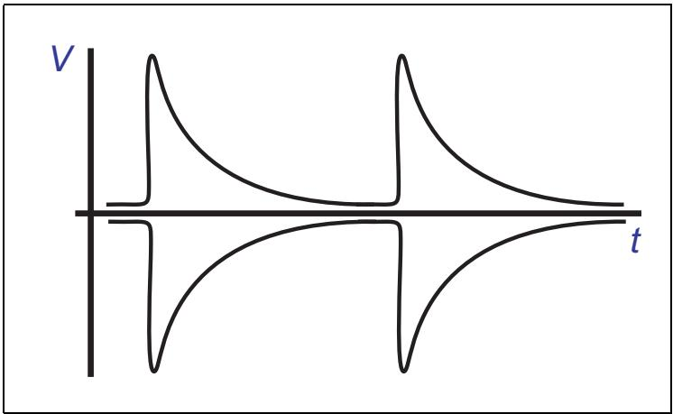
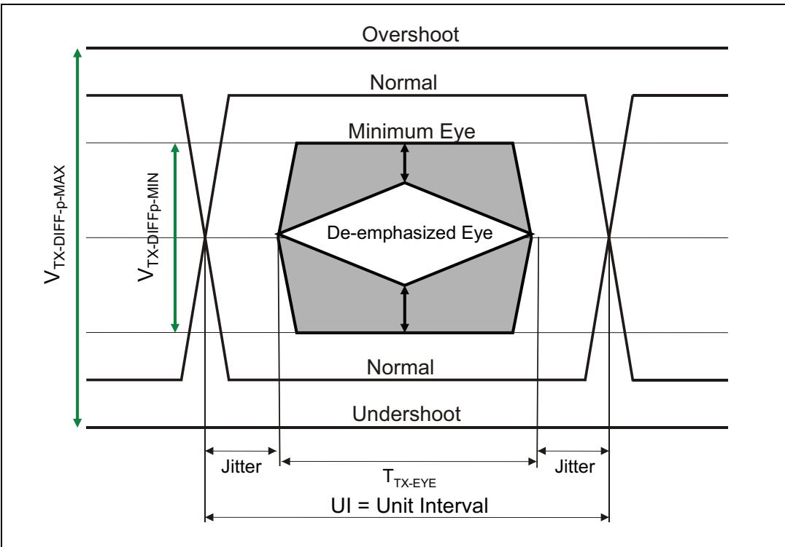
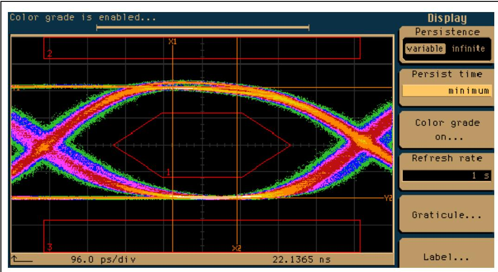
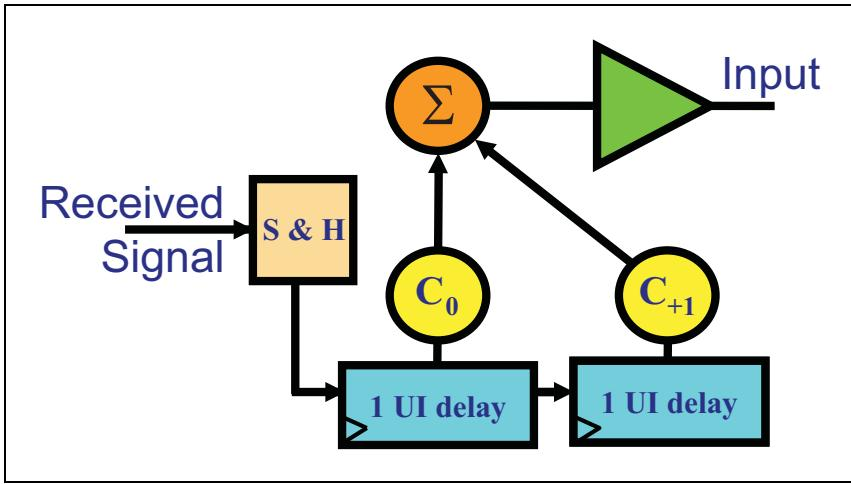
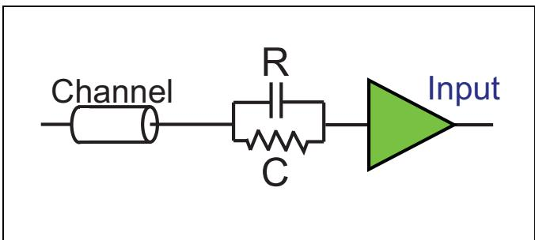
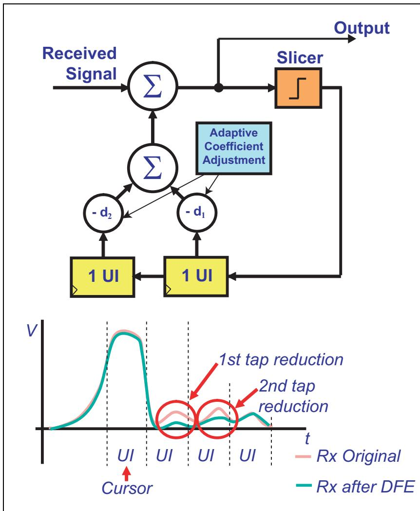
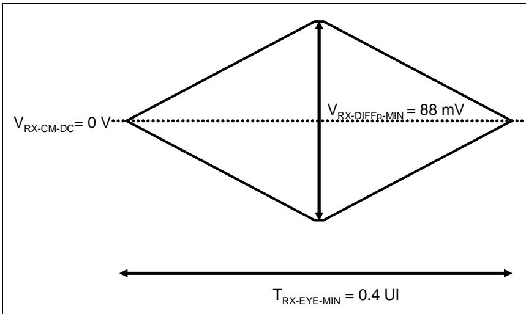
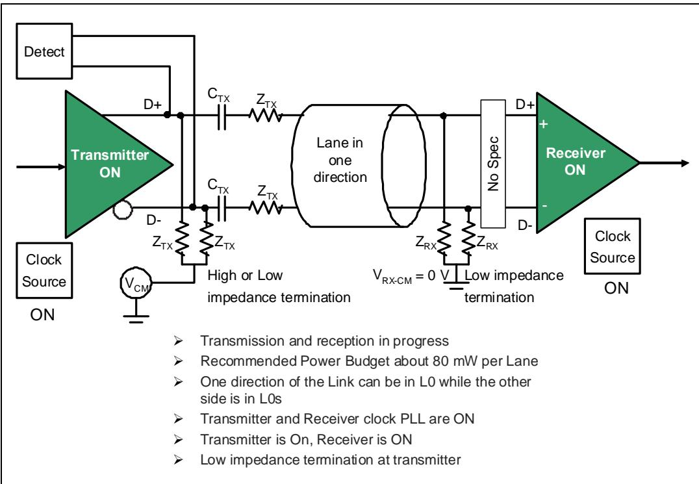
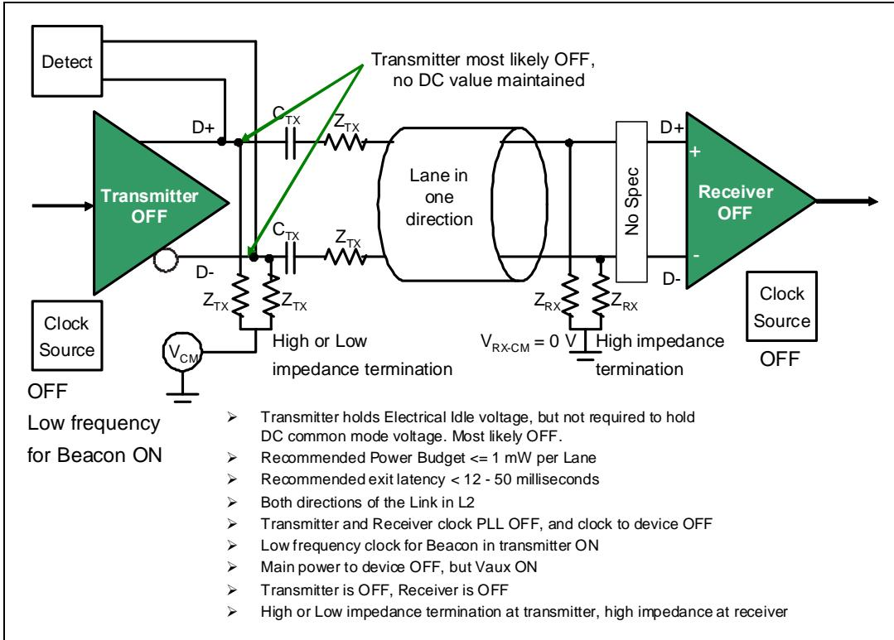
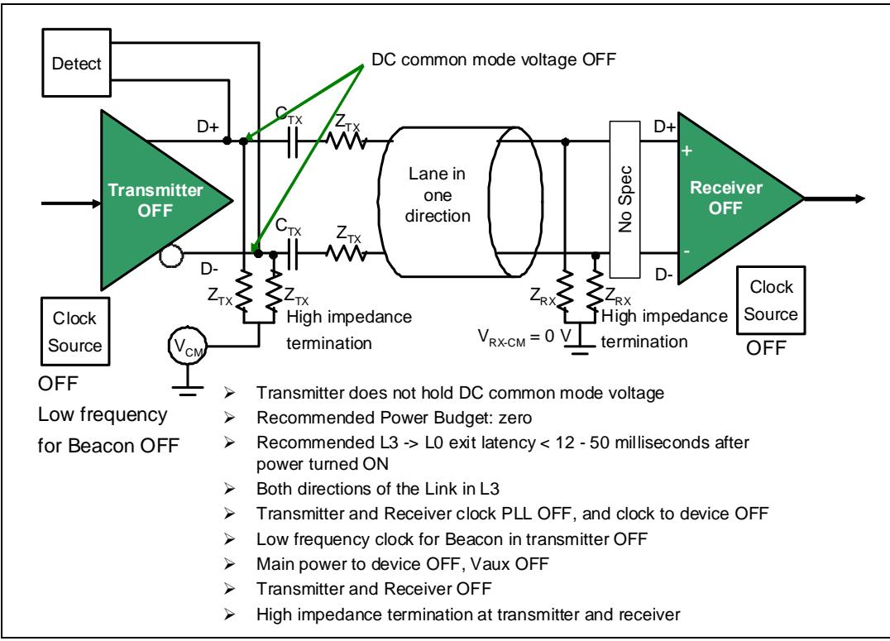

# Ch13_Physical_Layer_Electrical

<table style="border-collapse:collapse; width:100%;">
  <thead>
    <tr>
      <th width="50%" style="border:1px solid #333; background:#f5f5f5;">EN</th>
      <th width="50%" style="border:1px solid #333; background-color:#e8e8e8;">中文</th>
    </tr>
  </thead>
  <tbody>
  </tbody>
</table>

## The Previous Chapter | 上一章

<table style="border-collapse:collapse; width:100%;">
  <thead>
    <tr>
      <th width="50%" style="border:1px solid #333; background:#f5f5f5;">EN</th>
      <th width="50%" style="border:1px solid #333; background-color:#e8e8e8;">中文</th>
    </tr>
  </thead>
  <tbody>
    <tr><td width="50%" style="border:1px solid #333; background:#fff;padding:4px 8px;">The previous chapter describes the logical Physical Layer characteristics for the third generation (Gen3) of PCIe. The major change includes the ability to double the bandwidth relative to Gen2 speed without needing to double the frequency (Link speed goes from 5 GT/s to 8 GT/s). This is accomplished by eliminating 8b/10b encoding when in Gen3 mode. More robust signal compensation is necessary at Gen3 speed. Making these changes is more complex than might be expected.</td><td width="50%" style="border:1px solid #333; background-color:#e8e8e8;padding:4px 8px;">上一章描述了 PCIe 第三代（Gen3）的逻辑物理层特性。其主要变化包括：无需将频率加倍即可使带宽相对于 Gen2 速度翻倍（链路速度从 5 GT/s 提升至 8 GT/s）。这是通过在 Gen3 模式下取消 8b/10b 编码来实现的。在 Gen3 速度下需要更鲁棒的信号补偿。实施这些变更比预期的更为复杂。</td></tr>
  </tbody>
</table>

## This Chapter | 本章

<table style="border-collapse:collapse; width:100%;">
  <thead>
    <tr>
      <th width="50%" style="border:1px solid #333; background:#f5f5f5;">EN</th>
      <th width="50%" style="border:1px solid #333; background-color:#e8e8e8;">中文</th>
    </tr>
  </thead>
  <tbody>
    <tr><td width="50%" style="border:1px solid #333; background:#fff;padding:4px 8px;">This chapter describes the Physical Layer electrical interface to the Link, including some low‐level characteristics of the differential Transmitters and Receivers. The need for signal equalization and the methods used to accomplish it are also discussed here. This chapter combines electrical transmitter and receiver characteristics for both Gen1, Gen2 and Gen3 speeds.</td><td width="50%" style="border:1px solid #333; background-color:#e8e8e8;padding:4px 8px;">本章描述链路物理层电气接口，包括差分发送器和接收器的一些底层特性。此外还讨论了信号均衡的必要性及其实现方法。本章综合涵盖了 Gen1、Gen2 和 Gen3 速率下的电发送器和接收器特性。</td></tr>
  </tbody>
</table>

## The Next Chapter | 下一章

<table style="border-collapse:collapse; width:100%;">
  <thead>
    <tr>
      <th width="50%" style="border:1px solid #333; background:#f5f5f5;">EN</th>
      <th width="50%" style="border:1px solid #333; background-color:#e8e8e8;">中文</th>
    </tr>
  </thead>
  <tbody>
    <tr><td width="50%" style="border:1px solid #333; background:#fff;padding:4px 8px;">The next chapter describes the operation of the Link Training and Status State Machine (LTSSM) of the Physical Layer.</td><td width="50%" style="border:1px solid #333; background-color:#e8e8e8;padding:4px 8px;">下一章描述物理层链路训练与状态状态机（LTSSM）的操作。</td></tr>
    <tr><td width="50%" style="border:1px solid #333; background:#fff;padding:4px 8px;">The initialization process of the Link is described from Power-On or Reset until the Link reaches the fully-operational L0 state during which normal packet traffic occurs.</td><td width="50%" style="border:1px solid #333; background-color:#e8e8e8;padding:4px 8px;">描述链路从上电或复位到达到完全运行状态L0（在此期间进行正常报文传输）的初始化过程。</td></tr>
    <tr><td width="50%" style="border:1px solid #333; background:#fff;padding:4px 8px;">In addition, the Link power management states L0s, L1, L2, L3 are discussed along with the causes of transitions between the states.</td><td width="50%" style="border:1px solid #333; background-color:#e8e8e8;padding:4px 8px;">此外，还讨论了链路电源管理状态L0s、L1、L2、L3，以及这些状态之间转换的原因。</td></tr>
    <tr><td width="50%" style="border:1px solid #333; background:#fff;padding:4px 8px;">The Recovery state during which bit lock, symbol lock or block lock can be re-established is described.</td><td width="50%" style="border:1px solid #333; background-color:#e8e8e8;padding:4px 8px;">描述了恢复状态（Recovery），在该状态下可以重新建立位锁定、符号锁定或块锁定。</td></tr>
  </tbody>
</table>

<table style="border-collapse:collapse; width:100%;">
  <thead>
    <tr>
      <th width="50%" style="border:1px solid #333; background:#f5f5f5;">EN</th>
      <th width="50%" style="border:1px solid #333; background-color:#e8e8e8;">中文</th>
    </tr>
  </thead>
  <tbody>
    <tr><td width="50%" style="border:1px solid #333; background:#fff;padding:4px 8px;">## Backward Compatibility</td><td width="50%" style="border:1px solid #333; background-color:#e8e8e8;padding:4px 8px;">## 向后兼容性</td></tr>
    <tr><td width="50%" style="border:1px solid #333; background:#fff;padding:4px 8px;">The spec begins the Physical Layer Electrical section with the observation that newer data rates need to be backward compatible with the older rates. The following summary defines the requirements:</td><td width="50%" style="border:1px solid #333; background-color:#e8e8e8;padding:4px 8px;">规范在物理层电气部分的开头指出，较新的数据速率需要与较旧的速率保持向后兼容。以下总结定义了这些要求：</td></tr>
    <tr><td width="50%" style="border:1px solid #333; background:#fff;padding:4px 8px;">• Initial training is done at 2.5 GT/s for all devices.</td><td width="50%" style="border:1px solid #333; background-color:#e8e8e8;padding:4px 8px;">• 所有设备的初始训练均在2.5 GT/s下完成。</td></tr>
    <tr><td width="50%" style="border:1px solid #333; background:#fff;padding:4px 8px;">• Changing to other rates requires negotiation between the Link partners to determine the peak common frequency.</td><td width="50%" style="border:1px solid #333; background-color:#e8e8e8;padding:4px 8px;">• 更改为其他速率需要链路双方进行协商，以确定最高的共同频率。</td></tr>
    <tr><td width="50%" style="border:1px solid #333; background:#fff;padding:4px 8px;">Root ports that support 8.0 GT/s are required to support both 2.5 and 5.0 GT/s as well.</td><td width="50%" style="border:1px solid #333; background-color:#e8e8e8;padding:4px 8px;">支持8.0 GT/s的根端口也必须同时支持2.5 GT/s和5.0 GT/s。</td></tr>
    <tr><td width="50%" style="border:1px solid #333; background:#fff;padding:4px 8px;">Downstream devices must obviously support 2.5 GT/s, but all higher rates are optional. This means that an 8 GT/s device is not required to support 5 GT/s.</td><td width="50%" style="border:1px solid #333; background-color:#e8e8e8;padding:4px 8px;">下游设备显然必须支持2.5 GT/s，但所有更高的速率均为可选。这意味着8 GT/s的设备不要求支持5 GT/s。</td></tr>
    <tr><td width="50%" style="border:1px solid #333; background:#fff;padding:4px 8px;">In addition, the optional Reference clock (Refclk) remains the same regardless of the data rate and does not require improved jitter characteristics to support the higher rates.</td><td width="50%" style="border:1px solid #333; background-color:#e8e8e8;padding:4px 8px;">此外，可选的参考时钟(Refclk)无论数据速率如何都保持不变，且不需要改进的抖动特性来支持更高的速率。</td></tr>
    <tr><td width="50%" style="border:1px solid #333; background:#fff;padding:4px 8px;">In spite of these similarities, the spec does describe some changes for the 8.0 GT/s rate:</td><td width="50%" style="border:1px solid #333; background-color:#e8e8e8;padding:4px 8px;">尽管有这些相似之处，规范确实描述了8.0 GT/s速率下的一些变化：</td></tr>
    <tr><td width="50%" style="border:1px solid #333; background:#fff;padding:4px 8px;">ESD standards: Earlier PCIe versions required all signal and power pins to withstand a certain level of ESD (Electro-Static Discharge) and that's true for the 3.0 spec, too. The difference is that more JEDEC standards are listed and the spec notes that they apply to devices regardless of which rates they support.</td><td width="50%" style="border:1px solid #333; background-color:#e8e8e8;padding:4px 8px;">ESD标准：早期的PCIe版本要求所有信号引脚和电源引脚能够承受一定程度的静电放电(ESD)，3.0规范也是如此。不同之处在于列出了更多的JEDEC标准，并且规范指出这些标准适用于所有设备，无论它们支持何种速率。</td></tr>
    <tr><td width="50%" style="border:1px solid #333; background:#fff;padding:4px 8px;">Rx powered-off Resistance: The new impedance values specified for 8.0 GT/s (ZRX-HIGH-IMP-DC-POS and ZRX-HIGH-IMP-DC-NEG) will be applied to devices supporting 2.5 and 5.0 GT/s as well.</td><td width="50%" style="border:1px solid #333; background-color:#e8e8e8;padding:4px 8px;">Rx断电电阻：为8.0 GT/s指定的新阻抗值(ZRX-HIGH-IMP-DC-POS和ZRX-HIGH-IMP-DC-NEG)也将适用于支持2.5 GT/s和5.0 GT/s的设备。</td></tr>
    <tr><td width="50%" style="border:1px solid #333; background:#fff;padding:4px 8px;">Tx Equalization Tolerance: Relaxing the previous spec tolerance on the Tx de-emphasis values from +/- 0.5 dB to +/- 1.0 dB makes the -3.5 and -6.0 dB de-emphasis tolerance consistent across all three data rates.</td><td width="50%" style="border:1px solid #333; background-color:#e8e8e8;padding:4px 8px;">Tx均衡容限：将先前规范中Tx去加重值的容限从+/-0.5 dB放宽到+/-1.0 dB，使得-3.5 dB和-6.0 dB去加重容限在所有三种数据速率上保持一致。</td></tr>
    <tr><td width="50%" style="border:1px solid #333; background:#fff;padding:4px 8px;">Tx Equalization during Tx Margining: The de-emphasis tolerance was already relaxed to +/- 1.0 dB for this case in the earlier specs. The accuracy for 8.0 GT/s is determined by the Tx coefficient granularity and the TxEQ tolerances for the Transmitter during normal operation.</td><td width="50%" style="border:1px solid #333; background-color:#e8e8e8;padding:4px 8px;">Tx裕量测试期间的Tx均衡：在先前的规范中，此情况下的去加重容限已放宽到+/-1.0 dB。8.0 GT/s的精度由Tx系数粒度以及正常操作期间发送器的TxEQ容限决定。</td></tr>
    <tr><td width="50%" style="border:1px solid #333; background:#fff;padding:4px 8px;">• V and V : For 2.5 and 5.0 GT/s these are relaxed to 150 mVPP for the Transmitter and 300 mVPP for the Receiver.</td><td width="50%" style="border:1px solid #333; background-color:#e8e8e8;padding:4px 8px;">• V和V：对于2.5 GT/s和5.0 GT/s，发送器放宽至150 mVPP，接收器放宽至300 mVPP。</td></tr>
  </tbody>
</table>

## 13.2 Component Interfaces | 13.2 组件接口

<table style="border-collapse:collapse; width:100%;">
  <thead>
    <tr>
      <th width="50%" style="border:1px solid #333; background:#f5f5f5;">EN</th>
      <th width="50%" style="border:1px solid #333; background-color:#e8e8e8;">中文</th>
    </tr>
  </thead>
  <tbody>
    <tr><td width="50%" style="border:1px solid #333; background:#fff;padding:4px 8px;">Components from different vendors must work reliably together, so a set of parameters are specified that must be met for the interface. For 2.5 GT/s it was implied, and for 5.0 GT/s it was explicitly stated, that the characteristics of this interface are defined at the device pins. That allows a component to be characterized independently, without requiring the use of any other PCIe components. Other interfaces may be specified at a connector or other location, but those are not covered in the base spec and would be described in other form-factor specs like the PCI Express Card Electromechanical Spec.</td><td width="50%" style="border:1px solid #333; background-color:#e8e8e8;padding:4px 8px;">来自不同厂商的组件必须能够可靠地协同工作，因此针对接口规定了一组必须满足的参数。对于 2.5 GT/s，这一规定是隐含的；而对于 5.0 GT/s，则明确说明该接口的特性是在器件引脚处定义的。这使得组件可以独立进行特性描述，无需依赖任何其他 PCIe 组件。其他接口可能在连接器或其他位置定义，但这些不在基础规范中涵盖，将在其他外形因素规范（如 PCI Express 卡机电规范）中描述。</td></tr>
  </tbody>
</table>

## 13.3 Physical Layer Electrical Overview | 13.3 物理层电气概述

<table style="border-collapse:collapse; width:100%;">
  <thead>
    <tr>
      <th width="50%" style="border:1px solid #333; background:#f5f5f5;">EN</th>
      <th width="50%" style="border:1px solid #333; background-color:#e8e8e8;">中文</th>
    </tr>
  </thead>
  <tbody>
    <tr><td width="50%" style="border:1px solid #333; background:#fff;padding:4px 8px;">The electrical sub‑block associated with each lane, as shown in Figure 13‑1 on page 450, provides the physical interface to the Link and contains differential Transmitters and Receivers. The Transmitter delivers outbound Symbols on each Lane by converting the bit stream into two single‑ended electrical signals with opposite polarity. Receivers compare the two signals and, when the difference is sufficiently positive or negative, generate a one or zero internally to represent the intended serial bit stream to the rest of the Physical Layer.</td><td width="50%" style="border:1px solid #333; background-color:#e8e8e8;padding:4px 8px;">如图13‑1（第450页）所示，每条通道关联的电气子块提供了链路的物理接口，包含差分发送器和接收器。发送器通过将比特流转换为两个极性相反的单端电信号，在每条通道上发送传出符号。接收器比较这两个信号，当差值足够正或足够负时，内部生成1或0，以向物理层的其余部分表示预期的串行比特流。</td></tr>
  </tbody>
</table>

Figure 13‑1: Electrical Sub‑Block of the Physical Layer | 图13‑1：物理层的电子子块

<table style="border-collapse:collapse; width:100%;">
  <thead>
    <tr>
      <th width="50%" style="border:1px solid #333; background:#f5f5f5;">EN</th>
      <th width="50%" style="border:1px solid #333; background-color:#e8e8e8;">中文</th>
    </tr>
  </thead>
  <tbody>
    <tr><td width="50%" style="border:1px solid #333; background:#fff;padding:4px 8px;">When the Link is in the L0 full‑on state, the drivers apply the differential voltage associated with a logical 1 and logical 0 while maintaining the correct DC common mode voltage. Receivers sense this voltage as the input stream, but if it drops below a threshold value, it’s understood to represent the Electrical Idle Link condition. Electrical Idle is entered when the Link is disabled, or when ASPM logic puts the Link into low‑power Link states such as L0s or L1 (see "Electrical Idle" on page 736 for more on this topic).</td><td width="50%" style="border:1px solid #333; background-color:#e8e8e8;padding:4px 8px;">当链路处于L0完全开启状态时，驱动器在保持正确直流共模电压的同时施加与逻辑1和逻辑0相关的差分电压。接收器将该电压作为输入流进行感应，但如果电压降至阈值以下，则理解为表示电气空闲链路条件。当链路被禁用，或ASPM逻辑将链路置入低功耗链路状态（如L0s或L1）时，将进入电气空闲状态（有关此主题的更多信息，请参见第736页的"电气空闲"）。</td></tr>
    <tr><td width="50%" style="border:1px solid #333; background:#fff;padding:4px 8px;">Devices must support the Transmitter equalization methods required for each supported data rate so they can achieve adequate signal integrity. De‑emphasis is applied for 2.5 and 5.0 GT/s, and a more complex equalization process is applied for 8.0 GT/s. These are described in more detail in "Signal Compensation" on page 468, and "Recovery.Equalization" on page 587.</td><td width="50%" style="border:1px solid #333; background-color:#e8e8e8;padding:4px 8px;">设备必须支持每种支持的数据速率所需的发送器均衡方法，以便实现足够的信号完整性。2.5 GT/s和5.0 GT/s采用去加重，而8.0 GT/s则采用更复杂的均衡过程。这些内容在第468页的"信号补偿"和第587页的"恢复.均衡"中有更详细的描述。</td></tr>
    <tr><td width="50%" style="border:1px solid #333; background:#fff;padding:4px 8px;">The drivers and Receivers are short‑circuit tolerant, making PCIe add‑in cards suited for hot (powered‑on) insertion and removal events in a hot‑plug environment. The Link connecting two components is AC‑coupled by adding a capacitor in‑line, typically near the Transmitter side of the Link. This serves to decouple the DC part of the signal between the Link partners and means they don’t have to share a common power supply or ground return path, as when the devices are connected over a cable. Figure 13‑1 on page 450 illustrates the placement of this capacitor (CTX) on the Link.</td><td width="50%" style="border:1px solid #333; background-color:#e8e8e8;padding:4px 8px;">驱动器和接收器具有短路耐受能力，使得PCIe插卡适用于热插拔环境中的带电插入和移除操作。连接两个组件的链路通过在线添加电容器（通常靠近链路的发送器侧）进行交流耦合。这用于解耦链路伙伴之间的信号直流分量，意味着它们不需要共享共同的电源或接地回路路径，就像设备通过电缆连接时一样。第450页的图13‑1展示了该电容器（CTX）在链路上的位置。</td></tr>
  </tbody>
</table>

## 13.4 High Speed Signaling | 13.4 高速信令

<table style="border-collapse:collapse; width:100%;">
  <thead>
    <tr>
      <th width="50%" style="border:1px solid #333; background:#f5f5f5;">EN</th>
      <th width="50%" style="border:1px solid #333; background-color:#e8e8e8;">中文</th>
    </tr>
  </thead>
  <tbody>
    <tr><td width="50%" style="border:1px solid #333; background:#fff;padding:4px 8px;">The high-speed signaling environment of PCIe is characterized by the drawing in Figure 13-2 on page 451. This low-voltage differential signaling environment is a common method used in many serial transports and one reason is for the noise rejection it provides. Electrical noise that affects one signal will also affect the other because they are on adjacent pins and their traces are very close to each other. Since both signals are influenced, as shown in Figure 13-3 on page 452, the difference between them doesn't change much and is therefore not seen at the receiver.</td><td width="50%" style="border:1px solid #333; background-color:#e8e8e8;padding:4px 8px;">PCIe的高速信号传输环境如图13-2（第451页）所示。这种低压差分信号传输环境是许多串行传输中常用的方法，其原因之一在于其提供的噪声抑制能力。由于两个信号位于相邻引脚上且其走线彼此非常靠近，因此影响一个信号的电噪声也会影响另一个信号。如图13-3（第452页）所示，由于两个信号都受到干扰，它们之间的差值变化不大，因此在接收端不会被察觉。</td></tr>
    <tr><td width="50%" style="border:1px solid #333; background:#fff;padding:4px 8px;">A design goal for the 3.0 spec revision was that the 8.0 GT/s rate should still work with existing standard FR4 circuit boards and connectors, and that was achieved by changing the encoding scheme from the old 8b/10b to the new 128b/130b model to keep the frequency low. This goal will probably change with the next speed step (Gen4).</td><td width="50%" style="border:1px solid #333; background-color:#e8e8e8;padding:4px 8px;">3.0规范修订版的一个设计目标是8.0 GT/s速率应仍能在现有标准FR4电路板和连接器上工作，这一目标通过将编码方案从旧的8b/10b改为新的128b/130b模型以保持较低频率而得以实现。这一目标可能会随下一个速率等级（Gen4）而改变。</td></tr>
  </tbody>
</table>

Figure 13-2: Differential Transmitter/Receiver | 图13-2：差分发送器/接收器

Figure 13-3: Differential Common-Mode Noise Rejection | 图13-3：差分共模噪声抑制

## 13.5 Clock Requirements | 13.5 时钟要求

<table style="border-collapse:collapse; width:100%;">
  <thead>
    <tr>
      <th width="50%" style="border:1px solid #333; background:#f5f5f5;">EN</th>
      <th width="50%" style="border:1px solid #333; background-color:#e8e8e8;">中文</th>
    </tr>
  </thead>
  <tbody>
    <tr><td width="50%" style="border:1px solid #333; background:#fff;padding:4px 8px;">## Clock Requirements</td><td width="50%" style="border:1px solid #333; background-color:#e8e8e8;padding:4px 8px;">## 时钟要求</td></tr>
  </tbody>
</table>

## 13.5.1.1 General | 13.5.1.1 概述

<table style="border-collapse:collapse; width:100%;">
  <thead>
    <tr>
      <th width="50%" style="border:1px solid #333; background:#f5f5f5;">EN</th>
      <th width="50%" style="border:1px solid #333; background-color:#e8e8e8;">中文</th>
    </tr>
  </thead>
  <tbody>
    <tr><td width="50%" style="border:1px solid #333; background:#fff;padding:4px 8px;">For all data rates, both Transmitter and Receiver clocks must be accurate to within +/- 300 ppm (parts per million) of the center frequency. In the worst case, the Transmitter and Receiver could both be off by 300 ppm in opposite directions, resulting in a maximum difference of 600 ppm. That worst-case model translates to a gain or loss of 1 clock every 1666 clocks and that's the difference that a Receiver's clock compensation logic must take into account.</td><td width="50%" style="border:1px solid #333; background-color:#e8e8e8;padding:4px 8px;">对于所有数据速率，发送器和接收器的时钟相对于中心频率的精度必须在 +/- 300 ppm（百万分之一）以内。在最坏情况下，发送器和接收器可能分别偏离 300 ppm 且方向相反，导致最大差异为 600 ppm。该最坏情况模型相当于每 1666 个时钟周期损失或增加 1 个时钟，这是接收器时钟补偿逻辑必须考虑到的差异。</td></tr>
    <tr><td width="50%" style="border:1px solid #333; background:#fff;padding:4px 8px;">Devices are allowed to derive their clocks from an external source, and the 100 MHz Refclk is still optionally available for this purpose in the 3.0 spec. Using the Refclk permits both Link partners to readily maintain the 600 ppm accuracy even when Spread Spectrum Clocking is applied.</td><td width="50%" style="border:1px solid #333; background-color:#e8e8e8;padding:4px 8px;">允许器件从外部源导出其时钟，并且在 3.0 规范中仍可选地提供 100 MHz Refclk 用于此目的。使用 Refclk 可使链路双方即使在应用扩频时钟时也能轻松维持 600 ppm 的精度。</td></tr>
  </tbody>
</table>

## 13.5.1 SSC (Spread Spectrum Clocking) | 13.5.1 SSC（扩频时钟）

<table style="border-collapse:collapse; width:100%;">
  <thead>
    <tr>
      <th width="50%" style="border:1px solid #333; background:#f5f5f5;">EN</th>
      <th width="50%" style="border:1px solid #333; background-color:#e8e8e8;">中文</th>
    </tr>
  </thead>
  <tbody>
    <tr><td width="50%" style="border:1px solid #333; background:#fff;padding:4px 8px;">SSC is an optional technique used to modulate the clock frequency slowly over a prescribed range to spread the signal's EMI (Electro-Magnetic Interference) across a range of frequencies rather than allowing it all to be concentrated at the center frequency. Spreading the radiated energy helps a device or system to pass government emissions standards by staying under a threshold value, as illustrated in Figure 13-4 on page 454. Note that the frequency of interest for the signal is only half the clock rate because two rising clock edges are needed to create one cycle on the data, as illustrated in Figure 13-5 on page 454. For example, a 2.5 GT/s rate uses a bit clock of 2.5 GHz, resulting in a frequency of interest on the traces of 1.25 GHz.</td><td width="50%" style="border:1px solid #333; background-color:#e8e8e8;padding:4px 8px;">SSC 是一种可选技术，用于在指定范围内缓慢调制时钟频率，将信号的 EMI（电磁干扰）分散到一定频率范围内，而不是让所有能量集中在中心频率上。分散辐射能量有助于设备或系统保持在阈值以下，从而通过政府排放标准，如图 13-4（第 454 页）所示。请注意，信号关心的频率仅为时钟速率的一半，因为需要在数据上产生一个周期需要两个时钟上升沿，如图 13-5（第 454 页）所示。例如，2.5 GT/s 的速率使用 2.5 GHz 的位时钟，导致走线上关心的频率为 1.25 GHz。</td></tr>
    <tr><td width="50%" style="border:1px solid #333; background:#fff;padding:4px 8px;">The use of SSC is not required by the spec but, if will be supported, the following rules apply:</td><td width="50%" style="border:1px solid #333; background-color:#e8e8e8;padding:4px 8px;">规范不要求必须使用 SSC，但如果支持，则适用以下规则：</td></tr>
    <tr><td width="50%" style="border:1px solid #333; background:#fff;padding:4px 8px;">The clock can be modulated by +0% to -0.5% from nominal (5000 ppm), referred to as "down spreading." A frequency modulation envelope is not specified, but a sawtooth-wave pattern like the one shown in Figure 13-6 on page 455 yields good results. Note that there is a trade-off with down spreading, because the average clock frequency will now be 0.25% lower than it would have been without SSC, resulting in a slight performance reduction.</td><td width="50%" style="border:1px solid #333; background-color:#e8e8e8;padding:4px 8px;">时钟可在标称频率的 +0% 至 -0.5%（5000 ppm）范围内调制，称为"向下扩频"。规范未指定频率调制包络线，但如图 13-6（第 455 页）所示的锯齿波模式可获得良好效果。请注意，向下扩频存在一个折衷：平均时钟频率将比不使用 SSC 时低 0.25%，从而导致轻微的性能下降。</td></tr>
    <tr><td width="50%" style="border:1px solid #333; background:#fff;padding:4px 8px;">• The modulation rate must be between 30KHz and 33KHz.</td><td width="50%" style="border:1px solid #333; background-color:#e8e8e8;padding:4px 8px;">• 调制速率必须在 30KHz 至 33KHz 之间。</td></tr>
    <tr><td width="50%" style="border:1px solid #333; background:#fff;padding:4px 8px;">The +/- 300 ppm requirement for clock frequency accuracy still holds and therefore so does the maximum 600 ppm variation between Link partners. The spec states that most implementations will require both Link partners to use the same clock source, although it's not required. One way to do that would be for them to both use a modulated version of the Refclk to derive their own clocks (see "Common Refclk" on page 456).</td><td width="50%" style="border:1px solid #333; background-color:#e8e8e8;padding:4px 8px;">对于时钟频率精度的 +/- 300 ppm 要求仍然有效，因此链路伙伴之间的最大 600 ppm 偏差也同样适用。规范指出，大多数实现将要求两个链路伙伴使用相同的时钟源，尽管这不是强制要求。一种实现方式是两者都使用调制版本的 Refclk 来导出各自的时钟（参见第 456 页的"Common Refclk"）。</td></tr>
  </tbody>
</table>

Figure 13-4: SSC Motivation | 图13-4：SSC动机

Figure 13-5: Signal Rate Less Than Half the Clock Rate | 图13-5：信号速率低于时钟速率的一半

Figure 13-6: SSC Modulation Example | 图13-6：SSC调制示例

## 13.5.2 Refclk Overview | 13.5.2 Refclk 概述

<table style="border-collapse:collapse; width:100%;">
  <thead>
    <tr>
      <th width="50%" style="border:1px solid #333; background:#f5f5f5;">EN</th>
      <th width="50%" style="border:1px solid #333; background-color:#e8e8e8;">中文</th>
    </tr>
  </thead>
  <tbody>
    <tr><td width="50%" style="border:1px solid #333; background:#fff;padding:4px 8px;">Receivers must generate their own clocks to operate their internal logic, but there are some options for generating the recovered clock for the incoming bit stream. The details for them have developed with each succeeding version of the spec and are based on the data rate.</td><td width="50%" style="border:1px solid #333; background-color:#e8e8e8;padding:4px 8px;">接收器必须生成自己的时钟以运行其内部逻辑，但在为传入比特流生成恢复时钟方面存在一些选项。其细节随每个后续版本的规范而演进，并基于数据速率而定。</td></tr>
  </tbody>
</table>

## 13.5.2.1 GT/s Overview | 13.5.2.1 GT/s 概述

<table style="border-collapse:collapse; width:100%;">
  <thead>
    <tr>
      <th width="50%" style="border:1px solid #333; background:#f5f5f5;">EN</th>
      <th width="50%" style="border:1px solid #333; background-color:#e8e8e8;">中文</th>
    </tr>
  </thead>
  <tbody>
    <tr><td width="50%" style="border:1px solid #333; background:#fff;padding:4px 8px;">In the early spec versions using the 2.5 GT/s rate, information regarding the optional Refclk was not included in the base spec but instead in the separate CEM (Card Electro‑Mechanical) spec for PCIe. A number of parameters were specified there and several general terms have been carried forward to the newer versions of the spec. The Refclk was described as a 100 MHz differential clock driving a 100 Ω differential load (+/‑ 10%) with a trace length limited to 4 inches. SSC is allowed, as described in "SSC (Spread Spectrum Clocking)" on page 453.</td><td width="50%" style="border:1px solid #333; background-color:#e8e8e8;padding:4px 8px;">在使用 2.5 GT/s 速率的早期规范版本中，有关可选参考时钟（Refclk）的信息并未包含在基础规范中，而是放在独立的 PCIe CEM（卡机电）规范中。其中规定了若干参数，并且一些通用术语延用到了较新版本的规范中。参考时钟被描述为一个 100 MHz 差分时钟，驱动 100 Ω 差分负载（+/‑ 10%），走线长度限制在 4 英寸以内。允许使用 SSC，详见第 453 页的 "SSC（展频时钟）"。</td></tr>
  </tbody>
</table>

## 13.5.2.1 GT/s Overview | 13.5.2.1 GT/s 概述

<table style="border-collapse:collapse; width:100%;">
  <thead>
    <tr>
      <th width="50%" style="border:1px solid #333; background:#f5f5f5;">EN</th>
      <th width="50%" style="border:1px solid #333; background-color:#e8e8e8;">中文</th>
    </tr>
  </thead>
  <tbody>
    <tr><td width="50%" style="border:1px solid #333; background:#fff;padding:4px 8px;">When the 5.0 GT/s rate was developed, the spec writers chose to include the Refclk information in the electrical section of the base spec and listed three options for the clock architecture:</td><td width="50%" style="border:1px solid #333; background-color:#e8e8e8;padding:4px 8px;">在开发5.0 GT/s速率时，规范编写者选择将Refclk信息纳入基础规范的电气部分，并列出了三种时钟架构选项：</td></tr>
    <tr><td width="50%" style="border:1px solid #333; background:#fff;padding:4px 8px;">**Common Refclk.** The first architecture described is one in which both Link partners make use of the same Refclk, as shown in Figure 13-7 on page 456. There are three straightforward advantages for this implementation:</td><td width="50%" style="border:1px solid #333; background-color:#e8e8e8;padding:4px 8px;">**公共Refclk.** 所描述的第一种架构是链路双方使用相同的Refclk，如第456页图13-7所示。这种实现有三个明显的优点：</td></tr>
    <tr><td width="50%" style="border:1px solid #333; background:#fff;padding:4px 8px;">First, the jitter associated with the reference clock is the same for both Tx and Rx and is thus tracked and accounted for intrinsically.</td><td width="50%" style="border:1px solid #333; background-color:#e8e8e8;padding:4px 8px;">第一，与参考时钟相关的抖动对发送端和接收端相同，因此可被内在跟踪和消除。</td></tr>
    <tr><td width="50%" style="border:1px solid #333; background:#fff;padding:4px 8px;">Second, the use of SSC will be simplest with this model because maintaining the 600 ppm separation between the Tx and Rx clocks is easy if both follow the same modulated reference.</td><td width="50%" style="border:1px solid #333; background-color:#e8e8e8;padding:4px 8px;">第二，使用SSC在这种模式下最为简单，因为如果发送端和接收端跟随相同的调制参考，保持两者时钟之间600 ppm的间隔很容易。</td></tr>
    <tr><td width="50%" style="border:1px solid #333; background:#fff;padding:4px 8px;">Third, the Refclk remains available during low-power Link states L0s and L1 and that allows the Receiver's CDR to maintain a semblance of the recovered clock even in the absence of a bit stream to supply the edges in the data. That, in turn, keeps the local PLLs from drifting as much as they otherwise would, resulting in a reduced recovery time back to L0 compared to the other clocking options.</td><td width="50%" style="border:1px solid #333; background-color:#e8e8e8;padding:4px 8px;">第三，在低功耗链路状态L0s和L1期间Refclk仍然可用，这使得接收端的CDR即使在缺少提供数据边沿的比特流时，也能保持恢复时钟的某种形态。这反过来使本地PLL不会像其他情况下那样严重漂移，从而相比其他时钟选项，恢复到L0的恢复时间更短。</td></tr>
  </tbody>
</table>

Figure 13-7: Shared Refclk Architecture | 图13-7：共享参考时钟架构

<table style="border-collapse:collapse; width:100%;">
  <thead>
    <tr>
      <th width="50%" style="border:1px solid #333; background:#f5f5f5;">EN</th>
      <th width="50%" style="border:1px solid #333; background-color:#e8e8e8;">中文</th>
    </tr>
  </thead>
  <tbody>
    <tr><td width="50%" style="border:1px solid #333; background:#fff;padding:4px 8px;">**Data Clocked Rx Architecture.** In this clock architecture, the Receiver doesn't use a reference clock at all, but simply recovers the Transmitter clock from the data stream, as shown in Figure 13-9 on page 457. This implementation is clearly the simplest of the three and would therefore ordinarily be preferred. The spec doesn't prohibit the use of SSC in this model, but doing so would bring up two issues. First, the Receiver CDR must remain locked onto the input frequency as it modulates through a much wider range (5600 ppm instead of the usual 600 ppm), and that could require more complex logic. And second, the maximum clock frequency separation of 600 ppm must still be maintained and it's less clear how that would be done without a common reference.</td><td width="50%" style="border:1px solid #333; background-color:#e8e8e8;padding:4px 8px;">**数据时钟接收架构.** 在这种时钟架构中，接收端完全不使用参考时钟，而是简单地从数据流中恢复发送端时钟，如第457页图13-9所示。这种实现显然是三种中最简单的，因此通常会被优先选择。规范不禁止在这种模型中使用SSC，但这样做会带来两个问题。第一，接收端CDR必须在输入频率调制通过更宽的范围（5600 ppm而非通常的600 ppm）时保持锁定，这可能需要更复杂的逻辑。第二，600 ppm的最大时钟频率间隔仍需保持，而在没有公共参考的情况下如何做到这一点则不太明确。</td></tr>
  </tbody>
</table>

Figure 13-8: Data Clocked Rx Architecture | 图13-8：数据时钟接收器架构

<table style="border-collapse:collapse; width:100%;">
  <thead>
    <tr>
      <th width="50%" style="border:1px solid #333; background:#f5f5f5;">EN</th>
      <th width="50%" style="border:1px solid #333; background-color:#e8e8e8;">中文</th>
    </tr>
  </thead>
  <tbody>
    <tr><td width="50%" style="border:1px solid #333; background:#fff;padding:4px 8px;">**Separate Refclks.** Finally, it's also possible for the Link partners to use different reference clocks, as shown in Figure 13-9 on page 457. However, this implementation makes substantially tighter demands on the Refclks because the jitter seen at the Receiver will be the RSS (Root Sum of Squares) combination of them both, making the timing budget difficult. It also becomes enormously more difficult to manage SSC in this model and that's why the spec states that SSC must be turned off in this case. Overall, the spec gives the impression that this is the least desirable alternative, and states that it doesn't explicitly define the requirements for this architecture.</td><td width="50%" style="border:1px solid #333; background-color:#e8e8e8;padding:4px 8px;">**独立Refclks.** 最后，链路双方也可以使用不同的参考时钟，如第457页图13-9所示。然而，这种实现对Refclk提出了更严格的要求，因为接收端看到的抖动将是两者抖动的RSS（平方和根）组合，使得时序预算变得困难。在这种模式下管理SSC也变得极其困难，这就是规范规定在这种情况下必须关闭SSC的原因。总体而言，规范给人的印象是这是最不可取的选择，并指出它没有明确定义这种架构的要求。</td></tr>
  </tbody>
</table>

Figure 13-9: Separate Refclk Architecture | 图13-9：独立参考时钟架构

## 13.5.2.1 GT/s Overview | 13.5.2.1 GT/s 概述

<table style="border-collapse:collapse; width:100%;">
  <thead>
    <tr>
      <th width="50%" style="border:1px solid #333; background:#f5f5f5;">EN</th>
      <th width="50%" style="border:1px solid #333; background-color:#e8e8e8;">中文</th>
    </tr>
  </thead>
  <tbody>
    <tr><td width="50%" style="border:1px solid #333; background:#fff;padding:4px 8px;">The same three clock architectures are described in the spec for this data rate, too. One difference is that two types of CDR are defined now: a 1st order CDR for the shared Refclk architecture, and a 2nd order CDR for the data clocked architecture. This just reflects the fact that, as it was for the lower data rates, the CDR for the data‐clocked architecture will need to be more sophisticated to be able to stay locked when the reference varies over a wide range for SSC.</td><td width="50%" style="border:1px solid #333; background-color:#e8e8e8;padding:4px 8px;">在该数据速率下，规范同样描述了相同的三种时钟架构。一个不同之处在于现在定义了两种类型的CDR：针对共享Refclk架构的一阶CDR，和针对数据时钟架构的二阶CDR。这仅仅反映了一个事实：与较低数据速率的情况一样，数据时钟架构的CDR需要更加复杂，以便在参考时钟因SSC发生大范围变化时能够保持锁定。</td></tr>
  </tbody>
</table>

<table style="border-collapse:collapse; width:100%;">
  <thead>
    <tr>
      <th width="50%" style="border:1px solid #333; background:#f5f5f5;">EN</th>
      <th width="50%" style="border:1px solid #333; background-color:#e8e8e8;">中文</th>
    </tr>
  </thead>
  <tbody>
    <tr><td width="50%" style="border:1px solid #333; background:#fff;padding:4px 8px;">## Transmitter (Tx) Specs</td><td width="50%" style="border:1px solid #333; background-color:#e8e8e8;padding:4px 8px;">## 发送器（Tx）规格</td></tr>
  </tbody>
</table>

| English | 中文 |
|----|----|
| **Measuring Tx Signals** | **测量发送器（Tx）信号** |
| The spec notes that the methods for measuring the Tx output are limited at the higher frequencies. At 2.5 GT/s it's possible to put a test probe very near the pins of the DUT (Device Under Test), but for the higher rates it's necessary to use a "breakout channel" with SMA (SubMiniature version A) microwave-type coaxial connectors, as illustrated at TP1 (Test Point 1), TP2, and TP3 in Figure 13-10 on page 458. Note that it's necessary to have a low-jitter clock source to the device under test, so that jitter seen at the output is only introduced by the device itself. The spec also mentions that it's important during testing for the device to have as many of its Lanes and other outputs in use at the same time as possible, so as to best simulate a real system. | 规范指出，测量发送器（Tx）输出的方法在较高频率下是有限的。在 2.5 GT/s 时，可以将测试探头非常靠近待测器件（DUT）的引脚，但对于更高速率，必须使用带有 SMA（SubMiniature version A）微波型同轴连接器的"引出通道"，如图 13-10（第 458 页）中的 TP1（测试点 1）、TP2 和 TP3 所示。需要注意，待测器件必须有一个低抖动的时钟源，以便输出端观察到的抖动仅由器件本身引入。规范还提到，在测试过程中，器件应尽可能同时使用其尽可能多的 Lane 和其他输出，以便最好地模拟真实系统。 |
| Since the breakout channel introduces some effects to the signal, for 8.0 GT/s it's necessary to be able to measure those effects and remove (de-embed) them from the signal being tested. One way to accomplish this is for the test board to supply another signal path that is very similar to the one used for the device pins. Characterizing this "replica channel" with a known signal gives the needed information about the channel, allowing its effects to be de-embedded from the DUT signals so the signal at the component pins can be recovered. | 由于引出通道会给信号引入一些影响，对于 8.0 GT/s，必须能够测量这些影响并将其从被测信号中移除（去嵌入）。实现这一目标的一种方法是让测试板提供另一条与器件引脚所用路径非常相似的信号路径。用已知信号表征这个"复制通道"可获得关于该通道的必要信息，从而将其影响从待测器件（DUT）信号中去嵌入，以便恢复器件引脚处的信号。 |

**Figure 13-10: Test Circuit Measurement Channels**
**图 13-10：测试电路测量通道**

## 13.6.2 Tx Impedance Requirements | 13.6.2 发送器阻抗要求

<table style="border-collapse:collapse; width:100%;">
  <thead>
    <tr>
      <th width="50%" style="border:1px solid #333; background:#f5f5f5;">EN</th>
      <th width="50%" style="border:1px solid #333; background-color:#e8e8e8;">中文</th>
    </tr>
  </thead>
  <tbody>
    <tr><td width="50%" style="border:1px solid #333; background:#fff;padding:4px 8px;">For best accuracy, the characteristic differential impedance of the Breakout Channel should be 100 Ω differential within 10%, with a single-ended impedance of 50 Ω. To match this environment, Transmitters have a differential low-impedance value during signaling between 80 and 120 Ω at 2.5 GT/s, and no more than 120 Ω at 5.0 and 8.0 GT/s. For receivers, the single-ended impedance is 40 - 60 Ω at 2.5 or 5.0 GT/s, but for 8.0 GT/s no specific value is given. Instead, it's simply noted that the single-ended receiver impedance must be 50 Ω within 20% by the time the Detect LTSSM state is entered so that the detect circuit will sense the Receiver correctly.</td><td width="50%" style="border:1px solid #333; background-color:#e8e8e8;padding:4px 8px;">为获得最佳精度，Breakout Channel（引出通道）的特征差分阻抗应为 100 Ω（差分），容差在 10% 以内，单端阻抗为 50 Ω。为匹配该环境，发送器在 2.5 GT/s 信令时的差分低阻抗值在 80 至 120 Ω 之间，在 5.0 和 8.0 GT/s 时不超过 120 Ω。对于接收器，在 2.5 或 5.0 GT/s 时单端阻抗为 40 - 60 Ω，但在 8.0 GT/s 时未给出具体值。仅指出在进入 Detect LTSSM 状态时，接收器单端阻抗必须为 50 Ω（容差 20% 以内），以便检测电路正确感应到接收器。</td></tr>
    <tr><td width="50%" style="border:1px solid #333; background:#fff;padding:4px 8px;">Transmitters must also meet the return loss parameters RLTX-DIFF and RLTX-CM anytime differential signals are sent. As a very brief introduction to this terminology, "return loss" is a measure of energy transmitted through or reflected back from a transmission path. Return loss is one of several "Scattering" parameters (S-parameters) that are used to analyze high-frequency signal environments. When frequencies are low, a lumped-element description is sufficient, but when they become high enough that the wavelength approaches the size of the circuit, a distributed model is needed and that's what S-parameters are used to represent. The spec describes a number of these to characterize a transmission path but the details of this high-frequency analysis are really beyond the scope of this book.</td><td width="50%" style="border:1px solid #333; background-color:#e8e8e8;padding:4px 8px;">发送器在发送差分信号时，还必须满足回波损耗参数 RLTX-DIFF 和 RLTX-CM。对此术语作一简要介绍："回波损耗"是衡量传输路径中能量通过或反射程度的指标。回波损耗是用于分析高频信号环境的多个"散射"参数（S 参数）之一。当频率较低时，集总元件描述就足够了；但当频率高到波长接近电路尺寸时，就需要分布式模型，而这正是 S 参数所用于表示的。规范描述了多个此类参数以表征传输路径，但高频分析的细节已超出本书范围。</td></tr>
    <tr><td width="50%" style="border:1px solid #333; background:#fff;padding:4px 8px;">When a signal is not being driven, as would be the case in the low-power Link states, the Transmitter may go into a high-impedance condition to reduce the power drain. For that case, it only has to meet the I value and the differential impedance is not defined.</td><td width="50%" style="border:1px solid #333; background-color:#e8e8e8;padding:4px 8px;">当信号未被驱动时（如同低功耗链路状态下的情况），发送器可进入高阻状态以降低功耗。在这种情况下，只需满足 I 值要求，差分阻抗不作定义。</td></tr>
  </tbody>
</table>

## 13.6.3 ESD and Short Circuit Requirements | 13.6.3 ESD 和短路要求

<table style="border-collapse:collapse; width:100%;">
  <thead>
    <tr>
      <th width="50%" style="border:1px solid #333; background:#f5f5f5;">EN</th>
      <th width="50%" style="border:1px solid #333; background-color:#e8e8e8;">中文</th>
    </tr>
  </thead>
  <tbody>
    <tr><td width="50%" style="border:1px solid #333; background:#fff;padding:4px 8px;">All signals and power pins must withstand a 2000V ESD (Electro-Static Discharge) using the Human Body Model and 500V using the Charged Device Model. For more details on these models or ESD, see the JEDEC JESE22-A114-A spec.</td><td width="50%" style="border:1px solid #333; background-color:#e8e8e8;padding:4px 8px;">所有信号和电源引脚必须承受使用人体模型(Human Body Model)的 2000V ESD（静电放电）和使用充电器件模型(Charged Device Model)的 500V ESD。有关这些模型或 ESD 的更多详细信息，请参阅 JEDEC JESE22-A114-A 规范。</td></tr>
    <tr><td width="50%" style="border:1px solid #333; background:#fff;padding:4px 8px;">The ESD requirement not only protects against electro-static damage, but facilitates support of surprise hot insertion and removal events (adding or removing an add-in card while the power is on). That goal also motivates the requirement that Transmitters and Receivers be able to withstand sustained short-circuit currents of I (see Table 13-5 on page 498).</td><td width="50%" style="border:1px solid #333; background-color:#e8e8e8;padding:4px 8px;">ESD 要求不仅防止静电损伤，还便于支持意外热插拔事件（在电源开启时添加或移除插卡）。该目标也促使要求发送器(Transmitters)和接收器(Receivers)能够承受持续的短路电流 I（参见第 498 页表 13-5）。</td></tr>
  </tbody>
</table>

<table style="border-collapse:collapse; width:100%;">
  <thead>
    <tr>
      <th width="50%" style="border:1px solid #333; background:#f5f5f5;">EN</th>
      <th width="50%" style="border:1px solid #333; background-color:#e8e8e8;">中文</th>
    </tr>
  </thead>
  <tbody>
    <tr><td width="50%" style="border:1px solid #333; background:#fff;padding:4px 8px;">## Receiver Detection</td><td width="50%" style="border:1px solid #333; background-color:#e8e8e8;padding:4px 8px;">## 接收器检测</td></tr>
  </tbody>
</table>

<table style="border-collapse:collapse; width:100%;">
  <thead>
    <tr>
      <th width="50%" style="border:1px solid #333; background:#f5f5f5;">EN</th>
      <th width="50%" style="border:1px solid #333; background-color:#e8e8e8;">中文</th>
    </tr>
  </thead>
  <tbody>
    <tr><td width="50%" style="border:1px solid #333; background:#fff;padding:4px 8px;">## General</td><td width="50%" style="border:1px solid #333; background-color:#e8e8e8;padding:4px 8px;">## 概述</td></tr>
    <tr><td width="50%" style="border:1px solid #333; background:#fff;padding:4px 8px;">The Detect block in the Transmitter shown in Figure 13‐11 on page 461 is used to check whether a Receiver is present at the other end of the Link after coming out of reset. This step is a little unusual in the serial transport world because it's easy enough to send packets to the Link partner and test its presence by whether or not it responds. The motivation for this approach in PCIe, however, is to provide an automatic hardware assist in a test environment. If the proper load is detected, but the Link partner refuses to send TS1s and participate in Link Training, the component will assume that it must be in a test environment and will begin sending the Compliance Pattern to facilitate testing. Since a Link will always start operation at 2.5 GT/s after a reset or power‐up event, Detect is only used for the 2.5 GT/s rate. That's why the Receiver's single‐ended DC impedance is specified for that rate (Z_RX-DC = 40 to 60 Ω), and why the Detect logic must be included in every design regardless of its intended operating speed.</td><td width="50%" style="border:1px solid #333; background-color:#e8e8e8;padding:4px 8px;">发送器中的检测模块（如图13‐11，第461页所示）用于在退出复位后检查链路另一端是否存在接收器。这一步骤在串行传输领域有些不寻常，因为向链路伙伴发送数据包并通过其是否响应来测试其存在是相当容易的。然而，PCIe中采用这种方法的原因是为了在测试环境中提供自动硬件辅助。如果检测到正确的负载，但链路伙伴拒绝发送TS1序列并参与链路训练，则该组件将假定其必定处于测试环境中，并开始发送一致性测试码型以辅助测试。由于链路在复位或上电事件后总是以2.5 GT/s速率开始运行，因此检测仅用于2.5 GT/s速率。这就是为什么接收器的单端DC阻抗针对该速率进行了规定（Z_RX-DC = 40至60 Ω），以及为什么无论设计的目标工作速率如何，每个设计中都必须包含检测逻辑。</td></tr>
    <tr><td width="50%" style="border:1px solid #333; background:#fff;padding:4px 8px;">Detection is accomplished by setting the Transmitter's DC common mode voltage to one value and then changing it to another. Knowing the expected charge time when a Receiver is present, the logic compares the measured time against that. If a Receiver is attached, the charge time (RC time constant) is relatively long due to the Receiver's termination. Otherwise, the charge time is much shorter.</td><td width="50%" style="border:1px solid #333; background-color:#e8e8e8;padding:4px 8px;">检测通过将发送器的DC共模电压设置为一个值，然后将其更改为另一个值来实现。根据接收器存在时的预期充电时间，逻辑将测量到的时间与之比较。如果连接了接收器，由于接收器的端接，充电时间（RC时间常数）相对较长；否则，充电时间要短得多。</td></tr>
  </tbody>
</table>

## 13.6.4 Detecting Receiver Presence | 13.6.4 检测接收端是否存在

<table style="border-collapse:collapse; width:100%;">
  <thead>
    <tr>
      <th width="50%" style="border:1px solid #333; background:#f5f5f5;">EN</th>
      <th width="50%" style="border:1px solid #333; background-color:#e8e8e8;">中文</th>
    </tr>
  </thead>
  <tbody>
    <tr><td width="50%" style="border:1px solid #333; background:#fff;padding:4px 8px;">1. After reset or power-up, Transmitters drive a stable voltage on the D+ and D- terminal.</td><td width="50%" style="border:1px solid #333; background-color:#e8e8e8;padding:4px 8px;">1. 复位或上电后，发送器在 D+ 和 D- 端上驱动一个稳定的电压。</td></tr>
    <tr><td width="50%" style="border:1px solid #333; background:#fff;padding:4px 8px;">2. Transmitters then change the common mode voltage in a positive direction by no more than the VTX-RCV-DETECT amount of 600mV specified for all three data rates.</td><td width="50%" style="border:1px solid #333; background-color:#e8e8e8;padding:4px 8px;">2. 然后发送器将共模电压正向改变，幅度不超过针对所有三种数据速率所规定的 600mV 的 VTX-RCV-DETECT 值。</td></tr>
    <tr><td width="50%" style="border:1px solid #333; background:#fff;padding:4px 8px;">3. Detect logic measures the charge time:</td><td width="50%" style="border:1px solid #333; background-color:#e8e8e8;padding:4px 8px;">3. 检测逻辑测量充电时间：</td></tr>
    <tr><td width="50%" style="border:1px solid #333; background:#fff;padding:4px 8px;">— Receiver is absent if the charge time is short.</td><td width="50%" style="border:1px solid #333; background-color:#e8e8e8;padding:4px 8px;">— 若充电时间短，则接收端不存在。</td></tr>
    <tr><td width="50%" style="border:1px solid #333; background:#fff;padding:4px 8px;">— Receiver is present if the charge time is long (dominated by the series capacitor and Receiver termination).</td><td width="50%" style="border:1px solid #333; background-color:#e8e8e8;padding:4px 8px;">— 若充电时间长（由串联电容和接收端端接主导），则接收端存在。</td></tr>
    <tr><td width="50%" style="border:1px solid #333; background:#fff;padding:4px 8px;">The spec mentions a possible problem here: the proper load may appear on one of the differential signals but not the other, and if detection doesn't check both it could misinterpret the situation. The simple way to avoid that would be to perform the Detect operation on both D+ and D-. The 3.0 spec does not require this, but mentions that future spec revisions may. Therefore, it would be wise to include this functionality in new designs.</td><td width="50%" style="border:1px solid #333; background-color:#e8e8e8;padding:4px 8px;">规范在此处提到了一个可能的问题：正确的负载可能出现在其中一个差分信号上而非另一个，若检测未对两者都进行检查，则可能误判情况。避免该问题的简单方法是对 D+ 和 D- 都执行检测操作。3.0 规范未对此作出要求，但提到未来规范修订版可能会要求。因此，在新设计中包含此功能将是明智之举。</td></tr>
  </tbody>
</table>

Figure 13-11: Receiver Detection Mechanism | 图13-11：接收器检测机制

## 13.6.5 Transmitter Voltages | 13.6.5 发送器电压

<table style="border-collapse:collapse; width:100%;">
  <thead>
    <tr>
      <th width="50%" style="border:1px solid #333; background:#f5f5f5;">EN</th>
      <th width="50%" style="border:1px solid #333; background-color:#e8e8e8;">中文</th>
    </tr>
  </thead>
  <tbody>
    <tr><td width="50%" style="border:1px solid #333; background:#fff;padding:4px 8px;">Differential signaling (as opposed to the single-ended signaling employed in PCI and PCI-X) is ideal for high frequency signaling. Some advantages of differential signaling are:</td><td width="50%" style="border:1px solid #333; background-color:#e8e8e8;padding:4px 8px;">差分信令（区别于 PCI 和 PCI-X 中使用的单端信令）非常适合高频信令。差分信令的一些优点如下：</td></tr>
    <tr><td width="50%" style="border:1px solid #333; background:#fff;padding:4px 8px;">Receivers look at the difference between the signals, so the voltage swing for each one individually can be smaller, allowing higher frequencies without exceeding the power budget.</td><td width="50%" style="border:1px solid #333; background-color:#e8e8e8;padding:4px 8px;">接收器关注的是信号之间的差值，因此每个信号的电压摆幅可以更小，从而在不超过功耗预算的前提下实现更高的频率。</td></tr>
    <tr><td width="50%" style="border:1px solid #333; background:#fff;padding:4px 8px;">EMI is reduced because of the noise cancellation that results from having the two signals side by side, using opposite-polarity voltages.</td><td width="50%" style="border:1px solid #333; background-color:#e8e8e8;padding:4px 8px;">EMI 得以降低，因为两个信号并排传输且使用极性相反的电压，从而产生噪声抵消的效果。</td></tr>
    <tr><td width="50%" style="border:1px solid #333; background:#fff;padding:4px 8px;">Noise immunity is very good, because noise that affects one signal will also affect the other in the same way, with the result that the Receiver doesn't notice the change (refer to Figure 13-3 on page 452).</td><td width="50%" style="border:1px solid #333; background-color:#e8e8e8;padding:4px 8px;">抗噪能力非常出色，因为影响一个信号的噪声也会以相同方式影响另一个信号，结果是接收器察觉不到这种变化（参见第 452 页的图 13-3）。</td></tr>
  </tbody>
</table>

<table style="border-collapse:collapse; width:100%;">
  <thead>
    <tr>
      <th width="50%" style="border:1px solid #333; background:#f5f5f5;">EN</th>
      <th width="50%" style="border:1px solid #333; background-color:#e8e8e8;">中文</th>
    </tr>
  </thead>
  <tbody>
    <tr><td width="50%" style="border:1px solid #333; background:#fff;padding:4px 8px;">## DC Common Mode Voltage</td><td width="50%" style="border:1px solid #333; background-color:#e8e8e8;padding:4px 8px;">## 直流共模电压</td></tr>
    <tr><td width="50%" style="border:1px solid #333; background:#fff;padding:4px 8px;">After the Detect state of Link training, the Transmitter DC common mode voltage V (see Table 13‐3 on page 489) must remain at the same voltage. The common mode voltage is turned off only in the L2 or L3 low‑power Link states, in which main power to the device is removed. A designer can choose any common mode voltage in the range from 0 to 3.6V.</td><td width="50%" style="border:1px solid #333; background-color:#e8e8e8;padding:4px 8px;">链路训练的Detect状态之后，发送器直流共模电压V（参见第489页表13-3）必须保持在同一电压。共模电压仅在L2或L3低功耗链路状态下关闭，此时器件的主电源被移除。设计者可以选择0至3.6V范围内的任意共模电压。</td></tr>
  </tbody>
</table>

## 13.6.5.1 Full-Swing Differential Voltage | 13.6.5.1 全摆幅差分电压

<table style="border-collapse:collapse; width:100%;">
  <thead>
    <tr>
      <th width="50%" style="border:1px solid #333; background:#f5f5f5;">EN</th>
      <th width="50%" style="border:1px solid #333; background-color:#e8e8e8;">中文</th>
    </tr>
  </thead>
  <tbody>
    <tr><td width="50%" style="border:1px solid #333; background:#fff;padding:4px 8px;">The Transmitter output consists of two signals, D+ and D‐, that are identical but use opposite polarities. A logical one is indicated when the D+ signal is high and the D‐ signal low, while a logical zero is represented by driving the D+ signal low and the D‐ signal high, as shown in Figure 13‐13 on page 464.</td><td width="50%" style="border:1px solid #333; background-color:#e8e8e8;padding:4px 8px;">发送器输出由两个信号 D+ 和 D- 组成，这两个信号相同但极性相反。当 D+ 信号为高电平、D- 信号为低电平时表示逻辑 1，而当 D+ 信号为低电平、D- 信号为高电平时表示逻辑 0，如图 13-13 第 464 页所示。</td></tr>
    <tr><td width="50%" style="border:1px solid #333; background:#fff;padding:4px 8px;">The differential peak‐to‐peak voltage driven by the Transmitter VTX‐DIFFp‐p (see Table 13‐3 on page 489) is between 800 mV and 1200 mV (1300 mV for 8.0 GT/s).</td><td width="50%" style="border:1px solid #333; background-color:#e8e8e8;padding:4px 8px;">发送器驱动的差分峰峰值电压 VTX-DIFFp-p（参见表 13-3 第 489 页）介于 800 mV 至 1200 mV 之间（8.0 GT/s 时为 1300 mV）。</td></tr>
    <tr><td width="50%" style="border:1px solid #333; background:#fff;padding:4px 8px;">• Logical 1 is signaled with a positive differential voltage. • Logical 0 is signaled with a negative differential voltage.</td><td width="50%" style="border:1px solid #333; background-color:#e8e8e8;padding:4px 8px;">• 逻辑 1 通过正差分电压信号表示。 • 逻辑 0 通过负差分电压信号表示。</td></tr>
    <tr><td width="50%" style="border:1px solid #333; background:#fff;padding:4px 8px;">During Electrical Idle the Transmitter holds the differential peak voltage VTX‐ (see Table 13‐3 on page 489) very near zero (0‐20 mV). During this time the Transmitter may be in either a low‐ or high‐impedance state.</td><td width="50%" style="border:1px solid #333; background-color:#e8e8e8;padding:4px 8px;">在电气空闲期间，发送器将差分峰值电压 VTX-（参见表 13-3 第 489 页）维持在非常接近零的值（0-20 mV）。在此期间，发送器可处于低阻抗或高阻抗状态。</td></tr>
    <tr><td width="50%" style="border:1px solid #333; background:#fff;padding:4px 8px;">The Receiver senses a logical one or zero, as well as Electrical Idle, by evaluating the voltage on the Link. The signal loss expected at high frequency means the Receiver must be able to sense an attenuated version of the signal, defined as $\mathrm { V _ { R X - D I F F p - p } }$ (see Table 13‐5 on page 498).</td><td width="50%" style="border:1px solid #333; background-color:#e8e8e8;padding:4px 8px;">接收器通过评估链路上的电压来检测逻辑 1 或 0，以及电气空闲。在高频下预期的信号衰减意味着接收器必须能够检测到信号的衰减版本，定义为 $\mathrm{V_{RX-DIFFp-p}}$（参见表 13-5 第 498 页）。</td></tr>
  </tbody>
</table>

Figure 13‐12: Differential Signaling | 图13‐12：差分信令  

<table style="border-collapse:collapse; width:100%;">
  <thead>
    <tr>
      <th width="50%" style="border:1px solid #333; background:#f5f5f5;">EN</th>
      <th width="50%" style="border:1px solid #333; background-color:#e8e8e8;">中文</th>
    </tr>
  </thead>
  <tbody>
    <tr><td width="50%" style="border:1px solid #333; background:#fff;padding:4px 8px;">## Differential Notation  A differential signal voltage is defined by taking the difference in the voltage on the two conductors, D+ and D‐. The voltage with respect to ground on each conductor is $\mathrm { V _ { D + } }$ and $\mathrm { V } _ { \mathrm { D } } .$ . The differential voltage is given by $\mathrm { V _ { D I F F } = V _ { D + } - V _ { D } } .$ The Common Mode voltage, $\mathrm { V } _ { \mathrm { C M } } ,$ is defined as the voltage around which the signal is switching, which is the mean value given by $\mathrm { V } _ { \mathrm { C M } } { } ^ { = } \left( \mathrm { V } _ { \mathrm { D } + } { } ^ { + } \mathrm { V } _ { \mathrm { D } - } \right) / 2$</td><td width="50%" style="border:1px solid #333; background-color:#e8e8e8;padding:4px 8px;">## 差分符号  差分信号电压定义为两条导线 D+ 和 D- 上电压的差值。每条导线相对于地的电压分别为 $\mathrm { V _ { D + } }$ 和 $\mathrm { V } _ { \mathrm { D } } .$ 。差分电压由 $\mathrm { V _ { D I F F } = V _ { D + } - V _ { D } } .$ 给出。共模电压 $\mathrm { V } _ { \mathrm { C M } } ,$ 定义为信号翻转所围绕的电压，即由 $\mathrm { V } _ { \mathrm { C M } } { } ^ { = } \left( \mathrm { V } _ { \mathrm { D } + } { } ^ { + } \mathrm { V } _ { \mathrm { D } - } \right) / 2$ 给出的平均值。</td></tr>
    <tr><td width="50%" style="border:1px solid #333; background:#fff;padding:4px 8px;">The spec uses two terms when discussing differential voltages and confusion sometimes arises as a result. As illustrated in Figure 13‐13 on page 464, the Peak value is the maximum voltage difference between the signals, while the Peak‐to‐Peak voltage is that value plus the maximum in the opposite direction. For a symmetric signal, the Peak‐to‐Peak value is simply twice the Peak value.</td><td width="50%" style="border:1px solid #333; background-color:#e8e8e8;padding:4px 8px;">规范在讨论差分电压时使用了两个术语，有时会引起混淆。如图 13‐13（第 464 页）所示，峰值（Peak）是信号之间的最大电压差，而峰峰值（Peak‐to‐Peak）是该值加上反方向的最大值。对于对称信号，峰峰值正好是峰值的两倍。</td></tr>
    <tr><td width="50%" style="border:1px solid #333; background:#fff;padding:4px 8px;">1. Differential Peak Voltage $\Rightarrow \mathrm { \Delta V _ { D I F F p } = ( m a x \mid V _ { D + } - V _ { D - } \mid ) }$  2. Differential Peak‐to‐Peak Voltage $\Rightarrow \mathrm { V _ { D I F F p - p } } = 2 \ ^ { * } ( \mathrm { m a x } \</td><td width="50%" style="border:1px solid #333; background-color:#e8e8e8;padding:4px 8px;">\mathrm { V _ { D + } } - \mathrm { V _ { D - } } \</td></tr>
    <tr><td width="50%" style="border:1px solid #333; background:#fff;padding:4px 8px;">As an example, assume $\mathrm { V } _ { \mathrm { C M } } = 0 \mathrm { V } ,$ then if the D+ value is 300mV and the Dvalue is ‐300mV, then V would be $3 0 0 - ( - 3 0 0 ) = 6 0 0$ mV for a logical one. Similarly, it would be (‐300) ‐ (+300) = ‐600 mV for a logical zero. The $\mathrm { V _ { D I F F p - p } }$ for this symmetric case would be 1200 mV. The allowed $\mathrm { V _ { D I F F p - p } }$ range for 2.5 GT/s and 5.0 GT/s is 800 to 1200 mV, while for 8.0 GT/s it is 800 to 1300 mV before equalization is applied.</td><td width="50%" style="border:1px solid #333; background-color:#e8e8e8;padding:4px 8px;">例如，假设 $\mathrm { V } _ { \mathrm { C M } } = 0 \mathrm { V } ,$ 如果 D+ 值为 300mV，D- 值为 -300mV，则逻辑 1 的 V 值为 $3 0 0 - ( - 3 0 0 ) = 6 0 0$ mV。类似地，逻辑 0 的值为 (‐300) ‐ (+300) = ‐600 mV。此对称情况下的 $\mathrm { V _ { D I F F p - p } }$ 为 1200 mV。2.5 GT/s 和 5.0 GT/s 允许的 $\mathrm { V _ { D I F F p - p } }$ 范围为 800 到 1200 mV，而 8.0 GT/s 在均衡前的范围为 800 到 1300 mV。</td></tr>
  </tbody>
</table>

Figure 13‐13: Differential Peak‐to‐Peak $( \mathrm { V _ { D I F F p - p } } )$ and Peak $( \mathrm { V _ { D I F F p } } )$ Voltages | 图13‐13：差分峰峰值 $(V_{DIFFp-p})$ 和峰值 $(V_{DIFFp})$ 电压  

<table style="border-collapse:collapse; width:100%;">
  <thead>
    <tr>
      <th width="50%" style="border:1px solid #333; background:#f5f5f5;">EN</th>
      <th width="50%" style="border:1px solid #333; background-color:#e8e8e8;">中文</th>
    </tr>
  </thead>
  <tbody>
    <tr><td width="50%" style="border:1px solid #333; background:#fff;padding:4px 8px;">The full-swing voltage is needed for channels that are long or otherwise lossy, and Transmitters are required to support it. But when the signal environment is short and low loss, a high voltage is unnecessary and a power savings can be realized by reducing it. With this in mind, the spec for 2.5 GT/s and 5.0 GT/s defines another, reduced-swing voltage for power-sensitive systems where a short channel is being used. In this mode the voltage is reduced to about half of its full-swing range. Support for this operation is optional, and the means for selecting it is not defined and will be implementation specific.</td><td width="50%" style="border:1px solid #333; background-color:#e8e8e8;padding:4px 8px;">全摆幅电压对于较长或有损耗的信道是必需的，发送器必须支持它。但当信号环境短且低损耗时，高电压是不必要的，通过降低电压可以实现功耗节省。基于此，2.5 GT/s和5.0 GT/s的规范为使用短信道的功耗敏感系统定义了另一种低摆幅电压。在此模式下，电压降低到其全摆幅范围的大约一半。对此操作的支持是可选的，选择它的方式未定义，将由具体实现决定。</td></tr>
    <tr><td width="50%" style="border:1px solid #333; background:#fff;padding:4px 8px;">The same is true for 8.0 GT/s signaling, except that in this case it's achieved by using a limited range of coefficients. For example, the maximum boost for the reduced-swing case is limited to 3.5 dB. As with the lower data rates, support for this voltage model is optional, but now the means of achieving it is straightforward: just set the Tx coefficient values to make it happen.</td><td width="50%" style="border:1px solid #333; background-color:#e8e8e8;padding:4px 8px;">GT/s信令也是如此，不同之处在于它是通过使用有限范围的系数来实现的。例如，低摆幅情况下的最大提升限制为3.5 dB。与较低数据速率一样，对此电压模型的支持是可选的，但现在实现它的方式很直接：只需设置发送器（Tx）系数值即可实现。</td></tr>
    <tr><td width="50%" style="border:1px solid #333; background:#fff;padding:4px 8px;">It should be noted that the Receiver voltage levels are independent of the transmitter, which is intuitively what we'd expect: the received signal always needs to meet the normal requirements and so the Transmitter and channel must be designed to guarantee that it will.</td><td width="50%" style="border:1px solid #333; background-color:#e8e8e8;padding:4px 8px;">应注意，接收器电压电平与发送器无关，这直观上符合我们的预期：接收到的信号始终需要满足正常要求，因此发送器和信道必须设计为保证这一点。</td></tr>
  </tbody>
</table>

## 13.6.6.1 Equalization Voltage | 13.6.6.1 均衡电压

<table style="border-collapse:collapse; width:100%;">
  <thead>
    <tr>
      <th width="50%" style="border:1px solid #333; background:#f5f5f5;">EN</th>
      <th width="50%" style="border:1px solid #333; background-color:#e8e8e8;">中文</th>
    </tr>
  </thead>
  <tbody>
    <tr><td width="50%" style="border:1px solid #333; background:#fff;padding:4px 8px;">In the interest of maintaining a good flow in this section, this large topic is covered separately in the section called "Signal Compensation" on page 468.</td><td width="50%" style="border:1px solid #333; background-color:#e8e8e8;padding:4px 8px;">为保持本节的连贯性，这个较大的主题单独在第468页的"信号补偿"一节中阐述。</td></tr>
  </tbody>
</table>

## 13.6.6.2 Voltage Margining | 13.6.6.2 电压裕量调节

## 13.6.6.2 Voltage Margining | 13.6.6.2 电压裕量调节

<table style="border-collapse:collapse; width:100%;">
  <thead>
    <tr>
      <th width="50%" style="border:1px solid #333; background:#f5f5f5;">EN</th>
      <th width="50%" style="border:1px solid #333; background-color:#e8e8e8;">中文</th>
    </tr>
  </thead>
  <tbody>
    <tr><td width="50%" style="border:1px solid #333; background:#fff;padding:4px 8px;">The concept of margining is that Transmitter characteristics like output voltage can be adjusted across a wide range of values during testing to determine how well it can handle a signaling environment. The 2.5 GT/s rate didn't include this capability, but voltage margining was added with the 5.0 GT/s rate and must be implemented by Transmitters that use that rate or higher. Other parameters, like de-emphasis or jitter can optionally be margined as well. The granularity for the margining adjustments must be controllable on a Link basis and may be controllable on a Lane basis. This control is accomplished by means of the Link Control 2 register in the PCIe Capability register block. The transmit margin field, shown in Figure 13-14 on page 465, contains 3 bits and can thus represent 8 levels. Their values are not defined, and not all of them need to be implemented. The default value is all zeros, which represents the normal operating range.</td><td width="50%" style="border:1px solid #333; background-color:#e8e8e8;padding:4px 8px;">裕量调节的概念是指：在测试过程中，发送器特性（如输出电压）可以在较大范围内进行调整，以确定其处理信号环境的能力。2.5 GT/s速率未包含此能力，但电压裕量调节随5.0 GT/s速率一同引入，并且使用该速率或更高速率的发送器必须实现此功能。其他参数（如去加重或抖动）也可选择性地进行裕量调节。裕量调节的粒度必须在链路级别可控，并可在通道级别可控。该控制通过PCIe能力寄存器块中的链路控制2寄存器来实现。如图13-14（第465页）所示的发送裕量字段包含3位，因此可表示8个级别。这些值未作定义，且不必全部实现。默认值为全零，表示正常工作范围。</td></tr>
    <tr><td width="50%" style="border:1px solid #333; background:#fff;padding:4px 8px;">It's important to note that this field is only intended for debug and compliance testing purposes during which software is only allowed to modify it during those times. At all other times, the value is required to be set to the default of all zeros.</td><td width="50%" style="border:1px solid #333; background-color:#e8e8e8;padding:4px 8px;">需要特别注意的是，该字段仅用于调试和一致性测试目的，在此期间软件才允许修改它。在其他所有时间，该值必须设置为默认的全零。</td></tr>
  </tbody>
</table>

Figure 13-14: Transmit Margin Field in Link Control 2 Register | 图13-14：链路控制2寄存器中的发送裕量字段  

## PCI Express Technology | PCI Express 技术

<table style="border-collapse:collapse; width:100%;">
  <thead>
    <tr>
      <th width="50%" style="border:1px solid #333; background:#f5f5f5;">EN</th>
      <th width="50%" style="border:1px solid #333; background-color:#e8e8e8;">中文</th>
    </tr>
  </thead>
  <tbody>
    <tr><td width="50%" style="border:1px solid #333; background:#fff;padding:4px 8px;">For 8.0 GT/s, transmitters are required to implement voltage margining and use the same field in the Link Control 2 register, but equalization adds some constraints to the options because it can't require finer coefficient or preset resolution than the 1/24 resolution defined for normal operation.</td><td width="50%" style="border:1px solid #333; background-color:#e8e8e8;padding:4px 8px;">对于 8.0 GT/s，发送器必须实现电压裕度（voltage margining）并使用 Link Control 2 寄存器中的相同字段，但均衡化对选项增加了一些约束，因为它不能要求比正常操作定义的 1/24 分辨率更细的系数或预置分辨率。</td></tr>
    <tr><td width="50%" style="border:1px solid #333; background:#fff;padding:4px 8px;">During Tx margining the equalization tolerance for 2.5 GT/s and 5.0 GT/s is relaxed from +/- 0.5 dB to +/- 1.0 dB. For the 8.0 GT/s rate, the tolerance is defined by the coefficient granularity and the normal equalizer tolerances specified for the transmitter.</td><td width="50%" style="border:1px solid #333; background-color:#e8e8e8;padding:4px 8px;">在发送端裕度（Tx margining）期间，2.5 GT/s 和 5.0 GT/s 的均衡容差从 +/- 0.5 dB 放宽至 +/- 1.0 dB。对于 8.0 GT/s 速率，容差由系数粒度（coefficient granularity）和发送器指定的正常均衡器容差共同定义。</td></tr>
  </tbody>
</table>

<table style="border-collapse:collapse; width:100%;">
  <thead>
    <tr>
      <th width="50%" style="border:1px solid #333; background:#f5f5f5;">EN</th>
      <th width="50%" style="border:1px solid #333; background-color:#e8e8e8;">中文</th>
    </tr>
  </thead>
  <tbody>
    <tr><td width="50%" style="border:1px solid #333; background:#fff;padding:4px 8px;">## Receiver (Rx) Specs</td><td width="50%" style="border:1px solid #333; background-color:#e8e8e8;padding:4px 8px;">## 接收器（Rx）规格</td></tr>
  </tbody>
</table>

## 13.7.1 Receiver Impedance | 13.7.1 接收器阻抗

<table style="border-collapse:collapse; width:100%;">
  <thead>
    <tr>
      <th width="50%" style="border:1px solid #333; background:#f5f5f5;">EN</th>
      <th width="50%" style="border:1px solid #333; background-color:#e8e8e8;">中文</th>
    </tr>
  </thead>
  <tbody>
    <tr><td width="50%" style="border:1px solid #333; background:#fff;padding:4px 8px;">Receivers are required to meet the RLRX‐DIFF and $\mathrm { R L } _ { \mathrm { R X - C M } }$ (see Table 13‐5 on page 498) parameters unless the device is powered down, as it would be, for example, in the L2 and L3 power states or during a Fundamental Reset. In those cases, a Receiver goes to the high impedance state and must meet the ZRX‐HIGH‐IMP‐DC‐NEG and ZRX‐HIGH‐IMP‐DC‐NEG parameters.</td><td width="50%" style="border:1px solid #333; background-color:#e8e8e8;padding:4px 8px;">接收器必须满足 RLRX‐DIFF 和 $\mathrm { R L } _ { \mathrm { R X - C M } }$（参见第 498 页表 13-5）参数，除非设备处于断电状态，例如处于 L2 和 L3 电源状态或进行基本复位时。在这些情况下，接收器进入高阻抗状态，并且必须满足 ZRX‐HIGH‐IMP‐DC‐NEG 和 ZRX‐HIGH‐IMP‐DC‐NEG 参数。</td></tr>
    <tr><td width="50%" style="border:1px solid #333; background:#fff;padding:4px 8px;">(See Table 13‐5 on page 498.)</td><td width="50%" style="border:1px solid #333; background-color:#e8e8e8;padding:4px 8px;">（参见第 498 页表 13-5。）</td></tr>
  </tbody>
</table>

## 13.7.2 Receiver DC Common Mode Voltage | 13.7.2 接收器 DC 共模电压

<table style="border-collapse:collapse; width:100%;">
  <thead>
    <tr>
      <th width="50%" style="border:1px solid #333; background:#f5f5f5;">EN</th>
      <th width="50%" style="border:1px solid #333; background-color:#e8e8e8;">中文</th>
    </tr>
  </thead>
  <tbody>
    <tr><td width="50%" style="border:1px solid #333; background:#fff;padding:4px 8px;">The Receiver's DC common mode voltage is specified to be 0V for all data rates, and that's represented in Figure 13-15 on page 467 by showing the signal terminations connected to ground. The $C _ { \mathrm { T } \mathrm { X } }$ in-line capacitor permits this voltage to be something different at the Transmitter, which is specified to be in the range from 0 - 3.6V. That's not as interesting when the Transmitter and Receiver are in the same enclosure and have the same power supply, but if they're connected over a cable and reside in different machines with different power supplies it becomes more important. In that case it's difficult to avoid reference voltage differences between the machines and, since the signal voltages are already small, such a difference could make the signal difficult to recognize at the Receiver. The location of this capacitor must be near the Transmitter pins when a connector of some kind will be used but, if there's no connector, it can be located at any convenient place on the transmission line. Although it could be integrated into a device, it's expected that $C _ { \mathrm { T } \mathrm { X } }$ will be external because it would be too big to integrate.</td><td width="50%" style="border:1px solid #333; background-color:#e8e8e8;padding:4px 8px;">对于所有数据速率，接收器的直流共模电压规定为0V，图13-15（第467页）中通过将信号终端连接到地来表示这一点。$C _ { \mathrm { T } \mathrm { X } }$ 串联电容允许该电压在发送器侧有所不同，发送器侧的电压规定范围为0-3.6V。当发送器和接收器位于同一机箱内且共用同一电源时，这一点并不那么重要；但如果它们通过线缆连接且位于不同机器中（使用不同电源），则变得更为关键。在这种情况下，很难避免机器之间的参考电压差异，而且由于信号电压已经很小，这种差异可能导致接收器难以识别信号。当使用某种连接器时，该电容必须靠近发送器引脚放置；如果没有连接器，则可以放置在传输线上的任何方便位置。虽然它可以集成到器件内部，但预计 $C _ { \mathrm { T } \mathrm { X } }$ 将外置，因为它体积太大无法集成。</td></tr>
    <tr><td width="50%" style="border:1px solid #333; background:#fff;padding:4px 8px;">The drawing in Figure 13-15 on page 467 also shows an optional set of resistors at the Receiver, labeled as "No Spec" because they are not mentioned in the spec. The story here is that Receiver designers dislike using a common-mode voltage of zero for the simple reason that it usually requires them to implement two reference voltages, one above zero and one below it. A preferred implementation offsets the signal entirely above or below zero, so that only one reference voltage is needed. The circuit shown within the dotted line accomplishes this by adding a small-value in-line capacitor to de-couple the DC component of the signal on the wire from that of the Receiver itself. Then, a resistor ladder serves to offset the Receiver's common-mode voltage in one direction or the other to accomplish the goal.</td><td width="50%" style="border:1px solid #333; background-color:#e8e8e8;padding:4px 8px;">图13-15（第467页）中的示意图还显示了一组可选的接收器电阻，标有"未规定(No Spec)"，因为规范中并未提及它们。原因是接收器设计人员不喜欢使用零共模电压，原因很简单：这通常要求他们实现两个参考电压，一个高于零、一个低于零。更优选的实现方式是将信号完全偏移到零以上或零以下，从而只需一个参考电压。虚线框内所示的电路通过添加一个小值串联电容来实现这一点，该电容将导线上信号的直流分量与接收器自身的直流分量去耦。然后，电阻分压网络用于将接收器的共模电压向某一方向偏移，以达到目标。</td></tr>
  </tbody>
</table>

Figure 13-15: Receiver DC Common-Mode Voltage Adjustment | 图13-15：接收器DC共模电压调整

## 13.7.3 Transmission Loss | 13.7.3 传输损耗

<table style="border-collapse:collapse; width:100%;">
  <thead>
    <tr>
      <th width="50%" style="border:1px solid #333; background:#f5f5f5;">EN</th>
      <th width="50%" style="border:1px solid #333; background-color:#e8e8e8;">中文</th>
    </tr>
  </thead>
  <tbody>
    <tr><td width="50%" style="border:1px solid #333; background:#fff;padding:4px 8px;">The Transmitter drives a minimum differential peak‑to‑peak voltage $\mathrm { V _ { T X - D I F F p - p } }$ of 800 mV. The Receiver sensitivity is designed for a minimum differential peak‑to‑peak voltage (VRX‐DIFFp‐p) of 175 mV. This translates to a 13.2dB loss budget that a Link is designed for. Although a board designer can determine the attenuation loss budget of a Link plotted against various frequencies, the Transmitter and Receiver eye diagram measurement are the ultimate determinant of loss budget for a Link. Eye diagrams are described in "Eye Diagram" on page 485. A Transmitter that drives up to the maximum allowed differential peak‑to‑peak voltage of 1200 mV can compensate for a lossy Link that has worst‑case attenuation characteristics.</td><td width="50%" style="border:1px solid #333; background-color:#e8e8e8;padding:4px 8px;">发送器驱动的最小差分峰峰值电压 $\mathrm { V _ { T X - D I F F p - p } }$ 为 800 mV。接收器灵敏度设计的最小差分峰峰值电压 (VRX‐DIFFp‐p) 为 175 mV。这相当于链路设计所对应的 13.2dB 损耗预算。虽然电路板设计者可以根据不同频率绘制链路的衰减损耗预算曲线，但发送器和接收器的眼图测量才是决定链路损耗预算的最终依据。眼图在第 485 页的"眼图"一节中描述。发送器可驱动高达最大允许差分峰峰值电压 1200 mV，从而能够补偿具有最差衰减特性的有损链路。</td></tr>
  </tbody>
</table>

## 13.7.4 AC Coupling | 13.7.4 交流耦合

<table style="border-collapse:collapse; width:100%;">
  <thead>
    <tr>
      <th width="50%" style="border:1px solid #333; background:#f5f5f5;">EN</th>
      <th width="50%" style="border:1px solid #333; background-color:#e8e8e8;">中文</th>
    </tr>
  </thead>
  <tbody>
    <tr><td width="50%" style="border:1px solid #333; background:#fff;padding:4px 8px;">PCI Express requires in‐line AC‐coupling capacitors be placed on each Lane, usually near the Transmitter.</td><td width="50%" style="border:1px solid #333; background-color:#e8e8e8;padding:4px 8px;">PCI Express 要求在每一条 Lane 上放置串联交流耦合电容，通常靠近发送器。</td></tr>
    <tr><td width="50%" style="border:1px solid #333; background:#fff;padding:4px 8px;">The capacitors can be integrated onto the system board, or integrated into the device itself, although the large size they would need makes that unlikely.</td><td width="50%" style="border:1px solid #333; background-color:#e8e8e8;padding:4px 8px;">这些电容可以集成在系统板上，也可以集成到器件内部，尽管它们所需的较大尺寸使得后者不太可能实现。</td></tr>
    <tr><td width="50%" style="border:1px solid #333; background:#fff;padding:4px 8px;">An add‐in card with a PCI Express device on it must place the capacitors on the card close to the Transmitter or integrate the capacitors into the PCIe silicon.</td><td width="50%" style="border:1px solid #333; background-color:#e8e8e8;padding:4px 8px;">带有 PCI Express 器件的附加卡必须将电容放置在靠近发送器的卡上，或者将电容集成到 PCIe 硅片中。</td></tr>
    <tr><td width="50%" style="border:1px solid #333; background:#fff;padding:4px 8px;">These capacitors provide DC isolation between two devices on both ends of a Link thus simplifying device design by allowing devices to use independent power and ground planes.</td><td width="50%" style="border:1px solid #333; background-color:#e8e8e8;padding:4px 8px;">这些电容在链路两端的两个器件之间提供直流隔离，从而通过允许器件使用独立的电源层和地层来简化器件设计。</td></tr>
  </tbody>
</table>

<table style="border-collapse:collapse; width:100%;">
  <thead>
    <tr>
      <th width="50%" style="border:1px solid #333; background:#f5f5f5;">EN</th>
      <th width="50%" style="border:1px solid #333; background-color:#e8e8e8;">中文</th>
    </tr>
  </thead>
  <tbody>
    <tr><td width="50%" style="border:1px solid #333; background:#fff;padding:4px 8px;">## Signal Compensation</td><td width="50%" style="border:1px solid #333; background-color:#e8e8e8;padding:4px 8px;">## 信号补偿</td></tr>
  </tbody>
</table>

<table style="border-collapse:collapse; width:100%;">
  <thead>
    <tr>
      <th width="50%" style="border:1px solid #333; background:#f5f5f5;">EN</th>
      <th width="50%" style="border:1px solid #333; background-color:#e8e8e8;">中文</th>
    </tr>
  </thead>
  <tbody>
    <tr><td width="50%" style="border:1px solid #333; background:#fff;padding:4px 8px;">## De-emphasis Associated with Gen1 and Gen2 PCIe</td><td width="50%" style="border:1px solid #333; background-color:#e8e8e8;padding:4px 8px;">## 与Gen1和Gen2 PCIe相关的去加重</td></tr>
    <tr><td width="50%" style="border:1px solid #333; background:#fff;padding:4px 8px;">For 2.5 GT/s and 5.0 GT/s transmission, PCIe mandates the use of a fairly simply form of Transmitter equalization called de‑emphasis to reduce the effects of signal distortion along the Link transmission line. This distortion problem is always present but gets worse with increased frequency and lossy transmission lines.</td><td width="50%" style="border:1px solid #333; background-color:#e8e8e8;padding:4px 8px;">对于2.5 GT/s和5.0 GT/s的传输，PCIe强制要求使用一种相当简单的发射器均衡形式，称为去加重，以减少链路传输线上信号失真的影响。这种失真问题始终存在，但会随着频率增加和有损传输线而变得更加严重。</td></tr>
  </tbody>
</table>

## 13.7.5 The Problem | 13.7.5 问题

<table style="border-collapse:collapse; width:100%;">
  <thead>
    <tr>
      <th width="50%" style="border:1px solid #333; background:#f5f5f5;">EN</th>
      <th width="50%" style="border:1px solid #333; background-color:#e8e8e8;">中文</th>
    </tr>
  </thead>
  <tbody>
    <tr><td width="50%" style="border:1px solid #333; background:#fff;padding:4px 8px;">As data rates get higher, the Unit Interval (UI — bit time) becomes smaller, with the result that it's increasingly difficult to avoid having the value in one bit time affect the value in another bit time. The channel always resists changes to the voltage level, The faster we attempt to switch voltage, the more pronounced that effect becomes. However, when a signal has been held at the same voltage for several bit times, as when sending several bits in a row of the same polarity, the channel has more time to approach the target voltage. The resulting higher voltage makes it difficult to change to the opposite value within the required time when the polarity does change. This problem of previous bits affecting subsequent bits is referred to as ISI (inter-symbol interference).</td><td width="50%" style="border:1px solid #333; background-color:#e8e8e8;padding:4px 8px;">随着数据速率的提高，单位间隔（UI — 位时间）变得更小，导致越来越难以避免一个位时间的值影响另一个位时间的值。信道总是抵抗电压电平的变化，我们尝试切换电压的速度越快，这种效应就越明显。然而，当信号在几个位时间内保持相同电压时，例如连续发送几个相同极性的位，信道有更多时间趋近目标电压。由此产生的较高电压使得当极性确实发生变化时，难以在所需时间内切换到相反的值。这种前导位影响后续位的问题称为ISI（码间干扰）。</td></tr>
  </tbody>
</table>

<table style="border-collapse:collapse; width:100%;">
  <thead>
    <tr>
      <th width="50%" style="border:1px solid #333; background:#f5f5f5;">EN</th>
      <th width="50%" style="border:1px solid #333; background-color:#e8e8e8;">中文</th>
    </tr>
  </thead>
  <tbody>
    <tr><td width="50%" style="border:1px solid #333; background:#fff;padding:4px 8px;">## How Does De-Emphasis Help?</td><td width="50%" style="border:1px solid #333; background-color:#e8e8e8;padding:4px 8px;">## 去加重有何作用？</td></tr>
    <tr><td width="50%" style="border:1px solid #333; background:#fff;padding:4px 8px;">De‐emphasis reduces the voltage for repeated bits in a bit stream. Although it sounds counter‐intuitive at first because this reduces the signal swing and thus the energy that reaches the Receiver, reducing the Transmitter voltage for these cases can substantially improve signal quality. Figure 13‐16 on page 469 illustrates how this works by showing a Transmitter output of ‘1000010000’, where the repeated bits of the same polarity have been de‐emphasized. De‐emphasis can be thought of as a two‐tap Tx equalizer, and some rules related to it are:</td><td width="50%" style="border:1px solid #333; background-color:#e8e8e8;padding:4px 8px;">去加重会降低比特流中重复比特的电压。虽然这乍听起来有违直觉，因为这会减小信号摆幅，从而降低到达接收器的能量，但在这些情况下降低发送器电压可以显著改善信号质量。第469页的图13‐16通过显示发送器输出‘1000010000’（其中相同极性的重复比特已被去加重）来说明其工作原理。去加重可视为一种双抽头发送器均衡器，相关规则如下：</td></tr>
    <tr><td width="50%" style="border:1px solid #333; background:#fff;padding:4px 8px;">When the signal changes to the opposite polarity of the preceding bit it's not de‐emphasized, but uses the peak‐to‐peak differential voltage as specified by VTX‐DIFFp‐p (see Table 13‐3 on page 489).</td><td width="50%" style="border:1px solid #333; background-color:#e8e8e8;padding:4px 8px;">当信号变为与前一个比特相反的极性时，不被去加重，而是使用VTX‐DIFFp‐p规定的峰峰值差分电压（见第489页的表13‐3）。</td></tr>
    <tr><td width="50%" style="border:1px solid #333; background:#fff;padding:4px 8px;">• The first bit of a series of same polarity bits is not de‐emphasized.</td><td width="50%" style="border:1px solid #333; background-color:#e8e8e8;padding:4px 8px;">• 一系列相同极性比特中的第一个比特不被去加重。</td></tr>
    <tr><td width="50%" style="border:1px solid #333; background:#fff;padding:4px 8px;">• Only subsequent bits of the same polarity after the first bit are de‐emphasized.</td><td width="50%" style="border:1px solid #333; background-color:#e8e8e8;padding:4px 8px;">• 只有第一个比特之后相同极性的后续比特才被去加重。</td></tr>
    <tr><td width="50%" style="border:1px solid #333; background:#fff;padding:4px 8px;">The de‐emphasized voltage is reduced by 3.5 dB from normal for 2.5 GT/s, which translates to about a one‐third reduction in voltage.</td><td width="50%" style="border:1px solid #333; background-color:#e8e8e8;padding:4px 8px;">对于2.5 GT/s，去加重电压比正常值降低3.5 dB，相当于电压降低约三分之一。</td></tr>
    <tr><td width="50%" style="border:1px solid #333; background:#fff;padding:4px 8px;">• The Beacon signal is de‐emphasized, too, but uses slightly different rules. (see "Beacon Signaling" on page 483).</td><td width="50%" style="border:1px solid #333; background-color:#e8e8e8;padding:4px 8px;">• Beacon信号也会被去加重，但使用略有不同的规则。（见第483页的"Beacon信令"）。</td></tr>
  </tbody>
</table>

Figure 13‐16: Transmission with De‐emphasis | 图13‐16：带去加重的传输

<table style="border-collapse:collapse; width:100%;">
  <thead>
    <tr>
      <th width="50%" style="border:1px solid #333; background:#f5f5f5;">EN</th>
      <th width="50%" style="border:1px solid #333; background-color:#e8e8e8;">中文</th>
    </tr>
  </thead>
  <tbody>
    <tr><td width="50%" style="border:1px solid #333; background:#fff;padding:4px 8px;">## Solution for 2.5 GT/s</td><td width="50%" style="border:1px solid #333; background-color:#e8e8e8;padding:4px 8px;">## 2.5 GT/s的解决方案</td></tr>
    <tr><td width="50%" style="border:1px solid #333; background:#fff;padding:4px 8px;">For 2.5 GT/s, each subsequent bit transmitted after the first bit of the same polarity must be de‑emphasized by 3.5dB to accommodate this worst‑case loss budget. Of course, for low‑loss environments this is less important and for a very short path it can even make the received signal look worse. After all, de‑emphasis is essentially distorting the transmitted signal in the opposite way of the distortion that is expected during transmission so as to cancel it out. If there turns out to be little or no distortion, then de‑emphasis will make the signal look worse. The spec doesn’t describe any way to test the signal environment or adjust the de‑emphasis level, but doesn’t prohibit a designer from developing an implementation‑specific method of doing so.</td><td width="50%" style="border:1px solid #333; background-color:#e8e8e8;padding:4px 8px;">对于2.5 GT/s，在发送相同极性的第一位之后，后续发送的每一位都必须进行3.5dB的去加重，以适应这一最坏情况下的损耗预算。当然，对于低损耗环境，这就不那么重要了，而对于非常短的路径，它甚至可能使接收信号变得更差。毕竟，去加重本质上是以与传输过程中预期的失真相反的方式来扭曲发送信号，从而抵消失真。如果实际失真很小或没有失真，那么去加重反而会使信号变得更差。规范没有描述任何测试信号环境或调整去加重级别的方法，但也不禁止设计人员开发实现特定的方法来实现这一点。</td></tr>
    <tr><td width="50%" style="border:1px solid #333; background:#fff;padding:4px 8px;">An example of the benefit of de‑emphasis is shown in Figure 13‑17 on page 471, which is a scope capture converted into a drawing for clarity. The captures were taken from a device driving a long path and using a bit stream with several repeated bits to show the signal distortion. The trace at the top shows that the bit pattern for one side of the differential pair (also called a single‑ended signal) has 2 bits of one polarity followed by 5 bits of the opposite polarity. Five consecutive bits is the worst case for 8b/10b, and this particular pattern only appears in a few characters like the COM character. The channel resists high‑speed changes but will continue to charge up if the driver keeps trying to reach a higher voltage and that can be seen in this example. When the bits aren’t repeated there isn’t time for the voltage to go as far, but repeated bits give more time for the change. The problem this creates is seen in the bit following the 5th in a row (highlighted in the oval), which fails to reach a good signal value during its UI because the voltage difference was too large to overcome in that short time. The difference between the value it reaches and the value it should have reached is shown by the line marking the level reached by other bits that aren’t experiencing as much ISI.</td><td width="50%" style="border:1px solid #333; background-color:#e8e8e8;padding:4px 8px;">去加重优势的一个示例如图13-17（第471页）所示，该图为清晰起见由示波器捕获图转换而成。这些捕获图来自驱动长路径的设备，使用了包含多个重复比特的比特流来显示信号失真。顶部的迹线显示，差分对一侧（也称为单端信号）的比特模式具有2个相同极性的比特，随后是5个相反极性的比特。五个连续比特是8b/10b的最坏情况，这种特定模式仅出现在少数几个字符中，如COM字符。信道会阻碍高速变化，但如果驱动器持续试图达到更高电压，信道将继续充电，这一点可在本例中看到。当比特不重复时，电压没有足够时间达到更高水平，但重复比特为电压变化提供了更多时间。由此产生的问题体现在连续第5个比特之后的那个比特上（椭圆突出显示），该比特在其UI期间未能达到良好的信号值，因为电压差太大，无法在如此短的时间内克服。该比特达到的值与其应达到的值之间的差异，由标记其他未经历过多ISI的比特所达到电平的线条表示。</td></tr>
  </tbody>
</table>

Figure 13‑17: Benefit of De‑emphasis at the Receiver | 图13‑17：接收器处去加重的优势  

<table style="border-collapse:collapse; width:100%;">
  <thead>
    <tr>
      <th width="50%" style="border:1px solid #333; background:#f5f5f5;">EN</th>
      <th width="50%" style="border:1px solid #333; background-color:#e8e8e8;">中文</th>
    </tr>
  </thead>
  <tbody>
    <tr><td width="50%" style="border:1px solid #333; background:#fff;padding:4px 8px;">In the lower half of the illustration, a de‑emphasized version of the signal is captured and compared to the original. Here we can see that reducing the voltage for repeated bits prevents the voltage from charging up as much and results in a cleaner signal because the bits that follow are not influenced as much by the previous bits. For both the 2 consecutive bits and then the 5 consecutive bits, the over‑charging problem is reduced, which improves the timing jitter as well as the voltage levels. Consequently, the troublesome bit looks much better with de‑emphasis turned on and the received signal approaches the normal voltage swing in that bit time.</td><td width="50%" style="border:1px solid #333; background-color:#e8e8e8;padding:4px 8px;">在图示的下半部分，捕获了信号的去加重版本并与原始信号进行比较。这里我们可以看到，降低重复比特的电压可以防止电压过度充电，从而产生更干净的信号，因为后续比特受前面比特的影响较小。对于2个连续比特和5个连续比特，过充电问题都得到了缓解，从而改善了时序抖动和电压电平。因此，启用去加重后，问题比特看起来好得多，接收信号在该比特时间内接近正常电压摆幅。</td></tr>
    <tr><td width="50%" style="border:1px solid #333; background:#fff;padding:4px 8px;">In Figure 13‑18 on page 472 both positive and negative versions of the differential signal are shown so as to illustrate the resulting eye opening. The improved signal quality from de‑emphasis is clear because the eye opening at the troublesome time in the lower trace is so much larger than the one without de‑emphasis in the upper trace.</td><td width="50%" style="border:1px solid #333; background-color:#e8e8e8;padding:4px 8px;">在图13-18（第472页）中，同时显示了差分信号的正极和负极版本，以说明由此产生的眼图张开度。去加重带来的信号质量改善显而易见，因为下方迹线中问题时刻的眼图张开度远大于上方迹线中未使用去加重的情况。</td></tr>
  </tbody>
</table>

Figure 13‑18: Benefit of De‑emphasis at Receiver Shown With Differential Signals | 图13‑18：差分信号显示的接收器处去加重的优势  

## 13.7.1 Solution for 5.0 GT/s | 13.7.1 5.0 GT/s 的解决方案

<table style="border-collapse:collapse; width:100%;">
  <thead>
    <tr>
      <th width="50%" style="border:1px solid #333; background:#f5f5f5;">EN</th>
      <th width="50%" style="border:1px solid #333; background-color:#e8e8e8;">中文</th>
    </tr>
  </thead>
  <tbody>
    <tr><td width="50%" style="border:1px solid #333; background:#fff;padding:4px 8px;">As one might expect, increasing data rates exacerbates the problem of ISI because the bit times get progressively smaller, and more aggressive equalization techniques are needed. The change for 5.0 GT/s is incremental, and consists of providing three choices regarding the amount of de‑emphasis to be applied.</td><td width="50%" style="border:1px solid #333; background-color:#e8e8e8;padding:4px 8px;">可以预见，数据速率的提高会加剧 ISI 问题，因为比特时间逐渐变短，因此需要更激进的均衡技术。5.0 GT/s 的变化是渐进式的，主要体现在提供三种去加重程度的选择。</td></tr>
    <tr><td width="50%" style="border:1px solid #333; background:#fff;padding:4px 8px;">1. When running at 2.5 GT/s speed, ‑3.5 dB de‑emphasis is required.</td><td width="50%" style="border:1px solid #333; background-color:#e8e8e8;padding:4px 8px;">1. 当以 2.5 GT/s 速率运行时，必须采用 ‑3.5 dB 去加重。</td></tr>
    <tr><td width="50%" style="border:1px solid #333; background:#fff;padding:4px 8px;">2. When running at 5.0 GT/s speed, ‑6.0 dB de‑emphasis is recommended, while the use of ‑3.5 dB is optional. ‑6.0 dB de‑emphasis level is intended to compensate for the greater signal attenuation at higher frequency. As Figure 13‑19 on page 473 suggests, a 3.5 dB reduction represents a 33% reduction in voltage, while a 6 dB reduction represents a 50% reduction. To avoid a possible confusion, note that the dB measure of power and voltage are different by a factor of two. A 3 dB reduction represents a 50% change in power but only a 25% change in voltage.</td><td width="50%" style="border:1px solid #333; background-color:#e8e8e8;padding:4px 8px;">2. 当以 5.0 GT/s 速率运行时，建议采用 ‑6.0 dB 去加重，而 ‑3.5 dB 作为可选。‑6.0 dB 去加重电平旨在补偿较高频率下更大的信号衰减。如第 473 页图 13‑19 所示，3.5 dB 衰减对应电压降低 33%，而 6 dB 衰减对应电压降低 50%。为避免混淆，请注意功率与电压的 dB 度量相差两倍：3 dB 衰减对应功率变化 50%，但电压变化仅为 25%。</td></tr>
  </tbody>
</table>

Figure 13‑19: De‑emphasis Options for 5.0 GT/s / 图 13‑19: 5.0 GT/s 的去加重选项 | 图13‑19：5.0 GT/s 的去加重选项

<table style="border-collapse:collapse; width:100%;">
  <thead>
    <tr>
      <th width="50%" style="border:1px solid #333; background:#f5f5f5;">EN</th>
      <th width="50%" style="border:1px solid #333; background-color:#e8e8e8;">中文</th>
    </tr>
  </thead>
  <tbody>
    <tr><td width="50%" style="border:1px solid #333; background:#fff;padding:4px 8px;">3. Normally, a Transmitter operates in the full‑swing mode and can use the entire available voltage range to help overcome signal attenuation. The voltage needs to start out at a higher value to compensate for the loss, as shown in the top half of Figure 13‑20 on page 474. However, for 5.0 GT/s another option is provided called reduced‑swing mode. This is intended to support short, low‑loss signaling environments, as shown in the lower half of Figure 13‑20 on page 474, and reduces the voltage swing by about half to save power. This mode also provides the third de‑emphasis option by turning off de‑emphasis entirely, which makes sense because, as mentioned earlier, the signal distortion it creates would not be reduced by loss in the path and the resulting signal at the Receiver would look worse.</td><td width="50%" style="border:1px solid #333; background-color:#e8e8e8;padding:4px 8px;">3. 通常，发送器工作在全摆幅模式下，可利用整个可用电压范围来帮助克服信号衰减。电压需要从较高值开始以补偿损耗，如第 474 页图 13‑20 的上半部分所示。然而，针对 5.0 GT/s 提供了另一种称为减摆幅模式的选项。该模式旨在支持短距离、低损耗的信号传输环境，如图 13‑20 下半部分所示，将电压摆幅降低约一半以节省功耗。该模式还通过完全关闭去加重来提供第三种去加重选项，这是合理的，因为如前所述，去加重产生的信号失真不会因路径损耗而减小，导致接收端的信号质量更差。</td></tr>
  </tbody>
</table>

Figure 13‑20: Reduced‑Swing Option for 5.0 GT/s with No De‑emphasis / 图 13‑20: 5.0 GT/s 无去加重的减摆幅选项 | 图13‑20：5.0 GT/s 无去加重的减摆幅选项

Reduced Swing (low transmission amplitude) / 减摆幅（低传输幅度）

## 13.7.2 Solution for 8.0 GT/s - Transmitter Equalization | 13.7.2 8.0 GT/s 的解决方案 — 发送器均衡

<table style="border-collapse:collapse; width:100%;">
  <thead>
    <tr>
      <th width="50%" style="border:1px solid #333; background:#f5f5f5;">EN</th>
      <th width="50%" style="border:1px solid #333; background-color:#e8e8e8;">中文</th>
    </tr>
  </thead>
  <tbody>
    <tr><td width="50%" style="border:1px solid #333; background:#fff;padding:4px 8px;">When going to the 8.0 GT/s data rate, the signal conditioning model changes significantly. Transmitter equalization becomes more complex and a handshake training procedure is used to adapt to the actual signaling environment rather than making assumptions about what will be needed. To learn more about the process of evaluating the Link, refer to the section called "Recovery.Equalization" on page 587. Basically, that process allows a Receiver to request that the Link partner's Transmitter use a certain combination of coefficients and then the receiver tests how well the received signal looks and possibly proposes others if the result isn't good enough.</td><td width="50%" style="border:1px solid #333; background-color:#e8e8e8;padding:4px 8px;">当数据速率提升到8.0 GT/s时，信号调理模型发生了显著变化。发送器均衡变得更加复杂，并且采用握手训练过程来适应实际的信号环境，而不是对所需条件进行假设。要了解更多关于评估链路的过程，请参考第587页的"Recovery.Equalization"一节。基本上，该过程允许接收器请求链路对端的发送器使用特定的系数组合，然后接收器测试接收信号的质量，如果结果不够理想，则可以提出其他系数组合。</td></tr>
    <tr><td width="50%" style="border:1px solid #333; background:#fff;padding:4px 8px;">Sometimes students ask whether this model is really sufficient to achieve good error rates, since evaluating a signal across all the possible situations requires days of testing in the lab to achieve a BER of $10^{-15}$ or better. The answer to this has two parts. First, even with the handshake process, the coefficients will be an approximation that worked well when the training was done but may or may not work as well under other conditions. Extrapolation from a small sample size is a necessary part of arriving at working values quickly and it works reasonably well. Second, associated with 8 GT/s transfer rate, it's only necessary to achieve a minimum BER of $10^{-12}$, and that doesn't take as long to verify as it would BER of $10^{-15}$</td><td width="50%" style="border:1px solid #333; background-color:#e8e8e8;padding:4px 8px;">有时学生会问，这种模型是否真的足以实现良好的误码率，因为在所有可能情况下评估信号需要在实验室里花费数天时间来测试，才能达到$10^{-15}$或更低的误码率。对此答案分为两部分。第一，即使采用了握手过程，这些系数仍是一种近似值，在训练时表现良好，但在其他条件下可能不一定同样有效。从小样本量进行外推是快速获得可用工作值的必要手段，且效果相当不错。第二，对于8 GT/s传输速率，只需达到$10^{-12}$的最小误码率即可，验证这一指标所需的时间比验证$10^{-15}$误码率要短得多。</td></tr>
  </tbody>
</table>

## 13.7.3 Three-Tap Tx Equalizer Required | 13.7.3 需要三抽头发送器均衡器

<table style="border-collapse:collapse; width:100%;">
  <thead>
    <tr>
      <th width="50%" style="border:1px solid #333; background:#f5f5f5;">EN</th>
      <th width="50%" style="border:1px solid #333; background-color:#e8e8e8;">中文</th>
    </tr>
  </thead>
  <tbody>
    <tr><td width="50%" style="border:1px solid #333; background:#fff;padding:4px 8px;">To accomplish better wave shaping at the Transmitter, the spec requires the use of a 3-tap FIR (Finite Impulse Response) filter, meaning a filter with 3 bit-time-spaced inputs. A conceptual drawing of this is shown in Figure 13-21 on page 475, where it can be seen that the output voltage is the sum of three versions of the input: the original input, a version delayed by one bit time and a third delayed by another bit time. This type of FIR filter is often used in other SER-DES applications above 6.0 Gb/s, and it's helpful for PCIe because it compensates for the fact that the channel spreads the signal across a longer time. Another way of thinking about it is that a given bit is affected by both the bit value that preceded it and the bit that comes after it.</td><td width="50%" style="border:1px solid #333; background-color:#e8e8e8;padding:4px 8px;">为了在发送器实现更好的波形整形，规范要求使用3抽头FIR（有限脉冲响应）滤波器，即一个具有3个比特时间间隔输入的滤波器。其概念图如图13-21（第475页）所示，从中可以看出输出电压是三个输入版本的叠加：原始输入、延时一个比特时间的版本以及再延时一个比特时间的第三个版本。这种FIR滤波器常用于6.0 Gb/s以上的其他SER-DES应用中，它对PCIe很有帮助，因为它补偿了信道将信号展宽到更长时间这一效应。换个角度理解，即一个给定的比特会同时受到其前一个比特值和后一个比特值的影响。</td></tr>
  </tbody>
</table>

Figure 13-21: 3-Tap Tx Equalizer | 图13-21：3抽头发送均衡器

<table style="border-collapse:collapse; width:100%;">
  <thead>
    <tr>
      <th width="50%" style="border:1px solid #333; background:#f5f5f5;">EN</th>
      <th width="50%" style="border:1px solid #333; background-color:#e8e8e8;">中文</th>
    </tr>
  </thead>
  <tbody>
    <tr><td width="50%" style="border:1px solid #333; background:#fff;padding:4px 8px;">With this in mind, the three inputs can be described by their timing position as "pre-cursor" for $\mathrm { { C } _ { - 1 } }$, "cursor" for $\mathrm { C } _ { 0 }$, and "post-cursor" for $C _ { + 1 }$, which combine to create an output based on the upcoming input, the current value, and the previous value. Adjusting the coefficients for the taps allows the output wave to be optimally shaped. This effect is illustrated by the pulse-response waveform shown in Figure 13-22 on page 476. Looking at a single pulse allows the adjustment to the signal to be more easily recognized.</td><td width="50%" style="border:1px solid #333; background-color:#e8e8e8;padding:4px 8px;">基于此，这三个输入可按其时间位置分别描述为：$\mathrm { C } _ { - 1 }$ 为"预光标"（pre-cursor），$\mathrm { C } _ { 0 }$ 为"主光标"（cursor），$C _ { + 1 }$ 为"后光标"（post-cursor），它们结合起来根据即将到来的输入、当前值和前一个值产生输出。调整各抽头的系数可使输出波形达到最佳形状。这一效果由图13-22（第476页）所示的脉冲响应波形图加以说明。观察单个脉冲可以更容易地识别对信号的调整。</td></tr>
    <tr><td width="50%" style="border:1px solid #333; background:#fff;padding:4px 8px;">The filter shapes the output according to the coefficient values (or tap weights) assigned to each tap. The sum of the absolute value of the three coefficient magnitudes together is defined to be unity so that only two of them need to be given for the third one to be calculated. Consequently, only $\mathrm { C } _ { - 1 }$ and $C _ { + 1 }$ are given in the spec and $\mathrm { C } _ { 0 }$ is always implied and is always positive.</td><td width="50%" style="border:1px solid #333; background-color:#e8e8e8;padding:4px 8px;">滤波器根据分配给每个抽头的系数值（或抽头权重）对输出进行整形。三个系数幅值的绝对值之和被定义为1，因此只需给出其中两个系数，第三个即可计算得出。因此，规范中只给出 $\mathrm { C } _ { - 1 }$ 和 $C _ { + 1 }$，而 $\mathrm { C } _ { 0 }$ 始终隐含且总为正数。</td></tr>
  </tbody>
</table>

Figure 13-22: Tx 3-Tap Equalizer Shaping of an Output Pulse | 图13-22：发送3抽头均衡器输出脉冲整形

## 13.7.4 Pre-shoot, De-emphasis, and Boost | 13.7.4 预冲、去加重和增强

<table style="border-collapse:collapse; width:100%;">
  <thead>
    <tr>
      <th width="50%" style="border:1px solid #333; background:#f5f5f5;">EN</th>
      <th width="50%" style="border:1px solid #333; background-color:#e8e8e8;">中文</th>
    </tr>
  </thead>
  <tbody>
    <tr><td width="50%" style="border:1px solid #333; background:#fff;padding:4px 8px;">## Pre-shoot, De-emphasis, and Boost</td><td width="50%" style="border:1px solid #333; background-color:#e8e8e8;padding:4px 8px;">## 预冲、去加重和增强</td></tr>
    <tr><td width="50%" style="border:1px solid #333; background:#fff;padding:4px 8px;">The effect of the coefficient values is to adjust the output voltage to create up to four different voltage levels to accommodate different signaling environments, as shown in Figure 13‐23 on page 477. This waveform was taken from a test device and shows a representative example, but the voltage levels depend on whether a Transmitter implements preshoot or de‐emphasis or both.</td><td width="50%" style="border:1px solid #333; background-color:#e8e8e8;padding:4px 8px;">系数值的作用是调整输出电压，以产生多达四种不同的电压电平，适应不同的信号环境，如第477页图13-23所示。该波形取自测试设备，展示了一个代表性示例，但电压电平取决于发送器是否实现了预冲和/或去加重。</td></tr>
    <tr><td width="50%" style="border:1px solid #333; background:#fff;padding:4px 8px;">The waveform shows the four general voltages to be transmitted, which are: maximum‐height (Vd), normal (Va), de‐emphasized (Vb), and pre‐shoot (Vc).</td><td width="50%" style="border:1px solid #333; background-color:#e8e8e8;padding:4px 8px;">该波形显示了要发送的四种通用电压电平，分别为：最大高度(Vd)、正常(Va)、去加重(Vb)和预冲(Vc)。</td></tr>
    <tr><td width="50%" style="border:1px solid #333; background:#fff;padding:4px 8px;">This scheme is backward‐compatible with the 2.5 and 5.0 GT/s model that only uses de‐emphasis, because pre‐shoot and de‐emphasis can be defined indepen dently. The voltages both with and without de‐emphasis are the same as they have been for the lower data rates, except that now there are more options for the de‐emphasis value, ranging from 0 to  -6 dB. Preshoot is a new feature designed to improve the signal in the following bit time by boosting the voltage in the current bit time. Finally, the maximum value is simply what the signal would be if both $C _ { - 1 }$ and $C _ { + 1 }$ were zero (and $C _ { 0 }$ was 1.0). As illustrated by the bit stream shown at the top of the diagram, we may summarize the strategy for these voltages as follows:</td><td width="50%" style="border:1px solid #333; background-color:#e8e8e8;padding:4px 8px;">该方案与仅使用去加重的2.5和5.0 GT/s模型向后兼容，因为预冲和去加重可以独立定义。有去加重和无去加重的电压与较低数据速率下的电压相同，不同之处在于现在去加重值有更多选择，范围从0到-6 dB。预冲是一项新功能，旨在通过在当前比特时间内提升电压来改善下一个比特时间的信号。最后，最大值就是当$C_{-1}$和$C_{+1}$均为零（且$C_0$为1.0）时信号的值。如图顶部所示的比特流所示，我们可以总结这些电压的策略如下：</td></tr>
    <tr><td width="50%" style="border:1px solid #333; background:#fff;padding:4px 8px;">• When the bits on both sides of the cursor have the opposite polarity, the voltage will be Vd, the maximum voltage.</td><td width="50%" style="border:1px solid #333; background-color:#e8e8e8;padding:4px 8px;">• 当光标两侧的比特极性相反时，电压为最大电压Vd。</td></tr>
    <tr><td width="50%" style="border:1px solid #333; background:#fff;padding:4px 8px;">• When a repeated string of bits is to be sent:</td><td width="50%" style="border:1px solid #333; background-color:#e8e8e8;padding:4px 8px;">• 当发送重复的比特串时：</td></tr>
    <tr><td width="50%" style="border:1px solid #333; background:#fff;padding:4px 8px;">— The first bit will use Va, the next lower voltage to the maximum voltage Vd.</td><td width="50%" style="border:1px solid #333; background-color:#e8e8e8;padding:4px 8px;">— 第一个比特使用Va，即低于最大电压Vd的下一个电压电平。</td></tr>
    <tr><td width="50%" style="border:1px solid #333; background:#fff;padding:4px 8px;">— Bits between the first and last bits use Vb, the lowest voltage.</td><td width="50%" style="border:1px solid #333; background-color:#e8e8e8;padding:4px 8px;">— 第一个和最后一个比特之间的比特使用Vb，即最低电压。</td></tr>
    <tr><td width="50%" style="border:1px solid #333; background:#fff;padding:4px 8px;">— The last repeated bit before a polarity change uses Vc, the next higher voltage to the lowest voltage Vb.</td><td width="50%" style="border:1px solid #333; background-color:#e8e8e8;padding:4px 8px;">— 极性改变前的最后一个重复比特使用Vc，即高于最低电压Vb的下一个电压电平。</td></tr>
  </tbody>
</table>

Figure 13‐23: 8.0 GT/s Tx Voltage Levels | 图13‐23：8.0 GT/s发送器电压电平

<table style="border-collapse:collapse; width:100%;">
  <thead>
    <tr>
      <th width="50%" style="border:1px solid #333; background:#f5f5f5;">EN</th>
      <th width="50%" style="border:1px solid #333; background-color:#e8e8e8;">中文</th>
    </tr>
  </thead>
  <tbody>
    <tr><td width="50%" style="border:1px solid #333; background:#fff;padding:4px 8px;">As described in "Recovery.Equalization" on page 587, when the Link is preparing to change from a lower data rate to 8.0 GT/s, the Downstream Port sends EQ TS2s that give the Upstream Port a set of preset values to use for its coefficients as a starting point from which to begin testing the Link signal quality. The list of 11 possible presets along with their corresponding coefficient values and voltage ratios is given in Table 13‐1 on page 478. Note that the voltages are given as a ratio with respect to the max value. These values were selected to match the earlier spec versions. As an example of how that is used, the first entry, P4, uses no de‐emphasis or preshoot, so all the voltage values are equal to the max value and the ratios are all 1.000.</td><td width="50%" style="border:1px solid #333; background-color:#e8e8e8;padding:4px 8px;">如第587页"Recovery.Equalization"所述，当链路准备从较低数据速率变更至8.0 GT/s时，下游端口发送EQ TS2，为上游端口提供一组预设值用于其系数，作为开始测试链路信号质量的起点。第478页的表13-1列出了11种可能的预设及其对应的系数值和电压比。请注意，电压以相对于最大值的比值形式给出。这些值的选择是为了匹配早期规范版本。以第一个条目P4为例，它不使用去加重或预冲，因此所有电压值均等于最大值，比值均为1.000。</td></tr>
  </tbody>
</table>

**Table 13-1: Tx Preset Encodings with Coefficients and Voltage Ratios**

<table><tr><td>Preset Number</td><td>Preshoot (dB)</td><td>De-emphasis (dB)</td><td> $C_{-1}$ </td><td> $C_{+1}$ </td><td>Va/Vd</td><td>Vb/Vd</td><td>Vc/Vd</td></tr><tr><td>P4</td><td>0.0.</td><td>0.0</td><td>0.000</td><td>0.000</td><td>1.000</td><td>1.000</td><td>1.000</td></tr><tr><td>P1</td><td>0.0.</td><td>-3.5 +/- 1 dB</td><td>0.000</td><td>-0.167</td><td>1.000</td><td>0.668</td><td>0.668</td></tr><tr><td>P0</td><td>0.0.</td><td>-6.0 +/- 1.5 dB</td><td>0.000</td><td>-0.250</td><td>1.000</td><td>0.500</td><td>0.500</td></tr><tr><td>P9</td><td>3.5 +/- 1 dB</td><td>0.0</td><td>-0.166</td><td>0.000</td><td>0.668</td><td>0.668</td><td>1.000</td></tr><tr><td>P8</td><td>3.5 +/- 1 dB</td><td>-3.5 +/- 1 dB</td><td>-0.125</td><td>-0.125</td><td>0.750</td><td>0.500</td><td>0.750</td></tr><tr><td>P7</td><td>3.5 +/- 1 dB</td><td>-6.0 +/- 1.5 dB</td><td>-0.100</td><td>-0.200</td><td>0.800</td><td>0.400</td><td>0.600</td></tr><tr><td>P5</td><td>1.9 +/- 1 dB</td><td>0.0</td><td>-0.100</td><td>0.000</td><td>0.800</td><td>0.800</td><td>1.000</td></tr><tr><td>P6</td><td>2.5 +/- 1 dB</td><td>0.0</td><td>-0.125</td><td>0.000</td><td>0.750</td><td>0.750</td><td>1.000</td></tr><tr><td>P3</td><td>0.0</td><td>-2.5 +/- 1 dB</td><td>0.000</td><td>-0.125</td><td>1.000</td><td>0.750</td><td>0.750</td></tr><tr><td>P2</td><td>0.0</td><td>-4.4 +/- 1.5 dB</td><td>0.000</td><td>-0.200</td><td>1.000</td><td>0.600</td><td>0.600</td></tr><tr><td>P10</td><td>0.0</td><td>Defined by LF</td><td>0.000</td><td>(FS-LF) /2</td><td>1.000</td><td>Not fixed</td><td>Not fixed</td></tr></table>

<table style="border-collapse:collapse; width:100%;">
  <thead>
    <tr>
      <th width="50%" style="border:1px solid #333; background:#f5f5f5;">EN</th>
      <th width="50%" style="border:1px solid #333; background-color:#e8e8e8;">中文</th>
    </tr>
  </thead>
  <tbody>
    <tr><td width="50%" style="border:1px solid #333; background:#fff;padding:4px 8px;">## Equalizer Coefficients</td><td width="50%" style="border:1px solid #333; background-color:#e8e8e8;padding:4px 8px;">## 均衡器系数</td></tr>
    <tr><td width="50%" style="border:1px solid #333; background:#fff;padding:4px 8px;">Presets allow a device to use one of 11 possible starting values to be used for the partner's Transmitter coefficients when first training to the 8.0 GT/s data rate. This is accomplished by sending EQ TS1s and EQ TS2s during training which gives a coarse adjustment of Tx equalization as a starting point. If the signal using the preset delivers the desired $1 0 ^ { - 1 2 }$ error rate, no further training is needed. But if the measured error rate is too high, the equalization sequence is used to fine-tune the coefficient settings by trying different $C _ { - 1 }$ and $C _ { + 1 }$ values and evaluating the result, repeating the sequence until the desired signal quality or error rate is achieved.</td><td width="50%" style="border:1px solid #333; background-color:#e8e8e8;padding:4px 8px;">预设允许设备在首次训练至 8.0 GT/s 数据速率时，使用 11 种可能的起始值之一作为对端发送器系数。这是通过在训练期间发送 EQ TS1 和 EQ TS2 来实现的，以此对 Tx 均衡进行粗调作为起点。若使用预设的信号能达到所需的 $10^{-12}$ 误码率，则无需进一步训练。但若测量到的误码率过高，则使用均衡序列通过尝试不同的 $C_{-1}$ 和 $C_{+1}$ 值并评估结果来微调系数设置，重复该序列直至达到所需的信号质量或误码率。</td></tr>
    <tr><td width="50%" style="border:1px solid #333; background:#fff;padding:4px 8px;">An 8.0 GT/s transmitter is required to report its range of supported coefficient values to its neighboring Receiver. There are some constraints on this:</td><td width="50%" style="border:1px solid #333; background-color:#e8e8e8;padding:4px 8px;">GT/s 发送器必须向相邻接收器报告其所支持的系数值范围。对此有一些约束条件：</td></tr>
    <tr><td width="50%" style="border:1px solid #333; background:#fff;padding:4px 8px;">• Device must support all 11 presets as listed in Table 13-1 on page 478.</td><td width="50%" style="border:1px solid #333; background-color:#e8e8e8;padding:4px 8px;">• 设备必须支持表 13-1（第 478 页）所列的所有 11 种预设。</td></tr>
    <tr><td width="50%" style="border:1px solid #333; background:#fff;padding:4px 8px;">• Transmitters must meet the full-swing V signaling limits</td><td width="50%" style="border:1px solid #333; background-color:#e8e8e8;padding:4px 8px;">• 发送器必须满足全摆幅 V 信号限值。</td></tr>
    <tr><td width="50%" style="border:1px solid #333; background:#fff;padding:4px 8px;">• Transmitters may optionally support the reduced-swing, and if they do they must meet the $\mathsf { V } _ { \mathrm { TX-EIEOS-RS } }$ limits</td><td width="50%" style="border:1px solid #333; background-color:#e8e8e8;padding:4px 8px;">• 发送器可以选择支持减摆幅，若支持则必须满足 $\mathsf{V_{TX-EIEOS-RS}}$ 限值。</td></tr>
    <tr><td width="50%" style="border:1px solid #333; background:#fff;padding:4px 8px;">Coefficients must meet the boost limits $( \mathrm { V } _ { \mathrm { TX-BOOST-FS } } = 8.0 \mathrm { dB } \min, \mathrm { V } _ { \mathrm { TX } } . \mathrm { BOOST-RS } = 2.5 \mathrm { dB } \min)$ and resolution limits $( \mathrm { EQ } _ { \mathrm { TX-DOEFF-RESS } } = 1/24 \max \text{ to } 1/63 \min)$.</td><td width="50%" style="border:1px solid #333; background-color:#e8e8e8;padding:4px 8px;">系数必须满足增强限制（$\mathrm{V_{TX-BOOST-FS}} = 8.0 \mathrm{dB}$ 最小值，$\mathrm{V_{TX-BOOST-RS}} = 2.5 \mathrm{dB}$ 最小值）和分辨率限制（$\mathrm{EQ_{TX-DOEFF-RESS}} = 1/24$ 最大值至 $1/63$ 最小值）。</td></tr>
    <tr><td width="50%" style="border:1px solid #333; background:#fff;padding:4px 8px;">Applying these constraints and using the maximum granularity of 1/24 creates a list of pre-shoot, de-emphasis, and boost values for each setting. This is presented in a table in the spec that is partially reproduced from the spec here in Table 13-2 on page 480. The table contains blank entries because the boost value can't exceed $8.0 + / - 1.5 \ \mathrm { dB } = 9.5$ dB. That results in a diagonal boundary where the boost has reached 9.5 for the full-swing case. For reduced swing, the boundary is at 3.5 dB. The 6 shaded entries along the left and top edges of the table that go as far as 4/24 are presets supported by full- or reduced-swing signaling. The other 4 shaded entries are presets supported for full-swing signaling only.</td><td width="50%" style="border:1px solid #333; background-color:#e8e8e8;padding:4px 8px;">应用这些约束并使用 1/24 的最大粒度，可为每种设置生成预冲、去加重和增强值列表。这呈现在规范中的一张表内，此处部分转载自规范，即第 480 页的表 13-2。该表包含空白条目，因为增强值不能超过 $8.0 +/- 1.5 \ \mathrm{dB} = 9.5$ dB。这产生了一条对角线边界，在全摆幅情况下增强值达到 9.5。对于减摆幅，边界为 3.5 dB。沿表格左边缘和上边缘的 6 个阴影条目（最大至 4/24）是全摆幅或减摆幅信令支持的预设。其他 4 个阴影条目是全摆幅信令仅支持的预设。</td></tr>
  </tbody>
</table>

|  | Table 13-2: Tx Coefficient Table |  | 表 13-2：发送器系数表 |
|----|----|---|---|

<table><tr><td rowspan="2" colspan="2">PS DEBoost</td><td colspan="7"> $C_{+1}$ </td></tr><tr><td>0/24</td><td>1/24</td><td>2/24</td><td>3/24</td><td>4/24</td><td>5/24</td><td>6/24</td></tr><tr><td rowspan="7"> $C_{-1}$ </td><td>0/24</td><td>0.0 0.00.0</td><td>0.0 -0.80.8</td><td>0.0 -1.81.6</td><td>0.0 -2.52.5</td><td>0.0 -3.53.5</td><td>0.0 -4.74.7</td><td>0.0 -6.0-6.0</td></tr><tr><td>1/24</td><td>0.8 0.00.8</td><td>0.8 -0.81.6</td><td>0.9 -1.72.5</td><td>1.0 -2.83.5</td><td>1.2 -3.94.7</td><td>1.3 -5.36.0</td><td>1.6 -6.87.6</td></tr><tr><td>2/24</td><td>1.6 0.01.6</td><td>1.7 -0.92.5</td><td>1.9 -1.93.5</td><td>2.2 -3.14.7</td><td>2.5 -4.46.0</td><td>2.9 -6.07.6</td><td>3.5 -8.09.5</td></tr><tr><td>3/24</td><td>2.5 0.02.5</td><td>2.8 -1.03.5</td><td>3.1 -2.24.7</td><td>3.5 -3.56.0</td><td>4.1 -5.17.6</td><td>4.9 -7.09.5</td><td>-</td></tr><tr><td>4/24</td><td>3.5 0.03.5</td><td>3.9 -1.24.7</td><td>4.4 -2.56.0</td><td>5.1 -4.17.6</td><td>6.0 -6.09.5</td><td>-</td><td>-</td></tr><tr><td>5/24</td><td>4.7 0.04.7</td><td>5.3 -1.36.0</td><td>6.0 -2.97.6</td><td>7.0 -4.99.5</td><td>-</td><td>-</td><td>-</td></tr><tr><td>6/24</td><td>6.0 0.06.0</td><td>6.8 -1.67.6</td><td>8.0 -3.59.5</td><td>-</td><td>-</td><td>-</td><td>-</td></tr></table>

<table style="border-collapse:collapse; width:100%;">
  <thead>
    <tr>
      <th width="50%" style="border:1px solid #333; background:#f5f5f5;">EN</th>
      <th width="50%" style="border:1px solid #333; background-color:#e8e8e8;">中文</th>
    </tr>
  </thead>
  <tbody>
    <tr><td width="50%" style="border:1px solid #333; background:#fff;padding:4px 8px;">Coefficient Example. Let's drill a little deeper on the coefficients by using preset number P7 from Table 13-1 on page 478 as an example. In this entry, $\mathrm { C _ { - 1 } } = \mathrm { -0.100 }$, and $\mathrm { C } _ { + 1 } = -0.200$, and since $C _ { 0 }$ must be positive and the sum of their absolute values must be one, it's implied that $\bar { \mathrm { C } _ { 0 } } = 0.700$</td><td width="50%" style="border:1px solid #333; background-color:#e8e8e8;padding:4px 8px;">系数示例。我们以第 478 页表 13-1 中的预设 P7 为例，更深入地探讨系数。在该条目中，$\mathrm{C_{-1}} = -0.100$，$\mathrm{C_{+1}} = -0.200$，由于 $C_0$ 必须为正且其绝对值之和必须为 1，因此隐含得出 $\bar{\mathrm{C}_0} = 0.700$。</td></tr>
    <tr><td width="50%" style="border:1px solid #333; background:#fff;padding:4px 8px;">Matching these values to the table of coefficient space given in the spec is not straightforward because the coefficients are given as fractions rather than decimal values, but converting the fractions to their decimal values matches them pretty closely. The $C _ { - 1 }$ value of 0.100 is closest to 2/24 (0.083), while $C _ { + 1 }$ at 0.200 is a little less than 5/24 (0.208) The coefficient table entry for those fractions is highlighted as one of the preset values, giving us some confidence that this is on the right track. In the preset table, P7 lists a preshoot value of 3.5 +/- 1 dB, and the value in the coefficient table is shown as 2.9 dB. If we correct for the difference in coefficient values, ((0.083/.1) * 3.5 = 2.9) we arrive at the same preshoot value. The difference in coefficient values for de-emphasis was much smaller (0.200 vs. 0.208) and so, as we might expect, both tables show this as -6.0 dB.</td><td width="50%" style="border:1px solid #333; background-color:#e8e8e8;padding:4px 8px;">将这些值与规范给出的系数空间表进行匹配并不直接，因为系数以分数而非十进制值给出，但将分数转换为十进制值后匹配度相当高。$C_{-1}$ 值 0.100 最接近 2/24 (0.083)，而 $C_{+1}$ 值 0.200 略小于 5/24 (0.208)。这些分数对应的系数表条目被高亮显示为预设值之一，这让我们有信心方向正确。在预设表中，P7 列出的预冲值为 3.5 +/- 1 dB，而系数表中显示的值是 2.9 dB。若我们修正系数值的差异，((0.083/.1) * 3.5 = 2.9)，则得出相同的预冲值。去加重系数值的差异要小得多 (0.200 对比 0.208)，因此正如我们所料，两个表均将其显示为 -6.0 dB。</td></tr>
    <tr><td width="50%" style="border:1px solid #333; background:#fff;padding:4px 8px;">What voltages do the P7 coefficients create? Assuming a full-swing voltage of Vd as a starting point then, according to the ratios in the preset table, the other voltages would be $\mathrm { Va } = 0.8 \mathrm { Vd }$, $\mathrm { Vb } = 0.4 \mathrm { Vd }$, and $\mathrm { Vc } = 0.6 \mathrm { Vd }$. How well do those correspond to the values that would result from using the preshoot and de-emphasis numbers? De-emphasis was given as -6.0 dB, and we already know that represents a 50% voltage reduction, so we'd expect that Vb should be half of Va, which it is. Pre-shoot was given as 3.5 dB meaning the ratio of Vc/Vb is 0.668, and $0.4 / 0.668 = 0.598 \mathrm { Vd }$ for Vc; very close to the 0.6Vd we expected. Last of all, the Boost value, which is the ratio of Vd/Vb, is not given in the preset table but, using the formula 20*log(Vd/Vb), the boost from the preset values turns out to be 7.9 dB. That's reasonably close to the 7.6 dB value given in the coefficient table and gives us some confidence that the tables are consistent among themselves.</td><td width="50%" style="border:1px solid #333; background-color:#e8e8e8;padding:4px 8px;">P7 系数会产生什么电压？假设全摆幅电压 Vd 为起点，则根据预设表中的比率，其他电压将为 $\mathrm{Va} = 0.8\mathrm{Vd}$、$\mathrm{Vb} = 0.4\mathrm{Vd}$ 和 $\mathrm{Vc} = 0.6\mathrm{Vd}$。这些值与使用预冲和去加重数值得到的结果对应得如何？去加重给定为 -6.0 dB，我们已经知道这代表电压降低 50%，因此可预期 Vb 应为 Va 的一半，事实确实如此。预冲给定为 3.5 dB，表示 Vc/Vb 比率为 0.668，Vc 为 $0.4 / 0.668 = 0.598 \mathrm{Vd}$，非常接近我们预期的 0.6Vd。最后，增强值（即 Vd/Vb 比率）未在预设表中给出，但使用公式 20*log(Vd/Vb) 计算，预设值得出的增强值为 7.9 dB，与系数表中给出的 7.6 dB 值相当接近，这让我们有信心各表之间是一致的。</td></tr>
    <tr><td width="50%" style="border:1px solid #333; background:#fff;padding:4px 8px;">So how are the four voltages obtained? There are essentially three programmable drivers whose output is summed to derive the final signal value to be launched. If the cursor setting remains unchanged, and the pre- and postcursor taps are negative, then the answer can be found by simply adding the taps as $( \mathsf C _ { 0 } + \mathsf C _ { - 1 } + \mathsf C _ { + 1 } )$</td><td width="50%" style="border:1px solid #333; background-color:#e8e8e8;padding:4px 8px;">那么这四个电压是如何获得的？本质上由三个可编程驱动器组成，其输出求和后得出待发送的最终信号值。若光标设置保持不变，且前光标和后光标抽头为负，则可通过简单相加抽头值 $( \mathsf{C_0} + \mathsf{C_{-1}} + \mathsf{C_{+1}} )$ 得出结果。</td></tr>
    <tr><td width="50%" style="border:1px solid #333; background:#fff;padding:4px 8px;">$\mathrm { Vd } = ( \mathrm { C } _ { 0 } + \mathrm { C } _ { - 1 } + \mathrm { C } _ { + 1 } ) = ( 0.700 + 0.100 + 0.200 ) = 1.0$ * max voltage. This is the "boosted" value that results when a bit is both preceded and followed by bits of the opposite polarity. In all four voltages listed here, if the polarity of the bits is inverted then the values would all be negative.</td><td width="50%" style="border:1px solid #333; background-color:#e8e8e8;padding:4px 8px;">$\mathrm{Vd} = (\mathrm{C_0} + \mathrm{C_{-1}} + \mathrm{C_{+1}}) = (0.700 + 0.100 + 0.200) = 1.0$ * 最大电压。这是一个位的前后均为相反极性位时产生的"增强"值。此处列出的所有四个电压，若位极性反转，则所有值都将变为负值。</td></tr>
    <tr><td width="50%" style="border:1px solid #333; background:#fff;padding:4px 8px;">$\mathrm { Va } = ( 0.700 + ( -0.100 ) + 0.200 ) = 0.8$ * max voltage. This is the value that results when a bit is preceded by the opposite polarity but followed by the same polarity, meaning it is the first in a repeated string of bits.</td><td width="50%" style="border:1px solid #333; background-color:#e8e8e8;padding:4px 8px;">$\mathrm{Va} = (0.700 + (-0.100) + 0.200) = 0.8$ * 最大电压。这是一个位的前一位为相反极性但后一位为相同极性时产生的值，即它是一串重复位中的第一个位。</td></tr>
    <tr><td width="50%" style="border:1px solid #333; background:#fff;padding:4px 8px;">$\mathrm { Vb } = ( 0.700 + ( -0.100 ) + ( -0.200 ) ) = 0.4$ * max voltage. This is the deemphasized value that results when a bit is both preceded and followed by bits of the same polarity, meaning it's in the middle of a repeated string of bits.</td><td width="50%" style="border:1px solid #333; background-color:#e8e8e8;padding:4px 8px;">$\mathrm{Vb} = (0.700 + (-0.100) + (-0.200)) = 0.4$ * 最大电压。这是一个位的前后均为相同极性位时产生的去加重值，即它位于一串重复位的中间。</td></tr>
    <tr><td width="50%" style="border:1px solid #333; background:#fff;padding:4px 8px;">$\mathrm { Vc } = ( 0.700 + 0.100 + ( -0.200 ) ) = 0.6$ * max voltage. This is the pre-shoot value that results when a bit is preceded by the same polarity but followed by the opposite polarity, meaning it's the last bit in a repeated string of bits.</td><td width="50%" style="border:1px solid #333; background-color:#e8e8e8;padding:4px 8px;">$\mathrm{Vc} = (0.700 + 0.100 + (-0.200)) = 0.6$ * 最大电压。这是一个位的前一位为相同极性但后一位为相反极性时产生的预冲值，即它是一串重复位中的最后一个位。</td></tr>
    <tr><td width="50%" style="border:1px solid #333; background:#fff;padding:4px 8px;">What determines when the coefficients are added or subtracted to arrive at these numbers? This turns out to be fairly simple, since it's just a matter of the polarity of the time-shifted pre- and post-cursor inputs. This is illustrated in Figure 13-24 on page 482. The single-ended waveform labeled "Weighted Cursor $(\mathsf { C } _ { 0 } )$" shows the positive half of the differential bit stream currently being transmitted. If the waveforms are understood as shifting to the right with time, then the next lower trace $(\mathsf C _ { + 1 } )$ is the post-cursor signal.</td><td width="50%" style="border:1px solid #333; background-color:#e8e8e8;padding:4px 8px;">是什么决定了系数何时相加或相减以得出这些数值？答案相当简单，仅取决于时移后的前光标和后光标输入的极性。这在第 482 页的图 13-24 中说明。标记为"Weighted Cursor $(\mathsf{C_0})$"的单端波形显示了当前正在发送的差分位流的正半部分。若将波形理解为随时间向右移动，则下一个较低迹线 $(\mathsf{C_{+1}})$ 即为后光标信号。</td></tr>
  </tbody>
</table>

<table style="border-collapse:collapse; width:100%;">
  <thead>
    <tr>
      <th width="50%" style="border:1px solid #333; background:#f5f5f5;">EN</th>
      <th width="50%" style="border:1px solid #333; background-color:#e8e8e8;">中文</th>
    </tr>
  </thead>
  <tbody>
    <tr><td width="50%" style="border:1px solid #333; background:#fff;padding:4px 8px;">Part part04 — `mindshare_part04_p0541-0720`</td><td width="50%" style="border:1px solid #333; background-color:#e8e8e8;padding:4px 8px;">第四部分 — `mindshare_part04_p0541-0720`</td></tr>
  </tbody>
</table>

## PCI Express Technology | PCI Express 技术

<table style="border-collapse:collapse; width:100%;">
  <thead>
    <tr>
      <th width="50%" style="border:1px solid #333; background:#f5f5f5;">EN</th>
      <th width="50%" style="border:1px solid #333; background-color:#e8e8e8;">中文</th>
    </tr>
  </thead>
  <tbody>
    <tr><td width="50%" style="border:1px solid #333; background:#fff;padding:4px 8px;">This version arrives one clock later and is weighted negatively by its coefficient, causing it to be inverted. The top trace (C-1) arrives a clock earlier than the cursor and is the pre-cursor value that is also weighted negatively according to its own coefficient.</td><td width="50%" style="border:1px solid #333; background-color:#e8e8e8;padding:4px 8px;">该版本晚一个时钟到达，并被其系数赋予负权重，从而导致反相。顶部轨迹 (C-1) 比游标早一个时钟到达，是前游标值，也根据其自身系数被赋予负权重。</td></tr>
    <tr><td width="50%" style="border:1px solid #333; background:#fff;padding:4px 8px;">Finally, the bottom trace shows the result of summing all three inputs to arrive at the final signal that is actually launched onto the wire. In the illustration, this is overlaid with the single-ended output waveform from Figure 13-23 on page 477 to show that it approximates a real capture fairly well. Some voltage calculations are shown from our previous example to demonstrate how the resulting voltages are obtained.</td><td width="50%" style="border:1px solid #333; background-color:#e8e8e8;padding:4px 8px;">最后，底部轨迹显示了对所有三个输入求和的结果，得到最终实际发送到线上的信号。在图中，该结果与第477页图13-23中的单端输出波形叠加，以显示它与实际捕获的信号相当接近。通过前面示例中的一些电压计算，展示了如何得到最终的电压值。</td></tr>
  </tbody>
</table>

Figure 13-24: Tx 3-Tap Equalizer Output | 图13-24：发送3抽头均衡器输出

<table style="border-collapse:collapse; width:100%;">
  <thead>
    <tr>
      <th width="50%" style="border:1px solid #333; background:#f5f5f5;">EN</th>
      <th width="50%" style="border:1px solid #333; background-color:#e8e8e8;">中文</th>
    </tr>
  </thead>
  <tbody>
    <tr><td width="50%" style="border:1px solid #333; background:#fff;padding:4px 8px;">The coefficient presets are exchanged before the Link changes to 8.0 GT/s, and then they may be updated during the Link equalization process (see "Recovery.Equalization" on page 587 for more details).</td><td width="50%" style="border:1px solid #333; background-color:#e8e8e8;padding:4px 8px;">系数预设在链路切换至 8.0 GT/s 之前进行交换，之后可在链路均衡过程中更新（更多详情请参见第587页的 "Recovery.Equalization"）。</td></tr>
    <tr><td width="50%" style="border:1px solid #333; background:#fff;padding:4px 8px;">EIEOS Pattern. At 8.0 GT/s, some voltages are measured when the signal has a low frequency because the high-frequency changes won't reach the levels we want to measure. The EIEOS sequence contains 8 consecutive ones followed by 8 consecutive zeros in a pattern that repeats for 128 bit times. Its purpose is primarily to serve as an unambiguous indication that a Transmitter is exiting from Electrical Idle, which scrambled data can't guarantee. Its launch voltage is defined as VTX-EIEOS-FS for full swing and VTX-EIEOS-RS for reduced swing signals.</td><td width="50%" style="border:1px solid #333; background-color:#e8e8e8;padding:4px 8px;">EIEOS 模式。在 8.0 GT/s 速率下，一些电压在信号为低频时进行测量，因为高频变化无法达到我们想要测量的电平。EIEOS 序列包含连续的 8 个 1 后跟连续的 8 个 0，该模式重复持续 128 个比特时间。其主要目的是作为发送器退出电气空闲的明确指示，而加扰数据无法保证这一点。其发送电压定义为：全摆幅信号为 VTX-EIEOS-FS，减摆幅信号为 VTX-EIEOS-RS。</td></tr>
    <tr><td width="50%" style="border:1px solid #333; background:#fff;padding:4px 8px;">Reduced Swing. Transmitters may support a reduced swing signal much as they did for 5.0 GT/s: to achieve both power savings and a better signal over short, low-loss transmission paths. The output voltage has the same 1300 mV max value as the full-swing case, but allows a lower minimum voltage of 232 mV as defined for VTX-EIEOS-RS. Operating at reduced swing limits the number of presets because the maximum boost supported is 3.5 dB.</td><td width="50%" style="border:1px solid #333; background-color:#e8e8e8;padding:4px 8px;">减摆幅。发送器可以支持减摆幅信号，与 5.0 GT/s 时类似：目的是在短距离、低损耗传输路径上实现功耗节约和更优信号。输出电压与全摆幅情况相同，最大值为 1300 mV，但允许更低的最小电压 232 mV，如 VTX-EIEOS-RS 所定义。在减摆幅下工作会限制预置数量，因为支持的最大增强为 3.5 dB。</td></tr>
  </tbody>
</table>

<table style="border-collapse:collapse; width:100%;">
  <thead>
    <tr>
      <th width="50%" style="border:1px solid #333; background:#f5f5f5;">EN</th>
      <th width="50%" style="border:1px solid #333; background-color:#e8e8e8;">中文</th>
    </tr>
  </thead>
  <tbody>
    <tr><td width="50%" style="border:1px solid #333; background:#fff;padding:4px 8px;">## Beacon Signaling</td><td width="50%" style="border:1px solid #333; background-color:#e8e8e8;padding:4px 8px;">## 信标信令</td></tr>
  </tbody>
</table>

## 13.5.1.1 General | 13.5.1.1 概述

<table style="border-collapse:collapse; width:100%;">
  <thead>
    <tr>
      <th width="50%" style="border:1px solid #333; background:#f5f5f5;">EN</th>
      <th width="50%" style="border:1px solid #333; background-color:#e8e8e8;">中文</th>
    </tr>
  </thead>
  <tbody>
    <tr><td width="50%" style="border:1px solid #333; background:#fff;padding:4px 8px;">De-emphasis is also applied to the Beacon signal, so a discussion about the Beacon is included in this section. A device whose Link is in the L2 state can generate a wake-up event to request that power be restored so it can communicate with the system. The Beacon is one of two methods available for this purpose. The other method is to assert the optional sideband WAKE# signal. An example of what the Beacon might look like is shown in Figure 13-25 on page 484. This version shows the differential signals pulsing and then decaying in opposite directions and is reminiscent of a flashing beacon light. Other options are available for the Beacon, but this one illustrates the concept well.</td><td width="50%" style="border:1px solid #333; background-color:#e8e8e8;padding:4px 8px;">去加重同样应用于Beacon信号，因此本节也讨论了Beacon。链路处于L2状态的设备可以产生唤醒事件，请求恢复供电以便与系统通信。Beacon是用于此目的的两种方法之一。另一种方法是断言可选的边带WAKE#信号。Beacon可能呈现的示例如图13-25（第484页）所示。该版本显示了差分信号先脉冲然后沿相反方向衰减，让人联想到闪烁的信标灯。Beacon还有其他可选实现方式，但此例很好地说明了其概念。</td></tr>
  </tbody>
</table>

Figure 13-25: Example Beacon Signal | 图13-25：信标信号示例

<table style="border-collapse:collapse; width:100%;">
  <thead>
    <tr>
      <th width="50%" style="border:1px solid #333; background:#f5f5f5;">EN</th>
      <th width="50%" style="border:1px solid #333; background-color:#e8e8e8;">中文</th>
    </tr>
  </thead>
  <tbody>
    <tr><td width="50%" style="border:1px solid #333; background:#fff;padding:4px 8px;">While a Link is in L2 power state, its main power source and clock are turned off but an auxiliary voltage source $\mathrm { ( V _ { a u x } ) }$ keeps a small part of the device working, including the wake-up logic. To signal a wake-up event, a downstream device can drive the Beacon upstream to start the L2 exit sequence. A switch or bridge receiving a Beacon on its Downstream Port must forward notification upstream by sending the Beacon on its Upstream Port or by asserting the WAKE# pin. See "WAKE#" on page 773.</td><td width="50%" style="border:1px solid #333; background-color:#e8e8e8;padding:4px 8px;">当链路处于L2电源状态时，其主电源和时钟被关闭，但辅助电压源 $\mathrm { ( V _ { a u x } ) }$ 使设备的一小部分持续工作，包括唤醒逻辑。为发出唤醒事件信号，下游设备可以向上游驱动Beacon以启动L2退出序列。在其下游端口接收到Beacon的交换机或桥接器必须通过在其上游端口发送Beacon或断言WAKE#引脚来向上游转发通知。参见第773页的"WAKE#"。</td></tr>
    <tr><td width="50%" style="border:1px solid #333; background:#fff;padding:4px 8px;">The motivation for creating two wake-up mechanisms is to provide choices regarding power consumption. To use the Beacon, all the bridges and switches between an Endpoint and the Root Complex will need to use $\mathrm { V _ { a u x } }$ so they can detect and generate the signal. If a system is always plugged in and unconcerned about the amount of standby power, the Beacon in-band signal may be preferred over having to route an extra side-band signal. But in a mobile system with limited battery life where conserving power is a high priority, the WAKE# pin is preferred because that approach uses as little $\mathrm { V _ { a u x } }$ as possible. The pin could be connected directly from the Endpoint to the Root Complex and then no other devices would need to be involved or use $\mathrm { V _ { a u x } . }$</td><td width="50%" style="border:1px solid #333; background-color:#e8e8e8;padding:4px 8px;">创建两种唤醒机制的动机是提供功耗方面的选择。要使用Beacon，端点和根复合体之间的所有桥接器和交换机都需要使用 $\mathrm { V _ { a u x } }$，以便它们能够检测和生成该信号。如果系统始终插电且不关心待机功耗大小，则带内Beacon信号可能优于必须路由额外边带信号的方式。但在电池寿命有限、节能优先的移动系统中，WAKE#引脚更受青睐，因为该方法使用尽可能少的 $\mathrm { V _ { a u x } }$。该引脚可以从端点直接连接到根复合体，这样其他设备就无需参与或使用 $\mathrm { V _ { a u x } . }$</td></tr>
  </tbody>
</table>

## Properties of the Beacon Signal | Beacon 信号的特性

<table style="border-collapse:collapse; width:100%;">
  <thead>
    <tr>
      <th width="50%" style="border:1px solid #333; background:#f5f5f5;">EN</th>
      <th width="50%" style="border:1px solid #333; background-color:#e8e8e8;">中文</th>
    </tr>
  </thead>
  <tbody>
    <tr><td width="50%" style="border:1px solid #333; background:#fff;padding:4px 8px;">• A low-frequency, DC-balanced differential signal consisting of a periodic pulse of between 2ns and 16μs.</td><td width="50%" style="border:1px solid #333; background-color:#e8e8e8;padding:4px 8px;">• 一种低频、DC 平衡的差分信号，由周期在 2ns 到 16μs 之间的脉冲组成。</td></tr>
    <tr><td width="50%" style="border:1px solid #333; background:#fff;padding:4px 8px;">• The maximum time between pulses can be no more than 16μs.</td><td width="50%" style="border:1px solid #333; background-color:#e8e8e8;padding:4px 8px;">• 脉冲之间的最大间隔时间不得超过 16μs。</td></tr>
    <tr><td width="50%" style="border:1px solid #333; background:#fff;padding:4px 8px;">• The transmitted Beacon signal must meet the electrical voltage specs documented in Table 13-3 on page 489.</td><td width="50%" style="border:1px solid #333; background-color:#e8e8e8;padding:4px 8px;">• 发送的 Beacon 信号必须满足第 489 页表 13-3 中规定的电压规格。</td></tr>
    <tr><td width="50%" style="border:1px solid #333; background:#fff;padding:4px 8px;">• The signal must be DC balanced within a maximum time of 32μs.</td><td width="50%" style="border:1px solid #333; background-color:#e8e8e8;padding:4px 8px;">• 信号必须在最大 32μs 时间内达到 DC 平衡。</td></tr>
    <tr><td width="50%" style="border:1px solid #333; background:#fff;padding:4px 8px;">Beacon signaling, like normal differential signaling, must be done with the Transmitter in the low impedance mode (50 Ω single-ended, 100 Ω differential impedance).</td><td width="50%" style="border:1px solid #333; background-color:#e8e8e8;padding:4px 8px;">Beacon 信令与普通差分信令一样，必须在发送器处于低阻抗模式（50 Ω 单端，100 Ω 差分阻抗）下进行。</td></tr>
    <tr><td width="50%" style="border:1px solid #333; background:#fff;padding:4px 8px;">• When signaled, the Beacon signal must be transmitted on Lane 0, but does not have to be transmitted on other Lanes.</td><td width="50%" style="border:1px solid #333; background-color:#e8e8e8;padding:4px 8px;">• 当发出信令时，Beacon 信号必须在 Lane 0 上发送，但不必在其他 Lane 上发送。</td></tr>
    <tr><td width="50%" style="border:1px solid #333; background:#fff;padding:4px 8px;">With one exception, the transmitted Beacon signal must be de-emphasized according to the rules defined in the previous section. For Beacon pulses greater than 500ns, the Beacon signal voltage must be 6db de-emphasized from the VTX-DIFFp-p spec. The Beacon signal voltage may be de-emphasized by up to 3.5dB for Beacon pulses smaller than 500ns.</td><td width="50%" style="border:1px solid #333; background-color:#e8e8e8;padding:4px 8px;">除一个例外情况外，发送的 Beacon 信号必须按照上一节定义的规则进行去加重。对于大于 500ns 的 Beacon 脉冲，Beacon 信号电压必须比 VTX-DIFFp-p 规格低 6dB（去加重）。对于小于 500ns 的 Beacon 脉冲，Beacon 信号电压可以去加重最多 3.5dB。</td></tr>
  </tbody>
</table>

<table style="border-collapse:collapse; width:100%;">
  <thead>
    <tr>
      <th width="50%" style="border:1px solid #333; background:#f5f5f5;">EN</th>
      <th width="50%" style="border:1px solid #333; background-color:#e8e8e8;">中文</th>
    </tr>
  </thead>
  <tbody>
    <tr><td width="50%" style="border:1px solid #333; background:#fff;padding:4px 8px;">## Eye Diagram</td><td width="50%" style="border:1px solid #333; background-color:#e8e8e8;padding:4px 8px;">## 眼图</td></tr>
  </tbody>
</table>

## 13.9.1 Jitter, Noise, and Signal Attenuation | 13.9.1 抖动、噪声与信号衰减
## 13.9.1 Jitter, Noise, and Signal Attenuation | 13.9.1 抖动、噪声与信号衰减

<table style="border-collapse:collapse; width:100%;">
  <thead>
    <tr>
      <th width="50%" style="border:1px solid #333; background:#f5f5f5;">EN</th>
      <th width="50%" style="border:1px solid #333; background-color:#e8e8e8;">中文</th>
    </tr>
  </thead>
  <tbody>
    <tr><td width="50%" style="border:1px solid #333; background:#fff;padding:4px 8px;">As the bit stream travels from the Transmitter on one end of a link to the Receiver on the other end, it is subject to the following disruptive influences:</td><td width="50%" style="border:1px solid #333; background-color:#e8e8e8;padding:4px 8px;">当比特流从链路一端的发送器传输到另一端的接收器时，会受到以下干扰因素的影响：</td></tr>
    <tr><td width="50%" style="border:1px solid #333; background:#fff;padding:4px 8px;">• Deterministic (i.e., predictable) jitter induced by the Link transmission line.</td><td width="50%" style="border:1px solid #333; background-color:#e8e8e8;padding:4px 8px;">• 由链路传输线引起的确定性（即可预测）抖动。</td></tr>
    <tr><td width="50%" style="border:1px solid #333; background:#fff;padding:4px 8px;">• Data-dependent jitter induced by the dynamic data patterns on the Link.</td><td width="50%" style="border:1px solid #333; background-color:#e8e8e8;padding:4px 8px;">• 由链路上动态数据模式引起的数据相关抖动。</td></tr>
    <tr><td width="50%" style="border:1px solid #333; background:#fff;padding:4px 8px;">• Noise induced into the signal pair.</td><td width="50%" style="border:1px solid #333; background-color:#e8e8e8;padding:4px 8px;">• 耦合到信号对中的噪声。</td></tr>
    <tr><td width="50%" style="border:1px solid #333; background:#fff;padding:4px 8px;">• Signal attentuation due to the impedance effect of the transmission line.</td><td width="50%" style="border:1px solid #333; background-color:#e8e8e8;padding:4px 8px;">• 由传输线阻抗效应引起的信号衰减。</td></tr>
  </tbody>
</table>

## 13.9.2 The Eye Test | 13.9.2 眼图测试

<table style="border-collapse:collapse; width:100%;">
  <thead>
    <tr>
      <th width="50%" style="border:1px solid #333; background:#f5f5f5;">EN</th>
      <th width="50%" style="border:1px solid #333; background-color:#e8e8e8;">中文</th>
    </tr>
  </thead>
  <tbody>
    <tr><td width="50%" style="border:1px solid #333; background:#fff;padding:4px 8px;">To verify that a Receiver sees a signal that is within the allowed variation, an eye test may be performed. The following description of this measurement was provided by James Edwards from an article he authored for OE Magazine.</td><td width="50%" style="border:1px solid #333; background-color:#e8e8e8;padding:4px 8px;">为了验证接收器看到的信号是否在允许的偏差范围内，可以执行眼图测试。以下关于该测量的描述由 James Edwards 提供，摘自他为 OE Magazine 撰写的一篇文章。</td></tr>
    <tr><td width="50%" style="border:1px solid #333; background:#fff;padding:4px 8px;">"The most common time-domain measurement for a transmission system is the eye diagram. The eye diagram is a plot of data points repetitively sampled from a pseudo-random bit sequence and displayed by an oscilloscope. The time window of observation is two data periods wide. For a [PCI Express link running at 2.5 GT/s], the period is 400ps, and the time window is set to 800ps. The oscilloscope sweep is triggered by every data clock pulse. An eye diagram allows the user to observe system performance on a single plot.</td><td width="50%" style="border:1px solid #333; background-color:#e8e8e8;padding:4px 8px;">"传输系统中最常见的时域测量是眼图。眼图是从伪随机比特序列中重复采样数据点并由示波器显示的图形。观测的时间窗口宽度为两个数据周期。对于运行在 2.5 GT/s 的 PCI Express 链路，周期为 400ps，时间窗口设置为 800ps。示波器的扫描由每个数据时钟脉冲触发。眼图允许用户在单一图形上观察系统性能。</td></tr>
    <tr><td width="50%" style="border:1px solid #333; background:#fff;padding:4px 8px;">To observe every possible data combination, the oscilloscope must operate like a multiple-exposure camera. The digital oscilloscope's display persistence is set to infinite. With each clock trigger, a new waveform is measured and overlaid upon all previous measured waveforms. To enhance the interpretation of the composite image, digital oscilloscopes can assign different colors to convey information on the number of occurrences of the waveforms that occupy the same pixel on the display, a process known as color-grading. Modern digital sampling oscilloscopes include the ability to make a large number of automated measurements to fully characterize the various eye parameters."</td><td width="50%" style="border:1px solid #333; background-color:#e8e8e8;padding:4px 8px;">为了观察每一种可能的数据组合，示波器必须像多次曝光相机一样工作。数字示波器的显示余辉设置为无限。每次时钟触发时，测量一个新的波形并与之前所有测量到的波形叠加在一起。为了增强对合成图像的解读，数字示波器可以分配不同的颜色来传达占据显示屏上同一像素的波形出现次数的信息，这一过程称为色彩分级。现代数字采样示波器具备进行大量自动测量的能力，以全面表征各种眼图参数。"</td></tr>
  </tbody>
</table>

## 13.9.3 Normal Eye Diagram | 13.9.3 正常眼图

<table style="border-collapse:collapse; width:100%;">
  <thead>
    <tr>
      <th width="50%" style="border:1px solid #333; background:#f5f5f5;">EN</th>
      <th width="50%" style="border:1px solid #333; background-color:#e8e8e8;">中文</th>
    </tr>
  </thead>
  <tbody>
    <tr><td width="50%" style="border:1px solid #333; background:#fff;padding:4px 8px;">An ideal trace capture would paint an eye pattern that matched the outline shown in the center of Figure 13-26 on page 486 labeled "Normal". As long as the pattern resides entirely within that region, the Transmitter and Link are within tolerance. Note that the differential voltage parameters and values shown are peak voltages instead of the peak-to-peak voltages used in the spec, because only peak voltages can be represented in an eye diagram. Figure 13-27 on page 488 shows a screen capture of a good eye diagram.</td><td width="50%" style="border:1px solid #333; background-color:#e8e8e8;padding:4px 8px;">理想的示踪捕获将绘出一个眼图，其与第486页图13-26中央标注为"Normal"的轮廓相匹配。只要该图案完全位于该区域内，发送器和链路即处于容限范围之内。请注意，所示的差分电压参数和值为峰值电压，而非规范中使用的峰峰值电压，因为眼图中只能表示峰值电压。第488页图13-27展示了一个良好眼图的屏幕截图。</td></tr>
  </tbody>
</table>

Figure 13-26: Transmitter Eye Diagram / 图13-26：发送器眼图 | 图13-26：发送器眼图

## 13.9.4 Effects of Jitter | 13.9.4 抖动的影响

<table style="border-collapse:collapse; width:100%;">
  <thead>
    <tr>
      <th width="50%" style="border:1px solid #333; background:#f5f5f5;">EN</th>
      <th width="50%" style="border:1px solid #333; background-color:#e8e8e8;">中文</th>
    </tr>
  </thead>
  <tbody>
    <tr><td width="50%" style="border:1px solid #333; background:#fff;padding:4px 8px;">Jitter (timing uncertainty) is what happens when an edge arrives either before or after its ideal time, and acts to reduce signal integrity and close the eye opening. It's caused by a variety of factors, from environmental effects to the data pattern in flight, to noise or signal attenuation that causes the signal's voltage level to overshoot or undershoot the normal zone. At 2.5 GT/s this could be treated as a simple lumped effect, but at higher data rates it becomes a more significant issue and must be considered in several different parts. Aiming at this goal, the 8.0 GT/s data rate defines 5 different jitter values. The details of jitter analysis and minimization are beyond the scope of this book, but let's at least define the terms the spec uses. Jitter is described as being in one of several categories:</td><td width="50%" style="border:1px solid #333; background-color:#e8e8e8;padding:4px 8px;">抖动（时序不确定性）是指边沿在其理想时间之前或之后到达的现象，它会降低信号完整性并缩小眼图开度。抖动由多种因素引起，从环境影响到传输中的数据模式，再到导致信号电压电平过冲或欠冲正常范围的噪声或信号衰减。在2.5 GT/s下，这可视为简单的集总效应，但在更高数据速率下，它成为更显著的问题，必须在多个不同部分加以考虑。针对这一目标，8.0 GT/s数据速率定义了5种不同的抖动值。抖动分析和最小化的细节超出了本书的范围，但至少让我们定义一下规范使用的术语。抖动被描述为以下几种类别之一：</td></tr>
    <tr><td width="50%" style="border:1px solid #333; background:#fff;padding:4px 8px;">1. Un-correlated — jitter that is not dependent on, or "correlated" to, the data pattern being transmitted.</td><td width="50%" style="border:1px solid #333; background-color:#e8e8e8;padding:4px 8px;">1. 非相关抖动 — 不依赖于（或"相关于"）正在传输的数据模式的抖动。</td></tr>
    <tr><td width="50%" style="border:1px solid #333; background:#fff;padding:4px 8px;">2. Rj — Random jitter from unpredictable sources that are unbounded and usually assumed to fit a Gaussian distribution. Often caused by electrical or thermal noise in the system.</td><td width="50%" style="border:1px solid #333; background-color:#e8e8e8;padding:4px 8px;">2. Rj — 随机抖动，来自不可预测的源，是无界的，通常假定符合高斯分布。通常由系统中的电噪声或热噪声引起。</td></tr>
    <tr><td width="50%" style="border:1px solid #333; background:#fff;padding:4px 8px;">3. Dj — Deterministic jitter that's predictable and bounded in its peak-to-peak value. Often caused by EMI, crosstalk, power supply noise or grounding problems.</td><td width="50%" style="border:1px solid #333; background-color:#e8e8e8;padding:4px 8px;">3. Dj — 确定性抖动，是可预测的，且其峰峰值有界。通常由EMI、串扰、电源噪声或接地问题引起。</td></tr>
    <tr><td width="50%" style="border:1px solid #333; background:#fff;padding:4px 8px;">4. PWJ — Pulse Width Jitter — uncorrelated, edge-to-edge, high-frequency jitter.</td><td width="50%" style="border:1px solid #333; background-color:#e8e8e8;padding:4px 8px;">4. PWJ — 脉宽抖动 — 非相关的、边沿到边沿的高频抖动。</td></tr>
    <tr><td width="50%" style="border:1px solid #333; background:#fff;padding:4px 8px;">5. DjDD — Deterministic Jitter, using the Dual-Dirac approximation. This model is a method of quickly estimating total jitter for a low BER without requiring the large sample size that would normally be needed. It uses a representative sample taken over a relatively short period (an hour or so) and extrapolates the curves to arrive at acceptable approximate values.</td><td width="50%" style="border:1px solid #333; background-color:#e8e8e8;padding:4px 8px;">5. DjDD — 确定性抖动，使用双狄拉克近似。该模型是一种快速估计低BER下总抖动的方法，无需通常所需的大样本量。它使用相对较短时间（约一小时）内采集的代表性样本，并外推曲线以得出可接受的近似值。</td></tr>
    <tr><td width="50%" style="border:1px solid #333; background:#fff;padding:4px 8px;">6. DDj — Data-dependent jitter is a function of the data pattern being sent, and the spec states that this is mostly due to package loss and reflection. ISI is an example of DDj.</td><td width="50%" style="border:1px solid #333; background-color:#e8e8e8;padding:4px 8px;">6. DDj — 数据相关抖动是发送数据模式的函数，规范指出这主要是由封装损耗和反射引起的。ISI是DDj的一个示例。</td></tr>
    <tr><td width="50%" style="border:1px solid #333; background:#fff;padding:4px 8px;">Figure 13-28 on page 488 shows a screen capture of a bad Eye Diagram at 2.5 GT/s. Since this is captured without de-emphasis, the traces should all stay outside the Minimum Eye area, shown on the screen by the trapezoid shape in the middle. This example illustrates that jitter can affect both edge arrival times and voltage levels, causing some trace instances to encroach on the keep-out area of the diagram.</td><td width="50%" style="border:1px solid #333; background-color:#e8e8e8;padding:4px 8px;">第488页的图13-28显示了2.5 GT/s下不良眼图的屏幕截图。由于这是在未使用去加重的情况下捕获的，所有迹线都应保持在最小眼区（屏幕上由中间的梯形形状显示）之外。此示例说明抖动会影响边沿到达时间和电压电平，导致某些迹线实例侵入眼图的禁止区域。</td></tr>
  </tbody>
</table>

Figure 13-27: Rx Normal Eye (No De-emphasis) | 图13-27：接收器正常眼图（无去加重）

Figure 13-28: Rx Bad Eye (No De-emphasis) | 图13-28：接收器不良眼图（无去加重）

## 13.10 Transmitter Driver Characteristics | 13.10 发送器驱动特性

<table style="border-collapse:collapse; width:100%;">
  <thead>
    <tr>
      <th width="50%" style="border:1px solid #333; background:#f5f5f5;">EN</th>
      <th width="50%" style="border:1px solid #333; background-color:#e8e8e8;">中文</th>
    </tr>
  </thead>
  <tbody>
    <tr><td width="50%" style="border:1px solid #333; background:#fff;padding:4px 8px;">Table 13-3 on this page lists some Transmitter driver characteristics. This is not intended to replicate the tables from the spec, but to give some basic parameters to illustrate some differences between the data rates, such as UI, and to show that some things have remained unchanged, such as the Tx common-mode voltage.</td><td width="50%" style="border:1px solid #333; background-color:#e8e8e8;padding:4px 8px;">本页的Table 13-3列出了一些发送器驱动器的特性。其目的并非复制规范中的表格，而是提供一些基本参数，以说明不同数据速率之间的差异（例如UI），并表明某些参数保持不变（例如Tx共模电压）。</td></tr>
  </tbody>
</table>

Table 13-3: Transmitter Specs | 表13-3：发送器规格

<table><tr><td>Item</td><td>2.5 GT/s.</td><td>5.0 GT/s</td><td>8.0 GT/s</td><td>Units</td><td>Notes</td></tr><tr><td>UI</td><td>399.88(min)400.12(max)</td><td>199.94(min)200.06(max)</td><td>124.9625(min)125.0375(max)</td><td>ps</td><td>Unit Interval (bit time)</td></tr><tr><td> $T_{TX-EYE}$ </td><td>0.75(min)</td><td>0.75 (min)</td><td>See notes</td><td>UI</td><td>Transmitter Eye, including all jitter sources. For 8.0 GT/s, five jitter sources are specified separately.</td></tr><tr><td> $T_{TX-RF-MIS-MATCH}$ </td><td>Not Specified</td><td>0.1 (max)</td><td>Not Specified</td><td>UI</td><td>Rise and Fall time difference measured from 20% to 80% differentially.</td></tr><tr><td> $V_{TX-DIFFp-p}$ </td><td>0.8 (min)1.2 (max)</td><td>0.8 (min)1.2 (max)</td><td>See Table 13-4</td><td>mV</td><td>Peak-to-peak differential voltage.</td></tr><tr><td> $V_{TX-DIFFp-p}LOW$ </td><td>0.4 (min)1.2 (max)</td><td>0.4 (min)1.2 (max)</td><td>See Table 13-4</td><td>mV</td><td>Low-power voltage.</td></tr><tr><td> $V_{TX-DC-CM}$ </td><td>0 to 3.6</td><td>0 to 3.6</td><td>0 to 3.6</td><td>V</td><td>DC common mode voltage at Tx pins.</td></tr><tr><td> $V_{TX-DE-RATIO-3.5dB}$ </td><td>3 (min)4 (max)</td><td>3 (min)4 (max)</td><td>See Table 13-4</td><td>mV</td><td>Ratio for 3.5 dB de-emphasized bits.</td></tr><tr><td> $V_{TX-DE-RATIO-6dB}$ </td><td>n/a</td><td>5.5 (min)6.5 (max)</td><td>See Table 13-4</td><td>mV</td><td>Ratio for 6 dB de-emphasized bits.</td></tr></table>

## PCI Express Technology | PCI Express 技术

<table style="border-collapse:collapse; width:100%;">
  <thead>
    <tr>
      <th width="50%" style="border:1px solid #333; background:#f5f5f5;">EN</th>
      <th width="50%" style="border:1px solid #333; background-color:#e8e8e8;">中文</th>
    </tr>
  </thead>
  <tbody>
    <tr><td width="50%" style="border:1px solid #333; background:#fff;padding:4px 8px;">Table 13-3: Transmitter Specs (Continued)</td><td width="50%" style="border:1px solid #333; background-color:#e8e8e8;padding:4px 8px;">表13-3：发送器规格（续）</td></tr>
  </tbody>
</table>

<table><tr><td>Item</td><td>2.5 GT/s.</td><td>5.0 GT/s</td><td>8.0 GT/s</td><td>Units</td><td>Notes</td></tr><tr><td> $I_{TX-SHORT}$ </td><td>90</td><td>90</td><td>90</td><td>mA</td><td>Total single-ended current Tx can supply when shorted to ground.</td></tr><tr><td> $V_{TX-IDLE-DIFF-AC-P}$ </td><td>0 (min)20 (max)</td><td>0 (min)20 (max)</td><td>0 (min)20 (max)</td><td>mV</td><td>Peak differential voltage under Electrical Idle state of Link. Must include a bandpass filter passing frequencies from 10 KHz to 1.25 GHz.</td></tr><tr><td> $T_{TX-IDLE-MIN}$ </td><td>20 (min)</td><td>20 (min)</td><td>20 (min)</td><td>ns</td><td>Minimum time a Transmitter must be in Electrical Idle.</td></tr><tr><td> $T_{TX-IDLE-SET-TO-IDLE}$ </td><td>8 (max)</td><td>8 (max)</td><td>8 (max)</td><td>ns</td><td>Time allowed for Tx to meet Electrical Idle spec after last bit of required EIOSs.</td></tr><tr><td> $T_{TX-IDLE-TO-DIFF-DATA}$ </td><td>8</td><td>8</td><td>8</td><td>ns</td><td>Max time for Tx to meet differential transmission spec after Electrical Idle exit.</td></tr><tr><td> $Z_{TX-DIFF-DC}$ </td><td>80 (min)120 (max)</td><td>120 (max)</td><td>120 (max)</td><td>Ω</td><td>DC differential Tx impedance. Typical value is 100 Ω. Min value for 5.0 and 8.0 GT/s is bounded by  $RL_{TX-DIFF}$ </td></tr><tr><td> $RL_{TX-DIFF}$ </td><td>10 (min)</td><td>10 (min) for 0.5-1.25 GHz8 (min) for &gt;1.25-2.5 GHz</td><td>10 (min) for 0.5-1.25 GHz8 (min) for &gt;1.25 - 2.5 GHz4 (min) for &gt;2.5 to 4 GHz</td><td>dB</td><td>Tx package return loss. Note that the frequency is the signal on the wire. Note that at higher rates it becomes necessary to specify different parameters for different frequencies.</td></tr><tr><td> $C_{TX}$ </td><td>75 (min)265 (max)</td><td>75 (min)265 (max)</td><td>176 (min)265 (max)</td><td>nF</td><td>Required AC coupling cap on each Lane placed in the media or in the component itself.</td></tr><tr><td> $L_{TX-SKEW}$ </td><td>500 ps + 2 UI (max)</td><td>500 ps + 4 UI (max)</td><td>500 ps + 6 UI</td><td>ps</td><td>Skew between any two Lanes in the same Transmitter.</td></tr></table>

<table style="border-collapse:collapse; width:100%;">
  <thead>
    <tr>
      <th width="50%" style="border:1px solid #333; background:#f5f5f5;">EN</th>
      <th width="50%" style="border:1px solid #333; background-color:#e8e8e8;">中文</th>
    </tr>
  </thead>
  <tbody>
    <tr><td width="50%" style="border:1px solid #333; background:#fff;padding:4px 8px;">Table 13-4: Parameters Specific to 8.0 GT/s</td><td width="50%" style="border:1px solid #333; background-color:#e8e8e8;padding:4px 8px;">表13-4：8.0 GT/s特有参数</td></tr>
  </tbody>
</table>

<table><tr><td>Symbol</td><td>Value</td><td>Units</td><td>Notes</td></tr><tr><td> $V_{TX-FS-NO-EQ}$ </td><td>1300 (max)800 (min)</td><td>mvPP</td><td>No EQ is applied; measured using 64 zeros followed by 64 ones.</td></tr><tr><td> $V_{TX-RS-NO-EQ}$ </td><td>1300 (max)</td><td>mvPP</td><td>No EQ is applied; measured using 64 zeros followed by 64 ones.</td></tr><tr><td> $V_{TX-BOOST-FS}$ </td><td>8.0 (min)</td><td>dB</td><td>Tx boost ratio for full swing.(Assumes +/- 1.5 dB tolerance)</td></tr><tr><td> $V_{TX-BOOST-RS}$ </td><td>2.5 (min)</td><td>dB</td><td>Tx boost ratio for reduced swing.(Assumes +/- 1.0 dB tolerance)</td></tr><tr><td> $EQ_{TX-COEFF-RES}$ </td><td>1/24 (max)1/63 (min)</td><td>n/a</td><td>Tx coefficient resolution</td></tr></table>

<table style="border-collapse:collapse; width:100%;">
  <thead>
    <tr>
      <th width="50%" style="border:1px solid #333; background:#f5f5f5;">EN</th>
      <th width="50%" style="border:1px solid #333; background-color:#e8e8e8;">中文</th>
    </tr>
  </thead>
  <tbody>
    <tr><td width="50%" style="border:1px solid #333; background:#fff;padding:4px 8px;">## Receiver Characteristics</td><td width="50%" style="border:1px solid #333; background-color:#e8e8e8;padding:4px 8px;">## 接收器特性</td></tr>
  </tbody>
</table>

## 13.11.1 Stressed-Eye Testing | 13.11.1 压力眼图测试

<table style="border-collapse:collapse; width:100%;">
  <thead>
    <tr>
      <th width="50%" style="border:1px solid #333; background:#f5f5f5;">EN</th>
      <th width="50%" style="border:1px solid #333; background-color:#e8e8e8;">中文</th>
    </tr>
  </thead>
  <tbody>
    <tr><td width="50%" style="border:1px solid #333; background:#fff;padding:4px 8px;">Receivers are tested using a stressed eye technique, in which a signal with specific problems is presented to the input pins and the BER is monitored. The spec presents these for 2.5 and 5.0 GT/s separately from 8.0 GT/s because of the difference in the methods used, and then gives a third section that defines parameters common to all the speeds.</td><td width="50%" style="border:1px solid #333; background-color:#e8e8e8;padding:4px 8px;">接收器采用应力眼图(Stressed Eye)技术进行测试，即在输入引脚上施加带有特定问题的信号，并监测误码率(BER)。由于使用的方法不同，规范分别针对2.5 GT/s和5.0 GT/s与8.0 GT/s单独进行说明，然后给出了第三部分，定义了所有速度共用的参数。</td></tr>
  </tbody>
</table>

## and 5.0 GT | s

<table style="border-collapse:collapse; width:100%;">
  <thead>
    <tr>
      <th width="50%" style="border:1px solid #333; background:#f5f5f5;">EN</th>
      <th width="50%" style="border:1px solid #333; background-color:#e8e8e8;">中文</th>
    </tr>
  </thead>
  <tbody>
    <tr><td width="50%" style="border:1px solid #333; background:#fff;padding:4px 8px;">At 2.5 GT/s, the parameters are measured at the Receiver pins and there is an implied correlation between the margins observed and the BER. At 5.0 GT/s, receiver tolerancing is applied. This is a two‑step method in which a test board is calibrated to show the worst‑case signal margins as defined in the spec. Then, once the calibration is done, the test load is replaced by the device to be tested and its BER is observed. There are actually two sets of worst‑case numbers based on the clocking scheme: one is defined for the common‑clock architecture and another for the data‑clocked architecture. At higher speeds every element of the signal path must be carefully considered, and that’s true for the device package, too. The effects added to the signal by the package must be comprehended in the testing process.</td><td width="50%" style="border:1px solid #333; background-color:#e8e8e8;padding:4px 8px;">在 2.5 GT/s 速率下，参数在接收器引脚处测量，且观测到的裕度与误码率之间存在隐含关联。在 5.0 GT/s 速率下，采用接收器容差测试方法。这是一种两步法：首先对测试板进行校准，以呈现规范中定义的最差情况信号裕度；校准完成后，将测试负载替换为待测器件，并观测其误码率。实际上，根据时钟方案存在两套最差情况数值：一套针对共同时钟架构定义，另一套针对数据时钟架构定义。在更高速度下，信号路径中的每个元素都必须仔细考量，器件封装亦不例外。封装对信号引入的影响必须在测试过程中予以考虑。</td></tr>
    <tr><td width="50%" style="border:1px solid #333; background:#fff;padding:4px 8px;">The calibration channel itself must be designed with specific characteristics in mind, but the spec observes that a trace length of 28 inches on an FR4 PCB should suffice to create the necessary ISI. A signal generator is used to inject the Compliance Pattern with the appropriate jitter elements included.</td><td width="50%" style="border:1px solid #333; background-color:#e8e8e8;padding:4px 8px;">校准通道本身必须针对特定特性进行设计，但规范指出，FR4 PCB 上 28 英寸的走线长度应足以产生必要的码间干扰。使用信号发生器注入包含适当抖动分量的一致性测试码型。</td></tr>
  </tbody>
</table>

<table style="border-collapse:collapse; width:100%;">
  <thead>
    <tr>
      <th width="50%" style="border:1px solid #333; background:#f5f5f5;">EN</th>
      <th width="50%" style="border:1px solid #333; background-color:#e8e8e8;">中文</th>
    </tr>
  </thead>
  <tbody>
    <tr><td width="50%" style="border:1px solid #333; background:#fff;padding:4px 8px;">The method for testing the stressed eye at 8.0 GT/s is similar, but there are some differences. One difference is that the signal can't be evaluated at the device pin and so a replica channel is used to allow measuring the signal as it would appear at the pin if the device were an ideal termination.</td><td width="50%" style="border:1px solid #333; background-color:#e8e8e8;padding:4px 8px;">GT/s 下的应力眼图测试方法类似，但存在一些差异。其中一个差异是无法在器件引脚处评估信号，因此使用复制通道来测量信号在器件为理想端接情况下引脚处呈现的样子。</td></tr>
    <tr><td width="50%" style="border:1px solid #333; background:#fff;padding:4px 8px;">In order to evaluate the Receiver's ability to perform equalization properly, it's recommended that multiple calibration channels with different insertion loss characteristics be used so the receiver can be tested in more than one environment. As with the transmitter at 8.0 GT/s, the calibration channel for the receiver consists of differential traces terminated at both ends with coaxial connectors.</td><td width="50%" style="border:1px solid #333; background-color:#e8e8e8;padding:4px 8px;">为了正确评估接收器执行均衡的能力，建议使用多个具有不同插入损耗特性的校准通道，以便在多种环境下测试接收器。与 8.0 GT/s 下的发送器一样，接收器的校准通道由两端端接同轴连接器的差分走线组成。</td></tr>
    <tr><td width="50%" style="border:1px solid #333; background:#fff;padding:4px 8px;">To establish the correct correlation between the channel and the receiver it's necessary to model what the receiver see internally after equalization has been applied. That means post processing is must be applied that will model what happens in the Receiver, including the following items, the details of which are described in the spec:</td><td width="50%" style="border:1px solid #333; background-color:#e8e8e8;padding:4px 8px;">为了建立通道与接收器之间的正确相关性，必须对接收器在应用均衡后在内部看到的情况进行建模。这意味着必须应用后处理来模拟接收器内部发生的情况，包括以下项目，其详细内容在规范中描述：</td></tr>
    <tr><td width="50%" style="border:1px solid #333; background:#fff;padding:4px 8px;">• Package insertion loss</td><td width="50%" style="border:1px solid #333; background-color:#e8e8e8;padding:4px 8px;">• 封装插入损耗</td></tr>
    <tr><td width="50%" style="border:1px solid #333; background:#fff;padding:4px 8px;">• CDR — Clock and Data Recovery logic</td><td width="50%" style="border:1px solid #333; background-color:#e8e8e8;padding:4px 8px;">• CDR — 时钟与数据恢复逻辑</td></tr>
    <tr><td width="50%" style="border:1px solid #333; background:#fff;padding:4px 8px;">• Equalization that accounts for the longest calibration channel, including — First-order CTLE (Continuous Time Linear Equalizer)</td><td width="50%" style="border:1px solid #333; background-color:#e8e8e8;padding:4px 8px;">• 针对最长校准通道的均衡，包括 — 一阶 CTLE（连续时间线性均衡器）</td></tr>
    <tr><td width="50%" style="border:1px solid #333; background:#fff;padding:4px 8px;">— One-tap DFE (Decision Feedback Equalizer)</td><td width="50%" style="border:1px solid #333; background-color:#e8e8e8;padding:4px 8px;">— 单抽头 DFE（判决反馈均衡器）</td></tr>
  </tbody>
</table>

## 13.11.2 Receiver (Rx) Equalization | 13.11.2 接收器(Rx)均衡

<table style="border-collapse:collapse; width:100%;">
  <thead>
    <tr>
      <th width="50%" style="border:1px solid #333; background:#f5f5f5;">EN</th>
      <th width="50%" style="border:1px solid #333; background-color:#e8e8e8;">中文</th>
    </tr>
  </thead>
  <tbody>
    <tr><td width="50%" style="border:1px solid #333; background:#fff;padding:4px 8px;">Transmitter equalization is mandatory, but the signal may still suffer enough degradation going through the longest permissible channel that the eye is closed and the signal is unrecognizable at the Receiver.</td><td width="50%" style="border:1px solid #333; background-color:#e8e8e8;padding:4px 8px;">发送器均衡是必须的，但信号经过最长允许通道时仍可能遭受足够大的劣化，导致眼图闭合且信号在接收器处无法识别。</td></tr>
    <tr><td width="50%" style="border:1px solid #333; background:#fff;padding:4px 8px;">To accommodate this the spec describes receiver equalization logic, but says is not intended to serve as an implementation guideline.</td><td width="50%" style="border:1px solid #333; background-color:#e8e8e8;padding:4px 8px;">为此，规范描述了接收器均衡逻辑，但指出其并不旨在作为实现指南。</td></tr>
    <tr><td width="50%" style="border:1px solid #333; background:#fff;padding:4px 8px;">What it does say is that a version will be required for calibrating the stressed eye when using the longest allowed calibration channel.</td><td width="50%" style="border:1px solid #333; background-color:#e8e8e8;padding:4px 8px;">它所说明的是，在使用最长允许校准通道时，需要某个版本来校准受应力眼图。</td></tr>
    <tr><td width="50%" style="border:1px solid #333; background:#fff;padding:4px 8px;">As described earlier, that requirement is described as a first-order CTLE and a one-tap DFE.</td><td width="50%" style="border:1px solid #333; background-color:#e8e8e8;padding:4px 8px;">如前所述，该要求被描述为一阶CTLE和单抽头DFE。</td></tr>
  </tbody>
</table>

## Continuous-Time Linear Equalization (CTLE) | 连续时间线性均衡（CTLE）

<table style="border-collapse:collapse; width:100%;">
  <thead>
    <tr>
      <th width="50%" style="border:1px solid #333; background:#f5f5f5;">EN</th>
      <th width="50%" style="border:1px solid #333; background-color:#e8e8e8;">中文</th>
    </tr>
  </thead>
  <tbody>
    <tr><td width="50%" style="border:1px solid #333; background:#fff;padding:4px 8px;">A linear equalizer removes the undesirable frequency components from the received signal. For PCIe this could be as simple as a passive high‑pass filter that reduces the voltage of the low frequency component from the received signal which attenuates by a lower amount on the transmission line. It could also be done with amplification to open up the received eye, however that would amplify the high‑frequency noise along with the signal and create other problems.</td><td width="50%" style="border:1px solid #333; background-color:#e8e8e8;padding:4px 8px;">线性均衡器从接收信号中去除不期望的频率分量。对于PCIe，这可以简单如一个无源高通滤波器，降低接收信号中低频分量的电压，该低频分量在传输线上衰减较小。也可以通过放大来张开接收眼图，但这会与信号同时放大高频噪声，并产生其他问题。</td></tr>
    <tr><td width="50%" style="border:1px solid #333; background:#fff;padding:4px 8px;">One form of receiver equalization would be a circuit like the one shown in Figure 13‑29 on page 494, which is a Discrete Time Linear Equalizer (DLE). This is simply an FIR filter, similar to the one used by the transmitter, to provide wave shaping as a means of compensating for channel distortion. One difference is that it uses a Sample and Hold (S & H) circuit on the front end to hold the analog input voltage at a sampled value for a time period, rather than allowing it to constantly change. The spec doesn't mention DLE, and the reasons may include its higher cost and power compared to CTLE. As with the transmitter FIR, more taps provide better wave shaping but add cost, so only a small number are practical.</td><td width="50%" style="border:1px solid #333; background-color:#e8e8e8;padding:4px 8px;">一种接收均衡形式是如图13-29（第494页）所示的电路，即离散时间线性均衡器 (DLE)。这本质上就是一个FIR滤波器，类似于发送端使用的滤波器，提供波形整形以补偿信道失真。一个区别在于其前端使用采样保持 (S&H) 电路，将模拟输入电压保持在一个采样值一段时间，而不是让其不断变化。规范未提及DLE，原因可能包括与CTLE相比其成本和功耗更高。与发送端FIR一样，更多抽头提供更好的波形整形但增加成本，因此只有少量抽头是实用的。</td></tr>
  </tbody>
</table>

Figure 13‑29: Rx Discrete‑Time Linear Equalizer (DLE) | 图13‑29：接收器离散时间线性均衡器（DLE）

<table style="border-collapse:collapse; width:100%;">
  <thead>
    <tr>
      <th width="50%" style="border:1px solid #333; background:#f5f5f5;">EN</th>
      <th width="50%" style="border:1px solid #333; background-color:#e8e8e8;">中文</th>
    </tr>
  </thead>
  <tbody>
    <tr><td width="50%" style="border:1px solid #333; background:#fff;padding:4px 8px;">In contrast, CTLE is not limited to discrete time intervals and improves the signal over a longer time interval. A simple RC network can serve as an example of a CTLE high‑pass filter, as shown in Figure 13‑30 on page 494. This serves to reduce the low-frequency distortion caused by the channel without boosting the noise in the high-frequency range of interest and cleans the signal for use at the next stage. Figure 13‑31 on page 495 illustrates the attenuation effect of CTLE high‑pass filter on the received low frequency component of a signal e.g. continuous 1s or continuous 0s.</td><td width="50%" style="border:1px solid #333; background-color:#e8e8e8;padding:4px 8px;">相比之下，CTLE不限于离散时间间隔，而是在更长的时间间隔内改善信号。一个简单的RC网络可作为CTLE高通滤波器的示例，如图13-30（第494页）所示。这用于降低信道引起的低频失真，而不会放大感兴趣的高频范围内的噪声，并清洁信号以供下一级使用。图13-31（第495页）展示了CTLE高通滤波器对接收信号低频分量（例如连续1或连续0）的衰减效果。</td></tr>
  </tbody>
</table>

Figure 13‑30: Rx Continuous‑Time Linear Equalizer (CTLE) | 图13‑30：接收器连续时间线性均衡器（CTLE）

Figure 13‑31: Effect of Rx Continuous‑Time Linear Equalizer (CTLE) on Received Signal | 图13‑31：接收器连续时间线性均衡器（CTLE）对接收信号的影响

## Decision Feedback Equalization (DFE) | 决策反馈均衡（DFE）

<table style="border-collapse:collapse; width:100%;">
  <thead>
    <tr>
      <th width="50%" style="border:1px solid #333; background:#f5f5f5;">EN</th>
      <th width="50%" style="border:1px solid #333; background-color:#e8e8e8;">中文</th>
    </tr>
  </thead>
  <tbody>
    <tr><td width="50%" style="border:1px solid #333; background:#fff;padding:4px 8px;">An example one‑tap DFE circuit like the one described in the spec is shown in Figure 13‑32 on page 495, where it can be seen that the received signal is summed with the feedback value and then fed into a data "slicer." A slicer is an A/D circuit that takes the analog‑looking input and converts it into a clean, fullswing digital signal for internal use. It makes its best guess and decides whether the input is a positive or negative value and outputs either +1 or -1. This decision is sent into an FIR filter with only one tap, which is just a delayed version weighted according to a coefficient setting. The output of this filter is then fed back and summed with the received signal for use as the new input to the data slicer.</td><td width="50%" style="border:1px solid #333; background-color:#e8e8e8;padding:4px 8px;">一个如规范所述的单抽头DFE电路示例如图13-32（第495页）所示，可以看到接收信号与反馈值相加后送入数据"切片器"。切片器是一种模数转换电路，它将模拟输入转换为干净的全摆幅数字信号供内部使用。它进行最佳猜测并判断输入为正还是负，输出+1或-1。该判决送入仅有一个抽头的FIR滤波器，该滤波器只是根据系数设置加权的延迟版本。该滤波器的输出随后被反馈并与接收信号相加，用作数据切片器的新输入。</td></tr>
  </tbody>
</table>

Figure 13‑32: Rx 1‑Tap DFE | 图13‑32：接收器1抽头DFE

## PCI Express Technology | PCI Express 技术

Figure 13‐33: Rx 2‐Tap DFE | 图13‐33：接收器2抽头DFE  

<table style="border-collapse:collapse; width:100%;">
  <thead>
    <tr>
      <th width="50%" style="border:1px solid #333; background:#f5f5f5;">EN</th>
      <th width="50%" style="border:1px solid #333; background-color:#e8e8e8;">中文</th>
    </tr>
  </thead>
  <tbody>
    <tr><td width="50%" style="border:1px solid #333; background:#fff;padding:4px 8px;">The spec only describes a single‑tap filter, but a two‑tap version is shown in Figure 13‑33 on page 497 to illustrate another option. The motivation for including more taps is to create a cleaner output, since each tap reduces the noise for one more UI. Thus, two taps further reduce the undesirable components of the signal, as shown in the pulse response waveform at the bottom of the drawing. This version is also shown as adaptive, meaning it’s able to modify the coefficient values on the fly based on design‑specific criteria.</td><td width="50%" style="border:1px solid #333; background-color:#e8e8e8;padding:4px 8px;">规范仅描述了单抽头滤波器，但图13-33（第497页）展示了一个双抽头版本以说明另一种选择。增加抽头的动机是为了产生更干净的输出，因为每个抽头会多减少一个UI的噪声。因此，双抽头进一步降低了信号中的有害分量，如图底部所示的脉冲响应波形。该版本也被示为自适应的，意味着它能够基于设计特定的标准实时修改系数值。</td></tr>
    <tr><td width="50%" style="border:1px solid #333; background:#fff;padding:4px 8px;">The coefficients of the filter could be fixed, but if they’re adjustable the receiver is allowed to change them at any time as long as doing so doesn’t interfere with the current operation. In the section called “Recovery.Equalization” on page 587, Receiver Preset Hints are described as being delivered by the Downstream Port to the Upstream Port on a Link, using EQ TS1s. The preset gives a hint, in terms of dB reduction, at a starting point for choosing these coefficients.</td><td width="50%" style="border:1px solid #333; background-color:#e8e8e8;padding:4px 8px;">滤波器的系数可以是固定的，但如果它们是可调的，接收器可以随时更改这些系数，只要这样做不会干扰当前操作。在第587页名为“Recovery.Equalization”的章节中，描述了接收器预置提示（Receiver Preset Hints）由下游端口通过使用EQ TS1发送给链路上的上游端口。该预置以dB衰减量的形式给出了选择这些系数的起始点提示。</td></tr>
    <tr><td width="50%" style="border:1px solid #333; background:#fff;padding:4px 8px;">Since the spec doesn’t require it, what the Receiver chooses to do regarding signal compensation will be implementation specific. Industry literature states that DFE is more effective when working with an open eye, and that’s why it’s usually employed after a linear equalizer that serves to clean up the input enough for DFE to work well.</td><td width="50%" style="border:1px solid #333; background-color:#e8e8e8;padding:4px 8px;">由于规范未作要求，接收器在信号补偿方面选择做什么将是具体实现相关的。行业文献指出，DFE在眼图张开时工作更为有效，这就是为什么它通常被用在线性均衡器之后，该均衡器用于将输入信号清理到足以让DFE良好工作的程度。</td></tr>
  </tbody>
</table>

## 13.12 Receiver Characteristics | 13.12 接收器特性

<table style="border-collapse:collapse; width:100%;">
  <thead>
    <tr>
      <th width="50%" style="border:1px solid #333; background:#f5f5f5;">EN</th>
      <th width="50%" style="border:1px solid #333; background-color:#e8e8e8;">中文</th>
    </tr>
  </thead>
  <tbody>
    <tr><td width="50%" style="border:1px solid #333; background:#fff;padding:4px 8px;">Some selected Receiver characteristics are listed in Table 13‑5 on page 498.</td><td width="50%" style="border:1px solid #333; background-color:#e8e8e8;padding:4px 8px;">第498页的表13‑5列出了一些选定的接收器特性。</td></tr>
  </tbody>
</table>

Figure 13‑34 on page 499 also illustrates some of the parameters listed in the table.

| PCI Express Technology | PCI Express 技术 |
| Table 13‐5: Common Receiver Characteristics | 表13‐5：通用接收器特性 |

<table><tr><td>Item</td><td>2.5 GT/s.</td><td>5.0 GT/s.</td><td>8.0 GT/s</td><td>Units</td><td>Notes</td></tr><tr><td>UI</td><td>399.88(min)400.12(max)</td><td>199.94(min)200.06(max)</td><td>124.9625(min)125.0375(max)</td><td>ps</td><td>Unit Interval = bit time.</td></tr><tr><td> $T_{RX-EYE}$ </td><td>0.4(min)</td><td colspan="2">Indirectly specified</td><td>UI</td><td>Minimum eye width for a BER or  $10^{-12}$ . At higher rates and long channels the eye is effectively closed, making external measurement impractical.</td></tr><tr><td> $V_{RX-EYE}$ </td><td>300</td><td>120 (CC)100 (DC)</td><td>Not specified</td><td>mVpp diff</td><td>CC = common clocked, DC = data clocked</td></tr><tr><td> $V_{RX-DIFF-PP-CC}$ </td><td>175(min)1200(max)</td><td>120 (min)1200(max)</td><td>Indirectly specified</td><td>mV</td><td>Peak-to-peak differential voltage sensitivity of common-clocked Receiver.</td></tr><tr><td> $V_{RX-DIFF-PP-DC}$ </td><td>175(min)1200(max)</td><td>100 (min)1200(max)</td><td>Indirectly specified</td><td>mV</td><td>Peak-to-peak differential voltage sensitivity of data-clocked Receiver.</td></tr><tr><td> $V_{RX-IDLE-DET-DIFFp-p}$ </td><td colspan="3">65 (min) 175 (max)</td><td>mV</td><td>Electrical Idle detect threshold at the Receiver pins.</td></tr><tr><td> $Z_{RX-DIFF-DC}$ </td><td>80(min)120(max)</td><td colspan="2">Covered by  $RL_{RX-DIFF}$ </td><td>Ω</td><td>At higher frequencies impedance can no longer be represented by a lumped-sum value and must be described in more detail.</td></tr><tr><td> $Z_{RX--DC}$  $L_{RX-SKEW}$ </td><td>40(min)60(max)20</td><td>40 (min)60 (max)8</td><td>Bounded by  $RL_{RX-CM}$ 6</td><td>Ωns</td><td>DC impedance needed for Receiver Detect.Max Lane-to-Lane skew that a Receiver must be able to correct.</td></tr><tr><td> $RL_{RX--DIFF}$ </td><td>10 (min)</td><td>10 (min) for 0.05 - 1.25 GHz, 8 (min) for &gt;1.25 - 2.5 GHz</td><td>10 (min) for 0.05 - 1.25 GHz, 8 (min) for &gt;1.25 - 2.5 GHz, 5 (min) for &gt;2.5 - 4.0 GHz</td><td>dB</td><td>Rx package + Si differential return loss</td></tr><tr><td> $RL_{RX--CM}$ </td><td>6 (min)</td><td>6 (min)</td><td>6 (min) for 0.05 - 2.5 GHz, 5 (min) for &gt;2.5 - 4 GHz</td><td>dB</td><td>Common mode Rx return loss</td></tr></table>

Figure 13‐34: 2.5 GT/s Receiver Eye Diagram | 图13‐34：2.5 GT/s接收器眼图

<table style="border-collapse:collapse; width:100%;">
  <thead>
    <tr>
      <th width="50%" style="border:1px solid #333; background:#f5f5f5;">EN</th>
      <th width="50%" style="border:1px solid #333; background-color:#e8e8e8;">中文</th>
    </tr>
  </thead>
  <tbody>
    <tr><td width="50%" style="border:1px solid #333; background:#fff;padding:4px 8px;">## Link Power Management States</td><td width="50%" style="border:1px solid #333; background-color:#e8e8e8;padding:4px 8px;">## 链路电源管理状态</td></tr>
    <tr><td width="50%" style="border:1px solid #333; background:#fff;padding:4px 8px;">Figure 13‐35 on page 500 through Figure 13‐39 on page 504 illustrate the electrical state of the Physical Layer while the link is in various power management states and describe several characteristics. One of these is the Tx and Rx terminations, which are sometimes implemented as active logic.</td><td width="50%" style="border:1px solid #333; background-color:#e8e8e8;padding:4px 8px;">第500页的图13-35至第504页的图13-39展示了链路处于各种电源管理状态时物理层的电气状态，并描述了几个特性。其中之一是Tx和Rx端接，它们有时被实现为有源逻辑电路。</td></tr>
    <tr><td width="50%" style="border:1px solid #333; background:#fff;padding:4px 8px;">Transmission and reception in progress</td><td width="50%" style="border:1px solid #333; background-color:#e8e8e8;padding:4px 8px;">正在进行发送和接收</td></tr>
    <tr><td width="50%" style="border:1px solid #333; background:#fff;padding:4px 8px;">Recommended Power Budget about 80 mW per Lane</td><td width="50%" style="border:1px solid #333; background-color:#e8e8e8;padding:4px 8px;">建议功耗预算约为每条通道80 mW</td></tr>
    <tr><td width="50%" style="border:1px solid #333; background:#fff;padding:4px 8px;">One direction of the Link can be in L0 while the other side is in L0s</td><td width="50%" style="border:1px solid #333; background-color:#e8e8e8;padding:4px 8px;">链路的一个方向可处于L0状态，而另一侧处于L0s状态</td></tr>
    <tr><td width="50%" style="border:1px solid #333; background:#fff;padding:4px 8px;">Transmitter and Receiver clock PLL are ON</td><td width="50%" style="border:1px solid #333; background-color:#e8e8e8;padding:4px 8px;">发送器和接收器时钟PLL均开启</td></tr>
    <tr><td width="50%" style="border:1px solid #333; background:#fff;padding:4px 8px;">Transmitter is On, Receiver is ON</td><td width="50%" style="border:1px solid #333; background-color:#e8e8e8;padding:4px 8px;">发送器开启，接收器开启</td></tr>
    <tr><td width="50%" style="border:1px solid #333; background:#fff;padding:4px 8px;">Low impedance termination at transmitter</td><td width="50%" style="border:1px solid #333; background-color:#e8e8e8;padding:4px 8px;">发送器处的低阻抗端接</td></tr>
  </tbody>
</table>

Figure 13‐35: L0 Full‐On Link State | 图13‐35：L0全开链路状态

<table style="border-collapse:collapse; width:100%;">
  <thead>
    <tr>
      <th width="50%" style="border:1px solid #333; background:#f5f5f5;">EN</th>
      <th width="50%" style="border:1px solid #333; background-color:#e8e8e8;">中文</th>
    </tr>
  </thead>
  <tbody>
    <tr><td width="50%" style="border:1px solid #333; background:#fff;padding:4px 8px;">## Chapter 13: Physical Layer - Electrical</td><td width="50%" style="border:1px solid #333; background-color:#e8e8e8;padding:4px 8px;">## 第13章：物理层 - 电气特性</td></tr>
    <tr><td width="50%" style="border:1px solid #333; background:#fff;padding:4px 8px;">Figure 13-36: L0s Low Power Link State</td><td width="50%" style="border:1px solid #333; background-color:#e8e8e8;padding:4px 8px;">图13-36：L0s 低功耗链路状态</td></tr>
    <tr><td width="50%" style="border:1px solid #333; background:#fff;padding:4px 8px;"></td><td width="50%" style="border:1px solid #333; background-color:#e8e8e8;padding:4px 8px;"></td></tr>
  </tbody>
</table>

<table style="border-collapse:collapse; width:100%;">
  <thead>
    <tr>
      <th width="50%" style="border:1px solid #333; background:#f5f5f5;">EN</th>
      <th width="50%" style="border:1px solid #333; background-color:#e8e8e8;">中文</th>
    </tr>
  </thead>
  <tbody>
    <tr><td width="50%" style="border:1px solid #333; background:#fff;padding:4px 8px;">Transmitter holds Electrical Idle voltage (VTX-DIFFp < 20 mV) and DC common mode voltage (VTX-CM-DC 0 – 3.6 V)</td><td width="50%" style="border:1px solid #333; background-color:#e8e8e8;padding:4px 8px;">发送器保持电气空闲电压（VTX-DIFFp < 20 mV）和直流共模电压（VTX-CM-DC 0 – 3.6 V）</td></tr>
    <tr><td width="50%" style="border:1px solid #333; background:#fff;padding:4px 8px;">Recommended Power Budget <= 20 mW per Lane</td><td width="50%" style="border:1px solid #333; background-color:#e8e8e8;padding:4px 8px;">建议功耗预算 <= 每条通道 20 mW</td></tr>
    <tr><td width="50%" style="border:1px solid #333; background:#fff;padding:4px 8px;">Recommended exit latency < 50 ns, however designers indicate that a more realistic number appears to be 1 us-2 us</td><td width="50%" style="border:1px solid #333; background-color:#e8e8e8;padding:4px 8px;">建议退出延迟 < 50 ns，但设计者指出更实际的数值似乎是 1 us-2 us</td></tr>
    <tr><td width="50%" style="border:1px solid #333; background:#fff;padding:4px 8px;">One direction of the Link can be in L0s while the other is in L0</td><td width="50%" style="border:1px solid #333; background-color:#e8e8e8;padding:4px 8px;">链路的一个方向可处于 L0s，而另一个方向可处于 L0</td></tr>
    <tr><td width="50%" style="border:1px solid #333; background:#fff;padding:4px 8px;">Transmitter and Receiver clock PLL are ON but Rx Clock loses sync</td><td width="50%" style="border:1px solid #333; background-color:#e8e8e8;padding:4px 8px;">发送器和接收器时钟 PLL 开启，但接收时钟失去同步</td></tr>
    <tr><td width="50%" style="border:1px solid #333; background:#fff;padding:4px 8px;">Transmitter is On, Receiver is ON</td><td width="50%" style="border:1px solid #333; background-color:#e8e8e8;padding:4px 8px;">发送器开启，接收器开启</td></tr>
    <tr><td width="50%" style="border:1px solid #333; background:#fff;padding:4px 8px;">High or Low impedance termination at transmitter</td><td width="50%" style="border:1px solid #333; background-color:#e8e8e8;padding:4px 8px;">发送器端的高阻抗或低阻抗端接</td></tr>
    <tr><td width="50%" style="border:1px solid #333; background:#fff;padding:4px 8px;">Figure 13-37: L1 Low Power Link State</td><td width="50%" style="border:1px solid #333; background-color:#e8e8e8;padding:4px 8px;">图13-37：L1 低功耗链路状态</td></tr>
  </tbody>
</table>

<table style="border-collapse:collapse; width:100%;">
  <thead>
    <tr>
      <th width="50%" style="border:1px solid #333; background:#f5f5f5;">EN</th>
      <th width="50%" style="border:1px solid #333; background-color:#e8e8e8;">中文</th>
    </tr>
  </thead>
  <tbody>
    <tr><td width="50%" style="border:1px solid #333; background:#fff;padding:4px 8px;">Transmitter holds Electrical Idle voltage and DC common mode voltage</td><td width="50%" style="border:1px solid #333; background-color:#e8e8e8;padding:4px 8px;">发送器保持电气空闲电压和直流共模电压</td></tr>
    <tr><td width="50%" style="border:1px solid #333; background:#fff;padding:4px 8px;">Recommended Power Budget <= 5 mW per Lane</td><td width="50%" style="border:1px solid #333; background-color:#e8e8e8;padding:4px 8px;">建议功耗预算 <= 每条通道 5 mW</td></tr>
    <tr><td width="50%" style="border:1px solid #333; background:#fff;padding:4px 8px;">Recommended exit latency < 10 microseconds (may be greater)</td><td width="50%" style="border:1px solid #333; background-color:#e8e8e8;padding:4px 8px;">建议退出延迟 < 10 微秒（可更大）</td></tr>
    <tr><td width="50%" style="border:1px solid #333; background:#fff;padding:4px 8px;">Both directions of the Link must be in L1 at the same time</td><td width="50%" style="border:1px solid #333; background-color:#e8e8e8;padding:4px 8px;">链路两个方向必须同时处于 L1</td></tr>
    <tr><td width="50%" style="border:1px solid #333; background:#fff;padding:4px 8px;">Transmitter and Receiver clock PLL may be OFF, but clock to device ON</td><td width="50%" style="border:1px solid #333; background-color:#e8e8e8;padding:4px 8px;">发送器和接收器时钟 PLL 可关闭，但设备时钟开启</td></tr>
    <tr><td width="50%" style="border:1px solid #333; background:#fff;padding:4px 8px;">Transmitter is On, Receiver is ON</td><td width="50%" style="border:1px solid #333; background-color:#e8e8e8;padding:4px 8px;">发送器开启，接收器开启</td></tr>
    <tr><td width="50%" style="border:1px solid #333; background:#fff;padding:4px 8px;">High or Low impedance termination at transmitter</td><td width="50%" style="border:1px solid #333; background-color:#e8e8e8;padding:4px 8px;">发送器端的高阻抗或低阻抗端接</td></tr>
  </tbody>
</table>

## Chapter 13: Physical Layer - Electrical | 第13章：物理层 - 电气

<table style="border-collapse:collapse; width:100%;">
  <thead>
    <tr>
      <th width="50%" style="border:1px solid #333; background:#f5f5f5;">EN</th>
      <th width="50%" style="border:1px solid #333; background-color:#e8e8e8;">中文</th>
    </tr>
  </thead>
  <tbody>
    <tr><td width="50%" style="border:1px solid #333; background:#fff;padding:4px 8px;">Figure 13-38: L2 Low Power Link State</td><td width="50%" style="border:1px solid #333; background-color:#e8e8e8;padding:4px 8px;">图 13-38：L2 低功耗链路状态</td></tr>
  </tbody>
</table>

## PCI Express Technology | PCI Express 技术

Figure 13‐39: L3 Link Off State | 图13‐39：L3链路关闭状态

<table style="border-collapse:collapse; width:100%;">
  <thead>
    <tr>
      <th width="50%" style="border:1px solid #333; background:#f5f5f5;">EN</th>
      <th width="50%" style="border:1px solid #333; background-color:#e8e8e8;">中文</th>
    </tr>
  </thead>
  <tbody>
    <tr><td width="50%" style="border:1px solid #333; background:#fff;padding:4px 8px;">Transmitter does not hold DC common mode voltage</td><td width="50%" style="border:1px solid #333; background-color:#e8e8e8;padding:4px 8px;">发送器不保持直流共模电压</td></tr>
    <tr><td width="50%" style="border:1px solid #333; background:#fff;padding:4px 8px;">Recommended Power Budget: zero</td><td width="50%" style="border:1px solid #333; background-color:#e8e8e8;padding:4px 8px;">推荐功耗预算：零</td></tr>
    <tr><td width="50%" style="border:1px solid #333; background:#fff;padding:4px 8px;">Recommended L3 -> L0 exit latency < 12 - 50 milliseconds after power turned ON</td><td width="50%" style="border:1px solid #333; background-color:#e8e8e8;padding:4px 8px;">推荐 L3 -> L0 退出延迟 < 开启电源后 12 - 50 毫秒</td></tr>
    <tr><td width="50%" style="border:1px solid #333; background:#fff;padding:4px 8px;">Both directions of the Link in L3</td><td width="50%" style="border:1px solid #333; background-color:#e8e8e8;padding:4px 8px;">链路两个方向均在 L3</td></tr>
    <tr><td width="50%" style="border:1px solid #333; background:#fff;padding:4px 8px;">Transmitter and Receiver clock PLL OFF, and clock to device OFF</td><td width="50%" style="border:1px solid #333; background-color:#e8e8e8;padding:4px 8px;">发送器和接收器时钟 PLL 关闭，设备时钟关闭</td></tr>
    <tr><td width="50%" style="border:1px solid #333; background:#fff;padding:4px 8px;">Low frequency clock for Beacon in transmitter OFF</td><td width="50%" style="border:1px solid #333; background-color:#e8e8e8;padding:4px 8px;">发送器中用于 Beacon 的低频时钟关闭</td></tr>
    <tr><td width="50%" style="border:1px solid #333; background:#fff;padding:4px 8px;">Main power to device OFF, Vaux OFF</td><td width="50%" style="border:1px solid #333; background-color:#e8e8e8;padding:4px 8px;">设备主电源关闭，Vaux 关闭</td></tr>
    <tr><td width="50%" style="border:1px solid #333; background:#fff;padding:4px 8px;">Transmitter and Receiver OFF</td><td width="50%" style="border:1px solid #333; background-color:#e8e8e8;padding:4px 8px;">发送器和接收器关闭</td></tr>
    <tr><td width="50%" style="border:1px solid #333; background:#fff;padding:4px 8px;">High impedance termination at transmitter and receiver</td><td width="50%" style="border:1px solid #333; background-color:#e8e8e8;padding:4px 8px;">发送器和接收器端接为高阻抗</td></tr>
  </tbody>
</table>
