# Ch14_Link_Initialization_Training

<table style="border-collapse:collapse; width:100%;">
  <thead>
    <tr>
      <th width="50%" style="border:1px solid #333; background:#f5f5f5;">EN</th>
      <th width="50%" style="border:1px solid #333; background-color:#e8e8e8;">中文</th>
    </tr>
  </thead>
  <tbody>
  </tbody>
</table>

## The Previous Chapter | 上一章

<table style="border-collapse:collapse; width:100%;">
  <thead>
    <tr>
      <th width="50%" style="border:1px solid #333; background:#f5f5f5;">EN</th>
      <th width="50%" style="border:1px solid #333; background-color:#e8e8e8;">中文</th>
    </tr>
  </thead>
  <tbody>
    <tr><td width="50%" style="border:1px solid #333; background:#fff;padding:4px 8px;">The previous chapter describes the Physical Layer electrical interface to the Link, including some low-level characteristics of the differential Transmitters and Receivers. The need for signal equalization and the methods used to accomplish it are also discussed here. This chapter combines electrical transmitter and receiver characteristics for both Gen1, Gen2 and Gen3 speeds.</td><td width="50%" style="border:1px solid #333; background-color:#e8e8e8;padding:4px 8px;">前一章描述了物理层与链路的电气接口，包括差分发送器和接收器的一些底层特性。本章还讨论了信号均衡的必要性及实现方法。本章汇总了Gen1、Gen2和Gen3速率下的发送器和接收器电气特性。</td></tr>
  </tbody>
</table>

## This Chapter | 本章

<table style="border-collapse:collapse; width:100%;">
  <thead>
    <tr>
      <th width="50%" style="border:1px solid #333; background:#f5f5f5;">EN</th>
      <th width="50%" style="border:1px solid #333; background-color:#e8e8e8;">中文</th>
    </tr>
  </thead>
  <tbody>
    <tr><td width="50%" style="border:1px solid #333; background:#fff;padding:4px 8px;">This chapter describes the operation of the Link Training and Status State Machine (LTSSM) of the Physical Layer. The initialization process of the Link is described from Power-On or Reset until the Link reaches fully-operational L0 state during which normal packet traffic occurs. In addition, the Link power management states L0s, L1, L2, and L3 are discussed along with the state transitions. The Recovery state, during which bit lock, symbol lock or block lock are re-established is described. Link speed and width change for Link bandwidth management is also discussed.</td><td width="50%" style="border:1px solid #333; background-color:#e8e8e8;padding:4px 8px;">本章描述物理层的链路训练与状态状态机（LTSSM）的操作。阐述了从上电或复位开始直到链路达到完全运行状态L0（在此状态下进行正常的数据包传输）的链路初始化过程。此外，还讨论了链路电源管理状态L0s、L1、L2和L3及其状态转换。描述了重新建立位锁定、符号锁定或块锁定的Recovery状态。还讨论了用于链路带宽管理的链路速率和宽度变更。</td></tr>
  </tbody>
</table>

## The Next Chapter | 下一章

<table style="border-collapse:collapse; width:100%;">
  <thead>
    <tr>
      <th width="50%" style="border:1px solid #333; background:#f5f5f5;">EN</th>
      <th width="50%" style="border:1px solid #333; background-color:#e8e8e8;">中文</th>
    </tr>
  </thead>
  <tbody>
    <tr><td width="50%" style="border:1px solid #333; background:#fff;padding:4px 8px;">The next chapter discusses error types that occur in a PCIe Port or Link, how they are detected, reported, and options for handling them.</td><td width="50%" style="border:1px solid #333; background-color:#e8e8e8;padding:4px 8px;">下一章讨论PCIe端口或链路中出现的错误类型、检测和报告方式，以及处理这些错误的选项。</td></tr>
    <tr><td width="50%" style="border:1px solid #333; background:#fff;padding:4px 8px;">Since PCIe is designed to be backward compatible with PCI error reporting, a review of the PCI approach to error handling is included as background information.</td><td width="50%" style="border:1px solid #333; background-color:#e8e8e8;padding:4px 8px;">由于PCIe被设计为向后兼容PCI错误报告，因此作为背景信息，会回顾PCI的错误处理方法。</td></tr>
    <tr><td width="50%" style="border:1px solid #333; background:#fff;padding:4px 8px;">Then we focus on PCIe error handling of correctable, non-fatal and fatal errors.</td><td width="50%" style="border:1px solid #333; background-color:#e8e8e8;padding:4px 8px;">然后重点讨论PCIe对可更正错误、非致命错误和致命错误的处理。</td></tr>
  </tbody>
</table>

## 99.1 Overview | 99.1 概述

<table style="border-collapse:collapse; width:100%;">
  <thead>
    <tr>
      <th width="50%" style="border:1px solid #333; background:#f5f5f5;">EN</th>
      <th width="50%" style="border:1px solid #333; background-color:#e8e8e8;">中文</th>
    </tr>
  </thead>
  <tbody>
    <tr><td width="50%" style="border:1px solid #333; background:#fff;padding:4px 8px;">Link initialization and training is a hardware-based (not software) process controlled by the Physical Layer. The process configures and initializes a device's link and port so that normal packet traffic proceeds on the link.</td><td width="50%" style="border:1px solid #333; background-color:#e8e8e8;padding:4px 8px;">链路初始化和训练是由物理层控制的基于硬件（而非软件）的过程。该过程配置并初始化设备的链路和端口，使得正常的数据包流量可以在链路上进行。</td></tr>
  </tbody>
</table>

Figure 14-1: Link Training and Status State Machine Location | 图14-1：链路训练与状态状态机位置

<table style="border-collapse:collapse; width:100%;">
  <thead>
    <tr>
      <th width="50%" style="border:1px solid #333; background:#f5f5f5;">EN</th>
      <th width="50%" style="border:1px solid #333; background-color:#e8e8e8;">中文</th>
    </tr>
  </thead>
  <tbody>
    <tr><td width="50%" style="border:1px solid #333; background:#fff;padding:4px 8px;">The full training process is automatically initiated by hardware after a reset and is managed by the LTSSM (Link Training and Status State Machine), shown in Figure 14-1 on page 506.</td><td width="50%" style="border:1px solid #333; background-color:#e8e8e8;padding:4px 8px;">整个训练过程在复位后由硬件自动启动，并由LTSSM（链路训练和状态状态机）管理，如图14-1（第506页）所示。</td></tr>
    <tr><td width="50%" style="border:1px solid #333; background:#fff;padding:4px 8px;">Several things are configured during the Link initialization and training process. Let's consider what they are and define some terms up front.</td><td width="50%" style="border:1px solid #333; background-color:#e8e8e8;padding:4px 8px;">在链路初始化和训练过程中会配置若干事项。让我们先了解这些事项并预先定义一些术语。</td></tr>
    <tr><td width="50%" style="border:1px solid #333; background:#fff;padding:4px 8px;">• Bit Lock: When Link training begins the Receiver's clock is not yet synchronized with the transmit clock of the incoming signal, and is unable to reliably sample incoming bits. During Link training, the Receiver CDR (Clock and Data Recovery) logic recreates the Transmitter's clock by using the incoming bit stream as a clock reference. Once the clock has been recovered from the stream, the Receiver is said to have acquired Bit Lock and is then able to sample the incoming bits. For more on the Bit Lock mechanism, see "Achieving Bit Lock" on page 395.</td><td width="50%" style="border:1px solid #333; background-color:#e8e8e8;padding:4px 8px;">• 位锁定：链路训练开始时，接收器的时钟尚未与输入信号的发送时钟同步，因此无法可靠地对输入位进行采样。在链路训练期间，接收器CDR（时钟数据恢复）逻辑利用输入比特流作为时钟参考来重建发送器的时钟。一旦从比特流中恢复出时钟，接收器就被认为获得了位锁定，从而能够对输入位进行采样。有关位锁定机制的更多信息，请参见第395页的"实现位锁定"。</td></tr>
    <tr><td width="50%" style="border:1px solid #333; background:#fff;padding:4px 8px;">• Symbol Lock: For 8b/10b encoding (used in Gen1 and Gen2), the next step is to acquire Symbol Lock. This is a similar problem in that the receiver can now see individual bits but doesn't know where the boundaries of the 10-bit Symbols are found. As TS1s and TS2s are exchanged, Receivers search for a recognizable pattern in the bit stream. A simple one to use for this is the COM Symbol. Its unique encoding makes it easy to recognize and its arrival shows the boundary of both the Symbol and the Ordered Set since a TS1 or TS2 must be in progress. For more on this, see "Achieving Symbol Lock" on page 396.</td><td width="50%" style="border:1px solid #333; background-color:#e8e8e8;padding:4px 8px;">• 符号锁定：对于8b/10b编码（用于Gen1和Gen2），下一步是获得符号锁定。这是一个类似的问题：接收器现在可以看到单个位，但不知道10位符号的边界在哪里。在交换TS1和TS2时，接收器会在比特流中搜索可识别的模式。一个简单的模式是COM符号。其独特的编码使其易于识别，并且由于TS1或TS2正在进行中，它的到达同时显示了符号和有序集的边界。有关更多信息，请参见第396页的"实现符号锁定"。</td></tr>
    <tr><td width="50%" style="border:1px solid #333; background:#fff;padding:4px 8px;">• Block Lock: For 8.0 GT/s (Gen3), the process is a little different from Symbol Lock because since 8b/10b encoding is not used, there are no COM characters. However, Receivers still need to find a recognizable packet boundary in the incoming bit stream. The solution is to include more instances of the EIEOS (Electrical Idle Exit Ordered Set) in the training sequence and use that to locate the boundaries. An EIEOS is recognizable as a pattern of alternating 00h and FFh bytes, and it defines the Block boundary because, by definition, when that pattern ends the next Block must begin.</td><td width="50%" style="border:1px solid #333; background-color:#e8e8e8;padding:4px 8px;">• 块锁定：对于8.0 GT/s（Gen3），该过程与符号锁定略有不同，因为不使用8b/10b编码，所以没有COM字符。然而，接收器仍然需要在输入比特流中找到可识别的数据包边界。解决方案是在训练序列中包含更多EIEOS（电气空闲退出有序集）实例，并利用它来定位边界。EIEOS可识别为交替的00h和FFh字节模式，它定义了块的边界，因为根据定义，当该模式结束时，下一个块必须开始。</td></tr>
    <tr><td width="50%" style="border:1px solid #333; background:#fff;padding:4px 8px;">• Link Width: Devices with multiple Lanes may be able to use different Link widths. For example, a device with a x2 port may be connected to one with a x4 port. During Link training, the Physical Layer of both devices tests the Link and sets the width to the highest common value.</td><td width="50%" style="border:1px solid #333; background-color:#e8e8e8;padding:4px 8px;">• 链路宽度：具有多条通道的设备可能支持不同的链路宽度。例如，具有x2端口的设备可能连接到具有x4端口的设备。在链路训练期间，两个设备的物理层都会测试链路，并将宽度设置为最高的公共值。</td></tr>
    <tr><td width="50%" style="border:1px solid #333; background:#fff;padding:4px 8px;">• Lane Reversal: The Lanes on a multi-Lane device's port are numbered sequentially beginning with Lane 0. Normally, Lane 0 of one device's port connects to Lane 0 of the neighbor's port, Lane 1 to Lane 1, and so on. However, sometimes it's desirable to be able to logically reverse the Lane numbers to simplify routing and allow the Lanes to be wired directly without having to crisscross (see Figure 14-2 on page 508). As long as one device supports the optional Lane Reversal feature, this will work. The situation is detected during Link training and one device must internally reverse its Lane numbering. Since the spec doesn't require support for this, board designers will need to verify that at least one of the connected devices supports this feature before wiring the Lanes in reverse order.</td><td width="50%" style="border:1px solid #333; background-color:#e8e8e8;padding:4px 8px;">• 通道反转：多通道设备端口上的通道从通道0开始顺序编号。通常，一个设备端口的通道0连接到相邻设备端口的通道0，通道1连接到通道1，以此类推。然而，有时希望对通道号进行逻辑反转以简化布线，使得通道可以直接连接而无需交叉走线（参见第508页的图14-2）。只要有一个设备支持可选的通道反转功能，这就可以实现。这种情况在链路训练期间被检测到，其中一个设备必须在内部反转其通道编号。由于规范不强制要求支持此功能，板卡设计人员在按相反顺序布线通道之前，需要验证至少有一个连接的设备支持此功能。</td></tr>
  </tbody>
</table>

Figure 14-2: Lane Reversal Example (Support Optional) | 图14-2：通道反转示例（支持可选）

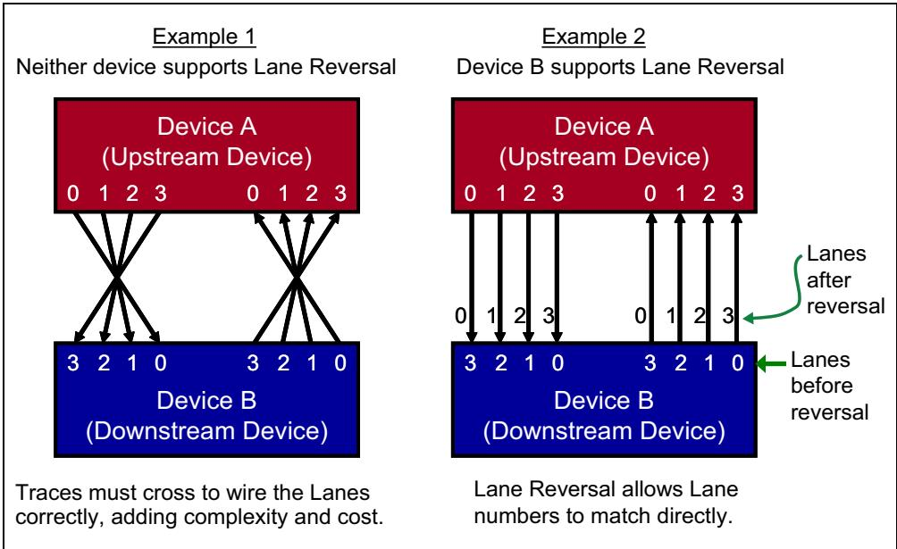

<table style="border-collapse:collapse; width:100%;">
  <thead>
    <tr>
      <th width="50%" style="border:1px solid #333; background:#f5f5f5;">EN</th>
      <th width="50%" style="border:1px solid #333; background-color:#e8e8e8;">中文</th>
    </tr>
  </thead>
  <tbody>
    <tr><td width="50%" style="border:1px solid #333; background:#fff;padding:4px 8px;">• Polarity Inversion: The D+ and D- differential pair terminals for two devices may also be reversed as needed to make board layout and routing easier. Every Receiver Lane must independently check for this and automatically correct it as needed during training, as illustrated in Figure 14-3 on page 509. To do this, the Receiver looks at Symbols 6 to 15 of the incoming TS1s or TS2s. If a D21.5 is received instead of a D10.2 in a TS1, or a D26.5 instead of the D5.2 expected for a TS2, then the polarity of that lane is inverted and must be corrected. Unlike Lane reversal, support for this feature is mandatory.</td><td width="50%" style="border:1px solid #333; background-color:#e8e8e8;padding:4px 8px;">• 极性反转：两个设备的D+和D-差分对端子也可以根据需要反转，以简化板卡布局和布线。每条接收器通道都必须独立检查此情况并在训练期间自动纠正，如图14-3（第509页）所示。为此，接收器检查输入TS1或TS2的符号6到15。如果在TS1中收到的是D21.5而不是D10.2，或在TS2中收到的是D26.5而不是预期的D5.2，则说明该通道的极性被反转了，必须进行纠正。与通道反转不同，对此功能的支持是强制性的。</td></tr>
  </tbody>
</table>

Figure 14-3: Polarity Inversion Example (Support Required) | 图14-3：极性反转示例（支持必须）

<table style="border-collapse:collapse; width:100%;">
  <thead>
    <tr>
      <th width="50%" style="border:1px solid #333; background:#f5f5f5;">EN</th>
      <th width="50%" style="border:1px solid #333; background-color:#e8e8e8;">中文</th>
    </tr>
  </thead>
  <tbody>
    <tr><td width="50%" style="border:1px solid #333; background:#fff;padding:4px 8px;">• Link Data Rate: After a reset, Link initialization and training will always use the default 2.5Gbit/s data rate for backward compatibility. If higher data rates are available, they are advertised during this process and, when the training is completed, devices will automatically go through a quick re-training to change to the highest commonly supported rate.</td><td width="50%" style="border:1px solid #333; background-color:#e8e8e8;padding:4px 8px;">• 链路数据速率：复位后，链路初始化和训练将始终使用默认的2.5Gbit/s数据速率以保持向后兼容。如果支持更高的数据速率，它们会在该过程中进行通告，当训练完成后，设备将自动进行一次快速重新训练，以切换到双方共同支持的最高速率。</td></tr>
    <tr><td width="50%" style="border:1px solid #333; background:#fff;padding:4px 8px;">• Lane-to-Lane De-skew: Trace length variations and other factors cause the parallel bit streams of a multi-Lane Link to arrive at the Receivers at different times, a problem referred to as signal skew. Receivers are required to compensate for this skew by delaying the early arrivals as needed to align the bit streams (see "Lane-to-Lane Skew" on page 442). They must correct a relatively big skew automatically (20ns difference in arrival time is permitted at 2.5GT/s), and that frees board designers from the sometimes difficult constraint of creating equal-length traces. Together with Polarity Inversion and Lane Reversal, this greatly simplifies the board designer's task of creating a reliable high-speed Link.</td><td width="50%" style="border:1px solid #333; background-color:#e8e8e8;padding:4px 8px;">• 通道间去偏斜：走线长度差异等因素会导致多通道链路的并行比特流在不同时间到达接收器，这一问题称为信号偏斜。接收器必须通过延迟早到达的信号以对齐比特流来补偿这种偏斜（参见第442页的"通道间偏斜"）。它们必须自动纠正相当大的偏斜（在2.5GT/s下允许20ns的到达时间差），这使板卡设计人员摆脱了有时难以实现等长走线的约束。结合极性反转和通道反转，这极大地简化了板卡设计人员创建可靠高速链路的任务。</td></tr>
  </tbody>
</table>

<table style="border-collapse:collapse; width:100%;">
  <thead>
    <tr>
      <th width="50%" style="border:1px solid #333; background:#f5f5f5;">EN</th>
      <th width="50%" style="border:1px solid #333; background-color:#e8e8e8;">中文</th>
    </tr>
  </thead>
  <tbody>
    <tr><td width="50%" style="border:1px solid #333; background:#fff;padding:4px 8px;">## Ordered Sets in Link Training</td><td width="50%" style="border:1px solid #333; background-color:#e8e8e8;padding:4px 8px;">## 链路训练中的有序集</td></tr>
  </tbody>
</table>

<table style="border-collapse:collapse; width:100%;">
  <thead>
    <tr>
      <th width="50%" style="border:1px solid #333; background:#f5f5f5;">EN</th>
      <th width="50%" style="border:1px solid #333; background-color:#e8e8e8;">中文</th>
    </tr>
  </thead>
  <tbody>
    <tr><td width="50%" style="border:1px solid #333; background:#fff;padding:4px 8px;">All of the different types of Physical Layer Ordered Sets were described in the section called "Ordered sets" on page 388. Training Sequences TS1 and TS2 are of interest during the training process. The format for these when in Gen1 or Gen2 mode is shown in Figure 14‑4 on page 510, while for Gen3 mode of operation, they are as shown in Figure 14‑5 on page 511. A detailed description of their contents follows.</td><td width="50%" style="border:1px solid #333; background-color:#e8e8e8;padding:4px 8px;">各种不同类型的物理层有序集已在第388页"Ordered sets"一节中描述。训练序列TS1和TS2在训练过程中值得关注。在Gen1或Gen2模式下，它们的格式如图14‑4（第510页）所示；而在Gen3操作模式下，则如图14‑5（第511页）所示。下文将对其内容进行详细描述。</td></tr>
  </tbody>
</table>

<table style="border-collapse:collapse; width:100%;">
  <thead>
    <tr>
      <th width="50%" style="border:1px solid #333; background:#f5f5f5;">EN</th>
      <th width="50%" style="border:1px solid #333; background-color:#e8e8e8;">中文</th>
    </tr>
  </thead>
  <tbody>
    <tr><td width="50%" style="border:1px solid #333; background:#fff;padding:4px 8px;">## PCI Express Technology</td><td width="50%" style="border:1px solid #333; background-color:#e8e8e8;padding:4px 8px;">## PCI Express 技术</td></tr>
    <tr><td width="50%" style="border:1px solid #333; background:#fff;padding:4px 8px;">Figure 14-4: TS1 and TS2 Ordered Sets When In Gen1 or Gen2 Mode</td><td width="50%" style="border:1px solid #333; background-color:#e8e8e8;padding:4px 8px;">图 14-4：Gen1 或 Gen2 模式下的 TS1 和 TS2 有序集</td></tr>
  </tbody>
</table>

## 14.2.1 TS1 and TS2 Ordered Sets | 14.2.1 TS1 和 TS2 有序集

<table style="border-collapse:collapse; width:100%;">
  <thead>
    <tr>
      <th width="50%" style="border:1px solid #333; background:#f5f5f5;">EN</th>
      <th width="50%" style="border:1px solid #333; background-color:#e8e8e8;">中文</th>
    </tr>
  </thead>
  <tbody>
    <tr><td width="50%" style="border:1px solid #333; background:#fff;padding:4px 8px;">## TS1 and TS2 Ordered Sets</td><td width="50%" style="border:1px solid #333; background-color:#e8e8e8;padding:4px 8px;">## TS1和TS2有序集</td></tr>
    <tr><td width="50%" style="border:1px solid #333; background:#fff;padding:4px 8px;">As seen in the illustrations, TS1s and TS2s consist of 16 Symbols. They are exchanged during the Polling, Configuration, and Recovery states of the LTSSM described in "Link Training and Status State Machine (LTSSM)" on page 518. The Symbols are described below and summarized in Table 14-1 on page 514 for TS1s and Table 14-2 on page 516 for TS2s.</td><td width="50%" style="border:1px solid #333; background-color:#e8e8e8;padding:4px 8px;">如图所示，TS1和TS2由16个符号(Symbol)组成。它们在LTSSM（链路训练与状态状态机，参见第518页 "Link Training and Status State Machine (LTSSM)"）的Polling、Configuration和Recovery状态下进行交换。下面描述了这些符号，并分别在表14-1（第514页）和表14-2（第516页）中进行了总结。</td></tr>
    <tr><td width="50%" style="border:1px solid #333; background:#fff;padding:4px 8px;">To make the descriptions a little shorter and easier to read, the term "Gen1" will be used to indicated data rate of 2.5 GT/s, "Gen2" to indicated data rate of 5.0 GT/s and "Gen3" to indicate data rates of 8.0 GT/s. Also, note that the PAD character used in the Link and Lane numbers is represented by the K23.7 character for the lower data rates, but as the data byte F7h for Gen3. In our discussion the distinction between the types of PAD is not interesting and will simply be implied.</td><td width="50%" style="border:1px solid #333; background-color:#e8e8e8;padding:4px 8px;">为使描述更简洁易读，术语"Gen1"用于指示2.5 GT/s的数据速率，"Gen2"用于指示5.0 GT/s的数据速率，"Gen3"用于指示8.0 GT/s的数据速率。另外，请注意链路(Link)和通道(Lane)编号中使用的PAD字符在较低数据速率下由K23.7字符表示，但在Gen3下由数据字节F7h表示。在我们的讨论中，PAD类型之间的区别并不重要，因此将直接隐含使用。</td></tr>
  </tbody>
</table>

Figure 14-5: TS1 and TS2 Ordered Set Block When In Gen3 Mode of Operation | 图14-5：Gen3操作模式下的TS1和TS2有序集块

<table style="border-collapse:collapse; width:100%;">
  <thead>
    <tr>
      <th width="50%" style="border:1px solid #333; background:#f5f5f5;">EN</th>
      <th width="50%" style="border:1px solid #333; background-color:#e8e8e8;">中文</th>
    </tr>
  </thead>
  <tbody>
    <tr><td width="50%" style="border:1px solid #333; background:#fff;padding:4px 8px;">Table 14-1 on page 514 and Table 14-2 on page 516 is a summary of TS1 and TS2 contents. A more detailed description of the 16 TS1/TS2 Symbols follows:</td><td width="50%" style="border:1px solid #333; background-color:#e8e8e8;padding:4px 8px;">第514页的表14-1和第516页的表14-2是TS1和TS2内容的总结。以下是对16个TS1/TS2符号的更详细描述：</td></tr>
    <tr><td width="50%" style="border:1px solid #333; background:#fff;padding:4px 8px;">**Symbol 0:**</td><td width="50%" style="border:1px solid #333; background-color:#e8e8e8;padding:4px 8px;">**符号0:**</td></tr>
    <tr><td width="50%" style="border:1px solid #333; background:#fff;padding:4px 8px;">For Gen1 or Gen2, the first Symbol of any Ordered Set is the K28.5 (COM) character. Receivers use this character to acquire Symbol Lock. Since it must appear on all Lanes at the same time it is also useful for de-skewing the Lanes.</td><td width="50%" style="border:1px solid #333; background-color:#e8e8e8;padding:4px 8px;">对于Gen1或Gen2，任何有序集(Ordered Set)的第一个符号都是K28.5 (COM)字符。接收器(Receiver)使用该字符获取符号锁(Symbol Lock)。由于它必须同时出现在所有通道(Lane)上，因此也有助于消除通道间的偏移(de-skewing)。</td></tr>
    <tr><td width="50%" style="border:1px solid #333; background:#fff;padding:4px 8px;">For Gen3, an Ordered Set is identified by the 2-bit Sync Header that must precede the Block (not shown in the illustration), and the first Symbol after that indicates which Ordered Set will follow. For a TS1, the first Symbol is 1Eh, and for a TS2, it is 2Dh.</td><td width="50%" style="border:1px solid #333; background-color:#e8e8e8;padding:4px 8px;">对于Gen3，有序集由必须位于块(Block)之前的2位同步头(Sync Header)标识（图中未显示），之后的第一个符号指示将跟随哪个有序集。对于TS1，第一个符号是1Eh；对于TS2，第一个符号是2Dh。</td></tr>
    <tr><td width="50%" style="border:1px solid #333; background:#fff;padding:4px 8px;">**Symbol 1 (Link #):** In the Polling state this field contains the PAD Symbol, but in the other states a Link Number is assigned.</td><td width="50%" style="border:1px solid #333; background-color:#e8e8e8;padding:4px 8px;">**符号1 (链路编号):** 在Polling状态下，该字段包含PAD符号，但在其他状态下会分配一个链路编号(Link Number)。</td></tr>
    <tr><td width="50%" style="border:1px solid #333; background:#fff;padding:4px 8px;">**Symbol 2 (Lane #):** In the Polling state this field contains the PAD Symbol, but in the other states a Lane Number is assigned.</td><td width="50%" style="border:1px solid #333; background-color:#e8e8e8;padding:4px 8px;">**符号2 (通道编号):** 在Polling状态下，该字段包含PAD符号，但在其他状态下会分配一个通道编号(Lane Number)。</td></tr>
    <tr><td width="50%" style="border:1px solid #333; background:#fff;padding:4px 8px;">**Symbol 3 (N\_FTS):** Indicates the number of Fast Training Sequences the Receiver will need in order to achieve the L0 state when exiting from the L0s power state at the current speed. Transmitters will send at least that many FTSs to exit L0s. The amount of time needed for this depends on how many are needed and the data rate in use. For example, at 2.5 GT/s each Symbol takes 4ns so, if 200 FTSs were needed the required time would be 200 FTS \* 4 Symbols per FTS \* 4ns/Symbol = 3200 ns. If the Extended Synch bit is set in the transmitter device, a total of 4096 FTSs must be sent. This large number is intended to provide enough time for external Link monitoring tools to acquire Bit and Symbol Lock, since some of them may be slow in this regard.</td><td width="50%" style="border:1px solid #333; background-color:#e8e8e8;padding:4px 8px;">**符号3 (N\_FTS):** 指示接收器(Receiver)在以当前速度退出L0s电源状态并进入L0状态时所需的快速训练序列(Fast Training Sequences)数量。发送器(Transmitter)将发送至少该数量的FTS以退出L0s。所需的时间取决于需要多少FTS以及当前使用的数据速率。例如，在2.5 GT/s下每个符号需要4ns，因此如果需要200个FTS，则所需时间为200 FTS × 每个FTS 4个符号 × 4ns/符号 = 3200 ns。如果发送器设备中设置了扩展同步(Extended Synch)位，则必须发送总共4096个FTS。这个较大的数字旨在为外部链路监测工具提供足够的时间来获取位锁(Bit Lock)和符号锁(Symbol Lock)，因为其中一些工具在这方面可能较慢。</td></tr>
    <tr><td width="50%" style="border:1px solid #333; background:#fff;padding:4px 8px;">**Symbol 4 (Rate ID):** Devices report which data rates they support, along with a little more information used for hardware-initiated bandwidth changes. The 2.5 GT/s rate must always be supported and the Link will always train to that speed automatically after reset so that newer components will remain backward compatible with older ones. If 8.0 GT/s is supported, it is also required that 5.0 GT/s must be available. Other information in this Symbol includes the following:</td><td width="50%" style="border:1px solid #333; background-color:#e8e8e8;padding:4px 8px;">**符号4 (速率标识):** 设备报告其支持的数据速率，以及一些用于硬件发起的带宽变更(hardware-initiated bandwidth changes)的附加信息。必须始终支持2.5 GT/s速率，并且链路在复位后总会自动训练到该速度，以便新组件保持与旧组件的向后兼容性。如果支持8.0 GT/s，则还必须支持5.0 GT/s。该符号中的其他信息包括：</td></tr>
    <tr><td width="50%" style="border:1px solid #333; background:#fff;padding:4px 8px;">— **Autonomous Change:** If set, any requested bandwidth change was initiated for power-management reasons. If a change is requested and this bit is not set, then unreliable operation has been detected at the higher speed or wider Link and the change is requested to fix that problem.</td><td width="50%" style="border:1px solid #333; background-color:#e8e8e8;padding:4px 8px;">— **自主变更(Autonomous Change):** 如果置位，则任何请求的带宽变更是由于电源管理原因而发起的。如果请求了变更但该位未置位，则表明在更高速度或更宽链路上检测到了不可靠操作，请求变更以解决该问题。</td></tr>
    <tr><td width="50%" style="border:1px solid #333; background:#fff;padding:4px 8px;">— **Selectable De-emphasis:**</td><td width="50%" style="border:1px solid #333; background-color:#e8e8e8;padding:4px 8px;">— **可选去加重(Selectable De-emphasis):**</td></tr>
    <tr><td width="50%" style="border:1px solid #333; background:#fff;padding:4px 8px;">Upstream Ports set this to indicate their desired de-emphasis level at 5.0 GT/s. How they make this choice is implementation specific. In the Recovery.RcvrCfg state, they register the value they receive for this bit internally (the spec describes it as being stored in a select\_deemphasis variable).</td><td width="50%" style="border:1px solid #333; background-color:#e8e8e8;padding:4px 8px;">上游端口(Upstream Port)设置此位以指示其在5.0 GT/s下期望的去加重(de-emphasis)级别。如何做出此选择是具体实现相关的。在Recovery.RcvrCfg状态下，它们在内部记录为此位接收到的值（规范描述为存储在select\_deemphasis变量中）。</td></tr>
    <tr><td width="50%" style="border:1px solid #333; background:#fff;padding:4px 8px;">Downstream Ports and Root Ports: In the Polling.Compliance state the select\_deemphasis variable must be set to match the received value of this bit. In the Recovery.RcvrCfg state, the Transmitter sets this bit in its TS2s to match the Selectable De-emphasis field in the Link Control 2 register. Since this register bit is hardware-initialized, the expectation is that it is assigned to an optimal value at power-up by firmware or a strapping option.</td><td width="50%" style="border:1px solid #333; background-color:#e8e8e8;padding:4px 8px;">下游端口(Downstream Port)和根端口(Root Port)：在Polling.Compliance状态下，select\_deemphasis变量必须设置为匹配此位的接收值。在Recovery.RcvrCfg状态下，发送器(Transmitter)在其TS2中设置此位以匹配Link Control 2寄存器中的可去除加重(Selectable De-emphasis)字段。由于该寄存器位是硬件初始化的，因此期望在加电时由固件或绑线选项(strapping option)为其分配一个最优值。</td></tr>
    <tr><td width="50%" style="border:1px solid #333; background:#fff;padding:4px 8px;">In Loopback mode at 5.0 GT/s, the Slave de-emphasis value is assigned by this bit in the TS1s sent by the Master.</td><td width="50%" style="border:1px solid #333; background-color:#e8e8e8;padding:4px 8px;">在5.0 GT/s的环回(Loopback)模式下，从设备(Slave)的去加重值由主设备(Master)发送的TS1中的此位分配。</td></tr>
    <tr><td width="50%" style="border:1px solid #333; background:#fff;padding:4px 8px;">— **Link Upconfigure Capability:** Reports whether a wide Link whose width is reduced will be capable of going back to the wide case or not. If both sides of a Link report this during Configuration.Complete, this fact is recorded internally (e.g. an upconfigure\_capable bit is set).</td><td width="50%" style="border:1px solid #333; background-color:#e8e8e8;padding:4px 8px;">— **链路上配置能力(Link Upconfigure Capability):** 报告宽度已减小的宽链路是否能够恢复到宽配置。如果链路双方在Configuration.Complete期间报告了此能力，则该事实被内部记录（例如，upconfigure\_capable位被置位）。</td></tr>
    <tr><td width="50%" style="border:1px solid #333; background:#fff;padding:4px 8px;">**Symbol 5 (Training Control):** Communicates special conditions such as a Hot Reset, Enable Loopback mode, Disable Link, Disable Scrambling.</td><td width="50%" style="border:1px solid #333; background-color:#e8e8e8;padding:4px 8px;">**符号5 (训练控制):** 传达特殊条件，如热复位(Hot Reset)、启用环回模式(Enable Loopback)、禁用链路(Disable Link)、禁用加扰(Disable Scrambling)。</td></tr>
  </tbody>
</table>

<table style="border-collapse:collapse; width:100%;">
  <thead>
    <tr>
      <th width="50%" style="border:1px solid #333; background:#f5f5f5;">EN</th>
      <th width="50%" style="border:1px solid #333; background-color:#e8e8e8;">中文</th>
    </tr>
  </thead>
  <tbody>
    <tr><td width="50%" style="border:1px solid #333; background:#fff;padding:4px 8px;">## • Symbols 6‐9 (Equalization Control):</td><td width="50%" style="border:1px solid #333; background-color:#e8e8e8;padding:4px 8px;">## • 符号 6‐9（均衡控制）：</td></tr>
    <tr><td width="50%" style="border:1px solid #333; background:#fff;padding:4px 8px;">— For Gen1 or Gen2, Symbols 7‐9 are just TS1 or TS2 indicators, and Symbol 6 usually is, too. However, if bit 7 of Symbol 6 is set to one instead of the zero that would be there for the TS1 or TS2 identifier, that indicates that this is an EQ TS1 or EQ TS2 sent from the Downstream Port (DSP  ‑ port that faces downstream, like a Root Port). The “EQ” label stands for equalization, and means that the Link is going to change to 8.0 GT/s and so the Upstream Port (USP  ‑  port that faces upstream, like an Endpoint Port) needs to know what equalizer values to use. For EQ TS1s or TS2s, Symbol 6 gives that information to the USP in the form of Transmitter Presets and Receiver Preset Hints. Ports that support 8.0 GT/s must accept either TS type (regular or EQ), but ports that do not support it are not required to accept the EQ type. The possible values for these presets are listed in Table 14‐8 on page 579 and Table 14‐9 on page 580.</td><td width="50%" style="border:1px solid #333; background-color:#e8e8e8;padding:4px 8px;">— 对于 Gen1 或 Gen2，符号 7‐9 仅为 TS1 或 TS2 指示符，符号 6 通常也是如此。但是，如果符号 6 的位 7 被置为 1（而非 TS1 或 TS2 标识符中应有的 0），则表示这是从下游端口（DSP — 面向下游的端口，如根端口）发送的 EQ TS1 或 EQ TS2。“EQ”标签代表均衡（Equalization），表示链路即将变更到 8.0 GT/s，因此上游端口（USP — 指向上游的端口，如端点端口）需要知道使用哪些均衡器值。对于 EQ TS1 或 EQ TS2，符号 6 以发送器预置（Transmitter Presets）和接收器预置提示（Receiver Preset Hints）的形式向 USP 提供该信息。支持 8.0 GT/s 的端口必须接受任一 TS 类型（常规或 EQ），但不支持 8.0 GT/s 的端口不必接受 EQ 类型。这些预置的可能值列于第 579 页的表 14‐8 和第 580 页的表 14‐9。</td></tr>
    <tr><td width="50%" style="border:1px solid #333; background:#fff;padding:4px 8px;">— For Gen3, Symbols 6‐9 provide Preset values and Coefficients for the Equalization process. Bit 7 of Symbol 6 in a TS2 can now be used by a USP to request that equalization be redone. If it does, bit 6 may also be set to indicate that the time needed to repeat the equalization process won’t cause problems, such as a completion timeout, as long as it’s done quickly (within 1ms of returning to L0). This might be needed, for example, if a problem was detected with the equalization results. A DSP can also use bits 6 and 7 to ask the USP to make such a request and guarantee no side effects, although the USP is not required to respond to this. For more on the equalization process, see “Link Equalization Overview” on page 577.</td><td width="50%" style="border:1px solid #333; background-color:#e8e8e8;padding:4px 8px;">— 对于 Gen3，符号 6‐9 提供均衡过程的预置值（Preset）和系数（Coefficients）。USP 现在可以使用 TS2 中符号 6 的位 7 来请求重新进行均衡。如果这样做，位 6 也可以被置位，以指示重新进行均衡过程所需的时间不会引起问题（如完成超时），只要该过程快速完成（在返回 L0 后的 1ms 内）。例如，当检测到均衡结果存在问题时，可能需要这样做。DSP 也可以使用位 6 和位 7 来请求 USP 发出此类请求并保证无副作用，但 USP 不必对此作出响应。有关均衡过程的更多信息，请参见第 577 页的“链路均衡概述”。</td></tr>
    <tr><td width="50%" style="border:1px solid #333; background:#fff;padding:4px 8px;">• Symbols 10‐13: TS1 or TS2 identifiers.</td><td width="50%" style="border:1px solid #333; background-color:#e8e8e8;padding:4px 8px;">• 符号 10‐13：TS1 或 TS2 标识符。</td></tr>
    <tr><td width="50%" style="border:1px solid #333; background:#fff;padding:4px 8px;">• Symbols 14‐15: (DC Balance)</td><td width="50%" style="border:1px solid #333; background-color:#e8e8e8;padding:4px 8px;">• 符号 14‐15：（直流平衡）</td></tr>
    <tr><td width="50%" style="border:1px solid #333; background:#fff;padding:4px 8px;">— For Gen1 and Gen2, these are just TS1 or TS2 indicators since DC Balance is maintained by 8b/10b encoding.</td><td width="50%" style="border:1px solid #333; background-color:#e8e8e8;padding:4px 8px;">— 对于 Gen1 和 Gen2，这些仅为 TS1 或 TS2 指示符，因为直流平衡由 8b/10b 编码维持。</td></tr>
    <tr><td width="50%" style="border:1px solid #333; background:#fff;padding:4px 8px;">For Gen3, the contents of these two Symbols depend on the DC Balance of the Lane. Each Lane of a Transmitter must independently track the running DC Balance for all the scrambled bits sent for TS1s and TS2s. “Running DC Balance” means the difference between the number of ones sent vs. the number of zeroes sent, and Lanes must be capable of tracking a difference of up to 511 in either direction. These counters saturate at their max value but continue to track reductions. For example, if the counter indicates that 511 more ones than zeroes have been sent, then no matter how many more ones are sent, the value will stay at 511. However, if 2 zeroes are sent, the counter will count down to 509. When a TS1 or TS2 is sent, the following algorithm is used to determine Symbols 14 and 15:</td><td width="50%" style="border:1px solid #333; background-color:#e8e8e8;padding:4px 8px;">对于 Gen3，这两个符号的内容取决于通道的直流平衡。发送器的每个通道必须独立跟踪为 TS1 和 TS2 发送的所有加扰比特的运行直流平衡。“运行直流平衡”是指发送的 1 的数量与发送的 0 的数量之差，通道必须能够跟踪任一方向高达 511 的差值。这些计数器在其最大值处饱和，但继续跟踪减少量。例如，如果计数器指示已发送的 1 比 0 多 511 个，那么无论再发送多少个 1，该值将保持在 511。但是，如果发送了 2 个 0，则计数器将递减至 509。当发送 TS1 或 TS2 时，使用以下算法来确定符号 14 和 15：</td></tr>
    <tr><td width="50%" style="border:1px solid #333; background:#fff;padding:4px 8px;">If the running DC Balance value is > 31 at the end of Symbol 11 and more ones have been sent, Symbol 14 = 20h and Symbol 15 = 08h. If more zeroes have been sent, Symbol 14 = DFh and Symbol 15 = F7h.</td><td width="50%" style="border:1px solid #333; background-color:#e8e8e8;padding:4px 8px;">如果在符号 11 结束时运行直流平衡值 > 31 且已发送更多 1，则符号 14 = 20h，符号 15 = 08h。如果已发送更多 0，则符号 14 = DFh，符号 15 = F7h。</td></tr>
  </tbody>
</table>

## PCI Express Technology | PCI Express 技术

<table style="border-collapse:collapse; width:100%;">
  <thead>
    <tr>
      <th width="50%" style="border:1px solid #333; background:#f5f5f5;">EN</th>
      <th width="50%" style="border:1px solid #333; background-color:#e8e8e8;">中文</th>
    </tr>
  </thead>
  <tbody>
    <tr><td width="50%" style="border:1px solid #333; background:#fff;padding:4px 8px;">If the running DC Balance value is > 15, Symbol 14 = the normal scrambled TS1 or TS2 identifier, while Symbol 15 = 08h to reduce the number of ones, or F7h to reduce the number of zeroes in the DC Balance count.</td><td width="50%" style="border:1px solid #333; background-color:#e8e8e8;padding:4px 8px;">如果运行中的直流均衡(DC Balance)计数值大于15，则符号14为正常加扰的TS1或TS2标识符，而符号15为08h（减少1的数量）或F7h（减少直流均衡计数中0的数量）。</td></tr>
    <tr><td width="50%" style="border:1px solid #333; background:#fff;padding:4px 8px;">–   Otherwise, the normal TS1 or TS2 identifier Symbols will be sent.</td><td width="50%" style="border:1px solid #333; background-color:#e8e8e8;padding:4px 8px;">— 否则，将发送正常的TS1或TS2标识符符号。</td></tr>
    <tr><td width="50%" style="border:1px solid #333; background:#fff;padding:4px 8px;">— Other notes on Gen3 DC Balance:</td><td width="50%" style="border:1px solid #333; background-color:#e8e8e8;padding:4px 8px;">— Gen3直流均衡的其他说明：</td></tr>
    <tr><td width="50%" style="border:1px solid #333; background:#fff;padding:4px 8px;">The running DC Balance is reset by an exit from Electrical Idle or an EIEOS after a Data Block.</td><td width="50%" style="border:1px solid #333; background-color:#e8e8e8;padding:4px 8px;">运行中的直流均衡计数在退出电气空闲(Electrical Idle)时或数据块(Data Block)之后的EIEOS被复位。</td></tr>
    <tr><td width="50%" style="border:1px solid #333; background:#fff;padding:4px 8px;">– The DC Balance Symbols bypass scrambling to ensure that the expected bit pattern is sent.</td><td width="50%" style="border:1px solid #333; background-color:#e8e8e8;padding:4px 8px;">— 直流均衡符号绕过扰码，以确保发送预期的比特模式。</td></tr>
  </tbody>
</table>

Table 14-1: Summary of TS1 Ordered Set Contents | 表14-1：TS1有序集内容摘要

<table><tr><td>Symbol Number</td><td>Description</td></tr><tr><td>0</td><td>For Gen1 or Gen2, the COM (K28.5) SymbolFor Gen3, 1Eh indicates a TS1.</td></tr><tr><td>1</td><td>Link NumberPorts that don't support Gen3: 0-255, PADDownstream ports that support Gen3: 0-31, PADUpstream ports that support Gen3: 0-255, PAD</td></tr><tr><td>2</td><td>Lane Number0-31, PAD</td></tr><tr><td>3</td><td>N_FTSNumber of FTS Ordered Sets required by receiver to achieve L0 when exiting L0s: 0 - 255</td></tr><tr><td>4</td><td>Data Rate Identifier:Bit 0 — Reserved.Bit 1 — 2.5 GT/s supported (must be set to 1b)Bit 2 — 5.0 GT/s supported (must be set if bit 3 is set)Bit 3 — 8.0 GT/s supportedBits 5:4 — ReservedBit 6 — Autonomous Change/Selectable De-emphasis— Downstream Ports: Used in Polling.Active, Configuration.Linkwidth.Start, and Loopback.Entry LTSSM states, and reserved in all other states.— Upstream Ports: Used in Polling.Active, Configuration, Recovery, and Loopback.Entry LTSSM states and reserved in all other states.Bit 7 — Speed change. This can only be set to one in the Recovery.RcvrLock LTSSM state, and is reserved in all other states.</td></tr><tr><td>5</td><td>Training Control (0=De-assert, 1 = Assert)Bit 0 — Hot ResetBit 1 — Disable LinkBit 2 — LoopbackBit 3 — Disable Scrambling (for 2.5 or 5.0 GT/s; reserved for Gen3)Bit 4 — Compliance Receive (optional for 2.5 GT/s, required for all other rates)Bits 7:5 — Reserved, Set to 0</td></tr><tr><td>6</td><td>For Gen1 or Gen2:TS1 identifier (4Ah) encoded as D10.2EQ TS1s encode this asBits 2:0 — Receiver preset hintBits 6:3 — Transmitter PresetBit 7 — set to 1bFor Gen3:Bits 1:0 — Equalization Control (EC). Only used in Recovery.Equalization and Loopback LTSSM states; must be 00b in all other states.Bit 2 — Reset EIEOS Interval Count. Only used in Recovery.Equalization LTSSM state; reserved in all other states.Bits 6:3 — Transmitter PresetBit 7 — Use Preset. (If one, use the preset values instead of the coefficient values. If zero, use the coefficients rather than the presets.) Only used in Recovery.Equalization and Loopback LTSSM states; reserved in all other states.</td></tr><tr><td>7</td><td>For Gen1 or Gen2 GT/s, TS1 identifier (4Ah) encoded as D10.2For Gen3:Bits 5:0 — FS (Full Swing value) when the EC field of Symbol 6 is 01b, otherwise, Pre-cursor Coefficient.Bits 7:6 — Reserved.</td></tr><tr><td>8</td><td>For Gen1 or Gen2, TS1 identifier (4Ah) encoded as D10.2For Gen3:Bits 5:0 — LF (Low Frequency value) when the EC field of Symbol 6 is 01b, otherwise, Cursor Coefficient.Bits 7:6 — Reserved.</td></tr><tr><td>9</td><td>For Gen1 or Gen2, TS1 identifier (4Ah) encoded as D10.2For Gen3:Bits 5:0 — Post-cursor Coefficient.Bit 6 — Reject Coefficient Values. Only set in specific Phases of the Recovery.Equalization LTSSM state; must be 0b otherwise.Bit 7 — Parity (P) This is the even parity of all bits of Symbols 6, 7, and 8 and bits 6:0 of Symbol 9. Receivers must calculate this and compare it to the received Parity bit. Received TS1s are only valid if the Parity bits match.</td></tr><tr><td>10-13</td><td>For Gen1 or Gen2, TS1 identifier (4Ah) encoded as D10.2For Gen3, TS1 identifier (4Ah)</td></tr><tr><td>14-15</td><td>For Gen1 or Gen2, TS1 identifier (4Ah) encoded as D10.2For Gen3, TS1 identifier (4Ah), or a DC-Balance Symbol.</td></tr></table>

<table style="border-collapse:collapse; width:100%;">
  <thead>
    <tr>
      <th width="50%" style="border:1px solid #333; background:#f5f5f5;">EN</th>
      <th width="50%" style="border:1px solid #333; background-color:#e8e8e8;">中文</th>
    </tr>
  </thead>
  <tbody>
    <tr><td width="50%" style="border:1px solid #333; background:#fff;padding:4px 8px;">The observant reader may wonder why EQ TS1s are shown in Symbol 6 for the lower data rates since only 8.0 GT/s data rates use equalization. That's because they're used to deliver EQ values for Lanes that support Gen3 but are currently operating at a lower rate and want to change to 8.0 GT/s. For more details regarding this and the Equalization process for Gen3 in general, see "Link Equalization Overview" on page 577.</td><td width="50%" style="border:1px solid #333; background-color:#e8e8e8;padding:4px 8px;">细心的读者可能会好奇，为什么在较低数据速率下符号6中也会出现均衡TS1(EQ TS1)，因为只有8.0 GT/s数据速率才使用均衡。这是因为它们用于向支持Gen3但当前以较低速率运行并希望切换到8.0 GT/s的通道(Lane)传递均衡值。有关此内容及Gen3均衡过程的更多详细信息，请参见第577页的"链路均衡概述"(Link Equalization Overview)。</td></tr>
  </tbody>
</table>

Table 14-2: Summary of TS2 Ordered Set Contents | 表14-2：TS2有序集内容摘要

<table><tr><td>Symbol Number</td><td>Description</td></tr><tr><td>0</td><td>For Gen1 or Gen2, the COM (K28.5) SymbolFor Gen3, 2Dh indicates a TS2.</td></tr><tr><td>1</td><td>Link NumberPorts that don't support Gen3: 0-255, PADDownstream ports that support Gen3: 0-31, PADUpstream ports that support Gen3 0-255, PAD</td></tr><tr><td>2</td><td>Lane Number0-31, PAD</td></tr><tr><td>3</td><td>N_FTSNumber of FTS Ordered Sets required by receiver to achieve L0 when exiting L0s: 0 - 255</td></tr><tr><td>4</td><td>Data Rate Identifier:Bit 0 — Reserved.Bit 1 — 2.5 GT/s supported (must be set to 1b)Bit 2 — 5.0 GT/s supported (must be set if bit 3 is set)Bit 3 — 8.0 GT/s supportedBits 5:4 — ReservedBit 6 — Autonomous Change/Selectable De-emphasis/Link Upconfigure Capability. Used in Polling.Configuration, Configuration.Complete, and Recovery LTSSM states; reserved in all other states.Bit 7 — Speed change. This can only be set to one in the Recovery.RcvrLock LTSSM state, and is reserved in all other states.</td></tr><tr><td>5</td><td>Training Control (0 = De-assert, 1 = Assert)Bit 0 — Hot Reset,Bit 1 — Disable LinkBit 2 — LoopbackBit 3 — Disable Scrambling (for 2.5 or 5.0 GT/s; reserved for Gen3)Bits 7:4 — Reserved, Set to 0</td></tr><tr><td>6</td><td>For Gen1 or Gen2:TS2 identifier (4Ah) encoded as D10.2EQ TS2s encode this asBits 2:0 — Receiver preset HintBits 6:3 — Transmitter PresetBit 7 — Equalization CommandFor Gen3:Bits 5:0 — Reserved.Bit 6 — Quiesce Guarantee. Defined for use in Recovery.RcvrCfg only; reserved in all other states.Bit 7 — Request Equalization. Defined for use in Recovery.RcvrCfg only; reserved in all other states.</td></tr><tr><td>7-13</td><td>For Gen1 or Gen2, TS2 identifier (45h) encoded as D5.2For Gen3, TS2 identifier (45h)</td></tr><tr><td>14-15</td><td>For Gen1 or Gen2, TS2 identifier (45h) encoded as D5.2For Gen3, TS2 identifier (45h), or a DC-Balance Symbol</td></tr></table>

<table style="border-collapse:collapse; width:100%;">
  <thead>
    <tr>
      <th width="50%" style="border:1px solid #333; background:#f5f5f5;">EN</th>
      <th width="50%" style="border:1px solid #333; background-color:#e8e8e8;">中文</th>
    </tr>
  </thead>
  <tbody>
    <tr><td width="50%" style="border:1px solid #333; background:#fff;padding:4px 8px;">## Link Training and Status State Machine (LTSSM)</td><td width="50%" style="border:1px solid #333; background-color:#e8e8e8;padding:4px 8px;">## 链路训练与状态状态机 (LTSSM)</td></tr>
  </tbody>
</table>

<table style="border-collapse:collapse; width:100%;">
  <thead>
    <tr>
      <th width="50%" style="border:1px solid #333; background:#f5f5f5;">EN</th>
      <th width="50%" style="border:1px solid #333; background-color:#e8e8e8;">中文</th>
    </tr>
  </thead>
  <tbody>
    <tr><td width="50%" style="border:1px solid #333; background:#fff;padding:4px 8px;">Figure 14-6 on page 519 illustrates the top-level states of the Link Training and Status State Machine (LTSSM). Each state consists of substates. The first LTSSM state entered after exiting Fundamental Reset (Cold or Warm Reset) or Hot Reset is the Detect state.</td><td width="50%" style="border:1px solid #333; background-color:#e8e8e8;padding:4px 8px;">图14-6展示了链路训练与状态机（LTSSM）的顶层状态。每个状态包含多个子状态。退出基本复位（冷复位或暖复位）或热复位后进入的第一个LTSSM状态是Detect（检测）状态。</td></tr>
    <tr><td width="50%" style="border:1px solid #333; background:#fff;padding:4px 8px;">The LTSSM consists of 11 top-level states: Detect, Polling, Configuration, Recovery, L0, L0s, L1, L2, Hot Reset, Loopback, and Disable. These can be grouped into five categories:  1. Link Training states  2. Re-Training (Recovery) state  3. Software driven Power Management states  4. Active-State Power Management (ASPM) states  5. Other states</td><td width="50%" style="border:1px solid #333; background-color:#e8e8e8;padding:4px 8px;">LTSSM包含11个顶层状态：Detect（检测）、Polling（轮询）、Configuration（配置）、Recovery（恢复）、L0、L0s、L1、L2、Hot Reset（热复位）、Loopback（环回）和Disable（禁用）。这些状态可分为五类：  1. 链路训练状态  2. 重新训练（恢复）状态  3. 软件驱动的电源管理状态  4. 主动状态电源管理（ASPM）状态  5. 其他状态</td></tr>
    <tr><td width="50%" style="border:1px solid #333; background:#fff;padding:4px 8px;">When exiting from any type of Reset, the flow of the LTSSM follows the Link Training states: Detect => Polling => Configuration => L0. In L0 state, normal packet transmission/reception is in progress.</td><td width="50%" style="border:1px solid #333; background-color:#e8e8e8;padding:4px 8px;">从任何类型的复位退出时，LTSSM的流程遵循链路训练状态：Detect（检测）-> Polling（轮询）-> Configuration（配置）-> L0。在L0状态下，进行正常的报文发送/接收。</td></tr>
    <tr><td width="50%" style="border:1px solid #333; background:#fff;padding:4px 8px;">The Link Re-Training also called Recovery state is entered for a variety of reasons, such as changing back from a low-power Link state, like L1, or changing the Link bandwidth (through speed or width changes). In this state, the Link repeats as much of the training process as needed to handle the matter and returns to L0 (normal operation).</td><td width="50%" style="border:1px solid #333; background-color:#e8e8e8;padding:4px 8px;">链路重新训练（也称为Recovery状态）因多种原因而进入，例如从低功耗链路状态（如L1）切换回来，或改变链路带宽（通过速度或宽度变化）。在此状态下，链路根据需要重复执行必要的训练过程以处理相应事项，然后返回L0（正常操作）。</td></tr>
    <tr><td width="50%" style="border:1px solid #333; background:#fff;padding:4px 8px;">Power management software may also place a device into a low-power device state (D1, D2, D3_Hot or D3_Cold) and that will force the Link into a lower Power Management Link state (L1 or L2).</td><td width="50%" style="border:1px solid #333; background-color:#e8e8e8;padding:4px 8px;">电源管理软件也可将设备置入低功耗设备状态（D1、D2、D3_Hot或D3_Cold），这将强制链路进入更低的电源管理链路状态（L1或L2）。</td></tr>
    <tr><td width="50%" style="border:1px solid #333; background:#fff;padding:4px 8px;">If there are no packets to send for a time, ASPM hardware may be allowed to automatically transition the Link into low power ASPM states (L0s or ASPM L1).</td><td width="50%" style="border:1px solid #333; background-color:#e8e8e8;padding:4px 8px;">如果一段时间内没有报文需发送，可允许ASPM硬件自动将链路转换至低功耗ASPM状态（L0s或ASPM L1）。</td></tr>
    <tr><td width="50%" style="border:1px solid #333; background:#fff;padding:4px 8px;">In addition, software can direct a Link to enter some other special states: Disabled, Loopback, or Hot Reset. Here, these are collectively called the Other states group.</td><td width="50%" style="border:1px solid #333; background-color:#e8e8e8;padding:4px 8px;">此外，软件可指示链路进入其他一些特殊状态：Disabled（禁用）、Loopback（环回）或Hot Reset（热复位）。这些状态统称为其他状态组。</td></tr>
  </tbody>
</table>

Figure 14-6: Link Training and Status State Machine (LTSSM) | 图14-6：链路训练与状态状态机（LTSSM）

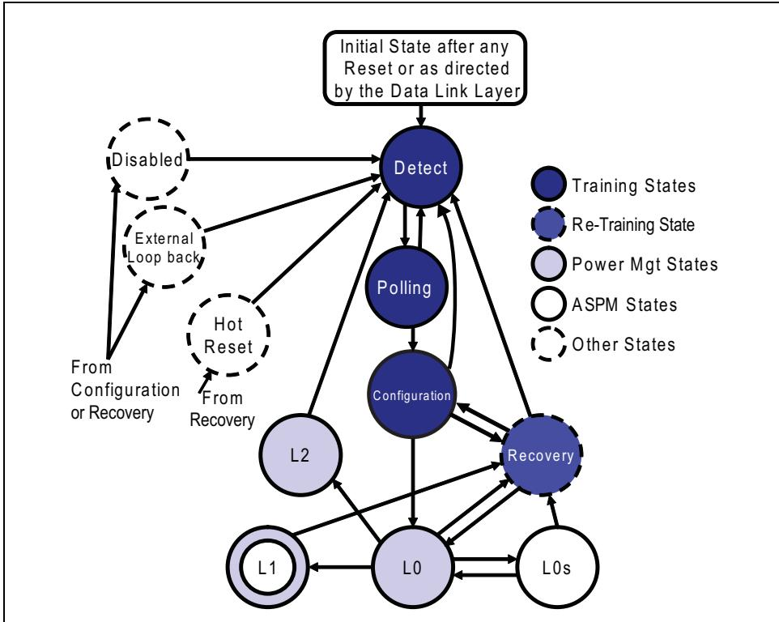

## 14.3.1 Overview of LTSSM States | 14.3.1 LTSSM 状态概述
## LTSSM 状态概述

<table style="border-collapse:collapse; width:100%;">
  <thead>
    <tr>
      <th width="50%" style="border:1px solid #333; background:#f5f5f5;">EN</th>
      <th width="50%" style="border:1px solid #333; background-color:#e8e8e8;">中文</th>
    </tr>
  </thead>
  <tbody>
    <tr><td width="50%" style="border:1px solid #333; background:#fff;padding:4px 8px;">Below is a brief description of the 11 high-level LTSSM states.</td><td width="50%" style="border:1px solid #333; background-color:#e8e8e8;padding:4px 8px;">以下是对 11 个顶级 LTSSM 状态的简要描述。</td></tr>
    <tr><td width="50%" style="border:1px solid #333; background:#fff;padding:4px 8px;">**Detect:** The initial state after reset. In this state, a device electrically detects a Receiver is present at the far end of the Link. That's an unusual thing in the world of serial transports, but it's done to facilitate testing, as we'll see in the next state. Detect may also be entered from a number of other LTSSM states as described later.</td><td width="50%" style="border:1px solid #333; background-color:#e8e8e8;padding:4px 8px;">**Detect（检测）：** 复位后的初始状态。在此状态下，设备通过电气方式检测链路的远端是否存在接收器。这在串行传输领域并不常见，但这样做是为了便于测试，这一点将在下一个状态中看到。Detect 状态也可以从其他多个 LTSSM 状态进入，具体如后文所述。</td></tr>
    <tr><td width="50%" style="border:1px solid #333; background:#fff;padding:4px 8px;">**Polling:** In this state, Transmitters begin to send TS1s and TS2s (at 2.5 GT/s for backward compatibility) so that Receivers can use them to accomplish the following:</td><td width="50%" style="border:1px solid #333; background-color:#e8e8e8;padding:4px 8px;">**Polling（轮询）：** 在此状态下，发送器开始发送 TS1 和 TS2（以 2.5 GT/s 的速率，以确保向后兼容性），以便接收器可以利用它们完成以下操作：</td></tr>
    <tr><td width="50%" style="border:1px solid #333; background:#fff;padding:4px 8px;">— Achieve Bit Lock</td><td width="50%" style="border:1px solid #333; background-color:#e8e8e8;padding:4px 8px;">— 实现位锁定</td></tr>
    <tr><td width="50%" style="border:1px solid #333; background:#fff;padding:4px 8px;">— Acquire Symbol Lock or Block Lock</td><td width="50%" style="border:1px solid #333; background-color:#e8e8e8;padding:4px 8px;">— 获取符号锁定或块锁定</td></tr>
    <tr><td width="50%" style="border:1px solid #333; background:#fff;padding:4px 8px;">— Correct Lane polarity inversion, if needed</td><td width="50%" style="border:1px solid #333; background-color:#e8e8e8;padding:4px 8px;">— 修正通道极性反转（如果需要）</td></tr>
    <tr><td width="50%" style="border:1px solid #333; background:#fff;padding:4px 8px;">— Learn available Lane data rates</td><td width="50%" style="border:1px solid #333; background-color:#e8e8e8;padding:4px 8px;">— 获知可用的通道数据速率</td></tr>
  </tbody>
</table>

## PCI Express Technology | PCI Express 技术

<table style="border-collapse:collapse; width:100%;">
  <thead>
    <tr>
      <th width="50%" style="border:1px solid #333; background:#f5f5f5;">EN</th>
      <th width="50%" style="border:1px solid #333; background-color:#e8e8e8;">中文</th>
    </tr>
  </thead>
  <tbody>
    <tr><td width="50%" style="border:1px solid #333; background:#fff;padding:4px 8px;">— If directed, Initiate the Compliance test sequence: The way this works is that if a receiver was detected in the Detect state but no incoming signal is seen, it's understood to mean that the device has been connected to a test load. In that case, it should send the specified Compliance test pattern to facilitate testing. This allows test equipment to quickly verify that voltage, BER, timing, and other parameters are within tolerance.</td><td width="50%" style="border:1px solid #333; background-color:#e8e8e8;padding:4px 8px;">— 如果被指示，启动一致性测试序列（Compliance test sequence）：其工作方式是，如果在 Detect 状态检测到了接收器但未看到输入信号，则意味着设备已连接到测试负载。在这种情况下，它应发送指定的一致性测试码型以方便测试。这使得测试设备能够快速验证电压、BER、时序及其他参数是否在容差范围内。</td></tr>
    <tr><td width="50%" style="border:1px solid #333; background:#fff;padding:4px 8px;">• Configuration: Upstream and Downstream components now play specific roles as they continue to exchange TS1s and TS2s at 2.5 GT/s to accomplish the following:</td><td width="50%" style="border:1px solid #333; background-color:#e8e8e8;padding:4px 8px;">• Configuration：上游和下游组件现在扮演特定角色，它们继续以 2.5 GT/s 交换 TS1 和 TS2，以完成以下任务：</td></tr>
    <tr><td width="50%" style="border:1px solid #333; background:#fff;padding:4px 8px;">— Determine Link width</td><td width="50%" style="border:1px solid #333; background-color:#e8e8e8;padding:4px 8px;">— 确定链路宽度</td></tr>
    <tr><td width="50%" style="border:1px solid #333; background:#fff;padding:4px 8px;">— Assign Lane numbers</td><td width="50%" style="border:1px solid #333; background-color:#e8e8e8;padding:4px 8px;">— 分配通道编号</td></tr>
    <tr><td width="50%" style="border:1px solid #333; background:#fff;padding:4px 8px;">— Optionally check for Lane reversal and correct it</td><td width="50%" style="border:1px solid #333; background-color:#e8e8e8;padding:4px 8px;">— 可选地检查通道反转并予以纠正</td></tr>
    <tr><td width="50%" style="border:1px solid #333; background:#fff;padding:4px 8px;">— Deskew Lane-to-Lane timing differences</td><td width="50%" style="border:1px solid #333; background-color:#e8e8e8;padding:4px 8px;">— 消除通道间时滞偏差</td></tr>
    <tr><td width="50%" style="border:1px solid #333; background:#fff;padding:4px 8px;">From this state, scrambling can be disabled, the Disable and Loopback states can be entered, and the number of FTS Ordered Sets required to transition from the L0s state to the L0 state is recorded from the TS1s and TS2s.</td><td width="50%" style="border:1px solid #333; background-color:#e8e8e8;padding:4px 8px;">在该状态下，可禁用加扰，可进入 Disable 和 Loopback 状态，并且从 TS1 和 TS2 中记录从 L0s 状态转换到 L0 状态所需的 FTS 有序集数量。</td></tr>
    <tr><td width="50%" style="border:1px solid #333; background:#fff;padding:4px 8px;">• L0: This is the normal, fully-active state of a Link during which TLPs, DLLPs and Ordered Sets can be exchanged. In this state, the Link could be running at higher speeds than 2.5 GT/s, but only after re-training (Recovery) the Link and going through a speed change procedure.</td><td width="50%" style="border:1px solid #333; background-color:#e8e8e8;padding:4px 8px;">• L0：这是链路的正常全活动状态，在此期间可以交换 TLP、DLLP 和有序集。在该状态下，链路可以以高于 2.5 GT/s 的速度运行，但必须经过链路重新训练（Recovery）并执行速度变更流程。</td></tr>
    <tr><td width="50%" style="border:1px solid #333; background:#fff;padding:4px 8px;">• Recovery: This state is entered when the Link needs re-training. This could be caused by errors in L0, or recovery from L1 back to L0, or recovery from L0s if the Link does not train properly using the FTS sequence. In Recovery, Bit Lock and Symbol/Block Lock are re-established in a manner similar to that used in the Polling state but it typically takes much less time.</td><td width="50%" style="border:1px solid #333; background-color:#e8e8e8;padding:4px 8px;">• Recovery：当链路需要重新训练时进入此状态。其原因可能是 L0 中发生的错误、从 L1 恢复回 L0、或者从 L0s 恢复时链路未使用 FTS 序列正确训练。在 Recovery 中，位锁和符号/块锁以类似于 Polling 状态中使用的方式重新建立，但通常所需时间少得多。</td></tr>
    <tr><td width="50%" style="border:1px solid #333; background:#fff;padding:4px 8px;">• L0s: This ASPM state is designed to provide some power savings while affording a quick recovery time back to L0. It's entered when one Transmitter sends the EIOS while in the L0 state. Exit from L0s involves sending FTSs to quickly re-acquire Bit and Symbol/Block Lock.</td><td width="50%" style="border:1px solid #333; background-color:#e8e8e8;padding:4px 8px;">• L0s：此 ASPM 状态旨在提供一定的功耗节省，同时实现快速恢复回 L0。当发送器在 L0 状态下发送 EIOS 时进入此状态。退出 L0s 涉及发送 FTS 以快速重新获取位锁和符号/块锁。</td></tr>
    <tr><td width="50%" style="border:1px solid #333; background:#fff;padding:4px 8px;">• L1: This state provides greater power savings by trading off a longer recovery time than L0s does (see "Active State Power Management (ASPM)" on page 735). Entry into L1 involves a negotiation between both Link partners to enter it together and can occur in one of two ways:</td><td width="50%" style="border:1px solid #333; background-color:#e8e8e8;padding:4px 8px;">• L1：此状态通过比 L0s 更长的恢复时间来换取更大的功耗节省（见第 735 页"主动状态电源管理（ASPM）"）。进入 L1 需要两侧链路对端协商后共同进入，可通过以下两种方式之一触发：</td></tr>
    <tr><td width="50%" style="border:1px solid #333; background:#fff;padding:4px 8px;">— The first is autonomous with ASPM: hardware in an Upstream Port with no scheduled TLPs or DLLPs to transmit can automatically negotiate to put its Link into the L1 state. If the Downstream Port agrees, the Link enters L1. If not, the Upstream Port will enter L0s instead (if enabled).</td><td width="50%" style="border:1px solid #333; background-color:#e8e8e8;padding:4px 8px;">— 第一种是 ASPM 自主方式：没有计划发送 TLP 或 DLLP 的上游端口中的硬件可自动协商将其链路置于 L1 状态。如果下游端口同意，链路进入 L1。如果不同意，则上游端口将改为进入 L0s（如果启用）。</td></tr>
    <tr><td width="50%" style="border:1px solid #333; background:#fff;padding:4px 8px;">— The second is the result of power management software issuing a commanding a device to a low-power state (D1, D2, or $\mathrm{D3_{Hot}}$). As a result, the Upstream Port notifies the Downstream Port that they must enter L1, the Downstream Port acknowledges that, and they enter L1.</td><td width="50%" style="border:1px solid #333; background-color:#e8e8e8;padding:4px 8px;">— 第二种是电源管理软件命令设备进入低功耗状态（D1、D2 或 $\mathrm{D3_{Hot}}$）的结果。因此，上游端口通知下游端口它们必须进入 L1，下游端口确认后，它们进入 L1。</td></tr>
    <tr><td width="50%" style="border:1px solid #333; background:#fff;padding:4px 8px;">• L2: In this state the main power to the devices is turned off to achieve a greater power savings. Almost all of the logic is off, but a small amount of power is still available from the $\mathrm{V_{aux}}$ source to allow the device to indicate a wakeup event. An Upstream Port that supports this wakeup capability can send a very low frequency signal called the Beacon and a Downstream Port can forward it to the Root Complex to get system attention (see "Beacon Signaling" on page 483). Using the Beacon, or a side-band WAKE# signal, a device can trigger a system wakeup event to get main power restored. [An L3 Link power state is also defined, but it doesn't relate to the LTSSM states. The L3 state is the full-off condition in which $\mathrm{V_{aux}}$ power is not available and a wakeup event can't be signaled.]</td><td width="50%" style="border:1px solid #333; background-color:#e8e8e8;padding:4px 8px;">• L2：在此状态下，设备的主电源关闭以实现更大的功耗节省。几乎全部逻辑都关闭，但 $\mathrm{V_{aux}}$ 电源仍提供少量电力，使设备能够指示唤醒事件。支持此唤醒能力的上游端口可以发送称为 Beacon 的极低频信号，下游端口可将其转发至根复合体以获取系统注意（见第 483 页"Beacon 信号"）。通过使用 Beacon 或边带 WAKE# 信号，设备可以触发系统唤醒事件以恢复主电源。[还定义了一个 L3 链路电源状态，但它与 LTSSM 状态无关。L3 状态是完全断电状态，$\mathrm{V_{aux}}$ 电源不可用，无法发出唤醒事件信号。]</td></tr>
    <tr><td width="50%" style="border:1px solid #333; background:#fff;padding:4px 8px;">• Loopback: This state is used for testing but exactly what a Receiver does in this mode (for example: how much of the logic participates) is left unspecified. The basic operation is simple enough: the device that will be the Loopback Master sends TS1 Ordered Sets that have the Loopback bit set in the Training Control field to the device that will be the Loopback Slave. When a device sees two consecutive TS1s with the Loopback bit set, it enters the Loopback state as the Loopback Slave and echoes back everything that comes in. The Master, recognizing that what it is sending is now being echoed, sends any pattern of Symbols that follow the 8b/10b encoding rules, and the Slave echoes them back exactly as they were sent, providing a round-trip verification of Link integrity.</td><td width="50%" style="border:1px solid #333; background-color:#e8e8e8;padding:4px 8px;">• Loopback：此状态用于测试，但接收器在此模式下具体做什么（例如：有多少逻辑参与）未作规定。基本操作相当简单：作为 Loopback Master 的设备向作为 Loopback Slave 的设备发送在 Training Control 字段中设置了 Loopback 位的 TS1 有序集。当设备看到两个连续的设置了 Loopback 位的 TS1 时，它将作为 Loopback Slave 进入 Loopback 状态，并将接收到的所有内容回显回去。Master 识别到其发送的内容正在被回显后，发送遵循 8b/10b 编码规则的任意符号码型，Slave 将它们完全按照发送时的原样回显回去，从而提供链路完整性的往返验证。</td></tr>
    <tr><td width="50%" style="border:1px solid #333; background:#fff;padding:4px 8px;">• Disable: This state allows a configured Link to be disabled. In this state, the Transmitter is in the Electrical Idle state while the Receiver is in the low impedance state. This might be necessary because the Link has become unreliable or due to a surprise removal of the device. Software commands a device to do this by setting the Disable bit in the Link Control register. The device then sends 16 TS1s with the Disable Link bit set in the TS1 Training Control field. Receivers are disabled when they receive those TS1s.</td><td width="50%" style="border:1px solid #333; background-color:#e8e8e8;padding:4px 8px;">• Disable：此状态允许禁用一个已配置的链路。在此状态下，发送器处于电气空闲状态，而接收器处于低阻抗状态。这可能是必要的，因为链路变得不可靠或设备被意外移除。软件通过设置 Link Control 寄存器中的 Disable 位来命令设备执行此操作。然后设备发送 16 个在 TS1 Training Control 字段中设置了 Disable Link 位的 TS1。接收器在收到这些 TS1 时被禁用。</td></tr>
    <tr><td width="50%" style="border:1px solid #333; background:#fff;padding:4px 8px;">• Hot Reset: Software can reset a Link by setting the Secondary Bus Reset bit in the Bridge Control register. That causes the bridge's Downstream Port to send TS1s with the Hot Reset bit set in the TS1 Training Control field (see "Hot Reset (In-band Reset)" on page 837). When a Receiver sees two consecutive TS1s with the Hot Reset bit set, it must reset its device.</td><td width="50%" style="border:1px solid #333; background-color:#e8e8e8;padding:4px 8px;">• Hot Reset：软件可以通过设置 Bridge Control 寄存器中的 Secondary Bus Reset 位来复位链路。这将导致桥的下游端口发送在 TS1 Training Control 字段中设置了 Hot Reset 位的 TS1（见第 837 页"热复位（带内复位）"）。当接收器看到两个连续的设置了 Hot Reset 位的 TS1 时，它必须复位其设备。</td></tr>
  </tbody>
</table>

## Introductions, Examples and State | Substates

<table style="border-collapse:collapse; width:100%;">
  <thead>
    <tr>
      <th width="50%" style="border:1px solid #333; background:#f5f5f5;">EN</th>
      <th width="50%" style="border:1px solid #333; background-color:#e8e8e8;">中文</th>
    </tr>
  </thead>
  <tbody>
    <tr><td width="50%" style="border:1px solid #333; background:#fff;padding:4px 8px;">The balance of this chapter covers each of the LTSSM states. Depending on the complexity of a given state, the discussion may include an introduction, general background, and/or examples that accompanies the detailed discussion of the State/Substate. In some cases, the reader may choose to skip the detailed coverage and jump to introductory material. Each section is organized to facilitate these options.</td><td width="50%" style="border:1px solid #333; background-color:#e8e8e8;padding:4px 8px;">本章剩余部分涵盖每个 LTSSM 状态。根据特定状态的复杂程度，讨论内容可能包括引言、一般背景和/或示例，以及伴随状态/子状态详细讨论的内容。在某些情况下，读者可选择跳过详细内容，直接阅读介绍性材料。每节的编排均便于实现这些选择。</td></tr>
    <tr><td width="50%" style="border:1px solid #333; background:#fff;padding:4px 8px;">Every device must perform initial link training at the base rate of 2.5 GT/s. Figure 14-7 highlights the states involved in the initial training sequence. Devices capable of operating at 5.0 or 8.0 GT/s must transition to the Recovery state to change the speed to the higher rate chosen.</td><td width="50%" style="border:1px solid #333; background-color:#e8e8e8;padding:4px 8px;">每个设备必须以 2.5 GT/s 的基本速率执行初始链路训练。图 14-7 标明了初始训练序列中涉及的状态。能够以 5.0 或 8.0 GT/s 运行的设备必须转换到 Recovery 状态，以便将速度更改为所选的更高速率。</td></tr>
  </tbody>
</table>

Figure 14-7: States Involved in Initial Link Training at 2.5 Gb/s | 图14-7：2.5 Gb/s初始链路训练涉及的状态  

<table style="border-collapse:collapse; width:100%;">
  <thead>
    <tr>
      <th width="50%" style="border:1px solid #333; background:#f5f5f5;">EN</th>
      <th width="50%" style="border:1px solid #333; background-color:#e8e8e8;">中文</th>
    </tr>
  </thead>
  <tbody>
    <tr><td width="50%" style="border:1px solid #333; background:#fff;padding:4px 8px;">## Detect State</td><td width="50%" style="border:1px solid #333; background-color:#e8e8e8;padding:4px 8px;">## 检测状态</td></tr>
  </tbody>
</table>

## 99.1 Introduction | 99.1 引言

<table style="border-collapse:collapse; width:100%;">
  <thead>
    <tr>
      <th width="50%" style="border:1px solid #333; background:#f5f5f5;">EN</th>
      <th width="50%" style="border:1px solid #333; background-color:#e8e8e8;">中文</th>
    </tr>
  </thead>
  <tbody>
    <tr><td width="50%" style="border:1px solid #333; background:#fff;padding:4px 8px;">Figure 14‐8 represents the two substates and transitions associated with the Detect state. The actions associated with the Detect state are performed by each transmitter in the process of detecting the presence of a receiver at the opposite end of the link. Because there are only two substates and because they are fairly simple, we will move directly to the substate discussions.</td><td width="50%" style="border:1px solid #333; background-color:#e8e8e8;padding:4px 8px;">图14-8展示了与Detect状态相关的两个子状态及其转换。Detect状态所关联的动作由每个发送端在执行链路对端接收端检测过程中执行。由于仅有两个子状态且较为简单，我们将直接进入子状态讨论。</td></tr>
  </tbody>
</table>

Figure 14‐8: Detect State Machine | 图14‐8：检测状态机  
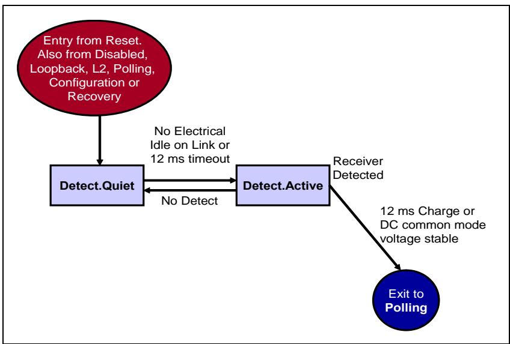

## 14.4.2 Detailed Detect Substate | 14.4.2 详细检测子状态详解

## Detect.Quiet | Detect.Quiet

<table style="border-collapse:collapse; width:100%;">
  <thead>
    <tr>
      <th width="50%" style="border:1px solid #333; background:#f5f5f5;">EN</th>
      <th width="50%" style="border:1px solid #333; background-color:#e8e8e8;">中文</th>
    </tr>
  </thead>
  <tbody>
    <tr><td width="50%" style="border:1px solid #333; background:#fff;padding:4px 8px;">This substate is the initial state after any reset (except Function Level Reset) or power‑up event and must be entered within 20 ms after Reset. This substate is also entered from other states if unable to move forward (See the states that may enter Detect.Quiet in Figure 14‑8 on page 523). The properties of this substate are listed below:</td><td width="50%" style="border:1px solid #333; background-color:#e8e8e8;padding:4px 8px;">该子状态是任何复位（功能级复位除外）或上电事件后的初始状态，必须在复位后20 ms内进入。如果无法继续前进，也会从其他状态进入该子状态（参见第523页图14‑8中可进入Detect.Quiet的状态）。该子状态的特性如下：</td></tr>
    <tr><td width="50%" style="border:1px solid #333; background:#fff;padding:4px 8px;">• The Transmitter starts in Electrical Idle (but the DC common mode voltage doesn't have to be within the normally‑specified range).</td><td width="50%" style="border:1px solid #333; background-color:#e8e8e8;padding:4px 8px;">• 发送器以电气空闲状态启动（但直流共模电压不必处于正常规定的范围内）。</td></tr>
    <tr><td width="50%" style="border:1px solid #333; background:#fff;padding:4px 8px;">The intended data rate is set to 2.5 GT/s (Gen1). If it set to a different rate when this substate was entered, the LTSSM must stay in this substate for 1ms before changing the rate to Gen1.</td><td width="50%" style="border:1px solid #333; background-color:#e8e8e8;padding:4px 8px;">目标数据速率设置为2.5 GT/s（Gen1）。如果进入该子状态时设置了不同的速率，LTSSM必须在该子状态中保持1 ms，然后才能将速率更改为Gen1。</td></tr>
    <tr><td width="50%" style="border:1px solid #333; background:#fff;padding:4px 8px;">• The Physical Layer's status bit (LinkUp = 0) informs the Data Link Layer that the Link is not operational. The LinkUp status bit is an internal state bit (not found in standard config space) and also indicates when the Physical Layer has completed Link Training (LinkUp=1), thereby informing the Data Link Layer and Flow Control initialization to begin its part of Link initialization (for more on this, see "The FC Initialization Sequence" on page 223).</td><td width="50%" style="border:1px solid #333; background-color:#e8e8e8;padding:4px 8px;">• 物理层的状态位（LinkUp = 0）通知数据链路层链路不可操作。LinkUp状态位是一个内部状态位（不在标准配置空间中），同时也指示物理层何时完成链路训练（LinkUp=1），从而通知数据链路层和流控初始化开始执行其链路初始化部分（更多信息请参见第223页的"FC初始化序列"）。</td></tr>
    <tr><td width="50%" style="border:1px solid #333; background:#fff;padding:4px 8px;">Any previous equalization (Eq.) status is cleared by setting the four Link Status 2 register bits to zero: Eq. Phase 1 Successful, Eq. Phase 2 Successful, Eq. Phase 3 Successful, Eq. Complete.</td><td width="50%" style="border:1px solid #333; background-color:#e8e8e8;padding:4px 8px;">通过将链路状态2寄存器的四个位清零来清除所有先前的均衡状态：均衡阶段1成功、均衡阶段2成功、均衡阶段3成功、均衡完成。</td></tr>
  </tbody>
</table>

## Variables: | 变量：

<table style="border-collapse:collapse; width:100%;">
  <thead>
    <tr>
      <th width="50%" style="border:1px solid #333; background:#f5f5f5;">EN</th>
      <th width="50%" style="border:1px solid #333; background-color:#e8e8e8;">中文</th>
    </tr>
  </thead>
  <tbody>
    <tr><td width="50%" style="border:1px solid #333; background:#fff;padding:4px 8px;">Several variables are cleared to zero: (directed\_speed\_change=0b, upconfigure\_capable=0b, equalization\_done\_8GT\_data\_rate=0b, idle\_to\_rlock\_transitioned=00h). The select\_deemphasis variable setting depends on the port type: for an Upstream Port it's selected by hardware, while for a Downstream Port it takes the value in the Link Control 2 register of the Selectable Preset/De-emphasis field.</td><td width="50%" style="border:1px solid #333; background-color:#e8e8e8;padding:4px 8px;">若干变量被清零：(directed\_speed\_change=0b、upconfigure\_capable=0b、equalization\_done\_8GT\_data\_rate=0b、idle\_to\_rlock\_transitioned=00h)。select\_deemphasis 变量的设置取决于端口类型：对于上行端口，由硬件选择；而对于下行端口，则取 Link Control 2 寄存器中 Selectable Preset/De-emphasis 字段的值。</td></tr>
    <tr><td width="50%" style="border:1px solid #333; background:#fff;padding:4px 8px;">Since these variables were defined beginning with the 2.0 spec version, devices designed to earlier spec versions won't have them and will behave as if directed\_speed\_change and upconfigure\_capable were set to 0b and idle\_to\_rlock\_transitioned was set to FFh.</td><td width="50%" style="border:1px solid #333; background-color:#e8e8e8;padding:4px 8px;">由于这些变量是从 2.0 规范版本开始定义的，针对更早规范版本设计的器件将不具有这些变量，其行为等同于 directed\_speed\_change 和 upconfigure\_capable 被设为 0b、idle\_to\_rlock\_transitioned 被设为 FFh。</td></tr>
  </tbody>
</table>

<table style="border-collapse:collapse; width:100%;">
  <thead>
    <tr>
      <th width="50%" style="border:1px solid #333; background:#f5f5f5;">EN</th>
      <th width="50%" style="border:1px solid #333; background-color:#e8e8e8;">中文</th>
    </tr>
  </thead>
  <tbody>
    <tr><td width="50%" style="border:1px solid #333; background:#fff;padding:4px 8px;">## Exit to "Detect.Active"</td><td width="50%" style="border:1px solid #333; background-color:#e8e8e8;padding:4px 8px;">## 退出至"Detect.Active"</td></tr>
    <tr><td width="50%" style="border:1px solid #333; background:#fff;padding:4px 8px;">The next substate is Detect.Active after a 12 ms timeout or when any Lane exits Electrical Idle.</td><td width="50%" style="border:1px solid #333; background-color:#e8e8e8;padding:4px 8px;">在12 ms超时后或当任一Lane退出电气空闲时，下一个子状态为Detect.Active。</td></tr>
  </tbody>
</table>

<table style="border-collapse:collapse; width:100%;">
  <thead>
    <tr>
      <th width="50%" style="border:1px solid #333; background:#f5f5f5;">EN</th>
      <th width="50%" style="border:1px solid #333; background-color:#e8e8e8;">中文</th>
    </tr>
  </thead>
  <tbody>
    <tr><td width="50%" style="border:1px solid #333; background:#fff;padding:4px 8px;">## Detect.Active</td><td width="50%" style="border:1px solid #333; background-color:#e8e8e8;padding:4px 8px;">## 检测.激活 (Detect.Active)</td></tr>
    <tr><td width="50%" style="border:1px solid #333; background:#fff;padding:4px 8px;">This substate is entered from Detect.Quiet. At this time the Transmitter tests whether a Receiver is connected on each Lane by setting a DC common mode voltage of any value in the legal range and then changing it. The detection logic observes the rate of change as the time it takes the line voltage to charge up and compares it to an expected time, such as how long it would take without a Receiver termination. If a Receiver is attached, the charge time will be much longer, making it easy to recognize. For more details on this process, see "Receiver Detection" on page 460. To simplify the discussions that follow, Lanes that detect a Receiver during this substate are referred to as "Detected Lanes."</td><td width="50%" style="border:1px solid #333; background-color:#e8e8e8;padding:4px 8px;">该子状态从 Detect.Quiet 进入。此时，发送器通过在合法范围内设置任意值的直流共模电压并随后改变它，来测试每条通道上是否连接了接收器。检测逻辑观察电压变化率（即线路电压充电所需时间），并将其与预期时间（例如无接收器端接时的充电时间）进行比较。如果接收器已连接，则充电时间将长得多，从而易于识别。有关此过程的更多详细信息，请参阅第 460 页的"接收器检测"。为简化后续讨论，在此子状态下检测到接收器的通道称为"已检测通道"。</td></tr>
  </tbody>
</table>

## Exit to "Detect.Quiet" | 退出到 "Detect.Quiet"

<table style="border-collapse:collapse; width:100%;">
  <thead>
    <tr>
      <th width="50%" style="border:1px solid #333; background:#f5f5f5;">EN</th>
      <th width="50%" style="border:1px solid #333; background-color:#e8e8e8;">中文</th>
    </tr>
  </thead>
  <tbody>
    <tr><td width="50%" style="border:1px solid #333; background:#fff;padding:4px 8px;">If no Lanes detect a Receiver, go back to Detect.Quiet. The loop between them is repeated every 12ms, as long as no Receiver is detected.</td><td width="50%" style="border:1px solid #333; background-color:#e8e8e8;padding:4px 8px;">如果没有Lane检测到接收器，则返回到Detect.Quiet状态。只要未检测到接收器，两者之间的循环每12ms重复一次。</td></tr>
  </tbody>
</table>

## Exit to "Polling State" | 退出到 "Polling 状态"

<table style="border-collapse:collapse; width:100%;">
  <thead>
    <tr>
      <th width="50%" style="border:1px solid #333; background:#f5f5f5;">EN</th>
      <th width="50%" style="border:1px solid #333; background-color:#e8e8e8;">中文</th>
    </tr>
  </thead>
  <tbody>
    <tr><td width="50%" style="border:1px solid #333; background:#fff;padding:4px 8px;">## Exit to "Polling State"</td><td width="50%" style="border:1px solid #333; background-color:#e8e8e8;padding:4px 8px;">## 退出至"轮询状态"</td></tr>
    <tr><td width="50%" style="border:1px solid #333; background:#fff;padding:4px 8px;">If a receiver is detected on all Lanes, the next state will be Polling. The Lanes must now drive a DC common voltage within the 0 - 3.6 V VTX-CM-DC spec.</td><td width="50%" style="border:1px solid #333; background-color:#e8e8e8;padding:4px 8px;">如果所有通道上都检测到接收器，下一状态将是轮询。各通道现在必须在 0 - 3.6 V VTX-CM-DC 规范范围内驱动一个直流共模电压。</td></tr>
  </tbody>
</table>

<table style="border-collapse:collapse; width:100%;">
  <thead>
    <tr>
      <th width="50%" style="border:1px solid #333; background:#f5f5f5;">EN</th>
      <th width="50%" style="border:1px solid #333; background-color:#e8e8e8;">中文</th>
    </tr>
  </thead>
  <tbody>
    <tr><td width="50%" style="border:1px solid #333; background:#fff;padding:4px 8px;">## Special Case:</td><td width="50%" style="border:1px solid #333; background-color:#e8e8e8;padding:4px 8px;">## 特殊情况：</td></tr>
    <tr><td width="50%" style="border:1px solid #333; background:#fff;padding:4px 8px;">If some but not all Lanes of a device are connected to a Receiver (like a x4 device connected to a x2 device), then wait 12 ms and try it again. If the same Lanes detect a Receiver the second time, exit to the Polling state, otherwise go back to Detect.Quiet. If going to Polling, there are two possibilities for the Lanes that didn't see a Receiver:</td><td width="50%" style="border:1px solid #333; background-color:#e8e8e8;padding:4px 8px;">如果设备的部分（而非全部）通道连接到接收器（例如 x4 设备连接到 x2 设备），则等待 12 ms 并重试。如果相同通道第二次检测到接收器，则退出到轮询状态，否则回到 Detect.Quiet。如果进入轮询，对于未检测到接收器的通道有两种可能情况：</td></tr>
    <tr><td width="50%" style="border:1px solid #333; background:#fff;padding:4px 8px;">1. If the Lanes can operate as a separate Link (see "Designing Devices with Links that can be Merged" on page 541), use another LTSSM and have those Lanes repeat the detect sequence.</td><td width="50%" style="border:1px solid #333; background-color:#e8e8e8;padding:4px 8px;">1. 如果这些通道可以作为独立链路运行（参见第 541 页"Designing Devices with Links that can be Merged"），则使用另一个 LTSSM 并使这些通道重复检测序列。</td></tr>
    <tr><td width="50%" style="border:1px solid #333; background:#fff;padding:4px 8px;">2. If another LTSSM is not available, then the Lanes that don't detect a Receiver will not be part of a Link and must transition to Electrical Idle.</td><td width="50%" style="border:1px solid #333; background-color:#e8e8e8;padding:4px 8px;">2. 如果另一个 LTSSM 不可用，则未检测到接收器的通道将不属于链路，且必须转换到电气空闲状态。</td></tr>
  </tbody>
</table>

## 14.5 Polling State | 14.5 轮询状态

## 99.1 Introduction | 99.1 引言

<table style="border-collapse:collapse; width:100%;">
  <thead>
    <tr>
      <th width="50%" style="border:1px solid #333; background:#f5f5f5;">EN</th>
      <th width="50%" style="border:1px solid #333; background-color:#e8e8e8;">中文</th>
    </tr>
  </thead>
  <tbody>
    <tr><td width="50%" style="border:1px solid #333; background:#fff;padding:4px 8px;">To this point the link has been in the electrical idle state, however during Polling the LTSSM TS1s and TS2s are exchanged between the two connected devices. The primary purpose of this state is for the two devices to understand what the each other is saying. In other words, they need to establish bit and symbol lock on each other's transmitted bit stream and resolve any polarity inversion issues. Once this has been accomplished, each device is successfully receiving the TS1 and TS2 ordered-sets from their link partner. Figure 14-9 on page 525 shows the substates of the Polling state machine.</td><td width="50%" style="border:1px solid #333; background-color:#e8e8e8;padding:4px 8px;">至此，链路一直处于电气空闲状态，然而在 Polling 期间，两个连接的设备之间会交换 LTSSM TS1 和 TS2 有序集。该状态的主要目的是让两个设备理解对方所发送的内容。换言之，它们需要在彼此的传输比特流上建立位锁定和符号锁定，并解决任何极性反转问题。一旦完成这些工作，每个设备就能成功地从其链路伙伴接收 TS1 和 TS2 有序集。第 525 页的图 14-9 展示了 Polling 状态机的子状态。</td></tr>
  </tbody>
</table>

Figure 14-9: Polling State Machine | 图14-9：轮询状态机

## 14.5.2 Detailed Polling Substates | 14.5.2 详细轮询子状态

<table style="border-collapse:collapse; width:100%;">
  <thead>
    <tr>
      <th width="50%" style="border:1px solid #333; background:#f5f5f5;">EN</th>
      <th width="50%" style="border:1px solid #333; background-color:#e8e8e8;">中文</th>
    </tr>
  </thead>
  <tbody>
    <tr><td width="50%" style="border:1px solid #333; background:#fff;padding:4px 8px;">## Detailed Polling Substates</td><td width="50%" style="border:1px solid #333; background-color:#e8e8e8;padding:4px 8px;">## 轮询子状态详解</td></tr>
  </tbody>
</table>

## Polling.Active | Polling.Active

<table style="border-collapse:collapse; width:100%;">
  <thead>
    <tr>
      <th width="50%" style="border:1px solid #333; background:#f5f5f5;">EN</th>
      <th width="50%" style="border:1px solid #333; background-color:#e8e8e8;">中文</th>
    </tr>
  </thead>
  <tbody>
    <tr><td width="50%" style="border:1px solid #333; background:#fff;padding:4px 8px;">## Polling.Active</td><td width="50%" style="border:1px solid #333; background-color:#e8e8e8;padding:4px 8px;">## Polling.Active</td></tr>
  </tbody>
</table>

## During Polling.Active | 在 Polling.Active 期间

<table style="border-collapse:collapse; width:100%;">
  <thead>
    <tr>
      <th width="50%" style="border:1px solid #333; background:#f5f5f5;">EN</th>
      <th width="50%" style="border:1px solid #333; background-color:#e8e8e8;">中文</th>
    </tr>
  </thead>
  <tbody>
    <tr><td width="50%" style="border:1px solid #333; background:#fff;padding:4px 8px;">Transmitters send a minimum of 1024 consecutive TS1s on all detected Lanes once their common-mode voltage has settled at the level specified in the Transmit Margin field. The two Link partners may exit the Detect state at different times, so the TS1 exchange is not synchronized. The time needed to send 1024 TS1s at Gen1 speed (2.5 GT/s) is 64μs.</td><td width="50%" style="border:1px solid #333; background-color:#e8e8e8;padding:4px 8px;">一旦共模电压稳定在发送裕度字段指定的电平，发送器将在所有已检测到的通道上发送至少 1024 个连续的 TS1 序列。两个链路伙伴可能在不同时间退出 Detect 状态，因此 TS1 交换是非同步的。在 Gen1 速率（2.5 GT/s）下发送 1024 个 TS1 所需时间为 64μs。</td></tr>
    <tr><td width="50%" style="border:1px solid #333; background:#fff;padding:4px 8px;">Some notes regarding this substate are:</td><td width="50%" style="border:1px solid #333; background-color:#e8e8e8;padding:4px 8px;">关于此子状态的一些说明如下：</td></tr>
    <tr><td width="50%" style="border:1px solid #333; background:#fff;padding:4px 8px;">The PAD Symbol must be used in the Lane and Link Number fields of the TS1s.</td><td width="50%" style="border:1px solid #333; background-color:#e8e8e8;padding:4px 8px;">在 TS1 序列的通道号和链路号字段中必须使用 PAD 符号。</td></tr>
    <tr><td width="50%" style="border:1px solid #333; background:#fff;padding:4px 8px;">All data rates a device supports must be advertised, even if it doesn't intend to use them all.</td><td width="50%" style="border:1px solid #333; background-color:#e8e8e8;padding:4px 8px;">设备支持的所有数据速率都必须通告，即使其不打算全部使用。</td></tr>
    <tr><td width="50%" style="border:1px solid #333; background:#fff;padding:4px 8px;">Receivers use the incoming TS1s to acquire Bit Lock (see "Achieving Bit Lock" on page 395) and then either Symbol Lock (see "Achieving Symbol Lock" on page 396) for the lower rates, or Block Alignment for 8.0 GT/s (see "Achieving Block Alignment" on page 438).</td><td width="50%" style="border:1px solid #333; background-color:#e8e8e8;padding:4px 8px;">接收器使用接收到的 TS1 序列来获取位锁定（参见第 395 页的"实现位锁定"），然后对于较低速率获取符号锁定（参见第 396 页的"实现符号锁定"），或对于 8.0 GT/s 获取块对齐（参见第 438 页的"实现块对齐"）。</td></tr>
    <tr><td width="50%" style="border:1px solid #333; background:#fff;padding:4px 8px;">**Exit to "Polling.Configuration"**</td><td width="50%" style="border:1px solid #333; background-color:#e8e8e8;padding:4px 8px;">**退出到 "Polling.Configuration"**</td></tr>
    <tr><td width="50%" style="border:1px solid #333; background:#fff;padding:4px 8px;">The next state is Polling.Configuration if, after sending at least 1024 TS1s ALL detected Lanes receive 8 consecutive training sequences (or their complement, due to polarity inversion) that satisfy one of the following conditions:</td><td width="50%" style="border:1px solid #333; background-color:#e8e8e8;padding:4px 8px;">如果在发送至少 1024 个 TS1 后，所有已检测到的通道收到 8 个连续的训练序列（或其极性反转的补码）满足以下条件之一，则下一个状态为 Polling.Configuration：</td></tr>
    <tr><td width="50%" style="border:1px solid #333; background:#fff;padding:4px 8px;">TS1s with Link and Lane set to PAD were received with the Compliance Receive bit cleared to 0b (bit 4 of Symbol 5).</td><td width="50%" style="border:1px solid #333; background-color:#e8e8e8;padding:4px 8px;">接收到的 TS1 序列中链路和通道设置为 PAD，且 Compliance Receive 位清零为 0b（符号 5 的位 4）。</td></tr>
    <tr><td width="50%" style="border:1px solid #333; background:#fff;padding:4px 8px;">TS1s with Link and Lane set to PAD were received with the Loopback bit of Symbol 5 set to 1b.</td><td width="50%" style="border:1px solid #333; background-color:#e8e8e8;padding:4px 8px;">接收到的 TS1 序列中链路和通道设置为 PAD，且符号 5 的 Loopback 位设置为 1b。</td></tr>
    <tr><td width="50%" style="border:1px solid #333; background:#fff;padding:4px 8px;">TS2s were received with Link and Lane set to PAD.</td><td width="50%" style="border:1px solid #333; background-color:#e8e8e8;padding:4px 8px;">接收到的 TS2 序列中链路和通道设置为 PAD。</td></tr>
    <tr><td width="50%" style="border:1px solid #333; background:#fff;padding:4px 8px;">If the conditions above are not met, then after a 24ms timeout, if at least 1024 TS1s were sent after receiving a TS1, and ANY detected Lane received eight consecutive TS1 or TS2 Ordered Sets (or their complement) with the Lane and Link numbers set to PAD, and one of the following is true:</td><td width="50%" style="border:1px solid #333; background-color:#e8e8e8;padding:4px 8px;">如果不满足上述条件，则在 24ms 超时后，如果在收到 TS1 后至少发送了 1024 个 TS1，并且任一已检测到的通道收到 8 个连续的 TS1 或 TS2 有序集（或其补码）且通道号和链路号设置为 PAD，并且以下条件之一成立：</td></tr>
    <tr><td width="50%" style="border:1px solid #333; background:#fff;padding:4px 8px;">TS1s with Link and Lane set to PAD were received with the Compliance Receive (bit 4 of Symbol 5) cleared to 0b.</td><td width="50%" style="border:1px solid #333; background-color:#e8e8e8;padding:4px 8px;">接收到的 TS1 序列中链路和通道设置为 PAD，且 Compliance Receive（符号 5 的位 4）清零为 0b。</td></tr>
    <tr><td width="50%" style="border:1px solid #333; background:#fff;padding:4px 8px;">TS1s with Link and Lane set to PAD were received with the Loopback (bit 2 of Symbol 5) set to 1b.</td><td width="50%" style="border:1px solid #333; background-color:#e8e8e8;padding:4px 8px;">接收到的 TS1 序列中链路和通道设置为 PAD，且 Loopback（符号 5 的位 2）设置为 1b。</td></tr>
    <tr><td width="50%" style="border:1px solid #333; background:#fff;padding:4px 8px;">TS2s were received with Link and Lane set to PAD.</td><td width="50%" style="border:1px solid #333; background-color:#e8e8e8;padding:4px 8px;">接收到的 TS2 序列中链路和通道设置为 PAD。</td></tr>
    <tr><td width="50%" style="border:1px solid #333; background:#fff;padding:4px 8px;">If still none of the conditions above are met, if at least a predetermined number of detected Lanes also detected an exit from Electrical Idle at least once since entering Polling.Active (this prevents one or more bad Transmitters or Receivers from holding up Link configuration). The exact set of predetermined Lanes is implementation specific now, which is a change from the 1.1 spec that needed to see an Electrical Idle exit on all detected Lanes.</td><td width="50%" style="border:1px solid #333; background-color:#e8e8e8;padding:4px 8px;">如果仍然不满足上述任一条件，则还需至少预定数量的已检测通道在进入 Polling.Active 后至少检测到一次退出电气空闲状态（这可以防止一个或多个故障发送器或接收器阻碍链路配置）。预定通道的具体集合现由具体实现决定，这与 1.1 规范要求在所有已检测通道上都检测到电气空闲退出有所不同。</td></tr>
  </tbody>
</table>

<table style="border-collapse:collapse; width:100%;">
  <thead>
    <tr>
      <th width="50%" style="border:1px solid #333; background:#f5f5f5;">EN</th>
      <th width="50%" style="border:1px solid #333; background-color:#e8e8e8;">中文</th>
    </tr>
  </thead>
  <tbody>
    <tr><td width="50%" style="border:1px solid #333; background:#fff;padding:4px 8px;">## Exit to "Polling.Compliance"</td><td width="50%" style="border:1px solid #333; background-color:#e8e8e8;padding:4px 8px;">## 退出至"Polling.Compliance"</td></tr>
    <tr><td width="50%" style="border:1px solid #333; background:#fff;padding:4px 8px;">If the Enter Compliance bit in the Link Control 2 register is set to 1b, or if this bit was set before entering Polling.Active, the change to Polling.Compliance must be immediate and no TS1s are sent in Polling.Active.</td><td width="50%" style="border:1px solid #333; background-color:#e8e8e8;padding:4px 8px;">如果Link Control 2寄存器中的Enter Compliance位被置为1b，或者该位在进入Polling.Active之前已被置位，则必须立即切换到Polling.Compliance，且在Polling.Active中不发送任何TS1。</td></tr>
    <tr><td width="50%" style="border:1px solid #333; background:#fff;padding:4px 8px;">Otherwise, after a 24ms timeout, if:</td><td width="50%" style="border:1px solid #333; background-color:#e8e8e8;padding:4px 8px;">否则，在24ms超时后，如果满足以下任一条件：</td></tr>
    <tr><td width="50%" style="border:1px solid #333; background:#fff;padding:4px 8px;">All Lanes from the predetermined set have not seen an exit from Electrical Idle since entering Polling.Active (indicates a passive test load such as a resistor on at least one Lane forces all Lanes into Polling.Compliance).</td><td width="50%" style="border:1px solid #333; background-color:#e8e8e8;padding:4px 8px;">来自预定集合的所有Lane自进入Polling.Active以来均未检测到退出Electrical Idle（表示存在被动测试负载，例如至少一条Lane上的电阻迫使所有Lane进入Polling.Compliance）。</td></tr>
    <tr><td width="50%" style="border:1px solid #333; background:#fff;padding:4px 8px;">Any detected Lane received 8 consecutive TS1s (or their complement) with Link and Lane numbers set to PAD, the Compliance Receive bit of Symbol 5 set to 1b and the Loopback bit cleared to 0b.</td><td width="50%" style="border:1px solid #333; background-color:#e8e8e8;padding:4px 8px;">任何检测到的Lane接收到8个连续的TS1（或其互补序列），且Link和Lane编号均设为PAD，Symbol 5的Compliance Receive位设为1b，Loopback位清零为0b。</td></tr>
    <tr><td width="50%" style="border:1px solid #333; background:#fff;padding:4px 8px;">Exit to "Detect State"</td><td width="50%" style="border:1px solid #333; background-color:#e8e8e8;padding:4px 8px;">退出至"Detect State"</td></tr>
    <tr><td width="50%" style="border:1px solid #333; background:#fff;padding:4px 8px;">If, after 24ms, the conditions for going to Polling.Configuration or Polling.Compliance are not met, return to the Detect state.</td><td width="50%" style="border:1px solid #333; background-color:#e8e8e8;padding:4px 8px;">如果在24ms后，进入Polling.Configuration或Polling.Compliance的条件均未满足，则返回Detect状态。</td></tr>
  </tbody>
</table>

## Polling.Configuration | Polling.Configuration

| English | 中文 |
|----|----|
| In this substate, a transmitter will stop sending TS1s and start sending TS2s, still with PAD set for the Link and Lane numbers. | 在此子状态中，发送端将停止发送 TS1 并开始发送 TS2，链路易号和通道号仍设置为 PAD。 |
| The purpose of the change to sending TS2s instead of TS1s is to advertise to the link partner that this device is ready to proceed to the next state in the state machine. | 从发送 TS1 改为发送 TS2，其目的是向链路伙伴通告本设备已准备好进入状态机中的下一个状态。 |
| It is a handshake mechanism to ensure that both devices on the link proceed through the LTSSM together. | 这是一种握手机制，用以确保链路上的两个设备一起通过 LTSSM 前进。 |
| Neither device can proceed to the next state until both devices are ready. The way they advertise they are ready is by sending TS2 ordered‑sets. | 在两个设备都就绪之前，任一设备都不能进入下一状态。它们通告自己就绪的方式是发送 TS2 有序集。 |
| So once a device is both sending AND receiving TS2s, it knows it can proceed to the next state because it is ready and its link partner is ready too. | 因此，一旦某个设备既发送又接收 TS2，它就知道可以前进到下一状态，因为它已就绪，且其链路伙伴也已就绪。 |

## During Polling.Configuration | 在 Polling.Configuration 期间

<table style="border-collapse:collapse; width:100%;">
  <thead>
    <tr>
      <th width="50%" style="border:1px solid #333; background:#f5f5f5;">EN</th>
      <th width="50%" style="border:1px solid #333; background-color:#e8e8e8;">中文</th>
    </tr>
  </thead>
  <tbody>
    <tr><td width="50%" style="border:1px solid #333; background:#fff;padding:4px 8px;">Transmitters send TS2s with Link and Lane numbers set to PAD on all detected Lanes, and they must advertise all the data rates they support, even those they don't intend to use. Also, each Lane's receiver must independently invert the polarity of its differential input pair if necessary. For an explanation of how this is done, see "Overview" on page 506. The Transmit Margin field must be reset to 000b.</td><td width="50%" style="border:1px solid #333; background-color:#e8e8e8;padding:4px 8px;">发送器在所有检测到的Lane上发送Link和Lane编号设为PAD的TS2，并且它们必须广播其支持的所有数据速率，即使它们不打算使用这些速率。此外，每条Lane的接收器必须独立地对差分输入对的极性进行反向（如有必要）。关于如何完成此操作的说明，请参见第506页的"Overview"。Transmit Margin字段必须复位为000b。</td></tr>
    <tr><td width="50%" style="border:1px solid #333; background:#fff;padding:4px 8px;">Exit to "Configuration State"</td><td width="50%" style="border:1px solid #333; background-color:#e8e8e8;padding:4px 8px;">退出到"Configuration状态"</td></tr>
    <tr><td width="50%" style="border:1px solid #333; background:#fff;padding:4px 8px;">After eight consecutive TS2s with Link and Lane set to PAD are received on any detected Lanes, and at least 16 TS2s have been sent since receiving one TS2, exit to Configuration.</td><td width="50%" style="border:1px solid #333; background-color:#e8e8e8;padding:4px 8px;">在任何检测到的Lane上接收到连续8个Link和Lane设为PAD的TS2后，并且在收到一个TS2后至少已发送16个TS2，则退出到Configuration。</td></tr>
    <tr><td width="50%" style="border:1px solid #333; background:#fff;padding:4px 8px;">Exit to "Detect State"</td><td width="50%" style="border:1px solid #333; background-color:#e8e8e8;padding:4px 8px;">退出到"Detect状态"</td></tr>
    <tr><td width="50%" style="border:1px solid #333; background:#fff;padding:4px 8px;">Otherwise, exit to Detect after a 48ms timeout.</td><td width="50%" style="border:1px solid #333; background-color:#e8e8e8;padding:4px 8px;">否则，在48ms超时后退出到Detect。</td></tr>
    <tr><td width="50%" style="border:1px solid #333; background:#fff;padding:4px 8px;">Exit to Polling.Speed (Non-existent substate)</td><td width="50%" style="border:1px solid #333; background-color:#e8e8e8;padding:4px 8px;">退出到Polling.Speed（不存在的子状态）</td></tr>
    <tr><td width="50%" style="border:1px solid #333; background:#fff;padding:4px 8px;">As a historical aside, the substates of Polling have changed since the 1.0 version of the spec was released. At that time it was thought that when other speeds became available it would make sense to change to the highest available rate as soon as possible in this state. However, the advent of higher rates coincided with the realization that it would be advantageous to be able to change speeds both higher and lower during runtime for power management reasons. Going through the Polling state involves clearing a number of Link values and that makes it an unattractive path for runtime use, so the rate change stage was moved out of this state into the Recovery state. See Figure 14-10 on page 528.</td><td width="50%" style="border:1px solid #333; background-color:#e8e8e8;padding:4px 8px;">作为历史背景，Polling的子状态自1.0版规范发布以来已发生变化。当时认为，当其他速率可用时，在此状态下尽快切换到最高可用速率是有意义的。然而，更高速率的出现伴随着人们认识到，出于电源管理的原因，能够在运行期间将速率升高和降低都是有利的。经过Polling状态需要清除许多Link值，这使其成为运行期间使用的不具吸引力的路径，因此速率变更阶段被移出此状态，进入了Recovery状态。参见第528页的图14-10。</td></tr>
  </tbody>
</table>

Figure 14-10: Polling State Machine with Legacy Speed Change | 图14-10：带传统速度变更的轮询状态机

<table style="border-collapse:collapse; width:100%;">
  <thead>
    <tr>
      <th width="50%" style="border:1px solid #333; background:#f5f5f5;">EN</th>
      <th width="50%" style="border:1px solid #333; background-color:#e8e8e8;">中文</th>
    </tr>
  </thead>
  <tbody>
    <tr><td width="50%" style="border:1px solid #333; background:#fff;padding:4px 8px;">Today, the Link always trains to 2.5 GT/s after a reset, even if other speeds are available. If higher speeds are available once the LTSSM has reached L0, then it transitions to Recovery and attempts to change to the highest commonly-supported or advertised rate. Supported speeds are reported in the exchanged TS1s and TS2s, so that either device can subsequently decide to initiate a speed change by transitioning to the Recovery state. The spec still lists this substate but declares that it is now unreachable.</td><td width="50%" style="border:1px solid #333; background-color:#e8e8e8;padding:4px 8px;">如今，Link在复位后始终训练到2.5 GT/s，即使其他速率可用。一旦LTSSM达到L0，如果有更高速度可用，则它转换到Recovery并尝试更改为最高共同支持或广播的速率。支持的速率在交换的TS1和TS2中报告，以便任一设备随后可以通过转换到Recovery状态来决定发起速率变更。规范仍列出此子状态，但声明它现在已不可达。</td></tr>
  </tbody>
</table>

## Polling.Compliance | ## Polling.Compliance（轮询.合规性）

<table style="border-collapse:collapse; width:100%;">
  <thead>
    <tr>
      <th width="50%" style="border:1px solid #333; background:#f5f5f5;">EN</th>
      <th width="50%" style="border:1px solid #333; background-color:#e8e8e8;">中文</th>
    </tr>
  </thead>
  <tbody>
    <tr><td width="50%" style="border:1px solid #333; background:#fff;padding:4px 8px;">This substate is only used for testing and causes a Transmitter to send specific patterns intended to create near-worst-case Inter-Symbol Interference (ISI) and cross-talk conditions to facilitate analysis of the Link. Two different patterns can be sent while in this substate, the Compliance Pattern and the Modified Compliance Pattern.</td><td width="50%" style="border:1px solid #333; background-color:#e8e8e8;padding:4px 8px;">该子状态仅用于测试目的，使发送器发送特定模式，旨在创造接近最坏情况的码间干扰（ISI）和串扰条件，以便于链路分析。在此子状态下可以发送两种不同的模式：合规性模式（Compliance Pattern）和修改的合规性模式（Modified Compliance Pattern）。</td></tr>
    <tr><td width="50%" style="border:1px solid #333; background:#fff;padding:4px 8px;">**Compliance Pattern for 8b/10b.** This pattern consists of 4 Symbols that are repeated sequentially: K28.5-, D21.5+, K28.5+ and D10.2-, where (-) means negative current running disparity or CRD and (+) means positive CRD (since the CRD is forced, it's permissible to have a disparity error at the beginning of the pattern). If the Link has multiple Lanes, then four Delay Symbols (shown as D, but are really just additional K28.5 symbols) are injected on Lane 0, two before the next compliance pattern and two after the compliance pattern. Once the last Delay symbol has been sent on Lane 0, the four delay symbols are also sent on Lane 1 (again, two before the next compliance pattern and two after). This process continues until after the Delay symbols have propagated through Lane 7. Then they go back to starting on Lane 0 again as can be seen in Table 14-3 on page 529 (the compliance pattern is shaded in grey). Every group of eight lanes behaves this way. Shifting the Delay Symbols will ensure interference between adjacent Lanes and provide better test conditions.</td><td width="50%" style="border:1px solid #333; background-color:#e8e8e8;padding:4px 8px;">**8b/10b 的合规性模式（Compliance Pattern for 8b/10b）。** 该模式由 4 个重复顺序发送的符号组成：K28.5-、D21.5+、K28.5+ 和 D10.2-，其中（-）表示负当前运行差异（CRD），（+）表示正 CRD（由于 CRD 是强制设置的，因此在模式开始时允许存在差异错误）。如果链路有多个通道（Lane），则在通道 0 上注入 4 个延迟符号（显示为 D，但实际上只是额外的 K28.5 符号），其中两个位于下一个合规性模式之前，两个位于合规性模式之后。一旦最后一个延迟符号在通道 0 上发送完毕，这 4 个延迟符号也会在通道 1 上发送（同样，两个在下一个合规性模式之前，两个之后）。此过程持续进行，直到延迟符号已通过通道 7 传播完毕。然后它们再次从通道 0 开始，如第 529 页表 14-3 所示（合规性模式以灰色阴影标示）。每八个通道为一组均按此方式运行。偏移延迟符号将确保相邻通道之间的干扰，并提供更好的测试条件。</td></tr>
  </tbody>
</table>

Table 14-3: Symbol Sequence 8b/10b Compliance Pattern | 表14-3：符号序列8b/10b合规模式

<table><tr><td>Symbol</td><td>Lane 0</td><td>Lane 1</td><td>Lane 2</td><td>...</td><td>Lane 8</td></tr><tr><td>0</td><td>D</td><td>K28.5-</td><td>K28.5-</td><td></td><td>D</td></tr><tr><td>1</td><td>D</td><td>K21.5</td><td>K21.5</td><td></td><td>D</td></tr><tr><td>2</td><td>K28.5-</td><td>K28.5+</td><td>K28.5+</td><td></td><td>K28.5-</td></tr><tr><td>3</td><td>K21.5</td><td>D10.2</td><td>D10.2</td><td></td><td>K21.5</td></tr><tr><td>4</td><td>K28.5+</td><td>K28.5-</td><td>K28.5-</td><td></td><td>K28.5+</td></tr><tr><td>5</td><td>D10.2</td><td>K21.5</td><td>K21.5</td><td></td><td>D10.2</td></tr><tr><td>6</td><td>D</td><td>K28.5+</td><td>K28.5+</td><td></td><td>D</td></tr><tr><td>7</td><td>D</td><td>D10.2</td><td>D10.2</td><td></td><td>D</td></tr><tr><td>8</td><td>K28.5-</td><td>D</td><td>K28.5-</td><td></td><td>K28.5-</td></tr><tr><td>9</td><td>K21.5</td><td>D</td><td>K21.5</td><td></td><td>K21.5</td></tr><tr><td>10</td><td>K28.5+</td><td>K28.5-</td><td>K28.5+</td><td></td><td>K28.5+</td></tr><tr><td>...</td><td>...</td><td>...</td><td>...</td><td></td><td>...</td></tr><tr><td>16</td><td>K28.5-</td><td>K28.5-</td><td>D</td><td></td><td>K28.5-</td></tr><tr><td>17</td><td>K21.5</td><td>K21.5</td><td>D</td><td></td><td>K21.5</td></tr><tr><td>18</td><td>K28.5+</td><td>K28.5+</td><td>K28.5-</td><td></td><td>K28.5+</td></tr></table>

<table style="border-collapse:collapse; width:100%;">
  <thead>
    <tr>
      <th width="50%" style="border:1px solid #333; background:#f5f5f5;">EN</th>
      <th width="50%" style="border:1px solid #333; background-color:#e8e8e8;">中文</th>
    </tr>
  </thead>
  <tbody>
    <tr><td width="50%" style="border:1px solid #333; background:#fff;padding:4px 8px;">**Compliance Pattern for 128b/130b.** This pattern consists of the following repeating sequence of 36 Blocks:</td><td width="50%" style="border:1px solid #333; background-color:#e8e8e8;padding:4px 8px;">**128b/130b 的合规性模式（Compliance Pattern for 128b/130b）。** 该模式由以下 36 个块的重复序列组成：</td></tr>
    <tr><td width="50%" style="border:1px solid #333; background:#fff;padding:4px 8px;">1. The first Block consists of the Sync Header 01b and contains the unscrambled payload of 64 ones followed by 64 zeros.</td><td width="50%" style="border:1px solid #333; background-color:#e8e8e8;padding:4px 8px;">1. 第一个块由同步头 01b 组成，包含未加扰的有效载荷，即 64 个 1 后跟 64 个 0。</td></tr>
    <tr><td width="50%" style="border:1px solid #333; background:#fff;padding:4px 8px;">2. The second Block has Sync Header 01b and contains the unscrambled payload shown in Table 14-4 on page 530 (note that the pattern repeats after 8 Lanes, and that P means the 4-bit Tx preset being used, while ~P is the bit-wise inverse of that).</td><td width="50%" style="border:1px solid #333; background-color:#e8e8e8;padding:4px 8px;">2. 第二个块具有同步头 01b，包含如表 14-4（第 530 页）所示的未加扰有效载荷（注意，该模式在 8 个通道后重复，P 表示正在使用的 4 位发送端预置值，而 ~P 是该值的按位取反）。</td></tr>
    <tr><td width="50%" style="border:1px solid #333; background:#fff;padding:4px 8px;">3. The third Block has Sync Header 01b and contains the unscrambled payload shown in Table 14-5 on page 531 (same notes as the second Block).</td><td width="50%" style="border:1px solid #333; background-color:#e8e8e8;padding:4px 8px;">3. 第三个块具有同步头 01b，包含如表 14-5（第 531 页）所示的未加扰有效载荷（注释与第二个块相同）。</td></tr>
    <tr><td width="50%" style="border:1px solid #333; background:#fff;padding:4px 8px;">4. The fourth Block is an EIEOS Block.</td><td width="50%" style="border:1px solid #333; background-color:#e8e8e8;padding:4px 8px;">4. 第四个块是一个 EIEOS 块。</td></tr>
    <tr><td width="50%" style="border:1px solid #333; background:#fff;padding:4px 8px;">5. 32 more Data Blocks, each containing 16 scrambled IDL Symbols (00h).</td><td width="50%" style="border:1px solid #333; background-color:#e8e8e8;padding:4px 8px;">5. 另外 32 个数据块，每个包含 16 个加扰的 IDL 符号（00h）。</td></tr>
  </tbody>
</table>

Table 14-4: Second Block of 128b/130b Compliance Pattern | 表14-4：128b/130b合规模式第二块

<table><tr><td>Symbol</td><td>Lane 0</td><td>Lane 1</td><td>Lane 2</td><td>Lane 3</td><td>Lane 4</td><td>Lane 5</td><td>Lane 6</td><td>Lane 7</td></tr><tr><td>0</td><td>55h</td><td>FFh</td><td>FFh</td><td>FFh</td><td>55h</td><td>FFh</td><td>FFh</td><td>FFh</td></tr><tr><td>1</td><td>55h</td><td>FFh</td><td>FFh</td><td>FFh</td><td>55h</td><td>FFh</td><td>FFh</td><td>FFh</td></tr><tr><td>2</td><td>55h</td><td>00h</td><td>FFh</td><td>FFh</td><td>55h</td><td>FFh</td><td>FFh</td><td>FFh</td></tr><tr><td>3</td><td>55h</td><td>00h</td><td>FFh</td><td>C0h</td><td>55h</td><td>FFh</td><td>F0h</td><td>F0h</td></tr><tr><td>4</td><td>55h</td><td>00h</td><td>FFh</td><td>00h</td><td>55h</td><td>FFh</td><td>00h</td><td>00h</td></tr><tr><td>5</td><td>55h</td><td>00h</td><td>C0h</td><td>00h</td><td>55h</td><td>E0h</td><td>00h</td><td>00h</td></tr><tr><td>6</td><td>55h</td><td>00h</td><td>00h</td><td>00h</td><td>55h</td><td>00h</td><td>00h</td><td>00h</td></tr><tr><td>7</td><td>{P,~P}</td><td>{P,~P}</td><td>{P,~P}</td><td>{P,~P}</td><td>{P,~P}</td><td>{P,~P}</td><td>{P,~P}</td><td>{P,~P}</td></tr><tr><td>8</td><td>00h</td><td>1Eh</td><td>2Dh</td><td>3Ch</td><td>4Bh</td><td>5Ah</td><td>69h</td><td>78h</td></tr><tr><td>9</td><td>00h</td><td>55h</td><td>00h</td><td>00h</td><td>00h</td><td>55h</td><td>00h</td><td>F0h</td></tr><tr><td>10</td><td>00h</td><td>55h</td><td>00h</td><td>00h</td><td>00h</td><td>55h</td><td>00h</td><td>00h</td></tr><tr><td>11</td><td>00h</td><td>55h</td><td>00h</td><td>00h</td><td>00h</td><td>55h</td><td>00h</td><td>00h</td></tr><tr><td>12</td><td>00h</td><td>55h</td><td>0Fh</td><td>0Fh</td><td>00h</td><td>55h</td><td>07h</td><td>00h</td></tr><tr><td>13</td><td>00h</td><td>55h</td><td>FFh</td><td>FFh</td><td>00h</td><td>55h</td><td>FFh</td><td>00h</td></tr><tr><td>14</td><td>00h</td><td>55h</td><td>FFh</td><td>FFh</td><td>7Fh</td><td>55h</td><td>FFh</td><td>00h</td></tr><tr><td>15</td><td>00h</td><td>55h</td><td>FFh</td><td>FFh</td><td>FFh</td><td>55h</td><td>FFh</td><td>00h</td></tr></table>

Table 14-5: Third Block of 128b/130b Compliance Pattern | 表14-5：128b/130b合规模式第三块

<table><tr><td>Symbol</td><td>Lane 0</td><td>Lane 1</td><td>Lane 2</td><td>Lane 3</td><td>Lane 4</td><td>Lane 5</td><td>Lane 6</td><td>Lane 7</td></tr><tr><td>0</td><td>FFh</td><td>FFh</td><td>55h</td><td>FFh</td><td>FFh</td><td>FFh</td><td>55h</td><td>FFh</td></tr><tr><td>1</td><td>FFh</td><td>FFh</td><td>55h</td><td>FFh</td><td>FFh</td><td>FFh</td><td>55h</td><td>FFh</td></tr><tr><td>2</td><td>FFh</td><td>FFh</td><td>55h</td><td>FFh</td><td>FFh</td><td>FFh</td><td>55h</td><td>FFh</td></tr><tr><td>3</td><td>F0h</td><td>F0h</td><td>55h</td><td>F0h</td><td>F0h</td><td>F0h</td><td>55h</td><td>F0h</td></tr><tr><td>4</td><td>00h</td><td>00h</td><td>55h</td><td>00h</td><td>00h</td><td>00h</td><td>55h</td><td>00h</td></tr><tr><td>5</td><td>00h</td><td>00h</td><td>55h</td><td>00h</td><td>00h</td><td>00h</td><td>55h</td><td>00h</td></tr><tr><td>6</td><td>00h</td><td>00h</td><td>55h</td><td>00h</td><td>00h</td><td>00h</td><td>55h</td><td>00h</td></tr><tr><td>7</td><td>{P,~P}</td><td>{P,~P}</td><td>{P,~P}</td><td>{P,~P}</td><td>{P,~P}</td><td>{P,~P}</td><td>{P,~P}</td><td>{P,~P}</td></tr><tr><td>8</td><td>00h</td><td>1Eh</td><td>2Dh</td><td>3Ch</td><td>4Bh</td><td>5Ah</td><td>69h</td><td>78h</td></tr><tr><td>9</td><td>00h</td><td>00h</td><td>00h</td><td>55h</td><td>00h</td><td>00h</td><td>00h</td><td>55h</td></tr><tr><td>10</td><td>00h</td><td>00h</td><td>00h</td><td>55h</td><td>00h</td><td>00h</td><td>00h</td><td>55h</td></tr><tr><td>11</td><td>00h</td><td>00h</td><td>00h</td><td>55h</td><td>00h</td><td>00h</td><td>00h</td><td>55h</td></tr><tr><td>12</td><td>FFh</td><td>0Fh</td><td>0Fh</td><td>55h</td><td>0Fh</td><td>0Fh</td><td>0Fh</td><td>55h</td></tr><tr><td>13</td><td>FFh</td><td>FFh</td><td>FFh</td><td>55h</td><td>FFh</td><td>FFh</td><td>FFh</td><td>55h</td></tr><tr><td>14</td><td>FFh</td><td>FFh</td><td>FFh</td><td>55h</td><td>FFh</td><td>FFh</td><td>FFh</td><td>55h</td></tr><tr><td>15</td><td>FFh</td><td>FFh</td><td>FFh</td><td>55h</td><td>FFh</td><td>FFh</td><td>FFh</td><td>55h</td></tr></table>

<table style="border-collapse:collapse; width:100%;">
  <thead>
    <tr>
      <th width="50%" style="border:1px solid #333; background:#f5f5f5;">EN</th>
      <th width="50%" style="border:1px solid #333; background-color:#e8e8e8;">中文</th>
    </tr>
  </thead>
  <tbody>
    <tr><td width="50%" style="border:1px solid #333; background:#fff;padding:4px 8px;">**Modified Compliance Pattern for 8b/10b.** The second compliance pattern adds an error status field that reports how many Receiver errors have been detected while in Polling.Compliance.</td><td width="50%" style="border:1px solid #333; background-color:#e8e8e8;padding:4px 8px;">**8b/10b 的修改的合规性模式（Modified Compliance Pattern for 8b/10b）。** 第二种合规性模式增加了一个错误状态字段，报告在 Polling.Compliance 状态下检测到的接收器错误数量。</td></tr>
    <tr><td width="50%" style="border:1px solid #333; background:#fff;padding:4px 8px;">In 8b/10b mode, the original pattern is still used, but 2 Symbols are added to report the error status (2 are used instead of one to avoid interfering with the required disparity of the sequence) and 2 more K28.5 Symbols are added at the end, making the pattern 8 Symbols long altogether.</td><td width="50%" style="border:1px solid #333; background-color:#e8e8e8;padding:4px 8px;">在 8b/10b 模式下，仍然使用原始模式，但增加了 2 个符号来报告错误状态（使用 2 个而非 1 个，以避免干扰序列所需的差异），并在末尾增加了 2 个 K28.5 符号，使该模式总共为 8 个符号长。</td></tr>
  </tbody>
</table>

Table 14-6: Symbol Sequence of 8b/10b Modified Compliance Pattern | 表14-6：8b/10b修改合规模式的符号序列

<table><tr><td>Symbol</td><td>Lane 0</td><td>Lane 1</td><td>Lane 2</td><td>...</td><td>Lane 8</td></tr><tr><td>0</td><td>D</td><td>K28.5-</td><td>K28.5-</td><td></td><td>D</td></tr><tr><td>1</td><td>D</td><td>K21.5</td><td>K21.5</td><td></td><td>D</td></tr><tr><td>2</td><td>D</td><td>K28.5+</td><td>K28.5+</td><td></td><td>D</td></tr><tr><td>3</td><td>D</td><td>D10.2</td><td>D10.2</td><td></td><td>D</td></tr><tr><td>4</td><td>K28.5-</td><td>ERR</td><td>ERR</td><td></td><td>K28.5-</td></tr><tr><td>5</td><td>K21.5</td><td>ERR</td><td>ERR</td><td></td><td>K21.5</td></tr><tr><td>6</td><td>K28.5+</td><td>K28.5-</td><td>K28.5-</td><td></td><td>K28.5+</td></tr><tr><td>7</td><td>D10.2</td><td>K28.5+</td><td>K28.5+</td><td></td><td>D10.2</td></tr><tr><td>8</td><td>ERR</td><td>K28.5-</td><td>K28.5-</td><td></td><td>ERR</td></tr><tr><td>9</td><td>ERR</td><td>K21.5</td><td>K21.5</td><td></td><td>ERR</td></tr><tr><td>10</td><td>K28.5-</td><td>K28.5+</td><td>K28.5+</td><td></td><td>K28.5-</td></tr><tr><td>11</td><td>K28.5+</td><td>D10.2</td><td>D10.2</td><td></td><td>K28.5+</td></tr><tr><td>12</td><td>K28.7-</td><td>ERR</td><td>ERR</td><td></td><td>K28.7-</td></tr><tr><td>13</td><td>K28.7-</td><td>ERR</td><td>ERR</td><td></td><td>K28.7-</td></tr><tr><td>14</td><td>K28.7-</td><td>K28.5-</td><td>K28.5-</td><td></td><td>K28.7-</td></tr><tr><td>15</td><td>K28.7-</td><td>K28.5+</td><td>K28.5+</td><td></td><td>K28.7-</td></tr><tr><td>16</td><td>K28.5-</td><td>D</td><td>K28.5-</td><td></td><td>K28.5-</td></tr></table>

<table style="border-collapse:collapse; width:100%;">
  <thead>
    <tr>
      <th width="50%" style="border:1px solid #333; background:#f5f5f5;">EN</th>
      <th width="50%" style="border:1px solid #333; background-color:#e8e8e8;">中文</th>
    </tr>
  </thead>
  <tbody>
    <tr><td width="50%" style="border:1px solid #333; background:#fff;padding:4px 8px;">The encoded error status byte contains a Receiver Error Count in ERR [6:0] that reports the number of errors seen since Pattern Lock was asserted. The "Pattern Lock" indicator is ERR bit [7], and shows when the Receiver has locked to the incoming Modified Compliance Pattern. The delay sequence is also different for this pattern, and now adds four K28.5 Symbols (shown as "D" in the table) in a row at the beginning of the sequence and four K28.7 Symbols at the end of the 8-Symbol pattern, making a total of 16 Symbols that are sent before the Delay pattern shifts to the next Lane. This pattern is illustrated in Table 14-6 on page 532. It can be seen that the delay pattern shifts to Lane 1 after 16 Symbols. As before, the basic pattern (8-Symbols now) is highlighted in grey.</td><td width="50%" style="border:1px solid #333; background-color:#e8e8e8;padding:4px 8px;">编码后的错误状态字节包含 ERR[6:0] 中的接收器错误计数（Receiver Error Count），报告自断言模式锁定（Pattern Lock）以来所见的错误数量。"模式锁定（Pattern Lock）"指示器是 ERR 位 [7]，指示接收器何时已锁定到传入的修改的合规性模式。该模式的延迟序列也有所不同，现在在序列开头连续添加了 4 个 K28.5 符号（表中显示为"D"），在 8 符号模式末尾添加了 4 个 K28.7 符号，使得延迟模式在移至下一个通道之前总共发送 16 个符号。该模式如第 532 页表 14-6 所示。可以看出，延迟模式在 16 个符号后移至通道 1。与之前一样，基本模式（现在是 8 个符号）以灰色突出显示。</td></tr>
    <tr><td width="50%" style="border:1px solid #333; background:#fff;padding:4px 8px;">**Modified Compliance Pattern for 128b/130b.** This pattern consists of a repeating sequence of 65792 Blocks as listed here:</td><td width="50%" style="border:1px solid #333; background-color:#e8e8e8;padding:4px 8px;">**128b/130b 的修改的合规性模式（Modified Compliance Pattern for 128b/130b）。** 该模式由以下所列 65792 个块的重复序列组成：</td></tr>
    <tr><td width="50%" style="border:1px solid #333; background:#fff;padding:4px 8px;">1. One EIEOS Block</td><td width="50%" style="border:1px solid #333; background-color:#e8e8e8;padding:4px 8px;">1. 一个 EIEOS 块</td></tr>
    <tr><td width="50%" style="border:1px solid #333; background:#fff;padding:4px 8px;">2. 256 Data Blocks of 16 scrambled IDL Symbols (00h) each.</td><td width="50%" style="border:1px solid #333; background-color:#e8e8e8;padding:4px 8px;">2. 256 个数据块，每个包含 16 个加扰的 IDL 符号（00h）。</td></tr>
    <tr><td width="50%" style="border:1px solid #333; background:#fff;padding:4px 8px;">3. 255 sets of the following sequence:</td><td width="50%" style="border:1px solid #333; background-color:#e8e8e8;padding:4px 8px;">3. 255 组以下序列：</td></tr>
    <tr><td width="50%" style="border:1px solid #333; background:#fff;padding:4px 8px;">— One SOS</td><td width="50%" style="border:1px solid #333; background-color:#e8e8e8;padding:4px 8px;">— 一个 SOS</td></tr>
    <tr><td width="50%" style="border:1px solid #333; background:#fff;padding:4px 8px;">— 256 Data Blocks of 16 scrambled IDL Symbols each.</td><td width="50%" style="border:1px solid #333; background-color:#e8e8e8;padding:4px 8px;">— 256 个数据块，每个包含 16 个加扰的 IDL 符号。</td></tr>
    <tr><td width="50%" style="border:1px solid #333; background:#fff;padding:4px 8px;">Since the payload in the Data Blocks is all zeros, the output ends up being simply the output of the scrambler for that Lane. Recall that the scrambler doesn't advance with the Sync Header bits and is initialized by the EIEOS. Since the scrambler seed value depends on the Lane number, it's important that they be understood correctly. If Link training completed earlier but then software sent the LTSSM to this substate by setting the Enter Compliance bit in the Link Control 2 register, then the Lane numbers and polarity inversions that were assigned during training are used. If a Lane wasn't active during training, or if this substate was entered in any other way, then the Lane numbers will be the default numbers assigned by the Port. Finally, note that the Data Blocks in this pattern don't form a Data Stream and don't have to follow the requirements for that (such as sending any SDS Ordered Sets or EDS Tokens).</td><td width="50%" style="border:1px solid #333; background-color:#e8e8e8;padding:4px 8px;">由于数据块中的有效载荷全为零，输出最终只是该通道加扰器的输出。回顾一下，加扰器不会随同步头位前进，而是由 EIEOS 初始化。由于加扰器的种子值取决于通道编号，因此正确理解它们非常重要。如果链路训练已完成，但随后软件通过设置 Link Control 2 寄存器中的 Enter Compliance 位将 LTSSM 发送到此子状态，则使用训练期间分配的通道编号和极性反转。如果某个通道在训练期间未激活，或者通过任何其他方式进入此子状态，则通道编号将是端口分配的默认编号。最后，请注意，此模式中的数据块不构成数据流，因此不必遵循数据流的要求（例如发送任何 SDS 有序集或 EDS 令牌）。</td></tr>
  </tbody>
</table>

<table style="border-collapse:collapse; width:100%;">
  <thead>
    <tr>
      <th width="50%" style="border:1px solid #333; background:#f5f5f5;">EN</th>
      <th width="50%" style="border:1px solid #333; background-color:#e8e8e8;">中文</th>
    </tr>
  </thead>
  <tbody>
    <tr><td width="50%" style="border:1px solid #333; background:#fff;padding:4px 8px;">The thoughtful reader may be wondering about the absence of error status Symbols in this sequence that are prominent in the 8b/10b sequence. As it turns out, for 128b/130b they're included inside the SOSs now. Recall that the last 2 bytes of the SOS are used to report the Receiver error count during Polling.Compliance (see "Ordered Set Example - SOS" on page 426 for more on this).</td><td width="50%" style="border:1px solid #333; background-color:#e8e8e8;padding:4px 8px;">细心的读者可能注意到，在这个序列中缺少了在 8b/10b 序列中显著的错误状态符号（error status Symbols）。事实上，对于 128b/130b 编码，这些错误状态符号现在被包含在 SOS 内部。回顾一下，SOS 的最后 2 个字节用于在 Polling.Compliance 期间报告接收器错误计数（更多内容请参见第 426 页的 "Ordered Set Example - SOS"）。</td></tr>
  </tbody>
</table>

## Entering Polling.Compliance: | 进入 Polling.Compliance：

<table style="border-collapse:collapse; width:100%;">
  <thead>
    <tr>
      <th width="50%" style="border:1px solid #333; background:#f5f5f5;">EN</th>
      <th width="50%" style="border:1px solid #333; background-color:#e8e8e8;">中文</th>
    </tr>
  </thead>
  <tbody>
    <tr><td width="50%" style="border:1px solid #333; background:#fff;padding:4px 8px;">As was the case when entering Polling.Active, the Transmit Margin field of the Link Control 2 register is used to set the Transmitter voltage range that will be in effect while in this substate.</td><td width="50%" style="border:1px solid #333; background-color:#e8e8e8;padding:4px 8px;">与进入 Polling.Active 时相同，Link Control 2 寄存器的 Transmit Margin 字段用于设置在此子状态期间生效的发送器电压范围。</td></tr>
    <tr><td width="50%" style="border:1px solid #333; background:#fff;padding:4px 8px;">The data rate and de-emphasis level are determined as described below. Since many of the choices about these settings depend on the Link Control 2 register fields, that register is shown in Figure 14-11 on page 536 for reference.</td><td width="50%" style="border:1px solid #333; background-color:#e8e8e8;padding:4px 8px;">数据速率和去加重电平按如下所述确定。由于这些设置中的许多选择取决于 Link Control 2 寄存器字段，因此图 14-11（第 536 页）示出了该寄存器以供参考。</td></tr>
    <tr><td width="50%" style="border:1px solid #333; background:#fff;padding:4px 8px;">— If a Port only supports 2.5 GT/s, then that will be the data rate and the de-emphasis level will be -3.5 dB.</td><td width="50%" style="border:1px solid #333; background-color:#e8e8e8;padding:4px 8px;">— 如果端口仅支持 2.5 GT/s，则数据速率即为 2.5 GT/s，去加重电平为 -3.5 dB。</td></tr>
    <tr><td width="50%" style="border:1px solid #333; background:#fff;padding:4px 8px;">— Otherwise, if this substate was entered because 8 consecutive TS1s were received with the Compliance Receive bit set to 1b and the Loopback bit cleared to 0b (bits 4 and 2 of TS1 Symbol 5), then the rate will be the highest common value for any Lane. The select\_deemphasis variable must be set to match the Selectable De-emphasis bit in TS1 Symbol 4. If the chosen rate is 8.0 GT/s, the select\_preset variable on each Lane is taken from Symbol 6 of the consecutive TS1s. For this Gen3 rate, Lanes that didn't receive 8 consecutive TS1s with Transmitter Preset information can choose any value they support.</td><td width="50%" style="border:1px solid #333; background-color:#e8e8e8;padding:4px 8px;">— 否则，如果进入此子状态是因为接收到 8 个连续的 TS1（其 Compliance Receive 位设置为 1b 且 Loopback 位清零为 0b，即 TS1 Symbol 5 的位 4 和位 2），则数据速率将为所有 Lane 的最高公共值。select\_deemphasis 变量必须设置为与 TS1 Symbol 4 中的 Selectable De-emphasis 位匹配。如果所选速率为 8.0 GT/s，则每个 Lane 上的 select\_preset 变量取自连续 TS1 的 Symbol 6。对于此 Gen3 速率，未收到带有发送器预置信息的 8 个连续 TS1 的 Lane 可选择其支持的任何值。</td></tr>
    <tr><td width="50%" style="border:1px solid #333; background:#fff;padding:4px 8px;">— Otherwise, if the Enter Compliance bit is set in the Link Control 2 register, the compliance pattern is transmitted at the data rate given by the Target Link Speed field. If the rate will be 5.0 GT/s, the select\_deemphasis variable is set if the Compliance Preset/De-emphasis field equals 0001b. If the rate will be 8.0 GT/s, the select\_preset variable of each Lane is cleared to 0b and the Transmitter must use the Compliance Preset/De-emphasis value, as long as it isn't a Reserved encoding.</td><td width="50%" style="border:1px solid #333; background-color:#e8e8e8;padding:4px 8px;">— 否则，如果在 Link Control 2 寄存器中设置了 Enter Compliance 位，则按照 Target Link Speed 字段指定的数据速率发送合规性码型。如果速率为 5.0 GT/s，则当 Compliance Preset/De-emphasis 字段等于 0001b 时设置 select\_deemphasis 变量。如果速率为 8.0 GT/s，则每个 Lane 的 select\_preset 变量清零为 0b，且发送器必须使用 Compliance Preset/De-emphasis 值（只要该值不是保留编码）。</td></tr>
    <tr><td width="50%" style="border:1px solid #333; background:#fff;padding:4px 8px;">— Finally, if none of the other cases are true, then the data rate, preset, and de-emphasis settings will cycle through a sequence based on the component's maximum supported speed and the number of times Polling.Compliance is entered this way. The sequence is given in Table 14-7 on page 535 and begins with Setting Number 1 the first time Polling.Compliance is entered, it increments through the list each time it's re-entered, and eventually repeats the pattern if it's re-entered more than 14 times.</td><td width="50%" style="border:1px solid #333; background-color:#e8e8e8;padding:4px 8px;">— 最后，如果其他情况均不成立，则数据速率、预置和去加重设置将根据组件支持的最大速度以及以此方式进入 Polling.Compliance 的次数循环遍历一个序列。该序列见表 14-7（第 535 页），首次进入 Polling.Compliance 时从设置编号 1 开始，每次重新进入时递增列表中的项，若重新进入超过 14 次则最终重复该模式。</td></tr>
    <tr><td width="50%" style="border:1px solid #333; background:#fff;padding:4px 8px;">This provides a handy way to test all of a component's supported settings: transition to Polling.Compliance, test that setting, transition back to Polling.Active, then back to Polling.Compliance again to test the next setting. A method for a load board to cause these transitions is described in the spec, and consists of sending a 100 MHz, 350 mVp-p signal for about 1 ms on one leg of a receiver's differential pair.</td><td width="50%" style="border:1px solid #333; background-color:#e8e8e8;padding:4px 8px;">这提供了一种测试组件所有支持设置的便捷方式：转换到 Polling.Compliance，测试该设置，转换回 Polling.Active，然后再次回到 Polling.Compliance 以测试下一个设置。规范中描述了一种让负载板引起这些转换的方法，即在接收器差分对的一个引脚上发送约 1 ms 的 100 MHz、350 mVp-p 信号。</td></tr>
  </tbody>
</table>

Table 14-7: Sequence of Compliance Tx Settings | 表14-7：合规发送器设置序列

<table><tr><td>Setting Number</td><td>Data Rate</td><td>De-emphasis</td><td>Tx Preset Encoding</td></tr><tr><td>1</td><td>2.5</td><td>-3.5</td><td>n/a</td></tr><tr><td>2</td><td>5.0</td><td>-3.5</td><td>n/a</td></tr><tr><td>3</td><td>5.0</td><td>-6.0</td><td>n/a</td></tr><tr><td>4</td><td>8.0</td><td>n/a</td><td>0000b</td></tr><tr><td>5</td><td>8.0</td><td>n/a</td><td>0001b</td></tr><tr><td>6</td><td>8.0</td><td>n/a</td><td>0010b</td></tr><tr><td>7</td><td>8.0</td><td>n/a</td><td>0011b</td></tr><tr><td>8</td><td>8.0</td><td>n/a</td><td>0100b</td></tr><tr><td>9</td><td>8.0</td><td>n/a</td><td>0101b</td></tr><tr><td>10</td><td>8.0</td><td>n/a</td><td>0110b</td></tr><tr><td>11</td><td>8.0</td><td>n/a</td><td>0111b</td></tr><tr><td>12</td><td>8.0</td><td>n/a</td><td>1000b</td></tr><tr><td>13</td><td>8.0</td><td>n/a</td><td>1001b</td></tr><tr><td>14</td><td>8.0</td><td>n/a</td><td>1010b</td></tr></table>

Figure 14-11: Link Control 2 Register | 图14-11：链路控制2寄存器

<table style="border-collapse:collapse; width:100%;">
  <thead>
    <tr>
      <th width="50%" style="border:1px solid #333; background:#f5f5f5;">EN</th>
      <th width="50%" style="border:1px solid #333; background-color:#e8e8e8;">中文</th>
    </tr>
  </thead>
  <tbody>
    <tr><td width="50%" style="border:1px solid #333; background:#fff;padding:4px 8px;">If the data rate won't be 2.5 GT/s, then:</td><td width="50%" style="border:1px solid #333; background-color:#e8e8e8;padding:4px 8px;">如果数据速率不是 2.5 GT/s，则：</td></tr>
    <tr><td width="50%" style="border:1px solid #333; background:#fff;padding:4px 8px;">— If any TS1s were sent during Polling.Active, the Transmitter must send either one or two consecutive EIOSs before going into Electrical Idle.</td><td width="50%" style="border:1px solid #333; background-color:#e8e8e8;padding:4px 8px;">— 如果在 Polling.Active 期间发送了任何 TS1，则发送器必须在进入电气空闲之前发送一个或两个连续的 EIOS。</td></tr>
    <tr><td width="50%" style="border:1px solid #333; background:#fff;padding:4px 8px;">— If no TS1s were sent in Polling.Active, the transmitter enters Electrical Idle without sending any EIOSs.</td><td width="50%" style="border:1px solid #333; background-color:#e8e8e8;padding:4px 8px;">— 如果在 Polling.Active 中未发送任何 TS1，则发送器直接进入电气空闲而不发送任何 EIOS。</td></tr>
    <tr><td width="50%" style="border:1px solid #333; background:#fff;padding:4px 8px;">— The Electrical Idle period must be >1 ms and <2 ms. During this time, the data rate is changed to the new speed and stabilized. If the rate will be 5.0 GT/s, the de-emphasis level is given by the select\_deemphasis variable (0b = -3.5 dB, 1b = -6.0 dB). If the rate will be 8.0 GT/s, then the select\_preset variable gives the transmitter presets to use.</td><td width="50%" style="border:1px solid #333; background-color:#e8e8e8;padding:4px 8px;">— 电气空闲周期必须 >1 ms 且 <2 ms。在此期间，数据速率切换至新速度并稳定下来。如果速率为 5.0 GT/s，则去加重电平由 select\_deemphasis 变量决定（0b = -3.5 dB，1b = -6.0 dB）。如果速率为 8.0 GT/s，则 select\_preset 变量指定要使用的发送器预置。</td></tr>
  </tbody>
</table>

## During Polling.Compliance: | 在 Polling.Compliance 期间：

<table style="border-collapse:collapse; width:100%;">
  <thead>
    <tr>
      <th width="50%" style="border:1px solid #333; background:#f5f5f5;">EN</th>
      <th width="50%" style="border:1px solid #333; background-color:#e8e8e8;">中文</th>
    </tr>
  </thead>
  <tbody>
    <tr><td width="50%" style="border:1px solid #333; background:#fff;padding:4px 8px;">Once the data rate and de‐emphasis or preset values have been determined, the following rules will apply:</td><td width="50%" style="border:1px solid #333; background-color:#e8e8e8;padding:4px 8px;">一旦数据速率和去强调或预置值确定，以下规则将适用：</td></tr>
    <tr><td width="50%" style="border:1px solid #333; background:#fff;padding:4px 8px;">Compliance Pattern. If entry was not due to the Compliance Receive bit set and Loopback bit cleared in the TS Ordered Sets and was not due to both the Enter Compliance and Enter Modified Compliance bits being set in the Link Control 2 register, then Transmitters send the compliance pattern on all detected Lanes.</td><td width="50%" style="border:1px solid #333; background-color:#e8e8e8;padding:4px 8px;">合规码型。如果进入并非由于TS有序集组中合规接收位置位且回环位清零所致，并且也并非由于链路控制2寄存器中进入合规位和进入修正合规位均被置位所致，则发送器在所有检测到的通道上发送合规码型。</td></tr>
  </tbody>
</table>

<table style="border-collapse:collapse; width:100%;">
  <thead>
    <tr>
      <th width="50%" style="border:1px solid #333; background:#f5f5f5;">EN</th>
      <th width="50%" style="border:1px solid #333; background-color:#e8e8e8;">中文</th>
    </tr>
  </thead>
  <tbody>
    <tr><td width="50%" style="border:1px solid #333; background:#fff;padding:4px 8px;">## Exit to "Polling.Active"</td><td width="50%" style="border:1px solid #333; background-color:#e8e8e8;padding:4px 8px;">## 退出至"Polling.Active"</td></tr>
    <tr><td width="50%" style="border:1px solid #333; background:#fff;padding:4px 8px;">If any of these conditions are true:</td><td width="50%" style="border:1px solid #333; background-color:#e8e8e8;padding:4px 8px;">若满足以下任一条件：</td></tr>
    <tr><td width="50%" style="border:1px solid #333; background:#fff;padding:4px 8px;">a) Electrical Idle exit is detected at the Receiver of any detected Lane and the Enter Compliance bit is cleared (0b). The spec notes that the stipulation "any Lane" supports the Load Board usage model described earlier to allow the device to cycle through all the supported test cases.</td><td width="50%" style="border:1px solid #333; background-color:#e8e8e8;padding:4px 8px;">a) 在任何已检测到 Lane 的接收端检测到 Electrical Idle 退出且 Enter Compliance 位已清零(0b)。规范指出，"any Lane" 的规定支持前文描述的 Load Board 使用模型，允许设备遍历所有支持的测试用例。</td></tr>
    <tr><td width="50%" style="border:1px solid #333; background:#fff;padding:4px 8px;">b) The Enter Compliance bit has been cleared (0b) since Polling.Compliance was entered.</td><td width="50%" style="border:1px solid #333; background-color:#e8e8e8;padding:4px 8px;">b) 自进入 Polling.Compliance 后，Enter Compliance 位已清零(0b)。</td></tr>
    <tr><td width="50%" style="border:1px solid #333; background:#fff;padding:4px 8px;">c) For an Upstream Port, the Enter Compliance bit is set (1b) and EIOS has been detected on any Lane. This condition clears the Enter Compliance bit (0b).</td><td width="50%" style="border:1px solid #333; background-color:#e8e8e8;padding:4px 8px;">c) 对于上游端口，Enter Compliance 位置位(1b)且在任何 Lane 上检测到 EIOS。该条件会将 Enter Compliance 位清零(0b)。</td></tr>
    <tr><td width="50%" style="border:1px solid #333; background:#fff;padding:4px 8px;">If the data rate was not 2.5 GT/s or the Enter Compliance bit was set during entry to Polling.Compliance, the Transmitter sends 8 consecutive EIOSs and goes to Electrical Idle before transitioning to Polling.Active. During the Electrical Idle time the Port changes to 2.5 GT/s and stabilized for a time between 1ms and 2ms.</td><td width="50%" style="border:1px solid #333; background-color:#e8e8e8;padding:4px 8px;">如果数据速率不是 2.5 GT/s，或者在进入 Polling.Compliance 时 Enter Compliance 位已置位，则发送器在转换到 Polling.Active 之前先发送 8 个连续的 EIOS 并进入 Electrical Idle。在 Electrical Idle 期间，端口切换至 2.5 GT/s 并在 1ms 到 2ms 的时间内稳定。</td></tr>
    <tr><td width="50%" style="border:1px solid #333; background:#fff;padding:4px 8px;">Sending multiple EIOSs helps ensure that the Link partner will detect at least one and exit Polling.Compliance when the Enter Compliance register bit was used for entry</td><td width="50%" style="border:1px solid #333; background-color:#e8e8e8;padding:4px 8px;">发送多个 EIOS 有助于确保链路伙伴至少检测到一个 EIOS，并在使用 Enter Compliance 寄存器位进入时退出 Polling.Compliance。</td></tr>
    <tr><td width="50%" style="border:1px solid #333; background:#fff;padding:4px 8px;">Modified Compliance Pattern. If Polling.Compliance was entered because TS1s directed it, and either the Compliance Receive bit was set and Loopback bit was cleared or both Enter Compliance and Enter Modified Compliance bits were set in Link Control 2 register then send the Modified Compliance Pattern on all detected Lanes with the error status Symbol cleared to all zeroes.</td><td width="50%" style="border:1px solid #333; background-color:#e8e8e8;padding:4px 8px;">Modified Compliance Pattern。如果进入 Polling.Compliance 是由 TS1 引导的，并且要么 Compliance Receive 位置位且 Loopback 位清零，要么 Link Control 2 寄存器中的 Enter Compliance 和 Enter Modified Compliance 位均置位，则在所有检测到的 Lane 上发送 Modified Compliance Pattern，且 error status Symbol 全部清零。</td></tr>
    <tr><td width="50%" style="border:1px solid #333; background:#fff;padding:4px 8px;">If the rate is 2.5 or 5.0 GT/s, each Lane indicates a successful lock on the incoming pattern by looking for one instance of the Modified Compliance Pattern and then setting the Pattern Lock bit in the Modified Compliance Pattern that it sends back (bit 7 of the 8-bit error status Symbol).</td><td width="50%" style="border:1px solid #333; background-color:#e8e8e8;padding:4px 8px;">如果数据速率为 2.5 或 5.0 GT/s，每条 Lane 通过寻找一个 Modified Compliance Pattern 实例来指示成功锁定输入图案，然后在回发的 Modified Compliance Pattern 中设置 Pattern Lock 位（8-bit error status Symbol 的 bit 7）。</td></tr>
    <tr><td width="50%" style="border:1px solid #333; background:#fff;padding:4px 8px;">The error status Symbols cannot be used in the locking process because they don't have meaning if the Link partner isn't already locked and therefore their meaning can be undefined.</td><td width="50%" style="border:1px solid #333; background-color:#e8e8e8;padding:4px 8px;">error status Symbols 不能用于锁定过程，因为如果链路伙伴尚未锁定，它们没有意义，因此其含义可以是未定义的。</td></tr>
    <tr><td width="50%" style="border:1px solid #333; background:#fff;padding:4px 8px;">An instance of the pattern is defined to be the sequence of 4 Symbols described earlier: K28.5, D21.5, K28.5, and D10.2 or the complement of these Symbols (meaning the polarity is inverted).</td><td width="50%" style="border:1px solid #333; background-color:#e8e8e8;padding:4px 8px;">图案的一个实例定义为前文描述的 4 个 Symbol 序列：K28.5、D21.5、K28.5 和 D10.2，或这些 Symbol 的补码（即极性反转）。</td></tr>
    <tr><td width="50%" style="border:1px solid #333; background:#fff;padding:4px 8px;">The device under test must set the Pattern Lock bit in the Modified Compliance Patterns it sends within 1ms of receiving the Modified Compliance Pattern from the Link partner.</td><td width="50%" style="border:1px solid #333; background-color:#e8e8e8;padding:4px 8px;">被测器件必须在从链路伙伴接收到 Modified Compliance Pattern 后的 1ms 内，在其发送的 Modified Compliance Pattern 中设置 Pattern Lock 位。</td></tr>
    <tr><td width="50%" style="border:1px solid #333; background:#fff;padding:4px 8px;">– Any Receiver errors on a Lane increment that Lane's error count by 1, and it saturates when the count reaches 127 (doesn't go higher or wrap around).</td><td width="50%" style="border:1px solid #333; background-color:#e8e8e8;padding:4px 8px;">– Lane 上的任何接收器错误会使该 Lane 的错误计数加 1，当计数达到 127 时饱和（不再增加也不会回绕）。</td></tr>
  </tbody>
</table>

## If the rate is 8.0 GT | s

<table style="border-collapse:collapse; width:100%;">
  <thead>
    <tr>
      <th width="50%" style="border:1px solid #333; background:#f5f5f5;">EN</th>
      <th width="50%" style="border:1px solid #333; background-color:#e8e8e8;">中文</th>
    </tr>
  </thead>
  <tbody>
    <tr><td width="50%" style="border:1px solid #333; background:#fff;padding:4px 8px;">The Error\_Status field is set to 00h on entry to this substate.</td><td width="50%" style="border:1px solid #333; background-color:#e8e8e8;padding:4px 8px;">进入此子状态时，Error\_Status 字段被设置为 00h。</td></tr>
    <tr><td width="50%" style="border:1px solid #333; background:#fff;padding:4px 8px;">The device under test must set the Pattern Lock bit in the Modified Compliance Patterns it sends within 4ms of receiving the Modified Compliance Pattern from the Link partner.</td><td width="50%" style="border:1px solid #333; background-color:#e8e8e8;padding:4px 8px;">被测设备在从链路伙伴接收到修改的合规性模式后的 4ms 内，必须在其发送的修改的合规性模式中设置 Pattern Lock 位。</td></tr>
    <tr><td width="50%" style="border:1px solid #333; background:#fff;padding:4px 8px;">Each Lane independently sets Pattern Lock when it achieves Block Alignment. After that, Symbols in Data Blocks are expected to be IDLs (00h) and any mismatched Symbols increment the count by 1. The Receiver Error Count saturates at 127, and is sent in the last 2 Symbols of the SOS's included in this pattern.</td><td width="50%" style="border:1px solid #333; background-color:#e8e8e8;padding:4px 8px;">每个通道在达到块对齐时独立设置 Pattern Lock。之后，数据块中的符号应为 IDL (00h)，任何不匹配的符号将使计数递增 1。接收器错误计数饱和于 127，并通过该模式中包含的 SOS 的最后 2 个符号发送。</td></tr>
    <tr><td width="50%" style="border:1px solid #333; background:#fff;padding:4px 8px;">The scrambling requirements are applied as usual to the Modified Compliance Pattern: the seed value is set per Lane, an EIEOS initiates the LFSR, and SOS's don't advance the LFSR.</td><td width="50%" style="border:1px solid #333; background-color:#e8e8e8;padding:4px 8px;">加扰要求照常应用于修改的合规性模式：种子值按每个通道设置，EIEOS 启动 LFSR，SOS 不推进 LFSR。</td></tr>
    <tr><td width="50%" style="border:1px solid #333; background:#fff;padding:4px 8px;">The spec notes that devices should wait long enough before acquiring Block alignment to ensure that their Receivers have stabilized and won't see any bit slips. It even mentions that devices might want to revalidate their Block alignment before setting the Pattern Lock bit.</td><td width="50%" style="border:1px solid #333; background-color:#e8e8e8;padding:4px 8px;">规范指出，设备在获取块对齐之前应等待足够长的时间，以确保其接收器已稳定且不会出现位滑动。规范甚至还提到，设备在设置 Pattern Lock 位之前可能需要重新验证其块对齐。</td></tr>
  </tbody>
</table>

## Exit to "Polling.Active" | 退出到 "Polling.Active"

<table style="border-collapse:collapse; width:100%;">
  <thead>
    <tr>
      <th width="50%" style="border:1px solid #333; background:#f5f5f5;">EN</th>
      <th width="50%" style="border:1px solid #333; background-color:#e8e8e8;">中文</th>
    </tr>
  </thead>
  <tbody>
    <tr><td width="50%" style="border:1px solid #333; background:#fff;padding:4px 8px;">If the Enter Compliance bit was set (1b) on entry to Polling.Compliance and either the Enter Compliance bit has been cleared (0b), or it's an Upstream Port and received an EIOS on any Lane. This also causes its Enter Compliance bit to be cleared (0b).</td><td width="50%" style="border:1px solid #333; background-color:#e8e8e8;padding:4px 8px;">如果在进入 Polling.Compliance 时将 Enter Compliance 位置位 (1b)，且满足以下任一条件：Enter Compliance 位已被清除 (0b)，或是上游端口并在任一 Lane 上接收到 EIOS。这也会导致其 Enter Compliance 位被清除 (0b)。</td></tr>
    <tr><td width="50%" style="border:1px solid #333; background:#fff;padding:4px 8px;">If the data rate was not 2.5 GT/s or the Enter Compliance bit was set during entry to Polling.Compliance, the Transmitter sends 8 consecutive EIOSs and goes to Electrical Idle before transitioning to Polling.Active. During the Electrical Idle time the Port changes to 2.5 GT/s and -3.5dB de-emphasis, and this time must be between 1ms and 2ms.</td><td width="50%" style="border:1px solid #333; background-color:#e8e8e8;padding:4px 8px;">如果数据速率不是 2.5 GT/s，或在进入 Polling.Compliance 时 Enter Compliance 位已被置位，则发送端在转换到 Polling.Active 之前先发送 8 个连续的 EIOS 并进入电气空闲状态。在电气空闲期间，端口切换至 2.5 GT/s 和 -3.5dB 去加重，且此时间必须在 1ms 到 2ms 之间。</td></tr>
    <tr><td width="50%" style="border:1px solid #333; background:#fff;padding:4px 8px;">Sending multiple EIOSs helps ensure that the Link partner will detect at least one and exit Polling.Compliance when the Enter Compliance register bit was used for entry.</td><td width="50%" style="border:1px solid #333; background-color:#e8e8e8;padding:4px 8px;">发送多个 EIOS 有助于确保链路伙伴在通过 Enter Compliance 寄存器位进入时能够检测到至少一个 EIOS 并退出 Polling.Compliance。</td></tr>
  </tbody>
</table>

## Exit to "Detect State" | 退出到 "Detect 状态"

<table style="border-collapse:collapse; width:100%;">
  <thead>
    <tr>
      <th width="50%" style="border:1px solid #333; background:#f5f5f5;">EN</th>
      <th width="50%" style="border:1px solid #333; background-color:#e8e8e8;">中文</th>
    </tr>
  </thead>
  <tbody>
    <tr><td width="50%" style="border:1px solid #333; background:#fff;padding:4px 8px;">If the Enter Compliance bit in the Link Control 2 register is cleared (0b) and the device is directed to exit this substate.</td><td width="50%" style="border:1px solid #333; background-color:#e8e8e8;padding:4px 8px;">如果 Link Control 2 寄存器中的 Enter Compliance 位被清除 (0b) 且设备被指示退出此子状态。</td></tr>
  </tbody>
</table>

Figure 14-12: Link Control 2 Register's "Enter Compliance" Bit | 图14-12：链路控制2寄存器的"进入合规"位

## 14.6 Configuration State | 14.6 配置状态

<table style="border-collapse:collapse; width:100%;">
  <thead>
    <tr>
      <th width="50%" style="border:1px solid #333; background:#f5f5f5;">EN</th>
      <th width="50%" style="border:1px solid #333; background-color:#e8e8e8;">中文</th>
    </tr>
  </thead>
  <tbody>
    <tr><td width="50%" style="border:1px solid #333; background:#fff;padding:4px 8px;">Initially, the Configuration state performs Link and Lane Numbering at the 2.5 GT/s rate; however, provisions exist that allow the 5 GT/s and 8 GT/s devices to also enter the Configuration state from the Recovery state.</td><td width="50%" style="border:1px solid #333; background-color:#e8e8e8;padding:4px 8px;">初始时，配置状态以 2.5 GT/s 速率执行链路和通道编号；然而，存在相应的机制允许 5 GT/s 和 8 GT/s 设备也从恢复状态进入配置状态。</td></tr>
    <tr><td width="50%" style="border:1px solid #333; background:#fff;padding:4px 8px;">The transition from Recovery to Configuration is done primarily for making dynamic changes in the link width of multi‑lane devices.</td><td width="50%" style="border:1px solid #333; background-color:#e8e8e8;padding:4px 8px;">从恢复状态到配置状态的转换主要是为了对多通道设备的链路宽度进行动态改变。</td></tr>
    <tr><td width="50%" style="border:1px solid #333; background:#fff;padding:4px 8px;">The dynamic changes are supported for the 5 GT/s and 8 GT/s devices only. Consequently, the detailed state transitions for these devices appear in the detailed Configuration Substate descriptions beginning on page 552.</td><td width="50%" style="border:1px solid #333; background-color:#e8e8e8;padding:4px 8px;">动态改变仅支持 5 GT/s 和 8 GT/s 设备。因此，这些设备的详细状态转换出现在第 552 页开始的详细配置子状态描述中。</td></tr>
  </tbody>
</table>

## Configuration State — General | 配置状态 — 概述

<table style="border-collapse:collapse; width:100%;">
  <thead>
    <tr>
      <th width="50%" style="border:1px solid #333; background:#f5f5f5;">EN</th>
      <th width="50%" style="border:1px solid #333; background-color:#e8e8e8;">中文</th>
    </tr>
  </thead>
  <tbody>
    <tr><td width="50%" style="border:1px solid #333; background:#fff;padding:4px 8px;">The main goal of this state is to discover how the Port has been connected and assign Lane numbers for it.</td><td width="50%" style="border:1px solid #333; background-color:#e8e8e8;padding:4px 8px;">该状态的主要目标是发现端口如何被连接并为其分配通道编号。</td></tr>
    <tr><td width="50%" style="border:1px solid #333; background:#fff;padding:4px 8px;">For example, 8 Lanes may be available but only 2 are active, or perhaps the Lanes can be split into multiple Links, such as two x4 Links.</td><td width="50%" style="border:1px solid #333; background-color:#e8e8e8;padding:4px 8px;">例如，可能有8条通道可用，但只有2条处于活动状态，或者这些通道可被分割成多条链路，例如两条x4链路。</td></tr>
    <tr><td width="50%" style="border:1px solid #333; background:#fff;padding:4px 8px;">Unlike the other states, Ports have defined roles that depend on whether they are facing upstream or downstream.</td><td width="50%" style="border:1px solid #333; background-color:#e8e8e8;padding:4px 8px;">与其他状态不同，端口具有明确的角色，这些角色取决于它们面向上游还是下游。</td></tr>
    <tr><td width="50%" style="border:1px solid #333; background:#fff;padding:4px 8px;">For that reason, the description of these substates is grouped into the behavior for Downstream Lanes and for Upstream Lanes.</td><td width="50%" style="border:1px solid #333; background-color:#e8e8e8;padding:4px 8px;">因此，这些子状态的描述分为下游通道的行为和上游通道的行为。</td></tr>
    <tr><td width="50%" style="border:1px solid #333; background:#fff;padding:4px 8px;">The Downstream Port (port that transmits downstream) plays the "leader" role on this Link to walk through the rest of the states in the link initialization process.</td><td width="50%" style="border:1px solid #333; background-color:#e8e8e8;padding:4px 8px;">下游端口（向下游发送的端口）在此链路上扮演"领导者"角色，以遍历链路初始化过程中的其余状态。</td></tr>
    <tr><td width="50%" style="border:1px solid #333; background:#fff;padding:4px 8px;">The Upstream Port (port that transmits upstream) plays the "follower" role.</td><td width="50%" style="border:1px solid #333; background-color:#e8e8e8;padding:4px 8px;">上游端口（向上游发送的端口）扮演"跟随者"角色。</td></tr>
    <tr><td width="50%" style="border:1px solid #333; background:#fff;padding:4px 8px;">The leader, or Downstream Port, will specify the Link and Lane numbers to the Upstream Port, and the Upstream Port will simply reply with the same values it was told, unless there is a conflict, as we will see in this section.</td><td width="50%" style="border:1px solid #333; background-color:#e8e8e8;padding:4px 8px;">领导者（即下游端口）将向上游端口指定链路编号和通道编号，而上游端口将简单地回复它被告知的相同值，除非存在冲突，我们将在本节中看到这一点。</td></tr>
    <tr><td width="50%" style="border:1px solid #333; background:#fff;padding:4px 8px;">The Link and Lane numbers are reported in the fields of the TS1s exchanged during this time, as shown again in Figure 14-13 on page 540.</td><td width="50%" style="border:1px solid #333; background-color:#e8e8e8;padding:4px 8px;">链路编号和通道编号在此期间交换的TS1的字段中报告，如图14-13（第540页）所示。</td></tr>
    <tr><td width="50%" style="border:1px solid #333; background:#fff;padding:4px 8px;">These fields contain PAD symbols as a placeholder until actual values are assigned.</td><td width="50%" style="border:1px solid #333; background-color:#e8e8e8;padding:4px 8px;">这些字段包含PAD符号作为占位符，直到实际值被分配。</td></tr>
  </tbody>
</table>

Figure 14-13: Link and Lane Number Encoding in TS1/TS2 | 图14-13：TS1/TS2中的链路和通道号编码

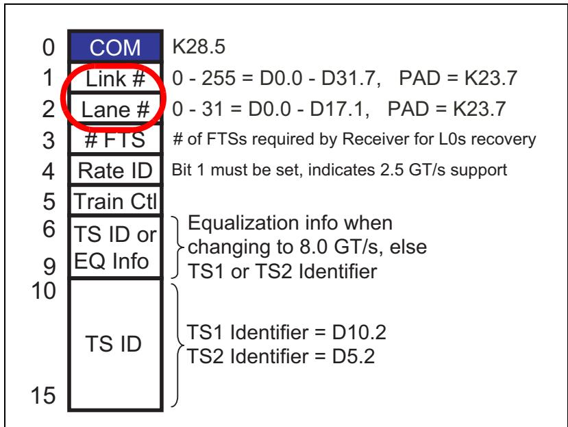

## 14.6.2 Designing Devices with Links that can be Merged | 14.6.2 设计具有可合并链路的设备

<table style="border-collapse:collapse; width:100%;">
  <thead>
    <tr>
      <th width="50%" style="border:1px solid #333; background:#f5f5f5;">EN</th>
      <th width="50%" style="border:1px solid #333; background-color:#e8e8e8;">中文</th>
    </tr>
  </thead>
  <tbody>
    <tr><td width="50%" style="border:1px solid #333; background:#fff;padding:4px 8px;">A designer chooses how many Lanes to implement on a given Link based on performance and cost requirements. Narrow Links may optionally be able to combine into a wider Link, and a wide Link can optionally be split into multiple narrower Links. Figure 14-14 on page 541 shows a Switch with one Upstream Port and four x2 Downstream Ports. In this example, they can also be grouped into two x4 Links. As a reminder, the spec requires that every Port must also support operating as a x1 Link.</td><td width="50%" style="border:1px solid #333; background-color:#e8e8e8;padding:4px 8px;">设计者根据性能和成本需求决定在给定链路上实现多少条通道。窄链路可选地可以合并成更宽的链路，宽链路可选地可以分割成多个更窄的链路。第541页的图14-14展示了一个具有一个上游端口和四个x2下游端口的交换机。在此示例中，它们也可以组合成两个x4链路。提醒一下，规范要求每个端口还必须支持作为x1链路运行。</td></tr>
    <tr><td width="50%" style="border:1px solid #333; background:#fff;padding:4px 8px;">As seen on the left side of the figure, the switch internally consists of one upstream logical bridge and four downstream logical bridges. One bridge is required for each Port, so supporting 4 Downstream Ports requires 4 downstream bridges. However, if the Ports are combined as shown on the right side of the diagram, then some of the bridges simply go unused. During Link Training, the LTSSM of each Downstream Port determines which of the supported connection options is actually implemented.</td><td width="50%" style="border:1px solid #333; background-color:#e8e8e8;padding:4px 8px;">如图左侧所示，交换机内部由一个上游逻辑桥和四个下游逻辑桥组成。每个端口需要一个桥，因此支持4个下游端口需要4个下游桥。然而，如果端口如图右侧所示进行组合，那么一些桥就直接闲置了。在链路训练期间，每个下游端口的LTSSM确定实际实现哪个支持的连接选项。</td></tr>
  </tbody>
</table>

Figure 14-14: Combining Lanes to Form Wider Links (Link Merging) | 图14-14：合并通道以形成更宽链路（链路合并）

<table style="border-collapse:collapse; width:100%;">
  <thead>
    <tr>
      <th width="50%" style="border:1px solid #333; background:#f5f5f5;">EN</th>
      <th width="50%" style="border:1px solid #333; background-color:#e8e8e8;">中文</th>
    </tr>
  </thead>
  <tbody>
    <tr><td width="50%" style="border:1px solid #333; background:#fff;padding:4px 8px;">## Configuration State — Training Examples</td><td width="50%" style="border:1px solid #333; background-color:#e8e8e8;padding:4px 8px;">## 配置状态 — 训练示例</td></tr>
  </tbody>
</table>

## 99.1 Introduction | 99.1 引言

<table style="border-collapse:collapse; width:100%;">
  <thead>
    <tr>
      <th width="50%" style="border:1px solid #333; background:#f5f5f5;">EN</th>
      <th width="50%" style="border:1px solid #333; background-color:#e8e8e8;">中文</th>
    </tr>
  </thead>
  <tbody>
    <tr><td width="50%" style="border:1px solid #333; background:#fff;padding:4px 8px;">In the Configuration state, the Link and Lane numbering process is initiated by a Downstream Port, the "leader," (e.g., Root Port or Switch Downstream Port). Endpoints and switch Upstream Ports don't initiate, but respond. They are the "follower." Let's now consider some examples to make the concepts easier to understand.</td><td width="50%" style="border:1px solid #333; background-color:#e8e8e8;padding:4px 8px;">在配置状态中，链路和通道编号过程由作为"主导者"的下游端口发起（例如根端口或交换机下游端口）。端点和交换机上游端口不发起该过程，而是做出响应。它们是"跟随者"。下面我们将通过一些例子来帮助理解这些概念。</td></tr>
  </tbody>
</table>

<table style="border-collapse:collapse; width:100%;">
  <thead>
    <tr>
      <th width="50%" style="border:1px solid #333; background:#f5f5f5;">EN</th>
      <th width="50%" style="border:1px solid #333; background-color:#e8e8e8;">中文</th>
    </tr>
  </thead>
  <tbody>
    <tr><td width="50%" style="border:1px solid #333; background:#fff;padding:4px 8px;">## Link Configuration Example 1</td><td width="50%" style="border:1px solid #333; background-color:#e8e8e8;padding:4px 8px;">## 链路配置示例 1</td></tr>
    <tr><td width="50%" style="border:1px solid #333; background:#fff;padding:4px 8px;">The devices shown in Figure 14‐15 on page 543 both support a single Link that implements lane sizes of x4, x2, or x1. The Lane number assignments are fixed by the device internally and must be sequential starting from zero. The physical Lane numbers are shown within the device box and the reported, or logical, Lane numbers are reported by the TS Ordered Sets. Usually, these will be the same, but not in every case.</td><td width="50%" style="border:1px solid #333; background-color:#e8e8e8;padding:4px 8px;">图14-15（第543页）所示的设备均支持单一链路，可实现x4、x2或x1的通道宽度。通道编号由设备内部固定分配，且必须从零开始顺序编号。物理通道编号显示在设备框内，而报告的（或称逻辑的）通道编号由TS有序集报告。通常二者相同，但并非在所有情况下都如此。</td></tr>
  </tbody>
</table>

## Link Number Negotiation. | 链路编号协商

Figure 14-15: Example 1 - Steps 1 and 2 | 图14-15：示例1 - 步骤1和2  

<table style="border-collapse:collapse; width:100%;">
  <thead>
    <tr>
      <th width="50%" style="border:1px solid #333; background:#f5f5f5;">EN</th>
      <th width="50%" style="border:1px solid #333; background-color:#e8e8e8;">中文</th>
    </tr>
  </thead>
  <tbody>
    <tr><td width="50%" style="border:1px solid #333; background:#fff;padding:4px 8px;">1. Since only one Link is possible in this example, the Downstream Port (the Port that transmits downstream) sends TS1s using the same Link Number, N, for all the Lanes and PAD for the Lane Numbers.</td><td width="50%" style="border:1px solid #333; background-color:#e8e8e8;padding:4px 8px;">1. 由于本例中只可能存在一条链路，下游端口（向下游传输的端口）为所有通道使用相同的链路编号 N 发送 TS1，通道编号字段则使用 PAD。</td></tr>
    <tr><td width="50%" style="border:1px solid #333; background:#fff;padding:4px 8px;">2. In this Configuration state, the Upstream Port starts out sending TS1s with PAD in the Link and Lane number fields, but upon receiving the TS1s from the Downstream Port with the non-PAD Link number, the Upstream Port responds with TS1s on all connected Lanes that reflect the same Link Number N and PAD for the Lane Number field. Based on this response, the Downstream LTSSM recognizes that four Lanes responded and used the same Link number as is being sent, so all 4 Lanes will be configured as one Link. The Link Number itself is an implementation-specific value that isn't stored in any defined configuration register and isn't related to the Port Number or any other value.</td><td width="50%" style="border:1px solid #333; background-color:#e8e8e8;padding:4px 8px;">2. 在此配置状态中，上游端口初始发送带有 PAD 链路编号和通道编号字段的 TS1，但在接收到下游端口发送的带有非 PAD 链路编号的 TS1 后，上游端口在所有已连接的通道上回复 TS1，其中反映相同的链路编号 N，通道编号字段为 PAD。基于此响应，下游 LTSSM 识别出四个通道已响应并使用了与所发送相同的链路编号，因此所有 4 个通道将被配置为一条链路。链路编号本身是一个实现特定的值，不存储在任何已定义的配置寄存器中，且与端口编号或任何其他值无关。</td></tr>
  </tbody>
</table>

## Lane Number Negotiation. | 通道编号协商

<table style="border-collapse:collapse; width:100%;">
  <thead>
    <tr>
      <th width="50%" style="border:1px solid #333; background:#f5f5f5;">EN</th>
      <th width="50%" style="border:1px solid #333; background-color:#e8e8e8;">中文</th>
    </tr>
  </thead>
  <tbody>
    <tr><td width="50%" style="border:1px solid #333; background:#fff;padding:4px 8px;">3. The Downstream Port now begins to send TS1s with the same Link Number but assigns Lane Numbers of 0, 1, 2 and 3 to the connected Lanes, as shown in Figure 14-16 on page 544.</td><td width="50%" style="border:1px solid #333; background-color:#e8e8e8;padding:4px 8px;">3. 下游端口现在开始发送带有相同链路编号的TS1，但为所连接的通道分配通道编号0、1、2和3，如图14-16（第544页）所示。</td></tr>
    <tr><td width="50%" style="border:1px solid #333; background:#fff;padding:4px 8px;">4. In response to seeing non-PAD Lane numbers coming in, the Upstream Port will verify that the incoming Lane numbers match the Lane numbers they are received on. In this example, the Lanes of the Downstream and Upstream Ports are connected correctly. Because all the Lane numbers match, the Upstream Port advertises its Lane numbers in the TS1s it is sending as well. When the Downstream Port sees non-PAD Lane numbers in response, it compares the incoming numbers to the values it's sending. If they match, all is well but, if not, then other steps will need to be taken. If some but not all Lane numbers match, then the Link width may be adjusted accordingly. If the Lanes are reversed, then the optional Lane Reversal feature will be needed. Because it's optional, it's possible that the Lanes have been reversed but neither device is capable of correcting it. This would be a dramatic board design error because it is possible the Link cannot be configured for operation in this case.</td><td width="50%" style="border:1px solid #333; background-color:#e8e8e8;padding:4px 8px;">4. 作为对收到非PAD通道编号的响应，上游端口将验证传入的通道编号与其接收所在的通道编号是否匹配。在此示例中，下游端口和上游端口的通道连接正确。由于所有通道编号均匹配，上游端口在其发送的TS1中也通告其通道编号。当下游端口在响应中看到非PAD通道编号时，它将传入的编号与自己发送的值进行比较。如果匹配，则一切正常；若不匹配，则需采取其他步骤。如果部分通道编号匹配而非全部，则链路宽度可相应调整。如果通道接反，则需要可选的通道反转功能。由于该功能为可选，有可能通道已被接反但两端设备均无法纠正。这将是一个严重的板级设计错误，因为在这种情况下链路可能无法配置为正常工作。</td></tr>
  </tbody>
</table>

Figure 14-16: Example 1 - Steps 3 and 4 | 图14-16：示例1 - 步骤3和4

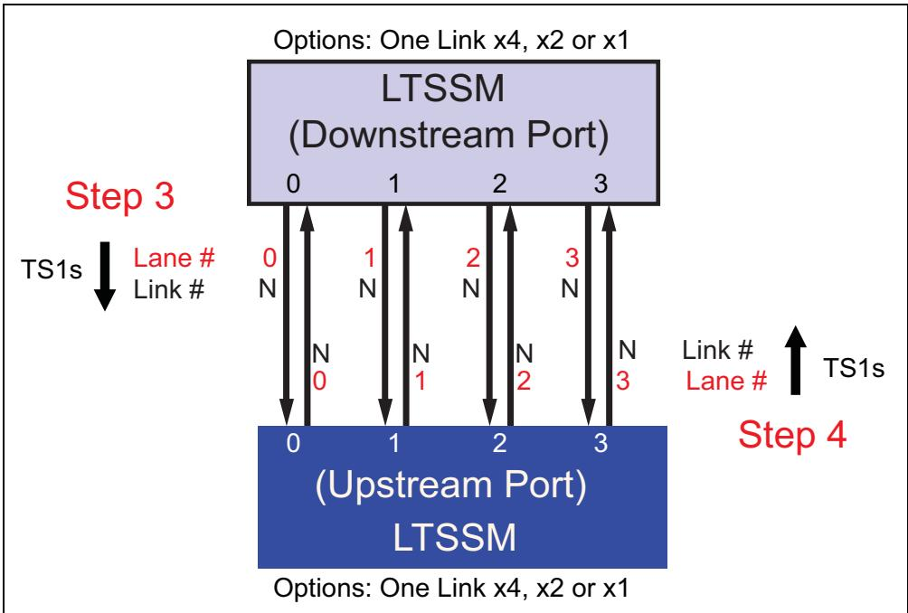

<table style="border-collapse:collapse; width:100%;">
  <thead>
    <tr>
      <th width="50%" style="border:1px solid #333; background:#f5f5f5;">EN</th>
      <th width="50%" style="border:1px solid #333; background-color:#e8e8e8;">中文</th>
    </tr>
  </thead>
  <tbody>
    <tr><td width="50%" style="border:1px solid #333; background:#fff;padding:4px 8px;">Confirming Link and Lane Numbers.</td><td width="50%" style="border:1px solid #333; background-color:#e8e8e8;padding:4px 8px;">确认链路与通道编号。</td></tr>
    <tr><td width="50%" style="border:1px solid #333; background:#fff;padding:4px 8px;">5. Since the transmitted and received Link and Lane numbers matched on all the Lanes, the Downstream Port indicates it is ready to conclude this negotiation and proceed to the next state, L0, by sending TS2 Ordered Sets with the same Link and Lane numbers.</td><td width="50%" style="border:1px solid #333; background-color:#e8e8e8;padding:4px 8px;">5. 由于在所有通道上发送和接收的链路与通道编号均匹配，下游端口指示其准备结束本次协商并进入下一状态L0，即发送包含相同链路和通道编号的TS2有序集。</td></tr>
    <tr><td width="50%" style="border:1px solid #333; background:#fff;padding:4px 8px;">6. Upon receiving TS2s with the same Link and Lane numbers, the Upstream Port also indicates its readiness to leave the Configuration state and proceed to L0 by sending TS2s back. This is shown in Figure 14-17 on page 545.</td><td width="50%" style="border:1px solid #333; background-color:#e8e8e8;padding:4px 8px;">6. 收到带有相同链路和通道编号的TS2后，上游端口也指示其可退出Configuration状态并进入L0，即回送TS2。如图14-17（第545页）所示。</td></tr>
    <tr><td width="50%" style="border:1px solid #333; background:#fff;padding:4px 8px;">7. Once a Port receives at least 8 TS2s and transmits at least 16, it sends some logical idle data and then transitions to L0.</td><td width="50%" style="border:1px solid #333; background-color:#e8e8e8;padding:4px 8px;">7. 一旦端口接收到至少8个TS2并发送至少16个TS2，它将发送一些逻辑空闲数据，然后转换到L0。</td></tr>
  </tbody>
</table>

Figure 14-17: Example 1 - Steps 5 and 6 | 图14-17：示例1 - 步骤5和6

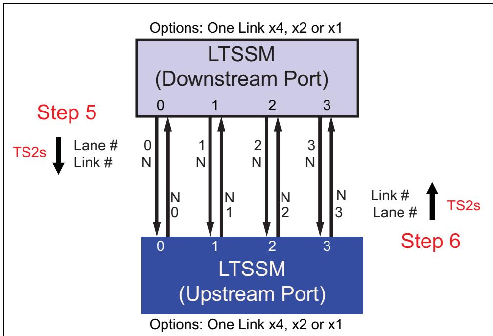

## Link Configuration Example 2 | 链路配置示例 2

<table style="border-collapse:collapse; width:100%;">
  <thead>
    <tr>
      <th width="50%" style="border:1px solid #333; background:#f5f5f5;">EN</th>
      <th width="50%" style="border:1px solid #333; background-color:#e8e8e8;">中文</th>
    </tr>
  </thead>
  <tbody>
    <tr><td width="50%" style="border:1px solid #333; background:#fff;padding:4px 8px;">Another example that should be covered is of a Device with 4 Downstream Lanes that is capable of being configured as a single x4 Link or a combination of two x2 Links or four x1 Links. So even a configuration of one x2 Link and two x1 Links would be just fine. An example of this type of Device can be seen in Figure 14-18 on page 546.</td><td width="50%" style="border:1px solid #333; background-color:#e8e8e8;padding:4px 8px;">另一个应予讨论的例子是拥有4个下游通道的器件，它可配置为单个x4链路、两个x2链路或四个x1链路的组合。因此，一个x2链路加两个x1链路的配置也完全可以接受。此类器件的示例如图14-18（第546页）所示。</td></tr>
    <tr><td width="50%" style="border:1px solid #333; background:#fff;padding:4px 8px;">If all four Lanes have detected a receiver and made it to the Configuration state, there are a number of connection possibilities:</td><td width="50%" style="border:1px solid #333; background-color:#e8e8e8;padding:4px 8px;">若全部四个通道均已检测到接收器并进入配置状态，则存在以下若干连接可能性：</td></tr>
    <tr><td width="50%" style="border:1px solid #333; background:#fff;padding:4px 8px;">— One x4 Link</td><td width="50%" style="border:1px solid #333; background-color:#e8e8e8;padding:4px 8px;">— 一个x4链路</td></tr>
    <tr><td width="50%" style="border:1px solid #333; background:#fff;padding:4px 8px;">— Two x2 Links</td><td width="50%" style="border:1px solid #333; background-color:#e8e8e8;padding:4px 8px;">— 两个x2链路</td></tr>
    <tr><td width="50%" style="border:1px solid #333; background:#fff;padding:4px 8px;">— One x2 Link and two x1 Links</td><td width="50%" style="border:1px solid #333; background-color:#e8e8e8;padding:4px 8px;">— 一个x2链路和两个x1链路</td></tr>
    <tr><td width="50%" style="border:1px solid #333; background:#fff;padding:4px 8px;">— Four x1 Links</td><td width="50%" style="border:1px solid #333; background-color:#e8e8e8;padding:4px 8px;">— 四个x1链路</td></tr>
    <tr><td width="50%" style="border:1px solid #333; background:#fff;padding:4px 8px;">One example method defined in the spec to determine which of the configurations are implemented is described below.</td><td width="50%" style="border:1px solid #333; background-color:#e8e8e8;padding:4px 8px;">规范中定义的一种用于确定实现哪种配置的示例方法如下所述。</td></tr>
  </tbody>
</table>

<table style="border-collapse:collapse; width:100%;">
  <thead>
    <tr>
      <th width="50%" style="border:1px solid #333; background:#f5f5f5;">EN</th>
      <th width="50%" style="border:1px solid #333; background-color:#e8e8e8;">中文</th>
    </tr>
  </thead>
  <tbody>
    <tr><td width="50%" style="border:1px solid #333; background:#fff;padding:4px 8px;">## Link Number Negotiation.</td><td width="50%" style="border:1px solid #333; background-color:#e8e8e8;padding:4px 8px;">## 链路编号协商。</td></tr>
    <tr><td width="50%" style="border:1px solid #333; background:#fff;padding:4px 8px;">1. In this example method, the Downstream Port begins by advertising a unique Link number on each Lane. Lane 0 advertises a Link number of N, Lane 1 advertises a Link number of N+1, etc. as shown in Figure 14-18 on page 546. These Link numbers are just examples, and they do not have to be sequential. Also, it is important to remember that the Downstream Port does not know what it is connected to and it is this process where the Port is trying to determine the connections for each Lane.</td><td width="50%" style="border:1px solid #333; background-color:#e8e8e8;padding:4px 8px;">1. 在此示例方法中，下游端口首先在每个通道上通告一个唯一的链路编号。如图 14-18（第 546 页）所示，通道 0 通告链路编号 N，通道 1 通告链路编号 N+1，以此类推。这些链路编号仅为示例，不必是连续的。此外，务必记住，下游端口并不知道其连接的对象，而此过程正是该端口试图确定每个通道的连接关系。</td></tr>
  </tbody>
</table>

Figure 14-18: Example 2 - Step 1 | 图14-18：示例2 - 步骤1

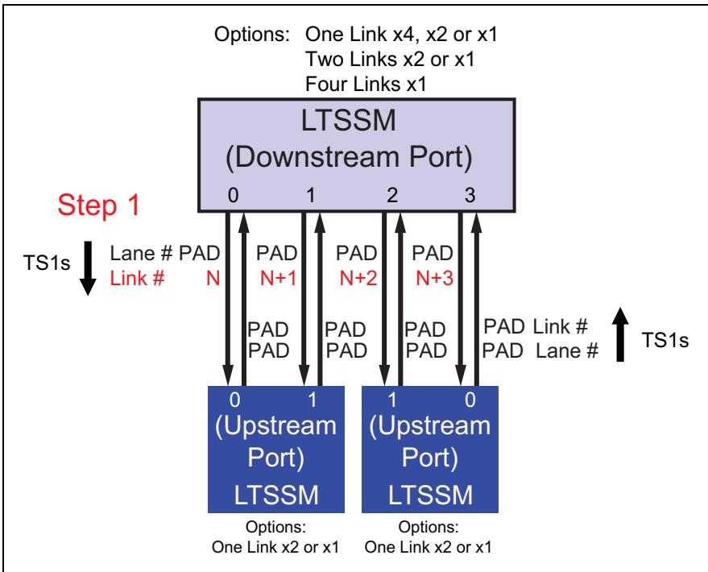

<table style="border-collapse:collapse; width:100%;">
  <thead>
    <tr>
      <th width="50%" style="border:1px solid #333; background:#f5f5f5;">EN</th>
      <th width="50%" style="border:1px solid #333; background-color:#e8e8e8;">中文</th>
    </tr>
  </thead>
  <tbody>
    <tr><td width="50%" style="border:1px solid #333; background:#fff;padding:4px 8px;">2. Upon receiving the returned TS1s, the Downstream Port recognizes two things: all four Lanes are working and they are connected to two different Upstream Ports. This means there will actually be two Downstream Ports. Each Downstream Port will have its own Lane 0 and Lane 1 as shown in Figure 14-20 on page 548.</td><td width="50%" style="border:1px solid #333; background-color:#e8e8e8;padding:4px 8px;">2. 在接收到返回的 TS1 序列后，下游端口识别出两件事：所有四个通道均正常工作，且它们连接到两个不同的上游端口。这意味着实际上将存在两个下游端口。如图 14-20（第 548 页）所示，每个下游端口将拥有自己的通道 0 和通道 1。</td></tr>
  </tbody>
</table>

Figure 14-19: Example 2 - Step 2 | 图14-19：示例2 - 步骤2

## Lane Number Negotiation. | 通道编号协商
## Lane Number Negotiation | 通道编号协商

<table style="border-collapse:collapse; width:100%;">
  <thead>
    <tr>
      <th width="50%" style="border:1px solid #333; background:#f5f5f5;">EN</th>
      <th width="50%" style="border:1px solid #333; background-color:#e8e8e8;">中文</th>
    </tr>
  </thead>
  <tbody>
    <tr><td width="50%" style="border:1px solid #333; background:#fff;padding:4px 8px;">The process continues now for each Link independently but they'll take the same steps as before to determine the Lane numbers: the Downstream Ports will advertise their Lane numbers in the TS1s. It is also important to note that the Downstream Ports begin advertising the single returned Link number for all Lanes of the Link. The Link on the left is advertising a Link number of N for both Lanes and the Link on the right is advertising N+2.</td><td width="50%" style="border:1px solid #333; background-color:#e8e8e8;padding:4px 8px;">现在，该过程针对每条链路独立继续进行，但它们将采取与之前相同的步骤来确定通道编号：下游端口将在TS1中通告其通道编号。同样重要的是要注意，下游端口开始为链路的所有通道通告返回的单一链路编号。左侧链路为两个通道通告链路编号N，右侧链路通告N+2。</td></tr>
    <tr><td width="50%" style="border:1px solid #333; background:#fff;padding:4px 8px;">In this example, the Lane numbers of the Link on the left match between the Downstream and Upstream Port. However, for the Link on the right, the Lane numbers of the Downstream Port are reversed from the connected Upstream Port. The Upstream Port realizes this and if it supports Lane Reversal, it will implement that internally and reply back with the same Lane numbers that were advertised by the Downstream Port, as shown in Figure 14-20. If the Upstream Port did not support Lane Reversal, it would have advertised its own Lane numbers in the returned TS1s and then the Downstream Port would have realized the issue and had a chance to implement Lane Reversal.</td><td width="50%" style="border:1px solid #333; background-color:#e8e8e8;padding:4px 8px;">在此示例中，左侧链路的通道编号在下游端口和上游端口之间匹配。然而，对于右侧链路，下游端口的通道编号与所连接的上游端口的顺序相反。上游端口意识到这一点，如果它支持通道反转(Lane Reversal)，将在内部实现该功能，并使用与下游端口通告的相同通道编号进行回复，如图14-20所示。如果上游端口不支持通道反转，它将在返回的TS1中通告自己的通道编号，然后下游端口将意识到问题并有机会实现通道反转。</td></tr>
    <tr><td width="50%" style="border:1px solid #333; background:#fff;padding:4px 8px;">Lane Reversal can optionally be handled by either Port. If the Upstream Port detects this case and supports Lane Reversal, it simply makes the Lane assignment change internally and returns TS1s with the proper Lane numbers. As a result, the Downstream Port is unaware that there was ever an issue. If the Upstream Port is unable to handle Lane Reversal though, then the Downstream Port will see the incoming Lane numbers in reverse order. If it supports Lane Reversal, it will then correct the numbering and begin sending TS2s with the new Lane numbers.</td><td width="50%" style="border:1px solid #333; background-color:#e8e8e8;padding:4px 8px;">通道反转可选地由任一端口处理。如果上游端口检测到这种情况且支持通道反转，它只需在内部进行通道分配更改，并返回带有正确通道编号的TS1。结果，下游端口完全不知道曾经存在问题。但是，如果上游端口无法处理通道反转，则下游端口将看到传入的通道编号为逆序。如果下游端口支持通道反转，它将纠正编号并开始发送带有新通道编号的TS2。</td></tr>
  </tbody>
</table>

Figure 14-20: Example 2 - Steps 3, 4 and 5 | 图14-20：示例2 - 步骤3、4和5

Confirming Link and Lane Numbers.

<table style="border-collapse:collapse; width:100%;">
  <thead>
    <tr>
      <th width="50%" style="border:1px solid #333; background:#f5f5f5;">EN</th>
      <th width="50%" style="border:1px solid #333; background-color:#e8e8e8;">中文</th>
    </tr>
  </thead>
  <tbody>
    <tr><td width="50%" style="border:1px solid #333; background:#fff;padding:4px 8px;">The Downstream Ports receive the TS1s with the Link and Lane numbers that match what was advertised so each Port, independently, starts sending TS2s as a notification that it is ready to proceed to the L0 state with the negotiated settings.</td><td width="50%" style="border:1px solid #333; background-color:#e8e8e8;padding:4px 8px;">下游端口接收到TS1，其中的链路编号和通道编号与所通告的匹配，因此每个端口独立地开始发送TS2，作为通知表明其已准备好在协商的配置下进入L0状态。</td></tr>
    <tr><td width="50%" style="border:1px solid #333; background:#fff;padding:4px 8px;">The Upstream Ports receive the TS2s with no Link and Lane number changes and start transmitting TS2s in return with the same values.</td><td width="50%" style="border:1px solid #333; background-color:#e8e8e8;padding:4px 8px;">上游端口接收到TS2，链路编号和通道编号没有变化，并开始返回传输具有相同值的TS2。</td></tr>
    <tr><td width="50%" style="border:1px solid #333; background:#fff;padding:4px 8px;">Once each Port receives at least 8 TS2s and transmits at least 16 TS2s, it sends some logical idle data and then transitions to L0. The Upstream Port of the Link on the right is implementing Lane Reversal internally.</td><td width="50%" style="border:1px solid #333; background-color:#e8e8e8;padding:4px 8px;">一旦每个端口至少接收到8个TS2并至少传输了16个TS2，它会发送一些逻辑空闲数据，然后转换到L0状态。右侧链路的上游端口在内部实现通道反转。</td></tr>
  </tbody>
</table>

## Link Configuration Example 3: Failed Lane | 链路配置示例 3：通道失效

<table style="border-collapse:collapse; width:100%;">
  <thead>
    <tr>
      <th width="50%" style="border:1px solid #333; background:#f5f5f5;">EN</th>
      <th width="50%" style="border:1px solid #333; background-color:#e8e8e8;">中文</th>
    </tr>
  </thead>
  <tbody>
    <tr><td width="50%" style="border:1px solid #333; background:#fff;padding:4px 8px;">Finally, let's consider what happens if one of the Lanes isn't working properly. Consider an example in which Lane 2 of the Upstream Port is not functioning well as shown in Figure 14-21 on page 550. It's important to note that the Lane isn't physically broken because if it were it wouldn't have detected a Receiver and wouldn't be considered for inclusion in the Link. However, even though the Lane is attached, either the Transmitter or Receiver (or both) of Lane 2 on the Upstream Port is not getting the job done.</td><td width="50%" style="border:1px solid #333; background-color:#e8e8e8;padding:4px 8px;">最后，我们来考虑一条通道工作不正常的情况。以下示例中，上游端口的通道2功能异常，如图14-21（第550页）所示。需要注意的是，该通道并非物理损坏，因为如果物理损坏，它将无法检测到接收端，也不会被考虑纳入链路。然而，尽管通道已连接，上游端口上通道2的发送器或接收器（或两者）仍无法正常工作。</td></tr>
    <tr><td width="50%" style="border:1px solid #333; background:#fff;padding:4px 8px;">In cases like this, it is likely that the link training process will take considerably longer because most of the state transitions wait to proceed to the next state until ALL Lanes are ready for the next state, OR if a subset of Lanes are ready and a timeout condition has occurred.</td><td width="50%" style="border:1px solid #333; background-color:#e8e8e8;padding:4px 8px;">在这种情况下，链路训练过程可能会显著延长，因为大多数状态转换会等待所有通道都准备好进入下一状态，或者等待部分通道就绪后发生超时条件，才会进入下一状态。</td></tr>
    <tr><td width="50%" style="border:1px solid #333; background:#fff;padding:4px 8px;">The steps below indicate a way this situation could be handled when transitioning through the substates of the Configuration state machine.</td><td width="50%" style="border:1px solid #333; background-color:#e8e8e8;padding:4px 8px;">以下步骤说明了在穿越配置状态机的子状态时，如何处理这种情况的一种方式。</td></tr>
  </tbody>
</table>

## Link Number Negotiation. | 链路编号协商

## Link Number Negotiation | 链路编号协商

<table style="border-collapse:collapse; width:100%;">
  <thead>
    <tr>
      <th width="50%" style="border:1px solid #333; background:#f5f5f5;">EN</th>
      <th width="50%" style="border:1px solid #333; background-color:#e8e8e8;">中文</th>
    </tr>
  </thead>
  <tbody>
    <tr><td width="50%" style="border:1px solid #333; background:#fff;padding:4px 8px;">9. Even though the Lane 2 Receiver on the Upstream Port is having issues, the Downstream Port is going to take the same process upon entering the Configuration state. The Downstream Port sends TS1s on all Lanes with the Link number N and with the Lane number set to PAD.</td><td width="50%" style="border:1px solid #333; background-color:#e8e8e8;padding:4px 8px;">9. 尽管上行端口的通道2接收器存在问题，下行端口在进入配置状态时仍将采取相同的过程。下行端口在所有通道上发送TS1序列，其中链路编号为N，通道编号设为PAD。</td></tr>
    <tr><td width="50%" style="border:1px solid #333; background:#fff;padding:4px 8px;">10. Lanes 0, 1 and 3 all received the TS1s with the non-PAD Link number, so those Lanes send TS1s back to the Downstream Port. However, Lane 2 of the Upstream Port did not successfully receive the TS1s with the non-PAD Link number, so its Transmitter continues sending TS1s with PAD in the Link and Lane number fields as shown in Figure 14-21 on page 550.</td><td width="50%" style="border:1px solid #333; background-color:#e8e8e8;padding:4px 8px;">10. 通道0、1和3均接收到带有非PAD链路编号的TS1序列，因此这些通道向下行端口回送TS1序列。然而，上行端口的通道2未能成功接收到带有非PAD链路编号的TS1序列，因此其发送器继续在链路编号和通道编号字段中发送带有PAD的TS1序列，如图14-21（第550页）所示。</td></tr>
  </tbody>
</table>

Figure 14-21: Example 3 - Steps 1 and 2 | 图14-21：示例3 - 步骤1和2

<table style="border-collapse:collapse; width:100%;">
  <thead>
    <tr>
      <th width="50%" style="border:1px solid #333; background:#f5f5f5;">EN</th>
      <th width="50%" style="border:1px solid #333; background-color:#e8e8e8;">中文</th>
    </tr>
  </thead>
  <tbody>
    <tr><td width="50%" style="border:1px solid #333; background:#fff;padding:4px 8px;">**Lane Number Negotiation.**</td><td width="50%" style="border:1px solid #333; background-color:#e8e8e8;padding:4px 8px;">**通道编号协商。**</td></tr>
    <tr><td width="50%" style="border:1px solid #333; background:#fff;padding:4px 8px;">11. Once the Downstream Port has received the TS1s with the same Link number on Lanes 0, 1 and 3, it waits until the required timeout period hoping that Lane 2 will start working. When that doesn't happen, the Downstream Port realizes that it will only be able to train as a x2 Link. After accepting this fact, the Downstream Port will advertise its Lane numbers for Lanes 0 and 1, but Lanes 2 and 3 go back to send PADs in the Link and Lane number fields.</td><td width="50%" style="border:1px solid #333; background-color:#e8e8e8;padding:4px 8px;">11. 一旦下游端口在通道0、1和3上收到具有相同链路编号的TS1，它会等待所需的超时周期，希望通道2能够开始工作。当这没有发生时，下游端口意识到它只能训练为x2链路。接受这一事实后，下游端口将为通道0和1通告其通道编号，但通道2和3将恢复在链路编号和通道编号字段中发送PAD。</td></tr>
    <tr><td width="50%" style="border:1px solid #333; background:#fff;padding:4px 8px;">12. When the Upstream Port receives the TS1s on Lanes 0 and 1 with the advertised Lane numbers and it sees that Lane 3 has gone back to receiving PAD TS1s, it advertises its Lane number for Lanes 0 and 1 but all the other Lanes start (or continue) sending TS1s with PAD set in both the Lane and Link number fields as shown in Figure 14-22 on page 551.</td><td width="50%" style="border:1px solid #333; background-color:#e8e8e8;padding:4px 8px;">12. 当上游端口在通道0和1上接收到带有已通告通道编号的TS1，并且看到通道3已恢复接收PAD TS1时，它为通道0和1通告其通道编号，但所有其他通道开始（或继续）发送TS1，其通道编号和链路编号字段均设置为PAD，如图14-22（第551页）所示。</td></tr>
  </tbody>
</table>

Figure 14-22: Example 3 - Steps 3 and 4 | 图14-22：示例3 - 步骤3和4

## Confirming Link and Lane Numbers. | 确认链路和通道编号

<table style="border-collapse:collapse; width:100%;">
  <thead>
    <tr>
      <th width="50%" style="border:1px solid #333; background:#f5f5f5;">EN</th>
      <th width="50%" style="border:1px solid #333; background-color:#e8e8e8;">中文</th>
    </tr>
  </thead>
  <tbody>
    <tr><td width="50%" style="border:1px solid #333; background:#fff;padding:4px 8px;">13. Since the transmitted and received Link and Lane numbers matched on Lanes 0 and 1, the Downstream Port indicates it is ready to conclude this negotiation and proceed to the next state, L0, by sending TS2 Ordered Sets with the same Link and Lane numbers on these Lanes. The other Lanes continue sending TS1s with PAD for both the Link and Lane numbers.</td><td width="50%" style="border:1px solid #333; background-color:#e8e8e8;padding:4px 8px;">13. 由于在通道0和1上发送和接收的链路号和通道号匹配，下游端口通过在这些通道上发送带有相同链路号和通道号的TS2有序集，表明其已准备好结束本次协商并进入下一状态L0。其他通道继续发送链路号和通道号均为PAD的TS1。</td></tr>
    <tr><td width="50%" style="border:1px solid #333; background:#fff;padding:4px 8px;">14. Upon receiving TS2s with the same Link and Lane numbers on Lanes 0 and 1, the Upstream Port also indicates its readiness to leave the Configuration state and proceed to L0 by sending TS2s back on these Lanes. The other Lanes continue sending TS1s with PAD for both the Link and Lane numbers. This is shown in Figure 14‐23 on page 552.</td><td width="50%" style="border:1px solid #333; background-color:#e8e8e8;padding:4px 8px;">14. 在通道0和1上接收到带有相同链路号和通道号的TS2后，上游端口也通过在这些通道上回送TS2，表明其已准备好离开Configuration状态并进入L0。其他通道继续发送链路号和通道号均为PAD的TS1。如图14-23（第552页）所示。</td></tr>
  </tbody>
</table>

Figure 14‐23: Example 3 - Steps 5 and 6 | 图14‐23：示例3 - 步骤5和6  

<table style="border-collapse:collapse; width:100%;">
  <thead>
    <tr>
      <th width="50%" style="border:1px solid #333; background:#f5f5f5;">EN</th>
      <th width="50%" style="border:1px solid #333; background-color:#e8e8e8;">中文</th>
    </tr>
  </thead>
  <tbody>
    <tr><td width="50%" style="border:1px solid #333; background:#fff;padding:4px 8px;">Once a Port receives at least 8 TS2s and transmits at least 16, it sends some logical idle data and those Lanes transitions to L0. The other Lanes, Lanes 2 and 3 in this example, transition to Electrical Idle until the next time the link training process is initiated at which point those Lanes will attempt the training process like normal.</td><td width="50%" style="border:1px solid #333; background-color:#e8e8e8;padding:4px 8px;">一旦端口接收到至少8个TS2并发送了至少16个TS2，它就会发送一些逻辑空闲数据，这些通道将转换到L0。其他通道（本例中为通道2和3）转换到电气空闲状态，直到下一次链路训练过程启动，届时这些通道将像正常情况一样尝试训练过程。</td></tr>
  </tbody>
</table>

## 14.6.4 Detailed Configuration Substates | 14.6.4 详细配置子状态

<table style="border-collapse:collapse; width:100%;">
  <thead>
    <tr>
      <th width="50%" style="border:1px solid #333; background:#f5f5f5;">EN</th>
      <th width="50%" style="border:1px solid #333; background-color:#e8e8e8;">中文</th>
    </tr>
  </thead>
  <tbody>
    <tr><td width="50%" style="border:1px solid #333; background:#fff;padding:4px 8px;">A detailed explanation of each substate is presented here to cover all the substates of Configuration, as shown in Figure 14‑24 on page 553. The Configuration Substates should be easier to follow, given the Link Training examples discussed previously.</td><td width="50%" style="border:1px solid #333; background-color:#e8e8e8;padding:4px 8px;">以下详细介绍每个子状态，以涵盖 Configuration 的所有子状态，如第 553 页图 14‑24 所示。结合之前讨论的链路训练示例，Configuration 子状态应更易于理解。</td></tr>
  </tbody>
</table>

Figure 14‑24: Configuration State Machine | 图14‑24：配置状态机

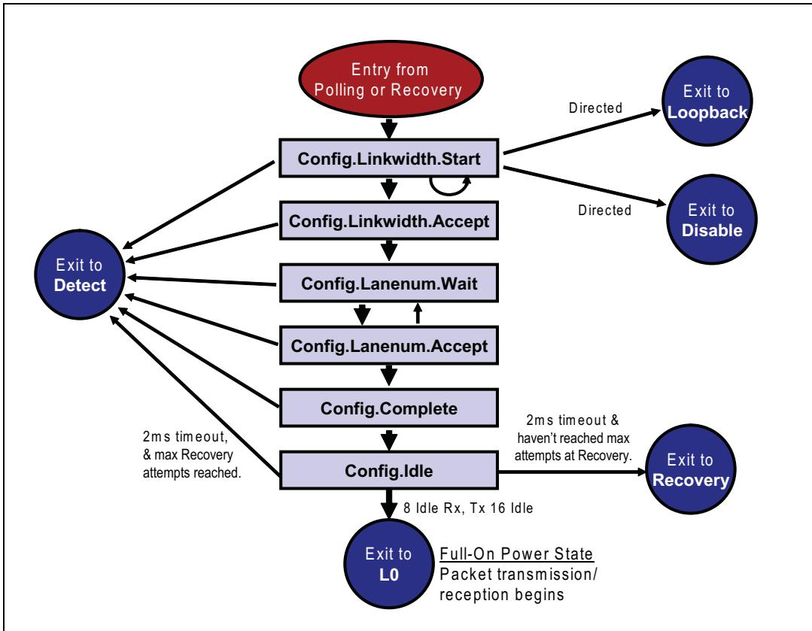

## Configuration.Linkwidth.Start | Configuration.Linkwidth.Start

<table style="border-collapse:collapse; width:100%;">
  <thead>
    <tr>
      <th width="50%" style="border:1px solid #333; background:#f5f5f5;">EN</th>
      <th width="50%" style="border:1px solid #333; background-color:#e8e8e8;">中文</th>
    </tr>
  </thead>
  <tbody>
    <tr><td width="50%" style="border:1px solid #333; background:#fff;padding:4px 8px;">This substate is entered after either the normal completion of the Polling state (as described in "Polling.Configuration" on page 527), or if the Recovery state finds that Link or Lane numbers have changed since the last time they were assigned and thus the recovery process can't finish normally (as described in the "Recovery State" on page 571).</td><td width="50%" style="border:1px solid #333; background-color:#e8e8e8;padding:4px 8px;">此子状态在以下两种情况下进入：一是Polling（轮询）状态正常完成之后（如第527页"Polling.Configuration"所述），二是Recovery（恢复）状态发现自上次分配以来Link（链路）或Lane（通道）编号已发生改变，导致恢复过程无法正常完成时（如第571页"Recovery State"所述）。</td></tr>
  </tbody>
</table>

<table style="border-collapse:collapse; width:100%;">
  <thead>
    <tr>
      <th width="50%" style="border:1px solid #333; background:#f5f5f5;">EN</th>
      <th width="50%" style="border:1px solid #333; background-color:#e8e8e8;">中文</th>
    </tr>
  </thead>
  <tbody>
    <tr><td width="50%" style="border:1px solid #333; background:#fff;padding:4px 8px;">## Downstream Lanes.</td><td width="50%" style="border:1px solid #333; background-color:#e8e8e8;padding:4px 8px;">## 下游通道。</td></tr>
  </tbody>
</table>

## During Configuration.Linkwidth.Start | 在 Configuration.Linkwidth.Start 期间

<table style="border-collapse:collapse; width:100%;">
  <thead>
    <tr>
      <th width="50%" style="border:1px solid #333; background:#f5f5f5;">EN</th>
      <th width="50%" style="border:1px solid #333; background-color:#e8e8e8;">中文</th>
    </tr>
  </thead>
  <tbody>
    <tr><td width="50%" style="border:1px solid #333; background:#fff;padding:4px 8px;">The Downstream Port is now the leader on this Link and sends TS1s with a non-PAD link number on all active Lanes (as long as LinkUp is not set and upconfiguration of the Link width is not taking place). In the TS1s, the Link number field is changed from PAD to a number while the Lane number remains PAD. The only constraint on the value of the Link numbers in the spec is that they must be unique for each possible Link if multiple Links are supported. For example, a x8 Link would have the same Link number on all 8 Lanes, but if it could also be configured as two x4 Links, both groups of 4 Lanes would be assigned different Link numbers, such as 5 for one group and 6 for the other. The values are local to the Link partners and there's no need for software to track them or try to make them unique throughout the system.</td><td width="50%" style="border:1px solid #333; background-color:#e8e8e8;padding:4px 8px;">下游端口现在成为该链路的领导者，并在所有 active Lane 上发送带有非 PAD 链路号的 TS1（只要 LinkUp 未置位且链路宽度升级配置未在进行中）。在 TS1 中，链路号字段从 PAD 更改为一个编号，而通道号保持为 PAD。规范中对链路号值的唯一约束是：如果支持多条链路，则每条链路的链路号必须唯一。例如，x8 链路的所有 8 条 Lane 具有相同的链路号，但如果它也可配置为两条 x4 链路，则两组 4 条 Lane 将被分配不同的链路号，例如一组为 5，另一组为 6。这些值对于链路双方是局部有效的，软件无需跟踪它们或试图使其在整个系统中唯一。</td></tr>
    <tr><td width="50%" style="border:1px solid #333; background:#fff;padding:4px 8px;">If the upconfigure_capable bit is set to 1b, these TS1s will also be sent on any inactive Lanes that received two consecutive TS1s with Link and Lane numbers set to PAD.</td><td width="50%" style="border:1px solid #333; background-color:#e8e8e8;padding:4px 8px;">如果 upconfigure_capable 位设置为 1b，则这些 TS1 也将在任何收到连续两个链路号和通道号均为 PAD 的 TS1 的 inactive Lane 上发送。</td></tr>
    <tr><td width="50%" style="border:1px solid #333; background:#fff;padding:4px 8px;">– When entering this substate from Polling, any Lane that detected a Receiver is considered active.</td><td width="50%" style="border:1px solid #333; background-color:#e8e8e8;padding:4px 8px;">– 当从 Polling 进入此子状态时，任何检测到接收器的 Lane 被视为 active。</td></tr>
    <tr><td width="50%" style="border:1px solid #333; background:#fff;padding:4px 8px;">– When entering from Recovery, any Lane that was part of the Link after going through Configuration.Complete is considered an active Lane.</td><td width="50%" style="border:1px solid #333; background-color:#e8e8e8;padding:4px 8px;">– 当从 Recovery 进入时，任何经历过 Configuration.Complete 后属于该链路的 Lane 被视为 active Lane。</td></tr>
    <tr><td width="50%" style="border:1px solid #333; background:#fff;padding:4px 8px;">– All supported data rates must be advertised in the TS1s, even if the Port doesn't intend to use them.</td><td width="50%" style="border:1px solid #333; background-color:#e8e8e8;padding:4px 8px;">– 所有支持的数据速率必须在 TS1 中通告，即使端口不打算使用它们。</td></tr>
    <tr><td width="50%" style="border:1px solid #333; background:#fff;padding:4px 8px;">Crosslinks. For cases where LinkUp = 0b and the optional crosslink capability is supported, all Lanes that detected a Receiver must send a minimum of 16 to 32 TS1s with a non-PAD Link number and PAD Lane number. After that, the port will evaluate what it is receiving to see if a crosslink is present.</td><td width="50%" style="border:1px solid #333; background-color:#e8e8e8;padding:4px 8px;">Crosslink。对于 LinkUp = 0b 且支持可选 crosslink 能力的情况，所有检测到接收器的 Lane 必须发送至少 16 到 32 个带有非 PAD 链路号和 PAD 通道号的 TS1。之后，端口将评估其接收到的内容以判断是否存在 crosslink。</td></tr>
    <tr><td width="50%" style="border:1px solid #333; background:#fff;padding:4px 8px;">Upconfiguring the Link Width. If LinkUp = 1b and the LTSSM wants to upconfigure the Link, TS1s with Link and Lane numbers set to PAD are sent on the currently active Lanes, the inactive Lanes it intends to activate, and the Lanes that have seen incoming TS1s. When the Lanes have received two consecutive TS1s coming back, or after 1ms, the Link number is assigned a value in the TS1s being sent.</td><td width="50%" style="border:1px solid #333; background-color:#e8e8e8;padding:4px 8px;">升级配置链路宽度。如果 LinkUp = 1b 且 LTSSM 想要升级配置链路，则在当前 active Lane、打算激活的 inactive Lane 以及已看到传入 TS1 的 Lane 上发送链路号和通道号均设为 PAD 的 TS1。当 Lane 收到连续两个返回的 TS1，或经过 1ms 后，正在发送的 TS1 中的链路号被赋值为一个有效值。</td></tr>
    <tr><td width="50%" style="border:1px solid #333; background:#fff;padding:4px 8px;">– If activating an inactive Lane, the Transmitter must wait for the Tx common mode voltage to settle before exiting Electrical Idle and sending TS1s.</td><td width="50%" style="border:1px solid #333; background-color:#e8e8e8;padding:4px 8px;">– 如果激活 inactive Lane，发送器必须等待 Tx 共模电压稳定后才能退出电气空闲状态并发送 TS1。</td></tr>
    <tr><td width="50%" style="border:1px solid #333; background:#fff;padding:4px 8px;">– Link numbers must be the same for Lanes that will be grouped into a Link. The numbers can only be different for groups of Lanes that are capable of acting as a unique Link.</td><td width="50%" style="border:1px solid #333; background-color:#e8e8e8;padding:4px 8px;">– 将分组为同一条链路的 Lane 的链路号必须相同。只有当 Lane 组能够作为独立链路运行时，其编号才可以不同。</td></tr>
    <tr><td width="50%" style="border:1px solid #333; background:#fff;padding:4px 8px;">Exit to "After a 24ms timeout if none of the other conditions are true."</td><td width="50%" style="border:1px solid #333; background-color:#e8e8e8;padding:4px 8px;">退出到"如果其他条件均不满足，则在 24ms 超时后"。</td></tr>
    <tr><td width="50%" style="border:1px solid #333; background:#fff;padding:4px 8px;">Any Lanes that previously received at least one TS1 with Link and Lane number of PAD now receive two consecutive TS1s with a non-PAD Link number that matches a transmitted Link number and Lane numbers are still PAD will exit to the Configuration.Linkwidth.Accept substate.</td><td width="50%" style="border:1px solid #333; background-color:#e8e8e8;padding:4px 8px;">任何之前至少收到一个链路号和通道号均为 PAD 的 TS1 的 Lane，现在收到连续两个带有非 PAD 链路号（与已发送的链路号匹配）且通道号仍为 PAD 的 TS1，将退出到 Configuration.Linkwidth.Accept 子状态。</td></tr>
  </tbody>
</table>

## Exit to "Configuration.Linkwidth.Start" | 退出到 "Configuration.Linkwidth.Start"

<table style="border-collapse:collapse; width:100%;">
  <thead>
    <tr>
      <th width="50%" style="border:1px solid #333; background:#f5f5f5;">EN</th>
      <th width="50%" style="border:1px solid #333; background-color:#e8e8e8;">中文</th>
    </tr>
  </thead>
  <tbody>
    <tr><td width="50%" style="border:1px solid #333; background:#fff;padding:4px 8px;">## Exit to "Configuration.Linkwidth.Start"</td><td width="50%" style="border:1px solid #333; background-color:#e8e8e8;padding:4px 8px;">## 退出到 "Configuration.Linkwidth.Start"</td></tr>
    <tr><td width="50%" style="border:1px solid #333; background:#fff;padding:4px 8px;">If the first set of received TS1s for this substate have a non-PAD Link number then it's understood that a crosslink is present and the Link neighbor is also behaving as a Downstream Port. To handle this situation, the Downstream Lanes are changed to Upstream Lanes and a random crosslink timeout is chosen. The next substate will be the same Configuration.Linkwidth.Start again but the Lanes will now behave as Upstream Lanes.</td><td width="50%" style="border:1px solid #333; background-color:#e8e8e8;padding:4px 8px;">如果该子状态中接收到的第一组 TS1 具有非 PAD 链路编号，则表明存在交叉链路，并且链路对端也表现为下游端口。为处理此情况，将下行通道改为上行通道，并选择一个随机的交叉链路超时时间。下一个子状态将再次是相同的 Configuration.Linkwidth.Start，但通道现在将表现为上行通道。</td></tr>
    <tr><td width="50%" style="border:1px solid #333; background:#fff;padding:4px 8px;">This supports the optional behavior when both Link partners behave as Downstream Ports. The solution for this situation is to change both to Upstream Ports and assign each a random timeout that, when it expires, changes it to a Downstream Port. Since the timeouts won't be the same, eventually one Port is seen as Downstream while the other is seen as Upstream and then the training can go forward. The timeout must be random so that even if two of the same devices are connected any possible deadlock will eventually be broken.</td><td width="50%" style="border:1px solid #333; background-color:#e8e8e8;padding:4px 8px;">这支持了当两个链路伙伴都表现为下游端口时的可选行为。此情况的解决方案是将两者都改为上行端口，并为每个端口分配一个随机超时时间，当超时到期时，将其变为下游端口。由于超时时间不会相同，最终一个端口被视为下游，而另一个被视为上游，随后训练可以继续进行。超时时间必须随机，以便即使连接了两个相同设备，任何可能的死锁也最终会被打破。</td></tr>
    <tr><td width="50%" style="border:1px solid #333; background:#fff;padding:4px 8px;">If crosslinks are supported, receiving a sequence of TS1s that first have a Link number of PAD and later have a non-PAD Link number that matches the transmitted Link number is valid only if the sequence wasn't interrupted by a TS2.</td><td width="50%" style="border:1px solid #333; background-color:#e8e8e8;padding:4px 8px;">如果支持交叉链路，接收到的 TS1 序列最初具有 PAD 链路编号，随后具有与发送链路编号匹配的非 PAD 链路编号，则仅当该序列未被 TS2 中断时才是有效的。</td></tr>
  </tbody>
</table>

## Exit to "Disable State" | 退出到 "Disable 状态"

<table style="border-collapse:collapse; width:100%;">
  <thead>
    <tr>
      <th width="50%" style="border:1px solid #333; background:#f5f5f5;">EN</th>
      <th width="50%" style="border:1px solid #333; background-color:#e8e8e8;">中文</th>
    </tr>
  </thead>
  <tbody>
    <tr><td width="50%" style="border:1px solid #333; background:#fff;padding:4px 8px;">If the Port is instructed by a higher layer to send TS1s or TS2s with the Disable Link bit asserted on all detected Lanes. Normally, the Downstream Port will initiate this but, for the optional crosslink case, it could become an Upstream Port instead and then Disabled will be the next state if 2 consecutive TS1s are received with the Loopback bit set.</td><td width="50%" style="border:1px solid #333; background-color:#e8e8e8;padding:4px 8px;">如果端口被更高层指示在所有检测到的通道上发送带有断连链路(Disable Link)比特置位的TS1或TS2有序集。通常情况下，下游端口会发起此操作，但对于可选的交叉链路情形，该端口可能转而成为上游端口，此时若接收到两个连续的带有回环(Loopback)比特置位的TS1，则下一个状态将为断连(Disabled)状态。</td></tr>
  </tbody>
</table>

## Exit to "Loopback State" | 退出到 "Loopback 状态"

<table style="border-collapse:collapse; width:100%;">
  <thead>
    <tr>
      <th width="50%" style="border:1px solid #333; background:#f5f5f5;">EN</th>
      <th width="50%" style="border:1px solid #333; background-color:#e8e8e8;">中文</th>
    </tr>
  </thead>
  <tbody>
    <tr><td width="50%" style="border:1px solid #333; background:#fff;padding:4px 8px;">If the loopback-capable Transmitter is instructed by a higher layer to send TS Ordered Sets with the Loopback bit asserted, or if Lanes that are sending TS1s receive 2 consecutive TS1s with the Loopback bit set. Whichever Port sends the TS1s with the bit set will become the Loopback master, while the Port that receives them will become the Loopback slave.</td><td width="50%" style="border:1px solid #333; background-color:#e8e8e8;padding:4px 8px;">如果支持环回(loopback)的发送器被上层指示发送Loopback位置位的TS有序集，或者正在发送TS1的通道(Lane)收到2个连续的Loopback位置位的TS1。发送带有该置位位TS1的端口(Port)将成为Loopback主设备，而接收这些TS1的端口将成为Loopback从设备。</td></tr>
  </tbody>
</table>

## Exit to "Detect State" | 退出到 "Detect 状态"

<table style="border-collapse:collapse; width:100%;">
  <thead>
    <tr>
      <th width="50%" style="border:1px solid #333; background:#f5f5f5;">EN</th>
      <th width="50%" style="border:1px solid #333; background-color:#e8e8e8;">中文</th>
    </tr>
  </thead>
  <tbody>
    <tr><td width="50%" style="border:1px solid #333; background:#fff;padding:4px 8px;">After a 24ms timeout if none of the other conditions are true.</td><td width="50%" style="border:1px solid #333; background-color:#e8e8e8;padding:4px 8px;">如果其他条件均不满足，则在24ms超时后退出。</td></tr>
  </tbody>
</table>

## Upstream Lanes. | 上游通道

<table style="border-collapse:collapse; width:100%;">
  <thead>
    <tr>
      <th width="50%" style="border:1px solid #333; background:#f5f5f5;">EN</th>
      <th width="50%" style="border:1px solid #333; background-color:#e8e8e8;">中文</th>
    </tr>
  </thead>
  <tbody>
    <tr><td width="50%" style="border:1px solid #333; background:#fff;padding:4px 8px;">During Configuration.Linkwidth.Start</td><td width="50%" style="border:1px solid #333; background-color:#e8e8e8;padding:4px 8px;">在配置链路宽度开始阶段</td></tr>
    <tr><td width="50%" style="border:1px solid #333; background:#fff;padding:4px 8px;">The Upstream Port is now the follower on this Link and goes back to sending TS1 ordered-sets with PAD set for the Link and Lane number fields. It will continue to do this until it begins receiving TS1s with a non-PAD Link number from the Downstream Port (leader).</td><td width="50%" style="border:1px solid #333; background-color:#e8e8e8;padding:4px 8px;">上行端口现在是此链路上的从属者，并恢复发送将链路编号和通道编号字段设为PAD的TS1有序集。它将持续这样做，直到开始从下行端口（主导者）接收到带有非PAD链路编号的TS1。</td></tr>
    <tr><td width="50%" style="border:1px solid #333; background:#fff;padding:4px 8px;">The Upstream Port sends TS1s with Link and Lane values of PAD on a) all active Lanes, b) the Lanes it wants to upconfigure and, c) if upconfigure\_capable is set to 1b, on each of the inactive Lanes that have received two consecutive TS1s with Link and Lane numbers set to PAD while in this substate.</td><td width="50%" style="border:1px solid #333; background-color:#e8e8e8;padding:4px 8px;">上行端口在以下通道上发送链路和通道值均为PAD的TS1：a) 所有活动通道，b) 它想要上配置的通道，以及 c) 如果upconfigure\_capable设为1b，则在此子状态期间已连续收到两个链路编号和通道编号均设为PAD的TS1的每个非活动通道上。</td></tr>
    <tr><td width="50%" style="border:1px solid #333; background:#fff;padding:4px 8px;">– When entering this substate from Polling, any Lane that detected a Receiver is considered active.</td><td width="50%" style="border:1px solid #333; background-color:#e8e8e8;padding:4px 8px;">– 当从轮询进入此子状态时，任何检测到接收器的通道均被视为活动通道。</td></tr>
    <tr><td width="50%" style="border:1px solid #333; background:#fff;padding:4px 8px;">– When entering from Recovery, any Lane that was part of the Link after going through Configuration.Complete is considered an active Lane. If the transition wasn't caused by an LTSSM timeout, the Transmitter must set the Autonomous Change bit (Symbol 4, bit 6) to 1b in the TS1s being sent in the Configuration state if it does, in fact, plan to change the Link width for autonomous reasons.</td><td width="50%" style="border:1px solid #333; background-color:#e8e8e8;padding:4px 8px;">– 当从恢复进入时，任何经历过配置完成阶段后成为链路一部分的通道均被视为活动通道。如果该转换并非由LTSSM超时引起，并且发送端确实计划出于自主原因更改链路宽度，则发送端必须在配置状态下发送的TS1中将自主变更位（符号4，位6）设为1b。</td></tr>
    <tr><td width="50%" style="border:1px solid #333; background:#fff;padding:4px 8px;">– All supported data rates must be advertised in the TS1s, even if the Port doesn't intend to use them.</td><td width="50%" style="border:1px solid #333; background-color:#e8e8e8;padding:4px 8px;">– TS1中必须通告所有支持的数据速率，即使端口不打算使用它们。</td></tr>
    <tr><td width="50%" style="border:1px solid #333; background:#fff;padding:4px 8px;">Crosslinks. For cases where LinkUp = 0b and the optional crosslink capability is supported, all Lanes that detected a Receiver must send a minimum of 16 to 32 TS1s with Link and Lane values of PAD. After that, the port will evaluate what it is receiving to see if a crosslink is present.</td><td width="50%" style="border:1px solid #333; background-color:#e8e8e8;padding:4px 8px;">交叉链路。对于LinkUp = 0b且支持可选交叉链路能力的情况，所有检测到接收器的通道必须发送至少16到32个链路和通道值均为PAD的TS1。之后，端口将评估其接收到的内容，以确定是否存在交叉链路。</td></tr>
    <tr><td width="50%" style="border:1px solid #333; background:#fff;padding:4px 8px;">Exit to "After a 24ms timeout if none of the other conditions are true."</td><td width="50%" style="border:1px solid #333; background-color:#e8e8e8;padding:4px 8px;">退出至"如果其他条件均不成立，则在24ms超时后。"</td></tr>
    <tr><td width="50%" style="border:1px solid #333; background:#fff;padding:4px 8px;">If any Lanes receive two consecutive TS1s with non-PAD Link number and PAD Lane number, this port transitions to the Configuration.Linkwidth.Accept substate where one of the received Link numbers is selected for those Lanes and TS1s are sent back with that Link number and a PAD Lane number, on all the Lanes that received TS1s with a non-PAD Link number. Any left-over Lanes that detected a Receiver but no Link number must send TS1s with Link and Lane numbers set to PAD.</td><td width="50%" style="border:1px solid #333; background-color:#e8e8e8;padding:4px 8px;">如果任何通道连续收到两个带有非PAD链路编号和PAD通道编号的TS1，此端口将转换到配置链路宽度接受子状态，在该子状态下，为这些通道选择接收到的其中一个链路编号，并在所有接收到带有非PAD链路编号的TS1的通道上，以该链路编号和PAD通道编号发送回TS1。任何检测到接收器但未收到链路编号的剩余通道，必须发送链路编号和通道编号均设为PAD的TS1。</td></tr>
    <tr><td width="50%" style="border:1px solid #333; background:#fff;padding:4px 8px;">– If upconfiguring the Link, the LTSSM waits until it receives two consecutive TS1s with a non-PAD Link number and PAD Lane number on either a) all the inactive Lanes it wants to activate, or b) on any Lane 1ms after entering this substate, whichever is earlier. After that, it sends TS1s with the selected Link number along with PAD Lane numbers.</td><td width="50%" style="border:1px solid #333; background-color:#e8e8e8;padding:4px 8px;">– 如果正在上配置链路，LTSSM将等待，直到它在以下任一条件满足时连续收到两个带有非PAD链路编号和PAD通道编号的TS1：a) 所有它想要激活的非活动通道，或 b) 进入此子状态后1ms的任一通道，以先到者为准。之后，它将发送带有所选链路编号和PAD通道编号的TS1。</td></tr>
    <tr><td width="50%" style="border:1px solid #333; background:#fff;padding:4px 8px;">– To avoid configuring a Link smaller than necessary, it's recommended that a multi-Lane Link that sees an error or loses Block Alignment on some Lanes delay this Receiver evaluation. For 8b/10b encoding, it should wait at least two more TS1s, while for 128b/130b encoding it should wait for at least 34 TS1s, but never more than 1ms in any case.</td><td width="50%" style="border:1px solid #333; background-color:#e8e8e8;padding:4px 8px;">– 为避免将链路配置得过小，建议多通道链路在某些通道上遇到错误或失去块对齐时，延迟执行此接收器评估。对于8b/10b编码，应至少再等待两个TS1，而对于128b/130b编码，应至少等待34个TS1，但在任何情况下不得超过1ms。</td></tr>
    <tr><td width="50%" style="border:1px solid #333; background:#fff;padding:4px 8px;">– After activating an inactive Lane, the Transmitter must wait for the Tx common mode voltage to settle before exiting Electrical Idle and sending TS1s.</td><td width="50%" style="border:1px solid #333; background-color:#e8e8e8;padding:4px 8px;">– 激活非活动通道后，发送端必须等待发送端共模电压稳定，才能退出电气空闲并发送TS1。</td></tr>
  </tbody>
</table>

## Exit to "Configuration.Linkwidth.Start" | 退出到 "Configuration.Linkwidth.Start"

<table style="border-collapse:collapse; width:100%;">
  <thead>
    <tr>
      <th width="50%" style="border:1px solid #333; background:#f5f5f5;">EN</th>
      <th width="50%" style="border:1px solid #333; background-color:#e8e8e8;">中文</th>
    </tr>
  </thead>
  <tbody>
    <tr><td width="50%" style="border:1px solid #333; background:#fff;padding:4px 8px;">After a crosslink timeout, send 16 to 32 TS2s with Link and Lane values of PAD. The Upstream Lanes change to Downstream Lanes and the next substate will be the same Configuration.Linkwidth.Start again but this time the Lanes behave as Downstream Lanes. For the case of two Upstream Ports connected together, this optional behavior allows one of them to eventually take the lead as a Downstream Port.</td><td width="50%" style="border:1px solid #333; background-color:#e8e8e8;padding:4px 8px;">跨链路超时后，发送16到32个Link和Lane值为PAD的TS2。上行通道变为下行通道，下一个子状态将再次是相同的Configuration.Linkwidth.Start，但此时通道表现为下行通道。对于两个上行端口相连的情况，这种可选行为允许其中一个最终作为下行端口取得主导地位。</td></tr>
  </tbody>
</table>

<table style="border-collapse:collapse; width:100%;">
  <thead>
    <tr>
      <th width="50%" style="border:1px solid #333; background:#f5f5f5;">EN</th>
      <th width="50%" style="border:1px solid #333; background-color:#e8e8e8;">中文</th>
    </tr>
  </thead>
  <tbody>
    <tr><td width="50%" style="border:1px solid #333; background:#fff;padding:4px 8px;">## Exit to "Disable State"</td><td width="50%" style="border:1px solid #333; background-color:#e8e8e8;padding:4px 8px;">## 退出到"禁用状态"</td></tr>
    <tr><td width="50%" style="border:1px solid #333; background:#fff;padding:4px 8px;">If either of the following is true:</td><td width="50%" style="border:1px solid #333; background-color:#e8e8e8;padding:4px 8px;">如果以下任一条件成立：</td></tr>
    <tr><td width="50%" style="border:1px solid #333; background:#fff;padding:4px 8px;">– Any Lanes that are sending TS1s also receive TS1s with the Disable Link bit asserted.</td><td width="50%" style="border:1px solid #333; background-color:#e8e8e8;padding:4px 8px;">– 任何发送TS1的通道也接收到断链位被置位的TS1。</td></tr>
    <tr><td width="50%" style="border:1px solid #333; background:#fff;padding:4px 8px;">The optional crosslink is supported and either all Lanes that are sending and receiving TS1s receive the Disable Link bit in two consecutive TS1s, or else a crosslink Port is directed by a higher Layer to assert the Disable bit in its TS1s and TS2s on all Lanes that detected a Receiver.</td><td width="50%" style="border:1px solid #333; background-color:#e8e8e8;padding:4px 8px;">– 支持可选的交叉链路，并且要么所有发送和接收TS1的通道在两个连续的TS1中接收到断链位，要么交叉链路端口被上层指示在其所有检测到接收器的通道上的TS1和TS2中置位断链位。</td></tr>
  </tbody>
</table>

## Exit to "Loopback State" | 退出到"环回状态"

<table style="border-collapse:collapse; width:100%;">
  <thead>
    <tr>
      <th width="50%" style="border:1px solid #333; background:#f5f5f5;">EN</th>
      <th width="50%" style="border:1px solid #333; background-color:#e8e8e8;">中文</th>
    </tr>
  </thead>
  <tbody>
    <tr><td width="50%" style="border:1px solid #333; background:#fff;padding:4px 8px;">If a loopback-capable Transmitter is directed by a higher Layer to send TS Ordered Sets with the Loopback bit asserted or all Lanes that are sending and receiving TS1s receive 2 consecutive TS1s with the Loopback bit set. Whichever Port sends the TS1s with the bit set will become the Loopback master, while the Port that receives them will become the Loopback slave.</td><td width="50%" style="border:1px solid #333; background-color:#e8e8e8;padding:4px 8px;">如果一个支持环回的发送器被高层指示发送环回位置位的TS有序集，或者所有正在发送和接收TS1的通道连续收到2个环回位置位的TS1，则发送环回位置位的TS1的端口将成为环回主设备，而接收这些TS1的端口将成为环回从设备。</td></tr>
  </tbody>
</table>

## Exit to "Detect State" | 退出到 "Detect 状态"

<table style="border-collapse:collapse; width:100%;">
  <thead>
    <tr>
      <th width="50%" style="border:1px solid #333; background:#f5f5f5;">EN</th>
      <th width="50%" style="border:1px solid #333; background-color:#e8e8e8;">中文</th>
    </tr>
  </thead>
  <tbody>
    <tr><td width="50%" style="border:1px solid #333; background:#fff;padding:4px 8px;">After a 24ms timeout if none of the other conditions are true.</td><td width="50%" style="border:1px solid #333; background-color:#e8e8e8;padding:4px 8px;">如果其他条件均不满足，则在 24ms 超时后进入"检测状态"。</td></tr>
  </tbody>
</table>

## Configuration.Linkwidth.Accept | Configuration.Linkwidth.Accept

<table style="border-collapse:collapse; width:100%;">
  <thead>
    <tr>
      <th width="50%" style="border:1px solid #333; background:#f5f5f5;">EN</th>
      <th width="50%" style="border:1px solid #333; background-color:#e8e8e8;">中文</th>
    </tr>
  </thead>
  <tbody>
    <tr><td width="50%" style="border:1px solid #333; background:#fff;padding:4px 8px;">At this point, the Upstream Port is now sending back TS1 ordered‑sets on all its Lanes with the same Link number. The Link number originated from the Downstream Port, and the Upstream Port is simply reflecting that value back on all its Lanes. Now the Downstream Port knows the Link width (number of Lanes receiving the same Link number) and it must start advertising the Lane numbers. So the leader (Downstream Port) continues sending TS1s, but now with the actual Lane numbers designated instead of PAD. Also, all these TS1s will have the same Link number. The detailed behavior for the Downstream and Upstream Lanes are outlined below:</td><td width="50%" style="border:1px solid #333; background-color:#e8e8e8;padding:4px 8px;">此时，上行端口在其所有通道上回复包含相同链路编号的TS1有序集。该链路编号源自下行端口，上行端口只是将该值在其所有通道上反射回去。现在下行端口知道了链路宽度（接收到相同链路编号的通道数量），它必须开始通告通道编号。因此主导方（下行端口）继续发送TS1，但现在指定的是实际的通道编号而非PAD。此外，所有这些TS1将包含相同的链路编号。下行和上行通道的详细行为如下所述：</td></tr>
  </tbody>
</table>

<table style="border-collapse:collapse; width:100%;">
  <thead>
    <tr>
      <th width="50%" style="border:1px solid #333; background:#f5f5f5;">EN</th>
      <th width="50%" style="border:1px solid #333; background-color:#e8e8e8;">中文</th>
    </tr>
  </thead>
  <tbody>
    <tr><td width="50%" style="border:1px solid #333; background:#fff;padding:4px 8px;">## Downstream Lanes</td><td width="50%" style="border:1px solid #333; background-color:#e8e8e8;padding:4px 8px;">## 下游通道</td></tr>
  </tbody>
</table>

<table style="border-collapse:collapse; width:100%;">
  <thead>
    <tr>
      <th width="50%" style="border:1px solid #333; background:#f5f5f5;">EN</th>
      <th width="50%" style="border:1px solid #333; background-color:#e8e8e8;">中文</th>
    </tr>
  </thead>
  <tbody>
    <tr><td width="50%" style="border:1px solid #333; background:#fff;padding:4px 8px;">**## During Configuration.Linkwidth.Accept**</td><td width="50%" style="border:1px solid #333; background-color:#e8e8e8;padding:4px 8px;">**## 在 Configuration.Linkwidth.Accept 期间**</td></tr>
    <tr><td width="50%" style="border:1px solid #333; background:#fff;padding:4px 8px;">The Downstream Port will now initiate Lane numbers. If a Link can be formed from at least one group of Lanes that all receive two consecutive TS1s and all see the same Link number, then TS1s are sent that keep that same Link number but now assign unique, non‑PAD Lane numbers as well.</td><td width="50%" style="border:1px solid #333; background-color:#e8e8e8;padding:4px 8px;">下游端口现在将开始指定通道编号。如果至少有一组通道（所有这些通道都收到两个连续的 TS1 序列且都看到相同的链路编号）可以形成链路，则发送的 TS1 序列将保持相同的链路编号，但同时分配唯一的非 PAD 通道编号。</td></tr>
  </tbody>
</table>

<table style="border-collapse:collapse; width:100%;">
  <thead>
    <tr>
      <th width="50%" style="border:1px solid #333; background:#f5f5f5;">EN</th>
      <th width="50%" style="border:1px solid #333; background-color:#e8e8e8;">中文</th>
    </tr>
  </thead>
  <tbody>
    <tr><td width="50%" style="border:1px solid #333; background:#fff;padding:4px 8px;">## Exit to "Configuration.Lanenum.Wait"</td><td width="50%" style="border:1px solid #333; background-color:#e8e8e8;padding:4px 8px;">## 退出到“Configuration.Lanenum.Wait”</td></tr>
    <tr><td width="50%" style="border:1px solid #333; background:#fff;padding:4px 8px;">The Downstream Port does not stay in the Configuration.Linkwidth.Accept substate very long. Once it has received the necessary TS1s from the Upstream Port indicating, the Link width, it updates any internal state info that is required, starts sending TS1s with non-PAD Lane numbers, as indicated above, and immediately transitions to Configuration.Lanenum.Wait to await Lane Number confirmation from the Upstream Port.</td><td width="50%" style="border:1px solid #333; background-color:#e8e8e8;padding:4px 8px;">下游端口不会在 Configuration.Linkwidth.Accept 子状态停留太久。一旦它从上游端口接收到指示链路宽度的必要 TS1 序列，便会更新所需的任何内部状态信息，开始发送带有非 PAD 通道编号的 TS1 序列（如上所述），并立即转换到 Configuration.Lanenum.Wait，以等待上游端口的通道编号确认。</td></tr>
  </tbody>
</table>

<table style="border-collapse:collapse; width:100%;">
  <thead>
    <tr>
      <th width="50%" style="border:1px solid #333; background:#f5f5f5;">EN</th>
      <th width="50%" style="border:1px solid #333; background-color:#e8e8e8;">中文</th>
    </tr>
  </thead>
  <tbody>
    <tr><td width="50%" style="border:1px solid #333; background:#fff;padding:4px 8px;">## Upstream Lanes</td><td width="50%" style="border:1px solid #333; background-color:#e8e8e8;padding:4px 8px;">## 上行通道</td></tr>
  </tbody>
</table>

## During Configuration.Linkwidth.Accept | 在 Configuration.Linkwidth.Accept 期间

<table style="border-collapse:collapse; width:100%;">
  <thead>
    <tr>
      <th width="50%" style="border:1px solid #333; background:#f5f5f5;">EN</th>
      <th width="50%" style="border:1px solid #333; background-color:#e8e8e8;">中文</th>
    </tr>
  </thead>
  <tbody>
    <tr><td width="50%" style="border:1px solid #333; background:#fff;padding:4px 8px;">The Upstream Port transmits TS1s where one of the received Link numbers is selected and sent back in the TS1s on all the Lanes that received TS1s with a non-PAD Link number. Any left-over Lanes that detected a Receiver but no Link number must send TS1s with Link and Lane numbers set to PAD.</td><td width="50%" style="border:1px solid #333; background-color:#e8e8e8;padding:4px 8px;">上游端口发送TS1，在其中选择一个接收到的链路号，并在所有接收到带有非PAD链路号的TS1的通道上回传该链路号。任何剩余的、检测到接收器但未接收到链路号的通道，必须发送链路号和通道号均设置为PAD的TS1。</td></tr>
  </tbody>
</table>

## Exit to "Configuration.Lanenum.Wait" | 退出到 "Configuration.Lanenum.Wait"

<table style="border-collapse:collapse; width:100%;">
  <thead>
    <tr>
      <th width="50%" style="border:1px solid #333; background:#f5f5f5;">EN</th>
      <th width="50%" style="border:1px solid #333; background-color:#e8e8e8;">中文</th>
    </tr>
  </thead>
  <tbody>
    <tr><td width="50%" style="border:1px solid #333; background:#fff;padding:4px 8px;">The Upstream Port must respond to the Lane numbers proposed to it by the Link neighbor. If a Link can be formed using Lanes that sent a non-PAD Link number on their TS1s and received two consecutive TS1s with the same Link number and any non-PAD Lane number, then it should send TS1s that match the same Lane number assignments, if possible, or are different if necessary (such as with the optional Lane reversal).</td><td width="50%" style="border:1px solid #333; background-color:#e8e8e8;padding:4px 8px;">上游端口必须响应链路邻居向其提议的通道编号。如果可以使用在其TS1上发送了非PAD链路编号并收到了两个连续的、具有相同链路编号和任意非PAD通道编号的TS1的通道来形成一条链路，则它应发送与相同通道编号分配相匹配（如可能）或在必要时不同（例如通过可选的通道反转）的TS1。</td></tr>
  </tbody>
</table>

## Configuration.Lanenum.Wait | Configuration.Lanenum.Wait

<table style="border-collapse:collapse; width:100%;">
  <thead>
    <tr>
      <th width="50%" style="border:1px solid #333; background:#f5f5f5;">EN</th>
      <th width="50%" style="border:1px solid #333; background-color:#e8e8e8;">中文</th>
    </tr>
  </thead>
  <tbody>
    <tr><td width="50%" style="border:1px solid #333; background:#fff;padding:4px 8px;">Prior to discussing the Configuration.Lanenum.Wait state, some background information may be helpful. Lane numbers are assigned sequentially from zero to the maximum number possible for a Link. For example, a x8 Link will be assigned Lane numbers 0 - 7. Ports are required to support a Link as wide as the number of Lanes they have and as small as one Lane. The Lanes will always start with Lane 0 and must be both sequential and contiguous. For example, if some Lanes on a x8 Port aren't working, it might optionally be designed to configure a x4 Link and, if so, it would need to use Lanes 0-3. As another example, if Lane 2 of a x8 Port is not working, it wouldn't be possible to use Lanes 0, 1, 3, and 4 to form a x4 Link because the Lanes wouldn't be contiguous. Any leftover Lanes must send TS1s with Link and Lane set to PAD.</td><td width="50%" style="border:1px solid #333; background-color:#e8e8e8;padding:4px 8px;">在讨论 Configuration.Lanenum.Wait 状态之前，了解一些背景信息可能有所帮助。通道编号从零开始顺序分配，直至链路可能的最大编号。例如，一个 x8 链路将被分配通道编号 0 - 7。端口必须支持从其所拥有的最大通道数到最小一条通道的链路宽度。通道始终从 Lane 0 开始，并且必须既是顺序的又是连续的。例如，如果 x8 端口上的某些通道不能工作，可选择设计为配置一个 x4 链路，此时需要使用通道 0-3。再如，如果 x8 端口的通道 2 不能工作，则无法使用通道 0、1、3 和 4 构成 x4 链路，因为这些通道不是连续的。任何剩余的通道必须发送 Link 和 Lane 字段设置为 PAD 的 TS1 序列。</td></tr>
    <tr><td width="50%" style="border:1px solid #333; background:#fff;padding:4px 8px;">A common timing consideration is repeated many times in the spec for the Configuration substates. Rather than repeat it for every case here, just be aware that it applies in general to both Upstream and Downstream Ports:</td><td width="50%" style="border:1px solid #333; background-color:#e8e8e8;padding:4px 8px;">规范中针对配置子状态重复多次提及一个共同的时序考量。此处无需为每种情况重复，只需了解它通常适用于上游端口和下游端口即可：</td></tr>
    <tr><td width="50%" style="border:1px solid #333; background:#fff;padding:4px 8px;">To avoid configuring a Link smaller than necessary, it's recommended that a multi-Lane Port delay the final link width evaluation if it sees an error or loses Block Alignment on some Lanes. For 8b/10b, it should wait at least two more TS1s, while for 128b/130b mode it should wait for at least 34 TS1s, but never more than 1ms in any case. The idea is that the Lanes might need settling time after powering up or being reset.</td><td width="50%" style="border:1px solid #333; background-color:#e8e8e8;padding:4px 8px;">为避免将链路配置得比需要的更窄，建议多通道端口在发现某些通道上出现错误或失去块对齐时，延迟最终的链路宽度评估。对于 8b/10b 编码，应至少等待两个额外的 TS1；对于 128b/130b 模式，应至少等待 34 个 TS1，但在任何情况下都不得超过 1ms。其思路是，通道在上电或复位后可能需要稳定时间。</td></tr>
  </tbody>
</table>

## Exit to "Detect State" | 退出到 "Detect 状态"

<table style="border-collapse:collapse; width:100%;">
  <thead>
    <tr>
      <th width="50%" style="border:1px solid #333; background:#f5f5f5;">EN</th>
      <th width="50%" style="border:1px solid #333; background-color:#e8e8e8;">中文</th>
    </tr>
  </thead>
  <tbody>
    <tr><td width="50%" style="border:1px solid #333; background:#fff;padding:4px 8px;">After a 2ms timeout if no Link can be configured (e.g.: Lane 0 is not working and Lane Reversal isn't available), or if all Lanes receive two consecutive TS1s with PAD in both the Link and Lane numbers, the link must exit to the Detect State.</td><td width="50%" style="border:1px solid #333; background-color:#e8e8e8;padding:4px 8px;">如果在2ms超时后没有链路可以被配置（例如：通道0不工作且通道反转不可用），或者所有通道接收到两个连续的TS1，其链路号和通道号均为PAD，则链路必须退出到Detect状态。</td></tr>
  </tbody>
</table>

<table style="border-collapse:collapse; width:100%;">
  <thead>
    <tr>
      <th width="50%" style="border:1px solid #333; background:#f5f5f5;">EN</th>
      <th width="50%" style="border:1px solid #333; background-color:#e8e8e8;">中文</th>
    </tr>
  </thead>
  <tbody>
    <tr><td width="50%" style="border:1px solid #333; background:#fff;padding:4px 8px;">## Downstream Lanes</td><td width="50%" style="border:1px solid #333; background-color:#e8e8e8;padding:4px 8px;">## 下游通道</td></tr>
  </tbody>
</table>

## During Configuration.Lanenum.Wait | 在 Configuration.Lanenum.Wait 期间
## 处于 Configuration.Lanenum.Wait 状态期间

<table style="border-collapse:collapse; width:100%;">
  <thead>
    <tr>
      <th width="50%" style="border:1px solid #333; background:#f5f5f5;">EN</th>
      <th width="50%" style="border:1px solid #333; background-color:#e8e8e8;">中文</th>
    </tr>
  </thead>
  <tbody>
    <tr><td width="50%" style="border:1px solid #333; background:#fff;padding:4px 8px;">The Downstream Port will continue to transmit TS1s with the non-PAD Link and Lane numbers until one of the exit conditions is met.</td><td width="50%" style="border:1px solid #333; background-color:#e8e8e8;padding:4px 8px;">下游端口将继续发送带有非 PAD 链路号和通道号的 TS1，直至满足某一退出条件。</td></tr>
    <tr><td width="50%" style="border:1px solid #333; background:#fff;padding:4px 8px;">**Exit to "Configuration.Lanenum.Accept"**</td><td width="50%" style="border:1px solid #333; background-color:#e8e8e8;padding:4px 8px;">**退出至 "Configuration.Lanenum.Accept"**</td></tr>
    <tr><td width="50%" style="border:1px solid #333; background:#fff;padding:4px 8px;">If either of the cases listed below is true:</td><td width="50%" style="border:1px solid #333; background-color:#e8e8e8;padding:4px 8px;">若以下任一情况为真：</td></tr>
    <tr><td width="50%" style="border:1px solid #333; background:#fff;padding:4px 8px;">– If two consecutive TS1s have been received on all Lanes with Link and Lane numbers that match what is being transmitted on those Lanes.</td><td width="50%" style="border:1px solid #333; background-color:#e8e8e8;padding:4px 8px;">– 如果在所有通道上接收到两个连续的 TS1，且其链路号和通道号与该通道上正在发送的相匹配。</td></tr>
    <tr><td width="50%" style="border:1px solid #333; background:#fff;padding:4px 8px;">– If any Lanes that detected a Receiver see two consecutive TS1s with a Lane number different from when the Lane first entered this substate and at least some Lanes see a non-PAD Link number. The spec points out that this allows the two Ports to settle on a mutually acceptable Link width.</td><td width="50%" style="border:1px solid #333; background-color:#e8e8e8;padding:4px 8px;">– 如果已检测到接收器的任一通道看到两个连续的 TS1，其通道号不同于该通道首次进入此子状态时的值，并且至少部分通道看到非 PAD 的链路号。规范指出，这使得两个端口可以协商确定一个双方均可接受的链路宽度。</td></tr>
  </tbody>
</table>

<table style="border-collapse:collapse; width:100%;">
  <thead>
    <tr>
      <th width="50%" style="border:1px solid #333; background:#f5f5f5;">EN</th>
      <th width="50%" style="border:1px solid #333; background-color:#e8e8e8;">中文</th>
    </tr>
  </thead>
  <tbody>
    <tr><td width="50%" style="border:1px solid #333; background:#fff;padding:4px 8px;">## Exit to "Detect State"</td><td width="50%" style="border:1px solid #333; background-color:#e8e8e8;padding:4px 8px;">## 退出到"检测状态"</td></tr>
    <tr><td width="50%" style="border:1px solid #333; background:#fff;padding:4px 8px;">After a 2ms timeout or if all Lanes receive two consecutive TS1s with Link and Lane numbers set to PAD.</td><td width="50%" style="border:1px solid #333; background-color:#e8e8e8;padding:4px 8px;">在 2ms 超时后，或所有通道接收到连续两个链路号和通道号均设为 PAD 的 TS1 之后。</td></tr>
  </tbody>
</table>

<table style="border-collapse:collapse; width:100%;">
  <thead>
    <tr>
      <th width="50%" style="border:1px solid #333; background:#f5f5f5;">EN</th>
      <th width="50%" style="border:1px solid #333; background-color:#e8e8e8;">中文</th>
    </tr>
  </thead>
  <tbody>
    <tr><td width="50%" style="border:1px solid #333; background:#fff;padding:4px 8px;">## Upstream Lanes</td><td width="50%" style="border:1px solid #333; background-color:#e8e8e8;padding:4px 8px;">## 上行链路</td></tr>
  </tbody>
</table>

## During Configuration.Lanenum.Wait | 在 Configuration.Lanenum.Wait 期间

<table style="border-collapse:collapse; width:100%;">
  <thead>
    <tr>
      <th width="50%" style="border:1px solid #333; background:#f5f5f5;">EN</th>
      <th width="50%" style="border:1px solid #333; background-color:#e8e8e8;">中文</th>
    </tr>
  </thead>
  <tbody>
    <tr><td width="50%" style="border:1px solid #333; background:#fff;padding:4px 8px;">The Upstream Port will continue to transmit TS1s with the non-PAD Link and Lane numbers until one of the exit conditions is met.</td><td width="50%" style="border:1px solid #333; background-color:#e8e8e8;padding:4px 8px;">上游端口将继续使用非PAD的链路和通道编号传输TS1序列，直到满足其中一个退出条件。</td></tr>
  </tbody>
</table>

## Exit to "Configuration.Lanenum.Accept" | 退出到 "Configuration.Lanenum.Accept"

<table style="border-collapse:collapse; width:100%;">
  <thead>
    <tr>
      <th width="50%" style="border:1px solid #333; background:#f5f5f5;">EN</th>
      <th width="50%" style="border:1px solid #333; background-color:#e8e8e8;">中文</th>
    </tr>
  </thead>
  <tbody>
    <tr><td width="50%" style="border:1px solid #333; background:#fff;padding:4px 8px;">If either of the cases listed below is true:</td><td width="50%" style="border:1px solid #333; background-color:#e8e8e8;padding:4px 8px;">如果以下任一情况成立：</td></tr>
    <tr><td width="50%" style="border:1px solid #333; background:#fff;padding:4px 8px;">– If any Lanes receive two consecutive TS2s.</td><td width="50%" style="border:1px solid #333; background-color:#e8e8e8;padding:4px 8px;">– 如果任何通道接收到两个连续的TS2。</td></tr>
    <tr><td width="50%" style="border:1px solid #333; background:#fff;padding:4px 8px;">– If any Lanes receive two consecutive TS1s with a Lane number different from when the Lane first entered this substate and at least some Lanes see a non‑PAD Link number.</td><td width="50%" style="border:1px solid #333; background-color:#e8e8e8;padding:4px 8px;">– 如果任何通道接收到两个连续的TS1，且其通道号与该通道首次进入此子状态时不同，并且至少某些通道看到非PAD链路号。</td></tr>
    <tr><td width="50%" style="border:1px solid #333; background:#fff;padding:4px 8px;">Note that Upstream Lanes are allowed to wait up to 1ms before changing to that substate, so as to prevent received errors or skew between Lanes from affecting the final Link configuration.</td><td width="50%" style="border:1px solid #333; background-color:#e8e8e8;padding:4px 8px;">请注意，上游通道在切换至该子状态前可等待最多1毫秒，以防止接收错误或通道间的偏斜影响最终的链路配置。</td></tr>
  </tbody>
</table>

## Exit to "Detect State" | 退出到 "Detect 状态"

<table style="border-collapse:collapse; width:100%;">
  <thead>
    <tr>
      <th width="50%" style="border:1px solid #333; background:#f5f5f5;">EN</th>
      <th width="50%" style="border:1px solid #333; background-color:#e8e8e8;">中文</th>
    </tr>
  </thead>
  <tbody>
    <tr><td width="50%" style="border:1px solid #333; background:#fff;padding:4px 8px;">After a 2ms timeout or if all Lanes receive two consecutive TS1s with Link and Lane numbers set to PAD.</td><td width="50%" style="border:1px solid #333; background-color:#e8e8e8;padding:4px 8px;">在 2ms 超时后，或者所有 Lane 收到连续两个 Link 和 Lane 编号设为 PAD 的 TS1 时。</td></tr>
  </tbody>
</table>

<table style="border-collapse:collapse; width:100%;">
  <thead>
    <tr>
      <th width="50%" style="border:1px solid #333; background:#f5f5f5;">EN</th>
      <th width="50%" style="border:1px solid #333; background-color:#e8e8e8;">中文</th>
    </tr>
  </thead>
  <tbody>
    <tr><td width="50%" style="border:1px solid #333; background:#fff;padding:4px 8px;">## Configuration.Lanenum.Accept</td><td width="50%" style="border:1px solid #333; background-color:#e8e8e8;padding:4px 8px;">## 配置.通道数.接受</td></tr>
  </tbody>
</table>

<table style="border-collapse:collapse; width:100%;">
  <thead>
    <tr>
      <th width="50%" style="border:1px solid #333; background:#f5f5f5;">EN</th>
      <th width="50%" style="border:1px solid #333; background-color:#e8e8e8;">中文</th>
    </tr>
  </thead>
  <tbody>
    <tr><td width="50%" style="border:1px solid #333; background:#fff;padding:4px 8px;">## Downstream Lanes</td><td width="50%" style="border:1px solid #333; background-color:#e8e8e8;padding:4px 8px;">## 下游通道</td></tr>
  </tbody>
</table>

<table style="border-collapse:collapse; width:100%;">
  <thead>
    <tr>
      <th width="50%" style="border:1px solid #333; background:#f5f5f5;">EN</th>
      <th width="50%" style="border:1px solid #333; background-color:#e8e8e8;">中文</th>
    </tr>
  </thead>
  <tbody>
    <tr><td width="50%" style="border:1px solid #333; background:#fff;padding:4px 8px;">## During Configuration.Lanenum.Accept</td><td width="50%" style="border:1px solid #333; background-color:#e8e8e8;padding:4px 8px;">## 在 Configuration.Lanenum.Accept 期间</td></tr>
    <tr><td width="50%" style="border:1px solid #333; background:#fff;padding:4px 8px;">The Downstream Port has now received TS1s with non-PAD Link and Lane numbers. It is at this point that the Downstream Port must decide if a Link can be established with the Lane numbers returned by the Upstream Port. The three possible state transitions are listed below.</td><td width="50%" style="border:1px solid #333; background-color:#e8e8e8;padding:4px 8px;">下游端口现收到带有非 PAD 链路号和通道号的 TS1 序列。此时，下游端口必须决定是否可以使用上游端口返回的通道号建立链路。下面列出了三种可能的状态转换。</td></tr>
  </tbody>
</table>

## Exit to "Configuration.Complete" | 退出到 "Configuration.Complete"

<table style="border-collapse:collapse; width:100%;">
  <thead>
    <tr>
      <th width="50%" style="border:1px solid #333; background:#f5f5f5;">EN</th>
      <th width="50%" style="border:1px solid #333; background-color:#e8e8e8;">中文</th>
    </tr>
  </thead>
  <tbody>
    <tr><td width="50%" style="border:1px solid #333; background:#fff;padding:4px 8px;">If two consecutive TS1s are received with the same non-PAD Link and Lane numbers, and they match the Link and Lane numbers being transmitted in the TS1s for all the Lanes, then Upstream Port has agreed with the Link and Lane numbers advertised by the Downstream Port and the next substate is Configuration.Complete. Or if the Lane numbers in the received TS1s are reversed from what the Downstream Port advertised, if the Downstream Port supports Lane Reversal, it can still proceed to Configuration.Complete while using the reversed Lane numbers.</td><td width="50%" style="border:1px solid #333; background-color:#e8e8e8;padding:4px 8px;">如果连续收到两个TS1具有相同的非PAD链路和通道编号，且它们与所有通道上TS1中正在传输的链路和通道编号匹配，则上游端口已同意下游端口通告的链路和通道编号，下一子状态为Configuration.Complete。或者，如果接收到的TS1中的通道编号与下游端口通告的相反，当下游端口支持通道反转时，仍可使用反转后的通道编号进入Configuration.Complete。</td></tr>
    <tr><td width="50%" style="border:1px solid #333; background:#fff;padding:4px 8px;">The spec points out that the Reversed Lane condition is strictly defined as Lane 0 receiving TS1s with the highest Lane number (total number of Lanes - 1) and the highest Lane number receiving TS1s with Lane number of zero. One thing that can be understood from this is the answer to a question that comes up in class sometimes: Can the Lane numbers be mixed up, rather than sequential? The answer is no, they must be from 0 to n-1 or from n-1 to 0; no other options are supported.</td><td width="50%" style="border:1px solid #333; background-color:#e8e8e8;padding:4px 8px;">规范指出，通道反转条件严格定义为：通道0接收带有最高通道编号（总通道数减1）的TS1，而最高通道编号的通道接收通道编号为零的TS1。从中可以理解课堂上有时出现的一个问题的答案：通道编号是否可以乱序而非顺序排列？答案是否定的，通道编号必须是从0到n-1或从n-1到0；不支持其他方式。</td></tr>
    <tr><td width="50%" style="border:1px solid #333; background:#fff;padding:4px 8px;">If the Configuration state was entered from the Recovery state, a bandwidth change may have been requested. If so, status bits will be updated to report the nature of what happened. Basically, the system needs to report whether this change was initiated because the Link wasn't working reliably or because hardware is simply managing the Link power. The bits are updated as follows:</td><td width="50%" style="border:1px solid #333; background-color:#e8e8e8;padding:4px 8px;">如果从Recovery状态进入Configuration状态，则可能请求了带宽变更。如果是这样，状态位将被更新以报告所发生事件的性质。基本上，系统需要报告此次变更是因为链路工作不可靠而启动的，还是仅仅因为硬件正在管理链路功耗。状态位的更新如下：</td></tr>
    <tr><td width="50%" style="border:1px solid #333; background:#fff;padding:4px 8px;">If the bandwidth change was initiated by the Downstream Port because of a reliability problem, the Link Bandwidth Management Status bit is set to 1b.</td><td width="50%" style="border:1px solid #333; background-color:#e8e8e8;padding:4px 8px;">如果带宽变更是由下游端口因可靠性问题而发起的，则链路带宽管理状态位被置为1b。</td></tr>
    <tr><td width="50%" style="border:1px solid #333; background:#fff;padding:4px 8px;">If the bandwidth change was not initiated by the Downstream Port but the Autonomous Change bit in two consecutive received TS1s is cleared to 0b, the Link Bandwidth Management Status bit is set to 1b.</td><td width="50%" style="border:1px solid #333; background-color:#e8e8e8;padding:4px 8px;">如果带宽变更不是由下游端口发起的，但连续收到的两个TS1中的自主变更位被清零为0b，则链路带宽管理状态位被置为1b。</td></tr>
    <tr><td width="50%" style="border:1px solid #333; background:#fff;padding:4px 8px;">Otherwise the Link Autonomous Bandwidth Status bit is set to 1b.</td><td width="50%" style="border:1px solid #333; background-color:#e8e8e8;padding:4px 8px;">否则，链路自主带宽状态位被置为1b。</td></tr>
  </tbody>
</table>

<table style="border-collapse:collapse; width:100%;">
  <thead>
    <tr>
      <th width="50%" style="border:1px solid #333; background:#f5f5f5;">EN</th>
      <th width="50%" style="border:1px solid #333; background-color:#e8e8e8;">中文</th>
    </tr>
  </thead>
  <tbody>
    <tr><td width="50%" style="border:1px solid #333; background:#fff;padding:4px 8px;">## Exit to "Configuration.Lanenum.Wait"</td><td width="50%" style="border:1px solid #333; background-color:#e8e8e8;padding:4px 8px;">## 退出到"Configuration.Lanenum.Wait"</td></tr>
    <tr><td width="50%" style="border:1px solid #333; background:#fff;padding:4px 8px;">If a configured Link can be formed with some but not all of the Lanes that receive two consecutive TS1s with the same non-PAD Link and Lane numbers, those Lanes send TS1s with the same Link number and new Lane numbers. The object is to use a smaller group of Lanes to achieve a working Link.</td><td width="50%" style="border:1px solid #333; background-color:#e8e8e8;padding:4px 8px;">如果可以使用部分通道（而非全部通道）形成一条已配置的链路，这些通道接收了具有相同非PAD链路编号和通道编号的两个连续TS1，那么这些通道会发送具有相同链路编号和新通道编号的TS1。其目的是使用较小的通道组来形成一条可工作的链路。</td></tr>
    <tr><td width="50%" style="border:1px solid #333; background:#fff;padding:4px 8px;">The new Lane numbers must start with zero and increase sequentially to cover the Lanes that will be used. Any Lanes that don't receive TS1s can't be part of the group and will disrupt the Lane numbering. Any leftover Lanes must send TS1s with Link and Lane set to PAD. For example, if 8 Lanes are available, but Lane 2 doesn't see incoming TS1s, then the Link can't consist of a group that would need Lane 2. Consequently, the x8 and x4 options would not be available, and only a x1 or x2 Link is possible.</td><td width="50%" style="border:1px solid #333; background-color:#e8e8e8;padding:4px 8px;">新的通道编号必须从零开始并依次递增，以覆盖将要使用的通道。任何未接收到TS1的通道都不能成为该组的一部分，并且会打乱通道编号。任何剩余的通道必须发送Link和Lane设置为PAD的TS1。例如，如果有8条通道可用，但通道2没有收到传入的TS1，则链路不能由需要通道2的组构成。因此，x8和x4选项将不可用，只有x1或x2链路是可能的。</td></tr>
  </tbody>
</table>

<table style="border-collapse:collapse; width:100%;">
  <thead>
    <tr>
      <th width="50%" style="border:1px solid #333; background:#f5f5f5;">EN</th>
      <th width="50%" style="border:1px solid #333; background-color:#e8e8e8;">中文</th>
    </tr>
  </thead>
  <tbody>
    <tr><td width="50%" style="border:1px solid #333; background:#fff;padding:4px 8px;">## Exit to "Detect State"</td><td width="50%" style="border:1px solid #333; background-color:#e8e8e8;padding:4px 8px;">## 退出到“检测状态”</td></tr>
    <tr><td width="50%" style="border:1px solid #333; background:#fff;padding:4px 8px;">If no Link can be configured, or if all Lanes receive two consecutive TS1s with PAD for Link and Lane numbers.</td><td width="50%" style="border:1px solid #333; background-color:#e8e8e8;padding:4px 8px;">如果没有可配置的链路，或者所有通道都接收到两个连续的、链路号和通道号均为PAD的TS1。</td></tr>
  </tbody>
</table>

<table style="border-collapse:collapse; width:100%;">
  <thead>
    <tr>
      <th width="50%" style="border:1px solid #333; background:#f5f5f5;">EN</th>
      <th width="50%" style="border:1px solid #333; background-color:#e8e8e8;">中文</th>
    </tr>
  </thead>
  <tbody>
    <tr><td width="50%" style="border:1px solid #333; background:#fff;padding:4px 8px;">## Upstream Lanes</td><td width="50%" style="border:1px solid #333; background-color:#e8e8e8;padding:4px 8px;">## 上行通道</td></tr>
  </tbody>
</table>

## During Configuration.Lanenum.Accept | 在 Configuration.Lanenum.Accept 期间

<table style="border-collapse:collapse; width:100%;">
  <thead>
    <tr>
      <th width="50%" style="border:1px solid #333; background:#f5f5f5;">EN</th>
      <th width="50%" style="border:1px solid #333; background-color:#e8e8e8;">中文</th>
    </tr>
  </thead>
  <tbody>
    <tr><td width="50%" style="border:1px solid #333; background:#fff;padding:4px 8px;">The Upstream Port has now received either TS2s or TS1s with non-PAD Link and Lane numbers. It is at this point that the Upstream Port must decide if a Link can be established with the Lane numbers sent by the Downstream Port. The three possible state transitions are listed below.</td><td width="50%" style="border:1px solid #333; background-color:#e8e8e8;padding:4px 8px;">上游端口现在已接收到带有非PAD链路号和通道号的TS2或TS1序列。此时，上游端口必须决定是否能够使用下游端口发送的通道号建立链路。下面列出了三种可能的状态转换。</td></tr>
  </tbody>
</table>

## Exit to "Configuration.Complete" | 退出到 "Configuration.Complete"

<table style="border-collapse:collapse; width:100%;">
  <thead>
    <tr>
      <th width="50%" style="border:1px solid #333; background:#f5f5f5;">EN</th>
      <th width="50%" style="border:1px solid #333; background-color:#e8e8e8;">中文</th>
    </tr>
  </thead>
  <tbody>
    <tr><td width="50%" style="border:1px solid #333; background:#fff;padding:4px 8px;">If two consecutive TS2s are received with the same non-PAD Link and Lane numbers, and they match the Link and Lane numbers being transmitted in the TS1s for those Lanes, all is well and the next substate will be Configuration.Complete.</td><td width="50%" style="border:1px solid #333; background-color:#e8e8e8;padding:4px 8px;">如果收到两个连续的 TS2，且它们具有相同的非 PAD Link 和 Lane 编号，并且与这些 Lane 上 TS1 中正在发送的 Link 和 Lane 编号相匹配，则一切正常，下一子状态将为 Configuration.Complete。</td></tr>
  </tbody>
</table>

<table style="border-collapse:collapse; width:100%;">
  <thead>
    <tr>
      <th width="50%" style="border:1px solid #333; background:#f5f5f5;">EN</th>
      <th width="50%" style="border:1px solid #333; background-color:#e8e8e8;">中文</th>
    </tr>
  </thead>
  <tbody>
    <tr><td width="50%" style="border:1px solid #333; background:#fff;padding:4px 8px;">## Exit to “Configuration.Lanenum.Wait”</td><td width="50%" style="border:1px solid #333; background-color:#e8e8e8;padding:4px 8px;">## 退出至“Configuration.Lanenum.Wait”</td></tr>
    <tr><td width="50%" style="border:1px solid #333; background:#fff;padding:4px 8px;">If a configured Link can be formed with a subset of Lanes that receive two consecutive TS1s with the same non‑PAD Link and Lane numbers, those Lanes send TS1s with the same Link number and new Lane numbers. The object is to use a smaller group of Lanes to achieve a working Link. The next substate in this case will be Configuration.Lanenum.Wait.</td><td width="50%" style="border:1px solid #333; background-color:#e8e8e8;padding:4px 8px;">如果已配置的链路可由接收到两个连续TS1（携带相同非PAD链路编号和通道编号）的通道子集形成，则这些通道发送带有相同链路编号和新通道编号的TS1。其目标是使用较小的通道组来建立一条可工作的链路。此情况下的下一个子状态将是Configuration.Lanenum.Wait。</td></tr>
    <tr><td width="50%" style="border:1px solid #333; background:#fff;padding:4px 8px;">As was the case for the Downstream Lanes, the new Lane numbers must start with zero and increase sequentially to cover the Lanes that will be used. Any Lanes that don’t receive TS1s can’t be part of the group and will disrupt the Lane numbering. Any leftover Lanes must send TS1s with Link and Lane set to PAD.</td><td width="50%" style="border:1px solid #333; background-color:#e8e8e8;padding:4px 8px;">与下行通道的情况相同，新通道编号必须从零开始，并依次递增以覆盖将要使用的通道。任何未接收到TS1的通道不能成为该组的一部分，并且会扰乱通道编号。所有剩余的通道必须发送Link和Lane均设为PAD的TS1。</td></tr>
  </tbody>
</table>

## Exit to "Detect State" | 退出至"检测状态"

<table style="border-collapse:collapse; width:100%;">
  <thead>
    <tr>
      <th width="50%" style="border:1px solid #333; background:#f5f5f5;">EN</th>
      <th width="50%" style="border:1px solid #333; background-color:#e8e8e8;">中文</th>
    </tr>
  </thead>
  <tbody>
    <tr><td width="50%" style="border:1px solid #333; background:#fff;padding:4px 8px;">If no Link can be configured, or if all Lanes receive two consecutive TS1s with PAD for Link and Lane numbers, then the next state will be Detect.</td><td width="50%" style="border:1px solid #333; background-color:#e8e8e8;padding:4px 8px;">如果没有链路可被配置，或者所有通道接收到两个连续的、链路编号和通道编号为PAD的TS1，则下一状态将为Detect。</td></tr>
  </tbody>
</table>

## Configuration.Complete | Configuration.Complete

<table style="border-collapse:collapse; width:100%;">
  <thead>
    <tr>
      <th width="50%" style="border:1px solid #333; background:#f5f5f5;">EN</th>
      <th width="50%" style="border:1px solid #333; background-color:#e8e8e8;">中文</th>
    </tr>
  </thead>
  <tbody>
    <tr><td width="50%" style="border:1px solid #333; background:#fff;padding:4px 8px;">This is the only substate of the Configuration state where TS2s are exchanged. As discussed before, the purpose of TS2s is a handshake, or confirmation between the two devices on the link that they are ready to proceed to the next state. So this is the final confirmation of the Link and Lane numbers exchanged in the TS1s leading up to this point.</td><td width="50%" style="border:1px solid #333; background-color:#e8e8e8;padding:4px 8px;">这是Configuration状态中唯一交换TS2的子状态。如前所述，TS2的目的是握手，即链路两端的设备之间确认它们已准备好进入下一状态。因此，这是对到达此点之前在TS1中交换的链路编号和通道编号的最终确认。</td></tr>
    <tr><td width="50%" style="border:1px solid #333; background:#fff;padding:4px 8px;">It should be noted that Devices are allowed to change their supported data rates and upconfigure capability when they enter this substate, but not while in it. This is because Devices record the capabilities of their Link partner from what is advertised in these TS2s, as will be described in this section.</td><td width="50%" style="border:1px solid #333; background-color:#e8e8e8;padding:4px 8px;">应注意，设备在进入此子状态时可以更改其支持的数据速率和upconfigure能力，但在处于该子状态时则不能。这是因为设备会记录其链路对端在这些TS2中通告的能力，本节将对此进行说明。</td></tr>
  </tbody>
</table>

<table style="border-collapse:collapse; width:100%;">
  <thead>
    <tr>
      <th width="50%" style="border:1px solid #333; background:#f5f5f5;">EN</th>
      <th width="50%" style="border:1px solid #333; background-color:#e8e8e8;">中文</th>
    </tr>
  </thead>
  <tbody>
    <tr><td width="50%" style="border:1px solid #333; background:#fff;padding:4px 8px;">## Downstream Lanes</td><td width="50%" style="border:1px solid #333; background-color:#e8e8e8;padding:4px 8px;">## 下游通道</td></tr>
  </tbody>
</table>

## During Configuration.Complete | 在 Configuration.Complete 期间

<table style="border-collapse:collapse; width:100%;">
  <thead>
    <tr>
      <th width="50%" style="border:1px solid #333; background:#f5f5f5;">EN</th>
      <th width="50%" style="border:1px solid #333; background-color:#e8e8e8;">中文</th>
    </tr>
  </thead>
  <tbody>
    <tr><td width="50%" style="border:1px solid #333; background:#fff;padding:4px 8px;">TS2s are sent using the Link and Lane numbers that match the received TS1s. The TS2s can have the Upconfigure Capability bit set if the Port supports a x1 Link using Lane 0 and is able to up-configure the Link.</td><td width="50%" style="border:1px solid #333; background-color:#e8e8e8;padding:4px 8px;">TS2 使用与接收到的 TS1 相匹配的链路号和通道号发送。如果端口支持使用通道 0 的 x1 链路并且能够对链路进行升级配置，则 TS2 可以设置升级配置能力位。</td></tr>
    <tr><td width="50%" style="border:1px solid #333; background:#fff;padding:4px 8px;">For 8b/10b encoding, Lane de-skewing must be completed when leaving this substate. Also, scrambling will be disabled if all configured Lanes see two consecutive TS2s with the Disable Scrambling bit set. The Port that sends these must also disable scrambling. Note that scrambling cannot be disabled when in 128b/130b mode because of the necessary contribution it makes to signal integrity.</td><td width="50%" style="border:1px solid #333; background-color:#e8e8e8;padding:4px 8px;">对于 8b/10b 编码，在离开此子状态时必须完成通道解扭。此外，如果所有已配置的通道都看到两个连续的设置了禁用扰码位的 TS2，则扰码将被禁用。发送这些 TS2 的端口也必须禁用扰码。请注意，在 128b/130b 模式下不能禁用扰码，因为扰码对信号完整性有必要的贡献。</td></tr>
    <tr><td width="50%" style="border:1px solid #333; background:#fff;padding:4px 8px;">The Downstream Port is transmitting TS2s and watching for TS2s coming back. For future reference, record the number of FTSs that must be sent when exiting from the L0s state from the N\_FTS field in the incoming TS2s.</td><td width="50%" style="border:1px solid #333; background-color:#e8e8e8;padding:4px 8px;">下游端口正在发送 TS2 并监听返回的 TS2。为将来参考，从接收到的 TS2 的 N\_FTS 字段中记录退出 L0s 状态时必须发送的 FTS 数量。</td></tr>
  </tbody>
</table>

## Exit to "Configuration.Idle" | 退出到 "Configuration.Idle"

<table style="border-collapse:collapse; width:100%;">
  <thead>
    <tr>
      <th width="50%" style="border:1px solid #333; background:#f5f5f5;">EN</th>
      <th width="50%" style="border:1px solid #333; background-color:#e8e8e8;">中文</th>
    </tr>
  </thead>
  <tbody>
    <tr><td width="50%" style="border:1px solid #333; background:#fff;padding:4px 8px;">The next state will be Configuration.Idle when all Lanes sending TS2s receive 8 TS2s with matching Link and Lane numbers (non‑PAD), matching rate identifiers, and matching Link Upconfigure Capability bit in all of them. At least 16 TS2s must also be sent after receiving one TS2.</td><td width="50%" style="border:1px solid #333; background-color:#e8e8e8;padding:4px 8px;">当所有发送TS2的通道都收到8个具有匹配的链路号和通道号（非PAD）、匹配的速率标识符以及匹配的链路向上配置能力位的TS2时，下一个状态将是Configuration.Idle。在收到一个TS2后，必须至少再发送16个TS2。</td></tr>
    <tr><td width="50%" style="border:1px solid #333; background:#fff;padding:4px 8px;">If the device supports rates greater than 2.5 GT/s, it must record the rate identifier received on any configured Lane and this overrides any previously recorded value. The variable used to track speed changes in Recovery, "changed\_speed\_recovery", is cleared to zero.</td><td width="50%" style="border:1px solid #333; background-color:#e8e8e8;padding:4px 8px;">如果设备支持高于2.5 GT/s的速率，它必须记录在任何已配置通道上收到的速率标识符，这将覆盖之前记录的任何值。用于在Recovery中跟踪速度变化的变量"changed\_speed\_recovery"被清零。</td></tr>
    <tr><td width="50%" style="border:1px solid #333; background:#fff;padding:4px 8px;">The variable "upconfigure\_capable" is set to 1b if the device sends TS2s with Link Upconfigure Capability set to 1b and receives 8 consecutive TS2s with the same bit set. Otherwise it's cleared to zero.</td><td width="50%" style="border:1px solid #333; background-color:#e8e8e8;padding:4px 8px;">如果设备发送的TS2中链路向上配置能力位设置为1b，并且收到8个连续具有相同位设置的TS2，则变量"upconfigure\_capable"设置为1b。否则清零。</td></tr>
    <tr><td width="50%" style="border:1px solid #333; background:#fff;padding:4px 8px;">Any Lanes that aren't configured as part of the Link are no longer associated with the LTSSM in progress and must either be: – Associated with a new LTSSM or – Transitioned to Electrical Idle</td><td width="50%" style="border:1px solid #333; background-color:#e8e8e8;padding:4px 8px;">任何未配置为链路一部分的通道不再与正在进行的LTSSM相关联，并且必须： – 与新的LTSSM关联，或 – 转换为电气空闲状态</td></tr>
    <tr><td width="50%" style="border:1px solid #333; background:#fff;padding:4px 8px;">a) A special case arises if those Lanes had been configured as part of the Link through L0 previously and LinkUp has remained set at 1b since then. They must remain associated with the same LTSSM if the Link is upconfigure capable. For that case, it's also recommended that those Lanes leave their Receiver terminations on because they'll become part of the Link again if it is upconfigured. If the terminations aren't left on, they must be turned on from when the LTSSM enters the Recovery.RcvrCfg state all the way through Configuration.Complete. Lanes that weren't part of the Link before can't become part of it through this process, though.</td><td width="50%" style="border:1px solid #333; background-color:#e8e8e8;padding:4px 8px;">a) 如果这些通道之前已通过L0配置为链路的一部分，且此后LinkUp一直保持设置为1b，则会出现一种特殊情况。如果链路具有向上配置能力，它们必须保持与同一LTSSM关联。对于这种情况，还建议这些通道保持其接收端端接处于开启状态，因为如果链路被向上配置，它们将再次成为链路的一部分。如果未保持端接开启，则必须从LTSSM进入Recovery.RcvrCfg状态起直至Configuration.Complete全程将其开启。但是，之前不是链路一部分的通道不能通过此过程成为链路的一部分。</td></tr>
    <tr><td width="50%" style="border:1px solid #333; background:#fff;padding:4px 8px;">b) For the optional crosslink, Receiver terminations must be between ZRX‑HIGH‑IMP‑DC‑POS and ZRX‑HIGH‑IMP‑DC‑NEG.</td><td width="50%" style="border:1px solid #333; background-color:#e8e8e8;padding:4px 8px;">b) 对于可选的交叉链路，接收端端接必须在 ZRX‑HIGH‑IMP‑DC‑POS 和 ZRX‑HIGH‑IMP‑DC‑NEG 之间。</td></tr>
    <tr><td width="50%" style="border:1px solid #333; background:#fff;padding:4px 8px;">c) If the LTSSM goes back to Detect, these Lanes will once again be associated with it.</td><td width="50%" style="border:1px solid #333; background-color:#e8e8e8;padding:4px 8px;">c) 如果LTSSM回到Detect状态，这些通道将再次与其关联。</td></tr>
    <tr><td width="50%" style="border:1px solid #333; background:#fff;padding:4px 8px;">d) No EIOS is needed before Lanes go to Electrical Idle, and the transition doesn't have to happen on Symbol or Ordered Set boundaries.</td><td width="50%" style="border:1px solid #333; background-color:#e8e8e8;padding:4px 8px;">d) 通道进入电气空闲之前不需要EIOS，并且该转换不必在符号或有序集边界上发生。</td></tr>
  </tbody>
</table>

<table style="border-collapse:collapse; width:100%;">
  <thead>
    <tr>
      <th width="50%" style="border:1px solid #333; background:#f5f5f5;">EN</th>
      <th width="50%" style="border:1px solid #333; background-color:#e8e8e8;">中文</th>
    </tr>
  </thead>
  <tbody>
    <tr><td width="50%" style="border:1px solid #333; background:#fff;padding:4px 8px;">## After a 2ms timeout:</td><td width="50%" style="border:1px solid #333; background-color:#e8e8e8;padding:4px 8px;">## 经过2ms超时后：</td></tr>
  </tbody>
</table>

## Exit to "Configuration.Idle" | 退出到 "Configuration.Idle"

<table style="border-collapse:collapse; width:100%;">
  <thead>
    <tr>
      <th width="50%" style="border:1px solid #333; background:#f5f5f5;">EN</th>
      <th width="50%" style="border:1px solid #333; background-color:#e8e8e8;">中文</th>
    </tr>
  </thead>
  <tbody>
    <tr><td width="50%" style="border:1px solid #333; background:#fff;padding:4px 8px;">Next state is Configuration.Idle if the idle\_to\_rlock\_transitioned variable is less than FFh and the current data rate is 8.0 GT/s.</td><td width="50%" style="border:1px solid #333; background-color:#e8e8e8;padding:4px 8px;">如果idle\_to\_rlock\_transitioned变量小于FFh且当前数据速率为8.0 GT/s，则下一状态为Configuration.Idle。</td></tr>
    <tr><td width="50%" style="border:1px solid #333; background:#fff;padding:4px 8px;">In this transition, the "changed\_speed\_recovery" variable is cleared to zero. Also, the "upconfigure\_capable" variable may be updated, though it's not required to do so, if at least one Lane saw eight consecutive TS2s with matching Link and Lane numbers (non-PAD). If the transmitted and received Link Upconfigure Capability bits are 1b, set it to 1b, otherwise clear it to zero.</td><td width="50%" style="border:1px solid #333; background-color:#e8e8e8;padding:4px 8px;">在此转换中，"changed\_speed\_recovery"变量被清零。此外，如果至少有一条通道看到连续八个具有匹配链路和通道编号（非PAD）的TS2，则可更新"upconfigure\_capable"变量，但不强制要求这样做。如果发送和接收的链路升级配置能力位均为1b，则将其设置为1b，否则清零。</td></tr>
    <tr><td width="50%" style="border:1px solid #333; background:#fff;padding:4px 8px;">Lanes that aren't part of the configured Link aren't associated with the LTSSM in progress and have the same requirements as the non-timeout case listed above.</td><td width="50%" style="border:1px solid #333; background-color:#e8e8e8;padding:4px 8px;">不属于已配置链路的通道不关联到正在进行的LTSSM，其要求与上述非超时情况相同。</td></tr>
  </tbody>
</table>

Exit to "Detect State"

<table style="border-collapse:collapse; width:100%;">
  <thead>
    <tr>
      <th width="50%" style="border:1px solid #333; background:#f5f5f5;">EN</th>
      <th width="50%" style="border:1px solid #333; background-color:#e8e8e8;">中文</th>
    </tr>
  </thead>
  <tbody>
    <tr><td width="50%" style="border:1px solid #333; background:#fff;padding:4px 8px;">Otherwise, the next state is Detect.</td><td width="50%" style="border:1px solid #333; background-color:#e8e8e8;padding:4px 8px;">否则，下一状态为Detect。</td></tr>
  </tbody>
</table>

<table style="border-collapse:collapse; width:100%;">
  <thead>
    <tr>
      <th width="50%" style="border:1px solid #333; background:#f5f5f5;">EN</th>
      <th width="50%" style="border:1px solid #333; background-color:#e8e8e8;">中文</th>
    </tr>
  </thead>
  <tbody>
    <tr><td width="50%" style="border:1px solid #333; background:#fff;padding:4px 8px;">## Upstream Lanes</td><td width="50%" style="border:1px solid #333; background-color:#e8e8e8;padding:4px 8px;">## 上游通道</td></tr>
  </tbody>
</table>

## During Configuration.Complete | 在 Configuration.Complete 期间

<table style="border-collapse:collapse; width:100%;">
  <thead>
    <tr>
      <th width="50%" style="border:1px solid #333; background:#f5f5f5;">EN</th>
      <th width="50%" style="border:1px solid #333; background-color:#e8e8e8;">中文</th>
    </tr>
  </thead>
  <tbody>
    <tr><td width="50%" style="border:1px solid #333; background:#fff;padding:4px 8px;">TS2s are sent using the Link and Lane numbers that match the received TS2s. The TS2s can have the Upconfigure Capability bit set if the Port supports a x1 Link using Lane 0 and is able to up-configure the Link.</td><td width="50%" style="border:1px solid #333; background-color:#e8e8e8;padding:4px 8px;">TS2使用与接收到的TS2相匹配的链路号和通道号发送。如果端口支持使用通道0的x1链路且能够对链路进行升级配置(up-configure),则TS2可以设置升级配置能力(Upconfigure Capability)位。</td></tr>
    <tr><td width="50%" style="border:1px solid #333; background:#fff;padding:4px 8px;">For 8b/10b encoding, Lane de-skewing must be completed when leaving this substate. Also, scrambling will be disabled if all configured Lanes see two consecutive TS2s with the Disable Scrambling bit set. The Port that sends these must also disable scrambling. Note that scrambling cannot be disabled when in 128b/130b mode because of the necessary contribution it makes to signal integrity.</td><td width="50%" style="border:1px solid #333; background-color:#e8e8e8;padding:4px 8px;">对于8b/10b编码,离开此子状态时必须完成通道去偏斜(Lane de-skewing)。此外,如果所有已配置的通道都看到两个连续的设置了禁用扰码(Disable Scrambling)位的TS2,则扰码将被禁用。发送这些TS2的端口也必须禁用扰码。请注意,在128b/130b模式下不能禁用扰码,因为它对信号完整性有必要的贡献。</td></tr>
    <tr><td width="50%" style="border:1px solid #333; background:#fff;padding:4px 8px;">In this substate, the Upstream Port is receiving TS2s from the Downstream Port, and for future reference, should record the N_FTS field value number of FTSs that must be sent when exiting from the L0s state from the incoming TS2s.</td><td width="50%" style="border:1px solid #333; background-color:#e8e8e8;padding:4px 8px;">在此子状态下,上游端口正在从下游端口接收TS2,并且为将来参考,应记录从接收到的TS2中的N_FTS字段值,即退出L0s状态时必须发送的FTS数量。</td></tr>
  </tbody>
</table>

<table style="border-collapse:collapse; width:100%;">
  <thead>
    <tr>
      <th width="50%" style="border:1px solid #333; background:#f5f5f5;">EN</th>
      <th width="50%" style="border:1px solid #333; background-color:#e8e8e8;">中文</th>
    </tr>
  </thead>
  <tbody>
    <tr><td width="50%" style="border:1px solid #333; background:#fff;padding:4px 8px;">## Exit to "Configuration.Idle"</td><td width="50%" style="border:1px solid #333; background-color:#e8e8e8;padding:4px 8px;">## 退出到"Configuration.Idle"</td></tr>
    <tr><td width="50%" style="border:1px solid #333; background:#fff;padding:4px 8px;">The next state will be Configuration.Idle when all Lanes sending TS2s receive 8 TS2s with matching Link and Lane numbers (non-PAD), matching rate identifiers, and a matching Link Upconfigure Capability bit in all of them. At least 16 TS2s must also be sent after receiving one TS2.</td><td width="50%" style="border:1px solid #333; background-color:#e8e8e8;padding:4px 8px;">当所有发送TS2序列的Lane收到8个TS2（其Link编号和Lane编号匹配（非PAD）、速率标识符匹配、且所有TS2的Link Upconfigure Capability位均匹配）时，下一状态将为Configuration.Idle。在收到一个TS2后，还必须至少发送16个TS2。</td></tr>
    <tr><td width="50%" style="border:1px solid #333; background:#fff;padding:4px 8px;">If the device supports rates greater than 2.5 GT/s, it must record the rate identifier received on any configured Lane, overriding any previously recorded value. The variable used to track speed changes in Recovery, "changed_speed_recovery", is cleared to zero.</td><td width="50%" style="border:1px solid #333; background-color:#e8e8e8;padding:4px 8px;">如果设备支持高于2.5 GT/s的速率，它必须记录在任何已配置Lane上接收到的速率标识符，覆盖任何先前记录的值。用于在Recovery中跟踪速度变化的变量"changed_speed_recovery"被清零。</td></tr>
    <tr><td width="50%" style="border:1px solid #333; background:#fff;padding:4px 8px;">The variable "upconfigure_capable" is set to 1b if the device sends TS2s with Link Upconfigure Capability set to 1b and receives 8 consecutive TS2s with the same bit set. Otherwise it's cleared to zero.</td><td width="50%" style="border:1px solid #333; background-color:#e8e8e8;padding:4px 8px;">如果设备发送Link Upconfigure Capability设为1b的TS2，并收到8个连续的具有相同位设置的TS2，则变量"upconfigure_capable"被置为1b；否则被清零。</td></tr>
    <tr><td width="50%" style="border:1px solid #333; background:#fff;padding:4px 8px;">Any Lanes that aren't configured as part of the Link are no longer associated with the LTSSM in progress and must either be:</td><td width="50%" style="border:1px solid #333; background-color:#e8e8e8;padding:4px 8px;">任何未配置为Link一部分的Lane不再与正在进行中的LTSSM相关联，并且必须：</td></tr>
    <tr><td width="50%" style="border:1px solid #333; background:#fff;padding:4px 8px;">– Optionally associated with a new crosslink LTSSM (if this feature is supported), or</td><td width="50%" style="border:1px solid #333; background-color:#e8e8e8;padding:4px 8px;">– 可选地与新的交叉链路LTSSM相关联（如果支持该功能），或者</td></tr>
  </tbody>
</table>

## – Transitioned to Electrical Idle | 转换到电气空闲

<table style="border-collapse:collapse; width:100%;">
  <thead>
    <tr>
      <th width="50%" style="border:1px solid #333; background:#f5f5f5;">EN</th>
      <th width="50%" style="border:1px solid #333; background-color:#e8e8e8;">中文</th>
    </tr>
  </thead>
  <tbody>
    <tr><td width="50%" style="border:1px solid #333; background:#fff;padding:4px 8px;">a) A special case arises if those Lanes had been configured as part of the Link through L0 previously and LinkUp has remained set at 1b since then. They must remain associated with the same LTSSM if the Link is upconfigure capable. For that case, it's also recommended that those Lanes leave their Receiver terminations on because they'll become part of the Link again if it is upconfigured. If they're not left on, they must be turned on from when the LTSSM enters the Recovery.RcvrCfg state all the way through Configuration.Complete. Lanes that weren't part of the Link before can't become part of it through this process, though.</td><td width="50%" style="border:1px solid #333; background-color:#e8e8e8;padding:4px 8px;">a) 如果这些通道之前已通过L0配置为链路的一部分，并且自那以后LinkUp一直保持为1b，则会出现一种特殊情况。如果链路支持向上配置（upconfigure），则这些通道必须保持与同一LTSSM关联。在这种情况下，还建议这些通道保持其接收端端接（Receiver terminations）开启，因为如果链路被向上配置，它们将再次成为链路的一部分。如果它们未保持开启，则必须从LTSSM进入Recovery.RcvrCfg状态开始一直到Configuration.Complete期间将其开启。不过，之前不是链路一部分的通道不能通过此过程成为链路的一部分。</td></tr>
    <tr><td width="50%" style="border:1px solid #333; background:#fff;padding:4px 8px;">b) Receiver terminations must be between ZRX‐HIGH‐IMP‐DC‐POS and ZRX‐ HIGH‐IMP‐DC‐NEG.</td><td width="50%" style="border:1px solid #333; background-color:#e8e8e8;padding:4px 8px;">b) 接收端端接必须介于ZRX‐HIGH‐IMP‐DC‐POS和ZRX‐HIGH‐IMP‐DC‐NEG之间。</td></tr>
    <tr><td width="50%" style="border:1px solid #333; background:#fff;padding:4px 8px;">c) If the LTSSM goes back to Detect, these Lanes will once again be associated with it.</td><td width="50%" style="border:1px solid #333; background-color:#e8e8e8;padding:4px 8px;">c) 如果LTSSM回到Detect状态，这些通道将再次与其关联。</td></tr>
    <tr><td width="50%" style="border:1px solid #333; background:#fff;padding:4px 8px;">d) No EIOS is needed before Lanes go to Electrical Idle, and the transition doesn't have to happen on Symbol or Ordered Set boundaries.</td><td width="50%" style="border:1px solid #333; background-color:#e8e8e8;padding:4px 8px;">d) 通道进入电气空闲前不需要EIOS，并且该转换不必发生在符号或有序集边界上。</td></tr>
  </tbody>
</table>

## After a 2ms timeout: | 经过 2ms 超时后：

<table style="border-collapse:collapse; width:100%;">
  <thead>
    <tr>
      <th width="50%" style="border:1px solid #333; background:#f5f5f5;">EN</th>
      <th width="50%" style="border:1px solid #333; background-color:#e8e8e8;">中文</th>
    </tr>
  </thead>
  <tbody>
    <tr><td width="50%" style="border:1px solid #333; background:#fff;padding:4px 8px;">Exit to "Configuration.Idle"</td><td width="50%" style="border:1px solid #333; background-color:#e8e8e8;padding:4px 8px;">退出到 "Configuration.Idle"</td></tr>
    <tr><td width="50%" style="border:1px solid #333; background:#fff;padding:4px 8px;">Next state is Configuration.Idle if the idle_to_rlock_transitioned variable is less than FFh and the current data rate is 8.0 GT/s.</td><td width="50%" style="border:1px solid #333; background-color:#e8e8e8;padding:4px 8px;">若 idle_to_rlock_transitioned 变量小于 FFh 且当前数据速率为 8.0 GT/s，则下一状态为 Configuration.Idle。</td></tr>
    <tr><td width="50%" style="border:1px solid #333; background:#fff;padding:4px 8px;">In this transition, the "changed_speed_recovery" variable is cleared to zero. Also, the "upconfigure_capable" variable may be updated, though it's not required to do so, if at least one Lane saw eight consecutive TS2s with matching Link and Lane numbers (non‑PAD). If the transmitted and received Link Upconfigure Capability bits are 1b, set it to 1b, otherwise clear it to zero.</td><td width="50%" style="border:1px solid #333; background-color:#e8e8e8;padding:4px 8px;">在此转换中，"changed_speed_recovery" 变量被清零。此外，若至少有一个 Lane 看到八个连续的 TS2 且其 Link 和 Lane 编号匹配（非 PAD），则 "upconfigure_capable" 变量可被更新（但非必须）。若发送和接收的 Link Upconfigure Capability 位均为 1b，则将其置为 1b，否则清零。</td></tr>
    <tr><td width="50%" style="border:1px solid #333; background:#fff;padding:4px 8px;">Lanes that aren't part of the configured Link aren't associated with the LTSSM in progress and have the same requirements as the non‑timeout case listed above.</td><td width="50%" style="border:1px solid #333; background-color:#e8e8e8;padding:4px 8px;">不属于已配置 Link 的 Lane 与进行中的 LTSSM 无关，其要求与上述非超时情况相同。</td></tr>
  </tbody>
</table>

## Exit to "Detect State" | 退出到 "Detect 状态"

<table style="border-collapse:collapse; width:100%;">
  <thead>
    <tr>
      <th width="50%" style="border:1px solid #333; background:#f5f5f5;">EN</th>
      <th width="50%" style="border:1px solid #333; background-color:#e8e8e8;">中文</th>
    </tr>
  </thead>
  <tbody>
    <tr><td width="50%" style="border:1px solid #333; background:#fff;padding:4px 8px;">Otherwise, the next state is Detect.</td><td width="50%" style="border:1px solid #333; background-color:#e8e8e8;padding:4px 8px;">否则，下一状态为检测（Detect）。</td></tr>
  </tbody>
</table>

<table style="border-collapse:collapse; width:100%;">
  <thead>
    <tr>
      <th width="50%" style="border:1px solid #333; background:#f5f5f5;">EN</th>
      <th width="50%" style="border:1px solid #333; background-color:#e8e8e8;">中文</th>
    </tr>
  </thead>
  <tbody>
    <tr><td width="50%" style="border:1px solid #333; background:#fff;padding:4px 8px;">## Configuration.Idle</td><td width="50%" style="border:1px solid #333; background-color:#e8e8e8;padding:4px 8px;">## Configuration.Idle（配置空闲）</td></tr>
  </tbody>
</table>

## During Configuration.Idle | 在 Configuration.Idle 期间

<table style="border-collapse:collapse; width:100%;">
  <thead>
    <tr>
      <th width="50%" style="border:1px solid #333; background:#f5f5f5;">EN</th>
      <th width="50%" style="border:1px solid #333; background-color:#e8e8e8;">中文</th>
    </tr>
  </thead>
  <tbody>
    <tr><td width="50%" style="border:1px solid #333; background:#fff;padding:4px 8px;">In this substate, the transmitter is sending Idle data and waiting for the minimum number of received Idle data so this Link can transition to L0. During this time, the Physical Layer reports to the upper layers that the link is operational (Linkup = 1b).</td><td width="50%" style="border:1px solid #333; background-color:#e8e8e8;padding:4px 8px;">在此子状态下，发送器正在发送Idle数据，并等待接收足够数量的Idle数据，以使该链路能够转换到L0。在此期间，物理层向上层报告链路已可运行（Linkup = 1b）。</td></tr>
    <tr><td width="50%" style="border:1px solid #333; background:#fff;padding:4px 8px;">For 8b/10b encoding, the transmitter is sending Idle data on all configured Lanes. Idle data are just data zeros that get scrambled and encoded.</td><td width="50%" style="border:1px solid #333; background-color:#e8e8e8;padding:4px 8px;">对于8b/10b编码，发送器在所有已配置的通道上发送Idle数据。Idle数据只是经过扰码和编码的数据零。</td></tr>
    <tr><td width="50%" style="border:1px solid #333; background:#fff;padding:4px 8px;">For 128b/130b encoding, the transmitter sends one SDS Ordered Set on all configured Lanes followed by Idle data Symbols. The first Idle Symbol on Lane 0 is the first Symbol of the Data Stream.</td><td width="50%" style="border:1px solid #333; background-color:#e8e8e8;padding:4px 8px;">对于128b/130b编码，发送器在所有已配置的通道上发送一个SDS有序集，随后发送Idle数据符号。通道0上的第一个Idle符号即为数据流的第一个符号。</td></tr>
  </tbody>
</table>

## Exit to "L0 State" | 退出至"L0状态"

<table style="border-collapse:collapse; width:100%;">
  <thead>
    <tr>
      <th width="50%" style="border:1px solid #333; background:#f5f5f5;">EN</th>
      <th width="50%" style="border:1px solid #333; background-color:#e8e8e8;">中文</th>
    </tr>
  </thead>
  <tbody>
    <tr><td width="50%" style="border:1px solid #333; background:#fff;padding:4px 8px;">If using 8b/10b encoding, the next state is L0 if 8 consecutive Idle data symbol times are received on all configured Lanes, and 16 symbol times of idle data were sent after receiving one Idle Symbol.</td><td width="50%" style="border:1px solid #333; background-color:#e8e8e8;padding:4px 8px;">如果使用8b/10b编码，在所有已配置通道上收到8个连续空闲数据符号时间，且在收到一个空闲符号后发送了16个符号时间的空闲数据，则下一状态为L0。</td></tr>
    <tr><td width="50%" style="border:1px solid #333; background:#fff;padding:4px 8px;">If using 128b/130b, the next state is L0 if 8 consecutive Idle data are received on all configured Lanes, 16 Idles were sent after receiving one Idle Symbol, and this state wasn't entered by a timeout from Configuration.Complete.</td><td width="50%" style="border:1px solid #333; background-color:#e8e8e8;padding:4px 8px;">如果使用128b/130b编码，在所有已配置通道上收到8个连续空闲数据，在收到一个空闲符号后发送了16个空闲数据，且此状态不是由于从Configuration.Complete超时而进入，则下一状态为L0。</td></tr>
    <tr><td width="50%" style="border:1px solid #333; background:#fff;padding:4px 8px;">– Lane-to-Lane de-skew must be completed before Data Stream processing begins.</td><td width="50%" style="border:1px solid #333; background-color:#e8e8e8;padding:4px 8px;">– 在数据流处理开始之前，必须完成通道间去偏移。</td></tr>
    <tr><td width="50%" style="border:1px solid #333; background:#fff;padding:4px 8px;">– The Idle Symbols must be received in Data Blocks.</td><td width="50%" style="border:1px solid #333; background-color:#e8e8e8;padding:4px 8px;">– 空闲符号必须在数据块中接收。</td></tr>
    <tr><td width="50%" style="border:1px solid #333; background:#fff;padding:4px 8px;">– If software set the Retrain Link bit in the Link Control register since the last transition to L0 from Recovery or Configuration, the Downstream Port must set the Link Bandwidth Management bit in the Link Status register to 1b to indicate that this change was not hardware initiated (autonomous).</td><td width="50%" style="border:1px solid #333; background-color:#e8e8e8;padding:4px 8px;">– 如果自上次从Recovery或Configuration转换到L0以来，软件设置了链路控制寄存器中的链路重训练位，则下游端口必须将链路状态寄存器中的链路带宽管理位置1b，以指示此更改不是硬件发起的（自主）。</td></tr>
    <tr><td width="50%" style="border:1px solid #333; background:#fff;padding:4px 8px;">– The "idle_to_rlock_transitioned" variable is cleared to 00h on transition to L0.</td><td width="50%" style="border:1px solid #333; background-color:#e8e8e8;padding:4px 8px;">– 在转换到L0时，"idle_to_rlock_transitioned"变量被清除为00h。</td></tr>
    <tr><td width="50%" style="border:1px solid #333; background:#fff;padding:4px 8px;">After a 2ms timeout:</td><td width="50%" style="border:1px solid #333; background-color:#e8e8e8;padding:4px 8px;">在2ms超时后：</td></tr>
  </tbody>
</table>

<table style="border-collapse:collapse; width:100%;">
  <thead>
    <tr>
      <th width="50%" style="border:1px solid #333; background:#f5f5f5;">EN</th>
      <th width="50%" style="border:1px solid #333; background-color:#e8e8e8;">中文</th>
    </tr>
  </thead>
  <tbody>
    <tr><td width="50%" style="border:1px solid #333; background:#fff;padding:4px 8px;">## Exit to "Detailed Recovery Substates"</td><td width="50%" style="border:1px solid #333; background-color:#e8e8e8;padding:4px 8px;">## 退出到"详细恢复子状态"</td></tr>
    <tr><td width="50%" style="border:1px solid #333; background:#fff;padding:4px 8px;">If the idle_to_rlock_transitioned variable is less than FFh, the next state is Recovery (Recovery.RcvrLock). Then:</td><td width="50%" style="border:1px solid #333; background-color:#e8e8e8;padding:4px 8px;">若 idle_to_rlock_transitioned 变量小于 FFh，则下一状态为 Recovery (Recovery.RcvrLock)。然后：</td></tr>
    <tr><td width="50%" style="border:1px solid #333; background:#fff;padding:4px 8px;">a) For 8.0 GT/s, increment idle_to_rlock_transitioned by 1.</td><td width="50%" style="border:1px solid #333; background-color:#e8e8e8;padding:4px 8px;">a) 对于 8.0 GT/s，将 idle_to_rlock_transitioned 递增 1。</td></tr>
    <tr><td width="50%" style="border:1px solid #333; background:#fff;padding:4px 8px;">b) For 2.5 or 5.0 GT/s, set idle_to_rlock_transitioned to FFh.</td><td width="50%" style="border:1px solid #333; background-color:#e8e8e8;padding:4px 8px;">b) 对于 2.5 或 5.0 GT/s，将 idle_to_rlock_transitioned 设置为 FFh。</td></tr>
    <tr><td width="50%" style="border:1px solid #333; background:#fff;padding:4px 8px;">c) NOTE: This variable counts the number of times the LTSSM has transitioned from this state to the Recovery state because the sequence isn't working. The problem may be that equalization hasn't been properly adjusted or that the selected speed just isn't going to work, and the Recovery state will take steps to address these issues. This variable limits the number of these attempts so as to avoid an endless loop. If the Link still isn't working after doing this 256 times (when the count reaches FFh), go back to Detect and start over, hoping for a better result.</td><td width="50%" style="border:1px solid #333; background-color:#e8e8e8;padding:4px 8px;">c) 注：该变量统计 LTSSM 因序列无法正常工作而从当前状态转换到 Recovery 状态的次数。问题可能在于均衡(equalization)未正确调整，或所选速率确实无法正常工作，Recovery 状态将采取措施解决这些问题。该变量限制此类尝试的次数，以避免无限循环。若经过 256 次尝试后（计数达到 FFh）链路仍无法正常工作，则返回 Detect 状态重新开始，以期获得更好的结果。</td></tr>
  </tbody>
</table>

<table style="border-collapse:collapse; width:100%;">
  <thead>
    <tr>
      <th width="50%" style="border:1px solid #333; background:#f5f5f5;">EN</th>
      <th width="50%" style="border:1px solid #333; background-color:#e8e8e8;">中文</th>
    </tr>
  </thead>
  <tbody>
    <tr><td width="50%" style="border:1px solid #333; background:#fff;padding:4px 8px;">## Exit to "Detect State"</td><td width="50%" style="border:1px solid #333; background-color:#e8e8e8;padding:4px 8px;">## 退出到“Detect状态”</td></tr>
    <tr><td width="50%" style="border:1px solid #333; background:#fff;padding:4px 8px;">Otherwise (meaning idle\_to\_rlock = FFh), the next state is Detect.</td><td width="50%" style="border:1px solid #333; background-color:#e8e8e8;padding:4px 8px;">否则（即 idle\_to\_rlock = FFh），下一个状态为 Detect。</td></tr>
  </tbody>
</table>

## 14.7 L0 State | 14.7 L0 状态

<table style="border-collapse:collapse; width:100%;">
  <thead>
    <tr>
      <th width="50%" style="border:1px solid #333; background:#f5f5f5;">EN</th>
      <th width="50%" style="border:1px solid #333; background-color:#e8e8e8;">中文</th>
    </tr>
  </thead>
  <tbody>
    <tr><td width="50%" style="border:1px solid #333; background:#fff;padding:4px 8px;">This is the normal, fully-operational Link state, during which Logical Idle, TLPs and DLLPs are exchanged between Link neighbors. L0 is achieved immediately following the conclusion of the Link Training process. The Physical Layer also notifies the upper layers that the Link is ready for operation, by setting the LinkUp variable. In addition, the idle_to_rlock_transitioned variable is cleared to 00h.</td><td width="50%" style="border:1px solid #333; background-color:#e8e8e8;padding:4px 8px;">这是正常、完全运行的链路状态，在此期间，逻辑空闲（Logical Idle）、TLP 和 DLLP 在链路相邻设备之间交换。L0 在链路训练过程结束后立即达到。物理层还通过设置 LinkUp 变量通知上层链路已准备好运行。此外，idle_to_rlock_transitioned 变量被清零为 00h。</td></tr>
    <tr><td width="50%" style="border:1px solid #333; background:#fff;padding:4px 8px;">**Exit to "Recovery State"**</td><td width="50%" style="border:1px solid #333; background-color:#e8e8e8;padding:4px 8px;">**退出到 "Recovery State"**</td></tr>
    <tr><td width="50%" style="border:1px solid #333; background:#fff;padding:4px 8px;">The next state will be Recovery if a change in the Link speed or Link width is indicated, or if the Link partner initiates this by going to Recovery or Electrical Idle. Let's consider each of these three cases in a little more detail in the following discussion.</td><td width="50%" style="border:1px solid #333; background-color:#e8e8e8;padding:4px 8px;">如果指示链路速度或链路宽度发生变化，或者链路对端通过进入 Recovery 或电气空闲来发起此操作，则下一个状态将为 Recovery。下面我们将对这三种情况分别进行更详细的讨论。</td></tr>
  </tbody>
</table>

## 14.7.1 Speed Change | 14.7.1 速度变更

<table style="border-collapse:collapse; width:100%;">
  <thead>
    <tr>
      <th width="50%" style="border:1px solid #333; background:#f5f5f5;">EN</th>
      <th width="50%" style="border:1px solid #333; background-color:#e8e8e8;">中文</th>
    </tr>
  </thead>
  <tbody>
    <tr><td width="50%" style="border:1px solid #333; background:#fff;padding:4px 8px;">Two conditions are described in the spec that will cause an automatic change in speed.</td><td width="50%" style="border:1px solid #333; background-color:#e8e8e8;padding:4px 8px;">规范中描述了两种会导致自动速度变更的条件。</td></tr>
    <tr><td width="50%" style="border:1px solid #333; background:#fff;padding:4px 8px;">The first is when rates higher than 2.5 GT/s are supported by both partners and the Link is active (Data Link Layer reports DL_Active), or when one partner requests a speed change in its TS Ordered Sets. For example, a Downstream Port will initiate a speed change if a higher rate was noted and software writes the Retrain Link bit and after setting the Target Link Speed field (see Figure 14-26 on page 569) to a different rate than the current rate.</td><td width="50%" style="border:1px solid #333; background-color:#e8e8e8;padding:4px 8px;">第一种情况是，当链路双方均支持高于 2.5 GT/s 的速率且链路处于活动状态（数据链路层报告 DL_Active），或者一方在其 TS 有序集(Ordered Set)中请求速度变更时。例如，若下行端口(Downstream Port)检测到更高速率，且软件写入重训练链路(Retrain Link)位并将目标链路速度(Target Link Speed)字段（见第 569 页图 14-26）设置为与当前速率不同的值，则该端口将发起速度变更。</td></tr>
    <tr><td width="50%" style="border:1px solid #333; background:#fff;padding:4px 8px;">The second condition is when both partners support 8.0 GT/s and one of them wants to perform Tx Equalization. In both conditions the directed_speed_change variable will be set to 1b and the changed_speed_recovery bit will be cleared to 0b.</td><td width="50%" style="border:1px solid #333; background-color:#e8e8e8;padding:4px 8px;">第二种情况是，当链路双方均支持 8.0 GT/s 且其中一方希望执行发送端均衡(Tx Equalization)时。在这两种情况下，directed_speed_change 变量将被设置为 1b，changed_speed_recovery 位将被清零为 0b。</td></tr>
    <tr><td width="50%" style="border:1px solid #333; background:#fff;padding:4px 8px;">A Port will not attempt a speed change (the directed_speed_change variable won't be set) if a rate higher than 2.5 GT/s has never been seen as advertised by the other Port in the Configuration.Complete or Recovery.RcvrCfg substates.</td><td width="50%" style="border:1px solid #333; background-color:#e8e8e8;padding:4px 8px;">如果从未在 Configuration.Complete 或 Recovery.RcvrCfg 子状态中看到另一端口通告的高于 2.5 GT/s 的速率，则端口将不会尝试速度变更（directed_speed_change 变量不会被设置）。</td></tr>
  </tbody>
</table>

Figure 14-25: Link Control Register / 图 14-25：链路控制寄存器 | 图14-25：链路控制寄存器

Figure 14-26: Link Control 2 Register / 图 14-26：链路控制 2 寄存器 | 图14-26：链路控制 2 寄存器
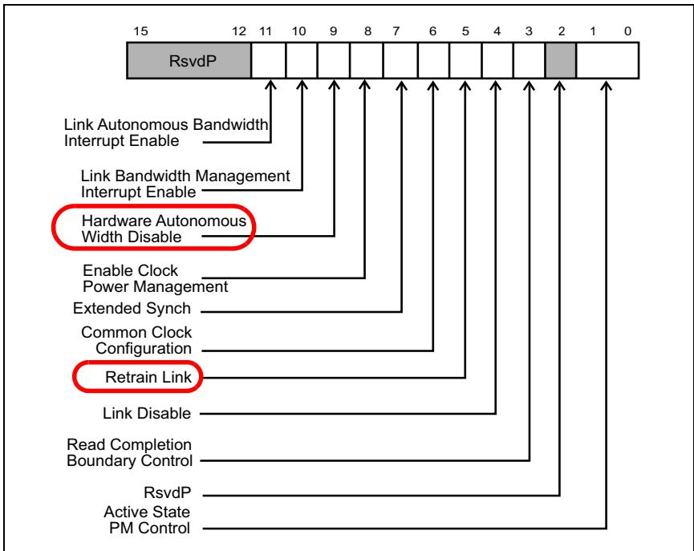

## 14.7.2 Link Width Change | 14.7.2 链路宽度变化

<table style="border-collapse:collapse; width:100%;">
  <thead>
    <tr>
      <th width="50%" style="border:1px solid #333; background:#f5f5f5;">EN</th>
      <th width="50%" style="border:1px solid #333; background-color:#e8e8e8;">中文</th>
    </tr>
  </thead>
  <tbody>
    <tr><td width="50%" style="border:1px solid #333; background:#fff;padding:4px 8px;">An upper layer would normally only direct a Link width reduction if upconfigure\_capable has been set to 1b because otherwise the Link won't be able to go back to the original width. If the Hardware Autonomous Width Disable bit is set to 1b a Port can only reduce the width in an effort to correct a reliability problem. An upper layer can only initiate an increase in Link width if the Link partner advertised that it was upconfigure capable and the Link is not already at its maximum width. Apart from these guidelines, the decision criteria for changing the Link width are not given in the spec and are therefore implementation specific.</td><td width="50%" style="border:1px solid #333; background-color:#e8e8e8;padding:4px 8px;">上层通常只会在 upconfigure\_capable 被设置为 1b 时指示链路宽度缩减，否则链路将无法恢复至原始宽度。若硬件自主宽度禁用位被设置为 1b，端口只能为了纠正可靠性问题而缩减宽度。上层只能在链路对端通告其具有 upconfigure 能力且链路尚未达到最大宽度时发起链路宽度增加。除这些指导原则外，更改链路宽度的判定标准在规范中未予给出，因此属于实现相关。</td></tr>
  </tbody>
</table>

<table style="border-collapse:collapse; width:100%;">
  <thead>
    <tr>
      <th width="50%" style="border:1px solid #333; background:#f5f5f5;">EN</th>
      <th width="50%" style="border:1px solid #333; background-color:#e8e8e8;">中文</th>
    </tr>
  </thead>
  <tbody>
    <tr><td width="50%" style="border:1px solid #333; background:#fff;padding:4px 8px;">## Link Partner Initiated</td><td width="50%" style="border:1px solid #333; background-color:#e8e8e8;padding:4px 8px;">## 链路伙伴发起</td></tr>
    <tr><td width="50%" style="border:1px solid #333; background:#fff;padding:4px 8px;">The spec describes three possibilities for this case.</td><td width="50%" style="border:1px solid #333; background-color:#e8e8e8;padding:4px 8px;">规范描述了此情况的三种可能性。</td></tr>
    <tr><td width="50%" style="border:1px solid #333; background:#fff;padding:4px 8px;">First, if Electrical Idle is detected or inferred (see Table 14-10 on page 596) on all Lanes without first receiving an EIOS on any Lane, the Port may choose to enter Recovery or stay in L0. If errors result from this condition, the Port may be directed to Recovery by means such as setting the Retrain Link bit.</td><td width="50%" style="border:1px solid #333; background-color:#e8e8e8;padding:4px 8px;">首先，如果在所有Lane上检测到或推断出电气空闲（参见第596页表14-10），而未在任何Lane上先接收到EIOS，则端口可选择进入Recovery或保持在L0。如果此情况导致错误，则可通过设置链路重训练位等方式将端口导向Recovery。</td></tr>
    <tr><td width="50%" style="border:1px solid #333; background:#fff;padding:4px 8px;">The second case happens when TS1s or TS2s are received (or an EIEOS for 128b/130b) on any configured Lanes, indicating that the Link partner has already entered Recovery. Since both of these cases are initiated by the Link partner, the Transmitter is allowed to complete any TLP or DLLP currently in progress.</td><td width="50%" style="border:1px solid #333; background-color:#e8e8e8;padding:4px 8px;">第二种情况发生在任何已配置的Lane上接收到TS1或TS2有序集（或针对128b/130b编码的EIEOS）时，表明链路伙伴已进入Recovery。由于这两种情况均由链路伙伴发起，允许发送器完成当前正在进行的任何TLP或DLLP。</td></tr>
    <tr><td width="50%" style="border:1px solid #333; background:#fff;padding:4px 8px;">Finally, if an EIOS is received on any Lane, indicating a Link power management change, but the Receiver doesn't support L0s and hasn't been directed to L1 or L2, then going to Recovery is the only option.</td><td width="50%" style="border:1px solid #333; background-color:#e8e8e8;padding:4px 8px;">最后，如果在任何Lane上接收到EIOS，指示链路电源管理状态变更，但接收器不支持L0s且未被导向L1或L2，则进入Recovery是唯一选择。</td></tr>
    <tr><td width="50%" style="border:1px solid #333; background:#fff;padding:4px 8px;">Exit to "L0s State"</td><td width="50%" style="border:1px solid #333; background-color:#e8e8e8;padding:4px 8px;">退出至"L0s状态"</td></tr>
    <tr><td width="50%" style="border:1px solid #333; background:#fff;padding:4px 8px;">The next state will be L0s for a Transmitter that's been instructed to initiate it, or for a Receiver that sees an EIOS. Interestingly, the LTSSM states for the Transmitter and Receiver of the Port can be different now, because one can be in L0s while the other is still in L0.</td><td width="50%" style="border:1px solid #333; background-color:#e8e8e8;padding:4px 8px;">对于被指示发起L0s的发送器，或看到EIOS的接收器，下一状态将为L0s。有趣的是，端口的发送器和接收器的LTSSM状态现在可能不同，因为一个可处于L0s而另一个仍处于L0。</td></tr>
    <tr><td width="50%" style="border:1px solid #333; background:#fff;padding:4px 8px;">Transmitters go to L0s when directed, if they implement L0s, and send EIOS to initiate the change.</td><td width="50%" style="border:1px solid #333; background-color:#e8e8e8;padding:4px 8px;">如果发送器实现了L0s，则在被指示时进入L0s，并发送EIOS以发起变更。</td></tr>
    <tr><td width="50%" style="border:1px solid #333; background:#fff;padding:4px 8px;">– Receivers go to L0s when an EIOS is seen on any Lane. However, if the Receiver doesn't implement L0s and hasn't been directed to L1 or L2, this will be seen as a problem and the next state will be "Recovery State" instead.</td><td width="50%" style="border:1px solid #333; background-color:#e8e8e8;padding:4px 8px;">– 接收器在任何Lane上看到EIOS时进入L0s。但是，如果接收器未实现L0s且未被导向L1或L2，则此情况将被视为问题，下一状态将为"Recovery状态"。</td></tr>
    <tr><td width="50%" style="border:1px solid #333; background:#fff;padding:4px 8px;">Exit to "Rx\_L0s.Entry"</td><td width="50%" style="border:1px solid #333; background-color:#e8e8e8;padding:4px 8px;">退出至"Rx\_L0s.Entry"</td></tr>
    <tr><td width="50%" style="border:1px solid #333; background:#fff;padding:4px 8px;">The next state will be L1 when one Link partner is directed to initiate this and sends one EIOS on all Lanes (two EIOSs if the speed is 5.0 GT/s) and receives an EIOS on any Lane. Note that both Link partners must have already agreed to enter L1 beforehand and that a Data Link Layer handshake is needed to ensure that both are ready. For more detail on how this works, see the section called "Introduction to Link Power Management" on page 733.</td><td width="50%" style="border:1px solid #333; background-color:#e8e8e8;padding:4px 8px;">当一个链路伙伴被指示发起此操作，在所有Lane上发送一个EIOS（若速率为5.0 GT/s则发送两个EIOS）并在任何Lane上接收到一个EIOS时，下一状态将为L1。注意，两个链路伙伴必须事先已同意进入L1，并且需要数据链路层握手以确保双方都已就绪。更多详细信息，请参见第733页"链路电源管理简介"一节。</td></tr>
    <tr><td width="50%" style="border:1px solid #333; background:#fff;padding:4px 8px;">Exit to "L2 State"</td><td width="50%" style="border:1px solid #333; background-color:#e8e8e8;padding:4px 8px;">退出至"L2状态"</td></tr>
    <tr><td width="50%" style="border:1px solid #333; background:#fff;padding:4px 8px;">The next state will be L2 when one Link partner is directed to initiate this and sends one EIOS on all Lanes (two EIOSs if the speed is 5.0 GT/s) and receives an EIOS on any Lane. Note that both Link partners must have already agreed to enter L2 beforehand and that a handshake is needed to ensure that both are ready. For more detail on how this works, see the section called "Introduction to Link Power Management" on page 733.</td><td width="50%" style="border:1px solid #333; background-color:#e8e8e8;padding:4px 8px;">当一个链路伙伴被指示发起此操作，在所有Lane上发送一个EIOS（若速率为5.0 GT/s则发送两个EIOS）并在任何Lane上接收到一个EIOS时，下一状态将为L2。注意，两个链路伙伴必须事先已同意进入L2，并且需要握手以确保双方都已就绪。更多详细信息，请参见第733页"链路电源管理简介"一节。</td></tr>
  </tbody>
</table>

<table style="border-collapse:collapse; width:100%;">
  <thead>
    <tr>
      <th width="50%" style="border:1px solid #333; background:#f5f5f5;">EN</th>
      <th width="50%" style="border:1px solid #333; background-color:#e8e8e8;">中文</th>
    </tr>
  </thead>
  <tbody>
    <tr><td width="50%" style="border:1px solid #333; background:#fff;padding:4px 8px;">## Recovery State</td><td width="50%" style="border:1px solid #333; background-color:#e8e8e8;padding:4px 8px;">## 恢复状态</td></tr>
    <tr><td width="50%" style="border:1px solid #333; background:#fff;padding:4px 8px;">If everything works as expected, the Link trains to the L0 state without ever going into the Recovery state. But we've already discussed two reasons why it might not. First, if the correct Symbol pattern isn't seen in Configuration.Idle, the LTSSM goes to Recovery in an effort to correct signaling problems by, for example, adjusting equalization values. Secondly, once L0 is reached with a data rate of 2.5 GT/s and both devices support higher speeds, the LTSSM goes to Recovery and attempts to change the Link speed to the highest commonly-supported/advertised speed. In this state, Bit Lock and either Symbol Lock or Block Alignment is re-acquired and the Link is de-skewed again. The Link and Lane Numbers should remain unchanged unless the Link width is being changed. In that case, the LTSSM passes through the Configuration state where Link width is re-negotiated.</td><td width="50%" style="border:1px solid #333; background-color:#e8e8e8;padding:4px 8px;">如果一切按预期工作，链路将训练到L0状态，而无需进入恢复状态。但我们已经讨论了它可能不成功的两个原因。首先，如果在Configuration.Idle中未看到正确的符号(Symbol)模式，LTSSM将进入恢复状态，试图通过例如调整均衡值来纠正信号问题。其次，一旦以2.5 GT/s的数据速率达到L0，且两个设备都支持更高的速度，LTSSM将进入恢复状态，并尝试将链路速度更改为共同支持/通告的最高速度。在此状态下，将重新获取位锁定(Bit Lock)以及符号锁定(Symbol Lock)或块对齐(Block Alignment)，并再次对链路进行去偏移(de-skew)。链路编号和通道编号应保持不变，除非链路宽度正在改变。在这种情况下，LTSSM会经过配置状态，其中链路宽度被重新协商。</td></tr>
    <tr><td width="50%" style="border:1px solid #333; background:#fff;padding:4px 8px;">NOTE: To simplify the discussion and avoid repeating the same text many times, the term "Lock" will be used here to mean the combination of Bit Lock and either Symbol Lock for 8b/10b encoding or Block Alignment for 128b/130b encoding. A Receiver must acquire this Lock to be able to recognize Symbols, Ordered Sets and Packets.</td><td width="50%" style="border:1px solid #333; background-color:#e8e8e8;padding:4px 8px;">注意：为简化讨论并避免多次重复相同文本，此处将使用术语"锁定(Lock)"来表示位锁定以及8b/10b编码的符号锁定或128b/130b编码的块对齐的组合。接收器必须获取此锁定才能识别符号、有序集和报文。</td></tr>
  </tbody>
</table>

## 14.8.1 Reasons for Entering Recovery State | 14.8.1 进入恢复状态的原因

## 进入恢复状态的原因

<table style="border-collapse:collapse; width:100%;">
  <thead>
    <tr>
      <th width="50%" style="border:1px solid #333; background:#f5f5f5;">EN</th>
      <th width="50%" style="border:1px solid #333; background-color:#e8e8e8;">中文</th>
    </tr>
  </thead>
  <tbody>
    <tr><td width="50%" style="border:1px solid #333; background:#fff;padding:4px 8px;">• Exiting the L1 state; Required because there is no fast training option (like sending FTS ordered sets) when exiting L1</td><td width="50%" style="border:1px solid #333; background-color:#e8e8e8;padding:4px 8px;">• 退出L1状态；因为在退出L1时没有快速训练选项(如发送FTS有序集)</td></tr>
    <tr><td width="50%" style="border:1px solid #333; background:#fff;padding:4px 8px;">• Exiting L0s if the receiver fails to achieve Lock from the FTS ordered sets in the required time, the Link must transition to Recovery</td><td width="50%" style="border:1px solid #333; background-color:#e8e8e8;padding:4px 8px;">• 退出L0s时，若接收器未能在规定时间内从FTS有序集中实现锁定，链路必须转换到恢复状态</td></tr>
    <tr><td width="50%" style="border:1px solid #333; background:#fff;padding:4px 8px;">• From L0 if:</td><td width="50%" style="border:1px solid #333; background-color:#e8e8e8;padding:4px 8px;">• 从L0状态进入，如果：</td></tr>
    <tr><td width="50%" style="border:1px solid #333; background:#fff;padding:4px 8px;">— A higher data rate is available when initial training completes.</td><td width="50%" style="border:1px solid #333; background-color:#e8e8e8;padding:4px 8px;">— 初始训练完成时存在更高的数据速率可用。</td></tr>
    <tr><td width="50%" style="border:1px solid #333; background:#fff;padding:4px 8px;">— A Link speed or width change has been requested (for power management or because the current speed or width is unreliable).</td><td width="50%" style="border:1px solid #333; background-color:#e8e8e8;padding:4px 8px;">— 请求更改链路速度或宽度(出于电源管理原因，或当前速度或宽度不可靠)。</td></tr>
    <tr><td width="50%" style="border:1px solid #333; background:#fff;padding:4px 8px;">— Software sets the Retrain Link bit in the Link Control Register (see Figure 14-71 on page 644) in an effort to clear transmission problems.</td><td width="50%" style="border:1px solid #333; background-color:#e8e8e8;padding:4px 8px;">— 软件设置链路控制寄存器中的链路重训练位(参见第644页图14-71)，以清除传输问题。</td></tr>
    <tr><td width="50%" style="border:1px solid #333; background:#fff;padding:4px 8px;">— An error condition such as a Replay Num Roll-over event associated with the Ack/Nak protocol of the Data Link Layer automatically causes the Physical Layer logic to retrain the Link.</td><td width="50%" style="border:1px solid #333; background-color:#e8e8e8;padding:4px 8px;">— 错误条件(如与数据链路层的Ack/Nak协议相关的重放编号翻转事件)会自动导致物理层逻辑重训练链路。</td></tr>
    <tr><td width="50%" style="border:1px solid #333; background:#fff;padding:4px 8px;">— Receiver sees TS1s or TS2s on any configured Lane, meaning that the neighbor must have entered Recovery.</td><td width="50%" style="border:1px solid #333; background-color:#e8e8e8;padding:4px 8px;">— 接收器在任何已配置通道上检测到TS1s或TS2s，表示对端必须已进入恢复状态。</td></tr>
    <tr><td width="50%" style="border:1px solid #333; background:#fff;padding:4px 8px;">— Receiver sees Electrical Idle on all configured Lanes but did not first receive the Electrical Idle Ordered Set.</td><td width="50%" style="border:1px solid #333; background-color:#e8e8e8;padding:4px 8px;">— 接收器在所有已配置通道上检测到电气空闲，但未先接收到电气空闲有序集。</td></tr>
  </tbody>
</table>

## 14.8.2 Initiating the Recovery Process | 14.8.2 启动恢复过程

<table style="border-collapse:collapse; width:100%;">
  <thead>
    <tr>
      <th width="50%" style="border:1px solid #333; background:#f5f5f5;">EN</th>
      <th width="50%" style="border:1px solid #333; background-color:#e8e8e8;">中文</th>
    </tr>
  </thead>
  <tbody>
    <tr><td width="50%" style="border:1px solid #333; background:#fff;padding:4px 8px;">Either Port can initiate Recovery by sending TS1s to its neighbor. When a Port sees incoming TS1s it knows that the other Port has entered Recovery, so it also goes into Recovery and returns TS1s. Both receivers first use the TS1s to reacquire Lock (if necessary) and then proceed to the other substates as needed. This is shown in Figure 14‑27 on page 573. A detailed description of what happens in the substates is provided in the sections that follow.</td><td width="50%" style="border:1px solid #333; background-color:#e8e8e8;padding:4px 8px;">任一端口均可通过向其相邻端口发送 TS1 来发起恢复。当一个端口看到传入的 TS1 时，它就知道另一个端口已进入恢复，因此它也进入恢复并返回 TS1。两个接收端首先使用 TS1 重新获取锁定（如有必要），然后根据需要进入其他子状态。如图 14‑27 第 573 页所示。后续章节将详细描述各子状态中发生的情况。</td></tr>
  </tbody>
</table>

Figure 14‑27: Recovery State Machine | 图14‑27：恢复状态机

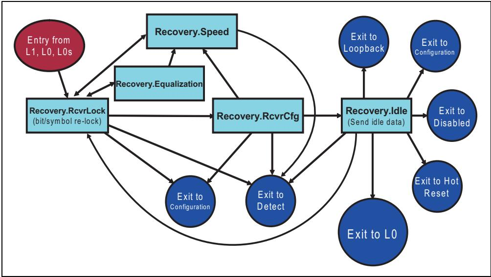

<table style="border-collapse:collapse; width:100%;">
  <thead>
    <tr>
      <th width="50%" style="border:1px solid #333; background:#f5f5f5;">EN</th>
      <th width="50%" style="border:1px solid #333; background-color:#e8e8e8;">中文</th>
    </tr>
  </thead>
  <tbody>
    <tr><td width="50%" style="border:1px solid #333; background:#fff;padding:4px 8px;">## Detailed Recovery Substates</td><td width="50%" style="border:1px solid #333; background-color:#e8e8e8;padding:4px 8px;">## 详细恢复子状态</td></tr>
  </tbody>
</table>

## During Recovery.RcvrLock | 在 Recovery.RcvrLock 期间

<table style="border-collapse:collapse; width:100%;">
  <thead>
    <tr>
      <th width="50%" style="border:1px solid #333; background:#f5f5f5;">EN</th>
      <th width="50%" style="border:1px solid #333; background-color:#e8e8e8;">中文</th>
    </tr>
  </thead>
  <tbody>
    <tr><td width="50%" style="border:1px solid #333; background:#fff;padding:4px 8px;">Regardless of the speed, Transmitters send TS1s on all configured Lanes using the same Link and Lane numbers that were set in the Configuration state. If the purpose of entering the Recovery state was to change speeds, the speed\_change bit in the Data Rate Identifier Symbol will be set to 1b in the TS1s from the initiating device and the internal variable directed\_speed\_change is set to 1b. This same variable will be set in the other device if the speed\_change bit is set in the incoming TS1s. In addition, The successful\_speed\_negotiation variable is cleared to 0b on entry to this substate.</td><td width="50%" style="border:1px solid #333; background-color:#e8e8e8;padding:4px 8px;">无论速率如何，发送端在所有已配置的通道上发送 TS1，使用在配置状态中设置的相同链路号和通道号。如果进入 Recovery 状态的目的是改变速率，则发起端设备的 TS1 中的数据速率标识符符号中的 speed\_change 位将被设置为 1b，内部变量 directed\_speed\_change 也被设置为 1b。如果传入的 TS1 中 speed\_change 位被设置，另一端设备中也会设置该变量。此外，在进入此子状态时，successful\_speed\_negotiation 变量被清为 0b。</td></tr>
    <tr><td width="50%" style="border:1px solid #333; background:#fff;padding:4px 8px;">In this substate, an Upstream Port is allowed to specify the de‐emphasis level the Downstream Port should use when operating at 5GT/s. This is accomplished by setting the Selectable De‐emphasis bit in its TS1s to the desired value. It's possible that bit errors on the Link will prevent this information from reaching the Downstream Port, so the Upstream Port is allowed to request the de‐emphasis level again when going to the Recovery state for a speed change. If the Downstream Port plans to use the requested level, it must record the value of the Selectable De‐emphasis bit while in this state.</td><td width="50%" style="border:1px solid #333; background-color:#e8e8e8;padding:4px 8px;">在此子状态中，允许上游端口指定下游端口在 5GT/s 运行时应使用的去加重电平。这是通过将其 TS1 中的可选去加重位设置为所需值来实现的。链路上的比特错误可能阻止该信息到达下游端口，因此允许上游端口在进入 Recovery 状态进行速率改变时再次请求去加重电平。如果下游端口计划使用所请求的电平，则必须在此状态期间记录可选去加重位的值。</td></tr>
    <tr><td width="50%" style="border:1px solid #333; background:#fff;padding:4px 8px;">A new transmitter voltage can also be applied upon entry to this state. The Transmit Margin field in the Link Control 2 register is sampled on entry to this substate and remains in effect until a new value is sampled on another entry to this substate from L0, L0s, or L1.</td><td width="50%" style="border:1px solid #333; background-color:#e8e8e8;padding:4px 8px;">进入此状态时也可应用新的发送端电压。链路控制 2 寄存器中的发送端裕量字段在进入此子状态时被采样，并保持有效，直到从 L0、L0s 或 L1 再次进入此子状态时采得新值。</td></tr>
    <tr><td width="50%" style="border:1px solid #333; background:#fff;padding:4px 8px;">A Downstream Port that wants to change the rate to 8.0 GT/s and redo the equalization must send EQ TS1s with the speed\_change bit set and advertising the 8.0 GT/s rate. If an Upstream Port receives 8 consecutive EQ TS1s or EQ TS2s with the speed\_change bit set to 1b and the 8.0 GT/s rate supported, it is expected to advertise the 8.0 GT/s rate, too, unless it has concluded that there are reliability problems at that rate that can't be fixed with equalization. Note that a Port is allowed to change its advertised data rates when entering this state, but only those rates that can be supported reliably. And apart from the conditions described here, a device is not allowed to change its supported data rates in this substate or in Recovery.RcvrCfg or Recovery.Equalization.</td><td width="50%" style="border:1px solid #333; background-color:#e8e8e8;padding:4px 8px;">希望将速率更改为 8.0 GT/s 并重新进行均衡的下游端口必须发送设置了 speed\_change 位并通告 8.0 GT/s 速率的 EQ TS1。如果上游端口连续收到 8 个设置了 speed\_change 位为 1b 且支持 8.0 GT/s 速率的 EQ TS1 或 EQ TS2，则它也应当通告 8.0 GT/s 速率，除非其判定在该速率下存在无法通过均衡解决的可靠性问题。注意，允许端口在进入此状态时更改其通告的数据速率，但仅限于那些能够可靠支持的速率。除此处所述条件外，设备不允许在此子状态或 Recovery.RcvrCfg 或 Recovery.Equalization 中更改其支持的数据速率。</td></tr>
  </tbody>
</table>

## Exit to "Recovery.RcvrCfg" | 退出到 "Recovery.RcvrCfg"

<table style="border-collapse:collapse; width:100%;">
  <thead>
    <tr>
      <th width="50%" style="border:1px solid #333; background:#f5f5f5;">EN</th>
      <th width="50%" style="border:1px solid #333; background-color:#e8e8e8;">中文</th>
    </tr>
  </thead>
  <tbody>
    <tr><td width="50%" style="border:1px solid #333; background:#fff;padding:4px 8px;">The next state will be Recovery.RcvrCfg if 8 consecutive TS1s or TS2s are received whose Link and Lane numbers match what is being sent and their speed_change bit is equal to the directed_speed_change variable and their EC field is 00b (if the current data rate is 8.0 GT/s).</td><td width="50%" style="border:1px solid #333; background-color:#e8e8e8;padding:4px 8px;">如果连续收到 8 个 TS1 或 TS2 序列，其链路和通道编号与正在发送的相匹配，且它们的 speed_change 位等于 directed_speed_change 变量，EC 字段为 00b（若当前数据速率为 8.0 GT/s），则下一状态将为 Recovery.RcvrCfg。</td></tr>
    <tr><td width="50%" style="border:1px solid #333; background:#fff;padding:4px 8px;">– If the Extended Synch bit is set, a minimum of 1024 TS1s in a row must be sent before going to Recovery.RcvrCfg.</td><td width="50%" style="border:1px solid #333; background-color:#e8e8e8;padding:4px 8px;">– 如果 Extended Synch 位置位，则在进入 Recovery.RcvrCfg 之前必须连续发送至少 1024 个 TS1。</td></tr>
    <tr><td width="50%" style="border:1px solid #333; background:#fff;padding:4px 8px;">– If this substate was entered from Recovery.Equalization, the Upstream Port must compare the equalization coefficients or preset received by all Lanes against the final set of coefficients or preset that was accepted in Phase 2 of the equalization process. If they don't match, it sets the Request Equalization bit in the TS2s it sends.</td><td width="50%" style="border:1px solid #333; background-color:#e8e8e8;padding:4px 8px;">– 如果该子状态是从 Recovery.Equalization 进入的，上游端口必须将所有通道接收到的均衡系数或预置值与均衡过程阶段 2 中接受的最终系数或预置值进行比较。若不匹配，则在其发送的 TS2 中设置 Request Equalization 位。</td></tr>
  </tbody>
</table>

<table style="border-collapse:collapse; width:100%;">
  <thead>
    <tr>
      <th width="50%" style="border:1px solid #333; background:#f5f5f5;">EN</th>
      <th width="50%" style="border:1px solid #333; background-color:#e8e8e8;">中文</th>
    </tr>
  </thead>
  <tbody>
    <tr><td width="50%" style="border:1px solid #333; background:#fff;padding:4px 8px;">## Exit to "Recovery.Equalization"</td><td width="50%" style="border:1px solid #333; background-color:#e8e8e8;padding:4px 8px;">## 退出到 Recovery.Equalization</td></tr>
    <tr><td width="50%" style="border:1px solid #333; background:#fff;padding:4px 8px;">When the data rate is 8.0 GT/s, the Lanes must establish the proper equalization parameters to obtain good signal integrity. This section does not apply for lower speeds. Just because the Link is running at 8.0 GT/s, it does not go through the Recovery.Equalization substate every time Recovery is entered. Recovery.Equalization is only entered if one of these conditions is met:</td><td width="50%" style="border:1px solid #333; background-color:#e8e8e8;padding:4px 8px;">当数据速率为8.0 GT/s时，通道必须建立适当的均衡参数以获得良好的信号完整性。本节不适用于较低速度。即使链路以8.0 GT/s运行，也并非每次进入Recovery时都会经历Recovery.Equalization子状态。仅当满足以下条件之一时，才会进入Recovery.Equalization：</td></tr>
    <tr><td width="50%" style="border:1px solid #333; background:#fff;padding:4px 8px;">– If the start_equalization_w_preset variable is set to 1b then:</td><td width="50%" style="border:1px solid #333; background-color:#e8e8e8;padding:4px 8px;">– 如果start_equalization_w_preset变量被设置为1b，则：</td></tr>
    <tr><td width="50%" style="border:1px solid #333; background:#fff;padding:4px 8px;">a) Upstream Port registered preset values from the 8 consecutive TS2s it saw prior to changing to 8.0 GT/s. It must use the Transmitter presets and it may optionally use the Receiver presets it received.</td><td width="50%" style="border:1px solid #333; background-color:#e8e8e8;padding:4px 8px;">a) 上游端口从其在更改为8.0 GT/s之前看到的连续8个TS2中注册了预置值。它必须使用发送器预置，并可以选择使用其接收到的接收器预置。</td></tr>
    <tr><td width="50%" style="border:1px solid #333; background:#fff;padding:4px 8px;">b) Downstream Port must use the Transmitter presets defined in its Lane Equalization Control register as soon as it changes to 8.0 GT/s and it may optionally use the Receiver presets found there.</td><td width="50%" style="border:1px solid #333; background-color:#e8e8e8;padding:4px 8px;">b) 下游端口一旦更改为8.0 GT/s，就必须使用其通道均衡控制寄存器中定义的发送器预置，并可以选择使用其中找到的接收器预置。</td></tr>
    <tr><td width="50%" style="border:1px solid #333; background:#fff;padding:4px 8px;">– Else (the variable is not set), Transmitters must use the coefficient settings they agreed to when the equalization process was last executed.</td><td width="50%" style="border:1px solid #333; background-color:#e8e8e8;padding:4px 8px;">– 否则（该变量未设置），发送器必须使用上次执行均衡过程时协商一致的系数设置。</td></tr>
    <tr><td width="50%" style="border:1px solid #333; background:#fff;padding:4px 8px;">a) Upstream Port's next state will be Recovery.Equalization if 8 consecutive incoming TS1s have Link and Lane numbers that match those being sent and the speed_change bit is 0b, but the EC bits are nonzero, indicating that the Downstream Port wishes to redo some parts of the equalization process. The spec notes that a Downstream Port could do this under software or implementation-specific direction. As always, the time it takes to do this must not be allowed to cause transaction timeout errors, which really means the Downstream Port would need to ensure there were no transactions in flight before taking this step.</td><td width="50%" style="border:1px solid #333; background-color:#e8e8e8;padding:4px 8px;">a) 如果连续8个传入的TS1的链路编号和通道编号与正在发送的相匹配，且speed_change位为0b，但EC位非零，表明下游端口希望重新执行均衡过程的某些部分，则上游端口的下一个状态将为Recovery.Equalization。规范指出，下游端口可以在软件或特定于实现的指示下执行此操作。与往常一样，执行此操作的时间不得导致事务超时错误，这实际上意味着下游端口需要确保在执行此步骤之前没有正在进行中的事务。</td></tr>
    <tr><td width="50%" style="border:1px solid #333; background:#fff;padding:4px 8px;">a) Downstream Port's next state will be Recovery.Equalization if directed, as long as this state wasn't entered from Configuration.Idle or Recovery.Idle. The spec points out that no more than two TS1s whose EC=00b should be sent before sending TS1s with a non-zero EC value to request that equalization be redone.</td><td width="50%" style="border:1px solid #333; background-color:#e8e8e8;padding:4px 8px;">a) 下游端口在收到指示时，其下一个状态将为Recovery.Equalization，只要该状态不是从Configuration.Idle或Recovery.Idle进入的。规范指出，在发送具有非零EC值的TS1以请求重新执行均衡之前，最多应发送两个EC=00b的TS1。</td></tr>
    <tr><td width="50%" style="border:1px solid #333; background:#fff;padding:4px 8px;">Otherwise, after a 24ms timeout:</td><td width="50%" style="border:1px solid #333; background-color:#e8e8e8;padding:4px 8px;">否则，在24ms超时后：</td></tr>
    <tr><td width="50%" style="border:1px solid #333; background:#fff;padding:4px 8px;">Exit to "Recovery.RcvrCfg"</td><td width="50%" style="border:1px solid #333; background-color:#e8e8e8;padding:4px 8px;">退出到 Recovery.RcvrCfg</td></tr>
    <tr><td width="50%" style="border:1px solid #333; background:#fff;padding:4px 8px;">The next state will be Recovery.RcvrCfg if both:</td><td width="50%" style="border:1px solid #333; background-color:#e8e8e8;padding:4px 8px;">如果同时满足以下两个条件，则下一个状态将为Recovery.RcvrCfg：</td></tr>
    <tr><td width="50%" style="border:1px solid #333; background:#fff;padding:4px 8px;">8 consecutive TS1s or TS2s are received whose Link and Lane numbers match what it being sent and their speed_change bit is equal to 1b.</td><td width="50%" style="border:1px solid #333; background-color:#e8e8e8;padding:4px 8px;">接收到连续8个TS1或TS2，其链路编号和通道编号与正在发送的相匹配，且其speed_change位等于1b。</td></tr>
    <tr><td width="50%" style="border:1px solid #333; background:#fff;padding:4px 8px;">And either the current data rate is already higher than 2.5 GT/s, or at least a higher rate is shown to be supported in the TS1s or TS2s.</td><td width="50%" style="border:1px solid #333; background-color:#e8e8e8;padding:4px 8px;">并且当前数据速率已经高于2.5 GT/s，或者至少在TS1或TS2中显示支持更高的速率。</td></tr>
  </tbody>
</table>

## Exit to "Recovery.Speed" | 退出到 "Recovery.Speed"

<table style="border-collapse:collapse; width:100%;">
  <thead>
    <tr>
      <th width="50%" style="border:1px solid #333; background:#f5f5f5;">EN</th>
      <th width="50%" style="border:1px solid #333; background-color:#e8e8e8;">中文</th>
    </tr>
  </thead>
  <tbody>
    <tr><td width="50%" style="border:1px solid #333; background:#fff;padding:4px 8px;">The next state will be Recovery.Speed if other of the two following conditions are met:</td><td width="50%" style="border:1px solid #333; background-color:#e8e8e8;padding:4px 8px;">如果满足以下两个条件之一，则下一个状态将为 Recovery.Speed：</td></tr>
    <tr><td width="50%" style="border:1px solid #333; background:#fff;padding:4px 8px;">If the current speed is set higher than 2.5 GT/s but isn't working since entering Recovery (indicated by clearing the variable changed\_speed\_recovery to 0b). The new rate after leaving Recovery.Speed will drop back to 2.5 GT/s.</td><td width="50%" style="border:1px solid #333; background-color:#e8e8e8;padding:4px 8px;">如果当前速度设置为高于 2.5 GT/s，但从进入 Recovery 以来一直未能正常工作（由变量 changed\_speed\_recovery 被清零为 0b 指示）。退出 Recovery.Speed 后的新速率将回退到 2.5 GT/s。</td></tr>
    <tr><td width="50%" style="border:1px solid #333; background:#fff;padding:4px 8px;">If the changed\_speed\_recovery variable is set to 1b, indicating that a higher rate than 2.5 GT/s is already working but the Link was unable to operate at a new negotiated rate. As a result, the operating speed will revert to what it was when Recovery was entered from L0 or L1.</td><td width="50%" style="border:1px solid #333; background-color:#e8e8e8;padding:4px 8px;">如果 changed\_speed\_recovery 变量设置为 1b，表示高于 2.5 GT/s 的速率已正常工作，但链路无法以新协商的速率运行。因此，工作速率将恢复到从 L0 或 L1 进入 Recovery 时的速率。</td></tr>
  </tbody>
</table>

## Exit to "Configuration State" | 退出到 "Configuration 状态"

<table style="border-collapse:collapse; width:100%;">
  <thead>
    <tr>
      <th width="50%" style="border:1px solid #333; background:#f5f5f5;">EN</th>
      <th width="50%" style="border:1px solid #333; background-color:#e8e8e8;">中文</th>
    </tr>
  </thead>
  <tbody>
    <tr><td width="50%" style="border:1px solid #333; background:#fff;padding:4px 8px;">Otherwise, the LTSSM will return to Configuration if a speed change is not requested (directed\_speed\_change variable = 0b and the speed\_change bit in the TS1s and TS2s is 0b), or if the highest commonly supported data rate is 2.5 GT/s.</td><td width="50%" style="border:1px solid #333; background-color:#e8e8e8;padding:4px 8px;">否则，如果未请求速率变更（directed\_speed\_change 变量 = 0b 且 TS1 和 TS2 中的 speed\_change 位为 0b），或者双方共同支持的最高数据速率为 2.5 GT/s，则 LTSSM 将返回 Configuration。</td></tr>
  </tbody>
</table>

## Exit to "Detect State" | 退出到 "Detect 状态"

<table style="border-collapse:collapse; width:100%;">
  <thead>
    <tr>
      <th width="50%" style="border:1px solid #333; background:#f5f5f5;">EN</th>
      <th width="50%" style="border:1px solid #333; background-color:#e8e8e8;">中文</th>
    </tr>
  </thead>
  <tbody>
    <tr><td width="50%" style="border:1px solid #333; background:#fff;padding:4px 8px;">Finally, if none of the other conditions are true, the next state will be Detect.</td><td width="50%" style="border:1px solid #333; background-color:#e8e8e8;padding:4px 8px;">最后，如果其他条件均不满足，则下一个状态将为 Detect。</td></tr>
  </tbody>
</table>

## 14.9.3 Speed Change Example | 14.9.3 速率变更示例

<table style="border-collapse:collapse; width:100%;">
  <thead>
    <tr>
      <th width="50%" style="border:1px solid #333; background:#f5f5f5;">EN</th>
      <th width="50%" style="border:1px solid #333; background-color:#e8e8e8;">中文</th>
    </tr>
  </thead>
  <tbody>
    <tr><td width="50%" style="border:1px solid #333; background:#fff;padding:4px 8px;">The spec includes an example of a speed change in the discussion of this substate. The scenario is two Link neighbors (device A and device B) that are coming out of reset, both of which support the 5.0 GT/s and 8.0 GT/s rates.</td><td width="50%" style="border:1px solid #333; background-color:#e8e8e8;padding:4px 8px;">规范在对该子状态的讨论中给出了一个速率变更的示例。场景是两个链路对端（设备 A 和设备 B）正从复位中恢复，两者均支持 5.0 GT/s 和 8.0 GT/s 速率。</td></tr>
    <tr><td width="50%" style="border:1px solid #333; background:#fff;padding:4px 8px;">To begin with, the Link will automatically train to L0 using the Gen1 rate of 2.5 GT/s. (This behavior is likely to continue in future spec versions because it provides backward compatibility with older designs.)</td><td width="50%" style="border:1px solid #333; background-color:#e8e8e8;padding:4px 8px;">首先，链路将使用 Gen1 速率 2.5 GT/s 自动训练到 L0。（该行为很可能在未来的规范版本中继续沿用，因为它提供了对旧设计的向后兼容性。）</td></tr>
    <tr><td width="50%" style="border:1px solid #333; background:#fff;padding:4px 8px;">In our example both devices support higher rates and this is indicated by the Rate Identifier field in their TS Ordered Sets during training. Both devices note that the other supports a higher rate and one of them (device A) will be the first to set its directed\_speed\_change variable to 1b. When that happens, it will go to Recovery.RcvrLock and send TS1s with the speed\_change bit set. If the desired rate will be 8.0 GT/s and hasn't been before, the devices will exchange EQ TS1s to deliver the TX equalizer presets to be used instead of sending ordinary TS1s.</td><td width="50%" style="border:1px solid #333; background-color:#e8e8e8;padding:4px 8px;">在我们的示例中，两个设备均支持更高速率，这通过它们在训练期间 TS 有序集中的速率标识符（Rate Identifier）字段指示。两个设备都注意到对方支持更高速率，其中一个（设备 A）将首先将其 directed\_speed\_change 变量设置为 1b。当发生这种情况时，它将进入 Recovery.RcvrLock 并发送设置了 speed\_change 位的 TS1。如果目标速率是 8.0 GT/s 且此前未使用过，设备将交换 EQ TS1 以传递要使用的 TX 均衡器预置，而不是发送普通 TS1。</td></tr>
    <tr><td width="50%" style="border:1px solid #333; background:#fff;padding:4px 8px;">Device B sees incoming TS1s and also transitions to Recovery.RcvrLock. When it recognizes 8 TS1s in a row with the speed\_change bit set, it responds by setting the speed\_change bit in its own TS1s and goes to Recovery.Speed. Device A waits for that response and, when 8 TS1s in a row with the speed\_change bit have been seen, it goes to Recovery.RcvrCfg and then to Recovery.Speed. In that substate, the transmitters are put into Electrical Idle, the speed is changed to the highest commonly-supported rate, and the directed\_speed\_change variable is cleared.</td><td width="50%" style="border:1px solid #333; background-color:#e8e8e8;padding:4px 8px;">设备 B 看到传入的 TS1，也转换到 Recovery.RcvrLock。当它识别到连续 8 个设置了 speed\_change 位的 TS1 时，它通过在自己的 TS1 中设置 speed\_change 位作为响应，并进入 Recovery.Speed。设备 A 等待该响应，当看到连续 8 个设置了 speed\_change 位的 TS1 后，它进入 Recovery.RcvrCfg，然后进入 Recovery.Speed。在该子状态下，发送器被置入电气空闲（Electrical Idle），速率变更为双方共同支持的最高速率，并且 directed\_speed\_change 变量被清除。</td></tr>
    <tr><td width="50%" style="border:1px solid #333; background:#fff;padding:4px 8px;">After a timeout period, both devices transition back to Recovery.RcvrLock and the transmitters are re-activated using the new speed (8.0 GT/s in this case). They send TS1s again now, this time with the speed\_change bit cleared to 0b. If the new speed works well, they transition to Recovery.RcvrCfg and back to L0. However, if device B has a problem, such as failure to achieve Bit Lock, it will timeout in this substate and go back to Recovery.Speed. Device A may have already transitioned to Recovery.RcvrCfg by this time, but when it sees Electrical Idle now, indicating the neighbor has returned to Recovery.Speed, it will also go back to that state. Returning to Recovery.Speed causes both devices to revert to the speed in use when Recovery was entered, 2.5 GT/s in this case, and return to Recovery.RcvrLock.</td><td width="50%" style="border:1px solid #333; background-color:#e8e8e8;padding:4px 8px;">经过一段超时时间后，两个设备都转换回 Recovery.RcvrLock，发送器使用新速率（本例中为 8.0 GT/s）重新激活。它们再次发送 TS1，此时 speed\_change 位被清除为 0b。如果新速率工作正常，它们将转换到 Recovery.RcvrCfg 并回到 L0。然而，如果设备 B 出现问题（例如未能实现位锁定（Bit Lock）），它将在此子状态下超时并回到 Recovery.Speed。设备 A 此时可能已转换到 Recovery.RcvrCfg，但当它看到电气空闲（Electrical Idle），表明对端已返回 Recovery.Speed，它也将回到该状态。回到 Recovery.Speed 导致两个设备都恢复为进入 Recovery 时正在使用的速率（本例中为 2.5 GT/s），并返回 Recovery.RcvrLock。</td></tr>
    <tr><td width="50%" style="border:1px solid #333; background:#fff;padding:4px 8px;">In response to that development, Device A might set directed\_speed\_change again and try the process a second time. If it failed again, device A might choose to remove the 8.0 GT/s rate from its advertised list and try the speed change again without it. Since the highest common rate is now 5.0 GT/s, if this attempt succeeds the rate will end up at 5.0 GT/s. If it doesn't work, Device A might give up trying to use a higher rate. How and when a device chooses to change its advertised rates or give up trying to get a higher rate working is not given in the spec and will be implementation specific.</td><td width="50%" style="border:1px solid #333; background-color:#e8e8e8;padding:4px 8px;">针对这一情况，设备 A 可能会再次设置 directed\_speed\_change 并重试该过程。如果再次失败，设备 A 可以选择从其通告列表中移除 8.0 GT/s 速率，并在无此速率的情况下再次尝试速率变更。由于此时最高公共速率为 5.0 GT/s，如果这次尝试成功，速率将最终为 5.0 GT/s。如果不成功，设备 A 可能会放弃使用更高速率。设备如何以及何时选择更改其通告速率或放弃尝试使更高速率工作，规范中并未给出，将由具体实现决定。</td></tr>
  </tbody>
</table>

<table style="border-collapse:collapse; width:100%;">
  <thead>
    <tr>
      <th width="50%" style="border:1px solid #333; background:#f5f5f5;">EN</th>
      <th width="50%" style="border:1px solid #333; background-color:#e8e8e8;">中文</th>
    </tr>
  </thead>
  <tbody>
    <tr><td width="50%" style="border:1px solid #333; background:#fff;padding:4px 8px;">## Link Equalization Overview</td><td width="50%" style="border:1px solid #333; background-color:#e8e8e8;padding:4px 8px;">## 链路均衡概述</td></tr>
    <tr><td width="50%" style="border:1px solid #333; background:#fff;padding:4px 8px;">This section provides an overview of the Equalization Process and prepares the reader to understand the detailed substate machine behaviors if they are of interest.</td><td width="50%" style="border:1px solid #333; background-color:#e8e8e8;padding:4px 8px;">本节概述均衡过程，帮助读者理解详细的子状态机行为（若有兴趣）。</td></tr>
    <tr><td width="50%" style="border:1px solid #333; background:#fff;padding:4px 8px;">Using a higher Link speed results in more signal distortion than lower data rates. To compensate for this and minimize the effort and cost for system designers, the 3.0 spec adds a requirement for Transmitter Equalization. Unlike the fixed de-emphasis values for the lower rates, which is really a simple form of Transmitter equalization itself, the new method uses an active handshake process to match the Transmitters to the actual signaling environment. During this process, each Receiver Lane evaluates the quality of the incoming signal and suggests Tx equalization parameters that the Link partner should use to meet the signal quality requirements.</td><td width="50%" style="border:1px solid #333; background-color:#e8e8e8;padding:4px 8px;">使用更高的链路速度会导致比低数据速率更大的信号失真。为补偿这一点并尽量减少系统设计人员的工作量和成本，3.0 规范增加了对发送器均衡的要求。与较低速率下固定的去加重值（其本身实际上是一种简单的发送器均衡形式）不同，新方法使用主动握手过程来使发送器适应实际信令环境。在此过程中，每个接收器通道评估传入信号的质量，并建议链路伙伴应使用的发送器均衡参数，以满足信号质量要求。</td></tr>
    <tr><td width="50%" style="border:1px solid #333; background:#fff;padding:4px 8px;">The Link Equalization procedure executes after the first change to the 8.0 GT/s data rate. The spec strongly recommends that the equalization process be initiated autonomously (automatically in hardware) but doesn't require it. If a component chooses not to use the autonomous mechanism then a software-based mechanism must be used. If either port is unable to achieve the necessary signal quality through this process, the LTSSM will conclude that the rate is not working and will go back to Recovery.Speed to request a lower speed.</td><td width="50%" style="border:1px solid #333; background-color:#e8e8e8;padding:4px 8px;">链路均衡过程在首次变更到 8.0 GT/s 数据速率后执行。规范强烈建议自主（硬件自动）启动均衡过程，但并未强制要求。如果某个组件选择不使用自主机制，则必须使用基于软件的机制。如果任一端口无法通过此过程达到必要的信号质量，LTSSM 将判定该速率不可用，并返回到 Recovery.Speed 以请求较低速率。</td></tr>
    <tr><td width="50%" style="border:1px solid #333; background:#fff;padding:4px 8px;">The process involves up to four phases, as described in the text that follows. Once the speed has been changed to 8.0 GT/s, the current equalization phase in use is indicated by the EC (Equalization Control) field in the TS1s being, as shown in Figure 14-28.</td><td width="50%" style="border:1px solid #333; background-color:#e8e8e8;padding:4px 8px;">该过程包含最多四个阶段，如下文所述。一旦速度变更为 8.0 GT/s，当前使用的均衡阶段由 TS1 中的 EC（均衡控制）字段指示，如图 14-28 所示。</td></tr>
  </tbody>
</table>

Figure 14-28: EC Field in TS1s and TS2s for 8.0 GT/s | 图14-28：8.0 GT/s的TS1和TS2中的EC字段

| English | 中文 |
|----|----|
| ## Phase 0 | ## 阶段 0 |
| When the Downstream Port is ready to change from a lower rate to the 8.0 GT/s rate, it enters the Recovery.RcvrCfg sub‑state and sends Tx Presets and Rx Hints to the Upstream Port using EQ TS2s as described in "TS1 and TS2 Ordered Sets" on page 510. (Note that this phase is skipped if the Link is already running at 8.0 GT/s.) The Downstream Port (DSP) sends Tx Preset values based on the contents of its Equalization Control register shown in Figure 14‑29 on page 579. One thing this highlights is that there can be different equalization values for each Lane. The Downstream Port will use the DSP values for its own Transmitter and optionally for its Receiver, and send the USP values to the Upstream Port for it to use when going to the higher speed. | 当下行端口准备从较低速率变更到 8.0 GT/s 速率时，它进入 Recovery.RcvrCfg 子状态，并使用 EQ TS2（如第 510 页"TS1 和 TS2 有序集"所述）向上行端口发送 Tx Preset 和 Rx Hint。（注意：如果链路已在 8.0 GT/s 运行，则跳过此阶段。）下行端口 (DSP) 根据其均衡控制寄存器（如图 14‑29 第 579 页所示）的内容发送 Tx Preset 值。这突显的一点是，每个通道可以有不同的均衡值。下行端口将 DSP 值用于其自身的发送器，并可选择用于其接收器，同时将 USP 值发送给上行端口，供其在切换到更高速度时使用。 |

Figure 14‑29: Equalization Control Registers | 图14‑29：均衡控制寄存器

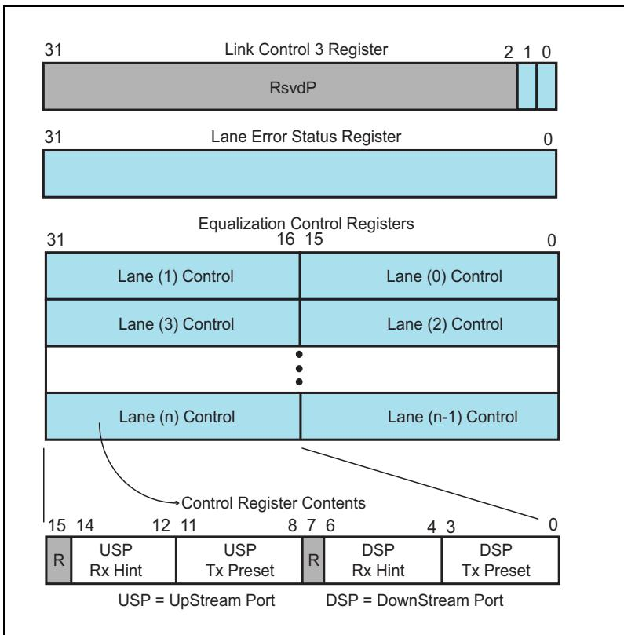

Table 14‑8: Tx Preset Encodings | 表14‑8：发送器预置编码

<table><tr><td>Encoding</td><td>De-emphasis</td><td>Preshoot</td></tr><tr><td>0000b</td><td>-6</td><td>0</td></tr><tr><td>0001b</td><td>-3.5</td><td>0</td></tr><tr><td>0010b</td><td>-4.5</td><td>0</td></tr><tr><td>0011b</td><td>-2.5</td><td>0</td></tr><tr><td>0100</td><td>0</td><td>0</td></tr><tr><td>0101</td><td>0</td><td>2</td></tr><tr><td>0110</td><td>0</td><td>2.5</td></tr><tr><td>0111</td><td>-6</td><td>3.5</td></tr><tr><td>1000</td><td>-3.5</td><td>3.5</td></tr><tr><td>1001</td><td>0</td><td>3.5</td></tr><tr><td>1010</td><td>Depends on FS and LS values</td><td>Depends on FS and LS values</td></tr><tr><td>1011b to 1111b</td><td>Reserved</td><td>Reserved</td></tr></table>

Table 14‑9: Rx Preset Hint Encodings | 表14‑9：接收器预置提示编码

<table><tr><td>Encoding</td><td>Rx Preset Hint</td></tr><tr><td>000b</td><td>-6 dB</td></tr><tr><td>001b</td><td>-7 dB</td></tr><tr><td>010b</td><td>-8 dB</td></tr><tr><td>011b</td><td>-9 dB</td></tr><tr><td>100</td><td>-10 dB</td></tr><tr><td>101</td><td>-11 dB</td></tr><tr><td>110</td><td>-12 dB</td></tr><tr><td>111</td><td>Reserved</td></tr></table>

| English | 中文 |
|----|----|
| Once the rate does change, the Downstream Port begins in Phase 1 and sends TS1s with EC = 01b. It then waits for the Upstream Port to respond with the same EC value. | 一旦速率确实发生变更，下行端口从阶段 1 开始，发送 EC = 01b 的 TS1。然后它等待上行端口以相同的 EC 值响应。 |
| Meanwhile, the Upstream Port starts in Phase 0, as illustrated in Figure 14‑30 on page 581, and sends TS1s that echo the preset values it received earlier from the EQ TS1s and EQ TS2s. It will use those requested Tx presets if they're supported, and will optionally use the Rx Hints. The USP is allowed to wait 500ns before evaluating the incoming signal but, once it's able to recognize two TS1s in a row it's ready for the next step. This means the signal quality meets the minimum BER of 10^-4 (e.g., Bit Error Ratio of less than one error in 10,000 bits). Subsequently the USP sets EC=01b in its TS1s thereby moving to Phase 1 and handing control of the next step to the DSP. | 同时，如图 14‑30（第 581 页）所示，上行端口从阶段 0 开始，发送反映其先前从 EQ TS1 和 EQ TS2 接收到的预设值的 TS1。如果这些请求的 Tx Preset 受支持，它将使用它们，并可选择使用 Rx Hint。USP 允许在评估输入信号前等待 500ns，但一旦它能够连续识别出两个 TS1，即准备好进入下一步。这意味着信号质量满足最低 BER 为 10^-4（例如，误码率低于万分之一）。随后，USP 在其 TS1 中设置 EC=01b，从而进入阶段 1，将下一步的控制权交给 DSP。 |

Figure 14‑30: Equalization Process: Starting Point | 图14‑30：均衡过程：起始点

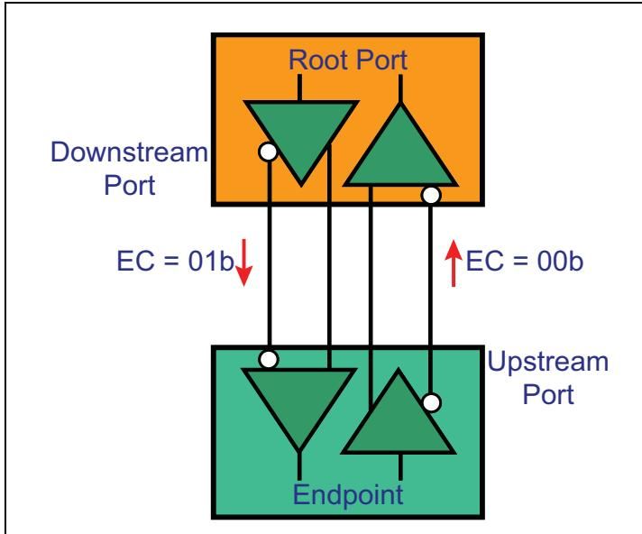

## Phase 1 | 阶段一

<table style="border-collapse:collapse; width:100%;">
  <thead>
    <tr>
      <th width="50%" style="border:1px solid #333; background:#f5f5f5;">EN</th>
      <th width="50%" style="border:1px solid #333; background-color:#e8e8e8;">中文</th>
    </tr>
  </thead>
  <tbody>
    <tr><td width="50%" style="border:1px solid #333; background:#fff;padding:4px 8px;">The DSP performs the same actions as the USP and achieves a BER of $10^{-4}$ by detecting back-to-back TS1s. During this time, the DSP communicates its Tx presets and FS (Full Swing), LF (Low Frequency), and Post-cursor coefficient values as shown in Figure 14-32 on page 584. The spec gives some additional rules that must be satisfied for a set of requested coefficients, which are:</td><td width="50%" style="border:1px solid #333; background-color:#e8e8e8;padding:4px 8px;">下游端口(DSP)执行与上游端口(USP)相同的操作，通过检测背靠背TS1序列达到$10^{-4}$的误码率(BER)。在此期间，DSP传送其发送端预置以及FS(全摆幅)、LF(低频)和后游标(Post-cursor)系数值，如图14-32(第584页)所示。规范给出了一些针对所请求系数集必须满足的附加规则，如下所列：</td></tr>
    <tr><td width="50%" style="border:1px solid #333; background:#fff;padding:4px 8px;">1. $\vert \mathrm{C}_{-1}\vert \ <= \mathrm{Floor}\ (\mathrm{FS}/4).$ (Note: Floor means round down to the integer value)</td><td width="50%" style="border:1px solid #333; background-color:#e8e8e8;padding:4px 8px;">1. $\vert \mathrm{C}_{-1}\vert \ <= \mathrm{Floor}\ (\mathrm{FS}/4).$ (注：Floor表示向下取整为整数值)</td></tr>
    <tr><td width="50%" style="border:1px solid #333; background:#fff;padding:4px 8px;">2. $</td><td width="50%" style="border:1px solid #333; background-color:#e8e8e8;padding:4px 8px;">\mathbf{C}_{-1}</td></tr>
    <tr><td width="50%" style="border:1px solid #333; background:#fff;padding:4px 8px;">3. $\mathrm{C}_{0} - \mid \mathrm{C}_{-1}\mid - \mid \mathrm{C}_{+1}\mid >= \mathrm{LF}$</td><td width="50%" style="border:1px solid #333; background-color:#e8e8e8;padding:4px 8px;">3. $\mathrm{C}_{0} - \mid \mathrm{C}_{-1}\mid - \mid \mathrm{C}_{+1}\mid >= \mathrm{LF}$</td></tr>
  </tbody>
</table>

<table style="border-collapse:collapse; width:100%;">
  <thead>
    <tr>
      <th width="50%" style="border:1px solid #333; background:#f5f5f5;">EN</th>
      <th width="50%" style="border:1px solid #333; background-color:#e8e8e8;">中文</th>
    </tr>
  </thead>
  <tbody>
    <tr><td width="50%" style="border:1px solid #333; background:#fff;padding:4px 8px;">## PCI Express Technology</td><td width="50%" style="border:1px solid #333; background-color:#e8e8e8;padding:4px 8px;">## PCI Express 技术</td></tr>
    <tr><td width="50%" style="border:1px solid #333; background:#fff;padding:4px 8px;">FS represents the maximum voltage, and LF defines the minimum voltage as LF/FS. These inform the receiver about the number of possible values and allow the coefficients to be communicated as integer values but understood as fractional values.</td><td width="50%" style="border:1px solid #333; background-color:#e8e8e8;padding:4px 8px;">FS 表示最大电压，LF 将最小电压定义为 LF/FS。这些信息告知接收器可能取值的数量，并允许系数以整数值传输但被理解为小数值。</td></tr>
    <tr><td width="50%" style="border:1px solid #333; background:#fff;padding:4px 8px;">As an example, assume we're using the coefficients defined for the P7 preset setting. The FS value acts as a reference and can be any number up to 63 but, for ease of calculation, let's say it's given as 30. In the case of P7, C-1 is -0.1, the value communicated to represent C-1 in the TS1s would be 3, since 3/30 = 0.1 and always considered negative. C+1 is -0.2, so it would be communicated as 6, since 6/30 = 0.2 and always negative. C0 is 0.7, so that will be sent as 21, since 21/30 = 0.7. Finally, the LF value represents the smallest possible ratio, and for P7 that is 0.4 times the max value. Consequently, LF will be communicated as 12, since 12/30 = 0.4.</td><td width="50%" style="border:1px solid #333; background-color:#e8e8e8;padding:4px 8px;">作为示例，假设我们使用为 P7 预置设置定义的系数。FS 值作为参考，可以是最大 63 的任意数值，但为便于计算，我们假定其为 30。对于 P7 的情况，C-1 为 -0.1，在 TS1 中表示 C-1 的传输值为 3，因为 3/30 = 0.1 且始终视为负数。C+1 为 -0.2，因此传输值为 6，因为 6/30 = 0.2 且始终为负数。C0 为 0.7，因此传输值为 21，因为 21/30 = 0.7。最后，LF 值表示最小可能比率，对于 P7 其为最大值乘以 0.4。因此，LF 将传输为 12，因为 12/30 = 0.4。</td></tr>
    <tr><td width="50%" style="border:1px solid #333; background:#fff;padding:4px 8px;">Armed with this information, let's check the three rules to see whether they are satisfied for the P7 case:</td><td width="50%" style="border:1px solid #333; background-color:#e8e8e8;padding:4px 8px;">有了这些信息，我们来检查三条规则是否满足 P7 的情况：</td></tr>
    <tr><td width="50%" style="border:1px solid #333; background:#fff;padding:4px 8px;">1. 3 <= Floor (12/4), This works out to be 3 <= 3 and is true.</td><td width="50%" style="border:1px solid #333; background-color:#e8e8e8;padding:4px 8px;">1. 3 <= Floor(12/4)，即 3 <= 3，成立。</td></tr>
    <tr><td width="50%" style="border:1px solid #333; background:#fff;padding:4px 8px;">2. 3 + 21 + 6 = 30 This one is true.</td><td width="50%" style="border:1px solid #333; background-color:#e8e8e8;padding:4px 8px;">2. 3 + 21 + 6 = 30，成立。</td></tr>
    <tr><td width="50%" style="border:1px solid #333; background:#fff;padding:4px 8px;">3. 21 - 3 - 6 >= 12 This one is also true, so all three checks are satisfied for P7.</td><td width="50%" style="border:1px solid #333; background-color:#e8e8e8;padding:4px 8px;">3. 21 - 3 - 6 >= 12，也成立。因此 P7 满足所有三项检查。</td></tr>
    <tr><td width="50%" style="border:1px solid #333; background:#fff;padding:4px 8px;">Once the Downstream Port is satisfied that the Link is working well enough to move forward (it recognizes incoming TS1s with EC = 01b), then this phase is complete and it initiates a change to Phase 2 by setting its EC = 10b as illustrated in Figure 14-31 on page 583 and hands control of the next step back to the USP. When the USP responds with EC = 10b, both Ports go to Phase 2. As a happy alternative, the Downstream Port may conclude that the signal quality is already good enough at this point and no further adjustments are necessary. In that case, it set its EC = 00b to exit the equalization process.</td><td width="50%" style="border:1px solid #333; background-color:#e8e8e8;padding:4px 8px;">当下行端口确认链路工作状态足以继续推进时（它识别到 EC = 01b 的入站 TS1），则此阶段完成，并通过设置其 EC = 10b 发起向阶段 2 的转换，如图 14-31（第 583 页）所示，同时将下一步控制权交还给 USP。当 USP 以 EC = 10b 响应后，两个端口均进入阶段 2。另一种理想情况是，下行端口可以判定此时信号质量已足够好，无需进一步调整。此时，它将设置其 EC = 00b 以退出均衡过程。</td></tr>
  </tbody>
</table>

Figure 14-31: Equalization Process: Initiating Phase 2 | 图14-31：均衡过程：启动阶段2

<table style="border-collapse:collapse; width:100%;">
  <thead>
    <tr>
      <th width="50%" style="border:1px solid #333; background:#f5f5f5;">EN</th>
      <th width="50%" style="border:1px solid #333; background-color:#e8e8e8;">中文</th>
    </tr>
  </thead>
  <tbody>
    <tr><td width="50%" style="border:1px solid #333; background:#fff;padding:4px 8px;">## Phase 2</td><td width="50%" style="border:1px solid #333; background-color:#e8e8e8;padding:4px 8px;">## 阶段 2</td></tr>
    <tr><td width="50%" style="border:1px solid #333; background:#fff;padding:4px 8px;">The signal quality has been good enough to recognize TS1s, but not good enough for runtime operation. Once both Ports are in Phase 2, the Upstream Port is allowed to request Tx settings for the Downstream Port and then evaluate how well they work, reiterating the process until it arrives at optimal settings for the current environment. To make a request, it changes the value of the equalization information it sends in its TS1s. As shown in Figure 14‐32 on page 584, there are several values of interest:</td><td width="50%" style="border:1px solid #333; background-color:#e8e8e8;padding:4px 8px;">信号质量已足以识别TS1，但还不足以用于运行时操作。一旦两个端口都进入阶段2，上游端口可以请求下游端口的发送器(Tx)设置，然后评估其效果，重复此过程直至找到当前环境的最优设置。为发起请求，它会改变其在TS1中发送的均衡信息的值。如第584页图14-32所示，有几个值得关注的值：</td></tr>
    <tr><td width="50%" style="border:1px solid #333; background:#fff;padding:4px 8px;">Tx Preset: The Tx presets are a coarse‐grained adjustment to the Transmitter settings that are intended to get it into the right ballpark for the current signaling environment. The Upstream Port sets this value, and sets the "Use Preset" indicator (bit 7 of Symbol 6) to tell the Downstream Port's Transmitter to use it. If the Use Preset bit is not set, then it's understood that the presets should stay as they are and that the coefficient values should be changed instead. The Tx coefficients are considered as fine‐grained adjustments.</td><td width="50%" style="border:1px solid #333; background-color:#e8e8e8;padding:4px 8px;">Tx预设(Tx Preset)：Tx预设是对发送器设置进行粗粒度调整，旨在使其进入当前信号环境的合适范围。上游端口设置此值，并设置"使用预设"(Use Preset)指示位(符号6的位7)，以指示下游端口的发送器使用该预设。如果未设置使用预设位，则理解为预设应保持不变，而应改变系数值。Tx系数被视为细粒度调整。</td></tr>
  </tbody>
</table>

Figure 14‐32: Equalization Coefficients Exchanged | 图14‐32：交换的均衡系数
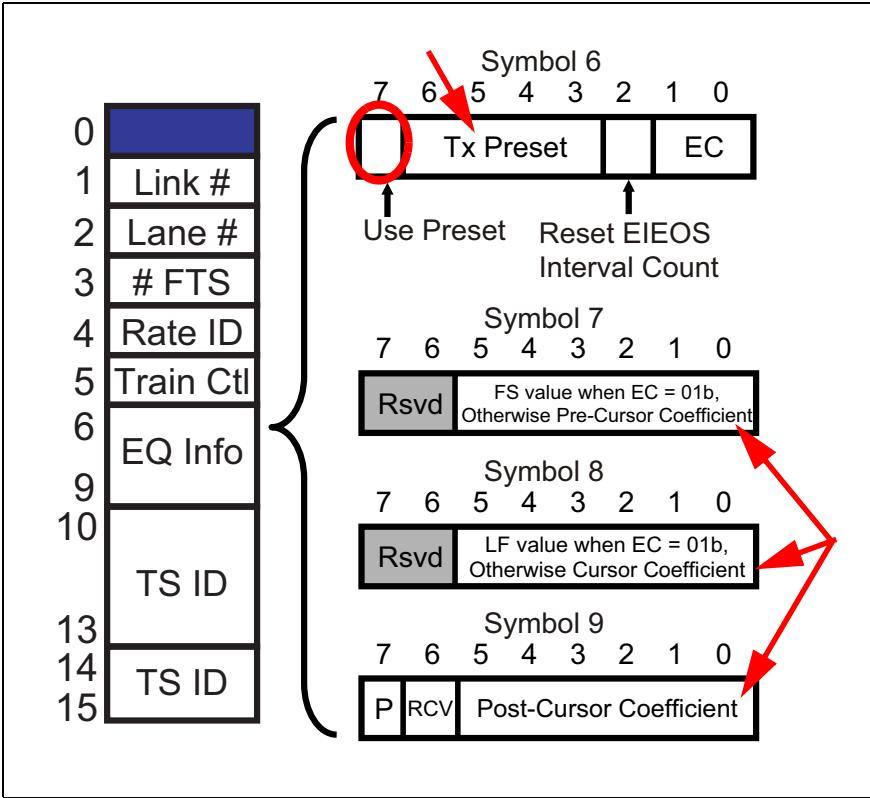

<table style="border-collapse:collapse; width:100%;">
  <thead>
    <tr>
      <th width="50%" style="border:1px solid #333; background:#f5f5f5;">EN</th>
      <th width="50%" style="border:1px solid #333; background-color:#e8e8e8;">中文</th>
    </tr>
  </thead>
  <tbody>
    <tr><td width="50%" style="border:1px solid #333; background:#fff;padding:4px 8px;">Coefficients: Since the spec requires a 3‐tap Tx equalizer, three coefficient values are defined that can be pictured as voltage adjustments to a signal pulse that compensates for the distortion it will experience going through the transmission medium, as shown in Figure 14‐33 on page 585. This is covered in more detail in the Physical Layer Electrical section titled, "Solution for 8.0 GT/s ‐ Transmitter Equalization" on page 474.</td><td width="50%" style="border:1px solid #333; background-color:#e8e8e8;padding:4px 8px;">系数(Coefficients)：由于规范要求使用3抽头发送器均衡器(3-tap Tx equalizer)，因此定义了三个系数值，可将其视为对信号脉冲的电压调整，以补偿信号在传输介质中将要经历的失真，如第585页图14-33所示。第474页标题为"8.0 GT/s的解决方案 - 发送器均衡"的物理层电气部分对此有更详细的说明。</td></tr>
    <tr><td width="50%" style="border:1px solid #333; background:#fff;padding:4px 8px;">— Pre‐Cursor Coefficient: a multiplier applied to the signal prior to the sample point that can boost or reduce the signal depending on the need.</td><td width="50%" style="border:1px solid #333; background-color:#e8e8e8;padding:4px 8px;">— 前光标系数(Pre-Cursor Coefficient)：在采样点之前应用于信号的乘数，可根据需要增强或降低信号。</td></tr>
    <tr><td width="50%" style="border:1px solid #333; background:#fff;padding:4px 8px;">— Cursor Coefficient: the sample point multiplier; always positive.</td><td width="50%" style="border:1px solid #333; background-color:#e8e8e8;padding:4px 8px;">— 光标系数(Cursor Coefficient)：采样点乘数，始终为正。</td></tr>
    <tr><td width="50%" style="border:1px solid #333; background:#fff;padding:4px 8px;">— Post‐Cursor Coefficient: a multiplier applied to the signal after the sample point that can boost or reduce the signal depending on the need.</td><td width="50%" style="border:1px solid #333; background-color:#e8e8e8;padding:4px 8px;">— 后光标系数(Post-Cursor Coefficient)：在采样点之后应用于信号的乘数，可根据需要增强或降低信号。</td></tr>
    <tr><td width="50%" style="border:1px solid #333; background:#fff;padding:4px 8px;">— Once the signal meets the quality standard needed, the Upstream Port indicates that it's ready to move to the next phase by changing EC = 11b.</td><td width="50%" style="border:1px solid #333; background-color:#e8e8e8;padding:4px 8px;">— 一旦信号达到所需质量标准，上游端口通过将EC更改为11b来表示已准备好进入下一阶段。</td></tr>
  </tbody>
</table>

Figure 14‐33: 3‐Tap Transmitter Equalization | 图14‐33：3抽头发送器均衡

Figure 14‐34: Equalization Process: Adjustments During Phase 2 | 图14‐34：均衡过程：阶段2期间的调整
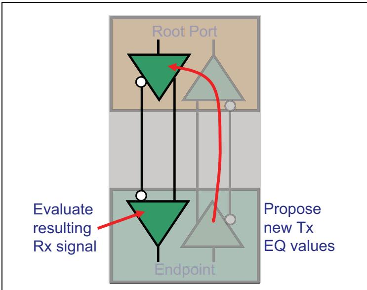

## Phase 3 | 阶段 3

<table style="border-collapse:collapse; width:100%;">
  <thead>
    <tr>
      <th width="50%" style="border:1px solid #333; background:#f5f5f5;">EN</th>
      <th width="50%" style="border:1px solid #333; background-color:#e8e8e8;">中文</th>
    </tr>
  </thead>
  <tbody>
    <tr><td width="50%" style="border:1px solid #333; background:#fff;padding:4px 8px;">The Downstream port responds by sending EC = 11b and can now do the same signal evaluation process for the Upstream Port's Transmitter. It sends TS1s that request a new setting the same way: if the Use Preset bit is set, new presets are defined, otherwise new coefficients are being given. This is sent continuously for 1μs or until the request has been evaluated for its result, whichever is later. That evaluation must wait 500ns plus the round trip time through the outgoing logic and back in to the receive logic. Different equalization settings can be tested until one is found that achieves the desired signal quality. At that point the Downstream Port exits the equalization process by setting EC = 00b.</td><td width="50%" style="border:1px solid #333; background-color:#e8e8e8;padding:4px 8px;">下游端口通过发送 EC = 11b 进行响应，现在可以对上游端口的发送器执行相同的信号评估过程。它发送 TS1s 来请求新的设置，方式相同：如果设置了使用预设位（Use Preset），则定义新的预设值，否则给出新的系数。此过程持续发送 1μs，或者直到请求的结果被评估完成，以两者中较晚者为准。该评估必须等待 500ns 加上通过输出逻辑再返回接收逻辑的往返时间。可以测试不同的均衡设置，直到找到能够达到所需信号质量的设置为止。此时，下游端口通过设置 EC = 00b 退出均衡过程。</td></tr>
  </tbody>
</table>

Figure 14-35: Equalization Process: Adjustments During Phase 3 | 图14-35：均衡过程：阶段3期间的调整

## Equalization Notes | 均衡说明

## Equalization Notes | 均衡说明

<table style="border-collapse:collapse; width:100%;">
  <thead>
    <tr>
      <th width="50%" style="border:1px solid #333; background:#f5f5f5;">EN</th>
      <th width="50%" style="border:1px solid #333; background-color:#e8e8e8;">中文</th>
    </tr>
  </thead>
  <tbody>
    <tr><td width="50%" style="border:1px solid #333; background:#fff;padding:4px 8px;">The specification mentions other items associated with the equalization process, as described below:</td><td width="50%" style="border:1px solid #333; background-color:#e8e8e8;padding:4px 8px;">规范还提及了与均衡过程相关的其他事项，描述如下：</td></tr>
    <tr><td width="50%" style="border:1px solid #333; background:#fff;padding:4px 8px;">• All Lanes must participate in the process; even those that may only become active later after an upconfigure event.</td><td width="50%" style="border:1px solid #333; background-color:#e8e8e8;padding:4px 8px;">• 所有Lane必须参与该过程；即使是那些可能在upconfigure事件之后才变为活跃的Lane也不例外。</td></tr>
    <tr><td width="50%" style="border:1px solid #333; background:#fff;padding:4px 8px;">The algorithm used by a component to evaluate the incoming signal and determine the equalization values that its Link partner should use is not given in the spec and is implementation specific.</td><td width="50%" style="border:1px solid #333; background-color:#e8e8e8;padding:4px 8px;">组件用于评估输入信号并确定其Link partner应使用的均衡值的算法，规范中未给出，属于具体实现相关的。</td></tr>
    <tr><td width="50%" style="border:1px solid #333; background:#fff;padding:4px 8px;">• Equalization changes can be requested for any number of Lanes and the Lanes can use different values.</td><td width="50%" style="border:1px solid #333; background-color:#e8e8e8;padding:4px 8px;">• 可以对任意数量的Lane请求均衡更改，且各Lane可使用不同的值。</td></tr>
    <tr><td width="50%" style="border:1px solid #333; background:#fff;padding:4px 8px;">At the end of the fine‑tuning steps (Phase 2 for Upstream Ports and Phase 3 for Downstream Ports), each component is responsible for ensuring that the Transmitter settings cause it to meet the spec requirements.</td><td width="50%" style="border:1px solid #333; background-color:#e8e8e8;padding:4px 8px;">在微调步骤结束时（Upstream Port的Phase 2和Downstream Port的Phase 3），每个组件负责确保其Transmitter设置满足规范要求。</td></tr>
    <tr><td width="50%" style="border:1px solid #333; background:#fff;padding:4px 8px;">Components must evaluate requests to adjust their Transmitter settings and act on them. If valid values are given they must use them and reflect those values in the TS1s they send.</td><td width="50%" style="border:1px solid #333; background-color:#e8e8e8;padding:4px 8px;">组件必须评估调整其Transmitter设置的请求并据此执行。如果给出有效值，它们必须使用这些值，并将其反映在发送的TS1中。</td></tr>
    <tr><td width="50%" style="border:1px solid #333; background:#fff;padding:4px 8px;">A request to adjust coefficients may be rejected if the values are not compliant with the rules. The requested values will still be reflected in the TS1s sent back but the Reject Coefficient Values bit will be set.</td><td width="50%" style="border:1px solid #333; background-color:#e8e8e8;padding:4px 8px;">如果系数值不符合规则，调整系数的请求可能被拒绝。请求的值仍会反映在回送的TS1中，但Reject Coefficient Values位将被置位。</td></tr>
    <tr><td width="50%" style="border:1px solid #333; background:#fff;padding:4px 8px;">Components must store the equalization values that they settled on through this process for future use at 8.0 GT/s. The spec is not explicit on this, but the author's opinion is that these values would survive a change in speed to a lower rate and then back to the 8.0 GT/s rate. That makes sense because it could potentially take a long time to repeat the EQ process and the resulting values would be the same, provided the electrical environment hasn't changed.</td><td width="50%" style="border:1px solid #333; background-color:#e8e8e8;padding:4px 8px;">组件必须存储通过此过程确定的均衡值，以备将来在8.0 GT/s时使用。规范对此未作明确规定，但作者认为，这些值在降速后再升回8.0 GT/s速率时仍应保留。这是合理的，因为重复EQ过程可能耗时较长，且只要电气环境未发生变化，最终得到的值将是相同的。</td></tr>
    <tr><td width="50%" style="border:1px solid #333; background:#fff;padding:4px 8px;">Components are allowed to fine‑tune their Receivers at any time, as long as it doesn't cause the Link to become unreliable or go to Recovery.</td><td width="50%" style="border:1px solid #333; background-color:#e8e8e8;padding:4px 8px;">组件可随时微调其Receiver，前提是不导致Link变得不可靠或进入Recovery状态。</td></tr>
  </tbody>
</table>

<table style="border-collapse:collapse; width:100%;">
  <thead>
    <tr>
      <th width="50%" style="border:1px solid #333; background:#f5f5f5;">EN</th>
      <th width="50%" style="border:1px solid #333; background-color:#e8e8e8;">中文</th>
    </tr>
  </thead>
  <tbody>
    <tr><td width="50%" style="border:1px solid #333; background:#fff;padding:4px 8px;">## Detailed Equalization Substates</td><td width="50%" style="border:1px solid #333; background-color:#e8e8e8;padding:4px 8px;">## 详细均衡子状态</td></tr>
    <tr><td width="50%" style="border:1px solid #333; background:#fff;padding:4px 8px;">This section covers detailed descriptions of the state machine behaviors during Link Equalization.</td><td width="50%" style="border:1px solid #333; background-color:#e8e8e8;padding:4px 8px;">本节详细介绍链路均衡过程中状态机的行为。</td></tr>
  </tbody>
</table>

<table style="border-collapse:collapse; width:100%;">
  <thead>
    <tr>
      <th width="50%" style="border:1px solid #333; background:#f5f5f5;">EN</th>
      <th width="50%" style="border:1px solid #333; background-color:#e8e8e8;">中文</th>
    </tr>
  </thead>
  <tbody>
    <tr><td width="50%" style="border:1px solid #333; background:#fff;padding:4px 8px;">## Recovery.Equalization</td><td width="50%" style="border:1px solid #333; background-color:#e8e8e8;padding:4px 8px;">## 恢复.均衡</td></tr>
    <tr><td width="50%" style="border:1px solid #333; background:#fff;padding:4px 8px;">This substate is used to execute the Link Equalization Procedure for 8.0 GT/s and higher rates. The lower rates don't use equalization and the LTSSM won't enter this substate when they're in effect. Since this is a new and complex topic for PCIe, a description of the overall equalization procedure from a high-level view is presented after the state machine details in the section called "Link Equalization Overview" on page 577. First though, let's step through the substates to see the mechanics of the process.</td><td width="50%" style="border:1px solid #333; background-color:#e8e8e8;padding:4px 8px;">此子状态用于执行 8.0 GT/s 及更高速率下的链路均衡过程。较低速率不使用均衡，LTSSM 在这些速率生效时不会进入此子状态。由于这对 PCIe 来说是一个新的且复杂的主题，在状态机细节之后，第 577 页的 "Link Equalization Overview" 一节从高层视角呈现了整个均衡过程的描述。不过，首先让我们逐步了解各子状态，以查看该过程的机制。</td></tr>
  </tbody>
</table>

## Downstream Lanes | 下行通道

<table style="border-collapse:collapse; width:100%;">
  <thead>
    <tr>
      <th width="50%" style="border:1px solid #333; background:#f5f5f5;">EN</th>
      <th width="50%" style="border:1px solid #333; background-color:#e8e8e8;">中文</th>
    </tr>
  </thead>
  <tbody>
    <tr><td width="50%" style="border:1px solid #333; background:#fff;padding:4px 8px;">The Downstream Port starts in Phase 1 of the equalization process. To begin this process, there are several bits that need to be reset. In the Link Status 2 register (Figure 14-36 on page 588), the following bits are cleared when entering this substate:</td><td width="50%" style="border:1px solid #333; background-color:#e8e8e8;padding:4px 8px;">下游端口从均衡化过程的阶段1开始。要启动该过程，有几个位需要复位。在链路状态2寄存器（第588页图14-36）中，进入此子状态时会清除以下位：</td></tr>
  </tbody>
</table>

## PCI Express Technology | PCI Express 技术

<table style="border-collapse:collapse; width:100%;">
  <thead>
    <tr>
      <th width="50%" style="border:1px solid #333; background:#f5f5f5;">EN</th>
      <th width="50%" style="border:1px solid #333; background-color:#e8e8e8;">中文</th>
    </tr>
  </thead>
  <tbody>
    <tr><td width="50%" style="border:1px solid #333; background:#fff;padding:4px 8px;">– Equalization Phase 1 Successful</td><td width="50%" style="border:1px solid #333; background-color:#e8e8e8;padding:4px 8px;">– 均衡阶段 1 成功</td></tr>
    <tr><td width="50%" style="border:1px solid #333; background:#fff;padding:4px 8px;">– Equalization Phase 2 Successful</td><td width="50%" style="border:1px solid #333; background-color:#e8e8e8;padding:4px 8px;">– 均衡阶段 2 成功</td></tr>
    <tr><td width="50%" style="border:1px solid #333; background:#fff;padding:4px 8px;">– Equalization Phase 3 Successful</td><td width="50%" style="border:1px solid #333; background-color:#e8e8e8;padding:4px 8px;">– 均衡阶段 3 成功</td></tr>
    <tr><td width="50%" style="border:1px solid #333; background:#fff;padding:4px 8px;">– Link Equalization Request</td><td width="50%" style="border:1px solid #333; background-color:#e8e8e8;padding:4px 8px;">– 链路均衡请求</td></tr>
    <tr><td width="50%" style="border:1px solid #333; background:#fff;padding:4px 8px;">– Equalization Complete</td><td width="50%" style="border:1px solid #333; background-color:#e8e8e8;padding:4px 8px;">– 均衡完成</td></tr>
    <tr><td width="50%" style="border:1px solid #333; background:#fff;padding:4px 8px;">The Perform Equalization bit of the Link Control 3 register is also cleared to 0b as is the internal variable start\_equalization\_w\_preset. The equalization\_done\_8GT\_data\_rate variable is set to 1b.</td><td width="50%" style="border:1px solid #333; background-color:#e8e8e8;padding:4px 8px;">Link Control 3 寄存器的 Perform Equalization 位也被清零为 0b，内部变量 start\_equalization\_w\_preset 同样清零。变量 equalization\_done\_8GT\_data\_rate 被置为 1b。</td></tr>
  </tbody>
</table>

Figure 14-36: Link Status 2 Register | 图14-36：链路状态2寄存器

Figure 14-37: Link Control 3 Register | 图14-37：链路控制3寄存器

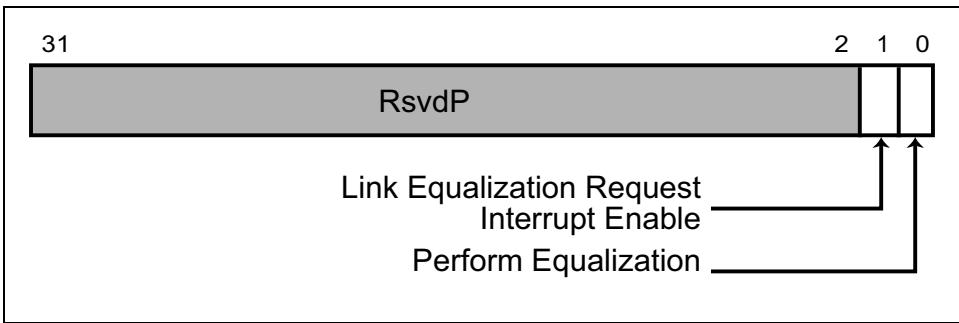

<table style="border-collapse:collapse; width:100%;">
  <thead>
    <tr>
      <th width="50%" style="border:1px solid #333; background:#f5f5f5;">EN</th>
      <th width="50%" style="border:1px solid #333; background-color:#e8e8e8;">中文</th>
    </tr>
  </thead>
  <tbody>
    <tr><td width="50%" style="border:1px solid #333; background:#fff;padding:4px 8px;">Phase 1 Downstream. During this phase, the Downstream Port sends TS1s with EC = 01b while using the Preset values from the Lane Equalization Control register and with the FS, LF, and Post‐cursor Coefficient fields that correspond to the Tx Preset field. It's allowed to wait 500ns before evaluating incoming TS1s if it needs time to stabilize its Receiver logic.</td><td width="50%" style="border:1px solid #333; background-color:#e8e8e8;padding:4px 8px;">下游阶段 1。在此阶段，下游端口发送 EC = 01b 的 TS1，同时使用来自 Lane Equalization Control 寄存器的 Preset 值，以及对应于 Tx Preset 字段的 FS、LF 和后游标系数字段。如果需要时间稳定其接收器逻辑，允许在评估传入的 TS1 之前等待 500ns。</td></tr>
    <tr><td width="50%" style="border:1px solid #333; background:#fff;padding:4px 8px;">Exit to "Phase 2 Downstream"</td><td width="50%" style="border:1px solid #333; background-color:#e8e8e8;padding:4px 8px;">退出至"下游阶段 2"</td></tr>
    <tr><td width="50%" style="border:1px solid #333; background:#fff;padding:4px 8px;">The Downstream Port will transition to Phase 2 if it want to continue with the equalization process and when all configured Lanes receive two consecutive TS1s with EC = 01b. At this point, the Port will set the Equalization Phase 1 Successful status bit to 1b and store the received TS1 LF and FS values for use in Phase 3 (if the Downstream Port plans to adjust the Upstream Port's Tx coefficients).</td><td width="50%" style="border:1px solid #333; background-color:#e8e8e8;padding:4px 8px;">如果下游端口希望继续均衡过程，并且所有已配置的通道都接收到两个连续的 EC = 01b 的 TS1，则下游端口将转换到阶段 2。此时，端口将 Equalization Phase 1 Successful 状态位置为 1b，并存储接收到的 TS1 LF 和 FS 值，以供阶段 3 使用（如果下游端口计划调整上游端口的 Tx 系数）。</td></tr>
  </tbody>
</table>

## Exit to “Detailed Recovery Substates” | 退出到“详细恢复子状态”

<table style="border-collapse:collapse; width:100%;">
  <thead>
    <tr>
      <th width="50%" style="border:1px solid #333; background:#f5f5f5;">EN</th>
      <th width="50%" style="border:1px solid #333; background-color:#e8e8e8;">中文</th>
    </tr>
  </thead>
  <tbody>
    <tr><td width="50%" style="border:1px solid #333; background:#fff;padding:4px 8px;">If the Downstream Port doesn’t want to use Phases 2 and 3, it sets the status bits to 1b (Eq. Phase 1 Successful, Eq. Phase 2 Successful, Eq. Phase 3 Successful, and Eq. Complete). One reason to do this would be because it can already see that the signal characteristics are good enough and the rest of the phases aren’t needed.</td><td width="50%" style="border:1px solid #333; background-color:#e8e8e8;padding:4px 8px;">如果下游端口不希望使用阶段2和阶段3，它会将状态位设置为1b（均衡阶段1成功、均衡阶段2成功、均衡阶段3成功和均衡完成）。这样做的一个原因可能是它已经看到信号特性足够好，不需要其余阶段。</td></tr>
  </tbody>
</table>

## Exit to "Recovery.Speed" | 退出到 "Recovery.Speed"

<table style="border-collapse:collapse; width:100%;">
  <thead>
    <tr>
      <th width="50%" style="border:1px solid #333; background:#f5f5f5;">EN</th>
      <th width="50%" style="border:1px solid #333; background-color:#e8e8e8;">中文</th>
    </tr>
  </thead>
  <tbody>
    <tr><td width="50%" style="border:1px solid #333; background:#fff;padding:4px 8px;">If the consecutive TS1s are not seen after a 24ms timeout, the next state is Recovery.Speed. The successful\_speed\_negotiation flag is cleared to 0b, and the Equalization Complete status bit is set to 1b.</td><td width="50%" style="border:1px solid #333; background-color:#e8e8e8;padding:4px 8px;">如果在 24ms 超时后未检测到连续的 TS1，则下一状态为 Recovery.Speed。successful\_speed\_negotiation 标志清零为 0b，Equalization Complete 状态位设置为 1b。</td></tr>
    <tr><td width="50%" style="border:1px solid #333; background:#fff;padding:4px 8px;">Phase 2 Downstream. During this phase, the Downstream Port sends TS1s with EC = 10b and coefficient settings independently assigned on each Lane according to the following:</td><td width="50%" style="border:1px solid #333; background-color:#e8e8e8;padding:4px 8px;">Phase 2 Downstream（下游阶段 2）。在此阶段，下游端口发送 EC = 10b 的 TS1，并根据以下规则在每个 Lane 上独立分配系数设置：</td></tr>
    <tr><td width="50%" style="border:1px solid #333; background:#fff;padding:4px 8px;">If two consecutive TS1s are received with EC = 10b (Upstream Port has entered Phase 2) either for the first time, or with different preset or coefficient values than the last time, and if the values requested are legal and supported, then change the Tx settings to use them within 500ns of the end of the second TS1 requesting them. Also, reflect the values in the TS1s being sent back to the Upstream Port and clear the Reject Coefficient Values bit to 0b. Note that the change must not cause illegal voltages or parameters at the Transmitter for more than 1ns.</td><td width="50%" style="border:1px solid #333; background-color:#e8e8e8;padding:4px 8px;">如果接收到两个连续的 EC = 10b 的 TS1（表明上游端口已进入 Phase 2），无论是首次收到，还是其预设值或系数值与上次不同，且所请求的值合法且受支持，则在第二个请求变更的 TS1 结束后的 500ns 内更改 Tx 设置以使用这些值。同时，将这些值反映在发送回上游端口的 TS1 中，并将 Reject Coefficient Values 位清零为 0b。注意，此变更不得导致发送端出现超过 1ns 的非法规格或参数。</td></tr>
    <tr><td width="50%" style="border:1px solid #333; background:#fff;padding:4px 8px;">a) If the requested preset or coefficients are illegal or not supported, don't change the Tx settings but reflect the received values in the TS1s being sent and set the Reject Coefficient Values bit to 1b (see Figure 14-38 on page 590).</td><td width="50%" style="border:1px solid #333; background-color:#e8e8e8;padding:4px 8px;">a) 如果请求的预设值或系数非法或不受支持，则不更改 Tx 设置，但将接收到的值反映在发送的 TS1 中，并将 Reject Coefficient Values 位置为 1b（参见第 590 页图 14-38）。</td></tr>
    <tr><td width="50%" style="border:1px solid #333; background:#fff;padding:4px 8px;">If the two consecutive TS1s aren't seen, keep the current Tx preset and coefficient values.</td><td width="50%" style="border:1px solid #333; background-color:#e8e8e8;padding:4px 8px;">如果未检测到两个连续的 TS1，则保持当前的 Tx 预设值和系数值不变。</td></tr>
    <tr><td width="50%" style="border:1px solid #333; background:#fff;padding:4px 8px;">Exit to "Phase 3 Downstream"</td><td width="50%" style="border:1px solid #333; background-color:#e8e8e8;padding:4px 8px;">退出至 "Phase 3 Downstream"（下游阶段 3）</td></tr>
    <tr><td width="50%" style="border:1px solid #333; background:#fff;padding:4px 8px;">When the Upstream Port is satisfied with the changes, it begins to send TS1s with EC = 11b, indicating a desire to change to Phase 3. When two consecutive TS1s like this are received, set the Eq. Phase 2 Successful status bit to 1b and change to Phase 3.</td><td width="50%" style="border:1px solid #333; background-color:#e8e8e8;padding:4px 8px;">当上游端口对变更满意时，它开始发送 EC = 11b 的 TS1，表示希望进入 Phase 3。当接收到两个连续的此类 TS1 时，将 Eq. Phase 2 Successful 状态位置为 1b 并进入 Phase 3。</td></tr>
  </tbody>
</table>

## Exit to "Recovery.Speed" | 退出到 "Recovery.Speed"

<table style="border-collapse:collapse; width:100%;">
  <thead>
    <tr>
      <th width="50%" style="border:1px solid #333; background:#f5f5f5;">EN</th>
      <th width="50%" style="border:1px solid #333; background-color:#e8e8e8;">中文</th>
    </tr>
  </thead>
  <tbody>
    <tr><td width="50%" style="border:1px solid #333; background:#fff;padding:4px 8px;">If after 32 ms, the transition to Phase 3 has not happened, the Port should clear the successful\_speed\_negotiation flag, set the Equalization Complete status bit and exit to the Recovery.Speed substate.</td><td width="50%" style="border:1px solid #333; background-color:#e8e8e8;padding:4px 8px;">若32毫秒后仍未转换至阶段3，端口应清除successful\_speed\_negotiation标志，设置均衡完成状态位，并退出至Recovery.Speed子状态。</td></tr>
  </tbody>
</table>

Figure 14-38: TS1s - Rejecting Coefficient Values | 图14-38：TS1 - 拒绝系数值

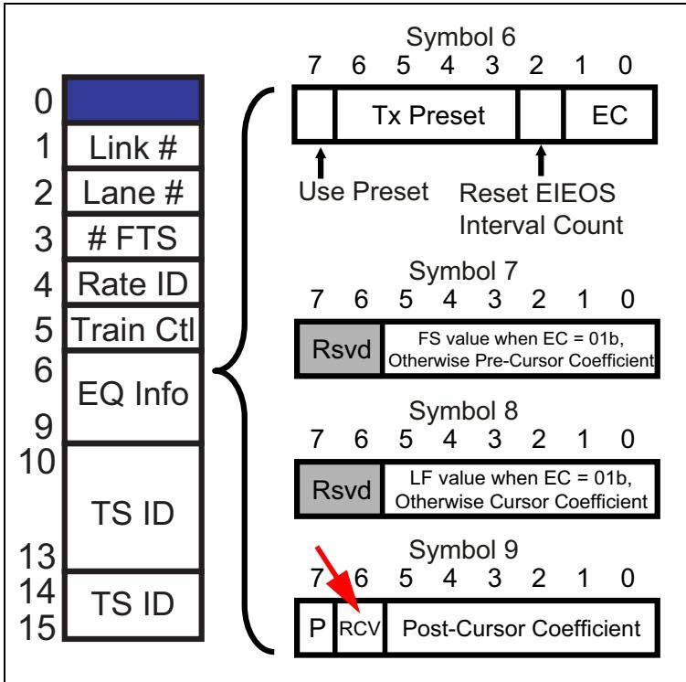

<table style="border-collapse:collapse; width:100%;">
  <thead>
    <tr>
      <th width="50%" style="border:1px solid #333; background:#f5f5f5;">EN</th>
      <th width="50%" style="border:1px solid #333; background-color:#e8e8e8;">中文</th>
    </tr>
  </thead>
  <tbody>
    <tr><td width="50%" style="border:1px solid #333; background:#fff;padding:4px 8px;">Phase 3 Downstream. During this phase, the Downstream Port sends TS1s with EC = 11b and begins the process of evaluating Upstream Tx settings independently for each Lane.</td><td width="50%" style="border:1px solid #333; background-color:#e8e8e8;padding:4px 8px;">阶段3下行。在此阶段，下游端口发送EC=11b的TS1序列，并开始独立评估每条通道的上游发送器设置。</td></tr>
    <tr><td width="50%" style="border:1px solid #333; background:#fff;padding:4px 8px;">In the transmitted TS1s, the Downstream Port can either request a new preset by setting the Use Preset bit to 1b and Tx Preset field to the desired value, or it can request new coefficients by clearing the Use Preset bit to 0b and setting the Pre-cursor, Cursor, and Post-Cursor Coefficient fields to the desired values. Either request must be made continuously for at least 1μs or until the evaluation has completed. If new preset or coefficient settings are going to be presented, they must be sent on all Lanes at the same time. However, a given Lane isn't required to request new settings if it wants to keep the ones it has.</td><td width="50%" style="border:1px solid #333; background-color:#e8e8e8;padding:4px 8px;">在发送的TS1序列中，下游端口可以请求新预置（设置使用预置位为1b，Tx预置字段为目标值），也可以请求新系数（清除使用预置位为0b，并设置预光标系数、光标系数和后光标系数字段为目标值）。任一请求必须持续发送至少1微秒，或直至评估完成。如果要呈现新的预置或系数设置，必须在所有通道上同时发送。但如果某通道希望保留现有设置，则无需请求新设置。</td></tr>
    <tr><td width="50%" style="border:1px solid #333; background:#fff;padding:4px 8px;">The Downstream Port must wait long enough to ensure the Upstream Transmitter has had a chance to implement the requested changes, (500ns plus the round-trip delay for the logic), then obtain Block Alignment and evaluate the incoming TS1s. It's not expected that anything useful will be coming from the Upstream Port during the waiting period, and it may not even be legal. That's why obtaining Block Alignment after that time is a requirement.</td><td width="50%" style="border:1px solid #333; background-color:#e8e8e8;padding:4px 8px;">下游端口必须等待足够长时间，以确保上游发送器有机会实施所请求的更改（500纳秒加上逻辑往返延迟），然后获得块对齐并评估接收到的TS1序列。在等待期间，预期上游端口不会发送任何有用信息，甚至可能不符合规范。这就是为什么之后需要获得块对齐的原因。</td></tr>
    <tr><td width="50%" style="border:1px solid #333; background:#fff;padding:4px 8px;">If two consecutive TS1s are seen that match the same preset or coefficient values that are being requested and don't have the Reject Coefficient Values bit set, then the requested setting was accepted and can be evaluated. If the values match but the Reject Coefficient Values bit is set to 1b, then the requested values have been rejected by the Upstream Port and are not being used. For this case, the spec recommends that the Downstream Port try again with different values but it's not required to do so and may choose to simply exit this phase.</td><td width="50%" style="border:1px solid #333; background-color:#e8e8e8;padding:4px 8px;">如果观察到两个连续的TS1序列与所请求的预置或系数值匹配，且拒绝系数值位未置位，则表示所请求的设置已被接受并可进行评估。如果值匹配但拒绝系数值位置位为1b，则表示所请求的值已被上游端口拒绝且未被使用。对于这种情况，规范建议下游端口尝试其他值，但并非必须如此，也可以选择直接退出此阶段。</td></tr>
    <tr><td width="50%" style="border:1px solid #333; background:#fff;padding:4px 8px;">The total time spent on a preset or coefficient request, from the time the request is sent until the completion of its evaluation must be less than 2ms. An exception is available for designs that need more time for the final stage of optimization, but the total time in this phase cannot exceed 24ms and the exception can only be taken twice. If the Receiver doesn't recognize any incoming TS1s, it may assume that the requested setting doesn't work for that Lane.</td><td width="50%" style="border:1px solid #333; background-color:#e8e8e8;padding:4px 8px;">预置或系数请求所花费的总时间（从发送请求到完成评估）必须小于2毫秒。对于需要更多时间进行最后阶段优化的设计，可以有例外，但此阶段的总时间不能超过24毫秒，且例外只能使用两次。如果接收器无法识别任何传入的TS1序列，则可以假定所请求的设置对该通道无效。</td></tr>
  </tbody>
</table>

## Exit to "Detailed Recovery Substates" | 退出到 "Detailed Recovery Substates"

<table style="border-collapse:collapse; width:100%;">
  <thead>
    <tr>
      <th width="50%" style="border:1px solid #333; background:#f5f5f5;">EN</th>
      <th width="50%" style="border:1px solid #333; background-color:#e8e8e8;">中文</th>
    </tr>
  </thead>
  <tbody>
    <tr><td width="50%" style="border:1px solid #333; background:#fff;padding:4px 8px;">The next state will be Recovery.RcvrLock when all configured Lanes have their optimal settings. When that happens, the Equalization Phase 3 Successful and Equalization Complete status bits will be set to 1b.</td><td width="50%" style="border:1px solid #333; background-color:#e8e8e8;padding:4px 8px;">当所有已配置的通道均达到其最优设置时，下一状态将为 Recovery.RcvrLock。此时，均衡阶段3成功和均衡完成状态位将被置为1b。</td></tr>
  </tbody>
</table>

## PCI Express Technology | PCI Express 技术

<table style="border-collapse:collapse; width:100%;">
  <thead>
    <tr>
      <th width="50%" style="border:1px solid #333; background:#f5f5f5;">EN</th>
      <th width="50%" style="border:1px solid #333; background-color:#e8e8e8;">中文</th>
    </tr>
  </thead>
  <tbody>
    <tr><td width="50%" style="border:1px solid #333; background:#fff;padding:4px 8px;">Exit to "Recovery.Speed"</td><td width="50%" style="border:1px solid #333; background-color:#e8e8e8;padding:4px 8px;">退出到"Recovery.Speed"</td></tr>
    <tr><td width="50%" style="border:1px solid #333; background:#fff;padding:4px 8px;">Otherwise, after a 24ms timeout (with a tolerance of -0 or +2ms), the next state will be Recovery.Speed, and the successful_speed_negotiation flag is cleared to 0b while the Equalization Complete status bit is set to 1b.</td><td width="50%" style="border:1px solid #333; background-color:#e8e8e8;padding:4px 8px;">否则，经过24ms超时（容差为-0或+2ms）后，下一个状态将是Recovery.Speed，并且successful_speed_negotiation标志清零为0b，而Equalization Complete状态位置位为1b。</td></tr>
  </tbody>
</table>

## Upstream Lanes | 上游通道

<table style="border-collapse:collapse; width:100%;">
  <thead>
    <tr>
      <th width="50%" style="border:1px solid #333; background:#f5f5f5;">EN</th>
      <th width="50%" style="border:1px solid #333; background-color:#e8e8e8;">中文</th>
    </tr>
  </thead>
  <tbody>
    <tr><td width="50%" style="border:1px solid #333; background:#fff;padding:4px 8px;">The Upstream Port starts in Phase 0 of the equalization process and must reset several internal bits. In the Link Status 2 register (Figure 14-36 on page 588), the following bits are cleared when entering this substate:</td><td width="50%" style="border:1px solid #333; background-color:#e8e8e8;padding:4px 8px;">上行端口从均衡过程的阶段0开始，必须复位多个内部位。在Link Status 2寄存器（第588页图14-36）中，进入此子状态时清除以下位：</td></tr>
    <tr><td width="50%" style="border:1px solid #333; background:#fff;padding:4px 8px;">- Equalization Phase 1 Successful</td><td width="50%" style="border:1px solid #333; background-color:#e8e8e8;padding:4px 8px;">- 均衡阶段1成功</td></tr>
    <tr><td width="50%" style="border:1px solid #333; background:#fff;padding:4px 8px;">- Equalization Phase 2 Successful</td><td width="50%" style="border:1px solid #333; background-color:#e8e8e8;padding:4px 8px;">- 均衡阶段2成功</td></tr>
    <tr><td width="50%" style="border:1px solid #333; background:#fff;padding:4px 8px;">- Equalization Phase 3 Successful</td><td width="50%" style="border:1px solid #333; background-color:#e8e8e8;padding:4px 8px;">- 均衡阶段3成功</td></tr>
    <tr><td width="50%" style="border:1px solid #333; background:#fff;padding:4px 8px;">- Link Equalization Request</td><td width="50%" style="border:1px solid #333; background-color:#e8e8e8;padding:4px 8px;">- 链路均衡请求</td></tr>
    <tr><td width="50%" style="border:1px solid #333; background:#fff;padding:4px 8px;">- Equalization Complete</td><td width="50%" style="border:1px solid #333; background-color:#e8e8e8;padding:4px 8px;">- 均衡完成</td></tr>
    <tr><td width="50%" style="border:1px solid #333; background:#fff;padding:4px 8px;">The Perform Equalization bit of the Link Control 3 register is also cleared to 0b as is the internal variable start\_equalization\_w\_preset. The equalization\_done\_8GT\_data\_rate variable is set to 1b.</td><td width="50%" style="border:1px solid #333; background-color:#e8e8e8;padding:4px 8px;">Link Control 3寄存器的Perform Equalization位也被清零为0b，内部变量start\_equalization\_w\_preset同样被清零。变量equalization\_done\_8GT\_data\_rate被设置为1b。</td></tr>
    <tr><td width="50%" style="border:1px solid #333; background:#fff;padding:4px 8px;">Phase 0 Upstream. During this phase, the Upstream Port sends TS1s with EC = 00b while using the Tx Preset values that were delivered in the EQ TS2s before entering this state. The equalization information fields in the TS1s being sent must show the preset value and also the Pre-cursor, Cursor, and Post-cursor coefficient fields that correspond to that preset. Note that if a Lane received a reserved or unsupported Tx Preset value in the EQ TS2s, or no EQ TS2s at all, then the Tx Preset field and coefficient values are chosen by a device-specific method for that Lane.</td><td width="50%" style="border:1px solid #333; background-color:#e8e8e8;padding:4px 8px;">阶段0上行。在此阶段，上行端口发送EC = 00b的TS1，同时使用进入此状态前在EQ TS2中传递的Tx Preset值。所发送TS1中的均衡信息字段必须显示预置值以及与该预置对应的Pre-cursor、Cursor和Post-cursor系数字段。需要注意的是，如果某通道在EQ TS2中收到保留或不支持的Tx Preset值，或者根本没有收到EQ TS2，则该通道的Tx Preset字段和系数值由设备特定的方法选择。</td></tr>
  </tbody>
</table>

## Exit to "Phase 1 Upstream" | 退出到 "Phase 1 Upstream"

<table style="border-collapse:collapse; width:100%;">
  <thead>
    <tr>
      <th width="50%" style="border:1px solid #333; background:#f5f5f5;">EN</th>
      <th width="50%" style="border:1px solid #333; background-color:#e8e8e8;">中文</th>
    </tr>
  </thead>
  <tbody>
    <tr><td width="50%" style="border:1px solid #333; background:#fff;padding:4px 8px;">## Exit to "Phase 1 Upstream"</td><td width="50%" style="border:1px solid #333; background-color:#e8e8e8;padding:4px 8px;">## 退出至"Phase 1 Upstream"</td></tr>
    <tr><td width="50%" style="border:1px solid #333; background:#fff;padding:4px 8px;">When all configured Lanes receive two consecutive TS1s with EC = 01b, indicating that they can recognize the TS1s from the Downstream Port which always starts with this value, then the next phase is Phase 1.</td><td width="50%" style="border:1px solid #333; background-color:#e8e8e8;padding:4px 8px;">当所有已配置通道接收到两个连续的 EC = 01b 的 TS1，表明它们能够识别来自下游端口的 TS1（下游端口始终以此值开始），则下一阶段为 Phase 1。</td></tr>
    <tr><td width="50%" style="border:1px solid #333; background:#fff;padding:4px 8px;">The equalization values LF and FS that are received in the TS1s must be stored and used during Phase 2 if the Upstream Port plans to adjust the Downstream Port's Tx coefficients.</td><td width="50%" style="border:1px solid #333; background-color:#e8e8e8;padding:4px 8px;">TS1 中接收到的均衡值 LF 和 FS 必须存储，并在 Phase 2 中用于上游端口计划调整下游端口发送系数的情况。</td></tr>
    <tr><td width="50%" style="border:1px solid #333; background:#fff;padding:4px 8px;">Upstream Port may wait 500ns after entering Phase 0 before evaluating the incoming TS1s to give time for its Receiver logic to stabilize.</td><td width="50%" style="border:1px solid #333; background-color:#e8e8e8;padding:4px 8px;">上游端口可在进入 Phase 0 后等待 500ns，然后再评估传入的 TS1，以便其接收器逻辑有时间稳定。</td></tr>
    <tr><td width="50%" style="border:1px solid #333; background:#fff;padding:4px 8px;">Exit to "Recovery.Speed"</td><td width="50%" style="border:1px solid #333; background-color:#e8e8e8;padding:4px 8px;">退出至"Recovery.Speed"</td></tr>
    <tr><td width="50%" style="border:1px solid #333; background:#fff;padding:4px 8px;">If incoming TS1s are not recognized within a 12ms timeout, the LTSSM will transition to Recovery.Speed, clear the successful\_speed\_negotiation flag and set the Equalization Complete status bit.</td><td width="50%" style="border:1px solid #333; background-color:#e8e8e8;padding:4px 8px;">如果在 12ms 超时内未识别到传入的 TS1，则 LTSSM 将转换至 Recovery.Speed，清除 successful\_speed\_negotiation 标志并设置均衡完成状态位。</td></tr>
    <tr><td width="50%" style="border:1px solid #333; background:#fff;padding:4px 8px;">Phase 1 Upstream. During this phase, the Upstream Port send TS1s with EC = 01b while using the Transmitter settings that were determined in Phase 0. These TS1s contain the FS, LF, and Post‑cursor Coefficient values with what is currently being used.</td><td width="50%" style="border:1px solid #333; background-color:#e8e8e8;padding:4px 8px;">Phase 1 Upstream。在此阶段，上游端口发送 EC = 01b 的 TS1，同时使用 Phase 0 中确定的发送器设置。这些 TS1 包含当前正在使用的 FS、LF 和后游标系数值。</td></tr>
    <tr><td width="50%" style="border:1px solid #333; background:#fff;padding:4px 8px;">Exit to "Phase 2 Upstream"</td><td width="50%" style="border:1px solid #333; background-color:#e8e8e8;padding:4px 8px;">退出至"Phase 2 Upstream"</td></tr>
    <tr><td width="50%" style="border:1px solid #333; background:#fff;padding:4px 8px;">If all configured Lanes receive two consecutive TS1s with EC = 10b, indicating that the Downstream Port wants to go to Phase 2, then the next phase will be Phase 2, and this Port will set the Equalization Phase 1 Successful status bit.</td><td width="50%" style="border:1px solid #333; background-color:#e8e8e8;padding:4px 8px;">如果所有已配置通道接收到两个连续的 EC = 10b 的 TS1，表明下游端口希望进入 Phase 2，则下一阶段将为 Phase 2，且该端口将设置 Phase 1 均衡成功状态位。</td></tr>
  </tbody>
</table>

| English | 中文 |
|----|----|
| ## Exit to "Detailed Recovery Substates" | ## 退出到"详细恢复子状态" |
| If all configured Lanes receive two consecutive TS1s with EC = 00b, it means that the Downstream Port has decided that the equalization process is already complete and it wants to skip the remaining phases. In this case, the next state will be Recovery.RcvrLock, and the Equalization Phase 1 Successful and Equalization Complete status bits are set to 1b. | 如果所有已配置的通道接收到两个连续的 EC = 00b 的 TS1，则表示下游端口已决定均衡过程已经完成，并且希望跳过剩余阶段。在这种情况下，下一个状态将是 Recovery.RcvrLock，并且 Equalization Phase 1 Successful 和 Equalization Complete 状态位将被设置为 1b。 |

<table style="border-collapse:collapse; width:100%;">
  <thead>
    <tr>
      <th width="50%" style="border:1px solid #333; background:#f5f5f5;">EN</th>
      <th width="50%" style="border:1px solid #333; background-color:#e8e8e8;">中文</th>
    </tr>
  </thead>
  <tbody>
    <tr><td width="50%" style="border:1px solid #333; background:#fff;padding:4px 8px;">## Exit to "Recovery.Speed"</td><td width="50%" style="border:1px solid #333; background-color:#e8e8e8;padding:4px 8px;">## 退出至 "Recovery.Speed"</td></tr>
    <tr><td width="50%" style="border:1px solid #333; background:#fff;padding:4px 8px;">Otherwise, after a 12ms timeout, the LTSSM will transition to Recovery.Speed, clear the successful\_speed\_negotiation flag and set the Equalization Complete status bit.</td><td width="50%" style="border:1px solid #333; background-color:#e8e8e8;padding:4px 8px;">否则，在 12ms 超时后，LTSSM 将转换至 Recovery.Speed，清除 successful\_speed\_negotiation 标志并设置 Equalization Complete 状态位。</td></tr>
    <tr><td width="50%" style="border:1px solid #333; background:#fff;padding:4px 8px;">Phase 2 Upstream. During this phase, the Upstream Port sends TS1s with EC = 10b and begins the process of finding optimal Tx values for the Downstream Port. Recall that the settings are independently determined for each Lane. The process is as follows:</td><td width="50%" style="border:1px solid #333; background-color:#e8e8e8;padding:4px 8px;">Phase 2 Upstream。在此阶段，上游端口发送 EC = 10b 的 TS1，并开始为下游端口寻找最佳 Tx 值的过程。请注意，每个 Lane 的设置是独立确定的。过程如下：</td></tr>
    <tr><td width="50%" style="border:1px solid #333; background:#fff;padding:4px 8px;">In the transmitted TS1s, the Upstream Port can either request a new preset by putting a legal value in the Transmitter Preset field of the TS1s being sent and setting the Use Preset bit to 1b to tell the Downstream Port to begin using it. Or, request new coefficients by putting legal values in those fields and clearing the Use Preset bit to 0b so the Downstream Port will load them instead of the preset field. Once the request is made it must be repeated for at least 1μs or until the evaluation is complete. If new preset or coefficient settings are going to be presented, they must be sent on all Lanes at the same time. However, a given Lane isn't required to request new settings if it wants to keep the ones it has.</td><td width="50%" style="border:1px solid #333; background-color:#e8e8e8;padding:4px 8px;">在发送的 TS1 中，上游端口可通过以下任一方式请求新的预设：在发送的 TS1 的 Transmitter Preset 字段中放入合法值，并将 Use Preset 位设置为 1b，告知下游端口开始使用该预设；或者，请求新的系数：在这些字段中放入合法值并将 Use Preset 位清零为 0b，使下游端口加载这些系数而非预设字段。请求一旦发出，必须至少重复 1μs 或直到评估完成。如果要呈现新的预设或系数设置，必须在所有 Lane 上同时发送。不过，如果某个 Lane 希望保留其现有设置，则无需请求新设置。</td></tr>
    <tr><td width="50%" style="border:1px solid #333; background:#fff;padding:4px 8px;">The Upstream Port must wait long enough to ensure the Downstream Transmitter has had a chance to implement the requested changes, (500ns plus the round‑trip delay for the logic), then obtain Block Alignment and evaluate the incoming TS1s. It's not expected that anything useful will be coming from the Downstream Port during the waiting period, and it may not even be legal. That's why obtaining Block Alignment after that time is a requirement.</td><td width="50%" style="border:1px solid #333; background-color:#e8e8e8;padding:4px 8px;">上游端口必须等待足够长的时间以确保下游发送器有机会实现所请求的变更（500ns 加上逻辑的往返延迟），然后获取块对齐（Block Alignment）并评估接收到的 TS1。在等待期间，不应期望从下游端口收到任何有用信息，甚至可能不合法。这就是为何之后必须获取块对齐的原因。</td></tr>
    <tr><td width="50%" style="border:1px solid #333; background:#fff;padding:4px 8px;">When TS1s are received that contain the same equalization fields as are being sent and the Reject Coefficient Values bit is not set (0b), then the setting has been accepted and can now be evaluated. If the equalization fields match but the Reject Coefficient Values bit is set (1b), then the setting has been rejected. In that case the spec recommends that the Upstream Port request a different equalization setting, but this is not required.</td><td width="50%" style="border:1px solid #333; background-color:#e8e8e8;padding:4px 8px;">当接收到的 TS1 包含与正在发送的相同均衡字段，且 Reject Coefficient Values 位未置位（0b）时，表示该设置已被接受并可进行评估。如果均衡字段匹配但 Reject Coefficient Values 位置位（1b），则表示该设置已被拒绝。在这种情况下，规范建议上游端口请求不同的均衡设置，但这不是必需的。</td></tr>
    <tr><td width="50%" style="border:1px solid #333; background:#fff;padding:4px 8px;">The total time spent on a preset or coefficient request, from the time the request is sent until the completion of its evaluation must be less than 2ms. An exception is available for designs that need more time for the final stage of optimization, but the total time in this phase cannot exceed 24ms and the exception can only be taken twice. If the Receiver doesn't recognize any incoming TS1s, it may assume that the requested setting doesn't work for that Lane.</td><td width="50%" style="border:1px solid #333; background-color:#e8e8e8;padding:4px 8px;">预设或系数请求所花费的总时间——从请求发送到评估完成——必须小于 2ms。对于需要在最终优化阶段花费更多时间的设计，允许有例外，但此阶段的总时间不能超过 24ms，且该例外只能使用两次。如果接收器无法识别任何传入的 TS1，则可以认为所请求的设置对该 Lane 无效。</td></tr>
  </tbody>
</table>

| English | 中文 |
|----|----|
| ## Exit to "Phase 3 Upstream" | ## 退出至"阶段3上游" |
| The next phase is Phase 3 if all configured Lanes have their optimal settings. When that happens, the Equalization Phase 2 Successful status bit will be set to 1b. | 如果所有已配置的通道都已达到其最佳设置，则下一阶段为阶段3。此时，均衡阶段2成功(Equalization Phase 2 Successful)状态位将被置为1b。 |

<table style="border-collapse:collapse; width:100%;">
  <thead>
    <tr>
      <th width="50%" style="border:1px solid #333; background:#f5f5f5;">EN</th>
      <th width="50%" style="border:1px solid #333; background-color:#e8e8e8;">中文</th>
    </tr>
  </thead>
  <tbody>
    <tr><td width="50%" style="border:1px solid #333; background:#fff;padding:4px 8px;">## Exit to "Recovery.Speed"</td><td width="50%" style="border:1px solid #333; background-color:#e8e8e8;padding:4px 8px;">## 退出到"Recovery.Speed"</td></tr>
    <tr><td width="50%" style="border:1px solid #333; background:#fff;padding:4px 8px;">Otherwise, after a 24ms timeout (with a tolerance of -0 or +2ms), the next state will be Recovery.Speed, and the successful_speed_negotiation flag is cleared to 0b while the Equalization Complete status bit is set to 1b.</td><td width="50%" style="border:1px solid #333; background-color:#e8e8e8;padding:4px 8px;">否则，经过24ms超时（容差为-0或+2ms）后，下一个状态将是Recovery.Speed，并且successful_speed_negotiation标志被清零为0b，同时Equalization Complete状态位被设置为1b。</td></tr>
    <tr><td width="50%" style="border:1px solid #333; background:#fff;padding:4px 8px;">Phase 3 Upstream. During this phase, the Upstream Port sends TS1s with EC = 11b and responds to the requested Tx values from the Downstream Port.</td><td width="50%" style="border:1px solid #333; background-color:#e8e8e8;padding:4px 8px;">Phase 3 Upstream。在此阶段，上游端口发送EC = 11b的TS1序列，并响应来自下游端口请求的Tx值。</td></tr>
    <tr><td width="50%" style="border:1px solid #333; background:#fff;padding:4px 8px;">If two consecutive TS1s aren't seen, keep the current Tx preset and coefficient values. However, if two consecutive TS1s are received with EC = 11b (Downstream Port has entered Phase 3) either for the first time, or with different preset or coefficient values than the last time, and if the values requested are legal and supported, then change the Tx settings to use them within 500ns of the end of the second TS1 requesting them. The requested values must be reflected in the TS1s being sent back to the Upstream Port and clear the Reject Coefficient Values bit to 0b. Note that the change must not cause illegal voltages or parameters at the Transmitter for more than 1ns.</td><td width="50%" style="border:1px solid #333; background-color:#e8e8e8;padding:4px 8px;">如果未检测到连续两个TS1，则保持当前的Tx preset和系数值。但是，如果收到连续两个EC = 11b的TS1（下游端口已进入Phase 3），无论是首次收到，还是携带与上次不同的preset或系数值，并且所请求的值是合法且受支持的，则应在请求它们的第二个TS1结束后的500ns内更改Tx设置以使用这些值。请求的值必须反映在发回给上游端口的TS1中，并将拒绝系数值位（Reject Coefficient Values bit）清零为0b。注意，该更改不得导致发送器出现超过1ns的非法电压或参数。</td></tr>
    <tr><td width="50%" style="border:1px solid #333; background:#fff;padding:4px 8px;">If the requested preset or coefficients are illegal or not supported, don't change the Tx settings but reflect the received values in the TS1s being sent and set the Reject Coefficient Values bit to 1b (see Figure 14-38 on page 590).</td><td width="50%" style="border:1px solid #333; background-color:#e8e8e8;padding:4px 8px;">如果请求的preset或系数非法或不受支持，则不更改Tx设置，但将接收到的值反映在正在发送的TS1中，并将拒绝系数值位（Reject Coefficient Values bit）设置为1b（参见第590页图14-38）。</td></tr>
  </tbody>
</table>

## Exit to "Detailed Recovery Substates" | 退出到 "Detailed Recovery Substates"

<table style="border-collapse:collapse; width:100%;">
  <thead>
    <tr>
      <th width="50%" style="border:1px solid #333; background:#f5f5f5;">EN</th>
      <th width="50%" style="border:1px solid #333; background-color:#e8e8e8;">中文</th>
    </tr>
  </thead>
  <tbody>
    <tr><td width="50%" style="border:1px solid #333; background:#fff;padding:4px 8px;">When the Downstream Port is satisfied with the changes, it begins to send TS1s with EC = 00b, indicating a desire to finish the equalization process. When two consecutive TS1s like this are received, set the Equalization Phase 3 Successful and Equalization Complete status bits to 1b.</td><td width="50%" style="border:1px solid #333; background-color:#e8e8e8;padding:4px 8px;">当下游端口对变更满意时，它开始发送EC=00b的TS1，表示希望完成均衡过程。当连续收到两个这样的TS1时，将均衡阶段3成功和均衡完成状态位置为1b。</td></tr>
  </tbody>
</table>

## Exit to "Recovery.Speed" | 退出到 "Recovery.Speed"

<table style="border-collapse:collapse; width:100%;">
  <thead>
    <tr>
      <th width="50%" style="border:1px solid #333; background:#f5f5f5;">EN</th>
      <th width="50%" style="border:1px solid #333; background-color:#e8e8e8;">中文</th>
    </tr>
  </thead>
  <tbody>
    <tr><td width="50%" style="border:1px solid #333; background:#fff;padding:4px 8px;">If the above criteria are not met within a 32 ms timeout, the next state will be Recovery.Speed. The successful_speed_negotiation flag will be cleared to 0b and the Equalization Complete status bit will be set.</td><td width="50%" style="border:1px solid #333; background-color:#e8e8e8;padding:4px 8px;">如果在 32 ms 超时内未满足上述条件，则下一状态将为 Recovery.Speed。successful_speed_negotiation 标志将被清零为 0b，Equalization Complete 状态位将被置位。</td></tr>
  </tbody>
</table>

## Recovery.Speed | Recovery.Speed

<table style="border-collapse:collapse; width:100%;">
  <thead>
    <tr>
      <th width="50%" style="border:1px solid #333; background:#f5f5f5;">EN</th>
      <th width="50%" style="border:1px solid #333; background-color:#e8e8e8;">中文</th>
    </tr>
  </thead>
  <tbody>
    <tr><td width="50%" style="border:1px solid #333; background:#fff;padding:4px 8px;">When entering this substate, a device must enter Electrical Idle on its Transmitter and wait for its Receiver to enter Electrical Idle. After that, it must remain there for at least 800ns if the speed change succeeded (successful\_speed\_negotiation = 1b) or for at least 6μs if the speed change was not successful (successful\_speed\_negotiation = 0b), but not longer than an additional 1ms.</td><td width="50%" style="border:1px solid #333; background-color:#e8e8e8;padding:4px 8px;">进入此子状态时，设备必须在其发送器上进入电气空闲，并等待其接收器进入电气空闲。之后，若速度更改成功（successful\_speed\_negotiation = 1b），则必须保持至少800ns；若速度更改未成功（successful\_speed\_negotiation = 0b），则必须保持至少6μs，但不得超过额外的1ms。</td></tr>
    <tr><td width="50%" style="border:1px solid #333; background:#fff;padding:4px 8px;">An EIOS must be sent prior to entering this substate if the current rate is 2.5 GT/s or 8.0 GT/s, and two must be sent if the current rate is 5.0 GT/s. An Electrical Idle condition exists on a Lane when these EIOSs have been seen or when it is otherwise detected or inferred (as described in "Electrical Idle" on page 736).</td><td width="50%" style="border:1px solid #333; background-color:#e8e8e8;padding:4px 8px;">若当前速率为2.5 GT/s或8.0 GT/s，则进入此子状态前必须发送一个EIOS；若当前速率为5.0 GT/s，则必须发送两个EIOS。当这些EIOS已被观察到，或以其他方式检测或推断出电气空闲条件时（如第736页"电气空闲"所述），则该通道上存在电气空闲状态。</td></tr>
    <tr><td width="50%" style="border:1px solid #333; background:#fff;padding:4px 8px;">The operating frequency is only allowed to change after the Receiver Lanes have entered Electrical Idle. If the Link is already operating at the highest commonly-supported rate, the rate won't be changed even though this substate is executed.</td><td width="50%" style="border:1px solid #333; background-color:#e8e8e8;padding:4px 8px;">仅允许在接收器通道进入电气空闲后更改工作频率。若链路已在最高共同支持的速率下运行，则即使执行此子状态，也不会更改速率。</td></tr>
    <tr><td width="50%" style="border:1px solid #333; background:#fff;padding:4px 8px;">If the negotiated rate is 5.0 GT/s, the de-emphasis level must be selected based on the setting of the select\_deemphasis variable: if the variable is 0b, apply -6 dB de-emphasis, but if the variable is 1b, apply -3.5 dB de-emphasis instead.</td><td width="50%" style="border:1px solid #333; background-color:#e8e8e8;padding:4px 8px;">若协商速率为5.0 GT/s，则必须根据select\_deemphasis变量的设置选择去加重电平：若变量为0b，应用-6 dB去加重；若变量为1b，则应用-3.5 dB去加重。</td></tr>
    <tr><td width="50%" style="border:1px solid #333; background:#fff;padding:4px 8px;">Curiously, the DC common-mode voltage does not have to be maintained within spec limits during this substate.</td><td width="50%" style="border:1px solid #333; background-color:#e8e8e8;padding:4px 8px;">值得注意的是，在此子状态下，直流共模电压无需保持在规范限值内。</td></tr>
    <tr><td width="50%" style="border:1px solid #333; background:#fff;padding:4px 8px;">If this substate is entered after a successful speed negotiation (successful\_speed\_negotiation = 1b), Electrical Idle can be inferred as shown in Table 14-10 on page 596. The spec points out that this covers the case in which both Link partners have recognized incoming TS1s and TS2s, so their absence can be interpreted as an entry to Electrical Idle.</td><td width="50%" style="border:1px solid #333; background-color:#e8e8e8;padding:4px 8px;">若在成功的速度协商（successful\_speed\_negotiation = 1b）后进入此子状态，则可按第596页表14-10所示推断电气空闲。规范指出，这涵盖了链路双方均已识别到传入的TS1和TS2的情况，因此它们的缺失可被解释为进入电气空闲。</td></tr>
    <tr><td width="50%" style="border:1px solid #333; background:#fff;padding:4px 8px;">If this substate is entered after an unsuccessful speed negotiation (successful\_speed\_negotiation = 0b), Electrical Idle can be inferred if an Electrical Idle exit has not been detected at least once on any configured Lane in the specified time. This is intended to cover the case when at least one side of the Link is not able to recognize TS Ordered Sets, and so the lack of an exit from Electrical Idle over a longer interval can be treated as an entry to Electrical Idle.</td><td width="50%" style="border:1px solid #333; background-color:#e8e8e8;padding:4px 8px;">若在未成功的速度协商（successful\_speed\_negotiation = 0b）后进入此子状态，则在指定时间内任何已配置通道上至少未检测到一次电气空闲退出时，可推断为电气空闲。这旨在涵盖链路的至少一侧无法识别TS有序集的情况，因此较长时间间隔内未退出电气空闲可被视作进入电气空闲。</td></tr>
  </tbody>
</table>

Table 14-10: Conditions for Inferring Electrical Idle | 表14-10：推断电气空闲的条件

<table><tr><td>State</td><td>2.5 GT/s</td><td>5.0 GT/s</td><td>8.0 GT/s</td></tr><tr><td>L0</td><td>Absence of Flow Control Update DLLP or SOS in a 128μs window</td><td>Absence of Flow Control Update DLLP or SOS in a 128μs window</td><td>Absence of Flow Control Update DLLP or SOS in a 128μs window</td></tr><tr><td>Recovery.RcvrCfg</td><td>Absence of a TS1 or TS2 in a 1280 UI interval</td><td>Absence of a TS1 or TS2 in a 1280 UI interval</td><td>Absence of a TS1 or TS2 in a 4ms window</td></tr><tr><td>Recovery.Speed when successful_speed_neg otiation = 1b</td><td>Absence of a TS1 or TS2 in a 1280 UI interval</td><td>Absence of a TS1 or TS2 in a 1280 UI interval</td><td>Absence of a TS1 or TS2 in a 4680 interval</td></tr><tr><td>Recovery.Speed when successful_speed_neg otiation = 0b</td><td>Absence of an Electrical Idle exit in a 2000 UI interval</td><td>Absence of an Electrical Idle exit in a 16000 UI interval</td><td>Absence of an Electrical Idle exit in a 16000 UI interval</td></tr><tr><td>Loopback.Active (as a slave)</td><td>Absence of an Electrical Idle exit in a 128μs window</td><td>N/A</td><td>N/A</td></tr></table>

<table style="border-collapse:collapse; width:100%;">
  <thead>
    <tr>
      <th width="50%" style="border:1px solid #333; background:#f5f5f5;">EN</th>
      <th width="50%" style="border:1px solid #333; background-color:#e8e8e8;">中文</th>
    </tr>
  </thead>
  <tbody>
    <tr><td width="50%" style="border:1px solid #333; background:#fff;padding:4px 8px;">The directed\_speed\_change variable will be cleared to 0b and the new data rate must be visible in the Current Link Speed field of the Link Status register, shown in Figure 14-39.</td><td width="50%" style="border:1px solid #333; background-color:#e8e8e8;padding:4px 8px;">directed\_speed\_change变量将被清零为0b，并且新数据速率必须体现在链路状态寄存器的当前链路速率字段中，如图14-39所示。</td></tr>
    <tr><td width="50%" style="border:1px solid #333; background:#fff;padding:4px 8px;">If the speed was changed because of a Link bandwidth change:</td><td width="50%" style="border:1px solid #333; background-color:#e8e8e8;padding:4px 8px;">若因链路带宽更改而改变速度：</td></tr>
    <tr><td width="50%" style="border:1px solid #333; background:#fff;padding:4px 8px;">If successful\_speed\_negotiation is set to 1b and the Autonomous Change bit in the 8 consecutive TS2s is set to 1b, or the speed change was initiated by the Downstream Port for autonomous reasons (not a reliability problem and not caused by software setting the Link Retrain bit), then the Link Autonomous Bandwidth Status bit in the Link Status register is set to 1b.</td><td width="50%" style="border:1px solid #333; background-color:#e8e8e8;padding:4px 8px;">若successful\_speed\_negotiation设为1b且连续8个TS2中的自主更改位设为1b，或速度更改由下游端口因自主原因发起（非可靠性问题，也非软件设置链路重训练位所致），则链路状态寄存器中的链路自主带宽状态位置1b。</td></tr>
    <tr><td width="50%" style="border:1px solid #333; background:#fff;padding:4px 8px;">Otherwise, the Link Bandwidth Management Status bit is set to 1b.</td><td width="50%" style="border:1px solid #333; background-color:#e8e8e8;padding:4px 8px;">否则，链路带宽管理状态位置1b。</td></tr>
  </tbody>
</table>

Figure 14-39: Link Status Register | 图14-39：链路状态寄存器

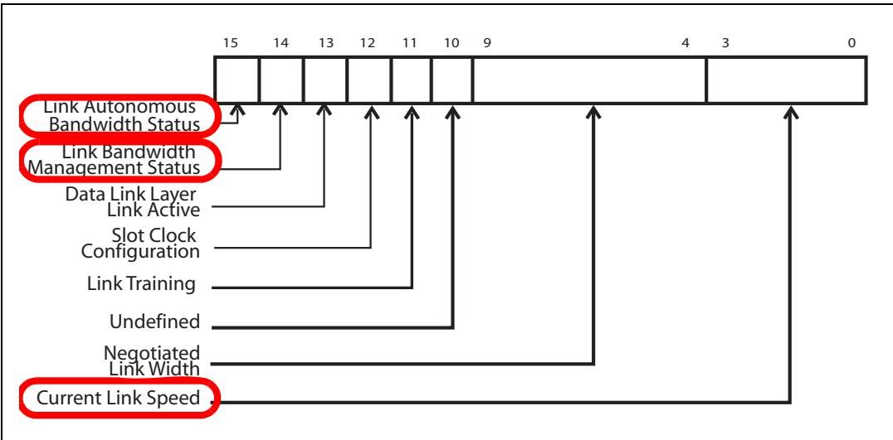

## Exit to "Detailed Recovery Substates" | 退出到 "Detailed Recovery Substates"

<table style="border-collapse:collapse; width:100%;">
  <thead>
    <tr>
      <th width="50%" style="border:1px solid #333; background:#f5f5f5;">EN</th>
      <th width="50%" style="border:1px solid #333; background-color:#e8e8e8;">中文</th>
    </tr>
  </thead>
  <tbody>
    <tr><td width="50%" style="border:1px solid #333; background:#fff;padding:4px 8px;">Once the timeout has expired, the next state will be Recovery.RcvrLock</td><td width="50%" style="border:1px solid #333; background-color:#e8e8e8;padding:4px 8px;">一旦超时到期，下一状态将是Recovery.RcvrLock</td></tr>
    <tr><td width="50%" style="border:1px solid #333; background:#fff;padding:4px 8px;">If this substate was entered from Recovery.RcvrCfg and the speed change was successful, the new data rate is changed on all the configured Lanes to the highest commonly-supported rate and the changed_speed_recovery variable is set to 1b.</td><td width="50%" style="border:1px solid #333; background-color:#e8e8e8;padding:4px 8px;">如果此子状态是从Recovery.RcvrCfg进入且速度更改成功，则所有已配置通道上的新数据速率将更改为最高共同支持的速率，并将changed_speed_recovery变量设置为1b。</td></tr>
    <tr><td width="50%" style="border:1px solid #333; background:#fff;padding:4px 8px;">If this substate was entered for a second time since entering Recovery from L0 or L1 (indicated by changed_speed_recovery = 1b), the new data rate will be the rate that was in use when the LTSSM entered Recovery, and the changed_speed_recovery variable is cleared to 0b.</td><td width="50%" style="border:1px solid #333; background-color:#e8e8e8;padding:4px 8px;">如果此子状态是自从L0或L1进入Recovery以来的第二次进入（由changed_speed_recovery = 1b指示），则新数据速率将为LTSSM进入Recovery时正在使用的速率，并且changed_speed_recovery变量被清除为0b。</td></tr>
    <tr><td width="50%" style="border:1px solid #333; background:#fff;padding:4px 8px;">Otherwise, the new data rate will revert to 2.5 GT/s and the changed_speed_recovery variable remains cleared to 0b. The spec notes that this represents the case when the rate in L0 was greater than 2.5 GT/s but one Link partner couldn't operate at that rate and timed out in Recovery.RcvrLock the first time through.</td><td width="50%" style="border:1px solid #333; background-color:#e8e8e8;padding:4px 8px;">否则，新数据速率将恢复为2.5 GT/s，changed_speed_recovery变量保持清除为0b。规范指出，这表示L0中的速率大于2.5 GT/s但某一链路伙伴无法以该速率运行并在第一次经过Recovery.RcvrLock时超时的情况。</td></tr>
  </tbody>
</table>

<table style="border-collapse:collapse; width:100%;">
  <thead>
    <tr>
      <th width="50%" style="border:1px solid #333; background:#f5f5f5;">EN</th>
      <th width="50%" style="border:1px solid #333; background-color:#e8e8e8;">中文</th>
    </tr>
  </thead>
  <tbody>
    <tr><td width="50%" style="border:1px solid #333; background:#fff;padding:4px 8px;">## Exit to "Detect State"</td><td width="50%" style="border:1px solid #333; background-color:#e8e8e8;padding:4px 8px;">## 退出到 "Detect" 状态</td></tr>
    <tr><td width="50%" style="border:1px solid #333; background:#fff;padding:4px 8px;">If none of the conditions for exiting to Recovery.RcvrLock are met, the next state will be Detect, although the spec points out that this shouldn't be possible under normal conditions. It would mean that the Link neighbors can no longer communicate at all.</td><td width="50%" style="border:1px solid #333; background-color:#e8e8e8;padding:4px 8px;">如果不满足退出到 Recovery.RcvrLock 的任何条件，则下一个状态将是 Detect，尽管规范指出在正常情况下这不应发生。这意味着链路双方将完全无法通信。</td></tr>
  </tbody>
</table>

## Recovery.RcvrCfg | Recovery.RcvrCfg

<table style="border-collapse:collapse; width:100%;">
  <thead>
    <tr>
      <th width="50%" style="border:1px solid #333; background:#f5f5f5;">EN</th>
      <th width="50%" style="border:1px solid #333; background-color:#e8e8e8;">中文</th>
    </tr>
  </thead>
  <tbody>
    <tr><td width="50%" style="border:1px solid #333; background:#fff;padding:4px 8px;">This state can only be entered from Recovery.RcvrLock after receiving at least 8 TS1 or TS2 ordered-sets with the same Link and Lane numbers that had been negotiated previously. This means that bit and symbol or block lock have been established and now the Port must determine if there are any other items that need addressed in the Recovery state. If the purpose of entering Recovery was simply to re-establish bit and symbol lock after leaving a link power management state, then it is likely that TS2s will be exchanged here and progress on to Recovery.Idle. If, however, there was another reason for entering the Recovery state (e.g. speed change or link width change), then that will be determined in this substate and the appropriate state transition will occur.</td><td width="50%" style="border:1px solid #333; background-color:#e8e8e8;padding:4px 8px;">该状态只能从 Recovery.RcvrLock 进入，前提是接收到至少 8 个具有先前协商的相同 Link 和 Lane 编号的 TS1 或 TS2 有序集。这意味着比特锁定和符号锁定或块锁定已经建立，现在端口必须确定是否还有其他项目需要在 Recovery 状态中处理。如果进入 Recovery 的目的是在离开链路电源管理状态后重新建立比特锁定和符号锁定，那么很可能在此处交换 TS2 并推进到 Recovery.Idle。然而，如果进入 Recovery 状态有其他原因（例如速率改变或链路宽度改变），则将在此子状态中确定，并发生相应的状态转换。</td></tr>
    <tr><td width="50%" style="border:1px solid #333; background:#fff;padding:4px 8px;">During this substate, the Transmitter sends TS2s on all configured Lanes with the same Link and Lane Numbers configured earlier. If the directed\_speed\_change variable is set to 1b, then the speed\_change bit in the TS2s must also be set. The N\_FTS value in the TS2s should reflect the number needed at the current rate. The start\_equalization\_w\_preset variable is cleared to 0b when entering this substate.</td><td width="50%" style="border:1px solid #333; background-color:#e8e8e8;padding:4px 8px;">在此子状态期间，发送器在所有已配置的 Lane 上发送 TS2，这些 TS2 具有先前配置的相同 Link 和 Lane 编号。如果 directed\_speed\_change 变量被设置为 1b，那么 TS2 中的 speed\_change 位也必须被设置。TS2 中的 N\_FTS 值应反映当前速率下所需的数量。进入此子状态时，start\_equalization\_w\_preset 变量被清除为 0b。</td></tr>
    <tr><td width="50%" style="border:1px solid #333; background:#fff;padding:4px 8px;">If the speed has been changed a different N\_FTS number may now be seen in the TS2s. That value must be used for exiting future L0s low-power Link states. For 8b/10b encoding, Lane-to-Lane de-skew must be completed before leaving this substate. Devices must note the advertised rate identifier in incoming TS2s and use this to override any previously-recorded values. When using 128b/130b encoding, devices must make a note of the value of the Request Equalization bit for future reference.</td><td width="50%" style="border:1px solid #333; background-color:#e8e8e8;padding:4px 8px;">如果速率已经改变，TS2 中可能会出现不同的 N\_FTS 数值。该值必须用于退出未来的 L0s 低功耗链路状态。对于 8b/10b 编码，在离开此子状态之前必须完成 Lane 间解偏斜。设备必须留意接收到的 TS2 中通告的速率标识符，并使用该标识符覆盖任何先前记录的值。当使用 128b/130b 编码时，设备必须记录 Request Equalization 位的数值以备将来参考。</td></tr>
    <tr><td width="50%" style="border:1px solid #333; background:#fff;padding:4px 8px;">Notes about this substate: The variable successful\_speed\_negotiation is set to 1b. The data rates advertised in the TS2s with the speed\_change bit set are noted at this point for future reference, as is the Autonomous Change bit for possible logging in the Link Status register during Recovery.Speed. The rate that will be selected in Recovery.Speed will be the highest commonly-supported rate. Interestingly, the change to Recovery.Speed will take place for this case even if the Link is already operating at the highest supported rate, although in that case the rate won't actually change.</td><td width="50%" style="border:1px solid #333; background-color:#e8e8e8;padding:4px 8px;">关于此子状态的说明：变量 successful\_speed\_negotiation 被设置为 1b。此时记录 TS2 中通告的设置了 speed\_change 位的数据速率以备将来参考，同样记录的还有 Autonomous Change 位，用于可能在 Recovery.Speed 期间记录到 Link Status 寄存器中。将在 Recovery.Speed 中选择的速率是最高共同支持的速率。有趣的是，即使链路已经在最高支持速率下运行，在此情况下也会发生到 Recovery.Speed 的转换，尽管在此情况下速率实际上不会改变。</td></tr>
    <tr><td width="50%" style="border:1px solid #333; background:#fff;padding:4px 8px;">If the speed is going to change to 8.0 GT/s, a Downstream Port will need to send EQ TS2s (bit 7 of Symbol 6 is set to 1b to indicate an EQ training sequence). This case would be recognized if 8.0 GT/s is mutually supported and 8 consecutive TS1s or TS2s have been seen on any configured Lane with the speed\_change bit set, or if the equalization\_done\_8GT\_data\_rate variable is 0b, or if directed.</td><td width="50%" style="border:1px solid #333; background-color:#e8e8e8;padding:4px 8px;">如果速率将更改为 8.0 GT/s，下游端口将需要发送 EQ TS2（Symbol 6 的位 7 被设置为 1b 以指示 EQ 训练序列）。如果双方都支持 8.0 GT/s，并且在任何已配置的 Lane 上看到 8 个连续的设置了 speed\_change 位的 TS1 或 TS2，或者如果 equalization\_done\_8GT\_data\_rate 变量为 0b，或者根据指示，则应识别此情况。</td></tr>
    <tr><td width="50%" style="border:1px solid #333; background:#fff;padding:4px 8px;">An Upstream Port can set the Request Equalization bit if the current data rate is 8.0 GT/s and there was a problem with the equalization process. Either Port can request equalization be done again by setting both the Request Equalization and Quiesce Guarantee bits to 1b.</td><td width="50%" style="border:1px solid #333; background-color:#e8e8e8;padding:4px 8px;">如果当前数据速率为 8.0 GT/s 且均衡过程出现问题，上游端口可以设置 Request Equalization 位。任一端口可以通过将 Request Equalization 位和 Quiesce Guarantee 位同时设置为 1b 来请求重新进行均衡。</td></tr>
    <tr><td width="50%" style="border:1px solid #333; background:#fff;padding:4px 8px;">Upstream Ports set their select\_deemphasis variable based on the Selectable Deemphasis bit in the received TS2s. And, if the TS2s were EQ TS2s, they set the start\_equalization\_w\_preset variable to 1b and update their Lane Equalization register with the new information (i.e.: update the Upstream Port Transmitter Preset and Receiver Preset Hint fields in the register). Any configured Lanes that don't receive EQ TS2s will choose their preset values for 8.0 GT/s operation in a design-specific manner. Downstream Ports must set their start\_equalization\_w\_preset variable to 1b if the equalization\_done\_8GT\_data\_rate variable is cleared to 0b or if directed.</td><td width="50%" style="border:1px solid #333; background-color:#e8e8e8;padding:4px 8px;">上游端口根据接收到的 TS2 中的 Selectable Deemphasis 位设置其 select\_deemphasis 变量。并且，如果 TS2 是 EQ TS2，它们将 start\_equalization\_w\_preset 变量设置为 1b，并用新信息更新其 Lane Equalization 寄存器（即：更新寄存器中的 Upstream Port Transmitter Preset 和 Receiver Preset Hint 字段）。任何未接收到 EQ TS2 的已配置 Lane 将以设计特定方式选择其用于 8.0 GT/s 操作的预置值。如果 equalization\_done\_8GT\_data\_rate 变量被清除为 0b 或根据指示，下游端口必须将其 start\_equalization\_w\_preset 变量设置为 1b。</td></tr>
    <tr><td width="50%" style="border:1px solid #333; background:#fff;padding:4px 8px;">Finally, if 128b/130b encoding is in use, devices must make a note of the Request Equalization bit. If set, both it and the Quiesce Guarantee bit must be stored for future reference.</td><td width="50%" style="border:1px solid #333; background-color:#e8e8e8;padding:4px 8px;">最后，如果使用 128b/130b 编码，设备必须记录 Request Equalization 位。如果该位被设置，则必须将其和 Quiesce Guarantee 位一起存储以备将来参考。</td></tr>
  </tbody>
</table>

## Exit to "Recovery.Idle" | 退出到 "Recovery.Idle"

<table style="border-collapse:collapse; width:100%;">
  <thead>
    <tr>
      <th width="50%" style="border:1px solid #333; background:#f5f5f5;">EN</th>
      <th width="50%" style="border:1px solid #333; background-color:#e8e8e8;">中文</th>
    </tr>
  </thead>
  <tbody>
    <tr><td width="50%" style="border:1px solid #333; background:#fff;padding:4px 8px;">## Exit to "Recovery.Idle"</td><td width="50%" style="border:1px solid #333; background-color:#e8e8e8;padding:4px 8px;">## 退出至 "Recovery.Idle"</td></tr>
    <tr><td width="50%" style="border:1px solid #333; background:#fff;padding:4px 8px;">The next state will be Recovery.Idle if two conditions are true:</td><td width="50%" style="border:1px solid #333; background-color:#e8e8e8;padding:4px 8px;">若满足以下两个条件，下一个状态将为 Recovery.Idle：</td></tr>
    <tr><td width="50%" style="border:1px solid #333; background:#fff;padding:4px 8px;">Eight consecutive TS2s are received on any configured Lane with Link and Lane numbers and rate identifiers that match those being sent and either:</td><td width="50%" style="border:1px solid #333; background-color:#e8e8e8;padding:4px 8px;">在任何已配置通道上接收到八个连续的 TS2，其链路号和通道号以及速率标识符与正在发送的相匹配，并且满足以下任一条件：</td></tr>
    <tr><td width="50%" style="border:1px solid #333; background:#fff;padding:4px 8px;">a) The speed\_change bit in the TS2s is cleared to 0b, or</td><td width="50%" style="border:1px solid #333; background-color:#e8e8e8;padding:4px 8px;">a) TS2 中的 speed\_change 位被清零为 0b，或</td></tr>
    <tr><td width="50%" style="border:1px solid #333; background:#fff;padding:4px 8px;">b) No rate higher than 2.5 GT/s is commonly supported.</td><td width="50%" style="border:1px solid #333; background-color:#e8e8e8;padding:4px 8px;">b) 没有共同支持的高于 2.5 GT/s 的速率。</td></tr>
    <tr><td width="50%" style="border:1px solid #333; background:#fff;padding:4px 8px;">Sixteen TS2 have been sent after receiving one and they haven't been interrupted by any intervening EIEOS. The changed\_speed\_recovery and directed\_speed\_change variables are both cleared to 0b on entry to this substate.</td><td width="50%" style="border:1px solid #333; background-color:#e8e8e8;padding:4px 8px;">在收到一个 TS2 后已发送了十六个 TS2，且它们未被任何插入的 EIEOS 中断。进入此子状态时，changed\_speed\_recovery 和 directed\_speed\_change 变量均被清零为 0b。</td></tr>
  </tbody>
</table>

## Exit to "Recovery.Speed" | 退出到 "Recovery.Speed"

<table style="border-collapse:collapse; width:100%;">
  <thead>
    <tr>
      <th width="50%" style="border:1px solid #333; background:#f5f5f5;">EN</th>
      <th width="50%" style="border:1px solid #333; background-color:#e8e8e8;">中文</th>
    </tr>
  </thead>
  <tbody>
    <tr><td width="50%" style="border:1px solid #333; background:#fff;padding:4px 8px;">The LTSSM will go to Recovery.Speed if ALL three conditions listed below are true:</td><td width="50%" style="border:1px solid #333; background-color:#e8e8e8;padding:4px 8px;">若以下所有三个条件均成立，LTSSM将进入Recovery.Speed：</td></tr>
    <tr><td width="50%" style="border:1px solid #333; background:#fff;padding:4px 8px;">Eight consecutive TS2s are received on any configured Lane with the speed_change bit set, identical rate identifiers, identical values in Symbol 6, and:</td><td width="50%" style="border:1px solid #333; background-color:#e8e8e8;padding:4px 8px;">在任何已配置通道上接收到八个连续的TS2序列，其speed_change位置位、速率标识符相同、符号6中的值相同，并且：</td></tr>
    <tr><td width="50%" style="border:1px solid #333; background:#fff;padding:4px 8px;">a) The TS2s were standard 8b/10b TS2s, or</td><td width="50%" style="border:1px solid #333; background-color:#e8e8e8;padding:4px 8px;">a) 这些TS2序列是标准的8b/10b TS2序列，或</td></tr>
    <tr><td width="50%" style="border:1px solid #333; background:#fff;padding:4px 8px;">b) The TS2s were EQ TS2s, or</td><td width="50%" style="border:1px solid #333; background-color:#e8e8e8;padding:4px 8px;">b) 这些TS2序列是EQ TS2s，或</td></tr>
    <tr><td width="50%" style="border:1px solid #333; background:#fff;padding:4px 8px;">c) 1ms has expired since receiving eight EQ TS2s on any configured Lane.</td><td width="50%" style="border:1px solid #333; background-color:#e8e8e8;padding:4px 8px;">c) 自任何已配置通道上接收到八个EQ TS2s以来已超过1毫秒。</td></tr>
    <tr><td width="50%" style="border:1px solid #333; background:#fff;padding:4px 8px;">Both Link partners support rates higher than 2.5 GT/s, or the rate is already higher than 2.5 GT/s.</td><td width="50%" style="border:1px solid #333; background-color:#e8e8e8;padding:4px 8px;">两个链路伙伴都支持高于2.5 GT/s的速率，或者当前速率已高于2.5 GT/s。</td></tr>
    <tr><td width="50%" style="border:1px solid #333; background:#fff;padding:4px 8px;">For 8b/10b encoding, at least 32 TS2s were sent with the speed_change bit set to 1b without any intervening EIEOS after receiving one TS2 with the speed_change bit set to 1b in the same configured Lane. For 128b/130b encoding, at least 128 TS2s are sent with the speed_change bit set to 1b after receiving one TS2 with the speed_change bit set to 1b in the same configured Lane.</td><td width="50%" style="border:1px solid #333; background-color:#e8e8e8;padding:4px 8px;">对于8b/10b编码，在同一已配置通道上接收到一个speed_change位置为1b的TS2后，至少发送了32个speed_change位置为1b的TS2序列且中间无EIEOS插入。对于128b/130b编码，在同一已配置通道上接收到一个speed_change位置为1b的TS2后，至少发送了128个speed_change位置为1b的TS2序列。</td></tr>
    <tr><td width="50%" style="border:1px solid #333; background:#fff;padding:4px 8px;">A transition to Recovery.Speed can also occur if the rate has changed to a mutually negotiated rate since entering Recovery from L0 or L1 (changed_speed_recovery = 1b) and any configured Lanes have either seen EIOS or detected/inferred Electrical Idle and haven't seen TS2s since entering this substate. This means a higher rate was attempted but the Link partner indicates that it isn't working for some reason. The new rate will return to whatever it was when Recovery was entered from L0 or L1.</td><td width="50%" style="border:1px solid #333; background-color:#e8e8e8;padding:4px 8px;">如果自从L0或L1进入Recovery以来速率已更改为双方协商的速率（changed_speed_recovery = 1b），且任何已配置通道已看到EIOS或检测到/推断出电气空闲，且在进入此子状态后未看到TS2序列，则也可发生到Recovery.Speed的转换。这意味着曾尝试更高的速率，但链路伙伴指示该速率因某种原因无法正常工作。新速率将恢复为从L0或L1进入Recovery时的速率。</td></tr>
    <tr><td width="50%" style="border:1px solid #333; background:#fff;padding:4px 8px;">The final case that can cause a transition to Recovery.Speed is if the rate has not changed to a mutually negotiated rate since entering Recovery from L0 or L1 (changed_speed_recovery = 0b), and the current rate is already higher than 2.5 GT/s, and any configured Lanes have either seen EIOS or detected/inferred Electrical Idle and haven't seen TS2s since entering this substate. In this case, the understanding is that the current rate isn't working and the solution is to drop back down, so the new rate will become 2.5 GT/s.</td><td width="50%" style="border:1px solid #333; background-color:#e8e8e8;padding:4px 8px;">最后一种可能导致转换到Recovery.Speed的情况是：自从L0或L1进入Recovery以来速率未更改为双方协商的速率（changed_speed_recovery = 0b），且当前速率已高于2.5 GT/s，且任何已配置通道已看到EIOS或检测到/推断出电气空闲，且在进入此子状态后未看到TS2序列。在这种情况下，表明当前速率无法正常工作，解决方案是降回较低速率，因此新速率将变为2.5 GT/s。</td></tr>
  </tbody>
</table>

## Exit to "Configuration State" | 退出到 "Configuration 状态"

<table style="border-collapse:collapse; width:100%;">
  <thead>
    <tr>
      <th width="50%" style="border:1px solid #333; background:#f5f5f5;">EN</th>
      <th width="50%" style="border:1px solid #333; background-color:#e8e8e8;">中文</th>
    </tr>
  </thead>
  <tbody>
    <tr><td width="50%" style="border:1px solid #333; background:#fff;padding:4px 8px;">The next state will be Configuration if 8 consecutive TS1s are received on any configured Lane with Link or Lane numbers that don't match those being sent and either the speed_change bit is cleared to 0b, or no rate higher than 2.5 GT/s is commonly supported.</td><td width="50%" style="border:1px solid #333; background-color:#e8e8e8;padding:4px 8px;">如果在任意已配置的 Lane 上接收到 8 个连续的 TS1，且其 Link 或 Lane 编号与正在发送的不匹配，并且要么 speed_change 位被清除为 0b，要么双方不支持高于 2.5 GT/s 的速率，则下一个状态将为 Configuration。</td></tr>
    <tr><td width="50%" style="border:1px solid #333; background:#fff;padding:4px 8px;">The variables changed_speed_recovery and directed_speed_change are cleared to 0b when the LTSSM transitions to Configuration. If the N_FTS value has changed since last time, the new value must be used for L0s going forward.</td><td width="50%" style="border:1px solid #333; background-color:#e8e8e8;padding:4px 8px;">当 LTSSM 转换到 Configuration 时，变量 changed_speed_recovery 和 directed_speed_change 被清除为 0b。如果 N_FTS 值自上次以来已发生变化，则后续在 L0s 中必须使用新值。</td></tr>
  </tbody>
</table>

<table style="border-collapse:collapse; width:100%;">
  <thead>
    <tr>
      <th width="50%" style="border:1px solid #333; background:#f5f5f5;">EN</th>
      <th width="50%" style="border:1px solid #333; background-color:#e8e8e8;">中文</th>
    </tr>
  </thead>
  <tbody>
    <tr><td width="50%" style="border:1px solid #333; background:#fff;padding:4px 8px;">## Exit to "Detect State"</td><td width="50%" style="border:1px solid #333; background-color:#e8e8e8;padding:4px 8px;">## 退出到Detect状态</td></tr>
    <tr><td width="50%" style="border:1px solid #333; background:#fff;padding:4px 8px;">After 48ms without resolving to one of the previously-defined state transitions, the next state will be Detect if the data rate is 2.5 GT/s or 5.0 GT/s.</td><td width="50%" style="border:1px solid #333; background-color:#e8e8e8;padding:4px 8px;">如果在48ms内未能解析到先前定义的任一状态转换，且数据速率为2.5 GT/s或5.0 GT/s，则下一状态将为Detect。</td></tr>
    <tr><td width="50%" style="border:1px solid #333; background:#fff;padding:4px 8px;">If the rate is 8.0 GT/s there is another possibility because the number of attempts may not have been exceeded yet. That is indicated by the idle\_to\_rlock\_transitioned variable, and if it's less than FFh when the rate is 8.0 GT/s, the new state will be "Recovery.Idle". If that transition is made, the variables changed\_speed\_recovery and directed\_speed\_change will be cleared to 0b. However, once idle\_to\_rlock\_transitioned reaches FFh, and the 48ms timeout is seen, the next state will be Detect.</td><td width="50%" style="border:1px solid #333; background-color:#e8e8e8;padding:4px 8px;">如果速率为8.0 GT/s，则存在另一种可能性，因为尝试次数可能尚未超限。这由idle\_to\_rlock\_transitioned变量指示；当速率为8.0 GT/s且该值小于FFh时，新状态将为"Recovery.Idle"。若发生该转换，变量changed\_speed\_recovery和directed\_speed\_change将被清零为0b。然而，一旦idle\_to\_rlock\_transitioned达到FFh，并观察到48ms超时，下一状态将为Detect。</td></tr>
  </tbody>
</table>

<table style="border-collapse:collapse; width:100%;">
  <thead>
    <tr>
      <th width="50%" style="border:1px solid #333; background:#f5f5f5;">EN</th>
      <th width="50%" style="border:1px solid #333; background-color:#e8e8e8;">中文</th>
    </tr>
  </thead>
  <tbody>
    <tr><td width="50%" style="border:1px solid #333; background:#fff;padding:4px 8px;">## Recovery.Idle</td><td width="50%" style="border:1px solid #333; background-color:#e8e8e8;padding:4px 8px;">## Recovery.Idle</td></tr>
    <tr><td width="50%" style="border:1px solid #333; background:#fff;padding:4px 8px;">As the name implies, Transmitters will usually send Idles in this substate as a preparation for changing to the fully operational L0 state. For 8b/10b mode, Idle data is normally sent on all the Lanes, while for 128b/130b an SDS is sent to start a Data Stream and then Idle data Symbols are sent on all the Lanes.</td><td width="50%" style="border:1px solid #333; background-color:#e8e8e8;padding:4px 8px;">顾名思义，发送器通常在此子态中发送空闲序列（Idles），作为切换到完全运行状态 L0 的准备。对于 8b/10b 模式，通常在所有通道上发送空闲数据；而对于 128b/130b 模式，则先发送 SDS 以启动数据流，然后在所有通道上发送空闲数据符号。</td></tr>
  </tbody>
</table>

## Exit to "L0 State" | 退出到 "L0 状态"

<table style="border-collapse:collapse; width:100%;">
  <thead>
    <tr>
      <th width="50%" style="border:1px solid #333; background:#f5f5f5;">EN</th>
      <th width="50%" style="border:1px solid #333; background-color:#e8e8e8;">中文</th>
    </tr>
  </thead>
  <tbody>
    <tr><td width="50%" style="border:1px solid #333; background:#fff;padding:4px 8px;">The next state is L0 if either of the following cases is true. In either case, if the Retrain Link bit has been written to 1b since the last transition to L0 from Recovery or Configuration, the Downstream Port will set the Link Bandwidth Management Status bit to 1b (see Figure 14‐39 on page 597).</td><td width="50%" style="border:1px solid #333; background-color:#e8e8e8;padding:4px 8px;">如果以下任一情况成立，则下一状态为 L0。无论哪种情况，如果自上次从 Recovery 或 Configuration 转换到 L0 以来 Retrain Link 位已被写入 1b，则 Downstream Port 将 Link Bandwidth Management Status 位置为 1b（参见第 597 页的 Figure 14‐39）。</td></tr>
    <tr><td width="50%" style="border:1px solid #333; background:#fff;padding:4px 8px;">8b/10b encoding is in use and 8 consecutive Symbol Times of Idle data have been received and 16 Idle data Symbols have been sent since the first one was received.</td><td width="50%" style="border:1px solid #333; background-color:#e8e8e8;padding:4px 8px;">使用 8b/10b 编码，且已收到 8 个连续 Symbol Time 的 Idle 数据，并且自收到第一个 Idle 数据 Symbol 以来已发送了 16 个 Idle 数据 Symbol。</td></tr>
    <tr><td width="50%" style="border:1px solid #333; background:#fff;padding:4px 8px;">128b/130b encoding in use, 8 consecutive Symbol Times of Idle data have been received and 16 Idle data Symbols have been sent since the first one was received, and this state wasn't entered from Recovery.RcvrCfg. Note that Idle data Symbols must be contained in Data Blocks, Lane-to-Lane De-skew must be completed before Data Stream processing starts, and the idle_to_rlock_transitioned variable is cleared to 00h on transition to L0.</td><td width="50%" style="border:1px solid #333; background-color:#e8e8e8;padding:4px 8px;">使用 128b/130b 编码，且已收到 8 个连续 Symbol Time 的 Idle 数据，并且自收到第一个 Idle 数据 Symbol 以来已发送了 16 个 Idle 数据 Symbol，同时该状态并非从 Recovery.RcvrCfg 进入。请注意，Idle 数据 Symbol 必须包含在 Data Block 中，Lane 间解偏斜必须在 Data Stream 处理开始之前完成，并且在转换到 L0 时 idle_to_rlock_transitioned 变量被清零为 00h。</td></tr>
  </tbody>
</table>

## Exit to "Configuration State" — 退出到“配置状态”

<table style="border-collapse:collapse; width:100%;">
  <thead>
    <tr>
      <th width="50%" style="border:1px solid #333; background:#f5f5f5;">EN</th>
      <th width="50%" style="border:1px solid #333; background-color:#e8e8e8;">中文</th>
    </tr>
  </thead>
  <tbody>
    <tr><td width="50%" style="border:1px solid #333; background:#fff;padding:4px 8px;">The next state is Configuration if either:</td><td width="50%" style="border:1px solid #333; background-color:#e8e8e8;padding:4px 8px;">满足以下任一条件则进入下一状态——配置：</td></tr>
    <tr><td width="50%" style="border:1px solid #333; background:#fff;padding:4px 8px;">– A Port is instructed by a higher layer to optionally reconfigure the Link, such as to change the Link width.</td><td width="50%" style="border:1px solid #333; background-color:#e8e8e8;padding:4px 8px;">– 端口被高层指示可重新配置链路，例如改变链路宽度。</td></tr>
    <tr><td width="50%" style="border:1px solid #333; background:#fff;padding:4px 8px;">Any configured Lane sees two consecutive incoming TS1s with Lane numbers set to PAD (a Port that transitions to Configuration to change the Link will send PAD Lane numbers on all Lanes). The spec recommends that the LTSSM use this transition when changing the Link width to reduce the time it will take.</td><td width="50%" style="border:1px solid #333; background-color:#e8e8e8;padding:4px 8px;">任何已配置的通道连续收到两个传入TS1，其通道号设为PAD（为改变链路而迁移到配置的端口将在所有通道上发送PAD通道号）。规范建议LTSSM在改变链路宽度时采用此迁移方式，以减少所需时间。</td></tr>
  </tbody>
</table>

## Exit to "Disable State" | 退出到 "Disable 状态"

<table style="border-collapse:collapse; width:100%;">
  <thead>
    <tr>
      <th width="50%" style="border:1px solid #333; background:#f5f5f5;">EN</th>
      <th width="50%" style="border:1px solid #333; background-color:#e8e8e8;">中文</th>
    </tr>
  </thead>
  <tbody>
    <tr><td width="50%" style="border:1px solid #333; background:#fff;padding:4px 8px;">The next state is Disabled if either:</td><td width="50%" style="border:1px solid #333; background-color:#e8e8e8;padding:4px 8px;">如果出现以下任一情况，下一个状态将是Disabled：</td></tr>
    <tr><td width="50%" style="border:1px solid #333; background:#fff;padding:4px 8px;">A Downstream or optional crosslink Port is instructed by a higher layer to set the Disable Link bit in its TS1s or TS2s.</td><td width="50%" style="border:1px solid #333; background-color:#e8e8e8;padding:4px 8px;">下游端口或可选交叉链路端口收到上层指示，在其TS1或TS2中设置禁用链路位。</td></tr>
    <tr><td width="50%" style="border:1px solid #333; background:#fff;padding:4px 8px;">Any configured Lane of an Upstream or optional crosslink Port sees the Disable Link bit set in two consecutive incoming TS1s.</td><td width="50%" style="border:1px solid #333; background-color:#e8e8e8;padding:4px 8px;">上游端口或可选交叉链路端口的任何已配置通道，在连续两个接收到的TS1中检测到禁用链路位被置位。</td></tr>
  </tbody>
</table>

## Exit to "Hot Reset State" | 退出到 "Hot Reset 状态"

<table style="border-collapse:collapse; width:100%;">
  <thead>
    <tr>
      <th width="50%" style="border:1px solid #333; background:#f5f5f5;">EN</th>
      <th width="50%" style="border:1px solid #333; background-color:#e8e8e8;">中文</th>
    </tr>
  </thead>
  <tbody>
    <tr><td width="50%" style="border:1px solid #333; background:#fff;padding:4px 8px;">The next state is Hot Reset if either:</td><td width="50%" style="border:1px solid #333; background-color:#e8e8e8;padding:4px 8px;">满足以下任一条件，下一状态即为热复位：</td></tr>
    <tr><td width="50%" style="border:1px solid #333; background:#fff;padding:4px 8px;">1 A Downstream or optional crosslink Port is instructed by a higher layer to set the Hot Reset bit in its TS1s or TS2s.</td><td width="50%" style="border:1px solid #333; background-color:#e8e8e8;padding:4px 8px;">1 下游端口或可选交叉链路端口收到高层指示，在其TS1或TS2中设置热复位位。</td></tr>
    <tr><td width="50%" style="border:1px solid #333; background:#fff;padding:4px 8px;">Any configured Lane of an Upstream or optional crosslink Port sees the Hot Reset bit set in two consecutive incoming TS1s.</td><td width="50%" style="border:1px solid #333; background-color:#e8e8e8;padding:4px 8px;">上游端口或可选交叉链路端口的任何已配置通道在连续两个传入TS1中检测到热复位位被置位。</td></tr>
  </tbody>
</table>

## Exit to "Loopback State" | 退出到 "Loopback 状态"

<table style="border-collapse:collapse; width:100%;">
  <thead>
    <tr>
      <th width="50%" style="border:1px solid #333; background:#f5f5f5;">EN</th>
      <th width="50%" style="border:1px solid #333; background-color:#e8e8e8;">中文</th>
    </tr>
  </thead>
  <tbody>
    <tr><td width="50%" style="border:1px solid #333; background:#fff;padding:4px 8px;">The next state is Loopback if either:</td><td width="50%" style="border:1px solid #333; background-color:#e8e8e8;padding:4px 8px;">满足以下任一条件，下一状态为 Loopback：</td></tr>
    <tr><td width="50%" style="border:1px solid #333; background:#fff;padding:4px 8px;">A Transmitter is known to be Loopback Master capable (design specific; the spec does not provide a means to verify this) and instructed by a higher layer to set the Loopback bit in its TS1s or TS2s.</td><td width="50%" style="border:1px solid #333; background-color:#e8e8e8;padding:4px 8px;">发送方已知具备 Loopback Master 能力（设计相关，规范未提供验证手段），且被高层指示在其 TS1 或 TS2 中设置 Loopback 位。</td></tr>
    <tr><td width="50%" style="border:1px solid #333; background:#fff;padding:4px 8px;">Any configured Lane of an Upstream or optional crosslink Port sees the Loopback bit set in two consecutive incoming TS1s. The receiving device then becomes the Loopback slave.</td><td width="50%" style="border:1px solid #333; background-color:#e8e8e8;padding:4px 8px;">上游端口或可选交叉链路端口的任何已配置通道在连续两个传入 TS1 中看到 Loopback 位被置位。随后，接收设备成为 Loopback 从设备。</td></tr>
  </tbody>
</table>

## Exit to "Detect State" | 退出到 "Detect 状态"

<table style="border-collapse:collapse; width:100%;">
  <thead>
    <tr>
      <th width="50%" style="border:1px solid #333; background:#f5f5f5;">EN</th>
      <th width="50%" style="border:1px solid #333; background-color:#e8e8e8;">中文</th>
    </tr>
  </thead>
  <tbody>
    <tr><td width="50%" style="border:1px solid #333; background:#fff;padding:4px 8px;">Otherwise, after a 2ms timeout, the next state will be Detect unless the idle_to_rlock_transitioned variable is less than FFh, in which case the next state will be "Detailed Recovery Substates". For the transition to Recovery.RcvrLock, if the data rate is 8.0 GT/s the idle_to_rlock_transitioned variable is incremented by 1b, while for 2.5 or 5.0 GT/s it will be set to FFh.</td><td width="50%" style="border:1px solid #333; background-color:#e8e8e8;padding:4px 8px;">否则，在 2ms 超时后，下一状态将为 Detect，除非 idle_to_rlock_transitioned 变量小于 FFh，此时下一状态将为 "Detailed Recovery Substates"。对于向 Recovery.RcvrLock 的转换，若数据速率为 8.0 GT/s，则 idle_to_rlock_transitioned 变量加 1b；而对于 2.5 或 5.0 GT/s，该变量将被设为 FFh。</td></tr>
  </tbody>
</table>

## 1.5.2 L0s State | 1.5.2 L0s 状态

<table style="border-collapse:collapse; width:100%;">
  <thead>
    <tr>
      <th width="50%" style="border:1px solid #333; background:#f5f5f5;">EN</th>
      <th width="50%" style="border:1px solid #333; background-color:#e8e8e8;">中文</th>
    </tr>
  </thead>
  <tbody>
    <tr><td width="50%" style="border:1px solid #333; background:#fff;padding:4px 8px;">## L0s State</td><td width="50%" style="border:1px solid #333; background-color:#e8e8e8;padding:4px 8px;">## L0s 状态</td></tr>
    <tr><td width="50%" style="border:1px solid #333; background:#fff;padding:4px 8px;">This is the low power Link state that has the shortest exit latency back to L0. Devices manage entry and exit from this state automatically under hardware control without any software involvement. Each direction of a Link, can enter and exit the L0s state independent of each other.</td><td width="50%" style="border:1px solid #333; background-color:#e8e8e8;padding:4px 8px;">这是退出延迟最短的低功耗链路状态，可快速回到 L0。设备在硬件控制下自动管理进入和退出此状态，无需任何软件参与。链路的每个方向可以彼此独立地进入和退出 L0s 状态。</td></tr>
  </tbody>
</table>

## L0s Transmitter State Machine | L0s 发送器状态机

<table style="border-collapse:collapse; width:100%;">
  <thead>
    <tr>
      <th width="50%" style="border:1px solid #333; background:#f5f5f5;">EN</th>
      <th width="50%" style="border:1px solid #333; background-color:#e8e8e8;">中文</th>
    </tr>
  </thead>
  <tbody>
    <tr><td width="50%" style="border:1px solid #333; background:#fff;padding:4px 8px;">The L0s state has different substates for the Transmitter and the Receiver. The Transmitter substates will be described first. As shown in Figure 14-40 on page 603 the transmitter state machine associated with L0s state is a simple one.</td><td width="50%" style="border:1px solid #333; background-color:#e8e8e8;padding:4px 8px;">L0s 状态对发送器和接收器有不同的子状态。首先描述发送器子状态。如第603页图14-40所示，与L0s状态关联的发送器状态机是一个简单的状态机。</td></tr>
  </tbody>
</table>

Figure 14-40: L0s Tx State Machine | 图14-40：L0s发送状态机  

<table style="border-collapse:collapse; width:100%;">
  <thead>
    <tr>
      <th width="50%" style="border:1px solid #333; background:#f5f5f5;">EN</th>
      <th width="50%" style="border:1px solid #333; background-color:#e8e8e8;">中文</th>
    </tr>
  </thead>
  <tbody>
    <tr><td width="50%" style="border:1px solid #333; background:#fff;padding:4px 8px;">## Tx\_L0s.Entry.</td><td width="50%" style="border:1px solid #333; background-color:#e8e8e8;padding:4px 8px;">## Tx\_L0s.Entry 发送端L0s状态入口</td></tr>
    <tr><td width="50%" style="border:1px solid #333; background:#fff;padding:4px 8px;">A Transmitter enters L0s when directed by an upper layer. The spec gives no decision criteria for this, but intuitively it would occur based on an inactivity timeout: no TLPs or DLLPs being sent for a given time. To enter L0s, the Transmitter sends one EIOS (two EIOSs for the 5.0 GT/s rate) and enters Electrical Idle. The Transmitter is not turned off, however, and must maintain the DC common‑mode voltage within the spec range.</td><td width="50%" style="border:1px solid #333; background-color:#e8e8e8;padding:4px 8px;">发送端在上层指示时进入L0s。规范未给出决策标准，但直观上应基于不活动超时发生：在给定时间内未发送任何TLP或DLLP。为进入L0s，发送端发送一个EIOS（在5.0 GT/s速率下发送两个EIOS）并进入电气空闲状态。然而，发送端并未关闭，必须保持DC共模电压在规范范围内。</td></tr>
  </tbody>
</table>

<table style="border-collapse:collapse; width:100%;">
  <thead>
    <tr>
      <th width="50%" style="border:1px solid #333; background:#f5f5f5;">EN</th>
      <th width="50%" style="border:1px solid #333; background-color:#e8e8e8;">中文</th>
    </tr>
  </thead>
  <tbody>
    <tr><td width="50%" style="border:1px solid #333; background:#fff;padding:4px 8px;">## Exit to "Tx\_L0s.Idle"</td><td width="50%" style="border:1px solid #333; background-color:#e8e8e8;padding:4px 8px;">## 退出到"Tx\_L0s.Idle"</td></tr>
    <tr><td width="50%" style="border:1px solid #333; background:#fff;padding:4px 8px;">The next state will be Tx\_L0s.Idle after the T timeout (20ns). This time is intended to ensure that the Transmitter has established the Electrical Idle condition.</td><td width="50%" style="border:1px solid #333; background-color:#e8e8e8;padding:4px 8px;">在T超时(20ns)之后，下一状态将为Tx\_L0s.Idle。这段时间旨在确保发送器已建立电气空闲条件。</td></tr>
  </tbody>
</table>

## Tx\_L0s.Idle. | Tx\_L0s.Idle（Tx\_L0s.空闲状态）

<table style="border-collapse:collapse; width:100%;">
  <thead>
    <tr>
      <th width="50%" style="border:1px solid #333; background:#f5f5f5;">EN</th>
      <th width="50%" style="border:1px solid #333; background-color:#e8e8e8;">中文</th>
    </tr>
  </thead>
  <tbody>
    <tr><td width="50%" style="border:1px solid #333; background:#fff;padding:4px 8px;">In this substate, the transmitter continues the Electrical Idle state until directed to leave. Because this direction of the Link is in Electrical Idle, there will be a power savings benefit, which is the entire purpose of the L0s state.</td><td width="50%" style="border:1px solid #333; background-color:#e8e8e8;padding:4px 8px;">在此子状态下，发送器持续处于电气空闲状态，直到被指示离开。由于该方向的链路处于电气空闲状态，因此将获得功耗节省的好处，这正是L0s状态的整个目的。</td></tr>
  </tbody>
</table>

### Exit to "Tx\_L0s.FTS" / 退出到"Tx\_L0s.FTS"

<table style="border-collapse:collapse; width:100%;">
  <thead>
    <tr>
      <th width="50%" style="border:1px solid #333; background:#f5f5f5;">EN</th>
      <th width="50%" style="border:1px solid #333; background-color:#e8e8e8;">中文</th>
    </tr>
  </thead>
  <tbody>
    <tr><td width="50%" style="border:1px solid #333; background:#fff;padding:4px 8px;">The next state will be Tx\_L0s.FTS when directed, such as when the Port needs to resume packet transmission. The LTSSM will be instructed in a design-specific manner to exit this state.</td><td width="50%" style="border:1px solid #333; background-color:#e8e8e8;padding:4px 8px;">当被指示时（例如当端口需要恢复数据包传输时），下一状态将为Tx\_L0s.FTS。将以设计特定的方式指示LTSSM退出此状态。</td></tr>
  </tbody>
</table>

## Tx\_L0s.FTS.

<table style="border-collapse:collapse; width:100%;">
  <thead>
    <tr>
      <th width="50%" style="border:1px solid #333; background:#f5f5f5;">EN</th>
      <th width="50%" style="border:1px solid #333; background-color:#e8e8e8;">中文</th>
    </tr>
  </thead>
  <tbody>
    <tr><td width="50%" style="border:1px solid #333; background:#fff;padding:4px 8px;">In this substate, the Transmitter will start sending FTS ordered sets to retrain the Receiver of the Link Partner. The number of FTSs sent is the N\_FTS value advertised by the Link Partner in its TS Ordered Sets during the last training sequence that led to L0. The spec notes that if a Receiver times out while trying to do this, it may choose to increase the N\_FTS value it advertises during the Recovery state.</td><td width="50%" style="border:1px solid #333; background-color:#e8e8e8;padding:4px 8px;">在此子态中，发送器将开始发送FTS有序集以重新训练链路伙伴的接收器。所发送的FTS数量是链路伙伴在上一次导致进入L0的训练序列中，通过其TS有序集所公布的N\_FTS值。规范指出，如果接收器在执行此操作时超时，它可以选择在Recovery状态期间增加其公布的N\_FTS值。</td></tr>
    <tr><td width="50%" style="border:1px solid #333; background:#fff;padding:4px 8px;">If the Extended Synch bit is set (see Figure 14‐71 on page 644), the transmitter must send 4096 FTSs instead of the N\_FTS number. This extends the time available to synchronize external test and analysis logic, which may not be able to recover Bit Lock as quickly as the embedded logic can.</td><td width="50%" style="border:1px solid #333; background-color:#e8e8e8;padding:4px 8px;">如果设置了扩展同步位（见第644页图14-71），则发送器必须发送4096个FTS而不是N\_FTS数量。这延长了外部测试和分析逻辑进行同步的可用时间，因为外部逻辑可能无法像内嵌逻辑那样快速地恢复位锁定。</td></tr>
    <tr><td width="50%" style="border:1px solid #333; background:#fff;padding:4px 8px;">For all data rates, no SOSs can be sent prior to sending any FTSs. However, for the 5.0 GT/s rate, 4 to 8 EIE Symbols must be sent prior to sending the FTSs. For 128b/130b, an EIEOS must be sent prior to the FTSs.</td><td width="50%" style="border:1px solid #333; background-color:#e8e8e8;padding:4px 8px;">对于所有数据速率，在发送任何FTS之前不得发送SOS。但对于5.0 GT/s速率，必须在发送FTS之前发送4到8个EIE符号。对于128b/130b，必须在发送FTS之前发送一个EIEOS。</td></tr>
  </tbody>
</table>

## Exit to "L0 State" | 退出到 "L0 状态"

<table style="border-collapse:collapse; width:100%;">
  <thead>
    <tr>
      <th width="50%" style="border:1px solid #333; background:#f5f5f5;">EN</th>
      <th width="50%" style="border:1px solid #333; background-color:#e8e8e8;">中文</th>
    </tr>
  </thead>
  <tbody>
    <tr><td width="50%" style="border:1px solid #333; background:#fff;padding:4px 8px;">The Transmitter will transition to the L0 state once all the FTSs have been sent and:</td><td width="50%" style="border:1px solid #333; background-color:#e8e8e8;padding:4px 8px;">一旦所有 FTS 发送完毕且满足以下条件，发送器将转换到 L0 状态：</td></tr>
    <tr><td width="50%" style="border:1px solid #333; background:#fff;padding:4px 8px;">a) For 8b/10b encoding, one SOS is sent on all configured Lanes, although none are sent before or during the FTSs.</td><td width="50%" style="border:1px solid #333; background-color:#e8e8e8;padding:4px 8px;">a) 对于 8b/10b 编码，在所有已配置的 Lane 上发送一个 SOS，但在 FTS 之前或期间不发送任何 SOS。</td></tr>
    <tr><td width="50%" style="border:1px solid #333; background:#fff;padding:4px 8px;">b) For 128b/130b encoding, one EIEOS is sent followed by an SDS and a Data Stream.</td><td width="50%" style="border:1px solid #333; background-color:#e8e8e8;padding:4px 8px;">b) 对于 128b/130b 编码，发送一个 EIEOS，后跟一个 SDS 和一个数据流。</td></tr>
  </tbody>
</table>

<table style="border-collapse:collapse; width:100%;">
  <thead>
    <tr>
      <th width="50%" style="border:1px solid #333; background:#f5f5f5;">EN</th>
      <th width="50%" style="border:1px solid #333; background-color:#e8e8e8;">中文</th>
    </tr>
  </thead>
  <tbody>
    <tr><td width="50%" style="border:1px solid #333; background:#fff;padding:4px 8px;">## L0s Receiver State Machine</td><td width="50%" style="border:1px solid #333; background-color:#e8e8e8;padding:4px 8px;">## L0s 接收器状态机</td></tr>
    <tr><td width="50%" style="border:1px solid #333; background:#fff;padding:4px 8px;">Figure 14-41 on page 605 shows the Receiver L0s state machine. A Receiver is required to implement L0s support if the ASPM Support field in the Link Capability register shows it to be supported, and is allowed to implement it even if that support is not indicated.</td><td width="50%" style="border:1px solid #333; background-color:#e8e8e8;padding:4px 8px;">第605页的图14-41展示了接收器L0s状态机。如果链路能力寄存器中的ASPM支持字段指示支持L0s，则接收器必须实现L0s支持；即使未指示支持，也允许接收器实现它。</td></tr>
  </tbody>
</table>

Figure 14-41: L0s Receiver State Machine | 图14-41：L0s接收器状态机

## Rx\_L0s.Entry.

<table style="border-collapse:collapse; width:100%;">
  <thead>
    <tr>
      <th width="50%" style="border:1px solid #333; background:#f5f5f5;">EN</th>
      <th width="50%" style="border:1px solid #333; background-color:#e8e8e8;">中文</th>
    </tr>
  </thead>
  <tbody>
    <tr><td width="50%" style="border:1px solid #333; background:#fff;padding:4px 8px;">Entered when a Receiver that receives an EIOS, provided it supports L0s and hasn't been directed to L1 or L2.</td><td width="50%" style="border:1px solid #333; background-color:#e8e8e8;padding:4px 8px;">当接收器收到EIOS时进入此状态，前提是该接收器支持L0s且未被导向L1或L2。</td></tr>
    <tr><td width="50%" style="border:1px solid #333; background:#fff;padding:4px 8px;">Exit to "Rx\_L0s.Idle"</td><td width="50%" style="border:1px solid #333; background-color:#e8e8e8;padding:4px 8px;">退出到"Rx\_L0s.Idle"</td></tr>
    <tr><td width="50%" style="border:1px solid #333; background:#fff;padding:4px 8px;">The next state will be Rx\_L0s.Idle after the TTX‐IDLE‐MIN timeout (20ns).</td><td width="50%" style="border:1px solid #333; background-color:#e8e8e8;padding:4px 8px;">在TTX-IDLE-MIN超时(20ns)之后，下一状态将为Rx\_L0s.Idle。</td></tr>
  </tbody>
</table>

<table style="border-collapse:collapse; width:100%;">
  <thead>
    <tr>
      <th width="50%" style="border:1px solid #333; background:#f5f5f5;">EN</th>
      <th width="50%" style="border:1px solid #333; background-color:#e8e8e8;">中文</th>
    </tr>
  </thead>
  <tbody>
    <tr><td width="50%" style="border:1px solid #333; background:#fff;padding:4px 8px;">## Rx\_L0s.Idle.</td><td width="50%" style="border:1px solid #333; background-color:#e8e8e8;padding:4px 8px;">## Rx\_L0s.Idle.</td></tr>
    <tr><td width="50%" style="border:1px solid #333; background:#fff;padding:4px 8px;">The Receiver is now in Electrical Idle mode and is just waiting to see an exit from Electrical Idle.</td><td width="50%" style="border:1px solid #333; background-color:#e8e8e8;padding:4px 8px;">接收器现在处于电气空闲(Electrical Idle)模式，正在等待检测到电气空闲的退出信号。</td></tr>
    <tr><td width="50%" style="border:1px solid #333; background:#fff;padding:4px 8px;">As an aside regarding Electrical Idle, the early versions of the spec expected that Electrical Idle would be based on a squelch‐detect circuit measuring a voltage threshold. Later, as speeds increased, detecting such small voltage differences became increasingly difficult. Consequently, more recent spec versions allow Electrical Idle to be inferred by observing Link behavior, rather than actually measuring the voltage. However, if the voltage level isn't used to detect entry into Electrical Idle, then it also can't be used to detect an exit from it. To handle that problem, a new Ordered Set was introduced called the EIEOS (Electrical Idle Exit Ordered Set). The EIEOS consists of alternating bytes of all zeros and all ones and creates the effect of a low‐frequency clock on the Lanes. Once a Receiver has entered Electrical Idle it can watch for this pattern on the signal to inform it that the Link is exiting from Electrical Idle.</td><td width="50%" style="border:1px solid #333; background-color:#e8e8e8;padding:4px 8px;">关于电气空闲(Electrical Idle)的另一个方面，早期版本的规范期望基于静噪检测(squelch-detect)电路测量电压阈值来判断电气空闲。后来，随着速度的提高，检测如此小的电压差变得越来越困难。因此，较新版本的规范允许通过观察链路(Link)行为来推断电气空闲，而非实际测量电压。然而，如果电压电平不再用于检测进入电气空闲，那么它也无法用于检测电气空闲的退出。为解决此问题，引入了一种新的有序集(Ordered Set)，称为EIEOS(电气空闲退出有序集，Electrical Idle Exit Ordered Set)。EIEOS由全零和全一的字节交替组成，在通道(Lane)上产生低频时钟的效果。一旦接收器进入电气空闲，它可以监测信号上的该模式，以获知链路正在退出电气空闲。</td></tr>
  </tbody>
</table>

## Exit to "Rx\_L0s.FTS"

<table style="border-collapse:collapse; width:100%;">
  <thead>
    <tr>
      <th width="50%" style="border:1px solid #333; background:#f5f5f5;">EN</th>
      <th width="50%" style="border:1px solid #333; background-color:#e8e8e8;">中文</th>
    </tr>
  </thead>
  <tbody>
    <tr><td width="50%" style="border:1px solid #333; background:#fff;padding:4px 8px;">The next state will be Rx\_L0s.FTS after the Receiver detects an exit from Electrical Idle.</td><td width="50%" style="border:1px solid #333; background-color:#e8e8e8;padding:4px 8px;">当接收器检测到电气空闲退出后，下一状态将为 Rx\_L0s.FTS。</td></tr>
  </tbody>
</table>

## Rx\_L0s.FTS.

<table style="border-collapse:collapse; width:100%;">
  <thead>
    <tr>
      <th width="50%" style="border:1px solid #333; background:#f5f5f5;">EN</th>
      <th width="50%" style="border:1px solid #333; background-color:#e8e8e8;">中文</th>
    </tr>
  </thead>
  <tbody>
    <tr><td width="50%" style="border:1px solid #333; background:#fff;padding:4px 8px;">In this substate, the Receiver has noticed an exit from Electrical Idle and is now trying to re-establish Bit and Symbol or Block lock on the incoming bit stream (which are really FTS ordered sets).</td><td width="50%" style="border:1px solid #333; background-color:#e8e8e8;padding:4px 8px;">在此子状态下，接收器已注意到退出电气空闲状态，现在正尝试在传入的比特流（实际上是FTS有序集）上重新建立比特锁定、符号锁定或块锁定。</td></tr>
    <tr><td width="50%" style="border:1px solid #333; background:#fff;padding:4px 8px;">**Exit to "L0 State"**</td><td width="50%" style="border:1px solid #333; background-color:#e8e8e8;padding:4px 8px;">**退出到"L0状态"**</td></tr>
    <tr><td width="50%" style="border:1px solid #333; background:#fff;padding:4px 8px;">The next state will be L0 if an SOS is received in 8b/10b encoding or an SDS in 128b/130b encoding on all configured Lanes. The Receiver must be able to accept valid data immediately after that, and Lane-to-Lane de-skew must be completed before leaving this state.</td><td width="50%" style="border:1px solid #333; background-color:#e8e8e8;padding:4px 8px;">如果在所有已配置的通道上接收到8b/10b编码的SOS或128b/130b编码的SDS，则下一状态将为L0。此后接收器必须能够立即接受有效数据，并且在离开此状态之前必须完成通道间解偏斜。</td></tr>
    <tr><td width="50%" style="border:1px solid #333; background:#fff;padding:4px 8px;">**Exit to "Recovery State"**</td><td width="50%" style="border:1px solid #333; background-color:#e8e8e8;padding:4px 8px;">**退出到"恢复状态"**</td></tr>
    <tr><td width="50%" style="border:1px solid #333; background:#fff;padding:4px 8px;">Otherwise the next state will be Recovery after the N_FTS timeout. If so, the Transmitter must also go to Recovery, although it's allowed to finish any TLP or DLLP that was in progress. If the timeout occurs, the spec recommends that the N_FTS value be increased to reduce the likelihood of it happening again. The N_FTS timeout is defined as follows:</td><td width="50%" style="border:1px solid #333; background-color:#e8e8e8;padding:4px 8px;">否则，在N_FTS超时后，下一状态将为恢复状态。如果是这样，发送器也必须进入恢复状态，尽管允许其完成任何正在进行的TLP或DLLP。如果发生超时，规范建议增加N_FTS值以减少再次发生的可能性。N_FTS超时定义如下：</td></tr>
    <tr><td width="50%" style="border:1px solid #333; background:#fff;padding:4px 8px;">For 8b/10b, the minimum timeout is given as 40 \* [N\_FTS + 3] \* UI, while the maximum allowed is twice that time. Since 10 bits (UI represents one bit time) are needed per Symbol, this works out to (4\*N\_FTS + 12) Symbols. The extra 12 Symbols are explained as 6 for a max-sized SOS + 4 for the possible extra FTS + 2 more for Symbol margin. In summary, then, the minimum time is the time it should take to send the requested number of FTSs plus 12 Symbols, while the maximum time is twice as much as that.</td><td width="50%" style="border:1px solid #333; background-color:#e8e8e8;padding:4px 8px;">对于8b/10b编码，最小超时时间定义为40 \* [N\_FTS + 3] \* UI，而允许的最大时间为该时间的两倍。由于每个符号需要10比特（UI代表一个比特时间），因此相当于(4\*N\_FTS + 12)个符号。额外的12个符号解释如下：6个用于最大尺寸的SOS，4个用于可能的额外FTS，再加2个符号余量。总之，最小时间应为发送请求数量的FTS再加12个符号所需的时间，而最大时间则为该时间的两倍。</td></tr>
    <tr><td width="50%" style="border:1px solid #333; background:#fff;padding:4px 8px;">If the extended synch bit is set, the min time = 2048 FTSs and the max time = 4096 FTSs. The actual timeout value a Receiver will use must also take into account the 4 to 8 EIE Symbols for speeds other than 2.5 GT/s.</td><td width="50%" style="border:1px solid #333; background-color:#e8e8e8;padding:4px 8px;">如果设置了扩展同步位，则最小时间 = 2048个FTS，最大时间 = 4096个FTS。接收器将使用的实际超时值还必须考虑2.5 GT/s以外的速率所需的4到8个EIE符号。</td></tr>
    <tr><td width="50%" style="border:1px solid #333; background:#fff;padding:4px 8px;">For 128b/130b, the timeout value is given as a minimum of 130 \* [N\_FTS + 5 + 12 + Floor (N\_FTS/32)] \* UI and a max of twice that time. The value 130 \* UI means 130 bit times which represents one Block, so if we remove those two values we can say we're looking at [N\_FTS + 5 + 12 + Floor (N\_FTS/32)] Blocks. The value [5 + Floor (N\_FTS/32)] represents the EIEOSs that will need to be sent during this time. One EIEOS will be sent after every 32 FTSs, so Floor (N\_FTS/32) gives that number. The other 5 are accounted for by the first EIEOS, the last EIEOS, the SDS, the periodic EIEOS and an additional EIEOS in case the Transmitter chooses to send two EIEOS followed by an SDS when N\_FTS is divisible by 32. Finally, the value of 12 represents the number of SOSs that will be sent if the extended synch bit is set. When that bit is set, the timeout will use N\_FTS = 4096.</td><td width="50%" style="border:1px solid #333; background-color:#e8e8e8;padding:4px 8px;">对于128b/130b编码，超时值定义为最小130 \* [N\_FTS + 5 + 12 + Floor (N\_FTS/32)] \* UI，最大为该时间的两倍。130 \* UI表示130个比特时间，即一个块，因此移除这两个值后，可认为需要[N\_FTS + 5 + 12 + Floor (N\_FTS/32)]个块。[5 + Floor (N\_FTS/32)]表示在此期间需要发送的EIEOS数量。每发送32个FTS后将发送一个EIEOS，因此Floor(N\_FTS/32)即为该数量。另外5个EIEOS由第一个EIEOS、最后一个EIEOS、SDS、周期性EIEOS以及一个额外的EIEOS组成——当N\_FTS可被32整除时，发送器可选择先发送两个EIEOS再接SDS，此时需要额外的EIEOS。最后，值12表示如果设置了扩展同步位将发送的SOS数量。当设置该位时，超时将使用N\_FTS = 4096。</td></tr>
  </tbody>
</table>

## 14.8.8 L1 State | 14.8.8 L1 状态

<table style="border-collapse:collapse; width:100%;">
  <thead>
    <tr>
      <th width="50%" style="border:1px solid #333; background:#f5f5f5;">EN</th>
      <th width="50%" style="border:1px solid #333; background-color:#e8e8e8;">中文</th>
    </tr>
  </thead>
  <tbody>
    <tr><td width="50%" style="border:1px solid #333; background:#fff;padding:4px 8px;">This Link power state trades a longer exit latency for more aggressive power management compared to the L0s state. L1 is an option for ASPM, like L0s, meaning devices can enter and exit this state automatically under hardware control without any software involvement. However, unlike L0s, software is also able to direct an Upstream Port to initiate a change to L1, and it does so by writing the device power state to a lower level (D1, D2, or D3). The L1 state is also different from L0s in that it affects both directions of the Link.</td><td width="50%" style="border:1px solid #333; background-color:#e8e8e8;padding:4px 8px;">与L0s状态相比，此链路电源状态以较长的退出延迟换取更积极的电源管理。L1和L0s一样是ASPM的一个选项，意味着设备可以在硬件控制下自动进入和退出此状态，无需任何软件参与。然而，与L0s不同的是，软件也能够指示上游端口发起向L1的转换，其方法是将设备电源状态写入较低级别（D1、D2或D3）。L1状态与L0s的另一不同之处在于它影响链路的两方向。</td></tr>
    <tr><td width="50%" style="border:1px solid #333; background:#fff;padding:4px 8px;">Since going to Electrical Idle can indicate a desire by the Link partner to enter L0s, L1 or L2, differentiating which should be the next state is handled by having both partners agree beforehand when they're going to enter L1. A handshake informs them that the partner is ready and it's therefore safe to proceed. For more detail on how this works, see the section called "Introduction to Link Power Management" on page 733. Figure 14-42 on page 608 shows the L1 state machine, which is described in the following sections.</td><td width="50%" style="border:1px solid #333; background-color:#e8e8e8;padding:4px 8px;">由于进入电气空闲可能表示链路伙伴希望进入L0s、L1或L2，因此通过让双方提前就何时进入L1达成一致来处理如何区分下一个状态。一次握手通知它们伙伴已准备好，因此可以安全地继续。有关此工作机制的更多细节，请参见第733页的"链路电源管理介绍"一节。第608页的图14-42显示了L1状态机，后续章节将对其进行描述。</td></tr>
  </tbody>
</table>

Figure 14-42: L1 State Machine | 图14-42：L1状态机

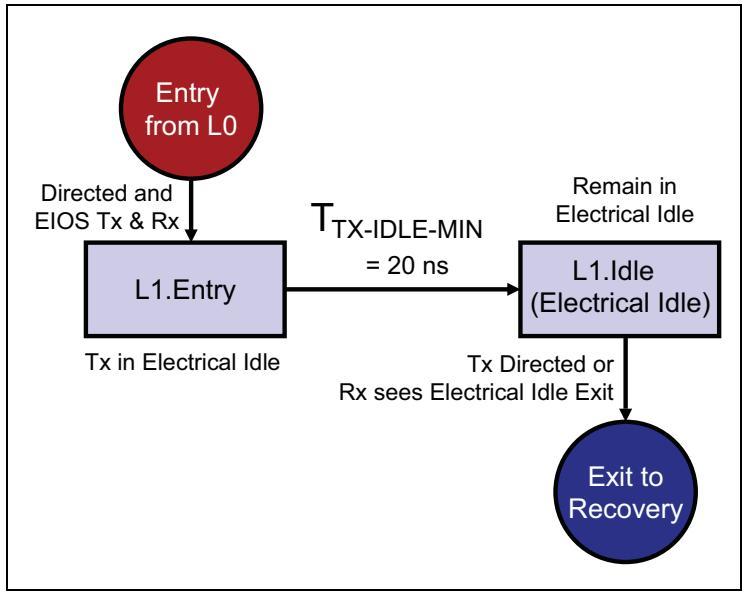

## L1.Entry | L1.Entry

<table style="border-collapse:collapse; width:100%;">
  <thead>
    <tr>
      <th width="50%" style="border:1px solid #333; background:#f5f5f5;">EN</th>
      <th width="50%" style="border:1px solid #333; background-color:#e8e8e8;">中文</th>
    </tr>
  </thead>
  <tbody>
    <tr><td width="50%" style="border:1px solid #333; background:#fff;padding:4px 8px;">In order for an Upstream Port to enter this state, it must send a request to enter L1 to its Link Partner and receive acknowledgement that it is OK to put the Link into L1. (The reason for requesting to go into L1 may be because of ASPM or because of software involvement.) Once the L1 request acknowledge is received, the Upstream Port enters the L1.Entry substate.</td><td width="50%" style="border:1px solid #333; background-color:#e8e8e8;padding:4px 8px;">为了使上行端口进入此状态，它必须向其链路伙伴发送进入L1的请求，并收到确认可以将链路置入L1的应答。(请求进入L1的原因可能是由于ASPM或软件介入。)一旦收到L1请求确认，上行端口即进入L1.Entry子状态。</td></tr>
    <tr><td width="50%" style="border:1px solid #333; background:#fff;padding:4px 8px;">In order for a Downstream Port to enter this state, it must receive an L1 enter request from the Upstream Port and send a positive response to that request. Then the Downstream Port waits to receive an Electrical Idle Ordered Set (EIOS) and have its receive lanes drop to Electrical Idle. It is at this point that the Downstream Port enters the L1.Entry substate.</td><td width="50%" style="border:1px solid #333; background-color:#e8e8e8;padding:4px 8px;">为了使下行端口进入此状态，它必须从上行端口接收L1进入请求并向该请求发送肯定应答。然后下行端口等待接收电气空闲有序集(EIOS)并使其接收通道降至电气空闲。正是在此时，下行端口进入L1.Entry子状态。</td></tr>
  </tbody>
</table>

<table style="border-collapse:collapse; width:100%;">
  <thead>
    <tr>
      <th width="50%" style="border:1px solid #333; background:#f5f5f5;">EN</th>
      <th width="50%" style="border:1px solid #333; background-color:#e8e8e8;">中文</th>
    </tr>
  </thead>
  <tbody>
    <tr><td width="50%" style="border:1px solid #333; background:#fff;padding:4px 8px;">## During L1.Entry</td><td width="50%" style="border:1px solid #333; background-color:#e8e8e8;padding:4px 8px;">## 在 L1.Entry 期间</td></tr>
    <tr><td width="50%" style="border:1px solid #333; background:#fff;padding:4px 8px;">All configured Transmitters send an EIOS and enter Electrical Idle while maintaining the proper DC common mode voltage.</td><td width="50%" style="border:1px solid #333; background-color:#e8e8e8;padding:4px 8px;">所有已配置的发送器发送 EIOS 并进入电气空闲状态，同时保持适当的直流共模电压。</td></tr>
  </tbody>
</table>

## Exit to "L1.Idle" | 退出到 "L1.Idle"

<table style="border-collapse:collapse; width:100%;">
  <thead>
    <tr>
      <th width="50%" style="border:1px solid #333; background:#f5f5f5;">EN</th>
      <th width="50%" style="border:1px solid #333; background-color:#e8e8e8;">中文</th>
    </tr>
  </thead>
  <tbody>
    <tr><td width="50%" style="border:1px solid #333; background:#fff;padding:4px 8px;">The next state will be L1.Idle after the $\mathrm{T_{TX-IDLE-MIN}}$ timeout (20ns). This time is intended to ensure that the Transmitter has established the Electrical Idle condition.</td><td width="50%" style="border:1px solid #333; background-color:#e8e8e8;padding:4px 8px;">经过 $\mathrm{T_{TX-IDLE-MIN}}$ 超时 (20ns) 后，下一个状态将是 L1.Idle。这段时间旨在确保发送器已建立电气空闲条件。</td></tr>
  </tbody>
</table>

<table style="border-collapse:collapse; width:100%;">
  <thead>
    <tr>
      <th width="50%" style="border:1px solid #333; background:#f5f5f5;">EN</th>
      <th width="50%" style="border:1px solid #333; background-color:#e8e8e8;">中文</th>
    </tr>
  </thead>
  <tbody>
    <tr><td width="50%" style="border:1px solid #333; background:#fff;padding:4px 8px;">## L1.Idle</td><td width="50%" style="border:1px solid #333; background-color:#e8e8e8;padding:4px 8px;">## L1.Idle（L1空闲态）</td></tr>
    <tr><td width="50%" style="border:1px solid #333; background:#fff;padding:4px 8px;">During this substate, Transmitters remain in the Electrical Idle.</td><td width="50%" style="border:1px solid #333; background-color:#e8e8e8;padding:4px 8px;">在此子状态中，发送器保持电气空闲。</td></tr>
    <tr><td width="50%" style="border:1px solid #333; background:#fff;padding:4px 8px;">For rates other than 2.5 GT/s the LTSSM must remain in this substate for at least 40ns. In the spec, this delay is said "to account for the delay in the logic levels to arm the Electrical Idle detection circuitry in case the Link enters L1 and immediately exits".</td><td width="50%" style="border:1px solid #333; background-color:#e8e8e8;padding:4px 8px;">对于除2.5 GT/s外的速率，LTSSM必须在此子状态中至少保持40ns。规范中称此延迟是"考虑到逻辑电平中的延迟，以便在链路进入L1后立即退出时，准备好电气空闲检测电路"。</td></tr>
  </tbody>
</table>

## Exit to "Recovery State" | 退出到"恢复状态"

<table style="border-collapse:collapse; width:100%;">
  <thead>
    <tr>
      <th width="50%" style="border:1px solid #333; background:#f5f5f5;">EN</th>
      <th width="50%" style="border:1px solid #333; background-color:#e8e8e8;">中文</th>
    </tr>
  </thead>
  <tbody>
    <tr><td width="50%" style="border:1px solid #333; background:#fff;padding:4px 8px;">The next state will be Recovery when a Transmitter is directed to change it or when any Receiver detects an exit from Electrical Idle.</td><td width="50%" style="border:1px solid #333; background-color:#e8e8e8;padding:4px 8px;">当发送器被指示改变状态或任何接收器检测到退出电气空闲时，下一个状态将是恢复状态。</td></tr>
    <tr><td width="50%" style="border:1px solid #333; background:#fff;padding:4px 8px;">Reasons for leaving L1 include the need to deliver a DLLP or TLP, or a desire to change the Link width or speed.</td><td width="50%" style="border:1px solid #333; background-color:#e8e8e8;padding:4px 8px;">离开L1的原因包括需要传送DLLP或TLP，或者希望改变链路宽度或速度。</td></tr>
    <tr><td width="50%" style="border:1px solid #333; background:#fff;padding:4px 8px;">If a speed change is desired, a Port is allowed to set the directed_speed_change variable to 1b and must clear the changed_speed_recovery variable to 0b.</td><td width="50%" style="border:1px solid #333; background-color:#e8e8e8;padding:4px 8px;">如果需要改变速度，端口可以设置directed_speed_change变量为1b，且必须清除changed_speed_recovery变量为0b。</td></tr>
    <tr><td width="50%" style="border:1px solid #333; background:#fff;padding:4px 8px;">Optionally, the Port may exit L1 and then initiate the speed change later by setting directed_speed_change to 1b and entering Recovery from L0 instead.</td><td width="50%" style="border:1px solid #333; background-color:#e8e8e8;padding:4px 8px;">可选地，端口可以退出L1，然后稍后通过设置directed_speed_change为1b并从L0进入恢复状态来发起速度改变。</td></tr>
  </tbody>
</table>

## 14.8.9 L2 State | 14.8.9 L2状态

<table style="border-collapse:collapse; width:100%;">
  <thead>
    <tr>
      <th width="50%" style="border:1px solid #333; background:#f5f5f5;">EN</th>
      <th width="50%" style="border:1px solid #333; background-color:#e8e8e8;">中文</th>
    </tr>
  </thead>
  <tbody>
    <tr><td width="50%" style="border:1px solid #333; background:#fff;padding:4px 8px;">This is a deeper power state with a longer exit latency than L1. Power Management software directs an Upstream Port to initiate entry into L2 (both directions of the Link go to L2) when its device is placed in the D3_Cold power state and the appropriate Link handshakes have been completed.</td><td width="50%" style="border:1px solid #333; background-color:#e8e8e8;padding:4px 8px;">这是一种比L1更深的电源状态，其退出延迟更长。当设备被置于D3_Cold电源状态且完成相应的链路握手后，电源管理软件指示上行端口发起进入L2（链路的两个方向均进入L2）。</td></tr>
    <tr><td width="50%" style="border:1px solid #333; background:#fff;padding:4px 8px;">Main power will be shut off by the system once it learns that everything is ready. When power is removed, the Link power state will become either L2 or L3, depending on whether a secondary power source called V_AUX (auxiliary voltage) is available. If V_AUX is present, the Link enters L2; if not, it enters L3.</td><td width="50%" style="border:1px solid #333; background-color:#e8e8e8;padding:4px 8px;">一旦系统获知一切就绪，主电源将被关闭。当电源移除时，链路电源状态将变为L2或L3，具体取决于是否存在称为V_AUX（辅助电压）的辅助电源。若V_AUX存在，则链路进入L2；否则进入L3。</td></tr>
    <tr><td width="50%" style="border:1px solid #333; background:#fff;padding:4px 8px;">The motivation for L2 is to use the small power available from V_AUX to inform the system when an event has occurred for which the Link needs to have power restored. There are two standard ways a device can inform the system of such an event. One is a side-band signal called the WAKE# pin, and the other is an inband signal called a "Beacon." The L2 state isn't needed for WAKE#, but is required if the optional Beacon will be used. The spec explicitly states that devices operating at 5.0 or 8.0 GT/s don't need to support Beacon, so it would seem that this is legacy support and only interesting for devices operating at 2.5 GT/s. For more detail on Link wakeup options, refer to "Waking Non-Communicating Links" on page 772.</td><td width="50%" style="border:1px solid #333; background-color:#e8e8e8;padding:4px 8px;">L2的动机是利用V_AUX提供的微小电源，在发生需要为链路恢复供电的事件时通知系统。设备可通过两种标准方式通知系统此类事件：一种是称为WAKE#引脚的边带信号，另一种是称为"Beacon"（信标）的带内信号。L2状态对于WAKE#并非必需，但如果要使用可选的Beacon，则需要L2。规范明确指出，运行在5.0或8.0 GT/s的设备无需支持Beacon，因此这似乎是传统支持，仅对运行在2.5 GT/s的设备有意义。有关链路唤醒选项的更多详情，请参阅第772页的"唤醒非通信链路"。</td></tr>
    <tr><td width="50%" style="border:1px solid #333; background:#fff;padding:4px 8px;">If supported, the Beacon is a low-frequency (30 KHz - 500 MHz) in-band signal that an Upstream Port supporting wakeup capability must be able to send on at least Lane 0 and a Downstream Port must be able to receive. Intermediate devices like Switches that receive a Beacon on a Downstream Port must forward it to their Upstream Port. The ultimate destination for the Beacon is the Root Complex, because that's where the system power control logic is expected to reside.</td><td width="50%" style="border:1px solid #333; background-color:#e8e8e8;padding:4px 8px;">如果支持，Beacon是一种低频（30 KHz - 500 MHz）带内信号，支持唤醒能力的上行端口必须至少能在通道0上发送该信号，下行端口必须能够接收。中间设备（如交换机）在下行端口收到Beacon后，必须将其转发到上行端口。Beacon的最终目的地是根复合体，因为系统电源控制逻辑预计位于此处。</td></tr>
    <tr><td width="50%" style="border:1px solid #333; background:#fff;padding:4px 8px;">A Transmitter going to Electrical Idle could indicate a desire to enter any of the low-power Link states (L0s, L1 or L2), so a means of differentiating them is needed. For L2, this is handled by having the Link partners agree beforehand that they're going to enter L2 by using a handshake sequence to ensure that they're both ready. For more detail on how this works, see the section called "Introduction to Link Power Management" on page 733. Figure 14-43 on page 611 shows the L2 entry and Exit state machine, which is described in the following text.</td><td width="50%" style="border:1px solid #333; background-color:#e8e8e8;padding:4px 8px;">发送器进入电气空闲可能表示希望进入任一低功耗链路状态（L0s、L1或L2），因此需要一种区分它们的方法。对于L2，这通过让链路双方事先通过握手序列达成一致，确认它们都已准备好进入L2来处理。有关其工作原理的更多详情，请参阅第733页的"链路电源管理简介"一节。第611页的图14-43显示了L2进入和退出状态机，下文将对此进行描述。</td></tr>
  </tbody>
</table>

Figure 14-43: L2 State Machine | 图14-43：L2状态机

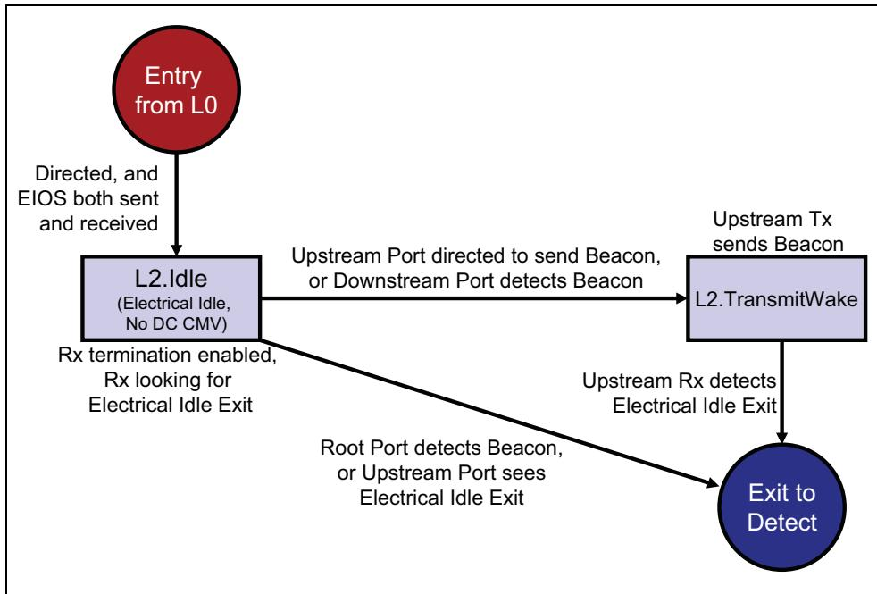

## L2.Idle | L2.Idle

<table style="border-collapse:collapse; width:100%;">
  <thead>
    <tr>
      <th width="50%" style="border:1px solid #333; background:#f5f5f5;">EN</th>
      <th width="50%" style="border:1px solid #333; background-color:#e8e8e8;">中文</th>
    </tr>
  </thead>
  <tbody>
    <tr><td width="50%" style="border:1px solid #333; background:#fff;padding:4px 8px;">To enter this substate, all the necessary handshake process must have already taken place between both ports on the Link and the ports have sent and received the required EIOS.</td><td width="50%" style="border:1px solid #333; background-color:#e8e8e8;padding:4px 8px;">要进入此子状态，链路上的两个端口之间必须已完成所有必要的握手过程，并且端口已发送和接收所需的EIOS。</td></tr>
    <tr><td width="50%" style="border:1px solid #333; background:#fff;padding:4px 8px;">All configured Transmitters must remain in the Electrical Idle state for at least the T timeout (20ns). However, since the main power will now be shut off, they aren't required to maintain the DC common-mode voltage within the spec range. Receivers won't start looking for the Electrical exit condition until at least after the 20ns timeout expires. All Receiver terminations must remain enabled in the low impedance condition.</td><td width="50%" style="border:1px solid #333; background-color:#e8e8e8;padding:4px 8px;">所有已配置的发送器必须保持在电气空闲状态至少T超时时间(20ns)。然而，由于主电源现在将被关闭，它们不需要维持DC共模电压在规格范围内。接收器在至少20ns超时到期之前不会开始检测电气退出条件。所有接收器端接必须保持在低阻抗条件下使能。</td></tr>
  </tbody>
</table>

## Exit to "L2.TransmitWake" | 退出到 "L2.TransmitWake"

<table style="border-collapse:collapse; width:100%;">
  <thead>
    <tr>
      <th width="50%" style="border:1px solid #333; background:#f5f5f5;">EN</th>
      <th width="50%" style="border:1px solid #333; background-color:#e8e8e8;">中文</th>
    </tr>
  </thead>
  <tbody>
    <tr><td width="50%" style="border:1px solid #333; background:#fff;padding:4px 8px;">The next state will be L2.TransmitWake if the Upstream Port is instructed to send a Beacon (the Beacon is always and only directed upstream to the Root Complex).</td><td width="50%" style="border:1px solid #333; background-color:#e8e8e8;padding:4px 8px;">如果上游端口被指示发送 Beacon（Beacon 始终且仅向上游方向发送至根复合体），则下一状态将为 L2.TransmitWake。</td></tr>
    <tr><td width="50%" style="border:1px solid #333; background:#fff;padding:4px 8px;">If the Downstream Port of a Switch detects a Beacon, it must direct the Upstream Port of the Switch to exit to L2.TransmitWake and begin sending a Beacon.</td><td width="50%" style="border:1px solid #333; background-color:#e8e8e8;padding:4px 8px;">如果交换机的下游端口检测到 Beacon，它必须指示交换机的上游端口退出至 L2.TransmitWake 并开始发送 Beacon。</td></tr>
  </tbody>
</table>

## Exit to "Detect State" | 退出到 "Detect 状态"

<table style="border-collapse:collapse; width:100%;">
  <thead>
    <tr>
      <th width="50%" style="border:1px solid #333; background:#f5f5f5;">EN</th>
      <th width="50%" style="border:1px solid #333; background-color:#e8e8e8;">中文</th>
    </tr>
  </thead>
  <tbody>
    <tr><td width="50%" style="border:1px solid #333; background:#fff;padding:4px 8px;">Once main power is returned, the next state will be Detect.</td><td width="50%" style="border:1px solid #333; background-color:#e8e8e8;padding:4px 8px;">一旦主电源恢复，下一状态将为 Detect。</td></tr>
    <tr><td width="50%" style="border:1px solid #333; background:#fff;padding:4px 8px;">If this Port has main power, but it detects an exit from Electrical Idle on any "predetermined" Lanes, meaning those that could be negotiated to be Lane 0 (multi-Lane Links must have at least two predetermined Lanes), the next state will be detect. When this happens to a Switch Upstream Port, the Switch must also transition its Downstream Ports to Detect.</td><td width="50%" style="border:1px solid #333; background-color:#e8e8e8;padding:4px 8px;">如果该端口拥有主电源，但在任何"预定"通道（即那些可协商为通道 0 的通道，多通道链路必须至少有两个预定通道）上检测到退出电气空闲，则下一状态将为 Detect。当这种情况发生在交换机上游端口时，交换机还必须将其下游端口也转换至 Detect 状态。</td></tr>
  </tbody>
</table>

## L2.TransmitWake | L2.TransmitWake

<table style="border-collapse:collapse; width:100%;">
  <thead>
    <tr>
      <th width="50%" style="border:1px solid #333; background:#f5f5f5;">EN</th>
      <th width="50%" style="border:1px solid #333; background-color:#e8e8e8;">中文</th>
    </tr>
  </thead>
  <tbody>
    <tr><td width="50%" style="border:1px solid #333; background:#fff;padding:4px 8px;">During this substate, the Transmitter will send the Beacon on at least Lane 0. Note that this state only applies to Upstream Ports because only they can send a Beacon.</td><td width="50%" style="border:1px solid #333; background-color:#e8e8e8;padding:4px 8px;">在此子状态下，发送器将至少在通道0上发送Beacon信号。注意，此状态仅适用于上游端口，因为只有上游端口才能发送Beacon。</td></tr>
    <tr><td width="50%" style="border:1px solid #333; background:#fff;padding:4px 8px;">Exit to "Detect State"</td><td width="50%" style="border:1px solid #333; background-color:#e8e8e8;padding:4px 8px;">退出到"Detect State"</td></tr>
    <tr><td width="50%" style="border:1px solid #333; background:#fff;padding:4px 8px;">The next state will be Detect if an Electrical Idle exit is detected on any Receiver of an Upstream Port. Of course, power must have already been restored to the devices in order for the neighbor to exit from Electrical Idle.</td><td width="50%" style="border:1px solid #333; background-color:#e8e8e8;padding:4px 8px;">如果在上游端口的任一接收器上检测到电气空闲退出，则下一状态将为Detect。当然，设备必须已经恢复供电，以便相邻设备从电气空闲状态退出。</td></tr>
  </tbody>
</table>

<table style="border-collapse:collapse; width:100%;">
  <thead>
    <tr>
      <th width="50%" style="border:1px solid #333; background:#f5f5f5;">EN</th>
      <th width="50%" style="border:1px solid #333; background-color:#e8e8e8;">中文</th>
    </tr>
  </thead>
  <tbody>
    <tr><td width="50%" style="border:1px solid #333; background:#fff;padding:4px 8px;">## Hot Reset State</td><td width="50%" style="border:1px solid #333; background-color:#e8e8e8;padding:4px 8px;">## 热复位状态</td></tr>
    <tr><td width="50%" style="border:1px solid #333; background:#fff;padding:4px 8px;">A Port enters the Hot Reset state either because it is a Bridge and software programmed its configuration space to propagate a Hot Reset Downstream as explained in "Hot Reset (In-band Reset)" on page 837, or because a Port received two consecutive TS1s with the Hot Reset bit asserted.</td><td width="50%" style="border:1px solid #333; background-color:#e8e8e8;padding:4px 8px;">端口进入热复位状态，要么是因为该端口是桥接器且软件对其配置空间编程以向下游传播热复位（如第837页"热复位（带内复位）"所述），要么是因为某个端口收到两个连续的Hot Reset位被置位的TS1。</td></tr>
    <tr><td width="50%" style="border:1px solid #333; background:#fff;padding:4px 8px;">**During Hot Reset**</td><td width="50%" style="border:1px solid #333; background-color:#e8e8e8;padding:4px 8px;">**热复位期间**</td></tr>
    <tr><td width="50%" style="border:1px solid #333; background:#fff;padding:4px 8px;">A Port transmits TS1s with the Hot Reset bit set continuously but doesn't change the configured Link and Lane Numbers.</td><td width="50%" style="border:1px solid #333; background-color:#e8e8e8;padding:4px 8px;">端口持续发送Hot Reset位被置位的TS1，但不改变已配置的链路号和通道号。</td></tr>
    <tr><td width="50%" style="border:1px solid #333; background:#fff;padding:4px 8px;">If the Upstream Port of a Switch enters the Hot Reset state, all configured Downstream Ports must transition to Hot Reset as soon as possible.</td><td width="50%" style="border:1px solid #333; background-color:#e8e8e8;padding:4px 8px;">如果交换机的上游端口进入热复位状态，所有已配置的下游端口必须尽快转换到热复位。</td></tr>
    <tr><td width="50%" style="border:1px solid #333; background:#fff;padding:4px 8px;">**Exit to "Detect State"**</td><td width="50%" style="border:1px solid #333; background-color:#e8e8e8;padding:4px 8px;">**退出到"Detect状态"**</td></tr>
    <tr><td width="50%" style="border:1px solid #333; background:#fff;padding:4px 8px;">In the Bridge where Hot Reset was originated, once software clears the configuration space bit that initiated the Hot Reset, the Bridge Port enters Detect. However, the Port must remain in the Hot Reset state for a minimum of 2ms.</td><td width="50%" style="border:1px solid #333; background-color:#e8e8e8;padding:4px 8px;">在发起热复位的桥接器中，一旦软件清除发起热复位的配置空间位，桥接器端口即进入Detect状态。但是，该端口必须保持在热复位状态至少2ms。</td></tr>
    <tr><td width="50%" style="border:1px solid #333; background:#fff;padding:4px 8px;">For Ports where Hot Reset was entered because of receiving two consecutive TS1s with the Hot Reset bit asserted, it remains in this state as long as it continues to receive these type of TS1s. Once the Port stops receiving TS1s with the Hot Reset bit asserted, it will transition to the Detect state. However, the Port must remain in the Hot Reset state for a minimum of 2ms.</td><td width="50%" style="border:1px solid #333; background-color:#e8e8e8;padding:4px 8px;">对于因收到两个连续的Hot Reset位被置位的TS1而进入热复位的端口，只要继续收到此类TS1，就保持在该状态。一旦端口停止收到Hot Reset位被置位的TS1，它将转换到Detect状态。但是，该端口必须保持在热复位状态至少2ms。</td></tr>
  </tbody>
</table>

## 14.8.11 Disable State | 14.8.11 禁用状态

<table style="border-collapse:collapse; width:100%;">
  <thead>
    <tr>
      <th width="50%" style="border:1px solid #333; background:#f5f5f5;">EN</th>
      <th width="50%" style="border:1px solid #333; background-color:#e8e8e8;">中文</th>
    </tr>
  </thead>
  <tbody>
    <tr><td width="50%" style="border:1px solid #333; background:#fff;padding:4px 8px;">A Disabled Link is Electrically Idle and does not have to maintain the DC common mode voltage. Software initiates this by setting the Link Disable bit (see Figure 14-71 on page 644) in the Link Control register of a device and the device then sends TS1s with the Link Disable bit asserted.</td><td width="50%" style="border:1px solid #333; background-color:#e8e8e8;padding:4px 8px;">禁用的链路处于电气空闲状态，且无需维持直流共模电压。软件通过设置设备链路控制寄存器中的链路禁用位（参见第644页图14-71）来发起此操作，随后该设备发送断言了链路禁用位的TS1序列。</td></tr>
  </tbody>
</table>

## During Disable | 在 Disable 期间

<table style="border-collapse:collapse; width:100%;">
  <thead>
    <tr>
      <th width="50%" style="border:1px solid #333; background:#f5f5f5;">EN</th>
      <th width="50%" style="border:1px solid #333; background-color:#e8e8e8;">中文</th>
    </tr>
  </thead>
  <tbody>
    <tr><td width="50%" style="border:1px solid #333; background:#fff;padding:4px 8px;">All Lanes transmit 16 to 32 TS1s with the Disable Link bit asserted, send an EIOS (two consecutive EIOSs for the 5.0 GT/s case) and then transition to Electrical Idle. The DC common-mode voltage does not need be within spec.</td><td width="50%" style="border:1px solid #333; background-color:#e8e8e8;padding:4px 8px;">所有通道发送16到32个带有禁用链路位（Disable Link bit）置位的TS1序列，发送一个EIOS（5.0 GT/s情况下发送两个连续的EIOS），然后转换为电气空闲。直流共模电压无需在规范范围内。</td></tr>
    <tr><td width="50%" style="border:1px solid #333; background:#fff;padding:4px 8px;">If an EIOS (two consecutive EIOSs for the 5.0 GT/s case) was sent and an EIOS was also received on any configured Lane, then LinkUp = 0b (False) and the Lanes are considered to be disabled.</td><td width="50%" style="border:1px solid #333; background-color:#e8e8e8;padding:4px 8px;">如果已发送一个EIOS（5.0 GT/s情况下发送两个连续的EIOS），并且在任何已配置的通道上也接收到一个EIOS，则LinkUp = 0b（假），并且这些通道被视为已禁用。</td></tr>
    <tr><td width="50%" style="border:1px solid #333; background:#fff;padding:4px 8px;">Exit to "Detect State"</td><td width="50%" style="border:1px solid #333; background-color:#e8e8e8;padding:4px 8px;">退出至"Detect状态"</td></tr>
    <tr><td width="50%" style="border:1px solid #333; background:#fff;padding:4px 8px;">For Upstream Ports, the next state will be Detect when Electrical Idle is detected at the Receiver or if no EIOS has been received within a 2ms timeout.</td><td width="50%" style="border:1px solid #333; background-color:#e8e8e8;padding:4px 8px;">对于上游端口，当在接收器检测到电气空闲，或者在2ms超时内未接收到EIOS时，下一状态将为Detect。</td></tr>
    <tr><td width="50%" style="border:1px solid #333; background:#fff;padding:4px 8px;">For Downstream Ports, the next state will also be Detect, but not until the Link Disable bit has been cleared to 0b by software.</td><td width="50%" style="border:1px solid #333; background-color:#e8e8e8;padding:4px 8px;">对于下游端口，下一状态也将为Detect，但需等到软件将链路禁用位（Link Disable bit）清零为0b后才会进入。</td></tr>
  </tbody>
</table>

## 14.8.12 Loopback State | 14.8.12 环回状态

<table style="border-collapse:collapse; width:100%;">
  <thead>
    <tr>
      <th width="50%" style="border:1px solid #333; background:#f5f5f5;">EN</th>
      <th width="50%" style="border:1px solid #333; background-color:#e8e8e8;">中文</th>
    </tr>
  </thead>
  <tbody>
    <tr><td width="50%" style="border:1px solid #333; background:#fff;padding:4px 8px;">The Loopback state is a test and debug feature that isn't used during normal operation. A device acting as a Loopback master can put the Link partner into the Loopback slave mode by sending TS1s with the Loopback bit asserted. This can be done in-circuit, allowing the possibility of using the Loopback state to perform a BIST (Built In Self Test) on the Link.</td><td width="50%" style="border:1px solid #333; background-color:#e8e8e8;padding:4px 8px;">环回状态是一种测试和调试功能，在正常操作中不使用。充当环回主控的设备可通过发送断言了环回位的TS1序列，将链路伙伴置入环回从属模式。这可以在电路在线完成，从而有可能利用环回状态在链路上执行BIST（内建自测试）。</td></tr>
    <tr><td width="50%" style="border:1px solid #333; background:#fff;padding:4px 8px;">Once in this state, the Loopback master sends valid Symbols to the Loopback slave, which then echoes them back. The Loopback slave continues to perform clock tolerance compensation, so the master must continue to insert SOSs at the correct intervals. To perform clock tolerance compensation, the Loopback slave may have to add or delete SKP Symbols to the SOS it echoes to the Loopback master.</td><td width="50%" style="border:1px solid #333; background-color:#e8e8e8;padding:4px 8px;">一旦进入此状态，环回主控向环回从属发送有效符号，环回从属随后将其回显。环回从属继续执行时钟容差补偿，因此主控必须继续以正确的间隔插入SOS序列。为执行时钟容差补偿，环回从属可能需要在其回显给环回主控的SOS序列中添加或删除SKP符号。</td></tr>
    <tr><td width="50%" style="border:1px solid #333; background:#fff;padding:4px 8px;">The Loopback state is exited when the Loopback master transmits an EIOS and the receiver detects Electrical Idle. The Loopback state machine is shown in Figure 14-44 on page 614 and described in the following text.</td><td width="50%" style="border:1px solid #333; background-color:#e8e8e8;padding:4px 8px;">当环回主控发送EIOS且接收方检测到电气空闲时，环回状态退出。环回状态机如图14-44（第614页）所示，并在下文中描述。</td></tr>
  </tbody>
</table>

Figure 14-44: Loopback State Machine | 图14-44：回环状态机

## Loopback.Entry | Loopback.Entry

<table style="border-collapse:collapse; width:100%;">
  <thead>
    <tr>
      <th width="50%" style="border:1px solid #333; background:#f5f5f5;">EN</th>
      <th width="50%" style="border:1px solid #333; background-color:#e8e8e8;">中文</th>
    </tr>
  </thead>
  <tbody>
    <tr><td width="50%" style="border:1px solid #333; background:#fff;padding:4px 8px;">The typical behavior for this substate is for the Loopback Master to send TS1s with the Loopback bit set until it starts seeing those TS1s being returned. Once the Loopback Master sees TS1s being returned with the Loopback bit asserted, it knows that it's Link Partner is now behaving as the Loopback Slave and is simply repeating everything it receives.</td><td width="50%" style="border:1px solid #333; background-color:#e8e8e8;padding:4px 8px;">此子状态的典型行为是：环回主控方发送设置了环回位的TS1，直到它开始看到这些TS1被返回。一旦环回主控方看到返回的TS1中环回位被置位，它就知道其链路伙伴现在作为环回从属方运行，只是简单地重复它接收到的所有内容。</td></tr>
    <tr><td width="50%" style="border:1px solid #333; background:#fff;padding:4px 8px;">While in this substate, the Link is not considered to be active (LinkUp = 0b). Also, the Link and Lane numbers used in TS1s and TS2s are ignored by the Receiver. The spec makes an interesting observation regarding the use of Lane numbers with 128b/130b encoding. As it turns out, each Lane uses a different seed value for its scrambler (see "Scrambling" on page 430). Consequently, if the Lane numbers haven't been negotiated before going into the Loopback mode, it's possible that the Link partners could have different Lane assignments and would therefore be unable to recognize incoming Symbols. This can be avoided by waiting until the Lane numbers have been negotiated before directing the master to go to the Loopback state, or by directing the master to set the Compliance Receive bit during Loopback.Entry, or by some other method.</td><td width="50%" style="border:1px solid #333; background-color:#e8e8e8;padding:4px 8px;">在此子状态下，链路不被视为活动状态（LinkUp = 0b）。此外，接收器忽略TS1和TS2中使用的链路号和通道号。规范对128b/130b编码下通道号的使用提出了一个有趣的观点。事实证明，每个通道使用不同的种子值进行加扰（参见第430页的"加扰"）。因此，如果在进入环回模式之前尚未协商好通道号，则链路伙伴可能具有不同的通道分配，从而无法识别传入的符号。这可以通过在指示主控方进入环回状态之前等待通道号协商完成来避免，或者通过指示主控方在Loopback.Entry期间设置Compliance Receive位，或通过其他方法来避免。</td></tr>
  </tbody>
</table>

<table style="border-collapse:collapse; width:100%;">
  <thead>
    <tr>
      <th width="50%" style="border:1px solid #333; background:#f5f5f5;">EN</th>
      <th width="50%" style="border:1px solid #333; background-color:#e8e8e8;">中文</th>
    </tr>
  </thead>
  <tbody>
    <tr><td width="50%" style="border:1px solid #333; background:#fff;padding:4px 8px;">## Loopback Master:</td><td width="50%" style="border:1px solid #333; background-color:#e8e8e8;padding:4px 8px;">## 回送主控端（Loopback Master）：</td></tr>
    <tr><td width="50%" style="border:1px solid #333; background:#fff;padding:4px 8px;">In this substate, the Loopback Master will continuously send TS1s with the Loopback bit set. The master may also assert the Compliance Receive bit in the TS1s to help testing when one or both Ports are having trouble obtaining bit lock, Symbol lock, or Block alignment after a rate change. If the bit is set it must not be cleared while in this state.</td><td width="50%" style="border:1px solid #333; background-color:#e8e8e8;padding:4px 8px;">在此子状态下，回送主控端将持续发送设置了回送位的TS1序列。当一个或两个端口在速率变更后难以获得位锁定、符号锁定或块对齐时，主控端也可以在TS1中断言"合规接收"位以辅助测试。若该位已置位，则在此状态下不得将其清除。</td></tr>
    <tr><td width="50%" style="border:1px solid #333; background:#fff;padding:4px 8px;">If this substate was entered from Configuration.Linkwidth.Start, check to see whether the speed in use is the highest mutually supported rate for both Link partners. If not:</td><td width="50%" style="border:1px solid #333; background-color:#e8e8e8;padding:4px 8px;">若从Configuration.Linkwidth.Start进入此子状态，需检查当前使用的速率是否是链路双方共同支持的最高速率。如果不是：</td></tr>
    <tr><td width="50%" style="border:1px solid #333; background:#fff;padding:4px 8px;">Change to the highest common speed. Send 16 TS1s with the Loopback bit set followed by an EIOS (two EIOSs if the current speed is 5.0 GT/s), and then go to Electrical Idle for 1ms. During the idle time, change the speed to the highest commonly‑supported rate.</td><td width="50%" style="border:1px solid #333; background-color:#e8e8e8;padding:4px 8px;">切换到最高共同速率。发送16个设置了回送位的TS1序列，随后发送一个EIOS（若当前速率为5.0 GT/s则发送两个EIOS），然后进入电气空闲状态持续1ms。在空闲期间，将速率更改为共同支持的最高速率。</td></tr>
    <tr><td width="50%" style="border:1px solid #333; background:#fff;padding:4px 8px;">If the highest common rate is 5.0 GT/s, the slave's Tx de‑emphasis is controlled by the master setting its Selectable De‑emphasis bit in the TS1s to the desired value (1b = -3.5 dB, 0b = -6 dB).</td><td width="50%" style="border:1px solid #333; background-color:#e8e8e8;padding:4px 8px;">若最高共同速率为5.0 GT/s，从端的发送去加重由主控端在TS1中将其"可选去加重"位设置为期望值（1b = -3.5 dB，0b = -6 dB）来控制。</td></tr>
    <tr><td width="50%" style="border:1px solid #333; background:#fff;padding:4px 8px;">For data rates of 5.0 GT/s and higher, the master's Transmitter can choose any de‑emphasis settings it wants, regardless of the settings it sent to the slave.</td><td width="50%" style="border:1px solid #333; background-color:#e8e8e8;padding:4px 8px;">对于5.0 GT/s及以上的数据速率，主控端的发送器可以选择任何所需的去加重设置，无论其向从端发送了何种设置。</td></tr>
    <tr><td width="50%" style="border:1px solid #333; background:#fff;padding:4px 8px;">Potential problem: if Loopback is entered after the Link has already trained to L0 and LinkUp = 1b, it's possible for one Port to enter Loopback from Recovery and the partner to enter from Configuration. If that happened, the latter Port might try to change the speed while the Port entering from Recovery does not, resulting in a situation where the results are undefined. The spec states that the test set‑up must avoid conflicting cases like this.</td><td width="50%" style="border:1px solid #333; background-color:#e8e8e8;padding:4px 8px;">潜在问题：若链路已训练至L0且LinkUp = 1b后再进入回送，可能出现一个端口从Recovery进入回送而另一个端口从Configuration进入回送的情况。若发生此情况，后一个端口可能试图改变速率，而从Recovery进入的端口则不会，导致结果未定义。规范指出测试装置必须避免此类冲突情况。</td></tr>
  </tbody>
</table>

## Exit to "Loopback.Active" | 退出到 "Loopback.Active"

<table style="border-collapse:collapse; width:100%;">
  <thead>
    <tr>
      <th width="50%" style="border:1px solid #333; background:#f5f5f5;">EN</th>
      <th width="50%" style="border:1px solid #333; background-color:#e8e8e8;">中文</th>
    </tr>
  </thead>
  <tbody>
    <tr><td width="50%" style="border:1px solid #333; background:#fff;padding:4px 8px;">The next state will be Loopback.Active after either 2ms, if the Compliance Receive bit is set in the outgoing TS1s, or two consecutive TS1s are received on a design‑specific number of Lanes with the Loopback bit set and the Compliance Receive bit was not set in the outgoing TS1s.</td><td width="50%" style="border:1px solid #333; background-color:#e8e8e8;padding:4px 8px;">下一个状态将是 Loopback.Active，条件为以下之一：如果发出的 TS1 中设置了 Compliance Receive 位，则经过 2ms 后进入；或者，在特定设计数量的通道上接收到两个连续的设置了 Loopback 位的 TS1，且发出的 TS1 中未设置 Compliance Receive 位。</td></tr>
    <tr><td width="50%" style="border:1px solid #333; background:#fff;padding:4px 8px;">Note that if the speed was changed, the master must ensure that enough TS1s have been sent for the slave to be able to acquire Symbol lock or Block alignment before going to the Loopback.Active state.</td><td width="50%" style="border:1px solid #333; background-color:#e8e8e8;padding:4px 8px;">注意，如果速度已更改，主设备必须确保已发送足够的 TS1，以便从设备在进入 Loopback.Active 状态之前能够获得符号锁定或块对齐。</td></tr>
  </tbody>
</table>

## Exit to "Loopback.Exit" | 退出到 "Loopback.Exit"

<table style="border-collapse:collapse; width:100%;">
  <thead>
    <tr>
      <th width="50%" style="border:1px solid #333; background:#f5f5f5;">EN</th>
      <th width="50%" style="border:1px solid #333; background-color:#e8e8e8;">中文</th>
    </tr>
  </thead>
  <tbody>
    <tr><td width="50%" style="border:1px solid #333; background:#fff;padding:4px 8px;">If neither of the conditions to enter Loopback.Active are met, the next state will be Loopback.Exit after a design‑specific timeout of less than 100ms.</td><td width="50%" style="border:1px solid #333; background-color:#e8e8e8;padding:4px 8px;">如果进入 Loopback.Active 的两个条件均未满足，则在小于 100ms 的特定设计超时后，下一个状态将是 Loopback.Exit。</td></tr>
  </tbody>
</table>

<table style="border-collapse:collapse; width:100%;">
  <thead>
    <tr>
      <th width="50%" style="border:1px solid #333; background:#f5f5f5;">EN</th>
      <th width="50%" style="border:1px solid #333; background-color:#e8e8e8;">中文</th>
    </tr>
  </thead>
  <tbody>
    <tr><td width="50%" style="border:1px solid #333; background:#fff;padding:4px 8px;">## Loopback Slave:</td><td width="50%" style="border:1px solid #333; background-color:#e8e8e8;padding:4px 8px;">## 环回从属状态：</td></tr>
    <tr><td width="50%" style="border:1px solid #333; background:#fff;padding:4px 8px;">This substate is entered by receiving two consecutive TS1s with the Loopback bit asserted.</td><td width="50%" style="border:1px solid #333; background-color:#e8e8e8;padding:4px 8px;">通过接收到两个连续的、断言了环回位的TS1进入该子状态。</td></tr>
    <tr><td width="50%" style="border:1px solid #333; background:#fff;padding:4px 8px;">If this substate was entered from Configuration.Linkwidth.Start, check to see whether the speed in use is the highest one that mutually supported by both Link partners. If not:</td><td width="50%" style="border:1px solid #333; background-color:#e8e8e8;padding:4px 8px;">如果该子状态是从Configuration.Linkwidth.Start进入的，需检查当前使用的速率是否是两个链路伙伴相互支持的最高速率。如果不是：</td></tr>
    <tr><td width="50%" style="border:1px solid #333; background:#fff;padding:4px 8px;">Change to the highest common speed. Send one EIOS (two EIOSs if the current speed is 5.0 GT/s), and then go to Electrical Idle for 2ms. During the idle time, change the speed to the highest commonly‑supported rate.</td><td width="50%" style="border:1px solid #333; background-color:#e8e8e8;padding:4px 8px;">更改为最高公共速率。发送一个EIOS（若当前速率为5.0 GT/s则发送两个EIOS），然后进入电气空闲状态持续2ms。在空闲期间将速率更改为最高共同支持的速率。</td></tr>
    <tr><td width="50%" style="border:1px solid #333; background:#fff;padding:4px 8px;">If the highest common rate is 5.0 GT/s, set the Transmitter's deemphasis according to the Selectable De‑emphasis bit in the received TS1s (1b = -3.5 dB, 0b = -6 dB).</td><td width="50%" style="border:1px solid #333; background-color:#e8e8e8;padding:4px 8px;">若最高公共速率为5.0 GT/s，根据接收到的TS1中的可选去加重位设置发送器的去加重（1b = -3.5 dB，0b = -6 dB）。</td></tr>
    <tr><td width="50%" style="border:1px solid #333; background:#fff;padding:4px 8px;">– If the highest common rate is 8.0 GT/s and:</td><td width="50%" style="border:1px solid #333; background-color:#e8e8e8;padding:4px 8px;">– 若最高公共速率为8.0 GT/s且：</td></tr>
    <tr><td width="50%" style="border:1px solid #333; background:#fff;padding:4px 8px;">a) EQ TS1s directed the slave to this state, use the Tx Preset settings they specified.</td><td width="50%" style="border:1px solid #333; background-color:#e8e8e8;padding:4px 8px;">a) EQ TS1将从属设备引导至该状态，则使用它们指定的发送器预设设置。</td></tr>
    <tr><td width="50%" style="border:1px solid #333; background:#fff;padding:4px 8px;">b) Normal TS1s directed the slave to this state, the slave is allowed to use its default transmitter settings.</td><td width="50%" style="border:1px solid #333; background-color:#e8e8e8;padding:4px 8px;">b) 普通TS1将从属设备引导至该状态，则允许从属设备使用其默认发送器设置。</td></tr>
  </tbody>
</table>

## Exit to "Loopback.Active" | 退出到 "Loopback.Active"

<table style="border-collapse:collapse; width:100%;">
  <thead>
    <tr>
      <th width="50%" style="border:1px solid #333; background:#f5f5f5;">EN</th>
      <th width="50%" style="border:1px solid #333; background-color:#e8e8e8;">中文</th>
    </tr>
  </thead>
  <tbody>
    <tr><td width="50%" style="border:1px solid #333; background:#fff;padding:4px 8px;">The next state will be Loopback.Active if the Compliance Receive bit was set in the incoming TS1s that directed the slave to this state. The slave doesn't need to wait for particular boundaries to send looped-back data, and is allowed to truncate any Ordered Set in progress.</td><td width="50%" style="border:1px solid #333; background-color:#e8e8e8;padding:4px 8px;">如果进入的 TS1s 中设置了对从设备引导至本状态的 Compliance Receive 位，则下一状态将为 Loopback.Active。从设备无需等待特定边界即可发送环回数据，并允许截断任何正在传输中的 Ordered Set。</td></tr>
    <tr><td width="50%" style="border:1px solid #333; background:#fff;padding:4px 8px;">Otherwise, the slave sends TS1s with Link and Lane numbers set to PAD and the next state will be Loopback.Active if:</td><td width="50%" style="border:1px solid #333; background-color:#e8e8e8;padding:4px 8px;">否则，从设备发送 Link 和 Lane 编号设置为 PAD 的 TS1s，并且满足以下条件时下一状态将为 Loopback.Active：</td></tr>
    <tr><td width="50%" style="border:1px solid #333; background:#fff;padding:4px 8px;">– The rate is 2.5 or 5.0 GT/s and Symbol lock is acquired on all Lanes.</td><td width="50%" style="border:1px solid #333; background-color:#e8e8e8;padding:4px 8px;">– 速率为 2.5 或 5.0 GT/s，且所有 Lane 上均已获得 Symbol 锁定。</td></tr>
    <tr><td width="50%" style="border:1px solid #333; background:#fff;padding:4px 8px;">The rate is 8.0 GT/s and two consecutive TS1s are seen on all active Lanes. Equalization is handled by evaluating and applying the values given in the TS1s, as long as they're supported and the EC value is appropriate for the direction of the Port (10b for Downstream Ports, and 11b for Upstream Ports). Optionally, the Port can accept either of the EC values for this case. If the settings are applied, they must take effect within 500ns of receiving them and must not cause the Transmitter to violate any electrical specs for more than 1ns. A significant difference compared to the process in Recovery.Equalization is that the new settings are not echoed in the TS1s being sent by the slave.</td><td width="50%" style="border:1px solid #333; background-color:#e8e8e8;padding:4px 8px;">速率为 8.0 GT/s，且所有 active Lane 上已观察到连续两个 TS1s。均衡通过评估并应用 TS1s 中给出的值来处理，只要这些值受支持且 EC 值适合端口方向（Downstream Port 为 10b，Upstream Port 为 11b）。可选地，端口可在此情况下接受任一 EC 值。如果应用了这些设置，则必须在收到设置后的 500ns 内生效，并且不得导致 Transmitter 违反任何电气规范超过 1ns。与 Recovery.Equalization 过程中的一个显著区别是，从设备发送的 TS1s 中不会回显这些新设置。</td></tr>
    <tr><td width="50%" style="border:1px solid #333; background:#fff;padding:4px 8px;">For 8b/10b, the slave must only transition to looped-back data on a Symbol boundary, but is allowed to truncate any Ordered Set in progress. For 128b/130b, no boundary is specified for when the looped-back data can be sent, and it is still allowed to truncate any Ordered Set in progress.</td><td width="50%" style="border:1px solid #333; background-color:#e8e8e8;padding:4px 8px;">对于 8b/10b，从设备只能在 Symbol 边界上转换到环回数据，但允许截断任何正在传输中的 Ordered Set。对于 128b/130b，未规定发送环回数据的边界，且仍然允许截断任何正在传输中的 Ordered Set。</td></tr>
  </tbody>
</table>

<table style="border-collapse:collapse; width:100%;">
  <thead>
    <tr>
      <th width="50%" style="border:1px solid #333; background:#f5f5f5;">EN</th>
      <th width="50%" style="border:1px solid #333; background-color:#e8e8e8;">中文</th>
    </tr>
  </thead>
  <tbody>
    <tr><td width="50%" style="border:1px solid #333; background:#fff;padding:4px 8px;">## Loopback.Active</td><td width="50%" style="border:1px solid #333; background-color:#e8e8e8;padding:4px 8px;">## Loopback.Active（环回.激活）</td></tr>
    <tr><td width="50%" style="border:1px solid #333; background:#fff;padding:4px 8px;">During this substate, the Loopback Master sends valid encoded data and should not send EIOS until it's ready to exit Loopback. The Loopback Slave echoes the received information without modification (even if the encoding is determined to be invalid), with the possible exception of inverting the polarity as determined in the Polling state. The slave also continues to perform clock tolerance compensation. That means SKPs must be added or removed as needed, but the Lanes aren't required to all send the same number.</td><td width="50%" style="border:1px solid #333; background-color:#e8e8e8;padding:4px 8px;">在此子状态下，环回主设备发送有效的编码数据，且在准备好退出环回之前不应发送EIOS。环回从设备原样回显接收到的信息（即使确定编码无效也不例外），但可能需反转在Polling状态中确定的极性除外。从设备还继续执行时钟容差补偿，这意味着必须根据需要添加或删除SKP，但各通道无需发送相同数量的SKP。</td></tr>
  </tbody>
</table>

## Exit to "Loopback.Exit" | 退出到 "Loopback.Exit"

<table style="border-collapse:collapse; width:100%;">
  <thead>
    <tr>
      <th width="50%" style="border:1px solid #333; background:#f5f5f5;">EN</th>
      <th width="50%" style="border:1px solid #333; background-color:#e8e8e8;">中文</th>
    </tr>
  </thead>
  <tbody>
    <tr><td width="50%" style="border:1px solid #333; background:#fff;padding:4px 8px;">The next state will be Loopback.Exit for the loopback master if directed.</td><td width="50%" style="border:1px solid #333; background-color:#e8e8e8;padding:4px 8px;">如果被指示，环回主设备的下一个状态将是Loopback.Exit。</td></tr>
    <tr><td width="50%" style="border:1px solid #333; background:#fff;padding:4px 8px;">The next state will be Loopback.Exit for the loopback slave if either of two conditions is true:</td><td width="50%" style="border:1px solid #333; background-color:#e8e8e8;padding:4px 8px;">如果满足以下两个条件之一，环回从设备的下一个状态将是Loopback.Exit：</td></tr>
    <tr><td width="50%" style="border:1px solid #333; background:#fff;padding:4px 8px;">1 The slave is directed to exit or four consecutive EIOSs are seen on any Lane.</td><td width="50%" style="border:1px solid #333; background-color:#e8e8e8;padding:4px 8px;">1 从设备被指示退出，或在任一通道上检测到四个连续的EIOS。</td></tr>
    <tr><td width="50%" style="border:1px solid #333; background:#fff;padding:4px 8px;">Optionally, if the current speed is 2.5 GT/s and an EIOS is received or Electrical Idle is detected or inferred on any Lane. Electrical Idle may be inferred if any configured Lane has not detected an exit from Electrical Idle for 128μs.</td><td width="50%" style="border:1px solid #333; background-color:#e8e8e8;padding:4px 8px;">可选地，如果当前速率为2.5 GT/s，且接收到EIOS，或在任一通道上检测到或推断出电气空闲。如果任一已配置的通道在128μs内未检测到从电气空闲中退出，则可推断出电气空闲。</td></tr>
    <tr><td width="50%" style="border:1px solid #333; background:#fff;padding:4px 8px;">The slave must be able to detect an Electrical Idle on any Lane within 1ms of EIOS being received. Between the time EIOS is received and Electrical Idle is actually detected, the Loopback Slave may receive a bit stream that is undefined by the encoding scheme, and it may loop that back to the transmitter.</td><td width="50%" style="border:1px solid #333; background-color:#e8e8e8;padding:4px 8px;">从设备必须能在收到EIOS后1ms内检测到任一通道上的电气空闲。在收到EIOS与实际检测到电气空闲之间，环回从设备可能接收到编码方案未定义的比特流，并且可将其环回至发送器。</td></tr>
  </tbody>
</table>

## Loopback.Exit — 环回.退出

<table style="border-collapse:collapse; width:100%;">
  <thead>
    <tr>
      <th width="50%" style="border:1px solid #333; background:#f5f5f5;">EN</th>
      <th width="50%" style="border:1px solid #333; background-color:#e8e8e8;">中文</th>
    </tr>
  </thead>
  <tbody>
    <tr><td width="50%" style="border:1px solid #333; background:#fff;padding:4px 8px;">During this substate, the Loopback Master sends an EIOS for Ports that support only 2.5 GT/s and eight consecutive EIOSs for Ports that support rates higher than 2.5 GT/s (optionally send 8 for the Ports that only support 2.5 GT/s, too), and then enter Electrical Idle on all Lanes for 2ms.</td><td width="50%" style="border:1px solid #333; background-color:#e8e8e8;padding:4px 8px;">在此子状态下，环回主控（Loopback Master）向仅支持 2.5 GT/s 的端口发送一个 EIOS，向支持高于 2.5 GT/s 速率的端口发送八个连续的 EIOS（对于仅支持 2.5 GT/s 的端口也可选择发送 8 个），然后在所有通道上进入电气空闲（Electrical Idle）状态并持续 2ms。</td></tr>
    <tr><td width="50%" style="border:1px solid #333; background:#fff;padding:4px 8px;">— The Loopback Master must transition to Electrical Idle within TTX‐IDLE‐SET‐ after sending the last EIOS. Note that the EIOS marks the end of the master's transmit and compare operations. Any data received by the master after any EIOS is received is undefined and should be ignored.</td><td width="50%" style="border:1px solid #333; background-color:#e8e8e8;padding:4px 8px;">— 环回主控必须在发送最后一个 EIOS 后的 TTX‐IDLE‐SET‐ 内转换到电气空闲。请注意，EIOS 标志着主控发送和比较操作的结束。主控在收到任何 EIOS 之后接收到的任何数据均为未定义，应予以忽略。</td></tr>
    <tr><td width="50%" style="border:1px solid #333; background:#fff;padding:4px 8px;">The loopback slave must enter Electrical Idle on all Lanes for 2ms but must echo back all Symbols received prior to detecting Electrical Idle to ensure that the master sees the arrival of the EIOS as the end of the logical send and compare operation.</td><td width="50%" style="border:1px solid #333; background-color:#e8e8e8;padding:4px 8px;">环回从属（Loopback Slave）必须在所有通道上进入电气空闲状态并持续 2ms，但必须将检测到电气空闲之前接收到的所有符号（Symbol）回显（echo back），以确保主控将 EIOS 的到达视为逻辑发送和比较操作的结束。</td></tr>
    <tr><td width="50%" style="border:1px solid #333; background:#fff;padding:4px 8px;">Exit to "Detect State"</td><td width="50%" style="border:1px solid #333; background-color:#e8e8e8;padding:4px 8px;">退出到"检测状态"（Detect State）</td></tr>
    <tr><td width="50%" style="border:1px solid #333; background:#fff;padding:4px 8px;">The next state will be Detect once the required EIOSs have been exchanged and the Lanes have been in Electrical Idle for 2ms.</td><td width="50%" style="border:1px solid #333; background-color:#e8e8e8;padding:4px 8px;">一旦完成所需的 EIOS 交换且通道处于电气空闲状态达 2ms 后，下一个状态将为 Detect（检测）。</td></tr>
  </tbody>
</table>

<table style="border-collapse:collapse; width:100%;">
  <thead>
    <tr>
      <th width="50%" style="border:1px solid #333; background:#f5f5f5;">EN</th>
      <th width="50%" style="border:1px solid #333; background-color:#e8e8e8;">中文</th>
    </tr>
  </thead>
  <tbody>
    <tr><td width="50%" style="border:1px solid #333; background:#fff;padding:4px 8px;">## Dynamic Bandwidth Changes</td><td width="50%" style="border:1px solid #333; background-color:#e8e8e8;padding:4px 8px;">## 动态带宽更改</td></tr>
    <tr><td width="50%" style="border:1px solid #333; background:#fff;padding:4px 8px;">Higher data rates and wider Links for PCIe offer higher performance than previous generations but use more power, too. Consequently, the 2.0 spec writers chose to include another pair of power management mechanisms that allow the hardware to adjust the Link speed and width on the fly. These allow the Link to use the highest speed and widest possible Link when performance is needed, or to drop down to a lower speed or narrower Link width or both to reduce power. There are two clear advantages to this method compared to changing the Link or Device power state.</td><td width="50%" style="border:1px solid #333; background-color:#e8e8e8;padding:4px 8px;">PCIe 的更高数据速率和更宽链路提供了比前几代更高的性能，但同时也消耗更多功耗。因此，2.0 规范编写者选择引入另一对功耗管理机制，允许硬件动态调整链路速度和宽度。这些机制允许链路在需要性能时使用最高速度和最宽可能的链路，或者降低到较低速度或较窄链路宽度（或两者兼有）以降低功耗。与更改链路或设备电源状态相比，此方法有两个明显优势。</td></tr>
    <tr><td width="50%" style="border:1px solid #333; background:#fff;padding:4px 8px;">First, the Link is always able to communicate regardless of the changes, with a relatively short interruption in service to make the change. Second, the power saving can be greater. For example, a x16 Link would almost certainly use less power operating as an active x1 Link than as a x16 Link in L0s.</td><td width="50%" style="border:1px solid #333; background-color:#e8e8e8;padding:4px 8px;">第一，无论进行何种更改，链路始终能够通信，只需相对较短的服务中断即可完成更改。第二，节电效果可能更大。例如，x16 链路以有源 x1 链路方式运行所消耗的功耗几乎肯定要比作为 x16 链路处于 L0s 状态时更低。</td></tr>
    <tr><td width="50%" style="border:1px solid #333; background:#fff;padding:4px 8px;">Secondly, in addition to power conservation, bandwidth reductions can also be used to resolve reliability problems. For example, it may be that a high speed Link produces unacceptable reliability, in which case either Link component is allowed to remove the offending speed from the list of supported speeds that it advertises. How a component makes that reliability determination is not specified. Interestingly, components are also permitted to go into the Recovery state and advertise a different set of supported speeds without requesting a speed change in the process.</td><td width="50%" style="border:1px solid #333; background-color:#e8e8e8;padding:4px 8px;">其次，除了节省功耗外，带宽降低还可用于解决可靠性问题。例如，高速链路可能产生不可接受的可靠性问题，此时任一连路组件都可以从其通告的支持速度列表中移除有问题的速度。组件如何判断可靠性问题并未规定。有趣的是，组件也被允许进入恢复状态并通告一组不同的支持速度，而无需在此过程中请求速度更改。</td></tr>
    <tr><td width="50%" style="border:1px solid #333; background:#fff;padding:4px 8px;">Changing the Link Speed or Link Width requires the Link to be re‑trained. When the Link is in the L0 state, and the speed needs to be changed, the LTSSM of the port desiring the speed change starts transmitting TS1s to its neighbor. Doing so results in the two involved ports' LTSSMs going through Recovery state where the Link speed is changed and then back to L0.</td><td width="50%" style="border:1px solid #333; background-color:#e8e8e8;padding:4px 8px;">更改链路速度或链路宽度需要对链路重新训练。当链路处于 L0 状态且需要更改速度时，要求更改速度的端口的 LTSSM 开始向其相邻端口发送 TS1 序列。这样做会导致两个相关端口的 LTSSM 进入恢复状态，在此状态更改链路速度，然后返回 L0。</td></tr>
    <tr><td width="50%" style="border:1px solid #333; background:#fff;padding:4px 8px;">Similarly, the port that desires to change the Link width starts transmitting TS1s to its neighbor. Doing so results in the two involved ports' LTSSMs going through Recovery state then Configuration state where the Link width is changed. The LTSSM finally returns to L0 with the new Link width established.</td><td width="50%" style="border:1px solid #333; background-color:#e8e8e8;padding:4px 8px;">类似地，需要更改链路宽度的端口开始向其相邻端口发送 TS1 序列。这样做会导致两个相关端口的 LTSSM 进入恢复状态，然后进入配置状态，在此更改链路宽度。LTSSM 最终在建立新链路宽度后返回 L0。</td></tr>
    <tr><td width="50%" style="border:1px solid #333; background:#fff;padding:4px 8px;">Because the LTSSM is involved in dynamic Link bandwidth management, it makes sense to discuss the two aspects of Link bandwidth management, dynamic Link speed change and dynamic Link width change in the following sections. Let's consider these two options separately, starting with Link speed changes.</td><td width="50%" style="border:1px solid #333; background-color:#e8e8e8;padding:4px 8px;">由于 LTSSM 参与动态链路带宽管理，因此以下各节讨论链路带宽管理的两个方面——动态链路速度更改和动态链路宽度更改是合理的。我们将分别考虑这两个选项，首先从链路速度更改开始。</td></tr>
  </tbody>
</table>

## 14.9.1 Dynamic Link Speed Changes | 14.9.1 动态链路速度变化

<table style="border-collapse:collapse; width:100%;">
  <thead>
    <tr>
      <th width="50%" style="border:1px solid #333; background:#f5f5f5;">EN</th>
      <th width="50%" style="border:1px solid #333; background-color:#e8e8e8;">中文</th>
    </tr>
  </thead>
  <tbody>
    <tr><td width="50%" style="border:1px solid #333; background:#fff;padding:4px 8px;">By way of review, the LTSSM states are illustrated in Figure 14‑45 on page 620 to make it easier to recall the flow of states. Although according to the Gen1 specification, speed change was indicated to be performed in the Polling state, the subsequent Gen2 spec moved this function to the Recovery state.</td><td width="50%" style="border:1px solid #333; background-color:#e8e8e8;padding:4px 8px;">回顾一下，LTSSM状态如图14‑45（第620页）所示，以便更容易回忆状态流转。尽管根据Gen1规范，速度变化被指示在Polling状态下执行，但后续的Gen2规范将此功能移到了Recovery状态。</td></tr>
  </tbody>
</table>

Figure 14‑45: LTSSM Overview | 图14‑45：LTSSM概述  

<table style="border-collapse:collapse; width:100%;">
  <thead>
    <tr>
      <th width="50%" style="border:1px solid #333; background:#f5f5f5;">EN</th>
      <th width="50%" style="border:1px solid #333; background-color:#e8e8e8;">中文</th>
    </tr>
  </thead>
  <tbody>
    <tr><td width="50%" style="border:1px solid #333; background:#fff;padding:4px 8px;">During the Polling state, TS1s are exchanged between Link neighbors, and these contain several kinds of information as shown in Figure 14‑46 on page 621. The most interesting part for us here is byte number 4, the Rate Identifier. Bits 1, 2 and 3 indicate which data rates are available and the spec points out that 2.5 GT/s must always be supported, while 5.0 GT/s must also be supported if 8.0 GT/s is supported.</td><td width="50%" style="border:1px solid #333; background-color:#e8e8e8;padding:4px 8px;">在Polling状态下，链路相邻设备之间交换TS1序列，这些TS1包含多种信息，如图14‑46（第621页）所示。这里我们最感兴趣的部分是字节4，即速率标识符（Rate Identifier）。位1、2和3指示哪些数据速率可用，规范指出2.5 GT/s必须始终支持，而如果支持8.0 GT/s，则也必须支持5.0 GT/s。</td></tr>
    <tr><td width="50%" style="border:1px solid #333; background:#fff;padding:4px 8px;">The meaning of bit 6 depends on whether the Port is facing upstream or downstream and also on what LTSSM state the Port is in. However, for the speed change case the options are reduced because it’s only meaningful coming from the Upstream Port and just indicates whether or not the speed change is an autonomous event. “Autonomous” means that the Port is requesting this change for its own hardware‑specific reasons and not because of a reliability issue. Bit 7 is used by the Upstream Port to request a speed change. These values are very similar in the TS2s, although bit 6 has another meaning now related to autonomous Link width changes that we’ll discuss later.</td><td width="50%" style="border:1px solid #333; background-color:#e8e8e8;padding:4px 8px;">位6的含义取决于端口是面向上游还是下游，以及端口处于何种LTSSM状态。然而，对于速度变化的情况，选项有所减少，因为该位仅从上游端口发出时才有意义，并且仅指示速度变化是否为自主事件。"自主"意味着端口因其自身的硬件特定原因而请求此变化，并非因为可靠性问题。位7由上游端口用于请求速度变化。在TS2中这些值非常相似，不过位6现在具有了另一种含义，与自主链路宽度变化相关，我们将在后面讨论。</td></tr>
  </tbody>
</table>

Figure 14‑46: TS1 Contents | 图14‑46：TS1内容  

Figure 14‑47: TS2 Contents | 图14‑47：TS2内容  
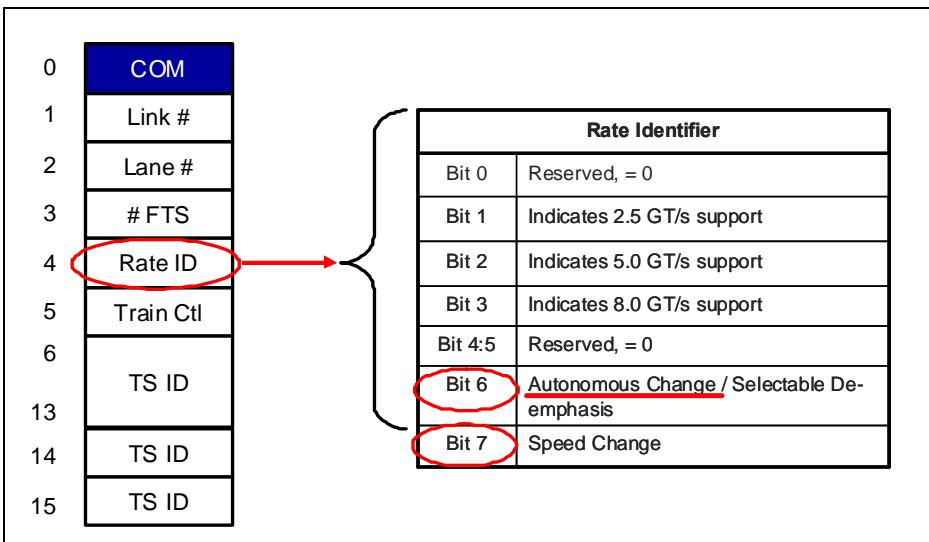

<table style="border-collapse:collapse; width:100%;">
  <thead>
    <tr>
      <th width="50%" style="border:1px solid #333; background:#f5f5f5;">EN</th>
      <th width="50%" style="border:1px solid #333; background-color:#e8e8e8;">中文</th>
    </tr>
  </thead>
  <tbody>
    <tr><td width="50%" style="border:1px solid #333; background:#fff;padding:4px 8px;">## Upstream Port Initiates Speed Change</td><td width="50%" style="border:1px solid #333; background-color:#e8e8e8;padding:4px 8px;">## 上游端口发起速度变更</td></tr>
    <tr><td width="50%" style="border:1px solid #333; background:#fff;padding:4px 8px;">A speed change must be initiated by the Upstream Port (Port facing upstream), and is accomplished by transitioning to the Recovery state. The substates of the Recovery state are shown in Figure 14-48 on page 622 and the part of interest for this discussion is highlighted by the oval. The discussion that follows here is a relatively high-level overview of the entire speed change process and doesn't get into the details of the LTSSM operation. To learn more about that, refer to the discussion called "Recovery State" on page 571.</td><td width="50%" style="border:1px solid #333; background-color:#e8e8e8;padding:4px 8px;">速度变更必须由上游端口(Upstream Port，即面向上游的端口)发起，通过转换到 Recovery 状态来完成。Recovery 状态的子状态如图 14-48(第 622 页)所示，其中与本讨论相关的部分以椭圆高亮。此处给出的讨论是对整个速度变更过程的相对高层概述，不涉及 LTSSM 操作的细节。如需了解更多，请参考第 571 页的"Recovery State"讨论。</td></tr>
  </tbody>
</table>

Figure 14-48: Recovery Sub-States | 图14-48：恢复子状态

## 14.9.3 Speed Change Example | 14.9.3 速率变更示例

<table style="border-collapse:collapse; width:100%;">
  <thead>
    <tr>
      <th width="50%" style="border:1px solid #333; background:#f5f5f5;">EN</th>
      <th width="50%" style="border:1px solid #333; background-color:#e8e8e8;">中文</th>
    </tr>
  </thead>
  <tbody>
    <tr><td width="50%" style="border:1px solid #333; background:#fff;padding:4px 8px;">To illustrate the process, consider the speed change example shown in Figure 14‑49 on page 623. Note that the Equalization substate has been removed in this example to make the diagrams simpler and easier to follow. The example shows a change from 2.5 GT/s to 5.0 GT/s and so the Equalization substate is not used anyway. A change to 8.0 GT/s would go through the same process but would just add a trip through the Equalization substate at the end of the process. To learn more about the Equalization process, refer to "Recovery.Equalization" on page 587.</td><td width="50%" style="border:1px solid #333; background-color:#e8e8e8;padding:4px 8px;">为了说明该过程，请考虑图14-49（第623页）所示的速率变更示例。注意，本例中省略了均衡子状态，以使图表更简单易懂。该示例展示的是从2.5 GT/s变更到5.0 GT/s，因此无论如何都不会使用均衡子状态。变更为8.0 GT/s将经历相同的过程，只是在过程结束时增加一次均衡子状态的经过。要了解更多关于均衡过程的信息，请参见第587页的"Recovery.Equalization"。</td></tr>
    <tr><td width="50%" style="border:1px solid #333; background:#fff;padding:4px 8px;">The Endpoint in this example, which can only have an Upstream Port, is shown connected to a Root Complex, which can only have Downstream Ports. Only the Upstream Port can initiate the speed change process, and it does so because its Directed Speed Change flag was set earlier based on some hardware‑specific conditions. To start the sequence, it changes its LTSSM to the Recovery state, enters the Recovery.RcvrLock substate and sends TS1s with the Speed Change bit set and listing the speeds that it will support, as shown in Figure 14‑49 on page 623. When the Downstream Port sees the incoming TS1s, it also changes to the Recovery state and begins sending TS1s back. Since the Speed Change bit was set in the incoming TS1s, that will set the Directed Speed Change flag in the Root Port and the outgoing TS1s will also have that bit set. The speed that the Link will attempt to use will be the highest commonly‑supported speed so, if a Device wants to use a lower speed it would simply not list the higher speeds as being supported at this time.</td><td width="50%" style="border:1px solid #333; background-color:#e8e8e8;padding:4px 8px;">本例中的端点（只能拥有上游端口）显示为连接到一个根复合体（只能拥有下游端口）。只有上游端口可以发起速率变更过程，它之所以这样做，是因为其定向速率变更标志先前已基于某些硬件特定条件被设置。为了启动该序列，它将其LTSSM变更到恢复状态，进入Recovery.RcvrLock子状态，并发送设置了速率变更位并列出它将支持的速率的TS1序列，如图14-49（第623页）所示。当下游端口看到传入的TS1序列时，它也变更到恢复状态并开始回送TS1序列。由于传入的TS1序列中设置了速率变更位，这将设置根端口中的定向速率变更标志，并且发出的TS1序列也将设置该位。链路将尝试使用的速率将是最高共同支持的速率，因此，如果设备想要使用较低的速率，它只需在此刻不列出较高速率作为支持即可。</td></tr>
  </tbody>
</table>

Figure 14‑49: Speed Change ‑ Initiated | 图14‑49：速度变更 - 已发起

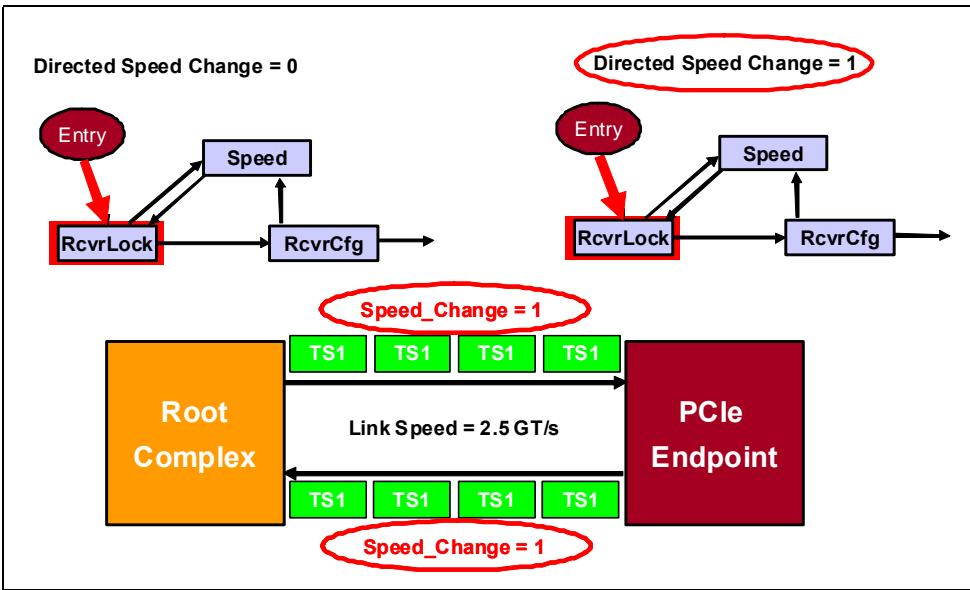

<table style="border-collapse:collapse; width:100%;">
  <thead>
    <tr>
      <th width="50%" style="border:1px solid #333; background:#f5f5f5;">EN</th>
      <th width="50%" style="border:1px solid #333; background-color:#e8e8e8;">中文</th>
    </tr>
  </thead>
  <tbody>
    <tr><td width="50%" style="border:1px solid #333; background:#fff;padding:4px 8px;">When the Upstream Port detects the TS1s coming back, its state machine changes to the Recovery.RcvrCfg substate and it begins to send TS2s that still have the Speed Change bit set, as illustrated in Figure 14‑50 on page 624. These TS2s will now also have the Autonomous Change bit set if this change was not caused by a reliability problem on the Link. When the Downstream Port sees incoming TS2s, it also changes to the Recovery.RcvrCfg substate and returns TS2s with the Speed Change bit set. However, the Autonomous Change bit is reserved in the TS2s for Downstream Ports during Recovery.</td><td width="50%" style="border:1px solid #333; background-color:#e8e8e8;padding:4px 8px;">当上游端口检测到返回的TS1序列时，其状态机变更到Recovery.RcvrCfg子状态，并开始发送仍设置了速率变更位的TS2序列，如图14-50（第624页）所示。如果此次变更不是由链路上的可靠性问题引起的，这些TS2序列还将设置自主变更位。当下游端口看到传入的TS2序列时，它也变更到Recovery.RcvrCfg子状态，并返回设置了速率变更位的TS2序列。但是，在恢复期间，对于下游端口，TS2序列中的自主变更位是保留的。</td></tr>
  </tbody>
</table>

Figure 14‑50: Speed Change ‑ Part 2 | 图14‑50：速度变更 - 第2部分

<table style="border-collapse:collapse; width:100%;">
  <thead>
    <tr>
      <th width="50%" style="border:1px solid #333; background:#f5f5f5;">EN</th>
      <th width="50%" style="border:1px solid #333; background-color:#e8e8e8;">中文</th>
    </tr>
  </thead>
  <tbody>
    <tr><td width="50%" style="border:1px solid #333; background:#fff;padding:4px 8px;">Once each Port has seen 8 consecutive TS2s with the Speed Change bit set, they know that the next step will be to go to the Recovery.Speed substate, as shown in Figure 14‑51 on page 625. At this point, the Downstream Port needs to register the setting of the Autonomous Change bit in the incoming TS2s. To support this, some extra fields have been added to the PCIe Capability registers.</td><td width="50%" style="border:1px solid #333; background-color:#e8e8e8;padding:4px 8px;">一旦每个端口看到了8个连续的设置了速率变更位的TS2序列，它们就知道下一步将是进入Recovery.Speed子状态，如图14-51（第625页）所示。此时，下游端口需要记录传入TS2序列中自主变更位的设置。为支持此功能，在PCIe能力寄存器中添加了一些额外的字段。</td></tr>
    <tr><td width="50%" style="border:1px solid #333; background:#fff;padding:4px 8px;">The status bits for Link bandwidth changes are found in the Link Status register, shown in Figure 14‑52 on page 625. Status changes can also be used to generate an interrupt to notify software of these events if the device is capable and has been enabled to do so. This capability is reported by the Link Bandwidth Notification Capable bit, shown in Figure 14‑53 on page 626, and enabled by the Interrupt Enable bits in the Link Control register, as shown in Figure 14‑54 on page 626. Note that there are two cases: autonomous and bandwidth management. Autonomous means the change was not caused by a reliability problem, while bandwidth management means it was.</td><td width="50%" style="border:1px solid #333; background-color:#e8e8e8;padding:4px 8px;">链路带宽变更的状态位位于链路状态寄存器中，如图14-52（第625页）所示。如果设备具有此能力并已被使能，状态变更也可用于生成中断以通知软件这些事件。该能力由链路带宽通知能力位报告（如图14-53（第626页）所示），并由链路控制寄存器中的中断使能位（如图14-54（第626页）所示）使能。注意有两种情况：自主变更和带宽管理。自主意味着变更不是由可靠性问题引起的，而带宽管理则意味着是由可靠性问题引起的。</td></tr>
  </tbody>
</table>

Figure 14‑51: Speed Change ‑ Part 3 | 图14‑51：速度变更 - 第3部分

Figure 14‑52: Bandwidth Change Status Bits | 图14‑52：带宽变更状态位

Figure 14‑53: Bandwidth Notification Capability | 图14‑53：带宽通知能力
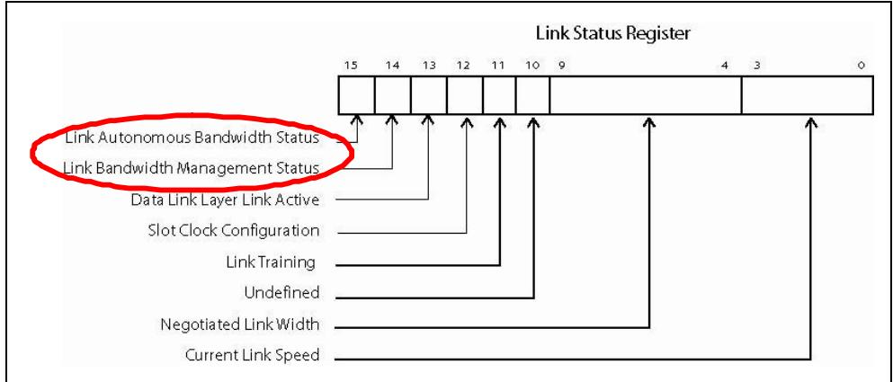

Figure 14‑54: Bandwidth Change Notification Bits | 图14‑54：带宽变更通知位

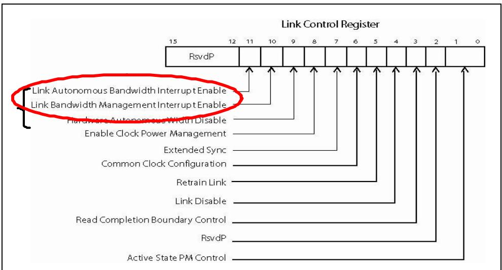

<table style="border-collapse:collapse; width:100%;">
  <thead>
    <tr>
      <th width="50%" style="border:1px solid #333; background:#f5f5f5;">EN</th>
      <th width="50%" style="border:1px solid #333; background-color:#e8e8e8;">中文</th>
    </tr>
  </thead>
  <tbody>
    <tr><td width="50%" style="border:1px solid #333; background:#fff;padding:4px 8px;">Once the Recovery.Speed substate is reached, the Link is placed into the Electrical Idle condition in both directions and the speed is changed internally. The speed chosen will be the highest commonly‑supported speed reported in the Rate ID field of the TS1s and TS2s. In this example, that turns out to be 5.0 GT/s and so the change is made to that speed. After a timeout period, the Link neighbors both transition back to Recovery.RcvrLock and exit Electrical Idle by sending TS1s again, as shown in Figure 14‑55 on page 627. When the Upstream Port sees them coming back, it transitions to Recovery.RcvrCfg and begins sending TS2s, much like before. This time, though, the Speed Change bit is not set. Eventually TS2s are seen coming back from the Downstream Port that also don't have the Speed Change bit set, and at that point the state machines transition to the Recovery.Idle on their way back to L0.</td><td width="50%" style="border:1px solid #333; background-color:#e8e8e8;padding:4px 8px;">一旦到达Recovery.Speed子状态，链路在双向上都被置为电气空闲条件，并在内部变更速率。所选择的速率将是TS1和TS2序列的速率标识字段中报告的最高共同支持速率。在本例中，该速率为5.0 GT/s，因此将变更为该速率。经过超时周期后，链路双方的相邻端口都转换回Recovery.RcvrLock，并通过再次发送TS1序列退出电气空闲，如图14-55（第627页）所示。当上游端口看到它们返回时，它转换到Recovery.RcvrCfg并开始发送TS2序列，与之前非常相似。不过，这次速率变更位没有被设置。最终，看到从下游端口返回的TS2序列也没有设置速率变更位，此时状态机在返回L0的途中转换到Recovery.Idle。</td></tr>
    <tr><td width="50%" style="border:1px solid #333; background:#fff;padding:4px 8px;">If a speed change has fails for some reason, a component is not allowed to try that speed or a higher one for at least 200 ms after returning to L0 or until the Link neighbor advertises support for a higher speed, whichever comes first.</td><td width="50%" style="border:1px solid #333; background-color:#e8e8e8;padding:4px 8px;">如果速率变更因某种原因失败，则在返回L0后至少200毫秒内，或直到链路邻居通告支持更高速率之前（以先到者为准），组件不允许尝试该速率或更高速率。</td></tr>
  </tbody>
</table>

Figure 14‑55: Speed Change Finish | 图14‑55：速度变更完成

## 14.9.4 Software Control of Speed Changes | 14.9.4 速度变化的软件控制

<table style="border-collapse:collapse; width:100%;">
  <thead>
    <tr>
      <th width="50%" style="border:1px solid #333; background:#f5f5f5;">EN</th>
      <th width="50%" style="border:1px solid #333; background-color:#e8e8e8;">中文</th>
    </tr>
  </thead>
  <tbody>
    <tr><td width="50%" style="border:1px solid #333; background:#fff;padding:4px 8px;">Software is unable to control when hardware makes decisions about changing the speed but can limit or disable this capability.</td><td width="50%" style="border:1px solid #333; background-color:#e8e8e8;padding:4px 8px;">软件无法控制硬件何时做出改变速度的决定，但可以限制或禁用此能力。</td></tr>
    <tr><td width="50%" style="border:1px solid #333; background:#fff;padding:4px 8px;">Limiting it is accomplished by setting the Target Link Speed value in the Link Control 2 Register shown in Figure 14-56 on page 628.</td><td width="50%" style="border:1px solid #333; background-color:#e8e8e8;padding:4px 8px;">限制该能力是通过设置链路控制 2 寄存器（Link Control 2 Register）中的目标链路速度（Target Link Speed）值来实现的，如图 14-56（第 628 页）所示。</td></tr>
    <tr><td width="50%" style="border:1px solid #333; background:#fff;padding:4px 8px;">This acts as the upper bound on the speeds available to</td><td width="50%" style="border:1px solid #333; background-color:#e8e8e8;padding:4px 8px;">这作为可用速度的上限，供</td></tr>
  </tbody>
</table>

<table style="border-collapse:collapse; width:100%;">
  <thead>
    <tr>
      <th width="50%" style="border:1px solid #333; background:#f5f5f5;">EN</th>
      <th width="50%" style="border:1px solid #333; background-color:#e8e8e8;">中文</th>
    </tr>
  </thead>
  <tbody>
    <tr><td width="50%" style="border:1px solid #333; background:#fff;padding:4px 8px;">## PCI Express Technology</td><td width="50%" style="border:1px solid #333; background-color:#e8e8e8;padding:4px 8px;">## PCI Express 技术</td></tr>
    <tr><td width="50%" style="border:1px solid #333; background:#fff;padding:4px 8px;">the Upstream Port, which will try to maintain that value or the highest speed supported by both Link neighbors, whichever is lower.</td><td width="50%" style="border:1px solid #333; background-color:#e8e8e8;padding:4px 8px;">上游端口将尝试维持该值或链路两端均支持的最高速度，以较低者为准。</td></tr>
    <tr><td width="50%" style="border:1px solid #333; background:#fff;padding:4px 8px;">Software can also force a particular speed to be used by setting the Target Link Speed in the Upstream component and then setting the Retrain Link bit in the Link Control register, shown in Figure 14‐57 on page 629.</td><td width="50%" style="border:1px solid #333; background-color:#e8e8e8;padding:4px 8px;">软件也可以通过在上游组件中设置目标链路速度（Target Link Speed），然后在链路控制寄存器中设置重训练链路位（Retrain Link bit）（如第629页图14-57所示）来强制使用特定速度。</td></tr>
    <tr><td width="50%" style="border:1px solid #333; background:#fff;padding:4px 8px;">As mentioned earlier, software is notified of any hardware‐based Link speed or width changes by the Link Bandwidth Notification Mechanism.</td><td width="50%" style="border:1px solid #333; background-color:#e8e8e8;padding:4px 8px;">如前所述，任何基于硬件的链路速度或宽度变化都会通过链路带宽通知机制（Link Bandwidth Notification Mechanism）通知软件。</td></tr>
    <tr><td width="50%" style="border:1px solid #333; background:#fff;padding:4px 8px;">Finally, the speed change mechanism can be disabled by setting the Hardware Autonomous Speed Disable bit.</td><td width="50%" style="border:1px solid #333; background-color:#e8e8e8;padding:4px 8px;">最后，可以通过设置硬件自主速度禁用位（Hardware Autonomous Speed Disable bit）来禁用速度更改机制。</td></tr>
  </tbody>
</table>

Figure 14‐56: Link Control 2 Register | 图14‐56：链路控制2寄存器  
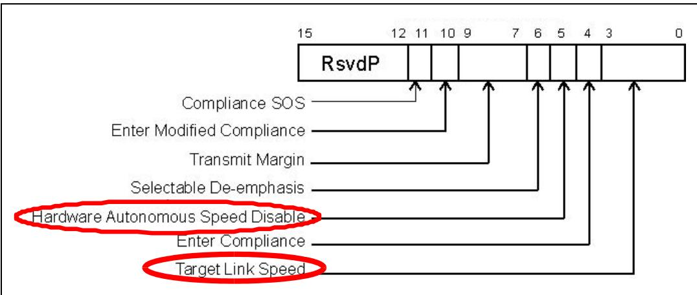

Figure 14‐57: Link Control Register | 图14‐57：链路控制寄存器  

<table style="border-collapse:collapse; width:100%;">
  <thead>
    <tr>
      <th width="50%" style="border:1px solid #333; background:#f5f5f5;">EN</th>
      <th width="50%" style="border:1px solid #333; background-color:#e8e8e8;">中文</th>
    </tr>
  </thead>
  <tbody>
    <tr><td width="50%" style="border:1px solid #333; background:#fff;padding:4px 8px;">## Dynamic Link Width Changes</td><td width="50%" style="border:1px solid #333; background-color:#e8e8e8;padding:4px 8px;">## 动态链路宽度更改</td></tr>
    <tr><td width="50%" style="border:1px solid #333; background:#fff;padding:4px 8px;">The same basic operation for changing the Link speed can also be used to change the Link width, although the sequence is a little more complicated because more LTSSM steps are involved. One thing that's important for software to note before enabling Link width changes is whether the Link neighbor supports recovering from a narrow Link back to a wide Link (called Upconfiguring the Link). Devices report this ability in bit 6 of the Rate ID field of the TS2s they send during training, as shown in Figure 14‐58 on page 630. If a component doesn't support this, that would mean that changing to a narrower Link width would be a one‐way event and would only be suitable for the case of a reliability problem on the Link.</td><td width="50%" style="border:1px solid #333; background-color:#e8e8e8;padding:4px 8px;">更改链路速度所用的相同基本操作也可用于更改链路宽度，但由于涉及更多LTSSM步骤，其顺序稍显复杂。在启用链路宽度更改之前，软件需要注意的一个重要问题是链路对端是否支持从窄链路恢复回宽链路（称为向上配置链路）。设备在训练期间发送的TS2的速率ID字段的位6中报告此能力，如第630页图14‑58所示。如果组件不支持此功能，则意味着更改为较窄链路宽度将是单向事件，仅适用于链路上存在可靠性问题的情况。</td></tr>
  </tbody>
</table>

Figure 14‐58: TS2 Contents | 图14‐58：TS2内容  
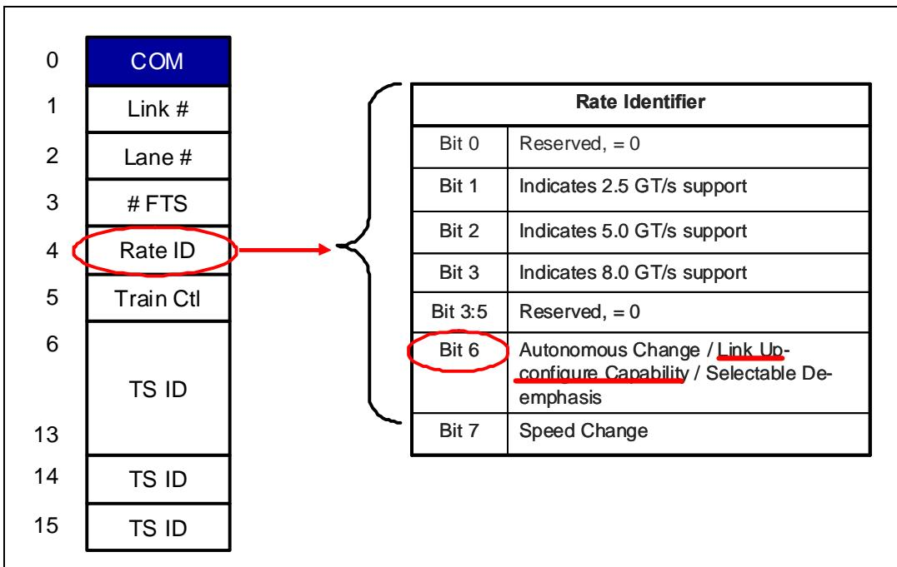

<table style="border-collapse:collapse; width:100%;">
  <thead>
    <tr>
      <th width="50%" style="border:1px solid #333; background:#f5f5f5;">EN</th>
      <th width="50%" style="border:1px solid #333; background-color:#e8e8e8;">中文</th>
    </tr>
  </thead>
  <tbody>
    <tr><td width="50%" style="border:1px solid #333; background:#fff;padding:4px 8px;">## Link Width Change Example</td><td width="50%" style="border:1px solid #333; background-color:#e8e8e8;padding:4px 8px;">## 链路宽度变更示例</td></tr>
    <tr><td width="50%" style="border:1px solid #333; background:#fff;padding:4px 8px;">Consider the example in Figure 14‑59 on page 631 of a Root Port connected to an Endpoint (Gigabit Ethernet Device). Only the Upstream Port will initiate this change, and it begins by going to the Recovery state as before. This time, though, the Speed Change bit is not set. To sort out what the new Link width will be, the Upstream Port will need to tell the Downstream Port to transition from the Recovery state to the Configuration state before going back to L0, as shown in Figure 14‑60 on page 631. There are several substates in the Configuration state, and a simplified version of them is shown in Figure 14‑61 on page 632. We'll go through the sequence to be clear on how the steps work.</td><td width="50%" style="border:1px solid #333; background-color:#e8e8e8;padding:4px 8px;">考虑图14-59（第631页）中根端口连接端点（千兆以太网设备）的示例。只有上游端口会发起此变更，且与前文一样，它首先进入Recovery状态。但这一次，Speed Change位未被置位。为了确定新的链路宽度，上游端口需要通知下游端口从Recovery状态转换到Configuration状态，然后再返回L0，如图14-60（第631页）所示。Configuration状态包含多个子状态，其简化版本如图14-61（第632页）所示。我们将逐步说明整个过程，以清晰展示各步骤的工作方式。</td></tr>
  </tbody>
</table>

Figure 14‑59: Link Width Change Example | 图14‑59：链路宽度变更示例

Figure 14‑60: Link Width Change LTSSM Sequence | 图14‑60：链路宽度变更LTSSM序列

Figure 14‑61: Simplified Configuration Substates | 图14‑61：简化配置子状态

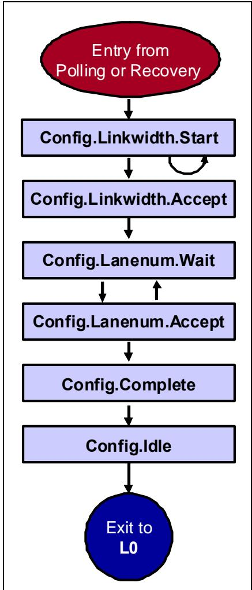

<table style="border-collapse:collapse; width:100%;">
  <thead>
    <tr>
      <th width="50%" style="border:1px solid #333; background:#f5f5f5;">EN</th>
      <th width="50%" style="border:1px solid #333; background-color:#e8e8e8;">中文</th>
    </tr>
  </thead>
  <tbody>
    <tr><td width="50%" style="border:1px solid #333; background:#fff;padding:4px 8px;">As before, the Upstream Port initiates this process by going to Recovery and sending TS1s. These don't have the Speed Change bit set, as highlighted in the example shown in Figure 14‑59 on page 631, where an Ethernet Device initiates this process on its Upstream Port. In response, the Downstream Port sends TS1s back, also with the Speed Change bit cleared. Link and Lane numbers are still shown as being unchanged from the last time the Link was trained. Referring back to Figure 14‑48 on page 622, the next state is Recovery.RcvrCfg during which the Link partners exchange TS2s.</td><td width="50%" style="border:1px solid #333; background-color:#e8e8e8;padding:4px 8px;">如前所述，上游端口通过进入Recovery状态并发送TS1s来发起此过程。这些TS1s未设置Speed Change位，如图14-59（第631页）所示示例中强调的那样，其中一个以太网设备在其上游端口上发起此过程。作为响应，下游端口发送回TS1s，同样清除了Speed Change位。链路和通道编号仍显示为自上次链路训练以来未发生变化。参考回图14-48（第622页），下一状态是Recovery.RcvrCfg，在此状态下链路双方交换TS2s。</td></tr>
  </tbody>
</table>

## Chapter 14: Link Initialization & Training | 第14章：链路初始化和训练
## 第14章：链路初始化和训练

Figure 14‐62: Link Width Change ‐ Start | 图14‐62：链路宽度变更 - 开始

<table style="border-collapse:collapse; width:100%;">
  <thead>
    <tr>
      <th width="50%" style="border:1px solid #333; background:#f5f5f5;">EN</th>
      <th width="50%" style="border:1px solid #333; background-color:#e8e8e8;">中文</th>
    </tr>
  </thead>
  <tbody>
    <tr><td width="50%" style="border:1px solid #333; background:#fff;padding:4px 8px;">Since a speed change is not requested, the next state is Recovery.Idle. In that state the Ports normally send the logical idle symbols (all zeros) and the Downstream Port does so, as shown in Figure 14‑63 on page 634. However, the Upstream Port was directed to change the Link width so it doesn't send the expected Idle symbols. Instead, it sends TS1s with PAD for both the Link and Lane numbers. The Downstream Port recognizes that a previously configured Lane now has a Lane number of PAD, and that causes it to transition to the first Configuration substate: Config.Linkwidth.Start.</td><td width="50%" style="border:1px solid #333; background-color:#e8e8e8;padding:4px 8px;">由于未请求速度变化，下一个状态是Recovery.Idle。在该状态下，端口通常发送逻辑空闲符号（全零），下游端口执行此操作，如图14‑63第634页所示。然而，上游端口被指示更改链路宽度，因此它不发送预期的空闲符号。相反，它发送带有PAD作为链路编号和通道编号的TS1。下游端口识别到之前配置的通道现在的通道编号为PAD，这导致其转换到第一个配置子状态：Config.Linkwidth.Start。</td></tr>
  </tbody>
</table>

Figure 14‐63: Link Width Change ‐ Recovery.Idle | 图14‐63：链路宽度变更 - Recovery.Idle

<table style="border-collapse:collapse; width:100%;">
  <thead>
    <tr>
      <th width="50%" style="border:1px solid #333; background:#f5f5f5;">EN</th>
      <th width="50%" style="border:1px solid #333; background-color:#e8e8e8;">中文</th>
    </tr>
  </thead>
  <tbody>
    <tr><td width="50%" style="border:1px solid #333; background:#fff;padding:4px 8px;">The Downstream Port now initiates the next step by sending TS1s that have the originally negotiated Link number but PAD on all the Lane numbers, as illustrated in Figure 14‑64 on page 635. The Upstream Port responds with matching TS1s on the Lanes it wants to have "active", but with PAD for both Link and Lane numbers on the Lanes it wishes to have inactive. When the Downstream Port sees this response, it transitions to the Config.Linkwidth.Accept substate. Note that the Autonomous Change bit is set for these TS1s.</td><td width="50%" style="border:1px solid #333; background-color:#e8e8e8;padding:4px 8px;">下游端口现在通过发送TS1来启动下一步，这些TS1具有原始协商的链路编号，但所有通道编号均为PAD，如图14‑64第635页所示。上游端口在其希望保持"活跃"的通道上用匹配的TS1响应，但在其希望保持非活跃的通道上使用PAD作为链路编号和通道编号。当下游端口看到此响应时，它转换到Config.Linkwidth.Accept子状态。注意，这些TS1的自主更改位已被设置。</td></tr>
  </tbody>
</table>

## Chapter 14: Link Initialization & Training | 第14章：链路初始化和训练

Figure 14‐64: Marking Active Lanes | 图14‐64：标记活动通道  

<table style="border-collapse:collapse; width:100%;">
  <thead>
    <tr>
      <th width="50%" style="border:1px solid #333; background:#f5f5f5;">EN</th>
      <th width="50%" style="border:1px solid #333; background-color:#e8e8e8;">中文</th>
    </tr>
  </thead>
  <tbody>
    <tr><td width="50%" style="border:1px solid #333; background:#fff;padding:4px 8px;">The Root Port responds by changing its TS1s to show Lane numbers that are appropriate for the active Lanes, but PAD for the Link and Lane numbers of all the Lanes that were seen to be inactive. The Upstream Port responds with the same TS1s, as shown in Figure 14‑65 on page 636, and the state changes to Config.Lanenum.Accept. At this point, the Root Port updates the status bit to show that an autonomous change was detected and changes to the Config.Complete substate.</td><td width="50%" style="border:1px solid #333; background-color:#e8e8e8;padding:4px 8px;">根端口通过更改其TS1来响应：为活动通道显示适当的通道号，而对所有检测为非活动的通道，其链路号和通道号字段均填充为PAD。上游端口以相同的TS1响应，如图14‑65（第636页）所示，状态变为Config.Lanenum.Accept。此时，根端口更新状态位以指示检测到自主变化，并转换到Config.Complete子状态。</td></tr>
  </tbody>
</table>

Figure 14‐65: Response to Lane Number Changes | 图14‐65：对通道号变更的响应  

<table style="border-collapse:collapse; width:100%;">
  <thead>
    <tr>
      <th width="50%" style="border:1px solid #333; background:#f5f5f5;">EN</th>
      <th width="50%" style="border:1px solid #333; background-color:#e8e8e8;">中文</th>
    </tr>
  </thead>
  <tbody>
    <tr><td width="50%" style="border:1px solid #333; background:#fff;padding:4px 8px;">In the next step, the Root Port begins to send TS2s on the active Lanes and puts the inactive Lanes into Electrical Idle. Recall that the TS2s report whether a component is "upconfigure capable" and in this example, both Link partners support this capability. The Endpoint sends back the same thing: TS2s on active Lanes and Electrical Idle on inactive Lanes. Seeing that, the Root Port's state machine changes to Config.Idle and it begins to send Logical Idle on the active Lanes. The Endpoint responds with the same thing and the Link state changes back to L0. The Link is now ready for normal operation, albeit with a reduced bandwidth for power conservation.</td><td width="50%" style="border:1px solid #333; background-color:#e8e8e8;padding:4px 8px;">下一步，根端口开始在活动通道上发送TS2，并将非活动通道置为电气空闲状态。回顾一下，TS2用于报告组件是否"具有向上配置能力"，在此示例中两个链路伙伴都支持该能力。端点返回相同的内容：在活动通道上发送TS2，在非活动通道上发送电气空闲。看到此情形后，根端口的状态机转换为Config.Idle，并开始在活动通道上发送逻辑空闲。端点以相同方式响应，链路状态回到L0。此时链路已准备好正常运行，只是为省电而带宽有所降低。</td></tr>
  </tbody>
</table>

## Chapter 14: Link Initialization & Training | 第14章：链路初始化和训练

## 第14章：链路初始化和训练

Figure 14‐66: Link Width Change ‐ Finish | 图14‐66：链路宽度变更 - 完成

<table style="border-collapse:collapse; width:100%;">
  <thead>
    <tr>
      <th width="50%" style="border:1px solid #333; background:#f5f5f5;">EN</th>
      <th width="50%" style="border:1px solid #333; background-color:#e8e8e8;">中文</th>
    </tr>
  </thead>
  <tbody>
    <tr><td width="50%" style="border:1px solid #333; background:#fff;padding:4px 8px;">As was the case for dynamic speed changes, software can't initiate Link width changes, but it can disable this mechanism by setting the bit in the Link Control register shown in Figure 14‐67 on page 638. Unlike the speed change case, no software mechanism was defined to allow setting a particular Link width.</td><td width="50%" style="border:1px solid #333; background-color:#e8e8e8;padding:4px 8px;">与动态速率变更的情况一样，软件不能发起链路宽度变更，但可以通过设置第638页图14-67所示的链路控制寄存器中的位来禁用此机制。与速率变更情况不同，没有定义允许设置特定链路宽度的软件机制。</td></tr>
  </tbody>
</table>

Figure 14‐67: Link Control Register | 图14‐67：链路控制寄存器

<table style="border-collapse:collapse; width:100%;">
  <thead>
    <tr>
      <th width="50%" style="border:1px solid #333; background:#f5f5f5;">EN</th>
      <th width="50%" style="border:1px solid #333; background-color:#e8e8e8;">中文</th>
    </tr>
  </thead>
  <tbody>
    <tr><td width="50%" style="border:1px solid #333; background:#fff;padding:4px 8px;">## Related Configuration Registers</td><td width="50%" style="border:1px solid #333; background-color:#e8e8e8;padding:4px 8px;">## 相关配置寄存器</td></tr>
    <tr><td width="50%" style="border:1px solid #333; background:#fff;padding:4px 8px;">Many of the configuration registers that are relevant to Link Initialization and Training have been shown when their contents were described earlier, but it seems good to summarize them here.</td><td width="50%" style="border:1px solid #333; background-color:#e8e8e8;padding:4px 8px;">许多与链路初始化和训练相关的配置寄存器在前文描述其内容时已经展示过，但在此汇总一下似乎更为妥当。</td></tr>
  </tbody>
</table>

<table style="border-collapse:collapse; width:100%;">
  <thead>
    <tr>
      <th width="50%" style="border:1px solid #333; background:#f5f5f5;">EN</th>
      <th width="50%" style="border:1px solid #333; background-color:#e8e8e8;">中文</th>
    </tr>
  </thead>
  <tbody>
    <tr><td width="50%" style="border:1px solid #333; background:#fff;padding:4px 8px;">## Link Capabilities Register</td><td width="50%" style="border:1px solid #333; background-color:#e8e8e8;padding:4px 8px;">## 链路能力寄存器</td></tr>
    <tr><td width="50%" style="border:1px solid #333; background:#fff;padding:4px 8px;">The Link Capabilities Register is pictured in Figure 14‑68 on page 639 and each bit field is described in the subsections that follow.</td><td width="50%" style="border:1px solid #333; background-color:#e8e8e8;padding:4px 8px;">链路能力寄存器如图14‑68（第639页）所示，每个位字段在后续小节中描述。</td></tr>
  </tbody>
</table>

Figure 14‑68: Link Capabilities Register | 图14‑68：链路能力寄存器  

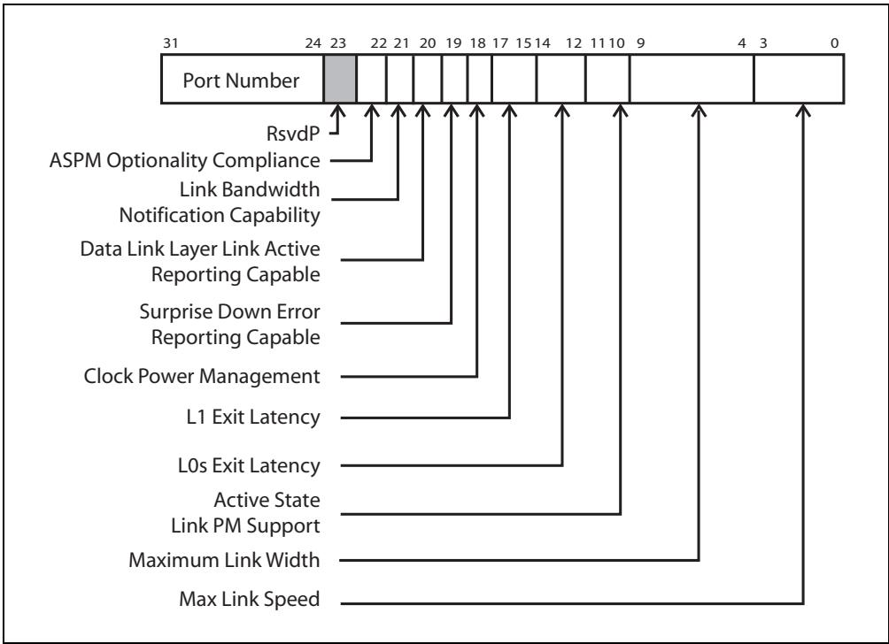

## Max Link Speed [3:0] | 最大链路速度 [3:0]

<table style="border-collapse:collapse; width:100%;">
  <thead>
    <tr>
      <th width="50%" style="border:1px solid #333; background:#f5f5f5;">EN</th>
      <th width="50%" style="border:1px solid #333; background-color:#e8e8e8;">中文</th>
    </tr>
  </thead>
  <tbody>
    <tr><td width="50%" style="border:1px solid #333; background:#fff;padding:4px 8px;">This indicates the maximum Link speed for this port, and is given as a pointer to a bit location in the Link Capabilities 2 register Supported Link Speeds Vector that corresponds to the max Link speed. Defined encodings are:</td><td width="50%" style="border:1px solid #333; background-color:#e8e8e8;padding:4px 8px;">该字段指示该端口所支持的最大链路速率，以指针形式指向链路能力2（Link Capabilities 2）寄存器中支持链路速率向量（Supported Link Speeds Vector）内对应最大链路速率的位位置。已定义的编码如下：</td></tr>
    <tr><td width="50%" style="border:1px solid #333; background:#fff;padding:4px 8px;">0001b - Supported Link Speeds Vector field bit 0</td><td width="50%" style="border:1px solid #333; background-color:#e8e8e8;padding:4px 8px;">0001b - 支持链路速率向量字段位 0</td></tr>
    <tr><td width="50%" style="border:1px solid #333; background:#fff;padding:4px 8px;">0010b - Supported Link Speeds Vector field bit 1</td><td width="50%" style="border:1px solid #333; background-color:#e8e8e8;padding:4px 8px;">0010b - 支持链路速率向量字段位 1</td></tr>
    <tr><td width="50%" style="border:1px solid #333; background:#fff;padding:4px 8px;">0011b - Supported Link Speeds Vector field bit 2</td><td width="50%" style="border:1px solid #333; background-color:#e8e8e8;padding:4px 8px;">0011b - 支持链路速率向量字段位 2</td></tr>
    <tr><td width="50%" style="border:1px solid #333; background:#fff;padding:4px 8px;">0100b - Supported Link Speeds Vector field bit 3</td><td width="50%" style="border:1px solid #333; background-color:#e8e8e8;padding:4px 8px;">0100b - 支持链路速率向量字段位 3</td></tr>
    <tr><td width="50%" style="border:1px solid #333; background:#fff;padding:4px 8px;">0101b - Supported Link Speeds Vector field bit 4</td><td width="50%" style="border:1px solid #333; background-color:#e8e8e8;padding:4px 8px;">0101b - 支持链路速率向量字段位 4</td></tr>
    <tr><td width="50%" style="border:1px solid #333; background:#fff;padding:4px 8px;">0110b - Supported Link Speeds Vector field bit 5</td><td width="50%" style="border:1px solid #333; background-color:#e8e8e8;padding:4px 8px;">0110b - 支持链路速率向量字段位 5</td></tr>
    <tr><td width="50%" style="border:1px solid #333; background:#fff;padding:4px 8px;">0111b - Supported Link Speeds Vector field bit 6</td><td width="50%" style="border:1px solid #333; background-color:#e8e8e8;padding:4px 8px;">0111b - 支持链路速率向量字段位 6</td></tr>
    <tr><td width="50%" style="border:1px solid #333; background:#fff;padding:4px 8px;">All other encodings are reserved. Multi-function devices sharing an Upstream Port must report the same value in this field in all Functions. This register is Read Only.</td><td width="50%" style="border:1px solid #333; background-color:#e8e8e8;padding:4px 8px;">所有其他编码均为保留。共享同一上游端口（Upstream Port）的多功能设备必须在所有功能（Function）中对此字段报告相同的值。该寄存器为只读（Read Only）。</td></tr>
  </tbody>
</table>

<table style="border-collapse:collapse; width:100%;">
  <thead>
    <tr>
      <th width="50%" style="border:1px solid #333; background:#f5f5f5;">EN</th>
      <th width="50%" style="border:1px solid #333; background-color:#e8e8e8;">中文</th>
    </tr>
  </thead>
  <tbody>
    <tr><td width="50%" style="border:1px solid #333; background:#fff;padding:4px 8px;">## Maximum Link Width[9:4]</td><td width="50%" style="border:1px solid #333; background-color:#e8e8e8;padding:4px 8px;">## 最大链路宽度[9:4]</td></tr>
    <tr><td width="50%" style="border:1px solid #333; background:#fff;padding:4px 8px;">This field indicates the maximum width of the PCI Express Link. The values that are defined are:</td><td width="50%" style="border:1px solid #333; background-color:#e8e8e8;padding:4px 8px;">此字段指示PCI Express链路的最大宽度。定义的值为：</td></tr>
    <tr><td width="50%" style="border:1px solid #333; background:#fff;padding:4px 8px;">• 00 0000b: Reserved • 00 0001b: x1 • 00 0010b: x2 • 00 0100b: x4 • 00 1000b: x8 • 00 1100b: x12 • 01 0000b: x16 • 10 0000b: x32</td><td width="50%" style="border:1px solid #333; background-color:#e8e8e8;padding:4px 8px;">• 00 0000b：保留 • 00 0001b：x1 • 00 0010b：x2 • 00 0100b：x4 • 00 1000b：x8 • 00 1100b：x12 • 01 0000b：x16 • 10 0000b：x32</td></tr>
    <tr><td width="50%" style="border:1px solid #333; background:#fff;padding:4px 8px;">All other encodings are reserved. Multi‑function devices sharing an Upstream Port must report the same value in this field in all Functions. This register is Read Only.</td><td width="50%" style="border:1px solid #333; background-color:#e8e8e8;padding:4px 8px;">所有其他编码均为保留。共享同一上游端口的多功能设备必须在所有功能中报告此字段的相同值。此寄存器为只读。</td></tr>
  </tbody>
</table>

## 14.10.2 Link Capabilities 2 Register | 14.10.2 链路能力 2 寄存器
## 14.10.2 Link Capabilities 2 Register | 14.10.2 链路能力2寄存器

<table style="border-collapse:collapse; width:100%;">
  <thead>
    <tr>
      <th width="50%" style="border:1px solid #333; background:#f5f5f5;">EN</th>
      <th width="50%" style="border:1px solid #333; background-color:#e8e8e8;">中文</th>
    </tr>
  </thead>
  <tbody>
    <tr><td width="50%" style="border:1px solid #333; background:#fff;padding:4px 8px;">The Link Capabilities 2 Register is pictured in Figure 14-68 on page 639 and shows the Supported Link Speeds Vector to which the Max Link Speed field in the Link Capabilities register points. The values for this field are:</td><td width="50%" style="border:1px solid #333; background-color:#e8e8e8;padding:4px 8px;">链路能力2寄存器如图14-68（第639页）所示，它展示了支持的链路速率向量（Supported Link Speeds Vector），链路能力寄存器中的最大链路速率（Max Link Speed）字段即指向该向量。该字段的值如下：</td></tr>
    <tr><td width="50%" style="border:1px solid #333; background:#fff;padding:4px 8px;">$\mathrm{Bit} 0 = 2.5 \mathrm{GT/s}$</td><td width="50%" style="border:1px solid #333; background-color:#e8e8e8;padding:4px 8px;">$\mathrm{位} 0 = 2.5 \mathrm{GT/s}$</td></tr>
    <tr><td width="50%" style="border:1px solid #333; background:#fff;padding:4px 8px;">Bit 1 = 5.0 GT/s</td><td width="50%" style="border:1px solid #333; background-color:#e8e8e8;padding:4px 8px;">位1 = 5.0 GT/s</td></tr>
    <tr><td width="50%" style="border:1px solid #333; background:#fff;padding:4px 8px;">Bit 2 = 8.0 GT/s</td><td width="50%" style="border:1px solid #333; background-color:#e8e8e8;padding:4px 8px;">位2 = 8.0 GT/s</td></tr>
    <tr><td width="50%" style="border:1px solid #333; background:#fff;padding:4px 8px;">Bits 6:3 RsvdP (reserved and preserved).</td><td width="50%" style="border:1px solid #333; background-color:#e8e8e8;padding:4px 8px;">位6:3 RsvdP（保留且需保持）。</td></tr>
  </tbody>
</table>

Figure 14-69: Link Capabilities 2 Register | 图14-69：链路能力2寄存器  

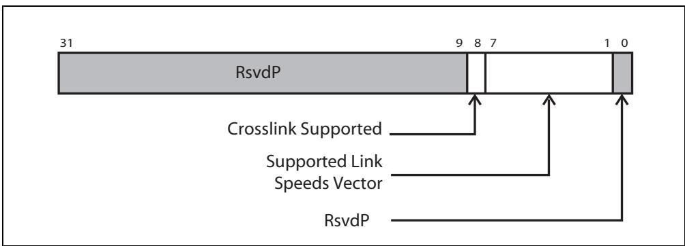

<table style="border-collapse:collapse; width:100%;">
  <thead>
    <tr>
      <th width="50%" style="border:1px solid #333; background:#f5f5f5;">EN</th>
      <th width="50%" style="border:1px solid #333; background-color:#e8e8e8;">中文</th>
    </tr>
  </thead>
  <tbody>
    <tr><td width="50%" style="border:1px solid #333; background:#fff;padding:4px 8px;">## Link Status Register</td><td width="50%" style="border:1px solid #333; background-color:#e8e8e8;padding:4px 8px;">## 链路状态寄存器</td></tr>
    <tr><td width="50%" style="border:1px solid #333; background:#fff;padding:4px 8px;">The Link Status Register is pictured in Figure 14‐39 on page 597.</td><td width="50%" style="border:1px solid #333; background-color:#e8e8e8;padding:4px 8px;">链路状态寄存器如图14‑39所示（第597页）。</td></tr>
  </tbody>
</table>

## Current Link Speed[3:0]: | 当前链路速度 [3:0]：

<table style="border-collapse:collapse; width:100%;">
  <thead>
    <tr>
      <th width="50%" style="border:1px solid #333; background:#f5f5f5;">EN</th>
      <th width="50%" style="border:1px solid #333; background-color:#e8e8e8;">中文</th>
    </tr>
  </thead>
  <tbody>
    <tr><td width="50%" style="border:1px solid #333; background:#fff;padding:4px 8px;">This read-only field indicates the current Link speed. The speed will always be 2.5 GT/s when the Link first trains to L0. After that, if a higher commonly-supported speed is available, the LTSSM will go to Recovery and attempt to change to that speed. The values in this field are the same as the Max Link Speed encodings shown in the Link Capabilities register:</td><td width="50%" style="border:1px solid #333; background-color:#e8e8e8;padding:4px 8px;">该只读字段指示当前链路速度。当链路首次训练至L0时，速度始终为2.5 GT/s。此后，若存在双方均支持的更高速度可用，LTSSM将进入Recovery状态并尝试切换至该速度。本字段的编码值与链路能力寄存器中最大链路速度（Max Link Speed）编码相同：</td></tr>
    <tr><td width="50%" style="border:1px solid #333; background:#fff;padding:4px 8px;">• 0001b - Supported Link Speeds Vector field bit 0</td><td width="50%" style="border:1px solid #333; background-color:#e8e8e8;padding:4px 8px;">• 0001b - 支持的链路速度向量字段位0</td></tr>
    <tr><td width="50%" style="border:1px solid #333; background:#fff;padding:4px 8px;">• 0010b - Supported Link Speeds Vector field bit 1</td><td width="50%" style="border:1px solid #333; background-color:#e8e8e8;padding:4px 8px;">• 0010b - 支持的链路速度向量字段位1</td></tr>
    <tr><td width="50%" style="border:1px solid #333; background:#fff;padding:4px 8px;">• 0011b - Supported Link Speeds Vector field bit 2</td><td width="50%" style="border:1px solid #333; background-color:#e8e8e8;padding:4px 8px;">• 0011b - 支持的链路速度向量字段位2</td></tr>
    <tr><td width="50%" style="border:1px solid #333; background:#fff;padding:4px 8px;">• 0100b - Supported Link Speeds Vector field bit 3</td><td width="50%" style="border:1px solid #333; background-color:#e8e8e8;padding:4px 8px;">• 0100b - 支持的链路速度向量字段位3</td></tr>
    <tr><td width="50%" style="border:1px solid #333; background:#fff;padding:4px 8px;">• 0101b - Supported Link Speeds Vector field bit 4</td><td width="50%" style="border:1px solid #333; background-color:#e8e8e8;padding:4px 8px;">• 0101b - 支持的链路速度向量字段位4</td></tr>
    <tr><td width="50%" style="border:1px solid #333; background:#fff;padding:4px 8px;">• 0110b - Supported Link Speeds Vector field bit 5</td><td width="50%" style="border:1px solid #333; background-color:#e8e8e8;padding:4px 8px;">• 0110b - 支持的链路速度向量字段位5</td></tr>
    <tr><td width="50%" style="border:1px solid #333; background:#fff;padding:4px 8px;">• 0111b - Supported Link Speeds Vector field bit 6</td><td width="50%" style="border:1px solid #333; background-color:#e8e8e8;padding:4px 8px;">• 0111b - 支持的链路速度向量字段位6</td></tr>
    <tr><td width="50%" style="border:1px solid #333; background:#fff;padding:4px 8px;">All other encodings are reserved.</td><td width="50%" style="border:1px solid #333; background-color:#e8e8e8;padding:4px 8px;">所有其他编码保留。</td></tr>
    <tr><td width="50%" style="border:1px solid #333; background:#fff;padding:4px 8px;">Note that the value of this field is undefined when the Link is not up (LinkUp = 0b).</td><td width="50%" style="border:1px solid #333; background-color:#e8e8e8;padding:4px 8px;">请注意，当链路未建立（LinkUp = 0b）时，本字段的值未定义。</td></tr>
  </tbody>
</table>

## Negotiated Link Width[9:4] | 协商链路宽度 [9:4]

<table style="border-collapse:collapse; width:100%;">
  <thead>
    <tr>
      <th width="50%" style="border:1px solid #333; background:#f5f5f5;">EN</th>
      <th width="50%" style="border:1px solid #333; background-color:#e8e8e8;">中文</th>
    </tr>
  </thead>
  <tbody>
    <tr><td width="50%" style="border:1px solid #333; background:#fff;padding:4px 8px;">This field indicates the result of link width negotiation. There are seven possible widths, all other encodings are reserved. The defined encodings are:</td><td width="50%" style="border:1px solid #333; background-color:#e8e8e8;padding:4px 8px;">该字段指示链路宽度协商的结果。共有七种可能的宽度，所有其他编码值均为保留。已定义的编码如下：</td></tr>
    <tr><td width="50%" style="border:1px solid #333; background:#fff;padding:4px 8px;">• 00 0001b: for x1.</td><td width="50%" style="border:1px solid #333; background-color:#e8e8e8;padding:4px 8px;">• 00 0001b：表示 x1</td></tr>
    <tr><td width="50%" style="border:1px solid #333; background:#fff;padding:4px 8px;">• 00 0010b for x2.</td><td width="50%" style="border:1px solid #333; background-color:#e8e8e8;padding:4px 8px;">• 00 0010b：表示 x2</td></tr>
    <tr><td width="50%" style="border:1px solid #333; background:#fff;padding:4px 8px;">• 00 0100b for x4.</td><td width="50%" style="border:1px solid #333; background-color:#e8e8e8;padding:4px 8px;">• 00 0100b：表示 x4</td></tr>
    <tr><td width="50%" style="border:1px solid #333; background:#fff;padding:4px 8px;">• 00 1000b for x8.</td><td width="50%" style="border:1px solid #333; background-color:#e8e8e8;padding:4px 8px;">• 00 1000b：表示 x8</td></tr>
    <tr><td width="50%" style="border:1px solid #333; background:#fff;padding:4px 8px;">• 00 1100b for x12.</td><td width="50%" style="border:1px solid #333; background-color:#e8e8e8;padding:4px 8px;">• 00 1100b：表示 x12</td></tr>
    <tr><td width="50%" style="border:1px solid #333; background:#fff;padding:4px 8px;">• 01 0000b for x16.</td><td width="50%" style="border:1px solid #333; background-color:#e8e8e8;padding:4px 8px;">• 01 0000b：表示 x16</td></tr>
    <tr><td width="50%" style="border:1px solid #333; background:#fff;padding:4px 8px;">• 10 0000b for x32.</td><td width="50%" style="border:1px solid #333; background-color:#e8e8e8;padding:4px 8px;">• 10 0000b：表示 x32</td></tr>
    <tr><td width="50%" style="border:1px solid #333; background:#fff;padding:4px 8px;">All other encodings are reserved. Note that the value of this field is undefined when the Link is not up (LinkUp = 0b).</td><td width="50%" style="border:1px solid #333; background-color:#e8e8e8;padding:4px 8px;">所有其他编码值均为保留。注意，当链路未建立（LinkUp = 0b）时，该字段的值未定义。</td></tr>
  </tbody>
</table>

## Undefined[10] | 未定义 [10]

<table style="border-collapse:collapse; width:100%;">
  <thead>
    <tr>
      <th width="50%" style="border:1px solid #333; background:#f5f5f5;">EN</th>
      <th width="50%" style="border:1px solid #333; background-color:#e8e8e8;">中文</th>
    </tr>
  </thead>
  <tbody>
    <tr><td width="50%" style="border:1px solid #333; background:#fff;padding:4px 8px;">Currently undefined, this bit was previously set by hardware in earlier spec versions when a Link Training Error had occurred. It was cleared when the LTSSM successfully entered L0. The spec states that software can write any value to this bit but must ignore any value read from it.</td><td width="50%" style="border:1px solid #333; background-color:#e8e8e8;padding:4px 8px;">当前未定义。在早期版本规范中，当发生链路训练错误（Link Training Error）时，硬件曾设置此位。当LTSSM成功进入L0时，该位被清除。规范指出，软件可向此位写入任意值，但必须忽略从该位读出的任何值。</td></tr>
  </tbody>
</table>

## Link Training[11] | 链路训练 [11]

<table style="border-collapse:collapse; width:100%;">
  <thead>
    <tr>
      <th width="50%" style="border:1px solid #333; background:#f5f5f5;">EN</th>
      <th width="50%" style="border:1px solid #333; background-color:#e8e8e8;">中文</th>
    </tr>
  </thead>
  <tbody>
    <tr><td width="50%" style="border:1px solid #333; background:#fff;padding:4px 8px;">This read-only bit indicates that the LTSSM is in the process of training. Technically, it means the LTSSM is either in the Configuration or Recovery state, or that the Retrain Link bit has been written to 1b but Link training has not yet begun. This bit is cleared by hardware when the LTSSM exits the Configuration or Recovery state. Since this must be visible to software while Link Training is in progress, it only has meaning for Ports that are facing downstream. Consequently, this bit is not applicable and reserved for Endpoints, bridge Upstream Ports and Switch Upstream Ports. For them, this bit must be hardwired to 0b.</td><td width="50%" style="border:1px solid #333; background-color:#e8e8e8;padding:4px 8px;">此只读位指示LTSSM正在训练过程中。从技术上讲，这意味着LTSSM处于Configuration或Recovery状态，或者Retrain Link位已被写入1b但链路训练尚未开始。当LTSSM退出Configuration或Recovery状态时，硬件会清除此位。由于链路训练进行期间必须对软件可见，因此该位仅对面向下游的端口有意义。因此，此位不适用于Endpoints、桥接器上游端口和Switch上游端口，并为其保留。对于它们，此位必须硬连线为0b。</td></tr>
  </tbody>
</table>

Figure 14-70: Link Status Register | 图14-70：链路状态寄存器

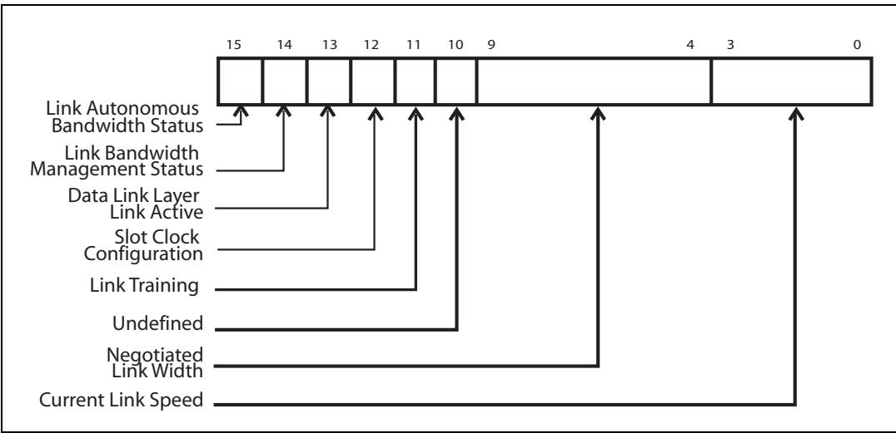

## 14.10.4 Link Control Register | 14.10.4 链路控制寄存器

<table style="border-collapse:collapse; width:100%;">
  <thead>
    <tr>
      <th width="50%" style="border:1px solid #333; background:#f5f5f5;">EN</th>
      <th width="50%" style="border:1px solid #333; background-color:#e8e8e8;">中文</th>
    </tr>
  </thead>
  <tbody>
    <tr><td width="50%" style="border:1px solid #333; background:#fff;padding:4px 8px;">The Link Control Register is pictured in Figure 14-71 on page 644, and there are three fields in it that are interesting for us here.</td><td width="50%" style="border:1px solid #333; background-color:#e8e8e8;padding:4px 8px;">链路控制寄存器如图14-71（第644页）所示，其中有三个字段值得我们关注。</td></tr>
  </tbody>
</table>

## Link Disable | 链路禁用

<table style="border-collapse:collapse; width:100%;">
  <thead>
    <tr>
      <th width="50%" style="border:1px solid #333; background:#f5f5f5;">EN</th>
      <th width="50%" style="border:1px solid #333; background-color:#e8e8e8;">中文</th>
    </tr>
  </thead>
  <tbody>
    <tr><td width="50%" style="border:1px solid #333; background:#fff;padding:4px 8px;">When set to one, the link is disabled. Intuitively, this bit isn't applicable and is reserved for Endpoints, bridge Upstream Ports, and Switch Upstream Ports because it must be accessible by software even when the Link is disabled.</td><td width="50%" style="border:1px solid #333; background-color:#e8e8e8;padding:4px 8px;">当置1时，链路被禁用。直观上，该位不适用，并对端点、桥上游端口和交换机上游端口保留，因为即使链路被禁用，软件也必须能访问该位。</td></tr>
    <tr><td width="50%" style="border:1px solid #333; background:#fff;padding:4px 8px;">When this bit is written, any read immediately reflects the value written, regardless of the Link state.</td><td width="50%" style="border:1px solid #333; background-color:#e8e8e8;padding:4px 8px;">当写入该位时，任何读取都会立即反映所写入的值，无论链路状态如何。</td></tr>
    <tr><td width="50%" style="border:1px solid #333; background:#fff;padding:4px 8px;">After clearing this bit, software must be careful to honor the timing requirements regarding the first Configuration Read after a Conventional Reset (see "Reset Exit" on page 846).</td><td width="50%" style="border:1px solid #333; background-color:#e8e8e8;padding:4px 8px;">清除该位后，软件必须注意遵守传统复位后首次配置读取的时序要求（参见第846页"复位退出"）。</td></tr>
  </tbody>
</table>

## Retrain Link | 重新训练链路

<table style="border-collapse:collapse; width:100%;">
  <thead>
    <tr>
      <th width="50%" style="border:1px solid #333; background:#f5f5f5;">EN</th>
      <th width="50%" style="border:1px solid #333; background-color:#e8e8e8;">中文</th>
    </tr>
  </thead>
  <tbody>
    <tr><td width="50%" style="border:1px solid #333; background:#fff;padding:4px 8px;">This bit allows software to initiate Link re‑training whenever it is deemed necessary, as for error recovery. The bit is not applicable to and is reserved for Endpoint devices and Upstream Ports of Bridges and Switches. When set to 1b, this directs the LTSSM to the Recovery state before the completion of the Configuration write Request is returned.</td><td width="50%" style="border:1px solid #333; background-color:#e8e8e8;padding:4px 8px;">该位允许软件在认为必要时（如错误恢复）启动链路重训练。该位不适用于端点设备以及桥与交换机的上游端口，并为它们保留。当设置为1b时，这会指示LTSSM在返回配置写入请求完成之前进入恢复状态。</td></tr>
  </tbody>
</table>

<table style="border-collapse:collapse; width:100%;">
  <thead>
    <tr>
      <th width="50%" style="border:1px solid #333; background:#f5f5f5;">EN</th>
      <th width="50%" style="border:1px solid #333; background-color:#e8e8e8;">中文</th>
    </tr>
  </thead>
  <tbody>
    <tr><td width="50%" style="border:1px solid #333; background:#fff;padding:4px 8px;">## Extended Synch</td><td width="50%" style="border:1px solid #333; background-color:#e8e8e8;padding:4px 8px;">## 扩展同步</td></tr>
    <tr><td width="50%" style="border:1px solid #333; background:#fff;padding:4px 8px;">As it affects training, this bit is used to greatly extend the time spent in two situations, for the purpose of assisting slower external test or analysis hardware to synchronize with the Link before it resumes normal communication. One of these is when exiting L0s, where setting this bit forces the transmission of 4096 FTSs prior to entering L0. The other case is in the Recovery state prior to entering Recovery.RcvrCfg, where it forces the transmission of 1024 TS1s.</td><td width="50%" style="border:1px solid #333; background-color:#e8e8e8;padding:4px 8px;">由于该位影响训练过程，因此用于在两种情况下大幅延长所花费的时间，以帮助较慢的外部测试或分析硬件在链路恢复正常通信之前与之同步。第一种情况是退出 L0s 时，设置该位将强制在进入 L0 之前发送 4096 个 FTS。另一种情况是在进入 Recovery.RcvrCfg 之前的 Recovery 状态中，该位强制发送 1024 个 TS1。</td></tr>
  </tbody>
</table>

Figure 14‐71: Link Control Register | 图14‐71：链路控制寄存器
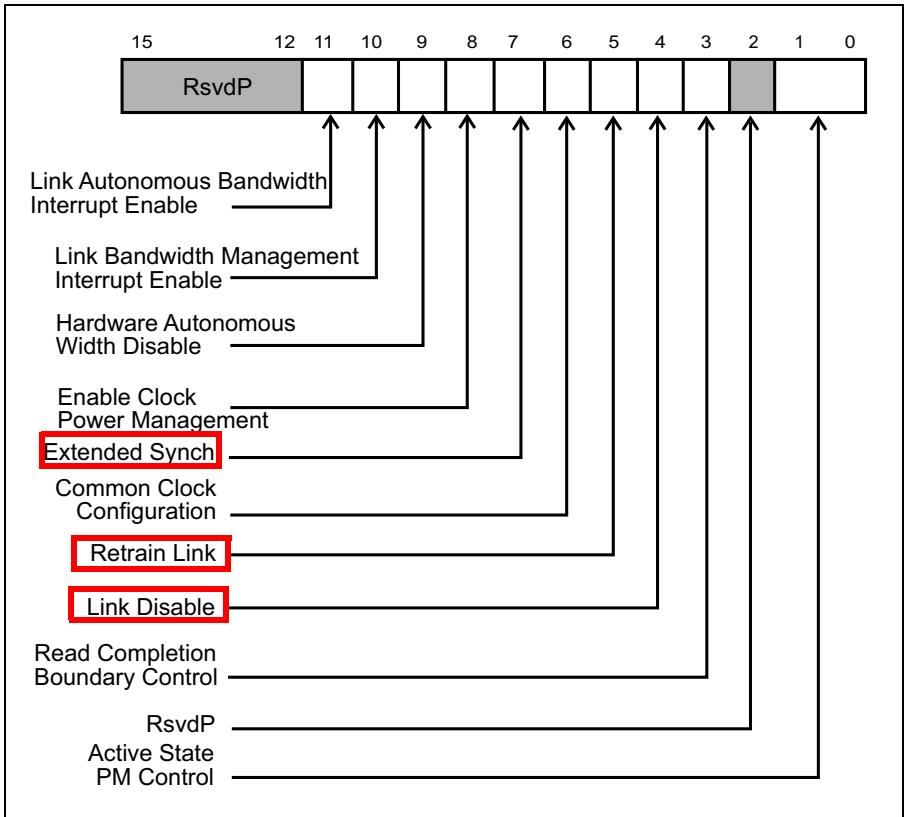

<table style="border-collapse:collapse; width:100%;">
  <thead>
    <tr>
      <th width="50%" style="border:1px solid #333; background:#f5f5f5;">EN</th>
      <th width="50%" style="border:1px solid #333; background-color:#e8e8e8;">中文</th>
    </tr>
  </thead>
  <tbody>
    <tr><td width="50%" style="border:1px solid #333; background:#fff;padding:4px 8px;">Part Five:</td><td width="50%" style="border:1px solid #333; background-color:#e8e8e8;padding:4px 8px;">第五部分：</td></tr>
    <tr><td width="50%" style="border:1px solid #333; background:#fff;padding:4px 8px;">Additional System Topics</td><td width="50%" style="border:1px solid #333; background-color:#e8e8e8;padding:4px 8px;">附加系统主题</td></tr>
  </tbody>
</table>
