# Ch15_Error_Detection_Handling

| EN | ZH |
|---|---|
| ## Dynamic Power Allocation (DPA) | ## 动态功耗分配（DPA） |
| Optional. The 2.1 revision of the base spec added another optional capability that defines 32 more substates for D0 and describes their characteristics. This was intended to facilitate negotiation regarding power management between a device driver, OS, and an executing application, partly because some Functions don't have device drivers that handle PM well. One advantage of this model is that the Device technically still remains in the D0 state and may therefore be able to continue operating in a reduced capacity instead of going offline as would be caused by a change to the D1 or lower state. | 可选。基础规范2.1修订版增加了另一个可选能力，为D0定义了32个更多子状态并描述了其特征。此举旨在促进设备驱动程序、操作系统和正在运行的应用程序之间关于电源管理的协商，部分原因是某些功能没有能很好处理电源管理(PM)的设备驱动程序。该模型的一个优点是，设备在技术上仍保持在D0状态，因此可能能够以降级容量继续运行，而不会像切换到D1或更低状态那样导致离线。 |
| DPA registers only apply when the Device power state is in D0 and aren't applicable in states D1-D3. Up to 32 substates can be defined, and they must be contiguously numbered from zero to the maximum value. Substate 0 is the initial default value and represents the maximum power the Function is capable of consuming. Software is not required to transition between substates in sequential order or even wait until a previous transition is completed before requesting another change in the substate. Consequently, when a Function has completed a substate change it must check the configured substate and, if they don't match, it must begin changing to the configured value. The registers to support DPA, illustrated in Figure 16-3 on page 715, are found in the Enhanced configuration space. | DPA寄存器仅在设备电源状态为D0时适用，不适用于D1-D3状态。最多可定义32个子状态，它们必须从零到最大值连续编号。子状态0是初始默认值，代表功能能够消耗的最大功率。软件无需按顺序在子状态间转换，也无需等待前一次转换完成即可请求再次改变子状态。因此，当一个功能完成子状态更改后，它必须检查已配置的子状态，如果不匹配，则必须开始更改为已配置的值。支持DPA的寄存器位于增强配置空间中，如图16-3（第715页）所示。 |

Figure 16-3: Dynamic Power Allocation Registers | 图16-3：动态功耗分配寄存器

<table>
<tr><td colspan="2">PCIe Enhanced Capability Header</td><td>Offset</td></tr>
<tr><td colspan="2">DPA Capability Register</td><td>000h</td></tr>
<tr><td colspan="2">DPA Latency Indicator Register</td><td>004h</td></tr>
<tr><td>DPA Control Register</td><td>DPA Status Register</td><td>008h</td></tr>
<tr><td rowspan="3" colspan="2">DPA Power Allocation Array(Sized by number of substates)</td><td>00Ch</td></tr>
<tr><td>010h</td></tr>
<tr><td>Up to 02Ch</td></tr>
</table>

| EN | ZH |
|---|---|
| The DPA capability register, shown in Figure 16-4 on page 716, contains several interesting values associated with the substates. The Substate\_Max number indicates how many substates are described, and the numbers must increment contiguously from zero to that value. Two Transition Latency Values are given and each substate will be associated with one or the other by the Latency Indicator register. which contains one bit for each possible substate; if that bit is set Transition Latency Value 1 is used, otherwise Value 0 is used. The latency value gives the maximum time required to transition into that substate from any other | DPA能力寄存器（如图16-4，第716页所示）包含几个与子状态相关的有意义的值。Substate\_Max数值指示描述了有多少个子状态，且编号必须从零到该值连续递增。给出了两个转换延迟值(Transition Latency Value)，每个子状态将通过延迟指示寄存器与其中之一相关联。该寄存器包含每个可能子状态的一个比特位；如果该位被置位则使用转换延迟值1，否则使用值0。延迟值给出了从任何其他子状态转换到该子状态所需的最长时间。 |

| EN | ZH |
|---|---|
| ## PCI Express Technology | ## PCI Express 技术 |
| substate. The latencies are multiplied by the Transition Latency Units to give the time in milliseconds. Similarly, the Power Allocation Scale value gives the multiplier for the power used in each substate, expressed in watts. For each defined substate, a 32‑bit field in the DPA Power Allocation Array describes the power used for that state. The first one of these is located at offset 010h, and the rest are implemented in subsequent dwords. | 子状态。延迟乘以转换延迟单位即可得到以毫秒为单位的时间。类似地，功率分配比例值给出了每个子状态所用功率的乘数，以瓦特为单位。对于每个定义的子状态，DPA 功率分配数组中的 32 位字段描述了该状态所使用的功率。第一个位于偏移量 010h 处，其余的在后续双字中实现。 |
| The low‑order five bits of the DPA Control register are written by software to set a new substate, and the current substate can be read from the Status register, as shown in Figure 16‑5 on page 716. Notice that bit 8 of the Status register indicates whether the use of DPA substates has been enabled but it’s labeled as RW1C (Read, Write 1 to Clear), meaning software can clear this bit but can’t set it. DPA is enabled by default after a reset, and software would need to disable it by writing a one to this bit if it did not intend to use DPA. | 软件写入 DPA 控制寄存器的低五位以设置新的子状态，当前子状态可从状态寄存器中读取，如第 716 页图 16‑5 所示。请注意，状态寄存器的位 8 指示 DPA 子状态的使用是否已启用，但其标记为 RW1C（读取，写 1 清零），这意味着软件可以清除此位但不能设置它。复位后 DPA 默认启用，如果软件不打算使用 DPA，则需要向此位写 1 来禁用它。 |

Figure 16‑4: DPA Capability Register | 图16‑4：DPA能力寄存器

Figure 16‑5: DPA Status Register | 图16‑5：DPA状态寄存器
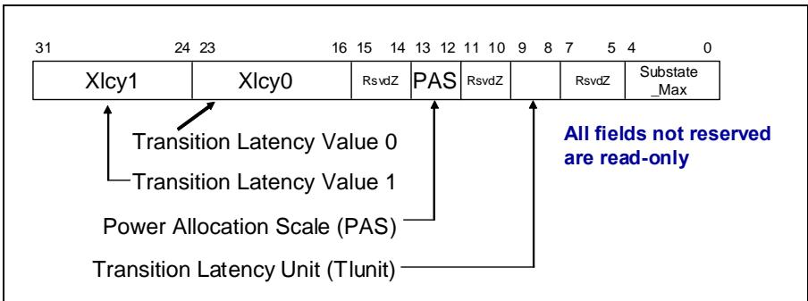

| EN | ZH |
|---|---|
| ## D1 State—Light Sleep | ## D1 状态——轻度休眠 |
| Optional. Before going into this state, software must ensure that all outstanding non‑posted Requests have received their associated Completions. This can be achieved by polling the Transactions Pending bit in the Device Status register of the PCI Express Capability block; when the bit is cleared to zero, it's safe to proceed. In this light power conservation state the Function won't initiate Requests except PME Messages, if enabled. Other characteristics of the D1 state include: | 可选。进入此状态前，软件必须确保所有未完成的非发布请求已收到其关联的完成报文。这可通过轮询 PCI Express 能力块中设备状态寄存器的事务待处理位来实现；当该位清零时，即可安全继续。在此轻度省电状态下，功能不会发起请求，但 PME 消息（若使能）除外。D1 状态的其他特性包括： |
| • Link is forced to the L1 power state when the Device goes into the D1 state. | • 设备进入 D1 状态时，链路被强制进入 L1 电源状态。 |
| Configuration and Message Requests are accepted in this state, but all other Requests must be handled as Unsupported Requests and all completions may optionally be handled as Unexpected Completions. | 此状态下接受配置和消息请求，但所有其他请求必须作为不支持请求处理，所有完成报文可选择作为意外完成报文处理。 |
| If an error is caused by an incoming Request and reporting it is enabled, an Error Message may be sent while in this state. If a different type of error occurs (such as a Completion timeout), the message won't be sent until the Device is returned to the D0 state. | 若传入请求导致错误且错误报告已使能，则在此状态下可发送错误消息。若发生其他类型的错误（如完成超时），则消息将延迟发送，直到设备返回到 D0 状态。 |
| The Function may reactivate the Link and send a PME message, if supported and enabled in this state, to notify software that the Function has experienced an event requiring that power be restored. | 功能可重新激活链路并发送 PME 消息（若此状态下支持并使能），以通知软件功能遇到了需要恢复电源的事件。 |
| The Function may or may not lose its context in this state. If it does and the device supports PME, it must at least maintain its PME context (see "PME Context" on page 710) while in this state. | 在此状态下，功能可能会或不会丢失其上下文。若丢失且设备支持 PME，则在此状态下必须至少维护其 PME 上下文（参见第 710 页的"PME 上下文"）。 |
| • The Function must be returned to the D0 Active PM state in order to be fully operational. | • 功能必须返回到 D0 活动 PM 状态才能完全运行。 |
| Table 16‑6 lists the PM policies while in the D1 state. | 表 16-6 列出了 D1 状态下的 PM 策略。 |
| Table 16‑6: D1 Power Management Policies | 表 16-6：D1 电源管理策略 |

<table><tr><td>Link PM State</td><td>Function PM State</td><td>Registers or State that must be valid</td><td>Power</td><td>Actions permitted to Function</td><td>Actions permitted by Function</td></tr><tr><td>L1</td><td rowspan="2">D1</td><td>Device class-specific registers and PME context.*</td><td>≤ D0 unini- tial- ized</td><td>Config Requests and Messages. Link transi- tions back to L0 to ser- vice the request.</td><td>PME Messages.** Though not typi- cally permitted, they would require the Link to transi- tion back to L0.</td></tr><tr><td>L2-L3</td><td colspan="4">NA *</td></tr></table>

\* This combination of Bus/Function PM states not allowed.
\*\* If PME supported in this state.

## D2 State—Deep Sleep | D2 状态—深度休眠

| EN | ZH |
|---|---|
| Optional. Before going into this state, software must ensure that all outstanding non‑posted Requests have received their associated Completions. This can be achieved by polling the Transactions Pending bit in the Device Status register of | 可选。在进入该状态之前，软件必须确保所有未完成的非发布请求均已收到其关联的完成报文。这可以通过轮询设备状态寄存器中的待处理事务位来实现，该寄存器位于 |

## PCI Express Technology | PCI Express 技术

| EN | ZH |
|---|---|
| the PCI Express Capability block; when the bit is cleared to zero, it's safe to proceed. | PCI Express 能力寄存器块；当该位清零时，可安全继续。 |
| This power state provides deeper power conservation than D1 but less than the $\mathrm{D3}_{\mathrm{hot}}$ state. | 该电源状态比 D1 提供更深的节能，但比 $\mathrm{D3}_{\mathrm{hot}}$ 状态浅。 |
| As in D1, the Function won't initiate Requests (except a PME Message) or act as the target of Requests other than configuration. | 与 D1 中一样，功能不会发起请求（PME 消息除外），也不会充当除配置外的请求的目标。 |
| Software must still be able to access the Function's configuration registers in this state. | 在此状态下，软件仍必须能够访问功能的配置寄存器。 |

## Other characteristics of the D2 state include: | D2 状态的其他特性包括：

| EN | ZH |
|---|---|
| Before going into this state, software must ensure that all outstanding non-posted Requests have received their associated Completions. This can be achieved by polling the Transactions Pending bit in the Device Status register of the PCIe Capability block. It could happen that the Completions will never be returned and, in that case, software should wait long enough to ensure they never will be returned. | 在进入此状态之前，软件必须确保所有未完成的非发布请求已收到其关联的完成报文。这可以通过轮询PCIe能力块中设备状态寄存器的事务待处理位来实现。可能会发生完成报文永远不会返回的情况，在这种情况下，软件应等待足够长的时间以确保它们永远不会被返回。 |
| • Link state must transition to L1 when the Device transitions to the D2 state. | • 当设备转换到D2状态时，链路状态必须转换到L1。 |
| Configuration and Message Requests are accepted in this state, but all other Requests must be handled as Unsupported Requests and all completions may optionally be handled as Unexpected Completions. | 在此状态下接受配置和消息请求，但所有其他请求必须作为不支持请求处理，且所有完成报文可选择作为意外完成报文处理。 |
| If an error is caused by an incoming Request and reporting it is enabled, an Error Message may be sent while in this state. If a different type of error occurs (such as a Completion timeout), the message won't be sent until the Device is returned to the D0 state. | 如果传入请求导致错误且错误报告已使能，则在此状态下可以发送错误消息。如果发生其他类型的错误（例如完成超时），则消息将不会发送，直到设备返回到D0状态。 |
| • Function may send a PME message, if supported and enabled, to notify software that it needs power restored to handle an event. | • 功能可以发送PME消息（如果支持且使能），以通知软件它需要恢复供电以处理事件。 |
| The Function may or may not lose its context in this state. If it does and the device supports PME messages, it must at least maintain its PME context for this purpose. | 功能在此状态下可能会或可能不会丢失其上下文。如果确实丢失且设备支持PME消息，则它必须至少为此目的维护其PME上下文。 |
| • The Function must return to the D0 Active state to be fully operational. | • 功能必须返回到D0活跃状态才能完全运行。 |
| Table 16-7 on page 719 illustrates the PM policies while in the D2 state. | 第719页的表16-7说明了D2状态下的电源管理策略。 |

**Table 16-7: D2 Power Management Policies**

<table><tr><td>Link PM State</td><td>Function PM State</td><td>Registers and/or State that must be valid</td><td>Power</td><td>Actions permitted to Function</td><td>Actions permitted by Function</td></tr><tr><td>L1</td><td rowspan="2">D2</td><td>Device class-specific registers and PME context.*</td><td>≤ next higher supported PM state or ≤ D0 uninitialized.</td><td>Config Requests and transactions permitted by device class (typically none). This requires the Link to transition back to L0</td><td>PME Messages.* Though not typically permitted, they would require the Link to transition back to L0.</td></tr><tr><td>L2/L3</td><td colspan="4">N/A**</td></tr></table>

\* If PME supported in this state.  
\*\* This combination of Bus/Function PM states not allowed.

| EN | ZH |
|---|---|
| ## D3—Full Off | ## D3——完全关闭 |
| Mandatory. All Functions must support the D3 state. This is the deepest state and power conservation is maximized. When software writes this power state to the Device, it goes to the $\mathbf { D 3 _ { h o t } }$ state, meaning power is still applied. Removing power (Vcc) from the Device puts it into the $\mathbf { D 3 _ { c o l d } }$ state and the Link into L2, if a secondary power source (Vaux) is available, or L3 if it's not. | 强制要求。所有功能必须支持D3状态。这是最深度的状态，功耗节省达到最大化。当软件向设备写入此电源状态时，设备进入$\mathbf { D 3 _ { h o t } }$状态，表示仍保持供电。从设备移除电源(Vcc)使其进入$\mathbf { D 3 _ { c o l d } }$状态，如果有辅助电源(Vaux)可用，链路进入L2状态，否则进入L3状态。 |
| ${ \bf D } 3 _ { \mathbf { H o t } }$ State. (Mandatory.) Software puts a Function into $\mathrm { D 3 } _ { \mathrm { h o t } }$ by writing the appropriate value into the PowerState field of its Power Mgt Control and Status Register (PMCSR). In this state, the Function can only initiate PME or PME\_TO\_ACK Messages, and can only respond to configuration Requests or the PME\_Turn\_Off Message. Software must be able to access the Function's configuration registers while the device is in the $\mathrm { D 3 } _ { \mathrm { h o t } }$ state, if only to be able to change the state back to D0. Other characteristics of $\mathrm { D 3 } _ { \mathrm { h o t } }$ include: | ${ \bf D } 3 _ { \mathbf { H o t } }$ 状态。(强制要求。)软件通过向其电源管理控制和状态寄存器(PMCSR)的PowerState字段写入适当的值，将功能置于$\mathrm { D 3 } _ { \mathrm { h o t } }$状态。在此状态下，功能只能发起PME或PME\_TO\_ACK消息，并且只能响应配置请求或PME\_Turn\_Off消息。当设备处于$\mathrm { D 3 } _ { \mathrm { h o t } }$状态时，软件必须能够访问功能的配置寄存器，即便只是为了能将状态更改回D0。$\mathrm { D 3 } _ { \mathrm { h o t } }$的其他特性包括： |
| Before going into this state, software must ensure that all outstanding non‐posted Requests have received their associated Completions. This can be achieved by polling the Transactions Pending bit in the Device Status register of the PCIe Capability block. It could happen that the Completions will never be returned and, in that case, software should wait long enough to ensure they never will be returned. | 在进入此状态之前，软件必须确保所有未完成的非发布请求均已收到其关联的完成报文。这可以通过轮询PCIe能力块设备状态寄存器中的Transactions Pending位来实现。可能会出现完成报文永远不会返回的情况，在这种情况下，软件应等待足够长的时间以确保它们永远不会被返回。 |
| • The Link is forced to the L1 state when the Function changes to $\mathrm { D } 3 _ { \mathrm { h o t } }$ | • 当功能变为$\mathrm { D } 3 _ { \mathrm { h o t } }$时，链路被强制进入L1状态 |

## PCI Express Technology | PCI Express 技术

| EN | ZH |
|---|---|
| The Function is allowed to send a PME message to notify PM software of its need to be returned to the fully active state (assuming it supports generation of PM events in the $\mathrm { D } 3 _ { \mathrm { h o t } }$ state and has been enabled to do so). | Function被允许发送PME消息以通知PM软件其需要返回到完全活动状态（前提是其在$\mathrm { D } 3 _ { \mathrm { h o t } }$状态下支持PM事件生成且已被使能）。 |
| Function context may be lost when going to this state and if the power is turned off the spec assumes all context will be lost. On the other hand, if the power never goes off before software initiates a return to D0 the context could be maintained. In earlier spec versions that wasn't possible; changing from $\mathrm { D } 3 _ { \mathrm { h o t } }$ to D0 involved a soft reset and all the registers were re-initialized. However, the 1.2 revision of that spec added a new capability bit called "No Soft Reset" to indicate that the Function would not do a soft reset in that case. To be able to generate PME messages in the $\mathrm { D } 3 _ { \mathrm { h o t } }$ state, a Device must maintain its PME context (see "PME Context" on page 710). | 进入此状态时Function上下文可能会丢失，若电源关闭，规范假定所有上下文都将丢失。另一方面，如果在软件发起返回D0之前电源从未关闭，则上下文可以保持。在早期规范版本中这不可能；从$\mathrm { D } 3 _ { \mathrm { h o t } }$转换到D0涉及软复位，所有寄存器被重新初始化。然而，该规范的1.2修订版增加了一个名为"No Soft Reset"的新能力位，以指示Function在这种情况下不会执行软复位。要在$\mathrm { D } 3 _ { \mathrm { h o t } }$状态下能够生成PME消息，设备必须保持其PME上下文（参见第710页的"PME Context"）。 |
| The Function exits from the $\mathrm { D } 3 _ { \mathrm { h o t } }$ state under two circumstances: | Function在以下两种情况下退出$\mathrm { D } 3 _ { \mathrm { h o t } }$状态： |
| If Vcc is removed from the device, it transitions from $\mathrm { D } 3 _ { \mathrm { h o t } }$ to $\mathrm { D } 3 _ { \mathrm { c o l d } }$ | 如果从设备移除Vcc，则从$\mathrm { D } 3 _ { \mathrm { h o t } }$转换到$\mathrm { D } 3 _ { \mathrm { c o l d } }$ |
| Software can write to the PowerState field of the Function's PMCSR register to change its PM state to D0. When programmed to exit $\mathrm { D } 3 _ { \mathrm { h o t } }$ and return to D0, the Function returns to the D0 Uninitialized PM state. A reset may or may not be required. Table 16-8 on page 721 lists the PM policies while in the $\mathrm { D } 3 _ { \mathrm { h o t } }$ state. | 软件可以写入Function的PMCSR寄存器的PowerState字段以将其PM状态更改为D0。当编程为退出$\mathrm { D } 3 _ { \mathrm { h o t } }$并返回D0时，Function返回到D0 Uninitialized PM状态。复位可能需要也可能不需要。第721页的表16-8列出了$\mathrm { D } 3 _ { \mathrm { h o t } }$状态下的PM策略。 |

**Table 16-8: $\mathbf{D3_{hot}}$ Power Management Policies**

<table><tr><td>Bus PM State</td><td>Function PM State</td><td>Registers and/or State that must be valid</td><td>Power</td><td>Actions permitted to Function</td><td>Actions permitted by Function</td></tr><tr><td>L1</td><td rowspan="3"> $D3_{hot}$ </td><td>PME context. **</td><td>≤ next higher supported PM state or ≤ D0 uninitialized.</td><td>PCI Express config transactions &amp; PME_Turn_Off broadcast message***(These can only occur after the Link transitions back to its L0 state.</td><td>PME message**PME_TO_ACK message**PM_Enter_L23 DLLP***(These can occur only after the Link returns to L0)</td></tr><tr><td>L2/L3 Ready</td><td colspan="4">L2/L3 Ready entered following the PME_Turn_Off handshake sequence, which prepares a device for power removal***</td></tr><tr><td>L2/L3</td><td colspan="4">NA *</td></tr></table>

\* This combination of Bus/Function PM states not allowed.
\*\* If PME supported in this state.
\*\*\* See "L2/L3 Ready Handshake Sequence" on page 764 for details regarding the sequence.

| EN | ZH |
|---|---|
| $\mathbf { D } 3 _ { \mathbf { C o l d } }$ State. Mandatory. Every PCI Express Function enters the $\mathrm { D } 3 _ { \mathrm { C o l d } }$ PM state upon removal of power (Vcc) from the Function. When power is restored, the device must be reset or generate an internal reset, taking it from $\mathrm { D } 3 _ { \mathrm { C o l d } }$ to D0 $\mathrm { U n i n i t i a l i z e d }$. A Function capable of generating a PME must maintain PME context while in this state and when transitioning to the D0 state. Since power was removed to arrive at this state, the Function must have an auxiliary power source available if it is to maintain the PME context. Then, when the device goes to D0 $\mathrm { U n i n i t i a l i z e d }$, it can generate a PME message to inform the system of a wakeup event, if it's capable and enabled to do so. For more on auxiliary power, refer to "Auxiliary Power" on page 775. | $\mathbf { D } 3 _ { \mathbf { C o l d } }$状态。必须支持。每个PCI Express Function在从Function移除电源（Vcc）时进入$\mathrm { D } 3 _ { \mathrm { C o l d } }$ PM状态。当电源恢复时，设备必须复位或产生内部复位，使其从$\mathrm { D } 3 _ { \mathrm { C o l d } }$转换到D0 $\mathrm { U n i n i t i a l i z e d }$。能够产生PME的Function必须在此状态下以及转换到D0状态时保持PME上下文。由于到达此状态时电源已被移除，Function若要维持PME上下文，必须有辅助电源可用。然后，当设备进入D0 $\mathrm { U n i n i t i a l i z e d }$时，如果其有此能力且已被使能，则可以产生PME消息以通知系统唤醒事件。有关辅助电源的更多信息，请参见第775页的"Auxiliary Power"。 |
| Table 16-9 on page 722 illustrates the PM policies while in the $\mathrm { D } 3 _ { \mathrm { C o l d } }$ state. | 第722页的表16-9说明了$\mathrm { D } 3 _ { \mathrm { C o l d } }$状态下的PM策略。 |

**Table 16-9: $\mathbf{D3_{cold}}$ Power Management Policies**

<table><tr><td>Bus PM State</td><td>Function PM State</td><td>Registers and/or State that must be valid</td><td>Power</td><td>Actions permitted to Function</td><td>Actions permitted by Function</td></tr><tr><td>L2</td><td rowspan="2"> $D3_{cold}$ </td><td>PME context*</td><td>AUX Power</td><td rowspan="2">Bus reset only</td><td>Signal Beacon or WAKE#**</td></tr><tr><td>L3</td><td colspan="2">None</td><td>None</td></tr></table>

\* If PME supported in this state.
\*\* The method used to signal a wake to restore clock and power depends on the form factor.

| EN | ZH |
|---|---|
| ## Function PM State Transitions | ## 功能PM状态转换 |
| Figure 16-6 illustrates the PM state transitions for a PCIe Function. Table 16-10 on page 723 provides a description of each transition. Table 16-11 on page 724 illustrates the transitions from one state to another from both a hardware and a software perspective. | 图16-6展示了PCIe功能的PM状态转换。第723页的表16-10描述了每种转换。第724页的表16-11从硬件和软件两个角度说明了各状态之间的转换。 |

Figure 16-6: PCIe Function D-State Transitions | 图16-6：PCIe功能D状态转换  

Table 16-10: Description of Function State Transitions | 表16-10：功能状态转换描述

<table><tr><td>From State</td><td>To State</td><td>Description</td></tr><tr><td>D0 Uninitialized</td><td>D0 Active</td><td>Function has been completely configured and enabled by its driver.</td></tr><tr><td rowspan="3">D0 Active</td><td>D1</td><td>Software writes the PMCSR PowerState to D1.</td></tr><tr><td>D2</td><td>Software writes the PMCSR PowerState to D2.</td></tr><tr><td> $D3_{hot}$ </td><td>Software writes the PMCSR PowerState to  $D3_{hot}$ .</td></tr><tr><td rowspan="3">D1</td><td>D0 Active</td><td>Software writes the PMCSR PowerState to D0.</td></tr><tr><td>D2</td><td>Software writes the PMCSR PowerState to D2.</td></tr><tr><td> $D3_{hot}$ </td><td>Software writes the PMCSR PowerState to  $D3_{hot}$ .</td></tr><tr><td rowspan="2">D2</td><td>D0 Active</td><td>Software writes the PMCSR PowerState to D0.</td></tr><tr><td> $D3_{hot}$ </td><td>Software writes the PMCSR PowerState to  $D3_{hot}$ .</td></tr><tr><td rowspan="2"> $D3_{hot}$ </td><td> $D3_{cold}$ </td><td>Power is removed from the Function.</td></tr><tr><td>D0 Uninitialized</td><td>Software writes the PMCSR PowerState to D0.</td></tr><tr><td> $D3_{cold}$ </td><td>D0 Uninitialized</td><td>Power is restored to the Function.</td></tr></table>

Table 16-11: Function State Transition Delays | 表16-11：功能状态转换延迟

<table><tr><td>Initial State</td><td>Next State</td><td>Minimum software-guaranteed delays</td></tr><tr><td>D0</td><td>D1</td><td>0</td></tr><tr><td>D0 or D1</td><td>D2</td><td>200μs from new state setting to first access (including config accesses).</td></tr><tr><td>D0, D1, or D2</td><td> $D3_{hot}$ </td><td>10ms from new state setting to first access.</td></tr><tr><td>D1</td><td>D0</td><td>0</td></tr><tr><td>D2</td><td>D0</td><td>200μs from new state setting to first access.</td></tr><tr><td> $D3_{hot}$ </td><td>D0</td><td rowspan="2">10ms from new state setting to first access.</td></tr><tr><td> $D3_{cold}$ </td><td>D0</td></tr></table>

| EN | ZH |
|----|----|
| ## Detailed Description of PCI-PM Registers | ## PCI-PM 寄存器详细说明 |
| The PCI Bus PM Interface spec defines the PM registers (see Figure 16‐7) that are implemented in PCIe Functions. Configuration software can determine the PM capabilities and control its properties. | PCI 总线 PM 接口规范定义了在 PCIe 功能中实现的 PM 寄存器（见图 16-7）。配置软件可以确定 PM 能力并控制其属性。 |

Figure 16‐7: PCI Function's PM Registers | 图16‐7：PCI功能的电源管理寄存器

<table><tr><td colspan="2">Power Management Capabilities (PMC)</td><td>Pointer to Next Capability</td><td>Capability ID 01h</td></tr><tr><td>Data Register</td><td>Bridge Support Extensions (PMCSR_BSE)</td><td colspan="2">Control/Status Register (PMCSR)</td></tr></table>

| EN | ZH |
|---|---|
| ## PM Capabilities (PMC) Register | ## PM 能力 (PMC) 寄存器 |
| The fields of this 16‑bit read‑only register are described in Table 16‑12. | 该 16 位只读寄存器的字段如表 16‑12 所述。 |
| Table 16‑12: The PMC Register Bit Assignments | 表 16‑12：PMC 寄存器位分配 |

<table><tr><td>Bit(s)</td><td colspan="2">Description</td></tr><tr><td>31:27</td><td colspan="2">PME_Support field. Indicates in which PM states the Function is capable of sending a PME message. A zero in a bit indicates PME notification is not supported in the respective PM state.BitCorresponds to PM State27 D028 D129 D230  $D3_{hot}$ 31  $D3_{cold}$  (Function requires aux power for PME logic and Wake signaling via beacon or WAKE# pin)Systems that support wake from  $D3_{cold}$  must also support aux power and must use it to signal the wakeup.Bits 31, 30, and 27 must be set to 1b for virtual PCI-PCI Bridges implemented within Root and Switch Ports. This is required for ports that forward PME Messages.</td></tr><tr><td>26</td><td colspan="2">D2_Support bit. 1 = Function supports the D2 PM state.</td></tr><tr><td>25</td><td colspan="2">D1_Support bit. 1 = Function supports the D1 PM state.</td></tr><tr><td rowspan="10">24:22</td><td colspan="2">Aux_Current field. For a Function that supports generation of the PME message from the D3cold state, this field reports the current demand made upon the 3.3Vaux power source (see "Auxiliary Power" on page 775) by the Function's logic that retains the PME context information. This information is used by software to determine how many Functions can simultaneously be enabled for PME generation (based on the total amount of current each draws from the system 3.3Vaux power source and the power sourcing capability of the power source).If the Function does not support PME notification from within the D3cold PM state, this field is not implemented and always returns zero when read. Alternatively, a new feature defined by PCI Express permits devices that do not support PMEs to report the amount of Aux current they draw when enabled by the Aux Power PM Enable bit within the Device Control register.If the Function implements the Data register (see "Data Register" on page 731), this field always returns zeros when read. The Data register then takes precedence over this field in reporting the 3.3Vaux current requirements for the Function.If the Function supports PME notification from the D3cold state and does not implement the Data register, then the Aux_Current field reports the 3.3Vaux current requirements for the Function. It is encoded as follows:</td></tr><tr><td>Bit24 23 22</td><td>Max Current Required</td></tr><tr><td>1 1 1</td><td>375mA</td></tr><tr><td>1 1 0</td><td>320mA</td></tr><tr><td>1 0 1</td><td>270mA</td></tr><tr><td>1 0 0</td><td>220mA</td></tr><tr><td>0 1 1</td><td>160mA</td></tr><tr><td>0 1 0</td><td>100mA</td></tr><tr><td>0 0 1</td><td>55mA</td></tr><tr><td>0 0 0</td><td>0mA</td></tr><tr><td>21</td><td>Device-Specific Initialization (DSI) bit. A one in this bit indicates that immediately after entry into the D0 Uninitialized state, the Function requires additional configuration above and beyond setup of its PCI configuration Header registers before the Class driver can use the Function. Microsoft OSs do not use this bit. Rather, the determination and initialization is made by the Class driver.</td></tr><tr><td>20</td><td>Reserved.</td></tr><tr><td>19</td><td>PME Clock bit. Does not apply to PCI Express. Must be hardwired to 0.</td></tr><tr><td rowspan="2">18:16</td><td>Version field. This field indicates the version of the PCI Bus PM Interface spec that the Function complies with.</td></tr><tr><td colspan="2">Bit18 17 16 Complies with Spec Version0 0 1 1.00 1 0 1.1 (required by PCI Express)</td></tr></table>

## PM Control and Status Register (PMCSR) | 电源管理控制和状态寄存器（PMCSR）

| EN | ZH |
| --- | --- |
| ## PM Control and Status Register (PMCSR) | ## PM控制/状态寄存器（PMCSR） |
| This register, required for all PCI Express Devices, serves several purposes as described below. Table 16-13 on page 728 provides a description of the PMCSR bit fields. | 该寄存器是所有PCI Express设备必需的，具有以下几个用途。第728页的表16-13提供了PMCSR位字段的描述。 |
| If the Function implements PME capability, a PME Enable bit permits software to enable or disable the Function's ability to assert the PME message or WAKE# signal, and a Status bit reflects whether or not a PME has occurred. | 如果该功能实现了PME能力，则PME使能位允许软件启用或禁用该功能断言PME消息或WAKE#信号的能力，而状态位反映是否发生了PME。 |
| If the optional Data register is implemented (see "Data Register" on page 731), two fields are used to permit software to select which information can be read through the Data register, and provide the scaling multiplier for the Data register value. | 如果实现了可选的数据寄存器（见第731页的"Data Register"），则使用两个字段来允许软件选择可通过数据寄存器读取的信息，并为数据寄存器值提供缩放倍率。 |
| The register's PowerState field can be read to determine the current PM state of the Function and written to place the Function into a new PM state. | 该寄存器的PowerState字段可被读取以确定功能的当前PM状态，并可被写入以将功能置于新的PM状态。 |

Table 16-13: PM Control/Status Register (PMCSR) Bit Assignments | 表16-13：电源管理控制/状态寄存器（PMCSR）位分配

| EN | ZH |
| --- | --- |
| Table 16-13: PM Control/Status Register (PMCSR) Bit Assignments | 表16-13：PM控制/状态寄存器（PMCSR）位分配 |

<table><tr><td>Bit(s)</td><td>Value at Reset</td><td>Read/Write</td><td>Description</td></tr><tr><td>31:24</td><td>all zeros</td><td>Read Only</td><td>See "Data Register" on page 731.</td></tr><tr><td>23</td><td>zero</td><td>Read Only</td><td>Not used in PCI Express</td></tr><tr><td>22</td><td>zero</td><td>Read Only</td><td>Not used in PCI Express</td></tr><tr><td>21:16</td><td>all zeros</td><td>Read Only</td><td>Reserved</td></tr><tr><td>15</td><td>See Description.</td><td>Read, Write one to clear, Sticky RW1CS</td><td>PME_Status bit.Optional: only implemented if the Function supports PME notification, otherwise zero.This bit reflects whether the Function has experienced a PME (even if the PME_En bit in this register has disabled the Function's ability to send a PME message). If set to one, the Function has experienced a PME. Software clears this bit by writing a one to it.After reset, this bit is zero if the Function doesn't support PME in D3cold. If the Function does support PME in D3cold, this bit is indeterminate at initial OS boot time but after that reflects whether the Function has experienced a PME.If the Function supports PME from D3cold, the state of this bit must persist even if power is lost or the Function is reset (a sticky bit). This implies that an auxiliary power source keeps this logic active during these conditions (see "Auxiliary Power" on page 775).</td></tr></table>

| EN | ZH |
| --- | --- |
| Bit(s) | 位 |
| Value at Reset | 复位值 |
| Read/Write | 读/写 |
| Description | 描述 |
| 31:24 | all zeros / 全零 |
| 23 | zero / 零 |
| 22 | zero / 零 |
| 21:16 | all zeros / 全零 |
| 15 | See Description. / 参见描述。 |
| Read, Write one to clear, Sticky RW1CS | 读、写1清零、粘滞RW1CS |
| PME_Status bit. Optional: only implemented if the Function supports PME notification, otherwise zero. | PME_Status位。可选：仅当功能支持PME通知时实现，否则为零。 |
| This bit reflects whether the Function has experienced a PME (even if the PME_En bit in this register has disabled the Function's ability to send a PME message). | 该位反映功能是否经历过PME（即使该寄存器中的PME_En位已禁用功能发送PME消息的能力）。 |
| If set to one, the Function has experienced a PME. Software clears this bit by writing a one to it. | 如果设置为1，则表示功能经历过PME。软件通过写入1来清除该位。 |
| After reset, this bit is zero if the Function doesn't support PME in D3cold. | 复位后，如果功能不支持D3cold中的PME，则该位为零。 |
| If the Function does support PME in D3cold, this bit is indeterminate at initial OS boot time but after that reflects whether the Function has experienced a PME. | 如果功能确实支持D3cold中的PME，则该位在操作系统初始启动时是不确定的，但之后反映功能是否经历过PME。 |
| If the Function supports PME from D3cold, the state of this bit must persist even if power is lost or the Function is reset (a sticky bit). | 如果功能支持来自D3cold的PME，则该位的状态即使在掉电或功能复位时也必须保持（粘滞位）。 |
| This implies that an auxiliary power source keeps this logic active during these conditions (see "Auxiliary Power" on page 775). | 这意味着在这些情况下由辅助电源保持该逻辑活动（见第775页的"Auxiliary Power"）。 |

| EN | ZH |
|---|---|
| ## Chapter 16: Power Management | ## 第16章：电源管理 |

Table 16‐13: PM Control/Status Register (PMCSR) Bit Assignments (Continued) | 表16‐13：电源管理控制/状态寄存器（PMCSR）位分配（续）
表16‐13：PM控制/状态寄存器（PMCSR）位分配（续）

<table><tr><td>Bit(s)</td><td>Value at Reset</td><td>Read/Write</td><td>Description</td></tr><tr><td>14:13</td><td>Device-specific</td><td>Read Only</td><td>Data_Scale field. Optional. If the Function does not implement the Data register this field is hardwired to return zeros.If the Data register is implemented, the Data_Scale field is mandatory and must be a read-only value representing the multiplier for it. The value and interpretation of the Data_Scale field depends on the data item selected to be viewed through the Data register by the Data_Select field.</td></tr><tr><td>12:9</td><td>0000b</td><td>Read/Write</td><td>Data_Select field. Optional. If the Function does not implement the Data register, this field is hardwired to return zeros.If the Data register is implemented, Data_Select is a mandatory read/write field. The value placed in this register selects the data to be viewed in the Data register. That value must then be multiplied by the value read from the Data_Scale field.</td></tr></table>

## PCI Express Technology | PCI Express 技术

| EN | ZH |
|---|---|
| Table 16-13: PM Control/Status Register (PMCSR) Bit Assignments (Continued) | 表16-13：PM控制/状态寄存器（PMCSR）位分配（续） |

<table><tr><td>Bit(s)</td><td>Value at Reset</td><td>Read/Write</td><td>Description</td></tr><tr><td>8</td><td>See Description.</td><td>Read/Write</td><td>PME_En bit. Optional.1 = enable Function's ability to send PME messages when an event occurs.0 = disable.If the Function does not support the generation of PMEs from any power state, this bit always return zero when read.After reset, this bit is zero if the Function doesn't support PME from D3cold. If the Function supports PME from D3cold:·this bit is indeterminate at initial OS boot time.·otherwise, it enables or disables whether the Function can send a PME message in case a PME occurs.If the Function supports PME from D3cold, the state of this bit must persist while the Function remains in the D3cold state and during the transition from D3cold to the D0 Uninitialized state. This implies that the PME logic must use an aux power source to power this logic during these conditions.</td></tr><tr><td>7:2</td><td>all zeros</td><td>Read Only</td><td>Reserved</td></tr><tr><td>1:0</td><td>00b</td><td>Read/Write</td><td>PowerState field. Mandatory. Software uses this field to read the current PM state of the Function or write a new PM state. If software selects a PM state not supported by the Function, the write completes normally but the data is discarded and no state change occurs.10 PM State0 0 D00 1 D11 0 D21 1 D3hot</td></tr></table>

| EN | ZH |
|---|---|
| ## Data Register | ## 数据寄存器 |
| Optional, read-only. Refer to Figure 16-8 on page 732. The Data register is an 8-bit, read-only register that provides software with the following information: | 可选，只读。参见第732页图16-8。数据寄存器是一个8位只读寄存器，为软件提供以下信息： |
| • Power consumed in the selected PM state; useful in power budgeting. | • 在所选PM状态下的功耗；用于电源预算管理。 |
| • Power dissipated in the selected PM state; useful in managing the thermal environment. | • 在所选PM状态下的功率耗散；用于管理热环境。 |
| • Any type of data could be reported through this register, but the PCI-PM spec only defines power consumption and power dissipation information for it. | • 任何类型的数据均可通过该寄存器报告，但PCI-PM规范仅为其定义了功耗和功率耗散信息。 |
| If the Data register is implemented, the Data\_Select and Data\_Scale fields of the PMCSR registers must also be implemented, and the Aux\_Current field of the PMC register must not be implemented. | 如果实现了数据寄存器，则必须同时实现PMCSR寄存器的Data\_Select和Data\_Scale字段，且不得实现PMC寄存器的Aux\_Current字段。 |
| Determining Presence of the Data Register. Software can perform the following procedure to check for the presence of the Data register: | 判断数据寄存器的存在。软件可执行以下过程来检查数据寄存器的存在： |
| 1. Write a value of 0000b into the Data\_Select field of the PMCSR register. | 1. 将值0000b写入PMCSR寄存器的Data\_Select字段。 |
| 2. Read from either the Data register or the Data\_Scale field of the PMCSR register. A non-zero value indicates that the Data register as well as the Data\_Scale and Data\_Select fields of the PMCSR registers are implemented. If a value of zero is read, go to step 4. | 2. 读取数据寄存器或PMCSR寄存器的Data\_Scale字段。非零值表示数据寄存器以及PMCSR寄存器的Data\_Scale和Data\_Select字段均已实现。如果读取到零，则转到步骤4。 |
| 3. If the current value of the Data\_Select field is a value other than 1111b, go to step 4. If the current value of the Data\_Select field is 1111b, all possible Data register values have been scanned and returned zero, indicating that neither the Data register nor the Data\_Scale and Data\_Select fields of the PMCSR registers are implemented. | 3. 如果Data\_Select字段的当前值不是1111b，则转到步骤4。如果Data\_Select字段的当前值是1111b，则所有可能的数据寄存器值均已扫描并返回零，表示数据寄存器以及PMCSR寄存器的Data\_Scale和Data\_Select字段均未实现。 |
| 4. Increment the content of the Data\_Select field and go back to step 2. Since the data select field is only 4 bits, a complete scan requires testing 16 possible select values and looking to see if any non-zero values are seen for the data and scale registers. | 4. 递增Data\_Select字段的内容并返回步骤2。由于Data\_Select字段仅为4位，完整扫描需要测试16个可能的select值，并检查数据寄存器和scale寄存器是否出现任何非零值。 |
| Operation of the Data Register. The information returned is typically a static copy of the Function's worst-case power consumption and power dissipation characteristics in the various PM states (as listed in the Device's data sheet). To use the Data register, the programmer uses the following sequence: | 数据寄存器的操作。返回的信息通常是该Function在各种PM状态下最差情况下的功耗和功率耗散特性的静态副本（如设备数据手册所列）。要使用数据寄存器，程序员需遵循以下顺序： |
| 1. Write a value into the Data\_Select field (see Table 16-14 on page 733) of the PMCSR register to select the data item to be viewed through the Data register. | 1. 将一个值写入PMCSR寄存器的Data\_Select字段（参见第733页表16-14），以选择要通过数据寄存器查看的数据项。 |

## PCI Express Technology | PCI Express 技术

| EN | ZH |
|---|---|
| 2. Read the data value from Data register and the Data_Scale field of the PMCSR register. | 2. 从 Data 寄存器读取数据值以及 PMCSR 寄存器的 Data_Scale 字段。 |
| 3. Multiply the value by the scaling factor. | 3. 将该值乘以缩放因子。 |
| **Multi-Function Devices.** In a multi-function PCI Express device, each Function must supply its own power information. The power information for the logic common to all the Functions is reported through Function zero's Data register (see Data Select Value = 8 in Table 16-14 on page 733). | **多功能设备。** 在多功能 PCI Express 设备中，每个功能必须提供其自身的电源信息。所有功能所共用逻辑的电源信息通过功能 0 的 Data 寄存器报告（参见第 733 页表 16-14 中 Data Select Value = 8）。 |
| **Virtual PCI-to-PCI Bridge Power Data.** The spec doesn't specify data field use in PCI-to-PCI bridge Functions in a Root Complex or Switch. But, to maintain PCI-PM compatibility, bridges must report the power information they consume. Software could read the virtual PPB Data registers at each port of a switch to determine the power consumed by the switch in each power state. | **虚拟 PCI-to-PCI 桥电源数据。** 规范未指定根复合体或交换机中 PCI-to-PCI 桥功能的 Data 字段使用。但为保持 PCI-PM 兼容性，桥必须报告其所消耗的电源信息。软件可读取交换机每个端口的虚拟 PPB Data 寄存器，以确定交换机在每个电源状态下的功耗。 |

Figure 16-8: PM Registers | 图16-8：PM寄存器

<table><tr><td colspan="2">Power Management Capabilities (PMC)</td><td>Pointer to Next Capability</td><td>Capability ID 01h</td></tr><tr><td>Data Register</td><td>Bridge Support Extensions (PMCSR_BSE)</td><td colspan="2">Control/Status Register (PMCSR)</td></tr></table>

Table 16-14: Data Register Interpretation | 表16-14：数据寄存器解释

<table><tr><td>Data Select Value</td><td>Data Reported in Data Register</td><td>Interpretation of Data Scale Field in PMCSR</td><td>Units/Accuracy</td></tr><tr><td>00h</td><td>Power consumed in D0</td><td rowspan="9">00b = unknown 01b = multiply by 0.1 10b = multiply by 0.01 11b = multiply by 0.001</td><td rowspan="9">Watts</td></tr><tr><td>01h</td><td>Power consumed in D1</td></tr><tr><td>02h</td><td>Power consumed in D2</td></tr><tr><td>03h</td><td>Power consumed in D3</td></tr><tr><td>04h</td><td>Power dissipated in D0</td></tr><tr><td>05h</td><td>Power dissipated in D1</td></tr><tr><td>06h</td><td>Power dissipated in D2</td></tr><tr><td>07h</td><td>Power dissipated in D3</td></tr><tr><td>08h</td><td>In a multi-function PCI device, Function 0 indicates power consumed by logic common to all Functions in the package.</td></tr><tr><td>09h-0Fh</td><td>Reserved for future use of Function 0 in a multi-function device.</td><td rowspan="2">Reserved</td><td rowspan="2">TBD</td></tr><tr><td>08h-0Fh</td><td>Reserved in single-function devices and Functions other than Function 0 in a multi-function device</td></tr></table>

## 1.4 Introduction to Link Power Management | 1.4 链路电源管理简介
## 1.4 Introduction to Link Power Management | 1.4 链路电源管理简介

| EN | ZH |
|---|---|
| We've just seen how software can put Devices into one of several device power states, now let's consider how PCIe also manages Link power. Device power and Link power are related to each other, as shown in Table 16-15 on page 734. Note also the relationship between downstream and upstream devices, which can be summarized by saying that an upstream Device or Link cannot be in a more aggressive power-conserving state than the one below it. The reason is to facilitate timely delivery of packets from the Endpoints, whose traffic would be delayed if upstream devices were in a lower power state. Each relationship is described below: | 我们刚刚了解了软件如何将设备置入若干设备电源状态之一，现在来考察PCIe如何管理链路电源。设备电源与链路电源相互关联，如第734页表16-15所示。还请注意下游设备与上游设备之间的关系，可以概括为：上游设备或链路不能处于比其下方设备更激进的省电状态。原因是为了便于来自端点的数据包及时送达，如果上游设备处于更低的电源状态，这些流量将会被延迟。每种关系描述如下： |
| D0 — Device is fully powered and typically in the L0 Link state. Some power conservation is available without leaving this state by using DPA substates (see "Dynamic Power Allocation (DPA)" on page 714), and by using the hardware-based Link power management (see "Active State Power Management (ASPM)" on page 735 for more details). | D0 — 设备完全上电，通常处于L0链路状态。在不离开此状态的情况下，可以通过使用DPA子状态（见第714页"动态功率分配（DPA）"）以及基于硬件的链路电源管理（详见第735页"主动状态电源管理（ASPM）"）来实现一定程度的省电。 |
| D1 & D2 — When software changes the device state to D1 or D2, the Link must automatically transition to the L1 state. Since both Link partners are involved in this operation there is a handshake mechanism to ensure that things are done in an orderly fashion. | D1和D2 — 当软件将设备状态改为D1或D2时，链路必须自动转换到L1状态。由于链路双方都参与此操作，因此存在一种握手机制以确保有序完成。 |
| $\mathbf { D 3 _ { h o t } }$ — When software places a device into the D3 state, the Link automatically transitions to L1 just as it does when going to the D1 and D2 states. Software may now choose to remove the reference clock and power, putting the device into $\mathrm { D } 3 _ { \mathrm { c o l d } } .$ But, before doing that, it's expected that the system will initiate a handshake process to prepare the Links by putting them into the L2/L3 Ready state. | $\mathbf { D 3 _ { h o t } }$ — 当软件将设备置入D3状态时，链路自动转换到L1，这与进入D1和D2状态时的情况相同。此时软件可以选择移除参考时钟和电源，将设备置入$\mathrm { D } 3 _ { \mathrm { c o l d } }$。但在执行此操作之前，系统应启动一个握手过程，通过将链路置入L2/L3 Ready状态来做好准备。 |
| $\mathbf { D } 3 _ { \mathbf { c o l d } }$ — In this state, main power and the reference clock have been turned off. However, auxiliary power $(\bar { \mathrm { V } } _ { \mathrm { A U X } })$ may be available, allowing the device to signal a wakeup event to the system. If it is, the Link state will be in L2. If main power is removed but $\mathsf { V } _ { \mathrm { A U X } }$ is not available, the Link will be in L3. Table 16-16 on page 735 provides additional information regarding the Link power states. | $\mathbf { D } 3 _ { \mathbf { c o l d } }$ — 在此状态下，主电源和参考时钟已关闭。但辅助电源$(\bar { \mathrm { V } } _ { \mathrm { A U X } })$可能仍然可用，允许设备向系统发出唤醒事件信号。如果辅助电源可用，链路状态将为L2。如果主电源已移除但$\mathsf { V } _ { \mathrm { A U X } }$不可用，链路将处于L3状态。第735页表16-16提供了有关链路电源状态的更多信息。 |

Table 16-15: Relationship Between Device and Link Power States | 表16-15：设备和链路电源状态之间的关系

<table><tr><td>Downstream Component D-State</td><td>Permissible Upstream Component D-State</td><td>Permissible Interconnect State</td></tr><tr><td>D0</td><td>D0</td><td>L0, L0s &amp; L1 (optional)</td></tr><tr><td>D1</td><td>D0-D1</td><td>L1</td></tr><tr><td>D2</td><td>D0-D2</td><td>L1</td></tr><tr><td>D3 hot</td><td>D0-D3 hot</td><td>L1, L2/L3 Ready</td></tr><tr><td>D3 cold</td><td>D0-D3 cold</td><td>L2 (AUX Pwr), L3</td></tr></table>

Table 16-16: Link Power State Characteristics | 表16-16：链路电源状态特性

<table><tr><td>State</td><td>Description</td><td>Software Directed?</td><td>Active State Link PM</td><td>Ref. Clocks</td><td>Main Power</td><td>PLL</td><td>Vaux</td></tr><tr><td>L0</td><td>Fully Active</td><td>Yes (D0)</td><td>On</td><td>On</td><td>On</td><td>On</td><td>On/Off</td></tr><tr><td>L0s</td><td>Standby</td><td>No</td><td>Yes (D0)</td><td>On</td><td>On</td><td>On</td><td>On/Off</td></tr><tr><td>L1</td><td>Low Power Standby</td><td>Yes* (D1-D3 hot)</td><td>Yes (option) (D0)</td><td>On</td><td>On</td><td>On/Off</td><td>On/Off</td></tr><tr><td>L2/L3 Ready</td><td>Staging for power removal</td><td>Yes PME_Turn_Off handshake</td><td>No</td><td>On</td><td>On</td><td>On/Off</td><td>On/Off</td></tr><tr><td>L2</td><td>Low Power Sleep</td><td>Yes**</td><td>No</td><td>Off</td><td>Off</td><td>Off</td><td>On</td></tr><tr><td>L3</td><td>Off (Zero Power)</td><td>N/A</td><td>N/A</td><td>Off</td><td>Off</td><td>Off</td><td>Off</td></tr></table>

| EN | ZH |
|---|---|
| \* The L1 state is entered either due to PM software placing a device into the D1, D2, or D3 states or under hardware control with ASPM. | \* L1状态要么由电源管理软件将设备置入D1、D2或D3状态而进入，要么由ASPM在硬件控制下进入。 |
| \*\* The spec describes the L2 state as being software directed. The other L-states in the table are listed as software directed because software initiates the transition into these states. For example, when software initiating a device power state change to D1, D2, or D3 devices must respond by entering the L1 state. Software then causes the transition to the L2/L3 Ready state by initiating a PME_Turn_Off message. Finally, software initiates the removal of power from a device after the device has transitioned to the L2/L3 Ready state. Because Vaux power is available in L2, a wakeup event can be signaled to notify software. | \*\* 规范将L2状态描述为软件导向的。表中其他L状态也列为软件导向的，因为软件启动进入这些状态的转换。例如，当软件发起设备电源状态变更到D1、D2或D3时，设备必须通过进入L1状态来响应。然后软件通过发起PME_Turn_Off消息导致转换到L2/L3 Ready状态。最后，在设备转换到L2/L3 Ready状态后，软件发起从设备移除电源。由于L2状态下Vaux电源可用，可以发出唤醒事件通知软件。 |

## 1.5 Active State Power Management (ASPM) | 1.5 主动状态电源管理（ASPM）
## 1.5 Active State Power Management (ASPM) | 1.5 主动状态电源管理(ASPM)

| EN | ZH |
|----|----|
| ASPM is a hardware-based Link power conservation mechanism that only applies while the device is in the D0 device power state. Transitions into and out of ASPM states are initiated by hardware based on implementation-specific criteria; software can't control or observe this operation, it can only enable or disable it using configuration register bits (see Figure 16-15 on page 744). | ASPM是一种基于硬件的链路电源节省机制，仅在设备处于D0设备电源状态时适用。进入和退出ASPM状态的转换由硬件基于实现特定的准则发起；软件不能控制或观察此操作，只能通过配置寄存器位来启用或禁用它（参见第744页图16-15）。 |
| Two low power states are defined for ASPM: | ASPM定义了两种低功耗状态： |
| 1. L0s (standby state) — This state provides substantial power savings but still allows quick entry and exit latencies. The main way this is done is by putting the Transmitter into the Electrical Idle condition. Support for this state was previously required for all PCIe devices in the earlier spec versions, but in the 3.0 spec it became optional. | 1. L0s（待机状态）— 此状态可提供显著的电源节省，但仍允许快速的进入和退出延迟。实现此目标的主要方式是将发送器置于电气空闲条件。在较早的规范版本中，所有PCIe设备之前都必须支持此状态，但在3.0规范中它变为可选的。 |
| 2. L1 ASPM — The goal for L1 is to achieve greater power conservation than L0s for situations where longer entry and exit latencies are acceptable. For example, in this state both Transmitters go into Electrical Idle at the same time. Support for this state continues to be optional in the 3.0 spec as it was in the earlier specs. | 2. L1 ASPM — L1的目标是在允许较长进入和退出延迟的情况下实现比L0s更大的电源节省。例如，在此状态下两个发送器同时进入电气空闲。与较早的规范一样，此状态在3.0规范中继续为可选的。 |

## 1.5.1 Electrical Idle | 1.5.1 电气空闲

| EN | ZH |
| --- | --- |
| Since putting a Transmitter into Electrical Idle is a central part of ASPM, it will help to discuss how doing so works. | 由于将发送器置入电气空闲是 ASPM 的核心部分，讨论其工作方式将有助于理解。 |
| When a Transmitter's differential signals (TxD+ and TxD-) go into the Electrical Idle condition, it stops signaling and instead holds its voltage very close to the common mode voltage with a differential voltage of 0 V. | 当发送器的差分信号（TxD+ 和 TxD-）进入电气空闲状态时，它将停止信号传输，而是将其电压保持在非常接近共模电压的水平，差分电压为 0 V。 |
| Signal transitions consume power, so stopping them on the Link gives power savings while still allowing a fairly quick resumption back to normal Link activity during which it is said to be in the L0 state. | 信号跳变会消耗功率，因此在链路上停止信号跳变可以节省功耗，同时仍允许相当快速地恢复到正常的链路活动，此时称链路处于 L0 状态。 |
| Depending on the degree of power savings, the Link is either in the L0s or L1 state. | 根据功耗节省的程度，链路处于 L0s 或 L1 状态。 |
| During this time, the transmitter may choose to remain in the low-impedance state or change to high impedance by turning off its termination logic to save more power. | 在此期间，发送器可以选择保持在低阻抗状态，或通过关闭其端接逻辑变为高阻抗以节省更多功耗。 |
| In addition to L0s and L1, Electrical Idle will also be in effect when the Link has been disabled. | 除 L0s 和 L1 之外，当链路被禁用时，电气空闲也将生效。 |

## Transmitter Entry to Electrical Idle | 发送器进入电气空闲

| EN | ZH |
|---|---|
| Transmitters that wish to enter the Electrical Idle condition must first inform the Link partner so the lack of further signaling won't be misinterpreted as an error. They do that by sending the EIOS (Electrical Idle Ordered-Set) and then quickly ceasing transmission and tri-stating the Link output drivers. What the EIOS looks like depends on the encoding method in use, as described in the following sections. Once the last EIOS has been sent, the Transmitter must enter Electrical Idle within 8ns and remain in that mode for at least 20ns, regardless of the data rate. The differential peak voltage allowed during Electrical Idle must be between 0 and 20mV peak, again regardless of the data rate, to reduce the chance of the Receiver misinterpreting noise on the line as a valid signal. (See Table 13-3 on page 489 for more on these timing and voltage parameters.) | 希望进入电气空闲（Electrical Idle）状态的发送器（Transmitter）必须首先通知链路（Link）对端，以免链路对端将后续信号的缺失误判为错误。发送器通过发送EIOS（电气空闲有序集，Electrical Idle Ordered-Set）来实现此通知，随后迅速停止发送并将链路输出驱动器置为高阻态。EIOS的形式取决于所使用的编码方式，如下文各节所述。发送完最后一个EIOS后，无论数据速率如何，发送器都必须在8ns内进入电气空闲状态，并保持该模式至少20ns。同样无论数据速率如何，电气空闲期间允许的差分峰值电压必须在0到20mV峰值之间，以降低接收器（Receiver）将线路上的噪声误判为有效信号的可能性。（有关这些时序和电压参数的更多信息，请参见第489页的表13-3。） |
| **Gen1/Gen2 Mode Encoding** | **Gen1/Gen2模式编码** |
| For Gen1/Gen2 mode, the EIOS takes the form shown in Figure 16-9 on page 737. All four Symbols must be sent, but the Receiver only needs to see two IDL control characters to recognize this condition. | 对于Gen1/Gen2模式，EIOS的形式如图16-9（第737页）所示。必须发送全部四个符号（Symbol），但接收器只需检测到两个IDL控制字符即可识别该条件。 |

Figure 16-9: Gen1/Gen2 Mode EIOS Pattern | 图16-9：Gen1/Gen2模式EIOS模式

| EN | ZH |
|---|---|
| **Gen3 Mode Encoding** | **Gen3模式编码** |
| For Gen3 mode, the EIOS is an Ordered Set block that consists of an Ordered Set Sync Header (01b) followed by 16 bytes that are all 66h, as shown in Figure 16-10 on page 737. Curiously, a Transmitter is not required to finish the block if it will go directly to Electrical Idle but is allowed to stop after Symbol 13 (anywhere in Symbol 14 or 15). The reason is to allow for the case where an internal clock doesn't line up with the Symbol boundaries due to 128b/130b encoding. This truncation won't cause a problem at the Receiver because it only needs to see Symbols 0-3 of the EIOS to recognize it. | 对于Gen3模式，EIOS是一个有序集块（Ordered Set block），由一个有序集同步头（Ordered Set Sync Header，01b）后跟全部为66h的16个字节组成，如图16-10（第737页）所示。值得注意的是，如果发送器将直接进入电气空闲，则不要求其完成整个块，而是允许其在符号13之后停止（符号14或15中的任意位置）。这样做的原因是考虑到由于128b/130b编码，内部时钟可能与符号边界不对齐的情况。这种截断不会在接收器端引起问题，因为接收器只需看到EIOS的符号0-3即可识别该状态。 |

Figure 16-10: Gen3 Mode EIOS Pattern | 图16-10：Gen3模式EIOS模式

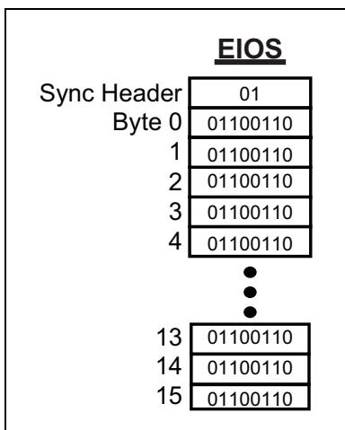

## Transmitter Exit from Electrical Idle | 发送器退出电气空闲

| EN | ZH |
|---|---|
| When a Transmitter is instructed to exit from Electrical Idle, the steps it takes depend on the data rate in use (see below). However, it must resume transmission within less than 8ns by sending FTSs or TS1/TS2s causing transition back to the L0 full-on state. | 当发送器被指示退出电气空闲时，其采取的步骤取决于当前使用的数据速率（见下文）。但发送器必须通过在 8ns 内发送 FTS 或 TS1/TS2 来恢复传输，从而使链路转换回 L0 全开状态。 |
| **Gen1 Mode.** For 2.5 GT/s, the process is simple: it begins using valid differential signals to send the TS1s or FTSs that will serve to inform the Receiver about the change. The Receiver detects the voltage as being above the squelch threshold and begins to evaluate the incoming signal. | **Gen1 模式。** 对于 2.5 GT/s，过程很简单：发送器开始使用有效的差分信号发送 TS1 或 FTS，以告知接收器状态的变化。接收器检测到电压高于静噪阈值，并开始评估输入信号。 |
| **Gen2 Mode.** When using 5.0 GT/s, the signals are changing so quickly that they don't have time to reach the higher voltage levels. That makes it more difficult to quickly detect when the voltages have changed back to the operational values. To make this easier, the EIEOS (Electrical Idle Exit Ordered Set), was defined to provide a lower-frequency sequence. The EIEOS for 8b/10b encoding, shown in Figure 16-11 on page 739, uses repeated K28.7 control characters to appear as a repeating string of 5 ones followed by 5 zeros. This gives the low-frequency signal that allows the higher signal voltages that are more readily seen. In fact, the spec states that this pattern guarantees that the Receiver will properly detect an exit from Electrical Idle, something that scrambled data cannot do. The EIEOS is to be sent under the following conditions: | **Gen2 模式。** 使用 5.0 GT/s 时，信号变化非常快，没有时间达到较高的电压电平。这使得快速检测电压是否已恢复为工作值变得更加困难。为解决此问题，定义了 EIEOS（电气空闲退出有序集）以提供较低频率的序列。用于 8b/10b 编码的 EIEOS（见第 739 页图 16-11）使用重复的 K28.7 控制字符，呈现为重复的 5 个 1 后跟 5 个 0 的字符串。这提供了低频信号，从而可获得更易检测的较高信号电压。事实上，规范指出此模式可保证接收器正确检测到电气空闲的退出，这是加扰数据无法做到的。EIEOS 应在以下条件下发送： |
| Before the first TS1 after entering the Configuration.Linkwidth.Start or Recovery.RcvrLock state. | 在进入 Configuration.Linkwidth.Start 或 Recovery.RcvrLock 状态后，发送第一个 TS1 之前。 |
| After every 32 TS1s or TS2s are sent in Configuration.Linkwidth.Start, Recovery.RcvrLock, or Recovery.RcvrCfg states. The TS1/TS2 count is reset to zero whenever an EIEOS is sent or the first TS2 is received in the Recovery.RcvrCfg state. | 在 Configuration.Linkwidth.Start、Recovery.RcvrLock 或 Recovery.RcvrCfg 状态下每发送 32 个 TS1 或 TS2 之后。每当发送 EIEOS 或在 Recovery.RcvrCfg 状态下接收到第一个 TS2 时，TS1/TS2 计数器将复位为零。 |

Figure 16-11: Gen1/Gen2 Mode EIEOS Symbol Pattern | 图16-11：Gen1/Gen2模式EIEOS符号模式

| EN | ZH |
|---|---|
| **Gen3 Mode.** An EIEOS is needed for 8 GT/s rate too and for the same reason as for 5.0 GT/s. Now, though, the Ordered Set takes the form of a block, as shown in Figure 16-12 on page 740. As before, it gives a low-frequency pattern in alternating bytes of 00h and FFh, which appears as a repeating string of 8 zeros followed by 8 ones. | **Gen3 模式。** 8 GT/s 速率同样需要 EIEOS，原因与 5.0 GT/s 相同。不过，此时有序集采用块的形式，如第 740 页图 16-12 所示。与之前一样，它以 00h 和 FFh 交替字节提供低频模式，呈现为重复的 8 个 0 后跟 8 个 1 的字符串。 |
| In addition, EIEOS is sent so as to allow a receiver during LTSSM Recovery state to establish Block Lock after which the Link transitions to the L0 state. See the section "Block Alignment" on page 411 and "Achieving Block Alignment" on page 438. | 此外，发送 EIEOS 可使 LTSSM Recovery 状态下的接收器建立块锁定，之后链路转换到 L0 状态。参见第 411 页的"块对齐"一节和第 438 页的"实现块对齐"一节。 |
| In Gen3 mode, EIEOS is to be sent: | 在 Gen3 模式下，EIEOS 应在以下条件下发送： |
| • Before the first TS1 after entering the Configuration.Linkwidth.Start or Recovery.RcvrLock state. | • 在进入 Configuration.Linkwidth.Start 或 Recovery.RcvrLock 状态后，发送第一个 TS1 之前。 |
| Immediately after an EDS Framing Token when a Data Stream is ending if an EIOS is not being sent and the LTSSM is not entering Recovery.RcvrLock. | 当数据流结束时，在 EDS 帧标记之后立即发送，前提是未发送 EIOS 且 LTSSM 未进入 Recovery.RcvrLock。 |
| • After every 32 TS1s/TS2s whenever TS1s or TS2s are sent. The count is reset to zero when: | • 每当发送 TS1 或 TS2 时，每发送 32 个 TS1/TS2 之后。在以下情况下，计数器复位为零： |
| — an EIEOS is sent | — 发送了 EIEOS |
| — the first TS2 is received while in either the Recovery.RcvrCfg or Configuration.Complete LTSSM state | — 在 Recovery.RcvrCfg 或 Configuration.Complete LTSSM 状态下接收到第一个 TS2 |
| — a Downstream Port in Phase 2 of the Equalization sequence, or an Upstream Port in Phase 3, receives two TS1s with the Reset EIEOS Interval Count bit set. | — 处于均衡序列阶段 2 的下行端口或处于阶段 3 的上行端口接收到两个设置了复位 EIEOS 间隔计数位 的 TS1。 |

## PCI Express Technology | PCI Express 技术

| EN | ZH |
|---|---|
| After every $2^{16}$ TS1s during the Equalization sequence, if the Reset EIEOS Interval Count bit has prevented it from being sent. The spec states that designs are allowed to satisfy this requirement by sending an EIEOS within 2 TS1s of the scrambling LFSR matching its seed value. | 在均衡序列期间每经过 $2^{16}$ 个 TS1 后，如果复位 EIEOS 间隔计数位阻止了其发送。规范指出，设计允许通过在扰码 LFSR 匹配其种子值后的 2 个 TS1 内发送一个 EIEOS 来满足此要求。 |
| • As part of an FTS sequence, Compliance Pattern, or Modified Compliance pattern. | • 作为 FTS 序列、合规性模板或修改合规性模板的一部分。 |

Figure 16‐12: 128b/130b EIEOS Block | 图16‐12：128b/130b EIEOS块

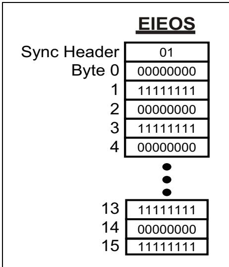

## Receiver Entry to Electrical Idle | 接收器进入电气空闲

| EN | ZH |
|---|---|
| When a Transmitter enters Electrical Idle, the Link partner's Receiver responds based on the data rate, as described in the following sections. Receipt of an EIOS informs the Receiver that this is going to happen, preparing it to detect when it actually does happen. When the Receiver detects this condition it de‑gates the error logic to prevent reporting errors caused by unreliable activity on the Link and arms its Electrical Idle Exit detector so it will be ready to resume normal activity when the Transmitter begins to send data again. There are two Electrical Idle detection options.: | 当发送器进入电气空闲时，链路对端的接收器根据数据速率做出响应，如下节所述。收到EIOS通知接收器即将发生此情况，使其准备好检测实际发生时的情况。当接收器检测到此条件时，它禁用错误逻辑以防止报告由链路上不可靠活动引起的错误，并启用其电气空闲退出检测器，以便在发送器再次开始发送数据时准备好恢复正常活动。有两种电气空闲检测选项： |
| Detecting Electrical Idle Voltage. Once an EIOS has been received, the expectation is that the Transmitter will cease transmission very quickly. In the 1.x spec versions Receivers detect this by observing that the incoming voltage has dropped below the threshold of a valid signal. This isn't too difficult at 2.5 GT/s but it requires a squelch detect circuit that consumes space and power. | 检测电气空闲电压。一旦收到EIOS，预计发送器将很快停止发送。在1.x规范版本中，接收器通过观察输入电压是否降至有效信号阈值以下来检测此情况。在2.5 GT/s下这并不太难，但需要一个占用面积和功耗的静噪检测电路。 |
| Inferring Electrical Idle. However, at higher frequencies the signal becomes increasingly attenuated, making it difficult for squelch detect logic to distinguish the levels. This is especially true for 8.0 GT/s, where it's expected that the Receiver may need to perform equalization internally to recover a good signal. To alleviate these detection problems, the 2.0 spec introduced the concept of allowing a Receiver to infer when the Link has gone to the Electrical Idle condition rather than testing the voltage level. In this model, the absence of expected events is used to indicate that the Link is not signaling and can therefore be assumed to be in Electrical Idle, as listed in Table 16‑17. By way of explanation, Flow Control Updates should arrive regularly while the Link is in L0, and SOSs are expected with certain timing, too. For simplicity, a Receiver is allowed to check for one or the other or both of these conditions. During Link training the TS1s and TS2s should arrive regularly, so their absence can also be taken to mean that the Link is Idle. For the last two rows of the table, though, it's possible that no Symbols have been received at all, and that will also be understood to mean the Link is Idle. Since Electrical Idle takes place for the overall Link and not for Lanes independently, there's no need for each Lane to measure these times. Instead, an LTSSM can just use one timer in common for all the Lanes on that Link. | 推断电气空闲。然而，在更高频率下，信号衰减加剧，使得静噪检测逻辑难以区分电平。对于8.0 GT/s尤其如此，接收器可能需要内部执行均衡才能恢复良好信号。为缓解这些检测问题，2.0规范引入了允许接收器推断链路何时进入电气空闲状态而非检测电压电平的概念。在此模型中，使用预期事件的缺失来指示链路没有发信号，因此可以假定处于电气空闲状态，如表16‑17所列。作为说明，当链路处于L0时，流控更新应定期到达，SOS也应按特定时序到达。为简化起见，允许接收器检查这些条件中的一个或另一个或两者皆检查。在链路训练期间，TS1和TS2应定期到达，因此它们的缺失也可被理解为链路处于空闲。但对于表中最后两行，可能根本没有收到任何符号，这也将被理解为链路处于空闲。由于电气空闲发生在整个链路上而非独立发生在各通道上，因此每个通道无需分别测量这些时间。相反，LTSSM可以仅使用一个定时器，供该链路上的所有通道共用。 |

Table 16‑17: Electrical Idle Inference Conditions | 表16‑17：电气空闲推断条件

<table><tr><td>State</td><td>2.5GT/s</td><td>5.0 GT/s</td><td>8.0 GT/s</td></tr><tr><td>L0</td><td colspan="3">Absence of an FC Update or SOS in a 128μs window</td></tr><tr><td>Recovery.RcvrCfg</td><td colspan="2">Absence of a TS1 or TS2 in a 1280 UI interval</td><td>Absence of a TS1 or TS2 in a 4ms window</td></tr><tr><td>Recovery.Speed (successful_speed_negotiation = 1b)</td><td colspan="2">Absence of a TS1 or TS2 in a 1280 UI interval</td><td>Absence of a TS1 or TS2 in a 4680 UI interval</td></tr><tr><td>Recovery.Speed (successful_speed_negotiation = 0b)</td><td>Absence of an exit from Electrical Idle in a 2000 UI interval</td><td colspan="2">Absence of an exit from Electrical Idle in a 16000 UI interval</td></tr><tr><td>Loopback.Active (as a slave)</td><td>Absence of an exit from Electrical Idle in a 128μs window</td><td>N/A</td><td>N/A</td></tr></table>

| EN | ZH |
|---|---|
| How the EIOS is recognized at the Receiver also depends on the encoding scheme. For Gen1/Gen2 mode, a receiver recognizes an EIOS when it sees two of the three IDL Symbols. For Gen3 mode, it's recognized when Symbols 0‑3 of the incoming block match the EIOS pattern. | 接收器如何识别EIOS也取决于编码方案。对于Gen1/Gen2模式，接收器在看到三个IDL符号中的两个时识别出EIOS。对于Gen3模式，当输入块的符号0‑3与EIOS模式匹配时即识别出EIOS。 |

## Receiver Exit from Electrical Idle | 接收器退出电气空闲

| EN | ZH |
|---|---|
| Receivers detect a voltage difference to signify a resumption of normal signaling. An exit from Electrical Idle will be detected when the differential peak-to-peak voltage exceeds the Electrical Idle Detect threshold, which is allowed to be set between 65 and 175mV for all data rates. | 接收器通过检测电压差来表示正常信令的恢复。当差分峰峰值电压超过电气空闲检测阈值时，将检测到退出电气空闲状态，对于所有数据速率，该阈值允许设置在65至175mV之间。 |
| At 2.5 GT/s nothing more is needed, but at higher rates Receivers don't have to rely on this detection circuit except when receiving EIEOS during certain LTSSM states or during the four EIE Symbols that precede transmission of an FTS sequence at 5.0 GT/s. The number and timing of EIEOSs to facilitate detection of Electrical Idle exit depends on the Link state. For more on this, see "Active State Power Management (ASPM)" on page 735. | 在2.5 GT/s时无需更多操作，但在更高速率下，接收器不必依赖此检测电路，除非在特定LTSSM状态期间接收EIEOS，或在5.0 GT/s时在发送FTS序列之前的四个EIE符号期间。用于辅助检测电气空闲退出的EIEOS数量和时序取决于链路状态。更多信息请参见第735页的"主动状态电源管理(ASPM)"。 |
| In Electrical Idle, the Receiver's PLL looses clock synchronization. When the Transmitter exits Electrical Idle, it sends FTSs to exit from L0s, or TS1/TS2s to exit from all other Link states. Doing so supplies the needed transition density for the CDR logic to re-synchronize the receiver PLL and achieve Bit Lock and Symbol Lock or Block Alignment. | 在电气空闲状态下，接收器的PLL会失去时钟同步。当发送器退出电气空闲时，它会发送FTS以退出L0s，或发送TS1/TS2以退出所有其他链路状态。这样做为CDR逻辑提供了所需的跳变密度，以重新同步接收器PLL并实现位锁和符号锁或块对齐。 |
| Figure 16-13 illustrates the Link state transitions and highlights the transitions between L0, L0s, and L1. Note that there is no direct path from L0s to L1, so the Link must be returned to the L0 state before changing between them. | 图16-13展示了链路状态转换，并突出显示了L0、L0s和L1之间的转换。注意，从L0s到L1没有直接路径，因此在它们之间切换时，链路必须先返回到L0状态。 |

Figure 16-13: ASPM Link State Transitions | 图16-13：ASPM链路状态转换  

| EN | ZH |
|---|---|
| The Link Capability register specifies a device's support for Active State Power Management. Figure 16-14 illustrates the ASPM Support field within this register. In earlier spec versions, not all 4 options were available, but the 2.1 spec filled in all of them. Note that bit 22 indicates whether all the options are available. | 链路能力寄存器指定设备对主动状态电源管理的支持。图16-14展示了该寄存器中的ASPM支持字段。在早期规范版本中，并非所有4个选项都可用，但2.1规范补充了所有选项。注意，位22指示所有选项是否均可用。 |

Figure 16-14: ASPM Support | 图16-14：ASPM支持  

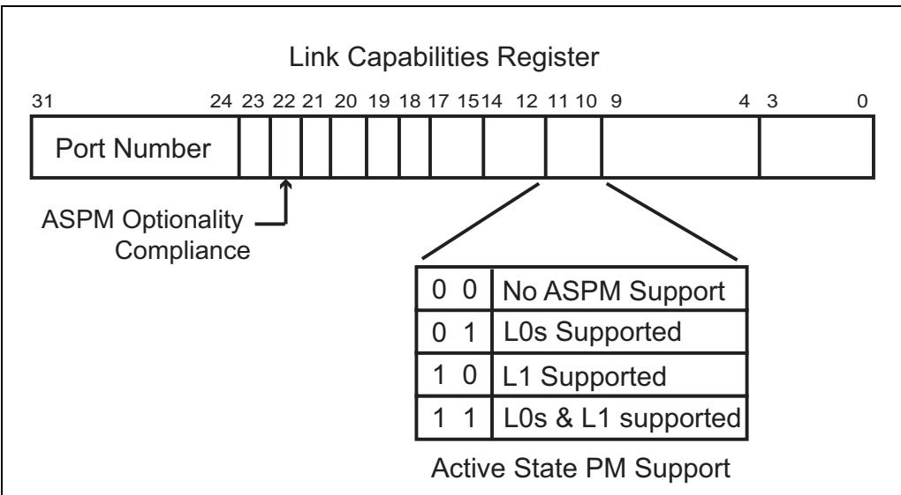

| EN | ZH |
|---|---|
| Software can enable and disable ASPM via the Active State PM Control field of the Link Control Register as illustrated in Figure 16-15 on page 744. The possible settings are listed in Table 16-18 on page 743. Note: The spec recommends that ASPM be disabled for all components in a path used for Isochronous transactions if the additional latencies associated with ASPM exceed the limits of the isochronous transactions. | 软件可通过链路控制寄存器的主动状态PM控制字段来启用和禁用ASPM，如图16-15（第744页）所示。可能的设置列于表16-18（第743页）。注意：如果与ASPM相关的额外延迟超过等时事务的延迟限制，规范建议在用于等时事务的路径中为所有组件禁用ASPM。 |

Table 16-18: Active State Power Management Control Field Definition | 表16-18：活动状态电源管理控制字段定义

<table><tr><td>Setting</td><td>Description</td></tr><tr><td>00b</td><td>L0s and L1 ASPM disabled</td></tr><tr><td>01b</td><td>L0s enabled and L1 disabled</td></tr><tr><td>10b</td><td>L1 enabled and L0s disabled</td></tr><tr><td>11b</td><td>Both L0s and L1 enabled</td></tr></table>

Figure 16-15: Active State PM Control Field | 图16-15：活动状态电源管理控制字段  

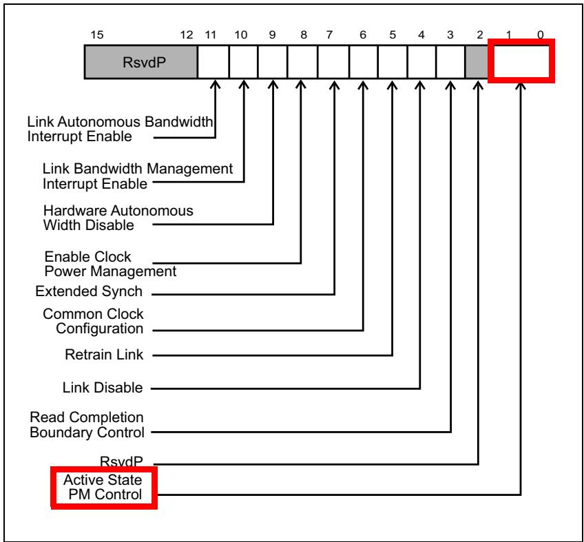

## 1.5.2 L0s State | 1.5.2 L0s 状态

| EN | ZH |
|----|----|
| L0s is a Link power state that can only be entered under hardware control and is applied to a single direction of the Link. For example, a large volume of traffic in conventional PC-based systems results from Functions sending data to main system memory. As a result, the upstream lanes carry heavy traffic while the downstream lanes may carry very little. These downstream lanes can enter the L0s state to conserve power during stretches of idle bus time. | L0s是一种链路电源状态，只能在硬件控制下进入，并应用于链路的单一方向。例如，在传统PC系统中，大量流量来自各功能向主系统内存发送数据。因此，上行通道承载繁重流量，而下行通道可能承载很少流量。这些下行通道可在总线空闲时段进入L0s状态以节省功耗。 |

## Entry into L0s

## 进入 L0s

| EN | ZH |
|---|---|
| A Transmitter initiates a change from L0 to L0s after detecting a period of idle time that is implementation specific. | 发送方在检测到一段具体实现相关的空闲时间后，会启动从 L0 到 L0s 的转换。 |
| Entry into L0s. Entry is managed for a single direction of the Link based on detecting a period of Link idle time. Ports are required to enter L0s after detecting idle time of no greater than 7μs. | 进入 L0s。进入过程是基于检测到一段链路空闲时间，针对链路的单个方向进行管理的。端口在检测到不超过 7μs 的空闲时间后，必须进入 L0s。 |
| Idle is defined differently for Endpoints and Switches. The reason for this is a desire to minimize recovery time as Link recovery time propagates through Switches. For example, if a Switch upstream port was in a low power state and now sees activity, it means that a TLP is probably on its way down to the Switch. Where will the packet need to be routed? It will go to one of the downstream ports, but rather than wait to receive the packet and determine which port will be the target before starting to wake it up, the lowest-latency approach would be to wake all the downstream ports so that the one that turns out to be the target will be ready as quickly as possible. | 空闲的定义对于端点和交换机有所不同。其原因是为了最小化恢复时间，因为链路恢复时间会通过交换机传播。例如，如果交换机的上游端口处于低功耗状态，而现在检测到活动，这意味着可能有 TLP 正在发往该交换机。该数据包需要路由到哪里？它将发往某个下游端口，但与其等待接收数据包并确定哪个端口是目标后再开始唤醒它，最低延迟的方法是唤醒所有下游端口，这样最终成为目标的端口就能尽可能快地准备就绪。 |
| Basic rules regarding idle time: | 关于空闲时间的基本规则： |
| • Endpoint Port or Root Port: | • 端点端口或根端口： |
| No TLPs are pending transmission or a lack of Flow Control credits is temporarily blocking them. | 没有待发送的 TLP，或者由于缺乏流控信用而暂时阻塞了发送。 |
| - No DLLPs are pending transmission. | - 没有待发送的 DLLP。 |
| • Upstream Switch Port: | • 交换机上游端口： |
| - The receive lane of all downstream ports are already in L0s. | - 所有下游端口的接收通道已处于 L0s。 |
| No TLPs are pending transmission or a lack of Flow Control credits is temporarily blocking them. | 没有待发送的 TLP，或者由于缺乏流控信用而暂时阻塞了发送。 |
| - No DLLPs are pending transmission. | - 没有待发送的 DLLP。 |
| • Downstream Switch Port: | • 交换机下游端口： |
| The Switch's Upstream Port's Receive Lanes are in L0s. | 交换机的上游端口的接收通道处于 L0s。 |
| No TLPs are pending transmission or a lack of Flow Control credits is temporarily blocking them. | 没有待发送的 TLP，或者由于缺乏流控信用而暂时阻塞了发送。 |
| - No DLLPs are pending for transmission | - 没有待发送的 DLLP。 |
| The Transaction and Data Link Layers are unaware of whether the Physical Layer transmitter has entered L0s, but the idle conditions that trigger a transition to L0s must be continuously reported from the Transaction and Link layers to the Physical Layer so it can make timely choices about this. Note that a port must always tolerate L0s on its receiver, even if software has disabled ASPM. This allows a device at the other end of the Link that is enabled for ASPM to still transition one side of the Link to the L0s state. | 事务层和数据链路层并不知晓物理层发送方是否已进入 L0s，但触发转换到 L0s 的空闲条件必须由事务层和链路层持续上报给物理层，以便物理层能及时做出相关决策。请注意，即使软件已禁用 ASPM，端口也必须始终容忍其接收端上的 L0s。这允许链路另一端已启用 ASPM 的设备仍然可以将链路的一侧转换到 L0s 状态。 |
| Flow Control Credits Must be Delivered. One situation that qualifies as idle time is a pending TLP that is blocked due to insufficient FC credits. When flow control credits are received that allow delivery of the pending TLP, the transmitting port must initiate a return to L0. Also, if the receive buffer associated with the transmitter in L0s makes additional flow control credits available, the transmitter must return to L0 and deliver the FC_Update DLLP to the neighbor. | 流控信用必须被送达。一种符合空闲时间条件的情况是，有挂起的 TLP 因 FC 信用不足而被阻塞。当收到允许发送该挂起 TLP 的流控信用时，发送端口必须启动返回到 L0。此外，如果与处于 L0s 的发送方相关联的接收缓冲区释放了额外的流控信用，发送方必须返回 L0 并向邻居发送 FC_Update DLLP。 |
| Transmitter Initiates Entry to L0s. When sufficient idle time has been observed by a Transmitter, it forces a transition from L0 to L0s by sending an "electrical idle" ordered set (EIOS) to the receiver and stopping transmission. The transmitter and receiver are now in their electrical idle states and have reduced power consumption. Synchronization between the transmitter and receiver has been lost and retraining will be required for recovery. The spec requires that the PLL logic in the receiver must remain active (powered) to allow quick recovery from L0s back to L0. | 发送方启动进入 L0s。当发送方观测到足够的空闲时间后，它通过向接收方发送"电气空闲"有序集 (EIOS) 并停止传输，强制从 L0 转换到 L0s。发送方和接收方现在处于电气空闲状态，功耗降低。发送方与接收方之间的同步已丢失，恢复时将需要重新训练。规范要求接收方中的 PLL 逻辑必须保持活动（供电），以允许从 L0s 快速恢复到 L0。 |

## Exit from L0s State | 退出 L0s 状态

| EN | ZH |
|---|---|
| If the transmitter detects that the idle condition is no longer true, it must initiate the exit from L0s to L0. The spec encourages designers to monitor events that give an early indication that an L0s exit is imminent and start the recovery process to speed up the transition back to L0. For example, if the Receiver of the port receives a non-posted Request, the Transmitter knows that it will soon be asked to send a Completion in response. Consequently, the Transmitter can go ahead and start the exit process so the Link state is L0 by the time it is asked to deliver the Completion. | 如果发送器检测到空闲条件不再成立，它必须启动从L0s到L0的退出。规范鼓励设计者监视那些能提前指示L0s退出即将发生的事件，并启动恢复过程以加速回到L0的转换。例如，如果端口的接收器收到一个非发布请求，发送器就知道很快将被要求发送一个完成报文作为响应。因此，发送器可以提前启动退出过程，以便在被要求交付完成报文时链路状态已经是L0。 |
| **Transmitter Initiates L0s Exit.** To exit L0s, the Transmitter sends one or more Fast Training Sequence (FTS) Ordered Sets. The number of these required by the Link partner's Receiver was communicated earlier during Link training (N_FTS field in the TS1s and TS2s used in training). After sending the requested number of FTSs, one SOS is delivered. The receiver should be able to establish bit lock and symbol lock or Block lock, and should be ready to resume normal operation. | **发送器发起L0s退出。** 要退出L0s，发送器发送一个或多个快速训练序列(FTS)有序集。链路伙伴的接收器所需的FTS数量已在之前的链路训练期间传达（训练中使用的TS1和TS2中的N_FTS字段）。在发送所需数量的FTS之后，交付一个SOS。接收器应能够建立位锁定和符号锁定或块锁定，并应准备好恢复正常操作。 |
| **Actions Taken by Switches that Receive L0s Exit.** A switch that receives an L0s to L0 transition sequence on one port may also need to initiate an L0s exit to other of its ports. Two specific cases are considered: | **收到L0s退出的交换机采取的动作。** 在一个端口上收到L0s到L0转换序列的交换机可能也需要在其其他端口上发起L0s退出。考虑两个具体情形： |
| *Switch Downstream Port Receives L0s to L0 transition.* The switch must signal an L0s to L0 on its upstream port if it is currently in the L0s state because the packet coming up from the Endpoint or downstream switch will most likely need to go upstream to the Root Complex. | *交换机下游端口收到L0s到L0转换。* 如果交换机当前处于L0s状态，它必须在其上游端口上发出L0s到L0的信号，因为来自端点或下游交换机的报文很可能需要上行到根复合体。 |
| *Switch Upstream Port Receives L0s to L0 transition.* The switch must signal an L0s to L0 transition on all downstream ports currently in the L0s state because it doesn't want to wait until the packet arrives to begin waking the target path. | *交换机上游端口收到L0s到L0转换。* 交换机必须在所有当前处于L0s状态的下游端口上发出L0s到L0转换的信号，因为它不想等到报文到达才开始唤醒目标路径。 |
| Switch ports that were put into L1 by a software change to the device power state remain unaffected by L0s to L0 transitions. However, once the upstream Link has completed the transition to L0, a subsequent transaction may target this port, causing a transition from L1 to L0. | 通过软件更改设备电源状态而进入L1的交换机端口不受L0s到L0转换的影响。然而，一旦上游链路完成了到L0的转换，后续事务可能以该端口为目标，导致从L1到L0的转换。 |

| EN | ZH |
|---|---|
| ## L1 ASPM State | ## L1 ASPM 状态 |
| The optional L1 ASPM state provides deeper power savings than L0s, but has a greater recovery latency. This state results in both directions of the Link going into the L1 state and results in Link and Transaction layer deactivation within each device. | 可选的 L1 ASPM 状态提供比 L0s 更深的节能效果，但恢复延迟更大。该状态导致链路两个方向均进入 L1 状态，并导致每个设备内链路层和事务层停用。 |
| Entry into this state is requested by an upstream port, such as from an Endpoint or the upstream port of a switch (upstream ports are shaded as shown in Figure 16-16). The downstream port responds to this request and either agrees to go into L1 or rejects the request through a negotiation process with the downstream component. Exiting L1 ASPM can be initiated by either the downstream or upstream port. | 进入该状态由上游端口请求，例如来自端点或交换机的上游端口（上游端口如图 16-16 所示以阴影标示）。下游端口响应该请求，并通过与下游组件协商，同意进入 L1 或拒绝该请求。退出 L1 ASPM 可由下游或上游端口发起。 |

Figure 16-16: Only Upstream Ports Initiate L1 ASPM | 图16-16：仅上游端口发起L1 ASPM  

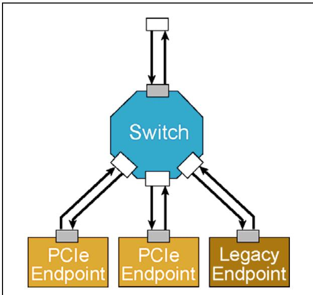

| EN | ZH |
|----|----|
| ## PCI Express Technology | ## PCI Express 技术 |

## Downstream Component Decides to Enter L1 ASPM | 下游组件决定进入 L1 ASPM

| EN | ZH |
|---|---|
| The spec does not precisely define all conditions under which an Endpoint or upstream port of a switch decides to attempt entry into the L1 ASPM state but does suggest that one case might be when both sides of the Link have been in L0s for a preset amount of time. The requirements given include: | 规范并未精确定义端点或交换机上游端口决定尝试进入L1 ASPM状态的所有条件，但建议一种情况可能是链路两侧都处于L0s状态达到预设时间。给出的要求包括： |
| • ASPM L1 entry is supported and enabled | • ASPM L1入口受支持并已启用 |
| • Device-specific requirements for entering L1 have been satisfied | • 进入L1的设备特定要求已满足 |
| • No TLPs are pending transmission | • 没有待传输的TLP |
| • No DLLPs are pending transmission | • 没有待传输的DLLP |
| If the downstream component is a switch, then all of the switch's downstream ports must be in the L1 or higher power conservation state before the upstream port can initiate L1 entry. | 如果下游组件是交换机，则交换机的所有下游端口必须处于L1或更高的省电状态后，上游端口才能发起L1进入。 |

| EN | ZH |
|---|---|
| ## Negotiation Required to Enter L1 ASPM | ## 进入L1 ASPM所需的协商 |
| Because of the longer latency required to recover from L1 ASPM, a negotiation process is employed to ensure that the port at the other end of the Link is enabled for L1 ASPM and is prepared to enter it. The negotiation involves sending several packets: | 由于从L1 ASPM恢复需要较长的延迟，因此采用协商过程来确保链路另一端的端口已启用L1 ASPM并准备进入该状态。协商过程涉及发送若干报文： |
| • PM\_Active\_State\_Request\_L1 DLLP — issued by the downstream port to start the negotiation process. | • PM\_Active\_State\_Request\_L1 DLLP —— 由下游端口发出，用于启动协商过程。 |
| • PM\_Request\_Ack DLLP — returned by the upstream port when all of its requirements to enter L1 ASPM have been satisfied. | • PM\_Request\_Ack DLLP —— 当上游端口进入L1 ASPM的所有条件均已满足时，由上游端口返回。 |
| • PM\_Active\_State\_Nak message TLP — returned by the upstream port when it is unable to enter the L1 ASPM state. | • PM\_Active\_State\_Nak消息TLP —— 当上游端口无法进入L1 ASPM状态时，由上游端口返回。 |
| The upstream component may or may not accept the transition to the L1 ASPM state. The following scenarios describe a variety of circumstances that result in both conditions. | 上游组件可以接受也可不接受到L1 ASPM状态的转换。以下场景描述了导致这两种情况的各种情形。 |

## Scenario 1: Both Ports Ready to Enter L1 ASPM State | 场景 1：两端端口均准备好进入 L1 ASPM 状态

| English | 中文 |
|---------|------|
| Figure 16-17 on page 750 summarizes the sequence of events that must occur to enable transition to the L1 ASPM state. This scenario assumes that all transactions have completed in both directions and no new transaction requirements emerge during the negotiation. | 第 750 页的图 16-17 总结了必须发生的事件序列，以支持转换到 L1 ASPM 状态。该场景假设所有事务已在两个方向上完成，并且在协商期间没有出现新的事务需求。 |
| Downstream Component Requests L1 State. If the downstream component wishes to transition to the L1 state, it can send the request to enter L1 after the following steps have completed: | 下游组件请求 L1 状态。如果下游组件希望转换到 L1 状态，它可以在以下步骤完成后发送进入 L1 的请求： |
| 1. TLP scheduling is blocked at the Transaction Layer. | 1. 事务层中 TLP 调度被阻塞。 |
| 2. The Link Layer has received acknowledgement for the last TLP it had previously sent and the replay buffer is empty. | 2. 数据链路层已收到先前发送的最后一个 TLP 的确认，并且重放缓冲区为空。 |
| 3. Sufficient flow control credits are available to allow transmission of the largest possible packet for any FC type. This ensures that the component can issue a TLP immediately upon exiting the L1 state. | 3. 有足够的流控信用可用，以允许传输任何 FC 类型的最大可能数据包。这确保组件在退出 L1 状态后可以立即发出 TLP。 |
| The downstream component then delivers the PM_Active_State_Request_L1 to notify the upstream component of the request to enter the L1 state. This is sent repeatedly until the upstream component responds — either a PM_Request_ACK DLLP or a PM_Active_State_NAK message. | 然后，下游组件发送 PM_Active_State_Request_L1 以通知上游组件进入 L1 状态的请求。该消息被重复发送，直到上游组件响应——要么是 PM_Request_ACK DLLP，要么是 PM_Active_State_NAK 消息。 |

## Upstream Component Response to L1 ASPM Request. Downstream ports (i.e., ports of an upstream component that face downward) must accept a request to enter a low power L1 state if all of the following conditions are true:

| EN | ZH |
|---|---|
| ## Upstream Component Response to L1 ASPM Request. Down‑stream ports (i.e., ports of an upstream component that face downward) must accept a request to enter a low power L1 state if all of the following conditions are true: | ## 上行组件对L1 ASPM请求的响应。下游端口（即上行组件中面向下方的端口）必须接受进入低功耗L1状态的请求，前提是满足以下所有条件： |
| • The Port supports ASPM L1 entry and is enabled to do so | • 端口支持ASPM L1进入且已使能 |
| • No TLP is scheduled for transmission | • 没有TLP计划发送 |
| • No Ack or Nak DLLP is scheduled for transmission | • 没有Ack或Nak DLLP计划发送 |
| Upstream Component Acknowledges Request to Enter L1. The upstream component sends a PM\_Request\_ACK to notify the downstream component of its agreement to enter the L1 ASPM state after it: | 上行组件确认进入L1的请求。上行组件发送PM\_Request\_ACK以通知下游组件同意进入L1 ASPM状态，需在满足以下条件之后： |
| 1. Block scheduling of any new TLPs. | 1. 阻止任何新TLP的调度。 |
| 2. Receive acknowledgement for the last TLP previously sent (meaning its replay buffer is empty). | 2. 收到先前发送的最后一个TLP的确认（意味着其重放缓冲区为空）。 |
| 3. Ensure enough flow control credits are available to send the largest possible packet for any FC type so that it can issue a TLP immediately after exiting the L1 state. | 3. 确保每种FC类型都有足够的流控信用值以发送最大可能报文，从而在退出L1状态后能立即发出TLP。 |
| The Upstream component then sends PM\_Request\_Ack continuously until it detects the EIOS on its receive lanes, indicating that the downstream device has entered Electrical Idle. | 上行组件随后持续发送PM\_Request\_Ack，直到在其接收通道上检测到EIOS，表明下游设备已进入电气空闲。 |
| Downstream Component Sees Acknowledgement. When the Downstream component sees the PM\_Request\_Ack, it stops sending the PM\_Active\_State\_Request\_L1, disables DLLP and TLP transmission, sends the EIOS and places its transmit lanes into Electrical Idle. | 下游组件看到确认。当下游组件看到PM\_Request\_Ack时，停止发送PM\_Active\_State\_Request\_L1，禁用DLLP和TLP发送，发送EIOS并将其发送通道置于电气空闲。 |
| Upstream Component Receives Electrical Idle. When the Upstream component receives the EIOS, it stops sending the PM\_Request\_Ack DLLP, disables DLLP and TLP transmission, sends EIOS and places its own transmit lanes into Electrical Idle. | 上行组件接收电气空闲。当上行组件接收到EIOS时，停止发送PM\_Request\_Ack DLLP，禁用DLLP和TLP发送，发送EIOS并将其自身的发送通道置于电气空闲。 |

Figure 16-17: Negotiation Sequence Required to Enter L1 Active State PM | 图16-17：进入L1活动状态电源管理所需的协商序列

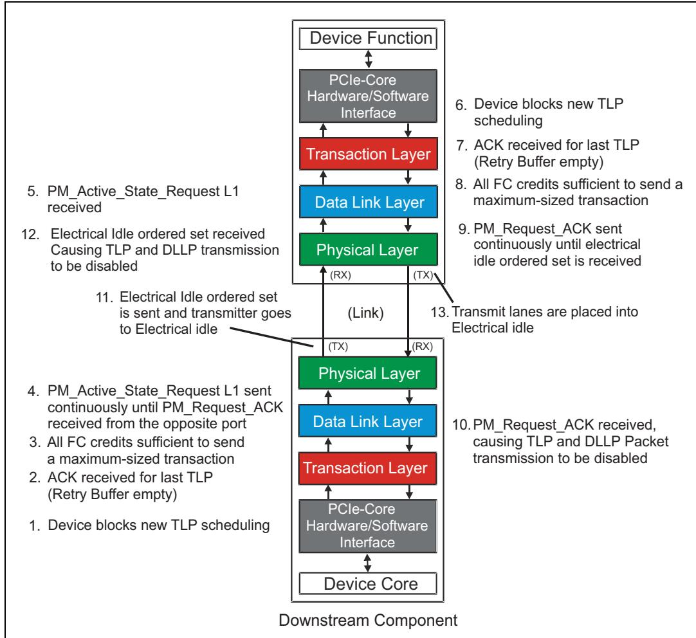

| EN | ZH |
|---|---|
| Scenario 2: Upstream Component Transmits TLP Just Prior to Receiving L1 Request | 场景2：上行组件在收到L1请求之前刚发送了TLP |
| This scenario presumes that the upstream component has just been instructed by its core logic to send a TLP downstream before it receives the request to enter L1 from the downstream device. Several negotiation rules define the actions to ensure that this situation is managed correctly. | 该场景假设上行组件在其核心逻辑的指示下刚刚向下游发送了一个TLP，随后才收到来自下游设备的进入L1请求。若干协商规则定义了相关动作，以确保正确处理这种情况。 |
| TLP Must Be Accepted by Downstream Component. Note that after the downstream device sends the PM\_Active\_State\_L1 DLLP it must wait for a response from the upstream component. While waiting, the downstream component must be able to accept TLPs and DLLPs from the upstream device. Although it won't send any TLPs, it must be able to send DLLPs as needed, such as ACKs for incoming TLPs. In this case, two possibilities exist: | 下游组件必须接受TLP。注意，下游设备发送PM\_Active\_State\_L1 DLLP后，必须等待上行组件的响应。在等待期间，下游组件必须能够接受来自上行设备的TLP和DLLP。虽然它不会发送任何TLP，但必须能够根据需要发送DLLP，例如对传入TLP的ACK。在这种情况下，存在两种可能： |
| • an ACK is returned to verify successful receipt of the TLP. | • 返回ACK以确认TLP接收成功。 |
| • a NAK is returned if a TLP transmission error is detected. The resulting retry of the TLP is allowed during the L1 negotiation. | • 如果检测到TLP传输错误，则返回NAK。在L1协商期间允许由此产生的TLP重试。 |
| Upstream Component Receives Request to Enter L1. The spec requires that the upstream component immediately accept or reject the request to enter the L1 state. However, it further states that prior to sending a PM\_Request\_ACK it must: | 上行组件收到进入L1的请求。规范要求上行组件立即接受或拒绝进入L1状态的请求。然而，规范进一步指出，在发送PM\_Request\_ACK之前，它必须： |
| 1. Block scheduling of new TLPs | 1. 阻止新TLP的调度 |
| 2. Wait for acknowledgement of the last TLP previously sent, if necessary, and retry TLPs that receive a NAK, unless a Link Acknowledgement timeout condition occurs. | 2. 如有必要，等待先前发送的最后一个TLP的确认，并重试收到NAK的TLP，除非发生链路确认超时条件。 |
| Once all outstanding TLPs have been acknowledged, and all other conditions are satisfied, the upstream device must return a PM\_Request\_ACK DLLP. | 一旦所有未完成的TLP都已得到确认，且满足所有其他条件，上行设备必须返回PM\_Request\_ACK DLLP。 |

## Scenario 3: Downstream Component Receives TLP During Negotiation | 场景 3：下游组件在协商期间接收 TLP

| EN | ZH |
|---|---|
| During the negotiation sequence the downstream device may be instructed to send a new TLP upstream. | 在协商序列期间，下游设备可被指示向上游发送新的TLP。 |
| However, a device that begins the L1 ASPM negotiation process must block new TLP scheduling. | 然而，开始L1 ASPM协商过程的设备必须阻止新的TLP调度。 |
| This prevents a race condition between going into L1 and sending a new TLP that would prevent entry into L1. | 这防止了进入L1与发送新TLP之间的竞态条件，否则新TLP会阻止进入L1。 |
| Consequently, once the downstream device has scheduled delivery of the PM_Request_L1 it must complete the transition to L1 if a PM_Request_ACK is received. | 因此，一旦下游设备已调度PM_Request_L1的发送，如果收到PM_Request_ACK，则必须完成到L1的转换。 |
| Sending a new TLP will have to wait until L1 has been entered, after which the device can initiate a transition from L1 back to L0 to send the TLP. | 发送新TLP必须等待进入L1，之后设备可发起从L1回到L0的转换以发送TLP。 |

## Scenario 4: Upstream Component Receives TLP During Negotiation | 场景 4：上游组件在协商期间接收 TLP
## Scenario 4: Upstream Component Receives TLP | 场景4：协商期间上游组件接收TLP

| EN | ZH |
|---|---|
| If the upstream component needs to send a TLP or DLLP after sending the PM\_Request\_Ack, it must first complete the transition to L1. It can then initiate a change from L1 to L0 to send the packet. | 如果上游组件在发送PM\_Request\_Ack后需要发送TLP或DLLP，它必须首先完成到L1的转换。然后它可以启动从L1到L0的变更以发送该报文。 |

## Scenario 5: Upstream Component Rejects L1 Request | 场景 5：上游组件拒绝 L1 请求

| EN | ZH |
|---|---|
| Figure 16-18 on page 752 summarizes the negotiation sequence when the upstream component rejects the request to enter the L1 ASPM state. The negotiation begins normally as the downstream component requests L1. However, the upstream device returns a PM_Active_State_Nak TLP to reject the request. The reasons for rejecting the request to enter L1 include: | 第752页的图16-18总结了上游组件拒绝进入L1 ASPM状态请求时的协商序列。协商正常开始，下游组件请求L1。然而，上游设备返回一个PM_Active_State_Nak TLP以拒绝该请求。拒绝进入L1请求的原因包括： |
| • L1 ASPM not supported or software has not enabled this feature | • 不支持L1 ASPM或软件未启用此功能 |
| • One or more TLPs are scheduled for transfer across the Link | • 一个或多个TLP计划跨链路传输 |
| • ACK or NAK DLLPs are scheduled for transfer | • ACK或NAK DLLP计划传输 |
| Once the rejection message has been sent, the upstream component can continue sending TLPs and DLLPs as needed. The rejection tells the downstream component that L1 is not an option at present, and so it must transition to L0s instead, if possible. | 一旦拒绝消息被发送，上游组件可以根据需要继续发送TLP和DLLP。该拒绝告知下游组件，L1目前不是可用选项，因此如果可能，它必须转换到L0s。 |

Figure 16-18: Negotiation Sequence Resulting in Rejection to Enter L1 ASPM State | 图16-18：导致拒绝进入L1 ASPM状态的协商序列

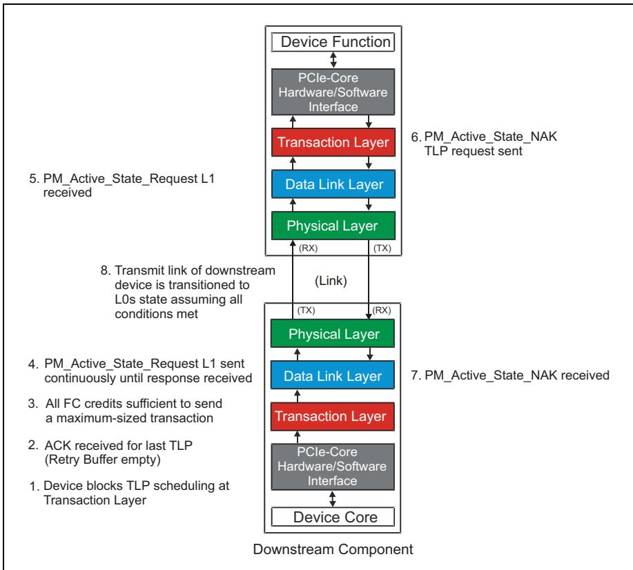

## Exit from L1 ASPM State | 退出 L1 ASPM 状态

| EN | ZH |
| --- | --- |
| Either component can initiate the transition from L1 back to L0 when it needs to use the Link. The procedure is the same in either case and doesn't involve any negotiation. When switches are involved in exiting from L1 the spec requires that other switch ports in the ASPM low power states must also transition to the L0 state if they are in the possible path of the packet that will be sent. These issues are discussed in subsequent sections. | 当任一组件需要使用链路时，均可启动从L1到L0的转换。两种情况下过程相同，且无需任何协商。当交换机参与L1退出时，规范要求如果其他处于ASPM低功耗状态的交换机端口位于待发送报文的可能路径上，则它们也必须转换到L0状态。这些问题将在后续章节讨论。 |
| L1 ASPM Exit Signaling. The spec states that exit from L1 is invoked by exiting electrical idle, which begins by sending TS1s. The receiving port responds by sending TS1s back to the originating device and the Physical Layer follows its LTSSM protocol to complete the Recovery state and return the Link to L0. Refer to "Recovery State" on page 571 for details. | L1 ASPM退出信令。规范规定，L1退出通过退出电气空闲来触发，其始于发送TS1序列。接收端口通过向发起设备回送TS1序列作为响应，物理层遵循其LTSSM协议完成Recovery状态并将链路恢复到L0。详情请参阅第571页的"Recovery状态"。 |
| Switch Receives L1 Exit from Downstream Component. As pictured in Figure 16‐19, the Switch must respond to L1 exit on the downstream port by returning TS1s and, within 1μs (from signal L1 Exit downstream), it must also exit L1 on its upstream Link if it was in that state. | 交换机从下游组件接收L1退出。如图16‐19所示，交换机的下游端口必须通过回送TS1序列来响应L1退出，并且在1μs内（从下游发出L1退出信号起），如果其上游链路处于L1状态，也必须退出L1。 |

Figure 16‐19: Switch Behavior When Downstream Component Signals L1 Exit | 图16‐19：下游组件发出L1退出信号时的交换机行为  
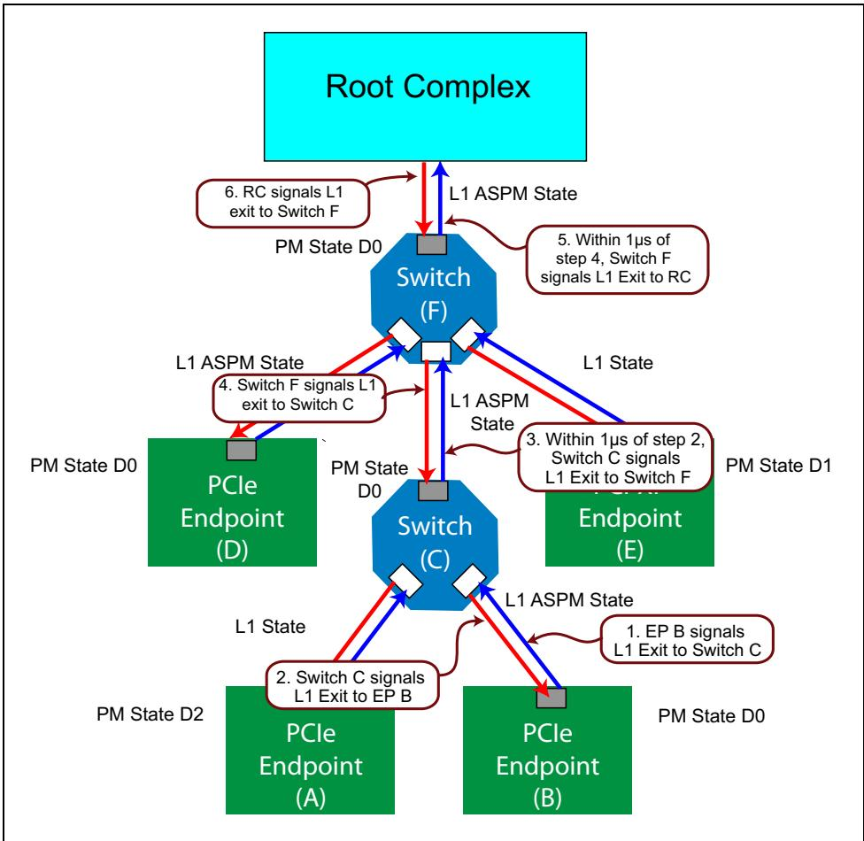

| EN | ZH |
| --- | --- |
| Presumably the reason the downstream component is transitioning back to L0 is because it's preparing to send a TLP upstream. Since L1 exit latencies are relatively long, a switch "must not wait until its Downstream Port Link has fully exited to L0 before initiating an L1 exit transition on its Upstream Port Link." This prevents accumulated latencies that would otherwise result if all L1 to L0 transitions occurred in a sequential fashion. | 下游组件恢复到L0的原因很可能是它准备向上游发送TLP。由于L1退出延迟相对较长，交换机"不得等到其下游端口链路完全退出到L0后，才在其上游端口链路上启动L1退出转换"。这可以避免如果所有L1到L0转换按顺序发生所导致的累积延迟。 |
| Switch Receives L1 Exit from Upstream Component. In this case, the switch must respond with TS1s back upstream, and within 1μs it must also send TS1s to all downstream ports that are in the L1 ASPM state to return them to L0. As in the previous example, the goal is to minimize the overall exit latency of returning to the L0 state for every Link in the path from the initiator to the target of the transaction. Figure 16‐20 on page 755 summarizes these requirements. The Link between Switch F and EndPoint (EP) E is in the L1 state because software put EP E into the D1 state, which caused the Link to transition to L1. Only Links in the L1 ASPM state are transitioned to L0 as a result of the Root Complex (RC) initiating the exit from L1 ASPM. | 交换机从上游组件接收L1退出。在这种情况下，交换机必须向上游回送TS1序列，并在1μs内向所有处于L1 ASPM状态的下游端口发送TS1序列，使其恢复到L0。与前面的例子一样，目标是尽可能缩短从事务发起端到目标端路径上每条链路恢复到L0状态的总体退出延迟。图16‐20（第755页）总结了这些要求。交换机F与端点E之间的链路处于L1状态，这是因为软件将端点E置于D1状态，导致该链路转换到L1。只有处于L1 ASPM状态的链路才会因根复合体发起L1 ASPM退出而转换到L0。 |

Figure 16‐20: Switch Behavior When Upstream Component Signals L1 Exit | 图16‐20：上游组件发出L1退出信号时的交换机行为  
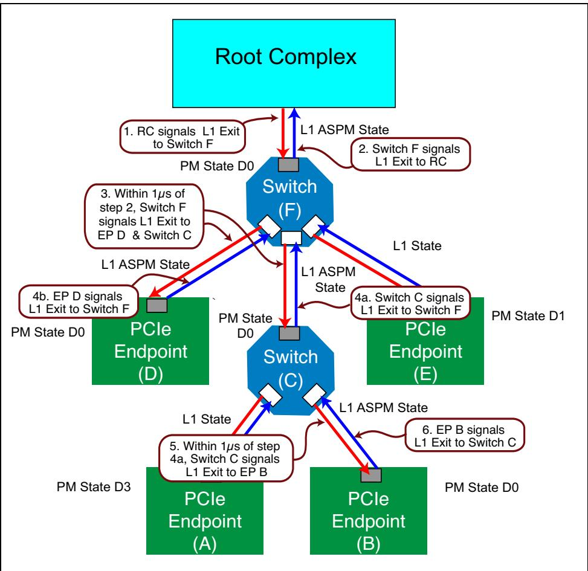

| EN | ZH |
|----|----|
| ## ASPM Exit Latency | ## ASPM退出延迟 |
| PCI Express provides mechanisms to ensure that the ASPM exit latencies for L0s and L1 don't exceed the requirements of the devices. All devices report their L0s and L1 exit latencies, and Endpoints also report the total acceptable latency they can tolerate for this when performing accesses to and from the Root Complex. This acceptable latency is based on the data buffer size within the device. If the chain of devices that reside between the Endpoint and target device have a total latency that exceeds the acceptable latency reported by the Endpoint, software can disable ASPM for a given Endpoint. | PCI Express提供了确保L0s和L1的ASPM退出延迟不超过设备要求的机制。所有设备报告其L0s和L1退出延迟，端点在执行与根复合体之间的访问时，也报告其可以容忍的总可接受延迟。该可接受延迟基于设备内部的数据缓冲区大小。如果位于端点和目标设备之间的设备链的总延迟超过了端点报告的可接受延迟，软件可以禁用给定端点的ASPM。 |
| The exit latencies reported by a device will change depending on whether the devices on each end of a Link share a common reference clock or not. Consequently, the Link Status register includes a bit called Slot Clock that specifies whether the component uses an external reference clock provided by the platform, or an independent reference clock (perhaps generated internally). Software checks these bits in devices at both ends of each Link to determine whether they both use it and thus share a common clock. If so, software sets the Common Clock bit to report this in both devices. Figure 16‐21 on page 757 illustrates the registers and related bit fields involved in managing the ASPM exit latency. | 设备报告的退出延迟将根据链路两端的设备是否共享共同的参考时钟而变化。因此，链路状态寄存器包含一个称为Slot Clock（插槽时钟）的位，用于指定该组件使用的是平台提供的外部参考时钟，还是独立的参考时钟（可能内部生成）。软件检查每条链路两端设备中的这些位，以确定它们是否都使用该时钟，从而共享共同的时钟。如果是，软件在两个设备中设置Common Clock（共同时钟）位来报告这一情况。第757页的图16-21说明了用于管理ASPM退出延迟的寄存器及相关位域。 |

| EN | ZH |
|---|---|
| ## Reporting a Valid ASPM Exit Latency | ## 报告有效的ASPM退出延迟 |
| Because the clock configuration affects the exit latency that a device will experience, devices must report the source of their reference clock via the Slot Clock status bit within the Link Status register. This bit is initialized by the component to report the source of its reference clock. If this bit is set to 1, the clock uses the platform generated reference clock and if it's cleared (0) an independent clock is used. | 由于时钟配置会影响设备将经历的退出延迟，设备必须通过链路状态寄存器中的Slot Clock状态位报告其参考时钟的来源。该位由组件初始化以报告其参考时钟的来源。如果该位置1，则时钟使用平台生成的参考时钟；如果清零(0)，则使用独立时钟。 |
| If system firmware or software determines that both components on the Link use the platform clock then the reference clocks within both devices will be in phase. This results in shorter exit latencies from L0s and L1, and is reported in the Common Clock field of the Link Control register. Components must then update their reported exit latencies to reflect the correct value. Note that if the clocks are not common then the default values will be correct and no further action is required. | 如果系统固件或软件确定链路上的两个组件都使用平台时钟，则两个设备内的参考时钟将同相。这将导致从L0s和L1退出时具有更短的延迟，并在链路控制寄存器的Common Clock字段中报告。组件随后必须更新其报告的退出延迟以反映正确的值。注意，如果时钟不共用，则默认值将是正确的，无需进一步操作。 |
| L0s Exit Latency Update. Exit latency for L0s is reported in the Link Capability register based on the default assumption that a common clock implementation does not exist. L0s exit latency is also reported in the TS1s used during Link training as the number of FTS Ordered Sets (N\_FTS) required to exit L0s. If software then detects a common clock implementation, it sets the Common Clock field and writes to the Retrain Link bit in the Link Control register to force Link training to repeat. During retraining new N\_FTS values are reported and in the L0s Latency field of the Link Capability register. | L0s退出延迟更新。L0s的退出延迟基于默认假设（不存在共用时钟实现）在链路能力寄存器中报告。L0s退出延迟也通过在链路训练期间使用的TS1中报告，作为退出L0s所需的FTS有序集数量(N\_FTS)。如果软件随后检测到共用时钟实现，它设置Common Clock字段并写入链路控制寄存器中的Retrain Link位以强制重复链路训练。在重新训练期间，将报告新的N\_FTS值并更新链路能力寄存器的L0s Latency字段。 |
| L1 Exit Latency Update. Following Link retraining, new values will also be reported in the L1 Latency field. | L1退出延迟更新。链路重新训练后，新的值也将在L1 Latency字段中报告。 |

Figure 16‐21: Config. Registers for ASPM Exit Latency Management and Reporting | 图16‐21：用于ASPM退出延迟管理和报告的配置寄存器

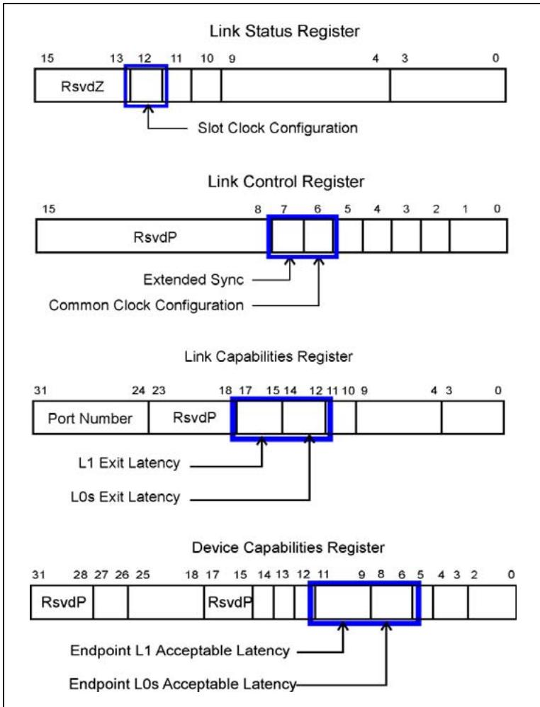

| EN | ZH |
|---|---|
| ## PCI Express Technology | ## PCI Express 技术 |

| EN | ZH |
|---|---|
| ## Calculating Latency from Endpoint to Root Complex | ## 计算从端点到根复合体的延迟 |
| Figure 16-22 on page 759 illustrates an Endpoint whose transactions must transverse two switches to reach the Root Complex. Presuming that all Links in the path are in the L1 state, let's take the example that Endpoint B needs to send a packet to main memory. | 第 759 页的 Figure 16-22 展示了一个端点，其事务必须穿过两台交换机才能到达根复合体。假设路径上的所有链路均处于 L1 状态，现以端点 B 需要发送一个报文到主存为例。 |
| 1. First, it begins the wake sequence by initiating a TS1 ordered set on its Link at time "T." The L1 exit latency for EP B is a maximum of 8μs, but Switch C has a maximum exit latency of 16μs. Therefore, the exit latency for this Link is 16μs. | 1. 首先，在时间 "T"，端点 B 在其链路上发起 TS1 有序集以开始唤醒序列。EP B 的 L1 退出延迟最大为 8μs，但交换机 C 的最大退出延迟为 16μs。因此，该链路的退出延迟为 16μs。 |
| 2. Within 1μs of detecting the L1 exit on Link B/C, Switch C signals L1 exit on Link C/F at T+1μs. | 2. 在检测到链路 B/C 的 L1 退出后 1μs 内，交换机 C 在时间 T+1μs 时在链路 C/F 上发出 L1 退出信号。 |
| 3. Link C/F completes its exit from L1 in 16μs, at T+17μs. | 3. 链路 C/F 在 16μs 内完成从 L1 的退出，时间点为 T+17μs。 |
| 4. Switch F signals an exit from L1 to the Root Complex within 1μs of detecting L1 exit from Switch C (T+2μs). | 4. 交换机 F 在检测到来自交换机 C 的 L1 退出后 1μs 内（T+2μs），向根复合体发出 L1 退出信号。 |
| 5. Link F/RC completes exit from L1 in 8μs, completing at T+10μs. | 5. 链路 F/RC 在 8μs 内完成从 L1 的退出，在 T+10μs 时完成。 |
| 6. Total latency to transition path to target back to L0 = T+17μs. | 6. 将路径上的所有链路恢复到 L0 的总延迟 = T+17μs。 |

Figure 16-22: Example of Total L1 Latency | 图16-22：L1总延迟示例  

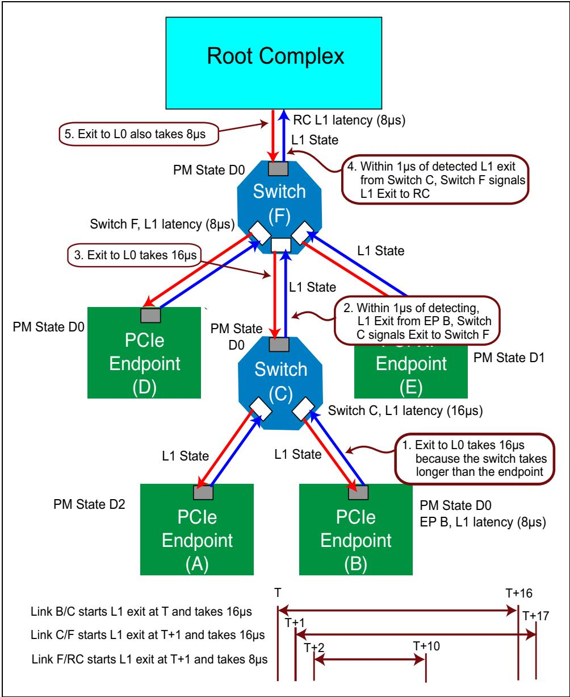

## 1.6 Software Initiated Link Power Management

| EN | ZH |
|---|---|
| When software initiates configuration writes to change the power state for power conservation, devices must respond by transitioning their Link to the corresponding low power state. | 当软件发起配置写操作以改变电源状态来节能时，设备必须通过将其链路转换到相应的低功耗状态来响应。 |

| EN | ZH |
|---|---|
| ## D1/D2/D3Hot and the L1 State | ## D1/D2/D3Hot 与 L1 状态 |
| The spec requires that when all Functions within a device have been placed into any of the low power states (D1, D2, or D3_hot), the device must initiate a transition to the L1 state as shown in Figure 16-23. A device returns to L0 as a result of software initiating a configuration access to the device or a device initiated event. | 规范要求，当设备内的所有功能都被置于任何低功耗状态（D1、D2 或 D3_hot）时，该设备必须启动到 L1 状态的转换，如图 16-23 所示。设备返回 L0 的原因是软件启动对设备的配置访问或设备发起的事件。 |

Figure 16‑23: Devices Transition to L1 When Software Changes their Power Level from D0 | 图16‑23：软件将设备电源级别从D0变更时设备转换到L1

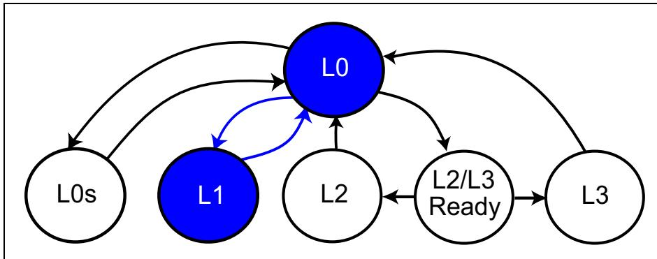

| EN | ZH |
|---|---|
| Upon receiving a configuration write to the Power State field of the PMCSR register, a device initiates the change from L0 to L1 by sending a PM_Enter_L1 DLLP to the upstream component. | 当接收到对 PMCSR 寄存器的 Power State 字段的配置写入时，设备通过向上游组件发送 PM_Enter_L1 DLLP 来启动从 L0 到 L1 的变更。 |

## Entering the L1 State | 进入L1状态

| EN | ZH |
|---|---|
| The procedure to place the Link into an L1 state is illustrated in Figure 16‑24 on page 762. The steps in the figure are described in greater detail in the following list: | 将链路置入L1状态的过程如图16‑24（第762页）所示。图中的各步骤在以下列表中详细描述： |
| 1. Once a device recognizes that all its Functions are in the D2 state, it must prepare to transition the Link into L1. This begins with blocking new TLPs from being scheduled. | 1. 一旦设备识别到其所有Function均处于D2状态，它必须准备将链路转换到L1。这首先从阻止新的TLP被调度开始。 |
| 2. A TLP from the downstream Endpoint may not have been acknowledged prior to receiving the request to enter D2. The device must not respond to a request to change the Link power until all outstanding TLPs have been acknowledged. In other words, the Replay Buffer must be empty before proceeding to the L1 state. | 2. 在收到进入D2的请求之前，来自下游端点的TLP可能尚未被确认。在所有未完成的TLP被确认之前，设备不得响应改变链路功耗的请求。换言之，在进入L1状态前，重放缓冲区必须为空。 |
| 3. Because of the long latencies involved in returning the Link to its active state, a device must be able to send a maximum‑sized TLP immediately upon return to the active state. Since a lack of Flow Control credits could block this, the Endpoint must have sufficient credits to permit transmission of the biggest packet supported for each Flow Control type before entering L1. | 3. 由于链路恢复到活跃状态涉及较长延迟，设备必须在返回活跃状态后能够立即发送最大尺寸的TLP。由于流控信用不足可能阻止这一过程，端点在进入L1之前必须拥有足够的信用，以允许每种流控类型支持的最大数据包的传输。 |
| 4. When the requirements listed above have been met, the Endpoint sends a PM\_Enter\_L1 DLLP to the upstream device. This instructs the upstream component to put the Link into L1. The PM\_Enter\_L1 is repeated until a PM\_Request\_ACK DLLP is received from the upstream device. | 4. 当上述要求均满足后，端点向下游设备发送一个PM\_Enter\_L1 DLLP。这指示上游组件将链路置入L1。PM\_Enter\_L1被重复发送，直到从上游设备接收到PM\_Request\_ACK DLLP。 |
| 5. When the upstream component receives PM\_Enter\_L1, it begins its preparation by performing steps 6, 7, and 8. This is the same preparation as performed by the downstream component prior to signaling the L1 transition. | 5. 当上游组件收到PM\_Enter\_L1后，它通过执行步骤6、7、8开始准备。这与下游组件在发出L1转换信号之前所做的准备相同。 |
| 6. All new TLP scheduling is blocked. | 6. 所有新的TLP调度被阻止。 |
| 7. In the event that a previous TLP has not yet been acknowledged, the upstream device will wait until all transactions in the Replay Buffer have been acknowledged. | 7. 如果之前的TLP尚未被确认，上游设备将等待，直到重放缓冲区中的所有事务都被确认。 |
| 8. Sufficient Flow Control credits must be accumulated to ensure that the largest TLP can be transmitted for each Flow Control type. | 8. 必须积累足够的流控信用，以确保每种流控类型的最大TLP都能够被传输。 |
| 9. The upstream component sends a PM\_Request\_ACK DLLP to confirm that it's ready to enter the L1 state. This DLLP is repeated until an Electrical Idle ordered set is received, indicating that it's been accepted. | 9. 上游组件发送PM\_Request\_ACK DLLP以确认已准备好进入L1状态。该DLLP被重复发送，直到收到电气空闲有序集，表明已被接受。 |
| 10. When the downstream component receives the acknowledgement, it sends an EIOS and places its transmit lanes into electrical idle (transmitter is in Hi‑Z state). | 10. 当下游组件收到确认后，它发送EIOS并将其发送通道置于电气空闲状态（发射器处于Hi‑Z状态）。 |
| 11. The upstream component recognizes the EIOS and places its transmit lanes into electrical idle. The Link has now entered the L1 state. | 11. 上游组件识别到EIOS并将其发送通道置于电气空闲状态。此时链路已进入L1状态。 |

Figure 16‑24: Procedure Used to Transition a Link from the L0 to L1 State | 图16‑24：用于将链路从L0状态转换到L1状态的过程

## Exiting the L1 State | 退出 L1 状态

| EN | ZH |
|---|---|
| An exit from the L1 state can be initiated by either the upstream or downstream component, as discussed below. This section also summarizes the signaling protocol used to exit L1. | 如下所述，L1状态的退出可由上游或下游组件中的任一方发起。本节还总结了用于退出L1的信令协议。 |
| **Upstream Component Initiates.** Software may need to use a device which is currently in a low-power state, and that means the Power Management software must issue a configuration write to change its power state back to D0. When the configuration Request is ready to be sent from the upstream component (a Root Port or downstream Switch Port) the port will exit the electrical idle state and initiate re-training to return the Link to the L0 state. Once the Link is active, the configuration write can be delivered to the device to transition it back to D0, at which point it's ready for normal use. | **上游组件发起。** 软件可能需要使用当前处于低功耗状态的设备，这意味着电源管理软件必须发出配置写入以将其电源状态更改回D0。当配置请求准备从上游组件（根端口或下游交换端口）发送时，该端口将退出电气空闲状态并启动重新训练以将链路返回到L0状态。一旦链路激活，配置写入可被传送到设备以将其转换回D0，此时设备即可正常使用。 |
| **Downstream Component Initiates L1 to L0 Transition.** In the L1 state the reference clock and power are still applied to devices on the Link. That allows a downstream device to be designed to monitor external events and trigger a Power Management Event (PME) when it occurs. In conventional PCI, this is reported by a side-band PME# signal, and system board logic usually uses it to generate an interrupt that informs the CPU of the need to bring the device back to full operation. PCIe eliminates the sideband signal and instead sends an in-band message to report the PME (see "The PME Message" on page 769 for details). | **下游组件发起L1到L0的转换。** 在L1状态下，参考时钟和电源仍施加给链路上的设备。这使得下游设备可以设计为监视外部事件，并在事件发生时触发电源管理事件（PME）。在传统PCI中，这通过边带PME#信号报告，系统板逻辑通常使用它来产生中断，通知CPU需要将设备恢复到完全工作状态。PCIe消除了边带信号，而是发送带内消息来报告PME（详见第769页的"PME消息"）。 |
| **The L1 Exit Protocol.** In the L1 state both directions of the Link are in the electrical idle state. A device signals an exit from L1 by changing from electrical idle and sending TS1s. When the Link neighbor detects the exit from electrical idle it sends TS1s back. This sequence triggers both devices to enter the Recovery state and, when that has completed its operation, both devices will have returned to the L0 state. | **L1退出协议。** 在L1状态下，链路两个方向都处于电气空闲状态。设备通过退出电气空闲状态并发送TS1来发出退出L1的信号。当链路对端检测到退出电气空闲状态时，它会发送回TS1。此序列触发两个设备进入Recovery状态，当该状态完成其操作后，两个设备都将返回到L0状态。 |

## L2 | L3 Ready — Removing Power from the Link

| EN | ZH |
|---|---|
| Once software has placed all Functions within a Device into the D3hot state power can be safely removed from the device. A typical application for this would be to place all devices in the system into D3 and then remove power from them all to achieve the lowest power consumption. However, the spec does not give details of the actual mechanism that would be used to remove clock and power or require that a particular sequence be followed, allowing for a variety of implementations. | 一旦软件将设备内的所有功能都置于 D3hot 状态，便可安全地断开该设备的电源。一个典型应用是将系统中的所有设备都置于 D3 状态，然后断开所有设备的电源，以达到最低功耗。然而，规范并未给出用于移除时钟和电源的实际机制的细节，也未要求遵循特定的序列，从而允许各种实现方式。 |
| The state transitions to prepare devices for power removal involve the preliminary steps of entering L1 and then returning to L0 before arriving at the L2/L3 Ready state as illustrated in Figure 16-25 on page 764. | 为准备设备断电而进行的状态转换涉及以下初步步骤：先进入 L1，然后返回到 L0，最后到达 L2/L3 Ready 状态，如图 16-25 所示（第 764 页）。 |

Figure 16-25: Link States Transitions Associated with Preparing Devices for Removal of the Reference Clock and Power | 图16-25：与准备设备移除参考时钟和电源相关的链路状态转换

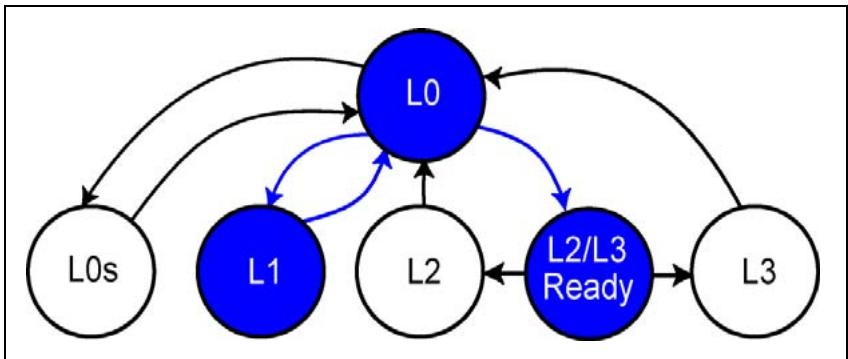

## L2 | L3 Ready Handshake Sequence

| EN | ZH |
|---|---|
| The spec does require a handshake sequence when transitioning to the L2/L3 Ready state. This ensures that all devices are ready for reference clock and power removal, and also that inband PME messages being sent to the Root Complex won't accidentally be lost when power is removed. | 规范确实要求在转换到 L2/L3 Ready 状态时执行握手序列。这确保所有设备都已准备好移除参考时钟和电源，同时也确保在移除电源时，正在发送到根复合体的带内 PME 消息不会意外丢失。 |
| Consider the following example of the handshake sequence required for removing the reference clock and power from PCIe devices in the fabric. This example assumes a system-wide power down is being initiated, but the sequence can also apply to individual devices. The steps are summarized below and shown in Figure 16-26 on page 766. The overall sequence is represented in two parts labeled A and B. The Link state transitions involved in the complete sequence include: | 考虑以下从架构中的 PCIe 设备移除参考时钟和电源所需的握手序列示例。此示例假设正在发起系统范围的断电，但该序列也可适用于单个设备。步骤总结如下，并在第 766 页的图 16-26 中展示。整个序列分为标记为 A 和 B 的两部分。完整序列中涉及的链路状态转换包括： |
| • L0 ‐‐> L1 (when software places a device into D3) • L1 ‐‐> L0 (when software initiates a PME_Turn_Off message) L0 ‐‐> L2/L3 Ready (resulting from the completion of the PME_Turn_Off handshake sequence, which culminates in a PM_Enter_L23 DLLP being sent by the device and the Link going to electrical idle) | • L0 ‐‐> L1（当软件将设备置入 D3 时） • L1 ‐‐> L0（当软件发起 PME_Turn_Off 消息时） L0 ‐‐> L2/L3 Ready（由 PME_Turn_Off 握手序列完成导致，该序列最终由设备发送 PM_Enter_L23 DLLP 并使链路进入电气空闲状态） |
| The following steps detail the sequence illustrated in Figure 16-26 on page 766. | 以下步骤详细说明了第 766 页图 16-26 所示的序列。 |
| 1. Power Management software first places all Functions in the PCIe fabric into their D3 state. | 1. 电源管理软件首先将 PCIe 架构中的所有功能置入其 D3 状态。 |
| 2. All devices transition their Links to the L1 state when they enter D3. | 2. 所有设备在进入 D3 时将其链路转换到 L1 状态。 |
| 3. Power Management software initiates a PME_Turn_Off TLP message, which is broadcast from all Root Complex ports to all devices. This prevents PME Messages from being lost in case they were in progress upstream when power was removed. Note that delivery of this TLP causes each Link to transition back to L0 so it can be forwarded downstream. | 3. 电源管理软件发起一条 PME_Turn_Off TLP 消息，该消息从所有根复合体端口广播到所有设备。这防止了 PME 消息在移除电源时如果正在上行传输中而丢失。请注意，此 TLP 的投递会导致每条链路转换回 L0，以便可以将其向下游转发。 |
| 4. All devices must receive and acknowledge the PME_Turn_Off message by returning a PME_TO_ACK TLP message while in the D3 state. | 4. 所有设备必须接收 PME_Turn_Off 消息并通过在 D3 状态下返回一条 PME_TO_ACK TLP 消息进行确认。 |
| 5. Switches collect the PME_TO_ACK messages from all of their enabled downstream ports and forward just one aggregated PME_TO_ACK message upstream toward the Root Complex. That's because these messages have the routing attribute set as "Gather and Route to the Root". | 5. 交换机从其所有已启用的下游端口收集 PME_TO_ACK 消息，并仅向上游向根复合体转发一条聚合后的 PME_TO_ACK 消息。这是因为这些消息的路由属性设置为"收集并路由到根复合体"。 |
| 6. After sending the PME_TO_ACK, when it is ready to have the reference clock and power removed, devices send a PM_Enter_L23 DLLP repeatedly until a PM_Request_ACK DLLP is returned. The Links that enter the L2/L3 Ready state last are those attached to the device originating the PME_Turn_Off message (the Root Complex in this example). | 6. 在发送 PME_TO_ACK 后，当设备准备好移除参考时钟和电源时，设备会重复发送 PM_Enter_L23 DLLP，直到返回 PM_Request_ACK DLLP。最后进入 L2/L3 Ready 状态的链路是连接到发起 PME_Turn_Off 消息的设备（此示例中为根复合体）的那些链路。 |
| 7. The reference clock and power can finally be removed when all Links have transitioned to the L2/L3 state, but not sooner than 100ns after that. If auxiliary power (V_AUX) is supplied to the devices, the Link transitions to L2. If no AUX power is available the Links will be in the L3 state. | 7. 当所有链路都已转换到 L2/L3 状态后，最终可以移除参考时钟和电源，但不得早于此后 100ns。如果向设备提供辅助电源 (V_AUX)，则链路转换到 L2 状态。如果没有 AUX 电源可用，则链路将处于 L3 状态。 |

Figure 16-26: Negotiation for Entering L2/L3 Ready State | 图16-26：进入L2/L3就绪状态的协商

| EN | ZH |
|---|---|
| ## Exiting the L2/L3 Ready State — Clock and Power Removed | ## 退出L2/L3预备状态——时钟和电源移除 |
| As illustrated in the state diagram in Figure 16-27, a device exits the L2/L3 Ready state when power is removed and has only two choices. When V_AUX is available the transition is to L2, otherwise the transition is to L3. | 如图16-27中的状态图所示，当电源被移除时，设备退出L2/L3预备状态，且只有两种选择。当V_AUX可用时，转换到L2状态，否则转换到L3状态。 |
| Link state transitions are normally controlled by the LTSSM in the Physical Layer. However, transitions to L2 and L3 result from main power being removed and the LTSSM is not operational then. Consequently, the spec refers to L2 and L3 as pseudo-states defined for explaining the resulting condition of a device when power is removed. | 链路状态转换通常由物理层中的LTSSM控制。然而，L2和L3的转换是由于主电源被移除所致，此时LTSSM并不运行。因此，规范将L2和L3称为伪状态，定义为解释设备在电源移除后所处状态。 |

Figure 16-27: State Transitions from L2/L3 Ready When Power is Removed | 图16-27：电源移除时从L2/L3就绪状态的状态转换

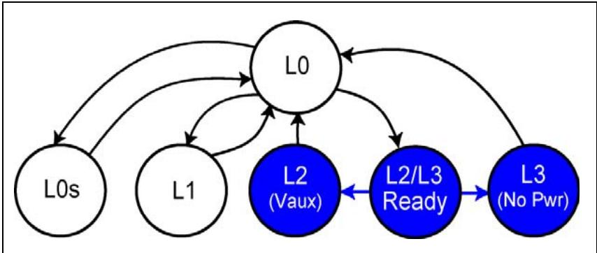

| EN | ZH |
|---|---|
| ## The L2 State | ## L2 状态 |
| Some devices are designed to monitor external events and initiate a wakeup sequence to restore power to handle them. Since main power is removed, these device will need a power source like $\mathsf { V } _ { \mathrm { A U X } }$ to be able to monitor the events and to signal a wakeup. | 某些器件被设计用于监测外部事件并启动唤醒序列以恢复电源来处理这些事件。由于主电源已被移除，这些器件将需要像 $\mathsf { V } _ { \mathrm { A U X } }$ 这样的电源来监测事件和发出唤醒信号。 |

| EN | ZH |
|---|---|
| ## The L3 State | ## L3 状态 |
| In this state the device has no power and therefore no means of communication. Recovery from this state requires the system to restore power and the reference clock. That causes devices to experience a fundamental reset, after which they'll need be initialized by software to return to normal operation. | 在此状态下，设备没有电源，因此无法进行通信。从该状态恢复需要系统恢复供电和参考时钟。这会导致设备经历一次基础复位，之后需要由软件对设备进行初始化，才能恢复正常运行。 |

| EN | ZH |
|---|---|
| ## Link Wake Protocol and PME Generation | ## 链路唤醒协议与PME生成 |
| The wake protocol provides a method for an Endpoint to reactivate the upstream Link and request that software return it to D0 so it can perform required operations. PCIe PM is designed to be compatible with PCI-PM software, although the methods are different. | 唤醒协议提供了一种方法，使端点能够重新激活上游链路并请求软件将其返回到D0，以便其执行所需操作。PCIe电源管理设计为与PCI-PM软件兼容，尽管方法有所不同。 |
| Rather than using a sideband signal, PCIe devices use an inband PME message to notify PM software of the need to return the device to D0. The ability to generate PME messages may optionally be supported in any of the low power states. Recall that a device reports which PM states it supports for PME message delivery. | PCIe设备不使用边带信号，而是使用带内PME消息通知电源管理软件需要将设备返回到D0。在任何低功耗状态下都可以选择支持生成PME消息的能力。设备会报告其支持哪些PM状态用于PME消息传递。 |
| PME messages can only be delivered when the Link state is L0. The latency involved in reactivating the Link is based on a device's PM and Link state, but can include the following: | PME消息只能在链路状态为L0时传递。重新激活链路所涉及的延迟取决于设备的PM状态和链路状态，但可能包括以下情况： |
| 1. Link is in non‑communicating (L2) state — when a Link is in the L2 state it cannot communicate because the reference clock and main power have been removed. No PME message can be sent until clock and power are restored, a Fundamental Reset is asserted, and the Link is re‑trained. These events will be triggered when a device signals a wakeup. This may result in all Links being re‑awakened in the path between the device needing to communicate and the Root Complex. | 1. 链路处于非通信(L2)状态 — 当链路处于L2状态时，由于参考时钟和主电源已被移除，它无法通信。在时钟和电源恢复、基本复位被断言以及链路重新训练之前，无法发送PME消息。当设备发出唤醒信号时，这些事件将被触发。这可能导致需要通信的设备与根复合体之间路径上的所有链路都被重新唤醒。 |
| 2. Link is in communicating (L1) state — when a Link is in the L1 state clock and main power are still active; thus, a device simply exits the L1 state, goes to the Recovery state to re‑train the Link, and returns the Link to L0. Once the Link is in L0 the PME message is delivered. Note that the devices never send a PME message while in the L2/L3 Ready state because entry into that state only occurs after PME notification has been turned off, in preparation for clock and power to be removed. (See "L2/L3 Ready Handshake Sequence" on page 764.) | 2. 链路处于通信(L1)状态 — 当链路处于L1状态时，时钟和主电源仍然有效；因此，设备只需退出L1状态，进入Recovery状态以重新训练链路，然后将链路返回到L0。一旦链路处于L0状态，PME消息就会被传递。请注意，设备在L2/L3 Ready状态下从不发送PME消息，因为进入该状态仅在PME通知已关闭之后发生，以为移除时钟和电源做准备。(参见第764页的"L2/L3 Ready握手序列"。) |
| 3. PME is delivered (L0) — If the Link is in the L0 state, the device transfers the PME message to the Root Complex, notifying Power Management software that the device has observed an event that requires the device be placed back into its D0 state. Note that the message contains the Requester ID (Bus#, Device#, and Function#) of the device. This quickly informs software which device needs service. | 3. PME被传递(L0) — 如果链路处于L0状态，设备将PME消息传输到根复合体，通知电源管理软件该设备已观察到某个事件，需要将设备恢复到其D0状态。请注意，该消息包含设备的请求者ID(总线号、设备号和功能号)。这可以快速告知软件哪个设备需要服务。 |

## 1.7.1 The PME Message | 1.7.1 PME 报文

| EN | ZH |
|---|---|
| The PME message is delivered by devices that support PME notification. The message format is illustrated in Table 16-28 on page 769. The message may be initiated by a device in a low power state (D1, D2, D3_hot, and D3_cold) and is sent immediately upon return of the Link to L0. | PME 报文由支持 PME 通知的设备发送。报文格式如图 16-28 和第 769 页的表 16-28 所示。该报文可由处于低功耗状态（D1、D2、D3_hot 和 D3_cold）的设备发起，并在链路返回 L0 后立即发送。 |

Figure 16-28: PME Message Format | 图16-28：PME消息格式

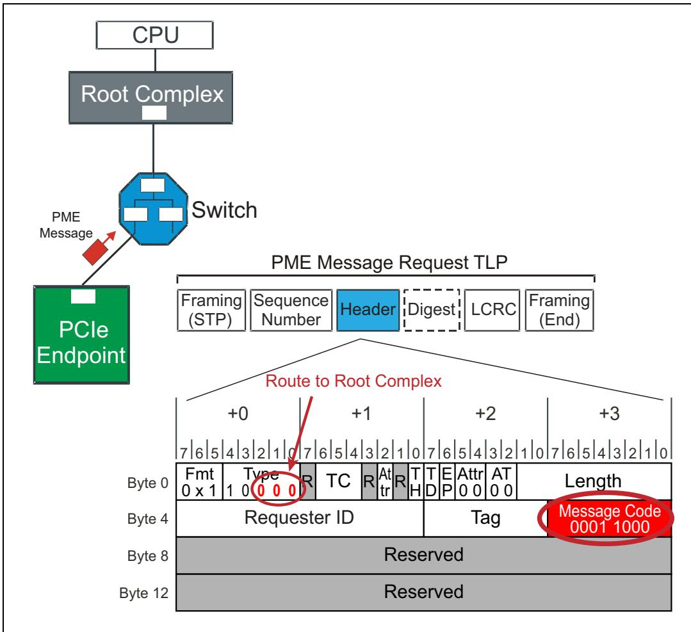

| EN | ZH |
|---|---|
| The PME message is a Transaction Layer Packet that has the following characteristics: | PME 报文是一种事务层数据包（TLP），具有以下特性： |
| - TC and VC are zero (no QoS applies) | - TC 和 VC 均为零（不应用 QoS） |
| - Routed implicitly to the Root Complex | - 隐式路由到根复合体 |
| - Handled as Posted Transaction | - 作为 Posted 事务处理 |
| Relaxed Ordering is not permitted, forcing all transactions in the fabric between the signaling device and the Root Complex to be delivered to the Root Complex ahead of the PME message. | 不允许 Relaxed Ordering，强制互联结构中信令设备与根复合体之间的所有事务在 PME 报文之前送达根复合体。 |

## 1.7.2 The PME Sequence | 1.7.2 PME 序列

| EN | ZH |
| --- | --- |
| ## The PME Sequence | ## PME 序列 |
| Devices may support PME in any of the low power states as specified in the PM Capabilities register. This register also specifies the amount of V\_AUX current used by the device if it supports wakeup in the D3\_cold state. The basic sequence of events associated with sending a PME to software is specified below and presumes that the device and system are enabled to generate PME and the Link has already been transitioned to the L0 state: | 设备可在 PM 能力寄存器指定的任何低功耗状态下支持 PME。该寄存器还指定了设备在 D3\_cold 状态下支持唤醒时所用的 V\_AUX 电流量。以下描述了将 PME 发送给软件所涉及的基本事件序列，并假定设备和系统已使能生成 PME，且链路已转换至 L0 状态： |
| 1. The device issues the PME message on its upstream port. | 1. 设备在其上游端口上发送 PME 消息。 |
| 2. PME messages are implicitly routed to the Root Complex. Switches in the path transition their upstream ports to L0 if necessary and forward the packet upstream. | 2. PME 消息被隐式路由到根复合体。路径上的交换机在必要时将其上游端口转换至 L0，并将数据包向上游转发。 |
| 3. A root port receives the PME and forwards it to the Power Management Controller. | 3. 根端口接收 PME 并将其转发给电源管理控制器。 |
| 4. The controller informs power management software, typically with an interrupt. Software uses the Requester ID in the message to read and clear the PME\_Status bit in the PMCSR and return the device to the D0 state. Depending on the degree of power conservation, the PCI Express driver may also need to restore the devices configuration registers. | 4. 控制器通常通过中断通知电源管理软件。软件使用消息中的请求者 ID 读取并清除 PMCSR 中的 PME\_Status 位，并将设备返回到 D0 状态。根据电源节能程度的不同，PCI Express 驱动程序可能还需要恢复设备的配置寄存器。 |
| 5. PM Software may also call the device driver in the event that device context was lost as a result of being placed in a low power state. If so, device software restores information within the device. | 5. 如果设备上下文因进入低功耗状态而丢失，电源管理软件也可调用设备驱动程序。若如此，设备软件将恢复设备内的信息。 |

| EN | ZH |
|----|----|
| ## PME Message Back Pressure Deadlock Avoidance | ## PME消息反压死锁避免 |

| EN | ZH |
|---|---|
| **Background** | **背景** |
| The Root Complex typically stores the PME messages it receives in a queue, and calls PM software to handle each one. A PME is held in this queue until PM software reads the PME_Status bit from the requesting device's PMCSR register. Once the configuration read transaction completes, this PME message can be removed from the internal queue. | 根复合体通常将接收到的PME消息存储在队列中，并调用PM软件逐一处理。PME在该队列中保持，直到PM软件从请求设备的PMCSR寄存器中读取PME_Status位。一旦配置读取事务完成，该PME消息便可从内部队列中移除。 |

## 17.5.1 The Problem | 17.5.1 问题

## Problem | 问题

| EN | ZH |
|---|---|
| Deadlock can occur if the following scenario develops: | 如果出现以下情况，可能会发生死锁： |
| 1. Incoming PME Messages have filled the PME message queue but other PME messages have been issued downstream from the same root port. | 1. 传入的PME消息已填满PME消息队列，但同一根端口已向下游发送了其他PME消息。 |
| 2. PM software initiates a configuration read request from the Root to read PME_Status from the oldest PME requester. | 2. PM软件从根发起配置读取请求，以从最早的PME请求者读取PME_Status。 |
| 3. The corresponding split completion must push all previously posted PME messages ahead of it based on transaction ordering rules. | 3. 根据事务排序规则，相应的拆分完成报文必须将先前发布的所有PME消息推送到其前面。 |
| 4. The Root Complex cannot accept a new PME message because the queue is full, so the path is temporarily blocked. But that also means that the read completion can't reach the Root Complex to clear the older entry in the queue. | 4. 根复合体无法接受新的PME消息，因为队列已满，所以路径暂时被阻塞。但这同时也意味着读取完成报文无法到达根复合体来清除队列中较旧的条目。 |
| 5. No progress can be made and deadlock occurs. | 5. 无法继续推进，从而发生死锁。 |

## 8.7.1 The Solution | 8.7.1 解决方案

| EN | ZH |
|---|---|
| The problem is avoided if the Root Complex always accepts new PME messages, even when they would overflow the queue. In this case, the Root simply discards the later PME messages. To prevent a discarded PME message from being lost permanently, a device that sends a PME message is required to measure a time-out interval, called the PME Service Time-out. If the device's PME_Status bit is not cleared with 100 ms (+ 50%/ - 5%), it assumes its message must have been lost and it re-issues the message. | 如果根复合体始终接受新的 PME 报文，即使会导致队列溢出，则可避免该问题。在这种情况下，根复合体直接丢弃后续的 PME 报文。为防止被丢弃的 PME 报文永久丢失，发送 PME 报文的设备必须测量一个称为 PME 服务超时（PME Service Time-out）的超时间隔。如果设备的 PME_Status 位在 100 ms（+ 50%/ - 5%）内未被清除，设备即认为其报文可能已丢失，并重新发送该报文。 |

## 1.7.4 The PME Context | 1.7.4 PME 上下文

| EN | ZH |
|---|---|
| Devices that generate PME must continue to power portions of the device that are used for detecting, signaling, and handling PME events, referred to collectively as the PME context. Devices that support PME in the $\mathrm { D } 3 _ { \mathrm { c o l d } }$ state use auxiliary power to maintain the PME context when the main power is removed. Items that are typically part of the PME context include: | 生成 PME 的设备必须继续为设备中用于检测、发送和处理 PME 事件的部分供电，这些部分统称为 PME 上下文。在 $\mathrm { D } 3 _ { \mathrm { c o l d } }$ 状态下支持 PME 的设备在主电源断开时使用辅助电源来维持 PME 上下文。通常属于 PME 上下文的项目包括： |
| PME\_Status bit (required) — set when a device sends a PME message and cleared by PM software. Devices that support PME in the $\mathrm { D } 3 _ { \mathrm { c o l d } }$ state must implement the PME\_Status bit as "sticky," meaning that the value survives a fundamental reset. | PME\_Status 位（必需）——当设备发送 PME 消息时置位，并由电源管理软件清除。在 $\mathrm { D } 3 _ { \mathrm { c o l d } }$ 状态下支持 PME 的设备必须将 PME\_Status 位实现为"粘性"，即该值在基本复位后仍然保留。 |

## PCI Express Technology | PCI Express 技术

| EN | ZH |
|---|---|
| PME_Enable bit (required) — this bit must remain set to continue enabling a Function's ability to generate PME messages and signal wakeup. Devices that support PME in the D3cold state must implement PME_Enable as "sticky," meaning that the value survives a fundamental reset. | PME_Enable 位（必需）——该位必须保持置位，以持续使能功能（Function）生成 PME 消息和发出唤醒信号的能力。在 D3cold 状态下支持 PME 的设备必须将 PME_Enable 实现为"粘性的（sticky）"，即该值在基础复位（fundamental reset）后仍然保留。 |
| Device-specific status information — for example, a device might preserve event status information in cases where several different types of events can trigger a PME. | 设备特定状态信息——例如，在多种不同类型的事件均可触发 PME 的情况下，设备可能会保留事件状态信息。 |
| • Application-specific information — for example, modems that initiate wakeup would preserve Caller ID information if supported. | • 应用特定信息——例如，发起唤醒的调制解调器若支持，则会保留主叫号码（Caller ID）信息。 |

## 1.7.5 Waking Non-Communicating Links | 1.7.5 唤醒非通信链路

| EN | ZH |
|---|---|
| When a device that supports PME in the D3cold state needs to send a PME message, it must first transition the Link to L0. This is sometimes referred to as a wakeup. PCI Express defines two methods of triggering the wakeup of non‑communicating Links: | 当处于D3cold状态且支持PME的设备需要发送PME消息时，它必须首先将链路转换到L0。这有时被称为唤醒。PCI Express定义了两种触发非通信链路唤醒的方法： |
| • Beacon — an in‑band indicator driven by AUX power | • Beacon（信标）— 由AUX电源驱动的带内指示信号 |
| • WAKE# Signal — a sideband signal driven by AUX power | • WAKE#信号 — 由AUX电源驱动的边带信号 |
| In both cases, PM software must be notified to restore main power and the reference clock. This also causes a fundamental reset that forces a device into the D0uninitialized state. Once the Link transitions to L0, the device sends the PME message. Since a reset is required to re‑activate the Link, devices must maintain PME context across the reset sequence described above. | 在这两种情况下，都必须通知电源管理软件恢复主电源和参考时钟。这还会导致一次基本复位，强制设备进入D0uninitialized状态。一旦链路转换到L0，设备就会发送PME消息。由于重新激活链路需要复位，因此设备必须在上述复位序列期间保持PME上下文。 |

| EN | ZH |
|---|---|
| This signaling mechanism is designed to operate on AUX power and doesn't require much power. The beacon is simply a way of notifying the upstream component that software should be notified of the wakeup request. When switches receive a beacon on a downstream port, they in turn signal beacon on their upstream port. Ultimately, the beacon reaches the root complex, where it generates an interrupt that calls PM software. | 该信令机制设计为在AUX电源上运行，功耗较低。信标(beacon)仅是一种通知上游组件的方式，告知软件应被通知唤醒请求。当交换机(switch)在下行端口收到信标时，它们会在其上行端口上发送信标。最终，信标到达根复合体(root complex)，在此产生中断以调用电源管理(PM)软件。 |
| Some form‑factors require beacon support for waking the system while others don't. The spec requires compliance with the form‑factor specs, and doesn't require beacon support for devices if their form‑factor doesn't. However, for "universal" components designed for use in a variety of form‑factors, beacon support is required. See "Beacon Signaling" on page 483 for details. | 某些外形规格(form-factor)要求支持信标以唤醒系统，而其他则不需要。规范要求符合外形规格标准，若设备的外形规格本身不要求信标，则规范不要求该设备支持信标。然而，对于设计用于多种外形规格的"通用"组件，信标支持是必需的。详情请参见第483页的"Beacon Signaling"。 |

| EN | ZH |
|---|---|
| ## WAKE# | ## WAKE# |
| PCI Express provides a sideband signal called WAKE# as a alternative to the beacon that can be routed directly to the Root or to other system logic to notify PM software. In spite of the desire to minimize the pin count of a Link, the motivation for adding this extra pin is easy to understand. The reason is that a component must consume auxiliary power to be able to recognize a beacon on a downstream port and then forward it to an upstream port. In a battery-powered system auxiliary power is jealously guarded because it drains the battery even when the system isn't doing any work. The preferred solution in that case would be to bypass as many components as possible when delivering the wakeup notification, and the WAKE# pin serves that purpose very well. On the other hand, if power is not a concern then the WAKE# pin might be considered less desirable. | PCI Express 提供了一种称为 WAKE# 的边带信号，作为信标的替代方案，可直接路由到根复合体或其他系统逻辑以通知 PM 软件。尽管希望尽量减少链路的引脚数量，但增加这个额外引脚的动机很容易理解。原因是组件必须消耗辅助电源才能识别下行端口上的信标，然后将其转发到上行端口。在电池供电的系统中，辅助电源受到严格保护，因为即使系统不工作时它也会消耗电池电量。在这种情况下，首选的解决方案是在传递唤醒通知时绕过尽可能多的组件，而 WAKE# 引脚非常出色地实现了这一目的。另一方面，如果功耗不成问题，那么 WAKE# 引脚可能就不那么理想了。 |
| A hybrid implementation may also be used. In this case, WAKE# is sent to a switch, which in turn sends the beacon on its upstream port. The options are illustrated in Figure 16-29 on page 774 A and B. Note that when asserted, the WAKE# signal remains low until the PME_Status bit is cleared by software. | 也可以使用混合实现方式。在这种情况下，WAKE# 被发送到交换机，然后交换机在其上行端口上发送信标。这些选项如图 16-29（第 774 页，A 和 B）所示。请注意，当断言时，WAKE# 信号保持低电平，直到软件清除 PME_Status 位。 |
| This signal must be implemented by ATX or ATX-based connectors and cards as well as by the mini-card form factor. No requirement is specified for embedded devices to use the WAKE# signal. | ATX 或基于 ATX 的连接器和卡以及迷你卡外形必须实现此信号。对于嵌入式设备，未指定使用 WAKE# 信号的要求。 |

Figure 16-29: WAKE# Signal Implementations | 图16-29：WAKE#信号实现
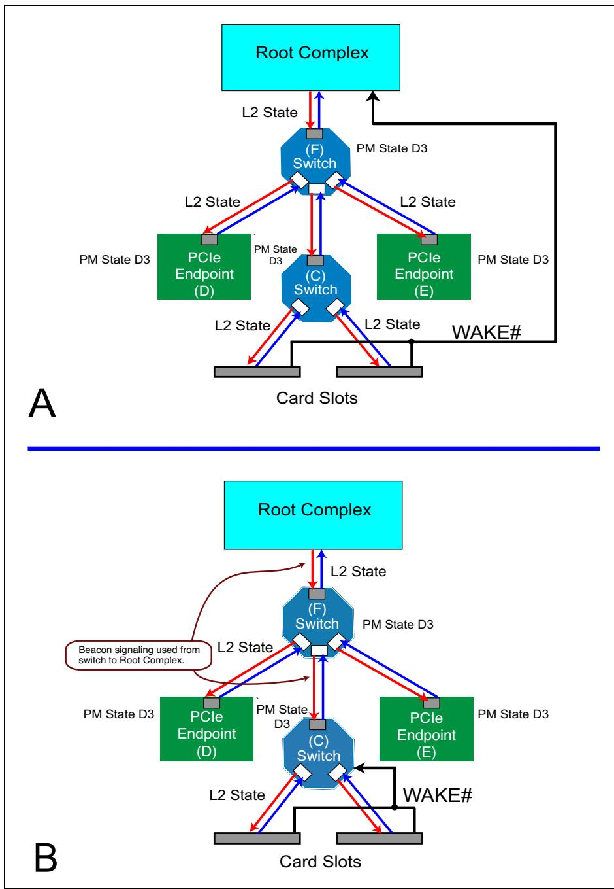

## 1.7.6 Auxiliary Power | 1.7.6 辅助电源

| EN | ZH |
|----|----|
| Devices that support PME in the D3cold state must support the wakeup sequence and are allowed by the PCI-PM spec to consume the maximum auxiliary current of 375 mA (otherwise only 20 mA). The amount of current they need is reported in the Aux_Current field of the PM Capability registers. Auxiliary power is enabled when the PME_Enable bit is set within the PMCSR register. | 在D3cold状态下支持PME的设备必须支持唤醒序列，并且PCI-PM规范允许它们消耗最大375 mA的辅助电流（否则仅为20 mA）。它们所需的电流量在PM能力寄存器的Aux_Current字段中报告。当PMCSR寄存器中的PME_Enable位置位时，辅助电源被使能。 |
| PCI Express extends the use of auxiliary power beyond the limitations given by PCI-PM. Now, any Device may consume the maximum auxiliary current if enabled by setting the Aux Power PM Enable bit of the Device Control register, illustrated in Figure 16-30 on page 775. This gives devices the opportunity to support other things like SM Bus while in a low power state. As in PCI-PM the amount of current consumed by a device is reported in the Aux_Current field in the PMC register. | PCI Express将辅助电源的使用扩展到PCI-PM所规定的限制之外。现在，任何设备都可以通过设置设备控制寄存器中的Aux Power PM Enable位（如图16-30第775页所示）来使能消耗最大辅助电流。这为设备提供了在低功耗状态下支持SM Bus等其他功能的机会。与PCI-PM一样，设备消耗的电流量在PMC寄存器的Aux_Current字段中报告。 |

Figure 16-30: Auxiliary Current Enable for Devices Not Supporting PMEs | 图16-30：不支持PME设备的辅助电流使能

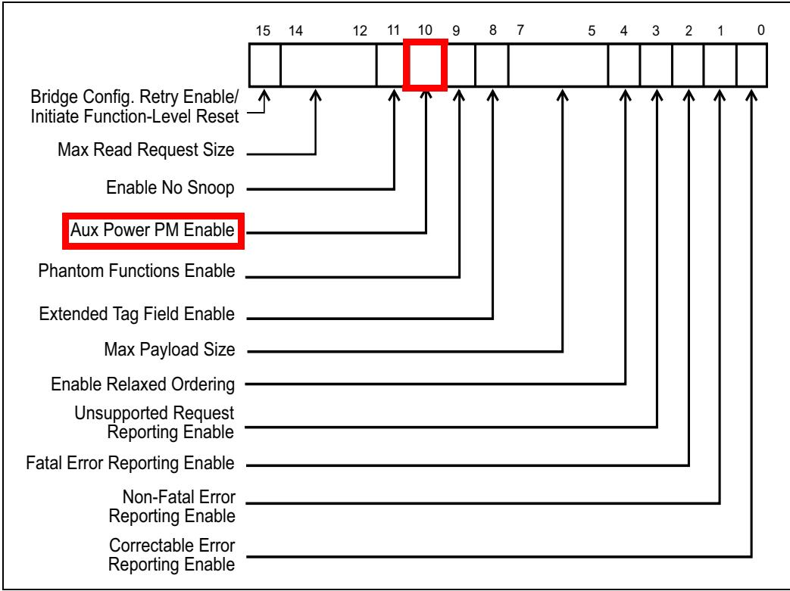

| EN | ZH |
| --- | --- |
| ## Improving PM Efficiency | ## 提高电源管理效率 |

| EN | ZH |
|---|---|
| ## Background | ## 背景 |
| As processors and other system components acquire better power management mechanisms, peripherals like PCIe components start to appear as a bigger contributor to power consumption in PC systems. Earlier generations of PCIe allowed some software and hardware power management, but coordinating PM decisions with the system was not a high priority and consequently software visibility and control was limited. | 随着处理器及其他系统组件获得更优的电源管理机制，PCIe 组件等外设在 PC 系统中逐渐成为更大的功耗贡献者。早期几代 PCIe 允许一定的软件和硬件电源管理，但与系统协调电源管理决策并非高优先级事项，因此软件的可见性和控制能力十分有限。 |
| One problem that can arise from this lack of coordination happens when the system goes into a sleep state but the devices remain operational. Such devices can initiate interrupts or DMA traffic that would require the system to wake up to handle them, even thought they were low‑priority events, and thus defeat the goal of power conservation. | 这种协调不足可能引发的一个问题是：系统进入休眠状态而设备仍在运行。这些设备可能发起中断或 DMA 流量，要求系统唤醒进行处理——即便这些事件优先级很低——从而违背了节能的目标。 |
| It can also happen that the system is unaware of how long the devices can afford to wait from the time they request system service (like a memory read) until they get a response. Without that information, software is often forced to assume that the response time must always be minimal and therefore power management policies can't afford enough time to do much. However, if the system was aware of time windows when a fast response was not needed, it could be more aggressive with power management and stay in a low power state for a longer time without risking performance problems. The 2.1 spec revision added two new features to address these problems. | 另一种情况是，系统不知道设备从请求系统服务（如存储器读取）到获得响应之间能忍受多长的等待时间。缺少这一信息，软件往往被迫假定响应时间必须始终最短，因此电源管理策略无法留出足够的时间来做更多节能操作。然而，如果系统能够了解哪些时段不需要快速响应，它就可以更激进地执行电源管理，在低功耗状态下停留更长时间而不影响性能。PCIe 2.1 规范修订版新增了两种特性来解决这些问题。 |

| EN | ZH |
|---|---|
| ## OBFF (Optimized Buffer Flush and Fill) | ## OBFF（优化缓冲区刷新与填充） |
| The first of these mechanisms is Optimized Buffer Flush and Fill, which provides a mechanism for Endpoints to be made aware of the system power state and therefore the best times to do data transfers to and from the system. | 这些机制中的第一种是优化缓冲区刷新与填充（Optimized Buffer Flush and Fill），它为端点提供了一种机制，使其能够感知系统电源状态，从而获知与系统之间进行数据传输的最佳时机。 |

## 17.5.1 The Problem | 17.5.1 问题

| EN | ZH |
|---|---|
| The problem with bus‑master capable devices is that if they're not aware of the system power status, they may initiate transactions at times when it would be better to wait. The diagram in Figure 16‑31 on page 777 illustrates the problem in simple terms: there are many components initiating events and as a result, the times without activity when the system is idle and can go to sleep are few and short‑lived. In contrast, Figure 16‑32 on page 777 illustrates an improvement in which the same events are grouped and serviced together so that the times when the system is idle enough to go to sleep are both more frequent and of longer duration. Clearly, this would result in better power conservation and fortunately, it's not difficult to implement. PCIe components simply need to understand what they should do based on the system power state, and they'll need a way to learn what that state currently is. | 支持总线主控的设备存在的问题是，如果它们不了解系统电源状态，可能会在更适合等待的时机发起事务。图16-31（第777页）简要说明了这个问题：许多组件都在触发事件，导致系统空闲且可进入睡眠状态的无活动时段既稀少又短暂。相比之下，图16-32（第777页）展示了改进情况：相同的事件被分组并集中处理，使得系统空闲到足以进入睡眠的时段更加频繁且持续时间更长。显然，这将实现更好的节能效果，幸运的是，这并不难实现。PCIe组件只需根据系统电源状态理解应执行的操作，并且它们需要一种方式来获知当前的系统电源状态。 |

Figure 16‑31: Poor System Idle Time | 图16‑31：较差的系统空闲时间  

Figure 16‑32: Improved System Idle Time | 图16‑32：改善后的系统空闲时间  
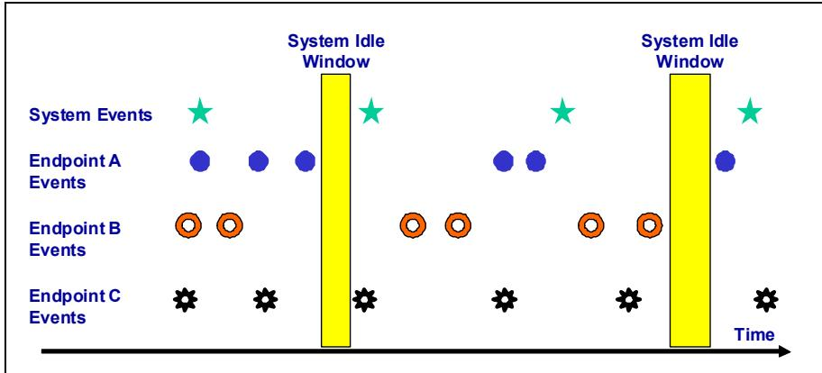

## 8.7.1 The Solution | 8.7.1 解决方案

| EN | ZH |
|---|---|
| OBFF is an optional hint that a system can use to inform components about optimal time windows for traffic. It's just a hint, though, so bus-master-capable devices can still initiate traffic whenever they like. Of course, power consumption will be negatively affected if they do, so overriding the OBFF hints should be avoided as much as possible. The information is communicated in one of two ways: by sending messages to the Endpoints or by toggling the WAKE# pin. If both options are available, using the pin is strongly recommended because it avoids the counter-productive step of using excess power, possibly across several Links, to inform a component about the current system power state. In fact, the OBFF message should only be used if the WAKE# pin is not available. | OBFF是一种可选提示机制，系统可用它来告知组件关于流量的最佳时间窗口。然而，这仅仅是一个提示，因此具有总线主控能力的设备仍然可以随时发起流量。当然，如果它们这样做，功耗将受到负面影响，因此应尽可能避免覆盖OBFF提示。该信息通过两种方式之一进行通信：向端点发送消息或通过切换WAKE#引脚。如果两种选项都可用，强烈建议使用引脚方式，因为它可以避免使用额外功耗（可能跨越多条链路）来告知组件当前系统电源状态这一适得其反的步骤。实际上，仅当WAKE#引脚不可用时才应使用OBFF消息。 |
| Figure 16-33 on page 778 gives an example showing a mix of both communication types. Using the pin is required if it's available, but in this example it's not an option between the two switches. To work around this problem, the upper switch can translate the state received on the WAKE# pin into a message going downstream. It should perhaps be noted here that switches are strongly encouraged to forward all OBFF indications downstream but not required to do so. It may be necessary, especially when using messages, to discard or collapse some indications and that is permitted. | 第778页的图16-33给出了一个混合使用两种通信类型的示例。如果引脚可用，则必须使用它，但在本例中，两个交换机之间无法使用该引脚。为解决此问题，上游交换机可以将WAKE#引脚上接收到的状态转换为向下游发送的消息。这里或许应注意，强烈建议交换机将所有OBFF指示转发到下游，但并不强制要求这样做。尤其是在使用消息时，可能有必要丢弃或合并某些指示，这是允许的。 |

Figure 16-33: OBFF Signaling Example | 图16-33：OBFF信令示例

| EN | ZH |
|---|---|
| **Using the WAKE# Pin.** This pin, previously only used to inform the system that a component needed to have power restored, is given an extra meaning as the simplest and lowest-power option for communicating system power status to PCIe components. It's optional, and the protocol is fairly simple: the WAKE# pin toggles to communicate the system state. As seen in Figure 16-34 on page 779, there are several transitions but only three states, which are described below: | **使用WAKE#引脚。** 该引脚先前仅用于通知系统某个组件需要恢复供电，现在被赋予了额外含义，成为向PCIe组件通信系统电源状态的最简单、功耗最低的选项。它是可选的，且协议相当简单：通过切换WAKE#引脚来传达系统状态。如第779页图16-34所示，存在多种跳变但只有三种状态，描述如下： |
| 1. CPU Active -- system awake; all transactions OK. This is every component's initial state. | 1. CPU Active（CPU活跃）-- 系统唤醒；所有事务均可进行。这是每个组件的初始状态。 |
| 2. OBFF -- system memory path available; transfers to and from memory are OK, but other transactions should wait for a higher power state. | 2. OBFF -- 系统内存路径可用；与内存之间的传送可以进行，但其他事务应等待更高的电源状态。 |
| 3. Idle -- wait for a higher state before initiating. | 3. Idle（空闲）-- 在发起前等待更高状态。 |

Figure 16-34: WAKE# Pin OBFF Signaling | 图16-34：WAKE#引脚OBFF信令

| EN | ZH |
|---|---|
| When the CPU Active or OBFF state is indicated, it's recommended that the platform not return to the Idle state for at least 10 us so as to give components enough time to deliver the packets they may have been queuing up while in the previous Idle state. However, since that timing isn't required, it's also recommended that Endpoints not assume they'll have a certain amount of time in a CPU Active or OBFF window. Along the same lines, the platform is allowed to indicate that it's going to Idle before it actually does so as to give components advance notice that it's time to finish. The case this early notice is specifically designed to avoid is having an Endpoint start a transfer just as the platform goes to Idle, causing an immediate exit from the Idle state. The spec strongly recommends that this should be the only reason for an early indication of the Idle state and also that this advance notice time should be as short as possible. | 当指示CPU Active或OBFF状态时，建议平台至少在10微秒内不返回Idle状态，以便给组件足够的时间交付它们在之前Idle状态下可能已排队的包。然而，由于该时序并非强制要求，因此也建议端点不要假设它们在CPU Active或OBFF窗口内会有固定的时间量。同样地，允许平台在实际进入Idle之前提前指示其即将进入Idle，以便让组件预先知道需要完成事务。这种提前通知专门设计要避免的情况是：端点恰好在平台进入Idle时开始传送，从而导致立即退出Idle状态。规范强烈建议，这应是提前指示Idle状态的唯一原因，并且该提前通知时间应尽可能短。 |
| Interestingly, the WAKE# pin can still be used for its original purpose of allowing a component to wake the system, and it's no surprise that this might confuse other components that are monitoring that pin for OBFF information. That could result in sub-optimal behavior in power or performance, but this is considered a recoverable situation so no steps were taken to guard against it. To cover all of these cases, any time the signal is unclear the default state will be CPU Active. | 有趣的是，WAKE#引脚仍然可以用于其原始目的——允许组件唤醒系统，而这可能会混淆正在监视该引脚以获取OBFF信息的其他组件，这并不令人意外。这可能导致电源或性能方面的次优行为，但这被认为是可恢复的情况，因此未采取任何防范措施。为涵盖所有这些情况，每当信号不明确时，默认状态将为CPU Active。 |
| **Using the OBFF Message.** As mentioned earlier, OBFF information can be communicated using a message, although it's recommend that this only be used if the WAKE# pin is not available. These messages only flow downstream from the Root. The message contents are shown in Figure 16-35 on page 781, including the Routing type 100b (point-to-point) and an OBFF Code that gives the following values (all other codes are reserved): | **使用OBFF消息。** 如前所述，OBFF信息可以通过消息进行通信，但建议仅当WAKE#引脚不可用时才使用该方式。这些消息仅从根向下游传输。消息内容如第781页图16-35所示，包括路由类型100b（点对点）和OBFF代码，其值如下（所有其他代码保留）： |
| 1. 1111b -- CPU Active | 1. 1111b -- CPU Active（CPU活跃） |
| 2. 0001b -- OBFF | 2. 0001b -- OBFF |
| 3. 0000b -- Idle | 3. 0000b -- Idle（空闲） |
| If a reserved code is received, components must treat it as "CPU Active." If a Port receives an OBFF message but doesn't support OBFF or hasn't enabled it yet, it must treat it as an Unsupported Request (Completion status UR). | 如果收到保留代码，组件必须将其视为"CPU Active"。如果某端口收到OBFF消息但不支持OBFF或尚未使能OBFF，则必须将其视为不支持的请求（完成状态UR）。 |

Figure 16-35: OBFF Message Contents | 图16-35：OBFF消息内容

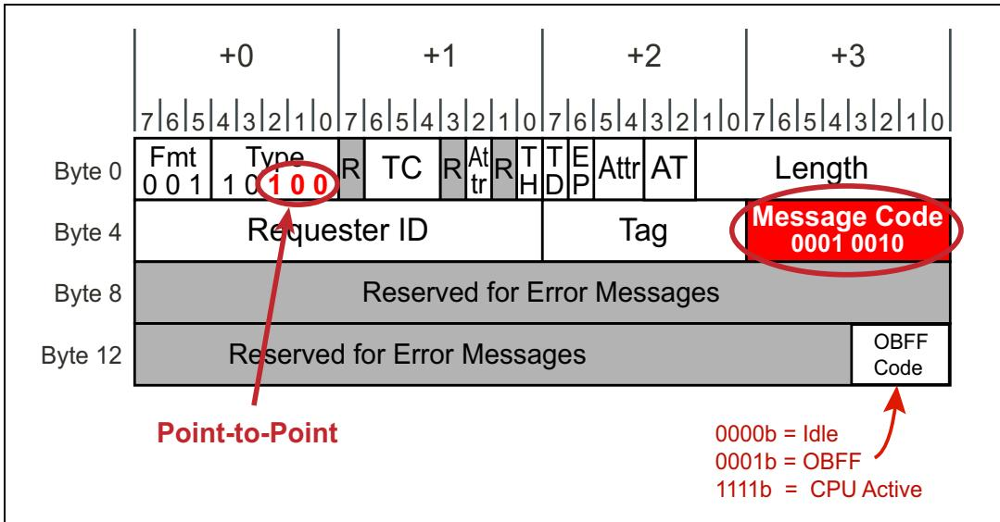

| EN | ZH |
|---|---|
| Support for OBFF is indicated via the Device Capability 2 register (Figure 16-36 on page 782), and enabled using the Device Control 2 register (Figure 16-37 on page 783). Note that both the pin and message options may be available. However, the pin method is preferred because it is the lower power option. | 对OBFF的支持通过设备能力2寄存器（第782页图16-36）指示，并使用设备控制2寄存器（第783页图16-37）使能。注意，引脚和消息两种选项都可以可用。然而，引脚方式是首选，因为它是功耗更低的选项。 |
| Note that there are two variations for enabling a component to forward OBFF messages, and the difference between them has to do with handling a targeted Link that's not in L0. In Variation A, the message will only be sent if the Link is in L0. If it's not, the message is simply dropped to avoid the cost of waking the Link. This is preferred for Downstream Ports when the Device below it is not expected to have time-critical communication requirements and can indicate its need for non-urgent attention by simply returning the Link to L0. For Variation B, the message will always be forwarded and the Link will be returned to L0. This variation is preferred when the downstream Device can benefit from timely notification of the platform state. | 注意，使能组件转发OBFF消息有两种变体，它们之间的区别在于如何处理目标链路不在L0状态的情况。在变体A中，仅当链路处于L0时才发送消息。如果不是，则直接丢弃消息以避免唤醒链路的开销。当下游设备预计没有时间关键型通信需求，并且可以通过将链路返回到L0来指示其非紧急关注需求时，这种方式对于下游端口是首选。对于变体B，消息将始终被转发，并且链路将被返回到L0。当下游设备可以从平台状态的及时通知中受益时，这种变体是首选。 |

Figure 16-36: OBFF Support Indication | 图16-36：OBFF支持指示

| EN | ZH |
|---|---|
| When using WAKE#, enabling any Root Port to assert it is considered a global enable unless there are multiple WAKE# signals, in which case only those associated with that Port are affected. When using the OBFF message, enabling a Root Port only enables the messages on that Port. The expectation in the spec is that all Root Ports would normally be enabled if any of them are, so as to ensure that the whole platform was enabled. However, selectively enabling some Ports and not others is permitted. | 当使用WAKE#时，使能任何根端口去断言它被认为是全局使能，除非存在多个WAKE#信号，在这种情况下只有与该端口关联的那些信号受影响。当使用OBFF消息时，使能根端口仅在该端口上使能消息。规范中的预期是：如果使能了任何一个根端口，通常所有根端口都应当被使能，以确保整个平台都被使能。然而，选择性地使能某些端口而不使能其他端口也是允许的。 |
| When enabling Ports for OBFF, the spec recommends that all Upstream Ports be enabled before Downstream Ports, and Root Ports be enabled last of all. For unpopulated hot plug slots this isn't possible. For that case enabling OBFF using the WAKE# pin to the slot is permitted, but it's recommended that the Downstream Port above the slot not be enabled to deliver OBFF messages. | 在为OBFF使能端口时，规范建议先使能所有上游端口，再使能下游端口，而根端口最后使能。对于未插入设备的热插拔槽位，这是不可能的。对于这种情况，允许使用通往槽位的WAKE#引脚使能OBFF，但建议槽位上方的下游端口不要使能来传递OBFF消息。 |

Figure 16-37: OBFF Enable Register | 图16-37：OBFF使能寄存器

| EN | ZH |
|---|---|
| Finally, let's refer back to the earlier example in Figure 16-33 on page 778 to consider what these registers might look like for that case. The Downstream Port of the switch that connects to the lower switch will have a value for OBFF Support of 01b -- Message Only, while its Upstream Port might have a value of 11b -- Both. These values might be hard coded into the device or hardware initialized in some other fashion to make them visible to software after a reset. The Downstream Port would need to have an OBFF Enable value of 01b or 10b -- Enabled with Message variation A or B so it could deliver an OBFF message. The Upstream Port would expect to have an OBFF Enable value of 11b -- Enabled with WAKE# signaling. The spec points out that when a switch is configured to use the different methods when going from one Port to another, it's required to make the translation and forward the indications. | 最后，让我们回顾前面第778页图16-33中的示例，考虑在这种情况下这些寄存器的可能取值。连接到下游交换机的交换机下游端口的OBFF支持值为01b -- 仅消息，而其上游端口的OBFF支持值可能为11b -- 两者。这些值可能硬编码到设备中，或以其他方式通过硬件初始化，以便在复位后对软件可见。下游端口需要设置OBFF使能值为01b或10b -- 使用消息变体A或B使能，以便它能够传递OBFF消息。上游端口应设置OBFF使能值为11b -- 使用WAKE#信令使能。规范指出，当交换机配置为在从一个端口到另一个端口时使用不同方法时，它必须进行转换并转发指示。 |

| EN | ZH |
|---|---|
| ## LTR (Latency Tolerance Reporting) | ## LTR（延迟容忍度报告） |
| The second new feature added to improve PM efficiency is called Latency Tolerance Reporting (LTR). This optional capability allows devices to report the delay they can tolerate when requesting service from the platform so that PM policies for platform resources like main memory can take that into consideration. If software supports it, this provides good performance for devices when they need it and lower power for the system when they don't need a fast response. One simple way of using this information would be to allow the system to postpone waking up to service a request as long as the latency tolerance was still met. | 第二个新增的用于提高电源管理效率的特性称为延迟容忍度报告（LTR）。这一可选能力允许设备在请求平台服务时报告其可以容忍的延迟，以便平台资源（如主存）的电源管理策略可以将此纳入考虑。如果软件支持，这能在设备需要时提供良好的性能，在系统不需要快速响应时降低功耗。利用此信息的一种简单方式是：只要延迟容忍度仍能满足，就允许系统推迟唤醒以服务请求。 |
| The meaning of "latency tolerance" is not made explicitly clear in the spec, but some things are mentioned that might play into it. For example, the latency tolerance may affect acceptable performance or it may impact whether the component will function properly at all. Clearly, such a distinction would make a big difference in designing a PM policy. Similarly, the device may use buffering or other techniques to compensate for latency sensitivity and knowledge of that would be useful for software. | 规范中并未明确阐明"延迟容忍度"的含义，但提到了一些可能影响它的因素。例如，延迟容忍度可能影响可接受的性能，也可能影响组件是否能正常工作。显然，这种区别在设计电源管理策略时会有很大影响。类似地，设备可能使用缓冲或其他技术来补偿延迟敏感性，了解这些信息对软件会很有用。 |

## LTR Registers | LTR寄存器

| EN | ZH |
|---|---|
| The LTR capability in a device is discovered using a new bit in the PCIe Device Capability 2 Register, as shown in Figure 16-38 on page 785, and enabled in the Device Control 2 Register, illustrated in Figure 16-39 on page 785. The spec prescribes a sequence for enabling LTR, too: devices closest to the Root must be enabled first, working down to the Endpoints. An Endpoint must not be enabled unless its associated Root Port and all intermediate switches also support LTR and have been enabled to service it. It's permissible for some Endpoints to support LTR while others do not. If a Root Port or switch Downstream Port receives an LTR message but doesn't support it or hasn't been enabled yet, the message must be treated as an Unsupported Request. It's recommended that Endpoints send an LTR message shortly after being enabled to do so. It's strongly recommended that Endpoints not send more than two LTR messages within any 500 μs period unless required by the spec. However, if they do, Downstream Ports must properly handle them and not generate an error based on that. | 设备中的LTR能力通过PCIe设备能力2寄存器中的一个新位来发现，如图16-38（第785页）所示，并通过设备控制2寄存器来使能，如图16-39（第785页）所示。规范也规定了使能LTR的顺序：最靠近根复合体的设备必须先使能，依次向下直至端点。除非端点关联的根端口及所有中间交换机也支持LTR并已使能以服务LTR，否则端点不得被使能。允许部分端点支持LTR而其他端点不支持。如果根端口或交换机的下游端口收到LTR消息但不支持或尚未使能，则该消息必须被视为不支持请求。建议端点在使能后尽快发送一条LTR消息。强烈建议端点在任意500微秒周期内发送不超过两条LTR消息，除非规范另有要求。但如果它们确实发送了，下游端口必须正确处理这些消息，不得据此产生错误。 |

Figure 16-38: LTR Capability Status | 图16-38：LTR能力状态

Figure 16-39: LTR Enable | 图16-39：LTR使能
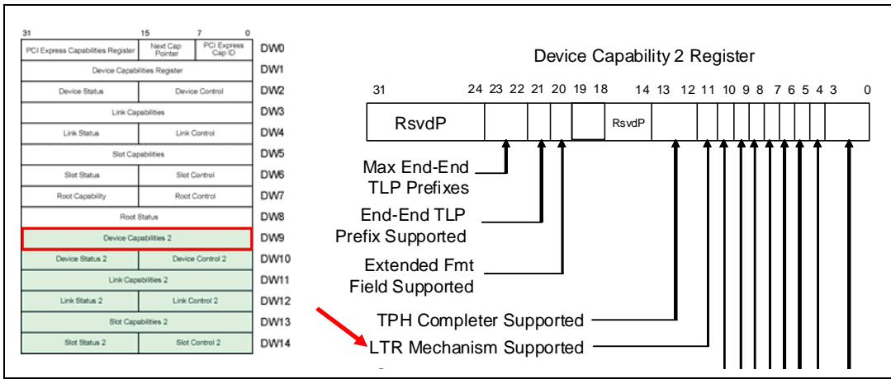

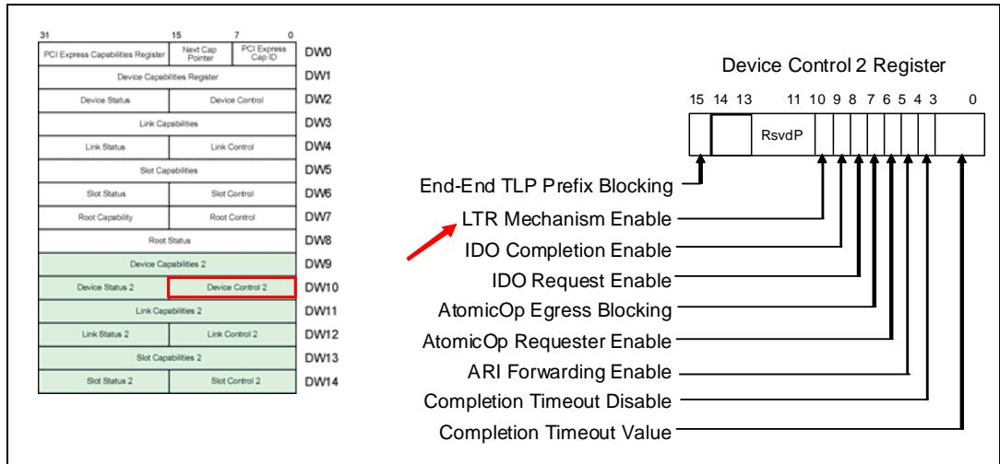

| EN | ZH |
|---|---|
| The target for LTR information is the Root Complex. Participating downstream devices all report their values but the Port just uses the smallest value that was reported as the latency limit for all devices accessed through that Port. The Root is not required to honor requested service latencies but is strongly encouraged to do so. | LTR信息的目标是根复合体。所有参与的下游设备都报告其值，但端口仅使用所报告的最小值作为通过该端口访问的所有设备的延迟限制。根复合体不被要求必须遵从请求的服务延迟，但强烈建议其这样做。 |

## LTR Messages | LTR 消息

| EN | ZH |
| --- | --- |
| The LTR message itself has the format shown in Figure 16‑40 on page 788, where it can be seen that the Routing type 100b (point‑to‑point) and the LTR message code is 0001 0000b. Two latency values are reported, one for Requests that must be snooped and another for Requests that will not be snooped and therefore should complete more quickly. As seen in the diagram, the format for both is the same and includes the following fields: | LTR消息本身的格式如图16‑40（第788页）所示，其中可以看出路由类型为100b（点对点），LTR消息码为0001 0000b。该消息报告两个延迟值：一个用于必须侦听的请求，另一个用于无需侦听因而应更快完成的请求。如图所示，两者的格式相同，包含以下字段： |
| Latency Value and Scale ‑ combine to give a value in the range from 1ns to about 34 seconds. Setting these fields to all zeros indicates that any delay will affect the device and thus the best possible service is requested. The meaning of the latency is defined as follows: | 延迟值与比例（Latency Value and Scale）‑ 两者结合给出从1ns到约34秒范围内的值。将这些字段全部置零表示任何延迟都将影响设备，因此请求尽可能最好的服务。延迟的含义定义如下： |
| For Read Requests, it's the delay from sending the END symbol in the Request TLP until receiving the STP symbol in the first Completion TLP for that Request. | 对于读请求，是指从发送请求TLP中的END符号到接收到该请求的第一个完成TLP中的STP符号之间的延迟。 |
| For Write Requests, it relates to Flow Control back‑pressure. If a write has been issued but the next write can't proceed due to a lack of Flow Control credits, the latency is the time from the last symbol of that write (END) until the first symbol of the DLLP that gives more credits (SDP). In other words, this represents the time within which the Root Port should be able to accept the next write. | 对于写请求，它与流控反压有关。如果一次写操作已发出，但由于缺乏流控信用而无法继续下一次写操作，则延迟是指从该写操作的最后一个符号（END）到提供更多信用的DLLP的第一个符号（SDP）之间的时间。换句话说，这表示根端口应能够接受下一次写操作的时间范围。 |
| Requirement ‑ can be set for none, or one, or both to indicate whether that latency value is required. If a device doesn't implement one of these traffic types or has no service requirements for it, then this bit must be cleared for the associated field. If a device has reported requirements but has since been directed into a device power state lower than D0, or if its LTR Enable bit has been cleared, the device must send another LTR message reporting that these latencies are no longer required. | 需求（Requirement）‑ 可以设置为无、一个或两个，以指示是否需要该延迟值。如果设备未实现其中一种流量类型或对其没有服务需求，则该位必须为关联字段清零。如果设备已报告需求，但随后被引导至低于D0的设备电源状态，或者其LTR使能位已清零，则设备必须发送另一条LTR消息，报告不再需要这些延迟。 |

## Guidelines Regarding LTR Use | LTR 使用指南

| EN | ZH |
|---|---|
| Endpoints have a few guidelines regarding the use of LTR: | 端点（Endpoint）在使用LTR时有几条指南： |
| 1. It's recommended that they send an updated LTR message every time their service requirements change, and the spec spends some time going over examples of this. The bottom line here is that devices need to take all the delays into account when making a change to the service requirements. That accounting includes time for the reference clock to be restored if was turned off, for the Link to be brought back to L0, for the LTR message to be delivered, and for the platform to prepare to handle the new requirement. | 1. 建议每次服务需求变化时发送更新的LTR消息，规范花了一些篇幅讨论相关示例。关键在于，设备在更改服务需求时必须考虑所有延迟。这包括：参考时钟若被关闭后重新恢复的时间、链路（Link）恢复到L0状态的时间、LTR消息传递的时间，以及平台准备处理新需求所需的时间。 |
| 2. If the latency tolerance is being reduced, it's recommended that the LTR message be sent far enough ahead of the first associated Request to ensure that the platform is ready. | 2. 如果延迟容限正在减小，建议在第一个相关请求（Request）之前足够早地发送LTR消息，以确保平台准备就绪。 |
| 3. If the latency tolerance is being increased, then the LTR message to report that should immediately follow the final Request that used the previous latency value. | 3. 如果延迟容限正在增大，则报告该情况的LTR消息应在使用先前延迟值的最后一个请求之后立即发送。 |
| 4. To achieve the best overall platform power efficiency, it's recommended that Endpoints buffer Requests as much as they can and then send them in bursts that are as long as the Endpoint can support. | 4. 为实现最佳的整体平台能效，建议端点尽可能多地缓冲请求，然后以端点所能支持的最大长度以突发方式发送。 |
| Multi-Function Devices (MFDs) have a few rules of their own. For example, they must send a "conglomerated" LTR message as follows: | 多功能器件（MFD）有其自身的一些规则。例如，它们必须按如下方式发送"聚合"LTR消息： |
| 1. Reported latency values must reflect the lowest values associated with any Function. The snoop and no-snoop latencies could be associated with different Functions, but if none of them have a requirement for snoop or no-snoop traffic, then the requirement bit for that type must not be set. | 1. 报告的延迟值必须反映与任一功能（Function）相关联的最低值。侦听（snoop）和非侦听（no-snoop）延迟可能与不同的功能相关联，但如果没有任何功能对侦听或非侦听流量有要求，则不得设置该类型的需求位（Requirement bit）。 |
| 2. MFDs must send a new LTR message upstream if any of the Functions changes its values in a way that affects the conglomerated value. | 2. 如果任一功能以影响聚合值的方式更改其值，MFD必须向上游发送新的LTR消息。 |
| Switches have a similar set of rules related to LTR. Basically, they collect the messages from Downstream Ports that have been enabled to use LTR and send a "conglomerated" message upstream according to the following rules: | 交换机（Switch）有一套类似的LTR相关规则。基本上，它们从已启用LTR的下行端口（Downstream Port）收集消息，并根据以下规则向上游发送"聚合"消息： |
| 1. If the Switch supports LTR, it must support it on all of its Ports. | 1. 如果交换机支持LTR，则必须在其所有端口（Port）上都支持LTR。 |
| 2. The Upstream Port is allowed to send LTR messages only when the LTR Enable bit is set or shortly after software has cleared it so it can report that any previous requirements are no longer in effect. | 2. 上行端口（Upstream Port）仅在设置了LTR使能位（LTR Enable bit）时，或在软件清除该位后不久（以便报告任何先前的需求不再有效）才允许发送LTR消息。 |
| 3. The conglomerated LTR value is based on the lowest value reported by any participating Downstream Port. If the Requirement bit is clear, or an invalid value is reported, the latency is considered effectively infinite. | 3. 聚合LTR值基于任一参与的下行端口所报告的最低值。如果需求位清零，或报告了无效值，则该延迟被视为实际上无穷大。 |
| 4. If any Downstream Port reports that an LTR value is required, the Requirement bit will be set for that type in the LTR message forwarded upstream. | 4. 如果任一下行端口报告需要LTR值，则在上游转发的LTR消息中将为该类型设置需求位。 |
| 5. The LTR values reported upstream must take into account the latency of the Switch itself. If the Switch latency changes based on its operational mode, it must not be allowed to exceed 20% of the minimum value reported on all Downstream Ports. The value reported on the Upstream Port is the minimum reported value on all the Downstream Ports minus the Switch's own latency, although the value can't be less than zero. | 5. 向上游报告的LTR值必须考虑交换机本身的延迟。如果交换机延迟随其工作模式而变化，则不得允许超过所有下行端口报告的最小值的20%。上行端口报告的值是所有下行端口报告的最小值减去交换机自身的延迟，但该值不能小于零。 |
| 6. If a Downstream Port goes to DL_Down status, previous latencies for that Port must be treated as invalid. If that changes the conglomerated values upstream then a new message must be sent to report that. | 6. 如果下行端口进入DL_Down状态，则该端口的先前延迟必须视为无效。如果这改变了上游的聚合值，则必须发送新消息以报告该情况。 |
| 7. If a Downstream Port's LTR Enable bit is cleared, any latencies associated with that Port must be considered invalid, which may also result in a new LTR message being sent upstream. | 7. 如果下行端口的LTR使能位被清除，则与该端口相关的任何延迟必须视为无效，这也可能导致向上游发送新的LTR消息。 |
| 8. If any Downstream Ports receive new LTR values that would change the conglomerated value, the Switch must send a new LTR message upstream to report that. | 8. 如果任一下行端口收到可能改变聚合值的新的LTR值，则交换机必须向上游发送新的LTR消息以报告该情况。 |
| Finally, the Root Complex also has a few rules related to LTR: | 最后，根复合体（Root Complex, RC）也有一些与LTR相关的规则： |
| 1. The RC is allowed to delay processing of a device Request as long as it satisfies the service requirements. One application of this might be to buffer up several Requests from an Endpoint and service them all in a batch. | 1. RC可以延迟处理设备请求，只要满足服务需求即可。此规则的一种应用可能是缓冲来自端点的多个请求，并批量处理它们。 |
| 2. If the latency requirements are updated while a series of Requests is in progress, the new values must be comprehended by the RC prior to servicing the next Request, and within less time than the previously reported latency requirements. | 2. 如果在一系列请求进行过程中更新了延迟需求，则RC必须在服务下一个请求之前理解新值，并且所用时间必须少于先前报告的延迟需求。 |

Figure 16-40: LTR Message Format | 图16-40：LTR消息格式

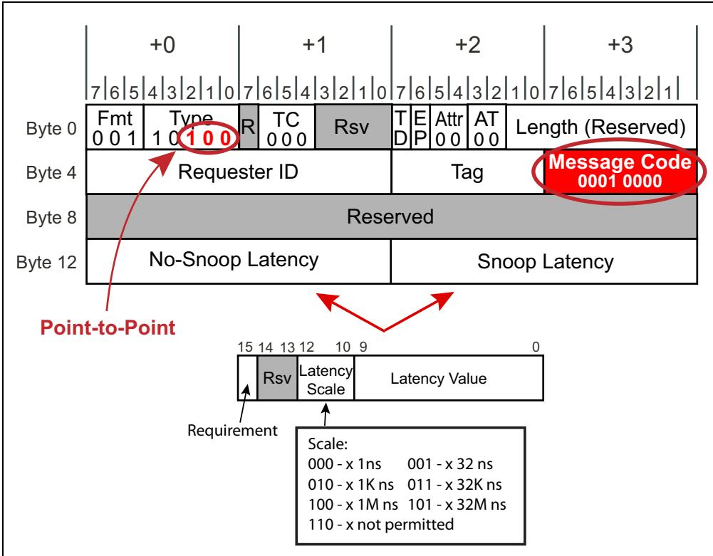

## LTR Example | LTR 示例

| EN | ZH |
|---|---|
| To illustrate the concepts discussed so far, consider the example topology shown in Figure 16-41 on page 789. Here, the Endpoint on the lower left has delivered an LTR message to the Switch reporting a Snoop Latency requirement of 1200ns. At this point, none of the other Endpoints connected to the Switch has reported an LTR value, so that becomes the conglomerated value to be reported upstream. However, the Switch has an internal latency of 50ns so that must be subtracted from the value to be reported, resulting in the Upstream Port sending an LTR message reporting 1150ns to the Root Port. | 为了说明到目前为止讨论的概念，考虑图16-41（第789页）所示的示例拓扑。这里，左下角的端点已向交换机发送了一条LTR消息，报告其侦听延迟要求为1200ns。此时，连接到交换机的其他端点均未报告LTR值，因此该值成为要向上游报告的聚合值。然而，交换机具有50ns的内部延迟，必须从要报告的值中减去该延迟，结果导致上游端口发送一条LTR消息，向根端口报告1150ns。 |

Figure 16-41: LTR Example | 图16-41：LTR示例

| EN | ZH |
|---|---|
| Next, the Legacy Endpoint delivers an LTR message with a large latency requirement of 5000ns, as shown in Figure 16-42 on page 790. Since this is larger than the current conglomerate value for the Switch, no LTR message is sent for this case. | 接下来，如图16-42（第790页）所示，传统端点发送了一条LTR消息，其延迟要求为5000ns。由于该值大于交换机当前的聚合值，因此在这种情况下不会发送LTR消息。 |

Figure 16-42: LTR - Change but no Update | 图16-42：LTR - 有变更但无更新

| EN | ZH |
|---|---|
| In the next stage, the middle Endpoint reports its LTR value as 700ns. This is smaller than the current conglomerate value, so the Switch calculates the new value of 650ns by subtracting its internal latency and forwards that upstream as an LTR message. That makes the current latency requirement for that Root Port 650ns, as seen in Figure 16-43 on page 791. | 在下一阶段，中间的端点报告其LTR值为700ns。该值小于当前的聚合值，因此交换机通过减去其内部延迟计算出新值650ns，并将其作为LTR消息转发到上游。这使得该根端口的当前延迟要求变为650ns，如图16-43（第791页）所示。 |

| EN | ZH |
|---|---|
| Finally, the Link to the middle Endpoint stops working for some reason as shown in Figure 16-44 on page 791, and the Switch Port reports DL_Down. Consequently, the LTR value for that Port must be considered invalid. Since its value was being used as the current conglomerate value, the conglomerate will be updated to the lowest value that is still valid, which is the 1200ns reported by the left-most Endpoint. The Switch will then subtract its internal latency and report 1150ns to the Root Port with a new LTR message. | 最后，如图16-44（第791页）所示，到中间端点的链路因某种原因停止工作，交换机端口报告DL_Down。因此，该端口的LTR值必须视为无效。由于其值被用作当前聚合值，聚合值将更新为仍然有效的最低值，即最左侧端点报告的1200ns。然后，交换机将减去其内部延迟，并通过新的LTR消息向根端口报告1150ns。 |

Figure 16-43: LTR - Change with Update | 图16-43：LTR - 有变更且有更新

Figure 16-44: LTR - Link Down Case | 图16-44：LTR - 链路断开情况
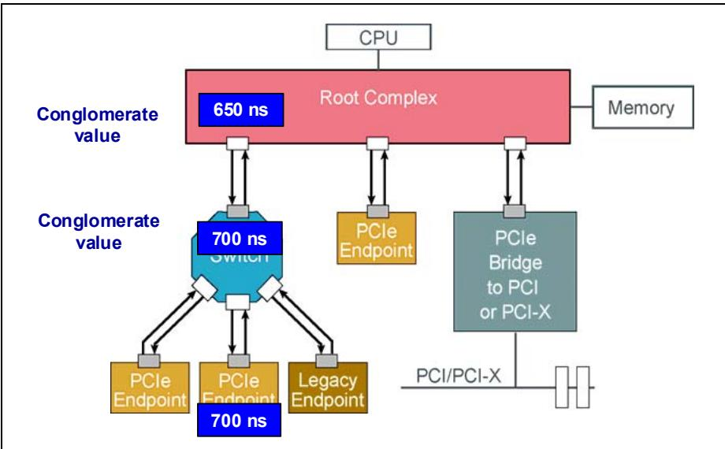

# 17 Interrupt Support

| EN | ZH |
|----|----|
| # 17 Interrupt Support | # 17 中断支持 |

## The Previous Chapter | 上一章

| EN | ZH |
|----|----|
| The previous chapter provides an overall context for the discussion of system power management and a detailed description of PCIe power management, which is compatible with the PCI Bus PM Interface Spec and the Advanced Configuration and Power Interface (ACPI) spec. PCIe defines extensions to the PCI-PM spec that focus primarily on Link Power and event management. An overview of the OnNow Initiative, ACPI, and the involvement of the Windows OS is also provided. | 上一章为系统电源管理的讨论提供了整体背景，并详细描述了PCIe电源管理，该规范与PCI总线电源管理接口规范(PCI Bus PM Interface Spec)以及高级配置与电源接口(ACPI)规范相兼容。PCIe定义了针对PCI-PM规范的扩展，这些扩展主要关注链路电源(Link Power)和事件管理。同时还概述了OnNow Initiative、ACPI以及Windows操作系统的参与。 |

| EN | ZH |
|----|----|
| ## This Chapter | ## 本章 |
| This chapter describes the different ways that PCIe Functions can generate interrupts. The old PCI model used pins for this, but sideband signals are undesirable in a serial model so support for the inband MSI (Message Signaled Interrupt) mechanism was made mandatory. The PCI INTx# pin operation can still be emulated using PCIe INTx messages for software backward compatibility reasons. Both the PCI legacy INTx# method and the newer versions of MSI/MSI-X are described. | 本章描述 PCIe 功能（Function）产生中断的不同方式。旧式 PCI 模型使用引脚来实现中断，但在串行模型中边带信号不受欢迎，因此强制要求支持带内 MSI（消息 signaled 中断）机制。出于软件向后兼容性的原因，PCI INTx# 引脚操作仍可通过 PCIe INTx 消息进行仿真。本章将介绍 PCI 传统 INTx# 方法以及较新版本的 MSI/MSI-X。 |

## The Next Chapter | 下一章

| EN | ZH |
|----|----|
| The next chapter describes three types of resets defined for PCIe: Fundamental reset (consisting of cold and warm reset), hot reset, and function-level reset (FLR). The use of a sideband reset PERST# signal to generate a system reset is discussed, and so is the inband TS1 based Hot Reset described. | 下一章描述PCIe定义的三种复位类型：基本复位（包括冷复位和暖复位）、热复位和功能级复位（FLR）。讨论了使用边带复位信号PERST#产生系统复位，以及基于带内TS1的热复位。 |

## 17.1 Interrupt Support Background | 17.1 中断支持背景

| EN | ZH |
|---|---|
| ## Interrupt Support Background | ## 中断支持背景 |

## General | 概述

| EN | ZH |
|---|---|
| The PCI architecture supported interrupts from peripheral devices as a means of improving their performance and offloading the CPU from the need to poll devices to determine when they require servicing. PCIe inherits this support largely unchanged from PCI, allowing software backwards compatibility to PCI. We provide a background to system interrupt handling in this chapter, but the reader who wants more details on interrupts is encouraged to look into these references: | PCI架构支持来自外设的中断，以此提升设备性能，并减轻CPU轮询设备以判断其是否需要服务的负担。PCIe几乎未作改动地继承了PCI的这一支持，从而实现了软件对PCI的向后兼容。本章将提供系统中断处理的背景知识，但希望了解更多中断详情的读者，建议参考以下资料： |
| • For PCI interrupt background, refer to the PCI spec rev 3.0 or to chapter 14 of MindShare's textbook: PCI System Architecture (www.mindshare.com). | • 有关PCI中断背景，请参阅PCI规范rev 3.0或MindShare教材《PCI System Architecture》（www.mindshare.com）第14章。 |
| • To learn more about Local and IO APICs, refer to MindShare's textbook: x86 Instruction Set Architecture. | • 欲了解更多关于Local APIC和IO APIC的内容，请参阅MindShare教材《x86 Instruction Set Architecture》。 |

## 17.1.1 Two Methods of Interrupt Delivery | 17.1.1 两种中断投递方式

| EN | ZH |
| --- | --- |
| PCI used sideband interrupt wires that were routed to a central interrupt controller. This method worked well in simple, single-CPU systems, but had some shortcomings that motivated moving to a newer method called MSI (Message Signaled Interrupts) with an extension called MSI-X (eXtented). | PCI使用连接到中央中断控制器的边带中断线。这种方法在简单的单CPU系统中工作良好，但存在一些缺点，促使业界转向称为MSI（Message Signaled Interrupts）的新方法，以及其扩展MSI-X（eXtended MSI）。 |
| Legacy PCI Interrupt Delivery — This original mechanism defined for the PCI bus consists of up to four signals per device or INTx# (INTA#, INTB#, INTC#, and INTD#) as shown in Figure 17-1 on page 795. In this model, the pins are shared by wire-ORing them together, and they'd eventually be connected to an input on the 8259 PIC (Programmable Interrupt Controller). When a pin is asserted, the PIC in turn asserts its interrupt request pin to the CPU as part of a process described in "The Legacy Model" on page 796. | 传统PCI中断投递 — 这是为PCI总线定义的原始机制，每个设备最多有四个信号或INTx#（INTA#、INTB#、INTC#和INTD#），如图17-1（第795页）所示。在该模型中，引脚通过线或（wire-OR）方式共享，最终连接到8259 PIC（可编程中断控制器）的输入。当某个引脚被断言时，PIC反过来向CPU断言其中断请求引脚，这是第796页"传统模型"所述过程的一部分。 |
| PCIe supports this PCI interrupt functionality for backward compatibility, but a design goal for serial transports is to minimize the pin count. As a result, the INTx# signals were not implemented as sideband pins. Instead, a Function can generate an inband interrupt message packet to indicate the assertion or deassertion of a pin. These messages act as "virtual wires", and target the interrupt controller in the system (typically in the Root Complex), as shown in Figure 17-2 on page 796. This picture also illustrates how an older PCI device using the pins can work in a PCIe system; the bridge translates the assertion of a pin into an interrupt emulation message (INTx) going upstream to the Root Complex. The expectation is that PCIe devices would not normally need to use the INTx messages but, at the time of this writing, in practice they often do because system software has not been updated to support MSI. | PCIe为了向后兼容而支持这种PCI中断功能，但串行传输的一个设计目标是尽量减少引脚数量。因此，INTx#信号并未实现为边带引脚。相反，功能（Function）可以生成带内中断消息包来指示引脚的断言或取消断言。这些消息充当"虚拟线"，目标是系统中的中断控制器（通常在根复合体中），如图17-2（第796页）所示。该图还说明了使用引脚的旧式PCI设备如何在PCIe系统中工作；桥接器将引脚的断言转换为发往根复合体的上游中断仿真消息（INTx）。预期PCIe设备通常不需要使用INTx消息，但在撰写本文时，实践中它们经常使用，因为系统软件尚未更新以支持MSI。 |

Figure 17-1: PCI Interrupt Delivery | 图17-1：PCI中断传递

| EN | ZH |
| --- | --- |
| MSI Interrupt Delivery — MSI eliminates the need for sideband signals by using memory writes to deliver the interrupt notification. The term "Message Signaled Interrupt" can be confusing because its name includes the term "Message" which is a type of TLP in PCIe, but an MSI interrupt is a Posted Memory Write instead of a Message transaction. MSI memory writes are distinguished from other memory writes only by the addresses they target, which are typically reserved by the system for interrupt delivery (e.g., x86-based systems traditionally reserve the address range FEEx_xxxxh for interrupt delivery). | MSI中断投递 — MSI通过使用存储器写操作来投递中断通知，从而消除了对边带信号的需求。术语"Message Signaled Interrupt"可能会引起混淆，因为其名称中包含"Message"一词，而Message是PCIe中的一种TLP类型，但MSI中断实际上是Posted Memory Write（推送存储器写）而非Message事务。MSI存储器写与其他存储器写的区别仅在于它们所针对的地址，这些地址通常由系统保留用于中断投递（例如，基于x86的系统传统上保留地址范围FEEx_xxxxh用于中断投递）。 |
| Figure 17-2 illustrates the delivery of interrupts from various types of PCIe devices. All PCIe devices are required to support MSI, but software may or may not support MSI, in which case, the INTx messages would be used. Figure 17-2 also shows how a PCIe-to-PCI Bridge is required to convert sideband interrupts from connected PCI devices to PCIe-supported INTx messages. | 图17-2展示了来自各种类型PCIe设备的中断投递。所有PCIe设备都必须支持MSI，但软件可能支持也可能不支持MSI，在这种情况下将使用INTx消息。图17-2还说明了PCIe到PCI桥接器如何将来自所连接PCI设备的边带中断转换为PCIe支持的INTx消息。 |

Figure 17-2: Interrupt Delivery Options in PCIe System | 图17-2：PCIe系统中的中断传递选项

| EN | ZH |
|----|----|
| ## The Legacy Model | ## 传统模型 |

## General | 概述

| EN | ZH |
|---|---|
| To illustrate the legacy interrupt delivery model, refer to Figure 17-3 on page 797 and consider the usual steps involved in interrupt delivery using the legacy method of interrupt pins: | 为说明传统中断传送模型，请参考第797页的图17-3，并考虑使用中断引脚的 legacy 方法所涉及的中断传送通常步骤： |
| 1. The device generates an interrupt by asserting its pin to the controller. In older systems this controller was typically an Intel 8259 PIC that had 15 IRQ inputs and one INTR output. The PIC would then assert INTR to inform the CPU that one or more interrupts were pending. | 1. 设备通过向其控制器断言其引脚来产生中断。在较老的系统中，该控制器通常是 Intel 8259 PIC，具有 15 个 IRQ 输入和一个 INTR 输出。PIC 随后会断言 INTR，以通知 CPU 有一个或多个中断处于待处理状态。 |
| 2. Once the CPU detects the assertion of INTR and is ready to act on it, it must identify which interrupt actually needs service, and that is done by the CPU issuing a special command on the processor bus called an Interrupt Acknowledge. | 2. 一旦 CPU 检测到 INTR 被断言并准备对其采取行动，它必须识别出哪个中断实际需要服务，这是通过 CPU 在处理器总线上发出一个称为中断确认（Interrupt Acknowledge）的特殊命令来完成的。 |
| 3. This command is routed by the system to the PIC, which returns an 8-bit value called the Interrupt Vector to report the highest priority interrupt currently pending. A unique vector would have been programmed earlier by system software for each IRQ input. | 3. 该命令由系统路由到 PIC，PIC 返回一个称为中断向量（Interrupt Vector）的 8 位值，以报告当前待处理的最高优先级中断。系统软件事先已为每个 IRQ 输入编程了唯一的向量。 |
| 4. The interrupt handler then uses the vector as an offset into the Interrupt Table (an area set up by software to contain the start addresses of all the Interrupt Service Routines, ISRs), and fetches the ISR start address it finds at that location. | 4. 中断处理程序随后将该向量作为中断表（Interrupt Table）的偏移量（该表是软件设置的区域，包含所有中断服务例程 ISR 的起始地址），并获取在该位置找到的 ISR 起始地址。 |
| 5. That address would point to the first instruction of the ISR that had been set up to handle this interrupt. This handler would be executed, servicing the interrupt and telling its device to deassert its INTx# line and then would return control to the previously interrupted task. | 5. 该地址指向为处理此中断而设置的 ISR 的第一条指令。将执行此处理程序，为该中断服务并通知其设备取消断言 INTx# 线，然后将控制权返回给先前被中断的任务。 |

Figure 17-3: Legacy Interrupt Example | 图17-3：传统中断示例

## 17.2.1 Changes to Support Multiple Processors | 17.2.1 支持多处理器的变更

| EN | ZH |
|---|---|
| This model works well for single‑CPU systems, but has a limitation that makes it sub‑optimal in a multi‑CPU system. The problem is that the INTR pin can only be connected to one CPU. If multiple processors are present then only one of them will see the interrupts and will have to service them all while the other CPUs won't see any of them. To obtain the best performance, such systems really need an even distribution of the system tasks across all the processors, referred to as SMP (Symmetric Multi‑Processing) but the pin model won't support it. | 该模型在单CPU系统中运行良好，但存在一个局限性，使其在多CPU系统中并非最优。问题在于INTR引脚只能连接到一个CPU。如果存在多个处理器，则只有一个处理器能接收到中断并必须处理所有中断，而其他CPU则看不到任何中断。为获得最佳性能，此类系统需要将系统任务均匀分布到所有处理器上，这称为SMP（对称多处理），但引脚模型无法支持这一点。 |
| To achieve better SMP, a new model was needed, and toward this end the PIC was modified to become the IO APIC (Advanced Programmable Interrupt Controller). The IO APIC was designed to have a separate small bus, called the APIC Bus, over which it could deliver interrupt messages, as shown in Figure 17‑4 on page 799. In this model, the message contained the interrupt vector number, so there was no need for the CPU to send an Interrupt Acknowledge down into the IO world to fetch it. The APIC Bus connected to a new internal logic block within the processors called the Local APIC. The bus was shared among all the agents and any of them could initiate messages on it but, for our purposes, the interesting part is its use for interrupt delivery from peripherals. Those interrupts could now be statically assigned by software to be serviced by different CPUs, multiple CPUs or even dynamically assigned by the IO APIC. | 为实现更好的SMP，需要一种新模型，为此PIC被修改为IO APIC（高级可编程中断控制器）。IO APIC设计有一条独立的小型总线，称为APIC总线，可通过该总线传递中断消息，如图17-4（第799页）所示。在此模型中，消息中包含中断向量号，因此CPU无需向IO世界发送中断确认来获取该向量号。APIC总线连接到处理器内部一个称为Local APIC的新逻辑块。该总线由所有代理共享，任何代理都可以在其上发起消息，但对我们而言，其关键用途在于从外设传递中断。这些中断现在可以由软件静态分配给不同的CPU处理，或由多个CPU共同处理，甚至可以由IO APIC动态分配。 |
| That model, known as the APIC model, was sufficient for several years but still depended on sideband pins from the peripheral devices to work. Another limitation of this model was the number of IRQs (interrupt request lines) into the IO APIC. Without a very large number of IRQs, peripheral devices had to share IRQs which means added latency anytime that IRQ is asserted because there could be multiple devices that could have asserted it and software must evaluate all of them. This technique of linking multiple ISRs together was often referred to as interrupt chaining. Eventually, because of this issue and a couple other minor issues, another improvement came along. | 该模型称为APIC模型，运行了数年之久，但仍然依赖外设的边带引脚来工作。该模型的另一个局限是进入IO APIC的IRQ（中断请求线）数量有限。如果没有足够多的IRQ，外设就必须共享IRQ，这意味着每次IRQ被断言时都会增加延迟，因为可能有多个设备都断言了该IRQ，而软件必须逐一评估所有这些设备。这种将多个ISR链接在一起的技术通常称为中断链。最终，由于这个问题以及其他一些小问题，又出现了新的改进。 |
| Why not have the peripheral devices themselves send interrupt messages directly to the Local APICs? All that is needed is a communications path which already exists in the form of the PCI bus and the processor bus. So the APIC bus was eliminated and all interrupts were delivered to the Local APICs in the form of memory writes, referred to as MSIs or Message Signaled Interrupts. These MSIs were targeting a special address that the system understood to be an interrupt message targeting the Local APICs. (This special address address was traditionally FEEx\_xxxxh for x86‑based systems.) Even the IO APIC was programmed to send its interrupt notifications over the ordinary data bus using memory writes (MSI). Now it simply sends an MSI memory write across the data bus targeting the memory address of the desired processor's Local APIC, and that has the effect of notifying the processor of the interrupt. | 为何不让外设自身直接将中断消息发送给Local APIC？所需要的只是一条通信路径，而PCI总线和处理器总线已经提供了这样的路径。于是APIC总线被淘汰，所有中断都以内存写操作的形式传递给Local APIC，称为MSI或消息 signaled 中断。这些MSI的目标是一个特殊地址，系统理解该地址是发送给Local APIC的中断消息。（对于基于x86的系统，这个特殊地址传统上是FEEx\_xxxxh。）即使是IO APIC也被编程为通过普通数据总线使用内存写操作（MSI）来发送其中断通知。现在，IO APIC只需在数据总线上发送一个MSI内存写操作，目标地址是所需处理器的Local APIC的内存地址，从而通知处理器有中断到达。 |
| This model is known as the xAPIC model, and since it is not based on sideband signals which go into an interrupt controller with a limited number of inputs, the need to share interrupts is almost eliminated. More information can be found about this model in "An MSI Solution" on page 827. | 该模型称为xAPIC模型，由于它不依赖进入输入数量有限的中断控制器的边带信号，因此几乎消除了共享中断的需求。有关此模型的更多信息，请参见第827页的"MSI解决方案"。 |
| PCI added MSI support as an option years ago and PCIe made that capability a requirement. A peripheral that can generate MSI transactions on its own opens new options for handling interrupts, such as giving each Function the ability to generate multiple unique interrupts instead of just one. | 多年前，PCI将MSI支持作为可选功能加入，而PCIe将该能力变为强制性要求。能够自行生成MSI事务的外设为中断处理开辟了新的选择，例如使每个功能都能生成多个唯一的中断，而不仅仅是只有一个中断。 |

Figure 17‑4: APIC Model for Interrupt Delivery | 图17‑4：中断传递的APIC模型

## 17.2.2 Legacy PCI Interrupt Delivery | 17.2.2 传统 PCI 中断传递

| EN | ZH |
| --- | --- |
| This section provides more detail on legacy PCI interrupt delivery. Readers familiar with PCI may wish to proceed to "Virtual INTx Signaling" on page 805 to learn more about how PCIe emulates this legacy model, or to "The MSI Model" on page 812 to learn more about that method. | 本节提供有关传统PCI中断投递的更多细节。熟悉PCI的读者可以继续阅读第805页的"虚拟INTx信令"，以了解PCIe如何模拟这一传统模型，或阅读第812页的"MSI模型"以了解该方法。 |
| PCI devices that use interrupts have two options. They may use either: | 使用中断的PCI器件有两个选项： |
| INTx# active low-level signals that can be shared and were defined in the original spec. | INTx# 有效低电平信号，可共享，并在原始规范中定义。 |
| Message Signaled Interrupts that were added as an option with the 2.2 version of the spec. MSI needs no modification for use in a PCIe system. | 消息 signaled 中断（MSI），作为2.2版规范的一个可选特性加入。MSI在PCIe系统中使用无需修改。 |