# Ch15_Error_Detection_Handling

# 15 Error Detection and Handling

<table style="border-collapse:collapse; width:100%;">
  <thead style="border:2px solid #000;">
    <tr>
      <th width="50%" style="border:2px solid #000; background:#f5f5f5;">EN</th>
      <th width="50%" style="border:2px solid #000; background-color:#e8e8e8;">中文</th>
    </tr>
  </thead>
  <tbody>
    <tr><td width="50%" style="border:2px solid #000; background:#fff;padding:4px 8px;">## The Previous Chapter</td><td width="50%" style="border:2px solid #000; background-color:#e8e8e8;padding:4px 8px;">## 上一章</td></tr>
    <tr><td width="50%" style="border:2px solid #000; background:#fff;padding:4px 8px;">This chapter describes the operation of the Link Training and Status State Machine (LTSSM) of the Physical Layer. The initialization process of the Link is described from Power-On or Reset until the Link reaches fully-operational L0 state during which normal packet traffic occurs. In addition, the Link power management states L0s, L1, L2, and L3 are discussed along with the state transitions. The Recovery state, during which bit lock, symbol lock or block lock are re-established is described. Link speed and width change for Link bandwidth management is also discussed.</td><td width="50%" style="border:2px solid #000; background-color:#e8e8e8;padding:4px 8px;">本章描述物理层中链路训练与状态状态机（LTSSM）的操作。描述了链路从上电或复位直到达到完全运行状态L0（在此期间进行正常报文传输）的初始化过程。此外，还讨论了链路电源管理状态L0s、L1、L2和L3及其状态转换。描述了恢复状态（Recovery state），在该状态下重新建立位锁定、符号锁定或块锁定。还讨论了用于链路带宽管理的链路速度和宽度变化。</td></tr>
  </tbody>
</table>

## This Chapter | 本章

<table style="border-collapse:collapse; width:100%;">
  <thead style="border:2px solid #000;">
    <tr>
      <th width="50%" style="border:2px solid #000; background:#f5f5f5;">EN</th>
      <th width="50%" style="border:2px solid #000; background-color:#e8e8e8;">中文</th>
    </tr>
  </thead>
  <tbody>
    <tr><td width="50%" style="border:2px solid #000; background:#fff;padding:4px 8px;">Although care is always taken to minimize errors they can't be eliminated, so detecting and reporting them is an important consideration. This chapter discusses error types that occur in a PCIe Port or Link, how they are detected, reported, and options for handling them. Since PCIe is designed to be backward compatible with PCI error reporting, a review of the PCI approach to error handling is included as background information. Then we focus on PCIe error handling of correctable, non‐fatal and fatal errors.</td><td width="50%" style="border:2px solid #000; background-color:#e8e8e8;padding:4px 8px;">尽管始终注意尽量减少错误，但错误无法完全消除，因此检测和报告错误是一个重要的考虑因素。本章讨论 PCIe 端口或链路上发生的错误类型、如何检测和报告这些错误，以及处理它们的选项。由于 PCIe 设计为向后兼容 PCI 错误报告，因此作为背景信息，回顾了 PCI 的错误处理方法。然后我们重点讨论 PCIe 对可纠正、非致命和致命错误的处理。</td></tr>
  </tbody>
</table>

<table style="border-collapse:collapse; width:100%;">
  <thead style="border:2px solid #000;">
    <tr>
      <th width="50%" style="border:2px solid #000; background:#f5f5f5;">EN</th>
      <th width="50%" style="border:2px solid #000; background-color:#e8e8e8;">中文</th>
    </tr>
  </thead>
  <tbody>
    <tr><td width="50%" style="border:2px solid #000; background:#fff;padding:4px 8px;">## The Next Chapter</td><td width="50%" style="border:2px solid #000; background-color:#e8e8e8;padding:4px 8px;">## 下一章</td></tr>
    <tr><td width="50%" style="border:2px solid #000; background:#fff;padding:4px 8px;">The next chapter provides an overall context for the discussion of system power management and a detailed description of PCIe power management, which is compatible with the PCI Bus PM Interface Spec and the Advanced Configuration and Power Interface (ACPI). PCIe defines extensions to the PCI-PM spec that focus primarily on Link Power and event management.</td><td width="50%" style="border:2px solid #000; background-color:#e8e8e8;padding:4px 8px;">下一章将提供讨论系统电源管理的整体背景，并详细描述PCIe电源管理，它与PCI总线PM接口规范（PCI Bus PM Interface Spec）和高级配置与电源接口（ACPI）兼容。PCIe定义了PCI-PM规范的扩展，主要侧重于链路电源和事件管理。</td></tr>
  </tbody>
</table>

## 99.2 Background | 99.2 背景

<table style="border-collapse:collapse; width:100%;">
  <thead style="border:2px solid #000;">
    <tr>
      <th width="50%" style="border:2px solid #000; background:#f5f5f5;">EN</th>
      <th width="50%" style="border:2px solid #000; background-color:#e8e8e8;">中文</th>
    </tr>
  </thead>
  <tbody>
    <tr><td width="50%" style="border:2px solid #000; background:#fff;padding:4px 8px;">Software backward compatibility with PCI is an important feature of PCIe, and that's accomplished by retaining the PCI configuration registers that were already in place. PCI verified the correct parity on each transmission phase of the bus to check for errors. Detected errors were recorded in the Status register and could optionally be reported with either of two side‑band signals: PERR# (Parity Error) for a potentially recoverable parity fault during data transmission, and SERR# (System Error) for a more serious problem that was usually not recoverable. These two types can be categorized as follows:</td><td width="50%" style="border:2px solid #000; background-color:#e8e8e8;padding:4px 8px;">与PCI的软件向后兼容性是PCIe的一项重要特性，这是通过保留原有的PCI配置寄存器来实现的。PCI在每个总线传输阶段校验奇偶位的正确性以检查错误。检测到的错误记录在状态寄存器中，并可选择通过两个边带信号之一报告：PERR#（奇偶错误）用于数据传输期间可能可恢复的奇偶故障，SERR#（系统错误）用于通常不可恢复的更严重问题。这两种类型可分类如下：</td></tr>
    <tr><td width="50%" style="border:2px solid #000; background:#fff;padding:4px 8px;">• Ordinary data parity errors — reported via PERR#</td><td width="50%" style="border:2px solid #000; background-color:#e8e8e8;padding:4px 8px;">• 普通数据奇偶错误 — 通过PERR#报告</td></tr>
    <tr><td width="50%" style="border:2px solid #000; background:#fff;padding:4px 8px;">Data parity errors during multi‑task transactions (special cycles) — reported via SERR#</td><td width="50%" style="border:2px solid #000; background-color:#e8e8e8;padding:4px 8px;">多任务事务（特殊周期）期间的数据奇偶错误 — 通过SERR#报告</td></tr>
    <tr><td width="50%" style="border:2px solid #000; background:#fff;padding:4px 8px;">• Address and command parity errors — reported via SERR#</td><td width="50%" style="border:2px solid #000; background-color:#e8e8e8;padding:4px 8px;">• 地址和命令奇偶错误 — 通过SERR#报告</td></tr>
    <tr><td width="50%" style="border:2px solid #000; background:#fff;padding:4px 8px;">• Other types of errors (device‑specific) — reported via SERR#</td><td width="50%" style="border:2px solid #000; background-color:#e8e8e8;padding:4px 8px;">• 其他类型的错误（设备特定） — 通过SERR#报告</td></tr>
    <tr><td width="50%" style="border:2px solid #000; background:#fff;padding:4px 8px;">How the errors should be handled was outside the scope of the PCI spec and might include hardware support or device‑specific software. As an example, a data parity error on a read from memory might be recovered in hardware by detecting the condition and simply repeating the Request. That would be a safe step if the memory contents weren't changed by the failed operation.</td><td width="50%" style="border:2px solid #000; background-color:#e8e8e8;padding:4px 8px;">错误的处理方式不在PCI规范范围内，可能包括硬件支持或设备特定软件。例如，从内存读取时发生的数据奇偶错误，可以通过硬件检测到该状况并直接重发请求来恢复。如果失败操作未改变内存内容，这将是一个安全的步骤。</td></tr>
    <tr><td width="50%" style="border:2px solid #000; background:#fff;padding:4px 8px;">As shown in Figure 15‑1 on page 649, both error pins were typically connected to the chipset and used to signal the CPU in a consumer PC. These machines were very cost sensitive, so they didn't usually have the budget for much in the way of error handling. Consequently, the resulting error reporting signal chosen was the NMI (Non‑Maskable Interrupt) signal from the chipset to the processor that indicated significant system trouble requiring immediate attention. Most consumer PCs didn't include an error handler for this condition, so the system would simply be stopped to avoid corruption and the BSOD (Blue Screen Of Death) would inform the operator. An example of an SERR# condition would be an address parity mismatch seen during the command phase of a transaction. This is a potentially destructive case because the wrong target might respond. If that happened and SERR# reported it, recovery would be difficult and would probably require significant software overhead. (To learn more about PCI error handling, refer to MindShare's book PCI System Architecture.)</td><td width="50%" style="border:2px solid #000; background-color:#e8e8e8;padding:4px 8px;">如图15‑1（第649页）所示，这两个错误引脚通常连接到芯片组，用于向消费级PC中的CPU发出信号。这类机器对成本非常敏感，因此通常没有足够的预算来支持复杂的错误处理。结果，最终选择的错误报告信号是从芯片组到处理器的NMI（不可屏蔽中断）信号，指示需要立即处理的重大系统故障。大多数消费级PC未包含针对此状况的错误处理程序，因此系统会直接停止以避免数据损坏，并通过BSOD（蓝屏死机）通知操作员。SERR#条件的一个示例是在事务的命令阶段检测到地址奇偶不匹配。这是一种潜在的破坏性情况，因为错误的设备可能会响应。如果发生这种情况并通过SERR#报告，恢复将非常困难，且可能需要大量的软件开销。（欲了解更多关于PCI错误处理的内容，请参阅MindShare的《PCI系统体系结构》一书。）</td></tr>
    <tr><td width="50%" style="border:2px solid #000; background:#fff;padding:4px 8px;">PCI‑X uses the same two error reporting signals but defines specific error handling requirements depending on whether device‑specific error handling software is present. If such a handler is not present, then all parity errors are reported with SERR#.</td><td width="50%" style="border:2px solid #000; background-color:#e8e8e8;padding:4px 8px;">PCI‑X使用相同的两个错误报告信号，但根据是否存在设备特定的错误处理软件来定义具体的错误处理要求。如果不存在此类处理程序，则所有奇偶错误均通过SERR#报告。</td></tr>
  </tbody>
</table>

Figure 15‑1: PCI Error Handling / 图15‑1：PCI错误处理 | 图15‑1：PCI错误处理

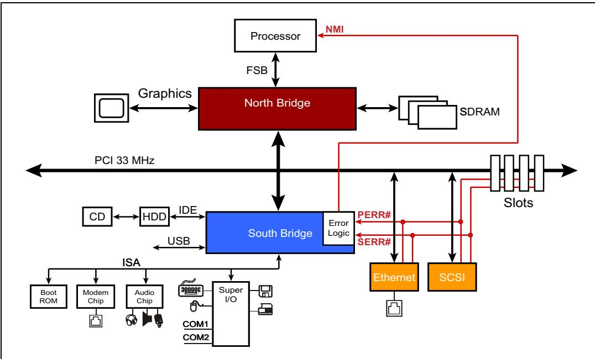

<table style="border-collapse:collapse; width:100%;">
  <thead style="border:2px solid #000;">
    <tr>
      <th width="50%" style="border:2px solid #000; background:#f5f5f5;">EN</th>
      <th width="50%" style="border:2px solid #000; background-color:#e8e8e8;">中文</th>
    </tr>
  </thead>
  <tbody>
    <tr><td width="50%" style="border:2px solid #000; background:#fff;padding:4px 8px;">PCI‑X 2.0 uses source‑synchronous clocking to achieve faster data rates (up to 4GB/s). This bus targeted high‑end enterprise systems because it was generally too expensive for consumer machines. Since these high‑performance systems also require high availability, the spec writers chose to improve the error handling by adding Error‑Correcting Code (ECC) support. ECC allows more robust error detection and enables correction of single‑bit errors on the fly. ECC is very helpful in minimizing the impact of transmission errors. (To learn more about PCI‑X error handling, see MindShare's book PCI‑X System Architecture.)</td><td width="50%" style="border:2px solid #000; background-color:#e8e8e8;padding:4px 8px;">PCI‑X 2.0采用源同步时钟技术以实现更高的数据速率（最高4GB/s）。该总线面向高端企业级系统，因为其对消费级机器来说通常过于昂贵。由于这些高性能系统还需要高可用性，规范制定者选择通过添加ECC（纠错码）支持来改进错误处理。ECC允许更强大的错误检测，并能够实时纠正单比特错误。ECC在最小化传输错误的影响方面非常有帮助。（欲了解更多关于PCI‑X错误处理的内容，请参阅MindShare的《PCI‑X系统体系结构》一书。）</td></tr>
    <tr><td width="50%" style="border:2px solid #000; background:#fff;padding:4px 8px;">PCIe maintains backward compatibility with these legacy mechanisms by using the error status bits in the legacy configuration registers to record error events in PCIe that are analogous to those of PCI. That lets legacy software see PCIe error events in terms that it understands, and allows it to operate with PCIe hardware. See "PCI‑Compatible Error Reporting Mechanisms" on page 674 for the details of these registers.</td><td width="50%" style="border:2px solid #000; background-color:#e8e8e8;padding:4px 8px;">PCIe通过使用传统配置寄存器中的错误状态位来记录与PCI类似的PCIe错误事件，从而保持与这些传统机制的向后兼容性。这使得传统软件能够以它理解的方式查看PCIe错误事件，并允许其与PCIe硬件协同工作。有关这些寄存器的详细信息，请参见第674页的"PCI兼容错误报告机制"。</td></tr>
  </tbody>
</table>

## 15.2 PCIe Error Definitions | 15.2 PCIe 错误定义

<table style="border-collapse:collapse; width:100%;">
  <thead style="border:2px solid #000;">
    <tr>
      <th width="50%" style="border:2px solid #000; background:#f5f5f5;">EN</th>
      <th width="50%" style="border:2px solid #000; background-color:#e8e8e8;">中文</th>
    </tr>
  </thead>
  <tbody>
    <tr><td width="50%" style="border:2px solid #000; background:#fff;padding:4px 8px;">The spec uses four general terms regarding errors, defined here:</td><td width="50%" style="border:2px solid #000; background-color:#e8e8e8;padding:4px 8px;">本规范使用了四个与错误相关的通用术语，定义如下：</td></tr>
    <tr><td width="50%" style="border:2px solid #000; background:#fff;padding:4px 8px;">1. **Error Detection** - the process of determining that an error exists. Errors are discovered by an agent as a result of a local problem, such as receiving a bad packet, or because it received a packet signaling an error from another device (like a poisoned packet).</td><td width="50%" style="border:2px solid #000; background-color:#e8e8e8;padding:4px 8px;">1. **错误检测** -- 确定错误存在的过程。错误由某个代理（agent）因本地问题而发现，例如收到一个坏包，或者因为收到另一个设备发来的指示错误的包（如毒化包）。</td></tr>
    <tr><td width="50%" style="border:2px solid #000; background:#fff;padding:4px 8px;">2. **Error Logging** - setting the appropriate bits in the architected registers based on the error detected as an aid for error-handling software.</td><td width="50%" style="border:2px solid #000; background-color:#e8e8e8;padding:4px 8px;">2. **错误记录** -- 根据检测到的错误，在架构化的寄存器中设置相应的位，以辅助错误处理软件。</td></tr>
    <tr><td width="50%" style="border:2px solid #000; background:#fff;padding:4px 8px;">3. **Error Reporting** - notifying the system that an error condition exists. This can take the form of an error Message being delivered to the Root Complex, assuming the device is enabled to send error messages. The Root, in turn, can send an interrupt to the system when it receives an error Message.</td><td width="50%" style="border:2px solid #000; background-color:#e8e8e8;padding:4px 8px;">3. **错误上报** -- 通知系统存在错误状况。其形式可以是将错误消息（Error Message）递交给根复合体（Root Complex），前提是该设备已使能发送错误消息。根复合体收到错误消息后，可向系统发送中断。</td></tr>
    <tr><td width="50%" style="border:2px solid #000; background:#fff;padding:4px 8px;">4. **Error Signaling** - the process of one agent notifying another of an error condition by sending an error Message, or sending a Completion with a UR (Unsupported Request) or CA (Completer Abort) status, or poisoning a TLP (also known as error forwarding).</td><td width="50%" style="border:2px solid #000; background-color:#e8e8e8;padding:4px 8px;">4. **错误信令** -- 一个代理通过发送错误消息、或发送带有 UR（不支持请求）或 CA（完成者中止）状态的完成报文（Completion）、或毒化 TLP（也称为错误转发）来通知另一个代理错误状况的过程。</td></tr>
  </tbody>
</table>

## 15.3 PCIe Error Reporting | 15.3 PCIe 错误报告

<table style="border-collapse:collapse; width:100%;">
  <thead style="border:2px solid #000;">
    <tr>
      <th width="50%" style="border:2px solid #000; background:#f5f5f5;">EN</th>
      <th width="50%" style="border:2px solid #000; background-color:#e8e8e8;">中文</th>
    </tr>
  </thead>
  <tbody>
    <tr><td width="50%" style="border:2px solid #000; background:#fff;padding:4px 8px;">Two error reporting levels are defined for PCIe. The first is a Baseline capability required for all devices. This includes support for legacy error reporting as well as basic support for reporting PCIe errors. The second is an optional Advanced Error Reporting Capability that adds a new set of configuration registers and tracks many more details about which errors have occurred, how serious they are and in some cases, can even record information about the packet that caused the error.</td><td width="50%" style="border:2px solid #000; background-color:#e8e8e8;padding:4px 8px;">PCIe 定义了两个错误报告级别。第一个是所有设备都必须具备的基线能力（Baseline capability），包括对传统错误报告的支持以及 PCIe 错误报告的基本支持。第二个是可选的增强错误报告能力（Advanced Error Reporting Capability），它增加了一组新的配置寄存器，跟踪更多关于已发生错误的详细信息、错误的严重程度，并且在某些情况下，甚至可以记录导致该错误的数据包信息。</td></tr>
  </tbody>
</table>

## 15.3.1 Baseline Error Reporting | 15.3.1 基线错误报告

<table style="border-collapse:collapse; width:100%;">
  <thead style="border:2px solid #000;">
    <tr>
      <th width="50%" style="border:2px solid #000; background:#f5f5f5;">EN</th>
      <th width="50%" style="border:2px solid #000; background-color:#e8e8e8;">中文</th>
    </tr>
  </thead>
  <tbody>
    <tr><td width="50%" style="border:2px solid #000; background:#fff;padding:4px 8px;">Two sets of configuration registers are required in all devices in support of Baseline error reporting. These are described in detail in "Baseline Error Detection and Handling" on page 674 and are summarized here:</td><td width="50%" style="border:2px solid #000; background-color:#e8e8e8;padding:4px 8px;">所有设备都需要两组配置寄存器来支持基线错误报告。这些寄存器在第674页的"基线错误检测与处理"中有详细描述，此处进行总结：</td></tr>
    <tr><td width="50%" style="border:2px solid #000; background:#fff;padding:4px 8px;">PCI-compatible Registers — these are the same registers used by PCI and provide backward compatibility for existing PCI-compatible software. To make this work, PCIe errors are mapped to PCI-compatible errors, making them visible to the legacy software.</td><td width="50%" style="border:2px solid #000; background-color:#e8e8e8;padding:4px 8px;">PCI兼容寄存器——这些是与PCI相同的寄存器，为现有的PCI兼容软件提供向后兼容性。为此，PCIe错误被映射为PCI兼容错误，使其对遗留软件可见。</td></tr>
    <tr><td width="50%" style="border:2px solid #000; background:#fff;padding:4px 8px;">PCI Express Capability Registers — these registers will only be useful to newer software that is aware of PCIe, but they provide more error information specifically for PCIe software.</td><td width="50%" style="border:2px solid #000; background-color:#e8e8e8;padding:4px 8px;">PCI Express能力寄存器——这些寄存器仅对识别PCIe的新软件有用，但它们为PCIe软件提供了更具体的错误信息。</td></tr>
  </tbody>
</table>

## 15.10 Advanced Error Reporting (AER) | 15.10 高级错误报告（AER）

<table style="border-collapse:collapse; width:100%;">
  <thead style="border:2px solid #000;">
    <tr>
      <th width="50%" style="border:2px solid #000; background:#f5f5f5;">EN</th>
      <th width="50%" style="border:2px solid #000; background-color:#e8e8e8;">中文</th>
    </tr>
  </thead>
  <tbody>
    <tr><td width="50%" style="border:2px solid #000; background:#fff;padding:4px 8px;">This optional error reporting mechanism includes a new and dedicated set of configuration registers that give error handling software more information to work with in diagnosing and recovering from problems.</td><td width="50%" style="border:2px solid #000; background-color:#e8e8e8;padding:4px 8px;">这种可选的错误报告机制包含一组新的专用配置寄存器，为错误处理软件提供更多信息，用于诊断和恢复问题。</td></tr>
    <tr><td width="50%" style="border:2px solid #000; background:#fff;padding:4px 8px;">The AER registers are mapped into the extended configuration space and provide much more information about the nature of any errors.</td><td width="50%" style="border:2px solid #000; background-color:#e8e8e8;padding:4px 8px;">AER 寄存器映射到扩展配置空间中，并提供关于任何错误本质的更多详细信息。</td></tr>
    <tr><td width="50%" style="border:2px solid #000; background:#fff;padding:4px 8px;">See "Advanced Error Reporting (AER)" on page 685 for a detailed description of these registers.</td><td width="50%" style="border:2px solid #000; background-color:#e8e8e8;padding:4px 8px;">参见第685页的"Advanced Error Reporting (AER)"以获取这些寄存器的详细描述。</td></tr>
  </tbody>
</table>

## 15.4 Error Classes | 15.4 错误分类

<table style="border-collapse:collapse; width:100%;">
  <thead style="border:2px solid #000;">
    <tr>
      <th width="50%" style="border:2px solid #000; background:#f5f5f5;">EN</th>
      <th width="50%" style="border:2px solid #000; background-color:#e8e8e8;">中文</th>
    </tr>
  </thead>
  <tbody>
    <tr><td width="50%" style="border:2px solid #000; background:#fff;padding:4px 8px;">Errors fall into two general categories based on whether hardware is able to fix the problem or not, Correctable and Uncorrectable. The Uncorrectable category is further subdivided based on whether software can fix the problem, Non‑fatal and Fatal.</td><td width="50%" style="border:2px solid #000; background-color:#e8e8e8;padding:4px 8px;">根据硬件能否修复问题，错误分为两大类：可校正（Correctable）和不可校正（Uncorrectable）。不可校正类别又根据软件能否修复问题进一步细分为非致命（Non‑fatal）和致命（Fatal）。</td></tr>
    <tr><td width="50%" style="border:2px solid #000; background:#fff;padding:4px 8px;">• Correctable errors — automatically handled by hardware</td><td width="50%" style="border:2px solid #000; background-color:#e8e8e8;padding:4px 8px;">• 可校正错误 — 由硬件自动处理</td></tr>
    <tr><td width="50%" style="border:2px solid #000; background:#fff;padding:4px 8px;">• Uncorrectable errors</td><td width="50%" style="border:2px solid #000; background-color:#e8e8e8;padding:4px 8px;">• 不可校正错误</td></tr>
    <tr><td width="50%" style="border:2px solid #000; background:#fff;padding:4px 8px;">• Non‑fatal — handled by device‑specific software; Link is still operational and recovery without data loss may be possible</td><td width="50%" style="border:2px solid #000; background-color:#e8e8e8;padding:4px 8px;">• 非致命 — 由设备特定软件处理；链路仍可运行，可能可以在不丢失数据的情况下恢复</td></tr>
    <tr><td width="50%" style="border:2px solid #000; background:#fff;padding:4px 8px;">• Fatal — handled by system software; Link or Device is not working properly and recovery without data loss is unlikely</td><td width="50%" style="border:2px solid #000; background-color:#e8e8e8;padding:4px 8px;">• 致命 — 由系统软件处理；链路或设备工作不正常，不太可能在不丢失数据的情况下恢复</td></tr>
    <tr><td width="50%" style="border:2px solid #000; background:#fff;padding:4px 8px;">Based on these classes, error handling software can be partitioned into separate handlers to perform the actions required. Such actions might range from simply monitoring the frequency of Correctable errors to resetting the entire system in the event of a Fatal error. Regardless of the type of error, software may arrange for the system to be notified of all errors to allow tracking and logging them.</td><td width="50%" style="border:2px solid #000; background-color:#e8e8e8;padding:4px 8px;">基于这些分类，错误处理软件可以划分为独立的处理程序来执行所需操作。这些操作的范围可以从简单地监视可校正错误的频率，到在发生致命错误时重置整个系统。无论错误类型如何，软件都可以安排系统获知所有错误，以便对其进行跟踪和记录。</td></tr>
  </tbody>
</table>

<table style="border-collapse:collapse; width:100%;">
  <thead style="border:2px solid #000;">
    <tr>
      <th width="50%" style="border:2px solid #000; background:#f5f5f5;">EN</th>
      <th width="50%" style="border:2px solid #000; background-color:#e8e8e8;">中文</th>
    </tr>
  </thead>
  <tbody>
    <tr><td width="50%" style="border:2px solid #000; background:#fff;padding:4px 8px;">## Correctable Errors</td><td width="50%" style="border:2px solid #000; background-color:#e8e8e8;padding:4px 8px;">## 可校正错误</td></tr>
    <tr><td width="50%" style="border:2px solid #000; background:#fff;padding:4px 8px;">Correctable errors are, by definition, automatically corrected in hardware. They may impact performance by adding latency and consuming bandwidth, but if all goes well, recovery is automatic and fast because it doesn't depend on software intervention, and no information is lost in the process. These errors aren't required to be reported to software, but doing so could allow software to track error trends that might indicate that some devices are showing signs of imminent failure.</td><td width="50%" style="border:2px solid #000; background-color:#e8e8e8;padding:4px 8px;">可校正错误，顾名思义，由硬件自动校正。它们可能因增加延迟和消耗带宽而影响性能，但如果一切正常，恢复过程自动且快速，因其不依赖软件干预，且过程中不会丢失任何信息。此类错误无需向软件报告，但报告可让软件追踪错误趋势，从而发现某些设备可能即将出现故障的迹象。</td></tr>
  </tbody>
</table>

## 15.4.2 Uncorrectable Errors | 15.4.2 不可纠正错误

<table style="border-collapse:collapse; width:100%;">
  <thead style="border:2px solid #000;">
    <tr>
      <th width="50%" style="border:2px solid #000; background:#f5f5f5;">EN</th>
      <th width="50%" style="border:2px solid #000; background-color:#e8e8e8;">中文</th>
    </tr>
  </thead>
  <tbody>
    <tr><td width="50%" style="border:2px solid #000; background:#fff;padding:4px 8px;">Errors that can't be automatically corrected in hardware are called Uncorrectable, and these are either Non-fatal or Fatal in severity.</td><td width="50%" style="border:2px solid #000; background-color:#e8e8e8;padding:4px 8px;">无法在硬件中自动纠正的错误称为不可纠正错误，其严重性分为非致命或致命。</td></tr>
  </tbody>
</table>

## Non-fatal Uncorrectable Errors | 非致命不可校正错误

<table style="border-collapse:collapse; width:100%;">
  <thead style="border:2px solid #000;">
    <tr>
      <th width="50%" style="border:2px solid #000; background:#f5f5f5;">EN</th>
      <th width="50%" style="border:2px solid #000; background-color:#e8e8e8;">中文</th>
    </tr>
  </thead>
  <tbody>
    <tr><td width="50%" style="border:2px solid #000; background:#fff;padding:4px 8px;">Non-fatal errors indicate that information has been lost but the cause was likely something other than the integrity of a Link or Device. A packet failed somewhere, but the Link continues to function correctly and other packets are unaffected. Since the Link is still working, recovery of the lost information may be possible, but will depend on implementation-specific software to handle it. An example of this error type would be a Completion timeout, in which a Request was sent but no Completion was returned within the allowed time. Somewhere there was an issue, but it could be something as simple as a random bit error within a Switch that caused the Completion to be routed incorrectly. An attempt at recovery for this case could be as simple as re-issuing the Request.</td><td width="50%" style="border:2px solid #000; background-color:#e8e8e8;padding:4px 8px;">非致命错误表示信息已丢失，但其原因很可能与链路或设备的完整性无关。某个数据包在某处传输失败，但链路仍能正常工作，其他数据包不受影响。由于链路仍在运行，丢失的信息有可能恢复，但这将依赖于特定实现的软件来处理。此类错误的一个示例是完成报文超时，即已发送请求但在允许时间内未收到完成报文。链路中某处出现了问题，但可能仅仅是交换机内部的一个随机比特错误导致完成报文被错误路由。针对这种情况的恢复尝试可以简单到只需重新发送请求即可。</td></tr>
  </tbody>
</table>

## Fatal Uncorrectable Errors | 致命不可纠正错误

<table style="border-collapse:collapse; width:100%;">
  <thead style="border:2px solid #000;">
    <tr>
      <th width="50%" style="border:2px solid #000; background:#f5f5f5;">EN</th>
      <th width="50%" style="border:2px solid #000; background-color:#e8e8e8;">中文</th>
    </tr>
  </thead>
  <tbody>
    <tr><td width="50%" style="border:2px solid #000; background:#fff;padding:4px 8px;">Fatal errors indicate that a Link or Device has had an operational failure, causing data loss that is unlikely to be recovered.</td><td width="50%" style="border:2px solid #000; background-color:#e8e8e8;padding:4px 8px;">致命错误表示链路或设备发生了操作故障，导致数据丢失且不太可能恢复。</td></tr>
    <tr><td width="50%" style="border:2px solid #000; background:#fff;padding:4px 8px;">For these cases, resetting at least the failed Link or Device will probably be the first step in any recovery process because it's clearly not operational for some reason.</td><td width="50%" style="border:2px solid #000; background-color:#e8e8e8;padding:4px 8px;">对于这些情况，至少复位出故障的链路或设备很可能是任何恢复过程中的第一步，因为它显然由于某种原因无法正常运行。</td></tr>
    <tr><td width="50%" style="border:2px solid #000; background:#fff;padding:4px 8px;">The spec also invites implementation-specific approaches, in which software may attempt to limit the effects of the failure, but it doesn't define any particular actions that should be taken.</td><td width="50%" style="border:2px solid #000; background-color:#e8e8e8;padding:4px 8px;">规范也允许实现特有的方法，其中软件可以尝试限制故障的影响，但并未定义任何应采取的具体操作。</td></tr>
    <tr><td width="50%" style="border:2px solid #000; background:#fff;padding:4px 8px;">An example of this type of error would be a receiver buffer overflow, in which case information has been lost because flow control tracking counters have gotten out of sync with each other.</td><td width="50%" style="border:2px solid #000; background-color:#e8e8e8;padding:4px 8px;">这类错误的一个例子是接收缓冲器溢出，此时由于流控跟踪计数器彼此不同步而导致信息丢失。</td></tr>
    <tr><td width="50%" style="border:2px solid #000; background:#fff;padding:4px 8px;">Since there's no mechanism to fix this, a reset of this Link will usually be required.</td><td width="50%" style="border:2px solid #000; background-color:#e8e8e8;padding:4px 8px;">由于没有机制可以修复此问题，通常需要对该链路进行复位。</td></tr>
  </tbody>
</table>

## 15.5 PCIe Error Checking Mechanisms | 15.5 PCIe 错误检查机制
## 15.5.2.1 PCIe Error Checking Mechanisms | 15.5.2.1 PCIe 错误检测机制

<table style="border-collapse:collapse; width:100%;">
  <thead style="border:2px solid #000;">
    <tr>
      <th width="50%" style="border:2px solid #000; background:#f5f5f5;">EN</th>
      <th width="50%" style="border:2px solid #000; background-color:#e8e8e8;">中文</th>
    </tr>
  </thead>
  <tbody>
    <tr><td width="50%" style="border:2px solid #000; background:#fff;padding:4px 8px;">The scope of PCIe error checking focuses on errors associated with the Link and packet delivery, as shown in Figure 15-2 on page 653. Errors that don't pertain to Link transmission are not reported through PCIe error-handling mechanisms and would need proprietary methods to report them, such as device-specific interrupts. Each layer of the interface includes error checking capabilities, and these are summarized in the sections that follow.</td><td width="50%" style="border:2px solid #000; background-color:#e8e8e8;padding:4px 8px;">PCIe 错误检测的范围集中于与链路（Link）和报文投递相关的错误，如图 15-2（第 653 页）所示。与链路传输无关的错误不会通过 PCIe 错误处理机制报告，而需要通过专用方法（例如设备特定中断）来报告。接口的每一层都包含错误检测能力，后续章节将对此进行总结。</td></tr>
  </tbody>
</table>

Figure 15-2: Scope of PCI Express Error Checking and Reporting | 图15-2：PCI Express错误检查与报告范围

## 15.5.1 CRC | 15.5.1 CRC

<table style="border-collapse:collapse; width:100%;">
  <thead style="border:2px solid #000;">
    <tr>
      <th width="50%" style="border:2px solid #000; background:#f5f5f5;">EN</th>
      <th width="50%" style="border:2px solid #000; background-color:#e8e8e8;">中文</th>
    </tr>
  </thead>
  <tbody>
    <tr><td width="50%" style="border:2px solid #000; background:#fff;padding:4px 8px;">Before diving into error handling as it relates to the layers, it will help to first discuss the concept of CRC (Cyclic Redundancy Check) because it's an integral part of PCIe error checking. A CRC code is calculated by the transmitter based on the contents of the packet and adds it to the packet for transmission. The CRC name is derived from the fact that this check code (calculated from the packet to check for errors) is redundant (adds no information to the packet), and is derived from cyclic codes. Although a CRC doesn't supply enough information to do automatic error correction the way ECC (Error Correcting Code) can, it does provide robust error detection. CRCs are also commonly used in serial transports because they're good at detecting a string of incorrect bits.</td><td width="50%" style="border:2px solid #000; background-color:#e8e8e8;padding:4px 8px;">在深入探讨各层相关的错误处理之前，先讨论CRC（循环冗余校验）的概念会有所帮助，因为它是PCIe错误检查中不可或缺的一部分。发送器根据报文内容计算出CRC码，并将其附加到报文中进行传输。CRC的名称源于以下事实：这种校验码（根据报文计算以检查错误）是冗余的（不向报文添加任何信息），并且源自循环码。虽然CRC不能像ECC（纠错码）那样提供足够的信息来自动纠错，但它确实提供了强大的错误检测能力。CRC也常用于串行传输，因为它们擅长检测一连串的错误比特。</td></tr>
    <tr><td width="50%" style="border:2px solid #000; background:#fff;padding:4px 8px;">CRCs have two different usage cases in PCIe. One is the mandatory LCRC (Link CRC) generated and checked in the Data Link Layer for every TLP that goes across a Link. It's intended to detect transmission errors on the Link.</td><td width="50%" style="border:2px solid #000; background-color:#e8e8e8;padding:4px 8px;">CRC在PCIe中有两种不同的使用场景。一种是强制性的LCRC（链路CRC），在数据链路层中为每条链路上传输的每个TLP生成并校验，旨在检测链路上的传输错误。</td></tr>
    <tr><td width="50%" style="border:2px solid #000; background:#fff;padding:4px 8px;">The second is the optional ECRC (End-to-end CRC) that's generated in the Transaction Layer of the sender and checked in the Transaction Layer of the ultimate target of the packet. This is intended to detect errors that might otherwise be silent, such as when a TLP passes through an intermediate agent like a Switch, as shown in Figure 15-3 on page 654. In this illustration, the packet arrived safely on the downstream port of the Switch but while it was being stored or processed within the Switch a bit error occurred. The LCRC only protects TLPs while on the Link. Once the Data Link Layer of the Ingress Port checks the LCRC, it removes it from the packet because a new LCRC will be calculated (which will include the new Sequence Number) at the Egress Port. This means that the packet is unprotected while inside the Switch. This is the purpose of having an ECRC. It is calculated at the originating device and is not removed or recalculated by intermediate devices. So if the target device is checking the ECRC and sees a mismatch, then there must have been an error somewhere along the way even though no LCRC error was seen. Note that using the ECRC requires the presence of the optional Advanced Error Reporting registers, since they contain the bits to enable this functionality.</td><td width="50%" style="border:2px solid #000; background-color:#e8e8e8;padding:4px 8px;">第二种是可选的ECRC（端到端CRC），它在发送端的事务层中生成，并在报文的最终目标的事务层中校验。这旨在检测那些原本可能静默发生的错误，例如当TLP经过像交换机这样的中间代理时，如图15-3（第654页）所示。在此示例中，报文安全到达交换机的下游端口，但在交换机内部存储或处理过程中发生了比特错误。LCRC仅在链路上保护TLP。一旦入口端口的数据链路层校验了LCRC，就会将其从报文中移除，因为出口端口将计算一个新的LCRC（其中将包含新的序列号）。这意味着报文在交换机内部不受保护。这就是使用ECRC的目的。它由源端设备计算，中间设备不会移除或重新计算它。因此，如果目标设备正在校验ECRC并发现不匹配，则说明沿途某处一定发生了错误，即使没有发现LCRC错误。请注意，使用ECRC需要具备可选的增强错误报告寄存器，因为这些寄存器包含启用此功能的比特位。</td></tr>
  </tbody>
</table>

Figure 15-3: ECRC Usage Example | 图15-3：ECRC使用示例

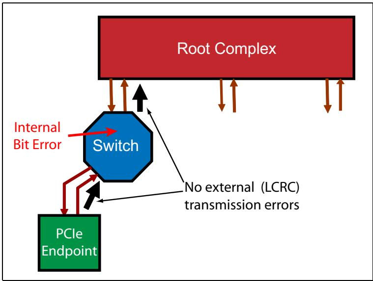

## 15.5.2 Error Checks by Layer | 15.5.2 按层级划分的错误检查

<table style="border-collapse:collapse; width:100%;">
  <thead style="border:2px solid #000;">
    <tr>
      <th width="50%" style="border:2px solid #000; background:#f5f5f5;">EN</th>
      <th width="50%" style="border:2px solid #000; background-color:#e8e8e8;">中文</th>
    </tr>
  </thead>
  <tbody>
    <tr><td width="50%" style="border:2px solid #000; background:#fff;padding:4px 8px;">Different aspects of an incoming packet are checked in the different layers at the Receiver. Some error checking is listed as optional. For those cases, if the error occurs but the designer has chosen not to implement that form of checking, it will not be detected.</td><td width="50%" style="border:2px solid #000; background-color:#e8e8e8;padding:4px 8px;">接收端的不同层会对入站数据包的各个方面进行检查。部分错误检查被列为可选。对于这些情况，如果错误发生但设计者选择未实现该检查形式，则错误将不会被检测到。</td></tr>
  </tbody>
</table>

## 15.5.2.2 Physical Layer Errors | 15.5.2.2 物理层错误

<table style="border-collapse:collapse; width:100%;">
  <thead style="border:2px solid #000;">
    <tr>
      <th width="50%" style="border:2px solid #000; background:#f5f5f5;">EN</th>
      <th width="50%" style="border:2px solid #000; background-color:#e8e8e8;">中文</th>
    </tr>
  </thead>
  <tbody>
    <tr><td width="50%" style="border:2px solid #000; background:#fff;padding:4px 8px;">A packet arriving at the Receiver arrives at the Physical Layer first. There are a few things that must be checked at this level and others that may optionally be checked. Link training also takes place at this layer, and a variety of problems may arise during that process but those and other details of the Physical Layer are covered in Chapter 14, entitled "Link Initialization & Training," on page 505. In summary, though, Physical Layer errors, also called Receiver Errors or Link Errors, include the following cases:</td><td width="50%" style="border:2px solid #000; background-color:#e8e8e8;padding:4px 8px;">到达接收端的数据包首先进入物理层。在该层有一些项目必须检查，另一些项目则可以（可选）检查。链路训练也在该层进行，在此过程中可能出现各种问题，但这些内容以及物理层的其他细节将在第14章"链路初始化和训练"（第505页）中介绍。总而言之，物理层错误（也称为接收端错误或链路错误）包括以下情况：</td></tr>
    <tr><td width="50%" style="border:2px solid #000; background:#fff;padding:4px 8px;">• When using 8b/10b, checking for decode violations (checking required)</td><td width="50%" style="border:2px solid #000; background-color:#e8e8e8;padding:4px 8px;">• 使用8b/10b时，检查解码违规（必须检查）</td></tr>
    <tr><td width="50%" style="border:2px solid #000; background:#fff;padding:4px 8px;">• Framing violations (optional for 8b/10b, required for 128b/130b)</td><td width="50%" style="border:2px solid #000; background-color:#e8e8e8;padding:4px 8px;">• 组帧违规（8b/10b为可选，128b/130b为必须）</td></tr>
    <tr><td width="50%" style="border:2px solid #000; background:#fff;padding:4px 8px;">• Elastic buffer errors (checking optional)</td><td width="50%" style="border:2px solid #000; background-color:#e8e8e8;padding:4px 8px;">• 弹性缓冲错误（可选检查）</td></tr>
    <tr><td width="50%" style="border:2px solid #000; background:#fff;padding:4px 8px;">• Loss of symbol lock or Lane deskew (checking optional)</td><td width="50%" style="border:2px solid #000; background-color:#e8e8e8;padding:4px 8px;">• 符号锁丢失或通道去偏移（可选检查）</td></tr>
    <tr><td width="50%" style="border:2px solid #000; background:#fff;padding:4px 8px;">If a TLP was in progress when a Receiver Error was detected, it is discarded. To resolve the error, the Data Link Layer is signaled to send a NAK if one isn't already pending.</td><td width="50%" style="border:2px solid #000; background-color:#e8e8e8;padding:4px 8px;">如果在检测到接收端错误时有一个TLP正在传输中，则该TLP将被丢弃。为解决该错误，数据链路层会被通知发送一个NAK（如果尚无待处理的NAK）。</td></tr>
  </tbody>
</table>

## 15.5.2.3 Data Link Layer Errors | 15.5.2.3 数据链路层错误

<table style="border-collapse:collapse; width:100%;">
  <thead style="border:2px solid #000;">
    <tr>
      <th width="50%" style="border:2px solid #000; background:#f5f5f5;">EN</th>
      <th width="50%" style="border:2px solid #000; background-color:#e8e8e8;">中文</th>
    </tr>
  </thead>
  <tbody>
    <tr><td width="50%" style="border:2px solid #000; background:#fff;padding:4px 8px;">After the Physical Layer, incoming packets go next into the Data Link Layer, where they are checked for several possible problems. The details of these conditions can be found in Chapter 10, entitled "Ack/Nak Protocol," on page 317. In summary, the errors are:</td><td width="50%" style="border:2px solid #000; background-color:#e8e8e8;padding:4px 8px;">在物理层之后，入站数据包接下来进入数据链路层，在此处检查若干可能的问题。这些情况的详细信息请参见第317页第10章"Ack/Nak协议"。总结而言，错误包括：</td></tr>
    <tr><td width="50%" style="border:2px solid #000; background:#fff;padding:4px 8px;">• LCRC failure for TLPs</td><td width="50%" style="border:2px solid #000; background-color:#e8e8e8;padding:4px 8px;">• TLP的LCRC失败</td></tr>
    <tr><td width="50%" style="border:2px solid #000; background:#fff;padding:4px 8px;">• Sequence Number violation for TLPs</td><td width="50%" style="border:2px solid #000; background-color:#e8e8e8;padding:4px 8px;">• TLP的序列号违规</td></tr>
    <tr><td width="50%" style="border:2px solid #000; background:#fff;padding:4px 8px;">• 16-bit CRC failure for DLLPs</td><td width="50%" style="border:2px solid #000; background-color:#e8e8e8;padding:4px 8px;">• DLLP的16位CRC失败</td></tr>
    <tr><td width="50%" style="border:2px solid #000; background:#fff;padding:4px 8px;">• Link Layer Protocol errors</td><td width="50%" style="border:2px solid #000; background-color:#e8e8e8;padding:4px 8px;">• 链路层协议错误</td></tr>
    <tr><td width="50%" style="border:2px solid #000; background:#fff;padding:4px 8px;">As with the Physical Layer, if a TLP was in progress when an error is seen, the TLP is discarded and a NAK is scheduled if one isn't already pending.</td><td width="50%" style="border:2px solid #000; background-color:#e8e8e8;padding:4px 8px;">与物理层一样，若在TLP传输过程中检测到错误，则该TLP被丢弃，并且若没有尚未完成的NAK，则会调度一个NAK。</td></tr>
    <tr><td width="50%" style="border:2px solid #000; background:#fff;padding:4px 8px;">There are some Data Link Layer errors to watch for at the transmitter, too, including REPLAY_TIMER expiring and the REPLAY_NUM counter rolling over. A timeout is handled by replaying the contents of the Replay Buffer and</td><td width="50%" style="border:2px solid #000; background-color:#e8e8e8;padding:4px 8px;">在发送端也有一些数据链路层错误需要注意，包括REPLAY_TIMER超时和REPLAY_NUM计数器回绕。超时通过重放重放缓冲区的内容来处理，并且</td></tr>
  </tbody>
</table>

<table style="border-collapse:collapse; width:100%;">
  <thead style="border:2px solid #000;">
    <tr>
      <th width="50%" style="border:2px solid #000; background:#f5f5f5;">EN</th>
      <th width="50%" style="border:2px solid #000; background-color:#e8e8e8;">中文</th>
    </tr>
  </thead>
  <tbody>
    <tr><td width="50%" style="border:2px solid #000; background:#fff;padding:4px 8px;">## PCI Express Technology</td><td width="50%" style="border:2px solid #000; background-color:#e8e8e8;padding:4px 8px;">## PCI Express 技术</td></tr>
    <tr><td width="50%" style="border:2px solid #000; background:#fff;padding:4px 8px;">incrementing the REPLAY\_NUM counter. The timer and counter are reset whenever an ACK or NAK arrives at the transmitter that indicates forward progress has been made (meaning it results in clearing one or more TLPs from the Replay Buffer). But if an Ack or Nak isn't received quickly enough, the timeout condition is seen which will result in a replay.</td><td width="50%" style="border:2px solid #000; background-color:#e8e8e8;padding:4px 8px;">递增 REPLAY\_NUM 计数器。每当有表明正向进度已取得（即导致一个或多个 TLP 从重放缓冲中被清除）的 ACK 或 NAK 到达发送器时，定时器和计数器都会被复位。但如果未能足够快地收到 Ack 或 Nak，就会观察到超时条件，从而导致重放。</td></tr>
  </tbody>
</table>

<table style="border-collapse:collapse; width:100%;">
  <thead style="border:2px solid #000;">
    <tr>
      <th width="50%" style="border:2px solid #000; background:#f5f5f5;">EN</th>
      <th width="50%" style="border:2px solid #000; background-color:#e8e8e8;">中文</th>
    </tr>
  </thead>
  <tbody>
    <tr><td width="50%" style="border:2px solid #000; background:#fff;padding:4px 8px;">## Transaction Layer Errors</td><td width="50%" style="border:2px solid #000; background-color:#e8e8e8;padding:4px 8px;">## 事务层错误</td></tr>
    <tr><td width="50%" style="border:2px solid #000; background:#fff;padding:4px 8px;">Lastly, if incoming TLPs pass all the checks at the Physical and Data Link Layers, they will finally reach the Transaction Layer, where they are checked for:</td><td width="50%" style="border:2px solid #000; background-color:#e8e8e8;padding:4px 8px;">最后，如果入站 TLP 通过了物理层和数据链路层的所有检查，它们最终将到达事务层，并在该层检查以下内容：</td></tr>
    <tr><td width="50%" style="border:2px solid #000; background:#fff;padding:4px 8px;">• ECRC failure (checking optional)</td><td width="50%" style="border:2px solid #000; background-color:#e8e8e8;padding:4px 8px;">• ECRC 失败（可选检查）</td></tr>
    <tr><td width="50%" style="border:2px solid #000; background:#fff;padding:4px 8px;">• Malformed TLP (error in packet format)</td><td width="50%" style="border:2px solid #000; background-color:#e8e8e8;padding:4px 8px;">• 畸形 TLP（报文格式错误）</td></tr>
    <tr><td width="50%" style="border:2px solid #000; background:#fff;padding:4px 8px;">• Flow Control Protocol violation</td><td width="50%" style="border:2px solid #000; background-color:#e8e8e8;padding:4px 8px;">• 流控协议违规</td></tr>
    <tr><td width="50%" style="border:2px solid #000; background:#fff;padding:4px 8px;">• Unsupported Requests</td><td width="50%" style="border:2px solid #000; background-color:#e8e8e8;padding:4px 8px;">• 不支持的请求</td></tr>
    <tr><td width="50%" style="border:2px solid #000; background:#fff;padding:4px 8px;">• Data Corruption (poisoned packet)</td><td width="50%" style="border:2px solid #000; background-color:#e8e8e8;padding:4px 8px;">• 数据损坏（中毒报文）</td></tr>
    <tr><td width="50%" style="border:2px solid #000; background:#fff;padding:4px 8px;">• Completer Abort (checking optional)</td><td width="50%" style="border:2px solid #000; background-color:#e8e8e8;padding:4px 8px;">• 完成者中止（可选检查）</td></tr>
    <tr><td width="50%" style="border:2px solid #000; background:#fff;padding:4px 8px;">• Receiver Overflow (checking optional)</td><td width="50%" style="border:2px solid #000; background-color:#e8e8e8;padding:4px 8px;">• 接收者溢出（可选检查）</td></tr>
    <tr><td width="50%" style="border:2px solid #000; background:#fff;padding:4px 8px;">As with the Data Link Layer, there are some error checks at the transmitter Transaction Layer, too, such as:</td><td width="50%" style="border:2px solid #000; background-color:#e8e8e8;padding:4px 8px;">与数据链路层类似，发送端事务层也有若干错误检查，例如：</td></tr>
    <tr><td width="50%" style="border:2px solid #000; background:#fff;padding:4px 8px;">• Completion Timeouts</td><td width="50%" style="border:2px solid #000; background-color:#e8e8e8;padding:4px 8px;">• 完成报文超时</td></tr>
    <tr><td width="50%" style="border:2px solid #000; background:#fff;padding:4px 8px;">• Unexpected Completion (Completion does not match pending Request)</td><td width="50%" style="border:2px solid #000; background-color:#e8e8e8;padding:4px 8px;">• 意外完成（完成报文与挂起的请求不匹配）</td></tr>
  </tbody>
</table>

## 15.6 Error Pollution | 15.6 错误传播

<table style="border-collapse:collapse; width:100%;">
  <thead style="border:2px solid #000;">
    <tr>
      <th width="50%" style="border:2px solid #000; background:#f5f5f5;">EN</th>
      <th width="50%" style="border:2px solid #000; background-color:#e8e8e8;">中文</th>
    </tr>
  </thead>
  <tbody>
    <tr><td width="50%" style="border:2px solid #000; background:#fff;padding:4px 8px;">A problem can arise if a device sees several problems for the same transaction. This could result in several errors getting reported (referred to as "Error Pollution"). To avoid this, reported errors are limited to only the most significant one. For example, if a TLP has a Receiver Error at the Physical Layer, it would certainly be found to have errors at the Data Link Layer and Transaction Layers, too, but reporting them all would just add confusion. What is most relevant is reporting the first error that was seen. Consequently, if an error is seen in the Physical Layer, there's no reason to forward the packet to the higher layers. Similarly, if an error is seen in the Data Link Layer, then the packet won't be forwarded to the Transaction Layer. Offending packets at one level are not forwarded to the next level but are dropped.</td><td width="50%" style="border:2px solid #000; background-color:#e8e8e8;padding:4px 8px;">如果一个设备对同一事务看到多个问题，则可能产生问题。这可能导致报告多个错误（称为"错误污染"）。为避免此情况，报告的错误仅限于最重要的一个。例如，如果一个TLP在物理层存在接收器错误，那么它在数据链路层和事务层也肯定会被发现存在错误，但报告所有错误只会增加混乱。最相关的是报告第一个被发现的错误。因此，如果物理层发现错误，则没有理由将数据包转发到更高层。类似地，如果数据链路层发现错误，则数据包不会被转发到事务层。某一层的有问题数据包不会被转发到下一层，而是被丢弃。</td></tr>
    <tr><td width="50%" style="border:2px solid #000; background:#fff;padding:4px 8px;">Still, multiple errors may be seen for the same packet at the Transaction Layer. Only the most significant one should be reported in the order of priority as defined by the spec. Transaction Layer error priority from highest to lowest is:</td><td width="50%" style="border:2px solid #000; background-color:#e8e8e8;padding:4px 8px;">尽管如此，在事务层仍可能对同一数据包看到多个错误。应按规范定义的优先级顺序仅报告最重要的一个。事务层错误优先级从高到低为：</td></tr>
    <tr><td width="50%" style="border:2px solid #000; background:#fff;padding:4px 8px;">• Uncorrectable Internal Error</td><td width="50%" style="border:2px solid #000; background-color:#e8e8e8;padding:4px 8px;">• 不可纠正内部错误</td></tr>
    <tr><td width="50%" style="border:2px solid #000; background:#fff;padding:4px 8px;">• Receiver Buffer Overflow</td><td width="50%" style="border:2px solid #000; background-color:#e8e8e8;padding:4px 8px;">• 接收器缓冲区溢出</td></tr>
    <tr><td width="50%" style="border:2px solid #000; background:#fff;padding:4px 8px;">• Flow Control Protocol Error</td><td width="50%" style="border:2px solid #000; background-color:#e8e8e8;padding:4px 8px;">• 流控协议错误</td></tr>
    <tr><td width="50%" style="border:2px solid #000; background:#fff;padding:4px 8px;">• ECRC Check Failed</td><td width="50%" style="border:2px solid #000; background-color:#e8e8e8;padding:4px 8px;">• ECRC检查失败</td></tr>
    <tr><td width="50%" style="border:2px solid #000; background:#fff;padding:4px 8px;">• Malformed TLP</td><td width="50%" style="border:2px solid #000; background-color:#e8e8e8;padding:4px 8px;">• 格式错误TLP</td></tr>
    <tr><td width="50%" style="border:2px solid #000; background:#fff;padding:4px 8px;">• AtomicOp Egress Blocked</td><td width="50%" style="border:2px solid #000; background-color:#e8e8e8;padding:4px 8px;">• AtomicOp出口被阻塞</td></tr>
    <tr><td width="50%" style="border:2px solid #000; background:#fff;padding:4px 8px;">• TLP Prefix Blocked</td><td width="50%" style="border:2px solid #000; background-color:#e8e8e8;padding:4px 8px;">• TLP前缀被阻塞</td></tr>
    <tr><td width="50%" style="border:2px solid #000; background:#fff;padding:4px 8px;">• ACS (Access Control Services) Violation</td><td width="50%" style="border:2px solid #000; background-color:#e8e8e8;padding:4px 8px;">• ACS（访问控制服务）违例</td></tr>
    <tr><td width="50%" style="border:2px solid #000; background:#fff;padding:4px 8px;">• MC (Multi‑cast) Blocked TLP</td><td width="50%" style="border:2px solid #000; background-color:#e8e8e8;padding:4px 8px;">• MC（多播）阻塞TLP</td></tr>
    <tr><td width="50%" style="border:2px solid #000; background:#fff;padding:4px 8px;">• UR (Unsupported Request), CA (Completer Abort), or Unexpected Completion</td><td width="50%" style="border:2px solid #000; background-color:#e8e8e8;padding:4px 8px;">• UR（不支持请求）、CA（完成者中止）或意外完成</td></tr>
    <tr><td width="50%" style="border:2px solid #000; background:#fff;padding:4px 8px;">• Poisoned TLP Received</td><td width="50%" style="border:2px solid #000; background-color:#e8e8e8;padding:4px 8px;">• 接收中毒TLP</td></tr>
    <tr><td width="50%" style="border:2px solid #000; background:#fff;padding:4px 8px;">As an example, a TLP might experience an ECRC fault caused by a corrupted header. Since something was corrupted within the packet, it might also be seen as Malformed or possibly as an Unsupported Request. The ECRC fault is the highest priority, since it means that the header contents may have been corrupted, and due to this, there is no point in reporting errors that depend on those contents.</td><td width="50%" style="border:2px solid #000; background-color:#e8e8e8;padding:4px 8px;">例如，一个TLP可能遇到由损坏的头部引起的ECRC错误。由于数据包内某些内容已损坏，它也可能被视为格式错误或可能被视为不支持请求。ECRC错误具有最高优先级，因为它意味着头部内容可能已损坏，因此报告依赖于这些内容的错误没有意义。</td></tr>
  </tbody>
</table>

## 15.7 Sources of PCI Express Errors | 15.7 PCI Express 错误源

<table style="border-collapse:collapse; width:100%;">
  <thead style="border:2px solid #000;">
    <tr>
      <th width="50%" style="border:2px solid #000; background:#f5f5f5;">EN</th>
      <th width="50%" style="border:2px solid #000; background-color:#e8e8e8;">中文</th>
    </tr>
  </thead>
  <tbody>
    <tr><td width="50%" style="border:2px solid #000; background:#fff;padding:4px 8px;">Rather than consider all of the error conditions individually, it will be helpful to group them into common areas.</td><td width="50%" style="border:2px solid #000; background-color:#e8e8e8;padding:4px 8px;">与其逐一考虑所有错误条件，不如将它们归为常见类别更为有益。</td></tr>
  </tbody>
</table>

## 15.7.1 ECRC Generation and Checking | 15.7.1 ECRC 生成和校验

<table style="border-collapse:collapse; width:100%;">
  <thead style="border:2px solid #000;">
    <tr>
      <th width="50%" style="border:2px solid #000; background:#f5f5f5;">EN</th>
      <th width="50%" style="border:2px solid #000; background-color:#e8e8e8;">中文</th>
    </tr>
  </thead>
  <tbody>
    <tr><td width="50%" style="border:2px solid #000; background:#fff;padding:4px 8px;">As mentioned earlier, ECRC generation and checking requires the optional Advanced Error Reporting configuration register structure to be present, as shown in Figure 15-4 on page 658. Configuration software checks for this capability register to determine whether ECRCs are supported in a Function. If it is, a write to the Error Capability and Control register can be used to enable it.</td><td width="50%" style="border:2px solid #000; background-color:#e8e8e8;padding:4px 8px;">如前所述，ECRC生成和校验需要可选的进阶错误报告配置寄存器结构存在，如图15-4第658页所示。配置软件检查该能力寄存器以确定某个功能是否支持ECRC。如果支持，可通过写入错误能力和控制寄存器来启用它。</td></tr>
  </tbody>
</table>

**Figure 15-4: Location of Error-Related Configuration Registers**

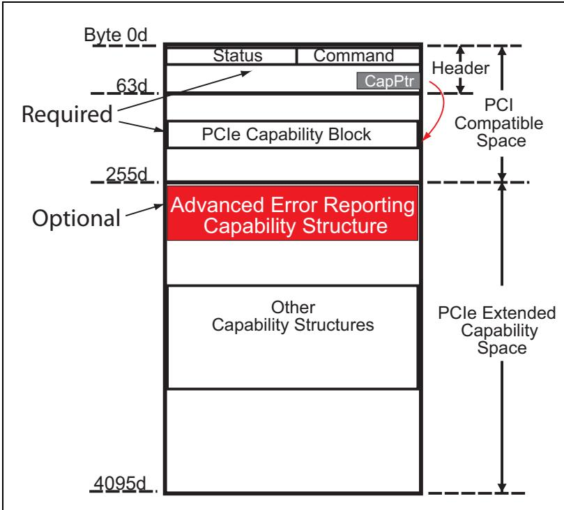

<table style="border-collapse:collapse; width:100%;">
  <thead style="border:2px solid #000;">
    <tr>
      <th width="50%" style="border:2px solid #000; background:#f5f5f5;">EN</th>
      <th width="50%" style="border:2px solid #000; background-color:#e8e8e8;">中文</th>
    </tr>
  </thead>
  <tbody>
    <tr><td width="50%" style="border:2px solid #000; background:#fff;padding:4px 8px;">A device enabled to generate ECRCs originates a TLP (Request or Completion), computes the 32-bit ECRC based on the header and data portions of the packet and adds it to the end of the packet. The ECRC is called "end-to-end" because the intent is that it will be generated at the TLP's origin and never stripped off or regenerated by any intermediate device along its path. Switches in the path between the originating and receiving devices are allowed to check and report ECRC errors but aren't required to do so. Whether or not there is an error, a Switch must still forward the packet unaltered so that the ultimate target device can evaluate the ECRC and take appropriate steps. If a Switch is acting as the originator or recipient of the TLP it can participate like an ordinary device in ECRC generation and checking. For more on the topic of how a Switch is allowed to report such errors, see "Advisory Non-Fatal Errors" on page 670.</td><td width="50%" style="border:2px solid #000; background-color:#e8e8e8;padding:4px 8px;">启用ECRC生成的设备发起一个TLP（请求或完成报文），基于报文头部和数据部分计算32位ECRC，并将其附加到报文末尾。ECRC被称为"端到端"CRC，因为其意图是在TLP的源端生成，并且沿途的任何中间设备都不会剥离或重新生成它。位于源设备和接收设备路径之间的交换机可以检查并报告ECRC错误，但并非必须如此。无论是否有错误，交换机必须保持报文不变地转发，以便最终目标设备能够评估ECRC并采取适当措施。如果交换机充当TLP的发起方或接收方，它可以像普通设备一样参与ECRC生成和校验。有关交换机如何报告此类错误的更多信息，请参见第670页的"建议性非致命错误"。</td></tr>
  </tbody>
</table>

## 15.7.1.1 TLP Digest | 15.7.1.1 TLP 摘要

<table style="border-collapse:collapse; width:100%;">
  <thead style="border:2px solid #000;">
    <tr>
      <th width="50%" style="border:2px solid #000; background:#f5f5f5;">EN</th>
      <th width="50%" style="border:2px solid #000; background-color:#e8e8e8;">中文</th>
    </tr>
  </thead>
  <tbody>
    <tr><td width="50%" style="border:2px solid #000; background:#fff;padding:4px 8px;">If the optional ECRC capability is enabled, a special bit called TD (TLP Digest) is set in the header to indicate that it's present at the end of the packet (the ECRC is also called the Digest). The TD bit in the packet header is shown in Figure 15-5 on page 659. The spec emphasizes that this bit must be treated with special care when forwarding a TLP because if it's missing but the ECRC is present, or vice-versa, then the packet will be considered Malformed.</td><td width="50%" style="border:2px solid #000; background-color:#e8e8e8;padding:4px 8px;">如果启用了可选的 ECRC 能力，则在报头中设置一个称为 TD（TLP 摘要）的特殊位，以指示其在数据包尾部存在（ECRC 也称为摘要）。数据包报头中的 TD 位如图 15-5（第 659 页）所示。规范强调，在转发 TLP 时必须特别小心处理该位，因为如果该位缺失但 ECRC 存在，或者反之，则数据包将被视为畸形数据包。</td></tr>
  </tbody>
</table>

Figure 15-5: TLP Digest Bit in a Completion Header | 图15-5：完成头中的TLP摘要位

<table style="border-collapse:collapse;width:100%"><tr><td rowspan="2" style="border:2px solid #000;"></td><td colspan="2" style="border:2px solid #000;">+0</td><td colspan="5" style="border:2px solid #000;">+1</td><td colspan="4" style="border:2px solid #000;">+2</td><td colspan="2" style="border:2px solid #000;">+3</td></tr><tr><td style="border:2px solid #000;">7</td><td style="border:2px solid #000;">6</td><td style="border:2px solid #000;">5</td><td style="border:2px solid #000;">4</td><td style="border:2px solid #000;">3</td><td style="border:2px solid #000;">2</td><td style="border:2px solid #000;">1</td><td style="border:2px solid #000;">0</td><td style="border:2px solid #000;">7</td><td style="border:2px solid #000;">6</td><td style="border:2px solid #000;">5</td><td style="border:2px solid #000;">4</td><td style="border:2px solid #000;">3</td></tr><tr><td style="border:2px solid #000;">Byte 0</td><td style="border:2px solid #000;">Fmt</td><td style="border:2px solid #000;">Type</td><td style="border:2px solid #000;">R</td><td style="border:2px solid #000;">TC</td><td style="border:2px solid #000;">R</td><td style="border:2px solid #000;">Attr</td><td style="border:2px solid #000;">R</td><td style="border:2px solid #000;">THD</td><td style="border:2px solid #000;">EDP</td><td style="border:2px solid #000;">Attr</td><td style="border:2px solid #000;">AT</td><td colspan="2" style="border:2px solid #000;">Length</td></tr><tr><td style="border:2px solid #000;">Byte 4</td><td colspan="13" style="border:2px solid #000;">Bytes 4-7 Vary with Type Field</td></tr><tr><td style="border:2px solid #000;">Byte 8</td><td colspan="13" style="border:2px solid #000;">Bytes 8-11 Vary with Type Field</td></tr><tr><td style="border:2px solid #000;">Byte 12</td><td colspan="13" style="border:2px solid #000;">Bytes 12-15 Vary with Type Field</td></tr></table>

## 15.7.1.2 Variant Bits Not Included in ECRC Mechanism | 15.7.1.2 ECRC 机制中不包含的变体比特

<table style="border-collapse:collapse;width:100%">
  <thead style="border:2px solid #000;">
    <tr>
      <th width="50%" style="border:2px solid #000;background:#f5f5f5;padding:4px 8px;">EN</th>
      <th width="50%" style="border:2px solid #000;background-color:#e8e8e8;padding:4px 8px;">中文</th>
    </tr>
  </thead>
  <tbody>
      <tr><td width="50%" style="border:2px solid #000;background:#fff;padding:4px 8px;">The ECRC is calculated based on the contents of the header and data. Since these are not expected to change, the result should be the same when the check is performed at the receiver. However, it turns out that two header bits can legally change while the packet is in flight: bit 0 of the Type field, and the EP bit. Bit 0 of the Type field can change in Configuration Requests for the simple reason that the Request will be Type 1 until it has reached its destination bus, and then it will become Type 0. That involves changing bit 0 of the Type field. The EP bit can also be legally changed by intermediate devices if they detect a data error. For example, if a Switch forwards a TLP but it suffers an internal error of some kind that corrupts the data, setting the EP bit as it goes out the Egress Port is one way to report the error (known as error forwarding or data poisoning).</td><td width="50%" style="border:2px solid #000;background-color:#e8e8e8;padding:4px 8px;">ECRC 基于头部和数据的内容进行计算。由于这些内容预期不会改变，因此在接收端执行校验时结果应该相同。然而，有两个头部比特在报文传输过程中可以合法更改：Type 字段的 bit 0 和 EP 比特。Type 字段的 bit 0 可以在配置请求中更改，原因很简单：在请求到达其目标总线之前为 Type 1，到达后将变为 Type 0。这涉及更改 Type 字段的 bit 0。如果中间设备检测到数据错误，EP 比特也可以被合法更改。例如，如果交换机转发一个 TLP 但遇到某种内部错误导致数据损坏，在从出口端口发出时设置 EP 比特是报告该错误的一种方式（称为错误转发或数据中毒）。</td></tr>
      <tr><td width="50%" style="border:2px solid #000;background:#fff;padding:4px 8px;">Since these two bits can change while the packet is in flight they are called "variant bits" and cannot be used in the generation or checking of ECRC. Instead, their values are always assumed to be 1b for ECRC generation and checking instead of using the actual values. That way the ECRC doesn't depend on them and will be correctly evaluated.</td><td width="50%" style="border:2px solid #000;background-color:#e8e8e8;padding:4px 8px;">由于这两个比特在报文传输过程中可能改变，它们被称为"变体比特"，不能用于 ECRC 的生成或校验。相反，在 ECRC 生成和校验时，始终假定它们的值为 1b，而不使用实际值。这样 ECRC 就不依赖于它们，从而能被正确计算。</td></tr>
  </tbody>
</table>

<table style="border-collapse:collapse;width:100%">
  <thead style="border:2px solid #000;">
    <tr>
      <th width="50%" style="border:2px solid #000;background:#f5f5f5;padding:4px 8px;">EN</th>
      <th width="50%" style="border:2px solid #000;background-color:#e8e8e8;padding:4px 8px;">中文</th>
    </tr>
  </thead>
  <tbody>
      <tr><td width="50%" style="border:2px solid #000;background:#fff;padding:4px 8px;">## PCI Express Technology</td><td width="50%" style="border:2px solid #000;background-color:#e8e8e8;padding:4px 8px;">## PCI Express 技术</td></tr>
      <tr><td width="50%" style="border:2px solid #000;background:#fff;padding:4px 8px;">The actions taken when an ECRC error is detected are beyond the scope of the spec, but the possible choices will depend on whether the error is found in a Request or a Completion.</td><td width="50%" style="border:2px solid #000;background-color:#e8e8e8;padding:4px 8px;">检测到 ECRC 错误时所采取的动作超出了规范的范围，但可能的选择将取决于错误是在请求中还是在完成报文中发现。</td></tr>
      <tr><td width="50%" style="border:2px solid #000;background:#fff;padding:4px 8px;">ECRC in Request — Completers that detect an ECRC error must set the ECRC error status bit. They may also choose not to return a Completion for this Request, resulting in a Completion timeout at the Requester, whose software might then choose to reschedule the Request.</td><td width="50%" style="border:2px solid #000;background-color:#e8e8e8;padding:4px 8px;">请求中的 ECRC — 检测到 ECRC 错误的完成者必须设置 ECRC 错误状态位。它们也可以选择不为此请求返回完成报文，导致请求者处发生完成超时，请求者的软件随后可能会选择重新调度该请求。</td></tr>
      <tr><td width="50%" style="border:2px solid #000;background:#fff;padding:4px 8px;">ECRC in Completion — Requesters that detect an ECRC error must set the ECRC error status bit. Besides the standard error reporting mechanism, they may also choose to report the error to their device driver with a Function-specific interrupt. As before, the software might decide to reschedule the failed Request.</td><td width="50%" style="border:2px solid #000;background-color:#e8e8e8;padding:4px 8px;">完成报文中的 ECRC — 检测到 ECRC 错误的请求者必须设置 ECRC 错误状态位。除了标准错误报告机制外，它们也可以选择通过功能特定中断向设备驱动程序报告该错误。如前所述，软件可能会决定重新调度失败的请求。</td></tr>
      <tr><td width="50%" style="border:2px solid #000;background:#fff;padding:4px 8px;">In either case, an Uncorrectable Non-fatal error Message may be sent to the system. If so, the device driver would probably be accessed to check the status bits in the Uncorrectable Error Status Register and learn the nature of the error. If possible, the failed Request may be rescheduled, but other steps might be needed.</td><td width="50%" style="border:2px solid #000;background-color:#e8e8e8;padding:4px 8px;">无论哪种情况，都可能会向系统发送不可纠正非致命错误消息。如果是这样，可能会访问设备驱动程序以检查不可纠正错误状态寄存器中的状态位，了解错误的性质。如果可能，失败的请求可以重新调度，但可能还需要其他步骤。</td></tr>
  </tbody>
</table>

## 15.7.2 Data Poisoning | 15.7.2 数据毒化

<table style="border-collapse:collapse; width:100%;">
  <thead style="border:2px solid #000;">
    <tr>
      <th width="50%" style="border:2px solid #000; background:#f5f5f5;">EN</th>
      <th width="50%" style="border:2px solid #000; background-color:#e8e8e8;">中文</th>
    </tr>
  </thead>
  <tbody>
    <tr><td width="50%" style="border:2px solid #000; background:#fff;padding:4px 8px;">Data poisoning, also called Error Forwarding, provides an optional way for a device to indicate that the data associated with a TLP is corrupted. In these cases, the EP (Error Poisoned) bit in the packet header is set to indicate the error. The EP bit is shown in Figure 15-6 on page 660.</td><td width="50%" style="border:2px solid #000; background-color:#e8e8e8;padding:4px 8px;">数据毒化（也称为错误转发）为设备提供了一种可选方式，用于指示与TLP相关的数据已损坏。在这些情况下，包头中的EP（错误毒化）位被置位以指示错误。EP位如第660页图15-6所示。</td></tr>
  </tbody>
</table>

Figure 15-6: The Error/Poisoned Bit in a Completion Header | 图15-6：完成头中的错误/毒化位

<table style="border-collapse:collapse;width:100%"><tr><td rowspan="2" style="border:2px solid #000;"></td><td colspan="2" style="border:2px solid #000;">+0</td><td colspan="6" style="border:2px solid #000;">+1</td><td colspan="6" style="border:2px solid #000;">+2</td><td colspan="2" style="border:2px solid #000;">+3</td></tr><tr><td style="border:2px solid #000;">7</td><td style="border:2px solid #000;">6</td><td style="border:2px solid #000;">5</td><td style="border:2px solid #000;">4</td><td style="border:2px solid #000;">3</td><td style="border:2px solid #000;">2</td><td style="border:2px solid #000;">1</td><td style="border:2px solid #000;">0</td><td style="border:2px solid #000;">7</td><td style="border:2px solid #000;">6</td><td style="border:2px solid #000;">5</td><td style="border:2px solid #000;">4</td><td style="border:2px solid #000;">3</td><td style="border:2px solid #000;">2</td><td style="border:2px solid #000;">1</td><td style="border:2px solid #000;">0</td></tr><tr><td style="border:2px solid #000;">Byte 0</td><td style="border:2px solid #000;">Fmt</td><td style="border:2px solid #000;">Type</td><td style="border:2px solid #000;">R</td><td style="border:2px solid #000;">TC</td><td style="border:2px solid #000;">R</td><td style="border:2px solid #000;">Attr</td><td style="border:2px solid #000;">R</td><td style="border:2px solid #000;">TH</td><td style="border:2px solid #000;">TDP</td><td style="border:2px solid #000;">Attr</td><td style="border:2px solid #000;">AT</td><td colspan="5" style="border:2px solid #000;">Length</td></tr><tr><td style="border:2px solid #000;">Byte 4</td><td colspan="16" style="border:2px solid #000;">Bytes 4-7 Vary with Type Field</td></tr><tr><td style="border:2px solid #000;">Byte 8</td><td colspan="16" style="border:2px solid #000;">Bytes 8-11 Vary with Type Field</td></tr><tr><td style="border:2px solid #000;">Byte 12</td><td colspan="16" style="border:2px solid #000;">Bytes 12-15 Vary with Type Field</td></tr></table>

<table style="border-collapse:collapse; width:100%;">
  <thead style="border:2px solid #000;">
    <tr>
      <th width="50%" style="border:2px solid #000; background:#f5f5f5;">EN</th>
      <th width="50%" style="border:2px solid #000; background-color:#e8e8e8;">中文</th>
    </tr>
  </thead>
  <tbody>
    <tr><td width="50%" style="border:2px solid #000; background:#fff;padding:4px 8px;">Anytime data is transferred, such as in write Requests or Completions with data, corruption of that data could happen which needs to be reported to the target device. In each of these cases, the packet can be forwarded to the recipient but marked as having bad data by the EP bit in the header. The thoughtful reader may wonder why one might want to send data that is already known to be bad. As it happens, there are some cases where it's useful:</td><td width="50%" style="border:2px solid #000; background-color:#e8e8e8;padding:4px 8px;">每当传输数据时，例如在写请求或带数据的完成报文中，数据可能会发生损坏，这需要向目标设备报告。在这些情况下，报文可以转发给接收者，但通过头部的EP位标记为包含错误数据。细心的读者可能会问，为什么有人想要发送已知已损坏的数据。事实上，在某些情况下这是有用的：</td></tr>
    <tr><td width="50%" style="border:2px solid #000; background:#fff;padding:4px 8px;">**1.** If a Request results in a Completion returned with data, but that data encountered an error as it was gathered from the target (like a parity or ECC failure in memory), then what is the best way to report it? One approach would be not to send the Completion at all but, if the error isn't reported in some other way, the system only sees a Completion timeout at the Requester. That response isn't very helpful because any number of problems might result in that outcome.</td><td width="50%" style="border:2px solid #000; background-color:#e8e8e8;padding:4px 8px;">**1.** 如果一个请求导致返回带数据的完成报文，但该数据在从目标收集时遇到错误（例如存储器中的奇偶校验或ECC错误），那么最佳报告方式是什么？一种方法是根本不发送完成报文，但如果没有通过其他方式报告错误，系统在请求者处只能看到完成超时。这种响应没有太大帮助，因为多种问题都可能导致该结果。</td></tr>
    <tr><td width="50%" style="border:2px solid #000; background:#fff;padding:4px 8px;">If, on the other hand, the Completion is delivered with the poisoned bit set, then at least the Requester can see that the round-trip path to the Completer must have been working correctly. Therefore, the problem must have occurred internally to the Completer or else in a Switch that was in the path. What steps will be taken will be implementation specific, but more is known about what must have gone wrong than if the Completion simply timed out.</td><td width="50%" style="border:2px solid #000; background-color:#e8e8e8;padding:4px 8px;">另一方面，如果完成报文被送达时毒化位已置位，那么至少请求者可以看到到完成者的往返路径必定是正常工作的。因此，问题一定发生在完成者内部或路径中的交换机内。将采取什么步骤取决于具体实现，但与完成报文仅超时相比，可以了解到更多关于出错原因的信息。</td></tr>
    <tr><td width="50%" style="border:2px solid #000; background:#fff;padding:4px 8px;">**2.** It can be used to report an intermediate problem. If a data payload is corrupted while passing through a Switch, the packet can still be forwarded with the EP bit set to indicate the problem.</td><td width="50%" style="border:2px solid #000; background-color:#e8e8e8;padding:4px 8px;">**2.** 它可以用于报告中间问题。如果数据有效负载在通过交换机时损坏，报文仍可转发，同时EP位置位以指示该问题。</td></tr>
    <tr><td width="50%" style="border:2px solid #000; background:#fff;padding:4px 8px;">**3.** It may be that the target device can accept the data with errors. As an example, an audio output device needs to receive a timely data stream to work well. If incoming data has an error, the consequences are small (glitch in the audio output) and the time to recover would be long enough to cause a noticeable delay, so it can be better to take it as is rather than attempting recovery of the data.</td><td width="50%" style="border:2px solid #000; background-color:#e8e8e8;padding:4px 8px;">**3.** 目标设备可能可以接收含错误的数据。例如，音频输出设备需要及时接收数据流才能正常工作。如果输入数据有错误，后果很小（音频输出中出现短暂干扰），而恢复所需的时间足以导致明显的延迟，因此直接接收数据可能比尝试恢复更好。</td></tr>
    <tr><td width="50%" style="border:2px solid #000; background:#fff;padding:4px 8px;">**4.** A target device might have a means of correcting the data. The data might be directly recoverable, or the target might have a means of re-creating parts of it, or have some other means of working around the problem.</td><td width="50%" style="border:2px solid #000; background-color:#e8e8e8;padding:4px 8px;">**4.** 目标设备可能具有纠正数据的方法。数据可能可以直接恢复，或者目标可能具有重新创建部分数据的方法，或具有其他绕过该问题的方法。</td></tr>
    <tr><td width="50%" style="border:2px solid #000; background:#fff;padding:4px 8px;">The spec states that data poisoning applies only to the data payload associated with a packet (such as Memory, Configuration, or I/O writes and Completions) and never to the contents of the TLP header. Consequently, a receiver's behavior is undefined if it sees a poisoned packet (EP=1) with no payload (like a poisoned memory read). Poisoning can only be done at the Transaction Layer of a device; the Data Link Layer does not examine or affect the contents of the TLP header.</td><td width="50%" style="border:2px solid #000; background-color:#e8e8e8;padding:4px 8px;">规范规定，数据毒化仅适用于与报文相关的数据有效负载（例如存储器、配置或I/O写请求和完成报文），绝不适用于TLP头部的内容。因此，如果接收者看到没有有效负载的毒化报文（EP=1）（例如毒化的存储器读请求），其行为是未定义的。毒化只能在设备的事务层进行；数据链路层不检查也不影响TLP头部的内容。</td></tr>
    <tr><td width="50%" style="border:2px solid #000; background:#fff;padding:4px 8px;">Error forwarding support is stated to be optional for transmitters, and the absence of such a statement for receivers implies that it's not optional for them.</td><td width="50%" style="border:2px solid #000; background-color:#e8e8e8;padding:4px 8px;">错误转发支持对发送端来说被声明为可选的，而对于接收端没有此类声明，这意味着对它们来说不是可选的。</td></tr>
  </tbody>
</table>

---

# Part part05 — `mindshare_part05_p0721-0900`

<table style="border-collapse:collapse; width:100%;">
  <thead style="border:2px solid #000;">
    <tr>
      <th width="50%" style="border:2px solid #000; background:#f5f5f5;">EN</th>
      <th width="50%" style="border:2px solid #000; background-color:#e8e8e8;">中文</th>
    </tr>
  </thead>
  <tbody>
    <tr><td width="50%" style="border:2px solid #000; background:#fff;padding:4px 8px;">If a transmitter supports it, it's enabled with the Parity Error Response bit in the legacy Command register. That's because a Poisoned packet is roughly analogous to a parity error in PCI, since that's how PCI reports bad data. Receipt of a poisoned packet may be reported to the system with an error Message if enabled and, if the optional Advanced Error Reporting registers are present, will also set the Poisoned TLP status bit.</td><td width="50%" style="border:2px solid #000; background-color:#e8e8e8;padding:4px 8px;">如果发送方支持此功能，则通过传统命令寄存器(Command register)中的奇偶校验错误响应位(Parity Error Response)启用。这是因为毒化包(Poisoned packet)大致类似于PCI中的奇偶校验错误，因为PCI正是通过这种方式报告错误数据的。如果已使能，接收到毒化包可通过错误消息报告给系统，并且如果存在可选的高级错误报告(Advanced Error Reporting)寄存器，还会设置毒化TLP状态位(Poisoned TLP status bit)。</td></tr>
    <tr><td width="50%" style="border:2px solid #000; background:#fff;padding:4px 8px;">As one might expect, poisoned writes to control locations are not allowed to modify the contents in the target. Examples given in the spec are Configuration writes, IO or memory writes to control registers, and AtomicOps. Switches that receive poisoned packets must forward them unchanged to the destination port although, if they've been enabled to do so, they must report this packet as an error to help software determine where the error happened. Completers that receive a poisoned non-posted Request are expected to return a Completion with a status of UR (Unsupported Request).</td><td width="50%" style="border:2px solid #000; background-color:#e8e8e8;padding:4px 8px;">正如所料，对控制位置的毒化写操作不允许修改目标中的内容。规范中给出的示例包括配置写(Configuration writes)、对控制寄存器的IO或存储器写以及AtomicOps。接收到毒化包的交换机(Switch)必须将其原封不动地转发到目标端口，但如果已使能，它们必须将此包作为错误报告，以帮助软件确定错误发生的位置。接收到毒化非发布请求(non-posted Request)的完成者(Completer)应返回状态为UR(不支持请求)的完成报文(Completion)。</td></tr>
  </tbody>
</table>

## 15.7.3 Split Transaction Errors | 15.7.3 拆分事务错误

Figure 15‐7: Completion Status Field within the Completion Header | 图15‐7：完成头中的完成状态字段

<table style="border-collapse:collapse; width:100%;">
  <thead style="border:2px solid #000;">
    <tr>
      <th width="50%" style="border:2px solid #000; background:#f5f5f5;">EN</th>
      <th width="50%" style="border:2px solid #000; background-color:#e8e8e8;">中文</th>
    </tr>
  </thead>
  <tbody>
    <tr><td width="50%" style="border:2px solid #000; background:#fff;padding:4px 8px;">A variety of failures can occur during a split transaction associated with nonposted requests. PCIe defines a status field within the Completion header that allows the Completer to report some errors back to the Requester. Figure 15‐7 on page 662 illustrates the location of this field in a completion header and Table 15‐1 on page 663 gives the possible values. As the table shows, only four encodings are defined, two of which represent error conditions.</td><td width="50%" style="border:2px solid #000; background-color:#e8e8e8;padding:4px 8px;">在与非 posted 请求相关的拆分事务过程中可能发生多种故障。PCIe 在完成报文头部定义了一个状态字段，允许完成者将某些错误报告回请求者。第662页的图15-7展示了该字段在完成报文头部中的位置，第663页的表15-1给出了可能的取值。如表所示，仅定义了四种编码，其中两种表示错误条件。</td></tr>
  </tbody>
</table>

<table style="border-collapse:collapse;width:100%"><tr><td rowspan="2" style="border:2px solid #000;"></td><td colspan="2" style="border:2px solid #000;">+0</td><td colspan="5" style="border:2px solid #000;">+1</td><td colspan="5" style="border:2px solid #000;">+2</td><td colspan="2" style="border:2px solid #000;">+3</td></tr><tr><td style="border:2px solid #000;">7</td><td style="border:2px solid #000;">6</td><td style="border:2px solid #000;">5</td><td style="border:2px solid #000;">4</td><td style="border:2px solid #000;">3</td><td style="border:2px solid #000;">2</td><td style="border:2px solid #000;">1</td><td style="border:2px solid #000;">0</td><td style="border:2px solid #000;">7</td><td style="border:2px solid #000;">6</td><td style="border:2px solid #000;">5</td><td style="border:2px solid #000;">4</td><td style="border:2px solid #000;">3</td><td style="border:2px solid #000;">2</td></tr><tr><td style="border:2px solid #000;">Byte 0</td><td style="border:2px solid #000;">Fmt0 x 0</td><td style="border:2px solid #000;">Type0 1 0 1 0</td><td style="border:2px solid #000;">R</td><td style="border:2px solid #000;">TC</td><td style="border:2px solid #000;">R</td><td style="border:2px solid #000;">Attr</td><td style="border:2px solid #000;">R</td><td style="border:2px solid #000;">TH</td><td style="border:2px solid #000;">TE</td><td style="border:2px solid #000;">P</td><td style="border:2px solid #000;">Att</td><td style="border:2px solid #000;">AT0 0</td><td colspan="2" style="border:2px solid #000;">Length</td></tr><tr><td style="border:2px solid #000;">Byte 4</td><td colspan="11" style="border:2px solid #000;">Completer ID</td><td style="border:2px solid #000;">Compl Status</td><td colspan="2" style="border:2px solid #000;">Byte Count</td></tr><tr><td style="border:2px solid #000;">Byte 8</td><td colspan="8" style="border:2px solid #000;">Requester ID</td><td colspan="4" style="border:2px solid #000;">Tag</td><td style="border:2px solid #000;">R</td><td style="border:2px solid #000;">Lower Address</td></tr></table>

Table 15‐1: Completion Code and Description | 表15‐1：完成码和描述

<table style="border-collapse:collapse;width:100%"><tr><td style="border:2px solid #000;">Status Code</td><td style="border:2px solid #000;">Completion Status Definition</td></tr><tr><td style="border:2px solid #000;">000b</td><td style="border:2px solid #000;">Successful Completion (SC)</td></tr><tr><td style="border:2px solid #000;">001b</td><td style="border:2px solid #000;">Unsupported Request (UR) - error</td></tr><tr><td style="border:2px solid #000;">010b</td><td style="border:2px solid #000;">Configuration Request Retry Status (CRS)</td></tr><tr><td style="border:2px solid #000;">011b</td><td style="border:2px solid #000;">Completer Abort (CA) - error</td></tr><tr><td style="border:2px solid #000;">100b - 111b</td><td style="border:2px solid #000;">Reserved</td></tr></table>

## 15.7.3.1 Unsupported Request (UR) Status | 15.7.3.1 不支持请求（UR）状态

<table style="border-collapse:collapse; width:100%;">
  <thead style="border:2px solid #000;">
    <tr>
      <th width="50%" style="border:2px solid #000; background:#f5f5f5;">EN</th>
      <th width="50%" style="border:2px solid #000; background-color:#e8e8e8;">中文</th>
    </tr>
  </thead>
  <tbody>
    <tr><td width="50%" style="border:2px solid #000; background:#fff;padding:4px 8px;">If a receiver doesn't support a Request, it returns a Completion with UR status. The spec defines a number of conditions that could result in a UR status. Some examples are:</td><td width="50%" style="border:2px solid #000; background-color:#e8e8e8;padding:4px 8px;">如果接收方不支持某请求，则返回带有UR状态的完成报文。规范定义了多种可能导致UR状态的条件。示例如下：</td></tr>
    <tr><td width="50%" style="border:2px solid #000; background:#fff;padding:4px 8px;">Request type not supported (example: IO Request to native Endpoint or MRdLk to native Endpoint)</td><td width="50%" style="border:2px solid #000; background-color:#e8e8e8;padding:4px 8px;">不支持的请求类型（例如：对本机端点发起IO请求或MRdLk请求）</td></tr>
    <tr><td width="50%" style="border:2px solid #000; background:#fff;padding:4px 8px;">Message with unsupported or undefined message code</td><td width="50%" style="border:2px solid #000; background-color:#e8e8e8;padding:4px 8px;">带有不支持或未定义消息码的消息</td></tr>
    <tr><td width="50%" style="border:2px solid #000; background:#fff;padding:4px 8px;">Request does not reference address space mapped to the device</td><td width="50%" style="border:2px solid #000; background-color:#e8e8e8;padding:4px 8px;">请求未引用映射到该设备的地址空间</td></tr>
    <tr><td width="50%" style="border:2px solid #000; background:#fff;padding:4px 8px;">Request address isn't mapped within a Switch Port's address range</td><td width="50%" style="border:2px solid #000; background-color:#e8e8e8;padding:4px 8px;">请求地址未映射到交换机端口地址范围内</td></tr>
    <tr><td width="50%" style="border:2px solid #000; background:#fff;padding:4px 8px;">Poisoned write Request (EP=1) targets an I/O or Memory-mapped control space in the Completer. Such Requests must not be allowed to modify the location and are instead discarded by the Completer and reported with a Completion having a UR status.</td><td width="50%" style="border:2px solid #000; background-color:#e8e8e8;padding:4px 8px;">带毒写入请求(EP=1)目标为完成者的I/O或存储器映射控制空间。此类请求不得允许修改该位置，而是由完成者丢弃，并通过带有UR状态的完成报文报告。</td></tr>
    <tr><td width="50%" style="border:2px solid #000; background:#fff;padding:4px 8px;">A downstream Root or Switch Port receives a configuration Request targeting a device on its Secondary Bus that doesn't exist (e.g. a device with a non‑zero device number, unless ARI is enabled). The Port must terminate the Request and return a Completion with UR status because the downstream Device number is required to be zero (unless ARI, Alternative Routing‑ID Interpretation, is enabled).</td><td width="50%" style="border:2px solid #000; background-color:#e8e8e8;padding:4px 8px;">下游根或交换机端口收到目标为其二级总线上的不存在设备（例如，设备号非零的设备，除非启用ARI）的配置请求。该端口必须终止该请求并返回带有UR状态的完成报文，因为下游设备号必须为零（除非启用ARI，即备用路由ID解释）。</td></tr>
    <tr><td width="50%" style="border:2px solid #000; background:#fff;padding:4px 8px;">Type 1 configuration Request is received at an Endpoint.</td><td width="50%" style="border:2px solid #000; background-color:#e8e8e8;padding:4px 8px;">端点上收到类型1配置请求。</td></tr>
    <tr><td width="50%" style="border:2px solid #000; background:#fff;padding:4px 8px;">Completion using a reserved Completion Status field encoding must be interpreted as UR.</td><td width="50%" style="border:2px solid #000; background-color:#e8e8e8;padding:4px 8px;">使用保留的完成状态字段编码的完成报文必须被解释为UR。</td></tr>
    <tr><td width="50%" style="border:2px solid #000; background:#fff;padding:4px 8px;">A function in the D1, D2, or D3hot power management state receives a Request other than a configuration Request or Message.</td><td width="50%" style="border:2px solid #000; background-color:#e8e8e8;padding:4px 8px;">处于D1、D2或D3hot电源管理状态的功能收到除配置请求或消息外的请求。</td></tr>
    <tr><td width="50%" style="border:2px solid #000; background:#fff;padding:4px 8px;">A TLP without the No Snoop bit set in its header is routed to a port that has the Reject Snoop Transactions bit set in its VC Resource Capability register.</td><td width="50%" style="border:2px solid #000; background-color:#e8e8e8;padding:4px 8px;">头部中未设置No Snoop位的TLP被路由到其VC资源能力寄存器中设置了拒绝侦听事务位的端口。</td></tr>
  </tbody>
</table>

<table style="border-collapse:collapse; width:100%;">
  <thead style="border:2px solid #000;">
    <tr>
      <th width="50%" style="border:2px solid #000; background:#f5f5f5;">EN</th>
      <th width="50%" style="border:2px solid #000; background-color:#e8e8e8;">中文</th>
    </tr>
  </thead>
  <tbody>
    <tr><td width="50%" style="border:2px solid #000; background:#fff;padding:4px 8px;">## Completer Abort (CA) Status</td><td width="50%" style="border:2px solid #000; background-color:#e8e8e8;padding:4px 8px;">## 完成方终止（CA）状态</td></tr>
    <tr><td width="50%" style="border:2px solid #000; background:#fff;padding:4px 8px;">Several circumstances can occur that could result in a Completer returning this CA status to the Requester. Some examples are:</td><td width="50%" style="border:2px solid #000; background-color:#e8e8e8;padding:4px 8px;">若干情况可能导致完成方（Completer）向请求方（Requester）返回此CA状态。以下是一些示例：</td></tr>
    <tr><td width="50%" style="border:2px solid #000; background:#fff;padding:4px 8px;">Completer receives a Request that it cannot complete without violating its programming rules. For example, some Functions may be designed to only allow accesses to some registers in a complete and aligned manner (e.g. a 4-byte register may require a 4-byte aligned access). Any attempt to access one of these registers in a partial or misaligned fashion (e.g. reading only two bytes of a 4-byte register) would fail. Such restrictions are not violations of the spec, but rather legal constraints associated with the programming interface for this Function. Access to such a Function is based on the expectation that the device driver understands how to access its Function.</td><td width="50%" style="border:2px solid #000; background-color:#e8e8e8;padding:4px 8px;">完成方收到一个请求，若完成该请求将违反其编程规则。例如，某些功能（Function）可能被设计为只允许以完整且对齐的方式访问某些寄存器（例如，4字节寄存器可能需要4字节对齐访问）。任何以部分或非对齐方式访问这些寄存器的尝试（例如，仅读取4字节寄存器中的两个字节）都将失败。此类限制并非违反规范，而是与该功能编程接口相关的合法约束。对此类功能的访问基于如下预期：设备驱动程序应了解如何访问其功能。</td></tr>
    <tr><td width="50%" style="border:2px solid #000; background:#fff;padding:4px 8px;">Completer receives a Request that it cannot process because of some permanent error condition in the device. For example, a wireless LAN card that won't accept new packets because it can't transmit or receive over its radio until an approved antenna is attached.</td><td width="50%" style="border:2px solid #000; background-color:#e8e8e8;padding:4px 8px;">完成方收到一个请求，但由于设备中的某种永久错误条件而无法处理。例如，无线局域网卡在未连接经核准的天线之前无法通过其无线电进行发送或接收，因此不会接受新的数据包。</td></tr>
    <tr><td width="50%" style="border:2px solid #000; background:#fff;padding:4px 8px;">Completer receives a Request for which it detects an ACS (Access Control Services) error. An example of this would be a Root Port that implements the ACS registers and has ACS Translation Blocking enabled. If a memory Request is seen on that Port with anything other than the default value in the AT field, it will be an ACS violation.</td><td width="50%" style="border:2px solid #000; background-color:#e8e8e8;padding:4px 8px;">完成方收到一个请求并检测到ACS（访问控制服务）错误。例如，实现了ACS寄存器且启用了ACS转换阻止（ACS Translation Blocking）的根端口（Root Port）。如果在该端口上看到存储器请求的AT字段包含非默认值，则将构成ACS违规。</td></tr>
    <tr><td width="50%" style="border:2px solid #000; background:#fff;padding:4px 8px;">PCIe-to-PCI Bridge may receive a Request that targets the PCI bus. PCI allows the target device to signal a target abort if it can't complete the Request due to some permanent condition or violation of the Function's programming rules. In response, the bridge would return a Completion with CA status.</td><td width="50%" style="border:2px solid #000; background-color:#e8e8e8;padding:4px 8px;">PCIe到PCI桥（PCIe-to-PCI Bridge）可能收到发往PCI总线的请求。PCI允许目标设备在因某种永久条件或违反功能编程规则而无法完成请求时发出目标终止信号。作为响应，该桥将返回带有CA状态的完成报文。</td></tr>
    <tr><td width="50%" style="border:2px solid #000; background:#fff;padding:4px 8px;">A Completer that aborts a Request may report the error to the Root with a Nonfatal Error Message and, if the Request requires a Completion, the status would be CA.</td><td width="50%" style="border:2px solid #000; background-color:#e8e8e8;padding:4px 8px;">终止请求的完成方可通过非致命错误消息（Nonfatal Error Message）向根（Root）报告该错误，并且如果该请求需要完成报文，则状态将为CA。</td></tr>
  </tbody>
</table>

## 15.7.3.2 Unexpected Completion | 15.7.3.2 意外完成

<table style="border-collapse:collapse; width:100%;">
  <thead style="border:2px solid #000;">
    <tr>
      <th width="50%" style="border:2px solid #000; background:#f5f5f5;">EN</th>
      <th width="50%" style="border:2px solid #000; background-color:#e8e8e8;">中文</th>
    </tr>
  </thead>
  <tbody>
    <tr><td width="50%" style="border:2px solid #000; background:#fff;padding:4px 8px;">When a Requester receives a Completion, it uses the transaction descriptor (Requester ID and Tag) to match it with an earlier Request. In rare circumstances, the transaction descriptor may not match any previous Request. This might happen because the Completion was mis‐routed on its journey back to the intended Requester. An Advisory Non‐fatal Error Message can be sent by the device that receives the unexpected Completion, but it’s expected that the correct Requester will eventually timeout and take the appropriate action, so that error Message would be a low priority.</td><td width="50%" style="border:2px solid #000; background-color:#e8e8e8;padding:4px 8px;">当请求者收到完成报文时，它使用事务描述符（请求者ID和标签）将其与先前的请求进行匹配。在罕见情况下，事务描述符可能不与任何先前的请求匹配。这种情况可能发生，因为完成报文在返回给预期请求者的途中被路由错误。接收到意外完成报文的设备可以发送 advisory 非致命错误消息，但预期正确的请求者最终会超时并采取适当措施，因此该错误消息优先级较低。</td></tr>
  </tbody>
</table>

<table style="border-collapse:collapse; width:100%;">
  <thead style="border:2px solid #000;">
    <tr>
      <th width="50%" style="border:2px solid #000; background:#f5f5f5;">EN</th>
      <th width="50%" style="border:2px solid #000; background-color:#e8e8e8;">中文</th>
    </tr>
  </thead>
  <tbody>
    <tr><td width="50%" style="border:2px solid #000; background:#fff;padding:4px 8px;">## Completion Timeout</td><td width="50%" style="border:2px solid #000; background-color:#e8e8e8;padding:4px 8px;">## 完成超时</td></tr>
    <tr><td width="50%" style="border:2px solid #000; background:#fff;padding:4px 8px;">For the case of a pending Request that never receives the Completion it's expecting, the spec defines a Completion timeout mechanism. The spec clearly intends this to detect when a Completion has no reasonable chance of returning; it should be longer than any normal expected latencies.</td><td width="50%" style="border:2px solid #000; background-color:#e8e8e8;padding:4px 8px;">针对未决请求始终未收到所期望的完成报文的情况，规范定义了完成超时机制。规范明确意在检测完成报文无合理返回可能的情形；该超时值应长于所有正常预期延迟。</td></tr>
    <tr><td width="50%" style="border:2px solid #000; background:#fff;padding:4px 8px;">The Completion timeout timer must be implemented by all devices that initiate Requests that expect Completions, except for devices that only initiate configuration transactions. Note also that every Request waiting for Completions is timed independently, and so there must be a way to track time for each outstanding transaction. The 1.x and 2.0 versions of the spec defined the permissible range of the timeout value as follows:</td><td width="50%" style="border:2px solid #000; background-color:#e8e8e8;padding:4px 8px;">所有发起期望接收完成报文的请求的设备都必须实现完成超时定时器，但仅发起配置事务的设备除外。另请注意，每个等待完成报文的请求被独立计时，因此必须有一种方式来跟踪每个未完成事务的时间。规范1.x和2.0版本定义了超时值的允许范围如下：</td></tr>
    <tr><td width="50%" style="border:2px solid #000; background:#fff;padding:4px 8px;">It is strongly recommended that a device not timeout earlier than 10ms after sending a Request; however, if the device requires greater granularity a timeout can occur as early as 50μs.</td><td width="50%" style="border:2px solid #000; background-color:#e8e8e8;padding:4px 8px;">强烈建议设备在发送请求后不早于10ms发生超时；然而，如果设备需要更高的粒度，超时可以早至50μs发生。</td></tr>
    <tr><td width="50%" style="border:2px solid #000; background:#fff;padding:4px 8px;">• Devices must time‐out no later than 50ms.</td><td width="50%" style="border:2px solid #000; background-color:#e8e8e8;padding:4px 8px;">• 设备的超时不得晚于50ms。</td></tr>
    <tr><td width="50%" style="border:2px solid #000; background:#fff;padding:4px 8px;">Beginning with the 2.1 spec revision, the Device Control Register 2 was added to the PCI Express Capability Block to allow software visibility and control of the timeout values, as shown in Figure 15‐8 on page 665.</td><td width="50%" style="border:2px solid #000; background-color:#e8e8e8;padding:4px 8px;">从2.1规范修订版开始，PCI Express能力块中增加了设备控制寄存器2，以允许软件查看和控制超时值，如第665页图15-8所示。</td></tr>
  </tbody>
</table>

Figure 15‐8: Device Control Register 2 | 图15‐8：设备控制寄存器2  

<tr><td width="50%" style="border:2px solid #000;background:#fff;padding:4px 8px;">If Requests need multiple Completions to return the requested data, a single Completion won't stop the timer. Instead, the timer continues to run until all the data has been returned regardless of how many Completions are needed. If only part of the data has been returned when the timeout occurs, the Requester may discard or keep that data.</td><td width="50%" style="border:2px solid #000;background-color:#e8e8e8;padding:4px 8px;">如果请求需要多个完成报文来返回所请求的数据，单个完成报文不会停止定时器。相反，定时器会持续运行，直到所有数据返回完毕，无论需要多少个完成报文。如果在超时时仅返回了部分数据，请求者可以丢弃或保留该数据。</td></tr>

<table style="border-collapse:collapse; width:100%;">
  <thead style="border:2px solid #000;">
    <tr>
      <th width="50%" style="border:2px solid #000; background:#f5f5f5;">EN</th>
      <th width="50%" style="border:2px solid #000; background-color:#e8e8e8;">中文</th>
    </tr>
  </thead>
  <tbody>
    <tr><td width="50%" style="border:2px solid #000; background:#fff;padding:4px 8px;">## Link Flow Control Related Errors</td><td width="50%" style="border:2px solid #000; background-color:#e8e8e8;padding:4px 8px;">## 链路流控相关错误</td></tr>
    <tr><td width="50%" style="border:2px solid #000; background:#fff;padding:4px 8px;">Prior to forwarding the packet to the Data Link Layer for transmission, the Transaction Layer must check Flow Control (FC) credits to ensure that the receive buffers of the Link neighbor have sufficient room to hold it. Flow Control violations may occur, and they are considered uncorrectable. Protocol violations related to Flow Control can be detected by and associated with the port receiving the Flow Control information. Some examples are given here:</td><td width="50%" style="border:2px solid #000; background-color:#e8e8e8;padding:4px 8px;">在将报文转发至数据链路层进行传输之前，事务层必须检查流控（FC）信用量，以确保链路对端的接收缓冲区有足够的空间容纳该报文。流控违规可能发生，且被视为不可纠正错误。与流控相关的协议违规可由接收流控信息的端口检测并与该端口关联。下面给出一些示例：</td></tr>
    <tr><td width="50%" style="border:2px solid #000; background:#fff;padding:4px 8px;">Link partner fails to advertise at least the minimum number of FC credits defined by the spec during FC initialization for any Virtual Channel.</td><td width="50%" style="border:2px solid #000; background-color:#e8e8e8;padding:4px 8px;">在任意虚通道的流控初始化期间，链路伙伴未能通告规范所定义的最少流控信用量数目。</td></tr>
    <tr><td width="50%" style="border:2px solid #000; background:#fff;padding:4px 8px;">Link partner advertises more than the allowed maximum number of FC credits (up to 2047 unused credits for data payload and 127 unused credits for headers).</td><td width="50%" style="border:2px solid #000; background-color:#e8e8e8;padding:4px 8px;">链路伙伴通告超过允许的最大流控信用量数目（数据载荷最多2047个未用信用量，报文头最多127个未用信用量）。</td></tr>
    <tr><td width="50%" style="border:2px solid #000; background:#fff;padding:4px 8px;">Receipt of FC updates containing non-zero values in credit fields that were initially advertised as infinite.</td><td width="50%" style="border:2px solid #000; background-color:#e8e8e8;padding:4px 8px;">接收到在最初被通告为无限的信用量字段中包含非零值的流控更新。</td></tr>
    <tr><td width="50%" style="border:2px solid #000; background:#fff;padding:4px 8px;">A receive buffer overflow, resulting in lost data. This check is optional but a detected violation is considered to be a Fatal error.</td><td width="50%" style="border:2px solid #000; background-color:#e8e8e8;padding:4px 8px;">接收缓冲区溢出，导致数据丢失。此检查为可选，但检测到的违规被视为致命错误。</td></tr>
  </tbody>
</table>

## 15.7.5 Malformed TLP | 15.7.5 格式错误 TLP

<table style="border-collapse:collapse; width:100%;">
  <thead style="border:2px solid #000;">
    <tr>
      <th width="50%" style="border:2px solid #000; background:#f5f5f5;">EN</th>
      <th width="50%" style="border:2px solid #000; background-color:#e8e8e8;">中文</th>
    </tr>
  </thead>
  <tbody>
    <tr><td width="50%" style="border:2px solid #000; background:#fff;padding:4px 8px;">TLPs arriving in the Transaction Layer are checked for violations of the packet formatting rules. A violation in the packet format is considered a Fatal error because it means the transmitter has made a grievous mistake in protocol, such as failing to properly maintain its counters, and the result is that it's no longer performing as expected. Some examples of a packet being considered malformed (badly formed) include the following:</td><td width="50%" style="border:2px solid #000; background-color:#e8e8e8;padding:4px 8px;">到达事务层的TLP将接受检查，以确认是否存在违反报文格式规则的情况。报文格式违规被视为致命错误，因为这意味着发送方在协议方面犯了严重错误（例如未能正确维护其计数器），导致其不再按预期运行。被视为畸形（格式错误）的报文示例如下：</td></tr>
    <tr><td width="50%" style="border:2px solid #000; background:#fff;padding:4px 8px;">• Data payload exceeds Max payload size.</td><td width="50%" style="border:2px solid #000; background-color:#e8e8e8;padding:4px 8px;">• 数据载荷超过最大载荷大小。</td></tr>
    <tr><td width="50%" style="border:2px solid #000; background:#fff;padding:4px 8px;">• Data length does not match length specified in the header.</td><td width="50%" style="border:2px solid #000; background-color:#e8e8e8;padding:4px 8px;">• 数据长度与报头中指定的长度不匹配。</td></tr>
    <tr><td width="50%" style="border:2px solid #000; background:#fff;padding:4px 8px;">Memory start address and length combine to cause a transaction to cross a naturally-aligned 4KB boundary.</td><td width="50%" style="border:2px solid #000; background-color:#e8e8e8;padding:4px 8px;">存储器起始地址与长度组合导致事务跨越自然对齐的4KB边界。</td></tr>
    <tr><td width="50%" style="border:2px solid #000; background:#fff;padding:4px 8px;">TLP Digest (TD field) indication doesn't correspond with packet size (ECRC is unexpectedly missing or present).</td><td width="50%" style="border:2px solid #000; background-color:#e8e8e8;padding:4px 8px;">TLP摘要（TD字段）指示与报文大小不对应（ECRC意外缺失或存在）。</td></tr>
    <tr><td width="50%" style="border:2px solid #000; background:#fff;padding:4px 8px;">• Byte Enable violation.</td><td width="50%" style="border:2px solid #000; background-color:#e8e8e8;padding:4px 8px;">• 字节使能违规。</td></tr>
    <tr><td width="50%" style="border:2px solid #000; background:#fff;padding:4px 8px;">• Undefined Type field values.</td><td width="50%" style="border:2px solid #000; background-color:#e8e8e8;padding:4px 8px;">• 未定义的Type字段值。</td></tr>
    <tr><td width="50%" style="border:2px solid #000; background:#fff;padding:4px 8px;">• Completion that violates the Read Completion Boundary (RCB) value.</td><td width="50%" style="border:2px solid #000; background-color:#e8e8e8;padding:4px 8px;">• 违反读完成边界（RCB）值的完成报文。</td></tr>
    <tr><td width="50%" style="border:2px solid #000; background:#fff;padding:4px 8px;">Completion with status of Configuration Request Retry Status in response to a Request other than a configuration Request.</td><td width="50%" style="border:2px solid #000; background-color:#e8e8e8;padding:4px 8px;">针对非配置请求的请求返回状态为"配置请求重试状态"的完成报文。</td></tr>
    <tr><td width="50%" style="border:2px solid #000; background:#fff;padding:4px 8px;">Traffic Class field contains a value not assigned to an enabled Virtual Channel (this is also known as TC Filtering).</td><td width="50%" style="border:2px solid #000; background-color:#e8e8e8;padding:4px 8px;">流量类字段包含未分配到已使能虚通道的值（这也称为TC过滤）。</td></tr>
    <tr><td width="50%" style="border:2px solid #000; background:#fff;padding:4px 8px;">• I/O and Configuration Request violations (checking optional) — examples: TC field, Attr[1:0], and the AT field must all be zero, while the Length field must have a value of one.</td><td width="50%" style="border:2px solid #000; background-color:#e8e8e8;padding:4px 8px;">• I/O和配置请求违规（检查为可选项）——示例：TC字段、Attr[1:0]和AT字段必须全部为零，而Length字段的值必须为1。</td></tr>
    <tr><td width="50%" style="border:2px solid #000; background:#fff;padding:4px 8px;">• Interrupt emulation messages sent downstream (checking optional).</td><td width="50%" style="border:2px solid #000; background-color:#e8e8e8;padding:4px 8px;">• 向下游发送的中断仿真消息（检查为可选项）。</td></tr>
    <tr><td width="50%" style="border:2px solid #000; background:#fff;padding:4px 8px;">• TLP received with a TLP Prefix error:</td><td width="50%" style="border:2px solid #000; background-color:#e8e8e8;padding:4px 8px;">• 收到的TLP存在TLP前缀错误：</td></tr>
    <tr><td width="50%" style="border:2px solid #000; background:#fff;padding:4px 8px;">— TLP Prefix but no TLP Header</td><td width="50%" style="border:2px solid #000; background-color:#e8e8e8;padding:4px 8px;">— 有TLP前缀但无TLP报头</td></tr>
    <tr><td width="50%" style="border:2px solid #000; background:#fff;padding:4px 8px;">— End-to-End TLP Prefixes preceding Local Prefixes</td><td width="50%" style="border:2px solid #000; background-color:#e8e8e8;padding:4px 8px;">— 端到端TLP前缀位于本地前缀之前</td></tr>
    <tr><td width="50%" style="border:2px solid #000; background:#fff;padding:4px 8px;">— Local TLP Prefix type not supported</td><td width="50%" style="border:2px solid #000; background-color:#e8e8e8;padding:4px 8px;">— 不支持的本地TLP前缀类型</td></tr>
    <tr><td width="50%" style="border:2px solid #000; background:#fff;padding:4px 8px;">— More than 4 End-to-End TLP Prefixes</td><td width="50%" style="border:2px solid #000; background-color:#e8e8e8;padding:4px 8px;">— 超过4个端到端TLP前缀</td></tr>
    <tr><td width="50%" style="border:2px solid #000; background:#fff;padding:4px 8px;">— More End-to-End TLP Prefixes than are supported</td><td width="50%" style="border:2px solid #000; background-color:#e8e8e8;padding:4px 8px;">— 端到端TLP前缀数量超过支持的数量</td></tr>
    <tr><td width="50%" style="border:2px solid #000; background:#fff;padding:4px 8px;">• Transaction type requiring use of TC0 has a different TC value:</td><td width="50%" style="border:2px solid #000; background-color:#e8e8e8;padding:4px 8px;">• 需要使用TC0的事务类型具有不同的TC值：</td></tr>
    <tr><td width="50%" style="border:2px solid #000; background:#fff;padding:4px 8px;">— I/O Read or Write Requests and corresponding Completions</td><td width="50%" style="border:2px solid #000; background-color:#e8e8e8;padding:4px 8px;">— I/O读或写请求及对应的完成报文</td></tr>
    <tr><td width="50%" style="border:2px solid #000; background:#fff;padding:4px 8px;">— Configuration Read or Write Requests and corresponding Completions</td><td width="50%" style="border:2px solid #000; background-color:#e8e8e8;padding:4px 8px;">— 配置读或写请求及对应的完成报文</td></tr>
    <tr><td width="50%" style="border:2px solid #000; background:#fff;padding:4px 8px;">— Error Messages</td><td width="50%" style="border:2px solid #000; background-color:#e8e8e8;padding:4px 8px;">— 错误消息</td></tr>
    <tr><td width="50%" style="border:2px solid #000; background:#fff;padding:4px 8px;">— INTx messages</td><td width="50%" style="border:2px solid #000; background-color:#e8e8e8;padding:4px 8px;">— INTx消息</td></tr>
    <tr><td width="50%" style="border:2px solid #000; background:#fff;padding:4px 8px;">— Power Management messages</td><td width="50%" style="border:2px solid #000; background-color:#e8e8e8;padding:4px 8px;">— 电源管理消息</td></tr>
    <tr><td width="50%" style="border:2px solid #000; background:#fff;padding:4px 8px;">— Unlock messages</td><td width="50%" style="border:2px solid #000; background-color:#e8e8e8;padding:4px 8px;">— Unlock消息</td></tr>
    <tr><td width="50%" style="border:2px solid #000; background:#fff;padding:4px 8px;">— Slot Power messages</td><td width="50%" style="border:2px solid #000; background-color:#e8e8e8;padding:4px 8px;">— 槽位电源消息</td></tr>
    <tr><td width="50%" style="border:2px solid #000; background:#fff;padding:4px 8px;">— LTR messages</td><td width="50%" style="border:2px solid #000; background-color:#e8e8e8;padding:4px 8px;">— LTR消息</td></tr>
    <tr><td width="50%" style="border:2px solid #000; background:#fff;padding:4px 8px;">— OBFF messages</td><td width="50%" style="border:2px solid #000; background-color:#e8e8e8;padding:4px 8px;">— OBFF消息</td></tr>
    <tr><td width="50%" style="border:2px solid #000; background:#fff;padding:4px 8px;">• AtomicOp operand doesn't match an architected value.</td><td width="50%" style="border:2px solid #000; background-color:#e8e8e8;padding:4px 8px;">• AtomicOp操作数与架构规定的值不匹配。</td></tr>
    <tr><td width="50%" style="border:2px solid #000; background:#fff;padding:4px 8px;">• AtomicOp address isn't naturally aligned with operand size.</td><td width="50%" style="border:2px solid #000; background-color:#e8e8e8;padding:4px 8px;">• AtomicOp地址未与操作数大小自然对齐。</td></tr>
    <tr><td width="50%" style="border:2px solid #000; background:#fff;padding:4px 8px;">• Routing is incorrect for transaction type (e.g., transactions requiring routing to Root Complex detected moving away from Root Complex).</td><td width="50%" style="border:2px solid #000; background-color:#e8e8e8;padding:4px 8px;">• 路由对于事务类型不正确（例如，检测到需要路由到根复合体的事务正远离根复合体方向移动）。</td></tr>
  </tbody>
</table>

<table style="border-collapse:collapse; width:100%;">
  <thead style="border:2px solid #000;">
    <tr>
      <th width="50%" style="border:2px solid #000; background:#f5f5f5;">EN</th>
      <th width="50%" style="border:2px solid #000; background-color:#e8e8e8;">中文</th>
    </tr>
  </thead>
  <tbody>
    <tr><td width="50%" style="border:2px solid #000; background:#fff;padding:4px 8px;">## Internal Errors</td><td width="50%" style="border:2px solid #000; background-color:#e8e8e8;padding:4px 8px;">## 内部错误</td></tr>
  </tbody>
</table>

## 15.7.5 The Problem | 15.7.5 问题

<table style="border-collapse:collapse; width:100%;">
  <thead style="border:2px solid #000;">
    <tr>
      <th width="50%" style="border:2px solid #000; background:#f5f5f5;">EN</th>
      <th width="50%" style="border:2px solid #000; background-color:#e8e8e8;">中文</th>
    </tr>
  </thead>
  <tbody>
    <tr><td width="50%" style="border:2px solid #000; background:#fff;padding:4px 8px;">The first versions of the PCIe spec did not include a mechanism for reporting errors within a device that were unrelated to transactions on the interface itself. For Endpoints this wasn't really a problem because they have a vendor-specific device driver associated with them that can detect and report internal errors.</td><td width="50%" style="border:2px solid #000; background-color:#e8e8e8;padding:4px 8px;">PCIe规范的早期版本未包含用于报告设备内部与接口事务无关错误的机制。对于Endpoint（端点）而言，这并非真正的问题，因为它们有与之关联的厂商专用设备驱动程序，可检测并报告内部错误。</td></tr>
    <tr><td width="50%" style="border:2px solid #000; background:#fff;padding:4px 8px;">However, Switches are considered system resources that are managed by the OS, and typically don't have software to help with internal error detection.</td><td width="50%" style="border:2px solid #000; background-color:#e8e8e8;padding:4px 8px;">然而，Switch（交换机）被视为由操作系统管理的系统资源，通常没有软件辅助进行内部错误检测。</td></tr>
    <tr><td width="50%" style="border:2px solid #000; background:#fff;padding:4px 8px;">In high-end systems, the ability to contain errors is important, so Switch vendors created proprietary means of handling internal errors.</td><td width="50%" style="border:2px solid #000; background-color:#e8e8e8;padding:4px 8px;">在高端系统中，错误遏制能力至关重要，因此Switch厂商创建了专有方法来处理内部错误。</td></tr>
    <tr><td width="50%" style="border:2px solid #000; background:#fff;padding:4px 8px;">Unfortunately, since different vendor solutions were incompatible with each other, the end result was that they were seldom used.</td><td width="50%" style="border:2px solid #000; background-color:#e8e8e8;padding:4px 8px;">遗憾的是，由于不同厂商的解决方案互不兼容，最终导致它们很少被使用。</td></tr>
  </tbody>
</table>

<table style="border-collapse:collapse; width:100%;">
  <thead style="border:2px solid #000;">
    <tr>
      <th width="50%" style="border:2px solid #000; background:#f5f5f5;">EN</th>
      <th width="50%" style="border:2px solid #000; background-color:#e8e8e8;">中文</th>
    </tr>
  </thead>
  <tbody>
    <tr><td width="50%" style="border:2px solid #000; background:#fff;padding:4px 8px;">## PCI Express Technology</td><td width="50%" style="border:2px solid #000; background-color:#e8e8e8;padding:4px 8px;">## PCI Express 技术</td></tr>
  </tbody>
</table>

## 15.7.6 The Solution | 15.7.6 解决方案

<table style="border-collapse:collapse; width:100%;">
  <thead style="border:2px solid #000;">
    <tr>
      <th width="50%" style="border:2px solid #000; background:#f5f5f5;">EN</th>
      <th width="50%" style="border:2px solid #000; background-color:#e8e8e8;">中文</th>
    </tr>
  </thead>
  <tbody>
    <tr><td width="50%" style="border:2px solid #000; background:#fff;padding:4px 8px;">To alleviate this situation, a standardized internal error reporting option was added with the 2.1 spec version. The definition of what constitutes an internal error is beyond the scope of the spec, but they can be reported as either Corrected or Uncorrectable Internal Errors.</td><td width="50%" style="border:2px solid #000; background-color:#e8e8e8;padding:4px 8px;">为缓解此情况，2.1 规范版本增加了一项标准化的内部错误报告选项。什么构成内部错误的定义超出了规范的范围，但此类错误可以作为已纠正内部错误（Corrected Internal Error）或不可纠正内部错误（Uncorrectable Internal Error）进行报告。</td></tr>
    <tr><td width="50%" style="border:2px solid #000; background:#fff;padding:4px 8px;">A Corrected Internal Error means an error was masked or worked around by the hardware with no loss of information or improper behavior. An example would be an ECC error on an internal memory location that was corrected automatically. On the other hand, an Uncorrectable Internal Error means improper operation has resulted with potential data loss, such as a parity error on an internal memory location. Reporting internal errors is optional and, if it is used, the AER (Advanced Error Reporting) registers must be present to support it.</td><td width="50%" style="border:2px solid #000; background-color:#e8e8e8;padding:4px 8px;">已纠正内部错误意味着硬件已屏蔽或绕过了某个错误，未造成信息丢失或不当行为。例如，内部存储器位置上发生的ECC错误被自动纠正。另一方面，不可纠正内部错误意味着不当操作已导致潜在的数据丢失，例如内部存储器位置上的奇偶校验错误。报告内部错误是可选的，如果使用此功能，则必须存在AER（高级错误报告，Advanced Error Reporting）寄存器来支持它。</td></tr>
  </tbody>
</table>

## 15.8 How Errors are Reported | 15.8 错误如何报告

<table style="border-collapse:collapse; width:100%;">
  <thead style="border:2px solid #000;">
    <tr>
      <th width="50%" style="border:2px solid #000; background:#f5f5f5;">EN</th>
      <th width="50%" style="border:2px solid #000; background-color:#e8e8e8;">中文</th>
    </tr>
  </thead>
  <tbody>
    <tr><td width="50%" style="border:2px solid #000; background:#fff;padding:4px 8px;">## How Errors are Reported</td><td width="50%" style="border:2px solid #000; background-color:#e8e8e8;padding:4px 8px;">## 错误如何被报告</td></tr>
  </tbody>
</table>

## 99.1 Introduction | 99.1 引言

<table style="border-collapse:collapse; width:100%;">
  <thead style="border:2px solid #000;">
    <tr>
      <th width="50%" style="border:2px solid #000; background:#f5f5f5;">EN</th>
      <th width="50%" style="border:2px solid #000; background-color:#e8e8e8;">中文</th>
    </tr>
  </thead>
  <tbody>
    <tr><td width="50%" style="border:2px solid #000; background:#fff;padding:4px 8px;">PCI Express includes three methods of reporting errors, as shown below. The first two, Completions and poisoned packets, were covered earlier, so our next topic will be the error Messages.</td><td width="50%" style="border:2px solid #000; background-color:#e8e8e8;padding:4px 8px;">PCI Express 包含三种错误报告方法，如下所示。前两种——完成报文和中毒报文——已在前面讨论过，因此我们的下一个主题将是错误消息。</td></tr>
    <tr><td width="50%" style="border:2px solid #000; background:#fff;padding:4px 8px;">• Completions — Completion Status reports errors back to the Requester</td><td width="50%" style="border:2px solid #000; background-color:#e8e8e8;padding:4px 8px;">• 完成报文（Completions）——完成状态将错误报告回请求者</td></tr>
    <tr><td width="50%" style="border:2px solid #000; background:#fff;padding:4px 8px;">• Poisoned Packet — reports bad data in a TLP to the receiver</td><td width="50%" style="border:2px solid #000; background-color:#e8e8e8;padding:4px 8px;">• 中毒报文（Poisoned Packet）——将 TLP 中的错误数据报告给接收者</td></tr>
    <tr><td width="50%" style="border:2px solid #000; background:#fff;padding:4px 8px;">• Error Message — reports errors to the host (software)</td><td width="50%" style="border:2px solid #000; background-color:#e8e8e8;padding:4px 8px;">• 错误消息（Error Message）——将错误报告给主机（软件）</td></tr>
  </tbody>
</table>

## 15.8.2 Error Messages | 15.8.2 错误消息

<table style="border-collapse:collapse; width:100%;">
  <thead style="border:2px solid #000;">
    <tr>
      <th width="50%" style="border:2px solid #000; background:#f5f5f5;">EN</th>
      <th width="50%" style="border:2px solid #000; background-color:#e8e8e8;">中文</th>
    </tr>
  </thead>
  <tbody>
    <tr><td width="50%" style="border:2px solid #000; background:#fff;padding:4px 8px;">PCIe eliminated the sideband signals from PCI and replaced them with Error Messages. These Messages provide information that could not be conveyed with the PERR# and SERR# signals, such as identifying the detecting Function and indicating the severity of the error.</td><td width="50%" style="border:2px solid #000; background-color:#e8e8e8;padding:4px 8px;">PCIe 取消了 PCI 中的边带信号，并将其替换为错误消息。这些消息能够提供 PERR# 和 SERR# 信号无法传达的信息，例如标识检测到错误的 Function 以及指示错误的严重性。</td></tr>
    <tr><td width="50%" style="border:2px solid #000; background:#fff;padding:4px 8px;">Figure 15‐9 illustrates the Error Message format. Note that they're routed to the Root Complex for handling.</td><td width="50%" style="border:2px solid #000; background-color:#e8e8e8;padding:4px 8px;">图 15-9 展示了错误消息的格式。注意它们被路由到 Root Complex 进行处理。</td></tr>
    <tr><td width="50%" style="border:2px solid #000; background:#fff;padding:4px 8px;">The Message Code defines the type of Message being signaled. Not surprisingly, the spec defines three types of error Messages, as shown in Table 15‐2.</td><td width="50%" style="border:2px solid #000; background-color:#e8e8e8;padding:4px 8px;">Message Code 定义了所发送消息的类型。不出所料，规范定义了三种类型的错误消息，如表 15-2 所示。</td></tr>
  </tbody>
</table>

<tr><td width="50%" style="border:2px solid #000;background:#fff;padding:4px 8px;">## Chapter 15: Error Detection and Handling</td><td width="50%" style="border:2px solid #000;background-color:#e8e8e8;padding:4px 8px;">## 第15章：错误检测与处理</td></tr>

<tr><td width="50%" style="border:2px solid #000;background:#fff;padding:4px 8px;">Table 15‑2: Error Message Codes and Description</td><td width="50%" style="border:2px solid #000;background-color:#e8e8e8;padding:4px 8px;">表15‑2：错误消息代码及描述</td></tr>

<table style="border-collapse:collapse;width:100%"><tr><td style="border:2px solid #000;">Message Code</td><td style="border:2px solid #000;">Name</td><td style="border:2px solid #000;">Description</td></tr><tr><td style="border:2px solid #000;">30h</td><td style="border:2px solid #000;">ERR_COR</td><td style="border:2px solid #000;">Device detected a correctable error. This is automatically corrected by hardware and doesn't require software attention. However, it can be helpful to report them anyway so software can watch for trends like an increasing number of correctable errors.</td></tr><tr><td style="border:2px solid #000;">31h</td><td style="border:2px solid #000;">ERR_NONFATAL</td><td style="border:2px solid #000;">Indicates an uncorrectable Non-Fatal error. No hardware correction mechanism was available but the Link is still working reliably. Software attention will be required to resolve the problem.</td></tr><tr><td style="border:2px solid #000;">33h</td><td style="border:2px solid #000;">ERR_FATAL</td><td style="border:2px solid #000;">Indicates an uncorrectable Fatal error. No hardware correction mechanism was available and Link operation has failed in some important respect. Software attention will be required and a reset of at least one device will probably be required to resolve this issue.</td></tr></table>

Figure 15‑9: Error Message Format | 图15‑9：错误消息格式

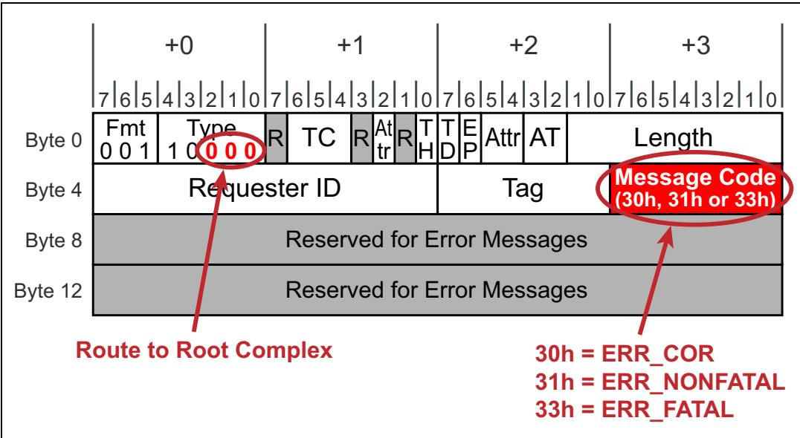

<table style="border-collapse:collapse; width:100%;">
  <thead style="border:2px solid #000;">
    <tr>
      <th width="50%" style="border:2px solid #000; background:#f5f5f5;">EN</th>
      <th width="50%" style="border:2px solid #000; background-color:#e8e8e8;">中文</th>
    </tr>
  </thead>
  <tbody>
    <tr><td width="50%" style="border:2px solid #000; background:#fff;padding:4px 8px;">## PCI Express Technology</td><td width="50%" style="border:2px solid #000; background-color:#e8e8e8;padding:4px 8px;">## PCI Express 技术</td></tr>
  </tbody>
</table>

## Advisory Non-Fatal Errors | 建议性非致命错误

<table style="border-collapse:collapse; width:100%;">
  <thead style="border:2px solid #000;">
    <tr>
      <th width="50%" style="border:2px solid #000; background:#f5f5f5;">EN</th>
      <th width="50%" style="border:2px solid #000; background-color:#e8e8e8;">中文</th>
    </tr>
  </thead>
  <tbody>
    <tr><td width="50%" style="border:2px solid #000; background:#fff;padding:4px 8px;">Since we've just seen that both types of Uncorrectable errors will need software attention, it sounds counter-intuitive to say that there are cases where it's preferable that a device not report Non-Fatal errors it detects, but there are. These cases are predominantly based on the role of the detecting agent (Requester, Completer, or Intermediate device) and the type of error. The problem is that multiple devices might report an error caused by the same event and, on some platforms, sending one of the Non-Fatal Error Messages (ERR_NONFATAL) can prevent software from properly handling the error. For example, if an Endpoint reports an error, its device driver will be called to service the situation. However, if a Switch reports an error first for the same transaction, system software might be called to investigate and might not understand what the driver was trying to accomplish or what would be the optimal response.</td><td width="50%" style="border:2px solid #000; background-color:#e8e8e8;padding:4px 8px;">既然我们已经看到两种类型的不可纠正错误都需要软件干预，那么说在某些情况下设备最好不报告其检测到的非致命错误似乎有违直觉，但实际情况确实如此。这些情况主要取决于检测代理的角色（请求者、完成者或中间设备）以及错误的类型。问题在于，多个设备可能因为同一事件报告错误，而在某些平台上，发送非致命错误消息（ERR_NONFATAL）之一可能会妨碍软件正确处理该错误。例如，如果端点报告错误，将调用其设备驱动程序来处理该情况。然而，如果交换机首先针对同一事务报告错误，则可能会调用系统软件进行调查，而系统软件可能不了解驱动程序试图完成什么操作，也不清楚最佳响应是什么。</td></tr>
    <tr><td width="50%" style="border:2px solid #000; background:#fff;padding:4px 8px;">That example illustrates that some detecting agents aren't the best ones to determine the ultimate disposition of the error and shouldn't send an uncorrectable message. Instead, such an agent can signal an advisory notification to software with ERR_COR. This avoids confusion about the source of the uncorrectable error but still gives software a little more information about what happened. Eventually, the appropriate detecting agent will send the ERR_NONFATAL message whenever it sees the error. Beginning with the 1.1 spec revision, a new field was added in the PCI Express Device Capabilities register to indicate support for this capability as shown in Figure 15-10 on page 670. This bit must be set for every agent that is compliant with the 1.1 spec or later.</td><td width="50%" style="border:2px solid #000; background-color:#e8e8e8;padding:4px 8px;">该示例说明，某些检测代理并非确定错误最终处置的最佳角色，不应发送不可纠正消息。相反，此类代理可以通过 ERR_COR 向软件发送通告性通知。这避免了关于不可纠正错误来源的混淆，同时仍向软件提供关于所发生事件的更多信息。最终，当适当的检测代理发现该错误时，它会发送 ERR_NONFATAL 消息。从 1.1 规范修订版开始，在 PCI Express 设备能力寄存器中新增了一个字段，用于指示对该能力的支持，如第 670 页图 15-10 所示。每个符合 1.1 规范或更高版本的代理必须置位该位。</td></tr>
  </tbody>
</table>

Figure 15-10: Device Capabilities Register | 图15-10：设备能力寄存器

<table style="border-collapse:collapse; width:100%;">
  <thead style="border:2px solid #000;">
    <tr>
      <th width="50%" style="border:2px solid #000; background:#f5f5f5;">EN</th>
      <th width="50%" style="border:2px solid #000; background-color:#e8e8e8;">中文</th>
    </tr>
  </thead>
  <tbody>
    <tr><td width="50%" style="border:2px solid #000; background:#fff;padding:4px 8px;">In spite of the reasons just described, software might want to stop operation as soon as some advisory errors are seen by an intermediate device. Since newer devices will always perform role-based error reporting, an override mechanism is needed. To handle this case, software can escalate the severity of the advisory errors from Non-Fatal to Fatal in the AER (Advanced Error Reporting) registers. Since there is no "advisory fatal" case, the error will now be reported as a Fatal Error (ERR_FATAL), if enabled, regardless of the role of the device.</td><td width="50%" style="border:2px solid #000; background-color:#e8e8e8;padding:4px 8px;">尽管有上述理由，但软件可能希望在中间设备一看到某些通告性错误时就停止操作。由于较新的设备始终执行基于角色的错误报告，因此需要一种覆盖机制。为处理此情况，软件可以在 AER（高级错误报告）寄存器中将通告性错误的严重性从非致命升级为致命。由于不存在"通告性致命"的情况，如果使能，则该错误现在将报告为致命错误（ERR_FATAL），而与设备的角色无关。</td></tr>
  </tbody>
</table>

## Advisory Non-Fatal Cases | 建议性非致命情况

<table style="border-collapse:collapse; width:100%;">
  <thead style="border:2px solid #000;">
    <tr>
      <th width="50%" style="border:2px solid #000; background:#f5f5f5;">EN</th>
      <th width="50%" style="border:2px solid #000; background-color:#e8e8e8;">中文</th>
    </tr>
  </thead>
  <tbody>
    <tr><td width="50%" style="border:2px solid #000; background:#fff;padding:4px 8px;">The spec lists five situations for which an advisory message (ERR\_COR) is preferred over a ERR\_NONFATAL message. In each of these cases, the detecting agent will handle the error as an Advisory Non‐Fatal Error. This means that a Non‐Fatal condition will be handled by sending an ERR\_COR, assuming the agent has AER registers and has enabled ERR\_COR. If it doesn't have AER registers or ERR\_COR was not enabled, it sends no Error Message. The five cases are as follows:</td><td width="50%" style="border:2px solid #000; background-color:#e8e8e8;padding:4px 8px;">规范列出了五种情况，在这些情况下建议使用通告消息（ERR\_COR）而非 ERR\_NONFATAL 消息。在每种情况下，检测到错误的代理将把该错误作为建议性非致命错误（Advisory Non-Fatal Error）处理。这意味着非致命条件将通过发送 ERR\_COR 来处理，前提是该代理拥有 AER 寄存器且已启用 ERR\_COR。如果它没有 AER 寄存器或 ERR\_COR 未启用，则不会发送任何错误消息。这五种情况如下：</td></tr>
    <tr><td width="50%" style="border:2px solid #000; background:#fff;padding:4px 8px;">1. Completer sent a Completion with UR or CA Status. The expectation in this case is that the Requester will have a mechanism to handle the error when it sees the offending Completion and will be the best agent to send whatever Error Messages are needed. A ERR\_NONFATAL message from the Completer would just be confusing, so it must be handled as Advisory Non‐Fatal (ERR\_COR).</td><td width="50%" style="border:2px solid #000; background-color:#e8e8e8;padding:4px 8px;">1. 完成者发送了带有 UR 或 CA 状态的完成报文。这种情况下的期望是，请求者在看到有问题的完成报文时将具有处理该错误的机制，并且将是发送所需任何错误消息的最佳代理。来自完成者的 ERR\_NONFATAL 消息只会造成混淆，因此必须将其作为建议性非致命错误（ERR\_COR）处理。</td></tr>
    <tr><td width="50%" style="border:2px solid #000; background:#fff;padding:4px 8px;">Curiously, there is no PCIe mechanism for the Requester to report that it received a Completion with this status. Instead, a design‐specific method like an interrupt will be needed to get device driver attention. An important example of this happens when the Root Complex receives a Completion with UR or CA status in response to a Configuration Read Request. On some platforms the response is to return all 1's to software for this case, to support backward compatibility with PCI enumeration (configuration probing) software.</td><td width="50%" style="border:2px solid #000; background-color:#e8e8e8;padding:4px 8px;">值得注意的是，PCIe 没有提供让请求者报告其收到带有此类状态的完成报文的机制。相反，需要采用设计特定的方法（如中断）来引起设备驱动程序的注意。一个重要示例是当根复合体收到响应配置读取请求而返回的带有 UR 或 CA 状态的完成报文时。在某些平台上，针对这种情况的响应是向软件返回全 1，以支持与 PCI 枚举（配置探测）软件的向后兼容性。</td></tr>
    <tr><td width="50%" style="border:2px solid #000; background:#fff;padding:4px 8px;">2. Intermediate device detected an error. This case comes up in systems that employ Switches because a detecting agent may not be the final destination for a TLP. As an example of this, consider Figure 15‐11 on page 672, showing a poisoned packet delivered through an intermediate Switch. The TLP is seen as a Non‐Fatal error by the Switch but it can only signal an ERR\_COR message instead (as long as it's enabled to do so).</td><td width="50%" style="border:2px solid #000; background-color:#e8e8e8;padding:4px 8px;">2. 中间设备检测到错误。这种情况出现在使用交换机的系统中，因为检测到错误的代理可能不是 TLP 的最终目的地。例如，考虑第 672 页的图 15-11，该图显示了一个通过中间交换机传递的投毒数据包。该 TLP 被交换机视为非致命错误，但它只能发出 ERR\_COR 消息（只要它被启用这样做）。</td></tr>
    <tr><td width="50%" style="border:2px solid #000; background:#fff;padding:4px 8px;">To explore this concept a little more, why wouldn't we want the Switch to report ERR\_NONFATAL? One reason is seen by looking at error tracking in the AER registers. Figure 15‐12 on page 672 shows the AER registers that track the Source ID (BDF of the sending device) of Error Messages coming into a Root Port and we can see that there's only one space available for uncorrectable errors. If multiple uncorrectable errors are seen, that fact will be noted but only the first source ID will be saved since it is considered to be the probable cause of subsequent errors. It's important, therefore, that uncorrectable errors come from the most appropriate device to report them. It's worth noting that it's still helpful for intermediate devices to report ERR\_COR, because it allows software to determine where the error was first detected.</td><td width="50%" style="border:2px solid #000; background-color:#e8e8e8;padding:4px 8px;">为了进一步探讨这个概念，为什么我们不希望交换机报告 ERR\_NONFATAL？原因之一可以从 AER 寄存器中的错误跟踪看出。第 672 页的图 15-12 显示了跟踪进入根端口的错误消息的源 ID（发送设备的 BDF）的 AER 寄存器，我们可以看到只有一个空间可用于不可纠正错误。如果看到多个不可纠正错误，该事实将被记录下来，但只会保存第一个源 ID，因为它被认为是后续错误的可能原因。因此，不可纠正错误必须来自最合适的设备进行报告，这一点很重要。值得注意的是，中间设备报告 ERR\_COR 仍然是有帮助的，因为它允许软件确定错误最初是在哪里检测到的。</td></tr>
  </tbody>
</table>

Figure 15‐11: Role‐Based Error Reporting Example | 图15‐11：基于角色的错误报告示例
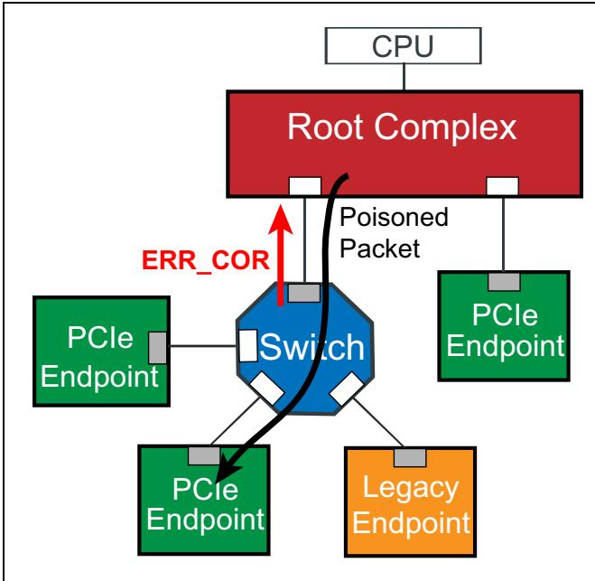

Figure 15‐12: Advanced Source ID Register | 图15‐12：高级源ID寄存器

<table style="border-collapse:collapse;width:100%"><tr><td colspan="2" style="border:2px solid #000;">Error Source Identification Register of the AER Capability Structure</td></tr><tr><td style="border:2px solid #000;">31</td><td style="border:2px solid #000;">0</td></tr><tr><td style="border:2px solid #000;">ERR_FATAL/NONFATAL Source ID (ROS)</td><td style="border:2px solid #000;">ERR_COR Source ID (ROS)</td></tr><tr><td colspan="2" style="border:2px solid #000;">ROS: Read-Only and Sticky</td></tr></table>

<table style="border-collapse:collapse; width:100%;">
  <thead style="border:2px solid #000;">
    <tr>
      <th width="50%" style="border:2px solid #000; background:#f5f5f5;">EN</th>
      <th width="50%" style="border:2px solid #000; background-color:#e8e8e8;">中文</th>
    </tr>
  </thead>
  <tbody>
    <tr><td width="50%" style="border:2px solid #000; background:#fff;padding:4px 8px;">As another example, 1.0a devices that have the UR Reporting Enable bit cleared but don't have the Role‐Based Error Reporting capability are unable to report any error Messages when a UR error is detected (for posted or non‐posted Requests). In contrast, a 1.1‐compliant or later Completer that has the SERR# Enable bit set will send an ERR\_NONFATAL or ERR\_FATAL message for bad posted Requests, even if the Unsupported Request Reporting Enable bit is clear, so as to avoid silent data corruption. But it won't send an error Message for non‐posted Requests received, so as to support the PCI‐compatible configuration method of probing with configuration reads. It's recommended that software keep the UR Error Reporting Enable bit clear for devices that are not capable of Role‐Based Error Reporting, but set it for those that are. That way, UR errors are reported on bad posted requests, but not for bad non‐posted requests like configuration probing transactions, and backward compatibility with older software is maintained.</td><td width="50%" style="border:2px solid #000; background-color:#e8e8e8;padding:4px 8px;">另一个例子是，1.0a 设备如果清除了 UR 报告使能位但不具备基于角色的错误报告能力，则在检测到 UR 错误时（对于 Posted 或 Non-Posted 请求）无法报告任何错误消息。相比之下，符合 1.1 或更高版本的完成者如果设置了 SERR# 使能位，则会为错误的 Posted 请求发送 ERR\_NONFATAL 或 ERR\_FATAL 消息，即使未支持请求报告使能位被清除，以避免静默数据损坏。但它不会为接收到的 Non-Posted 请求发送错误消息，以支持通过配置读取进行探测的 PCI 兼容配置方法。建议软件对于不具备基于角色的错误报告能力的设备保持 UR 错误报告使能位为清除状态，但对于具备该能力的设备则设置该位。这样，UR 错误会在错误的 Posted 请求上报告，但不会在错误的 Non-Posted 请求（如配置探测事务）上报告，从而保持了与旧软件的向后兼容性。</td></tr>
    <tr><td width="50%" style="border:2px solid #000; background:#fff;padding:4px 8px;">The spec also mentions that poisoned TLPs sent to the Root will be handled in the same way if the Root is acting as an intermediate agent, but there is one exception: If the Root doesn't support Error Forwarding, it will be unable to communicate the poisoned error with the TLP and must report this as a Non‐Fatal error instead.</td><td width="50%" style="border:2px solid #000; background-color:#e8e8e8;padding:4px 8px;">规范还提到，如果根复合体充当中间代理，发送到根的投毒 TLP 将以相同方式处理，但有一个例外：如果根不支持错误转发（Error Forwarding），它将无法通过 TLP 传达投毒错误，而必须将其报告为非致命错误。</td></tr>
    <tr><td width="50%" style="border:2px solid #000; background:#fff;padding:4px 8px;">3. Destination device received a poisoned TLP. Normally, Endpoints would report the Non‐Fatal error in this case, but there's an exception to this rule: If the ultimate destination device is able to handle the poisoned data in a way that allows for continued operation, it must treat this case as an Advisory Non‐Fatal Error instead.</td><td width="50%" style="border:2px solid #000; background-color:#e8e8e8;padding:4px 8px;">3. 目标设备接收到投毒 TLP。通常，端点在这种情况下会报告非致命错误，但此规则有一个例外：如果最终目标设备能够以允许继续运行的方式处理投毒数据，则必须将此情况作为建议性非致命错误处理。</td></tr>
    <tr><td width="50%" style="border:2px solid #000; background:#fff;padding:4px 8px;">An example of this behavior might be an audio device that receives streaming data that has been poisoned. In this situation, the data may be accepted even though it's known to be corrupted because pausing the audio flow long enough to get software attention and take remedial action would be a worse alternative than allowing a glitch in the sound output.</td><td width="50%" style="border:2px solid #000; background-color:#e8e8e8;padding:4px 8px;">这种行为的一个示例可能是音频设备接收到已被投毒的流式数据。在这种情况下，即使数据已知已损坏，也可能被接受，因为暂停音频流足够长时间以引起软件注意并采取补救措施，相比于允许声音输出中出现短暂故障而言，是更糟糕的选择。</td></tr>
    <tr><td width="50%" style="border:2px solid #000; background:#fff;padding:4px 8px;">4. Requester experienced a Completion Timeout. This is a similar case to the previous one; if the Requester has a means of continuing operation in spite of the problem then it must treat this as an Advisory Non‐Fatal Error. A simple work‐around for the Requester in this case would simply be to send the request again and hope for better results this time. Clearly, this would only make sense if the previous request did not cause any side effects, but Requesters are permitted to do this as often as they like (although the spec says the number of retries must be finite).</td><td width="50%" style="border:2px solid #000; background-color:#e8e8e8;padding:4px 8px;">4. 请求者遇到完成超时。这与前一种情况类似；如果请求者有办法在出现问题的情况下继续运行，则必须将其作为建议性非致命错误处理。这种情况下，请求者的一种简单变通方法是重新发送请求并希望这次得到更好的结果。显然，这仅在前一次请求未引起任何副作用时才有意义，但请求者被允许任意多次这样做（尽管规范规定重试次数必须是有限的）。</td></tr>
    <tr><td width="50%" style="border:2px solid #000; background:#fff;padding:4px 8px;">5. Unexpected completion received. This must be handled as an Advisory Non‐Fatal Error. The reason is that it was probably caused by a mis‐routed Completion and the original Requester will eventually report a Completion timeout. To allow that other Requester to attempt a retry of the failed request, it's important that the one that sees the Unexpected Completion not send an Non‐Fatal message.</td><td width="50%" style="border:2px solid #000; background-color:#e8e8e8;padding:4px 8px;">5. 收到意外完成报文。这必须作为建议性非致命错误处理。原因在于它可能是由路由错误的完成报文引起的，而原始请求者最终将报告完成超时。为了允许另一个请求者尝试重试失败的请求，看到意外完成报文的设备不发送非致命消息这一点很重要。</td></tr>
  </tbody>
</table>

## 15.9 Baseline Error Detection and Handling | 15.9 基线错误检测与处理

## 15.9 Baseline Error Detection and Handling | 15.9 基线错误检测与处理

<table style="border-collapse:collapse; width:100%;">
  <thead style="border:2px solid #000;">
    <tr>
      <th width="50%" style="border:2px solid #000; background:#f5f5f5;">EN</th>
      <th width="50%" style="border:2px solid #000; background-color:#e8e8e8;">中文</th>
    </tr>
  </thead>
  <tbody>
    <tr><td width="50%" style="border:2px solid #000; background:#fff;padding:4px 8px;">This section defines the required support for detecting and reporting PCI Express errors. Compliant devices must include:</td><td width="50%" style="border:2px solid #000; background-color:#e8e8e8;padding:4px 8px;">本节定义了检测和报告PCI Express错误所需的支持。符合规范的设备必须包含：</td></tr>
    <tr><td width="50%" style="border:2px solid #000; background:#fff;padding:4px 8px;">PCI-Compatible support — required to honor PCI-compatible error control and status fields for older software that has no awareness of PCI Express.</td><td width="50%" style="border:2px solid #000; background-color:#e8e8e8;padding:4px 8px;">PCI兼容支持——对于不了解PCI Express的旧版软件，要求遵循PCI兼容的错误控制和状态字段。</td></tr>
    <tr><td width="50%" style="border:2px solid #000; background:#fff;padding:4px 8px;">PCI Express Error reporting — uses standard PCIe structures to for error control and status which can be used by newer software that does have knowledge of PCI Express.</td><td width="50%" style="border:2px solid #000; background-color:#e8e8e8;padding:4px 8px;">PCI Express错误报告——使用标准PCIe结构进行错误控制和状态，可供了解PCI Express的新版软件使用。</td></tr>
  </tbody>
</table>

<table style="border-collapse:collapse; width:100%;">
  <thead style="border:2px solid #000;">
    <tr>
      <th width="50%" style="border:2px solid #000; background:#f5f5f5;">EN</th>
      <th width="50%" style="border:2px solid #000; background-color:#e8e8e8;">中文</th>
    </tr>
  </thead>
  <tbody>
    <tr><td width="50%" style="border:2px solid #000; background:#fff;padding:4px 8px;">## PCI-Compatible Error Reporting Mechanisms</td><td width="50%" style="border:2px solid #000; background-color:#e8e8e8;padding:4px 8px;">## PCI兼容的错误报告机制</td></tr>
  </tbody>
</table>

<table style="border-collapse:collapse; width:100%;">
  <thead style="border:2px solid #000;">
    <tr>
      <th width="50%" style="border:2px solid #000; background:#f5f5f5;">EN</th>
      <th width="50%" style="border:2px solid #000; background-color:#e8e8e8;">中文</th>
    </tr>
  </thead>
  <tbody>
    <tr><td width="50%" style="border:2px solid #000; background:#fff;padding:4px 8px;">## General</td><td width="50%" style="border:2px solid #000; background-color:#e8e8e8;padding:4px 8px;">## 概述</td></tr>
    <tr><td width="50%" style="border:2px solid #000; background:#fff;padding:4px 8px;">PCI Express errors are mapped into the original PCI configuration register bits for backward compatibility, allowing error status and control to be accessible to PCI‑compliant software. To understand the features available from the PCI‑compatible point of view, consider the error‑related bits of the Command and Status registers located within the Configuration header. Some of the field definitions have been modified to reflect the related PCIe error conditions and reporting mechanisms. The PCI Express errors tracked by the PCI‑compatible registers are:</td><td width="50%" style="border:2px solid #000; background-color:#e8e8e8;padding:4px 8px;">为保持向后兼容，PCI Express 错误被映射到原始 PCI 配置寄存器位中，使得符合 PCI 规范的软件能够访问错误状态和控制信息。要从 PCI 兼容的角度理解可用特性，请考虑配置头部中命令寄存器和状态寄存器的错误相关位。部分字段定义已修改，以反映相关的 PCIe 错误条件和报告机制。PCI 兼容寄存器所跟踪的 PCI Express 错误包括：</td></tr>
    <tr><td width="50%" style="border:2px solid #000; background:#fff;padding:4px 8px;">• Transaction Poisoning/Error Forwarding (synonymous to data parity error in PCI)</td><td width="50%" style="border:2px solid #000; background-color:#e8e8e8;padding:4px 8px;">• 事务投毒/错误转发（等同于 PCI 中的数据奇偶校验错误）</td></tr>
    <tr><td width="50%" style="border:2px solid #000; background:#fff;padding:4px 8px;">Completer Abort (CA) detected by a Completer (synonymous to Target Abort in PCI)</td><td width="50%" style="border:2px solid #000; background-color:#e8e8e8;padding:4px 8px;">完成者检测到的完成者中止（CA）（等同于 PCI 中的目标中止）</td></tr>
    <tr><td width="50%" style="border:2px solid #000; background:#fff;padding:4px 8px;">Unsupported Request (UR) detected by a Completer (synonymous to Master Abort in PCI)</td><td width="50%" style="border:2px solid #000; background-color:#e8e8e8;padding:4px 8px;">完成者检测到的不支持请求（UR）（等同于 PCI 中的主控中止）</td></tr>
    <tr><td width="50%" style="border:2px solid #000; background:#fff;padding:4px 8px;">As mentioned earlier, the PCI mechanism for reporting errors is the assertion of PERR# (data parity errors) and SERR# (unrecoverable errors). The PCI Express mechanisms for reporting these events are the Completion Status values in Completions and Error Messages to the Root.</td><td width="50%" style="border:2px solid #000; background-color:#e8e8e8;padding:4px 8px;">如前所述，PCI 报告错误的机制是断言 PERR#（数据奇偶校验错误）和 SERR#（不可恢复错误）。PCI Express 报告这些事件的机制是完成报文中的完成状态值和发送到根复合体的错误消息。</td></tr>
  </tbody>
</table>

<table style="border-collapse:collapse; width:100%;">
  <thead style="border:2px solid #000;">
    <tr>
      <th width="50%" style="border:2px solid #000; background:#f5f5f5;">EN</th>
      <th width="50%" style="border:2px solid #000; background-color:#e8e8e8;">中文</th>
    </tr>
  </thead>
  <tbody>
    <tr><td width="50%" style="border:2px solid #000; background:#fff;padding:4px 8px;">## Legacy Command and Status Registers</td><td width="50%" style="border:2px solid #000; background-color:#e8e8e8;padding:4px 8px;">## 传统命令与状态寄存器</td></tr>
    <tr><td width="50%" style="border:2px solid #000; background:#fff;padding:4px 8px;">Figure 15‑13 on page 675 illustrates the Command register and the location of the error‑related fields. These bits are set to enable baseline error reporting under control of PCI‑compatible software. Table 15‑3 defines the specific effects of each bit.</td><td width="50%" style="border:2px solid #000; background-color:#e8e8e8;padding:4px 8px;">第675页的图15‑13展示了命令寄存器及其错误相关字段的位置。在PCI兼容软件的控制下，设置这些位以启用基本错误报告。表15‑3定义了每个位的具体作用。</td></tr>
  </tbody>
</table>

Figure 15‑13: Command Register in Configuration Header | 图15‑13：配置头中的命令寄存器  

Table 15‑3: Error‑Related Fields in Command Register | 表15‑3：命令寄存器中与错误相关的字段

<table style="border-collapse:collapse;width:100%"><tr><td style="border:2px solid #000;">Name</td><td style="border:2px solid #000;">Description</td></tr><tr><td style="border:2px solid #000;">SERR# Enable</td><td style="border:2px solid #000;">Setting this bit enables sending ERR_FATAL and ERR_NONFATAL error messages to the Root Complex. These are considered roughly analogous to asserting the System Error (SERR#) signal in PCI. For Type 1 headers (bridges), this bit controls the forwarding of ERR_FATAL and ERR_NONFATAL error messages from the secondary interface to the primary interface.This field has no affect over ERR_COR messages.</td></tr><tr><td style="border:2px solid #000;">Parity Error Response</td><td style="border:2px solid #000;">Setting this bit enables logging of poisoned TLPs in the Master Data Parity Error bit in the Status register. Poisoned packets indicate bad data and are roughly analogous to a PCI parity error.</td></tr></table>

<table style="border-collapse:collapse; width:100%;">
  <thead style="border:2px solid #000;">
    <tr>
      <th width="50%" style="border:2px solid #000; background:#f5f5f5;">EN</th>
      <th width="50%" style="border:2px solid #000; background-color:#e8e8e8;">中文</th>
    </tr>
  </thead>
  <tbody>
    <tr><td width="50%" style="border:2px solid #000; background:#fff;padding:4px 8px;">Figure 15‑14 on page 676 illustrates the Configuration Status register and the location of the error‑related bit fields. Table 15‑4 on page 677 defines the circumstances under which each bit is set and the actions taken by the device when error reporting is enabled.</td><td width="50%" style="border:2px solid #000; background-color:#e8e8e8;padding:4px 8px;">第676页的图15‑14展示了配置状态寄存器及其错误相关位字段的位置。第677页的表15‑4定义了每个位被置位的情况以及启用错误报告时设备采取的动作。</td></tr>
  </tbody>
</table>

Figure 15‑14: Status Register in Configuration Header | 图15‑14：配置头中的状态寄存器  

Table 15‑4: Error‑Related Fields in Status Register | 表15‑4：状态寄存器中与错误相关的字段

<table style="border-collapse:collapse;width:100%"><tr><td style="border:2px solid #000;">Error-Related Bit</td><td style="border:2px solid #000;">Description</td></tr><tr><td style="border:2px solid #000;">Detected Parity Error</td><td style="border:2px solid #000;">Set by the port that receives a poisoned TLP. This status bit is updated regardless of the state of the Parity Error Response bit.</td></tr><tr><td style="border:2px solid #000;">Signalled System Error</td><td style="border:2px solid #000;">Set by a port that has reported an Uncorrectable Error with ERR_FATAL or ERR_NONFATAL and the SERR# enable bit in the Command register was set.</td></tr><tr><td style="border:2px solid #000;">Received Master Abort</td><td style="border:2px solid #000;">Set by a Requester that receives a Completion with status of UR (Unsupported Request). This is considered analogous to a PCI master abort because the target did not "claim the transaction".</td></tr><tr><td style="border:2px solid #000;">Received Target Abort</td><td style="border:2px solid #000;">Set by a Requester that receives a Completion with status of CA (Completer Abort). This is analogous to a PCI target abort in that the target has had a programming violation or internal error condition.</td></tr><tr><td style="border:2px solid #000;">Signaled Target Abort</td><td style="border:2px solid #000;">Set by the Completer that handled a request (either posted or non-posted) as a Completer Abort. If it was a non-posted request, then a Completion with a Completion Status of CA is sent.</td></tr><tr><td style="border:2px solid #000;">Master Data Parity Error</td><td style="border:2px solid #000;">For Type 0 headers (e.g., Endpoints), this bit is set if the Parity Error Response bit in the Command register is set AND it either initiates a poisoned request OR receives a poisoned completion.For Type 1 headers (e.g., Switches and Root Ports), this bit is set if the Parity Error Response bit in the Command register is set AND it either initiates a poisoned request heading upstream OR receives a poisoned completion heading downstream.</td></tr></table>

<table style="border-collapse:collapse; width:100%;">
  <thead style="border:2px solid #000;">
    <tr>
      <th width="50%" style="border:2px solid #000; background:#f5f5f5;">EN</th>
      <th width="50%" style="border:2px solid #000; background-color:#e8e8e8;">中文</th>
    </tr>
  </thead>
  <tbody>
    <tr><td width="50%" style="border:2px solid #000; background:#fff;padding:4px 8px;">## Baseline Error Handling</td><td width="50%" style="border:2px solid #000; background-color:#e8e8e8;padding:4px 8px;">## 基线错误处理</td></tr>
    <tr><td width="50%" style="border:2px solid #000; background:#fff;padding:4px 8px;">The Baseline capability requires the use of the PCI Express Capability structure. These registers include error detection and handling fields that provide finer granularity regarding the nature of an error and whether to report it or not than what is possible with just PCI-compatible error handling.</td><td width="50%" style="border:2px solid #000; background-color:#e8e8e8;padding:4px 8px;">基线能力需要使用PCI Express能力结构。与仅支持PCI兼容的错误处理相比，这些寄存器包含的错误检测和处理字段能提供更细粒度的错误性质判断及是否报告错误的信息。</td></tr>
    <tr><td width="50%" style="border:2px solid #000; background:#fff;padding:4px 8px;">Figure 15-15 on page 678 illustrates the PCI Express Capability structure. Some of these registers provide support for: • Enabling/disabling error reporting (Error Message Generation) • Providing error status • Providing link training status and initiating link re-training</td><td width="50%" style="border:2px solid #000; background-color:#e8e8e8;padding:4px 8px;">第678页的图15-15展示了PCI Express能力结构。其中一些寄存器提供以下支持： • 启用/禁用错误报告（错误消息生成） • 提供错误状态 • 提供链路训练状态并启动链路重新训练</td></tr>
  </tbody>
</table>

Figure 15-15: PCI Express Capability Structure | 图15-15：PCI Express能力结构

<table style="border-collapse:collapse;width:100%"><tr><td rowspan="15" style="border:2px solid #000;"></td><td style="border:2px solid #000;">PCI Express Capabilities Register</td><td style="border:2px solid #000;">Next Cap Pointer</td><td style="border:2px solid #000;">PCI Express Cap ID</td></tr><tr><td colspan="3" style="border:2px solid #000;">Device Capabilities Register</td></tr><tr><td style="border:2px solid #000;">Device Status</td><td colspan="2" style="border:2px solid #000;">Device Control</td></tr><tr><td colspan="3" style="border:2px solid #000;">Link Capabilities</td></tr><tr><td style="border:2px solid #000;">Link Status</td><td colspan="2" style="border:2px solid #000;">Link Control</td></tr><tr><td colspan="3" style="border:2px solid #000;">Slot Capabilities</td></tr><tr><td style="border:2px solid #000;">Slot Status</td><td colspan="2" style="border:2px solid #000;">Slot Control</td></tr><tr><td style="border:2px solid #000;">Root Capability</td><td colspan="2" style="border:2px solid #000;">Root Control</td></tr><tr><td colspan="3" style="border:2px solid #000;">Root Status</td></tr><tr><td colspan="3" style="border:2px solid #000;">Device Capabilities 2</td></tr><tr><td style="border:2px solid #000;">Device Status 2</td><td colspan="2" style="border:2px solid #000;">Device Control 2</td></tr><tr><td colspan="3" style="border:2px solid #000;">Link Capabilities 2</td></tr><tr><td style="border:2px solid #000;">Link Status 2</td><td colspan="2" style="border:2px solid #000;">Link Control 2</td></tr><tr><td colspan="3" style="border:2px solid #000;">Slot Capabilities 2</td></tr><tr><td style="border:2px solid #000;">Slot Status 2</td><td colspan="2" style="border:2px solid #000;">Slot Control 2</td></tr></table>

## Enabling | Disabling Error Reporting

<table style="border-collapse:collapse; width:100%;">
  <thead style="border:2px solid #000;">
    <tr>
      <th width="50%" style="border:2px solid #000; background:#f5f5f5;">EN</th>
      <th width="50%" style="border:2px solid #000; background-color:#e8e8e8;">中文</th>
    </tr>
  </thead>
  <tbody>
    <tr><td width="50%" style="border:2px solid #000; background:#fff;padding:4px 8px;">The Device Control registers allow software to enable generation of three different Error Messages for four error events, and Device Status registers allow it to see which error has been detected. The four error cases are:</td><td width="50%" style="border:2px solid #000; background-color:#e8e8e8;padding:4px 8px;">设备控制寄存器允许软件针对四种错误事件启用三种不同错误消息的生成，设备状态寄存器则允许软件查看已检测到哪种错误。四种错误情况分别是：</td></tr>
    <tr><td width="50%" style="border:2px solid #000; background:#fff;padding:4px 8px;">• Correctable Errors</td><td width="50%" style="border:2px solid #000; background-color:#e8e8e8;padding:4px 8px;">• 可校正错误</td></tr>
    <tr><td width="50%" style="border:2px solid #000; background:#fff;padding:4px 8px;">• Non-Fatal Errors</td><td width="50%" style="border:2px solid #000; background-color:#e8e8e8;padding:4px 8px;">• 非致命错误</td></tr>
    <tr><td width="50%" style="border:2px solid #000; background:#fff;padding:4px 8px;">• Fatal Errors</td><td width="50%" style="border:2px solid #000; background-color:#e8e8e8;padding:4px 8px;">• 致命错误</td></tr>
    <tr><td width="50%" style="border:2px solid #000; background:#fff;padding:4px 8px;">• Unsupported Request Errors</td><td width="50%" style="border:2px solid #000; background-color:#e8e8e8;padding:4px 8px;">• 不支持请求错误</td></tr>
    <tr><td width="50%" style="border:2px solid #000; background:#fff;padding:4px 8px;">Note that the only specific error identified here is the Unsupported Request. Although an Unsupported Request is technically a subset of Non-Fatal errors, and, when reported, is even signaled with an ERR\_NONFATAL message, it has its own enable and status bits. That's because during system enumeration Unsupported Requests are going to happen (whenever an attempt it made to read config space from a Function that doesn't actually exist in the system) but they must not be reported as errors. The enumeration software may have very limited error-handling capability and if it was required to stop and service an error it might fail. Therefore, the software doesn't want error messages generated for the UR case during that time, but does want to know about any other Non-Fatal errors that may be detected. (See the section titled "Discovering the Presence or Absence of a Function" on page 105 for more details on Unsupported Requests during enumeration.)</td><td width="50%" style="border:2px solid #000; background-color:#e8e8e8;padding:4px 8px;">注意，此处唯一明确指出的特定错误是不支持请求(UR)。虽然不支持请求在技术上属于非致命错误的子集，并且在报告时甚至通过ERR\_NONFATAL消息发出信号，但它拥有自己独立的使能位和状态位。这是因为在系统枚举期间，不支持请求必然会发生（每当尝试从系统中实际不存在的功能读取配置空间时），但这些错误不得作为错误上报。枚举软件的纠错能力可能非常有限，如果要求它停下来处理错误，可能会失败。因此，在此期间软件不希望针对UR情况生成错误消息，但确实希望了解可能检测到的任何其他非致命错误。（有关枚举期间不支持请求的更多详细信息，请参见第105页的"发现功能存在与否"一节。）</td></tr>
    <tr><td width="50%" style="border:2px solid #000; background:#fff;padding:4px 8px;">Table 15-5 on page 679 lists each error type and its associated error classification.</td><td width="50%" style="border:2px solid #000; background-color:#e8e8e8;padding:4px 8px;">第679页的表15-5列出了每种错误类型及其关联的错误分类。</td></tr>
  </tbody>
</table>

Table 15-5: Default Classification of Errors | 表15-5：错误的默认分类

<table style="border-collapse:collapse;width:100%"><tr><td style="border:2px solid #000;">Classification &amp; Severity</td><td style="border:2px solid #000;">Name of Error</td><td style="border:2px solid #000;">Layer Detected</td></tr><tr><td style="border:2px solid #000;">Correctable</td><td style="border:2px solid #000;">Receiver Error</td><td style="border:2px solid #000;">Physical</td></tr><tr><td style="border:2px solid #000;">Correctable</td><td style="border:2px solid #000;">Bad TLP</td><td style="border:2px solid #000;">Link</td></tr><tr><td style="border:2px solid #000;">Correctable</td><td style="border:2px solid #000;">Bad DLLP</td><td style="border:2px solid #000;">Link</td></tr><tr><td style="border:2px solid #000;">Correctable</td><td style="border:2px solid #000;">Replay Number Rollover</td><td style="border:2px solid #000;">Link</td></tr><tr><td style="border:2px solid #000;">Correctable</td><td style="border:2px solid #000;">Replay Timer Timeout</td><td style="border:2px solid #000;">Link</td></tr><tr><td style="border:2px solid #000;">Correctable</td><td style="border:2px solid #000;">Advisory Non-Fatal Error</td><td style="border:2px solid #000;">Transaction</td></tr><tr><td style="border:2px solid #000;">Correctable</td><td style="border:2px solid #000;">Corrected Internal Error</td><td style="border:2px solid #000;"></td></tr><tr><td style="border:2px solid #000;">Correctable</td><td style="border:2px solid #000;">Header Log Overflow</td><td style="border:2px solid #000;">Transaction</td></tr><tr><td style="border:2px solid #000;">Uncorrectable - Non Fatal</td><td style="border:2px solid #000;">Poisoned TLP Received</td><td style="border:2px solid #000;">Transaction</td></tr><tr><td style="border:2px solid #000;">Uncorrectable - Non Fatal</td><td style="border:2px solid #000;">ECRC Check Failed</td><td style="border:2px solid #000;">Transaction</td></tr><tr><td style="border:2px solid #000;">Uncorrectable - Non Fatal</td><td style="border:2px solid #000;">Unsupported Request</td><td style="border:2px solid #000;">Transaction</td></tr><tr><td style="border:2px solid #000;">Uncorrectable - Non Fatal</td><td style="border:2px solid #000;">Completion Timeout</td><td style="border:2px solid #000;">Transaction</td></tr><tr><td style="border:2px solid #000;">Uncorrectable - Non Fatal</td><td style="border:2px solid #000;">Completer Abort</td><td style="border:2px solid #000;">Transaction</td></tr><tr><td style="border:2px solid #000;">Uncorrectable - Non Fatal</td><td style="border:2px solid #000;">Unexpected Completion</td><td style="border:2px solid #000;">Transaction</td></tr><tr><td style="border:2px solid #000;">Uncorrectable - Non Fatal</td><td style="border:2px solid #000;">ACS Violation</td><td style="border:2px solid #000;">Transaction</td></tr><tr><td style="border:2px solid #000;">Uncorrectable - Non Fatal</td><td style="border:2px solid #000;">MC Blocked TLP</td><td style="border:2px solid #000;">Transaction</td></tr><tr><td style="border:2px solid #000;">Uncorrectable - Non Fatal</td><td style="border:2px solid #000;">AtomicOps Egress Blocked</td><td style="border:2px solid #000;">Transaction</td></tr><tr><td style="border:2px solid #000;">Uncorrectable - Non Fatal</td><td style="border:2px solid #000;">TLP Prefix Blocked</td><td style="border:2px solid #000;">Transaction</td></tr><tr><td style="border:2px solid #000;">Uncorrectable - Fatal</td><td style="border:2px solid #000;">Uncorrectable Internal Error (optional)</td><td style="border:2px solid #000;"></td></tr><tr><td style="border:2px solid #000;">Uncorrectable - Fatal</td><td style="border:2px solid #000;">Surprise Down (optional)</td><td style="border:2px solid #000;">Link</td></tr><tr><td style="border:2px solid #000;">Uncorrectable - Fatal</td><td style="border:2px solid #000;">Receiver Overflow (optional)</td><td style="border:2px solid #000;">Transaction</td></tr><tr><td style="border:2px solid #000;">Uncorrectable - Fatal</td><td style="border:2px solid #000;">DLL Protocol Error</td><td style="border:2px solid #000;">Link</td></tr><tr><td style="border:2px solid #000;">Uncorrectable - Fatal</td><td style="border:2px solid #000;">Receiver Overflow</td><td style="border:2px solid #000;">Transaction</td></tr><tr><td style="border:2px solid #000;">Uncorrectable - Fatal</td><td style="border:2px solid #000;">Flow Control Protocol Error</td><td style="border:2px solid #000;">Transaction</td></tr><tr><td style="border:2px solid #000;">Uncorrectable - Fatal</td><td style="border:2px solid #000;">Malformed TLP</td><td style="border:2px solid #000;">Transaction</td></tr></table>

<table style="border-collapse:collapse; width:100%;">
  <thead style="border:2px solid #000;">
    <tr>
      <th width="50%" style="border:2px solid #000; background:#f5f5f5;">EN</th>
      <th width="50%" style="border:2px solid #000; background-color:#e8e8e8;">中文</th>
    </tr>
  </thead>
  <tbody>
    <tr><td width="50%" style="border:2px solid #000; background:#fff;padding:4px 8px;">Device Control Register. Setting bits in the Device Control Register, shown in Figure 15-16 on page 681, enables sending the corresponding Error Messages to report errors. Unsupported Request errors are specified as Non-Fatal errors and are reported via a Non-Fatal Error Message, but only when the UR Reporting Enable bit is set.</td><td width="50%" style="border:2px solid #000; background-color:#e8e8e8;padding:4px 8px;">设备控制寄存器。设置第681页图15-16所示的设备控制寄存器中的相应位，可启用发送对应错误消息以报告错误。不支持请求错误被指定为非致命错误，并通过非致命错误消息报告，但仅在UR报告使能位被置位时才会如此。</td></tr>
    <tr><td width="50%" style="border:2px solid #000; background:#fff;padding:4px 8px;">In order for a Function to actually send an error message, either the corresponding enable bit in the Device Control register needs to be set, or for Fatal and Non-Fatal errors, the SERR# Enable should be set. For Uncorrectable Errors, if either the SERR# Enable bit in the Command Register is set OR the corresponding enable bit in the Device Control register is set, the appropriate error message will be sent (ERR\_FATAL or ERR\_NONFATAL).</td><td width="50%" style="border:2px solid #000; background-color:#e8e8e8;padding:4px 8px;">为了使功能实际发送错误消息，需要设置设备控制寄存器中相应的使能位，或者对于致命和非致命错误，应设置SERR#使能。对于不可校正错误，如果命令寄存器中的SERR#使能位被置位，或者设备控制寄存器中的相应使能位被置位，则相应的错误消息将被发送（ERR\_FATAL或ERR\_NONFATAL）。</td></tr>
    <tr><td width="50%" style="border:2px solid #000; background:#fff;padding:4px 8px;">For Correctable Errors, a Function will only send the ERR\_COR message if the Correctable Error Reporting Enable bit in the Device Control register is set. There is no control to enable ERR\_COR messages from the PCI-Compatible mechanisms, which makes sense because in PCI, there was no concept of correctable errors.</td><td width="50%" style="border:2px solid #000; background-color:#e8e8e8;padding:4px 8px;">对于可校正错误，功能仅当设备控制寄存器中的可校正错误报告使能位被置位时才会发送ERR\_COR消息。PCI兼容机制中没有使能ERR\_COR消息的控制，这合乎情理，因为在PCI中并无可校正错误的概念。</td></tr>
  </tbody>
</table>

Figure 15-16: Device Control Register Fields Related to Error Handling | 图15-16：与错误处理相关的设备控制寄存器字段

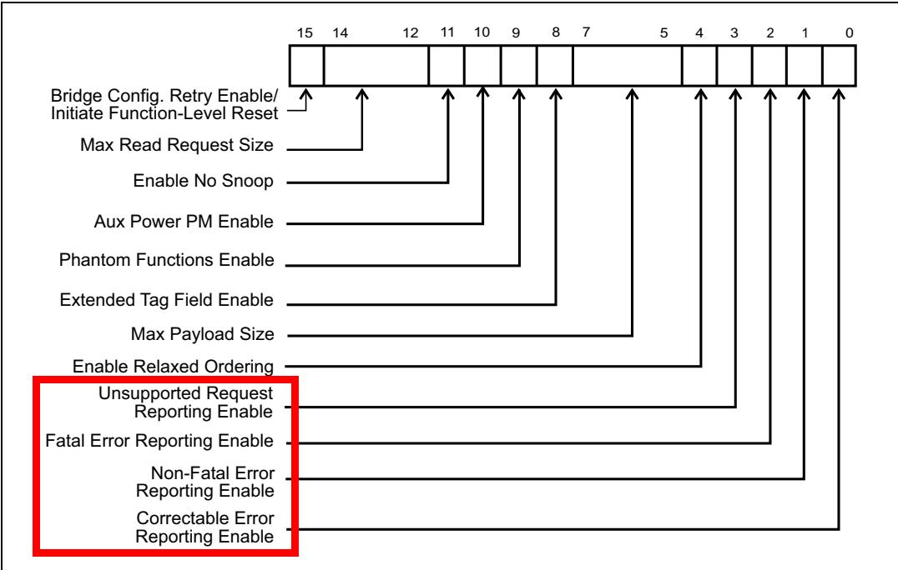

<table style="border-collapse:collapse; width:100%;">
  <thead style="border:2px solid #000;">
    <tr>
      <th width="50%" style="border:2px solid #000; background:#f5f5f5;">EN</th>
      <th width="50%" style="border:2px solid #000; background-color:#e8e8e8;">中文</th>
    </tr>
  </thead>
  <tbody>
    <tr><td width="50%" style="border:2px solid #000; background:#fff;padding:4px 8px;">Device Status Register. An error status bit is set in the Device Status register, shown in Figure 15-17 on page 682, anytime an error associated with its classification is detected, regardless of the setting of the error reporting enable bits in the Device Control Register. Because Unsupported Request errors are considered Non-Fatal Errors, when these errors occur both the Non-Fatal Error Detected status bit and the Unsupported Request Detected status bit will be set. Like several other status bits, these are "Sticky" (their values are not cleared by a reset event so they'll be available for diagnosing problems even if a reset was needed to get the Link working well enough to read the status).</td><td width="50%" style="border:2px solid #000; background-color:#e8e8e8;padding:4px 8px;">设备状态寄存器。每当检测到与其分类相关的错误时，无论设备控制寄存器中错误报告使能位的设置如何，都会在第682页图15-17所示的设备状态寄存器中设置错误状态位。由于不支持请求错误被视为非致命错误，因此当这些错误发生时，非致命错误检测状态位和不支持请求检测状态位都会被置位。与其他几个状态位一样，这些位是"粘性"的（它们的值不会因复位事件而清除，因此即使需要复位以使链路正常工作到足以读取状态，这些位仍可用于诊断问题）。</td></tr>
  </tbody>
</table>

Figure 15-17: Device Status Register Bit Fields Related to Error Handling | 图15-17：与错误处理相关的设备状态寄存器位字段

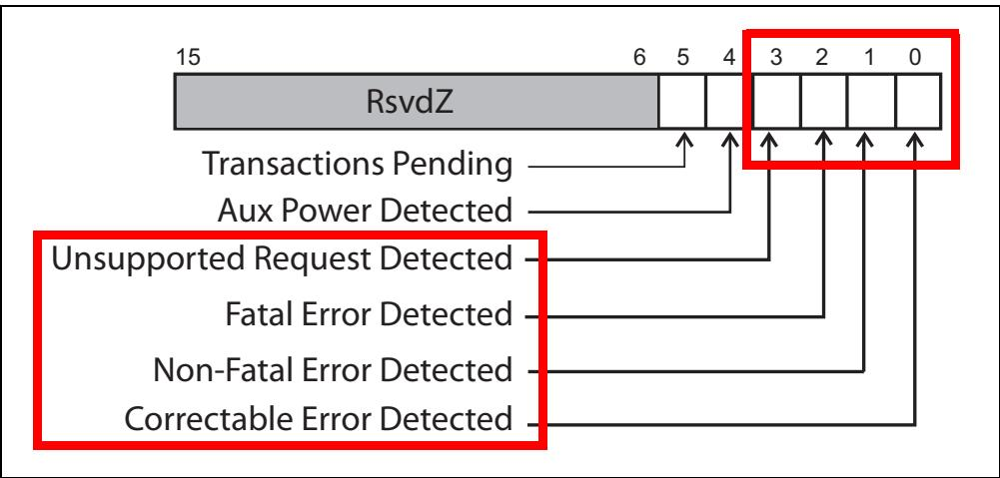

## Root's Response to Error Message | 根复合体对错误消息的响应

<table style="border-collapse:collapse; width:100%;">
  <thead style="border:2px solid #000;">
    <tr>
      <th width="50%" style="border:2px solid #000; background:#f5f5f5;">EN</th>
      <th width="50%" style="border:2px solid #000; background-color:#e8e8e8;">中文</th>
    </tr>
  </thead>
  <tbody>
    <tr><td width="50%" style="border:2px solid #000; background:#fff;padding:4px 8px;">When an Error Message is received by the Root, the action it takes is determined in part by the settings in the Root Control Register. Figure 15-18 depicts this register and highlights the three fields that specify whether a received Error Message should be reported as System Error. In some x86-based systems, it's likely that an NMI (Non-Maskable Interrupt) will be signaled if the error is enabled to trigger a System Error.</td><td width="50%" style="border:2px solid #000; background-color:#e8e8e8;padding:4px 8px;">当根复合体接收到错误消息时，其采取的动作部分由根控制寄存器中的设置决定。图15-18描绘了该寄存器，并高亮显示了三个字段，用于指定接收到的错误消息是否应作为系统错误上报。在某些基于x86的系统中，如果错误被使能触发系统错误，则很可能会发出NMI（不可屏蔽中断）信号。</td></tr>
    <tr><td width="50%" style="border:2px solid #000; background:#fff;padding:4px 8px;">Other options for reporting Error Messages are not configurable via standard registers. The most likely scenario is that an interrupt will be signaled to the processor that will call an Error Handler, which may log the error and attempt to clear the problem.</td><td width="50%" style="border:2px solid #000; background-color:#e8e8e8;padding:4px 8px;">其他错误消息上报选项不可通过标准寄存器配置。最可能的情形是向处理器发送一个中断信号，该中断将调用错误处理程序，错误处理程序可以记录错误并尝试清除问题。</td></tr>
  </tbody>
</table>

Figure 15-18: Root Control Register | 图15-18：根控制寄存器

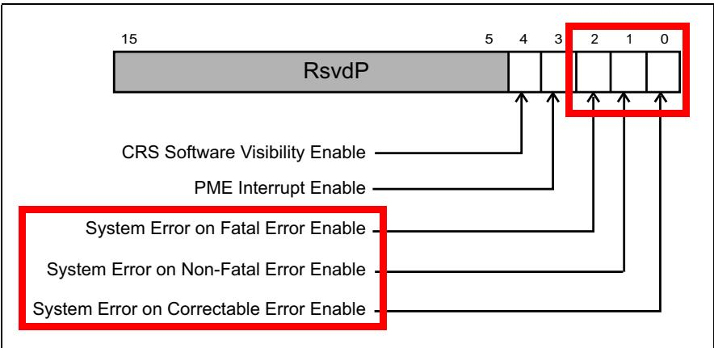

## Link Errors | 链路错误

<table style="border-collapse:collapse; width:100%;">
  <thead style="border:2px solid #000;">
    <tr>
      <th width="50%" style="border:2px solid #000; background:#f5f5f5;">EN</th>
      <th width="50%" style="border:2px solid #000; background-color:#e8e8e8;">中文</th>
    </tr>
  </thead>
  <tbody>
    <tr><td width="50%" style="border:2px solid #000; background:#fff;padding:4px 8px;">Link failures are typically detected in the Physical Layer and communicated to the Data Link Layer. For a downstream device, if the link has incurred a Fatal error and is not operating correctly, it can't report the error to the host. For these cases, the error must be reported by the upstream device. If software can isolate errors to a given link, one step in handling an uncorrectable error (or to prevent future uncorrectable errors) is to retrain the Link. The Link Control Register includes a bit that allows software to force the Link to retrain, as shown inFigure 15‐19 on page 684. If that solves the problem, operation resumes with little downtime.</td><td width="50%" style="border:2px solid #000; background-color:#e8e8e8;padding:4px 8px;">链路错误通常由物理层检测到，并通知给数据链路层。对于下游设备，如果链路发生了致命错误且无法正常操作，则无法向主机报告该错误。在这种情况下，必须由上游设备报告该错误。如果软件能够将错误隔离到特定链路，则处理不可校正错误（或防止将来出现不可校正错误）的一个步骤是重新训练链路。链路控制寄存器包含一个比特位，允许软件强制链路重新训练，如第684页的图15-19所示。如果这能解决问题，则操作在短暂中断后即可恢复。</td></tr>
  </tbody>
</table>

Figure 15‐19: Link Control Register - Force Link Retraining | 图15‐19：链路控制寄存器 - 强制链路重训练
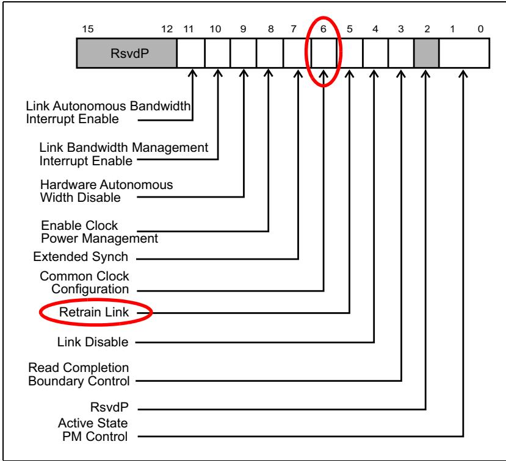

<table style="border-collapse:collapse; width:100%;">
  <thead style="border:2px solid #000;">
    <tr>
      <th width="50%" style="border:2px solid #000; background:#f5f5f5;">EN</th>
      <th width="50%" style="border:2px solid #000; background-color:#e8e8e8;">中文</th>
    </tr>
  </thead>
  <tbody>
    <tr><td width="50%" style="border:2px solid #000; background:#fff;padding:4px 8px;">Having once requested retraining, software can poll the Link Training bit in the Link Status Register to see when training has completed. Figure 15-20 highlights this status bits. When this bit is 1b, the Link is still in the retraining process (or has yet to start retraining). Hardware will clear this bit once the Physical Layer reports the Link as active meaning the training process has completed successfully.</td><td width="50%" style="border:2px solid #000; background-color:#e8e8e8;padding:4px 8px;">一旦请求了重新训练，软件可以轮询链路状态寄存器中的链路训练比特位，以查看训练何时完成。图15-20突出显示了该状态位。当该比特位为1b时，链路仍在重新训练过程中（或尚未开始重新训练）。一旦物理层报告链路为活动状态（表示训练过程已成功完成），硬件将清除此比特位。</td></tr>
  </tbody>
</table>

Figure 15‐20: Link Training Status in the Link Status Register | 图15‐20：链路状态寄存器中的链路训练状态

## 15.10 Advanced Error Reporting (AER) | 15.10 高级错误报告（AER）

<table style="border-collapse:collapse; width:100%;">
  <thead style="border:2px solid #000;">
    <tr>
      <th width="50%" style="border:2px solid #000; background:#f5f5f5;">EN</th>
      <th width="50%" style="border:2px solid #000; background-color:#e8e8e8;">中文</th>
    </tr>
  </thead>
  <tbody>
    <tr><td width="50%" style="border:2px solid #000; background:#fff;padding:4px 8px;">The Advanced Error Reporting Structure illustrated in Figure 15‐21 on page 686 allows for much more sophisticated error handling. These registers provide several additional features:</td><td width="50%" style="border:2px solid #000; background-color:#e8e8e8;padding:4px 8px;">第686页图15-21所示的高级错误报告结构（Advanced Error Reporting Structure）支持更复杂的错误处理。这些寄存器提供了以下几个额外特性：</td></tr>
    <tr><td width="50%" style="border:2px solid #000; background:#fff;padding:4px 8px;">• Better granularity in logging the actual type of error that occurred</td><td width="50%" style="border:2px solid #000; background-color:#e8e8e8;padding:4px 8px;">• 更精细地记录所发生错误的具体类型</td></tr>
    <tr><td width="50%" style="border:2px solid #000; background:#fff;padding:4px 8px;">• Control to specify the severity of each uncorrectable error type</td><td width="50%" style="border:2px solid #000; background-color:#e8e8e8;padding:4px 8px;">• 控制指定每种不可校正错误类型的严重级别</td></tr>
    <tr><td width="50%" style="border:2px solid #000; background:#fff;padding:4px 8px;">• Support for logging the header of packets that had errors</td><td width="50%" style="border:2px solid #000; background-color:#e8e8e8;padding:4px 8px;">• 支持记录发生错误的报文头</td></tr>
    <tr><td width="50%" style="border:2px solid #000; background:#fff;padding:4px 8px;">Standardizing control for the Root to report received Error Messages with an interrupt</td><td width="50%" style="border:2px solid #000; background-color:#e8e8e8;padding:4px 8px;">标准化控制根复合体通过中断报告接收到的错误消息</td></tr>
    <tr><td width="50%" style="border:2px solid #000; background:#fff;padding:4px 8px;">• Identifying the source of the error in the PCIe topology</td><td width="50%" style="border:2px solid #000; background-color:#e8e8e8;padding:4px 8px;">• 在PCIe拓扑中标识错误的来源</td></tr>
    <tr><td width="50%" style="border:2px solid #000; background:#fff;padding:4px 8px;">• Ability to mask reporting individual types of errors</td><td width="50%" style="border:2px solid #000; background-color:#e8e8e8;padding:4px 8px;">• 能够屏蔽对单个错误类型的报告</td></tr>
  </tbody>
</table>

Figure 15‐21: Advanced Error Capability Structure | 图15‐21：高级错误能力结构

## 15.10.1 Advanced Error Capability and Control | 15.10.1 高级错误能力与控制

<table style="border-collapse:collapse; width:100%;">
  <thead style="border:2px solid #000;">
    <tr>
      <th width="50%" style="border:2px solid #000; background:#f5f5f5;">EN</th>
      <th width="50%" style="border:2px solid #000; background-color:#e8e8e8;">中文</th>
    </tr>
  </thead>
  <tbody>
    <tr><td width="50%" style="border:2px solid #000; background:#fff;padding:4px 8px;">Let's begin our discussion of AER by looking at the Advanced Error Capability and Control register. End-to-End CRC (ECRC) generation and checking requires AER, and this register, shown in Figure 15-22 on page 687, reports whether this device supports it. If so, configuration software can enable (and force) its use by setting the appropriate bits.</td><td width="50%" style="border:2px solid #000; background-color:#e8e8e8;padding:4px 8px;">我们首先查看高级错误能力与控制寄存器来开始对 AER 的讨论。端到端 CRC（ECRC）的生成和校验需要 AER，该寄存器（见第 687 页图 15-22）报告本设备是否支持该功能。如果支持，配置软件可通过设置相应位来启用（并强制）其使用。</td></tr>
    <tr><td width="50%" style="border:2px solid #000; background:#fff;padding:4px 8px;">The five low-order bits of this register contain the First Error Pointer, set by hardware when the Uncorrectable Error status bits are updated. There are 32 status bits and the First Error Pointer indicates which of the unmasked, Uncorrectable Errors was detected first, meaning which status bit was set when all the other status bits were still 0. The first error is the most interesting because the others may have been caused by the first one.</td><td width="50%" style="border:2px solid #000; background-color:#e8e8e8;padding:4px 8px;">该寄存器的低 5 位包含首个错误指针，由硬件在更新不可校正错误状态位时设置。共有 32 个状态位，首个错误指针指示哪个未屏蔽的不可校正错误最先被检测到，即当所有其他状态位仍为 0 时哪一个状态位被置位。首个错误最为重要，因为其他错误可能是由第一个错误引发的。</td></tr>
  </tbody>
</table>

Figure 15-22: The Advanced Error Capability and Control Register / 图 15-22：高级错误能力与控制寄存器 | 图15-22：高级错误能力与控制寄存器

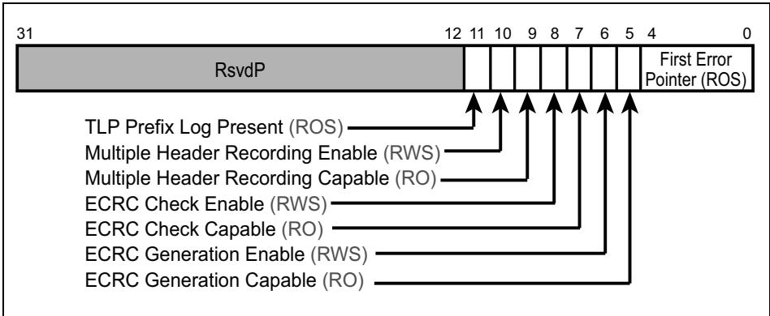

<table style="border-collapse:collapse; width:100%;">
  <thead style="border:2px solid #000;">
    <tr>
      <th width="50%" style="border:2px solid #000; background:#f5f5f5;">EN</th>
      <th width="50%" style="border:2px solid #000; background-color:#e8e8e8;">中文</th>
    </tr>
  </thead>
  <tbody>
    <tr><td width="50%" style="border:2px solid #000; background:#fff;padding:4px 8px;">Beginning with the 2.1 spec revision, this capability was enhanced to allow tracking multiple errors. For that reason, if multiple error status bits have been set and cleared, the meaning really becomes more like an "Oldest Error Pointer" instead. The pointer is updated by hardware when the corresponding status bit is cleared by software, at which time it points to whichever error was detected next (see Figure 15-25 on page 691 for the list of uncorrectable errors). Interestingly, the next error may be the same one again if that error had been detected multiple times, with the result that the updated pointer still indicates the same value.</td><td width="50%" style="border:2px solid #000; background-color:#e8e8e8;padding:4px 8px;">从 2.1 规范修订版开始，该能力得以增强，允许跟踪多个错误。因此，如果多个错误状态位已被置位和清除，其含义实际上更像是一个"最旧错误指针"。当软件清除相应状态位时，硬件会更新该指针，此时指针指向下一个被检测到的错误（不可校正错误列表见第 691 页图 15-25）。有趣的是，如果同一错误被多次检测到，下一个错误可能仍是同一个，结果更新后的指针仍然指向相同的值。</td></tr>
    <tr><td width="50%" style="border:2px solid #000; background:#fff;padding:4px 8px;">Since multiple errors can be recorded in the Uncorrectable Status register, it would be very helpful to store multiple headers, too. Hardware must be designed to log at least one header, but is allowed to support more. If it does, the Multiple Header Recording Capable bit will be set and the Multiple Header Recording Enable bit can be used to enable storing more than one. Whenever the First Error Pointer indicates a status bit position that is not set or is not implemented, it means there are no more uncorrectable errors to service.</td><td width="50%" style="border:2px solid #000; background-color:#e8e8e8;padding:4px 8px;">由于不可校正状态寄存器中可以记录多个错误，因此同时存储多个报头也将非常有帮助。硬件必须设计为至少记录一个报头，但允许支持更多。如果支持，多报头记录能力位将被置位，并且可以使用多报头记录使能位来启用存储多个报头。每当首个错误指针指向一个未置位或未实现的状态位位置时，表示没有更多不可校正错误需要处理。</td></tr>
  </tbody>
</table>

## PCI Express Technology | PCI Express 技术

<table style="border-collapse:collapse; width:100%;">
  <thead style="border:2px solid #000;">
    <tr>
      <th width="50%" style="border:2px solid #000; background:#f5f5f5;">EN</th>
      <th width="50%" style="border:2px solid #000; background-color:#e8e8e8;">中文</th>
    </tr>
  </thead>
  <tbody>
    <tr><td width="50%" style="border:2px solid #000; background:#fff;padding:4px 8px;">## PCI Express Technology</td><td width="50%" style="border:2px solid #000; background-color:#e8e8e8;padding:4px 8px;">## PCI Express Technology</td></tr>
    <tr><td width="50%" style="border:2px solid #000; background:#fff;padding:4px 8px;">The last bit in this register, TLP Prefix Log Present, indicates whether the TLP Prefix Log registers contain valid information for the uncorrectable error indicated by the First Error Pointer.</td><td width="50%" style="border:2px solid #000; background-color:#e8e8e8;padding:4px 8px;">该寄存器中的最后一位，即TLP前缀日志存在位，指示TLP前缀日志寄存器是否包含由首次错误指针所指示的不可纠正错误的有效信息。</td></tr>
    <tr><td width="50%" style="border:2px solid #000; background:#fff;padding:4px 8px;">The fields in this register and the other AER registers have various characteristics, which are abbreviated as follows:</td><td width="50%" style="border:2px solid #000; background-color:#e8e8e8;padding:4px 8px;">该寄存器及其他AER寄存器中的字段具有各种特性，其缩写如下：</td></tr>
    <tr><td width="50%" style="border:2px solid #000; background:#fff;padding:4px 8px;">• RO — Read Only, set by hardware</td><td width="50%" style="border:2px solid #000; background-color:#e8e8e8;padding:4px 8px;">• RO — 只读，由硬件设置</td></tr>
    <tr><td width="50%" style="border:2px solid #000; background:#fff;padding:4px 8px;">• ROS — Read Only and Sticky (see the next section on sticky bits)</td><td width="50%" style="border:2px solid #000; background-color:#e8e8e8;padding:4px 8px;">• ROS — 只读且粘滞（参见下一节关于粘滞位的内容）</td></tr>
    <tr><td width="50%" style="border:2px solid #000; background:#fff;padding:4px 8px;">• RsvdP — Reserved and Preserved. These bits must not be used for any purpose, but software must be careful to maintain whatever values they contain.</td><td width="50%" style="border:2px solid #000; background-color:#e8e8e8;padding:4px 8px;">• RsvdP — 保留并保持。这些位不得用于任何目的，但软件必须注意保持它们所含的任何值。</td></tr>
    <tr><td width="50%" style="border:2px solid #000; background:#fff;padding:4px 8px;">• RsvdZ — Reserved and Zero. Bits that must not be used for any purpose and must always be written to zeros.</td><td width="50%" style="border:2px solid #000; background-color:#e8e8e8;padding:4px 8px;">• RsvdZ — 保留并清零。这些位不得用于任何目的，且必须始终写入零。</td></tr>
    <tr><td width="50%" style="border:2px solid #000; background:#fff;padding:4px 8px;">• RWS — Readable, Writeable and Sticky</td><td width="50%" style="border:2px solid #000; background-color:#e8e8e8;padding:4px 8px;">• RWS — 可读、可写且粘滞</td></tr>
    <tr><td width="50%" style="border:2px solid #000; background:#fff;padding:4px 8px;">• RW1CS — Readable, Write 1 to Clear, and Sticky</td><td width="50%" style="border:2px solid #000; background-color:#e8e8e8;padding:4px 8px;">• RW1CS — 可读、写1清除且粘滞</td></tr>
  </tbody>
</table>

## 15.10.2 Handling Sticky Bits | 15.10.2 粘滞位的处理

<table style="border-collapse:collapse; width:100%;">
  <thead style="border:2px solid #000;">
    <tr>
      <th width="50%" style="border:2px solid #000; background:#f5f5f5;">EN</th>
      <th width="50%" style="border:2px solid #000; background-color:#e8e8e8;">中文</th>
    </tr>
  </thead>
  <tbody>
    <tr><td width="50%" style="border:2px solid #000; background:#fff;padding:4px 8px;">Several AER register fields employ sticky bits, which means that a reset won't clear their contents. All other register fields are forced to default values on a reset, but these are not.</td><td width="50%" style="border:2px solid #000; background-color:#e8e8e8;padding:4px 8px;">多个AER寄存器字段使用了粘滞位（sticky bits），这意味着复位不会清除其内容。所有其他寄存器字段在复位时会被强制恢复为默认值，但这些字段不会。</td></tr>
    <tr><td width="50%" style="border:2px solid #000; background:#fff;padding:4px 8px;">This is a good idea because a Link may encounter a failure that can't be cleared without a reset. If the problem is in the downstream device of the failed Link, its register contents are unavailable until the Link is working again, which the reset will accomplish. But if the registers were cleared by the reset then the information is lost.</td><td width="50%" style="border:2px solid #000; background-color:#e8e8e8;padding:4px 8px;">这是合理的，因为链路可能会遇到不通过复位就无法清除的故障。如果问题出在故障链路的下游设备上，则其寄存器内容在链路恢复正常之前无法访问，而复位可以实现这一点。但如果寄存器被复位清除，信息就会丢失。</td></tr>
    <tr><td width="50%" style="border:2px solid #000; background:#fff;padding:4px 8px;">To solve this problem, sticky bits keep error status information available through a reset. Specifically, sticky bits will survive an FLR (Function Level Reset), a Hot Reset, and a Warm Reset because power is available to keep them active. They may even survive a Cold Reset if a secondary power source like $\mathrm { V _ { a u x } }$ is available to keep them active when the main power is shut off.</td><td width="50%" style="border:2px solid #000; background-color:#e8e8e8;padding:4px 8px;">为解决此问题，粘滞位可在复位期间保持错误状态信息可用。具体来说，粘滞位可以经受FLR（功能级复位）、热复位（Hot Reset）和暖复位（Warm Reset），因为有电源供电以保持其激活状态。如果主电源关闭时有诸如$\mathrm { V _ { a u x } }$这样的辅助电源可供使用以保持其激活状态，它们甚至可能经受冷复位（Cold Reset）。</td></tr>
  </tbody>
</table>

<table style="border-collapse:collapse; width:100%;">
  <thead style="border:2px solid #000;">
    <tr>
      <th width="50%" style="border:2px solid #000; background:#f5f5f5;">EN</th>
      <th width="50%" style="border:2px solid #000; background-color:#e8e8e8;">中文</th>
    </tr>
  </thead>
  <tbody>
    <tr><td width="50%" style="border:2px solid #000; background:#fff;padding:4px 8px;">## Advanced Correctable Error Handling</td><td width="50%" style="border:2px solid #000; background-color:#e8e8e8;padding:4px 8px;">## 高级可修正错误处理</td></tr>
    <tr><td width="50%" style="border:2px solid #000; background:#fff;padding:4px 8px;">Advanced Error Reporting provides the ability to record which specific correctable errors have been detected. These errors can be used to initiate a Correctable Error Message to the host system. Although system operation continues normally, reporting correctable errors can be useful because it allows system software to see which components are having trouble and to predict whether they may fail completely in the future.</td><td width="50%" style="border:2px solid #000; background-color:#e8e8e8;padding:4px 8px;">高级错误报告(Advanced Error Reporting)提供了记录已检测到哪些特定可修正错误的能力。这些错误可用于向主机系统发起可修正错误消息(Correctable Error Message)。尽管系统操作继续正常进行，但报告可修正错误仍很有用，因为它使系统软件能够查看哪些组件出现问题，并可预测这些组件未来是否可能完全失效。</td></tr>
  </tbody>
</table>

<table style="border-collapse:collapse; width:100%;">
  <thead style="border:2px solid #000;">
    <tr>
      <th width="50%" style="border:2px solid #000; background:#f5f5f5;">EN</th>
      <th width="50%" style="border:2px solid #000; background-color:#e8e8e8;">中文</th>
    </tr>
  </thead>
  <tbody>
    <tr><td width="50%" style="border:2px solid #000; background:#fff;padding:4px 8px;">## Advanced Correctable Error Status</td><td width="50%" style="border:2px solid #000; background-color:#e8e8e8;padding:4px 8px;">## 高级可校正错误状态</td></tr>
    <tr><td width="50%" style="border:2px solid #000; background:#fff;padding:4px 8px;">Correctable errors will automatically set the corresponding bit in the Advanced Correctable Error Status register, shown in Figure 15-23 on page 689, regardless of whether the error is reported with an Error Message. These bits are cleared by software writing a "1" to the bit position, hence the designation RW1CS.</td><td width="50%" style="border:2px solid #000; background-color:#e8e8e8;padding:4px 8px;">可校正错误将自动在高级可校正错误状态寄存器（如第689页图15-23所示）中设置相应位，无论该错误是否已通过错误消息上报。这些位由软件写入"1"来清除，因此标记为RW1CS。</td></tr>
  </tbody>
</table>

Figure 15-23: Advanced Correctable Error Status Register | 图15-23：高级可校正错误状态寄存器

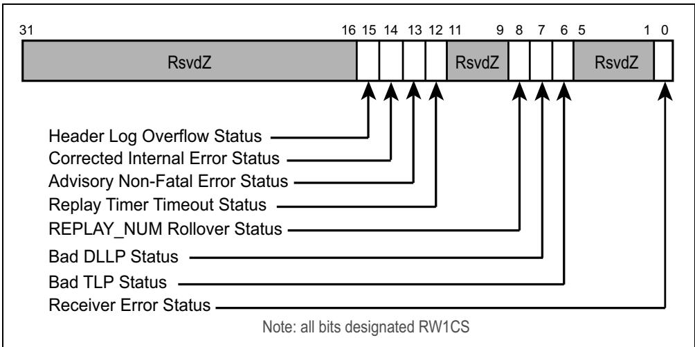

<table style="border-collapse:collapse; width:100%;">
  <thead style="border:2px solid #000;">
    <tr>
      <th width="50%" style="border:2px solid #000; background:#f5f5f5;">EN</th>
      <th width="50%" style="border:2px solid #000; background-color:#e8e8e8;">中文</th>
    </tr>
  </thead>
  <tbody>
    <tr><td width="50%" style="border:2px solid #000; background:#fff;padding:4px 8px;">Receiver Error (optional) — Physical Layer detected an error in the incoming packet. The packet is discarded at the Physical Layer, any buffer space allocated to it is released, and the Link Layer is informed that a receive error occurred.</td><td width="50%" style="border:2px solid #000; background-color:#e8e8e8;padding:4px 8px;">接收器错误（可选）——物理层在入向报文中检测到错误。该报文在物理层被丢弃，为其分配的任何缓冲空间被释放，并通知链路层发生了接收错误。</td></tr>
    <tr><td width="50%" style="border:2px solid #000; background:#fff;padding:4px 8px;">Bad TLP — Data Link Layer detected a packet with a bad LCRC, an out-of-sequence Sequence Number or an incorrectly nullified packet. In each case, the Link Layer discards the packet and reports a Nak DLLP to the transmitter, triggering a TLP replay.</td><td width="50%" style="border:2px solid #000; background-color:#e8e8e8;padding:4px 8px;">错误TLP——数据链路层检测到具有错误LCRC、乱序序列号或错误无效化的报文。在每种情况下，数据链路层都会丢弃该报文并向发送端报告Nak DLLP，从而触发TLP重放。</td></tr>
    <tr><td width="50%" style="border:2px solid #000; background:#fff;padding:4px 8px;">Bad DLLP — Data Link Layer noticed an incoming DLLP had a 16-bit CRC failure so the packet is dropped. A subsequent DLLP of the same type is expected to make up for the information it contained.</td><td width="50%" style="border:2px solid #000; background-color:#e8e8e8;padding:4px 8px;">错误DLLP——数据链路层发现入向DLLP发生16位CRC校验失败，因此丢弃该报文。预期后续相同类型的DLLP将弥补其所包含的信息。</td></tr>
    <tr><td width="50%" style="border:2px solid #000; background:#fff;padding:4px 8px;">REPLAY_NUM Rollover — At the Data Link Layer, a set of TLPs have been sent without success (no Ack) four times in a row and this counter has rolled over back to zero. Hardware will automatically retrain the link in an attempt to clear the failure condition, then start the sequence again by replaying the contents of the Replay Buffer.</td><td width="50%" style="border:2px solid #000; background-color:#e8e8e8;padding:4px 8px;">REPLAY_NUM翻转——在数据链路层，一组TLP连续四次发送未成功（无Ack），此计数器已翻转回零。硬件将自动重新训练链路以尝试清除故障状态，然后通过重放重放缓冲区的内容重新开始该序列。</td></tr>
  </tbody>
</table>

<table style="border-collapse:collapse; width:100%;">
  <thead style="border:2px solid #000;">
    <tr>
      <th width="50%" style="border:2px solid #000; background:#f5f5f5;">EN</th>
      <th width="50%" style="border:2px solid #000; background-color:#e8e8e8;">中文</th>
    </tr>
  </thead>
  <tbody>
    <tr><td width="50%" style="border:2px solid #000; background:#fff;padding:4px 8px;">## PCI Express Technology</td><td width="50%" style="border:2px solid #000; background-color:#e8e8e8;padding:4px 8px;">## PCI Express 技术</td></tr>
    <tr><td width="50%" style="border:2px solid #000; background:#fff;padding:4px 8px;">Replay Timer Timeout — At the Data Link Layer, transmitted TLPs have not received an acknowledgement (Ack or Nak) within the timeout period. Hardware automatically replays all unacknowledged TLPs, meaning all packets in the Replay Buffer.</td><td width="50%" style="border:2px solid #000; background-color:#e8e8e8;padding:4px 8px;">重放定时器超时 — 在数据链路层，已发送的TLP在超时时间内未收到确认（Ack或Nak）。硬件自动重放所有未确认的TLP，即重放缓冲区中的所有报文。</td></tr>
    <tr><td width="50%" style="border:2px solid #000; background:#fff;padding:4px 8px;">Advisory Non‐Fatal Error — Detection of these cases (see "Advisory Non‐Fatal Errors" on page 670) is logged in the corresponding Uncorrectable Error Status register and as a correctable error here. It may also generate a Correctable Error Message, if enabled.</td><td width="50%" style="border:2px solid #000; background-color:#e8e8e8;padding:4px 8px;">建议性非致命错误 — 这些情况的检测（参见第670页的"建议性非致命错误"）会记录在相应的不可校正错误状态寄存器中，并在此处作为可校正错误记录。如果启用，它还可生成可校正错误消息。</td></tr>
    <tr><td width="50%" style="border:2px solid #000; background:#fff;padding:4px 8px;">Corrected Internal Error (optional) — An error internal to the device was detected, but it was corrected or worked around without causing improper behavior.</td><td width="50%" style="border:2px solid #000; background-color:#e8e8e8;padding:4px 8px;">已校正内部错误（可选） — 检测到设备内部错误，但已校正或规避，未导致异常行为。</td></tr>
    <tr><td width="50%" style="border:2px solid #000; background:#fff;padding:4px 8px;">Header Log Overflow (optional) — The maximum number of headers that can be stored in the header log has been reached. The number is just one if the Multiple Header Recording Enable bit is not set in the Advanced Error Capability and Control register.</td><td width="50%" style="border:2px solid #000; background-color:#e8e8e8;padding:4px 8px;">头标日志溢出（可选） — 已达到头标日志可存储的最大头标数量。如果在高级错误能力和控制寄存器中未设置多头标记录使能位，则该数量仅为1。</td></tr>
  </tbody>
</table>

<table style="border-collapse:collapse; width:100%;">
  <thead style="border:2px solid #000;">
    <tr>
      <th width="50%" style="border:2px solid #000; background:#f5f5f5;">EN</th>
      <th width="50%" style="border:2px solid #000; background-color:#e8e8e8;">中文</th>
    </tr>
  </thead>
  <tbody>
    <tr><td width="50%" style="border:2px solid #000; background:#fff;padding:4px 8px;">## Advanced Correctable Error Masking</td><td width="50%" style="border:2px solid #000; background-color:#e8e8e8;padding:4px 8px;">## 高级可校正错误屏蔽</td></tr>
    <tr><td width="50%" style="border:2px solid #000; background:#fff;padding:4px 8px;">Correctable Error reporting is controlled collectively by the Correctable Error Enable bit in the Device Control register, but also individually by the Correctable Mask register, illustrated in Figure 15-24. The default state of the mask bits is cleared, meaning an ERR_COR message can be delivered when any correctable errors are detected if they've been enabled (meaning the Correctable Error Enable bit is set). However, software may choose to set bits in this mask register to prevent a message from being sent when those specific errors are detected.</td><td width="50%" style="border:2px solid #000; background-color:#e8e8e8;padding:4px 8px;">可校正错误的报告由设备控制寄存器中的可校正错误使能位统一控制，同时也受图15-24所示的可校正屏蔽寄存器的单独控制。屏蔽位的默认状态为清零，这意味着如果已使能（即可校正错误使能位被置位），则在检测到任何可校正错误时都可以发送ERR_COR消息。然而，软件可以选择设置该屏蔽寄存器中的位，以阻止在检测到这些特定错误时发送消息。</td></tr>
  </tbody>
</table>

Figure 15-24: Advanced Correctable Error Mask Register | 图15-24：高级可校正错误掩码寄存器

<table style="border-collapse:collapse;width:100%"><tr><td rowspan="83" style="border:2px solid #000;">31</td><td rowspan="83" style="border:2px solid #000;">RsvdP</td><td style="border:2px solid #000;">16</td><td style="border:2px solid #000;">15</td><td style="border:2px solid #000;">14</td><td style="border:2px solid #000;">13</td><td style="border:2px solid #000;">12</td><td style="border:2px solid #000;">11</td><td style="border:2px solid #000;">9</td><td style="border:2px solid #000;">8</td><td style="border:2px solid #000;">7</td><td style="border:2px solid #000;">6</td><td style="border:2px solid #000;">5</td><td style="border:2px solid #000;">1</td><td style="border:2px solid #000;">0</td></tr><tr><td style="border:2px solid #000;"></td><td style="border:2px solid #000;"></td><td style="border:2px solid #000;"></td><td style="border:2px solid #000;"></td><td style="border:2px solid #000;"></td><td style="border:2px solid #000;"></td><td style="border:2px solid #000;">RsvdP</td><td style="border:2px solid #000;"></td><td style="border:2px solid #000;"></td><td style="border:2px solid #000;"></td><td style="border:2px solid #000;"></td><td style="border:2px solid #000;">RsvdP</td><td style="border:2px solid #000;"></td></tr><tr><td style="border:2px solid #000;"></td><td style="border:2px solid #000;"></td><td style="border:2px solid #000;"></td><td style="border:2px solid #000;"></td><td style="border:2px solid #000;"></td><td style="border:2px solid #000;"></td><td style="border:2px solid #000;"></td><td style="border:2px solid #000;"></td><td style="border:2px solid #000;"></td><td style="border:2px solid #000;"></td><td style="border:2px solid #000;"></td><td style="border:2px solid #000;"></td><td style="border:2px solid #000;"></td><td style="border:2px solid #000;"></td></tr><tr><td style="border:2px solid #000;"></td><td style="border:2px solid #000;"></td><td style="border:2px solid #000;"></td><td style="border:2px solid #000;"></td><td style="border:2px solid #000;"></td><td style="border:2px solid #000;"></td><td style="border:2px solid #000;"></td><td style="border:2px solid #000;"></td><td style="border:2px solid #000;"></td><td style="border:2px solid #000;"></td><td style="border:2px solid #000;"></td><td style="border:2px solid #000;"></td><td style="border:2px solid #000;"></td><td style="border:2px solid #000;"></td></tr><tr><td style="border:2px solid #000;"></td><td style="border:2px solid #000;"></td><td style="border:2px solid #000;"></td><td style="border:2px solid #000;"></td><td style="border:2px solid #000;"></td><td style="border:2px solid #000;"></td><td style="border:2px solid #000;"></td><td style="border:2px solid #000;"></td><td style="border:2px solid #000;"></td><td style="border:2px solid #000;"></td><td style="border:2px solid #000;"></td><td style="border:2px solid #000;"></td><td style="border:2px solid #000;"></td><td style="border:2px solid #000;"></td></tr><tr><td style="border:2px solid #000;"></td><td style="border:2px solid #000;"></td><td style="border:2px solid #000;"></td><td style="border:2px solid #000;"></td><td style="border:2px solid #000;"></td><td style="border:2px solid #000;"></td><td style="border:2px solid #000;"></td><td style="border:2px solid #000;"></td><td style="border:2px solid #000;"></td><td style="border:2px solid #000;"></td><td style="border:2px solid #000;"></td><td style="border:2px solid #000;"></td><td style="border:2px solid #000;"></td><td style="border:2px solid #000;"></td></tr><tr><td style="border:2px solid #000;"></td><td style="border:2px solid #000;"></td><td style="border:2px solid #000;"></td><td style="border:2px solid #000;"></td><td style="border:2px solid #000;"></td><td style="border:2px solid #000;"></td><td style="border:2px solid #000;"></td><td style="border:2px solid #000;"></td><td style="border:2px solid #000;"></td><td style="border:2px solid #000;"></td><td style="border:2px solid #000;"></td><td style="border:2px solid #000;"></td><td style="border:2px solid #000;"></td><td style="border:2px solid #000;"></td></tr><tr><td style="border:2px solid #000;"></td><td style="border:2px solid #000;"></td><td style="border:2px solid #000;"></td><td style="border:2px solid #000;"></td><td style="border:2px solid #000;"></td><td style="border:2px solid #000;"></td><td style="border:2px solid #000;"></td><td style="border:2px solid #000;"></td><td style="border:2px solid #000;"></td><td style="border:2px solid #000;"></td><td style="border:2px solid #000;"></td><td style="border:2px solid #000;"></td><td style="border:2px solid #000;"></td><td style="border:2px solid #000;"></td></tr><tr><td style="border:2px solid #000;"></td><td style="border:2px solid #000;"></td><td style="border:2px solid #000;"></td><td style="border:2px solid #000;"></td><td style="border:2px solid #000;"></td><td style="border:2px solid #000;"></td><td style="border:2px solid #000;"></td><td style="border:2px solid #000;"></td><td style="border:2px solid #000;"></td><td colspan="5" style="border:2px solid #000;"></td></tr><tr><td style="border:2px solid #000;"></td><td style="border:2px solid #000;"></td><td style="border:2px solid #000;"></td><td style="border:2px solid #000;"></td><td style="border:2px solid #000;"></td><td style="border:2px solid #000;"></td><td style="border:2px solid #000;"></td><td style="border:2px solid #000;"></td><td style="border:2px solid #000;"></td><td style="border:2px solid #000;"></td><td style="border:2px solid #000;"></td><td style="border:2px solid #000;"></td><td style="border:2px solid #000;"></td><td style="border:2px solid #000;"></td></tr><tr><td style="border:2px solid #000;"></td><td style="border:2px solid #000;"></td><td style="border:2px solid #000;"></td><td style="border:2px solid #000;"></td><td style="border:2px solid #000;"></td><td style="border:2px solid #000;"></td><td style="border:2px solid #000;"></td><td style="border:2px solid #000;"></td><td style="border:2px solid #000;"></td><td style="border:2px solid #000;"></td><td style="border:2px solid #000;"></td><td style="border:2px solid #000;"></td><td style="border:2px solid #000;"></td><td style="border:2px solid #000;"></td></tr><tr><td style="border:2px solid #000;"></td><td style="border:2px solid #000;"></td><td style="border:2px solid #000;"></td><td style="border:2px solid #000;"></td><td style="border:2px solid #000;"></td><td style="border:2px solid #000;"></td><td style="border:2px solid #000;"></td><td style="border:2px solid #000;"></td><td style="border:2px solid #000;"></td><td style="border:2px solid #000;"></td><td style="border:2px solid #000;"></td><td style="border:2px solid #000;"></td><td style="border:2px solid #000;"></td><td style="border:2px solid #000;"></td></tr><tr><td style="border:2px solid #000;"></td><td style="border:2px solid #000;"></td><td style="border:2px solid #000;"></td><td style="border:2px solid #000;"></td><td style="border:2px solid #000;"></td><td style="border:2px solid #000;"></td><td style="border:2px solid #000;"></td><td style="border:2px solid #000;"></td><td style="border:2px solid #000;"></td><td style="border:2px solid #000;"></td><td style="border:2px solid #000;"></td><td style="border:2px solid #000;"></td><td style="border:2px solid #000;"></td><td style="border:2px solid #000;"></td></tr><tr><td style="border:2px solid #000;"></td><td style="border:2px solid #000;"></td><td style="border:2px solid #000;"></td><td style="border:2px solid #000;"></td><td style="border:2px solid #000;"></td><td style="border:2px solid #000;"></td><td style="border:2px solid #000;"></td><td style="border:2px solid #000;"></td><td style="border:2px solid #000;"></td><td style="border:2px solid #000;"></td><td style="border:2px solid #000;"></td><td style="border:2px solid #000;"></td><td style="border:2px solid #000;"></td><td style="border:2px solid #000;"></td></tr><tr><td style="border:2px solid #000;"></td><td style="border:2px solid #000;"></td><td style="border:2px solid #000;"></td><td style="border:2px solid #000;"></td><td style="border:2px solid #000;"></td><td style="border:2px solid #000;"></td><td style="border:2px solid #000;"></td><td style="border:2px solid #000;"></td><td style="border:2px solid #000;"></td><td style="border:2px solid #000;"></td><td colspan="4" style="border:2px solid #000;"></td></tr><tr><td style="border:2px solid #000;"></td><td style="border:2px solid #000;"></td><td style="border:2px solid #000;"></td><td style="border:2px solid #000;"></td><td style="border:2px solid #000;"></td><td style="border:2px solid #000;"></td><td style="border:2px solid #000;"></td><td style="border:2px solid #000;"></td><td style="border:2px solid #000;"></td><td style="border:2px solid #000;"></td><td style="border:2px solid #000;"></td><td style="border:2px solid #000;"></td><td style="border:2px solid #000;"></td><td style="border:2px solid #000;"></td></tr><tr><td style="border:2px solid #000;"></td><td style="border:2px solid #000;"></td><td style="border:2px solid #000;"></td><td style="border:2px solid #000;"></td><td style="border:2px solid #000;"></td><td style="border:2px solid #000;"></td><td style="border:2px solid #000;"></td><td style="border:2px solid #000;"></td><td style="border:2px solid #000;"></td><td style="border:2px solid #000;"></td><td style="border:2px solid #000;"></td><td style="border:2px solid #000;"></td><td style="border:2px solid #000;"></td><td style="border:2px solid #000;"></td></tr><tr><td style="border:2px solid #000;"></td><td style="border:2px solid #000;"></td><td style="border:2px solid #000;"></td><td style="border:2px solid #000;"></td><td style="border:2px solid #000;"></td><td style="border:2px solid #000;"></td><td style="border:2px solid #000;"></td><td style="border:2px solid #000;"></td><td style="border:2px solid #000;"></td><td style="border:2px solid #000;"></td><td style="border:2px solid #000;"></td><td style="border:2px solid #000;"></td><td style="border:2px solid #000;"></td><td style="border:2px solid #000;"></td></tr><tr><td style="border:2px solid #000;"></td><td style="border:2px solid #000;"></td><td style="border:2px solid #000;"></td><td style="border:2px solid #000;"></td><td style="border:2px solid #000;"></td><td style="border:2px solid #000;"></td><td style="border:2px solid #000;"></td><td style="border:2px solid #000;"></td><td style="border:2px solid #000;"></td><td style="border:2px solid #000;"></td><td style="border:2px solid #000;"></td><td style="border:2px solid #000;"></td><td style="border:2px solid #000;"></td><td style="border:2px solid #000;"></td></tr><tr><td style="border:2px solid #000;"></td><td style="border:2px solid #000;"></td><td style="border:2px solid #000;"></td><td style="border:2px solid #000;"></td><td style="border:2px solid #000;"></td><td style="border:2px solid #000;"></td><td style="border:2px solid #000;"></td><td style="border:2px solid #000;"></td><td style="border:2px solid #000;"></td><td style="border:2px solid #000;"></td><td style="border:2px solid #000;"></td><td style="border:2px solid #000;"></td><td style="border:2px solid #000;"></td><td style="border:2px solid #000;"></td></tr><tr><td style="border:2px solid #000;"></td><td style="border:2px solid #000;"></td><td style="border:2px solid #000;"></td><td style="border:2px solid #000;"></td><td style="border:2px solid #000;"></td><td style="border:2px solid #000;"></td><td style="border:2px solid #000;"></td><td style="border:2px solid #000;"></td><td style="border:2px solid #000;"></td><td style="border:2px solid #000;"></td><td style="border:2px solid #000;"></td><td style="border:2px solid #000;"></td><td style="border:2px solid #000;"></td><td style="border:2px solid #000;"></td></tr><tr><td style="border:2px solid #000;"></td><td style="border:2px solid #000;"></td><td style="border:2px solid #000;"></td><td style="border:2px solid #000;"></td><td style="border:2px solid #000;"></td><td style="border:2px solid #000;"></td><td colspan="7" style="border:2px solid #000;"></td></tr><tr><td style="border:2px solid #000;"></td><td style="border:2px solid #000;"></td><td style="border:2px solid #000;"></td><td style="border:2px solid #000;"></td><td style="border:2px solid #000;"></td><td style="border:2px solid #000;"></td><td colspan="7" style="border:2px solid #000;"></td></tr><tr><td style="border:2px solid #000;"></td><td style="border:2px solid #000;"></td><td style="border:2px solid #000;"></td><td style="border:2px solid #000;"></td><td style="border:2px solid #000;"></td><td style="border:2px solid #000;"></td><td colspan="7" style="border:2px solid #000;"></td></tr><tr><td style="border:2px solid #000;"></td><td style="border:2px solid #000;"></td><td style="border:2px solid #000;"></td><td style="border:2px solid #000;"></td><td style="border:2px solid #000;"></td><td style="border:2px solid #000;"></td><td colspan="7" style="border:2px solid #000;"></td></tr><tr><td style="border:2px solid #000;"></td><td style="border:2px solid #000;"></td><td style="border:2px solid #000;"></td><td style="border:2px solid #000;"></td><td style="border:2px solid #000;"></td><td style="border:2px solid #000;"></td><td colspan="7" style="border:2px solid #000;"></td></tr><tr><td style="border:2px solid #000;"></td><td style="border:2px solid #000;"></td><td style="border:2px solid #000;"></td><td style="border:2px solid #000;"></td><td style="border:2px solid #000;"></td><td style="border:2px solid #000;"></td><td colspan="7" style="border:2px solid #000;"></td></tr><tr><td style="border:2px solid #000;"></td><td style="border:2px solid #000;"></td><td style="border:2px solid #000;"></td><td style="border:2px solid #000;"></td><td style="border:2px solid #000;"></td><td style="border:2px solid #000;"></td><td colspan="4" style="border:2px solid #000;"></td><td colspan="3" style="border:2px solid #000;"></td></tr><tr><td style="border:2px solid #000;"></td><td style="border:2px solid #000;"></td><td style="border:2px solid #000;"></td><td style="border:2px solid #000;"></td><td style="border:2px solid #000;"></td><td style="border:2px solid #000;"></td><td colspan="7" style="border:2px solid #000;"></td></tr><tr><td style="border:2px solid #000;"></td><td style="border:2px solid #000;"></td><td style="border:2px solid #000;"></td><td style="border:2px solid #000;"></td><td style="border:2px solid #000;"></td><td style="border:2px solid #000;"></td><td colspan="7" style="border:2px solid #000;"></td></tr><tr><td style="border:2px solid #000;"></td><td style="border:2px solid #000;"></td><td style="border:2px solid #000;"></td><td style="border:2px solid #000;"></td><td style="border:2px solid #000;"></td><td style="border:2px solid #000;"></td><td colspan="7" style="border:2px solid #000;"></td></tr><tr><td style="border:2px solid #000;"></td><td style="border:2px solid #000;"></td><td style="border:2px solid #000;"></td><td style="border:2px solid #000;"></td><td style="border:2px solid #000;"></td><td style="border:2px solid #000;"></td><td colspan="7" style="border:2px solid #000;"></td></tr><tr><td style="border:2px solid #000;"></td><td style="border:2px solid #000;"></td><td style="border:2px solid #000;"></td><td style="border:2px solid #000;"></td><td style="border:2px solid #000;"></td><td style="border:2px solid #000;"></td><td colspan="7" style="border:2px solid #000;"></td></tr><tr><td style="border:2px solid #000;"></td><td style="border:2px solid #000;"></td><td style="border:2px solid #000;"></td><td style="border:2px solid #000;"></td><td style="border:2px solid #000;"></td><td style="border:2px solid #000;"></td><td colspan="2" style="border:2px solid #000;"></td><td colspan="5" style="border:2px solid #000;"></td></tr><tr><td style="border:2px solid #000;"></td><td style="border:2px solid #000;"></td><td style="border:2px solid #000;"></td><td style="border:2px solid #000;"></td><td style="border:2px solid #000;"></td><td style="border:2px solid #000;"></td><td colspan="7" style="border:2px solid #000;"></td></tr><tr><td style="border:2px solid #000;"></td><td style="border:2px solid #000;"></td><td style="border:2px solid #000;"></td><td style="border:2px solid #000;"></td><td style="border:2px solid #000;"></td><td style="border:2px solid #000;"></td><td colspan="7" style="border:2px solid #000;"></td></tr><tr><td style="border:2px solid #000;"></td><td style="border:2px solid #000;"></td><td style="border:2px solid #000;"></td><td style="border:2px solid #000;"></td><td style="border:2px solid #000;"></td><td style="border:2px solid #000;"></td><td colspan="7" style="border:2px solid #000;"></td></tr><tr><td style="border:2px solid #000;"></td><td style="border:2px solid #000;"></td><td style="border:2px solid #000;"></td><td style="border:2px solid #000;"></td><td style="border:2px solid #000;"></td><td style="border:2px solid #000;"></td><td colspan="7" style="border:2px solid #000;"></td></tr><tr><td style="border:2px solid #000;"></td><td style="border:2px solid #000;"></td><td style="border:2px solid #000;"></td><td style="border:2px solid #000;"></td><td style="border:2px solid #000;"></td><td style="border:2px solid #000;"></td><td colspan="7" style="border:2px solid #000;"></td></tr><tr><td style="border:2px solid #000;"></td><td style="border:2px solid #000;"></td><td style="border:2px solid #000;"></td><td style="border:2px solid #000;"></td><td style="border:2px solid #000;"></td><td colspan="8" style="border:2px solid #000;"></td></tr><tr><td style="border:2px solid #000;"></td><td style="border:2px solid #000;"></td><td style="border:2px solid #000;"></td><td style="border:2px solid #000;"></td><td style="border:2px solid #000;"></td><td style="border:2px solid #000;"></td><td colspan="7" style="border:2px solid #000;"></td></tr><tr><td style="border:2px solid #000;"></td><td style="border:2px solid #000;"></td><td style="border:2px solid #000;"></td><td style="border:2px solid #000;"></td><td style="border:2px solid #000;"></td><td style="border:2px solid #000;"></td><td colspan="7" style="border:2px solid #000;"></td></tr><tr><td style="border:2px solid #000;"></td><td style="border:2px solid #000;"></td><td style="border:2px solid #000;"></td><td style="border:2px solid #000;"></td><td style="border:2px solid #000;"></td><td style="border:2px solid #000;"></td><td colspan="7" style="border:2px solid #000;"></td></tr><tr><td style="border:2px solid #000;"></td><td style="border:2px solid #000;"></td><td style="border:2px solid #000;"></td><td style="border:2px solid #000;"></td><td style="border:2px solid #000;"></td><td style="border:2px solid #000;"></td><td colspan="7" style="border:2px solid #000;"></td></tr><tr><td style="border:2px solid #000;"></td><td style="border:2px solid #000;"></td><td style="border:2px solid #000;"></td><td style="border:2px solid #000;"></td><td style="border:2px solid #000;"></td><td style="border:2px solid #000;"></td><td colspan="7" style="border:2px solid #000;"></td></tr><tr><td style="border:2px solid #000;"></td><td style="border:2px solid #000;"></td><td style="border:2px solid #000;"></td><td colspan="10" style="border:2px solid #000;"></td></tr><tr><td style="border:2px solid #000;"></td><td style="border:2px solid #000;"></td><td style="border:2px solid #000;"></td><td style="border:2px solid #000;"></td><td style="border:2px solid #000;"></td><td style="border:2px solid #000;"></td><td colspan="7" style="border:2px solid #000;"></td></tr><tr><td style="border:2px solid #000;"></td><td style="border:2px solid #000;"></td><td style="border:2px solid #000;"></td><td style="border:2px solid #000;"></td><td style="border:2px solid #000;"></td><td style="border:2px solid #000;"></td><td colspan="7" style="border:2px solid #000;"></td></tr><tr><td style="border:2px solid #000;"></td><td style="border:2px solid #000;"></td><td style="border:2px solid #000;"></td><td style="border:2px solid #000;"></td><td style="border:2px solid #000;"></td><td style="border:2px solid #000;"></td><td colspan="7" style="border:2px solid #000;"></td></tr><tr><td style="border:2px solid #000;"></td><td style="border:2px solid #000;"></td><td style="border:2px solid #000;"></td><td style="border:2px solid #000;"></td><td style="border:2px solid #000;"></td><td style="border:2px solid #000;"></td><td colspan="7" style="border:2px solid #000;"></td></tr><tr><td style="border:2px solid #000;"></td><td style="border:2px solid #000;"></td><td style="border:2px solid #000;"></td><td style="border:2px solid #000;"></td><td style="border:2px solid #000;"></td><td style="border:2px solid #000;"></td><td colspan="7" style="border:2px solid #000;"></td></tr><tr><td style="border:2px solid #000;"></td><td style="border:2px solid #000;"></td><td colspan="11" style="border:2px solid #000;"></td></tr><tr><td style="border:2px solid #000;"></td><td style="border:2px solid #000;"></td><td style="border:2px solid #000;"></td><td style="border:2px solid #000;"></td><td style="border:2px solid #000;"></td><td style="border:2px solid #000;"></td><td colspan="7" style="border:2px solid #000;"></td></tr><tr><td style="border:2px solid #000;"></td><td style="border:2px solid #000;"></td><td style="border:2px solid #000;"></td><td style="border:2px solid #000;"></td><td style="border:2px solid #000;"></td><td style="border:2px solid #000;"></td><td colspan="7" style="border:2px solid #000;"></td></tr><tr><td style="border:2px solid #000;"></td><td style="border:2px solid #000;"></td><td style="border:2px solid #000;"></td><td style="border:2px solid #000;"></td><td style="border:2px solid #000;"></td><td style="border:2px solid #000;"></td><td colspan="7" style="border:2px solid #000;"></td></tr><tr><td style="border:2px solid #000;"></td><td style="border:2px solid #000;"></td><td style="border:2px solid #000;"></td><td style="border:2px solid #000;"></td><td style="border:2px solid #000;"></td><td style="border:2px solid #000;"></td><td colspan="7" style="border:2px solid #000;"></td></tr><tr><td style="border:2px solid #000;"></td><td style="border:2px solid #000;"></td><td style="border:2px solid #000;"></td><td style="border:2px solid #000;"></td><td style="border:2px solid #000;"></td><td style="border:2px solid #000;"></td><td colspan="7" style="border:2px solid #000;"></td></tr><tr><td colspan="13" style="border:2px solid #000;"></td></tr><tr><td style="border:2px solid #000;"></td><td style="border:2px solid #000;"></td><td style="border:2px solid #000;"></td><td style="border:2px solid #000;"></td><td style="border:2px solid #000;"></td><td style="border:2px solid #000;"></td><td colspan="7" style="border:2px solid #000;"></td></tr><tr><td style="border:2px solid #000;"></td><td style="border:2px solid #000;"></td><td style="border:2px solid #000;"></td><td style="border:2px solid #000;"></td><td style="border:2px solid #000;"></td><td style="border:2px solid #000;"></td><td colspan="7" style="border:2px solid #000;"></td></tr><tr><td style="border:2px solid #000;"></td><td style="border:2px solid #000;"></td><td style="border:2px solid #000;"></td><td style="border:2px solid #000;"></td><td style="border:2px solid #000;"></td><td style="border:2px solid #000;"></td><td colspan="7" style="border:2px solid #000;"></td></tr><tr><td style="border:2px solid #000;"></td><td style="border:2px solid #000;"></td><td style="border:2px solid #000;"></td><td style="border:2px solid #000;"></td><td style="border:2px solid #000;"></td><td style="border:2px solid #000;"></td><td colspan="7" style="border:2px solid #000;"></td></tr><tr><td rowspan="22" style="border:2px solid #000;"></td><td rowspan="13" style="border:2px solid #000;"></td><td rowspan="13" style="border:2px solid #000;"></td><td rowspan="13" style="border:2px solid #000;"></td><td rowspan="13" style="border:2px solid #000;"></td><td rowspan="13" style="border:2px solid #000;"></td><td rowspan="13" colspan="7" style="border:2px solid #000;"></td></tr><tr></tr><tr></tr><tr></tr><tr></tr><tr></tr><tr></tr><tr><td rowspan="6" style="border:2px solid #000;"></td><td rowspan="6" style="border:2px solid #000;"></td><td rowspan="6" style="border:2px solid #000;"></td></tr><tr></tr><tr></tr><tr></tr><tr></tr><tr></tr><tr><td colspan="12" style="border:2px solid #000;">Header Log Overflow Mask</td></tr><tr><td colspan="12" style="border:2px solid #000;">Corrected Internal Error Mask</td></tr><tr><td colspan="12" style="border:2px solid #000;">Advisory Non-Fatal Error Mask</td></tr><tr><td colspan="12" style="border:2px solid #000;">Replay Timer Timeout Mask</td></tr><tr><td colspan="12" style="border:2px solid #000;">REPLAY_NUM Rollover Mask</td></tr><tr><td colspan="12" style="border:2px solid #000;">Bad DLLP Mask</td></tr><tr><td colspan="12" style="border:2px solid #000;">Bad TLP Mask</td></tr><tr><td colspan="12" style="border:2px solid #000;">Receiver Error Mask</td></tr><tr><td colspan="12" style="border:2px solid #000;">Note: all bits designated RWS</td></tr></table>

<tr><td width="50%" style="border:2px solid #000;background:#fff;padding:4px 8px;">Note: all bits designated RWS</td><td width="50%" style="border:2px solid #000;background-color:#e8e8e8;padding:4px 8px;">注：所有位均标注为RWS</td></tr>

<table style="border-collapse:collapse; width:100%;">
  <thead style="border:2px solid #000;">
    <tr>
      <th width="50%" style="border:2px solid #000; background:#f5f5f5;">EN</th>
      <th width="50%" style="border:2px solid #000; background-color:#e8e8e8;">中文</th>
    </tr>
  </thead>
  <tbody>
    <tr><td width="50%" style="border:2px solid #000; background:#fff;padding:4px 8px;">## Advanced Uncorrectable Error Handling</td><td width="50%" style="border:2px solid #000; background-color:#e8e8e8;padding:4px 8px;">## 高级不可纠正错误处理</td></tr>
    <tr><td width="50%" style="border:2px solid #000; background:#fff;padding:4px 8px;">For uncorrectable errors, AER provides the ability to track which specific error has occurred, control whether it should be considered Fatal or Non‑Fatal, and choose whether it will result in an Uncorrectable Error Message being sent to the Root.</td><td width="50%" style="border:2px solid #000; background-color:#e8e8e8;padding:4px 8px;">对于不可纠正错误，AER提供了追踪具体发生的错误、控制该错误被视为致命还是非致命，以及选择是否导致向根发送不可纠正错误报文的能力。</td></tr>
  </tbody>
</table>

<table style="border-collapse:collapse;width:100%">
  <thead style="border:2px solid #000;">
    <tr>
      <th width="50%" style="border:2px solid #000;background:#f5f5f5;padding:4px 8px;">EN</th>
      <th width="50%" style="border:2px solid #000;background-color:#e8e8e8;padding:4px 8px;">中文</th>
    </tr>
  </thead>
  <tbody>
      <tr><td width="50%" style="border:2px solid #000;background:#fff;padding:4px 8px;">## Advanced Uncorrectable Error Status</td><td width="50%" style="border:2px solid #000;background-color:#e8e8e8;padding:4px 8px;">## 高级不可校正错误状态</td></tr>
      <tr><td width="50%" style="border:2px solid #000;background:#fff;padding:4px 8px;">When an uncorrectable error occurs, the corresponding bit in this register is automatically set by hardware (see Figure 15‑25 on page 691) regardless of whether the error will be reported to the Root. If multiple errors occur, hardware will set the corresponding bit for each error and will record which one was first in the First Error Pointer field of the Advanced Error Capability and Control register. It may even happen that multiple instances of the same error are detected before the first one can be serviced. Hardware that is compliant with the 2.1 spec revision or later will be able to keep track of a design‑specific number of those cases.</td><td width="50%" style="border:2px solid #000;background-color:#e8e8e8;padding:4px 8px;">当发生不可校正错误时，无论该错误是否会被上报至根复合体，硬件都会自动设置此寄存器中的相应位（参见第691页图15‑25）。如果发生多个错误，硬件将为每个错误设置相应的位，并在高级错误能力与控制寄存器的首次错误指针字段中记录哪一个错误最先发生。甚至可能在第一个错误被处理之前，就检测到同一错误的多个实例。符合2.1或更高规范修订版的硬件将能够追踪特定设计数量的此类情况。</td></tr>
  </tbody>
</table>

Figure 15‑25: Advanced Uncorrectable Error Status Register | 图15‑25：高级不可校正错误状态寄存器

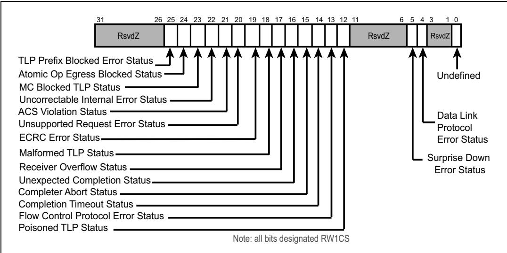

<table style="border-collapse:collapse;width:100%">
  <thead style="border:2px solid #000;">
    <tr>
      <th width="50%" style="border:2px solid #000;background:#f5f5f5;padding:4px 8px;">EN</th>
      <th width="50%" style="border:2px solid #000;background-color:#e8e8e8;padding:4px 8px;">中文</th>
    </tr>
  </thead>
  <tbody>
      <tr><td width="50%" style="border:2px solid #000;background:#fff;padding:4px 8px;">The following list describes each of the register bits from right to left:</td><td width="50%" style="border:2px solid #000;background-color:#e8e8e8;padding:4px 8px;">以下列表从右到左描述了每一个寄存器位：</td></tr>
      <tr><td width="50%" style="border:2px solid #000;background:#fff;padding:4px 8px;">• Undefined — Previously, this first bit represented a link training failure at the Physical Layer, but that meaning was removed with the 1.1 revision of the spec. Software must now ignore any value in this bit but may write any value to it. This information was no longer needed because bit 5, Surprise Down Error, now includes the same information in a broader meaning: the Link is not communicating at the Physical Layer.</td><td width="50%" style="border:2px solid #000;background-color:#e8e8e8;padding:4px 8px;">• 未定义 — 此前，这第一个位表示物理层的链路训练失败，但该含义已在1.1版规范修订中被移除。软件现在必须忽略该位的任何值，但可以向其写入任意值。该信息不再需要，因为位5（意外断开错误）现已包含相同的含义且范围更广：链路在物理层无法通信。</td></tr>
      <tr><td width="50%" style="border:2px solid #000;background:#fff;padding:4px 8px;">Data Link Protocol Errors — Caused by Data Link Layer protocol errors including the Ack/Nak retry mechanism. For example, a transmitter receives an Ack or Nak whose sequence number doesn't correspond to an unacknowledged TLP or to the ACKD_SEQ number.</td><td width="50%" style="border:2px solid #000;background-color:#e8e8e8;padding:4px 8px;">数据链路协议错误 — 由数据链路层协议错误引起，包括Ack/Nak重试机制。例如，发送端接收到一个Ack或Nak，但其序列号与未确认的TLP或ACKD_SEQ编号不匹配。</td></tr>
      <tr><td width="50%" style="border:2px solid #000;background:#fff;padding:4px 8px;">Surprise Down — If the Physical Layer reports LinkUp = 0b (Link is no longer communicating) unexpectedly, this will be seen as an error unless it was an allowed exception. For example, if the Link Disable bit has already been set, then it's expected that LinkUp will be cleared and this condition won't be an error. This bit is only valid for Downstream Ports, which makes sense because it won't be possible to read status from an Upstream Port if the Link isn't working.</td><td width="50%" style="border:2px solid #000;background-color:#e8e8e8;padding:4px 8px;">意外断开 — 如果物理层意外报告LinkUp = 0b（链路不再通信），这将被视为错误，除非是允许的异常情况。例如，如果链路禁用位已被置位，那么LinkUp被清除是预期的，这种情况不会被视为错误。该位仅对下游端口有效，这是合理的，因为如果链路不工作，将无法从上游端口读取状态。</td></tr>
      <tr><td width="50%" style="border:2px solid #000;background:#fff;padding:4px 8px;">• Poisoned TLP — TLP was seen that had the EP bit set.</td><td width="50%" style="border:2px solid #000;background-color:#e8e8e8;padding:4px 8px;">• 中毒TLP — 检测到EP位被置位的TLP。</td></tr>
      <tr><td width="50%" style="border:2px solid #000;background:#fff;padding:4px 8px;">Flow Control Protocol Error (optional) — Errors associated with failures of the Flow Control mechanism. Example: receiver reports more than 2047 data credits.</td><td width="50%" style="border:2px solid #000;background-color:#e8e8e8;padding:4px 8px;">流控协议错误（可选） — 与流控机制失效相关的错误。例如：接收端报告超过2047个数据信用量。</td></tr>
      <tr><td width="50%" style="border:2px solid #000;background:#fff;padding:4px 8px;">• Completion Timeout — A Completion is not received within the required amount of time after a non‑posted request was sent.</td><td width="50%" style="border:2px solid #000;background-color:#e8e8e8;padding:4px 8px;">• 完成超时 — 发送非转发请求后，在规定时间内未收到完成报文。</td></tr>
      <tr><td width="50%" style="border:2px solid #000;background:#fff;padding:4px 8px;">• Completer Abort (optional) — Completer cannot fulfill a Request due to problems with the Request or failure of the Completer.</td><td width="50%" style="border:2px solid #000;background-color:#e8e8e8;padding:4px 8px;">• 完成方异常终止（可选） — 由于请求本身的问题或完成方故障，完成方无法满足请求。</td></tr>
      <tr><td width="50%" style="border:2px solid #000;background:#fff;padding:4px 8px;">• Unexpected Completion — Requester receives a Completion that doesn't match any Requests that are awaiting a Completion.</td><td width="50%" style="border:2px solid #000;background-color:#e8e8e8;padding:4px 8px;">• 意外完成 — 请求方接收到与任何等待完成的请求都不匹配的完成报文。</td></tr>
      <tr><td width="50%" style="border:2px solid #000;background:#fff;padding:4px 8px;">Receiver Overflow (optional) — More TLPs have arrived than the Receive Buffer had room to accept, resulting in an overflow error.</td><td width="50%" style="border:2px solid #000;background-color:#e8e8e8;padding:4px 8px;">接收端溢出（可选） — 到达的TLP数量超过接收缓冲区的容量，导致溢出错误。</td></tr>
      <tr><td width="50%" style="border:2px solid #000;background:#fff;padding:4px 8px;">• Malformed TLP — Caused by errors associated with a received TLP header (see "Malformed TLP" on page 666).</td><td width="50%" style="border:2px solid #000;background-color:#e8e8e8;padding:4px 8px;">• 畸形TLP — 由接收到的TLP头部相关错误引起（参见第666页"畸形TLP"）。</td></tr>
      <tr><td width="50%" style="border:2px solid #000;background:#fff;padding:4px 8px;">• ECRC Error (optional) — Caused by an ECRC check failure at the Receiver.</td><td width="50%" style="border:2px solid #000;background-color:#e8e8e8;padding:4px 8px;">• ECRC错误（可选） — 由接收端ECRC校验失败引起。</td></tr>
      <tr><td width="50%" style="border:2px solid #000;background:#fff;padding:4px 8px;">Unsupported Request Error — Completer does not support the Request. Request is correctly formed and had no other errors, but cannot be fulfilled by the Completer, perhaps because it's an invalid command for this device.</td><td width="50%" style="border:2px solid #000;background-color:#e8e8e8;padding:4px 8px;">不支持请求错误 — 完成方不支持该请求。请求格式正确且无其他错误，但完成方无法满足，可能是因为该命令对此设备无效。</td></tr>
      <tr><td width="50%" style="border:2px solid #000;background:#fff;padding:4px 8px;">• ACS Violation — Access control error was seen in a received posted or nonposted request.</td><td width="50%" style="border:2px solid #000;background-color:#e8e8e8;padding:4px 8px;">• ACS违例 — 在接收到的转发或非转发请求中检测到访问控制错误。</td></tr>
      <tr><td width="50%" style="border:2px solid #000;background:#fff;padding:4px 8px;">Uncorrectable Internal Error — An internal error detected in the device could not be corrected or worked around by the hardware itself.</td><td width="50%" style="border:2px solid #000;background-color:#e8e8e8;padding:4px 8px;">不可校正内部错误 — 设备中检测到的内部错误无法由硬件自身校正或规避。</td></tr>
      <tr><td width="50%" style="border:2px solid #000;background:#fff;padding:4px 8px;">MC Blocked TLP — A TLP designated for Multi‑Cast routing was blocked. For example, an Egress Port can be programmed to block any MC hits that arrive with untranslated addresses (see "Routing Multicast TLPs" on page 896).</td><td width="50%" style="border:2px solid #000;background-color:#e8e8e8;padding:4px 8px;">MC阻塞TLP — 指定用于多播路由的TLP被阻塞。例如，出口端口可被编程为阻塞任何携带未翻译地址到达的多播命中（参见第896页"路由多播TLP"）。</td></tr>
      <tr><td width="50%" style="border:2px solid #000;background:#fff;padding:4px 8px;">• AtomicOp Egress Blocked — Egress Ports of routing elements can be programmed to block AtomicOps from being forwarded to agents that shouldn't see them (see "AtomicOps" on page 897).</td><td width="50%" style="border:2px solid #000;background-color:#e8e8e8;padding:4px 8px;">• AtomicOp出口阻塞 — 路由元素的出口端口可被编程为阻止AtomicOps转发给不应看到它们的代理（参见第897页"AtomicOps"）。</td></tr>
      <tr><td width="50%" style="border:2px solid #000;background:#fff;padding:4px 8px;">TLP Prefix Blocked Error — Egress Ports of routing elements can be programmed not to forward TLPs containing End‑to‑End TLP Prefixes. If they then see one, they'll drop the TLP and report this error. For more on this, see "TPH (TLP Processing Hints)" on page 899.</td><td width="50%" style="border:2px solid #000;background-color:#e8e8e8;padding:4px 8px;">TLP前缀阻塞错误 — 路由元素的出口端口可被编程为不转发包含端到端TLP前缀的TLP。如果随后检测到此类TLP，它们将丢弃该TLP并报告此错误。更多信息参见第899页"TPH（TLP处理提示）"。</td></tr>
      <tr><td width="50%" style="border:2px solid #000;background:#fff;padding:4px 8px;">Recall that the First Error Pointer in the Capability and Control Register indicates which unmasked uncorrectable error was the first to arrive since the pointer was last updated. Error handling software can read the pointer to find out which error to investigate first. As an example, if the pointer value is 18d, that means bit position 18 in the Uncorrectable Status register was first, which is a Malformed TLP. Once that error has been serviced, software writes a one to bit 18 in the status register to clear that event, which updates the First Error Pointer to the next‑most‑recent error.</td><td width="50%" style="border:2px solid #000;background-color:#e8e8e8;padding:4px 8px;">回顾一下，能力与控制寄存器中的首次错误指针指示自该指针上次更新以来，最先到达的未屏蔽不可校正错误是哪一个。错误处理软件可以读取该指针以确定应首先调查哪个错误。例如，如果指针值为18d，则表示不可校正状态寄存器中的第18位最先置位，即畸形TLP。一旦该错误被处理，软件向状态寄存器的第18位写入1以清除该事件，从而将首次错误指针更新为下一个最近发生的错误。</td></tr>
  </tbody>
</table>

<table style="border-collapse:collapse; width:100%;">
  <thead style="border:2px solid #000;">
    <tr>
      <th width="50%" style="border:2px solid #000; background:#f5f5f5;">EN</th>
      <th width="50%" style="border:2px solid #000; background-color:#e8e8e8;">中文</th>
    </tr>
  </thead>
  <tbody>
    <tr><td width="50%" style="border:2px solid #000; background:#fff;padding:4px 8px;">## Selecting Uncorrectable Error Severity</td><td width="50%" style="border:2px solid #000; background-color:#e8e8e8;padding:4px 8px;">## 选择不可校正错误的严重级别</td></tr>
    <tr><td width="50%" style="border:2px solid #000; background:#fff;padding:4px 8px;">Software can select whether or not uncorrectable errors should be considered Fatal in this register, allowing errors to be treated differently for different applications. For example, a Poisoned TLP will be a Non‐Fatal condition by default, and is treated as an Advisory Non‐Fatal error in some cases, as discussed earlier. But software can escalate it to Fatal by setting its severity bit to one and then it will no longer be an advisory case. The default severity values are illustrated in the individual bit fields of Figure 15‐26 on page 694 (1 = Fatal, 0 = Non‐Fatal). If they are enabled and not masked, those errors selected as Non‐Fatal will cause an ERR\_NONFATAL message to be sent to the Root Complex, and those selected as Fatal will cause an ERR\_FATAL message.</td><td width="50%" style="border:2px solid #000; background-color:#e8e8e8;padding:4px 8px;">软件可通过此寄存器选择不可校正错误是否应被视为致命（Fatal）错误，从而允许不同应用对错误进行不同处理。例如，中毒TLP默认情况下为非致命（Non‐Fatal）条件，如前所述，在某些情况下被视为通告性非致命（Advisory Non‐Fatal）错误。但软件可通过将其严重级别位置1将其升级为致命错误，之后它将不再属于通告性情况。默认严重级别值如图15‑26（第694页）的各个位域所示（1=致命，0=非致命）。如果这些错误被使能且未被屏蔽，则被选为非致命的错误将导致向根复合体发送ERR\_NONFATAL消息，而被选为致命的错误将导致发送ERR\_FATAL消息。</td></tr>
  </tbody>
</table>

Figure 15‐26: Advanced Uncorrectable Error Severity Register | 图15‐26：高级不可校正错误严重性寄存器  

## Uncorrectable Error Masking | 不可纠正错误屏蔽

<table style="border-collapse:collapse; width:100%;">
  <thead style="border:2px solid #000;">
    <tr>
      <th width="50%" style="border:2px solid #000; background:#f5f5f5;">EN</th>
      <th width="50%" style="border:2px solid #000; background-color:#e8e8e8;">中文</th>
    </tr>
  </thead>
  <tbody>
    <tr><td width="50%" style="border:2px solid #000; background:#fff;padding:4px 8px;">Software can mask out individual errors so they won't cause an error message to be sent by using the Advanced Uncorrectable Error Mask register, shown in Figure 15-27 on page 694. The default condition is to allow Error Messages for each type of error (all mask bits are cleared).</td><td width="50%" style="border:2px solid #000; background-color:#e8e8e8;padding:4px 8px;">软件可以通过使用高级不可校正错误屏蔽寄存器（Advanced Uncorrectable Error Mask Register，如图15-27所示，见第694页）来屏蔽个别错误，使其不会导致发送错误消息。默认条件允许每种错误类型的错误消息（所有屏蔽位均被清零）。</td></tr>
  </tbody>
</table>

Figure 15-27: Advanced Uncorrectable Error Mask Register | 图15-27：高级不可校正错误掩码寄存器  

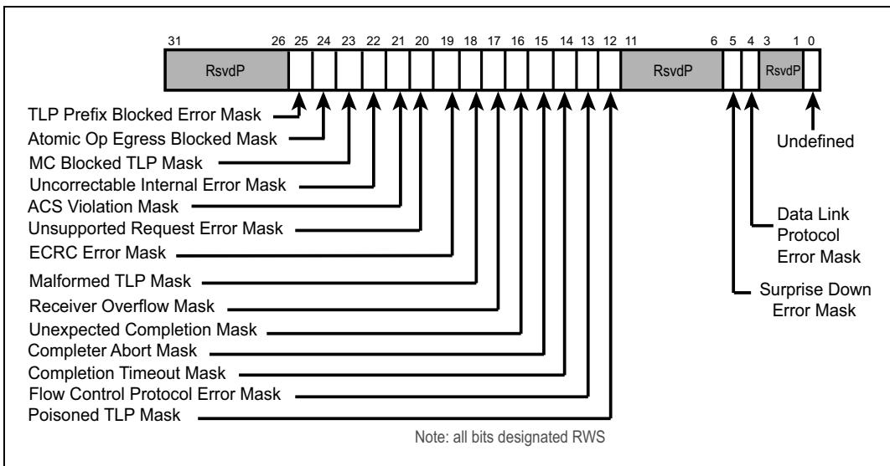

## 15.10.5 Header Logging | 15.10.5 报头记录

<table style="border-collapse:collapse; width:100%;">
  <thead style="border:2px solid #000;">
    <tr>
      <th width="50%" style="border:2px solid #000; background:#f5f5f5;">EN</th>
      <th width="50%" style="border:2px solid #000; background-color:#e8e8e8;">中文</th>
    </tr>
  </thead>
  <tbody>
    <tr><td width="50%" style="border:2px solid #000; background:#fff;padding:4px 8px;">A 4DW portion of the Advanced Error Reporting structure is used for storing the header of a received TLP that incurs an unmasked, uncorrectable error. Since header logging is only useful when a TLP has been received with a problem that wasn't seen by the Physical or Data Link Layers, the number of possibilities is limited, as shown in Table 15‐6 on page 695. As mentioned earlier, when the optional AER capability is implemented, hardware is required to be able to log at least one header, though it may support logging more.</td><td width="50%" style="border:2px solid #000; background-color:#e8e8e8;padding:4px 8px;">高级错误报告结构中的4DW部分用于存储收到且发生了未屏蔽的不可校正错误的TLP的报头。由于报头记录仅当TLP在物理层或数据链路层未发现的情况下接收到问题时才有用，因此可能的情况数量有限，如第695页的表15‐6所示。如前所述，当实现了可选AER能力时，硬件必须能够记录至少一个报头，但它可以支持记录更多。</td></tr>
    <tr><td width="50%" style="border:2px solid #000; background:#fff;padding:4px 8px;">When the First Error Pointer is valid, the header log contains the header for the corresponding error if it was caused by an incoming TLP. Updating the Uncorrectable Error Status register will cause the Header Log registers to also update to the next value in sequence, meaning the next uncorrectable error that was detected. Since the hardware can only track a limited number of headers, it's important that software service uncorrectable errors quickly enough to avoid running out of header space. If the header log capacity is reached, that's a correctable error in itself (Header Log Overflow). This could happen if the number of supported log registers is exceeded or if the Multiple Header Log Enable bit is not set and the First Error Pointer is already valid when a new uncorrectable error is detected.</td><td width="50%" style="border:2px solid #000; background-color:#e8e8e8;padding:4px 8px;">当首个错误指针有效时，如果对应错误是由入站TLP引起的，则报头日志包含该错误的报头。更新不可校正错误状态寄存器将导致报头日志寄存器也依次更新为序列中的下一个值，即下一个检测到的不可校正错误。由于硬件只能跟踪有限数量的报头，软件必须足够快地处理不可校正错误，以避免报头空间耗尽。如果达到报头日志容量，这本身就是一个可校正错误（报头日志溢出）。当支持的日志寄存器数量被超出，或者当多个报头日志使能位未设置且检测到新的不可校正错误时首个错误指针已经有效，就可能发生这种情况。</td></tr>
  </tbody>
</table>

Table 15‐6: Errors That Can Use Header Log Registers / 表15‐6：可使用报头日志寄存器的错误 | 表15‐6：可使用报头日志寄存器的错误

<table style="border-collapse:collapse;width:100%"><tr><td style="border:2px solid #000;">Name of Error</td><td style="border:2px solid #000;">Default Classification</td></tr><tr><td style="border:2px solid #000;">Poisoned TLP Received</td><td style="border:2px solid #000;">Uncorrectable - NonFatal</td></tr><tr><td style="border:2px solid #000;">ECRC Check Failed</td><td style="border:2px solid #000;">Uncorrectable - NonFatal</td></tr><tr><td style="border:2px solid #000;">Unsupported Request</td><td style="border:2px solid #000;">Uncorrectable - NonFatal</td></tr><tr><td style="border:2px solid #000;">Completer Abort</td><td style="border:2px solid #000;">Uncorrectable - NonFatal</td></tr><tr><td style="border:2px solid #000;">Unexpected Completion</td><td style="border:2px solid #000;">Uncorrectable - NonFatal</td></tr><tr><td style="border:2px solid #000;">ACS Violation</td><td style="border:2px solid #000;">Uncorrectable - NonFatal</td></tr><tr><td style="border:2px solid #000;">Malformed TLP</td><td style="border:2px solid #000;">Uncorrectable - Fatal</td></tr></table>

## 15.10.6 Root Complex Error Tracking and Reporting | 15.10.6 根复合体错误跟踪和报告

<table style="border-collapse:collapse; width:100%;">
  <thead style="border:2px solid #000;">
    <tr>
      <th width="50%" style="border:2px solid #000; background:#f5f5f5;">EN</th>
      <th width="50%" style="border:2px solid #000; background-color:#e8e8e8;">中文</th>
    </tr>
  </thead>
  <tbody>
    <tr><td width="50%" style="border:2px solid #000; background:#fff;padding:4px 8px;">The Root Complex is the target of all error Messages from devices in a PCIe topology. Errors received by the Root update status registers and may be reported to the host system if enabled to do so.</td><td width="50%" style="border:2px solid #000; background-color:#e8e8e8;padding:4px 8px;">根复合体是PCIe拓扑中所有设备发出的错误消息的目标。根复合体接收到的错误会更新状态寄存器，并且如果启用，可能会向主机系统报告。</td></tr>
  </tbody>
</table>

## Root Complex Error Status Registers | 根复合体错误状态寄存器

<table style="border-collapse:collapse; width:100%;">
  <thead style="border:2px solid #000;">
    <tr>
      <th width="50%" style="border:2px solid #000; background:#f5f5f5;">EN</th>
      <th width="50%" style="border:2px solid #000; background-color:#e8e8e8;">中文</th>
    </tr>
  </thead>
  <tbody>
    <tr><td width="50%" style="border:2px solid #000; background:#fff;padding:4px 8px;">When the Root receives an error Message, it sets status bits within the Root Error Status register (Figure 15-28 on page 697). This register indicates the type of error received and whether multiple errors of the same type have been received. Note that an error detected in the Root Port itself will set these status bits, too, as if the port had sent itself an error message. The status bits are:</td><td width="50%" style="border:2px solid #000; background-color:#e8e8e8;padding:4px 8px;">当根复合体接收到错误消息时，它会在根错误状态寄存器（第697页图15-28）中设置状态位。该寄存器指示所接收错误的类型以及是否接收到相同类型的多个错误。请注意，在根端口自身检测到的错误也会设置这些状态位，就好像该端口向自己发送了一条错误消息一样。状态位包括：</td></tr>
    <tr><td width="50%" style="border:2px solid #000; background:#fff;padding:4px 8px;">• ERR_COR Received</td><td width="50%" style="border:2px solid #000; background-color:#e8e8e8;padding:4px 8px;">• ERR_COR 已接收</td></tr>
    <tr><td width="50%" style="border:2px solid #000; background:#fff;padding:4px 8px;">Multiple ERR_COR Received — received an ERR_COR message, or detected an unmasked Root Port correctable error with the ERR_COR Received bit already set.</td><td width="50%" style="border:2px solid #000; background-color:#e8e8e8;padding:4px 8px;">已接收多个 ERR_COR — 接收到 ERR_COR 消息，或者在 ERR_COR 已接收位已置位的情况下检测到未屏蔽的根端口可纠正错误。</td></tr>
    <tr><td width="50%" style="border:2px solid #000; background:#fff;padding:4px 8px;">• ERR_FATAL/NONFATAL Received</td><td width="50%" style="border:2px solid #000; background-color:#e8e8e8;padding:4px 8px;">• ERR_FATAL/NONFATAL 已接收</td></tr>
    <tr><td width="50%" style="border:2px solid #000; background:#fff;padding:4px 8px;">Multiple ERR_FATAL/NONFATAL Received — received an ERR_FATAL or ERR_NONFATAL message or detected an unmasked Root Port uncorrectable error with the ERR_FATAL/NONFATAL Received bit already set.</td><td width="50%" style="border:2px solid #000; background-color:#e8e8e8;padding:4px 8px;">已接收多个 ERR_FATAL/NONFATAL — 接收到 ERR_FATAL 或 ERR_NONFATAL 消息，或者在 ERR_FATAL/NONFATAL 已接收位已置位的情况下检测到未屏蔽的根端口不可纠正错误。</td></tr>
    <tr><td width="50%" style="border:2px solid #000; background:#fff;padding:4px 8px;">It's possible for a system to implement separate software error handlers for Correctable, Non-Fatal, and Fatal errors, so this register includes bits to differentiate whether Uncorrectable errors were Fatal or Non-Fatal:</td><td width="50%" style="border:2px solid #000; background-color:#e8e8e8;padding:4px 8px;">系统可以为可纠正、非致命和致命错误实现独立的软件错误处理程序，因此该寄存器包含用于区分不可纠正错误是致命还是非致命的位：</td></tr>
    <tr><td width="50%" style="border:2px solid #000; background:#fff;padding:4px 8px;">If the first Uncorrectable Error Message received is Fatal the "First Uncorrectable Fatal" bit is also set along with the "Fatal Error Message Received" bit.</td><td width="50%" style="border:2px solid #000; background-color:#e8e8e8;padding:4px 8px;">如果接收到的第一个不可纠正错误消息是致命的，则"首个不可纠正致命错误"位与"致命错误消息已接收"位同时置位。</td></tr>
    <tr><td width="50%" style="border:2px solid #000; background:#fff;padding:4px 8px;">If the first Uncorrectable Error Message received is Non-Fatal the "Nonfatal Error Message Received" bit is set. (If a subsequent Uncorrectable Error is Fatal, the "Fatal Error Message Received" bit will be set, but because the "First Uncorrectable Fatal" remains cleared, software knows that the first Uncorrectable Error was Non-Fatal).</td><td width="50%" style="border:2px solid #000; background-color:#e8e8e8;padding:4px 8px;">如果接收到的第一个不可纠正错误消息是非致命的，则"非致命错误消息已接收"位置位。（如果后续的不可纠正错误是致命的，"致命错误消息已接收"位将置位，但由于"首个不可纠正致命错误"位保持清零，软件知道第一个不可纠正错误是非致命的。）</td></tr>
    <tr><td width="50%" style="border:2px solid #000; background:#fff;padding:4px 8px;">Finally, an interrupt may have been enabled (in the Root Error Command register) to be sent to the host system as a result of detecting one of these events. To support that, the 5-bit Interrupt Message Number in this register supplies the MSI or MSI-X vector number to be used, and there are 32 possibilities. For MSI, the number is the offset from the base data pattern. For MSI-X, it represents the table entry to be used, and must be one of the first 32 even if the agent supports more than 32. This read-only value is set by hardware and must be automatically updated if the number of MSI messages assigned to the device changes.</td><td width="50%" style="border:2px solid #000; background-color:#e8e8e8;padding:4px 8px;">最后，由于检测到这些事件之一，可能已在根错误命令寄存器中使能中断以发送到主机系统。为此，该寄存器中的5位中断消息编号提供了要使用的MSI或MSI-X向量编号，共有32种可能。对于MSI，该编号是相对于基数据模式的偏移量。对于MSI-X，它表示要使用的表项，并且必须是前32项之一，即使该设备支持超过32项。此只读值由硬件设置，并且如果分配给设备的MSI消息数量发生变化，必须自动更新。</td></tr>
  </tbody>
</table>

Figure 15-28: Root Error Status Register | 图15-28：根错误状态寄存器

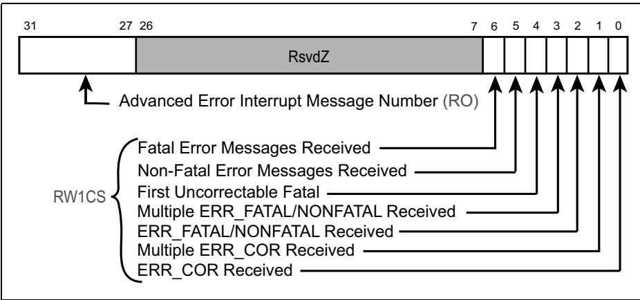

## Advanced Source ID Register | 高级源ID寄存器

<table style="border-collapse:collapse; width:100%;">
  <thead style="border:2px solid #000;">
    <tr>
      <th width="50%" style="border:2px solid #000; background:#f5f5f5;">EN</th>
      <th width="50%" style="border:2px solid #000; background-color:#e8e8e8;">中文</th>
    </tr>
  </thead>
  <tbody>
    <tr><td width="50%" style="border:2px solid #000; background:#fff;padding:4px 8px;">Software error handlers may need to read and clear status registers in the device that detected and reported the error. To facilitate this, the error Messages contain the ID (Bus:Dev:Func) of the first device reporting that error type. The Source ID register captures that ID from the Message for an incoming ERR\_FATAL/NONFATAL message if the ERR\_FATAL/NONFATAL bit isn't already set (meaning this is the first one). Similarly, the Source ID of the first received ERR\_COR message is captured, too, as shown in Figure 15-29 on page 698.</td><td width="50%" style="border:2px solid #000; background-color:#e8e8e8;padding:4px 8px;">软件错误处理程序可能需要读取并清除检测到并报告错误的设备中的状态寄存器。为此，错误消息中包含报告该错误类型的首个设备的ID（总线:设备:功能）。当接收到ERR\_FATAL/NONFATAL消息时，如果ERR\_FATAL/NONFATAL位尚未置位（即这是第一个错误），则Source ID寄存器会从该消息中捕获该ID。类似地，第一个接收到的ERR\_COR消息的Source ID也会被捕获，如图15-29第698页所示。</td></tr>
  </tbody>
</table>

Figure 15-29: Advanced Source ID Register | 图15-29：高级源ID寄存器

<table style="border-collapse:collapse;width:100%"><tr><td colspan="2" style="border:2px solid #000;">31</td><td style="border:2px solid #000;">0</td></tr><tr><td style="border:2px solid #000;">ERR_FATAL/NONFATAL Source ID(ROS)</td><td style="border:2px solid #000;">ERR_COR Source ID(ROS)</td><td style="border:2px solid #000;"></td></tr><tr><td colspan="3" style="border:2px solid #000;">ROS: Read-Only and Sticky</td></tr></table>

<table style="border-collapse:collapse; width:100%;">
  <thead style="border:2px solid #000;">
    <tr>
      <th width="50%" style="border:2px solid #000; background:#f5f5f5;">EN</th>
      <th width="50%" style="border:2px solid #000; background-color:#e8e8e8;">中文</th>
    </tr>
  </thead>
  <tbody>
    <tr><td width="50%" style="border:2px solid #000; background:#fff;padding:4px 8px;">## Root Error Command Register</td><td width="50%" style="border:2px solid #000; background-color:#e8e8e8;padding:4px 8px;">## 根错误命令寄存器</td></tr>
    <tr><td width="50%" style="border:2px solid #000; background:#fff;padding:4px 8px;">The Root Complex has separate enable bits for each of the three error categories to control whether that error type will generate an interrupt to call an error handler as shown in Figure 15-30 on page 698. The interrupt that is generate will either be an MSI or MSI-X as discussed in "Root Complex Error Status Registers" on page 696. Once the interrupt is received, the called error handler would probably first read the Root Complex status registers to determine the nature of the error, and then go down to the source BDF of the error to read standard status register as well as possibly device-specific registers to determine what occurred and how it should be handled.</td><td width="50%" style="border:2px solid #000; background-color:#e8e8e8;padding:4px 8px;">根复合体为三种错误类别分别设有独立的使能位，用于控制该错误类型是否产生中断以调用错误处理程序，如图15-30（第698页）所示。所产生的中断可以是MSI或MSI-X，详见第696页的"Root Complex Error Status Registers"讨论。一旦接收到中断，被调用的错误处理程序通常应先读取根复合体状态寄存器以确定错误的性质，然后向下访问错误的源BDF，读取标准状态寄存器以及可能的设备特定寄存器，以确定发生了什么以及应如何处理。</td></tr>
  </tbody>
</table>

Figure 15-30: Advanced Root Error Command Register | 图15-30：高级根错误命令寄存器

<table style="border-collapse:collapse;width:100%"><tr><td rowspan="19" style="border:2px solid #000;">31</td><td colspan="5" style="border:2px solid #000;">RsvdP</td></tr><tr><td rowspan="14" style="border:2px solid #000;"></td><td style="border:2px solid #000;">3</td><td style="border:2px solid #000;">2</td><td style="border:2px solid #000;">1</td><td style="border:2px solid #000;">0</td></tr><tr><td style="border:2px solid #000;"></td><td style="border:2px solid #000;"></td><td style="border:2px solid #000;"></td><td style="border:2px solid #000;"></td></tr><tr><td style="border:2px solid #000;"></td><td style="border:2px solid #000;"></td><td style="border:2px solid #000;"></td><td style="border:2px solid #000;"></td></tr><tr><td style="border:2px solid #000;"></td><td style="border:2px solid #000;"></td><td style="border:2px solid #000;"></td><td style="border:2px solid #000;"></td></tr><tr><td style="border:2px solid #000;"></td><td style="border:2px solid #000;"></td><td style="border:2px solid #000;"></td><td style="border:2px solid #000;"></td></tr><tr><td style="border:2px solid #000;"></td><td style="border:2px solid #000;"></td><td style="border:2px solid #000;"></td><td style="border:2px solid #000;"></td></tr><tr><td style="border:2px solid #000;"></td><td style="border:2px solid #000;"></td><td style="border:2px solid #000;"></td><td style="border:2px solid #000;"></td></tr><tr><td style="border:2px solid #000;"></td><td style="border:2px solid #000;"></td><td style="border:2px solid #000;"></td><td style="border:2px solid #000;"></td></tr><tr><td style="border:2px solid #000;"></td><td style="border:2px solid #000;"></td><td style="border:2px solid #000;"></td><td style="border:2px solid #000;"></td></tr><tr><td style="border:2px solid #000;"></td><td style="border:2px solid #000;"></td><td style="border:2px solid #000;"></td><td style="border:2px solid #000;"></td></tr><tr><td style="border:2px solid #000;"></td><td style="border:2px solid #000;"></td><td style="border:2px solid #000;"></td><td style="border:2px solid #000;"></td></tr><tr><td style="border:2px solid #000;"></td><td style="border:2px solid #000;"></td><td style="border:2px solid #000;"></td><td style="border:2px solid #000;"></td></tr><tr><td colspan="5" style="border:2px solid #000;">Fatal Error Reporting Enable</td></tr><tr><td colspan="5" style="border:2px solid #000;">Non-Fatal Error Reporting Enable</td></tr><tr><td colspan="5" style="border:2px solid #000;">Correctable Error Reporting Enable</td></tr><tr><td colspan="5" style="border:2px solid #000;">Note: all bits designated RW</td></tr></table>

## 15.11 Summary of Error Logging and Reporting | 15.11 错误记录与报告总结

<table style="border-collapse:collapse; width:100%;">
  <thead style="border:2px solid #000;">
    <tr>
      <th width="50%" style="border:2px solid #000; background:#f5f5f5;">EN</th>
      <th width="50%" style="border:2px solid #000; background-color:#e8e8e8;">中文</th>
    </tr>
  </thead>
  <tbody>
    <tr><td width="50%" style="border:2px solid #000; background:#fff;padding:4px 8px;">The spec includes the flow chart in Figure 15-31 on page 699 that shows the actions taken by a Function when an error is detected. The part inside the dashed line highlights the items that are added when the optional AER capability structure is present.</td><td width="50%" style="border:2px solid #000; background-color:#e8e8e8;padding:4px 8px;">规范在第699页的图15-31中包含了流程图，展示了当检测到错误时一个功能（Function）所采取的动作。虚线框内的部分突出了当可选的高级错误报告（AER）能力结构存在时新增的条目。</td></tr>
  </tbody>
</table>

Figure 15-31: Flow Chart of Error Handling Within a Function / 图15-31：功能内部错误处理的流程图 | 图15-31：功能内部错误处理的流程图

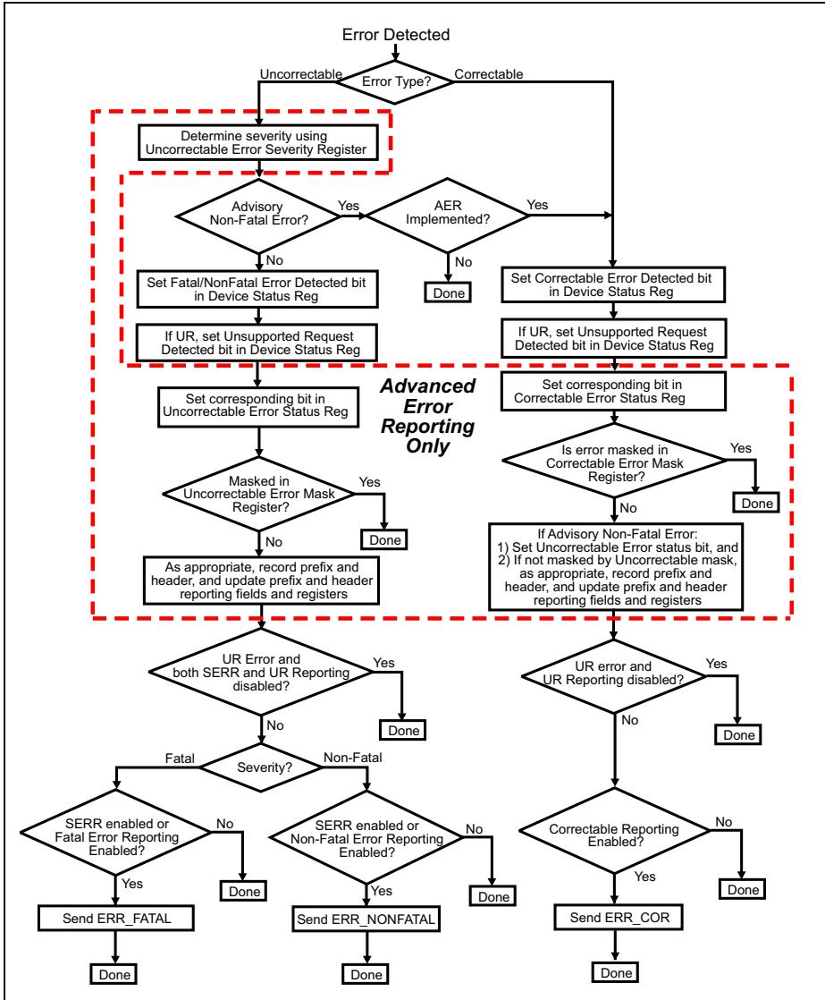

## 15.12 Example Flow of Software Error Investigation | 15.12 软件错误调查的示例流程
## 软件错误调查的示例流程

<table style="border-collapse:collapse; width:100%;">
  <thead style="border:2px solid #000;">
    <tr>
      <th width="50%" style="border:2px solid #000; background:#f5f5f5;">EN</th>
      <th width="50%" style="border:2px solid #000; background-color:#e8e8e8;">中文</th>
    </tr>
  </thead>
  <tbody>
    <tr><td width="50%" style="border:2px solid #000; background:#fff;padding:4px 8px;">Now that we know all the mechanisms defined in PCIe for detecting, logging and reporting errors, it is worthwhile to look at how software would find and use this information to determine how to handle a reported error.</td><td width="50%" style="border:2px solid #000; background-color:#e8e8e8;padding:4px 8px;">既然我们已经了解了 PCIe 中定义的所有用于错误检测、记录和报告的机制，那么值得探讨的是软件将如何查找并使用这些信息，以确定如何处理所报告的错误。</td></tr>
  </tbody>
</table>

## PCI Express Technology | PCI Express 技术

<table style="border-collapse:collapse; width:100%;">
  <thead style="border:2px solid #000;">
    <tr>
      <th width="50%" style="border:2px solid #000; background:#f5f5f5;">EN</th>
      <th width="50%" style="border:2px solid #000; background-color:#e8e8e8;">中文</th>
    </tr>
  </thead>
  <tbody>
    <tr><td width="50%" style="border:2px solid #000; background:#fff;padding:4px 8px;">This example is going to assume that both the originating Function as well as the Root Port upstream of it both support AER. Without AER support, the standardized registers for error logging are very limited.</td><td width="50%" style="border:2px solid #000; background-color:#e8e8e8;padding:4px 8px;">本示例假设发起端功能（Function）及其上游的根端口（Root Port）均支持AER。若没有AER支持，用于错误记录的标准寄存器将非常有限。</td></tr>
    <tr><td width="50%" style="border:2px solid #000; background:#fff;padding:4px 8px;">The system used for this example is shown in Figure 15-32 on page 701. The Root Port has a BDF of 0:28:0 and was enabled to generate an interrupt when it receives either an ERR_FATAL or ERR_NONFATAL message. We are going to follow the steps of error handling software would take to determine what errors have occurred, where they occurred and what packets were they detected in.</td><td width="50%" style="border:2px solid #000; background-color:#e8e8e8;padding:4px 8px;">本示例使用的系统如图15-32（第701页）所示。根端口的BDF为0:28:0，并被使能在接收到ERR_FATAL或ERR_NONFATAL消息时产生中断。我们将按照错误处理软件通常采取的步骤，来确定发生了什么错误、错误发生在哪里以及是在哪些报文中检测到的。</td></tr>
    <tr><td width="50%" style="border:2px solid #000; background:#fff;padding:4px 8px;">The error handling software has been called because of an interrupt from Root Port 0:28:0. The steps below are just an example, but illustrate the process of error handling software gathering error information.</td><td width="50%" style="border:2px solid #000; background-color:#e8e8e8;padding:4px 8px;">由于来自根端口0:28:0的中断，错误处理软件被调用。以下步骤仅是一个示例，但展示了错误处理软件收集错误信息的过程。</td></tr>
    <tr><td width="50%" style="border:2px solid #000; background:#fff;padding:4px 8px;">1. Software knows it was Root Port 0:28:0 that called the error handler based on the interrupt vector used. Since MSI or MSI-X interrupts are used to report errors, each Root Port will have their own unique set of interrupt vectors.</td><td width="50%" style="border:2px solid #000; background-color:#e8e8e8;padding:4px 8px;">1. 软件根据所用的中断向量知道是根端口0:28:0调用了错误处理程序。由于使用MSI或MSI-X中断来报告错误，每个根端口都有自己唯一的一组中断向量。</td></tr>
    <tr><td width="50%" style="border:2px solid #000; background:#fff;padding:4px 8px;">2. The error handler reads the Root Error Status register of the AER structure on 0:28:0 to determine what types of error messages have been received by the Root Port. The value in that register is 0800_007Ch which indicates that this Root Port has not received any ERR_COR messages, but has received both ERR_FATAL and ERR_NONFATAL messages and the first uncorrectable error message that it received was an ERR_FATAL.</td><td width="50%" style="border:2px solid #000; background-color:#e8e8e8;padding:4px 8px;">2. 错误处理程序读取0:28:0上AER结构的根错误状态寄存器，以确定根端口已接收到的错误消息类型。该寄存器的值为0800_007Ch，表明该根端口尚未收到任何ERR_COR消息，但已收到ERR_FATAL和ERR_NONFATAL消息，并且其收到的第一个不可纠正错误消息是ERR_FATAL。</td></tr>
    <tr><td width="50%" style="border:2px solid #000; background:#fff;padding:4px 8px;">3. The next step is to determine which BDF beneath this Root Port sent the first uncorrectable error. Software then reads the Source ID register of the Root Port and finds the value 0500_0000h, which indicates that the source BDF of the first uncorrectable error was 5:0:0.</td><td width="50%" style="border:2px solid #000; background-color:#e8e8e8;padding:4px 8px;">3. 下一步是确定该根端口下的哪个BDF发送了第一个不可纠正错误。软件随后读取根端口的源ID寄存器，发现值为0500_0000h，表明第一个不可纠正错误的源BDF为5:0:0。</td></tr>
    <tr><td width="50%" style="border:2px solid #000; background:#fff;padding:4px 8px;">4. Now software knows that the first uncorrectable error received by Root Port 0:28:0 was a Fatal error that originated from BDF 5:0:0. With this information, software then goes and reads the Uncorrectable Error Status register on BDF 5:0:0 to see which specific uncorrectable errors have occurred on that BDF. The value returned from that read is 0004_1000h which means that this BDF has detected at least one Malformed TLP and at least one Poisoned TLP. But what the error handler really cares about is which one occurred first, because that's the one that should be handled first.</td><td width="50%" style="border:2px solid #000; background-color:#e8e8e8;padding:4px 8px;">4. 现在软件知道根端口0:28:0接收到的第一个不可纠正错误是源自BDF 5:0:0的致命错误（Fatal error）。有了这些信息，软件随后读取BDF 5:0:0上的不可纠正错误状态寄存器，查看该BDF上具体发生了哪些不可纠正错误。读回的值为0004_1000h，意味着该BDF至少检测到一个畸形TLP（Malformed TLP）和至少一个中毒TLP（Poisoned TLP）。但错误处理程序真正关心的是哪个错误先发生，因为应该先处理那个错误。</td></tr>
    <tr><td width="50%" style="border:2px solid #000; background:#fff;padding:4px 8px;">5. To determine which of the multiple uncorrectable errors occurred first, software then reads the Advanced Error Capability and Control register of 5:0:0 and finds the value 0000_0012h which has a First Error Pointer value of 12h meaning that the first uncorrectable error was a Malformed TLP (bit 18d) and not the Poisoned TLP (bit 12d).</td><td width="50%" style="border:2px solid #000; background-color:#e8e8e8;padding:4px 8px;">5. 为确定多个不可纠正错误中哪个最先发生，软件随后读取5:0:0的高级错误能力与控制寄存器，发现值为0000_0012h，其首个错误指针（First Error Pointer）值为12h，意味着第一个不可纠正错误是畸形TLP（位18d），而非中毒TLP（位12d）。</td></tr>
  </tbody>
</table>

Figure 15-32: Error Investigation Example System | 图15-32：错误调查示例系统

<table style="border-collapse:collapse; width:100%;">
  <thead style="border:2px solid #000;">
    <tr>
      <th width="50%" style="border:2px solid #000; background:#f5f5f5;">EN</th>
      <th width="50%" style="border:2px solid #000; background-color:#e8e8e8;">中文</th>
    </tr>
  </thead>
  <tbody>
    <tr><td width="50%" style="border:2px solid #000; background:#fff;padding:4px 8px;">## PCI Express Technology</td><td width="50%" style="border:2px solid #000; background-color:#e8e8e8;padding:4px 8px;">## PCI Express 技术</td></tr>
    <tr><td width="50%" style="border:2px solid #000; background:#fff;padding:4px 8px;">6. Now that the error handler knows that the first uncorrectable error at 5:0:0 was a Malformed TLP, it can check the Header Log register to see the header of the packet that was malformed, since this is one of the errors where a header is recorded. In reading the Header Log register it finds these four doublewords:</td><td width="50%" style="border:2px solid #000; background-color:#e8e8e8;padding:4px 8px;">6. 既然错误处理程序已知 5:0:0 上的第一个不可校正错误是格式错误 TLP（Malformed TLP），它就可以检查 Header Log 寄存器以查看被格式错误的报文的头部，因为这是记录头部的错误之一。读取 Header Log 寄存器时，它发现以下四个双字：</td></tr>
    <tr><td width="50%" style="border:2px solid #000; background:#fff;padding:4px 8px;">— 6000\_8080h – 1st DW — 0000\_04FFh – 2nd DW — FB80\_1000h – 3rd DW — 0000\_0001h – 4th DW</td><td width="50%" style="border:2px solid #000; background-color:#e8e8e8;padding:4px 8px;">— 6000\_8080h – 第 1 个 DW — 0000\_04FFh – 第 2 个 DW — FB80\_1000h – 第 3 个 DW — 0000\_0001h – 第 4 个 DW</td></tr>
    <tr><td width="50%" style="border:2px solid #000; background:#fff;padding:4px 8px;">7. The evaluation of those 4 DWs identifies the malformed packet as: Memory Write, 4DW header, TC=0, TD=1, EP=0, Attr=0, AT=0, Length=80h (128 DWs or 512 bytes), Requester ID=0:0:0, Tag=4, Byte Enables=FFh, Address=1\_FB80\_1000h.</td><td width="50%" style="border:2px solid #000; background-color:#e8e8e8;padding:4px 8px;">7. 对这 4 个 DW 的解析表明该格式错误的报文为：Memory Write，4DW 头部，TC=0，TD=1，EP=0，Attr=0，AT=0，长度=80h（128 DW 或 512 字节），Requester ID=0:0:0，Tag=4，Byte Enables=FFh，地址=1\_FB80\_1000h。</td></tr>
    <tr><td width="50%" style="border:2px solid #000; background:#fff;padding:4px 8px;">The header of the packet all looks correct and every field uses valid encodings, so software must dig a little deeper to discover why this was treated as a Malformed TLP. In this example, let's assume that after further inspection of config space on 5:0:0, software discovers that the Max Payload Size enabled for this Function is 256 bytes, but this packet contained 512 bytes. This is a condition that will be treated as a Malformed TLP by the target device, in this case 5:0:0.</td><td width="50%" style="border:2px solid #000; background-color:#e8e8e8;padding:4px 8px;">该报文的头部看起来全部正确，每个字段都使用了有效的编码，因此软件必须进一步深入挖掘以发现为何它被视为格式错误 TLP。在本例中，假设进一步检查 5:0:0 上的配置空间后，软件发现该 Function 启用的最大有效负载大小（Max Payload Size）为 256 字节，但该报文包含了 512 字节。这种情形会被目标设备（此处为 5:0:0）视为格式错误 TLP。</td></tr>
    <tr><td width="50%" style="border:2px solid #000; background:#fff;padding:4px 8px;">If you would like verify your knowledge of this error investigation process, go ahead and evaluate what the first uncorrectable error detected on 4:0:0 was.</td><td width="50%" style="border:2px solid #000; background-color:#e8e8e8;padding:4px 8px;">如果你想验证自己对这一错误调查过程的掌握程度，请继续评估 4:0:0 上检测到的第一个不可校正错误是什么。</td></tr>
    <tr><td width="50%" style="border:2px solid #000; background:#fff;padding:4px 8px;">If you're feeling adventurous and would like to check out this type of info on a real system, say your desktop or laptop, you can do so by downloading the MindShare Arbor software (www.mindshare.com/arbor). You can run this on an x86-based machine and it will scan your system and display every visible PCI-compatible device with its configuration space decoded for easy interpretation.</td><td width="50%" style="border:2px solid #000; background-color:#e8e8e8;padding:4px 8px;">如果你有探索精神，想在真实系统（比如台式机或笔记本电脑）上查看这类信息，可以下载 MindShare Arbor 软件（www.mindshare.com/arbor）。你可以将其运行在基于 x86 的机器上，它会扫描你的系统并显示每个可见的 PCI 兼容设备，其配置空间已被解码以便于解读。</td></tr>
  </tbody>
</table>

