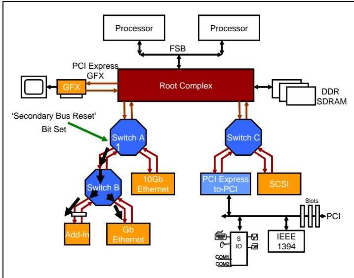
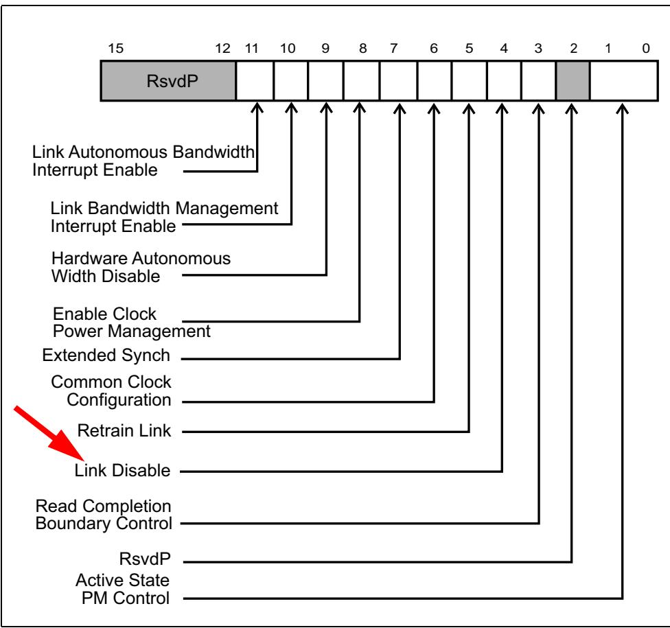
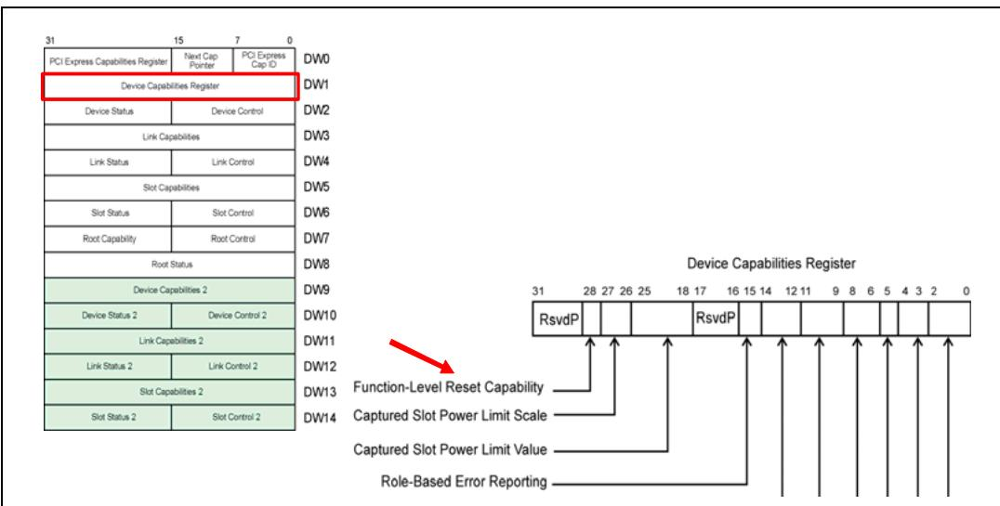
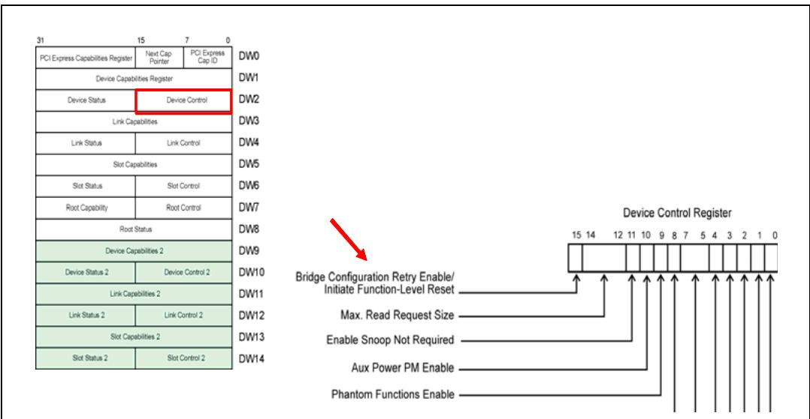

# Ch16_Power_Management

## Device INTx# Pins | 设备 INTx# 引脚

| EN | ZH |
|----|----|
| A PCI device can implement up to 4 INTx# signals (INTA#, INTB#, INTC#, and INTD#). | 一个 PCI 设备最多可实现 4 个 INTx# 信号（INTA#、INTB#、INTC# 和 INTD#）。 |
| More than one pin is available because PCI devices can support up to 8 functions, each of which is allowed to drive one (but only one) interrupt pin. | 之所以提供多个引脚，是因为 PCI 设备最多可支持 8 个功能，每个功能允许驱动一个（且仅一个）中断引脚。 |
| When PCI was developed, a typical system used a chipset that included the 15-input 8259 PIC, so that's how many IRQs (which map to interrupt vectors) that were available to the system. | 在开发 PCI 时，典型系统使用的芯片组包含 15 路输入的 8259 PIC，因此系统可用的 IRQ（映射到中断向量）数量就是这么多。 |
| However, many of those were already used for system purposes like the system timer, keyboard interrupt, mouse interrupt, and so on. | 然而，其中许多已被用于系统用途，如系统定时器、键盘中断、鼠标中断等。 |
| In addition, some pins were reserved for ISA cards that could still be plugged into these older systems. | 此外，一些引脚被保留给仍可插入这些老旧系统的 ISA 卡。 |
| Consequently, the PCI spec writers considered that only four IRQs would reliably be available for their new bus, and so the spec only supported four interrupt pins. | 因此，PCI 规范制定者认为其新总线只能可靠地使用四个 IRQ，故该规范仅支持四个中断引脚。 |
| However, as you probably know, there are typically more than four PCI devices on a PCI bus and even a single device could have more than four functions inside, each wanting its own interrupt. | 然而，如你所知，一条 PCI 总线上通常有超过四个 PCI 设备，甚至单个设备内部也可能有超过四个功能，每个功能都需要自己的中断。 |
| These reasons are why the PCI interrupts were designed to be level-sensitive and shareable. | 正是由于这些原因，PCI 中断被设计为电平敏感且可共享。 |
| These signals could simply be wire-ORed together to get down to a handful of resulting outputs, each one representing interrupt requests. | 这些信号只需通过线或方式连接在一起，即可减少为少数几个输出结果，每个结果代表一个中断请求。 |
| Since they are shared, when an interrupt is detected, the interrupt handler software will need to go through the list of functions that are sharing the same pin and test to see which ones need servicing. | 由于它们是共享的，当检测到中断时，中断处理程序软件需要遍历共享同一引脚的函数列表，并逐一检查哪些函数需要服务。 |

## Determining INTx# Pin Support | 确定 INTx# 引脚支持

| EN | ZH |
|---|---|
| PCI functions indicate support for an INTx# signal in their configuration headers. The read‑only Interrupt Pin register illustrated in Figure 17‑5 indicates whether an INTx# is supported by this function and if so, which interrupt pin will it assert when requesting an interrupt. | PCI 功能在配置头中指示对 INTx# 信号的支持。如图 17‑5 所示的只读中断引脚寄存器指示该功能是否支持 INTx#，如果支持，则在请求中断时将断言哪一根中断引脚。 |

Figure 17‑5: Interrupt Registers in PCI Configuration Header | 图17‑5：PCI配置头中的中断寄存器

## Interrupt Routing | 中断路由

| EN | ZH |
|---|---|
| The Interrupt Line register shown in Figure 17-5 on page 801 gives the next information that a driver needs to know: the input pin of the PIC to which this pin has been connected. The PIC is programmed by system software with a unique vector number for each input pin (IRQ). The vector for the highest-priority interrupt asserted is reported to the processor who then uses that vector to index into a corresponding entry in the interrupt vector table. This entry points to the interrupting device's interrupt service routine which the processor executes. | 图17-5（第801页）所示的中断线（Interrupt Line）寄存器提供了驱动程序需要了解的下一个信息：即此引脚所连接到的PIC的输入引脚。系统软件为PIC的每个输入引脚（IRQ）编程分配一个唯一的向量号。被断言的最高优先级中断的向量被报告给处理器，处理器随后使用该向量索引到中断向量表中的相应条目。该条目指向发起中断的设备的中断服务例程，并由处理器执行。 |
| The platform designer assigns the routing of INTx# pins from devices. They can be routed in a variety of ways, but ultimately each INTx# pin connects to an input of the interrupt controller. Figure 17-6 on page 803 illustrates an example in which several PCI device interrupts are connected to the interrupt controller through a programmable router. All signals connected to a given input of the programmable router will be directed to a specific input of the interrupt controller. Functions whose interrupts are routed to a common interrupt controller input will all have the same Interrupt Line number assigned to them by platform software (typically firmware). In this example, IRQ15 has three PCI INTx# inputs from different devices connected to it. Consequently, the functions using these INTx# lines will share IRQ15 and will therefore all cause the controller to send the same vector when queried. That vector will have the three ISRs for the different Functions chained together. | 平台设计者分配设备INTx#引脚的路由。它们可以通过多种方式路由，但最终每个INTx#引脚都连接到中断控制器的一个输入。图17-6（第803页）展示了一个示例，其中多个PCI设备中断通过可编程路由器连接到中断控制器。所有连接到可编程路由器某一给定输入的信号都将被导向中断控制器的特定输入。其中断被路由到同一中断控制器输入的功能，都将由平台软件（通常是固件）分配相同的中断线（Interrupt Line）编号。在此示例中，IRQ15连接了来自不同设备的三个PCI INTx#输入。因此，使用这些INTx#线的功能将共享IRQ15，从而在查询时都会导致控制器发送相同的向量。该向量将包含不同功能的三个ISR链式执行。 |

## Associating the INTx# Line to an IRQ Number | 将 INTx# 线关联到 IRQ 号

| EN | ZH |
|---|---|
| Based on system requirements, the router is programmed to connect its four inputs to four available PIC inputs. Once this is done, the routing of the INTx# pin associated with each function is known and the Interrupt Line number is written by software into each Function. The value is ultimately read by the Function's device driver so it will know which interrupt table entry it has been assigned. That's the place where the starting address of its ISR will be written, a process referred to as "hooking the interrupt". When this function later generates an interrupt, the CPU will receive the vector number that corresponds to the IRQ specified in the Interrupt Line register. The CPU uses this vector to index into the interrupt vector table to fetch the entry point of the interrupt service routine associated with the Function's device driver. | 根据系统需求，路由器被编程以将其四个输入连接到四个可用的PIC输入。完成后，与每个功能关联的INTx#引脚的布线已知，软件将中断线号写入每个功能。该值最终由功能的设备驱动程序读取，以便驱动程序知道它被分配了哪个中断表条目。这是其ISR起始地址将被写入的位置，这一过程称为"挂接中断"。当该功能随后产生中断时，CPU将收到与中断线寄存器中指定的IRQ对应的向量号。CPU使用该向量索引中断向量表，以获取与该功能设备驱动程序关联的中断服务例程的入口点。 |

Figure 17-6: INTx Signal Routing is Platform Specific | 图17-6：INTx信号路由是平台相关的

## INTx# 信号传输

| EN | ZH |
|---|---|
| The INTx# lines are active-low signals implemented as open-drain with a pullup resistor provided on each line by the system. Multiple devices connected to the same PCI interrupt request signal line can assert it simultaneously without damage. | INTx# 信号线是低电平有效信号，采用开漏实现，每条信号线由系统提供上拉电阻。连接到同一 PCI 中断请求信号线的多个设备可以同时将其置为有效而不会造成损坏。 |
| When a Function signals an interrupt it also sets the Interrupt Status bit located in the Status register of the config header. This bit can be read by system software to see if an interrupt is currently pending. (See Figure 17-8 on page 805.) | 当功能（Function）发出中断信号时，它还会设置配置头状态寄存器中的中断状态位。系统软件可以读取该位以查看当前是否有中断挂起。（参见第 805 页的图 17-8。） |
| Interrupt Disable. The 2.3 PCI spec added an Interrupt Disable bit (Bit 10) to the Command register of the config header. See Figure 17-7 on page 804. The bit is cleared at reset permitting INTx# signal generation, but software may set it to prevent that. Note that the Interrupt Disable bit has no effect on Message Signalled Interrupts (MSI). MSIs are enabled via the Command Register in the MSI Capability structure. Enabling MSI automatically has the effect of disabling interrupt pins or emulation. | 中断禁用。PCI 2.3 规范在配置头的命令寄存器中添加了中断禁用位（位 10）。参见第 804 页的图 17-7。复位时该位被清零，允许生成 INTx# 信号，但软件可设置该位以禁止生成 INTx# 信号。注意，中断禁用位对消息信号中断（MSI）无效。MSI 通过 MSI 能力结构中的命令寄存器使能。使能 MSI 会自动禁用中断引脚或仿真。 |
| Interrupt Status. The PCI 2.3 spec added a read-only Interrupt Status bit to the configuration status register (pictured in Figure 17-8 on page 805). A function must set this status bit when an interrupt is pending. In addition, if the Interrupt Disable bit in the Command register of the header is cleared (i.e. interrupts enabled), then the function's INTx# signal is asserted when this status bit is set. This bit is unaffected by the state of the Interrupt Disable bit. | 中断状态。PCI 2.3 规范在配置状态寄存器中添加了只读的中断状态位（如图 17-8 所示，第 805 页）。当有中断挂起时，功能必须设置该状态位。此外，如果配置头命令寄存器中的中断禁用位被清零（即中断使能），则当该状态位被设置时，功能的 INTx# 信号被置为有效。该位不受中断禁用位状态的影响。 |

Figure 17-7: Configuration Command Register — Interrupt Disable Field | 图17-7：配置命令寄存器 — 中断禁用字段

Figure 17-8: Configuration Status Register — Interrupt Status Field | 图17-8：配置状态寄存器 — 中断状态字段

## 17.2.3 Virtual INTx Signaling | 17.2.3 虚拟 INTx 信令

| EN | ZH |
|---|---|
| ## Virtual INTx Signaling | ## 虚拟 INTx 信令 |

| EN | ZH |
|---|---|
| ## General | ## 概述 |
| If circumstances make the use of MSI not possible in a PCIe topology, the INTx signaling model would be used. Following are two examples of devices that would need to be able to use INTx messages: | 如果在PCIe拓扑中因情况所限无法使用MSI，则将采用INTx信令模型。以下是两个需要使用INTx消息的设备示例： |
| PCIe‐to‐(PCI or PCI‐X) bridges — Most PCI devices will use the INTx# pins because MSI support is optional for them. Since PCIe doesn't support sideband interrupt signaling, the inband messages are used instead. The interrupt controller understands the message and delivers an interrupt request to the CPU which would include a pre‐programmed vector number. | PCIe转(PCI或PCI-X)桥 — 大多数PCI设备将使用INTx#引脚，因为MSI支持对它们是可选的。由于PCIe不支持边带中断信令，因此改用带内消息。中断控制器理解该消息并向CPU发送中断请求，其中包含预编程的中断向量号。 |
| Boot Devices — PC systems commonly use the legacy interrupt model during the boot sequence because MSI usually requires OS‐level initialization. Generally, a minimum of three subsystems are needed for booting: an output to the operator such as video, an input from the operator which is typically the keyboard, and a device that can be used to fetch the OS, typically a hard drive. PCIe devices involved in initializing the system are called "boot devices." Boot devices will use legacy interrupt support until the OS and device drivers are loaded, after which it's preferable they use MSI. | 引导设备 — PC系统在引导序列期间通常使用传统中断模型，因为MSI通常需要操作系统级初始化。通常，引导至少需要三个子系统：面向操作者的输出设备（如显示器）、来自操作者的输入设备（通常是键盘）、以及可用于获取操作系统的设备（通常是硬盘）。参与系统初始化的PCIe设备称为"引导设备"。在操作系统和设备驱动程序加载完成之前，引导设备将使用传统中断支持，之后它们最好使用MSI。 |

## Virtual INTx Wire Delivery | 虚拟 INTx 线传递

| EN | ZH |
|---|---|
| ## Virtual INTx Wire Delivery | ## 虚拟INTx线传送 |
| Figure 17‐9 on page 806 illustrates a system with a PCIe Endpoint and a PCI Express‐to‐PCI Bridge. If we assume software has not enabled MSI on the Endpoint, it will deliver interrupt requests with INTx messages. In this example, the bridge is propogating pin‐based interrupts from connected PCI devices with INTx messages. As can be seen, the bridge sends an INTB messages to signal the assertion and deassertion of its INTB# input from the PCI bus. The PCIe Endpoint is shown signaling an INTA using emulation messages. Note that INTx# signaling involves two messages: | 第806页的图17‑9展示了一个包含PCIe端点和PCI Express到PCI桥接器的系统。假设软件未在端点上启用MSI，端点将通过INTx消息传递中断请求。在此示例中，桥接器通过INTx消息传播来自所连接PCI设备的引脚中断。如图所示，桥接器发送INTB消息以表示来自PCI总线的INTB#输入的断言和解除断言。PCIe端点被显示为使用仿真消息发出INTA信号。请注意，INTx#信号传送涉及两条消息： |
| Assert\_INTx messages indicate a high‐to‐low transition (from inactive to active) of the virtual INTx# signal. | Assert_INTx消息表示虚拟INTx#信号的高到低跳变（从不活跃到活跃）。 |
| • Deassert\_INTx messages indicate a low‐to‐high transition. | • Deassert_INTx消息表示低到高跳变。 |
| When a Function delivers an Assert\_INTx message, it also sets its Interrupt Status bit in the Configuration Status register, just as it would if it asserted the physical INTx# pin (see Figure 17‐8 on page 805). | 当功能发送Assert_INTx消息时，它还会在配置状态寄存器中设置其中断状态位，就像它断言物理INTx#引脚时一样（参见第805页的图17‑8）。 |
| Figure 17‐9: Example of INTx Messages to Virtualize INTA#‐INTD# Signal Transitions | 图17‑9：用于虚拟化INTA#‑INTD#信号跳变的INTx消息示例 |

Figure 17‐9: Example of INTx Messages to Virtualize INTA#‐INTD# Signal Transitions | 图17‐9：用于虚拟化INTA#-INTD#信号转换的INTx消息示例  

| EN | ZH |
| --- | --- |
| Figure 17‐10 on page 807 depicts the format of the INTx message header. The interrupt controller is the ultimate destination of these messages, however the routing method employed is not "Route to the Root Complex", but is actually "Local - Terminate at Receiver" as shown in Figure 17‐10. There are two reasons for this. The first is because each bridge (including Switch Ports and Root Ports) along the upstream path may map the virtual interrupt wire to a different virtual interrupt wire across the bridge (e.g., a Switch Port receives Assert\_INTA but maps it to Assert\_INTB when propogating it upstream). More info about this INTx mapping can be found in "INTx Mapping" on page 808. | 图17-10（第807页）描述了INTx消息头的格式。中断控制器是这些消息的最终目的地，然而其所采用的路由方式并非"路由到根复合体"，而是如图17-10所示的"本地——在接收端终止"。这有两个原因。第一，因为上游路径上的每个桥（包括交换端口和根端口）都可能将虚拟中断线映射为穿过该桥的另一条不同的虚拟中断线（例如，某个交换端口接收了Assert\_INTA，但在向上游传播时将其映射为Assert\_INTB）。有关此INTx映射的更多信息，请参见第808页的"INTx映射"。 |
| The second reason for the local routing type of these messages is due to the fact that we're emulating a pin-based signal. If a port receives an assert interrupt message that maps to INTA on its primary side and it has already sent an Assert\_INTA message upstream because of a previous interrupt, then there is no reason to send another one. INTA is already seen as asserted. More info about this collapsing of INTx messages can be found in "INTx Collapsing" on page 810. | 这些消息采用本地路由类型的第二个原因是，我们正在模拟基于引脚的中断信号。如果一个端口在其主侧收到一个映射到INTA的中断断言消息，而它由于之前的中断已经向上游发送过Assert\_INTA消息，那么就没有必要再发送一个。INTA已经被视为已断言。有关此INTx消息合并的更多信息，请参见第810页的"INTx合并"。 |

Figure 17‐10: INTx Message Format and Type | 图17‐10：INTx消息格式和类型  

## 17.2.4 Mapping and Collapsing INTx Messages | 17.2.4 映射和合并 INTx 消息

| EN | ZH |
|----|-----|
| ## Mapping and Collapsing INTx Messages | ## 映射与合并 INTx 消息 |

## INTx Mapping | INTx 映射

| EN | ZH |
| --- | --- |
| Switches must adhere to the INTx mapping defined by the PCI spec, shown in Table 17-1 on page 809. This mapping defines the virtual connection that exists when interrupts are routed across a PCI-to-PCI bridge. The mapping is based on the INTx message type and the Device number from the Requester ID field in the message. | 交换器必须遵循 PCI 规范定义的 INTx 映射，如第 809 页的表 17-1 所示。该映射定义了中断通过 PCI-to-PCI 桥传输时存在的虚拟连接。该映射基于 INTx 消息类型和消息中请求者 ID（Requester ID）字段内的设备号（Device number）。 |
| Refer to Figure 17-11 on page 810 for this example. The assert interrupt messages received on the two downstream switch ports are both INTA messages. The virtual PCI-to-PCI bridge at each of the ingress ports will map both INTA messages to INTA, meaning no change. This is because the Device number of both originating Endpoint devices is zero (which is contained in the interrupt message itself as part of the Requester ID, ReqID). Table 17-1 shows that interrupts messages coming from Device 0 map to the same INTx message on the other side of the bridge (i.e., internal to the Switch both INTA messages are mapped to INTA). So each downstream port will propogate the interrupt messages upstream without changing their virtual wire. However, the propogated interrupt messages no longer have the ReqID of the original requester, they now have the ReqID of the port that is propogating the interrupt message. | 请参见第 810 页的图 17-11 了解此示例。在两个下游交换器端口上收到的断言中断消息都是 INTA 消息。每个入口端口处的虚拟 PCI-to-PCI 桥会将两个 INTA 消息都映射到 INTA，即不做改变。这是因为两个源端端点的设备号均为零（该设备号包含在中断消息本身的请求者 ID（ReqID）中）。表 17-1 显示，来自设备 0 的中断消息在桥的另一侧映射到相同的 INTx 消息（即在交换器内部，两个 INTA 消息都映射到 INTA）。因此，每个下游端口将中断消息向上游传播，而不改变其虚拟连线。但是，传播后的中断消息不再具有原始请求者的 ReqID，而是具有传播该中断消息的端口的 ReqID。 |
| Next, the upstream Switch Port receives the propogated interrupt messages. The INTA interrupt from port 2:1:0 is going to be mapped to an INTB message when progopated upstream because the interrupt message indicates it came from Device 1 (ReqID 2:1:0). The other interrupt being propogated by port 2:2:0 is going to be mapped to an INTC message when sent from the upstream Switch Port to the Root Port. Refer to Table 17-1 to confirm these mappings. | 接下来，上游交换器端口接收到传播后的中断消息。来自端口 2:1:0 的 INTA 中断在向上游传播时将映射到 INTB 消息，因为该中断消息表明其来自设备 1（ReqID 2:1:0）。由端口 2:2:0 传播的另一个中断在从上游交换器端口发送到根端口（Root Port）时将映射到 INTC 消息。请参考表 17-1 确认这些映射。 |
| The reason for this interrupt mapping is the same as it was for PCI: to avoid as much as possible having multiple functions sharing the same INTx# pin. As stated previously, single function devices are required to use INTA if using legacy interrupts. So if all the Functions downstream of a Root Port used INTA and there was no mapping across bridges, they would all be routed to the same IRQ. Which means anytime one of the Functions asserted INTA, all the Functions would have to be checked. This would result in significant interrupt servicing latencies for the Functions at the end of the list. This interrupt mapping method is a crude attempt at distributing interrupts (especially INTA) across all four INTx virtual wires because each INTx virtual wire can be mapped to a separate IRQ at the interrupt controller. | 这种中断映射的原因与 PCI 相同：尽可能避免多个功能共享同一个 INTx# 引脚。如前所述，若使用传统中断，单功能设备必须使用 INTA。因此，如果根端口下游的所有功能都使用 INTA，且桥之间不存在映射，则它们都将路由到同一个 IRQ。这意味着只要其中一个功能断言了 INTA，就必须检查所有功能。这将导致列表末尾的功能出现显著的中断服务延迟。这种中断映射方法是一种粗略的尝试，旨在将中断（尤其是 INTA）分布到全部四条 INTx 虚拟连线上，因为每条 INTx 虚拟连线都可以映射到中断控制器上的独立 IRQ。 |

Table 17-1: INTx Message Mapping Across Virtual PCI-to-PCI Bridges / 表 17-1：跨虚拟 PCI-to-PCI 桥的 INTx 消息映射 | 表17-1：跨虚拟 PCI-to-PCI 桥的 INTx 消息映射

<table><tr><td>Device Number of Delivering INTx</td><td>INTx Message Type at Input</td><td>INTx Message Type at Output</td></tr><tr><td rowspan="4">0, 4, 8, 12 etc.</td><td>INTA</td><td>INTA</td></tr><tr><td>INTB</td><td>INTB</td></tr><tr><td>INTC</td><td>INTC</td></tr><tr><td>INTD</td><td>INTD</td></tr><tr><td rowspan="4">1, 5, 9, 13 etc.</td><td>INTA</td><td>INTB</td></tr><tr><td>INTB</td><td>INTC</td></tr><tr><td>INTC</td><td>INTD</td></tr><tr><td>INTD</td><td>INTA</td></tr><tr><td rowspan="4">2, 6, 10, 14 etc.</td><td>INTA</td><td>INTC</td></tr><tr><td>INTB</td><td>INTD</td></tr><tr><td>INTC</td><td>INTA</td></tr><tr><td>INTD</td><td>INTB</td></tr><tr><td rowspan="4">3, 7, 11, 15 etc.</td><td>INTA</td><td>INTD</td></tr><tr><td>INTB</td><td>INTA</td></tr><tr><td>INTC</td><td>INTB</td></tr><tr><td>INTD</td><td>INTC</td></tr></table>

Figure 17-11: Example of INTx Mapping | 图17-11：INTx映射示例

## INTx Collapsing | INTx 合并

| EN | ZH |
|---|---|
| PCIe Switches must ensure that INTx messages are delivered upstream in the correct fashion. Specifically, interrupt routing of legacy PCI implementations must be handled such that software can determine which interrupts are routed to which interrupt controller inputs. INTx# lines may be wire‑ORed and be routed to the same IRQ input on the interrupt controller, and when multiple devices signal interrupts on the same line, only the first assertion is seen by the interrupt controller. Similarly, when one of these devices deasserts its INTx# line, the line remains asserted until the last one is turned off. These same principles apply to PCIe INTx messages. | PCIe 交换机必须确保 INTx 消息以正确的方式向上游传递。具体而言，传统 PCI 实现的中断路由必须得到妥善处理，以便软件能够确定哪些中断被路由到哪个中断控制器输入。INTx# 线可以线或连接，并路由到中断控制器上的同一个 IRQ 输入，当多个设备在同一根线上发出中断信号时，中断控制器只会看到第一个断言。同样，当其中一个设备解除其 INTx# 线的断言时，该线将保持断言状态，直到最后一个设备关闭。这些相同原理也适用于 PCIe INTx 消息。 |
| In some cases, however, two overlapping INTx messages may be mapped to the same INTx message by a virtual PCI bridge at the egress port, requiring the messages to be collapsed. Consider the following example illustrated in Figure 17‑12 on page 811. | 然而，在某些情况下，两个重叠的 INTx 消息可能会被出口端口的虚拟 PCI 桥映射到同一个 INTx 消息，这就要求将这些消息合并。请考虑第 811 页图 17-12 所示的示例。 |
| When the upstream Switch Port maps the interrupt messages for delivery on the upstream link, both interrupts will be mapped as INTB (based on the device numbers of the downstream Switch Ports). Note that because these two overlapping messages are the same they must be collapsed. | 当上行交换机端口映射用于在上行链路上传递的中断消息时，两个中断都将被映射为 INTB（基于下行交换机端口的设备号）。请注意，由于这两个重叠的消息相同，因此必须合并。 |
| Collapsing ensures that the interrupt controller will never receive two consecutive Assert_INTx or Deassert_INTx messages for the shared interrupts. This is equivalent to INTx signals being wire‑ORed. | 合并确保中断控制器永远不会收到两个连续的针对共享中断的 Assert_INTx 或 Deassert_INTx 消息。这等效于 INTx 信号进行线或处理。 |

Figure 17-12: Switch Uses Bridge Mapping of INTx Messages | 图17-12：交换机使用INTx消息的桥映射

## INTx Delivery Rules | INTx 传递规则

| EN | ZH |
|---|---|
| The rules associated with the delivery of INTx messages have some unique characteristics: | 与 INTx 消息传递相关的规则具有一些独特特性： |
| Assert_INTx and Deassert_INTx are only issued in the upstream direction. | Assert_INTx 和 Deassert_INTx 仅在向上游方向发出。 |
| Switches that are collapsing interrupts will only issue INTx messages upstream when there is a change of the interrupt status. | 正在合并中断的交换机仅当中断状态发生变化时才会向上游发出 INTx 消息。 |
| Devices on either side of a link must track the current state of INTA-INTD assertion. | 链路两侧的设备必须跟踪 INTA-INTD 断言的当前状态。 |
| A Switch tracks the state of the four virtual wires for each of its downstream ports, and may present a collapsed set of virtual wires on its upstream port. | 交换机跟踪其每个下游端口的四条虚拟线的状态，并可在其上游端口呈现合并后的虚拟线集合。 |
| The Root Complex must track the state of the four virtual wires (A-D) for each downstream port. | 根复合体必须跟踪每个下游端口的四条虚拟线（A-D）的状态。 |
| INTx signaling may be disabled with the Interrupt Disable bit in the Command Register. | INTx 信令可通过命令寄存器中的中断禁用位来禁用。 |
| If any INTx virtual wires are active and device interrupts are then disabled, a corresponding Deassert_INTx message must be sent. | 如果任何 INTx 虚拟线处于活动状态而后设备中断被禁用，则必须发送相应的 Deassert_INTx 消息。 |
| If a downstream Switch Port goes to DL_Down status, any active INTx virtual wires must be deasserted, and the upstream port updated accordingly (Deassert_INTx message required if that INTx was in active state). | 如果下游交换机端口进入 DL_Down 状态，任何活动的 INTx 虚拟线必须被解除断言，并且上游端口相应更新（如果该 INTx 处于活动状态，则需要发送 Deassert_INTx 消息）。 |

## 17.3 The MSI Model | 17.3 MSI 模型

| EN | ZH |
|---|---|
| A PCIe Function indicates MSI support via the MSI Capability registers. Each Function must implement either the MSI Capability Structure or the MSI‑X (eXtended MSI, see "The MSI‑X Model" on page 821) Capability Structure, or both. The MSI Capability registers are set up by configuration software and include: | PCIe 功能通过 MSI 能力寄存器指示其对 MSI 的支持。每个功能必须实现 MSI 能力结构或 MSI‑X（扩展 MSI，见第 821 页 "MSI‑X 模型"）能力结构，或两者都实现。MSI 能力寄存器由配置软件设置，包括： |
| • Target memory address | • 目标存储器地址 |
| • Data Value to be written to that address | • 要写入该地址的数据值 |
| • The number of unique messages that can be encoded into the data | • 可编码到数据中的唯一消息数量 |
| See "Memory Request Header Fields" on page 188 for a review of the Memory Write Transaction Header. Note that MSIs always have a data payload of 1DW. | 关于存储器写事务头标的回顾，请参见第 188 页的 "存储器请求头标字段"。注意，MSI 始终具有 1 双字的数据载荷。 |

| EN | ZH |
|---|---|
| The MSI Capability Structure resides in the PCI‑compatible config space area (first 256 bytes). There are four variations of the MSI Capability Structure based on whether it supports 64‑bit addressing or only 32‑bit and whether it supports per vector masking or not. Native PCIe devices are required to support 64‑bit addressing. All four variations of the MSI Capability Structure can be found in Figure 17‑13 on page 813. | MSI能力结构位于PCI兼容配置空间区域（前256字节）。根据其是否支持64位寻址或仅支持32位寻址，以及是否支持每向量屏蔽，MSI能力结构有四种变体。原生PCIe设备必须支持64位寻址。图17‑13（第813页）展示了MSI能力结构的所有四种变体。 |

Figure 17‑13: MSI Capability Structure Variations | 图17‑13：MSI能力结构变体

<table><tr><td colspan="3">32-bit Address</td></tr><tr><td>Message Control</td><td>Next Capability Pointer</td><td>Capability ID (05h) DW0</td></tr><tr><td colspan="3">Message Address [31:0]</td></tr><tr><td></td><td>Message Data</td><td>DW1 DW2</td></tr><tr><td colspan="3">64-bit Address</td></tr><tr><td>Message Control</td><td>Next Capability Pointer</td><td>Capability ID (05h) DW0</td></tr><tr><td colspan="3">Message Address [31:0]</td></tr><tr><td colspan="3">Message Address [63:32]</td></tr><tr><td></td><td>Message Data</td><td>DW1 DW2 DW3</td></tr><tr><td colspan="3">32-bit Address with Per-Vector Masking</td></tr><tr><td>Message Control</td><td>Next Capability Pointer</td><td>Capability ID (05h) DW0</td></tr><tr><td colspan="3">Message Address [31:0]</td></tr><tr><td>Reserved</td><td>Message Data</td><td>DW1 DW2 DW3 DW4</td></tr><tr><td colspan="3">Mask Bits</td></tr><tr><td colspan="3">Pending Bits</td></tr><tr><td colspan="3">64-bit Address with Per-Vector Masking</td></tr><tr><td>Message Control</td><td>Next Capability Pointer</td><td>Capability ID (05h) DW0</td></tr><tr><td colspan="3">Message Address [31:0]</td></tr><tr><td colspan="3">Message Address [63:32]</td></tr><tr><td>Reserved</td><td>Message Data</td><td>DW1 DW2 DW3 DW4 DW5</td></tr><tr><td colspan="3">Mask Bits</td></tr><tr><td colspan="3">Pending Bits</td></tr></table>

| EN | ZH |
|---|---|
| ## Capability ID | ## 能力ID |
| A Capability ID value of 05h identifies the MSI capability and is a read-only value. | Capability ID值为05h标识MSI能力，且为只读值。 |

## Next Capability Pointer | 下一个能力指针

| EN | ZH |
| --- | --- |
| The second byte of the register is a read-only value that gives the dword-aligned offset from the top of config space to the next Capability Structure in the linked list of structures or else contains 00h to indicate the end of the linked list. | 该寄存器的第二个字节是一个只读值，提供从配置空间顶部到结构链表中下一个能力结构的dword对齐偏移量，否则包含00h以指示链表结束。 |

| EN | ZH |
|---|---|
| ## Message Control Register | ## 消息控制寄存器 |
| Figure 17‑14 on page 814 and Table 17‑2 on page 814 illustrate the layout and usage of the Message Control register. | 第814页的图17-14和第814页的表17-2说明了消息控制寄存器的布局和用法。 |

Figure 17‑14: Message Control Register | 图17‑14：消息控制寄存器

| EN | ZH |
|---|---|
| Table 17‑2: Format and Usage of Message Control Register | 表17-2：消息控制寄存器的格式和用法 |

<table><tr><td>Bit(s)</td><td>Field Name</td><td>Description</td></tr><tr><td>0</td><td>MSI Enable</td><td>Read/Write. State after reset is 0, indicating that the device's MSI capability is disabled.0 = Function isdisabledfrom using MSI. It must use MSI-X or else INTx Messages.1 = Function isenabledto use MSI to request service and won't use MSI-X or INTx Messages.</td></tr></table>

| EN | ZH |
|----|-----|
| ## Chapter 17: Interrupt Support | ## 第17章：中断支持 |
| Table 17-2: Format and Usage of Message Control Register (Continued) | 表17-2：消息控制寄存器的格式与用法（续） |

<table><tr><td>Bit(s)</td><td>Field Name</td><td>Description</td></tr><tr><td rowspan="10">3:1</td><td rowspan="10">Multiple Message Capable</td><td>Read-Only. System software reads this field to determine how many messages (interrupt vectors) the Function would like to use. The requested number of messages is a power of two, therefore a Function that would like three messages must request that four messages be allocated to it.</td></tr><tr><td>Value Number of Messages Requested</td></tr><tr><td>000b 1</td></tr><tr><td>001b 2</td></tr><tr><td>010b 4</td></tr><tr><td>011b 8</td></tr><tr><td>100b 16</td></tr><tr><td>101b 32</td></tr><tr><td>110b Reserved</td></tr><tr><td>111b Reserved</td></tr><tr><td rowspan="10">6:4</td><td rowspan="10">Multiple Message Enable</td><td>Read/Write. After system software reads the Multi-ple Message Capable field (previous row in this table) to see how many messages (interrupt vec-tors) are requested by the Function, it programs a 3-bit value in this field indicating the actual num-ber of messages allocated to the Function. The number allocated can be equal to or less than the number actually requested. The state of this field after reset is 000b.</td></tr><tr><td>Value Number of Messages Requested</td></tr><tr><td>000b 1</td></tr><tr><td>001b 2</td></tr><tr><td>010b 4</td></tr><tr><td>011b 8</td></tr><tr><td>100b 16</td></tr><tr><td>101b 32</td></tr><tr><td>110b Reserved</td></tr><tr><td>111b Deferred</td></tr></table>

## PCI Express 3.0 Technology | PCI Express 3.0 技术

| EN | ZH |
|---|---|
| Table 17-2: Format and Usage of Message Control Register (Continued) | 表17-2：消息控制寄存器的格式与用途（续） |

<table><tr><td>Bit(s)</td><td>Field Name</td><td>Description</td></tr><tr><td>7</td><td>64-bit Address Capable</td><td>Read-Only.0 = Function does not implement the upper 32 bits of the Message Address register; only a 32-bit address is possible.1 = Function implements the upper 32 bits of the Message Address register and is capable of generating a 64-bit memory address.</td></tr><tr><td>8</td><td>Per-Vector Masking Capable</td><td>Read-Only.0 = Function does not implement the Mask Bit register or the Pending Bit register; software does NOT have the ability to mask individual interrupts with this capability structure.1 = Function does implement the Mask Bit register or the Pending Bit register; software does have the ability to mask individual interrupts with this capability structure.</td></tr><tr><td>15:9</td><td>Reserved</td><td>Read-Only. Always zero.</td></tr></table>

## Message Address Register | 消息地址寄存器

| EN | ZH |
| --- | --- |
| The lower two bits of the 32-bit Message Address register are zero and cannot be changed, forcing the address assigned by software to be dword aligned. Typically, this would be the address of the Local APIC in the system CPU. In x86-based systems (Intel-compatible), this address has traditionally been FEEx_xxxxh where the lower 20 bits indicate which Local APIC is being targeted as well as some other info about the interrupt itself. It is important to note that how the address is interpreted is platform specific and is not dictated in the PCI or PCIe specs. | 32位消息地址寄存器的低两位固定为0且不可更改，强制软件分配的地址按双字对齐。通常，该地址指向系统CPU中的本地APIC。在基于x86的系统中（Intel兼容），该地址传统上为FEEx_xxxxh，其中低20位表示目标本地APIC以及中断本身的一些其他信息。需要注意的是，地址的解释方式与平台相关，PCI或PCIe规范未对此做出规定。 |
| The register containing bits [63:32] of the Message Address are required for native PCI Express devices but is optional for legacy endpoints. This register is present if Bit 7 of the Message Control register is set. If so, it is a read/write register used in conjunction with the Message Address [31:0] register to enable a 64-bit memory address for interrupt delivery from this Function. | 包含消息地址位[63:32]的寄存器对于原生PCI Express设备是必需的，但对于传统端点是可选的。如果消息控制寄存器的位7被置位，则该寄存器存在。若是，它是一个读/写寄存器，与消息地址[31:0]寄存器配合使用，以启用从该功能发送中断的64位内存地址。 |

## Message Data Register | 消息数据寄存器

| EN | ZH |
|----|----|
| System software writes a base message data pattern into this 16-bit, read/write register. When the Function generates an interrupt request, it writes a 32-bit data value to the memory address specified in the Message Address register. The upper 16 bits of this data are always set to zero, while the lower 16 bits are supplied by the Message Data register. | 系统软件将一个基础消息数据模式写入这个16位读/写寄存器。当该Function产生中断请求时，它向Message Address寄存器指定的存储器地址写入一个32位数据值。该数据的高16位始终为零，低16位由Message Data寄存器提供。 |
| If more than one message has been assigned to the Function, it modifies the lower bits (the number of modifiable bits depends on how many messages have been assigned to the Function by configuration software) of the Message Data register value to form the appropriate value for the event it wishes to report. As an example, refer to "Basics of Generating an MSI Interrupt Request" on page 820. | 如果该Function被分配了多个消息，它会修改Message Data寄存器值的低位（可修改的位数取决于配置软件为该Function分配了多少个消息），以形成其希望报告的事件所对应的适当值。例如，请参考第820页的"生成MSI中断请求的基本原理"。 |

| EN | ZH |
| :-- | :-- |
| ## Mask Bits Register and Pending Bits Register | ## 屏蔽位寄存器（Mask Bits Register）与挂起位寄存器（Pending Bits Register） |
| If the Function supports per-vector masking (indicated in bit [8] of the Message Control register) then these registers are present. The max number of interrupt messages (interrupt vectors) that can be requested and assigned to a Function using MSI is 32. So these two registers are 32 bits in length with each potential interrupt message having its own mask and pending bit. If bit [0] of the Mask Bits register is set, then interrupt message 0 is masked (this is the base vector from this Function). If bit [1] is set, then interrupt message 1 is masked (this is the base vector + 1). | 如果 Function 支持按向量屏蔽（由 Message Control 寄存器的 bit[8] 指示），则这些寄存器存在。使用 MSI 可请求并分配给一个 Function 的最大中断消息（中断向量）数量为 32。因此这两个寄存器均为 32 位长度，每个潜在的中断消息都有各自的屏蔽位和挂起位。如果 Mask Bits 寄存器的 bit[0] 被置位，则中断消息 0 被屏蔽（即该 Function 的基本向量）。如果 bit[1] 被置位，则中断消息 1 被屏蔽（即基本向量 + 1）。 |
| When an interrupt message is masked, the MSI for that vector cannot be sent. Instead, the corresponding Pending Bit is set. This allows software to mask individual interrupts from a Function and then periodically poll the Function to see if there are any masked interrupts that are pending. | 当中断消息被屏蔽时，该向量的 MSI 无法发送。取而代之的是，相应的 Pending Bit 被置位。这允许软件屏蔽来自 Function 的单个中断，然后定期轮询该 Function，以查看是否有任何被屏蔽的中断处于挂起状态。 |
| If software clears a mask bit and the corresponding pending bit is set, the Function must send the MSI request at that time. Once the interrupt message has been sent, the Function would clear the pending bit. | 如果软件清除某个屏蔽位，且对应的挂起位已被置位，则该 Function 必须立即发送 MSI 请求。当中断消息发送完成后，Function 应清除该挂起位。 |

## 17.3.2 Basics of MSI Configuration | 17.3.2 MSI 配置基础

The following list specifies the steps taken by software to configure MSI interrupts for a PCI Express device. Refer to Figure 17‐15 on page 819.

| EN | ZH |
|----|----|
| ## Basics of MSI Configuration | ## MSI配置基础 |
| The following list specifies the steps taken by software to configure MSI interrupts for a PCI Express device. Refer to Figure 17‐15 on page 819. | 以下列表指定了软件为PCI Express设备配置MSI中断所采取的步骤。参见第819页图17‐15。 |
| 1. At startup time, enumeration software scans the system for all PCI‐compatible Functions (see "Single Root Enumeration Example" on page 109 for a discussion of the enumeration process). | 1. 在启动时，枚举软件扫描系统中所有PCI兼容功能（有关枚举过程的讨论，请参见第109页的"单根枚举示例"）。 |

## PCI Express 3.0 技术

| EN | ZH |
|---|---|
| 2. Once a Function is discovered software reads the Capabilities List Pointer, to find the location of the first capability structure in the linked list. | 2. 一旦发现某功能，软件读取能力列表指针，以找到链表中第一个能力结构的位置。 |
| 3. If the MSI Capability structure (Capability ID of 05h) is found in the list, software reads the Multiple Message Capable field in the device's Message Control register to determine how many event-specific messages the device supports and if it supports a 64-bit message address or only 32-bit. Software then allocates a number of messages equal to or less than that and writes that value into the Multiple Message Enable field. At a minimum, one message will be allocated to the device. | 3. 如果在链表中找到MSI能力结构（能力ID为05h），软件读取设备消息控制寄存器中的多消息能力字段，以确定设备支持多少条事件特定消息，以及它支持64位消息地址还是仅支持32位。然后软件分配等于或小于该数量的消息数，并将该值写入多消息使能字段。至少会为设备分配一条消息。 |
| 4. Software writes the base message data pattern into the device's Message Data register and writes a dword-aligned memory address to the device's Message Address register to serve as the destination address for MSI writes. | 4. 软件将基本消息数据模式写入设备的消息数据寄存器，并将双字对齐的内存地址写入设备的消息地址寄存器，作为MSI写操作的目标地址。 |
| 5. Finally, software sets the MSI Enable bit in the device's Message Control register, enabling it to generate MSI writes and disabling other interrupt delivery options. | 5. 最后，软件设置设备消息控制寄存器中的MSI使能位，使其能够生成MSI写操作，并禁用其他中断投递选项。 |

Figure 17-15: Device MSI Configuration Process | 图17-15：设备MSI配置过程

## 17.3.3 Basics of Generating an MSI Interrupt Request | 17.3.3 MSI中断请求生成基础

Figure 17‐16 on page 821 illustrates the contents of an MSI Memory Write Transaction Header and Data field. Key points include:

第821页的图17-16展示了MSI存储器写事务头部和数据字段的内容。要点包括：

| EN | ZH |
|---|---|
| Format field must be 011b for native functions, indicating a 4DW header (64-bit address) with Data, but it may be 010b for Legacy Endpoints, indicating a 32-bit address. | 对于原生功能，Format字段必须为011b，表示带数据的4DW头部（64位地址）；但对于传统端点，它可以为010b，表示32位地址。 |
| The Attribute bits for No Snoop and Relaxed Ordering must be zero. | No Snoop和Relaxed Ordering的属性位必须为零。 |
| Length field must be 01h to indicate maximum data payload of 1DW. | Length字段必须为01h，表示最大数据负载为1DW。 |
| First BE field must be 1111b, indicating valid data in all four bytes of the DW, even though the upper two bytes will always be zero for MSI. | First BE字段必须为1111b，表示该DW中所有四个字节的数据均有效，尽管对于MSI来说高两个字节始终为零。 |
| Last BE field must be 0000b, indicating a single DW transaction. | Last BE字段必须为0000b，表示单DW事务。 |
| Address fields within the header come directly from the address fields within the MSI Capability registers. | 头部中的地址字段直接来自MSI能力寄存器中的地址字段。 |
| Lower 16 bits of the Data payload are derived from the data field within the MSI Capability registers. | 数据负载的低16位来自MSI能力寄存器中的数据字段。 |

## 17.3.4 Multiple Messages | 17.3.4 多消息

| EN | ZH |
| --- | --- |
| If system software allocated more than one message to the Function, the multiple values are created by modifying the lower bits of the assigned Message Data value to send a different message for each device-specific event type. | 如果系统软件为一个功能分配了多个消息，则通过修改所分配的Message Data值的低位来创建多个值，以便为每个设备特定事件类型发送不同的消息。 |
| As an example, assume the following: | 举例如下： |
| • Four messages have been allocated to a device. | • 已为一个设备分配了四个消息。 |
| • A data value of 49A0h has been assigned to the device's Message Data register. | • 已将数据值49A0h分配给该设备的Message Data寄存器。 |
| • Memory address FEEF_F00Ch has been written into the device's Message Address register. | • 已将存储器地址FEEF_F00Ch写入该设备的Message Address寄存器。 |
| When one of the four events occurs, the device generates a request by performing a dword write to memory address FEEF_F00Ch with a data value of 0000_49A0h, 0000_49A1h, 0000_49A2h, or 0000_49A3h. In other words, the lower two bits of the data value are modified to specify which event occurred. If this Function would have been allocated 8 messages, then the lower three bits could be modified. Also, the device always uses 0000h for the upper 2 bytes of its message data value. | 当四个事件之一发生时，该设备通过向存储器地址FEEF_F00Ch执行双字写入来生成一个请求，数据值为0000_49A0h、0000_49A1h、0000_49A2h或0000_49A3h。换句话说，修改数据值的低两位以指明哪个事件发生。如果该功能本应被分配8个消息，则可修改低三位。此外，设备始终使用0000h作为其消息数据值的高2字节。 |

Figure 17‐16: Format of Memory Write Transaction for Native-Device MSI Delivery | 图17‐16：本机设备MSI传递的存储器写事务格式  

## 17.4 The MSI-X Model | 17.4 MSI-X 模型

| EN | ZH |
| --- | --- |
| ## The MSI-X Model | ## MSI-X 模型 |

## General | 概述

| EN | ZH |
|---|---|
| The 3.0 revision of the PCI spec added support for MSI-X, which has its own capability structure. MSI-X was motivated by a desire to alleviate three shortcomings of MSI: | PCI规范的3.0修订版增加了对MSI-X的支持，MSI-X拥有自己的能力结构。引入MSI-X旨在缓解MSI的三个缺点： |
| • 32 vectors per function are not enough for some applications. | • 每个功能32个向量对于某些应用来说不够用。 |
| Having only one destination address makes static distribution of interrupts across multiple CPUs difficult. The most flexibility would be achieved if a unique address could be assigned for each vector. | 只有一个目标地址使得中断在多个CPU间的静态分配变得困难。如果能为每个向量分配一个唯一的地址，则可实现最大的灵活性。 |
| In several platforms, like x86-based systems, the vector number of the interrupt indicates its priority relative to other interrupts. With MSI, a single Function could be allocated multiple interrupts, but all the interrupt vectors would be contiguous, meaning similar priority. This is not a good solution if some interrupts from this Function should be high priority and others should be low priority. A better approach would be for software to designate a unique vector (message data value), that does not have to be contiguous, for each interrupt allocated to the Function. | 在一些平台中（如基于x86的系统），中断的向量号指示了它相对于其他中断的优先级。使用MSI时，单个功能可被分配多个中断，但所有中断向量必须是连续的，这意味着它们的优先级相近。如果该功能的某些中断应为高优先级而其他应为低优先级，这并非一个好的解决方案。更好的方法是，由软件为分配给该功能的每个中断指定一个唯一的向量（消息数据值），该向量不必连续。 |
| Keeping those goals in mind, it's easy to understand the register changes that were implemented to provide more vectors with each vector being assigned a target address and message data value. | 牢记这些目标，就不难理解为实现提供更多向量、并为每个向量分配目标地址和消息数据值而实现的寄存器变化。 |

## MSI-X 能力结构 (Capability Structure)

| EN | ZH |
| --- | --- |
| As shown in Figure 17-17 on page 822, the Message Control register is quite different from MSI. Interestingly, even though MSI-X can support up to 2048 vectors per Function versus the 32 for MSI, the number of configuration registers for MSI-X is actually a little smaller than for MSI. That's because the vector information isn't contained here. Instead, it's in a memory location (MMIO) pointed to by the Table BIR (Base address Indicator Register), as shown in Figure 17-18 on page 824. | 如第822页图17-17所示，消息控制寄存器与MSI有很大不同。有趣的是，尽管MSI-X每个功能最多支持2048个向量，而MSI为32个，但MSI-X的配置寄存器数量实际上比MSI还要少一些。这是因为向量信息并不包含在此处，而是位于由Table BIR（基址指示器寄存器）指向的内存位置（MMIO）中，如第824页图17-18所示。 |

Figure 17-17: MSI-X Capability Structure | 图17-17：MSI-X能力结构

<table><tr><td colspan="2">Message Control</td><td>Next Capability Pointer</td><td>Capability ID (11h)</td></tr><tr><td colspan="3">MSI-X Table Offset</td><td>Table BIR</td></tr><tr><td colspan="3">Pending Bit Array (PBA) Offset</td><td>PBA BIR</td></tr></table>

Table 17-3: Format and Usage of MSI-X Message Control Register | 表17-3：MSI-X消息控制寄存器格式和用法

<table><tr><td>Bit(s)</td><td>Field Name</td><td>Description</td></tr><tr><td>10:0</td><td>Table Size</td><td>Read-Only. This field indicates the number of interrupt messages (vectors) that this Function supports. The value here is interpreted in an N-1 fashion, so a value of 0 means 1 vector. A value of 7 means 8 vectors. Each vector has its own entry in the MSI-X Table and its own bit in the Pending Bit Array.</td></tr><tr><td>13:11</td><td>Reserved</td><td>Read-Only. Always zero.</td></tr><tr><td>14</td><td>Function Mask</td><td>Read/Write. This field provides system software an easy way to mask all the interrupts from a Function. If this bit is cleared, interrupts can still be masked individually by setting the mask bit within each vector's MSI-X table entry.</td></tr><tr><td>15</td><td>MSI-X Enable</td><td>Read/Write. State after reset is 0, indicating that the device's MSI-X capability is disabled. 0 = Function is disabled from using MSI-X. It must use MSI or INTx Messages. 1 = Function is enabled to use MSI-X to request service and won't use MSI or INTx Messages.</td></tr></table>

Figure 17-18: Location of MSI-X Table | 图17-18：MSI-X表位置

| EN | ZH |
|---|---|
| ## MSI-X Table | ## MSI-X 表 |
| The MSI-X Table itself is an array of vectors and addresses, as shown in Figure 17-19 on page 825. | MSI-X 表本身是一个向量和地址的数组，如图 17-19（第 825 页）所示。 |
| Each entry represents one vector and contains four Dwords. | 每个表项代表一个向量，并包含四个双字。 |
| DW0 and DW1 supply a unique 64-bit address for that vector, while DW2 gives a unique 32-bit data pattern for it. | DW0 和 DW1 提供该向量的唯一 64 位地址，而 DW2 提供其唯一的 32 位数据模式。 |
| DW3 only contains one bit at present: a mask bit for that vector, allowing each vector to be independently masked off as needed. | DW3 目前只包含一个位：该向量的掩码位，允许根据需要独立屏蔽每个向量。 |

Figure 17-19: MSI-X Table Entries | 图17-19：MSI-X表项

<table><tr><td>DW3</td><td>DW2</td><td>DW1</td><td>DW0</td><td></td></tr><tr><td>Vector Control</td><td>Message Data</td><td>Upper Address</td><td>Lower Address</td><td>Entry 0</td></tr><tr><td>Vector Control</td><td>Message Data</td><td>Upper Address</td><td>Lower Address</td><td>Entry 1</td></tr><tr><td>Vector Control</td><td>Message Data</td><td>Upper Address</td><td>Lower Address</td><td>Entry 2</td></tr><tr><td>....</td><td>....</td><td>....</td><td>....</td><td></td></tr><tr><td>....</td><td>....</td><td>....</td><td>....</td><td></td></tr><tr><td>Vector Control</td><td>Message Data</td><td>Upper Address</td><td>Lower Address</td><td>Entry N-1</td></tr></table>

## 17.4.3 Pending Bit Array | 17.4.3 待处理位阵列

| EN | ZH |
|----|----|
| In much the same way, the Pending Bit Array is also located within a memory address. It can use the same BIR value (same BAR) as the MSI-X Table with a different offset, or it could use a different BAR altogether. The array, shown in Figure 17-20, simply contains a bit for every vector that will be used. If the event to trigger that interrupt occurs but its Mask Bit has been set, then an MSI-X transaction will not be sent. Instead, the corresponding pending bit is set. Later, if that vector is unmasked and the pending bit is still set, the interrupt will be generated at that time. | 类似地，Pending Bit Array（待处理位数组）也位于某个内存地址中。它可以与 MSI-X Table 共用相同的 BIR 值（同一 BAR）但使用不同的偏移量，也可以使用完全不同的 BAR。如图 17-20 所示，该数组简单地包含每个将要使用的向量所对应的一个比特位。如果触发该中断的事件发生但其中断掩码位（Mask Bit）已被置位，则不会发送 MSI-X 事务。取而代之的是，相应的待处理位（pending bit）被置位。之后，如果该向量被解除掩码且待处理位仍处于置位状态，则此时将生成中断。 |

Figure 17-20: Pending Bit Array | 图17-20：待定位数组  

## 17.5 Memory Synchronization When Interrupt Handler Entered | 17.5 进入中断处理程序时的内存同步

| EN | ZH |
|---|---|
## 17.5 Memory Synchronization When Interrupt Handler Entered | 17.5 进入中断处理程序时的内存同步 |

| EN | ZH |
|---|---|
| ## The Problem | ## 问题 |
| There is a potential problem with any interrupt scheme when data is being delivered. For example, if the device has previously sent data and wants to report that with an interrupt, a unexpected delay on data delivery could allow the interrupt to arrive too soon. That might happen in the bridge data buffer shown in Figure 17-21 on page 827, and the result is a race condition. The steps are similar to our earlier discussion (see "The Legacy Model" on page 796): | 在数据传输过程中，任何中断方案都存在一个潜在问题。例如，如果设备先前已发送数据并想通过中断来报告此事，数据传送中意外的延迟可能导致中断过早到达。这种情况可能发生在图17-21（第827页）所示的桥数据缓冲区中，其结果是一个竞态条件。其步骤类似于我们之前的讨论（参见第796页的"传统模型"）： |
| 1. The function writes a data block toward memory. The write completes on the local bus as a posted transaction, meaning that the sender has finished all it needed to do and the transaction is considered completed. | 1. 该功能向存储器写入一个数据块。该写操作在本地总线上作为 posted 事务完成，意味着发送者已完成所有必要操作，该事务被视为已完成。 |
| 2. An interrupt is delivered to notify software that some requested data is now present in memory. However, the data has been delayed in the bridge for some reason. | 2. 传递一个中断以通知软件某些请求的数据现已存在于存储器中。然而，由于某种原因，数据在桥中被延迟了。 |
| 3. The interrupt vector is fetched as before. | 3. 照常获取中断向量。 |
| 4. The ISR starting address is fetched and control is passed to it. | 4. 获取ISR起始地址并将控制权传递给它。 |
| 5. The ISR reads from the target memory buffer but the data payload still hasn't been delivered so it fetches stale data, possibly causing an error. | 5. ISR从目标存储器缓冲区读取，但数据载荷仍未送达，因此它获取到过时数据，可能引发错误。 |

Figure 17-21: Memory Synchronization Problem | 图17-21：存储器同步问题

## 17.5.2 One Solution | 17.5.2 一种解决方案

| EN | ZH |
|---|---|
| One way to alleviate this problem takes advantage of PCI transaction ordering rules. If the ISR first sends a read request to the device that initiated the interrupt before it attempts to fetch the data, the resulting read completion will follow the same path back to the CPU that any write data would have taken from that device to get to memory. | 缓解该问题的一种方法利用了 PCI 事务排序规则。如果 ISR 在尝试获取数据之前，先向发起中断的设备发送一个读请求，那么所产生的读完成报文将沿着与该设备发往内存的任何写数据相同的路径返回 CPU。 |
| Transaction ordering rules guarantee that a read result in a bridge cannot pass a posted write going in the same direction, so the end result is that the data will get written into memory before the read result will be allowed to reach the CPU. | 事务排序规则保证，桥接器中的读结果不能超越同一方向上的 Posted 写操作，因此最终结果是数据将在读结果被允许到达 CPU 之前先写入内存。 |
| Therefore, if the ISR waits for the read completion to arrive before proceeding, it can be sure that any data will have been delivered to memory and thus the race condition is avoided. | 因此，如果 ISR 等待读完成报文到达后再继续执行，它便可以确信所有数据已经送达内存，从而避免了竞争条件。 |
| Since the read is basically being used as a data flush mechanism, it isn't necessary for it to return any data. In that case the read can be zero length and the data returned is discarded. | 由于该读操作本质上被用作一种数据冲刷机制，因此它无需返回任何数据。在这种情况下，读操作可以是零长度的，返回的数据被丢弃。 |
| For that reason, this type of read is sometimes called a "dummy read." | 出于这个原因，这种类型的读操作有时被称为"虚拟读"（dummy read）。 |

## 17.5.3 An MSI Solution | 17.5.3 MSI 解决方案

| EN | ZH |
|---|---|
| MSI can simplify this process, although there are some requirements for it to work (refer to Figure 17-22 on page 829). If the system allows the device to generate its own MSI writes rather than going through an intermediary like an IO APIC, then the following example can take place: | MSI 可以简化这一过程，尽管它需要满足一些条件才能工作（参见第 829 页的图 17-22）。如果系统允许设备生成自己的 MSI 写事务，而不是通过像 IO APIC 这样的中介，那么可以发生以下示例： |
| 1. The device writes the payload data toward memory and it is absorbed by the write buffer in the bridge. | 1. 设备将有效载荷数据写入内存，该数据被桥接器中的写缓冲区吸收。 |
| 2. The device believes the data has been delivered and signals an interrupt to notify the CPU. In this case, an MSI is sent and uses the same path as the data. Since both data and MSI appear as memory writes to the bridge, the normal transaction ordering rules will keep them in the correct sequence. | 2. 设备认为数据已送达，并发出中断以通知 CPU。在这种情况下，MSI 被发送并使用与数据相同的路径。由于数据和 MSI 对桥接器来说都表现为内存写事务，正常的事务排序规则将保持它们正确的顺序。 |
| 3. The payload data is delivered to memory, freeing the path through the bridge for the MSI write. | 3. 有效载荷数据被传送到内存，释放了桥接器中 MSI 写事务的通路。 |
| 4. The MSI write is delivered to the CPU Local APIC and the software now knows that the payload data is available. | 4. MSI 写事务被传送到 CPU 本地 APIC，软件现在知道有效载荷数据已可用。 |

## 17.5.4 Traffic Classes Must Match | 17.5.4 流量类别必须匹配

| EN | ZH |
|---|---|
| An important point must be stressed here, however. Both the data and MSI must use the same Traffic Class for this to work. Recall that packets that have been assigned different TC values may end up being mapped into different Virtual Channels, and that packets in different VCs have no ordering relationship. If the data were mapped to VC0 and the MSI was mapped to VC1, then the system would be unaware of any ordering relationship between them and unable to enforce memory coherency automatically. | 然而，这里必须强调一个重要点。数据和MSI必须使用相同的流量类才能实现这一点。回想一下，被分配了不同TC值的报文最终可能会被映射到不同的虚通道中，而不同VC中的报文之间没有排序关系。如果数据被映射到VC0而MSI被映射到VC1，那么系统将无法感知它们之间的任何排序关系，也无法自动强制执行内存一致性。 |
| If giving both packets the same TC is not possible, the system would need to use the "dummy read" method instead and the TC of the read request would need to match the TC of the data write packet. It should be clear that even if the same TC is used for both, the use of the Relaxed Ordering bit must be avoided. We're counting on the transaction ordering rules to achieve memory synchronization, so they must not be relaxed. | 如果无法为两个报文赋予相同的TC，则系统需要使用"虚读"方法，并且读请求的TC需要与数据写报文的TC匹配。应该清楚的是，即使两者使用相同的TC，也必须避免使用宽松排序位。我们依赖事务排序规则来实现内存同步，因此这些规则不能放宽。 |

Figure 17‐22: MSI Delivery | 图17‐22：MSI传递

| EN | ZH |
|---|---|
| ## Interrupt Latency | ## 中断延迟 |
| The time from signaling an interrupt until software services the device is referred to as the interrupt latency. In spite of its advantages, MSI, like other interrupt delivery mechanisms, does not provide interrupt latency guarantees. | 从发起中断信号到软件为设备提供服务的时间被称为中断延迟。尽管MSI有其优势，但与其他中断传递机制一样，它并不提供中断延迟的保证。 |

## 17.7 MSI May Result In Errors | 17.7 MSI 可能导致错误

## MSI 可能导致错误

| EN | ZH |
| --- | --- |
| Because MSIs are delivered as Memory Write transactions, an error associated with delivery of an MSI is treated the same as any other Memory Write error condition. See "ECRC Generation and Checking" on page 657 for treatment of ECRC errors, as one example. The concern, of course, is that if an error results in the MSI packet being unrecognized then no interrupt will be seen by the processor. How this condition would be handled is outside the scope of the PCIe spec. | 由于MSI作为存储器写事务传递，与MSI传递相关的错误将按照与其他任何存储器写错误条件相同的方式处理。以ECRC错误的处理为例，请参见第657页的"ECRC生成与检查"。当然，问题在于如果某个错误导致MSI包无法被识别，那么处理器将看不到任何中断。这种情况如何处理超出了PCIe规范的范围。 |

## 17.8 Some MSI Rules and Recommendations | 17.8 一些 MSI 规则和建议

### Bilingual Translation

| English | 中文 |
|---------|------|
| 1. It is the intent of the spec that mutually-exclusive messages will be assigned to Functions by system software and that each message will be converted to an exclusive interrupt on delivery to the processor. | 1. 规范的意图是由系统软件将互斥的消息分配给各个功能，并且每个消息在传递给处理器时将被转换为一个独占的中断。 |
| 2. More than one MSI capability register set per Function is prohibited. | 2. 每个功能禁止拥有多个 MSI 能力寄存器组。 |
| 3. A read of the Message Address register produces undefined results. | 3. 读取消息地址寄存器会产生未定义的结果。 |
| 4. Reserved registers and bits are read-only and always return zero when read. | 4. 保留寄存器和位是只读的，读取时始终返回零。 |
| 5. System software can modify Message Control register bits, but the device itself is prohibited from doing so. In other words, modifying the bits by a "back door" mechanism is not allowed. | 5. 系统软件可以修改消息控制寄存器位，但设备自身禁止这样做。换句话说，不允许通过"后门"机制修改这些位。 |
| 6. At a minimum, a single message will be assigned to each device (assuming software supports and plans to use MSI in the system). | 6. 至少会为每个设备分配一个消息（假设软件支持并计划在系统中使用 MSI）。 |
| 7. System software must not write to the upper half of the dword that contains the Message Data register. | 7. 系统软件不得向包含消息数据寄存器的双字的高半部分写入。 |
| 8. If the device writes the same message multiple times, only one of those messages is guaranteed to be serviced. If all of them must be serviced, the device must not generate the same message again until the previous one has been serviced. | 8. 如果设备多次写入相同的消息，则仅保证这些消息中的一个得到服务。如果所有消息都必须得到服务，则设备必须在前一个消息得到服务之前不再生成相同的消息。 |
| 9. If a device has more than one message assigned, and it writes a series of different messages, it is guaranteed that all of them will be serviced. | 9. 如果设备分配有多个消息，并且它写入了一系列不同的消息，则保证所有这些消息都将得到服务。 |

## 17.9 Special Consideration for Base System Peripherals | 17.9 基础系统外设的特殊考虑

| EN | ZH |
|---|---|
| Interrupts may also originate in embedded legacy hardware, such as an IO Controller Hub or Super IO device. Some of the typical legacy devices required in such systems include: • Serial ports • Parallel ports • Keyboard and Mouse Controller • System Timer • IDE controllers | 中断也可能源自嵌入式传统硬件，例如I/O控制器集线器或超级I/O设备。此类系统中需要的一些典型传统设备包括： • 串行端口 • 并行端口 • 键盘和鼠标控制器 • 系统定时器 • IDE控制器 |
| These devices typically require a specific IRQ line into a PIC or IO APIC, which allows legacy software to interact with them correctly. | 这些设备通常需要连接到PIC或I/O APIC的特定IRQ线，这使得传统软件能够正确与它们交互。 |
| Using the INTx messages does not guarantee that the devices will receive the IRQ assignment they require. The following example illustrates a system that will support the proper legacy interrupt assignment. | 使用INTx消息并不能保证设备会获得它们所需的IRQ分配。以下示例说明了一个将支持正确传统中断分配的系统。 |

| EN | ZH |
| --- | --- |
| ## Example Legacy System | ## 传统系统示例 |
| Figure 17-23 on page 831 shows a older PCI Express system that includes an IO Controller Hub (ICH) attached to the Root Complex via a proprietary Hub link. The IO APIC embedded within the ICH can generate an MSI when it receives an interrupt request at its inputs. In such an implementation, software can assign the legacy vector number to each input to ensure that the correct legacy software will be called. | 图17-23第831页展示了一个较旧的PCI Express系统，其包含一个通过专有Hub链路连接到根复合体的I/O控制中心(ICH)。ICH内嵌的I/O APIC在其输入接收到中断请求时，可生成MSI。在这种实现中，软件可为每个输入分配传统向量号，以确保调用正确的传统软件。 |
| The advantage of this approach is that existing hardware can be used to support the legacy requirements of a PCIe platform. This system also requires that the MSI subsystem be configured for use during the boot sequence. The example illustrated eliminates the need for INTx messages unless a PCIe expansion device incorporates a PCI Express-to-PCI Bridge. | 这种方法的优势在于现有硬件可用于支持PCIe平台的传统需求。该系统还必须要求MSI子系统在引导序列期间配置为可用状态。所展示的示例消除了对INTx消息的需求，除非PCIe扩展设备包含PCI Express到PCI桥接器。 |

Figure 17-23: PCI Express System with PCI-Based IO Controller Hub | 图17-23：基于PCI的IO控制器集线器的PCI Express系统  

| EN | ZH |
|----|----|
| ## 18 System Reset | ## 18 系统复位 |

## The Previous Chapter | 上一章

| EN | ZH |
|----|----|
| The previous chapter describes the different ways that PCIe Functions can generate interrupts. | 前一章描述了PCIe功能产生中断的不同方式。 |
| The old PCI model used pins for this, but sideband signals are undesirable in a serial model so support for the inband MSI (Message Signaled Interrupt) mechanism was made mandatory. | 旧的PCI模型使用引脚来实现此功能，但边带信号在串行模型中不可取，因此强制支持带内MSI（消息 signaled 中断）机制。 |
| The PCI INTx# pin operation can still be emulated using PCIe INTx messages for software backward compatibility reasons. | 出于软件向后兼容的原因，仍可使用PCIe INTx消息来模拟PCI INTx#引脚操作。 |
| Both the PCI legacy INTx# method and the newer versions of MSI/MSI-X are described. | 描述了PCI传统INTx#方法以及较新版本的MSI/MSI-X。 |

## This Chapter | 本章

| EN | ZH |
| --- | --- |
| This chapter describes the four types of resets defined for PCIe: cold reset, warm reset, hot reset, and function-level reset. The use of a side-band reset PERST# signal to generate a system reset is discussed, and so is the in-band TS1 used to generate a Hot Reset. | 本章描述了为PCIe定义的四种复位类型：冷复位（cold reset）、温复位（warm reset）、热复位（hot reset）和功能级复位（function-level reset）。讨论了使用边带复位信号PERST#产生系统复位，以及使用带内TS1产生热复位（Hot Reset）。 |

| EN | ZH |
|---|---|
| ## The Next Chapter | ## 下一章 |
| The next chapter describes the PCI Express hot plug model. A standard usage model is also defined for all devices and form factors that support hot plug capability. | 下一章描述PCI Express热插拔模型。还为所有支持热插拔能力的设备和外形因子定义了一个标准的使用模型。 |
| Power is an issue for hot plug cards, too, and when a new card is added to a system during runtime, it's important to ensure that its power needs don't exceed what the system can deliver. | 功耗对于热插拔卡也是一个问题，当在运行时向系统添加新卡时，确保其功耗需求不超过系统可提供的功耗非常重要。 |
| A mechanism was needed to query and control the power requirements of a device, Power Budgeting provides this. | 需要一种机制来查询和控制设备的功耗需求，电源预算机制(Power Budgeting)提供了这一功能。 |

| EN | ZH |
|---|---|
| ## Two Categories of System Reset | ## 系统复位之两类 |
| The PCI Express spec describes four types of reset mechanisms. Three of these were part of the earlier revisions of the PCIe spec and are collectively referred to now as Conventional Resets, and two of them are called Fundamental Resets. The fourth category and method, added with the 2.0 spec revision, is called the Function Level Reset. | PCI Express 规范描述了四种复位机制。其中三种属于早期 PCIe 规范修订版的一部分，现统称为常规复位（Conventional Reset），另外两种称为基本复位（Fundamental Reset）。第四种类别与方法在 2.0 规范修订版中加入，称为功能级复位（Function Level Reset）。 |

## 18.2 Conventional Reset | 18.2 传统复位

| EN | ZH |
|----|----|
| Conventional Reset | 常规复位 |

## 18.2.1 Fundamental Reset | 18.2.1 基本复位

| EN | ZH |
|---|---|
| A Fundamental Reset is handled in hardware and resets the entire device, reinitializing every state machine and all the hardware logic, port states and configuration registers. The exception to this rule is a group of some configuration register fields that are identified as "sticky", meaning they retain their contents unless all power is removed. This makes them very useful for diagnosing problems that require a reset to get a Link working again, because the error status survives the reset and is available to software afterwards. If main power is removed but Vaux is available, that will also maintain the sticky bits, but if both main power and Vaux are lost, the sticky bits will be reset along with everything else. | 基本复位由硬件处理，将整个设备复位，重新初始化所有状态机及全部硬件逻辑、端口状态和配置寄存器。此规则的一个例外是一组被标识为"sticky"的配置寄存器字段，这意味着除非所有电源都被移除，否则它们会保留其内容。这使得它们对于诊断需要复位才能使链路重新工作的问题非常有用，因为错误状态在复位后仍然存在，并且之后可供软件使用。如果主电源被移除但Vaux可用，这也会维持sticky位，但如果主电源和Vaux都丢失，则sticky位将随其他所有内容一起被复位。 |
| A Fundamental Reset will occur on a system-wide reset, but it can also be done for individual devices. | 基本复位会在系统级复位时发生，但也可以针对单个设备执行。 |
| Two types of Fundamental Reset are defined: | 定义了两种类型的基本复位： |
| Cold Reset: The result when the main power is turned on for a device. Cycling the power will cause a cold reset. | 冷复位(Cold Reset)：设备主电源打开时的结果。断电再上电将导致冷复位。 |
| Warm Reset (optional): Triggered by a system-specific means without shutting off main power. For example, a change in the system power status might be used to initiate this. The mechanism for generating a Warm Reset is not defined by the spec, so the system designer will choose how this is done. | 暖复位(Warm Reset)（可选）：通过系统特定的方式触发，无需关闭主电源。例如，系统电源状态的变化可用于发起此复位。规范未定义生成暖复位的机制，因此系统设计者将选择如何实现。 |

## When a Fundamental Reset occurs: | 当发生基础复位时：

| EN | ZH |
|---|---|
| For positive voltages, receiver terminations are required to meet the Z parameter. At 2.5 GT/s, this is no less than 10 KΩ. At the higher speeds it must be no less than 10 KΩ for voltages below 200mv, and 20 KΩ for voltages above 200mv. These are the values when the terminations are not powered. | 对于正电压，接收器端接须满足 Z 参数。在 2.5 GT/s 下，该值不小于 10 KΩ。在更高速率下，当电压低于 200mv 时必须不小于 10 KΩ，当电压高于 200mv 时必须不小于 20 KΩ。这些是端接未上电时的取值。 |
| • Similarly for negative voltages, the ZRX‐HIGH‐IMP‐DC‐NEG parameter, the value is a minimum of 1 KΩ in every case. | • 类似地，对于负电压，ZRX‐HIGH‐IMP‐DC‐NEG 参数的值在任何情况下最小为 1 KΩ。 |
| Transmitter terminations are required to meet the output impedance ZTX‐DIFF‐DC from 80 to 120 Ω for Gen1 and max of 120 Ω for Gen2 and Gen3, but may place the driver in a high impedance state. | 发送器端接须满足输出阻抗 ZTX‐DIFF‐DC：Gen1 为 80 至 120 Ω，Gen2 和 Gen3 最大为 120 Ω，但可将驱动器置于高阻态。 |
| • The transmitter holds a DC common mode voltage between 0 and 3.6 V. | • 发送器保持 DC 共模电压在 0 至 3.6 V 之间。 |

| EN | ZH |
|---|---|
| ## When exiting from a Fundamental Reset: | ## 退出基础复位时： |
| The receiver single‐ended terminations must be present when receiver terminations are enabled so that Receiver Detect works properly (40-60Ω for Gen1 and Gen2, and 50Ω +/– 20% for Gen3. By the time Detect is entered, the common-mode impedance must be within the proper range of 50Ω +/– 20%. | 接收器端接使能时，接收器单端端接必须存在，以便接收器检测(Receiver Detect)正常工作(Gen1和Gen2为40-60Ω，Gen3为50Ω ±20%)。进入检测(Detect)状态时，共模阻抗必须处于50Ω ±20%的适当范围内。 |
| must re‐enable its receiver terminations Z of 100Ω within 5 ms of Fundamental Reset exit, making it detectable by the neighbor's transmitter during training. | 必须在退出基础复位后5ms内重新使能其100Ω接收器端接Z，使其在训练期间可被相邻发送器检测到。 |
| • The transmitter holds a DC common mode voltage between 0 and 3.6 V. | • 发送器保持0至3.6V的直流共模电压。 |
| Two methods of delivering a Fundamental Reset are defined. First, it can be signaled with an auxiliary side‐band signal called PERST# (PCI Express Reset). Second, when PERST# is not provided to an add‐in card or component, a Fundamental Reset is generated autonomously by the component or add‐in card when the power is cycled. | 定义了两种提供基础复位的方法。第一，可通过称为PERST#(PCI Express复位)的辅助边带信号来指示。第二，当未向附加卡或组件提供PERST#时，在电源循环时由组件或附加卡自主生成基础复位。 |

## PERST# Fundamental Reset Generation | PERST# 基础复位生成

| EN | ZH |
|---|---|
| A central resource device such as a chipset in the PCI Express system provides this reset. For example, the IO Controller Hub (ICH) chip in Figure 18-1 on page 836 may generate PERST# based on the status of the system power supply 'POWERGOOD' signal, since this indicates that the main power is turned on and stable. If power is cycled off, POWERGOOD toggles and causes PERST# to assert and deassert, resulting in a Cold Reset. The system may also provide a method of toggling PERST# by some other means to accomplish a Warm Reset. | PCI Express系统中的中央资源设备（如芯片组）提供此复位。例如，第836页图18-1中的I/O控制器集线器（ICH）芯片可根据系统电源'POWERGOOD'信号的状态产生PERST#，因为该信号指示主电源已开启并稳定。如果电源循环关闭，POWERGOOD信号翻转，导致PERST#置位和去置位，从而产生冷复位（Cold Reset）。系统也可以通过其他方式切换PERST#来实现热复位（Warm Reset）。 |
| The PERST# signal feeds all PCI Express devices on the motherboard including the connectors and graphics controller. Devices may choose to use PERST# but are not required to do so. PERST# also feeds the PCIe-to-PCI-X bridge shown in the figure. Bridges always forward a reset on their primary (upstream) bus to their secondary (downstream) bus, so the PCI-X bus sees RST# asserted. | PERST#信号供给主板上的所有PCI Express设备，包括连接器和图形控制器。设备可以选择使用PERST#，但并非必须。PERST#也供给图中所示的PCIe到PCI-X桥接器。桥接器始终将其主（上游）总线上的复位转发到其次（下游）总线，因此PCI-X总线上会看到RST#被置位。 |

## Autonomous Reset Generation | 自主复位生成

| EN | ZH |
|---|---|
| A device must be designed to generate its own reset in hardware upon application of main power. The spec doesn't describe how this would be done, so a self-reset mechanism can be built into the device or added as external logic. For example, an add-in card that detects Power-On may use that event to generate a local reset to its device. The device must also generate an autonomous reset if it detects its power go outside of the limits specified. | 设备必须设计为在主电源施加时在硬件中生成自己的复位信号。规范未描述具体实现方式，因此可以将自复位机制内置于设备中，或作为外部逻辑添加。例如，检测到上电的插卡可以利用该事件为其设备生成本地复位。如果设备检测到其电源超出规定限值，也必须生成自主复位。 |

## Link Wakeup from L2 Low Power State | 链路从 L2 低功耗状态唤醒

| EN | ZH |
|---|---|
| As an example of the need for an autonomous reset, a device whose main power has been turned off as part of a power management policy may be able to request a return to full power if it was designed to signal a wakeup. When power is restored, the device must be reset. The power controller for the system may assert the PERST# pin to the device, as shown in Figure 18‐1 on page 836, but if it doesn't, or if the device doesn't support PERST#, the device must autonomously generate its own Fundamental Reset when it senses main power reapplied. | 作为自主复位需求的示例，作为电源管理策略的一部分其主电源已被关闭的设备，如果被设计为能够发出唤醒信号，则其可以请求恢复到全功率状态。当电源恢复时，设备必须被复位。系统的电源控制器可能会向设备断言 PERST# 引脚，如图 18‐1（第 836 页）所示，但如果电源控制器未这样做，或者设备不支持 PERST#，则设备在检测到主电源重新施加时必须自主生成其自己的 Fundamental Reset。 |

Figure 18‐1: PERST# Generation | 图18‐1：PERST#生成  

## 18.2.2 Hot Reset (In-band Reset) | 18.2.2 热复位（带内复位）

| EN | ZH |
|---|---|
| A Hot Reset is propagated in-band from one link neighbor to another by sending several TS1s (whose contents are shown in Figure 18-2) with bit 0 of symbol 5 asserted. These TS1s are sent on all Lanes, using the previously negotiated Link and Lane numbers, for 2 ms. Once it's been sent, the Transmitter and Receiver of the Hot Reset will both end up in the Detect LTSSM state (see "Hot Reset State" on page 612). | 热复位通过带内方式从一个链路邻居传播到另一个链路邻居，其方法是发送多个TS1有序集（其内容如图18-2所示），并且符号5的位0被置位。这些TS1在所有通道上发送，使用先前协商的链路号和通道号，持续2毫秒。一旦发送完成，热复位的发送器和接收器都将进入Detect LTSSM状态（参见第612页的"热复位状态"）。 |

Figure 18-2: TS1 Ordered-Set Showing the Hot Reset Bit | 图18-2：显示热复位位的TS1有序集

| EN | ZH |
|---|---|
| A hot reset is initiated in software by setting the Secondary Bus Reset bit in a bridge's Bridge Control configuration register, as shown in Figure 18-5 on page 840. Consequently, only devices containing bridges, like the Root Complex or a Switch, can do this. A Switch that receives hot reset on its Upstream Port must broadcast it to all of its Downstream Ports and reset itself. All devices downstream of a switch that receive the hot reset will reset themselves. | 热复位由软件通过设置桥接器的Bridge Control配置寄存器中的Secondary Bus Reset位来发起，如图18-5（第840页）所示。因此，只有包含桥接器的设备，如根复合体或交换机，才能执行此操作。在上游端口接收到热复位的交换机必须将其广播到其所有下游端口，并复位自身。交换机下游所有接收到热复位的设备都将复位自身。 |

## Response to Receiving Hot Reset | 接收热复位的响应

| EN | ZH |
|---|---|
| The device's LTSSM goes through the Recovery and Hot Reset state, and then back to the Detect state, where it starts the Link Training process. | 设备的LTSSM历经恢复与热复位状态，然后返回检测状态，并在该状态下开始链路训练过程。 |
| All of the device's state machines, hardware logic, port states and configuration registers (except sticky registers) initialize to their default conditions. | 设备的所有状态机、硬件逻辑、端口状态和配置寄存器（粘滞寄存器除外）均初始化为其默认条件。 |

| EN | ZH |
|---|---|
| ## Switches Generate Hot Reset on Downstream Ports | ## 交换机在下行端口上产生热复位 |
| A Switch generates a hot reset on all of its Downstream Ports when: | 交换机在以下情况下对其所有下行端口产生热复位： |
| • It receives a hot reset on its Upstream Port | • 在其上行端口上接收到热复位 |
| For a Switch or Bridge Upstream Port, if the Data Link Layer reports a DL\_Down state, the effect is very similar to a hot reset. This can happen when the Upstream Port has lost its connection with an upstream device due to an error that is not recoverable by the Physical Layer or Data Link Layer. | 对于交换机或桥接器的上行端口，如果数据链路层报告DL\_Down状态，其效果与热复位非常相似。当上行端口因物理层或数据链路层无法恢复的错误而丢失与上游设备的连接时，可能发生此情况。 |
| Software sets the 'Secondary Bus Reset' bit of the Bridge Control configuration register associated with the Upstream Port, as shown in Figure 18‐3 on page 838. | 软件设置与上行端口相关联的桥接器控制配置寄存器的'Secondary Bus Reset'位，如第838页图18-3所示。 |

Figure 18‐3: Switch Generates Hot Reset on One Downstream Port | 图18‐3：交换机在一个下游端口上生成热复位

Bridges Forward Hot Reset to the Secondary Bus

| EN | ZH |
|---|---|
| If a bridge such as a PCI Express‐to‐PCI(‐X) bridge detects a hot reset on its Upstream Port, it must assert the PRST# signal on its secondary PCI(‐X) bus, as illustrated in Figure 18‐4 on page 839. | 如果桥接器（如PCI Express到PCI(-X)桥接器）在其上行端口上检测到热复位，它必须在其次级PCI(-X)总线上断言PRST#信号，如第839页图18-4所示。 |

| EN | ZH |
|---|---|
| ## Software Generation of Hot Reset | ## 热复位(Hot Reset)的软件生成 |
| Software generates a Hot Reset on a specific port by writing a 1 followed by 0 to the 'Secondary Bus Reset' bit in the Bridge Control register of that associated port's configuration header (see Figure 18-5 on page 840). Consider the example shown in Figure 18-3 on page 838. Software sets the 'Secondary Bus Reset' register of Switch A's left Downstream Port, causing it to send TS1 Ordered Sets with the Hot Reset bit set. Switch B receives this Hot Reset on its Upstream Port and forwards it to all its Downstream Ports. | 软件通过在相应端口的配置头部的桥控制(Bridge Control)寄存器中的'Secondary Bus Reset'位先写入1再写入0，在特定端口上生成热复位(Hot Reset)(参见第840页图18-5)。考虑第838页图18-3所示的例子。软件设置交换机A左侧下行端口(Downstream Port)的'Secondary Bus Reset'寄存器，使其发送设置了热复位(Hot Reset)位的TS1有序集(Ordered Sets)。交换机B在其上行端口(Upstream Port)接收此热复位(Hot Reset)并将其转发至其所有下行端口(Downstream Port)。 |

Figure 18-4: Switch Generates Hot Reset on All Downstream Ports | 图18-4：交换机在所有下游端口上生成热复位

| EN | ZH |
|---|---|
| If software sets the Secondary Bus Reset bit of a Switch's Upstream Port, then the switch generates a hot reset on all of its Downstream Ports, as shown in Figure 18-4 on page 839. Here, software sets the Secondary Bus Reset bit in Switch C's Upstream Port, causing it to send TS1s with the Hot Reset bit set on all its Downstream Ports. The PCIe-to-PCI bridge receives this Hot Reset and forwards it on to the PCI bus by asserting PRST#. | 如果软件设置交换机上行端口(Upstream Port)的Secondary Bus Reset位，则交换机将在其所有下行端口(Downstream Port)上生成热复位(Hot Reset)，如图18-4(第839页)所示。此处，软件设置交换机C上行端口(Upstream Port)中的Secondary Bus Reset位，使其在所有下行端口(Downstream Port)上发送设置了热复位(Hot Reset)位的TS1。PCIe到PCI桥接收此热复位(Hot Reset)并通过断言PRST#将其转发到PCI总线。 |
| Setting the Secondary Bus Reset bit causes a Port's LTSSM to transition to the Recovery state (for more on the LTSSM, see "Overview of LTSSM States" on page 519) where it generates the TS1s with the Hot Reset bit set. The TS1s are generated continuously for 2 ms and then the Port exits to the Detect state where it is ready to start the Link training process. | 设置Secondary Bus Reset位会导致端口的LTSSM转换到Recovery状态(有关LTSSM的更多信息，请参见第519页的"LTSSM状态概述")，并在该状态下生成设置了热复位(Hot Reset)位的TS1。TS1持续生成2ms，然后端口退出到Detect状态，准备开始链路训练(Link training)过程。 |

## PCI Express Technology | PCI Express 技术

| EN | ZH |
|----|----|
| The receiver of the Hot Reset TS1s (always downstream) will go to the Recovery state, too. When it sees two consecutive TS1s with the Hot Reset bit set, it goes to the Hot Reset state for a 2ms timeout and then exits to Detect. Both Upstream and Downstream Ports are initialized and end up in the Detect state, ready to begin Link training. If the downstream device is also a Switch or Bridge, it forwards the Hot Reset to its Downstream Ports as well, as shown in Figure 18-3 on page 838. | 热复位 TS1 的接收方（始终是下游）也将进入 Recovery 状态。当它看到连续两个设置了 Hot Reset 位的 TS1 时，会进入 Hot Reset 状态并持续 2ms 超时，然后退出到 Detect 状态。上游端口和下游端口均被初始化，最终处于 Detect 状态，准备开始链路训练。如果下游设备也是一个交换机或桥接器，它还会将热复位转发给其下游端口，如第 838 页的图 18-3 所示。 |

Figure 18-5: Secondary Bus Reset Register to Generate Hot Reset | 图18-5：用于生成热复位的次级总线复位寄存器

## Software Can Disable the Link | 软件可以禁用链路

| EN | ZH |
| :--- | :--- |
| Software can also disable a Link, forcing it to go into Electrical Idle and remain there until further notice. The reason for mentioning that at this point is that disabling the Link also has the effect of causing a Hot Reset on downstream components. Disabling is accomplished by setting the Link Disable bit in the Link Control Register of the Downstream Port, shown in Figure 18-6 on page 841. That causes the Port to go to the Recovery LTSSM state and begin sending TS1s with the Disable bit set. Since this can only be controlled for Downstream Ports if the Link has been disabled, this bit is reserved for Upstream Ports (such as Endpoints or Switch Upstream Ports). | 软件也可以禁用一条链路，使其进入电气空闲状态并保持该状态，直至另行通知。在此提及该点的原因是禁用链路还会导致下游组件上发生热复位。通过在向下游端口的链路控制寄存器中设置链路禁用位来实现禁用，如图18-6（第841页）所示。这会导致该端口进入Recovery LTSSM状态，并开始发送设置了Disable位的TS1。由于此功能只能在链路已被禁用的前提下对下游端口进行控制，因此该位对上游端口（如端点或交换机的上游端口）而言为保留位。 |

Figure 18-6: Link Control Register | 图18-6：链路控制寄存器

| EN | ZH |
| :--- | :--- |
| When the Upstream Port recognizes incoming TS1s with the Disabled bit set, its Physical Layer signals LinkUp=0 (false) to the Link Layer and all the Lanes go to Electrical Idle. After a 2ms timeout, an Upstream Port will go to Detect, but a Downstream Port will remain in the Disabled LTSSM state until directed to exit from it (such as by clearing the Link Disable bit), so the Link will remain disabled and will not attempt training until then. | 当上游端口识别到进入的TS1中设置了Disabled位时，其物理层向链路层发出LinkUp=0（假）信号，所有通道进入电气空闲状态。经过2ms超时后，上游端口将进入Detect状态，但下游端口将保持在Disabled LTSSM状态，直到被指示退出该状态（例如通过清除链路禁用位），因此链路将保持禁用状态，且在此之前不会尝试训练。 |

---

| EN | ZH |
|---|---|
| # Part part06 — `mindshare_part06_p0901-1057` | # 第06部分 — `mindshare_part06_p0901-1057` |

Figure 18‐7: TS1 Ordered‐Set Showing Disable Link Bit | 图18‐7：显示禁用链路位的TS1有序集

## 18.3 Function Level Reset (FLR) | 18.3 功能级复位（FLR）

| EN | ZH |
|----|-----|
| The FLR capability allows software to reset just one Function within a multifunction device without affecting the Link that is shared by them all. Its implementation is strongly recommended but isn't required, so software would need to confirm its availability before attempting to use it by examining the Device Capabilities register, as shown in Figure 18-8 on page 843. If the Function-Level Reset Capability bit is set, then an FLR can be initiated by simply setting the Initiate Function-Level Reset bit in the Device Control Register as shown in Figure 18-9 on page 843. | FLR功能允许软件仅复位多功能设备中的单个功能，而不影响它们所共享的链路。强烈建议但非必须实现该功能，因此软件在使用前需通过检查设备能力寄存器（Device Capabilities register）来确认其可用性，如图18-8（第843页）所示。若功能级复位能力位（Function-Level Reset Capability bit）被置位，则只需设置设备控制寄存器（Device Control Register）中的发起功能级复位位（Initiate Function-Level Reset bit）即可发起FLR，如图18-9（第843页）所示。 |

Figure 18-8: Function-Level Reset Capability | 图18-8：功能级复位能力

Figure 18-9: Function-Level Reset Initiate Bit | 图18-9：功能级复位发起位

| EN | ZH |
|----|-----|
| The spec mentions a few examples that motivate the addition of FLR: | 规范中提到了几个促成FLR增加的示例： |
| 1. It can happen that software controlling a Function encounters a problem and is no longer operating correctly. Preventing data corruption necessitates a reset of that Function, but if other Functions within that device are still working properly it would nice to be able to reset just the one having trouble. | 1. 控制某个功能的软件可能遇到问题而无法正常运行。为防止数据损坏，需要复位该功能，但如果该设备内的其他功能仍在正常工作，最好能仅复位出现故障的那个功能。 |
| 2. In a virtualized environment, where applications can migrate from one piece of hardware to another, it's important that when an application is moved off a Function that the Function doesn't retain any information about what it was doing. This prevents information used by one application that might be considered confidential from becoming visible to the new one running on that Function. The simplest way to clean up after migrating the previous application is simply to reset the Function. | 2. 在虚拟化环境中，应用程序可以从一个硬件迁移到另一个硬件。当应用程序移出一个功能时，该功能不应保留其正在执行的任何信息，这一点非常重要。这可以防止某一应用程序所使用的可能被视为机密的信息，对运行在该功能上的新应用程序可见。迁移完前一应用程序后，清理的最简单方法就是直接复位该功能。 |
| 3. When software is rebuilding a software stack for a Function, it is sometimes necessary to first put the Function into an uninitialized state. As before, avoiding a reset of all Functions sharing the Link is desirable. | 3. 当软件为某个功能重建软件栈时，有时需要先将该功能置于未初始化状态。与之前一样，最好避免复位共享链路的所有功能。 |
| Another feature doesn't appear in the list of cases in the spec but is still a motivating factor in its own right. While a conventional reset will re-initialize everything within the device, it does not require that all external activity, such as traffic on a network interface, must cease right away. FLR adds this requirement and is the only reset that does. | 另一个未出现在规范示例列表中但仍然是一个推动因素的特性是：传统复位会重新初始化设备内所有内容，但并不要求所有外部活动（如网络接口上的流量）必须立即停止。FLR增加了这一要求，并且是唯一这样做的复位类型。 |
| FLR resets the Function's internal state and registers, making it quiescent, but doesn't affect any sticky bits, or hardware-initialized bits, or link-specific registers like Captured Power, ASPM Control, Max\_Payload\_Size or Virtual Channel registers. If an outstanding Assert INTx interrupt message was sent, a corresponding Deassert INTx message must be sent, unless that interrupt was shared by another Function internally that still has it asserted. All external activity for that Function is required to cease when an FLR is received. | FLR复位功能的内部状态和寄存器，使其进入静默状态，但不会影响任何粘滞位、硬件初始化位或链路特定的寄存器，如捕获电源（Captured Power）、ASPM控制（ASPM Control）、最大有效载荷大小（Max\_Payload\_Size）或虚通道（Virtual Channel）寄存器。如果已发送了未决的断言INTx中断消息（Assert INTx），则必须发送相应的解除断言INTx消息（Deassert INTx），除非该中断由内部另一功能共享且该功能仍保持断言状态。当收到FLR时，要求该功能的所有外部活动必须停止。 |

| EN | ZH |
|---|---|
| ## Time Allowed | ## 允许的时间 |
| A Function must complete an FLR within 100ms. However, software may need to delay initiating an FLR if there are any outstanding split completions that haven't yet been returned (indicated by the fact that the Transactions Pending bit remains set in the Device Status register). In that case, software must either wait for them to finish before initiating the FLR, or wait 100ms after FLR before attempting to re-initialize the Function. If this isn't managed, a potential data corruption problem arises: a Function may have split transactions outstanding but a reset causes it to lose track of them. If they are returned later they could be mistaken for responses to new requests that have been issued since the FLR. To avoid this problem, the spec recommends that software should: | 一个功能必须在100ms内完成FLR。然而，如果有任何尚未返回的未完成拆分完成报文（由设备状态寄存器中的Transactions Pending位仍保持置位指示），软件可能需要延迟发起FLR。在这种情况下，软件必须在发起FLR之前等待它们完成，或者在FLR后等待100ms再尝试重新初始化该功能。如果未加管理，可能会产生潜在的数据损坏问题：一个功能可能有未完成的拆分事务，但复位导致其丢失对这些事务的跟踪。如果这些完成报文稍后返回，它们可能被误认为是针对FLR后发出的新请求的响应。为避免此问题，规范建议软件应： |
| 1. Coordinate with other software that might access the Function to ensure it doesn't attempt access during the FLR. | 1. 与可能访问该功能的其他软件协调，确保其在FLR期间不尝试访问。 |
| 2. Clear the entire Command register, thereby quiescing the Function. | 2. 清除整个命令寄存器，从而使功能静止。 |
| 3. Ensure that previously-requested Completions have been returned by polling the Transactions Pending bit in the Device Status register until it's cleared or waiting long enough to be sure the Completions won't ever be returned. How long would be long enough? If Completion Timeouts are being used, wait for the timeout period before sending the FLR. If Completion Timeouts are disabled, then wait at least 100ms. | 3. 确保先前请求的完成报文已返回，通过轮询设备状态寄存器中的Transactions Pending位直到其被清除，或等待足够长的时间以确保完成报文不会再返回。多长才算足够长？如果使用了完成超时，在发送FLR之前等待超时周期。如果完成超时被禁用，则至少等待100ms。 |
| 4. Initiate the FLR and wait 100ms. | 4. 发起FLR并等待100ms。 |
| 5. Set up the Function's configuration registers and enable it for normal operation. | 5. 设置功能的配置寄存器并使其能够正常操作。 |
| When the FLR has completed, regardless of the timing, the Transaction Pending bit must be cleared. | 当FLR完成时，无论时间如何，必须清除Transaction Pending位。 |

## 18.3.2 Behavior During FLR | 18.3.2 FLR 期间的行为

| EN | ZH |
|----|----|
| The spec writers chose to describe the behavior of a Function reset in fairly broad terms so as not to preclude any internal steps that designers might wish to take. The following behaviors are listed in the spec: | 规范编写者选择以相当宽泛的术语描述功能复位的行为，以免限制设计者可能希望采取的任何内部步骤。规范中列出了以下行为： |
| The Function must not appear to an external interface as though it was an initialized adapter with an active host. The steps to ensure that all activity on external interfaces is terminated will be design specific. An example would be a network adapter that must not respond to requests that would require an active host during this time. | 功能不得在外部接口上表现为一个已初始化且具有活动主机的适配器。确保所有外部接口上的活动终止的步骤将因设计而异。例如，网络适配器在此期间不得响应需要活动主机的请求。 |
| The Function must not retain any software-readable state that might include secret information left behind by some previous use of the Function. For example, any internal memory must be cleared or randomized. | 功能不得保留任何可能包含先前使用该功能所遗留秘密信息的软件可读状态。例如，任何内部存储器必须被清除或随机化。 |
| • The Function must be configurable as normal by the next driver. | • 下一个驱动程序必须能够正常配置该功能。 |
| • The Function must return a completion for the configuration write that caused the FLR and then initiate the FLR. | • 功能必须返回一个完成报文以响应导致FLR的配置写入，然后启动FLR。 |
| **While an FLR is in progress:** | **当FLR正在进行时：** |
| Any requests that arrive are allowed to be silently discarded without logging them or signaling an error. Flow control credits must be updated to maintain the link operation, though. | 允许静默丢弃到达的任何请求，无需记录或发出错误信号。不过，必须更新流控信用以维持链路的运行。 |

## PCI Express Technology | PCI Express 技术

| EN | ZH |
|---|---|
| Incoming completions can be treated as Unexpected Completions or silently discarded without logging them or signaling an error. | 传入的完成报文可被视为意外完成报文或被静默丢弃，无需记录或发出错误信号。 |
| The FLR itself must be completed within the time described above, but further initialization after that could take longer. If a configuration Request comes in before initialization is completed, the Function must return a completion with CRS (Configuration Retry Status) status. Once a completion is returned with any other status, a CRS status will not be legal again until the Function is reset again. | FLR 本身必须在上述时间内完成，但后续的进一步初始化可能需要更长时间。如果在初始化完成前收到配置请求，该功能必须返回带有 CRS（配置重试状态）状态的完成报文。一旦以任何其他状态返回完成报文，在该功能再次被复位之前，CRS 状态将不再合法。 |

## 18.4 Reset Exit | 18.4 复位退出

| EN | ZH |
| --- | --- |
| After exiting the reset state, Link Training and Initialization must begin within 20 ms. Devices may exit the reset state at different times, since reset signaling is asynchronous, but must begin training within this time. | 退出复位状态后，链路训练与初始化必须在20毫秒内开始。由于复位信令是异步的，设备可能在不同时间退出复位状态，但必须在此时间内开始训练。 |
| To allow reset components to perform internal initialization, system software must wait for at least 100 ms from the end of a reset before attempting to send Configuration Requests to them. If software initiates a configuration request to a device after the 100 ms wait time, but the device still hasn't finished its self-initialization, it returns a Completion with status CRS. Since configuration Requests can only be initiated by the CPU, the Completion will be returned to the Root Complex. In response, the Root may re-issue the configuration Request automatically or make the failure visible to software. The spec also states that software should only use 100ms wait periods if CRS Software Visibility has been enabled, since long timeouts or processor stalls may otherwise result. | 为了允许复位组件执行内部初始化，系统软件必须在复位结束后至少等待100毫秒，然后才能尝试向其发送配置请求。如果软件在100毫秒等待时间后向设备发起配置请求，但设备尚未完成其自身初始化，则设备会返回一个状态为CRS的完成报文。由于配置请求只能由CPU发起，该完成报文将返回给根复合体。作为响应，根复合体可以自动重新发起配置请求，或将失败状态呈现给软件。规范还指出，仅当启用了CRS软件可见性后，软件才应使用100毫秒等待周期，否则可能导致长时间超时或处理器停滞。 |
| Devices are allowed a full 1.0 second (-0%/+50%) after a reset before they must give a proper response to a configuration request. Consequently, the system must be careful to wait that long before deciding that an unresponsive device is broken. This value is inherited from PCI and the reason for this lengthy delay may be that some devices implement configuration space as a local memory that must be initialized before it can be seen correctly by configuration software. Its initialization may involve copying the necessary information from a slow serial EEPROM, and so it might take some time. | 设备在复位后被允许有完整的1.0秒（-0%/+50%）的时间，之后才必须对配置请求给出正确响应。因此，系统必须谨慎等待这么长时间，然后才能判定无响应的设备已损坏。该值继承自PCI，如此长延迟的原因可能是某些设备将配置空间实现为本地存储器，必须先对其进行初始化，配置软件才能正确读取。其初始化可能涉及从慢速串行EEPROM复制必要信息，因此可能需要一些时间。 |

| EN | ZH |
|----|----|
| # 19 Hot Plug and Power Budgeting | # 19 热插拔与电源预算 |

| EN | ZH |
|---|---|
| ## The Previous Chapter | ## 前章回顾 |
| The previous chapter describes three types of resets defined for PCIe: Fundamental reset (consisting of cold and warm reset), hot reset, and function-level reset (FLR). The use of a side-band reset PERST# signal to generate a system reset is discussed, and so is the in-band TS1 based Hot Reset described. | 前一章描述了为PCIe定义的三种复位类型：基本复位（包括冷复位和暖复位）、热复位以及功能级复位(FLR)。讨论了使用边带复位信号PERST#产生系统复位的方式，同时也描述了基于带内TS1的热复位。 |

## This Chapter ## 本章

| EN | ZH |
|---|---|
| This chapter describes the PCI Express hot plug model. A standard usage model is also defined for all devices and form factors that support hot plug capability. Power is an issue for hot plug cards, too, and when a new card is added to a system during runtime, it's important to ensure that its power needs don't exceed what the system can deliver. A mechanism was needed to query the power requirements of a device before giving it permission to operate. Power budgeting registers provide that. | 本章描述 PCI Express 热插拔模型。同时，对所有支持热插拔功能的设备和形态因素定义了一种标准使用模型。对于热插拔卡而言，功耗同样是一个问题；在运行期间向系统添加新卡时，必须确保其功耗需求不超过系统所能提供的容量。因此，需要一种机制在允许设备运行之前查询其功耗需求。功耗预算寄存器提供了这一能力。 |

## The Next Chapter | 下一章

| EN | ZH |
|---|---|
| The next chapter describes the changes and new features that were added with the 2.1 revision of the spec. Some of these topics, like the ones related to power management, are described in earlier chapters, but for others there wasn't another logical place for them. In the end, it seemed best to group them all together in one chapter to ensure that they were all covered and to help clarify what features are new. | 下一章描述 2.1 版规范新增的变更与特性。其中部分主题（如与电源管理相关的内容）已在前面章节中阐述，但其他主题则无其他更合适的放置位置。最终，将它们集中归入一章似乎是最佳方案，以确保涵盖所有内容，并帮助阐明哪些特性是新增的。 |

## 99.2 Background | 99.2 背景

| EN | ZH |
| --- | --- |
| Some systems using PCIe require high availability or non‑stop operation. Online service suppliers require computer systems that experience downtimes of just a few minutes a year or less. There are many aspects to building such systems, but equipment reliability is clearly important. To facilitate these goals PCIe supports the Hot Plug/Hot Swap solutions for add‑in cards that provide three important capabilities: | 某些使用PCIe的系统需要高可用性或不间断运行。在线服务供应商要求计算机系统每年的停机时间不超过几分钟甚至更少。构建此类系统涉及多个方面，但设备可靠性显然至关重要。为实现这些目标，PCIe支持面向扩展卡的热插拔/热替换方案，该方案提供三项重要能力： |
| 1. a method of replacing failed expansion cards without turning the system off | 1. 一种无需关闭系统即可更换故障扩展卡的方法 |
| 2. keeping the O/S and other services running during the repair | 2. 在维修期间保持操作系统及其他服务继续运行 |
| 3. shutting down and restarting software associated with a failed device | 3. 关闭并重新启动与故障设备相关的软件 |
| Prior to the widespread acceptance of PCI, many proprietary Hot Plug solutions were developed to support this type of removal and replacement of expansion cards. The original PCI implementation did not support hot removal and insertion of cards, but two standardized solutions for supporting this capability in PCI have been developed. The first is the Hot Plug PCI Card used in PC Server motherboard and expansion chassis implementations. The other is called Hot Swap and is used in CompactPCI systems based on a passive PCI backplane implementation. | 在PCI被广泛接受之前，业界已开发出许多专有热插拔方案来支持扩展卡的此类移除与更换。最初的PCI实现不支持卡的热移除和热插入，但后来开发出两种标准化方案来支持PCI的这一能力。第一种是用于PC服务器主板和扩展机箱实现的热插拔PCI卡。另一种称为热替换，用于基于无源PCI背板实现的CompactPCI系统。 |
| In both solutions, control logic is used to electrically isolate the card logic from the shared PCI bus. Power, reset, and clock are controlled to ensure an orderly power down and power up of cards as they are removed and replaced, and status and power LEDs inform the user when it's safe to change a card. | 在这两种方案中，均使用控制逻辑将卡逻辑与共享PCI总线进行电气隔离。电源、复位和时钟受到控制，以确保卡在移除和更换时有序下电和上电，状态指示灯和电源指示灯告知用户何时可以安全更换卡。 |
| Extending hot plug support to PCI Express cards is an obvious step, and designers have incorporated some Hot Plug features as "native" to PCIe. The spec defines configuration registers, Hot Plug Messages, and procedures to support Hot Plug solutions. | 将热插拔支持扩展到PCI Express卡是一个必然的步骤，设计者已将某些热插拔特性作为PCIe的"原生"功能融入其中。该规范定义了配置寄存器、热插拔消息以及支持热插拔方案的相关过程。 |

## 19.2 Hot Plug in the PCI Express Environment | 19.2 PCI Express 环境中的热插拔

## PCI Express 环境中的热插拔

| EN | ZH |
|---|---|
| PCIe Hot Plug is derived from the 1.0 revision of the Standard Hot Plug Controller spec (SHPC 1.0) for PCI. The goals of PCI Express Hot Plug are to: | PCIe 热插拔源自 PCI 标准热插拔控制器规范 (SHPC 1.0) 的 1.0 版本。PCI Express 热插拔的目标是： |
| Support the same "Standardized Usage Model" as defined by the Standard Hot Plug Controller spec. This ensures that the PCI Express hot plug is identical from the user perspective to existing implementations based on the SHPC 1.0 spec. | 支持标准热插拔控制器规范所定义的相同"标准化使用模型"。这确保从用户角度来看，PCI Express 热插拔与基于 SHPC 1.0 规范的现有实现完全相同。 |
| Support the same software model implemented by existing operating systems. However, an OS using a SHPC 1.0 compliant driver won't work with PCI Express Hot Plug controllers because they have a different programming interface. | 支持现有操作系统所实现的相同软件模型。然而，使用兼容 SHPC 1.0 驱动的操作系统将无法与 PCI Express 热插拔控制器配合工作，因为它们具有不同的编程接口。 |
| The registers necessary to support a Hot Plug Controller are integrated into individual Root and Switch Ports. Under Hot Plug software control, these controllers and the associated port interface must control the card interface signals to ensure orderly power down and power up as cards are changed. To accomplish that, they'll need to: | 支持热插拔控制器所需的寄存器被集成到各个根端口和交换端口之中。在热插拔软件控制下，这些控制器及相关的端口接口必须控制插卡接口信号，以确保在更换插卡时有序地下电和上电。为此，它们需要： |
| • Assert and deassert the PERST# signal to the PCI Express card connector | • 向 PCI Express 插卡连接器断言和取消断言 PERST# 信号 |
| • Remove or apply power to the card connector. | • 移除或施加插卡连接器的电源。 |
| Selectively turn on or off the Power and Attention Indicators associated with a specific card connector to draw the user's attention to the connector and indicate whether power is applied to the slot. | 选择性地打开或关闭与特定插卡连接器关联的电源指示灯和注意指示灯，以引起用户对该连接器的注意，并指示插槽是否已上电。 |
| • Monitor slot events (e.g. card removal) and report them to software via interrupts. | • 监视插槽事件（例如插卡移除）并通过中断向软件报告。 |
| PCI Express Hot-Plug (like PCI) is designed as a "no surprises" Hot-Plug methodology. In other words, the user is not normally allowed to install or remove a PCI Express card without first notifying the system. Software then prepares both the card and slot and finally indicates to the operator the status of the hot plug process and notification that installation or removal may now be performed. | PCI Express 热插拔（与 PCI 一样）被设计为一种"无意外"的热插拔方法。换言之，通常不允许用户在未预先通知系统的情况下安装或移除 PCI Express 插卡。软件随后准备好插卡和插槽，最后向操作员指示热插拔过程的状态，并通知其现在可以执行安装或移除操作。 |

## 19.2.1 Surprise Removal Notification | 19.2.1 意外移除通知

| EN | ZH |
|---|---|
| Cards designed to the PCIe Card ElectroMechanical spec (CEM) implement card presence detect pins (PRSNT1# and PRSNT2#) on the connector. These pins are shorter than the others so that they break contact first (when the card is removed from the slot). This can be used to give advanced notice to software of a "surprise" removal, allowing time to remove power before the signals break contact. | 按PCIe卡电气机械规范（CEM）设计的卡在连接器上实现了卡存在检测引脚（PRSNT1#和PRSNT2#）。这些引脚比其它引脚短，因此在卡从槽中拔出时会先断开接触。这可用于向软件预先通知"热"拔出，从而在信号断开接触前留出时间切断电源。 |

## 19.2.2 Differences between PCI and PCIe Hot Plug | 19.2.2 PCI 和 PCIe 热插拔的区别

| EN | ZH |
|---|---|
| The elements needed to support hot plug are essentially the same in both PCI and PCIe hot plug solutions. Figure 19‐1 on page 850 shows the PCI hardware and software elements required to support hot plug. PCI solutions implement a single standardized hot plug controller on the system board that handled all the | 支持热插拔所需的元素在PCI和PCIe热插拔方案中基本相同。第850页的图19‐1展示了支持热插拔所需的PCI硬件和软件元素。PCI方案在主板上实现一个单一的标准化热插拔控制器，该控制器处理所有 |

## PCI Express Technology | PCI Express 技术

| EN | ZH |
|---|---|
| ## PCI Express Technology | ## PCI Express 技术 |
| hot plug slots on the bus. Isolation logic is needed in the PCI environment to electrically disconnect a card from the shared bus prior to making changes to avoid glitching the signals on an active bus. | 总线上的热插拔槽位。在PCI环境中需要隔离逻辑，以便在进行更改之前将板卡与共享总线电气断开，避免干扰活动总线上的信号。 |
| PCIe uses point‐to‐point connections (see Figure 19‐2 on page 851) that eliminate the need for isolation logic but require a separate hot plug controller for each Port to which a connector is attached. A standardized software interface defined for each Root and Switch Port controls hot plug operations. | PCIe采用点对点连接（参见第851页图19-2），无需隔离逻辑，但每个连接了连接器的端口都需要独立的热插拔控制器。为每个根端口和交换端口定义的标准软件接口控制热插拔操作。 |

Figure 19-1: PCI Hot Plug Elements | 图19-1：PCI热插拔元素  

Figure 19-2: PCI Express Hot‐Plug Elements | 图19-2：PCI Express热插拔元素  

## 19.3 Elements Required to Support Hot Plug | 19.3 支持热插拔所需的要素

| EN | ZH |
|---|---|
| As shown in Figure 19‐2 on page 851 there are several parts involved in making a hog‐plug environment work. For discussion, let's break these down into software and hardware elements. | 如第851页图19-2所示，热插拔环境的正常工作涉及多个组成部分。为便于讨论，我们将其分为软件和硬件两大类。 |

| EN | ZH |
|---|---|
| ## Software Elements | ## 软件元素 |
| The following table describes the major software elements that support Hot-Plug capability. | 下表描述了支持热插拔能力的主要软件元素。 |

Table 19‐1: Introduction to Major Hot‐Plug Software Elements | 表19‐1：主要热插拔软件元素介绍

<table><tr><td>Software Element</td><td>Supplied by</td><td>Description</td></tr><tr><td>User Interface</td><td>OS vendor</td><td>An OS-supplied utility that permits the user to request that a connector be powered off to remove a card or turned on to use a card that has just been installed.</td></tr><tr><td>Hot-Plug Service</td><td>OS vendor</td><td>A service that processes requests (referred to as Hot-Plug Primitives) issued by the OS. This includes requests to:provide slot identifiers;turn card power On or Off;turn Attention Indicator On or Off;read current power of slot (On or Off). The Hot-Plug Service interacts with the Hot-Plug System Driver to satisfy the requests. The interface (i.e., API) with the Hot-Plug System Driver is defined by the OS vendor.</td></tr><tr><td>Standardized Hot-Plug System Driver</td><td>System Board vendor or OS</td><td>Receives requests (Hot-Plug Primitives) from the Hot-Plug Service within the OS. Interacts with the hardware Hot-Plug Controllers to accomplish requests.</td></tr><tr><td>Device Driver</td><td>Adapter card vendor</td><td>Some Hot-Plug-specific capabilities must be incorporated in a Hot-Plug-capable device driver. This includes:• support for the Quiesce command;• optional support of the Pause command;• Support for Start command or optional Resume command.</td></tr></table>

| EN | ZH |
|---|---|
| A Hot-Plug-capable system may use an OS that doesn't support Hot-Plug capability. In that case, although the system BIOS would contain Hot-Plug-related software, the Hot-Plug Service would not be present. Assuming that the user doesn't attempt hot insertion or removal of a card, the system will operate as a standard, non-Hot-Plug system: | 支持热插拔的系统可运行不支持热插拔能力的操作系统。在这种情况下，尽管系统BIOS包含热插拔相关软件，但热插拔服务将不存在。假设用户不尝试热插入或移除插卡，系统将作为标准的非热插拔系统运行： |
| The system startup firmware must ensure that all Attention Indicators are Off. | 系统启动固件必须确保所有注意力指示灯均处于关闭状态。 |
| The spec also states: "the Hot-Plug slots must be in a state that would be appropriate for loading non-Hot-Plug system software." | 规范还指出："热插拔槽位必须处于适合加载非热插拔系统软件的状态。" |

| EN | ZH |
|---|---|
| ## Hardware Elements | ## 硬件组件 |
| Table 19-2 on page 853 lists the major hardware elements necessary to support PCI Express Hot-Plug operation. | 第853页的表19-2列出了支持PCI Express热插拔操作所需的主要硬件组件。 |

Table 19-2: Major Hot-Plug Hardware Elements | 表19-2：主要热插拔硬件元素

<table><tr><td>Hardware Element</td><td>Description</td></tr><tr><td>Hot-Plug Controller</td><td>Receives and processes commands issued by the Hot-Plug System Driver. One Controller is associated with each Root or Switch Port that supports hot plug operation. The PCIe spec defines a standard software interface for the Hot-Plug Controller.</td></tr><tr><td>Card Slot Power Switching Logic</td><td>Allows power to a slot to be turned on or off under program control. Controlled by the Hot Plug controller under the direction of the Hot-Plug System Driver.</td></tr><tr><td>Card Reset Logic</td><td>Hot Plug Controller drives the PERST# signal to a specific slot as directed by the Hot-Plug System Driver.</td></tr><tr><td>Power Indicator</td><td>Indicates whether power is currently active on the connector. Controlled by the Hot Plug logic associated with each port and directed by the Hot Plug System Driver.</td></tr><tr><td>Attention Indicator</td><td>Draws operator attention to a connector that needs service. Controlled by the Hot Plug logic and directed by the Hot-Plug System Driver.</td></tr><tr><td>Attention Button</td><td>Pressed by the operator to notify Hot Plug software of a request to change a card.</td></tr><tr><td>Card Present Detect Pins</td><td>There are two of these: PRSNT1# is located at one end of the card slot and PRSNT2# at the opposite end. These pins are shorter than the others so that they disconnect first when a card is removed. The system board ties PRSNT1# to ground and connects PRSNT2# as an input to the Hot-Plug Controller with a pull-up resistor. Additional PRSNT2# pins are defined for wider connectors to support the insertion and recognition of shorter cards installed into longer connectors. The card itself shorts PRSNT1# to PRSNT2#, so that the PRSNT2# input is high if a card is not physically plugged in or low if it is.</td></tr></table>

## 19.4 Card Removal and Insertion Procedures | 19.4 卡移除与插入规程
## 19.4 Card Removal and Insertion Procedures | 19.4 卡移除与插入规程

| EN | ZH |
|---|---|
| The descriptions of typical card removal and insertion that follow are intended to be introductory in nature. It should be noted that the procedures described in the following sections assume that the OS, rather than the Hot‑Plug System Driver, is responsible for configuring a newly‑installed device. If the Hot‑Plug System Driver has this responsibility, the Hot‑Plug Service will call the Hot‑Plug System Driver and instruct it to configure the newly‑installed device. | 以下典型卡移除与插入的描述仅为介绍性内容。需要注意的是，后续章节描述的规程假定由操作系统（OS）而非热插拔系统驱动程序负责配置新安装的设备。若热插拔系统驱动程序承担此职责，则热插拔服务将调用热插拔系统驱动程序并指示其配置新安装的设备。 |

## 19.4.1 On and Off States | 19.4.1 开启和关闭状态

| EN | ZH |
|---|---|
| A slot in the On state has the following characteristics: | 处于 On（开启）状态的槽位具有以下特征： |
| • Power is applied to the slot. | • 槽位已供电。 |
| • REFCLK is on. | • REFCLK 已开启。 |
| • The link is active or in an Active State Power Management state. | • 链路处于活动状态或活动状态电源管理状态。 |
| • The PERST# signal is deasserted. | • PERST# 信号已去断言（取消复位）。 |
| A slot in the Off state has the following characteristics: | 处于 Off（关闭）状态的槽位具有以下特征： |
| • Power to the slot is turned off. | • 槽位电源已关闭。 |
| • REFCLK is off. | • REFCLK 已关闭。 |
| • The link is inactive. (Driver at the root of switch port is in Hi Z state) | • 链路处于非活动状态。（交换机端口根部的驱动器处于高阻态） |
| • The PERST# signal is asserted. | • PERST# 信号已断言（复位有效）。 |

## Turning Slot Off | 关闭插槽

| EN | ZH |
|---|---|
| Steps required to turn off a slot that is currently in the On state: | 关闭当前处于开启状态的插槽所需的步骤： |
| 1. Deactivate the link. This may involve issuing a EIOS to enter the Hi Z state. | 1. 停用链路。这可能涉及发送 EIOS 以进入 Hi Z 状态。 |
| 2. Assert the PERST# signal to the slot. | 2. 向插槽断言 PERST# 信号。 |
| 3. Turn off REFCLK to the slot. | 3. 关闭通往插槽的 REFCLK。 |
| 4. Remove power from the slot. | 4. 切断插槽的电源。 |

## Turning Slot On | 开启插槽

| EN | ZH |
|---|---|
| Steps to turn on a slot that is currently in the off state: | 将当前处于关闭状态的槽位开启的步骤： |
| 1. Apply power to the slot. | 1. 向槽位供电。 |
| 2. Turn on REFCLK to the slot | 2. 向槽位开启 REFCLK |
| 3. Deassert the PERST# signal to the slot. The system must meet the setup and hold timing requirements (specified in the PCI Express spec) relative to the rising edge of PERST#. | 3. 对槽位取消 PERST# 信号（即解除复位）。系统必须满足相对于 PERST# 上升沿的建立时间和保持时间要求（如 PCI Express 规范中所规定）。 |
| Once power and clock have been restored and PERST# removed, the physical layers at both ports will perform link training and initialization. When the link is active, the devices will initialize VC0 (including flow control), making the link ready to transfer TLPs. | 一旦电源和时钟恢复且 PERST# 被移除，两端端口的物理层将执行链路训练和初始化。当链路激活后，设备将初始化 VC0（包括流控），使链路准备好传输 TLP。 |

## 19.4.2 Card Removal Procedure | 19.4.2 卡移除流程

## 19.4.2 Card Removal Procedure | 19.4.2 卡片移除流程

| EN | ZH |
|----|----|
| When a card is to be removed, a number of steps are needed to prepare software and hardware for safe removal of the card, and set the indicators for the card being processed. The condition of the indicators during normal operation are: | 当要移除卡片时，需要执行一系列步骤来准备软件和硬件以安全移除该卡片，并设置正在处理中的卡片对应的指示灯。正常操作期间指示灯的状态如下： |
| • Attention Indicator (Amber or Yellow) — "Off" during normal operation. | • 注意指示灯（琥珀色或黄色）——正常操作期间为"熄灭"。 |
| • Power Indicator (Green) — "On" during normal operation | • 电源指示灯（绿色）——正常操作期间为"点亮"。 |
| Software sends requests to the Hot Plug Controller using configuration writes that target the Slot Control Registers implemented by Hot-Plug capable ports. These control the power to the slot and the state of the indicators. | 软件通过配置写操作向热插拔控制器发送请求，这些写操作的目标是支持热插拔的端口所实现的插槽控制寄存器。这些寄存器控制插槽的供电以及指示灯的状态。 |
| The sequence of events is as follows: | 事件序列如下： |
| 1. The operator requests card removal by pressing the slot's attention button or by using the system's user interface to select the Physical Slot number of the card to be removed. If the button was used, the Hot-Plug Controller detects this event and delivers an interrupt to the root complex. The interrupt directs the Hot Plug service to call the Hot Plug System Driver to read slot status information and detect the Attention Button request. | 1. 操作员通过按下插槽的注意按钮或使用系统用户界面选择要移除卡片的物理插槽号来请求移除卡片。如果使用了按钮，热插拔控制器检测到此事件并向根复合体发送中断。该中断指示热插拔服务调用热插拔系统驱动程序，以读取插槽状态信息并检测到注意按钮请求。 |
| 2. Next, the Hot-Plug Service commands the Hot-Plug System Driver to blink the slot's Power Indicator as visual feedback to the operator for 5 seconds. If this was initiated by pressing the Attention button, the operator can press the button a second time to cancel the request during this 5-second interval. | 2. 接下来，热插拔服务命令热插拔系统驱动程序使插槽的电源指示灯闪烁5秒钟，作为向操作员提供的视觉反馈。如果此操作是通过按下注意按钮启动的，操作员可在该5秒间隔内再次按下该按钮以取消请求。 |
| 3. The Power Indicator continues to blink while the Hot Plug software validates the request. If the card is currently in use for some critical system operation, software may deny the request. In that case, it will issue a command to the Hot Plug controller to turn the Power Indicator back ON. The spec also recommends that software notify the operator, perhaps with a message or by logging an entry indicating the reason the request was denied. | 3. 电源指示灯持续闪烁，同时热插拔软件验证该请求。如果该卡片当前正用于某些关键系统操作，软件可拒绝该请求。在这种情况下，软件将向热插拔控制器发出命令，将电源指示灯重新点亮。规范还建议软件通知操作员，可能通过消息或记录日志条目来指示请求被拒绝的原因。 |
| 4. If the request is validated, the Hot-Plug Service utility commands the card's device driver to quiesce the device. That is, disable its ability to generate new Requests and complete or terminate all outstanding Root or Switch Port requests. | 4. 如果请求被验证通过，热插拔服务实用程序命令卡片的设备驱动程序使设备静止。即，禁用其生成新请求的能力，并完成或终止所有未完成的根或交换机端口请求。 |
| 5. Software then issues a command to disable the card's Link via the Link Control register in the Root or Switch Port to which the slot is attached. | 5. 然后，软件通过该插槽所连接的根或交换机端口中的链路控制寄存器发出命令，以禁用卡片的链路。 |
| 6. Next, software commands the Hot Plug Controller to turn the slot off. | 6. 接下来，软件命令热插拔控制器关闭插槽电源。 |
| 7. Following successful power down, software issues the Power Indicator Off Request to turn off the power indicator so the operator knows the card may be removed. | 7. 成功断电后，软件发出电源指示灯关闭请求以熄灭电源指示灯，从而使操作员知道可以移除卡片。 |
| 8. The operator releases the Mechanical Retention Latch, if there is one, causing the Hot Plug Controller to remove all switched signals from the slot (e.g., SMBus and JTAG signals). The card can now be removed. | 8. 操作员松开机械固定锁闩（如果有的话），使热插拔控制器从插槽中移除所有切换信号（例如，SMBus和JTAG信号）。现在可以移除卡片。 |
| 9. The OS deallocates the memory space, IO space, interrupt line, etc. that had been assigned to the device and makes these resources available for assignment to other devices in the future. | 9. 操作系统解除分配已分配给该设备的内存空间、IO空间、中断线路等，并使这些资源可供将来分配给其他设备使用。 |

## 19.4.3 Card Insertion Procedure | 19.4.3 卡插入流程

| EN | ZH |
|---|---|
| The procedure for installing a new card basically reverses the steps listed for card removal. The following steps assume that the slot was left in the same state that it was in immediately after a card was removed from the connector (in other words, the Power Indicator is in the Off state, indicating the slot is ready for card insertion). | 安装新卡的流程基本上与卡移除所列步骤相反。以下步骤假设插槽保持与卡从连接器移除后立即所处的状态相同（换句话说，电源指示灯处于关闭状态，表示插槽已准备好进行卡插入）。 |
| The steps taken to Insert and enable a card are as follows: | 插入并启用卡的步骤如下： |
| 1. The operator installs the card and secures the MRL. If implemented, the MRL sensor will signal the Hot-Plug Controller that the latch is closed, causing switched auxiliary signals and $\mathrm { V _ { a u x } }$ to be connected to the slot. | 1. 操作员安装卡并固定MRL。如果实现了MRL传感器，它将向热插拔控制器发出锁闩已关闭的信号，从而使切换的辅助信号和$\mathrm { V _ { a u x } }$连接到插槽。 |
| 2. Next, the operator notifies the Hot-Plug Service that the card has been installed by pressing the Attention Button or using the Hot Plug Utility program to select the slot. | 2. 接下来，操作员通过按下注意按钮或使用热插拔实用程序选择插槽，通知热插拔服务卡已安装。 |
| 3. If the button was pressed, it signals the Hot Plug controller of the event, resulting in status register bits being set and causing a system interrupt to be sent to the Root Complex. Subsequently, Hot Plug software reads slot status from the port and recognizes the request. | 3. 如果按钮被按下，它会向热插拔控制器发送事件信号，导致状态寄存器位被置位，并引发系统中断发送到根复合体。随后，热插拔软件从端口读取插槽状态并识别该请求。 |
| 4. The Hot-Plug Service issues a request to the Hot-Plug System Driver commanding the Hot Plug Controller to blink the slot's Power Indicator to inform the operator that the card must not be removed. The operator is granted a 5 second abort interval, from the time that the indicators starts to blink, to abort the request by pressing the button a second time. | 4. 热插拔服务向热插拔系统驱动程序发出请求，命令热插拔控制器闪烁插槽的电源指示灯，以告知操作员不得移除卡。从指示灯开始闪烁时起，操作员有5秒钟的中止间隔，可以通过再次按下按钮来中止该请求。 |

## PCI Express Technology | PCI Express 技术

| EN | ZH |
| --- | --- |
| 5. The Power Indicator continues to blink while Hot Plug software validates the request. Note that software may fail to validate the request (e.g., the security policy settings may prohibit the slot being enabled). If the request is not validated, software will issue a command to the Hot Plug controller to turn the Power Indicator back OFF. The spec recommends that software notify the operator via a message or by logging an entry indicating the cause of the request denial. | 5. 在热插拔软件验证请求期间，电源指示灯继续闪烁。请注意，软件可能无法验证该请求（例如，安全策略设置可能禁止启用该插槽）。如果请求未通过验证，软件将向热插拔控制器下发命令，将电源指示灯重新关闭。规范建议软件通过消息或日志记录条目通知操作员，指明请求被拒绝的原因。 |
| 6. The Hot-Plug Service issues a request to the Hot-Plug System Driver commanding the Hot Plug Controller to turn the slot on. | 6. 热插拔服务向热插拔系统驱动程序发出请求，命令热插拔控制器开启插槽。 |
| 7. Once power is applied, software issues a command to turn the Power Indicator ON. | 7. 一旦供电完成，软件下发命令将电源指示灯点亮。 |
| 8. Once link training is complete, the OS commands the Platform Configuration Routine to configure the card function(s) by assigning the necessary resources. | 8. 链路训练完成后，操作系统命令平台配置例程通过分配必要资源来配置卡的功能。 |
| 9. The OS locates the appropriate driver(s) (using the Vendor ID and Device ID, or the Class Code, or the Subsystem Vendor ID and Subsystem ID configuration register values as search criteria) for the function(s) within the PCI Express device and loads it (or them) into memory. | 9. 操作系统查找PCI Express设备内功能对应的合适驱动程序（使用厂商ID和设备ID、类别代码、子系统厂商ID和子系统ID配置寄存器值作为搜索条件），并将其加载到内存中。 |
| 10. The OS then calls the driver's initialization code entry point, causing the processor to execute the driver's initialization code. This code finishes the setup of the device and then sets the appropriate bits in the device's PCI configuration Command register to enable the device. | 10. 操作系统随后调用驱动程序的初始化代码入口点，使处理器执行驱动程序的初始化代码。该代码完成设备的最终设置，然后在设备的PCI配置命令寄存器中设置相应位以启用设备。 |

## 19.5 Standardized Usage Model | 19.5 标准化使用模型
| EN | ZH |
|---|---|
| ## Standardized Usage Model | ## 标准化使用模型 |

| EN | ZH |
|---|---|
| ## Background | ## 背景 |
| Systems based on the original 1.0 version of the PCI Hot Plug spec implemented hardware and software designs that varied widely because the spec did not define standardized registers or user interfaces. Consequently, customers who purchased Hot Plug capable systems from different vendors were confronted with a wide variation in user interfaces that required retraining operators when new systems were purchased. Furthermore, every board designer was required to write software to manage their implementation-specific hot plug controller. The 1.1 revision of the PCI Hot-Plug Controller (HPC) spec defines: | 基于原始 1.0 版 PCI 热插拔规范的系统实现了差异很大的硬件和软件设计，因为该规范没有定义标准化寄存器或用户接口。因此，从不同供应商处购买支持热插拔系统的客户面临各种不同的用户接口，当购买新系统时需要重新培训操作员。此外，每个板卡设计者都必须编写软件来管理其特定实现的热插拔控制器。PCI 热插拔控制器 (HPC) 规范的 1.1 修订版定义了： |
| • a standard user interface that eliminates retraining of operators | • 标准用户接口，消除操作员再培训 |
| a standard programming interface for the hot plug controller, which permits a standardized hot plug driver to be incorporated into the operating system. PCI Express implements registers not defined by the HPC spec, hence the standard Hot Plug Controller driver implementations for PCI and PCI Express are slightly different. | 热插拔控制器的标准编程接口，允许将标准化的热插拔驱动程序集成到操作系统中。PCI Express 实现了 HPC 规范未定义的寄存器，因此 PCI 和 PCI Express 的标准热插拔控制器驱动程序实现略有不同。 |

## 19.5.2 Standard User Interface | 19.5.2 标准用户界面
| EN | ZH |
|----|----|
| ## Standard User Interface | ## 标准用户接口 |

## The user interface includes the following features: | 用户界面包括以下特性：
## 用户界面包括以下特性：

| EN | ZH |
|---|---|
| Attention Indicator — shows the attention state of the slot with an LED that is on, off, or blinking. The spec defines the blinking frequency as 1 to 2 Hz and 50% (+/- 5%) duty cycle. The state of this indicator is strictly under software control. | 注意力指示器(Attention Indicator)——通过LED的亮、灭或闪烁来显示槽位的注意状态。规范定义闪烁频率为1至2Hz，占空比50%(+/- 5%)。该指示器的状态完全由软件控制。 |
| Power Indicator (called Slot State Indicator in PCI HP 1.1) — shows the power status of the slot and also can be on, off, or blinking (at 1 to 2 Hz and 50% (+/- 5%) duty cycle). This indicator is controlled by software; however, the spec permits an exception in the event of a hardware power fault condition. | 电源指示器(Power Indicator，在PCI HP 1.1中称为槽位状态指示器Slot State Indicator)——显示槽位的电源状态，同样可处于亮、灭或闪烁状态(1至2Hz，占空比50% +/- 5%)。该指示器由软件控制；但规范允许在硬件电源故障条件下存在例外。 |
| Manually Operated Retention Latch and Optional Sensor — secures card within slot and notifies the system when the latch is released | 手动操作固定闩锁(Retention Latch)与可选传感器——将卡固定在槽位内，并在闩锁释放时通知系统 |
| Electromechanical Interlock (optional) — locks the card or retention latch to prevent the card from being removed while power is applied. | 机电互锁(Electromechanical Interlock，可选)——锁定卡或固定闩锁，防止在供电时拔出卡。 |
| • Software User Interface — allows operator to request hot plug operation | • 软件用户接口(Software User Interface)——允许操作员请求热插拔操作 |
| Attention Button — allows operator to manually request hot plug operation. | 注意按钮(Attention Button)——允许操作员手动请求热插拔操作。 |
| • Slot Numbering Identification — provides visual identification of slot on the board. | • 槽位编号标识(Slot Numbering Identification)——提供板上槽位的视觉标识。 |

| EN | ZH |
|---|---|
| ## Attention Indicator | ## 注意力指示灯 |
| As mentioned in the previous section, the spec requires the system vendor to include an Attention Indicator associated with each Hot-Plug slot. This indicator must be located in close proximity to the corresponding slot and is yellow or amber in color. This Indicator draws the attention of the end user to the slot for service. The spec makes a clear distinction between operational and validation errors and does not permit the attention indicator to report validation errors. Validation errors are problems detected and reported by software prior to beginning the hot plug operation. The behavior of the Attention Indicator is listed in Table 19-3 on page 860. | 如前节所述，规范要求系统供应商为每个热插拔槽位配备一个注意力指示灯。该指示灯必须位于对应槽位附近，颜色为黄色或琥珀色。该指示灯用于引起最终用户对该槽位的注意，以便进行维护。规范明确区分了操作错误和验证错误，并且不允许注意力指示灯报告验证错误。验证错误是在开始热插拔操作之前由软件检测并报告的问题。注意力指示灯的行为列于第860页的表19-3中。 |
| Table 19-3: Behavior and Meaning of the Slot Attention Indicator | 表19-3：槽位注意力指示灯的行为与含义 |

<table><tr><td>Indicator Behavior</td><td>Attention State</td></tr><tr><td>Off</td><td>Normal -- Normal Operation</td></tr><tr><td>On</td><td>Attention -- Hot Plug Operation Failed due to an operational problem (e.g., problems with external cabling, add-in cards, software drivers, and power faults)</td></tr><tr><td>Blinking</td><td>Locate -- Slot is being identified at operator's request</td></tr></table>

## Power Indicator | 电源指示灯

| EN | ZH |
|---|---|
| The power indicator simply reflects the state of main power at the slot, and is controlled by Hot Plug software. The color of this indicator is green and is illuminated when power to the slot is "on." | 电源指示灯仅反映插槽主电源的状态，由热插拔软件控制。该指示灯为绿色，当插槽供电"开启"时点亮。 |
| The spec specifically prohibits Root or Switch Port hardware from changing the power indicator state autonomously as a result of power fault or other events. A single exception to this rule allows a platform to detect stuck‑on power faults. A stuck‑on fault is simply a condition in which commands issued to remove slot power are ineffective. If the system is designed to detect this condition the system may override the Root or Switch Port's command to turn the power indicator off and force it to remain on. This notifies the operator that the card should not be removed from the slot. The spec further states that supporting stuck‑on faults is optional and, if handled via system software, "the platform vendor must ensure that this optional feature of the Standard Usage Model is addressed via other software, platform documentation, or by other means." | 规范明确禁止根复合体或交换端口硬件因电源故障或其他事件而自主更改电源指示灯状态。该规则仅有一个例外，即允许平台检测持续导通故障（stuck‑on fault）。持续导通故障是指关闭插槽电源的命令无效的情况。若系统设计为可检测此状况，则系统可覆盖根复合体或交换端口关闭电源指示灯的命令，强制其保持点亮。这向操作员表明不应从插槽中移除该卡。规范进一步指出，支持持续导通故障检测是可选项，若通过系统软件处理，则"平台供应商必须确保此标准使用模型的可选特性通过其他软件、平台文档或其他方式解决"。 |
| The behavior of the power indicator and the related power states are listed in Table 19‑4 on page 861. Note that $\mathrm { V _ { a u x } }$ remains on and switch signals are still connected until the retention latch is released or when the card is removed as detected by the Prsnt1# and Prsnt2# signals. | 电源指示灯的行为及相关电源状态列于第861页的表19‑4中。请注意，$\mathrm { V _ { a u x } }$ 保持供电，交换信号仍保持连接，直至释放保持锁存器，或通过 Prsnt1# 和 Prsnt2# 信号检测到卡被移除。 |

Table 19‑4: Behavior and Meaning of the Power Indicator | 表19‑4：电源指示器的行为和含义

<table><tr><td>Indicator Behavior</td><td>Power State</td></tr><tr><td>Off</td><td>Power Off --- it is safe to remove or insert a card. All power has been removed as required for hot plug operation. Vaux is only removed when the Manual Retention Latch is released.</td></tr><tr><td>On</td><td>Power On --- removal or insertion of a card is not allowed. Power is currently applied to the slot.</td></tr><tr><td>Blinking</td><td>Power Transition --- card removal or insertion is not allowed. This state notifies the operator that software is currently removing or applying slot power in response to a hot plug request.</td></tr></table>

## Manually Operated Retention Latch and Sensor | 手动操作的保持锁存器和传感器

| EN | ZH |
| --- | --- |
| The Manual Retention Latch (MRL) is required and holds PCI Express cards rigidly in the slot. Each MRL can implement an optional sensor that notifies the Hot-Plug Controller that the latch has been closed or opened. The spec also allows a single latch that can hold down multiple cards. Such implementations do not support the MRL sensor. | 手动保持闩锁(MRL)是必需的，用于将PCI Express卡牢固地固定在槽位中。每个MRL可以实现一个可选传感器，用于通知热插拔控制器闩锁已被关闭或打开。规范也允许使用单个闩锁固定多个卡。此类实现不支持MRL传感器。 |
| An MRL Sensor is a switch, optical device, or other type of sensor that reports whether the latch is closed or open. If an unexpected latch release is detected, the port automatically disables the slot and notifies system software, although changing the state of the Power or Attention indicators autonomously is not allowed. | MRL传感器是一种开关、光学器件或其他类型的传感器，用于报告闩锁是关闭还是打开。如果检测到意外的闩锁释放，端口会自动禁用该槽位并通知系统软件，但不允许自主更改电源或注意指示器的状态。 |
| The switched signals and auxiliary power (Vaux) must be automatically removed from the slot when the MRL Sensor indicates that the MRL is open, and they must be restored to the slot when the MRL Sensor indicates that the latch is closed. The switched signals are $\mathrm { V _ { a u x , } }$ SMBCLK, and SMBDAT. | 当MRL传感器指示MRL为打开状态时，交换信号和辅助电源(Vaux)必须自动从槽位中断开；当MRL传感器指示闩锁为关闭状态时，必须恢复提供。交换信号包括$\mathrm { V _ { a u x , } }$、SMBCLK和SMBDAT。 |
| The spec also describes an alternate method for removing $\mathrm { V _ { a u x } }$ and SMBus power when an MRL sensor is not present. The PRSNT#2 pin indicates whether a card is physically installed into the slot and can be used to trigger the port to remove the switched signals. | 规范还描述了在不存在MRL传感器时移除$\mathrm { V _ { a u x } }$和SMBus电源的替代方法。PRSNT#2引脚指示卡是否物理安装在槽位中，可用于触发端口移除交换信号。 |

## Electromechanical Interlock (optional) | 机电互锁（可选）

| EN | ZH |
|---|---|
| The optional electromechanical card interlock mechanism provides a more sophisticated method of ensuring that a card is not removed while power is applied to the slot. The spec does not define the specific nature of the interlock, but states that it can physically lock the add-in card or the MRL in place. | 可选的机电卡互锁机制提供了一种更精密的方法，确保在插槽供电期间不会拔出卡。规范未定义互锁的具体性质，但指出它可以将添加卡或 MRL 物理锁定在位。 |
| The lock mechanism is controlled via software; however, there is no specific programming interface defined for it. Instead, an interlock is controlled by the same Port signal that enables main power to the slot. | 锁定机制通过软件控制；但并未为其定义特定的编程接口。相反，互锁由控制插槽主电源使能的同一端口信号来操控。 |

## Software User Interface | 软件用户界面

| EN | ZH |
|---|---|
| An operator may use a software interface to request card removal or insertion. This interface is provided by system software, which also monitors slots and reports status information to the operator. The spec states that the user interface is implemented by the Operating System and consequently is beyond the scope of the spec. | 操作员可通过软件接口请求移除或插入卡。该接口由系统软件提供，系统软件还负责监视槽位并向操作员报告状态信息。规范指出，用户界面由操作系统实现，因此不在规范范围之内。 |
| The operator must be able to initiate operations at each slot independent of other slots. Consequently, the operator may initiate a hot-plug operation on one slot using the software user interface or attention button while a hot-plug operation on another slot is in process. This can be done regardless of which interface the operator used to start the first Hot-Plug operation. | 操作员必须能够独立于其他槽位启动每个槽位的操作。因此，操作员可在另一个槽位的热插拔操作正在进行时，通过软件用户界面或注意按钮启动某一槽位的热插拔操作。无论操作员使用何种界面启动第一个热插拔操作，均可执行此操作。 |

## Attention Button | 注意力按钮

| EN | ZH |
|---|---|
| The Attention Button is a momentary-contact push-button switch, located near the corresponding Hot-Plug slot or on a module. The operator presses this button to initiate a hot-plug operation for this slot (e.g., card removal or insertion). Once the Attention Button is pressed, the Power Indicator starts to blink. From the time the blinking begins the operator has 5 seconds to abort the Hot Plug operation by pressing the button a second time. | 注意力按钮(Attention Button)是一个瞬动式按钮开关，位于相应热插拔槽位附近或模块上。操作员按下此按钮以启动该槽位的热插拔操作（例如，拔出或插入卡）。按下注意力按钮后，电源指示灯(Power Indicator)开始闪烁。从闪烁开始之时起，操作员有5秒时间再次按下该按钮以中止热插拔操作。 |
| The spec recommends that if an operation initiated by an Attention Button fails, the system software should notify the operator of the failure. For example, a message explaining the nature of the failure can be reported or logged. | 规范建议，如果由注意力按钮发起的操作失败，系统软件应通知操作员该故障。例如，可以报告或记录一条解释故障性质的消息。 |

## Slot Numbering Identification | 插槽编号标识

| EN | ZH |
|---|---|
| Software and operators must be able to identify a physical slot based on its slot number. Each hot‐plug capable port must implement registers that software uses to identify the physical slot number. The registers include a Physical Slot number and a chassis number. The main chassis is always labeled chassis 0. The chassis numbers for other chassis must be non‐zero and are assigned via the PCI‐to‐PCI bridge's Chassis Number register. | 软件和操作人员必须能够根据槽位编号识别物理槽位。每个支持热拔插的端口必须实现软件用于识别物理槽位编号的寄存器。这些寄存器包括物理槽位编号和机箱编号。主箱体始终标记为 chassis 0。其他箱体的机箱编号必须为非零值，并通过 PCI-to-PCI 桥的机箱编号寄存器分配。 |

## 19.6 Standard Hot Plug Controller Signaling Interface | 19.6 标准热插拔控制器信令接口

| EN | ZH |
| --- | --- |
| Figure 19-3 on page 864 presents a more detailed view of the logic within Switch Ports, along with the signals routed between the slot and the Port. The importance of the standardized Hot Plug Controller is the common software interface that allows the device driver to be integrated into operating systems. | 第864页的图19-3展示了交换端口内部逻辑的更详细视图，以及插槽与端口之间路由的信号。标准化热插拔控制器的重要性在于其通用软件接口，使得设备驱动程序能够集成到操作系统中。 |
| The PCIe spec, together with the Card ElectroMechanical (CEM) spec, defines the slot signals and the support required for Hot Plug PCI Express. Following is a list of required and optional port interface signals needed to support the Standard Usage Model: | PCIe规范与Card ElectroMechanical (CEM)规范共同定义了插槽信号以及热插拔PCI Express所需的支持。以下是支持标准使用模型所需的基本和可选端口接口信号列表： |
| **PWRLED# (required)** — port output that controls state of Power Indicator | **PWRLED# (必需)** — 端口输出，控制电源指示灯状态 |
| **ATNLED# (required)** — port output controls state of Attention Indicator | **ATNLED# (必需)** — 端口输出，控制注意指示灯状态 |
| **PWREN (required if reference clock is implemented)** — port output that controls main power to slot | **PWREN (若实现了参考时钟则必需)** — 端口输出，控制插槽的主电源 |
| **REFCLKEN# (required)** — port output that controls delivery of reference clock to the slot | **REFCLKEN# (必需)** — 端口输出，控制向插槽提供参考时钟 |
| **PERST# (required)** — port output that controls PERST# at slot | **PERST# (必需)** — 端口输出，控制插槽处的PERST# |
| **PRSNT1# (required)** — Grounded at the connector | **PRSNT1# (必需)** — 在连接器处接地 |
| **PRSNT2# (required)** — port input, pulled up on system board, that indicates presence of card in slot | **PRSNT2# (必需)** — 端口输入，在系统板上上拉，指示插槽中是否存在适配卡 |
| **PWRFLT# (required)** — port input that notifies the Hot-Plug controller of a power fault condition detected by external logic | **PWRFLT# (必需)** — 端口输入，通知热插拔控制器外部逻辑检测到的电源故障状况 |
| **AUXEN# (required if AUX power is implemented)** — port output that controls switched AUX signals and AUX power to slot when MRL is opened and closed. The MRL# signal is required with AUX power is present. | **AUXEN# (若实现了AUX电源则必需)** — 端口输出，当MRL打开和关闭时控制切换的AUX信号和AUX电源至插槽。当存在AUX电源时，MRL#信号是必需的。 |
| **MRL# (required if MRL Sensor is implemented)** — port input from the MRL sensor | **MRL# (若实现了MRL传感器则必需)** — 来自MRL传感器的端口输入 |
| **BUTTON# (required if Attention Button is implemented)** — port input indicating operator has pressed the Attention Button | **BUTTON# (若实现了注意按钮则必需)** — 端口输入，指示操作员已按下注意按钮 |

Figure 19-3: Hot Plug Control Functions within a Switch | 图19-3：交换机内的热插拔控制功能

## 19.7 The Hot-Plug Controller Programming Interface | 19.7 热插拔控制器编程接口

| EN | ZH |
|---|---|
| The standard programming interface to the Hot-Plug Controller is provided via the PCI Express Capability register block, shown in Figure 19-4 on page 865, where the Hot-Plug related registers are highlighted. Hot Plug features are primarily found in the Slot Registers defined for Root and Switch Ports. The Device Capability register is also used in some implementations as described later in this chapter. | 热插拔控制器的标准编程接口通过PCI Express能力寄存器块提供，如第865页图19-4所示，其中突出显示了与热插拔相关的寄存器。热插拔功能主要存在于为根端口和交换机端口定义的插槽寄存器中。设备能力寄存器在某些实现中也会被使用，本章后面将对此进行描述。 |

Figure 19-4: PCIe Capability Registers Used for Hot-Plug | 图19-4：用于热插拔的PCIe能力寄存器

<table><tr><td>PCI Express Capabilities Register</td><td>Next Cap Pointer</td><td>PCI Express Cap ID</td></tr><tr><td colspan="3">Device Capabilities Register</td></tr><tr><td>Device Status</td><td colspan="2">Device Control</td></tr><tr><td colspan="3">Link Capabilities</td></tr><tr><td>Link Status</td><td colspan="2">Link Control</td></tr><tr><td colspan="3">Slot Capabilities</td></tr><tr><td>Slot Status</td><td colspan="2">Slot Control</td></tr><tr><td>Root Capability</td><td colspan="2">Root Control</td></tr><tr><td colspan="3">Root Status</td></tr><tr><td colspan="3">Device Capabilities 2</td></tr><tr><td>Device Status 2</td><td colspan="2">Device Control 2</td></tr><tr><td colspan="3">Link Capabilities 2</td></tr><tr><td>Link Status 2</td><td colspan="2">Link Control 2</td></tr><tr><td colspan="3">Slot Capabilities 2</td></tr><tr><td>Slot Status 2</td><td colspan="2">Slot Control 2</td></tr></table>

| EN | ZH |
| --- | --- |
| ## Slot Capabilities | ## 插槽能力 |
| Figure 19‑5 on page 866 illustrates the slot capability register and bit fields. Hardware initializes all of these capability register fields to reflect the features implemented by this port. This register applies to both card slots and rack mount implementations, except for the indicators and attention button. Software must read from the device capability register within the module to determine if indicators and attention buttons are implemented. Table 19‑5 on page 866 lists and defines the slot capability fields. | 第866页的图19‑5展示了插槽能力寄存器和位域。硬件初始化所有这些能力寄存器字段，以反映该端口实现的功能。该寄存器适用于卡槽和机架安装实现，但指示灯和注意按钮除外。软件必须读取模块内的设备能力寄存器，以确定是否实现了指示灯和注意按钮。第866页的表19‑5列出并定义了插槽能力字段。 |

Figure 19‑5: Slot Capabilities Register | 图19‑5：插槽能力寄存器  

Table 19‑5: Slot Capability Register Fields and Descriptions | 表19‑5：插槽能力寄存器字段和描述

<table><tr><td>Bit(s)</td><td>Register Name and Description</td></tr><tr><td>0</td><td>Attention Button Present — indicates the presence of an attention button on the chassis adjacent to the slot.</td></tr><tr><td>1</td><td>Power Controller Present — indicates the presence of a power controller for this slot.</td></tr><tr><td>2</td><td>MRL Sensor Present — indicates the presence of a MRL Sensor on the slot.</td></tr><tr><td>3</td><td>Attention Indicator Present — indicates the presence of an attention indicator on the chassis adjacent to the slot.</td></tr><tr><td>4</td><td>Power Indicator Present — indicates the presence of a power indicator on the chassis adjacent to the slot.</td></tr></table>