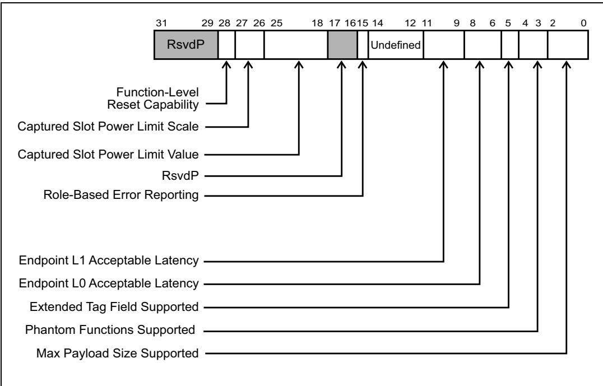
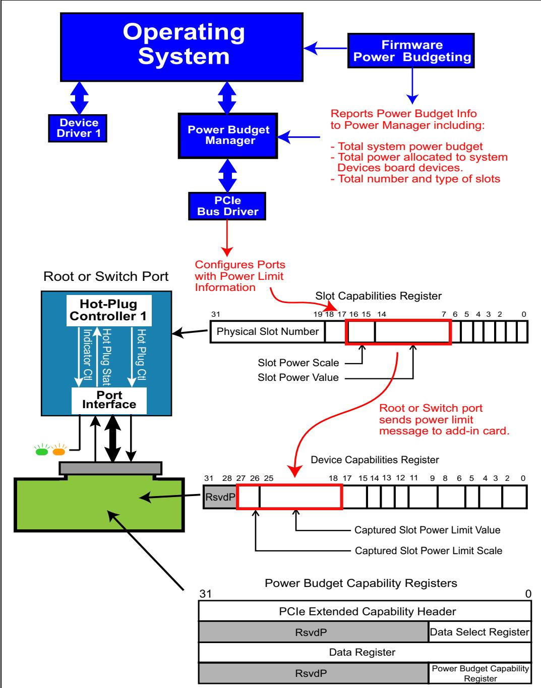
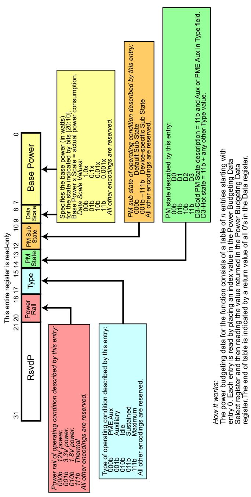

# Ch17_Interrupt_Support

| ## Chapter 19: Hot Plug and Power Budgeting | ## 第19章：热插拔与功率预算 |
| Table 19‑5: Slot Capability Register Fields and Descriptions (Continued) | 表19‑5：槽位能力寄存器字段及描述（续） |

<table><tr><td>Bit(s)</td><td>Register Name and Description</td></tr><tr><td>5</td><td>Hot-Plug Surprise — indicates that it&#x27;s possible for the user to remove the card from the system without prior notification. This tells the OS to allow for such removal without affecting continued software operation.</td></tr><tr><td>6</td><td>Hot-Plug Capable — indicates that this slot supports hot plug operation.</td></tr><tr><td>14:7</td><td>Slot Power Limit Value — specifies the maximum power that can be supplied by this slot. This limit value is multiplied by the scale specified in the next field.</td></tr><tr><td>16:15</td><td>Slot Power Limit Scale — specifies the scaling factor for the Slot Power Limit Value.</td></tr><tr><td>17</td><td>ElectroMechanical Interlock Present — indicates that this is implemented for this slot</td></tr><tr><td>18</td><td>No Command Completed Support— indicates that this slot doesn&#x27;t generate software notification when a command has been completed. Earlier versions sometimes took a long time to execute hot-plug commands (for example, sometimes taking a second or more to communicate across an  $I^{2}C$  bus to turn the power on or off), and generated an interrupt when they were finally done. When set this bit means that this Port can accept writes to all fields in the Slot Control register without delay, so there&#x27;s no need for the notification.</td></tr><tr><td>31:19</td><td>Physical Slot Number — Indicates the physical slot number associated with this port. It must be hardware initialized to a number that is unique within the chassis. Note that software will need this number to relate the physical slot to the Logical Slot ID (Bus, Device, &amp; Function number for this device).</td></tr></table>

| EN | ZH |
|---|---|
| ## Slot Power Limit Control | ## 插槽电源限制控制 |
| The spec provides a method for software to limit the amount of power consumed by a card installed into an expansion slot or backplane implementation. The registers to support this feature are included in the Slot Capability register. | 规范提供了一种方法，使软件能够限制插入扩展插槽或背板实现中的插卡所消耗的功率。支持该功能的寄存器包含在插槽能力寄存器中。 |

## 19.7.3 Slot Control | 19.7.3 插槽控制

| EN | ZH |
|---|---|
| Software controls the Hot Plug events through the Slot Control register, shown in Figure 19-6 on page 868. This register permits software to enable various Hot Plug features and control hot plug operations. It's also used to enable interrupt generation as well as enabling the sources of Hot-Plug events that can result in interrupt generation. | 软件通过槽位控制寄存器（Slot Control Register）控制热插拔事件，如图19-6（第868页）所示。该寄存器允许软件启用各种热插拔特性并控制热插拔操作。它还用于启用中断生成以及使能可能导致中断产生的热插拔事件源。 |

Figure 19-6: Slot Control Register | 图19-6：插槽控制寄存器

| EN | ZH |
|---|---|
| ## Chapter 19: Hot Plug and Power Budgeting | ## 第19章：热插拔与功率预算 |
| Table 19‐6: Slot Control Register Fields and Descriptions | 表19‐6：插槽控制寄存器字段及描述 |

<table><tr><td>Bit(s)</td><td>Register Name and Description</td></tr><tr><td>0</td><td>Attention Button Pressed Enable. When set, this bit enables the generation of a hot-plug interrupt (if enabled) or assertion of the Wake# message, when the attention button is pressed.</td></tr><tr><td>1</td><td>Power Fault Detected Enable. When set, enables generation of a hot-plug interrupt (if enabled) or Wake# message upon detection of a power fault.</td></tr><tr><td>2</td><td>MRL Sensor Changed Enable. When set, enables generation of a hot-plug interrupt or Wake# (if enabled) message upon detection of a MRL sensor changed event.</td></tr><tr><td>3</td><td>Presence Detect Changed Enable. When set this bit enables the generation of the hot-plug interrupt or a Wake message when the presence detect changed bit in the Slot Status register is set.</td></tr><tr><td>4</td><td>Command Completed Interrupt Enable. When set, enables a Hot- Plug interrupt to be generated that informs software that the hot-plug controller is ready to receive the next command.</td></tr><tr><td>5</td><td>Hot-Plug Interrupt Enable. When set, enables the generation of Hot-Plug interrupts.</td></tr><tr><td>7:6</td><td>Attention Indicator Control. Writes to the field control the state of the attention indicator and reads return the current state, as follows:00b = Reserved01b = On10b = Blink11b = Off</td></tr><tr><td>9:8</td><td>Power Indicator Control. Writes to the field control the state of the power indicator and reads return the current state, as follows:00b = Reserved01b = On10b = Blink11b = Off</td></tr><tr><td>10</td><td>Power Controller Control. Writes to the field switch main power to the slot and reads return the current state: 0b = Power On, 1b = Power Off</td></tr><tr><td>11</td><td>Electromechanical Interlock Control - If the interlock is implemented, writing a 1b to this bit toggles the state of it while writing a 0b has no effect. Reading this bit always returns a 0b.</td></tr><tr><td>12</td><td>Data Link Layer State Changed Enable - If the Data Link Layer Link Active Reporting capability is 1b, setting this bit enables software notification when the Data Link Layer Link Active bit changes. If the Data Link Layer Link Active Reporting capability is 0b, then this bit becomes read-only with a value of 0b.</td></tr></table>

| EN | ZH |
|---|---|
| ## Slot Status and Events Management | ## 插槽状态与事件管理 |
| The Hot Plug Controller monitors a variety of events and reports these events to the Hot Plug System Driver. Software can use the "detected" bits to determine which event has occurred, while the status bit identifies that nature of the change. The changed bits must be cleared by software in order to detect a subsequent change. Note that whether these events get reported to the system (via a system interrupt) is determined by the related enable bits in the Slot Control Register. | 热插拔控制器监控各种事件并将这些事件报告给热插拔系统驱动程序。软件可以使用"已检测"位来确定哪个事件已发生，而状态位则标识变化的性质。必须由软件清除已变化的位，以便检测后续变化。请注意，这些事件是否（通过系统中断）报告给系统，由插槽控制寄存器中的相关使能位决定。 |

Figure 19-7: Slot Status Register | 图19-7：插槽状态寄存器

| EN | ZH |
|---|---|
| Table 19-7: Slot Status Register Fields and Descriptions | 表19-7：插槽状态寄存器字段与描述 |

<table><tr><td>Bit Location</td><td>Register Name and Description</td></tr><tr><td>0</td><td>Attention Button Pressed — If the button is implemented, this bit is set when the Attention Button is pressed.</td></tr><tr><td>1</td><td>Power Fault Detected — If a Power Controller that supports power fault detection is implemented, this bit is set when it detects a power fault at this slot. The spec notes that it's possible for a power fault to be detected at any time, regardless of the Power Control setting or whether the slot is occupied.</td></tr><tr><td>2</td><td>MRL Sensor Changed — If an MRL Sensor is implemented, this is set when a MRL Sensor state change is detected. If no sensor is present this bit will always be zero.</td></tr><tr><td>3</td><td>Presence Detect Changed — set when a change has been detected in the Presence Detect State bit.</td></tr><tr><td>4</td><td>Command Completed — If the No Command Completed Support bit in the Slot Capabilities register is 0b, then this bit is set when a hot plug command has completed and the Hot Plug Controller is ready to accept another command. Technically, only this last meaning is guaranteed: the controller is ready to accept another command, regardless of whether the previous one has actually completed.</td></tr><tr><td>5</td><td>MRL Sensor State — when set, indicates the current state of the MRL sensor, if implemented: 0b = MRL Closed, 1b = MRL Open</td></tr><tr><td>6</td><td>Presence Detect State — this bit indicates the presence of a card in a slot and is required for all Downstream Ports that implement a slot. Its value is the logical "OR" of Physical Layer's Detection logic and any other side-band detect mechanism implemented for the slot (such as PRSNT1# and PRSNT2#). The big difference between them is that the pins require no power to physically detect the card and can thus report on it without needing the power restored, while using the Physical Layer Detect logic does need power.</td></tr><tr><td>7</td><td>Electromechanical Interlock Status —If an Electromechanical Interlock is implemented, this bit indicates whether it is engaged (1b) or disengaged (0b).</td></tr><tr><td>8</td><td>Data Link State Changed — This bit is set when the Data Link Layer Link Active bit in the Link Status register changes. In response to this event, software must read the Data Link Layer Link Active bit to determine whether the Link is active before sending configuration cycles to the hot plugged device.</td></tr></table>

| EN | ZH |
|-----|-----|
| ## Add-in Card Capabilities | ## 插件卡能力 |
| The Device Capability register, seen in Figure 19‐8 on page 873, also has fields relevant to add‐in cards that record the power reported by the Hot Plug Controller as being available to their slot. This information must be communicated automatically with a Set\_Slot\_Power\_Limit Message whenever either of these takes place: | 设备能力寄存器（参见图19‐8，第873页）也包含与插件卡相关的字段，用于记录热插拔控制器报告的其插槽可用功率。只要发生以下任一情况，此信息就必须通过 Set\_Slot\_Power\_Limit 消息自动通信： |
| • A configuration write to the Slot Capabilities register changes the Slot Power Limit Value and Slot Power Limit Scale values. | • 对插槽能力寄存器的配置写入更改了插槽功率限制值和插槽功率限制比例值。 |
| • The Link transitions from non‑DL\_UP to DL\_Up status (unless the Slot Capabilities register has not yet been initialized). | • 链路从非DL\_UP状态转换为DL\_Up状态（除非插槽能力寄存器尚未初始化）。 |
| The message updates the Captured Slot Power Limit Value and Scale registers with the values in the message, making this information readily available to its device driver. | 该消息使用消息中的值更新已捕获插槽功率限制值和比例寄存器，使该信息对其设备驱动程序随时可用。 |

Figure 19‐8: Device Capabilities Register | 图19‐8：设备能力寄存器

| EN | ZH |
|----|----|
| ## Quiescing Card and Driver | ## 静止化卡与驱动程序 |

## General | 概述

| EN | ZH |
|---|---|
| Prior to removing a card from the system, two things must occur: the device driver must stop accessing the card, and the card must stop initiating or responding to new Requests. How this is accomplished is OS-specific, but the following must take place: | 从系统中移除一个卡之前，必须完成两件事：设备驱动程序必须停止访问该卡，并且该卡必须停止发起或响应新的请求(Requests)。具体实现方式因操作系统而异，但必须完成以下操作： |
| • The OS must stop issuing new requests to the device’s driver or instruct the driver to stop accepting new requests. | • 操作系统必须停止向设备驱动程序下发新的请求，或指示驱动程序停止接受新的请求。 |
| • The driver must terminate or complete all outstanding requests. | • 驱动程序必须终止或完成所有未完成的请求(outstanding requests)。 |
| • The card must be disabled from generating interrupts or Requests. | • 该卡必须被禁止产生中断(interrupts)或请求(Requests)。 |
| When the OS commands the driver to quiesce itself and its device, the OS must not expect the device to remain in the system (in other words, it could be removed and not replaced with an identical card). | 当操作系统命令驱动程序使其自身及其设备静止(quiesce)时，操作系统不应期望该设备继续保留在系统中（换言之，该设备可能被移除，且不会用相同的卡替换）。 |

## 19.8.1 Pausing a Driver (Optional) | 19.8.1 暂停驱动（可选）

| EN | ZH |
|---|---|
| Optionally, an OS could implement a "Pause" capability to temporarily stop driver activity in the expectation that the same card will be reinserted. If the card is not reinstalled within a reasonable amount of time, however, the driver must be quiesced and then removed from memory. | 可选地，操作系统可实现"暂停"能力，以临时停止驱动程序活动，期望同一张卡将被重新插入。然而，如果卡未在合理时间内重新安装，则驱动程序必须静止，然后从内存中移除。 |
| As an example, the currently‑installed card is failing or is being replaced with a later revision as an upgrade. If the operation is to appear seamless from a software and operational perspective, the driver would have to quiesce the device, save the current context (contents of registers, stack and instruction pointer of local micro‑controller, etc.) and turn off the power to the slot. The new card could then be installed and powered, and then, when its context is restored, it could resume normal operation where it left off. Of course, if the old card had failed, it may not be possible to simply resume operation. | 例如，当前安装的卡出现故障，或正在被替换为更新版本以进行升级。如果从软件和操作的角度来看该操作需显得无缝，则驱动程序必须静止设备，保存当前上下文（寄存器内容、本地微控制器的堆栈和指令指针等），并关闭插槽电源。然后可以安装新卡并上电，待其上下文恢复后，即可从中断处恢复正常运行。当然，如果旧卡已发生故障，则可能无法简单地恢复操作。 |

## Quiescing a Driver That Controls Multiple Devices | 暂停控制多个设备的驱动

| EN | ZH |
|----|----|
| If a driver controls multiple cards and it receives a command from the OS to quiesce its activity with respect to a specific card, it must only quiesce its activity with that card and the card itself. | 如果一个驱动程序控制多个卡，并且它收到来自操作系统的命令要求对某个特定卡静止其活动，则它必须仅静止与该卡相关的活动以及该卡本身。 |

## Quiescing a Failed Card | 暂停故障卡
## Quiescing a Failed Card | 使故障卡静止（Quiescing）

| EN | ZH |
|---|---|
| If a card has failed, it may not be possible for the driver to complete requests previously issued to the card. In this case, the driver must detect the error, terminate the requests without completion, and attempt to reset the card. | 如果卡已故障，驱动程序可能无法完成先前发给该卡的请求。在这种情况下，驱动程序必须检测错误、终止请求（不完成它们），并尝试复位该卡。 |

## 19.9 The Primitives | 19.9 原语

| EN | ZH |
|----|----|
| This section discusses the hot-plug software elements and the information passed between them. For a review of the software elements and their relationships to each other, refer to Table 19-1 on page 852. Communications between the Hot-Plug Service within the OS and the Hot-Plug System Driver is in the form of requests. The spec doesn't define the exact format of these requests, but does define the basic request types and their content. Each request type issued to the Hot-Plug System Driver by the Hot-Plug Service is referred to as a primitive. They are listed and described in Table 19-8 on page 875. | 本节讨论热插拔软件元素及其之间传递的信息。关于软件元素及其相互关系的回顾，请参见第852页的表19-1。操作系统内的热插拔服务与热插拔系统驱动程序之间的通信采用请求的形式。规范未定义这些请求的确切格式，但定义了基本的请求类型及其内容。热插拔服务向热插拔系统驱动程序发出的每种请求类型被称为一个原语。这些原语在第875页的表19-8中列出并描述。 |

Table 19-8: The Primitives / 表19-8: 原语 | 表19-8：原语

<table>
<tr><td>Primitive / 原语</td><td>Parameters / 参数</td><td>Description / 描述</td></tr>
<tr><td rowspan="2">Query Hot-Plug System Driver / 查询热插拔系统驱动程序</td><td>Input: None / 输入: 无</td><td rowspan="2">Requests that the Hot-Plug System Driver return a set of Logical Slot IDs for the slots it controls. / 请求热插拔系统驱动程序返回其所控制插槽的一组逻辑插槽ID。</td></tr>
<tr><td>Return: Set of Logical Slot IDs for slots controlled by this driver. / 返回: 该驱动程序所控制插槽的逻辑插槽ID集合。</td></tr>
<tr><td rowspan="2">Set Slot Status / 设置插槽状态</td><td>Inputs: Logical Slot ID, New slot state (on or off), New Attention Indicator state, New Power Indicator state. / 输入: 逻辑插槽ID, 新插槽状态(开或关), 新注意力指示器状态, 新电源指示器状态。</td><td rowspan="2">This request is used to control the slots and the Attention Indicator associated with each slot. Good completion of a request is indicated by returning the Status Change Successful parameter. If a fault is incurred during an attempted status change, the Hot-Plug System Driver should return the appropriate fault message (see middle column). Unless otherwise specified, the card should be left in the off state. / 该请求用于控制插槽及与每个插槽关联的注意力指示器。请求成功完成通过返回"状态更改成功"参数来指示。如果在尝试状态更改期间发生故障，热插拔系统驱动程序应返回相应的故障消息(参见中间列)。除非另有指定，插卡应保持在关闭状态。</td></tr>
<tr><td>Return: Request completion status: status change successful, fault—wrong frequency, fault—insufficient power, fault—insufficient configuration resources, fault—power fail, fault—general failure / 返回: 请求完成状态: 状态更改成功, 故障—频率错误, 故障—电源不足, 故障—配置资源不足, 故障—电源失效, 故障—一般性故障</td></tr>
<tr><td rowspan="2">Query Slot Status / 查询插槽状态</td><td>Input: Logical Slot ID / 输入: 逻辑插槽ID</td><td rowspan="2">This request returns the state of the indicated slot (if a card is present). The Hot-Plug System Driver must return the Slot Power status information. / 该请求返回指定插槽的状态(是否有插卡存在)。热插拔系统驱动程序必须返回插槽电源状态信息。</td></tr>
<tr><td>Return: Slot state (on or off), Card power requirements. / 返回: 插槽状态(开或关), 插卡电源需求。</td></tr>
<tr><td rowspan="2">Async Notice of Slot Status Change / 插槽状态变更异步通知</td><td>Input: Logical Slot ID / 输入: 逻辑插槽ID</td><td rowspan="2">This is the only primitive (defined by the spec) that is issued to the Hot-Plug Service by the Hot-Plug System Driver. It is sent when the Driver detects an unsolicited change in the state of a slot. Examples would be a run-time power fault or a card installed in a previously-empty slot with no warning. / 这是(由规范定义的)唯一由热插拔系统驱动程序向热插拔服务发出的原语。当驱动程序检测到插槽状态发生非请求的变更时发送该原语。例如运行时电源故障或在无警告情况下插卡被安装到先前空的插槽中。</td></tr>
<tr><td>Return: none / 返回: 无</td></tr>
</table>

## 19.10 Introduction to Power Budgeting | 19.10 电源预算简介

| EN | ZH |
|---|---|
| The primary goal of the PCI Express power budgeting capability is to allocate power for PCI Express hot plug devices that are added to the system during runtime. This ensures that the system can allocate the proper amount of power and cooling for these devices. | PCI Express 电源预算（Power Budgeting）能力的主要目标是为运行期间添加到系统中的 PCI Express 热插拔设备分配电源。这确保了系统能够为这些设备分配适当的电力和冷却资源。 |
| The spec states that "power budgeting capability is optional for PCI Express devices implemented in a form factor which does not require hot plug, or that are integrated on the system board." None of the form factor specs released at the time of this writing required support for hot plug or the power budgeting capability, but these change often. | 规范指出："对于采用无需热插拔的形态因素或集成在系统板上的 PCI Express 设备，电源预算能力是可选的。"截至本书撰写时发布的所有形态因素规范均未要求支持热插拔或电源预算能力，但这些规范经常变更。 |
| System power budgeting is always required to support all system board devices and add-in cards. The new capability provides mechanisms for managing the budgeting process for a hot-plug card. Each form factor spec defines the min and max power for a given expansion slot. For example, the CEM spec limits the power an expansion card can consume prior to being fully enabled but, after it is enabled, it can consume the maximum amount of power specified for the slot. In the absence of the power budgeting capability registers, the system designer is responsible for guaranteeing that power has been budgeted correctly and that sufficient cooling is available to support any compliant card installed into the connector. | 系统电源预算始终是必需的，以支持所有系统板设备及附加卡。这一新能力提供了管理热插拔卡预算过程的机制。每种形态因素规范都定义了给定扩展插槽的最小和最大功耗。例如，CEM 规范限制了扩展卡在完全启用之前所能消耗的功率，但在启用之后，它可以消耗该插槽所规定的最大功率。在没有电源预算能力寄存器的情况下，系统设计人员负责确保电源已正确预算，并且有足够的冷却能力来支持安装到连接器中的任何兼容卡。 |
| The spec defines the configuration registers to support the power budgeting process, but does not define the power budgeting methods and processes. The next section describes the hardware and software elements that would be involved in power budgeting, including the specified configuration registers. | 规范定义了支持电源预算过程的配置寄存器，但并未定义电源预算的方法和流程。下一节将描述参与电源预算的硬件和软件要素，包括所规定的配置寄存器。 |

## 19.11 The Power Budgeting Elements | 19.11 功率预算要素

| EN | ZH |
|----|----|
| Figure 19‐10 illustrates the concept of Power Budgeting for hot plug cards. The role of each element involved in the power budgeting, allocation, and reporting process is listed and described below: | 图19-10展示了热插拔卡的电源预算概念。参与电源预算、分配和报告过程的每个元素的作用如下所列和所述： |
| • System Firmware for Power Management (used during boot time). | • 电源管理系统固件（在启动期间使用）。 |
| • Power Budget Manager (used during run time). | • 电源预算管理器（在运行期间使用）。 |
| • Expansion Ports (to which card slots are attached). | • 扩展端口（连接卡槽）。 |
| • Add‐in Devices (Power Budget Capable). | • 附加设备（具有电源预算能力）。 |

| English | 中文 |
|---------|------|
| ## System Firmware | ## 系统固件 |
| Written by the platform designers the specific system, this is responsible for reporting system power information. The spec recommends the following power information be reported to the PCI Express power budget manager, which allocates and verifies power consumption and dissipation during runtime: | 系统固件由特定系统的平台设计者编写，负责报告系统电源信息。规范建议将以下电源信息报告给 PCI Express 电源预算管理器，该管理器在运行时分配和验证功耗与散耗： |
| • Total system power available. | • 可用系统总功率。 |
| • Power allocated to system devices by firmware | • 固件分配给系统设备的功率 |
| • Number and type of slots in the system. | • 系统中插槽的数量和类型。 |
| Firmware may also allocate power to PCIe devices that support the power budgeting capability register set, such as a hot-plug device used during boot time. The Power Budgeting Capability register, shown in Figure 19-9 on page 878, contains a System Allocated bit that is hardware initialized (usually by firmware) to notify the power budget manager that power for this device has already been included in the system power allocation. If so, the Power Budget Manager still needs to read and save the power information for the hot-plug devices that were allocated in case they are later removed during runtime. | 固件也可以为支持电源预算能力寄存器集的 PCIe 设备分配功率，例如启动时使用的热插拔设备。电源预算能力寄存器（见第 878 页图 19-9）包含一个系统已分配位，该位由硬件初始化（通常由固件完成），用于通知电源预算管理器该设备的功率已包含在系统功率分配中。即便如此，电源预算管理器仍需读取并保存已分配的热插拔设备的电源信息，以防这些设备在运行时被移除。 |

Figure 19-9: Power Budget Registers | 图19-9：功耗预算寄存器  

## 19.11.2 The Power Budget Manager | 19.11.2 功率预算管理器

| EN | ZH |
|----|----|
| This initializes when the OS installs and receives power-budget information from system firmware, although the spec does not define the method for delivering this information. This manager is responsible for allocating power for all PCI Express devices including: | 电源预算管理器在操作系统安装时初始化，并从系统固件接收电源预算信息，但规范未定义传递此信息的方法。该管理器负责为所有PCI Express设备分配电源，包括： |
| PCI Express devices that have not already been allocated by the system (including embedded devices that support power budgeting). | 尚未由系统分配电源的PCI Express设备（包括支持电源预算的嵌入式设备）。 |
| Hot-plugged devices installed at boot time. | 引导时安装的热插拔设备。 |
| New devices added during runtime. | 运行期间新添加的设备。 |

## 19.11.3 Expansion Ports | 19.11.3 扩展端口

| EN | ZH |
|---|---|
| Figure 19-10 on page 880 illustrates a hot plug port that must have the Slot Power Limit and Slot Power Scale fields within the Slot Capabilities register implemented. The firmware or power budget manager must load these fields with a value that represents the maximum amount of power supported by this Port. When software writes to these fields the Port automatically delivers a Set_Slot_Power_Limit message to the device. These fields are also written when software configures a new card that has been added as a hot plug installation. | 第880页的Figure 19-10展示了一个热插拔端口，该端口必须在Slot Capabilities寄存器中实现Slot Power Limit和Slot Power Scale字段。固件或功率预算管理器必须将这些字段加载为表示该端口所支持的最大功率值。当软件写入这些字段时，端口会自动向设备发送一条Set_Slot_Power_Limit消息。当软件配置通过热插拔安装的新插卡时，也会写入这些字段。 |

## Spec requirements: | 规范要求：
## 规范要求：

| EN | ZH |
|---|---|
| Any Downstream Port that has a slot attached (the Slot Implemented bit in its PCIe Capabilities register is set) must implement the Slot Capabilities register. | 任何连接了插槽的 Downstream Port（其 PCIe Capabilities 寄存器中的 Slot Implemented 位被置位）必须实现 Slot Capabilities 寄存器。 |
| Software must initialize the Slot Power Limit Value and Scale fields of the Slot Capabilities register of the Downstream Port that is connected to an add-in slot. | 软件必须初始化连接到添加卡插槽的 Downstream Port 的 Slot Capabilities 寄存器中的 Slot Power Limit Value 和 Scale 字段。 |
| • Upstream Ports must implement the Device Capabilities register. | • Upstream Port 必须实现 Device Capabilities 寄存器。 |
| When a card is installed in a slot and software updates the power limit and scale values in the Downstream Port, that Port will automatically send the Set\_Slot\_Power\_Limit message to the Upstream Port on the installed card. | 当卡插入插槽且软件更新了 Downstream Port 中的功率限制和比例值后，该 Port 将自动向已安装卡上的 Upstream Port 发送 Set\_Slot\_Power\_Limit 消息。 |
| • The recipient of the Message must use the data payload to limit its power usage for the entire card, unless the card will never exceed the lowest value specified in the corresponding electromechanical spec. | • 该消息的接收者必须使用数据载荷来限制整个卡的功耗，除非该卡永远不会超过相应机电规范中规定的最低值。 |

## 19.11.4 Add-in Devices | 19.11.4 插件设备

| EN | ZH |
|---|---|
| Expansion cards that support the power budgeting capability must include the Slot Power Limit Value and Slot Limit Scale fields within the Device Capabilities register, and the Power Budgeting Capability register set for reporting power-related information. | 支持电源预算功能的扩展卡必须在设备能力寄存器中包含槽位电源限制值和槽位限制比例字段，以及用于报告电源相关信息的电源预算能力寄存器集。 |
| These devices must not consume more than the lowest power specified by the form factor spec. Once power budgeting software allocates additional power via the Set_Slot_Power_Limit message, the device can consume the power that has been specified, but not until it has been configured and enabled. | 这些设备不得消耗超过外形规格规定的最低功率。一旦电源预算软件通过Set_Slot_Power_Limit报文分配了额外功率，设备可以消耗已指定的功率，但必须在其被配置和使能之后才能这样做。 |
| Device Driver—The device's software driver is responsible for verifying that sufficient power is available for proper device operation prior to enabling it. If the power is lower than that required by the device, the device driver is responsible for reporting this to a higher software authority. | 设备驱动程序——设备的软件驱动程序负责在使能设备之前验证是否有足够的功率用于设备的正常运行。如果功率低于设备所需，设备驱动程序负责将此情况报告给更高级别的软件。 |

Figure 19‐10: Elements Involved in Power Budget | 图19‐10：参与功耗预算的元素

## 19.12 Slot Power Limit Control | 19.12 插槽功率限制控制

| EN | ZH |
| --- | --- |
| Software is responsible for determining the maximum power that an expansion device is allowed to consume. This allocation is based on the power partitioning within the system, thermal capabilities, etc. Knowledge of the system's power and thermal limits comes from system firmware. The firmware or power manager is responsible for reporting the power limits to each expansion port. | 软件负责确定扩展设备允许消耗的最大功率。此分配基于系统内的电源分区、热能力等。系统的电源和热限制信息来自系统固件。固件或电源管理器负责向每个扩展端口报告功率限制。 |

| EN | ZH |
|---|---|
| ## Expansion Port Delivers Slot Power Limit | ## 扩展端口提供槽位功率限制 |
| Software writes to the Slot Power Limit Value and Slot Power Limit Scale fields of the Slot Capability register to specify the maximum power that can be consumed by the device. Software is required to specify a power value that reflects one of the maximum values defined by the spec. For example, revision 2.0 of the CEM spec defines power usage as listed in Table 19‑9. | 软件向槽位能力寄存器的槽位功率限制值（Slot Power Limit Value）和槽位功率限制比例（Slot Power Limit Scale）字段写入数据，以指定设备可消耗的最大功率。软件必须指定符合规范所定义最大值的功率值。例如，CEM规范2.0版本定义了表19‑9所列的功耗值。 |
| An interesting note about these values is that a standard‑height x1 server card is limited to 10W after a reset and is only allowed to use the full 25W after it's been configured and enabled. Similarly, a x16 graphics card will be limited to 25W until configured and enabled to use the full 75W. | 关于这些值有一个有趣的说明：标准高度的x1服务器卡在复位后限制为10W，只有在完成配置和使能后才允许使用全部25W。类似地，x16显卡在配置并使能使用全部75W之前将被限制为25W。 |
| Table 19‑9: Maximum Power Consumption for System Board Expansion Slots | 表19‑9：系统主板扩展槽位的最大功耗 |

<table><tr><td></td><td colspan="2">X1 Link</td><td>X4/X8 Link</td><td colspan="2">X16 Link</td></tr><tr><td>Standard Height</td><td>10W (max - desktop)</td><td>25W (max - server)</td><td>25W (max)</td><td>25W (max - server)</td><td>75W (max - graphics card)</td></tr><tr><td>Low Profile Card</td><td colspan="2">10W (max)</td><td>25W (max)</td><td colspan="2">25W (max)</td></tr></table>

| EN | ZH |
|---|---|
| In addition to the base CEM spec, two more specs have been defined for higher‑powered devices. First is the PCIe x16 Graphics 150W‑ATX Spec 1.0, which defines a video card that's able to draw 75W from the card connector and another 75W from a separate 3‑pin ATX power connector. The second is the PCIe 225W/300W High Power CEM Spec 1.0, which extends this by adding another 3‑pin power connector to achieve 225W, or a 4‑pin ATX connector that brings the total to 300W. | 除了基础CEM规范外，还为高功率设备定义了另外两个规范。第一个是PCIe x16 Graphics 150W‑ATX Spec 1.0，该规范定义了可从显卡连接器吸取75W、并从独立的3引脚ATX电源连接器再吸取75W的显卡。第二个是PCIe 225W/300W High Power CEM Spec 1.0，它通过增加另一个3引脚电源连接器达到225W，或者使用4引脚ATX连接器使总功率达到300W。 |
| When the Slot Power registers are written by power budget software, the expansion port sends a Set\_Slot\_Power\_Limit message to the expansion device. This procedure is illustrated in Figure 19‑11 on page 882. | 当功率预算软件写入槽位功率寄存器时，扩展端口向扩展设备发送Set\_Slot\_Power\_Limit消息。该过程如图19‑11（第882页）所示。 |

Figure 19‑11: Slot Power Limit Sequence | 图19‑11：插槽功耗限制序列

| EN | ZH |
|---|---|
| 1. When Hot Plug software is notified of a card insertion request, Power and Clock are restored to the slot. | 1. 当热插拔软件收到卡插入请求通知时，电源和时钟恢复至该槽位。 |
| 2. Hot Plug software calls configuration and power budgeting software to configure and allocate power to the device. | 2. 热插拔软件调用配置和功率预算软件来配置和分配设备功率。 |
| 3. Power budget software may interrogate the card to determine it's power requirements and characteristics. | 3. 功率预算软件可以查询该卡以确定其功率需求和特性。 |
| 4. Power is then allocated based on the device's requirements and the system's capabilities. | 4. 然后根据设备需求和系统能力分配功率。 |
| 5. Power management software writes to the Slot Power Scale and Slot Power Value fields within the expansion port. | 5. 电源管理软件写入扩展端口内的槽位功率比例（Slot Power Scale）和槽位功率值（Slot Power Value）字段。 |
| 6. Writes to these fields command the port to send the Set\_Slot\_Power\_Limit message to convey the contents of the Slot Power fields. | 6. 写入这些字段命令端口发送Set\_Slot\_Power\_Limit消息，以传达槽位功率字段的内容。 |
| 7. The slot receives the message and updates its Captured Slot Power Limit Value and Scale fields. | 7. 槽位接收该消息并更新其捕获的槽位功率限制值（Captured Slot Power Limit Value）和比例（Scale）字段。 |
| 8. These values limit the power that the expansion device can consume once it is enabled by its device driver. | 8. 这些值限制扩展设备在其设备驱动程序使能后可消耗的功率。 |

## 19.12.2 Expansion Device Limits Power Consumption | 19.12.2 扩展设备限制功耗

| EN | ZH |
|---|---|
| The device driver reads the values from the Captured Slot Power Limit and Scale fields to verify that the power available is sufficient to operate the device. Several conditions may exist: | 设备驱动程序读取Captured Slot Power Limit和Scale字段的值，以验证可用功率是否足以运行设备。可能存在以下几种情况： |
| Enough power is available to operate the device at full capability. In this case, the driver enables the device by writing to the configuration Command register, permitting the device to consume power up to the limit specified in the Power Limit fields. | 可用功率足以使设备以全能力运行。在这种情况下，驱动程序通过写入配置Command寄存器来使能设备，允许设备消耗不超过Power Limit字段中指定上限的功率。 |
| The power available is sufficient to operate the device but not at full capability. In this case, the driver is required to configure the device such that it consumes no more power than specified in the Power Limit fields. | 可用功率足以运行设备，但不足以使其全能力运行。在这种情况下，驱动程序必须配置设备，使其消耗的功率不超过Power Limit字段中指定的值。 |
| The power available is insufficient to operate the device. In this case, the driver must not enable the card and must report the inadequate power condition to the upper software layers, which should in turn inform the end user of the problem. | 可用功率不足以运行设备。在这种情况下，驱动程序不得使能该卡，并且必须将功率不足的情况报告给上层软件，上层软件应进而将问题通知最终用户。 |
| The power available exceeds the maximum power specified by the form factor spec. This condition should not occur. but, if it does, the device is not permitted to consume power beyond the maximum permitted by the form factor. | 可用功率超过外形规格规范指定的最大功率。这种情况不应发生，但如果确实发生，设备不得消耗超出外形规格所允许的最大功率。 |
| The power available is less than the lowest value specified by the form factor spec. This is a violation of the spec, which states that the expansion port "must not transmit a Set\_Slot\_Power\_Limit Message that indicates a limit lower than the lowest value specified in the electromechanical spec for the slot's form factor." | 可用功率低于外形规格规范指定的最低值。这违反了规范，规范指出扩展端口"不得发送指示限制值低于插槽外形规格的机电规范所指定最低值的Set\_Slot\_Power\_Limit消息。" |
| Some expansion devices may consume less power than the lowest limit specified for their form factor. Such devices are permitted to discard the information delivered in the Set\_Slot\_Power\_Limit Messages. When the Slot Power Limit Value and Scale fields are read, these devices return zeros. | 某些扩展设备消耗的功率可能低于其外形规格指定的最低限制。此类设备允许丢弃Set\_Slot\_Power\_Limit消息中传递的信息。当读取Slot Power Limit Value和Scale字段时，这些设备返回零。 |

## 19.13 The Power Budget Capabilities Register Set | 19.13 功率预算能力寄存器集

| EN | ZH |
|---|---|
| These registers permit power budgeting software to allocate power more effectively based on information provided by the device through its power budget data select and data register. This feature is similar to the data select and data fields within the power management capability registers. However, the power budget registers provide more detailed information to software to aid it in determining the effects of expansion cards that are added during runtime on the system power budget and cooling requirements. Through this capability, a device can report the power it consumes: | 这些寄存器允许电源预算管理软件基于设备通过其电源预算数据选择寄存器和数据寄存器提供的信息更有效地分配电源。此功能类似于电源管理能力寄存器中的数据选择和数据字段。然而，电源预算寄存器向软件提供了更详细的信息，以帮助其确定运行时添加的扩展卡对系统电源预算和散热需求的影响。通过此能力，设备可报告其所消耗的功率： |
| • from each power rail | • 来自每条电源轨 |
| • in various power management states | • 在各种电源管理状态下 |
| • in different operating conditions | • 在不同操作条件中 |
| These registers are not required for devices implemented on the system board or on expansion devices that do not support hot plug. Figure 19-12 on page 884 illustrates the power budget capabilities register set and shows the data select and data field that provide the method for accessing the power budget information. | 对于实现于系统板上的设备或不支持热插拔的扩展设备，不要求这些寄存器。第884页的图19-12展示了电源预算能力寄存器集，并示出了提供访问电源预算信息方法的数据选择字段和数据字段。 |
| The power budget information is maintained within a table that consists of one or more 32-bit entries. Each table entry contains power budget information for the different operating modes supported by the device. Each table entry is selected via the data select field, and the selected entry is then read from the data field. The index values start at zero and are implemented in sequential order. When a selected index returns all zeros in the data field, the end of the power budget table has been located. Figure 19-13 on page 885 illustrates the format and types of information available from the data field. | 电源预算信息保存在一个由一个或多个32位条目组成的表中。每个表条目包含设备所支持的不同操作模式的电源预算信息。每个表条目通过数据选择字段选择，然后从数据字段读取所选条目。索引值从零开始并以顺序方式实现。当所选索引在数据字段中返回全零时，表示已到达电源预算表的末尾。第885页的图19-13示出了数据字段中可用的信息格式和类型。 |

Figure 19-12: Power Budget Capability Registers | 图19-12：功耗预算能力寄存器

<table><tr><td colspan="2">PCIe Extended Capability Header</td><td>Offset</td></tr><tr><td>RsvdP</td><td>Data Select Register</td><td>00h</td></tr><tr><td colspan="2">Data Register</td><td>04h</td></tr><tr><td>RsvdP</td><td>Power Budget Capability Register</td><td>08h</td></tr></table>

Figure 19-13: Power Budget Data Field Format and Definition | 图19-13：功耗预算数据字段格式和定义  

| EN | ZH |
|-----|-----|
| # 20 Updates for Spec Revision 2.1 | # 规范 2.1 版的 20 项更新 |

## Previous Chapter | 上一章

| EN | ZH |
|---|---|
| The previous chapter describes the PCI Express hot plug model. A standard usage model is also defined for all devices and form factors that support hot plug capability. Power is an issue for hot plug cards, too, and when a new card is added to a system during runtime, it's important to ensure that its power needs don't exceed what the system can deliver. A mechanism was needed to query the power requirements of a device before giving it permission to oper ate. Power budgeting registers provide that. | 前一章描述了PCI Express热插拔模型。对于所有支持热插拔能力的设备和外形规格，也定义了一个标准使用模型。电源同样是热插拔卡面临的问题，当在运行时向系统添加新卡时，务必确保其电源需求不超过系统所能提供的容量。需要一种机制来在允许设备运行前查询其电源需求。电源预算寄存器提供了这一功能。 |

## This Chapter | 本章

| EN | ZH |
|---|---|
| This chapter describes the changes and new features that were added with the 2.1 revision of the spec. Some of these topics, like the ones related to power management, are described in other chapters, but for others there wasn't another logical place for them. In the end, it seemed best to group them all together in one chapter to ensure that they were all covered and to help clarify what features were new. | 本章描述规范 2.1 修订版所引入的变更和新功能。其中部分主题（例如与电源管理相关的内容）已在其他章节中描述，但其余主题并无其他更合理的放置位置。最终，将所有内容集中在一章中似乎是最好方案，以确保全面覆盖，并有助于厘清哪些功能是新增的。 |

## The Next Chapter | 下一章

| EN | ZH |
|---|---|
| The next section is the book appendix which includes topics such as: Debugging PCI Express Traffic using LeCroy Tools, Markets & Applications of PCI Express Architecture, Implementing Intelligent Adapters and Multi-Host Systems with PCI Express Technology, Legacy Support for Locking and the book Glossary. | 下一节为本书附录，涵盖以下主题：使用 LeCroy 工具调试 PCI Express 流量、PCI Express 体系结构的市场与应用、利用 PCI Express 技术实现智能适配器与多主机系统、对锁定机制的遗留支持以及本书术语表。 |

## 20.1 Changes for PCIe Spec Rev 2.1 | 20.1 PCIe 规范 Rev 2.1 的变更

| EN | ZH |
|---|---|
| The 2.1 revision of the spec for PCIe introduced several changes to enhance performance or improve operational characteristics. It did not add another data rate and that's why it was considered an incremental revision. The modifications can be grouped generally into four areas of improvement: System Redundancy, Performance, Power Management, and Configuration. | PCIe 规范 2.1 修订版引入了若干变更，以提升性能或改善运行特性。该版本未增加新的数据速率，因此被视为一次增量修订。这些修改总体上可归为四个改进领域：系统冗余（System Redundancy）、性能（Performance）、电源管理（Power Management）和配置（Configuration）。 |

## 20.2 System Redundancy Improvement: Multi-casting | 20.2 系统冗余改进：多播

| EN | ZH |
|---|---|
| The Multi‑casting capability allows a Posted Write TLP to be routed to more than one destination at the same time, allowing for things like automatically making redundant copies of data or supporting multi‑headed graphics. As shown in Figure 20‑1 on page 888, a TLP sourced from one Endpoint can be routed to multiple destinations based solely on its address. In this example, data is sent to the video port for display while redundant copies of it are automatically routed to storage. There are other ways this activity could be supported, of course, but this is very efficient in terms of Link usage since it doesn't require a recipient to re‑send the packet to secondary locations. | 多播（Multi‑casting）能力允许一个 Posted Write TLP 同时路由到多个目的地，从而实现诸如自动创建数据冗余副本或支持多头图形等功能。如第 888 页图 20‑1 所示，源自一个端点的 TLP 可仅基于其地址路由到多个目的地。在此示例中，数据被发送到视频端口进行显示，同时其冗余副本被自动路由到存储设备。当然，也可以通过其他方式支持此活动，但这种方式在链路利用率方面非常高效，因为它不需要接收者将数据包重新发送到次要位置。 |

Figure 20‑1: Multicast System Example | 图20‑1：多播系统示例

| EN | ZH |
|---|---|
| This mechanism is only supported for posted, address‑routed Requests, such as Memory Writes, that contain data to be delivered and an address that can be decoded to show which Ports should receive it. Non‑posted Requests will not be treated as Multicast even if their addresses fall within the MultiCast address range. Those will be treated as unicast TLPs just as they normally would. | 此机制仅支持带数据的、地址路由的 Posted Request，例如 Memory Write，其包含待传送的数据和一个可解码以指示哪些端口应接收该数据的地址。Non‑posted Request 即使其地址落在多播地址范围内，也不会被视为多播处理，而将像通常一样被视为单播 TLP。 |
| The setup for Multicast operation involves programming a new register block for each routing element and Function that will be involved, called the Multicast Capability structure. The contents of this block are shown in Figure 20‑2 on page 889, where it can be seen that they define addresses and also MCGs (MultiCast Group numbers) that explain whether a Function should send or receive copies of an incoming TLP or whether a Port should forward them. Let's describe these registers next and discuss how they're used to create Multicast operations in a system. | 多播操作的设置涉及为每个参与的路由元件和 Function 编程一个新的寄存器块，称为多播能力结构（Multicast Capability structure）。该块的内容如第 889 页图 20‑2 所示，其定义了地址以及 MCG（多播组编号），用以说明一个 Function 应发送还是接收入站 TLP 的副本，或者一个端口是否应转发它们。接下来让我们描述这些寄存器，并讨论如何在系统中利用它们创建多播操作。 |

Figure 20‑2: Multicast Capability Registers | 图20‑2：多播能力寄存器

| EN | ZH |
|---|---|
| ## Multicast Capability Registers | ## 组播能力寄存器 |
| The Capability Header register at the top of the figure includes the Capability ID of 0012h, a 4‑bit Version number, and a pointer to the next capability structure in the linked list of registers. | 图中顶部的能力头寄存器包含能力ID 0012h、4位版本号，以及指向寄存器链表中下一个能力结构的指针。 |

## Multicast Capability | 多播能力

| EN | ZH |
|---|---|
| This register, shown in detail in Figure 20-3 on page 890, contains several fields. The MC_Max_Group value defines how many Multicast Groups this Function has been designed to support minus one, so that a value of zero means one group is supported. The Window Size Requested, which is only valid for Endpoints and reserved in Switches and Root Ports, represents the address size needed for this purpose as a power of two. | 该寄存器（详见第890页图20-3）包含多个字段。MC_Max_Group 值定义了该功能设计支持的多播组数量减一，因此值为零表示支持一个组。Window Size Requested（请求的窗口大小）仅对端点有效，在交换机和根端口中为保留字段，它以2的幂次方表示为此目的所需的地址大小。 |

Figure 20-3: Multicast Capability Register | 图20-3：多播能力寄存器

| EN | ZH |
|---|---|
| Lastly, bit 15 indicates whether this Function supports regenerating the ECRC value in a TLP if forwarding it involved making address changes to it. Refer to the section called "Overlay Example" on page 895 for more detail on this. | 最后，位15指示该功能是否支持在转发TLP时若涉及地址更改则重新生成TLP中的ECRC值。更多详情请参见第895页的"覆盖示例"一节。 |

## Multicast Control | 多播控制

| EN | ZH |
|---|---|
| This register, shown in Figure 20‐4 on page 890, contains the MC\_Num\_Group that is programmed with the number of Multicast Groups configured by software for use by this Function. The default number is zero, and the spec notes that programming a value here that is greater than the max value defined in the MC\_Max\_Group register will result in undefined behavior. The MC\_Enable bit is used to enable the Multicast mechanism for this component. | 该寄存器如图20-4（第890页）所示，包含MC\_Num\_Group字段，该字段由软件编程设置供此功能使用的多播组数量。默认值为零，规格说明指出，在此处编程的值大于MC\_Max\_Group寄存器中定义的最大值将导致未定义行为。MC\_Enable位用于使能该组件的多播机制。 |

Figure 20‐4: Multicast Control Register | 图20‐4：多播控制寄存器

| EN | ZH |
|---|---|
| ## Multicast Base Address | ## 多播基址 |
| The base address register, shown in Figure 20‐5 on page 891, contains the 64‐bit starting address of the Multicast Address range for this component. The Multi‐Cast Index Position register indicates the bit position within the address where the MultiCast Group (MCG) number is to be found. When the address of an incoming TLP falls within the MultiCast address range starting at this Base Address, the logic will offset into the address itself by the number of bit locations given in the Index Position and interpret the next bits (up to 6 bits, allowing up to 64 groups) as the MCG number for that TLP. The MCG number, in turn, will indicate whether the Port should forward a copy of this TLP. | 基址寄存器（如图20‐5所示，见第891页）包含该组件的多播地址范围的64位起始地址。多播索引位置寄存器指示地址中用于定位多播组（MCG）编号的位位置。当入站TLP的地址落在从该基址开始的多播地址范围内时，逻辑将根据索引位置给出的位数量偏移到地址中，并将接下来的位（最多6位，允许最多64个组）解释为该TLP的MCG编号。而MCG编号则指示端口是否应转发此TLP的副本。 |

Figure 20‐5: Multicast Base Address Register | 图20‐5：多播基地址寄存器  

| EN | ZH |
|---|---|
| An example of locating the MCG within the address is shown in Figure 20‐6 on page 892. Here the Index Position value is 24, so the MCG is found in address bits 25 to 30. Interestingly, since the base address doesn't define the lower 12 bits of the address, the MC Index Position must be 12 or greater to be valid. If it's less than 12 and the MC_Enable bit is set, the component's behavior will be undefined. | 在地址中定位MCG的示例如图20‐6所示（见第892页）。此处索引位置值为24，因此MCG位于地址的位25到位30。值得注意的是，由于基址未定义地址的低12位，多播索引位置必须为12或更大才有效。如果小于12且MC_Enable位被置位，则组件的行为将是未定义的。 |

Figure 20‐6: Position of Multicast Group Number | 图20‐6：多播组号位置  

## MC Receive | MC 接收

| EN | ZH |
|---|---|
| This 64-bit register is a bit vector that indicates for which of the 64 MCGs this Function should accept a copy or this Port should forward a copy. If the MCG value is found to be 47, for example, and bit 47 is set in this register, then this Function should receive it or this Port should forward it. | 该64位寄存器是一个位向量，用于指示该功能应对64个MCG中的哪些接受副本，或该端口应转发副本。例如，若MCG值为47，且该寄存器中位47被置位，则该功能应接收该报文，或该端口应转发该报文。 |

## MC Block All | MC 全部阻止

| EN | ZH |
|----|----|
| This 64-bit register indicates which MCGs an Endpoint Function is blocked from sending and which a Switch or Root Port is blocked from forwarding. This can be programmed in a Switch or Root Port to prevent it from forwarding MultiCast TLPs to an Endpoint that doesn't understand them, for example. A blocked TLP is considered an error condition, and how the error is handled is described in the next section. | 该64位寄存器指示端点功能被阻止发送哪些MCG（多播组），以及交换机或根端口被阻止转发哪些MCG。例如，可在交换机或根端口中对其进行编程，以防止其将多播TLP转发给不理解这些TLP的端点。被阻止的TLP被视为错误条件，错误的处理方式将在下一节中描述。 |

## MC Block Untranslated | MC 阻止未翻译

| EN | ZH |
|---|---|
| The meaning and use of this 64‑bit register is almost identical to the Block All register except that it doesn’t apply to TLPs whose AT header field shows them to be translated. This mechanism can be used to set up a Multicast window that is protected in that it can only receive translated addresses. | 这个64位寄存器的含义和用途与Block All寄存器几乎相同，区别在于它不适用于AT头字段显示为已转换的TLP。该机制可用于建立一个受保护的多播窗口，该窗口只能接收已转换的地址。 |
| If a TLP is blocked because of the setting of either of these two blocking registers, it’s handled as an MC Blocked TLP, meaning it gets dropped and the Port or Function logs and signals this as an error. Logging the error involves setting the Signaled Target Abort bit in its Status register or its Secondary Status register, as appropriate. That’s barely enough information to be useful, though, so the spec highly recommends that Advanced Error Reporting (AER) registers be implemented in Functions with Multicast capability to facilitate isolating and diagnosing faults. | 如果TLP因这两个阻塞寄存器中任一寄存器的设置而被阻止，它将被当作MC阻塞TLP处理，即该TLP被丢弃，并且端口或功能会记录并将此作为错误发出信号。记录错误涉及在其Status寄存器或Secondary Status寄存器中设置Signaled Target Abort位。然而，这些信息几乎不足以提供有用的帮助，因此规范强烈建议在具有多播能力的功能中实现高级错误报告（AER）寄存器，以便于隔离和诊断故障。 |
| The spec notes that this register is required in all Functions that implement the MC Capability registers, but if an Endpoint Function doesn’t implement the ATS (Address Translation Services) registers, the designer may choose to make these bits reserved. | 规范指出，该寄存器在所有实现MC能力寄存器的功能中是必需的，但如果端点功能未实现ATS（地址转换服务）寄存器，设计者可以选择将这些位保留。 |

## 20.2.2 Multicast Example | 20.2.2 多播示例

| EN | ZH |
|---|---|
| At this point, an example will help to illustrate how these registers can be used to set up a multicast environment. To set this up, let's first give the relevant registers some values: | 此时，举一个示例有助于说明如何使用这些寄存器来设置多播环境。为建立该环境，首先为相关寄存器赋予一些值： |
| • MC_Base_Address = 2GB (Starting address for the multicast range) | • MC_Base_Address = 2GB（多播范围的起始地址） |
| • MC_Max_Group = 7 (Meaning 8 windows are possible for this design) | • MC_Max_Group = 7（表示该设计最多支持8个窗口） |
| • MC_Window_Size_Requested = 10 (Meaning $2^{10}$ or 1KB size was requested by an Endpoint) | • MC_Window_Size_Requested = 10（表示端点请求的窗口大小为 $2^{10}$，即1KB） |
| • MC_Index_Position = 12 (Meaning the actual size of each window is $2^{12}$) | • MC_Index_Position = 12（表示每个窗口的实际大小为 $2^{12}$） |
| • MC_Num_Group = 5 (Meaning software only configured 6 of the available multicast windows). | • MC_Num_Group = 5（表示软件仅配置了可用多播窗口中的6个） |
| Based on those register settings, the image in Figure 20-7 on page 894 illustrates the result. The multicast window range is shown starting at 2GB and ranging as high as 2GB + 8 \* (the window size). However, only 6 are enabled by software, so the actual multicast address range is from 2GB to 2GB + 24KB. The windows are all the same size and correspond to the MCGs: MCG 0 is the first window, 1 is the next window, and so on. | 基于这些寄存器设置，第894页的图20-7展示了结果。如图所示，多播窗口范围起始于2GB，最高可达2GB + 8 ×（窗口大小）。然而，软件仅使能了6个窗口，因此实际的多播地址范围为2GB至2GB + 24KB。所有窗口大小相同，并与MCG相对应：MCG 0对应第一个窗口，MCG 1对应下一个窗口，以此类推。 |

Figure 20-7: Multicast Address Example | 图20-7：多播地址示例

## 20.2.3 MC Overlay BAR | 20.2.3 MC 覆盖 BAR

| EN | ZH |
|---|---|
| This last set of registers are required for Switch and Root Ports that implement Multicasting, but they're not implemented in Endpoints. The motivation for this BAR is that it allows two special cases. First, a Port can forward TLPs downstream if they hit in a multicast window even if the Endpoint wasn't designed for multicasting. Second, a Port can forward multicast TLPs upstream to system memory. In both cases, this is accomplished by replacing part of the Request's address with an address that will be recognized by the target. Doing so allows a single BAR in a component to serve as a target for both unicast and multicast writes even if it wasn't designed with multicast capability. | 最后一组寄存器对于实现了多播（Multicasting）的交换机和根端口是必需的，但它们在端点中未实现。引入此BAR的动机在于它允许两种特殊情况。第一，端口可以在TLP命中多播窗口时将其向下游转发，即使端点并非为多播而设计。第二，端口可以将多播TLP向上游转发到系统内存。在这两种情况下，这都是通过将请求地址的一部分替换为目标可识别的地址来实现的。这样做允许组件中的单个BAR充当单播和多播写入的目标，即使它并非为多播能力而设计。 |
| As shown in Figure 20‑8 on page 895, this register block consists of an address that will be overlaid onto the outgoing TLP, and a 6‑bit Overlay Size indicator. The size referred to here is simply the number of bits from the original 64‑bit address that will be retained, while all the others will be replaced by the Overlay BAR bits. The spec mistakenly refers to this in at least one place as the size in bytes, but in other places it's made clear that it is a bit number. Note that the overlay size value must be 6 or higher to enable the overlay operation. If the size is given as 5 or lower, no overlay will take place and the address is unchanged. | 如图20‑8（第895页）所示，该寄存器块包含一个将被覆盖到传出TLP上的地址，以及一个6位的覆盖大小（Overlay Size）指示符。此处所述的大小是指原始64位地址中将被保留的位数，而所有其他位将被覆盖BAR位替换。规范至少在有一处错误地将其称为以字节为单位的大小，但在其他位置明确说明它是一个位数。请注意，覆盖大小值必须为6或更高才能启用覆盖操作。如果大小指定为5或更小，则不会发生覆盖，地址保持不变。 |

Figure 20‑8: Multicast Overlay BAR | 图20‑8：多播覆盖BAR

<table><tr><td>31</td><td>6</td><td>5</td><td>0</td></tr><tr><td colspan="2">MC_Overlay_BAR [31:6]</td><td colspan="2">MC_Overlay_Size</td></tr><tr><td colspan="4">MC_Overlay_BAR [63:32]</td></tr></table>

## 20.2.4 Overlay Example | 20.2.4 覆盖示例

| EN | ZH |
|---|---|
| Now consider the case in which an address overlay is desired, as shown in Figure 20‐9 on page 896. Here the address of a TLP to be forwarded, ABCD_BEEFh, falls within the defined multicast range (also referred to as a multicast hit) and the egress Port has been configured with valid values in the Overlay BAR. | 现在考虑需要进行地址覆盖的情况，如图20‐9（第896页）所示。这里，待转发的TLP的地址ABCD_BEEFh落在定义的多播范围内（也称为多播命中），并且出口端口已使用覆盖BAR中的有效值进行了配置。 |
| The overlay case creates the unusual situation with the ECRC value that was mentioned earlier in the description of the Multicast Capability register. If the TLP whose address is being changed by the overlay includes an ECRC, that value would be rendered incorrect by this change. Switches and Root Ports optional support regenerating the ECRC based on the new address so that it still serves its purpose going forward. If the routing agent does not support it, the ECRC is simply dropped and the TD header bit is forced to zero to avoid any confusion. | 覆盖情况会造成之前在多播能力寄存器描述中提到的ECRC值的异常情况。如果地址被覆盖更改的TLP包含ECRC，则该值将因地址更改而变得不正确。交换机和根端口可选支持基于新地址重新生成ECRC，使其在后续传输中仍能发挥其作用。如果路由代理不支持此功能，则直接丢弃ECRC，并将TD头比特强制清零以避免混淆。 |
| A potential problem can arise with ECRC regeneration. If the incoming TLP already had an error but the ECRC value is regenerated because the address was modified, that would inadvertently hide the original error. To avoid that, the routing agent must verify the original ECRC first. If it finds an error, it must force a bad ECRC on the outgoing TLP by inverting the calculated ECRC value before appending it to ensure that the target will see it as an error condition. | ECRC重新生成可能会引发一个潜在问题。如果传入的TLP已经存在错误，但因地址被修改而重新生成了ECRC值，这将会无意中掩盖原始错误。为避免这种情况，路由代理必须首先验证原始ECRC。如果发现错误，它必须在传出TLP上强制生成错误的ECRC——即先计算ECRC值再将其取反后附加——以确保目标端会将其视为错误条件。 |

Figure 20‐9: Overlay Example | 图20‐9：覆盖示例  

## 20.2.5 Routing Multicast TLPs | 20.2.5 路由多播TLP

| EN | ZH |
|---|---|
| When a Switch or Root Port detects an MC hit (address falls within the MC range) normal routing is suspended. The MCG is extracted from the address and is compared to the MC_Receive register of all the Ports to see which of them should forward a copy of this TLP. Ports whose corresponding Receive register bit is set will forward a copy of the TLP unless their corresponding MC Blocked register bit is also set. If no Ports forward the TLP and no Functions consume it, it is silently dropped. To prevent loops, a TLP is never forwarded back out on its ingress Port, with the possible exception of an ACS case. | 当交换机或根端口检测到MC命中（地址落在MC范围内）时，正常路由被暂停。从地址中提取MCG，并与所有端口的MC_Receive寄存器进行比较，以确定哪些端口应转发此TLP的副本。其对应Receive寄存器位被设置的端口将转发TLP的副本，除非其对应的MC Blocked寄存器位也被设置。如果没有端口转发TLP且没有功能消费它，则被静默丢弃。为防止环路，TLP永远不会被转发回其入端口，但ACS情况可能例外。 |
| Endpoints extract the MCG and compare it with their Receive register. If there's no match, the TLP is silently dropped. If the Endpoint doesn't support Multicasting, it will treat the TLP as having an ordinary address. | 端点提取MCG并将其与其Receive寄存器进行比较。如果没有匹配，则TLP被静默丢弃。如果端点不支持多播，它将把该TLP视为具有普通地址。 |

## 20.2.6 Congestion Avoidance | 20.2.6 拥塞避免

| EN | ZH |
|---|---|
| The use of Multicasting will increase the amount of system traffic in proportion to the percentage of MC traffic, which leads to the risk of packet congestion. To avoid creating backpressure, MC targets should be designed to accept MC traffic "at speed", meaning with minimal delay. To avoid oversubscribing the Links, MC initiators should limit their packet injection rate. A system designer would be wise to choose components carefully to handle this. For example, using Switches and Root Ports whose buffers are big enough to handle the expected traffic, and Endpoints that are able to accept their incoming MC packets quickly enough to avoid trouble. | 组播的使用将按组播流量比例增加系统流量，从而导致数据包拥塞的风险。为避免产生反压，组播目标应设计为能够"线速"接收组播流量，即具有最小延迟。为避免链路过载，组播发起者应限制其数据包注入速率。系统设计者应谨慎选择组件来处理这一问题。例如，使用缓冲区足够大以处理预期流量的交换机和根端口，以及能够足够快地接收其传入组播数据包以避免问题的端点。 |

## 20.3 Performance Improvements | 20.3 性能改进

| EN | ZH |
|---|---|
| System performance is enhanced with the addition of four new features: | 通过新增四项特性，系统性能得到提升： |
| 1. AtomicOps to replace the legacy transaction locking mechanism | 1. AtomicOps 取代传统事务锁定机制 |
| 2. TLP Processing Hints to allow software to suggest caching options | 2. TLP 处理提示（TPH）允许软件建议缓存选项 |
| 3. ID-Based Ordering to avoid unnecessary latency | 3. 基于ID的顺序（IDO）避免不必要的延迟 |
| 4. Alternative Routing-ID Interpretation to increase the number of Functions available in a device. | 4. 替代路由ID解释（ARI）增加设备中可用的功能（Function）数量 |

| EN | ZH |
| --- | --- |
| ## AtomicOps | ## AtomicOps（原子操作） |
| Processors that share resources or otherwise communicate with each other sometimes need uninterrupted, or "atomic", access to system resources to do things like testing and setting semaphores. On parallel processor buses this was accomplished by locking the bus with the assertion of a Lock pin until the originator completed the whole sequence (a read followed by a write), during which time other processors were not allowed to initiate transactions on the bus. PCI included a Locked pin to apply this same model on the PCI bus as on the processor bus, allowing this protocol to used with peripheral devices. | 共享资源或以其他方式相互通信的处理器有时需要对系统资源进行不间断的（即"原子的"）访问，以执行诸如测试和设置信号量等操作。在并行处理器总线上，这是通过断言Lock引脚来锁定总线实现的，直到发起方完成整个序列（一次读取后跟一次写入），在此期间其他处理器不允许在总线上发起事务。PCI包含了一个Locked引脚，将相同的模型应用于PCI总线，就像在处理器总线上一样，使得该协议可用于外设。 |
| This model worked but was slow on the shared processor bus and even worse when going onto the PCI bus. That's one reason why PCIe limited its use only to Legacy devices. However, the increasing use of shared processing in today's PCs, such as graphics co‐processors and compute accelerators, has brought this issue back to the fore because the different compute engines need to be able to share an atomic protocol. The way this problem was resolved on PCIe was to introduce three new commands that can each do a series of things atomically within the target device rather than requiring a series of separate uninterruptable commands on the interface. These new commands, called AtomicOps, are: | 这种模型确实有效，但在共享处理器总线上速度较慢，进入PCI总线时更慢。这就是PCIe将其使用仅限于传统（Legacy）设备的原因之一。然而，当今PC中共享处理（如图形协处理器和计算加速器）的使用日益增多，使这个问题再次凸显，因为不同的计算引擎需要能够共享原子协议。PCIe解决该问题的方式是引入了三条新命令，每条命令都可在目标设备内原子性地执行一系列操作，而不需要在接口上执行一系列独立的不可中断命令。这些被称为AtomicOps的新命令如下： |
| 1. FetchAdd (Fetch and Add) ‐ This Request contains an "add" value. It reads the target location, adds the "add"value to it, stores the result in the target location and returns the original value of the target location. This could be used in support of atomically updating statistics counters. | 1. FetchAdd（取并加）— 该请求包含一个"加"值。它读取目标位置，将"加"值加到该位置，将结果存储回目标位置，并返回目标位置的原始值。这可用于支持原子性地更新统计计数器。 |
| 2. Swap (Unconditional Swap) ‐ This Request contains a "swap" value. It reads the target location, writes the "swap" value into it, and returns the original target value. This could be useful for atomically reading and clearing counters. | 2. Swap（无条件交换）— 该请求包含一个"交换"值。它读取目标位置，将"交换"值写入该位置，并返回原始目标值。这对于原子性地读取和清除计数器很有用。 |
| 3. CAS (Compare and Swap) ‐ This Request contains both a "compare" value and a "swap" value. It reads the target location, compares it against the "compare" value and, if they're equal, writes in the "swap" value. Finally, it returns the original value of the target location. This can be useful as a "test and set" mechanism for managing semaphores. | 3. CAS（比较并交换）— 该请求同时包含一个"比较"值和一个"交换"值。它读取目标位置，将其与"比较"值进行比较，如果相等，则写入"交换"值。最后，它返回目标位置的原始值。这可用作管理信号量的"测试并设置"机制。 |
| Both Endpoints and Root Ports are optionally allowed to act as AtomicOp Requesters and Completers, which might seem unexpected because, in PCs at least, this kind of transaction is usually only initiated by the central processor. But modern systems can include an Endpoint acting as a co‐processor, in which case it would need to be able to use AtomicOps to properly handle the protocol. All three commands support 32‐bit and 64‐bit operands, while CAS also supports 128‐bit operands. The actual size in use will be given in the Length field in the header. Routing elements like Switch Ports and Root Ports with peer‐to‐peer access will need to support the AtomicOp routing capability to be able to recognize and route these Requests. | 端点和根端口都可以选择性地充当AtomicOp请求者和完成者，这可能看起来有些出乎意料，因为至少在PC中，这类事务通常仅由中央处理器发起。但现代系统可能包含充当协处理器的端点，在这种情况下，它需要能够使用AtomicOps来正确处理协议。所有三条命令都支持32位和64位操作数，而CAS还支持128位操作数。实际使用的操作数大小将在头部的Length字段中给出。路由元素（如交换机端口和具有对等访问能力的根端口）需要支持AtomicOp路由能力，以便能够识别和路由这些请求。 |
| A question naturally arises as to how the system (Root Complex) will be instructed to generate these new commands in response to processor activity, since there may not be a directly‐analogous processor bus command. The spec suggests two approaches. First, the Root could be designed to recognize specific processor activity and interpret that to "export" a PCIe AtomicOp in response. Second, a register‐based approach similar to the one used for legacy Configuration access could be used. In that case, one register might give the target address while another specified which command should be generated and the combination of the two would generate the Request. | 一个自然产生的问题是，系统（根复合体）将如何被指示根据处理器活动生成这些新命令，因为可能没有直接对应的处理器总线命令。规范提出了两种方法。第一，可以将根复合体设计为识别特定的处理器活动，并将其解释为"导出"PCIe AtomicOp作为响应。第二，可以使用类似于传统配置访问的基于寄存器的方法。在这种情况下，一个寄存器可能提供目标地址，而另一个寄存器指定应生成哪条命令，两者的组合将生成该请求。 |
| AtomicOp Completers can be identified by the presence of the three new bits in the Device Capabilities 2 register, as shown in Figure 20‐10 on page 899. Bit 6 of this register also identifies whether routing elements are capable of routing AtomicOps. | AtomicOp完成者可以通过设备能力2（Device Capabilities 2）寄存器中存在的三个新位来识别，如图20-10（第899页）所示。该寄存器的位6还标识路由元素是否能够路由AtomicOps。 |
| Legacy PCI does not comprehend AtomicOps, of course, and there is no straight‐forward way to translate them into PCI commands. For that reason, PCIe‐to‐PCI bridges do not support AtomicOps. If atomic access is needed on that bus it would have to be done with the legacy locked protocol and the spec states that Locked Transactions and AtomicOps can operate concurrently on the same platform. | 传统PCI当然不理解AtomicOps，也没有直接的方法将它们转换为PCI命令。因此，PCIe到PCI桥不支持AtomicOps。如果在该总线上需要原子访问，则必须使用传统的锁定协议来完成，并且规范指出锁定事务（Locked Transactions）和AtomicOps可以在同一平台上并发操作。 |

Figure 20‐10: Device Capabilities 2 Register | 图20‐10：设备能力2寄存器  

## 20.3.2 TPH (TLP Processing Hints) | 20.3.2 TPH（TLP 处理提示）

| EN | ZH |
|---|---|
| Adding hints about how the system should handle TLPs targeting memory space can improve latency and traffic congestion. The spec describes this special handling basically as providing information about which of several possible cache locations in the system would be the optimal place for a temporary copy. | 关于系统应如何处理目标为存储器空间的TLP添加提示，可改善延迟和流量拥塞。规范将这种特殊处理描述为提供信息，说明系统中多个可能的缓存位置中哪一个是临时拷贝的最佳存放位置。 |

| EN | ZH |
|----|----|
| of a TLP. The spec makes note of the fact that, since the usage described for TPH relates to caching, it wouldn't usually make sense to use them with TLPs targeting Non‑prefetchable Memory Space. If such usage was needed, it would be essential to somehow guarantee that caching such TLPs did not cause undesirable side effects. | 一个TLP的。规范指出，由于TPH（TLP处理提示）所述的用途与缓存相关，通常将其用于针对不可预取存储空间的TLP是没有意义的。如果确实需要这种用法，则必须以某种方式保证缓存此类TLP不会导致不良副作用。 |

## TPH Examples | TPH示例

<table>
<tr>
<td width="50%">
Device Write to Host Read. To help clarify the motivation for TPH, consider the example shown in Figure 20‐11 on page 901. Here the Endpoint is writing data into memory for later use by the CPU. The sequence is as follows:
</td>
<td width="50%" style="background-color:#e8e8e8">
设备写主机读。为帮助阐明TPH的动机，请考虑第901页图20-11所示的示例。此处Endpoint正在将数据写入内存以供CPU后续使用。具体序列如下：
</td>
</tr>
</table>

<table>
<tr>
<td width="50%">
1. First, the Endpoint sends a memory write TLP containing an address that maps to the system memory. The packet gets routed to the Root Complex (RC).
</td>
<td width="50%" style="background-color:#e8e8e8">
1. 首先，Endpoint发送一个内存写TLP，其中包含映射到系统内存的地址。该数据包被路由到Root Complex（RC）。
</td>
</tr>
</table>

<table>
<tr>
<td width="50%">
2. The RC recognizes this as an access to a cacheable memory space and pauses its progress while it snoops the CPU cache. This may result in a write‐back cycle from the CPU to update the system memory before the transaction can proceed, and this is shown as step 2a.
</td>
<td width="50%" style="background-color:#e8e8e8">
2. RC识别出这是对可缓存内存空间的访问，并在侦听CPU缓存时暂停其处理。这可能导致CPU执行写回周期以更新系统内存，然后事务才能继续，如步骤2a所示。
</td>
</tr>
</table>

<table>
<tr>
<td width="50%">
3. Once any write backs have finished, the RC allows the write to update the system memory.
</td>
<td width="50%" style="background-color:#e8e8e8">
3. 一旦所有写回操作完成，RC允许该写入操作更新系统内存。
</td>
</tr>
</table>

<table>
<tr>
<td width="50%">
4. At some point, the Endpoint notifies the CPU about data delivery.
</td>
<td width="50%" style="background-color:#e8e8e8">
4. 在某个时刻，Endpoint通知CPU数据已送达。
</td>
</tr>
</table>

<table>
<tr>
<td width="50%">
5. Finally, the CPU fetches the data from memory to complete the sequence.
</td>
<td width="50%" style="background-color:#e8e8e8">
5. 最后，CPU从内存中获取数据以完成该序列。
</td>
</tr>
</table>

Figure 20‐11: TPH Example | 图20‐11：TPH示例  

<table>
<tr>
<td width="50%">
This sequence works but there's an opportunity for performance improvement by adding an intermediate cache in the system. To illustrate this, consider the example shown in Figure 20‐12 on page 902. From the perspective of the Endpoint, the operation is the same but the knows to handle it a differently. The steps now are as follows:
</td>
<td width="50%" style="background-color:#e8e8e8">
该序列可以工作，但通过在系统中添加中间缓存可以进一步提升性能。为说明这一点，请考虑第902页图20-12所示的示例。从Endpoint的角度来看，操作是相同的，但系统知道以不同方式处理它。现在的步骤如下：
</td>
</tr>
</table>

<table>
<tr>
<td width="50%">
1. The Endpoint does the same memory write but this time TPH bits are included. The write is forwarded to the RC by the Switch as before.
</td>
<td width="50%" style="background-color:#e8e8e8">
1. Endpoint执行相同的内存写操作，但这次包含TPH位。与之前一样，该写入由Switch转发到RC。
</td>
</tr>
</table>

<table>
<tr>
<td width="50%">
2. The RC understands that this memory access must be snooped to the CPU as before. However, once the snoop has been handled, the RC is informed by the TPH bits to store this TLP in an intermediate cache rather than going to system memory.
</td>
<td width="50%" style="background-color:#e8e8e8">
2. RC知道与之前一样必须侦听该内存访问到CPU。然而，一旦侦听处理完毕，RC根据TPH位的指示将该TLP存储在中间缓存中，而不是写入系统内存。
</td>
</tr>
</table>

<table>
<tr>
<td width="50%">
3. The Endpoint notifies the CPU that the data item has been delivered.
</td>
<td width="50%" style="background-color:#e8e8e8">
3. Endpoint通知CPU数据项已送达。
</td>
</tr>
</table>

<table>
<tr>
<td width="50%">
4. The CPU reads from the specified address, but now the data is found in the intermediate cache and so the request does not go to system memory. This has the usual benefits we'd expect from a cache design: faster access time as well as reduced traffic for the system memory.
</td>
<td width="50%" style="background-color:#e8e8e8">
4. CPU从指定地址读取，但现在数据在中间缓存中找到，因此请求无需到达系统内存。这带来了缓存设计的常见好处：更快的访问时间以及减少系统内存的流量。
</td>
</tr>
</table>

<table>
<tr>
<td width="50%">
This is a simple Device Write to Host Read (DWHR) example to illustrate the concept but it wouldn't be hard to imagine a more complex system with a much larger topology in which there could be other caches placed in Switches or other locations to achieve the same benefits for other targets.
</td>
<td width="50%" style="background-color:#e8e8e8">
这是一个简单的设备写主机读（DWHR）示例，用于说明该概念。不难想象一个具有更大拓扑的更复杂系统，其中可以在Switch或其他位置放置其他缓存，从而为其他目标实现相同的益处。
</td>
</tr>
</table>

Figure 20‐12: TPH Example with System Cache | 图20‐12：带系统缓存的TPH示例  

<table>
<tr>
<td width="50%">
Host Write to Device Read. To illustrate the concept going the other way (called Host Write to Device Read or HWDR), consider the example shown in Figure 20‐13 on page 903. In this example, the CPU initiates a memory write whose address targets the PCIe Endpoint in step one. The packet contains TPH bits that tell the RC that it should be stored in an intermediate cache near the target, instead of the cache in the RC that was used in the previous example. In this case a cache built into the Switch serves the purpose. The TLP is then forwarded on to the target Endpoint in step two. This model is beneficial when the data is updated infrequently but read often by the Endpoint. That allows several memory reads that would normally go to system memory to be handled by the cache instead, off loading both the Link from the Switch to the RC and the path to memory.
</td>
<td width="50%" style="background-color:#e8e8e8">
主机写设备读。为说明反向的概念（称为主机写设备读或HWDR），请考虑第903页图20-13所示的示例。在此示例中，CPU发起一个内存写操作，其地址指向PCIe Endpoint，这是第一步。该数据包包含TPH位，告知RC应将其存储在目标附近的中间缓存中，而不是之前示例中使用的RC内部的缓存。在此情况下，Switch内置的缓存起到了作用。然后TLP在第二步中转发到目标Endpoint。当数据不经常更新但被Endpoint频繁读取时，此模型非常有益。这使得原本需要访问系统内存的多次内存读取可以由缓存处理，从而减轻了从Switch到RC的链路以及内存路径的负载。
</td>
</tr>
</table>

Figure 20‐13: TPH Usage for TLPs to Endpoint | 图20‐13：TPH在到端点的TLP中的使用  

<table>
<tr>
<td width="50%">
Device to Device. One last example is illustrated in Figure 20‐14 on page 904, where two Endpoints communicate with each other (called Device Read/ Write to Device Read/Write or D\*D\*) through a shared memory location that is directed by TPH bits to an intermediate cache. In this case, both may update different locations that they need to handle as "read mostly", or one Endpoint may update data that the other needs to read several times. In both cases, using the intermediate cache improves system performance.
</td>
<td width="50%" style="background-color:#e8e8e8">
设备到设备。最后一个示例如第904页图20-14所示，其中两个Endpoint通过由TPH位导向中间缓存的共享内存位置相互通信（称为设备读/写到设备读/写或D\*D\*）。在此情况下，两者可能更新各自需要作为"主要读取"处理的不同位置，或者一个Endpoint可能更新另一个需要多次读取的数据。在这两种场景中，使用中间缓存都能提升系统性能。
</td>
</tr>
</table>

| EN | ZH |
|----|-----|
| ## PCI Express Technology | ## PCI Express 技术 |
| Figure 20‐14: TPH Usage Between Endpoints | 图 20-14：端点间的 TPH 使用 |

## TPH Header Bits | TPH头部比特位

| EN | ZH |
|---|---|
| Several bits in the TLP header describe how the hints are used. First, as shown in the middle at the top of Figure 20‐15 on page 905, the TH (TLP Hints) bit reports whether the optional TPH bits are in use for the TLP. When set, the PH (Processing Hint bits) indicate the next level of information. | TLP头部中的若干比特位描述了这些提示（hints）的使用方式。首先，如第905页图20-15顶部中间所示，TH（TLP提示）比特位指示该TLP是否使用了可选的TPH比特位。当该位置位时，PH（处理提示比特位）指示下一级信息。 |
| When the TH bit is set the PH bits, shown at the bottom right of Figure 20‐15 on page 905, take the place of what were the two reserved LSBs in the address field. For a 32‐bit address, these are byte 11 [1:0], while for the 64‐bit address shown, they are byte 15 [1:0]. Their encoding is described in Table 20‐1 on page 905. These hints are provided by the Requester based on knowledge of the data patterns in use, which is information that would be difficult for a Completer to deduce on its own. | 当TH比特位置位时，PH比特位（如图20-15右下角所示）取代了地址字段中原先的两个保留最低有效位（LSB）。对于32位地址，这两个比特位位于字节11 [1:0]；而对于所示的64位地址，它们位于字节15 [1:0]。其编码方式在第905页的表20-1中描述。这些提示由请求者（Requester）根据对当前使用中的数据模式的了解而提供，这是完成者（Completer）难以自行推导的信息。 |
| The next level of information is the Steering Tag byte that provides system‑specific information regarding the best place to cache this TLP. Interestingly, the location of this byte in the header varies depending on the Request type. For Posted Memory Writes the Tag field is repurposed to be the Steering Tag (no completion will be returned so the Tag isn’t needed), while for Memory Reads the two Byte Enable fields are repurposed for it (byte enables are not needed for pre‑fetchable reads). The meaning of the bits is implementation specific but they need to uniquely identify the location of the desired cache in the system. | 下一级信息是导向标签（Steering Tag）字节，它提供关于缓存此TLP的最佳位置的系统特定信息。有趣的是，该字节在头部中的位置因请求类型而异。对于推送内存写请求（Posted Memory Writes），标签字段被重新用作导向标签（不会返回完成报文，因此不需要标签）；而对于内存读请求（Memory Reads），两个字节使能字段被重新用于此目的（预取读不需要字节使能）。这些比特位的含义是具体实现相关的，但它们必须唯一地标识系统中目标缓存的位置。 |
| Two formats for TPH are described in the spec and this level of hint information (TH + PH + 8‑bit Steering Tag), called Baseline TPH, is the first and is required of all Requests that provide TPH. The second format uses TLP Prefixes to extend the Steering Tags (see "TLP Prefixes" on page 908 for more detail). | 规范描述了两种TPH格式。这种提示信息级别（TH + PH + 8位导向标签）称为基线TPH（Baseline TPH），是第一种格式，所有提供TPH的请求都必须支持。第二种格式使用TLP前缀来扩展导向标签（更多详情请参见第908页的"TLP前缀"）。 |

Figure 20‐15: TPH Header Bits | 图20‐15：TPH头部位

<table><tr><td rowspan="2"></td><td colspan="2">+0</td><td colspan="4">+1</td><td colspan="4">+2</td><td colspan="2">+3</td></tr><tr><td>7</td><td>6</td><td>5</td><td>4</td><td>3</td><td>2</td><td>1</td><td>0</td><td>7</td><td>6</td><td>5</td><td>4</td></tr><tr><td>Byte 0</td><td>Fmt</td><td>Type</td><td>R</td><td>TC</td><td>R</td><td>Attr</td><td>F</td><td>TH</td><td>T</td><td>EP</td><td>Attr</td><td>AT</td></tr><tr><td>Byte 4</td><td colspan="8">Requester ID</td><td colspan="3">Tag</td><td>Last DW BE</td></tr><tr><td>Byte 8</td><td colspan="12">Address [63:32]</td></tr><tr><td>Byte 12</td><td colspan="12">Address [31:2]</td></tr></table>

Table 20‐1: PH Encoding Table | 表20‐1：PH编码表

<table><tr><td>PH [1:0]</td><td>Processing Hint</td><td>Usage Model</td></tr><tr><td>00b</td><td>Bi-directional data structure</td><td>Indicates frequent read/write access by Host and device.</td></tr><tr><td>01b</td><td>Requester</td><td>D*D* (device-to-device transfers). Indicates frequent read/write access by device. The asterisk means either device could be reading or writing.</td></tr><tr><td>10b</td><td>Target</td><td>DWHR, HWDR (device-to-host or host-to-device transfers). Indicates frequent read/write access by Host.</td></tr><tr><td>11b</td><td>Target with Priority</td><td>Same as Target but with additional temporal re-use priority information. Indicates frequent read/write access by Host and high temporal locality for accessed data.</td></tr></table>

## Steering Tags | 导向标签

| EN | ZH |
|---|---|
| These values are programmed by software into a table to be used during normal operation. The spec recommends that the table be located in the TPH Requester Capability structure, shown in Figure 20-16 on page 906, but it can alternatively be built into the MSI-X table instead. Only one or the other of these table locations can be used for a given Function. The location is given in the ST Table Location field [10:9] of the Requester Capability register, shown in Figure 20-17 on page 907. The encoding of these 2 bits is shown in Table 20-2 on page 907. | 这些值由软件编程到一张表中，在正常操作期间使用。规范建议将该表置于 TPH 请求者能力结构中（见第 906 页图 20-16），但也可以将其内建于 MSI-X 表中。对于给定的功能，只能使用这两种表位置之一。该位置由请求者能力寄存器（见第 907 页图 20-17）中 ST 表位置字段 [10:9] 给出。这 2 位的编码见第 907 页表 20-2。 |

Figure 20-16: TPH Requester Capability Structure | 图20-16：TPH请求者能力结构

<table><tr><td>PCI Express Capabilities Register</td><td>Next Cap Pointer</td><td>PCI Express Cap ID (17h)</td></tr><tr><td colspan="3">TPH Requester Capability Register</td></tr><tr><td colspan="3">TPH Requester Control Register</td></tr><tr><td colspan="3">TPH ST Table (optional)(Sized by number of ST entries)</td></tr></table>

| EN | ZH |
|---|---|
| ## Chapter 20: Updates for Spec Revision 2.1 | ## 第20章：规范修订版 2.1 的更新 |

Figure 20‐17: TPH Capability and Control Registers | 图20‐17：TPH能力和控制寄存器

| EN | ZH |
|---|---|
| Table 20‐2: ST Table Location Encoding | 表 20‑2：ST 表位置编码 |

<table><tr><td>Bits [10:9]</td><td>ST Table Location</td></tr><tr><td>00b</td><td>Not present</td></tr><tr><td>01b</td><td>Located in the Requester Capability structure</td></tr><tr><td>10b</td><td>Located in the MSI-X table</td></tr><tr><td>11b</td><td>Reserved</td></tr></table>

## PCI Express Technology | PCI Express 技术

| EN | ZH |
|---|---|
| The Requester Capability register lists the number of entries in the ST Table in bits [26:16]. Each table entry is 2 bytes wide, and the ST Table implemented in the TPH Capability register set is shown in Figure 20-18 on page 908, where entry zero is highlighted. The Requester Capability register also describes which ST Modes are supported for the Requester with the 3 LSBs: | Requester Capability 寄存器在位 [26:16] 中列出 ST 表中的条目数。每个表条目宽度为 2 字节，在 TPH Capability 寄存器集中实现的 ST 表如图 20-18（第 908 页）所示，其中条目零被突出显示。Requester Capability 寄存器还通过最低 3 位描述了该请求者支持哪些 ST 模式： |
| • No ST — uses zeros for ST bits. Selected in the TPH Requester Control register's ST Mode Select field when the value = 000b. | • No ST — ST 位使用零。在 TPH Requester Control 寄存器的 ST Mode Select 字段中当值为 000b 时选择此模式。 |
| Interrupt Vector — uses the interrupt vector number as the offset into the table, meaning the values are contained in the MSI-X table. (ST Mode Select value = 001b.) | Interrupt Vector — 使用中断向量号作为表的偏移量，意味着这些值包含在 MSI-X 表中。（ST Mode Select 值 = 001b。） |
| Device-Specific — uses a device-specific method to offset into the ST Table in the TPH Capability structure because the ST values are located there. This is the recommended implementation, although how a given Request is associated with a particular ST entry is outside the scope of the spec. (ST Mode Select value = 010b.) | Device-Specific — 使用设备特定的方法作为 ST 表的偏移量以访问 TPH Capability 结构中的 ST 表，因为 ST 值位于该处。这是推荐的实现方式，但特定请求如何与特定 ST 条目相关联不在规范范围内。（ST Mode Select 值 = 010b。） |
| • All other ST Mode Select encodings are reserved for future use. | • 所有其他 ST Mode Select 编码保留供将来使用。 |

Figure 20-18: TPH Capability ST Table | 图20-18：TPH能力ST表

<table><tr><td>ST Upper Entry (1)</td><td>ST Lower Entry (1)</td><td>ST Upper Entry (0)</td><td>ST Lower Entry (0)</td></tr><tr><td>ST Upper Entry (3)</td><td>ST Lower Entry (3)</td><td>ST Upper Entry (2)</td><td>ST Lower Entry (2)</td></tr><tr><td>ST Upper Entry(Table Size)</td><td>ST Lower Entry(Table Size)</td><td>ST Upper Entry(Table Size - 1)</td><td>ST Lower Entry(Table Size - 1)</td></tr></table>

## TLP Prefixes | TLP前缀

| EN | ZH |
|---|---|
| The Steering Tag bits can be extended with the addition of optional TLP Prefixes if needed. When one or more Prefixes are given with the TLP, the header reports it by setting the most significant bit in the Format field, as shown in Figure 20-19 on page 909. | Steering Tag位可通过添加可选的TLP前缀进行扩展。当一个或多个前缀随TLP一起给出时，头部通过设置Format字段中的最高有效位来报告该情况，如第909页图20-19所示。 |

Figure 20-19: TPH Prefix Indication | 图20-19：TPH前缀指示

<table><tr><td rowspan="2"></td><td colspan="2">+0</td><td colspan="5">+1</td><td colspan="5">+2</td><td colspan="2">+3</td></tr><tr><td>7</td><td>6</td><td>5</td><td>4</td><td>3</td><td>2</td><td>1</td><td>0</td><td>7</td><td>6</td><td>5</td><td>4</td><td>3</td><td>2</td></tr><tr><td>Byte 0</td><td>Fmt1</td><td>0</td><td>Type</td><td>R</td><td>TC</td><td>R</td><td>Attr</td><td>R</td><td>TH</td><td>TDP</td><td>Attr</td><td>AT</td><td colspan="2">Length</td></tr><tr><td>Byte 4</td><td colspan="9">Requester ID</td><td colspan="3">Tag</td><td>Last DWBE</td><td>1st DWBE</td></tr><tr><td>Byte 8</td><td colspan="14">Address [63:32]</td></tr><tr><td>Byte 12</td><td colspan="13">Address [31:2]</td><td>PH</td></tr></table>

## 20.3.3 IDO (ID-based Ordering) | 20.3.3 IDO（基于 ID 的排序）

| EN | ZH |
| --- | --- |
| Transaction ordering rules are important for proper traffic flow, but there are times when it’s not necessary and latencies can be improved in those cases. In particular, TLPs from different Requesters are very unlikely to have dependencies between them, so this feature allows software to enable them to be re‑ordered for improved performance. The details of this operation are described in the section called “ID Based Ordering (IDO)” on page 301. | 事务排序规则对于正确的流量流通非常重要，但有时并无必要，在这些情况下可以改善延迟。特别是，来自不同请求者的TLP之间极不可能存在依赖关系，因此该特性允许软件启用它们重新排序以提升性能。该操作的详细信息在第301页的"基于ID的排序(IDO)"一节中描述。 |

## 20.3.4 ARI (Alternative Routing-ID Interpretation) | 20.3.4 ARI（替代路由ID解读）

| EN | ZH |
|----|----|
| The motivation for this optional feature is to increase the number of Function numbers available to Endpoints. | 这一可选特性的动机是为了增加端点可用的功能号数量。 |
| Device numbers were useful in a shared-bus architecture like PCI but are not usually needed in a point-to-point architecture. | 设备号在像PCI这样的共享总线架构中很有用，但在点到点架构中通常不需要。 |
| Consequently, the spec writers chose to allow devices to interpret the destination for ID-routed commands differently. | 因此，规范编写者选择允许设备以不同方式解释ID路由命令的目的地。 |
| This was accomplished by defining the Device number to always be zero and then allowing the Function number to use the 5 bits in the ID that were previously the Device number. | 这是通过将设备号始终定义为0，然后允许功能号使用ID中先前属于设备号的5个比特来实现的。 |
| Effectively, the Device number goes away while the Function number grows to 8 bits. | 实际上，设备号消失，而功能号扩展为8比特。 |
| The target for a TLP that uses ARI will need to be enabled to recognize it before software can use this feature, but Routing elements in the path to it don't have to be aware of this. | 使用ARI的TLP的目标端需要在软件使用此特性之前被使能以识别它，但通往该目标路径上的路由元件无需知道这一点。 |
| They're only looking at the bus number to determine the routing. | 它们仅查看总线号来确定路由。 |

## 20.4 Power Management Improvements | 20.4 电源管理改进

| EN | ZH |
|----|----|
| There are four additions that improve the system's ability to manage power effectively, and they are listed here. All of these are covered in Chapter 16, entitled "Power Management," on page 703. | 有四项新增功能增强了系统有效管理功耗的能力，现列举如下。所有这些内容均涵盖于第703页开始的第16章"电源管理"中。 |

## DPA (Dynamic Power Allocation) | DPA（动态功率分配）

| EN | ZH |
| --- | --- |
| A new set of extended configuration registers defines up to 32 sub‑states below D0. This allows software to easily make changes to a device's power state without incurring the latency penalty of going all the way to the D1 device power state. To learn more on this, see "Dynamic Power Allocation (DPA)" on page 714. | 一组新的扩展配置寄存器定义了D0以下的32个子状态。这使得软件能够轻松更改设备的电源状态，而无需承受直接进入D1设备电源状态所带来的延迟代价。欲了解更多信息，请参见第714页的"动态功耗分配（DPA）"。 |

| EN | ZH |
|---|---|
| ## LTR (Latency Tolerance Reporting) | ## LTR（延迟容忍度报告） |
| Allowing Endpoints to report the latencies they can tolerate in response to their requests enables system software to make better choices regarding system response time and sleep states. To learn more about this, see "LTR (Latency Tolerance Reporting)" on page 784. | 允许端点报告其在响应请求时可以容忍的延迟，使系统软件能够更好地选择系统响应时间和休眠状态。要了解更多信息，请参见第784页的"LTR（延迟容忍度报告）"。 |

## 20.4.3 OBFF (Optimized Buffer Flush and Fill) | 20.4.3 OBFF（优化缓冲区刷新与填充）

<table>
<tr>
<td width="50%">
Similarly, allowing the system to report the preferred time slots during which Endpoints should or should not initiate DMA or interrupt traffic helps coordinate system sleep times and improve power management. For more on this, see "OBFF (Optimized Buffer Flush and Fill)" on page 776.
</td>
<td width="50%" style="background-color:#e8e8e8">
同样，允许系统报告端点应发起或不应发起DMA或中断流量的首选时隙，有助于协调系统休眠时间并改善电源管理。有关更多信息，请参见第776页的"OBFF（优化缓冲区刷新与填充）"。
</td>
</tr>
</table>

## 20.4.4 ASPM Options | 20.4.4 ASPM 选项

| EN | ZH |
|---|---|
| This change simply permits devices to support no ASPM Link power management if they choose to do so. In the previous spec versions, support for L0s was mandatory, but now it becomes optional. | 这一改动只是允许设备自行选择不支持 ASPM 链路电源管理。在之前的规范版本中，对 L0s 的支持是强制的，而现在变为可选的。 |