# Ch17_Interrupt_Support

# 17 Interrupt Support

## The Previous Chapter | 上一章

<table style="border-collapse:collapse;width:100%" cellpadding="4" cellspacing="0" rules="all" frame="border">
  <thead>
    <tr>
      <th width="50%" style="border:2px solid #000;background:#f5f5f5;padding:4px 8px;">EN</th>
      <th width="50%" style="border:2px solid #000;background-color:#e8e8e8;padding:4px 8px;">中文</th>
    </tr>
  </thead>
  <tbody>
    <tr><td width="50%" style="border:2px solid #000; background:#fff;padding:4px 8px;">The previous chapter provides an overall context for the discussion of system power management and a detailed description of PCIe power management, which is compatible with the PCI Bus PM Interface Spec and the Advanced Configuration and Power Interface (ACPI) spec. PCIe defines extensions to the PCI-PM spec that focus primarily on Link Power and event management. An overview of the OnNow Initiative, ACPI, and the involvement of the Windows OS is also provided.</td><td width="50%" style="border:2px solid #000; background-color:#e8e8e8;padding:4px 8px;">上一章为系统电源管理的讨论提供了整体背景，并详细描述了PCIe电源管理，该规范与PCI总线电源管理接口规范(PCI Bus PM Interface Spec)以及高级配置与电源接口(ACPI)规范相兼容。PCIe定义了针对PCI-PM规范的扩展，这些扩展主要关注链路电源(Link Power)和事件管理。同时还概述了OnNow Initiative、ACPI以及Windows操作系统的参与。</td></tr>
    <tr><td width="50%" style="border:2px solid #000; background:#fff;padding:4px 8px;">## This Chapter</td><td width="50%" style="border:2px solid #000; background-color:#e8e8e8;padding:4px 8px;">## 本章</td></tr>
    <tr><td width="50%" style="border:2px solid #000; background:#fff;padding:4px 8px;">This chapter describes the different ways that PCIe Functions can generate interrupts. The old PCI model used pins for this, but sideband signals are undesirable in a serial model so support for the inband MSI (Message Signaled Interrupt) mechanism was made mandatory. The PCI INTx# pin operation can still be emulated using PCIe INTx messages for software backward compatibility reasons. Both the PCI legacy INTx# method and the newer versions of MSI/MSI-X are described.</td><td width="50%" style="border:2px solid #000; background-color:#e8e8e8;padding:4px 8px;">本章描述 PCIe 功能（Function）产生中断的不同方式。旧式 PCI 模型使用引脚来实现中断，但在串行模型中边带信号不受欢迎，因此强制要求支持带内 MSI（消息 信号中断）机制。出于软件向后兼容性的原因，PCI INTx# 引脚操作仍可通过 PCIe INTx 消息进行仿真。本章将介绍 PCI 传统 INTx# 方法以及较新版本的 MSI/MSI-X。</td></tr>
  </tbody>
</table>

## The Next Chapter | 下一章

<table style="border:1px solid #ddd;border-collapse:collapse; width:100%;" cellpadding="4" cellspacing="0" rules="all" frame="border">
  <thead style="border:1px solid #ddd;">
    <tr>
      <th width="50%" style="border:1px solid #ddd; background:#f5f5f5;">EN</th>
      <th width="50%" style="border:1px solid #ddd; background-color:#e8e8e8;">中文</th>
    </tr>
  </thead>
  <tbody>
    <tr><td width="50%" style="border:1px solid #ddd; background:#fff;padding:4px 8px;">The next chapter describes three types of resets defined for PCIe: Fundamental reset (consisting of cold and warm reset), hot reset, and function-level reset (FLR). The use of a sideband reset PERST# signal to generate a system reset is discussed, and so is the inband TS1 based Hot Reset described.</td><td width="50%" style="border:1px solid #ddd; background-color:#e8e8e8;padding:4px 8px;">下一章描述PCIe定义的三种复位类型：基本复位（数据包括冷复位和暖复位）、热复位和功能级复位（FLR）。讨论了使用边带复位信号PERST#产生系统复位，以及基于带内TS1的热复位。</td></tr>
  </tbody>
</table>

## 17.1 Interrupt Support Background | 17.1 中断支持背景

<table style="border:1px solid #ddd;border-collapse:collapse; width:100%;" cellpadding="4" cellspacing="0" rules="all" frame="border">
  <thead style="border:1px solid #ddd;">
    <tr>
      <th width="50%" style="border:1px solid #ddd; background:#f5f5f5;">EN</th>
      <th width="50%" style="border:1px solid #ddd; background-color:#e8e8e8;">中文</th>
    </tr>
  </thead>
  <tbody>
    <tr><td width="50%" style="border:1px solid #ddd; background:#fff;padding:4px 8px;">## Interrupt Support Background</td><td width="50%" style="border:1px solid #ddd; background-color:#e8e8e8;padding:4px 8px;">## 中断支持背景</td></tr>
  </tbody>
</table>

## 17.1.1.1 General | 17.1.1.1 概述

<table style="border:1px solid #ddd;border-collapse:collapse; width:100%;" cellpadding="4" cellspacing="0" rules="all" frame="border">
  <thead style="border:1px solid #ddd;">
    <tr>
      <th width="50%" style="border:1px solid #ddd; background:#f5f5f5;">EN</th>
      <th width="50%" style="border:1px solid #ddd; background-color:#e8e8e8;">中文</th>
    </tr>
  </thead>
  <tbody>
    <tr><td width="50%" style="border:1px solid #ddd; background:#fff;padding:4px 8px;">The PCI architecture supported interrupts from peripheral devices as a means of improving their performance and offloading the CPU from the need to poll devices to determine when they require servicing. PCIe inherits this support largely unchanged from PCI, allowing software backwards compatibility to PCI. We provide a background to system interrupt handling in this chapter, but the reader who wants more details on interrupts is encouraged to look into these references:</td><td width="50%" style="border:1px solid #ddd; background-color:#e8e8e8;padding:4px 8px;">PCI架构支持来自外设的中断，以此提升设备性能，并减轻CPU轮询设备以判断其是否需要服务的负担。PCIe几乎未作改动地继承了PCI的这一支持，从而实现了软件对PCI的向后兼容。本章将提供系统中断处理的背景知识，但希望了解更多中断详情的读者，建议参考以下资料：</td></tr>
    <tr><td width="50%" style="border:1px solid #ddd; background:#fff;padding:4px 8px;">• For PCI interrupt background, refer to the PCI spec rev 3.0 or to chapter 14 of MindShare's textbook: PCI System Architecture (www.mindshare.com).</td><td width="50%" style="border:1px solid #ddd; background-color:#e8e8e8;padding:4px 8px;">• 有关PCI中断背景，请参阅PCI规范rev 3.0或MindShare教材《PCI System Architecture》（www.mindshare.com）第14章。</td></tr>
    <tr><td width="50%" style="border:1px solid #ddd; background:#fff;padding:4px 8px;">• To learn more about Local and IO APICs, refer to MindShare's textbook: x86 Instruction Set Architecture.</td><td width="50%" style="border:1px solid #ddd; background-color:#e8e8e8;padding:4px 8px;">• 欲了解更多关于Local APIC和IO APIC的内容，请参阅MindShare教材《x86 Instruction Set Architecture》。</td></tr>
  </tbody>
</table>

## 17.1.1 Two Methods of Interrupt Delivery | 17.1.1 两种中断投递方式

<table style="border:1px solid #ddd;border-collapse:collapse; width:100%;" cellpadding="4" cellspacing="0" rules="all" frame="border">
  <thead style="border:1px solid #ddd;">
    <tr>
      <th width="50%" style="border:1px solid #ddd; background:#f5f5f5;">EN</th>
      <th width="50%" style="border:1px solid #ddd; background-color:#e8e8e8;">中文</th>
    </tr>
  </thead>
  <tbody>
    <tr><td width="50%" style="border:1px solid #ddd; background:#fff;padding:4px 8px;">PCI used sideband interrupt wires that were routed to a central interrupt controller. This method worked well in simple, single-CPU systems, but had some shortcomings that motivated moving to a newer method called MSI (Message Signaled Interrupts) with an extension called MSI-X (eXtented).</td><td width="50%" style="border:1px solid #ddd; background-color:#e8e8e8;padding:4px 8px;">PCI使用连接到中央中断控制器的边带中断线。这种方法在简单的单CPU系统中工作良好，但存在一些缺点，促使业界转向称为MSI（Message Signaled Interrupts）的新方法，以及其扩展MSI-X（eXtended MSI）。</td></tr>
    <tr><td width="50%" style="border:1px solid #ddd; background:#fff;padding:4px 8px;">Legacy PCI Interrupt Delivery — This original mechanism defined for the PCI bus consists of up to four signals per device or INTx# (INTA#, INTB#, INTC#, and INTD#) as shown in Figure 17-1 on page 795. In this model, the pins are shared by wire-ORing them together, and they'd eventually be connected to an input on the 8259 PIC (Programmable Interrupt Controller). When a pin is asserted, the PIC in turn asserts its interrupt request pin to the CPU as part of a process described in "The Legacy Model" on page 796.</td><td width="50%" style="border:1px solid #ddd; background-color:#e8e8e8;padding:4px 8px;">传统PCI中断投递 — 这是为PCI总线定义的原始机制，每个设备最多有四个信号或INTx#（INTA#、INTB#、INTC#和INTD#），如图17-1（第795页）所示。在该模型中，引脚通过线或（wire-OR）方式共享，最终连接到8259 PIC（可编程中断控制器）的输入。当某个引脚被断言时，PIC反过来向CPU断言其中断请求引脚，这是第796页"传统模型"所述过程的一部分。</td></tr>
    <tr><td width="50%" style="border:1px solid #ddd; background:#fff;padding:4px 8px;">PCIe supports this PCI interrupt functionality for backward compatibility, but a design goal for serial transports is to minimize the pin count. As a result, the INTx# signals were not implemented as sideband pins. Instead, a Function can generate an inband interrupt message packet to indicate the assertion or deassertion of a pin. These messages act as "virtual wires", and target the interrupt controller in the system (typically in the Root Complex), as shown in Figure 17-2 on page 796. This picture also illustrates how an older PCI device using the pins can work in a PCIe system; the bridge translates the assertion of a pin into an interrupt emulation message (INTx) going upstream to the Root Complex. The expectation is that PCIe devices would not normally need to use the INTx messages but, at the time of this writing, in practice they often do because system software has not been updated to support MSI.</td><td width="50%" style="border:1px solid #ddd; background-color:#e8e8e8;padding:4px 8px;">PCIe为了向后兼容而支持这种PCI中断功能，但串行传输的一个设计目标是尽量减少引脚数量。因此，INTx#信号并未实现为边带引脚。相反，功能（Function）可以生成带内中断消息数据包来指示引脚的断言或取消断言。这些消息充当"虚拟线"，目标是系统中的中断控制器（通常在根复合体中），如图17-2（第796页）所示。该图还说明了使用引脚的旧式PCI设备如何在PCIe系统中工作；桥接器将引脚的断言转换为发往根复合体的上游中断仿真消息（INTx）。预期PCIe设备通常不需要使用INTx消息，但在撰写本文时，实践中它们经常使用，因为系统软件尚未更新以支持MSI。</td></tr>
  </tbody>
</table>

Figure 17-1: PCI Interrupt Delivery | 图17-1：PCI中断传递

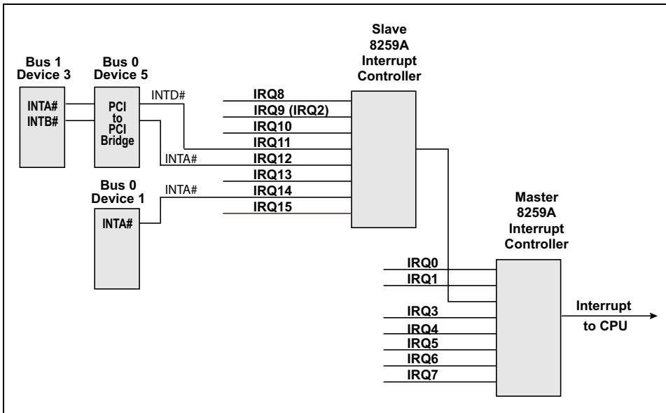

<table style="border:1px solid #ddd;border-collapse:collapse; width:100%;" cellpadding="4" cellspacing="0" rules="all" frame="border">
  <thead style="border:1px solid #ddd;">
    <tr>
      <th width="50%" style="border:1px solid #ddd; background:#f5f5f5;">EN</th>
      <th width="50%" style="border:1px solid #ddd; background-color:#e8e8e8;">中文</th>
    </tr>
  </thead>
  <tbody>
    <tr><td width="50%" style="border:1px solid #ddd; background:#fff;padding:4px 8px;">MSI Interrupt Delivery — MSI eliminates the need for sideband signals by using memory writes to deliver the interrupt notification. The term "Message Signaled Interrupt" can be confusing because its name includes the term "Message" which is a type of TLP in PCIe, but an MSI interrupt is a Posted Memory Write instead of a Message transaction. MSI memory writes are distinguished from other memory writes only by the addresses they target, which are typically reserved by the system for interrupt delivery (e.g., x86-based systems traditionally reserve the address range FEEx_xxxxh for interrupt delivery).</td><td width="50%" style="border:1px solid #ddd; background-color:#e8e8e8;padding:4px 8px;">MSI中断投递 — MSI通过使用存储器写操作来投递中断通知，从而消除了对边带信号的需求。术语"Message Signaled Interrupt"可能会引起混淆，因为其名称中数据包含"Message"一词，而Message是PCIe中的一种TLP类型，但MSI中断实际上是Posted Memory Write（推送存储器写）而非Message事务。MSI存储器写与其他存储器写的区别仅在于它们所针对的地址，这些地址通常由系统保留用于中断投递（例如，基于x86的系统传统上保留地址范围FEEx_xxxxh用于中断投递）。</td></tr>
    <tr><td width="50%" style="border:1px solid #ddd; background:#fff;padding:4px 8px;">Figure 17-2 illustrates the delivery of interrupts from various types of PCIe devices. All PCIe devices are required to support MSI, but software may or may not support MSI, in which case, the INTx messages would be used. Figure 17-2 also shows how a PCIe-to-PCI Bridge is required to convert sideband interrupts from connected PCI devices to PCIe-supported INTx messages.</td><td width="50%" style="border:1px solid #ddd; background-color:#e8e8e8;padding:4px 8px;">图17-2展示了来自各种类型PCIe设备的中断投递。所有PCIe设备都必须支持MSI，但软件可能支持也可能不支持MSI，在这种情况下将使用INTx消息。图17-2还说明了PCIe到PCI桥接器如何将来自所连接PCI设备的边带中断转换为PCIe支持的INTx消息。</td></tr>
  </tbody>
</table>

Figure 17-2: Interrupt Delivery Options in PCIe System | 图17-2：PCIe系统中的中断传递选项

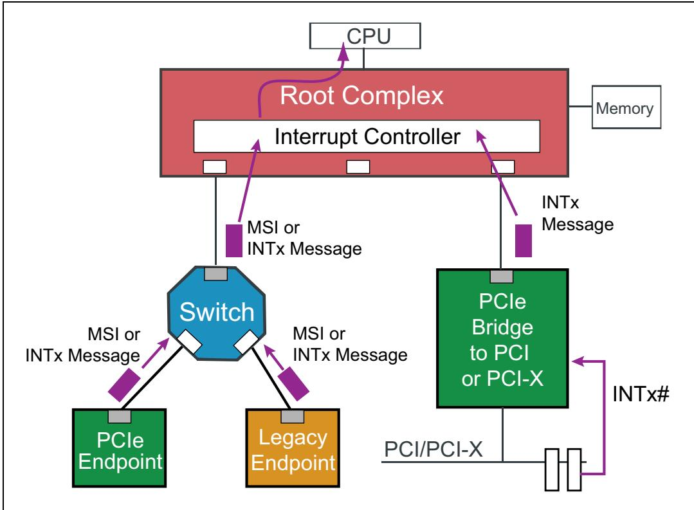

<table style="border:1px solid #ddd;border-collapse:collapse; width:100%;" cellpadding="4" cellspacing="0" rules="all" frame="border">
  <thead style="border:1px solid #ddd;">
    <tr>
      <th width="50%" style="border:1px solid #ddd; background:#f5f5f5;">EN</th>
      <th width="50%" style="border:1px solid #ddd; background-color:#e8e8e8;">中文</th>
    </tr>
  </thead>
  <tbody>
    <tr><td width="50%" style="border:1px solid #ddd; background:#fff;padding:4px 8px;">## The Legacy Model</td><td width="50%" style="border:1px solid #ddd; background-color:#e8e8e8;padding:4px 8px;">## 传统模型</td></tr>
  </tbody>
</table>

## 17.1.1.1 General | 17.1.1.1 概述

<table style="border:1px solid #ddd;border-collapse:collapse; width:100%;" cellpadding="4" cellspacing="0" rules="all" frame="border">
  <thead style="border:1px solid #ddd;">
    <tr>
      <th width="50%" style="border:1px solid #ddd; background:#f5f5f5;">EN</th>
      <th width="50%" style="border:1px solid #ddd; background-color:#e8e8e8;">中文</th>
    </tr>
  </thead>
  <tbody>
    <tr><td width="50%" style="border:1px solid #ddd; background:#fff;padding:4px 8px;">To illustrate the legacy interrupt delivery model, refer to Figure 17-3 on page 797 and consider the usual steps involved in interrupt delivery using the legacy method of interrupt pins:</td><td width="50%" style="border:1px solid #ddd; background-color:#e8e8e8;padding:4px 8px;">为说明传统中断传送模型，请参考第797页的图17-3，并考虑使用中断引脚的 legacy 方法所涉及的中断传送通常步骤：</td></tr>
    <tr><td width="50%" style="border:1px solid #ddd; background:#fff;padding:4px 8px;">1. The device generates an interrupt by asserting its pin to the controller. In older systems this controller was typically an Intel 8259 PIC that had 15 IRQ inputs and one INTR output. The PIC would then assert INTR to inform the CPU that one or more interrupts were pending.</td><td width="50%" style="border:1px solid #ddd; background-color:#e8e8e8;padding:4px 8px;">1. 设备通过向其控制器断言其引脚来产生中断。在较老的系统中，该控制器通常是 Intel 8259 PIC，具有 15 个 IRQ 输入和一个 INTR 输出。PIC 随后会断言 INTR，以通知 CPU 有一个或多个中断处于待处理状态。</td></tr>
    <tr><td width="50%" style="border:1px solid #ddd; background:#fff;padding:4px 8px;">2. Once the CPU detects the assertion of INTR and is ready to act on it, it must identify which interrupt actually needs service, and that is done by the CPU issuing a special command on the processor bus called an Interrupt Acknowledge.</td><td width="50%" style="border:1px solid #ddd; background-color:#e8e8e8;padding:4px 8px;">2. 一旦 CPU 检测到 INTR 被断言并准备对其采取行动，它必须识别出哪个中断实际需要服务，这是通过 CPU 在处理器总线上发出一个称为中断确认（Interrupt Acknowledge）的特殊命令来完成的。</td></tr>
    <tr><td width="50%" style="border:1px solid #ddd; background:#fff;padding:4px 8px;">3. This command is routed by the system to the PIC, which returns an 8-bit value called the Interrupt Vector to report the highest priority interrupt currently pending. A unique vector would have been programmed earlier by system software for each IRQ input.</td><td width="50%" style="border:1px solid #ddd; background-color:#e8e8e8;padding:4px 8px;">3. 该命令由系统路由到 PIC，PIC 返回一个称为中断向量（Interrupt Vector）的 8 位值，以报告当前待处理的最高优先级中断。系统软件事先已为每个 IRQ 输入编程了唯一的向量。</td></tr>
    <tr><td width="50%" style="border:1px solid #ddd; background:#fff;padding:4px 8px;">4. The interrupt handler then uses the vector as an offset into the Interrupt Table (an area set up by software to contain the start addresses of all the Interrupt Service Routines, ISRs), and fetches the ISR start address it finds at that location.</td><td width="50%" style="border:1px solid #ddd; background-color:#e8e8e8;padding:4px 8px;">4. 中断处理程序随后将该向量作为中断表（Interrupt Table）的偏移量（该表是软件设置的区域，数据包含所有中断服务例程 ISR 的起始地址），并获取在该位置找到的 ISR 起始地址。</td></tr>
    <tr><td width="50%" style="border:1px solid #ddd; background:#fff;padding:4px 8px;">5. That address would point to the first instruction of the ISR that had been set up to handle this interrupt. This handler would be executed, servicing the interrupt and telling its device to deassert its INTx# line and then would return control to the previously interrupted task.</td><td width="50%" style="border:1px solid #ddd; background-color:#e8e8e8;padding:4px 8px;">5. 该地址指向为处理此中断而设置的 ISR 的第一条指令。将执行此处理程序，为该中断服务并通知其设备取消断言 INTx# 线，然后将控制权返回给先前被中断的任务。</td></tr>
  </tbody>
</table>

Figure 17-3: Legacy Interrupt Example | 图17-3：传统中断示例

## 17.2.1 Changes to Support Multiple Processors | 17.2.1 支持多处理器的变更

<table style="border:1px solid #ddd;border-collapse:collapse; width:100%;" cellpadding="4" cellspacing="0" rules="all" frame="border">
  <thead style="border:1px solid #ddd;">
    <tr>
      <th width="50%" style="border:1px solid #ddd; background:#f5f5f5;">EN</th>
      <th width="50%" style="border:1px solid #ddd; background-color:#e8e8e8;">中文</th>
    </tr>
  </thead>
  <tbody>
    <tr><td width="50%" style="border:1px solid #ddd; background:#fff;padding:4px 8px;">This model works well for single‑CPU systems, but has a limitation that makes it sub‑optimal in a multi‑CPU system. The problem is that the INTR pin can only be connected to one CPU. If multiple processors are present then only one of them will see the interrupts and will have to service them all while the other CPUs won't see any of them. To obtain the best performance, such systems really need an even distribution of the system tasks across all the processors, referred to as SMP (Symmetric Multi‑Processing) but the pin model won't support it.</td><td width="50%" style="border:1px solid #ddd; background-color:#e8e8e8;padding:4px 8px;">该模型在单CPU系统中运行良好，但存在一个局限性，使其在多CPU系统中并非最优。问题在于INTR引脚只能连接到一个CPU。如果存在多个处理器，则只有一个处理器能接收到中断并必须处理所有中断，而其他CPU则看不到任何中断。为获得最佳性能，此类系统需要将系统任务均匀分布到所有处理器上，这称为SMP（对称多处理），但引脚模型无法支持这一点。</td></tr>
    <tr><td width="50%" style="border:1px solid #ddd; background:#fff;padding:4px 8px;">To achieve better SMP, a new model was needed, and toward this end the PIC was modified to become the IO APIC (Advanced Programmable Interrupt Controller). The IO APIC was designed to have a separate small bus, called the APIC Bus, over which it could deliver interrupt messages, as shown in Figure 17‑4 on page 799. In this model, the message contained the interrupt vector number, so there was no need for the CPU to send an Interrupt Acknowledge down into the IO world to fetch it. The APIC Bus connected to a new internal logic block within the processors called the Local APIC. The bus was shared among all the agents and any of them could initiate messages on it but, for our purposes, the interesting part is its use for interrupt delivery from peripherals. Those interrupts could now be statically assigned by software to be serviced by different CPUs, multiple CPUs or even dynamically assigned by the IO APIC.</td><td width="50%" style="border:1px solid #ddd; background-color:#e8e8e8;padding:4px 8px;">为实现更好的SMP，需要一种新模型，为此PIC被修改为IO APIC（高级可编程中断控制器）。IO APIC设计有一条独立的小型总线，称为APIC总线，可通过该总线传递中断消息，如图17-4（第799页）所示。在此模型中，消息中数据包含中断向量号，因此CPU无需向IO世界发送中断确认来获取该向量号。APIC总线连接到处理器内部一个称为Local APIC的新逻辑块。该总线由所有代理共享，任何代理都可以在其上发起消息，但对我们而言，其关键用途在于从外设传递中断。这些中断现在可以由软件静态分配给不同的CPU处理，或由多个CPU共同处理，甚至可以由IO APIC动态分配。</td></tr>
    <tr><td width="50%" style="border:1px solid #ddd; background:#fff;padding:4px 8px;">That model, known as the APIC model, was sufficient for several years but still depended on sideband pins from the peripheral devices to work. Another limitation of this model was the number of IRQs (interrupt request lines) into the IO APIC. Without a very large number of IRQs, peripheral devices had to share IRQs which means added latency anytime that IRQ is asserted because there could be multiple devices that could have asserted it and software must evaluate all of them. This technique of linking multiple ISRs together was often referred to as interrupt chaining. Eventually, because of this issue and a couple other minor issues, another improvement came along.</td><td width="50%" style="border:1px solid #ddd; background-color:#e8e8e8;padding:4px 8px;">该模型称为APIC模型，运行了数年之久，但仍然依赖外设的边带引脚来工作。该模型的另一个局限是进入IO APIC的IRQ（中断请求线）数量有限。如果没有足够多的IRQ，外设就必须共享IRQ，这意味着每次IRQ被断言时都会增加延迟，因为可能有多个设备都断言了该IRQ，而软件必须逐一评估所有这些设备。这种将多个ISR链接在一起的技术通常称为中断链。最终，由于这个问题以及其他一些小问题，又出现了新的改进。</td></tr>
    <tr><td width="50%" style="border:1px solid #ddd; background:#fff;padding:4px 8px;">Why not have the peripheral devices themselves send interrupt messages directly to the Local APICs? All that is needed is a communications path which already exists in the form of the PCI bus and the processor bus. So the APIC bus was eliminated and all interrupts were delivered to the Local APICs in the form of memory writes, referred to as MSIs or Message Signaled Interrupts. These MSIs were targeting a special address that the system understood to be an interrupt message targeting the Local APICs. (This special address address was traditionally FEEx\_xxxxh for x86‑based systems.) Even the IO APIC was programmed to send its interrupt notifications over the ordinary data bus using memory writes (MSI). Now it simply sends an MSI memory write across the data bus targeting the memory address of the desired processor's Local APIC, and that has the effect of notifying the processor of the interrupt.</td><td width="50%" style="border:1px solid #ddd; background-color:#e8e8e8;padding:4px 8px;">为何不让外设自身直接将中断消息发送给Local APIC？所需要的只是一条通信路径，而PCI总线和处理器总线已经提供了这样的路径。于是APIC总线被淘汰，所有中断都以内存写操作的形式传递给Local APIC，称为MSI或消息 信号中断。这些MSI的目标是一个特殊地址，系统理解该地址是发送给Local APIC的中断消息。（对于基于x86的系统，这个特殊地址传统上是FEEx\_xxxxh。）即使是IO APIC也被编程为通过普通数据总线使用内存写操作（MSI）来发送其中断通知。现在，IO APIC只需在数据总线上发送一个MSI内存写操作，目标地址是所需处理器的Local APIC的内存地址，从而通知处理器有中断到达。</td></tr>
    <tr><td width="50%" style="border:1px solid #ddd; background:#fff;padding:4px 8px;">This model is known as the xAPIC model, and since it is not based on sideband signals which go into an interrupt controller with a limited number of inputs, the need to share interrupts is almost eliminated. More information can be found about this model in "An MSI Solution" on page 827.</td><td width="50%" style="border:1px solid #ddd; background-color:#e8e8e8;padding:4px 8px;">该模型称为xAPIC模型，由于它不依赖进入输入数量有限的中断控制器的边带信号，因此几乎消除了共享中断的需求。有关此模型的更多信息，请参见第827页的"MSI解决方案"。</td></tr>
    <tr><td width="50%" style="border:1px solid #ddd; background:#fff;padding:4px 8px;">PCI added MSI support as an option years ago and PCIe made that capability a requirement. A peripheral that can generate MSI transactions on its own opens new options for handling interrupts, such as giving each Function the ability to generate multiple unique interrupts instead of just one.</td><td width="50%" style="border:1px solid #ddd; background-color:#e8e8e8;padding:4px 8px;">多年前，PCI将MSI支持作为可选功能加入，而PCIe将该能力变为强制性要求。能够自行生成MSI事务的外设为中断处理开辟了新的选择，例如使每个功能都能生成多个唯一的中断，而不仅仅是只有一个中断。</td></tr>
  </tbody>
</table>

Figure 17‑4: APIC Model for Interrupt Delivery | 图17‑4：中断传递的APIC模型

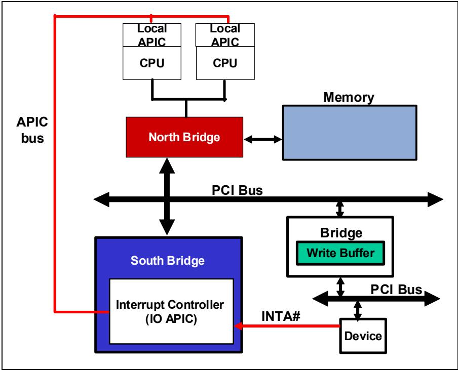

## 17.2.2 Legacy PCI Interrupt Delivery | 17.2.2 传统 PCI 中断传递

<table style="border:1px solid #ddd;border-collapse:collapse; width:100%;" cellpadding="4" cellspacing="0" rules="all" frame="border">
  <thead style="border:1px solid #ddd;">
    <tr>
      <th width="50%" style="border:1px solid #ddd; background:#f5f5f5;">EN</th>
      <th width="50%" style="border:1px solid #ddd; background-color:#e8e8e8;">中文</th>
    </tr>
  </thead>
  <tbody>
    <tr><td width="50%" style="border:1px solid #ddd; background:#fff;padding:4px 8px;">This section provides more detail on legacy PCI interrupt delivery. Readers familiar with PCI may wish to proceed to "Virtual INTx Signaling" on page 805 to learn more about how PCIe emulates this legacy model, or to "The MSI Model" on page 812 to learn more about that method.</td><td width="50%" style="border:1px solid #ddd; background-color:#e8e8e8;padding:4px 8px;">本节提供有关传统PCI中断投递的更多细节。熟悉PCI的读者可以继续阅读第805页的"虚拟INTx信令"，以了解PCIe如何模拟这一传统模型，或阅读第812页的"MSI模型"以了解该方法。</td></tr>
    <tr><td width="50%" style="border:1px solid #ddd; background:#fff;padding:4px 8px;">PCI devices that use interrupts have two options. They may use either:</td><td width="50%" style="border:1px solid #ddd; background-color:#e8e8e8;padding:4px 8px;">使用中断的PCI器件有两个选项：</td></tr>
    <tr><td width="50%" style="border:1px solid #ddd; background:#fff;padding:4px 8px;">INTx# active low-level signals that can be shared and were defined in the original spec.</td><td width="50%" style="border:1px solid #ddd; background-color:#e8e8e8;padding:4px 8px;">INTx# 有效低电平信号，可共享，并在原始规范中定义。</td></tr>
    <tr><td width="50%" style="border:1px solid #ddd; background:#fff;padding:4px 8px;">Message Signaled Interrupts that were added as an option with the 2.2 version of the spec. MSI needs no modification for use in a PCIe system.</td><td width="50%" style="border:1px solid #ddd; background-color:#e8e8e8;padding:4px 8px;">消息 信号中断（MSI），作为2.2版规范的一个可选特性加入。MSI在PCIe系统中使用无需修改。</td></tr>
  </tbody>
</table>

## Device INTx# Pins | 设备 INTx# 引脚

<table style="border:1px solid #ddd;border-collapse:collapse; width:100%;" cellpadding="4" cellspacing="0" rules="all" frame="border">
  <thead style="border:1px solid #ddd;">
    <tr>
      <th width="50%" style="border:1px solid #ddd; background:#f5f5f5;">EN</th>
      <th width="50%" style="border:1px solid #ddd; background-color:#e8e8e8;">中文</th>
    </tr>
  </thead>
  <tbody>
    <tr><td width="50%" style="border:1px solid #ddd; background:#fff;padding:4px 8px;">A PCI device can implement up to 4 INTx# signals (INTA#, INTB#, INTC#, and INTD#).</td><td width="50%" style="border:1px solid #ddd; background-color:#e8e8e8;padding:4px 8px;">一个 PCI 设备最多可实现 4 个 INTx# 信号（INTA#、INTB#、INTC# 和 INTD#）。</td></tr>
    <tr><td width="50%" style="border:1px solid #ddd; background:#fff;padding:4px 8px;">More than one pin is available because PCI devices can support up to 8 functions, each of which is allowed to drive one (but only one) interrupt pin.</td><td width="50%" style="border:1px solid #ddd; background-color:#e8e8e8;padding:4px 8px;">之所以提供多个引脚，是因为 PCI 设备最多可支持 8 个功能，每个功能允许驱动一个（且仅一个）中断引脚。</td></tr>
    <tr><td width="50%" style="border:1px solid #ddd; background:#fff;padding:4px 8px;">When PCI was developed, a typical system used a chipset that included the 15-input 8259 PIC, so that's how many IRQs (which map to interrupt vectors) that were available to the system.</td><td width="50%" style="border:1px solid #ddd; background-color:#e8e8e8;padding:4px 8px;">在开发 PCI 时，典型系统使用的芯片组数据包含 15 路输入的 8259 PIC，因此系统可用的 IRQ（映射到中断向量）数量就是这么多。</td></tr>
    <tr><td width="50%" style="border:1px solid #ddd; background:#fff;padding:4px 8px;">However, many of those were already used for system purposes like the system timer, keyboard interrupt, mouse interrupt, and so on.</td><td width="50%" style="border:1px solid #ddd; background-color:#e8e8e8;padding:4px 8px;">然而，其中许多已被用于系统用途，如系统定时器、键盘中断、鼠标中断等。</td></tr>
    <tr><td width="50%" style="border:1px solid #ddd; background:#fff;padding:4px 8px;">In addition, some pins were reserved for ISA cards that could still be plugged into these older systems.</td><td width="50%" style="border:1px solid #ddd; background-color:#e8e8e8;padding:4px 8px;">此外，一些引脚被保留给仍可插入这些老旧系统的 ISA 卡。</td></tr>
    <tr><td width="50%" style="border:1px solid #ddd; background:#fff;padding:4px 8px;">Consequently, the PCI spec writers considered that only four IRQs would reliably be available for their new bus, and so the spec only supported four interrupt pins.</td><td width="50%" style="border:1px solid #ddd; background-color:#e8e8e8;padding:4px 8px;">因此，PCI 规范制定者认为其新总线只能可靠地使用四个 IRQ，故该规范仅支持四个中断引脚。</td></tr>
    <tr><td width="50%" style="border:1px solid #ddd; background:#fff;padding:4px 8px;">However, as you probably know, there are typically more than four PCI devices on a PCI bus and even a single device could have more than four functions inside, each wanting its own interrupt.</td><td width="50%" style="border:1px solid #ddd; background-color:#e8e8e8;padding:4px 8px;">然而，如你所知，一条 PCI 总线上通常有超过四个 PCI 设备，甚至单个设备内部也可能有超过四个功能，每个功能都需要自己的中断。</td></tr>
    <tr><td width="50%" style="border:1px solid #ddd; background:#fff;padding:4px 8px;">These reasons are why the PCI interrupts were designed to be level-sensitive and shareable.</td><td width="50%" style="border:1px solid #ddd; background-color:#e8e8e8;padding:4px 8px;">正是由于这些原因，PCI 中断被设计为电平敏感且可共享。</td></tr>
    <tr><td width="50%" style="border:1px solid #ddd; background:#fff;padding:4px 8px;">These signals could simply be wire-ORed together to get down to a handful of resulting outputs, each one representing interrupt requests.</td><td width="50%" style="border:1px solid #ddd; background-color:#e8e8e8;padding:4px 8px;">这些信号只需通过线或方式连接在一起，即可减少为少数几个输出结果，每个结果代表一个中断请求。</td></tr>
    <tr><td width="50%" style="border:1px solid #ddd; background:#fff;padding:4px 8px;">Since they are shared, when an interrupt is detected, the interrupt handler software will need to go through the list of functions that are sharing the same pin and test to see which ones need servicing.</td><td width="50%" style="border:1px solid #ddd; background-color:#e8e8e8;padding:4px 8px;">由于它们是共享的，当检测到中断时，中断处理程序软件需要遍历共享同一引脚的函数列表，并逐一检查哪些函数需要服务。</td></tr>
  </tbody>
</table>

## 17.2.2.2 Determining INTx# Pin Support | 17.2.2.2 确定 INTx# 引脚支持

<table style="border:1px solid #ddd;border-collapse:collapse; width:100%;" cellpadding="4" cellspacing="0" rules="all" frame="border">
  <thead style="border:1px solid #ddd;">
    <tr>
      <th width="50%" style="border:1px solid #ddd; background:#f5f5f5;">EN</th>
      <th width="50%" style="border:1px solid #ddd; background-color:#e8e8e8;">中文</th>
    </tr>
  </thead>
  <tbody>
    <tr><td width="50%" style="border:1px solid #ddd; background:#fff;padding:4px 8px;">PCI functions indicate support for an INTx# signal in their configuration headers. The read‑only Interrupt Pin register illustrated in Figure 17‑5 indicates whether an INTx# is supported by this function and if so, which interrupt pin will it assert when requesting an interrupt.</td><td width="50%" style="border:1px solid #ddd; background-color:#e8e8e8;padding:4px 8px;">PCI 功能在配置头中指示对 INTx# 信号的支持。如图 17‑5 所示的只读中断引脚寄存器指示该功能是否支持 INTx#，如果支持，则在请求中断时将断言哪一根中断引脚。</td></tr>
  </tbody>
</table>

Figure 17‑5: Interrupt Registers in PCI Configuration Header | 图17‑5：PCI配置头中的中断寄存器

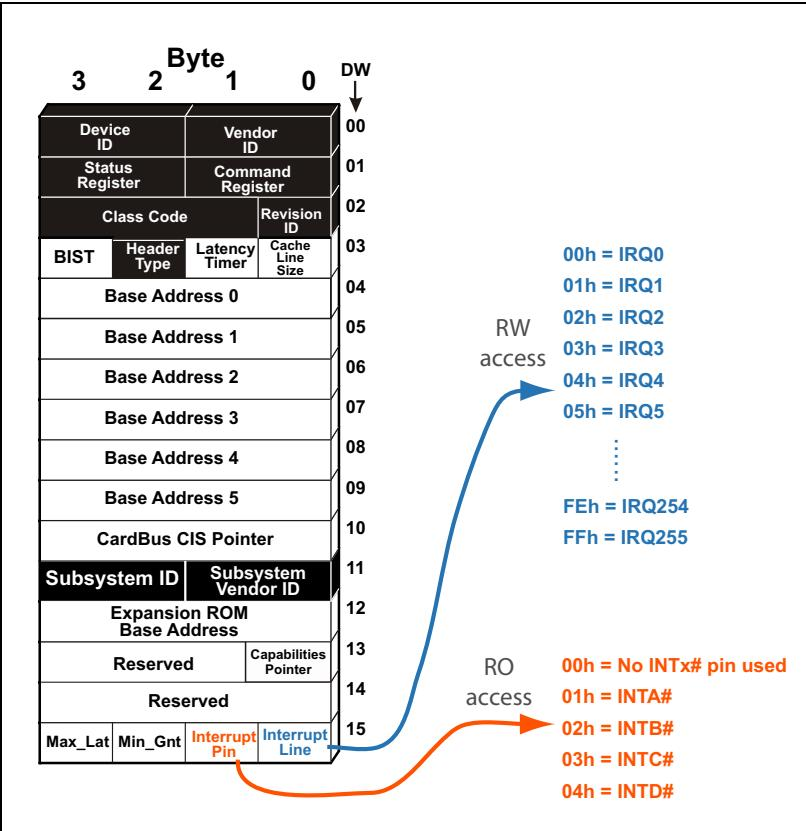

## 17.2.2.3 Interrupt Routing | 17.2.2.3 中断路由

<table style="border:1px solid #ddd;border-collapse:collapse; width:100%;" cellpadding="4" cellspacing="0" rules="all" frame="border">
  <thead style="border:1px solid #ddd;">
    <tr>
      <th width="50%" style="border:1px solid #ddd; background:#f5f5f5;">EN</th>
      <th width="50%" style="border:1px solid #ddd; background-color:#e8e8e8;">中文</th>
    </tr>
  </thead>
  <tbody>
    <tr><td width="50%" style="border:1px solid #ddd; background:#fff;padding:4px 8px;">The Interrupt Line register shown in Figure 17-5 on page 801 gives the next information that a driver needs to know: the input pin of the PIC to which this pin has been connected. The PIC is programmed by system software with a unique vector number for each input pin (IRQ). The vector for the highest-priority interrupt asserted is reported to the processor who then uses that vector to index into a corresponding entry in the interrupt vector table. This entry points to the interrupting device's interrupt service routine which the processor executes.</td><td width="50%" style="border:1px solid #ddd; background-color:#e8e8e8;padding:4px 8px;">图17-5（第801页）所示的中断线（Interrupt Line）寄存器提供了驱动程序需要了解的下一个信息：即此引脚所连接到的PIC的输入引脚。系统软件为PIC的每个输入引脚（IRQ）编程分配一个唯一的向量号。被断言的最高优先级中断的向量被报告给处理器，处理器随后使用该向量索引到中断向量表中的相应条目。该条目指向发起中断的设备的中断服务例程，并由处理器执行。</td></tr>
    <tr><td width="50%" style="border:1px solid #ddd; background:#fff;padding:4px 8px;">The platform designer assigns the routing of INTx# pins from devices. They can be routed in a variety of ways, but ultimately each INTx# pin connects to an input of the interrupt controller. Figure 17-6 on page 803 illustrates an example in which several PCI device interrupts are connected to the interrupt controller through a programmable router. All signals connected to a given input of the programmable router will be directed to a specific input of the interrupt controller. Functions whose interrupts are routed to a common interrupt controller input will all have the same Interrupt Line number assigned to them by platform software (typically firmware). In this example, IRQ15 has three PCI INTx# inputs from different devices connected to it. Consequently, the functions using these INTx# lines will share IRQ15 and will therefore all cause the controller to send the same vector when queried. That vector will have the three ISRs for the different Functions chained together.</td><td width="50%" style="border:1px solid #ddd; background-color:#e8e8e8;padding:4px 8px;">平台设计者分配设备INTx#引脚的路由。它们可以通过多种方式路由，但最终每个INTx#引脚都连接到中断控制器的一个输入。图17-6（第803页）展示了一个示例，其中多个PCI设备中断通过可编程路由器连接到中断控制器。所有连接到可编程路由器某一给定输入的信号都将被导向中断控制器的特定输入。其中断被路由到同一中断控制器输入的功能，都将由平台软件（通常是固件）分配相同的中断线（Interrupt Line）编号。在此示例中，IRQ15连接了来自不同设备的三个PCI INTx#输入。因此，使用这些INTx#线的功能将共享IRQ15，从而在查询时都会导致控制器发送相同的向量。该向量将数据包含不同功能的三个ISR链式执行。</td></tr>
  </tbody>
</table>

## 17.2.2.4 Associating the INTx# Line to an IRQ Number | 17.2.2.4 将 INTx# 线关联到 IRQ 号

<table style="border:1px solid #ddd;border-collapse:collapse; width:100%;" cellpadding="4" cellspacing="0" rules="all" frame="border">
  <thead style="border:1px solid #ddd;">
    <tr>
      <th width="50%" style="border:1px solid #ddd; background:#f5f5f5;">EN</th>
      <th width="50%" style="border:1px solid #ddd; background-color:#e8e8e8;">中文</th>
    </tr>
  </thead>
  <tbody>
    <tr><td width="50%" style="border:1px solid #ddd; background:#fff;padding:4px 8px;">Based on system requirements, the router is programmed to connect its four inputs to four available PIC inputs. Once this is done, the routing of the INTx# pin associated with each function is known and the Interrupt Line number is written by software into each Function. The value is ultimately read by the Function's device driver so it will know which interrupt table entry it has been assigned. That's the place where the starting address of its ISR will be written, a process referred to as "hooking the interrupt". When this function later generates an interrupt, the CPU will receive the vector number that corresponds to the IRQ specified in the Interrupt Line register. The CPU uses this vector to index into the interrupt vector table to fetch the entry point of the interrupt service routine associated with the Function's device driver.</td><td width="50%" style="border:1px solid #ddd; background-color:#e8e8e8;padding:4px 8px;">根据系统需求，路由器被编程以将其四个输入连接到四个可用的PIC输入。完成后，与每个功能关联的INTx#引脚的布线已知，软件将中断线号写入每个功能。该值最终由功能的设备驱动程序读取，以便驱动程序知道它被分配了哪个中断表条目。这是其ISR起始地址将被写入的位置，这一过程称为"挂接中断"。当该功能随后产生中断时，CPU将收到与中断线寄存器中指定的IRQ对应的向量号。CPU使用该向量索引中断向量表，以获取与该功能设备驱动程序关联的中断服务例程的入口点。</td></tr>
  </tbody>
</table>

Figure 17-6: INTx Signal Routing is Platform Specific | 图17-6：INTx信号路由是平台相关的

## 17.2.2.5 INTx# Signal Transmission | 17.2.2.5 INTx# 信号传输

<table style="border:1px solid #ddd;border-collapse:collapse; width:100%;" cellpadding="4" cellspacing="0" rules="all" frame="border">
  <thead style="border:1px solid #ddd;">
    <tr>
      <th width="50%" style="border:1px solid #ddd; background:#f5f5f5;">EN</th>
      <th width="50%" style="border:1px solid #ddd; background-color:#e8e8e8;">中文</th>
    </tr>
  </thead>
  <tbody>
    <tr><td width="50%" style="border:1px solid #ddd; background:#fff;padding:4px 8px;">The INTx# lines are active-low signals implemented as open-drain with a pullup resistor provided on each line by the system. Multiple devices connected to the same PCI interrupt request signal line can assert it simultaneously without damage.</td><td width="50%" style="border:1px solid #ddd; background-color:#e8e8e8;padding:4px 8px;">INTx# 信号线是低电平有效信号，采用开漏实现，每条信号线由系统提供上拉电阻。连接到同一 PCI 中断请求信号线的多个设备可以同时将其置为有效而不会造成损坏。</td></tr>
    <tr><td width="50%" style="border:1px solid #ddd; background:#fff;padding:4px 8px;">When a Function signals an interrupt it also sets the Interrupt Status bit located in the Status register of the config header. This bit can be read by system software to see if an interrupt is currently pending. (See Figure 17-8 on page 805.)</td><td width="50%" style="border:1px solid #ddd; background-color:#e8e8e8;padding:4px 8px;">当功能（Function）发出中断信号时，它还会设置配置头状态寄存器中的中断状态位。系统软件可以读取该位以查看当前是否有中断挂起。（参见第 805 页的图 17-8。）</td></tr>
    <tr><td width="50%" style="border:1px solid #ddd; background:#fff;padding:4px 8px;">Interrupt Disable. The 2.3 PCI spec added an Interrupt Disable bit (Bit 10) to the Command register of the config header. See Figure 17-7 on page 804. The bit is cleared at reset permitting INTx# signal generation, but software may set it to prevent that. Note that the Interrupt Disable bit has no effect on Message Signalled Interrupts (MSI). MSIs are enabled via the Command Register in the MSI Capability structure. Enabling MSI automatically has the effect of disabling interrupt pins or emulation.</td><td width="50%" style="border:1px solid #ddd; background-color:#e8e8e8;padding:4px 8px;">中断禁用。PCI 2.3 规范在配置头的命令寄存器中添加了中断禁用位（位 10）。参见第 804 页的图 17-7。复位时该位被清零，允许生成 INTx# 信号，但软件可设置该位以禁止生成 INTx# 信号。注意，中断禁用位对消息信号中断（MSI）无效。MSI 通过 MSI 能力结构中的命令寄存器使能。使能 MSI 会自动禁用中断引脚或仿真。</td></tr>
    <tr><td width="50%" style="border:1px solid #ddd; background:#fff;padding:4px 8px;">Interrupt Status. The PCI 2.3 spec added a read-only Interrupt Status bit to the configuration status register (pictured in Figure 17-8 on page 805). A function must set this status bit when an interrupt is pending. In addition, if the Interrupt Disable bit in the Command register of the header is cleared (i.e. interrupts enabled), then the function's INTx# signal is asserted when this status bit is set. This bit is unaffected by the state of the Interrupt Disable bit.</td><td width="50%" style="border:1px solid #ddd; background-color:#e8e8e8;padding:4px 8px;">中断状态。PCI 2.3 规范在配置状态寄存器中添加了只读的中断状态位（如图 17-8 所示，第 805 页）。当有中断挂起时，功能必须设置该状态位。此外，如果配置头命令寄存器中的中断禁用位被清零（即中断使能），则当该状态位被设置时，功能的 INTx# 信号被置为有效。该位不受中断禁用位状态的影响。</td></tr>
  </tbody>
</table>

Figure 17-7: Configuration Command Register — Interrupt Disable Field | 图17-7：配置命令寄存器 — 中断禁用字段

Figure 17-8: Configuration Status Register — Interrupt Status Field | 图17-8：配置状态寄存器 — 中断状态字段
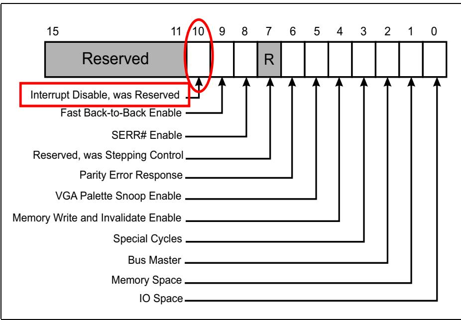

## 17.2.3 Virtual INTx Signaling | 17.2.3 虚拟 INTx 信令

<table style="border:1px solid #ddd;border-collapse:collapse; width:100%;" cellpadding="4" cellspacing="0" rules="all" frame="border">
  <thead style="border:1px solid #ddd;">
    <tr>
      <th width="50%" style="border:1px solid #ddd; background:#f5f5f5;">EN</th>
      <th width="50%" style="border:1px solid #ddd; background-color:#e8e8e8;">中文</th>
    </tr>
  </thead>
  <tbody>
    <tr><td width="50%" style="border:1px solid #ddd; background:#fff;padding:4px 8px;">## Virtual INTx Signaling</td><td width="50%" style="border:1px solid #ddd; background-color:#e8e8e8;padding:4px 8px;">## 虚拟 INTx 信令</td></tr>
  </tbody>
</table>

<table style="border:1px solid #ddd;border-collapse:collapse; width:100%;" cellpadding="4" cellspacing="0" rules="all" frame="border">
  <thead style="border:1px solid #ddd;">
    <tr>
      <th width="50%" style="border:1px solid #ddd; background:#f5f5f5;">EN</th>
      <th width="50%" style="border:1px solid #ddd; background-color:#e8e8e8;">中文</th>
    </tr>
  </thead>
  <tbody>
    <tr><td width="50%" style="border:1px solid #ddd; background:#fff;padding:4px 8px;">## General</td><td width="50%" style="border:1px solid #ddd; background-color:#e8e8e8;padding:4px 8px;">## 概述</td></tr>
    <tr><td width="50%" style="border:1px solid #ddd; background:#fff;padding:4px 8px;">If circumstances make the use of MSI not possible in a PCIe topology, the INTx signaling model would be used. Following are two examples of devices that would need to be able to use INTx messages:</td><td width="50%" style="border:1px solid #ddd; background-color:#e8e8e8;padding:4px 8px;">如果在PCIe拓扑中因情况所限无法使用MSI，则将采用INTx信令模型。以下是两个需要使用INTx消息的设备示例：</td></tr>
    <tr><td width="50%" style="border:1px solid #ddd; background:#fff;padding:4px 8px;">PCIe‐to‐(PCI or PCI‐X) bridges — Most PCI devices will use the INTx# pins because MSI support is optional for them. Since PCIe doesn't support sideband interrupt signaling, the inband messages are used instead. The interrupt controller understands the message and delivers an interrupt request to the CPU which would include a pre‐programmed vector number.</td><td width="50%" style="border:1px solid #ddd; background-color:#e8e8e8;padding:4px 8px;">PCIe转(PCI或PCI-X)桥 — 大多数PCI设备将使用INTx#引脚，因为MSI支持对它们是可选的。由于PCIe不支持边带中断信令，因此改用带内消息。中断控制器理解该消息并向CPU发送中断请求，其中数据包含预编程的中断向量号。</td></tr>
    <tr><td width="50%" style="border:1px solid #ddd; background:#fff;padding:4px 8px;">Boot Devices — PC systems commonly use the legacy interrupt model during the boot sequence because MSI usually requires OS‐level initialization. Generally, a minimum of three subsystems are needed for booting: an output to the operator such as video, an input from the operator which is typically the keyboard, and a device that can be used to fetch the OS, typically a hard drive. PCIe devices involved in initializing the system are called "boot devices." Boot devices will use legacy interrupt support until the OS and device drivers are loaded, after which it's preferable they use MSI.</td><td width="50%" style="border:1px solid #ddd; background-color:#e8e8e8;padding:4px 8px;">引导设备 — PC系统在引导序列期间通常使用传统中断模型，因为MSI通常需要操作系统级初始化。通常，引导至少需要三个子系统：面向操作者的输出设备（如显示器）、来自操作者的输入设备（通常是键盘）、以及可用于获取操作系统的设备（通常是硬盘）。参与系统初始化的PCIe设备称为"引导设备"。在操作系统和设备驱动程序加载完成之前，引导设备将使用传统中断支持，之后它们最好使用MSI。</td></tr>
  </tbody>
</table>

## 17.2.3.1 Virtual INTx Wire Delivery | 17.2.3.1 虚拟 INTx 线传递

<table style="border:1px solid #ddd;border-collapse:collapse; width:100%;" cellpadding="4" cellspacing="0" rules="all" frame="border">
  <thead style="border:1px solid #ddd;">
    <tr>
      <th width="50%" style="border:1px solid #ddd; background:#f5f5f5;">EN</th>
      <th width="50%" style="border:1px solid #ddd; background-color:#e8e8e8;">中文</th>
    </tr>
  </thead>
  <tbody>
    <tr><td width="50%" style="border:1px solid #ddd; background:#fff;padding:4px 8px;">## Virtual INTx Wire Delivery</td><td width="50%" style="border:1px solid #ddd; background-color:#e8e8e8;padding:4px 8px;">## 虚拟INTx线传送</td></tr>
    <tr><td width="50%" style="border:1px solid #ddd; background:#fff;padding:4px 8px;">Figure 17‐9 on page 806 illustrates a system with a PCIe Endpoint and a PCI Express‐to‐PCI Bridge. If we assume software has not enabled MSI on the Endpoint, it will deliver interrupt requests with INTx messages. In this example, the bridge is propogating pin‐based interrupts from connected PCI devices with INTx messages. As can be seen, the bridge sends an INTB messages to signal the assertion and deassertion of its INTB# input from the PCI bus. The PCIe Endpoint is shown signaling an INTA using emulation messages. Note that INTx# signaling involves two messages:</td><td width="50%" style="border:1px solid #ddd; background-color:#e8e8e8;padding:4px 8px;">第806页的图17‑9展示了一个数据包含PCIe端点和PCI Express到PCI桥接器的系统。假设软件未在端点上启用MSI，端点将通过INTx消息传递中断请求。在此示例中，桥接器通过INTx消息传播来自所连接PCI设备的引脚中断。如图所示，桥接器发送INTB消息以表示来自PCI总线的INTB#输入的断言和解除断言。PCIe端点被显示为使用仿真消息发出INTA信号。请注意，INTx#信号传送涉及两条消息：</td></tr>
    <tr><td width="50%" style="border:1px solid #ddd; background:#fff;padding:4px 8px;">Assert\_INTx messages indicate a high‐to‐low transition (from inactive to active) of the virtual INTx# signal.</td><td width="50%" style="border:1px solid #ddd; background-color:#e8e8e8;padding:4px 8px;">Assert_INTx消息表示虚拟INTx#信号的高到低跳变（从不活跃到活跃）。</td></tr>
    <tr><td width="50%" style="border:1px solid #ddd; background:#fff;padding:4px 8px;">• Deassert\_INTx messages indicate a low‐to‐high transition.</td><td width="50%" style="border:1px solid #ddd; background-color:#e8e8e8;padding:4px 8px;">• Deassert_INTx消息表示低到高跳变。</td></tr>
    <tr><td width="50%" style="border:1px solid #ddd; background:#fff;padding:4px 8px;">When a Function delivers an Assert\_INTx message, it also sets its Interrupt Status bit in the Configuration Status register, just as it would if it asserted the physical INTx# pin (see Figure 17‐8 on page 805).</td><td width="50%" style="border:1px solid #ddd; background-color:#e8e8e8;padding:4px 8px;">当功能发送Assert_INTx消息时，它还会在配置状态寄存器中设置其中断状态位，就像它断言物理INTx#引脚时一样（参见第805页的图17‑8）。</td></tr>
    <tr><td width="50%" style="border:1px solid #ddd; background:#fff;padding:4px 8px;">Figure 17‐9: Example of INTx Messages to Virtualize INTA#‐INTD# Signal Transitions</td><td width="50%" style="border:1px solid #ddd; background-color:#e8e8e8;padding:4px 8px;">图17‑9：用于虚拟化INTA#‑INTD#信号跳变的INTx消息示例</td></tr>
  </tbody>
</table>

Figure 17‐9: Example of INTx Messages to Virtualize INTA#‐INTD# Signal Transitions | 图17‐9：用于虚拟化INTA#-INTD#信号转换的INTx消息示例  

<table style="border:1px solid #ddd;border-collapse:collapse; width:100%;" cellpadding="4" cellspacing="0" rules="all" frame="border">
  <thead style="border:1px solid #ddd;">
    <tr>
      <th width="50%" style="border:1px solid #ddd; background:#f5f5f5;">EN</th>
      <th width="50%" style="border:1px solid #ddd; background-color:#e8e8e8;">中文</th>
    </tr>
  </thead>
  <tbody>
    <tr><td width="50%" style="border:1px solid #ddd; background:#fff;padding:4px 8px;">Figure 17‐10 on page 807 depicts the format of the INTx message header. The interrupt controller is the ultimate destination of these messages, however the routing method employed is not "Route to the Root Complex", but is actually "Local - Terminate at Receiver" as shown in Figure 17‐10. There are two reasons for this. The first is because each bridge (including Switch Ports and Root Ports) along the upstream path may map the virtual interrupt wire to a different virtual interrupt wire across the bridge (e.g., a Switch Port receives Assert\_INTA but maps it to Assert\_INTB when propogating it upstream). More info about this INTx mapping can be found in "INTx Mapping" on page 808.</td><td width="50%" style="border:1px solid #ddd; background-color:#e8e8e8;padding:4px 8px;">图17-10（第807页）描述了INTx消息头的格式。中断控制器是这些消息的最终目的地，然而其所采用的路由方式并非"路由到根复合体"，而是如图17-10所示的"本地——在接收端终止"。这有两个原因。第一，因为上游路径上的每个桥（数据包括交换端口和根端口）都可能将虚拟中断线映射为穿过该桥的另一条不同的虚拟中断线（例如，某个交换端口接收了Assert\_INTA，但在向上游传播时将其映射为Assert\_INTB）。有关此INTx映射的更多信息，请参见第808页的"INTx映射"。</td></tr>
    <tr><td width="50%" style="border:1px solid #ddd; background:#fff;padding:4px 8px;">The second reason for the local routing type of these messages is due to the fact that we're emulating a pin-based signal. If a port receives an assert interrupt message that maps to INTA on its primary side and it has already sent an Assert\_INTA message upstream because of a previous interrupt, then there is no reason to send another one. INTA is already seen as asserted. More info about this collapsing of INTx messages can be found in "INTx Collapsing" on page 810.</td><td width="50%" style="border:1px solid #ddd; background-color:#e8e8e8;padding:4px 8px;">这些消息采用本地路由类型的第二个原因是，我们正在模拟基于引脚的中断信号。如果一个端口在其主侧收到一个映射到INTA的中断断言消息，而它由于之前的中断已经向上游发送过Assert\_INTA消息，那么就没有必要再发送一个。INTA已经被视为已断言。有关此INTx消息合并的更多信息，请参见第810页的"INTx合并"。</td></tr>
  </tbody>
</table>

Figure 17‐10: INTx Message Format and Type | 图17‐10：INTx消息格式和类型  
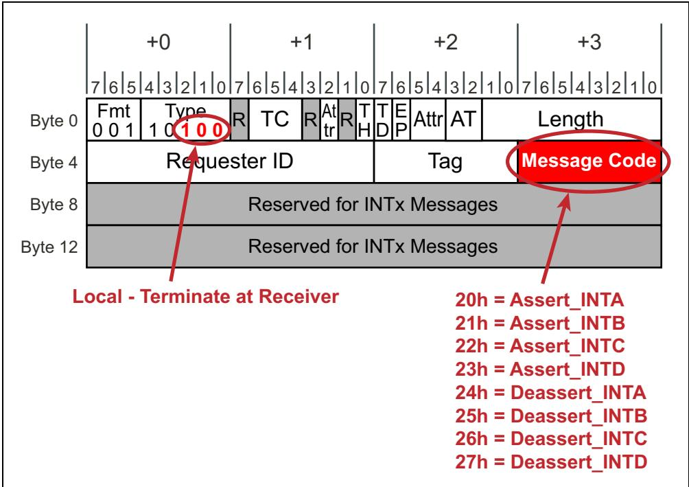

## 17.2.4 Mapping and Collapsing INTx Messages | 17.2.4 映射和合并 INTx 消息

<table style="border:1px solid #ddd;border-collapse:collapse; width:100%;" cellpadding="4" cellspacing="0" rules="all" frame="border">
  <thead style="border:1px solid #ddd;">
    <tr>
      <th width="50%" style="border:1px solid #ddd; background:#f5f5f5;">EN</th>
      <th width="50%" style="border:1px solid #ddd; background-color:#e8e8e8;">中文</th>
    </tr>
  </thead>
  <tbody>
    <tr><td width="50%" style="border:1px solid #ddd; background:#fff;padding:4px 8px;">## Mapping and Collapsing INTx Messages</td><td width="50%" style="border:1px solid #ddd; background-color:#e8e8e8;padding:4px 8px;">## 映射与合并 INTx 消息</td></tr>
  </tbody>
</table>

## 17.2.4.1 INTx Mapping | 17.2.4.1 INTx 映射

<table style="border:1px solid #ddd;border-collapse:collapse; width:100%;" cellpadding="4" cellspacing="0" rules="all" frame="border">
  <thead style="border:1px solid #ddd;">
    <tr>
      <th width="50%" style="border:1px solid #ddd; background:#f5f5f5;">EN</th>
      <th width="50%" style="border:1px solid #ddd; background-color:#e8e8e8;">中文</th>
    </tr>
  </thead>
  <tbody>
    <tr><td width="50%" style="border:1px solid #ddd; background:#fff;padding:4px 8px;">Switches must adhere to the INTx mapping defined by the PCI spec, shown in Table 17-1 on page 809. This mapping defines the virtual connection that exists when interrupts are routed across a PCI-to-PCI bridge. The mapping is based on the INTx message type and the Device number from the Requester ID field in the message.</td><td width="50%" style="border:1px solid #ddd; background-color:#e8e8e8;padding:4px 8px;">交换器必须遵循 PCI 规范定义的 INTx 映射，如第 809 页的表 17-1 所示。该映射定义了中断通过 PCI-to-PCI 桥传输时存在的虚拟连接。该映射基于 INTx 消息类型和消息中请求者 ID（Requester ID）字段内的设备号（Device number）。</td></tr>
    <tr><td width="50%" style="border:1px solid #ddd; background:#fff;padding:4px 8px;">Refer to Figure 17-11 on page 810 for this example. The assert interrupt messages received on the two downstream switch ports are both INTA messages. The virtual PCI-to-PCI bridge at each of the ingress ports will map both INTA messages to INTA, meaning no change. This is because the Device number of both originating Endpoint devices is zero (which is contained in the interrupt message itself as part of the Requester ID, ReqID). Table 17-1 shows that interrupts messages coming from Device 0 map to the same INTx message on the other side of the bridge (i.e., internal to the Switch both INTA messages are mapped to INTA). So each downstream port will propogate the interrupt messages upstream without changing their virtual wire. However, the propogated interrupt messages no longer have the ReqID of the original requester, they now have the ReqID of the port that is propogating the interrupt message.</td><td width="50%" style="border:1px solid #ddd; background-color:#e8e8e8;padding:4px 8px;">请参见第 810 页的图 17-11 了解此示例。在两个下游交换器端口上收到的断言中断消息都是 INTA 消息。每个入口端口处的虚拟 PCI-to-PCI 桥会将两个 INTA 消息都映射到 INTA，即不做改变。这是因为两个源端端点的设备号均为零（该设备号数据包含在中断消息本身的请求者 ID（ReqID）中）。表 17-1 显示，来自设备 0 的中断消息在桥的另一侧映射到相同的 INTx 消息（即在交换器内部，两个 INTA 消息都映射到 INTA）。因此，每个下游端口将中断消息向上游传播，而不改变其虚拟连线。但是，传播后的中断消息不再具有原始请求者的 ReqID，而是具有传播该中断消息的端口的 ReqID。</td></tr>
    <tr><td width="50%" style="border:1px solid #ddd; background:#fff;padding:4px 8px;">Next, the upstream Switch Port receives the propogated interrupt messages. The INTA interrupt from port 2:1:0 is going to be mapped to an INTB message when progopated upstream because the interrupt message indicates it came from Device 1 (ReqID 2:1:0). The other interrupt being propogated by port 2:2:0 is going to be mapped to an INTC message when sent from the upstream Switch Port to the Root Port. Refer to Table 17-1 to confirm these mappings.</td><td width="50%" style="border:1px solid #ddd; background-color:#e8e8e8;padding:4px 8px;">接下来，上游交换器端口接收到传播后的中断消息。来自端口 2:1:0 的 INTA 中断在向上游传播时将映射到 INTB 消息，因为该中断消息表明其来自设备 1（ReqID 2:1:0）。由端口 2:2:0 传播的另一个中断在从上游交换器端口发送到根端口（Root Port）时将映射到 INTC 消息。请参考表 17-1 确认这些映射。</td></tr>
    <tr><td width="50%" style="border:1px solid #ddd; background:#fff;padding:4px 8px;">The reason for this interrupt mapping is the same as it was for PCI: to avoid as much as possible having multiple functions sharing the same INTx# pin. As stated previously, single function devices are required to use INTA if using legacy interrupts. So if all the Functions downstream of a Root Port used INTA and there was no mapping across bridges, they would all be routed to the same IRQ. Which means anytime one of the Functions asserted INTA, all the Functions would have to be checked. This would result in significant interrupt servicing latencies for the Functions at the end of the list. This interrupt mapping method is a crude attempt at distributing interrupts (especially INTA) across all four INTx virtual wires because each INTx virtual wire can be mapped to a separate IRQ at the interrupt controller.</td><td width="50%" style="border:1px solid #ddd; background-color:#e8e8e8;padding:4px 8px;">这种中断映射的原因与 PCI 相同：尽可能避免多个功能共享同一个 INTx# 引脚。如前所述，若使用传统中断，单功能设备必须使用 INTA。因此，如果根端口下游的所有功能都使用 INTA，且桥之间不存在映射，则它们都将路由到同一个 IRQ。这意味着只要其中一个功能断言了 INTA，就必须检查所有功能。这将导致列表末尾的功能出现显著的中断服务延迟。这种中断映射方法是一种粗略的尝试，旨在将中断（尤其是 INTA）分布到全部四条 INTx 虚拟连线上，因为每条 INTx 虚拟连线都可以映射到中断控制器上的独立 IRQ。</td></tr>
  </tbody>
</table>

Table 17-1: INTx Message Mapping Across Virtual PCI-to-PCI Bridges / 表 17-1：跨虚拟 PCI-to-PCI 桥的 INTx 消息映射 | 表17-1：跨虚拟 PCI-to-PCI 桥的 INTx 消息映射

<table style="border:2px solid #000;border-collapse:collapse;width:100%" cellpadding="4" cellspacing="0" rules="all" frame="border"><tr><td style="border:2px solid #000;">Device Number of Delivering INTx</td><td style="border:2px solid #000;">INTx Message Type at Input</td><td style="border:2px solid #000;">INTx Message Type at Output</td></tr><tr><td rowspan="4" style="border:2px solid #000;">0, 4, 8, 12 etc.</td><td style="border:2px solid #000;">INTA</td><td style="border:2px solid #000;">INTA</td></tr><tr><td style="border:2px solid #000;">INTB</td><td style="border:2px solid #000;">INTB</td></tr><tr><td style="border:2px solid #000;">INTC</td><td style="border:2px solid #000;">INTC</td></tr><tr><td style="border:2px solid #000;">INTD</td><td style="border:2px solid #000;">INTD</td></tr><tr><td rowspan="4" style="border:2px solid #000;">1, 5, 9, 13 etc.</td><td style="border:2px solid #000;">INTA</td><td style="border:2px solid #000;">INTB</td></tr><tr><td style="border:2px solid #000;">INTB</td><td style="border:2px solid #000;">INTC</td></tr><tr><td style="border:2px solid #000;">INTC</td><td style="border:2px solid #000;">INTD</td></tr><tr><td style="border:2px solid #000;">INTD</td><td style="border:2px solid #000;">INTA</td></tr><tr><td rowspan="4" style="border:2px solid #000;">2, 6, 10, 14 etc.</td><td style="border:2px solid #000;">INTA</td><td style="border:2px solid #000;">INTC</td></tr><tr><td style="border:2px solid #000;">INTB</td><td style="border:2px solid #000;">INTD</td></tr><tr><td style="border:2px solid #000;">INTC</td><td style="border:2px solid #000;">INTA</td></tr><tr><td style="border:2px solid #000;">INTD</td><td style="border:2px solid #000;">INTB</td></tr><tr><td rowspan="4" style="border:2px solid #000;">3, 7, 11, 15 etc.</td><td style="border:2px solid #000;">INTA</td><td style="border:2px solid #000;">INTD</td></tr><tr><td style="border:2px solid #000;">INTB</td><td style="border:2px solid #000;">INTA</td></tr><tr><td style="border:2px solid #000;">INTC</td><td style="border:2px solid #000;">INTB</td></tr><tr><td style="border:2px solid #000;">INTD</td><td style="border:2px solid #000;">INTC</td></tr></table>

Figure 17-11: Example of INTx Mapping | 图17-11：INTx映射示例

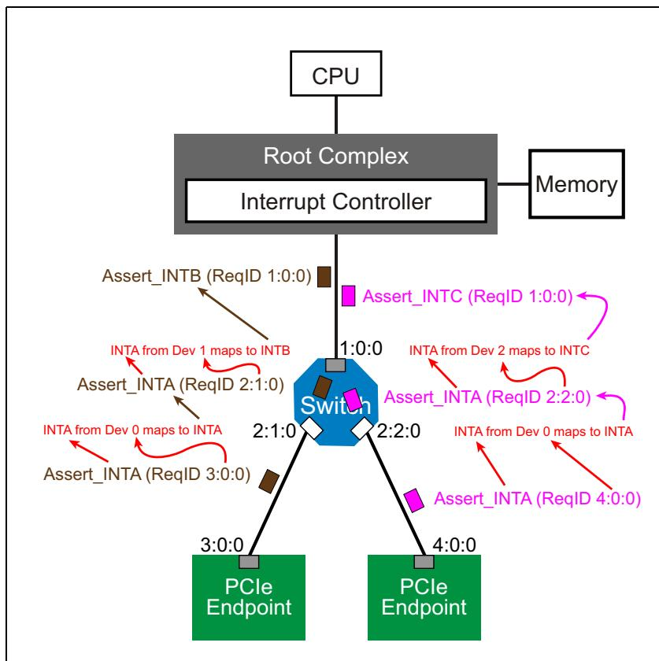

## 17.2.4.2 INTx Collapsing | 17.2.4.2 INTx 合并

<table style="border:1px solid #ddd;border-collapse:collapse; width:100%;" cellpadding="4" cellspacing="0" rules="all" frame="border">
  <thead style="border:1px solid #ddd;">
    <tr>
      <th width="50%" style="border:1px solid #ddd; background:#f5f5f5;">EN</th>
      <th width="50%" style="border:1px solid #ddd; background-color:#e8e8e8;">中文</th>
    </tr>
  </thead>
  <tbody>
    <tr><td width="50%" style="border:1px solid #ddd; background:#fff;padding:4px 8px;">PCIe Switches must ensure that INTx messages are delivered upstream in the correct fashion. Specifically, interrupt routing of legacy PCI implementations must be handled such that software can determine which interrupts are routed to which interrupt controller inputs. INTx# lines may be wire‑ORed and be routed to the same IRQ input on the interrupt controller, and when multiple devices signal interrupts on the same line, only the first assertion is seen by the interrupt controller. Similarly, when one of these devices deasserts its INTx# line, the line remains asserted until the last one is turned off. These same principles apply to PCIe INTx messages.</td><td width="50%" style="border:1px solid #ddd; background-color:#e8e8e8;padding:4px 8px;">PCIe 交换机必须确保 INTx 消息以正确的方式向上游传递。具体而言，传统 PCI 实现的中断路由必须得到妥善处理，以便软件能够确定哪些中断被路由到哪个中断控制器输入。INTx# 线可以线或连接，并路由到中断控制器上的同一个 IRQ 输入，当多个设备在同一根线上发出中断信号时，中断控制器只会看到第一个断言。同样，当其中一个设备解除其 INTx# 线的断言时，该线将保持断言状态，直到最后一个设备关闭。这些相同原理也适用于 PCIe INTx 消息。</td></tr>
    <tr><td width="50%" style="border:1px solid #ddd; background:#fff;padding:4px 8px;">In some cases, however, two overlapping INTx messages may be mapped to the same INTx message by a virtual PCI bridge at the egress port, requiring the messages to be collapsed. Consider the following example illustrated in Figure 17‑12 on page 811.</td><td width="50%" style="border:1px solid #ddd; background-color:#e8e8e8;padding:4px 8px;">然而，在某些情况下，两个重叠的 INTx 消息可能会被出口端口的虚拟 PCI 桥映射到同一个 INTx 消息，这就要求将这些消息合并。请考虑第 811 页图 17-12 所示的示例。</td></tr>
    <tr><td width="50%" style="border:1px solid #ddd; background:#fff;padding:4px 8px;">When the upstream Switch Port maps the interrupt messages for delivery on the upstream link, both interrupts will be mapped as INTB (based on the device numbers of the downstream Switch Ports). Note that because these two overlapping messages are the same they must be collapsed.</td><td width="50%" style="border:1px solid #ddd; background-color:#e8e8e8;padding:4px 8px;">当上行交换机端口映射用于在上行链路上传递的中断消息时，两个中断都将被映射为 INTB（基于下行交换机端口的设备号）。请注意，由于这两个重叠的消息相同，因此必须合并。</td></tr>
    <tr><td width="50%" style="border:1px solid #ddd; background:#fff;padding:4px 8px;">Collapsing ensures that the interrupt controller will never receive two consecutive Assert_INTx or Deassert_INTx messages for the shared interrupts. This is equivalent to INTx signals being wire‑ORed.</td><td width="50%" style="border:1px solid #ddd; background-color:#e8e8e8;padding:4px 8px;">合并确保中断控制器永远不会收到两个连续的针对共享中断的 Assert_INTx 或 Deassert_INTx 消息。这等效于 INTx 信号进行线或处理。</td></tr>
  </tbody>
</table>

Figure 17-12: Switch Uses Bridge Mapping of INTx Messages | 图17-12：交换机使用INTx消息的桥映射

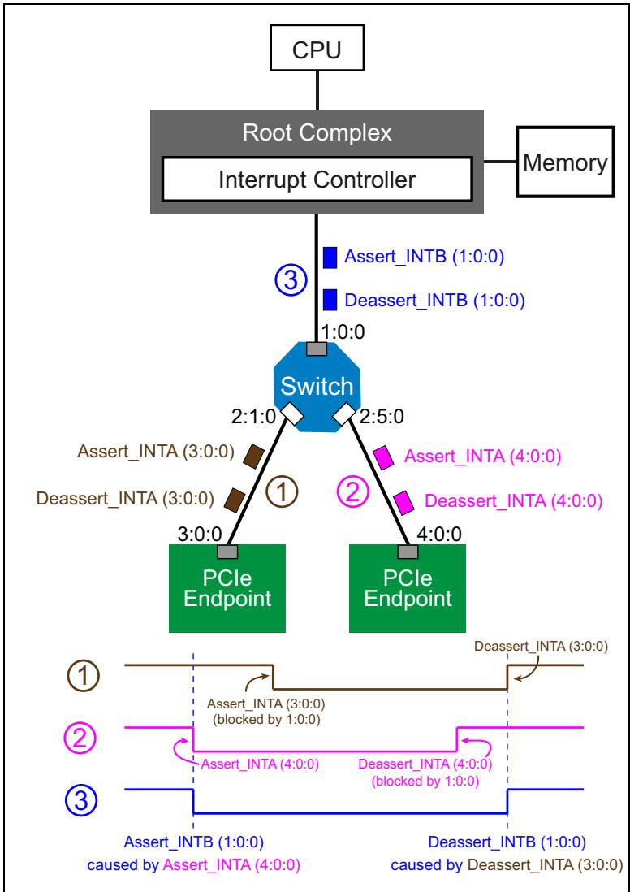

## 17.2.4.3 INTx Delivery Rules | 17.2.4.3 INTx 传递规则

<table style="border:1px solid #ddd;border-collapse:collapse; width:100%;" cellpadding="4" cellspacing="0" rules="all" frame="border">
  <thead style="border:1px solid #ddd;">
    <tr>
      <th width="50%" style="border:1px solid #ddd; background:#f5f5f5;">EN</th>
      <th width="50%" style="border:1px solid #ddd; background-color:#e8e8e8;">中文</th>
    </tr>
  </thead>
  <tbody>
    <tr><td width="50%" style="border:1px solid #ddd; background:#fff;padding:4px 8px;">The rules associated with the delivery of INTx messages have some unique characteristics:</td><td width="50%" style="border:1px solid #ddd; background-color:#e8e8e8;padding:4px 8px;">与 INTx 消息传递相关的规则具有一些独特特性：</td></tr>
    <tr><td width="50%" style="border:1px solid #ddd; background:#fff;padding:4px 8px;">Assert_INTx and Deassert_INTx are only issued in the upstream direction.</td><td width="50%" style="border:1px solid #ddd; background-color:#e8e8e8;padding:4px 8px;">Assert_INTx 和 Deassert_INTx 仅在向上游方向发出。</td></tr>
    <tr><td width="50%" style="border:1px solid #ddd; background:#fff;padding:4px 8px;">Switches that are collapsing interrupts will only issue INTx messages upstream when there is a change of the interrupt status.</td><td width="50%" style="border:1px solid #ddd; background-color:#e8e8e8;padding:4px 8px;">正在合并中断的交换机仅当中断状态发生变化时才会向上游发出 INTx 消息。</td></tr>
    <tr><td width="50%" style="border:1px solid #ddd; background:#fff;padding:4px 8px;">Devices on either side of a link must track the current state of INTA-INTD assertion.</td><td width="50%" style="border:1px solid #ddd; background-color:#e8e8e8;padding:4px 8px;">链路两侧的设备必须跟踪 INTA-INTD 断言的当前状态。</td></tr>
    <tr><td width="50%" style="border:1px solid #ddd; background:#fff;padding:4px 8px;">A Switch tracks the state of the four virtual wires for each of its downstream ports, and may present a collapsed set of virtual wires on its upstream port.</td><td width="50%" style="border:1px solid #ddd; background-color:#e8e8e8;padding:4px 8px;">交换机跟踪其每个下游端口的四条虚拟线的状态，并可在其上游端口呈现合并后的虚拟线集合。</td></tr>
    <tr><td width="50%" style="border:1px solid #ddd; background:#fff;padding:4px 8px;">The Root Complex must track the state of the four virtual wires (A-D) for each downstream port.</td><td width="50%" style="border:1px solid #ddd; background-color:#e8e8e8;padding:4px 8px;">根复合体必须跟踪每个下游端口的四条虚拟线（A-D）的状态。</td></tr>
    <tr><td width="50%" style="border:1px solid #ddd; background:#fff;padding:4px 8px;">INTx signaling may be disabled with the Interrupt Disable bit in the Command Register.</td><td width="50%" style="border:1px solid #ddd; background-color:#e8e8e8;padding:4px 8px;">INTx 信令可通过命令寄存器中的中断禁用位来禁用。</td></tr>
    <tr><td width="50%" style="border:1px solid #ddd; background:#fff;padding:4px 8px;">If any INTx virtual wires are active and device interrupts are then disabled, a corresponding Deassert_INTx message must be sent.</td><td width="50%" style="border:1px solid #ddd; background-color:#e8e8e8;padding:4px 8px;">如果任何 INTx 虚拟线处于活动状态而后设备中断被禁用，则必须发送相应的 Deassert_INTx 消息。</td></tr>
    <tr><td width="50%" style="border:1px solid #ddd; background:#fff;padding:4px 8px;">If a downstream Switch Port goes to DL_Down status, any active INTx virtual wires must be deasserted, and the upstream port updated accordingly (Deassert_INTx message required if that INTx was in active state).</td><td width="50%" style="border:1px solid #ddd; background-color:#e8e8e8;padding:4px 8px;">如果下游交换机端口进入 DL_Down 状态，任何活动的 INTx 虚拟线必须被解除断言，并且上游端口相应更新（如果该 INTx 处于活动状态，则需要发送 Deassert_INTx 消息）。</td></tr>
  </tbody>
</table>

## 17.3 The MSI Model | 17.3 MSI 模型

<table style="border:1px solid #ddd;border-collapse:collapse; width:100%;" cellpadding="4" cellspacing="0" rules="all" frame="border">
  <thead style="border:1px solid #ddd;">
    <tr>
      <th width="50%" style="border:1px solid #ddd; background:#f5f5f5;">EN</th>
      <th width="50%" style="border:1px solid #ddd; background-color:#e8e8e8;">中文</th>
    </tr>
  </thead>
  <tbody>
    <tr><td width="50%" style="border:1px solid #ddd; background:#fff;padding:4px 8px;">A PCIe Function indicates MSI support via the MSI Capability registers. Each Function must implement either the MSI Capability Structure or the MSI‑X (eXtended MSI, see "The MSI‑X Model" on page 821) Capability Structure, or both. The MSI Capability registers are set up by configuration software and include:</td><td width="50%" style="border:1px solid #ddd; background-color:#e8e8e8;padding:4px 8px;">PCIe 功能通过 MSI 能力寄存器指示其对 MSI 的支持。每个功能必须实现 MSI 能力结构或 MSI‑X（扩展 MSI，见第 821 页 "MSI‑X 模型"）能力结构，或两者都实现。MSI 能力寄存器由配置软件设置，数据包括：</td></tr>
    <tr><td width="50%" style="border:1px solid #ddd; background:#fff;padding:4px 8px;">• Target memory address</td><td width="50%" style="border:1px solid #ddd; background-color:#e8e8e8;padding:4px 8px;">• 目标存储器地址</td></tr>
    <tr><td width="50%" style="border:1px solid #ddd; background:#fff;padding:4px 8px;">• Data Value to be written to that address</td><td width="50%" style="border:1px solid #ddd; background-color:#e8e8e8;padding:4px 8px;">• 要写入该地址的数据值</td></tr>
    <tr><td width="50%" style="border:1px solid #ddd; background:#fff;padding:4px 8px;">• The number of unique messages that can be encoded into the data</td><td width="50%" style="border:1px solid #ddd; background-color:#e8e8e8;padding:4px 8px;">• 可编码到数据中的唯一消息数量</td></tr>
    <tr><td width="50%" style="border:1px solid #ddd; background:#fff;padding:4px 8px;">See "Memory Request Header Fields" on page 188 for a review of the Memory Write Transaction Header. Note that MSIs always have a data payload of 1DW.</td><td width="50%" style="border:1px solid #ddd; background-color:#e8e8e8;padding:4px 8px;">关于存储器写事务头标的回顾，请参见第 188 页的 "存储器请求头标字段"。注意，MSI 始终具有 1 双字的数据载荷。</td></tr>
  </tbody>
</table>

<table style="border:1px solid #ddd;border-collapse:collapse; width:100%;" cellpadding="4" cellspacing="0" rules="all" frame="border">
  <thead style="border:1px solid #ddd;">
    <tr>
      <th width="50%" style="border:1px solid #ddd; background:#f5f5f5;">EN</th>
      <th width="50%" style="border:1px solid #ddd; background-color:#e8e8e8;">中文</th>
    </tr>
  </thead>
  <tbody>
    <tr><td width="50%" style="border:1px solid #ddd; background:#fff;padding:4px 8px;">The MSI Capability Structure resides in the PCI‑compatible config space area (first 256 bytes). There are four variations of the MSI Capability Structure based on whether it supports 64‑bit addressing or only 32‑bit and whether it supports per vector masking or not. Native PCIe devices are required to support 64‑bit addressing. All four variations of the MSI Capability Structure can be found in Figure 17‑13 on page 813.</td><td width="50%" style="border:1px solid #ddd; background-color:#e8e8e8;padding:4px 8px;">MSI能力结构位于PCI兼容配置空间区域（前256字节）。根据其是否支持64位寻址或仅支持32位寻址，以及是否支持每向量屏蔽，MSI能力结构有四种变体。原生PCIe设备必须支持64位寻址。图17‑13（第813页）展示了MSI能力结构的所有四种变体。</td></tr>
  </tbody>
</table>

Figure 17‑13: MSI Capability Structure Variations | 图17‑13：MSI能力结构变体

<table style="border:1px solid #ddd;border-collapse:collapse;width:100%" cellpadding="4" cellspacing="0" rules="all" frame="border"><tr><td colspan="3" style="border:1px solid #ddd;">32-bit Address</td></tr><tr><td style="border:1px solid #ddd;">Message Control</td><td style="border:1px solid #ddd;">Next Capability Pointer</td><td style="border:1px solid #ddd;">Capability ID (05h) DW0</td></tr><tr><td colspan="3" style="border:1px solid #ddd;">Message Address [31:0]</td></tr><tr><td style="border:1px solid #ddd;"></td><td style="border:1px solid #ddd;">Message Data</td><td style="border:1px solid #ddd;">DW1 DW2</td></tr><tr><td colspan="3" style="border:1px solid #ddd;">64-bit Address</td></tr><tr><td style="border:1px solid #ddd;">Message Control</td><td style="border:1px solid #ddd;">Next Capability Pointer</td><td style="border:1px solid #ddd;">Capability ID (05h) DW0</td></tr><tr><td colspan="3" style="border:1px solid #ddd;">Message Address [31:0]</td></tr><tr><td colspan="3" style="border:1px solid #ddd;">Message Address [63:32]</td></tr><tr><td style="border:1px solid #ddd;"></td><td style="border:1px solid #ddd;">Message Data</td><td style="border:1px solid #ddd;">DW1 DW2 DW3</td></tr><tr><td colspan="3" style="border:1px solid #ddd;">32-bit Address with Per-Vector Masking</td></tr><tr><td style="border:1px solid #ddd;">Message Control</td><td style="border:1px solid #ddd;">Next Capability Pointer</td><td style="border:1px solid #ddd;">Capability ID (05h) DW0</td></tr><tr><td colspan="3" style="border:1px solid #ddd;">Message Address [31:0]</td></tr><tr><td style="border:1px solid #ddd;">Reserved</td><td style="border:1px solid #ddd;">Message Data</td><td style="border:1px solid #ddd;">DW1 DW2 DW3 DW4</td></tr><tr><td colspan="3" style="border:1px solid #ddd;">Mask Bits</td></tr><tr><td colspan="3" style="border:1px solid #ddd;">Pending Bits</td></tr><tr><td colspan="3" style="border:1px solid #ddd;">64-bit Address with Per-Vector Masking</td></tr><tr><td style="border:1px solid #ddd;">Message Control</td><td style="border:1px solid #ddd;">Next Capability Pointer</td><td style="border:1px solid #ddd;">Capability ID (05h) DW0</td></tr><tr><td colspan="3" style="border:1px solid #ddd;">Message Address [31:0]</td></tr><tr><td colspan="3" style="border:1px solid #ddd;">Message Address [63:32]</td></tr><tr><td style="border:1px solid #ddd;">Reserved</td><td style="border:1px solid #ddd;">Message Data</td><td style="border:1px solid #ddd;">DW1 DW2 DW3 DW4 DW5</td></tr><tr><td colspan="3" style="border:1px solid #ddd;">Mask Bits</td></tr><tr><td colspan="3" style="border:1px solid #ddd;">Pending Bits</td></tr></table>

<table style="border:1px solid #ddd;border-collapse:collapse; width:100%;" cellpadding="4" cellspacing="0" rules="all" frame="border">
  <thead style="border:1px solid #ddd;">
    <tr>
      <th width="50%" style="border:1px solid #ddd; background:#f5f5f5;">EN</th>
      <th width="50%" style="border:1px solid #ddd; background-color:#e8e8e8;">中文</th>
    </tr>
  </thead>
  <tbody>
    <tr><td width="50%" style="border:1px solid #ddd; background:#fff;padding:4px 8px;">## Capability ID</td><td width="50%" style="border:1px solid #ddd; background-color:#e8e8e8;padding:4px 8px;">## 能力ID</td></tr>
    <tr><td width="50%" style="border:1px solid #ddd; background:#fff;padding:4px 8px;">A Capability ID value of 05h identifies the MSI capability and is a read-only value.</td><td width="50%" style="border:1px solid #ddd; background-color:#e8e8e8;padding:4px 8px;">Capability ID值为05h标识MSI能力，且为只读值。</td></tr>
  </tbody>
</table>

## 17.3.1.1 Next Capability Pointer | 17.3.1.1 下一个能力指针

<table style="border-collapse:collapse;width:100%" cellpadding="4" cellspacing="0" rules="all" frame="border">
  <thead>
    <tr>
      <th width="50%" style="border:2px solid #000;background:#f5f5f5;padding:4px 8px;">EN</th>
      <th width="50%" style="border:2px solid #000;background-color:#e8e8e8;padding:4px 8px;">中文</th>
    </tr>
  </thead>
  <tbody>
    <tr><td width="50%" style="border:2px solid #000; background:#fff;padding:4px 8px;">The second byte of the register is a read-only value that gives the dword-aligned offset from the top of config space to the next Capability Structure in the linked list of structures or else contains 00h to indicate the end of the linked list.</td><td width="50%" style="border:2px solid #000; background-color:#e8e8e8;padding:4px 8px;">该寄存器的第二个字节是一个只读值，提供从配置空间顶部到结构链表中下一个能力结构的dword对齐偏移量，否则数据包含00h以指示链表结束。</td></tr>
    <tr><td width="50%" style="border:2px solid #000; background:#fff;padding:4px 8px;">## Message Control Register</td><td width="50%" style="border:2px solid #000; background-color:#e8e8e8;padding:4px 8px;">## 消息控制寄存器</td></tr>
    <tr><td width="50%" style="border:2px solid #000; background:#fff;padding:4px 8px;">Figure 17‑14 on page 814 and Table 17‑2 on page 814 illustrate the layout and usage of the Message Control register.</td><td width="50%" style="border:2px solid #000; background-color:#e8e8e8;padding:4px 8px;">第814页的图17-14和第814页的表17-2说明了消息控制寄存器的布局和用法。</td></tr>
  </tbody>
</table>

Figure 17‑14: Message Control Register | 图17‑14：消息控制寄存器

<table style="border:1px solid #ddd;border-collapse:collapse; width:100%;" cellpadding="4" cellspacing="0" rules="all" frame="border">
  <thead style="border:1px solid #ddd;">
    <tr>
      <th width="50%" style="border:1px solid #ddd; background:#f5f5f5;">EN</th>
      <th width="50%" style="border:1px solid #ddd; background-color:#e8e8e8;">中文</th>
    </tr>
  </thead>
  <tbody>
    <tr><td width="50%" style="border:1px solid #ddd; background:#fff;padding:4px 8px;">Table 17‑2: Format and Usage of Message Control Register</td><td width="50%" style="border:1px solid #ddd; background-color:#e8e8e8;padding:4px 8px;">表17-2：消息控制寄存器的格式和用法</td></tr>
  </tbody>
</table>

<table style="border:1px solid #ddd;border-collapse:collapse;width:100%" cellpadding="4" cellspacing="0" rules="all" frame="border"><tr><td style="border:1px solid #ddd;">Bit(s)</td><td style="border:1px solid #ddd;">Field Name</td><td style="border:1px solid #ddd;">Description</td></tr><tr><td style="border:1px solid #ddd;">0</td><td style="border:1px solid #ddd;">MSI Enable</td><td style="border:1px solid #ddd;">Read/Write. State after reset is 0, indicating that the device's MSI capability is disabled.0 = Function isdisabledfrom using MSI. It must use MSI-X or else INTx Messages.1 = Function isenabledto use MSI to request service and won't use MSI-X or INTx Messages.</td></tr></table>

<table style="border:1px solid #ddd;border-collapse:collapse; width:100%;" cellpadding="4" cellspacing="0" rules="all" frame="border">
  <thead style="border:1px solid #ddd;">
    <tr>
      <th width="50%" style="border:1px solid #ddd; background:#f5f5f5;">EN</th>
      <th width="50%" style="border:1px solid #ddd; background-color:#e8e8e8;">中文</th>
    </tr>
  </thead>
  <tbody>
    <tr><td width="50%" style="border:1px solid #ddd; background:#fff;padding:4px 8px;">## Chapter 17: Interrupt Support</td><td width="50%" style="border:1px solid #ddd; background-color:#e8e8e8;padding:4px 8px;">## 第17章：中断支持</td></tr>
    <tr><td width="50%" style="border:1px solid #ddd; background:#fff;padding:4px 8px;">Table 17-2: Format and Usage of Message Control Register (Continued)</td><td width="50%" style="border:1px solid #ddd; background-color:#e8e8e8;padding:4px 8px;">表17-2：消息控制寄存器的格式与用法（续）</td></tr>
  </tbody>
</table>

<table style="border:1px solid #ddd;border-collapse:collapse;width:100%" cellpadding="4" cellspacing="0" rules="all" frame="border"><tr><td style="border:1px solid #ddd;">Bit(s)</td><td style="border:1px solid #ddd;">Field Name</td><td style="border:1px solid #ddd;">Description</td></tr><tr><td rowspan="10" style="border:1px solid #ddd;">3:1</td><td rowspan="10" style="border:1px solid #ddd;">Multiple Message Capable</td><td style="border:1px solid #ddd;">Read-Only. System software reads this field to determine how many messages (interrupt vectors) the Function would like to use. The requested number of messages is a power of two, therefore a Function that would like three messages must request that four messages be allocated to it.</td></tr><tr><td style="border:1px solid #ddd;">Value Number of Messages Requested</td></tr><tr><td style="border:1px solid #ddd;">000b 1</td></tr><tr><td style="border:1px solid #ddd;">001b 2</td></tr><tr><td style="border:1px solid #ddd;">010b 4</td></tr><tr><td style="border:1px solid #ddd;">011b 8</td></tr><tr><td style="border:1px solid #ddd;">100b 16</td></tr><tr><td style="border:1px solid #ddd;">101b 32</td></tr><tr><td style="border:1px solid #ddd;">110b Reserved</td></tr><tr><td style="border:1px solid #ddd;">111b Reserved</td></tr><tr><td rowspan="10" style="border:1px solid #ddd;">6:4</td><td rowspan="10" style="border:1px solid #ddd;">Multiple Message Enable</td><td style="border:1px solid #ddd;">Read/Write. After system software reads the Multi-ple Message Capable field (previous row in this table) to see how many messages (interrupt vec-tors) are requested by the Function, it programs a 3-bit value in this field indicating the actual num-ber of messages allocated to the Function. The number allocated can be equal to or less than the number actually requested. The state of this field after reset is 000b.</td></tr><tr><td style="border:1px solid #ddd;">Value Number of Messages Requested</td></tr><tr><td style="border:1px solid #ddd;">000b 1</td></tr><tr><td style="border:1px solid #ddd;">001b 2</td></tr><tr><td style="border:1px solid #ddd;">010b 4</td></tr><tr><td style="border:1px solid #ddd;">011b 8</td></tr><tr><td style="border:1px solid #ddd;">100b 16</td></tr><tr><td style="border:1px solid #ddd;">101b 32</td></tr><tr><td style="border:1px solid #ddd;">110b Reserved</td></tr><tr><td style="border:1px solid #ddd;">111b Deferred</td></tr></table>

## PCI Express 3.0 Technology | PCI Express 3.0 技术

<table style="border:1px solid #ddd;border-collapse:collapse; width:100%;" cellpadding="4" cellspacing="0" rules="all" frame="border">
  <thead style="border:1px solid #ddd;">
    <tr>
      <th width="50%" style="border:1px solid #ddd; background:#f5f5f5;">EN</th>
      <th width="50%" style="border:1px solid #ddd; background-color:#e8e8e8;">中文</th>
    </tr>
  </thead>
  <tbody>
    <tr><td width="50%" style="border:1px solid #ddd; background:#fff;padding:4px 8px;">Table 17-2: Format and Usage of Message Control Register (Continued)</td><td width="50%" style="border:1px solid #ddd; background-color:#e8e8e8;padding:4px 8px;">表17-2：消息控制寄存器的格式与用途（续）</td></tr>
  </tbody>
</table>

<table style="border:1px solid #ddd;border-collapse:collapse;width:100%" cellpadding="4" cellspacing="0" rules="all" frame="border"><tr><td style="border:1px solid #ddd;">Bit(s)</td><td style="border:1px solid #ddd;">Field Name</td><td style="border:1px solid #ddd;">Description</td></tr><tr><td style="border:1px solid #ddd;">7</td><td style="border:1px solid #ddd;">64-bit Address Capable</td><td style="border:1px solid #ddd;">Read-Only.0 = Function does not implement the upper 32 bits of the Message Address register; only a 32-bit address is possible.1 = Function implements the upper 32 bits of the Message Address register and is capable of generating a 64-bit memory address.</td></tr><tr><td style="border:1px solid #ddd;">8</td><td style="border:1px solid #ddd;">Per-Vector Masking Capable</td><td style="border:1px solid #ddd;">Read-Only.0 = Function does not implement the Mask Bit register or the Pending Bit register; software does NOT have the ability to mask individual interrupts with this capability structure.1 = Function does implement the Mask Bit register or the Pending Bit register; software does have the ability to mask individual interrupts with this capability structure.</td></tr><tr><td style="border:1px solid #ddd;">15:9</td><td style="border:1px solid #ddd;">Reserved</td><td style="border:1px solid #ddd;">Read-Only. Always zero.</td></tr></table>

## 17.3.1.2 Message Address Register | 17.3.1.2 消息地址寄存器

<table style="border:1px solid #ddd;border-collapse:collapse; width:100%;" cellpadding="4" cellspacing="0" rules="all" frame="border">
  <thead style="border:1px solid #ddd;">
    <tr>
      <th width="50%" style="border:1px solid #ddd; background:#f5f5f5;">EN</th>
      <th width="50%" style="border:1px solid #ddd; background-color:#e8e8e8;">中文</th>
    </tr>
  </thead>
  <tbody>
    <tr><td width="50%" style="border:1px solid #ddd; background:#fff;padding:4px 8px;">The lower two bits of the 32-bit Message Address register are zero and cannot be changed, forcing the address assigned by software to be dword aligned. Typically, this would be the address of the Local APIC in the system CPU. In x86-based systems (Intel-compatible), this address has traditionally been FEEx_xxxxh where the lower 20 bits indicate which Local APIC is being targeted as well as some other info about the interrupt itself. It is important to note that how the address is interpreted is platform specific and is not dictated in the PCI or PCIe specs.</td><td width="50%" style="border:1px solid #ddd; background-color:#e8e8e8;padding:4px 8px;">32位消息地址寄存器的低两位固定为0且不可更改，强制软件分配的地址按双字对齐。通常，该地址指向系统CPU中的本地APIC。在基于x86的系统中（Intel兼容），该地址传统上为FEEx_xxxxh，其中低20位表示目标本地APIC以及中断本身的一些其他信息。需要注意的是，地址的解释方式与平台相关，PCI或PCIe规范未对此做出规定。</td></tr>
    <tr><td width="50%" style="border:1px solid #ddd; background:#fff;padding:4px 8px;">The register containing bits [63:32] of the Message Address are required for native PCI Express devices but is optional for legacy endpoints. This register is present if Bit 7 of the Message Control register is set. If so, it is a read/write register used in conjunction with the Message Address [31:0] register to enable a 64-bit memory address for interrupt delivery from this Function.</td><td width="50%" style="border:1px solid #ddd; background-color:#e8e8e8;padding:4px 8px;">数据包含消息地址位[63:32]的寄存器对于原生PCI Express设备是必需的，但对于传统端点是可选的。如果消息控制寄存器的位7被置位，则该寄存器存在。若是，它是一个读/写寄存器，与消息地址[31:0]寄存器配合使用，以启用从该功能发送中断的64位内存地址。</td></tr>
  </tbody>
</table>

## 17.3.1.3 Message Data Register | 17.3.1.3 消息数据寄存器

<table style="border:1px solid #ddd;border-collapse:collapse; width:100%;" cellpadding="4" cellspacing="0" rules="all" frame="border">
  <thead style="border:1px solid #ddd;">
    <tr>
      <th width="50%" style="border:1px solid #ddd; background:#f5f5f5;">EN</th>
      <th width="50%" style="border:1px solid #ddd; background-color:#e8e8e8;">中文</th>
    </tr>
  </thead>
  <tbody>
    <tr><td width="50%" style="border:1px solid #ddd; background:#fff;padding:4px 8px;">System software writes a base message data pattern into this 16-bit, read/write register. When the Function generates an interrupt request, it writes a 32-bit data value to the memory address specified in the Message Address register. The upper 16 bits of this data are always set to zero, while the lower 16 bits are supplied by the Message Data register.</td><td width="50%" style="border:1px solid #ddd; background-color:#e8e8e8;padding:4px 8px;">系统软件将一个基础消息数据模式写入这个16位读/写寄存器。当该Function产生中断请求时，它向Message Address寄存器指定的存储器地址写入一个32位数据值。该数据的高16位始终为零，低16位由Message Data寄存器提供。</td></tr>
    <tr><td width="50%" style="border:1px solid #ddd; background:#fff;padding:4px 8px;">If more than one message has been assigned to the Function, it modifies the lower bits (the number of modifiable bits depends on how many messages have been assigned to the Function by configuration software) of the Message Data register value to form the appropriate value for the event it wishes to report. As an example, refer to "Basics of Generating an MSI Interrupt Request" on page 820.</td><td width="50%" style="border:1px solid #ddd; background-color:#e8e8e8;padding:4px 8px;">如果该Function被分配了多个消息，它会修改Message Data寄存器值的低位（可修改的位数取决于配置软件为该Function分配了多少个消息），以形成其希望报告的事件所对应的适当值。例如，请参考第820页的"生成MSI中断请求的基本原理"。</td></tr>
  </tbody>
</table>

<table style="border:1px solid #ddd;border-collapse:collapse; width:100%;" cellpadding="4" cellspacing="0" rules="all" frame="border">
  <thead style="border:1px solid #ddd;">
    <tr>
      <th width="50%" style="border:1px solid #ddd; background:#f5f5f5;">EN</th>
      <th width="50%" style="border:1px solid #ddd; background-color:#e8e8e8;">中文</th>
    </tr>
  </thead>
  <tbody>
    <tr><td width="50%" style="border:1px solid #ddd; background:#fff;padding:4px 8px;">## Mask Bits Register and Pending Bits Register</td><td width="50%" style="border:1px solid #ddd; background-color:#e8e8e8;padding:4px 8px;">## 屏蔽位寄存器（Mask Bits Register）与挂起位寄存器（Pending Bits Register）</td></tr>
    <tr><td width="50%" style="border:1px solid #ddd; background:#fff;padding:4px 8px;">If the Function supports per-vector masking (indicated in bit [8] of the Message Control register) then these registers are present. The max number of interrupt messages (interrupt vectors) that can be requested and assigned to a Function using MSI is 32. So these two registers are 32 bits in length with each potential interrupt message having its own mask and pending bit. If bit [0] of the Mask Bits register is set, then interrupt message 0 is masked (this is the base vector from this Function). If bit [1] is set, then interrupt message 1 is masked (this is the base vector + 1).</td><td width="50%" style="border:1px solid #ddd; background-color:#e8e8e8;padding:4px 8px;">如果 Function 支持按向量屏蔽（由 Message Control 寄存器的 bit[8] 指示），则这些寄存器存在。使用 MSI 可请求并分配给一个 Function 的最大中断消息（中断向量）数量为 32。因此这两个寄存器均为 32 位长度，每个潜在的中断消息都有各自的屏蔽位和挂起位。如果 Mask Bits 寄存器的 bit[0] 被置位，则中断消息 0 被屏蔽（即该 Function 的基本向量）。如果 bit[1] 被置位，则中断消息 1 被屏蔽（即基本向量 + 1）。</td></tr>
    <tr><td width="50%" style="border:1px solid #ddd; background:#fff;padding:4px 8px;">When an interrupt message is masked, the MSI for that vector cannot be sent. Instead, the corresponding Pending Bit is set. This allows software to mask individual interrupts from a Function and then periodically poll the Function to see if there are any masked interrupts that are pending.</td><td width="50%" style="border:1px solid #ddd; background-color:#e8e8e8;padding:4px 8px;">当中断消息被屏蔽时，该向量的 MSI 无法发送。取而代之的是，相应的 Pending Bit 被置位。这允许软件屏蔽来自 Function 的单个中断，然后定期轮询该 Function，以查看是否有任何被屏蔽的中断处于挂起状态。</td></tr>
    <tr><td width="50%" style="border:1px solid #ddd; background:#fff;padding:4px 8px;">If software clears a mask bit and the corresponding pending bit is set, the Function must send the MSI request at that time. Once the interrupt message has been sent, the Function would clear the pending bit.</td><td width="50%" style="border:1px solid #ddd; background-color:#e8e8e8;padding:4px 8px;">如果软件清除某个屏蔽位，且对应的挂起位已被置位，则该 Function 必须立即发送 MSI 请求。当中断消息发送完成后，Function 应清除该挂起位。</td></tr>
  </tbody>
</table>

## 17.3.2 Basics of MSI Configuration | 17.3.2 MSI 配置基础

The following list specifies the steps taken by software to configure MSI interrupts for a PCI Express device. Refer to Figure 17‐15 on page 819.

<table style="border:1px solid #ddd;border-collapse:collapse; width:100%;" cellpadding="4" cellspacing="0" rules="all" frame="border">
  <thead style="border:1px solid #ddd;">
    <tr>
      <th width="50%" style="border:1px solid #ddd; background:#f5f5f5;">EN</th>
      <th width="50%" style="border:1px solid #ddd; background-color:#e8e8e8;">中文</th>
    </tr>
  </thead>
  <tbody>
    <tr><td width="50%" style="border:1px solid #ddd; background:#fff;padding:4px 8px;">## Basics of MSI Configuration</td><td width="50%" style="border:1px solid #ddd; background-color:#e8e8e8;padding:4px 8px;">## MSI配置基础</td></tr>
    <tr><td width="50%" style="border:1px solid #ddd; background:#fff;padding:4px 8px;">The following list specifies the steps taken by software to configure MSI interrupts for a PCI Express device. Refer to Figure 17‐15 on page 819.</td><td width="50%" style="border:1px solid #ddd; background-color:#e8e8e8;padding:4px 8px;">以下列表指定了软件为PCI Express设备配置MSI中断所采取的步骤。参见第819页图17‐15。</td></tr>
    <tr><td width="50%" style="border:1px solid #ddd; background:#fff;padding:4px 8px;">1. At startup time, enumeration software scans the system for all PCI‐compatible Functions (see "Single Root Enumeration Example" on page 109 for a discussion of the enumeration process).</td><td width="50%" style="border:1px solid #ddd; background-color:#e8e8e8;padding:4px 8px;">1. 在启动时，枚举软件扫描系统中所有PCI兼容功能（有关枚举过程的讨论，请参见第109页的"单根枚举示例"）。</td></tr>
  </tbody>
</table>

## 17.3.3.1 Generating an MSI Interrupt | 17.3.3.1 生成 MSI 中断

<table style="border:1px solid #ddd;border-collapse:collapse; width:100%;" cellpadding="4" cellspacing="0" rules="all" frame="border">
  <thead style="border:1px solid #ddd;">
    <tr>
      <th width="50%" style="border:1px solid #ddd; background:#f5f5f5;">EN</th>
      <th width="50%" style="border:1px solid #ddd; background-color:#e8e8e8;">中文</th>
    </tr>
  </thead>
  <tbody>
    <tr><td width="50%" style="border:1px solid #ddd; background:#fff;padding:4px 8px;">2. Once a Function is discovered software reads the Capabilities List Pointer, to find the location of the first capability structure in the linked list.</td><td width="50%" style="border:1px solid #ddd; background-color:#e8e8e8;padding:4px 8px;">2. 一旦发现某功能，软件读取能力列表指针，以找到链表中第一个能力结构的位置。</td></tr>
    <tr><td width="50%" style="border:1px solid #ddd; background:#fff;padding:4px 8px;">3. If the MSI Capability structure (Capability ID of 05h) is found in the list, software reads the Multiple Message Capable field in the device's Message Control register to determine how many event-specific messages the device supports and if it supports a 64-bit message address or only 32-bit. Software then allocates a number of messages equal to or less than that and writes that value into the Multiple Message Enable field. At a minimum, one message will be allocated to the device.</td><td width="50%" style="border:1px solid #ddd; background-color:#e8e8e8;padding:4px 8px;">3. 如果在链表中找到MSI能力结构（能力ID为05h），软件读取设备消息控制寄存器中的多消息能力字段，以确定设备支持多少条事件特定消息，以及它支持64位消息地址还是仅支持32位。然后软件分配等于或小于该数量的消息数，并将该值写入多消息使能字段。至少会为设备分配一条消息。</td></tr>
    <tr><td width="50%" style="border:1px solid #ddd; background:#fff;padding:4px 8px;">4. Software writes the base message data pattern into the device's Message Data register and writes a dword-aligned memory address to the device's Message Address register to serve as the destination address for MSI writes.</td><td width="50%" style="border:1px solid #ddd; background-color:#e8e8e8;padding:4px 8px;">4. 软件将基本消息数据模式写入设备的消息数据寄存器，并将双字对齐的内存地址写入设备的消息地址寄存器，作为MSI写操作的目标地址。</td></tr>
    <tr><td width="50%" style="border:1px solid #ddd; background:#fff;padding:4px 8px;">5. Finally, software sets the MSI Enable bit in the device's Message Control register, enabling it to generate MSI writes and disabling other interrupt delivery options.</td><td width="50%" style="border:1px solid #ddd; background-color:#e8e8e8;padding:4px 8px;">5. 最后，软件设置设备消息控制寄存器中的MSI使能位，使其能够生成MSI写操作，并禁用其他中断投递选项。</td></tr>
  </tbody>
</table>

Figure 17-15: Device MSI Configuration Process | 图17-15：设备MSI配置过程

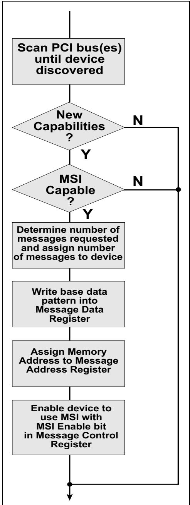

## 17.3.3 Basics of Generating an MSI Interrupt Request | 17.3.3 MSI中断请求生成基础

Figure 17‐16 on page 821 illustrates the contents of an MSI Memory Write Transaction Header and Data field. Key points include:

第821页的图17-16展示了MSI存储器写事务头部和数据字段的内容。要点数据包括：

<table style="border:1px solid #ddd;border-collapse:collapse; width:100%;" cellpadding="4" cellspacing="0" rules="all" frame="border">
  <thead style="border:1px solid #ddd;">
    <tr>
      <th width="50%" style="border:1px solid #ddd; background:#f5f5f5;">EN</th>
      <th width="50%" style="border:1px solid #ddd; background-color:#e8e8e8;">中文</th>
    </tr>
  </thead>
  <tbody>
    <tr><td width="50%" style="border:1px solid #ddd; background:#fff;padding:4px 8px;">Format field must be 011b for native functions, indicating a 4DW header (64-bit address) with Data, but it may be 010b for Legacy Endpoints, indicating a 32-bit address.</td><td width="50%" style="border:1px solid #ddd; background-color:#e8e8e8;padding:4px 8px;">对于原生功能，Format字段必须为011b，表示带数据的4DW头部（64位地址）；但对于传统端点，它可以为010b，表示32位地址。</td></tr>
    <tr><td width="50%" style="border:1px solid #ddd; background:#fff;padding:4px 8px;">The Attribute bits for No Snoop and Relaxed Ordering must be zero.</td><td width="50%" style="border:1px solid #ddd; background-color:#e8e8e8;padding:4px 8px;">No Snoop和Relaxed Ordering的属性位必须为零。</td></tr>
    <tr><td width="50%" style="border:1px solid #ddd; background:#fff;padding:4px 8px;">Length field must be 01h to indicate maximum data payload of 1DW.</td><td width="50%" style="border:1px solid #ddd; background-color:#e8e8e8;padding:4px 8px;">Length字段必须为01h，表示最大数据负载为1DW。</td></tr>
    <tr><td width="50%" style="border:1px solid #ddd; background:#fff;padding:4px 8px;">First BE field must be 1111b, indicating valid data in all four bytes of the DW, even though the upper two bytes will always be zero for MSI.</td><td width="50%" style="border:1px solid #ddd; background-color:#e8e8e8;padding:4px 8px;">First BE字段必须为1111b，表示该DW中所有四个字节的数据均有效，尽管对于MSI来说高两个字节始终为零。</td></tr>
    <tr><td width="50%" style="border:1px solid #ddd; background:#fff;padding:4px 8px;">Last BE field must be 0000b, indicating a single DW transaction.</td><td width="50%" style="border:1px solid #ddd; background-color:#e8e8e8;padding:4px 8px;">Last BE字段必须为0000b，表示单DW事务。</td></tr>
    <tr><td width="50%" style="border:1px solid #ddd; background:#fff;padding:4px 8px;">Address fields within the header come directly from the address fields within the MSI Capability registers.</td><td width="50%" style="border:1px solid #ddd; background-color:#e8e8e8;padding:4px 8px;">头部中的地址字段直接来自MSI能力寄存器中的地址字段。</td></tr>
    <tr><td width="50%" style="border:1px solid #ddd; background:#fff;padding:4px 8px;">Lower 16 bits of the Data payload are derived from the data field within the MSI Capability registers.</td><td width="50%" style="border:1px solid #ddd; background-color:#e8e8e8;padding:4px 8px;">数据负载的低16位来自MSI能力寄存器中的数据字段。</td></tr>
  </tbody>
</table>

## 17.3.4 Multiple Messages | 17.3.4 多消息

<table style="border:1px solid #ddd;border-collapse:collapse; width:100%;" cellpadding="4" cellspacing="0" rules="all" frame="border">
  <thead style="border:1px solid #ddd;">
    <tr>
      <th width="50%" style="border:1px solid #ddd; background:#f5f5f5;">EN</th>
      <th width="50%" style="border:1px solid #ddd; background-color:#e8e8e8;">中文</th>
    </tr>
  </thead>
  <tbody>
    <tr><td width="50%" style="border:1px solid #ddd; background:#fff;padding:4px 8px;">If system software allocated more than one message to the Function, the multiple values are created by modifying the lower bits of the assigned Message Data value to send a different message for each device-specific event type.</td><td width="50%" style="border:1px solid #ddd; background-color:#e8e8e8;padding:4px 8px;">如果系统软件为一个功能分配了多个消息，则通过修改所分配的Message Data值的低位来创建多个值，以便为每个设备特定事件类型发送不同的消息。</td></tr>
    <tr><td width="50%" style="border:1px solid #ddd; background:#fff;padding:4px 8px;">As an example, assume the following:</td><td width="50%" style="border:1px solid #ddd; background-color:#e8e8e8;padding:4px 8px;">举例如下：</td></tr>
    <tr><td width="50%" style="border:1px solid #ddd; background:#fff;padding:4px 8px;">• Four messages have been allocated to a device.</td><td width="50%" style="border:1px solid #ddd; background-color:#e8e8e8;padding:4px 8px;">• 已为一个设备分配了四个消息。</td></tr>
    <tr><td width="50%" style="border:1px solid #ddd; background:#fff;padding:4px 8px;">• A data value of 49A0h has been assigned to the device's Message Data register.</td><td width="50%" style="border:1px solid #ddd; background-color:#e8e8e8;padding:4px 8px;">• 已将数据值49A0h分配给该设备的Message Data寄存器。</td></tr>
    <tr><td width="50%" style="border:1px solid #ddd; background:#fff;padding:4px 8px;">• Memory address FEEF_F00Ch has been written into the device's Message Address register.</td><td width="50%" style="border:1px solid #ddd; background-color:#e8e8e8;padding:4px 8px;">• 已将存储器地址FEEF_F00Ch写入该设备的Message Address寄存器。</td></tr>
    <tr><td width="50%" style="border:1px solid #ddd; background:#fff;padding:4px 8px;">When one of the four events occurs, the device generates a request by performing a dword write to memory address FEEF_F00Ch with a data value of 0000_49A0h, 0000_49A1h, 0000_49A2h, or 0000_49A3h. In other words, the lower two bits of the data value are modified to specify which event occurred. If this Function would have been allocated 8 messages, then the lower three bits could be modified. Also, the device always uses 0000h for the upper 2 bytes of its message data value.</td><td width="50%" style="border:1px solid #ddd; background-color:#e8e8e8;padding:4px 8px;">当四个事件之一发生时，该设备通过向存储器地址FEEF_F00Ch执行双字写入来生成一个请求，数据值为0000_49A0h、0000_49A1h、0000_49A2h或0000_49A3h。换句话说，修改数据值的低两位以指明哪个事件发生。如果该功能本应被分配8个消息，则可修改低三位。此外，设备始终使用0000h作为其消息数据值的高2字节。</td></tr>
  </tbody>
</table>

Figure 17‐16: Format of Memory Write Transaction for Native-Device MSI Delivery | 图17‐16：本机设备MSI传递的存储器写事务格式  
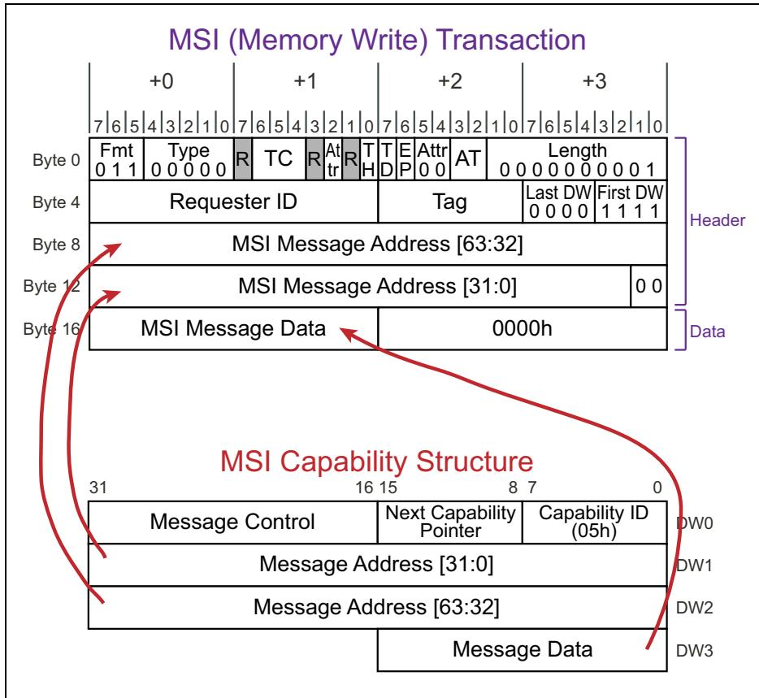

## 17.4 The MSI-X Model | 17.4 MSI-X 模型

<table style="border:1px solid #ddd;border-collapse:collapse; width:100%;" cellpadding="4" cellspacing="0" rules="all" frame="border">
  <thead style="border:1px solid #ddd;">
    <tr>
      <th width="50%" style="border:1px solid #ddd; background:#f5f5f5;">EN</th>
      <th width="50%" style="border:1px solid #ddd; background-color:#e8e8e8;">中文</th>
    </tr>
  </thead>
  <tbody>
    <tr><td width="50%" style="border:1px solid #ddd; background:#fff;padding:4px 8px;">## The MSI-X Model</td><td width="50%" style="border:1px solid #ddd; background-color:#e8e8e8;padding:4px 8px;">## MSI-X 模型</td></tr>
  </tbody>
</table>

## 17.1.1.1 General | 17.1.1.1 概述

<table style="border:1px solid #ddd;border-collapse:collapse; width:100%;" cellpadding="4" cellspacing="0" rules="all" frame="border">
  <thead style="border:1px solid #ddd;">
    <tr>
      <th width="50%" style="border:1px solid #ddd; background:#f5f5f5;">EN</th>
      <th width="50%" style="border:1px solid #ddd; background-color:#e8e8e8;">中文</th>
    </tr>
  </thead>
  <tbody>
    <tr><td width="50%" style="border:1px solid #ddd; background:#fff;padding:4px 8px;">The 3.0 revision of the PCI spec added support for MSI-X, which has its own capability structure. MSI-X was motivated by a desire to alleviate three shortcomings of MSI:</td><td width="50%" style="border:1px solid #ddd; background-color:#e8e8e8;padding:4px 8px;">PCI规范的3.0修订版增加了对MSI-X的支持，MSI-X拥有自己的能力结构。引入MSI-X旨在缓解MSI的三个缺点：</td></tr>
    <tr><td width="50%" style="border:1px solid #ddd; background:#fff;padding:4px 8px;">• 32 vectors per function are not enough for some applications.</td><td width="50%" style="border:1px solid #ddd; background-color:#e8e8e8;padding:4px 8px;">• 每个功能32个向量对于某些应用来说不够用。</td></tr>
    <tr><td width="50%" style="border:1px solid #ddd; background:#fff;padding:4px 8px;">Having only one destination address makes static distribution of interrupts across multiple CPUs difficult. The most flexibility would be achieved if a unique address could be assigned for each vector.</td><td width="50%" style="border:1px solid #ddd; background-color:#e8e8e8;padding:4px 8px;">只有一个目标地址使得中断在多个CPU间的静态分配变得困难。如果能为每个向量分配一个唯一的地址，则可实现最大的灵活性。</td></tr>
    <tr><td width="50%" style="border:1px solid #ddd; background:#fff;padding:4px 8px;">In several platforms, like x86-based systems, the vector number of the interrupt indicates its priority relative to other interrupts. With MSI, a single Function could be allocated multiple interrupts, but all the interrupt vectors would be contiguous, meaning similar priority. This is not a good solution if some interrupts from this Function should be high priority and others should be low priority. A better approach would be for software to designate a unique vector (message data value), that does not have to be contiguous, for each interrupt allocated to the Function.</td><td width="50%" style="border:1px solid #ddd; background-color:#e8e8e8;padding:4px 8px;">在一些平台中（如基于x86的系统），中断的向量号指示了它相对于其他中断的优先级。使用MSI时，单个功能可被分配多个中断，但所有中断向量必须是连续的，这意味着它们的优先级相近。如果该功能的某些中断应为高优先级而其他应为低优先级，这并非一个好的解决方案。更好的方法是，由软件为分配给该功能的每个中断指定一个唯一的向量（消息数据值），该向量不必连续。</td></tr>
    <tr><td width="50%" style="border:1px solid #ddd; background:#fff;padding:4px 8px;">Keeping those goals in mind, it's easy to understand the register changes that were implemented to provide more vectors with each vector being assigned a target address and message data value.</td><td width="50%" style="border:1px solid #ddd; background-color:#e8e8e8;padding:4px 8px;">牢记这些目标，就不难理解为实现提供更多向量、并为每个向量分配目标地址和消息数据值而实现的寄存器变化。</td></tr>
  </tbody>
</table>

## MSI-X 能力结构 (Capability Structure)

<table style="border:1px solid #ddd;border-collapse:collapse; width:100%;" cellpadding="4" cellspacing="0" rules="all" frame="border">
  <thead style="border:1px solid #ddd;">
    <tr>
      <th width="50%" style="border:1px solid #ddd; background:#f5f5f5;">EN</th>
      <th width="50%" style="border:1px solid #ddd; background-color:#e8e8e8;">中文</th>
    </tr>
  </thead>
  <tbody>
    <tr><td width="50%" style="border:1px solid #ddd; background:#fff;padding:4px 8px;">As shown in Figure 17-17 on page 822, the Message Control register is quite different from MSI. Interestingly, even though MSI-X can support up to 2048 vectors per Function versus the 32 for MSI, the number of configuration registers for MSI-X is actually a little smaller than for MSI. That's because the vector information isn't contained here. Instead, it's in a memory location (MMIO) pointed to by the Table BIR (Base address Indicator Register), as shown in Figure 17-18 on page 824.</td><td width="50%" style="border:1px solid #ddd; background-color:#e8e8e8;padding:4px 8px;">如第822页图17-17所示，消息控制寄存器与MSI有很大不同。有趣的是，尽管MSI-X每个功能最多支持2048个向量，而MSI为32个，但MSI-X的配置寄存器数量实际上比MSI还要少一些。这是因为向量信息并不数据包含在此处，而是位于由Table BIR（基址指示器寄存器）指向的内存位置（MMIO）中，如第824页图17-18所示。</td></tr>
  </tbody>
</table>

Figure 17-17: MSI-X Capability Structure | 图17-17：MSI-X能力结构

<table style="border:1px solid #ddd;border-collapse:collapse;width:100%" cellpadding="4" cellspacing="0" rules="all" frame="border"><tr><td colspan="2" style="border:1px solid #ddd;">Message Control</td><td style="border:1px solid #ddd;">Next Capability Pointer</td><td style="border:1px solid #ddd;">Capability ID (11h)</td></tr><tr><td colspan="3" style="border:1px solid #ddd;">MSI-X Table Offset</td><td style="border:1px solid #ddd;">Table BIR</td></tr><tr><td colspan="3" style="border:1px solid #ddd;">Pending Bit Array (PBA) Offset</td><td style="border:1px solid #ddd;">PBA BIR</td></tr></table>

Table 17-3: Format and Usage of MSI-X Message Control Register | 表17-3：MSI-X消息控制寄存器格式和用法

<table style="border:2px solid #000;border-collapse:collapse;width:100%" cellpadding="4" cellspacing="0" rules="all" frame="border"><tr><td style="border:2px solid #000;">Bit(s)</td><td style="border:2px solid #000;">Field Name</td><td style="border:2px solid #000;">Description</td></tr><tr><td style="border:2px solid #000;">10:0</td><td style="border:2px solid #000;">Table Size</td><td style="border:2px solid #000;">Read-Only. This field indicates the number of interrupt messages (vectors) that this Function supports. The value here is interpreted in an N-1 fashion, so a value of 0 means 1 vector. A value of 7 means 8 vectors. Each vector has its own entry in the MSI-X Table and its own bit in the Pending Bit Array.</td></tr><tr><td style="border:2px solid #000;">13:11</td><td style="border:2px solid #000;">Reserved</td><td style="border:2px solid #000;">Read-Only. Always zero.</td></tr><tr><td style="border:2px solid #000;">14</td><td style="border:2px solid #000;">Function Mask</td><td style="border:2px solid #000;">Read/Write. This field provides system software an easy way to mask all the interrupts from a Function. If this bit is cleared, interrupts can still be masked individually by setting the mask bit within each vector's MSI-X table entry.</td></tr><tr><td style="border:2px solid #000;">15</td><td style="border:2px solid #000;">MSI-X Enable</td><td style="border:2px solid #000;">Read/Write. State after reset is 0, indicating that the device's MSI-X capability is disabled. 0 = Function is disabled from using MSI-X. It must use MSI or INTx Messages. 1 = Function is enabled to use MSI-X to request service and won't use MSI or INTx Messages.</td></tr></table>

Figure 17-18: Location of MSI-X Table | 图17-18：MSI-X表位置

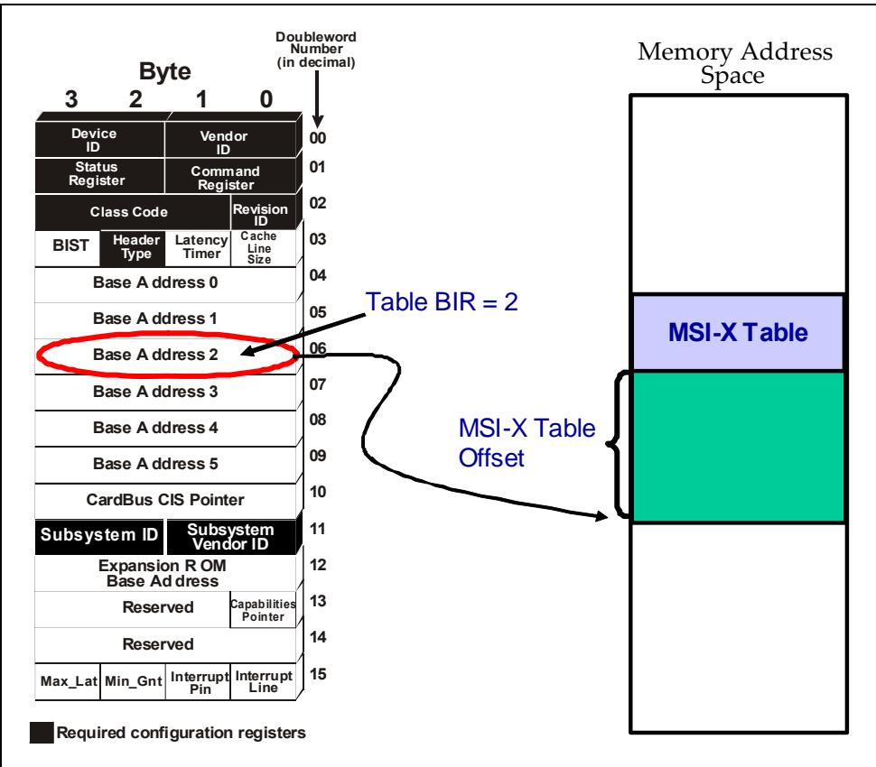

<table style="border:1px solid #ddd;border-collapse:collapse; width:100%;" cellpadding="4" cellspacing="0" rules="all" frame="border">
  <thead style="border:1px solid #ddd;">
    <tr>
      <th width="50%" style="border:1px solid #ddd; background:#f5f5f5;">EN</th>
      <th width="50%" style="border:1px solid #ddd; background-color:#e8e8e8;">中文</th>
    </tr>
  </thead>
  <tbody>
    <tr><td width="50%" style="border:1px solid #ddd; background:#fff;padding:4px 8px;">## MSI-X Table</td><td width="50%" style="border:1px solid #ddd; background-color:#e8e8e8;padding:4px 8px;">## MSI-X 表</td></tr>
    <tr><td width="50%" style="border:1px solid #ddd; background:#fff;padding:4px 8px;">The MSI-X Table itself is an array of vectors and addresses, as shown in Figure 17-19 on page 825.</td><td width="50%" style="border:1px solid #ddd; background-color:#e8e8e8;padding:4px 8px;">MSI-X 表本身是一个向量和地址的数组，如图 17-19（第 825 页）所示。</td></tr>
    <tr><td width="50%" style="border:1px solid #ddd; background:#fff;padding:4px 8px;">Each entry represents one vector and contains four Dwords.</td><td width="50%" style="border:1px solid #ddd; background-color:#e8e8e8;padding:4px 8px;">每个表项代表一个向量，并数据包含四个双字。</td></tr>
    <tr><td width="50%" style="border:1px solid #ddd; background:#fff;padding:4px 8px;">DW0 and DW1 supply a unique 64-bit address for that vector, while DW2 gives a unique 32-bit data pattern for it.</td><td width="50%" style="border:1px solid #ddd; background-color:#e8e8e8;padding:4px 8px;">DW0 和 DW1 提供该向量的唯一 64 位地址，而 DW2 提供其唯一的 32 位数据模式。</td></tr>
    <tr><td width="50%" style="border:1px solid #ddd; background:#fff;padding:4px 8px;">DW3 only contains one bit at present: a mask bit for that vector, allowing each vector to be independently masked off as needed.</td><td width="50%" style="border:1px solid #ddd; background-color:#e8e8e8;padding:4px 8px;">DW3 目前只数据包含一个位：该向量的掩码位，允许根据需要独立屏蔽每个向量。</td></tr>
  </tbody>
</table>

Figure 17-19: MSI-X Table Entries | 图17-19：MSI-X表项

<table style="border:1px solid #ddd;border-collapse:collapse;width:100%" cellpadding="4" cellspacing="0" rules="all" frame="border"><tr><td style="border:1px solid #ddd;">DW3</td><td style="border:1px solid #ddd;">DW2</td><td style="border:1px solid #ddd;">DW1</td><td style="border:1px solid #ddd;">DW0</td><td style="border:1px solid #ddd;"></td></tr><tr><td style="border:1px solid #ddd;">Vector Control</td><td style="border:1px solid #ddd;">Message Data</td><td style="border:1px solid #ddd;">Upper Address</td><td style="border:1px solid #ddd;">Lower Address</td><td style="border:1px solid #ddd;">Entry 0</td></tr><tr><td style="border:1px solid #ddd;">Vector Control</td><td style="border:1px solid #ddd;">Message Data</td><td style="border:1px solid #ddd;">Upper Address</td><td style="border:1px solid #ddd;">Lower Address</td><td style="border:1px solid #ddd;">Entry 1</td></tr><tr><td style="border:1px solid #ddd;">Vector Control</td><td style="border:1px solid #ddd;">Message Data</td><td style="border:1px solid #ddd;">Upper Address</td><td style="border:1px solid #ddd;">Lower Address</td><td style="border:1px solid #ddd;">Entry 2</td></tr><tr><td style="border:1px solid #ddd;">....</td><td style="border:1px solid #ddd;">....</td><td style="border:1px solid #ddd;">....</td><td style="border:1px solid #ddd;">....</td><td style="border:1px solid #ddd;"></td></tr><tr><td style="border:1px solid #ddd;">....</td><td style="border:1px solid #ddd;">....</td><td style="border:1px solid #ddd;">....</td><td style="border:1px solid #ddd;">....</td><td style="border:1px solid #ddd;"></td></tr><tr><td style="border:1px solid #ddd;">Vector Control</td><td style="border:1px solid #ddd;">Message Data</td><td style="border:1px solid #ddd;">Upper Address</td><td style="border:1px solid #ddd;">Lower Address</td><td style="border:1px solid #ddd;">Entry N-1</td></tr></table>

## 17.4.3 Pending Bit Array | 17.4.3 待处理位阵列

<table style="border:1px solid #ddd;border-collapse:collapse; width:100%;" cellpadding="4" cellspacing="0" rules="all" frame="border">
  <thead style="border:1px solid #ddd;">
    <tr>
      <th width="50%" style="border:1px solid #ddd; background:#f5f5f5;">EN</th>
      <th width="50%" style="border:1px solid #ddd; background-color:#e8e8e8;">中文</th>
    </tr>
  </thead>
  <tbody>
    <tr><td width="50%" style="border:1px solid #ddd; background:#fff;padding:4px 8px;">In much the same way, the Pending Bit Array is also located within a memory address. It can use the same BIR value (same BAR) as the MSI-X Table with a different offset, or it could use a different BAR altogether. The array, shown in Figure 17-20, simply contains a bit for every vector that will be used. If the event to trigger that interrupt occurs but its Mask Bit has been set, then an MSI-X transaction will not be sent. Instead, the corresponding pending bit is set. Later, if that vector is unmasked and the pending bit is still set, the interrupt will be generated at that time.</td><td width="50%" style="border:1px solid #ddd; background-color:#e8e8e8;padding:4px 8px;">类似地，Pending Bit Array（待处理位数组）也位于某个内存地址中。它可以与 MSI-X Table 共用相同的 BIR 值（同一 BAR）但使用不同的偏移量，也可以使用完全不同的 BAR。如图 17-20 所示，该数组简单地数据包含每个将要使用的向量所对应的一个比特位。如果触发该中断的事件发生但其中断掩码位（Mask Bit）已被置位，则不会发送 MSI-X 事务。取而代之的是，相应的待处理位（pending bit）被置位。之后，如果该向量被解除掩码且待处理位仍处于置位状态，则此时将生成中断。</td></tr>
  </tbody>
</table>

Figure 17-20: Pending Bit Array | 图17-20：待定位数组  

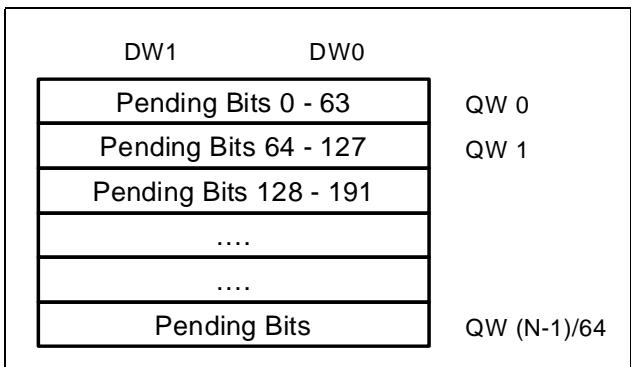

## 17.5 Memory Synchronization When Interrupt Handler Entered | 17.5 进入中断处理程序时的内存同步

## 17.5 Memory Synchronization When Interrupt Handler Entered | 17.5 进入中断处理程序时的内存同步 |

<table style="border:1px solid #ddd;border-collapse:collapse; width:100%;" cellpadding="4" cellspacing="0" rules="all" frame="border">
  <thead style="border:1px solid #ddd;">
    <tr>
      <th width="50%" style="border:1px solid #ddd; background:#f5f5f5;">EN</th>
      <th width="50%" style="border:1px solid #ddd; background-color:#e8e8e8;">中文</th>
    </tr>
  </thead>
  <tbody>
    <tr><td width="50%" style="border:1px solid #ddd; background:#fff;padding:4px 8px;">## The Problem</td><td width="50%" style="border:1px solid #ddd; background-color:#e8e8e8;padding:4px 8px;">## 问题</td></tr>
    <tr><td width="50%" style="border:1px solid #ddd; background:#fff;padding:4px 8px;">There is a potential problem with any interrupt scheme when data is being delivered. For example, if the device has previously sent data and wants to report that with an interrupt, a unexpected delay on data delivery could allow the interrupt to arrive too soon. That might happen in the bridge data buffer shown in Figure 17-21 on page 827, and the result is a race condition. The steps are similar to our earlier discussion (see "The Legacy Model" on page 796):</td><td width="50%" style="border:1px solid #ddd; background-color:#e8e8e8;padding:4px 8px;">在数据传输过程中，任何中断方案都存在一个潜在问题。例如，如果设备先前已发送数据并想通过中断来报告此事，数据传送中意外的延迟可能导致中断过早到达。这种情况可能发生在图17-21（第827页）所示的桥数据缓冲区中，其结果是一个竞态条件。其步骤类似于我们之前的讨论（参见第796页的"传统模型"）：</td></tr>
    <tr><td width="50%" style="border:1px solid #ddd; background:#fff;padding:4px 8px;">1. The function writes a data block toward memory. The write completes on the local bus as a posted transaction, meaning that the sender has finished all it needed to do and the transaction is considered completed.</td><td width="50%" style="border:1px solid #ddd; background-color:#e8e8e8;padding:4px 8px;">1. 该功能向存储器写入一个数据块。该写操作在本地总线上作为 posted 事务完成，意味着发送者已完成所有必要操作，该事务被视为已完成。</td></tr>
    <tr><td width="50%" style="border:1px solid #ddd; background:#fff;padding:4px 8px;">2. An interrupt is delivered to notify software that some requested data is now present in memory. However, the data has been delayed in the bridge for some reason.</td><td width="50%" style="border:1px solid #ddd; background-color:#e8e8e8;padding:4px 8px;">2. 传递一个中断以通知软件某些请求的数据现已存在于存储器中。然而，由于某种原因，数据在桥中被延迟了。</td></tr>
    <tr><td width="50%" style="border:1px solid #ddd; background:#fff;padding:4px 8px;">3. The interrupt vector is fetched as before.</td><td width="50%" style="border:1px solid #ddd; background-color:#e8e8e8;padding:4px 8px;">3. 照常获取中断向量。</td></tr>
    <tr><td width="50%" style="border:1px solid #ddd; background:#fff;padding:4px 8px;">4. The ISR starting address is fetched and control is passed to it.</td><td width="50%" style="border:1px solid #ddd; background-color:#e8e8e8;padding:4px 8px;">4. 获取ISR起始地址并将控制权传递给它。</td></tr>
    <tr><td width="50%" style="border:1px solid #ddd; background:#fff;padding:4px 8px;">5. The ISR reads from the target memory buffer but the data payload still hasn't been delivered so it fetches stale data, possibly causing an error.</td><td width="50%" style="border:1px solid #ddd; background-color:#e8e8e8;padding:4px 8px;">5. ISR从目标存储器缓冲区读取，但数据载荷仍未送达，因此它获取到过时数据，可能引发错误。</td></tr>
  </tbody>
</table>

Figure 17-21: Memory Synchronization Problem | 图17-21：存储器同步问题

## 17.5.2 One Solution | 17.5.2 一种解决方案

<table style="border:1px solid #ddd;border-collapse:collapse; width:100%;" cellpadding="4" cellspacing="0" rules="all" frame="border">
  <thead style="border:1px solid #ddd;">
    <tr>
      <th width="50%" style="border:1px solid #ddd; background:#f5f5f5;">EN</th>
      <th width="50%" style="border:1px solid #ddd; background-color:#e8e8e8;">中文</th>
    </tr>
  </thead>
  <tbody>
    <tr><td width="50%" style="border:1px solid #ddd; background:#fff;padding:4px 8px;">One way to alleviate this problem takes advantage of PCI transaction ordering rules. If the ISR first sends a read request to the device that initiated the interrupt before it attempts to fetch the data, the resulting read completion will follow the same path back to the CPU that any write data would have taken from that device to get to memory.</td><td width="50%" style="border:1px solid #ddd; background-color:#e8e8e8;padding:4px 8px;">缓解该问题的一种方法利用了 PCI 事务排序规则。如果 ISR 在尝试获取数据之前，先向发起中断的设备发送一个读请求，那么所产生的读完成报文将沿着与该设备发往内存的任何写数据相同的路径返回 CPU。</td></tr>
    <tr><td width="50%" style="border:1px solid #ddd; background:#fff;padding:4px 8px;">Transaction ordering rules guarantee that a read result in a bridge cannot pass a posted write going in the same direction, so the end result is that the data will get written into memory before the read result will be allowed to reach the CPU.</td><td width="50%" style="border:1px solid #ddd; background-color:#e8e8e8;padding:4px 8px;">事务排序规则保证，桥接器中的读结果不能超越同一方向上的 Posted 写操作，因此最终结果是数据将在读结果被允许到达 CPU 之前先写入内存。</td></tr>
    <tr><td width="50%" style="border:1px solid #ddd; background:#fff;padding:4px 8px;">Therefore, if the ISR waits for the read completion to arrive before proceeding, it can be sure that any data will have been delivered to memory and thus the race condition is avoided.</td><td width="50%" style="border:1px solid #ddd; background-color:#e8e8e8;padding:4px 8px;">因此，如果 ISR 等待读完成报文到达后再继续执行，它便可以确信所有数据已经送达内存，从而避免了竞争条件。</td></tr>
    <tr><td width="50%" style="border:1px solid #ddd; background:#fff;padding:4px 8px;">Since the read is basically being used as a data flush mechanism, it isn't necessary for it to return any data. In that case the read can be zero length and the data returned is discarded.</td><td width="50%" style="border:1px solid #ddd; background-color:#e8e8e8;padding:4px 8px;">由于该读操作本质上被用作一种数据冲刷机制，因此它无需返回任何数据。在这种情况下，读操作可以是零长度的，返回的数据被丢弃。</td></tr>
    <tr><td width="50%" style="border:1px solid #ddd; background:#fff;padding:4px 8px;">For that reason, this type of read is sometimes called a "dummy read."</td><td width="50%" style="border:1px solid #ddd; background-color:#e8e8e8;padding:4px 8px;">出于这个原因，这种类型的读操作有时被称为"虚拟读"（dummy read）。</td></tr>
  </tbody>
</table>

## 17.5.3 An MSI Solution | 17.5.3 MSI 解决方案

<table style="border:1px solid #ddd;border-collapse:collapse; width:100%;" cellpadding="4" cellspacing="0" rules="all" frame="border">
  <thead style="border:1px solid #ddd;">
    <tr>
      <th width="50%" style="border:1px solid #ddd; background:#f5f5f5;">EN</th>
      <th width="50%" style="border:1px solid #ddd; background-color:#e8e8e8;">中文</th>
    </tr>
  </thead>
  <tbody>
    <tr><td width="50%" style="border:1px solid #ddd; background:#fff;padding:4px 8px;">MSI can simplify this process, although there are some requirements for it to work (refer to Figure 17-22 on page 829). If the system allows the device to generate its own MSI writes rather than going through an intermediary like an IO APIC, then the following example can take place:</td><td width="50%" style="border:1px solid #ddd; background-color:#e8e8e8;padding:4px 8px;">MSI 可以简化这一过程，尽管它需要满足一些条件才能工作（参见第 829 页的图 17-22）。如果系统允许设备生成自己的 MSI 写事务，而不是通过像 IO APIC 这样的中介，那么可以发生以下示例：</td></tr>
    <tr><td width="50%" style="border:1px solid #ddd; background:#fff;padding:4px 8px;">1. The device writes the payload data toward memory and it is absorbed by the write buffer in the bridge.</td><td width="50%" style="border:1px solid #ddd; background-color:#e8e8e8;padding:4px 8px;">1. 设备将有效载荷数据写入内存，该数据被桥接器中的写缓冲区吸收。</td></tr>
    <tr><td width="50%" style="border:1px solid #ddd; background:#fff;padding:4px 8px;">2. The device believes the data has been delivered and signals an interrupt to notify the CPU. In this case, an MSI is sent and uses the same path as the data. Since both data and MSI appear as memory writes to the bridge, the normal transaction ordering rules will keep them in the correct sequence.</td><td width="50%" style="border:1px solid #ddd; background-color:#e8e8e8;padding:4px 8px;">2. 设备认为数据已送达，并发出中断以通知 CPU。在这种情况下，MSI 被发送并使用与数据相同的路径。由于数据和 MSI 对桥接器来说都表现为内存写事务，正常的事务排序规则将保持它们正确的顺序。</td></tr>
    <tr><td width="50%" style="border:1px solid #ddd; background:#fff;padding:4px 8px;">3. The payload data is delivered to memory, freeing the path through the bridge for the MSI write.</td><td width="50%" style="border:1px solid #ddd; background-color:#e8e8e8;padding:4px 8px;">3. 有效载荷数据被传送到内存，释放了桥接器中 MSI 写事务的通路。</td></tr>
    <tr><td width="50%" style="border:1px solid #ddd; background:#fff;padding:4px 8px;">4. The MSI write is delivered to the CPU Local APIC and the software now knows that the payload data is available.</td><td width="50%" style="border:1px solid #ddd; background-color:#e8e8e8;padding:4px 8px;">4. MSI 写事务被传送到 CPU 本地 APIC，软件现在知道有效载荷数据已可用。</td></tr>
  </tbody>
</table>

## 17.5.4 Traffic Classes Must Match | 17.5.4 流量类别必须匹配

<table style="border:1px solid #ddd;border-collapse:collapse; width:100%;" cellpadding="4" cellspacing="0" rules="all" frame="border">
  <thead style="border:1px solid #ddd;">
    <tr>
      <th width="50%" style="border:1px solid #ddd; background:#f5f5f5;">EN</th>
      <th width="50%" style="border:1px solid #ddd; background-color:#e8e8e8;">中文</th>
    </tr>
  </thead>
  <tbody>
    <tr><td width="50%" style="border:1px solid #ddd; background:#fff;padding:4px 8px;">An important point must be stressed here, however. Both the data and MSI must use the same Traffic Class for this to work. Recall that packets that have been assigned different TC values may end up being mapped into different Virtual Channels, and that packets in different VCs have no ordering relationship. If the data were mapped to VC0 and the MSI was mapped to VC1, then the system would be unaware of any ordering relationship between them and unable to enforce memory coherency automatically.</td><td width="50%" style="border:1px solid #ddd; background-color:#e8e8e8;padding:4px 8px;">然而，这里必须强调一个重要点。数据和MSI必须使用相同的流量类才能实现这一点。回想一下，被分配了不同TC（流量类）值的报文最终可能会被映射到不同的虚通道中，而不同VC中的报文之间没有排序关系。如果数据被映射到VC0而MSI被映射到VC1，那么系统将无法感知它们之间的任何排序关系，也无法自动强制执行内存一致性。</td></tr>
    <tr><td width="50%" style="border:1px solid #ddd; background:#fff;padding:4px 8px;">If giving both packets the same TC is not possible, the system would need to use the "dummy read" method instead and the TC of the read request would need to match the TC of the data write packet. It should be clear that even if the same TC is used for both, the use of the Relaxed Ordering bit must be avoided. We're counting on the transaction ordering rules to achieve memory synchronization, so they must not be relaxed.</td><td width="50%" style="border:1px solid #ddd; background-color:#e8e8e8;padding:4px 8px;">如果无法为两个报文赋予相同的TC，则系统需要使用"虚读"方法，并且读请求的TC需要与数据写报文的TC匹配。应该清楚的是，即使两者使用相同的TC，也必须避免使用宽松排序位。我们依赖事务排序规则来实现内存同步，因此这些规则不能放宽。</td></tr>
  </tbody>
</table>

Figure 17‐22: MSI Delivery | 图17‐22：MSI传递
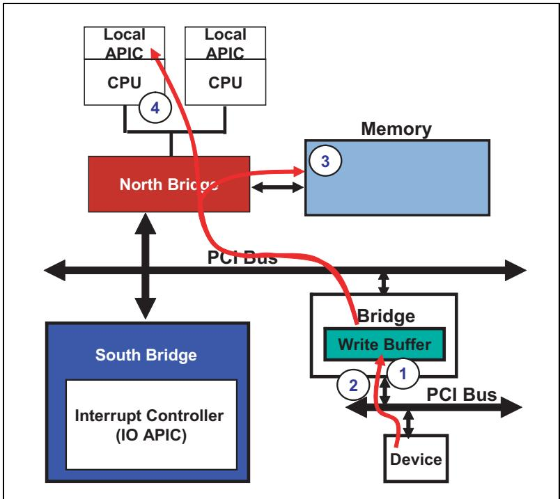

<table style="border:1px solid #ddd;border-collapse:collapse; width:100%;" cellpadding="4" cellspacing="0" rules="all" frame="border">
  <thead style="border:1px solid #ddd;">
    <tr>
      <th width="50%" style="border:1px solid #ddd; background:#f5f5f5;">EN</th>
      <th width="50%" style="border:1px solid #ddd; background-color:#e8e8e8;">中文</th>
    </tr>
  </thead>
  <tbody>
    <tr><td width="50%" style="border:1px solid #ddd; background:#fff;padding:4px 8px;">## Interrupt Latency</td><td width="50%" style="border:1px solid #ddd; background-color:#e8e8e8;padding:4px 8px;">## 中断延迟</td></tr>
    <tr><td width="50%" style="border:1px solid #ddd; background:#fff;padding:4px 8px;">The time from signaling an interrupt until software services the device is referred to as the interrupt latency. In spite of its advantages, MSI, like other interrupt delivery mechanisms, does not provide interrupt latency guarantees.</td><td width="50%" style="border:1px solid #ddd; background-color:#e8e8e8;padding:4px 8px;">从发起中断信号到软件为设备提供服务的时间被称为中断延迟。尽管MSI有其优势，但与其他中断传递机制一样，它并不提供中断延迟的保证。</td></tr>
  </tbody>
</table>

## 17.7 MSI May Result In Errors | 17.7 MSI 可能导致错误

## MSI 可能导致错误

<table style="border:1px solid #ddd;border-collapse:collapse; width:100%;" cellpadding="4" cellspacing="0" rules="all" frame="border">
  <thead style="border:1px solid #ddd;">
    <tr>
      <th width="50%" style="border:1px solid #ddd; background:#f5f5f5;">EN</th>
      <th width="50%" style="border:1px solid #ddd; background-color:#e8e8e8;">中文</th>
    </tr>
  </thead>
  <tbody>
    <tr><td width="50%" style="border:1px solid #ddd; background:#fff;padding:4px 8px;">Because MSIs are delivered as Memory Write transactions, an error associated with delivery of an MSI is treated the same as any other Memory Write error condition. See "ECRC Generation and Checking" on page 657 for treatment of ECRC errors, as one example. The concern, of course, is that if an error results in the MSI packet being unrecognized then no interrupt will be seen by the processor. How this condition would be handled is outside the scope of the PCIe spec.</td><td width="50%" style="border:1px solid #ddd; background-color:#e8e8e8;padding:4px 8px;">由于MSI作为存储器写事务传递，与MSI传递相关的错误将按照与其他任何存储器写错误条件相同的方式处理。以ECRC错误的处理为例，请参见第657页的"ECRC生成与检查"。当然，问题在于如果某个错误导致MSI数据包无法被识别，那么处理器将看不到任何中断。这种情况如何处理超出了PCIe规范的范围。</td></tr>
  </tbody>
</table>

## 17.8 Some MSI Rules and Recommendations | 17.8 一些 MSI 规则和建议

### Bilingual Translation

<table style="border:1px solid #ddd;border-collapse:collapse;width:100%" cellpadding="4" cellspacing="0" rules="all" frame="border">
  <thead style="border:1px solid #ddd;">
    <tr>
      <th width="50%" style="border:1px solid #ddd;background:#f5f5f5;padding:4px 8px;">EN</th>
      <th width="50%" style="border:1px solid #ddd;background-color:#e8e8e8;padding:4px 8px;">中文</th>
    </tr>
  </thead>
  <tbody>
      <tr><td width="50%" style="border:1px solid #ddd;background:#fff;padding:4px 8px;">1. It is the intent of the spec that mutually-exclusive messages will be assigned to Functions by system software and that each message will be converted to an exclusive interrupt on delivery to the processor.</td><td width="50%" style="border:1px solid #ddd;background-color:#e8e8e8;padding:4px 8px;">1. 规范的意图是由系统软件将互斥的消息分配给各个功能，并且每个消息在传递给处理器时将被转换为一个独占的中断。</td></tr>
      <tr><td width="50%" style="border:1px solid #ddd;background:#fff;padding:4px 8px;">2. More than one MSI capability register set per Function is prohibited.</td><td width="50%" style="border:1px solid #ddd;background-color:#e8e8e8;padding:4px 8px;">2. 每个功能禁止拥有多个 MSI 能力寄存器组。</td></tr>
      <tr><td width="50%" style="border:1px solid #ddd;background:#fff;padding:4px 8px;">3. A read of the Message Address register produces undefined results.</td><td width="50%" style="border:1px solid #ddd;background-color:#e8e8e8;padding:4px 8px;">3. 读取消息地址寄存器会产生未定义的结果。</td></tr>
      <tr><td width="50%" style="border:1px solid #ddd;background:#fff;padding:4px 8px;">4. Reserved registers and bits are read-only and always return zero when read.</td><td width="50%" style="border:1px solid #ddd;background-color:#e8e8e8;padding:4px 8px;">4. 保留寄存器和位是只读的，读取时始终返回零。</td></tr>
      <tr><td width="50%" style="border:1px solid #ddd;background:#fff;padding:4px 8px;">5. System software can modify Message Control register bits, but the device itself is prohibited from doing so. In other words, modifying the bits by a "back door" mechanism is not allowed.</td><td width="50%" style="border:1px solid #ddd;background-color:#e8e8e8;padding:4px 8px;">5. 系统软件可以修改消息控制寄存器位，但设备自身禁止这样做。换句话说，不允许通过"后门"机制修改这些位。</td></tr>
      <tr><td width="50%" style="border:1px solid #ddd;background:#fff;padding:4px 8px;">6. At a minimum, a single message will be assigned to each device (assuming software supports and plans to use MSI in the system).</td><td width="50%" style="border:1px solid #ddd;background-color:#e8e8e8;padding:4px 8px;">6. 至少会为每个设备分配一个消息（假设软件支持并计划在系统中使用 MSI）。</td></tr>
      <tr><td width="50%" style="border:1px solid #ddd;background:#fff;padding:4px 8px;">7. System software must not write to the upper half of the dword that contains the Message Data register.</td><td width="50%" style="border:1px solid #ddd;background-color:#e8e8e8;padding:4px 8px;">7. 系统软件不得向数据包含消息数据寄存器的双字的高半部分写入。</td></tr>
      <tr><td width="50%" style="border:1px solid #ddd;background:#fff;padding:4px 8px;">8. If the device writes the same message multiple times, only one of those messages is guaranteed to be serviced. If all of them must be serviced, the device must not generate the same message again until the previous one has been serviced.</td><td width="50%" style="border:1px solid #ddd;background-color:#e8e8e8;padding:4px 8px;">8. 如果设备多次写入相同的消息，则仅保证这些消息中的一个得到服务。如果所有消息都必须得到服务，则设备必须在前一个消息得到服务之前不再生成相同的消息。</td></tr>
      <tr><td width="50%" style="border:1px solid #ddd;background:#fff;padding:4px 8px;">9. If a device has more than one message assigned, and it writes a series of different messages, it is guaranteed that all of them will be serviced.</td><td width="50%" style="border:1px solid #ddd;background-color:#e8e8e8;padding:4px 8px;">9. 如果设备分配有多个消息，并且它写入了一系列不同的消息，则保证所有这些消息都将得到服务。</td></tr>
  </tbody>
</table>

## 17.9 Special Consideration for Base System Peripherals | 17.9 基础系统外设的特殊考虑

<table style="border:1px solid #ddd;border-collapse:collapse; width:100%;" cellpadding="4" cellspacing="0" rules="all" frame="border">
  <thead style="border:1px solid #ddd;">
    <tr>
      <th width="50%" style="border:1px solid #ddd; background:#f5f5f5;">EN</th>
      <th width="50%" style="border:1px solid #ddd; background-color:#e8e8e8;">中文</th>
    </tr>
  </thead>
  <tbody>
    <tr><td width="50%" style="border:1px solid #ddd; background:#fff;padding:4px 8px;">Interrupts may also originate in embedded legacy hardware, such as an IO Controller Hub or Super IO device. Some of the typical legacy devices required in such systems include: • Serial ports • Parallel ports • Keyboard and Mouse Controller • System Timer • IDE controllers</td><td width="50%" style="border:1px solid #ddd; background-color:#e8e8e8;padding:4px 8px;">中断也可能源自嵌入式传统硬件，例如I/O控制器集线器或超级I/O设备。此类系统中需要的一些典型传统设备数据包括： • 串行端口 • 并行端口 • 键盘和鼠标控制器 • 系统定时器 • IDE控制器</td></tr>
    <tr><td width="50%" style="border:1px solid #ddd; background:#fff;padding:4px 8px;">These devices typically require a specific IRQ line into a PIC or IO APIC, which allows legacy software to interact with them correctly.</td><td width="50%" style="border:1px solid #ddd; background-color:#e8e8e8;padding:4px 8px;">这些设备通常需要连接到PIC或I/O APIC的特定IRQ线，这使得传统软件能够正确与它们交互。</td></tr>
    <tr><td width="50%" style="border:1px solid #ddd; background:#fff;padding:4px 8px;">Using the INTx messages does not guarantee that the devices will receive the IRQ assignment they require. The following example illustrates a system that will support the proper legacy interrupt assignment.</td><td width="50%" style="border:1px solid #ddd; background-color:#e8e8e8;padding:4px 8px;">使用INTx消息并不能保证设备会获得它们所需的IRQ分配。以下示例说明了一个将支持正确传统中断分配的系统。</td></tr>
  </tbody>
</table>

<table style="border:1px solid #ddd;border-collapse:collapse; width:100%;" cellpadding="4" cellspacing="0" rules="all" frame="border">
  <thead style="border:1px solid #ddd;">
    <tr>
      <th width="50%" style="border:1px solid #ddd; background:#f5f5f5;">EN</th>
      <th width="50%" style="border:1px solid #ddd; background-color:#e8e8e8;">中文</th>
    </tr>
  </thead>
  <tbody>
    <tr><td width="50%" style="border:1px solid #ddd; background:#fff;padding:4px 8px;">## Example Legacy System</td><td width="50%" style="border:1px solid #ddd; background-color:#e8e8e8;padding:4px 8px;">## 传统系统示例</td></tr>
    <tr><td width="50%" style="border:1px solid #ddd; background:#fff;padding:4px 8px;">Figure 17-23 on page 831 shows a older PCI Express system that includes an IO Controller Hub (ICH) attached to the Root Complex via a proprietary Hub link. The IO APIC embedded within the ICH can generate an MSI when it receives an interrupt request at its inputs. In such an implementation, software can assign the legacy vector number to each input to ensure that the correct legacy software will be called.</td><td width="50%" style="border:1px solid #ddd; background-color:#e8e8e8;padding:4px 8px;">图17-23第831页展示了一个较旧的PCI Express系统，其数据包含一个通过专有Hub链路连接到根复合体的I/O控制中心(ICH)。ICH内嵌的I/O APIC在其输入接收到中断请求时，可生成MSI。在这种实现中，软件可为每个输入分配传统向量号，以确保调用正确的传统软件。</td></tr>
    <tr><td width="50%" style="border:1px solid #ddd; background:#fff;padding:4px 8px;">The advantage of this approach is that existing hardware can be used to support the legacy requirements of a PCIe platform. This system also requires that the MSI subsystem be configured for use during the boot sequence. The example illustrated eliminates the need for INTx messages unless a PCIe expansion device incorporates a PCI Express-to-PCI Bridge.</td><td width="50%" style="border:1px solid #ddd; background-color:#e8e8e8;padding:4px 8px;">这种方法的优势在于现有硬件可用于支持PCIe平台的传统需求。该系统还必须要求MSI子系统在引导序列期间配置为可用状态。所展示的示例消除了对INTx消息的需求，除非PCIe扩展设备数据包含PCI Express到PCI桥接器。</td></tr>
  </tbody>
</table>

Figure 17-23: PCI Express System with PCI-Based IO Controller Hub | 图17-23：基于PCI的IO控制器集线器的PCI Express系统  

