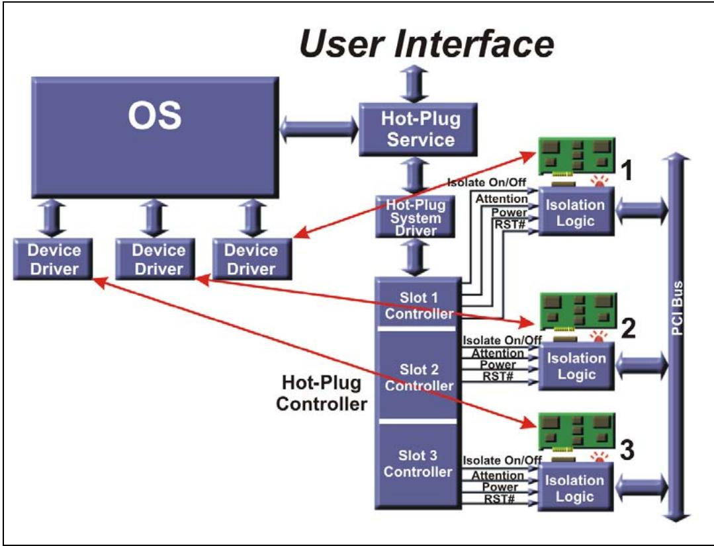

# Ch19_Hot_Plug_Power_Budgeting

<table style="border:2px solid #000;border-collapse:collapse; width:100%;" cellpadding="4" cellspacing="0" rules="all" frame="border">
  <thead style="border:2px solid #000;">
    <tr>
      <th width="50%" style="border:2px solid #000; background:#f5f5f5;">EN</th>
      <th width="50%" style="border:2px solid #000; background-color:#e8e8e8;">中文</th>
    </tr>
  </thead>
  <tbody>
    <tr><td width="50%" style="border:2px solid #000; background:#fff;padding:4px 8px;">## The Previous Chapter</td><td width="50%" style="border:2px solid #000; background-color:#e8e8e8;padding:4px 8px;">## 前章回顾</td></tr>
    <tr><td width="50%" style="border:2px solid #000; background:#fff;padding:4px 8px;">The previous chapter describes three types of resets defined for PCIe: Fundamental reset (consisting of cold and warm reset), hot reset, and function-level reset (FLR). The use of a side-band reset PERST# signal to generate a system reset is discussed, and so is the in-band TS1 based Hot Reset described.</td><td width="50%" style="border:2px solid #000; background-color:#e8e8e8;padding:4px 8px;">前一章描述了为PCIe定义的三种复位类型：基本复位（包括冷复位和暖复位）、热复位以及功能级复位(FLR)。讨论了使用边带复位信号PERST#产生系统复位的方式，同时也描述了基于带内TS1的热复位。</td></tr>
  </tbody>
</table>

## This Chapter ## 本章

<table style="border:2px solid #000;border-collapse:collapse; width:100%;" cellpadding="4" cellspacing="0" rules="all" frame="border">
  <thead style="border:2px solid #000;">
    <tr>
      <th width="50%" style="border:2px solid #000; background:#f5f5f5;">EN</th>
      <th width="50%" style="border:2px solid #000; background-color:#e8e8e8;">中文</th>
    </tr>
  </thead>
  <tbody>
    <tr><td width="50%" style="border:2px solid #000; background:#fff;padding:4px 8px;">This chapter describes the PCI Express hot plug model. A standard usage model is also defined for all devices and form factors that support hot plug capability. Power is an issue for hot plug cards, too, and when a new card is added to a system during runtime, it's important to ensure that its power needs don't exceed what the system can deliver. A mechanism was needed to query the power requirements of a device before giving it permission to operate. Power budgeting registers provide that.</td><td width="50%" style="border:2px solid #000; background-color:#e8e8e8;padding:4px 8px;">本章描述 PCI Express 热插拔模型。同时，对所有支持热插拔功能的设备和形态因素定义了一种标准使用模型。对于热插拔卡而言，功耗同样是一个问题；在运行期间向系统添加新卡时，必须确保其功耗需求不超过系统所能提供的容量。因此，需要一种机制在允许设备运行之前查询其功耗需求。功耗预算寄存器提供了这一能力。</td></tr>
  </tbody>
</table>

## The Next Chapter | 下一章

<table style="border:2px solid #000;border-collapse:collapse; width:100%;" cellpadding="4" cellspacing="0" rules="all" frame="border">
  <thead style="border:2px solid #000;">
    <tr>
      <th width="50%" style="border:2px solid #000; background:#f5f5f5;">EN</th>
      <th width="50%" style="border:2px solid #000; background-color:#e8e8e8;">中文</th>
    </tr>
  </thead>
  <tbody>
    <tr><td width="50%" style="border:2px solid #000; background:#fff;padding:4px 8px;">The next chapter describes the changes and new features that were added with the 2.1 revision of the spec. Some of these topics, like the ones related to power management, are described in earlier chapters, but for others there wasn't another logical place for them. In the end, it seemed best to group them all together in one chapter to ensure that they were all covered and to help clarify what features are new.</td><td width="50%" style="border:2px solid #000; background-color:#e8e8e8;padding:4px 8px;">下一章描述 2.1 版规范新增的变更与特性。其中部分主题（如与电源管理相关的内容）已在前面章节中阐述，但其他主题则无其他更合适的放置位置。最终，将它们集中归入一章似乎是最佳方案，以确保涵盖所有内容，并帮助阐明哪些特性是新增的。</td></tr>
  </tbody>
</table>

## 99.2 Background | 99.2 背景

<table style="border:2px solid #000;border-collapse:collapse; width:100%;" cellpadding="4" cellspacing="0" rules="all" frame="border">
  <thead style="border:2px solid #000;">
    <tr>
      <th width="50%" style="border:2px solid #000; background:#f5f5f5;">EN</th>
      <th width="50%" style="border:2px solid #000; background-color:#e8e8e8;">中文</th>
    </tr>
  </thead>
  <tbody>
    <tr><td width="50%" style="border:2px solid #000; background:#fff;padding:4px 8px;">Some systems using PCIe require high availability or non‑stop operation. Online service suppliers require computer systems that experience downtimes of just a few minutes a year or less. There are many aspects to building such systems, but equipment reliability is clearly important. To facilitate these goals PCIe supports the Hot Plug/Hot Swap solutions for add‑in cards that provide three important capabilities:</td><td width="50%" style="border:2px solid #000; background-color:#e8e8e8;padding:4px 8px;">某些使用PCIe的系统需要高可用性或不间断运行。在线服务供应商要求计算机系统每年的停机时间不超过几分钟甚至更少。构建此类系统涉及多个方面，但设备可靠性显然至关重要。为实现这些目标，PCIe支持面向扩展卡的热插拔/热替换方案，该方案提供三项重要能力：</td></tr>
    <tr><td width="50%" style="border:2px solid #000; background:#fff;padding:4px 8px;">1. a method of replacing failed expansion cards without turning the system off</td><td width="50%" style="border:2px solid #000; background-color:#e8e8e8;padding:4px 8px;">1. 一种无需关闭系统即可更换故障扩展卡的方法</td></tr>
    <tr><td width="50%" style="border:2px solid #000; background:#fff;padding:4px 8px;">2. keeping the O/S and other services running during the repair</td><td width="50%" style="border:2px solid #000; background-color:#e8e8e8;padding:4px 8px;">2. 在维修期间保持操作系统及其他服务继续运行</td></tr>
    <tr><td width="50%" style="border:2px solid #000; background:#fff;padding:4px 8px;">3. shutting down and restarting software associated with a failed device</td><td width="50%" style="border:2px solid #000; background-color:#e8e8e8;padding:4px 8px;">3. 关闭并重新启动与故障设备相关的软件</td></tr>
    <tr><td width="50%" style="border:2px solid #000; background:#fff;padding:4px 8px;">Prior to the widespread acceptance of PCI, many proprietary Hot Plug solutions were developed to support this type of removal and replacement of expansion cards. The original PCI implementation did not support hot removal and insertion of cards, but two standardized solutions for supporting this capability in PCI have been developed. The first is the Hot Plug PCI Card used in PC Server motherboard and expansion chassis implementations. The other is called Hot Swap and is used in CompactPCI systems based on a passive PCI backplane implementation.</td><td width="50%" style="border:2px solid #000; background-color:#e8e8e8;padding:4px 8px;">在PCI被广泛接受之前，业界已开发出许多专有热插拔方案来支持扩展卡的此类移除与更换。最初的PCI实现不支持卡的热移除和热插入，但后来开发出两种标准化方案来支持PCI的这一能力。第一种是用于PC服务器主板和扩展机箱实现的热插拔PCI卡。另一种称为热替换，用于基于无源PCI背板实现的CompactPCI系统。</td></tr>
    <tr><td width="50%" style="border:2px solid #000; background:#fff;padding:4px 8px;">In both solutions, control logic is used to electrically isolate the card logic from the shared PCI bus. Power, reset, and clock are controlled to ensure an orderly power down and power up of cards as they are removed and replaced, and status and power LEDs inform the user when it's safe to change a card.</td><td width="50%" style="border:2px solid #000; background-color:#e8e8e8;padding:4px 8px;">在这两种方案中，均使用控制逻辑将卡逻辑与共享PCI总线进行电气隔离。电源、复位和时钟受到控制，以确保卡在移除和更换时有序下电和上电，状态指示灯和电源指示灯告知用户何时可以安全更换卡。</td></tr>
    <tr><td width="50%" style="border:2px solid #000; background:#fff;padding:4px 8px;">Extending hot plug support to PCI Express cards is an obvious step, and designers have incorporated some Hot Plug features as "native" to PCIe. The spec defines configuration registers, Hot Plug Messages, and procedures to support Hot Plug solutions.</td><td width="50%" style="border:2px solid #000; background-color:#e8e8e8;padding:4px 8px;">将热插拔支持扩展到PCI Express卡是一个必然的步骤，设计者已将某些热插拔特性作为PCIe的"原生"功能融入其中。该规范定义了配置寄存器、热插拔消息以及支持热插拔方案的相关过程。</td></tr>
  </tbody>
</table>

## 19.2 Hot Plug in the PCI Express Environment | 19.2 PCI Express 环境中的热插拔

## 19.2.1.1 PCI Express Environment Overview | 19.2.1.1 PCI Express 环境概述

<table style="border:2px solid #000;border-collapse:collapse; width:100%;" cellpadding="4" cellspacing="0" rules="all" frame="border">
  <thead style="border:2px solid #000;">
    <tr>
      <th width="50%" style="border:2px solid #000; background:#f5f5f5;">EN</th>
      <th width="50%" style="border:2px solid #000; background-color:#e8e8e8;">中文</th>
    </tr>
  </thead>
  <tbody>
    <tr><td width="50%" style="border:2px solid #000; background:#fff;padding:4px 8px;">PCIe Hot Plug is derived from the 1.0 revision of the Standard Hot Plug Controller spec (SHPC 1.0) for PCI. The goals of PCI Express Hot Plug are to:</td><td width="50%" style="border:2px solid #000; background-color:#e8e8e8;padding:4px 8px;">PCIe 热插拔源自 PCI 标准热插拔控制器规范 (SHPC 1.0) 的 1.0 版本。PCI Express 热插拔的目标是：</td></tr>
    <tr><td width="50%" style="border:2px solid #000; background:#fff;padding:4px 8px;">Support the same "Standardized Usage Model" as defined by the Standard Hot Plug Controller spec. This ensures that the PCI Express hot plug is identical from the user perspective to existing implementations based on the SHPC 1.0 spec.</td><td width="50%" style="border:2px solid #000; background-color:#e8e8e8;padding:4px 8px;">支持标准热插拔控制器规范所定义的相同"标准化使用模型"。这确保从用户角度来看，PCI Express 热插拔与基于 SHPC 1.0 规范的现有实现完全相同。</td></tr>
    <tr><td width="50%" style="border:2px solid #000; background:#fff;padding:4px 8px;">Support the same software model implemented by existing operating systems. However, an OS using a SHPC 1.0 compliant driver won't work with PCI Express Hot Plug controllers because they have a different programming interface.</td><td width="50%" style="border:2px solid #000; background-color:#e8e8e8;padding:4px 8px;">支持现有操作系统所实现的相同软件模型。然而，使用兼容 SHPC 1.0 驱动的操作系统将无法与 PCI Express 热插拔控制器配合工作，因为它们具有不同的编程接口。</td></tr>
    <tr><td width="50%" style="border:2px solid #000; background:#fff;padding:4px 8px;">The registers necessary to support a Hot Plug Controller are integrated into individual Root and Switch Ports. Under Hot Plug software control, these controllers and the associated port interface must control the card interface signals to ensure orderly power down and power up as cards are changed. To accomplish that, they'll need to:</td><td width="50%" style="border:2px solid #000; background-color:#e8e8e8;padding:4px 8px;">支持热插拔控制器所需的寄存器被集成到各个根端口和交换端口之中。在热插拔软件控制下，这些控制器及相关的端口接口必须控制插卡接口信号，以确保在更换插卡时有序地下电和上电。为此，它们需要：</td></tr>
    <tr><td width="50%" style="border:2px solid #000; background:#fff;padding:4px 8px;">• Assert and deassert the PERST# signal to the PCI Express card connector</td><td width="50%" style="border:2px solid #000; background-color:#e8e8e8;padding:4px 8px;">• 向 PCI Express 插卡连接器断言和取消断言 PERST# 信号</td></tr>
    <tr><td width="50%" style="border:2px solid #000; background:#fff;padding:4px 8px;">• Remove or apply power to the card connector.</td><td width="50%" style="border:2px solid #000; background-color:#e8e8e8;padding:4px 8px;">• 移除或施加插卡连接器的电源。</td></tr>
    <tr><td width="50%" style="border:2px solid #000; background:#fff;padding:4px 8px;">Selectively turn on or off the Power and Attention Indicators associated with a specific card connector to draw the user's attention to the connector and indicate whether power is applied to the slot.</td><td width="50%" style="border:2px solid #000; background-color:#e8e8e8;padding:4px 8px;">选择性地打开或关闭与特定插卡连接器关联的电源指示灯和注意指示灯，以引起用户对该连接器的注意，并指示插槽是否已上电。</td></tr>
    <tr><td width="50%" style="border:2px solid #000; background:#fff;padding:4px 8px;">• Monitor slot events (e.g. card removal) and report them to software via interrupts.</td><td width="50%" style="border:2px solid #000; background-color:#e8e8e8;padding:4px 8px;">• 监视插槽事件（例如插卡移除）并通过中断向软件报告。</td></tr>
    <tr><td width="50%" style="border:2px solid #000; background:#fff;padding:4px 8px;">PCI Express Hot-Plug (like PCI) is designed as a "no surprises" Hot-Plug methodology. In other words, the user is not normally allowed to install or remove a PCI Express card without first notifying the system. Software then prepares both the card and slot and finally indicates to the operator the status of the hot plug process and notification that installation or removal may now be performed.</td><td width="50%" style="border:2px solid #000; background-color:#e8e8e8;padding:4px 8px;">PCI Express 热插拔（与 PCI 一样）被设计为一种"无意外"的热插拔方法。换言之，通常不允许用户在未预先通知系统的情况下安装或移除 PCI Express 插卡。软件随后准备好插卡和插槽，最后向操作员指示热插拔过程的状态，并通知其现在可以执行安装或移除操作。</td></tr>
  </tbody>
</table>

## 19.2.1 Surprise Removal Notification | 19.2.1 意外移除通知

<table style="border:2px solid #000;border-collapse:collapse; width:100%;" cellpadding="4" cellspacing="0" rules="all" frame="border">
  <thead style="border:2px solid #000;">
    <tr>
      <th width="50%" style="border:2px solid #000; background:#f5f5f5;">EN</th>
      <th width="50%" style="border:2px solid #000; background-color:#e8e8e8;">中文</th>
    </tr>
  </thead>
  <tbody>
    <tr><td width="50%" style="border:2px solid #000; background:#fff;padding:4px 8px;">Cards designed to the PCIe Card ElectroMechanical spec (CEM) implement card presence detect pins (PRSNT1# and PRSNT2#) on the connector. These pins are shorter than the others so that they break contact first (when the card is removed from the slot). This can be used to give advanced notice to software of a "surprise" removal, allowing time to remove power before the signals break contact.</td><td width="50%" style="border:2px solid #000; background-color:#e8e8e8;padding:4px 8px;">按PCIe卡电气机械规范（CEM）设计的卡在连接器上实现了卡存在检测引脚（PRSNT1#和PRSNT2#）。这些引脚比其它引脚短，因此在卡从槽中拔出时会先断开接触。这可用于向软件预先通知"热"拔出，从而在信号断开接触前留出时间切断电源。</td></tr>
  </tbody>
</table>

## 19.2.2 Differences between PCI and PCIe Hot Plug | 19.2.2 PCI 和 PCIe 热插拔的区别

<table style="border:2px solid #000;border-collapse:collapse; width:100%;" cellpadding="4" cellspacing="0" rules="all" frame="border">
  <thead style="border:2px solid #000;">
    <tr>
      <th width="50%" style="border:2px solid #000; background:#f5f5f5;">EN</th>
      <th width="50%" style="border:2px solid #000; background-color:#e8e8e8;">中文</th>
    </tr>
  </thead>
  <tbody>
    <tr><td width="50%" style="border:2px solid #000; background:#fff;padding:4px 8px;">The elements needed to support hot plug are essentially the same in both PCI and PCIe hot plug solutions. Figure 19‐1 on page 850 shows the PCI hardware and software elements required to support hot plug. PCI solutions implement a single standardized hot plug controller on the system board that handled all the</td><td width="50%" style="border:2px solid #000; background-color:#e8e8e8;padding:4px 8px;">支持热插拔所需的元素在PCI和PCIe热插拔方案中基本相同。第850页的图19‐1展示了支持热插拔所需的PCI硬件和软件元素。PCI方案在主板上实现一个单一的标准化热插拔控制器，该控制器处理所有</td></tr>
  </tbody>
</table>

## PCI Express Technology | PCI Express 技术

<table style="border:2px solid #000;border-collapse:collapse; width:100%;" cellpadding="4" cellspacing="0" rules="all" frame="border">
  <thead style="border:2px solid #000;">
    <tr>
      <th width="50%" style="border:2px solid #000; background:#f5f5f5;">EN</th>
      <th width="50%" style="border:2px solid #000; background-color:#e8e8e8;">中文</th>
    </tr>
  </thead>
  <tbody>
    <tr><td width="50%" style="border:2px solid #000; background:#fff;padding:4px 8px;">## PCI Express Technology</td><td width="50%" style="border:2px solid #000; background-color:#e8e8e8;padding:4px 8px;">## PCI Express 技术</td></tr>
    <tr><td width="50%" style="border:2px solid #000; background:#fff;padding:4px 8px;">hot plug slots on the bus. Isolation logic is needed in the PCI environment to electrically disconnect a card from the shared bus prior to making changes to avoid glitching the signals on an active bus.</td><td width="50%" style="border:2px solid #000; background-color:#e8e8e8;padding:4px 8px;">总线上的热插拔槽位。在PCI环境中需要隔离逻辑，以便在进行更改之前将板卡与共享总线电气断开，避免干扰活动总线上的信号。</td></tr>
    <tr><td width="50%" style="border:2px solid #000; background:#fff;padding:4px 8px;">PCIe uses point‐to‐point connections (see Figure 19‐2 on page 851) that eliminate the need for isolation logic but require a separate hot plug controller for each Port to which a connector is attached. A standardized software interface defined for each Root and Switch Port controls hot plug operations.</td><td width="50%" style="border:2px solid #000; background-color:#e8e8e8;padding:4px 8px;">PCIe采用点对点连接（参见第851页图19-2），无需隔离逻辑，但每个连接了连接器的端口都需要独立的热插拔控制器。为每个根端口和交换端口定义的标准软件接口控制热插拔操作。</td></tr>
  </tbody>
</table>

Figure 19-1: PCI Hot Plug Elements | 图19-1：PCI热插拔元素  

Figure 19-2: PCI Express Hot‐Plug Elements | 图19-2：PCI Express热插拔元素  

## 19.3 Elements Required to Support Hot Plug | 19.3 支持热插拔所需的要素

<table style="border:2px solid #000;border-collapse:collapse; width:100%;" cellpadding="4" cellspacing="0" rules="all" frame="border">
  <thead style="border:2px solid #000;">
    <tr>
      <th width="50%" style="border:2px solid #000; background:#f5f5f5;">EN</th>
      <th width="50%" style="border:2px solid #000; background-color:#e8e8e8;">中文</th>
    </tr>
  </thead>
  <tbody>
    <tr><td width="50%" style="border:2px solid #000; background:#fff;padding:4px 8px;">As shown in Figure 19‐2 on page 851 there are several parts involved in making a hog‐plug environment work. For discussion, let's break these down into software and hardware elements.</td><td width="50%" style="border:2px solid #000; background-color:#e8e8e8;padding:4px 8px;">如第851页图19-2所示，热插拔环境的正常工作涉及多个组成部分。为便于讨论，我们将其分为软件和硬件两大类。</td></tr>
  </tbody>
</table>

<table style="border:2px solid #000;border-collapse:collapse; width:100%;" cellpadding="4" cellspacing="0" rules="all" frame="border">
  <thead style="border:2px solid #000;">
    <tr>
      <th width="50%" style="border:2px solid #000; background:#f5f5f5;">EN</th>
      <th width="50%" style="border:2px solid #000; background-color:#e8e8e8;">中文</th>
    </tr>
  </thead>
  <tbody>
    <tr><td width="50%" style="border:2px solid #000; background:#fff;padding:4px 8px;">## Software Elements</td><td width="50%" style="border:2px solid #000; background-color:#e8e8e8;padding:4px 8px;">## 软件元素</td></tr>
    <tr><td width="50%" style="border:2px solid #000; background:#fff;padding:4px 8px;">The following table describes the major software elements that support Hot-Plug capability.</td><td width="50%" style="border:2px solid #000; background-color:#e8e8e8;padding:4px 8px;">下表描述了支持热插拔能力的主要软件元素。</td></tr>
  </tbody>
</table>

Table 19‐1: Introduction to Major Hot‐Plug Software Elements | 表19‐1：主要热插拔软件元素介绍

<table style="border:2px solid #000;border-collapse:collapse;width:100%" cellpadding="4" cellspacing="0" rules="all" frame="border"><tr><td style="border:2px solid #000;">Software Element</td><td style="border:2px solid #000;">Supplied by</td><td style="border:2px solid #000;">Description</td></tr><tr><td style="border:2px solid #000;">User Interface</td><td style="border:2px solid #000;">OS vendor</td><td style="border:2px solid #000;">An OS-supplied utility that permits the user to request that a connector be powered off to remove a card or turned on to use a card that has just been installed.</td></tr><tr><td style="border:2px solid #000;">Hot-Plug Service</td><td style="border:2px solid #000;">OS vendor</td><td style="border:2px solid #000;">A service that processes requests (referred to as Hot-Plug Primitives) issued by the OS. This includes requests to:provide slot identifiers;turn card power On or Off;turn Attention Indicator On or Off;read current power of slot (On or Off). The Hot-Plug Service interacts with the Hot-Plug System Driver to satisfy the requests. The interface (i.e., API) with the Hot-Plug System Driver is defined by the OS vendor.</td></tr><tr><td style="border:2px solid #000;">Standardized Hot-Plug System Driver</td><td style="border:2px solid #000;">System Board vendor or OS</td><td style="border:2px solid #000;">Receives requests (Hot-Plug Primitives) from the Hot-Plug Service within the OS. Interacts with the hardware Hot-Plug Controllers to accomplish requests.</td></tr><tr><td style="border:2px solid #000;">Device Driver</td><td style="border:2px solid #000;">Adapter card vendor</td><td style="border:2px solid #000;">Some Hot-Plug-specific capabilities must be incorporated in a Hot-Plug-capable device driver. This includes:• support for the Quiesce command;• optional support of the Pause command;• Support for Start command or optional Resume command.</td></tr></table>

<table style="border:2px solid #000;border-collapse:collapse; width:100%;" cellpadding="4" cellspacing="0" rules="all" frame="border">
  <thead style="border:2px solid #000;">
    <tr>
      <th width="50%" style="border:2px solid #000; background:#f5f5f5;">EN</th>
      <th width="50%" style="border:2px solid #000; background-color:#e8e8e8;">中文</th>
    </tr>
  </thead>
  <tbody>
    <tr><td width="50%" style="border:2px solid #000; background:#fff;padding:4px 8px;">A Hot-Plug-capable system may use an OS that doesn't support Hot-Plug capability. In that case, although the system BIOS would contain Hot-Plug-related software, the Hot-Plug Service would not be present. Assuming that the user doesn't attempt hot insertion or removal of a card, the system will operate as a standard, non-Hot-Plug system:</td><td width="50%" style="border:2px solid #000; background-color:#e8e8e8;padding:4px 8px;">支持热插拔的系统可运行不支持热插拔能力的操作系统。在这种情况下，尽管系统BIOS包含热插拔相关软件，但热插拔服务将不存在。假设用户不尝试热插入或移除插卡，系统将作为标准的非热插拔系统运行：</td></tr>
    <tr><td width="50%" style="border:2px solid #000; background:#fff;padding:4px 8px;">The system startup firmware must ensure that all Attention Indicators are Off.</td><td width="50%" style="border:2px solid #000; background-color:#e8e8e8;padding:4px 8px;">系统启动固件必须确保所有注意力指示灯均处于关闭状态。</td></tr>
    <tr><td width="50%" style="border:2px solid #000; background:#fff;padding:4px 8px;">The spec also states: "the Hot-Plug slots must be in a state that would be appropriate for loading non-Hot-Plug system software."</td><td width="50%" style="border:2px solid #000; background-color:#e8e8e8;padding:4px 8px;">规范还指出："热插拔槽位必须处于适合加载非热插拔系统软件的状态。"</td></tr>
  </tbody>
</table>

<table style="border:2px solid #000;border-collapse:collapse; width:100%;" cellpadding="4" cellspacing="0" rules="all" frame="border">
  <thead style="border:2px solid #000;">
    <tr>
      <th width="50%" style="border:2px solid #000; background:#f5f5f5;">EN</th>
      <th width="50%" style="border:2px solid #000; background-color:#e8e8e8;">中文</th>
    </tr>
  </thead>
  <tbody>
    <tr><td width="50%" style="border:2px solid #000; background:#fff;padding:4px 8px;">## Hardware Elements</td><td width="50%" style="border:2px solid #000; background-color:#e8e8e8;padding:4px 8px;">## 硬件组件</td></tr>
    <tr><td width="50%" style="border:2px solid #000; background:#fff;padding:4px 8px;">Table 19-2 on page 853 lists the major hardware elements necessary to support PCI Express Hot-Plug operation.</td><td width="50%" style="border:2px solid #000; background-color:#e8e8e8;padding:4px 8px;">第853页的表19-2列出了支持PCI Express热插拔操作所需的主要硬件组件。</td></tr>
  </tbody>
</table>

Table 19-2: Major Hot-Plug Hardware Elements | 表19-2：主要热插拔硬件元素

<table style="border:2px solid #000;border-collapse:collapse;width:100%" cellpadding="4" cellspacing="0" rules="all" frame="border"><tr><td style="border:2px solid #000;">Hardware Element</td><td style="border:2px solid #000;">Description</td></tr><tr><td style="border:2px solid #000;">Hot-Plug Controller</td><td style="border:2px solid #000;">Receives and processes commands issued by the Hot-Plug System Driver. One Controller is associated with each Root or Switch Port that supports hot plug operation. The PCIe spec defines a standard software interface for the Hot-Plug Controller.</td></tr><tr><td style="border:2px solid #000;">Card Slot Power Switching Logic</td><td style="border:2px solid #000;">Allows power to a slot to be turned on or off under program control. Controlled by the Hot Plug controller under the direction of the Hot-Plug System Driver.</td></tr><tr><td style="border:2px solid #000;">Card Reset Logic</td><td style="border:2px solid #000;">Hot Plug Controller drives the PERST# signal to a specific slot as directed by the Hot-Plug System Driver.</td></tr><tr><td style="border:2px solid #000;">Power Indicator</td><td style="border:2px solid #000;">Indicates whether power is currently active on the connector. Controlled by the Hot Plug logic associated with each port and directed by the Hot Plug System Driver.</td></tr><tr><td style="border:2px solid #000;">Attention Indicator</td><td style="border:2px solid #000;">Draws operator attention to a connector that needs service. Controlled by the Hot Plug logic and directed by the Hot-Plug System Driver.</td></tr><tr><td style="border:2px solid #000;">Attention Button</td><td style="border:2px solid #000;">Pressed by the operator to notify Hot Plug software of a request to change a card.</td></tr><tr><td style="border:2px solid #000;">Card Present Detect Pins</td><td style="border:2px solid #000;">There are two of these: PRSNT1# is located at one end of the card slot and PRSNT2# at the opposite end. These pins are shorter than the others so that they disconnect first when a card is removed. The system board ties PRSNT1# to ground and connects PRSNT2# as an input to the Hot-Plug Controller with a pull-up resistor. Additional PRSNT2# pins are defined for wider connectors to support the insertion and recognition of shorter cards installed into longer connectors. The card itself shorts PRSNT1# to PRSNT2#, so that the PRSNT2# input is high if a card is not physically plugged in or low if it is.</td></tr></table>

## 19.4 Card Removal and Insertion Procedures | 19.4 卡移除与插入规程
## 19.4 Card Removal and Insertion Procedures | 19.4 卡移除与插入规程

<table style="border:2px solid #000;border-collapse:collapse; width:100%;" cellpadding="4" cellspacing="0" rules="all" frame="border">
  <thead style="border:2px solid #000;">
    <tr>
      <th width="50%" style="border:2px solid #000; background:#f5f5f5;">EN</th>
      <th width="50%" style="border:2px solid #000; background-color:#e8e8e8;">中文</th>
    </tr>
  </thead>
  <tbody>
    <tr><td width="50%" style="border:2px solid #000; background:#fff;padding:4px 8px;">The descriptions of typical card removal and insertion that follow are intended to be introductory in nature. It should be noted that the procedures described in the following sections assume that the OS, rather than the Hot‑Plug System Driver, is responsible for configuring a newly‑installed device. If the Hot‑Plug System Driver has this responsibility, the Hot‑Plug Service will call the Hot‑Plug System Driver and instruct it to configure the newly‑installed device.</td><td width="50%" style="border:2px solid #000; background-color:#e8e8e8;padding:4px 8px;">以下典型卡移除与插入的描述仅为介绍性内容。需要注意的是，后续章节描述的规程假定由操作系统（OS）而非热插拔系统驱动程序负责配置新安装的设备。若热插拔系统驱动程序承担此职责，则热插拔服务将调用热插拔系统驱动程序并指示其配置新安装的设备。</td></tr>
  </tbody>
</table>

## 19.4.1 On and Off States | 19.4.1 开启和关闭状态

<table style="border:2px solid #000;border-collapse:collapse; width:100%;" cellpadding="4" cellspacing="0" rules="all" frame="border">
  <thead style="border:2px solid #000;">
    <tr>
      <th width="50%" style="border:2px solid #000; background:#f5f5f5;">EN</th>
      <th width="50%" style="border:2px solid #000; background-color:#e8e8e8;">中文</th>
    </tr>
  </thead>
  <tbody>
    <tr><td width="50%" style="border:2px solid #000; background:#fff;padding:4px 8px;">A slot in the On state has the following characteristics:</td><td width="50%" style="border:2px solid #000; background-color:#e8e8e8;padding:4px 8px;">处于 On（开启）状态的槽位具有以下特征：</td></tr>
    <tr><td width="50%" style="border:2px solid #000; background:#fff;padding:4px 8px;">• Power is applied to the slot.</td><td width="50%" style="border:2px solid #000; background-color:#e8e8e8;padding:4px 8px;">• 槽位已供电。</td></tr>
    <tr><td width="50%" style="border:2px solid #000; background:#fff;padding:4px 8px;">• REFCLK is on.</td><td width="50%" style="border:2px solid #000; background-color:#e8e8e8;padding:4px 8px;">• REFCLK 已开启。</td></tr>
    <tr><td width="50%" style="border:2px solid #000; background:#fff;padding:4px 8px;">• The link is active or in an Active State Power Management state.</td><td width="50%" style="border:2px solid #000; background-color:#e8e8e8;padding:4px 8px;">• 链路处于活动状态或活动状态电源管理状态。</td></tr>
    <tr><td width="50%" style="border:2px solid #000; background:#fff;padding:4px 8px;">• The PERST# signal is deasserted.</td><td width="50%" style="border:2px solid #000; background-color:#e8e8e8;padding:4px 8px;">• PERST# 信号已去断言（取消复位）。</td></tr>
    <tr><td width="50%" style="border:2px solid #000; background:#fff;padding:4px 8px;">A slot in the Off state has the following characteristics:</td><td width="50%" style="border:2px solid #000; background-color:#e8e8e8;padding:4px 8px;">处于 Off（关闭）状态的槽位具有以下特征：</td></tr>
    <tr><td width="50%" style="border:2px solid #000; background:#fff;padding:4px 8px;">• Power to the slot is turned off.</td><td width="50%" style="border:2px solid #000; background-color:#e8e8e8;padding:4px 8px;">• 槽位电源已关闭。</td></tr>
    <tr><td width="50%" style="border:2px solid #000; background:#fff;padding:4px 8px;">• REFCLK is off.</td><td width="50%" style="border:2px solid #000; background-color:#e8e8e8;padding:4px 8px;">• REFCLK 已关闭。</td></tr>
    <tr><td width="50%" style="border:2px solid #000; background:#fff;padding:4px 8px;">• The link is inactive. (Driver at the root of switch port is in Hi Z state)</td><td width="50%" style="border:2px solid #000; background-color:#e8e8e8;padding:4px 8px;">• 链路处于非活动状态。（交换机端口根部的驱动器处于高阻态）</td></tr>
    <tr><td width="50%" style="border:2px solid #000; background:#fff;padding:4px 8px;">• The PERST# signal is asserted.</td><td width="50%" style="border:2px solid #000; background-color:#e8e8e8;padding:4px 8px;">• PERST# 信号已断言（复位有效）。</td></tr>
  </tbody>
</table>

## 19.4.1.1 Turning Slot Off | 19.4.1.1 关闭插槽

<table style="border:2px solid #000;border-collapse:collapse; width:100%;" cellpadding="4" cellspacing="0" rules="all" frame="border">
  <thead style="border:2px solid #000;">
    <tr>
      <th width="50%" style="border:2px solid #000; background:#f5f5f5;">EN</th>
      <th width="50%" style="border:2px solid #000; background-color:#e8e8e8;">中文</th>
    </tr>
  </thead>
  <tbody>
    <tr><td width="50%" style="border:2px solid #000; background:#fff;padding:4px 8px;">Steps required to turn off a slot that is currently in the On state:</td><td width="50%" style="border:2px solid #000; background-color:#e8e8e8;padding:4px 8px;">关闭当前处于开启状态的插槽所需的步骤：</td></tr>
    <tr><td width="50%" style="border:2px solid #000; background:#fff;padding:4px 8px;">1. Deactivate the link. This may involve issuing a EIOS to enter the Hi Z state.</td><td width="50%" style="border:2px solid #000; background-color:#e8e8e8;padding:4px 8px;">1. 停用链路。这可能涉及发送 EIOS 以进入 Hi Z 状态。</td></tr>
    <tr><td width="50%" style="border:2px solid #000; background:#fff;padding:4px 8px;">2. Assert the PERST# signal to the slot.</td><td width="50%" style="border:2px solid #000; background-color:#e8e8e8;padding:4px 8px;">2. 向插槽断言 PERST# 信号。</td></tr>
    <tr><td width="50%" style="border:2px solid #000; background:#fff;padding:4px 8px;">3. Turn off REFCLK to the slot.</td><td width="50%" style="border:2px solid #000; background-color:#e8e8e8;padding:4px 8px;">3. 关闭通往插槽的 REFCLK。</td></tr>
    <tr><td width="50%" style="border:2px solid #000; background:#fff;padding:4px 8px;">4. Remove power from the slot.</td><td width="50%" style="border:2px solid #000; background-color:#e8e8e8;padding:4px 8px;">4. 切断插槽的电源。</td></tr>
  </tbody>
</table>

## 19.4.1.2 Turning Slot On | 19.4.1.2 开启插槽

<table style="border:2px solid #000;border-collapse:collapse; width:100%;" cellpadding="4" cellspacing="0" rules="all" frame="border">
  <thead style="border:2px solid #000;">
    <tr>
      <th width="50%" style="border:2px solid #000; background:#f5f5f5;">EN</th>
      <th width="50%" style="border:2px solid #000; background-color:#e8e8e8;">中文</th>
    </tr>
  </thead>
  <tbody>
    <tr><td width="50%" style="border:2px solid #000; background:#fff;padding:4px 8px;">Steps to turn on a slot that is currently in the off state:</td><td width="50%" style="border:2px solid #000; background-color:#e8e8e8;padding:4px 8px;">将当前处于关闭状态的槽位开启的步骤：</td></tr>
    <tr><td width="50%" style="border:2px solid #000; background:#fff;padding:4px 8px;">1. Apply power to the slot.</td><td width="50%" style="border:2px solid #000; background-color:#e8e8e8;padding:4px 8px;">1. 向槽位供电。</td></tr>
    <tr><td width="50%" style="border:2px solid #000; background:#fff;padding:4px 8px;">2. Turn on REFCLK to the slot</td><td width="50%" style="border:2px solid #000; background-color:#e8e8e8;padding:4px 8px;">2. 向槽位开启 REFCLK</td></tr>
    <tr><td width="50%" style="border:2px solid #000; background:#fff;padding:4px 8px;">3. Deassert the PERST# signal to the slot. The system must meet the setup and hold timing requirements (specified in the PCI Express spec) relative to the rising edge of PERST#.</td><td width="50%" style="border:2px solid #000; background-color:#e8e8e8;padding:4px 8px;">3. 对槽位取消 PERST# 信号（即解除复位）。系统必须满足相对于 PERST# 上升沿的建立时间和保持时间要求（如 PCI Express 规范中所规定）。</td></tr>
    <tr><td width="50%" style="border:2px solid #000; background:#fff;padding:4px 8px;">Once power and clock have been restored and PERST# removed, the physical layers at both ports will perform link training and initialization. When the link is active, the devices will initialize VC0 (including flow control), making the link ready to transfer TLPs.</td><td width="50%" style="border:2px solid #000; background-color:#e8e8e8;padding:4px 8px;">一旦电源和时钟恢复且 PERST# 被移除，两端端口的物理层将执行链路训练和初始化。当链路激活后，设备将初始化 VC0（包括流控），使链路准备好传输 TLP。</td></tr>
  </tbody>
</table>

## 19.4.2 Card Removal Procedure | 19.4.2 卡移除流程

## 19.4.2 Card Removal Procedure | 19.4.2 卡片移除流程

<table style="border:2px solid #000;border-collapse:collapse; width:100%;" cellpadding="4" cellspacing="0" rules="all" frame="border">
  <thead style="border:2px solid #000;">
    <tr>
      <th width="50%" style="border:2px solid #000; background:#f5f5f5;">EN</th>
      <th width="50%" style="border:2px solid #000; background-color:#e8e8e8;">中文</th>
    </tr>
  </thead>
  <tbody>
    <tr><td width="50%" style="border:2px solid #000; background:#fff;padding:4px 8px;">When a card is to be removed, a number of steps are needed to prepare software and hardware for safe removal of the card, and set the indicators for the card being processed. The condition of the indicators during normal operation are:</td><td width="50%" style="border:2px solid #000; background-color:#e8e8e8;padding:4px 8px;">当要移除卡片时，需要执行一系列步骤来准备软件和硬件以安全移除该卡片，并设置正在处理中的卡片对应的指示灯。正常操作期间指示灯的状态如下：</td></tr>
    <tr><td width="50%" style="border:2px solid #000; background:#fff;padding:4px 8px;">• Attention Indicator (Amber or Yellow) — "Off" during normal operation.</td><td width="50%" style="border:2px solid #000; background-color:#e8e8e8;padding:4px 8px;">• 注意指示灯（琥珀色或黄色）——正常操作期间为"熄灭"。</td></tr>
    <tr><td width="50%" style="border:2px solid #000; background:#fff;padding:4px 8px;">• Power Indicator (Green) — "On" during normal operation</td><td width="50%" style="border:2px solid #000; background-color:#e8e8e8;padding:4px 8px;">• 电源指示灯（绿色）——正常操作期间为"点亮"。</td></tr>
    <tr><td width="50%" style="border:2px solid #000; background:#fff;padding:4px 8px;">Software sends requests to the Hot Plug Controller using configuration writes that target the Slot Control Registers implemented by Hot-Plug capable ports. These control the power to the slot and the state of the indicators.</td><td width="50%" style="border:2px solid #000; background-color:#e8e8e8;padding:4px 8px;">软件通过配置写操作向热插拔控制器发送请求，这些写操作的目标是支持热插拔的端口所实现的插槽控制寄存器。这些寄存器控制插槽的供电以及指示灯的状态。</td></tr>
    <tr><td width="50%" style="border:2px solid #000; background:#fff;padding:4px 8px;">The sequence of events is as follows:</td><td width="50%" style="border:2px solid #000; background-color:#e8e8e8;padding:4px 8px;">事件序列如下：</td></tr>
    <tr><td width="50%" style="border:2px solid #000; background:#fff;padding:4px 8px;">1. The operator requests card removal by pressing the slot's attention button or by using the system's user interface to select the Physical Slot number of the card to be removed. If the button was used, the Hot-Plug Controller detects this event and delivers an interrupt to the root complex. The interrupt directs the Hot Plug service to call the Hot Plug System Driver to read slot status information and detect the Attention Button request.</td><td width="50%" style="border:2px solid #000; background-color:#e8e8e8;padding:4px 8px;">1. 操作员通过按下插槽的注意按钮或使用系统用户界面选择要移除卡片的物理插槽号来请求移除卡片。如果使用了按钮，热插拔控制器检测到此事件并向根复合体发送中断。该中断指示热插拔服务调用热插拔系统驱动程序，以读取插槽状态信息并检测到注意按钮请求。</td></tr>
    <tr><td width="50%" style="border:2px solid #000; background:#fff;padding:4px 8px;">2. Next, the Hot-Plug Service commands the Hot-Plug System Driver to blink the slot's Power Indicator as visual feedback to the operator for 5 seconds. If this was initiated by pressing the Attention button, the operator can press the button a second time to cancel the request during this 5-second interval.</td><td width="50%" style="border:2px solid #000; background-color:#e8e8e8;padding:4px 8px;">2. 接下来，热插拔服务命令热插拔系统驱动程序使插槽的电源指示灯闪烁5秒钟，作为向操作员提供的视觉反馈。如果此操作是通过按下注意按钮启动的，操作员可在该5秒间隔内再次按下该按钮以取消请求。</td></tr>
    <tr><td width="50%" style="border:2px solid #000; background:#fff;padding:4px 8px;">3. The Power Indicator continues to blink while the Hot Plug software validates the request. If the card is currently in use for some critical system operation, software may deny the request. In that case, it will issue a command to the Hot Plug controller to turn the Power Indicator back ON. The spec also recommends that software notify the operator, perhaps with a message or by logging an entry indicating the reason the request was denied.</td><td width="50%" style="border:2px solid #000; background-color:#e8e8e8;padding:4px 8px;">3. 电源指示灯持续闪烁，同时热插拔软件验证该请求。如果该卡片当前正用于某些关键系统操作，软件可拒绝该请求。在这种情况下，软件将向热插拔控制器发出命令，将电源指示灯重新点亮。规范还建议软件通知操作员，可能通过消息或记录日志条目来指示请求被拒绝的原因。</td></tr>
    <tr><td width="50%" style="border:2px solid #000; background:#fff;padding:4px 8px;">4. If the request is validated, the Hot-Plug Service utility commands the card's device driver to quiesce the device. That is, disable its ability to generate new Requests and complete or terminate all outstanding Root or Switch Port requests.</td><td width="50%" style="border:2px solid #000; background-color:#e8e8e8;padding:4px 8px;">4. 如果请求被验证通过，热插拔服务实用程序命令卡片的设备驱动程序使设备静止。即，禁用其生成新请求的能力，并完成或终止所有未完成的根或交换机端口请求。</td></tr>
    <tr><td width="50%" style="border:2px solid #000; background:#fff;padding:4px 8px;">5. Software then issues a command to disable the card's Link via the Link Control register in the Root or Switch Port to which the slot is attached.</td><td width="50%" style="border:2px solid #000; background-color:#e8e8e8;padding:4px 8px;">5. 然后，软件通过该插槽所连接的根或交换机端口中的链路控制寄存器发出命令，以禁用卡片的链路。</td></tr>
    <tr><td width="50%" style="border:2px solid #000; background:#fff;padding:4px 8px;">6. Next, software commands the Hot Plug Controller to turn the slot off.</td><td width="50%" style="border:2px solid #000; background-color:#e8e8e8;padding:4px 8px;">6. 接下来，软件命令热插拔控制器关闭插槽电源。</td></tr>
    <tr><td width="50%" style="border:2px solid #000; background:#fff;padding:4px 8px;">7. Following successful power down, software issues the Power Indicator Off Request to turn off the power indicator so the operator knows the card may be removed.</td><td width="50%" style="border:2px solid #000; background-color:#e8e8e8;padding:4px 8px;">7. 成功断电后，软件发出电源指示灯关闭请求以熄灭电源指示灯，从而使操作员知道可以移除卡片。</td></tr>
    <tr><td width="50%" style="border:2px solid #000; background:#fff;padding:4px 8px;">8. The operator releases the Mechanical Retention Latch, if there is one, causing the Hot Plug Controller to remove all switched signals from the slot (e.g., SMBus and JTAG signals). The card can now be removed.</td><td width="50%" style="border:2px solid #000; background-color:#e8e8e8;padding:4px 8px;">8. 操作员松开机械固定锁闩（如果有的话），使热插拔控制器从插槽中移除所有切换信号（例如，SMBus和JTAG信号）。现在可以移除卡片。</td></tr>
    <tr><td width="50%" style="border:2px solid #000; background:#fff;padding:4px 8px;">9. The OS deallocates the memory space, IO space, interrupt line, etc. that had been assigned to the device and makes these resources available for assignment to other devices in the future.</td><td width="50%" style="border:2px solid #000; background-color:#e8e8e8;padding:4px 8px;">9. 操作系统解除分配已分配给该设备的内存空间、IO空间、中断线路等，并使这些资源可供将来分配给其他设备使用。</td></tr>
  </tbody>
</table>

## 19.4.3 Card Insertion Procedure | 19.4.3 卡插入流程

<table style="border:2px solid #000;border-collapse:collapse; width:100%;" cellpadding="4" cellspacing="0" rules="all" frame="border">
  <thead style="border:2px solid #000;">
    <tr>
      <th width="50%" style="border:2px solid #000; background:#f5f5f5;">EN</th>
      <th width="50%" style="border:2px solid #000; background-color:#e8e8e8;">中文</th>
    </tr>
  </thead>
  <tbody>
    <tr><td width="50%" style="border:2px solid #000; background:#fff;padding:4px 8px;">The procedure for installing a new card basically reverses the steps listed for card removal. The following steps assume that the slot was left in the same state that it was in immediately after a card was removed from the connector (in other words, the Power Indicator is in the Off state, indicating the slot is ready for card insertion).</td><td width="50%" style="border:2px solid #000; background-color:#e8e8e8;padding:4px 8px;">安装新卡的流程基本上与卡移除所列步骤相反。以下步骤假设插槽保持与卡从连接器移除后立即所处的状态相同（换句话说，电源指示灯处于关闭状态，表示插槽已准备好进行卡插入）。</td></tr>
    <tr><td width="50%" style="border:2px solid #000; background:#fff;padding:4px 8px;">The steps taken to Insert and enable a card are as follows:</td><td width="50%" style="border:2px solid #000; background-color:#e8e8e8;padding:4px 8px;">插入并启用卡的步骤如下：</td></tr>
    <tr><td width="50%" style="border:2px solid #000; background:#fff;padding:4px 8px;">1. The operator installs the card and secures the MRL. If implemented, the MRL sensor will signal the Hot-Plug Controller that the latch is closed, causing switched auxiliary signals and $\mathrm { V _ { a u x } }$ to be connected to the slot.</td><td width="50%" style="border:2px solid #000; background-color:#e8e8e8;padding:4px 8px;">1. 操作员安装卡并固定MRL。如果实现了MRL传感器，它将向热插拔控制器发出锁闩已关闭的信号，从而使切换的辅助信号和$\mathrm { V _ { a u x } }$连接到插槽。</td></tr>
    <tr><td width="50%" style="border:2px solid #000; background:#fff;padding:4px 8px;">2. Next, the operator notifies the Hot-Plug Service that the card has been installed by pressing the Attention Button or using the Hot Plug Utility program to select the slot.</td><td width="50%" style="border:2px solid #000; background-color:#e8e8e8;padding:4px 8px;">2. 接下来，操作员通过按下注意按钮或使用热插拔实用程序选择插槽，通知热插拔服务卡已安装。</td></tr>
    <tr><td width="50%" style="border:2px solid #000; background:#fff;padding:4px 8px;">3. If the button was pressed, it signals the Hot Plug controller of the event, resulting in status register bits being set and causing a system interrupt to be sent to the Root Complex. Subsequently, Hot Plug software reads slot status from the port and recognizes the request.</td><td width="50%" style="border:2px solid #000; background-color:#e8e8e8;padding:4px 8px;">3. 如果按钮被按下，它会向热插拔控制器发送事件信号，导致状态寄存器位被置位，并引发系统中断发送到根复合体。随后，热插拔软件从端口读取插槽状态并识别该请求。</td></tr>
    <tr><td width="50%" style="border:2px solid #000; background:#fff;padding:4px 8px;">4. The Hot-Plug Service issues a request to the Hot-Plug System Driver commanding the Hot Plug Controller to blink the slot's Power Indicator to inform the operator that the card must not be removed. The operator is granted a 5 second abort interval, from the time that the indicators starts to blink, to abort the request by pressing the button a second time.</td><td width="50%" style="border:2px solid #000; background-color:#e8e8e8;padding:4px 8px;">4. 热插拔服务向热插拔系统驱动程序发出请求，命令热插拔控制器闪烁插槽的电源指示灯，以告知操作员不得移除卡。从指示灯开始闪烁时起，操作员有5秒钟的中止间隔，可以通过再次按下按钮来中止该请求。</td></tr>
  </tbody>
</table>

## PCI Express Technology | PCI Express 技术

<table style="border:2px solid #000;border-collapse:collapse; width:100%;" cellpadding="4" cellspacing="0" rules="all" frame="border">
  <thead style="border:2px solid #000;">
    <tr>
      <th width="50%" style="border:2px solid #000; background:#f5f5f5;">EN</th>
      <th width="50%" style="border:2px solid #000; background-color:#e8e8e8;">中文</th>
    </tr>
  </thead>
  <tbody>
    <tr><td width="50%" style="border:2px solid #000; background:#fff;padding:4px 8px;">5. The Power Indicator continues to blink while Hot Plug software validates the request. Note that software may fail to validate the request (e.g., the security policy settings may prohibit the slot being enabled). If the request is not validated, software will issue a command to the Hot Plug controller to turn the Power Indicator back OFF. The spec recommends that software notify the operator via a message or by logging an entry indicating the cause of the request denial.</td><td width="50%" style="border:2px solid #000; background-color:#e8e8e8;padding:4px 8px;">5. 在热插拔软件验证请求期间，电源指示灯继续闪烁。请注意，软件可能无法验证该请求（例如，安全策略设置可能禁止启用该插槽）。如果请求未通过验证，软件将向热插拔控制器下发命令，将电源指示灯重新关闭。规范建议软件通过消息或日志记录条目通知操作员，指明请求被拒绝的原因。</td></tr>
    <tr><td width="50%" style="border:2px solid #000; background:#fff;padding:4px 8px;">6. The Hot-Plug Service issues a request to the Hot-Plug System Driver commanding the Hot Plug Controller to turn the slot on.</td><td width="50%" style="border:2px solid #000; background-color:#e8e8e8;padding:4px 8px;">6. 热插拔服务向热插拔系统驱动程序发出请求，命令热插拔控制器开启插槽。</td></tr>
    <tr><td width="50%" style="border:2px solid #000; background:#fff;padding:4px 8px;">7. Once power is applied, software issues a command to turn the Power Indicator ON.</td><td width="50%" style="border:2px solid #000; background-color:#e8e8e8;padding:4px 8px;">7. 一旦供电完成，软件下发命令将电源指示灯点亮。</td></tr>
    <tr><td width="50%" style="border:2px solid #000; background:#fff;padding:4px 8px;">8. Once link training is complete, the OS commands the Platform Configuration Routine to configure the card function(s) by assigning the necessary resources.</td><td width="50%" style="border:2px solid #000; background-color:#e8e8e8;padding:4px 8px;">8. 链路训练完成后，操作系统命令平台配置例程通过分配必要资源来配置卡的功能。</td></tr>
    <tr><td width="50%" style="border:2px solid #000; background:#fff;padding:4px 8px;">9. The OS locates the appropriate driver(s) (using the Vendor ID and Device ID, or the Class Code, or the Subsystem Vendor ID and Subsystem ID configuration register values as search criteria) for the function(s) within the PCI Express device and loads it (or them) into memory.</td><td width="50%" style="border:2px solid #000; background-color:#e8e8e8;padding:4px 8px;">9. 操作系统查找PCI Express设备内功能对应的合适驱动程序（使用厂商ID和设备ID、类别代码、子系统厂商ID和子系统ID配置寄存器值作为搜索条件），并将其加载到内存中。</td></tr>
    <tr><td width="50%" style="border:2px solid #000; background:#fff;padding:4px 8px;">10. The OS then calls the driver's initialization code entry point, causing the processor to execute the driver's initialization code. This code finishes the setup of the device and then sets the appropriate bits in the device's PCI configuration Command register to enable the device.</td><td width="50%" style="border:2px solid #000; background-color:#e8e8e8;padding:4px 8px;">10. 操作系统随后调用驱动程序的初始化代码入口点，使处理器执行驱动程序的初始化代码。该代码完成设备的最终设置，然后在设备的PCI配置命令寄存器中设置相应位以启用设备。</td></tr>
  </tbody>
</table>

## 19.5 Standardized Usage Model | 19.5 标准化使用模型
<table style="border:2px solid #000;border-collapse:collapse; width:100%;" cellpadding="4" cellspacing="0" rules="all" frame="border">
  <thead style="border:2px solid #000;">
    <tr>
      <th width="50%" style="border:2px solid #000; background:#f5f5f5;">EN</th>
      <th width="50%" style="border:2px solid #000; background-color:#e8e8e8;">中文</th>
    </tr>
  </thead>
  <tbody>
    <tr><td width="50%" style="border:2px solid #000; background:#fff;padding:4px 8px;">## Standardized Usage Model</td><td width="50%" style="border:2px solid #000; background-color:#e8e8e8;padding:4px 8px;">## 标准化使用模型</td></tr>
  </tbody>
</table>

<table style="border:2px solid #000;border-collapse:collapse; width:100%;" cellpadding="4" cellspacing="0" rules="all" frame="border">
  <thead style="border:2px solid #000;">
    <tr>
      <th width="50%" style="border:2px solid #000; background:#f5f5f5;">EN</th>
      <th width="50%" style="border:2px solid #000; background-color:#e8e8e8;">中文</th>
    </tr>
  </thead>
  <tbody>
    <tr><td width="50%" style="border:2px solid #000; background:#fff;padding:4px 8px;">## Background</td><td width="50%" style="border:2px solid #000; background-color:#e8e8e8;padding:4px 8px;">## 背景</td></tr>
    <tr><td width="50%" style="border:2px solid #000; background:#fff;padding:4px 8px;">Systems based on the original 1.0 version of the PCI Hot Plug spec implemented hardware and software designs that varied widely because the spec did not define standardized registers or user interfaces. Consequently, customers who purchased Hot Plug capable systems from different vendors were confronted with a wide variation in user interfaces that required retraining operators when new systems were purchased. Furthermore, every board designer was required to write software to manage their implementation-specific hot plug controller. The 1.1 revision of the PCI Hot-Plug Controller (HPC) spec defines:</td><td width="50%" style="border:2px solid #000; background-color:#e8e8e8;padding:4px 8px;">基于原始 1.0 版 PCI 热插拔规范的系统实现了差异很大的硬件和软件设计，因为该规范没有定义标准化寄存器或用户接口。因此，从不同供应商处购买支持热插拔系统的客户面临各种不同的用户接口，当购买新系统时需要重新培训操作员。此外，每个板卡设计者都必须编写软件来管理其特定实现的热插拔控制器。PCI 热插拔控制器 (HPC) 规范的 1.1 修订版定义了：</td></tr>
    <tr><td width="50%" style="border:2px solid #000; background:#fff;padding:4px 8px;">• a standard user interface that eliminates retraining of operators</td><td width="50%" style="border:2px solid #000; background-color:#e8e8e8;padding:4px 8px;">• 标准用户接口，消除操作员再培训</td></tr>
    <tr><td width="50%" style="border:2px solid #000; background:#fff;padding:4px 8px;">a standard programming interface for the hot plug controller, which permits a standardized hot plug driver to be incorporated into the operating system. PCI Express implements registers not defined by the HPC spec, hence the standard Hot Plug Controller driver implementations for PCI and PCI Express are slightly different.</td><td width="50%" style="border:2px solid #000; background-color:#e8e8e8;padding:4px 8px;">热插拔控制器的标准编程接口，允许将标准化的热插拔驱动程序集成到操作系统中。PCI Express 实现了 HPC 规范未定义的寄存器，因此 PCI 和 PCI Express 的标准热插拔控制器驱动程序实现略有不同。</td></tr>
  </tbody>
</table>

## 19.5.2 Standard User Interface | 19.5.2 标准用户界面
<table style="border:2px solid #000;border-collapse:collapse; width:100%;" cellpadding="4" cellspacing="0" rules="all" frame="border">
  <thead style="border:2px solid #000;">
    <tr>
      <th width="50%" style="border:2px solid #000; background:#f5f5f5;">EN</th>
      <th width="50%" style="border:2px solid #000; background-color:#e8e8e8;">中文</th>
    </tr>
  </thead>
  <tbody>
    <tr><td width="50%" style="border:2px solid #000; background:#fff;padding:4px 8px;">## Standard User Interface</td><td width="50%" style="border:2px solid #000; background-color:#e8e8e8;padding:4px 8px;">## 标准用户接口</td></tr>
  </tbody>
</table>

## 19.5.2.1 User Interface Features | 19.5.2.1 用户界面特性
## 19.5.2.1 User Interface Features | 19.5.2.1 用户界面特性

<table style="border:2px solid #000;border-collapse:collapse; width:100%;" cellpadding="4" cellspacing="0" rules="all" frame="border">
  <thead style="border:2px solid #000;">
    <tr>
      <th width="50%" style="border:2px solid #000; background:#f5f5f5;">EN</th>
      <th width="50%" style="border:2px solid #000; background-color:#e8e8e8;">中文</th>
    </tr>
  </thead>
  <tbody>
    <tr><td width="50%" style="border:2px solid #000; background:#fff;padding:4px 8px;">Attention Indicator — shows the attention state of the slot with an LED that is on, off, or blinking. The spec defines the blinking frequency as 1 to 2 Hz and 50% (+/- 5%) duty cycle. The state of this indicator is strictly under software control.</td><td width="50%" style="border:2px solid #000; background-color:#e8e8e8;padding:4px 8px;">注意力指示器(Attention Indicator)——通过LED的亮、灭或闪烁来显示槽位的注意状态。规范定义闪烁频率为1至2Hz，占空比50%(+/- 5%)。该指示器的状态完全由软件控制。</td></tr>
    <tr><td width="50%" style="border:2px solid #000; background:#fff;padding:4px 8px;">Power Indicator (called Slot State Indicator in PCI HP 1.1) — shows the power status of the slot and also can be on, off, or blinking (at 1 to 2 Hz and 50% (+/- 5%) duty cycle). This indicator is controlled by software; however, the spec permits an exception in the event of a hardware power fault condition.</td><td width="50%" style="border:2px solid #000; background-color:#e8e8e8;padding:4px 8px;">电源指示器(Power Indicator，在PCI HP 1.1中称为槽位状态指示器Slot State Indicator)——显示槽位的电源状态，同样可处于亮、灭或闪烁状态(1至2Hz，占空比50% +/- 5%)。该指示器由软件控制；但规范允许在硬件电源故障条件下存在例外。</td></tr>
    <tr><td width="50%" style="border:2px solid #000; background:#fff;padding:4px 8px;">Manually Operated Retention Latch and Optional Sensor — secures card within slot and notifies the system when the latch is released</td><td width="50%" style="border:2px solid #000; background-color:#e8e8e8;padding:4px 8px;">手动操作固定闩锁(Retention Latch)与可选传感器——将卡固定在槽位内，并在闩锁释放时通知系统</td></tr>
    <tr><td width="50%" style="border:2px solid #000; background:#fff;padding:4px 8px;">Electromechanical Interlock (optional) — locks the card or retention latch to prevent the card from being removed while power is applied.</td><td width="50%" style="border:2px solid #000; background-color:#e8e8e8;padding:4px 8px;">机电互锁(Electromechanical Interlock，可选)——锁定卡或固定闩锁，防止在供电时拔出卡。</td></tr>
    <tr><td width="50%" style="border:2px solid #000; background:#fff;padding:4px 8px;">• Software User Interface — allows operator to request hot plug operation</td><td width="50%" style="border:2px solid #000; background-color:#e8e8e8;padding:4px 8px;">• 软件用户接口(Software User Interface)——允许操作员请求热插拔操作</td></tr>
    <tr><td width="50%" style="border:2px solid #000; background:#fff;padding:4px 8px;">Attention Button — allows operator to manually request hot plug operation.</td><td width="50%" style="border:2px solid #000; background-color:#e8e8e8;padding:4px 8px;">注意按钮(Attention Button)——允许操作员手动请求热插拔操作。</td></tr>
    <tr><td width="50%" style="border:2px solid #000; background:#fff;padding:4px 8px;">• Slot Numbering Identification — provides visual identification of slot on the board.</td><td width="50%" style="border:2px solid #000; background-color:#e8e8e8;padding:4px 8px;">• 槽位编号标识(Slot Numbering Identification)——提供板上槽位的视觉标识。</td></tr>
  </tbody>
</table>

<table style="border:2px solid #000;border-collapse:collapse; width:100%;" cellpadding="4" cellspacing="0" rules="all" frame="border">
  <thead style="border:2px solid #000;">
    <tr>
      <th width="50%" style="border:2px solid #000; background:#f5f5f5;">EN</th>
      <th width="50%" style="border:2px solid #000; background-color:#e8e8e8;">中文</th>
    </tr>
  </thead>
  <tbody>
    <tr><td width="50%" style="border:2px solid #000; background:#fff;padding:4px 8px;">## Attention Indicator</td><td width="50%" style="border:2px solid #000; background-color:#e8e8e8;padding:4px 8px;">## 注意力指示灯</td></tr>
    <tr><td width="50%" style="border:2px solid #000; background:#fff;padding:4px 8px;">As mentioned in the previous section, the spec requires the system vendor to include an Attention Indicator associated with each Hot-Plug slot. This indicator must be located in close proximity to the corresponding slot and is yellow or amber in color. This Indicator draws the attention of the end user to the slot for service. The spec makes a clear distinction between operational and validation errors and does not permit the attention indicator to report validation errors. Validation errors are problems detected and reported by software prior to beginning the hot plug operation. The behavior of the Attention Indicator is listed in Table 19-3 on page 860.</td><td width="50%" style="border:2px solid #000; background-color:#e8e8e8;padding:4px 8px;">如前节所述，规范要求系统供应商为每个热插拔槽位配备一个注意力指示灯。该指示灯必须位于对应槽位附近，颜色为黄色或琥珀色。该指示灯用于引起最终用户对该槽位的注意，以便进行维护。规范明确区分了操作错误和验证错误，并且不允许注意力指示灯报告验证错误。验证错误是在开始热插拔操作之前由软件检测并报告的问题。注意力指示灯的行为列于第860页的表19-3中。</td></tr>
    <tr><td width="50%" style="border:2px solid #000; background:#fff;padding:4px 8px;">Table 19-3: Behavior and Meaning of the Slot Attention Indicator</td><td width="50%" style="border:2px solid #000; background-color:#e8e8e8;padding:4px 8px;">表19-3：槽位注意力指示灯的行为与含义</td></tr>
  </tbody>
</table>

<table style="border:2px solid #000;border-collapse:collapse;width:100%" cellpadding="4" cellspacing="0" rules="all" frame="border"><tr><td style="border:2px solid #000;">Indicator Behavior</td><td style="border:2px solid #000;">Attention State</td></tr><tr><td style="border:2px solid #000;">Off</td><td style="border:2px solid #000;">Normal -- Normal Operation</td></tr><tr><td style="border:2px solid #000;">On</td><td style="border:2px solid #000;">Attention -- Hot Plug Operation Failed due to an operational problem (e.g., problems with external cabling, add-in cards, software drivers, and power faults)</td></tr><tr><td style="border:2px solid #000;">Blinking</td><td style="border:2px solid #000;">Locate -- Slot is being identified at operator's request</td></tr></table>

## 19.5.2.2 Power Indicator | 19.5.2.2 电源指示灯

<table style="border:2px solid #000;border-collapse:collapse; width:100%;" cellpadding="4" cellspacing="0" rules="all" frame="border">
  <thead style="border:2px solid #000;">
    <tr>
      <th width="50%" style="border:2px solid #000; background:#f5f5f5;">EN</th>
      <th width="50%" style="border:2px solid #000; background-color:#e8e8e8;">中文</th>
    </tr>
  </thead>
  <tbody>
    <tr><td width="50%" style="border:2px solid #000; background:#fff;padding:4px 8px;">The power indicator simply reflects the state of main power at the slot, and is controlled by Hot Plug software. The color of this indicator is green and is illuminated when power to the slot is "on."</td><td width="50%" style="border:2px solid #000; background-color:#e8e8e8;padding:4px 8px;">电源指示灯仅反映插槽主电源的状态，由热插拔软件控制。该指示灯为绿色，当插槽供电"开启"时点亮。</td></tr>
    <tr><td width="50%" style="border:2px solid #000; background:#fff;padding:4px 8px;">The spec specifically prohibits Root or Switch Port hardware from changing the power indicator state autonomously as a result of power fault or other events. A single exception to this rule allows a platform to detect stuck‑on power faults. A stuck‑on fault is simply a condition in which commands issued to remove slot power are ineffective. If the system is designed to detect this condition the system may override the Root or Switch Port's command to turn the power indicator off and force it to remain on. This notifies the operator that the card should not be removed from the slot. The spec further states that supporting stuck‑on faults is optional and, if handled via system software, "the platform vendor must ensure that this optional feature of the Standard Usage Model is addressed via other software, platform documentation, or by other means."</td><td width="50%" style="border:2px solid #000; background-color:#e8e8e8;padding:4px 8px;">规范明确禁止根复合体或交换端口硬件因电源故障或其他事件而自主更改电源指示灯状态。该规则仅有一个例外，即允许平台检测持续导通故障（stuck‑on fault）。持续导通故障是指关闭插槽电源的命令无效的情况。若系统设计为可检测此状况，则系统可覆盖根复合体或交换端口关闭电源指示灯的命令，强制其保持点亮。这向操作员表明不应从插槽中移除该卡。规范进一步指出，支持持续导通故障检测是可选项，若通过系统软件处理，则"平台供应商必须确保此标准使用模型的可选特性通过其他软件、平台文档或其他方式解决"。</td></tr>
    <tr><td width="50%" style="border:2px solid #000; background:#fff;padding:4px 8px;">The behavior of the power indicator and the related power states are listed in Table 19‑4 on page 861. Note that $\mathrm { V _ { a u x } }$ remains on and switch signals are still connected until the retention latch is released or when the card is removed as detected by the Prsnt1# and Prsnt2# signals.</td><td width="50%" style="border:2px solid #000; background-color:#e8e8e8;padding:4px 8px;">电源指示灯的行为及相关电源状态列于第861页的表19‑4中。请注意，$\mathrm { V _ { a u x } }$ 保持供电，交换信号仍保持连接，直至释放保持锁存器，或通过 Prsnt1# 和 Prsnt2# 信号检测到卡被移除。</td></tr>
  </tbody>
</table>

Table 19‑4: Behavior and Meaning of the Power Indicator | 表19‑4：电源指示器的行为和含义

<table style="border:2px solid #000;border-collapse:collapse;width:100%" cellpadding="4" cellspacing="0" rules="all" frame="border"><tr><td style="border:2px solid #000;">Indicator Behavior</td><td style="border:2px solid #000;">Power State</td></tr><tr><td style="border:2px solid #000;">Off</td><td style="border:2px solid #000;">Power Off --- it is safe to remove or insert a card. All power has been removed as required for hot plug operation. Vaux is only removed when the Manual Retention Latch is released.</td></tr><tr><td style="border:2px solid #000;">On</td><td style="border:2px solid #000;">Power On --- removal or insertion of a card is not allowed. Power is currently applied to the slot.</td></tr><tr><td style="border:2px solid #000;">Blinking</td><td style="border:2px solid #000;">Power Transition --- card removal or insertion is not allowed. This state notifies the operator that software is currently removing or applying slot power in response to a hot plug request.</td></tr></table>

## 19.5.2.3 Manually Operated Retention Latch and Sensor | 19.5.2.3 手动操作的保持锁存器和传感器

<table style="border:2px solid #000;border-collapse:collapse; width:100%;" cellpadding="4" cellspacing="0" rules="all" frame="border">
  <thead style="border:2px solid #000;">
    <tr>
      <th width="50%" style="border:2px solid #000; background:#f5f5f5;">EN</th>
      <th width="50%" style="border:2px solid #000; background-color:#e8e8e8;">中文</th>
    </tr>
  </thead>
  <tbody>
    <tr><td width="50%" style="border:2px solid #000; background:#fff;padding:4px 8px;">The Manual Retention Latch (MRL) is required and holds PCI Express cards rigidly in the slot. Each MRL can implement an optional sensor that notifies the Hot-Plug Controller that the latch has been closed or opened. The spec also allows a single latch that can hold down multiple cards. Such implementations do not support the MRL sensor.</td><td width="50%" style="border:2px solid #000; background-color:#e8e8e8;padding:4px 8px;">手动保持闩锁(MRL)是必需的，用于将PCI Express卡牢固地固定在槽位中。每个MRL可以实现一个可选传感器，用于通知热插拔控制器闩锁已被关闭或打开。规范也允许使用单个闩锁固定多个卡。此类实现不支持MRL传感器。</td></tr>
    <tr><td width="50%" style="border:2px solid #000; background:#fff;padding:4px 8px;">An MRL Sensor is a switch, optical device, or other type of sensor that reports whether the latch is closed or open. If an unexpected latch release is detected, the port automatically disables the slot and notifies system software, although changing the state of the Power or Attention indicators autonomously is not allowed.</td><td width="50%" style="border:2px solid #000; background-color:#e8e8e8;padding:4px 8px;">MRL传感器是一种开关、光学器件或其他类型的传感器，用于报告闩锁是关闭还是打开。如果检测到意外的闩锁释放，端口会自动禁用该槽位并通知系统软件，但不允许自主更改电源或注意指示器的状态。</td></tr>
    <tr><td width="50%" style="border:2px solid #000; background:#fff;padding:4px 8px;">The switched signals and auxiliary power (Vaux) must be automatically removed from the slot when the MRL Sensor indicates that the MRL is open, and they must be restored to the slot when the MRL Sensor indicates that the latch is closed. The switched signals are $\mathrm { V _ { a u x , } }$ SMBCLK, and SMBDAT.</td><td width="50%" style="border:2px solid #000; background-color:#e8e8e8;padding:4px 8px;">当MRL传感器指示MRL为打开状态时，交换信号和辅助电源(Vaux)必须自动从槽位中断开；当MRL传感器指示闩锁为关闭状态时，必须恢复提供。交换信号包括$\mathrm { V _ { a u x , } }$、SMBCLK和SMBDAT。</td></tr>
    <tr><td width="50%" style="border:2px solid #000; background:#fff;padding:4px 8px;">The spec also describes an alternate method for removing $\mathrm { V _ { a u x } }$ and SMBus power when an MRL sensor is not present. The PRSNT#2 pin indicates whether a card is physically installed into the slot and can be used to trigger the port to remove the switched signals.</td><td width="50%" style="border:2px solid #000; background-color:#e8e8e8;padding:4px 8px;">规范还描述了在不存在MRL传感器时移除$\mathrm { V _ { a u x } }$和SMBus电源的替代方法。PRSNT#2引脚指示卡是否物理安装在槽位中，可用于触发端口移除交换信号。</td></tr>
  </tbody>
</table>

## 19.5.2.4 Electromechanical Interlock (optional) | 19.5.2.4 机电互锁（可选）

<table style="border:2px solid #000;border-collapse:collapse; width:100%;" cellpadding="4" cellspacing="0" rules="all" frame="border">
  <thead style="border:2px solid #000;">
    <tr>
      <th width="50%" style="border:2px solid #000; background:#f5f5f5;">EN</th>
      <th width="50%" style="border:2px solid #000; background-color:#e8e8e8;">中文</th>
    </tr>
  </thead>
  <tbody>
    <tr><td width="50%" style="border:2px solid #000; background:#fff;padding:4px 8px;">The optional electromechanical card interlock mechanism provides a more sophisticated method of ensuring that a card is not removed while power is applied to the slot. The spec does not define the specific nature of the interlock, but states that it can physically lock the add-in card or the MRL in place.</td><td width="50%" style="border:2px solid #000; background-color:#e8e8e8;padding:4px 8px;">可选的机电卡互锁机制提供了一种更精密的方法，确保在插槽供电期间不会拔出卡。规范未定义互锁的具体性质，但指出它可以将添加卡或 MRL 物理锁定在位。</td></tr>
    <tr><td width="50%" style="border:2px solid #000; background:#fff;padding:4px 8px;">The lock mechanism is controlled via software; however, there is no specific programming interface defined for it. Instead, an interlock is controlled by the same Port signal that enables main power to the slot.</td><td width="50%" style="border:2px solid #000; background-color:#e8e8e8;padding:4px 8px;">锁定机制通过软件控制；但并未为其定义特定的编程接口。相反，互锁由控制插槽主电源使能的同一端口信号来操控。</td></tr>
  </tbody>
</table>

## 19.5.2.5 Software User Interface | 19.5.2.5 软件用户界面

<table style="border:2px solid #000;border-collapse:collapse; width:100%;" cellpadding="4" cellspacing="0" rules="all" frame="border">
  <thead style="border:2px solid #000;">
    <tr>
      <th width="50%" style="border:2px solid #000; background:#f5f5f5;">EN</th>
      <th width="50%" style="border:2px solid #000; background-color:#e8e8e8;">中文</th>
    </tr>
  </thead>
  <tbody>
    <tr><td width="50%" style="border:2px solid #000; background:#fff;padding:4px 8px;">An operator may use a software interface to request card removal or insertion. This interface is provided by system software, which also monitors slots and reports status information to the operator. The spec states that the user interface is implemented by the Operating System and consequently is beyond the scope of the spec.</td><td width="50%" style="border:2px solid #000; background-color:#e8e8e8;padding:4px 8px;">操作员可通过软件接口请求移除或插入卡。该接口由系统软件提供，系统软件还负责监视槽位并向操作员报告状态信息。规范指出，用户界面由操作系统实现，因此不在规范范围之内。</td></tr>
    <tr><td width="50%" style="border:2px solid #000; background:#fff;padding:4px 8px;">The operator must be able to initiate operations at each slot independent of other slots. Consequently, the operator may initiate a hot-plug operation on one slot using the software user interface or attention button while a hot-plug operation on another slot is in process. This can be done regardless of which interface the operator used to start the first Hot-Plug operation.</td><td width="50%" style="border:2px solid #000; background-color:#e8e8e8;padding:4px 8px;">操作员必须能够独立于其他槽位启动每个槽位的操作。因此，操作员可在另一个槽位的热插拔操作正在进行时，通过软件用户界面或注意按钮启动某一槽位的热插拔操作。无论操作员使用何种界面启动第一个热插拔操作，均可执行此操作。</td></tr>
  </tbody>
</table>

## 19.5.2.6 Attention Button | 19.5.2.6 注意力按钮

<table style="border:2px solid #000;border-collapse:collapse; width:100%;" cellpadding="4" cellspacing="0" rules="all" frame="border">
  <thead style="border:2px solid #000;">
    <tr>
      <th width="50%" style="border:2px solid #000; background:#f5f5f5;">EN</th>
      <th width="50%" style="border:2px solid #000; background-color:#e8e8e8;">中文</th>
    </tr>
  </thead>
  <tbody>
    <tr><td width="50%" style="border:2px solid #000; background:#fff;padding:4px 8px;">The Attention Button is a momentary-contact push-button switch, located near the corresponding Hot-Plug slot or on a module. The operator presses this button to initiate a hot-plug operation for this slot (e.g., card removal or insertion). Once the Attention Button is pressed, the Power Indicator starts to blink. From the time the blinking begins the operator has 5 seconds to abort the Hot Plug operation by pressing the button a second time.</td><td width="50%" style="border:2px solid #000; background-color:#e8e8e8;padding:4px 8px;">注意力按钮(Attention Button)是一个瞬动式按钮开关，位于相应热插拔槽位附近或模块上。操作员按下此按钮以启动该槽位的热插拔操作（例如，拔出或插入卡）。按下注意力按钮后，电源指示灯(Power Indicator)开始闪烁。从闪烁开始之时起，操作员有5秒时间再次按下该按钮以中止热插拔操作。</td></tr>
    <tr><td width="50%" style="border:2px solid #000; background:#fff;padding:4px 8px;">The spec recommends that if an operation initiated by an Attention Button fails, the system software should notify the operator of the failure. For example, a message explaining the nature of the failure can be reported or logged.</td><td width="50%" style="border:2px solid #000; background-color:#e8e8e8;padding:4px 8px;">规范建议，如果由注意力按钮发起的操作失败，系统软件应通知操作员该故障。例如，可以报告或记录一条解释故障性质的消息。</td></tr>
  </tbody>
</table>

## 19.5.2.7 Slot Numbering Identification | 19.5.2.7 插槽编号标识

<table style="border:2px solid #000;border-collapse:collapse; width:100%;" cellpadding="4" cellspacing="0" rules="all" frame="border">
  <thead style="border:2px solid #000;">
    <tr>
      <th width="50%" style="border:2px solid #000; background:#f5f5f5;">EN</th>
      <th width="50%" style="border:2px solid #000; background-color:#e8e8e8;">中文</th>
    </tr>
  </thead>
  <tbody>
    <tr><td width="50%" style="border:2px solid #000; background:#fff;padding:4px 8px;">Software and operators must be able to identify a physical slot based on its slot number. Each hot‐plug capable port must implement registers that software uses to identify the physical slot number. The registers include a Physical Slot number and a chassis number. The main chassis is always labeled chassis 0. The chassis numbers for other chassis must be non‐zero and are assigned via the PCI‐to‐PCI bridge's Chassis Number register.</td><td width="50%" style="border:2px solid #000; background-color:#e8e8e8;padding:4px 8px;">软件和操作人员必须能够根据槽位编号识别物理槽位。每个支持热拔插的端口必须实现软件用于识别物理槽位编号的寄存器。这些寄存器包括物理槽位编号和机箱编号。主箱体始终标记为 chassis 0。其他箱体的机箱编号必须为非零值，并通过 PCI-to-PCI 桥的机箱编号寄存器分配。</td></tr>
  </tbody>
</table>

## 19.6 Standard Hot Plug Controller Signaling Interface | 19.6 标准热插拔控制器信令接口

<table style="border:2px solid #000;border-collapse:collapse; width:100%;" cellpadding="4" cellspacing="0" rules="all" frame="border">
  <thead style="border:2px solid #000;">
    <tr>
      <th width="50%" style="border:2px solid #000; background:#f5f5f5;">EN</th>
      <th width="50%" style="border:2px solid #000; background-color:#e8e8e8;">中文</th>
    </tr>
  </thead>
  <tbody>
    <tr><td width="50%" style="border:2px solid #000; background:#fff;padding:4px 8px;">Figure 19-3 on page 864 presents a more detailed view of the logic within Switch Ports, along with the signals routed between the slot and the Port. The importance of the standardized Hot Plug Controller is the common software interface that allows the device driver to be integrated into operating systems.</td><td width="50%" style="border:2px solid #000; background-color:#e8e8e8;padding:4px 8px;">第864页的图19-3展示了交换端口内部逻辑的更详细视图，以及插槽与端口之间路由的信号。标准化热插拔控制器的重要性在于其通用软件接口，使得设备驱动程序能够集成到操作系统中。</td></tr>
    <tr><td width="50%" style="border:2px solid #000; background:#fff;padding:4px 8px;">The PCIe spec, together with the Card ElectroMechanical (CEM) spec, defines the slot signals and the support required for Hot Plug PCI Express. Following is a list of required and optional port interface signals needed to support the Standard Usage Model:</td><td width="50%" style="border:2px solid #000; background-color:#e8e8e8;padding:4px 8px;">PCIe规范与Card ElectroMechanical (CEM)规范共同定义了插槽信号以及热插拔PCI Express所需的支持。以下是支持标准使用模型所需的基本和可选端口接口信号列表：</td></tr>
    <tr><td width="50%" style="border:2px solid #000; background:#fff;padding:4px 8px;">**PWRLED# (required)** — port output that controls state of Power Indicator</td><td width="50%" style="border:2px solid #000; background-color:#e8e8e8;padding:4px 8px;">**PWRLED# (必需)** — 端口输出，控制电源指示灯状态</td></tr>
    <tr><td width="50%" style="border:2px solid #000; background:#fff;padding:4px 8px;">**ATNLED# (required)** — port output controls state of Attention Indicator</td><td width="50%" style="border:2px solid #000; background-color:#e8e8e8;padding:4px 8px;">**ATNLED# (必需)** — 端口输出，控制注意指示灯状态</td></tr>
    <tr><td width="50%" style="border:2px solid #000; background:#fff;padding:4px 8px;">**PWREN (required if reference clock is implemented)** — port output that controls main power to slot</td><td width="50%" style="border:2px solid #000; background-color:#e8e8e8;padding:4px 8px;">**PWREN (若实现了参考时钟则必需)** — 端口输出，控制插槽的主电源</td></tr>
    <tr><td width="50%" style="border:2px solid #000; background:#fff;padding:4px 8px;">**REFCLKEN# (required)** — port output that controls delivery of reference clock to the slot</td><td width="50%" style="border:2px solid #000; background-color:#e8e8e8;padding:4px 8px;">**REFCLKEN# (必需)** — 端口输出，控制向插槽提供参考时钟</td></tr>
    <tr><td width="50%" style="border:2px solid #000; background:#fff;padding:4px 8px;">**PERST# (required)** — port output that controls PERST# at slot</td><td width="50%" style="border:2px solid #000; background-color:#e8e8e8;padding:4px 8px;">**PERST# (必需)** — 端口输出，控制插槽处的PERST#</td></tr>
    <tr><td width="50%" style="border:2px solid #000; background:#fff;padding:4px 8px;">**PRSNT1# (required)** — Grounded at the connector</td><td width="50%" style="border:2px solid #000; background-color:#e8e8e8;padding:4px 8px;">**PRSNT1# (必需)** — 在连接器处接地</td></tr>
    <tr><td width="50%" style="border:2px solid #000; background:#fff;padding:4px 8px;">**PRSNT2# (required)** — port input, pulled up on system board, that indicates presence of card in slot</td><td width="50%" style="border:2px solid #000; background-color:#e8e8e8;padding:4px 8px;">**PRSNT2# (必需)** — 端口输入，在系统板上上拉，指示插槽中是否存在适配卡</td></tr>
    <tr><td width="50%" style="border:2px solid #000; background:#fff;padding:4px 8px;">**PWRFLT# (required)** — port input that notifies the Hot-Plug controller of a power fault condition detected by external logic</td><td width="50%" style="border:2px solid #000; background-color:#e8e8e8;padding:4px 8px;">**PWRFLT# (必需)** — 端口输入，通知热插拔控制器外部逻辑检测到的电源故障状况</td></tr>
    <tr><td width="50%" style="border:2px solid #000; background:#fff;padding:4px 8px;">**AUXEN# (required if AUX power is implemented)** — port output that controls switched AUX signals and AUX power to slot when MRL is opened and closed. The MRL# signal is required with AUX power is present.</td><td width="50%" style="border:2px solid #000; background-color:#e8e8e8;padding:4px 8px;">**AUXEN# (若实现了AUX电源则必需)** — 端口输出，当MRL打开和关闭时控制切换的AUX信号和AUX电源至插槽。当存在AUX电源时，MRL#信号是必需的。</td></tr>
    <tr><td width="50%" style="border:2px solid #000; background:#fff;padding:4px 8px;">**MRL# (required if MRL Sensor is implemented)** — port input from the MRL sensor</td><td width="50%" style="border:2px solid #000; background-color:#e8e8e8;padding:4px 8px;">**MRL# (若实现了MRL传感器则必需)** — 来自MRL传感器的端口输入</td></tr>
    <tr><td width="50%" style="border:2px solid #000; background:#fff;padding:4px 8px;">**BUTTON# (required if Attention Button is implemented)** — port input indicating operator has pressed the Attention Button</td><td width="50%" style="border:2px solid #000; background-color:#e8e8e8;padding:4px 8px;">**BUTTON# (若实现了注意按钮则必需)** — 端口输入，指示操作员已按下注意按钮</td></tr>
  </tbody>
</table>

Figure 19-3: Hot Plug Control Functions within a Switch | 图19-3：交换机内的热插拔控制功能

## 19.7 The Hot-Plug Controller Programming Interface | 19.7 热插拔控制器编程接口

<table style="border:2px solid #000;border-collapse:collapse; width:100%;" cellpadding="4" cellspacing="0" rules="all" frame="border">
  <thead style="border:2px solid #000;">
    <tr>
      <th width="50%" style="border:2px solid #000; background:#f5f5f5;">EN</th>
      <th width="50%" style="border:2px solid #000; background-color:#e8e8e8;">中文</th>
    </tr>
  </thead>
  <tbody>
    <tr><td width="50%" style="border:2px solid #000; background:#fff;padding:4px 8px;">The standard programming interface to the Hot-Plug Controller is provided via the PCI Express Capability register block, shown in Figure 19-4 on page 865, where the Hot-Plug related registers are highlighted. Hot Plug features are primarily found in the Slot Registers defined for Root and Switch Ports. The Device Capability register is also used in some implementations as described later in this chapter.</td><td width="50%" style="border:2px solid #000; background-color:#e8e8e8;padding:4px 8px;">热插拔控制器的标准编程接口通过PCI Express能力寄存器块提供，如第865页图19-4所示，其中突出显示了与热插拔相关的寄存器。热插拔功能主要存在于为根端口和交换机端口定义的插槽寄存器中。设备能力寄存器在某些实现中也会被使用，本章后面将对此进行描述。</td></tr>
  </tbody>
</table>

Figure 19-4: PCIe Capability Registers Used for Hot-Plug | 图19-4：用于热插拔的PCIe能力寄存器

<table style="border:2px solid #000;border-collapse:collapse;width:100%" cellpadding="4" cellspacing="0" rules="all" frame="border"><tr><td style="border:2px solid #000;">PCI Express Capabilities Register</td><td style="border:2px solid #000;">Next Cap Pointer</td><td style="border:2px solid #000;">PCI Express Cap ID</td></tr><tr><td colspan="3" style="border:2px solid #000;">Device Capabilities Register</td></tr><tr><td style="border:2px solid #000;">Device Status</td><td colspan="2" style="border:2px solid #000;">Device Control</td></tr><tr><td colspan="3" style="border:2px solid #000;">Link Capabilities</td></tr><tr><td style="border:2px solid #000;">Link Status</td><td colspan="2" style="border:2px solid #000;">Link Control</td></tr><tr><td colspan="3" style="border:2px solid #000;">Slot Capabilities</td></tr><tr><td style="border:2px solid #000;">Slot Status</td><td colspan="2" style="border:2px solid #000;">Slot Control</td></tr><tr><td style="border:2px solid #000;">Root Capability</td><td colspan="2" style="border:2px solid #000;">Root Control</td></tr><tr><td colspan="3" style="border:2px solid #000;">Root Status</td></tr><tr><td colspan="3" style="border:2px solid #000;">Device Capabilities 2</td></tr><tr><td style="border:2px solid #000;">Device Status 2</td><td colspan="2" style="border:2px solid #000;">Device Control 2</td></tr><tr><td colspan="3" style="border:2px solid #000;">Link Capabilities 2</td></tr><tr><td style="border:2px solid #000;">Link Status 2</td><td colspan="2" style="border:2px solid #000;">Link Control 2</td></tr><tr><td colspan="3" style="border:2px solid #000;">Slot Capabilities 2</td></tr><tr><td style="border:2px solid #000;">Slot Status 2</td><td colspan="2" style="border:2px solid #000;">Slot Control 2</td></tr></table>

<table style="border:2px solid #000;border-collapse:collapse; width:100%;" cellpadding="4" cellspacing="0" rules="all" frame="border">
  <thead style="border:2px solid #000;">
    <tr>
      <th width="50%" style="border:2px solid #000; background:#f5f5f5;">EN</th>
      <th width="50%" style="border:2px solid #000; background-color:#e8e8e8;">中文</th>
    </tr>
  </thead>
  <tbody>
    <tr><td width="50%" style="border:2px solid #000; background:#fff;padding:4px 8px;">## Slot Capabilities</td><td width="50%" style="border:2px solid #000; background-color:#e8e8e8;padding:4px 8px;">## 插槽能力</td></tr>
    <tr><td width="50%" style="border:2px solid #000; background:#fff;padding:4px 8px;">Figure 19‑5 on page 866 illustrates the slot capability register and bit fields. Hardware initializes all of these capability register fields to reflect the features implemented by this port. This register applies to both card slots and rack mount implementations, except for the indicators and attention button. Software must read from the device capability register within the module to determine if indicators and attention buttons are implemented. Table 19‑5 on page 866 lists and defines the slot capability fields.</td><td width="50%" style="border:2px solid #000; background-color:#e8e8e8;padding:4px 8px;">第866页的图19‑5展示了插槽能力寄存器和位域。硬件初始化所有这些能力寄存器字段，以反映该端口实现的功能。该寄存器适用于卡槽和机架安装实现，但指示灯和注意按钮除外。软件必须读取模块内的设备能力寄存器，以确定是否实现了指示灯和注意按钮。第866页的表19‑5列出并定义了插槽能力字段。</td></tr>
  </tbody>
</table>

Figure 19‑5: Slot Capabilities Register | 图19‑5：插槽能力寄存器  

Table 19‑5: Slot Capability Register Fields and Descriptions | 表19‑5：插槽能力寄存器字段和描述

<table style="border:2px solid #000;border-collapse:collapse;width:100%" cellpadding="4" cellspacing="0" rules="all" frame="border"><tr><td style="border:2px solid #000;">Bit(s)</td><td style="border:2px solid #000;">Register Name and Description</td></tr><tr><td style="border:2px solid #000;">0</td><td style="border:2px solid #000;">Attention Button Present — indicates the presence of an attention button on the chassis adjacent to the slot.</td></tr><tr><td style="border:2px solid #000;">1</td><td style="border:2px solid #000;">Power Controller Present — indicates the presence of a power controller for this slot.</td></tr><tr><td style="border:2px solid #000;">2</td><td style="border:2px solid #000;">MRL Sensor Present — indicates the presence of a MRL Sensor on the slot.</td></tr><tr><td style="border:2px solid #000;">3</td><td style="border:2px solid #000;">Attention Indicator Present — indicates the presence of an attention indicator on the chassis adjacent to the slot.</td></tr><tr><td style="border:2px solid #000;">4</td><td style="border:2px solid #000;">Power Indicator Present — indicates the presence of a power indicator on the chassis adjacent to the slot.</td></tr></table>

<table style="border:2px solid #000;border-collapse:collapse;width:100%" cellpadding="4" cellspacing="0" rules="all" frame="border">
  <tbody>
      <tr><td width="50%" style="border:2px solid #000;background:#fff;padding:4px 8px;">## Chapter 19: Hot Plug and Power Budgeting</td><td width="50%" style="border:2px solid #000;background-color:#e8e8e8;padding:4px 8px;">## 第19章：热插拔与功率预算</td></tr>
  </tbody>
</table>

<tr><td width="50%" style="border:2px solid #000;background:#fff;padding:4px 8px;">Table 19‑5: Slot Capability Register Fields and Descriptions (Continued)</td><td width="50%" style="border:2px solid #000;background-color:#e8e8e8;padding:4px 8px;">表19‑5：槽位能力寄存器字段及描述（续）</td></tr>

<table style="border:2px solid #000;border-collapse:collapse;width:100%" cellpadding="4" cellspacing="0" rules="all" frame="border"><tr><td style="border:2px solid #000;">Bit(s)</td><td style="border:2px solid #000;">Register Name and Description</td></tr><tr><td style="border:2px solid #000;">5</td><td style="border:2px solid #000;">Hot-Plug Surprise — indicates that it&#x27;s possible for the user to remove the card from the system without prior notification. This tells the OS to allow for such removal without affecting continued software operation.</td></tr><tr><td style="border:2px solid #000;">6</td><td style="border:2px solid #000;">Hot-Plug Capable — indicates that this slot supports hot plug operation.</td></tr><tr><td style="border:2px solid #000;">14:7</td><td style="border:2px solid #000;">Slot Power Limit Value — specifies the maximum power that can be supplied by this slot. This limit value is multiplied by the scale specified in the next field.</td></tr><tr><td style="border:2px solid #000;">16:15</td><td style="border:2px solid #000;">Slot Power Limit Scale — specifies the scaling factor for the Slot Power Limit Value.</td></tr><tr><td style="border:2px solid #000;">17</td><td style="border:2px solid #000;">ElectroMechanical Interlock Present — indicates that this is implemented for this slot</td></tr><tr><td style="border:2px solid #000;">18</td><td style="border:2px solid #000;">No Command Completed Support— indicates that this slot doesn&#x27;t generate software notification when a command has been completed. Earlier versions sometimes took a long time to execute hot-plug commands (for example, sometimes taking a second or more to communicate across an  $I^{2}C$  bus to turn the power on or off), and generated an interrupt when they were finally done. When set this bit means that this Port can accept writes to all fields in the Slot Control register without delay, so there&#x27;s no need for the notification.</td></tr><tr><td style="border:2px solid #000;">31:19</td><td style="border:2px solid #000;">Physical Slot Number — Indicates the physical slot number associated with this port. It must be hardware initialized to a number that is unique within the chassis. Note that software will need this number to relate the physical slot to the Logical Slot ID (Bus, Device, &amp; Function number for this device).</td></tr></table>

<table style="border:2px solid #000;border-collapse:collapse; width:100%;" cellpadding="4" cellspacing="0" rules="all" frame="border">
  <thead style="border:2px solid #000;">
    <tr>
      <th width="50%" style="border:2px solid #000; background:#f5f5f5;">EN</th>
      <th width="50%" style="border:2px solid #000; background-color:#e8e8e8;">中文</th>
    </tr>
  </thead>
  <tbody>
    <tr><td width="50%" style="border:2px solid #000; background:#fff;padding:4px 8px;">## Slot Power Limit Control</td><td width="50%" style="border:2px solid #000; background-color:#e8e8e8;padding:4px 8px;">## 插槽电源限制控制</td></tr>
    <tr><td width="50%" style="border:2px solid #000; background:#fff;padding:4px 8px;">The spec provides a method for software to limit the amount of power consumed by a card installed into an expansion slot or backplane implementation. The registers to support this feature are included in the Slot Capability register.</td><td width="50%" style="border:2px solid #000; background-color:#e8e8e8;padding:4px 8px;">规范提供了一种方法，使软件能够限制插入扩展插槽或背板实现中的插卡所消耗的功率。支持该功能的寄存器包含在插槽能力寄存器中。</td></tr>
  </tbody>
</table>

## 19.7.3 Slot Control | 19.7.3 插槽控制

<table style="border:2px solid #000;border-collapse:collapse; width:100%;" cellpadding="4" cellspacing="0" rules="all" frame="border">
  <thead style="border:2px solid #000;">
    <tr>
      <th width="50%" style="border:2px solid #000; background:#f5f5f5;">EN</th>
      <th width="50%" style="border:2px solid #000; background-color:#e8e8e8;">中文</th>
    </tr>
  </thead>
  <tbody>
    <tr><td width="50%" style="border:2px solid #000; background:#fff;padding:4px 8px;">Software controls the Hot Plug events through the Slot Control register, shown in Figure 19-6 on page 868. This register permits software to enable various Hot Plug features and control hot plug operations. It's also used to enable interrupt generation as well as enabling the sources of Hot-Plug events that can result in interrupt generation.</td><td width="50%" style="border:2px solid #000; background-color:#e8e8e8;padding:4px 8px;">软件通过槽位控制寄存器（Slot Control Register）控制热插拔事件，如图19-6（第868页）所示。该寄存器允许软件启用各种热插拔特性并控制热插拔操作。它还用于启用中断生成以及使能可能导致中断产生的热插拔事件源。</td></tr>
  </tbody>
</table>

Figure 19-6: Slot Control Register | 图19-6：插槽控制寄存器

<table style="border:2px solid #000;border-collapse:collapse; width:100%;" cellpadding="4" cellspacing="0" rules="all" frame="border">
  <thead style="border:2px solid #000;">
    <tr>
      <th width="50%" style="border:2px solid #000; background:#f5f5f5;">EN</th>
      <th width="50%" style="border:2px solid #000; background-color:#e8e8e8;">中文</th>
    </tr>
  </thead>
  <tbody>
    <tr><td width="50%" style="border:2px solid #000; background:#fff;padding:4px 8px;">## Chapter 19: Hot Plug and Power Budgeting</td><td width="50%" style="border:2px solid #000; background-color:#e8e8e8;padding:4px 8px;">## 第19章：热插拔与功率预算</td></tr>
    <tr><td width="50%" style="border:2px solid #000; background:#fff;padding:4px 8px;">Table 19‐6: Slot Control Register Fields and Descriptions</td><td width="50%" style="border:2px solid #000; background-color:#e8e8e8;padding:4px 8px;">表19‐6：插槽控制寄存器字段及描述</td></tr>
  </tbody>
</table>

<table style="border:2px solid #000;border-collapse:collapse;width:100%" cellpadding="4" cellspacing="0" rules="all" frame="border"><tr><td style="border:2px solid #000;">Bit(s)</td><td style="border:2px solid #000;">Register Name and Description</td></tr><tr><td style="border:2px solid #000;">0</td><td style="border:2px solid #000;">Attention Button Pressed Enable. When set, this bit enables the generation of a hot-plug interrupt (if enabled) or assertion of the Wake# message, when the attention button is pressed.</td></tr><tr><td style="border:2px solid #000;">1</td><td style="border:2px solid #000;">Power Fault Detected Enable. When set, enables generation of a hot-plug interrupt (if enabled) or Wake# message upon detection of a power fault.</td></tr><tr><td style="border:2px solid #000;">2</td><td style="border:2px solid #000;">MRL Sensor Changed Enable. When set, enables generation of a hot-plug interrupt or Wake# (if enabled) message upon detection of a MRL sensor changed event.</td></tr><tr><td style="border:2px solid #000;">3</td><td style="border:2px solid #000;">Presence Detect Changed Enable. When set this bit enables the generation of the hot-plug interrupt or a Wake message when the presence detect changed bit in the Slot Status register is set.</td></tr><tr><td style="border:2px solid #000;">4</td><td style="border:2px solid #000;">Command Completed Interrupt Enable. When set, enables a Hot- Plug interrupt to be generated that informs software that the hot-plug controller is ready to receive the next command.</td></tr><tr><td style="border:2px solid #000;">5</td><td style="border:2px solid #000;">Hot-Plug Interrupt Enable. When set, enables the generation of Hot-Plug interrupts.</td></tr><tr><td style="border:2px solid #000;">7:6</td><td style="border:2px solid #000;">Attention Indicator Control. Writes to the field control the state of the attention indicator and reads return the current state, as follows:00b = Reserved01b = On10b = Blink11b = Off</td></tr><tr><td style="border:2px solid #000;">9:8</td><td style="border:2px solid #000;">Power Indicator Control. Writes to the field control the state of the power indicator and reads return the current state, as follows:00b = Reserved01b = On10b = Blink11b = Off</td></tr><tr><td style="border:2px solid #000;">10</td><td style="border:2px solid #000;">Power Controller Control. Writes to the field switch main power to the slot and reads return the current state: 0b = Power On, 1b = Power Off</td></tr><tr><td style="border:2px solid #000;">11</td><td style="border:2px solid #000;">Electromechanical Interlock Control - If the interlock is implemented, writing a 1b to this bit toggles the state of it while writing a 0b has no effect. Reading this bit always returns a 0b.</td></tr><tr><td style="border:2px solid #000;">12</td><td style="border:2px solid #000;">Data Link Layer State Changed Enable - If the Data Link Layer Link Active Reporting capability is 1b, setting this bit enables software notification when the Data Link Layer Link Active bit changes. If the Data Link Layer Link Active Reporting capability is 0b, then this bit becomes read-only with a value of 0b.</td></tr></table>

<table style="border:2px solid #000;border-collapse:collapse; width:100%;" cellpadding="4" cellspacing="0" rules="all" frame="border">
  <thead style="border:2px solid #000;">
    <tr>
      <th width="50%" style="border:2px solid #000; background:#f5f5f5;">EN</th>
      <th width="50%" style="border:2px solid #000; background-color:#e8e8e8;">中文</th>
    </tr>
  </thead>
  <tbody>
    <tr><td width="50%" style="border:2px solid #000; background:#fff;padding:4px 8px;">## Slot Status and Events Management</td><td width="50%" style="border:2px solid #000; background-color:#e8e8e8;padding:4px 8px;">## 插槽状态与事件管理</td></tr>
    <tr><td width="50%" style="border:2px solid #000; background:#fff;padding:4px 8px;">The Hot Plug Controller monitors a variety of events and reports these events to the Hot Plug System Driver. Software can use the "detected" bits to determine which event has occurred, while the status bit identifies that nature of the change. The changed bits must be cleared by software in order to detect a subsequent change. Note that whether these events get reported to the system (via a system interrupt) is determined by the related enable bits in the Slot Control Register.</td><td width="50%" style="border:2px solid #000; background-color:#e8e8e8;padding:4px 8px;">热插拔控制器监控各种事件并将这些事件报告给热插拔系统驱动程序。软件可以使用"已检测"位来确定哪个事件已发生，而状态位则标识变化的性质。必须由软件清除已变化的位，以便检测后续变化。请注意，这些事件是否（通过系统中断）报告给系统，由插槽控制寄存器中的相关使能位决定。</td></tr>
  </tbody>
</table>

Figure 19-7: Slot Status Register | 图19-7：插槽状态寄存器

<table style="border:2px solid #000;border-collapse:collapse; width:100%;" cellpadding="4" cellspacing="0" rules="all" frame="border">
  <thead style="border:2px solid #000;">
    <tr>
      <th width="50%" style="border:2px solid #000; background:#f5f5f5;">EN</th>
      <th width="50%" style="border:2px solid #000; background-color:#e8e8e8;">中文</th>
    </tr>
  </thead>
  <tbody>
    <tr><td width="50%" style="border:2px solid #000; background:#fff;padding:4px 8px;">Table 19-7: Slot Status Register Fields and Descriptions</td><td width="50%" style="border:2px solid #000; background-color:#e8e8e8;padding:4px 8px;">表19-7：插槽状态寄存器字段与描述</td></tr>
  </tbody>
</table>

<table style="border:2px solid #000;border-collapse:collapse;width:100%" cellpadding="4" cellspacing="0" rules="all" frame="border"><tr><td style="border:2px solid #000;">Bit Location</td><td style="border:2px solid #000;">Register Name and Description</td></tr><tr><td style="border:2px solid #000;">0</td><td style="border:2px solid #000;">Attention Button Pressed — If the button is implemented, this bit is set when the Attention Button is pressed.</td></tr><tr><td style="border:2px solid #000;">1</td><td style="border:2px solid #000;">Power Fault Detected — If a Power Controller that supports power fault detection is implemented, this bit is set when it detects a power fault at this slot. The spec notes that it's possible for a power fault to be detected at any time, regardless of the Power Control setting or whether the slot is occupied.</td></tr><tr><td style="border:2px solid #000;">2</td><td style="border:2px solid #000;">MRL Sensor Changed — If an MRL Sensor is implemented, this is set when a MRL Sensor state change is detected. If no sensor is present this bit will always be zero.</td></tr><tr><td style="border:2px solid #000;">3</td><td style="border:2px solid #000;">Presence Detect Changed — set when a change has been detected in the Presence Detect State bit.</td></tr><tr><td style="border:2px solid #000;">4</td><td style="border:2px solid #000;">Command Completed — If the No Command Completed Support bit in the Slot Capabilities register is 0b, then this bit is set when a hot plug command has completed and the Hot Plug Controller is ready to accept another command. Technically, only this last meaning is guaranteed: the controller is ready to accept another command, regardless of whether the previous one has actually completed.</td></tr><tr><td style="border:2px solid #000;">5</td><td style="border:2px solid #000;">MRL Sensor State — when set, indicates the current state of the MRL sensor, if implemented: 0b = MRL Closed, 1b = MRL Open</td></tr><tr><td style="border:2px solid #000;">6</td><td style="border:2px solid #000;">Presence Detect State — this bit indicates the presence of a card in a slot and is required for all Downstream Ports that implement a slot. Its value is the logical "OR" of Physical Layer's Detection logic and any other side-band detect mechanism implemented for the slot (such as PRSNT1# and PRSNT2#). The big difference between them is that the pins require no power to physically detect the card and can thus report on it without needing the power restored, while using the Physical Layer Detect logic does need power.</td></tr><tr><td style="border:2px solid #000;">7</td><td style="border:2px solid #000;">Electromechanical Interlock Status —If an Electromechanical Interlock is implemented, this bit indicates whether it is engaged (1b) or disengaged (0b).</td></tr><tr><td style="border:2px solid #000;">8</td><td style="border:2px solid #000;">Data Link State Changed — This bit is set when the Data Link Layer Link Active bit in the Link Status register changes. In response to this event, software must read the Data Link Layer Link Active bit to determine whether the Link is active before sending configuration cycles to the hot plugged device.</td></tr></table>

<table style="border:2px solid #000;border-collapse:collapse; width:100%;" cellpadding="4" cellspacing="0" rules="all" frame="border">
  <thead style="border:2px solid #000;">
    <tr>
      <th width="50%" style="border:2px solid #000; background:#f5f5f5;">EN</th>
      <th width="50%" style="border:2px solid #000; background-color:#e8e8e8;">中文</th>
    </tr>
  </thead>
  <tbody>
    <tr><td width="50%" style="border:2px solid #000; background:#fff;padding:4px 8px;">## Add-in Card Capabilities</td><td width="50%" style="border:2px solid #000; background-color:#e8e8e8;padding:4px 8px;">## 插件卡能力</td></tr>
    <tr><td width="50%" style="border:2px solid #000; background:#fff;padding:4px 8px;">The Device Capability register, seen in Figure 19‐8 on page 873, also has fields relevant to add‐in cards that record the power reported by the Hot Plug Controller as being available to their slot. This information must be communicated automatically with a Set\_Slot\_Power\_Limit Message whenever either of these takes place:</td><td width="50%" style="border:2px solid #000; background-color:#e8e8e8;padding:4px 8px;">设备能力寄存器（参见图19‐8，第873页）也包含与插件卡相关的字段，用于记录热插拔控制器报告的其插槽可用功率。只要发生以下任一情况，此信息就必须通过 Set\_Slot\_Power\_Limit 消息自动通信：</td></tr>
    <tr><td width="50%" style="border:2px solid #000; background:#fff;padding:4px 8px;">• A configuration write to the Slot Capabilities register changes the Slot Power Limit Value and Slot Power Limit Scale values.</td><td width="50%" style="border:2px solid #000; background-color:#e8e8e8;padding:4px 8px;">• 对插槽能力寄存器的配置写入更改了插槽功率限制值和插槽功率限制比例值。</td></tr>
    <tr><td width="50%" style="border:2px solid #000; background:#fff;padding:4px 8px;">• The Link transitions from non‑DL\_UP to DL\_Up status (unless the Slot Capabilities register has not yet been initialized).</td><td width="50%" style="border:2px solid #000; background-color:#e8e8e8;padding:4px 8px;">• 链路从非DL\_UP状态转换为DL\_Up状态（除非插槽能力寄存器尚未初始化）。</td></tr>
    <tr><td width="50%" style="border:2px solid #000; background:#fff;padding:4px 8px;">The message updates the Captured Slot Power Limit Value and Scale registers with the values in the message, making this information readily available to its device driver.</td><td width="50%" style="border:2px solid #000; background-color:#e8e8e8;padding:4px 8px;">该消息使用消息中的值更新已捕获插槽功率限制值和比例寄存器，使该信息对其设备驱动程序随时可用。</td></tr>
  </tbody>
</table>

Figure 19‐8: Device Capabilities Register | 图19‐8：设备能力寄存器

<table style="border:2px solid #000;border-collapse:collapse; width:100%;" cellpadding="4" cellspacing="0" rules="all" frame="border">
  <thead style="border:2px solid #000;">
    <tr>
      <th width="50%" style="border:2px solid #000; background:#f5f5f5;">EN</th>
      <th width="50%" style="border:2px solid #000; background-color:#e8e8e8;">中文</th>
    </tr>
  </thead>
  <tbody>
    <tr><td width="50%" style="border:2px solid #000; background:#fff;padding:4px 8px;">## Quiescing Card and Driver</td><td width="50%" style="border:2px solid #000; background-color:#e8e8e8;padding:4px 8px;">## 静止化卡与驱动程序</td></tr>
  </tbody>
</table>

## General | 概述

<table style="border:2px solid #000;border-collapse:collapse; width:100%;" cellpadding="4" cellspacing="0" rules="all" frame="border">
  <thead style="border:2px solid #000;">
    <tr>
      <th width="50%" style="border:2px solid #000; background:#f5f5f5;">EN</th>
      <th width="50%" style="border:2px solid #000; background-color:#e8e8e8;">中文</th>
    </tr>
  </thead>
  <tbody>
    <tr><td width="50%" style="border:2px solid #000; background:#fff;padding:4px 8px;">Prior to removing a card from the system, two things must occur: the device driver must stop accessing the card, and the card must stop initiating or responding to new Requests. How this is accomplished is OS-specific, but the following must take place:</td><td width="50%" style="border:2px solid #000; background-color:#e8e8e8;padding:4px 8px;">从系统中移除一个卡之前，必须完成两件事：设备驱动程序必须停止访问该卡，并且该卡必须停止发起或响应新的请求(Requests)。具体实现方式因操作系统而异，但必须完成以下操作：</td></tr>
    <tr><td width="50%" style="border:2px solid #000; background:#fff;padding:4px 8px;">• The OS must stop issuing new requests to the device’s driver or instruct the driver to stop accepting new requests.</td><td width="50%" style="border:2px solid #000; background-color:#e8e8e8;padding:4px 8px;">• 操作系统必须停止向设备驱动程序下发新的请求，或指示驱动程序停止接受新的请求。</td></tr>
    <tr><td width="50%" style="border:2px solid #000; background:#fff;padding:4px 8px;">• The driver must terminate or complete all outstanding requests.</td><td width="50%" style="border:2px solid #000; background-color:#e8e8e8;padding:4px 8px;">• 驱动程序必须终止或完成所有未完成的请求(outstanding requests)。</td></tr>
    <tr><td width="50%" style="border:2px solid #000; background:#fff;padding:4px 8px;">• The card must be disabled from generating interrupts or Requests.</td><td width="50%" style="border:2px solid #000; background-color:#e8e8e8;padding:4px 8px;">• 该卡必须被禁止产生中断(interrupts)或请求(Requests)。</td></tr>
    <tr><td width="50%" style="border:2px solid #000; background:#fff;padding:4px 8px;">When the OS commands the driver to quiesce itself and its device, the OS must not expect the device to remain in the system (in other words, it could be removed and not replaced with an identical card).</td><td width="50%" style="border:2px solid #000; background-color:#e8e8e8;padding:4px 8px;">当操作系统命令驱动程序使其自身及其设备静止(quiesce)时，操作系统不应期望该设备继续保留在系统中（换言之，该设备可能被移除，且不会用相同的卡替换）。</td></tr>
  </tbody>
</table>

## 19.8.1 Pausing a Driver (Optional) | 19.8.1 暂停驱动（可选）

<table style="border:2px solid #000;border-collapse:collapse; width:100%;" cellpadding="4" cellspacing="0" rules="all" frame="border">
  <thead style="border:2px solid #000;">
    <tr>
      <th width="50%" style="border:2px solid #000; background:#f5f5f5;">EN</th>
      <th width="50%" style="border:2px solid #000; background-color:#e8e8e8;">中文</th>
    </tr>
  </thead>
  <tbody>
    <tr><td width="50%" style="border:2px solid #000; background:#fff;padding:4px 8px;">Optionally, an OS could implement a "Pause" capability to temporarily stop driver activity in the expectation that the same card will be reinserted. If the card is not reinstalled within a reasonable amount of time, however, the driver must be quiesced and then removed from memory.</td><td width="50%" style="border:2px solid #000; background-color:#e8e8e8;padding:4px 8px;">可选地，操作系统可实现"暂停"能力，以临时停止驱动程序活动，期望同一张卡将被重新插入。然而，如果卡未在合理时间内重新安装，则驱动程序必须静止，然后从内存中移除。</td></tr>
    <tr><td width="50%" style="border:2px solid #000; background:#fff;padding:4px 8px;">As an example, the currently‑installed card is failing or is being replaced with a later revision as an upgrade. If the operation is to appear seamless from a software and operational perspective, the driver would have to quiesce the device, save the current context (contents of registers, stack and instruction pointer of local micro‑controller, etc.) and turn off the power to the slot. The new card could then be installed and powered, and then, when its context is restored, it could resume normal operation where it left off. Of course, if the old card had failed, it may not be possible to simply resume operation.</td><td width="50%" style="border:2px solid #000; background-color:#e8e8e8;padding:4px 8px;">例如，当前安装的卡出现故障，或正在被替换为更新版本以进行升级。如果从软件和操作的角度来看该操作需显得无缝，则驱动程序必须静止设备，保存当前上下文（寄存器内容、本地微控制器的堆栈和指令指针等），并关闭插槽电源。然后可以安装新卡并上电，待其上下文恢复后，即可从中断处恢复正常运行。当然，如果旧卡已发生故障，则可能无法简单地恢复操作。</td></tr>
  </tbody>
</table>

## Quiescing a Driver That Controls Multiple Devices | 暂停控制多个设备的驱动

<table style="border:2px solid #000;border-collapse:collapse; width:100%;" cellpadding="4" cellspacing="0" rules="all" frame="border">
  <thead style="border:2px solid #000;">
    <tr>
      <th width="50%" style="border:2px solid #000; background:#f5f5f5;">EN</th>
      <th width="50%" style="border:2px solid #000; background-color:#e8e8e8;">中文</th>
    </tr>
  </thead>
  <tbody>
    <tr><td width="50%" style="border:2px solid #000; background:#fff;padding:4px 8px;">If a driver controls multiple cards and it receives a command from the OS to quiesce its activity with respect to a specific card, it must only quiesce its activity with that card and the card itself.</td><td width="50%" style="border:2px solid #000; background-color:#e8e8e8;padding:4px 8px;">如果一个驱动程序控制多个卡，并且它收到来自操作系统的命令要求对某个特定卡静止其活动，则它必须仅静止与该卡相关的活动以及该卡本身。</td></tr>
  </tbody>
</table>

## Quiescing a Failed Card | 暂停故障卡
## Quiescing a Failed Card | 使故障卡静止（Quiescing）

<table style="border:2px solid #000;border-collapse:collapse; width:100%;" cellpadding="4" cellspacing="0" rules="all" frame="border">
  <thead style="border:2px solid #000;">
    <tr>
      <th width="50%" style="border:2px solid #000; background:#f5f5f5;">EN</th>
      <th width="50%" style="border:2px solid #000; background-color:#e8e8e8;">中文</th>
    </tr>
  </thead>
  <tbody>
    <tr><td width="50%" style="border:2px solid #000; background:#fff;padding:4px 8px;">If a card has failed, it may not be possible for the driver to complete requests previously issued to the card. In this case, the driver must detect the error, terminate the requests without completion, and attempt to reset the card.</td><td width="50%" style="border:2px solid #000; background-color:#e8e8e8;padding:4px 8px;">如果卡已故障，驱动程序可能无法完成先前发给该卡的请求。在这种情况下，驱动程序必须检测错误、终止请求（不完成它们），并尝试复位该卡。</td></tr>
  </tbody>
</table>

## 19.9 The Primitives | 19.9 原语

<table style="border:2px solid #000;border-collapse:collapse; width:100%;" cellpadding="4" cellspacing="0" rules="all" frame="border">
  <thead style="border:2px solid #000;">
    <tr>
      <th width="50%" style="border:2px solid #000; background:#f5f5f5;">EN</th>
      <th width="50%" style="border:2px solid #000; background-color:#e8e8e8;">中文</th>
    </tr>
  </thead>
  <tbody>
    <tr><td width="50%" style="border:2px solid #000; background:#fff;padding:4px 8px;">This section discusses the hot-plug software elements and the information passed between them. For a review of the software elements and their relationships to each other, refer to Table 19-1 on page 852. Communications between the Hot-Plug Service within the OS and the Hot-Plug System Driver is in the form of requests. The spec doesn't define the exact format of these requests, but does define the basic request types and their content. Each request type issued to the Hot-Plug System Driver by the Hot-Plug Service is referred to as a primitive. They are listed and described in Table 19-8 on page 875.</td><td width="50%" style="border:2px solid #000; background-color:#e8e8e8;padding:4px 8px;">本节讨论热插拔软件元素及其之间传递的信息。关于软件元素及其相互关系的回顾，请参见第852页的表19-1。操作系统内的热插拔服务与热插拔系统驱动程序之间的通信采用请求的形式。规范未定义这些请求的确切格式，但定义了基本的请求类型及其内容。热插拔服务向热插拔系统驱动程序发出的每种请求类型被称为一个原语。这些原语在第875页的表19-8中列出并描述。</td></tr>
  </tbody>
</table>

Table 19-8: The Primitives / 表19-8: 原语 | 表19-8：原语

<table style="border:2px solid #000;border-collapse:collapse;width:100%" cellpadding="4" cellspacing="0" rules="all" frame="border">
<tr><td style="border:2px solid #000;">Primitive / 原语</td><td style="border:2px solid #000;">Parameters / 参数</td><td style="border:2px solid #000;">Description / 描述</td></tr>
<tr><td rowspan="2" style="border:2px solid #000;">Query Hot-Plug System Driver / 查询热插拔系统驱动程序</td><td style="border:2px solid #000;">Input: None / 输入: 无</td><td rowspan="2" style="border:2px solid #000;">Requests that the Hot-Plug System Driver return a set of Logical Slot IDs for the slots it controls. / 请求热插拔系统驱动程序返回其所控制插槽的一组逻辑插槽ID。</td></tr>
<tr><td style="border:2px solid #000;">Return: Set of Logical Slot IDs for slots controlled by this driver. / 返回: 该驱动程序所控制插槽的逻辑插槽ID集合。</td></tr>
<tr><td rowspan="2" style="border:2px solid #000;">Set Slot Status / 设置插槽状态</td><td style="border:2px solid #000;">Inputs: Logical Slot ID, New slot state (on or off), New Attention Indicator state, New Power Indicator state. / 输入: 逻辑插槽ID, 新插槽状态(开或关), 新注意力指示器状态, 新电源指示器状态。</td><td rowspan="2" style="border:2px solid #000;">This request is used to control the slots and the Attention Indicator associated with each slot. Good completion of a request is indicated by returning the Status Change Successful parameter. If a fault is incurred during an attempted status change, the Hot-Plug System Driver should return the appropriate fault message (see middle column). Unless otherwise specified, the card should be left in the off state. / 该请求用于控制插槽及与每个插槽关联的注意力指示器。请求成功完成通过返回"状态更改成功"参数来指示。如果在尝试状态更改期间发生故障，热插拔系统驱动程序应返回相应的故障消息(参见中间列)。除非另有指定，插卡应保持在关闭状态。</td></tr>
<tr><td style="border:2px solid #000;">Return: Request completion status: status change successful, fault—wrong frequency, fault—insufficient power, fault—insufficient configuration resources, fault—power fail, fault—general failure / 返回: 请求完成状态: 状态更改成功, 故障—频率错误, 故障—电源不足, 故障—配置资源不足, 故障—电源失效, 故障—一般性故障</td></tr>
<tr><td rowspan="2" style="border:2px solid #000;">Query Slot Status / 查询插槽状态</td><td style="border:2px solid #000;">Input: Logical Slot ID / 输入: 逻辑插槽ID</td><td rowspan="2" style="border:2px solid #000;">This request returns the state of the indicated slot (if a card is present). The Hot-Plug System Driver must return the Slot Power status information. / 该请求返回指定插槽的状态(是否有插卡存在)。热插拔系统驱动程序必须返回插槽电源状态信息。</td></tr>
<tr><td style="border:2px solid #000;">Return: Slot state (on or off), Card power requirements. / 返回: 插槽状态(开或关), 插卡电源需求。</td></tr>
<tr><td rowspan="2" style="border:2px solid #000;">Async Notice of Slot Status Change / 插槽状态变更异步通知</td><td style="border:2px solid #000;">Input: Logical Slot ID / 输入: 逻辑插槽ID</td><td rowspan="2" style="border:2px solid #000;">This is the only primitive (defined by the spec) that is issued to the Hot-Plug Service by the Hot-Plug System Driver. It is sent when the Driver detects an unsolicited change in the state of a slot. Examples would be a run-time power fault or a card installed in a previously-empty slot with no warning. / 这是(由规范定义的)唯一由热插拔系统驱动程序向热插拔服务发出的原语。当驱动程序检测到插槽状态发生非请求的变更时发送该原语。例如运行时电源故障或在无警告情况下插卡被安装到先前空的插槽中。</td></tr>
<tr><td style="border:2px solid #000;">Return: none / 返回: 无</td></tr>
</table>

## 19.10 Introduction to Power Budgeting | 19.10 电源预算简介

<table style="border:2px solid #000;border-collapse:collapse; width:100%;" cellpadding="4" cellspacing="0" rules="all" frame="border">
  <thead style="border:2px solid #000;">
    <tr>
      <th width="50%" style="border:2px solid #000; background:#f5f5f5;">EN</th>
      <th width="50%" style="border:2px solid #000; background-color:#e8e8e8;">中文</th>
    </tr>
  </thead>
  <tbody>
    <tr><td width="50%" style="border:2px solid #000; background:#fff;padding:4px 8px;">The primary goal of the PCI Express power budgeting capability is to allocate power for PCI Express hot plug devices that are added to the system during runtime. This ensures that the system can allocate the proper amount of power and cooling for these devices.</td><td width="50%" style="border:2px solid #000; background-color:#e8e8e8;padding:4px 8px;">PCI Express 电源预算（Power Budgeting）能力的主要目标是为运行期间添加到系统中的 PCI Express 热插拔设备分配电源。这确保了系统能够为这些设备分配适当的电力和冷却资源。</td></tr>
    <tr><td width="50%" style="border:2px solid #000; background:#fff;padding:4px 8px;">The spec states that "power budgeting capability is optional for PCI Express devices implemented in a form factor which does not require hot plug, or that are integrated on the system board." None of the form factor specs released at the time of this writing required support for hot plug or the power budgeting capability, but these change often.</td><td width="50%" style="border:2px solid #000; background-color:#e8e8e8;padding:4px 8px;">规范指出："对于采用无需热插拔的形态因素或集成在系统板上的 PCI Express 设备，电源预算能力是可选的。"截至本书撰写时发布的所有形态因素规范均未要求支持热插拔或电源预算能力，但这些规范经常变更。</td></tr>
    <tr><td width="50%" style="border:2px solid #000; background:#fff;padding:4px 8px;">System power budgeting is always required to support all system board devices and add-in cards. The new capability provides mechanisms for managing the budgeting process for a hot-plug card. Each form factor spec defines the min and max power for a given expansion slot. For example, the CEM spec limits the power an expansion card can consume prior to being fully enabled but, after it is enabled, it can consume the maximum amount of power specified for the slot. In the absence of the power budgeting capability registers, the system designer is responsible for guaranteeing that power has been budgeted correctly and that sufficient cooling is available to support any compliant card installed into the connector.</td><td width="50%" style="border:2px solid #000; background-color:#e8e8e8;padding:4px 8px;">系统电源预算始终是必需的，以支持所有系统板设备及附加卡。这一新能力提供了管理热插拔卡预算过程的机制。每种形态因素规范都定义了给定扩展插槽的最小和最大功耗。例如，CEM 规范限制了扩展卡在完全启用之前所能消耗的功率，但在启用之后，它可以消耗该插槽所规定的最大功率。在没有电源预算能力寄存器的情况下，系统设计人员负责确保电源已正确预算，并且有足够的冷却能力来支持安装到连接器中的任何兼容卡。</td></tr>
    <tr><td width="50%" style="border:2px solid #000; background:#fff;padding:4px 8px;">The spec defines the configuration registers to support the power budgeting process, but does not define the power budgeting methods and processes. The next section describes the hardware and software elements that would be involved in power budgeting, including the specified configuration registers.</td><td width="50%" style="border:2px solid #000; background-color:#e8e8e8;padding:4px 8px;">规范定义了支持电源预算过程的配置寄存器，但并未定义电源预算的方法和流程。下一节将描述参与电源预算的硬件和软件要素，包括所规定的配置寄存器。</td></tr>
  </tbody>
</table>

## 19.11 The Power Budgeting Elements | 19.11 功率预算要素

<table style="border:2px solid #000;border-collapse:collapse; width:100%;" cellpadding="4" cellspacing="0" rules="all" frame="border">
  <thead style="border:2px solid #000;">
    <tr>
      <th width="50%" style="border:2px solid #000; background:#f5f5f5;">EN</th>
      <th width="50%" style="border:2px solid #000; background-color:#e8e8e8;">中文</th>
    </tr>
  </thead>
  <tbody>
    <tr><td width="50%" style="border:2px solid #000; background:#fff;padding:4px 8px;">Figure 19‐10 illustrates the concept of Power Budgeting for hot plug cards. The role of each element involved in the power budgeting, allocation, and reporting process is listed and described below:</td><td width="50%" style="border:2px solid #000; background-color:#e8e8e8;padding:4px 8px;">图19-10展示了热插拔卡的电源预算概念。参与电源预算、分配和报告过程的每个元素的作用如下所列和所述：</td></tr>
    <tr><td width="50%" style="border:2px solid #000; background:#fff;padding:4px 8px;">• System Firmware for Power Management (used during boot time).</td><td width="50%" style="border:2px solid #000; background-color:#e8e8e8;padding:4px 8px;">• 电源管理系统固件（在启动期间使用）。</td></tr>
    <tr><td width="50%" style="border:2px solid #000; background:#fff;padding:4px 8px;">• Power Budget Manager (used during run time).</td><td width="50%" style="border:2px solid #000; background-color:#e8e8e8;padding:4px 8px;">• 电源预算管理器（在运行期间使用）。</td></tr>
    <tr><td width="50%" style="border:2px solid #000; background:#fff;padding:4px 8px;">• Expansion Ports (to which card slots are attached).</td><td width="50%" style="border:2px solid #000; background-color:#e8e8e8;padding:4px 8px;">• 扩展端口（连接卡槽）。</td></tr>
    <tr><td width="50%" style="border:2px solid #000; background:#fff;padding:4px 8px;">• Add‐in Devices (Power Budget Capable).</td><td width="50%" style="border:2px solid #000; background-color:#e8e8e8;padding:4px 8px;">• 附加设备（具有电源预算能力）。</td></tr>
  </tbody>
</table>

<table style="border:2px solid #000;border-collapse:collapse;width:100%" cellpadding="4" cellspacing="0" rules="all" frame="border">
  <thead style="border:2px solid #000;">
    <tr>
      <th width="50%" style="border:2px solid #000;background:#f5f5f5;padding:4px 8px;">EN</th>
      <th width="50%" style="border:2px solid #000;background-color:#e8e8e8;padding:4px 8px;">中文</th>
    </tr>
  </thead>
  <tbody>
      <tr><td width="50%" style="border:2px solid #000;background:#fff;padding:4px 8px;">## System Firmware</td><td width="50%" style="border:2px solid #000;background-color:#e8e8e8;padding:4px 8px;">## 系统固件</td></tr>
      <tr><td width="50%" style="border:2px solid #000;background:#fff;padding:4px 8px;">Written by the platform designers the specific system, this is responsible for reporting system power information. The spec recommends the following power information be reported to the PCI Express power budget manager, which allocates and verifies power consumption and dissipation during runtime:</td><td width="50%" style="border:2px solid #000;background-color:#e8e8e8;padding:4px 8px;">系统固件由特定系统的平台设计者编写，负责报告系统电源信息。规范建议将以下电源信息报告给 PCI Express 电源预算管理器，该管理器在运行时分配和验证功耗与散耗：</td></tr>
      <tr><td width="50%" style="border:2px solid #000;background:#fff;padding:4px 8px;">• Total system power available.</td><td width="50%" style="border:2px solid #000;background-color:#e8e8e8;padding:4px 8px;">• 可用系统总功率。</td></tr>
      <tr><td width="50%" style="border:2px solid #000;background:#fff;padding:4px 8px;">• Power allocated to system devices by firmware</td><td width="50%" style="border:2px solid #000;background-color:#e8e8e8;padding:4px 8px;">• 固件分配给系统设备的功率</td></tr>
      <tr><td width="50%" style="border:2px solid #000;background:#fff;padding:4px 8px;">• Number and type of slots in the system.</td><td width="50%" style="border:2px solid #000;background-color:#e8e8e8;padding:4px 8px;">• 系统中插槽的数量和类型。</td></tr>
      <tr><td width="50%" style="border:2px solid #000;background:#fff;padding:4px 8px;">Firmware may also allocate power to PCIe devices that support the power budgeting capability register set, such as a hot-plug device used during boot time. The Power Budgeting Capability register, shown in Figure 19-9 on page 878, contains a System Allocated bit that is hardware initialized (usually by firmware) to notify the power budget manager that power for this device has already been included in the system power allocation. If so, the Power Budget Manager still needs to read and save the power information for the hot-plug devices that were allocated in case they are later removed during runtime.</td><td width="50%" style="border:2px solid #000;background-color:#e8e8e8;padding:4px 8px;">固件也可以为支持电源预算能力寄存器集的 PCIe 设备分配功率，例如启动时使用的热插拔设备。电源预算能力寄存器（见第 878 页图 19-9）包含一个系统已分配位，该位由硬件初始化（通常由固件完成），用于通知电源预算管理器该设备的功率已包含在系统功率分配中。即便如此，电源预算管理器仍需读取并保存已分配的热插拔设备的电源信息，以防这些设备在运行时被移除。</td></tr>
  </tbody>
</table>

Figure 19-9: Power Budget Registers | 图19-9：功耗预算寄存器  

## 19.11.2 The Power Budget Manager | 19.11.2 功率预算管理器

<table style="border:2px solid #000;border-collapse:collapse; width:100%;" cellpadding="4" cellspacing="0" rules="all" frame="border">
  <thead style="border:2px solid #000;">
    <tr>
      <th width="50%" style="border:2px solid #000; background:#f5f5f5;">EN</th>
      <th width="50%" style="border:2px solid #000; background-color:#e8e8e8;">中文</th>
    </tr>
  </thead>
  <tbody>
    <tr><td width="50%" style="border:2px solid #000; background:#fff;padding:4px 8px;">This initializes when the OS installs and receives power-budget information from system firmware, although the spec does not define the method for delivering this information. This manager is responsible for allocating power for all PCI Express devices including:</td><td width="50%" style="border:2px solid #000; background-color:#e8e8e8;padding:4px 8px;">电源预算管理器在操作系统安装时初始化，并从系统固件接收电源预算信息，但规范未定义传递此信息的方法。该管理器负责为所有PCI Express设备分配电源，包括：</td></tr>
    <tr><td width="50%" style="border:2px solid #000; background:#fff;padding:4px 8px;">PCI Express devices that have not already been allocated by the system (including embedded devices that support power budgeting).</td><td width="50%" style="border:2px solid #000; background-color:#e8e8e8;padding:4px 8px;">尚未由系统分配电源的PCI Express设备（包括支持电源预算的嵌入式设备）。</td></tr>
    <tr><td width="50%" style="border:2px solid #000; background:#fff;padding:4px 8px;">Hot-plugged devices installed at boot time.</td><td width="50%" style="border:2px solid #000; background-color:#e8e8e8;padding:4px 8px;">引导时安装的热插拔设备。</td></tr>
    <tr><td width="50%" style="border:2px solid #000; background:#fff;padding:4px 8px;">New devices added during runtime.</td><td width="50%" style="border:2px solid #000; background-color:#e8e8e8;padding:4px 8px;">运行期间新添加的设备。</td></tr>
  </tbody>
</table>

## 19.11.3 Expansion Ports | 19.11.3 扩展端口

<table style="border:2px solid #000;border-collapse:collapse; width:100%;" cellpadding="4" cellspacing="0" rules="all" frame="border">
  <thead style="border:2px solid #000;">
    <tr>
      <th width="50%" style="border:2px solid #000; background:#f5f5f5;">EN</th>
      <th width="50%" style="border:2px solid #000; background-color:#e8e8e8;">中文</th>
    </tr>
  </thead>
  <tbody>
    <tr><td width="50%" style="border:2px solid #000; background:#fff;padding:4px 8px;">Figure 19-10 on page 880 illustrates a hot plug port that must have the Slot Power Limit and Slot Power Scale fields within the Slot Capabilities register implemented. The firmware or power budget manager must load these fields with a value that represents the maximum amount of power supported by this Port. When software writes to these fields the Port automatically delivers a Set_Slot_Power_Limit message to the device. These fields are also written when software configures a new card that has been added as a hot plug installation.</td><td width="50%" style="border:2px solid #000; background-color:#e8e8e8;padding:4px 8px;">第880页的Figure 19-10展示了一个热插拔端口，该端口必须在Slot Capabilities寄存器中实现Slot Power Limit和Slot Power Scale字段。固件或功率预算管理器必须将这些字段加载为表示该端口所支持的最大功率值。当软件写入这些字段时，端口会自动向设备发送一条Set_Slot_Power_Limit消息。当软件配置通过热插拔安装的新插卡时，也会写入这些字段。</td></tr>
  </tbody>
</table>

## Spec requirements: | 规范要求：
## 规范要求：

<table style="border:2px solid #000;border-collapse:collapse; width:100%;" cellpadding="4" cellspacing="0" rules="all" frame="border">
  <thead style="border:2px solid #000;">
    <tr>
      <th width="50%" style="border:2px solid #000; background:#f5f5f5;">EN</th>
      <th width="50%" style="border:2px solid #000; background-color:#e8e8e8;">中文</th>
    </tr>
  </thead>
  <tbody>
    <tr><td width="50%" style="border:2px solid #000; background:#fff;padding:4px 8px;">Any Downstream Port that has a slot attached (the Slot Implemented bit in its PCIe Capabilities register is set) must implement the Slot Capabilities register.</td><td width="50%" style="border:2px solid #000; background-color:#e8e8e8;padding:4px 8px;">任何连接了插槽的 Downstream Port（其 PCIe Capabilities 寄存器中的 Slot Implemented 位被置位）必须实现 Slot Capabilities 寄存器。</td></tr>
    <tr><td width="50%" style="border:2px solid #000; background:#fff;padding:4px 8px;">Software must initialize the Slot Power Limit Value and Scale fields of the Slot Capabilities register of the Downstream Port that is connected to an add-in slot.</td><td width="50%" style="border:2px solid #000; background-color:#e8e8e8;padding:4px 8px;">软件必须初始化连接到添加卡插槽的 Downstream Port 的 Slot Capabilities 寄存器中的 Slot Power Limit Value 和 Scale 字段。</td></tr>
    <tr><td width="50%" style="border:2px solid #000; background:#fff;padding:4px 8px;">• Upstream Ports must implement the Device Capabilities register.</td><td width="50%" style="border:2px solid #000; background-color:#e8e8e8;padding:4px 8px;">• Upstream Port 必须实现 Device Capabilities 寄存器。</td></tr>
    <tr><td width="50%" style="border:2px solid #000; background:#fff;padding:4px 8px;">When a card is installed in a slot and software updates the power limit and scale values in the Downstream Port, that Port will automatically send the Set\_Slot\_Power\_Limit message to the Upstream Port on the installed card.</td><td width="50%" style="border:2px solid #000; background-color:#e8e8e8;padding:4px 8px;">当卡插入插槽且软件更新了 Downstream Port 中的功率限制和比例值后，该 Port 将自动向已安装卡上的 Upstream Port 发送 Set\_Slot\_Power\_Limit 消息。</td></tr>
    <tr><td width="50%" style="border:2px solid #000; background:#fff;padding:4px 8px;">• The recipient of the Message must use the data payload to limit its power usage for the entire card, unless the card will never exceed the lowest value specified in the corresponding electromechanical spec.</td><td width="50%" style="border:2px solid #000; background-color:#e8e8e8;padding:4px 8px;">• 该消息的接收者必须使用数据载荷来限制整个卡的功耗，除非该卡永远不会超过相应机电规范中规定的最低值。</td></tr>
  </tbody>
</table>

## 19.11.4 Add-in Devices | 19.11.4 插件设备

<table style="border:2px solid #000;border-collapse:collapse; width:100%;" cellpadding="4" cellspacing="0" rules="all" frame="border">
  <thead style="border:2px solid #000;">
    <tr>
      <th width="50%" style="border:2px solid #000; background:#f5f5f5;">EN</th>
      <th width="50%" style="border:2px solid #000; background-color:#e8e8e8;">中文</th>
    </tr>
  </thead>
  <tbody>
    <tr><td width="50%" style="border:2px solid #000; background:#fff;padding:4px 8px;">Expansion cards that support the power budgeting capability must include the Slot Power Limit Value and Slot Limit Scale fields within the Device Capabilities register, and the Power Budgeting Capability register set for reporting power-related information.</td><td width="50%" style="border:2px solid #000; background-color:#e8e8e8;padding:4px 8px;">支持电源预算功能的扩展卡必须在设备能力寄存器中包含槽位电源限制值和槽位限制比例字段，以及用于报告电源相关信息的电源预算能力寄存器集。</td></tr>
    <tr><td width="50%" style="border:2px solid #000; background:#fff;padding:4px 8px;">These devices must not consume more than the lowest power specified by the form factor spec. Once power budgeting software allocates additional power via the Set_Slot_Power_Limit message, the device can consume the power that has been specified, but not until it has been configured and enabled.</td><td width="50%" style="border:2px solid #000; background-color:#e8e8e8;padding:4px 8px;">这些设备不得消耗超过外形规格规定的最低功率。一旦电源预算软件通过Set_Slot_Power_Limit报文分配了额外功率，设备可以消耗已指定的功率，但必须在其被配置和使能之后才能这样做。</td></tr>
    <tr><td width="50%" style="border:2px solid #000; background:#fff;padding:4px 8px;">Device Driver—The device's software driver is responsible for verifying that sufficient power is available for proper device operation prior to enabling it. If the power is lower than that required by the device, the device driver is responsible for reporting this to a higher software authority.</td><td width="50%" style="border:2px solid #000; background-color:#e8e8e8;padding:4px 8px;">设备驱动程序——设备的软件驱动程序负责在使能设备之前验证是否有足够的功率用于设备的正常运行。如果功率低于设备所需，设备驱动程序负责将此情况报告给更高级别的软件。</td></tr>
  </tbody>
</table>

Figure 19‐10: Elements Involved in Power Budget | 图19‐10：参与功耗预算的元素

## 19.12 Slot Power Limit Control | 19.12 插槽功率限制控制

<table style="border:2px solid #000;border-collapse:collapse; width:100%;" cellpadding="4" cellspacing="0" rules="all" frame="border">
  <thead style="border:2px solid #000;">
    <tr>
      <th width="50%" style="border:2px solid #000; background:#f5f5f5;">EN</th>
      <th width="50%" style="border:2px solid #000; background-color:#e8e8e8;">中文</th>
    </tr>
  </thead>
  <tbody>
    <tr><td width="50%" style="border:2px solid #000; background:#fff;padding:4px 8px;">Software is responsible for determining the maximum power that an expansion device is allowed to consume. This allocation is based on the power partitioning within the system, thermal capabilities, etc. Knowledge of the system's power and thermal limits comes from system firmware. The firmware or power manager is responsible for reporting the power limits to each expansion port.</td><td width="50%" style="border:2px solid #000; background-color:#e8e8e8;padding:4px 8px;">软件负责确定扩展设备允许消耗的最大功率。此分配基于系统内的电源分区、热能力等。系统的电源和热限制信息来自系统固件。固件或电源管理器负责向每个扩展端口报告功率限制。</td></tr>
  </tbody>
</table>

<table style="border:2px solid #000;border-collapse:collapse; width:100%;" cellpadding="4" cellspacing="0" rules="all" frame="border">
  <thead style="border:2px solid #000;">
    <tr>
      <th width="50%" style="border:2px solid #000; background:#f5f5f5;">EN</th>
      <th width="50%" style="border:2px solid #000; background-color:#e8e8e8;">中文</th>
    </tr>
  </thead>
  <tbody>
    <tr><td width="50%" style="border:2px solid #000; background:#fff;padding:4px 8px;">## Expansion Port Delivers Slot Power Limit</td><td width="50%" style="border:2px solid #000; background-color:#e8e8e8;padding:4px 8px;">## 扩展端口提供槽位功率限制</td></tr>
    <tr><td width="50%" style="border:2px solid #000; background:#fff;padding:4px 8px;">Software writes to the Slot Power Limit Value and Slot Power Limit Scale fields of the Slot Capability register to specify the maximum power that can be consumed by the device. Software is required to specify a power value that reflects one of the maximum values defined by the spec. For example, revision 2.0 of the CEM spec defines power usage as listed in Table 19‑9.</td><td width="50%" style="border:2px solid #000; background-color:#e8e8e8;padding:4px 8px;">软件向槽位能力寄存器的槽位功率限制值（Slot Power Limit Value）和槽位功率限制比例（Slot Power Limit Scale）字段写入数据，以指定设备可消耗的最大功率。软件必须指定符合规范所定义最大值的功率值。例如，CEM规范2.0版本定义了表19‑9所列的功耗值。</td></tr>
    <tr><td width="50%" style="border:2px solid #000; background:#fff;padding:4px 8px;">An interesting note about these values is that a standard‑height x1 server card is limited to 10W after a reset and is only allowed to use the full 25W after it's been configured and enabled. Similarly, a x16 graphics card will be limited to 25W until configured and enabled to use the full 75W.</td><td width="50%" style="border:2px solid #000; background-color:#e8e8e8;padding:4px 8px;">关于这些值有一个有趣的说明：标准高度的x1服务器卡在复位后限制为10W，只有在完成配置和使能后才允许使用全部25W。类似地，x16显卡在配置并使能使用全部75W之前将被限制为25W。</td></tr>
    <tr><td width="50%" style="border:2px solid #000; background:#fff;padding:4px 8px;">Table 19‑9: Maximum Power Consumption for System Board Expansion Slots</td><td width="50%" style="border:2px solid #000; background-color:#e8e8e8;padding:4px 8px;">表19‑9：系统主板扩展槽位的最大功耗</td></tr>
  </tbody>
</table>

<table style="border:2px solid #000;border-collapse:collapse;width:100%" cellpadding="4" cellspacing="0" rules="all" frame="border"><tr><td style="border:2px solid #000;"></td><td colspan="2" style="border:2px solid #000;">X1 Link</td><td style="border:2px solid #000;">X4/X8 Link</td><td colspan="2" style="border:2px solid #000;">X16 Link</td></tr><tr><td style="border:2px solid #000;">Standard Height</td><td style="border:2px solid #000;">10W (max - desktop)</td><td style="border:2px solid #000;">25W (max - server)</td><td style="border:2px solid #000;">25W (max)</td><td style="border:2px solid #000;">25W (max - server)</td><td style="border:2px solid #000;">75W (max - graphics card)</td></tr><tr><td style="border:2px solid #000;">Low Profile Card</td><td colspan="2" style="border:2px solid #000;">10W (max)</td><td style="border:2px solid #000;">25W (max)</td><td colspan="2" style="border:2px solid #000;">25W (max)</td></tr></table>

<table style="border:2px solid #000;border-collapse:collapse; width:100%;" cellpadding="4" cellspacing="0" rules="all" frame="border">
  <thead style="border:2px solid #000;">
    <tr>
      <th width="50%" style="border:2px solid #000; background:#f5f5f5;">EN</th>
      <th width="50%" style="border:2px solid #000; background-color:#e8e8e8;">中文</th>
    </tr>
  </thead>
  <tbody>
    <tr><td width="50%" style="border:2px solid #000; background:#fff;padding:4px 8px;">In addition to the base CEM spec, two more specs have been defined for higher‑powered devices. First is the PCIe x16 Graphics 150W‑ATX Spec 1.0, which defines a video card that's able to draw 75W from the card connector and another 75W from a separate 3‑pin ATX power connector. The second is the PCIe 225W/300W High Power CEM Spec 1.0, which extends this by adding another 3‑pin power connector to achieve 225W, or a 4‑pin ATX connector that brings the total to 300W.</td><td width="50%" style="border:2px solid #000; background-color:#e8e8e8;padding:4px 8px;">除了基础CEM规范外，还为高功率设备定义了另外两个规范。第一个是PCIe x16 Graphics 150W‑ATX Spec 1.0，该规范定义了可从显卡连接器吸取75W、并从独立的3引脚ATX电源连接器再吸取75W的显卡。第二个是PCIe 225W/300W High Power CEM Spec 1.0，它通过增加另一个3引脚电源连接器达到225W，或者使用4引脚ATX连接器使总功率达到300W。</td></tr>
    <tr><td width="50%" style="border:2px solid #000; background:#fff;padding:4px 8px;">When the Slot Power registers are written by power budget software, the expansion port sends a Set\_Slot\_Power\_Limit message to the expansion device. This procedure is illustrated in Figure 19‑11 on page 882.</td><td width="50%" style="border:2px solid #000; background-color:#e8e8e8;padding:4px 8px;">当功率预算软件写入槽位功率寄存器时，扩展端口向扩展设备发送Set\_Slot\_Power\_Limit消息。该过程如图19‑11（第882页）所示。</td></tr>
  </tbody>
</table>

Figure 19‑11: Slot Power Limit Sequence | 图19‑11：插槽功耗限制序列

<table style="border:2px solid #000;border-collapse:collapse; width:100%;" cellpadding="4" cellspacing="0" rules="all" frame="border">
  <thead style="border:2px solid #000;">
    <tr>
      <th width="50%" style="border:2px solid #000; background:#f5f5f5;">EN</th>
      <th width="50%" style="border:2px solid #000; background-color:#e8e8e8;">中文</th>
    </tr>
  </thead>
  <tbody>
    <tr><td width="50%" style="border:2px solid #000; background:#fff;padding:4px 8px;">1. When Hot Plug software is notified of a card insertion request, Power and Clock are restored to the slot.</td><td width="50%" style="border:2px solid #000; background-color:#e8e8e8;padding:4px 8px;">1. 当热插拔软件收到卡插入请求通知时，电源和时钟恢复至该槽位。</td></tr>
    <tr><td width="50%" style="border:2px solid #000; background:#fff;padding:4px 8px;">2. Hot Plug software calls configuration and power budgeting software to configure and allocate power to the device.</td><td width="50%" style="border:2px solid #000; background-color:#e8e8e8;padding:4px 8px;">2. 热插拔软件调用配置和功率预算软件来配置和分配设备功率。</td></tr>
    <tr><td width="50%" style="border:2px solid #000; background:#fff;padding:4px 8px;">3. Power budget software may interrogate the card to determine it's power requirements and characteristics.</td><td width="50%" style="border:2px solid #000; background-color:#e8e8e8;padding:4px 8px;">3. 功率预算软件可以查询该卡以确定其功率需求和特性。</td></tr>
    <tr><td width="50%" style="border:2px solid #000; background:#fff;padding:4px 8px;">4. Power is then allocated based on the device's requirements and the system's capabilities.</td><td width="50%" style="border:2px solid #000; background-color:#e8e8e8;padding:4px 8px;">4. 然后根据设备需求和系统能力分配功率。</td></tr>
    <tr><td width="50%" style="border:2px solid #000; background:#fff;padding:4px 8px;">5. Power management software writes to the Slot Power Scale and Slot Power Value fields within the expansion port.</td><td width="50%" style="border:2px solid #000; background-color:#e8e8e8;padding:4px 8px;">5. 电源管理软件写入扩展端口内的槽位功率比例（Slot Power Scale）和槽位功率值（Slot Power Value）字段。</td></tr>
    <tr><td width="50%" style="border:2px solid #000; background:#fff;padding:4px 8px;">6. Writes to these fields command the port to send the Set\_Slot\_Power\_Limit message to convey the contents of the Slot Power fields.</td><td width="50%" style="border:2px solid #000; background-color:#e8e8e8;padding:4px 8px;">6. 写入这些字段命令端口发送Set\_Slot\_Power\_Limit消息，以传达槽位功率字段的内容。</td></tr>
    <tr><td width="50%" style="border:2px solid #000; background:#fff;padding:4px 8px;">7. The slot receives the message and updates its Captured Slot Power Limit Value and Scale fields.</td><td width="50%" style="border:2px solid #000; background-color:#e8e8e8;padding:4px 8px;">7. 槽位接收该消息并更新其捕获的槽位功率限制值（Captured Slot Power Limit Value）和比例（Scale）字段。</td></tr>
    <tr><td width="50%" style="border:2px solid #000; background:#fff;padding:4px 8px;">8. These values limit the power that the expansion device can consume once it is enabled by its device driver.</td><td width="50%" style="border:2px solid #000; background-color:#e8e8e8;padding:4px 8px;">8. 这些值限制扩展设备在其设备驱动程序使能后可消耗的功率。</td></tr>
  </tbody>
</table>

## 19.12.2 Expansion Device Limits Power Consumption | 19.12.2 扩展设备限制功耗

<table style="border:2px solid #000;border-collapse:collapse; width:100%;" cellpadding="4" cellspacing="0" rules="all" frame="border">
  <thead style="border:2px solid #000;">
    <tr>
      <th width="50%" style="border:2px solid #000; background:#f5f5f5;">EN</th>
      <th width="50%" style="border:2px solid #000; background-color:#e8e8e8;">中文</th>
    </tr>
  </thead>
  <tbody>
    <tr><td width="50%" style="border:2px solid #000; background:#fff;padding:4px 8px;">The device driver reads the values from the Captured Slot Power Limit and Scale fields to verify that the power available is sufficient to operate the device. Several conditions may exist:</td><td width="50%" style="border:2px solid #000; background-color:#e8e8e8;padding:4px 8px;">设备驱动程序读取Captured Slot Power Limit和Scale字段的值，以验证可用功率是否足以运行设备。可能存在以下几种情况：</td></tr>
    <tr><td width="50%" style="border:2px solid #000; background:#fff;padding:4px 8px;">Enough power is available to operate the device at full capability. In this case, the driver enables the device by writing to the configuration Command register, permitting the device to consume power up to the limit specified in the Power Limit fields.</td><td width="50%" style="border:2px solid #000; background-color:#e8e8e8;padding:4px 8px;">可用功率足以使设备以全能力运行。在这种情况下，驱动程序通过写入配置Command寄存器来使能设备，允许设备消耗不超过Power Limit字段中指定上限的功率。</td></tr>
    <tr><td width="50%" style="border:2px solid #000; background:#fff;padding:4px 8px;">The power available is sufficient to operate the device but not at full capability. In this case, the driver is required to configure the device such that it consumes no more power than specified in the Power Limit fields.</td><td width="50%" style="border:2px solid #000; background-color:#e8e8e8;padding:4px 8px;">可用功率足以运行设备，但不足以使其全能力运行。在这种情况下，驱动程序必须配置设备，使其消耗的功率不超过Power Limit字段中指定的值。</td></tr>
    <tr><td width="50%" style="border:2px solid #000; background:#fff;padding:4px 8px;">The power available is insufficient to operate the device. In this case, the driver must not enable the card and must report the inadequate power condition to the upper software layers, which should in turn inform the end user of the problem.</td><td width="50%" style="border:2px solid #000; background-color:#e8e8e8;padding:4px 8px;">可用功率不足以运行设备。在这种情况下，驱动程序不得使能该卡，并且必须将功率不足的情况报告给上层软件，上层软件应进而将问题通知最终用户。</td></tr>
    <tr><td width="50%" style="border:2px solid #000; background:#fff;padding:4px 8px;">The power available exceeds the maximum power specified by the form factor spec. This condition should not occur. but, if it does, the device is not permitted to consume power beyond the maximum permitted by the form factor.</td><td width="50%" style="border:2px solid #000; background-color:#e8e8e8;padding:4px 8px;">可用功率超过外形规格规范指定的最大功率。这种情况不应发生，但如果确实发生，设备不得消耗超出外形规格所允许的最大功率。</td></tr>
    <tr><td width="50%" style="border:2px solid #000; background:#fff;padding:4px 8px;">The power available is less than the lowest value specified by the form factor spec. This is a violation of the spec, which states that the expansion port "must not transmit a Set\_Slot\_Power\_Limit Message that indicates a limit lower than the lowest value specified in the electromechanical spec for the slot's form factor."</td><td width="50%" style="border:2px solid #000; background-color:#e8e8e8;padding:4px 8px;">可用功率低于外形规格规范指定的最低值。这违反了规范，规范指出扩展端口"不得发送指示限制值低于插槽外形规格的机电规范所指定最低值的Set\_Slot\_Power\_Limit消息。"</td></tr>
    <tr><td width="50%" style="border:2px solid #000; background:#fff;padding:4px 8px;">Some expansion devices may consume less power than the lowest limit specified for their form factor. Such devices are permitted to discard the information delivered in the Set\_Slot\_Power\_Limit Messages. When the Slot Power Limit Value and Scale fields are read, these devices return zeros.</td><td width="50%" style="border:2px solid #000; background-color:#e8e8e8;padding:4px 8px;">某些扩展设备消耗的功率可能低于其外形规格指定的最低限制。此类设备允许丢弃Set\_Slot\_Power\_Limit消息中传递的信息。当读取Slot Power Limit Value和Scale字段时，这些设备返回零。</td></tr>
  </tbody>
</table>

## 19.13 The Power Budget Capabilities Register Set | 19.13 功率预算能力寄存器集

<table style="border:2px solid #000;border-collapse:collapse; width:100%;" cellpadding="4" cellspacing="0" rules="all" frame="border">
  <thead style="border:2px solid #000;">
    <tr>
      <th width="50%" style="border:2px solid #000; background:#f5f5f5;">EN</th>
      <th width="50%" style="border:2px solid #000; background-color:#e8e8e8;">中文</th>
    </tr>
  </thead>
  <tbody>
    <tr><td width="50%" style="border:2px solid #000; background:#fff;padding:4px 8px;">These registers permit power budgeting software to allocate power more effectively based on information provided by the device through its power budget data select and data register. This feature is similar to the data select and data fields within the power management capability registers. However, the power budget registers provide more detailed information to software to aid it in determining the effects of expansion cards that are added during runtime on the system power budget and cooling requirements. Through this capability, a device can report the power it consumes:</td><td width="50%" style="border:2px solid #000; background-color:#e8e8e8;padding:4px 8px;">这些寄存器允许电源预算管理软件基于设备通过其电源预算数据选择寄存器和数据寄存器提供的信息更有效地分配电源。此功能类似于电源管理能力寄存器中的数据选择和数据字段。然而，电源预算寄存器向软件提供了更详细的信息，以帮助其确定运行时添加的扩展卡对系统电源预算和散热需求的影响。通过此能力，设备可报告其所消耗的功率：</td></tr>
    <tr><td width="50%" style="border:2px solid #000; background:#fff;padding:4px 8px;">• from each power rail</td><td width="50%" style="border:2px solid #000; background-color:#e8e8e8;padding:4px 8px;">• 来自每条电源轨</td></tr>
    <tr><td width="50%" style="border:2px solid #000; background:#fff;padding:4px 8px;">• in various power management states</td><td width="50%" style="border:2px solid #000; background-color:#e8e8e8;padding:4px 8px;">• 在各种电源管理状态下</td></tr>
    <tr><td width="50%" style="border:2px solid #000; background:#fff;padding:4px 8px;">• in different operating conditions</td><td width="50%" style="border:2px solid #000; background-color:#e8e8e8;padding:4px 8px;">• 在不同操作条件中</td></tr>
    <tr><td width="50%" style="border:2px solid #000; background:#fff;padding:4px 8px;">These registers are not required for devices implemented on the system board or on expansion devices that do not support hot plug. Figure 19-12 on page 884 illustrates the power budget capabilities register set and shows the data select and data field that provide the method for accessing the power budget information.</td><td width="50%" style="border:2px solid #000; background-color:#e8e8e8;padding:4px 8px;">对于实现于系统板上的设备或不支持热插拔的扩展设备，不要求这些寄存器。第884页的图19-12展示了电源预算能力寄存器集，并示出了提供访问电源预算信息方法的数据选择字段和数据字段。</td></tr>
    <tr><td width="50%" style="border:2px solid #000; background:#fff;padding:4px 8px;">The power budget information is maintained within a table that consists of one or more 32-bit entries. Each table entry contains power budget information for the different operating modes supported by the device. Each table entry is selected via the data select field, and the selected entry is then read from the data field. The index values start at zero and are implemented in sequential order. When a selected index returns all zeros in the data field, the end of the power budget table has been located. Figure 19-13 on page 885 illustrates the format and types of information available from the data field.</td><td width="50%" style="border:2px solid #000; background-color:#e8e8e8;padding:4px 8px;">电源预算信息保存在一个由一个或多个32位条目组成的表中。每个表条目包含设备所支持的不同操作模式的电源预算信息。每个表条目通过数据选择字段选择，然后从数据字段读取所选条目。索引值从零开始并以顺序方式实现。当所选索引在数据字段中返回全零时，表示已到达电源预算表的末尾。第885页的图19-13示出了数据字段中可用的信息格式和类型。</td></tr>
  </tbody>
</table>

Figure 19-12: Power Budget Capability Registers | 图19-12：功耗预算能力寄存器

<table style="border:2px solid #000;border-collapse:collapse;width:100%" cellpadding="4" cellspacing="0" rules="all" frame="border"><tr><td colspan="2" style="border:2px solid #000;">PCIe Extended Capability Header</td><td style="border:2px solid #000;">Offset</td></tr><tr><td style="border:2px solid #000;">RsvdP</td><td style="border:2px solid #000;">Data Select Register</td><td style="border:2px solid #000;">00h</td></tr><tr><td colspan="2" style="border:2px solid #000;">Data Register</td><td style="border:2px solid #000;">04h</td></tr><tr><td style="border:2px solid #000;">RsvdP</td><td style="border:2px solid #000;">Power Budget Capability Register</td><td style="border:2px solid #000;">08h</td></tr></table>

Figure 19-13: Power Budget Data Field Format and Definition | 图19-13：功耗预算数据字段格式和定义  

