# Ch20_Updates_Spec_Rev_2.1

<table style="border-collapse:collapse; width:100%;">
  <thead>
    <tr>
      <th width="50%" style="border:2px solid #000; background:#f5f5f5;">EN</th>
      <th width="50%" style="border:2px solid #000; background-color:#e8e8e8;">中文</th>
    </tr>
  </thead>
  <tbody>
    <tr><td width="50%" style="border:2px solid #000; background:#fff;padding:4px 8px;"># 20 Updates for Spec Revision 2.1</td><td width="50%" style="border:2px solid #000; background-color:#e8e8e8;padding:4px 8px;"># 规范 2.1 版的 20 项更新</td></tr>
  </tbody>
</table>

## Previous Chapter | 上一章

<table style="border-collapse:collapse; width:100%;">
  <thead>
    <tr>
      <th width="50%" style="border:2px solid #000; background:#f5f5f5;">EN</th>
      <th width="50%" style="border:2px solid #000; background-color:#e8e8e8;">中文</th>
    </tr>
  </thead>
  <tbody>
    <tr><td width="50%" style="border:2px solid #000; background:#fff;padding:4px 8px;">The previous chapter describes the PCI Express hot plug model. A standard usage model is also defined for all devices and form factors that support hot plug capability. Power is an issue for hot plug cards, too, and when a new card is added to a system during runtime, it's important to ensure that its power needs don't exceed what the system can deliver. A mechanism was needed to query the power requirements of a device before giving it permission to oper ate. Power budgeting registers provide that.</td><td width="50%" style="border:2px solid #000; background-color:#e8e8e8;padding:4px 8px;">前一章描述了PCI Express热插拔模型。对于所有支持热插拔能力的设备和外形规格，也定义了一个标准使用模型。电源同样是热插拔卡面临的问题，当在运行时向系统添加新卡时，务必确保其电源需求不超过系统所能提供的容量。需要一种机制来在允许设备运行前查询其电源需求。电源预算寄存器提供了这一功能。</td></tr>
  </tbody>
</table>

## This Chapter | 本章

<table style="border-collapse:collapse; width:100%;">
  <thead>
    <tr>
      <th width="50%" style="border:2px solid #000; background:#f5f5f5;">EN</th>
      <th width="50%" style="border:2px solid #000; background-color:#e8e8e8;">中文</th>
    </tr>
  </thead>
  <tbody>
    <tr><td width="50%" style="border:2px solid #000; background:#fff;padding:4px 8px;">This chapter describes the changes and new features that were added with the 2.1 revision of the spec. Some of these topics, like the ones related to power management, are described in other chapters, but for others there wasn't another logical place for them. In the end, it seemed best to group them all together in one chapter to ensure that they were all covered and to help clarify what features were new.</td><td width="50%" style="border:2px solid #000; background-color:#e8e8e8;padding:4px 8px;">本章描述规范 2.1 修订版所引入的变更和新功能。其中部分主题（例如与电源管理相关的内容）已在其他章节中描述，但其余主题并无其他更合理的放置位置。最终，将所有内容集中在一章中似乎是最好方案，以确保全面覆盖，并有助于厘清哪些功能是新增的。</td></tr>
  </tbody>
</table>

## The Next Chapter | 下一章

<table style="border-collapse:collapse; width:100%;">
  <thead>
    <tr>
      <th width="50%" style="border:2px solid #000; background:#f5f5f5;">EN</th>
      <th width="50%" style="border:2px solid #000; background-color:#e8e8e8;">中文</th>
    </tr>
  </thead>
  <tbody>
    <tr><td width="50%" style="border:2px solid #000; background:#fff;padding:4px 8px;">The next section is the book appendix which includes topics such as: Debugging PCI Express Traffic using LeCroy Tools, Markets & Applications of PCI Express Architecture, Implementing Intelligent Adapters and Multi-Host Systems with PCI Express Technology, Legacy Support for Locking and the book Glossary.</td><td width="50%" style="border:2px solid #000; background-color:#e8e8e8;padding:4px 8px;">下一节为本书附录，涵盖以下主题：使用 LeCroy 工具调试 PCI Express 流量、PCI Express 体系结构的市场与应用、利用 PCI Express 技术实现智能适配器与多主机系统、对锁定机制的遗留支持以及本书术语表。</td></tr>
  </tbody>
</table>

## 20.1 Changes for PCIe Spec Rev 2.1 | 20.1 PCIe 规范 Rev 2.1 的变更

<table style="border-collapse:collapse; width:100%;">
  <thead>
    <tr>
      <th width="50%" style="border:2px solid #000; background:#f5f5f5;">EN</th>
      <th width="50%" style="border:2px solid #000; background-color:#e8e8e8;">中文</th>
    </tr>
  </thead>
  <tbody>
    <tr><td width="50%" style="border:2px solid #000; background:#fff;padding:4px 8px;">The 2.1 revision of the spec for PCIe introduced several changes to enhance performance or improve operational characteristics. It did not add another data rate and that's why it was considered an incremental revision. The modifications can be grouped generally into four areas of improvement: System Redundancy, Performance, Power Management, and Configuration.</td><td width="50%" style="border:2px solid #000; background-color:#e8e8e8;padding:4px 8px;">PCIe 规范 2.1 修订版引入了若干变更，以提升性能或改善运行特性。该版本未增加新的数据速率，因此被视为一次增量修订。这些修改总体上可归为四个改进领域：系统冗余（System Redundancy）、性能（Performance）、电源管理（Power Management）和配置（Configuration）。</td></tr>
  </tbody>
</table>

## 20.2 System Redundancy Improvement: Multi-casting | 20.2 系统冗余改进：多播

<table style="border-collapse:collapse; width:100%;">
  <thead>
    <tr>
      <th width="50%" style="border:2px solid #000; background:#f5f5f5;">EN</th>
      <th width="50%" style="border:2px solid #000; background-color:#e8e8e8;">中文</th>
    </tr>
  </thead>
  <tbody>
    <tr><td width="50%" style="border:2px solid #000; background:#fff;padding:4px 8px;">The Multi‑casting capability allows a Posted Write TLP to be routed to more than one destination at the same time, allowing for things like automatically making redundant copies of data or supporting multi‑headed graphics. As shown in Figure 20‑1 on page 888, a TLP sourced from one Endpoint can be routed to multiple destinations based solely on its address. In this example, data is sent to the video port for display while redundant copies of it are automatically routed to storage. There are other ways this activity could be supported, of course, but this is very efficient in terms of Link usage since it doesn't require a recipient to re‑send the packet to secondary locations.</td><td width="50%" style="border:2px solid #000; background-color:#e8e8e8;padding:4px 8px;">多播（Multi‑casting）能力允许一个 Posted Write TLP 同时路由到多个目的地，从而实现诸如自动创建数据冗余副本或支持多头图形等功能。如第 888 页图 20‑1 所示，源自一个端点的 TLP 可仅基于其地址路由到多个目的地。在此示例中，数据被发送到视频端口进行显示，同时其冗余副本被自动路由到存储设备。当然，也可以通过其他方式支持此活动，但这种方式在链路利用率方面非常高效，因为它不需要接收者将数据包重新发送到次要位置。</td></tr>
  </tbody>
</table>

Figure 20‑1: Multicast System Example | 图20‑1：多播系统示例

<table style="border-collapse:collapse; width:100%;">
  <thead>
    <tr>
      <th width="50%" style="border:2px solid #000; background:#f5f5f5;">EN</th>
      <th width="50%" style="border:2px solid #000; background-color:#e8e8e8;">中文</th>
    </tr>
  </thead>
  <tbody>
    <tr><td width="50%" style="border:2px solid #000; background:#fff;padding:4px 8px;">This mechanism is only supported for posted, address‑routed Requests, such as Memory Writes, that contain data to be delivered and an address that can be decoded to show which Ports should receive it. Non‑posted Requests will not be treated as Multicast even if their addresses fall within the MultiCast address range. Those will be treated as unicast TLPs just as they normally would.</td><td width="50%" style="border:2px solid #000; background-color:#e8e8e8;padding:4px 8px;">此机制仅支持带数据的、地址路由的 Posted Request，例如 Memory Write，其包含待传送的数据和一个可解码以指示哪些端口应接收该数据的地址。Non‑posted Request 即使其地址落在多播地址范围内，也不会被视为多播处理，而将像通常一样被视为单播 TLP。</td></tr>
    <tr><td width="50%" style="border:2px solid #000; background:#fff;padding:4px 8px;">The setup for Multicast operation involves programming a new register block for each routing element and Function that will be involved, called the Multicast Capability structure. The contents of this block are shown in Figure 20‑2 on page 889, where it can be seen that they define addresses and also MCGs (MultiCast Group numbers) that explain whether a Function should send or receive copies of an incoming TLP or whether a Port should forward them. Let's describe these registers next and discuss how they're used to create Multicast operations in a system.</td><td width="50%" style="border:2px solid #000; background-color:#e8e8e8;padding:4px 8px;">多播操作的设置涉及为每个参与的路由元件和 Function 编程一个新的寄存器块，称为多播能力结构（Multicast Capability structure）。该块的内容如第 889 页图 20‑2 所示，其定义了地址以及 MCG（多播组编号），用以说明一个 Function 应发送还是接收入站 TLP 的副本，或者一个端口是否应转发它们。接下来让我们描述这些寄存器，并讨论如何在系统中利用它们创建多播操作。</td></tr>
  </tbody>
</table>

Figure 20‑2: Multicast Capability Registers | 图20‑2：多播能力寄存器

<table style="border-collapse:collapse; width:100%;">
  <thead>
    <tr>
      <th width="50%" style="border:2px solid #000; background:#f5f5f5;">EN</th>
      <th width="50%" style="border:2px solid #000; background-color:#e8e8e8;">中文</th>
    </tr>
  </thead>
  <tbody>
    <tr><td width="50%" style="border:2px solid #000; background:#fff;padding:4px 8px;">## Multicast Capability Registers</td><td width="50%" style="border:2px solid #000; background-color:#e8e8e8;padding:4px 8px;">## 组播能力寄存器</td></tr>
    <tr><td width="50%" style="border:2px solid #000; background:#fff;padding:4px 8px;">The Capability Header register at the top of the figure includes the Capability ID of 0012h, a 4‑bit Version number, and a pointer to the next capability structure in the linked list of registers.</td><td width="50%" style="border:2px solid #000; background-color:#e8e8e8;padding:4px 8px;">图中顶部的能力头寄存器包含能力ID 0012h、4位版本号，以及指向寄存器链表中下一个能力结构的指针。</td></tr>
  </tbody>
</table>

## 20.2.1.1 Multicast Capability | 20.2.1.1 多播能力

<table style="border-collapse:collapse; width:100%;">
  <thead>
    <tr>
      <th width="50%" style="border:2px solid #000; background:#f5f5f5;">EN</th>
      <th width="50%" style="border:2px solid #000; background-color:#e8e8e8;">中文</th>
    </tr>
  </thead>
  <tbody>
    <tr><td width="50%" style="border:2px solid #000; background:#fff;padding:4px 8px;">This register, shown in detail in Figure 20-3 on page 890, contains several fields. The MC_Max_Group value defines how many Multicast Groups this Function has been designed to support minus one, so that a value of zero means one group is supported. The Window Size Requested, which is only valid for Endpoints and reserved in Switches and Root Ports, represents the address size needed for this purpose as a power of two.</td><td width="50%" style="border:2px solid #000; background-color:#e8e8e8;padding:4px 8px;">该寄存器（详见第890页图20-3）包含多个字段。MC_Max_Group 值定义了该功能设计支持的多播组数量减一，因此值为零表示支持一个组。Window Size Requested（请求的窗口大小）仅对端点有效，在交换机和根端口中为保留字段，它以2的幂次方表示为此目的所需的地址大小。</td></tr>
  </tbody>
</table>

Figure 20-3: Multicast Capability Register | 图20-3：多播能力寄存器

<table style="border-collapse:collapse; width:100%;">
  <thead>
    <tr>
      <th width="50%" style="border:2px solid #000; background:#f5f5f5;">EN</th>
      <th width="50%" style="border:2px solid #000; background-color:#e8e8e8;">中文</th>
    </tr>
  </thead>
  <tbody>
    <tr><td width="50%" style="border:2px solid #000; background:#fff;padding:4px 8px;">Lastly, bit 15 indicates whether this Function supports regenerating the ECRC value in a TLP if forwarding it involved making address changes to it. Refer to the section called "Overlay Example" on page 895 for more detail on this.</td><td width="50%" style="border:2px solid #000; background-color:#e8e8e8;padding:4px 8px;">最后，位15指示该功能是否支持在转发TLP时若涉及地址更改则重新生成TLP中的ECRC值。更多详情请参见第895页的"覆盖示例"一节。</td></tr>
  </tbody>
</table>

## 20.2.1.2 Multicast Control | 20.2.1.2 多播控制

<table style="border-collapse:collapse; width:100%;">
  <thead>
    <tr>
      <th width="50%" style="border:2px solid #000; background:#f5f5f5;">EN</th>
      <th width="50%" style="border:2px solid #000; background-color:#e8e8e8;">中文</th>
    </tr>
  </thead>
  <tbody>
    <tr><td width="50%" style="border:2px solid #000; background:#fff;padding:4px 8px;">This register, shown in Figure 20‐4 on page 890, contains the MC\_Num\_Group that is programmed with the number of Multicast Groups configured by software for use by this Function. The default number is zero, and the spec notes that programming a value here that is greater than the max value defined in the MC\_Max\_Group register will result in undefined behavior. The MC\_Enable bit is used to enable the Multicast mechanism for this component.</td><td width="50%" style="border:2px solid #000; background-color:#e8e8e8;padding:4px 8px;">该寄存器如图20-4（第890页）所示，包含MC\_Num\_Group字段，该字段由软件编程设置供此功能使用的多播组数量。默认值为零，规格说明指出，在此处编程的值大于MC\_Max\_Group寄存器中定义的最大值将导致未定义行为。MC\_Enable位用于使能该组件的多播机制。</td></tr>
  </tbody>
</table>

Figure 20‐4: Multicast Control Register | 图20‐4：多播控制寄存器

<table style="border-collapse:collapse; width:100%;">
  <thead>
    <tr>
      <th width="50%" style="border:2px solid #000; background:#f5f5f5;">EN</th>
      <th width="50%" style="border:2px solid #000; background-color:#e8e8e8;">中文</th>
    </tr>
  </thead>
  <tbody>
    <tr><td width="50%" style="border:2px solid #000; background:#fff;padding:4px 8px;">## Multicast Base Address</td><td width="50%" style="border:2px solid #000; background-color:#e8e8e8;padding:4px 8px;">## 多播基址</td></tr>
    <tr><td width="50%" style="border:2px solid #000; background:#fff;padding:4px 8px;">The base address register, shown in Figure 20‐5 on page 891, contains the 64‐bit starting address of the Multicast Address range for this component. The Multi‐Cast Index Position register indicates the bit position within the address where the MultiCast Group (MCG) number is to be found. When the address of an incoming TLP falls within the MultiCast address range starting at this Base Address, the logic will offset into the address itself by the number of bit locations given in the Index Position and interpret the next bits (up to 6 bits, allowing up to 64 groups) as the MCG number for that TLP. The MCG number, in turn, will indicate whether the Port should forward a copy of this TLP.</td><td width="50%" style="border:2px solid #000; background-color:#e8e8e8;padding:4px 8px;">基址寄存器（如图20‐5所示，见第891页）包含该组件的多播地址范围的64位起始地址。多播索引位置寄存器指示地址中用于定位多播组（MCG）编号的位位置。当入站TLP的地址落在从该基址开始的多播地址范围内时，逻辑将根据索引位置给出的位数量偏移到地址中，并将接下来的位（最多6位，允许最多64个组）解释为该TLP的MCG编号。而MCG编号则指示端口是否应转发此TLP的副本。</td></tr>
  </tbody>
</table>

Figure 20‐5: Multicast Base Address Register | 图20‐5：多播基地址寄存器  
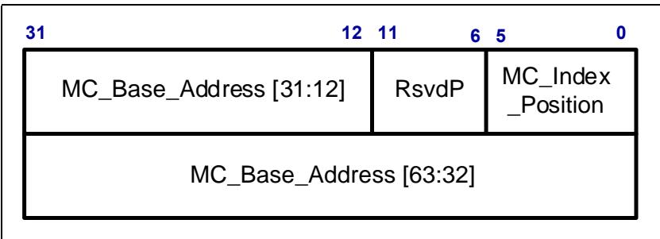

<table style="border-collapse:collapse; width:100%;">
  <thead>
    <tr>
      <th width="50%" style="border:2px solid #000; background:#f5f5f5;">EN</th>
      <th width="50%" style="border:2px solid #000; background-color:#e8e8e8;">中文</th>
    </tr>
  </thead>
  <tbody>
    <tr><td width="50%" style="border:2px solid #000; background:#fff;padding:4px 8px;">An example of locating the MCG within the address is shown in Figure 20‐6 on page 892. Here the Index Position value is 24, so the MCG is found in address bits 25 to 30. Interestingly, since the base address doesn't define the lower 12 bits of the address, the MC Index Position must be 12 or greater to be valid. If it's less than 12 and the MC_Enable bit is set, the component's behavior will be undefined.</td><td width="50%" style="border:2px solid #000; background-color:#e8e8e8;padding:4px 8px;">在地址中定位MCG的示例如图20‐6所示（见第892页）。此处索引位置值为24，因此MCG位于地址的位25到位30。值得注意的是，由于基址未定义地址的低12位，多播索引位置必须为12或更大才有效。如果小于12且MC_Enable位被置位，则组件的行为将是未定义的。</td></tr>
  </tbody>
</table>

Figure 20‐6: Position of Multicast Group Number | 图20‐6：多播组号位置  
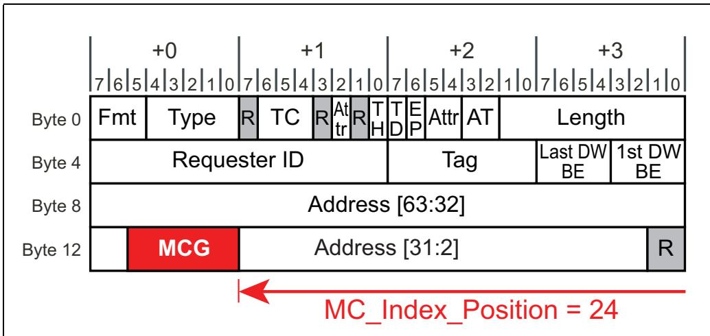

## 20.2.1.3 MC Receive | 20.2.1.3 MC 接收

<table style="border-collapse:collapse; width:100%;">
  <thead>
    <tr>
      <th width="50%" style="border:2px solid #000; background:#f5f5f5;">EN</th>
      <th width="50%" style="border:2px solid #000; background-color:#e8e8e8;">中文</th>
    </tr>
  </thead>
  <tbody>
    <tr><td width="50%" style="border:2px solid #000; background:#fff;padding:4px 8px;">This 64-bit register is a bit vector that indicates for which of the 64 MCGs this Function should accept a copy or this Port should forward a copy. If the MCG value is found to be 47, for example, and bit 47 is set in this register, then this Function should receive it or this Port should forward it.</td><td width="50%" style="border:2px solid #000; background-color:#e8e8e8;padding:4px 8px;">该64位寄存器是一个位向量，用于指示该功能应对64个MCG中的哪些接受副本，或该端口应转发副本。例如，若MCG值为47，且该寄存器中位47被置位，则该功能应接收该报文，或该端口应转发该报文。</td></tr>
  </tbody>
</table>

## 20.2.1.4 MC Block All | 20.2.1.4 MC 全部阻止

<table style="border-collapse:collapse; width:100%;">
  <thead>
    <tr>
      <th width="50%" style="border:2px solid #000; background:#f5f5f5;">EN</th>
      <th width="50%" style="border:2px solid #000; background-color:#e8e8e8;">中文</th>
    </tr>
  </thead>
  <tbody>
    <tr><td width="50%" style="border:2px solid #000; background:#fff;padding:4px 8px;">This 64-bit register indicates which MCGs an Endpoint Function is blocked from sending and which a Switch or Root Port is blocked from forwarding. This can be programmed in a Switch or Root Port to prevent it from forwarding MultiCast TLPs to an Endpoint that doesn't understand them, for example. A blocked TLP is considered an error condition, and how the error is handled is described in the next section.</td><td width="50%" style="border:2px solid #000; background-color:#e8e8e8;padding:4px 8px;">该64位寄存器指示端点功能被阻止发送哪些MCG（多播组），以及交换机或根端口被阻止转发哪些MCG。例如，可在交换机或根端口中对其进行编程，以防止其将多播TLP转发给不理解这些TLP的端点。被阻止的TLP被视为错误条件，错误的处理方式将在下一节中描述。</td></tr>
  </tbody>
</table>

## 20.2.1.5 MC Block Untranslated | 20.2.1.5 MC 阻止未翻译

<table style="border-collapse:collapse; width:100%;">
  <thead>
    <tr>
      <th width="50%" style="border:2px solid #000; background:#f5f5f5;">EN</th>
      <th width="50%" style="border:2px solid #000; background-color:#e8e8e8;">中文</th>
    </tr>
  </thead>
  <tbody>
    <tr><td width="50%" style="border:2px solid #000; background:#fff;padding:4px 8px;">The meaning and use of this 64‑bit register is almost identical to the Block All register except that it doesn’t apply to TLPs whose AT header field shows them to be translated. This mechanism can be used to set up a Multicast window that is protected in that it can only receive translated addresses.</td><td width="50%" style="border:2px solid #000; background-color:#e8e8e8;padding:4px 8px;">这个64位寄存器的含义和用途与Block All寄存器几乎相同，区别在于它不适用于AT头字段显示为已转换的TLP。该机制可用于建立一个受保护的多播窗口，该窗口只能接收已转换的地址。</td></tr>
    <tr><td width="50%" style="border:2px solid #000; background:#fff;padding:4px 8px;">If a TLP is blocked because of the setting of either of these two blocking registers, it’s handled as an MC Blocked TLP, meaning it gets dropped and the Port or Function logs and signals this as an error. Logging the error involves setting the Signaled Target Abort bit in its Status register or its Secondary Status register, as appropriate. That’s barely enough information to be useful, though, so the spec highly recommends that Advanced Error Reporting (AER) registers be implemented in Functions with Multicast capability to facilitate isolating and diagnosing faults.</td><td width="50%" style="border:2px solid #000; background-color:#e8e8e8;padding:4px 8px;">如果TLP因这两个阻塞寄存器中任一寄存器的设置而被阻止，它将被当作MC阻塞TLP处理，即该TLP被丢弃，并且端口或功能会记录并将此作为错误发出信号。记录错误涉及在其Status寄存器或Secondary Status寄存器中设置Signaled Target Abort位。然而，这些信息几乎不足以提供有用的帮助，因此规范强烈建议在具有多播能力的功能中实现高级错误报告（AER）寄存器，以便于隔离和诊断故障。</td></tr>
    <tr><td width="50%" style="border:2px solid #000; background:#fff;padding:4px 8px;">The spec notes that this register is required in all Functions that implement the MC Capability registers, but if an Endpoint Function doesn’t implement the ATS (Address Translation Services) registers, the designer may choose to make these bits reserved.</td><td width="50%" style="border:2px solid #000; background-color:#e8e8e8;padding:4px 8px;">规范指出，该寄存器在所有实现MC能力寄存器的功能中是必需的，但如果端点功能未实现ATS（地址转换服务）寄存器，设计者可以选择将这些位保留。</td></tr>
  </tbody>
</table>

## 20.2.2 Multicast Example | 20.2.2 多播示例

<table style="border-collapse:collapse; width:100%;">
  <thead>
    <tr>
      <th width="50%" style="border:2px solid #000; background:#f5f5f5;">EN</th>
      <th width="50%" style="border:2px solid #000; background-color:#e8e8e8;">中文</th>
    </tr>
  </thead>
  <tbody>
    <tr><td width="50%" style="border:2px solid #000; background:#fff;padding:4px 8px;">At this point, an example will help to illustrate how these registers can be used to set up a multicast environment. To set this up, let's first give the relevant registers some values:</td><td width="50%" style="border:2px solid #000; background-color:#e8e8e8;padding:4px 8px;">此时，举一个示例有助于说明如何使用这些寄存器来设置多播环境。为建立该环境，首先为相关寄存器赋予一些值：</td></tr>
    <tr><td width="50%" style="border:2px solid #000; background:#fff;padding:4px 8px;">• MC_Base_Address = 2GB (Starting address for the multicast range)</td><td width="50%" style="border:2px solid #000; background-color:#e8e8e8;padding:4px 8px;">• MC_Base_Address = 2GB（多播范围的起始地址）</td></tr>
    <tr><td width="50%" style="border:2px solid #000; background:#fff;padding:4px 8px;">• MC_Max_Group = 7 (Meaning 8 windows are possible for this design)</td><td width="50%" style="border:2px solid #000; background-color:#e8e8e8;padding:4px 8px;">• MC_Max_Group = 7（表示该设计最多支持8个窗口）</td></tr>
    <tr><td width="50%" style="border:2px solid #000; background:#fff;padding:4px 8px;">• MC_Window_Size_Requested = 10 (Meaning $2^{10}$ or 1KB size was requested by an Endpoint)</td><td width="50%" style="border:2px solid #000; background-color:#e8e8e8;padding:4px 8px;">• MC_Window_Size_Requested = 10（表示端点请求的窗口大小为 $2^{10}$，即1KB）</td></tr>
    <tr><td width="50%" style="border:2px solid #000; background:#fff;padding:4px 8px;">• MC_Index_Position = 12 (Meaning the actual size of each window is $2^{12}$)</td><td width="50%" style="border:2px solid #000; background-color:#e8e8e8;padding:4px 8px;">• MC_Index_Position = 12（表示每个窗口的实际大小为 $2^{12}$）</td></tr>
    <tr><td width="50%" style="border:2px solid #000; background:#fff;padding:4px 8px;">• MC_Num_Group = 5 (Meaning software only configured 6 of the available multicast windows).</td><td width="50%" style="border:2px solid #000; background-color:#e8e8e8;padding:4px 8px;">• MC_Num_Group = 5（表示软件仅配置了可用多播窗口中的6个）</td></tr>
    <tr><td width="50%" style="border:2px solid #000; background:#fff;padding:4px 8px;">Based on those register settings, the image in Figure 20-7 on page 894 illustrates the result. The multicast window range is shown starting at 2GB and ranging as high as 2GB + 8 \* (the window size). However, only 6 are enabled by software, so the actual multicast address range is from 2GB to 2GB + 24KB. The windows are all the same size and correspond to the MCGs: MCG 0 is the first window, 1 is the next window, and so on.</td><td width="50%" style="border:2px solid #000; background-color:#e8e8e8;padding:4px 8px;">基于这些寄存器设置，第894页的图20-7展示了结果。如图所示，多播窗口范围起始于2GB，最高可达2GB + 8 ×（窗口大小）。然而，软件仅使能了6个窗口，因此实际的多播地址范围为2GB至2GB + 24KB。所有窗口大小相同，并与MCG相对应：MCG 0对应第一个窗口，MCG 1对应下一个窗口，以此类推。</td></tr>
  </tbody>
</table>

Figure 20-7: Multicast Address Example | 图20-7：多播地址示例

## 20.2.3 MC Overlay BAR | 20.2.3 MC 覆盖 BAR

<table style="border-collapse:collapse; width:100%;">
  <thead>
    <tr>
      <th width="50%" style="border:2px solid #000; background:#f5f5f5;">EN</th>
      <th width="50%" style="border:2px solid #000; background-color:#e8e8e8;">中文</th>
    </tr>
  </thead>
  <tbody>
    <tr><td width="50%" style="border:2px solid #000; background:#fff;padding:4px 8px;">This last set of registers are required for Switch and Root Ports that implement Multicasting, but they're not implemented in Endpoints. The motivation for this BAR is that it allows two special cases. First, a Port can forward TLPs downstream if they hit in a multicast window even if the Endpoint wasn't designed for multicasting. Second, a Port can forward multicast TLPs upstream to system memory. In both cases, this is accomplished by replacing part of the Request's address with an address that will be recognized by the target. Doing so allows a single BAR in a component to serve as a target for both unicast and multicast writes even if it wasn't designed with multicast capability.</td><td width="50%" style="border:2px solid #000; background-color:#e8e8e8;padding:4px 8px;">最后一组寄存器对于实现了多播（Multicasting）的交换机和根端口是必需的，但它们在端点中未实现。引入此BAR的动机在于它允许两种特殊情况。第一，端口可以在TLP命中多播窗口时将其向下游转发，即使端点并非为多播而设计。第二，端口可以将多播TLP向上游转发到系统内存。在这两种情况下，这都是通过将请求地址的一部分替换为目标可识别的地址来实现的。这样做允许组件中的单个BAR充当单播和多播写入的目标，即使它并非为多播能力而设计。</td></tr>
    <tr><td width="50%" style="border:2px solid #000; background:#fff;padding:4px 8px;">As shown in Figure 20‑8 on page 895, this register block consists of an address that will be overlaid onto the outgoing TLP, and a 6‑bit Overlay Size indicator. The size referred to here is simply the number of bits from the original 64‑bit address that will be retained, while all the others will be replaced by the Overlay BAR bits. The spec mistakenly refers to this in at least one place as the size in bytes, but in other places it's made clear that it is a bit number. Note that the overlay size value must be 6 or higher to enable the overlay operation. If the size is given as 5 or lower, no overlay will take place and the address is unchanged.</td><td width="50%" style="border:2px solid #000; background-color:#e8e8e8;padding:4px 8px;">如图20‑8（第895页）所示，该寄存器块包含一个将被覆盖到传出TLP上的地址，以及一个6位的覆盖大小（Overlay Size）指示符。此处所述的大小是指原始64位地址中将被保留的位数，而所有其他位将被覆盖BAR位替换。规范至少在有一处错误地将其称为以字节为单位的大小，但在其他位置明确说明它是一个位数。请注意，覆盖大小值必须为6或更高才能启用覆盖操作。如果大小指定为5或更小，则不会发生覆盖，地址保持不变。</td></tr>
  </tbody>
</table>

Figure 20‑8: Multicast Overlay BAR | 图20‑8：多播覆盖BAR

<table><tr><td>31</td><td>6</td><td>5</td><td>0</td></tr><tr><td colspan="2">MC_Overlay_BAR [31:6]</td><td colspan="2">MC_Overlay_Size</td></tr><tr><td colspan="4">MC_Overlay_BAR [63:32]</td></tr></table>

## 20.2.4 Overlay Example | 20.2.4 覆盖示例

<table style="border-collapse:collapse; width:100%;">
  <thead>
    <tr>
      <th width="50%" style="border:2px solid #000; background:#f5f5f5;">EN</th>
      <th width="50%" style="border:2px solid #000; background-color:#e8e8e8;">中文</th>
    </tr>
  </thead>
  <tbody>
    <tr><td width="50%" style="border:2px solid #000; background:#fff;padding:4px 8px;">Now consider the case in which an address overlay is desired, as shown in Figure 20‐9 on page 896. Here the address of a TLP to be forwarded, ABCD_BEEFh, falls within the defined multicast range (also referred to as a multicast hit) and the egress Port has been configured with valid values in the Overlay BAR.</td><td width="50%" style="border:2px solid #000; background-color:#e8e8e8;padding:4px 8px;">现在考虑需要进行地址覆盖的情况，如图20‐9（第896页）所示。这里，待转发的TLP的地址ABCD_BEEFh落在定义的多播范围内（也称为多播命中），并且出口端口已使用覆盖BAR中的有效值进行了配置。</td></tr>
    <tr><td width="50%" style="border:2px solid #000; background:#fff;padding:4px 8px;">The overlay case creates the unusual situation with the ECRC value that was mentioned earlier in the description of the Multicast Capability register. If the TLP whose address is being changed by the overlay includes an ECRC, that value would be rendered incorrect by this change. Switches and Root Ports optional support regenerating the ECRC based on the new address so that it still serves its purpose going forward. If the routing agent does not support it, the ECRC is simply dropped and the TD header bit is forced to zero to avoid any confusion.</td><td width="50%" style="border:2px solid #000; background-color:#e8e8e8;padding:4px 8px;">覆盖情况会造成之前在多播能力寄存器描述中提到的ECRC值的异常情况。如果地址被覆盖更改的TLP包含ECRC，则该值将因地址更改而变得不正确。交换机和根端口可选支持基于新地址重新生成ECRC，使其在后续传输中仍能发挥其作用。如果路由代理不支持此功能，则直接丢弃ECRC，并将TD头比特强制清零以避免混淆。</td></tr>
    <tr><td width="50%" style="border:2px solid #000; background:#fff;padding:4px 8px;">A potential problem can arise with ECRC regeneration. If the incoming TLP already had an error but the ECRC value is regenerated because the address was modified, that would inadvertently hide the original error. To avoid that, the routing agent must verify the original ECRC first. If it finds an error, it must force a bad ECRC on the outgoing TLP by inverting the calculated ECRC value before appending it to ensure that the target will see it as an error condition.</td><td width="50%" style="border:2px solid #000; background-color:#e8e8e8;padding:4px 8px;">ECRC重新生成可能会引发一个潜在问题。如果传入的TLP已经存在错误，但因地址被修改而重新生成了ECRC值，这将会无意中掩盖原始错误。为避免这种情况，路由代理必须首先验证原始ECRC。如果发现错误，它必须在传出TLP上强制生成错误的ECRC——即先计算ECRC值再将其取反后附加——以确保目标端会将其视为错误条件。</td></tr>
  </tbody>
</table>

Figure 20‐9: Overlay Example | 图20‐9：覆盖示例  

## 20.2.5 Routing Multicast TLPs | 20.2.5 路由多播TLP

<table style="border-collapse:collapse; width:100%;">
  <thead>
    <tr>
      <th width="50%" style="border:2px solid #000; background:#f5f5f5;">EN</th>
      <th width="50%" style="border:2px solid #000; background-color:#e8e8e8;">中文</th>
    </tr>
  </thead>
  <tbody>
    <tr><td width="50%" style="border:2px solid #000; background:#fff;padding:4px 8px;">When a Switch or Root Port detects an MC hit (address falls within the MC range) normal routing is suspended. The MCG is extracted from the address and is compared to the MC_Receive register of all the Ports to see which of them should forward a copy of this TLP. Ports whose corresponding Receive register bit is set will forward a copy of the TLP unless their corresponding MC Blocked register bit is also set. If no Ports forward the TLP and no Functions consume it, it is silently dropped. To prevent loops, a TLP is never forwarded back out on its ingress Port, with the possible exception of an ACS case.</td><td width="50%" style="border:2px solid #000; background-color:#e8e8e8;padding:4px 8px;">当交换机或根端口检测到MC命中（地址落在MC范围内）时，正常路由被暂停。从地址中提取MCG，并与所有端口的MC_Receive寄存器进行比较，以确定哪些端口应转发此TLP的副本。其对应Receive寄存器位被设置的端口将转发TLP的副本，除非其对应的MC Blocked寄存器位也被设置。如果没有端口转发TLP且没有功能消费它，则被静默丢弃。为防止环路，TLP永远不会被转发回其入端口，但ACS情况可能例外。</td></tr>
    <tr><td width="50%" style="border:2px solid #000; background:#fff;padding:4px 8px;">Endpoints extract the MCG and compare it with their Receive register. If there's no match, the TLP is silently dropped. If the Endpoint doesn't support Multicasting, it will treat the TLP as having an ordinary address.</td><td width="50%" style="border:2px solid #000; background-color:#e8e8e8;padding:4px 8px;">端点提取MCG并将其与其Receive寄存器进行比较。如果没有匹配，则TLP被静默丢弃。如果端点不支持多播，它将把该TLP视为具有普通地址。</td></tr>
  </tbody>
</table>

## 20.2.6 Congestion Avoidance | 20.2.6 拥塞避免

<table style="border-collapse:collapse; width:100%;">
  <thead>
    <tr>
      <th width="50%" style="border:2px solid #000; background:#f5f5f5;">EN</th>
      <th width="50%" style="border:2px solid #000; background-color:#e8e8e8;">中文</th>
    </tr>
  </thead>
  <tbody>
    <tr><td width="50%" style="border:2px solid #000; background:#fff;padding:4px 8px;">The use of Multicasting will increase the amount of system traffic in proportion to the percentage of MC traffic, which leads to the risk of packet congestion. To avoid creating backpressure, MC targets should be designed to accept MC traffic "at speed", meaning with minimal delay. To avoid oversubscribing the Links, MC initiators should limit their packet injection rate. A system designer would be wise to choose components carefully to handle this. For example, using Switches and Root Ports whose buffers are big enough to handle the expected traffic, and Endpoints that are able to accept their incoming MC packets quickly enough to avoid trouble.</td><td width="50%" style="border:2px solid #000; background-color:#e8e8e8;padding:4px 8px;">组播的使用将按组播流量比例增加系统流量，从而导致数据包拥塞的风险。为避免产生反压，组播目标应设计为能够"线速"接收组播流量，即具有最小延迟。为避免链路过载，组播发起者应限制其数据包注入速率。系统设计者应谨慎选择组件来处理这一问题。例如，使用缓冲区足够大以处理预期流量的交换机和根端口，以及能够足够快地接收其传入组播数据包以避免问题的端点。</td></tr>
  </tbody>
</table>

## 20.3 Performance Improvements | 20.3 性能改进

<table style="border-collapse:collapse; width:100%;">
  <thead>
    <tr>
      <th width="50%" style="border:2px solid #000; background:#f5f5f5;">EN</th>
      <th width="50%" style="border:2px solid #000; background-color:#e8e8e8;">中文</th>
    </tr>
  </thead>
  <tbody>
    <tr><td width="50%" style="border:2px solid #000; background:#fff;padding:4px 8px;">System performance is enhanced with the addition of four new features:</td><td width="50%" style="border:2px solid #000; background-color:#e8e8e8;padding:4px 8px;">通过新增四项特性，系统性能得到提升：</td></tr>
    <tr><td width="50%" style="border:2px solid #000; background:#fff;padding:4px 8px;">1. AtomicOps to replace the legacy transaction locking mechanism</td><td width="50%" style="border:2px solid #000; background-color:#e8e8e8;padding:4px 8px;">1. AtomicOps 取代传统事务锁定机制</td></tr>
    <tr><td width="50%" style="border:2px solid #000; background:#fff;padding:4px 8px;">2. TLP Processing Hints to allow software to suggest caching options</td><td width="50%" style="border:2px solid #000; background-color:#e8e8e8;padding:4px 8px;">2. TLP 处理提示（TPH）允许软件建议缓存选项</td></tr>
    <tr><td width="50%" style="border:2px solid #000; background:#fff;padding:4px 8px;">3. ID-Based Ordering to avoid unnecessary latency</td><td width="50%" style="border:2px solid #000; background-color:#e8e8e8;padding:4px 8px;">3. 基于ID的顺序（IDO）避免不必要的延迟</td></tr>
    <tr><td width="50%" style="border:2px solid #000; background:#fff;padding:4px 8px;">4. Alternative Routing-ID Interpretation to increase the number of Functions available in a device.</td><td width="50%" style="border:2px solid #000; background-color:#e8e8e8;padding:4px 8px;">4. 替代路由ID解释（ARI）增加设备中可用的功能（Function）数量</td></tr>
  </tbody>
</table>

<table style="border-collapse:collapse; width:100%;">
  <thead>
    <tr>
      <th width="50%" style="border:2px solid #000; background:#f5f5f5;">EN</th>
      <th width="50%" style="border:2px solid #000; background-color:#e8e8e8;">中文</th>
    </tr>
  </thead>
  <tbody>
    <tr><td width="50%" style="border:2px solid #000; background:#fff;padding:4px 8px;">## AtomicOps</td><td width="50%" style="border:2px solid #000; background-color:#e8e8e8;padding:4px 8px;">## AtomicOps（原子操作）</td></tr>
    <tr><td width="50%" style="border:2px solid #000; background:#fff;padding:4px 8px;">Processors that share resources or otherwise communicate with each other sometimes need uninterrupted, or "atomic", access to system resources to do things like testing and setting semaphores. On parallel processor buses this was accomplished by locking the bus with the assertion of a Lock pin until the originator completed the whole sequence (a read followed by a write), during which time other processors were not allowed to initiate transactions on the bus. PCI included a Locked pin to apply this same model on the PCI bus as on the processor bus, allowing this protocol to used with peripheral devices.</td><td width="50%" style="border:2px solid #000; background-color:#e8e8e8;padding:4px 8px;">共享资源或以其他方式相互通信的处理器有时需要对系统资源进行不间断的（即"原子的"）访问，以执行诸如测试和设置信号量等操作。在并行处理器总线上，这是通过断言Lock引脚来锁定总线实现的，直到发起方完成整个序列（一次读取后跟一次写入），在此期间其他处理器不允许在总线上发起事务。PCI包含了一个Locked引脚，将相同的模型应用于PCI总线，就像在处理器总线上一样，使得该协议可用于外设。</td></tr>
    <tr><td width="50%" style="border:2px solid #000; background:#fff;padding:4px 8px;">This model worked but was slow on the shared processor bus and even worse when going onto the PCI bus. That's one reason why PCIe limited its use only to Legacy devices. However, the increasing use of shared processing in today's PCs, such as graphics co‐processors and compute accelerators, has brought this issue back to the fore because the different compute engines need to be able to share an atomic protocol. The way this problem was resolved on PCIe was to introduce three new commands that can each do a series of things atomically within the target device rather than requiring a series of separate uninterruptable commands on the interface. These new commands, called AtomicOps, are:</td><td width="50%" style="border:2px solid #000; background-color:#e8e8e8;padding:4px 8px;">这种模型确实有效，但在共享处理器总线上速度较慢，进入PCI总线时更慢。这就是PCIe将其使用仅限于传统（Legacy）设备的原因之一。然而，当今PC中共享处理（如图形协处理器和计算加速器）的使用日益增多，使这个问题再次凸显，因为不同的计算引擎需要能够共享原子协议。PCIe解决该问题的方式是引入了三条新命令，每条命令都可在目标设备内原子性地执行一系列操作，而不需要在接口上执行一系列独立的不可中断命令。这些被称为AtomicOps的新命令如下：</td></tr>
    <tr><td width="50%" style="border:2px solid #000; background:#fff;padding:4px 8px;">1. FetchAdd (Fetch and Add) ‐ This Request contains an "add" value. It reads the target location, adds the "add"value to it, stores the result in the target location and returns the original value of the target location. This could be used in support of atomically updating statistics counters.</td><td width="50%" style="border:2px solid #000; background-color:#e8e8e8;padding:4px 8px;">1. FetchAdd（取并加）— 该请求包含一个"加"值。它读取目标位置，将"加"值加到该位置，将结果存储回目标位置，并返回目标位置的原始值。这可用于支持原子性地更新统计计数器。</td></tr>
    <tr><td width="50%" style="border:2px solid #000; background:#fff;padding:4px 8px;">2. Swap (Unconditional Swap) ‐ This Request contains a "swap" value. It reads the target location, writes the "swap" value into it, and returns the original target value. This could be useful for atomically reading and clearing counters.</td><td width="50%" style="border:2px solid #000; background-color:#e8e8e8;padding:4px 8px;">2. Swap（无条件交换）— 该请求包含一个"交换"值。它读取目标位置，将"交换"值写入该位置，并返回原始目标值。这对于原子性地读取和清除计数器很有用。</td></tr>
    <tr><td width="50%" style="border:2px solid #000; background:#fff;padding:4px 8px;">3. CAS (Compare and Swap) ‐ This Request contains both a "compare" value and a "swap" value. It reads the target location, compares it against the "compare" value and, if they're equal, writes in the "swap" value. Finally, it returns the original value of the target location. This can be useful as a "test and set" mechanism for managing semaphores.</td><td width="50%" style="border:2px solid #000; background-color:#e8e8e8;padding:4px 8px;">3. CAS（比较并交换）— 该请求同时包含一个"比较"值和一个"交换"值。它读取目标位置，将其与"比较"值进行比较，如果相等，则写入"交换"值。最后，它返回目标位置的原始值。这可用作管理信号量的"测试并设置"机制。</td></tr>
    <tr><td width="50%" style="border:2px solid #000; background:#fff;padding:4px 8px;">Both Endpoints and Root Ports are optionally allowed to act as AtomicOp Requesters and Completers, which might seem unexpected because, in PCs at least, this kind of transaction is usually only initiated by the central processor. But modern systems can include an Endpoint acting as a co‐processor, in which case it would need to be able to use AtomicOps to properly handle the protocol. All three commands support 32‐bit and 64‐bit operands, while CAS also supports 128‐bit operands. The actual size in use will be given in the Length field in the header. Routing elements like Switch Ports and Root Ports with peer‐to‐peer access will need to support the AtomicOp routing capability to be able to recognize and route these Requests.</td><td width="50%" style="border:2px solid #000; background-color:#e8e8e8;padding:4px 8px;">端点和根端口都可以选择性地充当AtomicOp请求者和完成者，这可能看起来有些出乎意料，因为至少在PC中，这类事务通常仅由中央处理器发起。但现代系统可能包含充当协处理器的端点，在这种情况下，它需要能够使用AtomicOps来正确处理协议。所有三条命令都支持32位和64位操作数，而CAS还支持128位操作数。实际使用的操作数大小将在头部的Length字段中给出。路由元素（如交换机端口和具有对等访问能力的根端口）需要支持AtomicOp路由能力，以便能够识别和路由这些请求。</td></tr>
    <tr><td width="50%" style="border:2px solid #000; background:#fff;padding:4px 8px;">A question naturally arises as to how the system (Root Complex) will be instructed to generate these new commands in response to processor activity, since there may not be a directly‐analogous processor bus command. The spec suggests two approaches. First, the Root could be designed to recognize specific processor activity and interpret that to "export" a PCIe AtomicOp in response. Second, a register‐based approach similar to the one used for legacy Configuration access could be used. In that case, one register might give the target address while another specified which command should be generated and the combination of the two would generate the Request.</td><td width="50%" style="border:2px solid #000; background-color:#e8e8e8;padding:4px 8px;">一个自然产生的问题是，系统（根复合体）将如何被指示根据处理器活动生成这些新命令，因为可能没有直接对应的处理器总线命令。规范提出了两种方法。第一，可以将根复合体设计为识别特定的处理器活动，并将其解释为"导出"PCIe AtomicOp作为响应。第二，可以使用类似于传统配置访问的基于寄存器的方法。在这种情况下，一个寄存器可能提供目标地址，而另一个寄存器指定应生成哪条命令，两者的组合将生成该请求。</td></tr>
    <tr><td width="50%" style="border:2px solid #000; background:#fff;padding:4px 8px;">AtomicOp Completers can be identified by the presence of the three new bits in the Device Capabilities 2 register, as shown in Figure 20‐10 on page 899. Bit 6 of this register also identifies whether routing elements are capable of routing AtomicOps.</td><td width="50%" style="border:2px solid #000; background-color:#e8e8e8;padding:4px 8px;">AtomicOp完成者可以通过设备能力2（Device Capabilities 2）寄存器中存在的三个新位来识别，如图20-10（第899页）所示。该寄存器的位6还标识路由元素是否能够路由AtomicOps。</td></tr>
    <tr><td width="50%" style="border:2px solid #000; background:#fff;padding:4px 8px;">Legacy PCI does not comprehend AtomicOps, of course, and there is no straight‐forward way to translate them into PCI commands. For that reason, PCIe‐to‐PCI bridges do not support AtomicOps. If atomic access is needed on that bus it would have to be done with the legacy locked protocol and the spec states that Locked Transactions and AtomicOps can operate concurrently on the same platform.</td><td width="50%" style="border:2px solid #000; background-color:#e8e8e8;padding:4px 8px;">传统PCI当然不理解AtomicOps，也没有直接的方法将它们转换为PCI命令。因此，PCIe到PCI桥不支持AtomicOps。如果在该总线上需要原子访问，则必须使用传统的锁定协议来完成，并且规范指出锁定事务（Locked Transactions）和AtomicOps可以在同一平台上并发操作。</td></tr>
  </tbody>
</table>

Figure 20‐10: Device Capabilities 2 Register | 图20‐10：设备能力2寄存器  

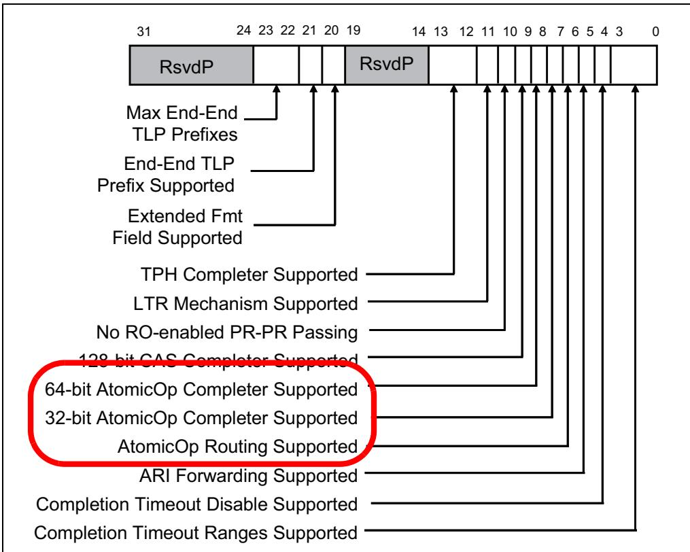

## 20.3.2 TPH (TLP Processing Hints) | 20.3.2 TPH（TLP 处理提示）

<table style="border-collapse:collapse; width:100%;">
  <thead>
    <tr>
      <th width="50%" style="border:2px solid #000; background:#f5f5f5;">EN</th>
      <th width="50%" style="border:2px solid #000; background-color:#e8e8e8;">中文</th>
    </tr>
  </thead>
  <tbody>
    <tr><td width="50%" style="border:2px solid #000; background:#fff;padding:4px 8px;">Adding hints about how the system should handle TLPs targeting memory space can improve latency and traffic congestion. The spec describes this special handling basically as providing information about which of several possible cache locations in the system would be the optimal place for a temporary copy.</td><td width="50%" style="border:2px solid #000; background-color:#e8e8e8;padding:4px 8px;">关于系统应如何处理目标为存储器空间的TLP添加提示，可改善延迟和流量拥塞。规范将这种特殊处理描述为提供信息，说明系统中多个可能的缓存位置中哪一个是临时拷贝的最佳存放位置。</td></tr>
  </tbody>
</table>

<table style="border-collapse:collapse; width:100%;">
  <thead>
    <tr>
      <th width="50%" style="border:2px solid #000; background:#f5f5f5;">EN</th>
      <th width="50%" style="border:2px solid #000; background-color:#e8e8e8;">中文</th>
    </tr>
  </thead>
  <tbody>
    <tr><td width="50%" style="border:2px solid #000; background:#fff;padding:4px 8px;">of a TLP. The spec makes note of the fact that, since the usage described for TPH relates to caching, it wouldn't usually make sense to use them with TLPs targeting Non‑prefetchable Memory Space. If such usage was needed, it would be essential to somehow guarantee that caching such TLPs did not cause undesirable side effects.</td><td width="50%" style="border:2px solid #000; background-color:#e8e8e8;padding:4px 8px;">一个TLP的。规范指出，由于TPH（TLP处理提示）所述的用途与缓存相关，通常将其用于针对不可预取存储空间的TLP是没有意义的。如果确实需要这种用法，则必须以某种方式保证缓存此类TLP不会导致不良副作用。</td></tr>
  </tbody>
</table>

## 20.3.2.1 TPH Examples | 20.3.2.1 TPH 示例

<table>
<tr>
<td width="50%">
Device Write to Host Read. To help clarify the motivation for TPH, consider the example shown in Figure 20‐11 on page 901. Here the Endpoint is writing data into memory for later use by the CPU. The sequence is as follows:
</td>
<td width="50%" style="background-color:#e8e8e8">
设备写主机读。为帮助阐明TPH的动机，请考虑第901页图20-11所示的示例。此处Endpoint正在将数据写入内存以供CPU后续使用。具体序列如下：
</td>
</tr>
</table>

<table>
<tr>
<td width="50%">
1. First, the Endpoint sends a memory write TLP containing an address that maps to the system memory. The packet gets routed to the Root Complex (RC).
</td>
<td width="50%" style="background-color:#e8e8e8">
1. 首先，Endpoint发送一个内存写TLP，其中包含映射到系统内存的地址。该数据包被路由到Root Complex（RC）。
</td>
</tr>
</table>

<table>
<tr>
<td width="50%">
2. The RC recognizes this as an access to a cacheable memory space and pauses its progress while it snoops the CPU cache. This may result in a write‐back cycle from the CPU to update the system memory before the transaction can proceed, and this is shown as step 2a.
</td>
<td width="50%" style="background-color:#e8e8e8">
2. RC识别出这是对可缓存内存空间的访问，并在侦听CPU缓存时暂停其处理。这可能导致CPU执行写回周期以更新系统内存，然后事务才能继续，如步骤2a所示。
</td>
</tr>
</table>

<table>
<tr>
<td width="50%">
3. Once any write backs have finished, the RC allows the write to update the system memory.
</td>
<td width="50%" style="background-color:#e8e8e8">
3. 一旦所有写回操作完成，RC允许该写入操作更新系统内存。
</td>
</tr>
</table>

<table>
<tr>
<td width="50%">
4. At some point, the Endpoint notifies the CPU about data delivery.
</td>
<td width="50%" style="background-color:#e8e8e8">
4. 在某个时刻，Endpoint通知CPU数据已送达。
</td>
</tr>
</table>

<table>
<tr>
<td width="50%">
5. Finally, the CPU fetches the data from memory to complete the sequence.
</td>
<td width="50%" style="background-color:#e8e8e8">
5. 最后，CPU从内存中获取数据以完成该序列。
</td>
</tr>
</table>

Figure 20‐11: TPH Example | 图20‐11：TPH示例  
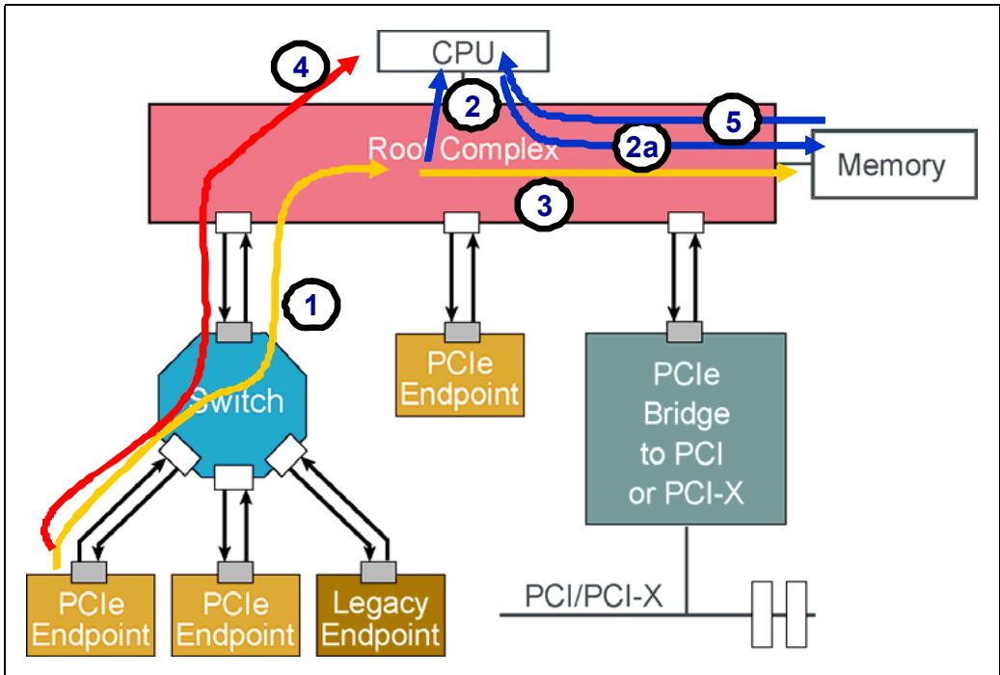

<table>
<tr>
<td width="50%">
This sequence works but there's an opportunity for performance improvement by adding an intermediate cache in the system. To illustrate this, consider the example shown in Figure 20‐12 on page 902. From the perspective of the Endpoint, the operation is the same but the knows to handle it a differently. The steps now are as follows:
</td>
<td width="50%" style="background-color:#e8e8e8">
该序列可以工作，但通过在系统中添加中间缓存可以进一步提升性能。为说明这一点，请考虑第902页图20-12所示的示例。从Endpoint的角度来看，操作是相同的，但系统知道以不同方式处理它。现在的步骤如下：
</td>
</tr>
</table>

<table>
<tr>
<td width="50%">
1. The Endpoint does the same memory write but this time TPH bits are included. The write is forwarded to the RC by the Switch as before.
</td>
<td width="50%" style="background-color:#e8e8e8">
1. Endpoint执行相同的内存写操作，但这次包含TPH位。与之前一样，该写入由Switch转发到RC。
</td>
</tr>
</table>

<table>
<tr>
<td width="50%">
2. The RC understands that this memory access must be snooped to the CPU as before. However, once the snoop has been handled, the RC is informed by the TPH bits to store this TLP in an intermediate cache rather than going to system memory.
</td>
<td width="50%" style="background-color:#e8e8e8">
2. RC知道与之前一样必须侦听该内存访问到CPU。然而，一旦侦听处理完毕，RC根据TPH位的指示将该TLP存储在中间缓存中，而不是写入系统内存。
</td>
</tr>
</table>

<table>
<tr>
<td width="50%">
3. The Endpoint notifies the CPU that the data item has been delivered.
</td>
<td width="50%" style="background-color:#e8e8e8">
3. Endpoint通知CPU数据项已送达。
</td>
</tr>
</table>

<table>
<tr>
<td width="50%">
4. The CPU reads from the specified address, but now the data is found in the intermediate cache and so the request does not go to system memory. This has the usual benefits we'd expect from a cache design: faster access time as well as reduced traffic for the system memory.
</td>
<td width="50%" style="background-color:#e8e8e8">
4. CPU从指定地址读取，但现在数据在中间缓存中找到，因此请求无需到达系统内存。这带来了缓存设计的常见好处：更快的访问时间以及减少系统内存的流量。
</td>
</tr>
</table>

<table>
<tr>
<td width="50%">
This is a simple Device Write to Host Read (DWHR) example to illustrate the concept but it wouldn't be hard to imagine a more complex system with a much larger topology in which there could be other caches placed in Switches or other locations to achieve the same benefits for other targets.
</td>
<td width="50%" style="background-color:#e8e8e8">
这是一个简单的设备写主机读（DWHR）示例，用于说明该概念。不难想象一个具有更大拓扑的更复杂系统，其中可以在Switch或其他位置放置其他缓存，从而为其他目标实现相同的益处。
</td>
</tr>
</table>

Figure 20‐12: TPH Example with System Cache | 图20‐12：带系统缓存的TPH示例  

<table>
<tr>
<td width="50%">
Host Write to Device Read. To illustrate the concept going the other way (called Host Write to Device Read or HWDR), consider the example shown in Figure 20‐13 on page 903. In this example, the CPU initiates a memory write whose address targets the PCIe Endpoint in step one. The packet contains TPH bits that tell the RC that it should be stored in an intermediate cache near the target, instead of the cache in the RC that was used in the previous example. In this case a cache built into the Switch serves the purpose. The TLP is then forwarded on to the target Endpoint in step two. This model is beneficial when the data is updated infrequently but read often by the Endpoint. That allows several memory reads that would normally go to system memory to be handled by the cache instead, off loading both the Link from the Switch to the RC and the path to memory.
</td>
<td width="50%" style="background-color:#e8e8e8">
主机写设备读。为说明反向的概念（称为主机写设备读或HWDR），请考虑第903页图20-13所示的示例。在此示例中，CPU发起一个内存写操作，其地址指向PCIe Endpoint，这是第一步。该数据包包含TPH位，告知RC应将其存储在目标附近的中间缓存中，而不是之前示例中使用的RC内部的缓存。在此情况下，Switch内置的缓存起到了作用。然后TLP在第二步中转发到目标Endpoint。当数据不经常更新但被Endpoint频繁读取时，此模型非常有益。这使得原本需要访问系统内存的多次内存读取可以由缓存处理，从而减轻了从Switch到RC的链路以及内存路径的负载。
</td>
</tr>
</table>

Figure 20‐13: TPH Usage for TLPs to Endpoint | 图20‐13：TPH在到端点的TLP中的使用  
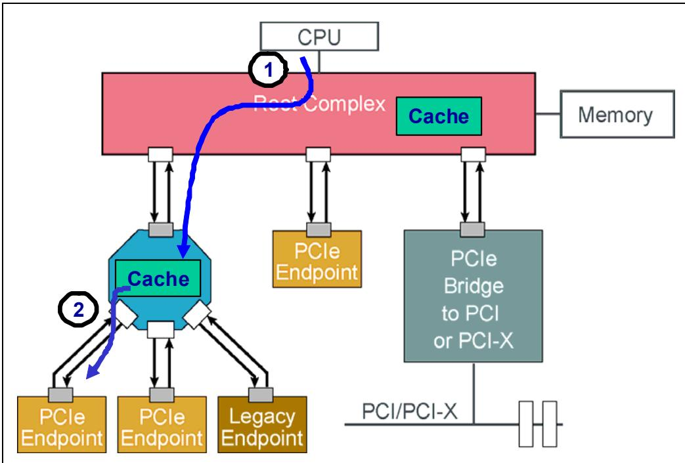

<table>
<tr>
<td width="50%">
Device to Device. One last example is illustrated in Figure 20‐14 on page 904, where two Endpoints communicate with each other (called Device Read/ Write to Device Read/Write or D\*D\*) through a shared memory location that is directed by TPH bits to an intermediate cache. In this case, both may update different locations that they need to handle as "read mostly", or one Endpoint may update data that the other needs to read several times. In both cases, using the intermediate cache improves system performance.
</td>
<td width="50%" style="background-color:#e8e8e8">
设备到设备。最后一个示例如第904页图20-14所示，其中两个Endpoint通过由TPH位导向中间缓存的共享内存位置相互通信（称为设备读/写到设备读/写或D\*D\*）。在此情况下，两者可能更新各自需要作为"主要读取"处理的不同位置，或者一个Endpoint可能更新另一个需要多次读取的数据。在这两种场景中，使用中间缓存都能提升系统性能。
</td>
</tr>
</table>

<table style="border-collapse:collapse; width:100%;">
  <thead>
    <tr>
      <th width="50%" style="border:2px solid #000; background:#f5f5f5;">EN</th>
      <th width="50%" style="border:2px solid #000; background-color:#e8e8e8;">中文</th>
    </tr>
  </thead>
  <tbody>
    <tr><td width="50%" style="border:2px solid #000; background:#fff;padding:4px 8px;">## PCI Express Technology</td><td width="50%" style="border:2px solid #000; background-color:#e8e8e8;padding:4px 8px;">## PCI Express 技术</td></tr>
    <tr><td width="50%" style="border:2px solid #000; background:#fff;padding:4px 8px;">Figure 20‐14: TPH Usage Between Endpoints</td><td width="50%" style="border:2px solid #000; background-color:#e8e8e8;padding:4px 8px;">图 20-14：端点间的 TPH 使用</td></tr>
  </tbody>
</table>

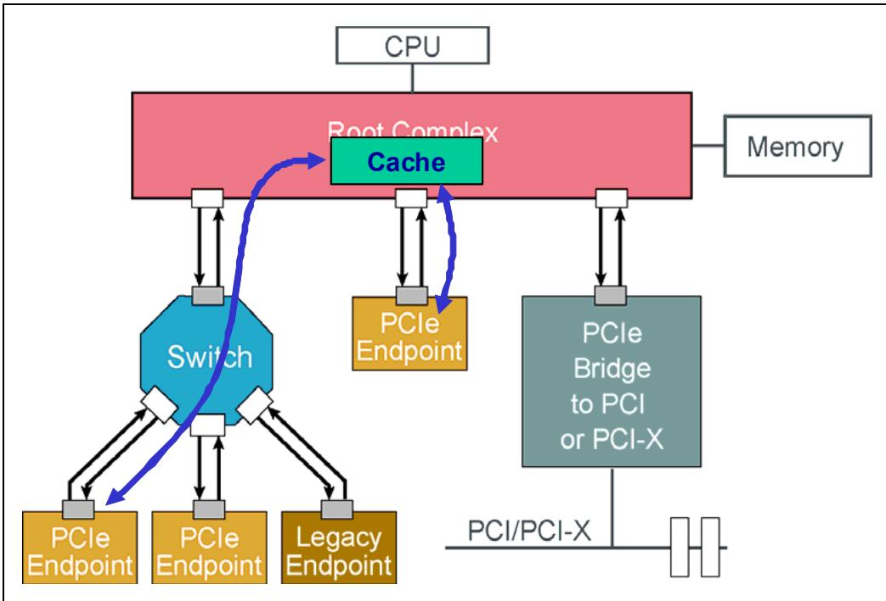

## 20.3.2.2 TPH Header Bits | 20.3.2.2 TPH 头部比特位

<table style="border-collapse:collapse; width:100%;">
  <thead>
    <tr>
      <th width="50%" style="border:2px solid #000; background:#f5f5f5;">EN</th>
      <th width="50%" style="border:2px solid #000; background-color:#e8e8e8;">中文</th>
    </tr>
  </thead>
  <tbody>
    <tr><td width="50%" style="border:2px solid #000; background:#fff;padding:4px 8px;">Several bits in the TLP header describe how the hints are used. First, as shown in the middle at the top of Figure 20‐15 on page 905, the TH (TLP Hints) bit reports whether the optional TPH bits are in use for the TLP. When set, the PH (Processing Hint bits) indicate the next level of information.</td><td width="50%" style="border:2px solid #000; background-color:#e8e8e8;padding:4px 8px;">TLP头部中的若干比特位描述了这些提示（hints）的使用方式。首先，如第905页图20-15顶部中间所示，TH（TLP提示）比特位指示该TLP是否使用了可选的TPH比特位。当该位置位时，PH（处理提示比特位）指示下一级信息。</td></tr>
    <tr><td width="50%" style="border:2px solid #000; background:#fff;padding:4px 8px;">When the TH bit is set the PH bits, shown at the bottom right of Figure 20‐15 on page 905, take the place of what were the two reserved LSBs in the address field. For a 32‐bit address, these are byte 11 [1:0], while for the 64‐bit address shown, they are byte 15 [1:0]. Their encoding is described in Table 20‐1 on page 905. These hints are provided by the Requester based on knowledge of the data patterns in use, which is information that would be difficult for a Completer to deduce on its own.</td><td width="50%" style="border:2px solid #000; background-color:#e8e8e8;padding:4px 8px;">当TH比特位置位时，PH比特位（如图20-15右下角所示）取代了地址字段中原先的两个保留最低有效位（LSB）。对于32位地址，这两个比特位位于字节11 [1:0]；而对于所示的64位地址，它们位于字节15 [1:0]。其编码方式在第905页的表20-1中描述。这些提示由请求者（Requester）根据对当前使用中的数据模式的了解而提供，这是完成者（Completer）难以自行推导的信息。</td></tr>
    <tr><td width="50%" style="border:2px solid #000; background:#fff;padding:4px 8px;">The next level of information is the Steering Tag byte that provides system‑specific information regarding the best place to cache this TLP. Interestingly, the location of this byte in the header varies depending on the Request type. For Posted Memory Writes the Tag field is repurposed to be the Steering Tag (no completion will be returned so the Tag isn’t needed), while for Memory Reads the two Byte Enable fields are repurposed for it (byte enables are not needed for pre‑fetchable reads). The meaning of the bits is implementation specific but they need to uniquely identify the location of the desired cache in the system.</td><td width="50%" style="border:2px solid #000; background-color:#e8e8e8;padding:4px 8px;">下一级信息是导向标签（Steering Tag）字节，它提供关于缓存此TLP的最佳位置的系统特定信息。有趣的是，该字节在头部中的位置因请求类型而异。对于推送内存写请求（Posted Memory Writes），标签字段被重新用作导向标签（不会返回完成报文，因此不需要标签）；而对于内存读请求（Memory Reads），两个字节使能字段被重新用于此目的（预取读不需要字节使能）。这些比特位的含义是具体实现相关的，但它们必须唯一地标识系统中目标缓存的位置。</td></tr>
    <tr><td width="50%" style="border:2px solid #000; background:#fff;padding:4px 8px;">Two formats for TPH are described in the spec and this level of hint information (TH + PH + 8‑bit Steering Tag), called Baseline TPH, is the first and is required of all Requests that provide TPH. The second format uses TLP Prefixes to extend the Steering Tags (see "TLP Prefixes" on page 908 for more detail).</td><td width="50%" style="border:2px solid #000; background-color:#e8e8e8;padding:4px 8px;">规范描述了两种TPH格式。这种提示信息级别（TH + PH + 8位导向标签）称为基线TPH（Baseline TPH），是第一种格式，所有提供TPH的请求都必须支持。第二种格式使用TLP前缀来扩展导向标签（更多详情请参见第908页的"TLP前缀"）。</td></tr>
  </tbody>
</table>

Figure 20‐15: TPH Header Bits | 图20‐15：TPH头部位

<table><tr><td rowspan="2"></td><td colspan="2">+0</td><td colspan="4">+1</td><td colspan="4">+2</td><td colspan="2">+3</td></tr><tr><td>7</td><td>6</td><td>5</td><td>4</td><td>3</td><td>2</td><td>1</td><td>0</td><td>7</td><td>6</td><td>5</td><td>4</td></tr><tr><td>Byte 0</td><td>Fmt</td><td>Type</td><td>R</td><td>TC</td><td>R</td><td>Attr</td><td>F</td><td>TH</td><td>T</td><td>EP</td><td>Attr</td><td>AT</td></tr><tr><td>Byte 4</td><td colspan="8">Requester ID</td><td colspan="3">Tag</td><td>Last DW BE</td></tr><tr><td>Byte 8</td><td colspan="12">Address [63:32]</td></tr><tr><td>Byte 12</td><td colspan="12">Address [31:2]</td></tr></table>

Table 20‐1: PH Encoding Table | 表20‐1：PH编码表

<table><tr><td>PH [1:0]</td><td>Processing Hint</td><td>Usage Model</td></tr><tr><td>00b</td><td>Bi-directional data structure</td><td>Indicates frequent read/write access by Host and device.</td></tr><tr><td>01b</td><td>Requester</td><td>D*D* (device-to-device transfers). Indicates frequent read/write access by device. The asterisk means either device could be reading or writing.</td></tr><tr><td>10b</td><td>Target</td><td>DWHR, HWDR (device-to-host or host-to-device transfers). Indicates frequent read/write access by Host.</td></tr><tr><td>11b</td><td>Target with Priority</td><td>Same as Target but with additional temporal re-use priority information. Indicates frequent read/write access by Host and high temporal locality for accessed data.</td></tr></table>

## 20.3.2.3 Steering Tags | 20.3.2.3 导向标签

<table style="border-collapse:collapse; width:100%;">
  <thead>
    <tr>
      <th width="50%" style="border:2px solid #000; background:#f5f5f5;">EN</th>
      <th width="50%" style="border:2px solid #000; background-color:#e8e8e8;">中文</th>
    </tr>
  </thead>
  <tbody>
    <tr><td width="50%" style="border:2px solid #000; background:#fff;padding:4px 8px;">These values are programmed by software into a table to be used during normal operation. The spec recommends that the table be located in the TPH Requester Capability structure, shown in Figure 20-16 on page 906, but it can alternatively be built into the MSI-X table instead. Only one or the other of these table locations can be used for a given Function. The location is given in the ST Table Location field [10:9] of the Requester Capability register, shown in Figure 20-17 on page 907. The encoding of these 2 bits is shown in Table 20-2 on page 907.</td><td width="50%" style="border:2px solid #000; background-color:#e8e8e8;padding:4px 8px;">这些值由软件编程到一张表中，在正常操作期间使用。规范建议将该表置于 TPH 请求者能力结构中（见第 906 页图 20-16），但也可以将其内建于 MSI-X 表中。对于给定的功能，只能使用这两种表位置之一。该位置由请求者能力寄存器（见第 907 页图 20-17）中 ST 表位置字段 [10:9] 给出。这 2 位的编码见第 907 页表 20-2。</td></tr>
  </tbody>
</table>

Figure 20-16: TPH Requester Capability Structure | 图20-16：TPH请求者能力结构

<table><tr><td>PCI Express Capabilities Register</td><td>Next Cap Pointer</td><td>PCI Express Cap ID (17h)</td></tr><tr><td colspan="3">TPH Requester Capability Register</td></tr><tr><td colspan="3">TPH Requester Control Register</td></tr><tr><td colspan="3">TPH ST Table (optional)(Sized by number of ST entries)</td></tr></table>

<table style="border-collapse:collapse; width:100%;">
  <thead>
    <tr>
      <th width="50%" style="border:2px solid #000; background:#f5f5f5;">EN</th>
      <th width="50%" style="border:2px solid #000; background-color:#e8e8e8;">中文</th>
    </tr>
  </thead>
  <tbody>
    <tr><td width="50%" style="border:2px solid #000; background:#fff;padding:4px 8px;">## Chapter 20: Updates for Spec Revision 2.1</td><td width="50%" style="border:2px solid #000; background-color:#e8e8e8;padding:4px 8px;">## 第20章：规范修订版 2.1 的更新</td></tr>
  </tbody>
</table>

Figure 20‐17: TPH Capability and Control Registers | 图20‐17：TPH能力和控制寄存器
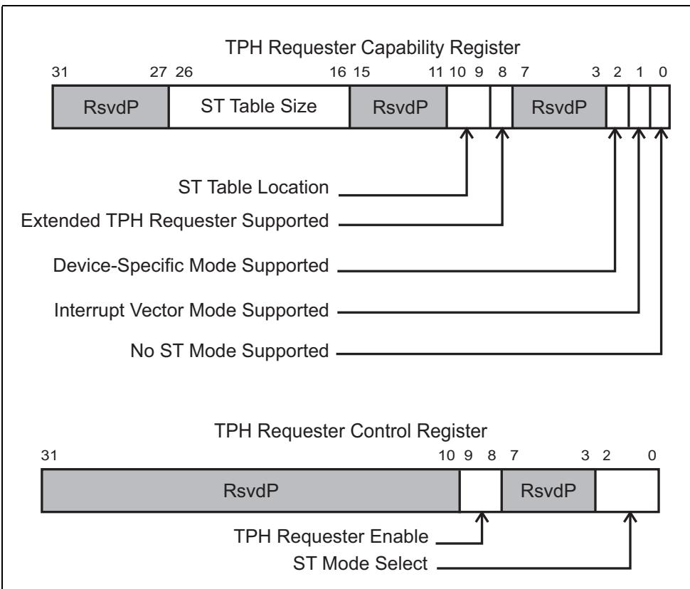

<table style="border-collapse:collapse; width:100%;">
  <thead>
    <tr>
      <th width="50%" style="border:2px solid #000; background:#f5f5f5;">EN</th>
      <th width="50%" style="border:2px solid #000; background-color:#e8e8e8;">中文</th>
    </tr>
  </thead>
  <tbody>
    <tr><td width="50%" style="border:2px solid #000; background:#fff;padding:4px 8px;">Table 20‐2: ST Table Location Encoding</td><td width="50%" style="border:2px solid #000; background-color:#e8e8e8;padding:4px 8px;">表 20‑2：ST 表位置编码</td></tr>
  </tbody>
</table>

<table><tr><td>Bits [10:9]</td><td>ST Table Location</td></tr><tr><td>00b</td><td>Not present</td></tr><tr><td>01b</td><td>Located in the Requester Capability structure</td></tr><tr><td>10b</td><td>Located in the MSI-X table</td></tr><tr><td>11b</td><td>Reserved</td></tr></table>

## PCI Express Technology | PCI Express 技术

<table style="border-collapse:collapse; width:100%;">
  <thead>
    <tr>
      <th width="50%" style="border:2px solid #000; background:#f5f5f5;">EN</th>
      <th width="50%" style="border:2px solid #000; background-color:#e8e8e8;">中文</th>
    </tr>
  </thead>
  <tbody>
    <tr><td width="50%" style="border:2px solid #000; background:#fff;padding:4px 8px;">The Requester Capability register lists the number of entries in the ST Table in bits [26:16]. Each table entry is 2 bytes wide, and the ST Table implemented in the TPH Capability register set is shown in Figure 20-18 on page 908, where entry zero is highlighted. The Requester Capability register also describes which ST Modes are supported for the Requester with the 3 LSBs:</td><td width="50%" style="border:2px solid #000; background-color:#e8e8e8;padding:4px 8px;">Requester Capability 寄存器在位 [26:16] 中列出 ST 表中的条目数。每个表条目宽度为 2 字节，在 TPH Capability 寄存器集中实现的 ST 表如图 20-18（第 908 页）所示，其中条目零被突出显示。Requester Capability 寄存器还通过最低 3 位描述了该请求者支持哪些 ST 模式：</td></tr>
    <tr><td width="50%" style="border:2px solid #000; background:#fff;padding:4px 8px;">• No ST — uses zeros for ST bits. Selected in the TPH Requester Control register's ST Mode Select field when the value = 000b.</td><td width="50%" style="border:2px solid #000; background-color:#e8e8e8;padding:4px 8px;">• No ST — ST 位使用零。在 TPH Requester Control 寄存器的 ST Mode Select 字段中当值为 000b 时选择此模式。</td></tr>
    <tr><td width="50%" style="border:2px solid #000; background:#fff;padding:4px 8px;">Interrupt Vector — uses the interrupt vector number as the offset into the table, meaning the values are contained in the MSI-X table. (ST Mode Select value = 001b.)</td><td width="50%" style="border:2px solid #000; background-color:#e8e8e8;padding:4px 8px;">Interrupt Vector — 使用中断向量号作为表的偏移量，意味着这些值包含在 MSI-X 表中。（ST Mode Select 值 = 001b。）</td></tr>
    <tr><td width="50%" style="border:2px solid #000; background:#fff;padding:4px 8px;">Device-Specific — uses a device-specific method to offset into the ST Table in the TPH Capability structure because the ST values are located there. This is the recommended implementation, although how a given Request is associated with a particular ST entry is outside the scope of the spec. (ST Mode Select value = 010b.)</td><td width="50%" style="border:2px solid #000; background-color:#e8e8e8;padding:4px 8px;">Device-Specific — 使用设备特定的方法作为 ST 表的偏移量以访问 TPH Capability 结构中的 ST 表，因为 ST 值位于该处。这是推荐的实现方式，但特定请求如何与特定 ST 条目相关联不在规范范围内。（ST Mode Select 值 = 010b。）</td></tr>
    <tr><td width="50%" style="border:2px solid #000; background:#fff;padding:4px 8px;">• All other ST Mode Select encodings are reserved for future use.</td><td width="50%" style="border:2px solid #000; background-color:#e8e8e8;padding:4px 8px;">• 所有其他 ST Mode Select 编码保留供将来使用。</td></tr>
  </tbody>
</table>

Figure 20-18: TPH Capability ST Table | 图20-18：TPH能力ST表

<table><tr><td>ST Upper Entry (1)</td><td>ST Lower Entry (1)</td><td>ST Upper Entry (0)</td><td>ST Lower Entry (0)</td></tr><tr><td>ST Upper Entry (3)</td><td>ST Lower Entry (3)</td><td>ST Upper Entry (2)</td><td>ST Lower Entry (2)</td></tr><tr><td>ST Upper Entry(Table Size)</td><td>ST Lower Entry(Table Size)</td><td>ST Upper Entry(Table Size - 1)</td><td>ST Lower Entry(Table Size - 1)</td></tr></table>

## 20.3.2.4 TLP Prefixes | 20.3.2.4 TLP 前缀

<table style="border-collapse:collapse; width:100%;">
  <thead>
    <tr>
      <th width="50%" style="border:2px solid #000; background:#f5f5f5;">EN</th>
      <th width="50%" style="border:2px solid #000; background-color:#e8e8e8;">中文</th>
    </tr>
  </thead>
  <tbody>
    <tr><td width="50%" style="border:2px solid #000; background:#fff;padding:4px 8px;">The Steering Tag bits can be extended with the addition of optional TLP Prefixes if needed. When one or more Prefixes are given with the TLP, the header reports it by setting the most significant bit in the Format field, as shown in Figure 20-19 on page 909.</td><td width="50%" style="border:2px solid #000; background-color:#e8e8e8;padding:4px 8px;">Steering Tag位可通过添加可选的TLP前缀进行扩展。当一个或多个前缀随TLP一起给出时，头部通过设置Format字段中的最高有效位来报告该情况，如第909页图20-19所示。</td></tr>
  </tbody>
</table>

Figure 20-19: TPH Prefix Indication | 图20-19：TPH前缀指示

<table><tr><td rowspan="2"></td><td colspan="2">+0</td><td colspan="5">+1</td><td colspan="5">+2</td><td colspan="2">+3</td></tr><tr><td>7</td><td>6</td><td>5</td><td>4</td><td>3</td><td>2</td><td>1</td><td>0</td><td>7</td><td>6</td><td>5</td><td>4</td><td>3</td><td>2</td></tr><tr><td>Byte 0</td><td>Fmt1</td><td>0</td><td>Type</td><td>R</td><td>TC</td><td>R</td><td>Attr</td><td>R</td><td>TH</td><td>TDP</td><td>Attr</td><td>AT</td><td colspan="2">Length</td></tr><tr><td>Byte 4</td><td colspan="9">Requester ID</td><td colspan="3">Tag</td><td>Last DWBE</td><td>1st DWBE</td></tr><tr><td>Byte 8</td><td colspan="14">Address [63:32]</td></tr><tr><td>Byte 12</td><td colspan="13">Address [31:2]</td><td>PH</td></tr></table>

## 20.3.3 IDO (ID-based Ordering) | 20.3.3 IDO（基于 ID 的排序）

<table style="border-collapse:collapse; width:100%;">
  <thead>
    <tr>
      <th width="50%" style="border:2px solid #000; background:#f5f5f5;">EN</th>
      <th width="50%" style="border:2px solid #000; background-color:#e8e8e8;">中文</th>
    </tr>
  </thead>
  <tbody>
    <tr><td width="50%" style="border:2px solid #000; background:#fff;padding:4px 8px;">Transaction ordering rules are important for proper traffic flow, but there are times when it’s not necessary and latencies can be improved in those cases. In particular, TLPs from different Requesters are very unlikely to have dependencies between them, so this feature allows software to enable them to be re‑ordered for improved performance. The details of this operation are described in the section called “ID Based Ordering (IDO)” on page 301.</td><td width="50%" style="border:2px solid #000; background-color:#e8e8e8;padding:4px 8px;">事务排序规则对于正确的流量流通非常重要，但有时并无必要，在这些情况下可以改善延迟。特别是，来自不同请求者的TLP之间极不可能存在依赖关系，因此该特性允许软件启用它们重新排序以提升性能。该操作的详细信息在第301页的"基于ID的排序(IDO)"一节中描述。</td></tr>
  </tbody>
</table>

## 20.3.4 ARI (Alternative Routing-ID Interpretation) | 20.3.4 ARI（替代路由ID解读）

<table style="border-collapse:collapse; width:100%;">
  <thead>
    <tr>
      <th width="50%" style="border:2px solid #000; background:#f5f5f5;">EN</th>
      <th width="50%" style="border:2px solid #000; background-color:#e8e8e8;">中文</th>
    </tr>
  </thead>
  <tbody>
    <tr><td width="50%" style="border:2px solid #000; background:#fff;padding:4px 8px;">The motivation for this optional feature is to increase the number of Function numbers available to Endpoints.</td><td width="50%" style="border:2px solid #000; background-color:#e8e8e8;padding:4px 8px;">这一可选特性的动机是为了增加端点可用的功能号数量。</td></tr>
    <tr><td width="50%" style="border:2px solid #000; background:#fff;padding:4px 8px;">Device numbers were useful in a shared-bus architecture like PCI but are not usually needed in a point-to-point architecture.</td><td width="50%" style="border:2px solid #000; background-color:#e8e8e8;padding:4px 8px;">设备号在像PCI这样的共享总线架构中很有用，但在点到点架构中通常不需要。</td></tr>
    <tr><td width="50%" style="border:2px solid #000; background:#fff;padding:4px 8px;">Consequently, the spec writers chose to allow devices to interpret the destination for ID-routed commands differently.</td><td width="50%" style="border:2px solid #000; background-color:#e8e8e8;padding:4px 8px;">因此，规范编写者选择允许设备以不同方式解释ID路由命令的目的地。</td></tr>
    <tr><td width="50%" style="border:2px solid #000; background:#fff;padding:4px 8px;">This was accomplished by defining the Device number to always be zero and then allowing the Function number to use the 5 bits in the ID that were previously the Device number.</td><td width="50%" style="border:2px solid #000; background-color:#e8e8e8;padding:4px 8px;">这是通过将设备号始终定义为0，然后允许功能号使用ID中先前属于设备号的5个比特来实现的。</td></tr>
    <tr><td width="50%" style="border:2px solid #000; background:#fff;padding:4px 8px;">Effectively, the Device number goes away while the Function number grows to 8 bits.</td><td width="50%" style="border:2px solid #000; background-color:#e8e8e8;padding:4px 8px;">实际上，设备号消失，而功能号扩展为8比特。</td></tr>
    <tr><td width="50%" style="border:2px solid #000; background:#fff;padding:4px 8px;">The target for a TLP that uses ARI will need to be enabled to recognize it before software can use this feature, but Routing elements in the path to it don't have to be aware of this.</td><td width="50%" style="border:2px solid #000; background-color:#e8e8e8;padding:4px 8px;">使用ARI的TLP的目标端需要在软件使用此特性之前被使能以识别它，但通往该目标路径上的路由元件无需知道这一点。</td></tr>
    <tr><td width="50%" style="border:2px solid #000; background:#fff;padding:4px 8px;">They're only looking at the bus number to determine the routing.</td><td width="50%" style="border:2px solid #000; background-color:#e8e8e8;padding:4px 8px;">它们仅查看总线号来确定路由。</td></tr>
  </tbody>
</table>

## 20.4 Power Management Improvements | 20.4 电源管理改进

<table style="border-collapse:collapse; width:100%;">
  <thead>
    <tr>
      <th width="50%" style="border:2px solid #000; background:#f5f5f5;">EN</th>
      <th width="50%" style="border:2px solid #000; background-color:#e8e8e8;">中文</th>
    </tr>
  </thead>
  <tbody>
    <tr><td width="50%" style="border:2px solid #000; background:#fff;padding:4px 8px;">There are four additions that improve the system's ability to manage power effectively, and they are listed here. All of these are covered in Chapter 16, entitled "Power Management," on page 703.</td><td width="50%" style="border:2px solid #000; background-color:#e8e8e8;padding:4px 8px;">有四项新增功能增强了系统有效管理功耗的能力，现列举如下。所有这些内容均涵盖于第703页开始的第16章"电源管理"中。</td></tr>
  </tbody>
</table>

## 20.4.1 DPA (Dynamic Power Allocation) | 20.4.1 DPA（动态功率分配）

<table style="border-collapse:collapse; width:100%;">
  <thead>
    <tr>
      <th width="50%" style="border:2px solid #000; background:#f5f5f5;">EN</th>
      <th width="50%" style="border:2px solid #000; background-color:#e8e8e8;">中文</th>
    </tr>
  </thead>
  <tbody>
    <tr><td width="50%" style="border:2px solid #000; background:#fff;padding:4px 8px;">A new set of extended configuration registers defines up to 32 sub‑states below D0. This allows software to easily make changes to a device's power state without incurring the latency penalty of going all the way to the D1 device power state. To learn more on this, see "Dynamic Power Allocation (DPA)" on page 714.</td><td width="50%" style="border:2px solid #000; background-color:#e8e8e8;padding:4px 8px;">一组新的扩展配置寄存器定义了D0以下的32个子状态。这使得软件能够轻松更改设备的电源状态，而无需承受直接进入D1设备电源状态所带来的延迟代价。欲了解更多信息，请参见第714页的"动态功耗分配（DPA）"。</td></tr>
  </tbody>
</table>

<table style="border-collapse:collapse; width:100%;">
  <thead>
    <tr>
      <th width="50%" style="border:2px solid #000; background:#f5f5f5;">EN</th>
      <th width="50%" style="border:2px solid #000; background-color:#e8e8e8;">中文</th>
    </tr>
  </thead>
  <tbody>
    <tr><td width="50%" style="border:2px solid #000; background:#fff;padding:4px 8px;">## LTR (Latency Tolerance Reporting)</td><td width="50%" style="border:2px solid #000; background-color:#e8e8e8;padding:4px 8px;">## LTR（延迟容忍度报告）</td></tr>
    <tr><td width="50%" style="border:2px solid #000; background:#fff;padding:4px 8px;">Allowing Endpoints to report the latencies they can tolerate in response to their requests enables system software to make better choices regarding system response time and sleep states. To learn more about this, see "LTR (Latency Tolerance Reporting)" on page 784.</td><td width="50%" style="border:2px solid #000; background-color:#e8e8e8;padding:4px 8px;">允许端点报告其在响应请求时可以容忍的延迟，使系统软件能够更好地选择系统响应时间和休眠状态。要了解更多信息，请参见第784页的"LTR（延迟容忍度报告）"。</td></tr>
  </tbody>
</table>

## 20.4.3 OBFF (Optimized Buffer Flush and Fill) | 20.4.3 OBFF（优化缓冲区刷新与填充）

<table>
<tr>
<td width="50%">
Similarly, allowing the system to report the preferred time slots during which Endpoints should or should not initiate DMA or interrupt traffic helps coordinate system sleep times and improve power management. For more on this, see "OBFF (Optimized Buffer Flush and Fill)" on page 776.
</td>
<td width="50%" style="background-color:#e8e8e8">
同样，允许系统报告端点应发起或不应发起DMA或中断流量的首选时隙，有助于协调系统休眠时间并改善电源管理。有关更多信息，请参见第776页的"OBFF（优化缓冲区刷新与填充）"。
</td>
</tr>
</table>

## 20.4.4 ASPM Options | 20.4.4 ASPM 选项

<table style="border-collapse:collapse; width:100%;">
  <thead>
    <tr>
      <th width="50%" style="border:2px solid #000; background:#f5f5f5;">EN</th>
      <th width="50%" style="border:2px solid #000; background-color:#e8e8e8;">中文</th>
    </tr>
  </thead>
  <tbody>
    <tr><td width="50%" style="border:2px solid #000; background:#fff;padding:4px 8px;">This change simply permits devices to support no ASPM Link power management if they choose to do so. In the previous spec versions, support for L0s was mandatory, but now it becomes optional.</td><td width="50%" style="border:2px solid #000; background-color:#e8e8e8;padding:4px 8px;">这一改动只是允许设备自行选择不支持 ASPM 链路电源管理。在之前的规范版本中，对 L0s 的支持是强制的，而现在变为可选的。</td></tr>
  </tbody>
</table>

<table style="border-collapse:collapse; width:100%;">
  <thead>
    <tr>
      <th width="50%" style="border:2px solid #000; background:#f5f5f5;">EN</th>
      <th width="50%" style="border:2px solid #000; background-color:#e8e8e8;">中文</th>
    </tr>
  </thead>
  <tbody>
    <tr><td width="50%" style="border:2px solid #000; background:#fff;padding:4px 8px;">## Configuration Improvements</td><td width="50%" style="border:2px solid #000; background-color:#e8e8e8;padding:4px 8px;">## 配置改进</td></tr>
    <tr><td width="50%" style="border:2px solid #000; background:#fff;padding:4px 8px;">A few configuration registers were added to improve software visibility and control of devices.</td><td width="50%" style="border:2px solid #000; background-color:#e8e8e8;padding:4px 8px;">添加了一些配置寄存器，以改善软件对设备的可见性和控制。</td></tr>
  </tbody>
</table>

## 20.5.1 Internal Error Reporting | 20.5.1 内部错误报告

<table style="border-collapse:collapse; width:100%;">
  <thead>
    <tr>
      <th width="50%" style="border:2px solid #000; background:#f5f5f5;">EN</th>
      <th width="50%" style="border:2px solid #000; background-color:#e8e8e8;">中文</th>
    </tr>
  </thead>
  <tbody>
    <tr><td width="50%" style="border:2px solid #000; background:#fff;padding:4px 8px;">This is intended to provide a standardized way of reporting internal problems for devices like switches that don't have a driver to handle that for them.</td><td width="50%" style="border:2px solid #000; background-color:#e8e8e8;padding:4px 8px;">这旨在为那些没有驱动程序来处理内部问题的设备（如交换机）提供一种标准化的内部问题报告方式。</td></tr>
    <tr><td width="50%" style="border:2px solid #000; background:#fff;padding:4px 8px;">It also adds the capability to track multiple TLP headers when they result in errors instead of just one as before.</td><td width="50%" style="border:2px solid #000; background-color:#e8e8e8;padding:4px 8px;">它还增加了跟踪多个TLP报头的能力（当它们导致错误时），而不是像以前那样只跟踪一个。</td></tr>
    <tr><td width="50%" style="border:2px solid #000; background:#fff;padding:4px 8px;">This topic is covered in the section on errors called "Internal Errors" on page 667.</td><td width="50%" style="border:2px solid #000; background-color:#e8e8e8;padding:4px 8px;">此主题在第667页名为"Internal Errors"的错误部分中介绍。</td></tr>
  </tbody>
</table>

## 20.5.2 Resizable BARs | 20.5.2 可调整大小的 BAR

<table style="border-collapse:collapse; width:100%;">
  <thead>
    <tr>
      <th width="50%" style="border:2px solid #000; background:#f5f5f5;">EN</th>
      <th width="50%" style="border:2px solid #000; background-color:#e8e8e8;">中文</th>
    </tr>
  </thead>
  <tbody>
    <tr><td width="50%" style="border:2px solid #000; background:#fff;padding:4px 8px;">This new set of extended configuration registers allows devices that use a large amount of local memory to report whether they can work with smaller amounts and, if so, what sizes are acceptable. Software that knows to look for them can find the new registers, shown in Figure 20‐20 on page 912, and program them to give the appropriate memory size for the platform based on the competing requirements of system memory and other devices.</td><td width="50%" style="border:2px solid #000; background-color:#e8e8e8;padding:4px 8px;">这组新的扩展配置寄存器使得使用大量本地内存的设备能够报告它们是否可以使用较小的内存量，如果可以，哪些大小是可接受的。知道查找这些寄存器的软件可以找到这些新寄存器（如图 20‐20 第 912 页所示），并根据系统内存和其他设备之间的竞争需求对它们进行编程，以给出适合平台的内存大小。</td></tr>
    <tr><td width="50%" style="border:2px solid #000; background:#fff;padding:4px 8px;">A few rules apply to the use of these registers:</td><td width="50%" style="border:2px solid #000; background-color:#e8e8e8;padding:4px 8px;">这些寄存器的使用遵循几条规则：</td></tr>
    <tr><td width="50%" style="border:2px solid #000; background:#fff;padding:4px 8px;">1. To avoid confusion, a BAR size should only be changed when the Memory Enable bit has been cleared in the Command register.</td><td width="50%" style="border:2px solid #000; background-color:#e8e8e8;padding:4px 8px;">1. 为避免混淆，BAR 大小只应在命令寄存器中的存储器使能位被清除时更改。</td></tr>
    <tr><td width="50%" style="border:2px solid #000; background:#fff;padding:4px 8px;">2. The spec strongly recommends that Functions not advertise BARs that are bigger than they can effectively use.</td><td width="50%" style="border:2px solid #000; background-color:#e8e8e8;padding:4px 8px;">2. 规范强烈建议函数不应通告大于其有效使用范围的 BAR。</td></tr>
    <tr><td width="50%" style="border:2px solid #000; background:#fff;padding:4px 8px;">3. To ensure optimal performance, software should allocate the biggest BAR size that will work for the system.</td><td width="50%" style="border:2px solid #000; background-color:#e8e8e8;padding:4px 8px;">3. 为确保最佳性能，软件应分配对系统可行的最大 BAR 大小。</td></tr>
  </tbody>
</table>

Figure 20‐20: Resizable BAR Registers / 图 20‐20：可调整大小的 BAR 寄存器 | 图20‐20：可调整大小的 BAR 寄存器

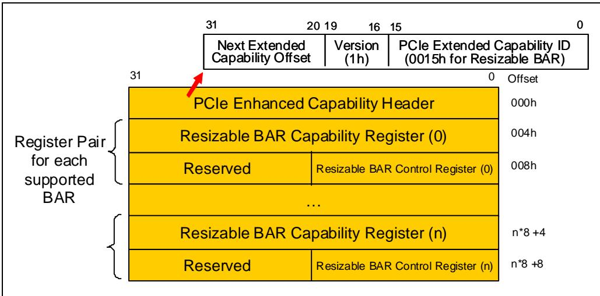

## 20.5.2.1 Capability Register | 20.5.2.1 能力寄存器

<table style="border-collapse:collapse; width:100%;">
  <thead>
    <tr>
      <th width="50%" style="border:2px solid #000; background:#f5f5f5;">EN</th>
      <th width="50%" style="border:2px solid #000; background-color:#e8e8e8;">中文</th>
    </tr>
  </thead>
  <tbody>
    <tr><td width="50%" style="border:2px solid #000; background:#fff;padding:4px 8px;">This register simply reports which BAR sizes will work for this Function. Bits 4 to 23 are used for this and the values are as shown here:</td><td width="50%" style="border:2px solid #000; background-color:#e8e8e8;padding:4px 8px;">该寄存器仅报告哪些 BAR 大小适用于该功能。位 4 到位 23 用于此目的，其值如下所示：</td></tr>
    <tr><td width="50%" style="border:2px solid #000; background:#fff;padding:4px 8px;">• Bit 4 - 1MB BAR size will work for this Function</td><td width="50%" style="border:2px solid #000; background-color:#e8e8e8;padding:4px 8px;">• 位 4 - 1MB BAR 大小适用于该功能</td></tr>
    <tr><td width="50%" style="border:2px solid #000; background:#fff;padding:4px 8px;">• Bit 5 - 2MB</td><td width="50%" style="border:2px solid #000; background-color:#e8e8e8;padding:4px 8px;">• 位 5 - 2MB</td></tr>
    <tr><td width="50%" style="border:2px solid #000; background:#fff;padding:4px 8px;">• Bit 6 - 4MB</td><td width="50%" style="border:2px solid #000; background-color:#e8e8e8;padding:4px 8px;">• 位 6 - 4MB</td></tr>
    <tr><td width="50%" style="border:2px solid #000; background:#fff;padding:4px 8px;">• Bit 23 - 512GB will work for this Function</td><td width="50%" style="border:2px solid #000; background-color:#e8e8e8;padding:4px 8px;">• 位 23 - 512GB 适用于该功能</td></tr>
  </tbody>
</table>

Figure 20-21: Resizable BAR Capability Register | 图20-21：可调整大小BAR能力寄存器

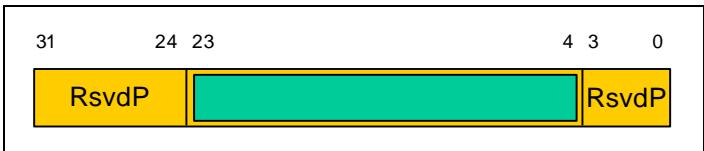

## Control Register | 控制寄存器

<table style="border-collapse:collapse; width:100%;">
  <thead>
    <tr>
      <th width="50%" style="border:2px solid #000; background:#f5f5f5;">EN</th>
      <th width="50%" style="border:2px solid #000; background-color:#e8e8e8;">中文</th>
    </tr>
  </thead>
  <tbody>
    <tr><td width="50%" style="border:2px solid #000; background:#fff;padding:4px 8px;">The BAR Index field in this register reports to which BAR this size refers (0 to 5 are possible). The Number of Resizable BARs field is only defined for Control Register zero and is reserved for all the others. It tells how many of the six possible BARs actually have an adjustable size. Finally, the BAR Size field is programmed by software to specify the desired size the BAR indicated by the BAR Index field (0 = 1MB, 1=2MB, 2=4MB, ..., 19=512GB).</td><td width="50%" style="border:2px solid #000; background-color:#e8e8e8;padding:4px 8px;">该寄存器中的BAR Index字段指示此大小对应于哪个BAR（可取0到5）。Number of Resizable BARs字段仅为控制寄存器0定义，其余寄存器保留。它指示六个可能的BAR中有多少个实际具有可调整大小。最后，BAR Size字段由软件编程，以指定BAR Index字段所指示的BAR的期望大小（0=1MB，1=2MB，2=4MB，...，19=512GB）。</td></tr>
  </tbody>
</table>

Figure 20‐22: Resizable BAR Control Register | 图20‐22：可调整大小BAR控制寄存器  

<table style="border-collapse:collapse; width:100%;">
  <thead>
    <tr>
      <th width="50%" style="border:2px solid #000; background:#f5f5f5;">EN</th>
      <th width="50%" style="border:2px solid #000; background-color:#e8e8e8;">中文</th>
    </tr>
  </thead>
  <tbody>
    <tr><td width="50%" style="border:2px solid #000; background:#fff;padding:4px 8px;">Once the Resizable values have been programmed, then enumeration software will be able to work as it normally does: writing all F's to each BAR and reading it back will report the size that was selected. Note that if the size value is changed, the contents of the BAR will be lost and will need to reprogrammed if it was previously set up. Figure 20‐23 on page 914 highlights the BAR registers in the configuration header space for a Type 0 header.</td><td width="50%" style="border:2px solid #000; background-color:#e8e8e8;padding:4px 8px;">一旦可调整大小值被编程后，枚举软件就能像往常一样工作：向每个BAR写入全F并回读将报告所选择的大小。注意，如果修改了大小值，BAR的内容将丢失，如果之前已设置好，则需要重新编程。第914页的图20-23展示了类型0配置头空间中的BAR寄存器。</td></tr>
  </tbody>
</table>

Figure 20‐23: BARs in a Type0 Configuration Header | 图20‐23：Type0配置头中的BAR  

<table style="border-collapse:collapse; width:100%;">
  <thead>
    <tr>
      <th width="50%" style="border:2px solid #000; background:#f5f5f5;">EN</th>
      <th width="50%" style="border:2px solid #000; background-color:#e8e8e8;">中文</th>
    </tr>
  </thead>
  <tbody>
    <tr><td width="50%" style="border:2px solid #000; background:#fff;padding:4px 8px;">## Simplified Ordering Table</td><td width="50%" style="border:2px solid #000; background-color:#e8e8e8;padding:4px 8px;">## 简化排序表</td></tr>
    <tr><td width="50%" style="border:2px solid #000; background:#fff;padding:4px 8px;">This change simplifies the Transaction Ordering Table by reducing the number of entries in the table. Essentially, it no longer distinguishes between completions for reads or completions for non‑posted writes. The motivation for this was to reduce the number of cases that needed to be tested. For more on this, see the section called "The Simplified Ordering Rules Table" on page 288.</td><td width="50%" style="border:2px solid #000; background-color:#e8e8e8;padding:4px 8px;">此更改通过减少表中的条目数量简化了事务排序表。本质上，它不再区分针对读取的完成报文和针对非发布写入的完成报文。这样做的动机是为了减少需要测试的情形数量。更多信息请参见第288页的"简化排序规则表"一节。</td></tr>
    <tr><td width="50%" style="border:2px solid #000; background:#fff;padding:4px 8px;">Appendices</td><td width="50%" style="border:2px solid #000; background-color:#e8e8e8;padding:4px 8px;">附录</td></tr>
  </tbody>
</table>

<table style="border-collapse:collapse; width:100%;">
  <thead>
    <tr>
      <th width="50%" style="border:2px solid #000; background:#f5f5f5;">EN</th>
      <th width="50%" style="border:2px solid #000; background-color:#e8e8e8;">中文</th>
    </tr>
  </thead>
  <tbody>
    <tr><td width="50%" style="border:2px solid #000; background:#fff;padding:4px 8px;"># Appendix A:</td><td width="50%" style="border:2px solid #000; background-color:#e8e8e8;padding:4px 8px;"># 附录 A：</td></tr>
  </tbody>
</table>

<table style="border-collapse:collapse; width:100%;">
  <thead>
    <tr>
      <th width="50%" style="border:2px solid #000; background:#f5f5f5;">EN</th>
      <th width="50%" style="border:2px solid #000; background-color:#e8e8e8;">中文</th>
    </tr>
  </thead>
  <tbody>
    <tr><td width="50%" style="border:2px solid #000; background:#fff;padding:4px 8px;"># Debugging PCIe Traffic with LeCroy Tools</td><td width="50%" style="border:2px solid #000; background-color:#e8e8e8;padding:4px 8px;"># 使用LeCroy工具调试PCIe流量</td></tr>
    <tr><td width="50%" style="border:2px solid #000; background:#fff;padding:4px 8px;">Christoper Webb, LeCroy Corporation</td><td width="50%" style="border:2px solid #000; background-color:#e8e8e8;padding:4px 8px;">Christoper Webb, LeCroy Corporation</td></tr>
  </tbody>
</table>

<table style="border-collapse:collapse; width:100%;">
  <thead>
    <tr>
      <th width="50%" style="border:2px solid #000; background:#f5f5f5;">EN</th>
      <th width="50%" style="border:2px solid #000; background-color:#e8e8e8;">中文</th>
    </tr>
  </thead>
  <tbody>
    <tr><td width="50%" style="border:2px solid #000; background:#fff;padding:4px 8px;">## Overview</td><td width="50%" style="border:2px solid #000; background-color:#e8e8e8;padding:4px 8px;">## 概述</td></tr>
    <tr><td width="50%" style="border:2px solid #000; background:#fff;padding:4px 8px;">The transition of IO bus architecture from PCI to PCI Express had a large impact on developers with respect to types of tools required for validation and debug.</td><td width="50%" style="border:2px solid #000; background-color:#e8e8e8;padding:4px 8px;">IO总线架构从PCI到PCI Express的过渡，对开发人员在验证和调试所需工具类型方面产生了重大影响。</td></tr>
    <tr><td width="50%" style="border:2px solid #000; background:#fff;padding:4px 8px;">With parallel buses such as PCI, a waveform view of the signals shows enough information for the developer to interpret the state of the bus. A user could visually examine a waveform and mentally decode the type of transactions, how much data is transferred, and even the content of that transfer.</td><td width="50%" style="border:2px solid #000; background-color:#e8e8e8;padding:4px 8px;">对于PCI这样的并行总线，信号的波形视图可为开发人员提供足够的信息来解释总线状态。用户可以直观地检查波形，在脑中解码出事务类型、传输的数据量，甚至传输的内容。</td></tr>
    <tr><td width="50%" style="border:2px solid #000; background:#fff;padding:4px 8px;">Since PCI Express packet traffic is both encoded and scrambled, examining a waveform view of the traffic provides very little information about the state of the link. The speed of the link can be inferred from the width of the bit times, and the width of the link can be inferred by the number of active lanes. However, the user cannot visually interpret the symbol alignment, let alone the packets themselves.</td><td width="50%" style="border:2px solid #000; background-color:#e8e8e8;padding:4px 8px;">由于PCI Express包流量既经过编码又经过加扰，检查流量的波形视图几乎无法提供有关链路状态的信息。链路的速率可以从位时间的宽度推断，链路的宽度可以从活动通道的数量推断。然而，用户无法直观地解读符号对齐，更不用说数据包本身了。</td></tr>
    <tr><td width="50%" style="border:2px solid #000; background:#fff;padding:4px 8px;">A new class of tools evolved to help developers visualize the state of their now serial links. These tools perform the de‑serialization, decoding, and de‑scrambling for the users. At first glance this would seem to be enough for the developer. But for PCI Express specifically, other complications such as flow control credits, lane‑to‑lane skew, polarity inversion, and lane reversal must also be comprehended by these tools as part of understanding PCIe protocol.</td><td width="50%" style="border:2px solid #000; background-color:#e8e8e8;padding:4px 8px;">一类新工具应运而生，帮助开发人员可视化其串行链路的状态。这些工具为用户执行解串、解码和解扰。乍一看，这对开发人员来说似乎足够了。但具体到PCI Express，这些工具还必须理解流控信用、通道间偏移、极性反转和通道反转等其他复杂问题，作为理解PCIe协议的一部分。</td></tr>
    <tr><td width="50%" style="border:2px solid #000; background:#fff;padding:4px 8px;">Both pre‑ and post‑silicon debug share a common need for tools. In this appen dix chapter, we describe some of the product offerings available for debugging PCI Express interconnects, both from a pre and post silicon perspective.</td><td width="50%" style="border:2px solid #000; background-color:#e8e8e8;padding:4px 8px;">硅前和硅后调试对工具有着共同的需求。在本附录章节中，我们将从硅前和硅后两个角度介绍一些可用于调试PCI Express互连的产品。</td></tr>
  </tbody>
</table>

<table style="border-collapse:collapse; width:100%;">
  <thead>
    <tr>
      <th width="50%" style="border:2px solid #000; background:#f5f5f5;">EN</th>
      <th width="50%" style="border:2px solid #000; background-color:#e8e8e8;">中文</th>
    </tr>
  </thead>
  <tbody>
    <tr><td width="50%" style="border:2px solid #000; background:#fff;padding:4px 8px;">## Pre-silicon Debugging</td><td width="50%" style="border:2px solid #000; background-color:#e8e8e8;padding:4px 8px;">## 硅前调试</td></tr>
  </tbody>
</table>

## 99.2.1 RTL Simulation Perspective | 99.2.1 RTL 仿真视角

<table style="border-collapse:collapse; width:100%;">
  <thead>
    <tr>
      <th width="50%" style="border:2px solid #000; background:#f5f5f5;">EN</th>
      <th width="50%" style="border:2px solid #000; background-color:#e8e8e8;">中文</th>
    </tr>
  </thead>
  <tbody>
    <tr><td width="50%" style="border:2px solid #000; background:#fff;padding:4px 8px;">In RTL simulation, looking at a waveform view of an FPGA or an ASIC signal is the most common way to debug. By showing internal state machine states, monitoring IO as it moves through the device, or seeing the state of control signals; a waveform view is quite powerful. But, as we discussed above, a PCI express link is not understandable when shown as a waveform. Additional processing or decoding must be done to make sense of this new link. To augment the simulation tools, a PCI Express Bus Monitor is typically added to address this need.</td><td width="50%" style="border:2px solid #000; background-color:#e8e8e8;padding:4px 8px;">在RTL仿真中，查看FPGA或ASIC信号的波形视图是最常见的调试方式。通过显示内部状态机状态、监测IO在器件中的移动过程，或观察控制信号的状态，波形视图非常强大。但如前所述，PCI Express链路以波形形式呈现时是无法理解的。必须进行额外的处理或解码才能理解这种新型链路。为增强仿真工具的能力，通常会添加一个PCI Express总线监视器来满足这一需求。</td></tr>
  </tbody>
</table>

## 99.2.2 PCI Express RTL Bus Monitor | 99.2.2 PCI Express RTL 总线监视器

<table style="border-collapse:collapse; width:100%;">
  <thead>
    <tr>
      <th width="50%" style="border:2px solid #000; background:#f5f5f5;">EN</th>
      <th width="50%" style="border:2px solid #000; background-color:#e8e8e8;">中文</th>
    </tr>
  </thead>
  <tbody>
    <tr><td width="50%" style="border:2px solid #000; background:#fff;padding:4px 8px;">A PCI Express Bus monitor is a piece of code which users insert in their RTL simulation to help monitor the state of their PCIe link. At minimum, this monitor will output text based log files with information about link state changes and types of packet activity. More complex monitors will perform real time compliance checking. A number of vendors provide purchasable IP which perform this exact function. The emphasis however is typically on compliance. Less functionality is provided with respect to visualization of things such as flow control credits, link utilization, or link training debug.</td><td width="50%" style="border:2px solid #000; background-color:#e8e8e8;padding:4px 8px;">PCI Express 总线监视器是一段用户插入其 RTL 仿真中的代码，用于帮助监视其 PCIe 链路的状态。该监视器至少会输出基于文本的日志文件，其中包含关于链路状态变化和报文活动类型的信息。更复杂的监视器会执行实时一致性检查。多家供应商提供可购买的 IP 来实现此功能。然而，其重点通常在于一致性检查。在流控信用量、链路利用率或链路训练调试等可视化方面提供的功能较少。</td></tr>
  </tbody>
</table>

## 99.2.3 RTL vector export to PETracer Application | 99.2.3 RTL 向量导出到 PETracer 应用

<table style="border-collapse:collapse; width:100%;">
  <thead>
    <tr>
      <th width="50%" style="border:2px solid #000; background:#f5f5f5;">EN</th>
      <th width="50%" style="border:2px solid #000; background-color:#e8e8e8;">中文</th>
    </tr>
  </thead>
  <tbody>
    <tr><td width="50%" style="border:2px solid #000; background:#fff;padding:4px 8px;">LeCroy has partnered with a number of the leading PCIe verification IP vendors to create tools to further enhance the visualization and analysis of pre‑silicon PCIe traffic. This involves using the vendors Bus Monitor to export raw symbol traffic into the same PETracer application used by the dedicated PCIe Analyzer hardware. SimPASS PE is LeCroy's solution to supporting this export.</td><td width="50%" style="border:2px solid #000; background-color:#e8e8e8;padding:4px 8px;">LeCroy 与多家领先的 PCIe 验证 IP 供应商合作，开发了相关工具，以进一步增强硅前 PCIe 流量的可视化和分析能力。这一过程利用供应商的总线监视器（Bus Monitor）将原始符号流量导出到与专用 PCIe 分析仪硬件相同的 PETracer 应用程序中。SimPASS PE 是 LeCroy 支持此导出的解决方案。</td></tr>
    <tr><td width="50%" style="border:2px solid #000; background:#fff;padding:4px 8px;">More information about LeCroy's PETracer application and its features are described in the section "As a last resort, a flying lead probe shown in Figure 5 on page 924 may be used to attach the protocol analyzer to the system under test. This involves soldering a resistive tap circuit and connector pins to the PCIe traces. This circuitry is typically soldered to the AC coupling caps of the PCIe link as they are often the only place to access the traces. Once the probe circuitry is soldered to the PCB, the analyzer probe can be connected and removed as needed. This approach can be used on virtually any PCIe link, however the robustness of the connection is limited by the skill of the technician adding the probe." on page 924.</td><td width="50%" style="border:2px solid #000; background-color:#e8e8e8;padding:4px 8px;">有关 LeCroy 的 PETracer 应用程序及其功能的更多信息，请参见第 924 页关于"作为最后的手段，可使用图 5 所示的飞线探头将协议分析仪连接到被测系统。这需要将电阻抽头电路和连接器引脚焊接到 PCIe 走线上。该电路通常焊接到 PCIe 链路的交流耦合电容上，因为这些电容往往是唯一可以接触到走线的地方。一旦探头电路焊接到 PCB 上，分析仪探头便可根据需要连接和移除。该方法几乎可用于任何 PCIe 链路，但连接的牢固程度受限于添加探头之技术人员的技术水平。"的章节。</td></tr>
  </tbody>
</table>

<table style="border-collapse:collapse; width:100%;">
  <thead>
    <tr>
      <th width="50%" style="border:2px solid #000; background:#f5f5f5;">EN</th>
      <th width="50%" style="border:2px solid #000; background-color:#e8e8e8;">中文</th>
    </tr>
  </thead>
  <tbody>
    <tr><td width="50%" style="border:2px solid #000; background:#fff;padding:4px 8px;">## Post-Silicon Debug</td><td width="50%" style="border:2px solid #000; background-color:#e8e8e8;padding:4px 8px;">## 硅后调试</td></tr>
  </tbody>
</table>

<table style="border-collapse:collapse; width:100%;">
  <thead>
    <tr>
      <th width="50%" style="border:2px solid #000; background:#f5f5f5;">EN</th>
      <th width="50%" style="border:2px solid #000; background-color:#e8e8e8;">中文</th>
    </tr>
  </thead>
  <tbody>
    <tr><td width="50%" style="border:2px solid #000; background:#fff;padding:4px 8px;">## Oscilloscope</td><td width="50%" style="border:2px solid #000; background-color:#e8e8e8;padding:4px 8px;">## 示波器</td></tr>
    <tr><td width="50%" style="border:2px solid #000; background:#fff;padding:4px 8px;">Use of an oscilloscope for debugging a PCIe link is typically focused on the electrical validation of the link. The most common usage is examining an eye pattern with a mask overlay for determining electrical compliance. A lesser known compliance check is to examine the entry and exit of electrical idle state to see if the link goes to the common mode voltage within the required time periods after an electrical idle ordered set is transmitted. These are 2 examples of PCIe compliance checking which are best performed using an oscilloscope such as shown in Figure 1 on page 920.</td><td width="50%" style="border:2px solid #000; background-color:#e8e8e8;padding:4px 8px;">使用示波器调试 PCIe 链路通常侧重于链路的电气验证。最常见的用途是检查带有模板覆盖的眼图以确定电气合规性。一个不太为人知的合规性检查是检查电气空闲状态的进入和退出，以查看链路在传输电气空闲有序集后是否在规定时间内达到共模电压。这是 PCIe 合规性检查的两个示例，最好使用示波器（如第 920 页图 1 所示）来执行。</td></tr>
    <tr><td width="50%" style="border:2px solid #000; background:#fff;padding:4px 8px;">With the addition of dynamic link training for 8.0 GT/s operation, devices must now train the transmitter emphasis during the Recovery.EQ LTSSM sub‐state. The goal is to set the transmitter EQ to provide the best signal eye to the receiver. Monitoring this dynamic equalization process is another example where the use of an oscilloscope is quite powerful. With a real time oscilloscope, the user can capture this process and see the impact on the waveform as transmitter settings are changed. This allows the user to verify that the transmitter is indeed acting on the coefficient change requests, but it also allows the user to determine if the receiver has properly chosen the correct setting.</td><td width="50%" style="border:2px solid #000; background-color:#e8e8e8;padding:4px 8px;">随着 8.0 GT/s 操作引入动态链路训练，器件现在必须在 Recovery.EQ LTSSM 子状态期间训练发送器均衡。目标是设置发送器 EQ 以向接收器提供最佳信号眼图。监控此动态均衡过程是使用示波器非常强大的另一个例子。使用实时示波器，用户可以捕获此过程并查看随着发送器设置更改而对波形的影响。这允许用户验证发送器确实正在响应系数更改请求，同时也允许用户确定接收器是否正确选择了正确的设置。</td></tr>
    <tr><td width="50%" style="border:2px solid #000; background:#fff;padding:4px 8px;">For logical debug of the link, the oscilloscope is most useful when the link is x1 or x2 as you are limited by the number channels the scope can acquire. The first method of examining PCIe traffic is a waveform view. As with the RTL waveform viewer, there is little to understand about the state of the link without SW help to perform 8b/10b decoding and de‐scrambling. Fortunately, more advanced oscilloscopes have SW packages that perform these duties. For this to work properly, the scope must have deep capture buffers and must see the SKIP ordered sets so that they can decipher the byte alignment and synchronize the de‐scrambler LFSR.</td><td width="50%" style="border:2px solid #000; background-color:#e8e8e8;padding:4px 8px;">对于链路的逻辑调试，当链路为 x1 或 x2 时示波器最为有用，因为您受限于示波器可获取的通道数量。检查 PCIe 流量的第一种方法是波形视图。与 RTL 波形查看器一样，如果没有软件帮助执行 8b/10b 解码和解扰，则很难了解链路的状态。幸运的是，更高级的示波器具有执行这些任务的软件包。为了使其正常工作，示波器必须具有深度的捕获缓冲区，并且必须看到 SKIP 有序集，以便它们能够解读字节对齐并同步解扰器 LFSR。</td></tr>
    <tr><td width="50%" style="border:2px solid #000; background:#fff;padding:4px 8px;">The LeCroy Oscilloscope can overlay PCIe symbols right onto the waveform for enhanced visibility of the traffic. An additional text based listing of the packet symbols can be displayed on the screen as an additional method of examining the waveform.</td><td width="50%" style="border:2px solid #000; background-color:#e8e8e8;padding:4px 8px;">LeCroy 示波器可以将 PCIe 符号直接叠加在波形上，以提高流量的可视性。额外的基于文本的包符号列表可以显示在屏幕上，作为检查波形的另一种方法。</td></tr>
    <tr><td width="50%" style="border:2px solid #000; background:#fff;padding:4px 8px;">LeCroy recently announced a SW package called ProtoSync for their oscilloscope line which allows the user to export the captured waveform into the PETracer application. This is the same SW package that the protocol analyzer uses which includes a wide range of post processing capabilities described below. The PETracer software can run independently on the scope hardware, often on a second monitor. This allows time correlated comparison of the physical layer data presented by the scope waveform alongside the logic layer presentation of data presented by the PETracer software.</td><td width="50%" style="border:2px solid #000; background-color:#e8e8e8;padding:4px 8px;">LeCroy 最近为其示波器产品线宣布了一个名为 ProtoSync 的软件包，允许用户将捕获的波形导出到 PETracer 应用程序中。这与协议分析器使用的软件包相同，包括下面描述的各种后处理功能。PETracer 软件可以独立运行在示波器硬件上，通常在第二个显示器上运行。这允许将示波器波形呈现的物理层数据与 PETracer 软件呈现的逻辑层数据进行时间相关比较。</td></tr>
    <tr><td width="50%" style="border:2px solid #000; background:#fff;padding:4px 8px;">Capture of the 8.0 GT/s dynamic link equalization on the oscilloscope and exporting this traffic to the PETracer application is a prime example where this solution is most powerful. The user can navigate PETracer to the link training packet where the TX coefficient change request has been sent, then identify where this coefficient change was applied in the scope SW. The user can then measure the time it takes for the coefficient change to be applied and compare this to the timing required in the PCIe spec.</td><td width="50%" style="border:2px solid #000; background-color:#e8e8e8;padding:4px 8px;">在示波器上捕获 8.0 GT/s 动态链路均衡并将此流量导出到 PETracer 应用程序是该方案最强大的典型示例。用户可以导航 PETracer 到已发送 TX 系数更改请求的链路训练包，然后识别在示波器软件中应用此系数更改的位置。然后用户可以测量应用系数更改所需的时间，并将其与 PCIe 规范中要求的时序进行比较。</td></tr>
  </tbody>
</table>

Figure A‐1: LeCroy Oscilloscope with ProtoSync Software Option | 图A‐1：带ProtoSync软件选项的LeCroy示波器

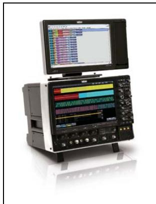

## 99.3.2 Protocol Analyzer | 99.3.2 协议分析仪

<table style="border-collapse:collapse; width:100%;">
  <thead>
    <tr>
      <th width="50%" style="border:2px solid #000; background:#f5f5f5;">EN</th>
      <th width="50%" style="border:2px solid #000; background-color:#e8e8e8;">中文</th>
    </tr>
  </thead>
  <tbody>
    <tr><td width="50%" style="border:2px solid #000; background:#fff;padding:4px 8px;">A growing trend in debugging PCIe links is to use a dedicated protocol analysis tool. What separates a protocol analyzer from a logic analyzer is that it is built to support a specific protocol such as PCIe. From a hardware perspective, a PCIe protocol analyzer is optimized for acquiring and storing PCIe traffic. This starts from the dedicated PCIe interposer probes, continues to the cabling choice, and carries through into the internal hardware components. For recovering PCIe traffic, specialized clock and data recovery circuits are used which can handle the electrical idle transitions, spread spectrum modulation, as well as handle the run lengths found in 128b/130b encoding. Sophisticated equalization circuits are used to recover the signal eye prior to deserialization. Without comprehending the complexities of PCIe recovery, the Analyzer hardware would not be optimized for recovering complex traffic such as speed switching, dynamic link widths, and low power states such as L0s.</td><td width="50%" style="border:2px solid #000; background-color:#e8e8e8;padding:4px 8px;">调试PCIe链路的一个日益增长的趋势是使用专用的协议分析工具。协议分析仪与逻辑分析仪的区别在于，它是为支持特定协议（如PCIe）而构建的。从硬件角度看，PCIe协议分析仪针对采集和存储PCIe流量进行了优化。这从专用的PCIe中介层探针开始，延续到线缆选择，并贯穿到内部硬件组件。为恢复PCIe流量，使用了专门的时钟与数据恢复电路，这些电路能够处理电气空闲转换、扩频调制，以及128b/130b编码中的游程长度。在解串之前，采用精密的均衡电路来恢复信号眼图。如果不理解PCIe恢复的复杂性，分析仪硬件就无法针对恢复复杂流量（如速率切换、动态链路宽度以及L0s等低功耗状态）进行优化。</td></tr>
    <tr><td width="50%" style="border:2px solid #000; background:#fff;padding:4px 8px;">In addition to choosing appropriate hardware components for recovering PCIe traffic, a protocol analyzer includes logic circuitry which is PCIe specific. This logic must infer the state of the PCIe link and follow it during various LTSSM state changes. Once the link state is being properly followed, dedicated packet inspection circuits perform data matching against incoming packets to look for events programmed by the user. These matchers are used for filtering of traffic as well as performing the trigger functionality needed for stopping the traffic capture. A mixture of these traffic filters as well as deep trace buffers (often 4GB to 8GB in size) allow the user to capture significantly longer traffic scenarios than would be possible without a protocol analyzer.</td><td width="50%" style="border:2px solid #000; background-color:#e8e8e8;padding:4px 8px;">除了选择合适的硬件组件来恢复PCIe流量外，协议分析仪还包含PCIe专用的逻辑电路。这些逻辑必须推断PCIe链路的状态，并在各种LTSSM状态变化期间跟踪该状态。一旦正确跟踪了链路状态，专用的报文检测电路就会对传入的报文执行数据匹配，以查找用户编程的事件。这些匹配器用于流量过滤以及执行停止流量捕获所需的触发功能。这些流量过滤器与深度追踪缓冲区（通常为4GB至8GB）的结合，使用户能够捕获比没有协议分析仪时长得多的流量场景。</td></tr>
    <tr><td width="50%" style="border:2px solid #000; background:#fff;padding:4px 8px;">Finally, the most important piece of a protocol analyzer is the software GUI. By optimizing the traffic views, post processing reports, and hardware controls with a dedicated PCI Express software tool; a very comprehensive set of PCI express specific analysis can be performed.</td><td width="50%" style="border:2px solid #000; background-color:#e8e8e8;padding:4px 8px;">最后，协议分析仪最重要的部分是软件GUI。通过使用专用的PCI Express软件工具优化流量视图、后处理报告和硬件控制，可以执行非常全面的PCI Express特定分析。</td></tr>
  </tbody>
</table>

## 99.3.3 Logic Analyzer | 99.3.3 逻辑分析仪

<table style="border-collapse:collapse; width:100%;">
  <thead>
    <tr>
      <th width="50%" style="border:2px solid #000; background:#f5f5f5;">EN</th>
      <th width="50%" style="border:2px solid #000; background-color:#e8e8e8;">中文</th>
    </tr>
  </thead>
  <tbody>
    <tr><td width="50%" style="border:2px solid #000; background:#fff;padding:4px 8px;">Some logic analyzers offer PCIe specific software packages.</td><td width="50%" style="border:2px solid #000; background-color:#e8e8e8;padding:4px 8px;">某些逻辑分析仪提供专用于 PCIe 的软件包。</td></tr>
    <tr><td width="50%" style="border:2px solid #000; background:#fff;padding:4px 8px;">This software will read the PCI express capture from the logic analyzer hardware and perform some amount of post processing of this data.</td><td width="50%" style="border:2px solid #000; background-color:#e8e8e8;padding:4px 8px;">该软件从逻辑分析仪硬件读取 PCI Express 捕获数据，并对这些数据执行一定量的后处理。</td></tr>
    <tr><td width="50%" style="border:2px solid #000; background:#fff;padding:4px 8px;">This analysis includes the basics such as decoding, de-scrambling, and decoding of the traffic.</td><td width="50%" style="border:2px solid #000; background-color:#e8e8e8;padding:4px 8px;">这种分析包括基本功能，例如解码、解扰以及对流量进行解码。</td></tr>
    <tr><td width="50%" style="border:2px solid #000; background:#fff;padding:4px 8px;">These SW tools do not perform many of the rich post processing features offered by dedicated protocol analyzer software, however.</td><td width="50%" style="border:2px solid #000; background-color:#e8e8e8;padding:4px 8px;">然而，这些软件工具无法执行专用协议分析仪软件所提供的许多丰富的后处理功能。</td></tr>
  </tbody>
</table>

## 99.4 Using a Protocol Analyzer Probing Option | 99.4 使用协议分析仪探测选项

<table style="border-collapse:collapse; width:100%;">
  <thead>
    <tr>
      <th width="50%" style="border:2px solid #000; background:#f5f5f5;">EN</th>
      <th width="50%" style="border:2px solid #000; background-color:#e8e8e8;">中文</th>
    </tr>
  </thead>
  <tbody>
    <tr><td width="50%" style="border:2px solid #000; background:#fff;padding:4px 8px;">To record your PCIe traffic you must first find the best method for probing it. PCIe started as an add-in card form factor for desktop PC's and servers, but has since proliferated into a dizzying array of standard and non-standard form factors. For the standard form factors, the best probe option is a dedicated interposer.</td><td width="50%" style="border:2px solid #000; background-color:#e8e8e8;padding:4px 8px;">要记录您的PCIe流量，必须首先找到最佳的探测方法。PCIe最初以台式PC和服务器的插件卡形式出现，但此后已扩展到令人眼花缭乱的各种标准和非标准外形规格。对于标准外形规格，最佳探测选项是专用内插器。</td></tr>
    <tr><td width="50%" style="border:2px solid #000; background:#fff;padding:4px 8px;">An Interposer is a dedicated piece of hardware which includes probe circuitry required for passing a copy of the PCIe traffic to the Analyzer hardware for capture and analysis. These interposers are designed specifically for the mechanical and electrical environments for which they are placed. The most common interposer is a "Slot Interposer" such as shown in Figure 2 on page 922. This interposer is used for probing standard CEM compliant PCIe add-in cards.</td><td width="50%" style="border:2px solid #000; background-color:#e8e8e8;padding:4px 8px;">内插器是一种专用硬件，其中包含探测电路，用于将PCIe流量的副本传递到分析仪硬件进行捕获和分析。这些内插器针对其所处的机械和电气环境专门设计。最常见的内插器是"插槽内插器"，如第922页图2所示。该内插器用于探测符合CEM标准的标准PCIe插件卡。</td></tr>
    <tr><td width="50%" style="border:2px solid #000; background:#fff;padding:4px 8px;">Care should be taken when selecting an interposer as the probe circuitry varies by vendor and by requirements imposed by the max PCIe link speed. For example, a Gen3 slot interposer should contain probe circuitry which allows the dynamic link training process to pass properly through the probe. The LeCroy Gen3 slot interposer uses linear circuits to maintain the shape of the waveform as it passes through the probe. This allows pre-emphasis of the transmitter to be dynamically changed during link training while allowing the receiver to quantify the impact of a new setting (either positive or negative impact).</td><td width="50%" style="border:2px solid #000; background-color:#e8e8e8;padding:4px 8px;">选择内插器时应谨慎，因为探测电路因供应商以及最大PCIe链路速度所施加的要求而异。例如，Gen3插槽内插器应包含允许动态链路训练过程正常通过探测器的探测电路。LeCroy Gen3插槽内插器使用线性电路来保持波形通过探测器时的形状。这使得发送器的预加重可以在链路训练期间动态改变，同时允许接收器量化新设置的影响（正面或负面影响）。</td></tr>
  </tbody>
</table>

Figure A-2: LeCroy PCI Express Slot Interposer x16 | 图A-2：LeCroy PCI Express插槽内插板x16
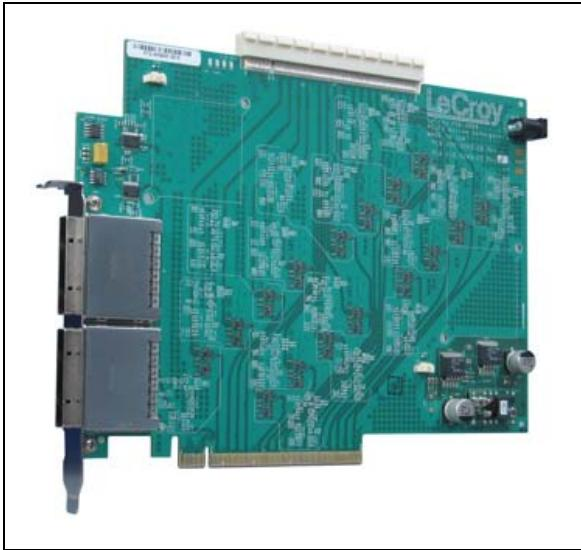

<table style="border-collapse:collapse; width:100%;">
  <thead>
    <tr>
      <th width="50%" style="border:2px solid #000; background:#f5f5f5;">EN</th>
      <th width="50%" style="border:2px solid #000; background-color:#e8e8e8;">中文</th>
    </tr>
  </thead>
  <tbody>
    <tr><td width="50%" style="border:2px solid #000; background:#fff;padding:4px 8px;">LeCroy also offers a family of other dedicated interposers for form factors such as ExpressCard, XMC, Mini Card, Express Module, AMC, etc. Some of these interposers are shown in Figure 3 on page 923. For a complete list of these interposers please refer to the LeCroy website: www.lecroy.com as this list is constantly growing.</td><td width="50%" style="border:2px solid #000; background-color:#e8e8e8;padding:4px 8px;">LeCroy还提供一系列其他专用内插器，适用于ExpressCard、XMC、Mini Card、Express Module、AMC等外形规格。其中一些内插器如第923页图3所示。有关这些内插器的完整列表，请参阅LeCroy网站：www.lecroy.com，因为该列表在不断增长。</td></tr>
  </tbody>
</table>

Figure A-3: LeCroy XMC, AMC, and Mini Card Interposers | 图A-3：LeCroy XMC、AMC和Mini Card内插板

<table style="border-collapse:collapse; width:100%;">
  <thead>
    <tr>
      <th width="50%" style="border:2px solid #000; background:#f5f5f5;">EN</th>
      <th width="50%" style="border:2px solid #000; background-color:#e8e8e8;">中文</th>
    </tr>
  </thead>
  <tbody>
    <tr><td width="50%" style="border:2px solid #000; background:#fff;padding:4px 8px;">For debugging PCIe links which cannot benefit from a dedicated interposer, a mid-bus probe shown in Figure 4 on page 923 is the next best option. A mid-bus probe involves placement of an industry standard probe geometry on the PCB. Each PCIe lane is routed to a pair of pads on the footprint which can be probed using a mid-bus probe head. These probes use spring pins or C clips for providing solder free mechanical attachment between the system under test and the protocol analyzer.</td><td width="50%" style="border:2px solid #000; background-color:#e8e8e8;padding:4px 8px;">对于无法使用专用内插器进行调试的PCIe链路，第923页图4所示的中总线探测器是次优选择。中总线探测器涉及在PCB上放置工业标准的探测几何图形。每条PCIe通道被路由到焊盘图案上的一对焊盘，可使用中总线探测头进行探测。这些探测器使用弹簧针或C型夹来提供待测系统与协议分析仪之间的免焊接机械连接。</td></tr>
  </tbody>
</table>

Figure A-4: LeCroy PCI Express Gen3 Mid-Bus Probe | 图A-4：LeCroy PCI Express Gen3总线中间探头

<table style="border-collapse:collapse; width:100%;">
  <thead>
    <tr>
      <th width="50%" style="border:2px solid #000; background:#f5f5f5;">EN</th>
      <th width="50%" style="border:2px solid #000; background-color:#e8e8e8;">中文</th>
    </tr>
  </thead>
  <tbody>
    <tr><td width="50%" style="border:2px solid #000; background:#fff;padding:4px 8px;">As a last resort, a flying lead probe shown in Figure 5 on page 924 may be used to attach the protocol analyzer to the system under test. This involves soldering a resistive tap circuit and connector pins to the PCIe traces. This circuitry is typically soldered to the AC coupling caps of the PCIe link as they are often the only place to access the traces. Once the probe circuitry is soldered to the PCB, the analyzer probe can be connected and removed as needed. This approach can be used on virtually any PCIe link, however the robustness of the connection is limited by the skill of the technician adding the probe.</td><td width="50%" style="border:2px solid #000; background-color:#e8e8e8;padding:4px 8px;">作为最后手段，可使用第924页图5所示的飞线探测器将协议分析仪连接到待测系统。这涉及将电阻抽头电路和连接器引脚焊接到PCIe走线上。该电路通常焊接到PCIe链路的交流耦合电容上，因为这些电容通常是唯一可以接触到走线的地方。一旦探测电路焊接到PCB上，分析仪探头即可根据需要连接和移除。这种方法几乎可用于任何PCIe链路，但连接的可靠性受限于添加探测器的技术人员的技能。</td></tr>
  </tbody>
</table>

Figure A-5: LeCroy PCI Express Gen2 Flying Lead Probe | 图A-5：LeCroy PCI Express Gen2飞线探头

<table style="border-collapse:collapse; width:100%;">
  <thead>
    <tr>
      <th width="50%" style="border:2px solid #000; background:#f5f5f5;">EN</th>
      <th width="50%" style="border:2px solid #000; background-color:#e8e8e8;">中文</th>
    </tr>
  </thead>
  <tbody>
    <tr><td width="50%" style="border:2px solid #000; background:#fff;padding:4px 8px;">## Viewing Traffic Using the PETracer Application</td><td width="50%" style="border:2px solid #000; background-color:#e8e8e8;padding:4px 8px;">## 使用 PETracer 应用程序查看流量</td></tr>
  </tbody>
</table>

<table style="border-collapse:collapse; width:100%;">
  <thead>
    <tr>
      <th width="50%" style="border:2px solid #000; background:#f5f5f5;">EN</th>
      <th width="50%" style="border:2px solid #000; background-color:#e8e8e8;">中文</th>
    </tr>
  </thead>
  <tbody>
    <tr><td width="50%" style="border:2px solid #000; background:#fff;padding:4px 8px;">The primary way to view PCI Express traffic with the LeCroy PETracer application is the CATC Trace view. This view takes each recorded packet and breaks it down into different packet fields to highlight the important values contained in this packet. A mixture of colors and text are used to visually categorize and explain the purpose of each packet. Errors are highlighted in red such as shown in Figure 6 on page 925. Warnings are highlighted in yellow making it easy to identify areas of traffic or fields in a packet which are non‑compliant.</td><td width="50%" style="border:2px solid #000; background-color:#e8e8e8;padding:4px 8px;">使用LeCroy PETracer应用程序查看PCI Express流量的主要方式就是CATC Trace视图。该视图获取每个记录的报文，并将其分解为不同的报文字段，以突出显示该报文中包含的重要值。它混合使用颜色和文本来直观地对每个报文进行分类并解释其用途。错误以红色高亮显示，如第925页图6所示。警告以黄色高亮显示，便于识别流量区域或报文中不符合规范的字段。</td></tr>
  </tbody>
</table>

Figure A-6: TLP Packet with ECRC Error | 图A-6：含ECRC错误的TLP数据包  
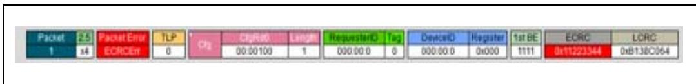

<table style="border-collapse:collapse; width:100%;">
  <thead>
    <tr>
      <th width="50%" style="border:2px solid #000; background:#f5f5f5;">EN</th>
      <th width="50%" style="border:2px solid #000; background-color:#e8e8e8;">中文</th>
    </tr>
  </thead>
  <tbody>
    <tr><td width="50%" style="border:2px solid #000; background:#fff;padding:4px 8px;">In addition to decoding and visually breaking down each packet, a hierarchical display allows logical grouping of related packets. For example, in "Link Level" mode, TLP packets are grouped with their respective ACK packet. Each TLP is identified as either implicitly or explicitly ACK'd or NAK'd. An example of a ACK DLLP is shown in Figure 7 on page 925 along with the ACK'd TLP.</td><td width="50%" style="border:2px solid #000; background-color:#e8e8e8;padding:4px 8px;">除了解码和直观分解每个报文外，分层显示还可以对相关报文进行逻辑分组。例如，在"Link Level"模式下，TLP报文与其对应的ACK报文分组在一起。每个TLP被标识为隐式或显式ACK'd或NAK'd。第925页图7显示了一个ACK DLLP及其对应的ACK'd TLP的示例。</td></tr>
  </tbody>
</table>

Figure A-7: "Link Level" Groups TLP Packets with their Link Layer Response | 图A-7："链路级别"将TLP数据包与其链路层响应分组  
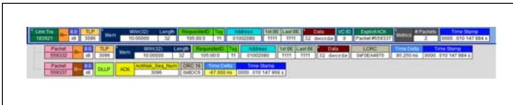

<table style="border-collapse:collapse; width:100%;">
  <thead>
    <tr>
      <th width="50%" style="border:2px solid #000; background:#f5f5f5;">EN</th>
      <th width="50%" style="border:2px solid #000; background-color:#e8e8e8;">中文</th>
    </tr>
  </thead>
  <tbody>
    <tr><td width="50%" style="border:2px solid #000; background:#fff;padding:4px 8px;">In "Split-Level" mode shown in Figure 8 on page 926, the CATC Trace view combines split transactions. For example, a single TLP read can be grouped with 1 or more completion TLPs to logically show large data transfers as a single line in the trace. The amount of data, starting address, as well as performance metrics are provided for each split level transaction. This allows the user to bypass the details of how large memory transactions are broken into multiple TLP packets and rather focus on the contents of the data. If the user wishes to see the details of the split transaction, the hierarchical display can show the link level and/or packet level breakdown of all the packets which make up this split transaction. This "drill-down" approach to traffic analysis allows the user to start from a high level view of what's happening on the bus and drill down only in the areas of traffic which are interesting to the user.</td><td width="50%" style="border:2px solid #000; background-color:#e8e8e8;padding:4px 8px;">在"Split-Level"模式下（如第926页图8所示），CATC Trace视图将拆分事务组合在一起。例如，单个TLP读取请求可以与一个或多个完成TLP分组在一起，从而在逻辑上将大数据传输显示为跟踪中的单一行。每个拆分级事务都提供了数据量、起始地址以及性能指标。这使用户可以绕过大内存事务如何被拆分为多个TLP报文的细节，而专注于数据内容本身。如果用户希望查看拆分事务的详细信息，分层显示可以展示构成该拆分事务的所有报文的链路级和/或报文级分解。这种"向下钻取"的流量分析方法允许用户从总线运行情况的高级视图开始，仅在自己感兴趣的流量区域进行深入分析。</td></tr>
  </tbody>
</table>

Figure A-8: "Split Level" Groups Completions with Associated Non-Posted Request | 图A-8："拆分级别"将完成与关联的非投递请求分组  

<table style="border-collapse:collapse; width:100%;">
  <thead>
    <tr>
      <th width="50%" style="border:2px solid #000; background:#f5f5f5;">EN</th>
      <th width="50%" style="border:2px solid #000; background-color:#e8e8e8;">中文</th>
    </tr>
  </thead>
  <tbody>
    <tr><td width="50%" style="border:2px solid #000; background:#fff;padding:4px 8px;">The CATC trace view also supports "Compact-View" shown in Figure 9 on page 927. In this view, packets which are sent repeatedly are collapsed into a single cell. This is very useful for collapsing Training Sequences or Flow Control Initialization packets. The software algorithms which perform this collapse are smart enough to collapse any SKIP ordered sets as well. This creates a very compact view of the link training process allowing the user to examine changes in the link training packets without scrolling through hundreds of packets.</td><td width="50%" style="border:2px solid #000; background-color:#e8e8e8;padding:4px 8px;">CATC跟踪视图还支持"Compact-View"（如第927页图9所示）。在此视图中，重复发送的报文被折叠为单个单元格。这对于折叠训练序列或流控初始化报文非常有用。执行该折叠操作的软件算法足够智能，也可以折叠任何SKIP有序集。这将创建一个非常紧凑的链路训练过程视图，使用户无需滚动浏览数百个报文即可检查链路训练报文中的变化。</td></tr>
  </tbody>
</table>

Figure A-9: "Compact View" Collapses Related Packets for Easy Viewing of Link Training | 图A-9："紧凑视图"折叠相关数据包以便于查看链路训练  

<table style="border-collapse:collapse; width:100%;">
  <thead>
    <tr>
      <th width="50%" style="border:2px solid #000; background:#f5f5f5;">EN</th>
      <th width="50%" style="border:2px solid #000; background-color:#e8e8e8;">中文</th>
    </tr>
  </thead>
  <tbody>
    <tr><td width="50%" style="border:2px solid #000; background:#fff;padding:4px 8px;">## LTSSM Graphs</td><td width="50%" style="border:2px solid #000; background-color:#e8e8e8;padding:4px 8px;">## LTSSM 状态图</td></tr>
    <tr><td width="50%" style="border:2px solid #000; background:#fff;padding:4px 8px;">To further enhance the "drill-down" traffic viewing approach, the PETracer application includes an LTSSM graph view as shown in Figure 10 on page 928. When this graph is invoked, the SW parses through the trace to find the link training sections and infers the state of the Link Training and Status State Machine (LTSSM). The result is a graph which breaks down the LTSSM state transitions in a very high level view. This graph allows the user to immediately see if the link went into a recovery state. If so, the user can easily identify which side of the link initiated the recovery, how many times it entered recovery, and even if the link speed or link width decreased because of the recovery.</td><td width="50%" style="border:2px solid #000; background-color:#e8e8e8;padding:4px 8px;">为了进一步增强"下钻"查看流量的方法，PETracer 应用程序包含一个 LTSSM 图视图，如图 10（第 928 页）所示。当调用此图时，软件会解析跟踪记录以查找链路训练部分，并推断链路训练与状态机 (LTSSM) 的状态。结果是一张以高层视图展示 LTSSM 状态转换的图表。该图允许用户立即查看链路是否进入了恢复状态。如果是，用户可以轻松识别链路的哪一侧发起了恢复、进入恢复的次数，甚至恢复是否导致链路速率或链路宽度降低。</td></tr>
    <tr><td width="50%" style="border:2px solid #000; background:#fff;padding:4px 8px;">The LTSSM graph is also an active link back into the trace file. For example, if the user clicks on the entry to recovery, the trace file will be navigated to that location in the trace file. This would allow the user to perhaps see if the recovery was caused by repeated NAKs or for some other reason such as loss of block alignment.</td><td width="50%" style="border:2px solid #000; background-color:#e8e8e8;padding:4px 8px;">LTSSM 图还是一个返回到跟踪文件的活动链接。例如，如果用户单击进入恢复的条目，跟踪文件将导航到该位置。这将使用户能够查看恢复是否是由重复的 NAK 或其他原因（如块对齐丢失）引起的。</td></tr>
    <tr><td width="50%" style="border:2px solid #000; background:#fff;padding:4px 8px;">In short, when users are debugging issues related to link training, speed change, or low power state transitions, the LTSSM is affected. By examining the LTSSM graph, the user can easily identify whether these link state changes occurred, where they occurred, and navigate directly to them for faster analysis.</td><td width="50%" style="border:2px solid #000; background-color:#e8e8e8;padding:4px 8px;">简而言之，当用户调试与链路训练、速率变化或低功耗状态转换相关的问题时，LTSSM 会受到影响。通过检查 LTSSM 图，用户可以轻松识别这些链路状态变化是否发生、发生在何处，并直接导航到这些位置以进行更快的分析。</td></tr>
  </tbody>
</table>

Figure A-10: LTSSM Graph Shows Link State Transitions Across the Trace | 图A-10：LTSSM图显示跟踪中的链路状态转换

## 99.5.3 Flow Control Credit Tracking | 99.5.3 流控信用跟踪

<table style="border-collapse:collapse; width:100%;">
  <thead>
    <tr>
      <th width="50%" style="border:2px solid #000; background:#f5f5f5;">EN</th>
      <th width="50%" style="border:2px solid #000; background-color:#e8e8e8;">中文</th>
    </tr>
  </thead>
  <tbody>
    <tr><td width="50%" style="border:2px solid #000; background:#fff;padding:4px 8px;">Flow control credit tracking is particularly problematic in PCI express. The flow control update packets do not show the number of credits each endpoint has, rather it shows how many credits in total have been used. This means that each endpoint must keep a running counter of credits for each type. There are a number of scenarios where credits can be lost, and if this occurs, the link will eventually be unable to transmit data due to lack of credits. Such problems are very difficult to identify and debug.</td><td width="50%" style="border:2px solid #000; background-color:#e8e8e8;padding:4px 8px;">在PCI Express中，流控信用量跟踪尤其成问题。流控更新报文不显示每个端点拥有多少信用量，而是显示总共已使用了多少信用量。这意味着每个端点必须为每种类型维护一个信用量的运行计数器。存在多种可能导致信用量丢失的场景，如果发生这种情况，链路最终将因缺乏信用量而无法传输数据。这类问题非常难以识别和调试。</td></tr>
    <tr><td width="50%" style="border:2px solid #000; background:#fff;padding:4px 8px;">The LeCroy PETracer application has a credit tracking SW tool shown in Figure 11 on page 929 to aid in this debug. If the trace contains FC-Init packets, it will walk through the trace and show the amount of remaining credits per virtual channel buffer type after each TLP and FC-Update.</td><td width="50%" style="border:2px solid #000; background-color:#e8e8e8;padding:4px 8px;">LeCroy PETracer应用具有一个信用量跟踪软件工具，如图11（第929页）所示，用于辅助此类调试。如果跟踪中包含FC-Init报文，它将遍历跟踪并在每个TLP和FC-Update之后显示每个虚通道缓冲区类型的剩余信用量。</td></tr>
    <tr><td width="50%" style="border:2px solid #000; background:#fff;padding:4px 8px;">FC-Init packets are sent once after link training. Because of this, the PETracer application has the ability for the user to set initial credit values at some point in the trace and the SW will calculate the relative credit values for the remaining packets. Even if the initial credit values are set improperly by the user, having the ability to see the relative credits is often enough to catch a flow control issue.</td><td width="50%" style="border:2px solid #000; background-color:#e8e8e8;padding:4px 8px;">FC-Init报文在链路训练后发送一次。因此，PETracer应用允许用户在跟踪中的某个点设置初始信用量值，软件将计算剩余报文的相对信用量值。即使初始信用量值被用户设置不当，能够查看相对信用量通常也足以捕获流控问题。</td></tr>
  </tbody>
</table>

Figure A-11: Flow Control Credit Tracking | 图A-11：流控信用量跟踪  

## 99.5.4 Bit Tracer | 99.5.4 位追踪器

<table style="border-collapse:collapse; width:100%;">
  <thead>
    <tr>
      <th width="50%" style="border:2px solid #000; background:#f5f5f5;">EN</th>
      <th width="50%" style="border:2px solid #000; background-color:#e8e8e8;">中文</th>
    </tr>
  </thead>
  <tbody>
    <tr><td width="50%" style="border:2px solid #000; background:#fff;padding:4px 8px;">Some debug situations are not solved by a drill down approach to examining the traffic. For example if the link settings are incorrect, the recording is often unreadable. What if a device is not properly scrambling the traffic, or the 10 bit symbols are sent in reverse order? For this scenario, a tool which focuses on analysis between the waveform view of the scope and the CATC Trace view is needed. This is where the BitTracer view shown in Figure 12 on page 930 is most powerful.</td><td width="50%" style="border:2px solid #000; background-color:#e8e8e8;padding:4px 8px;">某些调试场景无法通过逐层下钻检查流量来解决。例如，如果链路设置不正确，记录通常无法读取。如果设备未能正确加扰流量，或者10位符号以相反顺序发送，该怎么办？针对这种情况，需要一种能够在示波器波形视图与CATC Trace视图之间进行分析的工具。这正是第930页图12所示的BitTracer视图最为强大的地方。</td></tr>
    <tr><td width="50%" style="border:2px solid #000; background:#fff;padding:4px 8px;">The BitTracer view allows the user to see raw traffic exactly as it was seen on the link. The software allows the user to see the traffic as 10 bit symbols, scrambled bytes, or unscrambled bytes. Invalid symbols and incorrect running disparity are highlighted in red.</td><td width="50%" style="border:2px solid #000; background-color:#e8e8e8;padding:4px 8px;">BitTracer视图允许用户查看链路上原始流量的精确形态。该软件允许用户以10位符号、加扰字节或未加扰字节的形式查看流量。无效符号和错误的运行不一致性以红色高亮显示。</td></tr>
    <tr><td width="50%" style="border:2px solid #000; background:#fff;padding:4px 8px;">To further determine what may be wrong with the traffic, the BitTracer tool adds a powerful list of post processing features which can modify the traffic. For example, post capture; the user can invert the polarity of a given lane. Once applied, the user can see if the 10 bit symbols are now represented properly in the trace. If this cleans up the trace, it's an indication that the recording settings for the Analyzer hardware need to be changed.</td><td width="50%" style="border:2px solid #000; background-color:#e8e8e8;padding:4px 8px;">为了进一步确定流量可能存在的问题，BitTracer工具提供了一系列强大的后处理功能，可对流量进行修改。例如，在捕获后，用户可以反转给定通道的极性。应用后，用户可以查看10位符号现在是否在跟踪中正确呈现。如果这清理了跟踪，则表明分析仪硬件的记录设置需要更改。</td></tr>
  </tbody>
</table>

Figure A-12: BitTracer View of Gen2 Traffic | 图A-12：Gen2流量的BitTracer视图

<table style="border-collapse:collapse; width:100%;">
  <thead>
    <tr>
      <th width="50%" style="border:2px solid #000; background:#f5f5f5;">EN</th>
      <th width="50%" style="border:2px solid #000; background-color:#e8e8e8;">中文</th>
    </tr>
  </thead>
  <tbody>
    <tr><td width="50%" style="border:2px solid #000; background:#fff;padding:4px 8px;">In addition, the lane ordering can be modified. This is useful for determining if lane reversal is causing a bad capture. If the traffic has excessive lane to lane skew, the BitTracer software allows the user to re-align the traffic. For Gen3 traffic, this skew can be applied 1 bit at a time. This essentially allows the user to fix the 130 bit block alignment post capture.</td><td width="50%" style="border:2px solid #000; background-color:#e8e8e8;padding:4px 8px;">此外，还可以修改通道顺序。这对于判断通道反转是否导致捕获不良非常有用。如果流量存在过大的通道间偏移，BitTracer软件允许用户重新对齐流量。对于Gen3流量，可以每次1位地应用此偏移。这实质上允许用户在捕获后修复130位块对齐。</td></tr>
    <tr><td width="50%" style="border:2px solid #000; background:#fff;padding:4px 8px;">After applying changes to the data, all or just a portion of the data can be exported into the standard CATC Trace view for higher level analysis. This workflow is very powerful for debugging low level issues during early bringup. Let's say for example, the user's device trains the link properly, and then suddenly applies polarity inversion to 1 lane. This is a clear violation of the spec and will cause the link to retrain. If this traffic is captured with the BitTracer tool, the user could easily identify this as the problem. Additionally, the portion of the traffic before and after the inversion could be exported into separate trace files and examined in the CATC Trace view.</td><td width="50%" style="border:2px solid #000; background-color:#e8e8e8;padding:4px 8px;">在对数据应用更改后，可以将全部或部分数据导出到标准CATC Trace视图中进行更高级别的分析。此工作流对于在早期调试过程中排查底层问题非常强大。例如，假设用户的设备正确训练了链路，然后突然对1个通道应用极性反转。这明显违反了规范，并将导致链路重新训练。如果使用BitTracer工具捕获此流量，用户可以轻松识别出此问题。此外，反转前后的流量部分可以导出到单独的跟踪文件中，并在CATC Trace视图中进行检查。</td></tr>
  </tbody>
</table>

<table style="border-collapse:collapse; width:100%;">
  <thead>
    <tr>
      <th width="50%" style="border:2px solid #000; background:#f5f5f5;">EN</th>
      <th width="50%" style="border:2px solid #000; background-color:#e8e8e8;">中文</th>
    </tr>
  </thead>
  <tbody>
    <tr><td width="50%" style="border:2px solid #000; background:#fff;padding:4px 8px;">## Analysis overview</td><td width="50%" style="border:2px solid #000; background-color:#e8e8e8;padding:4px 8px;">## 分析概览</td></tr>
    <tr><td width="50%" style="border:2px solid #000; background:#fff;padding:4px 8px;">As you can see, different traffic views can be beneficial for debugging certain failure conditions. LeCroy supports import of PCIe traffic from many sources into its highly sophisticated PEtracer software. Whether the source is RTL simulation, an oscilloscope capture, or a dedicated protocol analyzer capture, PETracer has a rich set of traffic views and reports which allow the user to best understand the health and state of their PCIe link.</td><td width="50%" style="border:2px solid #000; background-color:#e8e8e8;padding:4px 8px;">如您所见，不同的流量视图有助于调试某些故障情况。LeCroy 支持从多种来源将 PCIe 流量导入其高度精密的 PETracer 软件。无论来源是 RTL 仿真、示波器捕获还是专用协议分析仪捕获，PETracer 都提供了丰富的流量视图和报告，使用户能够最好地了解其 PCIe 链路的状态和健康状况。</td></tr>
  </tbody>
</table>

<table style="border-collapse:collapse; width:100%;">
  <thead>
    <tr>
      <th width="50%" style="border:2px solid #000; background:#f5f5f5;">EN</th>
      <th width="50%" style="border:2px solid #000; background-color:#e8e8e8;">中文</th>
    </tr>
  </thead>
  <tbody>
    <tr><td width="50%" style="border:2px solid #000; background:#fff;padding:4px 8px;">## Traffic generation</td><td width="50%" style="border:2px solid #000; background-color:#e8e8e8;padding:4px 8px;">## 流量生成</td></tr>
  </tbody>
</table>

## 99.6.1 Pre-Silicon | 99.6.1 硅前

<table style="border-collapse:collapse; width:100%;">
  <thead>
    <tr>
      <th width="50%" style="border:2px solid #000; background:#f5f5f5;">EN</th>
      <th width="50%" style="border:2px solid #000; background-color:#e8e8e8;">中文</th>
    </tr>
  </thead>
  <tbody>
    <tr><td width="50%" style="border:2px solid #000; background:#fff;padding:4px 8px;">For stimulating a PCI Express endpoint in simulation, dedicated verification IP can be purchased from a number of vendors. This IP will test for basic functionality as well as perform a number of PCIe compliance checks. It is certainly in the interest of the ASIC developer to find and fix these issues before tapeout, and this is where the value of these tools comes from. If the PCIe design is implemented in an FPGA where mask costs are not an issue, it may be more cost effective to perform these compliance checks in hardware with a dedicated traffic generation tool such as the LeCroy PETrainer or LeCroy PTC card.</td><td width="50%" style="border:2px solid #000; background-color:#e8e8e8;padding:4px 8px;">为了在仿真中激励 PCI Express 端点，可以从多家供应商处购买专用的验证 IP。该 IP 将测试基本功能，并执行多项 PCIe 合规性检查。在流片前发现并修复这些问题显然符合 ASIC 开发者的利益，而这些工具的价值正源于此。如果 PCIe 设计是在掩膜成本不成问题的 FPGA 中实现的，那么使用专用流量生成工具（如 LeCroy PETrainer 或 LeCroy PTC 卡）在硬件中执行这些合规性检查可能更具成本效益。</td></tr>
  </tbody>
</table>

<table style="border-collapse:collapse; width:100%;">
  <thead>
    <tr>
      <th width="50%" style="border:2px solid #000; background:#f5f5f5;">EN</th>
      <th width="50%" style="border:2px solid #000; background-color:#e8e8e8;">中文</th>
    </tr>
  </thead>
  <tbody>
    <tr><td width="50%" style="border:2px solid #000; background:#fff;padding:4px 8px;">## Post-Silicon</td><td width="50%" style="border:2px solid #000; background-color:#e8e8e8;padding:4px 8px;">## 硅后</td></tr>
  </tbody>
</table>

## Exerciser Card | 练习卡

<table style="border-collapse:collapse; width:100%;">
  <thead>
    <tr>
      <th width="50%" style="border:2px solid #000; background:#f5f5f5;">EN</th>
      <th width="50%" style="border:2px solid #000; background-color:#e8e8e8;">中文</th>
    </tr>
  </thead>
  <tbody>
    <tr><td width="50%" style="border:2px solid #000; background:#fff;padding:4px 8px;">To thoroughly test the PCIe compliance and overall robustness of a PCIe design post‑silicon, a dedicated Exerciser card such as the LeCroy PETrainer shown in Figure 13 on page 932 is used. This card allows the user to generate a wide range of compliant and non‑compliant traffic. For example, if you place your PCIe card in a standard motherboard, you may be limited in the size of the TLP packets it will see. A dedicated Exerciser card can generate TLP packets across the entire legal range of packet sizes.</td><td width="50%" style="border:2px solid #000; background-color:#e8e8e8;padding:4px 8px;">为了在芯片后全面测试PCIe设计的合规性和整体稳健性，需要使用专用的Exerciser卡（例如图13（第932页）所示的LeCroy PETrainer）。该卡允许用户生成各种合规和非合规流量。例如，如果将PCIe卡置于标准主板中，其所见的TLP报文大小可能会受到限制。而专用的Exerciser卡可以生成整个合法范围内各种大小的TLP报文。</td></tr>
    <tr><td width="50%" style="border:2px solid #000; background:#fff;padding:4px 8px;">Secondly, if you would like to test that a card issues a NAK in response to a TLP with a bad LCRC, it would not possible with the card connected to compliant devices. They do not transmit bad packets. An Exerciser card can create a TLP with a bad LCRC, improper header values, or end the TLP with an EDB symbol.</td><td width="50%" style="border:2px solid #000; background-color:#e8e8e8;padding:4px 8px;">其次，如果要测试某张卡是否会针对带有错误LCRC的TLP发出NAK，在连接合规设备的情况下是无法做到的——合规设备不会发送错误报文。而Exerciser卡可以创建带有错误LCRC、错误头部值的TLP，或以EDB符号结束TLP。</td></tr>
    <tr><td width="50%" style="border:2px solid #000; background:#fff;padding:4px 8px;">If you would like to test that your card properly replay's a packet when it receives a NAK, this can be done with an Exerciser. Perhaps you would like to issue 4 NAKs in a row to a certain TLP so that link recovery is initiated. This behavior is all quite easy to program into the exerciser card.</td><td width="50%" style="border:2px solid #000; background-color:#e8e8e8;padding:4px 8px;">如果要测试您的卡在收到NAK时是否正确重发报文，使用Exerciser即可完成。例如，您可以对某个TLP连续发出4个NAK，从而触发链路恢复。所有这些行为都很容易编程写入Exerciser卡。</td></tr>
    <tr><td width="50%" style="border:2px solid #000; background:#fff;padding:4px 8px;">The number of test cases and failure scenarios is limited only by the number of scripts you write. Once written, these scripts can be re‑used for testing new versions of your design. The Analyzer SW can record these sessions and use scripting to determine if the response was correct. A number of LeCroy customers have created large libraries of regression tests using these tools.</td><td width="50%" style="border:2px solid #000; background-color:#e8e8e8;padding:4px 8px;">测试用例和故障场景的数量仅受限于您所编写的脚本数量。脚本编写完成后，可复用于测试设计的新版本。分析仪软件可以记录这些会话，并通过脚本判断响应是否正确。许多LeCroy客户已使用这些工具创建了大量的回归测试库。</td></tr>
  </tbody>
</table>

Figure A‐13: LeCroy Gen3 PETrainer Exerciser Card | 图A‐13：LeCroy Gen3 PETrainer训练卡  

<table style="border-collapse:collapse; width:100%;">
  <thead>
    <tr>
      <th width="50%" style="border:2px solid #000; background:#f5f5f5;">EN</th>
      <th width="50%" style="border:2px solid #000; background-color:#e8e8e8;">中文</th>
    </tr>
  </thead>
  <tbody>
    <tr><td width="50%" style="border:2px solid #000; background:#fff;padding:4px 8px;">## PTC card</td><td width="50%" style="border:2px solid #000; background-color:#e8e8e8;padding:4px 8px;">## PTC卡</td></tr>
    <tr><td width="50%" style="border:2px solid #000; background:#fff;padding:4px 8px;">The PCI SIG has published a specific list of compliance tests which all "Compliant" devices must pass. The LeCroy Protocol Test Card (PTC) is the hardware used to perform these tests at the PCI SIG Compliance workshops. Users can purchase a PTC card from LeCroy shown in Figure 14 on page 933 to pre&#8209;test their devices to ensure they will pass PCI SIG compliance testing.</td><td width="50%" style="border:2px solid #000; background-color:#e8e8e8;padding:4px 8px;">PCI SIG发布了一份具体的合规性测试清单，所有"符合规范"的设备必须通过这些测试。LeCroy协议测试卡(PTC)是在PCI SIG合规性研讨会上执行这些测试所使用的硬件。用户可以从LeCroy购买PTC卡(如第933页图14所示)来预测试其设备，以确保它们能通过PCI SIG合规性测试。</td></tr>
    <tr><td width="50%" style="border:2px solid #000; background:#fff;padding:4px 8px;">The LeCroy PTC is used to test root complex or endpoint devices at x1 link widths. Link speeds can be either Gen1 or Gen2.</td><td width="50%" style="border:2px solid #000; background-color:#e8e8e8;padding:4px 8px;">LeCroy PTC用于在x1链路宽度下测试根复合体或端点设备。链路速率可以是Gen1或Gen2。</td></tr>
  </tbody>
</table>

Figure A‑14: LeCroy Gen2 Protocol Test Card (PTC) | 图A‑14：LeCroy Gen2协议测试卡（PTC）

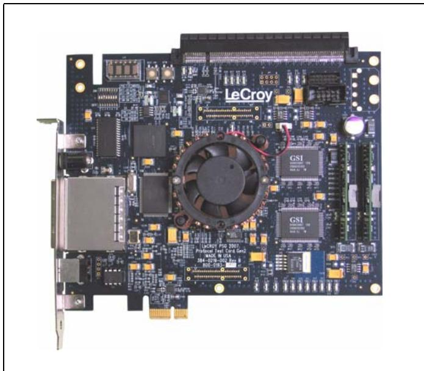

## 99.7 Conclusion | 99.7 结论

<table style="border-collapse:collapse; width:100%;">
  <thead>
    <tr>
      <th width="50%" style="border:2px solid #000; background:#f5f5f5;">EN</th>
      <th width="50%" style="border:2px solid #000; background-color:#e8e8e8;">中文</th>
    </tr>
  </thead>
  <tbody>
    <tr><td width="50%" style="border:2px solid #000; background:#fff;padding:4px 8px;">Today, the PCIe developer has access to a wide range of tools to help debug their PCIe design. Thanks to the wide adoption of the PCIe standard, many of these tools are designed specifically for PCIe debug and include features which address the challenges many PCIe devices face.</td><td width="50%" style="border:2px solid #000; background-color:#e8e8e8;padding:4px 8px;">如今，PCIe 开发者可以使用多种工具来帮助调试其 PCIe 设计。得益于 PCIe 标准的广泛采用，其中许多工具专为 PCIe 调试而设计，并包含了应对众多 PCIe 设备所面临挑战的功能。</td></tr>
    <tr><td width="50%" style="border:2px solid #000; background:#fff;padding:4px 8px;">For more information about the LeCroy PCIe tool offerings, please visit the LeCroy website www.lecroy.com</td><td width="50%" style="border:2px solid #000; background-color:#e8e8e8;padding:4px 8px;">有关 LeCroy PCIe 工具产品的更多信息，请访问 LeCroy 网站 www.lecroy.com</td></tr>
  </tbody>
</table>

# Appendix B: Markets & Applications for PCI Express

<table style="border-collapse:collapse; width:100%;">
  <thead>
    <tr>
      <th width="50%" style="border:2px solid #000; background:#f5f5f5;">EN</th>
      <th width="50%" style="border:2px solid #000; background-color:#e8e8e8;">中文</th>
    </tr>
  </thead>
  <tbody>
    <tr><td width="50%" style="border:2px solid #000; background:#fff;padding:4px 8px;"># Appendix B: Markets & Applications for PCI Express</td><td width="50%" style="border:2px solid #000; background-color:#e8e8e8;padding:4px 8px;"># 附录 B：PCI Express 的市场与应用</td></tr>
    <tr><td width="50%" style="border:2px solid #000; background:#fff;padding:4px 8px;">Akber Kazmi (Senior Director Marketing, PLX Technology, Inc.)</td><td width="50%" style="border:2px solid #000; background-color:#e8e8e8;padding:4px 8px;">Akber Kazmi（PLX Technology 公司市场部高级总监）</td></tr>
  </tbody>
</table>

## 99.1 Introduction | 99.1 引言

<table style="border-collapse:collapse; width:100%;">
  <thead>
    <tr>
      <th width="50%" style="border:2px solid #000; background:#f5f5f5;">EN</th>
      <th width="50%" style="border:2px solid #000; background-color:#e8e8e8;">中文</th>
    </tr>
  </thead>
  <tbody>
    <tr><td width="50%" style="border:2px solid #000; background:#fff;padding:4px 8px;">Since its definition in the early 1990s, PCI has emerged as the most successful interconnect technology ever used in computers. Originally intended for personal computer systems, the PCI architecture has expanded into virtually every computing platform category, including servers, storage, communications, and a wide range of embedded control applications. Most important, each advancement in PCI bus speed and width provided backward compatibility.</td><td width="50%" style="border:2px solid #000; background-color:#e8e8e8;padding:4px 8px;">自1990年代初定义以来，PCI已成为计算机史上最成功的互连技术。PCI架构最初面向个人计算机系统，现已扩展到几乎所有计算平台类别，包括服务器、存储、通信以及广泛的嵌入式控制应用。最重要的是，PCI总线速度和宽度的每一次提升都提供了向后兼容性。</td></tr>
    <tr><td width="50%" style="border:2px solid #000; background:#fff;padding:4px 8px;">As successful as the PCI architecture was, there was a limit to what could be accomplished with a multi-drop, parallel, shared-bus interconnect technology. A number of issues -- clock skew, high pin count, trace routing restrictions in printed circuit boards (PCB), bandwidth and latency requirements, physical scalability, and the need to support Quality of Service (QoS) within a system for a wide variety of applications -- lead to the definition of the PCI Express (PCIe) architecture.</td><td width="50%" style="border:2px solid #000; background-color:#e8e8e8;padding:4px 8px;">尽管PCI架构极为成功，但多点、并行、共享总线互连技术的能力终究存在极限。诸多问题——时钟偏移、高引脚数、印制电路板(PCB)上的走线布线限制、带宽和延迟要求、物理可扩展性，以及需要在系统内为多种应用支持服务质量(QoS)——最终催生了PCI Express (PCIe)架构的定义。</td></tr>
    <tr><td width="50%" style="border:2px solid #000; background:#fff;padding:4px 8px;">PCIe was the natural successor to PCI, and was developed to provide the advantages of a state-of-the-art, high-speed serial interconnect technology with a packet-based layered architecture, but maintain backward-compatibility with the large PCI software infrastructure. The key goal was to provide an optimized, universal interconnect solution for a wide variety of future platforms, including desktop, server, workstation, storage, communications, and embedded systems.</td><td width="50%" style="border:2px solid #000; background-color:#e8e8e8;padding:4px 8px;">PCIe是PCI的自然继承者，其开发旨在提供一种先进的高速串行互连技术优势，采用基于数据包的分层架构，同时保持与庞大PCI软件基础设施的向后兼容性。关键目标是为各种未来平台（包括桌面、服务器、工作站、存储、通信和嵌入式系统）提供优化的通用互连解决方案。</td></tr>
    <tr><td width="50%" style="border:2px solid #000; background:#fff;padding:4px 8px;">After its introduction in 2001, PCIe has gone through three generations of enhancements. In the first generation (Gen1), signaling rate was set at 2.5 GT/s and later enhanced to 5 GT/s (Gen2) and eventually 8 GT/s (Gen3). The PCIe specification allows combining of 2, 4, 8, 12, 16 or 32 lanes into a single port. However, products available today do not support 12- and 32-lane-wide ports. It is important to note that all PCIe Gen2 and Gen3 devices are required to be backward-compatible in speed with that of the previous generation.</td><td width="50%" style="border:2px solid #000; background-color:#e8e8e8;padding:4px 8px;">自2001年推出以来，PCIe已经历了三代增强。第一代(Gen1)信号速率定为2.5 GT/s，随后提升至5 GT/s (Gen2)，最终达到8 GT/s (Gen3)。PCIe规范允许将2、4、8、12、16或32条通道(Lane)组合到一个端口。然而，当前市面上的产品不支持12通道和32通道宽的端口。值得注意的是，所有PCIe Gen2和Gen3器件必须在速度上与上一代保持向后兼容。</td></tr>
    <tr><td width="50%" style="border:2px solid #000; background:#fff;padding:4px 8px;">The industry has launched and has fully embraced PCIe Gen3 products, while at the same time the PCI Special Interest Group (PCI-SIG) is analyzing signaling rate (speed) for Gen4. The goal for PCIe Gen4 is to double the speed of Gen3, to 16 GT/s.</td><td width="50%" style="border:2px solid #000; background-color:#e8e8e8;padding:4px 8px;">业界已推出并全面采纳了PCIe Gen3产品，同时PCI特殊兴趣小组(PCI-SIG)正在分析Gen4的信号速率（速度）。PCIe Gen4的目标是将Gen3的速度提升一倍，达到16 GT/s。</td></tr>
    <tr><td width="50%" style="border:2px solid #000; background:#fff;padding:4px 8px;">PCIe switches are available in an array of sizes, ranging from 3 to 96 lanes, and 3 to 24 ports where each port could be one, two, four, eight or 16 lanes wide. A Gen3 single lane would provide 1GB/s of bandwidth, while a 16-lane port offers 16GB bandwidth in each direction. Additionally, PCIe switch vendors, such as PLX Technology, have added features and enhancement to their products that are not part of PCIe specifications but enable them to differentiate their products and add value for the system designers. These features deliver ease of use, higher performance, fail-over, error detection, error isolation, and field-upgradability.</td><td width="50%" style="border:2px solid #000; background-color:#e8e8e8;padding:4px 8px;">PCIe交换机有多种规格，通道数从3到96，端口数从3到24，每个端口可宽达1、2、4、8或16条通道。Gen3单条通道提供1GB/s的带宽，而16通道端口在每个方向上提供16GB带宽。此外，PCIe交换机供应商（如PLX Technology）在其产品中添加了不属于PCIe规范的特性和增强功能，从而使其产品差异化并为系统设计人员增加价值。这些特性提供了易用性、更高性能、故障切换、错误检测、错误隔离和现场可升级能力。</td></tr>
    <tr><td width="50%" style="border:2px solid #000; background:#fff;padding:4px 8px;">On-chip features include non-transparent (NT) bridging, peer-to-peer communication, Hot-Plug, direct memory access (DMA), and error checking/recovery. Additionally debug features such as packet generation, receiver-eye measurement, traffic monitoring, and error injection in live traffic offer significant value to the designers, enabling early system bring-up. Many of these features can also be used for run-time performance improvements and monitoring.</td><td width="50%" style="border:2px solid #000; background-color:#e8e8e8;padding:4px 8px;">片内特性包括非透明(NT)桥接、对等通信、热插拔(Hot-Plug)、直接存储器访问(DMA)以及错误检查/恢复。此外，数据包生成、接收眼图测量、流量监控和在线流量错误注入等调试功能为设计人员提供了重要价值，使系统能够提早启动。其中许多特性还可用于运行时性能提升和监控。</td></tr>
    <tr><td width="50%" style="border:2px solid #000; background:#fff;padding:4px 8px;">Features included in next generation of PCIe switches are:</td><td width="50%" style="border:2px solid #000; background-color:#e8e8e8;padding:4px 8px;">下一代PCIe交换机包含的特性如下：</td></tr>
    <tr><td width="50%" style="border:2px solid #000; background:#fff;padding:4px 8px;">NT bridging: Allows two hosts/CPUs to be connected to the same PCIe switch while electrically and logically isolated. The NT bridging functions is broadly used in systems requiring isolation of two active CPUs or two CPUs where one is active and other is passive. The NT functionality allows the exchange of heartbeat between the two host CPUs to enable fail-over if one of them fails.</td><td width="50%" style="border:2px solid #000; background-color:#e8e8e8;padding:4px 8px;">NT桥接：允许两个主机/CPU连接到同一PCIe交换机，同时在电气和逻辑上保持隔离。NT桥接功能广泛用于需要隔离两个活动CPU或一个活动一个备用CPU的系统中。NT功能允许两个主机CPU之间交换心跳信号，以便在其中一个发生故障时实现故障切换。</td></tr>
  </tbody>
</table>

## Chapter : Appendix B: Markets & Applications for PCI | 附录 B：PCI 市场与应用

<table style="border-collapse:collapse; width:100%;">
  <thead>
    <tr>
      <th width="50%" style="border:2px solid #000; background:#f5f5f5;">EN</th>
      <th width="50%" style="border:2px solid #000; background-color:#e8e8e8;">中文</th>
    </tr>
  </thead>
  <tbody>
    <tr><td width="50%" style="border:2px solid #000; background:#fff;padding:4px 8px;">DMA: An on‑chip DMA controller in a PCIe switch offers significant value to the designers as it enables them to spare CPU cycles to move data between peers and the CPU to/from I/Os. The CPU's reduced effort in moving data boosts overall performance of the system as the spared CPU cycles can be used to run applications rather than managing data I/O.</td><td width="50%" style="border:2px solid #000; background-color:#e8e8e8;padding:4px 8px;">DMA：PCIe交换机中的片上DMA控制器为设计人员提供了重要价值，因为它使他们能够节省CPU周期，用于在对等设备之间以及CPU与I/O设备之间移动数据。CPU在数据移动方面的负担减轻提升了系统的整体性能，因为节省的CPU周期可用于运行应用程序，而非管理数据I/O。</td></tr>
    <tr><td width="50%" style="border:2px solid #000; background:#fff;padding:4px 8px;">Error Isolation: Users can program triggers for certain error events and response by the switch. The response of switch can also be programmed to ignore, trigger a host interrupt, bring the port with errors down, or bring the entire switch down.</td><td width="50%" style="border:2px solid #000; background-color:#e8e8e8;padding:4px 8px;">错误隔离：用户可以针对特定错误事件和交换机的响应来编程触发条件。交换机的响应也可以被编程为忽略、触发主机中断、使发生错误的端口宕机，或使整个交换机宕机。</td></tr>
    <tr><td width="50%" style="border:2px solid #000; background:#fff;padding:4px 8px;">Packet Generation: Generally, it is difficult to generate traffic that saturates a PCIe port without the use of expensive packet generator equipment. PCIe switches now have the ability to saturate any PCIe port with desired traffic, such as transaction layer packets, to check the performance and robustness of the system.</td><td width="50%" style="border:2px solid #000; background-color:#e8e8e8;padding:4px 8px;">报文生成：通常，在不使用昂贵的报文生成器设备的情况下，很难产生能够饱和PCIe端口的流量。PCIe交换机现在能够使用所需的流量（例如事务层报文）来饱和任何PCIe端口，以检查系统的性能和健壮性。</td></tr>
  </tbody>
</table>

<table style="border-collapse:collapse; width:100%;">
  <thead>
    <tr>
      <th width="50%" style="border:2px solid #000; background:#f5f5f5;">EN</th>
      <th width="50%" style="border:2px solid #000; background-color:#e8e8e8;">中文</th>
    </tr>
  </thead>
  <tbody>
    <tr><td width="50%" style="border:2px solid #000; background:#fff;padding:4px 8px;">## PCI Express IO Virtualization Solutions</td><td width="50%" style="border:2px solid #000; background-color:#e8e8e8;padding:4px 8px;">## PCI Express IO 虚拟化解决方案</td></tr>
    <tr><td width="50%" style="border:2px solid #000; background:#fff;padding:4px 8px;">The PCIe technology was initially defined as a single-host interconnect technology but in last few years new standards have been developed that make PCIe suitable for multi-host systems as a switch fabric technology for data centers and enterprise IT applications. The presence of native PCIe interfaces (ports) on x86 CPUs and servers platforms has enabled designers to use PCIe as backplane and fabric technology for small to mid-size server clusters.</td><td width="50%" style="border:2px solid #000; background-color:#e8e8e8;padding:4px 8px;">PCIe 技术最初被定义为单主机互连技术，但在过去几年中，新的标准已制定出来，使 PCIe 适用于作为交换网络技术用于多主机系统，以支持数据中心和企业 IT 应用。x86 CPU 和服务器平台上原生 PCIe 接口（端口）的存在，使设计人员能够将 PCIe 用作中小型服务器集群的背板和网络技术。</td></tr>
    <tr><td width="50%" style="border:2px solid #000; background:#fff;padding:4px 8px;">In 2007, the PCI-SIG released the Single-Root I/O Virtualization (SR-IOV) specification that enables sharing of a single physical resource such as a network interface card or host bus adapter in a PCIe system among multiple virtual machines running on one host. This is the simplest approach to sharing resources or I/O devices among different applications or virtual machines.</td><td width="50%" style="border:2px solid #000; background-color:#e8e8e8;padding:4px 8px;">2007 年，PCI-SIG 发布了单根 I/O 虚拟化 (SR-IOV) 规范，该规范允许在一个主机上运行的多个虚拟机之间共享 PCIe 系统中的单个物理资源，例如网卡或主机总线适配器。这是在应用程序或虚拟机之间共享资源或 I/O 设备的最简单方法。</td></tr>
    <tr><td width="50%" style="border:2px solid #000; background:#fff;padding:4px 8px;">The PCI-SIG followed by completing, in 2008, work on its Multi-Root I/O Virtualization (MR-IOV) specification that extends the use of PCIe technology from a single-root domain to a multi-root domain. The MR-IOV specification enables the use of a single I/O device by multiple hosts and multiple system images simultaneously, as illustrated in Figure 0-1 on page 938. This illustration shows a multi-host environment where MR-IOV capable NIC and HBA are shared across multiple servers or virtual machines via an MR-IOV switch.</td><td width="50%" style="border:2px solid #000; background-color:#e8e8e8;padding:4px 8px;">随后，PCI-SIG 于 2008 年完成了其多根 I/O 虚拟化 (MR-IOV) 规范的制定，将 PCIe 技术的应用从单根域扩展到多根域。MR-IOV 规范允许多个主机和多个系统镜像同时使用单个 I/O 设备，如图 0-1（第 938 页）所示。该图展示了一个多主机环境，其中支持 MR-IOV 的 NIC 和 HBA 通过 MR-IOV 交换机在多个服务器或虚拟机之间共享。</td></tr>
  </tbody>
</table>

Figure B-1: MR-IOV Switch Usage | 图B-1：MR-IOV交换机用途

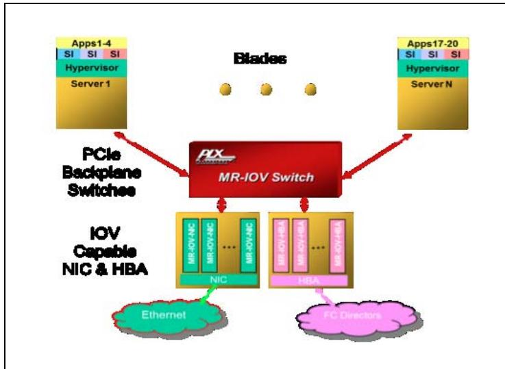

<table style="border-collapse:collapse; width:100%;">
  <thead>
    <tr>
      <th width="50%" style="border:2px solid #000; background:#f5f5f5;">EN</th>
      <th width="50%" style="border:2px solid #000; background-color:#e8e8e8;">中文</th>
    </tr>
  </thead>
  <tbody>
    <tr><td width="50%" style="border:2px solid #000; background:#fff;padding:4px 8px;">In order to implement MR-IOV specifications, three components of the system need to be developed – MR-IOV PCIe switches, endpoints, and management software. All three of these components must be available simultaneously and work seamlessly. Unfortunately, four years after the specification was developed, there is not a single silicon vendor that has MR-IOV capable PCIe switch or end-points. PCIe switch vendors are offering solutions that provide capabilities defined for MR-IOV through vendor-defined features and utilizing available SR-IOV end-points.</td><td width="50%" style="border:2px solid #000; background-color:#e8e8e8;padding:4px 8px;">为了实现 MR-IOV 规范，需要开发系统的三个组件——MR-IOV PCIe 交换机、端点和管理软件。这三个组件必须同时可用且无缝协作。遗憾的是，在规范制定四年后，仍没有任何一家芯片供应商拥有支持 MR-IOV 的 PCIe 交换机或端点。PCIe 交换机供应商正在通过厂商自定义特性并利用现有的 SR-IOV 端点，来提供具备 MR-IOV 所定义能力的解决方案。</td></tr>
  </tbody>
</table>

## 99.3 Multi-Root (MR) PCIe Switch Solution | 99.3 多根（MR）PCIe 交换机解决方案
## 99.3 Multi-Root (MR) PCIe Switch Solution | 99.3 多根(MR)PCIe交换机解决方案

<table style="border-collapse:collapse; width:100%;">
  <thead>
    <tr>
      <th width="50%" style="border:2px solid #000; background:#f5f5f5;">EN</th>
      <th width="50%" style="border:2px solid #000; background-color:#e8e8e8;">中文</th>
    </tr>
  </thead>
  <tbody>
    <tr><td width="50%" style="border:2px solid #000; background:#fff;padding:4px 8px;">PCIe switch vendors have created switches that offer implementation of multihost function through non‑transparent bridging and multi‑root (MR) capabilities. These MR switches allow multiple hosts to be connected to a single switching device, which can be portioned under user control in such a way that each host will be connected to a desired set of downstream ports of the switch.</td><td width="50%" style="border:2px solid #000; background-color:#e8e8e8;padding:4px 8px;">PCIe交换机供应商已开发出通过非透明桥接和多根(MR)能力实现多主机功能的交换机。这些MR交换机允许多个主机连接到单个交换设备，在用户控制下可对其进行分区，使得每个主机连接到交换机所需的一组下游端口。</td></tr>
    <tr><td width="50%" style="border:2px solid #000; background:#fff;padding:4px 8px;">In the MR switches, one of the hosts acts as the master and assigns I/Os to other host ports. Each host operates independently of other hosts and controls downstream devices in its domain. Figure 0‑2 on page 939 illustrates the internal architecture of an MR switch, in which particular sets of downstream ports are associated to particular host ports under management control.</td><td width="50%" style="border:2px solid #000; background-color:#e8e8e8;padding:4px 8px;">在MR交换机中，其中一个主机充当主控，向其他主机端口分配I/O。每个主机独立于其他主机运行，并控制其域内的下游设备。第939页的图0-2展示了MR交换机的内部架构，其中特定的一组下游端口在管理控制下与特定的主机端口相关联。</td></tr>
  </tbody>
</table>

Figure 0‑2:  MR‑IOV Switch Internal Architecture | 图0‑2：MR-IOV交换机内部架构  

<table style="border-collapse:collapse; width:100%;">
  <thead>
    <tr>
      <th width="50%" style="border:2px solid #000; background:#f5f5f5;">EN</th>
      <th width="50%" style="border:2px solid #000; background-color:#e8e8e8;">中文</th>
    </tr>
  </thead>
  <tbody>
    <tr><td width="50%" style="border:2px solid #000; background:#fff;padding:4px 8px;">## PCIe Beyond Chip-to-Chip Interconnect</td><td width="50%" style="border:2px solid #000; background-color:#e8e8e8;padding:4px 8px;">## 超越芯片间互连的PCIe</td></tr>
    <tr><td width="50%" style="border:2px solid #000; background:#fff;padding:4px 8px;">In early stages of PCIe deployments the technology was used as a chip-to-chip interconnect but now broad availability of PCIe interfaces on CPUs, chipsets and IOs and broad adoption of these components is pushing it beyond traditional applications. In a new generation of applications, PCIe is used in system backplanes, switch fabrics, cabling systems, storage/IO expansion, IO virtualization, high-performance computing (HPC), and server clusters. Figure 0-3 on page 940 illustrates use of PCIe in a data center for high performance compute application where servers in a rack are clustered through a top-of-rack (TOR) PCIe switch fabric box. The TOR PCIe switch can be connected to the network through Ethernet and to local storage and compute resources through PCIe links.</td><td width="50%" style="border:2px solid #000; background-color:#e8e8e8;padding:4px 8px;">在PCIe部署的早期阶段，该技术被用作芯片间互连，但现在CPU、芯片组和IO设备上PCIe接口的广泛可用性以及这些组件的广泛采用，正将其推向传统应用之外的领域。在新一代应用中，PCIe被用于系统背板、交换结构、布线系统、存储/IO扩展、IO虚拟化、高性能计算（HPC）和服务器集群。第940页的图0-3展示了PCIe在数据中心高性能计算应用中的使用，其中机架内的服务器通过机架顶（TOR）PCIe交换结构盒进行集群。TOR PCIe交换机可通过以太网连接到网络，并通过PCIe链路连接到本地存储和计算资源。</td></tr>
    <tr><td width="50%" style="border:2px solid #000; background:#fff;padding:4px 8px;">PCIe connections out-side the box depend on PCIe copper or optical cables that the leader in the industry are introducing at lower cost. The PCIe TOR fabric is suitable for server/compute clustering and may replace InfiniBand as the ecosystem for PCIe as fabric grows.</td><td width="50%" style="border:2px solid #000; background-color:#e8e8e8;padding:4px 8px;">机箱外部的PCIe连接依赖于业界领先者正在以更低成本推出的PCIe铜缆或光缆。PCIe TOR结构适用于服务器/计算集群，随着PCIe作为互连结构的生态系统的发展，其可能取代InfiniBand。</td></tr>
  </tbody>
</table>

Figure B-3: PCIe in a Data Center for HPC Applications | 图B-3：数据中心中用于HPC应用的PCIe

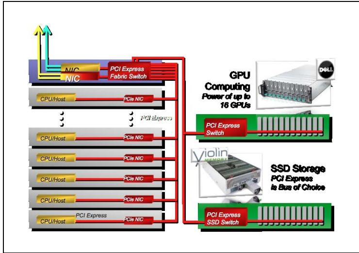

## SSD | Storage IO Expansion Boxes / SSD/存储IO扩展盒

<table style="border-collapse:collapse; width:100%;">
  <thead>
    <tr>
      <th width="50%" style="border:2px solid #000; background:#f5f5f5;">EN</th>
      <th width="50%" style="border:2px solid #000; background-color:#e8e8e8;">中文</th>
    </tr>
  </thead>
  <tbody>
    <tr><td width="50%" style="border:2px solid #000; background:#fff;padding:4px 8px;">Recently, the industry has converged towards PCIe as the unified interconnect technology for enterprise storage and solid state drive (SSD) applications. The NVM HCI, an industry consortium, has released a specification called NVM Express (NVMe) that uses PCIe to provide the bandwidth needed for SSD applications. Additionally, a T10 committee has embarked on defining SCSI over PCIe (SOP) protocol to take advantage of PCIe technology capabilities for high‑performance storage applications. Furthermore, the SATA consortium recently announced that it would use PCIe as the interconnect for its next‑generation SATA specification called SATA Express (SATAe).</td><td width="50%" style="border:2px solid #000; background-color:#e8e8e8;padding:4px 8px;">近年来，业界已趋向于将PCIe作为企业存储和固态硬盘（SSD）应用的统一互连技术。行业联盟NVM HCI发布了一项名为NVM Express（NVMe）的规范，该规范使用PCIe来提供SSD应用所需的带宽。此外，T10委员会已着手定义基于PCIe的SCSI（SOP）协议，以利用PCIe技术能力满足高性能存储应用的需求。另外，SATA联盟最近宣布，将采用PCIe作为其下一代SATA规范（称为SATA Express，简称SATAe）的互连方案。</td></tr>
  </tbody>
</table>

<table style="border-collapse:collapse; width:100%;">
  <thead>
    <tr>
      <th width="50%" style="border:2px solid #000; background:#f5f5f5;">EN</th>
      <th width="50%" style="border:2px solid #000; background-color:#e8e8e8;">中文</th>
    </tr>
  </thead>
  <tbody>
    <tr><td width="50%" style="border:2px solid #000; background:#fff;padding:4px 8px;">## PCIe in SSD Modules for Servers</td><td width="50%" style="border:2px solid #000; background-color:#e8e8e8;padding:4px 8px;">## 服务器SSD模块中的PCIe</td></tr>
    <tr><td width="50%" style="border:2px solid #000; background:#fff;padding:4px 8px;">Traditionally, enterprise SSD modules have shipped with SAS, SATA and Fibre Channel interfaces but due to the above-mentioned developments, a large majority of SSD controller, module and system suppliers have introduced products with PCIe interfaces. Most SSD controllers peak their performance and capacity due to a heavy load of managing flash. In high-performance applications, multiple SSD controllers (or ASICs) are used and aggregated through a PCIe switch. Figure 0-4 on page 941 shows a basic usage of a PCIe switch in an SSD add-in card that applies to any card or module form factor.</td><td width="50%" style="border:2px solid #000; background-color:#e8e8e8;padding:4px 8px;">传统上，企业级SSD模块采用SAS、SATA和光纤通道接口，但由于上述发展，绝大多数SSD控制器、模块和系统供应商已推出带有PCIe接口的产品。由于管理闪存的繁重负载，大多数SSD控制器的性能和容量已达到顶峰。在高性能应用中，多个SSD控制器（或ASIC）通过PCIe交换机进行聚合使用。第941页的图0-4展示了PCIe交换机在SSD附加卡中的基本应用，适用于任何卡或模块形态。</td></tr>
  </tbody>
</table>

Figure B-4: PCIe Switch Application in an SSD Add-In Card | 图B-4：SSD插件卡中的PCIe交换机应用

<table style="border-collapse:collapse; width:100%;">
  <thead>
    <tr>
      <th width="50%" style="border:2px solid #000; background:#f5f5f5;">EN</th>
      <th width="50%" style="border:2px solid #000; background-color:#e8e8e8;">中文</th>
    </tr>
  </thead>
  <tbody>
    <tr><td width="50%" style="border:2px solid #000; background:#fff;padding:4px 8px;">For large data center applications, the SSD add-in cards are installed in server motherboards as shown in Figure 0-5 on page 941 and IO expansion boxes (Figure 6) aggregated through PCIe switches. In server motherboard designs, PCIe switches are utilized to create more ports/slots that accommodate additional SSD modules to support the application's needs.</td><td width="50%" style="border:2px solid #000; background-color:#e8e8e8;padding:4px 8px;">在大型数据中心应用中，SSD附加卡安装在服务器主板（如第941页图0-5所示）和通过PCIe交换机聚合的IO扩展盒（图6）中。在服务器主板设计中，利用PCIe交换机创建更多端口/插槽，以容纳额外的SSD模块来满足应用需求。</td></tr>
  </tbody>
</table>

Figure B-5: Server Motherboard Use PCIe Switches | 图B-5：使用PCIe交换机的服务器主板

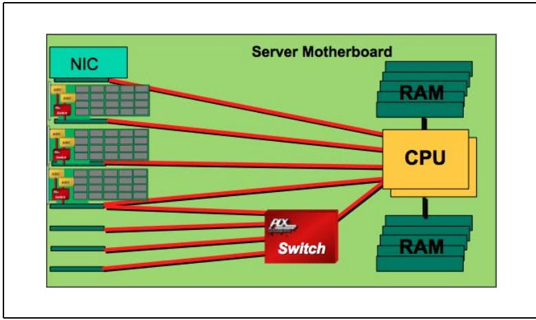

<table style="border-collapse:collapse; width:100%;">
  <thead>
    <tr>
      <th width="50%" style="border:2px solid #000; background:#f5f5f5;">EN</th>
      <th width="50%" style="border:2px solid #000; background-color:#e8e8e8;">中文</th>
    </tr>
  </thead>
  <tbody>
    <tr><td width="50%" style="border:2px solid #000; background:#fff;padding:4px 8px;">In addition to providing connectivity, PCIe switches can be used for providing redundancy and failover through NT bridging and MR functionality. The MR switches support 1+N failover capability, in which one server/host communicates with N number of servers to check the heartbeat and initiate a failover if one of them fails. One of the servers illustrated in Figure 0-6 on page 942 can be used as backup for the others in 1+N failover scheme.</td><td width="50%" style="border:2px solid #000; background-color:#e8e8e8;padding:4px 8px;">除了提供连接性，PCIe交换机还可用于通过NT桥接和MR功能提供冗余和故障转移。MR交换机支持1+N故障转移能力，即一个服务器/主机与N个服务器通信以检查心跳，并在其中一个服务器发生故障时启动故障转移。在第942页图0-6所示的服务器中，其中一个可用作1+N故障转移方案中其他服务器的备份。</td></tr>
  </tbody>
</table>

Figure B-6: Server Failover in 1 + N Failover Scheme | 图B-6：1+N故障切换方案中的服务器故障切换

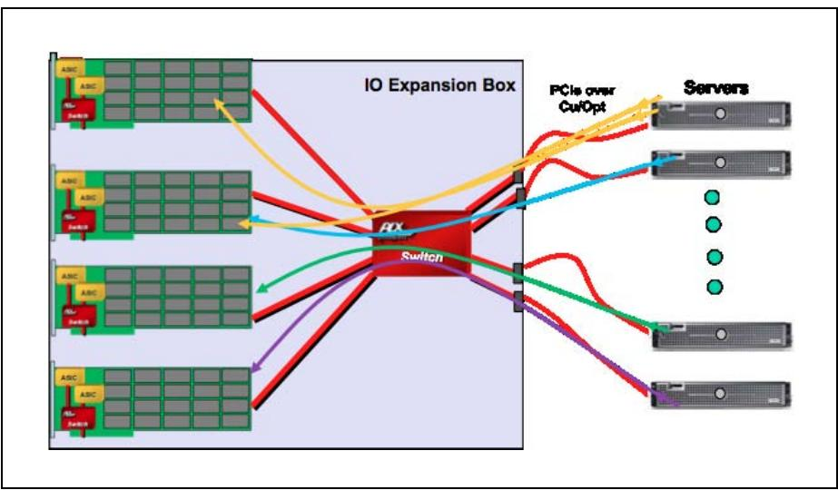

## 99.7 Conclusion | 99.7 结论

<table style="border-collapse:collapse; width:100%;">
  <thead>
    <tr>
      <th width="50%" style="border:2px solid #000; background:#f5f5f5;">EN</th>
      <th width="50%" style="border:2px solid #000; background-color:#e8e8e8;">中文</th>
    </tr>
  </thead>
  <tbody>
    <tr><td width="50%" style="border:2px solid #000; background:#fff;padding:4px 8px;">PCIe interconnect technology has become a serious contender for many high-end applications beyond chip-to-chip interconnect and is expected to be utilized in external I/O sharing, server clustering, I/O expansion and TOR switching.</td><td width="50%" style="border:2px solid #000; background-color:#e8e8e8;padding:4px 8px;">PCIe互连技术已成为许多高端应用的有力竞争者，其应用范围已超越芯片间互连，预计将被用于外部I/O共享、服务器集群、I/O扩展和TOR交换。</td></tr>
    <tr><td width="50%" style="border:2px solid #000; background:#fff;padding:4px 8px;">The current 8 GT/s and next-generation (Gen4) 16 GT/s line rates, the ability to aggregate multiple lanes in single high-bandwidth ports, fail-over capabilities, embedded DMA for data transfers, and IO sharing/virtualization provide capabilities that are at least equal to, if not superior to, interfaces such as InfiniBand and Ethernet.</td><td width="50%" style="border:2px solid #000; background-color:#e8e8e8;padding:4px 8px;">当前的8 GT/s和下一代(Gen4)16 GT/s速率、在单个高带宽端口中聚合多条通道的能力、故障切换能力、用于数据传输的嵌入式DMA以及I/O共享/虚拟化所提供的性能至少不逊于(即便不是优于)InfiniBand和Ethernet等接口。</td></tr>
  </tbody>
</table>

# Implementing Intelligent Adapters and Multi‐Host Systems With PCI Express Technology

<table style="border-collapse:collapse; width:100%;">
  <thead>
    <tr>
      <th width="50%" style="border:2px solid #000; background:#f5f5f5;">EN</th>
      <th width="50%" style="border:2px solid #000; background-color:#e8e8e8;">中文</th>
    </tr>
  </thead>
  <tbody>
    <tr><td width="50%" style="border:2px solid #000; background:#fff;padding:4px 8px;"># Implementing Intelligent Adapters and Multi‐Host Systems With PCI Express Technology</td><td width="50%" style="border:2px solid #000; background-color:#e8e8e8;padding:4px 8px;"># 使用PCI Express技术实现智能适配器与多主机系统</td></tr>
    <tr><td width="50%" style="border:2px solid #000; background:#fff;padding:4px 8px;">Jack Regula, Danny Chi, Tim Canepa (PLX Technology, Inc. )</td><td width="50%" style="border:2px solid #000; background-color:#e8e8e8;padding:4px 8px;">Jack Regula, Danny Chi, Tim Canepa (PLX Technology, Inc. )</td></tr>
  </tbody>
</table>

## 99.1 Introduction | 99.1 引言

<table style="border-collapse:collapse; width:100%;">
  <thead>
    <tr>
      <th width="50%" style="border:2px solid #000; background:#f5f5f5;">EN</th>
      <th width="50%" style="border:2px solid #000; background-color:#e8e8e8;">中文</th>
    </tr>
  </thead>
  <tbody>
    <tr><td width="50%" style="border:2px solid #000; background:#fff;padding:4px 8px;">Intelligent adapters, host failover mechanisms and multiprocessor systems are three usage models that are common today, and expected to become more prevalent as market requirements for next generation systems. Despite the fact that each of these was developed in response to completely different market demands, all share the common requirement that systems that utilize them require multiple processors to co‑exist within the system. This appendix outlines how PCI Express can address these needs through non‑transparent bridging.</td><td width="50%" style="border:2px solid #000; background-color:#e8e8e8;padding:4px 8px;">智能适配器、主机故障切换机制和多处理器系统是当今常见的三种使用模型，并且随着下一代系统的市场需求，预计将变得更加普遍。尽管每一种模型都是为了应对完全不同的市场需求而开发的，但它们都有一个共同的要求：使用这些模型的系统需要多个处理器在系统内共存。本附录概述了PCI Express如何通过非透明桥接来满足这些需求。</td></tr>
    <tr><td width="50%" style="border:2px solid #000; background:#fff;padding:4px 8px;">Because of the widespread popularity of systems using intelligent adapters, host failover and multihost technologies, PCI Express silicon vendors must provide a means to support them. This is actually a relatively low risk endeavor; given that PCI Express is software compatible with PCI, and PCI systems have long implemented distributed processing. The most obvious approach, and the one that PLX espouses, is to emulate the most popular implementation used in the PCI space for PCI Express. This strategy allows system designers to use not only a familiar implementation but one that is a proven methodology, and one that can provide significant software reuse as they migrate from PCI to PCI Express.This paper outlines how multiprocessor PCI Express systems will be implemented using industry standard practices established in the PCI paradigm. We first, however, will define the different usage models, and review the successful efforts in the PCI community to develop mechanisms to accommodate these requirements. Finally, we will cover how PCI Express systems will utilize non‑transparent bridging to provide the functionality needed for these types of systems.</td><td width="50%" style="border:2px solid #000; background-color:#e8e8e8;padding:4px 8px;">由于使用智能适配器、主机故障切换和多主机技术的系统广泛普及，PCI Express硅片供应商必须提供支持这些技术的手段。这实际上是一项风险相对较低的工作，因为PCI Express在软件上与PCI兼容，而PCI系统早已实现了分布式处理。最明显的方法，也是PLX所倡导的方法，是在PCI Express中仿效PCI领域最流行的实现方式。这一策略使系统设计者不仅可以使用熟悉的实现方式，而且是一种经过验证的方法学，并且在他们从PCI迁移到PCI Express时可以显著重用现有软件。本文概述了如何利用PCI范式中建立的行业标准实践来实现多处理器PCI Express系统。不过，我们首先将定义不同的使用模型，并回顾PCI社区为开发满足这些需求的机制所做的成功努力。最后，我们将介绍PCI Express系统如何利用非透明桥接来提供这些类型系统所需的功能。</td></tr>
  </tbody>
</table>

<table style="border-collapse:collapse; width:100%;">
  <thead>
    <tr>
      <th width="50%" style="border:2px solid #000; background:#f5f5f5;">EN</th>
      <th width="50%" style="border:2px solid #000; background-color:#e8e8e8;">中文</th>
    </tr>
  </thead>
  <tbody>
    <tr><td width="50%" style="border:2px solid #000; background:#fff;padding:4px 8px;">## Usage Models</td><td width="50%" style="border:2px solid #000; background-color:#e8e8e8;padding:4px 8px;">## 使用模型</td></tr>
  </tbody>
</table>

## 99.2.1 Intelligent Adapters | 99.2.1 智能适配器

<table style="border-collapse:collapse; width:100%;">
  <thead>
    <tr>
      <th width="50%" style="border:2px solid #000; background:#f5f5f5;">EN</th>
      <th width="50%" style="border:2px solid #000; background-color:#e8e8e8;">中文</th>
    </tr>
  </thead>
  <tbody>
    <tr><td width="50%" style="border:2px solid #000; background:#fff;padding:4px 8px;">Intelligent adapters are typically peripheral devices that use a local processor to offload tasks from the host. Examples of intelligent adapters include RAID controllers, modem cards, and content processing blades that perform tasks such as security and flow processing. Generally, these tasks are either computationally onerous or require significant I/O bandwidth if performed by the host. By adding a local processor to the endpoint, system designers can enjoy significant incremental performance. In the RAID market, a significant number of products utilize local intelligence for their I/O processing.</td><td width="50%" style="border:2px solid #000; background-color:#e8e8e8;padding:4px 8px;">智能适配器通常是利用本地处理器来卸载主机任务的外围设备。智能适配器的示例包括 RAID 控制器、调制解调器卡以及执行安全处理和流处理等内容处理刀片。通常，这些任务要么计算量繁重，要么若由主机执行则需要大量 I/O 带宽。通过在端点中添加本地处理器，系统设计人员可以获得显著的增量性能提升。在 RAID 市场中，相当多的产品利用本地智能进行其 I/O 处理。</td></tr>
    <tr><td width="50%" style="border:2px solid #000; background:#fff;padding:4px 8px;">Another example of intelligent adapters is an ecommerce blade. Because general purpose host processors are not optimized for the exponential mathematics necessary for SSL, utilizing a host processor to perform an SSL handshake typically reduces system performance by over 90%. Furthermore, one of the requirements for the SSL handshake operation is a true random number generator. Many general purpose processors do not have this feature, so it is actually difficult to perform SSL handshakes without dedicated hardware. Similar examples abound throughout the intelligent adapter marketplace; in fact, this usage model is so prevalent that for many applications it has become the de facto standard implementation.</td><td width="50%" style="border:2px solid #000; background-color:#e8e8e8;padding:4px 8px;">智能适配器的另一个示例是电子商务刀片。由于通用主机处理器并未针对 SSL 所需的指数运算进行优化，因此利用主机处理器执行 SSL 握手通常会使系统性能降低 90% 以上。此外，SSL 握手操作的要求之一是需要一个真正的随机数生成器。许多通用处理器不具备此功能，因此没有专用硬件实际上很难执行 SSL 握手。类似的示例在智能适配器市场中比比皆是；事实上，这种使用模式非常普遍，以至于在许多应用中它已成为事实上的标准实现。</td></tr>
  </tbody>
</table>

## 99.2.2 Host Failover | 99.2.2 主机故障切换

<table style="border-collapse:collapse; width:100%;">
  <thead>
    <tr>
      <th width="50%" style="border:2px solid #000; background:#f5f5f5;">EN</th>
      <th width="50%" style="border:2px solid #000; background-color:#e8e8e8;">中文</th>
    </tr>
  </thead>
  <tbody>
    <tr><td width="50%" style="border:2px solid #000; background:#fff;padding:4px 8px;">Host failover capabilities are designed into systems that require high availability.</td><td width="50%" style="border:2px solid #000; background-color:#e8e8e8;padding:4px 8px;">主机故障转移能力被设计到需要高可用性的系统中。</td></tr>
    <tr><td width="50%" style="border:2px solid #000; background:#fff;padding:4px 8px;">High availability has become an increasingly important requirement, especially in storage and communication platforms.</td><td width="50%" style="border:2px solid #000; background-color:#e8e8e8;padding:4px 8px;">高可用性已成为日益重要的需求，尤其是在存储和通信平台中。</td></tr>
    <tr><td width="50%" style="border:2px solid #000; background:#fff;padding:4px 8px;">The only practical way to ensure that the overall system remains operational is to provide redundancy for</td><td width="50%" style="border:2px solid #000; background-color:#e8e8e8;padding:4px 8px;">确保整个系统保持可运行状态的唯一实用方法是提供冗余，以</td></tr>
  </tbody>
</table>

## Chapter : Appendix C: Implementing Intelligent Adapt- | 附录 C：实现智能适配器

<table style="border-collapse:collapse; width:100%;">
  <thead>
    <tr>
      <th width="50%" style="border:2px solid #000; background:#f5f5f5;">EN</th>
      <th width="50%" style="border:2px solid #000; background-color:#e8e8e8;">中文</th>
    </tr>
  </thead>
  <tbody>
    <tr><td width="50%" style="border:2px solid #000; background:#fff;padding:4px 8px;">all components. Host failover systems typically include a host based system attached to several endpoints. In addition, a backup host is attached to the system and is configured to monitor the system status. When the primary host fails, the backup host processor must not only recognize the failure, but then take steps to assume primary control, remove the failed host to prevent additional disruptions, reconstitute the system state, and continue the operation of the system without losing any data.</td><td width="50%" style="border:2px solid #000; background-color:#e8e8e8;padding:4px 8px;">所有组件。主机故障转移系统通常包括一个连接到多个端点（Endpoint）的主机系统。此外，一个备份主机连接到该系统，并被配置为监控系统状态。当主主机发生故障时，备份主机处理器不仅要识别出故障，还必须采取措施接管主控制权，移除故障主机以防止额外的中断，重建系统状态，并在不丢失任何数据的情况下继续系统的运行。</td></tr>
  </tbody>
</table>

## 99.2.3 Multiprocessor Systems | 99.2.3 多处理器系统

<table style="border-collapse:collapse; width:100%;">
  <thead>
    <tr>
      <th width="50%" style="border:2px solid #000; background:#f5f5f5;">EN</th>
      <th width="50%" style="border:2px solid #000; background-color:#e8e8e8;">中文</th>
    </tr>
  </thead>
  <tbody>
    <tr><td width="50%" style="border:2px solid #000; background:#fff;padding:4px 8px;">Multiprocessor systems provide greater processing bandwidth by allowing multiple computational engines to simultaneously work on sections of a complex problem.</td><td width="50%" style="border:2px solid #000; background-color:#e8e8e8;padding:4px 8px;">多处理器系统允许多个计算引擎同时处理复杂问题的不同部分，从而提供更大的处理带宽。</td></tr>
    <tr><td width="50%" style="border:2px solid #000; background:#fff;padding:4px 8px;">Unlike systems utilizing host failover, where the backup processor is essentially idle, multiprocessor systems utilize all the engines to boost computational throughput.</td><td width="50%" style="border:2px solid #000; background-color:#e8e8e8;padding:4px 8px;">与采用主机故障切换的系统（其中备份处理器基本处于空闲状态）不同，多处理器系统利用所有引擎来提高计算吞吐量。</td></tr>
    <tr><td width="50%" style="border:2px solid #000; background:#fff;padding:4px 8px;">This enables a system to reach performance levels not possible by using only a single host processor.</td><td width="50%" style="border:2px solid #000; background-color:#e8e8e8;padding:4px 8px;">这使得系统能够达到仅使用单个主处理器无法实现的性能水平。</td></tr>
    <tr><td width="50%" style="border:2px solid #000; background:#fff;padding:4px 8px;">Multiprocessor systems typically consist of two or more complete sub‐systems that can pass data between themselves via a special interconnect.</td><td width="50%" style="border:2px solid #000; background-color:#e8e8e8;padding:4px 8px;">多处理器系统通常由两个或更多完整的子系统组成，这些子系统之间可以通过特殊的互连传递数据。</td></tr>
    <tr><td width="50%" style="border:2px solid #000; background:#fff;padding:4px 8px;">A good example of a multihost system is a blade server chassis.</td><td width="50%" style="border:2px solid #000; background-color:#e8e8e8;padding:4px 8px;">多主机系统的一个典型例子是刀片式服务器机箱。</td></tr>
    <tr><td width="50%" style="border:2px solid #000; background:#fff;padding:4px 8px;">Each blade is a complete subsystem, often replete with its own CPU, Direct Attached Storage, and I/O.</td><td width="50%" style="border:2px solid #000; background-color:#e8e8e8;padding:4px 8px;">每个刀片都是一个完整的子系统，通常配备有自己的 CPU、直连存储和 I/O。</td></tr>
  </tbody>
</table>

## 99.3 The History Multi-Processor Implementations Using PCI | 99.3 使用 PCI 的多处理器实现历史

<table style="border-collapse:collapse; width:100%;">
  <thead>
    <tr>
      <th width="50%" style="border:2px solid #000; background:#f5f5f5;">EN</th>
      <th width="50%" style="border:2px solid #000; background-color:#e8e8e8;">中文</th>
    </tr>
  </thead>
  <tbody>
    <tr><td width="50%" style="border:2px solid #000; background:#fff;padding:4px 8px;">To better understand the implementation proposed for PCI Express, one needs to first understand the PCI implementation.</td><td width="50%" style="border:2px solid #000; background-color:#e8e8e8;padding:4px 8px;">为了更好地理解PCI Express提出的实现方式，首先需要了解PCI的实现。</td></tr>
    <tr><td width="50%" style="border:2px solid #000; background:#fff;padding:4px 8px;">PCI was originally defined in 1992 for personal computers. Because of the nature of PCs at that time, the protocol architects did not anticipate the need for multiprocessors. Therefore, they designed the system assuming that the host processor would enumerate the entire memory space. Obviously, if another processor is added, the system operation would fail as both processors would attempt to service the system requests.</td><td width="50%" style="border:2px solid #000; background-color:#e8e8e8;padding:4px 8px;">PCI最初于1992年为个人计算机定义。由于当时PC的特性，协议架构师并未预见到多处理器的需求。因此，他们设计系统时假设主处理器将枚举整个内存空间。显然，如果添加另一个处理器，系统操作将会失败，因为两个处理器都会试图处理系统请求。</td></tr>
    <tr><td width="50%" style="border:2px solid #000; background:#fff;padding:4px 8px;">Several methodologies were subsequently invented to accommodate the requirement for multiprocessor capabilities using PCI. The most popular implementation, and the one discussed in this paper for PCI Express, is the use of non-transparent bridging between the processing subsystems to isolate their memory spaces.1</td><td width="50%" style="border:2px solid #000; background-color:#e8e8e8;padding:4px 8px;">随后发明了多种方法来满足使用PCI实现多处理器能力的需求。最流行的实现方式——也是本文针对PCI Express所讨论的——是在处理子系统之间使用非透明桥接来隔离各自的内存空间。1</td></tr>
    <tr><td width="50%" style="border:2px solid #000; background:#fff;padding:4px 8px;">Because the host does not know the system topology when it is first powered up or reset, it must perform discovery to learn what devices are present and then map them into the memory space. To support standard discovery and configuration software, the PCI specification defines a standard format for Control and Status Registers (CSRs) of compliant devices. The standard PCI-to-PCI bridge CSR header, called a Type 1 header, includes primary, secondary and subordinate bus number registers that, when written by the host, define the CSR addresses of devices on the other side of the bridge. Bridges that employ a Type 1 CSR header are called transparent bridges.</td><td width="50%" style="border:2px solid #000; background-color:#e8e8e8;padding:4px 8px;">由于主机在首次上电或复位时不知道系统拓扑，它必须执行发现过程来了解存在哪些设备，然后将它们映射到内存空间中。为了支持标准的发现和配置软件，PCI规范为兼容设备的控制和状态寄存器(CSR)定义了标准格式。标准PCI到PCI桥的CSR头部称为Type 1头部，包含主总线号、次级总线号和从属总线号寄存器，当主机写入这些寄存器时，它们定义了桥另一侧设备的CSR地址。采用Type 1 CSR头部的桥称为透明桥。</td></tr>
    <tr><td width="50%" style="border:2px solid #000; background:#fff;padding:4px 8px;">A Type 0 header is used for endpoints. A Type 0 CSR header includes base address registers (BARs) used to request memory or I/O apertures from the host. Both Type 1 and Type 0 headers include a class code register that indicates what kind of bridge or endpoint is represented, with further information available in a subclass field and in device ID and vendor ID registers. The CSR header format and addressing rules allow the processor to search all the branches of a PCI hierarchy, from the host bridge down to each of its leaves, reading the class code registers of each device it finds as it proceeds, and assigning bus numbers as appropriate as it discovers PCI-to-PCI bridges along the way. At the completion of discovery, the host knows which devices are present and the memory and I/O space each device requires to function. These concepts are illustrated in Figure C-0-1.</td><td width="50%" style="border:2px solid #000; background-color:#e8e8e8;padding:4px 8px;">Type 0头部用于端点。Type 0 CSR头部包含基址寄存器(BAR)，用于向主机请求内存或I/O窗口。Type 1和Type 0头部都包含类别代码寄存器，指示所代表的是何种桥或端点，子类别字段以及设备ID和厂商ID寄存器提供进一步信息。CSR头部格式和寻址规则允许处理器搜索PCI层次结构的所有分支，从主桥向下直到每个叶子节点，在遍历过程中读取所发现的每个设备的类别代码寄存器，并在发现PCI到PCI桥时相应地分配总线号。发现过程完成后，主机知道存在哪些设备以及每个设备运行所需的内存和I/O空间。这些概念如图C-0-1所示。</td></tr>
  </tbody>
</table>

Figure C-1: Enumeration Using Transparent Bridges | 图C-1：使用透明桥的枚举

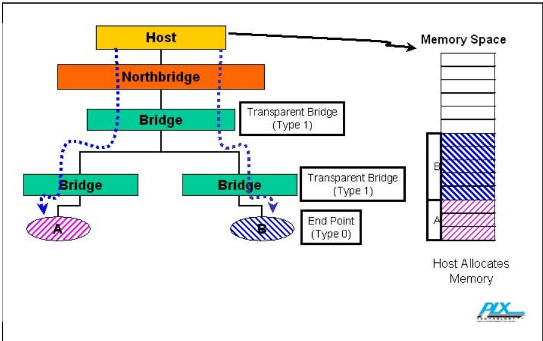

## Implementing Multi-host | Intelligent Adapters in PCI Express Base Systems / 在 PCI Express 基础系统中实现多主机/智能适配器

<table style="border-collapse:collapse; width:100%;">
  <thead>
    <tr>
      <th width="50%" style="border:2px solid #000; background:#f5f5f5;">EN</th>
      <th width="50%" style="border:2px solid #000; background-color:#e8e8e8;">中文</th>
    </tr>
  </thead>
  <tbody>
    <tr><td width="50%" style="border:2px solid #000; background:#fff;padding:4px 8px;">Up to this point, our discussions have been limited to one processor with one memory space. As technology progressed, system designers began developing end points with their own native processors built in. The problem that this caused was that both the host processor and the intelligent adapter would, upon power up or reset, attempt to enumerate the entire system, causing system conflict and ultimately a non‑functional system.</td><td width="50%" style="border:2px solid #000; background-color:#e8e8e8;padding:4px 8px;">至此，我们的讨论仅限于单一处理器和单一存储器空间。随着技术的进步，系统设计人员开始开发内置自有处理器的端点。这带来的问题是，主机处理器和智能适配器在上电或复位时都会尝试枚举整个系统，导致系统冲突，最终使系统无法运行。</td></tr>
    <tr><td width="50%" style="border:2px solid #000; background:#fff;padding:4px 8px;">To get around this, architects designed non‑transparent bridges. A non‑transparent PCI‑to‑PCI Bridge, or PCI Express‑to‑PCI Express Bridge, is a bridge that exposes a Type 0 CSR header on both sides and forwards transactions from one side to the other with address translation, through apertures created by the BARs of those CSR headers. Because it exposes a Type 0 CSR header, the bridge appears to be an endpoint to discovery and configuration software, eliminating potential discovery software conflicts. Each BAR on each side of the bridge creates a tunnel or window into the memory space on the other side of the bridge. To facilitate communication between the processing domains on each side, the non‑transparent bridge also typically includes doorbell registers to send interrupts from each side of the bridge to the other, and scratchpad registers accessible from both sides.</td><td width="50%" style="border:2px solid #000; background-color:#e8e8e8;padding:4px 8px;">为解决这一问题，架构师设计了非透明桥。非透明 PCI‑PCI 桥或 PCI Express‑PCI Express 桥是一种在两侧暴露 Type 0 CSR 头标，并通过这些 CSR 头标的基址寄存器（BAR）所创建的窗口，在两侧之间进行地址转换并转发事务的桥接器。由于暴露了 Type 0 CSR 头标，该桥接器对发现和配置软件而言表现为一个端点，从而消除了潜在的发现软件冲突。桥接器每一侧的每个 BAR 都在对侧存储器空间中创建一个隧道或窗口。为了便于两侧处理域之间的通信，非透明桥通常还包括门铃寄存器（用于从桥的一侧向另一侧发送中断）以及可从两侧访问的便签寄存器。</td></tr>
    <tr><td width="50%" style="border:2px solid #000; background:#fff;padding:4px 8px;">A non‑transparent bridge is functionally similar to a transparent bridge in that both provide a path between two independent PCI buses (or PCI Express links). The key difference is that when a non‑transparent bridge is used, devices on the downstream side of the bridge (relative to the system host) are not visible from the upstream side. This allows an intelligent controller on the downstream side to manage the devices in its local domain, while at the same time making them appear as a single device to the upstream controller. The path between the two buses allows the devices on the downstream side to transfer data directly to the upstream side of the bus without directly involving the intelligent controller in the data movement. Thus transactions are forwarded across the bus unfettered just as in a PCI‑to‑PCI Bridge, but the resources responsible are hidden from the host, which sees a single device.</td><td width="50%" style="border:2px solid #000; background-color:#e8e8e8;padding:4px 8px;">非透明桥在功能上与透明桥类似，两者都在两条独立的 PCI 总线（或 PCI Express 链路）之间提供通路。关键区别在于，使用非透明桥时，桥接器下游侧（相对于系统主机）的设备对上游侧不可见。这使得下游侧的智能控制器可以管理其本地域中的设备，同时使这些设备在上游控制器看来如同单个设备。两条总线之间的通路允许下游侧设备直接将数据传输到总线上游侧，而无需智能控制器直接参与数据移动。因此，事务就像在 PCI‑PCI 桥中一样不受阻碍地在总线间转发，但所涉及的资源对主机而言是隐藏的，主机看到的只是一个单一设备。</td></tr>
    <tr><td width="50%" style="border:2px solid #000; background:#fff;padding:4px 8px;">Because we now have two memory spaces, the PCI Express system needs to translate addresses of transactions that cross from one memory space to the other. This is accomplished via Translation and Limit Registers associated with the BAR.</td><td width="50%" style="border:2px solid #000; background-color:#e8e8e8;padding:4px 8px;">由于现在存在两个存储器空间，PCI Express 系统需要对从一个存储器空间跨越到另一个存储器空间的事务进行地址转换。这是通过与 BAR 相关联的转换与边界寄存器（Translation and Limit Registers）来实现的。</td></tr>
  </tbody>
</table>

See "Address Translation" on page 958 for a detailed description; Figure C-0-2 on page 949 provides a conceptual rendering of Direct Address Translation.

Address translation can be done by Direct Address Translation (essentially replacement of the data under a mask), table lookup, or by adding an offset to an address.

Figure C-0-3 on page 950 shows Table Lookup Translation used to create multiple windows spread across system memory space for packet originated in a local I/O processor's domain, as well as Direct Address Translation used to create a single window in the opposite direction.

<table style="border-collapse:collapse; width:100%;">
  <thead>
    <tr>
      <th width="50%" style="border:2px solid #000; background:#f5f5f5;">EN</th>
      <th width="50%" style="border:2px solid #000; background-color:#e8e8e8;">中文</th>
    </tr>
  </thead>
  <tbody>
    <tr><td width="50%" style="border:2px solid #000; background:#fff;padding:4px 8px;">Address translation can be done by Direct Address Translation (essentially replacement of the data under a mask), table lookup, or by adding an offset to an address. Figure C‑0‑3 on page 950 shows Table Lookup Translation used to create multiple windows spread across system memory space for packet originated in a local I/O processor's domain, as well as Direct Address Translation used to create a single window in the opposite direction.</td><td width="50%" style="border:2px solid #000; background-color:#e8e8e8;padding:4px 8px;">地址转换可通过直接地址转换（本质上是在掩码下替换数据）、表查找或向地址添加偏移量来完成。第 950 页的图 C‑0‑3 展示了用于为本地 I/O 处理器域发起的数据包创建分布在系统存储器空间中的多个窗口的表查找转换，以及用于在相反方向创建单个窗口的直接地址转换。</td></tr>
  </tbody>
</table>

<table style="border-collapse:collapse; width:100%;">
  <thead>
    <tr>
      <th width="50%" style="border:2px solid #000; background:#f5f5f5;">EN</th>
      <th width="50%" style="border:2px solid #000; background-color:#e8e8e8;">中文</th>
    </tr>
  </thead>
  <tbody>
    <tr><td width="50%" style="border:2px solid #000; background:#fff;padding:4px 8px;">## Chapter : Appendix C: Implementing Intelligent Adapt-</td><td width="50%" style="border:2px solid #000; background-color:#e8e8e8;padding:4px 8px;">## 附录 C：实现智能适配器</td></tr>
    <tr><td width="50%" style="border:2px solid #000; background:#fff;padding:4px 8px;">Figure 0-2: Direct Address Translation</td><td width="50%" style="border:2px solid #000; background-color:#e8e8e8;padding:4px 8px;">图 0-2：直接地址翻译</td></tr>
  </tbody>
</table>

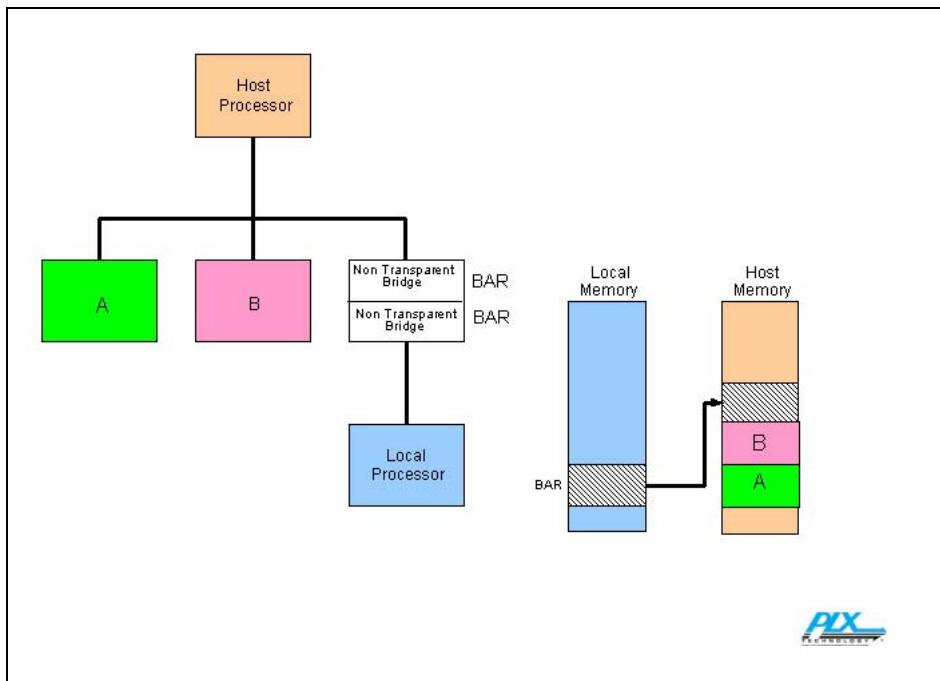

<table style="border-collapse:collapse; width:100%;">
  <thead>
    <tr>
      <th width="50%" style="border:2px solid #000; background:#f5f5f5;">EN</th>
      <th width="50%" style="border:2px solid #000; background-color:#e8e8e8;">中文</th>
    </tr>
  </thead>
  <tbody>
    <tr><td width="50%" style="border:2px solid #000; background:#fff;padding:4px 8px;">Figure 0-3: Look Up Table Translation Creates Multiple Windows</td><td width="50%" style="border:2px solid #000; background-color:#e8e8e8;padding:4px 8px;">图 0-3：查找表翻译创建多个窗口</td></tr>
  </tbody>
</table>

## 99.4.1 Example: Implementing Intelligent Adapters in a PCI Express Base System | 99.4.1 示例：在 PCI Express 基础系统中实现智能适配器
## 示例：在 PCI Express 基础系统中实现智能适配器

<table style="border-collapse:collapse; width:100%;">
  <thead>
    <tr>
      <th width="50%" style="border:2px solid #000; background:#f5f5f5;">EN</th>
      <th width="50%" style="border:2px solid #000; background-color:#e8e8e8;">中文</th>
    </tr>
  </thead>
  <tbody>
    <tr><td width="50%" style="border:2px solid #000; background:#fff;padding:4px 8px;">Intelligent adapters will be pervasive in PCI Express systems, and will likely be the most widely used example of systems with "multiple processors".</td><td width="50%" style="border:2px solid #000; background-color:#e8e8e8;padding:4px 8px;">智能适配器将在 PCI Express 系统中无处不在，很可能成为"多处理器"系统中最广泛使用的实例。</td></tr>
    <tr><td width="50%" style="border:2px solid #000; background:#fff;padding:4px 8px;">Figure C-0-4 on page 951 illustrates how PCI Express systems will implement intelligent adapters. The system diagram consists of a system host, a root complex (the PCI Express version of a Northbridge), a three port switch, an example endpoint, and an intelligent add-in card. Similar to the system architecture, the add-in card contains a local host, a root complex, a three port switch, and an</td><td width="50%" style="border:2px solid #000; background-color:#e8e8e8;padding:4px 8px;">图 C-0-4（第 951 页）展示了 PCI Express 系统如何实现智能适配器。该系统框图包含一个系统主机、一个根复合体（PCI Express 版本的北桥）、一个三端口交换机、一个示例端点和一块智能插卡。与系统架构类似，该智能插卡包含一个本地主机、一个根复合体、一个三端口交换机和一个</td></tr>
  </tbody>
</table>

## Chapter : Appendix C: Implementing Intelligent Adapters in PCI and PCI Express Systems | 附录 C：在 PCI 和 PCI Express 系统中实现智能适配器

Figure C-4: Intelligent Adapters in PCI and PCI Express Systems | 图C-4：PCI和PCI Express系统中的智能适配器

<table style="border-collapse:collapse; width:100%;">
  <thead>
    <tr>
      <th width="50%" style="border:2px solid #000; background:#f5f5f5;">EN</th>
      <th width="50%" style="border:2px solid #000; background-color:#e8e8e8;">中文</th>
    </tr>
  </thead>
  <tbody>
    <tr><td width="50%" style="border:2px solid #000; background:#fff;padding:4px 8px;">example endpoint. However we should note two significant differences: the intelligent add‑in card contains an EEPROM, and one port of the switch contains a back to back non‑transparent bridge.</td><td width="50%" style="border:2px solid #000; background-color:#e8e8e8;padding:4px 8px;">示例端点。但我们应注意两个重要区别：智能插件卡包含一个EEPROM，且交换机的一个端口包含一个背对背非透明桥。</td></tr>
    <tr><td width="50%" style="border:2px solid #000; background:#fff;padding:4px 8px;">Upon power up, the system host will begin enumerating to determine the topology. It will pass through the Root Complex and enter the first switch (Switch A). Upon entering the topmost port, it will see a transparent bridge, so it will know to continue to enumerate. The host will then poll the leftmost port and, upon finding a Type 0 CSR header, will consider it an endpoint and explore no deeper along that branch of the PCI hierarchy. The host will then use the information in the endpoint's CSR header to configure base and limit registers in bridges and BARs in endpoints to complete the memory map for this branch of the system.</td><td width="50%" style="border:2px solid #000; background-color:#e8e8e8;padding:4px 8px;">上电后，系统主机将开始枚举以确定拓扑。它将经过根复合体进入第一个交换机（Switch A）。进入最顶层端口时，它将看到一个透明桥，因此会继续枚举。主机随后轮询最左侧端口，当发现Type 0 CSR头时，将其视为端点，不再沿该PCI层次分支继续向下探寻。然后，主机使用端点CSR头中的信息配置桥中的基址和限制寄存器以及端点中的BAR（基址寄存器），以完成该系统分支的存储器映射。</td></tr>
    <tr><td width="50%" style="border:2px solid #000; background:#fff;padding:4px 8px;">The host will then explore the rightmost port of Switch A and read the CSR header registers associated with the top port of Switch B. Because this port is a non‑transparent bridge, the host finds a Type 0 CSR header. The host processor therefore believes that this is an endpoint and explores no deeper along that branch of the PCI hierarchy. The host reads the BARs of the top port of Switch B to determine the memory requirements for windows into the memory space on the other side of the bridge. The memory space requirements can be preloaded from an EEPROM into the BAR Setup Registers of Switch B's non‑transparent port or can be configured by the processor that is local to Switch B prior to allowing the system host to complete discovery.</td><td width="50%" style="border:2px solid #000; background-color:#e8e8e8;padding:4px 8px;">主机随后探测Switch A最右侧端口，并读取与Switch B顶层端口相关联的CSR头寄存器。由于该端口是一个非透明桥，主机发现的是Type 0 CSR头。因此主机处理器认为这是一个端点，不再沿该PCI层次分支继续探寻。主机读取Switch B顶层端口的BAR，以确定桥另一侧存储器空间窗口的存储器需求。存储器空间需求可从EEPROM预加载到Switch B非透明端口的BAR设置寄存器中，也可在允许系统主机完成发现之前由Switch B的本地处理器进行配置。</td></tr>
    <tr><td width="50%" style="border:2px solid #000; background:#fff;padding:4px 8px;">Similar to the host processor power up sequence, the local host will also begin enumerating its own system. Like the system host processor, it will allocate memory for endpoints and continue to enumerate when it encounters a transparent bridge. When the host reaches the topmost port of Switch B, it sees a non‑transparent bridge with a Type 0 CSR header. Accordingly, it reads the BARs of the CSR header to determine the memory aperture requirements, then terminates discovery along this branch of its PCI tree. Again, the memory aperture information can be supplied by an EEPROM, or by the system host.</td><td width="50%" style="border:2px solid #000; background-color:#e8e8e8;padding:4px 8px;">与主机处理器上电序列类似，本地主机也将开始枚举其自身系统。与系统主机处理器一样，它将为端点分配存储器，并在遇到透明桥时继续枚举。当主机到达Switch B最顶层端口时，它看到一个带有Type 0 CSR头的非透明桥。因此，它读取CSR头中的BAR以确定存储器窗口需求，然后终止沿其PCI树该分支的发现。同样，存储器窗口信息可由EEPROM提供，或由系统主机提供。</td></tr>
    <tr><td width="50%" style="border:2px solid #000; background:#fff;padding:4px 8px;">Communication between the two processor domains is achieved via a mailbox system and doorbell interrupts. The doorbell facility allows each processor to send interrupts to the other. The mailbox facility is a set of dual ported registers that are both readable and writable by both processors. Shared memory mapped mechanisms via the BARs may also be used for inter‑processor communication.</td><td width="50%" style="border:2px solid #000; background-color:#e8e8e8;padding:4px 8px;">两个处理器域之间的通信通过邮箱系统和门铃中断实现。门铃机制允许每个处理器向对方发送中断。邮箱机制是一组双端口寄存器，两个处理器均可读写。通过BAR的共享存储器映射机制也可用于处理器间通信。</td></tr>
  </tbody>
</table>

## 99.4.2 Example: Implementing Host Failover in a PCI Express System | 99.4.2 示例：在 PCI Express 系统中实现主机故障切换
## 示例：在PCI Express系统中实现主机故障切换

<table style="border-collapse:collapse; width:100%;">
  <thead>
    <tr>
      <th width="50%" style="border:2px solid #000; background:#f5f5f5;">EN</th>
      <th width="50%" style="border:2px solid #000; background-color:#e8e8e8;">中文</th>
    </tr>
  </thead>
  <tbody>
    <tr><td width="50%" style="border:2px solid #000; background:#fff;padding:4px 8px;">Figure C-0-5 on page 953 illustrates how most PCI Express systems will implement host failover. The primary host processor in this illustration is on the left side of the diagram, with the backup host on the right side of the diagram. Like most systems with which we are familiar, the host processor connects to a root complex. In turn, the root complex routes its traffic to the switch. In this example, the switch has two ports to end points in addition to the upstream port for the primary host we have just described. Furthermore, this system also has another processor, which is connected to the switch via another root complex.</td><td width="50%" style="border:2px solid #000; background-color:#e8e8e8;padding:4px 8px;">图C-0-5（第953页）展示了大多数PCI Express系统如何实现主机故障切换。此图中的主宿主机位于示意图左侧，备份宿主机位于右侧。与我们熟悉的大多数系统一样，宿主机连接到一个根复合体。根复合体再将其流量路由到交换机。在此示例中，除了我们刚刚描述的主宿主机的上游端口外，交换机还有两个通向端点的端口。此外，该系统还有另一个处理器，该处理器通过另一个根复合体连接到交换机。</td></tr>
  </tbody>
</table>

Figure C-5: Host Failover in PCI and PCI Express Systems | 图C-5：PCI和PCI Express系统中的主机故障切换

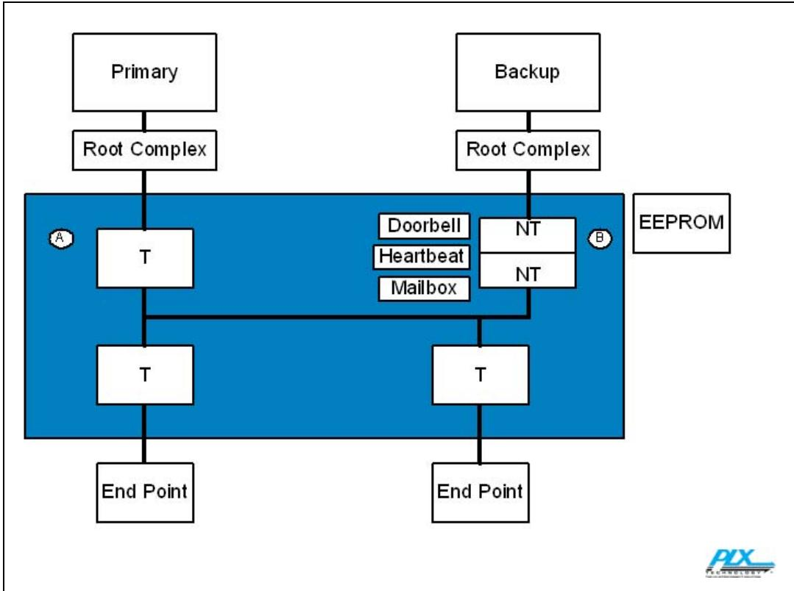

<table style="border-collapse:collapse; width:100%;">
  <thead>
    <tr>
      <th width="50%" style="border:2px solid #000; background:#f5f5f5;">EN</th>
      <th width="50%" style="border:2px solid #000; background-color:#e8e8e8;">中文</th>
    </tr>
  </thead>
  <tbody>
    <tr><td width="50%" style="border:2px solid #000; background:#fff;padding:4px 8px;">The switch ports to both processors need to be configurable to behave either as a transparent bridge or a non-transparent bridge. An EEPROM or strap pins on the switch can be used to initially bootstrap this configuration.</td><td width="50%" style="border:2px solid #000; background-color:#e8e8e8;padding:4px 8px;">连接到两个处理器的交换机端口必须可配置为透明桥或非透明桥。可以使用交换机上的EEPROM或配置引脚来初始引导此配置。</td></tr>
    <tr><td width="50%" style="border:2px solid #000; background:#fff;padding:4px 8px;">Under normal operation, upon power up, the primary host begins to enumerate the system. In our example, as the primary host processor begins its discovery protocol through the fabric, it discovers the two end points, and their memory requirements, by sizing their BARs. When it gets to the upper right port, it finds a Type 0 CSR header. This signifies to the primary host processor that it should not attempt discovery on the far side of the associated switch port. As in the previous example, the BARs associated with the non-transparent switch port may have been configured by EEPROM load prior to discovery or might be configured by software running on the local processor.</td><td width="50%" style="border:2px solid #000; background-color:#e8e8e8;padding:4px 8px;">在正常操作下，上电后，主宿主机开始枚举系统。在我们的示例中，当主宿主机处理器开始通过交换结构执行其发现协议时，它通过测量端点的基址寄存器（BAR）来发现这两个端点及其内存需求。当它到达右上端口时，发现了一个类型0 CSR头标。这向主宿主机处理器表明，它不应尝试在相关交换机端口的远端进行发现。与前面的示例一样，与非透明交换机端口相关联的基址寄存器（BAR）可以在发现之前通过EEPROM加载来配置，也可以由本地处理器上运行的软件来配置。</td></tr>
    <tr><td width="50%" style="border:2px solid #000; background:#fff;padding:4px 8px;">Again, similar to the previous example, the backup processor powers up and begins to enumerate. In this example, the backup processor chipset consists of the root complex and the backup processor only. It discovers the non-transparent switch port and terminates its discovery there. It is keyed by EEPROM loaded Device ID and Vendor ID registers to load an appropriate driver.</td><td width="50%" style="border:2px solid #000; background-color:#e8e8e8;padding:4px 8px;">同样，与前面的示例类似，备份处理器上电并开始枚举。在此示例中，备份处理器芯片组仅由根复合体和备份处理器组成。它发现非透明交换机端口并在此终止其发现。它通过EEPROM加载的设备ID和供应商ID寄存器来加载相应的驱动程序。</td></tr>
    <tr><td width="50%" style="border:2px solid #000; background:#fff;padding:4px 8px;">During the course of normal operation, the host processor performs all of its normal duties as it actively manages the system. In addition, it will send messages to the backup processor called heartbeat messages. Heartbeat messages are indications of the continued good health of the originating processor. A heartbeat message might be as simple as a doorbell interrupt assertion, but typically would include some data to reduce the possibility of a false positive. Checkpoint and journal messages are alternative approaches to providing the backup processor with a starting point, should it need to take over. In the journal methodology, the backup is provided with a list or journal of completed transactions (in the application specific sense, not in the sense of bus transactions). In the checkpoint methodology, the backup is periodically provided with a complete system state from which it can restart if necessary. The heartbeat's job is to provide the means by which the backup processor verifies that the host processor is still operational. Typically this data provides the latest activities and the state of all the peripherals.</td><td width="50%" style="border:2px solid #000; background-color:#e8e8e8;padding:4px 8px;">在正常操作过程中，宿主机处理器主动管理系统，执行其所有正常职责。此外，它还会向备份处理器发送称为心跳消息的消息。心跳消息是源处理器持续健康的指示。心跳消息可能就像门铃中断断言一样简单，但通常包含一些数据以减少误报的可能性。检查点（checkpoint）和日志（journal）消息是为备份处理器提供起始点的替代方法，以备其需要接管之需。在日志方法中，备份处理器会获得已完成事务（在应用特定意义上，而非总线事务意义上）的列表或日志。在检查点方法中，备份处理器会定期获得完整的系统状态，必要时可以从中重新启动。心跳的作用是提供备份处理器验证宿主机处理器仍在运行的手段。通常这些数据提供最新的活动以及所有外设的状态。</td></tr>
    <tr><td width="50%" style="border:2px solid #000; background:#fff;padding:4px 8px;">If the backup processor fails to receive timely heartbeat messages, it will begin assuming control. One of its first tasks is to demote the primary port to prevent the failed processor from interacting with the rest of the system. This is accomplished by reprogramming the CSRs of the switch using a memory mapped view of the switch's CSRs provided via a BAR in the non-transparent port. To take over, the backup processor reverses the transparent/non-transparent modes at both its port and the primary processor's port and takes down the link to the primary processor. After cleaning up any transactions left in the queues or left in an incomplete state as a result of the host failure, the backup processor reconfigures the system so that it can serve as the host. Finally, it uses the data in the checkpoint or journal messages to restart the system.</td><td width="50%" style="border:2px solid #000; background-color:#e8e8e8;padding:4px 8px;">如果备份处理器未能及时收到心跳消息，它将开始接管控制。其首要任务之一是降级主端口，以防止故障处理器与系统的其余部分交互。这通过使用非透明端口中基址寄存器（BAR）提供的交换机CSR的内存映射视图来重新编程交换机的CSR来实现。为了接管，备份处理器反转其端口和主处理器端口的透明/非透明模式，并关闭到主处理器的链路。在清理队列中遗留的或因主机故障而处于未完成状态的事务之后，备份处理器重新配置系统以便其能够充当宿主机。最后，它使用检查点或日志消息中的数据来重新启动系统。</td></tr>
  </tbody>
</table>

<table style="border-collapse:collapse; width:100%;">
  <thead>
    <tr>
      <th width="50%" style="border:2px solid #000; background:#f5f5f5;">EN</th>
      <th width="50%" style="border:2px solid #000; background-color:#e8e8e8;">中文</th>
    </tr>
  </thead>
  <tbody>
    <tr><td width="50%" style="border:2px solid #000; background:#fff;padding:4px 8px;">## Example: Implementing Dual Host in a PCI Express Base System</td><td width="50%" style="border:2px solid #000; background-color:#e8e8e8;padding:4px 8px;">## 示例：在PCI Express基本系统中实现双主机</td></tr>
    <tr><td width="50%" style="border:2px solid #000; background:#fff;padding:4px 8px;">Figure C-0-6 on page 955 illustrates how PCI Express systems might implement a dual host system1. In this example, the leftmost blocks are a typically complete system, with the rightmost blocks being a separate subsystem. As previously discussed, connecting the leftmost and rightmost diagram is a set of nontransparent bridges.</td><td width="50%" style="border:2px solid #000; background-color:#e8e8e8;padding:4px 8px;">第955页的图C‑0‑6说明了PCI Express系统如何实现双主机系统1。在此示例中，最左侧的模块是一个典型的完整系统，而最右侧的模块则是一个独立的子系统。如前所述，连接最左侧和最右侧图的部分是一组非透明桥。</td></tr>
  </tbody>
</table>

**Figure 0-6: Dual Host in a PCI and PCI Express System**

<table style="border-collapse:collapse; width:100%;">
  <thead>
    <tr>
      <th width="50%" style="border:2px solid #000; background:#f5f5f5;">EN</th>
      <th width="50%" style="border:2px solid #000; background-color:#e8e8e8;">中文</th>
    </tr>
  </thead>
  <tbody>
    <tr><td width="50%" style="border:2px solid #000; background:#fff;padding:4px 8px;">Upon power up, both processors will begin enumerating. As before, the hosts will search out the endpoints by reading the CSR and then allocate memory</td><td width="50%" style="border:2px solid #000; background-color:#e8e8e8;padding:4px 8px;">上电后，两个处理器将开始枚举。与之前一样，主机将通过读取CSR来搜索端点，然后分配内存。</td></tr>
  </tbody>
</table>

## PCI Express 3.0 Technology | PCI Express 3.0 技术

<table style="border-collapse:collapse; width:100%;">
  <thead>
    <tr>
      <th width="50%" style="border:2px solid #000; background:#f5f5f5;">EN</th>
      <th width="50%" style="border:2px solid #000; background-color:#e8e8e8;">中文</th>
    </tr>
  </thead>
  <tbody>
    <tr><td width="50%" style="border:2px solid #000; background:#fff;padding:4px 8px;">appropriately. When the hosts encounter the non-transparent bridge port in each of their private switches, they will assume it is an endpoint and, using the data in the EEPROM, allocate resources. Both systems will use the doorbell and mailbox registers described above to communicate with each other.</td><td width="50%" style="border:2px solid #000; background-color:#e8e8e8;padding:4px 8px;">适当地。当主机在其各自私有交换机中遇到非透明桥接端口时，会将其假定为端点，并利用EEPROM中的数据分配资源。两个系统将使用上文所述的门铃寄存器和邮箱寄存器相互通信。</td></tr>
    <tr><td width="50%" style="border:2px solid #000; background:#fff;padding:4px 8px;">2The dual-host system model may be extended to a fully redundant dual star system by using additional switches to dual-port the hosts and line cards into a redundant fabric as shown in Figure C-0-7 on page 957. This is particularly attractive to vendors who employ chassis based systems for their flexibility, scalability and reliability.</td><td width="50%" style="border:2px solid #000; background-color:#e8e8e8;padding:4px 8px;">2双主机系统模型可通过使用额外的交换机将主机和线路卡双端口接入冗余结构来扩展为完全冗余的双星型系统，如图C-0-7（第957页）所示。这对于采用基于机箱的系统（因其灵活性、可扩展性和可靠性）的供应商尤其具有吸引力。</td></tr>
    <tr><td width="50%" style="border:2px solid #000; background:#fff;padding:4px 8px;">Two host cards are shown. Host A is the primary host of Fabric A and the secondary host of Fabric B. Similarly, Host B is the primary host of Fabric B and the secondary host of Fabric A.</td><td width="50%" style="border:2px solid #000; background-color:#e8e8e8;padding:4px 8px;">图中显示两个主机卡。主机A是结构A的主主机和结构B的从主机。类似地，主机B是结构B的主主机和结构A的从主机。</td></tr>
    <tr><td width="50%" style="border:2px solid #000; background:#fff;padding:4px 8px;">Each host is connected to the fabric it serves via a transparent bridge/switch port and to the fabric for which it provides only backup via a non-transparent bridge/switch port. These non-transparent ports are used for host-to-host communications and also support cross-domain peer-to-peer transfers where address maps do not allow a more direct connection.</td><td width="50%" style="border:2px solid #000; background-color:#e8e8e8;padding:4px 8px;">每个主机通过透明桥接器/交换机端口连接到其所服务的结构，并通过非透明桥接器/交换机端口连接到其仅提供备份的结构。这些非透明端口用于主机间通信，并在地址映射不允许更直接连接的情况下支持跨域对等传输。</td></tr>
  </tbody>
</table>

Figure C-7: Dual-Star Fabric | 图C-7：双星型结构

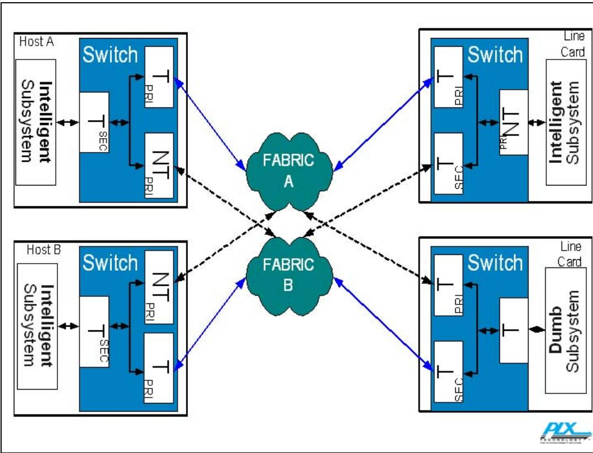

## 99.5 Summary | 99.5 总结

<table>
<tr>
<td width="50%">
Through non-transparent bridging, PCI Express Base offers vendors the ability to integrate intelligent adapters and multi-host systems into their next generation designs. This appendix demonstrated how these features will be deployed using de-facto standard techniques adopted in the PCI environment and showed how they would be utilized for various applications. Because of this, we can expect this methodology to become the industry standard in the PCI Express paradigm.
</td>
<td width="50%" style="background-color:#e8e8e8">
通过非透明桥接，PCI Express Base为供应商提供了将智能适配器和多主机系统集成到其下一代设计中的能力。本附录演示了如何使用PCI环境中采用的事实标准技术来部署这些特性，并展示了它们将如何被用于各种应用。因此，我们可以预期这种方法将成为PCI Express范式中的行业标准。
</td>
</tr>
</table>

## 99.6 Address Translation | 99.6 地址翻译

<table>
<tr>
<td width="50%">
This section provides an in-depth description of how systems that use nontransparent bridges communicate using address translation. We provide details about the mechanism by which systems determine not only the size of the memory allocated, but also about how memory pointers are employed. Implementations using both Direct Address Translation as well as Lookup Table Based Address Translation are discussed. By using the same standardized architectural implementation of non transparent bridging popularized in the PCI paradigm into the PCI Express environment, interconnect vendors can speed market adoption of PCI Express into markets requiring intelligent adapters, host failover and multihost capabilities.
</td>
<td width="50%" style="background-color:#e8e8e8">
本节深入描述了使用非透明桥的系统如何通过地址翻译进行通信。我们详细阐述了系统不仅确定分配内存大小的机制，还介绍了内存指针的使用方式。讨论了使用直接地址翻译以及基于查找表的地址翻译的实现。通过将在PCI范式中流行的非透明桥接的相同标准化架构实现引入PCI Express环境，互联供应商可以加快PCI Express在需要智能适配器、主机故障切换和多主机能力的市场中的采用。
</td>
</tr>
</table>

<table>
<tr>
<td width="50%">
The transparent bridge uses base and limit registers in I/O space, non-prefetchable memory space, and prefetchable memory space to map transactions in the downstream direction across the bridge. All downstream devices are required to be mapped in contiguous address regions such that a single aperture in each space is sufficient. Upstream mapping is done via inverse decoding relative to the same registers. A transparent bridge does not translate the addresses of forwarded transactions/packets.
</td>
<td width="50%" style="background-color:#e8e8e8">
透明桥使用I/O空间、不可预取存储器空间和可预取存储器空间中的基址和限制寄存器，以在桥的下行方向映射事务。所有下游设备必须映射在连续的地址区域中，使得每个空间中的单个窗口就足够了。上行映射通过相对于相同寄存器的反向解码完成。透明桥不会翻译转发的事务/数据包的地址。
</td>
</tr>
</table>

<table>
<tr>
<td width="50%">
The non-transparent bridges use the standard set of BARs in their Type 0 CSR header to define apertures into the memory space on the other side of the bridge. There are two sets of BARs: one on the Primary side and one on the Secondary. BARs define resource apertures that allow the forwarding of transactions to the opposite (other side) interface.
</td>
<td width="50%" style="background-color:#e8e8e8">
非透明桥使用其Type 0 CSR头部中的标准BAR集来定义通往桥另一侧存储器空间的窗口。有两组BAR：一组在主侧，一组在从侧。BAR定义了允许将事务转发到对侧（另一侧）接口的资源窗口。
</td>
</tr>
</table>

<table>
<tr>
<td width="50%">
For each BAR bridge there exists a set of associated control and setup registers usually writable from the other side of the bridge. Each BAR has a "setup" register, which defines the size and type of its aperture, and an address translation register. Some bars also have a limit register that can be used to restrict its aperture's size. These registers need to be programmed prior to allowing access from outside the local subsystem. This is typically done by software running on a local processor or by loading the registers from EEPROM.
</td>
<td width="50%" style="background-color:#e8e8e8">
对于每个BAR桥，存在一组相关的控制和设置寄存器，通常可从桥的另一侧写入。每个BAR有一个"设置"寄存器，用于定义其窗口的大小和类型，以及一个地址翻译寄存器。某些BAR还有一个限制寄存器，可用于限制其窗口的大小。这些寄存器需要在允许从本地子系统外部访问之前进行编程。这通常由运行在本地处理器上的软件完成，或通过从EEPROM加载寄存器来完成。
</td>
</tr>
</table>

<table>
<tr>
<td width="50%">
In PCI Express, the Transaction ID fields of packets passing through these apertures are also translated to support Device ID routing. These Device IDs are used to route completions to non-posted requests and ID routed messages.
</td>
<td width="50%" style="background-color:#e8e8e8">
在PCI Express中，通过这些窗口的数据包的Transaction ID字段也会被翻译以支持Device ID路由。这些Device ID用于将完成报文路由到非发布请求和ID路由消息。
</td>
</tr>
</table>

<table>
<tr>
<td width="50%">
The transparent bridge forwards CSR transactions in the downstream direction according to the secondary and subordinate bus number registers, converting Type 1 CSRs to Type 0 CSRs as required. The non-transparent bridge accepts only those CSR transactions addressed to it and returns an unsupported request response to all others.
</td>
<td width="50%" style="background-color:#e8e8e8">
透明桥根据次级总线号和从属总线号寄存器在下行方向转发CSR事务，根据需要将Type 1 CSR转换为Type 0 CSR。非透明桥仅接受那些寻址到自身的CSR事务，并对所有其他事务返回不支持请求响应。
</td>
</tr>
</table>

## 99.6.1 Direct Address Translation | 99.6.1 直接地址翻译

<table>
<tr>
<td width="50%">
The addresses of all upstream and downstream transactions are translated (except BARs accessing CSRs). With the exception of the cases in the following two sections, addresses that are forwarded from one interface to the other are translated by adding a Base Address to their offset within the BAR that they landed in as seen in Figure C-0-8 on page 959. The BAR Base Translation Registers are used to set up these base translations for the individual BARs.
</td>
<td width="50%" style="background-color:#e8e8e8">
所有上行和下行事务的地址均被翻译（访问CSR的BAR除外）。除以下两节所述情况外，从一个接口转发到另一个接口的地址，通过在其所落入的BAR内的偏移量上加上一个基地址来进行翻译，如图C-0-8（第959页）所示。BAR基地址翻译寄存器用于为各个BAR设置这些基地址翻译。
</td>
</tr>
</table>

Figure C-8: Direct Address Translation | 图C-8：直接地址转换

## 99.6.2 Lookup Table Based Address Translation | 99.6.2 基于查找表的地址转换

<table>
<tr>
<td width="50%">
Following the de facto standard adopted by the PCI community, PCI Express should provide several BARs for the purposes of allocating resources. All BARs contain the memory allocation; however, in accordance with PCI industry conventions, BAR 0 contains the CSR information whereas BAR1 contains I/O information, BAR 2 and BAR 3 are utilized for Lookup Table Based Translation. BAR 4 and BAR 5 are utilized for Direct Address Translations.
</td>
<td width="50%" style="background-color:#e8e8e8">
遵循PCI社区采纳的事实标准，PCI Express应提供多个BAR用于资源分配。所有BAR都包含内存分配；然而，根据PCI行业惯例，BAR 0包含CSR信息，而BAR 1包含I/O信息，BAR 2和BAR 3用于基于查找表的转换。BAR 4和BAR 5用于直接地址转换。
</td>
</tr>
</table>

<table>
<tr>
<td width="50%">
On the secondary side, BAR3 uses a special lookup table based address translation for transactions that fall inside its window as seen in Figure C‐0‐9 on page 960. The lookup table provides more flexibility in secondary bus local addresses to primary bus addresses. The location of the index field with the address bus is programmable to adjust aperture size.
</td>
<td width="50%" style="background-color:#e8e8e8">
在从属侧，BAR 3对其窗口范围内的事务使用一种特殊的基于查找表的地址转换，如图C-0-9（第960页）所示。查找表为从属总线本地地址到主总线地址提供了更大的灵活性。地址总线中索引字段的位置是可编程的，以调整孔径大小。
</td>
</tr>
</table>

Figure 0‐9: Lookup Table Based Translation | 图0‐9：基于查找表的转换  

## 99.6.3 Downstream BAR Limit Registers | 99.6.3 下游BAR限制寄存器

<table>
<tr>
<td width="50%">
The two downstream BARs on the primary side (BAR2/3 and BAR4/5) also have Limit registers, programmable from the local side, to further restrict the size of the window they expose, as seen in Figure C‐0‐10 on page 961. BARs can only be assigned memory resources in "power of two" granularity. The limit registers provide a means to obtain better granularity by "capping" the size of the BAR within the "power of two" granularity. Only transactions below the Limit registers are forwarded to the secondary bus. Transactions above the limit are discarded or return 0xFFFFFFFF, or a master abort equivalent packet, on reads.
</td>
<td width="50%" style="background-color:#e8e8e8">
主侧的两个下游BAR（BAR2/3和BAR4/5）也有可从本地侧编程的限制寄存器，用于进一步限制它们所暴露窗口的大小，如图C-0-10（第961页）所示。BAR只能以"2的幂"粒度分配存储器资源。限制寄存器提供了一种通过在"2的幂"粒度内"封顶"BAR大小来获得更好粒度的方法。只有低于限制寄存器的事务才会被转发到副总线。高于限制的事务将被丢弃，或在读操作时返回0xFFFFFFFF或主中止等效报文。
</td>
</tr>
</table>

Figure 0‐10: Use of Limit Register | 图0‐10：限制寄存器的使用

## 99.6.4 Forwarding 64bit Address Memory Transactions | 99.6.4 转发64位地址存储器事务

<table>
<tr>
<td width="50%">
Certain BARs can be configured to work in pairs to provide the base address and translation for transactions containing 64-bit addresses. Transactions that hit within these 64-bit BARs are forwarded using Direct Address Translation. As in the case of 32 bit transactions, when a memory transaction is forwarded from the primary to the secondary bus, the primary address can be mapped to another address in the secondary bus domain. The mapping is performed by substituting a new base address for the base of the original address.
</td>
<td width="50%" style="background-color:#e8e8e8">
某些基址寄存器（BAR）可被配置为成对工作，为包含64位地址的事务提供基地址和地址转换。命中这些64位BAR范围内的事务将使用直接地址转换进行转发。与32位事务的情况类似，当存储器事务从主总线转发到从总线时，主总线地址可被映射到从总线域中的另一个地址。该映射通过用新的基地址替换原始地址的基址部分来执行。
</td>
</tr>
</table>

<table>
<tr>
<td width="50%">
A 64-bit BAR pair on the system side of the bridge is used to translate a window of 64-bit addresses in packets originated on the system side of the bridge down below 232 in local space.
</td>
<td width="50%" style="background-color:#e8e8e8">
位于桥系统侧的64位BAR对用于将桥系统侧发起的数据包中的64位地址窗口转换到本地空间中2^32以下的地址范围。
</td>
</tr>
</table>

# Appendix D: Locked Transactions | 附录D：锁定事务

## 99.1 Introduction | 99.1 引言

<table>
<tr>
<td width="50%">
Native PCI Express implementations do not support the old lock protocol. Support for Locked transaction sequences only exists to support legacy device software executing on the host processor that performs a locked RMW (read-modify-write) operation on a memory location in a legacy PCI device. This chapter defines the protocol defined by PCI Express for this legacy support of locked access sequences that target legacy devices. Failure to support lock may result in deadlocks.
</td>
<td width="50%" style="background-color:#e8e8e8">
原生PCI Express实现不支持旧的锁定协议。对锁定事务序列的支持仅是为了支持在主机处理器上执行的遗留设备软件，这些软件对遗留PCI设备中的存储器位置执行锁定的RMW（读-修改-写）操作。本章定义了PCI Express为针对遗留设备的锁定访问序列提供的这种遗留支持所定义的协议。不支持锁定可能会导致死锁。
</td>
</tr>
</table>

## 99.2 Background | 99.2 背景

<table>
<tr>
<td width="50%">
PCI Express supports atomic or uninterrupted transaction sequences (usually described as an atomic read-modify-write sequence) for legacy devices only. Native PCIe devices don't support this at all and will return a Completion with UR (Unsupported Request) status if they receive a locked Request.
</td>
<td width="50%" style="background-color:#e8e8e8">
PCI Express仅对遗留设备支持原子或不可中断的事务序列（通常描述为原子读-修改-写序列）。原生PCIe设备完全不支持此功能，如果收到锁定请求，将返回带有UR（不支持请求）状态的完成报文。
</td>
</tr>
</table>

<table>
<tr>
<td width="50%">
Locked operations consist of the basic RMW sequence, that is:
</td>
<td width="50%" style="background-color:#e8e8e8">
锁定操作由基本的RMW序列组成，即：
</td>
</tr>
</table>

<table>
<tr>
<td width="50%">
1. One or more memory reads from the target location to obtain the value.
</td>
<td width="50%" style="background-color:#e8e8e8">
1. 从目标位置进行一次或多次存储器读取以获取数值。
</td>
</tr>
</table>

<table>
<tr>
<td width="50%">
2. The modification of the data in a processor register.
</td>
<td width="50%" style="background-color:#e8e8e8">
2. 在处理器寄存器中修改数据。
</td>
</tr>
</table>

<table>
<tr>
<td width="50%">
3. One or more writes to write the modified value back to the target memory location.
</td>
<td width="50%" style="background-color:#e8e8e8">
3. 进行一次或多次写入，将修改后的值写回目标存储器位置。
</td>
</tr>
</table>

<table>
<tr>
<td width="50%">
This transaction sequence must be performed such that no other accesses are permitted to the target locations (or device) during the locked sequence. This requires blocking other transactions during the operation. This can potentially result in deadlocks and poor performance.
</td>
<td width="50%" style="background-color:#e8e8e8">
此事务序列的执行必须确保在锁定序列期间不允许对目标位置（或设备）进行任何其他访问。这需要在操作期间阻止其他事务。这可能导致死锁和性能下降。
</td>
</tr>
</table>

## PCI Express Technology | PCI Express技术

<table>
<tr>
<td width="50%">
The devices required to support locked sequences are:
</td>
<td width="50%" style="background-color:#e8e8e8">
需要支持锁定序列的设备包括：
</td>
</tr>
</table>

<table>
<tr>
<td width="50%">
• The Root Complex.
</td>
<td width="50%" style="background-color:#e8e8e8">
• 根复合体。
</td>
</tr>
</table>

<table>
<tr>
<td width="50%">
• Any Switches in the path to a Legacy Device that may be the target of a locked transaction series.
</td>
<td width="50%" style="background-color:#e8e8e8">
• 通往可能成为锁定事务系列目标的遗留设备路径上的任何交换机。
</td>
</tr>
</table>

<table>
<tr>
<td width="50%">
• PCIe-to-PCI Bridge or PCIe-to-PCI-X Bridge.
</td>
<td width="50%" style="background-color:#e8e8e8">
• PCIe到PCI桥或PCIe到PCI-X桥。
</td>
</tr>
</table>

<table>
<tr>
<td width="50%">
• Any Legacy Device whose driver issues locked transactions to memory residing within the legacy device.
</td>
<td width="50%" style="background-color:#e8e8e8">
• 任何其驱动程序向驻留在遗留设备内的存储器发出锁定事务的遗留设备。
</td>
</tr>
</table>

<table>
<tr>
<td width="50%">
Locking in the PCI environment is achieved by the use of the LOCK# signal. The equivalent functionality in PCIe is accomplished by using a specific Request that emulates the LOCK# signal functionality.
</td>
<td width="50%" style="background-color:#e8e8e8">
在PCI环境中，锁定是通过使用LOCK#信号实现的。在PCIe中，等效功能是通过使用模拟LOCK#信号功能的特定请求来实现的。
</td>
</tr>
</table>

## 99.3 The PCI Express Lock Protocol | 99.3 PCI Express锁定协议

<table>
<tr>
<td width="50%">
The only source of lock supported by PCI Express is the system processor acting through the Root Complex. A locked operation is performed between a Root Port and the Legacy Endpoint. In most systems, the legacy device is typically a PCI Express-to-PCI or PCI Express-to-PCI-X bridge. Only one locked sequence at a time is supported for a given hierarchical path.
</td>
<td width="50%" style="background-color:#e8e8e8">
PCI Express支持的唯一锁定源是通过根复合体进行操作的系统处理器。锁定操作在根端口和遗留端点之间执行。在大多数系统中，遗留设备通常是PCI Express到PCI或PCI Express到PCI-X桥。对于给定的层次路径，一次仅支持一个锁定序列。
</td>
</tr>
</table>

<table>
<tr>
<td width="50%">
Locked transactions are constrained to use only Traffic Class 0 and Virtual Channel 0. Transactions with other TC values that map to a VC other than zero are permitted to traverse the fabric without regard to the locked operation, but transactions that map to VC0 are affected by the lock rules described here.
</td>
<td width="50%" style="background-color:#e8e8e8">
锁定事务被限制为仅使用流量类0和虚通道0。映射到非零VC的其他TC值的事务允许穿越结构而无需考虑锁定操作，但映射到VC0的事务受此处描述的锁定规则影响。
</td>
</tr>
</table>

## Lock Messages — The Virtual Lock Signal | 锁定消息——虚拟锁定信号

<table>
<tr>
<td width="50%">
PCI Express defines the following transactions that, together, act as a virtual wire and replace the LOCK# signal.
</td>
<td width="50%" style="background-color:#e8e8e8">
PCI Express定义了以下事务，它们共同起到虚拟导线的作用并取代LOCK#信号。
</td>
</tr>
</table>

<table>
<tr>
<td width="50%">
Memory Read Lock Request (MRdLk) — Originates a locked sequence. The first MRdLk transaction blocks other Requests in VC0 from reaching the target device. One or more of these locked read requests may be issued during the sequence.
</td>
<td width="50%" style="background-color:#e8e8e8">
存储器读锁定请求（MRdLk）——发起锁定序列。第一个MRdLk事务阻止VC0中的其他请求到达目标设备。在序列期间可以发出一个或多个此类锁定读请求。
</td>
</tr>
</table>

<table>
<tr>
<td width="50%">
Memory Read Lock Completion with Data (CplDLk) — Returns data and confirms that the path to the target is locked. A successful read Completion that returns data for the first Memory Read Lock request results in the path between the Root Complex and the target device being locked. That is, transactions traversing the same path from other ports are blocked from reaching either the root port or the target port. Transactions being routed in buffers for VC1-VC7 are unaffected by the lock.
</td>
<td width="50%" style="background-color:#e8e8e8">
带数据的存储器读锁定完成报文（CplDLk）——返回数据并确认到目标的路径已锁定。为第一个存储器读锁定请求返回数据的成功读完成报文会导致根复合体与目标设备之间的路径被锁定。也就是说，从其他端口穿越同一条路径的事务被阻止到达根端口或目标端口。在VC1-VC7缓冲区中路由的事务不受锁定的影响。
</td>
</tr>
</table>

<table>
<tr>
<td width="50%">
Memory Read Lock Completion without Data (CplLK) — A Completion without a data payload indicates that the lock sequence cannot complete currently and the path remains unlocked.
</td>
<td width="50%" style="background-color:#e8e8e8">
不带数据的存储器读锁定完成报文（CplLK）——不带数据负载的完成报文表示锁定序列当前无法完成，且路径保持未锁定状态。
</td>
</tr>
</table>

<table>
<tr>
<td width="50%">
Unlock Message — An unlock message is issued by the Root Complex from the locked root port. This message unlocks the path between the root port and the target port.
</td>
<td width="50%" style="background-color:#e8e8e8">
解锁消息——由根复合体从锁定的根端口发出解锁消息。该消息解锁根端口与目标端口之间的路径。
</td>
</tr>
</table>

## The Lock Protocol Sequence — an Example | 锁定协议序列——示例

<table>
<tr>
<td width="50%">
This section explains the PCI Express lock protocol by example. The example includes the following devices:
</td>
<td width="50%" style="background-color:#e8e8e8">
本节通过示例解释PCI Express锁定协议。该示例包括以下设备：
</td>
</tr>
</table>

<table>
<tr>
<td width="50%">
• The Root Complex that initiates the Locked transaction series on behalf of the host processor.
</td>
<td width="50%" style="background-color:#e8e8e8">
• 代表主机处理器发起锁定事务系列的根复合体。
</td>
</tr>
</table>

<table>
<tr>
<td width="50%">
• A Switch in the path between the root port and targeted legacy endpoint.
</td>
<td width="50%" style="background-color:#e8e8e8">
• 位于根端口与目标遗留端点之间路径上的交换机。
</td>
</tr>
</table>

<table>
<tr>
<td width="50%">
• A PCI Express-to-PCI Bridge in the path to the target.
</td>
<td width="50%" style="background-color:#e8e8e8">
• 通往目标路径上的PCI Express到PCI桥。
</td>
</tr>
</table>

<table>
<tr>
<td width="50%">
• The target PCI device whose Device Driver initiated the locked RMW.
</td>
<td width="50%" style="background-color:#e8e8e8">
• 其设备驱动程序发起锁定RMW的目标PCI设备。
</td>
</tr>
</table>

<table>
<tr>
<td width="50%">
• A PCI Express endpoint is included to describe Switch behavior during lock.
</td>
<td width="50%" style="background-color:#e8e8e8">
• 包含一个PCI Express端点以描述锁定期间的交换机行为。
</td>
</tr>
</table>

<table>
<tr>
<td width="50%">
In this example, the locked operation completes normally. The steps that occur during the operation are described in the two sections that follow.
</td>
<td width="50%" style="background-color:#e8e8e8">
在此示例中，锁定操作正常完成。操作期间发生的步骤在接下来的两节中描述。
</td>
</tr>
</table>

## The Memory Read Lock Operation | 存储器读锁定操作

<table>
<tr>
<td width="50%">
Figure E-1 on page 967 illustrates the first step in the Locked transaction series (i.e., the initial memory read to obtain the semaphore):
</td>
<td width="50%" style="background-color:#e8e8e8">
第967页的图E-1说明了锁定事务系列的第一步（即获取信号量的初始存储器读取）：
</td>
</tr>
</table>

<table>
<tr>
<td width="50%">
1. The CPU initiates the locked sequence (a Locked Memory Read) as a result of a driver executing a locked RMW instruction that targets a PCI target.
</td>
<td width="50%" style="background-color:#e8e8e8">
1. CPU因驱动程序执行针对PCI目标的锁定RMW指令而发起锁定序列（锁定存储器读取）。
</td>
</tr>
</table>

<table>
<tr>
<td width="50%">
2. The Root Port issues a Memory Read Lock Request from port 2. The Root Complex is always the source of a locked sequence.
</td>
<td width="50%" style="background-color:#e8e8e8">
2. 根端口从端口2发出存储器读锁定请求。根复合体始终是锁定序列的源。
</td>
</tr>
</table>

<table>
<tr>
<td width="50%">
3. The Switch receives the lock request on its upstream port and forwards the request to the target egress port (3). The switch, upon forwarding the request to the egress port, must block all requests from ports other than the ingress port (1) from being sent from the egress port.
</td>
<td width="50%" style="background-color:#e8e8e8">
3. 交换机在其上行端口上接收到锁定请求，并将该请求转发到目标出口端口（3）。交换机在将请求转发到出口端口时，必须阻止来自除入口端口（1）之外的其他端口的所有请求从该出口端口发出。
</td>
</tr>
</table>

<table>
<tr>
<td width="50%">
4. A subsequent peer-to-peer transfer from the illustrated PCI Express endpoint to the PCI bus (switch port 2 to switch port 3) would be blocked until the lock is cleared. Note that the lock is not yet established in the other direction. Transactions from the PCI Express endpoint could be sent to the Root Complex.
</td>
<td width="50%" style="background-color:#e8e8e8">
4. 随后从图示的PCI Express端点到PCI总线（交换机端口2到交换机端口3）的对等传输将被阻止，直到锁定解除。请注意，另一个方向尚未建立锁定。来自PCI Express端点的事务可以发送到根复合体。
</td>
</tr>
</table>

<table>
<tr>
<td width="50%">
5. The Memory Read Lock Request is sent from the Switch's egress port to the PCI Express-to-PCI Bridge. This bridge will implement PCI lock semantics (See the MindShare book entitled PCI System Architecture, Fourth Edition, for details regarding PCI lock).
</td>
<td width="50%" style="background-color:#e8e8e8">
5. 存储器读锁定请求从交换机的出口端口发送到PCI Express到PCI桥。该桥将实现PCI锁定语义（有关PCI锁定的详细信息，请参阅MindShare出版的《PCI系统体系结构，第四版》）。
</td>
</tr>
</table>

<table>
<tr>
<td width="50%">
6. The bridge performs the Memory Read transaction on the PCI bus with the PCI LOCK# signal asserted. The target memory device returns the requested semaphore data to the bridge.
</td>
<td width="50%" style="background-color:#e8e8e8">
6. 桥在PCI总线上执行存储器读事务，并断言PCI LOCK#信号。目标存储器设备将请求的信号量数据返回给桥。
</td>
</tr>
</table>

<table>
<tr>
<td width="50%">
7. Read data is returned to the Bridge and is delivered back to the Switch via a Memory Read Lock Completion with Data (CplDLk).
</td>
<td width="50%" style="background-color:#e8e8e8">
7. 读数据返回到桥，并通过带数据的存储器读锁定完成报文（CplDLk）传递回交换机。
</td>
</tr>
</table>

<table>
<tr>
<td width="50%">
8. The switch uses ID routing to return the packet upstream towards the host processor. When the CplDLk packet is forwarded to the upstream port of the Switch, it establishes a lock in the upstream direction to prevent traffic from other ports from being routed upstream. The PCI Express endpoint is completely blocked from sending any transaction to the Switch ports via the path of the locked operation. Note that transfers between Switch ports not involved in the locked operation would be permitted (not shown in this example).
</td>
<td width="50%" style="background-color:#e8e8e8">
8. 交换机使用ID路由将数据包向上游返回给主机处理器。当CplDLk数据包被转发到交换机的上行端口时，它在上行方向建立了锁定，以防止来自其他端口的流量被路由到上游。PCI Express端点被完全阻止通过锁定操作的路径向交换机端口发送任何事务。请注意，不参与锁定操作的交换机端口之间的传输是允许的（本例中未示出）。
</td>
</tr>
</table>

<table>
<tr>
<td width="50%">
9. Upon detecting the CplDLk packet, the Root Complex knows that the lock has been established along the path between it and the target device, and the completion data is sent to the CPU.
</td>
<td width="50%" style="background-color:#e8e8e8">
9. 在检测到CplDLk数据包时，根复合体就知道锁定已在其与目标设备之间的路径上建立，并且完成数据被发送到CPU。
</td>
</tr>
</table>

Figure D-1: Lock Sequence Begins with Memory Read Lock Request | 图D-1：锁定序列以存储器读锁定请求开始

## Read Data Modified and Written to Target and Lock Completes | 读数据被修改并写入目标，锁定完成

<table>
<tr>
<td width="50%">
The device driver receives the semaphore value, alters it, and then initiates a memory write to update the semaphore within the memory of the legacy PCI device. Figure E-2 on page 969 illustrates the write sequence followed by the Root Complex's transmission of the Unlock message that releases the lock:
</td>
<td width="50%" style="background-color:#e8e8e8">
设备驱动程序接收信号量值，修改它，然后发起存储器写入以更新遗留PCI设备存储器中的信号量。第969页的图E-2说明了写入序列，随后根复合体发送解锁消息以释放锁定：
</td>
</tr>
</table>

<table>
<tr>
<td width="50%">
10. The Root Complex issues the Memory Write Request across the locked path to the target device.
</td>
<td width="50%" style="background-color:#e8e8e8">
10. 根复合体通过锁定的路径向目标设备发出存储器写请求。
</td>
</tr>
</table>

<table>
<tr>
<td width="50%">
11. The Switch forwards the transaction to the target egress port (3). The memory address of the Memory Write must be the same as the initial Memory Read request.
</td>
<td width="50%" style="background-color:#e8e8e8">
11. 交换机将事务转发到目标出口端口（3）。存储器写的存储器地址必须与初始存储器读请求的地址相同。
</td>
</tr>
</table>

<table>
<tr>
<td width="50%">
12. The bridge forwards the transaction to the PCI bus.
</td>
<td width="50%" style="background-color:#e8e8e8">
12. 桥将事务转发到PCI总线。
</td>
</tr>
</table>

<table>
<tr>
<td width="50%">
13. The target device receives the memory write data.
</td>
<td width="50%" style="background-color:#e8e8e8">
13. 目标设备接收存储器写数据。
</td>
</tr>
</table>

<table>
<tr>
<td width="50%">
14. Once the Memory Write transaction is sent from the Root Complex, it sends an Unlock message to instruct the Switches and any PCI/PCI-X bridges in the locked path to release the lock. Note that the Root Complex presumes the operation has completed normally (because memory writes are posted and no Completion is returned to verify success).
</td>
<td width="50%" style="background-color:#e8e8e8">
14. 一旦存储器写事务从根复合体发出，它就发送一条解锁消息，指示锁定路径中的交换机和任何PCI/PCI-X桥释放锁定。请注意，根复合体假定操作已正常完成（因为存储器写是发布性的，不返回完成报文来验证成功）。
</td>
</tr>
</table>

<table>
<tr>
<td width="50%">
15. The Switch receives the Unlock message, unlocks its ports and forwards the message to the egress port that was locked to notify any other Switches and/or bridges in the locked path that the lock must be cleared.
</td>
<td width="50%" style="background-color:#e8e8e8">
15. 交换机接收解锁消息，解锁其端口，并将该消息转发到被锁定的出口端口，以通知锁定路径中的任何其他交换机和/或桥必须解除锁定。
</td>
</tr>
</table>

<table>
<tr>
<td width="50%">
16. Upon detecting the Unlock message, the bridge must also release the lock on the PCI bus.
</td>
<td width="50%" style="background-color:#e8e8e8">
16. 在检测到解锁消息时，桥还必须释放PCI总线上的锁定。
</td>
</tr>
</table>

Figure D-2: Lock Completes with Memory Write Followed by Unlock Message | 图D-2：锁定以存储器写后跟解锁消息完成
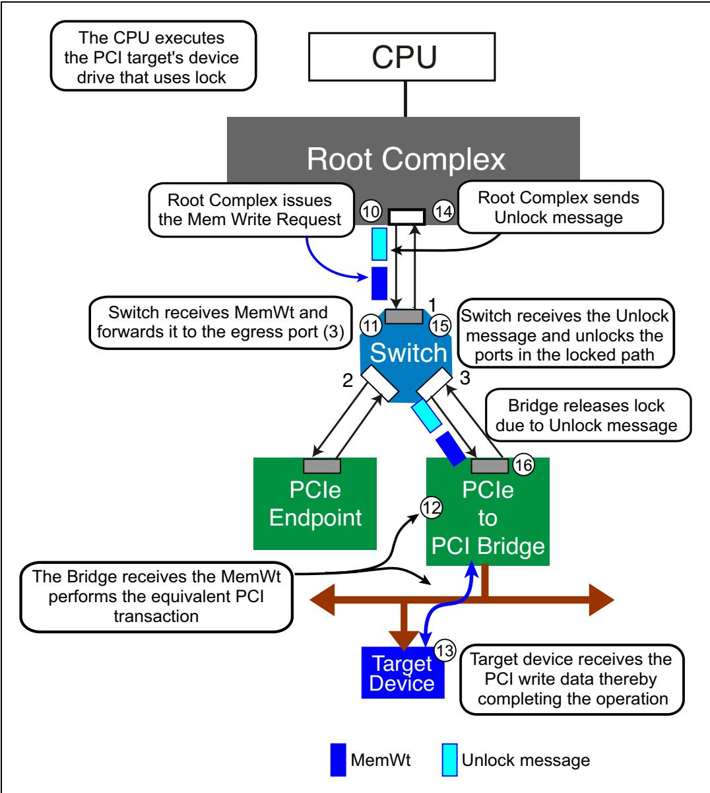

## 99.3.3 Notification of an Unsuccessful Lock | 99.3.3 不成功锁定的通知

<table>
<tr>
<td width="50%">
A locked transaction series is aborted when the initial Memory Read Lock Request receives a Completion packet with no data (CplLk). This means that the locked sequence must terminate because no data was returned. This could result from an error associated with the memory read transaction, or perhaps the target device is busy and cannot respond at this time.
</td>
<td width="50%" style="background-color:#e8e8e8">
当初始存储器读锁定请求收到不带数据的完成报文（CplLk）时，锁定事务系列被中止。这意味着锁定序列必须终止，因为没有返回数据。这可能是由于与存储器读事务相关的错误，或者目标设备正忙而无法响应所致。
</td>
</tr>
</table>

## 99.4 Summary of Locking Rules | 99.4 锁定规则总结

<table>
<tr>
<td width="50%">
Following is a list of ordering rules that apply to the Root Complex, Switches, and Bridges.
</td>
<td width="50%" style="background-color:#e8e8e8">
以下是适用于根复合体、交换机和桥的有序规则列表。
</td>
</tr>
</table>

## 99.4.1 Rules Related To the Initiation and Propagation of Locked Transactions | 99.4.1 与锁定事务发起和传播相关的规则

<table>
<tr>
<td width="50%">
Locked Requests which are completed with a status other than Successful Completion do not establish lock.
</td>
<td width="50%" style="background-color:#e8e8e8">
以成功完成之外的状态完成的锁定请求不会建立锁定。
</td>
</tr>
</table>

<table>
<tr>
<td width="50%">
Regardless of the status of any of the Completions associated with a locked sequence, all locked sequences and attempted locked sequences must be terminated by the transmission of an Unlock Message.
</td>
<td width="50%" style="background-color:#e8e8e8">
无论与锁定序列关联的任何完成报文的状态如何，所有锁定序列和尝试的锁定序列都必须通过发送解锁消息来终止。
</td>
</tr>
</table>

<table>
<tr>
<td width="50%">
MRdLk, CplDLk and Unlock semantics are allowed only for the default Traffic Class (TC0).
</td>
<td width="50%" style="background-color:#e8e8e8">
MRdLk、CplDLk和解锁语义仅允许用于默认流量类（TC0）。
</td>
</tr>
</table>

<table>
<tr>
<td width="50%">
• Only one locked transaction sequence attempt may be in progress at a given time within a single hierarchy domain.
</td>
<td width="50%" style="background-color:#e8e8e8">
• 在单个层次域中，同一时间只能有一个锁定事务序列尝试在进行中。
</td>
</tr>
</table>

<table>
<tr>
<td width="50%">
Any device which is not involved in the locked sequence must ignore the Unlock Message.
</td>
<td width="50%" style="background-color:#e8e8e8">
任何未参与锁定序列的设备必须忽略解锁消息。
</td>
</tr>
</table>

<table>
<tr>
<td width="50%">
The initiation and propagation of a locked transaction sequence through the PCI Express fabric is performed as follows:
</td>
<td width="50%" style="background-color:#e8e8e8">
锁定事务序列通过PCI Express结构的发起和传播按如下方式执行：
</td>
</tr>
</table>

<table>
<tr>
<td width="50%">
• A locked transaction sequence is started with a MRdLk Request:
</td>
<td width="50%" style="background-color:#e8e8e8">
• 锁定事务序列以MRdLk请求开始：
</td>
</tr>
</table>

<table>
<tr>
<td width="50%">
— Any successive reads associated with the locked transaction sequence must also use MRdLk Requests.
</td>
<td width="50%" style="background-color:#e8e8e8">
— 与锁定事务序列关联的任何后续读取也必须使用MRdLk请求。
</td>
</tr>
</table>

<table>
<tr>
<td width="50%">
The Completions for any successful MRdLk Request use the CplDLk Completion type, or the CPlLk Completion type for unsuccessful Requests.
</td>
<td width="50%" style="background-color:#e8e8e8">
任何成功的MRdLk请求使用CplDLk完成报文类型，不成功的请求使用CplLk完成报文类型。
</td>
</tr>
</table>

<table>
<tr>
<td width="50%">
If any read associated with a locked sequence is completed unsuccessfully, the Requester must assume that the atomicity of the lock is no longer assured, and that the path between the Requester and Completer is no longer locked.
</td>
<td width="50%" style="background-color:#e8e8e8">
如果与锁定序列关联的任何读取未成功完成，请求者必须假定锁定的原子性不再得到保证，并且请求者与完成者之间的路径不再锁定。
</td>
</tr>
</table>

<table>
<tr>
<td width="50%">
• All writes associated with a locked sequence must use MWr Requests.
</td>
<td width="50%" style="background-color:#e8e8e8">
• 与锁定序列关联的所有写入必须使用MWr请求。
</td>
</tr>
</table>

<table>
<tr>
<td width="50%">
The Unlock Message is used to indicate the end of a locked sequence. A Switch propagates Unlock Messages through the locked Egress Port.
</td>
<td width="50%" style="background-color:#e8e8e8">
解锁消息用于指示锁定序列的结束。交换机通过锁定的出口端口传播解锁消息。
</td>
</tr>
</table>

<table>
<tr>
<td width="50%">
Upon receiving an Unlock Message, a legacy Endpoint or Bridge must unlock itself if it is in a locked state. If it is not locked, or if the Receiver is a PCI Express Endpoint or Bridge which does not support lock, the Unlock Message is ignored and discarded.
</td>
<td width="50%" style="background-color:#e8e8e8">
在收到解锁消息时，如果遗留端点或桥处于锁定状态，它必须解锁自身。如果它未锁定，或者接收者是PCI Express端点或不支持锁定的桥，则解锁消息被忽略并丢弃。
</td>
</tr>
</table>

## 99.4.2 Rules Related to Switches | 99.4.2 与交换机相关的规则

<table>
<tr>
<td width="50%">
Switches must detect transactions associated with locked sequences from other transactions to prevent other transactions from interfering with the lock and potentially causing deadlock. The following rules cover how this is done. Note that locked accesses are limited to TC0, which is always mapped to VC0.
</td>
<td width="50%" style="background-color:#e8e8e8">
交换机必须从其他事务中检测与锁定序列关联的事务，以防止其他事务干扰锁定并可能导致死锁。以下规则涵盖了如何做到这一点。请注意，锁定访问仅限于TC0，它始终映射到VC0。
</td>
</tr>
</table>

<table>
<tr>
<td width="50%">
When a Switch propagates a MRdLk Request from an Ingress Port to the Egress Port, it must block all Requests which map to the default Virtual Channel (VC0) from being propagated to the Egress Port. If a subsequent MRdLk Request is received at this Ingress Port addressing a different Egress Port, the behavior of the Switch is undefined. Note that this sort of split-lock access is not supported by PCI Express and software must not cause such a locked access. System deadlock may result from such accesses.
</td>
<td width="50%" style="background-color:#e8e8e8">
当交换机将MRdLk请求从入口端口传播到出口端口时，它必须阻止所有映射到默认虚通道（VC0）的请求被传播到出口端口。如果在此入口端口接收到寻址不同出口端口的后续MRdLk请求，则交换机的行为是未定义的。请注意，PCI Express不支持这种分裂锁定访问，软件不得引起这样的锁定访问。此类访问可能导致系统死锁。
</td>
</tr>
</table>

<table>
<tr>
<td width="50%">
When the CplDLk for the first MRdLk Request is returned, if the Completion indicates a Successful Completion status, the Switch must block all Requests from all other Ports from being propagated to either of the Ports involved in the locked access, except for Requests which map to channels other than VC0 on the Egress Port.
</td>
<td width="50%" style="background-color:#e8e8e8">
当第一个MRdLk请求的CplDLk返回时，如果完成报文指示成功完成状态，交换机必须阻止来自所有其他端口的所有请求传播到参与锁定访问的任一端口，但映射到出口端口上非VC0通道的请求除外。
</td>
</tr>
</table>

<table>
<tr>
<td width="50%">
The two Ports involved in the locked sequence must remain blocked until the Switch receives the Unlock Message (at the Ingress Port which received the initial MRdLk Request)
</td>
<td width="50%" style="background-color:#e8e8e8">
参与锁定序列的两个端口必须保持阻塞状态，直到交换机（在接收初始MRdLk请求的入口端口处）收到解锁消息。
</td>
</tr>
</table>

<table>
<tr>
<td width="50%">
— The Unlock Message must be forwarded to the locked Egress Port.
</td>
<td width="50%" style="background-color:#e8e8e8">
— 解锁消息必须转发到锁定的出口端口。
</td>
</tr>
</table>

<table>
<tr>
<td width="50%">
— The Unlock Message may be broadcast to all other Ports.
</td>
<td width="50%" style="background-color:#e8e8e8">
— 解锁消息可以广播到所有其他端口。
</td>
</tr>
</table>

<table>
<tr>
<td width="50%">
The Ingress Port is unblocked once the Unlock Message arrives, and the Egress Port(s) which were blocked are unblocked following the transmission of the Unlock Message out of the Egress Port(s). Ports that were not involved in the locked access are unaffected by the Unlock Message.
</td>
<td width="50%" style="background-color:#e8e8e8">
一旦解锁消息到达，入口端口被解除阻塞，而被阻塞的出口端口在将解锁消息从出口端口发出后解除阻塞。未参与锁定访问的端口不受解锁消息的影响。
</td>
</tr>
</table>

## 99.4.3 Rules Related To PCI Express/PCI Bridges | 99.4.3 与PCI Express/PCI桥相关的规则

<table>
<tr>
<td width="50%">
The requirements for PCI Express/PCI Bridges are similar to those for Switches, except that, because these Bridges only use TC0 and VC0, all other traffic is blocked during the locked access. Requirements on the PCI bus side are described in the MindShare book, PCI System Architecture, Fourth Edition.
</td>
<td width="50%" style="background-color:#e8e8e8">
对PCI Express/PCI桥的要求与对交换机的要求类似，只是由于这些桥仅使用TC0和VC0，因此在锁定访问期间所有其他流量都被阻塞。有关PCI总线侧的要求在MindShare出版的《PCI系统体系结构，第四版》中描述。
</td>
</tr>
</table>

## 99.4.4 Rules Related To the Root Complex | 99.4.4 与根复合体相关的规则

<table>
<tr>
<td width="50%">
A Root Complex is permitted to support locked transactions as a Requester. If locked transactions are supported, a Root Complex must follow the rules already described to perform a locked access. The mechanism(s) used by the Root Complex to interface to the host processor's FSB (Front-Side Bus) are outside the scope of the spec.
</td>
<td width="50%" style="background-color:#e8e8e8">
根复合体允许作为请求者支持锁定事务。如果支持锁定事务，根复合体必须遵循已描述的规则来执行锁定访问。根复合体用于与主机处理器FSB（前端总线）接口的机制不在本规范的范围内。
</td>
</tr>
</table>

## 99.4.5 Rules Related To Legacy Endpoints | 99.4.5 与遗留端点相关的规则

<table>
<tr>
<td width="50%">
Legacy Endpoints are permitted to support locked accesses, although their use is discouraged. If locked accesses are supported, legacy Endpoints must handle them as follows:
</td>
<td width="50%" style="background-color:#e8e8e8">
允许遗留端点支持锁定访问，但不鼓励使用。如果支持锁定访问，遗留端点必须按如下方式处理：
</td>
</tr>
</table>

<table>
<tr>
<td width="50%">
The legacy Endpoint becomes locked when it transmits the first Completion for the first read request of the locked transaction series access with a Successful Completion status:
</td>
<td width="50%" style="background-color:#e8e8e8">
当遗留端点为锁定事务系列访问的第一个读请求发送第一个状态为成功完成的完成报文时，该遗留端点变为锁定状态：
</td>
</tr>
</table>

<table>
<tr>
<td width="50%">
— If the completion status is not Successful Completion, the legacy Endpoint does not become locked.
</td>
<td width="50%" style="background-color:#e8e8e8">
— 如果完成状态不是成功完成，则遗留端点不会变为锁定状态。
</td>
</tr>
</table>

<table>
<tr>
<td width="50%">
— Once locked, the legacy Endpoint must remain locked until it receives the Unlock Message.
</td>
<td width="50%" style="background-color:#e8e8e8">
— 一旦锁定，遗留端点必须保持锁定状态，直到收到解锁消息。
</td>
</tr>
</table>

<table>
<tr>
<td width="50%">
While locked, a legacy Endpoint must not issue any Requests using Traffic Classes which map to the default Virtual Channel (VC0). Note that this requirement applies to all possible sources of Requests within the Endpoint, in the case where there is more than one possible source of Requests. Requests may be issued using TCs which map to VCs other than VC0.
</td>
<td width="50%" style="background-color:#e8e8e8">
在锁定状态下，遗留端点不得使用映射到默认虚通道（VC0）的流量类发出任何请求。请注意，此要求适用于端点内所有可能的请求源（如果有多个可能的请求源的情况）。可以使用映射到VC0以外的VC的TC来发出请求。
</td>
</tr>
</table>

## 99.4.6 Rules Related To PCI Express Endpoints | 99.4.6 与PCI Express端点相关的规则

<table>
<tr>
<td width="50%">
Native PCI Express Endpoints do not support lock. A PCI Express Endpoint must treat a MRdLk Request as an Unsupported Request.
</td>
<td width="50%" style="background-color:#e8e8e8">
原生PCI Express端点不支持锁定。PCI Express端点必须将MRdLk请求视为不支持请求。
</td>
</tr>
</table>

## Locked Transactions | 锁定事务

## 99.1 Introduction | 99.1 引言

<table>
<tr>
<td width="50%">
Native PCI Express implementations do not support the old lock protocol. Support for Locked transaction sequences only exists to support legacy device software executing on the host processor that performs a locked RMW (read-modify-write) operation on a memory location in a legacy PCI device. This chapter defines the protocol defined by PCI Express for this legacy support of locked access sequences that target legacy devices. Failure to support lock may result in deadlocks.
</td>
<td width="50%" style="background-color:#e8e8e8">
原生 PCI Express 实现不支持旧的锁定协议。支持锁定事务序列仅为了支持在主机处理器上执行的遗留设备软件，该软件在遗留 PCI 设备的内存位置上执行锁定的 RMW（读-修改-写）操作。本章定义了 PCI Express 为此遗留支持所定义的协议，用于针对遗留设备的锁定访问序列。不支持锁定可能会导致死锁。
</td>
</tr>
</table>

## 99.2 Background | 99.2 背景

<table>
<tr>
<td width="50%">
PCI Express supports atomic or uninterrupted transaction sequences (usually described as an atomic read‐modify‐write sequence) for legacy devices only. Native PCIe devices don't support this at all and will return a Completion with UR (Unsupported Request) status if they receive a locked Request.
</td>
<td width="50%" style="background-color:#e8e8e8">
PCI Express仅在传统设备中支持原子性或不可中断的事务序列（通常描述为原子读-修改-写序列）。原生PCIe设备完全不支持此功能，如果收到锁定请求，将返回带有UR（不支持请求）状态的完成报文。
</td>
</tr>
</table>

<table>
<tr>
<td width="50%">
Locked operations consist of the basic RMW sequence, that is:
</td>
<td width="50%" style="background-color:#e8e8e8">
锁定操作由基本的RMW序列组成，即：
</td>
</tr>
</table>

<table>
<tr>
<td width="50%">
1. One or more memory reads from the target location to obtain the value.
</td>
<td width="50%" style="background-color:#e8e8e8">
1. 从目标位置进行一次或多次存储器读取以获取该值。
</td>
</tr>
</table>

<table>
<tr>
<td width="50%">
2. The modification of the data in a processor register.
</td>
<td width="50%" style="background-color:#e8e8e8">
2. 在处理器寄存器中修改数据。
</td>
</tr>
</table>

<table>
<tr>
<td width="50%">
3. One or more writes to write the modified value back to the target memory location.
</td>
<td width="50%" style="background-color:#e8e8e8">
3. 进行一次或多次写入以将修改后的值写回目标存储器位置。
</td>
</tr>
</table>

<table>
<tr>
<td width="50%">
This transaction sequence must be performed such that no other accesses are permitted to the target locations (or device) during the locked sequence. This requires blocking other transactions during the operation. This can potentially result in deadlocks and poor performance.
</td>
<td width="50%" style="background-color:#e8e8e8">
该事务序列的执行必须确保在锁定序列期间，不允许对目标位置（或设备）进行任何其他访问。这需要在操作期间阻止其他事务。这可能导致死锁和性能下降。
</td>
</tr>
</table>

## PCI Express Technology | PCI Express 技术

<table>
<tr>
<td width="50%">
The devices required to support locked sequences are:

• The Root Complex.

• Any Switches in the path to a Legacy Device that may be the target of a locked transaction series.

• PCIe‐to‐PCI Bridge or PCIe‐to‐PCI‐X Bridge.

• Any Legacy Device whose driver issues locked transactions to memory residing within the legacy device.
</td>
<td width="50%" style="background-color:#e8e8e8">
需要支持锁定序列的设备包括：

• 根复合体。

• 路径中可能成为锁定事务系列目标的传统设备所经的任何交换机。

• PCIe到PCI桥或PCIe到PCI-X桥。

• 其驱动程序对驻留在传统设备内的存储器发出锁定事务的任何传统设备。
</td>
</tr>
</table>

<table>
<tr>
<td width="50%">
Locking in the PCI environment is achieved by the use of the LOCK# signal. The equivalent functionality in PCIe is accomplished by using a specific Request that emulates the LOCK# signal functionality.
</td>
<td width="50%" style="background-color:#e8e8e8">
在PCI环境中，锁定是通过使用LOCK#信号实现的。PCIe中的等效功能是通过使用模拟LOCK#信号功能的特定请求来完成的。
</td>
</tr>
</table>

## 99.3 The PCI Express Lock Protocol | 99.3 PCIe 锁定协议

<table>
<tr>
<td width="50%">
The only source of lock supported by PCI Express is the system processor acting through the Root Complex. A locked operation is performed between a Root Port and the Legacy Endpoint. In most systems, the legacy device is typically a PCI Express-to-PCI or PCI Express-to-PCI-X bridge. Only one locked sequence at a time is supported for a given hierarchical path.
</td>
<td width="50%" style="background-color:#e8e8e8">
PCI Express 支持的锁定唯一来源是通过根复合体（Root Complex）作用的系统处理器。锁定操作在根端口（Root Port）与传统端点（Legacy Endpoint）之间执行。在大多数系统中，传统设备通常是 PCI Express-to-PCI 或 PCI Express-to-PCI-X 桥接器。对于给定的层次路径，一次仅支持一个锁定序列。
</td>
</tr>
</table>

<table>
<tr>
<td width="50%">
Locked transactions are constrained to use only Traffic Class 0 and Virtual Channel 0. Transactions with other TC values that map to a VC other than zero are permitted to traverse the fabric without regard to the locked operation, but transactions that map to VC0 are affected by the lock rules described here.
</td>
<td width="50%" style="background-color:#e8e8e8">
锁定事务（Locked transactions）被限制为仅使用流量类 0（Traffic Class 0）和虚通道 0（Virtual Channel 0）。映射到非零 VC 的其他 TC 值的事务允许在结构（fabric）中传输，而不受锁定操作的影响，但映射到 VC0 的事务则受此处描述的锁定规则影响。
</td>
</tr>
</table>

## Lock Messages — The Virtual Lock Signal | 锁消息 — 虚拟锁定信号

<table>
<tr>
<td width="50%">
PCI Express defines the following transactions that, together, act as a virtual wire and replace the LOCK# signal.
</td>
<td width="50%" style="background-color:#e8e8e8">
PCI Express 定义了以下事务，它们共同充当虚拟连线并取代 LOCK# 信号。
</td>
</tr>
</table>

<table>
<tr>
<td width="50%">
Memory Read Lock Request (MRdLk) — Originates a locked sequence. The first MRdLk transaction blocks other Requests in VC0 from reaching the target device. One or more of these locked read requests may be issued during the sequence.
</td>
<td width="50%" style="background-color:#e8e8e8">
存储器读锁定请求（MRdLk）— 发起一个锁定序列。第一个 MRdLk 事务阻止 VC0 中的其他请求到达目标设备。在该序列期间，可以发出一个或多个此类锁定读请求。
</td>
</tr>
</table>

<table>
<tr>
<td width="50%">
Memory Read Lock Completion with Data (CplDLk) — Returns data and confirms that the path to the target is locked. A successful read Completion that returns data for the first Memory Read Lock request results in the path between the Root Complex and the target device being locked. That is, transactions traversing the same path from other ports are blocked from reaching either the root port or the target port. Transactions being routed in buffers for VC1-VC7 are unaffected by the lock.
</td>
<td width="50%" style="background-color:#e8e8e8">
带数据的存储器读锁定完成（CplDLk）— 返回数据并确认通往目标的路径已被锁定。成功返回数据的读完成（针对第一个存储器读锁定请求）将导致根复合体与目标设备之间的路径被锁定。也就是说，来自其他端口且经过同一路径的事务被阻止到达根端口或目标端口。在 VC1-VC7 缓冲区中路由的事务不受锁定的影响。
</td>
</tr>
</table>

<table>
<tr>
<td width="50%">
Memory Read Lock Completion without Data (CplLK) — A Completion without a data payload indicates that the lock sequence cannot complete currently and the path remains unlocked.
</td>
<td width="50%" style="background-color:#e8e8e8">
不带数据的存储器读锁定完成（CplLK）— 不带数据载荷的完成表示锁定序列当前无法完成，路径保持解锁状态。
</td>
</tr>
</table>

<table>
<tr>
<td width="50%">
Unlock Message — An unlock message is issued by the Root Complex from the locked root port. This message unlocks the path between the root port and the target port.
</td>
<td width="50%" style="background-color:#e8e8e8">
解锁消息 — 由根复合体从锁定的根端口发出解锁消息。该消息解锁根端口与目标端口之间的路径。
</td>
</tr>
</table>

## The Lock Protocol Sequence — an Example | 锁协议序列示例

<table>
<tr>
<td width="50%">
This section explains the PCI Express lock protocol by example. The example includes the following devices:
</td>
<td width="50%" style="background-color:#e8e8e8">
本节通过示例解释PCI Express锁协议。该示例包括以下设备：
</td>
</tr>
</table>

<table>
<tr>
<td width="50%">
• The Root Complex that initiates the Locked transaction series on behalf of the host processor.
</td>
<td width="50%" style="background-color:#e8e8e8">
• 代表主机处理器发起锁定事务序列的根复合体。
</td>
</tr>
</table>

<table>
<tr>
<td width="50%">
• A Switch in the path between the root port and targeted legacy endpoint.
</td>
<td width="50%" style="background-color:#e8e8e8">
• 位于根端口与目标传统端点之间路径上的交换机。
</td>
</tr>
</table>

<table>
<tr>
<td width="50%">
• A PCI Express‐to‐PCI Bridge in the path to the target.
</td>
<td width="50%" style="background-color:#e8e8e8">
• 位于到达目标路径上的PCI Express到PCI桥。
</td>
</tr>
</table>

<table>
<tr>
<td width="50%">
• The target PCI device who's Device Driver initiated the locked RMW.
</td>
<td width="50%" style="background-color:#e8e8e8">
• 其设备驱动程序发起锁定读-修改-写（RMW）操作的目标PCI设备。
</td>
</tr>
</table>

<table>
<tr>
<td width="50%">
• A PCI Express endpoint is included to describe Switch behavior during lock.
</td>
<td width="50%" style="background-color:#e8e8e8">
• 包含一个PCI Express端点，用于描述锁定期间交换机的行为。
</td>
</tr>
</table>

<table>
<tr>
<td width="50%">
In this example, the locked operation completes normally. The steps that occur during the operation are described in the two sections that follow.
</td>
<td width="50%" style="background-color:#e8e8e8">
在此示例中，锁定操作正常完成。操作期间发生的步骤将在接下来的两节中描述。
</td>
</tr>
</table>

## The Memory Read Lock Operation | 存储器读锁定操作

<table>
<tr>
<td width="50%">
Figure E-1 on page 967 illustrates the first step in the Locked transaction series (i.e., the initial memory read to obtain the semaphore):
</td>
<td width="50%" style="background-color:#e8e8e8">
图E-1（第967页）展示了锁定事务序列的第一步（即获取信号量的初始存储器读操作）：
</td>
</tr>
</table>

<table>
<tr>
<td width="50%">
1. The CPU initiates the locked sequence (a Locked Memory Read) as a result of a driver executing a locked RMW instruction that targets a PCI target.
</td>
<td width="50%" style="background-color:#e8e8e8">
1. 由于驱动执行了针对PCI目标的锁定RMW（读-修改-写）指令，CPU发起锁定序列（锁定存储器读）。
</td>
</tr>
</table>

<table>
<tr>
<td width="50%">
2. The Root Port issues a Memory Read Lock Request from port 2. The Root Complex is always the source of a locked sequence.
</td>
<td width="50%" style="background-color:#e8e8e8">
2. 根端口从端口2发出存储器读锁定请求。根复合体始终是锁定序列的发起源。
</td>
</tr>
</table>

<table>
<tr>
<td width="50%">
3. The Switch receives the lock request on its upstream port and forwards the request to the target egress port (3). The switch, upon forwarding the request to the egress port, must block all requests from ports other than the ingress port (1) from being sent from the egress port.
</td>
<td width="50%" style="background-color:#e8e8e8">
3. 交换机在其上游端口接收锁定请求，并将该请求转发到目标出口端口（3）。交换机在将请求转发到出口端口后，必须阻止除入口端口（1）之外的所有端口的请求从该出口端口发出。
</td>
</tr>
</table>

<table>
<tr>
<td width="50%">
4. A subsequent peer-to-peer transfer from the illustrated PCI Express endpoint to the PCI bus (switch port 2 to switch port 3) would be blocked until the lock is cleared. Note that the lock is not yet established in the other direction. Transactions from the PCI Express endpoint could be sent to the Root Complex.
</td>
<td width="50%" style="background-color:#e8e8e8">
4. 后续从图示PCI Express端点到PCI总线（交换机端口2到交换机端口3）的对等传输将被阻塞，直到锁定解除。请注意，锁定在另一个方向上尚未建立。来自PCI Express端点的事务可以发送到根复合体。
</td>
</tr>
</table>

## PCI Express Technology | PCI Express技术

<table>
<tr>
<td width="50%">
5. The Memory Read Lock Request is sent from the Switch's egress port to the PCI Express‐to‐PCI Bridge. This bridge will implement PCI lock semantics (See the MindShare book entitled PCI System Architecture, Fourth Edition, for details regarding PCI lock).
</td>
<td width="50%" style="background-color:#e8e8e8">
5. Memory Read Lock Request从交换机的出口端口发送到PCI Express-to-PCI桥。该桥将实现PCI锁定语义（关于PCI锁定的详细信息，请参阅MindShare所著的《PCI系统架构第四版》）。
</td>
</tr>
</table>

<table>
<tr>
<td width="50%">
6. The bridge performs the Memory Read transaction on the PCI bus with the PCI LOCK# signal asserted. The target memory device returns the requested semaphore data to the bridge.
</td>
<td width="50%" style="background-color:#e8e8e8">
6. 桥在PCI总线上执行Memory Read事务，并置位PCI LOCK#信号。目标存储器设备将请求的信号量数据返回给桥。
</td>
</tr>
</table>

<table>
<tr>
<td width="50%">
7. Read data is returned to the Bridge and is delivered back to the Switch via a Memory Read Lock Completion with Data (CplDLk).
</td>
<td width="50%" style="background-color:#e8e8e8">
7. 读取数据返回到桥，并通过带数据的Memory Read Lock Completion（CplDLk）传回给交换机。
</td>
</tr>
</table>

<table>
<tr>
<td width="50%">
8. The switch uses ID routing to return the packet upstream towards the host processor. When the CplDLk packet is forwarded to the upstream port of the Switch, it establishes a lock in the upstream direction to prevent traffic from other ports from being routed upstream. The PCI Express endpoint is completely blocked from sending any transaction to the Switch ports via the path of the locked operation. Note that transfers between Switch ports not involved in the locked operation would be permitted (not shown in this example).
</td>
<td width="50%" style="background-color:#e8e8e8">
8. 交换机使用ID路由将报文向上游发送到主机处理器。当CplDLk报文被转发到交换机的上游端口时，它会在上游方向建立锁定，以防止来自其他端口的流量被路由到上游。PCI Express端点被完全阻塞，无法通过锁定操作的通路向交换机端口发送任何事务。注意，不涉及锁定操作的交换机端口之间的传输是允许的（本例中未显示）。
</td>
</tr>
</table>

<table>
<tr>
<td width="50%">
9. Upon detecting the CplDLk packet, the Root Complex knows that the lock has been established along the path between it and the target device, and the completion data is sent to the CPU.
</td>
<td width="50%" style="background-color:#e8e8e8">
9. 当检测到CplDLk报文时，根复合体知道锁定已在其与目标设备之间的路径上建立，完成数据被发送到CPU。
</td>
</tr>
</table>

Figure D‐1: Lock Sequence Begins with Memory Read Lock Request | 图D‐1：锁定序列以存储器读锁定请求开始

## Read Data Modified and Written to Target and Lock Completes | 读取数据修改后写入目标并完成锁定

<table>
<tr>
<td width="50%">
The device driver receives the semaphore value, alters it, and then initiates a memory write to update the semaphore within the memory of the legacy PCI device. Figure E-2 on page 969 illustrates the write sequence followed by the
</td>
<td width="50%" style="background-color:#e8e8e8">
设备驱动程序接收信号量值，修改该值，然后发起一次存储器写操作，以更新传统PCI器件存储器中的信号量。第969页的图E-2展示了写入序列，随后由
</td>
</tr>
</table>

## PCI Express Technology | PCI Express技术

<table>
<tr>
<td width="50%">
Root Complex's transmission of the Unlock message that releases the lock:
</td>
<td width="50%" style="background-color:#e8e8e8">
根复合体发送Unlock报文以释放锁定：
</td>
</tr>
</table>

<table>
<tr>
<td width="50%">
10. The Root Complex issues the Memory Write Request across the locked path to the target device.
</td>
<td width="50%" style="background-color:#e8e8e8">
10. 根复合体通过锁定路径向目标设备发出Memory Write Request。
</td>
</tr>
</table>

<table>
<tr>
<td width="50%">
11. The Switch forwards the transaction to the target egress port (3). The memory address of the Memory Write must be the same as the initial Memory Read request.
</td>
<td width="50%" style="background-color:#e8e8e8">
11. 交换机将事务转发到目标出口端口(3)。Memory Write的存储器地址必须与初始Memory Read请求相同。
</td>
</tr>
</table>

<table>
<tr>
<td width="50%">
12. The bridge forwards the transaction to the PCI bus.
</td>
<td width="50%" style="background-color:#e8e8e8">
12. 桥接器将事务转发到PCI总线。
</td>
</tr>
</table>

<table>
<tr>
<td width="50%">
13. The target device receives the memory write data.
</td>
<td width="50%" style="background-color:#e8e8e8">
13. 目标设备接收到存储器写数据。
</td>
</tr>
</table>

<table>
<tr>
<td width="50%">
14. Once the Memory Write transaction is sent from the Root Complex, it sends an Unlock message to instruct the Switches and any PCI/PCI‐X bridges in the locked path to release the lock. Note that the Root Complex presumes the operation has completed normally (because memory writes are posted and no Completion is returned to verify success).
</td>
<td width="50%" style="background-color:#e8e8e8">
14. 一旦从根复合体发送了Memory Write事务，它就发送一个Unlock报文来指示锁定路径中的交换机和任何PCI/PCI‐X桥接器释放锁定。注意，根复合体假定操作已正常完成（因为存储器写是Posted事务，不会返回Completion来验证成功）。
</td>
</tr>
</table>

<table>
<tr>
<td width="50%">
15. The Switch receives the Unlock message, unlocks its ports and forwards the message to the egress port that was locked to notify any other Switches and/ or bridges in the locked path that the lock must be cleared.
</td>
<td width="50%" style="background-color:#e8e8e8">
15. 交换机接收Unlock报文，解锁其端口，并将该报文转发到被锁定的出口端口，以通知锁定路径中的任何其他交换机和/或桥接器必须清除锁定。
</td>
</tr>
</table>

<table>
<tr>
<td width="50%">
16. Upon detecting the Unlock message, the bridge must also release the lock on the PCI bus.
</td>
<td width="50%" style="background-color:#e8e8e8">
16. 检测到Unlock报文后，桥接器也必须释放PCI总线上的锁定。
</td>
</tr>
</table>

Figure D‐2: Lock Completes with Memory Write Followed by Unlock Message | 图D‐2：锁定以存储器写后跟解锁消息完成

## 99.3.3 Notification of an Unsuccessful Lock | 99.3.3 锁定失败通知

<table>
<tr>
<td width="50%">
A locked transaction series is aborted when the initial Memory Read Lock Request receives a Completion packet with no data (CplLk). This means that the locked sequence must terminate because no data was returned. This could result from an error associated with the memory read transaction, or perhaps the target device is busy and cannot respond at this time.
</td>
<td width="50%" style="background-color:#e8e8e8">
当事初始内存读取锁定请求收到一个不带数据的完成报文(CplLk)时，锁定事务序列被中止。这意味着由于没有返回数据，锁定序列必须终止。这可能是由与内存读取事务相关的错误所致，或者目标设备正忙而暂时无法响应。
</td>
</tr>
</table>

## 99.4 Summary of Locking Rules | 99.4 锁定规则总结

<table>
<tr>
<td width="50%">
Following is a list of ordering rules that apply to the Root Complex, Switches, and Bridges.
</td>
<td width="50%" style="background-color:#e8e8e8">
以下是适用于根复合体、交换机和桥的排序规则列表。
</td>
</tr>
</table>

## 99.4.1 Rules Related To the Initiation and Propagation of Locked Transactions | 99.4.1 锁定事务的发起与传播相关规则

<table>
<tr>
<td width="50%">
Locked Requests which are completed with a status other than Successful Completion do not establish lock.
</td>
<td width="50%" style="background-color:#e8e8e8">
以非成功完成状态完成锁定请求不会建立锁。
</td>
</tr>
</table>

<table>
<tr>
<td width="50%">
Regardless of the status of any of the Completions associated with a locked sequence, all locked sequences and attempted locked sequences must be terminated by the transmission of an Unlock Message.
</td>
<td width="50%" style="background-color:#e8e8e8">
无论与锁定序列相关的任何完成报文的状态如何，所有锁定序列及尝试的锁定序列都必须通过发送解锁报文来终止。
</td>
</tr>
</table>

<table>
<tr>
<td width="50%">
MRdLk, CplDLk and Unlock semantics are allowed only for the default Traffic Class (TC0).
</td>
<td width="50%" style="background-color:#e8e8e8">
MRdLk、CplDLk 和 Unlock 语义仅允许用于默认流量类 (TC0)。
</td>
</tr>
</table>

<table>
<tr>
<td width="50%">
• Only one locked transaction sequence attempt may be in progress at a given time within a single hierarchy domain.
</td>
<td width="50%" style="background-color:#e8e8e8">
• 在单个层次域内，同一时刻只能有一个锁定事务序列尝试在进行中。
</td>
</tr>
</table>

<table>
<tr>
<td width="50%">
Any device which is not involved in the locked sequence must ignore the Unlock Message.
</td>
<td width="50%" style="background-color:#e8e8e8">
未参与锁定序列的任何设备必须忽略解锁报文。
</td>
</tr>
</table>

<table>
<tr>
<td width="50%">
The initiation and propagation of a locked transaction sequence through the PCI Express fabric is performed as follows:
</td>
<td width="50%" style="background-color:#e8e8e8">
锁定事务序列在 PCI Express 结构中的发起与传播如下进行：
</td>
</tr>
</table>

<table>
<tr>
<td width="50%">
• A locked transaction sequence is started with a MRdLk Request:
</td>
<td width="50%" style="background-color:#e8e8e8">
• 锁定事务序列以 MRdLk 请求开始：
</td>
</tr>
</table>

<table>
<tr>
<td width="50%">
— Any successive reads associated with the locked transaction sequence must also use MRdLk Requests.
</td>
<td width="50%" style="background-color:#e8e8e8">
— 与锁定事务序列相关的任何后续读取也必须使用 MRdLk 请求。
</td>
</tr>
</table>

<table>
<tr>
<td width="50%">
The Completions for any successful MRdLk Request use the CplDLk Completion type, or the CplLk Completion type for unsuccessful Requests.
</td>
<td width="50%" style="background-color:#e8e8e8">
任何成功 MRdLk 请求的完成报文使用 CplDLk 完成类型，而不成功的请求则使用 CplLk 完成类型。
</td>
</tr>
</table>

<table>
<tr>
<td width="50%">
If any read associated with a locked sequence is completed unsuccessfully, the Requester must assume that the atomicity of the lock is no longer assured, and that the path between the Requester and Completer is no longer locked.
</td>
<td width="50%" style="background-color:#e8e8e8">
如果与锁定序列相关的任何读取未成功完成，请求者必须假定锁的原子性不再得到保证，且请求者与完成者之间的路径不再被锁定。
</td>
</tr>
</table>

<table>
<tr>
<td width="50%">
• All writes associated with a locked sequence must use MWr Requests.
</td>
<td width="50%" style="background-color:#e8e8e8">
• 与锁定序列相关的所有写入必须使用 MWr 请求。
</td>
</tr>
</table>

<table>
<tr>
<td width="50%">
The Unlock Message is used to indicate the end of a locked sequence. A Switch propagates Unlock Messages through the locked Egress Port.
</td>
<td width="50%" style="background-color:#e8e8e8">
解锁报文用于指示锁定序列的结束。交换机通过加锁的出口端口传播解锁报文。
</td>
</tr>
</table>

<table>
<tr>
<td width="50%">
Upon receiving an Unlock Message, a legacy Endpoint or Bridge must unlock itself if it is in a locked state. If it is not locked, or if the Receiver is a PCI Express Endpoint or Bridge which does not support lock, the Unlock Message is ignored and discarded.
</td>
<td width="50%" style="background-color:#e8e8e8">
在接收到解锁报文时，传统端点或桥如果处于锁定状态则必须解锁自身。如果其未被锁定，或者接收者是不支持锁的 PCI Express 端点或桥，则解锁报文将被忽略并丢弃。
</td>
</tr>
</table>

## 99.4.2 Rules Related to Switches | 99.4.2 与交换机相关的规则

<table>
<tr>
<td width="50%">
Switches must detect transactions associated with locked sequences from other transactions to prevent other transactions from interfering with the lock and potentially causing deadlock. The following rules cover how this is done. Note that locked accesses are limited to TC0, which is always mapped to VC0.
</td>
<td width="50%" style="background-color:#e8e8e8">
交换机必须能从其他事务中检测与锁定序列相关联的事务，以防止其他事务干扰锁定并可能导致死锁。以下规则涵盖了如何实现这一点。请注意，锁定访问仅限于TC0，而TC0始终映射到VC0。
</td>
</tr>
</table>

<table>
<tr>
<td width="50%">
When a Switch propagates a MRdLk Request from an Ingress Port to the Egress Port, it must block all Requests which map to the default Virtual Channel (VC0) from being propagated to the Egress Port. If a subsequent MRdLk Request is received at this Ingress Port addressing a different Egress Port, the behavior of the Switch is undefined. Note that this sort of split-lock access is not supported by PCI Express and software must not cause such a locked access. System deadlock may result from such accesses.
</td>
<td width="50%" style="background-color:#e8e8e8">
当交换机将MRdLk请求从入端口传播到出端口时，它必须阻止所有映射到默认虚通道(VC0)的请求传播到该出端口。如果随后在此入端口收到寻址不同出端口的MRdLk请求，则交换机的行为是未定义的。请注意，这种类型的分离锁定访问不受PCI Express支持，软件不得导致此类锁定访问。此类访问可能导致系统死锁。
</td>
</tr>
</table>

<table>
<tr>
<td width="50%">
When the CplDLk for the first MRdLk Request is returned, if the Completion indicates a Successful Completion status, the Switch must block all Requests from all other Ports from being propagated to either of the Ports involved in the locked access, except for Requests which map to channels other than VC0 on the Egress Port.
</td>
<td width="50%" style="background-color:#e8e8e8">
当针对第一个MRdLk请求的CplDLk返回且完成报文指示成功完成状态时，交换机必须阻止所有来自其他端口的请求传播到涉及锁定访问的两个端口中的任何一个，但映射到出端口上VC0以外通道的请求除外。
</td>
</tr>
</table>

<table>
<tr>
<td width="50%">
The two Ports involved in the locked sequence must remain blocked until the Switch receives the Unlock Message (at the Ingress Port which received the initial MRdLk Request)

— The Unlock Message must be forwarded to the locked Egress Port.

— The Unlock Message may be broadcast to all other Ports.
</td>
<td width="50%" style="background-color:#e8e8e8">
涉及锁定序列的两个端口必须保持阻塞状态，直到交换机在收到初始MRdLk请求的入端口处接收到解锁消息。

— 解锁消息必须转发到被锁定的出端口。

— 解锁消息可以广播到所有其他端口。
</td>
</tr>
</table>

<table>
<tr>
<td width="50%">
The Ingress Port is unblocked once the Unlock Message arrives, and the Egress Port(s) which were blocked are unblocked following the transmission of the Unlock Message out of the Egress Port(s). Ports that were not involved in the locked access are unaffected by the Unlock Message.
</td>
<td width="50%" style="background-color:#e8e8e8">
一旦解锁消息到达，入端口即解除阻塞，而被阻塞的出端口在解锁消息从该出端口发送出去后解除阻塞。未涉及锁定访问的端口不受解锁消息的影响。
</td>
</tr>
</table>

## 99.4.3 Rules Related To PCI Express/PCI Bridges | 99.4.3 PCI Express/PCI 桥相关规则

<table>
<tr>
<td width="50%">
The requirements for PCI Express/PCI Bridges are similar to those for Switches, except that, because these Bridges only use TC0 and VC0, all other traffic is blocked during the locked access. Requirements on the PCI bus side are described in the MindShare book, PCI System Architecture, Fourth Edition.
</td>
<td width="50%" style="background-color:#e8e8e8">
PCI Express/PCI 桥的需求与交换机类似，不同之处在于，由于这些桥仅使用 TC0 和 VC0，因此在锁定访问期间所有其他流量都被阻止。PCI 总线侧的需求在 MindShare 书籍《PCI 系统体系结构（第四版）》中描述。
</td>
</tr>
</table>

## 99.4.4 Rules Related To the Root Complex | 99.4.4 与根复合体相关的规则

<table>
<tr>
<td width="50%">
A Root Complex is permitted to support locked transactions as a Requester. If locked transactions are supported, a Root Complex must follow the rules already described to perform a locked access. The mechanism(s) used by the Root Complex to interface to the host processor's FSB (Front‐Side Bus) are outside the scope of the spec.
</td>
<td width="50%" style="background-color:#e8e8e8">
根复合体作为请求者可以支持锁定事务。如果支持锁定事务，根复合体必须遵循已描述的规则来执行锁定访问。根复合体用于与主机处理器FSB（前端总线）接口的机制不在本规范范围内。
</td>
</tr>
</table>

## 99.4.5 Rules Related To Legacy Endpoints | 99.4.5 与传统端点相关的规则

<table>
<tr>
<td width="50%">
Legacy Endpoints are permitted to support locked accesses, although their use is discouraged. If locked accesses are supported, legacy Endpoints must handle them as follows:
</td>
<td width="50%" style="background-color:#e8e8e8">
允许传统端点支持锁定访问，但不鼓励使用。如果支持锁定访问，传统端点必须按如下方式处理：
</td>
</tr>
</table>

<table>
<tr>
<td width="50%">
The legacy Endpoint becomes locked when it transmits the first Completion for the first read request of the locked transaction series access with a Successful Completion status:
</td>
<td width="50%" style="background-color:#e8e8e8">
当传统端点传输锁定事务系列访问中第一个读请求的第一个完成报文且状态为成功完成时，该传统端点即被锁定：
</td>
</tr>
</table>

<table>
<tr>
<td width="50%">
— If the completion status is not Successful Completion, the legacy Endpoint does not become locked.
</td>
<td width="50%" style="background-color:#e8e8e8">
— 如果完成报文状态不是成功完成，则传统端点不会进入锁定状态。
</td>
</tr>
</table>

<table>
<tr>
<td width="50%">
— Once locked, the legacy Endpoint must remain locked until it receives the Unlock Message.
</td>
<td width="50%" style="background-color:#e8e8e8">
— 一旦锁定，传统端点必须保持锁定状态，直到收到解锁消息。
</td>
</tr>
</table>

<table>
<tr>
<td width="50%">
While locked, a legacy Endpoint must not issue any Requests using Traffic Classes which map to the default Virtual Channel (VC0). Note that this requirement applies to all possible sources of Requests within the Endpoint, in the case where there is more than one possible source of Requests. Requests may be issued using TCs which map to VCs other than VC0.
</td>
<td width="50%" style="background-color:#e8e8e8">
在锁定状态下，传统端点不得使用映射到默认虚通道（VC0）的流量类发出任何请求。注意，此要求适用于端点内所有可能的请求源（如果有多个可能的请求源）。可以使用映射到非VC0的虚通道的流量类来发出请求。
</td>
</tr>
</table>

## 99.4.6 Rules Related To PCI Express Endpoints | 99.4.6 与PCI Express端点相关的规则

<table>
<tr>
<td width="50%">
Native PCI Express Endpoints do not support lock. A PCI Express Endpoint must treat a MRdLk Request as an Unsupported Request.
</td>
<td width="50%" style="background-color:#e8e8e8">
原生PCI Express端点不支持锁定。PCI Express端点应将MRdLk请求视为不支持的请求。
</td>
</tr>
</table>

## Glossary | 术语表

## 128b/130b Encoding | 128b/130b编码

<table>
<tr>
<td width="50%">
This isn't encoding in the same sense as 8b/10b. Instead, the transmitter sends information in Blocks that consist of 16 raw bytes in a row, preceded by a 2-bit Sync field that indicates whether the Block is to be considered as a Data Block or an Ordered Set Block. This scheme was introduced with Gen3, primarily to allow the Link bandwidth to double without doubling the clock rate. It provides better bandwidth utilization but sacrifices some benefits that 8b/10b provided for receivers.
</td>
<td width="50%" style="background-color:#e8e8e8">
这与8b/10b意义上的编码不同。发送方以数据块(Block)形式发送信息，每个数据块由连续的16个原始字节组成，前面有一个2位的同步字段，指示该数据块应被视为数据块还是有序集块。该方案随Gen3引入，主要是为了允许链路带宽翻倍而无需将时钟频率加倍。它提供了更好的带宽利用率，但牺牲了8b/10b为接收器提供的一些优势。
</td>
</tr>
</table>

## 11.2.6 8b/10b Encoding | 11.2.6 8b/10b编码

<table>
<tr>
<td width="50%">
Encoding scheme developed many years ago that's used in many serial transports today. It was designed to help receivers recover the clock and data from the incoming signal, but it also reduces available bandwidth at the receiver by 20%. This scheme is used with the earlier versions of PCIe: Gen1 and Gen2.
</td>
<td width="50%" style="background-color:#e8e8e8">
多年前开发的编码方案，目前仍用于许多串行传输中。它旨在帮助接收器从输入信号中恢复时钟和数据，但也使接收器的可用带宽减少了20%。该方案用于早期版本的PCIe：Gen1和Gen2。
</td>
</tr>
</table>

## ACK/NAK Protocol | ACK/NAK协议

<table>
<tr>
<td width="50%">
The Acknowledge/Negative Acknowledge mechanism by which the Data Link Layer reports whether TLPs have experienced any errors during transmission. If so, a NAK is returned to the sender to request a replay of the failed TLPs. If not, an ACK is returned to indicate that one or more TLPs have arrived safely.
</td>
<td width="50%" style="background-color:#e8e8e8">
数据链路层用于报告TLP在传输过程中是否遇到错误的确认/否认机制。如果存在错误，则向发送方返回NAK以请求重发失败的TLP。如果没有错误，则返回ACK以指示一个或多个TLP已安全到达。
</td>
</tr>
</table>

## ACPI | ACPI

<table>
<tr>
<td width="50%">
Advanced Configuration and Power Interface. Specifies the various system and device power states.
</td>
<td width="50%" style="background-color:#e8e8e8">
高级配置与电源接口。指定各种系统和设备电源状态。
</td>
</tr>
</table>

## ACS | ACS

<table>
<tr>
<td width="50%">
Access Control Services.
</td>
<td width="50%" style="background-color:#e8e8e8">
访问控制服务。
</td>
</tr>
</table>

## ARI | ARI

<table>
<tr>
<td width="50%">
Alternative Routing-ID Interpretation; optional feature that allows Endpoints to have more Functions that the 8 allowed normally.
</td>
<td width="50%" style="background-color:#e8e8e8">
可选功能，允许端点拥有比通常允许的8个更多的功能。
</td>
</tr>
</table>

## ASPM | ASPM

<table>
<tr>
<td width="50%">
Active State Power Management: When enabled, this allows hardware to make changes to the Link power state from L0 to L0s or L1 or both.
</td>
<td width="50%" style="background-color:#e8e8e8">
启用时，允许硬件将链路电源状态从L0更改为L0s或L1或两者。
</td>
</tr>
</table>

## 20.3.1 AtomicOps | 20.3.1 AtomicOps

<table>
<tr>
<td width="50%">
Atomic Operations; three new Requests added with the 2.1 spec revision. These carry out multiple operations that are guaranteed to take place without interruption within the target device.
</td>
<td width="50%" style="background-color:#e8e8e8">
2.1规范修订版新增的三个请求。它们执行多个操作，保证在目标设备内不中断地完成。
</td>
</tr>
</table>

## Bandwidth Management | 带宽管理

<table>
<tr>
<td width="50%">
Hardware-initiated changes to Link speed or width for the purpose of power conservation or reliability.
</td>
<td width="50%" style="background-color:#e8e8e8">
硬件发起的链路速度或宽度更改，以节省功耗或提高可靠性。
</td>
</tr>
</table>

## BAR | BAR

<table>
<tr>
<td width="50%">
Base Address Register. Used by Functions to indicate the type and size of their local memory and IO space.
</td>
<td width="50%" style="background-color:#e8e8e8">
基址寄存器。功能(Function)用于指示其本地存储器和IO空间的类型和大小。
</td>
</tr>
</table>

## Beacon | Beacon

<table>
<tr>
<td width="50%">
Low-frequency in-band signal used by Devices whose main power has been shut off to signal that an event has occurred for which they need to have the power restored. This can be sent across the Link when the Link is in the L2 state.
</td>
<td width="50%" style="background-color:#e8e8e8">
主电源已关闭的设备用来发送信号的带内低频信号，指示发生了需要恢复供电的事件。当链路处于L2状态时，可以通过链路发送此信号。
</td>
</tr>
</table>

## BER | BER

<table>
<tr>
<td width="50%">
Bit Error Rate or Ratio; a measure of signal integrity based on the number of transmission bit errors seen within a time period.
</td>
<td width="50%" style="background-color:#e8e8e8">
误码率或误码比；基于一段时间内观察到的传输误码数量来衡量信号完整性的指标。
</td>
</tr>
</table>

## Bit Lock | 位锁定

<table>
<tr>
<td width="50%">
The process of acquiring the transmitter's precise clock frequency at the receiver. This is done in the CDR logic and is one of the first steps in Link Training.
</td>
<td width="50%" style="background-color:#e8e8e8">
在接收器处获取发送器精确时钟频率的过程。这由CDR逻辑完成，是链路训练的第一步。
</td>
</tr>
</table>

## Block | 数据块

<table>
<tr>
<td width="50%">
The 130-bit unit sent by a Gen3 transmitter, made up of a 2-bit Sync Field followed by a group of 16 bytes.
</td>
<td width="50%" style="background-color:#e8e8e8">
Gen3发送器发送的130位单元，由2位同步字段后跟16字节组成。
</td>
</tr>
</table>

## Block Lock | 数据块锁定

<table>
<tr>
<td width="50%">
Finding the Block boundaries at the Receiver when using 128b/130b encoding so as to recognize incoming Blocks. The process involves three phases. First, search the incoming stream for an EIEOS (Electrical Idle Exit Ordered Set) and adjust the internal Block boundary to match it. Next, search for the SDS (Start Data Stream) Ordered Set. After that, the receiver is locked into the Block boundary.
</td>
<td width="50%" style="background-color:#e8e8e8">
在使用128b/130b编码时，在接收器处查找数据块边界以识别传入的数据块。该过程涉及三个阶段。首先，在传入的数据流中搜索EIEOS(电气空闲退出有序集)并调整内部数据块边界以匹配它。接下来，搜索SDS(启动数据流有序集)。之后，接收器锁定到数据块边界。
</td>
</tr>
</table>

## Bridge | 桥

<table>
<tr>
<td width="50%">
A Function that acts as the interface between two buses. Switches and the Root Complex will implement bridges on their Ports to enable packet routing, and a bridge can also be made to connect between different protocols, such as between PCIe and PCI.
</td>
<td width="50%" style="background-color:#e8e8e8">
充当两个总线之间接口的功能。交换机和根复合体将在其端口上实现桥以实现数据包路由，并且还可以在不同协议之间建立桥，例如PCIe和PCI之间。
</td>
</tr>
</table>

## 12.3.2 Byte Striping | 12.3.2 字节条带化

<table>
<tr>
<td width="50%">
Spreading the output byte stream across all available Lanes. All available Lanes are used whenever sending bytes.
</td>
<td width="50%" style="background-color:#e8e8e8">
将输出字节流扩展到所有可用通道。发送字节时使用所有可用通道。
</td>
</tr>
</table>

## CC | CC

<table>
<tr>
<td width="50%">
Credits Consumed: Number of credits already used by the transmitter when calculating Flow Control.
</td>
<td width="50%" style="background-color:#e8e8e8">
已消耗的信用量：发送方在计算流控时已使用的信用数量。
</td>
</tr>
</table>

## CDR | CDR

<table>
<tr>
<td width="50%">
Clock and Data Recovery logic used to recover the Transmitter clock from the incoming bit stream and then sample the bits to recognize patterns. For 8b/10b, that pattern, found in the COM, FTS, and EIEOS symbols, allows the logic to acquire Symbol Lock. For 128b/130b the EIEOS sequence is used to acquire Block Lock by going through the three phases of locking.
</td>
<td width="50%" style="background-color:#e8e8e8">
用于从输入比特流中恢复发送器时钟，然后对比特进行采样以识别模式的时钟和数据恢复逻辑。对于8b/10b，在COM、FTS和EIEOS符号中找到的模式允许逻辑获取符号锁定。对于128b/130b，EIEOS序列用于通过三个锁定阶段获取数据块锁定。
</td>
</tr>
</table>

## Character | 字符

<table>
<tr>
<td width="50%">
Term used to describe the 8-bit values to be communicated between Link neighbors. For Gen1 and Gen2, these are a mix of ordinary data bytes (labeled as D characters) and special control values (labeled as K characters). For Gen3 there are no control characters because 8b/10b encoding is no longer used. In that case, the characters all appear as data bytes.
</td>
<td width="50%" style="background-color:#e8e8e8">
用于描述链路相邻节点之间通信的8位值。对于Gen1和Gen2，这些值混合了普通数据字节(标记为D字符)和特殊控制值(标记为K字符)。对于Gen3，由于不再使用8b/10b编码，因此没有控制字符，所有字符都作为数据字节出现。
</td>
</tr>
</table>

## Credit Limit | 信用上限

<table>
<tr>
<td width="50%">
Credit Limit: Flow Control credits seen as available from the transmitter's perspective. Checked to verify whether enough credits are available to send a TLP.
</td>
<td width="50%" style="background-color:#e8e8e8">
从发送方角度看到的可用流控信用量。检查以验证是否有足够的信用发送TLP。
</td>
</tr>
</table>

## Control Character | 控制字符

<table>
<tr>
<td width="50%">
These are special characters (labeled as "K" characters) used in 8b/10b encoding that facilitate Link training and Ordered Sets. They are not used in Gen3, where there is no distinction between characters.
</td>
<td width="50%" style="background-color:#e8e8e8">
用于8b/10b编码的特殊字符(标记为"K"字符)，有助于链路训练和有序集。在Gen3中不使用，因为那里字符之间没有区别。
</td>
</tr>
</table>

## 15.4.1 Correctable Errors | 15.4.1 可纠正错误

<table>
<tr>
<td width="50%">
Errors that are corrected automatically by hardware and don't require software attention.
</td>
<td width="50%" style="background-color:#e8e8e8">
由硬件自动纠正且无需软件关注的错误。
</td>
</tr>
</table>

## CR | CR

<table>
<tr>
<td width="50%">
Credits Required - this is the sum of CC and PTLP.
</td>
<td width="50%" style="background-color:#e8e8e8">
所需信用量 - 是CC和PTLP之和。
</td>
</tr>
</table>

## 15.5.1 CRC | 15.5.1 CRC

<table>
<tr>
<td width="50%">
Cyclic Redundancy Code; added to TLPs and DLLPs to allow verifying error-free transmission. The name means that the patterns are cyclic in nature and are redundant (they don't add any extra information). The codes don't contain enough information to permit automatic error correction, but provide robust error detection.
</td>
<td width="50%" style="background-color:#e8e8e8">
循环冗余校验码；添加到TLP和DLLP中以验证无差错传输。这个名称意味着这些模式是循环性质的且是冗余的(它们不添加任何额外信息)。这些码不包含足够的信息来允许自动纠错，但提供了可靠的检错能力。
</td>
</tr>
</table>

## Cut-Through Mode | 直通模式

<table>
<tr>
<td width="50%">
Mechanism by which a Switch allows a TLP to pass through, forwarded from an ingress Port to an egress Port without storing it first to check for errors. This involves a risk, since the TLP may be found to have errors after part of it has already been forwarded to the egress Port. In that case, the end of the packet is modified in the Data Link Layer to have an LCRC value that is inverted from what it should be, and also modified at the Physical Layer to have an End Bad (EDB) framing symbol for 8b/10b encoding or an EDB token for 128b/130b encoding. The combination tells the receiver that the packet has been nullified and should be discarded without sending an ACK/NAK response.
</td>
<td width="50%" style="background-color:#e8e8e8">
交换机允许TLP通过而不先存储检查错误的机制，从入端口转发到出端口。这涉及风险，因为TLP可能在其部分已被转发到出端口后被发现有错误。在这种情况下，数据包末尾在数据链路层被修改为具有颠倒的LCRC值，并在物理层被修改为具有8b/10b编码的End Bad (EDB)帧符号或128b/130b编码的EDB令牌。这种组合告诉接收器该数据包已被作废，应丢弃而不发送ACK/NAK响应。
</td>
</tr>
</table>

## Data Characters | 数据字符

<table>
<tr>
<td width="50%">
Characters (labeled as "D" characters) that represent ordinary data and are distinguished from control characters in 8b/10b. For Gen3, there is no distinction between characters.
</td>
<td width="50%" style="background-color:#e8e8e8">
表示普通数据的字符(标记为"D"字符)，在8b/10b中与控制字符区分。对于Gen3，字符之间没有区别。
</td>
</tr>
</table>

## Data Stream | 数据流

<table>
<tr>
<td width="50%">
The flow of data Blocks for Gen3 operation. The stream is entered by an SDS (Start of Data Stream Ordered Set) and exited with an EDS (End of Data Stream token). During a Data Stream, only data Blocks or the SOS are expected. When any other Ordered Sets are needed, the Data Stream must be exited and only re-entered when more data Blocks are ready to send. Starting a Data Stream is equivalent to entering the L0 Link state, since Ordered Sets are only sent while in other LTSSM states, like Recovery.
</td>
<td width="50%" style="background-color:#e8e8e8">
Gen3操作的数据块流。通过SDS(启动数据流有序集)进入数据流，并通过EDS(结束数据流令牌)退出。在数据流期间，只期望数据块或SOS。当需要任何其他有序集时，必须退出数据流，只有在准备好发送更多数据块时才重新进入。启动数据流相当于进入L0链路状态，因为有序集只能在其他LTSSM状态(如Recovery)中发送。
</td>
</tr>
</table>

## De-emphasis | 去加重

<table>
<tr>
<td width="50%">
The process of reducing the transmitter voltage for repeated bits in a stream. This has the effect of de-emphasizing the low-frequency components of the signal that are known to cause trouble in a transmission medium and thus improves the signal integrity at the receiver.
</td>
<td width="50%" style="background-color:#e8e8e8">
降低发送器电压以处理流中重复比特的过程。这具有去加重信号中低频分量的效果，这些分量已知会在传输介质中引起问题，从而改善接收器处的信号完整性。
</td>
</tr>
</table>

## Digest | 摘要

<table>
<tr>
<td width="50%">
Another name for the ECRC (End-to-End CRC) value that can optionally be appended to a TLP when it's created in the Transaction Layer.
</td>
<td width="50%" style="background-color:#e8e8e8">
ECRC(端到端CRC)值的另一个名称，该值可以在事务层创建TLP时可选地附加到TLP。
</td>
</tr>
</table>

## DLCMSM | DLCMSM

<table>
<tr>
<td width="50%">
Data Link Control and Management State Machine; manages the Link Layer training process (which is primarily Flow Control initialization).
</td>
<td width="50%" style="background-color:#e8e8e8">
数据链路控制和管理状态机；管理链路层训练过程(主要是流控初始化)。
</td>
</tr>
</table>

## DLLP | DLLP

<table>
<tr>
<td width="50%">
Data Link Layer Packet. These are created in the Data Link Layer and are forwarded to the Physical Layer but are not seen by the Transaction Layer.
</td>
<td width="50%" style="background-color:#e8e8e8">
数据链路层数据包。在数据链路层创建并转发到物理层，但事务层看不到。
</td>
</tr>
</table>

## DPA | DPA

<table>
<tr>
<td width="50%">
Dynamic Power Allocation; a new set of configuration registers with the 2.1 spec revision that defines 32 power substates under the D0 device power state, making it easier for software to control device power options.
</td>
<td width="50%" style="background-color:#e8e8e8">
2.1规范修订版中定义的一组新配置寄存器，在D0设备电源状态下定义了32个电源子状态，使软件更容易控制设备电源选项。
</td>
</tr>
</table>

## DSP (Downstream Port) | DSP(下游端口)

<table>
<tr>
<td width="50%">
Port that faces downstream, like a Root Port or a Switch Downstream Port. This distinction is meaningful in the LTSSM because the Ports have assigned roles during some states.
</td>
<td width="50%" style="background-color:#e8e8e8">
面向下游的端口，如根端口或交换机下游端口。这种区分在LTSSM中有意义，因为端口在某些状态下具有指定的角色。
</td>
</tr>
</table>

## ECRC | ECRC

<table>
<tr>
<td width="50%">
End-to-End CRC value, optionally appended to a TLP when it's created in the Transaction Layer. This enables a receiver to verify reliable packet transport from source to destination, regardless of how many Links were crossed to get there.
</td>
<td width="50%" style="background-color:#e8e8e8">
端到端CRC值，在事务层创建TLP时可选择附加。这使接收器能够验证从源到目的地的可靠数据包传输，无论中间经过了多少条链路。
</td>
</tr>
</table>

## Egress Port | 出口端口

<table>
<tr>
<td width="50%">
Port that has outgoing traffic.
</td>
<td width="50%" style="background-color:#e8e8e8">
具有传出流量的端口。
</td>
</tr>
</table>

## Elastic Buffer | 弹性缓冲器

<table>
<tr>
<td width="50%">
Part of the CDR logic, this buffer enables the receiver to compensate for the difference between the transmitter and receiver clocks.
</td>
<td width="50%" style="background-color:#e8e8e8">
CDR逻辑的一部分，此缓冲器使接收器能够补偿发送器和接收器时钟之间的差异。
</td>
</tr>
</table>

## EMI | EMI

<table>
<tr>
<td width="50%">
Electro-Magnetic Interference: the emitted electrical noise from a system. For PCIe, both SSC and scrambling are used to attack it.
</td>
<td width="50%" style="background-color:#e8e8e8">
电磁干扰：系统发出的电噪声。对于PCIe，使用SSC和加扰来对抗它。
</td>
</tr>
</table>

## Endpoint | 端点

<table>
<tr>
<td width="50%">
PCIe Function that is at the bottom of the PCI Inverted-Tree structure.
</td>
<td width="50%" style="background-color:#e8e8e8">
位于PCI倒树结构底部的PCIe功能。
</td>
</tr>
</table>

## Enumeration | 枚举

<table>
<tr>
<td width="50%">
The process of system discovery in which software reads all of the expected configuration locations to learn which PCI-configurable Functions are visible and thus present in the system.
</td>
<td width="50%" style="background-color:#e8e8e8">
系统发现的过程，软件读取所有期望的配置位置，以了解哪些PCI可配置功能是可见的，从而存在于系统中。
</td>
</tr>
</table>

## Equalization | 均衡

<table>
<tr>
<td width="50%">
The process of adjusting Tx and Rx values to compensate for actual or expected signal distortion through the transmission media. For Gen1 and Gen2, this takes the form of Tx De-emphasis. For Gen3, an active evaluation process is introduced to test the signaling environment and adjust the Tx settings accordingly, and optional Rx equalization is mentioned.
</td>
<td width="50%" style="background-color:#e8e8e8">
调整发送(Tx)和接收(Rx)值以补偿通过传输介质的实际或预期信号失真的过程。对于Gen1和Gen2，这采取Tx去加重的形式。对于Gen3，引入了主动评估过程来测试信号环境并相应地调整Tx设置，并提到了可选的Rx均衡。
</td>
</tr>
</table>

## Flow Control | 流控

<table>
<tr>
<td width="50%">
Mechanism by which transmitters avoid the risk of having packets rejected at a receiver due to lack of buffer space. The receiver sends periodic updates about available buffer space and the transmitter verifies that enough is available before attempting to send a packet.
</td>
<td width="50%" style="background-color:#e8e8e8">
发送方避免数据包因接收方缺乏缓冲空间而被拒绝的机制。接收方发送关于可用缓冲空间的定期更新，发送方在尝试发送数据包前验证是否有足够的空间。
</td>
</tr>
</table>

## FLR | FLR

<table>
<tr>
<td width="50%">
Function-Level Reset.
</td>
<td width="50%" style="background-color:#e8e8e8">
功能级复位。
</td>
</tr>
</table>

## Framing Symbols | 帧定界符号

<table>
<tr>
<td width="50%">
The "start" and "end" control characters used in 8b/10b encoding that indicate the boundaries of a TLP or DLLP.
</td>
<td width="50%" style="background-color:#e8e8e8">
用于8b/10b编码的"开始"和"结束"控制字符，指示TLP或DLLP的边界。
</td>
</tr>
</table>

## Gen1 | Gen1

<table>
<tr>
<td width="50%">
Generation 1, meaning designs created to be compliant with the 1.x version of the PCIe spec.
</td>
<td width="50%" style="background-color:#e8e8e8">
第1代，指为符合PCIe规范1.x版本而设计的设计。
</td>
</tr>
</table>

## Gen1, Gen2, Gen3 | Gen1, Gen2, Gen3

<table>
<tr>
<td width="50%">
Abbreviations for the revisions of the PCIe spec. Gen1 = rev 1.x, Gen2 = rev 2.x, and Gen3 = rev 3.0.
</td>
<td width="50%" style="background-color:#e8e8e8">
PCIe规范修订版的缩写。Gen1 = rev 1.x, Gen2 = rev 2.x, Gen3 = rev 3.0。
</td>
</tr>
</table>

## Gen2 | Gen2

<table>
<tr>
<td width="50%">
Generation 2, meaning designs created to be compliant with the 2.x version of the PCIe spec.
</td>
<td width="50%" style="background-color:#e8e8e8">
第2代，指为符合PCIe规范2.x版本而设计的设计。
</td>
</tr>
</table>

## Gen3 | Gen3

<table>
<tr>
<td width="50%">
Generation 3, meaning designs created to be compliant with the 3.x version of the PCIe spec.
</td>
<td width="50%" style="background-color:#e8e8e8">
第3代，指为符合PCIe规范3.x版本而设计的设计。
</td>
</tr>
</table>

## IDO | IDO

<table>
<tr>
<td width="50%">
ID-based Ordering; when enabled, this allows TLPs from different Requesters to be forwarded out of order with respect to each other. The goal is to improve latency and performance.
</td>
<td width="50%" style="background-color:#e8e8e8">
基于ID的排序；启用时，允许来自不同请求方的TLP相对于彼此乱序转发。目标是改善延迟和性能。
</td>
</tr>
</table>

## 4.6.3 Implicit Routing | 4.6.3 隐式路由

<table>
<tr>
<td width="50%">
TLPs whose routing is understood without reference to an address or ID. Only Message requests have the option to use this type of routing.
</td>
<td width="50%" style="background-color:#e8e8e8">
无需参考地址或ID即可理解其路由的TLP。只有消息请求可以选择使用此类路由。
</td>
</tr>
</table>

## Ingress Port | 入口端口

<table>
<tr>
<td width="50%">
Port that has incoming traffic.
</td>
<td width="50%" style="background-color:#e8e8e8">
具有传入流量的端口。
</td>
</tr>
</table>

## ISI | ISI

<table>
<tr>
<td width="50%">
Inter-Symbol Interference; the effect on one bit time that is caused by the recent bits that preceded it.
</td>
<td width="50%" style="background-color:#e8e8e8">
码间干扰；由前面最近的比特对当前比特时间造成的影响。
</td>
</tr>
</table>

## Lane | 通道

<table>
<tr>
<td width="50%">
The two differential pairs that allow a transmit and receive path of one bit between two Ports. A Link can consist of just one Lane or it may contain as many as 32 Lanes.
</td>
<td width="50%" style="background-color:#e8e8e8">
两个差分对，允许在两个端口之间进行一位的发送和接收路径。一条链路可以只包含一个通道，也可以包含多达32个通道。
</td>
</tr>
</table>

## 12.4.4 Lane-to-Lane Skew | 12.4.4 通道间偏移

<table>
<tr>
<td width="50%">
Difference in arrival times for bits on different Lanes. Receivers are required to detect this and correct it internally.
</td>
<td width="50%" style="background-color:#e8e8e8">
不同通道上比特到达时间的差异。接收器需要检测并内部纠正此问题。
</td>
</tr>
</table>

## Legacy Endpoint | 传统端点

<table>
<tr>
<td width="50%">
An Endpoint that carries any of three legacy items forward: support for IO transactions, support for local 32-bit-only prefetchable memory space, or support for the locked transactions.
</td>
<td width="50%" style="background-color:#e8e8e8">
携带以下三种传统特性之一的端点：支持IO事务、支持仅32位本地可预取存储器空间、或支持锁定事务。
</td>
</tr>
</table>

## LFSR | LFSR

<table>
<tr>
<td width="50%">
Linear-Feedback Shift Register; creates a pseudo-random pattern used to facilitate scrambling.
</td>
<td width="50%" style="background-color:#e8e8e8">
线性反馈移位寄存器；创建用于加扰的伪随机模式。
</td>
</tr>
</table>

## Link | 链路

<table>
<tr>
<td width="50%">
Interface between two Ports, made up of one or more Lanes.
</td>
<td width="50%" style="background-color:#e8e8e8">
两个端口之间的接口，由一个或多个通道组成。
</td>
</tr>
</table>

## LTR | LTR

<table>
<tr>
<td width="50%">
Latency-Tolerance Reporting; mechanism that allows devices to report to the system how quickly they need to get service when they send a Request. Longer latencies afford more power management options to the system.
</td>
<td width="50%" style="background-color:#e8e8e8">
延迟容忍度报告；允许设备在发送请求时向系统报告它们需要多快得到服务的机制。较长的延迟为系统提供更多电源管理选项。
</td>
</tr>
</table>

## LTSSM | LTSSM

<table>
<tr>
<td width="50%">
Link Training and Status State Machine; manages the training process for the Physical Layer.
</td>
<td width="50%" style="background-color:#e8e8e8">
链路训练和状态状态机；管理物理层的训练过程。
</td>
</tr>
</table>

## Non-posted Request | 非转发请求

<table>
<tr>
<td width="50%">
A Request that expects to receive a Completion in response. For example, any read request would be non-posted.
</td>
<td width="50%" style="background-color:#e8e8e8">
期望接收完成报文作为响应的请求。例如，任何读请求都是非转发请求。
</td>
</tr>
</table>

## Non-prefetchable Memory | 不可预取存储器

<table>
<tr>
<td width="50%">
Memory that exhibits side effects when read. For example, a status register that automatically self-clears when read. Such data is not safe to prefetch since, if the requester never requested the data and it was discarded, it would be lost to the system. This was an important distinction for PCI bridges, which had to guess about the data size on reads. If they knew it was safe to speculatively read ahead in the memory space, they could guess a larger number and achieve better efficiency. The distinction is much less interesting for PCIe, since the exact byte count for a transfer is included in the TLP, but maintaining it allows backward compatibility.
</td>
<td width="50%" style="background-color:#e8e8e8">
读取时会产生副作用的存储器。例如，读取时自动清零的状态寄存器。此类数据不适合预取，因为如果请求方从未请求过该数据且数据被丢弃，则系统将丢失该数据。这对于PCI桥来说是一个重要的区别，桥必须在读取时猜测数据大小。如果桥知道在存储器空间中推测性预读是安全的，则可以猜测更大的数量并获得更好的效率。对于PCIe来说，这种区别不太重要，因为传输的确切字节数包含在TLP中，但保持这种区别允许向后兼容。
</td>
</tr>
</table>

## Nullified Packet | 作废的数据包

<table>
<tr>
<td width="50%">
When a transmitter recognizes that a packet has an error and should not have been sent, the packet can be "nullified", meaning it should be discarded and the receiver should behave as if it had never been sent. This problem can arise when using "cut-through" operation on a Switch.
</td>
<td width="50%" style="background-color:#e8e8e8">
当发送方识别到数据包有错误且不应被发送时，该数据包可以被"作废"，意味着应丢弃它，接收方应表现得好像它从未被发送过。当在交换机上使用"直通"操作时可能出现此问题。
</td>
</tr>
</table>

## OBFF | OBFF

<table>
<tr>
<td width="50%">
Optimized Buffer Flush and Fill; mechanism that allows the system to tell devices about the best times to initiate traffic. If devices send requests during optimal times and not during other times system power management will be improved.
</td>
<td width="50%" style="background-color:#e8e8e8">
优化缓冲器刷新和填充；允许系统告诉设备发起流量的最佳时间的机制。如果设备在最佳时间发送请求而不是在其他时间发送，系统电源管理将得到改善。
</td>
</tr>
</table>

## Ordered Sets | 有序集

<table>
<tr>
<td width="50%">
Groups of Symbols sent as Physical Layer communication for Lane management. These often consist of just control characters for 8b/10b encoding. They are created in the Physical Layer of the sender and consumed in the Physical Layer of the receiver without being visible to the other layers at all.
</td>
<td width="50%" style="background-color:#e8e8e8">
作为物理层通信发送的符号组，用于通道管理。对于8b/10b编码，这些通常仅由控制字符组成。它们在发送方的物理层创建并在接收方的物理层消耗，完全不被其他层可见。
</td>
</tr>
</table>

## PCI | PCI

<table>
<tr>
<td width="50%">
Peripheral Component Interface. Designed to replace earlier bus designs used in PCs, such as ISA.
</td>
<td width="50%" style="background-color:#e8e8e8">
外设组件接口。旨在取代PC中使用的早期总线设计，如ISA。
</td>
</tr>
</table>

## PCI-X | PCI-X

<table>
<tr>
<td width="50%">
PCI eXtended. Designed to correct the shortcomings of PCI and enable higher speeds.
</td>
<td width="50%" style="background-color:#e8e8e8">
旨在纠正PCI的缺点并实现更高的速度。
</td>
</tr>
</table>

## PME | PME

<table>
<tr>
<td width="50%">
Power Management Event; message from a device indicating that power-related service is needed.
</td>
<td width="50%" style="background-color:#e8e8e8">
电源管理事件；来自设备的消息，指示需要与电源相关的服务。
</td>
</tr>
</table>

## Poisoned TLP | 毒化TLP

<table>
<tr>
<td width="50%">
Packet whose data payload was known to be bad when it was created. Sending the packet with bad data can be helpful as an aid to diagnosing the problem and determining a solution for it.
</td>
<td width="50%" style="background-color:#e8e8e8">
其数据载荷在创建时已知有误的数据包。发送带有错误数据的数据包有助于诊断问题并确定解决方案。
</td>
</tr>
</table>

## Polarity Inversion | 极性反转

<table>
<tr>
<td width="50%">
The receiver's signal polarity is permitted to be connected backwards to support cases when doing so would simplify board layout. The receiver is required to detect this condition and internally invert the signal to correct it during Link Training.
</td>
<td width="50%" style="background-color:#e8e8e8">
允许接收器的信号极性反向连接，以支持简化板级布局的情况。接收器需要检测此状况并在链路训练期间内部反转信号以纠正。
</td>
</tr>
</table>

## Port | 端口

<table>
<tr>
<td width="50%">
Input/output interface to a PCIe Link.
</td>
<td width="50%" style="background-color:#e8e8e8">
PCIe链路的输入/输出接口。
</td>
</tr>
</table>

## Posted Request | 转发请求

<table>
<tr>
<td width="50%">
A Request packet for which no completion is expected. There are only two such requests defined by the spec: Memory Writes and Messages.
</td>
<td width="50%" style="background-color:#e8e8e8">
不期望收到完成报文的请求数据包。规范只定义了两种此类请求：存储器写和消息。
</td>
</tr>
</table>

## Prefetchable Memory | 可预取存储器

<table>
<tr>
<td width="50%">
Memory that has no side-effects as a result of being read. That property makes it safe to prefetch since, if it's discarded by the intermediate buffer, it can always be read again later if needed. This was an important distinction for PCI bridges, which had to guess about the data size on reads. Prefetchable space allowed speculatively reading more data and gave a chance for better efficiency. The distinction is much less interesting for PCIe, since the exact byte count for a transfer is included in the TLP, but maintaining it allows backward compatibility.
</td>
<td width="50%" style="background-color:#e8e8e8">
读取时没有副作用的存储器。该特性使其可以安全地预取，因为如果被中间缓冲器丢弃，以后需要时总可以再次读取。这对于PCI桥来说是一个重要的区别，桥必须在读取时猜测数据大小。可预取空间允许推测性地读取更多数据，并有机会获得更好的效率。对于PCIe来说，这种区别不太重要，因为传输的确切字节数包含在TLP中，但保持这种区别允许向后兼容。
</td>
</tr>
</table>

## PTLP | PTLP

<table>
<tr>
<td width="50%">
Pending TLP - Flow Control credits needed to send the current TLP.
</td>
<td width="50%" style="background-color:#e8e8e8">
待处理TLP - 发送当前TLP所需的流控信用量。
</td>
</tr>
</table>

## QoS | QoS

<table>
<tr>
<td width="50%">
Quality of Service; the ability of the PCIe topology to assign different priorities for different packets. This could just mean giving preference to packets at arbitration points, but in more complex systems, it allows making bandwidth and latency guarantees for packets.
</td>
<td width="50%" style="background-color:#e8e8e8">
服务质量；PCIe拓扑为不同数据包分配不同优先级的能力。这可能只是在仲裁点给予数据包优先权，但在更复杂的系统中，它允许为数据包做出带宽和延迟保证。
</td>
</tr>
</table>

## Requester ID | 请求方ID

<table>
<tr>
<td width="50%">
The configuration address of the Requester for a transaction, meaning the BDF (Bus, Device, and Function number) that corresponds to it. This will be used by the Completer as the return address for the resulting completion packet.
</td>
<td width="50%" style="background-color:#e8e8e8">
事务请求方的配置地址，即对应的BDF(总线号、设备号和功能号)。完成方将使用此地址作为结果完成报文的返回地址。
</td>
</tr>
</table>

## Root Complex | 根复合体

<table>
<tr>
<td width="50%">
The components that act as the interface between the CPU cores in the system and the PCIe topology. This can consist of one or more chips and may be simple or complex. From the PCIe perspective, it serves as the root of the inverted tree structure that backward-compatibility with PCI demands.
</td>
<td width="50%" style="background-color:#e8e8e8">
充当系统中CPU核心与PCIe拓扑之间接口的组件。可以由一个或多个芯片组成，可以简单也可以复杂。从PCIe的角度来看，它是PCI要求的倒树结构的根。
</td>
</tr>
</table>

## Run Length | 游程长度

<table>
<tr>
<td width="50%">
The number of consecutive ones or zeros in a row. For 8b/10b encoding the run length is limited to 5 bits. For 128b/130b, there is no defined limit, but the modified scrambling scheme it uses is intended to compensate for that.
</td>
<td width="50%" style="background-color:#e8e8e8">
连续1或0的数量。对于8b/10b编码，游程长度限制为5位。对于128b/130b，没有定义的限制，但它使用的改进加扰方案旨在补偿这一点。
</td>
</tr>
</table>

## 12.3.3 Scrambling | 12.3.3 加扰

<table>
<tr>
<td width="50%">
The process of randomizing the output bit stream to avoid repeated patterns on the Link and thus reduce EMI. Scrambling can be turned off for Gen1 and Gen2 to allow specifying patterns on the Link, but it cannot be turned off for Gen3 because it does other work at that speed and the Link is not expected to be able to work reliably without it.
</td>
<td width="50%" style="background-color:#e8e8e8">
随机化输出比特流以避免链路上出现重复模式从而减少EMI的过程。对于Gen1和Gen2，可以关闭加扰以允许在链路上指定模式，但对于Gen3不能关闭，因为在该速度下加扰还执行其他工作，链路预计在没有加扰的情况下无法可靠工作。
</td>
</tr>
</table>

## SOS | SOS

<table>
<tr>
<td width="50%">
Skip Ordered Set - used to compensate for the slight frequency difference between Tx and Rx.
</td>
<td width="50%" style="background-color:#e8e8e8">
跳转有序集 - 用于补偿Tx和Rx之间的微小频率差异。
</td>
</tr>
</table>

## SSC | SSC

<table>
<tr>
<td width="50%">
Spread-Spectrum Clocking. This is a method of reducing EMI in a system by allowing the clock frequency to vary back and forth across an allowed range. This spreads the emitted energy across a wider range of frequencies and thus avoids the problem of having too much EMI energy concentrated in one particular frequency.
</td>
<td width="50%" style="background-color:#e8e8e8">
扩频时钟。通过允许时钟频率在允许范围内来回变化来减少系统中EMI的方法。这会将发射能量分布在更宽的频率范围内，从而避免过多的EMI能量集中在某一特定频率的问题。
</td>
</tr>
</table>

## Sticky Bits | 粘滞位

<table>
<tr>
<td width="50%">
Status bits whose value survives a reset. This characteristic is useful for maintaining status information when errors are detected by a Function downstream of a Link that is no longer operating correctly. The failed Link must be reset to gain access to the downstream Functions, and the error status information in its registers must survive that reset to be available to software.
</td>
<td width="50%" style="background-color:#e8e8e8">
其值在复位后仍然存在的状态位。此特性对于在链路下游的功能检测到错误时维护状态信息很有用，而该链路可能不再正常工作。必须复位故障链路才能访问下游功能，其寄存器中的错误状态信息必须能在复位后保留，以便软件访问。
</td>
</tr>
</table>

## Switch | 交换机

<table>
<tr>
<td width="50%">
A device containing multiple Downstream Ports and one Upstream Port that is able to route traffic between its Ports.
</td>
<td width="50%" style="background-color:#e8e8e8">
包含多个下游端口和一个上游端口的设备，能够在其端口之间路由流量。
</td>
</tr>
</table>

## Symbol | 符号

<table>
<tr>
<td width="50%">
Encoded unit sent across the Link. For 8b/10b these are the 10-bit values that result from encoding, while for 128b/130b they're 8-bit values.
</td>
<td width="50%" style="background-color:#e8e8e8">
跨链路发送的编码单元。对于8b/10b，这些是编码产生的10位值，而对于128b/130b，它们是8位值。
</td>
</tr>
</table>

## Symbol Lock | 符号锁定

<table>
<tr>
<td width="50%">
Finding the Symbol boundaries at the Receiver when using 8b/10b encoding so as to recognize incoming Symbols and thus the contents of packets.
</td>
<td width="50%" style="background-color:#e8e8e8">
在使用8b/10b编码时在接收器处查找符号边界，以识别传入的符号，从而识别数据包的内容。
</td>
</tr>
</table>

## Symbol time | 符号时间

<table>
<tr>
<td width="50%">
The time it takes to send one symbol across the Link - 4ns for Gen1, 2ns for Gen2, and 1ns for Gen3.
</td>
<td width="50%" style="background-color:#e8e8e8">
跨链路发送一个符号所需的时间 - Gen1为4ns, Gen2为2ns, Gen3为1ns。
</td>
</tr>
</table>

## TLP | TLP

<table>
<tr>
<td width="50%">
Transaction Layer Packet. These are created in the Transaction Layer and passed through the other layers.
</td>
<td width="50%" style="background-color:#e8e8e8">
事务层数据包。在事务层创建并通过其他层传递。
</td>
</tr>
</table>

## Token | 令牌

<table>
<tr>
<td width="50%">
Identifier of the type of information being delivered during a Data Stream when operating at Gen3 speed.
</td>
<td width="50%" style="background-color:#e8e8e8">
在Gen3速率下操作的数据流期间交付的信息类型的标识符。
</td>
</tr>
</table>

## TPH | TPH

<table>
<tr>
<td width="50%">
TLP Processing Hints; these help system routing agents make choices to improve latency and traffic congestion.
</td>
<td width="50%" style="background-color:#e8e8e8">
TLP处理提示；帮助系统路由代理做出选择以改善延迟和流量拥塞。
</td>
</tr>
</table>

## UI | UI

<table>
<tr>
<td width="50%">
Unit Interval; the time it takes to send one bit across the Link - 0.4ns for Gen1, 0.2ns for Gen2, 0.125ns for Gen3.
</td>
<td width="50%" style="background-color:#e8e8e8">
单位间隔；跨链路发送一位所需的时间 - Gen1为0.4ns, Gen2为0.2ns, Gen3为0.125ns。
</td>
</tr>
</table>

## 15.4.2 Uncorrectable Errors | 15.4.2 不可纠正错误

<table>
<tr>
<td width="50%">
Errors that can't be corrected by hardware and thus will ordinarily require software attention to resolve. These are divided into Fatal errors - those that render further Link operation unreliable, and Non-fatal errors - those that do not affect the Link operation in spite of the problem that was detected.
</td>
<td width="50%" style="background-color:#e8e8e8">
硬件无法纠正的错误，因此通常需要软件关注来解决。这些分为致命错误 - 使进一步链路操作不可靠的错误，和非致命错误 - 尽管检测到问题但不影响链路操作的错误。
</td>
</tr>
</table>

## USP | USP

<table>
<tr>
<td width="50%">
Upstream Port, meaning a Port that faces upstream, as for an Endpoint or a Switch Upstream Port. This distinction is meaningful in the LTSSM because the Ports have assigned roles during Configuration and Recovery.
</td>
<td width="50%" style="background-color:#e8e8e8">
上游端口，指面向上游的端口，如端点或交换机上游端口。这种区分在LTSSM中有意义，因为端口在配置和恢复期间具有指定的角色。
</td>
</tr>
</table>

## Variables | 变量

<table>
<tr>
<td width="50%">
A number of flags are used to communicate events and status between hardware layers. These are specific to state transitions in the hardware are not usually visible to software. Some examples: — LinkUp - Indication from the Physical Layer to the Data Link Layer that training has completed and the Physical Layer is now operational. — idle_to_rlock_transitioned - This counter tracks the number of times the LTSSM has transitioned from Configuration.Idle to the Recovery.RcvrLock state. Any time the process of recognizing TS2s to leave Configuration doesn't work, the LTSSM transitions to Recovery to take appropriate steps. If it still doesn't work after 256 passes through Recovery (counter reaches FFh), then it goes back to Detect to start over. It may be that some Lanes are not working.
</td>
<td width="50%" style="background-color:#e8e8e8">
使用多个标志来在硬件层之间通信事件和状态。这些特定于硬件中的状态转换，通常对软件不可见。一些示例：— LinkUp - 从物理层到数据链路层的指示，表示训练已完成且物理层现在可操作。— idle_to_rlock_transitioned - 此计数器跟踪LTSSM从Configuration.Idle转换到Recovery.RcvrLock状态的次数。任何时候离开Configuration识别TS2的过程不起作用时，LTSSM转换到Recovery以采取适当措施。如果在经过256次Recovery后仍不起作用(计数器达到FFh)，则返回Detect重新开始。可能某些通道不工作。
</td>
</tr>
</table>

## WAKE# | WAKE#

<table>
<tr>
<td width="50%">
Side-band pin used to signal to the system that the power should be restored. It's used instead of the Beacon in systems where power conservation is an important consideration.
</td>
<td width="50%" style="background-color:#e8e8e8">
用于向系统发送恢复供电信号的边带引脚。在电源保护是重要考虑因素的系统中，它取代Beacon使用。
</td>
</tr>
</table>

## Numerics | 数字索引

128b/130b 43 128b/130b Encoding 973 1x Packet Format 374, 375 3DW Header 152 3-Tap Transmitter Equalization 585 4DW Headers 152 4x Packet Format 374 8.0 GT/s 410 8b/10b 42 8b/10b Decoder 367 8b/10b Encoder 366 8b/10b Encoding 973

## A | A

<table>
<tr>
<td width="50%">
AC Coupling 468 ACK 318 Ack 311 ACK DLLP 75, 312 ACK/NAK DLLP 312 ACK/NAK Latency 328 ACK/NAK Protocol 318, 320, 329, 973 Ack/Nak Protocol 74 ACKD_SEQ Count 323 ACKNAK_Latency_Timer 328, 343 ACPI 711, 973 ACPI Driver 706 ACPI Machine Language 712 ACPI Source Language 712 ACPI spec 705 ACPI tables 712 ACS 973 Active State Power Management 405, 735 Address Routing 158 Address Space 121 Address Translation 958, 959 Advanced Correctable Error Reporting 690 Advanced Correctable Error Status 689 Advanced Correctable Errors 688 Advanced Error Reporting 685 Advanced Source ID Register 697 Advanced Uncorrectable Error Handling 691 Advanced Uncorrectable Error Status 691 Aggregate Bandwidth 408 Alternative Routing-ID Interpretation 909 AML 712 AML token interpreter 712 Arbitration 20, 270 Arbor 117 Architecture Overview 39 ARI 909, 974 ASL 712 ASPM 735, 742, 910, 974 ASPM Exit Latency 756, 757 Assert_INTx messages 806 Async Notice of Slot Status Change 876
</td>
<td width="50%" style="background-color:#e8e8e8">
AC Coupling — 交流耦合 468 ACK 318 Ack 311 ACK DLLP 75, 312 ACK/NAK DLLP 312 ACK/NAK 延迟 328 ACK/NAK 协议 318, 320, 329, 973 Ack/Nak Protocol 74 ACKD_SEQ 计数 323 ACKNAK_Latency_Timer 328, 343 ACPI 711, 973 ACPI 驱动 706 ACPI Machine Language 712 ACPI Source Language 712 ACPI 规范 705 ACPI 表 712 ACS 973 主动状态电源管理 405, 735 地址路由 158 地址空间 121 地址转换 958, 959 高级可校正错误报告 690 高级可校正错误状态 689 高级可校正错误 688 高级错误报告 685 高级源 ID 寄存器 697 高级不可校正错误处理 691 高级不可校正错误状态 691 聚合带宽 408 替代路由 ID 解释 909 AML 712 AML 令牌解释器 712 仲裁 20, 270 Arbor 117 架构概述 39 ARI 909, 974 ASL 712 ASPM 735, 742, 910, 974 ASPM 退出延迟 756, 757 Assert_INTx 消息 806 槽位状态变更的异步通知 876
</td>
</tr>
</table>

<table>
<tr>
<td width="50%">
AtomicOp 150 AtomicOps 897, 974 Attention Button 854, 862 Attention Indicator 854, 859 Aux_Current field 726
</td>
<td width="50%" style="background-color:#e8e8e8">
AtomicOp 150 原子操作 897, 974 注意力按钮 854, 862 注意力指示灯 854, 859 Aux_Current 字段 726
</td>
</tr>
</table>

## B | B

<table>
<tr>
<td width="50%">
Bandwidth 42 Bandwidth Congestion 281 Bandwidth Management 974 BAR 126, 960, 974 Base Address Registers 126 Base and Limit Registers 136 BDF 85 Beacon 483, 772, 974 BER 974 BIOS 712, 853 Bit Lock 78, 395, 507, 742, 974 Bit Tracer 929 Block 974 Block Alignment 435 Block Encoding 410 Block Lock 507, 975 Boost 476 Bridge 975 Bus 85 Bus Master 20 Bus Number register 93 Byte Count Modified 201 Byte Enables 181 Byte Striping 371, 372, 373, 975 byte striping 371 Byte Striping logic 365 Byte Un-Striping 402
</td>
<td width="50%" style="background-color:#e8e8e8">
带宽 42 带宽拥塞 281 带宽管理 974 BAR 126, 960, 974 基址寄存器 126 基址与边界寄存器 136 BDF 85 信标 483, 772, 974 BER 974 BIOS 712, 853 位锁定 78, 395, 507, 742, 974 位追踪器 929 块 974 块对齐 435 块编码 410 块锁定 507, 975 提升 476 桥 975 总线 85 总线主控 20 总线号寄存器 93 字节计数已修改 201 字节使能 181 字节条带化 371, 372, 373, 975 byte条带化 371 字节条带化逻辑 365 字节解条带化 402
</td>
</tr>
</table>

## C | C (索引)

<table>
<tr>
<td width="50%">
Capabilities List bit 818
</td>
<td width="50%" style="background-color:#e8e8e8">
能力列表位 818
</td>
</tr>
<tr>
<td width="50%">
Capabilities Pointer register 713
</td>
<td width="50%" style="background-color:#e8e8e8">
能力指针寄存器 713
</td>
</tr>
<tr>
<td width="50%">
Capability ID 713, 814
</td>
<td width="50%" style="background-color:#e8e8e8">
能力标识符 713, 814
</td>
</tr>
<tr>
<td width="50%">
Capability Structures 88
</td>
<td width="50%" style="background-color:#e8e8e8">
能力结构 88
</td>
</tr>
<tr>
<td width="50%">
Card Connector Power Switching Logic 854
</td>
<td width="50%" style="background-color:#e8e8e8">
卡连接器电源切换逻辑 854
</td>
</tr>
<tr>
<td width="50%">
Card Insertion 855
</td>
<td width="50%" style="background-color:#e8e8e8">
卡插入 855
</td>
</tr>
<tr>
<td width="50%">
Card Insertion Procedure 857
</td>
<td width="50%" style="background-color:#e8e8e8">
卡插入过程 857
</td>
</tr>
<tr>
<td width="50%">
Card Present 854
</td>
<td width="50%" style="background-color:#e8e8e8">
卡存在 854
</td>
</tr>
<tr>
<td width="50%">
Card Removal 855
</td>
<td width="50%" style="background-color:#e8e8e8">
卡移除 855
</td>
</tr>
<tr>
<td width="50%">
Card Removal Procedure 856
</td>
<td width="50%" style="background-color:#e8e8e8">
卡移除过程 856
</td>
</tr>
<tr>
<td width="50%">
Card Reset Logic 854
</td>
<td width="50%" style="background-color:#e8e8e8">
卡复位逻辑 854
</td>
</tr>
<tr>
<td width="50%">
CC 975
</td>
<td width="50%" style="background-color:#e8e8e8">
CC 975
</td>
</tr>
<tr>
<td width="50%">
CDR 435, 437, 975
</td>
<td width="50%" style="background-color:#e8e8e8">
CDR 435, 437, 975
</td>
</tr>
<tr>
<td width="50%">
Character 79, 366, 975
</td>
<td width="50%" style="background-color:#e8e8e8">
字符 79, 366, 975
</td>
</tr>
<tr>
<td width="50%">
CL 976
</td>
<td width="50%" style="background-color:#e8e8e8">
CL 976
</td>
</tr>
<tr>
<td width="50%">
Class driver 706
</td>
<td width="50%" style="background-color:#e8e8e8">
类驱动程序 706
</td>
</tr>
<tr>
<td width="50%">
Clock Requirements 452
</td>
<td width="50%" style="background-color:#e8e8e8">
时钟要求 452
</td>
</tr>
<tr>
<td width="50%">
Code Violation 400
</td>
<td width="50%" style="background-color:#e8e8e8">
编码违规 400
</td>
</tr>
<tr>
<td width="50%">
Coefficients 584
</td>
<td width="50%" style="background-color:#e8e8e8">
系数 584
</td>
</tr>
<tr>
<td width="50%">
Cold Reset 834
</td>
<td width="50%" style="background-color:#e8e8e8">
冷复位 834
</td>
</tr>
<tr>
<td width="50%">
COM 386
</td>
<td width="50%" style="background-color:#e8e8e8">
COM 386
</td>
</tr>
<tr>
<td width="50%">
Common-Mode Noise Rejection 452
</td>
<td width="50%" style="background-color:#e8e8e8">
共模噪声抑制 452
</td>
</tr>
<tr>
<td width="50%">
Completer 33
</td>
<td width="50%" style="background-color:#e8e8e8">
完成者 33
</td>
</tr>
<tr>
<td width="50%">
Completer Abort 664
</td>
<td width="50%" style="background-color:#e8e8e8">
完成者中止 664
</td>
</tr>
<tr>
<td width="50%">
Completion Packet 197
</td>
<td width="50%" style="background-color:#e8e8e8">
完成报文包 197
</td>
</tr>
<tr>
<td width="50%">
Completion Status 200
</td>
<td width="50%" style="background-color:#e8e8e8">
完成状态 200
</td>
</tr>
<tr>
<td width="50%">
Completion Time-out 665
</td>
<td width="50%" style="background-color:#e8e8e8">
完成超时 665
</td>
</tr>
<tr>
<td width="50%">
Completion TLP 184
</td>
<td width="50%" style="background-color:#e8e8e8">
完成TLP 184
</td>
</tr>
<tr>
<td width="50%">
Completions 196, 218
</td>
<td width="50%" style="background-color:#e8e8e8">
完成报文 196, 218
</td>
</tr>
<tr>
<td width="50%">
Compliance Pattern 537
</td>
<td width="50%" style="background-color:#e8e8e8">
合规性测试图案 537
</td>
</tr>
<tr>
<td width="50%">
Compliance Pattern - 8b/10b 529
</td>
<td width="50%" style="background-color:#e8e8e8">
合规性测试图案 - 8b/10b 529
</td>
</tr>
<tr>
<td width="50%">
Configuration 85
</td>
<td width="50%" style="background-color:#e8e8e8">
配置 85
</td>
</tr>
<tr>
<td width="50%">
Configuration Address Port 92, 93
</td>
<td width="50%" style="background-color:#e8e8e8">
配置地址端口 92, 93
</td>
</tr>
<tr>
<td width="50%">
Configuration Address Space 88
</td>
<td width="50%" style="background-color:#e8e8e8">
配置地址空间 88
</td>
</tr>
<tr>
<td width="50%">
Configuration Cycle Generation 26
</td>
<td width="50%" style="background-color:#e8e8e8">
配置周期生成 26
</td>
</tr>
<tr>
<td width="50%">
Configuration Data Port 92, 93
</td>
<td width="50%" style="background-color:#e8e8e8">
配置数据端口 92, 93
</td>
</tr>
<tr>
<td width="50%">
Configuration Headers 50
</td>
<td width="50%" style="background-color:#e8e8e8">
配置头标 50
</td>
</tr>
<tr>
<td width="50%">
Configuration Read 151
</td>
<td width="50%" style="background-color:#e8e8e8">
配置读取 151
</td>
</tr>
<tr>
<td width="50%">
Configuration Read Access 104
</td>
<td width="50%" style="background-color:#e8e8e8">
配置读取访问 104
</td>
</tr>
<tr>
<td width="50%">
Configuration Register Space 27, 89
</td>
<td width="50%" style="background-color:#e8e8e8">
配置寄存器空间 27, 89
</td>
</tr>
<tr>
<td width="50%">
Configuration Registers 90
</td>
<td width="50%" style="background-color:#e8e8e8">
配置寄存器 90
</td>
</tr>
<tr>
<td width="50%">
Configuration Request Packet 193
</td>
<td width="50%" style="background-color:#e8e8e8">
配置请求包 193
</td>
</tr>
<tr>
<td width="50%">
Configuration Requests 99, 192
</td>
<td width="50%" style="background-color:#e8e8e8">
配置请求 99, 192
</td>
</tr>
<tr>
<td width="50%">
Configuration Space 122
</td>
<td width="50%" style="background-color:#e8e8e8">
配置空间 122
</td>
</tr>
<tr>
<td width="50%">
Configuration State 520, 540
</td>
<td width="50%" style="background-color:#e8e8e8">
配置状态 520, 540
</td>
</tr>
<tr>
<td width="50%">
Configuration Status Register 676
</td>
<td width="50%" style="background-color:#e8e8e8">
配置状态寄存器 676
</td>
</tr>
<tr>
<td width="50%">
Configuration Status register 713
</td>
<td width="50%" style="background-color:#e8e8e8">
配置状态寄存器 713
</td>
</tr>
<tr>
<td width="50%">
Configuration Transactions 91
</td>
<td width="50%" style="background-color:#e8e8e8">
配置事务 91
</td>
</tr>
<tr>
<td width="50%">
Configuration Write 151
</td>
<td width="50%" style="background-color:#e8e8e8">
配置写入 151
</td>
</tr>
<tr>
<td width="50%">
Configuration.Complete 562
</td>
<td width="50%" style="background-color:#e8e8e8">
Configuration.Complete 562
</td>
</tr>
<tr>
<td width="50%">
Configuration.Idle 566
</td>
<td width="50%" style="background-color:#e8e8e8">
Configuration.Idle 566
</td>
</tr>
<tr>
<td width="50%">
Configuration.Lanenum.Accept 560
</td>
<td width="50%" style="background-color:#e8e8e8">
Configuration.Lanenum.Accept 560
</td>
</tr>
<tr>
<td width="50%">
Configuration.Lanenum.Wait 559
</td>
<td width="50%" style="background-color:#e8e8e8">
Configuration.Lanenum.Wait 559
</td>
</tr>
<tr>
<td width="50%">
Configuration.Linkwidth.Accept 558
</td>
<td width="50%" style="background-color:#e8e8e8">
Configuration.Linkwidth.Accept 558
</td>
</tr>
<tr>
<td width="50%">
Configuration.Linkwidth.Start 553
</td>
<td width="50%" style="background-color:#e8e8e8">
Configuration.Linkwidth.Start 553
</td>
</tr>
<tr>
<td width="50%">
Congestion Avoidance 897
</td>
<td width="50%" style="background-color:#e8e8e8">
拥塞避免 897
</td>
</tr>
<tr>
<td width="50%">
Continuous-Time Linear Equalization 49
</td>
<td width="50%" style="background-color:#e8e8e8">
连续时间线性均衡 49
</td>
</tr>
<tr>
<td width="50%">
Control Character 976
</td>
<td width="50%" style="background-color:#e8e8e8">
控制字符 976
</td>
</tr>
<tr>
<td width="50%">
Control Character Encoding 386
</td>
<td width="50%" style="background-color:#e8e8e8">
控制字符编码 386
</td>
</tr>
<tr>
<td width="50%">
Control Method 712
</td>
<td width="50%" style="background-color:#e8e8e8">
控制方法 712
</td>
</tr>
<tr>
<td width="50%">
Conventional Reset 834
</td>
<td width="50%" style="background-color:#e8e8e8">
常规复位 834
</td>
</tr>
<tr>
<td width="50%">
Correctable Errors 651, 976
</td>
<td width="50%" style="background-color:#e8e8e8">
可纠正错误 651, 976
</td>
</tr>
<tr>
<td width="50%">
CR 976
</td>
<td width="50%" style="background-color:#e8e8e8">
CR 976
</td>
</tr>
<tr>
<td width="50%">
CRC 976
</td>
<td width="50%" style="background-color:#e8e8e8">
CRC 976
</td>
</tr>
<tr>
<td width="50%">
CRD 383
</td>
<td width="50%" style="background-color:#e8e8e8">
CRD 383
</td>
</tr>
<tr>
<td width="50%">
Credit Allocated Count 229
</td>
<td width="50%" style="background-color:#e8e8e8">
信用量分配计数 229
</td>
</tr>
<tr>
<td width="50%">
Credit Limit counter 228
</td>
<td width="50%" style="background-color:#e8e8e8">
信用量限制计数器 228
</td>
</tr>
<tr>
<td width="50%">
CREDIT_ALLOCATED 229
</td>
<td width="50%" style="background-color:#e8e8e8">
CREDIT_ALLOCATED 229
</td>
</tr>
<tr>
<td width="50%">
Credits Consumed counter 228
</td>
<td width="50%" style="background-color:#e8e8e8">
信用量消耗计数器 228
</td>
</tr>
<tr>
<td width="50%">
Credits Received Counter 229
</td>
<td width="50%" style="background-color:#e8e8e8">
信用量接收计数器 229
</td>
</tr>
<tr>
<td width="50%">
CREDITS_RECEIVED 229
</td>
<td width="50%" style="background-color:#e8e8e8">
CREDITS_RECEIVED 229
</td>
</tr>
<tr>
<td width="50%">
CTLE 493, 494
</td>
<td width="50%" style="background-color:#e8e8e8">
CTLE 493, 494
</td>
</tr>
<tr>
<td width="50%">
Current Running Disparity 383
</td>
<td width="50%" style="background-color:#e8e8e8">
当前运行不一致性 383
</td>
</tr>
<tr>
<td width="50%">
Cursor Coefficient 584
</td>
<td width="50%" style="background-color:#e8e8e8">
游标系数 584
</td>
</tr>
<tr>
<td width="50%">
Cut-Through 354
</td>
<td width="50%" style="background-color:#e8e8e8">
直通转发 354
</td>
</tr>
<tr>
<td width="50%">
Cut-Through Mode 976
</td>
<td width="50%" style="background-color:#e8e8e8">
直通转发模式 976
</td>
</tr>
</table>

## D | D

<table>
<tr>
<td width="50%">
D0 709, 710, 714, 734 D0 Active 714 D0 Uninitialized 714 D1 709, 710, 716, 734 D1\_Support bit 725 D2 709, 710, 717, 734 D2\_Support bit 725 D3 709, 710, 719 D3cold 721, 734 D3hot 719, 734 Data Characters 976 Data Link Layer 55, 72 Data Link Layer Packet 72 Data Link Layer Packet Format 310 Data Link Layer Packets 73 Data Poisoning 660 Data Register 731 Data Stream 977 Data\_Scale field 729 Data\_Select field 729 DC Common Mode 462 DC Common Mode Voltage 466 DC Common-Mode Voltage 467 Deadlock Avoidance 303 Deassert\_INTx messages 806 Debugging PCIe Traffic 917 Decision Feedback Equalization 495 De-emphasis 450, 468, 469, 471, 476, 977 De-Scrambler 367 Deserializer 395 De-Skew 399 Detect State 519, 522 Detect.Active 524 Detect.Quiet 523 Device 85 Device Capabilities 2 Register 899 Device Capabilities Register 873 Device Context 709 Device Core 59 Device core 55 Device Driver 706 device driver 853 Device Layers 54 Device PM States 713 device PM states 709 Device Status Register 681 Device-Specific Initialization (DSI) bit 727 DFE 493, 495, 497 Differential Driver 389 Differential Receiver 393, 435, 451 Differential Signaling 463 Differential Signals 44 Differential Transmitter 451 Digest 180, 977 Direct Address Translation 949
</td>
<td width="50%" style="background-color:#e8e8e8">
D0 709, 710, 714, 734 D0 Active 714 D0 Uninitialized 714 D1 709, 710, 716, 734 D1\_Support位 725 D2 709, 710, 717, 734 D2\_Support位 725 D3 709, 710, 719 D3cold 721, 734 D3hot 719, 734 数据字符 976 数据链路层 55, 72 数据链路层报文 72 数据链路层报文格式 310 数据链路层报文 73 数据中毒 660 数据寄存器 731 数据流 977 Data\_Scale字段 729 Data\_Select字段 729 DC共模 462 DC共模电压 466 DC共模电压 467 死锁避免 303 去断言INTx消息 806 PCIe流量调试 917 决策反馈均衡 495 去加重 450, 468, 469, 471, 476, 977 解扰器 367 解串器 395 去偏移 399 检测状态 519, 522 Detect.Active 524 Detect.Quiet 523 设备 85 设备能力2寄存器 899 设备能力寄存器 873 设备上下文 709 设备核心 59 设备核心 55 设备驱动 706 设备驱动 853 设备层 54 设备PM状态 713 设备PM状态 709 设备状态寄存器 681 设备特定初始化(DSI)位 727 DFE 493, 495, 497 差分驱动器 389 差分接收器 393, 435, 451 差分信令 463 差分信号 44 差分发送器 451 摘要 180, 977 直接地址转换 949
</td>
</tr>
</table>

<table>
<tr>
<td width="50%">
Disable State 521, 613 Discrete Time Linear Equalizer 493 Discrete-Time Linear Equalizer 494 Disparity 383 Disparity Error Detection 400 DLCMSM 977 DLE 493, 494 DLL 437 DLLP 73, 170, 238, 308, 311, 977 DLLP Elements 307 DMA 937 DPA 910, 977 Driver Characteristics 489 DSI bit 727 DSP 977 D-State Transitions 722 Dual Simplex 363 Dual-Simplex 40 Dual-Star Fabric 957 Dynamic Bandwidth Changes 618 Dynamic Link Speed Changes 619 Dynamic Link Width Changes 629 Dynamic Power Allocation 910
</td>
<td width="50%" style="background-color:#e8e8e8">
禁用状态 521, 613 离散时间线性均衡器 493 离散时间线性均衡器 494 不一致 383 不一致错误检测 400 DLCMSM 977 DLE 493, 494 DLL 437 DLLP 73, 170, 238, 308, 311, 977 DLLP元素 307 DMA 937 DPA 910, 977 驱动器特性 489 DSI位 727 DSP 977 D状态转换 722 双单工 363 双单工 40 双星结构 957 动态带宽变化 618 动态链路速率变化 619 动态链路宽度变化 629 动态功耗分配 910
</td>
</tr>
</table>

## E | E

<table>
<tr>
<td width="50%">
ECRC 63, 180, 978 ECRC Generation and Checking 657
</td>
<td width="50%" style="background-color:#e8e8e8">
ECRC 63, 180, 978 ECRC 生成与检查 657
</td>
</tr>
</table>

<table>
<tr>
<td width="50%">
EDB 373, 387
</td>
<td width="50%" style="background-color:#e8e8e8">
EDB 373, 387
</td>
</tr>
</table>

<table>
<tr>
<td width="50%">
Egress Port 978
</td>
<td width="50%" style="background-color:#e8e8e8">
Egress Port 978
</td>
</tr>
</table>

<table>
<tr>
<td width="50%">
EIE 387
</td>
<td width="50%" style="background-color:#e8e8e8">
EIE 387
</td>
</tr>
</table>

<table>
<tr>
<td width="50%">
EIEOS 389, 739, 740
</td>
<td width="50%" style="background-color:#e8e8e8">
EIEOS 389, 739, 740
</td>
</tr>
</table>

<table>
<tr>
<td width="50%">
EIOS 388, 737
</td>
<td width="50%" style="background-color:#e8e8e8">
EIOS 388, 737
</td>
</tr>
</table>

<table>
<tr>
<td width="50%">
Elastic Buffer 366, 435, 978
</td>
<td width="50%" style="background-color:#e8e8e8">
弹性缓冲 366, 435, 978
</td>
</tr>
</table>

<table>
<tr>
<td width="50%">
Electrical Idle 388, 736, 738, 741
</td>
<td width="50%" style="background-color:#e8e8e8">
电气空闲 388, 736, 738, 741
</td>
</tr>
</table>

<table>
<tr>
<td width="50%">
Electrical Idle Exit Ordered Set 389
</td>
<td width="50%" style="background-color:#e8e8e8">
电气空闲退出有序集 389
</td>
</tr>
</table>

<table>
<tr>
<td width="50%">
Electrical Idle Ordered Set 388
</td>
<td width="50%" style="background-color:#e8e8e8">
电气空闲有序集 388
</td>
</tr>
</table>

<table>
<tr>
<td width="50%">
EMI 77, 978
</td>
<td width="50%" style="background-color:#e8e8e8">
EMI 77, 978
</td>
</tr>
</table>

<table>
<tr>
<td width="50%">
Encoding 410
</td>
<td width="50%" style="background-color:#e8e8e8">
编码 410
</td>
</tr>
</table>

<table>
<tr>
<td width="50%">
END 373, 387
</td>
<td width="50%" style="background-color:#e8e8e8">
END 373, 387
</td>
</tr>
</table>

<table>
<tr>
<td width="50%">
Endpoint 978
</td>
<td width="50%" style="background-color:#e8e8e8">
端点 978
</td>
</tr>
</table>

<table>
<tr>
<td width="50%">
End-to-End CRC 180
</td>
<td width="50%" style="background-color:#e8e8e8">
端到端 CRC 180
</td>
</tr>
</table>

<table>
<tr>
<td width="50%">
Enhanced Configuration Access Mechanism 96
</td>
<td width="50%" style="background-color:#e8e8e8">
增强配置访问机制 96
</td>
</tr>
</table>

<table>
<tr>
<td width="50%">
Enumeration 51, 104, 978
</td>
<td width="50%" style="background-color:#e8e8e8">
枚举 51, 104, 978
</td>
</tr>
</table>

<table>
<tr>
<td width="50%">
Equalization 474, 978
</td>
<td width="50%" style="background-color:#e8e8e8">
均衡 474, 978
</td>
</tr>
</table>

<table>
<tr>
<td width="50%">
Equalization - Phase 0 578
</td>
<td width="50%" style="background-color:#e8e8e8">
均衡 - 阶段 0 578
</td>
</tr>
</table>

<table>
<tr>
<td width="50%">
Equalization - Phase 1 581
</td>
<td width="50%" style="background-color:#e8e8e8">
均衡 - 阶段 1 581
</td>
</tr>
</table>

<table>
<tr>
<td width="50%">
Equalization - Phase 2 583
</td>
<td width="50%" style="background-color:#e8e8e8">
均衡 - 阶段 2 583
</td>
</tr>
</table>

<table>
<tr>
<td width="50%">
Equalization - Phase 3 586
</td>
<td width="50%" style="background-color:#e8e8e8">
均衡 - 阶段 3 586
</td>
</tr>
</table>

<table>
<tr>
<td width="50%">
Equalization Control 513
</td>
<td width="50%" style="background-color:#e8e8e8">
均衡控制 513
</td>
</tr>
</table>

<table>
<tr>
<td width="50%">
Equalization Control Registers 579
</td>
<td width="50%" style="background-color:#e8e8e8">
均衡控制寄存器 579
</td>
</tr>
</table>

<table>
<tr>
<td width="50%">
Equalizer 475
</td>
<td width="50%" style="background-color:#e8e8e8">
均衡器 475
</td>
</tr>
</table>

<table>
<tr>
<td width="50%">
Equalizer Coefficients 479
</td>
<td width="50%" style="background-color:#e8e8e8">
均衡器系数 479
</td>
</tr>
</table>

<table>
<tr>
<td width="50%">
Error Classifications 651
</td>
<td width="50%" style="background-color:#e8e8e8">
错误分类 651
</td>
</tr>
</table>

<table>
<tr>
<td width="50%">
Error Handling 282, 699
</td>
<td width="50%" style="background-color:#e8e8e8">
错误处理 282, 699
</td>
</tr>
</table>

<table>
<tr>
<td width="50%">
Error Isolation 937
</td>
<td width="50%" style="background-color:#e8e8e8">
错误隔离 937
</td>
</tr>
</table>

<table>
<tr>
<td width="50%">
Error Messages 209, 668
</td>
<td width="50%" style="background-color:#e8e8e8">
错误消息 209, 668
</td>
</tr>
</table>

<table>
<tr>
<td width="50%">
ESD 459
</td>
<td width="50%" style="background-color:#e8e8e8">
ESD 459
</td>
</tr>
</table>

<table>
<tr>
<td width="50%">
ESD standards 448
</td>
<td width="50%" style="background-color:#e8e8e8">
ESD 标准 448
</td>
</tr>
</table>

<table>
<tr>
<td width="50%">
Exerciser Card 931
</td>
<td width="50%" style="background-color:#e8e8e8">
测试卡 931
</td>
</tr>
</table>

<table>
<tr>
<td width="50%">
Extended Configuration Space 89
</td>
<td width="50%" style="background-color:#e8e8e8">
扩展配置空间 89
</td>
</tr>
</table>

<table>
<tr>
<td width="50%">
Eye Diagram 486
</td>
<td width="50%" style="background-color:#e8e8e8">
眼图 486
</td>
</tr>
</table>

## F | F

<table>
<tr>
<td width="50%">
Failover 942, 944, 952
</td>
<td width="50%" style="background-color:#e8e8e8">
故障转移 942, 944, 952
</td>
</tr>
</table>

<table>
<tr>
<td width="50%">
FC Initialization 223
</td>
<td width="50%" style="background-color:#e8e8e8">
FC初始化 223
</td>
</tr>
</table>

<table>
<tr>
<td width="50%">
FC Initialization Sequence 223
</td>
<td width="50%" style="background-color:#e8e8e8">
FC初始化序列 223
</td>
</tr>
</table>

<table>
<tr>
<td width="50%">
FC_Init1 224
</td>
<td width="50%" style="background-color:#e8e8e8">
FC_Init1 224
</td>
</tr>
</table>

<table>
<tr>
<td width="50%">
FC_Init2 225
</td>
<td width="50%" style="background-color:#e8e8e8">
FC_Init2 225
</td>
</tr>
</table>

<table>
<tr>
<td width="50%">
FC_Update 238
</td>
<td width="50%" style="background-color:#e8e8e8">
FC_Update 238
</td>
</tr>
</table>

<table>
<tr>
<td width="50%">
First DW Byte Enables 178, 181
</td>
<td width="50%" style="background-color:#e8e8e8">
首个双字字节使能 178, 181
</td>
</tr>
</table>

<table>
<tr>
<td width="50%">
Flow Control 72, 76, 215, 217, 299, 928, 978
</td>
<td width="50%" style="background-color:#e8e8e8">
流控 72, 76, 215, 217, 299, 928, 978
</td>
</tr>
</table>

<table>
<tr>
<td width="50%">
Flow Control Buffer 217, 229
</td>
<td width="50%" style="background-color:#e8e8e8">
流控缓冲区 217, 229
</td>
</tr>
</table>

<table>
<tr>
<td width="50%">
Flow Control Buffers 217
</td>
<td width="50%" style="background-color:#e8e8e8">
流控缓冲区 217
</td>
</tr>
</table>

<table>
<tr>
<td width="50%">
Flow Control Credits 216, 219
</td>
<td width="50%" style="background-color:#e8e8e8">
流控信用量 216, 219
</td>
</tr>
</table>

<table>
<tr>
<td width="50%">
Flow Control Elements 227, 231
</td>
<td width="50%" style="background-color:#e8e8e8">
流控元素 227, 231
</td>
</tr>
</table>

<table>
<tr>
<td width="50%">
Flow Control Initialization 227, 230, 237
</td>
<td width="50%" style="background-color:#e8e8e8">
流控初始化 227, 230, 237
</td>
</tr>
</table>

<table>
<tr>
<td width="50%">
Flow Control Packet 239
</td>
<td width="50%" style="background-color:#e8e8e8">
流控报文 239
</td>
</tr>
</table>

<table>
<tr>
<td width="50%">
Flow Control Packet Format 314
</td>
<td width="50%" style="background-color:#e8e8e8">
流控报文格式 314
</td>
</tr>
</table>

<table>
<tr>
<td width="50%">
Flow Control Update Frequency 239
</td>
<td width="50%" style="background-color:#e8e8e8">
流控更新频率 239
</td>
</tr>
</table>

<table>
<tr>
<td width="50%">
Flow Control Updates 237
</td>
<td width="50%" style="background-color:#e8e8e8">
流控更新 237
</td>
</tr>
</table>

<table>
<tr>
<td width="50%">
FLR 842, 844, 845, 978
</td>
<td width="50%" style="background-color:#e8e8e8">
FLR 842, 844, 845, 978
</td>
</tr>
</table>

<table>
<tr>
<td width="50%">
Flying Lead Probe 924
</td>
<td width="50%" style="background-color:#e8e8e8">
飞线探针 924
</td>
</tr>
</table>

<table>
<tr>
<td width="50%">
Format Field 179
</td>
<td width="50%" style="background-color:#e8e8e8">
格式字段 179
</td>
</tr>
</table>

<table>
<tr>
<td width="50%">
Framing Symbols 171, 979
</td>
<td width="50%" style="background-color:#e8e8e8">
帧定界符 171, 979
</td>
</tr>
</table>

<table>
<tr>
<td width="50%">
FTS 387
</td>
<td width="50%" style="background-color:#e8e8e8">
FTS 387
</td>
</tr>
</table>

<table>
<tr>
<td width="50%">
FTS Ordered Set 388
</td>
<td width="50%" style="background-color:#e8e8e8">
FTS有序集 388
</td>
</tr>
</table>

<table>
<tr>
<td width="50%">
FTSOS 388
</td>
<td width="50%" style="background-color:#e8e8e8">
FTSOS 388
</td>
</tr>
</table>

<table>
<tr>
<td width="50%">
Function 85
</td>
<td width="50%" style="background-color:#e8e8e8">
功能 85
</td>
</tr>
</table>

<table>
<tr>
<td width="50%">
Function Level Reset 842, 843
</td>
<td width="50%" style="background-color:#e8e8e8">
功能级复位 842, 843
</td>
</tr>
</table>

<table>
<tr>
<td width="50%">
Function PM State Transitions 722
</td>
<td width="50%" style="background-color:#e8e8e8">
功能电源管理状态转换 722
</td>
</tr>
</table>

<table>
<tr>
<td width="50%">
Function State Transition Delays 724
</td>
<td width="50%" style="background-color:#e8e8e8">
功能状态转换延迟 724
</td>
</tr>
</table>

<table>
<tr>
<td width="50%">
Fundamental Reset 834
</td>
<td width="50%" style="background-color:#e8e8e8">
基础复位 834
</td>
</tr>
</table>

## G | G

<table>
<tr>
<td width="50%">
Gen1 43, 77, 979 
Gen2 43, 77, 979 
Gen3 44, 77, 407, 979 
Gen3 products 936
</td>
<td width="50%" style="background-color:#e8e8e8">
Gen1 第43、77、979页 
Gen2 第43、77、979页 
Gen3 第44、77、407、979页 
Gen3 产品 第936页
</td>
</tr>
</table>

## H | H

<table>
<tr>
<td width="50%">
handler 712
</td>
<td width="50%" style="background-color:#e8e8e8">
处理程序 712
</td>
</tr>
</table>

<table>
<tr>
<td width="50%">
Hardware Based Fixed Arbitration 256
</td>
<td width="50%" style="background-color:#e8e8e8">
基于硬件的固定仲裁 256
</td>
</tr>
</table>

<table>
<tr>
<td width="50%">
Hardware Fixed VC Arbitration 257
</td>
<td width="50%" style="background-color:#e8e8e8">
硬件固定虚通道仲裁 257
</td>
</tr>
</table>

<table>
<tr>
<td width="50%">
Hardware-Fixed Port Arbitration 265
</td>
<td width="50%" style="background-color:#e8e8e8">
硬件固定端口仲裁 265
</td>
</tr>
</table>

<table>
<tr>
<td width="50%">
Header Type 0 29
</td>
<td width="50%" style="background-color:#e8e8e8">
标头类型 0 29
</td>
</tr>
</table>

<table>
<tr>
<td width="50%">
Header Type 1 28
</td>
<td width="50%" style="background-color:#e8e8e8">
标头类型 1 28
</td>
</tr>
</table>

<table>
<tr>
<td width="50%">
Header Type/Format Field 178
</td>
<td width="50%" style="background-color:#e8e8e8">
标头类型/格式字段 178
</td>
</tr>
</table>

<table>
<tr>
<td width="50%">
High Speed Signaling 451
</td>
<td width="50%" style="background-color:#e8e8e8">
高速信令 451
</td>
</tr>
</table>

<table>
<tr>
<td width="50%">
host/PCI bridge 94
</td>
<td width="50%" style="background-color:#e8e8e8">
主机/PCI桥 94
</td>
</tr>
</table>

<table>
<tr>
<td width="50%">
Hot Plug 847, 852
</td>
<td width="50%" style="background-color:#e8e8e8">
热插拔 847, 852
</td>
</tr>
</table>

<table>
<tr>
<td width="50%">
Hot Plug Controller 863
</td>
<td width="50%" style="background-color:#e8e8e8">
热插拔控制器 863
</td>
</tr>
</table>

<table>
<tr>
<td width="50%">
Hot Plug Elements 852
</td>
<td width="50%" style="background-color:#e8e8e8">
热插拔元素 852
</td>
</tr>
</table>

<table>
<tr>
<td width="50%">
Hot Plug Messages 211
</td>
<td width="50%" style="background-color:#e8e8e8">
热插拔消息 211
</td>
</tr>
</table>

<table>
<tr>
<td width="50%">
Hot Reset 839
</td>
<td width="50%" style="background-color:#e8e8e8">
热复位 839
</td>
</tr>
</table>

<table>
<tr>
<td width="50%">
Hot Reset State 521, 612
</td>
<td width="50%" style="background-color:#e8e8e8">
热复位状态 521, 612
</td>
</tr>
</table>

<table>
<tr>
<td width="50%">
Hot-Plug 116, 853
</td>
<td width="50%" style="background-color:#e8e8e8">
热插拔 116, 853
</td>
</tr>
</table>

<table>
<tr>
<td width="50%">
Hot-Plug Controller 853, 864
</td>
<td width="50%" style="background-color:#e8e8e8">
热插拔控制器 853, 864
</td>
</tr>
</table>

<table>
<tr>
<td width="50%">
hot-plug primitives 874
</td>
<td width="50%" style="background-color:#e8e8e8">
热插拔原语 874
</td>
</tr>
</table>

<table>
<tr>
<td width="50%">
Hot-Plug Service 852
</td>
<td width="50%" style="background-color:#e8e8e8">
热插拔服务 852
</td>
</tr>
</table>

<table>
<tr>
<td width="50%">
Hot-Plug System Driver 852
</td>
<td width="50%" style="background-color:#e8e8e8">
热插拔系统驱动程序 852
</td>
</tr>
</table>

<table>
<tr>
<td width="50%">
HPC Applications 940
</td>
<td width="50%" style="background-color:#e8e8e8">
HPC 应用 940
</td>
</tr>
</table>

<table>
<tr>
<td width="50%">
Hub Link 32
</td>
<td width="50%" style="background-color:#e8e8e8">
集线器链路 32
</td>
</tr>
</table>

## I | I

<table>
<tr>
<td width="50%">
ID Based Ordering 301
</td>
<td width="50%" style="background-color:#e8e8e8">
基于ID的排序 301
</td>
</tr>
<tr>
<td width="50%">
ID Routing 155
</td>
<td width="50%" style="background-color:#e8e8e8">
ID路由 155
</td>
</tr>
<tr>
<td width="50%">
ID-based Ordering 301, 909, 979
</td>
<td width="50%" style="background-color:#e8e8e8">
基于ID的排序 301, 909, 979
</td>
</tr>
<tr>
<td width="50%">
IDL 387
</td>
<td width="50%" style="background-color:#e8e8e8">
IDL 387
</td>
</tr>
<tr>
<td width="50%">
IDO 301, 302, 909, 979
</td>
<td width="50%" style="background-color:#e8e8e8">
IDO 301, 302, 909, 979
</td>
</tr>
<tr>
<td width="50%">
IEEE 1394 Bus Driver 711
</td>
<td width="50%" style="background-color:#e8e8e8">
IEEE 1394总线驱动 711
</td>
</tr>
<tr>
<td width="50%">
Ignored Messages 211
</td>
<td width="50%" style="background-color:#e8e8e8">
被忽略的消息 211
</td>
</tr>
<tr>
<td width="50%">
Implicit Routing 148, 979
</td>
<td width="50%" style="background-color:#e8e8e8">
隐式路由 148, 979
</td>
</tr>
<tr>
<td width="50%">
In-band Reset 837
</td>
<td width="50%" style="background-color:#e8e8e8">
带内复位 837
</td>
</tr>
<tr>
<td width="50%">
Infinite Credits 221
</td>
<td width="50%" style="background-color:#e8e8e8">
无限信用 221
</td>
</tr>
<tr>
<td width="50%">
Infinite Flow Control Credits 219
</td>
<td width="50%" style="background-color:#e8e8e8">
无限流控信用 219
</td>
</tr>
<tr>
<td width="50%">
Ingress Port 979
</td>
<td width="50%" style="background-color:#e8e8e8">
入口端口 979
</td>
</tr>
<tr>
<td width="50%">
InitFC1-Cpl 312
</td>
<td width="50%" style="background-color:#e8e8e8">
InitFC1-Cpl 312
</td>
</tr>
<tr>
<td width="50%">
InitFC1-NP 311
</td>
<td width="50%" style="background-color:#e8e8e8">
InitFC1-NP 311
</td>
</tr>
<tr>
<td width="50%">
InitFC1-P DLLP 311
</td>
<td width="50%" style="background-color:#e8e8e8">
InitFC1-P DLLP 311
</td>
</tr>
<tr>
<td width="50%">
InitFC2-Cpl 312
</td>
<td width="50%" style="background-color:#e8e8e8">
InitFC2-Cpl 312
</td>
</tr>
<tr>
<td width="50%">
InitFC2-NP 312
</td>
<td width="50%" style="background-color:#e8e8e8">
InitFC2-NP 312
</td>
</tr>
<tr>
<td width="50%">
InitFC2-P 312
</td>
<td width="50%" style="background-color:#e8e8e8">
InitFC2-P 312
</td>
</tr>
<tr>
<td width="50%">
Intelligent Adapters 943, 944, 951
</td>
<td width="50%" style="background-color:#e8e8e8">
智能适配器 943, 944, 951
</td>
</tr>
<tr>
<td width="50%">
Internal Error Reporting 911
</td>
<td width="50%" style="background-color:#e8e8e8">
内部错误报告 911
</td>
</tr>
<tr>
<td width="50%">
Interrupt Disable 803
</td>
<td width="50%" style="background-color:#e8e8e8">
中断禁用 803
</td>
</tr>
<tr>
<td width="50%">
Interrupt Latency 829
</td>
<td width="50%" style="background-color:#e8e8e8">
中断延迟 829
</td>
</tr>
<tr>
<td width="50%">
interrupt latency 829
</td>
<td width="50%" style="background-color:#e8e8e8">
中断延迟 829
</td>
</tr>
<tr>
<td width="50%">
Interrupt Line Register 802
</td>
<td width="50%" style="background-color:#e8e8e8">
中断线寄存器 802
</td>
</tr>
<tr>
<td width="50%">
Interrupt Pin Register 801
</td>
<td width="50%" style="background-color:#e8e8e8">
中断引脚寄存器 801
</td>
</tr>
<tr>
<td width="50%">
Interrupt Status 804
</td>
<td width="50%" style="background-color:#e8e8e8">
中断状态 804
</td>
</tr>
<tr>
<td width="50%">
Inter-symbol Interference 469
</td>
<td width="50%" style="background-color:#e8e8e8">
码间干扰 469
</td>
</tr>
<tr>
<td width="50%">
INTx Interrupt Messages 206
</td>
<td width="50%" style="background-color:#e8e8e8">
INTx中断消息 206
</td>
</tr>
<tr>
<td width="50%">
INTx Interrupt Signaling 206
</td>
<td width="50%" style="background-color:#e8e8e8">
INTx中断信令 206
</td>
</tr>
<tr>
<td width="50%">
INTx Message Format 807
</td>
<td width="50%" style="background-color:#e8e8e8">
INTx消息格式 807
</td>
</tr>
<tr>
<td width="50%">
INTx# Pins 800
</td>
<td width="50%" style="background-color:#e8e8e8">
INTx#引脚 800
</td>
</tr>
<tr>
<td width="50%">
INTx# Signaling 803
</td>
<td width="50%" style="background-color:#e8e8e8">
INTx#信令 803
</td>
</tr>
<tr>
<td width="50%">
IO 126
</td>
<td width="50%" style="background-color:#e8e8e8">
IO 126
</td>
</tr>
<tr>
<td width="50%">
IO Address Spaces 122
</td>
<td width="50%" style="background-color:#e8e8e8">
IO地址空间 122
</td>
</tr>
<tr>
<td width="50%">
IO Range 141
</td>
<td width="50%" style="background-color:#e8e8e8">
IO范围 141
</td>
</tr>
<tr>
<td width="50%">
IO Read 151
</td>
<td width="50%" style="background-color:#e8e8e8">
IO读 151
</td>
</tr>
<tr>
<td width="50%">
IO Requests 184
</td>
<td width="50%" style="background-color:#e8e8e8">
IO请求 184
</td>
</tr>
<tr>
<td width="50%">
IO Virtualization 937
</td>
<td width="50%" style="background-color:#e8e8e8">
IO虚拟化 937
</td>
</tr>
<tr>
<td width="50%">
IO Write 151
</td>
<td width="50%" style="background-color:#e8e8e8">
IO写 151
</td>
</tr>
<tr>
<td width="50%">
ISI 979
</td>
<td width="50%" style="background-color:#e8e8e8">
ISI 979
</td>
</tr>
<tr>
<td width="50%">
Isochronous Packets 279
</td>
<td width="50%" style="background-color:#e8e8e8">
等时包 279
</td>
</tr>
<tr>
<td width="50%">
Isochronous Support 272
</td>
<td width="50%" style="background-color:#e8e8e8">
等时支持 272
</td>
</tr>
<tr>
<td width="50%">
Isochronous Transaction Support 272
</td>
<td width="50%" style="background-color:#e8e8e8">
等时事务支持 272
</td>
</tr>
</table>

## J | J

<table>
<tr>
<td width="50%">
Jitter 485, 487
</td>
<td width="50%" style="background-color:#e8e8e8">
抖动 485, 487
</td>
</tr>
</table>

## L | L

<table>
<tr>
<td width="50%">
L0 State 500, 520, 568 L0s 744 L0s Receiver State Machine 605 L0s State 520, 603, 744 L0s Transmitter State Machine 603 L1 ASPM 736, 747 L1 ASPM Negotiation 748 L1 ASPM State 747 L1 State 520, 607, 760 L2 State 521, 609, 767 L2/L3 Ready 767 L2/L3 Ready state 763, 764 Lane 40, 78, 365, 979 Lane # 511 Lane Number Negotiation 543, 547 Lane Reversal 507 Lane-Level Encoding 410 Lane-to-Lane de-skew 78 Lane-to-Lane Skew 979 Last DW Byte Enables 178, 181 Latency Tolerance Reporting 910 LCRC 63, 325, 329 LeCroy 922, 923, 933 LeCroy Tools 917 Legacy Endpoint 816, 979 Legacy Endpoints 972 LFSR 980
</td>
<td width="50%" style="background-color:#e8e8e8">
L0 状态 500, 520, 568 L0s 744 L0s 接收器状态机 605 L0s 状态 520, 603, 744 L0s 发送器状态机 603 L1 ASPM 736, 747 L1 ASPM 协商 748 L1 ASPM 状态 747 L1 状态 520, 607, 760 L2 状态 521, 609, 767 L2/L3 就绪 767 L2/L3 就绪状态 763, 764 通道 40, 78, 365, 979 通道编号 511 通道编号协商 543, 547 通道反转 507 通道级编码 410 通道间去偏斜 78 通道间偏移 979 最后双字字节使能 178, 181 延迟容忍度报告 910 LCRC 63, 325, 329 LeCroy 922, 923, 933 LeCroy 工具 917 传统端点 816, 979 传统端点 972 LFSR 980
</td>
</tr>
</table>

<table>
<tr>
<td width="50%">
Link 40, 980 Link # 511 Link Capabilities 2 Register 640 Link Capability Register 743 Link Configuration - Failed Lane 549 Link Control 841 Link Data Rate 509 Link data rate 78 Link Equalization 577 Link Errors 683 Link Flow Control-Related Errors 666 Link Number Negotiation 542, 546 Link Power Management 733 Link Status Register 641 Link Training and Initialization 78 Link Training and Status State Machine (LTSSM) 518 Link Upconfigure Capability 512 Link Width 507 Link width 78 Link Width Change 570 Link Width Change Example 630 Lock 964 Locked Reads 66 Locked Transaction 209
</td>
<td width="50%" style="background-color:#e8e8e8">
链路 40, 980 链路编号 511 链路能力 2 寄存器 640 链路能力寄存器 743 链路配置 - 失败的通道 549 链路控制 841 链路数据速率 509 链路数据速率 78 链路均衡 577 链路错误 683 链路流控相关错误 666 链路编号协商 542, 546 链路电源管理 733 链路状态寄存器 641 链路训练和初始化 78 链路训练和状态状态机 (LTSSM) 518 链路升级配置能力 512 链路宽度 507 链路宽度 78 链路宽度变化 570 链路宽度变化示例 630 锁定 964 锁定读 66 锁定事务 209
</td>
</tr>
</table>

<table>
<tr>
<td width="50%">
Locked Transactions 963 Logic Analyzer 921 Logical Idle Sequence 370 Loopback Master 615 Loopback Slave 616 Loopback State 521, 613 Loopback.Active 617 Loopback.Entry 614 Loopback.Exit 618 Low-priority VC Arbitration 255 LTR 784, 910, 980 LTR Messages 786 LTR Registers 784 LTSSM 507, 518, 839, 927, 980
</td>
<td width="50%" style="background-color:#e8e8e8">
锁定事务 963 逻辑分析仪 921 逻辑空闲序列 370 回环主设备 615 回环从设备 616 回环状态 521, 613 回环.激活 617 回环.进入 614 回环.退出 618 低优先级 VC 仲裁 255 LTR 784, 910, 980 LTR 消息 786 LTR 寄存器 784 LTSSM 507, 518, 839, 927, 980
</td>
</tr>
</table>

## M | M

<table>
<tr>
<td width="50%">
Malformed TLP 666
</td>
<td width="50%" style="background-color:#e8e8e8">
畸形TLP 666
</td>
</tr>
</table>

<table>
<tr>
<td width="50%">
Memory Address Space 122
</td>
<td width="50%" style="background-color:#e8e8e8">
存储器地址空间 122
</td>
</tr>
</table>

<table>
<tr>
<td width="50%">
Memory Read 150
</td>
<td width="50%" style="background-color:#e8e8e8">
存储器读 150
</td>
</tr>
</table>

<table>
<tr>
<td width="50%">
Memory Read Lock 150
</td>
<td width="50%" style="background-color:#e8e8e8">
存储器读锁定 150
</td>
</tr>
</table>

<table>
<tr>
<td width="50%">
Memory Request Packet 188
</td>
<td width="50%" style="background-color:#e8e8e8">
存储器请求报文 188
</td>
</tr>
</table>

<table>
<tr>
<td width="50%">
Memory Requests 188
</td>
<td width="50%" style="background-color:#e8e8e8">
存储器请求 188
</td>
</tr>
</table>

<table>
<tr>
<td width="50%">
Memory Write 150
</td>
<td width="50%" style="background-color:#e8e8e8">
存储器写 150
</td>
</tr>
</table>

<table>
<tr>
<td width="50%">
Memory Writes 69
</td>
<td width="50%" style="background-color:#e8e8e8">
存储器写 69
</td>
</tr>
</table>

<table>
<tr>
<td width="50%">
Message 151
</td>
<td width="50%" style="background-color:#e8e8e8">
消息 151
</td>
</tr>
</table>

<table>
<tr>
<td width="50%">
Message Address Register 816
</td>
<td width="50%" style="background-color:#e8e8e8">
消息地址寄存器 816
</td>
</tr>
</table>

<table>
<tr>
<td width="50%">
Message Address register 816, 818
</td>
<td width="50%" style="background-color:#e8e8e8">
消息地址寄存器 816, 818
</td>
</tr>
</table>

<table>
<tr>
<td width="50%">
Message Control Register 814
</td>
<td width="50%" style="background-color:#e8e8e8">
消息控制寄存器 814
</td>
</tr>
</table>

<table>
<tr>
<td width="50%">
Message Control register 814, 818
</td>
<td width="50%" style="background-color:#e8e8e8">
消息控制寄存器 814, 818
</td>
</tr>
</table>

<table>
<tr>
<td width="50%">
Message Data register 817, 818
</td>
<td width="50%" style="background-color:#e8e8e8">
消息数据寄存器 817, 818
</td>
</tr>
</table>

<table>
<tr>
<td width="50%">
Message Request Packet 203
</td>
<td width="50%" style="background-color:#e8e8e8">
消息请求报文 203
</td>
</tr>
</table>

<table>
<tr>
<td width="50%">
Message Requests 70, 203
</td>
<td width="50%" style="background-color:#e8e8e8">
消息请求 70, 203
</td>
</tr>
</table>

<table>
<tr>
<td width="50%">
Message Writes 70
</td>
<td width="50%" style="background-color:#e8e8e8">
消息写 70
</td>
</tr>
</table>

<table>
<tr>
<td width="50%">
Messages 148
</td>
<td width="50%" style="background-color:#e8e8e8">
消息 148
</td>
</tr>
</table>

<table>
<tr>
<td width="50%">
Mid-Bus Probe 923
</td>
<td width="50%" style="background-color:#e8e8e8">
总线中间探测 923
</td>
</tr>
</table>

<table>
<tr>
<td width="50%">
MindShare Arbor 117
</td>
<td width="50%" style="background-color:#e8e8e8">
MindShare Arbor 117
</td>
</tr>
</table>

<table>
<tr>
<td width="50%">
Miniport Driver 706
</td>
<td width="50%" style="background-color:#e8e8e8">
微型端口驱动 706
</td>
</tr>
</table>

<table>
<tr>
<td width="50%">
MMIO 123
</td>
<td width="50%" style="background-color:#e8e8e8">
MMIO 123
</td>
</tr>
</table>

<table>
<tr>
<td width="50%">
Modified Compliance Pattern 537
</td>
<td width="50%" style="background-color:#e8e8e8">
修改的一致性测试码型 537
</td>
</tr>
</table>

<table>
<tr>
<td width="50%">
Modified Compliance Pattern - 8b/10b 532
</td>
<td width="50%" style="background-color:#e8e8e8">
修改的一致性测试码型 - 8b/10b 532
</td>
</tr>
</table>

<table>
<tr>
<td width="50%">
MR-IOV 937, 939
</td>
<td width="50%" style="background-color:#e8e8e8">
MR-IOV 937, 939
</td>
</tr>
</table>

<table>
<tr>
<td width="50%">
MSI Capability Register 812
</td>
<td width="50%" style="background-color:#e8e8e8">
MSI能力寄存器 812
</td>
</tr>
</table>

<table>
<tr>
<td width="50%">
MSI Configuration 817
</td>
<td width="50%" style="background-color:#e8e8e8">
MSI配置 817
</td>
</tr>
</table>

<table>
<tr>
<td width="50%">
Multicast 893, 896
</td>
<td width="50%" style="background-color:#e8e8e8">
多播 893, 896
</td>
</tr>
</table>

<table>
<tr>
<td width="50%">
Multicast Capabilities 163
</td>
<td width="50%" style="background-color:#e8e8e8">
多播能力 163
</td>
</tr>
</table>

<table>
<tr>
<td width="50%">
Multicast Capability Registers 889
</td>
<td width="50%" style="background-color:#e8e8e8">
多播能力寄存器 889
</td>
</tr>
</table>

<table>
<tr>
<td width="50%">
Multi-casting 888
</td>
<td width="50%" style="background-color:#e8e8e8">
多播 888
</td>
</tr>
</table>

<table>
<tr>
<td width="50%">
Multi-Function Arbitration 272
</td>
<td width="50%" style="background-color:#e8e8e8">
多功能仲裁 272
</td>
</tr>
</table>

<table>
<tr>
<td width="50%">
Multi-Host System 96
</td>
<td width="50%" style="background-color:#e8e8e8">
多主机系统 96
</td>
</tr>
</table>

<table>
<tr>
<td width="50%">
Multi-Host Systems 943
</td>
<td width="50%" style="background-color:#e8e8e8">
多主机系统 943
</td>
</tr>
</table>

<table>
<tr>
<td width="50%">
Multiple Message Capable field 818
</td>
<td width="50%" style="background-color:#e8e8e8">
Multiple Message Capable字段 818
</td>
</tr>
</table>

<table>
<tr>
<td width="50%">
Multiple Messages 820
</td>
<td width="50%" style="background-color:#e8e8e8">
多消息 820
</td>
</tr>
</table>

<table>
<tr>
<td width="50%">
Multi-Root 938
</td>
<td width="50%" style="background-color:#e8e8e8">
多根 938
</td>
</tr>
</table>

<table>
<tr>
<td width="50%">
Multi-Root Enumeration 114
</td>
<td width="50%" style="background-color:#e8e8e8">
多根枚举 114
</td>
</tr>
</table>

<table>
<tr>
<td width="50%">
Multi-Root System 97, 116
</td>
<td width="50%" style="background-color:#e8e8e8">
多根系统 97, 116
</td>
</tr>
</table>