For training, visit mindshare.com

MindShare Technology Series

# PCI Express Technology

# Comprehensive Guide to Generations 1.x, 2.x and 3.0

Mike Jackson, Ravi Budruk

MindShare, I nc.


# PCI Express Technology

Comprehensive Guide to Generations 1.x, 2.x, 3.0

MINDSHARE, INC.

Mike Jackson

Ravi Budruk Technical Edit by Joe Winkles and Don Anderson

## MindShare Live Training and Self-Paced Training

<table><tr><td>Intel ArchitectureIntel Ivy Bridge ProcessorIntel 64 (x86) ArchitectureIntel QuickPath Interconnect (QPI)Computer Architecture</td><td>Virtualization TechnologyPC VirtualizationIO Virtualization</td></tr><tr><td>AMD ArchitectureAMD Opteron Processor (Bulldozer)AMD64 Architecture</td><td>IO BusesPCI Express 3.0USB 3.0 / 2.0xHCI for USB</td></tr><tr><td>Firmware TechnologyUEFI ArchitectureBIOS Essentials</td><td>Storage TechnologySAS ArchitectureSerial ATA ArchitectureNVMe Architecture</td></tr><tr><td>ARM ArchitectureARM Architecture</td><td>Memory TechnologyModern DRAM Architecture</td></tr><tr><td>Graphics ArchitectureGraphics Hardware Architecture</td><td>High Speed DesignHigh Speed DesignEMI/EMC</td></tr><tr><td>ProgrammingX86 Architecture ProgrammingX86 Assembly Language BasicsOpenCL Programming</td><td>Surface-Mount Technology (SMT)SMT ManufacturingSMT Testing</td></tr></table>

Are your company’s technical training needs being addressed in the most effective manner?

MindShare has over 25 years experience in conducting technical training on cutting‐edge technologies. We understand the challenges companies have when searching for quality, effective training which reduces the students’ time away from work and provides cost‐effective alternatives. MindShare offers many flexible solutions to meet those needs. Our courses are taught by highly‐skilled, enthusiastic, knowledgeable and experienced instructors. We bring life to knowledge through a wide variety of learning methods and delivery options.

MindShare offers numerous courses in a self‐paced training format (eLearning). We’ve taken our 25+ years of experience in the technical training industry and made that knowledge available to you at the click of a mouse.

# The Ultimate Tool to View, Edit and Verify Configuration Settings of a Computer


## Feature List

• Scan config space for all PCI-visible functions in system

• Run standard and custom rule checks to find errors and non-optimal settings

• Write to any config space location, memory address or IO address

• View standard and non-standard structures in a decoded format

• Import raw scan data from other tools (e.g. lspci) to view in Arbor’s decoded format

• Decode info included for standard PCI, PCI-X and PCI Express structures

• Decode info included for some x86-based structures and devicespecific registers

• Create decode files for structures in config space, memory address space and IO space

• Save system scans for viewing later or on other systems

• All decode files and saved system scans are XML-based and open-format

## COMING SOON

Decoded view of x86 structures (MSRs, ACPI, Paging, Virtualization, etc.)

MindShare Arbor is a computer system debug, validation, analysis and learning tool that allows the user to read and write any memory, IO or configuration space address. The data from these address spaces can be viewed in a clean and informative style as well as checked for configuration errors and non-optimal settings.

## View Reference Info

MindShare Arbor is an excellent reference tool to quickly look at standard PCI, PCI-X and PCIe structures. All the register and field definitions are up-to-date with the PCI Express 3.0. x86, ACPI and USB reference info will be coming soon as well.

## Decoding Standard and Custom Structures from a Live System

MindShare Arbor can perform a scan of the system it is running on to record the config space from all PCI-visible functions and show it in a clean and intuitive decoded format. In addition to scanning PCI config space, MindShare Arbor can also be directed to read any memory address space and IO address space and display the collected data in the same decoded fashion.

## Run Rule Checks of Standard and Custom Structures

In addition to capturing and displaying headers and capability structures from PCI config space, Arbor can also check the settings of each field for errors (e.g. violates the spec) and non-optimal values (e.g. a PCIe link trained to something less than its max capability). MindShare Arbor has scores of these checks built in and can be run on any system scan (live or saved). Any errors or warnings are flagged and displayed for easy evaluation and debugging. MindShare Arbor allows users to create their own rule checks to be applied to system scans. These rule checks can be for any structure, or set of structures, in PCI config space, memory space or IO space. The rule checks are written in JavaScript. (Python support coming soon.)

## Write Capability

MindShare Arbor provides a very simple interface to directly edit a register in PCI config space, memory address space or IO address space. This can be done in the decoded view so you see what the meaning of each bit, or by simply writing a hex value to the target location.

## Saving System Scans (XML)

After a system scan has been performed, MindShare Arbor allows saving of that system's scanned data (PCI config space, memory space and IO space) all in a single file to be looked at later or sent to a colleague. The scanned data in these Arbor system scan files (.ARBSYS files) are XML-based and can be looked at with any text editor or web browser. Even scans performed with other tools can be easily converted to the Arbor XML format and evaluated with MindShare Arbor.

# PCI Express Technology

Comprehensive Guide to Generations 1.x, 2.x, 3.0

MINDSHARE, INC.

Mike Jackson

Ravi Budruk Technical Edit by Joe Winkles and Don Anderson

Many of the designations used by manufacturers and sellers to distinguish their prod ucts are claimed as trademarks. Where those designators appear in this book, and MindShare was aware of the trademark claim, the designations have been printed in initial capital letters or all capital letters.

The authors and publishers have taken care in preparation of this book, but make no expressed or implied warranty of any kind and assume no responsibility for errors or omissions. No liability is assumed for incidental or consequential damages in connection with or arising out of the use of the information or programs contained herein.

## Library of Congress Cataloging‐in‐Publication Data

Jackson, Mike and Budruk, Ravi PCI Express Technology / MindShare, Inc., Mike Jackson, Ravi Budruk....[et al.]

Includes index ISBN: 978‐0‐9836465‐2‐5 (alk. paper) 1. Computer Architecture. 2.0 Microcomputers ‐ buses. I. Jackson, Mike    II. MindShare, Inc.   III. Title

Library of Congress Number: 2011921066 ISBN: 978‐0‐9836465‐2‐5 Copyright ©2012 by MindShare, Inc.

All rights reserved. No part of this publication may be reproduced, stored in a retrieval system, or transmitted, in any form or by any means, electronic, mechanical, photocopying, recording, or otherwise, without the prior written permission of the publisher. Printed in the United States of America.

Editors: Joe Winkles and Don Anderson Project Manager: Maryanne Daves Cover Design: Greenhouse Creative and MindShare, Inc.

Set in 10 point Palatino Linotype by MindShare, Inc. Text printed on recycled and acid‐free paper

First Edition, First Printing, September, 2012 “This book is dedicated to my sons, Jeremy and Bryan – I love you guys deeply. Creating a book takes a long time and a team effort, but it’s finally done and now you hold the results in your hand. It’s a picture of the way life is sometimes: investing over a long time with your team before you see the result. You were a gift to us when you were born and we’ve invested in you for many years, along with a number of people who have helped us. Now you’ve become fine young men in your own right and it’s been a joy to become your friend as grown men. What will you invest in that will become the big achievements in your lives? I can hardly wait to find out.”

## Acknowledgments

Thanks to those who made significant contributions to this book:

Maryanne Daves ‐ for being book project manager and getting the book to press in a timely manner.

Don Anderson  ‐  for excellent work editing numerous chapters and doing a complete re‐write of Chapter 8 on “Transaction Ordering”.

Joe Winkles  ‐ for his superb job of technical editing and doing a complete rewrite of Chapter 4 on “Address Space and Transaction Routing”.

Jay Trodden ‐ for his contribution in developing Chapter 4 on “Address Space and Transaction Routing”

Special thanks to LeCroy Corporation, Inc. for supplying:

Appendix A: Debugging PCI Express™ Traffic using LeCroy Tools

Special thanks to PLX Technology for contributing two appendices:

Appendix B: Markets & Applications for PCI Express™

Appendix C: Implementing Intelligent Adapters and Multi‐Host Systems With PCI Express™ Technology

Thanks also to the PCI SIG for giving permission to use some of the mechanical drawings from the specification.

## Revision Updates:

1.0 - Initial eBook release

1.01 - Fixed Revision ID field in Figures 1-12, 1-13, 4-2, 4-4, 4-5, 4-6, 4-8, 4-9, 4-10, 4-17, 4-20, 4-21

About This Book
The MindShare Technology Series .... 1
Cautionary Note .... 2
Intended Audience .... 2
Prerequisite Knowledge .... 2
Book Topics and Organization .... 3
Documentation Conventions .... 3
PCI Express™ .... 3
Hexadecimal Notation .... 4
Binary Notation .... 4
Decimal Notation .... 4
Bits, Bytes and Transfers Notation .... 4
Bit Fields .... 4
Active Signal States .... 5
Visit Our Web Site .... 5
We Want Your Feedback .... 5

## Part One: The Big Picture

Chapter 1: Background
Introduction......9
PCI and PCI-X......10
PCI Basics......11
Basics of a PCI-Based System......11
PCI Bus Initiator and Target......12
Typical PCI Bus Cycle......13
Reflected-Wave Signaling......16
PCI Bus Architecture Perspective......18
PCI Transaction Models......18
Programmed I/O......18
Direct Memory Access (DMA)......19
Peer-to-Peer......20
PCI Bus Arbitration......20
PCI Inefficiencies......21
PCI Retry Protocol......21
PCI Disconnect Protocol......22
PCI Interrupt Handling......23
PCI Error Handling......24
PCI Address Space Map......25
PCI Configuration Cycle Generation......26

PCI Function Configuration Register Space 27  
Higher-bandwidth PCI 29  
Limitations of 66 MHz PCI bus 30  
Signal Timing Problems with the Parallel PCI Bus Model beyond 66 MHz 31  
Introducing PCI-X 31  
PCI-X System Example 31  
PCI-X Transactions 32  
PCI-X Features 33  
Split-Transaction Model 33  
Message Signaled Interrupts 34  
Transaction Attributes 35  
No Snoop (NS): 35  
Relaxed Ordering (RO): 35  
Higher Bandwidth PCI-X 36  
Problems with the Common Clock Approach of PCI and PCI-X 1.0  
Parallel Bus Model 36  
PCI-X 2.0 Source-Synchronous Model 37  

Chapter 2: PCIe Architecture Overview  
Introduction to PCI Express 39  
Software Backward Compatibility 41  
Serial Transport 41  
The Need for Speed 41  
Overcoming Problems 41  
Bandwidth 42  
PCIe Bandwidth Calculation 43  
Differential Signals 44  
No Common Clock 45  
Packet-based Protocol 46  
Links and Lanes 46  
Scalable Performance 46  
Flexible Topology Options 47  
Some Definitions 47  
Root Complex 48  
Switches and Bridges 48  
Native PCIe Endpoints and Legacy PCIe Endpoints 49  
Software Compatibility Characteristics 49  
System Examples 52  
Introduction to Device Layers 54  
Device Core / Software Layer 59  
Transaction Layer 59  
TLP (Transaction Layer Packet) Basics 60

TLP Packet Assembly....62
TLP Packet Disassembly....64
Non-Posted Transactions....65
Ordinary Reads....65
Locked Reads....66
IO and Configuration Writes....68
Posted Writes....69
Memory Writes....69
Message Writes....70
Transaction Ordering....71
Data Link Layer....72
DLLPs (Data Link Layer Packets)....73
DLLP Assembly....73
DLLP Disassembly....73
Ack/Nak Protocol....74
Flow Control....76
Power Management....76
Physical Layer....76
General....76
Physical Layer - Logical....77
Link Training and Initialization....78
Physical Layer - Electrical....78
Ordered Sets....79
Protocol Review Example....81
Memory Read Request....81
Completion with Data....83

Chapter 3: Configuration Overview
Definition of Bus, Device and Function....85
PCIe Buses....86
PCIe Devices....86
PCIe Functions....86
Configuration Address Space....88
PCI-Compatible Space....88
Extended Configuration Space....89
Host-to-PCI Bridge Configuration Registers....90
General....90
Only the Root Sends Configuration Requests....91
Generating Configuration Transactions....91
Legacy PCI Mechanism....91
Configuration Address Port....92
Bus Compare and Data Port Usage....93

Single Host System....94
Multi-Host System....96
Enhanced Configuration Access Mechanism....96
General....96
Some Rules....98
Configuration Requests....99
Type 0 Configuration Request....99
Type 1 Configuration Request....100
Example PCI-Compatible Configuration Access....102
Example Enhanced Configuration Access....103
Enumeration - Discovering the Topology....104
Discovering the Presence or Absence of a Function....105
Device not Present....105
Device not Ready....106
Determining if a Function is an Endpoint or Bridge....108
Single Root Enumeration Example....109
Multi-Root Enumeration Example....114
General....114
Multi-Root Enumeration Process....114
Hot-Plug Considerations....116
MindShare Arbor: Debug/Validation/Analysis and Learning Software Tool....117
General....117
MindShare Arbor Feature List....119

Chapter 4: Address Space & Transaction Routing
I Need An Address....121
Configuration Space....122
Memory and IO Address Spaces....122
General....122
Prefetchable vs. Non-prefetchable Memory Space....123
Base Address Registers (BARs)....126
General....126
BAR Example 1: 32-bit Memory Address Space Request....128
BAR Example 2: 64-bit Memory Address Space Request....130
BAR Example 3: IO Address Space Request....133
All BARs Must Be Evaluated Sequentially....135
Resizable BARs....135
Base and Limit Registers....136
General....136
Prefetchable Range (P-MMIO)....137
Non-Prefetchable Range (NP-MMIO)....139
IO Range....141

Unused Base and Limit Registers....144
Sanity Check: Registers Used For Address Routing....144
TLP Routing Basics....145
Receivers Check For Three Types of Traffic....147
Routing Elements....147
Three Methods of TLP Routing....147
General....147
Purpose of Implicit Routing and Messages....148
Why Messages?....148
How Implicit Routing Helps....148
Split Transaction Protocol....149
Posted versus Non-Posted....150
Header Fields Define Packet Format and Type....151
General....151
Header Format/Type Field Encodings....153
TLP Header Overview....154
Applying Routing Mechanisms....155
ID Routing....155
Bus Number, Device Number, Function Number Limits....155
Key TLP Header Fields in ID Routing....155
Endpoints: One Check....156
Switches (Bridges): Two Checks Per Port....157
Address Routing....158
Key TLP Header Fields in Address Routing....159
TLPs with 32-Bit Address....159
TLPs with 64-Bit Address....159
Endpoint Address Checking....160
Switch Routing....161
Downstream Traveling TLPs (Received on Primary Interface)....162
Upstream Traveling TLPs (Received on Secondary Interface)....163
Multicast Capabilities....163
Implicit Routing....163
Only for Messages....163
Key TLP Header Fields in Implicit Routing....164
Message Type Field Summary....164
Endpoint Handling....165
Switch Handling....165
DLLPs and Ordered Sets Are Not Routed....166

## Part Two: Transaction Layer

Chapter 5: TLP Elements
Introduction to Packet-Based Protocol....169
General....169
Motivation for a Packet-Based Protocol....171
1. Packet Formats Are Well Defined....171
2. Framing Symbols Define Packet Boundaries....171
3. CRC Protects Entire Packet....172
Transaction Layer Packet (TLP) Details....172
TLP Assembly And Disassembly....172
TLP Structure....174
Generic TLP Header Format....175
General....175
Generic Header Field Summary....175
Generic Header Field Details....178
Header Type/Format Field Encodings....179
Digest / ECRC Field....180
ECRC Generation and Checking....180
Who Checks ECRC?....180
Using Byte Enables....181
General....181
Byte Enable Rules....181
Byte Enable Example....182
Transaction Descriptor Fields....182
Transaction ID....183
Traffic Class....183
Transaction Attributes....183
Additional Rules For TLPs With Data Payloads....183
Specific TLP Formats: Request & Completion TLPs....184
IO Requests....184
IO Request Header Format....185
IO Request Header Fields....186
Memory Requests....188
Memory Request Header Fields....188
Memory Request Notes....192
Configuration Requests....192
Definitions Of Configuration Request Header Fields....193
Configuration Request Notes....196

Completions....196
Definitions Of Completion Header Fields....197
Summary of Completion Status Codes....200
Calculating The Lower Address Field....200
Using The Byte Count Modified Bit....201
Data Returned For Read Requests:....201
Receiver Completion Handling Rules:....202
Message Requests....203
Message Request Header Fields....204
Message Notes:....206
INTx Interrupt Messages....206
Power Management Messages....208
Error Messages....209
Locked Transaction Support....209
Set Slot Power Limit Message....210
Vendor-Defined Message 0 and 1....210
Ignored Messages....211
Latency Tolerance Reporting Message....212
Optimized Buffer Flush and Fill Messages....213

Chapter 6: Flow Control
Flow Control Concept ....215
Flow Control Buffers and Credits....217
VC Flow Control Buffer Organization....218
Flow Control Credits....219
Initial Flow Control Advertisement....219
Minimum and Maximum Flow Control Advertisement....219
Infinite Credits....221
Special Use for Infinite Credit Advertisements....221
Flow Control Initialization....222
General....222
The FC Initialization Sequence....223
FC\_Init1 Details....224
FC\_Init2 Details....225
Rate of FC\_INIT1 and FC\_INIT2 Transmission....226
Violations of the Flow Control Initialization Protocol....227
Introduction to the Flow Control Mechanism....227
General....227
The Flow Control Elements....227
Transmitter Elements....228
Receiver Elements....229

## Contents

Flow Control Example....230
Stage 1 — Flow Control Following Initialization....230
Stage 2 — Flow Control Buffer Fills Up....233
Stage 3 — Counters Roll Over....234
Stage 4 — FC Buffer Overflow Error Check....235
Flow Control Updates....237
FC\_Update DLLP Format and Content....238
Flow Control Update Frequency....239
Immediate Notification of Credits Allocated....239
Maximum Latency Between Update Flow Control DLLPs....240
Calculating Update Frequency Based on Payload Size and Link Width....240
Error Detection Timer — A Pseudo Requirement....243

Chapter 7: Quality of Service
Motivation ....245
Basic Elements ....246
Traffic Class (TC)....247
Virtual Channels (VCs) ....247
Assigning TCs to each VC — TC/VC Mapping ....248
Determining the Number of VCs to be Used ....249
Assigning VC Numbers (IDs) ....251
VC Arbitration ....252
General....252
Strict Priority VC Arbitration....253
Group Arbitration....255
Hardware Fixed Arbitration Scheme....257
Weighted Round Robin Arbitration Scheme....257
Setting up the Virtual Channel Arbitration Table ....258
Port Arbitration ....261
General....261
Port Arbitration Mechanisms....264
Hardware-Fixed Arbitration....265
Weighted Round Robin Arbitration....265
Time-Based, Weighted Round Robin Arbitration (TBWRR)....266
Loading the Port Arbitration Tables....267
Switch Arbitration Example....269
Arbitration in Multi-Function Endpoints ....270
Isochronous Support ....272
Timing is Everything ....273
How Timing is Defined....274
How Timing is Enforced....275

Software Support ....275
Device Drivers....276
Isochronous Broker....276
Bringing it all together ....276
Endpoints....276
Switches....278
Arbitration Issues ....278
Timing Issues ....278
Bandwidth Allocation Problems....280
Latency Issues ....281
Root Complex....281
Problem: Snooping....281
Snooping Solutions....282
Power Management....282
Error Handling....282

Chapter 8: Transaction Ordering
Introduction....285
Definitions....286
Simplified Ordering Rules....287
Ordering Rules and Traffic Classes (TCs)....287
Ordering Rules Based On Packet Type....288
The Simplified Ordering Rules Table....288
Producer/Consumer Model....290
Producer/Consumer Sequence — No Errors....291
Producer/Consumer Sequence — Errors....295
Relaxed Ordering....296
RO Effects on Memory Writes and Messages....297
RO Effects on Memory Read Transactions....298
Weak Ordering....299
Transaction Ordering and Flow Control....299
Transaction Stalls....300
VC Buffers Offer an Advantage....301
ID Based Ordering (IDO)....301
The Solution....301
When to use IDO....302
Software Control....303
Deadlock Avoidance....303

## Part Three: Data Link Layer

Chapter 9: DLLP Elements
General......307
DLLPs Are Local Traffic......308
Receiver handling of DLLPs......309
Sending DLLPs......309
General......309
DLLP Packet Size is Fixed at 8 Bytes......310
DLLP Packet Types......311
Ack/Nak DLLP Format......312
Power Management DLLP Format......313
Flow Control DLLP Format......314
Vendor-Specific DLLP Format......316

Chapter 10: Ack/Nak Protocol
Goal: Reliable TLP Transport......317
Elements of the Ack/Nak Protocol......320
Transmitter Elements......320
NEXT\_TRANSMIT\_SEQ Counter......321
LCRC Generator......321
Replay Buffer......321
REPLAY\_TIMER Count......323
REPLAY\_NUM Count......323
ACKD\_SEQ Register......323
DLLP CRC Check......324
Receiver Elements......324
LCRC Error Check......325
NEXT\_RCV\_SEQ Counter......326
Sequence Number Check......326
NAK\_SCHEDULED Flag......327
AckNak\_LATENCY\_TIMER......328
Ack/Nak Generator......328
Ack/Nak Protocol Details......329
Transmitter Protocol Details......329
Sequence Number......329
32-Bit LCRC......329
Replay (Retry) Buffer......330
General......330
Replay Buffer Sizing......330

Transmitter's Response to an Ack DLLP .... 331
Ack/Nak Examples .... 331
Example 1.... 331
Example 2.... 332
Transmitter's Response to a Nak.... 333
TLP Replay.... 333
Efficient TLP Replay.... 334
Example of a Nak.... 334
Repeated Replay of TLPs.... 335
General.... 335
Replay Number Rollover.... 336
Replay Timer .... 336
REPLAY\_TIMER Equation.... 337
REPLAY\_TIMER Summary Table .... 338
Transmitter DLLP Handling.... 340
Receiver Protocol Details .... 340
Physical Layer .... 340
TLP LCRC Check .... 341
Next Received TLP's Sequence Number.... 341
Duplicate TLP.... 342
Out of Sequence TLP.... 342
Receiver Schedules An Ack DLLP .... 342
Receiver Schedules a Nak.... 343
AckNak\_LATENCY\_TIMER.... 343
AckNak\_LATENCY\_TIMER Equation.... 344
AckNak\_LATENCY\_TIMER Summary Table .... 345
More Examples .... 345
Lost TLPs.... 345
Bad Ack .... 347
Bad Nak.... 348
Error Situations Handled by Ack/Nak.... 349
Recommended Priority To Schedule Packets.... 350
Timing Differences for Newer Spec Versions .... 350
Ack Transmission Latency (AckNak Latency).... 351
2.5 GT/s Operation.... 351
5.0 GT/s Operation.... 352
8.0 GT/s Operation.... 352
Replay Timer .... 353
2.5 GT/s Operation.... 353
5.0 GT/s Operation.... 354
8.0 GT/s Operation.... 354

Switch Cut-Through Mode .... 354
Background.... 355
A Latency Improvement Option.... 355
Cut-Through Operation.... 356
Example of Cut-Through Operation.... 356

## Part Four: Physical Layer

Chapter 11: Physical Layer - Logical (Gen1 and Gen2)
Physical Layer Overview .... 362
Observation.... 364
Transmit Logic Overview .... 364
Receive Logic Overview .... 366
Transmit Logic Details (Gen1 and Gen2 Only) .... 368
Tx Buffer.... 368
Mux and Control Logic.... 368
Byte Striping (for Wide Links).... 371
Packet Format Rules.... 373
General Rules.... 373
Example: x1 Format.... 374
x4 Format Rules.... 374
Example x4 Format.... 375
Large Link-Width Packet Format Rules.... 376
x8 Packet Format Example.... 376
Scrambler.... 377
Scrambler Algorithm.... 378
Some Scrambler implementation rules:.... 379
Disabling Scrambling.... 379
8b/10b Encoding.... 380
General.... 380
Motivation.... 380
Properties of 10-bit Symbols.... 381
Character Notation.... 382
Disparity.... 383
Definition.... 383
CRD (Current Running Disparity)... 383
Encoding Procedure.... 383
Example Transmission.... 385
Control Characters.... 386
Ordered sets.... 388
General.... 388

TS1 and TS2 Ordered Set (TS1OS/TS2OS)....388
Electrical Idle Ordered Set (EIOS)....388
FTS Ordered Set (FTSOS)....388
SKP Ordered Set (SOS)....389
Electrical Idle Exit Ordered Set (EIEOS)....389
Serializer....389
Differential Driver....389
Transmit Clock (Tx Clock)....390
Miscellaneous Transmit Topics....390
Logical Idle....390
Tx Signal Skew....390
Clock Compensation....391
Background....391
SKIP ordered set Insertion Rules....391
Receive Logic Details (Gen1 and Gen2 Only)....392
Differential Receiver....393
Rx Clock Recovery....394
General....394
Achieving Bit Lock....395
Losing Bit Lock....395
Regaining Bit Lock....395
Deserializer....395
General....395
Achieving Symbol Lock....396
Receiver Clock Compensation Logic....396
Background....396
Elastic Buffer's Role....397
Lane-to-Lane Skew....398
Flight Time Will Vary Between Lanes....398
Ordered sets Help De-Skewing....398
Receiver Lane-to-Lane De-Skew Capability....398
De-Skew Opportunities....399
8b/10b Decoder....400
General....400
Disparity Calculator....400
Code Violation and Disparity Error Detection....400
General....400
Code Violations....400
Disparity Errors....400
Descrambler....402
Some Descrambler Implementation Rules:....402
Disabling Descrambling....402

Byte Un-Striping....402
Filter and Packet Alignment Check....403
Receive Buffer (Rx Buffer)....403
Physical Layer Error Handling....404
General....404
Response of Data Link Layer to Receiver Error....404
Active State Power Management....405
Link Training and Initialization....405

Chapter 12: Physical Layer - Logical (Gen3)
Introduction to Gen3....407
New Encoding Model....409
Sophisticated Signal Equalization....410
Encoding for 8.0 GT/s....410
Lane-Level Encoding....410
Block Alignment....411
Ordered Set Blocks....412
Data Stream and Data Blocks....413
Data Block Frame Construction....414
Framing Tokens....415
Packets....415
Transmitter Framing Requirements....417
Receiver Framing Requirements....419
Recovery from Framing Errors....420
Gen3 Physical Layer Transmit Logic....421
Multiplexer....421
Byte Striping....423
Byte Striping x8 Example....424
Nullified Packet x8 Example....425
Ordered Set Example - SOS....426
Transmitter SOS Rules....429
Receiver SOS Rules....430
Scrambling....430
Number of LFSRs....430
First Option: Multiple LFSRs....431
Second Option: Single LFSR....432
Scrambling Rules....433
Serializer....434
Mux for Sync Header Bits....435
Gen3 Physical Layer Receive Logic....435
Differential Receiver....435
CDR (Clock and Data Recovery) Logic....437

Rx Clock Recovery .... 437
Deserializer .... 438
Achieving Block Alignment .... 438
Unaligned Phase .... 439
Aligned Phase .... 439
Locked Phase .... 439
Special Case: Loopback .... 439
Block Type Detection .... 439
Receiver Clock Compensation Logic .... 440
Background .... 440
Elastic Buffer's Role .... 440
Lane-to-Lane Skew .... 442
Flight Time Variance Between Lanes .... 442
De-skew Opportunities .... 442
Receiver Lane-to-Lane De-skew Capability .... 443
Descrambler .... 444
General .... 444
Disabling Descrambling .... 444
Byte Un-Striping .... 445
Packet Filtering .... 446
Receive Buffer (Rx Buffer) .... 446
Notes Regarding Loopback with 128b/130b .... 446

Chapter 13: Physical Layer - Electrical
Backward Compatibility .... 448
Component Interfaces .... 449
Physical Layer Electrical Overview .... 449
High Speed Signaling .... 451
Clock Requirements .... 452
General.... 452
SSC (Spread Spectrum Clocking) .... 453
Refclk Overview .... 455
2.5 GT/s.... 455
5.0 GT/s.... 455
Common Refclk .... 456
Data Clocked Rx Architecture .... 456
Separate Refclks .... 457
8.0 GT/s.... 457
Transmitter (Tx) Specs .... 458
Measuring Tx Signals .... 458
Tx Impedance Requirements.... 459
ESD and Short Circuit Requirements.... 459

Receiver Detection .... 460
General .... 460
Detecting Receiver Presence .... 460
Transmitter Voltages .... 462
DC Common Mode Voltage .... 462
Full-Swing Differential Voltage .... 462
Differential Notation .... 463
Reduced-Swing Differential Voltage .... 464
Equalized Voltage .... 464
Voltage Margining .... 465
Receiver (Rx) Specs .... 466
Receiver Impedance .... 466
Receiver DC Common Mode Voltage .... 466
Transmission Loss .... 468
AC Coupling .... 468
Signal Compensation .... 468
De-emphasis Associated with Gen1 and Gen2 PCIe .... 468
The Problem .... 468
How Does De-Emphasis Help? .... 469
Solution for 2.5 GT/s .... 470
Solution for 5.0 GT/s .... 472
Solution for 8.0 GT/s - Transmitter Equalization .... 474
Three-Tap Tx Equalizer Required .... 475
Pre-shoot, De-emphasis, and Boost .... 476
Presets and Ratios .... 478
Equalizer Coefficients .... 479
Coefficient Example .... 480
EIEOS Pattern .... 483
Reduced Swing .... 483
Beacon Signaling .... 483
General .... 483
Properties of the Beacon Signal .... 484
Eye Diagram .... 485
Jitter, Noise, and Signal Attenuation .... 485
The Eye Test .... 485
Normal Eye Diagram .... 486
Effects of Jitter .... 487
Transmitter Driver Characteristics .... 489
Receiver Characteristics .... 492
Stressed-Eye Testing .... 492
2.5 and 5.0 GT/s .... 492
8.0 GT/s .... 492

Receiver (Rx) Equalization .... 493
Continuous-Time Linear Equalization (CTLE) .... 493
Decision Feedback Equalization (DFE) .... 495
Receiver Characteristics .... 497
Link Power Management States.... 500

Chapter 14: Link Initialization & Training
Overview.... 506
Ordered Sets in Link Training .... 509
General.... 509
TS1 and TS2 Ordered Sets.... 510
Link Training and Status State Machine (LTSSM).... 518
General.... 518
Overview of LTSSM States.... 519
Introductions, Examples and State/Substates.... 521
Detect State.... 522
Introduction.... 522
Detailed Detect Substate.... 523
Detect.Quiet.... 523
Detect.Active.... 524
Polling State.... 525
Introduction.... 525
Detailed Polling Substates.... 526
Polling.Active.... 526
Polling.Configuration.... 527
Polling.Compliance.... 529
Compliance Pattern for 8b/10b.... 529
Compliance Pattern for 128b/130b.... 530
Modified Compliance Pattern for 8b/10b.... 532
Modified Compliance Pattern for 128b/130b.... 533
Compliance Pattern.... 537
Modified Compliance Pattern.... 537
Configuration State.... 539
Configuration State — General.... 540
Designing Devices with Links that can be Merged.... 541
Configuration State — Training Examples.... 542
Introduction.... 542
Link Configuration Example 1.... 542
Link Number Negotiation.... 542
Lane Number Negotiation.... 543
Confirming Link and Lane Numbers.... 544

Link Configuration Example 2....545
Link Number Negotiation....546
Lane Number Negotiation....547
Confirming Link and Lane Numbers....548
Link Configuration Example 3: Failed Lane....549
Link Number Negotiation....549
Lane Number Negotiation....550
Confirming Link and Lane Numbers....551
Detailed Configuration Substates....552
Configuration.Linkwidth.Start....553
Downstream Lanes....553
Crosslinks....554
Upconfiguring the Link Width....554
Upstream Lanes....556
Crosslinks....556
Configuration.Linkwidth.Accept....558
Configuration.Lanenum.Wait....559
Configuration.Lanenum.Accept....560
Configuration.Complete....562
Configuration.Idle....566
L0 State....568
Speed Change....568
Link Width Change....570
Link Partner Initiated....570
Recovery State....571
Reasons for Entering Recovery State....572
Initiating the Recovery Process....572
Detailed Recovery Substates....573
Speed Change Example....576
Link Equalization Overview....577
Phase 0....578
Phase 1....581
Phase 2....583
Phase 3....586
Equalization Notes....586
Detailed Equalization Substates....587
Recovery.Equalization....587
Phase 1 Downstream....589
Phase 2 Downstream....589
Phase 3 Downstream....591
Phase 0 Upstream....592
Phase 1 Upstream....593

Phase 2 Upstream....593
Phase 3 Upstream....594
Recovery.Speed....595
Recovery.RcvrCfg....598
Recovery.Idle....601
L0s State....603
L0s Transmitter State Machine....603
Tx\_L0s.Entry....604
Tx\_L0s.Idle....604
Tx\_L0s.FTS....604
L0s Receiver State Machine....605
Rx\_L0s.Entry....606
Rx\_L0s.Idle....606
Rx\_L0s.FTS....606
L1 State....607
L1.Entry....608
L1.Idle....609
L2 State....609
L2.Idle....611
L2.TransmitWake....612
Hot Reset State....612
Disable State....613
Loopback State....613
Loopback.Entry....614
Loopback.Active....617
Loopback.Exit....618
Dynamic Bandwidth Changes....618
Dynamic Link Speed Changes....619
Upstream Port Initiates Speed Change....622
Speed Change Example....622
Software Control of Speed Changes....627
Dynamic Link Width Changes....629
Link Width Change Example....630
Related Configuration Registers....638
Link Capabilities Register....638
Max Link Speed [3:0]....639
Maximum Link Width[9:4]....640
Link Capabilities 2 Register....640
Link Status Register....641
Current Link Speed[3:0]:....641
Negotiated Link Width[9:4]....641
Undefined[10]....642

Link Training[11]....642
Link Control Register....642
Link Disable....643
Retrain Link....643
Extended Synch....643

## Part Five: Additional System Topics

Chapter 15: Error Detection and Handling
Background ..... 648
PCIe Error Definitions ..... 650
PCIe Error Reporting ..... 650
Baseline Error Reporting ..... 650
Advanced Error Reporting (AER) ..... 651
Error Classes ..... 651
Correctable Errors ..... 651
Uncorrectable Errors ..... 652
Non-fatal Uncorrectable Errors ..... 652
Fatal Uncorrectable Errors ..... 652
PCIe Error Checking Mechanisms ..... 652
CRC ..... 653
Error Checks by Layer ..... 655
Physical Layer Errors ..... 655
Data Link Layer Errors ..... 655
Transaction Layer Errors ..... 656
Error Pollution ..... 656
Sources of PCI Express Errors ..... 657
ECRC Generation and Checking ..... 657
TLP Digest ..... 659
Variant Bits Not Included in ECRC Mechanism ..... 659
Data Poisoning ..... 660
Split Transaction Errors ..... 662
Unsupported Request (UR) Status ..... 663
Completer Abort (CA) Status ..... 664
Unexpected Completion ..... 664
Completion Timeout ..... 665
Link Flow Control Related Errors ..... 666
Malformed TLP ..... 666
Internal Errors ..... 667
The Problem ..... 667
The Solution ..... 668

How Errors are Reported....668
Introduction....668
Error Messages....668
Advisory Non-Fatal Errors....670
Advisory Non-Fatal Cases....671
Baseline Error Detection and Handling....674
PCI-Compatible Error Reporting Mechanisms....674
General....674
Legacy Command and Status Registers....675
Baseline Error Handling....677
Enabling/Disabling Error Reporting....678
Device Control Register....680
Device Status Register....681
Root's Response to Error Message....682
Link Errors....683
Advanced Error Reporting (AER)....685
Advanced Error Capability and Control....686
Handling Sticky Bits....688
Advanced Correctable Error Handling....688
Advanced Correctable Error Status....689
Advanced Correctable Error Masking....690
Advanced Uncorrectable Error Handling....691
Advanced Uncorrectable Error Status....691
Selecting Uncorrectable Error Severity....693
Uncorrectable Error Masking....694
Header Logging....695
Root Complex Error Tracking and Reporting....696
Root Complex Error Status Registers....696
Advanced Source ID Register....697
Root Error Command Register....698
Summary of Error Logging and Reporting....698
Example Flow of Software Error Investigation....699
Chapter 16: Power Management
Introduction....704
Power Management Primer....705
Basics of PCI PM....705
ACPI Spec Defines Overall PM....707
System PM States....708
Device PM States....709
Definition of Device Context....709
General....709

PME Context .... 710
Device-Class-Specific PM Specs .... 710
Default Device Class Spec .... 710
Device Class-Specific PM Specs .... 711
Power Management Policy Owner .... 711
PCI Express Power Management vs. ACPI.... 711
PCI Express Bus Driver Accesses PM Registers.... 711
ACPI Driver Controls Non-Standard Embedded Devices.... 712
Function Power Management.... 713
The PM Capability Register Set .... 713
Device PM States.... 713
D0 State—Full On.... 714
Mandatory.... 714
D0 Uninitialized.... 714
D0 Active.... 714
Dynamic Power Allocation (DPA).... 714
D1 State—Light Sleep.... 716
D2 State—Deep Sleep.... 717
D3—Full Off.... 719
D3Hot State.... 719
D3Cold State.... 721
Function PM State Transitions.... 722
Detailed Description of PCI-PM Registers.... 724
PM Capabilities (PMC) Register.... 724
PM Control and Status Register (PMCSR).... 727
Data Register.... 731
Determining Presence of the Data Register.... 731
Operation of the Data Register.... 731
Multi-Function Devices.... 732
Virtual PCI-to-PCI Bridge Power Data.... 732
Introduction to Link Power Management.... 733
Active State Power Management (ASPM).... 735
Electrical Idle.... 736
Transmitter Entry to Electrical Idle.... 736
Gen1/Gen2 Mode Encoding.... 737
Gen3 Mode Encoding.... 737
Transmitter Exit from Electrical Idle.... 738
Gen1 Mode.... 738
Gen2 Mode.... 738
Gen3 Mode.... 739
Receiver Entry to Electrical Idle.... 740
Detecting Electrical Idle Voltage.... 740

Inferring Electrical Idle....741
Receiver Exit from Electrical Idle....742
L0s State....744
Entry into L0s....745
Entry into L0s....745
Flow Control Credits Must be Delivered....746
Transmitter Initiates Entry to L0s....746
Exit from L0s State....746
Transmitter Initiates L0s Exit....746
Actions Taken by Switches that Receive L0s Exit....746
L1 ASPM State....747
Downstream Component Decides to Enter L1 ASPM....748
Negotiation Required to Enter L1 ASPM....748
Scenario 1: Both Ports Ready to Enter L1 ASPM State....748
Downstream Component Requests L1 State....748
Upstream Component Response to L1 ASPM Request....749
Upstream Component Acknowledges Request to Enter L1....749
Downstream Component Sees Acknowledgement....749
Upstream Component Receives Electrical Idle....749
Scenario 2: Upstream Component Transmits TLP Just Prior to Receiving L1 Request....750
TLP Must Be Accepted by Downstream Component....751
Upstream Component Receives Request to Enter L1....751
Scenario 3: Downstream Component Receives TLP During Negotiation....751
Scenario 4: Upstream Component Receives TLP During Negotiation....751
Scenario 5: Upstream Component Rejects L1 Request....752
Exit from L1 ASPM State....753
L1 ASPM Exit Signaling....753
Switch Receives L1 Exit from Downstream Component....753
Switch Receives L1 Exit from Upstream Component....754
ASPM Exit Latency....756
Reporting a Valid ASPM Exit Latency....756
L0s Exit Latency Update....756
L1 Exit Latency Update....757
Calculating Latency from Endpoint to Root Complex....758
Software Initiated Link Power Management....760
D1/D2/D3Hot and the L1 State....760
Entering the L1 State....760
Exiting the L1 State....762
Upstream Component Initiates....762
Downstream Component Initiates L1 to L0 Transition....763
The L1 Exit Protocol....763

L2/L3 Ready — Removing Power from the Link....763
L2/L3 Ready Handshake Sequence....764
Exiting the L2/L3 Ready State — Clock and Power Removed....767
The L2 State....767
The L3 State....767

Link Wake Protocol and PME Generation....768
The PME Message....769
The PME Sequence....770
PME Message Back Pressure Deadlock Avoidance....770
Background....770
The Problem....771
The Solution....771
The PME Context....771
Waking Non-Communicating Links....772
Beacon....772
WAKE#....773
Auxiliary Power....775

Improving PM Efficiency....776
Background....776
OBFF (Optimized Buffer Flush and Fill)....776
The Problem....776
The Solution....778
Using the WAKE# Pin....779
Using the OBFF Message....780
LTR (Latency Tolerance Reporting)....784
LTR Registers....784
LTR Messages....786
Guidelines Regarding LTR Use....786
LTR Example....789

Chapter 17: Interrupt Support

Interrupt Support Background....794
General....794
Two Methods of Interrupt Delivery....794
The Legacy Model....796
General....796
Changes to Support Multiple Processors....798
Legacy PCI Interrupt Delivery....800
Device INTx# Pins....800
Determining INTx# Pin Support....801
Interrupt Routing....802
Associating the INTx# Line to an IRQ Number....802

INTx# Signaling ....803
Interrupt Disable....803
Interrupt Status....804
Virtual INTx Signaling ....805
General ....805
Virtual INTx Wire Delivery....806
INTx Message Format....807
Mapping and Collapsing INTx Messages....808
INTx Mapping....808
INTx Collapsing....810
INTx Delivery Rules....812
The MSI Model....812
The MSI Capability Structure....812
Capability ID....814
Next Capability Pointer....814
Message Control Register....814
Message Address Register....816
Message Data Register....817
Mask Bits Register and Pending Bits Register....817
Basics of MSI Configuration....817
Basics of Generating an MSI Interrupt Request....820
Multiple Messages....820
The MSI-X Model....821
General....821
MSI-X Capability Structure....822
MSI-X Table....824
Pending Bit Array....825
Memory Synchronization When Interrupt Handler Entered....826
The Problem....826
One Solution....827
An MSI Solution....827
Traffic Classes Must Match....828
Interrupt Latency....829
MSI May Result In Errors....829
Some MSI Rules and Recommendations....830
Special Consideration for Base System Peripherals....830
Example Legacy System....831
Chapter 18: System Reset
Two Categories of System Reset....833
Conventional Reset....834
Fundamental Reset....834

PERST# Fundamental Reset Generation....835
Autonomous Reset Generation....835
Link Wakeup from L2 Low Power State....836
Hot Reset (In-band Reset)....837
Response to Receiving Hot Reset....837
Switches Generate Hot Reset on Downstream Ports....838
Bridges Forward Hot Reset to the Secondary Bus....838
Software Generation of Hot Reset....838
Software Can Disable the Link....840
Function Level Reset (FLR)....842
Time Allowed....844
Behavior During FLR....845
Reset Exit....846

Chapter 19: Hot Plug and Power Budgeting
Background....848
Hot Plug in the PCI Express Environment....848
Surprise Removal Notification....849
Differences between PCI and PCIe Hot Plug....849
Elements Required to Support Hot Plug....852
Software Elements....852
Hardware Elements....853
Card Removal and Insertion Procedures....855
On and Off States....855
Turning Slot Off....855
Turning Slot On....855
Card Removal Procedure....856
Card Insertion Procedure....857
Standardized Usage Model....858
Background....858
Standard User Interface....859
Attention Indicator....859
Power Indicator....860
Manually Operated Retention Latch and Sensor....861
Electromechanical Interlock (optional)....862
Software User Interface....862
Attention Button....862
Slot Numbering Identification....862
Standard Hot Plug Controller Signaling Interface....863
The Hot-Plug Controller Programming Interface....864
Slot Capabilities....865
Slot Power Limit Control....867

Slot Control....868
Slot Status and Events Management....870
Add-in Card Capabilities....872
Quiescing Card and Driver....873
General....873
Pausing a Driver (Optional)....874
Quiescing a Driver That Controls Multiple Devices....874
Quiescing a Failed Card....874
The Primitives....874
Introduction to Power Budgeting....876
The Power Budgeting Elements....877
System Firmware....877
The Power Budget Manager....878
Expansion Ports....878
Add-in Devices....879
Slot Power Limit Control....881
Expansion Port Delivers Slot Power Limit....881
Expansion Device Limits Power Consumption....883
The Power Budget Capabilities Register Set....883

Chapter 20: Updates for Spec Revision 2.1
Changes for PCIe Spec Rev 2.1....887
System Redundancy Improvement: Multi-casting....888
Multicast Capability Registers....889
Multicast Capability....889
Multicast Control....890
Multicast Base Address....891
MC Receive....892
MC Block All....892
MC Block Untranslated....892
Multicast Example....893
MC Overlay BAR....894
Overlay Example....895
Routing Multicast TLPs....896
Congestion Avoidance....897
Performance Improvements....897
AtomicOps....897
TPH (TLP Processing Hints)....899
TPH Examples....900
Device Write to Host Read....900
Host Write to Device Read....902
Device to Device....903

TPH Header Bits ....904
Steering Tags ....906
TLP Prefixes....908
IDO (ID-based Ordering)....909
ARI (Alternative Routing-ID Interpretation)....909
Power Management Improvements ....910
DPA (Dynamic Power Allocation....910
LTR (Latency Tolerance Reporting)....910
OBFF (Optimized Buffer Flush and Fill)....910
ASPM Options....910
Configuration Improvements ....911
Internal Error Reporting ....911
Resizable BARs....911
Capability Register ....912
Control Register ....912
Simplified Ordering Table ....914

## Appendices

Appendix A: Debugging PCIe Traffic with LeCroy Tools
Overview......917
Pre-silicon Debugging......918
RTL Simulation Perspective......918
PCI Express RTL Bus Monitor......918
RTL vector export to PETracer Application......918
Post-Silicon Debug......919
Oscilloscope......919
Protocol Analyzer......920
Logic Analyzer......921
Using a Protocol Analyzer Probing Option......921
Viewing Traffic Using the PETracer Application......924
CATC Trace Viewer......924
LTSSM Graphs......927
Flow Control Credit Tracking......928
Bit Tracer......929
Analysis overview......931
Traffic generation......931
Pre-Silicon......931
Post-Silicon......931
Exerciser Card......931
PTC card......932

Conclusion....933
Appendix B: Markets & Applications for PCI Express
Introduction....935
PCI Express IO Virtualization Solutions....937
Multi-Root (MR) PCIe Switch Solution....938
PCIe Beyond Chip-to-Chip Interconnect....939
SSD/Storage IO Expansion Boxes....940
PCIe in SSD Modules for Servers....940
Conclusion....942
Appendix C: Implementing Intelligent Adapters and Multi-Host Systems With PCI Express Technology
Introduction....943
Usage Models....944
Intelligent Adapters....944
Host Failover....944
Multiprocessor Systems....945
The History Multi-Processor Implementations Using PCI....945
Implementing Multi-host/Intelligent Adapters in PCI Express Base Systems....947
Example: Implementing Intelligent Adapters in a PCI Express Base System ....950
Example: Implementing Host Failover in a PCI Express System ....952
Example: Implementing Dual Host in a PCI Express Base System....955
Summary....957
Address Translation....958
Direct Address Translation....959
Lookup Table Based Address Translation....959
Downstream BAR Limit Registers....960
Forwarding 64bit Address Memory Transactions....961
Appendix D: Locked Transactions
Introduction....963
Background....963
The PCI Express Lock Protocol....964
Lock Messages — The Virtual Lock Signal....964
The Lock Protocol Sequence — an Example....965
The Memory Read Lock Operation....965
Read Data Modified and Written to Target and Lock Completes....967
Notification of an Unsuccessful Lock....970

## Contents

Summary of Locking Rules....970
Rules Related To the Initiation and Propagation of Locked Transactions....970
Rules Related to Switches....971
Rules Related To PCI Express/PCI Bridges....972
Rules Related To the Root Complex....972
Rules Related To Legacy Endpoints....972
Rules Related To PCI Express Endpoints....972

Glossary....973

1-1 Legacy PCI Bus-Based Platform....12
1-2 PCI Bus Arbitration....13
1-3 Simple PCI Bus Transfer....15
1-4 PCI Reflected-Wave Signaling....17
1-5 33 MHz PCI System, Including a PCI-to-PCI Bridge....18
1-6 PCI Transaction Models....19
1-7 PCI Transaction Retry Mechanism....21
1-8 PCI Transaction Disconnect Mechanism....23
1-9 PCI Error Handling....24
1-10 Address Space Mapping....26
1-11 Configuration Address Register....27
1-12 PCI Configuration Header Type 1 (Bridge)....28
1-13 PCI Configuration Header Type 0 (not a Bridge)....29
1-14 66 MHz PCI Bus Based Platform....30
1-15 66 MHz/133 MHz PCI-X Bus Based Platform....32
1-16 Example PCI-X Burst Memory Read Bus Cycle....33
1-17 PCI-X Split Transaction Protocol....34
1-18 Inherent Problems in a Parallel Design....36
1-19 Source-Synchronous Clocking Model....38
2-1 Dual-Simplex Link....40
2-2 One Lane....40
2-3 Parallel Bus Limitations....42
2-4 Differential Signaling....44
2-5 Simple PLL Block Diagram....45
2-6 Example PCIe Topology....47
2-7 Configuration Headers....50
2-8 Topology Example....51
2-9 Example Results of System Enumeration....52
2-10 Low-Cost PCIe System....53
2-11 Server PCIe System....54
2-12 PCI Express Device Layers....56
2-13 Switch Port Layers....57
2-14 Detailed Block Diagram of PCI Express Device's Layers....58
2-15 TLP Origin and Destination....62
2-16 TLP Assembly....63
2-17 TLP Disassembly....64
2-18 Non-Posted Read Example....65
2-19 Non-Posted Locked Read Transaction Protocol....67
2-20 Non-Posted Write Transaction Protocol....68
2-21 Posted Memory Write Transaction Protocol....69
2-22 QoS Example ....71
2-23 Flow Control Basics....72

2-24 DLLP Origin and Destination....73
2-25 Data Link Layer Replay Mechanism....74
2-26 TLP and DLLP Structure at the Data Link Layer....75
2-27 Non-Posted Transaction with Ack/Nak Protocol....76
2-28 TLP and DLLP Structure at the Physical Layer....77
2-29 Physical Layer Electrical....79
2-30 Ordered Sets Origin and Destination....80
2-31 Ordered-Set Structure....80
2-32 Memory Read Request Phase....81
2-33 Completion with Data Phase....83
3-1 Example System....87
3-2 PCI Compatible Configuration Register Space....89
3-3 4KB Configuration Space per PCI Express Function....90
3-4 Configuration Address Port at 0CF8h....92
3-5 Single-Root System....95
3-6 Multi-Root System....97
3-7 Type 0 Configuration Read and Write Request Headers....100
3-8 Type 1 Configuration Read and Write Request Headers....101
3-9 Example Configuration Read Access....104
3-10 Topology View At Startup....105
3-11 Root Control Register in PCIe Capability Block....108
3-12 Header Type Register....108
3-13 Single-Root System....113
3-14 Multi-Root System....116
3-15 Partial Screenshot of MindShare Arbor....118
4-1 Generic Memory And IO Address Maps....125
4-2 BARs in Configuration Space....127
4-3 PCI Express Devices And Type 0 And Type 1 Header Use....128
4-4 32-Bit Non-Prefetchable Memory BAR Set Up....130
4-5 64-Bit Prefetchable Memory BAR Set Up....132
4-6 IO BAR Set Up....134
4-7 Example Topology for Setting Up Base and Limit Values....137
4-8 Example Prefetchable Memory Base/Limit Register Values....138
4-9 Example Non-Prefetchable Memory Base/Limit Register Values....140
4-10 Example IO Base/Limit Register Values....142
4-11 Final Example Address Routing Setup....145
4-12 Multi-Port PCIe Devices Have Routing Responsibilities....146
4-13 PCI Express Transaction Request And Completion TLPs....149
4-14 Transaction Layer Packet Generic 3DW And 4DW Headers....152
4-15 3DW TLP Header - ID Routing Fields....156
4-16 4DW TLP Header - ID Routing Fields....156
4-17 Switch Checks Routing Of An Inbound TLP Using ID Routing ....158

4-18 3DW TLP Header - Address Routing Fields....159
4-19 4DW TLP Header - Address Routing Fields....160
4-20 Endpoint Checks Incoming TLP Address....161
4-21 Switch Checks Routing Of An Inbound TLP Using Address....162
4-22 4DW Message TLP Header - Implicit Routing Fields....164
5-1 TLP And DLLP Packets....170
5-2 PCIe TLP Assembly/Disassembly....173
5-3 Generic TLP Header Fields....175
5-4 Using First DW and Last DW Byte Enable Fields....182
5-5 Transaction Descriptor Fields....183
5-6 System IO Map....185
5-7 3DW IO Request Header Format....185
5-8 3DW And 4DW Memory Request Header Formats....188
5-9 3DW Configuration Request And Header Format....193
5-10 3DW Completion Header Format....197
5-11 4DW Message Request Header Format....203
5-12 Vendor-Defined Message Header....211
5-13 LTR Message Header....212
5-14 OBFF Message Header....213
6-1 Location of Flow Control Logic....217
6-2 Flow Control Buffer Organization....218
6-3 Physical Layer Reports That It's Ready....222
6-4 The Data Link Control & Management State Machine....223
6-5 INIT1 Flow Control DLLP Format and Contents....224
6-6 Devices Send InitFC1 in the DL\_Init State....225
6-7 FC Values Registered - Send InitFC2s, Report DL\_Up....226
6-8 Flow Control Elements....228
6-9 Types and Format of Flow Control DLLPs....229
6-10 Flow Control Elements Following Initialization....231
6-11 Flow Control Elements After First TLP Sent....232
6-12 Flow Control Elements with Flow Control Buffer Filled....234
6-13 Flow Control Rollover Problem....235
6-14 Buffer Overflow Error Check....236
6-15 Flow Control Update Example....238
6-16 Update Flow Control Packet Format and Contents....239
7-1 Virtual Channel Capability Registers....246
7-2 Traffic Class Field in TLP Header....247
7-3 TC to VC Mapping Example....249
7-4 Multiple VCs Supported by a Device....250
7-5 Extended VCs Supported Field....251
7-6 VC Arbitration Example....253
7-7 Strict Priority Arbitration....254

7-8 Low-Priority Extended VCs....255
7-9 VC Arbitration Capabilities....256
7-10 VC Arbitration Priorities....257
7-11 WRR VC Arbitration Table....258
7-12 VC Arbitration Table Offset and Load VC Arbitration Table Fields....259
7-13 Loading the VC Arbitration Table Entries....260
7-14 Port Arbitration Concept....262
7-15 Port Arbitration Tables for Each VC....263
7-16 Port Arbitration Buffering....264
7-17 Software Selects Port Arbitration Scheme....265
7-18 Maximum Time Slots Register....267
7-19 Format of Port Arbitration Tables....268
7-20 Arbitration Examples in a Switch....270
7-21 Simple Multi-Function Arbitration....271
7-22 QoS Support in Multi-Function Arbitration....272
7-23 Example Application of Isochronous Transaction....274
7-24 Example Isochronous System....277
7-25 Injection of Isochronous Packets....279
7-26 Over-Subscribing the Bandwidth....280
7-27 Bandwidth Congestion....281
8-1 Example Producer/Consumer Topology....291
8-2 Producer/Consumer Sequence Example — Part 1....293
8-3 Producer/Consumer Sequence Example — Part 2....294
8-4 Producer/Consumer Sequence with Error....296
8-5 Relaxed Ordering Bit in a 32-bit Header....297
8-6 Strongly Ordered Example Results in Temporary Stall....300
8-7 Different Sources are Unlikely to Have Dependencies....302
8-8 IDO Attribute in 64-bit Header....303
9-1 Data Link Layer Sends A DLLP....308
9-2 Generic Data Link Layer Packet Format....310
9-3 Ack Or Nak DLLP Format....312
9-4 Power Management DLLP Format....314
9-5 Flow Control DLLP Format....315
9-6 Vendor-Specific DLLP Format....316
10-1 Data Link Layer....318
10-2 Overview of the Ack/Nak Protocol....319
10-3 Elements of the Ack/Nak Protocol....320
10-4 Transmitter Elements Associated with the Ack/Nak Protocol....322
10-5 Receiver Elements Associated with the Ack/Nak Protocol....325
10-6 Examples of Sequence Number Ranges....327
10-7 Ack Or Nak DLLP Format....328
10-8 Example 1 - Example of Ack....332

10-9 Example 2 - Ack with Sequence Number Rollover .....333
10-10 Example of a Nak.....335
10-11 Gen1 Unadjusted REPLAY\_TIMER Values.....339
10-12 Ack/Nak Receiver Elements.....341
10-13 Handling Lost TLPs.....346
10-14 Handling Bad Ack.....347
10-15 Handling Bad Nak.....349
10-16 Switch Cut-Through Mode Showing Error Handling.....357
11-1 PCIe Port Layers .....362
11-2 Logical and Electrical Sub-Blocks of the Physical Layer.....363
11-3 Physical Layer Transmit Details.....365
11-4 Physical Layer Receive Logic Details.....367
11-5 Physical Layer Transmit Logic Details (Gen1 and Gen2 Only).....369
11-6 Transmit Logic Multiplexer.....370
11-7 TLP and DLLP Packet Framing with Start and End Control Characters.....371
11-8 x1 Byte Striping.....372
11-9 x4 Byte Striping.....372
11-10 x8 Byte Striping with DWord Parallel Data.....373
11-11 x1 Packet Format.....374
11-12 x4 Packet Format.....375
11-13 x8 Packet Format.....377
11-14 Scrambler .....378
11-15 Example of 8-bit Character 00h Encoding.....381
11-16 8b/10b Nomenclature.....382
11-17 8-bit to 10-bit (8b/10b) Encoder.....384
11-18 Example 8b/10b Encodings .....385
11-19 Example 8b/10b Transmission .....386
11-20 SKIP Ordered Set .....392
11-21 Physical Layer Receive Logic Details (Gen1 and Gen2 Only).....393
11-22 Receiver Logic's Front End Per Lane .....394
11-23 Receiver's Link De-Skew Logic .....399
11-24 8b/10b Decoder per Lane .....401
11-25 Example of Delayed Disparity Error Detection .....401
11-26 Example of x8 Byte Un-Striping .....403
12-1 8b/10b Lane Encoding .....409
12-2 128b/130b Block Encoding .....410
12-3 Sync Header Data Block Example .....411
12-4 Gen3 Mode EIEOS Symbol Pattern .....411
12-5 Gen3 x1 Ordered Set Block Example .....412
12-6 Gen3 FTS Ordered Set Example .....413
12-7 Gen3 x1 Frame Construction Example .....414
12-8 Gen3 Frame Token Examples .....417

12-9 AER Correctable Error Register....421
12-10 Gen3 Physical Layer Transmitter Details....422
12-11 Gen3 Byte Striping x4....424
12-12 Gen3 x8 Example: TLP Straddles Block Boundary....425
12-13 Gen3 x8 Nullified Packet....426
12-14 Gen3 x1 Ordered Set Construction....427
12-15 Gen3 x8 Skip Ordered Set (SOS) Example....428
12-16 Gen3 Per-Lane LFSR Scrambling Logic....431
12-17 Gen3 Single-LFSR Scrambler....433
12-18 Gen3 Physical Layer Receiver Details....436
12-19 Gen3 CDR Logic....437
12-20 EIEOS Symbol Pattern....438
12-21 Gen3 Elastic Buffer Logic....441
12-22 Receiver Link De-Skew Logic....444
12-23 Physical Layer Receive Logic Details....445
13-1 Electrical Sub-Block of the Physical Layer....450
13-2 Differential Transmitter/Receiver....451
13-3 Differential Common-Mode Noise Rejection....452
13-4 SSC Motivation....454
13-5 Signal Rate Less Than Half the Clock Rate....454
13-6 SSC Modulation Example....455
13-7 Shared Refclk Architecture....456
13-8 Data Clocked Rx Architecture....457
13-9 Separate Refclk Architecture....457
13-10 Test Circuit Measurement Channels....458
13-11 Receiver Detection Mechanism....461
13-12 Differential Signaling....463
13-13 Differential Peak-to-Peak (VDIFFp-p) and Peak (VDIFFp) Voltages....464
13-14 Transmit Margin Field in Link Control 2 Register....465
13-15 Receiver DC Common-Mode Voltage Adjustment....467
13-16 Transmission with De-emphasis....469
13-17 Benefit of De-emphasis at the Receiver....471
13-18 Benefit of De-emphasis at Receiver Shown With Differential Signals....472
13-19 De-emphasis Options for 5.0 GT/s....473
13-20 Reduced-Swing Option for 5.0 GT/s with No De-emphasis....474
13-21 3-Tap Tx Equalizer....475
13-22 Tx 3-Tap Equalizer Shaping of an Output Pulse....476
13-23 8.0 GT/s Tx Voltage Levels....477
13-24 Tx 3-Tap Equalizer Output....482
13-25 Example Beacon Signal....484
13-26 Transmitter Eye Diagram....486
13-27 Rx Normal Eye (No De-emphasis)...488

13-28 Rx Bad Eye (No De-emphasis)....488
13-29 Rx Discrete-Time Linear Equalizer (DLE)....494
13-30 Rx Continuous-Time Linear Equalizer (CTLE)....494
13-31 Effect of Rx Continuous-Time Linear Equalizer (CTLE) on Received Signal.. 495
13-32 Rx 1-Tap DFE....495
13-33 Rx 2-Tap DFE....497
13-34 2.5 GT/s Receiver Eye Diagram....499
13-35 L0 Full-On Link State....500
13-36 L0s Low Power Link State....501
13-37 L1 Low Power Link State....502
13-38 L2 Low Power Link State....503
13-39 L3 Link Off State....504
14-1 Link Training and Status State Machine Location....506
14-2 Lane Reversal Example (Support Optional)....508
14-3 Polarity Inversion Example (Support Required)....509
14-4 TS1 and TS2 Ordered Sets When In Gen1 or Gen2 Mode....510
14-5 TS1 and TS2 Ordered Set Block When In Gen3 Mode of Operation....511
14-6 Link Training and Status State Machine (LTSSM)....519
14-7 States Involved in Initial Link Training at 2.5 Gb/s....522
14-8 Detect State Machine....523
14-9 Polling State Machine....525
14-10 Polling State Machine with Legacy Speed Change....528
14-11 Link Control 2 Register....536
14-12 Link Control 2 Register's "Enter Compliance" Bit....539
14-13 Link and Lane Number Encoding in TS1/TS2....540
14-14 Combining Lanes to Form Wider Links (Link Merging)....541
14-15 Example 1 - Steps 1 and 2....543
14-16 Example 1 - Steps 3 and 4....544
14-17 Example 1 - Steps 5 and 6....545
14-18 Example 2 - Step 1....546
14-19 Example 2 - Step 2....547
14-20 Example 2 - Steps 3, 4 and 5....548
14-21 Example 3 - Steps 1 and 2....550
14-22 Example 3 - Steps 3 and 4....551
14-23 Example 3 - Steps 5 and 6....552
14-24 Configuration State Machine....553
14-25 Link Control Register....569
14-26 Link Control 2 Register....569
14-27 Recovery State Machine....573
14-28 EC Field in TS1s and TS2s for 8.0 GT/s....578
14-29 Equalization Control Registers....579
14-30 Equalization Process: Starting Point....581

14-31 Equalization Process: Initiating Phase 2....583
14-32 Equalization Coefficients Exchanged....584
14-33 3-Tap Transmitter Equalization....585
14-34 Equalization Process: Adjustments During Phase 2....585
14-35 Equalization Process: Adjustments During Phase 3....586
14-36 Link Status 2 Register....588
14-37 Link Control 3 Register....588
14-38 TS1s - Rejecting Coefficient Values....590
14-39 Link Status Register....597
14-40 L0s Tx State Machine....603
14-41 L0s Receiver State Machine....605
14-42 L1 State Machine....608
14-43 L2 State Machine....611
14-44 Loopback State Machine....614
14-45 LTSSM Overview....620
14-46 TS1 Contents....621
14-47 TS2 Contents....621
14-48 Recovery Sub-States....622
14-49 Speed Change - Initiated....623
14-50 Speed Change - Part 2....624
14-51 Speed Change - Part 3....625
14-52 Bandwidth Change Status Bits....625
14-53 Bandwidth Notification Capability....626
14-54 Bandwidth Change Notification Bits....626
14-55 Speed Change Finish....627
14-56 Link Control 2 Register....628
14-57 Link Control Register....629
14-58 TS2 Contents....630
14-59 Link Width Change Example....631
14-60 Link Width Change LTSSM Sequence....631
14-61 Simplified Configuration Substates....632
14-62 Link Width Change - Start....633
14-63 Link Width Change - Recovery.Idle....634
14-64 Marking Active Lanes....635
14-65 Response to Lane Number Changes....636
14-66 Link Width Change - Finish....637
14-67 Link Control Register....638
14-68 Link Capabilities Register....639
14-69 Link Capabilities 2 Register....640
14-70 Link Status Register....642
14-71 Link Control Register....644
15-1 PCI Error Handling....649

15-2 Scope of PCI Express Error Checking and Reporting 653
15-3 ECRC Usage Example 654
15-4 Location of Error-Related Configuration Registers 658
15-5 TLP Digest Bit in a Completion Header 659
15-6 The Error/Poisoned Bit in a Completion Header 660
15-7 Completion Status Field within the Completion Header 662
15-8 Device Control Register 2 665
15-9 Error Message Format 669
15-10 Device Capabilities Register 670
15-11 Role-Based Error Reporting Example 672
15-12 Advanced Source ID Register 672
15-13 Command Register in Configuration Header 675
15-14 Status Register in Configuration Header 676
15-15 PCI Express Capability Structure 678
15-16 Device Control Register Fields Related to Error Handling 681
15-17 Device Status Register Bit Fields Related to Error Handling 682
15-18 Root Control Register 683
15-19 Link Control Register - Force Link Retraining 684
15-20 Link Training Status in the Link Status Register 685
15-21 Advanced Error Capability Structure 686
15-22 The Advanced Error Capability and Control Register 687
15-23 Advanced Correctable Error Status Register 689
15-24 Advanced Correctable Error Mask Register 690
15-25 Advanced Uncorrectable Error Status Register 691
15-26 Advanced Uncorrectable Error Severity Register 694
15-27 Advanced Uncorrectable Error Mask Register 694
15-28 Root Error Status Register 697
15-29 Advanced Source ID Register 698
15-30 Advanced Root Error Command Register 698
15-31 Flow Chart of Error Handling Within a Function 699
15-32 Error Investigation Example System 701
16-1 Relationship of OS, Device Drivers, Bus Driver, PCI Express Registers, and ACPI712
16-2 PCI Power Management Capability Register Set 713
16-3 Dynamic Power Allocation Registers 715
16-4 DPA Capability Register 716
16-5 DPA Status Register 716
16-6 PCIe Function D-State Transitions 722
16-7 PCI Function's PM Registers 724
16-8 PM Registers 732
16-9 Gen1/Gen2 Mode EIOS Pattern 737
16-10 Gen3 Mode EIOS Pattern 737

16-11 Gen1/Gen2 Mode EIEOS Symbol Pattern....739
16-12 128b/130b EIEOS Block....740
16-13 ASPM Link State Transitions....742
16-14 ASPM Support....743
16-15 Active State PM Control Field....744
16-16 Only Upstream Ports Initiate L1 ASPM....747
16-17 Negotiation Sequence Required to Enter L1 Active State PM....750
16-18 Negotiation Sequence Resulting in Rejection to Enter L1 ASPM State....752
16-19 Switch Behavior When Downstream Component Signals L1 Exit....754
16-20 Switch Behavior When Upstream Component Signals L1 Exit....755
16-21 Config. Registers for ASPM Exit Latency Management and Reporting....757
16-22 Example of Total L1 Latency....759
16-23 Devices Transition to L1 When Software Changes their Power Level from D0760
16-24 Procedure Used to Transition a Link from the L0 to L1 State....762
16-25 Link States Transitions Associated with Preparing Devices for Removal of the Reference Clock and Power764
16-26 Negotiation for Entering L2/L3 Ready State....766
16-27 State Transitions from L2/L3 Ready When Power is Removed....767
16-28 PME Message Format....769
16-29 WAKE# Signal Implementations....774
16-30 Auxiliary Current Enable for Devices Not Supporting PMEs....775
16-31 Poor System Idle Time....777
16-32 Improved System Idle Time....777
16-33 OBFF Signaling Example....778
16-34 WAKE# Pin OBFF Signaling....779
16-35 OBFF Message Contents....781
16-36 OBFF Support Indication....782
16-37 OBFF Enable Register....783
16-38 LTR Capability Status....785
16-39 LTR Enable....785
16-40 LTR Message Format....788
16-41 LTR Example....789
16-42 LTR - Change but no Update....790
16-43 LTR - Change with Update....791
16-44 LTR - Link Down Case....791
17-1 PCI Interrupt Delivery....795
17-2 Interrupt Delivery Options in PCIe System....796
17-3 Legacy Interrupt Example....797
17-4 APIC Model for Interrupt Delivery....799
17-5 Interrupt Registers in PCI Configuration Header....801
17-6 INTx Signal Routing is Platform Specific....803

17-7 Configuration Command Register — Interrupt Disable Field....804
17-8 Configuration Status Register — Interrupt Status Field....805
17-9 Example of INTx Messages to Virtualize INTA#-INTD#
Signal Transitions806
17-10 INTx Message Format and Type....807
17-11 Example of INTx Mapping....810
17-12 Switch Uses Bridge Mapping of INTx Messages....811
17-13 MSI Capability Structure Variations....813
17-14 Message Control Register....814
17-15 Device MSI Configuration Process....819
17-16 Format of Memory Write Transaction for Native-Device MSI Delivery....821
17-17 MSI-X Capability Structure....822
17-18 Location of MSI-X Table....824
17-19 MSI-X Table Entries....825
17-20 Pending Bit Array....826
17-21 Memory Synchronization Problem....827
17-22 MSI Delivery....829
17-23 PCI Express System with PCI-Based IO Controller Hub....831
18-1 PERST# Generation....836
18-2 TS1 Ordered-Set Showing the Hot Reset Bit....837
18-3 Switch Generates Hot Reset on One Downstream Port....838
18-4 Switch Generates Hot Reset on All Downstream Ports....839
18-5 Secondary Bus Reset Register to Generate Hot Reset....840
18-6 Link Control Register....841
18-7 TS1 Ordered-Set Showing Disable Link Bit....842
18-8 Function-Level Reset Capability....843
18-9 Function-Level Reset Initiate Bit....843
19-1 PCI Hot Plug Elements....850
19-2 PCI Express Hot Plug Elements....851
19-3 Hot Plug Control Functions within a Switch....864
19-4 PCIe Capability Registers Used for Hot-Plug....865
19-5 Slot Capabilities Register....866
19-6 Slot Control Register....868
19-7 Slot Status Register....870
19-8 Device Capabilities Register....873
19-9 Power Budget Registers....878
19-10 Elements Involved in Power Budget....880
19-11 Slot Power Limit Sequence....882
19-12 Power Budget Capability Registers....884
19-13 Power Budget Data Field Format and Definition....885
20-1 Multicast System Example....888
20-2 Multicast Capability Registers....889

20-3 Multicast Capability Register....890
20-4 Multicast Control Register....890
20-5 Multicast Base Address Register....891
20-6 Position of Multicast Group Number....892
20-7 Multicast Address Example....894
20-8 Multicast Overlay BAR....895
20-9 Overlay Example....896
20-10 Device Capabilities 2 Register....899
20-11 TPH Example....901
20-12 TPH Example with System Cache....902
20-13 TPH Usage for TLPs to Endpoint....903
20-14 TPH Usage Between Endpoints....904
20-15 TPH Header Bits....905
20-16 TPH Requester Capability Structure....906
20-17 TPH Capability and Control Registers....907
20-18 TPH Capability ST Table....908
20-19 TPH Prefix Indication....909
20-20 Resizable BAR Registers....912
20-21 Resizable BAR Capability Register....912
20-22 Resizable BAR Control Register....913
20-23 BARs in a Type0 Configuration Header....914
1 LeCroy Oscilloscope with ProtoSync Software Option....920
2 LeCroy PCI Express Slot Interposer x16....922
3 LeCroy XMC, AMC, and Mini Card Interposers....923
4 LeCroy PCI Express Gen3 Mid-Bus Probe....923
5 LeCroy PCI Express Gen2 Flying Lead Probe....924
6 TLP Packet with ECRC Error....925
7 "Link Level" Groups TLP Packets with their Link Layer Response....925
8 "Split Level" Groups Completions with Associated Non-Posted Request....926
9 "Compact View" Collapses Related Packets for Easy Viewing of Link Training927
10 LTSSM Graph Shows Link State Transitions Across the Trace....928
11 Flow Control Credit Tracking....929
12 BitTracer View of Gen2 Traffic....930
13 LeCroy Gen3 PETrainer Exerciser Card....932
14 LeCroy Gen2 Protocol Test Card (PTC)....933
1 MR-IOV Switch Usage....938
2 MR-IOV Switch Internal Architecture....939
3 PCIe in a Data Center for HPC Applications....940
4 PCIe Switch Application in an SSD Add-In Card....941
5 Server Motherboard Use PCIe Switches....941
6 Server Failover in 1 + N Failover Scheme....942

1 Enumeration Using Transparent Bridges....947
2 Direct Address Translation....949
3 Look Up Table Translation Creates Multiple Windows....950
4 Intelligent Adapters in PCI and PCI Express Systems....951
5 Host Failover in PCI and PCI Express Systems....953
6 Dual Host in a PCI and PCI Express System....955
7 Dual-Star Fabric....957
8 Direct Address Translation....959
9 Lookup Table Based Translation....960
10 Use of Limit Register....961
1 Lock Sequence Begins with Memory Read Lock Request....967
2 Lock Completes with Memory Write Followed by Unlock Message....969

1 PC Architecture Book Series .... 1
1-1 Comparison of Bus Frequency, Bandwidth and Number of Slots .... 11
2-1 PCIe Aggregate Gen1, Gen2 and Gen3 Bandwidth for Various Link Widths... 43
2-2 PCI Express Request Types .... 59
2-3 PCI Express TLP Types .... 61
3-1 Enhanced Configuration Mechanism Memory-Mapped Address Range.... 98
4-1 Results of Reading the BAR after Writing All 1s To It.... 129
4-2 Results Of Reading the BAR Pair after Writing All 1s To Both .... 132
4-3 Results Of Reading the IO BAR after Writing All 1s To It.... 134
4-4 Example Prefetchable Memory Base/Limit Register Meanings.... 139
4-5 Example Non-Prefetchable Memory Base/Limit Register Meanings.... 141
4-6 Example IO Base/Limit Register Meanings.... 143
4-7 PCI Express TLP Types And Routing Methods.... 147
4-8 Posted and Non-Posted Transactions.... 150
4-9 TLP Header Format and Type Field Encodings.... 153
4-10 Message Request Header Type Field Usage.... 165
5-1 TLP Header Type Field Defines Transaction Variant.... 174
5-2 Generic Header Field Summary.... 176
5-3 TLP Header Type and Format Field Encodings.... 179
5-4 IO Request Header Fields.... 186
5-5 4DW Memory Request Header Fields.... 189
5-6 Configuration Request Header Fields.... 194
5-7 Completion Header Fields.... 197
5-8 Message Request Header Fields.... 204
5-9 INTx Interrupt Signaling Message Coding.... 207
5-10 Power Management Message Coding.... 208
5-11 Error Message Coding.... 209
5-12 Unlock Message Coding.... 209
5-13 Slot Power Limit Message Coding.... 210
5-14 Vendor-Defined Message Coding.... 211
5-15 Hot Plug Message Coding.... 212
5-16 LTR Message Coding.... 213
5-17 LTR Message Coding.... 213
6-1 Required Minimum Flow Control Advertisements.... 219
6-2 Maximum Flow Control Advertisements.... 220
6-3 Gen1 Unadjusted AckNak\_LATENCY\_TIMER Values (Symbol Times).... 241
6-4 Gen2 Unadjusted AckNak\_LATENCY\_TIMER Values (Symbol Times).... 241
6-5 Gen3 Unadjusted AckNak\_LATENCY\_TIMER Values (Symbol Times).... 242
8-1 Simplified Ordering Rules Table.... 289
8-2 Transactions That Can Be Reordered Due to Relaxed Ordering.... 299
9-1 DLLP Types .... 311
9-2 Ack/Nak DLLP Fields .... 313

9-3 Power Management DLLP Fields....314
9-4 Flow Control DLLP Fields....315
10-1 Ack or Nak DLLP Fields....329
10-2 Gen1 Unadjusted Ack Transmission Latency....345
10-3 Gen1 Unadjusted AckNak\_LATENCY\_TIMER Values (Symbol Times)....351
10-4 Gen2 Unadjusted AckNak\_LATENCY\_TIMER Values (Symbol Times)....352
10-5 Gen3 Unadjusted AckNak\_LATENCY\_TIMER Values (Symbol Times)....352
10-6 Gen1 Unadjusted REPLAY\_TIMER Values in Symbol Times....353
10-7 Gen2 Unadjusted REPLAY\_TIMER Values in Symbol Times....354
10-8 Gen3 Unadjusted REPLAY\_TIMER Values....354
11-1 Control Character Encoding and Definition....386
11-2 Allowable Transmitter Signal Skew....391
11-3 Allowable Receiver Signal Skew....399
12-1 PCI Express Aggregate Bandwidth for Various Link Widths....408
12-2 Gen3 16-bit Skip Ordered Set Encoding....428
12-3 Gen3 Scrambler Seed Values....432
12-4 Gen3 Tap Equations for Single-LFSR Scrambler....433
12-5 Signal Skew Parameters....443
13-1 Tx Preset Encodings with Coefficients and Voltage Ratios....478
13-2 Tx Coefficient Table....480
13-3 Transmitter Specs....489
13-4 Parameters Specific to 8.0 GT/s....491
13-5 Common Receiver Characteristics....498
14-1 Summary of TS1 Ordered Set Contents....514
14-2 Summary of TS2 Ordered Set Contents....516
14-3 Symbol Sequence 8b/10b Compliance Pattern....529
14-4 Second Block of 128b/130b Compliance Pattern....530
14-5 Third Block of 128b/130b Compliance Pattern....531
14-6 Symbol Sequence of 8b/10b Modified Compliance Pattern....532
14-7 Sequence of Compliance Tx Settings....535
14-8 Tx Preset Encodings....579
14-9 Rx Preset Hint Encodings....580
14-10 Conditions for Inferring Electrical Idle....596
15-1 Completion Code and Description....663
15-2 Error Message Codes and Description....669
15-3 Error-Related Fields in Command Register....675
15-4 Error-Related Fields in Status Register....677
15-5 Default Classification of Errors....679
15-6 Errors That Can Use Header Log Registers....695
16-1 Major Software/Hardware Elements Involved In PC PM....706
16-2 System PM States as Defined by the OnNow Design Initiative....708
16-3 OnNow Definition of Device-Level PM States....709

16-4 Default Device Class PM States....710
16-5 D0 Power Management Policies....714
16-6 D1 Power Management Policies....717
16-7 D2 Power Management Policies....719
16-8 D3hot Power Management Policies....721
16-9 D3cold Power Management Policies....722
16-10 Description of Function State Transitions....723
16-11 Function State Transition Delays....724
16-12 The PMC Register Bit Assignments....725
16-13 PM Control/Status Register (PMCSR) Bit Assignments....728
16-14 Data Register Interpretation....733
16-15 Relationship Between Device and Link Power States....734
16-16 Link Power State Characteristics....735
16-17 Electrical Idle Inference Conditions....741
16-18 Active State Power Management Control Field Definition....743
17-1 INTx Message Mapping Across Virtual PCI-to-PCI Bridges....809
17-2 Format and Usage of Message Control Register....814
17-3 Format and Usage of MSI-X Message Control Register....823
19-1 Introduction to Major Hot-Plug Software Elements....852
19-2 Major Hot-Plug Hardware Elements....853
19-3 Behavior and Meaning of the Slot Attention Indicator....860
19-4 Behavior and Meaning of the Power Indicator....861
19-5 Slot Capability Register Fields and Descriptions....866
19-6 Slot Control Register Fields and Descriptions....869
19-7 Slot Status Register Fields and Descriptions....871
19-8 The Primitives....875
19-9 Maximum Power Consumption for System Board Expansion Slots....881
20-1 PH Encoding Table....905
20-2 ST Table Location Encoding....907

## The MindShare Technology Series

The MindShare Technology series includes the books listed in Table 1.

Table 1: PC Architecture Book Series

<table><tr><td>Category</td><td>Title</td><td>Edition</td><td>ISBN</td></tr><tr><td rowspan="7">Processor Architectures</td><td>x86 Instruction Set Architecture</td><td>1st</td><td>978-0-9770878-5-3</td></tr><tr><td>The Unabridged Pentium 4</td><td>1st</td><td>0-321-24656-X</td></tr><tr><td>Pentium Pro and Pentium II System Architecture</td><td>2nd</td><td>0-201-30973-4</td></tr><tr><td>Pentium Processor System Architecture</td><td>2nd</td><td>0-201-40992-5</td></tr><tr><td>Protected Mode Software Architecture</td><td>1st</td><td>0-201-55447-X</td></tr><tr><td>80486 System Architecture</td><td>3rd</td><td>0-201-40994-1</td></tr><tr><td>PowerPC 601 System Architecture</td><td>1st</td><td>0-201-40990-9</td></tr><tr><td rowspan="11">Interconnect Architectures</td><td>PCI Express Technology 1.x, 2.x, 3.0</td><td>1st</td><td>978-0-9770878-6-0</td></tr><tr><td>Universal Serial Bus System Architecture 3.0</td><td>1st</td><td>978-0-9836465-1-8</td></tr><tr><td>HyperTransport 3.1 Interconnect Technology</td><td>1st</td><td>978-0-9770878-2-2</td></tr><tr><td>PCI Express System Architecture</td><td>2nd</td><td>0-321-15630-7</td></tr><tr><td>Universal Serial Bus System Architecture 2.0</td><td>2nd</td><td>0-201-46137-4</td></tr><tr><td>HyperTransport System Architecture</td><td>1st</td><td>0-321-16845-3</td></tr><tr><td>PCI-X System Architecture</td><td>1st</td><td>0-201-72682-3</td></tr><tr><td>PCI System Architecture</td><td>4th</td><td>0-201-30974-2</td></tr><tr><td>Firewire System Architecture: IEEE 1394a</td><td>2nd</td><td>0-201-48535-4</td></tr><tr><td>EISA System Architecture</td><td>Out-of-print</td><td>0-201-40995-X</td></tr><tr><td>ISA System Architecture</td><td>3rd</td><td>0-201-40996-8</td></tr><tr><td>Network Architecture</td><td>InfiniBand Network Architecture</td><td>1st</td><td>0-321-11765-4</td></tr><tr><td rowspan="4">Other Architectures</td><td>PCMCIA System Architecture: 16-Bit PC Cards</td><td>2nd</td><td>0-201-40991-7</td></tr><tr><td>CardBus System Architecture</td><td>1st</td><td>0-201-40997-6</td></tr><tr><td>Plug and Play System Architecture</td><td>1st</td><td>0-201-41013-3</td></tr><tr><td>AGP System Architecture</td><td>1st</td><td>0-201-37964-3</td></tr><tr><td rowspan="2">Storage Technologies</td><td>SAS Storage Architecture</td><td>1st</td><td>978-0-9770878-0-8</td></tr><tr><td>SATA Storage Technology</td><td>1st</td><td>978-0-9770878-1-5</td></tr></table>

## Cautionary Note

Please keep in mind that MindShare’s books often describe rapidly changing technologies, and that’s true for PCI Express as well. This book is a “snapshot” of the state of the technology at the time the book was completed. We make every effort to produce the books on a timely basis, but the next revision of the spec doesn’t always arrive in time to be included in a book. This PCI Express book comprehends revision 3.0 of the PCI Express™ Base Specification released and trademarked by the PCISIG (PCI Special Interest Group).

## Intended Audience

The intended audience for this book is hardware and software design, verification, and other support personnel. The tutorial approach taken may also make it useful to technical people who aren’t directly involved.

## Prerequisite Knowledge

To get the full benefit of this material, it’s recommended that the reader have a reasonable background in PC architecture, including knowledge of an I/O bus and its related protocol. Because PCI Express maintains several levels of compatibility with the original PCI design, critical background information regarding PCI has been incorporated into this book. However, the reader may well find it beneficial to read the MindShare book PCI System Architecture.

## Book Topics and Organization

Topics covered in this book and chapter flow are as follows:

Part 1: Big Picture. Provides an architectural perspective of the PCI Express technology by comparing and contrasting it with PCI and PCI‐X buses. It also introduces features of the PCI Express architecture. An overview of configuration space concepts plus methods of packet routing are described.

Part 2: Transaction Layer. Includes high‐level packet (TLP) format and field definitions, along with Transaction Layer functions and responsibilities such as Quality of Service, Flow Control and Transaction Ordering.

Part 3: Data Link Layer. Includes description of ACK/NAK error detection and correction mechanism of the Data Link Layer. DLLP format is also described.

Part 4: Physical Layer. Describes Lane management functions, as well as link training and initialization, reset, electrical signaling, and logical Physical Layer responsibilities associated with Gen1, Gen2 and Gen3 PCI Express.

Part 5: Additional System Topics. Discusses additional system topics of PCI Express, including error detection and handling, power management, interrupt handling, Hot Plug and Power Budgeting details. Additional changes made in the PCI Express 2.1 spec not described in earlier chapters are covered here.

Part 6: Appendices.

• Debugging PCI Express Traffic using LeCroy Tools

• Markets & Applications of PCI Express Architecture

• Implementing Intelligent Adapters and Multi‐Host Systems with PCI Express Technology

• Legacy Support for Locking

• Glossary

## Documentation Conventions

This section defines the typographical convention used throughout this book.

## PCI Express™

PCI Express™ is a trademark of the PCI SIG, commonly abbreviated as “PCIe”.

## PCI Express Technology

## Hexadecimal Notation

All hex numbers are followed by a lower case “h.” For example:

89F2BD02h

0111h

## Binary Notation

All binary numbers are followed by a lower case “b.” For example:

1000 1001 1111 0010b

01b

## Decimal Notation

Number without any suffix are decimal. When required for clarity, decimal numbers are followed by a lower case “d.” Examples:

9

15

512d

## Bits, Bytes and Transfers Notation

This book represents bits with a lower‐case “b” and bytes with an upper‐case “B.” For example:

Megabits/second = Mb/s

Megabytes/second = MB/s

Megatransfers/second = MT/s

## Bit Fields

Groups bits are represented with the high‐order bits first followed by the loworder bits and enclosed by brackets. For example:

[7:0] = bits 0 through 7

## Active Signal States

Signals that are active low are followed by #, as in PERST# and WAKE#. Active high signals have no suffix, such as POWERGOOD.

## Visit Our Web Site

Our web site, www.mindshare.com, lists all of our current courses and the delivery options available for each course:

• eLearning modules

• Live web‐delivered classes

• Live on‐site classes.

In addition, other items are available on our site:

• Free short courses on selected topics

• Technical papers

• Errata for our books

Our books can be ordered in hard copy or eBook versions.

## We Want Your Feedback

MindShare values your comments and suggestions. Contact us at:

www.mindshare.com

Phone: US 1‐800‐633‐1440, International 1‐575‐373‐0336

General information: training@mindshare.com

Corporate Mailing Address:

MindShare, Inc.

481 Highway 105

Suite B, # 246

Monument, CO 80132

USA

Part One:

The Big Picture

# Background

## This Chapter

This chapter reviews the PCI (Peripheral Component Interface) bus models that preceded PCI Express (PCIe) as a way of building a foundation for understanding PCI Express architecture. PCI and PCI‐X (PCI‐eXtended) are introduced and their basic features and characteristics are described, followed by a discussion of the motivation for migrating from those earlier parallel bus models to the serial bus model used by PCIe.

## The Next Chapter

The next chapter provides an introduction to the PCI Express architecture and is intended to serve as an “executive level” overview, covering all the basics of the architecture at a high level. It introduces the layered approach to PCIe port design given in the spec and describes the responsibilities of each layer.

## Introduction

Establishing a solid foundation in the technologies on which PCIe is built is a helpful first step to understanding it, and an overview of those architectures is presented here. Readers already familiar with PCI may prefer to skip to the next chapter. This background is only intended as a brief overview. For more depth and detail on PCI and PCI‐X, please refer to MindShare’s books: PCI System Architecture, and PCI‐X System Architecture.

As an example of how this background can be helpful, the software used for PCIe remains much the same as it was for PCI. Maintaining this backward compatibility encourages migration from the older designs to the new by making the software changes as simple and inexpensive as possible. As a result, older PCI software works unchanged in a PCIe system and new software will continue to use the same models of operation. For this reason and others, understanding PCI and its models of operation will facilitate an understanding of PCIe.

## PCI and PCI-X

The PCI (Peripheral Component Interface) bus was developed in the early 1990’s to address the shortcomings of the peripheral buses that were used in PCs (personal computers) at the time. The standard at the time was IBM’s AT (Advanced Technology) bus, referred to by other vendors as the ISA (Industry Standard Architecture) bus. ISA had been sufficient for the 286 16‐bit machines for which it was designed, but additional bandwidth and improved capabilities, such plug‐and‐play, were needed for the newer 32‐bit machines and their peripherals. Besides that, ISA used big connectors that had a high pin count. PC vendors recognized the need for a change and several alternate bus designs were proposed, such as IBM’s MCA (Micro‐Channel Architecture), the EISA bus (Extended ISA, proposed as an open standard by IBM competitors), and the VESA bus (Video Electronics Standards Association, proposed by video card vendors for video devices). However, all of these designs had drawbacks that prevented wide acceptance. Eventually, PCI was developed as an open standard by a consortium of major players in the PC market who formed a group called the PCISIG (PCI Special Interest Group). The performance of the newly‐developed bus architecture was much higher than ISA, and it also defined a new set of registers within each device referred to as configuration space. These registers allowed software to see the memory and IO resources a device needed and assign each device addresses that wouldn’t conflict with other addresses in the system. These features: open design, high speed, and software visibility and control, helped PCI overcome the obstacles that had limited ISA and other buses PCI quickly became the standard peripheral bus in PCs.

A few years later, PCI‐X (PCI‐eXtended) was developed as a logical extension of the PCI architecture and improved the performance of the bus quite a bit. We’ll discuss the changes a little later, but a major design goal for PCI‐X was maintaining compatibility with PCI devices, both in hardware and software, to make migration from PCI as simple as possible. Later, the PCI‐X 2.0 revision added even higher speeds, achieving a raw data rate of up to 4 GB/s. Since PCI‐X maintained hardware backward compatibility with PCI, it remained a parallel bus and inherited the problems associated with that model. That’s interesting for us because parallel buses eventually reach a practical ceiling on effective bandwidth and can’t readily be made to go faster. Going to a higher data rate with PCI‐X was explored by the PCISIG, but the effort was eventually abandoned. That speed ceiling, along with a high pin count, motivated the transition away from the parallel bus model to the new serial bus model.

These earlier bus definitions are listed in Table 1‐1 on page 11, which shows the development over time of higher frequencies and bandwidths. One of the interesting things to note in this table is the correlation of clock frequency and the number of add‐in card slots on the bus. This was due to PCI’s low‐power signaling model, which meant that higher frequencies required shorter traces and fewer loads on the bus (see “Reflected‐Wave Signaling” on page 16). Another point of interest is that, as the clock frequency increases, the number of devices permitted on the shared bus decreases. When PCI‐X 2.0 was introduced, its high speed mandated that the bus become a point‐to‐point interconnect.

Table 1‐1:  Comparison of Bus Frequency, Bandwidth and Number of Slots

<table><tr><td>Bus Type</td><td>Clock Frequency</td><td>Peak Bandwidth 32-bit - 64-bit bus</td><td>Number of Card Slots per Bus</td></tr><tr><td>PCI</td><td>33 MHz</td><td>133 - 266 MB/s</td><td>4-5</td></tr><tr><td>PCI</td><td>66 MHz</td><td>266 - 533 MB/s</td><td>1-2</td></tr><tr><td>PCI-X 1.0</td><td>66 MHz</td><td>266 - 533 MB/s</td><td>4</td></tr><tr><td>PCI-X 1.0</td><td>133 MHz</td><td>533 - 1066 MB/s</td><td>1-2</td></tr><tr><td>PCI-X 2.0 (DDR)</td><td>133 MHz</td><td>1066 - 2132 MB/s</td><td>1 (point-to-point bus)</td></tr><tr><td>PCI-X 2.0 (QDR)</td><td>133 MHz</td><td>2132 - 4262 MB/s</td><td>1 (point-to-point bus)</td></tr></table>

## PCI Basics

## Basics of a PCI-Based System

Figure 1‐1 on page 12 shows an older system based on a PCI bus. The system includes a North Bridge (called “north” because if the diagram is viewed as a map, it appears geographically north of the central PCI bus) that interfaces between the processor and the PCI bus. Associated with the North Bridge is the processor bus, system memory bus, AGP graphics bus, and PCI. Several devices share the PCI bus and are either connected directly to the bus or plugged into an add‐in card connector. A South Bridge connects PCI to system peripherals, such as the ISA bus where legacy peripherals were carried forward for a few years. The South Bridge was typically also the central resource for PCI that provided system signals like reset, reference clock, and error reporting.

Figure 1‐1: Legacy PCI Bus‐Based Platform  


## PCI Bus Initiator and Target

In a PCI hierarchy each device on the bus may contain up to eight functions that all share the bus interface for that device, numbered 0‐7 (a single‐function device is always assigned function number 0). Every function is capable of acting as a target for transactions on the bus, and most will also be able to initiate transactions. Such an initiator (called a Bus Master) has a pair of pins (REQ# and GNT#) dedicated to arbitrating for use of the shared PCI bus. As shown in Figure 1‐2 on page 13, a Request (REQ#) pin indicates that the master needs to use the bus and is sent to the bus arbiter for evaluation against all the other requests at that moment. The arbiter is often located in the bridge that is hierarchically above the bus and receives arbitration requests from all the devices that can act as initiators (Bus Masters) on that bus. The arbiter decides which requester should be the next owner of the bus and asserts the Grant (GNT#) pin for that device. According to the protocol, whenever the previous transaction finishes and the bus goes idle, whichever device sees its GNT# asserted at that time is designated as the next Bus Master and can begin its transaction.

Figure 1‐2: PCI Bus Arbitration  


## Typical PCI Bus Cycle

Figure 1‐3 on page 15 represents a typical PCI bus cycle. PCI is synchronous, meaning events happen on clock edges, so the clock is shown at the top of the diagram and it’s rising edges are marked with dotted lines because those are the times when signals are driven out or sampled. A brief description of what happens on the bus is as follows:

1. On clock edge 1, FRAME# (used to indicate when a bus access is in progress) and IRDY# (Initiator Ready for data) are both inactive, showing that the bus is idle. At the same time, GNT# is active, meaning the bus arbiter has selected this device to be the next initiator.

2. On clock edge 2, FRAME# is asserted by the initiator, indicating that a new transaction has started. At the same time, it drives the address and command for this transaction. All of the other devices on the bus will latch this information and begin the process of decoding the address to see whether it’s a match for them.

3. On clock edge 3, the initiator indicates its readiness for data transfer by asserting IRDY#. The round arrow symbol shown on the AD bus indicates that the tri‐stated bus is undergoing a “turn‐around cycle” as ownership of the signals changes (needed here because this is a read transaction; the initiator drives the address but receives data on the same pins). The target’s buffer is not turned on using the same clock edge that turns the initiator’s buffer off because we want to avoid the possibility of both buffers trying to drive a signal simultaneously, even for a brief time. That contention on the bus could damage the devices so, instead, the previous buffer is turned off one clock before the new one is turned on. Every shared signal is handled this way before changing direction.

4. On clock edge 4, a device on the bus has recognized the requested address and responded by asserting DEVSEL# (device select) to claim this transaction and participate in it. At the same time, it asserts TRDY# (target ready) to show that it is delivering the first part of the read data and drives that data onto the AD bus (this could have been delayed ‐ the target is allowed 16 clocks from the assertion of FRAME# until TRDY#). Since both IRDY# and TRDY# are active at the same time here, data will be transferred on that clock edge, completing the first data phase. The initiator knows how many bytes will eventually be transferred, but the target does not. The command does not provide a byte count, so the target must look at the status of FRAME# whenever a data phase completes to learn when the initiator is satisfied with the amount of data transferred. If FRAME# is still asserted, this was not the last data phase and the transaction will continue with the next contiguous set of bytes, as is the case here.

5. On clock edge 5, the target is not prepared to deliver the next set of data, so it deasserts TRDY#. This is called inserting a “Wait State” and the transaction is delayed for a clock. Both initiator and target are allowed to do this, and each can delay the next data transfer by up to 8 consecutive clocks.

6. On clock edge 6, the second data item is transferred, and since FRAME# is still asserted, the target knows that the initiator still wants more data.

7. On clock edge 7, the initiator forces a Wait State. Wait States allow devices to pause a transaction to quickly fill or empty a buffer and can be helpful because they allow the transaction to resume without having to stop and restart. On the other hand, they are often very inefficient because they not only stall the current transaction, they also prevent other devices from gaining access to the bus while it’s stalled.

8. On clock edge 8, the third data set is transferred and now FRAME# has been deasserted so the target can tell that this was the last data item. Consequently, after this clock, all the control lines are turned off and the bus once again goes to the idle state.

In keeping with the low cost design goal for PCI, several signals have more than one meaning on the bus to reduce the pin count. The 32 address and data signals are multiplexed and the C/BE# (Command/Byte Enable) signals share their four pins for the same reason. Although reducing the pin count is desirable, it’s also the reason that PCI uses “turn‐around cycles”, which add more delay. It also precludes the option to pipeline transactions (sending the address for the next cycle while data for the previous one is delivered). Handshake signals like FRAME#, DEVSEL#, TRDY#, IRDY#, and STOP# control the timing of events during the transaction.

Figure 1‐3: Simple PCI Bus Transfer  
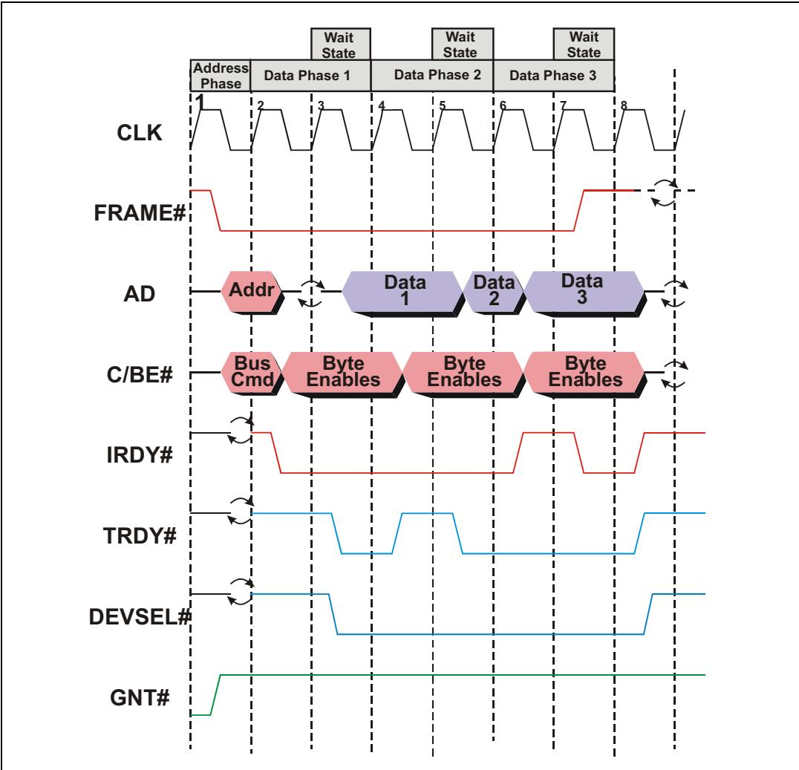

## Reflected-Wave Signaling

PCI architecturally supports up to 32 devices on each bus, but the practical electrical limit is considerably less, on the order of 10 to 12 electrical loads at the base frequency of 33MHz. The reason for this is that the bus uses a technique called “reflected‐wave signaling” to reduce the power consumption on the bus (see Figure 1‐4 on page 17). In this model, devices save cost and power by implementing weak transmit buffers that can only drive the signal to about half the voltage needed to switch the signal. The incident wave of the signal propagates down the transmission line until it reaches the end. By design, there is no termination at the end of the line so the wavefront encounters an infinite impedance and reflects back. This reflection is additive in nature and increases the signal to the full voltage level as it makes its way back to the transmitter. When the signal reaches the originating buffer, the low output impedance of the driver terminates the signal and prevents further reflections. The total elapsed time from the buffer asserting a signal until the receiver detects a valid signal is thus the propagation time down the wire plus the reflection delay coming back and the setup time. All of that must be less than the clock period.

As the length of the trace and the number of electrical loads on a bus increase, the time required for the signal to make this round trip increases. A 33 MHz PCI bus can only meet the signal timing with about 10‐12 electrical loads. An electrical load is one device installed on the system board, but a populated connector slot actually counts as two loads. Therefore, as indicated in Table 1‐1 on page 11, a 33 MHz PCI bus can only be designed for reliable operation with a maximum of 4 or 5 add‐in card connectors.

Figure 1‐4: PCI Reflected‐Wave Signaling  


To connect more loads in a system, a PCI‐to‐PCI bridge is needed, as shown in Figure 1‐5. By the time more modern chipsets were available, peripherals had grown so fast that their competition for access to the shared PCI bus was limiting their performance. PCI speeds didn’t keep up, and it became a system bottleneck even though it was still very popular for peripherals. The solution to this problem was to move PCI out of the main path between system peripherals and memory, replacing the chipset interconnect with a proprietary solution (in this example, Intel’s Hub Link interface).

A PCI Bridge is an extension to the topology. Each Bridge creates a new PCI bus that is electrically isolated from the bus above it, allowing another 10‐12 loads. Some of these devices could also be bridges, allowing a large number of devices to be connected in a system. The PCI architecture allows up to 256 buses in a single system and each of those buses can have up to 32 devices.

Figure 1‐5: 33 MHz PCI System, Including a PCI‐to‐PCI Bridge  


## PCI Bus Architecture Perspective

## PCI Transaction Models

PCI uses three models for data transfer just as previous bus models did: Programmed I/O (PIO), Peer‐to‐peer, and DMA. These models are illustrated in Figure 1‐6 on page 19 and described in the following sections.

## Programmed I/O

PIO was commonly used in the early days of the PC because designers were reluctant to add the expense or complexity to their devices of transaction management logic. The processor could do the job faster than any other device anyway so, in this model, it handles all the work. For example, if a PCI device interrupts the CPU to indicate that it needs to put data in memory, the CPU will end up reading data from the PCI device into an internal register and then copying that register to memory. Going the other way, if data is to be moved from memory to the PCI device, software instructs the CPU to read from memory into its internal register and then write that register to the PCI device.

The process works but is inefficient for two reasons. First, there are two bus cycles generated by the CPU for every data transfer, and second, the CPU is busy with data transfer housekeeping rather than more interesting work. In the early days this was the fastest transfer method and the single‐tasking processor didn’t have much else to do. These types of inefficiencies are typically not acceptable in modern systems, so this method is no longer very common for data transfers, and instead the DMA method described in the next section is the preferred approach. However, programmed IO is still a necessary transaction model in order for software to interact with a device.

Figure 1‐6: PCI Transaction Models  
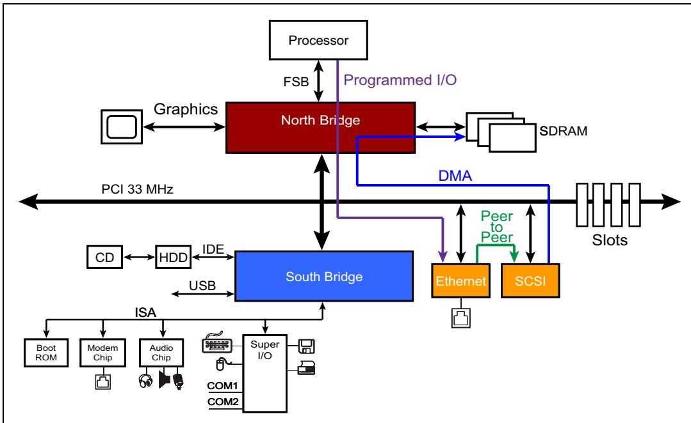

## Direct Memory Access (DMA)

A more efficient method of transferring data is called DMA (direct memory access). In this model another device, called a DMA engine, handles the details of memory transfers to a peripheral on behalf of the processor, off‐loading this tedious task. Once the CPU has programmed the starting address and byte count into it, the DMA engine handled the bus protocol and address sequencing on its own. This didn’t involve any change to the PCI peripherals and allowed them to keep their low‐cost designs. Later, improved integration allowed peripherals to integrate this DMA functionality locally, so they didn’t need an external DMA engine. These devices were capable of handling their own bus transfers and were called Bus Master devices.

Figure 1‐3 on page 15 is an example of a Bus Master transaction on PCI. The North Bridge might decode the address and recognize that it will be the target for the transaction. In the data phase of the bus cycle, data is transferred between the Bus Master and the North Bridge acting as the target. The North Bridge in turn will generate DRAM bus cycles to communicate with system memory. After the transfer is completed, the PCI peripheral might generate an interrupt to inform the system. The DMA method of data transfer is more efficient because the CPU is not involved in the data movement, and a single bus cycle may be sufficient to move a block of data.

## Peer-to-Peer

If a device is capable of acting as a Bus Master, then another interesting option presents itself. One PCI Bus Master could initiate a transfer to another PCI device, with the result that the entire transaction remains local to the PCI bus and doesn’t involve any other system resources. Since this transaction takes place between devices that are considered peers in the system, it’s referred to as a peer‐to‐peer transaction. This has some obvious efficiencies because the rest of the system remains free to do other work. Nevertheless, it’s rarely used in practice because the initiator and target don’t often use the same format for the data unless both are made by the same vendor. Consequently, the data usually must first be sent to memory where the CPU can reformat it before it is then transferred to the target, defeating the goal of a peer‐to‐peer transfer.

## PCI Bus Arbitration

Consider Figure 1‐2 on page 13. Since PCI devices today are almost all capable of being bus‐master, they are able to do both DMA and peer‐to‐peer transfers. In a shared bus architecture like PCI, they have to take turns on the bus, so a device that wants to initiate transactions must first request ownership of the bus from the bus arbiter. The arbiter sees all the current requests and uses an implementation‐specific algorithm to decide which Bus Master gets ownership of the bus next. The PCI spec doesn’t describe this algorithm, but does state that it must be “fair” and not starve any device for access.

The arbiter can grant bus ownership to the next requesting device while the previous Bus Master is still executing its transfer, so that no clocks are used on the bus to sort out the next owner. As a result, the arbitration appears to happen behind the scenes and is referred to as “hidden” bus arbitration, which was a design improvement over earlier bus protocols.

## PCI Inefficiencies

## PCI Retry Protocol

When a PCI master initiates a transaction to access a target device and the target device is not ready, the target signals a transaction retry. This scenario is shown in Figure 1‐7.

Figure 1-7: PCI Transaction Retry Mechanism  
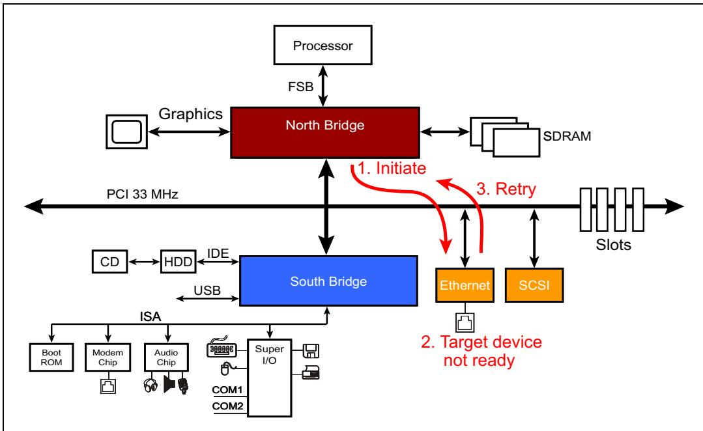

Consider the following example in which the North bridge initiates a memory read transaction to read data from the Ethernet device. The Ethernet target claims the bus cycle. However, the Ethernet target does not immediately have the data to return to the North bridge master. The Ethernet device has two choices by which to delay the data transfer. The first is to insert wait‐states in the data phase. If only a few wait‐states are needed, then the data is still transferred efficiently. If however the target device requires more time (more than 16 clocks from the beginning of the transaction), then the second option the target has is to signal a retry with a signal called STOP#. A retry tells the master to end the bus cycle prematurely without transferring data. Doing so prevents the bus from being held for a long time in wait‐states, which compromises the bus efficiency. The Bus Master that is retried by the target waits a minimum of 2 clocks and must once again arbitrate for use of the bus to re‐initiate the identical bus cycle. During the time that the Bus Master is retried, the arbiter can grant the bus to other requesting masters so that the PCI bus is more efficiently utilized. By the time the retried master is granted the bus and it re‐initiates the bus cycle, hopefully the target will claim the cycle and will be ready to transfer data. The bus cycle goes to completion with data transfer. Otherwise, if the target is still not ready, it retries the master’s bus cycle again and the process is repeated until the master successfully transfers data.

## PCI Disconnect Protocol

When a PCI master initiates a transaction to access a target device and if the target device is able to transfer at least one doubleword of data but cannot complete the entire data transfer, it disconnects the transaction at the point at which it cannot continue. This scenario is illustrated in Figure 1‐8 on page 23.

Consider the following example in which the North bridge initiates a burst memory read transaction to read data from the Ethernet device. The Ethernet target device claims the bus cycle and transfers some data, but then runs out of data to transfer. The Ethernet device has two choices to delay the data transfer. The first option is to insert wait‐states during the current data phase while waiting for additional data to arrive. If the target needs to insert only a few waitstates, then the data is still transferred efficiently. If however the target device requires more time (the PCI specification allows maximum of 8 clocks in the data phase), then the target device must signal a disconnect. To do this the target asserts STOP# in the middle of the bus cycle to tell the master to end the bus cycle prematurely. A disconnect results in some data transferred, while a retry does not. Disconnect frees the bus from long periods of wait states. The disconnected master waits a minimum of 2 clocks before once again arbitrating for use of the bus and continuing the bus cycle at the disconnected address. During the time that the Bus Master is disconnected, the arbiter may grant the bus to other requesting masters so that the PCI bus is utilized more efficiently. By the time the disconnected master is granted the bus and continues the bus cycle, hopefully the target is ready to continue the data transfer until it is completed. Otherwise, the target once again retries or disconnects the master’s bus cycle and the process is repeated until the master successfully transfers all its data.

Figure 1-8: PCI Transaction Disconnect Mechanism  


## PCI Interrupt Handling

PCI devices use one of four sideband interrupt signals (INTA#, INTB#, INTC#, or INTD#) to send an interrupt request to the system. When one of the pins is asserted, the interrupt controller in a single‐CPU system responded by asserting the INTR (interrupt request) pin to the CPU. Later multi‐CPU designs needed to improve on the single wire input for interrupts and changed to an APIC (Advanced Programmable Interrupt Controller) model, in which the controller sends a message to the multiple CPUs instead of asserting the INTR pin to one of them. Regardless of the delivery model, an interrupted CPU must determine the source of the interrupt and then service the interrupt. The legacy model required several bus cycles for this and wasn’t very efficient. The APIC model is better but also leaves room for improvement.

## PCI Error Handling

PCI devices can optionally detect and report address and data phase parity errors during transactions. PCI generates  ʺeven parityʺ across most of the signals during a transaction by using the PAR signal. This means that if the number of set bits during an address or data phase is odd, the master device will set the PAR signal to make the parity ʺeven.ʺ The target device receives the address or data and checks for errors. Parity errors are detectable only as long as an odd number of signals are affected causing the received number of ones to be odd. If a device detects a data phase parity error, it asserts PERR# (parity error). This is potentially a recoverable error since, for cases like a memory read, just repeating the transaction may resolve the problem. PCI does not include any automatic or hardware‐based recovery mechanisms, though, so any attempts to resolve the error would be handled by software.

Figure 1‐9: PCI Error Handling  
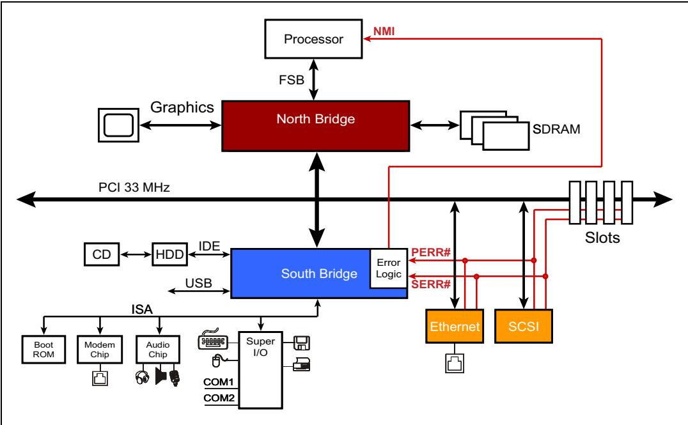

However, it’s a different matter if a parity error is detected during the address phase. In this case the address was corrupted and the wrong target may have recognized the address. There’s no way to tell what the corrupted address became or what devices on the bus did in response to it, so there’s also no simple recovery. As a result, errors of this type result in the assertion of the SERR# (system error) pin, which typically results in a call to the system error handler. In older machines, this would often halt the system as a precaution, resulting in the “blue screen of death.”

In older machines, both PERR# and SERR# were connected to the error logic in the South Bridge. For reasons of simplicity and cost, this typically resulted in the assertion of an NMI signal (non‐maskable interrupt signal) to the CPU, which would often simply halt the system.

## PCI Address Space Map

PCI architecture supports 3 address spaces as shown in Figure 1‐10 on page 26: memory, I/O and configuration address space. x86 processors can access memory and IO space directly. A PCI device maps into the processors memory address space and can either support 32 or 64 bit memory addressing. In I/O address space, PCI supports 32 bit addresses but, since x86 CPUs only used 16 bits for I/O space, many platforms limit the I/O space to 64 KB (16 bits worth).

PCI also introduced a third address space called configuration space that the CPU could only indirectly access. Each function contains internal registers for configuration space that allow software visibility and control of its addresses and resources in a standardized way, providing a true “plug and play” environment in the PC. Each PCI function may have up to 256 Bytes of configuration address space. Given that PCI supports up to 8 functions/device, 32 devices/bus and up to 256 buses/system, then the total amount of configuration space associated with a system is 256 Bytes/function x 8 functions/device x 32 devices/bus x 256 buses/system = 16MB of configuration space.

Since an x86 CPU cannot access configuration space directly, it must do so indirectly by indexing through IO registers (although with PCI Express a new method to access configuration space was introduced by mapping it into the memory address space). The legacy model, shown in Figure 1‐10 on page 26, uses an IO Port called Configuration Address Port located at address CF8h‐CFBh and a Configuration Data Port mapped to address CFCh‐CFFh. Details regarding this method and the memory mapped method of accessing configuration space are explained in the next section.

Figure 1‐10: Address Space Mapping  


## PCI Configuration Cycle Generation

Since IO address space is limited, the legacy model was designed to be very conservative with addresses. The common way of doing that in IO space was to have one register for pointing to an internal location, and a second one for reading or writing the data. In PCI configuration that involves two steps.

Step 1: The CPU generates an IO write to the Address Port at IO address CF8h in the North Bridge to give the address of the configuration register to be accessed. This address, shown in Figure 1‐11 on page 27, consists primarily of the three things that locate a PCI function within the topology: which bus we want to access out of the 256 possible, which device on that bus out of the 32 possible, and which function within that device out of the 8 possible. The only other information needed is to identify which of the 64 dwords (256 bytes) in that function’s configuration space is to be accessed.

Step 2: The CPU generates either an IO read or IO write to the Data Port at location CFCh in the North Bridge. Based on that, the North Bridge then generates a configuration read or configuration write transaction to the PCI bus specified in the Address Port.  
Figure 1‐11: Configuration Address Register

<table><tr><td></td><td>0CFBh</td><td>0CFAh</td><td>0CF9h</td><td>0CF8h</td></tr><tr><td>31 30</td><td>24 23</td><td>16 15</td><td>11 10</td><td>7 2 1 0</td></tr><tr><td></td><td>Reserved</td><td>Bus Number</td><td>Device Number</td><td>Function Number Doubleword 0 0</td></tr></table>

## PCI Function Configuration Register Space

Each PCI function contains up to 256 bytes of configuration space. The first 64 bytes of each functionʹs configuration space contains a structure called the Header, while the remaining 192 Bytes support optional functionality. System configuration is first performed by Boot ROM firmware. After the OS loads, it may reconfigure the system and rearrange resource assignments, with the result that the process of system configuration may be done twice.

There are two basic classes of PCI functions as defined by their header types. A Type 1 header identifies a function that is a bridge (as shown in Figure 1‐12 on page 28) and creates another bus in the topology, while a Type 0 header indicates a function that is NOT a bridge (as shown in Figure 1‐13 on page 29). This header type information is contained in a field by the same name in dword 3, byte 2, and should be one of the first things software checks when discovering which functions exist in the system (a process called “enumeration”).

## PCI Express Technology

Figure 1‐12: PCI Configuration Header Type 1 (Bridge)  


Figure 1‐13: PCI Configuration Header Type 0 (not a Bridge)  
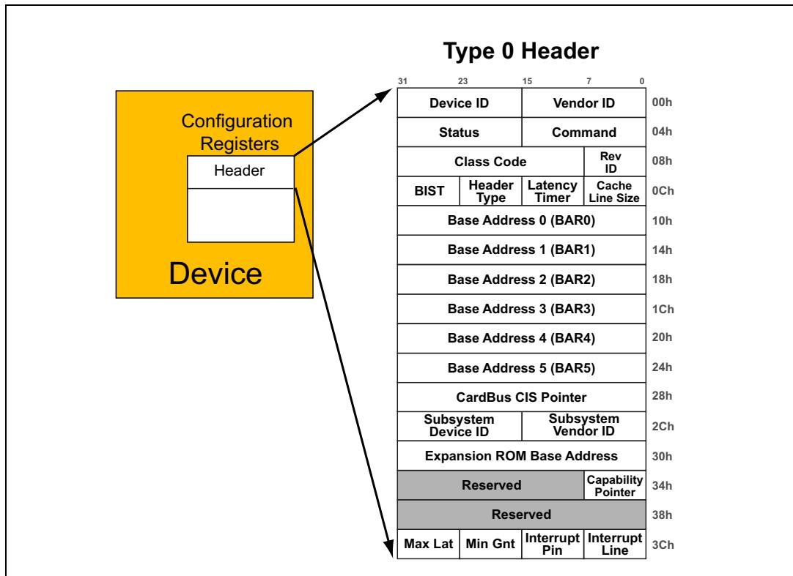

Details of the configuration register space and the enumeration process are described later. For now we simply want you to become familiar with the big picture of how all the parts fit together.

## Higher-bandwidth PCI

To support higher bandwidth, the PCI specification was updated to support both wider (64‐bit) and faster (66 MHz) versions, achieving 533 MB/s. Figure 1‐ 14 shows an example of a 66 MHz, 64‐bit PCI system.

Figure 1‐14: 66 MHz PCI Bus Based Platform  
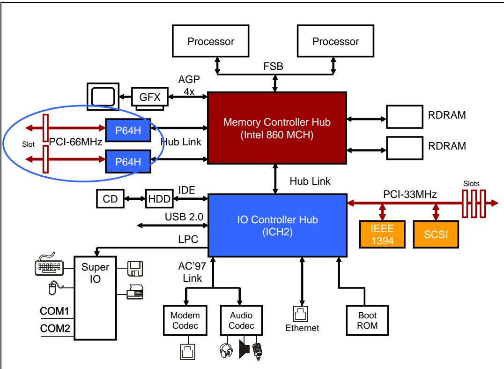

## Limitations of 66 MHz PCI bus

While the throughput of the bus was doubled at this speed relative to the 33 MHz bus, the diagram illustrates one of its major shortcomings: using the same reflected‐wave switching model with only half the timing budget meant that the loading on the bus had to be greatly reduced. The result was that only one add‐in card could be supported on each bus. Adding more device meant adding more PCI bridges and buses would increases both cost and board real estate requirements. The 64‐bit PCI bus increases pin count, increasing system cost and lowered system reliability. In combination, it’s easy to see why these factors limited the popularity of 64‐bit or 66 MHz version of PCI bus.

## Signal Timing Problems with the Parallel PCI Bus Model beyond 66 MHz

PCI bus clock frequency cannot be increased beyond 66MHz given the realistic loads that exist on a PCI bus and signal flight times. With a 66 MHz clock, the clock period is 15 ns. Setup time allocated at the receiver is 3 ns. With the PCI “non‐registered input” signal bus model, reducing signal setup time below this 3 ns value is not realistic. The rest of the 12 ns timing budget is allocated towards output delays at the transmitter and signal flight time. Clocking PCI bus any faster than 66 MHz implies reducing clock period. A transmitted signal will not be received in time enough to be sampled at the receiver.

The PCI‐X bus introduced in the next section takes the approach of registering all input signals with a Flip‐Flop before using them. Doing so reduced signal setup time to below 1 ns. The setup time savings of PCI setup time allows PCI‐X bus to be run at higher frequencies of 100 MHz or even 133 Mhz. In the next section, we describe PCI‐X bus architecture briefly.

## Introducing PCI-X

PCI‐X is backward compatible with PCI in both hardware and software, but provides better performance and higher efficiency. It uses the same connector format, so PCI‐X devices can be plugged into PCI slots and vice‐versa. And it uses the same configuration model, so device drivers, operating systems, and applications that run on a PCI system also run on a PCI‐X system.

To achieve higher speeds without changing the PCI signaling model, PCI‐X added a few tricks to improve the bus timing. First, they implement PLL (phase‐locked loop) clock generators that provide phase‐shifted clocks internally. That allows the outputs to be driven a little earlier and the inputs to be sampled a little later, improving the timing on the bus. Likewise, PCI‐X inputs are registered (latched) at the input pin of the target device, resulting in shorter setup times. The time gained by these means increased the time available for signal propagation on the bus and allowed higher clock frequencies.

## PCI-X System Example

An example of an Intel 7500 server chipset‐based system is shown in Figure 1‐15 on page 32. The MCH chip includes three additional high‐performance Hub Link 2.0 ports that are connected to three PCI‐X Hub 2 bridges (P64H2). Each

## PCI Express Technology

bridge supports two PCI‐X buses that can run at frequencies up to 133MHz. The Hub Link 2.0 can sustain the higher bandwidth requirements for PCI‐X traffic. Note that we have the same loading problem that we did for 66‐MHz PCI, resulting in a large number of buses needed to support more devices and a relatively expensive solution. The bandwidth is much higher now, though.

Figure 1‐15: 66 MHz/133 MHz PCI‐X Bus Based Platform  


## PCI-X Transactions

Figure 1‐16 on page 33 shows an example of a PCI‐X burst memory read transaction. Note that PCI‐X does not allow Wait States after the first data phase. This is possible because the transfer size is now provided to the target device in the Attribute phase of the transaction, so the target devices knows exactly what is going to be required of him. In addition, most PCI‐X bus cycles are bursts and data is generally transferred in blocks of 128 Bytes. These features allow for more efficient bus utilization and device buffer management.

Figure 1‐16: Example PCI‐X Burst Memory Read Bus Cycle  
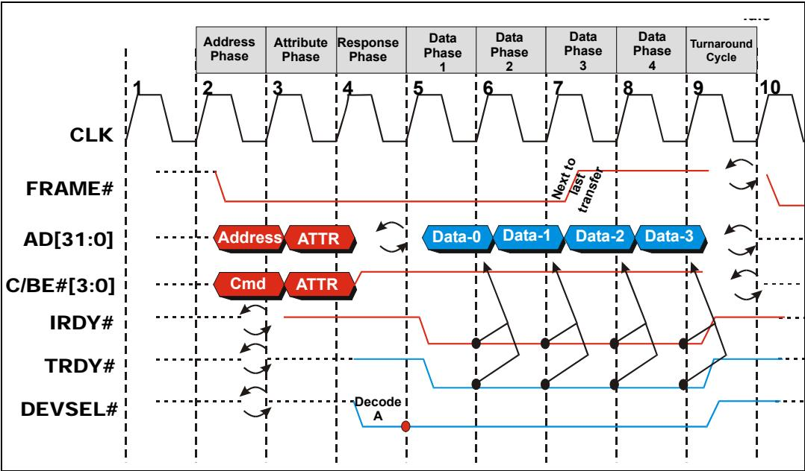

## PCI-X Features

## Split-Transaction Model

In a conventional PCI read transaction, the Bus Master initiates a read to a target device on the bus. As described earlier, if the target is unprepared to finish the transaction it can either hold the bus with Wait States while fetching the data, or issue a Retry in the process of a Delayed Transaction.

PCI‐X bus uses a Split Transaction to handle these cases, as illustrated in Figure 1‐17 on page 34. To help keep track of what each device is doing, the device initiating the read is now called the Requester, and the device fulfilling the read request is called the Completer. If the completer is unable to service the request immediately, it memorizes the transaction (address, transaction type, byte count, requester ID) and signals a split response. This tells the requester to put this transaction aside in a queue, end the current bus cycle, and release the bus to the idle state. That makes the bus available for other transactions while the completer is awaiting the requested data. The requester is free to do whatever it likes while it waits for the completer, such as initiating other requests, even to the same completer. Once the completer has gathered the requested data, it then arbitrates for ownership of the bus and initiates a split completion during which it returns the requested data. The requester claims the split completion bus cycle and accepts the data from the completer. The split completion looks very much like a write transaction to the system. This Split Transaction Model is possible because not only does the request indicate how much data they are requesting in the Attribute phase, but they also indicate who they are (their Bus:Device:Function number) which allows the completer to target the correct device with the completion.

Two bus transactions are needed to complete the entire data transfer, but between the read request and the split completion the bus is available for other work. The requester does not need to poll the device with retries to learn when the data is ready. The completer simply arbitrates for the bus and drives the requested data back when it is ready. This makes for a much more efficient transaction model in terms of bus utilization.

These protocol enhancements made to the PCI‐X bus architecture described so far contribute towards an increased transfer efficiency of around 85% for PCI‐X as compared to 50%‐60% with the standard PCI protocol.

Figure 1‐17: PCI‐X Split Transaction Protocol  


## Message Signaled Interrupts

PCI‐X devices require MSI (Message Signaled Interrupt) capability, which was developed as a way to reduce or eliminate the need to share interrupts across multiple devices as was typically required in the legacy interrupt architecture.

To generate an interrupt request using MSI, a device initiates a memory write transaction using a pre‐defined address range that is understood to be an interrupt which should be delivered to one of more CPUs, and the data is a unique interrupt vector associated with that device. The CPU, armed with the interrupt number, is able to immediately jump to the interrupt service routine for the device and avoids the overhead associated with finding which device generated the interrupt. In addition, no sideband pins are needed.

## Transaction Attributes

Finally, PCI‐X also added another phase to the beginning of each transaction called the Attribute Phase (see Figure 1‐16 on page 33). In this time slot the requester delivers information that can be used to help improve the efficiency of transactions on the bus, such as the byte count for this request and who the requester is (Bus:Device:Function number). In addition to those items, two new bits were added to help characterize this transaction: the ʺNo Snoopʺ bit and the ʺRelaxed Orderingʺ bit.

No Snoop (NS):  Normally, when a transaction moves data into or out of memory, the CPU’s internal caches need to be checked to see if that memory location has been copied into one or more CPU caches. If so, the cache contents may need to be written back to memory or invalidated before the requested transaction is allowed to access memory. Naturally, this snoop process takes time and adds latency to a request. Sometimes the software is aware that a requested location will never be found in the CPU caches (perhaps because the location was defined by the system as uncacheable), so snooping is unnecessary and that step could be skipped. The No Snoop bit was added with precisely that case in mind.

Relaxed Ordering (RO): Normally, transactions are required to remain in the same order that they were issued on the bus while they go through buffers in bridges. This is referred to as the Strongly Ordered model, and PCI and PCI‐X generally follow that rule with a few exceptions. That’s because it helps resolve dependencies among transactions that are related to each other, such as writing and then reading the same location. However, not all transactions actually have dependencies. If they don’t, then forcing them to stay in order can result in loss of performance, and that’s what this bit was designed to alleviate. If the requester knows that a particular transaction is unrelated to the other transactions that have gone before, it can set this bit to tell bridges that this transaction is allowed to jump ahead in the queue to give better performance.

## Higher Bandwidth PCI-X

Problems with the Common Clock Approach of PCI and PCI-X 1.0 Parallel Bus Model

An issue that becomes clear when trying to migrate a bus like PCI to higher speeds is that parallel bus designs have some inherent limitations. Figure 1‐18 on page 36 helps illustrate these. These designs use a common or distributed clock, in which data is driven out on one clock edge and latched in on the next clock edge so that the total timing budget is the time for one clock period. Naturally, the higher the frequency, the smaller the clock period and thus the smaller the timing budget.

Figure 1‐18: Inherent Problems in a Parallel Design  
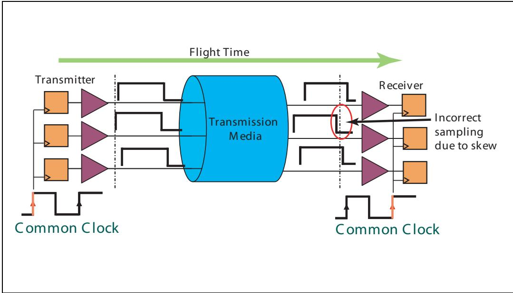

The first issue to note is signal skew. When multiple data bits are sent at once, they experience slightly different delays and arrive at slightly different times at the receiver. If that difference is too large, incorrect signal sampling with clock may occur at the receiver as shown in the diagram. A second issue is clock skew between multiple devices. The arrival time of the common clock at one device is not precisely the same as the arrival time at the other which further reduces the timing budget. Finally, a third issue relates to the time it takes for the signal to propagate from a transmitter to a receiver, called the flight time. The clock period or timing budget must be greater than the signal flight time. To ensure this, the board design is required to implement signal traces that are short enough such that signal propagation delays are smaller than the clock period. In many board designs, this short signal traces may not be realistic enough to design for.

To further improve performance in spite of these limitations, a couple of techniques can be used. First, the existing protocol can be streamlined and made more efficient. And second, the bus model can be changed to a source synchronous clocking model where the bus signal and clock (strobe) are driven at the same time on signals that experience equal propagation delay. This is the approach taken by PCI‐X 2.0 protocol.

## PCI-X 2.0 Source-Synchronous Model

PCI‐X 2.0 further increased the bandwidth of PCI‐X. As before, the devices and connectors remained hardware and software backward compatible with PCI devices and connectors. To achieve the higher speeds, the bus uses a sourcesynchronous delivery model to support either Dual Data Rate (DDR) or Quad Data Rate (QDR).

The term “source synchronous” means that the device transmitting the data also provides another signal that travels the same basic path as the data. As illustrated in Figure 1‐19 on page 38, that signal in PCI‐X 2.0 is called a “strobe” and is used by the receiver for latching the incoming data bits. The transmitter assigns the timing relationship between the data and strobe and as long as their paths are similar in length and other characteristics that can affect transmission latency, that relationship will be about the same when they arrive at the receiver and the receiver can simply use the Strobe as the signal to latch the data in with. This allows higher speeds because clock skew with respect to the common clock is removed as a separate budget item and because the issue of flight time goes away. It no longer matters how long it takes for the data to travel from point A to point B because the strobe that latches it in takes about the same time and so their relationship will be unaffected.

It’s important to note again that the very high‐speed signal timing eliminates the possibility of using a shared‐bus model and forces a point‐to‐point design instead. As a result, increasing the number of devices means more bridges will be needed to create more buses. A device could be designed to support this with three interfaces and an internal bridge structure to allow them all to communicate with each other. Such a device would have a very high pin count, though, and a higher cost, relegating PCI‐X 2.0 to the very high‐end market.

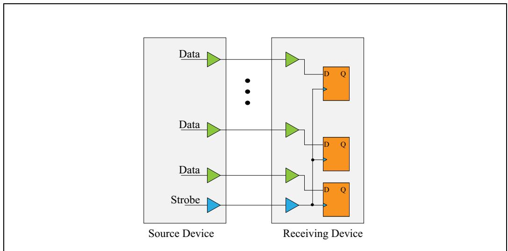  
Figure 1‐19: Source‐Synchronous Clocking Model  
Despite the improvements in bandwidth, efficiency and reliability that came with PCI‐X (2.0), the parallel bus model was approaching its end of life and a new model was needed to address the relentless demand for higher bandwidth and lower cost. The new model chosen was a serial interface which is a drastically different bus from a physical perspective, but was still made to be software backwards compatible. We know this new model as PCI Express.

Since it was recognized that this would be an expensive solution that would appeal more to high‐end designers, PCI‐X 2.0 also supports ECC generation and checking. ECC is much more robust and sophisticated than parity detection, allowing automatic correction of single‐bit errors on the fly, and robust detection of multi‐bit errors. This improved error handling adds cost, but high end platforms need the improved reliability it provides, hence a logical choice.

# 2 PCIe Architecture Overview

## Previous Chapter

The previous chapter provided historical background to establish a foundation for understanding PCI Express. This included reviewing the basics of PCI and PCI‐X 1.0/2.0. The goal was to provide a context for the overview of PCI Express that follows.

## This Chapter

This chapter provides a thorough introduction to the PCI Express architecture and is intended to serve as an “executive level” overview, covering all the basics of the architecture at a high level. It introduces the layered approach given in the spec and describes the responsibilities of each layer. The various packet types are introduced along with the protocol used to communicate them and facilitate reliable transmission.

## The Next Chapter

The next chapter provides an introduction to configuration in the PCI Express environment. This includes the space in which a Function’s configuration registers are implemented, how a Function is discovered, how configuration transactions are generated and routed, the difference between PCI‐compatible space and PCIe extended space, and how software differentiates between an Endpoint and a Bridge.

## Introduction to PCI Express

PCI Express represents a major shift from the parallel bus model of its predecessors. As a serial bus, it has more in common with earlier serial designs like InfiniBand or Fibre Channel, but it remains fully backward compatible with PCI in software.

## PCI Express Technology

As is true of many high‐speed serial transports, PCIe uses a bidirectional connection and is capable of sending and receiving information at the same time. The model used is referred to as a dual‐simplex connection because each interface has a simplex transmit path and a simplex receive path, as shown in Figure 2‐1 on page 40. Since traffic is allowed in both directions at once, the communication path between two devices is technically full duplex, but the spec uses the term dual‐simplex because it’s a little more descriptive of the actual communication channels that exist.

Figure 2‐1: Dual‐Simplex Link  


The term for this path between the devices is a Link, and is made up of one or more transmit and receive pairs. One such pair is called a Lane, and the spec allows a Link to be made up 1, 2, 4, 8, 12, 16, or 32 Lanes. The number of lanes is called the Link Width and is represented as x1, x2, x4, x8, x16, and x32. The trade‐off regarding the number of lanes to be used in a given design is straightforward: more lanes increase the bandwidth of the Link but add to its cost, space requirement, and power consumption. For more on this, see “Links and Lanes” on page 46.

Figure 2‐2: One Lane  
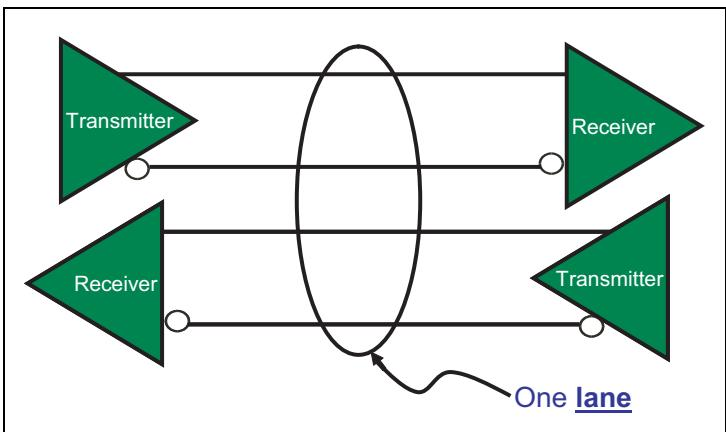

## Software Backward Compatibility

One of the most important design goals for PCIe was backward compatibility with PCI software. Encouraging migration away from a design that is already installed and working in existing systems requires two things: First, a compelling improvement that motivates even considering a change and, second, minimizing the cost, risk, and effort of changing. A common way to help this second factor in computers is to maintain the viability of software written for the old model in the new one. To achieve this for PCIe, all the address spaces used for PCI are carried forward either unchanged or simply extended. Memory, IO, and Configuration spaces are still visible to software and programmed in exactly the same way they were before. Consequently, software written years ago for PCI (BIOS code, device drivers, etc.) will still work with PCIe devices today. The configuration space has been extended dramatically to include many new registers to support new functionality, but the old registers are still there and still accessible in the regular way (see “Software Compatibility Characteristics” on page 49).

## Serial Transport

## The Need for Speed

Of course, a serial model must run much faster than a parallel design to accomplish the same bandwidth because it may only send one bit at a time. This has not proven difficult, though, and in the past PCIe has worked reliably at 2.5 GT/ s and 5.0 GT/s. The reason these and still higher speeds (8 GT/s) are attainable is that the serial model overcomes the shortcomings of the parallel model.

Overcoming Problems. By way of review, there are a handful of problems that limit the performance of a parallel bus and three are illustrated in Figure 2 3 on page 42. To get started, recall that parallel buses use a common clock; outputs are clocked out on one clock edge and clocked into the receiver on the next edge. One issue with this model is the time it takes to send a signal from transmitter to receiver, called the flight time. The flight time must be less than the clock period or the model won’t work, so going to smaller clock periods is challenging. To make this possible, traces must get shorter and loads reduced but eventually this becomes impractical. Another factor is the difference in the arrival time of the clock at the sender and receiver, called clock skew. Board layout designers work hard to minimize this value because it detracts from the timing budget but it can never be eliminated. A third factor is signal skew, which is

## PCI Express Technology

the difference in arrival times for all the signals needed on a given clock. Clearly, the data can’t be latched until all the bits are ready and stable, so we end up waiting for the slowest one.

Figure 2‐3: Parallel Bus Limitations  


How does a serial transport like PCIe get around these problems? First, flight time becomes a non‐issue because the clock that will latch the data into the receiver is actually built into the data stream and no external reference clock is necessary. As a result, it doesn’t matter how small the clock period is or how long it takes the signal to arrive at the receiver because the clock arrives with it at the same time. For the same reason there’s no clock skew, again because the latching clock is recovered from the data stream. Finally, signal skew is eliminated within a Lane because there’s only one data bit being sent. The signal skew problem returns if a multi‐lane design is used, but the receiver corrects for this automatically and can fix a generous amount of skew. Although serial designs overcome many of the problems of parallel models, they have their own set of complications. Still, as we’ll see later, the solutions are manageable and allow for high‐speed, reliable communication.

Bandwidth. The combination of high speed and wide Links that PCIe supports can result in some impressive bandwidth numbers, as shown in Table 2‐1 on page 43. These numbers are derived from the bit rate and bus characteristics. One such characteristic is that, like many other serial transports, the first two generations of PCIe use an encoding process called 8b/10b that generates a 10‐ bit output based on an 8‐bit input. In spite of the overhead this introduces, there are several good reasons for doing it as we’ll see later. For now it’s enough to

## Chapter 2: PCIe Architecture Overview

know that sending one byte of data requires transmitting 10 bits. The first generation (Gen1 or PCIe spec version 1.x) bit rate is 2.5 GT/s and dividing that by 10 means that one lane will be able to send 0.25 GB/s. Since the Link permits sending and receiving at the same time, the aggregate bandwidth can be twice that amount, or 0.5 GB/s per Lane. Doubling the frequency for the second generation (Gen2 or PCIe 2.x) doubled the bandwidth. The third generation (Gen3 or PCIe 3.0) doubles the bandwidth yet again, but this time the spec writers chose not to double the frequency. Instead, for reasons we’ll discuss later, they chose to increase the frequency only to 8 GT/s and remove the 8b/10b encoding in favor of another encoding mechanism called 128b/130b encoding (for more on this, see the chapter “Physical Layer  ‐ Logical (Gen3)” on page 407). Table 2‐1 summarizes the bandwidth available for all the current possible combinations and shows the peak throughput the Link could deliver in that configuration.

Table 2‐1: PCIe Aggregate Gen1, Gen2 and Gen3 Bandwidth for Various Link Widths

<table><tr><td>Link Width</td><td>x1</td><td>x2</td><td>x4</td><td>x8</td><td>x12</td><td>x16</td><td>x32</td></tr><tr><td>Gen1 Bandwidth (GB /s)</td><td>0.5</td><td>1</td><td>2</td><td>4</td><td>6</td><td>8</td><td>16</td></tr><tr><td>Gen2 Bandwidth (GB/s)</td><td>1</td><td>2</td><td>4</td><td>8</td><td>12</td><td>16</td><td>32</td></tr><tr><td>Gen3 Bandwidth (GB/s)</td><td>2</td><td>4</td><td>8</td><td>16</td><td>24</td><td>32</td><td>64</td></tr></table>

## PCIe Bandwidth Calculation

To calculate the bandwidth numbers included in the table above, see the calculations outlined below.

Gen1 PCIe Bandwidth = (2.5 Gb/s x 2 directions) / 10 bits per symbol = 0.5 GB/s.

Gen2 PCIe Bandwidth = (5.0 Gb/s x 2 directions) / 10 bits per symbol = 1.0 GB/s.

Note that in the above calculations, we divide by 10 bits per symbol not 8 bits per byte, because both Gen1 and Gen2 protocols require packet bytes to be encoded using 8b/10b encoding schemes before packet transmission.

## PCI Express Technology

• Gen3 PCIe Bandwidth = (8.0 Gb/s x 2 directions) / 8 bits per byte = 2.0 GB/s.

Note that at Gen3 speed, we divide by 8 bits per byte not by 10 bits per symbol because at Gen3 speed, packets are NOT 8b/10b encoded, rather they are 128b/ 130b encoded. There is an addition 2 bit overhead every 128 bits, but it is not large enough to account for in the calculation.

These 3 calculated bandwidth numbers are multiplied by Link width to result in total Link bandwidth on multi‐Lane Links.

## Differential Signals

Each Lane uses differential signaling, sending both a positive and negative version (D+ and D‐) of the same signal as shown in Figure 2‐4 on page 44. This doubles the pin count, of course, but that’s offset by two clear advantages over single‐ended signaling that are important for high speed signals: improved noise immunity and reduced signal voltage.

The differential receiver gets both signals and subtracts the negative voltage from the positive one to find the difference between them and determine the value of the bit. Noise immunity is built in to the differential design because the paired signals are on adjacent pins of each device and their traces must also be routed very near each other to maintain the proper transmission line impedance. Consequently, anything that affects one signal will also affect the other by about the same amount and in the same direction. The receiver is looking at the difference between them and the noise doesn’t really change that difference, so the result is that most noise affecting the signals doesn’t affect the receiver’s ability to accurately distinguish the bits.

Figure 2‐4: Differential Signaling  


## No Common Clock

As mentioned earlier, a common clock is not required for a PCIe Link because it uses a source‐synchronous model, meaning the transmitter supplies the clock to the receiver to use in latching the incoming data. A PCIe Link does not include a forwarded clock. Instead, the transmitter embeds the clock into the data stream using 8b/10b encoding. The receiver then recovers the clock from the data stream and uses it to latch the incoming data. As mysterious as this might sound, the process by which this is done is actually fairly straightforward. In the receiver, a PLL circuit (Phase‐Locked Loop, see Figure 2‐5 on page 45) takes the incoming bit stream as a reference clock and compares its timing, or phase, to that of an output clock that it has created with a specified frequency. Based on the result of that comparison, the output clock’s frequency is increased or decreased until a match is obtained. At that point the PLL is said to be locked, and the output (recovered) clock frequency precisely matches the clock that was used to transmit the data. The PLL continually adjusts the recovered clock, so changes in temperature or voltage that affect the transmitter clock frequency will always be quickly compensated.

One thing to note regarding clock recovery is that the PLL does need transitions on the input in order to make its phase comparison. If a long time goes by without any transitions in the data, the PLL could begin to drift away from the correct frequency. To prevent that problem, one of the design goals of 8b/10b encoding is ensure no more than 5 consecutive ones or zeroes in a bit‐stream (to learn more on this, refer to “8b/10b Encoding” on page 380).

Figure 2‐5: Simple PLL Block Diagram  


Once the clock has been recovered it’s used to latch the bits of the incoming data stream into the deserializer. Sometimes students wonder whether this recovered clock can be used to clock all the logic in the receiver, but it turns out that the answer is no. One reason is that a receiver can’t count on this reference always being present, because low power states on the Link involve stopping data transmission. Consequently, the receiver must also have it’s own internal clock that can be locally generated.

## Packet-based Protocol

Moving from a parallel to a serial transport greatly reduces the pins needed to carry data. PCIe, like most other serial‐based protocols, also reduces pin count by eliminating most side‐band control signals typically found in parallel buses. However, if there are no control signals indicating the type of information being received, how can the receiver interpret the incoming bits? All transactions in PCIe are sent in defined structures called packets. The receiver finds the packet boundaries and, knowing the pattern to expect, decodes the packet structure to determine what it should do.

The details of the packet‐based protocol are covered in the chapter called “TLP Elements” on page 169, but an overview of the various packet types and their uses can be found in this chapter; see “Data Link Layer” on page 72.

## Links and Lanes

As mentioned earlier, a physical connection between two PCIe devices is called a Link and is made up of one or more Lanes. Each Lane consists of a differential send and receive signal pair, as shown in Figure 2‐2 on page 40. One lane is sufficient for all communications between devices and no other signals are required.

## Scalable Performance

However, using more Lanes will increase the performance of a Link, which depends on its speed and Link width. For example, using multiple Lanes increases the number of bits that can be sent with each clock and thus improves the bandwidth. As noted earlier in Table 2‐1 on page 43, the number of Lanes supported by the spec includes powers of 2 up to 32 Lanes. A x12 Link is also supported, which may have been intended to support the x12 Link width used by InfiniBand, an earlier serial design. Allowing a variety of Link widths permits a platform designer to make the appropriate trade‐off between cost and performance, easily scaling up or down based on the number of Lanes.

## Flexible Topology Options

A Link must be a point‐to‐point connection, rather than a shared bus like PCI, because of the very high speeds it uses. Since a Link can therefore only connect two interfaces, a means for fanning out the connections is needed for building a non‐trivial system. This is accomplished in PCIe with the use of Switches and Bridges, which allow flexibility in constructing the system topology ‐ the set of connections between the elements in the system. Definitions of the elements in a system and some topology examples are given in the following section.

## Some Definitions

A simple PCIe topology example is shown in Figure 2‐6 on page 47, and will help illustrate some definitions at this point.

Figure 2‐6: Example PCIe Topology  


## Topology Characteristics

At the top of the diagram is a CPU. The point to make here is that the CPU is considered the top of the PCIe hierarchy. Just like PCI, only simple tree structures are permitted for PCIe, meaning no loops or other complex topologies are allowed. That’s done to maintain backward compatibility with PCI software, which used a simple configuration scheme to track the topology and did not support complex environments.

To maintain that compatibility, software must be able to generate configuration cycles in the same way as before and the bus topology must appear the same as it did before. Consequently, all the configurations registers software expects to find are still there and behave in the same way they always have. We’ll come back to this discussion a little later, after we’ve had a chance to define some more terms.

## Root Complex

The interface between the CPU and the PCIe buses may contain several components (processor interface, DRAM interface, etc.) and possibly even several chips. Collectively, this group is referred to as the Root Complex (RC or Root). The RC resides at the “root” of the PCI inverted tree topology and acts on behalf of the CPU to communicate with the rest of the system. The spec does not carefully define it, though, giving instead a list of required and optional funtionality. In broad terms, the Root Complex can be understood as the interface between the system CPU and the PCIe topology, with PCIe Ports labeled as “Root Ports” in configuration space.

## Switches and Bridges

Switches provide a fanout or aggregation capability and allow more devices to be attached to a single PCIe Port. They act as packet routers and recognize which path a given packet will need to take based on its address or other routing information.

Bridges provide an interface to other buses, such as PCI or PCI‐X, or even another PCIe bus. The bridge shown in the “Example PCIe Topology” on page 47 is sometimes called a “forward bridge” and allows an older PCI or PCI‐X card to be plugged into a new system. The opposite type or “reverse bridge” allows a new PCIe card to be plugged into an old PCI system.

## Native PCIe Endpoints and Legacy PCIe Endpoints

Endpoints are devices in a PCIe topology that are not Switches or bridges and act as initiators and Completers of transactions on the bus. They reside at the bottom of the branches of the tree topology and only implement a single Upstream Port (facing toward the Root). By comparison, a Switch may have several Downstream Ports but can only have one Upstream Port. Devices that were designed for the operation of an older bus like PCI‐X but now have a PCIe interface designate themselves as “Legacy PCIe Endpoints” in a configuration register and this topology includes one. They make use of things that are prohibited in newer PCIe designs, such as IO space and support for IO transactions or Locked requests. In contrast, “Native PCIe Endpoints” would be PCIe devices designed from scratch as opposed to adding a PCIe interface to old PCI device designs. Native PCIe Endpoints device are memory mapped devices (MMIO devices).

## Software Compatibility Characteristics

One way compatibility with older software is maintained is that the configuration headers for Endpoints and bridges, shown in Figure 2‐7 on page 50, are unchanged from PCI. One difference now is that bridges are often aggregated into Switches and Roots, but legacy software is unaware of that distinction and will still simply see them as bridges. At this point we just want to get familiar with the concepts, so we won’t get into the details of the registers here. An introduction to the rather large topic of configuration can be found in “Configuration Overview” on page 85.

Figure 2‐7: Configuration Headers  
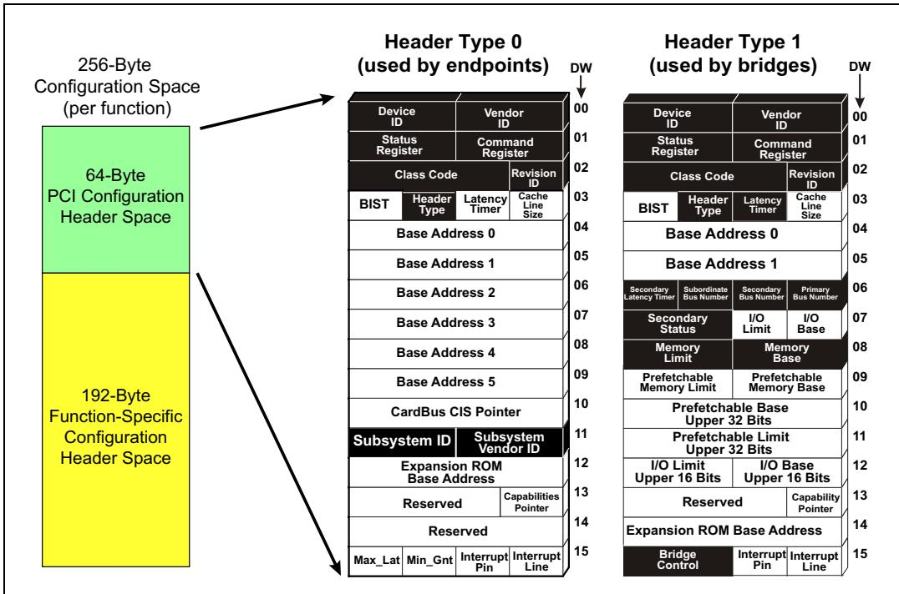

To illustrate the way the system appears to software, consider the example topology shown in Figure 2‐8 on page 51. As before, the Root resides at the top of the hierarchy. The Root can be quite complex internally, but it will usually implement an internal bus structure and several bridges to fan out the topology to several ports. That internal bus will appear to configuration software as PCI bus number zero and the PCIe Ports will appear as PCI‐to‐PCI bridges. This internal structure is not likely to be an actual PCI bus, but it will appear that way to software for this purpose. Since this bus is internal to the Root, its actual logical design doesn’t have to conform to any standard and can be vendor specific.

Figure 2‐8: Topology Example  
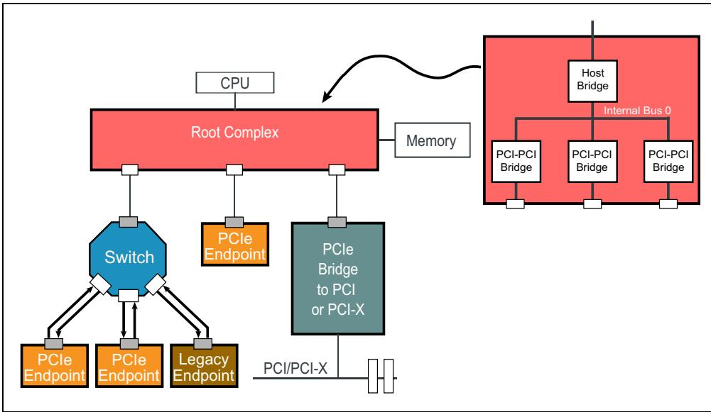  
In a similar way, the internal organization of a Switch, shown in Figure 2‐9 on page 52, will appear to software as simply a collection of bridges sharing a common bus. A major advantage of this approach is that it allows transaction rout ing to take place in the same way it did for PCI. Enumeration, the process by which configuration software discovers the system topology and assigns bus numbers and system resources, works the same way, too. We’ll see some examples of how enumeration works later, but once it’s been completed the bus numbers in the system will have all been assigned in a manner like that shown in Figure 2‐9 on page 52.

Figure 2‐9: Example Results of System Enumeration  
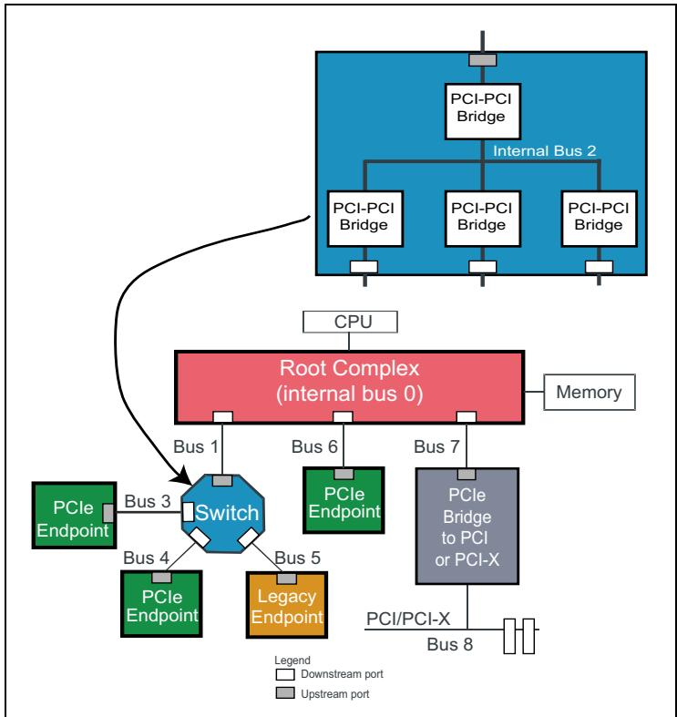

## System Examples

Figure 2‐10 on page 53 illustrates an example of a PCIe‐based system designed for a low‐cost application like a consumer desktop machine. A few PCIe Ports are implemented, along with a few add‐in cards slots, but the basic architecture doesn’t differ much from the old‐style PCI system.

By contrast, the high‐end server system shown in Figure 2‐11 on page 54 shows other networking interfaces built into the system. In the early days of PCIe some thought was given to making it cable of operating as a network that could replace those older models. After all, if PCIe is basically a simplified version of other networking protocols, couldn’t it fill all the needs? For a variety of reasons, this concept never really achieved much momentum and PCIe‐based systems still generally connect to external networks using other transports.

This also gives us an opportunity to revisit the question of what constitutes the Root Complex. In this example, the block labeled as “Intel Processor” contains a number of components, as is true of most modern CPU architectures. This one includes a x16 PCIe Port for access to graphics, and 2 DRAM channels, which means the memory controller and some routing logic has been integrated into the CPU package. Collectively, these resources are often called the “Uncore” logic to distinguish them from the several CPU cores and their associated logic in the package. Since we previously described the Root as being the interface between the CPU and the PCIe topology, that means that part of the Root must be inside the CPU package. As shown by the dashed line in Figure 2‐11 on page 54, the Root here consists of part of several packages. This will likely be the case for many future system designs.

Figure 2‐10: Low‐Cost PCIe System  
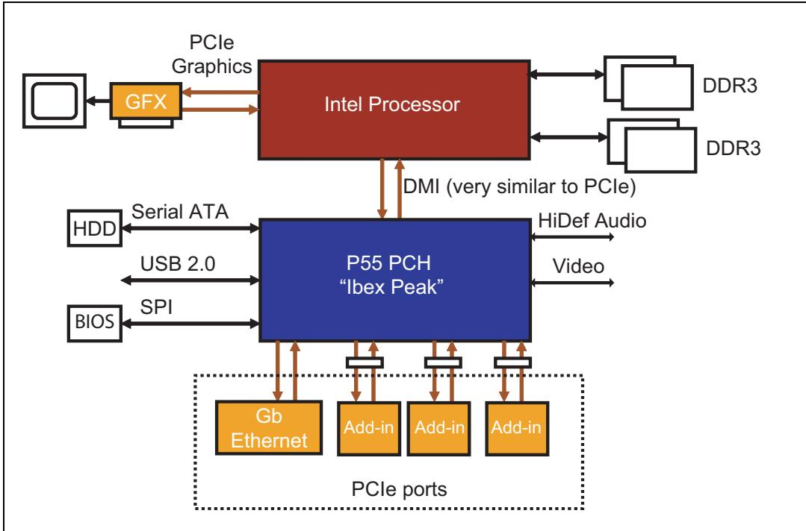

Figure 2‐11: Server PCIe System  


## Introduction to Device Layers

PCIe defines a layered architecture as illustrated in Figure 2‐12 on page 56. The layers can be considered as being logically split into two parts that operate independently because they each have a transmit side for outbound traffic and a receive side for inbound traffic. The layered approach has some advantages for hardware designers because, if the logic is partitioned carefully, it can be easier to migrate to new versions of the spec by changing one layer of an existing design while leaving the others unaffected. Even so, it’s important to note that the layers simply define interface responsibilities and a design is not required to be partitioned according to the layers to be compliant with the spec. The goal in this section is to describe the responsibilities of each layer and the flow of events involved in accomplishing a data transfer.

The device layers as shown in Figure 2‐12 on page 56 consist of:

Device core and interface to Transaction Layer. The core implements the main functionality of the device. If the device is an endpoint, it may consist of up to 8 functions, each function implementing its own configuration space. If the device is a switch, the switch core consists of packet routing logic and an internal bus for accomplishing this goal. If the device is a root, the root core implements a virtual PCI bus 0 on which resides all the chipset embedded endpoints and virtual bridges.

Transaction Layer. This layer is responsible for Transaction Layer Packet (TLP) creation on the transmit side and TLP decoding on the receive side. This layer is also responsible for Quality of Service functionality, Flow Control functionality and Transaction Ordering functionality. All these four Transaction Layer functions are described in book Part two.

Data Link Layer. This layer is responsible for Data Link Layer Packet (DLLP) creation on the transmit side and decoding on the receive side. This layer is also responsible for Link error detection and correction. This Data Link Layer function is referred to as the Ack/Nak protocol. Both these Data Link Layer functions are described in book Part Three.

Physical Layer. This layer is responsible for Ordered‐Set packet creation on the transmit side and Ordered‐Set packet decoding on the receive side. This layer processes all three types of packets (TLPs, DLLPs and Ordered‐Sets) to be transmitted on the Link and processes all types of packets received from the Link. Packets are processed on the transmit side by byte striping logic, scramblers, 8b/10b encoders (associated with Gen1/Gen2 protocol) or 128b/130b encoders (associated with Gen3 protocol) and packet serializers. The packet is finally differentially clocking out on all Lanes at the trained Link speed. On the receive Physical Layer, packet processing consists of serially receiving differentially encoded bits and converting to digital format and then deserializing the incoming bit‐stream. The is done at a clock rate derived from a recovered clock from the CDR (Clock and Data Recovery) circuit. The received packets are processed by elastic buffers, 8b/10b decoders (associated with Gen1/Gen2 protocol) or 128b/130b decoders (associated with Gen3 protocol), de‐scramblers and byte un‐striping logic. Finally, the Link Training and Status State Machine (LTSSM) of the Physical Layer is responsible for Link Initialization and Training. All these Physical Layer functions are described in book Part Four.

Figure 2‐12: PCI Express Device Layers  


Every PCIe interface supports the functionality of these layers, including Switch Ports, as shown in Figure 2‐13 on page 57. A question often came up in earlier classes as to whether a Switch Port needs to implement all the layers, since it’s typically only forwarding packets. The answer is yes, and the reason is that evaluating the contents of packets to determine their routing requires looking into the internal details of a packet, and that takes place in the Transaction Layer logic.

Figure 2‐13: Switch Port Layers  


In principle, each layer communicates with the corresponding layer in the device on the other end of the Link. The upper two layers do so by organizing a string of bits into a packet, creating a pattern that is recognizable by the corresponding layer in the receiver. The packets are forwarded through the other layers along the way to get to or from the Link. The Physical Layer also communicates directly with that layer in the other device but it does differently.

Before we go deeper, let’s first walk through an overview to see how the layers interact. In broad terms, the contents of an outgoing request or completion packet from the device are assembled in the Transaction Layer based on information presented by the device core logic, which we also sometimes call the Software Layer (although the spec doesn’t use that term). That information would usually include the type of command desired, the address of the target device, attributes of the request, and so on. The newly created packet is then stored in a buffer called a Virtual Channel until it’s ready for passing to the next layer. When the packet is passed down to the Data Link Layer, additional information is added to the packet for error checking at the neighboring receiver, and a copy is stored locally so we can send it again if a transmission error occurs. When the packet arrives at the Physical Layer it’s encoded and transmitted differentially using all the available Lanes of the Link.

Figure 2‐14: Detailed Block Diagram of PCI Express Device’s Layers  


The receiver decodes the incoming bits in the Physical Layer, checks for errors that can be seen at this level and, if there are none, forwards the resulting packet up to the Data Link Layer. Here the packet is checked for different errors and, if there are no errors, is forwarded up to the Transaction Layer. The packet is buffered, checked for errors, and disassembled into the original information (command, attributes, etc.) so the contents can be delivered to the device core of the receiver. Next, let’s explore in greater depth what each of the layers must do to make this process work, using Figure 2‐14 on page 58. We start at the top.

## Device Core / Software Layer

This is the core functionality of the device, such as a network interface or hard drive controller. This isn’t defined as a layer in the PCIe spec, but can be thought of in that way since it resides above the Transaction Layer and will be either the source or destination of all Requests. It provides the transmit side of the Transaction Layer with requests that include information like the transaction type, the address, amount of data to transfer, and so on. It’s also the destination for information forwarded up from the Transaction Layer when incoming packets have been received.

## Transaction Layer

In response to requests from the Software Layer, the Transaction Layer generates outbound packets. It also examines inbound packets and forwards the information contained in them up to the Software Layer. It supports the split transaction protocol for non‐posted transactions and associates an inbound Completion with an outbound non‐posted Request that was transmitted earlier. The transactions handled by this layer use TLPs (Transaction Layer Packets) and can be grouped into four request categories:

1. Memory

2. IO

3. Configuration

4. Messages

The first three of these were already supported in PCI and PCI‐X, but messages are a new type for PCIe. A Transaction is defined as the combination of a Request packet that a delivers a command to a targeted device, together with any Completion packets the target sends back in reply. A list of the request types is given in Table 2‐2 on page 59.

Table 2‐2: PCI Express Request Types

<table><tr><td>Request Type</td><td>Non-Posted or Posted</td></tr><tr><td>Memory Read</td><td>Non-Posted</td></tr><tr><td>Memory Write</td><td>Posted</td></tr><tr><td>Memory Read Lock</td><td>Non-Posted</td></tr><tr><td>IO Read</td><td>Non-Posted</td></tr><tr><td>IO Write</td><td>Non-Posted</td></tr><tr><td>Configuration Read (Type 0 and Type 1)</td><td>Non-Posted</td></tr><tr><td>Configuration Write (Type 0 and Type 1)</td><td>Non-Posted</td></tr><tr><td>Message</td><td>Posted</td></tr></table>

The requests also fall into one of two categories as shown in the right column of the table: non‐posted and posted. For non‐posted requests, a Requester sends a packet for which a Completer should generate a response in the form of a Completion packet. The reader may recognize this as the split transaction protocol inherited from PCI‐X. For example, any read request will be non‐posted because the requested data will need to be returned in a completion. Perhaps unexpectedly, IO writes and Configuration writes are also non‐posted. Even though they are delivering the data for the command, these requests still expect to receive a completion from the target to confirm that the write data has in fact made it to the destination without error.

In contrast, Memory Writes and Messages are posted, meaning the targeted device does not return a completion TLP to the Requester. Posted transactions improve performance because the Requester doesn’t have to wait for a reply or incur the overhead of a completion. The trade‐off is that they get no feedback about whether the write has finished or encountered an error. This behavior is inherited from PCI and is still considered a good thing to do because the likelihood of a failure is small and the performance gain is significant. Note that, even though they don’t require Completions, Posted Writes do still participate in the Ack/Nak protocol in the Data Link Layer that ensures reliable packet delivery. For more on this, see Chapter 10, entitled ʺAck/Nak Protocol,ʺ on page 317.

## TLP (Transaction Layer Packet) Basics

A list of all of the PCIe request and completion packet types is given in Table 2‐ 3 on page 61.

Table 2‐3: PCI Express TLP Types

<table><tr><td>TLP Packet Types</td><td>Abbreviated Name</td></tr><tr><td>Memory Read Request</td><td>MRd</td></tr><tr><td>Memory Read Request - Locked access</td><td>MRdLk</td></tr><tr><td>Memory Write Request</td><td>MWr</td></tr><tr><td>IO Read</td><td>IORd</td></tr><tr><td>IO Write</td><td>IOWr</td></tr><tr><td>Configuration Read (Type 0 and Type 1)</td><td>CfgRd0, CfgRd1</td></tr><tr><td>Configuration Write (Type 0 and Type 1)</td><td>CfgWr0, CfgWr1</td></tr><tr><td>Message Request without Data</td><td>Msg</td></tr><tr><td>Message Request with Data</td><td>MsgD</td></tr><tr><td>Completion without Data</td><td>Cpl</td></tr><tr><td>Completion with Data</td><td>CplD</td></tr><tr><td>Completion without Data - associated with Locked Memory Read Requests</td><td>CplLk</td></tr><tr><td>Completion with Data - associated with Locked Memory Read Requests</td><td>CplDLk</td></tr></table>

TLPs originate at the Transaction Layer of a transmitter and terminate at the Transaction Layer of a receiver, as shown in Figure 2‐15 on page 62. The Data Link Layer and Physical Layer add parts to the packet as it moves through the layers of the transmitter, and then verify at the receiver that those parts were transmitted correctly across the Link.

Figure 2‐15: TLP Origin and Destination  


TLP Packet Assembly. An illustration of the parts of a finished TLP as it is sent over the Link is shown in Figure 2‐16 on page 63, where it can be seen that different parts of the packet are added in each of the layers. To make it easier to recognize how the packet gets constructed, the different parts of the TLP are color coded to indicate which layer is responsible for them: red for Transaction Layer, blue for Data Link Layer, and green for the Physical Layer.

The device core sends the information required to assemble the core section of the TLP in the Transaction Layer. Every TLP will have a header, although some, like a read request, won’t contain data. An optional End‐to‐End CRC (ECRC) field may be calculated and appended to the packet. CRC stands for Cyclic Redundancy Check (or Code) and is employed by almost all serial architectures for the simple reason that it’s simple to implement and provides very robust error detection capability. The CRC also detects “burst errors,” or string of repeated mistaken bits, up to the length of the CRC value (32 bits for PCIe). Since this type of error is likely to be encountered when sending a long string of bits, this characteristic is very useful for serial transports. The ECRC field is passed unchanged through any service points (“service point” usually refers to a Switch or Root Port that has TLP routing options) between the sender and receiver of the packet, making it useful for verifying at the destination that there were no errors anywhere along the way.

For transmission, the core section of the TLP is forwarded to the Data Link Layer, which is responsible to append a Sequence Number and another CRC field called the Link CRC (LCRC). The LCRC is used by the neighboring receiver to check for errors and report the results of that check back to the transmitter for every packet sent on that Link. The thoughtful reader may wonder why the ECRC would be helpful if the mandatory LCRC check already verifies error‐free transmission across the Link. The reason is that there is still a place where transmission errors aren’t checked, and that is within devices that route packets. A packet arrives and is checked for errors on one port, the routing is checked, and when it’s sent out on another port a new LCRC value is calculated and added to it. The internal forwarding between ports could encounter an error that isn’t checked as part of the normal PCIe protocol, and that’s why ECRC is helpful.

Finally, the resulting packet is forwarded to the Physical Layer where other characters are added to the packet to let the receiver know what to expect. For the first two generations of PCIe, these were control characters added to the beginning and end of the packet. For the third generation, control characters are no longer used but other bits are appended to the blocks that give the needed information about the packets. The packet is then encoded and differentially transmitted on the Link using all of the available lanes.

Figure 2‐16: TLP Assembly  


## PCI Express Technology

TLP Packet Disassembly. When the neighboring receiver sees the incoming TLP bit stream, it needs to identify and remove the parts that were added to recover the original information requested by the core logic of the transmitter. As shown in Figure 2‐17 on page 64, the Physical Layer will verify that the proper Start and End or other characters are present and remove them, forwarding the remainder of the TLP to the Data Link Layer. This layer first checks for LCRC and Sequence Number errors. If no errors are found, it removes those fields from the TLP and forwards it to the Transaction Layer. If the receiver is a Switch, the packet is evaluated in the Transaction Layer to find the routing information in the header of the TLP and determine to which port the packet should be forwarded. Even when it’s not the intended destination, a Switch is allowed to check and report an ECRC error if it finds one. However, it’s not allowed to modify the ECRC, so the targeted device will be able to detect the ECRC error as well.

The target device can check ECRC errors if it’s capable and was enabled. If this is the target device and there was no error, the ECRC field is removed, leaving the header and data portion of the packet to be forwarded to the Software Layer.

Figure 2‐17: TLP Disassembly  


## Non-Posted Transactions

Ordinary Reads. Figure 2‐18 on page 65 shows an example of a Memory Read Request sent from an Endpoint to system memory. A detailed discussion of the TLP contents can be found in Chapter 5, entitled ʺTLP Elements,ʺ on page 169, but an important part of any memory read request is the target address. The address for a memory Request can be 32 or 64 bits, and determines the packet routing. In this example, the request gets routed through two Switches that forward it up to the target, which is the Root in this case. When the Root decodes the request and recognizes that the address in the packet targets system memory, it fetches the requested data. To return that data to the Requester, the Transaction Layer of the Root Port creates as many Completions as are needed to deliver all the requested data to the Requester. The largest possible data payload for PCIe is 4 KB per packet, but devices are often designed to use smaller payloads than that, so several completions may be needed to return a large amount of data.

Figure 2‐18: Non‐Posted Read Example  
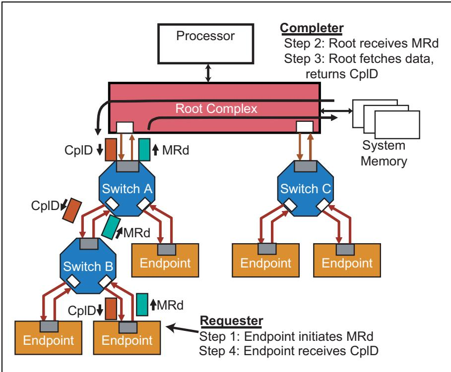

Those Completion packets also contain routing information to direct them back to the Requester, and the Requester includes its return address for this purpose in the original request. This “return address” is simply the Device ID of the Requester as it was defined for PCI, which is a combination of three things: its PCI Bus number in the system, its Device number on that bus, and its Function number within that device. This Bus, Device, and Function number information (sometimes abbreviated as BDF) is the routing information that Completions will use to get back to the original Requester. As was true for PCI‐X, a Requester can have several split transactions in progress at the same time and must be able to associate incoming completions with the correct requests. To facilitate that, another value was added to the original request called a Tag that is unique to each request. The Completer copies this transaction Tag and uses it in the Completion so the Requester can quickly identify which Request this Completion is servicing.

Finally, a Completer can also indicate error conditions by setting bits in the completion status field. That gives the Requester at least a broad idea of what might have gone wrong. How the Requester handles most of these errors will be determined by software and is outside the scope of the PCIe spec.

Locked Reads. Locked Memory Reads are intended to support what are called Atomic Read‐Modify‐Write operations, a type of uninterruptable transaction that processors use for tasks like testing and setting a semaphore. While the test and set is in progress, no other access to the semaphore can take place or a race condition could develop. To prevent this, processors use a lock indicator (such as a separate pin on the parallel Front‐Side Bus) that prevents other transactions on the bus until the locked one is finished. What follows here is just a high level introduction to the topic. For more information on Locked transactions, refer to Appendix D called “Appendix D:    Locked Transactions” on page 963.

As a bit of history, in the early days of PCI the spec writers anticipated cases where PCI would actually replace the processor bus. Consequently, support for things that a processor would need to do on the bus were included in the PCI spec, such as locked transactions. However, PCI was only rarely ever used this way and, in the end, much of this processor bus support was dropped. Locked cycles remained, though, to support a few special cases, and PCIe carries this mechanism forward for legacy support. Perhaps to speed migration away from its use, new PCIe devices are prohibited from accepting locked requests; it’s only legal for those that self‐identify as Legacy Devices. In the example shown in Figure 2‐19 on page 67, a Requester begins the process by sending a locked request (MRdLk). By definition, such a request is only allowed to come from the CPU, so in PCIe only a Root Port will ever initiate one of these.

The locked request is routed through the topology using the target memory address and eventually reaches the Legacy Endpoint. As the packet makes its way through each routing device (called a service point) along the way, the Egress Port for the packet is locked, meaning no other packets will be allowed in that direction until the path is unlocked.

Figure 2‐19: Non‐Posted Locked Read Transaction Protocol  
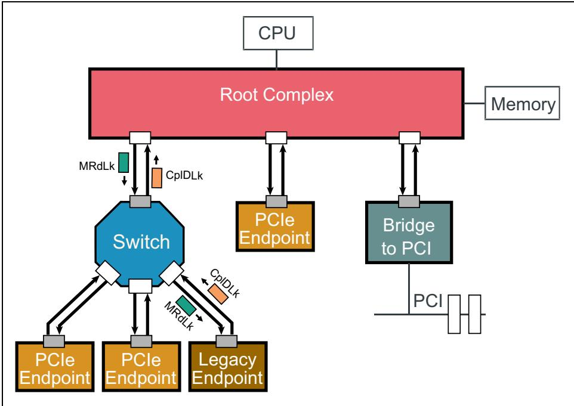

When the Completer receives the packet and decodes its contents, it gathers the data and creates one or more Locked Completions with data. These Completions are routed back to the Requester using the Requester ID, and each Egress Port they pass through is then locked, too.

If the Completer encounters a problem, it returns a locked completion packet without data (the original read should have resulted in data so if there isn’t any we know there’s been a problem) and the status field will indicate something about the error. The Requester will understand that to mean that the lock did not succeed and so the transaction will be cancelled and software will need to decide what to do next.

IO and Configuration Writes. Figure 2‐20 on page 68 illustrates a nonposted IO write transaction. Like a locked request, an IO cycle can also legally target only a Legacy Endpoint. The request is routed through the Switches based on the IO address until it reaches the target Endpoint. When the Completer receives the request, it accepts the data and returns a single completion packet without data that confirms reception of the packet. The status field in the completion would report whether an error had occurred and, if so, the Requester’s software would handle it.

If the completion reports no errors the Requester knows that the write data has been successfully delivered and the next step in the sequence of instructions for that Completer is now permitted. And that really summarizes the motivation for the non‐posted write: unlike a memory write, it’s not enough to know that the data will get to the destination sometime in the future. Instead, the next step can’t logically take place until we know that it has gotten there. As with locked cycles, non‐posted writes can only come from the processor.

Figure 2‐20: Non‐Posted Write Transaction Protocol  


## Posted Writes

Memory Writes. Memory writes are always posted and never receive completions. Once the request has been sent, the Requester doesn’t wait for any feedback before going on to the next request, and no time or bandwidth is spent returning a completion. As a result, posted writes are faster and more efficient than non‐posted requests and improve system performance. As shown in Figure 2‐21 on page 69, the packet is routed through the system using its target memory address to the Completer. Once a Link has successfully sent the request, that transaction is finished on that Link and its available for other packets. Eventually, the Completer accepts the data and the transaction is truly finished. Of course, one trade‐off with this approach is that, since no Completion packets are sent, there’s also no means for reporting errors back to the Requester. If the Completer encounters an error, it can log it and send a Message to the Root to inform system software about the error, but the Requester won’t see it.

Figure 2‐21: Posted Memory Write Transaction Protocol  


Message Writes. Interestingly, unlike the other requests we’ve looked at so far, there are several possible routing methods for messages, and a field within the message indicates which type to use. For example, some messages are posted write requests that target a specific Completer, others are broadcast from the Root to all Endpoints, while still others sent from an Endpoint are automatically routed to the Root. To learn more about the different types of routing refer to Chapter 4, entitled ʺAddress Space & Transaction Routing,ʺ on page 121.

Messages are useful in PCIe to help achieve a design goal of lowering the pin count. They eliminate the need for the side‐band signals that PCI used to report things like interrupts, power management events, and errors because they can report that information in a packet over the normal data path.

## Quality of Service (QoS)

PCIe was designed from its inception to be able to support time‐sensitive transactions for applications like streaming audio or video where data delivery must be timely in order to be useful. This is referred to as providing Quality of Service and is accomplished by the addition of a few things. First, each packet is assigned a priority by software by setting a 3‐bit field within it called Traffic Class (TC). Generally speaking, assigning a higher‐numbered TC to a packet is expected to give it a higher priority in the system. Second, multiple buffers, called Virtual Channels (VC), are built into the hardware for each port and a packet is placed into the appropriate buffer based on its TC. Third, since a port now has multiple buffers with packets available for transmission at a given time, arbitration logic is needed to select among the VCs. Finally, Switches must select between competing input ports for access to the VCs of a given output port. This is called Port Arbitration and can be hardware assigned or software programmable. All of these hardware pieces must be in place to allow a system to prioritize packets. If properly programmed and set up, such a system can even provide guaranteed service for a given path.

To illustrate the concept, consider Figure 2‐22 on page 71, in which a video camera and SCSI device both need to send data to system DRAM. The difference is that the camera data is time critical; if the transmission path to the target device is unable to keep up with its bandwidth, frames will get dropped. The system needs to be able to guarantee a bandwidth that’s at least as high as the camera or the captured video may appear choppy. At the same time, the SCSI data needs to be delivered without errors, but how long it takes is not as important. Clearly, then, when both a video data packet and a SCSI packet need to be sent at the same time, the video traffic should have a higher priority. QoS refers to the ability of the system to assign different priorities to packets and route them through the topology with deterministic latencies and bandwidth. For more detail on QoS, refer to Chapter 7, entitled ʺQuality of Service,ʺ on page 245.

Figure 2‐22: QoS Example  


## Transaction Ordering

Within a VC, the packets normally all flow through in the same order in which they arrived, but there are exceptions to this general rule. PCI Express protocol inherits the PCI transaction‐ordering model, including support for relaxedordering cases added with the PCI‐X architecture. These ordering rules guarantee that packets using the same traffic class will be routed through the topology in the correct order, preventing potential deadlock or live‐lock conditions. An interesting point to note is that, since ordering rules only apply within a VC and packets that use different TCs may not get mapped into the same VC, packets using different TCs are understood by software to have no ordering relationship. This ordering is maintained in the VCs within the transaction layer.

## Flow Control

A typical protocol used by serial transports is to require that a transmitter only send a packet to its neighbor if there is sufficient buffer space to receive it. That cuts down on performance‐wasting events on the bus like the disconnects and retries that PCI allowed and thus removes that class of problems from the transport. The trade‐off is that the receiver must report its buffer space often enough to avoid unnecessary stalls and that reporting takes a little bandwidth of its own. In PCIe this reporting is done with DLLPs (Data Link Layer Packets), as we’ll see in the next section. The reason is to avoid a possible deadlock condition that might occur if TLPs were used, in which a transmitter can’t get a buffer size update because its own receive buffer is full. DLLPs can always be sent and received regardless of the buffer situation, so that problem is avoided. This flow control protocol is automatically managed at the hardware level and is transparent to software.

Figure 2‐23: Flow Control Basics  
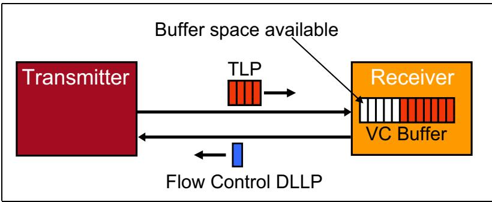

As shown in Figure 2‐23 on page 72, the Receiver contains the VC Buffers that hold received TLPs. The Receiver advertises the size of those buffers to the Transmitters using Flow Control DLLPs. The Transmitter tracks the available space in the Receiverʹs VC Buffers and is not allowed to send more packets than the Receiver can hold. As the Receiver processes the TLPs and removes them from the buffer, it periodically sends Flow Control Update DLLPs to keep the Transmitter up‐to‐date regarding the available space. To learn more about this, see Chapter 6, entitled ʺFlow Control,ʺ on page 215.

## Data Link Layer

This logic is responsible for Link management and performs three major functions: TLP error correction, flow control, and some Link power management. It accomplishes these by generating DLLPs as shown in Figure 2‐24 on page 73.

## DLLPs (Data Link Layer Packets)

DLLPs are transferred between Data Link Layers of the two neighboring devices on a Link. The Transaction Layer is not even aware of these packets, which only travel between neighboring devices and are not routed anywhere else. They are small (always just 8 bytes) compared to TLPs, and that’s a good thing because they represent overhead for maintaining Link protocol.

Figure 2‐24: DLLP Origin and Destination  
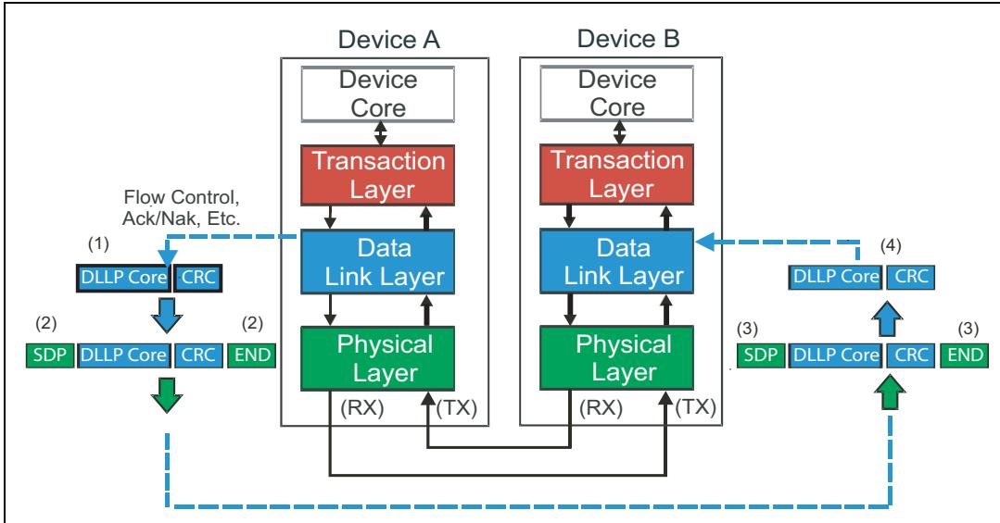

DLLP Assembly. As shown in Figure 2‐24 on page 73, a DLLP originates at the Data Link Layer of the transmitter and is consumed by the Data Link Layer of the receiver. A 16‐bit CRC is added to the DLLP Core to check for errors at the receiver. The DLLP contents are forwarded to the Physical Layer which appends a Start and End character to the packet (for the first two generations of PCIe), and then encodes and differentially transmits it over the Link using all the available lanes.

DLLP Disassembly. When a DLLP is received by the Physical Layer, the bit stream is decoded and the Start and End frame characters are removed. The rest of the packet is forwarded to the Data Link Layer, which checks for CRC errors and then takes the appropriate action based on the packet. The Data Link Layer is the destination for the DLLP, so it isn’t forwarded up to the Transaction Layer.

## Ack/Nak Protocol

The error correction function, illustrated in Figure 2‐25 on page 74, is provided through a hardware‐based automatic retry mechanism. As shown in Figure 2‐26 on page 75, an LCRC and Sequence Number are added to each outgoing TLP and checked at the receiver. The transmitter’s Replay Buffer holds a copy of every TLP that has been sent until receipt at the neighboring device has been confirmed. That confirmation takes the form of an Ack DLLP (positive acknowledgement) sent by the Receiver with the Sequence Number of the last good TLP it has seen. When the Transmitter sees the Ack, it flushes the TLP with that Sequence Number out of the Replay Buffer, along with all the TLPs that were sent before the one that was acknowledged.

If the Receiver detects a TLP error, it drops the TLP and returns a Nak to the Transmitter, which then replays all unacknowledged TLPs in hopes of a better result the next time. Since detected errors are almost always transient events, a replay will very often correct the problem. This process is often referred to as the Ack/Nak protocol.

Figure 2‐25: Data Link Layer Replay Mechanism  
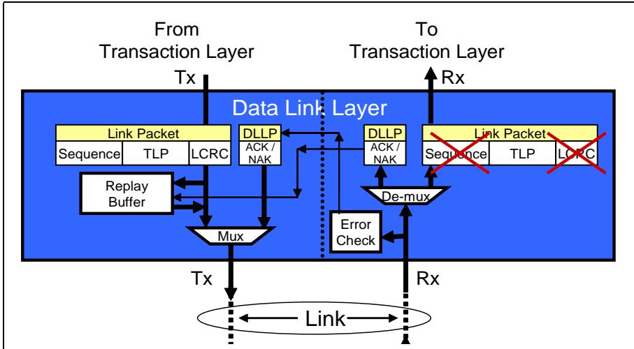

Figure 2‐26: TLP and DLLP Structure at the Data Link Layer  
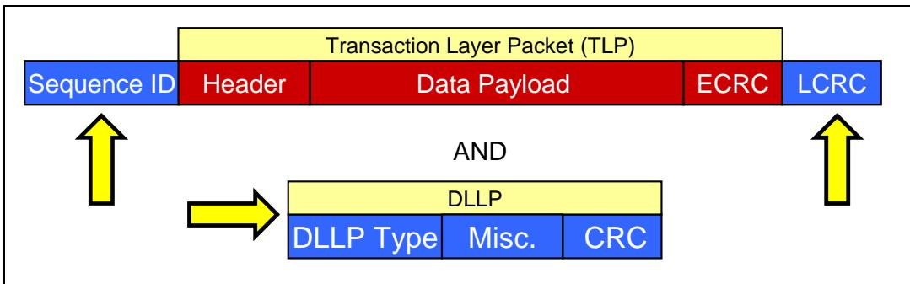

The basic form of a DLLP is also shown in Figure 2‐26 on page 75, and consists of a 4‐byte DLLP type field that may include some other information and a 2‐ byte CRC.

Figure 2‐27 on page 76 shows an example of a memory read going across a Switch. In general, the steps for this case would be as follows:

1. Step 1a: Requester sends a memory read request and saves a copy in its Replay Buffer. Switch receives the MRd TLP and checks the LCRC and Sequence Number. Step 1b: No error is seen, so the Switch returns an Ack DLLP to Requester. In response, Requester discards its copy of the TLP from the Replay Buffer.

2. Step 2a: Switch forwards the MRd TLP to the correct Egress Port using memory address for its routing and saves a copy in the Egress Port’s Replay Buffer. The Completer receives the MRd TLP and checks for errors. Step 2b: No error is seen, so the Completer returns an Ack DLLP to the Switch. Switch Port purges its copy of the MRd TLP from its Replay Buffer.

3. Step 3a: As the final destination of the request, the Completer checks the optional ECRC field in MRd TLP. No errors are seen so the request is passed to the core logic. Based on the command, the device fetches the requested data and returns a Completion with Data TLP (CplD) while saving a copy in its Replay Buffer. Switch receives CplD TLP and checks for errors. Step 3b: No error is seen, so the Switch returns an Ack DLLP to the Compl eter. Completer discards its copy of the CplD TLP from its Replay Buffer.

4. Step 4a: Switch decodes the Requester ID field in CplD TLP and routes the packet to the correct Egress Port, saving a copy in the Egress Port’s Replay Buffer. Requester receives CplD TLP and checks for errors.

Step 4b: No error is seen, so the Requester returns Ack DLLP to Switch. Switch discards its copy of the CplD TLP from its Replay Buffer. Requester checks the optional ECRC field and finds no error, so data is passed up to the core logic.

Figure 2‐27: Non‐Posted Transaction with Ack/Nak Protocol  
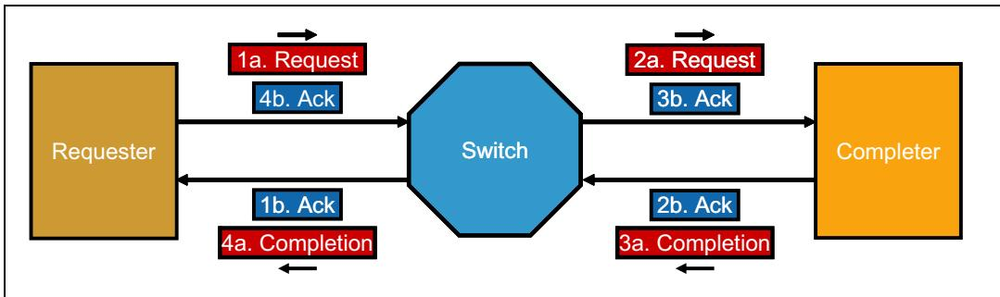

## Flow Control

The second major Link Layer function is Flow Control. Following power‐up or Reset, this mechanism is initialized by the Data Link Layer automatically in hardware and then updated during run‐time. An overview of this was already presented in the section on TLPs so that won’t be repeated here. To learn more about this topic, see Chapter 6, entitled ʺFlow Control,ʺ on page 215.

## Power Management

Finally, the Link Layer participates in power management, as well, because DLLPs are used to communicate the requests and handshakes associated with Link and system power states. For a detailed discussion on this topic, refer to Chapter 16, entitled ʺPower Management,ʺ on page 703.

## Physical Layer

## General

The Physical Layer is the lowest hierarchical layer for PCIe as shown in Figure 2‐14 on page 58. Both TLP and DLLP type packets are forwarded down from the Data Link Layer to the Physical Layer for transmission over the Link and forwarded up to the Data Link Layer at the Receiver. The spec divides the Physical Layer discussion into two portions: a logical part and an electrical part, and we’ll preserve that split here as well. The Logical Physical Layer contains the digital logic associated with preparing the packets for serial transmission on the Link and reversing that process for inbound packets. The Electrical Physical Layer is the analog interface of the Physical Layer that connects to the Link and consists of differential drivers and receivers for each lane.

## Physical Layer - Logical

TLPs and DLLPs from the Data Link Layer are clocked into a buffer in the Physical Layer, where Start and End characters are added to facilitate detection of the packet boundaries at the receiver. Since the Start and End characters appear on both ends of a packet they are also called “framing” characters. The framing characters are shown appended to a TLP and DLLP in Figure 2‐28 on page 77, which also shows the size of each field.

Figure 2‐28: TLP and DLLP Structure at the Physical Layer  


Within this layer, each byte of a packet is split out across all of the lanes in use for the Link in a process called byte striping. Effectively, each lane operates as an independent serial path across the Link and their data is all aggregated back together at the receiver. Each byte is scrambled to reduce repetitive patterns on the transmission line and reduce EMI (electro‐magnetic interference) seen on the Link. For the first two generations of PCIe (Gen1 and Gen2 PCIe), the 8‐bit characters are encoded into 10‐bit “symbols” using what is called 8b/10b encoding logic. This encoding adds overhead to the outgoing data stream, but also adds a number of useful characteristics (for more on this, see “8b/10b Encoding” on page 380). Gen3 Physical Layer logic when transmitting at Gen3 speed, does not encode the packet bytes using 8b/10b encoding. Rather another encoding scheme referred to as 128b/130b encoding is employed with the packet bytes scrambled transmitted. The 10b symbols on each Lane (Gen1 and Gen2) or the packet bytes on each Lane (Gen3) are then serialized and clocked out differentially on each Lane of the Link at 2.5 GT/s (Gen1), or 5 GT/s (Gen2) or 8 GT/s (Gen3).

Receivers clock in the packet bits at the trained clock speeds as they arrive on all lanes. If 8b/10b is in use (at Gen1 and Gen2 mode), the serial bit stream of the packet is converted into 10‐bit symbols using a deserializer so it’s ready for 8b/ 10b decoding. However, before decoding, the symbols pass through an elastic buffer, a clever device that compensates for the slight difference in frequency between the internal clocks of two connected devices. Next, the 10‐bit symbol stream is decoded back to the proper 8‐bit characters via an 8b/10b decoder. Gen3 Physical Layer logic, when receiving serial bit stream of the packet at Gen3 speed, will convert it into a byte stream using a deserializer that has established block lock. The byte stream is passed through an elastic buffer which does clock tolerance compensation. The 8b/10b decoder stage is skipped given packets clocked at Gen3 speeds are not 8b/10b encoded. The 8‐bit characters on all lanes are de‐scrambled, the bytes from all the lanes are un‐striped back into a single character stream and, finally, the original data stream from the Transmitter is recovered.

## Link Training and Initialization

Another responsibility of the Physical Layer is the initialization and training process on the Link. In this fully automatic process, several steps are taken to prepare the Link for normal operation, which involves determining the status of several optional conditions. For example, the Link width can be from one lane to 32 lanes, and multiple speeds might be available. The training process will discover these options and go through a state machine sequence to resolve the best combination. In that process, several things are checked or established to ensure proper and optimal operation, such as:

• Link width

• Link data rate

• Lane reversal ‐ Lanes connected in reverse order

• Polarity inversion ‐ Lane polarity connected backward

• Bit lock per Lane ‐ Recovering the transmitter clock

• Symbol lock per Lane ‐ Finding a recognizable position in the bit‐stream

• Lane‐to‐Lane de‐skew within a multi‐Lane Link.

## Physical Layer - Electrical

The physical sender and receiver on a Link are connected with an AC‐coupled Link as shown in Figure 2‐29 on page 79. The term “AC‐coupled” simply means that a capacitor resides physically in the path between the devices and serves to pass the high‐frequency (AC) component of the signal while blocking the lowfrequency (DC) part. Many serial transports use this approach because it allows the common mode voltage (the level at which the positive and negative versions of the signal cross) to be different at the transmitter and receiver, meaning they’re not required to have the same reference voltage. This isn’t a big issue if the two devices are nearby and in the same box, but if they were in different buildings it would be very difficult for them to have a common reference voltage that was precisely the same.

Figure 2‐29: Physical Layer Electrical  
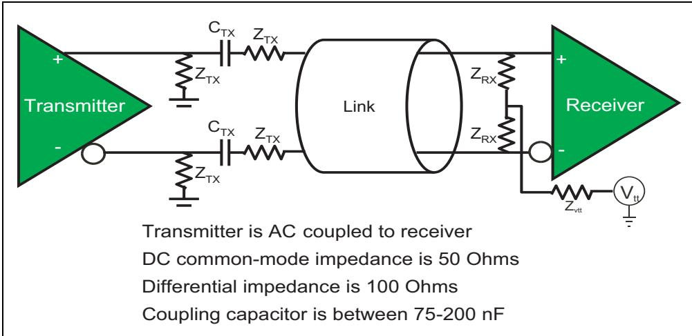

## Ordered Sets

The last type of traffic sent between devices uses only the Physical Layers. Although easily recognized by the receiver, this information is not technically in the form of a packet because it doesn’t have Start and End characters, for example. Instead, it’s organized into what are called Ordered Sets that originate at the Transmitter’s Physical Layer terminate at the Receiver’s Physical Layer, as shown in Figure 2‐30 on page 80. For Gen1 and Gen2 data rates, an Ordered Set starts with a single COM character followed by three or more other characters that define the information to be sent. The nomenclature for the type of characters used in PCIe is discussed in more detail in “Character Notation” on page 382; for now it’s enough to say that the COM character has characteristics that make it work well for this purpose. Ordered Sets are always a multiple of 4 bytes in size, and an example is shown in Figure 2‐31 on page 80. In Gen3 mode of operation, the Ordered Set format is different from Gen1/Gen2 described above. Details to be covered in Chapter 14, entitled ʺLink Initialization & Training,ʺ on page 505. Ordered Sets always terminate at the neighboring device and are not routed through the PCIe fabric.

Figure 2‐30: Ordered Sets Origin and Destination  
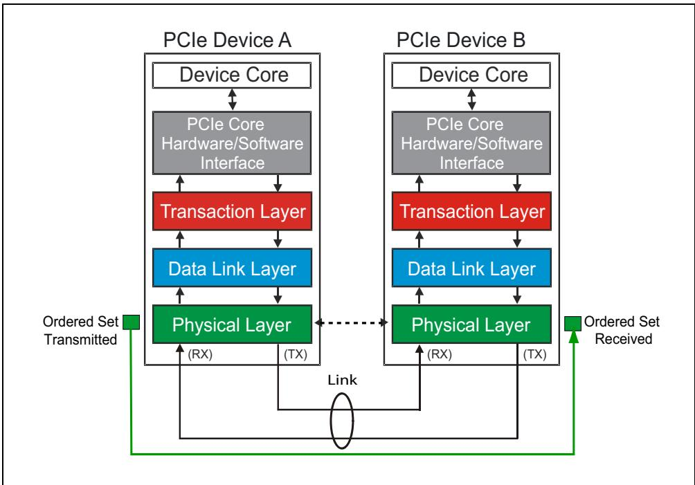

Ordered Sets are used in the Link Training process, as described in Chapter 14, entitled ʺLink Initialization & Training,ʺ on page 505. They’re also used to compensate for the slight differences between the internal clocks of the transmitter and receiver, a process called clock tolerance compensation. Finally, Ordered Sets are used to indicate entry into or exit from a low power state on the Link.

Figure 2‐31: Ordered‐Set Structure  
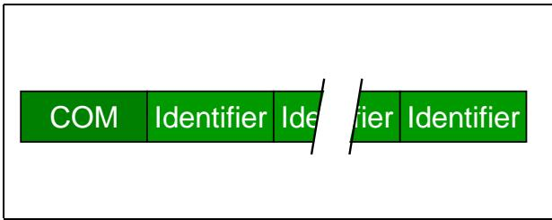

## Protocol Review Example

At this point, let’s review the overall Link protocol by using an example to illustrate the steps that take place from the time a Requester initiates a memory read request until it obtains the requested data from a Completer.

## Memory Read Request

For the first part of the discussion, refer to Figure 2‐32 on page 81. The Requester’s Device Core or Software Layer sends a request to the Transaction Layer and includes the following information: 32‐bit or 64‐bit memory address, transaction type, amount of data to read calculated in dwords, traffic class, byte enables, attributes etc.

Figure 2‐32: Memory Read Request Phase  


## PCI Express Technology

The Transaction layer uses this information to build a MRd TLP. The details of the TLP packet format are described later, but for now it’s enough to say that a 3 DW or 4 DW header is created depending on address size (32‐bit or 64‐bit). In addition, the Transaction Layer adds the Requester ID (bus#, device#, function#) to the header so the Completer can use that to return the completion. The TLP is placed in the appropriate virtual channel buffer to wait its turn for transmission. Once the TLP has been selected, the Flow Control logic confirms there is sufficient space available in the neighboring device’s receive buffer (VC), and then the memory read request TLP is sent to the Data Link Layer.

The Data Link Layer adds a 12‐bit Sequence Number and a 32‐bit LCRC value to the packet. A copy of the TLP with Sequence Number and LCRC is stored in the Replay Buffer and the packet is forwarded to the Physical Layer.

In the Physical Layer the Start and End characters are added to the packet, which is then byte striped across the available Lanes, scrambled, and 8b/10b encoded. Finally the bits are serialized on each lane and transmitted differentially across the Link to the neighbor.

The Completer de‐serializes the incoming bit stream back into 10‐bit symbols and passes them through the elastic buffer. The 10‐bit symbols are decoded back to bytes and the bytes from all Lanes are de‐scrambled and un‐striped. The Start and End characters are detected and removed. The rest of the TLP is forwarded up to the Data Link Layer.

The Completer’s Data Link Layer checks for LCRC errors in the received TLP and checks the Sequence Number for missing or out‐of‐sequence TLPs. If there’s no error, it creates an Ack that contains the same Sequence Number that was used in the read request. A 16‐bit CRC is calculated and appended to the Ack contents to create a DLLP that is sent back to the Physical Layer which adds the proper framing symbols and transmits the Ack DLLP to the Requester.

The Requester Physical Layer receives the Ack DLLP, checks and removes the framing symbols, and forwards it up to the Data Link Layer. If the CRC is valid, it compares the acknowledged Sequence Number with the Sequence Numbers of the TLPs stored in the Replay Buffer. The stored memory read request TLP associated with the Ack received is recognized and that TLP is discarded from the Replay Buffer. If a Nak DLLP was received by the Requester instead, it would re‐send a copy of the stored memory read request TLP. Since the DLLP only has meaning to the Data Link Layer, nothing is forwarded to the Transaction Layer.

In addition to generating the Ack, the Completer’s Link Layer also forwards the TLP up to itʹs Transaction Layer. In the Completerʹs Transaction Layer, the TLP is placed in the appropriate VC receive buffer to be processed. An optional ECRC check can be performed, and if no error is found, the contents of the header (address, Requester ID, memory read transaction type, amount of data requested, traffic class etc.) are forwarded to the Completer’s Software Layer.

## Completion with Data

For the second half of this discussion, refer to Figure 2‐33 on page 83. To service the memory read request, the Completer Device Core/Software Layer sends a completion with data (CplD) request down to its Transaction Layer that includes the Requester ID and Tag copied from the original memory read request, transaction type, other parts of the completion header contents and the requested data.

Figure 2‐33: Completion with Data Phase  
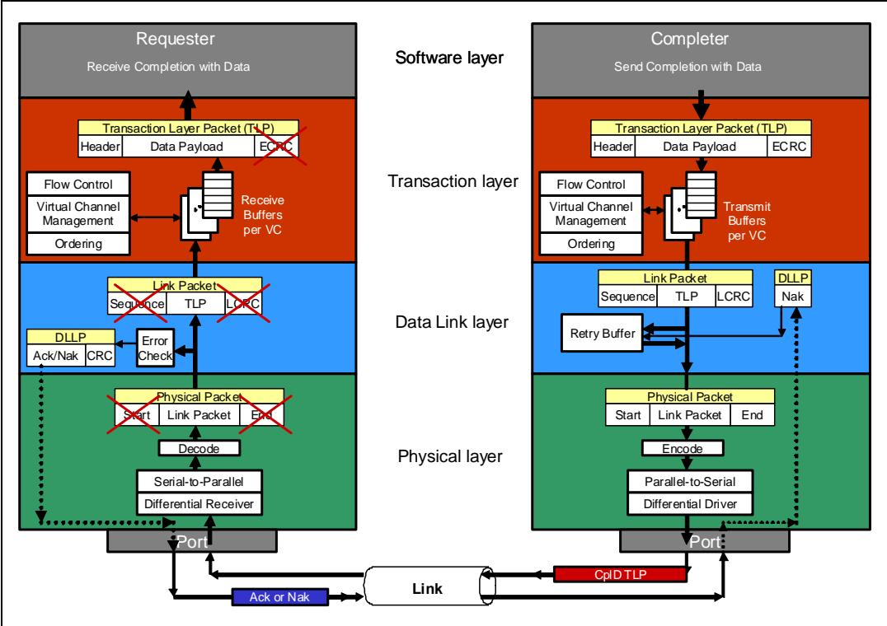

The Transaction layer uses this information to build the CplD TLP, which always has a 3 DW header (it uses ID routing and never needs a 64‐bit address). It also adds its own Completer ID to the header. This packet is also placed into the appropriate VC transmit buffer and, once selected, the flow control logic verifies that sufficient space is available at the neighboring device to receive this packet and, once confirmed, forwards the packet down to the Data Link Layer.

As before, the Data Link Layer adds a 12‐bit Sequence Number and a 32‐bit LCRC to the packet. A copy of the TLP with Sequence Number and LCRC is stored in the Replay Buffer and the packet is forwarded to the Physical Layer.

As before, the Physical Layer adds a Start and End character to the packet, byte stripes it across the available lanes, scrambles it, and 8b/10b encodes it. Finally, the CplD packet is serialized on all lanes and transmitted differentially across the Link to the neighbor.

The Requester converts the incoming serial bit stream back to 10‐bit symbols and passes them through the elastic buffer. The 10‐bit symbols are decoded back to bytes, de‐scrambled and un‐striped. The Start and End characters are detected and removed and the resultant TLP is sent up to the Data Link Layer.

As before, the Data Link Layer checks for LCRC errors in the received CplD TLP and checks the Sequence Number for missing or out‐of‐sequence TLPs. If there are no errors, it creates an Ack DLLP which contains the same Sequence Number as the CplD TLP used. A 16‐bit CRC is added to the Ack DLLP and it’s sent back to the Physical Layer which adds the proper framing symbols and transmits the Ack DLLP to the Completer.

The Completer Physical Layer checks and removes the framing symbols from the Ack DLLP and sends the remainder up to the Data Link Layer which checks the CRC. If there are no errors, it compares the Sequence Number with the Sequence Numbers for the TLPs stored in the Replay Buffer. The stored CplD TLP associated with the Ack received is recognized and that TLP is discarded from the Replay Buffer. If a Nak DLLP was received by the Completer instead, it would re‐send a copy of the stored CplD TLP.

In the meantime, the Requester Transaction Layer receives the CplD TLP in the appropriate virtual channel buffer. Optionally, the Transaction layer can check for an ECRC error. If there are no errors, it forwards the header contents and data payload, including the Completion Status, to the Requester Software Layer, and we’re done.

# 3 Configuration Overview

## The Previous Chapter

The previous chapter provides a thorough introduction to the PCI Express architecture and is intended to serve as an “executive level” overview. It introduces the layered approach to PCIe port design described in the spec. The various packet types are introduced along with the transaction protocol.

## This Chapter

This chapter provides an introduction to configuration in the PCIe environment. This includes the space in which a Function’s configuration registers are implemented, how a Function is discovered, how configuration transactions are generated and routed, the difference between PCI‐compatible configuration space and PCIe extended configuration space, and how software differentiates between an Endpoint and a Bridge.

## The Next Chapter

The next chapter describes the purpose and methods of a function requesting memory or IO address space through Base Address Registers (BARs) and how software initializes them. The chapter describes how bridge Base/Limit registers are initialized, thus allowing switches to route TLPs through the PCIe fabric.

## Definition of Bus, Device and Function

Just as in PCI, every PCIe Function is uniquely identified by the Device it resides within and the Bus to which the Device connects. This unique identifier is commonly referred to as a ‘BDF’. Configuration software is responsible for detecting every Bus, Device and Function (BDF) within a given topology. The following sections discuss the primary BDF characteristics in the context of a sample PCIe topology. Figure 3‐1 on page 87 depicts a PCIe topology that highlights the Buses, Devices and Functions implemented in a sample system. Later in this chapter the process of assigning Bus and Device Numbers is explained.

## PCIe Buses

Up to 256 Bus Numbers can be assigned by configuration software. The initial Bus Number, Bus 0, is typically assigned by hardware to the Root Complex. Bus 0 consists of a Virtual PCI bus with integrated endpoints and Virtual PCI‐to‐PCI Bridges (P2P) which are hard‐coded with a Device number and Function number. Each P2P bridge creates a new bus that additional PCIe devices can be connected to. Each bus must be assigned a unique bus number. Configuration software begins the process of assigning bus numbers by searching for bridges starting with Bus 0, Device 0, Function 0. When a bridge is found, software assigns the new bus a bus number that is unique and larger than the bus number the bridge lives on. Once the new bus has been assigned a bus number, software begins looking for bridges on the new bus before continuing scanning for more bridges on the current bus. This is referred to as a “depth first search” and is described in detail in “Enumeration ‐ Discovering the Topology” on page 104.

## PCIe Devices

PCIe permits up to 32 device attachments on a single PCI bus, however, the point‐to‐point nature of PCIe means only a single device can be attached directly to a PCIe link and that device will always end up being Device 0. Root Complexes and Switches have Virtual PCI buses which do allow multiple Devices being “attached” to the bus. Each Device must implement Function 0 and may contain a collection of up to eight Functions. When two or more Functions are implemented the Device is called a multi‐function device.

## PCIe Functions

As previously discussed Functions are designed into every Device. These Functions may include hard drive interfaces, display controllers, ethernet controllers, USB controllers, etc. Devices that have multiple Functions do not need to be implemented sequentially. For example, a Device might implement Functions 0, 2, and 7. As a result, when configuration software detects a multifunction device, each of the possible Functions must be checked to learn which of them are present. Each Function also has its own configuration address space that is used to setup the resources associated with the Function.

Figure 3‐1: Example System  
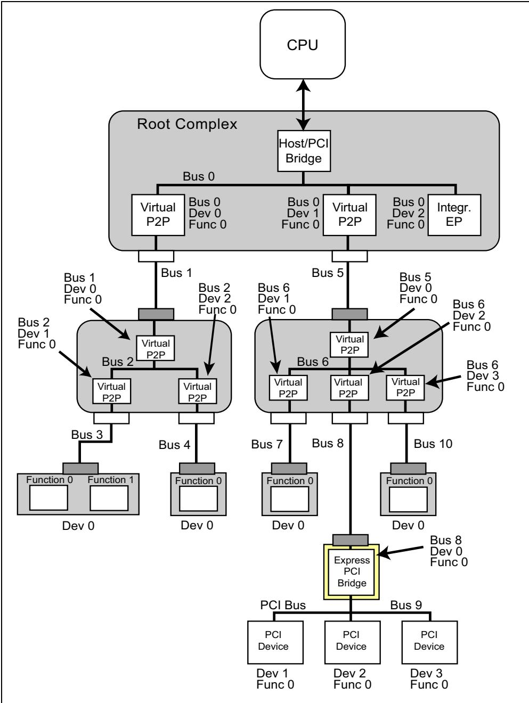

## Configuration Address Space

The first PCs required users to set switches and jumpers to assign resources for each card installed and this frequently resulted in conflicting memory, IO and interrupt settings. The subsequent IO architectures, Extended ISA (EISA) and the IBM PS2 systems, were the first to implemented plug and play architectures. In these architectures configuration files were shipped with each plug‐in card that allowed system software to assign basic resources. PCI extended this capability by implementing standardized configuration registers that permit generic shrink‐wrapped OSs to manage virtually all system resources. Having a standard way to enable error reporting, interrupt delivery, address mapping and more, allows one entity, the configuration software, to allocate and configure the system resources which virtually eliminates resource conflicts.

PCI defines a dedicated block of configuration address space for each Function. Registers mapped into the configuration space allow software to discover the existence of a Function, configure it for normal operation and check the status of the Function. Most of the basic functionality that needs to be standardized is in the header portion of the configuration register block, but the PCI architects realized that it would beneficial to standardize optional features, called capability structures (e.g. Power Management, Hot Plug, etc.). The PCI‐Compatible configuration space includes 256 bytes for each Function.

## PCI-Compatible Space

Refer to Figure 3‐2 on page 89 during the following discussion. The 256 bytes of PCI‐compatible configuration space was so named because it was originally designed for PCI. The first 16 dwords (64 bytes) of this space are the configuration header (Header Type 0 or Header Type 1). Type 0 headers are required for every Function except for the bridge functions that use a Type 1 header. The remaining 48 dwords are used for optional registers including PCI capability structures. For PCIe Functions, some capability structures are required. For example, PCIe Functions must implement the following Capability Structures:

• PCI Express Capability

• Power Management

• MSI and/or MSI‐X

Figure 3‐2: PCI Compatible Configuration Register Space  
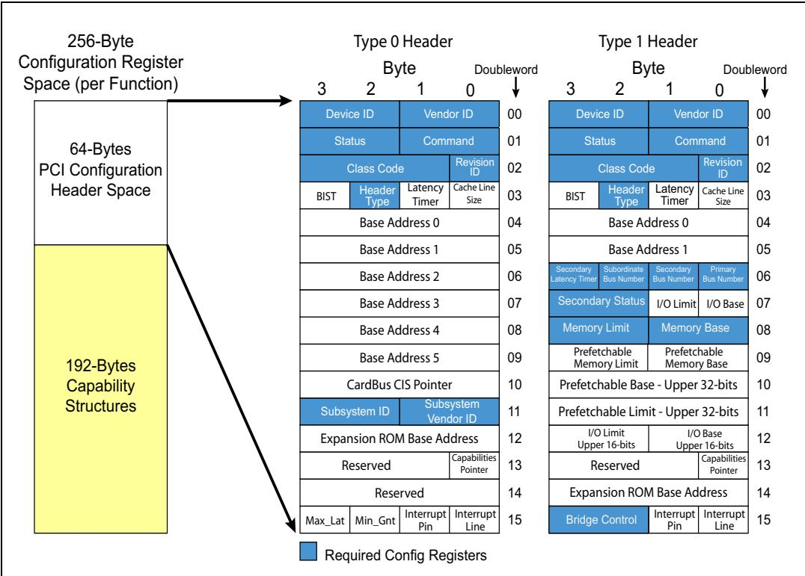

## Extended Configuration Space

Refer to Figure 3‐3 on page 90 during this discussion. When PCIe was introduced, there was not enough room in the original 256‐byte configuration region to contain all the new capability structures needed. So the size of configuration space was expanded from 256 bytes per function to 4KB, called the Extended Configuration Space. The 960‐dword Extended Configuration area is only accessible using the Enhanced configuration mechanism and is therefore not visible to legacy PCI software. It contains additional optional Extended Capability registers for PCIe such as those listed in Figure 3‐3 (not a complete list).

Figure 3‐3: 4KB Configuration Space per PCI Express Function  


## Host-to-PCI Bridge Configuration Registers

## General

The Host‐to‐PCI bridge’s configuration registers don’t have to be accessible using either of the configuration mechanisms mentioned in the previous section. Instead, itʹs typically implemented as device‐specific registers in memory address space, which is known by the platform firmware. However, its configuration register layout and usage must adhere to the standard Type 0 template defined by the PCI 2.3 specification.

## Only the Root Sends Configuration Requests

The specification states that only the Root Complex is permitted to originate Configuration Requests. It acts as the system processor’s liaison to inject Requests into the fabric and pass Completions back. The ability to originate configuration transactions is restricted to the processor through the Root Complex to avoid the anarchy that could result if any device had the ability to change the configuration of other devices.

Since only the Root can initiate these requests, they also can only move downstream, which means that peer‐to‐peer Configuration Requests are not allowed. The Requests are routed based on the target device’s ID, meaning its BDF (Bus number in the topology, Device number on that bus, and Function number within that Device).

## Generating Configuration Transactions

Processors are generally unable to perform configuration read and write requests directly because they can only generate memory and IO requests. That means the Root Complex will need to translate certain of those accesses into configuration requests in support of this process. Configuration space can be accessed using either of two mechanisms:

• The legacy PCI configuration mechanism, using IO‐indirect accesses.

• The enhanced configuration mechanism, using memory‐mapped accesses.

## Legacy PCI Mechanism

The PCI spec defined an IO‐indirect method for instructing the system (the Root Complex or its equivalent) to perform PCI configuration accesses. As it happened, the dominant PC processors (Intel x86) were only designed to address 64KB of IO address space. By the time PCI was defined, this limited IO space had become badly cluttered and only a few address ranges remained available: 0800h ‐ 08FFh and 0C00h ‐ 0CFFh. Consequently, it wasn’t feasible to map the configuration registers for all the possible Functions directly into IO space. At the same time, memory address space was also limited in size and mapping all of configuration space into memory address space was not seen as a good solution either. So the spec writers chose a commonly‐used solution to this problem, use indirect address mapping instead. To do this, one register holds the target address, while a second holds the data going to or coming from the target. A write to the address register, followed by a read or write to the data register, causes a single read or write transaction to the correct internal address for the target function. This solves the problem of limited address space nicely, but it means that two IO accesses are needed to create one configuration access.

The PCI‐Compatible mechanism uses two 32‐bit IO ports in the Host bridge of the Root Complex. They are the Configuration Address Port, at IO addresses 0CF8h  ‐  0CFBh, and the Configuration Data Port, at IO addresses 0CFCh  ‐ CFFh.

Accessing a Functionʹs PCI‐compatible configuration registers is accomplished by first writing the target Bus, Device, Function and dword numbers into the Configuration Address Port, setting its Enable bit in the process. Secondly, a one‐, two‐, or four‐byte IO read or write is sent to the Configuration Data Port. The host bridge in the Root Complex compares the specified target bus to the range of buses that exist downstream of the bridge. If the target bus is within that range, the bridge initiates a configuration read or write request (depending on whether the IO access to the Configuration Data Port was a read or a write).

## Configuration Address Port

The Configuration Address Port only latches information when the processor performs a full 32‐bit write to the port, as shown in Figure 3‐4, and a 32‐bit read from the port returns its contents. The information written to the Configuration Address Port must conform to the following template (illustrated in Figure 3‐4) and described on the facing page.

Figure 3‐4: Configuration Address Port at 0CF8h

<table><tr><td>31</td><td>30</td><td>24</td><td>23</td><td>16</td><td>15</td><td>11</td><td>10</td><td>8</td><td>7</td><td>2</td><td>1</td><td>0</td></tr><tr><td></td><td colspan="2">Reserved</td><td>Bus Number</td><td>Device Number</td><td>Function Number</td><td colspan="4">Doubleword</td><td>0</td><td>0</td><td></td></tr><tr><td colspan="13">Register pointer (64 DW)Should always be zerosEnable Configuration Space Mapping1 = enabled</td></tr></table>

Bits [1:0] are hard‐wired, read‐only and must return zeros when read. The location is dword aligned and no byte‐specific offset is allowed.

Bits [7:2] identify the target dword (also called the Register Number) in the target Functionʹs PCI‐compatible configuration space. This mechanism is limited to the compatible configuration space (i.e., the first 64 doublewords of a Function’s configuration space).

Bits [10:8] identify the target Function number (0  ‐  7) within the target device.

• Bits [15:11] identify the target Device number (0 ‐ 31).

• Bits [23:16] identify the target Bus number (0 ‐ 255).

• Bits [30:24] are reserved and must be zero.

Bit [31] must be set to 1b to enable translation of the subsequent IO access to the Configuration Data Port into a configuration access. If bit 31 is zero and an IO read or write is sent to the Configuration Data Port, the transaction is treated as an ordinary IO Request.

## Bus Compare and Data Port Usage

The Host Bridge within the Root Complex, shown in Figure 3‐5 on page 95, implements a Secondary Bus Number register and a Subordinate Bus Number register. The Secondary Bus Number is the bus number of the bus immediately beneath the bridge. The Subordinate Bus Number is the target bus number that lives downstream of the bridge.

In a single Root Complex system, the bridge may have a Secondary Bus Number register that is hardwired to 0, a read/write register that reset forces to 0, or it may just implicitly know that the first accessible bus will be Bus 0. If bit 31 in the Configuration Address Port (see Figure 3‐4 on page 92) is set to 1b, the bridge will compare the target bus number to the range of buses that exists downstream.

When a Request is seen, the Bridge evaluates whether the target bus number is within the range of bus numbers downstream, from the value of the Secondary Bus number to the Subordinate Bus number, inclusive. If the target bus matches the Secondary Bus, then that bus is targeted and the Request is passed through as a Type 0 Configuration Request. When devices see a Type 0 Request, they know that a device local to that bus is the target device (rather than one on a subordinate bus downstream).

If the target bus is larger than the bridge’s Secondary Bus number, but less than or equal to the bridge’s Subordinate Bus number, the Request will be forwarded as a Type 1 configuration request on the bridge’s secondary bus. A Type 1 configuration access is understood to mean that, even though the Request has to go across this bus, it does not target a device on this bus. Instead, the request will be forwarded downstream by one of the Bridges on this bus, whose Secondary and Subordinate bus number range contains the target bus number. For that reason, only Bridge devices pay attention to Type 1 configuration Requests. See “Configuration Requests” on page 99 for additional information regarding Type 0 and Type 1 configuration Requests.

## Single Host System

The information written to the Configuration Address Port is latched by the Host/PCI bridge within the Root Complex, as shown in Figure 3‐1 on page 87. If bit 31 is 1b and the target bus is within the downstream range of bus numbers, the bridge translates a subsequent processor access targeting its Configuration Data Port into a configuration request on bus 0. The processor then initiates an IO read or write transaction to the Configuration Data Port at 0CFCh. This causes the bridge to generate a Configuration Request that is a read when the IO access to the Configuration Data Port was a read, or a Configuration write if the IO access was a write. It will be a Type 0 configuration transaction if the target bus is bus 0, or a Type 1 for another bus within the range, or not forwarded at all if the target bus is outside of the range.

## Chapter 3: Configuration Overview

Figure 3‐5: Single‐Root System  
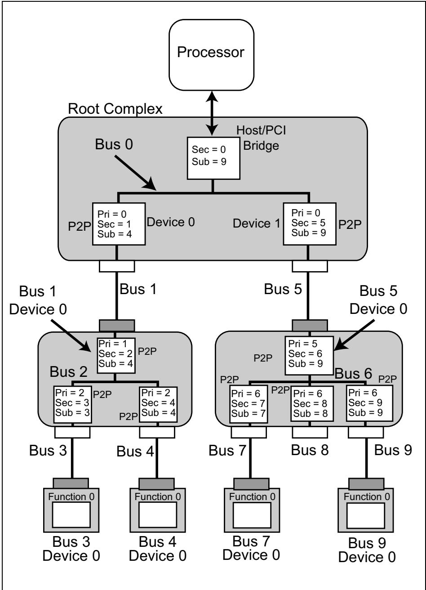

## Multi-Host System

If there are multiple Root Complexes (refer to Figure 3‐6 on page 97), the Configuration Address and Data ports can be duplicated at the same IO addresses in each of their respective Host/PCI bridges. In order to prevent contention, only one of the bridges responds to the processorʹs accesses to the configuration ports.

1. When the processor initiates the IO write to the Configuration Address Port, the host bridges are configured so that only one will actively participate in the transaction.

2. During enumeration, software discovers and numbers all the buses under the active bridge. When that’s done, it enables the inactive host bridge and assigns a bus number to it that is outside the range already assigned to the active bridge and continues the enumeration process. Both host bridges see the Requests, but since they have non‐overlapping bus numbers they only respond to the appropriate bus number requests and so there’s no conflict.

3. Accesses to the Configuration Address Port go to both host bridges after that, and a subsequent read or write access to the Configuration Data Port is only accepted by the host/PCI bridge that is the gateway to the target bus. This bridge responds to the processor’s transaction and the other ignores it.

o If the target bus is the Secondary Bus, the bridge converts the access to a Type 0 configuration access.

o Otherwise, it converts it into a Type 1 configuration access.

## Enhanced Configuration Access Mechanism

## General

When the spec writers were choosing how PCI‐X and, later, PCIe, would access Configuration space, there were two concerns. First, the 256‐byte space per Function limited vendors who wanted to put proprietary information there, as well as future spec writers who would need room for more standardized capability structures. To solve that problem, the space was simply extended from 256 bytes to 4KB per Function. Secondly, when PCI was developed there were few multi‐processor systems in use. When there’s only one CPU and it’s only running one thread, the fact that the old model takes two steps to generate one access isn’t a problem. But newer machines using multi‐core, multi‐threaded CPUs present a problem for the IO‐indirect model because there’s nothing to stop multiple threads from trying to access Configuration space at the same time. Consequently, the two‐step model will no longer work without some locking semantics. With no locking semantics, once thread A writes a value into the

## Chapter 3: Configuration Overview

Configuration Address Port (CF8h), there is nothing to prevent thread B from overwriting that value before thread A can perform its corresponding access to the Configuration Data Port (CFCh).

Figure 3‐6: Multi‐Root System  


To solve this new problem, the spec writers decided to take a different approach. Rather than try to conserve address space, they would create a singlestep, uninterruptable process by mapping all of configuration space into memory addresses. That allows a single command sequence, since one memory request in the specified address range will generate one Configuration Request on the bus. The trade‐off now is address size. Mapping 4KB per Function for all the possible implementations requires allocating 256MB of memory address space. The difference in that regard today is that modern architectures typically support anywhere between 36 and 48 bits of physical memory address space. With these memory address space sizes, 256MB is insignificant.

To handle this mapping, each Function’s 4KB configuration space starts at a 4KB‐aligned address within the 256MB memory address space set aside for configuration access, and the address bits now carry the identifying information about which Function is targeted (refer to Table 3‐1 on page 98).

## Some Rules

A Root Complex is not required to support an access to enhanced configuration memory space if it crosses a dword address boundary (straddles two adjacent memory dwords). Nor are they required to support the bus locking protocol that some processor types use for an atomic, or uninterrupted series of commands. Software should avoid both of these situations when accessing configuration space unless it is known that the Root Complex does support them.

Table 3‐1: Enhanced Configuration Mechanism Memory‐Mapped Address Range

<table><tr><td>Memory Address Bit Field</td><td>Description</td></tr><tr><td>A[63:28]</td><td>Upper bits of the 256MB-aligned base address of the 256MB memory-mapped address range allocated for the Enhanced Configuration Mechanism. The manner in which the base address is allocated is implementation-specific. It is supplied to the OS by system firmware (typically through the ACPI tables).</td></tr><tr><td>A[27:20]</td><td>Target Bus Number (0 - 255).</td></tr><tr><td>A[19:15]</td><td>Target Device Number (0 - 31).</td></tr><tr><td>A[14:12]</td><td>Target Function Number (0 - 7).</td></tr><tr><td>A[11:2]</td><td>A[11:2] this range can address one of 1024 dwords, whereas the legacy method is limited to only address one of 64 dwords.</td></tr><tr><td>A[1:0]</td><td>Defines the access size and the Byte Enable setting.</td></tr></table>

## Configuration Requests

Two request types, Type 0 or Type 1, may be generated by bridges in response to a configuration access. The type used depends on whether the target Bus number matches the bridge’s Secondary Bus Number, as described below.

## Type 0 Configuration Request

If the target bus number matches the Secondary Bus Number, a Type 0 configuration read or write is forwarded to the secondary bus and:

1. Devices on that Bus check the Device Number to see which of them is the target device. Note that Endpoints on an external Link will always be Device 0.

2. The selected Device checks the Function Number to see which Function is selected within the device.

3. The selected Function uses the Register Number field to select the target dword in its configuration space, and uses the First Dword Byte Enable field to select which bytes to read or write within the selected dword.

Figure 3‐7 illustrates the Type 0 configuration read and write Request header formats. In both cases, the Type field = 00100, while the Format field indicates whether it’s a read or a write.

Figure 3‐7: Type 0 Configuration Read and Write Request Headers

<table><tr><td colspan="19">Type 0 Configuration Read</td></tr><tr><td rowspan="2"></td><td colspan="3">+0</td><td colspan="6">+1</td><td colspan="4">+2</td><td colspan="5">+3</td></tr><tr><td>7</td><td>6</td><td>5</td><td>4</td><td>3</td><td>2</td><td>1</td><td>0</td><td>7</td><td>6</td><td>5</td><td>4</td><td>3</td><td>2</td><td>1</td><td>0</td><td>7</td><td>6</td></tr><tr><td>Byte 0</td><td>Fmt0</td><td>0</td><td>0</td><td>0</td><td>0</td><td>1</td><td>0</td><td>0</td><td>R</td><td>TC0</td><td>0</td><td>0</td><td>0</td><td>0</td><td>0</td><td>0</td><td>Length0</td><td>0</td></tr><tr><td>Byte 4</td><td colspan="11">Requester ID</td><td colspan="4">Tag</td><td>Last BE0</td><td>0</td><td>0</td></tr><tr><td>Byte 8</td><td colspan="4">Bus Number</td><td colspan="4">Device Number</td><td colspan="3">Function Number</td><td>R</td><td colspan="5">Register Number</td><td>R</td></tr><tr><td colspan="19">Type 0 Configuration Write</td></tr><tr><td rowspan="2"></td><td colspan="3">+0</td><td colspan="8">+1</td><td colspan="4">+2</td><td colspan="3">+3</td></tr><tr><td>7</td><td>6</td><td>5</td><td>4</td><td>3</td><td>2</td><td>1</td><td>0</td><td>7</td><td>6</td><td>5</td><td>4</td><td>3</td><td>2</td><td>1</td><td>0</td><td>7</td><td>6</td></tr><tr><td>Byte 0</td><td>Fmt0</td><td>1</td><td>0</td><td>Type0</td><td>0</td><td>0</td><td>1</td><td>0</td><td>R</td><td>TC0</td><td>0</td><td>0</td><td>0</td><td>0</td><td>0</td><td>Length0</td><td>0</td><td>0</td></tr><tr><td>Byte 4</td><td colspan="11">Requester ID</td><td colspan="4">Tag</td><td>Last BE0</td><td>0</td><td>0</td></tr><tr><td>Byte 8</td><td colspan="4">Bus Number</td><td colspan="4">Device Number</td><td colspan="3">Function Number</td><td>R</td><td colspan="5">Register Number</td><td>R</td></tr></table>

## Type 1 Configuration Request

When a bridge sees a configuration access whose target bus number does not match its Secondary Bus Number but is in the range between its Secondary and Subordinate Bus Numbers, it forwards the packet as a Type 1 Request to its Secondary Bus. Devices that are not bridges (Endpoints) know to ignore Type 1 Requests since the target resides on a different bus, but bridges that see it will make the same comparison of the target bus number to the range of buses downstream (see Figure 3‐1 on page 87 and Figure 3‐6 on page 97).

If the target bus matches the Bridge’s secondary bus, the packet is converted from Type 1 to Type 0 and passed to the secondary bus. Devices local to that bus then check the packet header as previously described.

• If the target bus is not the Bridge’s secondary bus but is within its range, the packet is forwarded to the Bridge’s secondary bus as a Type 1 Request.

Figure 3‐8 illustrates the Type 1 configuration read and write request header formats. In both cases, the Type field = 00101, while the Fmt field indicates whether it’s a read or a write.

Figure 3‐8: Type 1 Configuration Read and Write Request Headers  
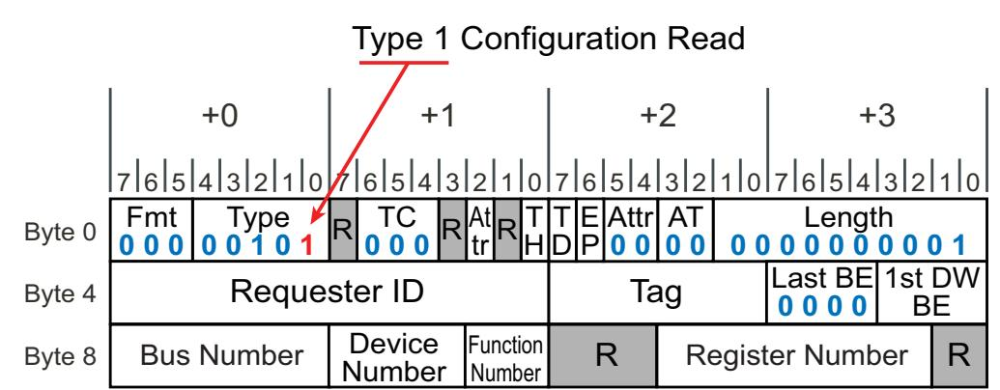

Type 1 Configuration Write  
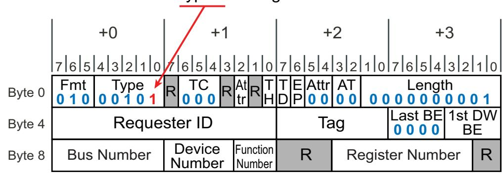

## Example PCI-Compatible Configuration Access

Refer to Figure 3‐9 on page 104. To illustrate the concept of generating a Configuration Request using the legacy CF8h/CFCh mechanism, consider the following x86 assembly code sample, which will cause the Root Complex to perform a 2‐byte read from Bus 4, Device 0, Function 0, Register 0 (Vendor ID).

```csv
mov dx,0CF8h ;set dx = config address port address
mov eax,80040000h;enable=1, bus 4, dev 0, func 0, DW 0
out dx,eax ;IO write to set up address port
mov dx,0CFCh ; set dx = config data port address
in ax,dx ;2-byte read from config data port
```

1. The out instruction generates an IO write from the processor targeting the Configuration Address Port in the Root Complex Host bridge (0CF8h), as shown in Figure 3‐4 on page 92.

2. The Host bridge compares the target bus number (4) specified in the Configuration Address Port to the range of buses (0‐through‐10) that reside downstream. The target bus falls within the range, so the bridge is primed with the destination of the next configuration request.

3. The in instruction, generates an IO read transaction from the processor targeting the Configuration Data Port in the Root Complex Host bridge. It’s a 2‐byte read from the first two locations in the Configuration Data Port.

4. Since the target bus is not bus 0, the Host/PCI bridge initiates a Type 1 Configuration read on bus 0.

5. All of the devices on bus 0 latch the transaction request and see that it’s a Type 1 Configuration Request. As a result, both of the virtual PCI‐to‐PCI bridges in the Root Complex compare the target bus number in the Type 1 request to the range of buses downstream from each of them.

6. The destination bus (4) is within the range of buses downstream of the lefthand bridge, so it passes the packet through to its secondary bus, but as a Type 1 request because the destination bus doesn’t match the Secondary Bus Number.

7. The upstream port on the left‐hand switch receives the packet and delivers it to the upstream PCI‐to‐PCI bridge.

8. The bridge determines that the destination bus resides beneath it, but is not targeting its secondary bus, so it passes the packet to bus 2 as a Type 1 request.

9. Both of the bridges on bus 2 receive the Type 1 request packet. The righthand bridge determines that the destination bus matches its Secondary Bus Number.

10. The bridge passes the configuration read request through to bus 4, but converts into a Type 0 Configuration Read request because the packet has reached the destination bus (target bus number matches the secondary bus number).

11. Device 0 on bus 4 receives the packet and decodes the target Device, Function, and Register Number fields to select the target dword in its configuration space (see Figure 3‐3 on page 90).

12. Bits 0 and 1 in the First Dword Byte Enable field are asserted, so the Function returns its first two bytes, (Vendor ID in this case) in the Completion packet. The Completion packet is routed to the Host bridge using the Requester ID field obtained from the Type 0 request packet.

13. The two bytes of read data are delivered to the processor, thus completing the execution of the “in“ instruction. The Vendor ID is placed in the processor’s AX register.

## Example Enhanced Configuration Access

Refer to Figure 3‐9 on page 104. The following x86 code sample causes the Root Complex to perform a read from Bus 4, Device 0, Function 0, Register 0 (Vendor ID). Before this will work, the Host Bridge must have been assigned a base address value. This example assumes that the 256MB‐aligned base address of the Enhanced Configuration memory‐mapped range is E0000000h:

mov ax,[E0400000h];memory-mapped Config read

Address bits 63:28 indicate the upper 36 bits of the 256MB‐aligned base address of the overall Enhanced Configuration address range (in this case, 00000000 E0000000h).

• Address bits 27:20 select the target bus (in this case, 4).

• Address bits 19:15 select the target device (in this case, 0) on the bus.

Address bits 14:12 select the target Function (in this case, 0) within the device.

• Address bits 11:2 selects the target dword (in this case, 0) within the selected Function’s configuration space.

Address bits 1:0 define the start byte location within the selected dword (in this case, 0).

The processor initiates a 2‐byte memory read starting from memory location E0400000h, and this is latched by the Host Bridge in the Root Complex. The Host Bridge recognizes that the address matches the area designated for Configuration and generates a Configuration read Request for the first two bytes in dword 0, Function 0, device 0, bus 4. The remainder of the operation is the same as that described in the previous section.

Figure 3‐9: Example Configuration Read Access  
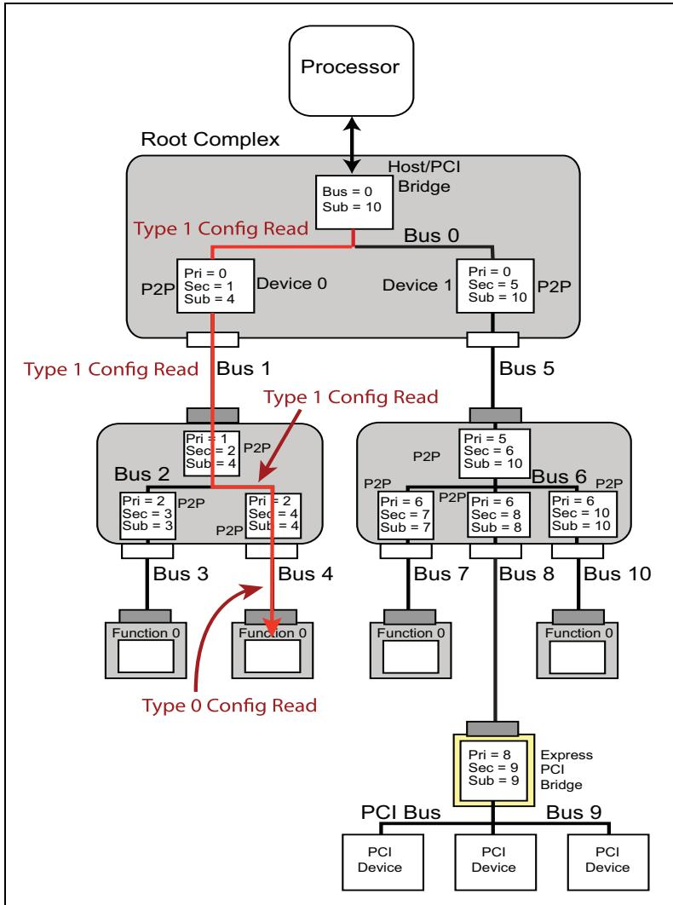

## Enumeration - Discovering the Topology

After a system reset or power up, configuration software has to scan the PCIe fabric to discover the machine topology and learn how the fabric is populated. Before that happens, as shown in Figure 3‐10 on page 105, the only thing that software can know for sure is that there will be a Host/PCI bridge and that bus number 0 will be on the secondary side of that bridge. Note that the upstream side of a bridge device is called its primary bus, while the downstream side is referred to as its secondary bus. The process of scanning the PCI Express fabric to discover its topology is referred to as the enumeration process.

Figure 3‐10: Topology View At Startup  


## Discovering the Presence or Absence of a Function

The configuration software executing on the processor normally discovers the existence of a Function by reading from its Vendor ID register. A unique 16‐bit value is assigned to each vendor by the PCI‐SIG and is hardwired into the Vendor ID register of each Function designed by that vendor. By reading this register in all of the possible combinations of Bus, Device, and Function numbers in the system, enumeration software can search through the entire topology to learn which devices are present. This process is fairly simple, but there are two problems that can arise: a targeted device may not be present, or it may be present but unprepared to respond. Handling these two cases is described next.

## Device not Present

It can happen several times during the process of discovery that the targeted device doesn’t actually exist in the system and when that happens it needs to be understood correctly. In PCI, the Configuration Read Request would timeout on the bus and generate a Master Abort error condition. Since no device was driving the bus and all the signals were pulled up, the data bits on the bus would be seen as all ones and that would become the data value seen. The resulting Vendor ID of FFFFh is reserved. If enumeration software saw that result for the read, it understood that the device wasn’t present. Since this wasn’t really an error condition, the Master Abort would not be reported as an error during the enumeration process.

For PCIe, a Configuration Read Request to a non‐existent device will result in the bridge above the target device returning a Completion without data that has a status of UR (Unsupported Request). For backward compatibility with the legacy enumeration model, the Root Complex returns all ones (FFFFh) to the processor for the data when this Completion is seen during enumeration. Note that enumeration software depends on receiving a value of all 1s for a Configuration Read Request that returns an Unsupported Request when probing for the existence of Functions in the system.

It’s important to avoid accidentally reporting an error for this case. Even though this timeout or UR result would be seen as an error during runtime, it’s an expected result that isn’t considered an error during enumeration. To help avoid confusion on this, devices are usually not enabled to signal errors until later. For PCIe it may still be useful to make a note of this event, and that’s why a fourth “error” status bit, called Unsupported Request Status is given in the PCIe Capability register block (refer to “Enabling/Disabling Error Reporting” on page 678 for more on this). That allows this condition to be noted without marking it as an error, and that’s important because a detected error might stop the enumeration process to call the system error handler. The error handling software might have only limited capabilities during this time and thus have trouble resolving the problem. The enumeration software could fail in that case, since it’s typically written to execute before the OS or other error handling software is available. To avoid this risk, errors should not normally be reported during enumeration.

## Device not Ready

Another problem that can arise is that the targeted device is present but isn’t ready to respond to a configuration access. There is a timing consideration for configuration because of the time it takes devices to prepare for access. If the data rate is 5.0 GT/s or less, software must wait 100ms after reset before initiating a Configuration Request. If the rate is higher than 5.0 GT/s (Gen3 speed), software must wait until 100ms after Link training completes before attempting this. The reason for the longer delay for the higher speeds is that the Gen3 Equalization Process during Link training can take a long time (on the order of 50ms; see “Link Equalization Overview” on page 577 for more on this topic).

As defined in the PCI 2.3 spec, Initialization Time $( \mathrm { { T _ { r h f a } } }$ ‐ Time from Reset High to First Access) begins when RST# is deasserted and completes $2 ^ { 2 5 }$ PCI clocks later. That works out to one full second during which the Function is preparing for its first configuration access and that value has been carried forward for PCIe as 1.0s (+50%/‐0%). A Function could use that time to populate its configuration registers by loading the contents from an external serial EEPROM, for example. That might take a while to load and the Function would be unprepared for a successful access until it finished. In PCI, if a configuration access was seen before the Function was ready, it had three choices: ignore the Request, Retry the Request, or accept the Request but postpone delivering its response until it was fully ready. That last response could cause trouble for Hotplug systems because the shared bus could end up being stalled for one second until the Request resolved.

In PCIe we have the same problem, but the process is a little different now. First, PCIe Functions must always give a Completion with a specific status when they are temporarily unable to respond to a configuration access, which is the Configuration Request Retry Status (CRS). This status is only legal in response to a configuration request and may optionally be considered a Malformed Packet error if seen in response to other Requests. This response is also only valid for the one second after reset because the Function is supposed to respond by then and can be considered broken if it won’t.

The way the Root Complex handles a CRS Completion in response to a Configuration Read Request is implementation specific, except for the period following a system reset. During that time, there are two options for what the Root will do next, based on the setting of the CRS Software Visibility bit in its Root Control Register, shown in Figure 3‐11 on page 108:

If the bit is set and the Request was a Configuration Read to both bytes of the Vendor ID register (as an enumeration access would do to discover the presence of a Function), the Root must give the host an artificial value of 0001h for this register, and all 1’s for any additional bytes in this Request. This Vendor ID is not used for any real devices and will be interpreted by software as an indication of a potentially lengthy delay in accessing this device. This can be helpful because software could choose to go on to another task and make better use of the time that would otherwise be spent waiting for the device to respond, returning to query this device later. For this to work, software must ensure that its first access to a Function after a reset condition is a Configuration Read of both bytes of the Vendor ID.

• For configuration writes or any other configuration reads, the Root must automatically re‐issue the Configuration Request again as a new request.

Figure 3‐11: Root Control Register in PCIe Capability Block  


## Determining if a Function is an Endpoint or Bridge

A critical part of the enumeration process is being able to determine if a function is a bridge or an endpoint. As seen in Figure 3‐12 on page 108, the lower 7 bits of the Header Type register (offset 0Eh in config space header) identify the basic category of the Function, and three values are defined:

• 0 = not a bridge (Endpoint in PCIe)

• 1 = PCI‐to‐PCI bridge (abbreviated as P2P) connecting two buses

• 2 = CardBus bridge (legacy interface not often used today)

In Figure 3‐1 on page 87, the Header Type field (DW3, byte 2) in each of the Virtual P2Ps would return a value of 1, as would the PCI Express‐to‐PCI bridge (Bus 8, Device 0), while the Endpoints would return a Header Type of zero.

Figure 3‐12: Header Type Register  


## Single Root Enumeration Example

Now that we’ve discussed the basic elements involved in the enumeration process, let’s walk through an example of the process. Figure 3‐13 on page 113 illustrates an example system after the buses and devices have been enumerated. The discussion that follows assumes that the configuration software uses either of the two configuration access mechanisms defined in this chapter to achieve this result. At startup time, the configuration software executing on the processor performs enumeration as described below.

1. Software updates the Host/PCI bridge Secondary Bus Number to zero and the Subordinate Bus Number to 255. Setting this to the max value means that it won’t have to be changed again until all the bus numbers downstream have been identified. For the moment, buses 0 through 255 are identified as being downstream.

2. Starting with Device 0 (bridge A), the enumeration software attempts to read the Vendor ID from Function 0 in each of the 32 possible devices on bus 0. If a valid Vendor ID is returned from Bus 0, Device 0, Function 0, the device exists and contains at least one Function. If not, go on to probe bus 0, device 1, Function 0.

3. The Header Type field in this example (Figure 3‐12 on page 108) contains the value one (01h) indicating this is a PCI‐to‐PCI bridge. The Multifunction bit (bit 7) in the Header Type register is 0, indicating that Function 0 is the only Function in this bridge. The spec doesn’t preclude implementing multiple Functions within this Device and each of these Functions, in turn, could represent other virtual PCI‐to‐PCI bridges or even non‐bridge functions.

4. Now that software has found a bridge, performs a series of configuration writes to set the bridge’s bus number registers as follows:

• Primary Bus Number Register = 0

• Secondary Bus Number Register = 1

• Subordinate Bus Number Register = 255

The bridge is now aware that the number of the bus directly attached downstream is 1 (Secondary Bus Number = 1) and that the largest bus number downstream of it is 255 (Subordinate Bus Number = 255).

5. Enumeration software must perform a depth‐first search. Before proceeding to discover additional Devices/Functions on bus 0, it must proceed to search bus 1.

6. Software reads the Vendor ID of Bus 1, Device 0, Function 0, which targets bridge C in our example. A valid Vendor ID is returned, indicating that Device 0, Function 0 exists on Bus 1.

7. The Header Type field in the Header register contains the value one (0000001b) indicating another PCI‐to‐PCI bridge. As before, bit 7 is a 0, indicating that bridge C is a single‐function device.

8. Software now performs a series of configuration writes to set bridge C’s bus number registers as follows:

• Primary Bus Number Register = 1

• Secondary Bus Number Register = 2

• Subordinate Bus Number Register = 255

9. Continuing the depth‐first search, a read is performed from bus 2, device 0, Function 0’s Vendor ID register. The example assumes that bridge D is Device 0, Function 0 on Bus 2.

10. A valid Vendor ID is returned, indicating bus 2, device 0, Function 0 exists.

11. The Header Type field in the Header register contains the value one (0000001b) indicating that this is a PCI‐to‐PCI bridge, and bit 7 is a 0, indicating that bridge D is a single‐function device.

12. Software now performs a series of configuration writes to set bridge D’s bus number registers as follows:

• Primary Bus Number Register = 2

• Secondary Bus Number Register = 3

• Subordinate Bus Number Register = 255

13. Continuing the depth‐first search, a read is performed from bus 3, device 0, Function 0’s Vendor ID register.

14. A valid Vendor ID is returned, indicating bus 3, device 0, Function 0 exists.

15. The Header Type field in the Header register contains the value zero (0000000b) indicating that this is an Endpoint function. Since this is an endpoint and not a bridge, it has a Type 0 header and there are no PCI‐compatible buses beneath it. This time, bit 7 is a 1, indicating that this is a multifunction device.

16. Enumeration software performs accesses to the Vendor ID of all 8 possible functions in bus 3, device 0 and determines that only Function 1 exists in addition to Function 0. Function 1 is also an Endpoint (Type 0 header), so there are no additional buses beneath this device.

17. Enumeration software continues scanning across on bus 3 to look for valid functions on devices 1 ‐ 31 but does not find any additional functions.

18. Having found every function there was to find downstream of bridge D, enumeration software updates bridge D, with the real Subordinate Bus Number of 3. Then it backs up one level (to bus 2) and continues scanning across on that bus looking for valid functions. The example assumes that bridge E is device 1, Function 0 on bus 2.

19. A valid Vendor ID is returned, indicating that this Function exists.

20. The Header Type field in bridge E’s Header register contains the value one (0000001b) indicating that this is a PCI‐to‐PCI bridge, and bit 7 is a 0, indicating a single‐function device.

21. Software now performs a series of configuration writes to set bridge E’s bus number registers as follows:

• Primary Bus Number Register = 2

• Secondary Bus Number Register = 4

• Subordinate Bus Number Register = 255

22. Continuing the depth‐first search, a read is performed from bus 4, device 0, Function 0’s Vendor ID register.

23. A valid Vendor ID is returned, indicating that this Function exists.

24. The Header Type field in the Header register contains the value zero (0000000b) indicating that this is an Endpoint device, and bit 7 is a 0, indicating that this is a single‐function device.

25. Enumeration software scans bus 4 to look for valid functions on devices 1 ‐ 31 but does not find any additional functions.

26. Having reached the bottom of this tree branch, enumeration software updates the bridge above that bus, E in this case, with the real Subordinate Bus Number of 4. It then backs up one level (to bus 2) and moves on to read the Vendor ID of the next device (device 2). The example assumes that devices 2 ‐ 31 are not implemented on bus 2, so no additional devices are discovered on bus 2.

27. Enumeration software updates the bridge above bus 2, C in this case, with the real Subordinate Bus Number of 4 and backs up to the previous bus (bus 1) and attempts to read the Vendor ID of the next device (device 1). The example assumes that devices 1 ‐ 31 are not implemented on bus 1, so no additional devices are discovered on bus 1.

28. Enumeration software updates the bridge above bus 1, A in this case, with the real subordinate Bus Number of 4. and backs up to the previous bus (bus 0) and moves on to read the Vendor ID of the next device (device 1). The example assumes that bridge B is device 1, function 0 on bus 0.

29. In the same manner as previously described, the enumeration software discovers bridge B and performs a series of configuration writes to set bridge B’s bus number registers as follows:

• Primary Bus Number Register = 0

• Secondary Bus Number Register = 5

• Subordinate Bus Number Register = 255

30. Bridge F is then discovered and a series of configuration writes are performed to set its bus number registers as follows:

• Primary Bus Number Register = 5

• Secondary Bus Number Register = 6

• Subordinate Bus Number Register = 255

31. Bridge G is then discovered and a series of configuration writes are performed to set its bus number registers as follows:

## PCI Express Technology

• Primary Bus Number Register = 6

• Secondary Bus Number Register = 7

• Subordinate Bus Number Register = 255

32. A single‐function Endpoint device is discovered at bus 7, device 0, function 0, so the Subordinate Bus Number of Bridge G is updated to 7.

33. Bridge H is then discovered and a series of configuration writes are performed to set its bus number registers as follows:

• Primary Bus Number Register = 6

• Secondary Bus Number Register = 8

• Subordinate Bus Number Register = 255

34. Bridge J is discovered and a series of configuration writes are performed to set bridge its bus number registers as follows:

• Primary Bus Number Register = 8

• Secondary Bus Number Register = 9

• Subordinate Bus Number Register = 255

35. All devices and their respective Functions on bus 9 are discovered and none of them are bridges, so the Subordinate Bus Number of bridges H and J are updated to 9.

36. Bridge I is then discovered and a series of configuration writes are performed to set its bus number registers as follows:

• Primary Bus Number Register = 6

• Secondary Bus Number Register = 10

• Subordinate Bus Number Register = 255

37. A single‐function Endpoint device is discovered at bus 10, device 0, function 0.

38. Since software has reached the bottom of this branch of the tree structure required for PCIe topologies, the Subordinate Bus Number registers for bridges B, F, and I are updated to 10, and so is the Host/PCI bridge’s Subordinate Bus Number register.

The final values encoded into each bridge’s Primary, Secondary and Subordinate Bus Number fields can be found in Figure 3‐9 on page 104.

## Chapter 3: Configuration Overview

Figure 3‐13: Single‐Root System  


## Multi-Root Enumeration Example

## General

Consider the Multi‐Root System shown in Figure 3‐14 on page 116. In this system, each Root Complex:

Implements the Configuration Address Port and the Configuration Data Port at the same IO addresses (an x86‐based system).

• Implements the Enhanced Configuration Mechanism.

• Contains a Host/PCI bridge.

Implements the Secondary Bus Number and Subordinate Bus Number registers at separate addresses known to the configuration software.

In the illustration, each Root Complex is a chipset member and one of them is designated as the bridge to bus 0 (the primary Root Complex) while the other is designated as the bridge to bus 255 (secondary Root Complex).

## Multi-Root Enumeration Process

During enumeration of the left‐hand tree structure in Figure 3‐14 on page 116, the Host/PCI bridge in the secondary Root Complex ignores all configuration accesses because the targeted bus number is no greater than 9. Note that, although detected and numbered, Bus 8 has no device attached. Once that enumeration process has been completed, the enumeration software takes the following steps to enumerate the secondary Root Complex:

1. The enumeration software changes the Secondary and Subordinate Bus Number values in the secondary Root Complex’s Host/PCI bridge to bus 64 in this example. (The values of 64 and 128 are commonly used as the starting bus number in multi‐root systems, but this is just a software convention. There are no PCI or PCIe rules requiring that configuration. There would be nothing wrong with starting the secondary Root Complex’s bus numbers at 10 in this example.)

2. Enumeration software then starts searching on bus 64 and discovers the bridge attached to the downstream Root Port.

3. A series of configuration writes are performed to set its bus number registers as follows:

• Primary Bus Number Register = 64

• Secondary Bus Number Register = 65

• Subordinate Bus Number Register = 255

The bridge is now aware that the number of the bus directly attached to its downstream side is 65 (Secondary Bus Number = 65) and the number of the bus farthest downstream of it is 65 (Subordinate Bus Number = 65).

4. Device 0 is discovered on Bus 65 that implements a only Function 0, and further searching reveals no other Devices are present on Bus 65, so the search process moves back up one Bus level.

5. Enumeration continues on bus 64 and no additional devices are discovered, so the Host/PCI’s Subordinate Bus Number is updated to 65.

6. This completes the enumeration process.

## PCI Express Technology

Figure 3‐14: Multi‐Root System  


## Hot-Plug Considerations

In a hot‐plug environment, meaning one in which add‐in cards can be added or removed during runtime, the situation illustrated by Bus number 8 in Figure 3‐

14 on page 116 can potentially cause trouble. A problem can occur if the system has been enumerated and is up and running and then a card is plugged into Bus 8 that has a bridge on it. The bridge would need to have bus numbers assigned for its Secondary and Subordinate Bus Numbers that are higher than the bus number on its primary bus and completely inclusive. The reason is that the bus numbers have to be within the Secondary and Subordinate Bus Numbers of the bridge upstream of the new card.

One approach is to assign the Bus number(s) required for the bridge residing on Bus number 8 and increment the current Bus number 9 to a number than is one greater than the previous bus number, thereby making room for the new bus(s). Swizzling the bus numbers around during runtime can be done, but experienced people say it’s hard to get it to work very well.

There is a simpler solution to this potential problem: simply leave a bus number gap whenever an unpopulated slot is found. For example, when Bus 8 is assigned but then an open slot is seen below it, give the next discovered bus a higher number, like 19 instead of 9, so as to leave room for these add‐in situations to be resolved easily. Then, if a card with a bridge is added, the new bus number can be assigned as Bus 9 without causing any trouble. In most cases, leaving a bus number gap will not be an issue since the system can assign up to 256 bus numbers in total.

## MindShare Arbor: Debug/Validation/Analysis and Learning Software Tool

## General

MindShare Arbor is a computer system debug, validation, analysis and learning tool that allows the user to read and write any memory, IO or configuration space address. The data from these address spaces can be viewed in a clean and informative style.

The book authors made a decision to not include detailed descriptions of all configuration registers summarized in a signal chapter. Rather, registers are described through out the book in associated chapters where they are relevant.

In lieu of a configuration register space description chapter in this book, Mind‐Share Arbor is an excellent reference learning tool to quickly understand configuration registers and structures implemented in PCI, PCI‐X and PCI Express devices. All the register and field definitions are up‐to‐date with the latest version of the PCI Express spec. Several other types of structures (e.g. x86 MSRs, ACPI, USB, NVM Express) can also be viewed with MindShare Arbor (or will be coming soon).

Visit www.mindshare.com/arbor to download a free trial version of MindShare Arbor.

Figure 3‐15: Partial Screenshot of MindShare Arbor  
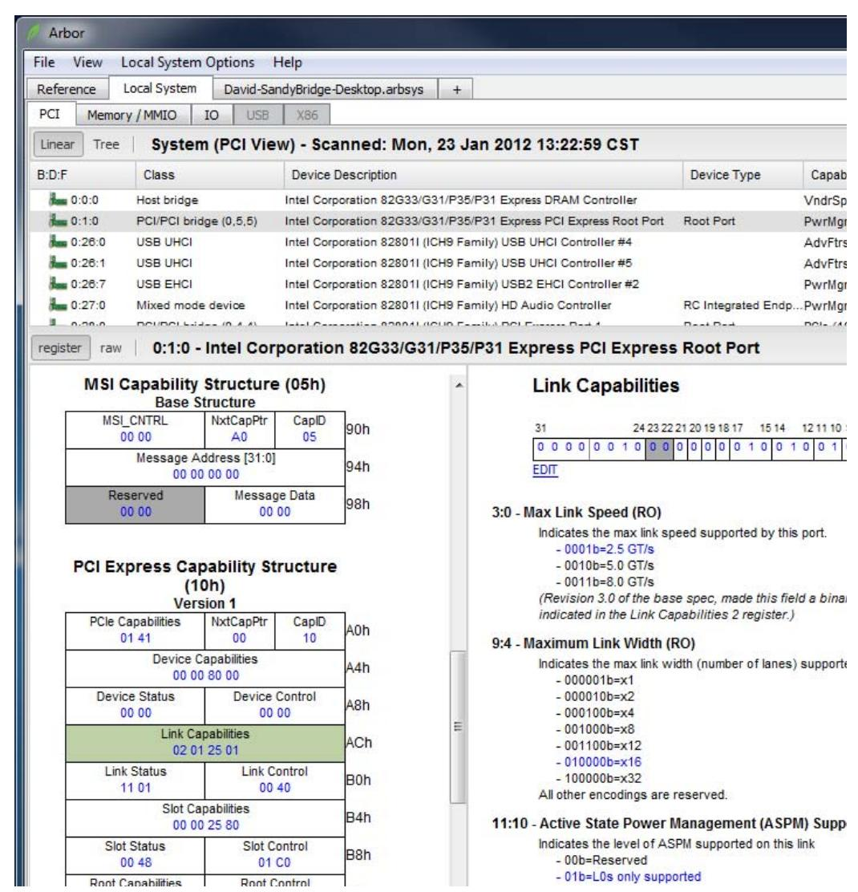

## MindShare Arbor Feature List

Description of all config registers included in the PCIe 3.0 spec

Scan config space for all PCI‐visible functions in system and a description of every one of these registers displayed in an easily readable format

• Directly access any memory or IO address

• Write to any config space location, memory address or IO address

• View standard and non‐standard structures in a decoded format

o Decode info included for standard PCI, PCI‐X and PCI Express structures

o Decode info included for some x86‐based structures and device‐specific registers

• Create your own XML‐based decode files to drive Arborʹs display

o Create decode files for structures in config space, memory address space and IO space

• Save system scans for viewing later or on other systems

o Saved system scans are XML‐based and open‐format

• New features that are either already in or coming soon:

o Difference checking between scans

o Post‐processing scans for illegal or non‐optimal settings

o Scripting support for automation

o Decode for x86 structures (MSRs, paging, segmentation, interrupt tables, etc.)

o Decode for ACPI structures

o Decode for USB structures

o Decode for NVM Express structures

# 4 Address Space & Transaction Routing

## The Previous Chapter

The previous chapter provides an introduction to configuration in the PCI Express environment. This includes the space in which a Function’s configuration registers are implemented, how a Function is discovered, how configuration transactions are generated and routed, the difference between PCIcompatible configuration space and PCIe extended configuration space, and how software differentiates between an Endpoint and a Bridge.

## This Chapter

This chapter describes the purpose and methods of a function requesting address space (either memory address space or IO address space) through Base Address Registers (BARs) and how software must setup the Base/Limit registers in all bridges to route TLPs from a source port to the correct destination port. The general concepts of TLP routing in PCI Express are also discussed, including address‐based routing, ID‐based routing and implicit routing.

## The Next Chapter

The next chapter describes Transaction Layer Packet (TLP) content in detail. We describe the use, format, and definition of the TLP packet types and the details of their related fields.

## I Need An Address

Almost all devices have internal registers or storage locations that software (and potentially other devices) need to be able to access. These internal locations may control the device’s behavior, report the status of the device, or may be a location to hold data for the device to process. Regardless of the purpose of the internal registers/storage, it is important to be able to access them from outside