Figure 8‐7: Different Sources are Unlikely to Have Dependencies  

## When to use IDO

The spec highly recommends that both IDO and RO be used whenever safely possible. For example, it should be safe for Endpoints to use IDO for all TLPs when communicating directly with only one other entity, such as the Root Complex. On the other hand, it would not be safe to use it if the Endpoint is communicating with multiple agents. An example failure case for this from the spec begins with one device doing a DMA write to memory and then doing a peerto‐peer write to a flag in another device. When the second device receives the flag, it also initiates a DMA write to the same area of memory. Normally, the two DMA operations would stay in order, but with IDO that ordering can’t be guaranteed because upstream devices will see them as coming from different device IDs. Similarly, it would not be safe to use RO with packets that are involved in control traffic.

For Completers, if IDO is enabled it’s recommended that it be used for all Completions unless there is a specific reason not to do so.

## Software Control

Software can enable the use of IDO for Requests or Completions from a given port by setting the appropriate bits in its Device Control 2 Register. As with RO, there are no capability bits to let software find out what the device supports, just enable bits, so software would need to know by some other means that the device was capable of doing this. These bits enable the use of IDO for that packet type, but software must still decide whether each individual packet will have its IDO bit set. A new attribute bit in the header indicates whether a TLP is using IDO, as shown in Figure 8‐8 on page 303. This brings up another related point: Completions normally inherit all the attribute bits of the Request that generated them, but this may not be true for IDO, since this can be enabled independently by the Completer. In other words, Completions may use IDO even if the Request that initiated them did not.

Figure 8‐8: IDO Attribute in 64‐bit Header  

## Deadlock Avoidance

Because the PCI bus employs delayed transactions or because PCI Express memory read request may be blocked due to lack of flow control credits, several deadlock scenarios can develop. These deadlock avoidance rules are included in PCI Express ordering to ensure that no deadlocks occur regardless of topology. Adhering to the ordering rules prevent problems when boundary conditions develop due to unanticipated topologies (e.g., two PCI Express to PCI bridges connected across the PCI Express fabric). Refer to the MindShare book entitled PCI System Architecture, Fourth Edition (published by Addison‐Wesley) for a detailed explanation of the scenarios that are the basis for the PCI Express

## PCI Express 3.0 Technology

ordering rules related to deadlock avoidance. Table 8‐1 on page 289 lists the deadlock avoidance ordering rules which are identified as entries A3, A4, D3, D4 and A5b. Note that avoiding the deadlocks involves “Yes” entries in each of these 5 cases. If blocking occurs due to lack of flow control credits associated with the Non‐Posted Request buffer identified in column 3 or 4, the Posted Requests associated with row A or the Completions associated with row D must be moved ahead of the Non‐Posted Requests specified in the column 3 or 4 where the “Yes” entry exists. Note also that the “Yes” entry in A5b applies only to PCI Express to PCI or PCI‐X Bridges.

Essentially, this deadlock avoidance rule can be summarized as “later arriving Memory Write Requests or Completions must be allowed to pass earlier blocked Non‐Posted Requests otherwise a deadlock could result”.

Part Three:

Data Link Layer

# DLLP Elements

## The Previous Chapter

The previous chapter discussed the ordering requirements for transactions in a PCI Express topology. These rules are inherited from PCI, and the Producer/ Consumer programming model motivated many of them, so its mechanism is described here. The original rules also took into consideration possible deadlock conditions that must be avoided, but did not include any means to avoid the performance problems that could result.

## This Chapter

In this chapter we describe the other major category of packets, Data Link Layer Packets (DLLPs). We describe the use, format, and definition of the DLLP packet types and the details of their related fields. DLLPs are used to support Ack/Nak protocol, power management, flow control mechanism and can even be used for vendor‐defined purposes.

## The Next Chapter

The following chapter describes a key feature of the Data Link Layer: an automatic, hardware‐based mechanism for ensuring reliable transport of TLPs across the Link. Ack DLLPs confirm good reception of TLPs while Nak DLLPs indicate a transmission error. We describe the normal rules of operation when no TLP or DLLP error is detected as well as error recovery mechanisms associated with both TLP and DLLP errors.

## General

The Data Link Layer can be thought of as managing the lower level Link protocol. Its primary responsibility is to assure the integrity of TLPs moving between devices, but it also plays a part in TLP flow control, Link initialization and power management, and conveys information between the Transaction Layer above it and the Physical Layer below it.

## PCI Express Technology

In performing these jobs, the Data Link Layer exchanges packets with its neighbor known as Data Link Layer Packets (DLLPs). DLLPs are communicated between the Data Link Layers of each device. Figure 9‐1 on page 308 illustrates a DLLP exchanged between devices.

Figure 9‐1: Data Link Layer Sends A DLLP  
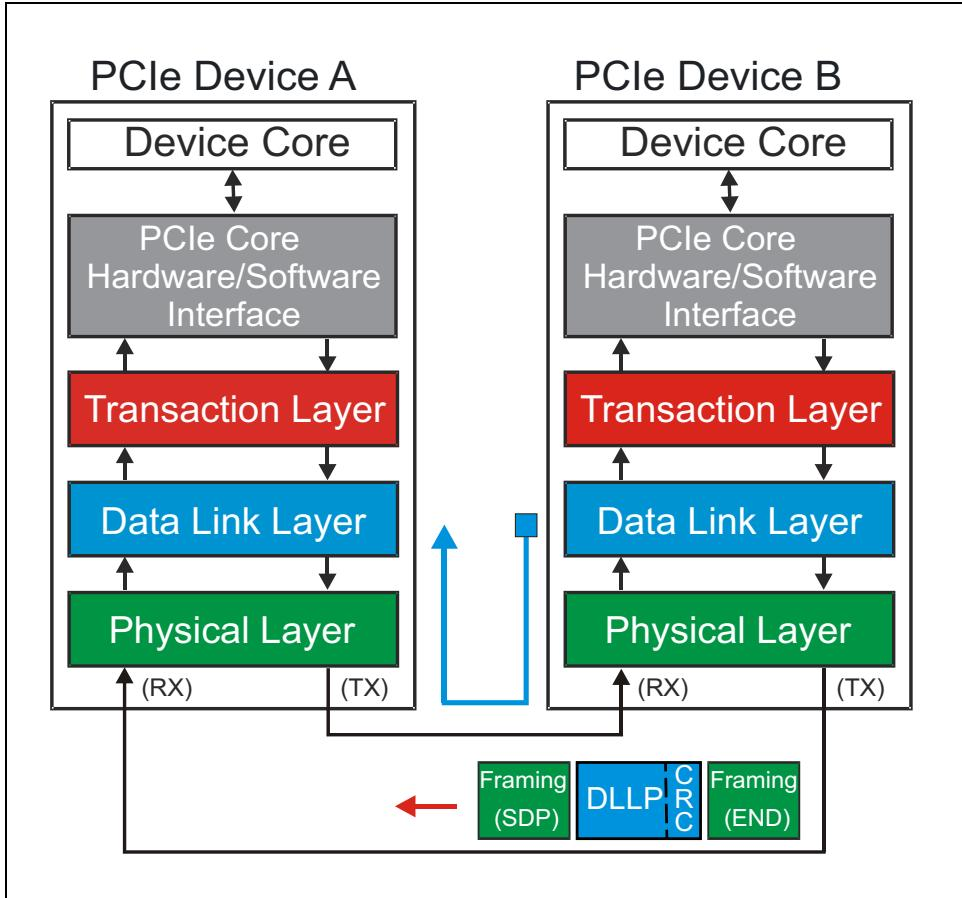

## DLLPs Are Local Traffic

DLLPs have a simple packet format and are a fixed size, 8 bytes total, including the framing bytes. Unlike TLPs, they carry no target or routing information because they are only used for nearest‐neighbor communications and don’t get routed at all. They’re also not seen by the Transaction Layer since they’re not part of the information exchanged at that level.

## Receiver handling of DLLPs

When DLLPs are received, several rules apply:

1. They’re immediately processed at the Receiver. In other words, their flow cannot be controlled the way it is for TLPs (DLLPs are not subject to flow control).

2. They’re checked for errors; first at the Physical Layer, and then at the Data Link Layer. The 16‐bit CRC included with the packet is checked by calculating what the CRC should be and comparing it to the received value. DLLPs that fail this check are discarded. How will the Link recover from this error? DLLPs still arrive periodically, and the next one of that type that succeeds will update the missing information.

3. Unlike TLPs, there’s no acknowledgement protocol for DLLPs. Instead, the spec defines time‐out mechanisms to facilitate recovery from failed DLLPs.

4. If there are no errors, the DLLP type is determined and passed to the appropriate internal logic to manage:

— Ack/Nak notification of TLP status

— Flow Control notification of buffer space available

— Power Management settings

— Vendor specific information

## Sending DLLPs

## General

These packets originate at the Data Link Layer and are passed to the Physical Layer. If 8b/10b encoding is in use (Gen1 and Gen2 mode), framing symbols will be added to both ends of the DLLP at this level before the packet is sent. In Gen3 mode, a SDP token of two bytes is added to the front end of the DLLP, but no END is added to the end of the DLLP. Figure 9‐2 on page 310 shows a generic (Gen1/Gen2) DLLP in transit, showing the framing symbols and the general contents of the packet.

Figure 9‐2: Generic Data Link Layer Packet Format  
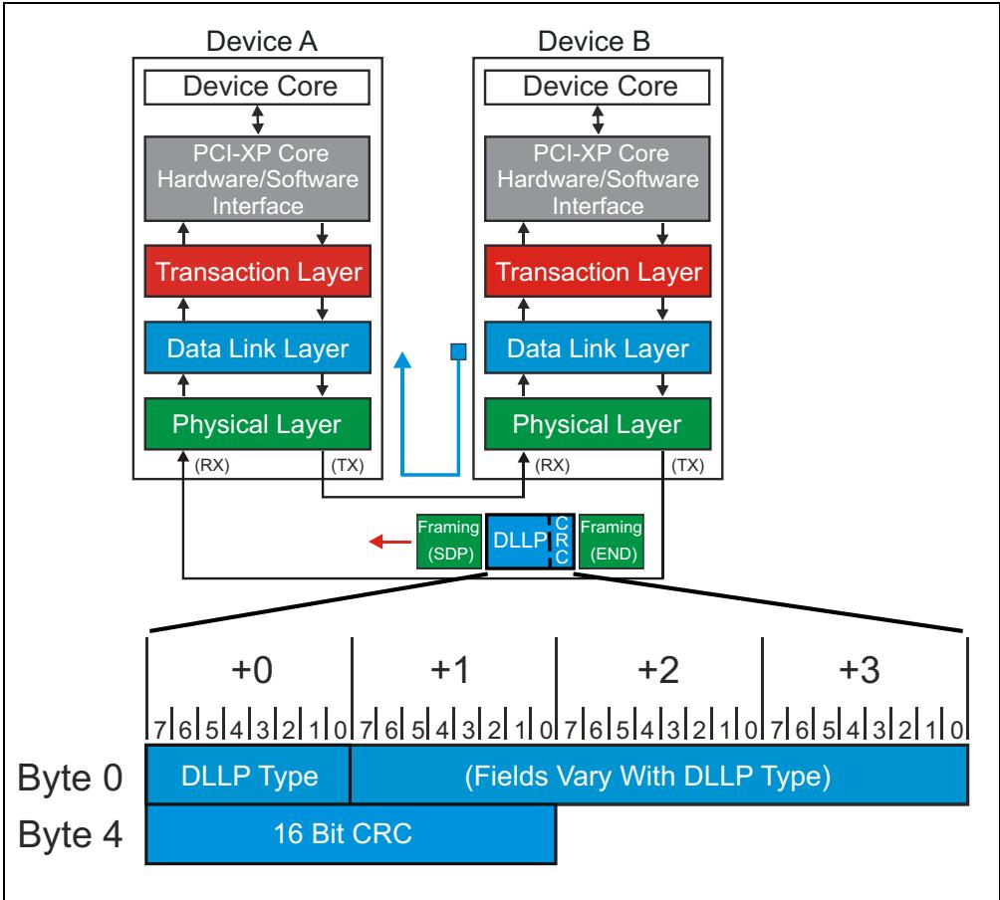

## DLLP Packet Size is Fixed at 8 Bytes

Data Link Layer Packets are always 8 bytes long for both 8b/10b and 128b/130b and consist of the following components:

1. A 1 DW core (4 bytes) containing the one‐byte DLLP Type field and three additional bytes of attributes. The attributes vary with the DLLP type.

2. A 2‐byte CRC value that is calculated based on the core contents of the DLLP. It is important to point out that this CRC is different from the LCRCs added to TLPs. This CRC is only 16 bits in size and is calculated differently than the 32‐bit LCRCs in TLPs. This CRC is appended to the core DLLP and then these 6 bytes are passed to the Physical Layer.

3. If 8b/10b encoding is in use, a Start of DLLP (SDP) control symbol and an End Good (END) control symbol are added to the beginning and end of the packet. As usual, before transmission the Physical Layer encodes the bytes into 10‐bit symbols for transmission.

4. In Gen3 mode, when 128b/130b encoding is in use, a 2‐byte SDP Token is added to the front of the packet to create the 8‐byte packet and there is no END symbol or token.

Note that there is never a data payload with a DLLP; all the information is carried in the core four bytes of the packet.

## DLLP Packet Types

There are four groups of DLLPs defined that deal with Ack/Nak, Power Management, and Flow Control, along with one Vendor Specific version. Some of these have several variants, and Table 9‐1 on page 311 summarizes each variant as well as their DLLP Type field encoding.

Table 9‐1: DLLP Types

<table><tr><td>DLLP Type</td><td>Type Field Encoding</td><td>Purpose</td></tr><tr><td>Ack (TLP Acknowledge)</td><td>0000 0000b</td><td>TLP transmission integrity</td></tr><tr><td>Nak (TLP Negative Acknowledge)</td><td>0001 0000b</td><td>TLP transmission integrity</td></tr><tr><td>PM_Enter_L1</td><td>0010 0000b</td><td>Power Management</td></tr><tr><td>PM_Enter_L23</td><td>0010 0001b</td><td>Power Management</td></tr><tr><td>PM_Active_State_Request_L1</td><td>0010 0011b</td><td>Power Management</td></tr><tr><td>PM_Request_Ack</td><td>0010 0100b</td><td>Power Management</td></tr><tr><td>Vendor Specific</td><td>0011 0000b</td><td>Vendor Defined</td></tr><tr><td>InitFC1-P</td><td>0100 0xxxb</td><td>TLP Flow Control (xxx = VC number)</td></tr><tr><td>InitFC1-NP</td><td>0101 0xxxb</td><td>TLP Flow Control</td></tr><tr><td>InitFC1-Cpl</td><td>0110 0xxxb</td><td>TLP Flow Control</td></tr><tr><td>InitFC2-P</td><td>1100 0xxxb</td><td>TLP Flow Control</td></tr><tr><td>InitFC2-NP</td><td>1101 0xxxb</td><td>TLP Flow Control</td></tr><tr><td>InitFC2-Cpl</td><td>1110 0xxxb</td><td>TLP Flow Control</td></tr><tr><td>UpdateFC-P</td><td>1000 0xxxb</td><td>TLP Flow Control</td></tr><tr><td>UpdateFC-NP</td><td>1001 0xxxb</td><td>TLP Flow Control</td></tr><tr><td>UpdateFC-Cpl</td><td>1010 0xxxb</td><td>TLP Flow Control</td></tr><tr><td>Reserved</td><td>Others</td><td>Reserved</td></tr></table>

## Ack/Nak DLLP Format

The format of the DLLP used by a device to Ack (acknowledge) or Nak (negatively acknowledge) the receipt of a TLP is illustrated in Figure 9‐3, and its fields are described in “Ack/Nak DLLP Fields” on page 313. For more discussion on how these are used to handle the Ack/Nak protocol, refer to Chapter 10, entitled ʺAck/Nak Protocol,ʺ on page 317.

Figure 9‐3: Ack Or Nak DLLP Format  
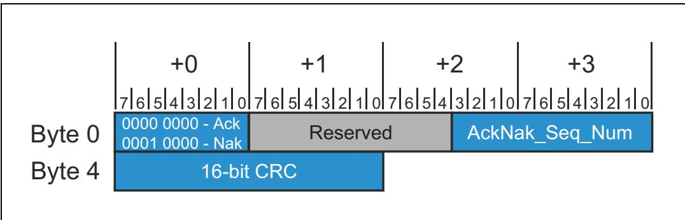

Table 9‐2: Ack/Nak DLLP Fields

<table><tr><td>Field Name</td><td>Header Byte/Bit</td><td>DLLP Function</td></tr><tr><td>DLLP Type</td><td>Byte 0, [7:0]</td><td>Indicates the type of DLLP:0000 0000b = Ack0001 0000b = Nak</td></tr><tr><td>AckNak_Seq_Num</td><td>Byte 2, [3:0]Byte 3, [7:0]</td><td>If a good TLP was received:If incoming Sequence Number = NEXT_RCV_SEQ (matched what was expected), schedule Ack DLLP with that number.If incoming Sequence Number was earlier than NEXT_RCV_SEQ count (a duplicate TLP was received), schedule Ack DLLP with NEXT_RCV_SEQ - 1 (effectively, this is the number of the last good TLP).For a TLP received with a problem:If the TLP had an error, or its Sequence Number was higher than NEXT_RCV_SEQ, schedule a Nak DLLP with NEXT_RCV_SEQ - 1.</td></tr><tr><td>16-bit CRC</td><td>Byte 4, [7:0]Byte 5, [7:0]</td><td>This 16-bit CRC protects the contents of this DLLP. Calculation is based on Bytes 0-3 of the Ack/Nak.</td></tr></table>

## Power Management DLLP Format

Power management DLLP information is shown in Figure 9‐4, and its fields are described in Table 9‐3 on page 314. To learn more about the use of these packets in power management, refer to Chapter 16, entitled  ʺPower Management,ʺ on page 703.

Figure 9‐4: Power Management DLLP Format  
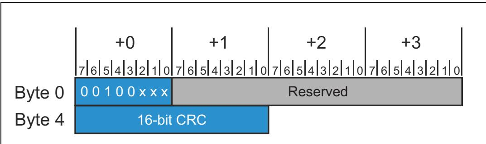

Table 9‐3: Power Management DLLP Fields

<table><tr><td>Field Name</td><td>Header Byte/Bit</td><td>DLLP Function</td></tr><tr><td>DLLP Type</td><td>Byte 0, [7:0]</td><td>Indicates DLLP type. For Power Management DLLPs: 0010 0000b = PM_Enter_L10010 0001b = PM_Enter_L230010 0011b = PM_Active_State_Request_L10010 0100b = PM_Request_Ack</td></tr><tr><td>16-bit CRC</td><td>Byte 4, [7:0]Byte 5, [7:0]</td><td>A 16-Bit CRC used to protect DLLP contents. Calculation is based on Bytes 0-3, regardless of whether fields are used.</td></tr></table>

## Flow Control DLLP Format

Like many other serial transport buses, PCIe improves transport efficiency by using a credit‐based flow control scheme. This topic is covered in detail in Chapter 6, entitled ʺFlow Control,ʺ on page 215. DLLPs are used to communicate flow control credit information. A variety of different DLLPs initialize flow control credits. Another category of update DLLPs are used to manage the runtime credit management as receiver buffer space is recovered. There are two Flow Control Initialization DLLPs called InitFC1 and InitFC2, and one Flow Control Update DLLP called UpdateFC.

The packet format for all three variants is illustrated in Figure 9‐5 on page 315, while Table 9‐4 on page 315 describes the fields contained in it.

Figure 9‐5: Flow Control DLLP Format  
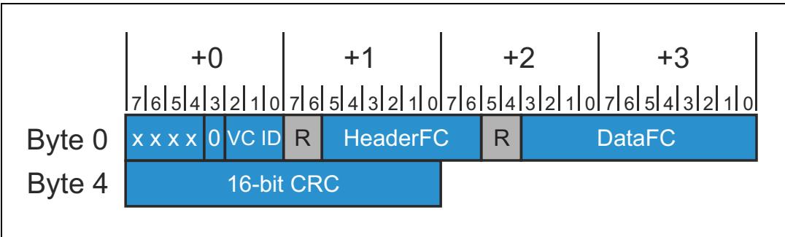

Table 9‐4: Flow Control DLLP Fields

<table><tr><td>Field Name</td><td>Header Byte/Bit</td><td>DLLP Function</td></tr><tr><td rowspan="3">DLLP Type</td><td>Byte 0, [7:4]</td><td>This code indicates the type of FC DLLP:0100b = InitFC1-P (Posted Requests)0101b = InitFC1-NP (Non-Posted Requests)0110b = InitFC1-Cpl (Completions)0101b = InitFC2-P (Posted Requests)1101b = InitFC2-NP (Non-Posted Requests)1110b = InitFC2-Cpl (Completions)1000b = UpdateFC-P (Posted Requests)1001b = UpdateFC-NP (Non-Posted Requests)1010b = UpdateFC-Cpl (Completions)</td></tr><tr><td>Byte 0, [3]</td><td>Must be 0b as part of flow control encoding.</td></tr><tr><td>Byte 0, [2:0]</td><td>VC ID. Indicates the Virtual Channel (VC 0-7) to be updated with these credits.</td></tr><tr><td>HdrFC</td><td>Byte 1, [5:0]Byte 2, [7:6]</td><td>Contains the credit count for header storage for the specified Virtual Channel. Each credit represents space for 1 header + the optional TLP Digest (ECRC).</td></tr><tr><td>DataFC</td><td>Byte 2, [3:0]Byte 3, [7:0]</td><td>Contains the credit count for data storage for the specified Virtual Channel. Each credit represents 16 bytes.</td></tr><tr><td>16-bit CRC</td><td>Byte 4, [7:0]Byte 5, [7:0]</td><td>A 16-Bit CRC that protects the contents of this DLLP. Calculation is based on Bytes 0-3, regardless of whether all fields are used.</td></tr></table>

## Vendor-Specific DLLP Format

The last defined DLLP type is used for vendor specific purposes. Therefore only the DLLP Type field is defined by the spec (0011 0000b), leaving the remaining contents available for vendor‐defined use.

Figure 9‐6: Vendor‐Specific DLLP Format

<table><tr><td rowspan="2"></td><td>+0</td><td>+1</td><td>+2</td><td>+3</td></tr><tr><td>7|6|5|4|3|2|1|0</td><td>7|6|5|4|3|2|1|0</td><td>7|6|5|4|3|2|1|0</td><td>7|6|5|4|3|2|1|0</td></tr><tr><td>Byte 0</td><td>0 0 1 1 0 0 0 0</td><td colspan="3">Vendor-Defined</td></tr><tr><td>Byte 4</td><td colspan="2">16-bit CRC</td><td colspan="2"></td></tr></table>

# 10 Ack/Nak Protocol

## The Previous Chapter

In the previous chapter we describe Data Link Layer Packets (DLLPs). We describe the use, format, and definition of the DLLP types and the details of their related fields. DLLPs are used to support Ack/Nak protocol, power management, flow control mechanism and can be used for vendor‐defined purposes.

## This Chapter

This chapter describes a key feature of the Data Link Layer: an automatic, hardware‐based mechanism for ensuring reliable transport of TLPs across the Link. Ack DLLPs confirm successful reception of TLPs while Nak DLLPs indicate a transmission error. We describe the normal rules of operation when no TLP or DLLP error is detected as well as error recovery mechanisms associated with both TLP and DLLP errors.

## The Next Chapter

The next chapter describes the Logical sub‐block of the Physical Layer, which prepares packets for serial transmission and reception. Several steps are needed to accomplish this and they are described in detail. This chapter covers the logic associated with the first two spec versions Gen1 and Gen2 that use 8b/10b encoding. The logic for Gen3 does not use 8b/10b encoding and is described separately in the chapter called “Physical Layer ‐ Logical (Gen3)” on page 407.

## Goal: Reliable TLP Transport

The function of the Data Link Layer (shown in Figure 10‐1 on page 318) is to ensure reliable delivery of TLPs. The spec requires a BER (Bit Error Rate) of no worse than 10‐12, but errors will still happen often enough to cause trouble, and a single bit error will corrupt an entire packet. This problem will only become more pronounced as Link rates continue to increase with new generations.

Figure 10‐1: Data Link Layer  

To facilitate this goal, an error detection code called an LCRC (Link Cyclic Redundancy Code) is added to each TLP. The first step in error checking is simply to verify that this code still evaluates correctly at the receiver. If each packet is given a unique incremental Sequence Number as well, then it will be easy to sort out which packet, out of several that have been sent, encountered an error. Using that Sequence Number, we can also require that TLPs must be successfully received in the same order they were sent. This simple rule makes it easy to detect missing TLPs at the Receiver’s Data Link Layer.

The basic blocks in the Data Link Layer associated with the Ack/Nak protocol are shown in greater detail in Figure 10‐2 on page 319. Every TLP sent across the Link is checked at the receiver by evaluating the LCRC (first) and Sequence Number (second) in the packet. The receiving device notifies the transmitting device that a good TLP has been received by returning an Ack. Reception of an

Ack at the transmitter means that the receiver has received at least one TLP successfully. On the other hand, reception of a Nak by the transmitter indicates that the receiver has received at least one TLP in error. In that case, the transmitter will re‐send the appropriate TLP(s) in hopes of a better result this time. This is sensible, because things that would cause a transmission error would likely be transient events and a replay will have a very good chance of solving the problem.

Figure 10‐2: Overview of the Ack/Nak Protocol  
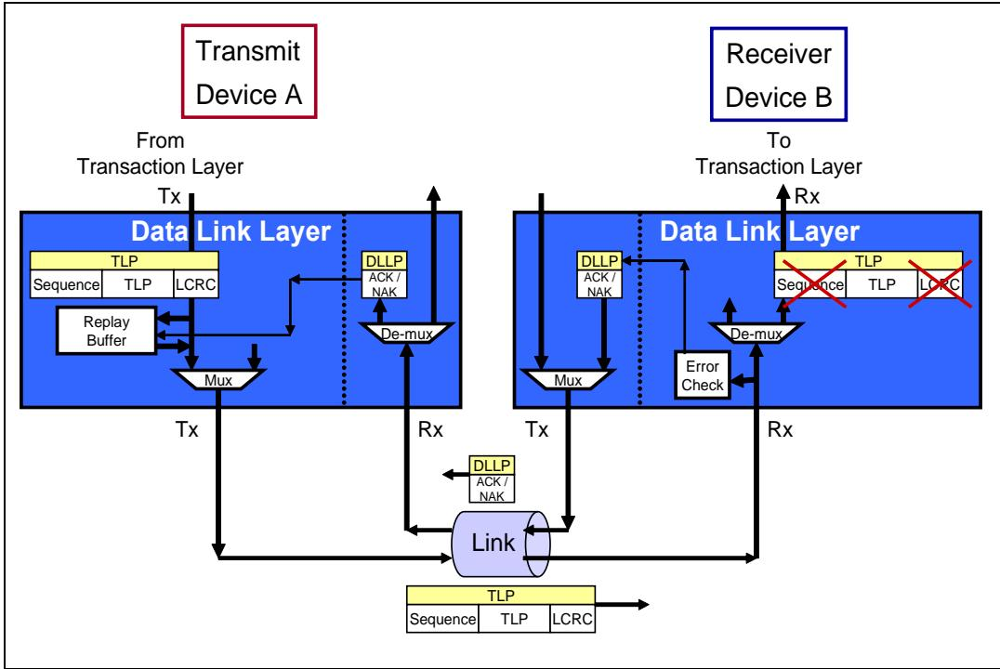  
Since both the sending and receiving devices in the protocol have both a transmit and a receive side, this chapter will use the terms:

• Transmitter to mean the device that sends TLPs

• Receiver to mean the device that receives TLPs

## Elements of the Ack/Nak Protocol

The major Ack/Nak protocol elements of the Data Link Layer are shown in Figure 10‐3 on page 320. There’s too much to consider all at once, though, so let’s begin by focusing on just the transmitter elements, which are shown in a larger view in Figure 10‐4 on page 322.

Figure 10‐3: Elements of the Ack/Nak Protocol  
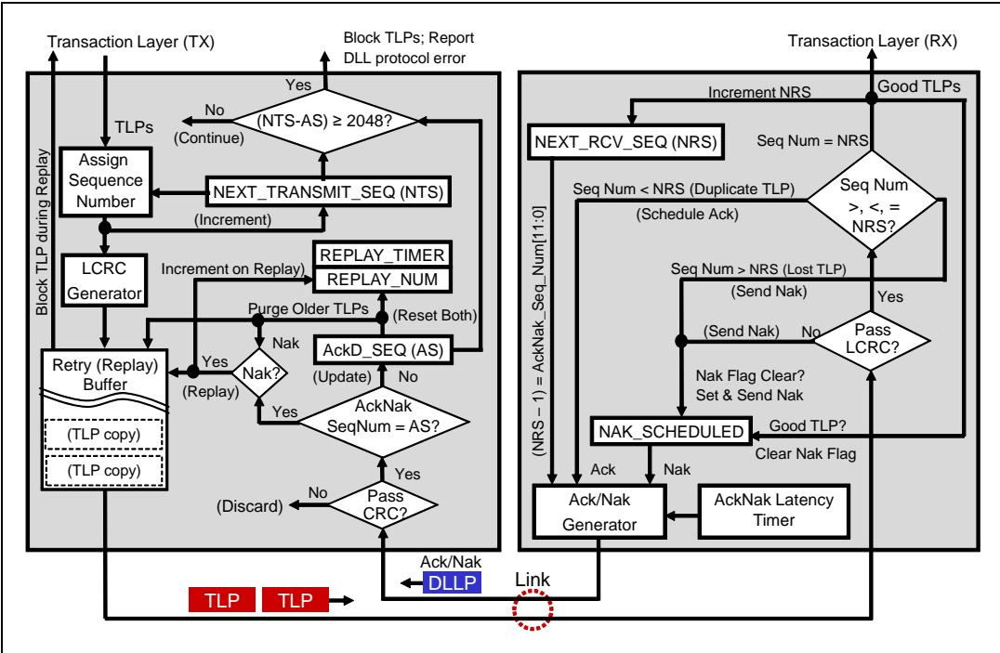

## Transmitter Elements

As TLPs arrive from the Transaction Layer, several things are done to prepare them for robust error detection at the receiver. As shown in the diagram TLPs are first assigned the next sequential Sequence Number, obtained from the 12‐ bit NEXT\_TRANSMIT\_SEQ counter.

## NEXT\_TRANSMIT\_SEQ Counter

This counter generates the Sequence Number that will be assigned to the next incoming TLP. It’s a 12‐bit counter that is initialized to 0 at reset or when the Link Layer reports DL\_Down (Link Layer is inactive). Since it increments continuously with each TLP and only counts forward, the counter eventually reaches its max value of 4095 and rolls over to 0 as it continues to count.

This Sequence Number assigned to the TLP will be used in the Ack or Nak sent by the receiver to reference this TLP in the Replay Buffer. One might think that such a large counter means that a large number of unacknowledged TLPs could be in flight, but in practice this is very unlikely. The main reason is that the receiver has a requirement to send an Ack back for successfully received TLPs within a certain amount of time. That amount of time is discussed in detail in “AckNak\_LATENCY\_TIMER” on page 328, but is typically only long enough to transmit a few max sized packets.

## LCRC Generator

This block generates a 32‐bit CRC (Cyclic Redundancy Check) code based on the header and data to be sent and adds it to the end of the outgoing packet to facilitate error detection. The name is derived from the fact that this check code (calculated from the packet to be sent) is redundant (adds no information), and is derived from cyclic codes. Although a CRC doesn’t supply enough information for the Receiver to do automatic error correction the way ECC (Error Correcting Code) methods can, it does provide robust error detection. CRCs are commonly used in serial transports because they’re easy to implement in hardware, and because they’re good at detecting burst errors: a string of incorrect bits. Since this is more likely to happen in a serial design than a parallel model, it helps explain why a CRC is a good choice for error detection in serial transports. The CRC code is calculated using all fields of the TLP, including the Sequence Number. The receiver will make the same calculation and compare its result to the LCRC field in the TLP. If they don’t match, an error is detected in the Receiver’s Link Layer.

## Replay Buffer

The replay buffer, or retry buffer, stores TLPs, including the Sequence Number and LCRC, in the order of their transmission. When the transmitter receives an Ack indicating that TLPs have reached the receiver successfully, it purges from the Replay Buffer those TLPs whose Sequence Number is equal to or earlier than the number in the Ack. In this way, the design allows one Ack to represent several successful TLPs, reducing the number of Acks that must be sent. Since the packets must always be seen in order, then if an Ack is received with a

Sequence Number of 7, then not only was TLP 7 received successfully, but all the packets before it must also have been received successfully, so there is no reason to keep a copy of them in the replay buffer.

If a Nak is received, the Sequence Number in the Nak still indicates the last good packet received. So even receiving a Nak can cause the transmitter to purge TLPs from the replay buffer. However, because it is a Nak, it means that something was not received successfully at the receiver, so after purging all the acknowledged TLPs, the transmitter must replay everything still in the replay buffer in order. For example, if a Nak is received with a Sequence Number of 9, then packet 9 and all prior packets are purged from the replay buffer, because the receiver acknowledged that they have been successfully received. However, because it is a Nak, the transmitter must then replay all the remaining TLPs in the replay buffer in order, starting with packet 10.

Figure 10‐4: Transmitter Elements Associated with the Ack/Nak Protoco  
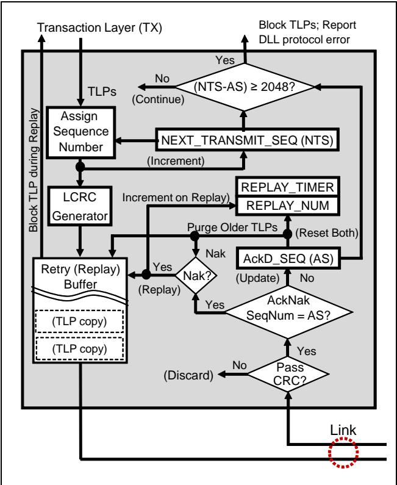

## REPLAY\_TIMER Count

This timer is effectively a watchdog timer. It makes sure that the transmitter is receiving Ack/Nak packets for TLPs that have been transmitted. If this timer expires, it means that the transmitter has sent one or more TLPs that it has not received an acknowledgement for in the expected time frame. The fix is to retransmit everything in the replay buffer and restart the REPLAY\_TIMER.

This timer is running anytime a TLP has been transmitted but not yet acknowledged. If the REPLAY\_TIMER is not currently running, it is started when the last Symbol of any TLP is transmitted. If the timer is already running, then sending additional TLPs does not reset the timer value. When an Ack or Nak is received that acknowledges TLPs in the replay buffer, the timer resets back to 0, and if there are still TLPs in the replay buffer (TLPs that have been transmitted, but not yet acknowledged), it immediately starts counting again. However, if an Ack is received that acknowledges the last TLP in the replay buffer, meaning the replay buffer is now empty, the REPLAY\_TIMER resets to 0 but does not count. It will not begin counting again until the last Symbol of the next TLP is transmitted.

## REPLAY\_NUM Count

This 2‐bit counter tracks the number of replay attempts after reception of a Nak or a REPLAY\_TIMER time‐out. When the REPLAY\_NUM count rolls over from 11b to 00b (indicating 4 failed attempts to deliver the same set of TLPs), the Data Link Layer automatically forces the Physical Layer to retrain the Link (LTSSM goes to the Recovery state). When re‐training is finished, it will attempt to send the failed TLPs again. The REPLAY\_NUM counter is initialized to 00b at reset, or when the Link Layer is inactive. It is also reset whenever an Ack DLLP is received with a Sequence Number that is more recent than the last one seen, meaning forward progress is being made.

## ACKD\_SEQ Register

This 12‐bit register stores the Sequence Number of the most recently received Ack or Nak. It is initialized to all 1s at reset, or when the Data Link Layer is inactive. This register is updated with the AckNak\_Seq\_Num [11:0] field of a received Ack or Nak. The ACKD\_SEQ count is compared with the Sequence Number in the last received Ack or Nak to check for forward progress. If the latest Ack/Nak had a Sequence Number later than the ACKD\_SEQ register, then we’re making forward progress.

As an aside, we use the term “later Sequence Number” to account for the fact that, like most counters in PCIe, the Sequence Number counters only count forward, meaning that they’ll eventually roll over back to zero. Technically, a later number would mean a numerically higher value, but we have to remember that when the counter reaches 4095 (it’s a 12‐bit counter), the next higher number will be zero. This wrap‐around effect will be easier to see in the examples later, as in “Ack/Nak Examples” on page 331.

As shown in Figure 10‐4 on page 322, when an Ack or Nak makes forward progress it causes TLPs with Sequence Numbers equal to or older than the value in the DLLP to be purged out of the Replay Buffer. It also resets both the REPLAY\_TIMER and the REPLAY\_NUM count. If no forward progress is made, no TLPs can be purged so we only check to see if it’s a Nak that would necessitate a replay.

This is a good place to mention a potential problem with the counters: the number of TLPs sent might theoretically become much larger than the number that have been acknowledged by the receiver. As mentioned earlier, this is very unlikely; it’s only mentioned here for completeness. The problem is basically the same as it for the Flow Control counters (see “Stage 3 — Counters Roll Over” on page 234) and has the same solution: the NEXT\_TRANSMIT\_SEQ and ACKD\_SEQ counters are never allowed to be separated by more than half their total count value. If a large number of TLPs are sent without acknowledgement so that the NEXT\_TRANSMIT\_SEQ count value is later than ACKD\_SEQ count by 2048, no more TLPs will be accepted from the Transaction Layer until this is resolved by receiving more Acks. If the difference between the Sequence Number sent and the acknowledged count ever did exceed half the maximum count value, a Data Link Layer protocol error would be reported. (For more on error reporting, see “Data Link Layer Errors” on page 655.)

## DLLP CRC Check

This block checks for errors in the 16‐bit CRC of DLLPs. If an error is detected, the DLLP is discarded and a Correctable Error may be reported, if enabled. No further action is taken because there is no mechanism to replay or correct failed DLLPs. Instead, we simply wait for the next successful Ack/Nak, which will get the counters back up‐to‐date and allow normal operation to continue.

## Receiver Elements

Incoming TLPs are first checked for LCRC errors and then for Sequence Numbers. If there are no errors, the TLP is forwarded to the receiver’s Transaction

Layer. If there are errors, the TLP is discarded and a Nak will be scheduled unless there was already a Nak outstanding.

Figure 10‐5 on page 325 illustrates the receiver Data Link Layer elements associated with processing of inbound TLPs and outbound Ack/Nak DLLPs.

Figure 10‐5: Receiver Elements Associated with the Ack/Nak Protocol  
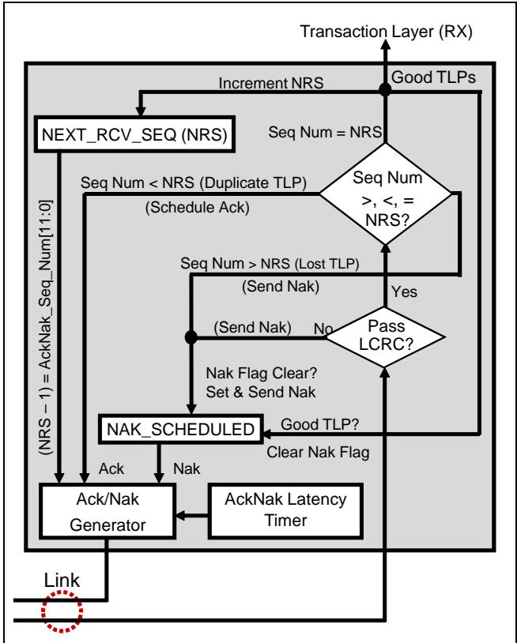

## LCRC Error Check

This block checks for transmission errors in the received TLP by verifying the 32‐bit LCRC. This block calculates an LCRC value based on the received bits of the TLP and then compares the calculated LCRC to the received LCRC. If they match, then all the bits of the packet were received exactly as they were transmitted. If it doesn’t match, then there was a bit error in the TLP so it gets dropped and a Nak will be sent to get a replay of that packet and any TLPs sent after the bad packet.

## NEXT\_RCV\_SEQ Counter

The 12‐bit NEXT\_RCV\_SEQ (Next Receive Sequence number) counter keeps track of the expected Sequence Number and is used to verify sequential packet reception. It’s initialized to 0 at reset or when the Data Link Layer is inactive, and is incremented once for each good TLP forwarded to the Transaction Layer. TLPs that have errors or were nullified are not sent to the Transaction Layer and therefore don’t increment this counter.

## Sequence Number Check

If the LCRC check was OK, the TLP’s Sequence Number is checked against the expected count (the NRS number). As can be seen in Figure 10‐5 on page 325, there are three possible outcomes of this check:

1. The TLP Sequence Number equals the NRS count (the number we’re expecting). In this case, everything is good: the TLP is accepted and forwarded to the Transaction Layer and the NRS count is incremented. The Receiver schedules an Ack, but it doesn’t have to be sent until the AckNak\_LATENCY\_TIMER expires. In the meantime, other good TLPs may be received, incrementing the NEXT\_RCV\_SEQ counter. Then, once the timer expires, a single Ack is sent with the Sequence Number of the last good TLP received (NRS ‐ 1). That allows one Ack to represent several successful TLPs and reduces overhead, since a dedicated Ack is not required for every TLP.

2. If the TLP’s Sequence Number is earlier than the NRS count (smaller than expected), this TLP has been seen before and is a duplicate. As long as the expected Sequence Number and received Sequence Number don’t get separated by more than half the total count value (2048), this is not an error, but is seen as a duplicate, meaning the TLP has already been accepted earlier. In this case, the TLP is silently dropped (no Nak, no error reporting) and an Ack is sent with the Sequence Number of the last good TLP it received (NRS ‐ 1). Why would this situation happen? The transmitter may not have received a transmitted Ack, so his REPLAY\_TIMER expired and he retransmitted everything in his Replay Buffer. By sending the transmitter an Ack with the Sequence Number of the last good packet we received, we’re notifying him of the furthest progress we’ve made.

3. If the TLP’s Sequence Number is a later Sequence Number than NEXT\_RCV\_SEQ count (larger than expected), then the Link Layer has missed a TLP. For example, if we’re expecting Sequence Number 30 and the incoming TLP has Sequence Number 31 we know there’s a problem. The numbers must be sequential and, since they aren’t, one must have failed and been dropped, as might happen at the Physical Layer. This out‐of‐order TLP is discarded, whether or not it had any other errors because we must accept TLPs in order, and a Nak will be sent if there wasn’t one already outstanding.

The concept of the expected sequence number (NRS) incrementing as new TLPs are successfully received and seeing how that affects the sliding windows for the invalid range of sequence numbers and the duplicate range of sequence numbers can be seen in Figure 10‐6.

Figure 10‐6: Examples of Sequence Number Ranges  

## NAK\_SCHEDULED Flag

This flag is set whenever the receiver schedules a Nak, and is cleared when the receiver successfully receives the TLP with the expected Sequence Number (NRS). The spec is clear that the receiver must not schedule additional Nak DLLPs while the NAK\_SCHEDULED flag remains set. The author’s opinion is that this is intended to prevent the possibility of an endless loop; a case in which the transmitter begins to replay some packets but the receiver sends another Nak before the replays finish and causes it to restart sending them again. Whatever the motivation, once a Nak has been sent there will be no more Naks forthcoming until the problem is resolved by successful receipt of the replayed TLP with the correct Sequence Number.

## AckNak\_LATENCY\_TIMER

This timer is running anytime a receiver successfully receives a TLP that it has not yet acknowledged. The receiver is required to send an Ack once the timer expires. The length of time the AckNak Latency Timer runs is dictated by the spec (see “AckNak\_LATENCY\_TIMER” on page 328) and determines how long a receiver can coalesce Acks. Once the AckNak Latency Timer expires, an Ack with sequence number NRS‐1 is generated and sent which indicates the last good packet it received. This timer is reset whenever an Ack or Nak are sent and it only restarts once a new good TLP is received.

## Ack/Nak Generator

Ack or Nak DLLPs are scheduled by the error checking blocks and contain a 12‐ bit AckNak\_Seq\_Num field as illustrated in Figure 10‐7 on page 328. It calculates this number by subtracting one from the NRS count, which results in reporting the last good Sequence Number received. That’s because a good TLP received increments NRS before scheduling the Ack, while a failed TLP just schedules a Nak without incrementing NRS. This method makes it easier to handle failed packets because the error in the TLP might have been in the Sequence Number, so that number can’t be used in the Nak. Instead, it uses the number of the last good TLP; what we’re expecting minus one. The only case where this value doesn’t represent the last good TLP is for the first TLP after a reset. If that first TLP, using Sequence Number 0, fails, the resulting Nak will have an AckNak\_Seq\_Num value of zero minus one which results in all 1’s.

Figure 10‐7: Ack Or Nak DLLP Format

<table><tr><td rowspan="2"></td><td>+0</td><td>+1</td><td>+2</td><td>+3</td></tr><tr><td>7|6|5|4|3|2|1|0</td><td>7|6|5|4|3|2|1|0</td><td>7|6|5|4|3|2|1|0</td><td>7|6|5|4|3|2|1|0</td></tr><tr><td rowspan="2">Byte 0</td><td>0000 0000 - Ack</td><td rowspan="2">Reserved</td><td rowspan="2" colspan="2">AckNak_Seq_Num</td></tr><tr><td>0001 0000 - Nak</td></tr><tr><td>Byte 4</td><td colspan="4">16-bit CRC</td></tr></table>

Table 10‐1: Ack or Nak DLLP Fields

<table><tr><td>Field Name</td><td>Header Byte/Bit</td><td>DLLP Function</td></tr><tr><td>DLLP Type</td><td>Byte 0, [7:0]</td><td>Indicates the type:0000 0000b = Ack0001 0000b = Nak</td></tr><tr><td>AckNak_Seq_Num</td><td>Byte 2, [3:0]Byte 3, [7:0]</td><td>This value will always be NEXT_RCV_SEQ count - 1.</td></tr><tr><td>16-bit CRC</td><td>Byte 4, [7:0]Byte 5, [7:0]</td><td>16-bit CRC used to protect the contents of this DLLP.</td></tr></table>

## Ack/Nak Protocol Details

This section describes the detailed transmitter and receiver behavior in processing TLPs and Ack/Nak DLLPs. Several examples are used to demonstrate various cases that may occur.

## Transmitter Protocol Details

## Sequence Number

Referring back to Figure 10‐4 on page 322, when TLPs are delivered by the Transaction Layer to the Link Layer, one of the first steps is to append a 12‐bit Sequence Number. Keep in mind that the next incremental Sequence Number may actually be smaller, as will happen when the counter rolls over back to zero after it reaches a maximum value of 4095. Consequently, a value of zero can actually be ‘larger’ than a value of 4095, for example. It may help to think of the Sequence Number comparison as evaluating a ‘window’ of numbers that consistently moves upward and rolls over. To clarify this concept, such a count roll over is used in several of the upcoming examples.

## 32-Bit LCRC

The transmitter also generates and appends a 32‐bit LCRC (Link CRC) based on the TLP contents (Sequence Number, Header, Data Payload and ECRC).

## Replay (Retry) Buffer

General. Before a device transmits a TLP, it stores a copy of the TLP in the Replay Buffer. (Note that the spec uses the term Retry Buffer but in this book ‘Replay’ was chosen instead of ‘Retry’ to more clearly distinguish this mechanism from the old PCI Retry mechanism). Each buffer entry stores a complete TLP with all of its fields including the Sequence Number (12 bits wide, it occupies two bytes), Header (up to 16 bytes), an optional Data Payload (up to 4KB), an optional ECRC (four bytes) and the LCRC field (four bytes).

It is important to note that the spec describes the Replay Buffer in this fashion, but it is NOT a spec requirement that it be implemented this way. As long as your device can replay a sequence of TLPs if required, as defined by the spec, then how that is accomplished within a device is completely up to the designer. Having a Replay Buffer that behaves as described above is one way to accomplish this.

Replay Buffer Sizing. The spec writers chose not to specify the Replay Buffer size, leaving it as an optimization for the device designers. It should be made big enough to store TLPs that haven’t yet been acknowledged by Acks so that under normal operating conditions it doesn’t become full and stall new TLPs coming in from the Transaction Layer, but also small enough to keep the cost down. To determine the optimal buffer size, a designer will consider:

• Ack DLLP Latency from the receiver.

• Delays caused by the physical Link.

Receiver L0s exit latency to L0. In other words, the buffer should be big enough to hold TLPs without stalling while the Link returns from the L0s state to L0.

When the transmitter receives an Ack, it purges TLPs from the Replay Buffer with Sequence Numbers equal to or earlier than the Sequence Number in the Ack (normally this term would be ‘smaller than’ but the counter roll over behavior will sometimes make that an incorrect evaluation, so the term ‘earlier than’ was chosen instead). Similarly, when the transmitter receives a Nak, it still purges the Replay Buffer of TLPs with Sequence Numbers that are equal to or earlier than the Sequence Number that arrives in the Nak, but then it also replays (re‐sends) TLPs of later Sequence Numbers (the remaining TLPs in the Replay Buffer).

## Transmitter’s Response to an Ack DLLP

A single Ack returned by the receiver may acknowledge multiple TLPs; it isn’t necessary that every TLP transmitted receive a dedicated Ack. The receiver can get multiple good TLPs and send one Ack with the Sequence Number of the last good TLP received. The transmitter’s response to an Ack that makes forward progress (has a Sequence Number that is later than the last one seen) is to load the AckD\_SEQ register with the Sequence Number of the new Ack. It also resets the REPLAY\_NUM counter and REPLAY\_TIMER, and purges the Replay Buffer of all TLPs that were acknowledged by that Ack.

## Ack/Nak Examples

Example 1. Consider Figure 10‐8 on page 332 for the following discussion.

1. Device A transmits TLPs with Sequence Numbers 3, 4, 5, 6, 7.

2. Device B successfully receives TLP 3 and increments its NEXT\_RCV\_SEQ counter from 3 to 4. Since Device B had previously acknowledged all successfully received TLPs, the AckNak\_LATENCY\_TIMER was not running. Having received TLP 3, Device B has now successfully received a TLP that it has not acknowledged, so the AckNak\_LATENCY\_TIMER is started (this is equivalent of scheduling an Ack).

3. Device B successfully receives TLPs 4 and 5 before the AckNak\_LATENCY\_TIMER expires. Receiving TLPs 4 and 5 does NOT reset the AckNak\_LATENCY\_TIMER.

4. Once the AckNak\_LATENCY\_TIMER expires, Device B sends a single Ack with the Sequence Number 5, the last good TLP received. The AckNak\_LATENCY\_TIMER is reset but does not restart until it successfully receives TLP 6.

5. Device A receives Ack 5, resets the REPLAY\_TIMER and REPLAY\_NUM counter, because forward progress is being made. And it purges TLPs from the Replay Buffer that have Sequence Numbers earlier than or equal to 5.

6. Once Device B receives TLPs 6 and 7 and its AckNak\_LATENCY\_TIMER expires again, it will send an Ack with a Sequence Number of 7 which will purge the last two TLPs in the Replay Buffer of Device A (according to this example).

Figure 10‐8: Example 1 ‐ Example of Ack  
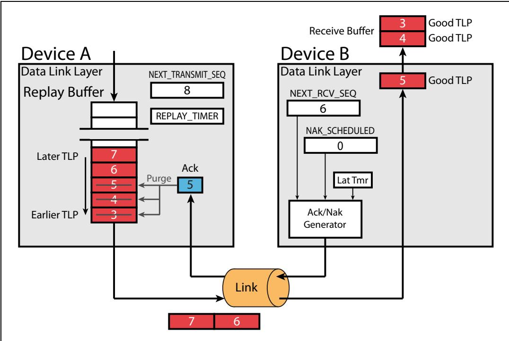

Example 2. This example is showing the exact same behavior as Example 1, but it is pointing out the rollover behavior for the Sequence Numbers, as show in Figure 10‐9 on page 333.

1. Device A transmits TLPs with Sequence Numbers 4094, 4095, 0, 1, and 2 where TLP 4094 is the first TLP sent and TLP 2 is the last TLP sent in this example.

2. Device B successfully receives TLPs with Sequence Numbers 4094, 4095, 0, 1 in that order. Reception of TLP 4094 causes the AckNak\_LATENCY\_TIMER to start. TLPs 4095, 0 and 1 are received before the AckNak\_LATENCY\_TIMER expires. TLP 2 is still en route.

3. Because the AckNak\_LATENCY\_TIMER expires, Device B send an Ack with a Sequence Number of 1 to acknowledge receipt of TLP 1 and all prior TLPs (0, 4095 and 4094 in this example).

4. Device A successfully receives Ack 1, purges TLPs 4094, 4095, 0, and 1 from the Replay Buffer and resets the REPLAY\_TIMER and REPLAY\_NUM count.

Figure 10‐9: Example 2 ‐ Ack with Sequence Number Rollover  
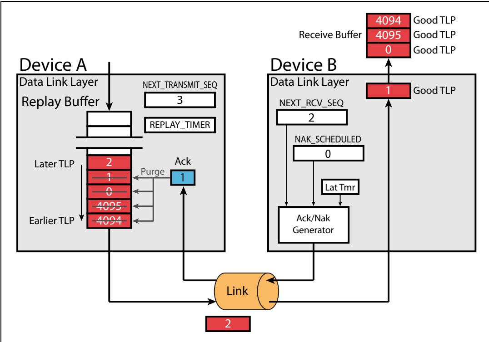

## Transmitter’s Response to a Nak

A Nak indicates that a problem has occurred. When a transmitter receives one, it first purges from the Replay Buffer any TLPs with earlier or equal Sequence Numbers and then replays the remaining TLPs starting with the Sequence Number immediately after the Sequence Number in the Nak. If the Nak caused at least one TLP to be purged from the buffer, then we’ve made forward progress. In that case, the transmitter resets the REPLAY\_NUM counter and REPLAY\_TIMER and loads the AckD\_SEQ register with the Sequence Number of the Nak.

## TLP Replay

When a Replay becomes necessary, the transmitter blocks acceptance of new TLPs from its Transaction Layer. It then replays the necessary TLPs in the buffer in the same order they were placed into the buffer (like a FIFO). After the replay event, the Data Link Layer unblocks acceptance of new TLPs from its Transaction Layer. The replayed TLPs remain in the buffer until they are finally acknowledged at some later time.

## Efficient TLP Replay

Ack or Nak DLLPs received during replay must be processed. So there are two main options here, the transmitter may hold them until the replay is finished and then evaluate the Acks or Naks and take the appropriate steps. Another option would be to begin processing the new Ack/Nak DLLPs even during the replay. If this option is used, the newly received Acks might purge some entries from the buffer while replay is in progress, possibly reducing the number of TLPs that need to be replayed and saving time on the Link. This is allowed, but it is important to remember that once a TLP is started for transmission, it must be completed.

## Example of a Nak

Consider Figure 10‐10 on page 335.

1. Device A transmits TLPs with Sequence Number 4094, 4095, 0, 1, and 2.

2. Device B receives TLP 4094 without error and increments the NEXT\_RCV\_SEQ count to 4095 starts the AckNak\_LATENCY\_TIMER.

3. Device B detects a CRC error in the next TLP received (TLP 4095) and sets the NAK\_SCHEDULED flag, which will cause a Nak to be sent with Sequence Number 4094 (NEXT\_RCV\_SEQ count  ‐  1). Device B does NOT wait until the AckNak\_LATENCY\_TIMER expires before sending the Nak. It will typically be sent on the next packet boundary. In face, since a Nak is scheduled for transmission, the AckNak\_LATENCY\_TIMER is stopped and reset.

4. Device B will continue evaluating incoming TLPs looking for TLP 4095. However, because Device A did not know there was a problem yet, it had sent packets 0, 1 and 2, which Device B will receive. However, Device B will not accept them, even though they may be good TLPs (meaning they did not fail the LCRC check). This is because all packets have to be accepted in order. So Device B will simply drop those packets because they are considered out of sequence, but no addition Nak will be sent. Even if one or more of these TLPs fail the LCRC check, no additional NAK is sent. The NAK\_SCHEDULED flag is already set and it will only be cleared once Device B successfully receives the TLP it is expecting (TLP 4095 in this example).

5. Device A receives Nak 4094 and purges TLP 4094 and earlier TLPs (none in this example) from the Replay Buffer. Also, since forward progress was made, it resets the REPLAY\_TIMER and REPLAY\_NUM count.

6. Since the acknowledge DLLP received was a Nak and not an Ack, Device A then replays all remaining TLPs in the Replay Buffer (TLPs 4095, 0, 1, and 2) and restarts the REPLAY\_TIMER and increments the REPLAY\_NUM count by one.

7. Once Device B receives the replayed TLP 4095, it will clear the NAK\_SCHEDULED flag, increment the NEXT\_RCV\_SEQ count and start the AckNak\_LATENCY\_TIMER.

Figure 10‐10: Example of a Nak  
  
Repeated Replay of TLPs

General. Each time the transmitter receives a Nak, it replays the buffer contents, and the 2‐bit REPLAY\_NUM counter is incremented to keep track of the number of replay events. The replay caused by a Nak in the previous example will increment REPLAY\_NUM.

If the replay doesn’t clear the problem, though, we enter a new situation. The receiver has set the Nak Scheduled Flag and cannot send any more Acks or Naks until it sees the offending TLP correctly received. If the replay doesn’t make that happen for some reason, then there will be no response from the receiver. What saves us now is the transmitter’s REPLAY\_TIMER. When it times out, the entire contents of the Replay Buffer will be resent, the REPLAY\_NUM counter will be incremented and the REPLAY\_TIMER will be reset and restarted. If the REPLAY\_TIMER expires without receiving an Ack or Nak indicating forward progress, this replay process can be repeated up to three times. If after the third replay, there is still no forward progress and the REPLAY\_TIMER expires again, this would cause the REPLAY\_NUM counter to roll over from 3 back to 0.

Replay Number Rollover. When this happens, the assumption is that there must be something wrong with the Link, so the Link Layer triggers the Physical Layer to re‐train the Link, causing it to go into the Recovery State (see “Recovery State” on page 571). If the optional Advanced Error Reporting registers are implemented, the Replay Number Rollover error status bit will also be set (“Advanced Correctable Error Handling” on page 688). The Replay Buffer contents are preserved and the Link Layer is not initialized during the re‐training process (this is simply re‐training the Link, not performing a reset of the Link). When re‐training completes, the transmitter resumes the same replay process again in hopes that the problem has been cleared and the TLPs can now be replayed successfully.

The spec does not describe how a device might handle repeated rollover events if the Link training doesn’t clear the problem. The author has seen commercially available hardware that had no mechanism to detect this condition and got stuck in an endless loop of re‐training. It seems good therefore, to recommend that a device track the number of re‐train attempts. After sufficient attempts, the device could signal an Uncorrectable Fatal Error or an interrupt as a way to notify software of this condition.

## Replay Timer

The transmitter REPLAY\_TIMER is running anytime there are TLPs that have been transmitted but have not yet been acknowledged. The goal of the REPLAY\_TIMER is to ensure that TLPs are being acknowledged in a timely fashion. If this timer expires, it indicates that an Ack or Nak should have been received by that point in time, so something must have gone wrong and the fix from the transmitter’s point‐of‐view is to perform a replay, meaning to re‐send everything in the Replay Buffer.

Based on the purpose of this timer, it makes sense that its timeout value should be correlated the AckNak\_LATENCY\_TIMER in the receiver. In fact, the REPLAY\_TIMER is simply three times longer than the AckNak\_LATENCY\_TIMER.

A formula in the spec determines the timer’s count value. Its expiration triggers a replay event and increments the REPLAY\_NUM counter. A couple of cases where timeout may arise is if an Ack or Nak is lost en route, or because an error in the receiver prevents it from returning an Ack or Nak. Timer‐related rules:

• If not already running, the timer starts when the last symbol of any TLP is transmitted

• The timer is reset and restarted when:

— An Ack indicating forward progress is received, AND there are still unacknowledged TLPs in the Replay Buffer

— A Replay event occurs and the last symbol of the first replayed TLP is sent

• The timer is reset and held when:

— There are no TLPs to transmit, or the Replay Buffer is empty

— A Nak is received; it restarts when the last symbol of the first replayed TLP is sent

— The timer expires; it restarts when the last symbol of the first replayed TLP is sent

— The Data Link Layer is inactive

• The timer is held during Link training or re‐training

REPLAY\_TIMER Equation. The timeout value depends primarily on the max data payload and the width of the Link. The equation to calculate the REPLAY\_TIMER value in symbol times is given below. Note that the value is simply three times the Ack/Nak Latency value.

$$
\left(\frac {(\text { Max\_Payload\_Size } + \text { TLPOverhead }) * \text { AckFactor }}{\text { LinkWidth }} + \text { InternalDelay }\right) * 3 + R x _ {-} L O s _ {-} A d j u s t m e n t   \begin{array}{c} \uparrow \\ \text {(this term removed)} \\ \text { for Gen2 and later} \end{array}
$$

The equation fields are defined as follows:

Max\_Payload\_Size  ‐  the value in the Device Control Register. In the case of multiple Functions with different Max\_Payload\_Size values, the spec recommends using the smallest one of them.

TLP Overhead  ‐  the additional TLP fields beyond the data payload (sequence number, header, digest, LCRC and Start/End framing symbols). In the spec, the overhead value is treated as a constant of 28 symbols.

AckFactor (AF) ‐ is basically a fudge factor representing the number of max payload‐sized TLPs that can be received before an Ack must be sent. The AF value ranges from 1.0 to 3.0 and is intended to balance Link bandwidth efficiency and Replay Buffer size. The table in Figure 10‐11 on page 339 shows the Ack Factor values for various link widths and payload sizes. These Ack Factor values are chosen to allow implementations to achieve good performance without requiring a large uneconomical buffer.

— LinkWidth ‐ ranges from x1 (1‐bit wide) to x32 (32‐bits wide).

InternalDelay  ‐  the internal delay of processing a TLP within the receiver and DLLPs (Acks) within the transmitter. This value is defined in the spec in symbol times, and depends on the Link speed: Gen1 = 19, Gen2 = 70, Gen3 = 115.

Rx\_L0s\_Adjustment ‐ This is a value that was included in the 1.x PCIe specs but was dropped for 2.0 and later PCIe specs. It could be used to account for the time required by the receive circuits to exit from L0s to L0. Setting the Extended Sync bit of the Link Control register affects the exit time from L0s and must be taken into account in this adjustment. Interestingly, the spec writers chose to assume this to be zero when creating their table of Replay Timer values. More on this in the following section.

REPLAY\_TIMER Summary Table. Figure 10‐11 on page 339 is a summary table for the Gen1 rate that shows timer load values for various values of the variables in the REPLAY\_TIMER equation. The numbers have changed for the newer generations of the spec, and the new tables and a discussion of them can be found in the section called “Timing Differences for Newer Spec Versions” on page 350. The tolerance for all of the table values is ‐0% to +100%.

Note that the table values in the spec (copied here for convenience) are considered “unadjusted” because they leave out the last item of the equation involving the time to recover from L0s. No explanation is given for this in the spec, but if the Link had to wake up from L0s to L0 just to replay a packet in case the timeout might have been an error, that would be poor power management.

A simple way to avoid this problem altogether is for the transmitter to ensure that the Replay Buffer is empty before entering L0s. The spec requires that step for entry into L1 but not L0s, and the reason probably has to do with the relative risk involved. Going to L1 requires a longer recovery process back to L0 that has some small risk of failure. If it fails to recover, the Physical Layer state machine will have to do more of the Link training, a process that clears the LinkUp flag to the Link Layer, causing the Link Layer to re‐initialize. If there were entries in the Replay Buffer when that happened they’d be lost and problems could result. The recovery risk from L0s was evidently considered low enough not to warrant that requirement. Still, the L0s latency was left out when the table was constructed, leaving the reader to wonder about this. In the author’s opinion, the spec writers expected designers to take steps to ensure that a Replay Timer timeout either doesn’t occur while in L0s (by emptying the Replay Buffer before L0s entry), or will be delayed if the path for the Acks is observed to be in L0s.

Figure 10‐11: Gen1 Unadjusted REPLAY\_TIMER Values

<table><tr><td>Max_Payload Size</td><td>X1 Link</td><td>X2 Link</td><td>X4 Link</td><td>X8 Link</td><td>X12 Link</td><td>x16 Link</td><td>X32 Link</td></tr><tr><td>128 Bytes</td><td>711</td><td>384</td><td>219</td><td>201</td><td>174</td><td>144</td><td>99</td></tr><tr><td>256 Bytes</td><td>1248</td><td>651</td><td>354</td><td>321</td><td>270</td><td>216</td><td>135</td></tr><tr><td>512 Bytes</td><td>1677</td><td>867</td><td>462</td><td>258</td><td>327</td><td>258</td><td>156</td></tr><tr><td>1024 Bytes</td><td>3213</td><td>1635</td><td>846</td><td>450</td><td>582</td><td>450</td><td>252</td></tr><tr><td>2048 Bytes</td><td>6285</td><td>3171</td><td>1614</td><td>834</td><td>1095</td><td>834</td><td>444</td></tr><tr><td>4096 Bytes</td><td>12,429</td><td>6243</td><td>3150</td><td>1602</td><td>2118</td><td>1602</td><td>828</td></tr></table>

## Transmitter DLLP Handling

The Ack/Nak Error Checking block determines whether there is an error in the 16‐bit CRC of a received DLLP. If an error is detected, the DLLP is discarded. This is considered a correctable error and may have been set up to be reported in the optional Advanced Error Reporting registers (see Bad DLLP in “Advanced Correctable Error Handling” on page 688), but no further action is taken because this isn’t really a problem. The next successfully received DLLP of that type will bring the counters back up to speed. Consequently, TLPs might be purged a little later than they would have been or a replay may happen at a later time, but no information is lost. Of course, if the delay between successful Acks becomes too large, the REPLAY\_TIMER could expire, causing the TLPs to be replayed.

## Receiver Protocol Details

## Physical Layer

TLPs received at the Physical Layer are checked for receiver errors (such as framing, disparity, and invalid symbols). If there are errors at this level, the TLP is discarded and the Link Layer may be informed by some design‐specific method so it can schedule a Nak and have the packet replayed. If the Link Layer is not informed, then eventually it will detect a Sequence Number violation and that will cause a Nak and a replay.

Figure 10‐12: Ack/Nak Receiver Elements  
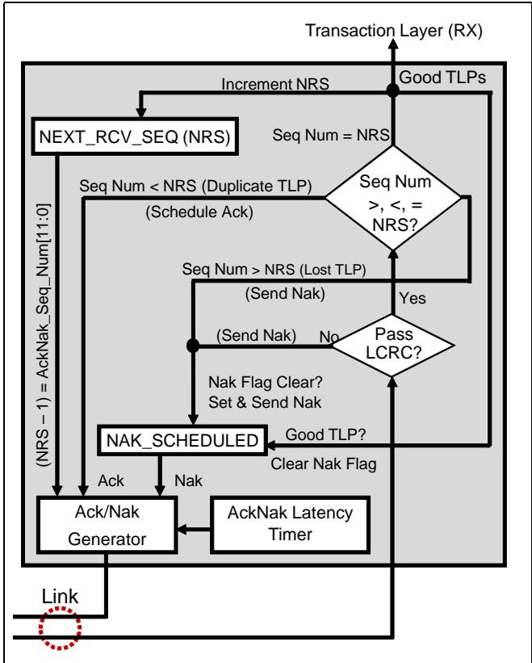

## TLP LCRC Check

If there were no Physical Layer errors, the Link Layer checks first for CRC errors. The receiver calculates an expected LCRC value from the received TLP (excluding the LCRC field) and compares this value with the TLP’s 32‐bit LCRC. If the two match, the TLP is good. Otherwise, the TLP is discarded and the receiver schedules a Nak.

## Next Received TLP’s Sequence Number

If the LCRC was correct, the receiver next compares the NEXT\_RCV\_SEQ counter against the Sequence Number that should be in the newly‐received TLP. Under normal operational conditions, these two numbers will match. If they do, the receiver forwards the TLP to the Transaction Layer, increments the NEXT\_RCV\_SEQ counter, and schedules an Ack.

If the received TLP’s Sequence Number turns out to be earlier or later than the NEXT\_RCV\_SEQ count, we have one of two cases: a duplicate TLP or an out of sequence TLP.

Duplicate TLP. If the Sequence Number of the incoming packet is earlier (logically smaller) than the expected value, it means the transmitter decided to resend a packet that the receiver has already seen before. This duplicate packet is not an error although we are wasting time on the Link by resending it. This might be caused by a timeout at the transmitter if the Ack or Nak for a previous TLP failed. When this is seen at the receiver, the duplicate packet is discarded and an Ack is scheduled with the Sequence Number of the last good TLP it has received (which is probably not the same Sequence Number in the replayed TLP).

Out of Sequence TLP. If the Sequence Number of the incoming packet is later (logically larger) than the expected value, the only explanation is that a TLP must have been lost. This is a correctable error and is handled by sending a Nak. It doesn’t matter if the incoming packet is good because they can only be accepted in correct Sequence Number order. The packet is discarded and the receiver waits for a TLP with the expected Sequence Number.

The NEXT\_RCV\_SEQ counter is not incremented when a TLP is received with a CRC error, or was nullified, or for which the Sequence Number check fails.

A transmitter orders TLPs according to the PCI ordering rules to maintain correct program flow and avoid potential deadlock and livelock conditions (see Chapter 8, entitled  ʺTransaction Ordering,ʺ  on page 285). The Receiver is required to preserve this order and applies these three rules:

When the receiver detects a bad TLP, it discards the TLP and all new TLPs that follow in the pipeline until the replayed TLPs are detected.

• Duplicate TLPs are discarded.

• TLPs received while waiting for a lost or corrupt TLP are discarded.

## Receiver Schedules An Ack DLLP

If the Data Link Layer of the receiver does not detect an error in an incoming TLP, it forwards the TLP to the Transaction Layer. The NEXT\_RCV\_SEQ counter is incremented and the receiver starts the AckNak\_LATENCY\_TIMER (assuming it was not already running). This is the equivalent of “scheduling an Ack.” The receiver is allowed to continue receiving good TLPs without sending an Ack until the AckNak\_LATENCY\_TIMER expires. When the timer expires it sends just one Ack with the Sequence Number of the last good TLP, acknowledging good receipt of all received TLPs up to the Sequence Number in the current Ack. This technique improves Link efficiency by reducing Ack/Nak traffic. For review, recall that this technique works because the TLPs must always be successfully received in order.

## Receiver Schedules a Nak

As mentioned earlier in the discussion of the receiver logic (see “Receiver Elements” on page 324), when the receiver detects an error on a TLP, it discards the bad packet and sets the NAK\_SCHEDULED flag if it was clear, which will cause a Nak to be scheduled with the Sequence Number of NEXT\_RCV\_SEQ count ‐ 1. Since a Nak is now scheduled, the AckNak\_LATENCY\_TIMER is reset and halted. Scheduling a Nak can be thought of as being an “edge‐triggered” event instead of a level‐triggered event. It is seeing the rising edge of the NAK\_SCHEDULED flag that causes a Nak to be scheduled. Another Nak cannot be sent until the next rising edge, which means the NAK\_SCHEDULED flag must be cleared (falling edge) first. There are only two events that will clear the NAK\_SCHEDULED flag. The first is successfully receiving the expected next TLP (TLP with a Sequence Number that matches the NEXT\_RCV\_SEQ count). The second is a reset of the link (not retraining, but reset).

Although it’s important to get the Nak to the transmitter quickly (no other TLPs can be accepted until the failed one is seen without errors), other outgoing TLPs, DLLPs or Ordered Sets already be in progress or have a higher priority than the Nak which means the receiver would have to delay the transmission of the Nak until they’re done (see “Recommended Priority To Schedule Packets” on page 350). In the meantime, if other TLPs arrive at the receiver they are discarded and no additional Acks or Naks will be scheduled while the NAK\_SCHEDULED flag is set.

## AckNak\_LATENCY\_TIMER

This timer defines how long a receiver can wait before it must send an Ack for a successfully received TLP (or sequence of TLPs). As stated before, this timer is running anytime a receiver successfully receives a TLP that it has not yet acknowledged. Once the timer expires, an Ack is scheduled for transmission with the Sequence Number of the last good TLP it received. Scheduling an Ack resets the AckNak\_LATENCY\_TIMER and it only starts counting again once the next TLP is successfully received.

## AckNak\_LATENCY\_TIMER Equation.

The timeout value for the AckNak\_LATENCY\_TIMER is defined by the spec and varies based on the Negotiated Link Width and Max Payload Size Enabled. The equation which defines the timeout is shown below:

$$
\frac {(\text { Max\_Payload\_Size } + \text { TLPOverhead }) * \text { AckFactor }}{\text { LinkWidth }} + \text { InternalDelay } + \underset {\substack {\text { this term removed} \\ \text { for Gen2 and later }}} {\text { Tx\_L0s\_Adjustment}}
$$

The value in the timer is given in symbol times, the time it takes to send one symbol across the Link: 4ns for Gen1, 2ns for Gen2, and 1ns for Gen3.

The equation fields are:

Max\_Payload\_Size  ‐  the value in the Device Control Register. In the case of multiple Functions with different Max\_Payload\_Size values, the spec recommends using the smallest one of them.

TLPOverhead  ‐  the additional TLP fields beyond the data payload (sequence number, header, digest, LCRC and Start/End framing symbols). In the spec, the overhead value is treated as a constant of 28 symbols.

AckFactor (AF) ‐ is basically a fudge factor representing the number of max payload‐sized TLPs that can be received before an Ack must be sent. The AF value ranges from 1.0 to 3.0 and is intended to balance Link bandwidth efficiency and Replay Buffer size. The table in Figure 10‐11 on page 339 shows the Ack Factor values for various link widths and payload sizes. These Ack Factor values are chosen to allow implementations to achieve good performance without requiring a large uneconomical buffer.

• LinkWidth ‐ ranges from x1 (1‐bit wide) to x32 (32‐bits wide).‐ from 1 to 32 Lanes.

InternalDelay  ‐  the internal delay of processing a TLP within the receiver and DLLPs (Acks) within the transmitter. This value is defined in the spec in symbol times, and depends on the Link speed: Gen1 = 19, Gen2 = 70, Gen3 = 115.

Tx\_L0s\_Adjustment: ‐ This is a value that was included in the 1.x PCIe specs but was dropped for 2.0 and later PCIe specs. It could be used to account for the time required by the receive circuits to exit from L0s to L0. Setting the Extended Sync bit of the Link Control register affects the exit time from L0s and must be taken into account in this adjustment. Interestingly, the spec writers chose to assume this to be zero when creating their table of Replay Timer values.

AckNak\_LATENCY\_TIMER Summary Table. Figure 10‐2 on page 345 shows the Gen1 timer load values for all the possible values used in the AckNak\_LATENCY\_TIMER equation. Higher data rates change the equation and the resulting table (see “Timing Differences for Newer Spec Versions” on page 350). Like the Replay Timer table, this table is constructed by assuming the L0s adjustment in the equation is zero and then referring to the resulting values as ‘unadjusted’. Note that the tolerance for all of the table values is ‐0% to +100%.

Table 10‐2: Gen1 Unadjusted Ack Transmission Latency

<table><tr><td>Max_Payload Size</td><td>X1 Link</td><td>X2 Link</td><td>X4 Link</td><td>X8 Link</td><td>X12 Link</td><td>x16 Link</td><td>X32 Link</td></tr><tr><td>128 Bytes</td><td>237 (AF=1.4)</td><td>128 (AF=1.4)</td><td>73 (AF=1.4)</td><td>67 (AF=2.5)</td><td>58 (AF=3.0)</td><td>48 (AF=3.0)</td><td>33 (AF=3.0)</td></tr><tr><td>256 Bytes</td><td>416 (AF=1.4)</td><td>217 (AF=1.4)</td><td>118 (AF=1.4)</td><td>107 (AF=2.5)</td><td>90 (AF=3.0)</td><td>72 (AF=3.0)</td><td>45 (AF=3.0)</td></tr><tr><td>512 Bytes</td><td>559 (AF=1.0)</td><td>289 (AF=1.0)</td><td>154 (AF=1.0)</td><td>86 (AF=1.0)</td><td>109 (AF=2.0)</td><td>86 (AF=2.0)</td><td>52 (AF=2.0)</td></tr><tr><td>1024 Bytes</td><td>1071 (AF=1.0)</td><td>545 (AF=1.0)</td><td>282 (AF=1.0)</td><td>150 (AF=1.0)</td><td>194 (AF=2.0)</td><td>150 (AF=2.0)</td><td>84 (AF=2.0)</td></tr><tr><td>2048 Bytes</td><td>2095 (AF=1.0)</td><td>1057 (AF=1.0)</td><td>538 (AF=1.0)</td><td>278 (AF=1.0)</td><td>365 (AF=2.0)</td><td>278 (AF=2.0)</td><td>148 (AF=2.0)</td></tr><tr><td>4096 Bytes</td><td>4143 (AF=1.0)</td><td>2081 (AF=1.0)</td><td>1050 (AF=1.0)</td><td>534 (AF=1.0)</td><td>706 (AF=2.0)</td><td>534 (AF=2.0)</td><td>276 (AF=2.0)</td></tr></table>

## More Examples

In the classroom setting examples often make it much easier to grasp the Ack/ Nak process and so some of them are presented here to illustrate special cases.

## Lost TLPs

Consider Figure 10‐13 on page 346, showing how a lost TLP is detected and handled.

1. Device A transmits TLPs 4094, 4095, 0, 1, and 2.

2. Device B successfully receives TLP 4094 so it starts its AckNak\_LATENCY\_TIMER and increments its NEXT\_RCV\_SEQ count. After that, it also receives TLPs 4095 and 0.

3. After receiving TLP 0, the AckNak\_LATENCY\_TIMER expires which causes it to schedule an Ack with Sequence Number of 0.

4. Seeing Ack 0, Device A purges TLPs 4094, 4095, and 0 from its replay buffer.

5. TLP 1 is lost en route for some reason (maybe the Physical Layer dropped it), and TLP 2 arrives instead. The Sequence Number check shows Device B that TLP 2’s Sequence Number is not equal to the NEXT\_RCV\_SEQ count but is in the out of sequence range.

6. Device B discards TLP 2 and sets the NAK\_SCHEDULED flag which will send a Nak 0 (NEXT\_RCV\_SEQ count ‐ 1) in this case.

7. Upon receipt of Nak 0, Device A replays TLPs 1 and 2. It would purge TLP 0 and any earlier ones in the Replay Buffer, but they were removed earlier so that becomes unnecessary.

8. TLPs 1 and 2 arrive without error at Device B and are forwarded to the Transaction Layer.

Figure 10‐13: Handling Lost TLPs  
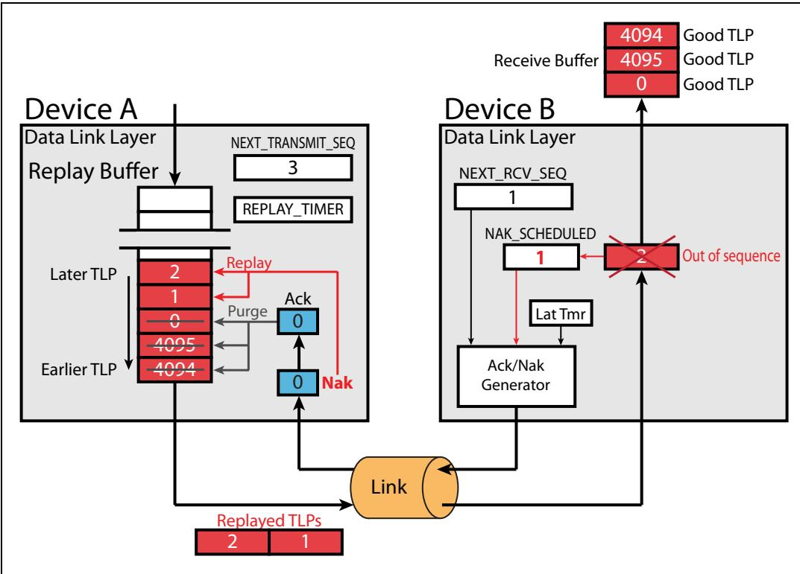

## Bad Ack

Figure 10‐14 on page 347 which shows the protocol for handling a corrupt Ack.

1. Device A transmits TLPs 4094, 4095, 0, 1, and 2.

2. Device B receives TLPs 4094, 4095, and 0, sets NEXT\_RCV\_SEQ to 1, and returns Ack 0 because the AckNak\_LATENCY\_TIMER had expired.

3. Ack 0 has a bit during its flight on the Link, so when Device A checks its 16‐ bit CRC, it fails the check and is discarded. This means TLPs 4094, 4095, and 0 remain in Device A’s Replay Buffer.

4. TLPs 1 and 2 arrive at Device B and are good, so NEXT\_RCV\_SEQ count increments to 3 and Ack 2 is returned once the AckNak\_LATENCY\_TIMER expires again.

5. Ack 2 arrives safely at Device A, which purges its Replay Buffer of TLPs 4094, 4095, 0, 1, and 2.

If Ack 2 is also lost or corrupted and no further Ack or Nak DLLPs are returned to Device A, its REPLAY\_TIMER expires causing a replay of its entire buffer. Device B sees TLPs 4094, 4095, 0, 1 and 2 and considers them to be duplicates [their sequence numbers are earlier than NEXT\_RCV\_SEQ count (3)]. They are discarded and another Ack 2 would be returned to Device A because of the duplicate packets.

Figure 10‐14: Handling Bad Ack  

## Bad Nak

Figure 10‐15 on page 349 which shows protocol for handling a corrupt Nak.

1. Device A transmits TLPs 4094, 4095, 0, 1, and 2.

2. Device B receives TLPs 4094, 4095, and 0 all successfully (and the AckNak\_LATENCY\_TIMER has not yet expired). The next TLP that it receives fails the LCRC check, so Device B sets the NAK\_SCHEDULED flag, and resets and holds the AckNak\_LATENCY\_TIMER. The Nak is transmitted back with a Sequence Number of the last good TLP received, 0.

3. Nak 0 fails the 16‐bit CRC check at Device A and is discarded.

4. At this point, Device B will not be sending anymore Acks or Naks until it successfully receives the next TLP it is expecting, TLP 1 in this example. However, this will require a replay. Device A does not yet know that a replay is required because the one Nak that was sent back was corrupted and discarded. This gets resolved by the REPLAY\_TIMER. The REPLAY\_TIMER will eventually expire because it has not seen an Ack or Nak that makes forward progress in the specified time frame.

5. Once the REPLAY\_TIMER expires, Device A will replay all TLPs in the Replay Buffer, increment REPLAY\_NUM count and reset and restart the REPLAY\_TIMER.

6. Device B will receive TLPs 4094, 4095 and 0 and recognize that they are duplicates. The duplicate TLPs will be dropped and an Ack will be scheduled with a Sequence Number 0 (indicating the furthest progress made).

7. Once TLP 1 is successfully received by Device B, it will clear the NAK\_SCHEDULED flag, increment the NEXT\_RCV\_SEQ and restart the AckNak\_LATENCY\_TIMER because it has successfully received a TLP that it has not yet acknowledged.

Figure 10‐15: Handling Bad Nak  
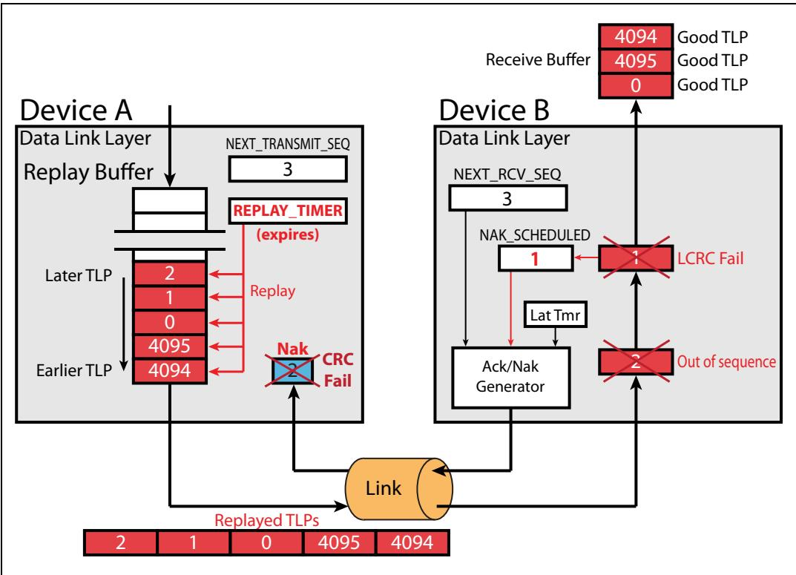

## Error Situations Handled by Ack/Nak

The Ack/Nak protocol guarantees reliable delivery of TLPs despite several possible errors. The list of errors below includes the correction mechanism used to resolve them.

LCRC error in a TLP. Solution: Receiver detects LCRC error and schedules a Nak that contains the NEXT\_RCV\_SEQ count ‐ 1. In response, the transmitter replays at least one TLP, starting with the one that failed.

TLPs lost en route to the receiver’s Data Link Layer (e.g. Physical Layer detects issue with packet and drops it). Solution: The receiver checks the Sequence Number on all received TLPs, expecting them to arrive with the next sequential Sequence Number. If a TLP is lost, the Sequence Number of the next one that succeeds will be out of sequence. In response, the Receiver schedules a Nak with NRS count ‐ 1, and the transmitter replays at least one TLP, starting with the missing one.

Corrupted Ack or Nak en route to the transmitter. Solution: The Transmitter detects a CRC error in the DLLP (see “Receiver handling of DLLPs” on page 309), discards the packet and simply waits for the next one.

Ack Case: A subsequent Ack received with a later Sequence Number causes the transmitter Replay Buffer to purge all TLPs with Sequence Numbers equal to or earlier than it. The transmitter is unaware that anything was wrong (except for a potential case of the Replay Buffer temporarily filling up).

Nak Case: The receiver, having set the Nak Scheduled flag, will not send another Nak or any Acks until it successfully receives the next expected TLP, meaning a replay is needed. Of course, the transmitter doesn’t know it needs to replay if the Nak was lost. In this case, the REPLAY\_TIMER will eventually expire and trigger the replay.

• No Ack/Nak seen within the expected time. Solution: REPLAY\_TIMER timeout triggers a replay.

Receiver fails to send Ack/Nak for a received TLP. Solution: Again, the transmitter’s REPLAY\_TIMER will expire and result in a replay.

## Recommended Priority To Schedule Packets

A device may have many types of TLPs, DLLPs and Ordered Sets to transmit on a given Link. The recommended priority for scheduling packets is:

1. Completion of any TLP or DLLP currently in progress (highest priority)

2. Ordered Set

3. Nak

4. Ack

5. Flow Control

6. Replay Buffer re‐transmissions

7. TLPs that are waiting in the Transaction Layer

8. All other DLLP transmissions (lowest priority)

## Timing Differences for Newer Spec Versions

As mentioned earlier, the timer values for the Ack/Nak protocol are different for Gen2 and later versions of the spec. To improve readability of the text, only the Gen1 versions (2.5 GT/s rate) were included in the earlier discussion, but all three versions are included here for convenience.

As before, the values given are in symbol times, so the actual time is that value multiplied by the time needed to deliver one symbol over the Link at that rate. For review, the time to transmit one symbol (known as a Symbol Time) is 4ns for Gen1, 2ns for Gen2, and 1.25ns to transmit 1 byte for Gen3.

## Ack Transmission Latency (AckNak Latency)

One interesting difference between the spec versions is the way the L0s recovery time is considered. In the 1.x specs, an argument is included in the AckNak\_LATENCY\_TIMER equation to account for this, but the tables in the spec based on that equation put its value at zero and call the resulting values ‘unadjusted’. Beginning with the 2.0 spec, the L0s recovery value is dropped from the equation altogether and the text states that the receiver is not required to adjust Ack scheduling based on L0s exit latency or the value of the Extended Sync bit. None of the table values contain an L0s recovery component and are therefore all still called ‘unadjusted’.

Note that, since the AF (Ack Factor) values are the same in all the tables and were shown in the earlier presentation of the Gen1 table, they’re not included in the tables here.

Also, as it was for Gen1, the tolerance for all of the table values is ‐0% to +100%. To illustrate this, Table 10‐3 on page 351 lists the time for a x1 Link and Max Payload size of 128 Bytes as 237 symbol times. Legal values would therefore range from no less than 237 symbol times to no more than 474.

## 2.5 GT/s Operation

Table 10‐3: Gen1 Unadjusted AckNak\_LATENCY\_TIMER Values (Symbol Times)

<table><tr><td>Max Payload</td><td>x1Link</td><td>x2Link</td><td>x4Link</td><td>x8Link</td><td>x12Link</td><td>x16Link</td><td>x32Link</td></tr><tr><td>128 Bytes</td><td>237</td><td>128</td><td>73</td><td>67</td><td>58</td><td>48</td><td>33</td></tr><tr><td>256 Bytes</td><td>416</td><td>217</td><td>118</td><td>107</td><td>90</td><td>72</td><td>45</td></tr><tr><td>512 Bytes</td><td>559</td><td>289</td><td>154</td><td>86</td><td>109</td><td>86</td><td>52</td></tr><tr><td>1024 Bytes</td><td>1071</td><td>545</td><td>282</td><td>150</td><td>194</td><td>150</td><td>84</td></tr><tr><td>2048 Bytes</td><td>2095</td><td>1057</td><td>538</td><td>278</td><td>365</td><td>278</td><td>148</td></tr><tr><td>4096 Bytes</td><td>4143</td><td>2081</td><td>1050</td><td>534</td><td>706</td><td>534</td><td>276</td></tr></table>

## 5.0 GT/s Operation

Table 10‐4: Gen2 Unadjusted AckNak\_LATENCY\_TIMER Values (Symbol Times)

<table><tr><td>Max Payload</td><td>x1 Link</td><td>x2 Link</td><td>x4 Link</td><td>x8 Link</td><td>x12 Link</td><td>x16 Link</td><td>x32 Link</td></tr><tr><td>128 Bytes</td><td>288</td><td>179</td><td>124</td><td>118</td><td>109</td><td>99</td><td>84</td></tr><tr><td>256 Bytes</td><td>467</td><td>268</td><td>169</td><td>158</td><td>141</td><td>123</td><td>96</td></tr><tr><td>512 Bytes</td><td>610</td><td>340</td><td>205</td><td>137</td><td>160</td><td>137</td><td>103</td></tr><tr><td>1024 Bytes</td><td>1122</td><td>596</td><td>333</td><td>201</td><td>245</td><td>201</td><td>135</td></tr><tr><td>2048 Bytes</td><td>2146</td><td>1108</td><td>589</td><td>329</td><td>416</td><td>329</td><td>199</td></tr><tr><td>4096 Bytes</td><td>4194</td><td>2132</td><td>1101</td><td>585</td><td>757</td><td>585</td><td>327</td></tr></table>

## 8.0 GT/s Operation

Table 10‐5: Gen3 Unadjusted AckNak\_LATENCY\_TIMER Values (Symbol Times)

<table><tr><td>Max Payload</td><td>x1Link</td><td>x2Link</td><td>x4Link</td><td>x8Link</td><td>x12Link</td><td>x16Link</td><td>x32Link</td></tr><tr><td>128 Bytes</td><td>333</td><td>224</td><td>169</td><td>163</td><td>154</td><td>144</td><td>129</td></tr><tr><td>256 Bytes</td><td>512</td><td>313</td><td>214</td><td>203</td><td>186</td><td>168</td><td>141</td></tr><tr><td>512 Bytes</td><td>655</td><td>385</td><td>250</td><td>182</td><td>205</td><td>182</td><td>148</td></tr><tr><td>1024 Bytes</td><td>1167</td><td>641</td><td>378</td><td>246</td><td>290</td><td>246</td><td>180</td></tr><tr><td>2048 Bytes</td><td>2191</td><td>1153</td><td>634</td><td>374</td><td>461</td><td>374</td><td>244</td></tr><tr><td>4096 Bytes</td><td>4239</td><td>2177</td><td>1146</td><td>630</td><td>802</td><td>630</td><td>372</td></tr></table>

## Replay Timer

Much like the AckNak Latency Timer calculation, L0s recovery time is considered differently for the Replay Timer in newer spec versions. In the 1.x specs, an argument is included in the Replay Timer equation to account for this, but the tables in the spec based on that equation put its value at zero and call the resulting values ‘unadjusted’. Beginning with the 2.0 spec, the argument is dropped from the equation altogether and the text states that the transmitter should compensate for L0s exit if it will be used, either by statically adding that time to the table values or by sensing when the Link is in that state and allowing extra time in that case. The table values still don’t contain an L0s component and are still called ‘unadjusted’.

As a final word on this topic, the spec strongly recommends that a transmitter should not do a replay on a Replay Timer timeout if it’s possible that the delay in receiving an Ack was caused by the other device’s transmitter being in the L0s state.

Note that, just like for the Ack Latency Timer tables, the tolerance for all of the table values is  ‐0% to +100%. To illustrate this, Table 10‐6 on page 353 lists the time for a x1 Link and Max Payload size of 128 Bytes as 711 symbol times. Legal values would therefore range from no less than 711 symbol times to no more than 1422.

## 2.5 GT/s Operation

Table 10‐6: Gen1 Unadjusted REPLAY\_TIMER Values in Symbol Times

<table><tr><td>Max Payload</td><td>x1Link</td><td>x2Link</td><td>x4Link</td><td>x8Link</td><td>x12Link</td><td>x16Link</td><td>x32Link</td></tr><tr><td>128 Bytes</td><td>711</td><td>384</td><td>219</td><td>201</td><td>174</td><td>144</td><td>99</td></tr><tr><td>256 Bytes</td><td>1248</td><td>651</td><td>354</td><td>321</td><td>270</td><td>216</td><td>135</td></tr><tr><td>512 Bytes</td><td>1677</td><td>867</td><td>462</td><td>258</td><td>327</td><td>258</td><td>156</td></tr><tr><td>1024 Bytes</td><td>3213</td><td>1635</td><td>846</td><td>450</td><td>582</td><td>450</td><td>252</td></tr><tr><td>2048 Bytes</td><td>6285</td><td>3171</td><td>1614</td><td>834</td><td>1095</td><td>834</td><td>444</td></tr><tr><td>4096 Bytes</td><td>12429</td><td>6243</td><td>3150</td><td>1602</td><td>2118</td><td>1602</td><td>828</td></tr></table>

## 5.0 GT/s Operation

Table 10‐7: Gen2 Unadjusted REPLAY\_TIMER Values in Symbol Times

<table><tr><td>Max Payload</td><td>x1Link</td><td>x2Link</td><td>x4Link</td><td>x8Link</td><td>x12Link</td><td>x16Link</td><td>x32Link</td></tr><tr><td>128 Bytes</td><td>864</td><td>537</td><td>372</td><td>354</td><td>327</td><td>297</td><td>252</td></tr><tr><td>256 Bytes</td><td>1401</td><td>804</td><td>507</td><td>474</td><td>423</td><td>369</td><td>288</td></tr><tr><td>512 Bytes</td><td>1830</td><td>1020</td><td>615</td><td>411</td><td>480</td><td>411</td><td>309</td></tr><tr><td>1024 Bytes</td><td>3366</td><td>1788</td><td>999</td><td>603</td><td>735</td><td>603</td><td>405</td></tr><tr><td>2048 Bytes</td><td>6438</td><td>3324</td><td>1767</td><td>987</td><td>1248</td><td>987</td><td>597</td></tr><tr><td>4096 Bytes</td><td>12582</td><td>6396</td><td>3303</td><td>1755</td><td>2271</td><td>1755</td><td>981</td></tr></table>

## 8.0 GT/s Operation

Table 10‐8: Gen3 Unadjusted REPLAY\_TIMER Values

<table><tr><td>Max Payload</td><td>x1 Link</td><td>x2 Link</td><td>x4 Link</td><td>x8 Link</td><td>x12 Link</td><td>x16 Link</td><td>x32 Link</td></tr><tr><td>128 Bytes</td><td>999</td><td>672</td><td>507</td><td>489</td><td>462</td><td>432</td><td>387</td></tr><tr><td>256 Bytes</td><td>1536</td><td>939</td><td>642</td><td>609</td><td>558</td><td>504</td><td>423</td></tr><tr><td>512 Bytes</td><td>1965</td><td>1155</td><td>750</td><td>546</td><td>615</td><td>546</td><td>444</td></tr><tr><td>1024 Bytes</td><td>3501</td><td>1923</td><td>1134</td><td>738</td><td>870</td><td>738</td><td>540</td></tr><tr><td>2048 Bytes</td><td>6573</td><td>3459</td><td>1902</td><td>1122</td><td>1383</td><td>1122</td><td>732</td></tr><tr><td>4096 Bytes</td><td>12717</td><td>6531</td><td>3438</td><td>1890</td><td>2406</td><td>1890</td><td>1116</td></tr></table>

## Switch Cut-Through Mode

Now that we’ve described how the protocol works, this is a good time to explain an exception to its general operation. PCIe supports a Switch feature, called ‘cut‐through mode’, that can be used to improve the transfer latency for large TLPs through a Switch.

## Background

Consider an example where a large TLP needs to pass through a Switch as shown in Figure 10‐16 on page 357. Since the Ingress Switch Port can’t tell whether there was an error in the packet until it has seen the whole TLP, it’ll normally store the entire packet and check it for errors before forwarding it to the Egress Port. This store‐and‐forward method works but, for large packets, the latency to get through the Switch can be large which may be an issue for some applications. It would be nice to minimize this latency if possible.

## A Latency Improvement Option

Since the first part of the TLP contains the header with the routing information for the packet, one option would be to assume that the packet is a good packet and start evaluating the routing info in header even before the entire packet is received. This would allow a Switch to begin forwarding the TLP to the Egress Port as soon as that routing is evaluated. The Egress Port could then go ahead and start sending it out onto its Link, as long as doing so will not cause an underflow condition within the Switch. (A potential underflow case could easily happen if the Ingress Port is x1 and the Egress Port is x16. The Egress Port would be sending the packet out much faster than it is being received.)

Of course, the Ingress Port can’t check for errors in the packet until it receives the LCRC at the end of the packet, so there is a small risk involved that the TLP being forwarded out may actually contain an error. Eventually, the end of the TLP arrives at the Ingress Port and the packet can be checked. If it turns out there was an error, the Ingress Port takes the normal behavior to a bad TLP and simply sends a Nak to have the packet replayed. However, we now have to deal with the problem that most of a packet that we now know is bad has already been forwarded on to the Egress Port. What are our options at this point? We could finish forwarding the packet and wait for a Nak from the neighboring receiver when it sees the error, but the packet in the replay buffer would be the bad one, and so a replay there won’t fix the problem. We might truncate the bad packet in flight, but the spec doesn’t allow for that possibility. To make this work, we need another option, and that’s where the Cut‐Through option comes into play.

## Cut-Through Operation

Cut‐though mode provides the solution to the forwarding problem described in the previous section: if an error is seen in the incoming packet, the packet that is already on its way out must be ‘nullified’.

A nullified packet is terminated with an EDB (end bad) symbol instead of an END (end good) symbol and, to make the condition very clear, the TLPs 32‐bit LCRC is inverted (1’s complement) from the original calculated value. In essence, a nullified packet is handled as though it had never existed. On the Switch Egress Port, that means the replay buffer discards the packet and the NEXT\_TRANSMIT\_SEQ counter is decremented by one (rolled back).

When a device receives a TLP that it recognizes as being a nullified TLP, it simply drops the packet and treats it as if it never existed. The NEXT\_RCV\_SEQ is not incremented, the AckNak\_LATENCY\_TIMER is not started, nor is the NAK\_SCHEDULED set. The receiving device silently discards the nullified TLP and does not return an Ack/Nak for it.

## Example of Cut-Through Operation

Figure 10‐16 on page 357 illustrates a TLP coming in from the left, going through the Switch, and ending up at an Endpoint on the right. A TLP error occurs on the left Link. The steps are as follows:

1. An incoming TLP is seen at the Switch Ingress Port. It has become corrupted in flight but that isn’t known yet.

2. The TLP header arrives, is decoded, and the packet is forwarded to the destination Egress Port in cut‐through operation.

3. Eventually, the end of the packet arrives and the Switch Ingress Port is able to complete the LCRC error check. It finds a CRC error and returns a Nak to the TLP source.

4. At the Egress Port, the Switch replaces the END framing symbol at the end of the bad TLP with EDB and inverts the calculated LCRC value. The TLP is now ‘nullified’ and the Switch discards it from the Replay Buffer.

5. The nullified packet arrives at the Endpoint. The Endpoint detects the EDB symbol and inverted LCRC and silently discards the packet. It does not return a Nak.

Now let’s say the TLP source device replays the packet and no error occurs. As before, the TLP is forwarded to the Egress Port with very short latency. When the rest of the TLP arrives at the Switch, there is no error, so an Ack is returned to the TLP source which then purges this TLP from its Replay Buffer. This time the Switch Egress Port keeps a copy of the TLP in its Replay Buffer. When the TLP reaches the destination, the packet has no errors and the Endpoint returns an Ack. Based on that, the Switch purges the copy of the TLP from its Replay Buffer and the sequence is complete.

Figure 10‐16: Switch Cut‐Through Mode Showing Error Handling  
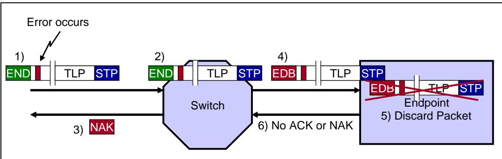

Part Four:

Physical Layer

# 11 Physical Layer ‐ Logical (Gen1 and Gen2)

## The Previous Chapter

The previous chapter describes the Ack/Nak Protocol: an automatic, hardwarebased mechanism for ensuring reliable transport of TLPs across the Link. Ack DLLPs confirm good reception of TLPs while Nak DLLPs indicate a transmission error. The chapter describes the normal rules of operation as well as error recovery mechanisms.

## This Chapter

This chapter describes the Logical sub‐block of the Physical Layer. This prepares packets for serial transmission and recovery. Several steps are needed to accomplish this and they are described in detail. This chapter covers the logic associated with the Gen1 and Gen2 protocol that use 8b/10b encoding. The logic for Gen3 does not use 8b/10b encoding and is described separately in the chapter called “Physical Layer ‐ Logical (Gen3)” on page 407.

## The Next Chapter

The next chapter describes the Physical Layer characteristics for the third generation (Gen3) of PCIe. The major change includes the ability to double the bandwidth relative to Gen2 without needing to double the frequency by eliminating the need for 8b/10b encoding. More robust signal compensation is necessary at Gen3 speed. Making these changes is more complex than might be expected.

## Physical Layer Overview

This Physical Layer Overview introduces the relationships between the Gen1, Gen2 and Gen3 implementations. Thereafter the focus is the logical Physical Layer implementation associated with Gen1 and Gen2. The logical Physical Layer implementation for Gen3 is described in the next chapter.

The Physical Layer resides at the bottom of the interface between the external physical link and Data Link Layer. It converts outbound packets from the Data Link Layer into a serialized bit stream that is clocked onto all Lanes of the Link. This layer also recovers the bit stream from all Lanes of the Link at the receiver. The receive logic de‐serializes the bits back into a Symbol stream, re‐assembles the packets, and forwards TLPs and DLLPs up to the Data Link Layer.

Figure 11‐1: PCIe Port Layers  
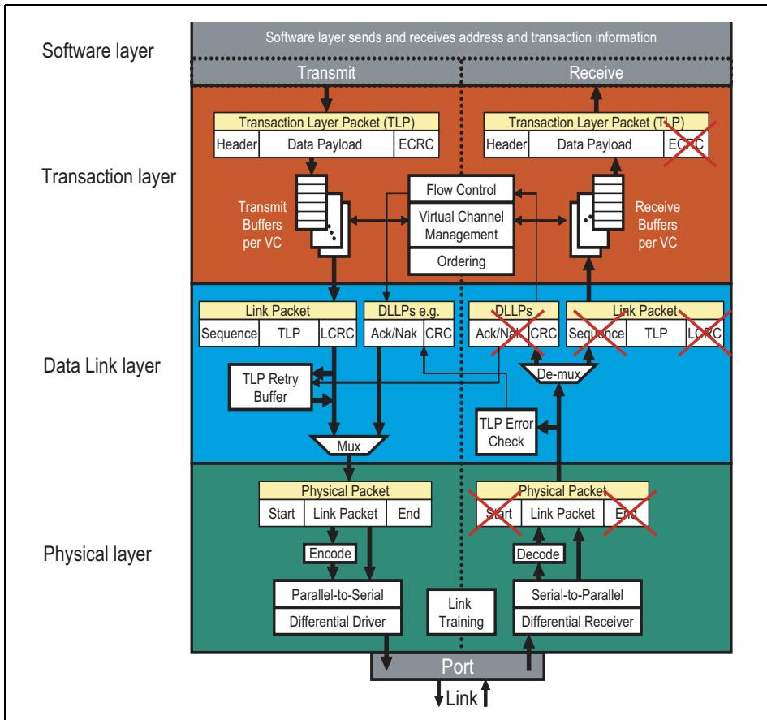

The contents of the layers are conceptual and don’t define precise logic blocks, but to the extent that designers do partition them to match the spec their implementations can benefit because of the constantly increasing data rates affect the Physical Layer more than the others. Partitioning a design by layered responsibilities allows the Physical Layer to be adapted to the higher clock rates while changing as little as possible in the other layers.

The 3.0 revision of the PCIe spec does not use specific terms to distinguish the different transmission rates defined by the versions of the spec. With that in mind, the following terms are defined and used in this book.

• Gen1 ‐ the first generation of PCIe (rev 1.x) operating at 2.5 GT/s

• Gen2 ‐ the second generation (rev 2.x) operating at 5.0 GT/s

• Gen3 ‐ the third generation (rev 3.x) operating at 8.0 GT/s

The Physical Layer is made up of two sub‐blocks: the Logical part and the Electrical part as shown in Figure 11‐2. Both contain independent transmit and receive logic, allowing dual‐simplex communication.

Figure 11‐2: Logical and Electrical Sub‐Blocks of the Physical Layer  

## Observation

The spec describes the functionality of the Physical Layer but is purposefully vague regarding implementation details. Evidently, the spec writers were reluctant to give details or example implementations because they wanted to leave room for individual vendors to add value with clever or creative versions of the logic. For our discussion though, an example is indispensable, and one was chosen that illustrates the concepts. It’s important to make clear that this example has not been tested or validated, nor should a designer feel compelled to implement a Physical Layer in such a manner.

## Transmit Logic Overview

For simplicity, let’s begin with a high‐level overview of the transmit side of this layer, shown in Figure 11‐3 on page 365. Starting at the top, we can see that packet bytes entering from the Data Link layer first go into a buffer. It makes sense to have a buffer here because there will be times when the packet flow from the Data Link Layer must be delayed to allow Ordered Set packets and other items to be injected into the flow of bytes.

For Gen1 and Gen2 operation, these injected items are control and data characters used to mark packet boundaries and create ordered sets. To differentiate between these two types of characters, a D/K# bit (Data or “Kontrol”) is added. The logic can see what value D/K# should take on based on the source of the character.

Gen3 mode of operation, doesn’t use control characters, so data patterns are used to make up the ordered sets that identify if transmitted bytes are associated with TLPs / DLLPs or Ordered Sets. A 2‐bit Sync Header is inserted at the beginning of a 128 bit (16 byte) block of data. The Sync Header informs the receiver whether the received block is a Data Block (TLP or DLLP related bytes) or an Ordered Set Block. Since there are no control characters in Gen3 mode, the D/K# bit is not needed.

Figure 11‐3: Physical Layer Transmit Details  
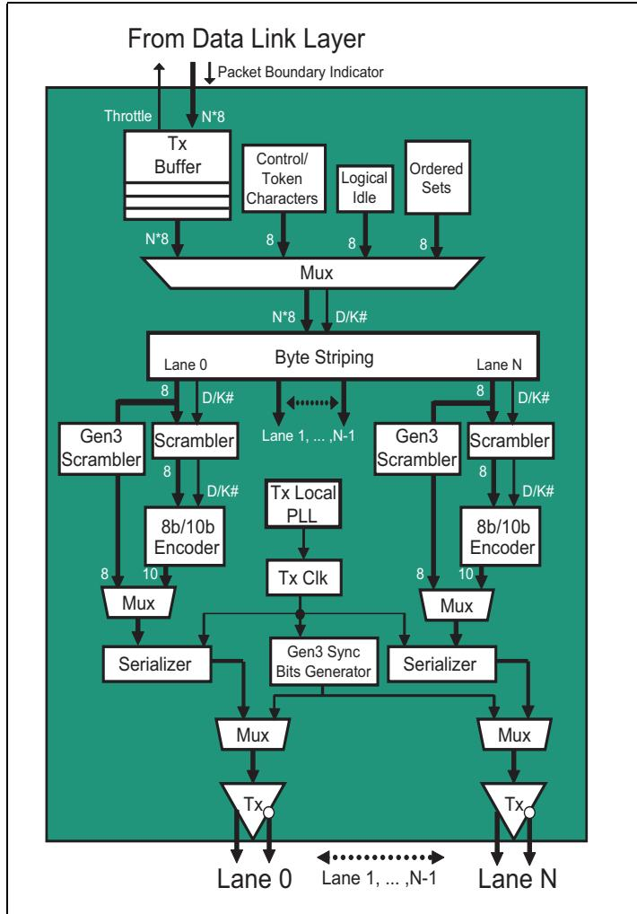  
Next, the parallel data bytes coming from the upper layers are sent to Byte Striping logic where they are spread out, or striped, onto all the lanes of this link. One byte of the packet is transferred per lane, and all active lanes are used for each packet going out. The Lanes of the Link are all transmitting at the same time, so the bytes must come into this logic fast enough to accommodate that. For example, if there are eight Lanes, eight bytes of parallel from the upper layers may arrive at the byte‐striping logic allowing data to be clocked onto all lanes simultaneously.

Next is the Scrambler, which XORs a pseudo‐random pattern onto the outgoing data bytes to mix up the bits. Although it would seem that this might introduce problems, it doesn’t because the scrambling pattern is predictable and not truly random, so the receiver can use the same algorithm to easily recover the original data. If the scramblers get out of step then the Receiver won’t be able to make sense of the bit stream so, to guard against that problem, the scrambler is reset periodically (Gen1 and Gen2). That way, if the scramblers do get out of step with each other it won’t be long before they’re both re‐initialized and back in step again. For Gen1 and Gen2 modes that re‐initialization happens whenever the COM character is detected. For Gen3 mode, it happens whenever an EIEOS ordered set is seen. A more sophisticated 24‐bit based scrambler is utilized in Gen3 mode, hence the alternate path through the Gen3 scrambler, as depicted in Figure 11‐3 on page 365.

For Gen1 and Gen2 mode, the scrambled 8‐bit characters are then encoded for transmission by the 8b/10b Encoder. Recall that a Character is an 8‐bit unencoded byte, while a Symbol is the 10‐bit encoded output of the 8b/10b logic. There are several advantages to 8b/10b encoding, but it does add overhead.

For Gen3 a separate path is shown bypassing the encoder. In other words, scrambled bytes of a packet are transmitted without 8b/10b encoding. The Sync Bit Generator adds a 2‐bit Sync Header prior to every 16 byte block of a packet. The added 2‐bit Sync Header identifies the following 16 byte block to be either a data block or an ordered set block. This addition of a 2‐bit Sync Header every 16 bytes (128 bits) is the basis of Gen3’s 128b/130b encoding scheme.

Finally, the Symbols are serialized into a bit stream and forwarded to the electrical sub‐block of the Physical Layer and transmitted to the other end of the link.

## Receive Logic Overview

Figure 11‐4 on page 367 shows the key elements that make up the receiver logic. The process described below is performed for each lane. Starting at the bottom this time, the first thing to mention is the receiver Clock and Data Recovery (CDR). The first step in this process is to recover the clock based on transitions in the incoming bit stream. This recovered clock faithfully reproduces the Transmitter’s clock that was used to send the data and is used to latch the incoming bits into a deserializing buffer.

The next steps in the CDR process are to find the Gen1/Gen2 Symbol boundaries and divide the recovered clock by 10 to latch the 10‐bit Symbols into the Elastic Buffer. For Gen3, the next step is to acquire Block Lock and then latch the 8‐bit Symbols associated with each of the 16 bytes in the block into the Elastic Buffer — more on this in the next chapter.

## Chapter 11: Physical Layer - Logical (Gen1 and Gen2)

Logic controlling the Elastic Buffer adjusts for minor clock variations between the recovered clock and the local clock of the receiver by adding or removing SKP Symbols as needed when an SOS (SKP Ordered Set) is detected. Finally, the Receiver’s local clock moves each Symbol out of the Elastic Buffer.

Figure 11‐4: Physical Layer Receive Logic Details  
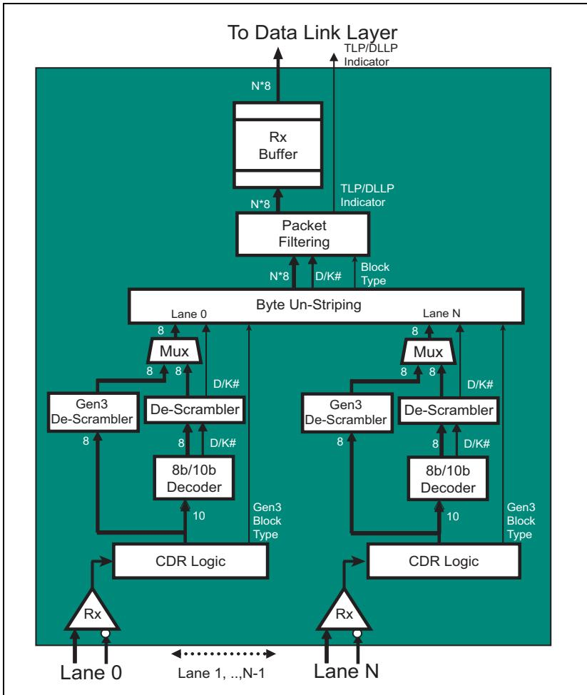

Using the 8b/10b Decoder, Gen1/Gen2 Symbols are decoded thus converting the 10‐bit symbols to 8‐bit characters. The descrambler applies the same scrambling method used at the transmitter to recover the original data. Finally, the bytes from each Lane are un‐striped to form a byte stream that will be forwarded up to the Data Link Layer. Only TLPs and DLLPs are loaded into the receive buffer and sent to the Data Link Layer.

## Transmit Logic Details (Gen1 and Gen2 Only)

The section provides more detail associated with the steps identified in the previous section. Refer to the block diagram in Figure 11‐5 on page 369 during this discussion.

## Tx Buffer

Starting from the top of the diagram once again, the buffer accepts TLPs and DLLPs from the Data Link Layer, along with ‘Control’ information that specifies when a new packet begins. As mentioned, the buffer allows us to stall the flow of characters from time to time in order to insert control characters and ordered sets. A ‘throttle’ signal is also shown going back up to the Data Link Layer to stop the flow of characters if the buffer should become full.

## Mux and Control Logic

The multiplexer, shown in Figure 11‐6 on page 370, is used to insert special control (K) characters into the data flow coming from the buffer. Only the Physical Layer uses K control characters; they are inserted during transmission and removed at the receiver. The four different inputs to the mux are:

Transmit Data Buffer. When the Data Link Layer supplies a packet, the mux gates the character stream through. All of the characters coming from the buffer are D characters, so the D/K# signal is driven high when Tx Buffer contents are gated.

Start and End characters. These Control characters are added to the start and end of every TLP and DLLP (see Figure 11‐7 on page 371) and allow a receiver to readily detect the boundaries of a packet. There are two Start characters: STP indicates the start of a TLP, while SDP indicates the start of a DLLP. An indicator from the Data Link Layer, along with the packet type, determines what type of framing character to insert. There are also two end characters, the End Good character (END) for normal transmission, and the End Bad character (EDB) to handle some error cases. Start and End characters are K characters, so the D/K# signal is driven low when the Start and End characters are inserted (see Table 11‐1 on page 386 for a list of Control characters).

Figure 11‐5: Physical Layer Transmit Logic Details (Gen1 and Gen2 Only)  
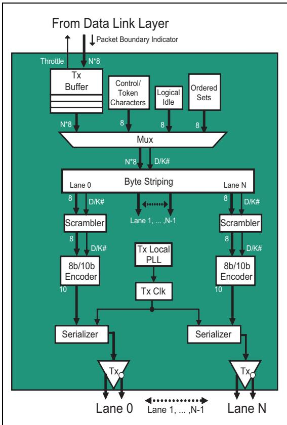

Ordered Sets. As mentioned earlier, control characters are only used by the Physical Layer and are not seen by the higher layers. Some communication across the Link is necessary to initiate and maintain Link operation, and that is accomplished by exchanging Ordered Sets. Every ordered set starts with a K character called a comma (COM), and contains other K or D characters depending on the type of Order Set be delivered. Ordered Sets are always aligned on four byte boundaries and are transmitted during a variety of circumstances including:

— Error recovery, initiating events (such as Hot Reset), or exit from lowpower states. In these cases, the Training Sequence 1 and 2 (TS1 and TS2) ordered sets are exchanged across the Link.

— At periodic intervals, the mux inserts the SKIP ordered set pattern to facilitate clock tolerance compensation in the receiver. For a detailed description of this process, refer to “Clock Compensation” on page 391.

When a device wants to place its transmitter in the Electrical Idle state, it must inform the remote receiver at the other end of the Link. The mux inserts an Electrical Idle ordered set to accomplish this.

— When a device wants to change the Link power state from L0s low power state to the L0 full‐on power state, it sends a set of Fast Training Sequence (FTS) ordered sets to the receiver. The receiver uses this ordered set to re‐synchronize its PLL to the transmitter clock.

Logical Idle Sequence. When there are no packets ready to transmit and no ordered sets to send, the link is logically idle. In order to keep the receiver PLL locked on to the transmitter’s frequency, it’s important that the transmitter keep sending something, so Logical Idle characters are inserted for that case. Logical Idle is very simple, and consists of nothing more than a string of Data 00h characters.

Figure 11‐6: Transmit Logic Multiplexer  

Figure 11‐7: TLP and DLLP Packet Framing with Start and End Control Characters  
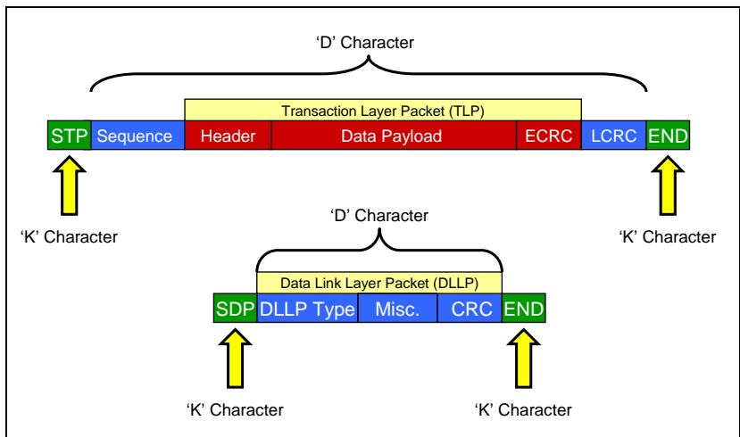

## Byte Striping (for Wide Links)

The next step shown in our example is Byte Striping, although this is only needed if the port implements more than one Lane (called a wide Link). Striping means that each consecutive outbound character in a character stream is routed onto consecutive Lanes. The number of Lanes used is configured during the Link training process based on what is supported by both devices that share the Link.

Three examples of byte striping are illustrated in the following diagrams. In Figure 11‐8 on page 372, a single‐lane link (x1) is shown. This is not a very interesting case, since the packet enters the Physical Layer a byte at a time and goes out the same way, but illustrates the way the sequence of characters will be drawn.

Figure 11‐9 on page 372 shows the incoming Dword packets from the mutiplexer. Each byte is directed to the corresponding lanes. Finally, Figure 11‐10 on page 373 illustrates an eight‐lane (x8) link. In this example, two Dwords are required to populate all 8 lanes. This requires the Dword to arrive at twice the rate as the previous example. The format of the data being sent across each lane is described in the sections that follow.

Figure 11‐8: x1 Byte Striping  

Figure 11‐9: x4 Byte Striping  
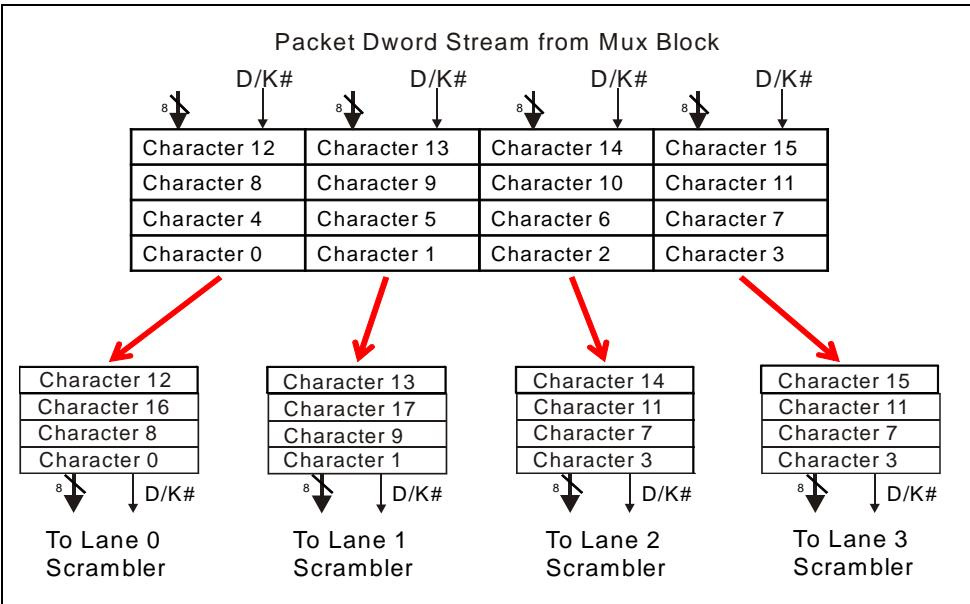

## Chapter 11: Physical Layer - Logical (Gen1 and Gen2)

Figure 11‐10: x8 Byte Striping with DWord Parallel Data  
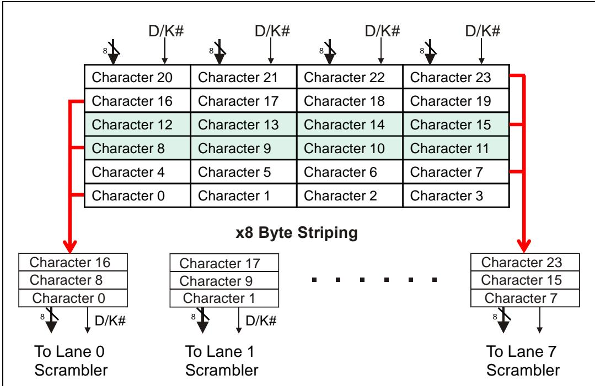

## Packet Format Rules

## General Rules

The total packet length (including Start and End characters) of each packet is always a multiple of four characters. This is a natural extension of the fact that the data length is measured in dwords.

TLPs start with the STP character and finish with either an END or EDB character.

DLLPs start with SDP, terminate with the END character. and are exactly 8 characters long (SDP + 6 characters + END)

STP and SDP characters are placed on Lane 0 when starting the transmission of a packet after the transmission of Logical Idles. In other cases, they may start on a Lane number divisible by 4.

• The receiver’s Physical Layer is allowed to watch for violation of these rules and may report them as Receiver Errors to the Data Link Layer.

## PCI Express Technology

## Example: x1 Format

The example shown in Figure 11‐11 on page 374 illustrates the format of packets transmitted over a x1 link (a link with only one lane operational). A sequence of packets is shown interspersed with one SKIP Ordered Set. Logical Idles are shown at the end to represent the case when the transmitter has no more packets to send and uses idle characters as filler.

Figure 11‐11: x1 Packet Format  

## x4 Format Rules

• STP and SDP characters are always sent on Lane 0.

• END and EDB characters are always sent on Lane 3.

• When an ordered set such as the SKIP is sent, it must appear on all lanes simultaneously.

• When Logical Idles are transmitted, they must be sent on all lanes simultaneously.

• Any violation of these rules may be reported as a Receiver Error to the Data Link Layer.

## Chapter 11: Physical Layer - Logical (Gen1 and Gen2)

## Example x4 Format

The example shown in Figure 11‐12 on page 375 illustrates the format of packets sent over a x4 Link (link with four data lanes operational). The illustration shows one TLP followed by a SKIP ordered set transmitted on all Lanes for receiver clock compensation. Next is a DLLP, followed by Logical Idle on all lanes. This example highlights that the packets are always multiples of 4 characters because the start character always appears in lane 0 and the end character is always in lane 3. It also illustrates that ordered sets must appear on all the lanes simultaneously.

Figure 11‐12: x4 Packet Format

<table><tr><td>Lane0</td><td>Lane1</td><td>Lane2</td><td>Lane3</td></tr><tr><td>STP</td><td>Sequence</td><td>Sequence</td><td></td></tr><tr><td></td><td></td><td></td><td></td></tr><tr><td></td><td></td><td></td><td></td></tr><tr><td></td><td colspan="2">TLP</td><td></td></tr><tr><td></td><td></td><td></td><td></td></tr><tr><td></td><td></td><td></td><td></td></tr><tr><td></td><td></td><td></td><td>LCRC</td></tr><tr><td>LCRC</td><td>LCRC</td><td>LCRC</td><td>END</td></tr><tr><td>COM</td><td>COM</td><td>COM</td><td>COM</td></tr><tr><td>SKP</td><td>SKP</td><td>SKP</td><td>SKP</td></tr><tr><td>SKP</td><td>SKP</td><td>SKP</td><td>SKP</td></tr><tr><td>SKP</td><td>SKP</td><td>SKP</td><td>SKP</td></tr><tr><td>SDP</td><td colspan="2">DLLP</td><td></td></tr><tr><td></td><td></td><td></td><td>END</td></tr><tr><td>Idle (00h)</td><td>Idle (00h)</td><td>Idle (00h)</td><td>Idle (00h)</td></tr><tr><td>Idle (00h)</td><td>Idle (00h)</td><td>Idle (00h)</td><td>Idle (00h)</td></tr><tr><td>Idle (00h)</td><td>Idle (00h)</td><td>Idle (00h)</td><td>Idle (00h)</td></tr><tr><td>Idle (00h)</td><td>Idle (00h)</td><td>Idle (00h)</td><td>Idle (00h)</td></tr><tr><td>Idle (00h)</td><td></td><td></td><td></td></tr></table>

## Large Link-Width Packet Format Rules

The following rules apply when a packet is transmitted over a x8, x12, x16, or x32 Link:

STP/SDP characters are always sent on Lane 0 when transmission starts after a period during which Logical Idles are transmitted. After that, they may only be sent on Lane numbers divisible by 4 when sending back‐toback packets (Lane 4, 8, 12, etc.).

• END/EDB characters are sent on Lane numbers divisible by 4 and then minus one (Lane 3, 7, 11, etc.).

If a packet doesn’t end on the last Lane of the Link and there are no more packets ready to go, PAD Symbols are used as filler on the remaining lane numbers. Logical Idle can’t be used for this purpose because it must appear on all Lanes at the same time.

• Ordered sets must be sent on all lanes simultaneously.

• Similarly, logical idles must be sent on all lanes when they are used.

• Any violation of these rules may be reported as a Receiver Error to the Data Link Layer.

## x8 Packet Format Example

The example shown in Figure 11‐13 on page 377 illustrates the format of packets transmitted over a x8 link. The illustration shows a TLP followed by a SKIP ordered set, a DLLP, and finally a TLP that ends on Lane 3. At that point, the transmitter has no more packets ready to send but the current packet doesn’t extend to include all the available lanes. One might expect the extra lanes to be filled with Logical Idle, but it won’t work here because idles must appear on all lanes at the same time. So another fill character is needed, and the spec writers chose to use the PAD control character here. The only other place that PAD is used is during the training process. Finally, since there are still no more packets to send, Logical Idles are sent on all the lanes.

Figure 11‐13: x8 Packet Format

<table><tr><td>Time\Lane 0</td><td>Lane 1</td><td>Lane 2</td><td>Lane 3</td><td>Lane 4</td><td>Lane 5</td><td>Lane 6</td><td>Lane 7</td></tr><tr><td>Idle (00h)</td><td>Idle (00h)</td><td>Idle (00h)</td><td>Idle (00h)</td><td>Idle (00h)</td><td>Idle (00h)</td><td>Idle (00h)</td><td>Idle (00h)</td></tr><tr><td>STP</td><td>Sequence</td><td>Sequence</td><td></td><td></td><td></td><td></td><td></td></tr><tr><td></td><td></td><td></td><td colspan="2">TLP</td><td></td><td></td><td></td></tr><tr><td></td><td></td><td></td><td>LCRC</td><td>LCRC</td><td>LCRC</td><td>LCRC</td><td>END</td></tr><tr><td>COM</td><td>COM</td><td>COM</td><td>COM</td><td>COM</td><td>COM</td><td>COM</td><td>COM</td></tr><tr><td>SKP</td><td>SKP</td><td>SKP</td><td>SKP</td><td>SKP</td><td>SKP</td><td>SKP</td><td>SKP</td></tr><tr><td>SKP</td><td>SKP</td><td>SKP</td><td>SKP</td><td>SKP</td><td>SKP</td><td>SKP</td><td>SKP</td></tr><tr><td>SKP</td><td>SKP</td><td>SKP</td><td>SKP</td><td>SKP</td><td>SKP</td><td>SKP</td><td>SKP</td></tr><tr><td>SDP</td><td></td><td></td><td colspan="2">DLLP</td><td></td><td></td><td>END</td></tr><tr><td>STP</td><td>Sequence</td><td>Sequence</td><td></td><td></td><td></td><td></td><td></td></tr><tr><td></td><td></td><td></td><td colspan="2">TLP</td><td></td><td></td><td></td></tr><tr><td></td><td></td><td></td><td colspan="2"></td><td></td><td></td><td>LCRC</td></tr><tr><td>LCRC</td><td>LCRC</td><td>LCRC</td><td>END</td><td>PAD</td><td>PAD</td><td>PAD</td><td>PAD</td></tr><tr><td>Idle (00h)</td><td>Idle (00h)</td><td>Idle (00h)</td><td>Idle (00h)</td><td>Idle (00h)</td><td>Idle (00h)</td><td>Idle (00h)</td><td>Idle (00h)</td></tr><tr><td>Idle (00h)</td><td>Idle (00h)</td><td>Idle (00h)</td><td>Idle (00h)</td><td>Idle (00h)</td><td>Idle (00h)</td><td>Idle (00h)</td><td>Idle (00h)</td></tr></table>

## Scrambler

The next step in our example is scrambling, as shown in Figure 11‐5 on page 369, which is intended to prevent repetitive patterns in the data stream. Repetitive patterns create “pure tones” on the link, meaning a consistent frequency caused by the pattern that generates more than the usual noise, or EMI. Reducing this problem by spreading this energy over a wider frequency range is the primary goal of scrambling. In addition, though, scrambled transmission on one Lane also reduces interference with adjacent Lanes on a wide Link. This “spatial frequency de‐correlation”, or reduction of crosstalk noise, helps the receiver on each lane to distinguish the desired signal.

To help the receiver maintain synchronization with the scrambled sequence, control characters do not get scrambled and are thus recognizable even if the scramblers get out of sync. In addition, the arrival of the COM control character (K28.5) reinitializes the scramblers on both ends of the Link each time it arrives and thus re‐synchronizes them.

## Scrambler Algorithm

The scrambler described in the spec is shown in Figure 11‐14 on page 378. It’s made of a 16‐bit Linear Feedback Shift Register (LFSR) with feedback points that implement the following polynomial:

$$
G (x) = X ^ {1 6} + X ^ {5} + X ^ {4} + X ^ {3} + 1
$$

Figure 11‐14: Scrambler  
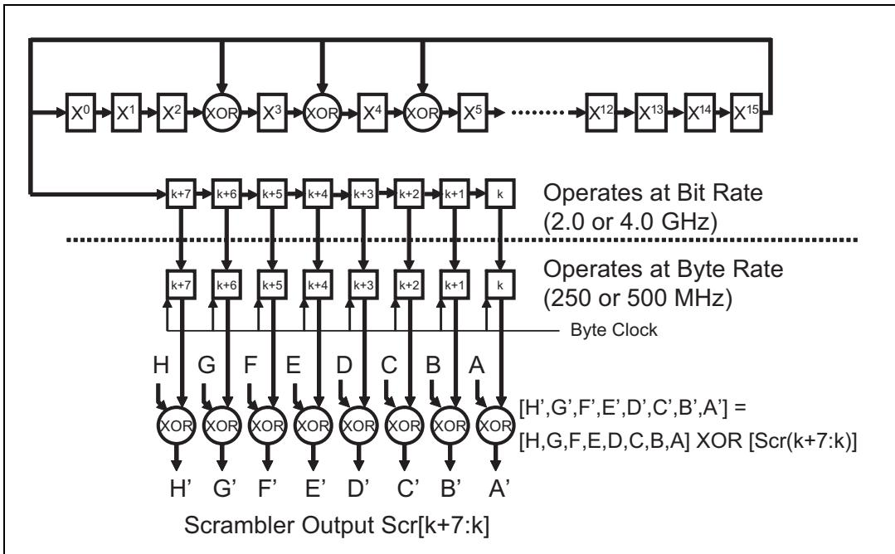  
The LFSR is clocked at 8 times the frequency of the clock feeding the data bytes, and its output is clocked into an 8‐bit register that is XORed with the 8‐bit data characters to form the scrambled data output.

## Some Scrambler implementation rules:

• On a multi‐Lane Link implementation, Scramblers associated with each Lane must operate in concert, maintaining the same simultaneous value in each LFSR.

Scrambling is applied to ‘D’ characters only, meaning those associated with TLP and DLLPs and the Logical Idle (00h) characters. However, those ‘D’ characters that are within the TS1 and TS2 ordered sets are not scrambled.

Scrambling is never applied to ‘K’ characters and characters within ordered sets, such as TS1, TS2, SKIP, FTS and Electrical Idle. These characters bypass the scrambler logic. One reason for this is to ensure they’ll still be recognizable by the receiver even if the scramblers somehow get out of sequence.

• Compliance Pattern characters (used for testing) are also not scrambled.

The COM character, a control character that does not get scrambled, is used to reinitialize the LFSR to FFFFh at both the transmitter and receiver.

Except for the COM character, the LFSR normally will serially advance eight times for every D or K character sent, but it does not advance on SKP characters associated with the SKIP ordered set. The reason is that a receiver may add or delete SKP Symbols to perform clock tolerance compensation. Changing the number of characters in the receiver compared to the number that were sent would cause the value in the receiver LFSR to lose synchronization with the transmitter LFSR value if they were not ignored.

## Disabling Scrambling

Scrambling is enabled by default, but the spec allows it to be disabled for test and debug purposes. That’s because testing may require control of the exact bit pattern sent and, since the hardware handles scrambling, there’s no reasonable way for the software to be able to force a specific pattern. No specific software mechanism is defined by which to instruct the Physical Layer to disable scrambling, so this has to be a design‐specific implementation.

If scrambling is disabled by a device, this gets communicated to the neighboring device by sending at least two TS1s and TS2s that have the appropriate bit set in the control field as described in “Configuration State” on page 539. In response, the neighboring device also disables its scrambling.

## 8b/10b Encoding

## General

The first two generations of PCIe use 8b/10b encoding. Each Lane implements an 8b/10b Encoder that translates the 8‐bit characters into 10‐bit Symbols. This coding scheme was patented by IBM in 1984 and is widely used in many serial transports today, such as Gigabit Ethernet and Fibre Channel.

## Motivation

Encoding accomplishes several desirable goals for serial transmission. Three of the most important are listed here:

Embedding a Clock into the Data. Encoding ensures that the data stream has enough edges in it to recover a clock at the Receiver, with the result that a distributed clock is not needed. This avoids some limitations of a parallel bus design, such as flight time and clock skew. It also eliminates the need to distribute a high‐frequency clock that would cause other problems like increased EMI and difficult routing.

As an example of this process, Figure 11‐15 on page 381 shows the encoding results of the data byte 00h. As can be seen, this 8‐bit character that had no transitions converts to a 10‐bit Symbol with 5 transitions. The 8b/10b guarantees enough edges to ensure the “run length” (sequence of consecutive ones or zeros) in the bit stream to no more than 5 consecutive bits under any conditions.

Maintaining DC Balance. PCIe uses an AC‐coupled link, placing a capacitor serially in the path to isolate the DC part of the signal from the other end of the Link. This allows the Transmitter and Receiver to use different common‐mode voltages and makes the electrical design easier for cases where the path between them is long enough that they’re less likely to have exactly the same reference voltages. That DC value, or common‐mode voltage, can change during run time because the line charges up when the signal is driven. Normally, the signal changes so quickly that there isn’t time for this to cause a problem but, if the signal average is predominantly one level or the other, the common‐mode value will appear to drift. Referred to as “DC Wander”, this drifting voltage degrades signal integrity at the Receiver. To compensate, the 8b/10b encoder tracks the “disparity” of the last Symbol that was sent. Disparity, or inequality, simply indicates whether the previous Symbol had more ones than zeros (called positive disparity), more zeros than ones (negative disparity), or a balance of ones and zeros (neutral disparity). If the previous Symbol had negative disparity, for example, the next one should balance that by using more ones.

Enhancing Error Detection. The encoding scheme also facilitates the detection of transmission errors. For a 10‐bit value, 1024 codes are possible, but the character to be encoded only has 256 unique codes. To maintain DC balance the design uses two codes for each character, and chooses which one based on the disparity of the last Symbol that was sent, so 512 codes would be needed. However, many of the neutral disparity encodings have the same values (D28.5 is one example), so not all 512 are used. As a result, more than half the possible encodings are not used and will be considered illegal if seen at a Receiver. If a transmission error does change the bit pattern of a Symbol, there’s a good chance the result would be one of these illegal patterns that can be recognized right away. For more on this see the section titled, “Disparity” on page 383.

The major disadvantage of 8b/10b encoding is the overhead it requires. The actual transmission performance is degraded by 20% from the Receiver’s point of view because 10 bits are sent for each byte, but only 8 useful bits are recovered at the receiver. This is a non‐trivial price to pay but is still considered acceptable to gain the advantages mentioned.

Figure 11‐15: Example of 8‐bit Character 00h Encoding  
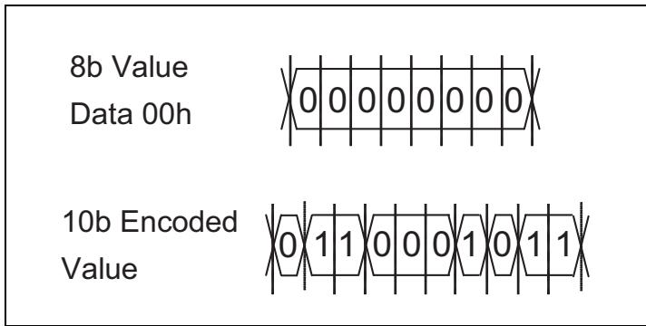

## Properties of 10-bit Symbols

As described in the literature on 8b/10b coding, the design isn’t strictly 8 bits to 10 bits. Instead, it’s really a 5‐to‐6 bit encoding followed by a 3‐to‐4 bit encoding. The sub‐blocks are internal to the design but their existence helps to explain some of the properties for a legal Symbol, as listed below. A Symbol that doesn’t follow these properties is considered invalid.

## PCI Express Technology

• The bit stream never contains more than five continuous 1s or 0s, even from the end of one Symbol to beginning of the next.

• Each 10‐bit Symbol contains:

— Four 0s and six 1s (not necessarily contiguous), or

— Six 0s and four 1s (not necessarily contiguous), or

— Five 0s and five 1s (not necessarily contiguous).

Each 10‐bit Symbol is subdivided into two sub‐blocks: the first is six bits wide and the second is four bits wide.

— The 6‐bit sub‐block contains no more than four 1s or four 0s.

— The 4‐bit sub‐block contains no more than three 1s or three 0s.

## Character Notation

The 8b/10b uses a special notation shorthand, and Figure 11‐16 on page 382 illustrates the steps to arrive at the shorthand for a given character:

1. Partition the character into its 3‐bit and 5‐bit sub‐blocks.

2. Transpose the position of the sub‐blocks.

3. Create the decimal equivalent for each sub‐block.

4. The character takes the form Dxx.y for Data characters, or Kxx.y for Control characters. In this notation, xx is the decimal equivalent of the 5‐bit field, and y is the decimal equivalent of the 3‐bit field.

Figure 11‐16: 8b/10b Nomenclature  

## Disparity

Definition. Disparity refers to the inequality between the number of ones and zeros within a 10‐bit Symbol and is used to help maintain DC balance on the link. A Symbol with more zeros is said to have a negative (–) disparity, while a Symbol with more ones has a positive (+) disparity. When a Symbol has an equal number of ones and zeros, it’s said to have a neutral disparity. Interestingly, most characters encode into Symbols with + or – disparity, but some only encode into Symbols with neutral disparity.

CRD (Current Running Disparity). The CRD is the information as to the current state of disparity on the link. Since it’s just a single bit it can only be positive or negative and doesn’t always change when the next Symbol is sent out. To see how it works, remember that the next Symbol decoded can have negative, neutral, or positive disparity, then consider the following example. If the CRD was positive, an outgoing Symbol with a negative disparity would change it to negative, a neutral disparity would leave it as positive, and a positive disparity would be an error because the CRD is only one bit and can’t be made more positive.

The initial state of the CRD (before any characters are transmitted) may not match between the sender and receiver but it turns out that it doesn’t matter. When the receiver sees the first Symbol after training is complete, it will check for a disparity error and, if one is found, just change the CRD. This won’t be considered an error but simply an adjustment of the CRD to match the receiver and sender. After that, there are only two legal CRD cases: it can remain the same if the new Symbol has neutral disparity, or it can flip to the opposite polarity if the new Symbol has the opposite disparity. What is not legal is for the disparity of the new Symbol to be the same as the CRD. Such an event would be a disparity error and should never occur after the initial adjustment unless an error has occurred.

## Encoding Procedure

There are different ways that 8b/10b encoding could be accomplished. The simplest approach is probably to implement a look‐up table that contains all the possible output values. However, this table can require a comparatively large number of gates. Another approach is to implement the decoder as a logic block, and this is usually the preferred choice because it typically results in a smaller and cheaper solution. The specifics of the encoding logic are described in detail in the referenced literature, so we’ll focus here on the bigger picture of how it works instead

## PCI Express Technology

An example 8b/10b block diagram is shown in Figure 11‐17 on page 384. A new outgoing Symbol is created based on three things: the incoming character, the D/K# indication for that character, and the CRD. A new CRD value is computed based on the outgoing Symbol and is fed back for use in encoding the next character. After encoding, the resulting Symbol is fed to a serializer that clocks out the individual bits. Figure 11‐18 on page 385 shows some sample 8b/10b encodings that will be useful for the example that follows.

Figure 11‐17: 8‐bit to 10‐bit (8b/10b) Encoder  

Figure 11‐18: Example 8b/10b Encodings

<table><tr><td>D or K Character</td><td>Hex Byte</td><td>Binary Bits HGF EDCBA</td><td>Byte Name</td><td colspan="2">CRD - abcdei fghj</td><td colspan="2">CRD + abcdei fghj</td></tr><tr><td>Data (D)</td><td>6A</td><td>011 01010</td><td>D10.3</td><td colspan="2">010101 1100</td><td colspan="2">010101 0011</td></tr><tr><td>Data (D)</td><td>1B</td><td>000 11011</td><td>D27.0</td><td colspan="2">110110 0100</td><td colspan="2">001001 1011</td></tr><tr><td>Data (D)</td><td>F7</td><td>111 10111</td><td>D23.7</td><td colspan="2">111010 0001</td><td colspan="2">000101 1110</td></tr><tr><td>Control (K)</td><td>F7</td><td>111 10111</td><td>K23.7</td><td colspan="2">111010 1000</td><td colspan="2">000101 0111</td></tr><tr><td>Control (K)</td><td>BC</td><td>101 11100</td><td>K28.5</td><td colspan="2">001111 1010</td><td colspan="2">110000 0101</td></tr></table>

## Example Transmission

Figure 11‐19 illustrates the encode and transmission of three characters: the first and second are the control character K28.5 and the third character is the data character D10.3.

In this example the initial CRD is negative so K28.5 encodes into 001111 1010b. This Symbol has positive disparity (more ones than zeros), and causes the CRD polarity to flip to positive. The next K28.5 is encoded into 110000 0101b and has a negative disparity. That causes the CRD this time to flip to negative. Finally, D10.3 is encoded into 010101 1100b. Since its disparity is neutral, the CRD doesn’t change in this case but remains negative for whatever the next character will be.

Initialized value of CRD is don’t care. Receiver can determine from incoming bit stream

Figure 11‐19: Example 8b/10b Transmission  
Use these two characters in the example below:

<table><tr><td>D/K#</td><td>Hex Byte</td><td>Binary Bits HGF EDCBA</td><td>Byte Name</td><td>CRD – abcdei fghj</td><td>CRD + abcdei fghj</td></tr><tr><td>Control (K)</td><td>BC</td><td>101 11100</td><td>K28.5</td><td>001111 1010</td><td>110000 0101</td></tr><tr><td>Data (D)</td><td>6A</td><td>011 01010</td><td>D10.3</td><td>010101 1100</td><td>010101 0011</td></tr></table>

Example Transmission

<table><tr><td></td><td>CRD</td><td>Character</td><td>CRD</td><td>Character</td><td>CRD</td><td>Character</td><td>CRD</td></tr><tr><td>Character to be transmitted</td><td rowspan="2">-</td><td>K28.5 (BCh)</td><td rowspan="2">+</td><td>K28.5 (BCh)</td><td rowspan="2">-</td><td>D10.3 (6Ah)</td><td rowspan="2">-</td></tr><tr><td>Bit stream transmitted</td><td>Yields 001111 1010 CRD is +</td><td>Yields 110000 0101 CRD is -</td><td>Yields 010101 1100 CRD is neutral</td></tr></table>

## Control Characters

The 8b/10b encoding provides several special characters for Link management and Table 11‐1 on page 386 shows their encoding.

Table 11‐1: Control Character Encoding and Definition

<table><tr><td>Character Name</td><td>8b/10b Name</td><td>Description</td></tr><tr><td>COM</td><td>K28.5</td><td>First character in any ordered set. Also used by Rx to achieve Symbol lock during training.</td></tr><tr><td>PAD</td><td>K23.7</td><td>Packet filler</td></tr><tr><td>SKP</td><td>K28.0</td><td>Used in SKIP ordered set for Clock Tolerance Compensation</td></tr><tr><td>STP</td><td>K27.7</td><td>Start of a TLP</td></tr><tr><td>SDP</td><td>K28.2</td><td>Start of a DLLP</td></tr><tr><td>END</td><td>K29.7</td><td>End of Good Packet</td></tr><tr><td>EDB</td><td>K30.7</td><td>End of a bad or ‘nullified’ TLP.</td></tr><tr><td>FTS</td><td>K28.1</td><td>Used to exit from L0s low power state to L0</td></tr><tr><td>IDL</td><td>K28.3</td><td>Used to place Link into Electrical Idle state</td></tr><tr><td>EIE</td><td>K28.7</td><td>Part of the Electrical Idle Exit Ordered Set sent prior to bringing the Link back to full power for speeds higher than 2.5 GT/s</td></tr></table>

COM (Comma): One of the main functions of this is to be the first Symbol in the physical layer communications called ordered sets (see “Ordered sets” on page 388). It has an interesting property that makes both of its Symbol encodings easily recognizable at the receiver: they start with two bits of one polarity followed by five bits of the opposite polarity (001111 1010 or 110000 0101). This property is especially helpful for initial training, when the receiver is trying to make sense of the string of bits coming in, because it helps the receiver lock onto the incoming Symbol stream. See “Link Training and Initialization” on page 405 for more on how this works.

PAD: On a multi‐Lane Link, if a packet to be sent doesn’t cover all the available lanes and there are no more packets ready to send, the PAD character is used to fill in the remaining Lanes.

SKP (Skip): This is used as part of the SKIP ordered set that is sent periodically to facilitate clock tolerance compensation.

• STP (Start TLP): Inserted to identify the start of a TLP.

• SDP (Start DLLP): Inserted to identify the start of a DLLP.

• END: Appended to identify the end of an error‐free TLP or DLLP.

EDB (EnD Bad): Inserted to identify the end of a TLP that a forwarding device (such as a switch) wishes to ‘nullify’. This case can arise when a switch using the “cut‐through mode” forwards a packet from an ingress port to an egress port without buffering the whole packet first. Any error detected during the forwarding process creates a problem because a portion of the packet is already being delivered before the packet can be checked for errors. To handle this case, the switch must cancel the one that’s already in route to the destination. This is accomplished by nullifying it: ending the packet with EDB and inverting the LCRC from what it should have been. When a receiver sees a nullified packet, it discards the packet and does not return an ACK or NAK. (See the “Example of Cut‐Through Operation” on page 356.)

FTS (Fast Training Sequence): Part of the FTS ordered set sent by a device to recover a link from the L0s standby state back to the full‐on L0 state.

IDL (Idle): Part of the Electrical Idle ordered set sent to inform the receiver that the Link is transitioning into a low power state.

EIE (Electrical Idle Exit): Added in the PCIe 2.0 spec and used to help an electrically‐idle link begin the wake up process.

## Ordered sets

General. Ordered Sets are used for communication between the Physical Layers of Link partners and may be thought of as Lane management packets. By definition they are a series of characters that are not TLPs or DLLPs. For Gen1 and Gen2 they always begin with the COM character. Ordered Sets are replicated on all Lanes at the same time, because each Lane is technically an independent serial path. This also allows Receivers to verify alignment and de‐skewing. Ordered Sets are used for things like Link training, clock tolerance compensation, and changing Link power states.

TS1 and TS2 Ordered Set (TS1OS/TS2OS). Training sequences one and two are used for Link initialization and training. They allow the Link partners to achieve bit lock and Symbol lock, negotiate the link speed, and report other variables associated with Link operation. They are described in more detail in the section titled “TS1 and TS2 Ordered Sets” on page 510.

Electrical Idle Ordered Set (EIOS). A Transmitter that wishes to go to a lower‐power link state sends this before ceasing transmission. Upon receipt, Receivers know to prepare for the low power state. The EIOS consists of four Symbols: the COM Symbol followed by three IDL Symbols. Receivers detect this Ordered Set and prepare for the Link to go to into Electrical Idle by ignoring input errors until exiting from Electrical Idle. Shortly after sending EIOS, the Transmitter reduces its differential voltage to less than 20mV peak.

FTS Ordered Set (FTSOS). A Transmitter sends the proper number of these (the minimum number was given by the Link neighbor during training) to take a Link from the low‐power L0s state back to the fully‐operational L0 state. The receiver detects the FTSs, recognizes that the Link is exiting from Electrical Idle, and uses them to recover Bit and Symbol Lock.The FTS Ordered Set consists of four Symbols: the COM Symbol followed by three FTS Symbols.

SKP Ordered Set (SOS). This consists of four Symbols: the COM Symbol followed by three SKP Symbols. It’s transmitted at regular intervals and is used for Clock Tolerance Compensation as described in “Clock Compensation” on page 391 and “Receiver Clock Compensation Logic” on page 396. Basically, the Receiver evaluates the SOS and internally adds or removes SKP Symbols as needed to prevent its elastic buffer from under‐flowing or over‐flowing.

Electrical Idle Exit Ordered Set (EIEOS). Added in the PCIe 2.0 spec, this Ordered Set was defined to provide a lower‐frequency sequence required to exit the electrical idle Link state. The EIEOS for 8b/10b encoding, uses repeated K28.7 control characters to appear as a repeating string of 5 ones followed by 5 zeros. This low frequency string produces a low‐frequency signal that allows for higher signal voltages that are more readily detected at the receiver. In fact, the spec states that this pattern guarantees that the Receiver will properly detect an exit from Electrical Idle, something that scrambled data cannot do. For details on electrical idle exit, refer to the section “Electrical Idle” on page 736.

## Serializer

The 8b/10b encoder on each lane feeds a serializer that clocks the Symbols out in bit order (see Figure 11‐17 on page 384), with the least significant bit (a) shifted out first and the most significant bit (j) shifted out last. For each lane, the Symbols will be supplied to the serializer at either 250MHz or 500MHz to support a serial bit rate 10 times faster than that at 2.5 GHz or 5.0 GHz.

## Differential Driver

The differential driver that actually sends the bit stream onto the wire uses NRZ encoding. NRZ simply means that there are no special or intermediate voltage levels used. Differential signalling improves signal integrity and allows for both higher frequencies and lower voltages. Details regarding the electrical characteristics of the driver are discussed in the section “Transmitter Voltages” on page 462.

## Transmit Clock (Tx Clock)

The serialized output on each Lane is clocked out by the Tx Clock signal. As mentioned earlier, the clock frequency must be accurate to +/–300ppm around the center frequency (600ppm total variation). There are two options regarding the source of this clock. It can be generated internally or derived from an external reference that may optionally be available. The PCIe spec for peripheral cards includes the definition of a 100MHz reference clock supplied by the system board for this purpose. This reference clock is multiplied internally to derive the local clock that drives the internal logic and the Tx clock used by the serializer.

## Miscellaneous Transmit Topics

## Logical Idle

In order to keep the receiver’s PLL from drifting, something must be transmitted during periods when there are no TLPs, DLLPs or ordered sets to transmit, and it is logical idle characters that are injected into the character flow during these times. Some properties of the logical idle character:

• It’s an 8‐bit Data character with a value of 00h.

When sent, it goes on all Lanes at the same time and the Link is said to be in the logical idle state (not to be confused with electrical Idle—the state when the output driver stops transmitting altogether and the receiver PLL loses synchronization).

The logical idle character is scrambled, but a receiver can distinguish it from other data because it occurs outside of a packet framing context (i.e.: after an END or EDB, but before an STP or SDP).

• It is 8b/10b encoded.

During logical idle transmission, SKIP ordered sets are still sent periodically.

## Tx Signal Skew

Understandably, the transmitter should introduce a minimal skew between lanes to leave as much Rx skew budget as possible for routing and other variations. The spec lists the Tx skew values as 500ps + 2 UI for Gen1, 500ps + 4UI for Gen2, and 500ps + 6 UI for Gen3. Recalling that UI (unit interval) represents one bit time on the Link, this works out as shown in Table 11‐2 below.

Table 11‐2: Allowable Transmitter Signal Skew

<table><tr><td>Spec Version</td><td>Allowable Tx Skew</td></tr><tr><td>Gen1</td><td>1300 ps</td></tr><tr><td>Gen2</td><td>1300 ps</td></tr><tr><td>Gen3</td><td>1250 ps</td></tr></table>

## Clock Compensation

Background. High‐speed serial transports like PCIe have a particular clock problem to solve. The receiver recovers a clock from the incoming bit stream and uses that to latch in the data bits, but this recovered clock is not synchronized with the receiver’s internal clock and at some point it has to begin clocking the data with its own internal clock. Even if they have an optional common external reference clock, the best they can do is to gener ate an internal clock within a specified tolerance of the desired frequency. Consequently, one of the clocks will almost always have a slightly higher frequency than the other. If the transmitter clock is faster, the packets will be arriving faster than they can be taken in. To compensate, the transmitter must inject some “throw‐away characters” in the bit stream that the receiver can discard if it proves necessary to avoid a buffer over‐run condition. For PCIe, these characters which can be deleted take the form of the SKIP ordered set, which consists of a COM character followed by three SKP characters (see Figure 11‐20). For more detail on this topic, refer to “Receiver Clock Compensation Logic” on page 396).

SKIP ordered set Insertion Rules. A transmitter is required to send SKIP ordered sets on a periodic basis, and the following rules apply:

The SKIP ordered set must be scheduled for insertion between 1180 and 1538 Symbol times (a Symbol time is the time required to send one Symbol and is 10 bit times, so at 2.5 GT/s, a Symbol time is 4ns and at 5.0 GT/s, it’s 2ns).

They are only inserted on packet boundaries (nothing is allowed to interrupt a packet) and must go simultaneously on all Lanes. If a packet is already in progress the SKP Ordered Set will have to wait. The maximum possible packet size would require more than 4096 Symbol times, though, and during that time several SKIP ordered sets should have

## PCI Express Technology

been sent. This case is handled by accumulating the SKIPs that should have gone out and injecting them all at the next packet boundary.

Since this ordered set must be transmitted on all Lanes simultaneously, a multi‐lane link may need to add PAD characters on some Lanes to allow the ordered set to go on all Lanes simultaneously (see Figure 11‐ 13 on page 377).

During low‐power link states, any counters used to schedule SKIP ordered sets must be reset. There’s no need for them when the transmitter isn’t signaling, and it wouldn’t make sense to wake up the link to send them.

SKIP ordered sets must not be transmitted while the Compliance Pattern is in progress.

Figure 11‐20: SKIP Ordered Set  

## Receive Logic Details (Gen1 and Gen2 Only)

Figure 11‐21 shows the receiver logic of the Logical Physical Layer. This section describes packet processing from the time the data is received serially on each lane until the packet byte stream is clocked into the Data Link Layer.

Figure 11‐21: Physical Layer Receive Logic Details (Gen1 and Gen2 Only)  
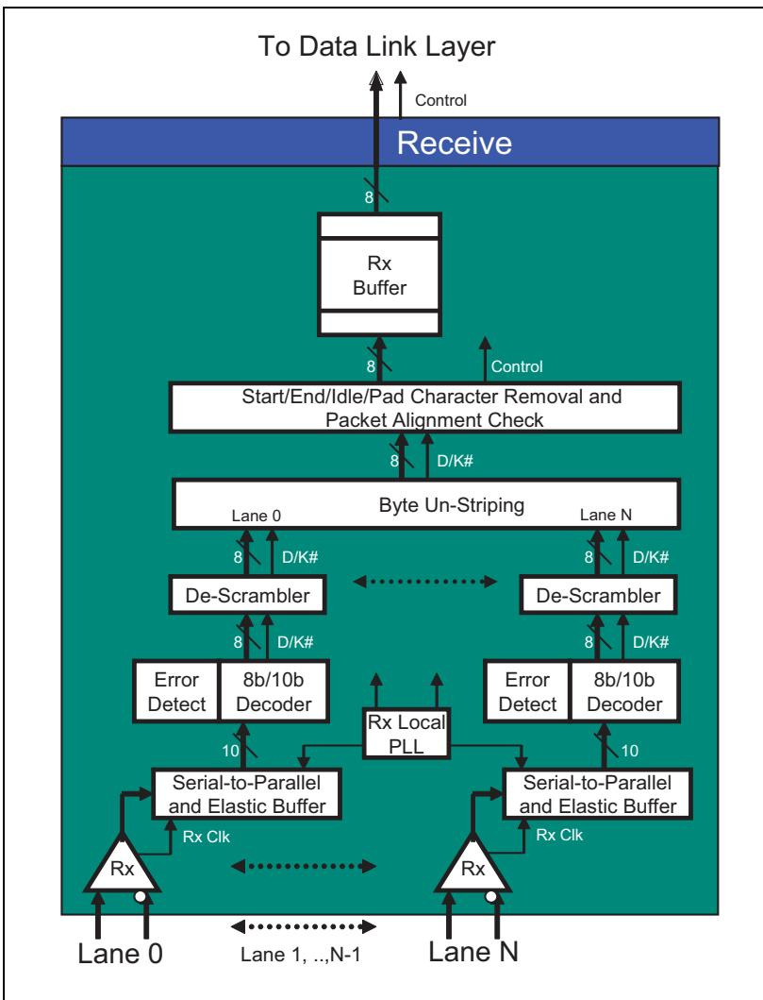

## Differential Receiver

The first parts of the receiver logic are shown in Figure 11‐22, including the differential input buffer for each lane. The buffer senses peak‐to‐peak voltage differences and determines whether the difference represents a logical one or zero.

## PCI Express Technology

For a detailed discussion of receiver characteristics, see section “Receiver Characteristics” on page 492.

Figure 11‐22: Receiver Logic’s Front End Per Lane  

## Rx Clock Recovery

## General

Next the receiver generates an Rx Clock from the data bit transitions in the input data stream, probably using a PLL. This recovered clock has the same frequency (2.5 or 5.0 GHz) as that of the Tx Clock that was used to clock the bit stream onto the wire. The Rx Clock is used to clock the inbound bit stream into the deserializer. The deserializer has to be aligned to the 10‐bit Symbol boundary (a process called achieving Symbol lock), and then its Symbol stream output is clocked into the elastic buffer with a version of the Rx Clock that’s been divided by 10. Even thought both must be accurate to within +/–300ppm of the center frequency, the Rx Clock is probably a little different from the Local Clock and if so, compensation is needed.

## Achieving Bit Lock

Recall that the 8b/10b encoding scheme guarantees the inbound serial Symbol stream will contain frequent transitions. The receiver PLL uses those transitions to create an Rx Clock that is synchronized with the Tx Clock that was used to clock the bit stream out of the transmitter. When the receiver locks on to the Tx Clock frequency, the receiver is said to have achieved “Bit Lock”.

During Link training, the transmitter sends a long series of TS1 and TS2 ordered sets to the receiver, which then uses the bit transitions in them to achieve Bit Lock. There are enough transitions on the Link during normal operation for the receiver to maintain Bit Lock after that.

## Losing Bit Lock

If the Link is put in a low power state (such as L0s or L1) in which packet transmission ceases, the receiver will lose synchronization. To avoid having the error circuit see this as an error, the transmitter sends an electrical Idle ordered set (EIOS) before going to the lower power state to tell the receiver to de‐gate its input.

## Regaining Bit Lock

When the transmitter is ready to wake the Link from the L0s state, it sends a specific number FTS ordered sets (the actual number is design specific) and the receiver uses these to regain bit and Symbol lock. A relatively small number of FTSs are needed to recover and so the recovery latency is short. Because the Link is in the L0s state for a short time, the receiver PLL does not usually drift too far from the Tx Clock before it begins to receive the FTSs. If the Link was instead in the L1 low power state and the transmitter instead starts transmitting TS1OSs. This results in the Link getting re‐trained and wakeup time is longer than L0s wakeup time. Should the Link have a more serious error and the Ack/ Nak mechanism be unsuccessful in error recovery after four attempts of retrying the TLPs, the Data Link Layer signals the Physical Layer to re‐training the Link. Here again, Bit Lock is re‐established during the re‐training process.

## Deserializer

## General

The incoming data is clocked into each Lane’s deserializer (serial‐to‐parallel converter) by the Rx clock (see Figure 11‐22 on page 394). The 10‐bit Symbols produced are clocked into the Elastic Buffer using a divided‐by‐10 version of the Rx Clock.

## PCI Express Technology

## Achieving Symbol Lock

When the receive logic starts receiving a bit stream, it is JABOB (just a bunch of bits) with no markers to differentiate Symbols or any boundaries. The receive logic must have a way to find the start and end of a 10‐bit Symbol, and the Comma (COM) Symbol serves this purpose.

The 10‐bit encoding of the COM Symbol contains two bits of one polarity followed by five bits of the opposite polarity (0011111010b or 1100000101b), making it easily detectable. Recall that the COM Control character, like all other Control characters, is also not scrambled by the transmitter, and that ensures that the desired sequence will be seen at the receiver. Upon detection of the COM, the logic knows that the next bit received will be the first bit of the next 10‐bit Symbol. At that point, the deserializer is said to have achieved ‘Symbol Lock’.

The COM Symbol is used to achieve Symbol Lock as follows:

During Link training when the Link is first established or when re‐training is needed, and TS1 and TS2 ordered sets are transmitted.

• When FTS ordered sets are sent to inform the receiver to change the state of the Link from L0s to L0.

## Receiver Clock Compensation Logic

## Background

We’ve observed before that the clocks used by the transmitter and receiver on either end of a link aren’t required to have exactly the same frequencies. This will be the case whenever the link doesn’t use a common reference clock and introduces the problem that one of them is running slightly faster than the other. The only requirement is that both clocks must be within +/– 300 ppm (parts per million) of the center frequency. Since one could be +300 ppm and the other could be ‐300 ppm in the worst case, the worst separation between them could be 600ppm. That difference translates into a gain or loss of one Symbol clock every 1666 clocks. Once the Link is trained, the receive clock (Rx Clock) in the receiver is the same as the transmit clock (Tx Clock) at the other end of the Link (because the receive clock is derived from the bit stream).

## Elastic Buffer’s Role

To compensate for that worst‐case frequency difference, an elastic buffer (see Figure 11‐22 on page 394) is built into the receive path. Received Symbols are clocked into it using the recovered clock and clocked out using the receiver’s local clock. The Elastic Buffer compensates for the frequency difference by adding or removing SKP Symbols. When a SKP ordered set arrives, logic watching the status of the elastic buffer makes an evaluation. If the local clock is running faster, Symbols are being clocked out faster than they’re coming in, so the buffer will be approaching an underflow condition. The logic will compensate for this by appending an extra SKP Symbol to the ordered set when it arrives to quickly refill the buffer. On the other hand, if the recovered clock is running faster, the buffer will be approaching an overflow condition and the logic will compensate for that by deleting one of the SKP Symbols to quickly drain the buffer. These actions will make up for difference in rates of arrival and consumption of the Symbols and prevent any confusion or loss of data.

The transmitter periodically sends the SKIP ordered sets for this purpose. As the name implies, the SKP characters are really disposable characters. Deleting or adding a SKP Symbol prevents a buffer overflow or underflow in the elastic buffer and then they get discarded along with all the other control characters when the Symbols are forwarded to the next layer. Consequently, they use a little bandwidth but don’t otherwise affect the flow of packets at all.

Although lost Symbols due to an Elastic Buffer overflow or underflow is an error condition, it’s optional for receivers to check for this. If they do, and this situation occurs, a Receiver Error will be indicated to the Data Link Layer.

The transmitter schedules a SKIP ordered set transmission once every 1180 to 1538 Symbol times. However, if the transmitter starts a maximum sized TLP transmission right at the 1538 Symbol time boundary when a SKIP ordered set is scheduled to be transmitted, the SKIP ordered set transmission is deferred. Receivers must be able to tolerate SKIP ordered sets that have a maximum separation dependent on the maximum packet payload size a device supports. The formula for the maximum number of Symbols (n) between SKIP ordered sets is: n = 1538 + (maximum packet payload size + 28)

The number 28 in the equation is the TLP overhead. It is the largest number of Symbols that would be associated with the header (16 bytes), the optional ECRC (4 bytes), the LCRC (4 bytes), the sequence number (2 bytes) and the framing Symbols STP and END (2 bytes).

## Lane-to-Lane Skew

## Flight Time Will Vary Between Lanes

For wide links, skew between lanes is an issue that can’t be avoided and which must be compensated at the receiver. Symbols are sent simultaneously on all lanes using the same transmit clock, but they can’t be expected to arrive at the receiver at precisely the same time. Sources of Lane‐to‐Lane skew include:

• Differences between electrical drivers and receivers

• Printed wiring board impedance variations

• Trace length mismatches

When the serial bit streams carrying a packet arrive at the receiver, this Lane‐to‐Lane skew must be removed to receive the bytes in the correct order. This process is referred to as de‐skewing the link.

## Ordered sets Help De-Skewing

The unique structure of the ordered sets and the fact that they are sent simultaneously on all the lanes makes them useful for detecting timing misalignment between Lanes. The spec doesn’t define a method for doing this but in Gen1 and Gen2 the receiver logic can simply look for the COM character on each lane. If it doesn’t appear at the same time on all Lanes, then the early arriving COMs are delayed until they all match up on all Lanes.

## Receiver Lane-to-Lane De-Skew Capability

This could be done by adjusting an analog delay line on the incoming signals. Alternatively, it could be done after the elastic buffer, which has the advantage that the arrival time differences are now digitized to Symbol times by the local clock of the receiver (see Figure 11‐23 on page 399). If the input to one lane makes it on a clock edge and another one doesn’t, the early arrival COMs can simply be delayed by the appropriate number of Symbol clocks to line it up with the late arriving COMs. The fact that the maximum allowable skew at the receiver is a multiple of the clock periods infers that the spec writers probably had an implementation like this in mind (see Table 11‐3 on page 399).

Table 11‐3: Allowable Receiver Signal Skew

<table><tr><td>Spec Version</td><td>Allowable Rx Skew</td></tr><tr><td>Gen1</td><td>20 ns(5 clocks at 4ns per Symbol)</td></tr><tr><td>Gen2</td><td>8 ns(4 clocks at 2ns per Symbol)</td></tr><tr><td>Gen3</td><td>6 ns(4 clocks at 1.25ns per Symbol)</td></tr></table>

In Gen3 mode there aren’t any COM characters to use for de‐skewing, but detecting Ordered Sets can still provide the necessary timing alignment.

## De-Skew Opportunities

An unambiguous pattern is needed on all lanes at the same time to perform deskewing and any ordered set will do. Link training sends these, but the SKIP ordered set is sent regularly during normal Link operation. Checking its arrival time allows the skew to be checked on an ongoing basis in case it might change based on temperature or voltage. If it does, the Link will need to transition to the Recovery LTSSM state to correct it. If that happens while packets are in flight, however, a receiver error may occur and a packet could be dropped, possibly resulting in replayed TLPs.

Figure 11‐23: Receiver’s Link De‐Skew Logic  
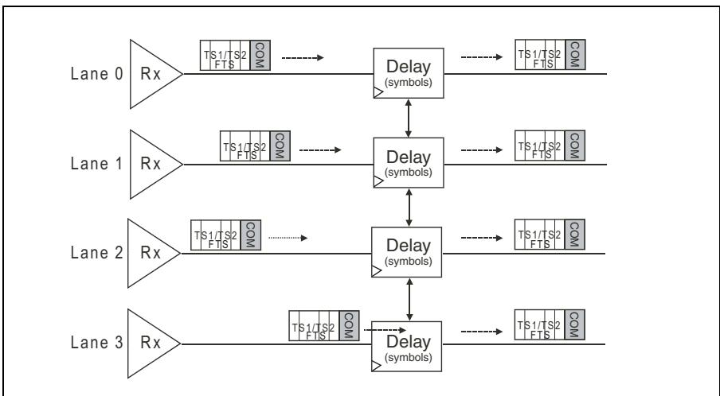

## 8b/10b Decoder

## General

The first two generations of PCIe use 8b/10b, while Gen3 does not. Let’s explore the operation of it first and then consider the difference for Gen3. Refer to Figure 11‐24 on page 401. Each receiver Lane incorporates a 10b/8b decoder which is fed from the Elastic Buffer. The decoder is shown with two lookup tables (the D and K tables) to decode the 10‐bit Symbol stream into 8‐bit characters plus the D/K# signal. The state of the D/K# signal indicates that the received Symbol is a Data (D) character if a match for the received Symbol is found in the D table, or a Control (K) character if a match for the received Symbol is discovered in the K table.

## Disparity Calculator

The decoder sets the disparity value based on the disparity of the first Symbol received. After the first Symbol, once Symbol lock has been achieved and disparity has been initialized, the calculated disparity for each subsequent Symbol’s disparity is expected to follow the rules. If it does not, a Receiver Error is reported.

## Code Violation and Disparity Error Detection

General. The error detection logic of the 8b/10b decoder detects illegal Symbols in the received Symbol stream. Some error checking is optional in the receiver, but the spec requires that these errors be checked and reported as a Receiver Error. The two types of errors detected are:

## Code Violations.

• Any 6‐bit sub‐block containing more than four 1s or four 0s is in error.

• Any 4‐bit sub‐block containing more than three 1s or three 0s is in error.

• Any 10‐bit Symbol containing more than six 1s or six 0s is in error.

• Any 10‐bit Symbol containing more than five consecutive 1s or five consecutive 0s is in error.

• Any 10‐bit Symbol that doesn’t decode into an 8‐bit character is in error.

## Disparity Errors.

At the receiver a Symbol cannot have a disparity that doesn’t match what it should be for the CRD. If it does, a disparity error is detected. Some disparity errors may not be detectable until the subsequent Symbol is processed (see Figure 11‐25 on page 401). For example, if two bits in a Symbol flip in error, the error may not be visible and the Symbol may decode into a valid 8‐bit character. Such an error won’t be detected in the Physical Layer.

Figure 11‐24: 8b/10b Decoder per Lane  
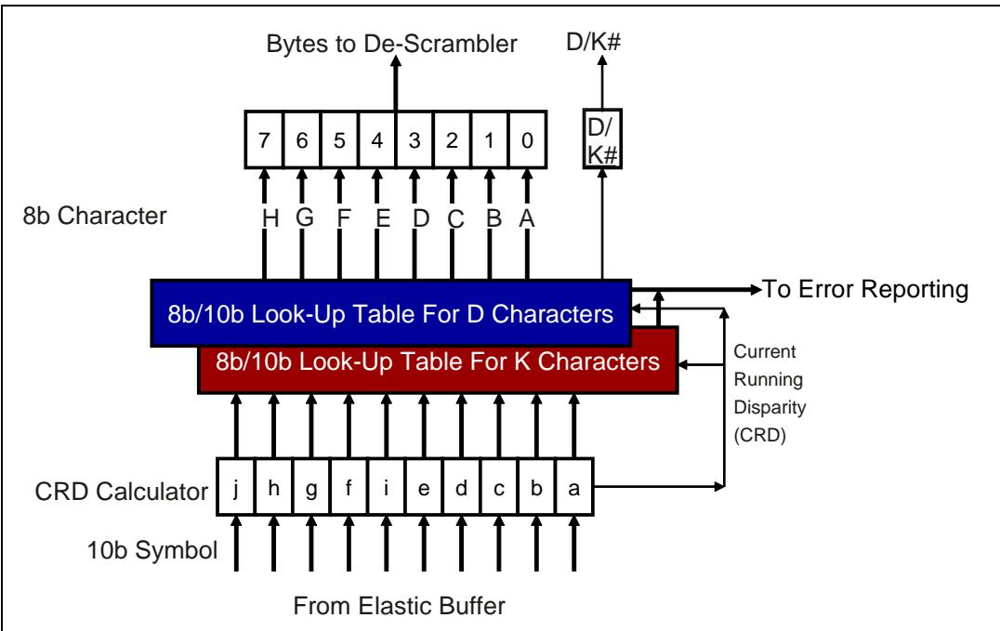  
Figure 11‐25: Example of Delayed Disparity Error Detection

<table><tr><td></td><td>CRD</td><td>Character</td><td>CRD</td><td>Character</td><td>CRD</td><td>Character</td><td>CRD</td></tr><tr><td>Transmitted Character Stream</td><td>-</td><td>D21.1</td><td>-</td><td>D10.2</td><td>-</td><td>D23.5</td><td>+</td></tr><tr><td>Transmitted Bit Stream</td><td>-</td><td>101010 1001</td><td>-</td><td>010101 0101</td><td>-</td><td>111010 1010</td><td>+</td></tr><tr><td>Bit Stream After Error</td><td>-</td><td>101010 1011</td><td>+</td><td>010101 0101</td><td>+</td><td>111010 1010</td><td>+</td></tr><tr><td>Decoded Character Stream</td><td>-</td><td>D21.0</td><td>+</td><td>D10.2</td><td>+</td><td>Invalid</td><td>+</td></tr></table>

## Descrambler

The descrambler is fed by the 8b/10b decoder. It only descrambles Data (D) characters associated with a TLP or DLLP (D/K# is high). It doesn’t descramble Control (K) characters or ordered sets because they’re not scrambled at the transmitter.

## Some Descrambler Implementation Rules:

• On a multi‐Lane Link, descramblers associated with each Lane must operate in concert, maintaining the same simultaneous value in each LFSR.

Descrambling is applied to ‘D’ characters associated with TLP and DLLPs including the Logical Idle (00h) sequence. ‘D’ characters within ordered set are not descrambled.

• ‘K’ characters and ordered set characters bypass the descrambler logic.

• Compliance Pattern characters are not descrambled.

• When a COM character enters the descrambler, it reinitializes the LFSR value to FFFFh.

With one exception, the LFSR serially advances eight times for every character (D or K character) received. The LFSR does NOT advance on SKP characters associated with the SKIP ordered sets received. The reason the LFSR is not advanced on detecting SKPs is because there may be a difference between the number of SKP characters transmitted and the SKP characters exiting the Elastic Buffer (as discussed in “Receiver Clock Compensation Logic” on page 396).

## Disabling Descrambling

By default, descrambling is always enabled, but the spec allows it to be disabled for test and debug purposes although no standard software method is given for disabling it. If the descrambler receives at least two TS1/TS2 ordered sets with the “disable scrambling” bit set on all of its configured Lanes, it disables the descrambler.

## Byte Un-Striping

Figure 11‐26 on page 403 shows eight character streams from the descramblers of a x8 Link being un‐striped into a single byte stream which is fed to the character filter logic.

Figure 11‐26: Example of x8 Byte Un‐Striping  

## Filter and Packet Alignment Check

The serial byte stream supplied by the byte un‐striping logic contains TLPs, DLLPs, Logical Idle sequences, Control characters such as STP, SDP, END, EDB, and PADs, as well as the ordered sets. Of these, the Logical Idle sequence, the control characters and ordered sets are detected and eliminated before they get to the next layer. What remains are the TLPs and DLLPs and these are sent to the Rx Buffer along with an indicator of the start and end of each packet.

## Receive Buffer (Rx Buffer)

The Rx Buffer holds received TLPs and DLLPs after the start and end characters have been eliminated. The received packets are ready to send to the Data Link Layer. The interface to the Data Link Layer is not described in the spec, so the designer is free to decide details like data bus width. As an example, we can

## PCI Express Technology

assume an interface clock of 250MHz and a Gen1 speed on the Link. For that case, the number of bytes in the data bus between these layers would be the same as the number of Lanes supported.

## Physical Layer Error Handling

## General

Physical Layer errors are reported as Receiver Errors to the Data Link Layer. According to the spec, some errors must be checked and trigger a receiver error, while others are optional.

Required error checking:

• 8b/10b decode errors: disparity error, illegal Symbol

Optional error checking:

• Loss of Symbol lock (see “Achieving Symbol Lock” on page 396)

• Elastic Buffer overflow or underflow

• Lane deskew errors (see “Lane‐to‐Lane Skew” on page 398)

• Packets inconsistent with format rules

## Response of Data Link Layer to Receiver Error

If the Physical Layer indicates a Receiver Error to the Data Link Layer, the Data Link Layer discards the TLP currently being received and frees any storage allocated for the TLP. It then schedules a NAK to go back to the transmitter of the TLP. That causes the transmitter to replay TLPs from the Replay Buffer, which should automatically correct the error. The Data Link Layer may also direct the Physical Layer to initiate Link re‐training.

If the PCI Express Extended Advanced Error Capabilities register set is implemented, a Receiver Error sets the Receiver Error Status bit in the Correctable Error Status register. If enabled, the device can send an ERR\_COR (correctable error) message to the Root Complex.

## Active State Power Management

There are several Link power states that allow power savings under certain conditions. These are L0s, L1, L2, and L3, which represent progressively lower power and also longer recovery time to get the link back to the fully‐operation state of L0. The L0s state can only be entered under hardware control, while L1 can be initiated by hardware or software. Since L0s and L1 can be controlled by hardware, they are referred to by the spec as ASPM (Active State Power Management) states. For more on the details of link and device power management see the section “Active State Power Management (ASPM)” on page 735.

## Link Training and Initialization

As we’ve just briefly mentioned in this chapter, the Physical Layer is also responsible for initializing the link after a reset. However, this topic is too big to cover here and is instead covered in Chapter 14, entitled ʺLink Initialization & Training,ʺ on page 505.

# 12 Physical Layer ‐ Logical (Gen3)

## The Previous Chapter

The previous chapter describes the Gen1/Gen2 logical sub‐block of the Physical Layer. This layer prepares packets for serial transmission and recovery, and the several steps needed to accomplish this are described in detail. The chapter covers logic associated with the Gen1 and Gen2 protocol that use 8b/10b encoding/ decoding.

## This Chapter

This chapter describes the logical Physical Layer characteristics for the third generation (Gen3) of PCIe. The major change includes the ability to double the bandwidth relative to Gen2 speed without needing to double the frequency (Link speed goes from 5 GT/s to 8 GT/s). This is accomplished by eliminating 8b/10b encoding when in Gen3 mode. More robust signal compensation is necessary at Gen3 speed.

## The Next Chapter

The next chapter describes the Physical Layer electrical interface to the Link. The need for signal equalization and the methods used to accomplish it are also discussed here. This chapter combines electrical transmitter and receiver characteristics for both Gen1, Gen2 and Gen3 speeds.

## Introduction to Gen3

Recall that when a PCIe Link enters training (i.e., after a reset) it always begins using Gen1 speed for backward compatibility. If higher speeds were advertised during the training, the Link will immediately transition to the Recovery state and attempt to change to the highest commonly‐supported speed.

The major motivation for upgrading the PCIe spec to Gen3 was to double the bandwidth, as shown in Table 12‐1 on page 408. The straightforward way to accomplish this would have been to simply double the signal frequency from 5 GT/s to 10 Gb/s, but doing that presented several problems:

Higher frequencies consume substantially more power, a condition exacerbated by the need for sophisticated conditioning logic (equalization) to maintain signal integrity at the higher speeds. In fact, the power demand of this equalizing logic is mentioned in PCISIG literature as a big motivation for keeping the frequency as low as practical.

Some circuit board materials experience significant signal degradation at higher frequencies. This problem can be overcome with better materials and more design effort, but those add cost and development time. Since PCIe is intended to serve a wide variety of systems, the goal was that it should work well in inexpensive designs, too.

Similarly, allowing new designs to use the existing infrastructure (circuit boards and connectors, for example) minimizes board design effort and cost. Using higher frequencies makes that more difficult because trace lengths and other parameters must be adjusted to account for the new timing, and that makes high frequencies less desirable.

Table 12‐1: PCI Express Aggregate Bandwidth for Various Link Widths

<table><tr><td>Link Width</td><td>x1</td><td>x2</td><td>x4</td><td>x8</td><td>x12</td><td>x16</td><td>x32</td></tr><tr><td>Gen1 Bandwidth (GB /s)</td><td>0.5</td><td>1</td><td>2</td><td>4</td><td>6</td><td>8</td><td>16</td></tr><tr><td>Gen2 Bandwidth (GB/s)</td><td>1</td><td>2</td><td>4</td><td>8</td><td>12</td><td>16</td><td>32</td></tr><tr><td>Gen3 Bandwidth (GB/s)</td><td>2</td><td>4</td><td>8</td><td>16</td><td>24</td><td>32</td><td>64</td></tr></table>

These considerations led to two significant changes to the Gen3 spec compared with the previous generations: a new encoding model and a more sophisticated signal equalization model.

## New Encoding Model

The logical part of the Physical Layer replaced the 8b/10b encoding with a new 128b/130b encoding scheme. Of course, this meant departing from the wellunderstood 8b/10b model used in many serial designs. Designers were willing to take this step to recover the 20% transmission overhead imposed by the 8b/ 10b encoding. Using 128b/130b means the Lanes are now delivering 8 bits/byte instead of 10 bits, and that means an 8.0 GT/s data rate that doubles the bandwidth. This equates to a bandwidth of 1 GB/s in each direction.

To illustrate the difference between these two encodings, first consider Figure 12‐1 that shows the general 8b/10b packet construction. The arrows highlight the Control (K) characters representing the framing Symbols for the 8b/10b packets. Receivers know what to expect by recognizing these control characters. See “8b/10b Encoding” on page 380 to review the benefits of this encoding scheme.

Figure 12‐1: 8b/10b Lane Encoding  

By comparison, Figure 12‐2 on page 410 shows the 128b/130b encoding. This encoding does not affect bytes being transferred, instead the characters are grouped into blocks of 16 bytes with a 2‐bit Sync field at the beginning of each block. The 2‐bit Sync field specifies whether the block includes Data (10b) or Ordered Sets (01b). Consequently, the Sync field indicates to the receiver what kind of traffic to expect and when it will begin. Ordered sets are similar to the 8b/10b version in that they must be driven on all the Lanes simultaneously. That requires getting the Lanes properly synchronized and this is part of the training process (see “Achieving Block Alignment” on page 438).

Figure 12‐2: 128b/130b Block Encoding  

## Sophisticated Signal Equalization

The second change is made to the electrical sub‐block of the Physical Layer and involves more sophisticated signal equalization both at the transmit side of the Link and optionally at the receiver. Gen1 and Gen2 implementations use a fixed Tx de‐emphasis to achieve good signal quality. However, increasing transmission frequencies beyond 5 GT/s causes signal integrity problems to become more pronounced, requiring more transmitter and receiver compensation. This can be managed somewhat at the board level but the designers wanted to allow the external infrastructure to remain the same as much as possible, and instead placed the burden on the PHY transmitter and receiver circuits. For more details on signal conditioning, refer to “Solution for 8.0 GT/s  ‐  Transmitter Equalization” on page 474.

## Encoding for 8.0 GT/s

As previously discussed, the Gen3 128b/130b encoding method uses Link‐wide packets and per‐Lane block encoding. This section provides additional details regarding the encoding.

## Lane-Level Encoding

To illustrate the use of Blocks, consider Figure 12‐3 on page 411, where a single‐Lane Data Block is shown. At the beginning are the two Sync Header bits follower by 16 bytes (128 bits) of information resulting in 130 transmitted bits. The Sync Header simply defines whether a Data block (10b) or an Ordered Set (01b) is being sent. You may have noticed the Data Block in Figure 12‐3 has a Sync Header value of 01 rather than the 10b value mentioned above. This is because the least significant bit of the Sync Header is sent first when transmitting the block across the link. Notice the symbols following the Sync Header are also sent with the least significant bit first.

Figure 12‐3: Sync Header Data Block Example  

## Block Alignment

Like previous implementations, Gen3 achieves Bit Lock first and then attempts to establish Block Alignment locking. This requires receivers to find the Sync Header that demarcates the Block boundary. Transmitters establish this boundary by sending recognizable EIEOS patterns consisting of alternating bytes of 00h and FFh, as shown in Figure 12‐4. Thus, the use of EIEOS has expanded from simply exiting Electrical Idle to also serving as the synchronizing mechanism that establishes Block Alignment. Note that the Sync Header bits immediately precede and follow the EIEOS (not shown in the illustration). See “Achieving Block Alignment” on page 438 for details regarding this process.

Figure 12‐4: Gen3 Mode EIEOS Symbol Pattern  
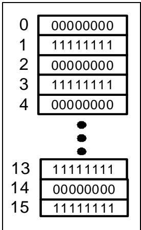

## Ordered Set Blocks

Ordered Sets have much the same meaning they did in Gen1 and Gen2. They are used to manage Lane protocol. When an Ordered Set Block is sent it must appear on all the Lanes at the same time and almost always consists of 16 bytes with one exception. The one exception to this size rule is the SOS (SKP Ordered Set) which can have SKP Symbols added or removed in groups of four by clock compensation logic (associated with a Link Repeater for example) and can therefore legally be 8, 12, 16, 20, or 24 bytes long.

The basic format of the Ordered Set Block is similar to the Data Block, except that the Sync Header bits are reversed, as shown in Figure 12‐5 on page 412.

Figure 12‐5: Gen3 x1 Ordered Set Block Example  
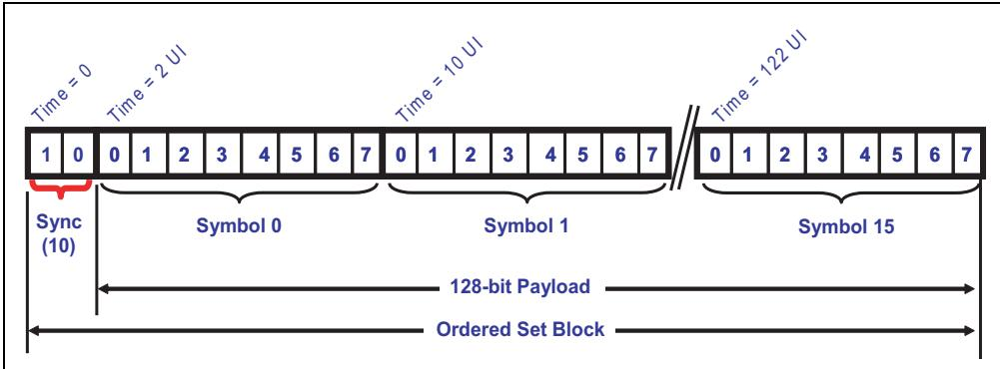

The spec defines seven Ordered Sets for Gen3 (one additional Ordered Set over Gen1 and Gen2 PCIe). In most cases, their functionality is the same as it was for the previous generations.

1. SOS  ‐  Skip Ordered Set: used for clock compensation. See “Ordered Set Example ‐ SOS” on page 426 for more detail.

2. EIOS ‐ Electrical Idle Ordered Set: used to enter Electrical Idle state

3. EIEOS ‐ Electrical Idle Exit Ordered Set: used for two purposes now: — Electrical Idle Exit as before — Block alignment indicator for 8.0 GT/s

4. TS1 ‐ Training Sequence 1 Ordered Set

5. TS2 ‐ Training Sequence 2 Ordered Set

6. FTS ‐ Fast Training Sequence Ordered Set

7. SDS ‐ Start of Data Stream Ordered Set: new ‐ see “Data Stream and Data Blocks” on page 413 for more

## Chapter 12: Physical Layer - Logical (Gen3)

To give the reader an example of the Ordered Set structure, Figure 12‐6 shows the content of an FTS Ordered Set when running at 8.0 GT/s. An Ordered Set Block is only recognized as an Ordered Set by the Sync Header, and identified as an FTS type by the first Symbol in the Block. The right‐hand side of the figure lists the Ordered Set Identifiers (the first Symbol for each Ordered Set) that serve to identify the type of Ordered Set is being transmitted.

Figure 12‐6: Gen3 FTS Ordered Set Example

<table><tr><td colspan="2">FTS Ordered Set</td><td colspan="2">Ordered Set Identifiers</td></tr><tr><td>Symbol</td><td>Value</td><td>Ordered Set</td><td>First Symbol</td></tr><tr><td>Sync Header</td><td>01b</td><td>EIEOS</td><td>00h</td></tr><tr><td>0</td><td>55h</td><td>EIOS</td><td>66h</td></tr><tr><td>1</td><td>47h</td><td>FTS</td><td>55h</td></tr><tr><td>2</td><td>4Eh</td><td>SDS</td><td>E1</td></tr><tr><td>3</td><td>C7h</td><td>TS1</td><td>1Eh</td></tr><tr><td>4</td><td>CCh</td><td>TS2</td><td>2Dh</td></tr><tr><td>5</td><td>C6h</td><td>SKP</td><td>AAh</td></tr><tr><td>6</td><td>C9h</td><td></td><td></td></tr><tr><td>7</td><td>25h</td><td></td><td></td></tr><tr><td>8</td><td>6Eh</td><td></td><td></td></tr><tr><td>9</td><td>ECh</td><td></td><td></td></tr><tr><td>10</td><td>88h</td><td></td><td></td></tr><tr><td>11</td><td>7Fh</td><td></td><td></td></tr><tr><td>12</td><td>80h</td><td></td><td></td></tr><tr><td>13</td><td>8Dh</td><td></td><td></td></tr><tr><td>14</td><td>8Bh</td><td></td><td></td></tr><tr><td>15</td><td>8Eh</td><td></td><td></td></tr></table>

## Data Stream and Data Blocks

The Link enters a Data Stream by sending an SDS Ordered Set and transitioning to the L0 Link state. While in a Data Stream multiple Data Blocks are transferred, until the Data Stream ends with an EDS Token (unless an error ends it early). An EDS Token always occupies the last four Symbols of the Data Block that precedes an Ordered Set. An exception is made for Skip Ordered Sets because they do not interrupt a Data Stream as long as certain conditions are met that are discussed later. A Data Stream is no longer in effect when the Link state transitions out of the L0 state to any other Link state, such as Recovery. For more on Link states, see “Link Training and Status State Machine (LTSSM)” on page 518.

## Data Block Frame Construction

Data Blocks comprise TLPs, DLLP, and Tokens that are used to deliver the information. Five types of Data structures (called Tokens) are also used within a Data Block. Each has patterns for easy detection by the receiver. Three of the token may be sent at the beginning of a block (i.e., immediately following a Sync Data Block). These include:

• Start TLP (STP) — followed by a TLP

• Start DLLP (SDP) — followed by a DLLP

• Logical Idle (IDLA) — sent when there is no packet activity

The remaining Tokens are delivered at the end of the Data Block:

• End of Data Stream (EDS) — Precedes the transition to Ordered Sets

• End Bad (EDB) — reports a nullified packet has been detected

Figure 12‐7 provides an example of a Data Block consisting of a single lane TLP transmission.

Figure 12‐7: Gen3 x1 Frame Construction Example  
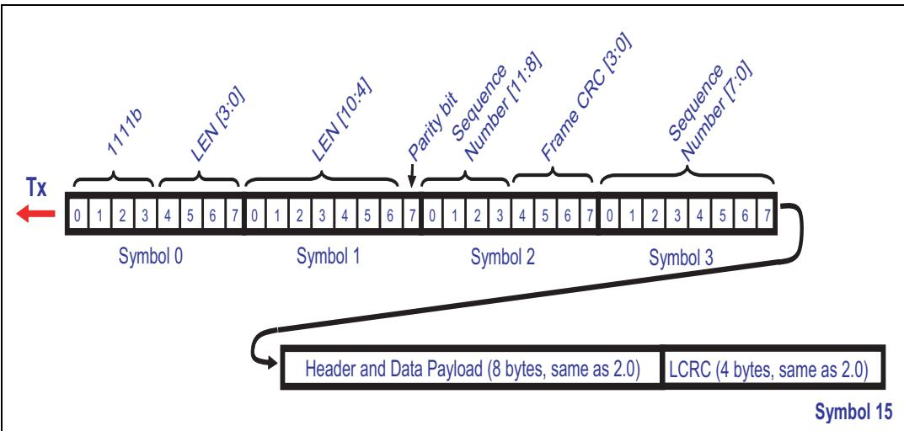

In summary, the contents of a given Data Block vary depending on the activity:

• IDLs — when no packets are being delivered Data Blocks consist of nothing but IDL. (The spec designates IDL as one of the Tokens)

• TLPs — One or more TLPs may be sent in a given Data Block depending on the link width.

• DLLPs — One or more DLLPs may be sent in a Data Block.

• Combinations of the activity listed above may be delivered in a single Data Block

## Framing Tokens

The spec defines five Framing Tokens (or just “Tokens” for short) that are allowed to appear in a Data Block, and those are repeated for convenience here in Figure 12‐8 on page 417. The five Tokens are:

1. STP ‐ Start TLP: Much like earlier version, but now includes dword count for the entire packet.

2. SDP ‐ Start DLLP

3. EDB ‐ End Bad: Used to nullify a TLP the way it was in earlier Gen1 and Gen2 designs, but now four EDB symbols in a row are sent. The END (End Good) symbol is done away now; if not explicitly marked as bad, the TLP will be assumed to be good.

4. EDS ‐ End of Data Stream: Last dword of a Data Stream, indicating that at least one Ordered Set will follow. Curiously, the Data Stream may not actually be ended by this event. If the Ordered Set that follows it is an SOS and is immediately followed by another Data Block, the Data Stream continues. If the Ordered Set that follows the EDS is anything other than SOS, or if the SOS is not followed by a Data Block, the Data Stream ends.

5. IDL ‐ Logical Idle: The Idle Token is simply data zero bytes sent during Link Logical Idle state when no TLPs or DLLPs are ready to transmit.

The difference between the way the spec shows the Tokens and the way they’re presented in Figure 12‐8 on page 417 is that this drawing shows both bytes and bits in little‐endian order instead of the big‐endian bit representation used in the spec. The reason it’s shown that way is to illustrate the order that the bits will actually appear on the Lane.

## Packets

The STP and SDP, indicate the start of a packet as shown in Figure 12‐7

TLPs. An STP Token consists of a nibble of 1’s followed by an 11‐bit dwordlength field. The length counts all the dwords of the TLP, including the

Token, header, optional data payload, optional digest, and LCRC. That allows the receiver to count dwords to recognize where the TLP ends. Consequently, it’s very important to verify that the Length field doesn’t have an error, and so it has a 4‐bit Frame CRC, and an even parity bit that protects both the Length and Frame CRC fields. The combination of these bits provides a robust triple‐bit‐flip detection capability for the Token (as many as 3 bits could be incorrect and it would still be recognized as an error). The 11‐ bit Length field allows for a TLP of 2K dwords (8KB) for the entire TLP.

DLLPs. The SDP Token indicates the beginning of a DLLP and doesn’t include a length field because it will always be exactly 8 bytes long: the 2‐ byte Token is followed by 4 bytes of DLLP payload and 2 bytes of DLLP LCRC. Perhaps coincidently, this DLLP length is the same as it was in earlier PCIe generations, but they also do not have an end good symbol.

The EDB Token is added to the end of TLPs that are nullified. For a normal TLP, there is no “end good” indication; it’s assumed to be good unless explicitly marked as bad. If the TLP ends up being nullified, the LCRC value is inverted and an EDB Token is appended as an extension of the TLP, although it’s not included in the length value. Physical layer receivers must check for the EDB at the end of every TLP and inform the Link layer if they see one. Not surprisingly, receiving an EDB at any time other than immediately after a TLP will be considered to be a Framing Error.

Figure 12‐8: Gen3 Frame Token Examples  
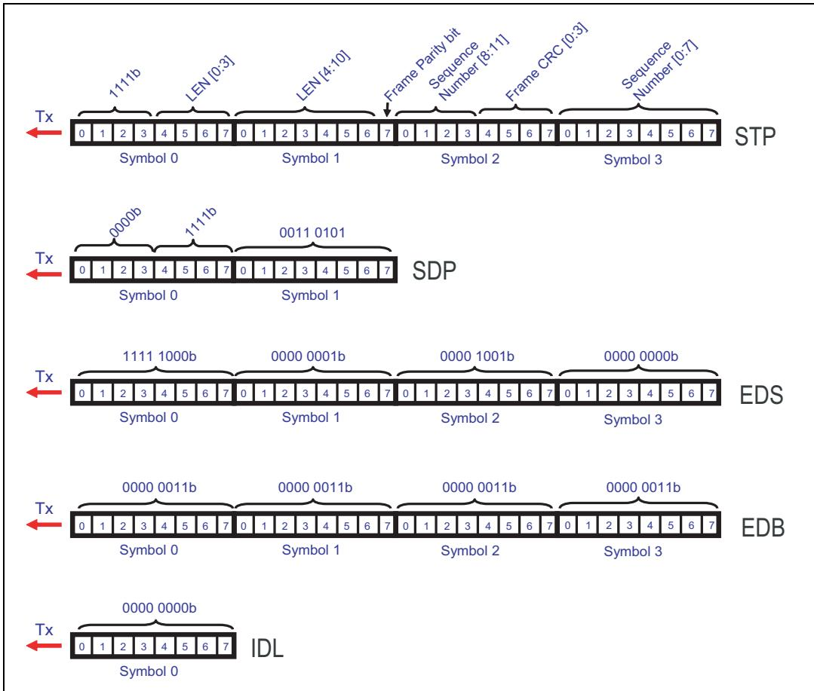

## Transmitter Framing Requirements

To begin this discussion, it will be helpful first to define a couple of things. First, recall that a Data Stream starts with the first Symbol following an SDS and it may contain Data Blocks made up of Tokens, TLPs and DLLPs. The Data Stream finishes with the last Symbol before an Ordered Set other than SOS, or when a Framing Error is detected. During a Data Stream no Ordered Sets can be sent except for the SOS.

Secondly, since framing problems will usually result in a Framing Error, it will help to explain what happens in that case. When Framing Errors occur, they are considered Receiver Errors and will be reported as such. The Receiver stops processing the Data Stream in progress and will only process a new Data Stream when it sees an SDS Ordered Set. In response to the error, a recovery process is initiated by directing the LTSSM to the Recovery state from L0. The expectation is that this will be resolved in the Physical Layer and will not require any action by the upper layers. In addition, the spec states that the round‐trip time to accomplish this is expected to take less than 1s from the time both Ports have entered Recovery.

Now, with that background in place, let’s continue with the framing requirements. While in a Data Stream, a transmitter must observe the following rules:

• When sending a TLP:

— An STP Token must be immediately followed by the entire contents of the TLP as delivered from the Link Layer, even if it’s nullified.

— If the TLP was nullified, the EDB Token must appear immediately after the last dword of the TLP, but must not be included in the TLP length value.

— An STP cannot be sent more than once per Symbol Time on the Link.

• When sending a DLLP:

— An SDP Token must be immediately followed by the entire contents of the DLLP as delivered from the Data Link Layer.

— An SDP cannot be sent more than once per Symbol Time on the Link.

• When sending an SOS (SKP Ordered Set) within a Data Stream:

— Send an EDS Token in the last dword of the current Data Block.

— Send the SOS as the next Ordered Set Block.

— Send another Data Block immediately after the SOS. The Data Stream resumes with the first Symbol of this subsequent Data Block.

If multiple SOS’s are scheduled, they can’t be back‐to‐back as they were in earlier generations. Instead, each one must be preceded by a Data Block that ends with the EDS Token. The Data block can be filled with TLPs, DLLPs or IDLs during this time.

To end a Data Stream, send the EDS Token in the last dword of the current Data Block and follow that with either the EIOS to go into a low power Link state, or an EIEOS for all other cases.

• The IDL Token must be sent on all Lanes if a TLP, DLLP, or other Framing Token is not being sent on the Link.

• For multi‐Lane Links:

— After sending an IDL Token, the first Symbol of the next TLP or DLLP must be in Lane 0 when it starts. An EDS Token must always be the last dword of a Data Block and therefore may not always follow that rule.

— IDL Tokens must be used to fill in dwords during a Symbol Time that would otherwise be empty. For example, if a x8 Link has a TLP that ends in Lane 3, but the sender doesn’t have another TLP or a DLLP ready to start in Lane 4, then IDLs must fill in the remaining bytes until the end of that Symbol Time.

Since packets are still multiples of 4 bytes as they were in the earlier generations, they’ll start and end on 4‐Lane boundaries. For example, a x8 Link with a DLLP that ends in Lane 3 could start the next TLP by placing its STP Token in Lane 4.

## Receiver Framing Requirements

When a Data Stream is seen at the Receiver, the following rules apply:

• When Framing Tokens are expected, Symbols that look like anything else will be Framing Errors.

• Some error checks and reports shown in the list below are optional, and the spec points out that they are independently optional.

• When an STP is received:

Receivers must check the Frame CRC and Frame Parity fields, and any mismatch will be a Framing Error. (Note that an STP Token with a Framing Error isn’t considered to be part of a TLP when reporting this error.).

The Symbol immediately after the last DW of the TLP is the next Token to process, and Receivers must check to see whether it’s the start of an EDB Token showing that the TLP has been nullified.

— Optionally check for length value of zero; if detected, it’s a Framing Error.

— Optionally check for the arrival of more than one STP Token in the same Symbol Time. If checking and detected, this is a Framing Error.

## • When an EDB is received:

— Receiver must inform the Link Layer as soon as the first EDB Symbol is detected, or after any of the remaining bytes of it have been received.

— If any Symbols in the Token are not EDBs, the result is a Framing Error.

— The only legal time for an EDB Token is right after a TLP; any other use will be a Framing Error.

— The Symbol immediately following the EDB Token will be the first Symbol of the next Token to be processed.

• When an EDS Token is received as the last DW of a Data Block:

— Receivers must stop processing the Data Stream.

— Only a SKP, EIOS, or EIEOS Ordered Set will be acceptable next; receiving any other Ordered set will be a Framing Error.

— If a SKP Ordered Set is received after an EDS, Receivers must resume Data Stream processing with the first Symbol of the Data Block that follows, unless a Framing Error was detected.

## PCI Express Technology

• When an SDP Token is received:

— The Symbol immediately after the DLLP is the next Token to be processed.

— Optionally check for more than one SDP Token in the same Symbol Time. If checking and this occurs, it is a Framing Error.

• When an IDL Token is received:

The next Token is allowed to begin on any DW‐aligned Lane following the IDL Token. For Links that are x4 or narrower, that means the next Token can only start in Lane 0 of the next Symbol Time. For wider Links there are more options. For example, a x16 Link could start the next Token in Lane 0, 4, 8, or 12 of the current Symbol Time.

— The only Token that would be expected in the same Symbol Time as an IDL would be another IDL or an EDS.

• While processing a Data Stream, Receivers will see the following as Framing Errors:

— An Ordered Set immediately following an SDS.

— A Block with an illegal Sync Header (11b or 00b). This can optionally be reported in the Lane Error Status register.

— An Ordered Set Block on any Lane without receiving an EDS Token in the previous Block.

— A Data Block immediately following an EDS Token in the previous block.

— Optionally, verify that all Lanes receive the same Ordered Set.

## Recovery from Framing Errors

If a Framing Error is seen while processing a Data Stream, the Receiver must:

Report a Receiver Error (if the optional Advanced Error Reporting registers are available, set the status bit shown in Figure 12‐9 on page 421).

Stop processing the Data Stream. Processing a new Data Stream can begin when the next SDS Ordered Set is seen.

Initiate the error recovery process. If the Link is in the L0 state, that will involve a transition to the Recovery state. The spec says that the time through the Recovery state is “expected” to be less than 1s.

Note that recovery from Framing Errors is not necessarily expected to directly cause Data Link Layer initiated recovery activity via the Ack/Nak mechanism. Of course, if a TLP is lost or corrupted as a result of the error, then a replay event will be needed.

Figure 12‐9: AER Correctable Error Register  
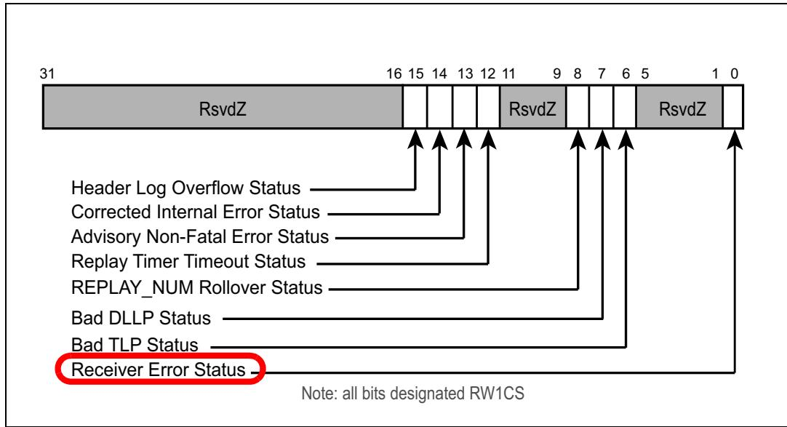

## Gen3 Physical Layer Transmit Logic

Figure 12‐10 on page 422 illustrates a conceptual block diagram of the Physical Layer transmit logic that supports Gen3 speeds. The overall design is very similar to Gen2 so there’s no need to go through all the details again but there are some differences. Those who are new to PCIe are encouraged to review the earlier chapter called “Physical Layer  ‐ Logical (Gen1 and Gen2)” on page 361 to learn the basics of the Physical Layer design. Let’s start at the top of the diagram and explain the changes for Gen3 along the way. As before, it’s important to point out that this implementation is only for instructional purposes and is not meant to show an actual Gen3 Physical Layer implementation.

## Multiplexer

TLPs and DLLPs arrive from the Data Link Layer at the top. The multiplexer mixes in the STP or SDP Tokens necessary to build a complete TLP or DLLP. The previous section described the Token formats.

Figure 12‐10: Gen3 Physical Layer Transmitter Details  

Gen3 TLP boundaries are defined by the dword count in the Length field of the STP Token at the beginning of a TLP packet, therefore, no END frame character is needed.

When ending a Data Stream or just before sending an SOS, the EDS Token in muxed into the Data Stream. At regular intervals, based on a Skip timer, an SOS is inserted into the Data Stream by the multiplexer. Other Ordered‐Sets such as TS1, TS2, FTS, EIEOS, EIOS, SDS may also be muxed based on Link requirements and are outside the Data Stream.

Packets are transmitted in Blocks which are identified by the 2‐bit Sync Header. The Sych Header is added by the multiplexer. However, the Sych Header is replicated on all Lanes of a multi‐Lane Link by the Byte Striping logic.

When there are no packets or Ordered Sets to send but the Link is to remain active in L0 state, the IDL (Logical Idle, or data zero) Tokens are used as fillers. These are scrambled just like other data bytes and are recognized as filler by the Receiver.

## Byte Striping

This logic spreads the bytes to be delivered across all the available Lanes. The framing rules were described earlier in “Transmitter Framing Requirements” on page 417, so now let’s look at some examples and discuss how the rules apply.

Consider first the example shown in Figure 12‐11 on page 424, where a 4‐Lane Link is illustrated. Notice that the Sync Header bits appear on all the Lanes at the same time when a new Block begins and define the block type (a Data Block in this example). Block encoding is handled independently for each Lane, but the bytes (or symbols) are striped across all the Lanes just as they were for the earlier generations of PCIe.

Figure 12‐11: Gen3 Byte Striping x4  

## Byte Striping x8 Example

Next, consider the x8 Link shown in Figure 12‐12 on page 425, which is an example from the spec redrawn to make it easier to read. Here the bit stream is vertical instead of horizontal. At the top we can see that the Sync bits, shown in little‐endian order as required, appear on all Lanes simultaneously and indicate that a Data Block is starting.

In this example, a TLP is sent first, so Symbols 0 ‐ 4 contain the STP framing Token, which includes a length of 7 DW for the entire TLP including the Token. The receiver needs to know the length of the TLP because for 8 GT/s speeds there is no END control character. Instead, the receiver counts the dwords and if there is no EDB (End Bad) observed, the TLP is assumed to be good. In this case, the TLP ends on Lane 3 of Symbol 3.

Figure 12‐12: Gen3 x8 Example: TLP Straddles Block Boundary

<table><tr><td></td><td>Lane 0</td><td>Lane 1</td><td>Lane 2</td><td>Lane 3</td><td>Lane 4</td><td>Lane 5</td><td>Lane 6</td><td>Lane 7</td></tr><tr><td>Sync</td><td>01</td><td>01</td><td>01</td><td>01</td><td>01</td><td>01</td><td>01</td><td>01</td></tr><tr><td>Symbol 0</td><td colspan="4">STP Token: Length=7, CRC, Parity, Seq Num</td><td></td><td></td><td></td><td></td></tr><tr><td>Symbol 1</td><td></td><td></td><td colspan="2">TLP</td><td></td><td></td><td></td><td></td></tr><tr><td>Symbol 2</td><td></td><td></td><td></td><td></td><td></td><td></td><td></td><td></td></tr><tr><td>Symbol 3</td><td colspan="4">LCRC</td><td colspan="2">SDP Token</td><td></td><td></td></tr><tr><td>Symbol 4</td><td></td><td>DLLP</td><td></td><td></td><td>IDL</td><td>IDL</td><td>IDL</td><td>IDL</td></tr><tr><td>Symbol 5</td><td>IDL</td><td>IDL</td><td>IDL</td><td>IDL</td><td>IDL</td><td>IDL</td><td>IDL</td><td>IDL</td></tr><tr><td>Symbol 6</td><td colspan="4">STP Token: Length=23, CRC, Parity, Seq Num</td><td></td><td colspan="2">DW 1</td><td></td></tr><tr><td>Symbol 7</td><td></td><td colspan="2">DW 2</td><td></td><td></td><td colspan="2">DW 3</td><td></td></tr><tr><td>Symbol 15</td><td></td><td colspan="2">DW 18</td><td></td><td></td><td colspan="2">DW 19</td><td></td></tr><tr><td>Sync</td><td>01</td><td>01</td><td>01</td><td>01</td><td>01</td><td>01</td><td>01</td><td>01</td></tr><tr><td>Symbol 0</td><td></td><td colspan="2">DW 20</td><td></td><td></td><td colspan="2">DW 21</td><td></td></tr><tr><td>Symbol 1</td><td colspan="4">LCRC</td><td>IDL</td><td>IDL</td><td>IDL</td><td>IDL</td></tr></table>

Next a DLLP is sent beginning with the SDP Token on Lanes 4 and 5. Since a DLLP is always 8 Symbols long, it will finish in Lane 3 of Symbol 4. Momentarily, there are no other packets to send, so IDL Symbols are transferred until another packet is ready. When IDLs are sent, the next STP Token can only start in Lane 0. In the example, the TLP starts in Lane 0 of Symbol 6.

The packet length for the next TLP is 23 DW and that presents an interesting situation because there are only 20 dwords available before the next Block boundary. When the Data Block ends the transmitter sends Sync and continues TLP transmission during Symbol 0 of the next Block. In other words, Packets simply straddle Block boundaries when necessary. Finally, the TLP finishes in Lane 3 of Symbol 1. Once again there are no packets ready to send, so IDLs are sent.

## Nullified Packet x8 Example

Nullified TLPs can occur when a TLP is being transferred across a switch to reduce latency. This is called Switch Cut‐Through operation. The reader may choose to review the section entitled “Switch Cut‐Through Mode” on page 354 before proceeding with this discussion.

A nullified TLP can occur when a switch forwards a packet to the egress port before having received the packet at the ingress port and before error checking. Because an error was detected in this example, the TLP must be nullified.

Figure 12‐13 illustrates the steps taken to nullify TLP. The TLP being sent by the egress port, starts in the first block (Lane 0 of Symbol 6). When the error is detected, the egress port inverts the CRC (Lanes 0‐3 of Symbol 1) and adds an EDB token immediately following the TLP (Lanes 4‐7 of symbol 1). Together, those two changes make it clear to the Receiver that this TLP has been nullified and should be discarded. Note that the EDB bytes are not included in the packet length field, because they dynamically added to a packet in flight when an error occurs.

Figure 12‐13: Gen3 x8 Nullified Packet

<table><tr><td></td><td>Lane 0</td><td>Lane 1</td><td>Lane 2</td><td>Lane 3</td><td>Lane 4</td><td>Lane 5</td><td>Lane 6</td><td>Lane 7</td></tr><tr><td rowspan="2">Sync</td><td>0</td><td>0</td><td>0</td><td>0</td><td>0</td><td>0</td><td>0</td><td>0</td></tr><tr><td>1</td><td>1</td><td>1</td><td>1</td><td>1</td><td>1</td><td>1</td><td>1</td></tr><tr><td>Symbol 0</td><td colspan="4">STP Token: Length=7, CRC, Parity, Seq Num</td><td></td><td></td><td></td><td></td></tr><tr><td>Symbol 1</td><td></td><td></td><td colspan="2">TLP</td><td></td><td></td><td></td><td></td></tr><tr><td>Symbol 2</td><td></td><td></td><td></td><td></td><td></td><td></td><td></td><td></td></tr><tr><td>Symbol 3</td><td colspan="4">LCRC</td><td colspan="2">SDP Token</td><td></td><td></td></tr><tr><td>Symbol 4</td><td></td><td>DLLP</td><td></td><td></td><td>IDL</td><td>IDL</td><td>IDL</td><td>IDL</td></tr><tr><td>Symbol 5</td><td>IDL</td><td>IDL</td><td>IDL</td><td>IDL</td><td>IDL</td><td>IDL</td><td>IDL</td><td>IDL</td></tr><tr><td>Symbol 6</td><td colspan="4">STP Token: Length=23, CRC, Parity, Seq Num</td><td></td><td colspan="2">DW 1</td><td></td></tr><tr><td>Symbol 7</td><td></td><td colspan="2">DW 2</td><td></td><td></td><td colspan="2">DW 3</td><td></td></tr><tr><td>Symbol 15</td><td></td><td colspan="2">DW 18</td><td></td><td></td><td colspan="2">DW 19</td><td></td></tr><tr><td rowspan="2">Sync</td><td>0</td><td>0</td><td>0</td><td>0</td><td>0</td><td>0</td><td>0</td><td>0</td></tr><tr><td>1</td><td>1</td><td>1</td><td>1</td><td>1</td><td>1</td><td>1</td><td>1</td></tr><tr><td>Symbol 0</td><td></td><td colspan="2">DW 20</td><td></td><td></td><td colspan="2">DW 21</td><td></td></tr><tr><td>Symbol 1</td><td colspan="4">LCRC (inverted)</td><td>EDB</td><td>EDB</td><td>EDB</td><td>EDB</td></tr></table>

## Ordered Set Example - SOS

Now let’s consider an example of Ordered Set transmission. As shown in Figure 12‐14 on page 427, an Ordered Set is indicated by the 2‐bit Sync Header value of 01b. The bytes that follow will be understood by the receiver to make up an Ordered Set that is always 16 bytes (128 bits) in length. The one exception is the

SOS (Skip Ordered Set), because it can be changed by intermediate receivers in increments of 4 bytes at a time for clock compensation. Consequently, an SOS is legally allowed to be 8, 12, 16, 20, or 24 Symbols in length. In the absence of a Link repeater device that does not add or delete SKPs in a SOS, a SOS will also be made up of 16 bytes.

Figure 12‐14: Gen3 x1 Ordered Set Construction  
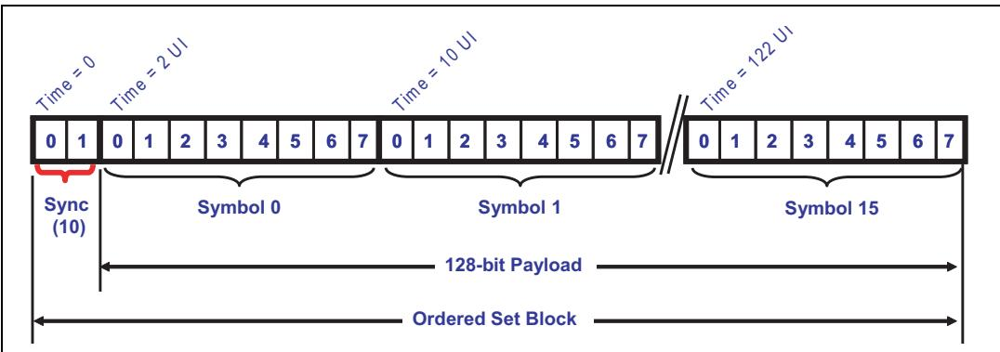

To illustrate an Ordered Set, let’s use an SOS to show the various features and how they work together. Consider Figure 12‐15 on page 428, where a Data Block is followed by an SOS. The framing rules state that the previous Data Block must end with an EDS Token in the last dword to let the receiver know that an Ordered Set is coming. If the current Data Stream is to continue, the Ordered Set that follows must be an SOS, and that must be followed in turn by another Data Block. This example doesn’t show it, but it’s possible that a TLP might be incomplete at this point and would straddle the SOS by resuming transmission in the Data Block that must immediately follow the SOS.

Receiving the EDS Token means that the Data Stream is either ending or pausing to insert an SOS. An EDS is the only Token that can start on a dwordaligned Lane in the same Symbol Time as an IDL, and this example does just that, beginning in Lane 4 of Symbol Time 15. Recall that EDS must also be in the last dword of the Data Block. According to the receiver framing requirements, only an Ordered Set Block is allowed after an EDS and must be an SOS, EIOS, or EIEOS or else it will be seen as a framing error. As was true for earlier spec versions, the Ordered Sets must appear on all Lanes at the same time. Receivers may optionally check to ensure that each Lane sees the same Ordered Set.

In our example, a 16 byte SOS is seen next, and is recognized by the Ordered Set Sych Header as well as the SKP byte pattern. There are always 4 Symbols at the end of the SOS that contain the current 24‐bit scrambler LFSR state. In Symbol

12 the Receiver knows that the SKP characters have ended and also that the Block has three more bytes to deliver per Lane. These are the output of the scrambling logic LFSR, as shown in Table 12‐2 on page 428.

Figure 12‐15: Gen3 x8 Skip Ordered Set (SOS) Example

<table><tr><td></td><td>Lane 0</td><td>Lane 1</td><td>Lane 2</td><td>Lane 3</td><td>Lane 4</td><td>Lane 5</td><td>Lane 6</td><td>Lane 7</td></tr><tr><td>Sync</td><td>01</td><td>01</td><td>01</td><td>01</td><td>01</td><td>01</td><td>01</td><td>01</td></tr><tr><td>Symbol 0</td><td colspan="4">STP Token: Length=7, CRC, Parity, Seq Num</td><td></td><td></td><td></td><td></td></tr><tr><td>Symbol 1</td><td></td><td></td><td colspan="2">TLP</td><td></td><td></td><td></td><td></td></tr><tr><td>Symbol 2</td><td></td><td></td><td></td><td></td><td></td><td></td><td></td><td></td></tr><tr><td>Symbol 3</td><td colspan="4">LCRC</td><td colspan="2">SDP Token</td><td></td><td></td></tr><tr><td>Symbol 4</td><td></td><td></td><td>DLLP</td><td></td><td>IDL</td><td>IDL</td><td>IDL</td><td>IDL</td></tr><tr><td>Symbol 5</td><td>IDL</td><td>IDL</td><td>IDL</td><td>IDL</td><td>IDL</td><td>IDL</td><td>IDL</td><td>IDL</td></tr><tr><td>Symbol 6</td><td colspan="2">SDP Token</td><td></td><td></td><td></td><td>DLLP</td><td></td><td></td></tr><tr><td>Symbol 7</td><td>IDL</td><td>IDL</td><td>IDL</td><td>IDL</td><td>IDL</td><td>IDL</td><td>IDL</td><td>IDL</td></tr><tr><td>Symbol 15</td><td>IDL</td><td>IDL</td><td>IDL</td><td>IDL</td><td colspan="4">EDS Token (End of Data Stream)</td></tr><tr><td>Sync</td><td>10</td><td>10</td><td>10</td><td>10</td><td>10</td><td>10</td><td>10</td><td>10</td></tr><tr><td>Symbol 0</td><td>SKP</td><td>SKP</td><td>SKP</td><td>SKP</td><td>SKP</td><td>SKP</td><td>SKP</td><td>SKP</td></tr><tr><td>Symbol 3</td><td>SKP</td><td>SKP</td><td>SKP</td><td>SKP</td><td>SKP</td><td>SKP</td><td>SKP</td><td>SKP</td></tr><tr><td>Symbol 4</td><td>SKP_END</td><td>SKP_END</td><td>SKP_END</td><td>SKP_END</td><td>SKP_END</td><td>SKP_END</td><td>SKP_END</td><td>SKP_END</td></tr><tr><td>Symbol 5</td><td>LFSR</td><td>LFSR</td><td>LFSR</td><td>LFSR</td><td>LFSR</td><td>LFSR</td><td>LFSR</td><td>LFSR</td></tr><tr><td>Symbol 6</td><td>LFSR</td><td>LFSR</td><td>LFSR</td><td>LFSR</td><td>LFSR</td><td>LFSR</td><td>LFSR</td><td>LFSR</td></tr><tr><td>Symbol 7</td><td>LFSR</td><td>LFSR</td><td>LFSR</td><td>LFSR</td><td>LFSR</td><td>LFSR</td><td>LFSR</td><td>LFSR</td></tr><tr><td>Sync</td><td>01</td><td>01</td><td>01</td><td>01</td><td>01</td><td>01</td><td>01</td><td>01</td></tr></table>

Table 12‐2: Gen3 16‐bit Skip Ordered Set Encoding

<table><tr><td>Symbol Number</td><td>Value</td><td>Description</td></tr><tr><td>0 to 11</td><td>AAh</td><td>SKP Symbol. Since Symbol 0 is the Ordered Set Identifier, this is seen as an SOS.</td></tr><tr><td>12</td><td>E1h</td><td>SKP_END Symbol, which indicates that the SOS will be complete after 3 more Symbols</td></tr><tr><td>13</td><td>00-FFh</td><td>a) If LTSSM state is Polling.Compliance: AAhb) Else if prior block was a Data Block:Bit [7] = Data ParityBit [6:0] = LFSR [22:16]c) ElseBit [7] = ~LFSR [22]Bit [6:0] = LFSR [22:16]</td></tr><tr><td>14</td><td>00-FFh</td><td>a) If LTSSM state is Polling.Compliance: Error_Status [7:0]b) Else LFSR [15:8]</td></tr><tr><td>15</td><td>00-FFh</td><td>a) If LTSSM state is Polling.Compliance: Error_Status [7:0]b) Else LFSR [7:0]</td></tr></table>

The Data Parity bit mentioned in the table is the even parity of all the Data Block scrambled bytes that have been sent since the most recent SDS or SOS and is created independently for each Lane. Receivers are required to calculate and check the parity. If the bits don’t match, the Lane Error Status register bit corresponding to the Lane that saw the error must be set, but this is not considered a Receiver Error and does not initiate Link retraining.

The 8‐bit Error\_Status field only has meaning when the LTSSM is in the Polling.Compliance state (see “Polling.Compliance” on page 529 for more details). For our example of an SOS following a Data Block, byte 13 is the Data Parity bit and LFSR[22:16], while the last two bytes are LFSR bits [15:0].

## Transmitter SOS Rules

The SOS rules for Transmitters when using 128b/130b include:

An SOS must be scheduled to occur within 370 to 375 blocks. In Loopback mode, however, the Loopback Master must schedule two SOS’s within that time, and they must be no more than two blocks from each other.

SOS’s can still only be sent on packet boundaries and may be accumulated as a result. However, consecutive SOS’s are not permitted; they must be separated by a Data Block.

• It’s recommended that SOS timers and counters be reset whenever the Transmitter is Electrically Idle.

## PCI Express Technology

The Compliance SOS bit in Link Control Register 2 has no effect when using 128b/130b. (It’s used to disable SOSs during Compliance testing for 8b/10b, but that isn’t an option for 128b/130b.)

## Receiver SOS Rules

The Skip Ordered Set rules for Receivers when using 128b/130b include:

They must tolerate receiving SOS’s at an average interval of 370‐375 blocks. Note that the first SOS after Electrical Idle may arrive earlier than that, since Transmitters are not required to reset SOS timers during Electrical Idle time.

• Receivers must check to see that every SOS in a Data Stream is preceded by a Data Block that ends with EDS.

## Scrambling

The scrambling logic for 128b/130b is modified from the previous PCIe generations to address the two issues that 8b/10b encoding handled automatically: maintaining DC Balance and providing a sufficient transition density. By way of review, recall that DC Balance means the bit stream has an equal number of ones and zeros. This is intended to avoid the problem of “DC wonder”, in which the transmission medium is charged toward one voltage or the other so much, by a prevalence of ones or zeros, that it becomes difficult to switch the signal within the necessary time. The other problem is that clock recovery at the Receiver needs to see enough edges in the input signal to be able to compare them to the recovered clock and adjust the timing and phase as needed.

Without 8b/10b to handle these issues, three steps were taken: First, the new scrambling method improves both transition density and DC Balance over longer time periods, but doesn’t guarantee them over short periods the way 8b/ 10b did. Second, the TS1 and TS2 Ordered Set patterns used during training include fields that are adjusted as needed to improve DC Balance. And third, Receivers must be more robust and tolerant of these issues than they were in the earlier generations.

## Number of LFSRs

At the lower data rates every Lane was scrambled in the same way, so a single Linear‐Feedback Shift Register (LFSR) could supply the scrambling input for all of them. For Gen3, though, the designers wanted different scrambling values for neighboring Lanes. The reasons probably include a desire to decrease the possibility of cross‐talk between the Lanes by scrambling their outputs with respect to each other and avoid having the same value on each Lane, as might happen when sending IDLs. The spec describes two approaches to achieving this goal, one that emphasizes lower latency and one that emphasizes lower cost.

First Option: Multiple LFSRs. One solution is to implement a separate LFSR for each Lane, and initialize each with a different starting value or “seed”. This has the advantage of simplicity and speed, at the cost of adding logic. As shown in Figure 12‐16, each LFSR creates a pseudo‐random output based on the polynomial given in the spec as $\mathrm { G } ( \mathrm { X } ) = \dot { \mathrm { X } } ^ { 2 3 } + \mathrm { X } ^ { 2 1 } + \mathrm { X } ^ { 1 6 } +$ + $\mathsf X ^ { 8 } + \mathsf X ^ { 5 } + \mathsf X ^ { 2 } + 1$ . This polynomial is longer than the previous version and also behaves a little differently because of the different seed values. Eight different seed values for each Lane are specified requiring eight different LFSRs, one per Lane 0 through 7.

Figure 12‐16: Gen3 Per‐Lane LFSR Scrambling Logic  
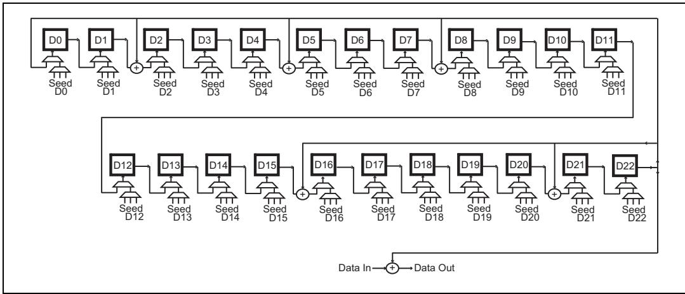  
The 24‐bit seed value for each Lane is listed in Table 12‐3 on page 432. The series repeats itself, meaning the seed for Lane 8 will be the same as Lane 0, so only the first 8 values are shown. Every Lane uses the same LFSR and the same tap points to create the scrambling output, and the different seed values give the desired difference.

Table 12‐3: Gen3 Scrambler Seed Values

<table><tr><td>Lane</td><td>Seed Value</td></tr><tr><td>0</td><td>1DBFBCh</td></tr><tr><td>1</td><td>0607BBh</td></tr><tr><td>2</td><td>1EC760h</td></tr><tr><td>3</td><td>18C0DBh</td></tr><tr><td>4</td><td>010F12h</td></tr><tr><td>5</td><td>19CFC9h</td></tr><tr><td>6</td><td>0277CEh</td></tr><tr><td>7</td><td>1BB807h</td></tr></table>

Second Option: Single LFSR. The alternative solution, illustrated in Figure 12‐17 on page 433 for Lanes 2, 10, 18, and 26, is to use just one LFSR and create the scrambling inputs for each Lane by XORing different tap points together. Since there’s only one LFSR, the seed value is the same for all Lanes (all ones), but the scrambling “Tap Equation” for each Lane is derived by combining different tap points, as shown in Table 12‐4 on page 433. The spec also notes that 4 of the Lanes Tap Equations can be derived by XORing the tap values of their bit neighbors:

Lane 0 = Lane 7 XOR Lane 1 (note that the process of going to lower Lane numbers wraps around, with the result that Lane 7 is considered lower that Lane 0)

• Lane 2 = Lane 1 XOR Lane 3

• Lane 4 = Lane 3 XOR Lane 5

• Lane 6 = Lane 5 XOR Lane 7

The single‐LFSR solution uses fewer gates than the multi‐LFSR version does, but incurs extra latency through the XOR process, providing a different cost/performance option.

Figure 12‐17: Gen3 Single‐LFSR Scrambler  

Table 12‐4: Gen3 Tap Equations for Single‐LFSR Scrambler

<table><tr><td>Lane Numbers</td><td>Tap Equation</td></tr><tr><td>0, 8, 16, 24</td><td>D9 xor D13</td></tr><tr><td>1, 9, 17, 25</td><td>D1 xor D13</td></tr><tr><td>2, 10, 18, 26</td><td>D13 xor D22</td></tr><tr><td>3, 11, 19, 27</td><td>D1 xor D22</td></tr><tr><td>4, 12, 20, 28</td><td>D3 xor D22</td></tr><tr><td>5, 13, 21, 29</td><td>D1 xor D3</td></tr><tr><td>6, 14, 22, 30</td><td>D3 xor D9</td></tr><tr><td>7, 15, 23, 31</td><td>D1 xor D9</td></tr></table>

## Scrambling Rules

The Gen3 scrambler LFSRs (whether one or more) do not continually advance, but only advance based on what is being sent. The scramblers must be re‐initialized periodically and that takes place whenever an EIEOS or FTSOS is seen. The spec gives several rules for scrambling that are listed here for convenience:

## PCI Express Technology

• Sync Header bits are not scrambled and do not advance the LFSR.

The Transmitter LFSR is reset when the last EIEOS Symbol has been sent, and the Receiver LFSR is reset when the last EIEOS Symbol is received.

• TS1 and TS2 Ordered Sets:

— Symbol 0 bypasses scrambling

— Symbols 1 to 13 are scrambled

— Symbols 14 and 15 may or may not be scrambled. The spec states that they will bypass scrambling if necessary to improve DC Balance, but otherwise will be scrambled (see “TS1 and TS2 Ordered Sets” on page 510 for more details on how DC Balance is maintained).

All Symbols of the Ordered Sets FTS, SDS, EIEOS, EIOS, and SOS bypass scrambling. Despite this, the output data stream will have sufficient transition density to allow clock recovery and the symbols chosen for the Ordered Sets result in a DC balanced output.

• Even when bypassed, Transmitters advance their LFSRs for all Ordered Set Symbols except for those in the SOS.

Receivers do the same, checking Symbol 0 of an incoming Ordered Set to see whether it is an SOS. If so, the LFSRs are not advanced for any of the Symbols in that Block. Otherwise the LFSRs are advanced for all the Symbols in that Block.

• All Data Block Symbols are scrambled and advance the LFSRs.

Symbols are scrambled in little‐endian order, meaning the least‐significant bit is scrambled first and the most‐significant bit is scrambled last.

The seed value for a per‐Lane LFSR depends on the Lane number assigned to the Lane when the LTSSM first entered Configuration.Idle (having finished the Polling state). The seed values, modulo 8, are shown in Table 12‐3 on page 432 and, once assigned, won’t change as long LinkUp = 1 even if Lane assignments are changed by going back to the Configuration state.

Unlike 8b/10b, scrambling cannot be disabled while using 128b/130b encoding because it is needed to help with signal integrity. It’s not expected that the Link would operate reliably without it, so it must always be on.

• A Loopback Slave must not scramble or de‐scramble the looped‐back bit.

## Serializer

This shift register works like it does for Gen1/Gen2 data rates except that it is now receiving 8 bits at a time instead of 10 (i.e., the serializer is an 8‐bit parallel to serial shift register).

## Mux for Sync Header Bits

Finally, the two Sync Header bits must be injected to distinguish the next Block of characters as a Data Block or an Ordered Set Block. These are the first two bits of each 130‐bit Block and the logic for them could be added anywhere in the transmitter that makes sense for the design. In this example the bits are injected at the end of the process for simplicity. Wherever they are included, the flow of bytes from above must be stalled to allow time for them. In this example there will need to be a way to inform the logic above to pause for two bit times. The flow of incoming packets will just be queued in the Tx Buffer during the time the Sync bits are being sent.

## Gen3 Physical Layer Receive Logic

As in the earlier generations, the Receiver’s logic, shown in Figure 12‐18 on page 436, begins with the CDR (Clock and Data Recovery) circuit. This probably includes a PLL that locks onto the frequency of the Transmitter clock based on knowledge of the expected frequency and the edges in the bit stream to generate a recovered clock (Rx Clock). This recovered clock latches the incoming bits into a deserializing buffer and then, once Block Alignment has been established (during the Recovery state of the LTSSM), another version of the recovered clock that is divided by 8.125 (Rx Clock/8.125) latches the 8‐bit Symbols into the Elastic Buffer. After that, the de‐scrambler recreates the original data from the scrambled characters. The bytes bypass the 8b/10b decoder and are delivered directly to the Byte Un‐striping logic. Finally, the Ordered Sets are filtered out, and the remaining byte stream of TLPs and DLLPs is forwarded up to the Data Link Layer.

In the following discussion, each part is described working upward from the bottom. The focus is on describing aspects of the Physical Layer changed for 8.0 GT/s. Sub‐block unchanged from Gen1/Gen2 will not be described in this section.

## Differential Receiver

The differential receiver logic is unchanged, but there are electrical changes to improve signal integrity (see “Signal Compensation” on page 468), as well as training changes to establish signal equalization, which are covered in “Link Equalization Overview” on page 577.

Figure 12‐18: Gen3 Physical Layer Receiver Details  
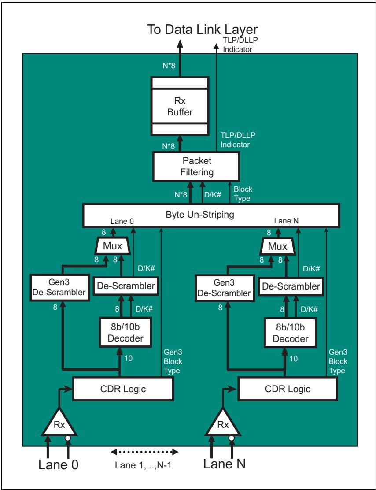

Figure 12‐19: Gen3 CDR Logic  

## CDR (Clock and Data Recovery) Logic

## Rx Clock Recovery

Although the new scrambling scheme helps with clock recovery, it doesn’t guarantee good transition density over short intervals. As a result, the CDR logic must now be able to maintain synchronization for longer periods without as many edges. No specific method for accomplishing this is given in the spec, but a more robust PLL (Phase‐Locked Loop) or DLL (Delay‐Locked Loop) circuit will likely be needed.

Another aspect of the CDR logic that’s different now is that the internal clock used by the Elastic Buffer is not simply the Rx clock divided by 8 as one might expect. The reason, of course, is that the input is not a regular multiple of 8‐bit bytes. Instead, it is a 2‐bit Sync Header followed by 16 bytes. Those extra two bits must be accounted for somewhere. The spec doesn’t require any particular implementation, but one solution would have the clock divided by 8.125, as shown in Figure 12‐19 on page 437, to produce 16 clock edges over 130 bit times.

The Block Type Detection logic might then be used to take the extra two bits out of the deserializer that it needs to examine anyway, when a block boundary time is reached, ensuring that only 8‐bit bytes are delivered to the Elastic Buffer.

Just to tie up all the loose ends on this discussion, the internal clock for the 8.0 GT/s data rate will actually be 8.0 GHz / 8.125 = 0.985 GHz. That results in slightly less than the 1.0 GB/s data rate that’s usually used to describe the Gen3 bandwidth, but the difference is small enough (1.5% less than 1 GB/s) that it usually isn’t mentioned.

## Deserializer

The incoming data is clocked into each Lane’s serial‐to‐parallel converter by the recovered Rx clock, as shown in Figure 12‐19 on page 437. The 8‐bit Symbols are sent to the Elastic Buffer and clocked into the Elastic Buffer by a version of the Rx Clock that has been divided by 8.125 to properly accommodate 16 bytes in 130 bits.

## Achieving Block Alignment

The EIEOSs sent during training serve to identify boundaries for the 130‐bit blocks. As shown in Figure 12‐20 on page 438, this Ordered Set can be recognized in a bit stream because it appears as a pattern of alternating bytes of 00h and FFh. When this pattern is seen, the last Symbol of the EIEOS is interpreted as the Block boundary, and testing the next 130 bits will reveal whether the boundary is correct. If not, the logic continues to search for this pattern. This process is described in the spec as occurring in three phases: Unaligned, Aligned, and Locked.

Figure 12‐20: EIEOS Symbol Pattern  

Unaligned Phase. Receivers enter this phase after a period of Electrical Idle, such as after changing to 8.0 GT/s or exiting from a low‐power Link state. In this phase, the Block Alignment logic watches for the arrival of an EIEOS, since the end of the alternating bytes must correspond to the end of the Block. When an EIEOS is seen, the alignment is adjusted and the logic proceeds to the next phase. Until then, it must also adjust its Block alignment based on the arrival of any SOS.

Aligned Phase. In this phase Receivers continues to monitor for EIEOS and make any necessary adjustments to their bit and Block alignment if they see one. However, since they’ve tentatively identified block boundaries they can also now search for an SDS (Start of Data Stream) Ordered Set to indicate the beginning of a Data Stream. When an SDS is seen, the receiver proceeds to the Locked phase. Until then, it must also adjust its Block alignment based on the arrival of SOSs. If an undefined Sync Header is detected (value of 00b or 11b) the Receiver is allowed to return to the Unaligned phase. The spec notes that this will happen during Link training when EIEOS is followed by a TS Ordered Set.

Locked Phase. Once a Receiver reaches this phase, it no longer adjusts its Block alignment. Instead, it now expects to see a Data Block after the SDS and if the alignment has to be readjusted at this point, some misaligned data will probably be lost. If an undefined Sync Header is detected the Receiver is allowed to return to the Unaligned or Aligned phase. Receivers can be directed to transition out of the Locked phase to one of the others as long as Data Stream processing is stopped (see “Data Stream and Data Blocks” on page 413 for the rules regarding Data Streams).

Special Case: Loopback. While discussing Block alignment, the spec describes what happens when the Link is in Loopback mode. The Loopback Master must be able to adjust alignment during Loopback, and is allowed to send EIEOS and adjust its Receiver based on a detected EIEOS when they are echoed back during Loopback.Active. The Loopback Slave must be able to adjust alignment during Loopback.Entry but must not adjust alignment during Loopback.Active. The Slave’s Receiver is considered to be in the Locked phase when the Slave begins to loop back the bit stream.

## Block Type Detection

Once Block Alignment has been achieved, the Receiver can recognize the start times of the incoming blocks and examine the first two bits to identify which of the two possible types are coming in. Ordered Set Blocks are only interesting to the Physical Layer, so they’re not forwarded to the higher layers, but Data

Blocks do get forwarded. When the Sync Header is detected, this information is signaled to other parts of the Physical Layer to determine whether the current block should be removed from the byte stream going to the higher layers. The clock recovery mechanism and Sync Header detection effectively accomplishes the conversion from 130 bits to 128 bits that must take place in the Physical Layer.

Note that since the block information is the same for every Lane, this logic may simply be implemented for only one Lane, such as Lane 0 as shown in Figure 12‐18 on page 436. However, if different Link widths and Lane Reversal were supported then more Lanes would need to include this logic to ensure that there would always be one active Lane with this logic available. An example might be that every Lane which is able to operate as Lane 0 would implement it, but only the one that was currently acting as Lane 0 would use it. Note also that, since the spec doesn’t give details in this regard, the examples discussed and illustrated here are only educated guesses at a workable implementation.

## Receiver Clock Compensation Logic

## Background

The clock requirements for 8.0 GT/s are the same as they were in the earlier spec versions: the clocks of both Link partners must be within +/– 300 ppm (parts per million) of the center frequency, which results (in the worst case) in gaining or losing one clock after every 1666 clocks.

## Elastic Buffer’s Role

The received Symbols are clocked into the elastic buffer, as shown in Figure 12‐ 21 on page 441, using the recovered clock and clocked out using the receiver’s local clock. The Elastic Buffer compensates for the frequency difference by adding or removing SKP Symbols as before, but now it does so four Symbols at a time instead of only one at a time. When a SKP Ordered Set arrives, control logic watching the status of the buffer makes an evaluation. If the local clock is running faster, the buffer will be approaching an underflow condition and the logic can compensate by appending four extra SKPs when the SOS arrives to quickly refill the buffer. On the other hand, if the recovered clock is running faster, the buffer will be approaching an overflow condition and the logic will compensate for that by deleting four SKPs to quickly drain the buffer when an SOS is seen.

Figure 12‐21: Gen3 Elastic Buffer Logic  
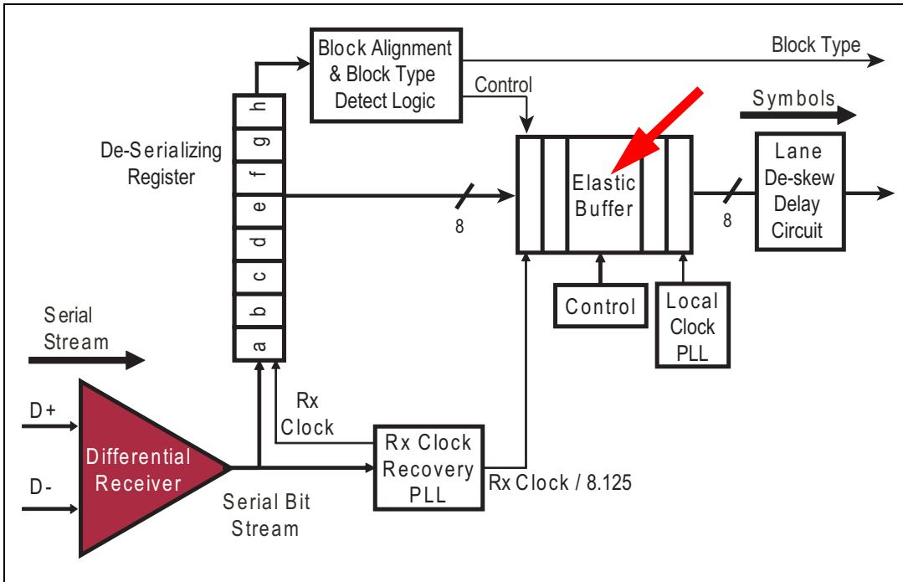

Gen3 Transmitters schedule an SOS once every 370 to 375 blocks but, as before, they can only be sent on block boundaries. If a packet is in progress when SOSs are scheduled, they are accumulated and inserted at the next packet boundary. However, unlike the lower data rates, two consecutive SOSs are not allowed at 8.0 GT/s; they must be separated by a Data Block. Receivers must be able to tolerate SOSs separated by the maximum packet payload size a device supports.

The fact that adjustments are only made in increments of 4 Symbols may affect the depth of the Elastic Buffer, since a difference of 4 would need to be seen before any compensation is applied, and a large packet may be in progress at what would otherwise be the appropriate time. For that reason, care will need to be exercised in determining the optimal size of this buffer, so let’s consider an example. The allowed time between SOSs of 375 blocks at 16 Symbols per block equals 6000 Symbol times. Dividing that by the worst‐case time to gain or lose a clock of 1666 means that 3.6 clocks could be gained or lost during that period. If the largest possible TLP (4KB) had started just prior to the next SOS being sent, the overall delay for it becomes about 6000 + 4096 = 10096 Symbol times for a x1 Link, which translates to a gain or loss of 10096 / 1666 = 6.06 clocks. Consequently, if TLPs of 4KB in size are supported, the buffer might be designed to handle 7 Symbols too many or too few before an SOS is guaranteed to arrive. It may happen that two SOSs are scheduled before the first one is sent. At the lower data rates, the queued SOSs are sent back‐to‐back, but for 8.0 GT/s they are not and must be separated by a Data Block. Whenever an SOS does arrive at the Receiver, it can add or remove 4 SKP Symbols to quickly fill or drain the buffer and avoid a problem.

## Lane-to-Lane Skew

## Flight Time Variance Between Lanes

For multi‐Lane Links, the difference in arrival times between lanes is automatically corrected at the Receiver by delaying the early arrivals until they all match up. The spec allows this to be accomplished by any means a designer prefers, but using a digital delay after the elastic buffer has one advantage in that the arrival time differences are now digitized to the local Symbol clock of the receiver. If the input to one lane makes it on a clock edge and another one doesn’t, the difference between them will be measured in clock periods, so the early arrival can simply be delayed by the appropriate number of clocks to get it to line up with the late‐comers (see Figure 12‐22 on page 444). The fact that the maximum allowable skew at the receiver is a multiple of the clock periods makes this easy and infers that the spec writers may have had this implementation in mind. As defined in the spec, the receiver must be capable of de‐skewing up to 20ns for Gen1 (5 Symbol‐time clocks at 4ns per Symbol) and 8ns for Gen2 (4 Symbol‐time clocks at 2ns per Symbol), and 6ns for Gen3 (6 Symbol‐time clocks at 1ns per Symbol).

## De-skew Opportunities

The same Symbol must be seen on all lanes at the same time to perform deskewing, and any Ordered Set will do. However, de‐skewing is only performed in the L0s, Recovery, and Configuration LTSSM states. In particular, it must be completed as a condition for:

• Leaving Configuration.Complete

• Beginning to process a Data Stream after leaving Configuration.Idle or Recovery.Idle

• Leaving Recovery.RcvrCfg

• Leaving Rx\_L0s.FTS

If skew values change while in L0 (based on temperature or voltage changes, for example), a Receiver error may occur and cause replayed TLPs. If the problem becomes persistent, the Link would eventually transition to the Recovery state and de‐skewing would take place there. The spec notes that, while devices are not allowed to de‐skew their Lanes while in L0, the SOSs that must be sent periodically in this state contain an LFSR value that is intended to aid external tools in doing this. These tools, unconstrained by the rules for Data Streams, can search for the SOSs and use the patterns to achieve Bit Lock, Block Alignment and Lane‐to‐Lane de‐skew in the midst of a Data Stream.

The spec notes that when leaving L0s the Transmitter will send an EIEOS, then the correct number of FTSs with another EIEOS inserted after every 32 FTSs, then one last EIEOS to assist with Block Alignment and, finally, an SDS Ordered Set for the purpose of de‐skewing in addition to starting the Data Stream.

## Receiver Lane-to-Lane De-skew Capability

Understandably, the transmitter is only allowed to introduce a minimal amount of skew so as to leave the rest of the skew budget to cover routing differences and other variations. The amount of allowed skew that can be corrected at the Receiver is shown in Table 12‐5 on page 443, where it can be seen that this skew corresponds easily to a number of Symbol times for Gen3 just as it did for the earlier data rates. That allows the same option of using delay registers to accomplish de‐skew after the elastic buffer as was described for Gen1/Gen2 Physical Layer implementations earlier.

Table 12‐5: Signal Skew Parameters

<table><tr><td></td><td>Gen1</td><td>Gen2</td><td>Gen3</td></tr><tr><td>Tx max skew</td><td>1.3 ns</td><td>1.3 ns</td><td>1.1 ns</td></tr><tr><td>Rx max skew</td><td>20 ns</td><td>8 ns</td><td>6 ns</td></tr><tr><td>Symbol time period</td><td>4ns</td><td>2ns</td><td>1ns</td></tr><tr><td>Rx skew expressed in Symbol Times</td><td>5</td><td>4</td><td>6</td></tr></table>

When using 8b/10b encoding, an unambiguous de‐skew mechanism is to watch for the COM control character, which must appear on all Lanes simultaneously. That option is not available for 128b/130b, but Ordered Sets still arrive at the same time on all the Lanes, such as the SOS, SDS, and EIEOS. As a result, the process can be very much the same even though the pattern to search for when de‐skewing the Lanes is different.

Figure 12‐22: Receiver Link De‐Skew Logic  

## Descrambler

## General

Receivers follow exactly the same rules for generating the scrambling polynomial that the Transmitter does and simply XOR the same value to the input data a second time to recover the original information. Like on the transmit side, they are allowed to implement a separate LFSR for each Lane or just one.

## Disabling Descrambling

Unlike at Gen1/Gen2 data rates, in Gen3 mode, descrambling cannot be disabled because of its role in facilitating clock recovery and signal integrity. At the lower rates, the “disable scrambling” bit in the control byte of TS1s and TS2s would be used to inform a Link neighbor that scrambling was being turned off. That bit is reserved for rates of 8.0 GT/s and higher.

## Byte Un-Striping

This logic is basically unchanged from Gen1 or Gen2 implementation. At some point, the byte streams for Gen3 and for the lower data rates will have to muxed together, and the example in Figure 12‐23 on page 445 shows that happening just before the un‐striping logic.

Figure 12‐23: Physical Layer Receive Logic Details  
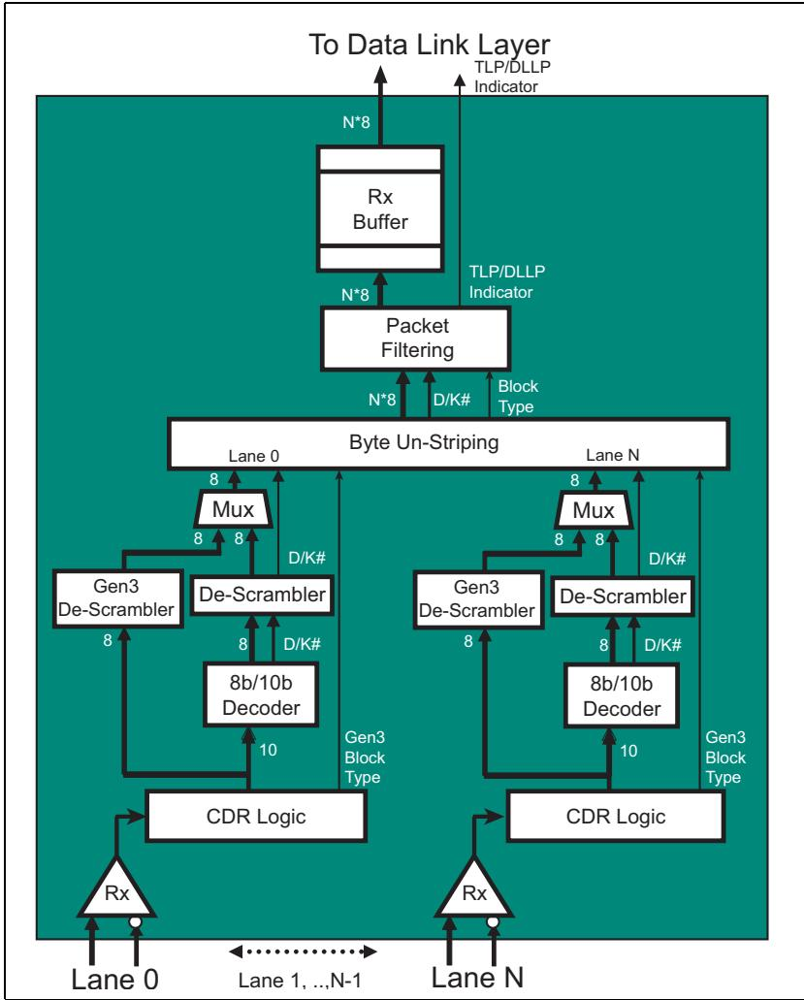

## Packet Filtering

The serial byte stream supplied by the byte un‐striping logic contains TLPs, DLLPs, Logical Idles (IDLs), and Ordered Sets. The Logical Idle bytes and Ordered Sets are eliminated here and are not forwarded to the Data Link layer. What remains are the TLPs and DLLPs, which get forwarded along with an indicator of their packet type.

## Receive Buffer (Rx Buffer)

The Rx Buffer holds received TLPs and DLLPs until the Data Link Layer is able to accept them. The interface to the Data Link Layer is not described in the spec, and so a designer is free to choose details like the width of this bus. The wider the path, the lower the clock frequency will be, but more signals and logic will be needed to support it.

## Notes Regarding Loopback with 128b/130b

The spec makes a special point to describe the operation of Loopback Mode at the higher rate. The basic rules can be summarized as follows:

Loopback masters must send actual Ordered Sets or Data Blocks, but they aren’t required to follow the normal protocol rules when changing from Data Blocks to Ordered Sets or vice versa. In other words, the SDS Ordered Set and EDS token are not required. Slaves must not expect or check for the presence of them.

Masters must send SOS as usual, and must allow for the number of SKP Symbols in the loopback stream to be different because the receiver will be performing clock compensation.

Loopback slaves are allowed to modify the SOS by adding or removing 4 SKP Symbols at a time as they normally would for clock compensation, but the resulting SOS must still follow the proper format rules.

Everything should be looped back exactly as it was sent except for SOS which can change as just described, and both EIEOS and EIOS which have defined purposes in loopback and should be avoided.

If a slave is unable to acquire Block alignment, it won’t be able to loop back all bits as received and is allowed to add or remove Symbols as needed to continue operation.

# 13 Physical Layer ‐ Electrical

## The Previous Chapter

The previous chapter describes the logical Physical Layer characteristics for the third generation (Gen3) of PCIe. The major change includes the ability to double the bandwidth relative to Gen2 speed without needing to double the frequency (Link speed goes from 5 GT/s to 8 GT/s). This is accomplished by eliminating 8b/10b encoding when in Gen3 mode. More robust signal compensation is necessary at Gen3 speed. Making these changes is more complex than might be expected.

## This Chapter

This chapter describes the Physical Layer electrical interface to the Link, including some low‐level characteristics of the differential Transmitters and Receivers. The need for signal equalization and the methods used to accomplish it are also discussed here. This chapter combines electrical transmitter and receiver characteristics for both Gen1, Gen2 and Gen3 speeds.

## The Next Chapter

The next chapter describes the operation of the Link Training and Status State Machine (LTSSM) of the Physical Layer. The initialization process of the Link is described from Power‐On or Reset until the Link reaches the fully‐operational L0 state during which normal packet traffic occurs. In addition, the Link power management states L0s, L1, L2, L3 are discussed along with the causes of transitions between the states. The Recovery state during which bit lock, symbol lock or block lock can be re‐established is described.

## Backward Compatibility

The spec begins the Physical Layer Electrical section with the observation that newer data rates need to be backward compatible with the older rates. The following summary defines the requirements:

• Initial training is done at 2.5 GT/s for all devices.

• Changing to other rates requires negotiation between the Link partners to determine the peak common frequency.

Root ports that support 8.0 GT/s are required to support both 2.5 and 5.0 GT/s as well.

Downstream devices must obviously support 2.5 GT/s, but all higher rates are optional. This means that an 8 GT/s device is not required to support 5 GT/s.

In addition, the optional Reference clock (Refclk) remains the same regardless of the data rate and does not require improved jitter characteristics to support the higher rates.

In spite of these similarities, the spec does describe some changes for the 8.0 GT/ s rate:

ESD standards: Earlier PCIe versions required all signal and power pins to withstand a certain level of ESD (Electro‐Static Discharge) and that’s true for the 3.0 spec, too. The difference is that more JEDEC standards are listed and the spec notes that they apply to devices regardless of which rates they support.

Rx powered‐off Resistance: The new impedance values specified for 8.0 GT/s (ZRX‐HIGH‐IMP‐DC‐POS and ZRX‐HIGH‐IMP‐DC‐NEG) will be applied to devices supporting 2.5 and 5.0 GT/s as well.

Tx Equalization Tolerance: Relaxing the previous spec tolerance on the Tx de‐emphasis values from +/‐ 0.5 dB to +/‐ 1.0 dB makes the ‐3.5 and ‐6.0 dB de‐emphasis tolerance consistent across all three data rates.

Tx Equalization during Tx Margining: The de‐emphasis tolerance was already relaxed to +/‐ 1.0 dB for this case in the earlier specs. The accuracy for 8.0 GT/s is determined by the Tx coefficient granularity and the TxEQ tolerances for the Transmitter during normal operation.

• V and V : For 2.5 and 5.0 GT/s these are relaxed to 150 mVPP for the Transmitter and 300 mVPP for the Receiver.

## Component Interfaces

Components from different vendors must work reliably together, so a set of parameters are specified that must be met for the interface. For 2.5 GT/s it was implied, and for 5.0 GT/s it was explicitly stated, that the characteristics of this interface are defined at the device pins. That allows a component to be characterized independently, without requiring the use of any other PCIe components. Other interfaces may be specified at a connector or other location, but those are not covered in the base spec and would be described in other form‐factor specs like the PCI Express Card Electromechanical Spec.

## Physical Layer Electrical Overview

The electrical sub‐block associated with each lane, as shown in Figure 13‐1 on page 450, provides the physical interface to the Link and contains differential Transmitters and Receivers. The Transmitter delivers outbound Symbols on each Lane by converting the bit stream into two single‐ended electrical signals with opposite polarity. Receivers compare the two signals and, when the difference is sufficiently positive or negative, generate a one or zero internally to represent the intended serial bit stream to the rest of the Physical Layer.

Figure 13‐1: Electrical Sub‐Block of the Physical Layer  
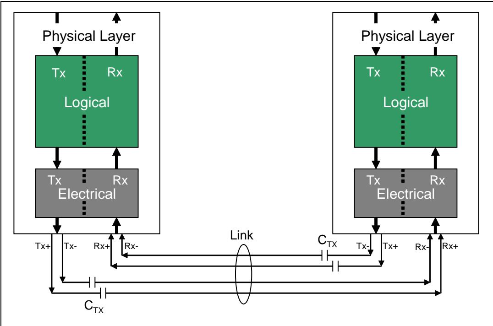

When the Link is in the L0 full‐on state, the drivers apply the differential voltage associated with a logical 1 and logical 0 while maintaining the correct DC common mode voltage. Receivers sense this voltage as the input stream, but if it drops below a threshold value, it’s understood to represent the Electrical Idle Link condition. Electrical Idle is entered when the Link is disabled, or when ASPM logic puts the Link into low‐power Link states such as L0s or L1 (see “Electrical Idle” on page 736 for more on this topic).

Devices must support the Transmitter equalization methods required for each supported data rate so they can achieve adequate signal integrity. De‐emphasis is applied for 2.5 and 5.0 GT/s, and a more complex equalization process is applied for 8.0 GT/s. These are described in more detail in “Signal Compensation” on page 468, and “Recovery.Equalization” on page 587.

The drivers and Receivers are short‐circuit tolerant, making PCIe add‐in cards suited for hot (powered‐on) insertion and removal events in a hot‐plug environment. The Link connecting two components is AC‐coupled by adding a capacitor in‐line, typically near the Transmitter side of the Link. This serves to decouple the DC part of the signal between the Link partners and means they don’t have to share a common power supply or ground return path, as when the devices are connected over a cable. Figure 13‐1 on page 450 illustrates the placement of this capacitor $( \mathrm { C } _ { \mathrm { T X } } )$ on the Link.

## High Speed Signaling

The high‐speed signaling environment of PCIe is characterized by the drawing in Figure 13‐2 on page 451. This low‐voltage differential signaling environment is a common method used in many serial transports and one reason is for the noise rejection it provides. Electrical noise that affects one signal will also affect the other because they are on adjacent pins and their traces are very close to each other. Since both signals are influenced, as shown in Figure 13‐3 on page 452, the difference between them doesn’t change much and is therefore not seen at the receiver.

A design goal for the 3.0 spec revision was that the 8.0 GT/s rate should still work with existing standard FR4 circuit boards and connectors, and that was achieved by changing the encoding scheme from the old 8b/10b to the new 128b/130b model to keep the frequency low. This goal will probably change with the next speed step (Gen4).

Figure 13‐2: Differential Transmitter/Receiver  

Figure 13‐3: Differential Common‐Mode Noise Rejection  
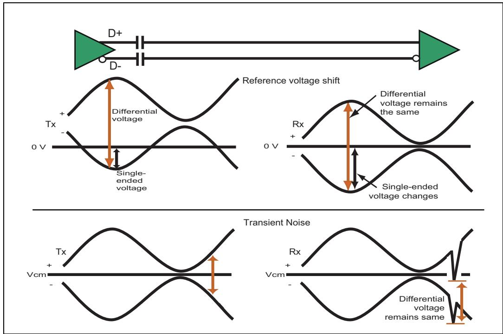

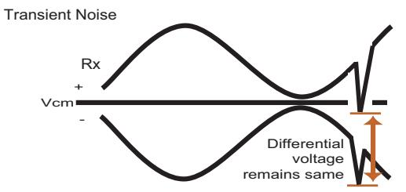

## Clock Requirements

## General

For all data rates, both Transmitter and Receiver clocks must be accurate to within +/‐ 300 ppm (parts per million) of the center frequency. In the worst case, the Transmitter and Receiver could both be off by 300 ppm in opposite directions, resulting in a maximum difference of 600 ppm. That worst‐case model translates to a gain or loss of 1 clock every 1666 clocks and that’s the difference that a Receiver’s clock compensation logic must take into account.

Devices are allowed to derive their clocks from an external source, and the 100 MHz Refclk is still optionally available for this purpose in the 3.0 spec. Using the Refclk permits both Link partners to readily maintain the 600 ppm accuracy even when Spread Spectrum Clocking is applied.

## SSC (Spread Spectrum Clocking)

SSC is an optional technique used to modulate the clock frequency slowly over a prescribed range to spread the signal’s EMI (Electro‐Magnetic Interference) across a range of frequencies rather than allowing it all to be concentrated at the center frequency. Spreading the radiated energy helps a device or system to pass government emissions standards by staying under a threshold value, as illustrated in Figure 13‐4 on page 454. Note that the frequency of interest for the signal is only half the clock rate because two rising clock edges are needed to create one cycle on the data, as illustrated in Figure 13‐5 on page 454. For example, a 2.5 GT/s rate uses a bit clock of 2.5 GHz, resulting in a frequency of interest on the traces of 1.25 GHz.

The use of SCC is not required by the spec but, if will be supported, the following rules apply:

The clock can be modulated by +0% to  ‐0.5% from nominal (5000 ppm), referred to as “down spreading.” A frequency modulation envelope is not specified, but a sawtooth‐wave pattern like the one shown in Figure 13‐6 on page 455 yields good results. Note that there is a trade‐off with down spreading, because the average clock frequency will now be 0.25% lower than it would have been without SSC, resulting in a slight performance reduction.

• The modulation rate must be between 30KHz and 33KHz.

The +/‐ 300 ppm requirement for clock frequency accuracy still holds and therefore so does the maximum 600 ppm variation between Link partners. The spec states that most implementations will require both Link partners to use the same clock source, although it’s not required. One way to do that would be for them to both use a modulated version of the Refclk to derive their own clocks (see “Common Refclk” on page 456).

Figure 13‐4: SSC Motivation  

Figure 13‐5: Signal Rate Less Than Half the Clock Rate  

Figure 13‐6: SSC Modulation Example  
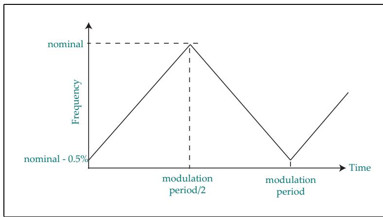

## Refclk Overview

Receivers must generate their own clocks to operate their internal logic, but there are some options for generating the recovered clock for the incoming bit stream. The details for them have developed with each succeeding version of the spec and are based on the data rate.

## 2.5 GT/s

In the early spec versions using the 2.5 GT/s rate, information regarding the optional Refclk was not included in the base spec but instead in the separate CEM (Card Electro‐Mechanical) spec for PCIe. A number of parameters were specified there and several general terms have been carried forward to the newer versions of the spec. The Refclk was described as a 100 MHz differential clock driving a 100  differential load (+/‐ 10%) with a trace length limited to 4 inches. SSC is allowed, as described in “SSC (Spread Spectrum Clocking)” on page 453.

## 5.0 GT/s

When the 5.0 GT/s rate was developed, the spec writers chose to include the Refclk information in the electrical section of the base spec and listed three options for the clock architecture:

Common Refclk. The first architecture described is one in which both Link partners make use of the same Refclk, as shown in Figure 13‐7 on page 456. There are three straightforward advantages for this implementation:

First, the jitter associated with the reference clock is the same for both Tx and Rx and is thus tracked and accounted for intrinsically.

Second, the use of SSC will be simplest with this model because maintaining the 600 ppm separation between the Tx and Rx clocks is easy if both follow the same modulated reference.

Third, the Refclk remains available during low‐power Link states L0s and L1 and that allows the Receiver’s CDR to maintain a semblance of the recovered clock even in the absence of a bit stream to supply the edges in the data. That, in turn, keeps the local PLLs from drifting as much as they otherwise would, resulting in a reduced recovery time back to L0 compared to the other clocking options.

Figure 13‐7: Shared Refclk Architecture  

Data Clocked Rx Architecture. In this clock architecture, the Receiver doesn’t use a reference clock at all, but simply recovers the Transmitter clock from the data stream, as shown in Figure 13‐9 on page 457. This implementation is clearly the simplest of the three and would therefore ordinarily be preferred. The spec doesn’t prohibit the use of SSC in this model, but doing so would bring up two issues. First, the Receiver CDR must remain locked onto the input frequency as it modulates through a much wider range (5600 ppm instead of the usual 600 ppm), and that could require more complex logic. And second, the maximum clock frequency separation of 600ppm must still be maintained and it’s less clear how that would be done without a common reference.

Figure 13‐8: Data Clocked Rx Architecture  

Separate Refclks. Finally, it’s also possible for the Link partners to use different reference clocks, as shown in Figure 13‐9 on page 457. However, this implementation makes substantially tighter demands on the Refclks because the jitter seen at the Receiver will be the RSS (Root Sum of Squares) combination of them both, making the timing budget difficult. It also becomes enormously more difficult to manage SSC in this model and that’s why the spec states that SSC must be turned off in this case. Overall, the spec gives the impression that this is the least desirable alternative, and states that it doesn’t explicitly define the requirements for this architecture.

Figure 13‐9: Separate Refclk Architecture  

## 8.0 GT/s

The same three clock architectures are described in the spec for this data rate, too. One difference is that two types of CDR are defined now: a $1 ^ { \mathrm { s t } }$ order CDR for the shared Refclk architecture, and a $2 ^ { \mathrm { n d } }$ order CDR for the data clocked architecture. This just reflects the fact that, as it was for the lower data rates, the CDR for the data‐clocked architecture will need to be more sophisticated to be able to stay locked when the reference varies over a wide range for SSC.

## Transmitter (Tx) Specs

## Measuring Tx Signals

The spec notes that the methods for measuring the Tx output are limited at the higher frequencies. At 2.5 GT/s it’s possible to put a test probe very near the pins of the DUT (Device Under Test), but for the higher rates it’s necessary to use a “breakout channel” with SMA (SubMiniature version A) microwave‐type coaxial connectors, as illustrated at TP1 (Test Point 1), TP2, and TP3 in Figure 13‐10 on page 458. Note that it’s necessary to have a low‐jitter clock source to the device under test, so that jitter seen at the output is only introduced by the device itself. The spec also mentions that it’s important during testing for the device to have as many of its Lanes and other outputs in use at the same time as possible, so as to best simulate a real system.

Since the breakout channel introduces some effects to the signal, for 8.0 GT/s it’s necessary to be able to measure those effects and remove (de‐embed) them from the signal being tested. One way to accomplish this is for the test board to supply another signal path that is very similar to the one used for the device pins. Characterizing this “replica channel” with a known signal gives the needed information about the channel, allowing its effects to be de‐embedded from the DUT signals so the signal at the component pins can be recovered.

Figure 13‐10: Test Circuit Measurement Channels  

## Tx Impedance Requirements

For best accuracy, the characteristic differential impedance of the Breakout Channel should be 100  differential within 10%, with a single‐ended impedance of 50 . To match this environment, Transmitters have a differential lowimpedance value during signaling between 80 and 120  at 2.5 GT/s, and no more than 120 Ω at 5.0 and 8.0 GT/s. For receivers, the single-ended impedance is 40 - 60 Ω at 2.5 or 5.0 GT/s, but for 8.0 GT/s no specific value is given. Instead, it’s simply noted that the single‐ended receiver impedance must be 50  within 20% by the time the Detect LTSSM state is entered so that the detect circuit will sense the Receiver correctly.

Transmitters must also meet the return loss parameters RLTX‐DIFF and RLTX‐CM anytime differential signals are sent. As a very brief introduction to this terminology, “return loss” is a measure of energy transmitted through or reflected back from a transmission path. Return loss is one of several “Scattering” parameters (S‐parameters) that are used to analyze high‐frequency signal environments. When frequencies are low, a lumped‐element description is sufficient, but when they become high enough that the wavelength approaches the size of the circuit, a distributed model is needed and that’s what S‐parameters are used to represent. The spec describes a number of these to characterize a transmission path but the details of this high‐frequency analysis are really beyond the scope of this book.

When a signal is not being driven, as would be the case in the low‐power Link states, the Transmitter may go into a high‐impedance condition to reduce the power drain. For that case, it only has to meet the I value and the differential impedance is not defined.

## ESD and Short Circuit Requirements

All signals and power pins must withstand a 2000V ESD (Electro‐Static Discharge) using the Human Body Model and 500V using the Charged Device Model. For more details on these models or ESD, see the JEDEC JESE22‐A114‐A spec.

The ESD requirement not only protects against electro‐static damage, but facilitates support of surprise hot insertion and removal events (adding or removing an add‐in card while the power is on). That goal also motivates the requirement that Transmitters and Receivers be able to withstand sustained short‐circuit currents of I (see Table 13‐5 on page 498).

## Receiver Detection

## General

The Detect block in the Transmitter shown in Figure 13‐11 on page 461 is used to check whether a Receiver is present at the other end of the Link after coming out of reset. This step is a little unusual in the serial transport world because it’s easy enough to send packets to the Link partner and test its presence by whether or not it responds. The motivation for this approach in PCIe, however, is to provide an automatic hardware assist in a test environment. If the proper load is detected, but the Link partner refuses to send TS1s and participate in Link Training, the component will assume that it must be in a test environment and will begin sending the Compliance Pattern to facilitate testing. Since a Link will always start operation at 2.5 GT/s after a reset or power‐up event, Detect is only used for the 2.5 GT/s rate. That’s why the Receiver’s single‐ended DC impedance is specified for that rate $( Z _ { \mathrm { R X - D C } } = 4 0 $ to 60 ), and why the Detect logic must be included in every design regardless of its intended operating speed.

Detection is accomplished by setting the Transmitter’s DC common mode voltage to one value and then changing it to another. Knowing the expected charge time when a Receiver is present, the logic compares the measured time against that. If a Receiver is attached, the charge time (RC time constant) is relatively long due to the Receiver’s termination. Otherwise, the charge time is much shorter

## Detecting Receiver Presence

1. After reset or power‐up, Transmitters drive a stable voltage on the D+ and D‐ terminal.

2. Transmitters then change the common mode voltage in a positive direction by no more than the VTX‐RCV‐DETECT amount of 600mV specified for all three data rates.

3. Detect logic measures the charge time:

— Receiver is absent if the charge time is short.

— Receiver is present if the charge time is long (dominated by the series capacitor and Receiver termination).

The spec mentions a possible problem here: the proper load may appear on one of the differential signals but not the other, and if detection doesn’t check both it could misinterpret the situation. The simple way to avoid that would be to perform the Detect operation on both D+ and D‐. The 3.0 spec does not require this, but mentions that future spec revisions may. Therefore, it would be wise to include this functionality in new designs.

Figure 13‐11: Receiver Detection Mechanism  

## Transmitter Voltages

Differential signaling (as opposed to the single‐ended signaling employed in PCI and PCI‐X) is ideal for high frequency signaling. Some advantages of differential signaling are:

Receivers look at the difference between the signals, so the voltage swing for each one individually can be smaller, allowing higher frequencies without exceeding the power budget.

EMI is reduced because of the noise cancellation that results from having the two signals by side by side, using opposite‐polarity voltages.

Noise immunity is very good, because noise that affects one signal will also affect the other in the same way, with the result that the Receiver doesn’t notice the change (refer to Figure 13‐3 on page 452).

## DC Common Mode Voltage

After the Detect state of Link training, the Transmitter DC common mode voltage V (see Table 13‐3 on page 489) must remain at the same voltage. The common mode voltage is turned off only in the L2 or L3 low‐power Link states, in which main power to the device is removed. A designer can choose any common mode voltage in the range from 0 to 3.6V.

## Full-Swing Differential Voltage

The Transmitter output consists of two signals, D+ and D‐, that are identical but use opposite polarities. A logical one is indicated when the D+ signal is high and the D‐ signal low, while a logical zero is represented by driving the D+ signal low and the D‐ signal high, as shown in Figure 13‐13 on page 464.

The differential peak‐to‐peak voltage driven by the Transmitter VTX‐DIFFp‐p (see Table 13‐3 on page 489) is between 800 mV and 1200 mV (1300 mV for 8.0 GT/s).

• Logical 1 is signaled with a positive differential voltage.

• Logical 0 is signaled with a negative differential voltage.

During Electrical Idle the Transmitter holds the differential peak voltage VTX‐ (see Table 13‐3 on page 489) very near zero (0‐20 mV). During this time the Transmitter may be in either a low‐ or high‐impedance state.

The Receiver senses a logical one or zero, as well as Electrical Idle, by evaluating the voltage on the Link. The signal loss expected at high frequency means the

Receiver must be able to sense an attenuated version of the signal, defined as $\mathrm { V _ { R X - D I F F p - p } }$ (see Table 13‐5 on page 498).

Figure 13‐12: Differential Signaling  
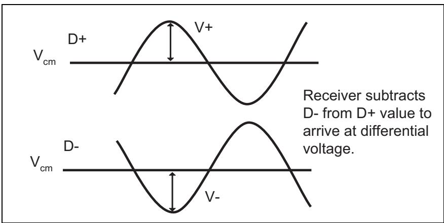

## Differential Notation

A differential signal voltage is defined by taking the difference in the voltage on the two conductors, D+ and D‐. The voltage with respect to ground on each conductor is $\mathrm { V _ { D + } }$ and $\mathrm { V } _ { \mathrm { D } } .$ . The differential voltage is given by $\mathrm { V _ { D I F F } = V _ { D + } - V _ { D } } .$ The Common Mode voltage, $\mathrm { V } _ { \mathrm { C M } } ,$ is defined as the voltage around which the signal is switching, which is the mean value given by $\mathrm { V } _ { \mathrm { C M } } { } ^ { = } \left( \mathrm { V } _ { \mathrm { D } + } { } ^ { + } \mathrm { V } _ { \mathrm { D } - } \right) / 2$

The spec uses two terms when discussing differential voltages and confusion sometimes arises as a result. As illustrated in Figure 13‐13 on page 464, the Peak value is the maximum voltage difference between the signals, while the Peak‐to‐Peak voltage is that value plus the maximum in the opposite direction. For a symmetric signal, the Peak‐to‐Peak value is simply twice the Peak value.

1. Differential Peak Voltage $\Rightarrow \mathrm { \Delta V _ { D I F F p } = ( m a x \mid V _ { D + } - V _ { D - } \mid ) }$

2. Differential Peak‐to‐Peak Voltage $\Rightarrow \mathrm { V _ { D I F F p - p } } = 2 \ ^ { * } ( \mathrm { m a x } \ | \mathrm { V _ { D + } } - \mathrm { V _ { D - } } \ | )$

As an example, assume $\mathrm { V } _ { \mathrm { C M } } = 0 \mathrm { V } ,$ then if the D+ value is 300mV and the Dvalue is ‐300mV, then V would be $3 0 0 - ( - 3 0 0 ) = 6 0 0$ mV for a logical one. Similarly, it would be (‐300) ‐ (+300) = ‐600 mV for a logical zero. The $\mathrm { V _ { D I F F p - p } }$ for this symmetric case would be 1200 mV. The allowed $\mathrm { V _ { D I F F p - p } }$ range for 2.5 GT/s and 5.0 GT/s is 800 to 1200 mV, while for 8.0 GT/s it is 800 to 1300 mV before equalization is applied.

Figure 13‐13: Differential Peak‐to‐Peak $( \mathrm { V _ { D I F F p - p } } )$ and Peak $( \mathrm { V _ { D I F F p } } )$ Voltages  
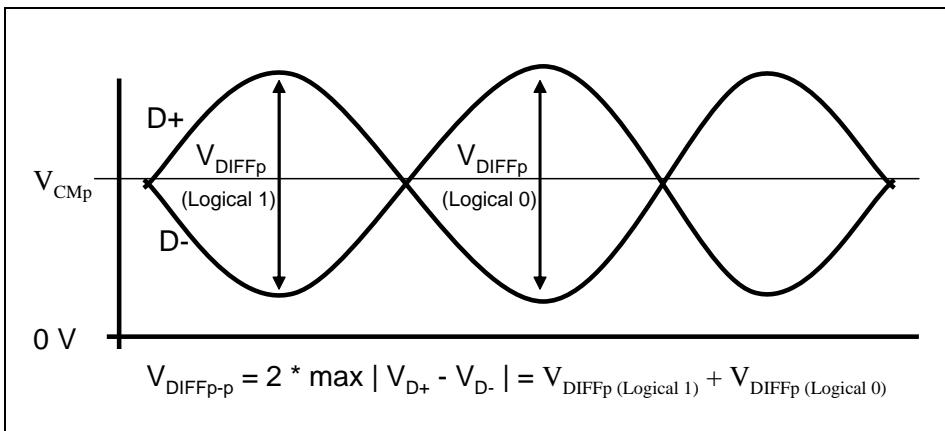

## Reduced-Swing Differential Voltage

The full‐swing voltage is needed for channels that are long or otherwise lossy, and Transmitters are required to support it. But when the signal environment is short and low loss, a high voltage is unnecessary and a power savings can be realized by reducing it. With this in mind, the spec for 2.5 GT/s and 5.0 GT/s defines another, reduced‐swing voltage for power‐sensitive systems where a short channel is being used. In this mode the voltage is reduced to about half of its full‐swing range. Support for this operation is optional, and the means for selecting it is not defined and will be implementation specific.

The same is true for 8.0 GT/s signaling, except that in this case it’s achieved by using a limited range of coefficients. For example, the maximum boost for the reduced‐swing case is limited to 3.5 dB. As with the lower data rates, support for this voltage model is optional, but now the means of achieving it is straightforward: just set the Tx coefficient values to make it happen.

It should be noted that the Receiver voltage levels are independent of the transmitter, which is intuitively what we’d expect: the received signal always needs to meet the normal requirements and so the Transmitter and channel must be designed to guarantee that it will.

## Equalized Voltage

In the interest of maintaining a good flow in this section, this large topic is covered separately in the section called “Signal Compensation” on page 468.

## Voltage Margining

The concept of margining is that Transmitter characteristics like output voltage can be adjusted across a wide range of values during testing to determine how well it can handle a signaling environment. The 2.5 GT/s rate didn’t include this capability, but voltage margining was added with the 5.0 GT/s rate and must be implemented by Transmitters that use that rate or higher. Other parameters, like de‐emphasis or jitter can optionally be margined as well. The granularity for the margining adjustments must be controllable on a Link basis and may be controllable on a Lane basis. This control is accomplished by means of the Link Control 2 register in the PCIe Capability register block. The transmit margin field, shown in Figure 13‐14 on page 465, contains 3 bits and can thus represent 8 levels. Their values are not defined, and not all of them need to be implemented. The default value is all zeros, which represents the normal operating range.

It’s important to note that this field is only intended for debug and compliance testing purposes during which software is only allowed to modify it during those times. At all other times, the value is required to be set to the default of all zeros.

Figure 13‐14: Transmit Margin Field in Link Control 2 Register  

## PCI Express Technology

For 8.0 GT/s, transmitters are required to implement voltage margining and use the same field in the Link Control 2 register, but equalization adds some constraints to the options because it can’t require finer coefficient or preset resolution than the 1/24 resolution defined for normal operation.

During Tx margining the equalization tolerance for 2.5 GT/s and 5.0 GT/s is relaxed from +/‐  0.5 dB to +/‐  1.0 dB. For the 8.0 GT/s rate, the tolerance is defined by the coefficient granularity and the normal equalizer tolerances specified for the transmitter.

## Receiver (Rx) Specs

## Receiver Impedance

Receivers are required to meet the RLRX‐DIFF and $\mathrm { R L } _ { \mathrm { R X - C M } }$ (see Table 13‐5 on page 498) parameters unless the device is powered down, as it would be, for example, in the L2 and L3 power states or during a Fundamental Reset. In those cases, a Receiver goes to the high impedance state and must meet the ZRX‐HIGH‐IMP‐DC‐NEG and ZRX‐HIGH‐IMP‐DC‐NEG parameters.

(See Table 13‐5 on page 498.)

## Receiver DC Common Mode Voltage

The Receiver’s DC common mode voltage is specified to be 0V for all data rates, and that’s represented in Figure 13‐15 on page 467 by showing the signal terminations connected to ground. The $C _ { \mathrm { T } \mathrm { X } }$ in‐line capacitor permits this voltage to be something different at the Transmitter, which is specified to be in the range from 0 ‐ 3.6V. That’s not as interesting when the Transmitter and Receiver are in the same enclosure and have the same power supply, but if they’re connected over a cable and reside in different machines with different power supplies it becomes more important. In that case it’s difficult to avoid reference voltage differences between the machines and, since the signal voltages are already small, such a difference could make the signal difficult to recognize at the Receiver. The location of this capacitor must be near the Transmitter pins when a connector of some kind will be used but, if there’s no connector, it can be located at any convenient place on the transmission line. Although it could be integrated into a device, it’s expected that $C _ { \mathrm { T } \mathrm { X } }$ will be external because it would be too big to integrate.

The drawing in Figure 13‐15 on page 467 also shows an optional set of resistors at the Receiver, labeled as “No Spec” because they are not mentioned in the spec. The story here is that Receiver designers dislike using a common‐mode voltage of zero for the simple reason that it usually requires them to implement two reference voltages, one above zero and one below it. A preferred implementation offsets the signal entirely above or below zero, so that only one reference voltage is needed.The circuit shown within the dotted line accomplishes this by adding a small‐value in‐line capacitor to de‐couple the DC component of the signal on the wire from that of the Receiver itself. Then, a resistor ladder serves to offset the Receiver’s common‐mode voltage in one direction or the other to accomplish the goal.

Figure 13‐15: Receiver DC Common‐Mode Voltage Adjustment  
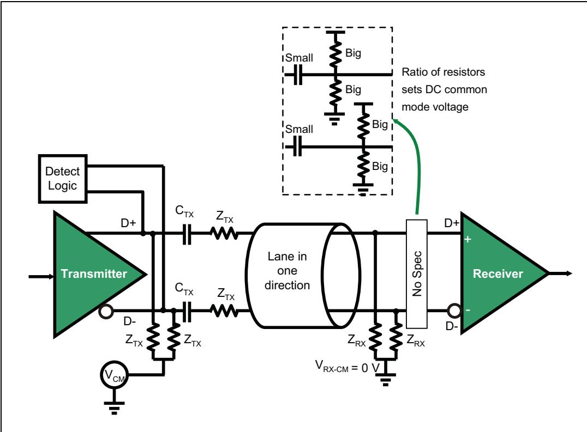

## Transmission Loss

The Transmitter drives a minimum differential peak‐to‐peak voltage $\mathrm { V _ { T X - D I F F p - p } }$ of 800 mV. The Receiver sensitivity is designed for a minimum differential peak‐to‐peak voltage (VRX‐DIFFp‐p) of 175 mV. This translates to a 13.2dB loss budget that a Link is designed for. Although a board designer can determine the attenuation loss budget of a Link plotted against various frequencies, the Transmitter and Receiver eye diagram measurement are the ultimate determinant of loss budget for a Link. Eye diagrams are described in “Eye Diagram” on page 485. A Transmitter that drives up to the maximum allowed differential peak‐to‐peak voltage of 1200 mV can compensate for a lossy Link that has worst‐case attenuation characteristics.

## AC Coupling

PCI Express requires in‐line AC‐coupling capacitors be placed on each Lane, usually near the Transmitter. The capacitors can be integrated onto the system board, or integrated into the device itself, although the large size they would need makes that unlikely. An add‐in card with a PCI Express device on it must place the capacitors on the card close to the Transmitter or integrate the capacitors into the PCIe silicon. These capacitors provide DC isolation between two devices on both ends of a Link thus simplifying device design by allowing devices to use independent power and ground planes.

## Signal Compensation

## De-emphasis Associated with Gen1 and Gen2 PCIe

For 2.5 GT/s and 5.0 GT/s transmission, PCIe mandates the use of a fairly simply form of Transmitter equalization called de‐emphasis to reduce the effects of signal distortion along the Link transmission line. This distortion problem is always present but gets worse with increased frequency and lossy transmission lines.

## The Problem

As data rates get higher, the Unit Interval (UI ‐ bit time) becomes smaller, with the result that it’s increasingly difficult to avoid having the value in one bit time affect the value in another bit time. The channel always resists changes to the voltage level, The faster we attempt to switch voltage, the more pronounced that effect becomes. However, when a signal has been held at the same voltage for several bit times, as when sending several bits in a row of the same polarity, the channel has more time to approach the target voltage. The resulting higher voltage makes it difficult to change to the opposite value within the required time when the polarity does change. This problem of previous bits affecting subsequent bits is referred to as ISI (inter‐symbol interference).

## How Does De-Emphasis Help?

De‐emphasis reduces the voltage for repeated bits in a bit stream. Although it sounds counter‐intuitive at first because this reduces the signal swing and thus the energy that reaches the Receiver, reducing the Transmitter voltage for these cases can substantially improve signal quality. Figure 13‐16 on page 469 illustrates how this works by showing a Transmitter output of ‘1000010000’, where the repeated bits of the same polarity have been de‐emphasized. De‐emphasis can be thought of as a two‐tap Tx equalizer, and some rules related to it are:

When the signal changes to the opposite polarity of the preceding bit it’s not de‐emphasized, but uses the peak‐to‐peak differential voltage as specified by VTX‐DIFFp‐p (see Table 13‐3 on page 489).

• The first bit of a series of same polarity bits is not de‐emphasized.

• Only subsequent bits of the same polarity after the first bit are de‐emphasized.

The de‐emphasized voltage is reduced by 3.5 dB from normal for 2.5 GT/s, which translates to about a one‐third reduction in voltage.

• The Beacon signal is de‐emphasized, too, but uses slightly different rules. (see “Beacon Signaling” on page 483).

Figure 13‐16: Transmission with De‐emphasis  

## Solution for 2.5 GT/s

For 2.5 GT/s, each subsequent bit transmitted after the first bit of the same polarity must be de‐emphasized by 3.5dB to accommodate this worst‐case loss budget. Of course, for low‐loss environments this is less important and for a very short path it can even make the received signal look worse. After all, deemphasis is essentially distorting the transmitted signal in the opposite way of the distortion that is expected during transmission so as to cancel it out. If there turns out to be little or no distortion, then de‐emphasis will make the signal look worse. The spec doesn’t describe any way to test the signal environment or adjust the de‐emphasis level, but doesn’t prohibit a designer from developing an implementation‐specific method of doing so.

An example of the benefit of de‐emphasis is shown in Figure 13‐17 on page 471, which is a scope capture converted into a drawing for clarity. The captures were taken from a device driving a long path and using a bit stream with several repeated bits to show the signal distortion. The trace at the top shows that the bit pattern for one side of the differential pair (also called a single‐ended signal) has 2 bits of one polarity followed by 5 bits of the opposite polarity. Five consecutive bits is the worst case for 8b/10b, and this particular pattern only appears in a few characters like the COM character. The channel resists high‐speed changes but will continue to charge up if the driver keeps trying to reach a higher voltage and that can be seen in this example. When the bits aren’t repeated there isn’t time for the voltage to go as far, but repeated bits give more time for the change. The problem this creates is seen in the bit following the 5th in a row (highlighted in the oval), which fails to reach a good signal value during its UI because the voltage difference was too large to overcome in that short time. The difference between the value it reaches and the value it should have reached is shown by the line marking the level reached by other bits that aren’t experiencing as much ISI.

In the lower half of the illustration, a de‐emphasized version of the signal is captured and compared to the original. Here we can see that reducing the voltage for repeated bits prevents the voltage from charging up as much and results in a cleaner signal because the bits that follow are not influenced as much by the previous bits. For both the 2 consecutive bits and then the 5 consecutive bits, the over‐charging problem is reduced, which improves the timing jitter as well as the voltage levels. Consequently, the troublesome bit looks much better with deemphasis turned on and the received signal approaches the normal voltage swing in that bit time.

Figure 13‐17: Benefit of De‐emphasis at the Receiver  
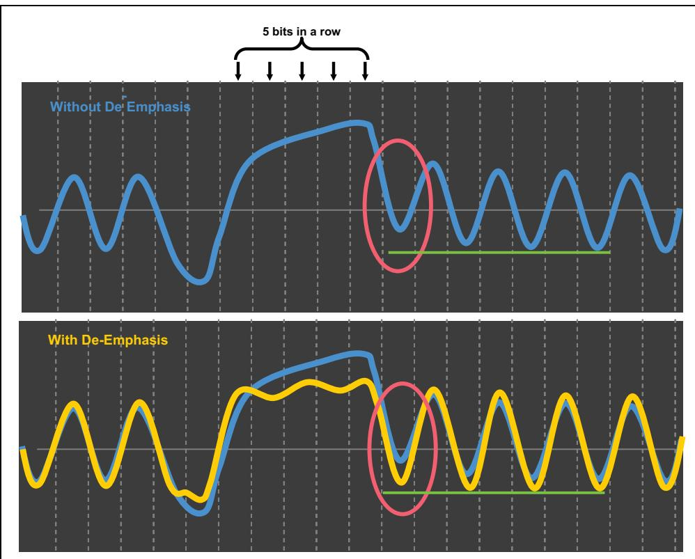

In Figure 13‐18 on page 472 both positive and negative versions of the differential signal are shown so as to illustrate the resulting eye opening. The improved signal quality from de‐emphasis is clear because the eye opening at the troublesome time in the lower trace is so much larger than the one without de‐emphasis in the upper trace.

Figure 13‐18: Benefit of De‐emphasis at Receiver Shown With Differential Signals  
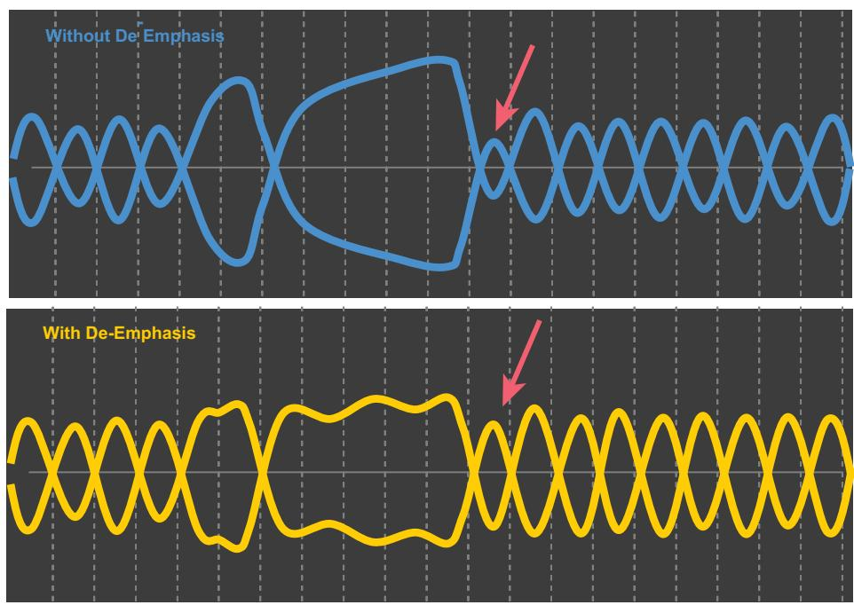

## Solution for 5.0 GT/s

As one might expect, increasing data rates exacerbates the problem of ISI because the bit times get progressively smaller, and more aggressive equalization techniques are needed. The change for 5.0 GT/s is incremental, and consists of providing three choices regarding the amount of de‐emphasis to be applied.

1. When running at 2.5 GT/s speed, ‐3.5 dB de‐emphasis is required.

2. When running at 5.0 GT/s speed,  ‐6.0 dB de‐emphasis is recommended, while the use of ‐3.5 dB is optional. ‐6.0 dB de‐emphasis level is intended to compensate for the greater signal attenuation at higher frequency. As Figure 13‐19 on page 473 suggests, a 3.5 dB reduction represents a 33% reduction in voltage, while a 6 dB reduction represents a 50% reduction. To avoid a possible confusion, note that the dB measure of power and voltage are different by a factor of two. A 3 dB reduction represents a 50% change in power but only a 25% change in voltage.

Figure 13‐19: De‐emphasis Options for 5.0 GT/s  
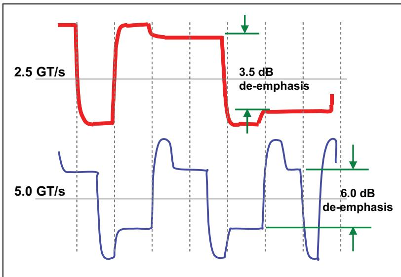

3. Normally, a Transmitter operates in the full‐swing mode and can use the entire available voltage range to help overcome signal attenuation. The voltage needs to start out at a higher value to compensate for the loss, as shown in the top half of Figure 13‐20 on page 474. However, for 5.0 GT/s another option is provided called reduced‐swing mode. This is intended to support short, low‐loss signaling environments, as shown in the lower half of Figure 13‐20 on page 474, and reduces the voltage swing by about half to save power. This mode also provides the third de‐emphasis option by turning off de‐emphasis entirely, which makes sense because, as mentioned earlier, the signal distortion it creates would not be reduced by loss in the path and the resulting signal at the Receiver would look worse.

Figure 13‐20: Reduced‐Swing Option for 5.0 GT/s with No De‐emphasis  
  
Reduced Swing (low transmission amplitude)

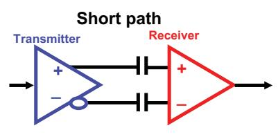

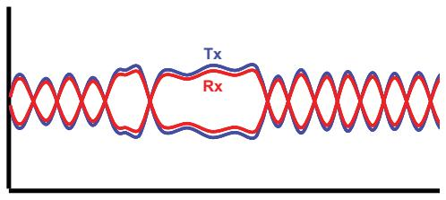

## Solution for 8.0 GT/s - Transmitter Equalization

When going to the 8.0 GT/s data rate, the signal conditioning model changes significantly. Transmitter equalization becomes more complex and a handshake training procedure is used to adapt to the actual signaling environment rather than making assumptions about what will be needed. To learn more about the process of evaluating the Link, refer to the section called “Recovery.Equalization” on page 587. Basically, that process allows a Receiver to request that the Link partner’s Transmitter use a certain combination of coefficients and then the receiver tests how well the received signal looks and possibly proposes others if the result isn’t good enough.

Sometimes students ask whether this model is really sufficient to achieve good error rates, since evaluating a signal across all the possible situations requires days of testing in the lab to achieve a BER of $1 0 ^ { - 1 5 }$ or better. The answer to this has two parts. First, even with the handshake process, the coefficients will be an approximation that worked well when the training was done but may or may not work as well under other conditions. Extrapolation from a small sample size is a necessary part of arriving at working values quickly and it works reasonably well. Second, associated with 8 GT/s transfer rate, it’s only necessary to achieve a minimum BER of $1 0 ^ { - 1 2 }$ , and that doesn’t take as long to verify as it would BER of $1 0 ^ { - 1 5 }$

## Three-Tap Tx Equalizer Required

To accomplish better wave shaping at the Transmitter, the spec requires the use of a 3‐tap FIR (Finite Impulse Response) filter, meaning a filter with 3 bit‐timespaced inputs. A conceptual drawing of this is shown in Figure 13‐21 on page 475, where it can be seen that the output voltage is the sum of three versions of the input: the original input, a version delayed by one bit time and a third delayed by another bit time. This type of FIR filter is often used in other SER‐DES applications above 6.0 Gb/s, and it’s helpful for PCIe because it compensates for the fact that the channel spreads the signal across a longer time. Another way of thinking about it is that a given bit is affected by both the bit value that preceded it and the bit that comes after it.

Figure 13‐21: 3‐Tap Tx Equalizer  
  
With this in mind, the three inputs can be described by their timing position as “pre‐cursor” for $\mathrm { { C _ { - 1 } } , }$ “cursor” for $\mathrm { C } _ { 0 } ,$ and “post‐cursor” for $C _ { + 1 } ,$ , which combine to create an output based on the upcoming input, the current value, and the previous value. Adjusting the coefficients for the taps allows the output wave to be optimally shaped. This effect is illustrated by the pulse‐response waveform shown in Figure 13‐22 on page 476. Looking at a single pulse allows the adjustment to the signal to be more easily recognized.

The filter shapes the output according to the coefficient values (or tap weights) assigned to each tap. The sum of the absolute value of the three coefficient magnitudes together is defined to be unity so that only two of them need to be given for the third one to be calculated. Consequently, only $\mathrm { C } _ { - 1 }$ and $C _ { + 1 }$ are given in the spec and ${ \mathrm { C } } _ { 0 }$ is always implied and is always positive.

Figure 13‐22: Tx 3‐Tap Equalizer Shaping of an Output Pulse  
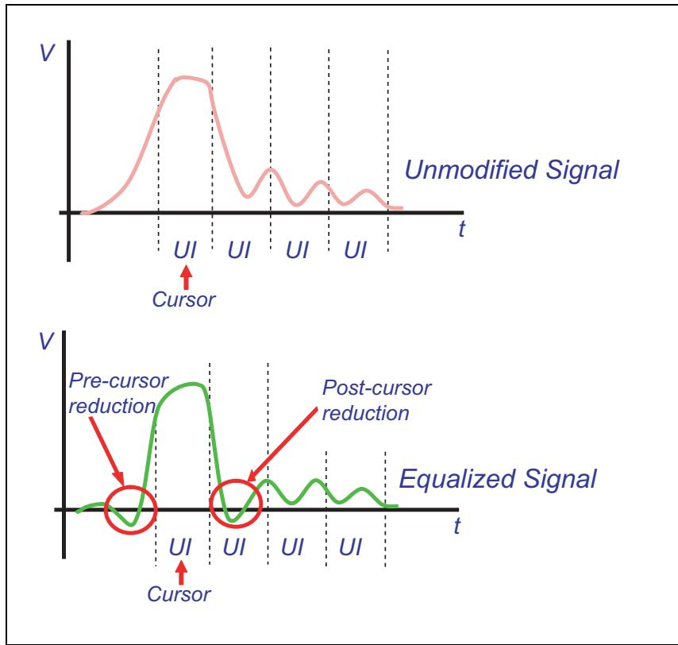

## Pre-shoot, De-emphasis, and Boost

The effect of the coefficient values is to adjust the output voltage to create up to four different voltage levels to accommodate different signaling environments, as shown in Figure 13‐23 on page 477. This waveform was taken from a test device and shows a representative example, but the voltage levels depend on whether a Transmitter implements preshoot or de‐emphasis or both.

The waveform shows the four general voltages to be transmitted, which are: maximum‐height (Vd), normal (Va), de‐emphasized (Vb), and pre‐shoot (Vc).

This scheme is backward‐compatible with the 2.5 and 5.0 GT/s model that only uses de‐emphasis, because pre‐shoot and de‐emphasis can be defined indepen dently. The voltages both with and without de‐emphasis are the same as they have been for the lower data rates, except that now there are more options for the de‐emphasis value, ranging from 0 to  ‐6 dB. Preshoot is a new feature designed to improve the signal in the following bit time by boosting the voltage in the current bit time. Finally, the maximum value is simply what the signal would be if both $C _ { - 1 }$ and $C _ { + 1 }$ were zero (and $C _ { 0 }$ was 1.0). As illustrated by the bit stream shown at the top of the diagram, we may summarize the strategy for these voltages as follows:

• When the bits on both sides of the cursor have the opposite polarity, the voltage will be Vd, the maximum voltage.

• When a repeated string of bits is to be sent:

— The first bit will use Va, the next lower voltage to the maximum voltage Vd.

— Bits between the first and last bits use Vb, the lowest voltage.

— The last repeated bit before a polarity change uses Vc, the next higher voltage to the lowest voltage Vb.

Figure 13‐23: 8.0 GT/s Tx Voltage Levels  

## Presets and Ratios

As described in “Recovery.Equalization” on page 587, when the Link is preparing to change from a lower data rate to 8.0 GT/s, the Downstream Port sends EQ TS2s that give the Upstream Port a set of preset values to use for its coefficients as a starting point from which to begin testing the Link signal quality. The list of 11 possible presets along with their corresponding coefficient values and voltage ratios is given in Table 13‐1 on page 478. Note that the voltages are given as a ratio with respect to the max value. These values were selected to match the earlier spec versions. As an example of how that is used, the first entry, P4, uses no de‐emphasis or preshoot, so all the voltage values are equal to the max value and the ratios are all 1.000.

Table 13‐1: Tx Preset Encodings with Coefficients and Voltage Ratios

<table><tr><td>Preset Number</td><td>Preshoot (dB)</td><td>De-emphasis (dB)</td><td> $C_{-1}$ </td><td> $C_{+1}$ </td><td>Va/Vd</td><td>Vb/Vd</td><td>Vc/Vd</td></tr><tr><td>P4</td><td>0.0.</td><td>0.0</td><td>0.000</td><td>0.000</td><td>1.000</td><td>1.000</td><td>1.000</td></tr><tr><td>P1</td><td>0.0.</td><td>-3.5 +/- 1 dB</td><td>0.000</td><td>-0.167</td><td>1.000</td><td>0.668</td><td>0.668</td></tr><tr><td>P0</td><td>0.0.</td><td>-6.0 +/- 1.5 dB</td><td>0.000</td><td>-0.250</td><td>1.000</td><td>0.500</td><td>0.500</td></tr><tr><td>P9</td><td>3.5 +/- 1 dB</td><td>0.0</td><td>-0.166</td><td>0.000</td><td>0.668</td><td>0.668</td><td>1.000</td></tr><tr><td>P8</td><td>3.5 +/- 1 dB</td><td>-3.5 +/- 1 dB</td><td>-0.125</td><td>-0.125</td><td>0.750</td><td>0.500</td><td>0.750</td></tr><tr><td>P7</td><td>3.5 +/- 1 dB</td><td>-6.0 +/- 1.5 dB</td><td>-0.100</td><td>-0.200</td><td>0.800</td><td>0.400</td><td>0.600</td></tr><tr><td>P5</td><td>1.9 +/- 1 dB</td><td>0.0</td><td>-0.100</td><td>0.000</td><td>0.800</td><td>0.800</td><td>1.000</td></tr><tr><td>P6</td><td>2.5 +/- 1 dB</td><td>0.0</td><td>-0.125</td><td>0.000</td><td>0.750</td><td>0.750</td><td>1.000</td></tr><tr><td>P3</td><td>0.0</td><td>-2.5 +/- 1 dB</td><td>0.000</td><td>-0.125</td><td>1.000</td><td>0.750</td><td>0.750</td></tr><tr><td>P2</td><td>0.0</td><td>-4.4 +/- 1.5 dB</td><td>0.000</td><td>-0.200</td><td>1.000</td><td>0.600</td><td>0.600</td></tr><tr><td>P10</td><td>0.0</td><td>Defined by LF</td><td>0.000</td><td>(FS-LF) /2</td><td>1.000</td><td>Not fixed</td><td>Not fixed</td></tr></table>

## Equalizer Coefficients

Presets allow a device to use one of 11 possible starting values to be used for the partner’s Transmitter coefficients when first training to the 8.0 GT/s data rate. This is accomplished by sending EQ TS1s and EQ TS2s during training which gives a coarse adjustment of Tx equalization as a starting point. If the signal using the preset delivers the desired $1 0 ^ { - 1 2 }$ error rate, no further training is needed. But if the measured error rate is too high, the equalization sequence is used to fine‐tune the coefficient settings by trying different $C _ { - 1 }$ and $C _ { + 1 }$ values and evaluating the result, repeating the sequence until the desired signal quality or error rate is achieved.

An 8.0 GT/s transmitter is required to report its range of supported coefficient values to its neighboring Receiver. There are some constraints on this:

• Device must support all 11 presets as listed in Table 13‐1 on page 478.

• Transmitters must meet the full‐swing V signaling limits

• Transmitters may optionally support the reduced‐swing, and if they do they must meet the $\mathsf { V } _ { \mathrm { T X - E I E O S - R S } }$ limits

Coefficients must meet the boost limits $( \mathrm { V } _ { \mathrm { T X - B O O S T - F S } } = 8 . 0$ dB min, $\mathrm { V } _ { \mathrm { T X } } .$ $_ { \mathrm { B O O S T - R S } } = 2 . 5 \mathrm { d B }$ min) and resolution limits $( \mathrm { E Q } _ { \mathrm { T X - D O E F F - R E S S } } = 1 / 2 4$ max to 1/63 min).

Applying these constraints and using the maximum granularity of 1/24 creates a list of pre‐shoot, de‐emphasis, and boost values for each setting. This is presented in a table in the spec that is partially reproduced from the spec here in Table 13‐2 on page 480. The table contains blank entries because the boost value can’t exceed $\overset { \mathrm { ~ \ i ~ } } { 8 . 0 } \overset { \mathrm { ~ \ i ~ } } { + } / - 1 . 5 \ \mathrm { d B } = 9 . 5$ dB. That results in a diagonal boundary where the boost has reached 9.5 for the full‐swing case. For reduced swing, the boundary is at 3.5 dB. The 6 shaded entries along the left and top edges of the table that go as far as 4/24 are presets supported by full‐ or reduced‐swing signaling. The other 4 shaded entries are presets supported for full‐swing signaling only.

Table 13‐2: Tx Coefficient Table

<table><tr><td rowspan="2" colspan="2">PS DEBoost</td><td colspan="7"> $C_{+1}$ </td></tr><tr><td>0/24</td><td>1/24</td><td>2/24</td><td>3/24</td><td>4/24</td><td>5/24</td><td>6/24</td></tr><tr><td rowspan="7"> $C_{-1}$ </td><td>0/24</td><td>0.0 0.00.0</td><td>0.0 -0.80.8</td><td>0.0 -1.81.6</td><td>0.0 -2.52.5</td><td>0.0 -3.53.5</td><td>0.0 -4.74.7</td><td>0.0 -6.0-6.0</td></tr><tr><td>1/24</td><td>0.8 0.00.8</td><td>0.8 -0.81.6</td><td>0.9 -1.72.5</td><td>1.0 -2.83.5</td><td>1.2 -3.94.7</td><td>1.3 -5.36.0</td><td>1.6 -6.87.6</td></tr><tr><td>2/24</td><td>1.6 0.01.6</td><td>1.7 -0.92.5</td><td>1.9 -1.93.5</td><td>2.2 -3.14.7</td><td>2.5 -4.46.0</td><td>2.9 -6.07.6</td><td>3.5 -8.09.5</td></tr><tr><td>3/24</td><td>2.5 0.02.5</td><td>2.8 -1.03.5</td><td>3.1 -2.24.7</td><td>3.5 -3.56.0</td><td>4.1 -5.17.6</td><td>4.9 -7.09.5</td><td>-</td></tr><tr><td>4/24</td><td>3.5 0.03.5</td><td>3.9 -1.24.7</td><td>4.4 -2.56.0</td><td>5.1 -4.17.6</td><td>6.0 -6.09.5</td><td>-</td><td>-</td></tr><tr><td>5/24</td><td>4.7 0.04.7</td><td>5.3 -1.36.0</td><td>6.0 -2.97.6</td><td>7.0 -4.99.5</td><td>-</td><td>-</td><td>-</td></tr><tr><td>6/24</td><td>6.0 0.06.0</td><td>6.8 -1.67.6</td><td>8.0 -3.59.5</td><td>-</td><td>-</td><td>-</td><td>-</td></tr></table>

Coefficient Example. Let’s drill a little deeper on the coefficients by using preset number P7 from Table 13‐1 on page 478 as an example. In this entry, $\mathrm { C _ { - 1 } } = \mathrm { - 0 . 1 0 0 } ,$ and $\mathrm { C } _ { + 1 } = - 0 . 2 0 0$ , and since $C _ { 0 }$ must be positive and the sum of their absolute values must be one, it’s implied that $\bar { \mathrm { C } _ { 0 } } = 0 . 7 0 0$

Matching these values to the table of coefficient space given in the spec is not straightforward because the coefficients are given as fractions rather than decimal values, but converting the fractions to their decimal values matches them pretty closely. The $C _ { - 1 }$ value of 0.100 is closest to 2/24 (0.083), while $C _ { + 1 }$ at 0.200 is a little less than 5/24 (0.208) The coefficient table entry for those fractions is highlighted as one of the preset values, giving us some confidence that this is on the right track. In the preset table, P7 lists a preshoot value of 3.5 +/‐ 1 dB, and the value in the coefficient table is shown as 2.9 dB. If we correct for the difference in coefficient values, ((0.083/.1) \* 3.5 = 2.9) we arrive at the same preshoot value. The difference in coefficient val ues for de‐emphasis was much smaller (0.200 vs. 0.208) and so, as we might expect, both tables show this as ‐6.0 dB.

What voltages do the P7 coefficients create? Assuming a full‐swing voltage of Vd as a starting point then, according to the ratios in the preset table, the other voltages would be $\mathrm { V a } = 0 . 8 \mathrm { V d } , \mathrm { V } \bar { \mathrm { b } } = 0 . 4 \mathrm { V d }$ , and $\mathrm { V c } = 0 . 6 \mathrm { V d }$ . How well do those correspond to the values that would result from using the preshoot and de‐emphasis numbers? De‐emphasis was given as  ‐6.0 dB, and we already know that represents a 50% voltage reduction, so we’d expect that Vb should be half of Va, which it is. Pre‐shoot was given as 3.5 dB meaning the ratio of Vc/Vb is 0.668, and $0 . 4 / 0 . 6 6 8 = 0 . 5 9 8 { \bar { \mathrm { V d } } }$ for Vc; very close to the 0.6Vd we expected. Last of all, the Boost value, which is the ratio of Vd/Vb, is not given in the preset table but, using the formula 20\*log(Vd/ Vb), the boost from the preset values turns out to be 7.9 dB. That’s reasonably close to the 7.6 dB value given in the coefficient table and gives us some confidence that the tables are consistent among themselves.

So how are the four voltages obtained? There are essentially three programmable drivers whose output is summed to derive the final signal value to be launched. If the cursor setting remains unchanged, and the pre‐ and postcursor taps are negative, then the answer can be found by simply adding the taps as $( \mathsf C _ { 0 } + \mathsf C _ { - 1 } + \mathsf C _ { + 1 } )$

$\begin{array} { r l } { - } & { { } \mathrm { V d } = ( \mathrm { C } _ { 0 } + \mathrm { C } _ { - 1 } + \mathrm { C } _ { + 1 } ) = ( 0 . 7 0 0 + 0 . 1 0 0 + 0 . 2 0 0 ) = 1 . 0 ^ { \ast } } \end{array}$ max voltage. This is the “boosted” value that results when a bit is both preceded and followed by bits of the opposite polarity. In all four voltages listed here, if the polarity of the bits is inverted then the values would all be negative.

$\begin{array} { r l } { - } & { { } \mathrm { V a } = ( 0 . 7 0 0 + ( - 0 . 1 0 0 ) + 0 . 2 0 0 ) = 0 . 8 \ ^ { * } } \end{array}$ max voltage. This is the value that results when a bit is preceded by the opposite polarity but followed by the same polarity, meaning it is the first in a repeated string of bits.

$- \mathrm {  ~ \nabla ~ } \mathrm { V b } = ( 0 . 7 0 0 \mathrm {  ~ + ~ } ( - 0 . 1 0 0 ) \mathrm {  ~ + ~ } ( - 0 . 2 0 0 ) ) = 0 . 4 \mathrm {  ~ * ~ }$ max voltage. This is the deemphasized value that results when a bit is both preceded and followed by bits of the same polarity, meaning it’s in the middle of a repeated string of bits.

$\mathrm { V c } = ( 0 . 7 0 0 + 0 . 1 0 0 + ( - 0 . 2 0 0 ) ) = 0 . 6 ^ { * }$ max voltage. This is the pre‐shoot value that results when a bit is preceded by the same polarity but followed by the opposite polarity, meaning it’s the last bit in a repeated string of bits.

What determines when the coefficients are added or subtracted to arrive at these numbers? This turns out to be fairly simple, since it’s just a matter of the polarity of the time‐shifted pre‐  and post‐cursor inputs. This is illustrated in Figure 13‐24 on page 482. The single‐ended waveform labeled “Weighted Cursor $( \mathsf { C } _ { 0 } ) ^ { \prime \prime }$ shows the positive half of the differential bit stream currently being transmitted. If the waveforms are understood as shifting to the right with time, then the next lower trace $( \mathsf C _ { + 1 } )$ is the post‐cursor signal.