## PCI Express Technology

This version arrives one clock later and is weighted negatively by its coefficient, causing it to be inverted. The top trace $( \mathsf { C } _ { - 1 } )$ arrives a clock earlier than the cursor and is the pre‐cursor value that is also weighted negatively according to its own coefficient.

Finally, the bottom trace shows the result of summing all three inputs to arrive at the final signal that is actually launched onto the wire. In the illustration, this is overlaid with the single‐ended output waveform from Figure 13‐23 on page 477 to show that it approximates a real capture fairly well. Some voltage calculations are shown from our previous example to demonstrate how the resulting voltages are obtained.

Figure 13‐24: Tx 3‐Tap Equalizer Output  
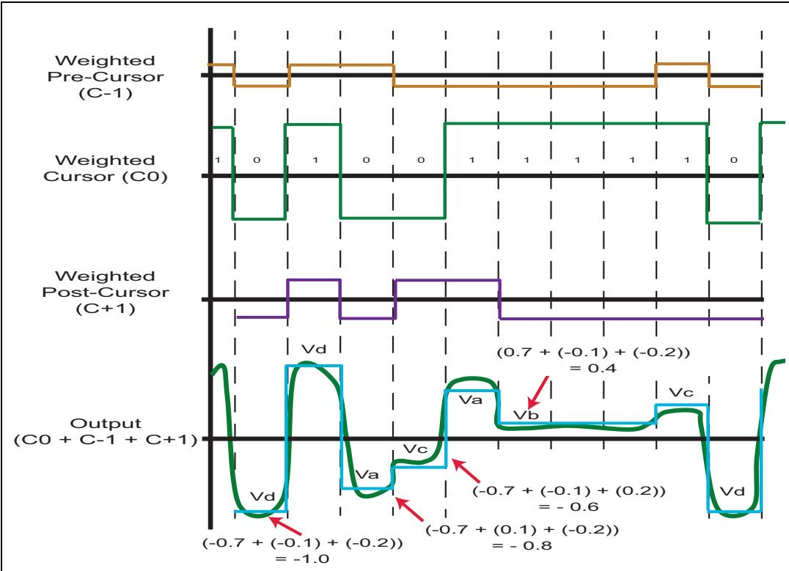

The coefficient presets are exchanged before the Link changes to 8.0 GT/s, and then they may be updated during the Link equalization process (see “Recovery.Equalization” on page 587 for more details).

EIEOS Pattern. At 8.0 GT/s, some voltages are measured when the signal has a low frequency because the high‐frequency changes won’t reach the levels we want to measure. The EIEOS sequence contains 8 consecutive ones followed by 8 consecutive zeros in a pattern that repeats for 128 bit times. Its purpose is primarily to serve as an unambiguous indication that a Transmitter is exiting from Electrical Idle, which scrambled data can’t guarantee. Its launch voltage is defined as VTX‐EIEOS‐FS for full swing and VTX‐ EIEOS‐RS for reduced swing signals.

Reduced Swing. Transmitters may support a reduced swing signal much as they did for 5.0 GT/s: to achieve both power savings and a better signal over short, low‐loss transmission paths. The output voltage has the same 1300 mV max value as the full‐swing case, but allows a lower minimum voltage of 232 mV as defined for VTX‐EIEOS‐RS. Operating at reduced swing limits the number of presets because the maximum boost supported is 3.5 dB.

## Beacon Signaling

## General

De‐emphasis is also applied to the Beacon signal, so a discussion about the Beacon is included in this section. A device whose Link is in the L2 state can generate a wake‐up event to request that power be restored so it can communicate with the system. The Beacon is one of two methods available for this purpose. The other method is to assert the optional sideband WAKE# signal. An example of what the Beacon might look like is shown in Figure 13‐25 on page 484. This version shows the differential signals pulsing and then decaying in opposite directions and is reminiscent of a flashing beacon light. Other options are avail able for the Beacon, but this one illustrates the concept well.

Figure 13‐25: Example Beacon Signal  
  
While a Link is in L2 power state, its main power source and clock are turned off but an auxiliary voltage source $\mathrm { ( V _ { a u x } ) }$ keeps a small part of the device working, including the wake‐up logic. To signal a wake‐up event, a downstream device can drive the Beacon upstream to start the L2 exit sequence. A switch or bridge receiving a Beacon on its Downstream Port must forward notification upstream by sending the Beacon on its Upstream Port or by asserting the WAKE# pin. See “WAKE#” on page 773.

The motivation for creating two wake‐up mechanisms is to provide choices regarding power consumption. To use the Beacon, all the bridges and switches between an Endpoint and the Root Complex will need to use $\mathrm { V _ { a u x } }$ so they can detect and generate the signal. If a system is always plugged in and unconcerned about the amount of standby power, the Beacon in‐band signal may be preferred over having to route an extra side‐band signal. But in a mobile system with limited battery life where conserving power is a high priority, the WAKE# pin is preferred because that approach uses as little $\mathrm { V _ { a u x } }$ as possible. The pin could be connected directly from the Endpoint to the Root Complex and then no other devices would need to be involved or use $\mathrm { V _ { a u x } . }$

## Properties of the Beacon Signal

• A low‐frequency, DC‐balanced differential signal consisting of a periodic pulse of between 2ns and 16s.

• The maximum time between pulses can be no more than 16s.

• The transmitted Beacon signal must meet the electrical voltage specs documented in Table 13‐3 on page 489.

• The signal must be DC balanced within a maximum time of 32s.

Beacon signaling, like normal differential signaling, must be done with the Transmitter in the low impedance mode (50  single‐ended, 100  differential impedance).

• When signaled, the Beacon signal must be transmitted on Lane 0, but does not have to be transmitted on other Lanes.

With one exception, the transmitted Beacon signal must be de‐emphasized according to the rules defined in the previous section. For Beacon pulses greater than 500ns, the Beacon signal voltage must be 6db de‐emphasized from the VTX‐DIFFp‐p spec. The Beacon signal voltage may be de‐emphasized by up to 3.5dB for Beacon pulses smaller than 500ns.

## Eye Diagram

## Jitter, Noise, and Signal Attenuation

As the bit stream travels from the Transmitter on one end of a link to the Receiver on the other end, it is subject to the following disruptive influences:

• Deterministic (i.e., predictable) jitter induced by the Link transmission line.

• Data‐dependent jitter induced by the dynamic data patterns on the Link.

• Noise induced into the signal pair.

• Signal attentuation due to the impedance effect of the transmission line.

## The Eye Test

To verify that a Receiver sees an signal that is within the allowed variation, an eye test may be performed. The following description of this measurement was provided by James Edwards from an article he authored for OE Magazine.

“The most common time‐domain measurement for a transmission system is the eye diagram. The eye diagram is a plot of data points repetitively sampled from a pseudo‐random bit sequence and displayed by an oscilloscope. The time window of observation is two data periods wide. For a [PCI Express link running at 2.5 GT/s], the period is 400ps, and the time window is set to 800ps. The oscilloscope sweep is triggered by every data clock pulse. An eye diagram allows the user to observe system performance on a single plot.

To observe every possible data combination, the oscilloscope must operate like a multiple‐exposure camera. The digital oscilloscopeʹs display persistence is set to infinite. With each clock trigger, a new waveform is measured and overlaid upon all previous measured waveforms. To enhance the interpretation of the composite image, digital oscilloscopes can assign different colors to convey information on the number of occurrences of the waveforms that occupy the same pixel on the display, a process known as color‐grading. Modern digital sampling oscilloscopes include the ability to make a large number of automated measurements to fully characterize the various eye parameters.

## Normal Eye Diagram

An ideal trace capture would paint an eye pattern that matched the outline shown in the center of Figure 13‐26 on page 486 labeled “Normal”. As long as the pattern resides entirely within that region, the Transmitter and Link are within tolerance. Note that the differential voltage parameters and values shown are peak voltages instead of the peak‐to‐peak voltages used in the spec, because only peak voltages can be represented in an eye diagram. Figure 13‐27 on page 488 shows a screen capture of a good eye diagram.

Figure 13‐26: Transmitter Eye Diagram  

## Effects of Jitter

Jitter (timing uncertainty) is what happens when an edge arrives either before or after its ideal time, and acts to reduce signal integrity and close the eye opening. It’s caused by a variety of factors, from environmental effects to the data pattern in flight, to noise or signal attenuation that causes the signal’s voltage level to overshoot or undershoot the normal zone. At 2.5 GT/s this could be treated as a simple lumped effect, but at higher data rates it becomes a more significant issue and must be considered in several different parts. Aiming at this goal, the 8.0 GT/s data rate defines 5 different jitter values. The details of jitter analysis and minimization are beyond the scope of this book, but let’s at least define the terms the spec uses. Jitter is described as being in one of several categories:

1. Un‐correlated ‐ jitter that is not dependent on, or “correlated” to, the data pattern being transmitted.

2. Rj ‐ Random jitter from unpredictable sources that are unbounded and usually assumed to fit a Gaussian distribution. Often caused by electrical or thermal noise in the system.

3. Dj ‐ Deterministic jitter that’s predictable and bounded in its peak‐to‐peak value. Often caused by EMI, crosstalk, power supply noise or grounding problems.

4. PWJ ‐ Pulse Width Jitter ‐ uncorrelated, edge‐to‐edge, high‐frequency jitter.

5. DjDD  ‐  Deterministic Jitter, using the Dual‐Dirac approximation. This model is a method of quickly estimating total jitter for a low BER without requiring the large sample size that would normally be needed. It uses a representative sample taken over a relatively short period (an hour or so) and extrapolates the curves to arrive at acceptable approximate values.

6. DDj ‐ Data‐dependent jitter is a function of the data pattern being sent, and the spec states that this is mostly due to package loss and reflection. ISI is an example of DDj.

Figure 13‐28 on page 488 shows a screen capture of a bad Eye Diagram at 2.5 GT/s. Since this is captured without de‐emphasis, the traces should all stay outside the Minimum Eye area, shown on the screen by the trapezoid shape in the middle. This example illustrates that jitter can affect both edge arrival times and voltage levels, causing some trace instances to encroach on the keep‐out area of the diagram.

Figure 13‐27: Rx Normal Eye (No De‐emphasis)  

Figure 13‐28: Rx Bad Eye (No De‐emphasis)  
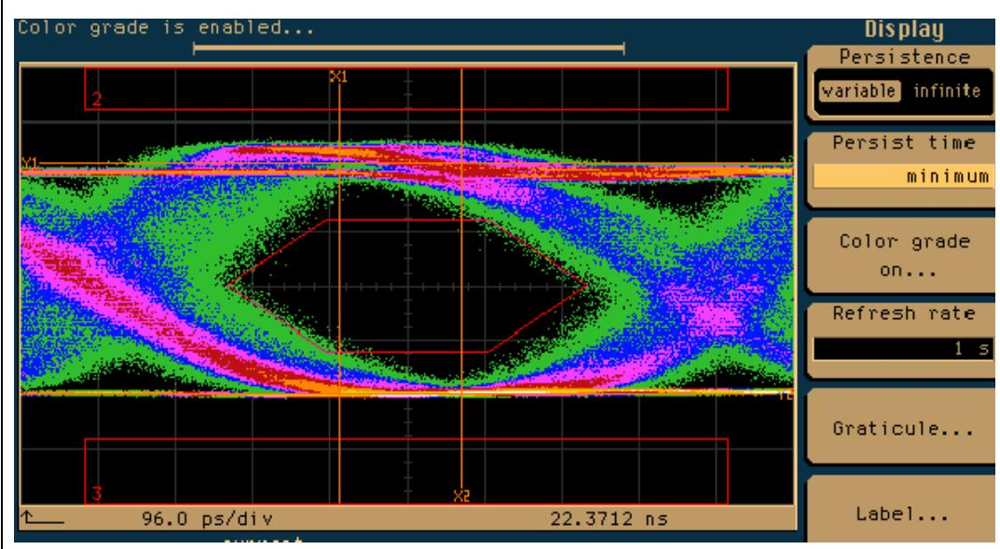

## Transmitter Driver Characteristics

Table 13‐3 on this page lists some Transmitter driver characteristics. This is not intended to replicate the tables from the spec, but to give some basic parameters to illustrate some differences between the data rates, such as UI, and to show that some things have remained unchanged, such as the Tx common‐mode voltage.

Table 13‐3: Transmitter Specs

<table><tr><td>Item</td><td>2.5 GT/s.</td><td>5.0 GT/s</td><td>8.0 GT/s</td><td>Units</td><td>Notes</td></tr><tr><td>UI</td><td>399.88(min)400.12(max)</td><td>199.94(min)200.06(max)</td><td>124.9625(min)125.0375(max)</td><td>ps</td><td>Unit Interval (bit time)</td></tr><tr><td> $T_{TX-EYE}$ </td><td>0.75(min)</td><td>0.75 (min)</td><td>See notes</td><td>UI</td><td>Transmitter Eye, including all jitter sources. For 8.0 GT/s, five jitter sources are specified separately.</td></tr><tr><td> $T_{TX-RF-MIS-MATCH}$ </td><td>Not Specified</td><td>0.1 (max)</td><td>Not Specified</td><td>UI</td><td>Rise and Fall time difference measured from 20% to 80% differentially.</td></tr><tr><td> $V_{TX-DIFFp-p}$ </td><td>0.8 (min)1.2 (max)</td><td>0.8 (min)1.2 (max)</td><td>See Table 13-4</td><td>mV</td><td>Peak-to-peak differential voltage.</td></tr><tr><td> $V_{TX-DIFFp-p}LOW$ </td><td>0.4 (min)1.2 (max)</td><td>0.4 (min)1.2 (max)</td><td>See Table 13-4</td><td>mV</td><td>Low-power voltage.</td></tr><tr><td> $V_{TX-DC-CM}$ </td><td>0 to 3.6</td><td>0 to 3.6</td><td>0 to 3.6</td><td>V</td><td>DC common mode voltage at Tx pins.</td></tr><tr><td> $V_{TX-DE-RATIO-3.5dB}$ </td><td>3 (min)4 (max)</td><td>3 (min)4 (max)</td><td>See Table 13-4</td><td>mV</td><td>Ratio for 3.5 dB de-emphasized bits.</td></tr><tr><td> $V_{TX-DE-RATIO-6dB}$ </td><td>n/a</td><td>5.5 (min)6.5 (max)</td><td>See Table 13-4</td><td>mV</td><td>Ratio for 6 dB de-emphasized bits.</td></tr></table>

## PCI Express Technology

Table 13‐3: Transmitter Specs (Continued)

<table><tr><td>Item</td><td>2.5 GT/s.</td><td>5.0 GT/s</td><td>8.0 GT/s</td><td>Units</td><td>Notes</td></tr><tr><td> $I_{TX-SHORT}$ </td><td>90</td><td>90</td><td>90</td><td>mA</td><td>Total single-ended current Tx can supply when shorted to ground.</td></tr><tr><td> $V_{TX-IDLE-DIFF-AC-P}$ </td><td>0 (min)20 (max)</td><td>0 (min)20 (max)</td><td>0 (min)20 (max)</td><td>mV</td><td>Peak differential voltage under Electrical Idle state of Link. Must include a bandpass filter passing frequencies from 10 KHz to 1.25 GHz.</td></tr><tr><td> $T_{TX-IDLE-MIN}$ </td><td>20 (min)</td><td>20 (min)</td><td>20 (min)</td><td>ns</td><td>Minimum time a Transmitter must be in Electrical Idle.</td></tr><tr><td> $T_{TX-IDLE-SET-TO-IDLE}$ </td><td>8 (max)</td><td>8 (max)</td><td>8 (max)</td><td>ns</td><td>Time allowed for Tx to meet Electrical Idle spec after last bit of required EIOSs.</td></tr><tr><td> $T_{TX-IDLE-TO-DIFF-DATA}$ </td><td>8</td><td>8</td><td>8</td><td>ns</td><td>Max time for Tx to meet differential transmission spec after Electrical Idle exit.</td></tr><tr><td> $Z_{TX-DIFF-DC}$ </td><td>80 (min)120 (max)</td><td>120 (max)</td><td>120 (max)</td><td>Ω</td><td>DC differential Tx impedance. Typical value is 100 Ω. Min value for 5.0 and 8.0 GT/s is bounded by  $RL_{TX-DIFF}$ </td></tr><tr><td> $RL_{TX-DIFF}$ </td><td>10 (min)</td><td>10 (min) for 0.5-1.25 GHz8 (min) for &gt;1.25-2.5 GHz</td><td>10 (min) for 0.5-1.25 GHz8 (min) for &gt;1.25 - 2.5 GHz4 (min) for &gt;2.5 to 4 GHz</td><td>dB</td><td>Tx package return loss. Note that the frequency is the signal on the wire. Note that at higher rates it becomes necessary to specify different parameters for different frequencies.</td></tr><tr><td> $C_{TX}$ </td><td>75 (min)265 (max)</td><td>75 (min)265 (max)</td><td>176 (min)265 (max)</td><td>nF</td><td>Required AC coupling cap on each Lane placed in the media or in the component itself.</td></tr><tr><td> $L_{TX-SKEW}$ </td><td>500 ps + 2 UI (max)</td><td>500 ps + 4 UI (max)</td><td>500 ps + 6 UI</td><td>ps</td><td>Skew between any two Lanes in the same Transmitter.</td></tr></table>

Table 13‐4: Parameters Specific to 8.0 GT/s

<table><tr><td>Symbol</td><td>Value</td><td>Units</td><td>Notes</td></tr><tr><td> $V_{TX-FS-NO-EQ}$ </td><td>1300 (max)800 (min)</td><td>mvPP</td><td>No EQ is applied; measured using 64 zeros followed by 64 ones.</td></tr><tr><td> $V_{TX-RS-NO-EQ}$ </td><td>1300 (max)</td><td>mvPP</td><td>No EQ is applied; measured using 64 zeros followed by 64 ones.</td></tr><tr><td> $V_{TX-BOOST-FS}$ </td><td>8.0 (min)</td><td>dB</td><td>Tx boost ratio for full swing.(Assumes +/- 1.5 dB tolerance)</td></tr><tr><td> $V_{TX-BOOST-RS}$ </td><td>2.5 (min)</td><td>dB</td><td>Tx boost ratio for reduced swing.(Assumes +/- 1.0 dB tolerance)</td></tr><tr><td> $EQ_{TX-COEFF-RES}$ </td><td>1/24 (max)1/63 (min)</td><td>n/a</td><td>Tx coefficient resolution</td></tr></table>

## Receiver Characteristics

## Stressed-Eye Testing

Receivers are tested using a stressed eye technique, in which a signal with specific problems is presented to the input pins and the BER is monitored. The spec presents these for 2.5 and 5.0 GT/s separately from 8.0 GT/s because of the difference in the methods used, and then gives a third section that defines parameters common to all the speeds.

## 2.5 and 5.0 GT/s

At 2.5 GT/s, the parameters are measured at the Receiver pins and there is an implied correlation between the margins observed and the BER. At 5.0 GT/s, receiver tolerancing is applied. This is a two‐step method in which a test board is calibrated to show the worst‐case signal margins as defined in the spec. Then, once the calibration is done, the test load is replaced by the device to be tested and its BER is observed. There are actually two sets of worst‐case numbers based on the clocking scheme: one is defined for the common‐clock architecture and another for the data‐clocked architecture. At higher speeds every element of the signal path must be carefully considered, and that’s true for the device package, too. The effects added to the signal by the package must be comprehended in the testing process.

The calibration channel itself must be designed with specific characteristics in mind, but the spec observes that a trace length of 28 inches on an FR4 PCB should suffice to create the necessary ISI. A signal generator is used to inject the Compliance Pattern with the appropriate jitter elements included.

## 8.0 GT/s

The method for testing the stressed eye at 8.0 GT/s is similar, but there are some differences. One difference is that the signal can’t be evaluated at the device pin and so a replica channel is used to allow measuring the signal as it would appear at the pin if the device were an ideal termination.

In order to evaluate the Receiver’s ability to perform equalization properly, it’s recommended that multiple calibration channels with different insertion loss characteristics be used so the receiver can be tested in more than one environment. As with the transmitter at 8.0 GT/s, the calibration channel for the receiver consists of differential traces terminated at both ends with coaxial connectors.

To establish the correct correlation between the channel and the receiver it’s necessary to model what the receiver see internally after equalization has been applied. That means post processing is must be applied that will model what happens in the Receiver, including the following items, the details of which are described in the spec:

• Package insertion loss

• CDR ‐ Clock and Data Recovery logic

• Equalization that accounts for the longest calibration channel, including 一 First‐order CTLE (Continuous Time Linear Equalizer)

— One‐tap DFE (Decision Feedback Equalizer)

## Receiver (Rx) Equalization

Transmitter equalization is mandatory, but the signal may still suffer enough degradation going through the longest permissible channel that the eye is closed and the signal is unrecognizable at the Receiver. To accommodate this the spec describes receiver equalization logic, but says is not intended to serve as an implementation guideline. What it does say is that a version will be required for calibrating the stressed eye when using the longest allowed calibration channel. As described earlier, that requirement is described as a first‐order CTLE and a one‐tap DFE.

## Continuous-Time Linear Equalization (CTLE)

A linear equalizer removes the undesirable frequency components from the received signal. For PCIe this could be as simple as a passive high‐pass filter that reduces the voltage of the low frequency component from the received signal which attenuates by a lower amount on the transmission line. It could also be done with amplification to open up the received eye, however that would amplify the high‐frequency noise along with the signal and create other problems.

One form of receiver equalization would be a circuit like the one shown in Figure 13‐29 on page 494, which is a Discrete Time Linear Equalizer (DLE). This is simply an FIR filter, similar to the one used by the transmitter, to provide wave shaping as a means of compensating for channel distortion. One difference is that it uses a Sample and Hold (S & H) circuit on the front end to hold the analog input voltage at a sampled value for a time period, rather than allowing it to constantly change. The spec doesn’t mention DLE, and the reasons may include its higher cost and power compared to CTLE. As with the transmitter FIR, more taps provide better wave shaping but add cost, so only a small number are practical.

Figure 13‐29: Rx Discrete‐Time Linear Equalizer (DLE)  

In contrast, CTLE is not limited to discrete time intervals and improves the signal over a longer time interval. A simple RC network can serve as an example of a CTLE high‐pass filter, as shown in Figure 13‐30 on page 494. This serves to reduce the low‐frequency distortion caused by the channel without boosting the noise in the high‐frequency range of interest and cleans the signal for use at the next stage. Figure 13‐31 on page 495 illustrates the attenuation effect of CTLE high‐pass filter on the received low frequency component of a signal e.g. continuous 1s or continuous 0s.

Figure 13‐30: Rx Continuous‐Time Linear Equalizer (CTLE)  

Figure 13‐31: Effect of Rx Continuous‐Time Linear Equalizer (CTLE) on Received Signal  
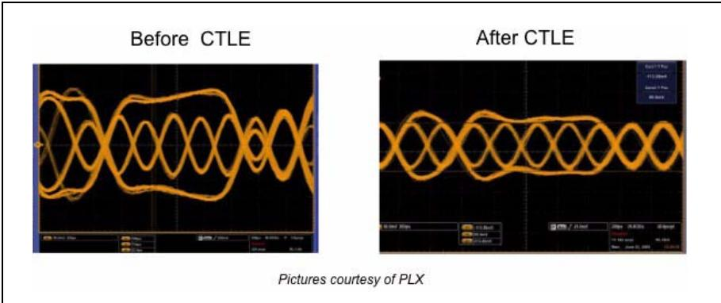  
Decision Feedback Equalization (DFE)

An example one‐tap DFE circuit like the one described in the spec is shown in Figure 13‐32 on page 495, where it can be seen that the received signal is summed with the feedback value and then fed into a data “slicer.” A slicer is an A/D circuit that takes the analog‐looking input and converts it into a clean, fullswing digital signal for internal use. It makes its best guess and decides whether the input is a positive or negative value and outputs either +1 or ‐1. This decision is sent into an FIR filter with only one tap, which is just a delayed version weighted according to a coefficient setting. The output of this filter is then fed back and summed with the received signal for use as the new input to the data slicer.

Figure 13‐32: Rx 1‐Tap DFE  
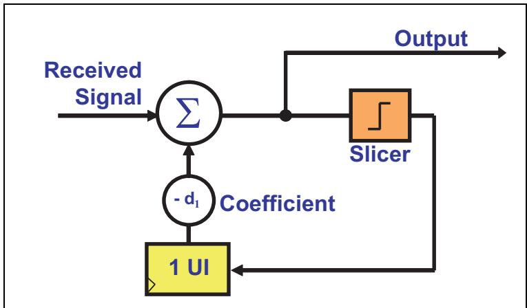

## PCI Express Technology

The spec only describes a single‐tap filter, but a two‐tap version is shown in Figure 13‐33 on page 497 to illustrate another option. The motivation for including more taps is to create a cleaner output, since each tap reduces the noise for one more UI. Thus, two taps further reduce the undesirable components of the signal, as shown in the pulse response waveform at the bottom of the drawing. This version is also shown as adaptive, meaning it’s able to modify the coefficient values on the fly based on design‐specific criteria.

The coefficients of the filter could be fixed, but if they’re adjustable the receiver is allowed to change them at any time as long as doing so doesn’t interfere with the current operation. In the section called “Recovery.Equalization” on page 587, Receiver Preset Hints are described as being delivered by the Downstream Port to the Upstream Port on a Link, using EQ TS1s. The preset gives a hint, in terms of dB reduction, at a starting point for choosing these coefficients.

Since the spec doesn’t require it, what the Receiver chooses to do regarding signal compensation will be implementation specific. Industry literature states that DFE is more effective when working with an open eye, and that’s why it’s usually employed after a linear equalizer that serves to clean up the input enough for DFE to work well.

Figure 13‐33: Rx 2‐Tap DFE  

## Receiver Characteristics

Some selected Receiver characteristics are listed in Table 13‐5 on page 498. The Receiver Eye Diagram in Figure 13‐34 on page 499 also illustrates some of the parameters listed in the table.

## PCI Express Technology

Table 13‐5: Common Receiver Characteristics

<table><tr><td>Item</td><td>2.5 GT/s.</td><td>5.0 GT/s.</td><td>8.0 GT/s</td><td>Units</td><td>Notes</td></tr><tr><td>UI</td><td>399.88(min)400.12(max)</td><td>199.94(min)200.06(max)</td><td>124.9625(min)125.0375(max)</td><td>ps</td><td>Unit Interval = bit time.</td></tr><tr><td> $T_{RX-EYE}$ </td><td>0.4(min)</td><td colspan="2">Indirectly specified</td><td>UI</td><td>Minimum eye width for a BER or  $10^{-12}$ . At higher rates and long channels the eye is effectively closed, making external measurement impractical.</td></tr><tr><td> $V_{RX-EYE}$ </td><td>300</td><td>120 (CC)100 (DC)</td><td>Not specified</td><td>mVpp diff</td><td>CC = common clocked, DC = data clocked</td></tr><tr><td> $V_{RX-DIFF-PP-CC}$ </td><td>175(min)1200(max)</td><td>120 (min)1200(max)</td><td>Indirectly specified</td><td>mV</td><td>Peak-to-peak differential voltage sensitivity of common-clocked Receiver.</td></tr><tr><td> $V_{RX-DIFF-PP-DC}$ </td><td>175(min)1200(max)</td><td>100 (min)1200(max)</td><td>Indirectly specified</td><td>mV</td><td>Peak-to-peak differential voltage sensitivity of data-clocked Receiver.</td></tr><tr><td> $V_{RX-IDLE-DET-DIFFp-p}$ </td><td colspan="3">65 (min) 175 (max)</td><td>mV</td><td>Electrical Idle detect threshold at the Receiver pins.</td></tr><tr><td> $Z_{RX-DIFF-DC}$ </td><td>80(min)120(max)</td><td colspan="2">Covered by  $RL_{RX-DIFF}$ </td><td>Ω</td><td>At higher frequencies impedance can no longer be represented by a lumped-sum value and must be described in more detail.</td></tr><tr><td> $Z_{RX--DC}$  $L_{RX-SKEW}$ </td><td>40(min)60(max)20</td><td>40 (min)60 (max)8</td><td>Bounded by  $RL_{RX-CM}$ 6</td><td>Ωns</td><td>DC impedance needed for Receiver Detect.Max Lane-to-Lane skew that a Receiver must be able to correct.</td></tr><tr><td> $RL_{RX--DIFF}$ </td><td>10 (min)</td><td>10 (min) for 0.05 - 1.25 GHz, 8 (min) for &gt;1.25 - 2.5 GHz</td><td>10 (min) for 0.05 - 1.25 GHz, 8 (min) for &gt;1.25 - 2.5 GHz, 5 (min) for &gt;2.5 - 4.0 GHz</td><td>dB</td><td>Rx package + Si differential return loss</td></tr><tr><td> $RL_{RX--CM}$ </td><td>6 (min)</td><td>6 (min)</td><td>6 (min) for 0.05 - 2.5 GHz, 5 (min) for &gt;2.5 - 4 GHz</td><td>dB</td><td>Common mode Rx return loss</td></tr></table>

Figure 13‐34: 2.5 GT/s Receiver Eye Diagram  

## Link Power Management States

Figure 13‐35 on page 500 through Figure 13‐39 on page 504 illustrate the electrical state of the Physical Layer while the link is in various power management states and describe several characteristics. One of these is the Tx and Rx terminations, which are sometimes implemented as active logic

Figure 13‐35: L0 Full‐On Link State  

 Transmission and reception in progress

 Recommended Power Budget about 80 mW per Lane

One direction of the Link can be in L0 while the other side is in L0s

 Transmitter and Receiver clock PLL are ON

 Transmitter is On, Receiver is ON

 Low impedance termination at transmitter

## Chapter 13: Physical Layer - Electrical

Figure 13‐36: L0s Low Power Link State  
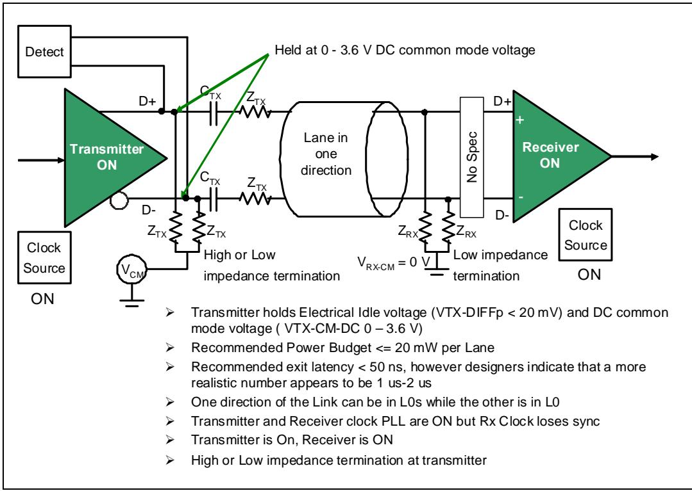

 Transmitter holds Electrical Idle voltage (VTX-DIFFp < 20 mV) and DC common mode voltage ( VTX-CM-DC 0 – 3.6 V)

 Recommended Power Budget <= 20 mW per Lane

 Recommended exit latency < 50 ns, however designers indicate that a more realistic number appears to be 1 us-2 us

One direction of the Link can be in L0s while the other is in L0

 Transmitter and Receiver clock PLL are ON but Rx Clock loses sync

 Transmitter is On, Receiver is ON

 High or Low impedance termination at transmitter

Figure 13‐37: L1 Low Power Link State  
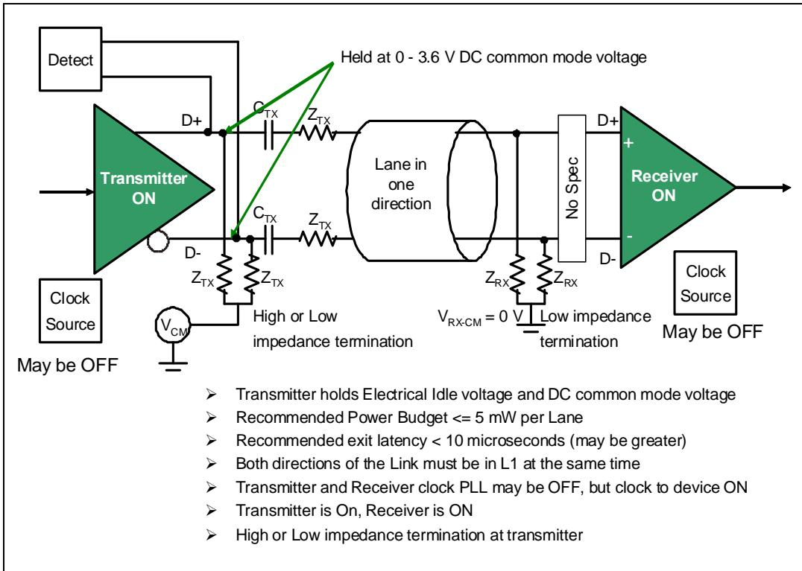

 Transmitter holds Electrical Idle voltage and DC common mode voltage

 Recommended Power Budget <= 5 mW per Lane

 Recommended exit latency < 10 microseconds (may be greater)

 Both directions of the Link must be in L1 at the same time

 Transmitter and Receiver clock PLL may be OFF, but clock to device ON

 Transmitter is On, Receiver is ON

 High or Low impedance termination at transmitter

## Chapter 13: Physical Layer - Electrical

Figure 13‐38: L2 Low Power Link State  

## PCI Express Technology

Figure 13‐39: L3 Link Off State  

 Transmitter does not hold DC common mode voltage

 Recommended Power Budget: zero

 Recommended L3 -> L0 exit latency < 12 - 50 milliseconds after power turned ON

 Both directions of the Link in L3

 Transmitter and Receiver clock PLL OFF, and clock to device OFF

 Low frequency clock for Beacon in transmitter OFF

 Main power to device OFF, Vaux OFF

 Transmitter and Receiver OFF

 High impedance termination at transmitter and receiver

# 14 Link Initialization & Training

## The Previous Chapter

The previous chapter describes the Physical Layer electrical interface to the Link, including some low‐level characteristics of the differential Transmitters and Receivers. The need for signal equalization and the methods used to accomplish it are also discussed here. This chapter combines electrical transmitter and receiver characteristics for both Gen1, Gen2 and Gen3 speeds.

## This Chapter

This chapter describes the operation of the Link Training and Status State Machine (LTSSM) of the Physical Layer. The initialization process of the Link is described from Power‐On or Reset until the Link reaches fully‐operational L0 state during which normal packet traffic occurs. In addition, the Link power management states L0s, L1, L2, and L3 are discussed along with the state transitions. The Recovery state, during which bit lock, symbol lock or block lock are re‐established is described. Link speed and width change for Link bandwidth management is also discussed.

## The Next Chapter

The next chapter discusses error types that occur in a PCIe Port or Link, how they are detected, reported, and options for handling them. Since PCIe is designed to be backward compatible with PCI error reporting, a review of the PCI approach to error handling is included as background information. Then we focus on PCIe error handling of correctable, non‐fatal and fatal errors.

## Overview

Link initialization and training is a hardware‐based (not software) process controlled by the Physical Layer. The process configures and initializes a device’s link and port so that normal packet traffic proceeds on the link.

Figure 14‐1: Link Training and Status State Machine Location  
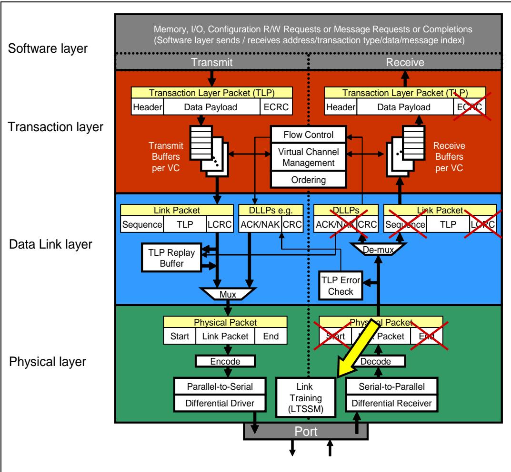

The full training process is automatically initiated by hardware after a reset and is managed by the LTSSM (Link Training and Status State Machine), shown in Figure 14‐1 on page 506.

Several things are configured during the Link initialization and training process. Let’s consider what they are and define some terms up front.

• Bit Lock: When Link training begins the Receiver’s clock is not yet synchronized with the transmit clock of the incoming signal, and is unable to reliably sample incoming bits. During Link training, the Receiver CDR (Clock and Data Recovery) logic recreates the Transmitter’s clock by using the incoming bit stream as a clock reference. Once the clock has been recovered from the stream, the Receiver is said to have acquired Bit Lock and is then able to sample the incoming bits. For more on the Bit Lock mechanism, see “Achieving Bit Lock” on page 395.

• Symbol Lock: For 8b/10b encoding (used in Gen1 and Gen2), the next step is to acquire Symbol Lock. This is a similar problem in that the receiver can now see individual bits but doesn’t know where the boundaries of the 10‐bit Symbols are found. As TS1s and TS2s are exchanged, Receivers search for a recognizable pattern in the bit stream. A simple one to use for this is the COM Symbol. Its unique encoding makes it easy to recognize and its arrival shows the boundary of both the Symbol and the Ordered Set since a TS1 or TS2 must be in progress. For more on this, see “Achieving Symbol Lock” on page 396.

• Block Lock: For 8.0 GT/s (Gen3), the process is a little different from Symbol Lock because since 8b/10b encoding is not used, there are no COM characters. However, Receivers still need to find a recognizable packet boundary in the incoming bit stream. The solution is to include more instances of the EIEOS (Electrical Idle Exit Ordered Set) in the training sequence and use that to locate the boundaries. An EIEOS is recognizable as a pattern of alternating 00h and FFh bytes, and it defines the Block boundary because, by definition, when that pattern ends the next Block must begin.

• Link Width: Devices with multiple Lanes may be able to use different Link widths. For example, a device with a x2 port may be connected to one with a x4 port. During Link training, the Physical Layer of both devices tests the Link and sets the width to the highest common value.

• Lane Reversal: The Lanes on a multi‐Lane device’s port are numbered sequentially beginning with Lane 0. Normally, Lane 0 of one device’s port connects to Lane 0 of the neighbor’s port, Lane 1 to Lane 1, and so on. However, sometimes it’s desirable to be able to logically reverse the Lane numbers to simplify routing and allow the Lanes to be wired directly without having to crisscross (see Figure 14‐2 on page 508). As long as one device supports the optional Lane Reversal feature, this will work. The situation is detected during Link training and one device must internally reverse its Lane numbering. Since the spec doesn’t require support for this, board designers will need to verify that at least one of the connected devices supports this feature before wiring the Lanes in reverse order.

Figure 14‐2: Lane Reversal Example (Support Optional)  

• Polarity Inversion: The D+ and D‐ differential pair terminals for two devices may also be reversed as needed to make board layout and routing easier. Every Receiver Lane must independently check for this and automatically correct it as needed during training, as illustrated in Figure 14‐3 on page 509. To do this, the Receiver looks at Symbols 6 to 15 of the incoming TS1s or TS2s. If a D21.5 is received instead of a D10.2 in a TS1, or a D26.5 instead of the D5.2 expected for a TS2, then the polarity of that lane is inverted and must be corrected. Unlike Lane reversal, support for this feature is mandatory.

Figure 14‐3: Polarity Inversion Example (Support Required)  
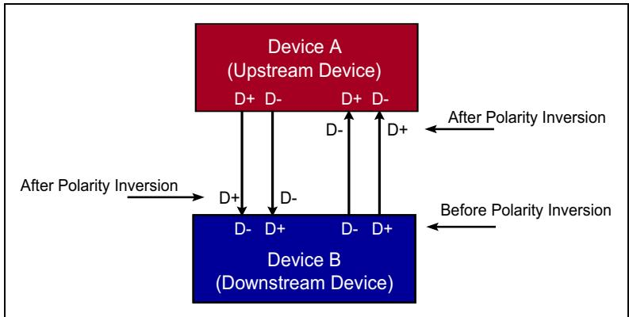

• Link Data Rate: After a reset, Link initialization and training will always use the default 2.5Gbit/s data rate for backward compatibility. If higher data rates are available, they are advertised during this process and, when the training is completed, devices will automatically go through a quick re‐training to change to the highest commonly supported rate.

• Lane‐to‐Lane De‐skew: Trace length variations and other factors cause the parallel bit streams of a multi‐Lane Link to arrive at the Receivers at different times, a problem referred to as signal skew. Receivers are required to compensate for this skew by delaying the early arrivals as needed to align the bit streams (see “Lane‐to‐Lane Skew” on page 442). They must correct a relatively big skew automatically (20ns difference in arrival time is permitted at 2.5GT/s), and that frees board designers from the sometimes difficult constraint of creating equal‐length traces. Together with Polarity Inversion and Lane Reversal, this greatly simplifies the board designer’s task of creating a reliable high‐speed Link.

## Ordered Sets in Link Training

## General

All of the different types of Physical Layer Ordered Sets were described in the section called “Ordered sets” on page 388. Training Sequences TS1 and TS2 are of interest during the training process. The format for these when in Gen1 or Gen2 mode is shown in Figure 14‐4 on page 510, while for Gen3 mode of operation, they are as shown in Figure 14‐5 on page 511. A detailed description of their contents follows.

## PCI Express Technology

Figure 14‐4: TS1 and TS2 Ordered Sets When In Gen1 or Gen2 Mode  
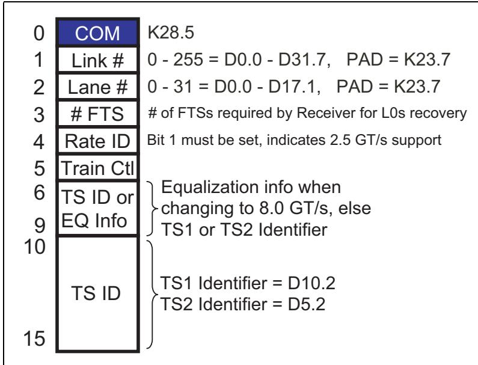

## TS1 and TS2 Ordered Sets

As seen in the illustrations, TS1s and TS2s consist of 16 Symbols. They are exchanged during the Polling, Configuration, and Recovery states of the LTSSM described in “Link Training and Status State Machine (LTSSM)” on page 518. The Symbols are described below and summarized in Table 14‐1 on page 514 for TS1s and Table 14‐2 on page 516 for TS2s.

To make the descriptions a little shorter and easier to read, the term “Gen1” will be used to indicated data rate of 2.5 GT/s, “Gen2” to indicated data rate of 5.0 GT/s and “Gen3” to indicate data rates of 8.0 GT/s. Also, note that the PAD character used in the Link and Lane numbers is represented by the K23.7 character for the lower data rates, but as the data byte F7h for Gen3. In our discussion the distinction between the types of PAD is not interesting and will simply be implied.

Figure 14‐5: TS1 and TS2 Ordered Set Block When In Gen3 Mode of Operation  
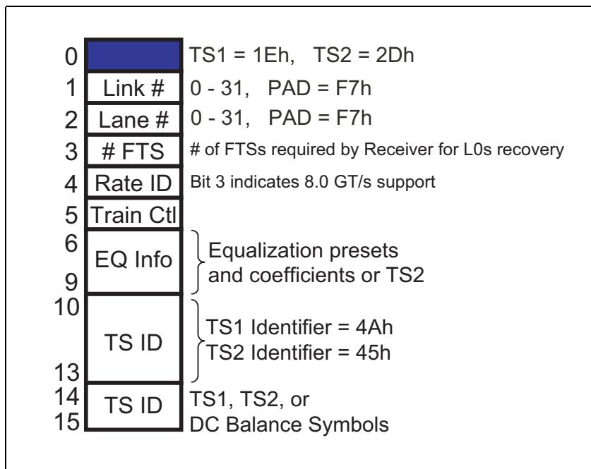

Table 14‐1 on page 514 and Table 14‐2 on page 516 is a summary of TS1 and TS2 contents. A more detailed description of the 16 TS1/TS2 Symbols follows:

• Symbol 0:

— For Gen1 or Gen2, the first Symbol of any Ordered Set is the K28.5 (COM) character. Receivers use this character to acquire Symbol Lock. Since it must appear on all Lanes at the same time it’s also useful for de‐skewing the Lanes.

— For Gen3, an Ordered Set is identified by the 2‐bit Sync Header that must precede the Block (not shown in the illustration), and the first Symbol after that indicates which Ordered Set will follow. For a TS1, the first Symbol is 1Eh, and for a TS2, it’s 2Dh.

• Symbol 1 (Link #): In the Polling state this field contains the PAD Symbol, but in the other states a Link Number is assigned.

• Symbol 2 (Lane #): In the Polling state this field contains the PAD Symbol, but in the other states a Lane Number is assigned.

• Symbol 3 (N\_FTS): Indicates the number of Fast Training Sequences the Receiver will need in order to achieve the L0 state when exiting from the L0s power state at the current speed. Transmitters will send at least that many

FTSs to exit L0s. The amount of time needed for this depends on how many are needed and the data rate in use. For example, at 2.5 GT/s each Symbol takes 4ns so, if 200 FTSs were needed the required time would be 200 FTS \* 4 Symbols per FTS \* 4ns/Symbol = 3200 ns. If the Extended Synch bit is set in the transmitter device, a total of 4096 FTSs must be sent. This large number is intended to provide enough time for external Link monitoring tools to acquire Bit and Symbol Lock, since some of them may be slow in this regard.

• Symbol 4 (Rate ID): Devices report which data rates they support, along with a little more information used for hardware‐initiated bandwidth changes. The 2.5 GT/s rate must always be supported and the Link will always train to that speed automatically after reset so that newer components will remain backward compatible with older ones. If 8.0 GT/s is supported, it’s also required that 5.0 GT/s must be available. Other information in this Symbol includes the following:

— Autonomous Change: If set, any requested bandwidth change was initiated for power‐management reasons. If a change is requested and this bit is not set, then unreliable operation has been detected at the higher speed or wider Link and the change is requested to fix that problem.

— Selectable De‐emphasis

Upstream Ports set this to indicate their desired de‐emphasis level at 5.0 GT/s. How they make this choice is implementation specific. In the Recovery.RcvrCfg state, they register the value they receive for this bit internally (the spec describes it as being stored in a select\_deemphasis variable).

Downstream Ports and Root Ports: In the Polling.Compliance state the select\_deemphasis variable must be set to match the received value of this bit. In the Recovery.RcvrCfg state, the Transmitter sets this bit in its TS2s to match the Selectable De‐emphasis field in the Link Control 2 register. Since this register bit is hardware‐initialized, the expectation is that it’s assigned to an optimal value at power‐up by firmware or a strapping option.

In Loopback mode at 5.0 GT/s, the Slave de‐emphasis value is assigned by this bit in the TS1s sent by the Master.

— Link Upconfigure Capability: Reports whether a wide Link whose width is reduced will be capable of going back to the wide case or not. If both sides of a Link report this during Configuration.Complete, this fact is recorded internally (e.g. an upconfigure\_capable bit is set).

• Symbol 5 (Training Control): Communicates special conditions such as a Hot Reset, Enable Loopback mode, Disable Link, Disable Scrambling.

## • Symbols 6‐9 (Equalization Control):

— For Gen1 or Gen2, Symbols 7‐9 are just TS1 or TS2 indicators, and Symbol 6 usually is, too. However, if bit 7 of Symbol 6 is set to one instead of the zero that would be there for the TS1 or TS2 identifier, that indicates that this is an EQ TS1 or EQ TS2 sent from the Downstream Port (DSP  ‐ port that faces downstream, like a Root Port). The “EQ” label stands for equalization, and means that the Link is going to change to 8.0 GT/s and so the Upstream Port (USP  ‐  port that faces upstream, like an Endpoint Port) needs to know what equalizer values to use. For EQ TS1s or TS2s, Symbol 6 gives that information to the USP in the form of Transmitter Presets and Receiver Preset Hints. Ports that support 8.0 GT/s must accept either TS type (regular or EQ), but ports that do not support it are not required to accept the EQ type. The possible values for these presets are listed in Table 14‐8 on page 579 and Table 14‐9 on page 580.

— For Gen3, Symbols 6‐9 provide Preset values and Coefficients for the Equalization process. Bit 7 of Symbol 6 in a TS2 can now be used by a USP to request that equalization be redone. If it does, bit 6 may also be set to indicate that the time needed to repeat the equalization process won’t cause problems, such as a completion timeout, as long as it’s done quickly (within 1ms of returning to L0). This might be needed, for example, if a problem was detected with the equalization results. A DSP can also use bits 6 and 7 to ask the USP to make such a request and guarantee no side effects, although the USP is not required to respond to this. For more on the equalization process, see “Link Equalization Overview” on page 577.

• Symbols 10‐13: TS1 or TS2 identifiers.

• Symbols 14‐15: (DC Balance)

— For Gen1 and Gen2, these are just TS1 or TS2 indicators since DC Balance is maintained by 8b/10b encoding.

For Gen3, the contents of these two Symbols depend on the DC Balance of the Lane. Each Lane of a Transmitter must independently track the running DC Balance for all the scrambled bits sent for TS1s and TS2s. “Running DC Balance” means the difference between the number of ones sent vs. the number of zeroes sent, and Lanes must be capable of tracking a difference of up to 511 in either direction. These counters saturate at their max value but continue to track reductions. For example, if the counter indicates that 511 more ones than zeroes have been sent, then no matter how many more ones are sent, the value will stay at 511. However, if 2 zeroes are sent, the counter will count down to 509. When a TS1 or TS2 is sent, the following algorithm is used to determine Symbols 14 and 15:

If the running DC Balance value is > 31 at the end of Symbol 11 and more ones have been sent, Symbol 14 = 20h and Symbol 15 = 08h. If more zeroes have been sent, Symbol 14 = DFh and Symbol 15 = F7h.

## PCI Express Technology

If the running DC Balance value is > 15, Symbol 14 = the normal scrambled TS1 or TS2 identifier, while Symbol 15 = 08h to reduce the number of ones, or F7h to reduce the number of zeroes in the DC Balance count.

–   Otherwise, the normal TS1 or TS2 identifier Symbols will be sent.

— Other notes on Gen3 DC Balance:

The running DC Balance is reset by an exit from Electrical Idle or an EIEOS after a Data Block.

– The DC Balance Symbols bypass scrambling to ensure that the expected bit pattern is sent.

Table 14‐1: Summary of TS1 Ordered Set Contents

<table><tr><td>Symbol Number</td><td>Description</td></tr><tr><td>0</td><td>For Gen1 or Gen2, the COM (K28.5) SymbolFor Gen3, 1Eh indicates a TS1.</td></tr><tr><td>1</td><td>Link NumberPorts that don't support Gen3: 0-255, PADDownstream ports that support Gen3: 0-31, PADUpstream ports that support Gen3: 0-255, PAD</td></tr><tr><td>2</td><td>Lane Number0-31, PAD</td></tr><tr><td>3</td><td>N_FTSNumber of FTS Ordered Sets required by receiver to achieve L0 when exiting L0s: 0 - 255</td></tr><tr><td>4</td><td>Data Rate Identifier:Bit 0 — Reserved.Bit 1 — 2.5 GT/s supported (must be set to 1b)Bit 2 — 5.0 GT/s supported (must be set if bit 3 is set)Bit 3 — 8.0 GT/s supportedBits 5:4 — ReservedBit 6 — Autonomous Change/Selectable De-emphasis— Downstream Ports: Used in Polling.Active, Configuration.Linkwidth.Start, and Loopback.Entry LTSSM states, and reserved in all other states.— Upstream Ports: Used in Polling.Active, Configuration, Recovery, and Loopback.Entry LTSSM states and reserved in all other states.Bit 7 — Speed change. This can only be set to one in the Recovery.RcvrLock LTSSM state, and is reserved in all other states.</td></tr><tr><td>5</td><td>Training Control (0=De-assert, 1 = Assert)Bit 0 — Hot ResetBit 1 — Disable LinkBit 2 — LoopbackBit 3 — Disable Scrambling (for 2.5 or 5.0 GT/s; reserved for Gen3)Bit 4 — Compliance Receive (optional for 2.5 GT/s, required for all other rates)Bits 7:5 — Reserved, Set to 0</td></tr><tr><td>6</td><td>For Gen1 or Gen2:TS1 identifier (4Ah) encoded as D10.2EQ TS1s encode this asBits 2:0 — Receiver preset hintBits 6:3 — Transmitter PresetBit 7 — set to 1bFor Gen3:Bits 1:0 — Equalization Control (EC). Only used in Recovery.Equalization and Loopback LTSSM states; must be 00b in all other states.Bit 2 — Reset EIEOS Interval Count. Only used in Recovery.Equalization LTSSM state; reserved in all other states.Bits 6:3 — Transmitter PresetBit 7 — Use Preset. (If one, use the preset values instead of the coefficient values. If zero, use the coefficients rather than the presets.) Only used in Recovery.Equalization and Loopback LTSSM states; reserved in all other states.</td></tr><tr><td>7</td><td>For Gen1 or Gen2 GT/s, TS1 identifier (4Ah) encoded as D10.2For Gen3:Bits 5:0 — FS (Full Swing value) when the EC field of Symbol 6 is 01b, otherwise, Pre-cursor Coefficient.Bits 7:6 — Reserved.</td></tr><tr><td>8</td><td>For Gen1 or Gen2, TS1 identifier (4Ah) encoded as D10.2For Gen3:Bits 5:0 — LF (Low Frequency value) when the EC field of Symbol 6 is 01b, otherwise, Cursor Coefficient.Bits 7:6 — Reserved.</td></tr><tr><td>9</td><td>For Gen1 or Gen2, TS1 identifier (4Ah) encoded as D10.2For Gen3:Bits 5:0 — Post-cursor Coefficient.Bit 6 — Reject Coefficient Values. Only set in specific Phases of the Recovery.Equalization LTSSM state; must be 0b otherwise.Bit 7 — Parity (P) This is the even parity of all bits of Symbols 6, 7, and 8 and bits 6:0 of Symbol 9. Receivers must calculate this and compare it to the received Parity bit. Received TS1s are only valid if the Parity bits match.</td></tr><tr><td>10-13</td><td>For Gen1 or Gen2, TS1 identifier (4Ah) encoded as D10.2For Gen3, TS1 identifier (4Ah)</td></tr><tr><td>14-15</td><td>For Gen1 or Gen2, TS1 identifier (4Ah) encoded as D10.2For Gen3, TS1 identifier (4Ah), or a DC-Balance Symbol.</td></tr></table>

The observant reader may wonder why EQ TS1s are shown in Symbol 6 for the lower data rates since only 8.0 GT/s data rates use equalization. That’s because they’re used to deliver EQ values for Lanes that support Gen3 but are currently operating at a lower rate and want to change to 8.0 GT/s. For more details regarding this and the Equalization process for Gen3 in general, see “Link Equalization Overview” on page 577.

Table 14‐2: Summary of TS2 Ordered Set Contents

<table><tr><td>Symbol Number</td><td>Description</td></tr><tr><td>0</td><td>For Gen1 or Gen2, the COM (K28.5) SymbolFor Gen3, 2Dh indicates a TS2.</td></tr><tr><td>1</td><td>Link NumberPorts that don’t support Gen3: 0-255, PADDownstream ports that support Gen3: 0-31, PADUpstream ports that support Gen3 0-255, PAD</td></tr><tr><td>2</td><td>Lane Number0-31, PAD</td></tr><tr><td>3</td><td>N_FTSNumber of FTS Ordered Sets required by receiver to achieve L0 when exiting L0s: 0 - 255</td></tr><tr><td>4</td><td>Data Rate Identifier:Bit 0 — Reserved.Bit 1 — 2.5 GT/s supported (must be set to 1b)Bit 2 — 5.0 GT/s supported (must be set if bit 3 is set)Bit 3 — 8.0 GT/s supportedBits 5:4 — ReservedBit 6 — Autonomous Change/Selectable De-emphasis/Link Upconfigure Capability. Used in Polling.Configuration, Configuration.Complete, and Recovery LTSSM states; reserved in all other states.Bit 7 — Speed change. This can only be set to one in the Recovery.RcvrLock LTSSM state, and is reserved in all other states.</td></tr><tr><td>5</td><td>Training Control (0 = De-assert, 1 = Assert)Bit 0 — Hot Reset,Bit 1 — Disable LinkBit 2 — LoopbackBit 3 — Disable Scrambling (for 2.5 or 5.0 GT/s; reserved for Gen3)Bits 7:4 — Reserved, Set to 0</td></tr><tr><td>6</td><td>For Gen1 or Gen2:TS2 identifier (4Ah) encoded as D10.2EQ TS2s encode this asBits 2:0 — Receiver preset HintBits 6:3 — Transmitter PresetBit 7 — Equalization CommandFor Gen3:Bits 5:0 — Reserved.Bit 6 — Quiesce Guarantee. Defined for use in Recovery.RcvrCfg only; reserved in all other states.Bit 7 — Request Equalization. Defined for use in Recovery.RcvrCfg only; reserved in all other states.</td></tr><tr><td>7-13</td><td>For Gen1 or Gen2, TS2 identifier (45h) encoded as D5.2For Gen3, TS2 identifier (45h)</td></tr><tr><td>14-15</td><td>For Gen1 or Gen2, TS2 identifier (45h) encoded as D5.2For Gen3, TS2 identifier (45h), or a DC-Balance Symbol</td></tr></table>

## Link Training and Status State Machine (LTSSM)

## General

Figure 14‐6 on page 519 illustrates the top‐level states of the Link Training and Status State Machine (LTSSM). Each state consists of substates. The first LTSSM state entered after exiting Fundamental Reset (Cold or Warm Reset) or Hot Reset is the Detect state.

The LTSSM consists of 11 top‐level states: Detect, Polling, Configuration, Recovery, L0, L0s, L1, L2, Hot Reset, Loopback, and Disable. These can be grouped into five categories:

1. Link Training states

2. Re‐Training (Recovery) state

3. Software driven Power Management states

4. Active‐State Power Management (ASPM) states

5. Other states

When exiting from any type of Reset, the flow of the LTSSM follows the Link Training states: Detect => Polling => Configuration => L0. In L0 state, normal packet transmission/reception is in progress.

The Link Re‐Training also called Recovery state is entered for a variety of reasons, such as changing back from a low‐power Link state, like L1, or changing the Link bandwidth (through speed or width changes). In this state, the Link repeats as much of the training process as needed to handle the matter and returns to L0 (normal operation).

Power management software may also place a device into a low‐power device state (D1, D2, ${ \mathrm { D } } 3 _ { \mathrm { H o t } }$ or $\mathrm { D } 3 _ { \mathrm { C o l d } } )$ and that will force the Link into a lower Power Management Link state (L1 or L2).

If there are no packets to send for a time, ASPM hardware may be allowed to automatically transition the Link into low power ASPM states (L0s or ASPM L1).

In addition, software can direct a Link to enter some other special states: Disabled, Loopback, or Hot Reset. Here, these are collectively called the Other states group.

Figure 14‐6: Link Training and Status State Machine (LTSSM)  

## Overview of LTSSM States

Below is a brief description of the 11 high‐level LTSSM states.

• Detect: The initial state after reset. In this state, a device electrically detects a Receiver is present at the far end of the Link. That’s an unusual thing in the world of serial transports, but it’s done to facilitate testing, as we’ll see in the next state. Detect may also be entered from a number of other LTSSM states as described later.

• Polling: In this state, Transmitters begin to send TS1s and TS2s (at 2.5 GT/s for backward compatibility) so that Receivers can use them to accomplish the following:

— Achieve Bit Lock

— Acquire Symbol Lock or Block Lock

— Correct Lane polarity inversion, if needed

— Learn available Lane data rates

## PCI Express Technology

— If directed, Initiate the Compliance test sequence: The way this works is that if a receiver was detected in the Detect state but no incoming signal is seen, it’s understood to mean that the device has been connected to a test load. In that case, it should send the specified Compliance test pattern to facilitate testing. This allows test equipment to quickly verify that voltage, BER, timing, and other parameters are within tolerance.

• Configuration: Upstream and Downstream components now play specific roles as they continue to exchange TS1s and TS2s at 2.5 GT/s to accomplish the following:

— Determine Link width

— Assign Lane numbers

— Optionally check for Lane reversal and correct it

— Deskew Lane‐to‐Lane timing differences

From this state, scrambling can be disabled, the Disable and Loopback states can be entered, and the number of FTS Ordered Sets required to transition from the L0s state to the L0 state is recorded from the TS1s and TS2s.

• L0: This is the normal, fully‐active state of a Link during which TLPs, DLLPs and Ordered Sets can be exchanged. In this state, the Link could be running at higher speeds than 2.5 GT/s, but only after re‐training (Recovery) the Link and going through a speed change procedure.

• Recovery: This state is entered when the Link needs re‐training. This could be caused by errors in L0, or recovery from L1 back to L0, or recovery from L0s if the Link does not train properly using the FTS sequence. In Recovery, Bit Lock and Symbol/Block Lock are re‐established in a manner similar to that used in the Polling state but it typically takes much less time.

• L0s: This ASPM state is designed to provide some power savings while affording a quick recovery time back to L0. It’s entered when one Transmitter sends the EIOS while in the L0 state. Exit from L0s involves sending FTSs to quickly re‐acquire Bit and Symbol/Block Lock.

• L1: This state provides greater power savings by trading off a longer recovery time than L0s does (see “Active State Power Management (ASPM)” on page 735). Entry into L1 involves a negotiation between both Link partners to enter it together and can occur in one of two ways:

— The first is autonomous with ASPM: hardware in an Upstream Port with no scheduled TLPs or DLLPs to transmit can automatically negotiate to put its Link into the L1 state. If the Downstream Port agrees, the Link enters L1. If not, the Upstream Port will enter L0s instead (if enabled).

— The second is the result of power management software issuing a commanding a device to a low‐power state (D1, D2, or $\mathrm { D } 3 _ { \mathrm { H o t } } )$ . As a result, the Upstream Port notifies the Downstream Port that they must enter L1, the Downstream Port acknowledges that, and they enter L1.

• L2: In this state the main power to the devices is turned off to achieve a greater power savings. Almost all of the logic is off, but a small amount of power is still available from the $\mathrm { V _ { a u x } }$ source to allow the device to indicate a wakeup event. An Upstream Port that supports this wakeup capability can send a very low frequency signal called the Beacon and a Downstream Port can forward it to the Root Complex to get system attention (see “Beacon Signaling” on page 483). Using the Beacon, or a side‐band WAKE# signal, a device can trigger a system wakeup event to get main power restored. [An L3 Link power state is also defined, but it doesn’t relate to the LTSSM states. The L3 state is the full‐off condition in which $\mathrm { V _ { a u x } }$ power is not available and a wakeup event can’t be signaled.]

• Loopback: This state is used for testing but exactly what a Receiver does in this mode (for example: how much of the logic participates) is left unspecified. The basic operation is simple enough: the device that will be the Loopback Master sends TS1 Ordered Sets that have the Loopback bit set in the Training Control field to the device that will be the Loopback Slave. When a device sees two consecutive TS1s with the Loopback bit set, it enters the Loopback state as the Loopback Slave and echoes back everything that comes in. The Master, recognizing that what it is sending is now being echoed, sends any pattern of Symbols that follow the 8b/10b encoding rules, and the Slave echoes them back exactly as they were sent, providing a round‐trip verification of Link integrity.

• Disable: This state allows a configured Link to be disabled. In this state, the Transmitter is in the Electrical Idle state while the Receiver is in the low impedance state. This might be necessary because the Link has become unreliable or due to a surprise removal of the device. Software commands a device to do this by setting the Disable bit in the Link Control register. The device then sends 16 TS1s with the Disable Link bit set in the TS1 Training Control field. Receivers are disabled when they receive those TS1s.

• Hot Reset: Software can reset a Link by setting the Secondary Bus Reset bit in the Bridge Control register. That causes the bridge’s Downstream Port to send TS1s with the Hot Reset bit set in the TS1 Training Control field (see “Hot Reset (In‐band Reset)” on page 837) When a Receiver sees two consecutive TS1s with the Hot Reset bit set, it must reset its device.

## Introductions, Examples and State/Substates

The balance of this chapter covers each of the LTSSM states. Depending on the complexity of a given state, the discussion may include an introduction, general background, and/or examples that accompanies the detailed discussion of the State/Substate. In some cases, the reader may choose to skip the detailed coverage and jump to introductory material. Each section is organized to facilitate these options.

Every device must perform initial link training at the base rate of 2.5 GT/s. Figure 14‐7 highlights the states involved in the initial training sequence. Devices capable of operating at 5.0 or 8.0 GT/s must transition to the Recovery state to change the speed to the higher rate chosen.

Figure 14‐7: States Involved in Initial Link Training at 2.5 Gb/s  
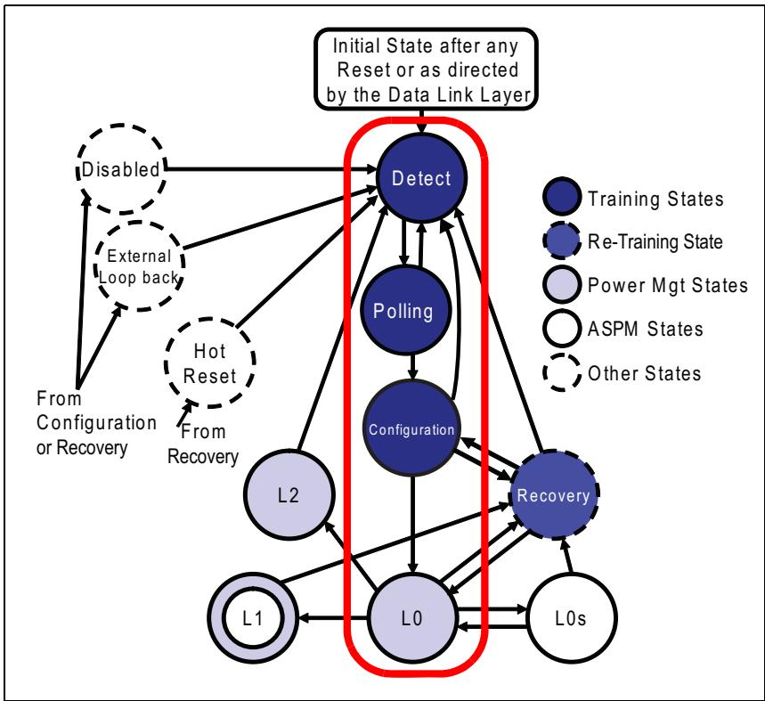

## Detect State

## Introduction

Figure 14‐8 represents the two substates and transitions associated with the Detect state. The actions associated with the Detect state are performed by each transmitter in the process of detecting the presence of a receiver at the opposite end of the link. Because there are only two substates and because they are fairly simple, we will move directly to the substate discussions.

Figure 14‐8: Detect State Machine  

## Detailed Detect Substate

## Detect.Quiet

This substate is the initial state after any reset (except Function Level Reset) or power‐up event and must be entered within 20 ms after Reset. This substate is also entered from other states if unable to move forward (See the states that may enter Detect.Quiet in Figure 14‐8 on page 523). The properties of this substate are listed below:

• The Transmitter starts in Electrical Idle (but the DC common mode voltage doesn’t have to be within the normally‐specified range).

The intended data rate is set to 2.5 GT/s (Gen1). If it set to a different rate when this substate was entered, the LTSSM must stay in this substate for 1ms before changing the rate to Gen1.

• The Physical Layer’s status bit (LinkUp = 0) informs the Data Link Layer that the Link is not operational. The LinkUp status bit is an internal state bit (not found in standard config space) and also indicates when the Physical Layer has completed Link Training (LinkUp=1), thereby informing the Data Link Layer and Flow Control initialization to begin its part of Link initialization (for more on this, see “The FC Initialization Sequence” on page 223).

Any previous equalization (Eq.) status is cleared by setting the four Link Status 2 register bits to zero: Eq. Phase 1 Successful, Eq. Phase 2 Successful, Eq. Phase 3 Successful, Eq. Complete.

## • Variables:

Several variables are cleared to zero: (directed\_speed\_change=0b, upconfigure\_capable=0b, equalization\_done\_8GT\_data\_rate=0b, idle\_to\_rlock\_transitioned=00h). The select\_deemphasis variable setting depends on the port type: for an Upstream Port it’s selected by hardware, while for a Downstream Port it takes the value in the Link Control 2 register of the Selectable Preset/De‐emphasis field.

— Since these variables were defined beginning with the 2.0 spec version, devices designed to earlier spec versions won’t have them and will behave as if directed\_speed\_change and upconfigure\_capable were set to 0b and idle\_to\_rlock\_transitioned was set to FFh.

## Exit to “Detect.Active”

The next substate is Detect.Active after a 12 ms timeout or when any Lane exits Electrical Idle.

## Detect.Active

This substate is entered from Detect.Quiet. At this time the Transmitter tests whether a Receiver is connected on each Lane by setting a DC common mode voltage of any value in the legal range and then changing it. The detection logic observes the rate of change as the time it takes the line voltage to charge up and compares it to an expected time, such as how long it would take without a Receiver termination. If a Receiver is attached, the charge time will be much longer, making it easy to recognize. For more details on this process, see “Receiver Detection” on page 460. To simplify the discussions that follow, Lanes that detect a Receiver during this substate are referred to as “Detected Lanes.”

## Exit to “Detect.Quiet”

If no Lanes detect a Receiver, go back to Detect.Quiet. The loop between them is repeated every 12ms, as long as no Receiver is detected.

## Exit to “Polling State”

If a receiver is detected on all Lanes, the next state will be Polling. The Lanes must now drive a DC common voltage within the 0 ‐ 3.6 V VTX‐CM‐DC spec.

## Special Case:

If some but not all Lanes of a device are connected to a Receiver (like a x4 device connected to a x2 device), then wait 12 ms and try it again. If the same Lanes detect a Receiver the second time, exit to the Polling state, otherwise go back to Detect.Quiet. If going to Polling, there are two possibilities for the Lanes that didn’t see a Receiver:

1. If the Lanes can operate as a separate Link (see “Designing Devices with Links that can be Merged” on page 541), use another LTSSM and have those Lanes repeat the detect sequence.

2. If another LTSSM is not available, then the Lanes that don’t detect a Receiver will not be part of a Link and must transition to Electrical Idle.

## Polling State

## Introduction

To this point the link has been in the electrical idle state, however during Polling the LTSSM TS1s and TS2s are exchanged between the two connected devices. The primary purpose of this state is for the two devices to understand what the each other is saying. In other words, they need to establish bit and symbol lock on each other’s transmitted bit stream and resolve any polarity inversion issues. Once this has been accomplished, each device is successfully receiving the TS1 and TS2 ordered‐sets from their link partner. Figure 14‐9 on page 525 shows the substates of the Polling state machine.

Figure 14‐9: Polling State Machine  
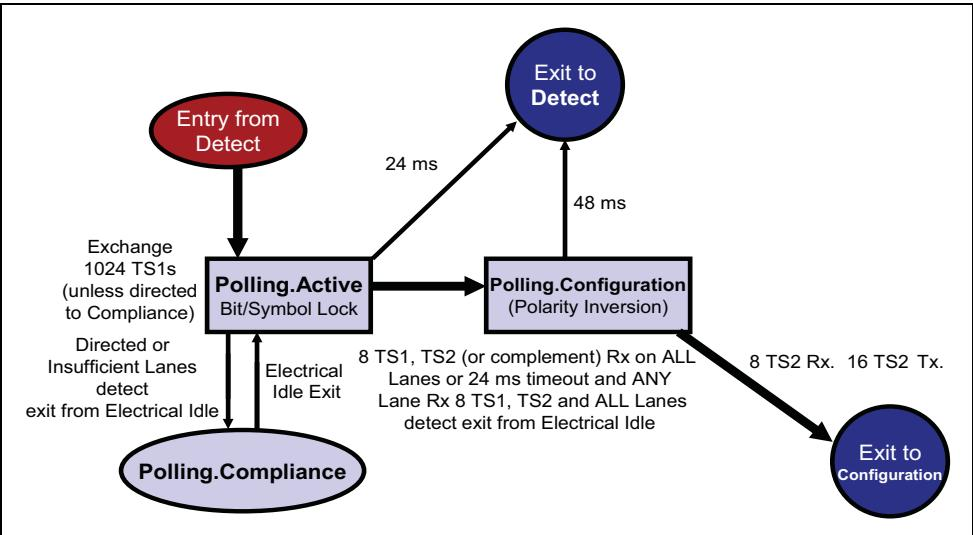

## Detailed Polling Substates

## Polling.Active

## During Polling.Active

Transmitters send a minimum of 1024 consecutive TS1s on all detected Lanes once their common‐mode voltage has settled at the level specified in the Transmit Margin field. The two Link partners may exit the Detect state at different times, so the TS1 exchange is not synchronized. The time needed to send 1024 TS1s at Gen1 speed (2.5 GT/s) is 64μs.

Some notes regarding this substate are:

The PAD Symbol must be used in the Lane and Link Number fields of the TS1s.

All data rates a device supports must be advertised, even if it doesn’t intend to use them all.

Receivers use the incoming TS1s to acquire Bit Lock (see “Achieving Bit Lock” on page 395) and then either Symbol Lock (see “Achieving Symbol Lock” on page 396) for the lower rates, or Block Alignment for 8.0 GT/s (see “Achieving Block Alignment” on page 438).

Exit to “Polling.Configuration”

The next state is Polling.Configuration if, after sending at least 1024 TS1s ALL detected Lanes receive 8 consecutive training sequences (or their complement, due to polarity inversion) that satisfy one of the following conditions:

TS1s with Link and Lane set to PAD were received with the Compliance Receive bit cleared to 0b (bit 4 of Symbol 5).

TS1s with Link and Lane set to PAD were received with the Loopback bit of Symbol 5 set to 1b.

– TS2s were received with Link and Lane set to PAD.

If the conditions above are not met, then after a 24ms timeout, if at least 1024 TS1s were sent after receiving a TS1, and ANY detected Lane received eight consecutive TS1 or TS2 Ordered Sets (or their complement) with the Lane and Link numbers set to PAD, and one of the following is true:

TS1s with Link and Lane set to PAD were received with the Compliance Receive (bit 4 of Symbol 5) cleared to 0b.

TS1s with Link and Lane set to PAD were received with the Loopback (bit 2 of Symbol 5) set to 1b.

– TS2s were received with Link and Lane set to PAD.

If still none of the conditions above are met, if at least a predetermined number of detected Lanes also detected an exit from Electrical Idle at least once since entering Polling.Active (this prevents one or more bad Transmitters or Receivers from holding up Link configuration). The exact set of predetermined Lanes is implementation specific now, which is a change from the 1.1 spec that needed to see an Electrical Idle exit on all detected Lanes.

## Exit to “Polling.Compliance”

If the Enter Compliance bit in the Link Control 2 register is set to 1b, or if this bit was set before entering Polling.Active, the change to Polling.Compliance must be immediate and no TS1s are sent in Polling.Active.

Otherwise, after a 24ms timeout, if:

All Lanes from the predetermined set have not seen an exit from Electrical Idle since entering Polling.Active (indicates a passive test load such as a resistor on at least one Lane forces all Lanes into Polling.Compliance).

Any detected Lane received 8 consecutive TS1s (or their complement) with Link and Lane numbers set to PAD, the Compliance Receive bit of Symbol 5 set to 1b and the Loopback bit cleared to 0b.

Exit to “Detect State”

If, after 24ms, the conditions for going to Polling.Configuration or Polling.Compliane are not met, return to the Detect state.

## Polling.Configuration

In this substate, a transmitter will stop sending TS1s and start sending TS2s, still with PAD set for the Link and Lane numbers. The purpose of the change to sending TS2s instead of TS1s is to advertise to the link partner that this device is ready to proceed to the next state in the state machine. It is a handshake mechanism to ensure that both devices on the link proceed through the LTSSM together. Neither device can proceed to the next state until both devices are ready. The way they advertise they are ready is by sending TS2 ordered‐sets. So once a device is both sending AND receiving TS2s, it knows it can proceed to the next state because it is ready and its link partner is ready too.

## During Polling.Configuration

Transmitters send TS2s with Link and Lane numbers set to PAD on all detected Lanes, and they must advertise all the data rates they support, even those they don’t intend to use. Also, each Lane’s receiver must independently invert the polarity of its differential input pair if necessary. For an explanation of how this is done, see “Overview” on page 506. The Transmit Margin field must be reset to 000b.

Exit to “Configuration State”

After eight consecutive TS2s with Link and Lane set to PAD are received on any detected Lanes, and at least 16 TS2s have been sent since receiving one TS2, exit to Configuration.

Exit to “Detect State”

Otherwise, exit to Detect after a 48ms timeout.

Exit to Polling.Speed (Non‐existent substate)

As a historical aside, the substates of Polling have changed since the 1.0 version of the spec was released. At that time it was thought that when other speeds became available it would make sense to change to the highest available rate as soon as possible in this state. However, the advent of higher rates coincided with the realization that it would be advantageous to be able to change speeds both higher and lower during runtime for power management reasons. Going through the Polling state involves clearing a number of Link values and that makes it an unattractive path for runtime use, so the rate change stage was moved out of this state into the Recovery state. See Figure 14‐10 on page 528.

Figure 14‐10: Polling State Machine with Legacy Speed Change  
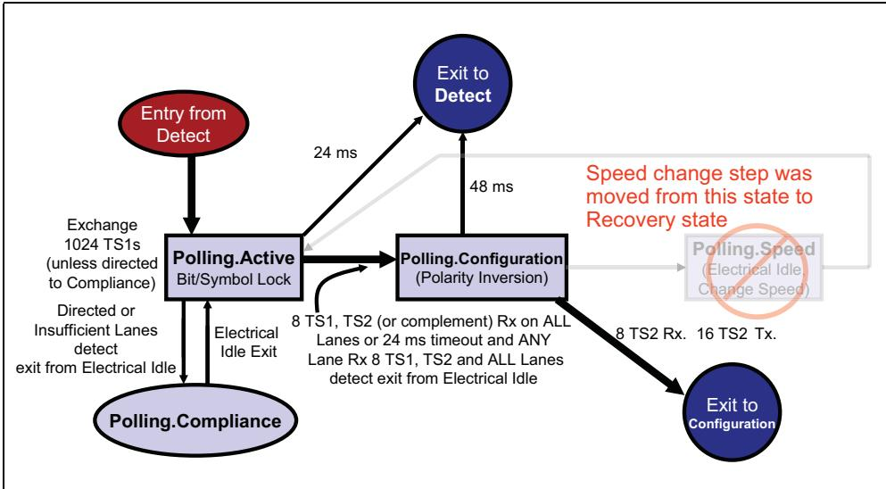

Today, the Link always trains to 2.5 GT/s after a reset, even if other speeds are available. If higher speeds are available once the LTSSM has reached L0, then it transitions to Recovery and attempts to change to the highest commonly‐supported or advertised rate. Supported speeds are reported in the exchanged TS1s and TS2s, so that either device can subsequently decide to initiate a speed change by transitioning to the Recovery state. The spec still lists this substate but declares that it is now unreachable.

## Polling.Compliance

This substate is only used for testing and causes a Transmitter to send specific patterns intended to create near‐worst‐case Inter‐Symbol Interference (ISI) and cross‐talk conditions to facilitate analysis of the Link. Two different patterns can be sent while in this substate, the Compliance Pattern and the Modified Compliance Pattern.

Compliance Pattern for 8b/10b. This pattern consists of 4 Symbols that are repeated sequentially: K28.5‐, D21.5+, K28.5+ and D10.2‐, where (‐) means negative current running disparity or CRD and (+) means positive CRD (since the CRD is forced, it’s permissible to have a disparity error at the beginning of the pattern). If the Link has multiple Lanes, then four Delay Symbols (shown as D, but are really just additional K28.5 symbols) are injected on Lane 0, two before the next compliance pattern and two after the compliance pattern. Once the last Delay symbol has been sent on Lane 0, the four delay symbols are also sent on Lane 1 (again, two before the next compliance pattern and two after). This process continues until after the Delay symbols have propagated through Lane 7. Then they go back to starting on Lane 0 again as can be seen in Table 14‐3 on page 529 (the compli ance pattern is shaded in grey). Every group of eight lanes behaves this way. Shifting the Delay Symbols will ensure interference between adjacent Lanes and provide better test conditions.

Table 14‐3: Symbol Sequence 8b/10b Compliance Pattern

<table><tr><td>Symbol</td><td>Lane 0</td><td>Lane 1</td><td>Lane 2</td><td>...</td><td>Lane 8</td></tr><tr><td>0</td><td>D</td><td>K28.5-</td><td>K28.5-</td><td></td><td>D</td></tr><tr><td>1</td><td>D</td><td>K21.5</td><td>K21.5</td><td></td><td>D</td></tr><tr><td>2</td><td>K28.5-</td><td>K28.5+</td><td>K28.5+</td><td></td><td>K28.5-</td></tr><tr><td>3</td><td>K21.5</td><td>D10.2</td><td>D10.2</td><td></td><td>K21.5</td></tr><tr><td>4</td><td>K28.5+</td><td>K28.5-</td><td>K28.5-</td><td></td><td>K28.5+</td></tr><tr><td>5</td><td>D10.2</td><td>K21.5</td><td>K21.5</td><td></td><td>D10.2</td></tr><tr><td>6</td><td>D</td><td>K28.5+</td><td>K28.5+</td><td></td><td>D</td></tr><tr><td>7</td><td>D</td><td>D10.2</td><td>D10.2</td><td></td><td>D</td></tr><tr><td>8</td><td>K28.5-</td><td>D</td><td>K28.5-</td><td></td><td>K28.5-</td></tr><tr><td>9</td><td>K21.5</td><td>D</td><td>K21.5</td><td></td><td>K21.5</td></tr><tr><td>10</td><td>K28.5+</td><td>K28.5-</td><td>K28.5+</td><td></td><td>K28.5+</td></tr><tr><td>...</td><td>...</td><td>...</td><td>...</td><td></td><td>...</td></tr><tr><td>16</td><td>K28.5-</td><td>K28.5-</td><td>D</td><td></td><td>K28.5-</td></tr><tr><td>17</td><td>K21.5</td><td>K21.5</td><td>D</td><td></td><td>K21.5</td></tr><tr><td>18</td><td>K28.5+</td><td>K28.5+</td><td>K28.5-</td><td></td><td>K28.5+</td></tr></table>

Compliance Pattern for 128b/130b. This pattern consists of the following repeating sequence of 36 Blocks:

1. The first Block consists of the Sync Header 01b and contains the unscrambled payload of 64 ones followed by 64 zeros.

2. The second Block has Sync Header 01b and contains the unscrambled payload shown in Table 14‐4 on page 530 (note that the pattern repeats after 8 Lanes, and that P means the 4‐bit Tx preset being used, while \~P is the bit‐wise inverse of that).

3. The third Block has Sync Header 01b and contains the unscrambled payload shown in Table 14‐5 on page 531 (same notes as the second Block).

4. The fourth Block is an EIEOS Block

5. 32 more Data Blocks, each containing 16 scrambled IDL Symbols (00h).

Table 14‐4: Second Block of 128b/130b Compliance Pattern

<table><tr><td>Symbol</td><td>Lane 0</td><td>Lane 1</td><td>Lane 2</td><td>Lane 3</td><td>Lane 4</td><td>Lane 5</td><td>Lane 6</td><td>Lane 7</td></tr><tr><td>0</td><td>55h</td><td>FFh</td><td>FFh</td><td>FFh</td><td>55h</td><td>FFh</td><td>FFh</td><td>FFh</td></tr><tr><td>1</td><td>55h</td><td>FFh</td><td>FFh</td><td>FFh</td><td>55h</td><td>FFh</td><td>FFh</td><td>FFh</td></tr><tr><td>2</td><td>55h</td><td>00h</td><td>FFh</td><td>FFh</td><td>55h</td><td>FFh</td><td>FFh</td><td>FFh</td></tr><tr><td>3</td><td>55h</td><td>00h</td><td>FFh</td><td>C0h</td><td>55h</td><td>FFh</td><td>F0h</td><td>F0h</td></tr><tr><td>4</td><td>55h</td><td>00h</td><td>FFh</td><td>00h</td><td>55h</td><td>FFh</td><td>00h</td><td>00h</td></tr><tr><td>5</td><td>55h</td><td>00h</td><td>C0h</td><td>00h</td><td>55h</td><td>E0h</td><td>00h</td><td>00h</td></tr><tr><td>6</td><td>55h</td><td>00h</td><td>00h</td><td>00h</td><td>55h</td><td>00h</td><td>00h</td><td>00h</td></tr><tr><td>7</td><td>{P,~P}</td><td>{P,~P}</td><td>{P,~P}</td><td>{P,~P}</td><td>{P,~P}</td><td>{P,~P}</td><td>{P,~P}</td><td>{P,~P}</td></tr><tr><td>8</td><td>00h</td><td>1Eh</td><td>2Dh</td><td>3Ch</td><td>4Bh</td><td>5Ah</td><td>69h</td><td>78h</td></tr><tr><td>9</td><td>00h</td><td>55h</td><td>00h</td><td>00h</td><td>00h</td><td>55h</td><td>00h</td><td>F0h</td></tr><tr><td>10</td><td>00h</td><td>55h</td><td>00h</td><td>00h</td><td>00h</td><td>55h</td><td>00h</td><td>00h</td></tr><tr><td>11</td><td>00h</td><td>55h</td><td>00h</td><td>00h</td><td>00h</td><td>55h</td><td>00h</td><td>00h</td></tr><tr><td>12</td><td>00h</td><td>55h</td><td>0Fh</td><td>0Fh</td><td>00h</td><td>55h</td><td>07h</td><td>00h</td></tr><tr><td>13</td><td>00h</td><td>55h</td><td>FFh</td><td>FFh</td><td>00h</td><td>55h</td><td>FFh</td><td>00h</td></tr><tr><td>14</td><td>00h</td><td>55h</td><td>FFh</td><td>FFh</td><td>7Fh</td><td>55h</td><td>FFh</td><td>00h</td></tr><tr><td>15</td><td>00h</td><td>55h</td><td>FFh</td><td>FFh</td><td>FFh</td><td>55h</td><td>FFh</td><td>00h</td></tr></table>

Table 14‐5: Third Block of 128b/130b Compliance Pattern

<table><tr><td>Symbol</td><td>Lane 0</td><td>Lane 1</td><td>Lane 2</td><td>Lane 3</td><td>Lane 4</td><td>Lane 5</td><td>Lane 6</td><td>Lane 7</td></tr><tr><td>0</td><td>FFh</td><td>FFh</td><td>55h</td><td>FFh</td><td>FFh</td><td>FFh</td><td>55h</td><td>FFh</td></tr><tr><td>1</td><td>FFh</td><td>FFh</td><td>55h</td><td>FFh</td><td>FFh</td><td>FFh</td><td>55h</td><td>FFh</td></tr><tr><td>2</td><td>FFh</td><td>FFh</td><td>55h</td><td>FFh</td><td>FFh</td><td>FFh</td><td>55h</td><td>FFh</td></tr><tr><td>3</td><td>F0h</td><td>F0h</td><td>55h</td><td>F0h</td><td>F0h</td><td>F0h</td><td>55h</td><td>F0h</td></tr><tr><td>4</td><td>00h</td><td>00h</td><td>55h</td><td>00h</td><td>00h</td><td>00h</td><td>55h</td><td>00h</td></tr><tr><td>5</td><td>00h</td><td>00h</td><td>55h</td><td>00h</td><td>00h</td><td>00h</td><td>55h</td><td>00h</td></tr><tr><td>6</td><td>00h</td><td>00h</td><td>55h</td><td>00h</td><td>00h</td><td>00h</td><td>55h</td><td>00h</td></tr><tr><td>7</td><td>{P,~P}</td><td>{P,~P}</td><td>{P,~P}</td><td>{P,~P}</td><td>{P,~P}</td><td>{P,~P}</td><td>{P,~P}</td><td>{P,~P}</td></tr><tr><td>8</td><td>00h</td><td>1Eh</td><td>2Dh</td><td>3Ch</td><td>4Bh</td><td>5Ah</td><td>69h</td><td>78h</td></tr><tr><td>9</td><td>00h</td><td>00h</td><td>00h</td><td>55h</td><td>00h</td><td>00h</td><td>00h</td><td>55h</td></tr><tr><td>10</td><td>00h</td><td>00h</td><td>00h</td><td>55h</td><td>00h</td><td>00h</td><td>00h</td><td>55h</td></tr><tr><td>11</td><td>00h</td><td>00h</td><td>00h</td><td>55h</td><td>00h</td><td>00h</td><td>00h</td><td>55h</td></tr><tr><td>12</td><td>FFh</td><td>0Fh</td><td>0Fh</td><td>55h</td><td>0Fh</td><td>0Fh</td><td>0Fh</td><td>55h</td></tr><tr><td>13</td><td>FFh</td><td>FFh</td><td>FFh</td><td>55h</td><td>FFh</td><td>FFh</td><td>FFh</td><td>55h</td></tr><tr><td>14</td><td>FFh</td><td>FFh</td><td>FFh</td><td>55h</td><td>FFh</td><td>FFh</td><td>FFh</td><td>55h</td></tr><tr><td>15</td><td>FFh</td><td>FFh</td><td>FFh</td><td>55h</td><td>FFh</td><td>FFh</td><td>FFh</td><td>55h</td></tr></table>

Modified Compliance Pattern for 8b/10b. The second compliance pattern adds an error status field that reports how many Receiver errors have been detected while in Polling.Compliance.

In 8b/10b mode, the original pattern is still used, but 2 Symbols are added to report the error status (2 are used instead of one to avoid interfering with the required disparity of the sequence) and 2 more K28.5 Symbols are added at the end, making the pattern 8 Symbols long altogether.

Table 14‐6: Symbol Sequence of 8b/10b Modified Compliance Pattern

<table><tr><td>Symbol</td><td>Lane 0</td><td>Lane 1</td><td>Lane 2</td><td>...</td><td>Lane 8</td></tr><tr><td>0</td><td>D</td><td>K28.5-</td><td>K28.5-</td><td></td><td>D</td></tr><tr><td>1</td><td>D</td><td>K21.5</td><td>K21.5</td><td></td><td>D</td></tr><tr><td>2</td><td>D</td><td>K28.5+</td><td>K28.5+</td><td></td><td>D</td></tr><tr><td>3</td><td>D</td><td>D10.2</td><td>D10.2</td><td></td><td>D</td></tr><tr><td>4</td><td>K28.5-</td><td>ERR</td><td>ERR</td><td></td><td>K28.5-</td></tr><tr><td>5</td><td>K21.5</td><td>ERR</td><td>ERR</td><td></td><td>K21.5</td></tr><tr><td>6</td><td>K28.5+</td><td>K28.5-</td><td>K28.5-</td><td></td><td>K28.5+</td></tr><tr><td>7</td><td>D10.2</td><td>K28.5+</td><td>K28.5+</td><td></td><td>D10.2</td></tr><tr><td>8</td><td>ERR</td><td>K28.5-</td><td>K28.5-</td><td></td><td>ERR</td></tr><tr><td>9</td><td>ERR</td><td>K21.5</td><td>K21.5</td><td></td><td>ERR</td></tr><tr><td>10</td><td>K28.5-</td><td>K28.5+</td><td>K28.5+</td><td></td><td>K28.5-</td></tr><tr><td>11</td><td>K28.5+</td><td>D10.2</td><td>D10.2</td><td></td><td>K28.5+</td></tr><tr><td>12</td><td>K28.7-</td><td>ERR</td><td>ERR</td><td></td><td>K28.7-</td></tr><tr><td>13</td><td>K28.7-</td><td>ERR</td><td>ERR</td><td></td><td>K28.7-</td></tr><tr><td>14</td><td>K28.7-</td><td>K28.5-</td><td>K28.5-</td><td></td><td>K28.7-</td></tr><tr><td>15</td><td>K28.7-</td><td>K28.5+</td><td>K28.5+</td><td></td><td>K28.7-</td></tr><tr><td>16</td><td>K28.5-</td><td>D</td><td>K28.5-</td><td></td><td>K28.5-</td></tr></table>

The encoded error status byte contains a Receiver Error Count in ERR [6:0] that reports the number of errors seen since Pattern Lock was asserted. The “Pattern Lock” indicator is ERR bit [7], and shows when the Receiver has locked to the incoming Modified Compliance Pattern. The delay sequence is also different for this pattern, and now adds four K28.5 Symbols (shown as “D” in the table) in a row at the beginning of the sequence and four K28.7 Symbols at the end of the 8‐Symbol pattern, making a total of 16 Symbols that are sent before the Delay pattern shifts to the next Lane. This pattern is illustrated in Table 14‐6 on page 532. It can be seen that the delay pattern shifts to Lane 1 after 16 Symbols. As before, the basic pattern (8‐Symbols now) is highlighted in grey.

Modified Compliance Pattern for 128b/130b. This pattern consists of a repeating sequence of 65792 Blocks as listed here:

1. One EIEOS Block

2. 256 Data Blocks of 16 scrambled IDL Symbols (00h) each.

3. 255 sets of the following sequence:

— One SOS

— 256 Data Blocks of 16 scrambled IDL Symbols each.

Since the payload in the Data Blocks is all zeros, the output ends up being simply the output of the scrambler for that Lane. Recall that the scrambler doesn’t advance with the Sync Header bits and is initialized by the EIEOS. Since the scrambler seed value depends on the Lane number, it’s important that they be understood correctly. If Link training completed earlier but then software sent the LTSSM to this substate by setting the Enter Compli ance bit in the Link Control 2 register, then the Lane numbers and polarity inversions that were assigned during training are used. If a Lane wasn’t active during training, or if this substate was entered in any other way, then the Lane numbers will be the default numbers assigned by the Port. Finally, note that the Data Blocks in this pattern don’t form a Data Stream and don’t have to follow the requirements for that (such as sending any SDS Ordered Sets or EDS Tokens).

The thoughtful reader may be wondering about the absence of error status Symbols in this sequence that are prominent in the 8b/10b sequence. As it turns out, for 128b/130b they’re included inside the SOSs now. Recall that the last 2 bytes of the SOS are used to report the Receiver error count during Polling.Compliance (see “Ordered Set Example  ‐  SOS” on page 426 for more on this).

## Entering Polling.Compliance:

As was the case when entering Polling.Active, the Transmit Margin field of the Link Control 2 register is used to set the Transmitter voltage range that will be in effect while in this substate.

The data rate and de‐emphasis level are determined as described below. Since many of the choices about these settings depend on the Link Control 2 register fields, that register is shown in Figure 14‐11 on page 536 for reference.

— If a Port only supports 2.5 GT/s, then that will be the data rate and the deemphasis level will be ‐3.5dB.

— Otherwise, if this substate was entered because 8 consecutive TS1s were received with the Compliance Receive bit set to 1b and the Loopback bit cleared to 0b (bits 4 and 2 of TS1 Symbol 5), then the rate will be the highest common value for any Lane. The select\_deemphasis variable must be set to match the Selectable De‐emphasis bit in TS1 Symbol 4. If the chosen rate is 8.0 GT/s, the select\_preset variable on each Lane is taken from

Symbol 6 of the consecutive TS1s. For this Gen3 rate, Lanes that didn’t receive 8 consecutive TS1s with Transmitter Preset information can choose any value they support.

— Otherwise, if the Enter Compliance bit is set in the Link Control 2 register, the compliance pattern is transmitted at the data rate given by the Target Link Speed field. If the rate will be 5.0 GT/s, the select\_deemphasis variable is set if the Compliance Preset/De‐emphasis field equals 0001b. If the rate will be 8.0 GT/s, the select\_preset variable of each Lane is cleared to 0b and the Transmitter must use the Compliance Preset/De‐emphasis value, as long as it isn’t a Reserved encoding.

— Finally, if none of the other cases are true, then the data rate, preset, and de‐emphasis settings will cycle through a sequence based on the component’s maximum supported speed and the number of times Polling.Compliance is entered this way. The sequence is given in Table 14‐7 on page 535 and begins with Setting Number 1 the first time Polling.Compliance is entered, it increments through the list each time it’s re‐entered, and eventually repeats the pattern if it’s re‐entered more than 14 times.

This provides a handy way to test all of a component’s supported settings: transition to Polling.Compliance, test that setting, transition back to Polling.Active, then back to Polling.Compliance again to test the next setting. A method for a load board to cause these transitions is described in the spec, and consists of sending a 100MHz, 350mVp‐p signal for about 1ms on one leg of a receiver’s differential pair.

Table 14‐7: Sequence of Compliance Tx Settings

<table><tr><td>Setting Number</td><td>Data Rate</td><td>De-emphasis</td><td>Tx Preset Encoding</td></tr><tr><td>1</td><td>2.5</td><td>-3.5</td><td>n/a</td></tr><tr><td>2</td><td>5.0</td><td>-3.5</td><td>n/a</td></tr><tr><td>3</td><td>5.0</td><td>-6.0</td><td>n/a</td></tr><tr><td>4</td><td>8.0</td><td>n/a</td><td>0000b</td></tr><tr><td>5</td><td>8.0</td><td>n/a</td><td>0001b</td></tr><tr><td>6</td><td>8.0</td><td>n/a</td><td>0010b</td></tr><tr><td>7</td><td>8.0</td><td>n/a</td><td>0011b</td></tr><tr><td>8</td><td>8.0</td><td>n/a</td><td>0100b</td></tr><tr><td>9</td><td>8.0</td><td>n/a</td><td>0101b</td></tr><tr><td>10</td><td>8.0</td><td>n/a</td><td>0110b</td></tr><tr><td>11</td><td>8.0</td><td>n/a</td><td>0111b</td></tr><tr><td>12</td><td>8.0</td><td>n/a</td><td>1000b</td></tr><tr><td>13</td><td>8.0</td><td>n/a</td><td>1001b</td></tr><tr><td>14</td><td>8.0</td><td>n/a</td><td>1010b</td></tr></table>

Figure 14‐11: Link Control 2 Register  
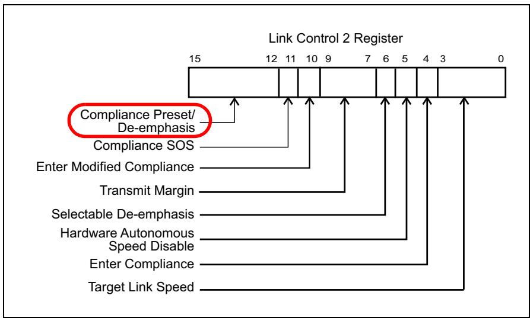  
If the data rate won’t be 2.5 GT/s, then:

— If any TS1s were sent during Polling.Active, the Transmitter must send either one or two consecutive EIOSs before going into Electrical Idle.

— If no TS1s were sent in Polling.Active, the transmitter enters Electrical Idle without sending any EIOSs.

— The Electrical Idle period must be >1ms and <2ms. During this time, the data rate is changed to the new speed and stabilized. If the rate will be 5.0 GT/s, the de‐emphasis level is given by the select\_deemphasis variable (0b =  ‐3.5dB, 1b =  ‐6.0 dB). If the rate will be 8.0 GT/s, then the select\_preset variable gives the transmitter presets to use.

## During Polling.Compliance:

Once the data rate and de‐emphasis or preset values have been determined, the following rules will apply:

Compliance Pattern. If entry was not due to the Compliance Receive bit set and Loopback bit cleared in the TS Ordered Sets and was not due to both the Enter Compliance and Enter Modified Compliance bits being set in the Link Control 2 register, then Transmitters send the compliance pattern on all detected Lanes.

## Exit to “Polling.Active”

If any of these conditions are true:

a) Electrical Idle exit is detected at the Receiver of any detected Lane and the Enter Compliance bit is cleared (0b). The spec notes that the stipulation “any Lane” supports the Load Board usage model described earlier to allow the device to cycle through all the supported test cases.

b) The Enter Compliance bit has been cleared (0b) since Polling.Compli ance was entered.

c) For an Upstream Port, the Enter Compliance bit is set (1b) and EIOS has been detected on any Lane. This condition clears the Enter Compliance bit (0b).

If the data rate was not 2.5 GT/s or the Enter Compliance bit was set during entry to Polling.Compliance, the Transmitter sends 8 consecutive EIOSs and goes to Electrical Idle before transitioning to Polling.Active. During the Electrical Idle time the Port changes to 2.5 GT/s and stabilized for a time between 1ms and 2ms.

Sending multiple EIOSs helps ensure that the Link partner will detect at least one and exit Polling.Compliance when the Enter Compliance register bit was used for entry

Modified Compliance Pattern. If Polling.Compliance was entered because TS1s directed it, and either the Compliance Receive bit was set and Loopback bit was cleared or both Enter Compliance and Enter Modified Compliance bits were set in Link Control 2 register then send the Modified Compliance Pattern on all detected Lanes with the error status Symbol cleared to all zeroes.

If the rate is 2.5 or 5.0 GT/s, each Lane indicates a successful lock on the incoming pattern by looking for one instance of the Modified Compliance Pattern and then setting the Pattern Lock bit in the Modified Compliance Pattern that it sends back (bit 7 of the 8‐bit error status Symbol).

The error status Symbols cannot be used in the locking process because they don’t have meaning if the Link partner isn’t already locked and therefore their meaning can be undefined.

An instance of the pattern is defined to be the sequence of 4 Symbols described earlier: K28.5, D21.5, K28.5, and D10.2 or the complement of these Symbols (meaning the polarity is inverted).

The device under test must set the Pattern Lock bit in the Modified Compliance Patterns it sends within 1ms of receiving the Modified Compliance Pattern from the Link partner.

– Any Receiver errors on a Lane increment that Lane’s error count by 1, and it saturates when the count reaches 127 (doesn’t go higher or wrap around).

## If the rate is 8.0 GT/s

The Error\_Status field is set to 00h on entry to this substate.

The device under test must set the Pattern Lock bit in the Modified Compliance Patterns it sends within 4ms of receiving the Modified Compliance Pattern from the Link partner.

Each Lane independently sets Pattern Lock when it achieves Block Alignment. After that, Symbols in Data Blocks are expected to be IDLs (00h) and any mismatched Symbols increment the count by 1. The Receiver Error Count saturates at 127, and is sent in the last 2 Symbols of the SOS’s included in this pattern.

The scrambling requirements are applied as usual to the Modified Compliance Pattern: the seed value is set per Lane, an EIEOS initiates the LFSR, and SOS’s don’t advance the LFSR.

The spec notes that devices should wait long enough before acquiring Block alignment to ensure that their Receivers have stabilized and won’t see any bit slips. It even mentions that devices might want to revalidate their Block alignment before setting the Pattern Lock bit.

## Exit to “Polling.Active”

If the Enter Compliance bit was set (1b) on entry to Polling.Compliance and either the Enter Compliance bit has been cleared (0b), or it’s an Upstream Port and received an EIOS on any Lane. This also causes its Enter Compliance bit to be cleared (0b).

If the data rate was not 2.5 GT/s or the Enter Compliance bit was set during entry to Polling.Compliance, the Transmitter sends 8 consecutive EIOSs and goes to Electrical Idle before transitioning to Polling.Active. During the Electrical Idle time the Port changes to 2.5 GT/s and ‐3.5dB de‐emphasis, and this time must be between 1ms and 2ms.

Sending multiple EIOSs helps ensure that the Link partner will detect at least one and exit Polling.Compliance when the Enter Compliance register bit was used for entry.

Exit to “Detect State”

If the Enter Compliance bit in the Link Control 2 register is cleared (0b) and the device is directed to exit this substate.

Figure 14‐12: Link Control 2 Register’s “Enter Compliance” Bit  
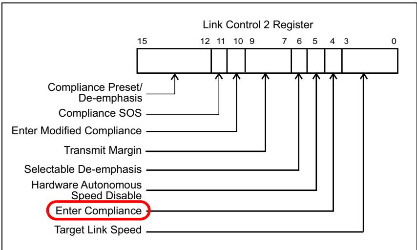

## Configuration State

Initially, the Configuration state performs Link and Lane Numbering at the 2.5 GT/s rate; however, provisions exist that allow the 5 GT/s and 8 GT/s devices to also enter the Configuration state from the Recovery state. The transition from Recovery to Configuration is done primarily for making dynamic changes in the link width of multi‐lane devices. The dynamic changes are supported for the 5 GT/s and 8 GT/s devices only. Consequently, the detailed state transitions for these devices appear in the detailed Configuration Substate descriptions beginning on page 552.

## Configuration State — General

The main goal of this state is to discover how the Port has been connected and assign Lane numbers for it. For example, 8 Lanes may be available but only 2 are active, or perhaps the Lanes can be split into multiple Links, such as two x4 Links. Unlike the other states, Ports have defined roles that depend on whether they are facing upstream or downstream. For that reason, the description of these substates is grouped into the behavior for Downstream Lanes and for Upstream Lanes. The Downstream Port (port that transmits downstream) plays the “leader” role on this Link to walk through the rest of the states in the link initialization process. The Upstream Port (port that transmits upstream) plays the “follower” role. The leader, or Downstream Port, will specify the Link and Lane numbers to the Upstream Port, and the Upstream Port will simply reply with the same values it was told, unless there is a conflict, as we will see in this section. The Link and Lane numbers are reported in the fields of the TS1s exchanged during this time, as shown again in Figure 14‐13 on page 540. These fields contain PAD symbols as a placeholder until actual values are assigned.

Figure 14‐13: Link and Lane Number Encoding in TS1/TS2  

## Designing Devices with Links that can be Merged

A designer chooses how many Lanes to implement on a given Link based on performance and cost requirements. Narrow Links may optionally be able to combine into a wider Link, and a wide Link can optionally be split into multiple narrower Links. Figure 14‐14 on page 541 shows a Switch with one Upstream Port and four x2 Downstream Ports. In this example, they can also be grouped into two x4 Links. As a reminder, the spec requires that every Port must also support operating as a x1 Link.

As seen on the left side of the figure, the switch internally consists of one upstream logical bridge and four downstream logical bridges. One bridge is required for each Port, so supporting 4 Downstream Ports requires 4 downstream bridges. However, if the Ports are combined as shown on the right side of the diagram, then some of the bridges simply go unused. During Link Training, the LTSSM of each Downstream Port determines which of the supported connection options is actually implemented.

Figure 14‐14: Combining Lanes to Form Wider Links (Link Merging)  
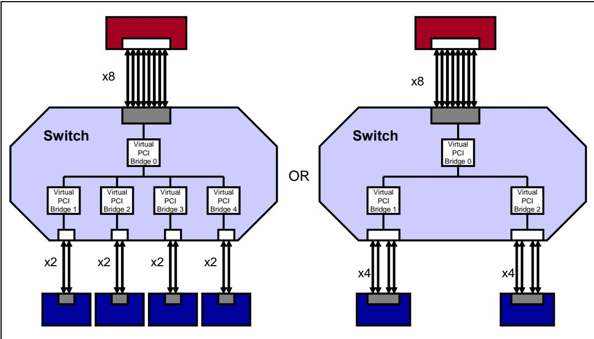

## Configuration State — Training Examples

## Introduction

In the Configuration state, the Link and Lane numbering process is initiated by a Downstream Port, the “leader,” (e.g., Root Port or Switch Downstream Port). Endpoints and switch Upstream Ports don’t initiate, but respond. They are the “follower.” Let’s now consider some examples to make the concepts easier to understand.

## Link Configuration Example 1

The devices shown in Figure 14‐15 on page 543 both support a single Link that implements lane sizes of x4, x2, or x1. The Lane number assignments are fixed by the device internally and must be sequential starting from zero. The physical Lane numbers are shown within the device box and the reported, or logical, Lane numbers are reported by the TS Ordered Sets. Usually, these will be the same, but not in every case.

## Link Number Negotiation.

1. Since only one Link is possible in this example, the Downstream Port (the Port that transmits downstream) sends TS1s using the same Link Number, N, for all the Lanes and PAD for the Lane Numbers.

2. In this Configuration state, the Upstream Port starts out sending TS1s with PAD in the Link and Lane number fields, but upon receiving the TS1s from the Downstream Port with the non‐PAD Link number, the Upstream Port responds with TS1s on all connected Lanes that reflect the same Link Number N and PAD for the Lane Number field. Based on this response, the Downstream LTSSM recognizes that four Lanes responded and used the same Link number as is being sent, so all 4 Lanes will be configured as one Link. The Link Number itself is an implementation‐specific value that isn’t stored in any defined configu ration register and isn’t related to the Port Number or any other value.

Figure 14‐15: Example 1 ‐ Steps 1 and 2  
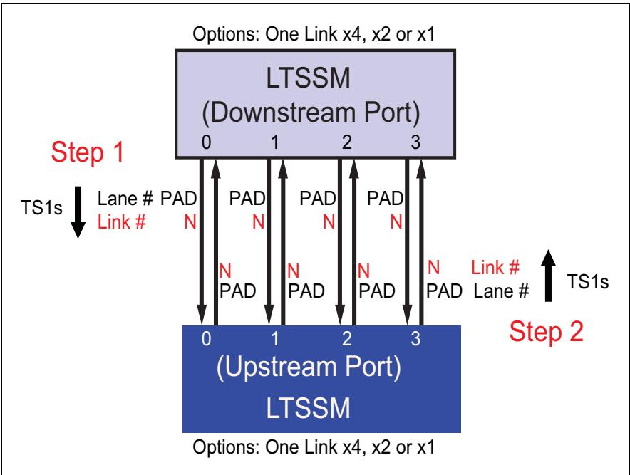

## Lane Number Negotiation.

3. The Downstream Port now begins to send TS1s with the same Link Number but assigns Lane Numbers of 0, 1, 2 and 3 to the connected Lanes, as shown in Figure 14‐16 on page 544.

4. In response to seeing non‐PAD Lane numbers coming in, the Upstream Port will verify that the incoming Lane numbers match the Lane numbers they are received on. In this example, the Lanes of the Downstream and Upstream Ports are connected correctly. Because all the Lane numbers match, the Upstream Port advertises its Lane numbers in the TS1s it is sending as well. When the Downstream Port sees non‐PAD Lane numbers in response, it compares the incoming numbers to the values it’s sending. If they match, all is well but, if not, then other steps will need to be taken. If some but not all Lane numbers match, then the Link width may be adjusted accordingly. If the Lanes are reversed, then the optional Lane Reversal feature will be needed. Because it’s optional, it’s possible that the Lanes have been reversed but neither device is capable of correcting it. This would be a dramatic board design error because it is possible the Link cannot be configured for operation in this case.

Figure 14‐16: Example 1 ‐ Steps 3 and 4  

Confirming Link and Lane Numbers.

5. Since the transmitted and received Link and Lane numbers matched on all the Lanes, the Downstream Port indicates it is ready to conclude this negotiation and proceed to the next state, L0, by sending TS2 Ordered Sets with the same Link and Lane numbers.

6. Upon receiving TS2s with the same Link and Lane numbers, the Upstream Port also indicates its readiness to leave the Configuration state and proceed to L0 by sending TS2s back. This is shown in Figure 14‐17 on page 545.

7. Once a Port receives at least 8 TS2s and transmits at least 16, it sends some logical idle data and then transitions to L0.

Figure 14‐17: Example 1 ‐ Steps 5 and 6  

## Link Configuration Example 2

Another example that should be covered is of a Device with 4 Downstream Lanes that is capable of being configured as a single x4 Link or a combination of two x2 Links or four x1 Links. So even a configuration of one x2 Link and two x1 Links would be just fine. An example of this type of Device can be seen in Figure 14‐18 on page 546.

If all four Lanes have detected a receiver and made it to the Configuration state, there are a number of connection possibilities:

— One x4 Link

— Two x2 Links

— One x2 Link and two x1 Links

— Four x1 Links

One example method defined in the spec to determine which of the configurations are implemented is described below.

## Link Number Negotiation.

1. In this example method, the Downstream Port begins by advertising a unique Link number on each Lane. Lane 0 advertises a Link number of N, Lane 1 advertises a Link number of N+1, etc. as shown in Figure 14‐ 18 on page 546. These Link numbers are just examples, and they do not have to be sequential. Also, it is important to remember that the Downstream Port does not know what it is connected to and it is this process where the Port is trying to determine the connections for each Lane.

Figure 14‐18: Example 2 ‐ Step 1  
  
2. Upon receiving the returned TS1s, the Downstream Port recognizes two things: all four Lanes are working and they are connected to two different Upstream Ports. This means there will actually be two Downstream Ports. Each Downstream Port will have its own Lane 0 and Lane 1 as shown in Figure 14‐20 on page 548.

Figure 14‐19: Example 2 ‐ Step 2  
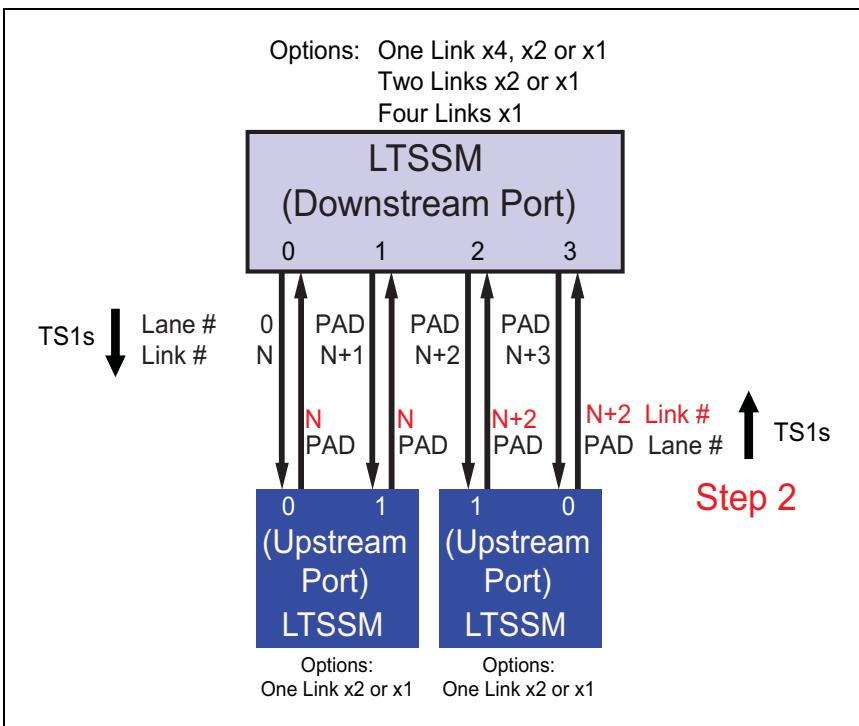

## Lane Number Negotiation.

3. The process continues now for each Link independently but they’ll take the same steps as before to determine the Lane numbers: the Downstream Ports will advertise their Lane numbers in the TS1s. It is also important to note that the Downstream Ports begin advertising the single returned Link number for all Lanes of the Link. The Link on the left is advertising a Link number of N for both Lanes and the Link on the right is advertising N+2.

4. In this example, the Lane numbers of the Link on the left match between the Downstream and Upstream Port. However, for the Link on the right, the Lane numbers of the Downstream Port are reversed from the connected Upstream Port. The Upstream Port realizes this and if it supports Lane Reversal, it will implement that internally and reply back with the same Lane numbers that were advertised by the Downstream Port, as shown in Figure 14‐20. If the Upstream Port did not support Lane Reversal, it would have advertised its own Lane numbers in the returned TS1s and then the Downstream Port would have realized the issue and had a chance to implement Lane Reversal.

5. Lane Reversal can optionally be handled by either Port. If the Upstream Port detects this case and supports Lane Reversal, it simply makes the Lane assignment change internally and returns TS1s with the proper Lane numbers. As a result, the Downstream Port is unaware that there was ever an issue. If the Upstream Port is unable to handle Lane Reversal though, then the Downstream Port will see the incoming Lane numbers in reverse order. If it supports Lane Reversal, it will then correct the numbering and begin sending TS2s with the new Lane numbers.

Figure 14‐20: Example 2 ‐ Steps 3, 4 and 5  
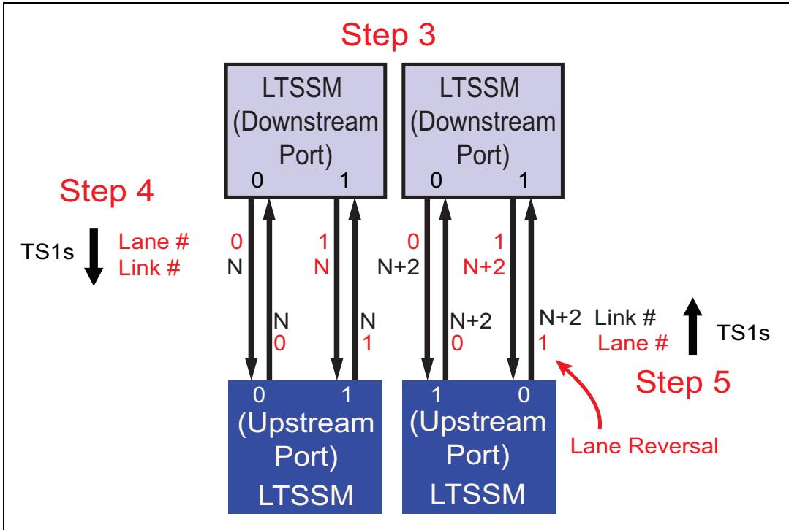  
Confirming Link and Lane Numbers.

6. The Downstream Ports receive the TS1s with the Link and Lane numbers that match what was advertised so each Port, independently, starts sending TS2s as a notification that it is ready to proceed to the L0 state with the negotiated settings.

7. The Upstream Ports receive the TS2s with no Link and Lane number changes and start transmitting TS2s in return with the same values.

8. Once each Port receives at least 8 TS2s and transmits at least 16 TS2s, it sends some logical idle data and then transitions to L0. The Upstream Port of the Link on the right is implementing Lane Reversal internally.

## Link Configuration Example 3: Failed Lane

Finally, let’s consider what happens if one of the Lanes isn’t working properly. Consider an example in which Lane 2 of the Upstream Port is not functioning well as shown in Figure 14‐21 on page 550. It’s important to note that the Lane isn’t physically broken because if it were it wouldn’t have detected a Receiver and wouldn’t be considered for inclusion in the Link. However, even though the Lane is attached, either the Transmitter or Receiver (or both) of Lane 2 on the Upstream Port is not getting the job done.

In cases like this, it is likely that the link training process will take considerably longer because most of the state transitions wait to proceed to the next state until ALL Lanes are ready for the next state, OR if a subset of Lanes are ready and a timeout condition has occurred.

The steps below indicate a way this situation could be handled when transitioning through the substates of the Configuration state machine.

## Link Number Negotiation.

9. Even though the Lane 2 Receiver on the Upstream Port is having issues, the Downstream Port is going to take the same process upon entering the Configuration state. The Downstream Port sends TS1s on all Lanes with the Link number N and with the Lane number set to PAD.

10. Lanes 0, 1 and 3 all received the TS1s with the non‐PAD Link number, so those Lanes send TS1s back to the Downstream Port. However, Lane 2 of the Upstream Port did not successfully receive the TS1s with the non‐PAD Link number, so its Transmitter continues sending TS1s with PAD in the Link and Lane number fields as shown in Figure 14‐21 on page 550.

Figure 14‐21: Example 3 ‐ Steps 1 and 2  
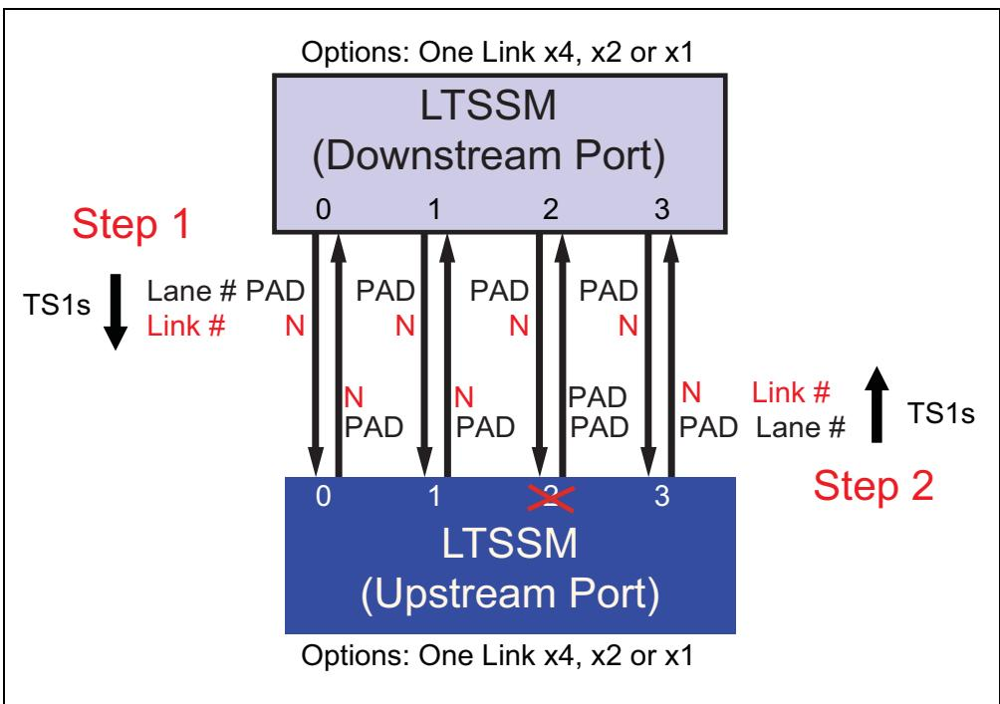

## Lane Number Negotiation.

11. Once the Downstream Port has received the TS1s with the same Link number on Lanes 0, 1 and 3, it waits until the required timeout period hoping that Lane 2 will start working. When that doesn’t happen, the Downstream Port realizes that it will only be able to train as a x2 Link. After accepting this fact, the Downstream Port will advertise its Lane numbers for Lanes 0 and 1, but Lanes 2 and 3 go back to send PADs in the Link and Lane number fields.

12. When the Upstream Port receives the TS1s on Lanes 0 and 1 with the advertised Lane numbers and it sees that Lane 3 has gone back to receiving PAD TS1s, it advertises its Lane number for Lanes 0 and 1 but all the other Lanes start (or continue) sending TS1s with PAD set in both the Lane and Link number fields as shown in Figure 14‐22 on page 551.

Figure 14‐22: Example 3 ‐ Steps 3 and 4  
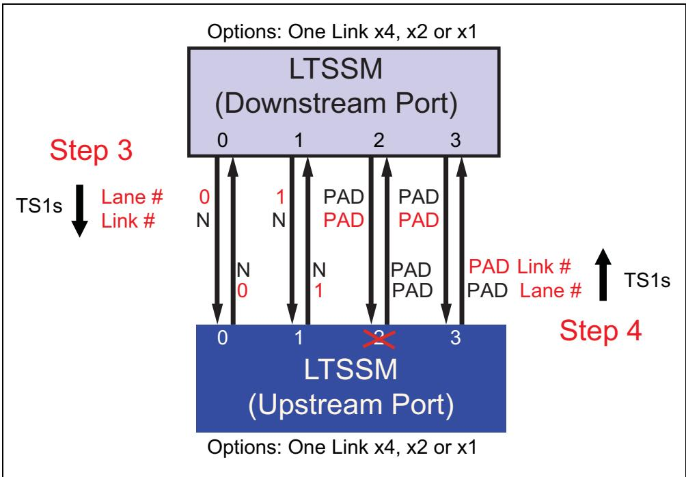

## Confirming Link and Lane Numbers.

13. Since the transmitted and received Link and Lane numbers matched on Lanes 0 and 1, the Downstream Port indicates it is ready to conclude this negotiation and proceed to the next state, L0, by sending TS2 Ordered Sets with the same Link and Lane numbers on these Lanes. The other Lanes continue sending TS1s with PAD for both the Link and Lane numbers.

14. Upon receiving TS2s with the same Link and Lane numbers on Lanes 0 and 1, the Upstream Port also indicates its readiness to leave the Configuration state and proceed to L0 by sending TS2s back on these Lanes. The other Lanes continue sending TS1s with PAD for both the Link and Lane numbers. This is shown in Figure 14‐23 on page 552.

Figure 14‐23: Example 3 ‐ Steps 5 and 6  
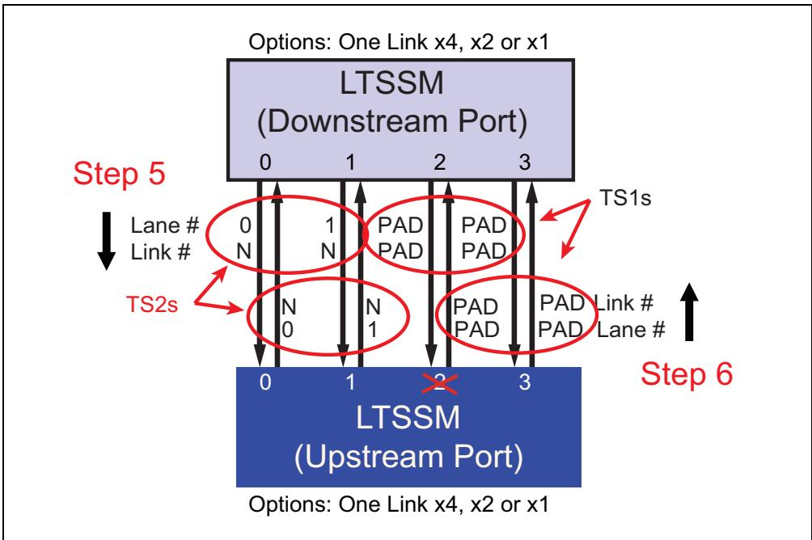

Once a Port receives at least 8 TS2s and transmits at least 16, it sends some logical idle data and those Lanes transitions to L0. The other Lanes, Lanes 2 and 3 in this example, transition to Electrical Idle until the next time the link training process is initiated at which point those Lanes will attempt the training process like normal.

## Detailed Configuration Substates

A detailed explanation of each substate is presented here to cover all the substates of Configuration, as shown in Figure 14‐24 on page 553. The Configuration Substates should be easier to follow, given the Link Training examples discussed previously.

Figure 14‐24: Configuration State Machine  

## Configuration.Linkwidth.Start

This substate is entered after either the normal completion of the Polling state (as described in “Polling.Configuration” on page 527), or if the Recovery state finds that Link or Lane numbers have changed since the last time they were assigned and thus the recovery process can’t finish normally (as described in the “Recovery State” on page 571).

## Downstream Lanes.

## During Configuration.Linkwidth.Start

The Downstream Port is now the leader on this Link and sends TS1s with a non‐PAD link number on all active Lanes (as long as LinkUp is not set and upconfiguration of the Link width is not taking place). In the TS1s, the Link number field is changed from PAD to a number while the Lane number remains PAD. The only constraint on the value of the Link numbers in the spec is that they must be unique for each possible Link if multiple Links are supported. For example, a x8 Link would have the same Link number on all 8 Lanes, but if it could also be configured as two x4 Links, both groups of 4 Lanes would be assigned different Link numbers, such as 5 for one group and 6 for the other. The values are local to the Link partners and there’s no need for software to track them or try to make them unique throughout the system.

If the upconfigure\_capable bit is set to 1b, these TS1s will also be sent on any inactive Lanes that received two consecutive TS1s with Link and Lane numbers set to PAD.

– When entering this substate from Polling, any Lane that detected a Receiver is considered active.

– When entering from Recovery, any Lane that was part of the Link after going through Configuration.Complete is considered an active Lane.

– All supported data rates must be advertised in the TS1s, even if the Port doesn’t intend to use them.

Crosslinks. For cases where LinkUp = 0b and the optional crosslink capability is supported, all Lanes that detected a Receiver must send a minimum of 16 to 32 TS1s with a non‐PAD Link number and PAD Lane number. After that, the port will evaluate what it is receiving to see if a crosslink is present.

Upconfiguring the Link Width. If LinkUp = 1b and the LTSSM wants to upconfigure the Link, TS1s with Link and Lane numbers set to PAD are sent on the currently active Lanes, the inactive Lanes it intends to activate, and the Lanes that have seen incoming TS1s. When the Lanes have received two consecutive TS1s coming back, or after 1ms, the Link number is assigned a value in the TS1s being sent.

– If activating an inactive Lane, the Transmitter must wait for the Tx common mode voltage to settle before exiting Electrical Idle and sending TS1s.

– Link numbers must be the same for Lanes that will be grouped into a Link. The numbers can only be different for groups of Lanes that are capable of acting as a unique Link.

Exit to “After a 24ms timeout if none of the other conditions are true.”

Any Lanes that previously received at least one TS1 with Link and Lane number of PAD now receive two consecutive TS1s with a non‐PAD Link number that matches a transmitted Link number and Lane numbers are still PAD will exit to the Configuration.Linkwidth.Accept substate.

## Exit to “Configuration.Linkwidth.Start”

If the first set of received TS1s for this substate have a non‐PAD Link number then it’s understood that a crosslink is present and the Link neighbor is also behaving as a Downstream Port. To handle this situation, the Downstream Lanes are changed to Upstream Lanes and a random crosslink timeout is chosen. The next substate will be the same Confiuration.Linkwidth.Start again but the Lanes will now behave as Upstream Lanes.

This supports the optional behavior when both Link partners behave as Downstream Ports. The solution for this situation is to change both to Upstream Ports and assign each a random timeout that, when it expires, changes it to a Downstream Port. Since the timeouts won’t be the same, eventually one Port is seen as Downstream while the other is seen as Upstream and then the training can go forward. The timeout must be random so that even if two of the same devices are connected any possible deadlock will eventually be broken.

If crosslinks are supported, receiving a sequence of TS1s that first have a Link number of PAD and later have a non‐PAD Link number that matches the transmitted Link number is valid only if the sequence wasn’t interrupted by a TS2.

## Exit to “Disable State”

If the Port is instructed by a higher layer to send TS1s or TS2s with the Disable Link bit asserted on all detected Lanes. Normally, the Downstream Port will initiate this but, for the optional crosslink case, it could become an Upstream Port instead and then Disabled will be the next state if 2 consecutive TS1s are received with the Loopback bit set.

## Exit to “Loopback State”

If the loopback‐capable Transmitter is instructed by a higher layer to send TS Ordered Sets with the Loopback bit asserted, or if Lanes that are sending TS1s receive 2 consecutive TS1s with the Loopback bit set. Whichever Port sends the TS1s with the bit set will become the Loopback master, while the Port that receives them will become the Loopback slave.

Exit to “Detect State”

After a 24ms timeout if none of the other conditions are true.

## Upstream Lanes.

During Configuration.Linkwidth.Start

The Upstream Port is now the follower on this Link and goes back to sending TS1 ordered‐sets with PAD set for the Link and Lane number fields. It will continue to do this until it begins receiving TS1s with a non‐PAD Link number from the Downstream Port (leader).

The Upstream Port sends TS1s with Link and Lane values of PAD on a) all active Lanes, b) the Lanes it wants to upconfigure and, c) if upconfigure\_capable is set to 1b, on each of the inactive Lanes that have received two consecutive TS1s with Link and Lane numbers set to PAD while in this substate.

– When entering this substate from Polling, any Lane that detected a Receiver is considered active.

– When entering from Recovery, any Lane that was part of the Link after going through Configuration.Complete is considered an active Lane. If the transition wasn’t caused by an LTSSM timeout, the Transmitter must set the Autonomous Change bit (Symbol 4, bit 6) to 1b in the TS1s being sent in the Configuration state if it does, in fact, plan to change the Link width for autonomous reasons.

– All supported data rates must be advertised in the TS1s, even if the Port doesn’t intend to use them.

Crosslinks. For cases where LinkUp = 0b and the optional crosslink capability is supported, all Lanes that detected a Receiver must send a minimum of 16 to 32 TS1s with Link and Lane values of PAD. After that, the port will evaluate what it is receiving to see if a crosslink is present.

Exit to “After a 24ms timeout if none of the other conditions are true.”

If any Lanes receive two consecutive TS1s with non‐PAD Link number and PAD Lane number, this port transitions to the Configuration.Linkwidth.Accept substate where one of the received Link numbers is selected for those Lanes and TS1s are sent back with that Link number and a PAD Lane number, on all the Lanes that received TS1s with a non‐PAD Link number. Any left‐over Lanes that detected a Receiver but no Link number must send TS1s with Link and Lane numbers set to PAD.

– If upconfiguring the Link, the LTSSM waits until it receives two consecutive TS1s with a non‐PAD Link number and PAD Lane number on either a) all the inactive Lanes it wants to activate, or b) on any

Lane 1ms after entering this substate, whichever is earlier. After that, it sends TS1s with the selected Link number along with PAD Lane numbers.

– To avoid configuring a Link smaller than necessary, it’s recommended that a multi‐Lane Link that sees an error or loses Block Alignment on some Lanes delay this Receiver evaluation. For 8b/10b encoding, it should wait at least two more TS1s, while for 128b/130b encoding it should wait for at least 34 TS1s, but never more than 1ms in any case.

– After activating an inactive Lane, the Transmitter must wait for the Tx common mode voltage to settle before exiting Electrical Idle and sending TS1s.

## Exit to “Configuration.Linkwidth.Start”

After a crosslink timeout, send 16 to 32 TS2s with Link and Lane values of PAD. The Upstream Lanes change to Downstream Lanes and the next substate will be the same Confiuration.Linkwidth.Start again but this time the Lanes behave as Downstream Lanes. For the case of two Upstream Ports connected together, this optional behavior allows one of them to eventually take the lead as a Downstream Port.

## Exit to “Disable State”

If either of the following is true:

– Any Lanes that are sending TS1s also receive TS1s with the Disable Link bit asserted.

The optional crosslink is supported and either all Lanes that are sending and receiving TS1s receive the Disable Link bit in two consecutive TS1s, or else a crosslink Port is directed by a higher Layer to assert the Disable bit in its TS1s and TS2s on all Lanes that detected a Receiver.

## Exit to “Loopback State”

If a loopback‐capable Transmitter is directed by a higher Layer to send TS Ordered Sets with the Loopback bit asserted or all Lanes that are sending and receiving TS1s receive 2 consecutive TS1s with the Loopback bit set. Whichever Port sends the TS1s with the bit set will become the Loopback master, while the Port that receives them will become the Loopback slave.

## Exit to “Detect State”

After a 24ms timeout if none of the other conditions are true.

## Configuration.Linkwidth.Accept

At this point, the Upstream Port is now sending back TS1 ordered‐sets on all its Lanes with the same Link number. The Link number originated from the Downstream Port, and the Upstream Port is simply reflecting that value back on all its Lanes. Now the Downstream Port knows the Link width (number of Lanes receiving the same Link number) and it must start advertising the Lane numbers. So the leader (Downstream Port) continues sending TS1s, but now with the actual Lane numbers designated instead of PAD. Also, all these TS1s will have the same Link number. The detailed behavior for the Downstream and Upstream Lanes are outlined below:

## Downstream Lanes

## During Configuration.Linkwidth.Accept

The Downstream Port will now initiate Lane numbers. If a Link can be formed from at least one group of Lanes that all receive two consecutive TS1s and all see the same Link number, then TS1s are sent that keep that same Link number but now assign unique, non‐PAD Lane numbers as well.

## Exit to “Configuration.Lanenum.Wait”

The Downstream Port does not stay in the Configuration.Linkwidth.Accept substate very long. Once it has received the necessary TS1s from the Upstream Port indicating, the Link width, it updates any internal state info that is required, starts sending TS1s with non‐PAD Lane numbers, as indicated above, and immediately transitions to Configuration.Lanenum.Wait to await Lane Number confirmation from the Upstream Port.

## Upstream Lanes

## During Configuration.Linkwidth.Accept

The Upstream Port transmits TS1s where one of the received Link numbers is selected and sent back in the TS1s on all the Lanes that received TS1s with a non‐PAD Link number. Any left‐over Lanes that detected a Receiver but no Link number must send TS1s with Link and Lane numbers set to PAD.

## Exit to “Configuration.Lanenum.Wait”

The Upstream Port must respond to the Lane numbers proposed to it by the Link neighbor. If a Link can be formed using Lanes that sent a non‐PAD Link number on their TS1s and received two consecutive TS1s with the same Link number and any non‐PAD Lane number, then it should send TS1s that match the same Lane number assignments, if possible, or are different if necessary (such as with the optional Lane reversal).

## Configuration.Lanenum.Wait

Prior to discussing the Configuration.Lanenum.Wait state, some background information may be helpful. Lane numbers are assigned sequentially from zero to the maximum number possible for a Link. For example, a x8 Link will be assigned Lane numbers 0 ‐ 7. Ports are required to support a Link as wide as the number of Lanes they have and as small as one Lane. The Lanes will always start with Lane 0 and must be both sequential and contiguous. For example, if some Lanes on a x8 Port aren’t working, it might optionally be designed to configure a x4 Link and, if so, it would need to use Lanes 0‐3. As another example, if Lane 2 of a x8 Port is not working, it wouldn’t be possible to use Lanes 0, 1, 3, and 4 to form a x4 Link because the Lanes wouldn’t be contiguous. Any leftover Lanes must send TS1s with Link and Lane set to PAD.

A common timing consideration is repeated many times in the spec for the Configuration substates. Rather than repeat it for every case here, just be aware that it applies in general to both Upstream and Downstream Ports:

To avoid configuring a Link smaller than necessary, it’s recommended that a multi‐Lane Port delay the final link width evaluation if it sees an error or loses Block Alignment on some Lanes. For 8b/10b, it should wait at least two more TS1s, while for 128b/130b mode it should wait for at least 34 TS1s, but never more than 1ms in any case. The idea is that the Lanes might need settling time after powering up or being reset.

## Exit to “Detect State”

After a 2ms timeout if no Link can be configured (e.g.: Lane 0 is not working and Lane Reversal isn’t available), or if all Lanes receive two consecutive TS1s with PAD in both the Link and Lane numbers, the link must exit to the Detect State.

## Downstream Lanes

## During Configuration.Lanenum.Wait

The Downstream Port will continue to transmit TS1s with the non‐PAD Link and Lane numbers until one of the exit conditions is met.

Exit to “Configuration.Lanenum.Accept”

If either of the cases listed below is true:

–  If two consecutive TS1s have been received on all Lanes with Link and Lane numbers that match what is being transmitted on those Lanes.

–    If any Lanes that detected a Receiver see two consecutive TS1s with a Lane number different from when the Lane first entered this substate and at least some Lanes see a non‐PAD Link number. The spec points out that this allows the two Ports to settle on a mutually acceptable Link width.

## Exit to “Detect State”

After a 2ms timeout or if all Lanes receive two consecutive TS1s with Link and Lane numbers set to PAD.

## Upstream Lanes

## During Configuration.Lanenum.Wait

The Upstream Port will continue to transmit TS1s with the non‐PAD Link and Lane numbers until one of the exit conditions is met.

## Exit to “Configuration.Lanenum.Accept”

If either of the cases listed below is true:

–   If any Lanes receive two consecutive TS2s.

–  If any Lanes receive two consecutive TS1s with a Lane number different from when the Lane first entered this substate and at least some Lanes see a non‐PAD Link number.

Note that Upstream Lanes are allowed to wait up to 1ms before changing to that substate, so as to prevent received errors or skew between Lanes from affecting the final Link configuration.

## Exit to “Detect State”

After a 2ms timeout or if all Lanes receive two consecutive TS1s with Link and Lane numbers set to PAD.

## Configuration.Lanenum.Accept

## Downstream Lanes

## During Configuration.Lanenum.Accept

The Downstream Port has now received TS1s with non‐PAD Link and Lane numbers. It is at this point that the Downstream Port must decide if a Link can be established with the Lane numbers returned by the Upstream Port. The three possible state transitions are listed below.

## Exit to “Configuration.Complete”

If two consecutive TS1s are received with the same non‐PAD Link and Lane numbers, and they match the Link and Lane numbers being transmitted in the TS1s for all the Lanes, then Upstream Port has agreed with the Link and

Lane numbers advertised by the Downstream Port and the next substate is Configuration.Complete. Or if the Lane numbers in the received TS1s are reversed from what the Downstream Port advertised, if the Downstream Port supports Lane Reversal, it can still proceed to Configuration.Complete while using the reversed Lane numbers.

The spec points out that the Reversed Lane condition is strictly defined as Lane 0 receiving TS1s with the highest Lane number (total number of Lanes ‐ 1) and the highest Lane number receiving TS1s with Lane number of zero. One thing that can be understood from this is the answer to a question that comes up in class sometimes: Can the Lane numbers be mixed up, rather than sequential? The answer is no, they must be from 0 to n‐1 or from n‐1 to 0; no other options are supported.

If the Configuration state was entered from the Recovery state, a bandwidth change may have been requested. If so, status bits will be updated to report the nature of what happened. Basically, the system needs to report whether this change was initiated because the Link wasn’t working reliably or because hardware is simply managing the Link power. The bits are updated as follows:

If the bandwidth change was initiated by the Downstream Port because of a reliability problem, the Link Bandwidth Management Status bit is set to 1b.

If the bandwidth change was not initiated by the Downstream Port but the Autonomous Change bit in two consecutive received TS1s is cleared to 0b, the Link Bandwidth Management Status bit is set to 1b.

Otherwise the Link Autonomous Bandwidth Status bit is set to 1b.

## Exit to “Configuration.Lanenum.Wait”

If a configured Link can be formed with some but not all of the Lanes that receive two consecutive TS1s with the same non‐PAD Link and Lane numbers, those Lanes send TS1s with the same Link number and new Lane numbers. The object is to use a smaller group of Lanes to achieve a working Link.

The new Lane numbers must start with zero and increase sequentially to cover the Lanes that will be used. Any Lanes that don’t receive TS1s can’t be part of the group and will disrupt the Lane numbering. Any leftover Lanes must send TS1s with Link and Lane set to PAD. For example, if 8 Lanes are available, but Lane 2 doesn’t see incoming TS1s, then the Link can’t consist of a group that would need Lane 2. Consequently, the x8 and x4 options would not be available, and only a x1 or x2 Link is possible.

## Exit to “Detect State”

If no Link can be configured, or if all Lanes receive two consecutive TS1s with PAD for Link and Lane numbers.

## Upstream Lanes

## During Configuration.Lanenum.Accept

The Upstream Port has now received either TS2s or TS1s with non‐PAD Link and Lane numbers. It is at this point that the Upstream Port must decide if a Link can be established with the Lane numbers sent by the Downstream Port. The three possible state transitions are listed below.

## Exit to “Configuration.Complete”

If two consecutive TS2s are received with the same non‐PAD Link and Lane numbers, and they match the Link and Lane numbers being transmitted in the TS1s for those Lanes, all is well and the next substate will be Configuration.Complete.

## Exit to “Configuration.Lanenum.Wait”

If a configured Link can be formed with a subset of Lanes that receive two consecutive TS1s with the same non‐PAD Link and Lane numbers, those Lanes send TS1s with the same Link number and new Lane numbers. The object is to use a smaller group of Lanes to achieve a working Link. The next substate in this case will be Configuration.Lanenum.Wait.

As was the case for the Downstream Lanes, the new Lane numbers must start with zero and increase sequentially to cover the Lanes that will be used. Any Lanes that don’t receive TS1s can’t be part of the group and will disrupt the Lane numbering. Any leftover Lanes must send TS1s with Link and Lane set to PAD.

## Exit to “Detect State”

If no Link can be configured, or if all Lanes receive two consecutive TS1s with PAD for Link and Lane numbers, then the next state will be Detect.

## Configuration.Complete

This is the only substate of the Configuration state where TS2s are exchanged. As discussed before, the purpose of TS2s is a handshake, or confirmation between the two devices on the link that they are ready to proceed to the next state. So this is the final confirmation of the Link and Lane numbers exchanged in the TS1s leading up to this point.

It should be noted that Devices are allowed to change their supported data rates and upconfigure capability when they enter this substate, but not while in it. This is because Devices record the capabilities of their Link partner from what is advertised in these TS2s, as will be described in this section.

## Downstream Lanes

## During Configuration.Complete

TS2s are sent using the Link and Lane numbers that match the received TS1s. The TS2s can have the Upconfigure Capability bit set if the Port supports a x1 Link using Lane 0 and is able to up‐configure the Link.

For 8b/10b encoding, Lane de‐skewing must be completed when leaving this substate. Also, scrambling will be disabled if all configured Lanes see two consecutive TS2s with the Disable Scrambling bit set. The Port that sends these must also disable scrambling. Note that scrambling cannot be disabled when in 128b/130b mode because of the necessary contribution it makes to signal integrity.

The Downstream Port is transmitting TS2s and watching for TS2s coming back. For future reference, record the number of FTSs that must be sent when exiting from the L0s state from the N\_FTS field in the incoming TS2s.

## Exit to “Configuration.Idle”

The next state will be Configuration.Idle when all Lanes sending TS2s receive 8 TS2s with matching Link and Lane numbers (non‐PAD), matching rate identifiers, and matching Link Upconfigure Capability bit in all of them. At least 16 TS2s must also be sent after receiving one TS2.

If the device supports rates greater than 2.5 GT/s, it must record the rate identifier received on any configured Lane and this overrides any previously recorded value. The variable used to track speed changes in Recovery, “changed\_speed\_recovery”, is cleared to zero.

The variable “upconfigure\_capable” is set to 1b if the device sends TS2s with Link Upconfigure Capability set to 1b and receives 8 consecutive TS2s with the same bit set. Otherwise it’s cleared to zero.

Any Lanes that aren’t configured as part of the Link are no longer associated with the LTSSM in progress and must either be:

– Associated with a new LTSSM or

Transitioned to Electrical Idle

a)   A special case arises if those Lanes had been configured as part of the Link through L0 previously and LinkUp has remained set at 1b since then. They must remain associated with the same LTSSM if the Link is upconfigure capable. For that case, it’s also recommended that those Lanes leave their Receiver terminations on because they’ll become part of the Link again if it is upconfigured. If the terminations aren’t left on, they must be turned on from when the LTSSM enters the Recovery.RcvrCfg state all the way through Configuration.Complete. Lanes that weren’t part of the Link before can’t become part of it through this process, though.

b) For the optional crosslink, Receiver terminations must be between ZRX‐HIGH‐IMP‐DC‐POS and ZRX‐HIGH‐IMP‐DC‐NEG.

c) If the LTSSM goes back to Detect, these Lanes will once again be associated with it.

d)   No EIOS is needed before Lanes go to Electrical Idle, and the transition doesn’t have to happen on Symbol or Ordered Set boundaries.

## After a 2ms timeout:

## Exit to “Configuration.Idle”

Next state is Configuration.Idle if the idle\_to\_rlock\_transitioned variable is less than FFh and the current data rate is 8.0 GT/s.

In this transition, the “changed\_speed\_recovery” variable is cleared to zero. Also, the “upconfigure\_capable” variable may be updated, though it’s not required to do so, if at least one Lane saw eight consecutive TS2s with matching Link and Lane numbers (non‐PAD). If the transmitted and received Link Upconfigure Capability bits are 1b, set it to 1b, otherwise clear it to zero.

Lanes that aren’t part of the configured Link aren’t associated with the LTSSM in progress and have the same requirements as the non‐timeout case listed above.

Exit to “Detect State”

Otherwise, the next state is Detect.

## Upstream Lanes

## During Configuration.Complete

TS2s are sent using the Link and Lane numbers that match the received TS2s. The TS2s can have the Upconfigure Capability bit set if the Port supports a x1 Link using Lane 0 and is able to up‐configure the Link.

For 8b/10b encoding, Lane de‐skewing must be completed when leaving this substate. Also, scrambling will be disabled if all configured Lanes see two consecutive TS2s with the Disable Scrambling bit set. The Port that sends these must also disable scrambling. Note that scrambling cannot be disabled when in 128b/130b mode because of the necessary contribution it makes to signal integrity.

In this substate, the Upstream Port is receiving TS2s from the Downstream Port, and for future reference, should record the N\_FTS field value number of FTSs that must be sent when exiting from the L0s state from the in the incoming TS2s.

## Exit to “Configuration.Idle”

The next state will be Configuration.Idle when all Lanes sending TS2s receive 8 TS2s with matching Link and Lane numbers (non‐PAD), matching rate identifiers, and a matching Link Upconfigure Capability bit in all of them. At least 16 TS2s must also be sent after receiving one TS2.

If the device supports rates greater than 2.5 GT/s, it must record the rate identifier received on any configured Lane, overriding any previously recorded value. The variable used to track speed changes in Recovery, “changed\_speed\_recovery”, is cleared to zero.

The variable “upconfigure\_capable” is set to 1b if the device sends TS2s with Link Upconfigure Capability set to 1b and receives 8 consecutive TS2s with the same bit set. Otherwise it’s cleared to zero.

Any Lanes that aren’t configured as part of the Link are no longer associated with the LTSSM in progress and must either be:

– Optionally associated with a new crosslink LTSSM (if this feature is supported), or

## – Transitioned to Electrical Idle

a) A special case arises if those Lanes had been configured as part of the Link through L0 previously and LinkUp has remained set at 1b since then. They must remain associated with the same LTSSM if the Link is upconfigure capable. For that case, it’s also recommended that those Lanes leave their Receiver terminations on because they’ll become part of the Link again if it is upconfigured. If they’re not left on, they must be turned on from when the LTSSM enters the Recovery.RcvrCfg state all the way through Configuration.Complete. Lanes that weren’t part of the Link before can’t become part of it through this process, though.

b) Receiver terminations must be between ZRX‐HIGH‐IMP‐DC‐POS and ZRX‐ HIGH‐IMP‐DC‐NEG.

c)    If the LTSSM goes back to Detect, these Lanes will once again be associated with it.

d)  No EIOS is needed before Lanes go to Electrical Idle, and the transition doesn’t have to happen on Symbol or Ordered Set boundaries.

## After a 2ms timeout:

Exit to “Configuration.Idle”

Next state is Configuration.Idle if the idle\_to\_rlock\_transitioned variable is less than FFh and the current data rate is 8.0 GT/s.

In this transition, the “changed\_speed\_recovery” variable is cleared to zero. Also, the “upconfigure\_capable” variable may be updated, though it’s not required to do so, if at least one Lane saw eight consecutive TS2s with matching Link and Lane numbers (non‐PAD). If the transmitted and received Link Upconfigure Capability bits are 1b, set it to 1b, otherwise clear it to zero.

Lanes that aren’t part of the configured Link aren’t associated with the LTSSM in progress and have the same requirements as the non‐timeout case listed above.

## Exit to “Detect State”

Otherwise, the next state is Detect.

## Configuration.Idle

## During Configuration.Idle

In this substate, the transmitter is sending Idle data and waiting for the minimum number of received Idle data so this Link can transition to L0. During this time, the Physical Layer reports to the upper layers that the link is operational (Linkup = 1b).

For 8b/10b encoding, the transmitter is sending Idle data on all configured Lanes. Idle data are just data zeros that get scrambled and encoded.

For 128b/130b encoding, the transmitter sends one SDS Ordered Set on all configured Lanes followed by Idle data Symbols. The first Idle Symbol on Lane 0 is the first Symbol of the Data Stream.

## Exit to “L0 State”

If using 8b/10b encoding, the next state is L0 if 8 consecutive Idle data symbol times are received on all configured Lanes, and 16 symbol times of idle data were sent after receiving one Idle Symbol.

If using 128b/130b, the next state is L0 if 8 consecutive Idle data are received on all configured Lanes, 16 Idles were sent after receiving one Idle Symbol, and this state wasn’t entered by a timeout from Configuration.Complete.

– Lane‐to‐Lane de‐skew must be completed before Data Stream processing begins.

– The Idle Symbols must be received in Data Blocks.

– If software set the Retrain Link bit in the Link Control register since the last transition to L0 from Recovery or Configuration, the Downstream Port must set the Link Bandwidth Management bit in the Link Status register to 1b to indicate that this change was not hardware initiated (autonomous).

– The “idle\_to\_rlock\_transitioned” variable is cleared to 00h on transition to L0.

After a 2ms timeout:

## Exit to “Detailed Recovery Substates”

If the idle\_to\_rlock\_transitioned variable is less than FFh, the next state is Recovery (Recovery.RcvrLock). Then:

a) For 8.0 GT/s, increment idle\_to\_rlock\_transitioned by 1.

b) For 2.5 or 5.0 GT/s, set idle\_to\_rlock\_transitioned to FFh.

c) NOTE: This variable counts the number of times the LTSSM has transitioned from this state to the Recovery state because the sequence isn’t working. The problem may be that equalization hasn’t been properly adjusted or that the selected speed just isn’t going to work, and the Recovery state will take steps to address these issues. This variable limits the number of these attempts so as to avoid an endless loop. If the Link still isn’t working after doing this 256 times (when the count reaches FFh), go back to Detect and start over, hoping for a better result.

## Exit to “Detect State”

Otherwise (meaning idle\_to\_rlock = FFh), the next state is Detect.

## L0 State

This is the normal, fully‐operational Link state, during which Logical Idle, TLPs and DLLPs are exchanged between Link neighbors. L0 is achieved immediately following the conclusion of the Link Training process. The Physical Layer also notifies the upper layers that the Link is ready for operation, by setting the LinkUp variable. In addition, the idle\_to\_rlock\_transitioned variable is cleared to 00h.

Exit to “Recovery State”

The next state will be Recovery if a change in the Link speed or Link width is indicated, or if the Link partner initiates this by going to Recovery or Electrical Idle. Let’s consider each of these three cases in a little more detail in the following discussion.

## Speed Change

Two conditions are described in the spec that will cause an automatic change in speed.

The first is when rates higher than 2.5 GT/s are supported by both partners and the Link is active (Data Link Layer reports DL\_Active), or when one partner requests a speed change in its TS Ordered Sets. For example, a Downstream Port will initiate a speed change if a higher rate was noted and software writes the Retrain Link bit and after setting the Target Link Speed field (see Figure 14‐ 26 on page 569) to a different rate than the current rate.

The second condition is when both partners support 8.0 GT/s and one of them wants to perform Tx Equalization. In both conditions the directed\_speed\_change variable will be set to 1b and the changed\_speed\_recovery bit will be cleared to 0b.

A Port will not attempt a speed change (the directed\_speed\_change variable won’t be set) if a rate higher than 2.5 GT/s has never been seen as advertised by the other Port in the Configuration.Complete or Recovery.RcvrCfg substates.

Figure 14‐25: Link Control Register  

Figure 14‐26: Link Control 2 Register  
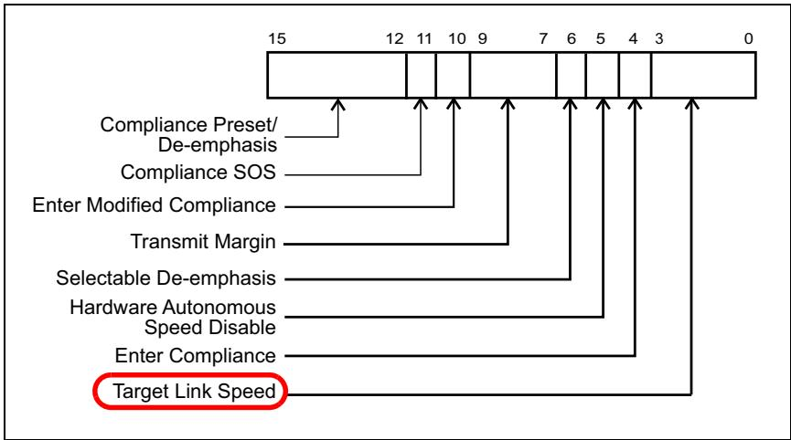

## Link Width Change

An upper layer would normally only direct a Link width reduction if upconfigure\_capable has been set to 1b because otherwise the Link won’t be able to go back to the original width. If the Hardware Autonomous Width Disable bit is set to 1b a Port can only reduce the width in an effort to correct a reliability problem. An upper layer can only initiate an increase in Link width if the Link partner advertised that it was upconfigure capable and the Link is not already at its maximum width. Apart from these guidelines, the decision criteria for changing the Link width are not given in the spec and are therefore implementation specific.

## Link Partner Initiated

The spec describes three possibilities for this case.

First, if Electrical Idle is detected or inferred (see Table 14‐10 on page 596) on all Lanes without first receiving an EIOS on any Lane, the Port may choose to enter Recovery or stay in L0. If errors result from this condition, the Port may be directed to Recovery by means such as setting the Retrain Link bit.

The second case happens when TS1s or TS2s are received (or an EIEOS for 128b/ 130b) on any configured Lanes, indicating that the Link partner has already entered Recovery. Since both of these cases are initiated by the Link partner, the Transmitter is allowed to complete any TLP or DLLP currently in progress.

Finally, if an EIOS is received on any Lane, indicating a Link power management change, but the Receiver doesn’t support L0s and hasn’t been directed to L1 or L2, then going to Recovery is the only option.

Exit to “L0s State”

The next state will be L0s for a Transmitter that’s been instructed to initiate it, or for a Receiver that sees an EIOS. Interestingly, the LTSSM states for the Transmitter and Receiver of the Port can be different now, because one can be in L0s while the other is still in L0.

Transmitters go to L0s when directed, if they implement L0s, and send EIOS to initiate the change.

– Receivers go to L0s when an EIOS is seen on any Lane. However, if the Receiver doesn’t implement L0s and hasn’t been directed to L1 or L2, this will be seen as a problem and the next state will be “Recovery State” instead.

Exit to “Rx\_L0s.Entry”

The next state will be L1 when one Link partner is directed to initiate this and sends one EIOS on all Lanes (two EIOSs if the speed is 5.0 GT/s) and receives an EIOS on any Lane. Note that both Link partners must have already agreed to enter L1 beforehand and that a Data Link Layer handshake is needed to ensure that both are ready. For more detail on how this works, see the section called “Introduction to Link Power Management” on page 733.

Exit to “L2 State”

The next state will be L2 when one Link partner is directed to initiate this and sends one EIOS on all Lanes (two EIOSs if the speed is 5.0 GT/s) and receives an EIOS on any Lane. Note that both Link partners must have already agreed to enter L2 beforehand and that a handshake is needed to ensure that both are ready. For more detail on how this works, see the section called “Introduction to Link Power Management” on page 733.

## Recovery State

If everything works as expected, the Link trains to the L0 state without ever going into the Recovery state. But we’ve already discussed two reasons why it might not. First, if the correct Symbol pattern isn’t seen in Configuration.Idle, the LTSSM goes to Recovery in an effort to correct signaling problems by, for example, adjusting equalization values. Secondly, once L0 is reached with a data rate of 2.5 GT/s and both devices support higher speeds, the LTSSM goes to Recovery and attempts to change the Link speed to the highest commonly‐supported/advertised speed. In this state, Bit Lock and either Symbol Lock or Block Alignment is re‐acquired and the Link is de‐skewed again. The Link and Lane Numbers should remain unchanged unless the Link width is being changed. In that case, the LTSSM passes through the Configuration state where Link width is re‐negotiated.

NOTE: To simplify the discussion and avoid repeating the same text many times, the term “Lock” will be used here to mean the combination of Bit Lock and either Symbol Lock for 8b/10b encoding or Block Alignment for 128b/130b encoding. A Receiver must acquire this Lock to be able to recognize Symbols, Ordered Sets and Packets.

## Reasons for Entering Recovery State

• Exiting the L1 state; Required because there is no fast training option (like sending FTS ordered sets) when exiting L1

• Exiting L0s if the receiver fails to achieve Lock from the FTS ordered sets in the required time, the Link must transition to Recovery

• From L0 if:

— A higher data rate is available when initial training completes.

— A Link speed or width change has been requested (for power management or because the current speed or width is unreliable).

— Software sets the Retrain Link bit in the Link Control Register (see Figure 14‐71 on page 644) in an effort to clear transmission problems.

— An error condition such as a Replay Num Roll‐over event associated with the Ack/Nak protocol of the Data Link Layer automatically causes the Physical Layer logic to retrain the Link.

— Receiver sees TS1s or TS2s on any configured Lane, meaning that the neighbor must have entered Recovery.

— Receiver sees Electrical Idle on all configured Lanes but did not first receive the Electrical Idle Ordered Set.

## Initiating the Recovery Process

Either Port can initiate Recovery by sending TS1s to its neighbor. When a Port sees incoming TS1s it knows that the other Port has entered Recovery, so it also goes into Recovery and returns TS1s. Both receivers first use the TS1s to reacquire Lock (if necessary) and then proceed to the other substates as needed. This is shown in Figure 14‐27 on page 573. A detailed description of what happens in the substates is provided in the sections that follow.

Figure 14‐27: Recovery State Machine  

## Detailed Recovery Substates

## During Recovery.RcvrLock

Regardless of the speed, Transmitters send TS1s on all configured Lanes using the same Link and Lane numbers that were set in the Configuration state. If the purpose of entering the Recovery state was to change speeds, the speed\_change bit in the Data Rate Identifier Symbol will be set to 1b in the TS1s from the initiating device and the internal variable directed\_speed\_change is set to 1b. This same variable will be set in the other device if the speed\_change bit is set in the incoming TS1s. In addition, The successful\_speed\_negotiation variable is cleared to 0b on entry to this substate.

In this substate, an Upstream Port is allowed to specify the de‐emphasis level the Downstream Port should use when operating at 5GT/s. This is accomplished by setting the Selectable De‐emphasis bit in its TS1s to the desired value. It’s possible that bit errors on the Link will prevent this information from reaching the Downstream Port, so the Upstream Port is allowed to request the de‐emphasis level again when going to the Recovery state for a speed change. If the Downstream Port plans to use the requested level, it must record the value of the Selectable De‐emphasis bit while in this state.

A new transmitter voltage can also be applied upon entry to this state. The Transmit Margin field in the Link Control 2 register is sampled on entry to this substate and remains in effect until a new value is sampled on another entry to this substate from L0, L0s, or L1.

A Downstream Port that wants to change the rate to 8.0 GT/s and redo the equalization must send EQ TS1s with the speed\_change bit set and advertising the 8.0 GT/s rate. If an Upstream Port receives 8 consecutive EQ TS1s or EQ TS2s with the speed\_change bit set to 1b and the 8.0 GT/s rate supported, it is expected to advertise the 8.0 GT/s rate, too, unless it has concluded that there are reliability problems at that rate that can’t be fixed with equalization. Note that a Port is allowed to change its advertised data rates when entering this state, but only those rates that can be supported reliably. And apart from the conditions described here, a device is not allowed to change its supported data rates in this substate or in Recovery.RcvrCfg or Recovery.Equalization.

## Exit to “Recovery.RcvrCfg”

The next state will be Recovery.RcvrCfg if 8 consecutive TS1s or TS2s are received whose Link and Lane numbers match what is being sent and their speed\_change bit is equal to the directed\_speed\_change variable and their EC field is 00b (if the current data rate is 8.0 GT/s).

– If the Extended Synch bit is set, a minimum of 1024 TS1s in a row must be sent before going to Recovery.RcvrCfg.

– If this substate was entered from Recovery.Equalization, the Upstream Port must compare the equalization coefficients or preset received by all Lanes against the final set of coefficients or preset that was accepted in Phase 2 of the equalization process. If they don’t match, it sets the Request Equalization bit in the TS2s it sends.

## Exit to “Recovery.Equalization”

When the data rate is 8.0 GT/s, the Lanes must establish the proper equalization parameters to obtain good signal integrity. This section does not apply for lower speeds. Just because the Link is running at 8.0 GT/s, it does not go through the Recovery.Equalization substate every time Recovery is entered. Recovery.Equalization is only entered if one of these conditions is met:

– If the start\_equalization\_w\_preset variable is set to 1b then:

a) Upstream Port registered preset values from the 8 consecutive TS2s it saw prior to changing to 8.0 GT/s. It must use the Transmitter presets and it may optionally use the Receiver presets it received.

b) Downstream Port must use the Transmitter presets defined in its Lane Equalization Control register as soon as it changes to 8.0 GT/s and it may optionally use the Receiver presets found there.

– Else (the variable is not set), Transmitters must use the coefficient settings they agreed to when the equalization process was last executed.

a) Upstream Port’s next state will be Recovery.Equalization if 8 consecutive incoming TS1s have Link and Lane numbers that match those being sent and the speed\_change bit is 0b, but the EC bits are nonzero, indicating that the Downstream Port wishes to redo some parts of the equalization process. The spec notes that a Downstream Port could do this under software or implementation‐specific direction. As always, the time it takes to do this must not be allowed to cause transaction timeout errors, which really means the Downstream Port would need to ensure there were no transactions in flight before taking this step.

a) Downstream Port’s next state will be Recovery.Equalization if directed, as long as this state wasn’t entered from Configuration.Idle or Recovery.Idle. The spec points out that no more than two TS1s whose EC=00b should be sent before sending TS1s with a non‐zero EC value to request that equalization be redone.

Otherwise, after a 24ms timeout:

Exit to “Recovery.RcvrCfg”

The next state will be Recovery.RcvrCfg if both:

8 consecutive TS1s or TS2s are received whose Link and Lane numbers match what it being sent and their speed\_change bit is equal to 1b.

And either the current data rate is already higher than 2.5 GT/s, or at least a higher rate is shown to be supported in the TS1s or TS2s.

## Exit to “Recovery.Speed”

The next state will be Recovery.Speed if other of the two following conditions are met:

If the current speed is set higher than 2.5 GT/s but isn’t working since entering Recovery (indicated by clearing the variable changed\_speed\_recovery to 0b). The new rate after leaving Recovery.Speed will drop back to 2.5 GT/s.

If the changed\_speed\_recovery variable is set to 1b, indicating that a higher rate than 2.5 GT/s is already working but the Link was unable to operate at a new negotiated rate. As a result, the operating speed will revert to what it was when Recovery was entered from L0 or L1.

Exit to “Configuration State”

Otherwise, the LTSSM will return to Configuration if a speed change is not requested (directed\_speed\_change variable = 0b and the speed\_change bit in the TS1s and TS2s is 0b), or if the highest commonly supported data rate is 2.5 GT/s.

Exit to “Detect State”

Finally, if none of the other conditions are true, the next state will be Detect.

## Speed Change Example

The spec includes an example of a speed change in the discussion of this substate. The scenario is two Link neighbors (device A and device B) that are coming out of reset, both of which support the 5.0 GT/s and 8.0 GT/s rates.

To begin with, the Link will automatically train to L0 using the Gen1 rate of 2.5 GT/s. (This behavior is likely to continue in future spec versions because it provides backward compatibility with older designs.)

In our example both devices support higher rates and this is indicated by the Rate Identifier field in their TS Ordered Sets during training. Both devices note that the other supports a higher rate and one of them (device A) will be the first to set its directed\_speed\_change variable to 1b. When that happens, it will go to Recovery.RcvrLock and send TS1s with the speed\_change bit set. If the desired rate will be 8.0 GT/s and hasn’t been before, the devices will exchange EQ TS1s to deliver the TX equalizer presets to be used instead of sending ordinary TS1s.

Device B sees incoming TS1s and also transitions to Recovery.RcvrLock. When it recognizes 8 TS1s in a row with the speed\_change bit set, it responds by setting the speed\_change bit in its own TS1s and goes to Recovery.Speed. Device A waits for that response and, when 8 TS1s in a row with the speed\_change bit have been seen, it goes to Recovery.RcvrCfg and then to Recovery.Speed. In that substate, the transmitters are put into Electrical Idle, the speed is changed to the highest commonly‐supported rate, and the directed\_speed\_change variable is cleared.

After a timeout period, both devices transition back to Recovery.RcvrLock and the transmitters are re‐activated using the new speed (8.0 GT/s in this case). They send TS1s again now, this time with the speed\_change bit cleared to 0b. If the new speed works well, they transition to Recovery.RcvrCfg and back to L0. However, if device B has a problem, such as failure to achieve Bit Lock, it will timeout in this substate and go back to Recovery.Speed. Device A may have already transitioned to Recovery.RcvrCfg by this time, but when it sees Electrical Idle now, indicating the neighbor has returned to Recovery.Speed, it will also go back to that state. Returning to Recovery.Speed causes both devices to revert to the speed in use when Recovery was entered, 2.5 GT/s in this case, and return to Recovery.RcvrLock.

In response to that development, Device A might set directed\_speed\_change again and try the process a second time. If it failed again, device A might choose to remove the 8.0 GT/s rate from its advertised list and try the speed change again without it. Since the highest common rate is now 5.0 GT/s, if this attempt succeeds the rate will end up at 5.0 GT/s. If it doesn’t work, Device A might give up trying to use a higher rate. How and when a device chooses to change its advertised rates or give up trying to get a higher rate working is not given in the spec and will be implementation specific.

## Link Equalization Overview

This section provides an overview of the Equalization Process and prepares the reader to understand the detailed substate machine behaviors if they are of interest.

Using a higher Link speed results in more signal distortion than lower data rates. To compensate for this and minimize the effort and cost for system designers, the 3.0 spec adds a requirement for Transmitter Equalization. Unlike the fixed de‐emphasis values for the lower rates, which is really a simple form of Transmitter equalization itself, the new method uses an active handshake process to match the Transmitters to the actual signaling environment. During this process, each Receiver Lane evaluates the quality of the incoming signal and suggests Tx equalization parameters that the Link partner should use to meet the signal quality requirements.

The Link Equalization procedure executes after the first change to the 8.0 GT/s data rate. The spec strongly recommends that the equalization process be initiated autonomously (automatically in hardware) but doesn’t require it. If a component chooses not to use the autonomous mechanism then a software‐based mechanism must be used. If either port is unable to achieve the necessary signal quality through this process, the LTSSM will conclude that the rate is not working and will go back to Recovery.Speed to request a lower speed.

The process involves up to four phases, as described in the text that follows. Once the speed has been changed to 8.0 GT/s, the current equalization phase in use is indicated by the EC (Equalization Control) field in the TS1s being, as shown in Figure 14‐28.

Figure 14‐28: EC Field in TS1s and TS2s for 8.0 GT/s  
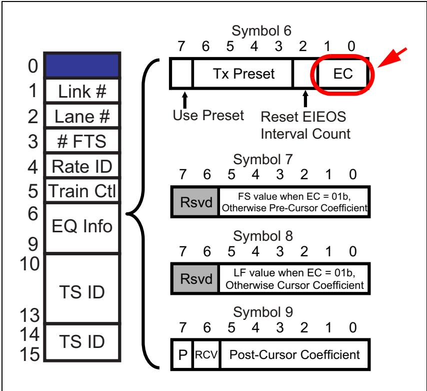

## Phase 0

When the Downstream Port is ready to change from a lower rate to the 8.0 GT/s rate, it enters the Recovery.RcvrCfg sub‐state and sends Tx Presets and Rx Hints to the Upstream Port using EQ TS2s as described in “TS1 and TS2 Ordered Sets” on page 510. (Note that this phase is skipped if the Link is already running at 8.0 GT/s.) The Downstream Port (DSP) sends Tx Preset values based on the contents of its Equalization Control register shown in Figure 14‐29 on page 579. One thing this highlights is that there can be different equalization values for each Lane. The Downstream Port will use the DSP values for its own Transmitter and optionally for its Receiver, and send the USP values to the Upstream Port for it to use when going to the higher speed.

Figure 14‐29: Equalization Control Registers  

Table 14‐8: Tx Preset Encodings

<table><tr><td>Encoding</td><td>De-emphasis</td><td>Preshoot</td></tr><tr><td>0000b</td><td>-6</td><td>0</td></tr><tr><td>0001b</td><td>-3.5</td><td>0</td></tr><tr><td>0010b</td><td>-4.5</td><td>0</td></tr><tr><td>0011b</td><td>-2.5</td><td>0</td></tr><tr><td>0100</td><td>0</td><td>0</td></tr><tr><td>0101</td><td>0</td><td>2</td></tr><tr><td>0110</td><td>0</td><td>2.5</td></tr><tr><td>0111</td><td>-6</td><td>3.5</td></tr><tr><td>1000</td><td>-3.5</td><td>3.5</td></tr><tr><td>1001</td><td>0</td><td>3.5</td></tr><tr><td>1010</td><td>Depends on FS and LS values</td><td>Depends on FS and LS values</td></tr><tr><td>1011b to 1111b</td><td>Reserved</td><td>Reserved</td></tr></table>

Table 14‐9: Rx Preset Hint Encodings

<table><tr><td>Encoding</td><td>Rx Preset Hint</td></tr><tr><td>000b</td><td>-6 dB</td></tr><tr><td>001b</td><td>-7 dB</td></tr><tr><td>010b</td><td>-8 dB</td></tr><tr><td>011b</td><td>-9 dB</td></tr><tr><td>100</td><td>-10 dB</td></tr><tr><td>101</td><td>-11 dB</td></tr><tr><td>110</td><td>-12 dB</td></tr><tr><td>111</td><td>Reserved</td></tr></table>

Once the rate does change, the Downstream Port begins in Phase 1 and sends TS1s with EC = 01b. It then waits for the Upstream Port to respond with the same EC value.

Meanwhile, the Upstream Port starts in Phase 0, as illustrated in Figure 14‐30 on page 581, and sends TS1s that echo the preset values it received earlier from the

EQ TS1s and EQ TS2s. It will use those requested Tx presets if they’re supported, and will optionally use the Rx Hints. The USP is allowed to wait 500ns before evaluating the incoming signal but, once it’s able to recognize two TS1s in a row it’s ready for the next step. This means the signal quality meets the minimum BER of $1 0 ^ { - 4 } ( \mathrm { e . g . }$ , Bit Error Ratio of less than one error in 10,000 bits). Subsequently the USP sets EC=01b in its TS1s thereby moving to Phase 1 and handing control of the next step to the DSP.

Figure 14‐30: Equalization Process: Starting Point  

## Phase 1

The DSP performs the same actions as the USP and achieves a BER of $1 0 ^ { - 4 }$ by detecting back‐to‐back TS1s. During this time, the DSP communicates its Tx presets and FS (Full Swing), LF (Low Frequency), and Post‐cursor coefficient values as shown in Figure 14‐32 on page 584. The spec gives some additional rules that must be satisfied for a set of requested coefficients, which are:

1. $\vert \mathrm { C } _ { - 1 } \vert \ < = \mathrm { F l o o r } \ ( \mathrm { F } S / 4 ) .$ , (Note: Floor means round down to the integer value)

2. $| \mathbf { C } _ { - 1 } | + \mathbf { C } _ { 0 } + | \mathbf { C } _ { + 1 } | = \mathrm { F S }$

3. $\mathrm { C } _ { 0 } - \mid \mathrm { C } _ { - 1 } \mid - \mid \mathrm { C } _ { + 1 } \mid > = \mathrm { L F }$

## PCI Express Technology

FS represents the maximum voltage, and LF defines the minimum voltage as $\mathrm { L F } / \mathrm { F } S .$ . These inform the receiver about the number of possible values and allow the coefficients to be communicated as integer values but understood as fractional values.

As an example, assume we’re using the coefficients defined for the P7 preset setting. The FS value acts as a reference and can be any number up to 63 but, for ease of calculation, let’s say it’s given as 30. In the case of P7, $C _ { - 1 }$ is ‐0.1, the value communicated to represent $C _ { - 1 }$ in the TS1s would be $^ { 3 , }$ since $3 / 3 0 = 0 . 1 $ and always considered negative. $C _ { + 1 }$ is ‐0.2, so it would be communicated as 6, since $6 / 3 0 = 0 . 2 $ and always negative. $C _ { 0 }$ is $0 . 7 ,$ so that will be sent as 21, since $2 1 / 3 0 =$ 0.7. Finally, the LF value represents the smallest possible ratio, and for P7 that is 0.4 times the max value. Consequently, LF will be communicated as $^ { 1 2 , }$ since 12/ $3 0 = 0 . 4$

Armed with this information, let’s check the three rules to see whether they are satisfied for the P7 case:

1. 3 <= Floor (12/4), This works out to be ${ 3 < } = 3$ and is true.

2. $3 + 2 1 + 6 = 3 0$ This one is true.

3. $2 1 - 3 - 6 > = 1 2$ This one is also true, so all three checks are satisfied for P7.

Once the Downstream Port is satisfied that the Link is working well enough to move forward (it recognizes incoming TS1s with $\mathrm { E C } = 0 1 \mathrm { b } )$ , then this phase is complete and it initiates a change to Phase 2 by setting its $\mathrm { E C } = 1 0 \mathrm { b }$ as illustrated in Figure 14‐31 on page 583 and hands control of the next step back to the USP. When the USP responds with $\mathsf { E C } = 1 0 \mathsf { b }$ , both Ports go to Phase 2. As a happy alternative, the Downstream Port may conclude that the signal quality is already good enough at this point and no further adjustments are necessary. In that case, it set its $\mathrm { E C } = 0 0 \mathrm { b }$ to exit the equalization process.

Figure 14‐31: Equalization Process: Initiating Phase 2  
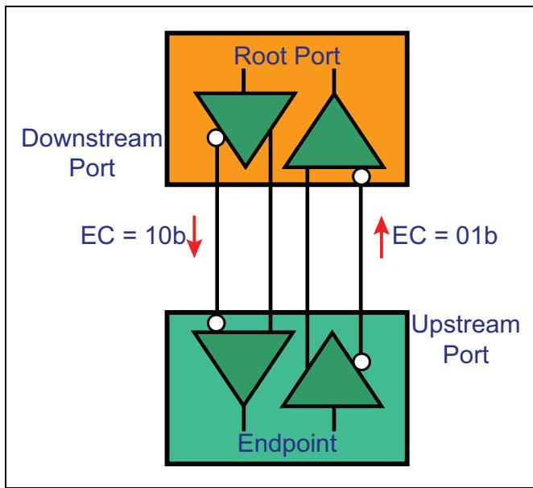

## Phase 2

The signal quality has been good enough to recognize TS1s, but not good enough for runtime operation. Once both Ports are in Phase 2, the Upstream Port is allowed to request Tx settings for the Downstream Port and then evaluate how well they work, reiterating the process until it arrives at optimal settings for the current environment. To make a request, it changes the value of the equalization information it sends in its TS1s. As shown in Figure 14‐32 on page 584, there are several values of interest:

Tx Preset: The Tx presets are a coarse‐grained adjustment to the Transmitter settings that are intended to get it into the right ballpark for the current signaling environment. The Upstream Port sets this value, and sets the “Use Preset” indicator (bit 7 of Symbol 6) to tell the Downstream Port’s Transmitter to use it. If the Use Preset bit is not set, then it’s understood that the presets should stay as they are and that the coefficient values should be changed instead. The Tx coefficients are considered as fine‐grained adjustments.

Figure 14‐32: Equalization Coefficients Exchanged  

Coefficients: Since the spec requires a 3‐tap Tx equalizer, three coefficient values are defined that can be pictured as voltage adjustments to a signal pulse that compensates for the distortion it will experience going through the transmission medium, as shown in Figure 14‐33 on page 585. This is covered in more detail in the Physical Layer Electrical section titled, “Solution for 8.0 GT/s ‐ Transmitter Equalization” on page 474.

— Pre‐Cursor Coefficient: a multiplier applied to the signal prior to the sample point that can boost or reduce the signal depending on the need.

— Cursor Coefficient: the sample point multiplier; always positive.

— Post‐Cursor Coefficient: a multiplier applied to the signal after the sample point that can boost or reduce the signal depending on the need.

— Once the signal meets the quality standard needed, the Upstream Port indicates that it’s ready to move to the next phase by changing EC = 11b.

Figure 14‐33: 3‐Tap Transmitter Equalization  
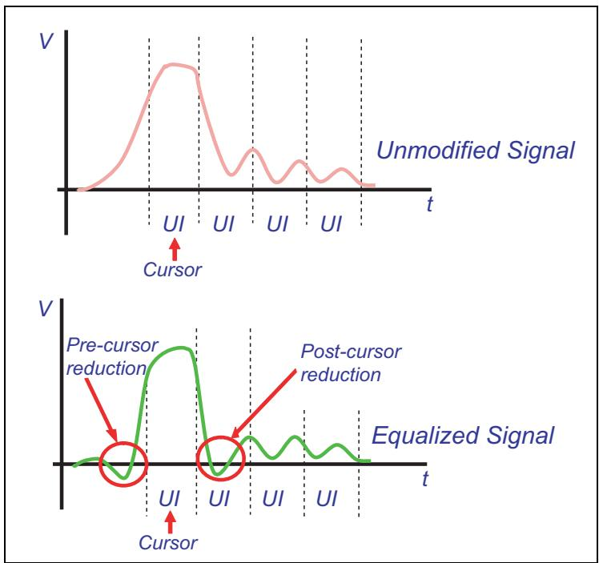

Figure 14‐34: Equalization Process: Adjustments During Phase 2  

## Phase 3

The Downstream port responds by sending EC = 11b and can now do the same signal evaluation process for the Upstream Port’s Transmitter. It sends TS1s that request a new setting the same way: if the Use Preset bit is set, new presets are defined, otherwise new coefficients are being given. This is sent continuously for 1s or until the request has been evaluated for its result, whichever is later. That evaluation must wait 500ns plus the round trip time through the outgoing logic and back in to the receive logic. Different equalization settings can be tested until one is found that achieves the desired signal quality. At that point the Downstream Port exits the equalization process by setting EC = 00b.

Figure 14‐35: Equalization Process: Adjustments During Phase 3  
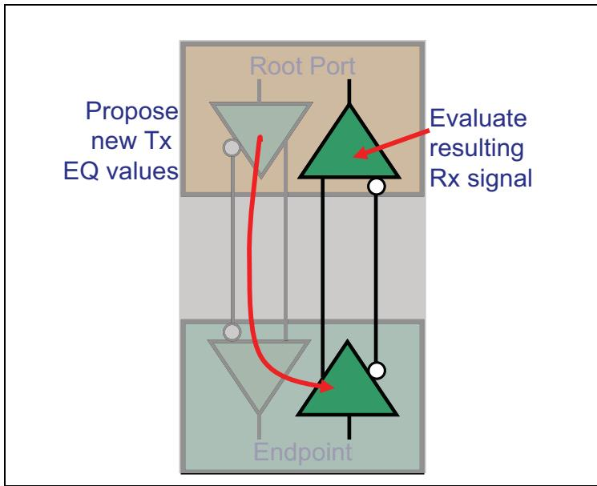

## Equalization Notes

The specification mentions other items associated with the equalization process, as described below:

• All Lanes must participate in the process; even those that may only become active later after an upconfigure event.

The algorithm used by a component to evaluate the incoming signal and determine the equalization values that its Link partner should use is not given in the spec and is implementation specific.

• Equalization changes can be requested for any number of Lanes and the Lanes can use different values.

At the end of the fine‐tuning steps (Phase 2 for Upstream Ports and Phase 3 for Downstream Ports), each component is responsible for ensuring that the Transmitter settings cause it to meet the spec requirements.

Components must evaluate requests to adjust their Transmitter settings and act on them. If valid values are given they must use them and reflect those values in the TS1s they send.

A request to adjust coefficients may be rejected if the values are not compli ant with the rules. The requested values will still be reflected in the TS1s sent back but the Reject Coefficient Values bit will be set.

Components must store the equalization values that they settled on through this process for future use at 8.0 GT/s. The spec is not explicit on this, but the author’s opinion is that these values would survive a change in speed to a lower rate and then back to the 8.0 GT/s rate. That makes sense because it could potentially take a long time to repeat the EQ process and the resulting values would be the same, provided the electrical environment hasn’t changed.

Components are allowed to fine‐tune their Receivers at any time, as long as it doesn’t cause the Link to become unreliable or go to Recovery.

## Detailed Equalization Substates

This section covers detailed descriptions of the state machine behaviors during Link Equalization.

## Recovery.Equalization

This substate is used to execute the Link Equalization Procedure for 8.0 GT/s and higher rates. The lower rates don’t use equalization and the LTSSM won’t enter this substate when they’re in effect. Since this is a new and complex topic for PCIe, a description of the overall equalization procedure from a high‐level view is presented after the state machine details in the section called “Link Equalization Overview” on page 577. First though, let’s step through the substates to see the mechanics of the process.

## Downstream Lanes

The Downstream Port starts in Phase 1 of the equalization process. To begin this process, there are several bits that need to be reset. In the Link Status 2 register (Figure 14‐36 on page 588), the following bits are cleared when entering this substate:

## PCI Express Technology

– Equalization Phase 1 Successful

– Equalization Phase 2 Successful

– Equalization Phase 3 Successful

– Link Equalization Request

– Equalization Complete

The Perform Equalization bit of the Link Control 3 register is also cleared to 0b as is the internal variable start\_equalization\_w\_preset. The equalization\_done\_8GT\_data\_rate variable is set to 1b.

Figure 14‐36: Link Status 2 Register  
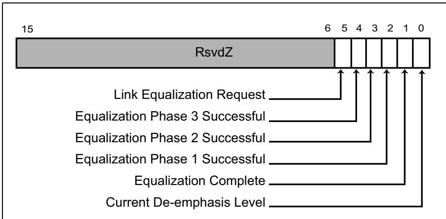

Figure 14‐37: Link Control 3 Register  

Phase 1 Downstream. During this phase, the Downstream Port sends TS1s with EC = 01b while using the Preset values from the Lane Equalization Control register and with the FS, LF, and Post‐cursor Coefficient fields that correspond to the Tx Preset field. It’s allowed to wait 500ns before evaluating incoming TS1s if it needs time to stabilize its Receiver logic.

Exit to “Phase 2 Downstream”

The Downstream Port will transition to Phase 2 if it want to continue with the equalization process and when all configured Lanes receive two consecutive TS1s with EC = 01b. At this point, the Port will set the Equalization Phase 1 Successful status bit to 1b and store the received TS1 LF and FS values for use in Phase 3 (if the Downstream Port plans to adjust the Upstream Port’s Tx coefficients).

## Exit to “Detailed Recovery Substates”

If the Downstream Port doesn’t want to use Phases 2 and 3, it sets the status bits to 1b (Eq. Phase 1 Successful, Eq. Phase 2 Successful, Eq. Phase 3 Successful, and Eq. Complete). One reason to do this would be because it can already see that the signal characteristics are good enough and the rest of the phases aren’t needed.

## Exit to “Recovery.Speed”

If the consecutive TS1s are not seen after a 24ms timeout, the next state is Recovery.Speed. The successful\_speed\_negotiation flag is cleared to 0b, and the Equalization Complete status bit is set to 1b.

Phase 2 Downstream. During this phase, the Downstream Port sends TS1s with EC = 10b and coefficient settings independently assigned on each Lane according to the following:

If two consecutive TS1s are received with EC = 10b (Upstream Port has entered Phase 2) either for the first time, or with different preset or coefficient values than the last time, and if the values requested are legal and supported, then change the Tx settings to use them within 500ns of the end of the second TS1 requesting them. Also, reflect the values in the TS1s being sent back to the Upstream Port and clear the Reject Coefficient Values bit to 0b. Note that the change must not cause illegal voltages or parameters at the Transmitter for more than 1ns.

a) If the requested preset or coefficients are illegal or not supported, don’t change the Tx settings but reflect the received values in the

TS1s being sent and set the Reject Coefficient Values bit to 1b (seeFigure 14‐38 on page 590).

If the two consecutive TS1s aren’t seen, keep the current Tx preset and coefficient values.

Exit to “Phase 3 Downstream”

When the Upstream Port is satisfied with the changes, it begins to send TS1s with EC = 11b, indicating a desire to change to Phase 3. When two consecutive TS1s like this are received, set the Eq. Phase 2 Successful status bit to 1b and change to Phase 3.

## Exit to “Recovery.Speed”

If after 32 ms, the transition to Phase 3 has not happened, the Port should clear the successful\_speed\_negotiation flag, set the Equalization Complete status bit and exit to the Recovery.Speed substate.

Figure 14‐38: TS1s ‐ Rejecting Coefficient Values  

Phase 3 Downstream. During this phase, the Downstream Port sends TS1s with EC = 11b and begins the process of evaluating Upstream Tx settings independently for each Lane.

In the transmitted TS1s, the Downstream Port can either request a new preset by setting the Use Preset bit to 1b and Tx Preset field to the desired value, or it can request new coefficients by clearing the Use Preset bit to 0b and setting the Pre‐cursor, Cursor, and Post‐Cursor Coefficient fields to the desired values. Either request must be made continuously for at least 1s or until the evaluation has completed. If new preset or coefficient settings are going to be presented, they must be sent on all Lanes at the same time. However, a given Lane isn’t required to request new settings if it wants to keep the ones it has.

The Downstream Port must wait long enough to ensure the Upstream Transmitter has had a chance to implement the requested changes, (500ns plus the round‐trip delay for the logic), then obtain Block Alignment and evaluate the incoming TS1s. It’s not expected that anything useful will be coming from the Upstream Port during the waiting period, and it may not even be legal. That’s why obtaining Block Alignment after that time is a requirement.

If two consecutive TS1s are seen that match the same preset or coefficient values that are being requested and don’t have the Reject Coefficient Values bit set, then the requested setting was accepted and can be evaluated. If the values match but the Reject Coefficient Values bit is set to 1b, then the requested values have been rejected by the Upstream Port and are not being used. For this case, he spec recommends that the Downstream Port try again with different values but it’s not required to do so and may choose to simply exit this phase.

The total time spent on a preset or coefficient request, from the time the request is sent until the completion of its evaluation must be less than 2ms. An exception is available for designs that need more time for the final stage of optimization, but the total time in this phase cannot exceed 24ms and the exception can only be taken twice. If the Receiver doesn’t recognize any incoming TS1s, it may assume that the requested setting doesn’t work for that Lane.

## Exit to “Detailed Recovery Substates”

The next state will be Recovery.RcvrLock when all configured Lanes have their optimal settings. When that happens, the Equalization Phase 3 Successful and Equalization Complete status bits will be set to 1b.

## PCI Express Technology

Exit to “Recovery.Speed”

Otherwise, after a 24ms timeout (with a tolerance of  ‐0 or +2ms), the next state will be Recovery.Speed, and the successful\_speed\_negotiation flag is cleared to 0b while the Equalization Complete status bit is set to 1b.

## Upstream Lanes

The Upstream Port starts in Phase 0 of the equalization process and must reset several internal bits. In the Link Status 2 register (Figure 14‐36 on page 588), the following bits are cleared when entering this substate:

– Equalization Phase 1 Successful

– Equalization Phase 2 Successful

– Equalization Phase 3 Successful

– Link Equalization Request

– Equalization Complete

The Perform Equalization bit of the Link Control 3 register is also cleared to 0b as is the internal variable start\_equalization\_w\_preset. The equalization\_done\_8GT\_data\_rate variable is set to 1b.

Phase 0 Upstream. During this phase, the Upstream Port sends TS1s with EC = 00b while using the Tx Preset values that were delivered in the EQ TS2s before entering this state. The equalization information fields in the TS1s being sent must show the preset value and also the Pre‐cursor, Cursor, and Post‐cursor coefficient fields that correspond to that preset. Note that if a Lane received a reserved or unsupported Tx Preset value in the EQ TS2s, or no EQ TS2s at all, then the Tx Preset field and coefficient values are chosen by a device‐specific method for that Lane.

## Exit to “Phase 1 Upstream”

When all configured Lanes receive two consecutive TS1s with EC = 01b, indicating that they can recognize the TS1s from the Downstream Port which always starts with this value, then the next phase is Phase 1.

The equalization values LF and FS that are received in the TS1s must be stored and used during Phase 2 if the Upstream Port plans to adjust the Downstream Port’s Tx coefficients.

Upstream Port may wait 500ns after entering Phase 0 before evaluating the incoming TS1s to give time for its Receiver logic to stabilize.

Exit to “Recovery.Speed”

If incoming TS1s are not recognized within a 12ms timeout, the LTSSM will transition to Recovery.Speed, clear the successful\_speed\_negotiation flag and set the Equalization Complete status bit.

Phase 1 Upstream. During this phase, the Upstream Port send TS1s with EC = 01b while using the Transmitter settings that were determined in Phase 0. These TS1s contain the FS, LF, and Post‐cursor Coefficient values with what is currently being used.

Exit to “Phase 2 Upstream”

If all configured Lanes receive two consecutive TS1s with EC = 10b, indicating that the Downstream Port wants to go to Phase 2, then the next phase will be Phase 2, and this Port will set the Equalization Phase 1 Successful status bit.

## Exit to “Detailed Recovery Substates”

If all configured Lanes receive two consecutive TS1s with EC = 00b, it means that the Downstream Port has decided that the equalization process is already complete and it wants to skip the remaining phases. In this case, the next state will be Recovery.RcvrLock, and the Equalization Phase 1 Successful and Equalization Complete status bits are set to 1b.

## Exit to “Recovery.Speed”

Otherwise, after a 12ms timeout, the LTSSM will transition to Recovery.Speed, clear the successful\_speed\_negotiation flag and set the Equalization Complete status bit.

Phase 2 Upstream. During this phase, the Upstream Port sends TS1s with EC = 10b and begins the process of finding optimal Tx values for the Downstream Port. Recall that the settings are independently determined for each Lane. The process is as follows:

In the transmitted TS1s, the Upstream Port can either request a new preset by putting a legal value in the Transmitter Preset field of the TS1s being sent and setting the Use Preset bit to 1b to tell the Downstream Port to begin using it. Or, request new coefficients by putting legal values in those fields and clearing the Use Preset bit to 0b so the Downstream Port will load them instead of the preset field. Once the request is made it must be repeated for at least 1s or until the evaluation is complete. If new preset or coefficient settings are going to be presented, they must be sent on all Lanes at the same time. However, a given Lane isn’t required to request new settings if it wants to keep the ones it has.

The Upstream Port must wait long enough to ensure the Downstream Transmitter has had a chance to implement the requested changes, (500ns plus the round‐trip delay for the logic), then obtain Block Alignment and evaluate the incoming TS1s. It’s not expected that anything useful will be coming from the Downstream Port during the waiting period, and it may not even be legal. That’s why obtaining Block Alignment after that time is a requirement.

When TS1s are received that contain the same equalization fields as are being sent and the Reject Coefficient Values bit is not set (0b), then the setting has been accepted and can now be evaluated. If the equalization fields match but the Reject Coefficient Values bit is set (1b), then the setting has been rejected. In that case the spec recommends that the Upstream Port request a different equalization setting, but this is not required.

The total time spent on a preset or coefficient request, from the time the request is sent until the completion of its evaluation must be less than 2ms. An exception is available for designs that need more time for the final stage of optimization, but the total time in this phase cannot exceed 24ms and the exception can only be taken twice. If the Receiver doesn’t recognize any incoming TS1s, it may assume that the requested setting doesn’t work for that Lane.

## Exit to “Phase 3 Upstream”

The next phase is Phase 3 if all configured Lanes have their optimal settings. When that happens, the Equalization Phase 2 Successful status bit will be set to 1b.

## Exit to “Recovery.Speed”

Otherwise, after a 24ms timeout (with a tolerance of  ‐0 or +2ms), the next state will be Recovery.Speed, and the successful\_speed\_negotiation flag is cleared to 0b while the Equalization Complete status bit is set to 1b.

Phase 3 Upstream. During this phase, the Upstream Port sends TS1s with EC = 11b and responds to the requested Tx values from the Downstream Port.

If two consecutive TS1s aren’t seen, keep the current Tx preset and coefficient values. However, if two consecutive TS1s are received with EC = 11b (Downstream Port has entered Phase 3) either for the first time, or with different preset or coefficient values than the last time, and if the values requested are legal and supported, then change the Tx settings to use them within 500ns of the end of the second TS1 requesting them. The requested values must be reflected in the TS1s being sent back to the Upstream Port and clear the Reject Coefficient Values bit to 0b. Note that the change must not cause illegal voltages or parameters at the Transmitter for more than 1ns.

If the requested preset or coefficients are illegal or not supported, don’t change the Tx settings but reflect the received values in the TS1s being sent and set the Reject Coefficient Values bit to 1b (see Figure 14‐38 on page 590).

## Exit to “Detailed Recovery Substates”

When the Downstream Port is satisfied with the changes, it begins to send TS1s with EC = 00b, indicating a desire to finish the equalization process. When two consecutive TS1s like this are received, set the Equalization Phase 3 Successful and Equalization Complete status bits to 1b.

## Exit to “Recovery.Speed”

If the above criteria are not met within a 32 ms timeout, the next state will be Recovery.Speed. The successful\_speed\_negotiation flag will be cleared to 0b and the Equalization Complete status bit will be set.

## Recovery.Speed

When entering this substate, a device must enter Electrical Idle on its Transmitter and wait for its Receiver to enter Electrical Idle. After that, it must remain there for at least 800ns if the speed change succeeded (successful\_speed\_negotiation = 1b) or for at least 6s if the speed change was not successful (successful\_speed\_negotiation = 0b), but not longer than an additional 1ms.

An EIOS must be sent prior to entering this substate if the current rate is 2.5 GT/s or 8.0 GT/s, and two must be sent if the current rate is 5.0 GT/s. An Electrical Idle condition exists on a Lane when these EIOSs have been seen or when it is otherwise detected or inferred (as described in “Electrical Idle” on page 736).

The operating frequency is only allowed to change after the Receiver Lanes have entered Electrical Idle. If the Link is already operating at the highest commonly‐supported rate, the rate won’t be changed even though this substate is executed.

If the negotiated rate is 5.0 GT/s, the de‐emphasis level must be selected based on the setting of the select\_deemphasis variable: if the variable is 0b, apply ‐6 dB de‐emphasis, but if the variable is 1b, apply ‐3.5 dB de‐emphasis instead.

Curiously, the DC common‐mode voltage does not have to be maintained within spec limits during this substate.

If this substate is entered after a successful speed negotiation (successful\_speed\_negotiation = 1b), Electrical Idle can be inferred as shown in Table 14‐10 on page 596. The spec points out that this covers the case in which both Link partners have recognized incoming TS1s and TS2s, so their absence can be interpreted as an entry to Electrical Idle.

If this substate is entered after an unsuccessful speed negotiation (successful\_speed\_negotiation = 0b), Electrical Idle can be inferred if an Electrical Idle exit has not been detected at least once on any configured Lane in the specified time. This is intended to cover the case when at least one side of the Link is not able to recognize TS Ordered Sets, and so the lack of an exit from Electrical Idle over a longer interval can be treated as an entry to Electrical Idle.

Table 14‐10: Conditions for Inferring Electrical Idle

<table><tr><td>State</td><td>2.5 GT/s</td><td>5.0 GT/s</td><td>8.0 GT/s</td></tr><tr><td>L0</td><td>Absence of Flow Control Update DLLP or SOS in a 128μs window</td><td>Absence of Flow Control Update DLLP or SOS in a 128μs window</td><td>Absence of Flow Control Update DLLP or SOS in a 128μs window</td></tr><tr><td>Recovery.RcvrCfg</td><td>Absence of a TS1 or TS2 in a 1280 UI interval</td><td>Absence of a TS1 or TS2 in a 1280 UI interval</td><td>Absence of a TS1 or TS2 in a 4ms window</td></tr><tr><td>Recovery.Speed when successful_speed_neg otiation = 1b</td><td>Absence of a TS1 or TS2 in a 1280 UI interval</td><td>Absence of a TS1 or TS2 in a 1280 UI interval</td><td>Absence of a TS1 or TS2 in a 4680 interval</td></tr><tr><td>Recovery.Speed when successful_speed_neg otiation = 0b</td><td>Absence of an Electrical Idle exit in a 2000 UI interval</td><td>Absence of an Electrical Idle exit in a 16000 UI interval</td><td>Absence of an Electrical Idle exit in a 16000 UI interval</td></tr><tr><td>Loopback.Active (as a slave)</td><td>Absence of an Electrical Idle exit in a 128μs window</td><td>N/A</td><td>N/A</td></tr></table>

The directed\_speed\_change variable will be cleared to 0b and the new data rate must be visible in the Current Link Speed field of the Link Status register, shown in Figure 14‐39.

If the speed was changed because of a Link bandwidth change:

If successful\_speed\_negotiation is set to 1b and the Autonomous Change bit in the 8 consecutive TS2s is set to 1b, or the speed change was initiated by the Downstream Port for autonomous reasons (not a reliability problem and not caused by software setting the Link Retrain bit), then the Link Autonomous Bandwidth Status bit in the Link Status register is set to 1b.

Otherwise, the Link Bandwidth Management Status bit is set to 1b.

Figure 14‐39: Link Status Register  

## Exit to “Detailed Recovery Substates”

Once the timeout has expired, the next state will be Recovery.RcvrLock

If this substate was entered from Recovery.RcvrCfg and the speed change was successful, the new data rate is changed on all the configured Lanes to the highest commonly‐supported rate and the changed\_speed\_recovery variable is set to 1b.

If this substate was entered for a second time since entering Recovery from L0 or L1 (indicated by changed\_speed\_recovery = 1b), the new data rate will be the rate that was in use when the LTSSM entered Recovery, and the changed\_speed\_recovery variable is cleared to 0b.

Otherwise, the new data rate will revert to 2.5 GT/s and the changed\_speed\_recovery variable remains cleared to 0b. The spec notes that this represents the case when the rate in L0 was greater than 2.5 GT/s but one Link partner couldn’t operate at that rate and timed out in Recovery.RcvrLock the first time through.

## Exit to “Detect State”

If none of the conditions for exiting to Recovery.RcvrLock are met, the next state will be Detect, although the spec points out that this shouldn’t be possible under normal conditions. It would mean that the Link neighbors can no longer communicate at all.

## Recovery.RcvrCfg

This state can only be entered from Recovery.RcvrLock after receiving at least 8 TS1 or TS2 ordered‐sets with the same Link and Lane numbers that had been negotiated previously. This means that bit and symbol or block lock have been established and now the Port must determine if there are any other items that need addressed in the Recovery state. If the purpose of entering Recovery was simply to re‐establish bit and symbol lock after leaving a link power management state, then it is likely that TS2s will be exchanged here and progress on to Recovery.Idle. If, however, there was another reason for entering the Recovery state (e.g. speed change or link width change), then that will be determined in this substate and the appropriate state transition will occur.

During this substate, the Transmitter sends TS2s on all configured Lanes with the same Link and Lane Numbers configured earlier. If the directed\_speed\_change variable is set to 1b, then the speed\_change bit in the TS2s must also be set. The N\_FTS value in the TS2s should reflect the number needed at the current rate. The start\_equalization\_w\_preset variable is cleared to 0b when entering this substate.

If the speed has been changed a different N\_FTS number may now be seen in the TS2s. That value must be used for exiting future L0s low‐power Link states. For 8b/10b encoding, Lane‐to‐Lane de‐skew must be completed before leaving this substate. Devices must note the advertised rate identifier in incoming TS2s and use this to override any previously‐recorded values. When using 128b/130b encoding, devices must make a note of the value of the Request Equalization bit for future reference.

Notes about this substate: The variable successful\_speed\_negotiation is set to 1b. The data rates advertised in the TS2s with the speed\_change bit set are noted at this point for future reference, as is the Autonomous Change bit for possible logging in the Link Status register during Recovery.Speed. The rate that will be selected in Recovery.Speed will be the highest commonly‐supported rate. Interestingly, the change to Recovery.Speed will take place for this case even if the Link is already operating at the highest supported rate, although in that case the rate won’t actually change.

If the speed is going to change to 8.0 GT/s, a Downstream Port will need to send EQ TS2s (bit 7 of Symbol 6 is set to 1b to indicate an EQ training sequence). This case would be recognized if 8.0 GT/s is mutually supported and 8 consecutive TS1s or TS2s have been seen on any configured Lane with the speed\_change bit set, or if the equalization\_done\_8GT\_data\_rate variable is 0b, or if directed.

An Upstream Port can set the Request Equalization bit if the current data rate is 8.0 GT/s and there was a problem with the equalization process. Either Port can request equalization be done again by setting both the Request Equalization and Quiesce Guarantee bits to 1b.

Upstream Ports set their select\_deemphasis variable based on the Selectable Deemphasis bit in the received TS2s. And, if the TS2s were EQ TS2s, they set the start\_equalization\_w\_preset variable to 1b and update their Lane Equalization register with the new information (i.e.: update the Upstream Port Transmitter Preset and Receiver Preset Hint fields in the register). Any configured Lanes that don’t receive EQ TS2s will choose their preset values for 8.0 GT/s operation in a design‐specific manner. Downstream Ports must set their start\_equalization\_w\_preset variable to 1b if the equalization\_done\_8GT\_data\_rate variable is cleared to 0b or if directed.

Finally, if 128b/130b encoding is in use, devices must make a note of the Request Equalization bit. If set, both it and the Quiesce Guarantee bit must be stored for future reference.

## Exit to “Recovery.Idle”

The next state will be Recovery.Idle if two conditions are true:

Eight consecutive TS2s are received on any configured Lane with Link and Lane numbers and rate identifiers that match those being sent and either:

a) The speed\_change bit in the TS2s is cleared to 0b, or

b) No rate higher than 2.5 GT/s is commonly supported.

Sixteen TS2 have been sent after receiving one and they haven’t been interrupted by any intervening EIEOS. The changed\_speed\_recovery and directed\_speed\_change variables are both cleared to 0b on entry to this substate.

## Exit to “Recovery.Speed”

The LTSSM will go to Recovery.Speed if ALL three conditions listed below are true:

Eight consecutive TS2s are received on any configured Lane with the speed\_change bit set, identical rate identifiers, identical values in Symbol 6, and:

a) The TS2s were standard 8b/10b TS2s, or

b) The TS2s were EQ TS2s, or

c) 1ms has expired since receiving eight EQ TS2s on any configured Lane.

Both Link partners support rates higher than 2.5 GT/s, or the rate is already higher than 2.5 GT/s.

For 8b/10b encoding, at least 32 TS2s were sent with the speed\_change bit set to 1b without any intervening EIEOS after receiving one TS2 with the speed\_change bit set to 1b in the same configured Lane. For 128b/130b encoding, at least 128 TS2s are sent with the speed\_change bit set to 1b after receiving one TS2 with the speed\_change bit set to 1b in the same configured Lane.

A transition to Recovery.Speed can also occur if the rate has changed to a mutually negotiated rate since entering Recovery from L0 or L1 (changed\_speed\_recovery = 1b) and any configured Lanes have either seen EIOS or detected/inferred Electrical Idle and haven’t seen TS2s since entering this substate. This means a higher rate was attempted but the Link partner indicates that it isn’t working for some reason. The new rate will return to whatever it was when Recovery was entered from L0 or L1.

The final case that can cause a transition to Recovery.Speed is if the rate has not changed to a mutually negotiated rate since entering Recovery from L0 or L1 (changed\_speed\_recovery = 0b), and the current rate is already higher than 2.5 GT/s, and any configured Lanes have either seen EIOS or detected/ inferred Electrical Idle and haven’t seen TS2s since entering this substate. In this case, the understanding is that the current rate isn’t working and the solution is to drop back down, so the new rate will become 2.5 GT/s.

## Exit to “Configuration State”

The next state will be Configuration if 8 consecutive TS1s are received on any configured Lane with Link or Lane numbers that don’t match those being sent and either the speed\_change bit is cleared to 0b, or no rate higher than 2.5 GT/s is commonly supported.

The variables changed\_speed\_recovery and directed\_speed\_change are cleared to 0b when the LTSSM transitions to Configuration. If the N\_FTS value has changed since last time, the new value must be used for L0s going forward.

## Exit to “Detect State”

After 48ms without resolving to one of the previously‐defined state transitions, the next state will be Detect if the data rate is 2.5 GT/s or 5.0 GT/s.

If the rate is 8.0 GT/s there is another possibility because the number of attempts may not have been exceeded yet. That is indicated by the idle\_to\_rlock\_transitioned variable, and if it’s less than FFh when the rate is 8.0 GT/s, the new state will be “Recovery.Idle”. If that transition is made, the variables changed\_speed\_recovery and directed\_speed\_change will be cleared to 0b. However, once idle\_to\_rlock\_transitioned reaches FFh, and the 48ms timeout is seen, the next state will be Detect.

## Recovery.Idle

As the name implies, Transmitters will usually send Idles in this substate as a preparation for changing to the fully operational L0 state. For 8b/10b mode, Idle data is normally sent on all the Lanes, while for 128b/130b an SDS is sent to start a Data Stream and then Idle data Symbols are sent on all the Lanes.

## Exit to “L0 State”

The next state is L0 if either of the following cases is true. In either case, if the Retrain Link bit has been written to 1b since the last transition to L0 from Recovery or Configuration, the Downstream Port will set the Link Bandwidth Management Status bit to 1b (see Figure 14‐39 on page 597).

8b/10b encoding is in use and 8 consecutive Symbol Times of Idle data have been received and 16 Idle data Symbols have been sent since the first one was received.

128b/130b encoding in use, 8 consecutive Symbol Times of Idle data have been received and 16 Idle data Symbols have been sent since the first one was received, and this state wasn’t entered from Recovery.RcvrCfg. Note that Idle data Symbols must be contained in Data Blocks, Lane‐to‐Lane De‐skew must be completed before Data Stream processing starts, and the idle\_to\_rlock\_transitioned variable is cleared to 00h on transition to L0.

## Exit to “Configuration State”

The next state is Configuration if either:

– A Port is instructed by a higher layer to optionally reconfigure the Link, such as to change the Link width.

Any configured Lane sees two consecutive incoming TS1s with Lane numbers set to PAD (a Port that transitions to Configuration to change the Link will send PAD Lane numbers on all Lanes). The spec recommends that the LTSSM use this transition when changing the Link width to reduce the time it will take.

## Exit to “Disable State”

The next state is Disabled if either:

A Downstream or optional crosslink Port is instructed by a higher layer to set the Disable Link bit in its TS1s or TS2s.

Any configured Lane of an Upstream or optional crosslink Port sees the Disable Link bit set in two consecutive incoming TS1s.

## Exit to “Hot Reset State”

The next state is Hot Reset if either:

1 A Downstream or optional crosslink Port is instructed by a higher layer to set the Hot Reset bit in its TS1s or TS2s.

Any configured Lane of an Upstream or optional crosslink Port sees the Hot Reset bit set in two consecutive incoming TS1s.

## Exit to “Loopback State”

The next state is Loopback if either:

A Transmitter is known to be Loopback Master capable (design specific; the spec does not provide a means to verify this) and instructed by a higher layer to set the Loopback bit in its TS1s or TS2s.

Any configured Lane of an Upstream or optional crosslink Port sees the Loopback bit set in two consecutive incoming TS1s. The receiving device then becomes the Loopback slave.

Exit to “Detect State”

Otherwise, after a 2ms timeout, the next state will be Detect unless the idle\_to\_rlock\_transitioned variable is less than FFh, in which case the next state will be “Detailed Recovery Substates”. For the transition to Recovery.RcvrLock, if the data rate is 8.0 GT/s the idle\_to\_rlock\_transitioned variable is incremented by 1b, while for 2.5 or 5.0 GT/s it will be set to FFh.

## L0s State

This is the low power Link state that has the shortest exit latency back to L0. Devices manage entry and exit from this state automatically under hardware control without any software involvement. Each direction of a Link, can enter and exit the L0s state independent of each other.

## L0s Transmitter State Machine

The L0s state has different substates for the Transmitter and the Receiver. The Transmitter substates will be described first. As shown in Figure 14‐40 on page 603 the transmitter state machine associated with L0s state is a simple one.

Figure 14‐40: L0s Tx State Machine  
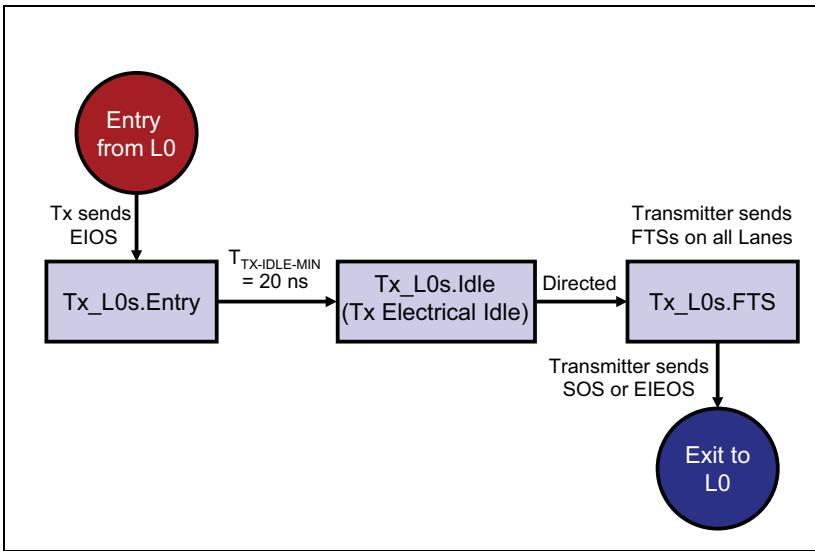

## Tx\_L0s.Entry.

A Transmitter enters L0s when directed by an upper layer. The spec gives no decision criteria for this, but intuitively it would occur based on an inactivity timeout: no TLPs or DLLPs being sent for a given time. To enter L0s, the Transmitter sends one EIOS (two EIOSs for the 5.0 GT/s rate) and enters Electrical Idle. The Transmitter is not turned off, however, and must maintain the DC common‐mode voltage within the spec range.

## Exit to “Tx\_L0s.Idle”

The next state will be Tx\_L0s.Idle after the T timeout (20ns). This time is intended to ensure that the Transmitter has established the Electrical Idle condition.

## Tx\_L0s.Idle.

In this substate, the transmitter continues the Electrical Idle state until directed to leave. Because this direction of the Link is in Electrical Idle, there will be a power savings benefit, which is the entire purpose of the L0s state.

Exit to “Tx\_L0s.FTS”

The next state will be Tx\_L0s.FTS when directed, such as when the Port needs to resume packet transmission. The LTSSM will be instructed in a design‐specific manner to exit this state.

## Tx\_L0s.FTS.

In this substate, the Transmitter will start sending FTS ordered sets to retrain the Receiver of the Link Partner. The number of FTSs sent is the N\_FTS value advertised by the Link Partner in its TS Ordered Sets during the last training sequence that led to L0. The spec notes that if a Receiver times out while trying to do this, it may choose to increase the N\_FTS value it advertises during the Recovery state.

If the Extended Synch bit is set (see Figure 14‐71 on page 644), the transmitter must sends 4096 FTSs instead of the N\_FTS number. This extends the time available to synchronize external test and analysis logic, which may not be able to recover Bit Lock as quickly as the embedded logic can.

For all data rates, no SOSs can be sent prior to sending any FTSs. However, for the 5.0 GT/s rate, 4 to 8 EIE Symbols must be sent prior to sending the FTSs. For 128b/130b, an EIEOS must be sent prior to the FTSs.

## Exit to “L0 State”

The Transmitter will transition to the L0 state once all the FTSs have been sent and:

a) For 8b/10b encoding, one SOS is sent on all configured Lanes, although none are sent before or during the FTSs.

b) For 128b/130b encoding, one EIEOS is sent followed by an SDS and a Data Stream.

## L0s Receiver State Machine

Figure 14‐41 on page 605 shows the Receiver L0s state machine. A Receiver is required to implement L0s support if the ASPM Support field in the Link Capability register shows it to be supported, and is allowed to implement it even if that support is not indicated.

Figure 14‐41: L0s Receiver State Machine  
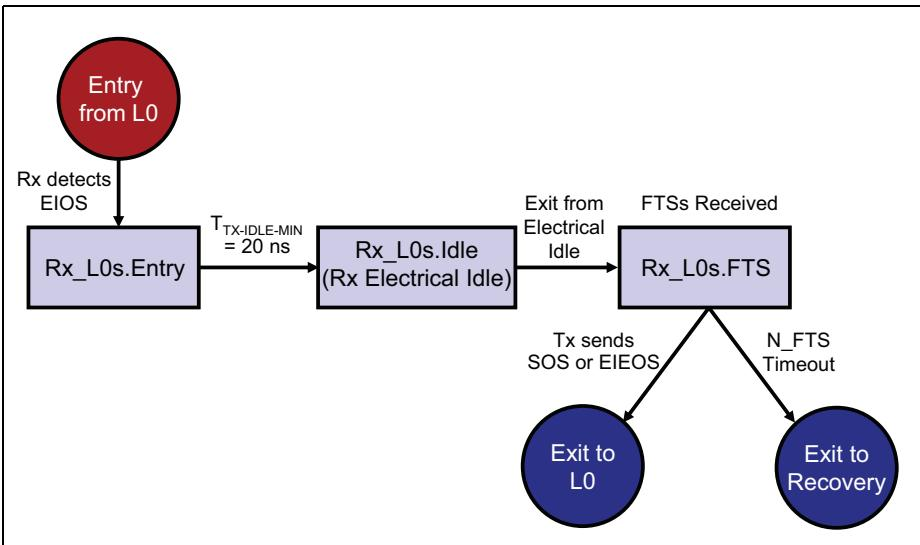

## Rx\_L0s.Entry.

Entered when a Receiver that receives an EIOS, provided it supports L0s and hasn’t been directed to L1 or L2.

Exit to “Rx\_L0s.Idle”

The next state will be Rx\_L0s.Idle after the TTX‐IDLE‐MIN timeout (20ns).

## Rx\_L0s.Idle.

The Receiver is now in Electrical Idle mode and is just waiting to see an exit from Electrical Idle.

As an aside regarding Electrical Idle, the early versions of the spec expected that Electrical Idle would be based on a squelch‐detect circuit measuring a voltage threshold. Later, as speeds increased, detecting such small voltage differences became increasingly difficult. Consequently, more recent spec versions allow Electrical Idle to be inferred by observing Link behavior, rather than actually measuring the voltage. However, if the voltage level isn’t used to detect entry into Electrical Idle, then it also can’t be used to detect an exit from it. To handle that problem, a new Ordered Set was introduced called the EIEOS (Electrical Idle Exit Ordered Set). The EIEOS consists of alternating bytes of all zeros and all ones and creates the effect of a low‐frequency clock on the Lanes. Once a Receiver has entered Electrical Idle it can watch for this pattern on the signal to inform it that the Link is exiting from Electrical Idle.

## Exit to “Rx\_L0s.FTS”

The next state will be Rx\_L0s.FTS after the Receiver detects an exit from Electrical Idle.

## Rx\_L0s.FTS.

In this substate, the Receiver has noticed an exit from Electrical Idle and is now trying to re‐establish Bit and Symbol or Block lock on the incoming bit stream (which are really FTS ordered sets).

Exit to “L0 State”

The next state will be L0 if an SOS is received in 8b/10b encoding or an SDS in 128b/130b encoding on all configured Lanes. The Receiver must be able to accept valid data immediately after that, and Lane‐to‐Lane de‐skew must be completed before leaving this state.

Exit to “Recovery State”

Otherwise the next state will be Recovery after the N\_FTS timeout. If so, the Transmitter must also go to Recovery, although it’s allowed to finish any TLP or DLLP that was in progress. If the timeout occurs, the spec recommends that the N\_FTS value be increased to reduce the likelihood of it happening again. The N\_FTS timeout is defined as follows:

For 8b/10b, the minimum timeout is given as 40 \* [N\_FTS + 3] \* UI, while the maximum allowed is twice that time. Since 10 bits (UI represents one bit time) are needed per Symbol, this works out to (4\*N\_FTS + 12) Symbols. The extra 12 Symbols are explained as 6 for a max‐sized SOS + 4 for the possible extra FTS + 2 more for Symbol margin. In summary, then, the minimum time is the time it should take to send the requested number of FTSs plus 12 Symbols, while the maximum time is twice as much as that.

If the extended synch bit is set, the min time = 2048 FTSs and the max time = 4096 FTSs. The actual timeout value a Receiver will use must also take into account the 4 to 8 EIE Symbols for speeds other than 2.5 GT/s.

For 128b/130b, the timeout value is given as a minimum of 130 \* [N\_FTS + 5 + 12 + Floor (N\_FTS/32)] \* UI and a max of twice that time. The value 130 \* UI means 130 bit times which represents one Block, so if we remove those two values we can say we’re looking at [N\_FTS + 5 + 12 + Floor (N\_FTS/32)] Blocks. The value [5 + Floor (N\_FTS/32)] represents the EIEOSs that will need to be sent during this time. One EIEOS will be sent after every 32 FTSs, so Floor (N\_FTS/32) gives that number. The other 5 are accounted for by the first EIEOS, the last EIEOS, the SDS, the periodic EIEOS and an additional EIEOS in case the Transmitter chooses to send two EIEOS followed by an SDS when N\_FTS is divisible by 32. Finally, the value of 12 represents the number of SOSs that will be sent if the extended synch bit is set. When that bit is set, the timeout will use N\_FTS = 4096.

## L1 State

This Link power state trades a longer exit latency for more aggressive power management compared to the L0s state. L1 is an option for ASPM, like L0s, meaning devices can enter and exit this state automatically under hardware control without any software involvement. However, unlike L0s, software is also able to direct an Upstream Port to initiate a change to L1, and it does so by writing the device power state to a lower level (D1, D2, or D3). The L1 state is also different from L0s in that it affects both directions of the Link.

Figure 14‐42: L1 State Machine  
  
Since going to Electrical Idle can indicate a desire by the Link partner to enter L0s, L1 or L2, differentiating which should be the next state is handled by having both partners agree beforehand when they’re going to enter L1. A handshake informs them that the partner is ready and it’s therefore safe to proceed. For more detail on how this works, see the section called “Introduction to Link Power Management” on page 733. Figure 14‐42 on page 608 shows the L1 state machine, which is described in the following sections.

## L1.Entry

In order for an Upstream Port to enter this state, it must send a request to enter L1 to its Link Partner and receive acknowledgement that it is OK to put the Link into L1. (The reason for requesting to go into L1 may be because of ASPM or because of software involvement.) Once the L1 request acknowledge is received, the Upstream Port enters the L1.Entry substate.

In order for a Downstream Port to enter this state, it must receive an L1 enter request from the Upstream Port and send a positive response to that request. Then the Downstream Port waits to receive an Electrical Idle Ordered Set (EIOS) and have its receive lanes drop to Electrical Idle. It is at this point that the Downstream Port enters the L1.Entry substate.

## During L1.Entry

All configured Transmitters send an EIOS and enter Electrical Idle while maintaining the proper DC common mode voltage.

## Exit to $^ { \prime \prime } L 1 . I d l e ^ { \prime \prime }$

The next state will be L1.Idle after the $\mathrm { T _ { T X - I D L E - M I N } }$ timeout (20ns). This time is intended to ensure that the Transmitter has established the Electrical Idle condition.

## L1.Idle

During this substate, Transmitters remain in the Electrical Idle.

For rates other than 2.5 GT/s the LTSSM must remain in this substate for at least 40ns. In the spec, this delay is said “to account for the delay in the logic levels to arm the Electrical Idle detection circuitry in case the Link enters L1 and immediately exits”.

## Exit to “Recovery State”

The next state will be Recovery when a Transmitter is directed to change it or when any Receiver detects an exit from Electrical Idle. Reasons for leaving L1 include the need to deliver a DLLP or TLP, or a desire to change the Link width or speed. If a speed change is desired, a Port is allowed to set the directed\_speed\_change variable to 1b and must clear the changed\_speed\_recovery variable to 0b. Optionally, the Port may exit L1 and then initiate the speed change later by setting directed\_speed\_change to 1b and entering Recovery from L0 instead.

## L2 State

This is a deeper power state with a longer exit latency than L1. Power Management software directs an Upstream Port to initiate entry into L2 (both directions of the Link go to L2) when its device is placed in the ${ \mathrm { D } } 3 _ { \mathrm { C o l d } }$ power state and the appropriate Link handshakes have been completed.

Main power will be shut off by the system once it learns that everything is ready. When power is removed, the Link power state will become either L2 or L3, depending on whether a secondary power source called $\mathsf { V } _ { \mathrm { A U X } }$ (auxiliary voltage) is available. If $\mathrm { V } _ { \mathrm { A U X } }$ is present, the Link enters L2; if not, it enters L3.

The motivation for L2 is to use the small power available from $\mathsf { V } _ { \mathrm { A U X } }$ to inform the system when an event has occurred for which the Link needs to have power restored. There are two standard ways a device can inform the system of such an event. One is a side‐band signal called the WAKE# pin, and the other is an inband signal called a “Beacon.” The L2 state isn’t needed for WAKE#, but is required if the optional Beacon will be used. The spec explicitly states that devices operating at 5.0 or 8.0 GT/s don’t need to support Beacon, so it would seem that this is legacy support and only interesting for devices operating at 2.5 GT/s. For more detail on Link wakeup options, refer to “Waking Non‐Communicating Links” on page 772.

If supported, the Beacon is a low‐frequency (30 KHz ‐ 500 MHz) in‐band signal that an Upstream Port supporting wakeup capability must be able to send on at least Lane 0 and a Downstream Port must be able to receive. Intermediate devices like Switches that receive a Beacon on a Downstream Port must forward it to their Upstream Port. The ultimate destination for the Beacon is the Root Complex, because that’s where the system power control logic is expected to reside.

A Transmitter going to Electrical Idle could indicate a desire to enter any of the low‐power Link states (L0s, L1 or L2), so a means of differentiating them is needed. For L2, this is handled by having the Link partners agree beforehand that they’re going to enter L2 by using a handshake sequence to ensure that they’re both ready. For more detail on how this works, see the section called “Introduction to Link Power Management” on page 733. Figure 14‐43 on page 611 shows the L2 entry and Exit state machine, which is described in the following text.

Figure 14‐43: L2 State Machine  

## L2.Idle

To enter this substate, all the necessary handshake process must have already taken place between both ports on the Link and the ports have sent and received the required EIOS.

All configured Transmitters must remain in the Electrical Idle state for at least the T timeout (20ns). However, since the main power will now be shut off, they aren’t required to maintain the DC common‐mode voltage within the spec range. Receivers won’t start looking for the Electrical exit condition until at least after the 20ns timeout expires. All Receiver terminations must remain enabled in the low impedance condition.

## Exit to “L2.TransmitWake”

The next state will be L2.TransmitWake if the Upstream Port is instructed to send a Beacon (the Beacon is always and only directed upstream to the Root Complex).

If the Downstream Port of a Switch detects a Beacon, it must direct the Upstream Port of the Switch to exit to L2.TransmitWake and begin sending a Beacon.

Exit to “Detect State”

Once main power is returned, the next state will be Detect.

If this Port has main power, but it detects an exit from Electrical Idle on any “predetermined” Lanes, meaning those that could be negotiated to be Lane 0 (multi‐Lane Links must have at least two predetermined Lanes), the next state will be detect. When this happens to a Switch Upstream Port, the Switch must also transition its Downstream Ports to Detect.

## L2.TransmitWake

During this substate, the Transmitter will send the Beacon on at least Lane 0. Note that this state only applies to Upstream Ports because only they can send a Beacon.

Exit to “Detect State”

The next state will be Detect if an Electrical Idle exit is detected on any Receiver of an Upstream Port. Of course, power must have already been restored to the devices in order for the neighbor to exit from Electrical Idle.

## Hot Reset State

A Port enters the Hot Reset state either because it is a Bridge and software programmed its configuration space to propagate a Hot Reset Downstream as explained in “Hot Reset (In‐band Reset)” on page 837, because a Port received two consecutive TS1s with the Hot Reset bit asserted.

During Hot Reset

A Port transmits TS1s with the Hot Reset bit set continuously but doesn’t change the configured Link and Lane Numbers.

If the Upstream Port of Switch enters the Hot Reset state, all configured Downstream Ports must transition to Hot Reset as soon as possible.

Exit to “Detect State”

In the Bridge where Hot Reset was originated, once software clears the configuration space bit that initiated the Hot Reset, the Bridge Port enters Detect. However, the Port must remain in the Hot Reset state for a minimum of 2ms.

For Ports where Hot Reset was entered because of receiving two consecutive TS1s with the Hot Reset bit asserted, it remains in this state as long as it continues to receive these type of TS1s. Once the Port stops receiving TS1s with the Hot Reset bit asserted, it will transition to the Detect state. However, the Port must remain in the Hot Reset state for a minimum of 2ms.

## Disable State

A Disabled Link is Electrically Idle and does not have to maintain the DC common mode voltage. Software initiates this by setting the Link Disable bit (see Figure 14‐71 on page 644) in the Link Control register of a device and the device then sends TS1s with the Link Disable bit asserted.

## During Disable

All Lanes transmit 16 to 32 TS1s with the Disable Link bit asserted, send an EIOS (two consecutive EIOSs for the 5.0 GT/s case) and then transition to Electrical Idle. The DC common‐mode voltage does not need be within spec.

If an EIOS (two consecutive EIOSs for the 5.0 GT/s case) was sent and an EIOS was also received on any configured Lane, then LinkUp = 0b (False) and the Lanes are considered to be disabled.

Exit to “Detect State”

For Upstream Ports, the next state will be Detect when Electrical Idle is detected at the Receiver or if no EIOS has been received within a 2ms timeout.

For Downstream Ports, the next state will also be Detect, but not until the Link Disable bit has been cleared to 0b by software.

## Loopback State

The Loopback state is a test and debug feature that isn’t used during normal operation. A device acting as a Loopback master can put the Link partner into the Loopback slave mode by sending TS1s with the Loopback bit asserted. This can be done in‐circuit, allowing the possibility of using the Loopback state to perform a BIST (Built In Self Test) on the Link.

Once in this state, the Loopback master sends valid Symbols to the Loopback slave, which then echoes them back. The Loopback slave continues to perform clock tolerance compensation, so the master must continue to insert SOSs at the correct intervals. To perform clock tolerance compensation, the Loopback slave may have to add or delete SKP Symbols to the SOS it echoes to the Loopback master.

The Loopback state is exited when the Loopback master transmits an EIOS and the receiver detects Electrical Idle. The Loopback state machine is shown in Figure 14‐44 on page 614 and described in the following text.

Figure 14‐44: Loopback State Machine  
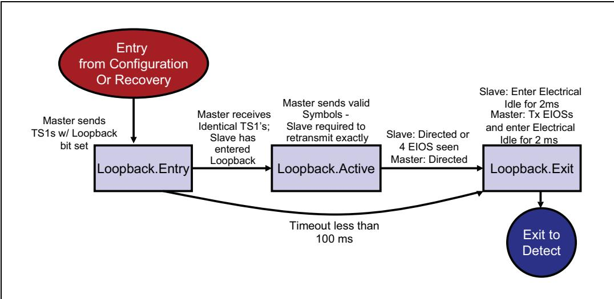

## Loopback.Entry

The typical behavior for this substate is for the Loopback Master to send TS1s with the Loopback bit set until it starts seeing those TS1s being returned. Once the Loopback Master sees TS1s being returned with the Loopback bit asserted, it knows that it’s Link Partner is now behaving as the Loopback Slave and is simply repeating everything it receives.

While in this substate, the Link is not considered to be active (LinkUp = 0b). Also, the Link and Lane numbers used in TS1s and TS2s are ignored by the Receiver. The spec makes an interesting observation regarding the use of Lane numbers with 128b/130b encoding. As it turns out, each Lane uses a different seed value for its scrambler (see “Scrambling” on page 430). Consequently, if the Lane numbers haven’t been negotiated before going into the Loopback mode, it’s possible that the Link partners could have different Lane assignments and would therefore be unable to recognize incoming Symbols. This can be avoided by waiting until the Lane numbers have been negotiated before directing the master to go to the Loopback state, or by directing the master to set the Compliance Receive bit during Loopback.Entry, or by some other method.

## Loopback Master:

In this substate, the Loopback Master will continuously send TS1s with the Loopback bit set. The master may also assert the Compliance Receive bit in the TS1s to help testing when one or both Ports are having trouble obtaining bit lock, Symbol lock, or Block alignment after a rate change. If the bit is set it must not be cleared while in this state.

If this substate was entered from Configuration.Linkwidth.Start, check to see whether the speed in use is the highest mutually supported rate for both Link partners. If not:

Change to the highest common speed. Send 16 TS1s with the Loopback bit set followed by an EIOS (two EIOSs if the current speed is 5.0 GT/s), and then go to Electrical Idle for 1ms. During the idle time, change the speed to the highest commonly‐supported rate.

If the highest common rate is 5.0 GT/s, the slave’s Tx de‐emphasis is controlled by the master setting its Selectable De‐emphasis bit in the TS1s to the desired value (1b = ‐3.5 dB, 0b = ‐6 dB).

For data rates of 5.0 GT/s and higher, the master’s Transmitter can choose any de‐emphasis settings it wants, regardless of the settings it sent to the slave.

Potential problem: if Loopback is entered after the Link has already trained to L0 and LinkUp = 1b, it’s possible for one Port to enter Loopback from Recovery and the partner to enter from Configuration. If that happened, the latter Port might try to change the speed while the Port entering from Recovery does not, resulting in a situation where the results are undefined. The spec states that the test set‐up must avoid conflicting cases like this.

## Exit to “Loopback.Active”

The next state will be Loopback.Active after either 2ms, if the Compliance Receive bit is set in the outgoing TS1s, or two consecutive TS1s are received on a design‐specific number of Lanes with the Loopback bit set and the Compliance Receive bit was not set in the outgoing TS1s.

Note that if the speed was changed, the master must ensure that enough TS1s have been sent for the slave to be able to acquire Symbol lock or Block alignment before going to the Loopback.Active state.

Exit to “Loopback.Exit”

If neither of the conditions to enter Loopback.Active are met, the next state will be Loopback.Exit after a design‐specific timeout of less than 100ms.

## Loopback Slave:

This substate is entered by receiving two consecutive TS1s with the Loopback bit asserted.

If this substate was entered from Configuration.Linkwidth.Start, check to see whether the speed in use is the highest one that mutually supported by both Link partners. If not:

Change to the highest common speed. Send one EIOS (two EIOSs if the current speed is 5.0 GT/s), and then go to Electrical Idle for 2ms. During the idle time, change the speed to the highest commonly‐supported rate.

If the highest common rate is 5.0 GT/s, set the Transmitter’s deemphasis according to the Selectable De‐emphasis bit in the received TS1s (1b = ‐3.5 dB, 0b = ‐6 dB).

– If the highest common rate is 8.0 GT/s and:

a) EQ TS1s directed the slave to this state, use the Tx Preset settings they specified.

b) Normal TS1s directed the slave to this state, the slave is allowed to use its default transmitter settings.

## Exit to “Loopback.Active”

The next state will be Loopback.Active if the Compliance Receive bit was set in the incoming TS1s that directed the slave to this state. The slave doesn’t need to wait for particular boundaries to send looped‐back data, and is allowed to truncate any Ordered Set in progress.

Otherwise, the slave sends TS1s with Link and Lane numbers set to PAD and the next state will be Loopback.Active if:

– The rate is 2.5 or 5.0 GT/s and Symbol lock is acquired on all Lanes.

The rate is 8.0 GT/s and two consecutive TS1s are seen on all active Lanes. Equalization is handled by evaluating and applying the values given in the TS1s, as long as they’re supported and the EC value is appropriate for the direction of the Port (10b for Downstream Ports, and 11b for Upstream Ports). Optionally, the Port can accept either of the EC values for this case. If the settings are applied, they must take effect within 500ns of receiving them and must not cause the Transmitter to violate any electrical specs for more than 1ns. A significant difference compared to the process in Recovery.Equalization is that the new settings are not echoed in the TS1s being sent by the slave.

For 8b/10b, the slave must only transition to looped‐back data on a Symbol boundary, but is allowed to truncate any Ordered Set in progress. For 128b/130b, no boundary is specified for when the looped‐back data can be sent, and it is still allowed to truncate any Ordered Set in progress.

## Loopback.Active

During this substate, the Loopback Master sends valid encoded data and should not send EIOS until it’s ready to exit Loopback. The Loopback Slave echoes the received information without modification (even if the encoding is determined to be invalid), with the possible exception of inverting the polarity as determined in the Polling state. The slave also continues to perform clock tolerance compensation. That means SKPs must be added or removed as needed, but the Lanes aren’t required to all send the same number.

## Exit to “Loopback.Exit”

The next state will be Loopback.Exit for the loopback master if directed.

The next state will be Loopback.Exit for the loopback slave if either of two conditions is true:

1 The slave is directed to exit or four consecutive EIOSs are seen on any Lane.

Optionally, if the current speed is 2.5 GT/s and an EIOS is received or Electrical Idle is detected or inferred on any Lane. Electrical Idle may be inferred if any configured Lane has not detected an exit from Electrical Idle for 128s.

The slave must be able to detect an Electrical Idle on any Lane within 1ms of EIOS being received. Between the time EIOS is received and Electrical Idle is actually detected, the Loopback Slave may receive a bit stream that is undefined by the encoding scheme, and it may loop that back to the transmitter.

## Loopback.Exit

During this substate, the Loopback Master sends an EIOS for Ports that support only 2.5 GT/s and eight consecutive EIOSs for Ports that support rates higher than 2.5 GT/s (optionally send 8 for the Ports that only support 2.5 GT/s, too), and then enter Electrical Idle on all Lanes for 2ms.

— The Loopback Master must transition to Electrical Idle within TTX‐IDLE‐SET‐ after sending the last EIOS. Note that the EIOS marks the end of the master’s transmit and compare operations. Any data received by the master after any EIOS is received is undefined and should be ignored.

The loopback slave must enter Electrical Idle on all Lanes for 2ms but must echo back all Symbols received prior to detecting Electrical Idle to ensure that the master sees the arrival of the EIOS as the end of the logical send and compare operation.

Exit to “Detect State”

The next state will be Detect once the required EIOSs have been exchanged and the Lanes have been in Electrical Idle for 2ms.

## Dynamic Bandwidth Changes

Higher data rates and wider Links for PCIe offer higher performance than previous generations but use more power, too. Consequently, the 2.0 spec writers chose to include another pair of power management mechanisms that allow the hardware to adjust the Link speed and width on the fly. These allow the Link to use the highest speed and widest possible Link when performance is needed, or to drop down to a lower speed or narrower Link width or both to reduce power. There are two clear advantages to this method compared to changing the Link or Device power state.

First, the Link is always able to communicate regardless of the changes, with a relatively short interruption in service to make the change. Second, the power saving can be greater. For example, a x16 Link would almost certainly use less power operating as an active x1 Link than as a x16 Link in L0s.

Secondly, in addition to power conservation, bandwidth reductions can also be used to resolve reliability problems. For example, it may be that a high speed Link produces unacceptable reliability, in which case either Link component is allowed to remove the offending speed from the list of supported speeds that it advertises. How a component makes that reliability determination is not specified. Interestingly, components are also permitted to go into the Recovery state and advertise a different set of supported speeds without requesting a speed change in the process.

Changing the Link Speed or Link Width requires the Link to be re‐trained. When the Link is in the L0 state, and the speed needs to be changed, the LTSSM of the port desiring the speed change starts transmitting TS1s to its neighbor. Doing so results in the two involved ports’ LTSSMs going through Recovery state where the Link speed is changed and then back to L0.

Similarly, the port that desires to change the Link width starts transmitting TS1s to its neighbor. Doing so results in the two involved ports’ LTSSMs going through Recovery state then Configuration state where the Link width is changed. The LTSSM finally returns to L0 with the new Link width established.

Because the LTSSM is involved in dynamic Link bandwidth management, it makes sense to discuss the two aspects of Link bandwidth management, dynamic Link speed change and dynamic Link width change in the following sections. Let’s consider these two options separately, starting with Link speed changes.

## Dynamic Link Speed Changes

By way of review, the LTSSM states are illustrated in Figure 14‐45 on page 620 to make it easier to recall the flow of states. Although according to the Gen1 specification, speed change was indicated to be performed in the Polling state, the subsequent Gen2 spec moved this function to the Recovery state.

Figure 14‐45: LTSSM Overview  
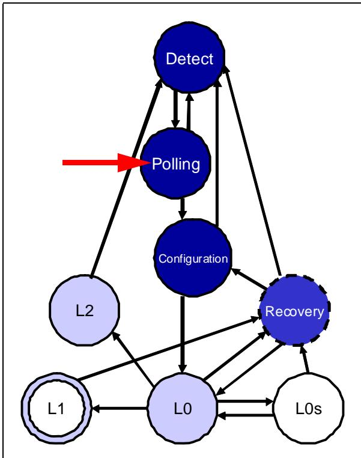

During the Polling state, TS1s are exchanged between Link neighbors, and these contain several kinds of information as shown in Figure 14‐46 on page 621. The most interesting part for us here is byte number 4, the Rate Identifier. Bits 1, 2 and 3 indicate which data rates are available and the spec points out that 2.5 GT/s must always be supported, while 5.0 GT/s must also be supported if 8.0 GT/s is supported.

The meaning of bit 6 depends on whether the Port is facing upstream or downstream and also on what LTSSM state the Port is in. However, for the speed change case the options are reduced because it’s only meaningful coming from the Upstream Port and just indicates whether or not the speed change is an autonomous event. “Autonomous” means that the Port is requesting this change for its own hardware‐specific reasons and not because of a reliability issue. Bit 7 is used by the Upstream Port to request a speed change. These values are very similar in the TS2s, although bit 6 has another meaning now related to autonomous Link width changes that we’ll discuss later.

Figure 14‐46: TS1 Contents  

Figure 14‐47: TS2 Contents  
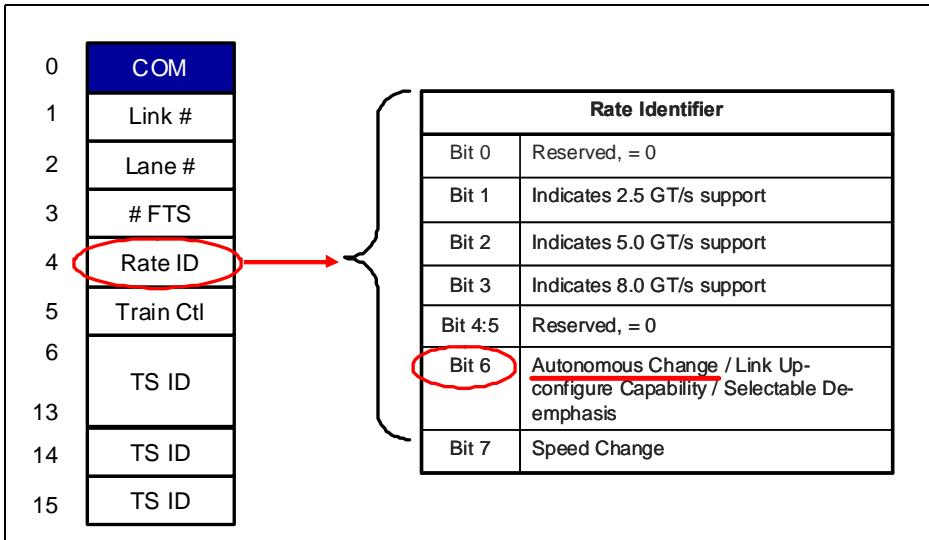

## Upstream Port Initiates Speed Change

A speed change must be initiated by the Upstream Port (Port facing upstream), and is accomplished by transitioning to the Recovery state. The substates of the Recovery state are shown in Figure 14‐48 on page 622 and the part of interest for this discussion is highlighted by the oval. The discussion that follows here is a relatively high‐level overview of the entire speed change process and doesn’t get into the details of the LTSSM operation. To learn more about that, refer to the discussion called “Recovery State” on page 571.

Figure 14‐48: Recovery Sub‐States  
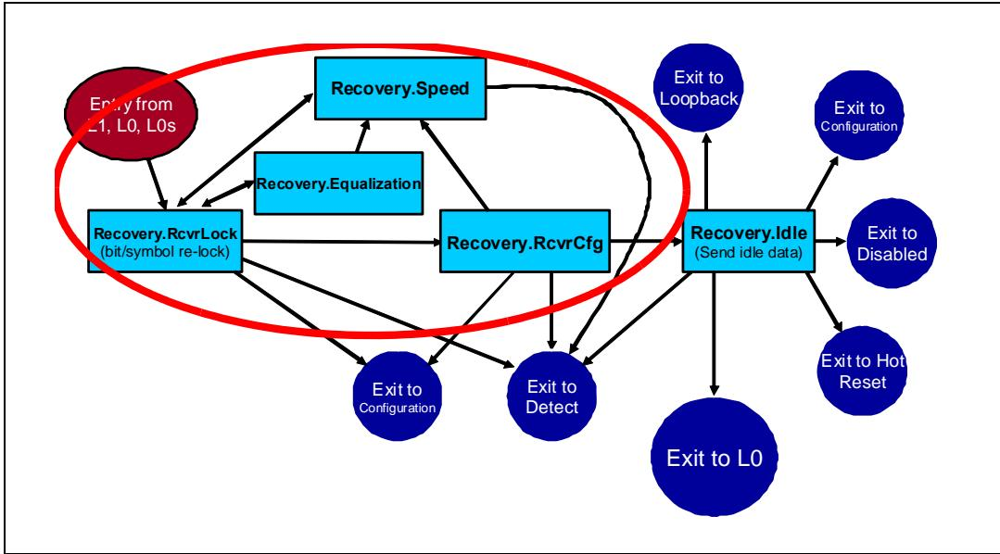

## Speed Change Example

To illustrate the process, consider the speed change example shown in Figure 14‐49 on page 623. Note that the Equalization substate has been removed in this example to make the diagrams simpler and easier to follow. The example shows a change from 2.5 GT/s to 5.0 GT/s and so the Equalization substate is not used anyway. A change to 8.0 GT/s would go through the same process but would just add a trip through the Equalization substate at the end of the process. To learn more about the Equalization process, refer to “Recovery.Equalization” on page 587.

The Endpoint in this example, which can only have an Upstream Port, is shown connected to a Root Complex, which can only have Downstream Ports. Only the Upstream Port can initiate the speed change process, and it does so because its Directed Speed Change flag was set earlier based on some hardware‐specific conditions. To start the sequence, it changes its LTSSM to the Recovery state, enters the Recovery.RcvrLock substate and sends TS1s with the Speed Change bit set and listing the speeds that it will support, as shown in Figure 14‐49 on page 623. When the Downstream Port sees the incoming TS1s, it also changes to the Recovery state and begins sending TS1s back. Since the Speed Change bit was set in the incoming TS1s, that will set the Directed Speed Change flag in the Root Port and the outgoing TS1s will also have that bit set. The speed that the Link will attempt to use will be the highest commonly‐supported speed so, if a Device wants to use a lower speed it would simply not list the higher speeds as being supported at this time.

Figure 14‐49: Speed Change ‐ Initiated  
  
When the Upstream Port detects the TS1s coming back, its state machine changes to the Recovery.RcvrCfg substate and it begins to send TS2s that still have the Speed Change bit set, as illustrated in Figure 14‐50 on page 624. These

TS2s will now also have the Autonomous Change bit set if this change was not caused by a reliability problem on the Link. When the Downstream Port sees incoming TS2s, it also changes to the Recovery.RcvrCfg substate and returns TS2s with the Speed Change bit set. However, the Autonomous Change bit is reserved in the TS2s for Downstream Ports during Recovery.

Figure 14‐50: Speed Change ‐ Part 2  
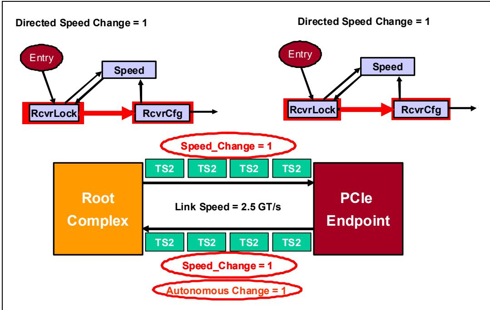

Once each Port has seen 8 consecutive TS2s with the Speed Change bit set, they know that the next step will be to go to the Recovery.Speed substate, as shown in Figure 14‐51 on page 625. At this point, the Downstream Port needs to register the setting of the Autonomous Change bit in the incoming TS2s. To support this, some extra fields have been added to the PCIe Capability registers.

The status bits for Link bandwidth changes are found in the Link Status register, shown in Figure 14‐52 on page 625. Status changes can also be used to generate an interrupt to notify software of these events if the device is capable and has been enabled to do so. This capability is reported by the Link Bandwidth Notification Capable bit, shown in Figure 14‐53 on page 626, and enabled by the Interrupt Enable bits in the Link Control register, as shown in Figure 14‐54 on page 626. Note that there are two cases: autonomous and bandwidth managemen. Autonomous means the change was not caused by a reliability problem, while bandwidth management means it was.

Figure 14‐51: Speed Change ‐ Part 3  
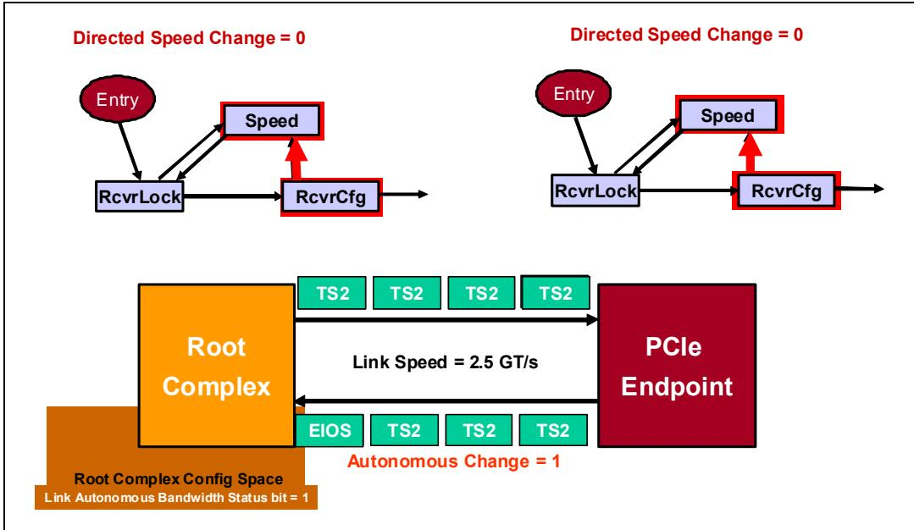

Figure 14‐52: Bandwidth Change Status Bits  

Figure 14‐53: Bandwidth Notification Capability  
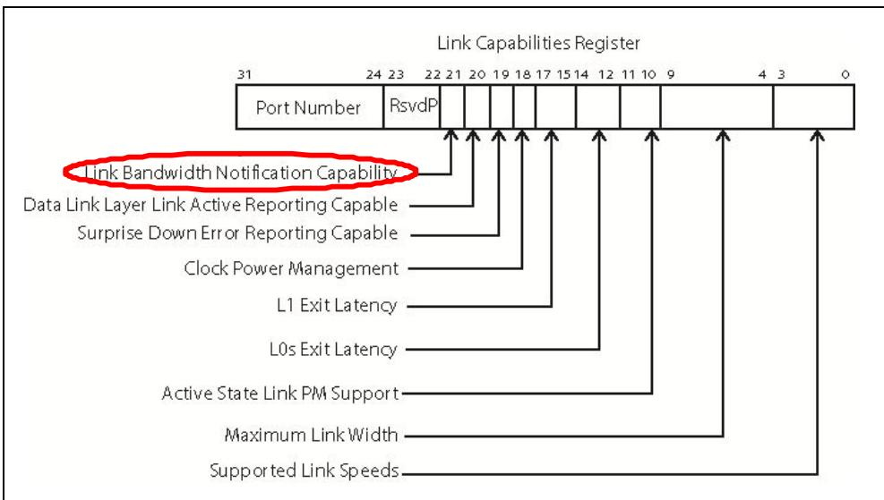

Figure 14‐54: Bandwidth Change Notification Bits  

Once the Recovery.Speed substate is reached, the Link is placed into the Electrical Idle condition in both directions and the speed is changed internally. The speed chosen will be the highest commonly‐supported speed reported in the Rate ID field of the TS1s and TS2s. In this example, that turns out to be 5.0 GT/s and so the change is made to that speed. After a timeout period, the Link neighbors both transition back to Recovery.RcvrLock and exit Electrical Idle by sending TS1s again, as shown in Figure 14‐55 on page 627. When the Upstream Port sees them coming back, it transitions to Recovery.RcvrCfg and begins sending TS2s, much like before. This time, though, the Speed Change bit is not set. Eventually TS2s are seen coming back from the Downstream Port that also don’t have the Speed Change bit set, and at that point the state machines transition to the Recovery.Idle on their way back to L0.

If a speed change has fails for some reason, a component is not allowed to try that speed or a higher one for at least 200 ms after returning to L0 or until the Link neighbor advertises support for a higher speed, whichever comes first.

Figure 14‐55: Speed Change Finish  
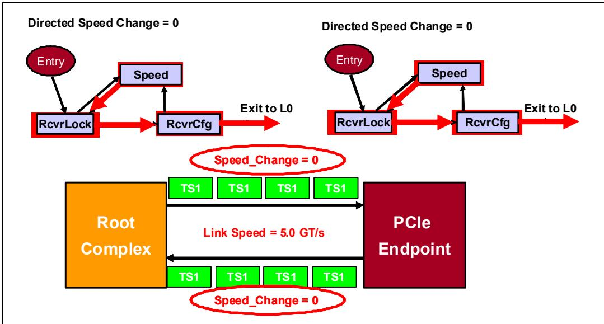

## Software Control of Speed Changes

Software is unable to control when hardware makes decisions about changing the speed but can limit or disable this capability. Limiting it is accomplished by setting the Target Link Speed value in the Link Control 2 Register shown in Fig ure 14‐56 on page 628. This acts as the upper bound on the speeds available to

## PCI Express Technology

the Upstream Port, which will try to maintain that value or the highest speed supported by both Link neighbors, whichever is lower. Software can also force a particular speed to be used by setting the Target Link Speed in the Upstream component and then setting the Retrain Link bit in the Link Control register, shown in Figure 14‐57 on page 629. As mentioned earlier, software is notified of any hardware‐based Link speed or width changes by the Link Bandwidth Notification Mechanism. Finally, the speed change mechanism can be disabled by setting the Hardware Autonomous Speed Disable bit.

Figure 14‐56: Link Control 2 Register  

Figure 14‐57: Link Control Register  
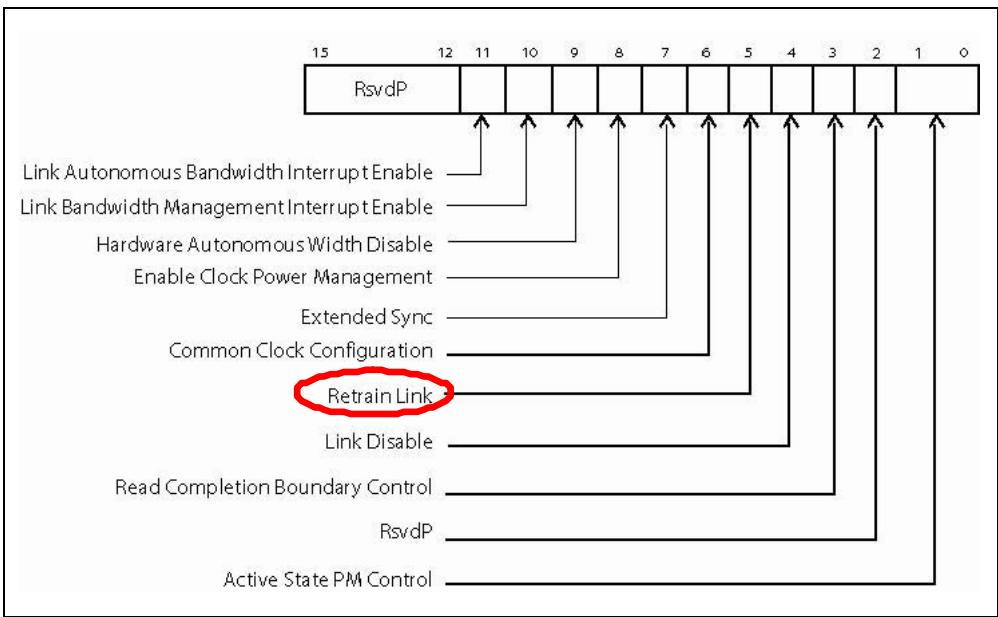

## Dynamic Link Width Changes

The same basic operation for changing the Link speed can also be used to change the Link width, although the sequence is a little more complicated because more LTSSM steps are involved. One thing that’s important for software to note before enabling Link width changes is whether the Link neighbor supports recovering from a narrow Link back to a wide Link (called Upconfiguring the Link). Devices report this ability in bit 6 of the Rate ID field of the TS2s they send during training, as shown in Figure 14‐58 on page 630. If a component doesn’t support this, that would mean that changing to a narrower Link width would be a one‐way event and would only be suitable for the case of a reliability problem on the Link.

Figure 14‐58: TS2 Contents  

## Link Width Change Example

Consider the example in Figure 14‐59 on page 631 of a Root Port connected to an Endpoint (Gigabit Ethernet Device). Only the Upstream Port will initiate this change, and it begins by going to the Recovery state as before. This time, though, the Speed Change bit is not set. To sort out what the new Link width will be, the Upstream Port will need to tell the Downstream Port to transition from the Recovery state to the Configuration state before going back to L0, as shown in Figure 14‐60 on page 631. There are several substates in the Configuration state, and a simplified version of them is shown in Figure 14‐61 on page 632. We’ll go through the sequence to be clear on how the steps work.

Figure 14‐59: Link Width Change Example  
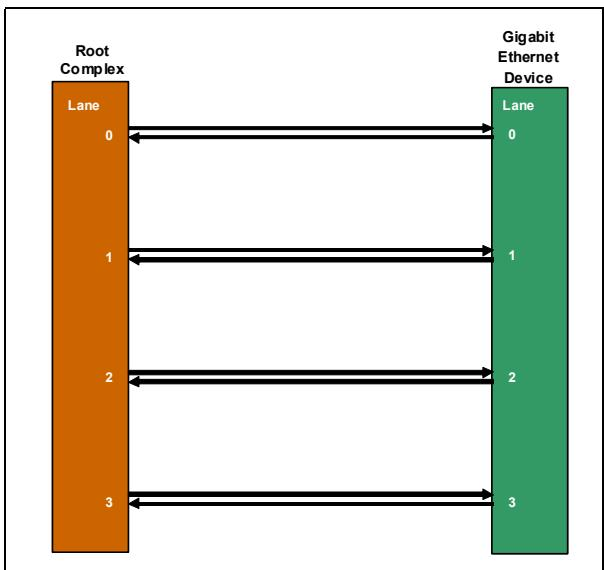

Figure 14‐60: Link Width Change LTSSM Sequence  
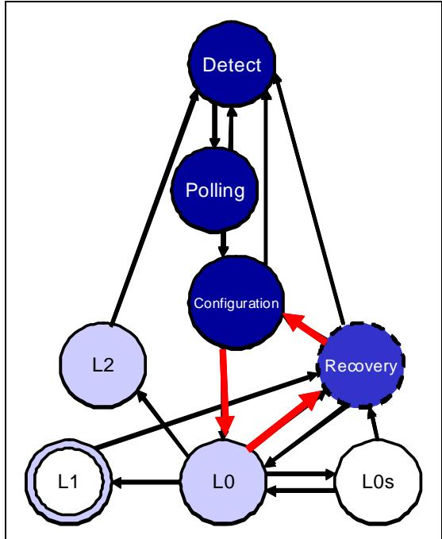

Figure 14‐61: Simplified Configuration Substates  

As before, the Upstream Port initiates this process by going to Recovery and sending TS1s. These don’t have the Speed Change bit set, as highlighted in the example shown in Figure 14‐59 on page 631, where an Ethernet Device initiates this process on its Upstream Port. In response, the Downstream Port sends TS1s back, also with the Speed Change bit cleared. Link and Lane numbers are still shown as being unchanged from the last time the Link was trained. Referring back to Figure 14‐48 on page 622, the next state is Recovery.RcvrCfg during which the Link partners exchange TS2s.

## Chapter 14: Link Initialization & Training

Figure 14‐62: Link Width Change ‐ Start  
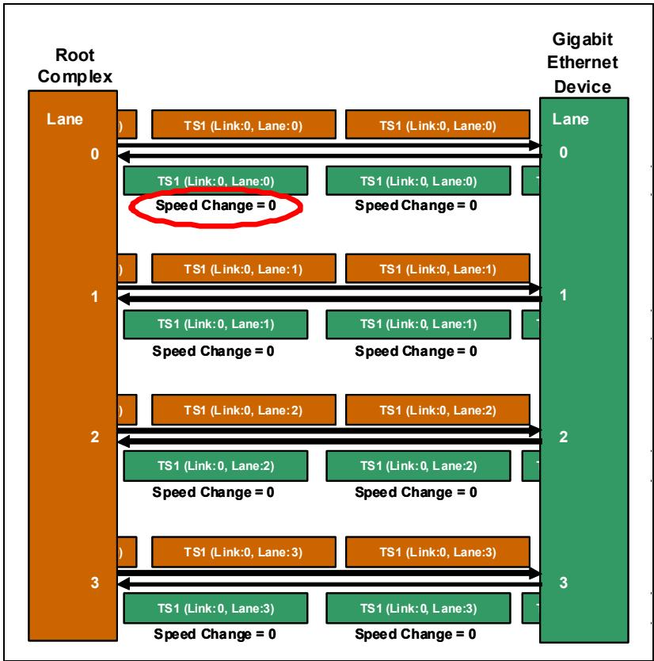

Since a speed change is not requested, the next state is Recovery.Idle. In that state the Ports normally send the logical idle symbols (all zeros) and the Downstream Port does so, as shown in Figure 14‐63 on page 634. However, the Upstream Port was directed to change the Link width so it doesn’t send the expected Idle symbols. Instead, it sends TS1s with PAD for both the Link and Lane numbers. The Downstream Port recognizes that a previously configured Lane now has a Lane number of PAD, and that causes it to transition to the first Configuration substate: Config.Linkwidth.Start.

Figure 14‐63: Link Width Change ‐ Recovery.Idle  
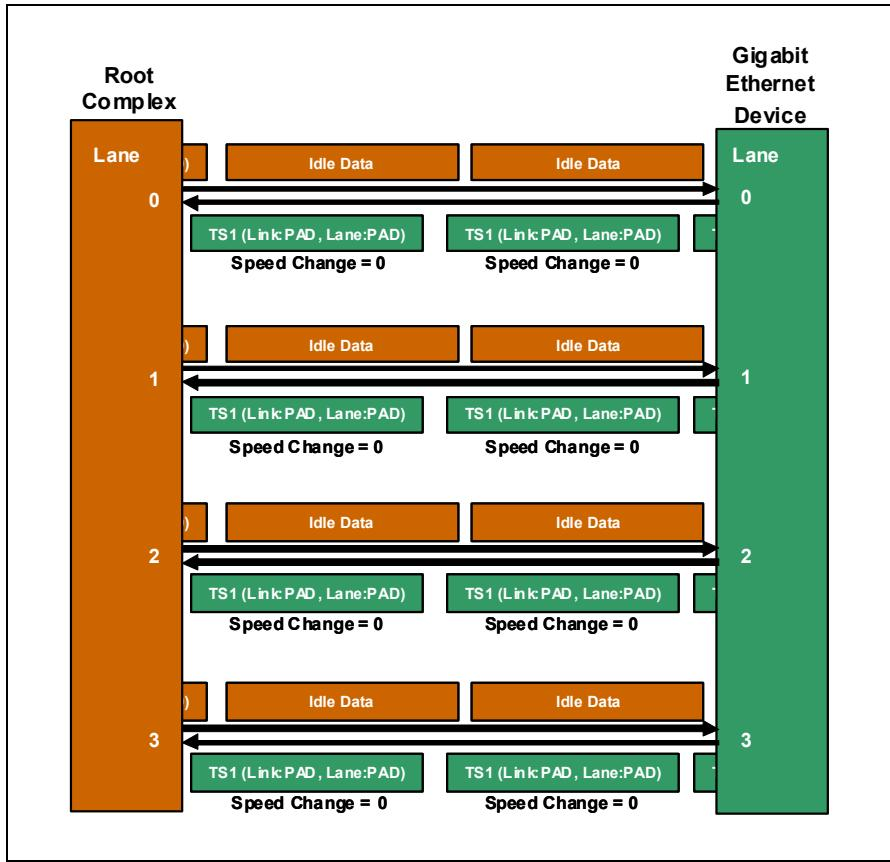

The Downstream Port now initiates the next step by sending TS1s that have the originally negotiated Link number but PAD on all the Lane numbers, as illustrated in Figure 14‐64 on page 635. The Upstream Port responds with matching TS1s on the Lanes it wants to have “active”, but with PAD for both Link and Lane numbers on the Lanes it wishes to have inactive. When the Downstream Port sees this response, it transitions to the Config.Linkwidth.Accept substate. Note that the Autonomous Change bit is set for these TS1s.

## Chapter 14: Link Initialization & Training

Figure 14‐64: Marking Active Lanes  
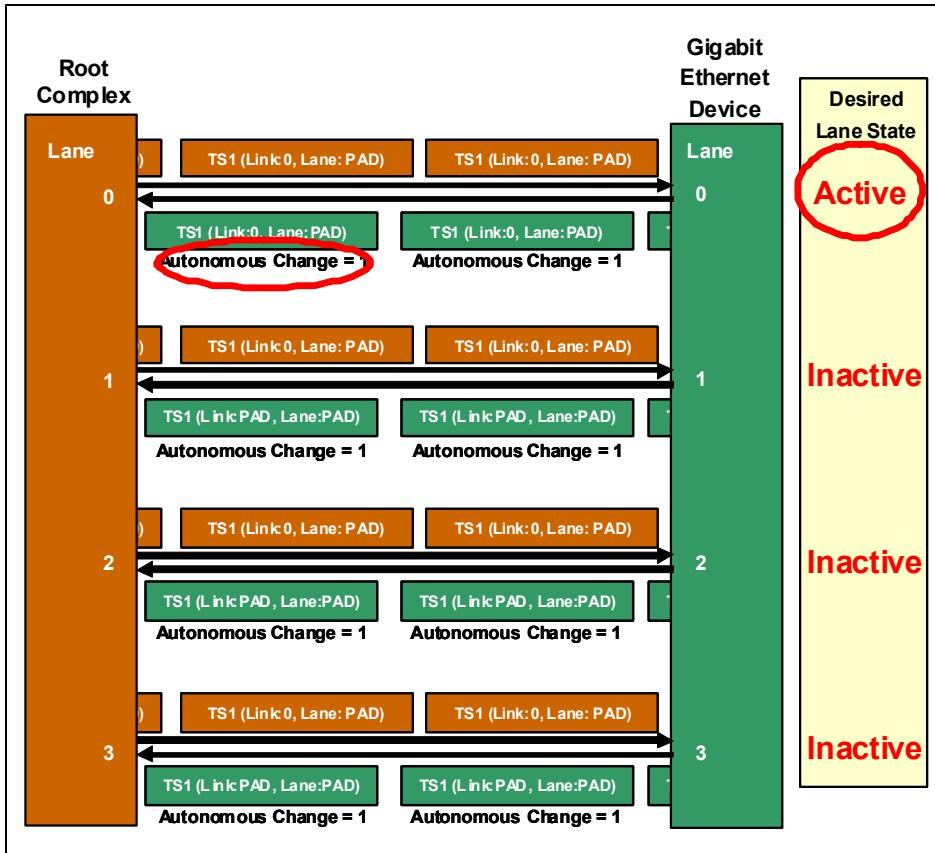

The Root Port responds by changing its TS1s to show Lane numbers that are appropriate for the active Lanes, but PAD for the Link and Lane numbers of all the Lanes that were seen to be inactive. The Upstream Port responds with the same TS1s, as shown in Figure 14‐65 on page 636, and the state changes to Config.Lanenum.Accept. At this point, the Root Port updates the status bit to show that an autonomous change was detected and changes to the Config.Complete substate.

Figure 14‐65: Response to Lane Number Changes  
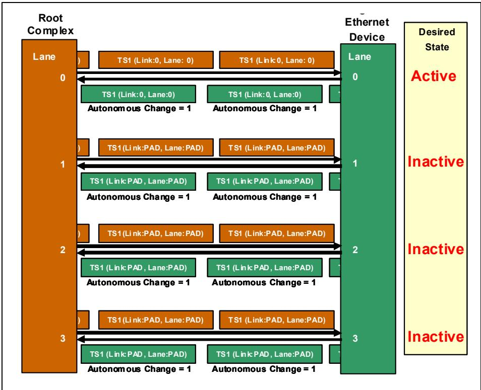

In the next step, the Root Port begins to send TS2s on the active Lanes and puts the inactive Lanes into Electrical Idle. Recall that the TS2s report whether a component is “upconfigure capable” and in this example, both Link partners support this capability. The Endpoint sends back the same thing: TS2s on active Lanes and Electrical Idle on inactive Lanes. Seeing that, the Root Port’s state machine changes to Config.Idle and it begins to send Logical Idle on the active Lanes. The Endpoint responds with the same thing and the Link state changes back to L0. The Link is now ready for normal operation, albeit with a reduced bandwidth for power conservation.

## Chapter 14: Link Initialization & Training

Figure 14‐66: Link Width Change ‐ Finish  
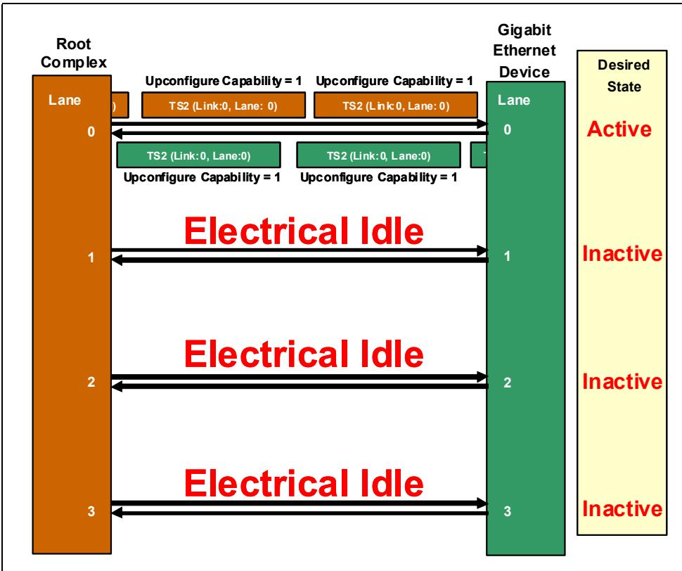

As was the case for dynamic speed changes, software can’t initiate Link width changes, but it can disable this mechanism by setting the bit in the Link Control register shown in Figure 14‐67 on page 638. Unlike the speed change case, no software mechanism was defined to allow setting a particular Link width.

Figure 14‐67: Link Control Register  
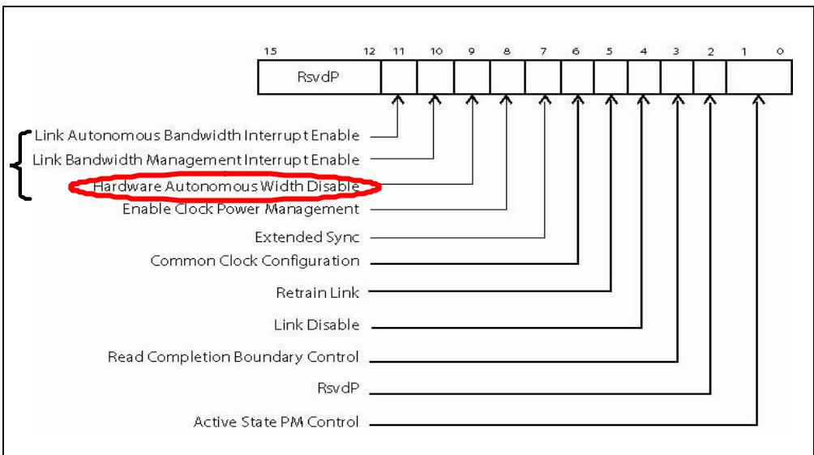

## Related Configuration Registers

Many of the configuration registers that are relevant to Link Initialization and Training have been shown when their contents were described earlier, but it seems good to summarize them here.

## Link Capabilities Register

The Link Capabilities Register is pictured in Figure 14‐68 on page 639 and each bit field is described in the subsections that follow.

Figure 14‐68: Link Capabilities Register  

## Max Link Speed [3:0]

This indicates the maximum Link speed for this port, and is given as a pointer to a bit location in the Link Capabilities 2 register Supported Link Speeds Vector that corresponds to the max Link speed. Defined encodings are:

• 0001b ‐ Supported Link Speeds Vector field bit 0

• 0010b ‐ Supported Link Speeds Vector field bit 1

• 0011b ‐ Supported Link Speeds Vector field bit 2

• 0100b ‐ Supported Link Speeds Vector field bit 3

• 0101b ‐ Supported Link Speeds Vector field bit 4

• 0110b ‐ Supported Link Speeds Vector field bit 5

• 0111b ‐ Supported Link Speeds Vector field bit 6

All other encodings are reserved. Multi‐function devices sharing an Upstream Port must report the same value in this field in all Functions. This register is Read Only.

## Maximum Link Width[9:4]

This field indicates the maximum width of the PCI Express Link. The values that are defined are:

• 00 0000b: Reserved

• 00 0001b: x1

• 00 0010b: x2

• 00 0100b: x4

• 00 1000b: x8

• 00 1100b: x12

• 01 0000b: x16

• 10 0000b: x32

All other encodings are reserved. Multi‐function devices sharing an Upstream Port must report the same value in this field in all Functions. This register is Read Only.

## Link Capabilities 2 Register

The Link Capabilities Register is pictured in Figure 14‐68 on page 639 and shows the Supported Link Speeds Vector to which the Max Link Speed field in the Link Capabilities register points. The values for this field are:

$\mathrm { B i t } 0 = 2 . 5 \mathrm { G T } / s$

• Bit 1 = 5.0 GT/s

• Bit 2 = 8.0 GT/s

• Bits 6:3 RsvdP (reserved and preserved).

Figure 14‐69: Link Capabilities 2 Register  

## Link Status Register

The Link Status Register is pictured in Figure 14‐39 on page 597.

## Current Link Speed[3:0]:

This read‐only field indicates the current Link speed. The speed will always be 2.5 GT/s when the Link first trains to L0. After that, if a higher commonly‐supported speed is available, the LTSSM will go to Recovery and attempt to change to that speed. The values in this field are the same as the Max Link Speed encodings shown in the Link Capabilities register:

• 0001b ‐ Supported Link Speeds Vector field bit 0

• 0010b ‐ Supported Link Speeds Vector field bit 1

• 0011b ‐ Supported Link Speeds Vector field bit 2

• 0100b ‐ Supported Link Speeds Vector field bit 3

• 0101b ‐ Supported Link Speeds Vector field bit 4

• 0110b ‐ Supported Link Speeds Vector field bit 5

• 0111b ‐ Supported Link Speeds Vector field bit 6

All other encodings are reserved.

Note that the value of this field is undefined when the Link is not up (LinkUp = 0b).

## Negotiated Link Width[9:4]

This field indicates the result of link width negotiation. There are seven possible widths, all other encodings are reserved. The defined encodings are:

• 00 0001b: for x1.

• 00 0010b for x2.

• 00 0100b for x4.

• 00 1000b for x8.

• 00 1100b for x12.

• 01 0000b for x16.

• 10 0000b for x32.

All other encodings are reserved. Note that the value of this field is undefined when the Link is not up (LinkUp = 0b).

## Undefined[10]

Currently undefined, this bit was previously set by hardware in earlier spec versions when a Link Training Error had occurred. It was cleared when the LTSSM successfully entered L0. The spec states that software can write any value to this bit but must ignore any value read from it.

## Link Training[11]

This read‐only bit indicates that the LTSSM is in the process of training. Technically, it means the LTSSM is either in the Configuration or Recovery state, or that the Retrain Link bit has been written to 1b but Link training has not yet begun. This bit is cleared by hardware when the LTSSM exits the Configuration or Recovery state. Since this must be visible to software while Link Training is in progress, it only has meaning for Ports that are facing downstream. Consequently, this bit is not applicable and reserved for Endpoints, bridge Upstream Ports and Switch Upstream Ports. For them, this bit must be hardwired to 0b.

Figure 14‐70: Link Status Register  

## Link Control Register

The Link Control Register is pictured in Figure 14‐71 on page 644, and there are three fields in it that are interesting for us here.

## Link Disable

When set to one, the link is disabled. Intuitively, this bit isn’t applicable and is reserved for Endpoints, bridge Upstream Ports, and Switch Upstream Ports because it must be accessible by software even when the Link is disabled. When this bit is written, any read immediately reflects the value written, regardless of the Link state. After clearing this bit, software must be careful to honor the timing requirements regarding the first Configuration Read after a Conventional Reset (see “Reset Exit” on page 846).

## Retrain Link

This bit allows software to initiate Link re‐training whenever it is deemed necessary, as for error recovery. The bit is not applicable to and is reserved for Endpoint devices and Upstream Ports of Bridges and Switches. When set to 1b, this directs the LTSSM to the Recovery state before the completion of the Configuration write Request is returned.

## Extended Synch

As it affects training, this bit is used to greatly extend the time spent in two situations, for the purpose of assisting slower external test or analysis hardware to synchronize with the Link before it resumes normal communication. One of these is when exiting L0s, where setting this bit forces the transmission of 4096 FTSs prior to entering L0. The other case is in the Recovery state prior to entering Recovery.RcvrCfg, where it forces the transmission of 1024 TS1s.

Figure 14‐71: Link Control Register  

Part Five:

Additional System Topics

# 15 Error Detection and Handling

## The Previous Chapter

This chapter describes the operation of the Link Training and Status State Machine (LTSSM) of the Physical Layer. The initialization process of the Link is described from Power‐On or Reset until the Link reaches fully‐operational L0 state during which normal packet traffic occurs. In addition, the Link power management states L0s, L1, L2, and L3 are discussed along with the state transitions. The Recovery state, during which bit lock, symbol lock or block lock are re‐established is described. Link speed and width change for Link bandwidth management is also discussed.

## This Chapter

Although care is always taken to minimize errors they can’t be eliminated, so detecting and reporting them is an important consideration. This chapter discusses error types that occur in a PCIe Port or Link, how they are detected, reported, and options for handling them. Since PCIe is designed to be backward compatible with PCI error reporting, a review of the PCI approach to error handling is included as background information. Then we focus on PCIe error handling of correctable, non‐fatal and fatal errors.

## The Next Chapter

The next chapter provides an overall context for the discussion of system power management and a detailed description of PCIe power management, which is compatible with the PCI Bus PM Interface Spec and the Advanced Configuration and Power Interface (ACPI). PCIe defines extensions to the PCI‐PM spec that focus primarily on Link Power and event management.

## Background

Software backward compatibility with PCI is an important feature of PCIe, and that’s accomplished by retaining the PCI configuration registers that were already in place. PCI verified the correct parity on each transmission phase of the bus to check for errors. Detected errors were recorded in the Status register and could optionally be reported with either of two side‐band signals: PERR# (Parity Error) for a potentially recoverable parity fault during data transmission, and SERR# (System Error) for a more serious problem that was usually not recoverable. These two types can be categorized as follows:

• Ordinary data parity errors — reported via PERR#

Data parity errors during multi‐task transactions (special cycles) — reported via SERR#

• Address and command parity errors — reported via SERR#

• Other types of errors (device‐specific) — reported via SERR#

How the errors should be handled was outside the scope of the PCI spec and might include hardware support or device‐specific software. As an example, a data parity error on a read from memory might be recovered in hardware by detecting the condition and simply repeating the Request. That would be a safe step if the memory contents weren’t changed by the failed operation.

As shown in Figure 15‐1 on page 649, both error pins were typically connected to the chipset and used to signal the CPU in a consumer PC. These machines were very cost sensitive, so they didn’t usually have the budget for much in the way of error handling. Consequently, the resulting error reporting signal chosen was the NMI (Non‐Maskable Interrupt) signal from the chipset to the processor that indicated significant system trouble requiring immediate attention. Most consumer PCs didn’t include an error handler for this condition, so the system would simply be stopped to avoid corruption and the BSOD (Blue Screen Of Death) would inform the operator. An example of an SERR# condition would be an address parity mismatch seen during the command phase of a transaction. This is a potentially destructive case because the wrong target might respond. If that happened and SERR# reported it, recovery would be difficult and would probably require significant software overhead. (To learn more about PCI error handling, refer to MindShare’s book PCI System Architecture.)

PCI‐X uses the same two error reporting signals but defines specific error handling requirements depending on whether device‐specific error handling software is present. If such a handler is not present, then all parity errors are reported with SERR#.

Figure 15‐1: PCI Error Handling  
  
PCI‐X 2.0 uses source‐synchronous clocking to achieve faster data rates (up to 4GB/s). This bus targeted high‐end enterprise systems because it was generally too expensive for consumer machines. Since these high‐performance systems also require high availability, the spec writers chose to improve the error handling by adding Error‐Correcting Code (ECC) support. ECC allows more robust error detection and enables correction of single‐bit errors on the fly. ECC is very helpful in minimizing the impact of transmission errors. (To learn more about PCI‐X error handling, see MindShare’s book PCI‐X System Architecture.)

PCIe maintains backward compatibility with these legacy mechanisms by using the error status bits in the legacy configuration registers to record error events in PCIe that are analogous to those of PCI. That lets legacy software see PCIe error events in terms that it understands, and allows it to operate with PCIe hardware. See “PCI‐Compatible Error Reporting Mechanisms” on page 674 for the details of these registers.

## PCIe Error Definitions

The spec uses four general terms regarding errors, defined here:

1. Error Detection ‐ the process of determining that an error exists. Errors are discovered by an agent as a result of a local problem, such as receiving a bad packet, or because it received a packet signaling an error from another device (like a poisoned packet).

2. Error Logging  ‐  setting the appropriate bits in the architected registers based on the error detected as an aid for error‐handling software.

3. Error Reporting ‐ notifying the system that an error condition exists. This can take the form of an error Message being delivered to the Root Complex, assuming the device is enabled to send error messages. The Root, in turn, can send an interrupt to the system when it receives an error Message.

4. Error Signaling ‐ the process of one agent notifying another of an error condition by sending an error Message, or sending a Completion with a UR (Unsupported Request) or CA (Completer Abort) status, or poisoning a TLP (also known as error forwarding).

## PCIe Error Reporting

Two error reporting levels are defined for PCIe. The first is a Baseline capability required for all devices. This includes support for legacy error reporting as well as basic support for reporting PCIe errors. The second is an optional Advanced Error Reporting Capability that adds a new set of configuration registers and tracks many more details about which errors have occurred, how serious they are and in some cases, can even record information about the packet that caused the error.

## Baseline Error Reporting

Two sets of configuration registers are required in all devices in support of Baseline error reporting. These are described in detail in “Baseline Error Detection and Handling” on page 674 and are summarized here:

PCI‐compatible Registers — these are the same registers used by PCI and provide backward compatibility for existing PCI‐compatible software. To make this work, PCIe errors are mapped to PCI‐compatible errors, making them visible to the legacy software.

PCI Express Capability Registers — these registers will only be useful to newer software that is aware of PCIe, but they provide more error information specifically for PCIe software.

## Advanced Error Reporting (AER)

This optional error reporting mechanism includes a new and dedicated set of configuration registers that give error handling software more information to work with in diagnosing and recovering from problems. The AER registers are mapped into the extended configuration space and provide much more information about the nature of any errors. See “Advanced Error Reporting (AER)” on page 685 for a detailed description of these registers.

## Error Classes

Errors fall into two general categories based on whether hardware is able to fix the problem or not, Correctable and Uncorrectable. The Uncorrectable category is further subdivided based on whether software can fix the problem, Non‐fatal and Fatal.

• Correctable errors — automatically handled by hardware

• Uncorrectable errors

• Non‐fatal — handled by device‐specific software; Link is still operational and recovery without data loss may be possible

• Fatal — handled by system software; Link or Device is not working properly and recovery without data loss is unlikely

Based on these classes, error handling software can be partitioned into separate handlers to perform the actions required. Such actions might range from simply monitoring the frequency of Correctable errors to resetting the entire system in the event of a Fatal error. Regardless of the type of error, software may arrange for the system to be notified of all errors to allow tracking and logging them.

## Correctable Errors

Correctable errors are, by definition, automatically corrected in hardware. They may impact performance by adding latency and consuming bandwidth, but if all goes well, recovery is automatic and fast because it doesn’t depend on software intervention, and no information is lost in the process. These errors aren’t required to be reported to software, but doing so could allow software to track error trends that might indicate that some devices are showing signs of imminent failure.

## Uncorrectable Errors

Errors that can’t be automatically corrected in hardware are called Uncorrectable, and these are either Non‐fatal or Fatal in severity.

## Non-fatal Uncorrectable Errors

Non‐fatal errors indicate that information has been lost but the cause was likely something other than the integrity of a Link or Device. A packet failed somewhere, but the Link continues to function correctly and other packets are unaffected. Since the Link is still working, recovery of the lost information may be possible, but will depend on implementation‐specific software to handle it. An example of this error type would be a Completion timeout, in which a Request was sent but no Completion was returned within the allowed time. Somewhere there was an issue, but it could be something as simple as a random bit error within a Switch that caused the Completion to be routed incorrectly. An attempt at recovery for this case could be as simple as re‐issuing the Request.

## Fatal Uncorrectable Errors

Fatal errors indicate that a Link or Device has had an operational failure, causing data loss that is unlikely to be recovered. For these cases, resetting at least the failed Link or Device will probably be the first step in any recovery process because it’s clearly not operational for some reason. The spec also invites implementation‐specific approaches, in which software may attempt to limit the effects of the failure, but it doesn’t define any particular actions that should be taken. An example of this type of error would be a receiver buffer overflow, in which case information has been lost because flow control tracking counters have gotten out of sync with each other. Since there’s no mechanism to fix this, a reset of this Link will usually be required.

## PCIe Error Checking Mechanisms

The scope of PCIe error checking focuses on errors associated with the Link and packet delivery, as shown in Figure 15‐2 on page 653. Errors that don’t pertain to Link transmission are not reported through PCIe error‐handling mechanisms and would need proprietary methods to report them, such as device‐specific interrupts. Each layer of the interface includes error checking capabilities, and these are summarized in the sections that follow.

Figure 15‐2: Scope of PCI Express Error Checking and Reporting  
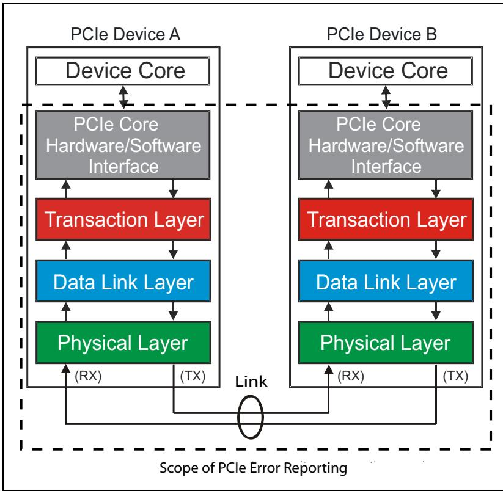

## CRC

Before diving into error handling as it relates to the layers, it will help to first discuss the concept of CRC (Cyclic Redundancy Check) because it’s an integral part of PCIe error checking. A CRC code is calculated by the transmitter based on the contents of the packet and adds it to the packet for transmission. The CRC name is derived from the fact that this check code (calculated from the packet to check for errors) is redundant (adds no information to the packet), and is derived from cyclic codes. Although a CRC doesn’t supply enough information to do automatic error correction the way ECC (Error Correcting Code) can, it does provide robust error detection. CRCs are also commonly used in serial transports because they’re good at detecting a string of incorrect bits.

CRCs have two different usage cases in PCIe. One is the mandatory LCRC (Link CRC) generated and checked in the Data Link Layer for every TLP that goes across a Link. It’s intended to detect transmission errors on the Link.

The second is the optional ECRC (End‐to‐end CRC) that’s generated in the Transaction Layer of the sender and checked in the Transaction Layer of the ultimate target of the packet. This is intended to detect errors that might otherwise be silent, such as when a TLP passes through an intermediate agent like a Switch, as shown in Figure 15‐3 on page 654. In this illustration, the packet arrived safely on the downstream port of the Switch but while it was being stored or processed within the Switch a bit error occurred. The LCRC only protects TLPs while on the Link. Once the Data Link Layer of the Ingress Port checks the LCRC, it removes it from the packet because a new LCRC will be calculated (which will include the new Sequence Number) at the Egress Port. This means that the packet is unprotected while inside the Switch. This is the purpose of having an ECRC. It is calculated at the originating device and is not removed or recalculated by intermediate devices. So if the target device is checking the ECRC and sees a mismatch, then there must have been an error somewhere along the way even though no LCRC error was seen. Note that using the ECRC requires the presence of the optional Advanced Error Reporting registers, since they contain the bits to enable this functionality.

Figure 15‐3: ECRC Usage Example  

## Error Checks by Layer

Different aspects of an incoming packet are checked in the different layers at the Receiver. Some error checking is listed as optional. For those cases, if the error occurs but the designer has chosen not to implement that form of checking, it will not be detected.

## Physical Layer Errors

A packet arriving at the Receiver arrives at the Physical Layer first. There are a few things that must be checked at this level and others that may optionally be checked. Link training also takes place at this layer, and a variety of problems may arise during that process but those and other details of the Physical Layer are covered in Chapter 14, entitled ʺLink Initialization & Training,ʺ on page 505. In summary, though, Physical Layer errors, also called Receiver Errors or Link Errors, include the following cases:

• When using 8b/10b, checking for decode violations (checking required)

• Framing violations (optional for 8b/10b, required for 128b/130b)

• Elastic buffer errors (checking optional)

• Loss of symbol lock or Lane deskew (checking optional)

If a TLP was in progress when a Receiver Error was detected, it is discarded. To resolve the error, the Data Link Layer is signaled to send a NAK if one isn’t already pending.

## Data Link Layer Errors

After the Physical Layer, incoming packets go next into the Data Link Layer, where they are checked for several possible problems. The details of these conditions can be found in Chapter 10, entitled ʺAck/Nak Protocol,ʺ on page 317. In summary, the errors are:

• LCRC failure for TLPs

• Sequence Number violation for TLPs

• 16‐bit CRC failure for DLLPs

• Link Layer Protocol errors

As with the Physical Layer, if a TLP was in progress when an error is seen, the TLP is discarded and a NAK is scheduled if one isn’t already pending.

There are some Data Link Layer errors to watch for at the transmitter, too, including REPLAY\_TIMER expiring and the REPLAY\_NUM counter rolling over. A timeout is handled by replaying the contents of the Replay Buffer and

## PCI Express Technology

incrementing the REPLAY\_NUM counter. The timer and counter are reset whenever an ACK or NAK arrives at the transmitter that indicates forward progress has been made (meaning it results in clearing one or more TLPs from the Replay Buffer). But if an Ack or Nak isn’t received quickly enough, the timeout condition is seen which will result in a replay.

## Transaction Layer Errors

Lastly, if incoming TLPs pass all the checks at the Physical and Data Link Layers, they will finally reach the Transaction Layer, where they are checked for:

• ECRC failure (checking optional)

• Malformed TLP (error in packet format)

• Flow Control Protocol violation

• Unsupported Requests

• Data Corruption (poisoned packet)

• Completer Abort (checking optional)

• Receiver Overflow (checking optional)

As with the Data Link Layer, there are some error checks at the transmitter Transaction Layer, too, such as:

• Completion Timeouts

• Unexpected Completion (Completion does not match pending Request)

## Error Pollution

A problem can arise if a device sees several problems for the same transaction. This could result in several errors getting reported (referred to as “Error Pollution”). To avoid this, reported errors are limited to only the most significant one. For example, if a TLP has a Receiver Error at the Physical Layer, it would certainly be found to have errors at the Data Link Layer and Transaction Layers, too, but reporting them all would just add confusion. What is most relevant is reporting the first error that was seen. Consequently, if an error is seen in the Physical Layer, there’s no reason to forward the packet to the higher layers. Similarly, if an error is seen in the Data Link Layer, then the packet won’t be forwarded to the Transaction Layer. Offending packets at one level are not forwarded to the next level but are dropped.

Still, multiple errors may be seen for the same packet at the Transaction Layer. Only the most significant one should be reported in the order of priority as defined by the spec. Transaction Layer error priority from highest to lowest is:

• Uncorrectable Internal Error

• Receiver Buffer Overflow

• Flow Control Protocol Error

• ECRC Check Failed

• Malformed TLP

• AtomicOp Egress Blocked

• TLP Prefix Blocked

• ACS (Access Control Services) Violation

• MC (Multi‐cast) Blocked TLP

• UR (Unsupported Request), CA (Completer Abort), or Unexpected Completion

• Poisoned TLP Received

As an example, a TLP might experience an ECRC fault caused by a corrupted header. Since something was corrupted within the packet, it might also be seen as Malformed or possibly as an Unsupported Request. The ECRC fault is the highest priority, since it means that the header contents may have been corrupted, and due to this, there is no point in reporting errors that depend on those contents.

## Sources of PCI Express Errors

Rather than consider all of the error conditions individually, it will be helpful to group them into common areas.

## ECRC Generation and Checking

As mentioned earlier, ECRC generation and checking requires the optional Advanced Error Reporting configuration register structure to be present, as shown in Figure 15‐4 on page 658. Configuration software checks for this capability register to determine whether ECRCs are supported in a Function. If it is, a write to the Error Capability and Control register can be used to enable it.

Figure 15‐4: Location of Error‐Related Configuration Registers  

A device enabled to generate ECRCs originates a TLP (Request or Completion), computes the 32‐bit ECRC based on the header and data portions of the packet and adds it to the end of the packet. The ECRC is called “end‐to‐end” because the intent is that it will be generated at the TLP’s origin and never stripped off or regenerated by any intermediate device along its path. Switches in the path between the originating and receiving devices are allowed to check and report ECRC errors but aren’t required to do so. Whether or not there is an error, a Switch must still forward the packet unaltered so that the ultimate target device can evaluate the ECRC and take appropriate steps. If a Switch is acting as the originator or recipient of the TLP it can participate like an ordinary device in ECRC generation and checking. For more on the topic of how a Switch is allowed to report such errors, see “Advisory Non‐Fatal Errors” on page 670.

## TLP Digest

If the optional ECRC capability is enabled, a special bit called TD (TLP Digest) is set in the header to indicate that it’s present at the end of the packet (the ECRC is also called the Digest). The TD bit in the packet header is shown in Figure 15‐ 5 on page 659. The spec emphasizes that this bit must be treated with special care when forwarding a TLP because if it’s missing but the ECRC is present, or vice‐versa, then the packet will be considered Malformed.

Figure 15‐5: TLP Digest Bit in a Completion Header

<table><tr><td rowspan="2"></td><td colspan="2">+0</td><td colspan="5">+1</td><td colspan="4">+2</td><td colspan="2">+3</td></tr><tr><td>7</td><td>6</td><td>5</td><td>4</td><td>3</td><td>2</td><td>1</td><td>0</td><td>7</td><td>6</td><td>5</td><td>4</td><td>3</td></tr><tr><td>Byte 0</td><td>Fmt</td><td>Type</td><td>R</td><td>TC</td><td>R</td><td>Attr</td><td>R</td><td>THD</td><td>EDP</td><td>Attr</td><td>AT</td><td colspan="2">Length</td></tr><tr><td>Byte 4</td><td colspan="13">Bytes 4-7 Vary with Type Field</td></tr><tr><td>Byte 8</td><td colspan="13">Bytes 8-11 Vary with Type Field</td></tr><tr><td>Byte 12</td><td colspan="13">Bytes 12-15 Vary with Type Field</td></tr></table>

## Variant Bits Not Included in ECRC Mechanism

The ECRC is calculated based on the contents of the header and data. Since these are not expected to change, the result should be the same when the check is performed at the receiver. However, it turns out that two header bits can legally change while the packet is in flight: bit 0 of the Type field, and the EP bit. Bit 0 of the Type field can change in Configuration Requests for the simple reason that the Request will be Type 1 until it has reached its destination bus, and then it will become Type 0. That involves changing bit 0 of the Type field. The EP bit can also be legally changed by intermediate devices if they detect a data error. For example, if a Switch forwards a TLP but it suffers an internal error of some kind that corrupts the data, setting the EP bit as it goes out the Egress Port is one way to report the error (known as error forwarding or data poisoning).

Since these two bits can change while the packet is in flight they are called “variant bits” and cannot be used in the generation or checking of ECRC. Instead, their values are always assumed to be 1b for ECRC generation and checking instead of using the actual values. That way the ECRC doesn’t depend on them and will be correctly evaluated.

## PCI Express Technology

The actions taken when an ECRC error is detected are beyond the scope of the spec, but the possible choices will depend on whether the error is found in a Request or a Completion.

ECRC in Request — Completers that detect an ECRC error must set the ECRC error status bit. They may also choose not to return a Completion for this Request, resulting in a Completion timeout at the Requester, whose software might then choose to reschedule the Request.

ECRC in Completion — Requesters that detect an ECRC error must set the ECRC error status bit. Besides the standard error reporting mechanism, they may also choose to report the error to their device driver with a Function‐specific interrupt. As before, the software might decide to reschedule the failed Request.

In either case, an Uncorrectable Non‐fatal error Message may be sent to the system. If so, the device driver would probably be accessed to check the status bits in the Uncorrectable Error Status Register and learn the nature of the error. If possible, the failed Request may be rescheduled, but other steps might be needed.

## Data Poisoning

Data poisoning, also called Error Forwarding, provides an optional way for a device to indicate that the data associated with a TLP is corrupted. In these cases, the EP (Error Poisoned) bit in the packet header is set to indicate the error. The EP bit is shown in Figure 15‐6 on page 660.

Figure 15‐6: The Error/Poisoned Bit in a Completion Header

<table><tr><td rowspan="2"></td><td colspan="2">+0</td><td colspan="6">+1</td><td colspan="6">+2</td><td colspan="2">+3</td></tr><tr><td>7</td><td>6</td><td>5</td><td>4</td><td>3</td><td>2</td><td>1</td><td>0</td><td>7</td><td>6</td><td>5</td><td>4</td><td>3</td><td>2</td><td>1</td><td>0</td></tr><tr><td>Byte 0</td><td>Fmt</td><td>Type</td><td>R</td><td>TC</td><td>R</td><td>Attr</td><td>R</td><td>TH</td><td>TDP</td><td>Attr</td><td>AT</td><td colspan="5">Length</td></tr><tr><td>Byte 4</td><td colspan="16">Bytes 4-7 Vary with Type Field</td></tr><tr><td>Byte 8</td><td colspan="16">Bytes 8-11 Vary with Type Field</td></tr><tr><td>Byte 12</td><td colspan="16">Bytes 12-15 Vary with Type Field</td></tr></table>

Anytime data is transferred, such as in write Requests or Completions with data, corruption of that data could happen which needs to be reported to the target device. In each of these cases, the packet can be forwarded to the recipient but marked as having bad data by the EP bit in the header. The thoughtful reader may wonder why one might want to send data that is already known to be bad. As it happens, there are some cases where it’s useful:

1. If a Request results in a Completion returned with data, but that data encountered an error as it was gathered from the target (like a parity or ECC failure in memory), then what is the best way to report it? One approach would be not to send the Completion at all but, if the error isn’t reported in some other way, the system only sees a Completion timeout at the Requester. That response isn’t very helpful because any number of problems might result in that outcome.

If, on the other hand, the Completion is delivered with the poisoned bit set, then at least the Requester can see that the round‐trip path to the Completer must have been working correctly. Therefore, the problem must have occurred internally to the Completer or else in a Switch that was in the path. What steps will be taken will be implementation specific, but more is known about what must have gone wrong than if the Completion simply timed out.

2. It can be used to report an intermediate problem. If a data payload is corrupted while passing through a Switch, the packet can still be forwarded with the EP bit set to indicate the problem.

3. It may be that the target device can accept the data with errors. As an example, an audio output device needs to receive a timely data stream to work well. If incoming data has an error, the consequences are small (glitch in the audio output) and the time to recover would be long enough to cause a noticeable delay, so it can be better to take it as is rather than attempting recovery of the data.

4. A target device might have a means of correcting the data. The data might be directly recoverable, or the target might have a means of re‐creating parts of it, or have some other means of working around the problem.

The spec states that data poisoning applies only to the data payload associated with a packet (such as Memory, Configuration, or I/O writes and Completions) and never to the contents of the TLP header. Consequently, a receiver’s behavior is undefined if it sees a poisoned packet (EP=1) with no payload (like a poisoned memory read). Poisoning can only be done at the Transaction Layer of a device; the Data Link Layer does not examine or affect the contents of the TLP header.

Error forwarding support is stated to be optional for transmitters, and the absence of such a statement for receivers implies that it’s not optional for them.