If a transmitter supports it, it’s enabled with the Parity Error Response bit in the legacy Command register. That’s because a Poisoned packet is roughly analogous to a parity error in PCI, since that’s how PCI reports bad data. Receipt of a poisoned packet may be reported to the system with an error Message if enabled and, if the optional Advanced Error Reporting registers are present, will also set the Poisoned TLP status bit.

As one might expect, poisoned writes to control locations are not allowed to modify the contents in the target. Examples given in the spec are Configuration writes, IO or memory writes to control registers, and AtomicOps. Switches that receive poisoned packets must forward them unchanged to the destination port although, if they’ve been enabled to do so, they must report this packet as an error to help software determine where the error happened. Completers that receive a poisoned non‐posted Request are expected to return a Completion with a status of UR (Unsupported Request).

## Split Transaction Errors

A variety of failures can occur during a split transaction associated with nonposted requests. PCIe defines a status field within the Completion header that allows the Completer to report some errors back to the Requester. Figure 15‐7 on page 662 illustrates the location of this field in a completion header and Table 15‐1 on page 663 gives the possible values. As the table shows, only four encodings are defined, two of which represent error conditions.

Figure 15‐7: Completion Status Field within the Completion Header

<table><tr><td rowspan="2"></td><td colspan="2">+0</td><td colspan="5">+1</td><td colspan="5">+2</td><td colspan="2">+3</td></tr><tr><td>7</td><td>6</td><td>5</td><td>4</td><td>3</td><td>2</td><td>1</td><td>0</td><td>7</td><td>6</td><td>5</td><td>4</td><td>3</td><td>2</td></tr><tr><td>Byte 0</td><td>Fmt0 x 0</td><td>Type0 1 0 1 0</td><td>R</td><td>TC</td><td>R</td><td>Attr</td><td>R</td><td>TH</td><td>TE</td><td>P</td><td>Att</td><td>AT0 0</td><td colspan="2">Length</td></tr><tr><td>Byte 4</td><td colspan="11">Completer ID</td><td>Compl Status</td><td colspan="2">Byte Count</td></tr><tr><td>Byte 8</td><td colspan="8">Requester ID</td><td colspan="4">Tag</td><td>R</td><td>Lower Address</td></tr></table>

Table 15‐1: Completion Code and Description

<table><tr><td>Status Code</td><td>Completion Status Definition</td></tr><tr><td>000b</td><td>Successful Completion (SC)</td></tr><tr><td>001b</td><td>Unsupported Request (UR) - error</td></tr><tr><td>010b</td><td>Configuration Request Retry Status (CRS)</td></tr><tr><td>011b</td><td>Completer Abort (CA) - error</td></tr><tr><td>100b - 111b</td><td>Reserved</td></tr></table>

## Unsupported Request (UR) Status

If a receiver doesn’t support a Request, it returns a Completion with UR status. The spec defines a number of conditions that could result in a UR status. Some examples are:

Request type not supported (example: IO Request to native Endpoint or MRdLk to native Endpoint)

• Message with unsupported or undefined message code

• Request does not reference address space mapped to the device

• Request address isn’t mapped within a Switch Port’s address range

Poisoned write Request (EP=1) targets an I/O or Memory‐mapped control space in the Completer. Such Requests must not be allowed to modify the location and are instead discarded by the Completer and reported with a Completion having a UR status.

A downstream Root or Switch Port receives a configuration Request targeting a device on its Secondary Bus that doesn’t exist (e.g. a device with a non‐zero device number, unless ARI is enabled). The Port must terminate the Request and return a Completion with UR status because the downstream Device number is required to be zero (unless ARI, Alternative Routing‐ID Interpretation, is enabled).

• Type 1 configuration Request is received at an Endpoint.

Completion using a reserved Completion Status field encoding must be interpreted as UR.

• A function in the D1, D2, or $\mathrm { D 3 } _ { \mathrm { h o t } }$ power management state receives a Request other than a configuration Request or Message.

• A TLP without the No Snoop bit set in its header is routed to a port that has the Reject Snoop Transactions bit set in its VC Resource Capability register.

## Completer Abort (CA) Status

Several circumstances can occur that could result in a Completer returning this CA status to the Requester. Some examples are:

Completer receives a Request that it cannot complete without violating its programming rules. For example, some Functions may be designed to only allow accesses to some registers in a complete and aligned manner (e.g. a 4‐ byte register may require a 4‐byte aligned access). Any attempt to access one of these registers in a partial or misaligned fashion (e.g. reading only two bytes of a 4‐byte register) would fail. Such restrictions are not violations of the spec, but rather legal constraints associated with the programming interface for this Function. Access to such a Function is based on the expectation that the device driver understands how to access its Function.

Completer receives a Request that it cannot process because of some permanent error condition in the device. For example, a wireless LAN card that won’t accept new packets because it can’t transmit or receive over its radio until an approved antenna is attached.

Completer receives a Request for which it detects an ACS (Access Control Services) error. An example of this would be a Root Port that implements the ACS registers and has ACS Translation Blocking enabled. If a memory Request is seen on that Port with anything other than the default value in the AT field, it will be an ACS violation.

PCIe‐to‐PCI Bridge may receive a Request that targets the PCI bus. PCI allows the target device to signal a target abort if it can’t complete the Request due to some permanent condition or violation of the Function’s programming rules. In response, the bridge would return a Completion with CA status.

A Completer that aborts a Request may report the error to the Root with a Nonfatal Error Message and, if the Request requires a Completion, the status would be CA.

## Unexpected Completion

When a Requester receives a Completion, it uses the transaction descriptor (Requester ID and Tag) to match it with an earlier Request. In rare circumstances, the transaction descriptor may not match any previous Request. This might happen because the Completion was mis‐routed on its journey back to the intended Requester. An Advisory Non‐fatal Error Message can be sent by the device that receives the unexpected Completion, but it’s expected that the correct Requester will eventually timeout and take the appropriate action, so that error Message would be a low priority.

## Completion Timeout

For the case of a pending Request that never receives the Completion it’s expecting, the spec defines a Completion timeout mechanism. The spec clearly intends this to detect when a Completion has no reasonable chance of returning; it should be longer than any normal expected latencies.

The Completion timeout timer must be implemented by all devices that initiate Requests that expect Completions, except for devices that only initiate configuration transactions. Note also that every Request waiting for Completions is timed independently, and so there must be a way to track time for each outstanding transaction. The 1.x and 2.0 versions of the spec defined the permissible range of the timeout value as follows:

It is strongly recommended that a device not timeout earlier than 10ms after sending a Request; however, if the device requires greater granularity a timeout can occur as early as 50μs.

• Devices must time‐out no later than 50ms.

Beginning with the 2.1 spec revision, the Device Control Register 2 was added to the PCI Express Capability Block to allow software visibility and control of the timeout values, as shown in Figure 15‐8 on page 665.

Figure 15‐8: Device Control Register 2  
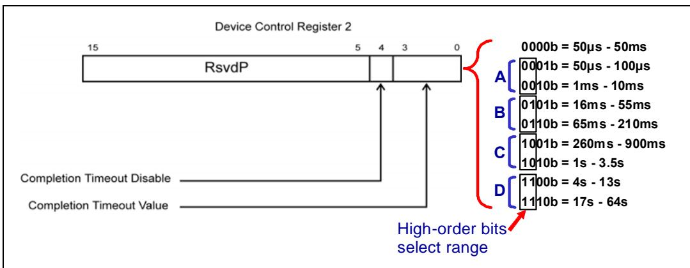

If Requests need multiple Completions to return the requested data, a single Completion won’t stop the timer. Instead, the timer continues to run until all the data has been returned regardless of how many Completions are needed. If only part of the data has been returned when the timeout occurs, the Requester may discard or keep that data.

## Link Flow Control Related Errors

Prior to forwarding the packet to the Data Link Layer for transmission, the Transaction Layer must check Flow Control (FC) credits to ensure that the receive buffers of the Link neighbor have sufficient room to hold it. Flow Control violations may occur, and they are considered uncorrectable. Protocol violations related to Flow Control can detected by and associated with the port receiving the Flow Control information. Some examples are given here:

Link partner fails to advertise at least the minimum number of FC credits defined by the spec during FC initialization for any Virtual Channel.

Link partner advertises more than the allowed maximum number of FC credits (up to 2047 unused credits for data payload and 127 unused credits for headers).

Receipt of FC updates containing non‐zero values in credit fields that were initially advertised as infinite.

A receive buffer overflow, resulting in lost data. This check is optional but a detected violation is considered to be a Fatal error.

## Malformed TLP

TLPs arriving in the Transaction Layer are checked for violations of the packet formatting rules. A violation in the packet format is considered a Fatal error because it means the transmitter has made a grievous mistake in protocol, such as failing to properly maintain its counters, and the result is that it’s no longer performing as expected. Some examples of a packet being considered malformed (badly formed) include the following:

• Data payload exceeds Max payload size.

• Data length does not match length specified in the header.

Memory start address and length combine to cause a transaction to cross a naturally‐aligned 4KB boundary.

TLP Digest (TD field) indication doesn’t correspond with packet size (ECRC is unexpectedly missing or present).

• Byte Enable violation.

• Undefined Type field values.

• Completion that violates the Read Completion Boundary (RCB) value.

Completion with status of Configuration Request Retry Status in response to a Request other than a configuration Request.

Traffic Class field contains a value not assigned to an enabled Virtual Channel (this is also known as TC Filtering).

• I/O and Configuration Request violations (checking optional)  ‐  examples: TC field, Attr[1:0], and the AT field must all be zero, while the Length field must have a value of one.

• Interrupt emulation messages sent downstream (checking optional).

• TLP received with a TLP Prefix error:

— TLP Prefix but no TLP Header

— End‐to‐End TLP Prefixes preceding Local Prefixes

— Local TLP Prefix type not supported

— More than 4 End‐to‐End TLP Prefixes

— More End‐to‐End TLP Prefixes than are supported

• Transaction type requiring use of TC0 has a different TC value:

— I/O Read or Write Requests and corresponding Completions

— Configuration Read or Write Requests and corresponding Completions

— Error Messages

— INTx messages

— Power Management messages

— Unlock messages

— Slot Power messages

— LTR messages

— OBFF messages

• AtomicOp operand doesn’t match an architected value.

• AtomicOp address isn’t naturally aligned with operand size.

• Routing is incorrect for transaction type (e.g., transactions requiring routing to Root Complex detected moving away from Root Complex).

## Internal Errors

## The Problem

The first versions of the PCIe spec did not include a mechanism for reporting errors within a device that were unrelated to transactions on the interface itself. For Endpoints this wasn’t really a problem because they have a vendor‐specific device driver associated with them that can detect and report internal errors. However, Switches are considered system resources that are managed by the OS, and typically don’t have software to help with internal error detection. In high‐end systems, the ability to contain errors is important, so Switch vendors created proprietary means of handling internal errors. Unfortunately, since different vendor solutions were incompatible with each other, the end result was that they were seldom used.

## PCI Express Technology

## The Solution

To alleviate this situation, a standardized internal error reporting option was added with the 2.1 spec version. The definition of what constitutes an internal error is beyond the scope of the spec, but they can be reported as either Corrected or Uncorrectable Internal Errors.

A Corrected Internal Error means an error was masked or worked around by the hardware with no loss of information or improper behavior. An example would be an ECC error on an internal memory location that was corrected automatically. On the other hand, an Uncorrectable Internal Error means improper operation has resulted with potential data loss, such as a parity error on an internal memory location. Reporting internal errors is optional and, if it is used, the AER (Advanced Error Reporting) registers must be present to support it.

## How Errors are Reported

## Introduction

PCI Express includes three methods of reporting errors, as shown below. The first two, Completions and poisoned packets, were covered earlier, so our next topic will be the error Messages.

• Completions — Completion Status reports errors back to the Requester

• Poisoned Packet — reports bad data in a TLP to the receiver

• Error Message — reports errors to the host (software)

## Error Messages

PCIe eliminated the sideband signals from PCI and replaced them with Error Messages. These Messages provide information that could not be conveyed with the PERR# and SERR# signals, such as identifying the detecting Function and indicating the severity of the error. Figure 15‐9 illustrates the Error Message format. Note that they’re routed to the Root Complex for handling. The Message Code defines the type of Message being signaled. Not surprisingly, the spec defines three types of error Messages, as shown in Table 15‐2.

## Chapter 15: Error Detection and Handling

Table 15‐2: Error Message Codes and Description

<table><tr><td>Message Code</td><td>Name</td><td>Description</td></tr><tr><td>30h</td><td>ERR_COR</td><td>Device detected a correctable error. This is automatically corrected by hardware and doesn’t require software attention. However, it can be helpful to report them anyway so software can watch for trends like an increasing number of correctable errors.</td></tr><tr><td>31h</td><td>ERR_NONFATAL</td><td>Indicates an uncorrectable Non-Fatal error. No hardware correction mechanism was available but the Link is still working reliably. Software attention will be required to resolve the problem.</td></tr><tr><td>33h</td><td>ERR_FATAL</td><td>Indicates an uncorrectable Fatal error. No hardware correction mechanism was available and Link operation has failed in some important respect. Software attention will be required and a reset of at least one device will probably be required to resolve this issue.</td></tr></table>

Figure 15‐9: Error Message Format  

## PCI Express Technology

## Advisory Non-Fatal Errors

Since we’ve just seen that both types of Uncorrectable errors will need software attention, it sounds counter‐intuitive to say that there are cases where it’s preferable that a device not report Non‐Fatal errors it detects, but there are. These cases are predominantly based on the role of the detecting agent (Requester, Completer, or Intermediate device) and the type of error. The problem is that multiple devices might report an error caused by the same event and, on some platforms, sending one of the Non‐Fatal Error Messages (ERR\_NONFATAL) can prevent software from properly handling the error. For example, if an Endpoint reports an error, its device driver will be called to service the situation. However, if a Switch reports an error first for the same transaction, system software might be called to investigate and might not understand what the driver was trying to accomplish or what would be the optimal response.

That example illustrates that some detecting agents aren’t the best ones to determine the ultimate disposition of the error and shouldn’t send an uncorrectable message. Instead, such an agent can signal an advisory notification to software with ERR\_COR. This avoids confusion about the source of the uncorrectable error but still gives software a little more information about what happened. Eventually, the appropriate detecting agent will send the ERR\_NONFATAL message whenever it sees the error. Beginning with the 1.1 spec revision, a new field was added in the PCI Express Device Capabilities register to indicate support for this capability as shown in Figure 15‐10 on page 670. This bit must be set for every agent that is compliant with the 1.1 spec or later.

Figure 15‐10: Device Capabilities Register  
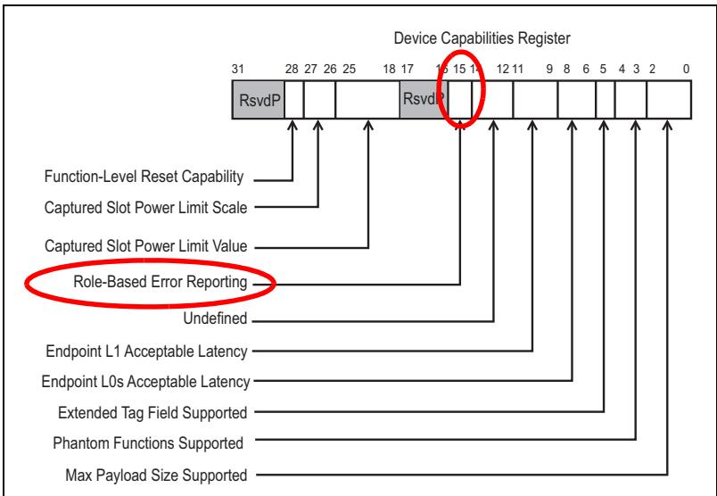

In spite of the reasons just described, software might want to stop operation as soon as some advisory errors are seen by an intermediate device. Since newer devices will always perform role‐based error reporting, an override mechanism is needed. To handle this case, software can escalate the severity of the advisory errors from Non‐Fatal to Fatal in the AER (Advanced Error Reporting) registers. Since there is no “advisory fatal” case, the error will now be reported as a Fatal Error (ERR\_FATAL), if enabled, regardless of the role of the device.

## Advisory Non-Fatal Cases

The spec lists five situations for which an advisory message (ERR\_COR) is preferred over a ERR\_NONFATAL message. In each of these cases, the detecting agent will handle the error as an Advisory Non‐Fatal Error. This means that a Non‐Fatal condition will be handled by sending an ERR\_COR, assuming the agent has AER registers and has enabled ERR\_COR. If it doesn’t have AER registers or ERR\_COR was not enabled, it sends no Error Message. The five cases are as follows:

1. Completer sent a Completion with UR or CA Status. The expectation in this case is that the Requester will have a mechanism to handle the error when it sees the offending Completion and will be the best agent to send whatever Error Messages are needed. A ERR\_NONFATAL message from the Completer would just be confusing, so it must be handled as Advisory Non‐Fatal (ERR\_COR).

Curiously, there is no PCIe mechanism for the Requester to report that it received a Completion with this status. Instead, a design‐specific method like an interrupt will be needed to get device driver attention. An important example of this happens when the Root Complex receives a Completion with UR or CA status in response to a Configuration Read Request. On some platforms the response is to return all 1’s to software for this case, to support backward compatibility with PCI enumeration (configuration probing) software.

2. Intermediate device detected an error. This case comes up in systems that employ Switches because a detecting agent may not be the final destination for a TLP. As an example of this, consider Figure 15‐11 on page 672, showing a poisoned packet delivered through an intermediate Switch. The TLP is seen as a Non‐Fatal error by the Switch but it can only signal an ERR\_COR message instead (as long as it’s enabled to do so).

To explore this concept a little more, why wouldn’t we want the Switch to report ERR\_NONFATAL? One reason is seen by looking at error tracking in the AER registers. Figure 15‐12 on page 672 shows the AER registers that track the Source ID (BDF of the sending device) of Error Messages coming into a Root Port and we can see that there’s only one space available for uncorrectable errors. If multiple uncorrectable errors are seen, that fact will be noted but only the first source ID will be saved since it is considered to be the probable cause of subsequent errors. It’s important, therefore, that uncorrectable errors come from the most appropriate device to report them. It’s worth noting that it’s still helpful for intermediate devices to report ERR\_COR, because it allows software to determine where the error was first detected.

Figure 15‐11: Role‐Based Error Reporting Example  

Figure 15‐12: Advanced Source ID Register

<table><tr><td colspan="2">Error Source Identification Register of the AER Capability Structure</td></tr><tr><td>31</td><td>0</td></tr><tr><td>ERR_FATAL/NONFATAL Source ID (ROS)</td><td>ERR_COR Source ID (ROS)</td></tr><tr><td colspan="2">ROS: Read-Only and Sticky</td></tr></table>

As another example, 1.0a devices that have the UR Reporting Enable bit cleared but don’t have the Role‐Based Error Reporting capability are unable to report any error Messages when a UR error is detected (for posted or non‐posted Requests). In contrast, a 1.1‐compliant or later Completer that has the SERR# Enable bit set will send an ERR\_NONFATAL or ERR\_FATAL message for bad posted Requests, even if the Unsupported Request Reporting Enable bit is clear, so as to avoid silent data corruption. But it won’t send an error Message for non‐posted Requests received, so as to support the PCI‐compatible configuration method of probing with configuration reads. It’s recommended that software keep the UR Error Reporting Enable bit clear for devices that are not capable of Role‐Based Error Reporting, but set it for those that are. That way, UR errors are reported on bad posted requests, but not for bad non‐posted requests like configuration probing transactions, and backward compatibility with older software is main tained.

The spec also mentions that poisoned TLPs sent to the Root will be handled in the same way if the Root is acting as an intermediate agent, but there is one exception: If the Root doesn’t support Error Forwarding, it will be unable to communicate the poisoned error with the TLP and must report this as a Non‐Fatal error instead.

3. Destination device received a poisoned TLP. Normally, Endpoints would report the Non‐Fatal error in this case, but there’s an exception to this rule: If the ultimate destination device is able to handle the poisoned data in a way that allows for continued operation, it must treat this case as an Advisory Non‐Fatal Error instead.

An example of this behavior might be an audio device that receives streaming data that has been poisoned. In this situation, the data may be accepted even though it’s known to be corrupted because pausing the audio flow long enough to get software attention and take remedial action would be a worse alternative than allowing a glitch in the sound output.

4. Requester experienced a Completion Timeout. This is a similar case to the previous one; if the Requester has a means of continuing operation in spite of the problem then it must treat this as an Advisory Non‐Fatal Error. A simple work‐around for the Requester in this case would simply be to send the request again and hope for better results this time. Clearly, this would only make sense if the previous request did not cause any side effects, but Requesters are permitted to do this as often as they like (although the spec says the number of retries must be finite).

5. Unexpected completion received. This must be handled as an Advisory Non‐Fatal Error. The reason is that it was probably caused by a mis‐routed Completion and the original Requester will eventually report a Completion timeout. To allow that other Requester to attempt a retry of the failed request, it’s important that the one that sees the Unexpected Completion not send an Non‐Fatal message.

## Baseline Error Detection and Handling

This section defines the required support for detecting and reporting PCI Express errors. Compliant devices must include:

• PCI‐Compatible support — required to honor PCI‐compatible error control and status fields for older software that has no awareness of PCI Express.

PCI Express Error reporting — uses standard PCIe structures to for error control and status which can be used by newer software that does have knowledge of PCI Express.

## PCI-Compatible Error Reporting Mechanisms

## General

PCI Express errors are mapped into the original PCI configuration register bits for backward compatibility, allowing error status and control to be accessible to PCI‐compliant software. To understand the features available from the PCIcompatible point of view, consider the error‐related bits of the Command and Status registers located within the Configuration header. Some of the field definitions have been modified to reflect the related PCIe error conditions and reporting mechanisms. The PCI Express errors tracked by the PCI‐compatible registers are:

• Transaction Poisoning/Error Forwarding (synonymous to data parity error in PCI)

Completer Abort (CA) detected by a Completer (synonymous to Target Abort in PCI)

Unsupported Request (UR) detected by a Completer (synonymous to Master Abort in PCI)

As mentioned earlier, the PCI mechanism for reporting errors is the assertion of PERR# (data parity errors) and SERR# (unrecoverable errors). The PCI Express mechanisms for reporting these events are the Completion Status values in Completions and Error Messages to the Root.

## Legacy Command and Status Registers

Figure 15‐13 on page 675 illustrates the Command register and the location of the error‐related fields. These bits are set to enable baseline error reporting under control of PCI‐compatible software. Table 15‐3 defines the specific effects of each bit.

Figure 15‐13: Command Register in Configuration Header  
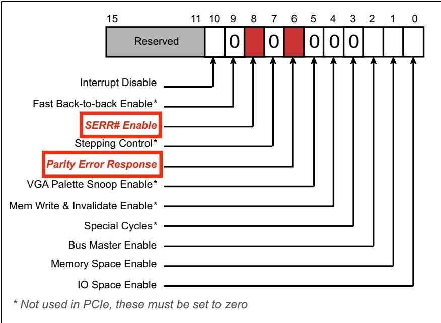

Table 15‐3: Error‐Related Fields in Command Register

<table><tr><td>Name</td><td>Description</td></tr><tr><td>SERR# Enable</td><td>Setting this bit enables sending ERR_FATAL and ERR_NONFATAL error messages to the Root Complex. These are considered roughly analogous to asserting the System Error (SERR#) signal in PCI. For Type 1 headers (bridges), this bit controls the forwarding of ERR_FATAL and ERR_NONFATAL error messages from the secondary interface to the primary interface.This field has no affect over ERR_COR messages.</td></tr><tr><td>Parity Error Response</td><td>Setting this bit enables logging of poisoned TLPs in the Master Data Parity Error bit in the Status register. Poisoned packets indicate bad data and are roughly analogous to a PCI parity error.</td></tr></table>

Figure 15‐14 on page 676 illustrates the Configuration Status register and the location of the error‐related bit fields. Table 15‐4 on page 677 defines the circumstances under which each bit is set and the actions taken by the device when error reporting is enabled.

Figure 15‐14: Status Register in Configuration Header  
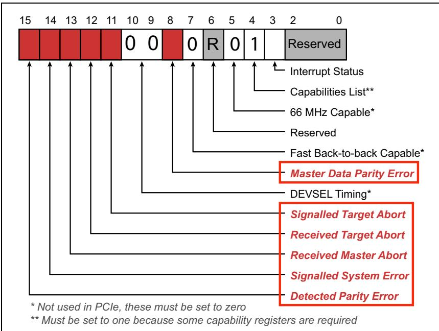

Table 15‐4: Error‐Related Fields in Status Register

<table><tr><td>Error-Related Bit</td><td>Description</td></tr><tr><td>Detected Parity Error</td><td>Set by the port that receives a poisoned TLP. This status bit is updated regardless of the state of the Parity Error Response bit.</td></tr><tr><td>Signalled System Error</td><td>Set by a port that has reported an Uncorrectable Error with ERR_FATAL or ERR_NONFATAL and the SERR# enable bit in the Command register was set.</td></tr><tr><td>Received Master Abort</td><td>Set by a Requester that receives a Completion with status of UR (Unsupported Request). This is considered analogous to a PCI master abort because the target did not “claim the transaction”.</td></tr><tr><td>Received Target Abort</td><td>Set by a Requester that receives a Completion with status of CA (Completer Abort). This is analogous to a PCI target abort in that the target has had a programming violation or internal error condition.</td></tr><tr><td>Signaled Target Abort</td><td>Set by the Completer that handled a request (either posted or non-posted) as a Completer Abort. If it was a non-posted request, then a Completion with a Completion Status of CA is sent.</td></tr><tr><td>Master Data Parity Error</td><td>For Type 0 headers (e.g., Endpoints), this bit is set if the Parity Error Response bit in the Command register is set AND it either initiates a poisoned request OR receives a poisoned completion.For Type 1 headers (e.g., Switches and Root Ports), this bit is set if the Parity Error Response bit in the Command register is set AND it either initiates a poisoned request heading upstream OR receives a poisoned completion heading downstream.</td></tr></table>

## Baseline Error Handling

The Baseline capability requires the use of the PCI Express Capability structure. These registers include error detection and handling fields that provide finer granularity regarding the nature of an error and whether to report it or not than what is possible with just PCI‐compatible error handling.

Figure 15‐15 on page 678 illustrates the PCI Express Capability structure. Some of these registers provide support for:

• Enabling/disabling error reporting (Error Message Generation)

• Providing error status

• Providing link training status and initiating link re‐training

Figure 15‐15: PCI Express Capability Structure

<table><tr><td rowspan="15"></td><td>PCI Express Capabilities Register</td><td>Next Cap Pointer</td><td>PCI Express Cap ID</td></tr><tr><td colspan="3">Device Capabilities Register</td></tr><tr><td>Device Status</td><td colspan="2">Device Control</td></tr><tr><td colspan="3">Link Capabilities</td></tr><tr><td>Link Status</td><td colspan="2">Link Control</td></tr><tr><td colspan="3">Slot Capabilities</td></tr><tr><td>Slot Status</td><td colspan="2">Slot Control</td></tr><tr><td>Root Capability</td><td colspan="2">Root Control</td></tr><tr><td colspan="3">Root Status</td></tr><tr><td colspan="3">Device Capabilities 2</td></tr><tr><td>Device Status 2</td><td colspan="2">Device Control 2</td></tr><tr><td colspan="3">Link Capabilities 2</td></tr><tr><td>Link Status 2</td><td colspan="2">Link Control 2</td></tr><tr><td colspan="3">Slot Capabilities 2</td></tr><tr><td>Slot Status 2</td><td colspan="2">Slot Control 2</td></tr></table>

## Enabling/Disabling Error Reporting

The Device Control registers allow software to enable generation of three different Error Messages for four error events, and Device Status registers allow it to see which error has been detected. The four error cases are:

• Correctable Errors

• Non‐Fatal Errors

• Fatal Errors

• Unsupported Request Errors

Note that the only specific error identified here is the Unsupported Request. Although an Unsupported Request is technically a subset of Non‐Fatal errors, and, when reported, is even signaled with an ERR\_NONFATAL message, it has its own enable and status bits. Thatʹs because during system enumeration Unsupported Requests are going to happen (whenever an attempt it made to read config space from a Function that doesnʹt actually exist in the system) but they must not be reported as errors. The enumeration software may have very limited error‐handling capability and if it was required to stop and service an error it might fail. Therefore, the software doesnʹt want error messages generated for the UR case during that time, but does want to know about any other Non‐Fatal errors that may be detected. (See the section titled “Discovering the Presence or Absence of a Function” on page 105 for more details on Unsupported Requests during enumeration.)

Table 15‐5 on page 679 lists each error type and its associated error classification.

Table 15‐5: Default Classification of Errors

<table><tr><td>Classification &amp; Severity</td><td>Name of Error</td><td>Layer Detected</td></tr><tr><td>Correctable</td><td>Receiver Error</td><td>Physical</td></tr><tr><td>Correctable</td><td>Bad TLP</td><td>Link</td></tr><tr><td>Correctable</td><td>Bad DLLP</td><td>Link</td></tr><tr><td>Correctable</td><td>Replay Number Rollover</td><td>Link</td></tr><tr><td>Correctable</td><td>Replay Timer Timeout</td><td>Link</td></tr><tr><td>Correctable</td><td>Advisory Non-Fatal Error</td><td>Transaction</td></tr><tr><td>Correctable</td><td>Corrected Internal Error</td><td></td></tr><tr><td>Correctable</td><td>Header Log Overflow</td><td>Transaction</td></tr><tr><td>Uncorrectable - Non Fatal</td><td>Poisoned TLP Received</td><td>Transaction</td></tr><tr><td>Uncorrectable - Non Fatal</td><td>ECRC Check Failed</td><td>Transaction</td></tr><tr><td>Uncorrectable - Non Fatal</td><td>Unsupported Request</td><td>Transaction</td></tr><tr><td>Uncorrectable - Non Fatal</td><td>Completion Timeout</td><td>Transaction</td></tr><tr><td>Uncorrectable - Non Fatal</td><td>Completer Abort</td><td>Transaction</td></tr><tr><td>Uncorrectable - Non Fatal</td><td>Unexpected Completion</td><td>Transaction</td></tr><tr><td>Uncorrectable - Non Fatal</td><td>ACS Violation</td><td>Transaction</td></tr><tr><td>Uncorrectable - Non Fatal</td><td>MC Blocked TLP</td><td>Transaction</td></tr><tr><td>Uncorrectable - Non Fatal</td><td>AtomicOps Egress Blocked</td><td>Transaction</td></tr><tr><td>Uncorrectable - Non Fatal</td><td>TLP Prefix Blocked</td><td>Transaction</td></tr><tr><td>Uncorrectable - Fatal</td><td>Uncorrectable Internal Error (optional)</td><td></td></tr><tr><td>Uncorrectable - Fatal</td><td>Surprise Down (optional)</td><td>Link</td></tr><tr><td>Uncorrectable - Fatal</td><td>Receiver Overflow (optional)</td><td>Transaction</td></tr><tr><td>Uncorrectable - Fatal</td><td>DLL Protocol Error</td><td>Link</td></tr><tr><td>Uncorrectable - Fatal</td><td>Receiver Overflow</td><td>Transaction</td></tr><tr><td>Uncorrectable - Fatal</td><td>Flow Control Protocol Error</td><td>Transaction</td></tr><tr><td>Uncorrectable - Fatal</td><td>Malformed TLP</td><td>Transaction</td></tr></table>

Device Control Register. Setting bits in the Device Control Register, shown in Figure 15‐16 on page 681, enables sending the corresponding Error Messages to report errors. Unsupported Request errors are specified as Non‐Fatal errors and are reported via a Non‐Fatal Error Message, but only when the UR Reporting Enable bit is set.

In order for a Function to actually send an error message, either the corresponding enable bit in the Device Control register needs to be set, or for Fatal and Non‐Fatal errors, the SERR# Enable should be set. For Uncorrectable Errors, if either the SERR# Enable bit in the Command Register is set OR the corresponding enable bit in the Device Control register is set, the appropriate error message will be sent (ERR\_FATAL or ERR\_NONFATAL).

For Correctable Errors, a Function will only send the ERR\_COR message if the Correctable Error Reporting Enable bit in the Device Control register is set. There is no control to enable ERR\_COR messages from the PCI‐Compatible mechanisms, which makes sense because in PCI, there was no concept of correctable errors.

Figure 15‐16: Device Control Register Fields Related to Error Handling  

Device Status Register. An error status bit is set in the Device Status register, shown in Figure 15‐17 on page 682, anytime an error associated with its classification is detected, regardless of the setting of the error reporting enable bits in the Device Control Register. Because Unsupported Request errors are considered Non‐Fatal Errors, when these errors occur both the Non‐Fatal Error Detected status bit and the Unsupported Request Detected status bit will be set. Like several other status bits, these are “Sticky” (their values are not cleared by a reset event so they’ll be available for diagnosing problems even if a reset was needed to get the Link working well enough to read the status).

Figure 15‐17: Device Status Register Bit Fields Related to Error Handling  

## Root’s Response to Error Message

When an Error Message is received by the Root, the action it takes is determined in part by the settings in the Root Control Register. Figure 15‐18 depicts this register and highlights the three fields that specify whether a received Error Message should be reported as System Error. In some x86‐based systems, it’s likely that an NMI (Non‐Maskable Interrupt) will be signaled if the error is enabled to trigger a System Error.

Other options for reporting Error Messages are not configurable via standard registers. The most likely scenario is that an interrupt will be signaled to the processor that will call an Error Handler, which may log the error and attempt to clear the problem.

Figure 15‐18: Root Control Register  

## Link Errors

Link failures are typically detected in the Physical Layer and communicated to the Data Link Layer. For a downstream device, if the link has incurred a Fatal error and is not operating correctly, it can’t report the error to the host. For these cases, the error must be reported by the upstream device. If software can isolate errors to a given link, one step in handling an uncorrectable error (or to prevent future uncorrectable errors) is to retrain the Link. The Link Control Register includes a bit that allows software to force the Link to retrain, as shown inFigure 15‐19 on page 684. If that solves the problem, operation resumes with little downtime.

Figure 15‐19: Link Control Register ‐ Force Link Retraining  
  
Having once requested retraining, software can poll the Link Training bit in the Link Status Register to see when training has completed. Figure 15‐20 highlights this status bits. When this bit is 1b, the Link is still in the retraining process (or has yet to start retraining). Hardware will clear this bit once the Physical Layer reports the Link as active meaning the training process has completed successfully.

Figure 15‐20: Link Training Status in the Link Status Register  
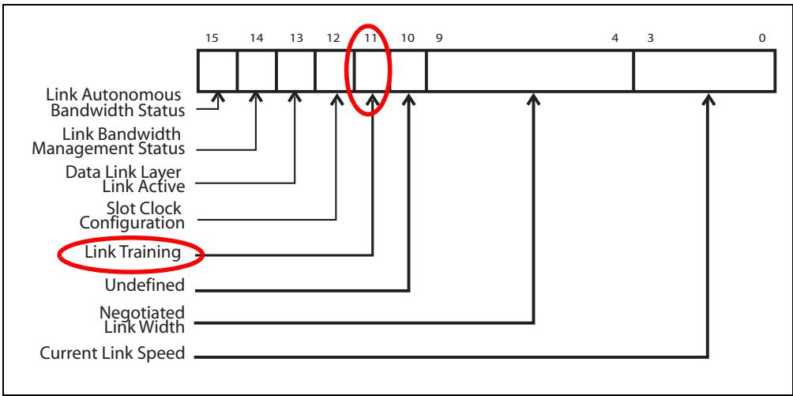

## Advanced Error Reporting (AER)

The Advanced Error Reporting Structure illustrated in Figure 15‐21 on page 686 allows for much more sophisticated error handling. These registers provide several additional features:

• Better granularity in logging the actual type of error that occurred

• Control to specify the severity of each uncorrectable error type

• Support for logging the header of packets that had errors

Standardizing control for the Root to report received Error Messages with an interrupt

• Identifying the source of the error in the PCIe topology

• Ability to mask reporting individual types of errors

Figure 15‐21: Advanced Error Capability Structure  
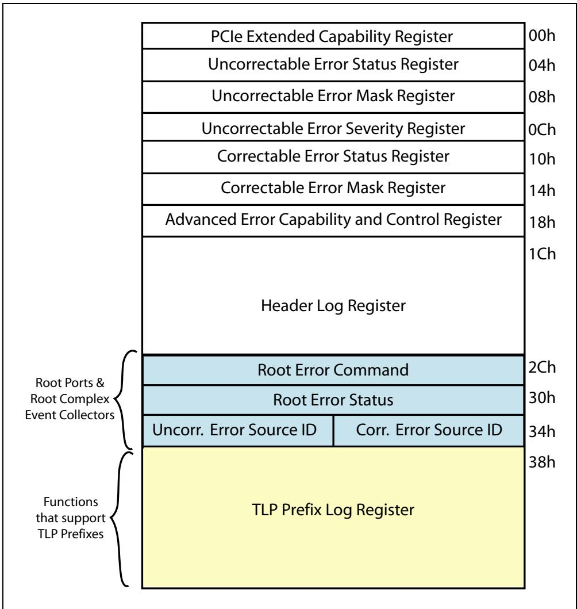

## Advanced Error Capability and Control

Let’s begin our discussion of AER by looking at the Advanced Error Capability and Control register. End‐to‐End CRC (ECRC) generation and checking requires AER, and this register, shown in Figure 15‐22 on page 687, reports whether this device supports it. If so, configuration software can enable (and force) its use by setting the appropriate bits.

The five low‐order bits of this register contain the First Error Pointer, set by hardware when the Uncorrectable Error status bits are updated. There are 32 status bits and the First Error Pointer indicates which of the unmasked, Uncorrectable Errors was detected first, meaning which status bit was set when all the other status bits were still 0. The first error is the most interesting because the others may have been caused by the first one.

Figure 15‐22: The Advanced Error Capability and Control Register  

Beginning with the 2.1 spec revision, this capability was enhanced to allow tracking multiple errors. For that reason, if multiple error status bits have been set and cleared, the meaning really becomes more like an “Oldest Error Pointer” instead. The pointer is updated by hardware when the corresponding status bit is cleared by software, at which time it points to whichever error was detected next (see Figure 15‐25 on page 691 for the list of uncorrectable errors). Interestingly, the next error may be the same one again if that error had been detected multiple times, with the result that the updated pointer still indicates the same value.

Since multiple errors can be recorded in the Uncorrectable Status register, it would be very helpful to store multiple headers, too. Hardware must be designed to log at least one header, but is allowed to support more. If it does, the Multiple Header Recording Capable bit will be set and the Multiple Header Recording Enable bit can be used to enable storing more than one. Whenever the First Error Pointer indicates a status bit position that is not set or is not implemented, it means there are no more uncorrectable errors to service.

## PCI Express Technology

The last bit in this register, TLP Prefix Log Present, indicates whether the TLP Prefix Log registers contain valid information for the uncorrectable error indicated by the First Error Pointer.

The fields in this register and the other AER registers have various characteristics, which are abbreviated as follows:

• RO — Read Only, set by hardware

• ROS — Read Only and Sticky (see the next section on sticky bits)

• RsvdP ‐ Reserved and Preserved. These bits must not be used for any purpose, but software must be careful to maintain whatever values they contain.

• RsvdZ ‐ Reserved and Zero. Bits that must not be used for any purpose and must always be written to zeros.

• RWS — Readable, Writeable and Sticky

• RW1CS — Readable, Write 1 to Clear, and Sticky

## Handling Sticky Bits

Several AER register fields employ sticky bits, which means that a reset won’t clear their contents. All other register fields are forced to default values on a reset, but these are not. This is a good idea because a Link may encounter a failure that can’t be cleared without a reset. If the problem is in the downstream device of the failed Link, its register contents are unavailable until the Link is working again, which the reset will accomplish. But if the registers were cleared by the reset then the information is lost. To solve this problem, sticky bits keep error status information available through a reset. Specifically, sticky bits will survive an FLR (Function Level Reset), a Hot Reset, and a Warm Reset because power is available to keep them active. They may even survive a Cold Reset if a secondary power source like $\mathrm { V _ { a u x } }$ is available to keep them active when the main power is shut off.

## Advanced Correctable Error Handling

Advanced Error Reporting provides the ability to record which specific correctable errors have been detected. These errors can be used to initiate a Correctable Error Message to the host system. Although system operation continues normally, reporting correctable errors can be useful because it allows system software to see which components are having trouble and to predict whether they may fail completely in the future.

## Advanced Correctable Error Status

Correctable errors will automatically set the corresponding bit in the Advanced Correctable Error Status register, shown in Figure 15‐23 on page 689, regardless of whether the error is reported with an Error Message. These bits are cleared by software writing a “1” to the bit position, hence the designation RW1CS.

Figure 15‐23: Advanced Correctable Error Status Register  

Receiver Error (optional) — Physical Layer detected an error in the incoming packet. The packet is discarded at the Physical Layer, any buffer space allocated to it is released, and the Link Layer is informed that a receive error occurred.

Bad TLP — Data Link Layer detected a packet with a bad LCRC, an out‐ofsequence Sequence Number or an incorrectly nullified packet. In each case, the Link Layer discards the packet and reports a Nak DLLP to the transmitter, triggering a TLP replay.

Bad DLLP — Data Link Layer noticed an incoming DLLP had a 16‐bit CRC failure so the packet is dropped. A subsequent DLLP of the same type is expected to make up for the information it contained.

REPLAY\_NUM Rollover — At the Data Link Layer, a set of TLPs have been sent without success (no Ack) four times in a row and this counter has rolled over back to zero. Hardware will automatically retrain the link in an attempt to clear the failure condition, then start the sequence again by replaying the contents of the Replay Buffer.

## PCI Express Technology

Replay Timer Timeout — At the Data Link Layer, transmitted TLPs have not received an acknowledgement (Ack or Nak) within the timeout period. Hardware automatically replays all unacknowledged TLPs, meaning all packets in the Replay Buffer.

Advisory Non‐Fatal Error — Detection of these cases (see “Advisory Non‐Fatal Errors” on page 670) is logged in the corresponding Uncorrectable Error Status register and as a correctable error here. It may also generate a Correctable Error Message, if enabled.

Corrected Internal Error (optional) — An error internal to the device was detected, but it was corrected or worked around without causing improper behavior.

Header Log Overflow (optional) — The maximum number of headers that can be stored in the header log has been reached. The number is just one if the Multiple Header Recording Enable bit is not set in the Advanced Error Capability and Control register.

## Advanced Correctable Error Masking

Correctable Error reporting is controlled collectively by the Correctable Error Enable bit in the Device Control register, but also individually by the Correctable Mask register, illustrated in Figure 15‐24. The default state of the mask bits is cleared, meaning an ERR\_COR message can be delivered when any correctable errors are detected if they’ve been enabled (meaning the Correctable Error Enable bit is set). However, software may choose to set bits in this mask register to prevent a message from being sent when those specific errors are detected.

Figure 15‐24: Advanced Correctable Error Mask Register

<table><tr><td rowspan="83">31</td><td rowspan="83">RsvdP</td><td>16</td><td>15</td><td>14</td><td>13</td><td>12</td><td>11</td><td>9</td><td>8</td><td>7</td><td>6</td><td>5</td><td>1</td><td>0</td></tr><tr><td></td><td></td><td></td><td></td><td></td><td></td><td>RsvdP</td><td></td><td></td><td></td><td></td><td>RsvdP</td><td></td></tr><tr><td></td><td></td><td></td><td></td><td></td><td></td><td></td><td></td><td></td><td></td><td></td><td></td><td></td></tr><tr><td></td><td></td><td></td><td></td><td></td><td></td><td></td><td></td><td></td><td></td><td></td><td></td><td></td></tr><tr><td></td><td></td><td></td><td></td><td></td><td></td><td></td><td></td><td></td><td></td><td></td><td></td><td></td></tr><tr><td></td><td></td><td></td><td></td><td></td><td></td><td></td><td></td><td></td><td></td><td></td><td></td><td></td></tr><tr><td></td><td></td><td></td><td></td><td></td><td></td><td></td><td></td><td></td><td></td><td></td><td></td><td></td></tr><tr><td></td><td></td><td></td><td></td><td></td><td></td><td></td><td></td><td></td><td></td><td></td><td></td><td></td></tr><tr><td></td><td></td><td></td><td></td><td></td><td></td><td></td><td></td><td colspan="5"></td></tr><tr><td></td><td></td><td></td><td></td><td></td><td></td><td></td><td></td><td></td><td></td><td></td><td></td><td></td></tr><tr><td></td><td></td><td></td><td></td><td></td><td></td><td></td><td></td><td></td><td></td><td></td><td></td><td></td></tr><tr><td></td><td></td><td></td><td></td><td></td><td></td><td></td><td></td><td></td><td></td><td></td><td></td><td></td></tr><tr><td></td><td></td><td></td><td></td><td></td><td></td><td></td><td></td><td></td><td></td><td></td><td></td><td></td></tr><tr><td></td><td></td><td></td><td></td><td></td><td></td><td></td><td></td><td></td><td></td><td></td><td></td><td></td></tr><tr><td></td><td></td><td></td><td></td><td></td><td></td><td></td><td></td><td></td><td colspan="4"></td></tr><tr><td></td><td></td><td></td><td></td><td></td><td></td><td></td><td></td><td></td><td></td><td></td><td></td><td></td></tr><tr><td></td><td></td><td></td><td></td><td></td><td></td><td></td><td></td><td></td><td></td><td></td><td></td><td></td></tr><tr><td></td><td></td><td></td><td></td><td></td><td></td><td></td><td></td><td></td><td></td><td></td><td></td><td></td></tr><tr><td></td><td></td><td></td><td></td><td></td><td></td><td></td><td></td><td></td><td></td><td></td><td></td><td></td></tr><tr><td></td><td></td><td></td><td></td><td></td><td></td><td></td><td></td><td></td><td></td><td></td><td></td><td></td></tr><tr><td></td><td></td><td></td><td></td><td></td><td></td><td colspan="7"></td></tr><tr><td></td><td></td><td></td><td></td><td></td><td></td><td colspan="7"></td></tr><tr><td></td><td></td><td></td><td></td><td></td><td></td><td colspan="7"></td></tr><tr><td></td><td></td><td></td><td></td><td></td><td></td><td colspan="7"></td></tr><tr><td></td><td></td><td></td><td></td><td></td><td></td><td colspan="7"></td></tr><tr><td></td><td></td><td></td><td></td><td></td><td></td><td colspan="7"></td></tr><tr><td></td><td></td><td></td><td></td><td></td><td></td><td colspan="4"></td><td colspan="3"></td></tr><tr><td></td><td></td><td></td><td></td><td></td><td></td><td colspan="7"></td></tr><tr><td></td><td></td><td></td><td></td><td></td><td></td><td colspan="7"></td></tr><tr><td></td><td></td><td></td><td></td><td></td><td></td><td colspan="7"></td></tr><tr><td></td><td></td><td></td><td></td><td></td><td></td><td colspan="7"></td></tr><tr><td></td><td></td><td></td><td></td><td></td><td></td><td colspan="7"></td></tr><tr><td></td><td></td><td></td><td></td><td></td><td></td><td colspan="2"></td><td colspan="5"></td></tr><tr><td></td><td></td><td></td><td></td><td></td><td></td><td colspan="7"></td></tr><tr><td></td><td></td><td></td><td></td><td></td><td></td><td colspan="7"></td></tr><tr><td></td><td></td><td></td><td></td><td></td><td></td><td colspan="7"></td></tr><tr><td></td><td></td><td></td><td></td><td></td><td></td><td colspan="7"></td></tr><tr><td></td><td></td><td></td><td></td><td></td><td></td><td colspan="7"></td></tr><tr><td></td><td></td><td></td><td></td><td></td><td colspan="8"></td></tr><tr><td></td><td></td><td></td><td></td><td></td><td></td><td colspan="7"></td></tr><tr><td></td><td></td><td></td><td></td><td></td><td></td><td colspan="7"></td></tr><tr><td></td><td></td><td></td><td></td><td></td><td></td><td colspan="7"></td></tr><tr><td></td><td></td><td></td><td></td><td></td><td></td><td colspan="7"></td></tr><tr><td></td><td></td><td></td><td></td><td></td><td></td><td colspan="7"></td></tr><tr><td></td><td></td><td></td><td colspan="10"></td></tr><tr><td></td><td></td><td></td><td></td><td></td><td></td><td colspan="7"></td></tr><tr><td></td><td></td><td></td><td></td><td></td><td></td><td colspan="7"></td></tr><tr><td></td><td></td><td></td><td></td><td></td><td></td><td colspan="7"></td></tr><tr><td></td><td></td><td></td><td></td><td></td><td></td><td colspan="7"></td></tr><tr><td></td><td></td><td></td><td></td><td></td><td></td><td colspan="7"></td></tr><tr><td></td><td></td><td colspan="11"></td></tr><tr><td></td><td></td><td></td><td></td><td></td><td></td><td colspan="7"></td></tr><tr><td></td><td></td><td></td><td></td><td></td><td></td><td colspan="7"></td></tr><tr><td></td><td></td><td></td><td></td><td></td><td></td><td colspan="7"></td></tr><tr><td></td><td></td><td></td><td></td><td></td><td></td><td colspan="7"></td></tr><tr><td></td><td></td><td></td><td></td><td></td><td></td><td colspan="7"></td></tr><tr><td colspan="13"></td></tr><tr><td></td><td></td><td></td><td></td><td></td><td></td><td colspan="7"></td></tr><tr><td></td><td></td><td></td><td></td><td></td><td></td><td colspan="7"></td></tr><tr><td></td><td></td><td></td><td></td><td></td><td></td><td colspan="7"></td></tr><tr><td></td><td></td><td></td><td></td><td></td><td></td><td colspan="7"></td></tr><tr><td rowspan="22"></td><td rowspan="13"></td><td rowspan="13"></td><td rowspan="13"></td><td rowspan="13"></td><td rowspan="13"></td><td rowspan="13" colspan="7"></td></tr><tr></tr><tr></tr><tr></tr><tr></tr><tr></tr><tr></tr><tr><td rowspan="6"></td><td rowspan="6"></td><td rowspan="6"></td></tr><tr></tr><tr></tr><tr></tr><tr></tr><tr></tr><tr><td colspan="12">Header Log Overflow Mask</td></tr><tr><td colspan="12">Corrected Internal Error Mask</td></tr><tr><td colspan="12">Advisory Non-Fatal Error Mask</td></tr><tr><td colspan="12">Replay Timer Timeout Mask</td></tr><tr><td colspan="12">REPLAY_NUM Rollover Mask</td></tr><tr><td colspan="12">Bad DLLP Mask</td></tr><tr><td colspan="12">Bad TLP Mask</td></tr><tr><td colspan="12">Receiver Error Mask</td></tr><tr><td colspan="12">Note: all bits designated RWS</td></tr></table>

## Advanced Uncorrectable Error Handling

For uncorrectable errors, AER provides the ability to track which specific error has occurred, control whether it should be considered Fatal or Non‐Fatal, and choose whether it will result in an Uncorrectable Error Message being sent to the Root.

## Advanced Uncorrectable Error Status

When an uncorrectable error occurs, the corresponding bit in this register is automatically set by hardware (see Figure 15‐25 on page 691) regardless of whether the error will be reported to the Root. If multiple errors occur, hardware will set the corresponding bit for each error and will record which one was first in the First Error Pointer field of the Advanced Error Capability and Control register. It may even happen that multiple instances of the same error are detected before the first one can be serviced. Hardware that is compliant with the 2.1 spec revision or later will be able to keep track of a design‐specific number of those cases.

Figure 15‐25: Advanced Uncorrectable Error Status Register  
  
The following list describes each of the register bits from right to left:

• Undefined — Previously, this first bit represented a link training failure at the Physical Layer, but that meaning was removed with the 1.1 revision of the spec. Software must now ignore any value in this bit but may write any value to it. This information was no longer needed because bit 5, Surprise Down Error, now includes the same information in a broader meaning: the Link is not communicating at the Physical Layer.

Data Link Protocol Errors — Caused by Data Link Layer protocol errors including the Ack/Nak retry mechanism. For example, a transmitter receives an Ack or Nak whose sequence number doesn’t correspond to an unacknowledged TLP or to the ACKD\_SEQ number.

Surprise Down — If the Physical Layer reports LinkUp = 0b (Link is no longer communicating) unexpectedly, this will be seen as an error unless it was an allowed exception. For example, if the Link Disable bit has already been set, then it’s expected that LinkUp will be cleared and this condition won’t be an error. This bit is only valid for Downstream Ports, which makes sense because it won’t be possible to read status from an Upstream Port if the Link isn’t working.

• Poisoned TLP — TLP was seen that had the EP bit set.

Flow Control Protocol Error (optional) — Errors associated with failures of the Flow Control mechanism. Example: receiver reports more than 2047 data credits.

• Completion Timeout — A Completion is not received within the required amount of time after a non‐posted request was sent.

• Completer Abort (optional) — Completer cannot fulfill a Request due to problems with the Request or failure of the Completer.

• Unexpected Completion — Requester receives a Completion that doesn’t match any Requests that are awaiting a Completion.

Receiver Overflow (optional) — More TLPs have arrived than the Receive Buffer had room to accept, resulting in an overflow error.

• Malformed TLP — Caused by errors associated with a received TLP header (see “Malformed TLP” on page 666).

• ECRC Error (optional) — Caused by an ECRC check failure at the Receiver.

Unsupported Request Error — Completer does not support the Request. Request is correctly formed and had no other errors, but cannot be fulfilled by the Completer, perhaps because it’s an invalid command for this device.

• ACS Violation — Access control error was seen in a received posted or nonposted request.

Uncorrectable Internal Error — An internal error detected in the device could not be corrected or worked around by the hardware itself.

MC Blocked TLP — A TLP designated for Multi‐Cast routing was blocked. For example, an Egress Port can be programmed to block any MC hits that arrive with untranslated addresses (see “Routing Multicast TLPs” on page 896).

• AtomicOp Egress Blocked — Egress Ports of routing elements can be programmed to block AtomicOps from being forwarded to agents that shouldn’t see them (see “AtomicOps” on page 897).

TLP Prefix Blocked Error — Egress Ports of routing elements can be programmed not to forward TLPs containing End‐to‐End TLP Prefixes. If they then see one, they’ll drop the TLP and report this error. For more on this, see “TPH (TLP Processing Hints)” on page 899.

Recall that the First Error Pointer in the Capability and Control Register indicates which unmasked uncorrectable error was the first to arrive since the pointer was last updated. Error handling software can read the pointer to find out which error to investigate first. As an example, if the pointer value is 18d, that means bit position 18 in the Uncorrectable Status register was first, which is a Malformed TLP. Once that error has been serviced, software writes a one to bit 18 in the status register to clear that event, which updates the First Error Pointer to the next‐most‐recent error

## Selecting Uncorrectable Error Severity

Software can select whether or not uncorrectable errors should be considered Fatal in this register, allowing errors to be treated differently for different applications. For example, a Poisoned TLP will be a Non‐Fatal condition by default, and is treated as an Advisory Non‐Fatal error in some cases, as discussed earlier. But software can escalate it to Fatal by setting its severity bit to one and then it will no longer be an advisory case. The default severity values are illustrated in the individual bit fields of Figure 15‐26 on page 694 (1 = Fatal, 0 = Non‐Fatal). If they are enabled and not masked, those errors selected as Non‐Fatal will cause an ERR\_NONFATAL message to be sent to the Root Complex, and those selected as Fatal will cause an ERR\_FATAL message.

Figure 15‐26: Advanced Uncorrectable Error Severity Register  
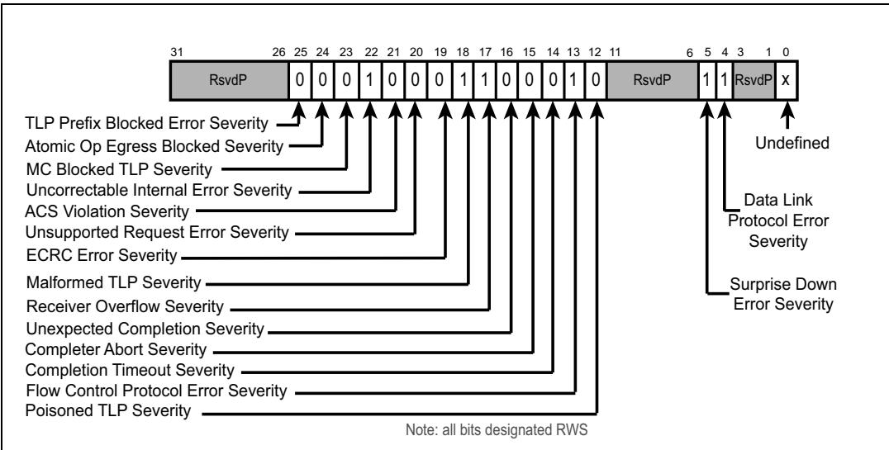

## Uncorrectable Error Masking

Software can mask out individual errors so they won’t cause an error message to be sent by using the Advanced Uncorrectable Error Mask register, shown in Figure 15‐27 on page 694. The default condition is to allow Error Messages for each type of error (all mask bits are cleared).

Figure 15‐27: Advanced Uncorrectable Error Mask Register  

## Header Logging

A 4DW portion of the Advanced Error Reporting structure is used for storing the header of a received TLP that incurs an unmasked, uncorrectable error. Since header logging is only useful when a TLP has been received with a problem that wasn’t seen by the Physical or Data Link Layers, the number of possibilities is limited, as shown in Table 15‐6 on page 695. As mentioned earlier, when the optional AER capability is implemented, hardware is required to be able to log at least one header, though it may support logging more.

When the First Error Pointer is valid, the header log contains the header for the corresponding error if it was caused by an incoming TLP. Updating the Uncorrectable Error Status register will cause the Header Log registers to also update to the next value in sequence, meaning the next uncorrectable error that was detected. Since the hardware can only track a limited number of headers, it’s important that software service uncorrectable errors quickly enough to avoid running out of header space. If the header log capacity is reached, that’s a correctable error in itself (Header Log Overflow). This could happen if the number of supported log registers is exceeded or if the Multiple Header Log Enable bit is not set and the First Error Pointer is already valid when a new uncorrectable error is detected.

Table 15‐6: Errors That Can Use Header Log Registers

<table><tr><td>Name of Error</td><td>Default Classification</td></tr><tr><td>Poisoned TLP Received</td><td>Uncorrectable - NonFatal</td></tr><tr><td>ECRC Check Failed</td><td>Uncorrectable - NonFatal</td></tr><tr><td>Unsupported Request</td><td>Uncorrectable - NonFatal</td></tr><tr><td>Completer Abort</td><td>Uncorrectable - NonFatal</td></tr><tr><td>Unexpected Completion</td><td>Uncorrectable - NonFatal</td></tr><tr><td>ACS Violation</td><td>Uncorrectable - NonFatal</td></tr><tr><td>Malformed TLP</td><td>Uncorrectable - Fatal</td></tr></table>

## Root Complex Error Tracking and Reporting

The Root Complex is the target of all error Messages from devices in a PCIe topology. Errors received by the Root update status registers and may be reported to the host system if enabled to do so.

## Root Complex Error Status Registers

When the Root receives an error Message, it sets status bits within the Root Error Status register (Figure 15‐28 on page 697). This register indicates the type of error received and whether multiple errors of the same type have been received. Note that an error detected in the Root Port itself will set these status bits, too, as if the port had sent itself an error message. The status bits are:

• ERR\_COR Received

Multiple ERR\_COR Received ‐ received an ERR\_COR message, or detected an unmasked Root Port correctable error with the ERR\_COR Received bit already set.

• ERR\_FATAL/NONFATAL Received

Multiple ERR\_FATAL/NONFATAL Received  ‐ received an ERR\_FATAL or ERR\_NONFATAL message or detected an unmasked Root Port uncorrectable error with the ERR\_FATAL/NONFATAL Received bit already set.

It’s possible for a system to implement separate software error handlers for Correctable, Non‐Fatal, and Fatal errors, so this register includes bits to differentiate whether Uncorrectable errors were Fatal or Non‐Fatal:

If the first Uncorrectable Error Message received is Fatal the “First Uncorrectable Fatal” bit is also set along with the “Fatal Error Message Received” bit.

If the first Uncorrectable Error Message received is Non‐Fatal the “Nonfatal Error Message Received” bit is set. (If a subsequent Uncorrectable Error is Fatal, the “Fatal Error Message Received” bit will be set, but because the “First Uncorrectable Fatal” remains cleared, software knows that the first Uncorrectable Error was Non‐Fatal).

Figure 15‐28: Root Error Status Register  

Finally, an interrupt may have been enabled (in the Root Error Command register) to be sent to the host system as a result of detecting one of these events. To support that, the 5‐bit Interrupt Message Number in this register supplies the MSI or MSI‐X vector number to be used, and there are 32 possibilities. For MSI, the number is the offset from the base data pattern. For MSI‐X, it represents the table entry to be used, and must be one of the first 32 even if the agent supports more than 32. This read‐only value is set by hardware and must be automatically updated if the number of MSI messages assigned to the device changes.

## Advanced Source ID Register

Software error handlers may need to read and clear status registers in the device that detected and reported the error. To facilitate this, the error Messages contain the ID (Bus:Dev:Func) of the first device reporting that error type. The Source ID register captures that ID from the Message for an incoming ERR\_FATAL/NONFATAL message if the ERR\_FATAL/NONFATAL bit isn’t already set (meaning this is the first one). Similarly, the Source ID of the first received ERR\_COR message is captured, too, as shown in Figure 15‐29 on page 698.

Figure 15‐29: Advanced Source ID Register

<table><tr><td colspan="2">31</td><td>0</td></tr><tr><td>ERR_FATAL/NONFATAL Source ID(ROS)</td><td>ERR_COR Source ID(ROS)</td><td></td></tr><tr><td colspan="3">ROS: Read-Only and Sticky</td></tr></table>

## Root Error Command Register

The Root Complex has separate enable bits for each of the three error categories to control whether that error type will generate an interrupt to call an error handler as shown in Figure 15‐30 on page 698. The interrupt that is generate will either be an MSI or MSI‐X as discussed in “Root Complex Error Status Registers” on page 696. Once the interrupt is received, the called error handler would probably first read the Root Complex status registers to determine the nature of the error, and then go down to the source BDF of the error to read standard status register as well as possibly device‐specific registers to determine what occurred and how it should be handled.

Figure 15‐30: Advanced Root Error Command Register

<table><tr><td rowspan="19">31</td><td colspan="5">RsvdP</td></tr><tr><td rowspan="14"></td><td>3</td><td>2</td><td>1</td><td>0</td></tr><tr><td></td><td></td><td></td><td></td></tr><tr><td></td><td></td><td></td><td></td></tr><tr><td></td><td></td><td></td><td></td></tr><tr><td></td><td></td><td></td><td></td></tr><tr><td></td><td></td><td></td><td></td></tr><tr><td></td><td></td><td></td><td></td></tr><tr><td></td><td></td><td></td><td></td></tr><tr><td></td><td></td><td></td><td></td></tr><tr><td></td><td></td><td></td><td></td></tr><tr><td></td><td></td><td></td><td></td></tr><tr><td></td><td></td><td></td><td></td></tr><tr><td></td><td></td><td></td><td></td></tr><tr><td></td><td></td><td></td><td></td></tr><tr><td colspan="5">Fatal Error Reporting Enable</td></tr><tr><td colspan="5">Non-Fatal Error Reporting Enable</td></tr><tr><td colspan="5">Correctable Error Reporting Enable</td></tr><tr><td colspan="5">Note: all bits designated RW</td></tr></table>

## Summary of Error Logging and Reporting

The spec includes the flow chart in Figure 15‐31 on page 699 that shows the actions taken by a Function when an error is detected. The part inside the dashed line highlights the items that are added when the optional AER capability structure is present.

Figure 15‐31: Flow Chart of Error Handling Within a Function  

## Example Flow of Software Error Investigation

Now that we know all the mechanisms defined in PCIe for detecting, logging and reporting errors, it is worthwhile to look at how software would find and use this information to determine how to handle a reported error.

## PCI Express Technology

This example is going to assume that both the originating Function as well as the Root Port upstream of it both support AER. Without AER support, the standardized registers for error logging are very limited.

The system used for this example is shown in Figure 15‐32 on page 701. The Root Port has a BDF of 0:28:0 and was enabled to generate an interrupt when it receives either an ERR\_FATAL or ERR\_NONFATAL message. We are going to follow the steps of error handling software would take to determine what errors have occurred, where they occurred and what packets were they detected in.

The error handling software has been called because of an interrupt from Root Port 0:28:0. The steps below are just an example, but illustrate the process of error handling software gathering error information.

1. Software knows it was Root Port 0:28:0 that called the error handler based on the interrupt vector used. Since MSI or MSI‐X interrupts are used to report errors, each Root Port will have their own unique set of interrupt vectors.

2. The error handler reads the Root Error Status register of the AER structure on 0:28:0 to determine what types of error messages have been received by the Root Port. The value in that register is 0800\_007Ch which indicates that this Root Port has not received any ERR\_COR messages, but has received both ERR\_FATAL and ERR\_NONFATAL messages and the first uncorrectable error message that it received was an ERR\_FATAL.

3. The next step is to determine which BDF beneath this Root Port sent the first uncorrectable error. Software then reads the Source ID register of the Root Port and finds the value 0500\_0000h, which indicates that the source BDF of the first uncorrectable error was 5:0:0.

4. Now software knows that the first uncorrectable error received by Root Port 0:28:0 was a Fatal error that originated from BDF 5:0:0. With this information, software then goes and reads the Uncorrectable Error Status register on BDF 5:0:0 to see which specific uncorrectable errors have occurred on that BDF. The value returned from that read is 0004\_1000h which means that this BDF has detected at least one Malformed TLP and at least one Poisoned TLP. But what the error handler really cares about is which one occurred first, because that’s the one that should be handled first.

5. To determine which of the multiple uncorrectable errors occurred first, software then reads the Advanced Error Capability and Control register of 5:0:0 and finds the value 0000\_0012h which has a First Error Pointer value of 12h meaning that the first uncorrectable error was a Malformed TLP (bit 18d) and not the Poisoned TLP (bit 12d).

Figure 15‐32: Error Investigation Example System  
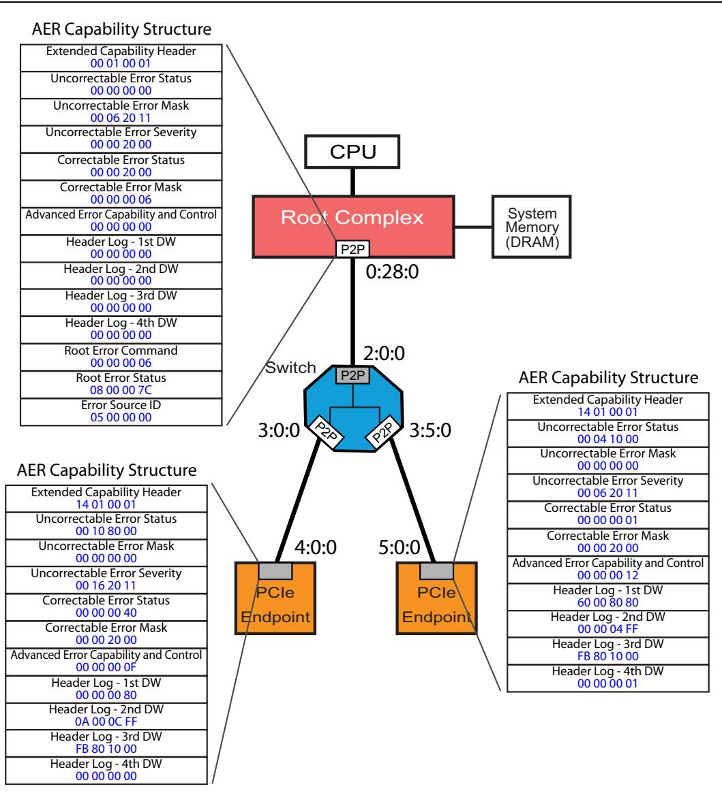

## PCI Express Technology

6. Now that the error handler knows that the first uncorrectable error at 5:0:0 was a Malformed TLP, it can check the Header Log register to see the header of the packet that was malformed, since this is one of the errors where a header is recorded. In reading the Header Log register it finds these four doublewords:

— 6000\_8080h ‐ 1st DW

— 0000\_04FFh ‐ 2nd DW

— FB80\_1000h ‐ 3rd DW

— 0000\_0001h ‐ 4th DW

7. The evaluation of those 4 DWs identifies the malformed packet as: Memory Write, 4DW header, TC=0, TD=1, EP=0, Attr=0, AT=0, Length=80h (128 DWs or 512 bytes), Requester ID=0:0:0, Tag=4, Byte Enables=FFh, Address=1\_FB80\_1000h.

The header of the packet all looks correct and every field uses valid encodings, so software must dig a little deeper to discover why this was treated as a Malformed TLP. In this example, let’s assume that after further inspection of config space on 5:0:0, software discovers that the Max Payload Size enabled for this Function is 256 bytes, but this packet contained 512 bytes. This is a condition that will be treated as a Malformed TLP by the target device, in this case 5:0:0.

If you would like verify your knowledge of this error investigation process, go ahead and evaluate what the first uncorrectable error detected on 4:0:0 was.

If you’re feeling adventurous and would like to check out this type of info on a real system, say your desktop or laptop, you can do so by downloading the MindShare Arbor software (www.mindshare.com/arbor). You can run this on an x86‐based machine and it will scan your system and display every visible PCI‐compatible device with its configuration space decoded for easy interpretation.

# 16 Power Management

## The Previous Chapter

The previous chapter discusses error types that occur in a PCIe Port or Link, how they are detected, reported, and options for handling them. Since PCIe is designed to be backward compatible with PCI error reporting, a review of the PCI approach to error handling is included as background information. Then we focus on PCIe error handling of correctable, non‐fatal and fatal errors.

## This Chapter

This chapter provides an overall context for the discussion of system power management and a detailed description of PCIe power management, which is compatible with the PCI Bus PM Interface Spec and the Advanced Configuration and Power Interface (ACPI). PCIe defines extensions to the PCI‐PM spec that focus primarily on Link Power and event management. An overview of the OnNow Initiative, ACPI, and the involvement of the Windows OS is also provided.

## The Next Chapter

The next chapter details the different ways that PCIe Functions can generate interrupts. The old PCI model used pins for this, but side‐band signals are undesirable in a serial model so support for the in‐band MSI (Message‐Signaled Interrupts) mechanism was made mandatory. The PCI INTx# pin operation can still be emulated in support of a legacy system using PCIe INTx messages. Both the PCI legacy INTx# method and the newer versions of MSI/MSI‐X are described.

## Introduction

PCI Express power management (PM) defines four major areas of support:

PCI‐Compatible PM. PCIe power management is hardware and software compatible with the PCI‐PM and ACPI specs. This support requires that all Functions include the PCI Power Management Capability registers, allowing software to transition a Function between PM states under software control through the use of Configuration requests. This was modified in the 2.1 spec revision with the addition of Dynamic Power Allocation (DPA), another set of registers that added several substates to the D0 power state to give software a finer‐grained PM mechanism.

Native PCIe Extensions. These define autonomous, hardware‐based Active State Power Management (ASPM) for the Link, as well as mechanisms for waking the system, a Message transaction to report Power Management Events (PME), and a method for calculating and reporting the low‐power‐to‐active‐state latency.

Bandwidth Management. The 2.1 spec revision added the ability for hardware to automatically change either the Link width or Link data rate or both to improve power consumption. This allows high performance when needed and keeps power usage low when lower performance is acceptable. Even though Bandwidth Management is considered a Power Management topic, we describe this capability in the section “Dynamic Bandwidth Changes” on page 618 in the “Link Initialization & Training” chapter because it involves the LTSSM.

Event Timing Optimization. Peripheral devices that initiate bus master events or interrupts without regard to the system power state cause other system components to stay in high power states to service them, resulting in higher power consumption than would be necessary. This shortcoming was corrected in the 2.1 spec by adding two new mechanisms: Optimized Buffer Flush and Fill (OBFF), which lets the system inform peripherals about the current system power state, and Latency Tolerance Reporting (LTR), which allows devices to report the service delay they can tolerate at the moment.

This chapter is segmented into several major sections:

1. The first part is a primer on power management in general and covers the role of system software in controlling power management features. This discussion only considers the Windows Operating System perspective since it’s the most common one for PCs, and other OSs are not described.

2. The second section, “Function Power Management” on page 713, discusses the method for putting Functions into their low‐power device states using the PCI‐PM capability registers. Note that some of the register definitions are modified or unused by PCIe Functions.

3. “Active State Power Management (ASPM)” on page 735 describes the hardware‐based autonomous Link power management. Software determines which level of ASPM to enable for the environment, possibly by reading the recovery latency values that will be incurred for that Function, but after that the timing of the power transitions is controlled by hardware. Software doesn’t control the transitions and is unable to see which power state the Link is in.

4. “Software Initiated Link Power Management” on page 760 discusses the Link power management that is forced when software changes the power state of a device.

5. “Link Wake Protocol and PME Generation” on page 768 describes how Devices may request that software return them to the active state so they can service an event. When power has been removed from a Device, auxiliary power must be present if it is to monitor events and signal a Wakeup to the system to get power restored and reactivate the Link.

6. Finally, event‐timing features are described, including OBFF and LTR.

## Power Management Primer

The PCI Bus PM Interface spec describes the power management registers required for PCIe. These permit the OS to manage the power environment of a Function directly. Rather than dive into a detailed description, let’s start by describing where this capability fits in the overall context of the system.

## Basics of PCI PM

This section provides an overview of how a Windows OS interacts with other major software and hardware elements to manage the power usage of individual devices and the system as a whole. Table 16‐1 on page 706 introduces the major elements involved in this process and provides a very basic description of how they relate to each other. It should be noted that neither the PCI Power Management spec nor the ACPI spec dictate the PM policies that the OS uses. They do, however, define the registers (and some data structures) that are used to control the power usage of a Function.

Table 16‐1: Major Software/Hardware Elements Involved In PC PM

<table><tr><td>Element</td><td>Responsibility</td></tr><tr><td>OS</td><td>Directs overall system power management by sending requests to the ACPI Driver, device driver, and the PCI Express Bus Driver. Applications that are power conservation-aware interact with the OS to accomplish device power management.</td></tr><tr><td>ACPI Driver</td><td>Manages configuration, power management, and thermal control of embedded system devices that don't adhere to an industry-standard spec. Examples of this include chipset-specific registers, system board-specific registers to control power planes, etc. The PM registers within PCIe Functions (embedded or otherwise) are defined by the PCI PM spec and are therefore not managed by the ACPI driver, but rather by the PCI Express Bus Driver (see entry in this table).</td></tr><tr><td>Device Driver</td><td>The Class driver can work with any device that falls within the Class of devices that it was written to control. The fact that it's not written for a specific vendor means that it doesn't have bit-level knowledge of the device's interface. When it needs to issue a command to or check the status of the device, it issues a request to the Miniport driver supplied by the vendor of the specific device.The device driver also doesn't understand device characteristics that are peculiar to a specific bus implementation of that device type. As an example, it won't understand a PCIe Function's configuration register set. The PCI Express Bus Driver is the one to communicate with those registers.When it receives requests from the OS to control the power state of a PCIe device, it passes the request to the PCI Express Bus Driver.When a request to power down its device is received from the OS, the device driver saves the contents of its associated Function's device-specific registers (in other words, a context save) and then passes the request to the PCI Express Bus Driver to change the power state of the device.Conversely, when a request to re-power the device is received, the device driver passes the request to the PCI Express Bus Driver to change the power state of the device. After the PCI Express Bus Driver has re-powered the device, the device driver then restores the context to the Function's device-specific registers.</td></tr><tr><td>Miniport Driver</td><td>Supplied by the vendor of a device, it receives requests from the Class driver and converts them into the proper series of accesses to the device's register set.</td></tr><tr><td>PCI Express Bus Driver</td><td>This driver is generic to all PCI Express-compliant devices. It manages their power states and configuration registers, but does not have knowledge of a Function's device-specific register set (that knowledge is possessed by the Miniport Driver that the device driver uses to communicate with the device's register set). It receives requests from the device driver to change the state of the device's power management logic. For example:When a request to power down the device is received, this driver is responsible for saving the context of the Function's PCI Express configuration registers. It then disables the ability of the device to act as a Requester or respond as a target and writes to the Function's PM registers to change its state.Conversely, when the device must be re-powered, the PCI Express Bus Driver writes to the PCI Express Function's PM registers to change its state and then restores the Function's configuration registers to their original state.</td></tr><tr><td>PCI Express PM registers within each Function's configuration space.</td><td>The location, format and usage of these registers is defined by the PCIe spec. The PCI Express Bus Driver understands this spec and therefore is the entity responsible for accessing a Function's PM registers when requested to do so by the Function's device driver.</td></tr><tr><td>System Board power plane and bus clock control logic</td><td>The implementation and control of this logic is typically system board design-specific and is therefore controlled by the ACPI Driver (under OS direction).</td></tr></table>

## ACPI Spec Defines Overall PM

The ACPI (Advanced Configuration and Power Interface) spec was first written several years ago as a joint effort by several companies to provide industry standards for OSPM (OS‐level Power Management) in compute platforms. Power management at that time was being handled in proprietary ways on different platforms and that made it difficult for vendors to coordinate their efforts. In addition, platform‐specific code wasn’t always fully compatible with OS operations or aware of all the system conditions or policy considerations. ACPI helped in these areas by defining system power states, hardware registers and software interactions to accomplish OS‐based power management. A detailed description of ACPI is beyond the scope of this book, but an introduction to the concepts and terminology will be helpful.

## System PM States

Table 16‐2 on page 708 defines the possible states of the overall system with reference to power consumption. The “Working”, “Sleep”, and “Soft Off” states are defined in the OnNow Design Initiative documents.

Table 16‐2: System PM States as Defined by the OnNow Design Initiative

<table><tr><td>Power State</td><td>Description</td></tr><tr><td>Working (G0/S0)</td><td>The system is fully operational.</td></tr><tr><td>Sleeping (G1)</td><td>The system appears to be off and power consumption has been reduced. The amount of time it takes to return to the “Working” state is inversely proportional to the selected level of power conservation.S1 - caches flushed, CPU haltedS2 - same as S1 except that now CPU is powered off. Not commonly used because it&#x27;s not much better than S3.S3 - (also called “Suspend to RAM” or “Standby”) This is the same as S2 except that the system context is saved in memory and more of the system is shut down. When the system wakes up the CPU begins the full boot process but finds flags set in the CMOS memory that direct it to reload the context from RAM instead, and thus program execution can be resumed very quickly.S4 - (also called “Suspend to Disk” or “Hibernate”) Similar to S3, except that now the system copies the system context to disk, and then removes power from the system, including main memory. This gives better power savings but the restart time will be longer because the context must be restored from the disk before resuming program execution.</td></tr><tr><td>Soft Off (G2/S5)</td><td>The system appears to be off and power consumption is minimal. It requires a full reboot to return to the “Working” state because the contents of memory have been lost, but there is still some power available to do the wakeup, such as by pressing the “Power” button on the system.</td></tr><tr><td>Mechanical Off (G3)</td><td>The system has been disconnected from all power sources and no power is available.</td></tr></table>

## Device PM States

ACPI also defines the PM states at the device level, which are listed in Table 16‐3 on page 709. Table 16‐3 on page 709 presents the same information in a slightly different form. The registers that support these device states must be implemented for PCIe devices.

Table 16‐3: OnNow Definition of Device‐Level PM States

<table><tr><td>State</td><td>Description</td></tr><tr><td>D0</td><td>Mandatory. Device is fully operational and uses full power from the system. The 2.1 spec revision added another set of registers to support 32 substates under D0 referred to as Dynamic Power Allocation registers.</td></tr><tr><td>D1</td><td>Optional. Low-power state in which device context may or may not be lost. No definition for this state is given, but it would represent a lower power state than D0 and higher than D2</td></tr><tr><td>D2</td><td>Optional. Presumably a lower power state than D1 that attains greater power savings, but would incur a longer recovery delay and may cause Device to lose some context.</td></tr><tr><td>D3</td><td>Mandatory. Device is prepared for loss of power and context may be lost whether the power actually goes off or not. Recovery time will be longer than for D2, but power can be removed from the device gracefully in this state.</td></tr></table>

## Definition of Device Context

General. During normal operation, the operational state of a Device is constantly changing. A device driver may write or read its registers, or a local processor on the Device may execute code that affects its interaction with the system. The state of the device at a given instant in time includes:

‐ The contents of its configuration registers.

‐ The state of its local memory and IO registers.

If it contains a processor, then the current program pointer and contents of its other registers would be included.

This state information is referred to as the device context. Some or all of this may be lost if the Device PM state is changed to a more aggressive level. If the context information is not maintained, the Device won’t operate correctly when it returns to the D0 (fully operational) state.

PME Context. If the OS enables a modem to wake the system for an incoming call and then powers down the system, the Device wake‐up context will need to be retained locally during that time. The chipset retains enough power to allow it to monitor for these events. To support this feature, a PCIe modem must implement configuration registers including:

‐ PME Message capability.

PME enable/disable control bit.

PME status bit indicating whether the device has sent a PME message.

One or more device‐specific control bits that selectively enable or disable various device‐specific events that can cause the device to send a PME message.

Corresponding device‐specific status bits that indicate why the device issued a PME message.

## Device-Class-Specific PM Specs

Default Device Class Spec. As mentioned earlier, ACPI gives four possible device power states (D0 ‐ through ‐ D3). It also defines the minimum PM states that all device types must implement, as listed in Table 16‐4 on page 710.

Table 16‐4: Default Device Class PM States

<table><tr><td>State</td><td>Description</td></tr><tr><td>D0</td><td>Device is on, is running at full power, and is fully operational.</td></tr><tr><td>D1</td><td>This optional state is only defined as being lower power than D0. It is not commonly used.</td></tr><tr><td>D2</td><td>This optional state is only defined as being lower power than D1. It is not commonly used.</td></tr><tr><td>D3</td><td>Device consumes the minimum possible power and main power may be turned off. The only requirement is that, while power is still on, the device must be able to service a configuration command to re-enter D0. Power can be removed from the device in this state, and the device will experience a hardware reset when power is restored.</td></tr></table>

Device Class‐Specific PM Specs. Above and beyond the power states mandated by the Default Device Class Spec, certain device classes may require the intermediate power states (D1 and/or D2) or exhibit certain common characteristics in a particular power state.

The rules associated with a particular device class are found in the Device Class Power Management Specs available on Microsoft’s Hardware Developers’ web site. For example, Device Class Power Management Specs exist for the following classes:

‐ Audio

‐ Communications

‐ Display

‐ Input

‐ Network

‐ PC Card

‐ Storage

## Power Management Policy Owner

A Device’s PM policy owner is defined as the software module that makes decisions regarding the PM state of a device. In a Windows environment, the policy owner is the class‐specific driver associated with devices of that class.

## PCI Express Power Management vs. ACPI

## PCI Express Bus Driver Accesses PM Registers

As indicated in Table 16‐1 on page 706 and Figure 16‐1 on page 712, the PCI Express Bus Driver understands the location, format and usage of the PM configuration registers. It’s called when the OS needs to change the power state of a PCIe device or determine its status and capabilities. Other examples include:

The IEEE 1394 Bus Driver, which understands how to use the PM registers defined in the 1394 Power Management spec.

• The USB Bus Driver, which understands how to use the PM registers defined in the USB Power Management spec.

## ACPI Driver Controls Non-Standard Embedded Devices

There are devices embedded on the system board whose register sets do not adhere to any particular industry standard spec. At boot time, the BIOS reports these devices to the OS via the ACPI tables, also referred to as the namespace. When the OS needs to communicate with any of these devices, it calls the ACPI Driver, which executes a handler called a Control Method associated with the device. The handler is also found in the ACPI tables and is written by the platform designer using a special interpretive language called ACPI Source Language, or ASL. The ASL code is then compiled into ACPI Machine Language, or AML. Note that AML is not a processor‐specific machine language. It’s a tokenized (i.e., compressed) version of the ASL source code. An ACPI Driver incorporates an AML token interpreter that allows it to “execute” a Control Method.

Figure 16‐1: Relationship of OS, Device Drivers, Bus Driver, PCI Express Registers, and ACPI  
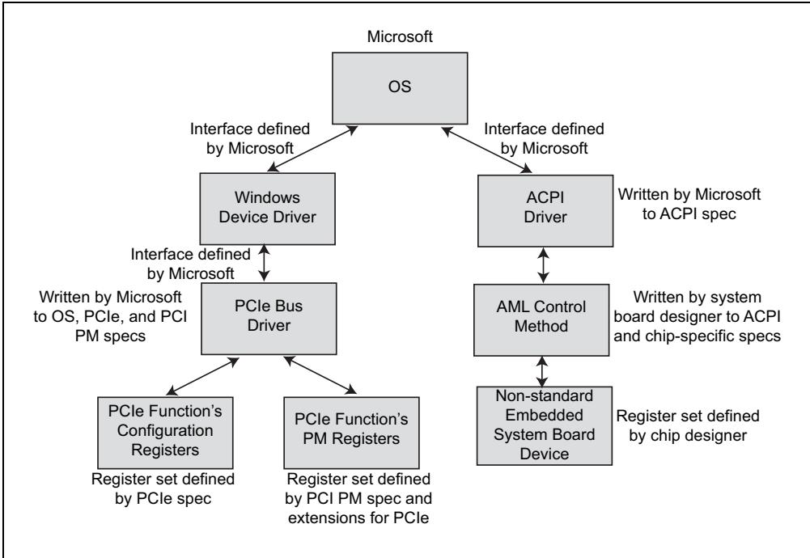

## Function Power Management

PCI Express Functions are required to support power management, and several registers and related bit fields must be implemented as discussed below.

## The PM Capability Register Set

The PCI‐PM spec defines the Power Management Capability configuration registers. These registers were optional for PCI, but required for PCIe, and are located in the PCI‐compatible configuration space with a Capability ID of 01h. Software can perform the following sequence to locate these registers:

1. Bit 4 of the Function’s Configuration Status register should be set, indicating that the Capabilities Pointer in the first byte of dword 13d of the Function’s configuration Header is valid. Reading the Capabilities Pointer register gives the offset to the first of the Function’s linked list of capability registers.

2. If the least significant byte of the dword at that offset contains Capability ID 01h (see Figure 16‐2 on page 713), this is the PM register set. The byte immediately following the Capability ID byte is the Pointer to Next Capability field that gives the offset in configuration space of the next Capability (if there is one). A non‐zero value is a valid pointer, while a value of 00h indicates the end of the linked list. A description of all the PM registers can be found in “Detailed Description of PCI‐PM Registers” on page 724.

Figure 16‐2: PCI Power Management Capability Register Set

<table><tr><td colspan="2">Power Management Capabilities (PMC)</td><td>Pointer to Next Capability</td><td>Capability ID 01h</td></tr><tr><td>Data Register</td><td>Bridge Support Extensions (PMCSR_BSE)</td><td colspan="2">Control/Status Register (PMCSR)</td></tr></table>

## Device PM States

Each PCI Express Function must support the full‐on D0 state and the full‐off D3 state, while D1 and D2 are optional. The sections that follow describe the possible PM states.

## D0 State—Full On

Mandatory. In this state, no power conservation is in effect and the device is fully operational. All PCIe Functions must support the D0 state and there are technically two substates: D0 Uninitialized and D0 Active. ASPM hardware control can change the Link power while the Device is in this state. Table 16‐5 on page 714 summarizes the PM policies in the D0 state.

D0 Uninitialized. A Function enters D0 Uninitialized after a Fundamental Reset or, in some cases, when software transitions it from $\mathrm { D 3 } _ { \mathrm { h o t } }$ to D0. Usually, the registers are returned to their default state. In this state, the Function exhibits the following characteristics:

‐ It only responds to configuration transactions.

Its Command register enable bits are all returned to their default states, meaning it cannot initiate transactions or act as the target of memory or IO transactions.

D0 Active. Once the Function has been configured and enabled by software, it is in the D0 Active state and is fully operational.

Table 16‐5: D0 Power Management Policies

<table><tr><td>LinkPMState</td><td>FunctionPMState</td><td>Registers or State that must be valid</td><td>Power</td><td>Actions permitted to Function</td><td>Actions permitted by Function</td></tr><tr><td>L0</td><td>D0 un-initialized</td><td>PME context **</td><td>&lt; 10W</td><td>PCI Express config transactions.</td><td>None</td></tr><tr><td>L0L0s (required)*L1 (optional)*</td><td>D0 active</td><td>all</td><td>full</td><td>Any PCI Express transaction.</td><td>Any transaction, interrupt, or PME. **</td></tr><tr><td>L2/L3</td><td>D0 active</td><td colspan="4">N/A***</td></tr></table>

\* Active State Power Management  
\*\* If PME supported in this state.  
\*\*\* This combination of Bus/Function PM states not allowed.

## Dynamic Power Allocation (DPA)

Optional. The 2.1 revision of the base spec added another optional capability that defines 32 more substates for D0 and describes their characteristics. This was intended to facilitate negotiation regarding power management between a device driver, OS, and an executing application, partly because some Functions don’t have device drivers that handle PM well. One advantage of this model is that the Device technically still remains in the D0 state and may therefore be able to continue operating in a reduced capacity instead of going offline as would be caused by a change to the D1 or lower state.

DPA registers only apply when the Device power state is in D0 and aren’t applicable in states D1‐D3. Up to 32 substates can be defined, and they must be contiguously numbered from zero to the maximum value. Substate 0 is the initial default value and represents the maximum power the Function is capable of consuming. Software is not required to transition between substates in sequential order or even wait until a previous transition is completed before requesting another change in the substate. Consequently, when a Function has completed a substate change it must check the configured substate and, if they don’t match, it must begin changing to the configured value. The registers to support DPA, illustrated in Figure 16‐3 on page 715, are found in the Enhanced configuration space.

Figure 16‐3: Dynamic Power Allocation Registers

<table><tr><td colspan="2">PCIe Enhanced Capability Header</td><td>Offset</td></tr><tr><td colspan="2">DPA Capability Register</td><td>000h</td></tr><tr><td colspan="2">DPA Latency Indicator Register</td><td>004h</td></tr><tr><td>DPA Control Register</td><td>DPA Status Register</td><td>008h</td></tr><tr><td rowspan="3" colspan="2">DPA Power Allocation Array(Sized by number of substates)</td><td>00Ch</td></tr><tr><td>010h</td></tr><tr><td>Up to 02Ch</td></tr></table>

The DPA capability register, shown in Figure 16‐4 on page 716, contains several interesting values associated with the substates. The Substate\_Max number indicates how many substates are described, and the numbers must increment contiguously from zero to that value. Two Transition Latency Values are given and each substate will be associated with one or the other by the Latency Indicator register. which contains one bit for each possible substate; if that bit is set Transition Latency Value 1 is used, otherwise Value 0 is used. The latency value gives the maximum time required to transition into that substate from any other

## PCI Express Technology

substate. The latencies are multiplied by the Transition Latency Units to give the time in milliseconds. Similarly, the Power Allocation Scale value gives the multiplier for the power used in each substate, expressed in watts. For each defined substate, a 32‐bit field in the DPA Power Allocation Array describes the power used for that state. The first one of these is located at offset 010h, and the rest are implemented in subsequent dwords.

Figure 16‐4: DPA Capability Register  

The low‐order five bits of the DPA Control register are written by software to set a new substate, and the current substate can be read from the Status register, as shown in Figure 16‐5 on page 716. Notice that bit 8 of the Status register indicates whether the use of DPA substates has been enabled but it’s labeled as RW1C (Read, Write 1 to Clear), meaning software can clear this bit but can’t set it. DPA is enabled by default after a reset, and software would need to disable it by writing a one to this bit if it did not intend to use DPA.

Figure 16‐5: DPA Status Register  
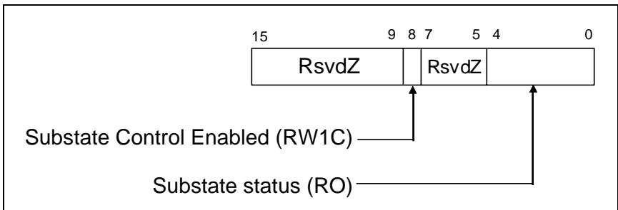

## D1 State—Light Sleep

Optional. Before going into this state, software must ensure that all outstanding non‐posted Requests have received their associated Completions. This can be achieved by polling the Transactions Pending bit in the Device Status register of the PCI Express Capability block; when the bit is cleared to zero, it’s safe to proceed. In this light power conservation state the Function won’t initiate Requests except PME Messages, if enabled. Other characteristics of the D1 state include:

• Link is forced to the L1 power state when the Device goes into the D1 state.

Configuration and Message Requests are accepted in this state, but all other Requests must be handled as Unsupported Requests and all completions may optionally be handled as Unexpected Completions.

If an error is caused by an incoming Request and reporting it is enabled, an Error Message may be sent while in this state. If a different type of error occurs (such as a Completion timeout), the message won’t be sent until the Device is returned to the D0 state.

The Function may reactivate the Link and send a PME message, if supported and enabled in this state, to notify software that the Function has experienced an event requiring that power be restored.

The Function may or may not lose its context in this state. If it does and the device supports PME, it must at least maintain its PME context (see “PME Context” on page 710) while in this state.

• The Function must be returned to the D0 Active PM state in order to be fully operational.

Table 16‐6 lists the PM policies while in the D1 state.

Table 16‐6: D1 Power Management Policies

<table><tr><td>Link PM State</td><td>Function PM State</td><td>Registers or State that must be valid</td><td>Power</td><td>Actions permitted to Function</td><td>Actions permitted by Function</td></tr><tr><td>L1</td><td rowspan="2">D1</td><td>Device class-specific registers and PME context.*</td><td>≤ D0 unini- tial- ized</td><td>Config Requests and Messages. Link transi- tions back to L0 to ser- vice the request.</td><td>PME Messages.** Though not typi- cally permitted, they would require the Link to transi- tion back to L0.</td></tr><tr><td>L2-L3</td><td colspan="4">NA *</td></tr></table>

\* This combination of Bus/Function PM states not allowed.  
\*\* If PME supported in this state.

## D2 State—Deep Sleep

Optional. Before going into this state, software must ensure that all outstanding non‐posted Requests have received their associated Completions. This can be achieved by polling the Transactions Pending bit in the Device Status register of

## PCI Express Technology

the PCI Express Capability block; when the bit is cleared to zero, it’s safe to proceed. This power state provides deeper power conservation than D1 but less than the $\mathrm { D 3 } _ { \mathrm { h o t } }$ state. As in D1, the Function won’t initiate Requests (except a PME Message) or act as the target of Requests other than configuration. Software must still be able to access the Function’s configuration registers in this state.

## Other characteristics of the D2 state include:

Before going into this state, software must ensure that all outstanding non‐posted Requests have received their associated Completions. This can be achieved by polling the Transactions Pending bit in the Device Status register of the PCIe Capability block. It could happen that the Completions will never be returned and, in that case, software should wait long enough to ensure they never will be returned.

• Link state must transition to L1 when the Device transitions to the D2 state.

Configuration and Message Requests are accepted in this state, but all other Requests must be handled as Unsupported Requests and all completions may optionally be handled as Unexpected Completions.

If an error is caused by an incoming Request and reporting it is enabled, an Error Message may be sent while in this state. If a different type of error occurs (such as a Completion timeout), the message won’t be sent until the Device is returned to the D0 state.

• Function may send a PME message, if supported and enabled, to notify software that it needs power restored to handle an event.

The Function may or may not lose its context in this state. If it does and the device supports PME messages, it must at least maintain its PME context for this purpose.

• The Function must return to the D0 Active state to be fully operational.

Table 16‐7 on page 719 illustrates the PM policies while in the D2 state.

Table 16‐7: D2 Power Management Policies

<table><tr><td>Link PM State</td><td>Function PM State</td><td>Registers and/or State that must be valid</td><td>Power</td><td>Actions permitted to Function</td><td>Actions permitted by Function</td></tr><tr><td>L1</td><td rowspan="2">D2</td><td>Device class-specific registers and PME context.*</td><td>≤ next higher supported PM state or ≤ D0 uninitialized.</td><td>Config Requests and transactions permitted by device class (typically none). This requires the Link to transition back to L0</td><td>PME Messages.* Though not typically permitted, they would require the Link to transition back to L0.</td></tr><tr><td>L2/L3</td><td colspan="4">N/A**</td></tr></table>

\* If PME supported in this state.  
\*\* This combination of Bus/Function PM states not allowed.

## D3—Full Off

Mandatory. All Functions must support the D3 state. This is the deepest state and power conservation is maximized. When software writes this power state to the Device, it goes to the $\mathbf { D 3 _ { h o t } }$ state, meaning power is still applied. Removing power (Vcc) from the Device puts it into the $\mathbf { D 3 _ { c o l d } }$ state and the Link into L2, if a secondary power source (Vaux) is available, or L3 if it’s not.

${ \bf D } 3 _ { \mathbf { H o t } }$ State. (Mandatory.) Software puts a Function into $\mathrm { D 3 } _ { \mathrm { h o t } }$ by writing the appropriate value into the PowerState field of its Power Mgt Control and Status Register (PMCSR). In this state, the Function can only initiate PME or PME\_TO\_ACK Messages, and can only respond to configuration Requests or the PME\_Turn\_Off Message. Software must be able to access the Function’s configuration registers while the device is in the $\mathrm { D 3 } _ { \mathrm { h o t } }$ state, if only to be able to change the state back to D0. Other characteristics of $\mathrm { D 3 } _ { \mathrm { h o t } }$ include:

Before going into this state, software must ensure that all outstanding non‐posted Requests have received their associated Completions. This can be achieved by polling the Transactions Pending bit in the Device Status register of the PCIe Capability block. It could happen that the Completions will never be returned and, in that case, software should wait long enough to ensure they never will be returned.

• The Link is forced to the L1 state when the Function changes to $\mathrm { D } 3 _ { \mathrm { h o t } }$

## PCI Express Technology

The Function is allowed to send a PME message to notify PM software of its need to be returned to the fully active state (assuming it supports generation of PM events in the $\mathrm { D 3 } _ { \mathrm { h o t } }$ state and has been enabled to do so).

Function context may be lost when going to this state and if the power is turned off the spec assumes all context will be lost. On the other hand, if the power never goes off before software initiates a return to D0 the context could be maintained. In earlier spec versions that wasn’t possible; changing from $\mathrm { D 3 } _ { \mathrm { h o t } }$ to D0 involved a soft reset and all the registers were re‐initialized. However, the 1.2 revision of that spec added a new capability bit called “No Soft Reset” to indicate that the Function would not do a soft reset in that case. To be able to generate PME messages in the $\mathrm { D } 3 _ { \mathrm { h o t } }$ state, a Device must maintain its PME context (see “PME Context” on page 710).

The Function exits from the $\mathrm { D 3 } _ { \mathrm { h o t } }$ state under two circumstances:

• If Vcc is removed from the device, it transitions from $\mathrm { D 3 } _ { \mathrm { h o t } }$ to $\mathrm { D } 3 _ { \mathrm { c o l d } }$

Software can write to the PowerState field of the Function’s PMCSR register to change its PM state to D0. When programmed to exit $\mathrm { D 3 } _ { \mathrm { h o t } }$ and return to D0, the Function returns to the D0 Uninitialized PM state. A reset may or may not be required. Table 16‐8 on page 721 lists the PM policies while in the $\mathrm { D 3 } _ { \mathrm { h o t } }$ state.

Table 16‐8: $D 3 _ { h o t }$ Power Management Policies

<table><tr><td>Bus PM State</td><td>Function PM State</td><td>Registers and/or State that must be valid</td><td>Power</td><td>Actions permitted to Function</td><td>Actions permitted by Function</td></tr><tr><td>L1</td><td rowspan="3"> $D3_{hot}$ </td><td>PME context. **</td><td>≤ next higher supported PM state or ≤ D0 uninitialized.</td><td>PCI Express config transactions &amp; PME_Turn_Off broadcast message***(These can only occur after the Link transitions back to its L0 state.</td><td>PME message**PME_TO_ACK message**PM_Enter_L23 DLLP***(These can occur only after the Link returns to L0)</td></tr><tr><td>L2/L3 Ready</td><td colspan="4">L2/L3 Ready entered following the PME_Turn_Off handshake sequence, which prepares a device for power removal***</td></tr><tr><td>L2/L3</td><td colspan="4">NA *</td></tr></table>

\* This combination of Bus/Function PM states not allowed.  
\*\* If PME supported in this state.  
\*\*\* See “L2/L3 Ready Handshake Sequence” on page 764 for details regarding the sequence.

${ \bf D } 3 _ { \bf C o l d }$ State. Mandatory. Every PCI Express Function enters the $\mathrm { D } 3 _ { \mathrm { C o l d } }$ PM state upon removal of power (Vcc) from the Function. When power is restored, the device must be reset or generate an internal reset, taking it from ${ \mathrm { D } } 3 _ { \mathrm { C o l d } }$ to D0 Uninitialized. A Function capable of generating a PME must maintain PME context while in this state and when transitioning to the D0 state. Since power was removed to arrive at this state, the Function must have an auxiliary power source available if it is to maintain the PME context. Then, when the device goes to D0 $\mathrm { U n i n i t i a l i z e d } \prime$ it can generate a PME message to inform the system of a wakeup event, if it’s capable and enabled to do so. For more on auxiliary power, refer to “Auxiliary Power” on page 775.

Table 16‐9 on page 722 illustrates the PM policies while in the ${ \mathrm { D } } 3 _ { \mathrm { C o l d } }$ state.

Table 16‐9: $D 3 _ { c o l d }$ Power Management Policies

<table><tr><td>Bus PM State</td><td>Function PM State</td><td>Registers and/or State that must be valid</td><td>Power</td><td>Actions permitted to Function</td><td>Actions permitted by Function</td></tr><tr><td>L2</td><td rowspan="2"> $D3_{cold}$ </td><td>PME context*</td><td>AUX Power</td><td rowspan="2">Bus reset only</td><td>Signal Beacon or WAKE#**</td></tr><tr><td>L3</td><td colspan="2">None</td><td>None</td></tr></table>

\* If PME supported in this state.  
\*\* The method used to signal a wake to restore clock and power depends on the form factor.

## Function PM State Transitions

Figure 16‐6 illustrates the PM state transitions for a PCIe Function. Table 16‐10 on page 723 provides a description of each transition. Table 16‐11 on page 724 illustrates the transitions from one state to another from both a hardware and a software perspective.

Figure 16‐6: PCIe Function D‐State Transitions  
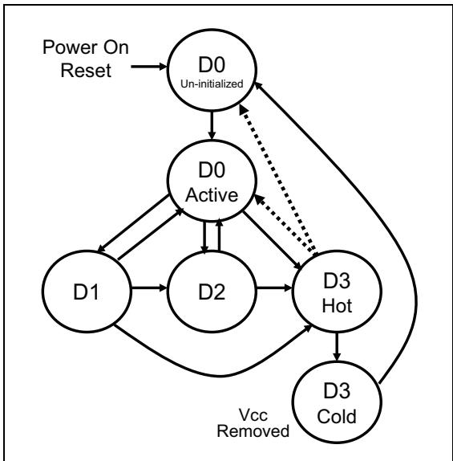

Table 16‐10: Description of Function State Transitions

<table><tr><td>From State</td><td>To State</td><td>Description</td></tr><tr><td>D0 Uninitialized</td><td>D0 Active</td><td>Function has been completely configured and enabled by its driver.</td></tr><tr><td rowspan="3">D0 Active</td><td>D1</td><td>Software writes the PMCSR PowerState to D1.</td></tr><tr><td>D2</td><td>Software writes the PMCSR PowerState to D2.</td></tr><tr><td> $D3_{hot}$ </td><td>Software writes the PMCSR PowerState to  $D3_{hot}$ .</td></tr><tr><td rowspan="3">D1</td><td>D0 Active</td><td>Software writes the PMCSR PowerState to D0.</td></tr><tr><td>D2</td><td>Software writes the PMCSR PowerState to D2.</td></tr><tr><td> $D3_{hot}$ </td><td>Software writes the PMCSR PowerState to  $D3_{hot}$ .</td></tr><tr><td rowspan="2">D2</td><td>D0 Active</td><td>Software writes the PMCSR PowerState to D0.</td></tr><tr><td> $D3_{hot}$ </td><td>Software writes the PMCSR PowerState to  $D3_{hot}$ .</td></tr><tr><td rowspan="2"> $D3_{hot}$ </td><td> $D3_{cold}$ </td><td>Power is removed from the Function.</td></tr><tr><td>D0 Uninitialized</td><td>Software writes the PMCSR PowerState to D0.</td></tr><tr><td> $D3_{cold}$ </td><td>D0 Uninitialized</td><td>Power is restored to the Function.</td></tr></table>

Table 16‐11: Function State Transition Delays

<table><tr><td>Initial State</td><td>Next State</td><td>Minimum software-guaranteed delays</td></tr><tr><td>D0</td><td>D1</td><td>0</td></tr><tr><td>D0 or D1</td><td>D2</td><td>200μs from new state setting to first access (including config accesses).</td></tr><tr><td>D0, D1, or D2</td><td> $D3_{hot}$ </td><td>10ms from new state setting to first access.</td></tr><tr><td>D1</td><td>D0</td><td>0</td></tr><tr><td>D2</td><td>D0</td><td>200μs from new state setting to first access.</td></tr><tr><td> $D3_{hot}$ </td><td>D0</td><td rowspan="2">10ms from new state setting to first access.</td></tr><tr><td> $D3_{cold}$ </td><td>D0</td></tr></table>

## Detailed Description of PCI-PM Registers

The PCI Bus PM Interface spec defines the PM registers (see Figure 16‐7) that are implemented in PCIe Functions. Configuration software can determine the PM capabilities and control its properties.

Figure 16‐7: PCI Function’s PM Registers

<table><tr><td colspan="2">Power Management Capabilities (PMC)</td><td>Pointer to Next Capability</td><td>Capability ID 01h</td></tr><tr><td>Data Register</td><td>Bridge Support Extensions (PMCSR_BSE)</td><td colspan="2">Control/Status Register (PMCSR)</td></tr></table>

## PM Capabilities (PMC) Register

The fields of this 16‐bit read‐only register are described in Table 16‐12.

Table 16‐12: The PMC Register Bit Assignments

<table><tr><td>Bit(s)</td><td colspan="2">Description</td></tr><tr><td>31:27</td><td colspan="2">PME_Support field. Indicates in which PM states the Function is capable of sending a PME message. A zero in a bit indicates PME notification is not supported in the respective PM state.BitCorresponds to PM State27 D028 D129 D230  $D3_{hot}$ 31  $D3_{cold}$  (Function requires aux power for PME logic and Wake signaling via beacon or WAKE# pin)Systems that support wake from  $D3_{cold}$  must also support aux power and must use it to signal the wakeup.Bits 31, 30, and 27 must be set to 1b for virtual PCI-PCI Bridges implemented within Root and Switch Ports. This is required for ports that forward PME Messages.</td></tr><tr><td>26</td><td colspan="2">D2_Support bit. 1 = Function supports the D2 PM state.</td></tr><tr><td>25</td><td colspan="2">D1_Support bit. 1 = Function supports the D1 PM state.</td></tr><tr><td rowspan="10">24:22</td><td colspan="2">Aux_Current field. For a Function that supports generation of the PME message from the D3cold state, this field reports the current demand made upon the 3.3Vaux power source (see “Auxiliary Power” on page 775) by the Function’s logic that retains the PME context information. This information is used by software to determine how many Functions can simultaneously be enabled for PME generation (based on the total amount of current each draws from the system 3.3Vaux power source and the power sourcing capability of the power source).If the Function does not support PME notification from within the D3cold PM state, this field is not implemented and always returns zero when read. Alternatively, a new feature defined by PCI Express permits devices that do not support PMEs to report the amount of Aux current they draw when enabled by the Aux Power PM Enable bit within the Device Control register.If the Function implements the Data register (see “Data Register” on page 731), this field always returns zeros when read. The Data register then takes precedence over this field in reporting the 3.3Vaux current requirements for the Function.If the Function supports PME notification from the D3cold state and does not implement the Data register, then the Aux_Current field reports the 3.3Vaux current requirements for the Function. It is encoded as follows:</td></tr><tr><td>Bit24 23 22</td><td>Max Current Required</td></tr><tr><td>1 1 1</td><td>375mA</td></tr><tr><td>1 1 0</td><td>320mA</td></tr><tr><td>1 0 1</td><td>270mA</td></tr><tr><td>1 0 0</td><td>220mA</td></tr><tr><td>0 1 1</td><td>160mA</td></tr><tr><td>0 1 0</td><td>100mA</td></tr><tr><td>0 0 1</td><td>55mA</td></tr><tr><td>0 0 0</td><td>0mA</td></tr><tr><td>21</td><td>Device-Specific Initialization (DSI) bit. A one in this bit indicates that immediately after entry into the D0 Uninitialized state, the Function requires additional configuration above and beyond setup of its PCI configuration Header registers before the Class driver can use the Function. Microsoft OSs do not use this bit. Rather, the determination and initialization is made by the Class driver.</td></tr><tr><td>20</td><td>Reserved.</td></tr><tr><td>19</td><td>PME Clock bit. Does not apply to PCI Express. Must be hardwired to 0.</td></tr><tr><td rowspan="2">18:16</td><td>Version field. This field indicates the version of the PCI Bus PM Interface spec that the Function complies with.</td></tr><tr><td colspan="2">Bit18 17 16 Complies with Spec Version0 0 1 1.00 1 0 1.1 (required by PCI Express)</td></tr></table>

## PM Control and Status Register (PMCSR)

This register, required for all PCI Express Devices, serves several purposes as described below. Table 16‐13 on page 728 provides a description of the PMCSR bit fields.

If the Function implements PME capability, a PME Enable bit permits software to enable or disable the Function’s ability to assert the PME message or WAKE# signal, and a Status bit reflects whether or not a PME has occurred.

If the optional Data register is implemented (see “Data Register” on page 731), two fields are used to permit software to select which information can be read through the Data register, and provide the scaling multiplier for the Data register value.

The register’s PowerState field can be read to determine the current PM state of the Function and written to place the Function into a new PM state.

Table 16‐13: PM Control/Status Register (PMCSR) Bit Assignments

<table><tr><td>Bit(s)</td><td>Value at Reset</td><td>Read/Write</td><td>Description</td></tr><tr><td>31:24</td><td>all zeros</td><td>Read Only</td><td>See “Data Register” on page 731.</td></tr><tr><td>23</td><td>zero</td><td>Read Only</td><td>Not used in PCI Express</td></tr><tr><td>22</td><td>zero</td><td>Read Only</td><td>Not used in PCI Express</td></tr><tr><td>21:16</td><td>all zeros</td><td>Read Only</td><td>Reserved</td></tr><tr><td>15</td><td>See Description.</td><td>Read, Write one to clear, Sticky RW1CS</td><td>PME_Status bit.Optional: only implemented if the Function supports PME notification, otherwise zero.This bit reflects whether the Function has experienced a PME (even if the PME_En bit in this register has disabled the Function&#x27;s ability to send a PME message). If set to one, the Function has experienced a PME. Software clears this bit by writing a one to it.After reset, this bit is zero if the Function doesn&#x27;t support PME in D3cold. If the Function does support PME in D3cold, this bit is indeterminate at initial OS boot time but after that reflects whether the Function has experienced a PME.If the Function supports PME from D3cold, the state of this bit must persist even if power is lost or the Function is reset (a sticky bit). This implies that an auxiliary power source keeps this logic active during these conditions (see “Auxiliary Power” on page 775).</td></tr></table>

## Chapter 16: Power Management

Table 16‐13: PM Control/Status Register (PMCSR) Bit Assignments (Continued)

<table><tr><td>Bit(s)</td><td>Value at Reset</td><td>Read/Write</td><td>Description</td></tr><tr><td>14:13</td><td>Device-specific</td><td>Read Only</td><td>Data_Scale field. Optional. If the Function does not implement the Data register this field is hardwired to return zeros.If the Data register is implemented, the Data_Scale field is mandatory and must be a read-only value representing the multiplier for it. The value and interpretation of the Data_Scale field depends on the data item selected to be viewed through the Data register by the Data_Select field.</td></tr><tr><td>12:9</td><td>0000b</td><td>Read/Write</td><td>Data_Select field. Optional. If the Function does not implement the Data register, this field is hardwired to return zeros.If the Data register is implemented, Data_Select is a mandatory read/write field. The value placed in this register selects the data to be viewed in the Data register. That value must then be multiplied by the value read from the Data_Scale field.</td></tr></table>

## PCI Express Technology

Table 16‐13: PM Control/Status Register (PMCSR) Bit Assignments (Continued)

<table><tr><td>Bit(s)</td><td>Value at Reset</td><td>Read/Write</td><td>Description</td></tr><tr><td>8</td><td>See Description.</td><td>Read/Write</td><td>PME_En bit. Optional.1 = enable Function&#x27;s ability to send PME messages when an event occurs.0 = disable.If the Function does not support the generation of PMEs from any power state, this bit always return zero when read.After reset, this bit is zero if the Function doesn&#x27;t support PME from D3cold. If the Function supports PME from D3cold:·this bit is indeterminate at initial OS boot time.·otherwise, it enables or disables whether the Function can send a PME message in case a PME occurs.If the Function supports PME from D3cold, the state of this bit must persist while the Function remains in the D3cold state and during the transition from D3cold to the D0 Uninitialized state. This implies that the PME logic must use an aux power source to power this logic during these conditions.</td></tr><tr><td>7:2</td><td>all zeros</td><td>Read Only</td><td>Reserved</td></tr><tr><td>1:0</td><td>00b</td><td>Read/Write</td><td>PowerState field. Mandatory. Software uses this field to read the current PM state of the Function or write a new PM state. If software selects a PM state not supported by the Function, the write completes normally but the data is discarded and no state change occurs.10 PM State0 0 D00 1 D11 0 D21 1 D3hot</td></tr></table>

## Data Register

Optional, read‐only. Refer to Figure 16‐8 on page 732. The Data register is an 8‐bit, read‐only register that provides software with the following information:

• Power consumed in the selected PM state; useful in power budgeting.

Power dissipated in the selected PM state; useful in managing the thermal environment.

• Any type of data could be reported through this register, but the PCI‐PM spec only defines power consumption and power dissipation information for it.

If the Data register is implemented, the Data\_Select and Data\_Scale fields of the PMCSR registers must also be implemented, and the Aux\_Current field of the PMC register must not be implemented.

Determining Presence of the Data Register. Software can perform the following procedure to check for the presence of the Data register:

1. Write a value of 0000b into the Data\_Select field of the PMCSR register.

2. Read from either the Data register or the Data\_Scale field of the PMCSR register. A non‐zero value indicates that the Data register as well as the Data\_Scale and Data\_Select fields of the PMCSR registers are implemented. If a value of zero is read, go to step 4.

3. If the current value of the Data\_Select field is a value other than 1111b, go to step 4. If the current value of the Data\_Select field is 1111b, all possible Data register values have been scanned and returned zero, indicating that neither the Data register nor the Data\_Scale and Data\_Select fields of the PMCSR registers are implemented.

4. Increment the content of the Data\_Select field and go back to step 2. Since the data select field is only 4 bits, a complete scan requires testing 16 possible select values and looking to see if any non‐zero values are seen for the data and scale registers.

Operation of the Data Register. The information returned is typically a static copy of the Function’s worst‐case power consumption and power dissipation characteristics in the various PM states (as listed in the Device’s data sheet). To use the Data register, the programmer uses the following sequence:

1. Write a value into the Data\_Select field (see Table 16‐14 on page 733) of the PMCSR register to select the data item to be viewed through the Data register.

## PCI Express Technology

2. Read the data value from Data register and the Data\_Scale field of the PMCSR register.

3. Multiply the value by the scaling factor.

Multi‐Function Devices. In a multi‐function PCI Express device, each Function must supply its own power information. The power information for the logic common to all the Functions is reported through Function zero’s Data register (see Data Select Value = 8 in Table 16‐14 on page 733).

Virtual PCI‐to‐PCI Bridge Power Data. The spec doesn’t specify data field use in PCI‐to‐PCI bridge Functions in a Root Complex or Switch. But, to maintain PCI‐PM compatibility, bridges must report the power information they consume. Software could read the virtual PPB Data registers at each port of a switch to determine the power consumed by the switch in each power state.

Figure 16‐8: PM Registers

<table><tr><td colspan="2">Power Management Capabilities (PMC)</td><td>Pointer to Next Capability</td><td>Capability ID 01h</td></tr><tr><td>Data Register</td><td>Bridge Support Extensions (PMCSR_BSE)</td><td colspan="2">Control/Status Register (PMCSR)</td></tr></table>

Table 16‐14: Data Register Interpretation

<table><tr><td>Data Select Value</td><td>Data Reported in Data Register</td><td>Interpretation of Data Scale Field in PMCSR</td><td>Units/Accuracy</td></tr><tr><td>00h</td><td>Power consumed in D0</td><td rowspan="9">00b = unknown01b = multiply by 0.110b = multiply by 0.0111b = multiply by 0.001</td><td rowspan="9">Watts</td></tr><tr><td>01h</td><td>Power consumed in D1</td></tr><tr><td>02h</td><td>Power consumed in D2</td></tr><tr><td>03h</td><td>Power consumed in D3</td></tr><tr><td>04h</td><td>Power dissipated in D0</td></tr><tr><td>05h</td><td>Power dissipated in D1</td></tr><tr><td>06h</td><td>Power dissipated in D2</td></tr><tr><td>07h</td><td>Power dissipated in D3</td></tr><tr><td>08h</td><td>In a multi-function PCI device, Function 0 indicates power consumed by logic common to all Functions in the package.</td></tr><tr><td>09h-0Fh</td><td>Reserved for future use of Function 0 in a multi-function device.</td><td rowspan="2">Reserved</td><td rowspan="2">TBD</td></tr><tr><td>08h-0Fh</td><td>Reserved in single-function devices and Functions other than Function 0 in a multi-function device</td></tr></table>

## Introduction to Link Power Management

We’ve just seen how software can put Devices into one of several device power states, now let’s consider how PCIe also manages Link power. Device power and Link power are related to each other, as shown in Table 16‐15 on page 734. Note also the relationship between downstream and upstream devices, which can be summarized by saying that an upstream Device or Link cannot be in a more aggressive power‐conserving state than the one below it. The reason is to facilitate timely delivery of packets from the Endpoints, whose traffic would be delayed if upstream devices were in a lower power state. Each relationship is described below:

D0 — Device is fully powered and typically in the L0 Link state. Some power conservation is available without leaving this state by using DPA substates (see “Dynamic Power Allocation (DPA)” on page 714), and by using the hardware‐based Link power management (see “Active State Power Management (ASPM)” on page 735 for more details).

D1 & D2 — When software changes the device state to D1 or D2, the Link must automatically transition to the L1 state. Since both Link partners are involved in this operation there is a handshake mechanism to ensure that things are done in an orderly fashion.

$\mathbf { D 3 _ { h o t } }$ — When software places a device into the D3 state, the Link automatically transitions to L1 just as it does when going to the D1 and D2 states. Software may now choose to remove the reference clock and power, putting the device into $\mathrm { D } 3 _ { \mathrm { c o l d } } .$ . But, before doing that, it’s expected that the system will initiate a handshake process to prepare the Links by putting them into the L2/L3 Ready state.

$\mathbf { D } 3 _ { \mathbf { c o l d } } -$ In this state, main power and the reference clock have been turned off. However, auxiliary power $( \bar { \mathrm { V } } _ { \mathrm { A U X } } )$ may be available, allowing the device to signal a wakeup event to the system. If it is, the Link state will be in L2. If main power is removed but $\mathsf { V } _ { \mathrm { A U X } }$ is not available, the Link will be in L3. Table 16‐16 on page 735 provides additional information regarding the Link power states.

Table 16‐15: Relationship Between Device and Link Power States

<table><tr><td>Downstream Component D-State</td><td>Permissible Upstream Component D-State</td><td>Permissible Interconnect State</td></tr><tr><td>D0</td><td>D0</td><td>L0, L0s &amp; L1 (optional)</td></tr><tr><td>D1</td><td>D0-D1</td><td>L1</td></tr><tr><td>D2</td><td>D0-D2</td><td>L1</td></tr><tr><td>D3 hot</td><td>D0-D3 hot</td><td>L1, L2/L3 Ready</td></tr><tr><td>D3 cold</td><td>D0-D3 cold</td><td>L2 (AUX Pwr), L3</td></tr></table>

Table 16‐16: Link Power State Characteristics

<table><tr><td>State</td><td>Description</td><td>Software Directed?</td><td>Active State Link PM</td><td>Ref. Clocks</td><td>Main Power</td><td>PLL</td><td>Vaux</td></tr><tr><td>L0</td><td>Fully Active</td><td>Yes (D0)</td><td>On</td><td>On</td><td>On</td><td>On</td><td>On/Off</td></tr><tr><td>L0s</td><td>Standby</td><td>No</td><td>Yes (D0)</td><td>On</td><td>On</td><td>On</td><td>On/Off</td></tr><tr><td>L1</td><td>Low Power Standby</td><td>Yes* (D1-D3 hot)</td><td>Yes (option) (D0)</td><td>On</td><td>On</td><td>On/Off</td><td>On/Off</td></tr><tr><td>L2/L3 Ready</td><td>Staging for power removal</td><td>Yes PME_Turn_Off handshake</td><td>No</td><td>On</td><td>On</td><td>On/Off</td><td>On/Off</td></tr><tr><td>L2</td><td>Low Power Sleep</td><td>Yes**</td><td>No</td><td>Off</td><td>Off</td><td>Off</td><td>On</td></tr><tr><td>L3</td><td>Off (Zero Power)</td><td>N/A</td><td>N/A</td><td>Off</td><td>Off</td><td>Off</td><td>Off</td></tr></table>

\* The L1 state is entered either due to PM software placing a device into the D1, D2, or D3 states or under hardware control with ASPM.

\*\* The spec describes the L2 state as being software directed. The other L‐states in the table are listed as software directed because software initiates the transition into these states. For example, when software initiating a device power state change to D1, D2, or D3 devices must respond by entering the L1 state. Software then causes the transition to the L2/L3 Ready state by initiating a PME\_Turn\_Off message. Finally, software initiates the removal of power from a device after the device has transitioned to the L2/ L3 Ready state. Because Vaux power is available in L2, a wakeup event can be signaled to notify software.

## Active State Power Management (ASPM)

ASPM is a hardware‐based Link power conservation mechanism that only applies while the device is in the D0 device power state. Transitions into and out of ASPM states are initiated by hardware based on implementation‐specific criteria; software can’t control or observe this operation, it can only enable or disable it using configuration register bits (see Figure 16‐15 on page 744).

Two low power states are defined for ASPM:

1. L0s (standby state) — This state provide substantial power savings but still allows quick entry and exit latencies. The main way this is done is by putting the Transmitter into the Electrical Idle condition. Support for this state was previously required for all PCIe devices in the earlier spec versions, but in the 3.0 spec it became optional.

2. L1 ASPM — The goal for L1 is to achieve greater power conservation than L0s for situations where longer entry and exit latencies are acceptable. For example, in this state both Transmitters go into Electrical Idle at the same time. Support for this state continues to be optional in the 3.0 spec as it was in the earlier specs.

## Electrical Idle

Since putting a Transmitter into Electrical Idle is a central part of ASPM, it will help to discuss how doing so works. When a Transmitter’s differential signals (TxD+ and TxD‐) goes into the Electrical Idle condition, it stops signaling and instead holds its voltage very close to the common mode voltage with a differential voltage of 0 V. Signal transitions consume power, so stopping them on the Link gives power savings while still allowing a fairly quick resumption back to normal Link activity during which it is said to be in the L0 state. Depending on the degree of power savings, the Link is either in the L0s or L1 state. During this time, the transmitter may choose to remain in the low‐impedance state or change to high impedance by turning off its termination logic to save more power. In addition to L0s and L1, Electrical Idle will also be in effect when the Link has been disabled.

## Transmitter Entry to Electrical Idle

Transmitters that wish to enter the Electrical Idle condition must first inform the Link partner so the lack of further signaling won’t be misinterpreted as an error. They do that by sending the EIOS (Electrical Idle Ordered‐Set) and then quickly ceasing transmission and tri‐stating the Link output drivers. What the EIOS looks like depends on the encoding method in use, as described in the following sections. Once the last EIOS has been sent, the Transmitter must enter Electrical Idle within 8ns and remain in that mode for at least 20ns, regardless of the data rate. The differential peak voltage allowed during Electrical Idle must be between 0 and 20mV peak, again regardless of the data rate, to reduce the chance of the Receiver misinterpreting noise on the line as a valid signal. (See Table 13‐3 on page 489 for more on these timing and voltage parameters.)

Gen1/Gen2 Mode Encoding. For Gen1/Gen2 mode, the EIOS takes the form shown in Figure 16‐9 on page 737. All four Symbols must be sent, but the Receiver only needs to see two IDL control characters to recognize this condition.

Figure 16‐9: Gen1/Gen2 Mode EIOS Pattern  
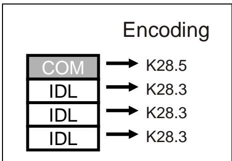

Gen3 Mode Encoding. For Gen3 mode, the EIOS is an Ordered Set block that consists of an Ordered Set Sync Header (01b) followed by 16 bytes that are all 66h, as shown in Figure 16‐10 on page 737. Curiously, a Transmitter is not required to finish the block if it will go directly to Electrical Idle but is allowed to stop after Symbol 13 (anywhere in Symbol 14 or 15). The reason is to allow for the case where an internal clock doesn’t line up with the Symbol boundaries due to 128b/130b encoding. This truncation won’t cause a problem at the Receiver because it only needs to see Symbols 0  ‐ 3 of the EIOS to recognize it.

Figure 16‐10: Gen3 Mode EIOS Pattern  

## Transmitter Exit from Electrical Idle

When a Transmitter is instructed to exit from Electrical Idle, the steps it takes depend on the data rate in use (see below). However, it must resume transmission within less than 8ns by sending FTSs or TS1/TS2s causing transition back to the L0 full‐on state.

Gen1 Mode. For 2.5 GT/s, the process is simple: it begins using valid differential signals to send the TS1s or FTSs that will serve to inform the Receiver about the change. The Receiver detects the voltage as being above the squelch threshold and begins to evaluate the incoming signal.

Gen2 Mode. When using 5.0 GT/s, the signals are changing so quickly that they don’t have time to reach the higher voltage levels. That makes it more difficult to quickly detect when the voltages have changed back to the operational values. To make this easier, the EIEOS (Electrical Idle Exit Ordered Set), was defined to provide a lower‐frequency sequence. The EIEOS for 8b/ 10b encoding, shown in Figure 16‐11 on page 739, uses repeated K28.7 control characters to appear as a repeating string of 5 ones followed by 5 zeros. This gives the low‐frequency signal that allows the higher signal voltages that are more readily seen. In fact, the spec states that this pattern guarantees that the Receiver will properly detect an exit from Electrical Idle, something that scrambled data cannot do. The EIEOS is to be sent under the following conditions:

Before the first TS1 after entering the Configuration.Linkwidth.Start or Recovery.RcvrLock state.

After every 32 TS1s or TS2s are sent in Configuration.Linkwidth.Start, Recovery.RcvrLock, or Recovery.RcvrCfg states. The TS1/TS2 count is reset to zero whenever an EIEOS is sent or the first TS2 is received in the Recovery.RcvrCfg state.

Figure 16‐11: Gen1/Gen2 Mode EIEOS Symbol Pattern  
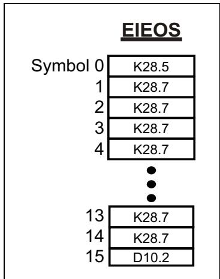

Gen3 Mode. An EIEOS is needed for 8 GT/s rate too and for the same reason as for 5.0 GT/s. Now, though, the Ordered Set takes the form of a block, as shown in Figure 16‐12 on page 740. As before, it gives a low‐frequency pattern in alternating bytes of 00h and FFh, which appears as a repeating string of 8 zeros followed by 8 ones.

In addition, EIEOS is sent so as to allow a receiver during LTSSM Recovery state to establish Block Lock after which the Link transitions to the L0 state. See the section “Block Alignment” on page 411 and “Achieving Block Alignment” on page 438.

In Gen3 mode, EIEOS is to be sent:

• Before the first TS1 after entering the Configuration.Linkwidth.Start or Recovery.RcvrLock state.

Immediately after an EDS Framing Token when a Data Stream is ending if an EIOS is not being sent and the LTSSM is not entering Recovery.RcvrLock.

• After every 32 TS1s/TS2s whenever TS1s or TS2s are sent. The count is reset to zero when:

— an EIEOS is sent

— the first TS2 is received while in either the Recovery.RcvrCfg or Config uration.Complete LTSSM state

— a Downstream Port in Phase 2 of the Equalization sequence, or an Upstream Port in Phase 3, receives two TS1s with the Reset EIEOS Interval Count bit set.

## PCI Express Technology

After every $2 ^ { 1 6 }$ TS1s during the Equalization sequence, if the Reset EIEOS Interval Count bit has prevented it from being sent. The spec states that designs are allowed to satisfy this requirement by sending and EIEOS within 2 TS1s of the scrambling LFSR matching its seed value.

• As part of an FTS sequence, Compliance Pattern, or Modified Compliance pattern.

Figure 16‐12: 128b/130b EIEOS Block  

## Receiver Entry to Electrical Idle

When a Transmitter enters Electrical Idle, the Link partner’s Receiver responds based on the data rate, as described in the following sections. Receipt of an EIOS informs the Receiver that this is going to happen, preparing it to detect when it actually does happen. When the Receiver detects this condition it de‐gates the error logic to prevent reporting errors caused by unreliable activity on the Link and arms its Electrical Idle Exit detector so it will be ready to resume normal activity when the Transmitter begins to send data again. There are two Electrical Idle detection options.:

Detecting Electrical Idle Voltage. Once an EIOS has been received, the expectation is that the Transmitter will cease transmission very quickly. In the 1.x spec versions Receivers detect this by observing that the incoming voltage has dropped below the threshold of a valid signal. This isn’t too difficult at 2.5 GT/s but it requires a squelch detect circuit that consumes space and power.

Inferring Electrical Idle. However, at higher frequencies the signal becomes increasingly attenuated, making it difficult for squelch detect logic to distinguish the levels. This is especially true for 8.0 GT/s, where it’s expected that the Receiver may need to perform equalization internally to recover a good signal. To alleviate these detection problems, the 2.0 spec introduced the concept of allowing a Receiver to infer when the Link has gone to the Electrical Idle condition rather than testing the voltage level. In this model, the absence of expected events is used to indicate that the Link is not signaling and can therefore be assumed to be in Electrical Idle, as listed in Table 16‐17. By way of explanation, Flow Control Updates should arrive regularly while the Link is in L0, and SOSs are expected with certain timing, too. For simplicity, a Receiver is allowed to check for one or the other or both of these conditions. During Link training the TS1s and TS2s should arrive regularly, so their absence can also be taken to mean that the Link is Idle. For the last two rows of the table, though, it’s possible that no Symbols have been received at all, and that will also be understood to mean the Link is Idle. Since Electrical Idle takes place for the overall Link and not for Lanes independently, there’s no need for each Lane to measure these times. Instead, an LTSSM can just use one timer in common for all the Lanes on that Link.

Table 16‐17: Electrical Idle Inference Conditions

<table><tr><td>State</td><td>2.5GT/s</td><td>5.0 GT/s</td><td>8.0 GT/s</td></tr><tr><td>L0</td><td colspan="3">Absence of an FC Update or SOS in a 128μs window</td></tr><tr><td>Recovery.RcvrCfg</td><td colspan="2">Absence of a TS1 or TS2 in a 1280 UI interval</td><td>Absence of a TS1 or TS2 in a 4ms window</td></tr><tr><td>Recovery.Speed (successful_speed_negotiation = 1b)</td><td colspan="2">Absence of a TS1 or TS2 in a 1280 UI interval</td><td>Absence of a TS1 or TS2 in a 4680 UI interval</td></tr><tr><td>Recovery.Speed (successful_speed_negotiation = 0b)</td><td>Absence of an exit from Electrical Idle in a 2000 UI interval</td><td colspan="2">Absence of an exit from Electrical Idle in a 16000 UI interval</td></tr><tr><td>Loopback.Active (as a slave)</td><td>Absence of an exit from Electrical Idle in a 128μs window</td><td>N/A</td><td>N/A</td></tr></table>

How the EIOS is recognized at the Receiver also depends on the encoding scheme. For Gen1/Gen2 mode, a receiver recognizes an EIOS when it sees two of the three IDL Symbols. For Gen3 mode, it’s recognized when Symbols 0‐3 of the incoming block match the EIOS pattern.

## Receiver Exit from Electrical Idle

Receivers detect a voltage difference to signify a resumption of normal signaling. An exit from Electrical Idle will be detected when the differential peak‐to‐peak voltage exceeds the Electrical Idle Detect threshold, which is allowed to be set between 65 and 175mV for all data rates.

At 2.5 GT/s nothing more is needed, but at higher rates Receivers don’t have to rely on this detection circuit except when receiving EIEOS during certain LTSSM states or during the four EIE Symbols that precede transmission of an FTS sequence at 5.0 GT/s. The number and timing of EIEOSs to facilitate detection of Electrical Idle exit depends on the Link state. For more on this, see “Active State Power Management (ASPM)” on page 735.

In Electrical Idle, the Receiver’s PLL looses clock synchronization. When the Transmitter exits Electrical Idle, it sends FTSs to exit from L0s, or TS1/TS2s to exit from all other Link states. Doing so supplies the needed transition density for the CDR logic to re‐synchronize the receiver PLL and achieve Bit Lock and Symbol Lock or Block Alignment.

Figure 16‐13 illustrates the Link state transitions and highlights the transitions between L0, L0s, and L1. Note that there is no direct path from L0s to L1, so the Link must be returned to the L0 state before changing between them.

Figure 16‐13: ASPM Link State Transitions  
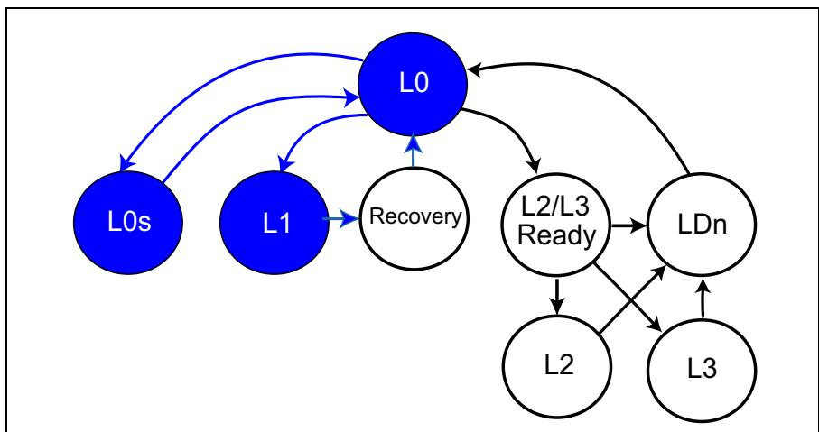

The Link Capability register specifies a device’s support for Active State Power Management. Figure 16‐14 illustrates the ASPM Support field within this register. In earlier spec versions, not all 4 options were available, but the 2.1 spec filled in all of them. Note that bit 22 indicates whether all the options are available.

Figure 16‐14: ASPM Support  

Software can enable and disable ASPM via the Active State PM Control field of the Link Control Register as illustrated in Figure 16‐15 on page 744. The possible settings are listed in Table 16‐18 on page 743. Note: The spec recommends that ASPM be disabled for all components in a path used for Isochronous transactions if the additional latencies associated with ASPM exceed the limits of the isochronous transactions.

Table 16‐18: Active State Power Management Control Field Definition

<table><tr><td>Setting</td><td>Description</td></tr><tr><td>00b</td><td>L0s and L1 ASPM disabled</td></tr><tr><td>01b</td><td>L0s enabled and L1 disabled</td></tr><tr><td>10b</td><td>L1 enabled and L0s disabled</td></tr><tr><td>11b</td><td>Both L0s and L1 enabled</td></tr></table>

Figure 16‐15: Active State PM Control Field  

## L0s State

L0s is a Link power state that can only be entered under hardware control and is applied to a single direction of the Link. For example, a large volume of traffic in conventional PC‐based systems results from Functions sending data to main system memory. As a result, the upstream lanes carry heavy traffic while the downstream lanes may carry very little. These downstream lanes can enter the L0s state to conserve power during stretches of idle bus time.

## Entry into L0s

A Transmitter initiates a change from L0 to L0s after detecting a period of idle time that is implementation specific.

Entry into L0s. Entry is managed for a single direction of the Link based on detecting a period of Link idle time. Ports are required to enter L0s after detecting idle time of no greater than 7μs.

Idle is defined differently for Endpoints and Switches. The reason for this is a desire to minimize recovery time as Link recovery time propagates through Switches. For example, if a Switch upstream port was in a low power state and now sees activity, it means that a TLP is probably on its way down to the Switch. Where will the packet need to be routed? It will go to one of the downstream ports, but rather than wait to receive the packet and determine which port will be the target before starting to wake it up, the lowest‐latency approach would be to wake all the downstream ports so that the one that turns out to be the target will be ready as quickly as possible.

Basic rules regarding idle time:

• Endpoint Port or Root Port:

No TLPs are pending transmission or a lack of Flow Control credits is temporarily blocking them.

‐ No DLLPs are pending transmission.

• Upstream Switch Port:

‐ The receive lane of all downstream ports are already in L0s.

No TLPs are pending transmission or a lack of Flow Control credits is temporarily blocking them.

‐ No DLLPs are pending transmission.

• Downstream Switch Port:

The Switch’s Upstream Port’s Receive Lanes are in L0s.

No TLPs are pending transmission or a lack of Flow Control credits is temporarily blocking them.

‐ No DLLPs are pending for transmission

The Transaction and Data Link Layers are unaware of whether the Physical Layer transmitter has entered L0s, but the idle conditions that trigger a transition to L0s must be continuously reported from the Transaction and Link layers to the Physical Layer so it can make timely choices about this. Note that a port must always tolerate L0s on its receiver, even if software has disabled ASPM. This allows a device at the other end of the Link that is enabled for ASPM to still transition one side of the Link to the L0s state.

Flow Control Credits Must be Delivered. One situation that qualifies as idle time is a pending TLP that is blocked due to insufficient FC credits. When flow control credits are received that allow delivery of the pending TLP, the transmitting port must initiate a return to L0. Also, if the receive buffer associated with the transmitter in L0s makes additional flow control credits available, the transmitter must return to L0 and deliver the FC\_Update DLLP to the neighbor.

Transmitter Initiates Entry to L0s. When sufficient idle time has been observed by a Transmitter, it forces a transition from L0 to L0s by sending an “electrical idle” ordered set (EIOS) to the receiver and stopping transmission. The transmitter and receiver are now in their electrical idle states and have reduced power consumption. Synchronization between the transmitter and receiver has been lost and retraining will be required for recovery. The spec requires that the PLL logic in the receiver must remain active (powered) to allow quick recovery from L0s back to L0.

## Exit from L0s State

If the transmitter detects that the idle condition is no longer true, it must initiate the exit from L0s to L0. The spec encourages designers to monitor events that give an early indication that an L0s exit is imminent and start the recovery process to speed up the transition back to L0. For example, if the Receiver of the port receives a non‐posted Request, the Transmitter knows that it will soon be asked to send a Completion in response. Consequently, the Transmitter can go ahead and start the exit process so the Link state is L0 by the time it is asked to deliver the Completion.

Transmitter Initiates L0s Exit. To exit L0s, the Transmitter sends one or more Fast Training Sequence (FTS) Ordered Sets. The number of these required by the Link partner’s Receiver was communicated earlier during Link training (N\_FTS field in the TS1s and TS2s used in training). After sending the requested number of FTSs, one SOS is delivered. The receiver should be able to establish bit lock and symbol lock or Block lock, and should be ready to resume normal operation.

Actions Taken by Switches that Receive L0s Exit. A switch that receives an L0s to L0 transition sequence on one port may also need to initiate an L0s exit to other of its ports. Two specific cases are considered:

Switch Downstream Port Receives L0s to L0 transition. The switch must signal an L0s to L0 on its upstream port if it is currently in the L0s state because the packet coming up from the Endpoint or downstream switch will most likely need to go upstream to the Root Complex.

Switch Upsteam Port Receives L0s to L0 transition. The switch must signal an L0s to L0 transition on all downstream ports currently in the L0s state because it doesn’t want to wait until the packet arrives to begin waking the target path.

Switch ports that were put into L1 by a software change to the device power state remain unaffected by L0s to L0 transitions. However, once the upstream Link has completed the transition to L0, a subsequent transaction may target this port, causing a transition from L1 to L0.

## L1 ASPM State

The optional L1 ASPM state provides deeper power savings than L0s, but has a greater recovery latency. This state results in both directions of the Link going into the L1 state and results in Link and Transaction layer deactivation within each device.

Entry into this state is requested by an upstream port, such as from an Endpoint or the upstream port of a switch (upstream ports are shaded as shown in Figure 16‐16). The downstream port responds to this request and either agrees to go into L1 or rejects the request through a negotiation process with the downstream component. Exiting L1 ASPM can be initiated by either the downstream or upstream port.

Figure 16‐16: Only Upstream Ports Initiate L1 ASPM  

## PCI Express Technology

## Downstream Component Decides to Enter L1 ASPM

The spec does not precisely define all conditions under which an Endpoint or upstream port of a switch decides to attempt entry into the L1 ASPM state but does suggest that one case might be when both sides of the Link have been in L0s for a preset amount of time. The requirements given include:

• ASPM L1 entry is supported and enabled

• Device‐specific requirements for entering L1 have been satisfied

• No TLPs are pending transmission

• No DLLPs are pending transmission

If the downstream component is a switch, then all of the switch’s downstream ports must be in the L1 or higher power conservation state before the upstream port can initiate L1 entry.

## Negotiation Required to Enter L1 ASPM

Because of the longer latency required to recover from L1 ASPM, a negotiation process is employed to ensure that the port at the other end of the Link is enabled for L1 ASPM and is prepared to enter it. The negotiation involves sending several packets:

• PM\_ Active\_State\_Request\_L1 DLLP — issued by the downstream port to start the negotiation process.

• PM\_ Request\_Ack DLLP — returned by the upstream port when all of its requirements to enter L1 ASPM have been satisfied.

• PM\_Active\_State\_Nak message TLP — returned by the upstream port when it is unable to enter the L1 ASPM state.

The upstream component may or may not accept the transition to the L1 ASPM state. The following scenarios describe a variety of circumstances that result in both conditions.

## Scenario 1: Both Ports Ready to Enter L1 ASPM State

Figure 16‐17 on page 750 summarizes the sequence of events that must occur to enable transition to the L1 ASPM state. This scenario assumes that all transactions have completed in both directions and no new transaction requirements emerge during the negotiation.

Downstream Component Requests L1 State. If the downstream component wishes to transition to the L1 state, it can send the request to enter L1 after the following steps have completed:

1. TLP scheduling is blocked at the Transaction Layer.

2. The Link Layer has received acknowledgement for the last TLP it had previously sent and the replay buffer is empty.

3. Sufficient flow control credits are available to allow transmission of the largest possible packet for any FC type. This ensures that the component can issue a TLP immediately upon exiting the L1 state.

The downstream component then delivers the PM\_ Active\_State\_Request\_L1 to notify the upstream component of the request to enter the L1 state. This is sent repeatedly until the upstream component responds — either a PM\_Request\_ACK DLLP or a PM\_Active\_State\_NAK message.

## Upstream Component Response to L1 ASPM Request. Down‐

stream ports (i.e., ports of an upstream component that face downward) must accept a request to enter a low power L1 state if all of the following conditions are true:

• The Port supports ASPM L1 entry and is enabled to do so

• No TLP is scheduled for transmission

• No Ack or Nak DLLP is scheduled for transmission

Upstream Component Acknowledges Request to Enter L1. The upstream component sends a PM\_Request\_ACK to notify the downstream component of its agreement to enter the L1 ASPM state after it:

1. Block scheduling of any new TLPs.

2. Receive acknowledgement for the last TLP previously sent (meaning its replay buffer is empty).

3. Ensure enough flow control credits are available to send the largest possible packet for any FC type so that it can issue a TLP immediately after exiting the L1 state.

The Upstream component then sends PM\_Request\_Ack continuously until it detects the EIOS on its receive lanes, indicating that the downstream device has entered Electrical Idle.

Downstream Component Sees Acknowledgement. When the Downstream component sees the PM\_Request\_Ack, it stops sending the PM\_Active\_State\_Request\_L1, disables DLLP and TLP transmission, sends the EIOS and places its transmit lanes into Electrical Idle.

Upstream Component Receives Electrical Idle. When the Upstream component receives the EIOS, it stops sending the PM\_Request\_Ack DLLP, disables DLLP and TLP transmission, sends EIOS and places its own transmit lanes into Electrical Idle.

Figure 16‐17: Negotiation Sequence Required to Enter L1 Active State PM  
  
Scenario 2: Upstream Component Transmits TLP Just Prior to Receiving L1 Request

This scenario presumes that the upstream component has just been instructed by its core logic to send a TLP downstream before it receives the request to enter L1 from the downstream device. Several negotiation rules define the actions to ensure that this situation is managed correctly.

TLP Must Be Accepted by Downstream Component. Note that after the downstream device sends the PM\_Active\_State\_L1 DLLP it must wait for a response from the upstream component. While waiting, the downstream component must be able to accept TLPs and DLLPs from the upstream device. Although it won’t send any TLPs, it must be able to send DLLPs as needed, such as ACKs for incoming TLPs. In this case, two possibilities exist:

• an ACK is returned to verify successful receipt of the TLP.

• a NAK is returned if a TLP transmission error is detected. The resulting retry of the TLP is allowed during the L1 negotiation.

Upstream Component Receives Request to Enter L1. The spec requires that the upstream component immediately accept or reject the request to enter the L1 state. However, it further states that prior to sending a PM\_Request\_ACK it must:

1. Block scheduling of new TLPs

2. Wait for acknowledgement of the last TLP previously sent, if necessary, and retry TLPs that receive a NAK, unless a Link Acknowledgement timeout condition occurs.

Once all outstanding TLPs have been acknowledged, and all other conditions are satisfied, the upstream device must return a PM\_Request\_ACK DLLP.

## Scenario 3: Downstream Component Receives TLP During Negotiation

During the negotiation sequence the downstream device may be instructed to send a new TLP upstream. However, a device that begins the L1 ASPM negotiation process must block new TLP scheduling. This prevents a race condition between going into L1 and sending a new TLP that would prevent entry into L1. Consequently, once the downstream device has scheduled delivery of the PM\_Request\_L1 it must complete the transition to L1 if a PM\_Request\_ACK is received. Sending a new TLP will have to wait until L1 has been entered, after which the device can initiate a transition from L1 back to L0 to send the TLP.

## Scenario 4: Upstream Component Receives TLP During Negotiation

If the upstream component needs to send a TLP or DLLP after sending the PM\_Request\_Ack, it must first complete the transition to L1. It can then initiate a change from L1 to L0 to send the packet.

## Scenario 5: Upstream Component Rejects L1 Request

Figure 16‐18 on page 752 summarizes the negotiation sequence when the upstream component rejects the request to enter the L1 ASPM state. The negotiation begins normally as the downstream component requests L1. However, the upstream device returns a PM\_Active\_State\_Nak TLP to reject the request. The reasons for rejecting the request to enter L1 include:

• L1 ASPM not supported or software has not enabled this feature

• One or more TLPs are scheduled for transfer across the Link

• ACK or NAK DLLPs are scheduled for transfer

Once the rejection message has been sent, the upstream component can continue sending TLPs and DLLPs as needed. The rejection tells the downstream component that L1 is not an option at present, and so it must transition to L0s instead, if possible.

Figure 16‐18: Negotiation Sequence Resulting in Rejection to Enter L1 ASPM State  

## Exit from L1 ASPM State

Either component can initiate the transition from L1 back to L0 when it needs to use the Link. The procedure is the same in either case and doesn’t involve any negotiation. When switches are involved in exiting from L1 the spec requires that other switch ports in the ASPM low power states must also transition to the L0 state if they are in the possible path of the packet that will be sent. These issues are discussed in subsequent sections.

L1 ASPM Exit Signaling. The spec states that exit from L1 is invoked by exiting electrical idle, which begins by sending TS1s. The receiving port responds by sending TS1s back to the originating device and the Physical Layer follows its LTSSM protocol to complete the Recovery state and return the Link to L0. Refer to“Recovery State” on page 571 for details.

Switch Receives L1 Exit from Downstream Component. As pictured in Figure 16‐19, the Switch must respond to L1 exit on the downstream port by returning TS1s and, within 1μs (from signal L1 Exit downstream), it must also exit L1 on its upstream Link if it was in that state.

Figure 16‐19: Switch Behavior When Downstream Component Signals L1 Exit  

Presumably the reason the downstream component is transitioning back to L0 is because it’s preparing to send a TLP upstream. Since L1 exit latencies are relatively long, a switch “must not wait until its Downstream Port Link has fully exited to L0 before initiating an L1 exit transition on its Upstream Port Link.” This prevents accumulated latencies that would otherwise result if all L1 to L0 transitions occurred in a sequential fashion.

Switch Receives L1 Exit from Upstream Component. In this case, the switch must respond with TS1s back upstream, and within 1μs it must also send TS1s to all downstream ports that are in the L1 ASPM state to return them to L0. As in the previous example, the goal is to minimize the overall exit latency of returning to the L0 state for every Link in the path from the initiator to the target of the transaction. Figure 16‐20 on page 755 summarizes these requirements. The Link between Switch F and EndPoint (EP) E is in the L1 state because software put EP E into the D1 state, which caused the Link to transition to L1. Only Links in the L1 ASPM state are transitioned to L0 as a result of the Root Complex (RC) initiating the exit from L1 ASPM.

Figure 16‐20: Switch Behavior When Upstream Component Signals L1 Exit  

## ASPM Exit Latency

PCI Express provides mechanisms to ensure that the ASPM exit latencies for L0s and L1 don’t exceed the requirements of the devices. All devices report their L0s and L1 exit latencies, and Endpoints also report the total acceptable latency they can tolerate for this when performing accesses to and from the Root Complex. This acceptable latency is based on the data buffer size within the device. If the chain of devices that reside between the Endpoint and target device have a total latency that exceeds the acceptable latency reported by the Endpoint, software can disable ASPM for a given Endpoint.

The exit latencies reported by a device will change depending on whether the devices on each end of a Link share a common reference clock or not. Consequently, the Link Status register includes a bit called Slot Clock that specifies whether the component uses an external reference clock provided by the platform, or an independent reference clock (perhaps generated internally). Software checks these bits in devices at both ends of each Link to determine whether they both use it and thus share a common clock. If so, software sets the Common Clock bit to report this in both devices. Figure 16‐21 on page 757 illustrates the registers and related bit fields involved in managing the ASPM exit latency.

## Reporting a Valid ASPM Exit Latency

Because the clock configuration affects the exit latency that a device will experience, devices must report the source of their reference clock via the Slot Clock status bit within the Link Status register. This bit is initialized by the component to report the source of its reference clock. If this bit is set to 1, the clock uses the platform generated reference clock and if it’s cleared (0) an independent clock is used.

If system firmware or software determines that both components on the Link use the platform clock then the reference clocks within both devices will be in phase. This results in shorter exit latencies from L0s and L1, and is reported in the Common Clock field of the Link Control register. Components must then update their reported exit latencies to reflect the correct value. Note that if the clocks are not common then the default values will be correct and no further action is required.

L0s Exit Latency Update. Exit latency for L0s is reported in the Link Capability register based on the default assumption that a common clock implementation does not exist. L0s exit latency is also reported in the TS1s used during Link training as the number of FTS Ordered Sets (N\_FTS) required to exit L0s. If software then detects a common clock implementation, it sets the Common Clock field writes to the Retrain Link bit in the Link Control register to force Link training to repeat. During retraining new N\_FTS values are reported and in the L0s Latency field of the Link Capability register.

L1 Exit Latency Update. Following Link retraining, new values will also be reported in the L1 Latency field.

Figure 16‐21: Config. Registers for ASPM Exit Latency Management and Reporting  

## PCI Express Technology

## Calculating Latency from Endpoint to Root Complex

Figure 16‐22 on page 759 illustrates an Endpoint whose transactions must transverse two switches to reach the Root Complex. Presuming that all Links in the path are in the L1 state, let’s take the example that Endpoint B needs to send a packet to main memory.

1. First, it begins the wake sequence by initiating a TS1 ordered set on its Link at time “T.” The L1 exit latency for EP B is a maximum of 8μs, but Switch C has a maximum exit latency of 16μs. Therefore, the exit latency for this Link is 16μs.

2. Within 1μs of detecting the L1 exit on Link B/C, Switch C signals L1 exit on Link C/F at T+1μs.

3. Link C/F completes its exit from L1 in 16μs, at T+17μs.

4. Switch F signals an exit from L1 to the Root Complex within 1μs of detecting L1 exit from Switch C (T+2μs).

5. Link F/RC completes exit from L1 in 8μs, completing at T+10μs.

6. Total latency to transition path to target back to L0 = T+17μs.

Figure 16‐22: Example of Total L1 Latency  

## Software Initiated Link Power Management

When software initiates configuration writes to change the power state for power conservation, devices must respond by transitioning their Link to the corresponding low power state.

## D1/D2/D3Hot and the L1 State

The spec requires that when all Functions within a device have been placed into any of the low power states (D1, D2, or $\mathrm { D } 3 _ { \mathrm { h o t } } )$ , the device must initiate a transition to the L1 state as shown in Figure 16‐23. A device returns to L0 as a result of software initiating a configuration access to the device or a device initiated event.

Figure 16‐23: Devices Transition to L1 When Software Changes their Power Level from D0  

Upon receiving a configuration write to the Power State field of the PMCSR register, a device initiates the change from L0 to L1 by sending a PM\_Enter\_L1 DLLP to the upstream component.

## Entering the L1 State

The procedure to place the Link into an L1 state is illustrated in Figure 16‐24 on page 762. The steps in the figure are described in greater detail in the following list:

1. Once a device recognizes that all its Functions are in the D2 state, it must prepare to transition the Link into L1. This begins with blocking new TLPs from being scheduled.

2. A TLP may from the downstream Endpoint may not have been acknowledged prior to receiving the request to enter D2. The device must not respond to a request to change the Link power until all outstanding TLPs have been acknowledged. In other words, the Replay Buffer must be empty before proceeding to the L1 state.

3. Because of the long latencies involved in returning the Link to its active state, a device must be able to send a maximum‐sized TLP immediately upon return to the active state. Since a lack of Flow Control credits could block this, the Endpoint must have sufficient credits to permit transmission of the biggest packet supported for each Flow Control type before entering L1.

4. When the requirements listed above have been met, the Endpoint sends a PM\_Enter\_L1 DLLP to the upstream device. This instructs the upstream component to put the Link into L1. The PM\_Enter\_L1 is repeated until a PM\_Request\_ACK DLLP is received from the upstream device.

5. When the upstream component receives PM\_Enter\_L1, it begins its preparation by performing steps 6, 7, and 8. This is the same preparation as performed by the downstream component prior to signaling the L1 transition.

6. All new TLP scheduling is blocked.

7. In the event that a previous TLP has not yet been acknowledged, the upstream device will wait until all transactions in the Replay Buffer have been acknowledged.

8. Sufficient Flow Control credits must be accumulated to ensure that the largest TLP can be transmitted for each Flow Control type.

9. The upstream component sends a PM\_Request\_ACK DLLP to confirm that it’s ready to enter the L1 state. This DLLP is repeated until an Electrical Idle ordered set is received, indicating that it’s been accepted.

10. When the downstream component receives the acknowledgement, it sends an EIOS and places its transmit lanes into electrical idle (transmitter is in Hi‐Z state).

11. The upstream component recognizes the EIOS and places its transmit lanes into electrical idle. The Link has now entered the L1 state.

Figure 16‐24: Procedure Used to Transition a Link from the L0 to L1 State  
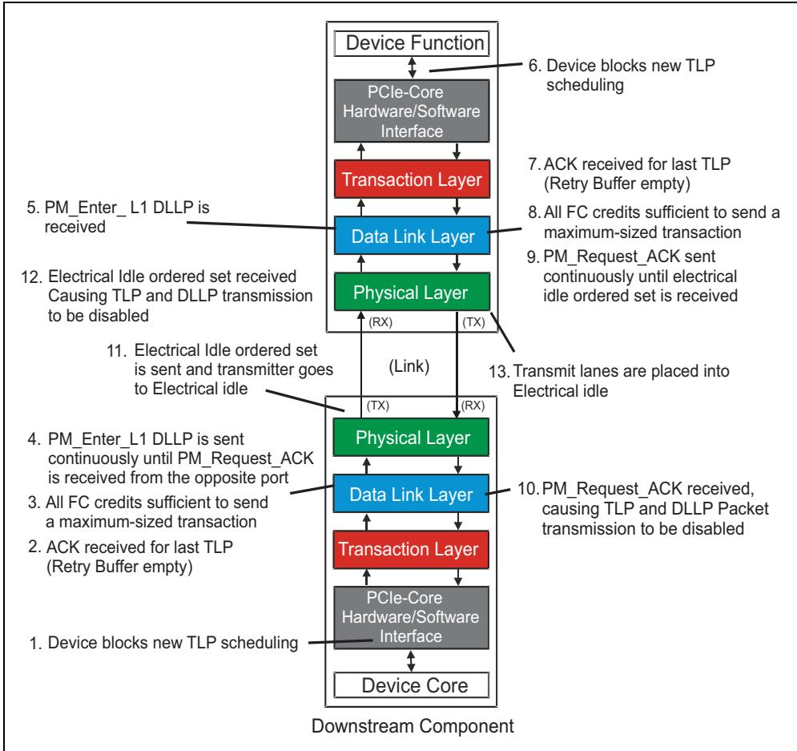

## Exiting the L1 State

An exit from the L1 state can be initiated by either the upstream or downstream component, as discussed below. This section also summarizes the signaling protocol used to exit L1.

Upstream Component Initiates. Software may need to use a device which is currently in a low‐power state, and that means the Power Management software must issue a configuration write to change its power state back to D0. When the configuration Request is ready to be sent from the upstream component (a Root Port or downstream Switch Port) the port will exit the electrical idle state and initiate re‐training to return the Link to the

L0 state. Once the Link is active, the configuration write can be delivered to the device to transition it back to D0, at which point it’s ready for normal use.

Downstream Component Initiates L1 to L0 Transition. In the L1 state the reference clock and power are still applied to devices on the Link. That allows a downstream device to be designed to monitor external events and trigger a Power Management Event (PME) when it occurs. In conventional PCI, this is reported by a side‐band PME# signal, and system board logic usually uses it to generate an interrupt that informs the CPU of the need to bring the device back to full operation. PCIe eliminates the sideband signal and instead sends an in‐band message to report the PME (see “The PME Message” on page 769 for details).

The L1 Exit Protocol. In the L1 state both directions of the Link are in the electrical idle state. A device signals an exit from L1 by changing from electrical idle and sending TS1s. When the Link neighbor detects the exit from electrical idle it sends TS1s back. This sequence triggers both devices to enter the Recovery state and, when that has completed its operation, both devices will have returned to the L0 state.

## L2/L3 Ready — Removing Power from the Link

Once software has placed all Functions within a Device into the $\mathrm { D 3 } _ { \mathrm { h o t } }$ state power can be safely removed from the device. A typical application for this would be to place all devices in the system into D3 and then remove power from them all to achieve the lowest power consumption. However, the spec does not give details of the actual mechanism that would be used to remove clock and power or require that a particular sequence be followed, allowing for a variety of implementations.

The state transitions to prepare devices for power removal involve the preliminary steps of entering L1 and then returning to L0 before arriving at the L2/L3 Ready state as illustrated in Figure 16‐25 on page 764.

Figure 16‐25: Link States Transitions Associated with Preparing Devices for Removal of the Reference Clock and Power  

## L2/L3 Ready Handshake Sequence

The spec does require a handshake sequence when transitioning to the L2/L3 Ready state. This ensures that all devices are ready for reference clock and power removal, and also that inband PME messages being sent to the Root Complex won’t accidentally be lost when power is removed.

Consider the following example of the handshake sequence required for removing the reference clock and power from PCIe devices in the fabric. This example assumes a system‐wide power down is being initiated, but the sequence can also apply to individual devices. The steps are summarized below and shown in Figure 16‐26 on page 766. The overall sequence is represented in two parts labeled A and B. The Link state transitions involved in the complete sequence include:

• L0 ‐‐> L1 (when software places a device into D3)

• L1 ‐‐> L0 (when software initiates a PME\_Turn\_Off message)

L0  ‐‐> L2/L3 Ready (resulting from the completion of the PME\_Turn\_Off handshake sequence, which culminates in a PM\_Enter\_L23 DLLP being sent by the device and the Link going to electrical idle)

The following steps detail the sequence illustrated in Figure 16‐26 on page 766.

1. Power Management software first places all Functions in the PCIe fabric into their D3 state.

2. All devices transition their Links to the L1 state when they enter D3.

3. Power Management software initiates a PME\_Turn\_Off TLP message, which is broadcast from all Root Complex ports to all devices. This prevents PME Messages from being lost in case they were in progress upstream when power was removed. Note that delivery of this TLP causes each Link to transition back to L0 so it can be forwarded downstream.

4. All devices must receive and acknowledge the PME\_Turn\_Off message by returning a PME\_TO\_ACK TLP message while in the D3 state.

5. Switches collect the PME\_TO\_ACK messages from all of their enabled downstream ports and forward just one aggregated PME\_TO\_ACK message upstream toward the Root Complex. That’s because these messages have the routing attribute set as “Gather and Route to the Root”.

6. After sending the PME\_TO\_ACK, when it is ready to have the reference clock and power removed, devices send a PM\_Enter\_L23 DLLP repeatedly until a PM\_Request\_ACK DLLP is returned. The Links that enter the L2/L3 Ready state last are those attached to the device originating the PME\_Turn\_Off message (the Root Complex in this example).

7. The reference clock and power can finally be removed when all Links have transitioned to the L2/L3 state, but not sooner than 100ns after that. If auxiliary power $( \mathrm { V } _ { \mathrm { A U X } } )$ is supplied to the devices, the Link transitions to L2. If no AUX power is available the Links will be in the L3 state.

Figure 16‐26: Negotiation for Entering L2/L3 Ready State  
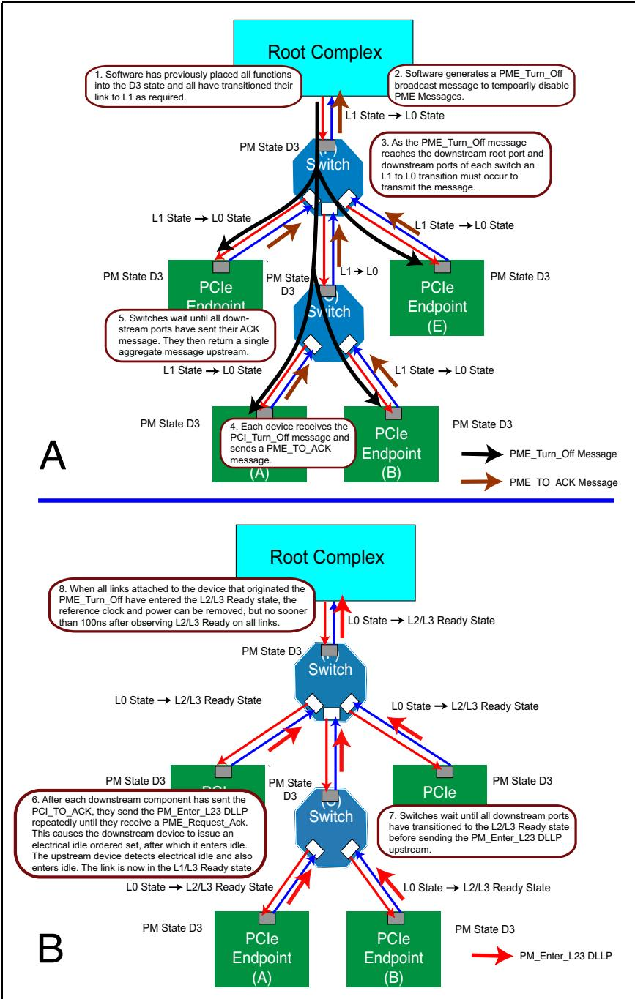

## Exiting the L2/L3 Ready State — Clock and Power Removed

As illustrated in the state diagram in Figure 16‐27, a device exits the L2/L3 Ready state when power is removed and has only two choices. When $\mathsf { V } _ { \mathrm { A U X } }$ is available the transition is to L2, otherwise the transition is to L3.

Link state transitions are normally controlled by the LTSSM in the Physical Layer. However, transitions to L2 and L3 result from main power being removed and the LTSSM is not operational then. Consequently, the spec refers to L2 and L3 as pseudo‐states defined for explaining the resulting condition of a device when power is removed.

Figure 16‐27: State Transitions from L2/L3 Ready When Power is Removed  

## The L2 State

Some devices are designed to monitor external events and initiate a wakeup sequence to restore power to handle them. Since main power is removed, these device will need a power source like $\mathsf { V } _ { \mathrm { A U X } }$ to be able to monitor the events and to signal a wakeup.

## The L3 State

In this state the device has no power and therefore no means of communication. Recovery from this state requires the system to restore power and the reference clock. That causes devices to experience a fundamental reset, after which they’ll need be initialized by software to return to normal operation.

## Link Wake Protocol and PME Generation

The wake protocol provides a method for an Endpoint to reactivate the upstream Link and request that software return it to D0 so it can perform required operations. PCIe PM is designed to be compatible with PCI‐PM software, although the methods are different.

Rather than using a sideband signal, PCIe devices use an inband PME message to notify PM software of the need to return the device to D0. The ability to generate PME messages may optionally be supported in any of the low power states. Recall that a device reports which PM states it supports for PME message delivery.

PME messages can only be delivered when the Link state is L0. The latency involved in reactivating the Link is based on a device’s PM and Link state, but can include the following:

1. Link is in non‐communicating (L2) state — when a Link is in the L2 state it cannot communicate because the reference clock and main power have been removed. No PME message can be sent until clock and power are restored, a Fundamental Reset is asserted, and the Link is re‐trained. These events will be triggered when a device signals a wakeup. This may result in all Links being re‐awakened in the path between the device needing to communicate and the Root Complex.

2. Link is in communicating (L1) state — when a Link is in the L1 state clock and main power are still active; thus, a device simply exits the L1 state, goes to the Recovery state to re‐train the Link, and returns the Link to L0. Once the Link is in L0 the PME message is delivered. Note that the devices never send a PME message while in the L2/L3 Ready state because entry into that state only occurs after PME notification has been turned off, in preparation for clock and power to be removed. (See “L2/L3 Ready Handshake Sequence” on page 764.)

3. PME is delivered (L0) — If the Link is in the L0 state, the device transfers the PME message to the Root Complex, notifying Power Management software that the device has observed an event that requires the device be placed back into its D0 state. Note that the message contains the Requester ID (Bus#, Device#, and Function#) of the device. This quickly informs software which device needs service.

## The PME Message

The PME message is delivered by devices that support PME notification. The message format is illustrated in Table 16‐28 on page 769. The message may be initiated by a device in a low power state (D1, D2, $\mathrm { D 3 } _ { \mathrm { h o t } } ,$ and $\mathrm { D } 3 _ { \mathrm { c o l d } } )$ and is sent immediately upon return of the Link to L0.

Figure 16‐28: PME Message Format  

The PME message is a Transaction Layer Packet that has the following characteristics:

• TC and VC are zero (no QoS applies)

• Routed implicitly to the Root Complex

• Handled as Posted Transaction

Relaxed Ordering is not permitted, forcing all transactions in the fabric between the signaling device and the Root Complex to be delivered to the Root Complex ahead of the PME message

## The PME Sequence

Devices may support PME in any of the low power states as specified in the PM Capabilities register. This register also specifies the amount of $\mathsf { V } _ { \mathrm { A U X } }$ current used by the device if it supports wakeup in the $\mathrm { D } 3 _ { \mathrm { c o l d } }$ state. The basic sequence of events associated with sending a PME to software is specified below and presumes that the device and system are enabled to generate PME and the Link has already been transitioned to the L0 state:

1. The device issues the PME message on its upstream port.

2. PME messages are implicitly routed to the Root Complex. Switches in the path transition their upstream ports to L0 if necessary and forward the packet upstream.

3. A root port receives the PME and forwards it to the Power Management Controller.

4. The controller informs power management software, typically with an interrupt. Software uses the Requester ID in the message to read and clear the PME\_Status bit in the PMCSR and return the device to the D0 state. Depending on the degree of power conservation, the PCI Express driver may also need to restore the devices configuration registers.

5. PM Software may also call the device driver in the event that device context was lost as a result of being placed in a low power state. If so, device software restores information within the device.

## PME Message Back Pressure Deadlock Avoidance

## Background

The Root Complex typically stores the PME messages it receives in a queue, and calls PM software to handle each one. A PME is held in this queue until PM software reads the PME\_Status bit from the requesting device’s PMCSR register. Once the configuration read transaction completes, this PME message can be removed from the internal queue.

## The Problem

Deadlock can occur if the following scenario develops:

1. Incoming PME Messages have filled the PME message queue but other PME messages have been issued downstream from the same root port.

2. PM software initiates a configuration read request from the Root to read PME\_Status from the oldest PME requester.

3. The corresponding split completion must push all previously posted PME messages ahead of it based on transaction ordering rules.

4. The Root Complex cannot accept a new PME message because the queue is full, so the path is temporarily blocked. But that also means that the read completion can’t reach the Root Complex to clear the older entry in the queue.

5. No progress can be made and deadlock occurs.

## The Solution

The problem is avoided if the Root Complex always accepts new PME messages, even when they would overflow the queue. In this case, the Root simply discards the later PME messages. To prevent a discarded PME message from being lost permanently, a device that sends a PME message is required to measure a time‐out interval, called the PME Service Time‐out. If the device’s PME\_Status bit is not cleared with 100 ms (+ 50%/‐ 5%), it assumes its message must have been lost and it re‐issues the message.

## The PME Context

Devices that generate PME must continue to power portions of the device that are used for detecting, signaling, and handling PME events, referred to collectively as the PME context. Devices that support PME in the $\mathrm { D } 3 _ { \mathrm { c o l d } }$ state use auxiliary power to maintain the PME context when the main power is removed. Items that are typically part of the PME context include:

PME\_Status bit (required) — set when a device sends a PME message and cleared by PM software. Devices that support PME in the $\mathrm { D } 3 _ { \mathrm { c o l d } }$ state must implement the PME\_Status bit as “sticky,” meaning that the value survives a fundamental reset.

## PCI Express Technology

PME\_Enable bit (required) — this bit must remain set to continue enabling a Function’s ability to generate PME messages and signal wakeup. Devices that support PME in the $\mathrm { D } 3 _ { \mathrm { c o l d } }$ state must implement PME\_Enable as “sticky,” meaning that the value survives a fundamental reset.

Device‐specific status information — for example, a device might preserve event status information in cases where several different types of events can trigger a PME.

• Application‐specific information — for example, modems that initiate wakeup would preserve Caller ID information if supported.

## Waking Non-Communicating Links

When a device that supports PME in the D3cold state needs to send a PME message, it must first transition the Link to L0. This is sometimes referred to as a wakeup. PCI Express defines two methods of triggering the wakeup of non‐communicating Links:

• Beacon — an in‐band indicator driven by AUX power

• WAKE# Signal — a sideband signal driven by AUX power

In both cases, PM software must be notified to restore main power and the reference clock. This also causes a fundamental reset that forces a device into the D0uninitialized state. Once the Link transitions to L0, the device sends the PME message. Since a reset is required to re‐activate the Link, devices must maintain PME context across the reset sequence described above.

## Beacon

This signaling mechanism is designed to operate on AUX power and doesn’t require much power. The beacon is simply a way of notifying the upstream component that software should be notified of the wakeup request. When switches receive a beacon on a downstream port, they in turn signal beacon on their upstream port. Ultimately, the beacon reaches the root complex, where it generates an interrupt that calls PM software.

Some form‐factors require beacon support for waking the system while others don’t. The spec requires compliance with the form‐factor specs, and doesn’t require beacon support for devices if their form‐factor doesn’t. However, for “universal” components designed for use in a variety of form‐factors, beacon support is required. See “Beacon Signaling” on page 483 for details.

## WAKE#

PCI Express provides a sideband signal called WAKE# as a alternative to the beacon that can be routed directly to the Root or to other system logic to notify PM software. In spite of the desire to minimize the pin count of a Link, the motivation for adding this extra pin is easy to understand. The reason is that a component must consume auxiliary power to be able to recognize a beacon on a downstream port and then forward it to an upstream port. In a battery‐powered system auxiliary power is jealously guarded because it drains the battery even when the system isn’t doing any work. The preferred solution in that case would be to bypass as many components as possible when delivering the wakeup notification, and the WAKE# pin serves that purpose very well. On the other hand, if power is not a concern then the WAKE# pin might be considered less desirable.

A hybrid implementation may also be used. In this case, WAKE# is sent to a switch, which in turn sends the beacon on its upstream port. The options are illustrated in Figure 16‐29 on page 774 A and B. Note that when asserted, the WAKE# signal remains low until the PME\_Status bit is cleared by software.

This signal must be implemented by ATX or ATX‐based connectors and cards as well as by the mini‐card form factor. No requirement is specified for embedded devices to use the WAKE# signal.

  
Figure 16‐29: WAKE# Signal Implementations

## Auxiliary Power

Devices that support PME in the $\mathrm { D } 3 _ { \mathrm { c o l d } }$ state must support the wakeup sequence and are allowed by the PCI‐PM spec to consume the maximum auxiliary current of 375 mA (otherwise only 20mA). The amount of current they need is reported in the Aux\_Current field of the PM Capability registers. Auxiliary power is enabled when the PME\_Enable bit is set within the PMCSR register.

PCI Express extends the use of auxiliary power beyond the limitations given by PCI‐PM. Now, any Device may consume the maximum auxiliary current if enabled by setting the Aux Power PM Enable bit of the Device Control register, illustrated in Figure 16‐30 on page 775. This gives devices the opportunity to support other things like SM Bus while in a low power state. As in PCI‐PM the amount of current consumed by a device is reported in the Aux\_Current field in the PMC register.

Figure 16‐30: Auxiliary Current Enable for Devices Not Supporting PMEs  

## Improving PM Efficiency

## Background

As processors and other system components acquire better power management mechanisms, peripherals like PCIe components start to appear as a bigger contributor to power consumption in PC systems. Earlier generations of PCIe allowed some software and hardware power management, but coordinating PM decisions with the system was not a high priority and consequently software visibility and control was limited.

One problem that can arise from this lack of coordination happens when the system goes into a sleep state but the devices remain operational. Such devices can initiate interrupts or DMA traffic that would require the system to wake up to handle them, even thought they were low‐priority events, and thus defeat the goal of power conservation.

It can also happen that the system is unaware of how long the devices can afford to wait from the time they request system service (like a memory read) until they get a response. Without that information, software is often forced to assume that the response time must always be minimal and therefore power management policies can’t afford enough time to do much. However, if the system was aware of time windows when a fast response was not needed, it could be more aggressive with power management and stay in a low power state for a longer time without risking performance problems. The 2.1 spec revision added two new features to address these problems.

## OBFF (Optimized Buffer Flush and Fill)

The first of these mechanisms is Optimized Buffer Flush and Fill, which provides a mechanism for Endpoints to be made aware of the system power state and therefore the best times to do data transfers to and from the system.

## The Problem

The problem with bus‐master capable devices is that if they’re not aware of the system power status, they may initiate transactions at times when it would be better to wait. The diagram in Figure 16‐31 on page 777 illustrates the problem in simple terms: there are many components initiating events and as a result, the times without activity when the system is idle and can go to sleep are few and short‐lived. In contrast, Figure 16‐32 on page 777 illustrates an improvement in which the same events are grouped and serviced together so that the times when the system is idle enough to go to sleep are both more frequent and of longer duration. Clearly, this would result in better power conservation and fortunately, it’s not difficult to implement. PCIe components simply need to understand what they should do based on the system power state, and they’ll need a way to learn what that state currently is.

Figure 16‐31: Poor System Idle Time  

Figure 16‐32: Improved System Idle Time  
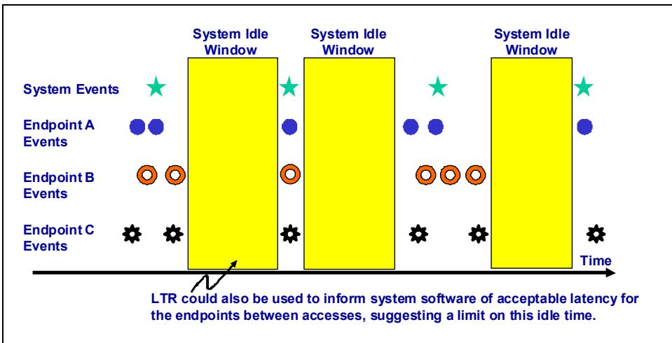

## The Solution

OBFF is an optional hint that a system can use to inform components about optimal time windows for traffic. It’s just a hint, though, so bus‐master‐capable devices can still initiate traffic whenever they like. Of course, power consumption will be negatively affected if they do, so overriding the OBFF hints should be avoided as much as possible. The information is communicated in one of two ways: by sending messages to the Endpoints or by toggling the WAKE# pin. If both options are available, using the pin is strongly recommended because it avoids the counter‐productive step of using excess power, possibly across several Links, to inform a component about the current system power state. In fact, the OBFF message should only be used if the WAKE# pin is not available.

Figure 16‐33 on page 778 gives an example showing a mix of both communication types. Using the pin is required if it’s available, but in this example it’s not an option between the two switches. To work around this problem, the upper switch can translate the state received on the WAKE# pin into a message going downstream. It should perhaps be noted here that switches are strongly encouraged to forward all OBFF indications downstream but not required to do so. It may be necessary, especially when using messages, to discard or collapse some indications and that is permitted.

Figure 16‐33: OBFF Signaling Example  
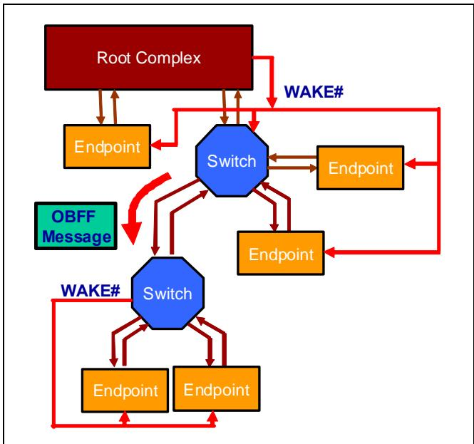

Using the WAKE# Pin. This pin, previously only used to inform the system that a component needed to have power restored, is given an extra meaning as the simplest and lowest‐power option for communicating system power status to PCIe components. It’s optional, and the protocol is fairly simple: the WAKE# pin toggles to communicate the system state. As seen in Figure 16‐34 on page 779, there are several transitions but only three states, which are described below:

1. CPU Active ‐ system awake; all transactions OK. This is every component’s initial state.

2. OBFF  ‐ system memory path available; transfers to and from memory are OK, but other transactions should wait for a higher power state.

3. Idle ‐ wait for a higher state before initiating.

Figure 16‐34: WAKE# Pin OBFF Signaling  
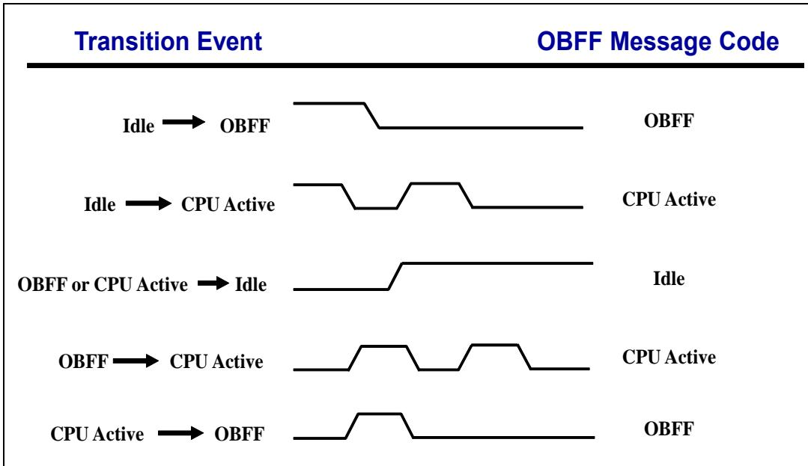

When the CPU Active or OBFF state is indicated, it’s recommended that the platform not return to the Idle state for at least 10 s so as to give components enough time to deliver the packets they may have been queuing up while in the previous Idle state. However, since that timing isn’t required, it’s also recommended that Endpoints not assume they’ll have a certain amount of time in a CPU Active or OBFF window. Along the same lines, the platform is allowed to indicate that it’s going to Idle before it actually does so as to give components advance notice that it’s time to finish. The case this early notice is specifically designed to avoid is having an Endpoint start a transfer just as the platform goes to Idle, causing an immediate exit from the Idle state. The spec strongly recommends that this should be the only reason for an early indication of the Idle state and also that this advance notice time should be as short as possible.

Interestingly, the WAKE# pin can still be used for its original purpose of allowing a component to wake the system, and it’s no surprise that this might confuse other components that are monitoring that pin for OBFF information. That could result in sub‐optimal behavior in power or performance, but this is considered a recoverable situation so no steps were taken to guard against it. To cover all of these cases, any time the signal is unclear the default state will be CPU Active.

Using the OBFF Message. As mentioned earlier, OBFF information can be communicated using a message, although it’s recommend that this only be used if the WAKE# pin is not available. These messages only flow downstream from the Root. The message contents are shown in Figure 16‐35 on page 781, including the Routing type 100b (point‐to‐point) and an OBFF Code that gives the following values (all other codes are reserved):

1. 1111b ‐ CPU Active

2. 0001b ‐ OBFF

3. 0000b ‐ Idle

If a reserved code is received, components must treat it as “CPU Active.” If a Port receives an OBFF message but doesn’t support OBFF or hasn’t enabled it yet, it must treat it as an Unsupported Request (Completion status UR).

Figure 16‐35: OBFF Message Contents  

Support for OBFF is indicated via the Device Capability 2 register (Figure 16‐36 on page 782), and enabled using the Device Control 2 register (Figure 16‐37 on page 783). Note that both the pin and message options may be available. However, the pin method is preferred because it is the lower power option.

Note that there are two variations for enabling a component to forward OBFF messages, and the difference between them has to do with handling a targeted Link that’s not in L0. In Variation A, the message will only be sent if the Link is in L0. If it’s not, the message is simply dropped to avoid the cost of waking the Link. This is preferred for Downstream Ports when the Device below it is not expected to have time‐critical communication requirements and can indicate its need for non‐urgent attention by simply returning the Link to L0. For Variation B, the message will always be forwarded and the Link will be returned to L0. This variation is preferred when the downstream Device can benefit from timely notification of the platform state.

Figure 16‐36: OBFF Support Indication  
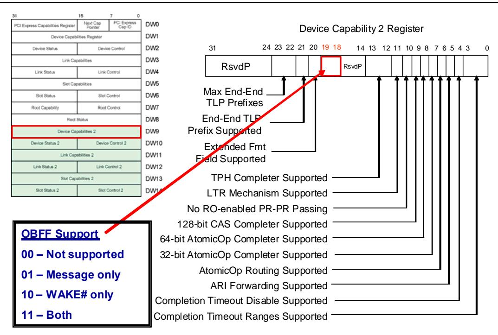

When using WAKE#, enabling any Root Port to assert it is considered a global enable unless there are multiple WAKE# signals, in which case only those associated with that Port are affected. When using the OBFF message, enabling a Root Port only enables the messages on that Port. The expectation in the spec is that all Root Ports would normally be enabled if any of them are, so as to ensure that the whole platform was enabled. However, selectively enabling some Ports and not others is permitted.

When enabling Ports for OBFF, the spec recommends that all Upstream Ports be enabled before Downstream Ports, and Root Ports be enabled last of all. For unpopulated hot plug slots this isn’t possible. For that case enabling OBFF using the WAKE# pin to the slot is permitted, but it’s recommended that the Downstream Port above the slot not be enabled to deliver OBFF messages.

Figure 16‐37: OBFF Enable Register  
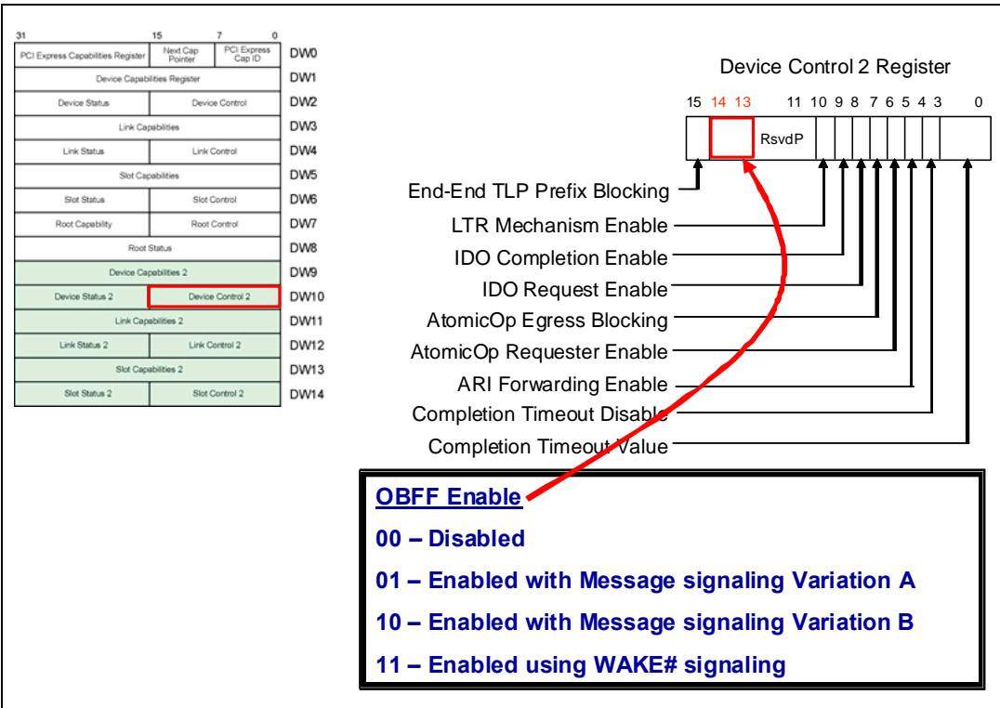

Finally, let’s refer back to the earlier example in Figure 16‐33 on page 778 to consider what these registers might look like for that case. The Downstream Port of the switch that connects to the lower switch will have a value for OBFF Support of 01b ‐ Message Only, while its Upstream Port might have a value of 11b ‐ Both. These values might be hard coded into the device or hardware initialized in some other fashion to make them visible to software after a reset. The Downstream Port would need to have an OBFF Enable value of 01b or 10b  ‐  Enabled with Message variation A or B so it could deliver an OBFF message. The Upstream Port would expect to have an OBFF Enable value of 11b ‐ Enabled with WAKE# signaling. The spec points out that when a switch is configured to use the different methods when going from one Port to another, it’s required to make the translation and forward the indications.

## LTR (Latency Tolerance Reporting)

The second new feature added to improve PM efficiency is called Latency Tolerance Reporting (LTR). This optional capability allows devices to report the delay they can tolerate when requesting service from the platform so that PM policies for platform resources like main memory can take that into consideration. If software supports it, this provides good performance for devices when they need it and lower power for the system when they don’t need a fast response. One simple way of using this information would be to allow the system to postpone waking up to service a request as long as the latency tolerance was still met.

The meaning of “latency tolerance” is not made explicitly clear in the spec, but some things are mentioned that might play into it. For example, the latency tolerance may affect acceptable performance or it may impact whether the component will function properly at all. Clearly, such a distinction would make a big difference in designing a PM policy. Similarly, the device may use buffering or other techniques to compensate for latency sensitivity and knowledge of that would be useful for software.

## LTR Registers

The LTR capability in a device is discovered using a new bit in the PCIe Device Capability 2 Register, as shown in Figure 16‐38 on page 785, and enabled in the Device Control 2 Register, illustrated in Figure 16‐39 on page 785. The spec prescribes a sequence for enabling LTR, too: devices closest to the Root must be enabled first, working down to the Endpoints. An Endpoint must not be enabled unless its associated Root Port and all intermediate switches also support LTR and have been enabled to service it. It’s permissible for some Endpoints to support LTR while others do not. If a Root Port or switch Downstream Port receives an LTR message but doesn’t support it or hasn’t been enabled yet, the message must be treated as an Unsupported Request. It’s recommended that Endpoints send an LTR message shortly after being enabled to do so. It’s strongly recommended that Endpoints not send more than two LTR messages within any 500 s period unless required by the spec. However, if they do, Downstream Ports must properly handle them and not generate an error based on that.

Figure 16‐38: LTR Capability Status  

Figure 16‐39: LTR Enable  
  
The target for LTR information is the Root Complex. Participating downstream devices all report their values but the Port just uses the smallest value that was reported as the latency limit for all devices accessed through that Port. The Root is not required to honor requested service latencies but is strongly encouraged to do so.

## LTR Messages

The LTR message itself has the format shown in Figure 16‐40 on page 788, where it can be seen that the Routing type 100b (point‐to‐point) and the LTR message code is 0001 0000b. Two latency values are reported, one for Requests that must be snooped and another for Requests that will not be snooped and therefore should complete more quickly. As seen in the diagram, the format for both is the same and includes the following fields:

Latency Value and Scale ‐ combine to give a value in the range from 1ns to about 34 seconds. Setting these fields to all zeros indicates that any delay will affect the device and thus the best possible service is requested. The meaning of the latency is defined as follows:

For Read Requests, it’s the delay from sending the END symbol in the Request TLP until receiving the STP symbol in the first Completion TLP for that Request.

For Write Requests, it relates to Flow Control back‐pressure. If a write has been issued but the next write can’t proceed due to a lack of Flow Control credits, the latency is the time from the last symbol of that write (END) until the first symbol of the DLLP that gives more credits (SDP). In other words, this represents the time within which the Root Port should be able to accept the next write.

Requirement ‐ can be set for none, or one, or both to indicate whether that latency value is required. If a device doesn’t implement one of these traffic types or has no service requirements for it, then this bit must be cleared for the associated field. If a device has reported requirements but has since been directed into a device power state lower than D0, or if its LTR Enable bit has been cleared, the device must send another LTR message reporting that these latencies are no longer required.

## Guidelines Regarding LTR Use

Endpoints have a few guidelines regarding the use of LTR:

1. It’s recommended that they send an updated LTR message every time their service requirements change, and the spec spends some time going over examples of this. The bottom line here is that devices need to take all the delays into account when making a change to the service requirements. That accounting includes time for the reference clock to be restored if was turned off, for the Link to be brought back to L0, for the LTR message to be delivered, and for the platform to prepare to handle the new requirement.

2. If the latency tolerance is being reduced, it’s recommended that the LTR message be sent far enough ahead of the first associated Request to ensure that the platform is ready.

3. If the latency tolerance is being increased, then the LTR message to report that should immediately follow the final Request that used the previous latency value.

4. To achieve the best overall platform power efficiency, it’s recommended that Endpoints buffer Requests as much as they can and then send them in bursts that are as long as the Endpoint can support.

Multi‐Function Devices (MFDs) have a few rules of their own. For example, they must send a “conglomerated” LTR message as follows:

1. Reported latency values must reflect the lowest values associated with any Function. The snoop and no‐snoop latencies could be associated with different Functions, but if none of them have a requirement for snoop or no‐snoop traffic, then the requirement bit for that type must not be set.

2. MFDs must send a new LTR message upstream if any of the Functions changes its values in a way that affects the conglomerated value.

Switches have a similar set of rules related to LTR. Basically, they collect the messages from Downstream Ports that have been enabled to use LTR and send a “conglomerated” message upstream according to the following rules:

1. If the Switch supports LTR, it must support it on all of its Ports.

2. The Upstream Port is allowed to send LTR messages only when the LTR Enable bit is set or shortly after software has cleared it so it can report that any previous requirements are no longer in effect.

3. The conglomerated LTR value is based on the lowest value reported by any participating Downstream Port. If the Requirement bit is clear, or an invalid value is reported, the latency is considered effectively infinite.

4. If any Downstream Port reports that an LTR value is required, the Requirement bit will be set for that type in the LTR message forwarded upstream.

5. The LTR values reported upstream must take into account the latency of the Switch itself. If the Switch latency changes based on its operational mode, it must not be allowed to exceed 20% of the minimum value reported on all Downstream Ports. The value reported on the Upstream Port is the minimum reported value on all the Downstream Ports minus the Switch’s own latency, although the value can’t be less than zero.

6. If a Downstream Port goes to DL\_Down status, previous latencies for that Port must be treated as invalid. If that changes the conglomerated values upstream then a new message must be sent to report that.

7. If a Downstream Port’s LTR Enable bit is cleared, any latencies associated with that Port must be considered invalid, which may also result in a new LTR message being sent upstream.

8. If any Downstream Ports receive new LTR values that would change the conglomerated value, the Switch must send a new LTR message upstream to report that.

Finally, the Root Complex also has a few rules related to LTR:

1. The RC is allowed to delay processing of a device Request as long as it satisfies the service requirements. One application of this might be to buffer up several Requests from an Endpoint and service them all in a batch.

2. If the latency requirements are updated while a series of Requests is in progress, the new values must be comprehended by the RC prior to servicing the next Request, and within less time than the previously reported latency requirements.

Figure 16‐40: LTR Message Format  

## LTR Example

To illustrate the concepts discussed so far, consider the example topology shown in Figure 16‐41 on page 789. Here, the Endpoint on the lower left has delivered an LTR message to the Switch reporting a Snoop Latency requirement of 1200ns. At this point, none of the other Endpoints connected to the Switch has reported an LTR value, so that becomes the conglomerated value to be reported upstream. However, the Switch has an internal latency of 50ns so that must be subtracted from the value to be reported, resulting in the Upstream Port sending an LTR message reporting 1150ns to the Root Port.

Figure 16‐41: LTR Example  
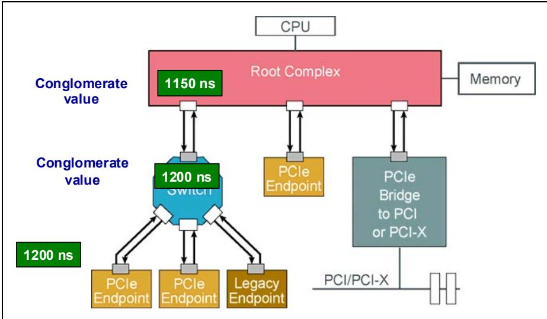  
Next, the Legacy Endpoint delivers an LTR message with a large latency requirement of 5000ns, as shown in Figure 16‐42 on page 790. Since this is larger than the current conglomerate value for the Switch, no LTR message is sent for this case.

Figure 16‐42: LTR ‐ Change but no Update  
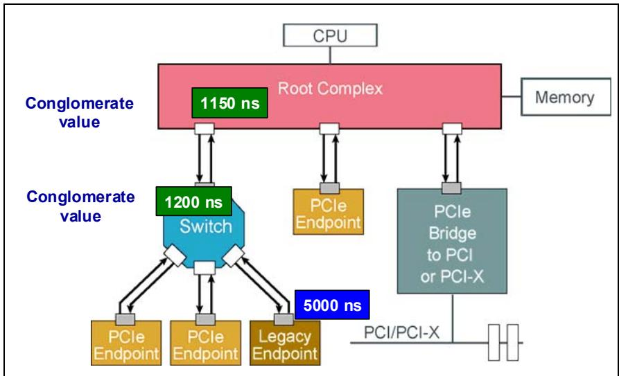

In the next stage, the middle Endpoint reports its LTR value as 700ns. This is smaller than the current conglomerate value, so the Switch calculates the new value of 650ns by subtracting its internal latency and forwards that upstream as an LTR message. That makes the current latency requirement for that Root Port 650ns, as seen in Figure 16‐43 on page 791.

Finally, the Link to the middle Endpoint stops working for some reason as shown in Figure 16‐44 on page 791, and the Switch Port reports DL\_Down. Consequently, the LTR value for that Port must be considered invalid. Since its value was being used as the current conglomerate value, the conglomerate will be updated to the lowest value that is still valid, which is the 1200ns reported by the left‐most Endpoint. The Switch will then subtract its internal latency and report 1150ns to the Root Port with a new LTR message.

Figure 16‐43: LTR ‐ Change with Update  

Figure 16‐44: LTR ‐ Link Down Case  
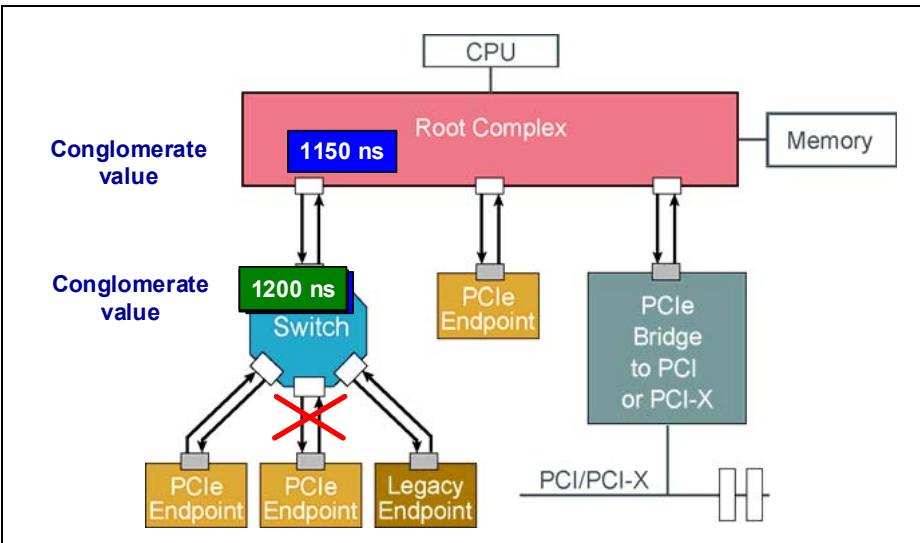

# 17 Interrupt Support

## The Previous Chapter

The previous chapter provides an overall context for the discussion of system power management and a detailed description of PCIe power management, which is compatible with the PCI Bus PM Interface Spec and the Advanced Configuration and Power Interface (ACPI) spec. PCIe defines extensions to the PCI‐PM spec that focus primarily on Link Power and event management. An overview of the OnNow Initiative, ACPI, and the involvement of the Windows OS is also provided.

## This Chapter

This chapter describes the different ways that PCIe Functions can generate interrupts. The old PCI model used pins for this, but sideband signals are undesirable in a serial model so support for the inband MSI (Message Signaled Interrupt) mechanism was made mandatory. The PCI INTx# pin operation can still be emulated using PCIe INTx messages for software backward compatibility reasons. Both the PCI legacy INTx# method and the newer versions of MSI/MSI‐X are described.

## The Next Chapter

The next chapter describes three types of resets defined for PCIe: Fundamental reset (consisting of cold and warm reset), hot reset, and function‐level reset (FLR). The use of a sideband reset PERST# signal to generate a system reset is discussed, and so is the inband TS1 based Hot Reset described.

## Interrupt Support Background

## General

The PCI architecture supported interrupts from peripheral devices as a means of improving their performance and offloading the CPU from the need to poll devices to determine when they require servicing. PCIe inherits this support largely unchanged from PCI, allowing software backwards compatibility to PCI. We provide a background to system interrupt handling in this chapter, but the reader who wants more details on interrupts is encouraged to look into these references:

• For PCI interrupt background, refer to the PCI spec rev 3.0 or to chapter 14 of MindShare’s textbook: PCI System Architecture (www.mindshare.com).

• To learn more about Local and IO APICs, refer to MindShare’s textbook: x86 Instruction Set Architecture.

## Two Methods of Interrupt Delivery

PCI used sideband interrupt wires that were routed to a central interrupt controller. This method worked well in simple, single‐CPU systems, but had some shortcomings that motivated moving to a newer method called MSI (Message Signaled Interrupts) with an extension called MSI‐X (eXtented).

Legacy PCI Interrupt Delivery — This original mechanism defined for the PCI bus consists of up to four signals per device or INTx# (INTA#, INTB#, INTC#, and INTD#) as shown in Figure 17‐1 on page 795. In this model, the pins are shared by wire‐ORing them together, and they’d eventually be connected to an input on the 8259 PIC (Programmable Interrupt Controller). When a pin is asserted, the PIC in turn asserts its interrupt request pin to the CPU as part of a process described in “The Legacy Model” on page 796.

PCIe supports this PCI interrupt functionality for backward compatibility, but a design goal for serial transports is to minimize the pin count. As a result, the INTx# signals were not implemented as sideband pins. Instead, a Function can generate an inband interrupt message packet to indicate the assertion or deassertion of a pin. These messages act as “virtual wires”, and target the interrupt controller in the system (typically in the Root Complex), as shown in Figure 17‐ 2 on page 796. This picture also illustrates how an older PCI device using the pins can work in a PCIe system; the bridge translates the assertion of a pin into an interrupt emulation message (INTx) going upstream to the Root Complex. The expectation is that PCIe devices would not normally need to use the INTx messages but, at the time of this writing, in practice they often do because system software has not been updated to support MSI.

Figure 17‐1: PCI Interrupt Delivery  

MSI I nterrupt Delivery — MSI eliminates the need for sideband signals by using memory writes to deliver the interrupt notification. The term “Message Signaled Interrupt” can be confusing because its name includes the term “Message” which is a type of TLP in PCIe, but an MSI interrupt is a Posted Memory Write instead of a Message transaction. MSI memory writes are distinguished from other memory writes only by the addresses they target, which are typically reserved by the system for interrupt delivery (e.g., x86‐based systems traditionally reserve the address range FEEx\_xxxxh for interrupt delivery).

Figure 17‐2 illustrates the delivery of interrupts from various types of PCIe devices. All PCIe devices are required to support MSI, but software may or may not support MSI, in which case, the INTx messages would be used. Figure 17‐2 also shows how a PCIe‐to‐PCI Bridge is required to convert sideband interrupts from connected PCI devices to PCIe‐supported INTx messages.

Figure 17‐2: Interrupt Delivery Options in PCIe System  

## The Legacy Model

## General

To illustrate the legacy interrupt delivery model, refer to Figure 17‐3 on page 797 and consider the usual steps involved in interrupt delivery using the legacy method of interrupt pins:

1. The device generates an interrupt by asserting its pin to the controller. In older systems this controller was typically an Intel 8259 PIC that had 15 IRQ inputs and one INTR output. The PIC would then assert INTR to inform the CPU that one or more interrupts were pending.

2. Once the CPU detects the assertion of INTR and is ready to act on it, it must identify which interrupt actually needs service, and that is done by the CPU issuing a special command on the processor bus called an Interrupt Acknowledge.

3. This command is routed by the system to the PIC, which returns an 8‐bit value called the Interrupt Vector to report the highest priority interrupt currently pending. A unique vector would have been programmed earlier by system software for each IRQ input.

4. The interrupt handler then uses the vector as an offset into the Interrupt Table (an area set up by software to contain the start addresses of all the Interrupt Service Routines, ISRs), and fetches the ISR start address it finds at that location.

5. That address would point to the first instruction of the ISR that had been set up to handle this interrupt. This handler would be executed, servicing the interrupt and telling its device to deassert its INTx# line and then would return control to the previously interrupted task.

Figure 17‐3: Legacy Interrupt Example  
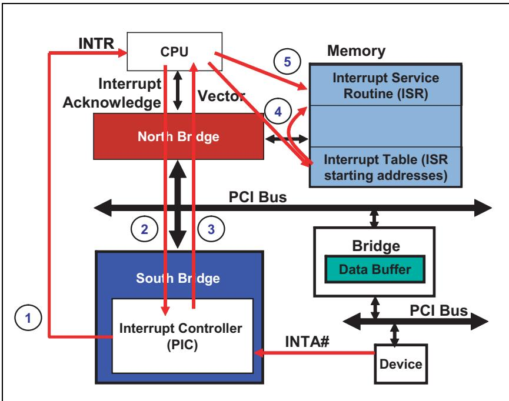

## Changes to Support Multiple Processors

This model works well for single‐CPU systems, but has a limitation that makes it sub‐optimal in a multi‐CPU system. The problem is that the INTR pin can only be connected to one CPU. If multiple processors are present then only one of them will see the interrupts and will have to service them all while the other CPUs won’t see any of them. To obtain the best performance, such systems really need an even distribution of the system tasks across all the processors, referred to as SMP (Symmetric Multi‐Processing) but the pin model won’t support it.

To achieve better SMP, a new model was needed, and toward this end the PIC was modified to become the IO APIC (Advanced Programmable Interrupt Controller). The IO APIC was designed to have a separate small bus, called the APIC Bus, over which it could deliver interrupt messages, as shown in Figure 17‐4 on page 799. In this model, the message contained the interrupt vector number, so there was no need for the CPU to send an Interrupt Acknowledge down into the IO world to fetch it. The APIC Bus connected to a new internal logic block within the processors called the Local APIC. The bus was shared among all the agents and any of them could initiate messages on it but, for our purposes, the interesting part is its use for interrupt delivery from peripherals. Those interrupts could now be statically assigned by software to be serviced by different CPUs, multiple CPUs or even dynamically assigned by the IO APIC.

Figure 17‐4: APIC Model for Interrupt Delivery  

That model, known as the APIC model, was sufficient for several years but still depended on sideband pins from the peripheral devices to work. Another limitation of this model was the number of IRQs (interrupt request lines) into the IO APIC. Without a very large number of IRQs, peripheral devices had to share IRQs which means added latency anytime that IRQ is asserted because there could be multiple devices that could have asserted it and software must evaluate all of them. This technique of linking multiple ISRs together was often referred to as interrupt chaining. Eventually, because of this issue and a couple other minor issues, another improvement came along.

Why not have the peripheral devices themselves send interrupt messages directly to the Local APICs? All that is needed is a communications path which already exists in the form of the PCI bus and the processor bus. So the APIC bus was eliminated and all interrupts were delivered to the Local APICs in the form of memory writes, referred to as MSIs or Message Signaled Interrupts. These MSIs were targeting a special address that the system understood to be an interrupt message targeting the Local APICs. (This special address address was traditionally FEEx\_xxxxh for x86‐based systems.) Even the IO APIC was programmed to send its interrupt notifications over the ordinary data bus using memory writes (MSI). Now it simply sends an MSI memory write across the data bus targeting the memory address of the desired processor’s Local APIC, and that has the effect of notifying the processor of the interrupt.

This model is known as the xAPIC model, and since it is not based on sideband signals which go into an interrupt controller with a limited number of inputs, the need to share interrupts is almost eliminated. More information can be found about this model in “An MSI Solution” on page 827.

PCI added MSI support as an option years ago and PCIe made that capability a requirement. A peripheral that can generate MSI transactions on its own opens new options for handling interrupts, such as giving each Function the ability to generate multiple unique interrupts instead of just one.

## Legacy PCI Interrupt Delivery

This section provides more detail on legacy PCI interrupt delivery. Readers familiar with PCI may wish to proceed to “Virtual INTx Signaling” on page 805 to learn more about how PCIe emulates this legacy model, or to “The MSI Model” on page 812 to learn more about that method.

PCI devices that use interrupts have two options. They may use either:

INTx# active low‐level signals that can be shared and were defined in the original spec.

Message Signaled Interrupts that were added as an option with the 2.2 version of the spec. MSI needs no modification for use in a PCIe system.

## Device INTx# Pins

A PCI device can implement up to 4 INTx# signals (INTA#, INTB#, INTC#, and INTD#). More than one pin is available because PCI devices can support up to 8 functions, each of which is allowed to drive one (but only one) interrupt pin. When PCI was developed, a typical system used a chipset that included the 15‐ input 8259 PIC, so that’s how many IRQs (which map to interrupt vectors) that were available to the system. However, many of those were already used for system purposes like the system timer, keyboard interrupt, mouse interrupt, and so on. In addition, some pins were reserved for ISA cards that could still be plugged into these older systems. Consequently, the PCI spec writers considered that only four IRQs would reliably be available for their new bus, and so the spec only supported four interrupt pins. However, as you probably know, there are typically more than four PCI devices on a PCI bus and even a single device could have more than four functions inside, each wanting its own interrupt. These reasons are why the PCI interrupts were designed to be level‐sensi tive and shareable. These signals could simply be wire‐ORed together to get down to a handful of resulting outputs, each one representing interrupt requests. Since they are shared, when an interrupt is detected, the interrupt handler software will need to go through the list of functions that are sharing the same pin and test to see which ones need servicing.

## Determining INTx# Pin Support

PCI functions indicate support for an INTx# signal in their configuration headers. The read‐only Interrupt Pin register illustrated in Figure 17‐5 indicates whether an INTx# is supported by this function and if so, which interrupt pin will it assert when requesting an interrupt.

Figure 17‐5: Interrupt Registers in PCI Configuration Header  

## Interrupt Routing

The Interrupt Line register shown in Figure 17‐5 on page 801 gives the next information that a driver needs to know: the input pin of the PIC to which this pin has been connected. The PIC is programmed by system software with a unique vector number for each input pin (IRQ). The vector for the highest‐priority interrupt asserted is reported to the processor who then uses that vector to index into a corresponding entry in the interrupt vector table. This entry points to the interrupting device’s interrupt service routine which the processor executes.

The platform designer assigns the routing of INTx# pins from devices. They can be routed in a variety of ways, but ultimately each INTx# pin connects to an input of the interrupt controller. Figure 17‐6 on page 803 illustrates an example in which several PCI device interrupts are connected to the interrupt controller through a programmable router. All signals connected to a given input of the programmable router will be directed to a specific input of the interrupt controller. Functions whose interrupts are routed to a common interrupt controller input will all have the same Interrupt Line number assigned to them by platform software (typically firmware). In this example, IRQ15 has three PCI INTx# inputs from different devices connected to it. Consequently, the functions using these INTx# lines will share IRQ15 and will therefore all cause the controller to send the same vector when queried. That vector will have the three ISRs for the different Functions chained together.

## Associating the INTx# Line to an IRQ Number

Based on system requirements, the router is programmed to connect its four inputs to four available PIC inputs. Once this is done, the routing of the INTx# pin associated with each function is known and the Interrupt Line number is written by software into each Function. The value is ultimately read by the Function’s device driver so it will know which interrupt table entry it has been assigned. That’s the place where the starting address of its ISR will be written, a process referred to as “hooking the interrupt”. When this function later generates an interrupt, the CPU will receive the vector number that corresponds to the IRQ specified in the Interrupt Line register. The CPU uses this vector to index into the interrupt vector table to fetch the entry point of the interrupt service routine associated with the Function’s device driver.

Figure 17‐6: INTx Signal Routing is Platform Specific  
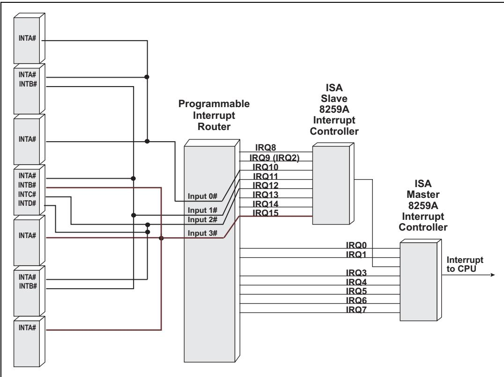

## INTx# Signaling

The INTx# lines are active‐low signals implemented as open‐drain with a pullup resistor provided on each line by the system. Multiple devices connected to the same PCI interrupt request signal line can assert it simultaneously without damage.

When a Function signals an interrupt it also sets the Interrupt Status bit located in the Status register of the config header. This bit can be read by system software to see if an interrupt is currently pending. (See Figure 17‐8 on page 805.)

Interrupt Disable. The 2.3 PCI spec added an Interrupt Disable bit (Bit 10) to the Command register of the config header. See Figure 17‐7 on page 804. The bit is cleared at reset permitting INTx# signal generation, but software may set it to prevent that. Note that the Interrupt Disable bit has no effect on Message Signalled Interrupts (MSI). MSIs are enabled via the Command Register in the MSI Capability structure. Enabling MSI automatically has the effect of disabling interrupt pins or emulation.

Interrupt Status. The PCI 2.3 spec added a read‐only Interrupt Status bit to the configuration status register (pictured in Figure 17‐8 on page 805). A function must set this status bit when an interrupt is pending. In addition, if the Interrupt Disable bit in the Command register of the header is cleared (i.e. interrupts enabled), then the function’s INTx# signal is asserted when this status bit is set. This bit is unaffected by the state of the Interrupt Disable bit.

Figure 17‐7: Configuration Command Register — Interrupt Disable Field  

Figure 17‐8: Configuration Status Register — Interrupt Status Field  
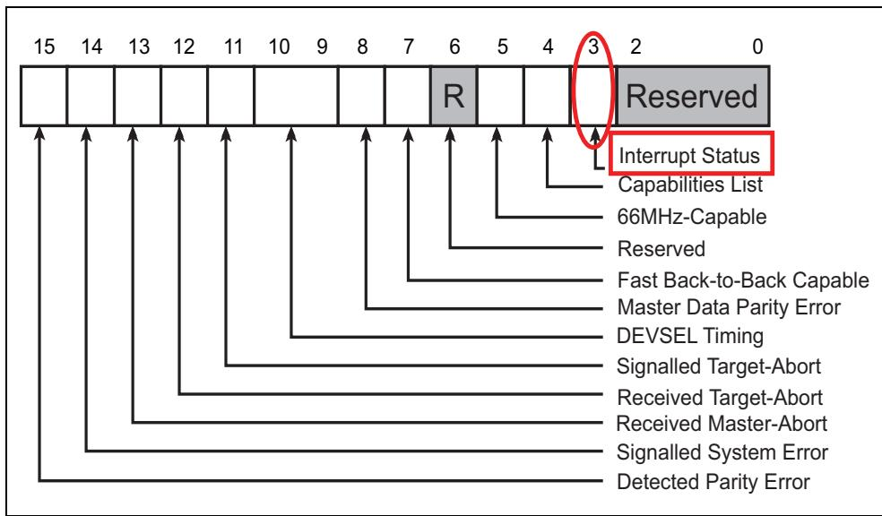

## Virtual INTx Signaling

## General

If circumstances make the use of MSI not possible in a PCIe topology, the INTx signaling model would be used. Following are two examples of devices that would need to be able to use INTx messages:

PCIe‐to‐(PCI or PCI‐X) bridges — Most PCI devices will use the INTx# pins because MSI support is optional for them. Since PCIe doesn’t support sideband interrupt signaling, the inband messages are used instead. The interrupt controller understands the message and delivers an interrupt request to the CPU which would include a pre‐programmed vector number.

Boot Devices — PC systems commonly use the legacy interrupt model during the boot sequence because MSI usually requires OS‐level initialization. Generally, a minimum of three subsystems are needed for booting: an output to the operator such as video, an input from the operator which is typically the keyboard, and a device that can be used to fetch the OS, typically a hard drive. PCIe devices involved in initializing the system are called “boot devices.” Boot devices will use legacy interrupt support until the OS and device drivers are loaded, after which it’s preferable they use MSI.

## Virtual INTx Wire Delivery

Figure 17‐9 on page 806 illustrates a system with a PCIe Endpoint and a PCI Express‐to‐PCI Bridge. If we assume software has not enabled MSI on the Endpoint, it will deliver interrupt requests with INTx messages. In this example, the bridge is propogating pin‐based interrupts from connected PCI devices with INTx messages. As can be seen, the bridge sends an INTB messages to signal the assertion and deassertion of its INTB# input from the PCI bus. The PCIe Endpoint is shown signaling an INTA using emulation messages. Note that INTx# signaling involves two messages:

Assert\_INTx messages indicate a high‐to‐low transition (from inactive to active) of the virtual INTx# signal.

• Deassert\_INTx messages indicate a low‐to‐high transition.

When a Function delivers an Assert\_INTx message, it also sets its Interrupt Status bit in the Configuration Status register, just as it would if it asserted the physical INTx# pin (see Figure 17‐8 on page 805).

Figure 17‐9: Example of INTx Messages to Virtualize INTA#‐INTD# Signal Transitions  
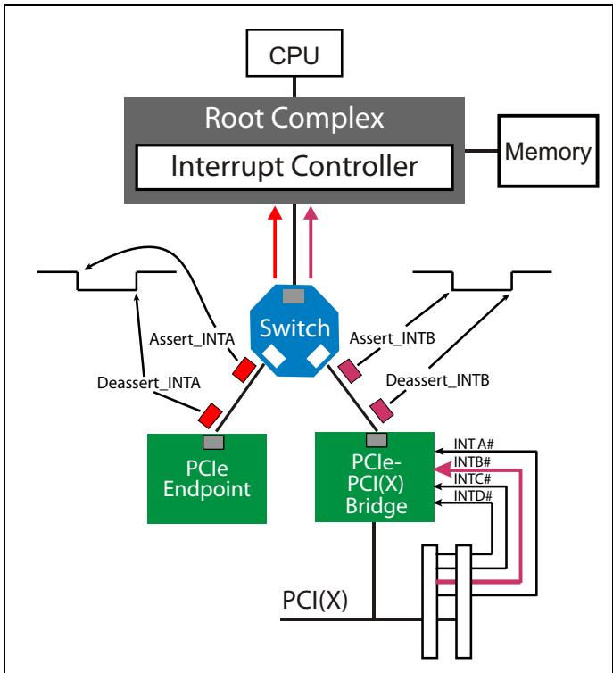

## INTx Message Format

Figure 17‐10 on page 807 depicts the format of the INTx message header. The interrupt controller is the ultimate destination of these messages, however the routing method employed is not “Route to the Root Complex”, but is actually “Local ‐ Terminate at Receiver” as shown in Figure 17‐10. There are two reasons for this. The first is because each bridge (including Switch Ports and Root Ports) along the upstream path may map the virtual interrupt wire to a different virtual interrupt wire across the bridge (e.g., a Switch Port receives Assert\_INTA but maps it to Assert\_INTB when propogating it upstream). More info about this INTx mapping can be found in “INTx Mapping” on page 808.

The second reason for the local routing type of these messages is due to the fact that we’re emulating a pin‐based signal. If a port receives an assert interrupt message that maps to INTA on its primary side and it has already sent an Assert\_INTA message upstream because of a previous interrupt, then there is no reason to send another one. INTA is already seen as asserted. More info about this collapsing of INTx messages can be found in “INTx Collapsing” on page 810.

Figure 17‐10: INTx Message Format and Type  

## Mapping and Collapsing INTx Messages

## INTx Mapping

Switches must adhere to the INTx mapping defined by the PCI spec, shown in Table 17‐1 on page 809. This mapping defines the virtual connection that exists when interrupts are routed across a PCI‐to‐PCI bridge. The mapping is based on the INTx message type and the Device number from the Requester ID field in the message.

Refer to Figure 17‐11 on page 810 for this example. The assert interrupt messages received on the two downstream switch ports are both INTA messages. The virtual PCI‐to‐PCI bridge at each of the ingress ports will map both INTA messages to INTA, meaning no change. This is because the Device number of both originating Endpoint devices is zero (which is contained in the interrupt message itself as part of the Requester ID, ReqID). Table 17‐1 shows that interrupts messages coming from Device 0 map to the same INTx message on the other side of the bridge (i.e., internal to the Switch both INTA messages are mapped to INTA). So each downstream port will propogate the interrupt messages upstream without changing their virtual wire. However, the propogated interrupt messages no longer have the ReqID of the original requester, they now have the ReqID of the port that is propogating the interrupt message.

Next, the upstream Switch Port receives the propogated interrupt messages. The INTA interrupt from port 2:1:0 is going to be mapped to an INTB message when progopated upstream because the interrupt message indicates it came from Device 1 (ReqID 2:1:0). The other interrupt being propogated by port 2:2:0 is going to be mapped to an INTC message when sent from the upstream Switch Port to the Root Port. Refer to Table 17‐1 to confirm these mappings.

The reason for this interrupt mapping is the same as it was for PCI: to avoid as much as possible having multiple functions sharing the same INTx# pin. As stated previously, single function devices are required to use INTA if using legacy interrupts. So if all the Functions downstream of a Root Port used INTA and there was no mapping across bridges, they would all be routed to the same IRQ. Which means anytime one of the Functions asserted INTA, all the Functions would have to be checked. This would result in significant interrupt servicing latencies for the Functions at the end of the list. This interrupt mapping method is a crude attempt at distributing interrupts (especially INTA) across all four INTx virtual wires because each INTx virtual wire can be mapped to a separate IRQ at the interrupt controller.

Table 17‐1: INTx Message Mapping Across Virtual PCI‐to‐PCI Bridges

<table><tr><td>Device Number of Delivering INTx</td><td>INTx Message Type at Input</td><td>INTx Message Type at Output</td></tr><tr><td rowspan="4">0, 4, 8, 12 etc.</td><td>INTA</td><td>INTA</td></tr><tr><td>INTB</td><td>INTB</td></tr><tr><td>INTC</td><td>INTC</td></tr><tr><td>INTD</td><td>INTD</td></tr><tr><td rowspan="4">1, 5, 9, 13 etc.</td><td>INTA</td><td>INTB</td></tr><tr><td>INTB</td><td>INTC</td></tr><tr><td>INTC</td><td>INTD</td></tr><tr><td>INTD</td><td>INTA</td></tr><tr><td rowspan="4">2, 6, 10, 14 etc.</td><td>INTA</td><td>INTC</td></tr><tr><td>INTB</td><td>INTD</td></tr><tr><td>INTC</td><td>INTA</td></tr><tr><td>INTD</td><td>INTB</td></tr><tr><td rowspan="4">3, 7, 11, 15 etc.</td><td>INTA</td><td>INTD</td></tr><tr><td>INTB</td><td>INTA</td></tr><tr><td>INTC</td><td>INTB</td></tr><tr><td>INTD</td><td>INTC</td></tr></table>

Figure 17‐11: Example of INTx Mapping  

## INTx Collapsing

PCIe Switches must ensure that INTx messages are delivered upstream in the correct fashion. Specifically, interrupt routing of legacy PCI implementations must be handled such that software can determine which interrupts are routed to which interrupt controller inputs. INTx# lines may be wire‐ORed and be routed to the same IRQ input on the interrupt controller, and when multiple devices signal interrupts on the same line, only the first assertion is seen by the interrupt controller. Similarly, when one of these devices deasserts its INTx# line, the line remains asserted until the last one is turned off. These same principles apply to PCIe INTx messages.

In some cases, however, two overlapping INTx messages may be mapped to the same INTx message by a virtual PCI bridge at the egress port, requiring the messages to be collapsed. Consider the following example illustrated in Figure 17‐12 on page 811.

When the upstream Switch Port maps the interrupt messages for delivery on the upstream link, both interrupts will be mapped as INTB (based on the device numbers of the downstream Switch Ports). Note that because these two overlapping messages are the same they must be collapsed.

Collapsing ensures that the interrupt controller will never receive two consecutive Assert\_INTx or Deassert\_INTx messages for the shared interrupts. This is equivalent to INTx signals being wire‐ORed.

Figure 17‐12: Switch Uses Bridge Mapping of INTx Messages  

## INTx Delivery Rules

The rules associated with the delivery of INTx messages have some unique characteristics:

• Assert\_INTx and Deassert\_INTx are only issued in the upstream direction.

• Switches that are collapsing interrupts will only issue INTx messages upstream when there is a change of the interrupt status.

Devices on either side of a link must track the current state of INTA‐INTD assertion.

• A Switch tracks the state of the four virtual wires for each of its downstream ports, and may present a collapsed set of virtual wires on its upstream port.

• The Root Complex must track the state of the four virtual wires (A‐D) for each downstream port.

INTx signaling may be disabled with the Interrupt Disable bit in the Command Register.

• If any INTx virtual wires are active and device interrupts are then disabled, a corresponding Deassert\_INTx message must be sent.

• If a downstream Switch Port goes to DL\_Down status, any active INTx virtual wires must be deasserted, and the upstream port updated accordingly (Deassert\_INTx message required if that INTx was in active state).

## The MSI Model

A PCIe Function indicates MSI support via the MSI Capability registers. Each Function must implement either the MSI Capability Structure or the MSI‐X (eXtended MSI, see “The MSI‐X Model” on page 821) Capability Structure, or both. The MSI Capability registers are set up by configuration software and include:

• Target memory address

• Data Value to be written to that address

• The number of unique messages that can be encoded into the data

See “Memory Request Header Fields” on page 188 for a review of the Memory Write Transaction Header. Note that MSIs always have a data payload of 1DW.

## The MSI Capability Structure

The MSI Capability Structure resides in the PCI‐compatible config space area (first 256 bytes). There are four variations of the MSI Capability Structure based on whether it supports 64‐bit addressing or only 32‐bit and whether it supports per vector masking or not. Native PCIe devices are required to support 64‐bit addressing. All four variations of the MSI Capability Structure can be found in Figure 17‐13 on page 813.

Figure 17‐13: MSI Capability Structure Variations

<table><tr><td colspan="3">32-bit Address</td></tr><tr><td>Message Control</td><td>Next Capability Pointer</td><td>Capability ID (05h) DW0</td></tr><tr><td colspan="3">Message Address [31:0]</td></tr><tr><td></td><td>Message Data</td><td>DW1 DW2</td></tr><tr><td colspan="3">64-bit Address</td></tr><tr><td>Message Control</td><td>Next Capability Pointer</td><td>Capability ID (05h) DW0</td></tr><tr><td colspan="3">Message Address [31:0]</td></tr><tr><td colspan="3">Message Address [63:32]</td></tr><tr><td></td><td>Message Data</td><td>DW1 DW2 DW3</td></tr><tr><td colspan="3">32-bit Address with Per-Vector Masking</td></tr><tr><td>Message Control</td><td>Next Capability Pointer</td><td>Capability ID (05h) DW0</td></tr><tr><td colspan="3">Message Address [31:0]</td></tr><tr><td>Reserved</td><td>Message Data</td><td>DW1 DW2 DW3 DW4</td></tr><tr><td colspan="3">Mask Bits</td></tr><tr><td colspan="3">Pending Bits</td></tr><tr><td colspan="3">64-bit Address with Per-Vector Masking</td></tr><tr><td>Message Control</td><td>Next Capability Pointer</td><td>Capability ID (05h) DW0</td></tr><tr><td colspan="3">Message Address [31:0]</td></tr><tr><td colspan="3">Message Address [63:32]</td></tr><tr><td>Reserved</td><td>Message Data</td><td>DW1 DW2 DW3 DW4 DW5</td></tr><tr><td colspan="3">Mask Bits</td></tr><tr><td colspan="3">Pending Bits</td></tr></table>

## Capability ID

A Capability ID value of 05h identifies the MSI capability and is a read‐only value.

## Next Capability Pointer

The second byte of the register is a read‐only value that gives the dwordaligned offset from the top of config space to the next Capability Structure in the linked list of structures or else contains 00h to indicate the end of the linked list.

## Message Control Register

Figure 17‐14 on page 814 and Table 17‐2 on page 814 illustrate the layout and usage of the Message Control register.

Figure 17‐14: Message Control Register  
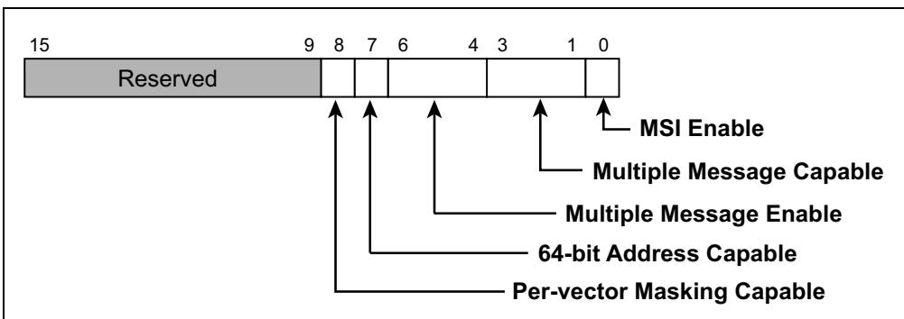

Table 17‐2: Format and Usage of Message Control Register

<table><tr><td>Bit(s)</td><td>Field Name</td><td>Description</td></tr><tr><td>0</td><td>MSI Enable</td><td>Read/Write. State after reset is 0, indicating that the device&#x27;s MSI capability is disabled.0 = Function isdisabledfrom using MSI. It must use MSI-X or else INTx Messages.1 = Function isenabledto use MSI to request service and won&#x27;t use MSI-X or INTx Messages.</td></tr></table>

## Chapter 17: Interrupt Support

Table 17‐2: Format and Usage of Message Control Register (Continued)

<table><tr><td>Bit(s)</td><td>Field Name</td><td>Description</td></tr><tr><td rowspan="10">3:1</td><td rowspan="10">Multiple Message Capable</td><td>Read-Only. System software reads this field to determine how many messages (interrupt vectors) the Function would like to use. The requested number of messages is a power of two, therefore a Function that would like three messages must request that four messages be allocated to it.</td></tr><tr><td>Value Number of Messages Requested</td></tr><tr><td>000b 1</td></tr><tr><td>001b 2</td></tr><tr><td>010b 4</td></tr><tr><td>011b 8</td></tr><tr><td>100b 16</td></tr><tr><td>101b 32</td></tr><tr><td>110b Reserved</td></tr><tr><td>111b Reserved</td></tr><tr><td rowspan="10">6:4</td><td rowspan="10">Multiple Message Enable</td><td>Read/Write. After system software reads the Multi-ple Message Capable field (previous row in this table) to see how many messages (interrupt vec-tors) are requested by the Function, it programs a 3-bit value in this field indicating the actual num-ber of messages allocated to the Function. The number allocated can be equal to or less than the number actually requested. The state of this field after reset is 000b.</td></tr><tr><td>Value Number of Messages Requested</td></tr><tr><td>000b 1</td></tr><tr><td>001b 2</td></tr><tr><td>010b 4</td></tr><tr><td>011b 8</td></tr><tr><td>100b 16</td></tr><tr><td>101b 32</td></tr><tr><td>110b Reserved</td></tr><tr><td>111b Deferred</td></tr></table>

## PCI Express 3.0 Technology

Table 17‐2: Format and Usage of Message Control Register (Continued)

<table><tr><td>Bit(s)</td><td>Field Name</td><td>Description</td></tr><tr><td>7</td><td>64-bit Address Capable</td><td>Read-Only.0 = Function does not implement the upper 32 bits of the Message Address register; only a 32-bit address is possible.1 = Function implements the upper 32 bits of the Message Address register and is capable of generating a 64-bit memory address.</td></tr><tr><td>8</td><td>Per-Vector Masking Capable</td><td>Read-Only.0 = Function does not implement the Mask Bit register or the Pending Bit register; software does NOT have the ability to mask individual interrupts with this capability structure.1 = Function does implement the Mask Bit register or the Pending Bit register; software does have the ability to mask individual interrupts with this capability structure.</td></tr><tr><td>15:9</td><td>Reserved</td><td>Read-Only. Always zero.</td></tr></table>

## Message Address Register

The lower two bits of the 32‐bit Message Address register are zero and cannot be changed, forcing the address assigned by software to be dword aligned. Typically, this would be the address of the Local APIC in the system CPU. In x86‐ based systems (Intel‐compatible), this address has traditionally been FEEx\_xxxxh where the lower 20 bits indicate which Local APIC is being targeted as well as some other info about the interrupt itself. It is important to note that how the address is interpreted is platform specific and is not dictated in the PCI or PCIe specs.

The register containing bits [63:32] of the Message Address are required for native PCI Express devices but is optional for legacy endpoints. This register is present if Bit 7 of the Message Control register is set. If so, it is a read/write register used in conjunction with the Message Address [31:0] register to enable a 64‐bit memory address for interrupt delivery from this Function.

## Message Data Register

System software writes a base message data pattern into this 16‐bit, read/write register. When the Function generates an interrupt request, it writes a 32‐bit data value to the memory address specified in the Message Address register. The upper 16 bits of this data are always set to zero, while the lower 16 bits are supplied by the Message Data register.

If more than one message has been assigned to the Function, it modifies the lower bits (the number of modifiable bits depends on how many messages have been assigned to the Function by configuration software) of the Message Data register value to form the appropriate value for the event it wishes to report. As an example, refer to “Basics of Generating an MSI Interrupt Request” on page 820.

## Mask Bits Register and Pending Bits Register

If the Function supports per‐vector masking (indicated in bit [8] of the Message Control register) then these registers are present. The max number of interrupt messages (itnerrupt vectors) that can be requested and assigned to a Function using MSI is 32. So these two registers are 32 bits in length with each potential interrupt message having its own mask and pending bit. If bit [0] of the Mask Bits register is set, then interrupt message 0 is masked (this is the base vector from this Function). If bit [1] is set, then interrupt message 1 is masked (this is the base vector + 1).

When an interrupt message is masked, the MSI for that vector cannot be sent. Instead, the corresponding Pending Bit is set. This allows software to mask individual interrupts from a Function and then periodically poll the Function to see if there are any masked interrupts that are pending.

If software clears a mask bit and the corresponding pending bit is set, the Function must send the MSI request at that time. Once the interrupt message has been sent, the Function would clear the pending bit.

## Basics of MSI Configuration

The following list specifies the steps taken by software to configure MSI interrupts for a PCI Express device. Refer to Figure 17‐15 on page 819.

1. At startup time, enumeration software scans the system for all PCI‐compatible Functions (see “Single Root Enumeration Example” on page 109 for a discussion of the enumeration process).

## PCI Express 3.0 Technology

2. Once a Function is discovered software reads the Capabilities List Pointer, to find the location of the first capability structure in the linked list.

3. If the MSI Capability structure (Capability ID of 05h) is found in the list, software reads the Multiple Message Capable field in the device’s Message Control register to determine how many event‐specific messages the device supports and if it supports a 64‐bit message address or only 32‐bit. Software then allocates a number of messages equal to or less than that and writes that value into the Multiple Message Enable field. At a minimum, one message will be allocated to the device.

4. Software writes the base message data pattern into the device’s Message Data register and writes a dword‐aligned memory address to the device’s Message Address register to serve as the destination address for MSI writes.

5. Finally, software sets the MSI Enable bit in the device’s Message Control register, enabling it to generate MSI writes and disabling other interrupt delivery options.

Figure 17‐15: Device MSI Configuration Process  

## Basics of Generating an MSI Interrupt Request

Figure 17‐16 on page 821 illustrates the contents of an MSI Memory Write Transaction Header and Data field. Key points include:

Format field must be 011b for native functions, indicating a 4DW header (64‐bit address) with Data, but it may be 010b for Legacy Endpoints, indicating a 32‐bit address.

• The Attribute bits for No Snoop and Relaxed Ordering must be zero.

• Length field must be 01h to indicate maximum data payload of 1DW.

First BE field must be 1111b, indicating valid data in all four bytes of the DW, even though the upper two bytes will always be zero for MSI.

• Last BE field must be 0000b, indicating a single DW transaction.

Address fields within the header come directly from the address fields within the MSI Capability registers.

Lower 16 bits of the Data payload are derived from the data field within the MSI Capability registers.

## Multiple Messages

If system software allocated more than one message to the Function, the multiple values are created by modifying the lower bits of the assigned Message Data value to send a different message for each device‐specific event type.

As an example, assume the following:

• Four messages have been allocated to a device.

• A data value of 49A0h has been assigned to the device’s Message Data register.

• Memory address FEEF\_F00Ch has been written into the device’s Message Address register.

When one of the four events occurs, the device generates a request by performing a dword write to memory address FEEF\_F00Ch with a data value of 0000\_49A0h, 0000\_49A1h, 0000\_49A2h, or 0000\_49A3h. In other words, the lower two bits of the data value are modified to specify which event occurred. If this Function would have been allocated 8 messages, then the lower three bits could be modified. Also, the device always uses 0000h for the upper 2 bytes of its message data value.

Figure 17‐16: Format of Memory Write Transaction for Native‐Device MSI Delivery  

## The MSI-X Model

## General

The 3.0 revision of the PCI spec added support for MSI‐X, which has its own capability structure. MSI‐X was motivated by a desire to alleviate three shortcomings of MSI:

• 32 vectors per function are not enough for some applications.

Having only one destination address makes static distribution of interrupts across multiple CPUs difficult. The most flexibility would be achieved if a unique address could be assigned for each vector.

In several platforms, like x86‐based systems, the vector number of the interrupt indicates its priority relative to other interrupts. With MSI, a single Function could be allocated multiple interrupts, but all the interrupt vectors would be contiguous, meaning similar priority. This is not a good solution if some interrupts from this Function should be high priority and others should be low priority. A better approach would be for software to desig nate a unique vector (message data value), that does not have to be contiguous, for each interrupt allocated to the Function.

Keeping those goals in mind, it’s easy to understand the register changes that were implemented to provide more vectors with each vector being assigned a target address and message data value.

## MSI-X Capability Structure

As shown in Figure 17‐17 on page 822, the Message Control register is quite dif ferent from MSI. Interestingly, even though MSI‐X can support up to 2048 vectors per Function versus the 32 for MSI, the number of configuration registers for MSI‐X is actually a little smaller than for MSI. That’s because the vector information isn’t contained here. Instead, it’s in a memory location (MMIO) pointed to by the Table BIR (Base address Indicator Register), as shown in Figure 17‐18 on page 824.

Figure 17‐17: MSI‐X Capability Structure

<table><tr><td colspan="2">Message Control</td><td>Next Capability Pointer</td><td>Capability ID (11h)</td></tr><tr><td colspan="3">MSI-X Table Offset</td><td>Table BIR</td></tr><tr><td colspan="3">Pending Bit Array (PBA) Offset</td><td>PBA BIR</td></tr></table>

Table 17‐3: Format and Usage of MSI‐X Message Control Register

<table><tr><td>Bit(s)</td><td>Field Name</td><td>Description</td></tr><tr><td>10:0</td><td>Table Size</td><td>Read-Only. This field indicates the number of interrupt messages (vectors) that this Function supports. The value here is interpreted in an N-1 fashion, so a value of 0 means 1 vector. A value of 7 means 8 vectors. Each vector has its own entry in the MSI-X Table and its own bit in the Pending Bit Array.</td></tr><tr><td>13:11</td><td>Reserved</td><td>Read-Only. Always zero.</td></tr><tr><td>14</td><td>Function Mask</td><td>Read/Write. This field provides system software an easy way to mask all the interrupts from a Function. If this bit is cleared, interrupts can still be masked individually by setting the mask bit within each vector&#x27;s MSI-X table entry.</td></tr><tr><td>15</td><td>MSI-X Enable</td><td>Read/Write. State after reset is 0, indicating that the device&#x27;s MSI-X capability is disabled.0 = Function isdisabledfrom using MSI-X. It must use MSI or INTx Messages.1 = Function isenabledto use MSI-S to request service and won&#x27;t use MSI-X or INTx Messages.</td></tr></table>

Figure 17‐18: Location of MSI‐X Table  

## MSI-X Table

The MSI‐X Table itself is an array of vectors and addresses, as shown in Figure 17‐19 on page 825. Each entry represents one vector and contains four Dwords. DW0 and DW1 supply a unique 64‐bit address for that vector, while DW2 gives a unique 32‐bit data pattern for it. DW3 only contains one bit at present: a mask bit for that vector, allowing each vector to be independently masked off as needed.

Figure 17‐19: MSI‐X Table Entries

<table><tr><td>DW3</td><td>DW2</td><td>DW1</td><td>DW0</td><td></td></tr><tr><td>Vector Control</td><td>Message Data</td><td>Upper Address</td><td>Lower Address</td><td>Entry 0</td></tr><tr><td>Vector Control</td><td>Message Data</td><td>Upper Address</td><td>Lower Address</td><td>Entry 1</td></tr><tr><td>Vector Control</td><td>Message Data</td><td>Upper Address</td><td>Lower Address</td><td>Entry 2</td></tr><tr><td>....</td><td>....</td><td>....</td><td>....</td><td></td></tr><tr><td>....</td><td>....</td><td>....</td><td>....</td><td></td></tr><tr><td>Vector Control</td><td>Message Data</td><td>Upper Address</td><td>Lower Address</td><td>Entry N-1</td></tr></table>

## Pending Bit Array

In much the same way, the Pending Bit Array is also located within a memory address. It can use the same BIR value (same BAR) as the MSI‐X Table with a different offset, or it could use a different BAR altogether. The array, shown in Figure 17‐20, simply contains a bit for every vector that will be used. If the event to trigger that interrupt occurs but its Mask Bit has been set, then an MSI‐X transaction will not be sent. Instead, the corresponding pending bit is set. Later, if that vector is unmasked and the pending bit is still set, the interrupt will be generated at that time.

Figure 17‐20: Pending Bit Array  

## Memory Synchronization When Interrupt Handler Entered

## The Problem

There is a potential problem with any interrupt scheme when data is being delivered. For example, if the device has previously sent data and wants to report that with an interrupt, a unexpected delay on data delivery could allow the interrupt to arrive too soon. That might happen in the bridge data buffer shown in Figure 17‐21 on page 827, and the result is a race condition. The steps are similar to our earlier discussion (see “The Legacy Model” on page 796):

1. The function writes a data block toward memory. The write completes on the local bus as a posted transaction, meaning that the sender has finished all it needed to do and the transaction is considered completed.

2. An interrupt is delivered to notify software that some requested data is now present in memory. However, the data has been delayed in the bridge for some reason.

3. The interrupt vector is fetched as before.

4. The ISR starting address is fetched and control is passed to it.

5. The ISR reads from the target memory buffer but the data payload still hasn’t been delivered so it fetches stale data, possibly causing an error.

Figure 17‐21: Memory Synchronization Problem  
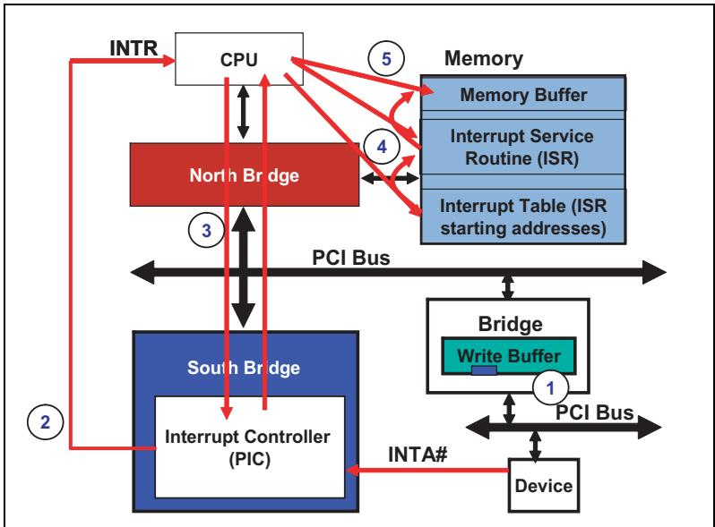

## One Solution

One way to alleviate this problem takes advantage of PCI transaction ordering rules. If the ISR first sends a read request to the device that initiated the interrupt before it attempts to fetch the data, the resulting read completion will follow the same path back to the CPU that any write data would have taken from that device to get to memory. Transaction ordering rules guarantee that a read result in a bridge cannot pass a posted write going in the same direction, so the end result is that the data will get written into memory before the read result will be allowed to reach the CPU. Therefore, if the ISR waits for the read completion to arrive before proceeding, it can be sure that any data will have been delivered to memory and thus the race condition is avoided. Since the read is basically being used as a data flush mechanism, it isn’t necessary for it to return any data. In that case the read can be zero length and the data returned is discarded. For that reason, this type of read is sometimes called a “dummy read.”

## An MSI Solution

MSI can simplify this process, although there are some requirements for it to work (refer to Figure 17‐22 on page 829). If the system allows the device to generate its own MSI writes rather than going through an intermediary like an IO APIC, then the following example can take place:

1. The device writes the payload data toward memory and it is absorbed by the write buffer in the bridge.

2. The device believes the data has been delivered and signals an interrupt to notify the CPU. In this case, an MSI is sent and uses the same path as the data. Since both data and MSI appear as memory writes to the bridge, the normal transaction ordering rules will keep them in the correct sequence.

3. The payload data is delivered to memory, freeing the path through the bridge for the MSI write.

4. The MSI write is delivered to the CPU Local APIC and the software now knows that the payload data is available.

## Traffic Classes Must Match

An important point must be stressed here, however. Both the data and MSI must use the same Traffic Class for this to work. Recall that packets that have been assigned different TC values may end up being mapped into different Virtual Channels, and that packets in different VCs have no ordering relationship. If the data were mapped to VC0 and the MSI was mapped to VC1, then the system would be unaware of any ordering relationship between them and unable to enforce memory coherency automatically.

If giving both packets the same TC is not possible, the system would need to use the “dummy read” method instead and the TC of the read request would need to match the TC of the data write packet. It should be clear that even if the same TC is used for both, the use of the Relaxed Ordering bit must be avoided. We’re counting on the transaction ordering rules to achieve memory synchronization, so they must not be relaxed.

Figure 17‐22: MSI Delivery  

## Interrupt Latency

The time from signaling an interrupt until software services the device is referred to as the interrupt latency. In spite of its advantages, MSI, like other interrupt delivery mechanisms, does not provide interrupt latency guarantees.

## MSI May Result In Errors

Because MSIs are delivered as Memory Write transactions, an error associated with delivery of an MSI is treated the same as any other Memory Write error condition. See “ECRC Generation and Checking” on page 657 for treatment of ECRC errors, as one example. The concern, of course, is that if an error results in the MSI packet being unrecognized then no interrupt will be seen by the processor. How this condition would be handled is outside the scope of the PCIe spec.

## Some MSI Rules and Recommendations

1. It is the intent of the spec that mutually‐exclusive messages will be assigned to Functions by system software and that each message will be converted to an exclusive interrupt on delivery to the processor.

2. More than one MSI capability register set per Function is prohibited.

3. A read of the Message Address register produces undefined results.

4. Reserved registers and bits are read‐only and always return zero when read.

5. System software can modify Message Control register bits, but the device itself is prohibited from doing so. In other words, modifying the bits by a “back door” mechanism is not allowed.

6. At a minimum, a single message will be assigned to each device (assuming software supports and plans to use MSI in the system).

7. System software must not write to the upper half of the dword that contains the Message Data register.

8. If the device writes the same message multiple times, only one of those messages is guaranteed to be serviced. If all of them must be serviced, the device must not generate the same message again until the previous one has been serviced.

9. If a device has more than one message assigned, and it writes a series of different messages, it is guaranteed that all of them will be serviced.

## Special Consideration for Base System Peripherals

Interrupts may also originate in embedded legacy hardware, such as an IO Controller Hub or Super IO device. Some of the typical legacy devices required in such systems include:

• Serial ports

• Parallel ports

• Keyboard and Mouse Controller

• System Timer

• IDE controllers

These devices typically require a specific IRQ line into a PIC or IO APIC, which allows legacy software to interact with them correctly.

Using the INTx messages does not guarantee that the devices will receive the IRQ assignment they require. The following example illustrates a system that will support the proper legacy interrupt assignment.

## Example Legacy System

Figure 17‐23 on page 831 shows a older PCI Express system that includes an IO Controller Hub (ICH) attached to the Root Complex via a proprietary Hub link. The IO APIC embedded within the ICH can generate an MSI when it receives an interrupt request at its inputs. In such an implementation, software can assign the legacy vector number to each input to ensure that the correct legacy software will be called.

The advantage of this approach is that existing hardware can be used to support the legacy requirements of a PCIe platform. This system also requires that the MSI subsystem be configured for use during the boot sequence. The example illustrated eliminates the need for INTx messages unless a PCIe expansion device incorporates a PCI Express‐to‐PCI Bridge.

Figure 17‐23: PCI Express System with PCI‐Based IO Controller Hub  
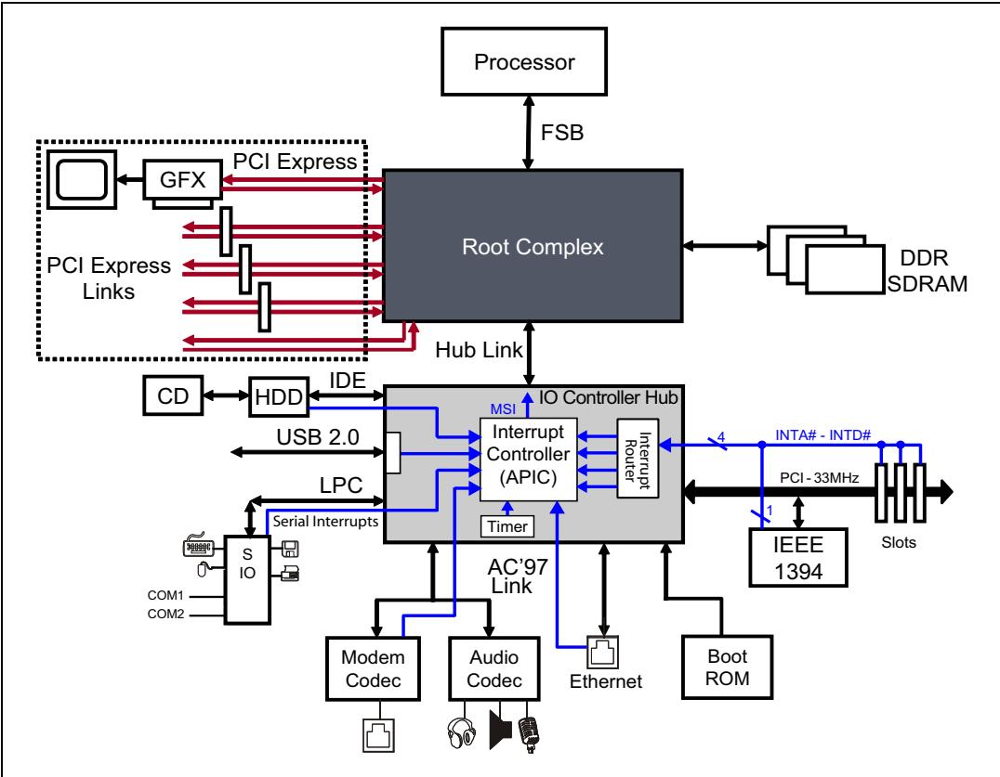

## 18 System Reset

## The Previous Chapter

The previous chapter describes the different ways that PCIe Functions can generate interrupts. The old PCI model used pins for this, but sideband signals are undesirable in a serial model so support for the inband MSI (Message Signaled Interrupt) mechanism was made mandatory. The PCI INTx# pin operation can still be emulated using PCIe INTx messages for software backward compatibility reasons. Both the PCI legacy INTx# method and the newer versions of MSI/ MSI‐X are described.

## This Chapter

This chapter describes the four types of resets defined for PCIe: cold reset, warm reset, hot reset, and function‐level reset. The use of a side‐band reset PERST# signal to generate a system reset is discussed, and so is the in‐band TS1 used to generate a Hot Reset.

## The Next Chapter

The next chapter describes the PCI Express hot plug model. A standard usage model is also defined for all devices and form factors that support hot plug capability. Power is an issue for hot plug cards, too, and when a new card is added to a system during runtime, it’s important to ensure that its power needs don’t exceed what the system can deliver. A mechanism was needed to query and control the power requirements of a device, Power Budgeting provides this.

## Two Categories of System Reset

The PCI Express spec describes four types of reset mechanisms. Three of these were part of the earlier revisions of the PCIe spec and are collectively referred to now as Conventional Resets, and two of them are called Fundamental Resets. The fourth category and method, added with the 2.0 spec revision, is called the Function Level Reset.

## Conventional Reset

## Fundamental Reset

A Fundamental Reset is handled in hardware and resets the entire device, reinitializing every state machine and all the hardware logic, port states and configuration registers. The exception to this rule is a group of some configuration register fields that are identified as “sticky”, meaning they retain their contents unless all power is removed. This makes them very useful for diagnosing problems that require a reset to get a Link working again, because the error status survives the reset and is available to software afterwards. If main power is removed but Vaux is available, that will also maintain the sticky bits, but if both main power and Vaux are lost, the sticky bits will be reset along with everything else.

A Fundamental Reset will occur on a system‐wide reset, but it can also be done for individual devices.

Two types of Fundamental Reset are defined:

Cold Reset: The result when the main power is turned on for a device. Cycling the power will cause a cold reset.

Warm Reset (optional): Triggered by a system‐specific means without shutting off main power. For example, a change in the system power status might be used to initiate this. The mechanism for generating a Warm Reset is not defined by the spec, so the system designer will choose how this is done.

## When a Fundamental Reset occurs:

For positive voltages, receiver terminations are required to meet the Z parameter. At 2.5 GT/s, this is no less than 10 K. At the higher speeds it must be no less than 10 KΩ for voltages below 200mv, and 20 KΩ for voltages above 200mv. These are the values when the terminations are not powered.

• Similarly for negative voltages, the ZRX‐HIGH‐IMP‐DC‐NEG parameter, the value is a minimum of 1 KΩ in every case.

Transmitter terminations are required to meet the output impedance ZTX‐DIFF‐DC from 80 to 120 for Gen1 and max of 120 for Gen2 and Gen3, but may place the driver in a high impedance state.

• The transmitter holds a DC common mode voltage between 0 and 3.6 V.

## When exiting from a Fundamental Reset:

The receiver single‐ended terminations must be present when receiver terminations are enabled so that Receiver Detect works properly (40-60Ω for Gen1 and Gen2, and 50Ω +/– 20% for Gen3. By the time Detect is entered, the common-mode impedance must be within the proper range of 50Ω +/– 20%.

must re‐enable its receiver terminations Z of 100 within 5 ms of Fundamental Reset exit, making it detectable by the neighbor’s transmitter during training.

• The transmitter holds a DC common mode voltage between 0 and 3.6 V.

Two methods of delivering a Fundamental Reset are defined. First, it can be signaled with an auxiliary side‐band signal called PERST# (PCI Express Reset). Second, when PERST# is not provided to an add‐in card or component, a Fundamental Reset is generated autonomously by the component or add‐in card when the power is cycled.

## PERST# Fundamental Reset Generation

A central resource device such as a chipset in the PCI Express system provides this reset. For example, the IO Controller Hub (ICH) chip in Figure 18‐1 on page 836 may generate PERST# based on the status of the system power supply ‘POWERGOOD’ signal, since this indicates that the main power is turned on and stable. If power is cycled off, POWERGOOD toggles and causes PERST# to assert and deassert., resulting in a Cold Reset. The system may also provide a method of toggling PERST# by some other means to accomplish a Warm Reset.

The PERST# signal feeds all PCI Express devices on the motherboard including the connectors and graphics controller. Devices may choose to use PERST# but are not required to do so. PERST# also feeds the PCIe‐to‐PCI‐X bridge shown in the figure. Bridges always forward a reset on their primary (upstream) bus to their secondary (downstream) bus, so the PCI‐X bus sees RST# asserted.

## Autonomous Reset Generation

A device must be designed to generate its own reset in hardware upon application of main power. The spec doesn’t describe how this would be done, so a selfreset mechanism can be built into the device or added as external logic. For example, an add‐in card that detects Power‐On may use that event to generate a local reset to its device. The device must also generate an autonomous reset if it detects its power go outside of the limits specified.

## Link Wakeup from L2 Low Power State

As an example of the need for an autonomous reset, a device whose main power has been turned off as part of a power management policy may be able to request a return to full power if it was designed to signal a wakeup. When power is restored, the device must be reset. The power controller for the system may assert the PERST# pin to the device, as shown in Figure 18‐1 on page 836, but if it doesn’t, or if the device doesn’t support PERST#, the device must autonomously generate its own Fundamental Reset when it senses main power reapplied.

Figure 18‐1: PERST# Generation  
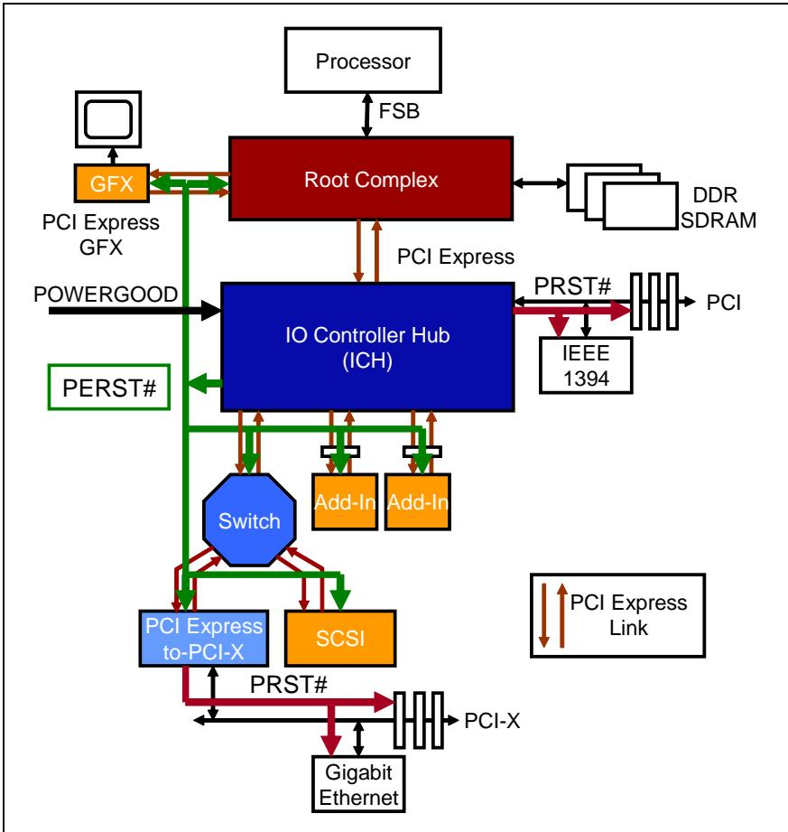

## Hot Reset (In-band Reset)

A Hot Reset is propagated in‐band from one link neighbor to another by sending several TS1s (whose contents are shown in Figure 18‐2) with bit 0 of symbol 5 asserted. These TS1s are sent on all Lanes, using the previously negotiated Link and Lane numbers, for 2 ms. Once it’s been sent, the Transmitter and Receiver of the Hot Reset will both end up in the Detect LTSSM state (see “Hot Reset State” on page 612).

Figure 18‐2: TS1 Ordered‐Set Showing the Hot Reset Bit  
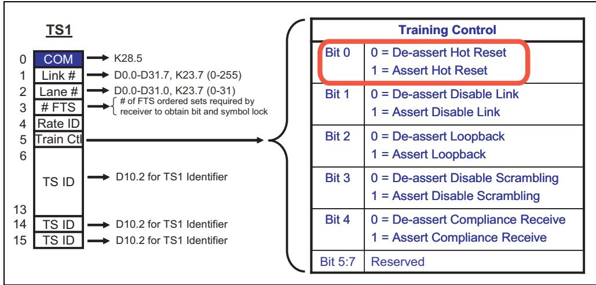

A hot reset is initiated in software by setting the Secondary Bus Reset bit in a bridge’s Bridge Control configuration register, as shown in Figure 18‐5 on page 840. Consequently, only devices containing bridges, like the Root Complex or a Switch, can do this. A Switch that receives hot reset on its Upstream Port must broadcast it to all of its Downstream Ports and reset itself. All devices downstream of a switch that receive the hot reset will reset themselves.

## Response to Receiving Hot Reset

The device’s LTSSM goes through the Recovery and Hot Reset state, and then back to the Detect state, where it starts the Link Training process.

All of the device’s state machines, hardware logic, port states and configuration registers (except sticky registers) initialize to their default conditions.

## Switches Generate Hot Reset on Downstream Ports

A Switch generates a hot reset on all of its Downstream Ports when:

• It receives a hot reset on its Upstream Port

For a Switch or Bridge Upstream Port, if the Data Link Layer reports a DL\_Down state, the effect is very similar to a hot reset. This can happen when the Upstream Port has lost its connection with an upstream device due to an error that is not recoverable by the Physical Layer or Data Link Layer.

Software sets the ‘Secondary Bus Reset’ bit of the Bridge Control configuration register associated with the Upstream Port, as shown in Figure 18‐3 on page 838.

Figure 18‐3: Switch Generates Hot Reset on One Downstream Port  
  
Bridges Forward Hot Reset to the Secondary Bus

If a bridge such as a PCI Express‐to‐PCI(‐X) bridge detects a hot reset on its Upstream Port, it must assert the PRST# signal on its secondary PCI(‐X) bus, as illustrated in Figure 18‐4 on page 839.

## Software Generation of Hot Reset

Software generates a Hot Reset on a specific port by writing a 1 followed by 0 to the ‘Secondary Bus Reset’ bit in the Bridge Control register of that associated port’s configuration header (see Figure 18‐5 on page 840). Consider the example shown in Figure 18‐3 on page 838. Software sets the ‘Secondary Bus Reset’ register of Switch A’s left Downstream Port, causing it to send TS1 Ordered Sets with the Hot Reset bit set. Switch B receives this Hot Reset on its Upstream Port and forwards it to all its Downstream Ports.

Figure 18‐4: Switch Generates Hot Reset on All Downstream Ports  
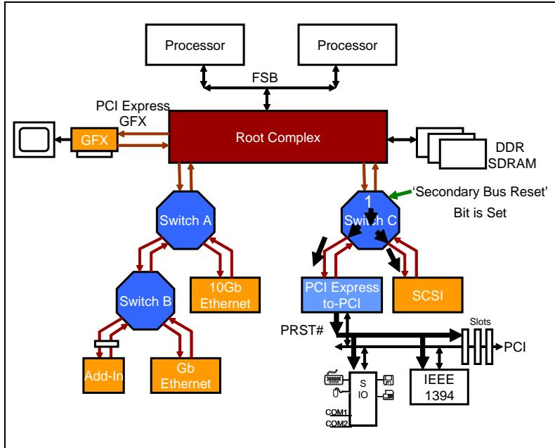

If software sets the Secondary Bus Reset bit of a Switch’s Upstream Port, then the switch generates a hot reset on all of its Downstream Ports, as shown in Figure 18‐4 on page 839. Here, software sets the Secondary Bus Reset bit in Switch C’s Upstream Port, causing it to send TS1s with the Hot Reset bit set on all its Downstream Ports. The PCIe‐to‐PCI bridge receives this Hot Reset and forwards it on to the PCI bus by asserting PRST#.

Setting the Secondary Bus Reset bit causes a Port’s LTSSM to transition to the Recovery state (for more on the LTSSM, see “Overview of LTSSM States” on page 519) where it generates the TS1s with the Hot Reset bit set. The TS1s are generated continuously for 2 ms and then the Port exits to the Detect state where it is ready to start the Link training process.

## PCI Express Technology

The receiver of the Hot Reset TS1s (always downstream) will go to the Recovery state, too. When it sees two consecutive TS1s with the Hot Reset bit set, it goes to the Hot Reset state for a 2ms timeout and then exits to Detect. Both Upstream and Downstream Ports are initialized and end up in the Detect state, ready to begin Link training. If the downstream device is also a Switch or Bridge, it forwards the Hot Reset to its Downstream Ports as well, as shown in Figure 18‐3 on page 838.

Figure 18‐5: Secondary Bus Reset Register to Generate Hot Reset  
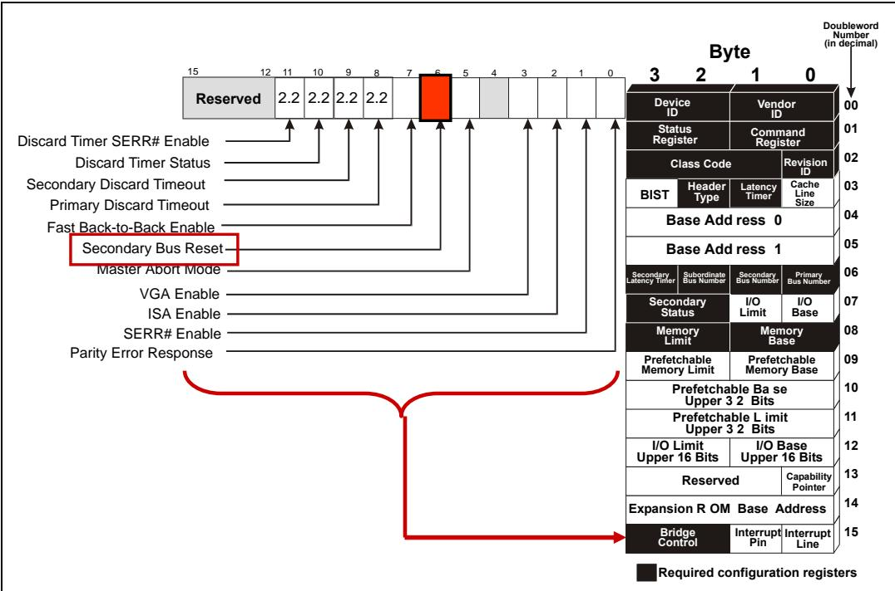

## Software Can Disable the Link

Software can also disable a Link, forcing it to go into Electrical Idle and remain there until further notice. The reason for mentioning that at this point is that disabling the Link also has the effect of causing a Hot Reset on downstream components. Disabling is accomplished by setting the Link Disable bit in the Link Control Register of the Downstream Port, shown in Figure 18‐6 on page 841. That causes the Port to go to the Recovery LTSSM state and begin sending TS1s with the Disable bit set. Since this can only be controlled for Downstream Ports if the Link has been disabled, this bit is reserved for Upstream Ports (such as Endpoints or Switch Upstream Ports).

Figure 18‐6: Link Control Register  

When the Upstream Port recognizes incoming TS1s with the Disabled bit set, its Physical Layer signals LinkUp=0 (false) to the Link Layer and all the Lanes go to Electrical Idle. After a 2ms timeout, an Upstream Port will go to Detect, but a Downstream Port will remain in the Disabled LTSSM state until directed to exit from it (such as by clearing the Link Disable bit), so the Link will remain disabled and will not attempt training until then.