Figure 18‐7: TS1 Ordered‐Set Showing Disable Link Bit  
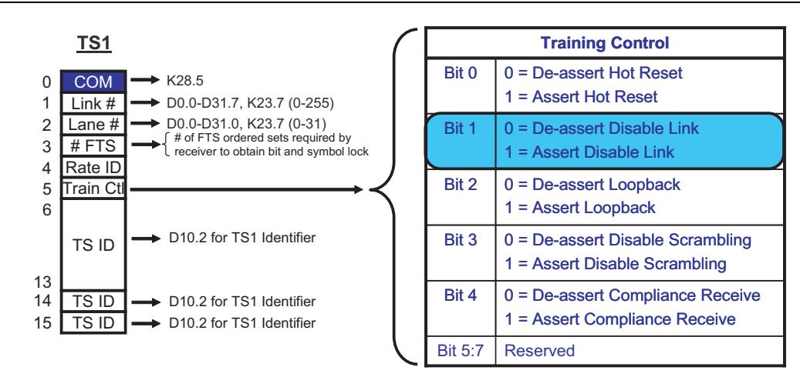

## Function Level Reset (FLR)

The FLR capability allows software to reset just one Function within a multifunction device without affecting the Link that is shared by them all. Its implementation is strongly recommended but isn’t required, so software would need to confirm its availability before attempting to use it by examining the Device Capabilities register, as shown in Figure 18‐8 on page 843. If the Function‐Level Reset Capability bit is set, then an FLR can be initiated by simply setting the Initiate Function‐Level Reset bit in the Device Control Register as shown in Figure 18‐9 on page 843.

Figure 18‐8: Function‐Level Reset Capability  

Figure 18‐9: Function‐Level Reset Initiate Bit  

The spec mentions a few examples that motivate the addition of FLR:

1. It can happen that software controlling a Function encounters a problem and is no longer operating correctly. Preventing data corruption necessitates a reset of that Function, but if other Functions within that device are still working properly it would nice to be able to reset just the one having trouble.

2. In a virtualized environment, where applications can migrate from one piece of hardware to another, it’s important that when an application is moved off a Function that the Function doesn’t retain any information about what it was doing. This prevents information used by one application that might be considered confidential from becoming visible to the new one running on that Function. The simplest way to clean up after migrating the previous application is simply to reset the Function.

3. When software is rebuilding a software stack for a Function, it is sometimes necessary to first put the Function into an uninitialized state. As before, avoiding a reset of all Functions sharing the Link is desirable.

Another feature doesn’t appear in the list of cases in the spec but is still a motivating factor in its own right. While a conventional reset will re‐initialize everything within the device, it does not require that all external activity, such as traffic on a network interface, must cease right away. FLR adds this requirement and is the only reset that does.

FLR resets the Function’s internal state and registers, making it quiescent, but doesn’t affect any sticky bits, or hardware‐initialized bits, or link‐specific registers like Captured Power, ASPM Control, Max\_Payload\_Size or Virtual Channel registers. If an outstanding Assert INTx interrupt message was sent, a corresponding Deassert INTx message must be sent, unless that interrupt was shared by another Function internally that still has it asserted. All external activity for that Function is required to cease when an FLR is received.

## Time Allowed

A Function must complete an FLR within 100ms. However, software may need to delay initiating an FLR if there are any outstanding split completions that haven’t yet been returned (indicated by the fact that the Transactions Pending bit remains set in the Device Status register). In that case, software must either wait for them to finish before initiating the FLR, or wait 100ms after FLR before attempting to re‐initialize the Function. If this isn’t managed, a potential data corruption problem arises: a Function may have split transactions outstanding but a reset causes it to lose track of them. If they are returned later they could be mistaken for responses to new requests that have been issued since the FLR. To avoid this problem, the spec recommends that software should:

1. Coordinate with other software that might access the Function to ensure it doesn’t attempt access during the FLR.

2. Clear the entire Command register, thereby quiescing the Function.

3. Ensure that previously‐requested Completions have been returned by poll ing the Transactions Pending bit in the Device Status register until it’s cleared or waiting long enough to be sure the Completions won’t ever be returned. How long would be long enough? If Completion Timeouts are being used, wait for the timeout period before sending the FLR. If Completion Timeouts are disabled, then wait at least 100ms.

4. Initiate the FLR and wait 100ms.

5. Set up the Function’s configuration registers and enable it for normal operation.

When the FLR has completed, regardless of the timing, the Transaction Pending bit must be cleared.

## Behavior During FLR

The spec writers chose to describe the behavior of a Function reset in fairly broad terms so as not to preclude any internal steps that designers might wish to take. The following behaviors are listed in the spec:

The Function must not appear to an external interface as though it was an initialized adapter with an active host. The steps to ensure that all activity on external interfaces is terminated will be design specific. An example would be a network adapter that must not respond to requests that would require an active host during this time.

The Function must not retain any software‐readable state that might include secret information left behind by some previous use of the Function. For example, any internal memory must be cleared or randomized.

• The Function must be configurable as normal by the next driver.

• The Function must return a completion for the configuration write that caused the FLR and then initiate the FLR.

While an FLR is in progress:

Any requests that arrive are allowed to be silently discarded without log ging them or signaling an error. Flow control credits must be updated to maintain the link operation, though.

## PCI Express Technology

• Incoming completions can be treated as Unexpected Completions or silently discarded without logging them or signaling an error.

The FLR itself must be completed within the time described above, but further initialization after that could take longer. If a configuration Request comes in before initialization is completed, the Function must return a completion with CRS (Configuration Retry Status) status. Once a completion is returned with any other status, a CRS status will not be legal again until the Function is reset again.

## Reset Exit

After exiting the reset state, Link Training and Initialization must begin within 20 ms. Devices may exit the reset state at different times, since reset signaling is asynchronous, but must begin training within this time.

To allow reset components to perform internal initialization, system software must wait for at least 100 ms from the end of a reset before attempting to send Configuration Requests to them. If software initiates a configuration request to a device after the 100 ms wait time, but the device still hasn’t finished its self‐initialization, it returns a Completion with status CRS. Since configuration Requests can only be initiated by the CPU, the Completion will be returned to the Root Complex. In response, the Root may re‐issue the configuration Request automatically or make the failure visible to software. The spec also states that software should only use 100ms wait periods if CRS Software Visibility has been enabled, since long timeouts or processor stalls may otherwise result.

Devices are allowed a full 1.0 second (‐0%/+50%) after a reset before they must give a proper response to a configuration request. Consequently, the system must be careful to wait that long before deciding that an unresponsive device is broken. This value is inherited from PCI and the reason for this lengthy delay may be that some devices implement configuration space as a local memory that must be initialized before it can be seen correctly by configuration software. Its initialization may involve copying the necessary information from a slow serial EEPROM, and so it might take some time.

# 19 Hot Plug and Power Budgeting

## The Previous Chapter

The previous chapter describes three types of resets defined for PCIe: Fundamental reset (consisting of cold and warm reset), hot reset, and function‐level reset (FLR). The use of a side‐band reset PERST# signal to generate a system reset is discussed, and so is the in‐band TS1 based Hot Reset described.

## This Chapter

This chapter describes the PCI Express hot plug model. A standard usage model is also defined for all devices and form factors that support hot plug capability. Power is an issue for hot plug cards, too, and when a new card is added to a system during runtime, it’s important to ensure that its power needs don’t exceed what the system can deliver. A mechanism was needed to query the power requirements of a device before giving it permission to operate. Power budgeting registers provide that.

## The Next Chapter

The next chapter describes the changes and new features that were added with the 2.1 revision of the spec. Some of these topics, like the ones related to power management, are described in earlier chapters, but for others there wasn’t another logical place for them. In the end, it seemed best to group them all together in one chapter to ensure that they were all covered and to help clarify what features are new.

## Background

Some systems using PCIe require high availability or non‐stop operation. Online service suppliers require computer systems that experience downtimes of just a few minutes a year or less. There are many aspects to building such systems, but equipment reliability is clearly important. To facilitate these goals PCIe supports the Hot Plug/Hot Swap solutions for add‐in cards that provide three important capabilities:

1. a method of replacing failed expansion cards without turning the system off

2. keeping the O/S and other services running during the repair

3. shutting down and restarting software associated with a failed device

Prior to the widespread acceptance of PCI, many proprietary Hot Plug solutions were developed to support this type of removal and replacement of expansion cards. The original PCI implementation did not support hot removal and insertion of cards, but two standardized solutions for supporting this capability in PCI have been developed. The first is the Hot Plug PCI Card used in PC Server motherboard and expansion chassis implementations. The other is called Hot Swap and is used in CompactPCI systems based on a passive PCI backplane implementation.

In both solutions, control logic is used to electrically isolate the card logic from the shared PCI bus. Power, reset, and clock are controlled to ensure an orderly power down and power up of cards as they are removed and replaced, and status and power LEDs inform the user when it’s safe to change a card.

Extending hot plug support to PCI Express cards is an obvious step, and designers have incorporated some Hot Plug features as “native” to PCIe. The spec defines configuration registers, Hot Plug Messages, and procedures to support Hot Plug solutions.

## Hot Plug in the PCI Express Environment

PCIe Hot Plug is derived from the 1.0 revision of the Standard Hot Plug Controller spec (SHPC 1.0) for PCI. The goals of PCI Express Hot Plug are to:

Support the same “Standardized Usage Model” as defined by the Standard Hot Plug Controller spec. This ensures that the PCI Express hot plug is identical from the user perspective to existing implementations based on the SHPC 1.0 spec

Support the same software model implemented by existing operating systems. However, an OS using a SHPC 1.0 compliant driver won’t work with PCI Express Hot Plug controllers because they have a different programming interface.

The registers necessary to support a Hot Plug Controller are integrated into individual Root and Switch Ports. Under Hot Plug software control, these controllers and the associated port interface must control the card interface signals to ensure orderly power down and power up as cards are changed. To accomplish that, they’ll need to:

• Assert and deassert the PERST# signal to the PCI Express card connector

• Remove or apply power to the card connector.

Selectively turn on or off the Power and Attention Indicators associated with a specific card connector to draw the user’s attention to the connector and indicate whether power is applied to the slot.

• Monitor slot events (e.g. card removal) and report them to software via interrupts.

PCI Express Hot‐Plug (like PCI) is designed as a “no surprises” Hot‐Plug methodology. In other words, the user is not normally allowed to install or remove a PCI Express card without first notifying the system. Software then prepares both the card and slot and finally indicates to the operator the status of the hot plug process and notification that installation or removal may now be performed.

## Surprise Removal Notification

Cards designed to the PCIe Card ElectroMechanical spec (CEM) implement card presence detect pins (PRSNT1# and PRSNT2#) on the connector. These pins are shorter than the others so that they break contact first (when the card is removed from the slot). This can be used to give advanced notice to software of a “surprise” removal, allowing time to remove power before the signals break contact.

## Differences between PCI and PCIe Hot Plug

The elements needed to support hot plug are essentially the same in both PCI and PCIe hot plug solutions. Figure 19‐1 on page 850 shows the PCI hardware and software elements required to support hot plug. PCI solutions implement a single standardized hot plug controller on the system board that handled all the

## PCI Express Technology

hot plug slots on the bus. Isolation logic is needed in the PCI environment to electrically disconnect a card from the shared bus prior to making changes to avoid glitching the signals on an active bus.

PCIe uses point‐to‐point connections (see Figure 19‐2 on page 851) that eliminate the need for isolation logic but require a separate hot plug controller for each Port to which a connector is attached. A standardized software interface defined for each Root and Switch Port controls hot plug operations.

Figure 19‐1: PCI Hot Plug Elements  

Figure 19‐2: PCI Express Hot‐Plug Elements  
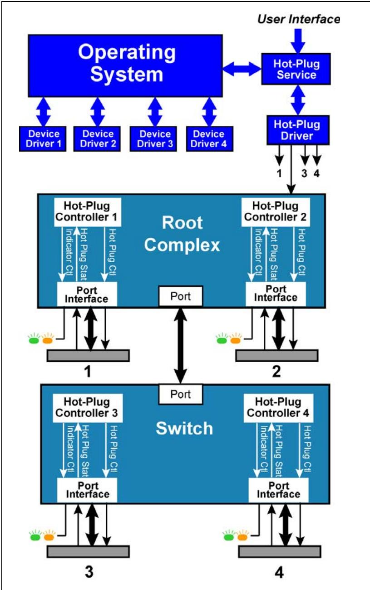

## Elements Required to Support Hot Plug

As shown in Figure 19‐2 on page 851 there are several parts involved in making a hog‐plug environment work. For discussion, let’s break these down into software and hardware elements.

## Software Elements

The following table describes the major software elements that support Hot‐Plug capability.

Table 19‐1: Introduction to Major Hot‐Plug Software Elements

<table><tr><td>Software Element</td><td>Supplied by</td><td>Description</td></tr><tr><td>User Interface</td><td>OS vendor</td><td>An OS-supplied utility that permits the user to request that a connector be powered off to remove a card or turned on to use a card that has just been installed.</td></tr><tr><td>Hot-Plug Service</td><td>OS vendor</td><td>A service that processes requests (referred to as Hot-Plug Primitives) issued by the OS. This includes requests to:provide slot identifiersturn card power On or Offturn Attention Indicator On or Offread current power of slot (On or Off) The Hot-Plug Service interacts with the Hot-Plug System Driver to satisfy the requests. The interface (i.e., API) with the Hot-Plug System Driver is defined by the OS vendor.</td></tr><tr><td>Standardized Hot-Plug System Driver</td><td>System Board vendor or OS</td><td>Receives requests (Hot-Plug Primitives) from the Hot-Plug Service within the OS. Interacts with the hardware Hot-Plug Controllers to accomplish requests.</td></tr><tr><td>Device Driver</td><td>Adapter card vendor</td><td>Some Hot-Plug-specific capabilities must be incorporated in a Hot-Plug-capable device driver. This includes:• support for the Quiesce command.• optional support of the Pause command.• Support for Start command or optional Resume command.</td></tr></table>

A Hot‐Plug‐capable system may use an OS that doesn’t support Hot‐Plug capability. In that case, although the system BIOS would contain Hot‐Plug‐related software, the Hot‐Plug Service would not be present. Assuming that the user doesn’t attempt hot insertion or removal of a card, the system will operate as a standard, non‐Hot‐Plug system:

The system startup firmware must ensure that all Attention Indicators are Off.

The spec also states: “the Hot‐Plug slots must be in a state that would be appropriate for loading non‐Hot‐Plug system software.”

## Hardware Elements

Table 19‐2 on page 853 lists the major hardware elements necessary to support PCI Express Hot‐Plug operation.

Table 19‐2: Major Hot‐Plug Hardware Elements

<table><tr><td>Hardware Element</td><td>Description</td></tr><tr><td>Hot-Plug Controller</td><td>Receives and processes commands issued by the Hot-Plug System Driver. One Controller is associated with each Root or Switch Port that supports hot plug operation. The PCIe spec defines a standard software interface for the Hot-Plug Controller.</td></tr><tr><td>Card Slot Power Switching Logic</td><td>Allows power to a slot to be turned on or off under program control. Controlled by the Hot Plug controller under the direction of the Hot-Plug System Driver.</td></tr><tr><td>Card Reset Logic</td><td>Hot Plug Controller drives the PERST# signal to a specific slot as directed by the Hot-Plug System Driver.</td></tr><tr><td>Power Indicator</td><td>Indicates whether power is currently active on the connector. Controlled by the Hot Plug logic associated with each port and directed by the Hot Plug System Driver.</td></tr><tr><td>Attention Indicator</td><td>Draws operator attention to a connector that needs service. Controlled by the Hot Plug logic and directed by the Hot-Plug System Driver.</td></tr><tr><td>Attention Button</td><td>Pressed by the operator to notify Hot Plug software of a request to change a card.</td></tr><tr><td>Card Present Detect Pins</td><td>There are two of these: PRSNT1# is located at one end of the card slot and PRSNT2# at the opposite end. These pins are shorter than the others so that they disconnect first when a card is removed. The system board ties PRSNT1# to ground and connects PRSNT2# as an input to the Hot-Plug Controller with a pull-up resistor. Additional PRSNT2# pins are defined for wider connectors to support the insertion and recognition of shorter cards installed into longer connectors. The card itself shorts PRSNT1# to PRSNT2#, so that the PRSNT2# input is high if a card is not physically plugged in or low if it is.</td></tr></table>

## Card Removal and Insertion Procedures

The descriptions of typical card removal and insertion that follow are intended to be introductory in nature. It should be noted that the procedures described in the following sections assume that the OS, rather than the Hot‐Plug System Driver, is responsible for configuring a newly‐installed device. If the Hot‐Plug System Driver has this responsibility, the Hot‐Plug Service will call the Hot‐Plug System Driver and instruct it to configure the newly‐installed device.

## On and Off States

A slot in the On state has the following characteristics:

• Power is applied to the slot.

• REFCLK is on.

• The link is active or in an Active State Power Management state.

• The PERST# signal is deasserted.

A slot in the Off state has the following characteristics:

• Power to the slot is turned off.

• REFCLK is off.

• The link is inactive. (Driver at the root of switch port is in Hi Z state)

• The PERST# signal is asserted.

## Turning Slot Off

Steps required to turn off a slot that is currently in the On state:

1. Deactivate the link. This may involve issuing a EIOS to enter the Hi Z state.

2. Assert the PERST# signal to the slot.

3. Turn off REFCLK to the slot.

4. Remove power from the slot.

## Turning Slot On

Steps to turn on a slot that is currently in the off state:

1. Apply power to the slot.

2. Turn on REFCLK to the slot

3. Deassert the PERST# signal to the slot. The system must meet the setup and hold timing requirements (specified in the PCI Express spec) relative to the rising edge of PERST#.

Once power and clock have been restored and PERST# removed, the physical layers at both ports will perform link training and initialization. When the link is active, the devices will initialize VC0 (including flow control), making the link ready to transfer TLPs.

## Card Removal Procedure

When a card is to be removed, a number of steps are needed to prepare software and hardware for safe removal of the card, and set the indicators for the card being processed. The condition of the indicators during normal operation are:

• Attention Indicator (Amber or Yellow) — “Off” during normal operation.

• Power Indicator (Green) — “On” during normal operation

Software sends requests to the Hot Plug Controller using configuration writes that target the Slot Control Registers implemented by Hot‐Plug capable ports. These control the power to the slot and the state of the indicators.

The sequence of events is as follows:

1. The operator requests card removal by pressing the slot’s attention button or by using the system’s user interface to select the Physical Slot number of the card to be removed. If the button was used, the Hot‐Plug Controller detects this event and delivers an interrupt to the root complex. The interrupt directs the Hot Plug service to call the Hot Plug System Driver to read slot status information and detect the Attention Button request.

2. Next, the Hot‐Plug Service commands the Hot‐Plug System Driver to blink the slot’s Power Indicator as visual feedback to the operator for 5 seconds. If this was initiated by pressing the Attention button, the operator can press the button a second time to cancel the request during this 5‐second interval.

3. The Power Indicator continues to blink while the Hot Plug software validates the request. If the card is currently in use for some critical system operation, software may deny the request. In that case, it will issue a command to the Hot Plug controller to turn the Power Indicator back ON. The spec also recommends that software notify the operator, perhaps with a message or by logging an entry indicating the reason the request was denied.

4. If the request is validated, the Hot‐Plug Service utility commands the card’s device driver to quiesce the device. That is, disable its ability to generate new Requests and complete or terminate all outstanding Root or Switch Port requests.

5. Software then issues a command to disable the card’s Link via the Link Control register in the Root or Switch Port to which the slot is attached.

6. Next, software commands the Hot Plug Controller to turn the slot off.

7. Following successful power down, software issues the Power Indicator Off Request to turn off the power indicator so the operator knows the card may be removed.

8. The operator releases the Mechanical Retention Latch, if there is one, causing the Hot Plug Controller to remove all switched signals from the slot (e.g., SMBus and JTAG signals). The card can now be removed.

9. The OS deallocates the memory space, IO space, interrupt line, etc. that had been assigned to the device and makes these resources available for assignment to other devices in the future.

## Card Insertion Procedure

The procedure for installing a new card basically reverses the steps listed for card removal. The following steps assume that the slot was left in the same state that it was in immediately after a card was removed from the connector (in other words, the Power Indicator is in the Off state, indicating the slot is ready for card insertion).

The steps taken to Insert and enable a card are as follows:

1. The operator installs the card and secures the MRL. If implemented, the MRL sensor will signal the Hot‐Plug Controller that the latch is closed, causing switched auxiliary signals and $\mathrm { V _ { a u x } }$ to be connected to the slot.

2. Next, the operator notifies the Hot‐Plug Service that the card has been installed by pressing the Attention Button or using the Hot Plug Utility program to select the slot.

3. If the button was pressed, it signals the Hot Plug controller of the event, resulting in status register bits being set and causing a system interrupt to be sent to the Root Complex. Subsequently, Hot Plug software reads slot status from the port and recognizes the request.

4. The Hot‐Plug Service issues a request to the Hot‐Plug System Driver commanding the Hot Plug Controller to blink the slot’s Power Indicator to inform the operator that the card must not be removed. The operator is granted a 5 second abort interval, from the time that the indicators starts to blink, to abort the request by pressing the button a second time.

## PCI Express Technology

5. The Power Indicator continues to blink while Hot Plug software validates the request. Note that software may fail to validate the request (e.g., the security policy settings may prohibit the slot being enabled). If the request is not validated, software will issue a command to the Hot Plug controller to turn the Power Indicator back OFF. The spec recommends that software notify the operator via a message or by logging an entry indicating the cause of the request denial.

6. The Hot‐Plug Service issues a request to the Hot‐Plug System Driver commanding the Hot Plug Controller to turn the slot on.

7. Once power is applied, software issues a command to turn the Power Indicator ON.

8. Once link training is complete, the OS commands the Platform Configuration Routine to configure the card function(s) by assigning the necessary resources.

9. The OS locates the appropriate driver(s) (using the Vendor ID and Device ID, or the Class Code, or the Subsystem Vendor ID and Subsystem ID configuration register values as search criteria) for the function(s) within the PCI Express device and loads it (or them) into memory.

10. The OS then calls the driver’s initialization code entry point, causing the processor to execute the driver’s initialization code. This code finishes the setup of the device and then sets the appropriate bits in the device’s PCI configuration Command register to enable the device.

## Standardized Usage Model

## Background

Systems based on the original 1.0 version of the PCI Hot Plug spec implemented hardware and software designs that varied widely because the spec did not define standardized registers or user interfaces. Consequently, customers who purchased Hot Plug capable systems from different vendors were confronted with a wide variation in user interfaces that required retraining operators when new systems were purchased. Furthermore, every board designer was required to write software to manage their implementation‐specific hot plug controller. The 1.1 revision of the PCI Hot‐Plug Controller (HPC) spec defines:

• a standard user interface that eliminates retraining of operators

a standard programming interface for the hot plug controller, which permits a standardized hot plug driver to be incorporated into the operating system. PCI Express implements registers not defined by the HPC spec, hence the standard Hot Plug Controller driver implementations for PCI and PCI Express are slightly different.

## Standard User Interface

## The user interface includes the following features:

Attention Indicator — shows the attention state of the slot with an LED that is on, off, or blinking. The spec defines the blinking frequency as 1 to 2 Hz and 50% (+/‐ 5%) duty cycle. The state of this indicator is strictly under software control.

Power Indicator (called Slot State Indicator in PCI HP 1.1) — shows the power status of the slot and also can be on, off, or blinking (at 1 to 2 Hz and 50% (+/‐ 5%) duty cycle). This indicator is controlled by software; however, the spec permits an exception in the event of a hardware power fault condition.

Manually Operated Retention Latch and Optional Sensor — secures card within slot and notifies the system when the latch is released

Electromechanical Interlock (optional) — locks the card or retention latch to prevent the card from being removed while power is applied.

• Software User Interface — allows operator to request hot plug operation

Attention Button — allows operator to manually request hot plug operation.

• Slot Numbering Identification — provides visual identification of slot on the board.

## Attention Indicator

As mentioned in the previous section, the spec requires the system vendor to include an Attention Indicator associated with each Hot‐Plug slot. This indicator must be located in close proximity to the corresponding slot and is yellow or amber in color. This Indicator draws the attention of the end user to the slot for service. The spec makes a clear distinction between operational and validation errors and does not permit the attention indicator to report validation errors. Validation errors are problems detected and reported by software prior to beginning the hot plug operation. The behavior of the Attention Indicator is listed in Table 19‐3 on page 860.

Table 19‐3: Behavior and Meaning of the Slot Attention Indicator

<table><tr><td>Indicator Behavior</td><td>Attention State</td></tr><tr><td>Off</td><td>Normal — Normal Operation</td></tr><tr><td>On</td><td>Attention — Hot Plug Operation Failed due to an operational problem (e.g., problems with external cabling, add-in cards, software drivers, and power faults)</td></tr><tr><td>Blinking</td><td>Locate — Slot is being identified at operator&#x27;s request</td></tr></table>

## Power Indicator

The power indicator simply reflects the state of main power at the slot, and is controlled by Hot Plug software. The color of this indicator is green and is illuminated when power to the slot is “on.”

The spec specifically prohibits Root or Switch Port hardware from changing the power indicator state autonomously as a result of power fault or other events. A single exception to this rule allows a platform to detect stuck‐on power faults. A stuck‐on fault is simply a condition in which commands issued to remove slot power are ineffective. If the system is designed to detect this condition the system may override the Root or Switch Port’s command to turn the power indicator off and force it to remain on. This notifies the operator that the card should not be removed from the slot. The spec further states that supporting stuck‐on faults is optional and, if handled via system software, “the platform vendor must ensure that this optional feature of the Standard Usage Model is addressed via other software, platform documentation, or by other means.”

The behavior of the power indicator and the related power states are listed in Table 19‐4 on page 861. Note that $\mathrm { V _ { a u x } }$ remains on and switch signals are still connected until the retention latch is released or when the card is removed as detected by the Prsnt1# and Prsnt2# signals.

Table 19‐4: Behavior and Meaning of the Power Indicator

<table><tr><td>Indicator Behavior</td><td>Power State</td></tr><tr><td>Off</td><td>Power Off — it is safe to remove or insert a card. All power has been removed as required for hot plug operation. Vaux is only removed when the Manual Retention Latch is released.</td></tr><tr><td>On</td><td>Power On — removal or insertion of a card is not allowed. Power is currently applied to the slot.</td></tr><tr><td>Blinking</td><td>Power Transition — card removal or insertion is not allowed. This state notifies the operator that software is currently removing or applying slot power in response to a hot plug request.</td></tr></table>

## Manually Operated Retention Latch and Sensor

The Manual Retention Latch (MRL) is required and holds PCI Express cards rigidly in the slot. Each MRL can implement an optional sensor that notifies the Hot‐Plug Controller that the latch has been closed or opened. The spec also allows a single latch that can hold down multiple cards. Such implementations do not support the MRL sensor.

An MRL Sensor is a switch, optical device, or other type of sensor that reports whether the latch is closed or open. If an unexpected latch release is detected, the port automatically disables the slot and notifies system software, although changing the state of the Power or Attention indicators autonomously is not allowed.

The switched signals and auxiliary power (Vaux) must be automatically removed from the slot when the MRL Sensor indicates that the MRL is open, and they must be restored to the slot when the MRL Sensor indicates that the latch is closed. The switched signals are $\mathrm { V _ { a u x , } }$ SMBCLK, and SMBDAT.

The spec also describes an alternate method for removing $\mathrm { V _ { a u x } }$ and SMBus power when an MRL sensor is not present. The PRSNT#2 pin indicates whether a card is physically installed into the slot and can be used to trigger the port to remove the switched signals.

## Electromechanical Interlock (optional)

The optional electromechanical card interlock mechanism provides a more sophisticated method of ensuring that a card is not removed while power is applied to the slot. The spec does not define the specific nature of the interlock, but states that it can physically lock the add‐in card or the MRL in place.

The lock mechanism is controlled via software; however, there is no specific programming interface defined for it. Instead, an interlock is controlled by the same Port signal that enables main power to the slot.

## Software User Interface

An operator may use a software interface to request card removal or insertion. This interface is provided by system software, which also monitors slots and reports status information to the operator. The spec states that the user interface is implemented by the Operating System and consequently is beyond the scope of the spec.

The operator must be able to initiate operations at each slot independent of other slots. Consequently, the operator may initiate a hot‐plug operation on one slot using the software user interface or attention button while a hot‐plug operation on another slot is in process. This can be done regardless of which interface the operator used to start the first Hot‐Plug operation.

## Attention Button

The Attention Button is a momentary‐contact push‐button switch, located near the corresponding Hot‐Plug slot or on a module. The operator presses this button to initiate a hot‐plug operation for this slot (e.g., card removal or insertion). Once the Attention Button is pressed, the Power Indicator starts to blink. From the time the blinking begins the operator has 5 seconds to abort the Hot Plug operation by pressing the button a second time.

The spec recommends that if an operation initiated by an Attention Button fails, the system software should notify the operator of the failure. For example, a message explaining the nature of the failure can be reported or logged.

## Slot Numbering Identification

Software and operators must be able to identify a physical slot based on its slot number. Each hot‐plug capable port must implement registers that software uses to identify the physical slot number. The registers include a Physical Slot number and a chassis number. The main chassis is always labeled chassis 0. The chassis numbers for other chassis must be non‐zero and are assigned via the PCI‐to‐PCI bridge’s Chassis Number register.

## Standard Hot Plug Controller Signaling Interface

Figure 19‐3 on page 864 presents a more detailed view of the logic within Switch Ports, along with the signals routed between the slot and the Port. The importance of the standardized Hot Plug Controller is the common software interface that allows the device driver to be integrated into operating systems.

The PCIe spec, together with the Card ElectroMechanical (CEM) spec, defines the slot signals and the support required for Hot Plug PCI Express. Following is a list of required and optional port interface signals needed to support the Standard Usage Model:

• PWRLED# (required) — port output that controls state of Power Indicator

• ATNLED# (required) — port output controls state of Attention Indicator

• PWREN (required if reference clock is implemented) — port output that controls main power to slot

• REFCLKEN# (required) — port output that controls delivery of reference clock to the slot

• PERST# (required) — port output that controls PERST# at slot

• PRSNT1# (required) — Grounded at the connector

• PRSNT2# (required) — port input, pulled up on system board, that indicates presence of card in slot.

PWRFLT# (required) — port input that notifies the Hot‐Plug controller of a power fault condition detected by external logic

AUXEN# (required if AUX power is implemented) — port output that controls switched AUX signals and AUX power to slot when MRL is opened and closed. The MRL# signal is required with AUX power is present.

MRL# (required if MRL Sensor is implemented) — port input from the MRL sensor

BUTTON# (required if Attention Button is implemented) — port input indicating operator has pressed the Attention Button.

Figure 19‐3: Hot Plug Control Functions within a Switch  
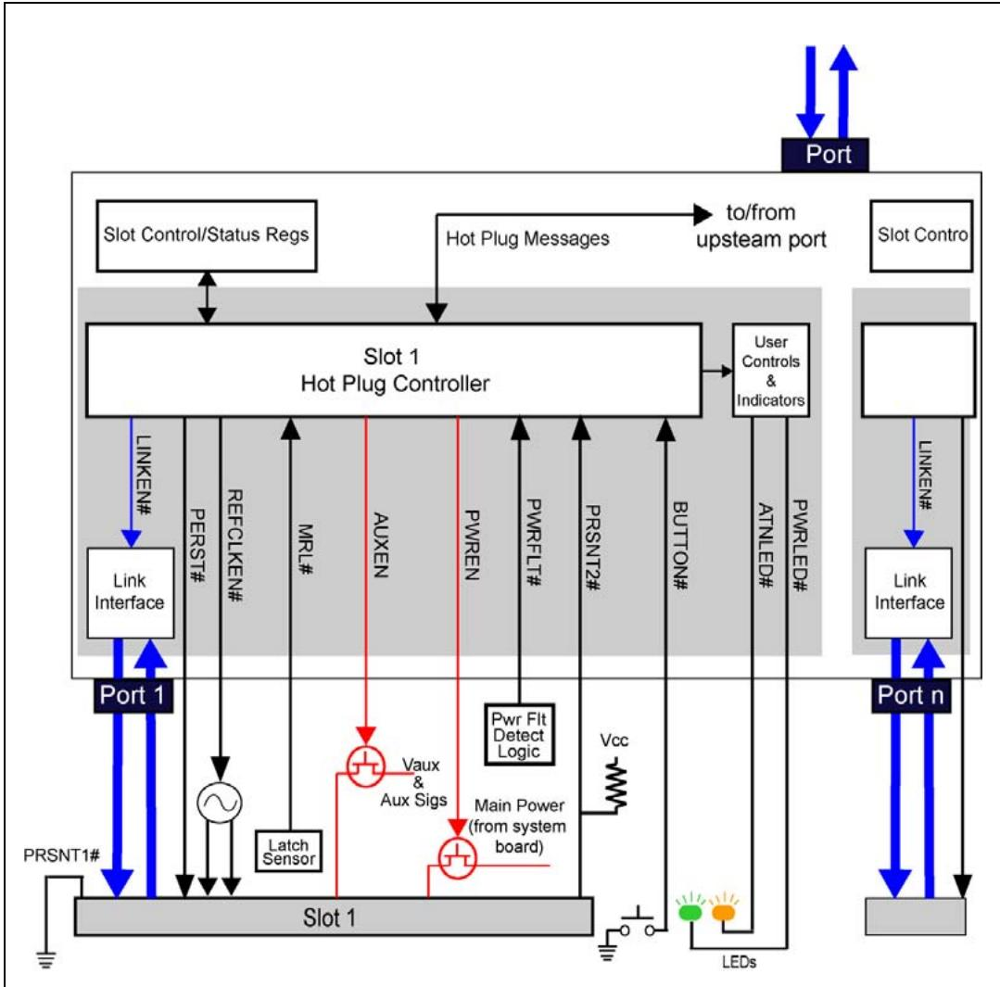

## The Hot-Plug Controller Programming Interface

The standard programming interface to the Hot‐Plug Controller is provided via the PCI Express Capability register block, shown in Figure 19‐4 on page 865, where the Hot‐Plug related registers are highlighted. Hot Plug features are primarily found in the Slot Registers defined for Root and Switch Ports. The Device Capability register is also used in some implementations as described later in this chapter.

Figure 19‐4: PCIe Capability Registers Used for Hot‐Plug

<table><tr><td>PCI Express Capabilities Register</td><td>Next Cap Pointer</td><td>PCI Express Cap ID</td></tr><tr><td colspan="3">Device Capabilities Register</td></tr><tr><td>Device Status</td><td colspan="2">Device Control</td></tr><tr><td colspan="3">Link Capabilities</td></tr><tr><td>Link Status</td><td colspan="2">Link Control</td></tr><tr><td colspan="3">Slot Capabilities</td></tr><tr><td>Slot Status</td><td colspan="2">Slot Control</td></tr><tr><td>Root Capability</td><td colspan="2">Root Control</td></tr><tr><td colspan="3">Root Status</td></tr><tr><td colspan="3">Device Capabilities 2</td></tr><tr><td>Device Status 2</td><td colspan="2">Device Control 2</td></tr><tr><td colspan="3">Link Capabilities 2</td></tr><tr><td>Link Status 2</td><td colspan="2">Link Control 2</td></tr><tr><td colspan="3">Slot Capabilities 2</td></tr><tr><td>Slot Status 2</td><td colspan="2">Slot Control 2</td></tr></table>

## Slot Capabilities

Figure 19‐5 on page 866 illustrates the slot capability register and bit fields. Hardware initializes all of these capability register fields to reflect the features implemented by this port. This register applies to both card slots and rack mount implementations, except for the indicators and attention button. Software must read from the device capability register within the module to determine if indicators and attention buttons are implemented. Table 19‐5 on page 866 lists and defines the slot capability fields.

Figure 19‐5: Slot Capabilities Register  
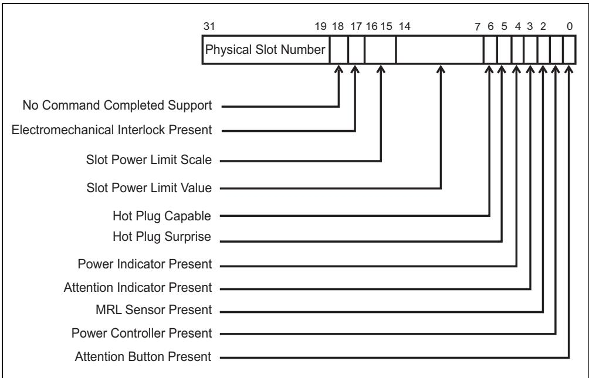

Table 19‐5: Slot Capability Register Fields and Descriptions

<table><tr><td>Bit(s)</td><td>Register Name and Description</td></tr><tr><td>0</td><td>Attention Button Present — indicates the presence of an attention button on the chassis adjacent to the slot.</td></tr><tr><td>1</td><td>Power Controller Present — indicates the presence of a power controller for this slot.</td></tr><tr><td>2</td><td>MRL Sensor Present — indicates the presence of a MRL Sensor on the slot.</td></tr><tr><td>3</td><td>Attention Indicator Present — indicates the presence of an attention indicator on the chassis adjacent to the slot.</td></tr><tr><td>4</td><td>Power Indicator Present — indicates the presence of a power indicator on the chassis adjacent to the slot.</td></tr></table>

## Chapter 19: Hot Plug and Power Budgeting

Table 19‐5: Slot Capability Register Fields and Descriptions (Continued)

<table><tr><td>Bit(s)</td><td>Register Name and Description</td></tr><tr><td>5</td><td>Hot-Plug Surprise — indicates that it&#x27;s possible for the user to remove the card from the system without prior notification. This tells the OS to allow for such removal without affecting continued software operation.</td></tr><tr><td>6</td><td>Hot-Plug Capable — indicates that this slot supports hot plug operation.</td></tr><tr><td>14:7</td><td>Slot Power Limit Value — specifies the maximum power that can be supplied by this slot. This limit value is multiplied by the scale specified in the next field.</td></tr><tr><td>16:15</td><td>Slot Power Limit Scale — specifies the scaling factor for the Slot Power Limit Value.</td></tr><tr><td>17</td><td>ElectroMechanical Interlock Present — indicates that this is implemented for this slot</td></tr><tr><td>18</td><td>No Command Completed Support— indicates that this slot doesn&#x27;t generate software notification when a command has been completed. Earlier versions sometimes took a long time to execute hot-plug commands (for example, sometimes taking a second or more to communicate across an  $I^{2}C$  bus to turn the power on or off), and generated an interrupt when they were finally done. When set this bit means that this Port can accept writes to all fields in the Slot Control register without delay, so there&#x27;s no need for the notification.</td></tr><tr><td>31:19</td><td>Physical Slot Number — Indicates the physical slot number associated with this port. It must be hardware initialized to a number that is unique within the chassis. Note that software will need this number to relate the physical slot to the Logical Slot ID (Bus, Device, &amp; Function number for this device).</td></tr></table>

## Slot Power Limit Control

The spec provides a method for software to limit the amount of power consumed by a card installed into an expansion slot or backplane implementation. The registers to support this feature are included in the Slot Capability register.

## Slot Control

Software controls the Hot Plug events through the Slot Control register, shown in Figure 19‐6 on page 868. This register permits software to enable various Hot Plug features and control hot plug operations. It’s also used to enable interrupt generation as well as enabling the sources of Hot‐Plug events that can result in interrupt generation.

Figure 19‐6: Slot Control Register  
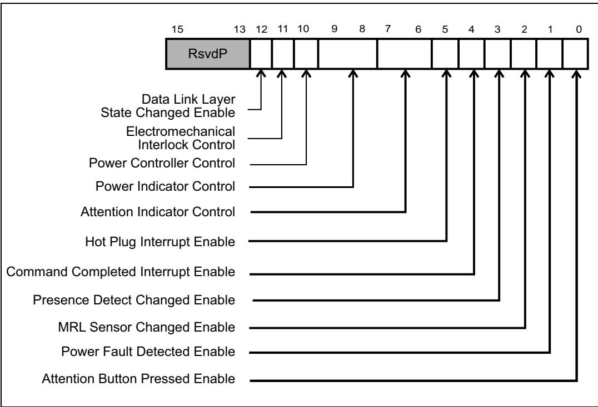

## Chapter 19: Hot Plug and Power Budgeting

Table 19‐6: Slot Control Register Fields and Descriptions

<table><tr><td>Bit(s)</td><td>Register Name and Description</td></tr><tr><td>0</td><td>Attention Button Pressed Enable. When set, this bit enables the generation of a hot-plug interrupt (if enabled) or assertion of the Wake# message, when the attention button is pressed.</td></tr><tr><td>1</td><td>Power Fault Detected Enable. When set, enables generation of a hot-plug interrupt (if enabled) or Wake# message upon detection of a power fault.</td></tr><tr><td>2</td><td>MRL Sensor Changed Enable. When set, enables generation of a hot-plug interrupt or Wake# (if enabled) message upon detection of a MRL sensor changed event.</td></tr><tr><td>3</td><td>Presence Detect Changed Enable. When set this bit enables the generation of the hot-plug interrupt or a Wake message when the presence detect changed bit in the Slot Status register is set.</td></tr><tr><td>4</td><td>Command Completed Interrupt Enable. When set, enables a Hot- Plug interrupt to be generated that informs software that the hot-plug controller is ready to receive the next command.</td></tr><tr><td>5</td><td>Hot-Plug Interrupt Enable. When set, enables the generation of Hot-Plug interrupts.</td></tr><tr><td>7:6</td><td>Attention Indicator Control. Writes to the field control the state of the attention indicator and reads return the current state, as follows:00b = Reserved01b = On10b = Blink11b = Off</td></tr><tr><td>9:8</td><td>Power Indicator Control. Writes to the field control the state of the power indicator and reads return the current state, as follows:00b = Reserved01b = On10b = Blink11b = Off</td></tr><tr><td>10</td><td>Power Controller Control. Writes to the field switch main power to the slot and reads return the current state: 0b = Power On, 1b = Power Off</td></tr><tr><td>11</td><td>Electromechanical Interlock Control - If the interlock is implemented, writing a 1b to this bit toggles the state of it while writing a 0b has no effect. Reading this bit always returns a 0b.</td></tr><tr><td>12</td><td>Data Link Layer State Changed Enable - If the Data Link Layer Link Active Reporting capability is 1b, setting this bit enables software notification when the Data Link Layer Link Active bit changes. If the Data Link Layer Link Active Reporting capability is 0b, then this bit becomes read-only with a value of 0b.</td></tr></table>

## Slot Status and Events Management

The Hot Plug Controller monitors a variety of events and reports these events to the Hot Plug System Driver. Software can use the “detected” bits to determine which event has occurred, while the status bit identifies that nature of the change. The changed bits must be cleared by software in order to detect a subsequent change. Note that whether these events get reported to the system (via a system interrupt) is determined by the related enable bits in the Slot Control Register.

Figure 19‐7: Slot Status Register  
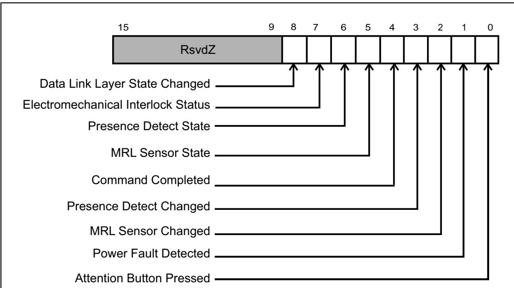

Table 19‐7: Slot Status Register Fields and Descriptions

<table><tr><td>Bit Location</td><td>Register Name and Description</td></tr><tr><td>0</td><td>Attention Button Pressed — If the button is implemented, this bit is set when the Attention Button is pressed.</td></tr><tr><td>1</td><td>Power Fault Detected — If a Power Controller that supports power fault detection is implemented, this bit is set when it detects a power fault at this slot. The spec notes that it's possible for a power fault to be detected at any time, regardless of the Power Control setting or whether the slot is occupied.</td></tr><tr><td>2</td><td>MRL Sensor Changed — If an MRL Sensor is implemented, this is set when a MRL Sensor state change is detected. If no sensor is present this bit will always be zero.</td></tr><tr><td>3</td><td>Presence Detect Changed — set when a change has been detected in the Presence Detect State bit.</td></tr><tr><td>4</td><td>Command Completed — If the No Command Completed Support bit in the Slot Capabilities register is 0b, then this bit is set when a hot plug command has completed and the Hot Plug Controller is ready to accept another command. Technically, only this last meaning is guaranteed: the controller is ready to accept another command, regardless of whether the previous one has actually completed.</td></tr><tr><td>5</td><td>MRL Sensor State — when set, indicates the current state of the MRL sensor, if implemented: 0b = MRL Closed, 1b = MRL Open</td></tr><tr><td>6</td><td>Presence Detect State — this bit indicates the presence of a card in a slot and is required for all Downstream Ports that implement a slot. Its value is the logical “OR” of Physical Layer’s Detection logic and any other side-band detect mechanism implemented for the slot (such as PRSNT1# and PRSNT2#). The big difference between them is that the pins require no power to physically detect the card and can thus report on it without needing the power restored, while using the Physical Layer Detect logic does need power.</td></tr><tr><td>7</td><td>Electromechanical Interlock Status —If an Electromechanical Interlock is implemented, this bit indicates whether it is engaged (1b) or disengaged (0b).</td></tr><tr><td>8</td><td>Data Link State Changed — This bit is set when the Data Link Layer Link Active bit in the Link Status register changes. In response to this event, software must read the Data Link Layer Link Active bit to determine whether the Link is active before sending configuration cycles to the hot plugged device.</td></tr></table>

## Add-in Card Capabilities

The Device Capability register, seen in Figure 19‐8 on page 873, also has fields relevant to add‐in cards that record the power reported by the Hot Plug Controller as being available to their slot. This information must be communicated automatically with a Set\_Slot\_Power\_Limit Message whenever either of these takes place:

• A configuration write to the Slot Capabilities register changes the Slot Power Limit Value and Slot Power Limit Scale values.

The Link transitions from non‐DL\_UP to DL\_Up status (unless the Slot Capabilities register has not yet been initialized).

The message updates the Captured Slot Power Limit Value and Scale registers with the values in the message, making this information readily available to its device driver.

Figure 19‐8: Device Capabilities Register  

## Quiescing Card and Driver

## General

Prior to removing a card from the system, two things must occur: the device driver must stop accessing the card, and the card must stop initiating or responding to new Requests. How this is accomplished is OS‐specific, but the following must take place:

• The OS must stop issuing new requests to the device’s driver or instruct the driver to stop accepting new requests.

• The driver must terminate or complete all outstanding requests.

• The card must be disabled from generating interrupts or Requests.

When the OS commands the driver to quiesce itself and its device, the OS must not expect the device to remain in the system (in other words, it could be removed and not replaced with an identical card).

## Pausing a Driver (Optional)

Optionally, an OS could implement a “Pause” capability to temporarily stop driver activity in the expectation that the same card will be reinserted. If the card is not reinstalled within a reasonable amount of time, however, the driver must be quiesced and then removed from memory.

As an example, the currently‐installed card is failing or is being replaced with a later revision as an upgrade. If the operation is to appear seamless from a software and operational perspective, the driver would have to quiesce the device, save the current context (contents of registers, stack and instruction pointer of local micro‐controller, etc.) and turn off the power to the slot. The new card could then be installed and powered, and then, when its context is restored, it could resume normal operation where it left off. Of course, if the old card had failed, it may not be possible to simply resume operation.

## Quiescing a Driver That Controls Multiple Devices

If a driver controls multiple cards and it receives a command from the OS to quiesce its activity with respect to a specific card, it must only quiesce its activity with that card and the card itself.

## Quiescing a Failed Card

If a card has failed, it may not be possible for the driver to complete requests previously issued to the card. In this case, the driver must detect the error, terminate the requests without completion, and attempt to reset the card.

## The Primitives

This section discusses the hot‐plug software elements and the information passed between them. For a review of the software elements and their relationships to each other, refer to Table 19‐1 on page 852. Communications between the Hot‐Plug Service within the OS and the Hot‐Plug System Driver is in the form of requests. The spec doesn’t define the exact format of these requests, but does define the basic request types and their content. Each request type issued to the Hot‐Plug System Driver by the Hot‐Plug Service is referred to as a primitive. They are listed and described in Table 19‐8 on page 875.

Table 19‐8: The Primitives

<table><tr><td>Primitive</td><td>Parameters</td><td>Description</td></tr><tr><td rowspan="2">Query Hot-Plug System Driver</td><td>Input: None</td><td rowspan="2">Requests that the Hot-Plug System Driver return a set of Logical Slot IDs for the slots it controls.</td></tr><tr><td>Return: Set of Logical Slot IDs for slots controlled by this driver.</td></tr><tr><td rowspan="2">Set Slot Status</td><td>Inputs:Logical Slot IDNew slot state (on or off).New Attention Indicator state.New Power Indicator state.</td><td rowspan="2">This request is used to control the slots and the Attention Indicator associated with each slot. Good completion of a request is indicated by returning the Status Change Successful parameter. If a fault is incurred during an attempted status change, the Hot-Plug System Driver should return the appropriate fault message (see middle column). Unless otherwise specified, the card should be left in the off state.</td></tr><tr><td>Return: Request completion status:status change successfulfault—wrong frequencyfault—insufficient powerfault—insufficient configuration resourcesfault—power failfault—general failure</td></tr><tr><td rowspan="2">Query Slot Status</td><td>Input: Logical Slot ID</td><td rowspan="2">This request returns the state of the indicated slot (if a card is present). The Hot-Plug System Driver must return the Slot Power status information.</td></tr><tr><td>Return:Slot state (on or off)Card power requirements.</td></tr><tr><td rowspan="2">Async Notice of Slot Status Change</td><td>Input: Logical Slot ID</td><td rowspan="2">This is the only primitive (defined by the spec) that is issued to the Hot-Plug Service by the Hot-Plug System Driver. It is sent when the Driver detects an unsolicited change in the state of a slot. Examples would be a run-time power fault or a card installed in a previously-empty slot with no warning.</td></tr><tr><td>Return: none</td></tr></table>

## Introduction to Power Budgeting

The primary goal of the PCI Express power budgeting capability is to allocate power for PCI Express hot plug devices that are added to the system during runtime. This ensures that the system can allocate the proper amount of power and cooling for these devices.

The spec states that “power budgeting capability is optional for PCI Express devices implemented in a form factor which does not require hot plug, or that are integrated on the system board.” None of the form factor specs released at the time of this writing required support for hot plug or the power budgeting capability, but these change often.

System power budgeting is always required to support all system board devices and add‐in cards. The new capability provides mechanisms for managing the budgeting process for a hot‐plug card. Each form factor spec defines the min and max power for a given expansion slot. For example, the CEM spec limits the power an expansion card can consume prior to being fully enabled but, after it is enabled, it can consume the maximum amount of power specified for the slot. In the absence of the power budgeting capability registers, the system designer is responsible for guaranteeing that power has been budgeted correctly and that sufficient cooling is available to support any compliant card installed into the connector.

The spec defines the configuration registers to support the power budgeting process, but does not define the power budgeting methods and processes. The next section describes the hardware and software elements that would be involved in power budgeting, including the specified configuration registers.

## The Power Budgeting Elements

Figure 19‐10 illustrates the concept of Power Budgeting for hot plug cards. The role of each element involved in the power budgeting, allocation, and reporting process is listed and described below:

• System Firmware for Power Management (used during boot time).

• Power Budget Manager (used during run time).

• Expansion Ports (to which card slots are attached).

• Add‐in Devices (Power Budget Capable).

## System Firmware

Written by the platform designers the specific system, this is responsible for reporting system power information. The spec recommends the following power information be reported to the PCI Express power budget manager, which allocates and verifies power consumption and dissipation during runtime:

• Total system power available.

• Power allocated to system devices by firmware

• Number and type of slots in the system.

Firmware may also allocate power to PCIe devices that support the power budgeting capability register set, such as a hot‐plug device used during boot time. The Power Budgeting Capability register, shown in Figure 19‐9 on page 878, contains a System Allocated bit that is hardware initialized (usually by firmware) to notify the power budget manager that power for this device has already been included in the system power allocation. If so, the Power Budget Manager still needs to read and save the power information for the hot‐plug devices that were allocated in case they are later removed during runtime.

Figure 19‐9: Power Budget Registers  
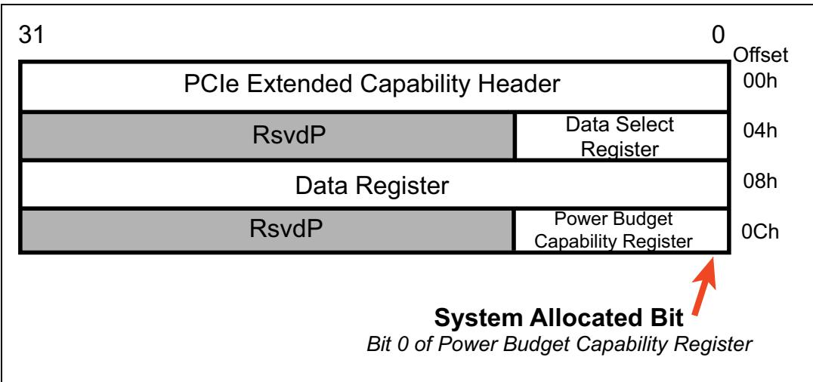

## The Power Budget Manager

This initializes when the OS installs and receives power‐budget information from system firmware, although the spec does not define the method for delivering this information. This manager is responsible for allocating power for all PCI Express devices including:

PCI Express devices that have not already been allocated by the system (including embedded devices that support power budgeting).

Hot‐plugged devices installed at boot time.

• New devices added during runtime.

## Expansion Ports

Figure 19‐10 on page 880 illustrates a hot plug port that must have the Slot Power Limit and Slot Power Scale fields within the Slot Capabilities register implemented. The firmware or power budget manager must load these fields with a value that represents the maximum amount of power supported by this Port. When software writes to these fields the Port automatically delivers a Set\_Slot\_Power\_Limit message to the device. These fields are also written when software configures a new card that has been added as a hot plug installation.

## Spec requirements:

Any Downstream Port that has a slot attached (the Slot Implemented bit in its PCIe Capabilities register is set) must implement the Slot Capabilities register.

Software must initialize the Slot Power Limit Value and Scale fields of the Slot Capabilities register of the Downstream Port that is connected to an add‐in slot.

• Upstream Ports must implement the Device Capabilities register.

When a card is installed in a slot and software updates the power limit and scale values in the Downstream Port, that Port will automatically send the Set\_Slot\_Power\_Limit message to the Upstream Port on the installed card.

• The recipient of the Message must use the data payload to limit its power usage for the entire card, unless the card will never exceed the lowest value specified in the corresponding electromechanical spec.

## Add-in Devices

Expansion cards that support the power budgeting capability must include the Slot Power Limit Value and Slot Limit Scale fields within the Device Capabilities register, and the Power Budgeting Capability register set for reporting powerrelated information.

These devices must not consume more than the lowest power specified by the form factor spec. Once power budgeting software allocates additional power via the Set\_Slot\_Power\_Limit message, the device can consume the power that has been specified, but not until it has been configured and enabled.

Device Driver—The device’s software driver is responsible for verifying that sufficient power is available for proper device operation prior to enabling it. If the power is lower than that required by the device, the device driver is responsible for reporting this to a higher software authority.

Figure 19‐10: Elements Involved in Power Budget  

## Slot Power Limit Control

Software is responsible for determining the maximum power that an expansion device is allowed to consume. This allocation is based on the power partitioning within the system, thermal capabilities, etc. Knowledge of the system’s power and thermal limits comes from system firmware. The firmware or power manager is responsible for reporting the power limits to each expansion port.

## Expansion Port Delivers Slot Power Limit

Software writes to the Slot Power Limit Value and Slot Power Limit Scale fields of the Slot Capability register to specify the maximum power that can be consumed by the device. Software is required to specify a power value that reflects one of the maximum values defined by the spec. For example, revision 2.0 of the CEM spec defines power usage as listed in Table 19‐9.

An interesting note about these values is that a standard‐height x1 server card is limited to 10W after a reset and is only allowed to use the full 25W after it’s been configured and enabled. Similarly, a x16 graphics card will be limited to 25W until configured and enabled to use the full 75W.

Table 19‐9: Maximum Power Consumption for System Board Expansion Slots

<table><tr><td></td><td colspan="2">X1 Link</td><td>X4/X8 Link</td><td colspan="2">X16 Link</td></tr><tr><td>Standard Height</td><td>10W (max - desktop)</td><td>25W (max - server)</td><td>25W (max)</td><td>25W (max - server)</td><td>75W (max - graphics card)</td></tr><tr><td>Low Profile Card</td><td colspan="2">10W (max)</td><td>25W (max)</td><td colspan="2">25W (max)</td></tr></table>

In addition to the base CEM spec, two more specs have been defined for higherpowered devices. First is the PCIe x16 Graphics 150W‐ATX Spec 1.0, which defines a video card that’s able to draw 75W from the card connector and another 75W from a separate 3‐pin ATX power connector. The second is the PCIe 225W/300W High Power CEM Spec 1.0, which extends this by adding another 3‐pin power connector to achieve 225W, or a 4‐pin ATX connector that brings the total to 300W.

When the Slot Power registers are written by power budget software, the expansion port sends a Set\_Slot\_Power\_Limit message to the expansion device. This procedure is illustrated in Figure 19‐11 on page 882.

Figure 19‐11: Slot Power Limit Sequence  
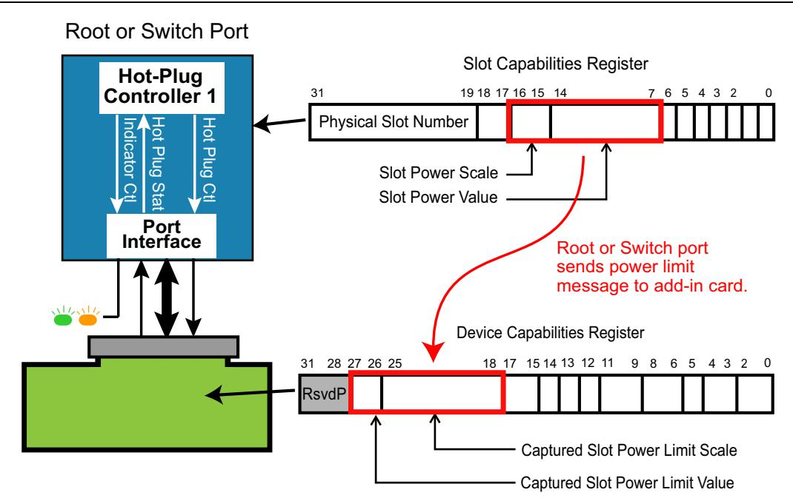  
1. When Hot Plug software is notified of a card insertion request, Power and Clock are restored to the slot.  
2. Hot Plug software calls configuration and power budgeting software to configure and allocate power to the device.  
3. Power budget software may interrogate the card to determine it's power requirements and characteristics.  
4. Power is then allocated based on the device's requirements and the system's capabilities  
5. Power management software writes to the Slot Power Scale and Slot Power Value fields within the expansion port.  
6. Writes to these fields command the port to send the Set\_Slot\_Power\_Limit message to convey the contents of the Slot Power fields.  
7. The slot receives the message and updates its Captured Slot Power Limit Value and Scale fields.  
8. These values limit the power that the expansion device can consume once it is enabled by its device driver.

## Expansion Device Limits Power Consumption

The device driver reads the values from the Captured Slot Power Limit and Scale fields to verify that the power available is sufficient to operate the device. Several conditions may exist:

Enough power is available to operate the device at full capability. In this case, the driver enables the device by writing to the configuration Command register, permitting the device to consume power up to the limit specified in the Power Limit fields.

The power available is sufficient to operate the device but not at full capability. In this case, the driver is required to configure the device such that it consumes no more power than specified in the Power Limit fields.

The power available is insufficient to operate the device. In this case, the driver must not enable the card and must report the inadequate power condition to the upper software layers, which should in turn inform the end user of the problem.

The power available exceeds the maximum power specified by the form factor spec. This condition should not occur. but, if it does, the device is not permitted to consume power beyond the maximum permitted by the form factor.

The power available is less than the lowest value specified by the form factor spec. This is a violation of the spec, which states that the expansion port “must not transmit a Set\_Slot\_Power\_Limit Message that indicates a limit lower than the lowest value specified in the electromechanical spec for the slotʹs form factor.”

Some expansion devices may consume less power than the lowest limit specified for their form factor. Such devices are permitted to discard the information delivered in the Set\_Slot\_Power\_Limit Messages. When the Slot Power Limit Value and Scale fields are read, these devices return zeros.

## The Power Budget Capabilities Register Set

These registers permit power budgeting software to allocate power more effectively based on information provided by the device through its power budget data select and data register. This feature is similar to the data select and data fields within the power management capability registers. However, the power budget registers provide more detailed information to software to aid it in determining the effects of expansion cards that are added during runtime on the system power budget and cooling requirements. Through this capability, a device can report the power it consumes:

• from each power rail

• in various power management states

• in different operating conditions

These registers are not required for devices implemented on the system board or on expansion devices that do not support hot plug. Figure 19‐12 on page 884 illustrates the power budget capabilities register set and shows the data select and data field that provide the method for accessing the power budget information.

The power budget information is maintained within a table that consists of one or more 32‐bit entries. Each table entry contains power budget information for the different operating modes supported by the device. Each table entry is selected via the data select field, and the selected entry is then read from the data field. The index values start at zero and are implemented in sequential order. When a selected index returns all zeros in the data field, the end of the power budget table has been located. Figure 19‐13 on page 885 illustrates the format and types of information available from the data field.

Figure 19‐12: Power Budget Capability Registers

<table><tr><td colspan="2">PCIe Extended Capability Header</td><td>Offset</td></tr><tr><td>RsvdP</td><td>Data Select Register</td><td>00h</td></tr><tr><td colspan="2">Data Register</td><td>04h</td></tr><tr><td>RsvdP</td><td>Power Budget Capability Register</td><td>08h</td></tr></table>

Figure 19‐13: Power Budget Data Field Format and Definition  

# 20 Updates for Spec Revision 2.1

## Previous Chapter

The previous chapter describes the PCI Express hot plug model. A standard usage model is also defined for all devices and form factors that support hot plug capability. Power is an issue for hot plug cards, too, and when a new card is added to a system during runtime, it’s important to ensure that its power needs don’t exceed what the system can deliver. A mechanism was needed to query the power requirements of a device before giving it permission to oper ate. Power budgeting registers provide that.

## This Chapter

This chapter describes the changes and new features that were added with the 2.1 revision of the spec. Some of these topics, like the ones related to power management, are described in other chapters, but for others there wasn’t another logical place for them. In the end, it seemed best to group them all together in one chapter to ensure that they were all covered and to help clarify what features were new.

## The Next Chapter

The next section is the book appendix which includes topics such as: Debugging PCI Express Traffic using LeCroy Tools, Markets & Applications of PCI Express Architecture, Implementing Intelligent Adapters and Multi‐Host Systems with PCI Express Technology, Legacy Support for Locking and the book Glossary.

## Changes for PCIe Spec Rev 2.1

The 2.1 revision of the spec for PCIe introduced several changes to enhance performance or improve operational characteristics. It did not add another data rate and that’s why it was considered an incremental revision. The modifications can be grouped generally into four areas of improvement: System Redundancy, Performance, Power Management, and Configuration.

## System Redundancy Improvement: Multi-casting

The Multi‐casting capability allows a Posted Write TLP to be routed to more than one destination at the same time, allowing for things like automatically making redundant copies of data or supporting multi‐headed graphics. As shown in Figure 20‐1 on page 888, a TLP sourced from one Endpoint can be routed to multiple destinations based solely on its address. In this example, data is sent to the video port for display while redundant copies of it are automatically routed to storage. There are other ways this activity could be supported, of course, but this is very efficient in terms of Link usage since it doesn’t require a recipient to re‐send the packet to secondary locations.

Figure 20‐1: Multicast System Example  
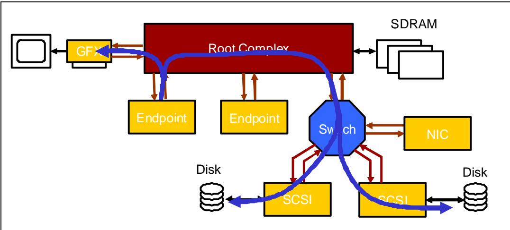

This mechanism is only supported for posted, address‐routed Requests, such as Memory Writes, that contain data to be delivered and an address that can be decoded to show which Ports should receive it. Non‐posted Requests will not be treated as Multicast even if their addresses fall within the MultiCast address range. Those will be treated as unicast TLPs just as they normally would.

The setup for Multicast operation involves programming a new register block for each routing element and Function that will be involved, called the Multicast Capability structure. The contents of this block are shown in Figure 20‐2 on page 889, where it can be seen that they define addresses and also MCGs (MultiCast Group numbers) that explain whether a Function should send or receive copies of an incoming TLP or whether a Port should forward them. Let’s describe these registers next and discuss how they’re used to create Multicast operations in a system.

Figure 20‐2: Multicast Capability Registers  
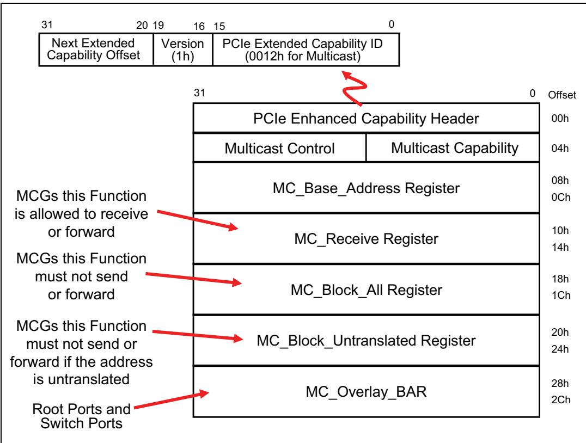

## Multicast Capability Registers

The Capability Header register at the top of the figure includes the Capability ID of 0012h, a 4‐bit Version number, and a pointer to the next capability structure in the linked list of registers.

## Multicast Capability

This register, shown in detail in Figure 20‐3 on page 890, contains several fields. The MC\_Max\_Group value defines how many Multicast Groups this Function has been designed to support minus one, so that a value of zero means one group is supported. The Window Size Requested, which is only valid for Endpoints and reserved in Switches and Root Ports, represents the address size needed for this purpose as a power of two.

Figure 20‐3: Multicast Capability Register  
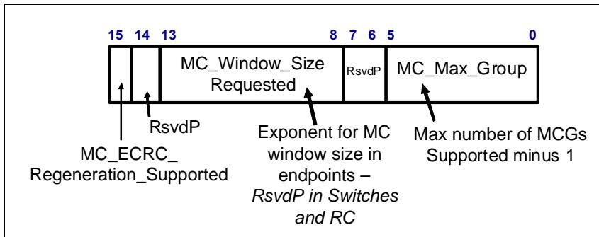  
Lastly, bit 15 indicates whether this Function supports regenerating the ECRC value in a TLP if forwarding it involved making address changes to it. Refer to the section called “Overlay Example” on page 895 for more detail on this.

## Multicast Control

This register, shown in Figure 20‐4 on page 890, contains the MC\_Num\_Group that is programmed with the number of Multicast Groups configured by software for use by this Function. The default number is zero, and the spec notes that programming a value here that is greater than the max value defined in the MC\_Max\_Group register will result in undefined behavior. The MC\_Enable bit is used to enable the Multicast mechanism for this component.

Figure 20‐4: Multicast Control Register  
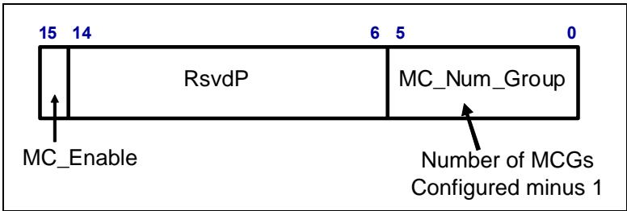

## Multicast Base Address

The base address register, shown in Figure 20‐5 on page 891, contains the 64‐bit starting address of the Multicast Address range for this component. The Multi‐Cast Index Position register indicates the bit position within the address where the MultiCast Group (MCG) number is to be found. When the address of an incoming TLP falls within the MultiCast address range starting at this Base Address, the logic will offset into the address itself by the number of bit locations given in the Index Position and interpret the next bits (up to 6 bits, allowing up to 64 groups) as the MCG number for that TLP. The MCG number, in turn, will indicate whether the Port should forward a copy of this TLP.

Figure 20‐5: Multicast Base Address Register  

An example of locating the MCG within the address is shown in Figure 20‐6 on page 892. Here the Index Position value is 24, so the MCG is found in address bits 25 to 30. Interestingly, since the base address doesn’t define the lower 12 bits of the address, the MC Index Position must be 12 or greater to be valid. If it’s less than 12 and the MC\_Enable bit is set, the component’s behavior will be undefined.

Figure 20‐6: Position of Multicast Group Number  

## MC Receive

This 64‐bit register is a bit vector that indicates for which of the 64 MCGs this Function should accept a copy or this Port should forward a copy. If the MCG value is found to be 47, for example, and bit 47 is set in this register, then this Function should receive it or this Port should forward it.

## MC Block All

This 64‐bit register indicates which MCGs an Endpoint Function is blocked from sending and which a Switch or Root Port is blocked from forwarding. This can be programmed in a Switch or Root Port to prevent it from forwarding MultiCast TLPs to an Endpoint that doesn’t understand them, for example. A blocked TLP is considered an error condition, and how the error is handled is described in the next section.

## MC Block Untranslated

The meaning and use of this 64‐bit register is almost identical to the Block All register except that it doesn’t apply to TLPs whose AT header field shows them to be translated. This mechanism can be used to set up a Multicast window that is protected in that it can only receive translated addresses.

If a TLP is blocked because of the setting of either of these two blocking registers, it’s handled as an MC Blocked TLP, meaning it gets dropped and the Port or Function logs and signals this as an error. Logging the error involves setting the Signaled Target Abort bit in its Status register or its Secondary Status register, as appropriate. That’s barely enough information to be useful, though, so the spec highly recommends that Advanced Error Reporting (AER) registers be implemented in Functions with Multicast capability to facilitate isolating and diagnosing faults.

The spec notes that this register is required in all Functions that implement the MC Capability registers, but if an Endpoint Function doesn’t implement the ATS (Address Translation Services) registers, the designer may choose to make these bits reserved.

## Multicast Example

At this point, an example will help to illustrate how these registers can be used to set up a multicast environment. To set this up, let’s first give the relevant registers some values:

• MC\_Base\_Address = 2GB (Starting address for the multicast range)

• MC\_Max\_Group = 7 (Meaning 8 windows are possible for this design)

• MC\_Window\_Size\_Requested = 10 (Meaning $2 ^ { 1 0 }$ or 1KB size was requested by an Endpoint)

• MC\_Index\_Position = 12 (Meaning the actual size of each window is $2 ^ { 1 2 } )$

• MC\_Num\_Group = 5 (Meaning software only configured 6 of the available multicast windows).

Based on those register settings, the image in Figure 20‐7 on page 894 illustrates the result. The multicast window range is shown starting at 2GB and ranging as high as 2GB + 8 \* (the window size). However, only 6 are enabled by software, so the actual multicast address range is from 2GB to 2GB + 24KB. The windows are all the same size and correspond to the MCGs: MCG 0 is the first window, 1 is the next window, and so on.

Figure 20‐7: Multicast Address Example  
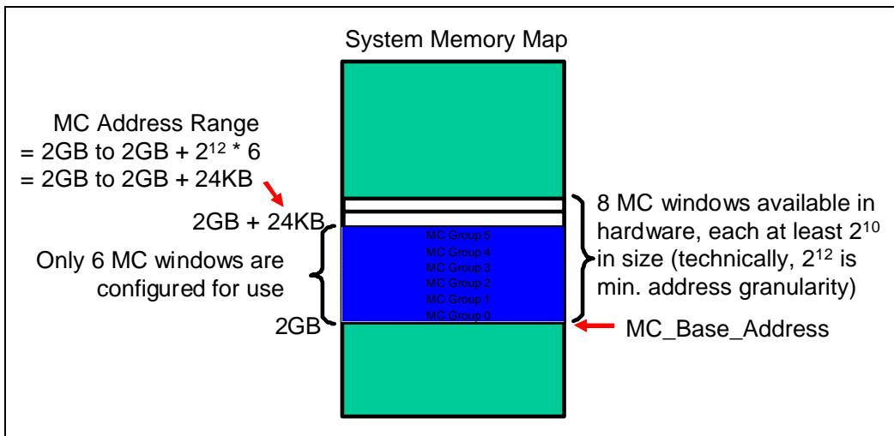

## MC Overlay BAR

This last set of registers are required for Switch and Root Ports that implement Multicasting, but they’re not implemented in Endpoints. The motivation for this BAR is that it allows two special cases. First, a Port can forward TLPs downstream if they hit in a multicast window even if the Endpoint wasn’t designed for multicasting. Second, a Port can forward multicast TLPs upstream to system memory. In both cases, this is accomplished by replacing part of the Request’s address with an address that will be recognized by the target. Doing so allows a single BAR in a component to serve as a target for both unicast and multicast writes even if it wasn’t designed with multicast capability.

As shown in Figure 20‐8 on page 895, this register block consists of an address that will be overlaid onto the outgoing TLP, and a 6‐bit Overlay Size indicator. The size referred to here is simply the number of bits from the original 64‐bit address that will be retained, while all the others will be replaced by the Overlay BAR bits. The spec mistakenly refers to this in at least one place as the size in bytes, but in other places it’s made clear that it is a bit number. Note that the overlay size value must be 6 or higher to enable the overlay operation. If the size is given as 5 or lower, no overlay will take place and the address is unchanged.

Figure 20‐8: Multicast Overlay BAR

<table><tr><td>31</td><td>6</td><td>5</td><td>0</td></tr><tr><td colspan="2">MC_Overlay_BAR [31:6]</td><td colspan="2">MC_Overlay_Size</td></tr><tr><td colspan="4">MC_Overlay_BAR [63:32]</td></tr></table>

## Overlay Example

Now consider the case in which an address overlay is desired, as shown in Figure 20‐9 on page 896. Here the address of a TLP to be forwarded, ABCD\_BEEFh, falls within the defined multicast range (also referred to as a multicast hit) and the egress Port has been configured with valid values in the Overlay BAR.

The overlay case creates the unusual situation with the ECRC value that was mentioned earlier in the description of the Multicast Capability register. If the TLP whose address is being changed by the overlay includes an ECRC, that value would be rendered incorrect by this change. Switches and Root Ports optional support regenerating the ECRC based on the new address so that it still serves its purpose going forward. If the routing agent does not support it, the ECRC is simply dropped and the TD header bit is forced to zero to avoid any confusion.

A potential problem can arise with ECRC regeneration. If the incoming TLP already had an error but the ECRC value is regenerated because the address was modified, that would inadvertently hide the original error. To avoid that, the routing agent must verify the original ECRC first. If it finds an error, it must force a bad ECRC on the outgoing TLP by inverting the calculated ECRC value before appending it to ensure that the target will see it as an error condition.

Figure 20‐9: Overlay Example  
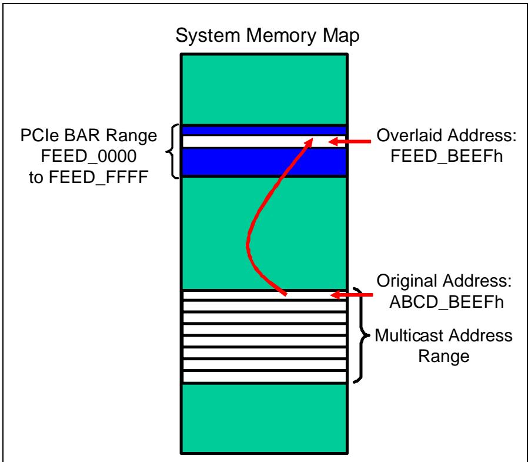

## Routing Multicast TLPs

When a Switch or Root Port detects an MC hit (address falls within the MC range) normal routing is suspended. The MCG is extracted from the address and is compared to the MC\_Receive register of all the Ports to see which of them should forward a copy of this TLP. Ports whose corresponding Receive register bit is set will forward a copy of the TLP unless their corresponding MC Blocked register bit is also set. If no Ports forward the TLP and no Functions consume it, it is silently dropped. To prevent loops, a TLP is never forwarded back out on its ingress Port, with the possible exception of an ACS case.

Endpoints extract the MCG and compare it with their Receive register. If there’s no match, the TLP is silently dropped. If the Endpoint doesn’t support Multicasting, it will treat the TLP as having an ordinary address.

## Congestion Avoidance

The use of Multicasting will increase the amount of system traffic in proportion to the percentage of MC traffic, which leads to the risk of packet congestion. To avoid creating backpressure, MC targets should be designed to accept MC traffic “at speed”, meaning with minimal delay. To avoid oversubscribing the Links, MC initiators should limit their packet injection rate. A system designer would be wise to choose components carefully to handle this. For example, using Switches and Root Ports whose buffers are big enough to handle the expected traffic, and Endpoints that are able to accept their incoming MC packets quickly enough to avoid trouble.

## Performance Improvements

System performance is enhanced with the addition of four new features:

1. AtomicOps to replace the legacy transaction locking mechanism

2. TLP Processing Hints to allow software to suggest caching options

3. ID‐Based Ordering to avoid unnecessary latency

4. Alternative Routing‐ID Interpretation to increase the number of Functions available in a device.

## AtomicOps

Processors that share resources or otherwise communicate with each other sometimes need uninterrupted, or “atomic”, access to system resources to do things like testing and setting semaphores. On parallel processor buses this was accomplished by locking the bus with the assertion of a Lock pin until the originator completed the whole sequence (a read followed by a write), during which time other processors were not allowed to initiate transactions on the bus. PCI included a Locked pin to apply this same model on the PCI bus as on the processor bus, allowing this protocol to used with peripheral devices.

This model worked but was slow on the shared processor bus and even worse when going onto the PCI bus. That’s one reason why PCIe limited its use only to Legacy devices. However, the increasing use of shared processing in today’s PCs, such as graphics co‐processors and compute accelerators, has brought this issue back to the fore because the different compute engines need to be able to share an atomic protocol. The way this problem was resolved on PCIe was to introduce three new commands that can each do a series of things atomically within the target device rather than requiring a series of separate uninterruptable commands on the interface. These new commands, called AtomicOps, are:

1. FetchAdd (Fetch and Add) ‐ This Request contains an “add” value. It reads the target location, adds the “add”value to it, stores the result in the target location and returns the original value of the target location. This could be used in support of atomically updating statistics counters.

2. Swap (Unconditional Swap)  ‐  This Request contains a “swap” value. It reads the target location, writes the “swap” value into it, and returns the original target value. This could be useful for atomically reading and clearing counters.

3. CAS (Compare and Swap) ‐ This Request contains both a “compare” value and a “swap” value. It reads the target location, compares it against the “compare” value and, if they’re equal, writes in the “swap” value. Finally, it returns the original value of the target location. This can be useful as a “test and set” mechanism for managing semaphores.

Both Endpoints and Root Ports are optionally allowed to act as AtomicOp Requesters and Completers, which might seem unexpected because, in PCs at least, this kind of transaction is usually only initiated by the central processor. But modern systems can include an Endpoint acting as a co‐processor, in which case it would need to be able to use AtomicOps to properly handle the protocol. All three commands support 32‐bit and 64‐bit operands, while CAS also supports 128‐bit operands. The actual size in use will be given in the Length field in the header. Routing elements like Switch Ports and Root Ports with peer‐to‐peer access will need to support the AtomicOp routing capability to be able to recognize and route these Requests.

A question naturally arises as to how the system (Root Complex) will be instructed to generate these new commands in response to processor activity, since there may not be a directly‐analogous processor bus command. The spec suggests two approaches. First, the Root could be designed to recognize specific processor activity and interpret that to “export” a PCIe AtomicOp in response. Second, a register‐based approach similar to the one used for legacy Configuration access could be used. In that case, one register might give the target address while another specified which command should be generated and the combination of the two would generate the Request.

AtomicOp Completers can be identified by the presence of the three new bits in the Device Capabilities 2 register, as shown in Figure 20‐10 on page 899. Bit 6 of this register also identifies whether routing elements are capable of routing AtomicOps.

Legacy PCI does not comprehend AtomicOps, of course, and there is no straight‐forward way to translate them into PCI commands. For that reason, PCIe‐to‐PCI bridges do not support AtomicOps. If atomic access is needed on that bus it would have to be done with the legacy locked protocol and the spec states that Locked Transactions and AtomicOps can operate concurrently on the same platform.

Figure 20‐10: Device Capabilities 2 Register  

## TPH (TLP Processing Hints)

Adding hints about how the system should handle TLPs targeting memory space can improve latency and traffic congestion. The spec describes this special handling basically as providing information about which of several possible cache locations in the system would be the optimal place for a temporary copy

## PCI Express Technology

of a TLP. The spec makes note of the fact that, since the usage described for TPH relates to caching, it wouldn’t usually make sense to use them with TLPs targeting Non‐prefetchable Memory Space. If such usage was needed, it would be essential to somehow guarantee that caching such TLPs did not cause undesirable side effects.

## TPH Examples

Device Write to Host Read. To help clarify the motivation for TPH, consider the example shown in Figure 20‐11 on page 901. Here the Endpoint is writing data into memory for later use by the CPU. The sequence is as follows:

1. First, the Endpoint sends a memory write TLP containing an address that maps to the system memory. The packet gets routed to the Root Complex (RC).

2. The RC recognizes this as an access to a cacheable memory space and pauses its progress while it snoops the CPU cache. This may result in a write‐back cycle from the CPU to update the system memory before the transaction can proceed, and this is shown as step 2a.

3. Once any write backs have finished, the RC allows the write to update the system memory.

4. At some point, the Endpoint notifies the CPU about data delivery.

5. Finally, the CPU fetches the data from memory to complete the sequence.

Figure 20‐11: TPH Example  

This sequence works but there’s an opportunity for performance improvement by adding an intermediate cache in the system. To illustrate this, consider the example shown in Figure 20‐12 on page 902. From the perspective of the Endpoint, the operation is the same but the knows to handle it a differently. The steps now are as follows:

1. The Endpoint does the same memory write but this time TPH bits are included. The write is forwarded to the RC by the Switch as before.

2. The RC understands that this memory access must be snooped to the CPU as before. However, once the snoop has been handled, the RC is informed by the TPH bits to store this TLP in an intermediate cache rather than going to system memory.

3. The Endpoint notifies the CPU that the data item has been delivered.

4. The CPU reads from the specified address, but now the data is found in the intermediate cache and so the request does not go to system memory. This has the usual benefits we’d expect from a cache design: faster access time as well as reduced traffic for the system memory.

This is a simple Device Write to Host Read (DWHR) example to illustrate the concept but it wouldn’t be hard to imagine a more complex system with a much larger topology in which there could be other caches placed in Switches or other locations to achieve the same benefits for other targets.

Figure 20‐12: TPH Example with System Cache  
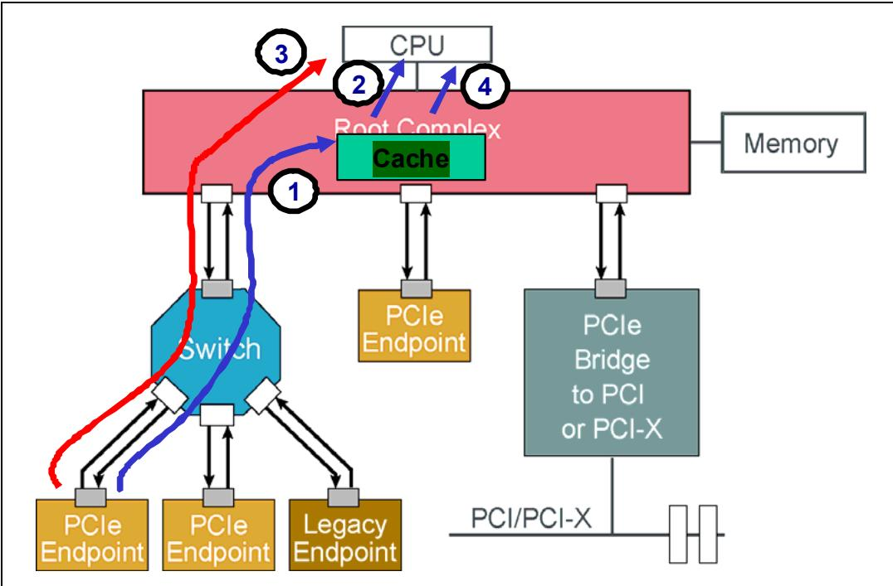

Host Write to Device Read. To illustrate the concept going the other way (called Host Write to Device Read or HWDR), consider the example shown in Figure 20‐13 on page 903. In this example, the CPU initiates a memory write whose address targets the PCIe Endpoint in step one. The packet contains TPH bits that tell the RC that it should be stored in an intermediate cache near the target, instead of the cache in the RC that was used in the previous example. In this case a cache built into the Switch serves the purpose. The TLP is then forwarded on to the target Endpoint in step two. This model is beneficial when the data is updated infrequently but read often by the Endpoint. That allows several memory reads that would normally go to system memory to be handled by the cache instead, off loading both the Link from the Switch to the RC and the path to memory.

Figure 20‐13: TPH Usage for TLPs to Endpoint  

Device to Device. One last example is illustrated in Figure 20‐14 on page 904, where two Endpoints communicate with each other (called Device Read/ Write to Device Read/Write or D\*D\*) through a shared memory location that is directed by TPH bits to an intermediate cache. In this case, both may update different locations that they need to handle as “read mostly”, or one Endpoint may update data that the other needs to read several times. In both cases, using the intermediate cache improves system performance.

## PCI Express Technology

Figure 20‐14: TPH Usage Between Endpoints  

## TPH Header Bits

Several bits in the TLP header describe how the hints are used. First, as shown in the middle at the top of Figure 20‐15 on page 905, the TH (TLP Hints) bit reports whether the optional TPH bits are in use for the TLP. When set, the PH (Processing Hint bits) indicate the next level of information.

Figure 20‐15: TPH Header Bits

<table><tr><td rowspan="2"></td><td colspan="2">+0</td><td colspan="4">+1</td><td colspan="4">+2</td><td colspan="2">+3</td></tr><tr><td>7</td><td>6</td><td>5</td><td>4</td><td>3</td><td>2</td><td>1</td><td>0</td><td>7</td><td>6</td><td>5</td><td>4</td></tr><tr><td>Byte 0</td><td>Fmt</td><td>Type</td><td>R</td><td>TC</td><td>R</td><td>Attr</td><td>F</td><td>TH</td><td>T</td><td>EP</td><td>Attr</td><td>AT</td></tr><tr><td>Byte 4</td><td colspan="8">Requester ID</td><td colspan="3">Tag</td><td>Last DW BE</td></tr><tr><td>Byte 8</td><td colspan="12">Address [63:32]</td></tr><tr><td>Byte 12</td><td colspan="12">Address [31:2]</td></tr></table>

When the TH bit is set the PH bits, shown at the bottom right of Figure 20‐15 on page 905, take the place of what were the two reserved LSBs in the address field. For a 32‐bit address, these are byte 11 [1:0], while for the 64‐bit address shown, they are byte 15 [1:0]. Their encoding is described in Table 20‐1 on page 905. These hints are provided by the Requester based on knowledge of the data patterns in use, which is information that would be difficult for a Completer to deduce on its own.

Table 20‐1: PH Encoding Table

<table><tr><td>PH [1:0]</td><td>Processing Hint</td><td>Usage Model</td></tr><tr><td>00b</td><td>Bi-directional data structure</td><td>Indicates frequent read/write access by Host and device.</td></tr><tr><td>01b</td><td>Requester</td><td>D*D* (device-to-device transfers). Indicates frequent read/write access by device. The asterisk means either device could be reading or writing.</td></tr><tr><td>10b</td><td>Target</td><td>DWHR, HWDR (device-to-host or host-to-device transfers). Indicates frequent read/write access by Host.</td></tr><tr><td>11b</td><td>Target with Priority</td><td>Same as Target but with additional temporal re-use priority information. Indicates frequent read/write access by Host and high temporal locality for accessed data.</td></tr></table>

The next level of information is the Steering Tag byte that provides system‐specific information regarding the best place to cache this TLP. Interestingly, the location of this byte in the header varies depending on the Request type. For Posted Memory Writes the Tag field is repurposed to be the Steering Tag (no completion will be returned so the Tag isn’t needed), while for Memory Reads the two Byte Enable fields are repurposed for it (byte enables are not needed for pre‐fetchable reads). The meaning of the bits is implementation specific but they need to uniquely identify the location of the desired cache in the system.

Two formats for TPH are described in the spec and this level of hint information (TH + PH + 8‐bit Steering Tag), called Baseline TPH, is the first and is required of all Requests that provide TPH. The second format uses TLP Prefixes to extend the Steering Tags (see “TLP Prefixes” on page 908 for more detail).

## Steering Tags

These values are programmed by software into a table to be used during normal operation. The spec recommends that the table be located in the TPH Requester Capability structure, shown in Figure 20‐16 on page 906, but it can alternatively be built into the MSI‐X table instead. Only one or the other of these table locations can be used for a given Function. The location is given in the ST Table Location field [10:9] of the Requester Capability register, shown in Figure 20‐17 on page 907. The encoding of these 2 bits is shown in Table 20‐2 on page 907.

Figure 20‐16: TPH Requester Capability Structure

<table><tr><td>PCI Express Capabilities Register</td><td>Next Cap Pointer</td><td>PCI Express Cap ID (17h)</td></tr><tr><td colspan="3">TPH Requester Capability Register</td></tr><tr><td colspan="3">TPH Requester Control Register</td></tr><tr><td colspan="3">TPH ST Table (optional)(Sized by number of ST entries)</td></tr></table>

## Chapter 20: Updates for Spec Revision 2.1

Figure 20‐17: TPH Capability and Control Registers  

Table 20‐2: ST Table Location Encoding

<table><tr><td>Bits [10:9]</td><td>ST Table Location</td></tr><tr><td>00b</td><td>Not present</td></tr><tr><td>01b</td><td>Located in the Requester Capability structure</td></tr><tr><td>10b</td><td>Located in the MSI-X table</td></tr><tr><td>11b</td><td>Reserved</td></tr></table>

## PCI Express Technology

The Requester Capability register lists the number of entries in the ST Table in bits [26:16]. Each table entry is 2 bytes wide, and the ST Table implemented in the TPH Capability register set is shown in Figure 20‐18 on page 908, where entry zero is highlighted. The Requester Capability register also describes which ST Modes are supported for the Requester with the 3 LSBs:

• No ST ‐ uses zeros for ST bits. Selected in the TPH Requester Control register’s ST Mode Select field when the value = 000b.

Interrupt Vector  ‐  uses the interrupt vector number as the offset into the table, meaning the values are contained in the MSI‐X table. (ST Mode Select value = 001b.)

Device‐Specific ‐ uses a device‐specific method to offset into the ST Table in the TPH Capability structure because the ST values are located there. This is the recommended implementation, although how a given Request is associated with a particular ST entry is outside the scope of the spec. (ST Mode Select value = 010b.)

• All other ST Mode Select encodings are reserved for future use.

Figure 20‐18: TPH Capability ST Table

<table><tr><td>ST Upper Entry (1)</td><td>ST Lower Entry (1)</td><td>ST Upper Entry (0)</td><td>ST Lower Entry (0)</td></tr><tr><td>ST Upper Entry (3)</td><td>ST Lower Entry (3)</td><td>ST Upper Entry (2)</td><td>ST Lower Entry (2)</td></tr><tr><td>ST Upper Entry(Table Size)</td><td>ST Lower Entry(Table Size)</td><td>ST Upper Entry(Table Size - 1)</td><td>ST Lower Entry(Table Size - 1)</td></tr></table>

## TLP Prefixes

The Steering Tag bits can be extended with the addition of optional TLP Prefixes if needed. When one or more Prefixes are given with the TLP, the header reports it by setting the most significant bit in the Format field, as shown in Figure 20‐19 on page 909.

Figure 20‐19: TPH Prefix Indication

<table><tr><td rowspan="2"></td><td colspan="2">+0</td><td colspan="5">+1</td><td colspan="5">+2</td><td colspan="2">+3</td></tr><tr><td>7</td><td>6</td><td>5</td><td>4</td><td>3</td><td>2</td><td>1</td><td>0</td><td>7</td><td>6</td><td>5</td><td>4</td><td>3</td><td>2</td></tr><tr><td>Byte 0</td><td>Fmt1</td><td>0</td><td>Type</td><td>R</td><td>TC</td><td>R</td><td>Attr</td><td>R</td><td>TH</td><td>TDP</td><td>Attr</td><td>AT</td><td colspan="2">Length</td></tr><tr><td>Byte 4</td><td colspan="9">Requester ID</td><td colspan="3">Tag</td><td>Last DWBE</td><td>1st DWBE</td></tr><tr><td>Byte 8</td><td colspan="14">Address [63:32]</td></tr><tr><td>Byte 12</td><td colspan="13">Address [31:2]</td><td>PH</td></tr></table>

## IDO (ID-based Ordering)

Transaction ordering rules are important for proper traffic flow, but there are times when it’s not necessary and latencies can be improved in those cases. In particular, TLPs from different Requesters are very unlikely to have dependencies between them, so this feature allows software to enable them to be re‐ordered for improved performance. The details of this operation are described in the section called “ID Based Ordering (IDO)” on page 301.

## ARI (Alternative Routing-ID Interpretation)

The motivation for this optional feature is to increase the number of Function numbers available to Endpoints. Device numbers were useful in a shared‐bus architecture like PCI but are not usually needed in a point‐to‐point architecture. Consequently, the spec writers chose to allow devices to interpret the destination for ID‐routed commands differently. This was accomplished by defining the Device number to always be zero and then allowing the Function number to use the 5 bits in the ID that were previously the Device number. Effectively, the Device number goes away while the Function number grows to 8 bits. The target for a TLP that uses ARI will need to be enabled to recognize it before software can use this feature, but Routing elements in the path to it don’t have to be aware of this. They’re only looking at the bus number to determine the routing.

## Power Management Improvements

There are four additions that improve the system’s ability to manage power effectively, and they are listed here. All of these are covered in Chapter 16, entitled ʺPower Management,ʺ on page 703.

## DPA (Dynamic Power Allocation

A new set of extended configuration registers defines up to 32 sub‐states below D0. This allows software to easily make changes to a device’s power state without incurring the latency penalty of going all the way to the D1 device power state. To learn more on this, see “Dynamic Power Allocation (DPA)” on page 714

## LTR (Latency Tolerance Reporting)

Allowing Endpoints to report the latencies they can tolerate in response to their requests enables system software to make better choices regarding system response time and sleep states. To learn more about this, see “LTR (Latency Tolerance Reporting)” on page 784.

## OBFF (Optimized Buffer Flush and Fill)

Similarly, allowing the system to report the preferred time slots during which Endpoints should or should not initiate DMA or interrupt traffic helps coordinate system sleep times and improve power management. For more on this, see “OBFF (Optimized Buffer Flush and Fill)” on page 776.

## ASPM Options

This change simply permits devices to support no ASPM Link power management if they choose to do so. In the previous spec versions, support for L0s was mandatory, but now it becomes optional.

## Configuration Improvements

A few configuration registers were added to improve software visibility and control of devices.

## Internal Error Reporting

This is intended to provide a standardized way of reporting internal problems for devices like switches that don’t have a driver to handle that for them. It also adds the capability to track multiple TLP headers when they result in errors instead of just one as before. This topic is covered in the section on errors called “Internal Errors” on page 667.

## Resizable BARs

This new set of extended configuration registers allows devices that use a large amount of local memory to report whether they can work with smaller amounts and, if so, what sizes are acceptable. Software that knows to look for them can find the new registers, shown in Figure 20‐20 on page 912, and program them to give the appropriate memory size for the platform based on the competing requirements of system memory and other devices.

A few rules apply to the use of these registers:

1. To avoid confusion, a BAR size should only be changed when the Memory Enable bit has been cleared in the Command register.

2. The spec strongly recommends that Functions not advertise BARs that are bigger than they can effectively use.

3. To ensure optimal performance, software should allocate the biggest BAR size that will work for the system.

Figure 20‐20: Resizable BAR Registers  

## Capability Register

This register simply reports which BAR sizes will work for this Function. Bits 4 to 23 are used for this and the values are as shown here:

• Bit 4 ‐ 1MB BAR size will work for this Function

• Bit 5 ‐ 2MB

• Bit 6 ‐ 4MB

• Bit 23 ‐ 512GB will work for this Function

Figure 20‐21: Resizable BAR Capability Register  

## Control Register

The BAR Index field in this register reports to which BAR this size refers (0 to 5 are possible). The Number of Resizable BARs field is only defined for Control

Register zero and is reserved for all the others. It tells how many of the six possible BARs actually have an adjustable size. Finally, the BAR Size field is programmed by software to specify the desired size the BAR indicated by the BAR Index field (0 = 1MB, 1=2MB, 2=4MB, ..., 19=512GB).

Figure 20‐22: Resizable BAR Control Register  
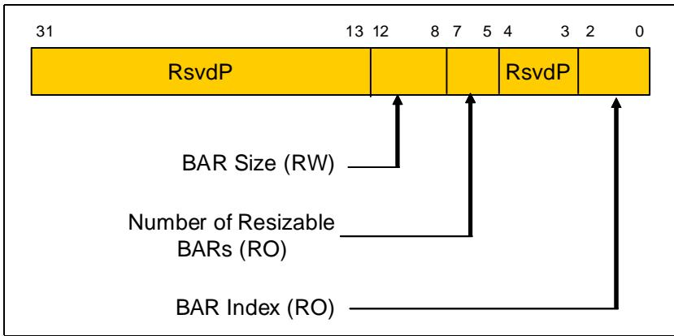

Once the Resizable values have been programmed, then enumeration software will be able to work as it normally does: writing all F’s to each BAR and reading it back will report the size that was selected. Note that if the size value is changed, the contents of the BAR will be lost and will need to reprogrammed if it was previously set up. Figure 20‐23 on page 914 highlights the BAR registers in the configuration header space for a Type 0 header.

Figure 20‐23: BARs in a Type0 Configuration Header  
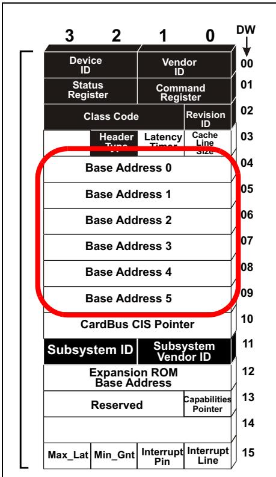

## Simplified Ordering Table

This change simplifies the Transaction Ordering Table by reducing the number of entries in the table. Essentially, it no longer distinguishes between completions for reads or completions for non‐posted writes. The motivation for this was to reduce the number of cases that needed to be tested. For more on this, see the section called “The Simplified Ordering Rules Table” on page 288.

Appendices

# Appendix A:

# Debugging PCIe Traffic with LeCroy Tools

Christoper Webb, LeCroy Corporation

## Overview

The transition of IO bus architecture from PCI to PCI Express had a large impact on developers with respect to types of tools required for validation and debug.

With parallel buses such as PCI, a waveform view of the signals shows enough information for the developer to interpret the state of the bus. A user could visually examine a waveform and mentally decode the type of transactions, how much data is transferred, and even the content of that transfer.

Since PCI Express packet traffic is both encoded and scrambled, examining a waveform view of the traffic provides very little information about the state of the link. The speed of the link can be inferred from the width of the bit times, and the width of the link can be inferred by the number of active lanes. However, the user cannot visually interpret the symbol alignment, let alone the packets themselves.

A new class of tools evolved to help developers visualize the state of their now serial links. These tools perform the de‐serialization, decoding, and de‐scrambling for the users. At first glance this would seem to be enough for the developer. But for PCI Express specifically, other complications such as flow control credits, lane‐to‐lane skew, polarity inversion, and lane reversal must also be comprehended by these tools as part of understanding PCIe protocol.

Both pre‐ and post‐silicon debug share a common need for tools. In this appen dix chapter, we describe some of the product offerings available for debugging PCI Express interconnects, both from a pre and post silicon perspective.

## Pre-silicon Debugging

## RTL Simulation Perspective

In RTL simulation, looking at a waveform view of an FPGA or an ASIC signal is the most common way to debug. By showing internal state machine states, monitoring IO as it moves through the device, or seeing the state of control signals; a waveform view is quite powerful. But, as we discussed above, a PCI express link is not understandable when shown as a waveform. Additional processing or decoding must be done to make sense of this new link. To augment the simulation tools, a PCI Express Bus Monitor is typically added to address this need.

## PCI Express RTL Bus Monitor

A PCI Express Bus monitor is a piece of code which users insert in their RTL simulation to help monitor the state of their PCIe link. At minimum, this monitor will output text based log files with information about link state changes and types of packet activity. More complex monitors will perform real time compliance checking. A number of vendors provide purchasable IP which perform this exact function. The emphasis however is typically on compliance. Less functionality is provided with respect to visualization of things such as flow control credits, link utilization, or link training debug.

## RTL vector export to PETracer Application

LeCroy has partnered with a number of the leading PCIe verification IP vendors to create tools to further enhance the visualization and analysis of pre‐silicon PCIe traffic. This involves using the vendors Bus Monitor to export raw symbol traffic into the same PETracer application used by the dedicated PCIe Analyzer hardware. SimPASS PE is LeCroy’s solution to supporting this export.

More information about LeCroy’s PETracer application and its features are described in the section “As a last resort, a flying lead probe shown in Figure 5 on page 924 may be used to attach the protocol analyzer to the system under test. This involves soldering a resistive tap circuit and connector pins to the PCIe traces. This circuitry is typically soldered to the AC coupling caps of the PCIe link as they are often the only place to access the traces. Once the probe circuitry is soldered to the PCB, the analyzer probe can be connected and removed as needed. This approach can be used on virtually any PCIe link, however the robustness of the connection is limited by the skill of the technician adding the probe.” on page 924.

## Post-Silicon Debug

## Oscilloscope

Use of an oscilloscope for debugging a PCIe link is typically focused on the electrical validation of the link. The most common usage is examining an eye pattern with a mask overlay for determining electrical compliance. A lesser known compliance check is to examine the entry and exit of electrical idle state to see if the link goes to the common mode voltage within the required time periods after an electrical idle ordered set is transmitted. These are 2 examples of PCIe compliance checking which are best performed using an oscilloscope such as shown in Figure 1 on page 920.

With the addition of dynamic link training for 8.0 GT/s operation, devices must now train the transmitter emphasis during the Recovery.EQ LTSSM sub‐state. The goal is to set the transmitter EQ to provide the best signal eye to the receiver. Monitoring this dynamic equalization process is another example where the use of an oscilloscope is quite powerful. With a real time oscilloscope, the user can capture this process and see the impact on the waveform as transmitter settings are changed. This allows the user to verify that the transmitter is indeed acting on the coefficient change requests, but it also allows the user to determine if the receiver has properly chosen the correct setting.

For logical debug of the link, the oscilloscope is most useful when the link is x1 or x2 as you are limited by the number channels the scope can acquire. The first method of examining PCIe traffic is a waveform view. As with the RTL waveform viewer, there is little to understand about the state of the link without SW help to perform 8b/10b decoding and de‐scrambling. Fortunately, more advanced oscilloscopes have SW packages that perform these duties. For this to work properly, the scope must have deep capture buffers and must see the SKIP ordered sets so that they can decipher the byte alignment and synchronize the de‐scrambler LFSR.

The LeCroy Oscilloscope can overlay PCIe symbols right onto the waveform for enhanced visibility of the traffic. An additional text based listing of the packet symbols can be displayed on the screen as an additional method of examining the waveform.

LeCroy recently announced a SW package called ProtoSync for their oscilloscope line which allows the user to export the captured waveform into the PETracer application. This is the same SW package that the protocol analyzer uses which includes a wide range of post processing capabilities described below. The PETracer software can run independently on the scope hardware, often on a second monitor. This allows time correlated comparison of the physical layer data presented by the scope waveform alongside the logic layer presentation of data presented by the PETracer software.

Capture of the 8.0 GT/s dynamic link equalization on the oscilloscope and exporting this traffic to the PETracer application is a prime example where this solution is most powerful. The user can navigate PETracer to the link training packet where the TX coefficient change request has been sent, then identify where this coefficient change was applied in the scope SW. The user can then measure the time it takes for the coefficient change to be applied and compare this to the timing required in the PCIe spec.

Figure A‐1: LeCroy Oscilloscope with ProtoSync Software Option  

## Protocol Analyzer

A growing trend in debugging PCIe links is to use a dedicated protocol analysis tool. What separates a protocol analyzer from a logic analyzer is that it is built to support a specific protocol such as PCIe. From a hardware perspective, a PCIe protocol analyzer is optimized for acquiring and storing PCIe traffic. This starts from the dedicated PCIe interposer probes, continues to the cabling choice, and caries through into the internal hardware components. For recovering PCIe traffic, specialized clock and data recovery circuits are used which can handle the electrical idle transitions, spread spectrum modulation, as well as handle the run lengths found in 128b/130b encoding. Sophisticated equalization circuits are used to recover the signal eye prior to deserialization. Without comprehending the complexities of PCIe recovery, the Analyzer hardware would not be optimized for recovering complex traffic such as speed switching, dynamic link widths, and low power states such as L0s.

In addition to choosing appropriate hardware components for recovering PCIe traffic, a protocol analyzer includes logic circuitry which is PCIe specific. This logic must infer the state of the PCIe link and follow it during various LTSSM state changes. Once the link state is being properly followed, dedicated packet inspection circuits perform data matching against incoming packets to look for events programmed by the user. These matchers are used for filtering of traffic as well as performing the trigger functionality needed for stopping the traffic capture. A mixture of these traffic filters as well as deep trace buffers (often 4GB to 8GB in size) allow the user to capture significantly longer traffic scenarios than would be possible without a protocol analyzer.

Finally, the most important piece of a protocol analyzer is the software GUI. By optimizing the traffic views, post processing reports, and hardware controls with a dedicated PCI Express software tool; a very comprehensive set of PCI express specific analysis can be performed.

## Logic Analyzer

Some logic analyzers offer PCIe specific software packages. This software will read the PCI express capture from the logic analyzer hardware and perform some amount of post processing of this data. This analysis includes the basics such as decoding, de‐scrambling, and decoding of the traffic. These SW tools do not perform many of the rich post processing features offered by dedicated protocol analyzer software, however.

## Using a Protocol Analyzer Probing Option

To record your PCIe traffic you must first find the best method for probing it. PCIe started as an add‐in card form factor for desktop PC’s and servers, but has since proliferated into a dizzying array of standard and non‐standard form factors. For the standard form factors, the best probe option is a dedicated interposer.

An Interposer is a dedicated piece of hardware which includes probe circuitry required for passing a copy of the PCIe traffic to the Analyzer hardware for capture and analysis. These interposers are designed specifically for the mechanical and electrical environments for which they are placed. The most common interposer is a “Slot Interposer” such as shown in Figure 2 on page 922. This interposer is used for probing standard CEM compliant PCIe add‐in cards.

Care should be taken when selecting an interposer as the probe circuitry varies by vendor and by requirements imposed by the max PCIe link speed. For example, a Gen3 slot interposer should contain probe circuitry which allows the dynamic link training process to pass properly through the probe. The LeCroy Gen3 slot interposer uses linear circuits to maintain the shape of the waveform as it passes through the probe. This allows pre‐emphasis of the transmitter to be dynamically changed during link training while allowing the receiver to quantify the impact of a new setting (either positive or negative impact).

Figure A‐2: LeCroy PCI Express Slot Interposer x16  
  
LeCroy also offers a family of other dedicated interposers for form factors such as ExpressCard, XMC, Mini Card, Express Module, AMC, etc. Some of these interposers are shown in Figure 3 on page 923. For a complete list of these interposers please refer to the LeCroy website: www.lecroy.com as this list is constantly growing.

Figure A‐3: LeCroy XMC, AMC, and Mini Card Interposers  
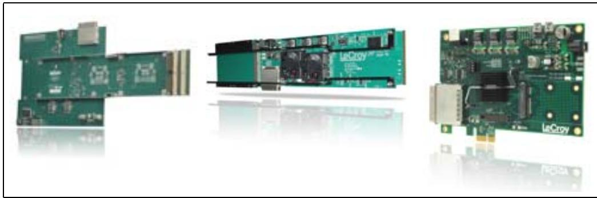  
For debugging PCIe links which cannot benefit from a dedicated interposer, a mid‐bus probe shown in Figure 4 on page 923 is the next best option. A mid‐bus probe involves placement of an industry standard probe geometry on the PCB. Each PCIe lane is routed to a pair of pads on the footprint which can be probed using a mid‐bus probe head. These probes use spring pins or C clips for providing solder free mechanical attachment between the system under test and the protocol analyzer.

Figure A‐4: LeCroy PCI Express Gen3 Mid‐Bus Probe  
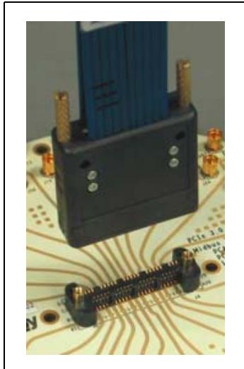

As a last resort, a flying lead probe shown in Figure 5 on page 924 may be used to attach the protocol analyzer to the system under test. This involves soldering a resistive tap circuit and connector pins to the PCIe traces. This circuitry is typically soldered to the AC coupling caps of the PCIe link as they are often the only place to access the traces. Once the probe circuitry is soldered to the PCB, the analyzer probe can be connected and removed as needed. This approach can be used on virtually any PCIe link, however the robustness of the connection is limited by the skill of the technician adding the probe.

Figure A‐5: LeCroy PCI Express Gen2 Flying Lead Probe  
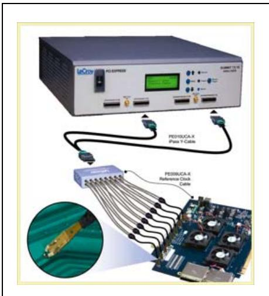

## Viewing Traffic Using the PETracer Application

## CATC Trace Viewer

The primary way to view PCI Express traffic with the LeCroy PETracer application is the CATC Trace view. This view takes each recorded packet and breaks it down into different packet fields to highlight the important values contained in this packet. A mixture of colors and text are used to visually categorize and explain the purpose of each packet. Errors are highlighted in red such as shown in Figure 6 on page 925. Warnings are highlighted in yellow making it easy to identify areas of traffic or fields in a packet which are non‐compliant.

Figure A‐6: TLP Packet with ECRC Error  

In addition to decoding and visually breaking down each packet, a hierarchical display allows logical grouping of related packets. For example, in “Link Level” mode, TLP packets are grouped with their respective ACK packet. Each TLP is identified as either implicitly or explicitly ACK’d or NAK’d. An example of a ACK DLLP is shown in Figure 7 on page 925 along with the ACK’d TLP.

Figure A‐7: “Link Level” Groups TLP Packets with their Link Layer Response  

In “Split‐Level” mode shown in Figure 8 on page 926, the CATC Trace view combines split transactions. For example, a single TLP read can be grouped with 1 or more completion TLPs to logically show large data transfers as a single line in the trace. The amount of data, starting address, as well as performance metrics are provided for each split level transaction. This allows the user to bypass the details of how large memory transactions are broken into multiple TLP packets and rather focus on the contents of the data. If the user wishes to see the details of the split transaction, the hierarchical display can show the link level and/or packet level breakdown of all the packets which make up this split transaction. This “drill‐down” approach to traffic analysis allows the user to start from a high level view of what’s happening on the bus and drill down only in the areas of traffic which are interesting to the user.

Figure A‐8: “Split Level” Groups Completions with Associated Non‐Posted Request  
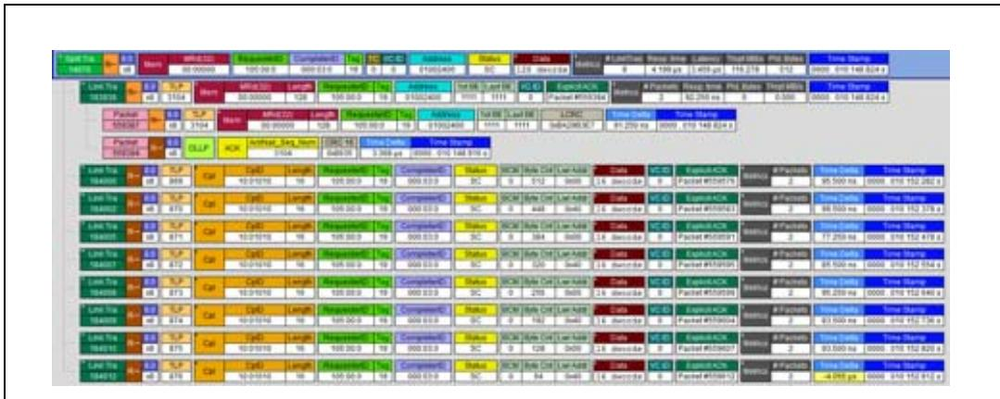  
The CATC trace view also supports “Compact‐View” shown in Figure 9 on page 927. In this view, packets which are sent repeatedly are collapsed into a single cell. This is very useful for collapsing Training Sequences or Flow Control Initialization packets. The software algorithms which perform this collapse are smart enough to collapse any SKIP ordered sets as well. This creates a very compact view of the link training process allowing the user to examine changes in the link training packets without scrolling through hundreds of packets.

Figure A‐9: “Compact View” Collapses Related Packets for Easy Viewing of Link Training  
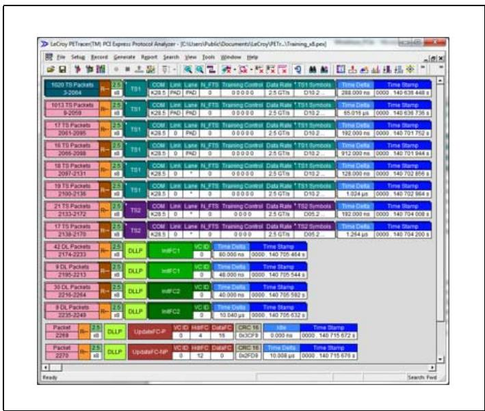

## LTSSM Graphs

To further enhance the “drill‐down” traffic viewing approach, the PETracer application includes an LTSSM graph view as shown in Figure 10 on page 928. When this graph is invoked, the SW parses through the trace to find the link training sections and infers the state of the Link Training and Status State Machine (LTSSM). The result is a graph which breaks down the LTSSM state transitions in a very high level view. This graph allows the user to immediately see if the link went into a recovery state. If so, the user can easily identify which side of the link initiated the recovery, how many times it entered recovery, and even if the link speed or link width decreased because of the recovery.

The LTSSM graph is also an active link back into the trace file. For example, if the user clicks on the entry to recovery, the trace file will be navigated to that location in the trace file. This would allow the user to perhaps see if the recovery was caused by repeated NAKs or for some other reason such as loss of block alignment.

In short, when users are debugging issues related to link training, speed change, or low power state transitions, the LTSSM is affected. By examining the LTSSM graph, the user can easily identify whether these link state changes occurred, where they occurred, and navigate directly to them for faster analysis.

Figure A‐10: LTSSM Graph Shows Link State Transitions Across the Trace  
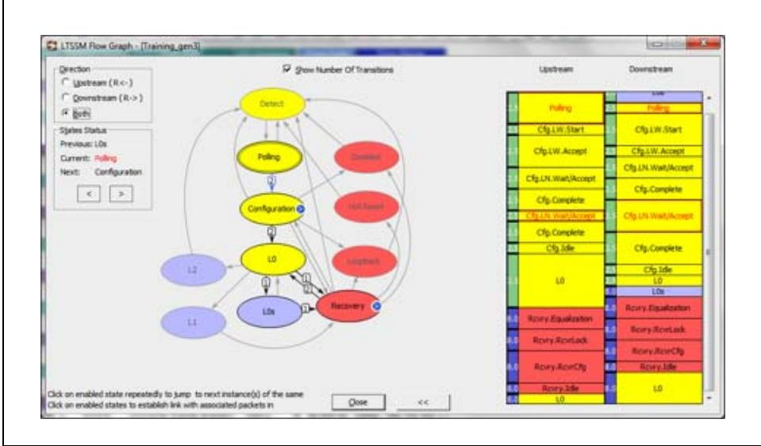

## Flow Control Credit Tracking

Flow control credit tracking is particularly problematic in PCI express. The flow control update packets do not show the number of credits each endpoint has, rather it shows how many credits in total have been used. This means that each endpoint must keep a running counter of credits for each type. There are a number of scenarios where credits can be lost, and if this occurs, the link will eventually be unable to transmit data due to lack of credits. Such problems are very difficult to identify and debug.

The LeCroy PETracer application has a credit tracking SW tool shown in Figure 11 on page 929 to aid in this debug. If the trace contains FC‐Init packets, it will walk through the trace and show the amount of remaining credits per virtual channel buffer type after each TLP and FC‐Update.

FC‐Init packets are sent once after link training. Because of this, the PETracer application has the ability for the user to set initial credit values at some point in the trace and the SW will calculate the relative credit values for the remaining packets. Even if the initial credit values are set improperly by the user, having the ability to see the relative credits is often enough to catch a flow control issue.

Figure A‐11: Flow Control Credit Tracking  
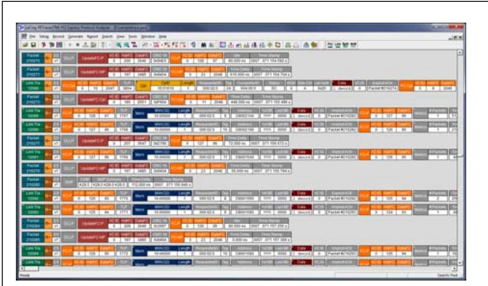

## Bit Tracer

Some debug situations are not solved by a drill down approach to examining the traffic. For example if the link settings are incorrect, the recording is often unreadable. What if a device is not properly scrambling the traffic, or the 10 bit symbols are sent in reverse order? For this scenario, a tool which focuses on analysis between the waveform view of the scope and the CATC Trace view is needed. This is where the BitTracer view shown in Figure 12 on page 930 is most powerful.

The BitTracer view allows the user to see raw traffic exactly as it was seen on the link. The software allows the user to see the traffic as 10 bit symbols, scrambled bytes, or unscrambled bytes. Invalid symbols and incorrect running disparity are highlighted in red.

To further determine what may be wrong with the traffic, the BitTracer tool adds a powerful list of post processing features which can modify the traffic. For example, post capture; the user can invert the polarity of a given lane. Once applied, the user can see if the 10 bit symbols are now represented properly in the trace. If this cleans up the trace, it’s an indication that the recording settings for the Analyzer hardware need to be changed.

Figure A‐12: BitTracer View of Gen2 Traffic  
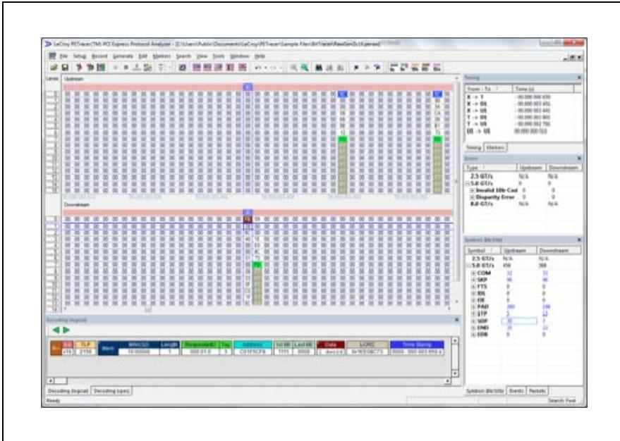

In addition, the lane ordering can be modified. This is useful for determining if lane reversal is causing a bad capture. If the traffic has excessive lane to lane skew, the BitTracer software allows the user to re‐align the traffic. For Gen3 traffic, this skew can be applied 1 bit at a time. This essentially allows the user to fix the 130 bit block alignment post capture.

After applying changes to the data, all or just a portion of the data can be exported into the standard CATC Trace view for higher level analysis. This workflow is very powerful for debugging low level issues during early bringup. Let’s say for example, the user’s device trains the link properly, and then suddenly applies polarity inversion to 1 lane. This is a clear violation of the spec and will cause the link to retrain. If this traffic is captured with the BitTracer tool, the user could easily identify this as the problem. Additionally, the portion of the traffic before and after the inversion could be exported into separate trace files and examined in the CATC Trace view.

## Analysis overview

As you can see, different traffic views can be beneficial for debugging certain failure conditions. LeCroy supports import of PCIe traffic from many sources into its highly sophisticated PEtracer software. Whether the source is RTL simulation, an oscilloscope capture, or a dedicated protocol analyzer capture, PETracer has a rich set of traffic views and reports which allow the user to best understand the health and state of their PCIe link.

## Traffic generation

## Pre-Silicon

For stimulating a PCI Express endpoint in simulation, dedicated verification IP can be purchased from a number of vendors. This IP will test for basic functionality as well as perform a number of PCIe compliance checks. It is certainly in the interest of the ASIC developer to find and fix these issues before tapeout, and this is where the value of these tools comes from. If the PCIe design is implemented in an FPGA where mask costs are not an issue, it may be more cost effective to perform these compliance checks in hardware with a dedicated traffic generation tool such as the LeCroy PETrainer or LeCroy PTC card.

## Post-Silicon

## Exerciser Card

To thoroughly test the PCIe compliance and overall robustness of a PCIe design post‐silicon, a dedicated Exerciser card such as the LeCroy PETrainer shown in Figure 13 on page 932 is used. This card allows the user to generate a wide range of compliant and non‐compliant traffic. For example, if you place your PCIe card in a standard motherboard, you may be limited in the size of the TLP packets it will see. A dedicated Exerciser card can generate TLP packets across the entire legal range of packet sizes.

Secondly, if you would like to test that a card issues a NAK in response to a TLP with a bad LCRC, it would not possible with the card connected to compliant devices. They do not transmit bad packets. An Exerciser card can create a TLP with a bad LCRC, improper header values, or end the TLP with an EDB symbol.

If you would like to test that your card properly replay’s a packet when it receives a NAK, this can be done with an Exerciser. Perhaps you would like to issue 4 NAKs in a row to a certain TLP so that link recovery is initiated. This behavior is all quite easy to program into the exerciser card.

The number of test cases and failure scenarios is limited only by the number of scripts you write. Once written, these scripts can be re‐used for testing new versions of your design. The Analyzer SW can record these sessions and use scripting to determine if the response was correct. A number of LeCroy customers have created large libraries of regression tests using these tools.

Figure A‐13: LeCroy Gen3 PETrainer Exerciser Card  
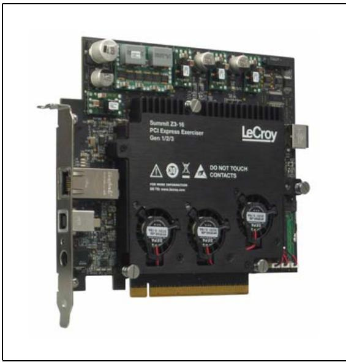

## PTC card

The PCI SIG has published a specific list of compliance tests which all “Compliant” devices must pass. The LeCroy Protocol Test Card (PTC) is the hardware used to perform these tests at the PCI SIG Compliance workshops. Users can purchase a PTC card from LeCroy shown in Figure 14 on page 933 to pre‐test their devices to ensure they will pass PCI SIG compliance testing.

The LeCroy PTC is used to test root complex or endpoint devices at x1 link widths. Link speeds can be either Gen1 or Gen2.

Figure A‐14: LeCroy Gen2 Protocol Test Card (PTC)  

## Conclusion

Today, the PCIe developer has access to a wide range of tools to help debug their PCIe design. Thanks to the wide adoption of the PCIe standard, many of these tools are designed specifically for PCIe debug and include features which address the challenges many PCIe devices face.

For more information about the LeCroy PCIe tool offerings, please visit the LeCroy website www.lecroy.com

# Appendix B: Markets & Applications for PCI Express

Akber Kazmi (Senior Director Marketing, PLX Technology, Inc.)

## Introduction

Since its definition in the early 1990s, PCI has emerged as the most successful interconnect technology ever used in computers. Originally intended for personal computer systems, the PCI architecture has expanded into virtually every computing platform category, including servers, storage, communications, and a wide range of embedded control applications. Most important, each advancement in PCI bus speed and width provided backward compatibility.

As successful as the PCI architecture was, there was a limit to what could be accomplished with a multi‐drop, parallel, shared‐bus interconnect technology. A number of issues  ‐‐ clock skew, high pin count, trace routing restrictions in printed circuit boards (PCB), bandwidth and latency requirements, physical scalability, and the need to support Quality of Service (QoS) within a system for a wide variety of applications ‐‐ lead to the definition of the PCI Expressª (PCIe) architecture.

PCIe was the natural successor to PCI, and was developed to provide the advantages of a state‐of‐the‐art, high‐speed serial interconnect technology with a packet‐based layered architecture, but maintain backward‐compatibility with the large PCI software infrastructure. The key goal was to provide an opti mized, universal interconnect solution for a wide variety of future platforms, including desktop, server, workstation, storage, communications, and embedded systems.

After its introduction in 2001, PCIe has gone through three generations of enhancements. In the first generation (Gen1), signaling rate was set at 2.5 GT/s and later enhanced to 5 GT/s (Gen2) and eventually 8 GT/s (Gen3). The PCIe specification allows combining of 2, 4, 8, 12, 16 or 32 lanes into a single port. However, products available today do not support 12‐ and 32‐lane‐wide ports. It is important to note that all PCIe Gen2 and Gen3 devices are required to be backward‐compatible in speed with that of the previous generation.

The industry has launched and has fully embraced PCIe Gen3 products, while at the same time the PCI Special Interest Group (PCI‐SIG) is analyzing signaling rate (speed) for Gen4. The goal for PCIe Gen4 is to double the speed of Gen3, to 16 GT/s.

PCIe switches are available in an array of sizes, ranging from 3 to 96 lanes, and 3 to 24 ports where each port could be one, two, four, eight or 16 lanes wide. A Gen3 single lane would provide 1GB/s of bandwidth, while a 16‐lane port offers 16GB bandwidth in each direction. Additionally, PCIe switch vendors, such as PLX Technology, have added features and enhancement to their products that are not part of PCIe specifications but enable them to differentiate their products and add value for the system designers. These features deliver ease of use, higher performance, fail‐over, error detection, error isolation, and field‐upgradability.

On‐chip features include non‐transparent (NT) bridging, peer‐to‐peer communication, Hot‐Plug, direct memory access (DMA), and error checking/recovery. Additionally debug features such as packet generation, receiver‐eye measurement, traffic monitoring, and error injection in live traffic offer significant value to the designers, enabling early system bring‐up. Many of these features can also be used for run‐time performance improvements and monitoring.

Features included in next generation of PCIe switches are:

NT bridging: Allows two hosts/CPUs to be connected to the same PCIe switch while electrically and logically isolated. The NT bridging functions is broadly used in systems requiring isolation of two active CPUs or two CPUs where one is active and other is passive. The NT functionality allows the exchange of heartbeat between the two host CPUs to enable fail‐over if one of them fails.

## Chapter : Appendix B: Markets & Applications for PCI

DMA: An on‐chip DMA controller in a PCIe switch offers significant value to the designers as it enables them to spare CPU cycles to move data between peers and the CPU to/from I/Os. The CPU’s reduced effort in moving data boosts overall performance of the system as the spared CPU cycles can be used to run applications rather than managing data I/O.

Error Isolation: Users can program triggers for certain error events and response by the switch. The response of switch can also be programmed to ignore, trigger a host interrupt, bring the port with errors down, or bring the entire switch down.

Packet Generation: Generally, it is difficult to generate traffic that saturates a PCIe port without the use of expensive packet generator equipment. PCIe switches now have the ability to saturate any PCIe port with desired traffic, such as transaction layer packets, to check the performance and robustness of the system.

## PCI Express IO Virtualization Solutions

The PCIe technology was initially defined as a single‐host interconnect technology but in last few years new standards have been developed that make PCIe suitable for multi‐host systems as a switch fabric technology for data centers and enterprise IT applications. The presence of native PCIe interfaces (ports) on x86 CPUs and servers platforms has enabled designers to use PCIe as backplane and fabric technology for small to mid‐size server clusters.

In 2007, the PCI‐SIG released the Single‐Root I/O Virtualization (SR‐IOV) specification that enables sharing of a single physical resource such as a network interface card or host bus adapter in a PCIe system among multiple virtual machines running on one host. This is the simplest approach to sharing resources or I/O devices among different applications or virtual machines.

The PCI‐SIG followed by completing, in 2008, work on its Multi‐Root I/O Virtualization (MR‐IOV) specification that extends the use of PCIe technology from a single‐root domain to a multi‐root domain. The MR‐IOV specification enables the use of a single I/O device by multiple hosts and multiple system images simultaneously, as illustrated in Figure 0‐1 on page 938. This illustration shows a multi‐host environment where MR‐IOV capable NIC and HBA are shared across multiple servers or virtual machines via an MR‐IOV switch.

Figure 0‐1:  MR‐IOV Switch Usage  

In order to implement MR‐IOV specifications, three components of the system need to be developed – MR‐IOV PCIe switches, endpoints, and management software. All three of these components must be available simultaneously and work seamlessly. Unfortunately, four years after the specification was developed, there is not a single silicon vendor that has MR‐IOV capable PCIe switch or end‐points. PCIe switch vendors are offering solutions that provide capabilities defined for MR‐IOV through vendor‐defined features and utilizing available SR‐IOV end‐points.

## Multi-Root (MR) PCIe Switch Solution

PCIe switch vendors have created switches that offer implementation of multihost function through non‐transparent bridging and multi‐root (MR) capabilities. These MR switches allow multiple hosts to be connected to a single switching device, which can be portioned under user control in such a way that each host will be connected to a desired set of downstream ports of the switch.

In the MR switches, one of the hosts acts as the master and assigns I/Os to other host ports. Each host operates independently of other hosts and controls downstream devices in its domain. Figure 0‐2 on page 939 illustrates the internal architecture of an MR switch, in which particular sets of downstream ports are associated to particular host ports under management control.

Figure 0‐2:  MR‐IOV Switch Internal Architecture  
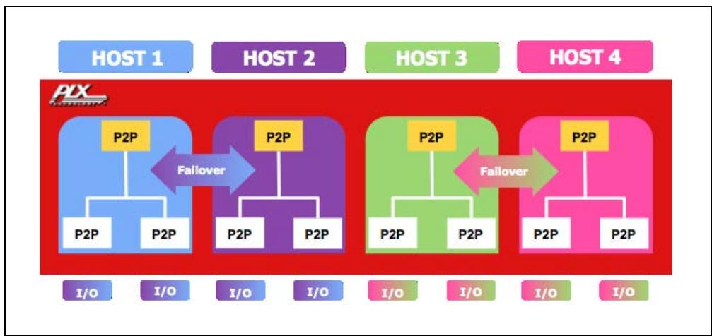

## PCIe Beyond Chip-to-Chip Interconnect

In early stages of PCIe deployments the technology was used as a chip‐to‐chip interconnect but now broad availability of PCIe interfaces on CPUs, chipsets and IOs and broad adoption of these components is pushing it beyond traditional applications. In a new generation of applications, PCIe is used in system backplanes, switch fabrics, cabling systems, storage/IO expansion, IO virtualization, high‐performance computing (HPC), and server clusters. Figure 0‐3 on page 940 illustrates use of PCIe in a data center for high performance compute application where servers in a rack are clustered through a top‐of‐rack (TOR) PCIe switch fabric box. The TOR PCIe switch can be connected to the network through Ethernet and to local storage and compute resources through PCIe links.

PCIe connections out‐side the box depend on PCIe copper or optical cables that the leader in the industry are introducing at lower cost. The PCIe TOR fabric is suitable for server/compute clustering and may replace InfiniBand as the ecosystem for PCIe as fabric grows.

Figure 0‐3:  PCIe in a Data Center for HPC Applications  

## SSD/Storage IO Expansion Boxes

Recently, the industry has converged towards PCIe as the unified interconnect technology for enterprise storage and solid state drive (SSD) applications. The NVM HCI, an industry consortium, has released a specification called NVM Express (NVMe) that uses PCIe to provide the bandwidth needed for SSD applications. Additionally, a T10 committee has embarked on defining SCSI over PCIe (SOP) protocol to take advantage of PCIe technology capabilities for high‐performance storage applications. Furthermore, the SATA consortium recently announced that it would use PCIe as the interconnect for its next‐generation SATA specification called SATA Express (SATAe).

## PCIe in SSD Modules for Servers

Traditionally, enterprise SSD modules have shipped with SAS, SATA and Fibre Channel interfaces but due to the above‐mentioned developments, a large majority of SSD controller, module and system suppliers have introduced prod ucts with PCIe interfaces. Most SSD controllers peak their performance and capacity due to a heavy load of managing flash. In high‐performance applications, multiple SSD controllers (or ASICs) are used and aggregated through a PCIe switch. Figure 0‐4 on page 941 shows a basic usage of a PCIe switch in an SSD add‐in card that applies to any card or module form factor.

Figure 0‐4:  PCIe Switch Application in an SSD Add‐In Card  
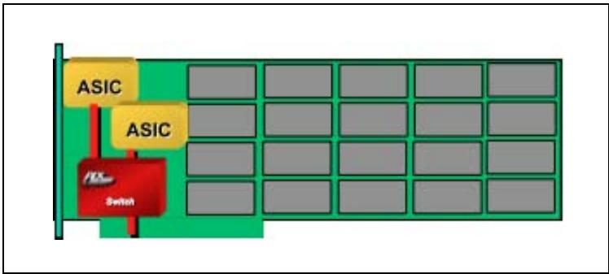  
For large data center applications, the SSD add‐in cards are installed in server motherboards as shown in Figure 0‐5 on page 941 and IO expansion boxes (Figure 6) aggregated through PCIe switches. In server motherboard designs, PCIe switches are utilized to create more ports/slots that accommodate additional SSD modules to support the application’s needs.

Figure 0‐5:  Server Motherboard Use PCIe Switches  
  
In addition to providing connectivity, PCIe switches can be used for providing redundancy and failover through NT bridging and MR functionality. The MR switches support 1+N failover capability, in which one server/host communicates with N number of servers to check the heartbeat and initiate a failover if one of them fails. One of the servers illustrated in Figure 0‐6 on page 942 can be used as backup for the others in 1+N failover scheme.

Figure 0‐6:  Server Failover in 1 + N Failover Scheme  

## Conclusion

PCIe interconnect technology has become a serious contender for many highend applications beyond chip–to‐chip interconnect and is expected to be utilized in external I/O sharing, server clustering, I/O expansion and TOR switching. The current 8 GT/s and next‐generation (Gen4) 16 GT/s line rates, the ability to aggregate multiple lanes in single high‐bandwidth ports, fail‐over capabilities, embedded DMA for data transfers, and IO sharing/virtualization provide capabilities that are at least equal to, if not superior to, interfaces such as Infini Band and Ethernet.

# Implementing Intelligent Adapters and Multi‐Host Systems With PCI Express Technology

Jack Regula, Danny Chi, Tim Canepa (PLX Technology, Inc. )

## Introduction

Intelligent adapters, host failover mechanisms and multiprocessor systems are three usage models that are common today, and expected to become more prevalent as market requirements for next generation systems. Despite the fact that each of these was developed in response to completely different market demands, all share the common requirement that systems that utilize them require multiple processors to co‐exist within the system. This appendix outlines how PCI Express can address these needs through non‐transparent bridging.

Because of the widespread popularity of systems using intelligent adapters, host failover and multihost technologies, PCI Express silicon vendors must provide a means to support them. This is actually a relatively low risk endeavor; given that PCI Express is software compatible with PCI, and PCI systems have long implemented distributed processing. The most obvious approach, and the one that PLX espouses, is to emulate the most popular implementation used in the PCI space for PCI Express. This strategy allows system designers to use not only a familiar implementation but one that is a proven methodology, and one that can provide significant software reuse as they migrate from PCI to PCI Express.This paper outlines how multiprocessor PCI Express systems will be implemented using industry standard practices established in the PCI paradigm. We first, however, will define the different usage models, and review the successful efforts in the PCI community to develop mechanisms to accommodate these requirements. Finally, we will cover how PCI Express systems will utilize non‐transparent bridging to provide the functionality needed for these types of systems.

## Usage Models

## Intelligent Adapters

Intelligent adapters are typically peripheral devices that use a local processor to offload tasks from the host. Examples of intelligent adapters include RAID controllers, modem cards, and content processing blades that perform tasks such as security and flow processing. Generally, these tasks are either computationally onerous or require significant I/O bandwidth if performed by the host. By adding a local processor to the endpoint, system designers can enjoy significant incremental performance. In the RAID market, a significant number of products utilize local intelligence for their I/O processing.

Another example of intelligent adapters is an ecommerce blade. Because general purpose host processors are not optimized for the exponential mathematics necessary for SSL, utilizing a host processor to perform an SSL handshake typically reduces system performance by over 90%. Furthermore, one of the requirements for the SSL handshake operation is a true random number generator. Many general purpose processors do not have this feature, so it is actually difficult to perform SSL handshakes without dedicated hardware. Similar examples abound throughout the intelligent adapter marketplace; in fact, this usage model is so prevalent that for many applications it has become the de facto standard implementation.

## Host Failover

Host failover capabilities are designed into systems that require high availability. High availability has become an increasingly important requirement, especially in storage and communication platforms. The only practical way to ensure that the overall system remains operational is to provide redundancy for

## Chapter : Appendix C: Implementing Intelligent Adapt-

all components. Host failover systems typically include a host based system attached to several endpoints. In addition, a backup host is attached to the system and is configured to monitor the system status. When the primary host fails, the backup host processor must not only recognize the failure, but then take steps to assume primary control, remove the failed host to prevent additional disruptions, reconstitute the system state, and continue the operation of the system without losing any data.

## Multiprocessor Systems

Multiprocessor systems provide greater processing bandwidth by allowing multiple computational engines to simultaneously work on sections of a complex problem. Unlike systems utilizing host failover, where the backup processor is essentially idle, multiprocessor systems utilize all the engines to boost computational throughput. This enables a system to reach performance levels not possible by using only a single host processor. Multiprocessor systems typically consist of two or more complete sub‐systems that can pass data between themselves via a special interconnect. A good example of a multihost system is a blade server chassis. Each blade is a complete subsystem, often replete with its own CPU, Direct Attached Storage, and I/O.

## The History Multi-Processor Implementations Using PCI

To better understand the implementation proposed for PCI Express, one needs to first understand the PCI implementation.

PCI was originally defined in 1992 for personal computers. Because of the nature of PCs at that time, the protocol architects did not anticipate the need for multiprocessors. Therefore, they designed the system assuming that the host processor would enumerate the entire memory space. Obviously, if another processor is added, the system operation would fail as both processors would attempt to service the system requests.

1Several methodologies were subsequently invented to accommodate the requirement for multiprocessor capabilities using PCI. The most popular implementation, and the one discussed in this paper for PCI Express, is the use of non‐transparent bridging between the processing subsystems to isolate their memory spaces.1

Because the host does not know the system topology when it is first powered up or reset, it must perform discovery to learn what devices are present and then map them into the memory space. To support standard discovery and configuration software, the PCI specification defines a standard format for Control and Status Registers (CSRs) of compliant devices. The standard PCI‐to‐PCI bridge CSR header, called a Type 1 header, includes primary, secondary and subordinate bus number registers that, when written by the host, define the CSR addresses of devices on the other side of the bridge. Bridges that employ a Type 1 CSR header are called transparent bridges.

A Type 0 header is used for endpoints. A Type 0 CSR header includes base address registers (BARs) used to request memory or I/O apertures from the host. Both Type 1 and Type 0 headers include a class code register that indicates what kind of bridge or endpoint is represented, with further information available in a subclass field and in device ID and vendor ID registers. The CSR header format and addressing rules allow the processor to search all the branches of a PCI hierarchy, from the host bridge down to each of its leaves, reading the class code registers of each device it finds as it proceeds, and assigning bus numbers as appropriate as it discovers PCI‐to‐PCI bridges along the way. At the completion of discovery, the host knows which devices are present and the memory and I/O space each device requires to function. These concepts are illustrated in Figure C ‐ 0‐1.

Figure 0‐1: Enumeration Using Transparent Bridges  

## Implementing Multi-host/Intelligent Adapters in PCI Express Base Systems

Up to this point, our discussions have been limited to one processor with one memory space. As technology progressed, system designers began developing end points with their own native processors built in. The problem that this caused was that both the host processor and the intelligent adapter would, upon power up or reset, attempt to enumerate the entire system, causing system conflict and ultimately a non‐functional system.

To get around this, architects designed non‐transparent bridges. A non‐transparent PCI‐to‐PCI Bridge, or PCI Express‐to‐PCI Express Bridge, is a bridge that exposes a Type 0 CSR header on both sides and forwards transactions from one side to the other with address translation, through apertures created by the BARs of those CSR headers. Because it exposes a Type 0 CSR header, the bridge appears to be an endpoint to discovery and configuration software, eliminating potential discovery software conflicts. Each BAR on each side of the bridge creates a tunnel or window into the memory space on the other side of the bridge. To facilitate communication between the processing domains on each side, the non‐transparent bridge also typically includes doorbell registers to send interrupts from each side of the bridge to the other, and scratchpad registers accessible from both sides.

A non‐transparent bridge is functionally similar to a transparent bridge in that both provide a path between two independent PCI buses (or PCI Express links). The key difference is that when a non‐transparent bridge is used, devices on the downstream side of the bridge (relative to the system host) are not visible from the upstream side. This allows an intelligent controller on the downstream side to manage the devices in its local domain, while at the same time making them appear as a single device to the upstream controller. The path between the two buses allows the devices on the downstream side to transfer data directly to the upstream side of the bus without directly involving the intelligent controller in the data movement. Thus transactions are forwarded across the bus unfettered just as in a PCI‐to‐PCI Bridge, but the resources responsible are hidden from the host, which sees a single device.

Because we now have two memory spaces, the PCI Express system needs to translate addresses of transactions that cross from one memory space to the other. This is accomplished via Translation and Limit Registers associated with the BAR. See “Address Translation” on page 958 for a detailed description; Figure C‐0‐2 on page 949 provides a conceptual rendering of Direct Address Translation. Address translation can be done by Direct Address Translation (essentially replacement of the data under a mask), table lookup, or by adding an offset to an address. Figure C‐0‐3 on page 950 shows Table Lookup Translation used to create multiple windows spread across system memory space for packet originated in a local I/O processor’s domain, as well as Direct Address Translation used to create a single window in the opposite direction.

## Chapter : Appendix C: Implementing Intelligent Adapt-

Figure 0‐2: Direct Address Translation  

Figure 0‐3: Look Up Table Translation Creates Multiple Windows  
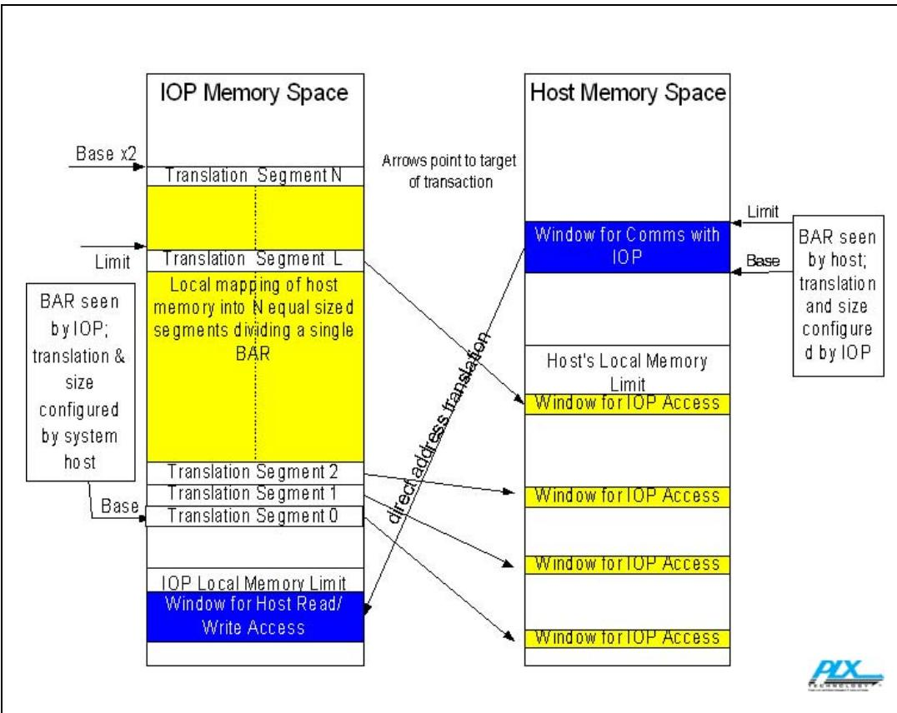

## Example: Implementing Intelligent Adapters in a PCI Express Base System

Intelligent adapters will be pervasive in PCI Express systems, and will likely be the most widely used example of systems with “multiple processors”.

Figure C‐0‐4 on page 951 illustrates how PCI Express systems will implement intelligent adapters. The system diagram consists of a system host, a root complex (the PCI Express version of a Northbridge), a three port switch, an example endpoint, and an intelligent add‐in card. Similar to the system architecture, the add‐in card contains a local host, a root complex, a three port switch, and an

## Chapter : Appendix C: Implementing Intelligent Adapt-

example endpoint. However we should note two significant differences: the intelligent add‐in card contains an EEPROM, and one port of the switch contains a back to back non‐transparent bridge.

Figure 0‐4: Intelligent Adapters in PCI and PCI Express Systems  
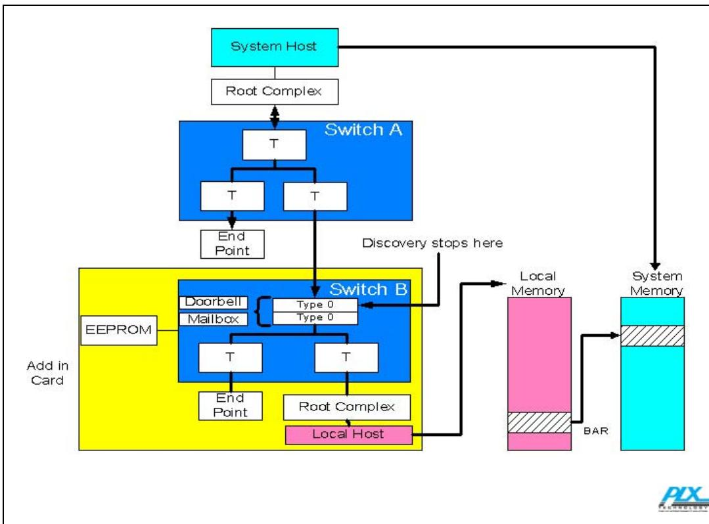  
Upon power up, the system host will begin enumerating to determine the topol ogy. It will pass through the Root Complex and enter the first switch (Switch A). Upon entering the topmost port, it will see a transparent bridge, so it will know to continue to enumerate. The host will then poll the leftmost port and, upon finding a Type 0 CSR header, will consider it an endpoint and explore no deeper along that branch of the PCI hierarchy. The host will then use the information in the endpoint’s CSR header to configure base and limit registers in bridges and BARs in endpoints to complete the memory map for this branch of the system.

The host will then explore the rightmost port of Switch A and read the CSR header registers associated with the top port of Switch B. Because this port is a non‐transparent bridge, the host finds a Type 0 CSR header. The host processor therefore believes that this is an endpoint and explores no deeper along that branch of the PCI hierarchy. The host reads the BARs of the top port of Switch B to determine the memory requirements for windows into the memory space on the other side of the bridge. The memory space requirements can be preloaded from an EEPROM into the BAR Setup Registers of Switch B’s non‐transparent port or can be configured by the processor that is local to Switch B prior to allowing the system host to complete discovery.

Similar to the host processor power up sequence, the local host will also begin enumerating its own system. Like the system host processor, it will allocate memory for end points and continue to enumerate when it encounters a transparent bridge. When the host reaches the topmost port of Switch B, it sees a non‐transparent bridge with a Type 0 CSR header. Accordingly, it reads the BARs of the CSR header to determine the memory aperture requirements, then terminates discovery along this branch of its PCI tree. Again, the memory aperture information can be supplied by an EEPROM, or by the system host.

Communication between the two processor domains is achieved via a mailbox system and doorbell interrupts. The doorbell facility allows each processor to send interrupts to the other. The mailbox facility is a set of dual ported registers that are both readable and writable by both processors. Shared memory mapped mechanisms via the BARs may also be used for inter‐processor communication.

## Example: Implementing Host Failover in a PCI Express System

Figure C‐0‐5 on page 953 illustrates how most PCI Express systems will implement host failover. The primary host processor in this illustration is on the left side of the diagram, with the backup host on the right side of the diagram. Like most systems with which we are familiar, the host processor connects to a root complex. In turn, the root complex routes its traffic to the switch. In this example, the switch has two ports to end points in addition to the upstream port for the primary host we have just described. Furthermore, this system also has another processor, which is connected to the switch via another root complex.

Figure 0‐5: Host Failover in PCI and PCI Express Systems  

The switch ports to both processors need to be configurable to behave either as a transparent bridge or a non‐transparent bridge. An EEPROM or strap pins on the switch can be used to initially bootstrap this configuration.

Under normal operation, upon power up, the primary host begins to enumerate the system. In our example, as the primary host processor begins its discovery protocol through the fabric, it discovers the two end points, and their memory requirements, by sizing their BARs. When it gets to the upper right port, it finds a Type 0 CSR header. This signifies to the primary host processor that it should not attempt discovery on the far side of the associated switch port. As in the previous example, the BARs associated with the non‐transparent switch port may have been configured by EEPROM load prior to discovery or might be configured by software running on the local processor.

Again, similar to the previous example, the backup processor powers up and begins to enumerate. In this example, the backup processor chipset consists of the root complex and the backup processor only. It discovers the non‐transparent switch port and terminates its discovery there. It is keyed by EEPROM loaded Device ID and Vendor ID registers to load an appropriate driver.

During the course of normal operation, the host processor performs all of its normal duties as it actively manages the system. In addition, it will send messages to the backup processor called heartbeat messages. Heartbeat messages are indications of the continued good health of the originating processor. A heartbeat message might be as simple as a doorbell interrupt assertion, but typically would include some data to reduce the possibility of a false positive. Checkpoint and journal messages are alternative approaches to providing the backup processor with a starting point, should it need to take over. In the journal methodology, the backup is provided with a list or journal of completed transactions (in the application specific sense, not in the sense of bus transactions). In the checkpoint methodology, the backup is periodically provided with a complete system state from which it can restart if necessary. The heartbeat’s job is to provide the means by which the backup processor verifies that the host processor is still operational. Typically this data provides the latest activities and the state of all the peripherals.

If the backup processor fails to receive timely heartbeat messages, it will begin assuming control. One of its first tasks is to demote the primary port to prevent the failed processor from interacting with the rest of the system. This is accomplished by reprogramming the CSRs of the switch using a memory mapped view of the switch’s CSRs provided via a BAR in the non‐transparent port. To take over, the backup processor reverses the transparent/non‐transparent modes at both its port and the primary processor’s port and takes down the link to the primary processor. After cleaning up any transactions left in the queues or left in an incomplete state as a result of the host failure, the backup processor reconfigures the system so that it can serve as the host. Finally, it uses the data in the checkpoint or journal messages to restart the system.

## Example: Implementing Dual Host in a PCI Express Base System

Figure C‐0‐6 on page 955 illustrates how PCI Express systems might implement a dual host system1. In this example, the leftmost blocks are a typically complete system, with the rightmost blocks being a separate subsystem. As previously discussed, connecting the leftmost and rightmost diagram is a set of nontransparent bridges.

Figure 0‐6: Dual Host in a PCI and PCI Express System  
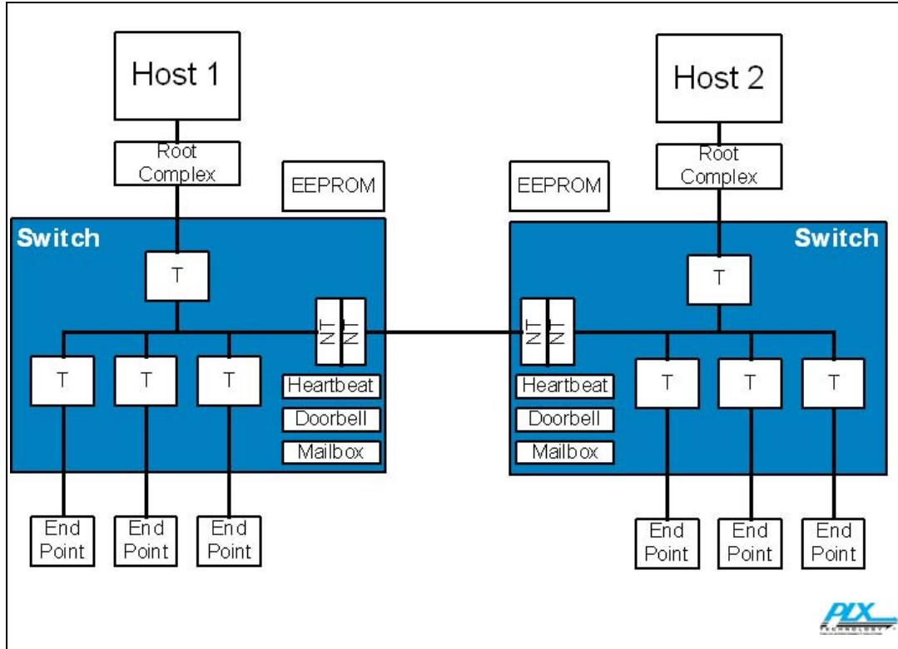  
Upon power up, both processors will begin enumerating. As before, the hosts will search out the endpoints by reading the CSR and then allocate memory

## PCI Express 3.0 Technology

appropriately. When the hosts encounter the non‐transparent bridge port in each of their private switches, they will assume it is an endpoint and, using the data in the EEPROM, allocate resources. Both systems will use the doorbell and mailbox registers described above to communicate with each other.

2The dual‐host system model may be extended to a fully redundant dual star system by using additional switches to dual‐port the hosts and line cards into a redundant fabric as shown in Figure C‐0‐7 on page 957. This is particularly attractive to vendors who employ chassis based systems for their flexibility, scalability and reliability.

Two host cards are shown. Host A is the primary host of Fabric A and the secondary host of Fabric B. Similarly, Host B is the primary host of Fabric B and the secondary host of Fabric A.

Each host is connected to the fabric it serves via a transparent bridge/switch port and to the fabric for which it provides only backup via a non‐transparent bridge/switch port. These non‐transparent ports are used for host‐to‐host communications and also support cross‐domain peer‐to‐peer transfers where address maps do not allow a more direct connection.

Figure 0‐7: Dual‐Star Fabric  

## Summary

Through non‐transparent bridging, PCI Express Base offers vendors the ability to integrate intelligent adapters and multi‐host systems into their next generation designs. This appendix demonstrated how these features will be deployed using de‐facto standard techniques adopted in the PCI environment and showed how they would be utilized for various applications. Because of this, we can expect this methodology to become the industry standard in the PCI Express paradigm.

## Address Translation

This section provides an in‐depth description of how systems that use nontransparent bridges communicate using address translation. We provide details about the mechanism by which systems determine not only the size of the memory allocated, but also about how memory pointers are employed. Implementations using both Direct Address Translation as well as Lookup Table Based Address Translation are discussed. By using the same standardized architectural implementation of non transparent bridging popularized in the PCI paradigm into the PCI Express environment, interconnect vendors can speed market adoption of PCI Express into markets requiring intelligent adapters, host failover and multihost capabilities.

The transparent bridge uses base and limit registers in I/O space, non‐prefetchable memory space, and prefetchable memory space to map transactions in the downstream direction across the bridge. All downstream devices are required to be mapped in contiguous address regions such that a single aperture in each space is sufficient. Upstream mapping is done via inverse decoding relative to the same registers. A transparent bridge does not translate the addresses of forwarded transactions/packets.

The non‐transparent bridges use the standard set of BARs in their Type 0 CSR header to define apertures into the memory space on the other side of the bridge. There are two sets of BARs: one on the Primary side and one on the Secondary. BARs define resource apertures that allow the forwarding of transactions to the opposite (other side) interface.

For each BAR bridge there exists a set of associated control and setup registers usually writable from the other side of the bridge. Each BAR has a “setup” register, which defines the size and type of its aperture, and an address translation register. Some bars also have a limit register that can be used to restrict its aperture’s size. These registers need to be programmed prior to allowing access from outside the local subsystem. This is typically done by software running on a local processor or by loading the registers from EEPROM.

In PCI Express, the Transaction ID fields of packets passing through these apertures are also translated to support Device ID routing. These Device IDs are used to route completions to non‐posted requests and ID routed messages.

The transparent bridge forwards CSR transactions in the downstream direction according to the secondary and subordinate bus number registers, converting Type 1 CSRs to Type 0 CSRs as required. The non‐transparent bridge accepts only those CSR transactions addressed to it and returns an unsupported request response to all others.

## Direct Address Translation

The addresses of all upstream and downstream transactions are translated (except BARs accessing CSRs). With the exception of the cases in the following two sections, addresses that are forwarded from one interface to the other are translated by adding a Base Address to their offset within the BAR that they landed in as seen in Figure C‐0‐8 on page 959. The BAR Base Translation Registers are used to set up these base translations for the individual BARs.

Figure 0‐8: Direct Address Translation  
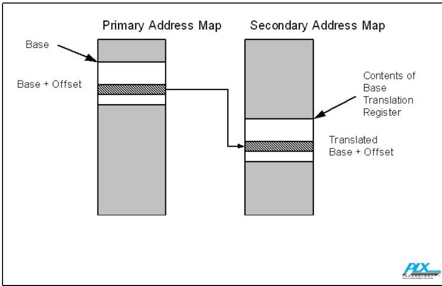

## Lookup Table Based Address Translation

Following the de facto standard adopted by the PCI community, PCI Express should provide several BARs for the purposes of allocating resources. All BARs contain the memory allocation; however, in accordance with PCI industry conventions, BAR 0 contains the CSR information whereas BAR1 contains I/O information, BAR 2 and BAR 3 are utilized for Lookup Table Based Translation. BAR 4 and BAR 5 are utilized for Direct Address Translations.

On the secondary side, BAR3 uses a special lookup table based address translation for transactions that fall inside its window as seen in Figure C‐0‐9 on page 960. The lookup table provides more flexibility in secondary bus local addresses to primary bus addresses. The location of the index field with the address bus is programmable to adjust aperture size.

Figure 0‐9: Lookup Table Based Translation  
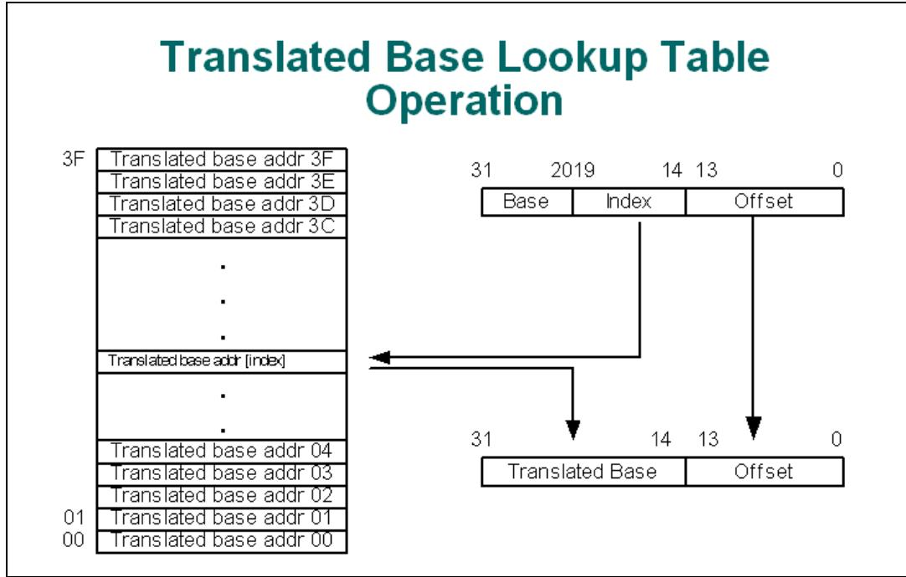

## Downstream BAR Limit Registers

The two downstream BARs on the primary side (BAR2/3 and BAR4/5) also have Limit registers, programmable from the local side, to further restrict the size of the window they expose, as seen in Figure C‐0‐10 on page 961. BARs can only be assigned memory resources in “power of two” granularity. The limit registers provide a means to obtain better granularity by “capping” the size of the BAR within the “power of two” granularity. Only transactions below the Limit registers are forwarded to the secondary bus. Transactions above the limit are discarded or return 0xFFFFFFFF, or a master abort equivalent packet, on reads.

Figure 0‐10: Use of Limit Register  
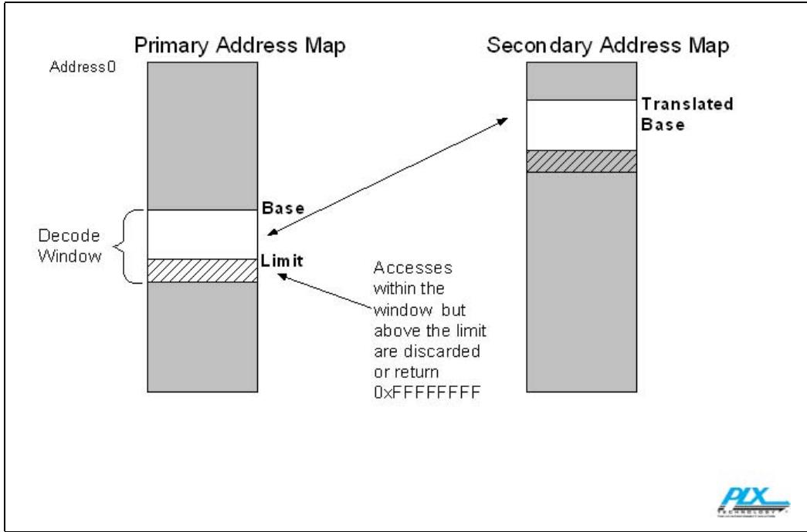

## Forwarding 64bit Address Memory Transactions

Certain BARs can be configured to work in pairs to provide the base address and translation for transactions containing 64‐bit addresses. Transactions that hit within these 64‐bit BARs are forwarded using Direct Address Translation. As in the case of 32 bit transactions, when a memory transaction is forwarded from the primary to the secondary bus, the primary address can be mapped to another address in the secondary bus domain. The mapping is performed by substituting a new base address for the base of the original address.

A 64‐bit BAR pair on the system side of the bridge is used to translate a window of 64‐bit addresses in packets originated on the system side of the bridge down below 232 in local space.

# Appendix D:

# Locked Transactions

## Introduction

Native PCI Express implementations do not support the old lock protocol. Support for Locked transaction sequences only exists to support legacy device software executing on the host processor that performs a locked RMW (readmodify‐write) operation on a memory location in a legacy PCI device. This chapter defines the protocol defined by PCI Express for this legacy support of locked access sequences that target legacy devices. Failure to support lock may result in deadlocks.

## Background

PCI Express supports atomic or uninterrupted transaction sequences (usually described as an atomic read‐modify‐write sequence) for legacy devices only. Native PCIe devices don’t support this at all and will return a Completion with UR (Unsupported Request) status if they receive a locked Request.

Locked operations consist of the basic RMW sequence, that is:

1. One or more memory reads from the target location to obtain the value.

2. The modification of the data in a processor register.

3. One or more writes to write the modified value back to the target memory location.

This transaction sequence must be performed such that no other accesses are permitted to the target locations (or device) during the locked sequence. This requires blocking other transactions during the operation. This can potentially result in deadlocks and poor performance.

## PCI Express Technology

The devices required to support locked sequences are:

• The Root Complex.

• Any Switches in the path to a Legacy Device that may be the target of a locked transaction series.

• PCIe‐to‐PCI Bridge or PCIe‐to‐PCI‐X Bridge.

• Any Legacy Device whose driver issues locked transactions to memory residing within the legacy device.

Locking in the PCI environment is achieved by the use of the LOCK# signal. The equivalent functionality in PCIe is accomplished by using a specific Request that emulates the LOCK# signal functionality.

## The PCI Express Lock Protocol

The only source of lock supported by PCI Express is the system processor acting through the Root Complex. A locked operation is performed between a Root Port and the Legacy Endpoint. In most systems, the legacy device is typically a PCI Express‐to‐PCI or PCI Express‐to‐PCI‐X bridge. Only one locked sequence at a time is supported for a given hierarchical path.

Locked transactions are constrained to use only Traffic Class 0 and Virtual Channel 0. Transactions with other TC values that map to a VC other than zero are permitted to traverse the fabric without regard to the locked operation, but transactions that map to VC0 are affected by the lock rules described here.

## Lock Messages — The Virtual Lock Signal

PCI Express defines the following transactions that, together, act as a virtual wire and replace the LOCK# signal.

Memory Read Lock Request (MRdLk) — Originates a locked sequence. The first MRdLk transaction blocks other Requests in VC0 from reaching the target device. One or more of these locked read requests may be issued during the sequence.

Memory Read Lock Completion with Data (CplDLk) — Returns data and confirms that the path to the target is locked. A successful read Completion that returns data for the first Memory Read Lock request results in the path between the Root Complex and the target device being locked. That is, transactions traversing the same path from other ports are blocked from reaching either the root port or the target port. Transactions being routed in buffers for VC1‐VC7 are unaffected by the lock.

Memory Read Lock Completion without Data (CplLK) — A Completion without a data payload indicates that the lock sequence cannot complete currently and the path remains unlocked.

Unlock Message — An unlock message is issued by the Root Complex from the locked root port. This message unlocks the path between the root port and the target port.

## The Lock Protocol Sequence — an Example

This section explains the PCI Express lock protocol by example. The example includes the following devices:

• The Root Complex that initiates the Locked transaction series on behalf of the host processor.

• A Switch in the path between the root port and targeted legacy endpoint.

• A PCI Express‐to‐PCI Bridge in the path to the target.

• The target PCI device who’s Device Driver initiated the locked RMW.

• A PCI Express endpoint is included to describe Switch behavior during lock.

In this example, the locked operation completes normally. The steps that occur during the operation are described in the two sections that follow.

## The Memory Read Lock Operation

Figure E‐1 on page 967 illustrates the first step in the Locked transaction series (i.e., the initial memory read to obtain the semaphore):

1. The CPU initiates the locked sequence (a Locked Memory Read) as a result of a driver executing a locked RMW instruction that targets a PCI target.

2. The Root Port issues a Memory Read Lock Request from port 2. The Root Complex is always the source of a locked sequence.

3. The Switch receives the lock request on its upstream port and forwards the request to the target egress port (3). The switch, upon forwarding the request to the egress port, must block all requests from ports other than the ingress port (1) from being sent from the egress port.

4. A subsequent peer‐to‐peer transfer from the illustrated PCI Express endpoint to the PCI bus (switch port 2 to switch port 3) would be blocked until the lock is cleared. Note that the lock is not yet established in the other direction. Transactions from the PCI Express endpoint could be sent to the Root Complex.

## PCI Express Technology

5. The Memory Read Lock Request is sent from the Switch’s egress port to the PCI Express‐to‐PCI Bridge. This bridge will implement PCI lock semantics (See the MindShare book entitled PCI System Architecture, Fourth Edition, for details regarding PCI lock).

6. The bridge performs the Memory Read transaction on the PCI bus with the PCI LOCK# signal asserted. The target memory device returns the requested semaphore data to the bridge.

7. Read data is returned to the Bridge and is delivered back to the Switch via a Memory Read Lock Completion with Data (CplDLk).

8. The switch uses ID routing to return the packet upstream towards the host processor. When the CplDLk packet is forwarded to the upstream port of the Switch, it establishes a lock in the upstream direction to prevent traffic from other ports from being routed upstream. The PCI Express endpoint is completely blocked from sending any transaction to the Switch ports via the path of the locked operation. Note that transfers between Switch ports not involved in the locked operation would be permitted (not shown in this example).

9. Upon detecting the CplDLk packet, the Root Complex knows that the lock has been established along the path between it and the target device, and the completion data is sent to the CPU.

Figure D‐1: Lock Sequence Begins with Memory Read Lock Request  
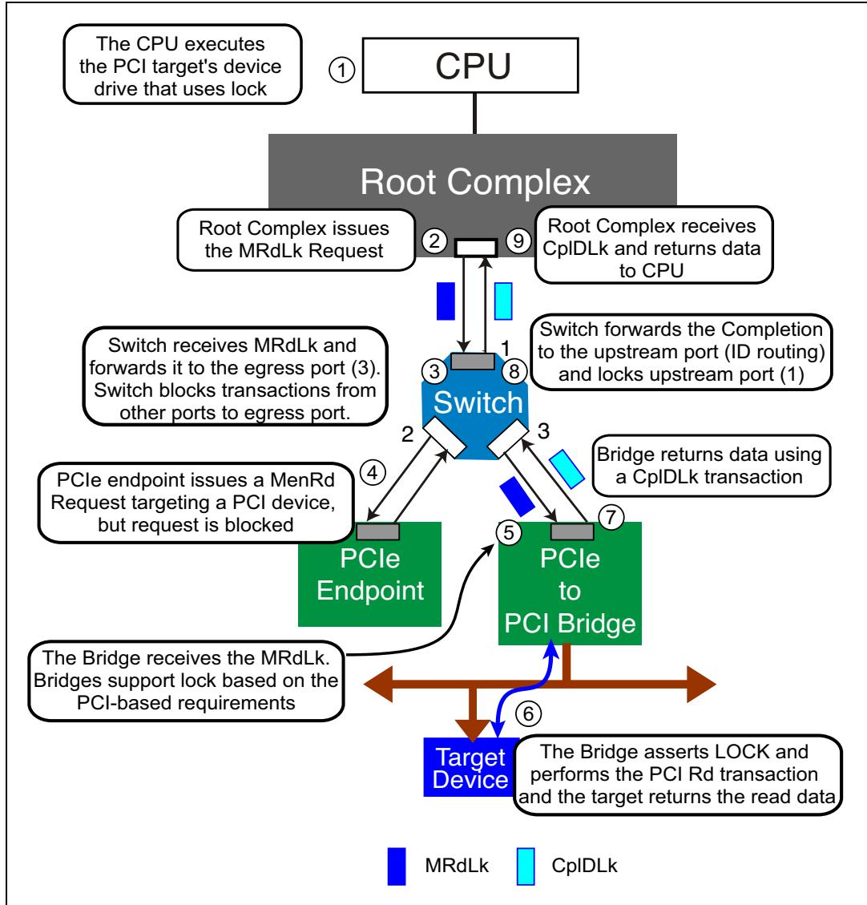

## Read Data Modified and Written to Target and Lock Completes

The device driver receives the semaphore value, alters it, and then initiates a memory write to update the semaphore within the memory of the legacy PCI device. Figure E‐2 on page 969 illustrates the write sequence followed by the

## PCI Express Technology

Root Complex’s transmission of the Unlock message that releases the lock:

10. The Root Complex issues the Memory Write Request across the locked path to the target device.

11. The Switch forwards the transaction to the target egress port (3). The memory address of the Memory Write must be the same as the initial Memory Read request.

12. The bridge forwards the transaction to the PCI bus.

13. The target device receives the memory write data.

14. Once the Memory Write transaction is sent from the Root Complex, it sends an Unlock message to instruct the Switches and any PCI/PCI‐X bridges in the locked path to release the lock. Note that the Root Complex presumes the operation has completed normally (because memory writes are posted and no Completion is returned to verify success).

15. The Switch receives the Unlock message, unlocks its ports and forwards the message to the egress port that was locked to notify any other Switches and/ or bridges in the locked path that the lock must be cleared.

16. Upon detecting the Unlock message, the bridge must also release the lock on the PCI bus.

Figure D‐2: Lock Completes with Memory Write Followed by Unlock Message  

## Notification of an Unsuccessful Lock

A locked transaction series is aborted when the initial Memory Read Lock Request receives a Completion packet with no data (CplLk). This means that the locked sequence must terminate because no data was returned. This could result from an error associated with the memory read transaction, or perhaps the target device is busy and cannot respond at this time.

## Summary of Locking Rules

Following is a list of ordering rules that apply to the Root Complex, Switches, and Bridges.

## Rules Related To the Initiation and Propagation of Locked Transactions

Locked Requests which are completed with a status other than Successful Completion do not establish lock.

Regardless of the status of any of the Completions associated with a locked sequence, all locked sequences and attempted locked sequences must be terminated by the transmission of an Unlock Message.

MRdLk, CplDLk and Unlock semantics are allowed only for the default Traffic Class (TC0).

• Only one locked transaction sequence attempt may be in progress at a given time within a single hierarchy domain.

Any device which is not involved in the locked sequence must ignore the Unlock Message.

The initiation and propagation of a locked transaction sequence through the PCI Express fabric is performed as follows:

• A locked transaction sequence is started with a MRdLk Request:

— Any successive reads associated with the locked transaction sequence must also use MRdLk Requests.

The Completions for any successful MRdLk Request use the CplDLk Completion type, or the CPlLk Completion type for unsuccessful Requests.

If any read associated with a locked sequence is completed unsuccessfully, the Requester must assume that the atomicity of the lock is no longer assured, and that the path between the Requester and Completer is no longer locked.

• All writes associated with a locked sequence must use MWr Requests.

The Unlock Message is used to indicate the end of a locked sequence. A Switch propagates Unlock Messages through the locked Egress Port.

Upon receiving an Unlock Message, a legacy Endpoint or Bridge must unlock itself if it is in a locked state. If it is not locked, or if the Receiver is a PCI Express Endpoint or Bridge which does not support lock, the Unlock Message is ignored and discarded.

## Rules Related to Switches

Switches must detect transactions associated with locked sequences from other transactions to prevent other transactions from interfering with the lock and potentially causing deadlock. The following rules cover how this is done. Note that locked accesses are limited to TC0, which is always mapped to VC0.

When a Switch propagates a MRdLk Request from an Ingress Port to the Egress Port, it must block all Requests which map to the default Virtual Channel (VC0) from being propagated to the Egress Port. If a subsequent MRdLk Request is received at this Ingress Port addressing a different Egress Port, the behavior of the Switch is undefined. Note that this sort of split‐lock access is not supported by PCI Express and software must not cause such a locked access. System deadlock may result from such accesses.

When the CplDLk for the first MRdLk Request is returned, if the Completion indicates a Successful Completion status, the Switch must block all Requests from all other Ports from being propagated to either of the Ports involved in the locked access, except for Requests which map to channels other than VC0 on the Egress Port.

The two Ports involved in the locked sequence must remain blocked until the Switch receives the Unlock Message (at the Ingress Port which received the initial MRdLk Request)

— The Unlock Message must be forwarded to the locked Egress Port.

— The Unlock Message may be broadcast to all other Ports.

The Ingress Port is unblocked once the Unlock Message arrives, and the Egress Port(s) which were blocked are unblocked following the transmission of the Unlock Message out of the Egress Port(s). Ports that were not involved in the locked access are unaffected by the Unlock Message

## Rules Related To PCI Express/PCI Bridges

The requirements for PCI Express/PCI Bridges are similar to those for Switches, except that, because these Bridges only use TC0 and VC0, all other traffic is blocked during the locked access. Requirements on the PCI bus side are described in the MindShare book, PCI System Architecture, Fourth Edition.

## Rules Related To the Root Complex

A Root Complex is permitted to support locked transactions as a Requester. If locked transactions are supported, a Root Complex must follow the rules already described to perform a locked access. The mechanism(s) used by the Root Complex to interface to the host processor’s FSB (Front‐Side Bus) are outside the scope of the spec.

## Rules Related To Legacy Endpoints

Legacy Endpoints are permitted to support locked accesses, although their use is discouraged. If locked accesses are supported, legacy Endpoints must handle them as follows:

The legacy Endpoint becomes locked when it transmits the first Completion for the first read request of the locked transaction series access with a Successful Completion status:

— If the completion status is not Successful Completion, the legacy Endpoint does not become locked.

— Once locked, the legacy Endpoint must remain locked until it receives the Unlock Message.

While locked, a legacy Endpoint must not issue any Requests using Traffic Classes which map to the default Virtual Channel (VC0). Note that this requirement applies to all possible sources of Requests within the Endpoint, in the case where there is more than one possible source of Requests. Requests may be issued using TCs which map to VCs other than VC0.

## Rules Related To PCI Express Endpoints

Native PCI Express Endpoints do not support lock. A PCI Express Endpoint must treat a MRdLk Request as an Unsupported Request.

## Glossary

<table><tr><td>Term</td><td>Definition</td></tr><tr><td>128b/130b Encoding</td><td>This isn't encoding in the same sense as 8b/10b. Instead, the transmitter sends information in Blocks that consist of 16 raw bytes in a row, preceded by a 2-bit Sync field that indicates whether the Block is to be considered as a Data Block or an Ordered Set Block. This scheme was introduced with Gen3, primarily to allow the Link bandwidth to double without doubling the clock rate. It provides better bandwidth utilization but sacrifices some benefits that 8b/10b provided for receivers.</td></tr><tr><td>8b/10b Encoding</td><td>Encoding scheme developed many years ago that's used in many serial transports today. It was designed to help receivers recover the clock and data from the incoming signal, but it also reduces available bandwidth at the receiver by 20%. This scheme is used with the earlier versions of PCIe: Gen1 and Gen2.</td></tr><tr><td>ACK/NAK Protocol</td><td>The Acknowledge/Negative Acknowledge mechanism by which the Data Link Layer reports whether TLPs have experienced any errors during transmission. If so, a NAK is returned to the sender to request a replay of the failed TLPs. If not, an ACK is returned to indicate that one or more TLPs have arrived safely.</td></tr><tr><td>ACPI</td><td>Advanced Configuration and Power Interface. Specifies the various system and device power states.</td></tr><tr><td>ACS</td><td>Access Control Services.</td></tr><tr><td>ARI</td><td>Alternative Routing-ID Interpretation; optional feature that allows Endpoints to have more Functions that the 8 allowed normally.</td></tr><tr><td>ASPM</td><td>Active State Power Management: When enabled, this allows hardware to make changes to the Link power state from L0 to L0s or L1 or both.</td></tr><tr><td>AtomicOps</td><td>Atomic Operations; three new Requests added with the 2.1 spec revision. These carry out multiple operations that are guaranteed to take place without interruption within the target device.</td></tr><tr><td>Bandwidth Management</td><td>Hardware-initiated changes to Link speed or width for the purpose of power conservation or reliability.</td></tr><tr><td>BAR</td><td>Base Address Register. Used by Functions to indicate the type and size of their local memory and IO space.</td></tr><tr><td>Beacon</td><td>Low-frequency in-band signal used by Devices whose main power has been shut off to signal that an event has occurred for which they need to have the power restored. This can be sent across the Link when the Link is in the L2 state.</td></tr><tr><td>BER</td><td>Bit Error Rate or Ratio; a measure of signal integrity based on the number of transmission bit errors seen within a time period</td></tr><tr><td>Bit Lock</td><td>The process of acquiring the transmitter's precise clock frequency at the receiver. This is done in the CDR logic and is one of the first steps in Link Training.</td></tr><tr><td>Block</td><td>The 130-bit unit sent by a Gen3 transmitter, made up of a 2-bit Sync Field followed by a group of 16 bytes.</td></tr><tr><td>Block Lock</td><td>Finding the Block boundaries at the Receiver when using 128b/130b encoding so as to recognize incoming Blocks. The process involves three phases. First, search the incoming stream for an EIEOS (Electrical Idle Exit Ordered Set) and adjust the internal Block boundary to match it. Next, search for the SDS (Start Data Stream) Ordered Set. After that, the receiver is locked into the Block boundary.</td></tr><tr><td>Bridge</td><td>A Function that acts as the interface between two buses. Switches and the Root Complex will implement bridges on their Ports to enable packet routing, and a bridge can also be made to connect between different protocols, such as between PCIe and PCI.</td></tr><tr><td>Byte Striping</td><td>Spreading the output byte stream across all available Lanes. All available Lanes are used whenever sending bytes.</td></tr><tr><td>CC</td><td>Credits Consumed: Number of credits already used by the transmitter when calculating Flow Control.</td></tr><tr><td>CDR</td><td>Clock and Data Recovery logic used to recover the Transmitter clock from the incoming bit stream and then sample the bits to recognize patterns. For 8b/10b, that pattern, found in the COM, FTS, and EIEOS symbols, allows the logic to acquire Symbol Lock. For 128b/130b the EIEOS sequence is used to acquire Block Lock by going through the three phases of locking.</td></tr><tr><td>CharacterCL</td><td>Term used to describe the 8-bit values to be communicated between Link neighbors. For Gen1 and Gen2, these are a mix of ordinary data bytes (labeled as D characters) and special control values (labeled as K characters). For Gen3 there are no control characters because 8b/10b encoding is no longer used. In that case, the characters all appear as data bytes.Credit Limit: Flow Control credits seen as available from the transmitter's perspective. Checked to verify whether enough credits are available to send a TLP.</td></tr><tr><td>Control Character</td><td>These are special characters (labeled as “K” characters) used in 8b/10b encoding that facilitate Link training and Ordered Sets. They are not used in Gen3, where there is no distinction between characters.</td></tr><tr><td>Correctable Errors</td><td>Errors that are corrected automatically by hardware and don't require software attention.</td></tr><tr><td>CR</td><td>Credits Required - this is the sum of CC and PTLP.</td></tr><tr><td>CRC</td><td>Cyclic Redundancy Code; added to TLPs and DLLPs to allow verifying error-free transmission. The name means that the patterns are cyclic in nature and are redundant (they don't add any extra information). The codes don't contain enough information to permit automatic error correction, but provide robust error detection.</td></tr><tr><td>Cut-Through Mode</td><td>Mechanism by which a Switch allows a TLP to pass through, forwarded from an ingress Port to an egress Port without storing it first to check for errors. This involves a risk, since the TLP may be found to have errors after part of it has already been forwarded to the egress Port. In that case, the end of the packet is modified in the Data Link Layer to have an LCRC value that is inverted from what it should be, and also modified at the Physical Layer to have an End Bad (EDB) framing symbol for 8b/10b encoding or an EDB token for 128b/130b encoding. The combination tells the receiver that the packet has been nullified and should be discarded without sending an ACK/NAK response.</td></tr><tr><td>Data Characters</td><td>Characters (labeled as “D” characters) that represent ordinary data and are distinguished from control characters in 8b/10b. For Gen3, there is no distinction between characters.</td></tr><tr><td>Data Stream</td><td>The flow of data Blocks for Gen3 operation. The stream is entered by an SDS (Start of Data Stream Ordered Set) and exited with an EDS (End of Data Stream token). During a Data Stream, only data Blocks or the SOS are expected. When any other Ordered Sets are needed, the Data Stream must be exited and only re-entered when more data Blocks are ready to send. Starting a Data Stream is equivalent to entering the L0 Link state, since Ordered Sets are only sent while in other LTSSM states, like Recovery.</td></tr><tr><td>De-emphasis</td><td>The process of reducing the transmitter voltage for repeated bits in a stream. This has the effect of de-emphasizing the low-frequency components of the signal that are known to cause trouble in a transmission medium and thus improves the signal integrity at the receiver.</td></tr><tr><td>Digest</td><td>Another name for the ECRC (End-to-End CRC) value that can optionally be appended to a TLP when it's created in the Transaction Layer.</td></tr><tr><td>DLCMSM</td><td>Data Link Control and Management State Machine; manages the Link Layer training process (which is primarily Flow Control initialization).</td></tr><tr><td>DLLP</td><td>Data Link Layer Packet. These are created in the Data Link Layer and are forwarded to the Physical Layer but are not seen by the Transaction Layer.</td></tr><tr><td>DPA</td><td>Dynamic Power Allocation; a new set of configuration registers with the 2.1 spec revision that defines 32 power substates under the D0 device power state, making it easier for software to control device power options.</td></tr><tr><td>DSP (Downstream Port)</td><td>Port that faces downstream, like a Root Port or a Switch Downstream Port. This distinction is meaningful in the LTSSM because the Ports have assigned roles during some states.</td></tr><tr><td>ECRC</td><td>End-to-End CRC value, optionally appended to a TLP when it's created in the Transaction Layer. This enables a receiver to verify reliable packet transport from source to destination, regardless of how many Links were crossed to get there.</td></tr><tr><td>Egress Port</td><td>Port that has outgoing traffic.</td></tr><tr><td>Elastic Buffer</td><td>Part of the CDR logic, this buffer enables the receiver to compensate for the difference between the transmitter and receiver clocks.</td></tr><tr><td>EMI</td><td>Electro-Magnetic Interference: the emitted electrical noise from a system. For PCIe, both SSC and scrambling are used to attack it.</td></tr><tr><td>Endpoint</td><td>PCIe Function that is at the bottom of the PCI Inverted-Tree structure.</td></tr><tr><td>Enumeration</td><td>The process of system discovery in which software reads all of the expected configuration locations to learn which PCI-configurable Functions are visible and thus present in the system.</td></tr><tr><td>Equalization</td><td>The process of adjusting Tx and Rx values to compensate for actual or expected signal distortion through the transmission media. For Gen1 and Gen2, this takes the form of Tx De-emphasis. For Gen3, an active evaluation process is introduced to test the signaling environment and adjust the Tx settings accordingly, and optional Rx equalization is mentioned.</td></tr><tr><td>Flow Control</td><td>Mechanism by which transmitters avoid the risk of having packets rejected at a receiver due to lack of buffer space. The receiver sends periodic updates about available buffer space and the transmitter verifies that enough is available before attempting to send a packet.</td></tr><tr><td>FLR</td><td>Function-Level Reset</td></tr><tr><td>Framing Symbols</td><td>The “start” and “end” control characters used in 8b/10b encoding that indicate the boundaries of a TLP or DLLP.</td></tr><tr><td>Gen1</td><td>Generation 1, meaning designs created to be compliant with the 1.x version of the PCIe spec.</td></tr><tr><td>Gen1, Gen2, Gen3</td><td>Abbreviations for the revisions of the PCIe spec. Gen1 = rev 1.x, Gen2 = rev 2.x, and Gen3 = rev 3.0</td></tr><tr><td>Gen2</td><td>Generation 2, meaning designs created to be compliant with the 2.x version of the PCIe spec.</td></tr><tr><td>Gen3</td><td>Generation 3, meaning designs created to be compliant with the 3.x version of the PCIe spec.</td></tr><tr><td>IDO</td><td>ID-based Ordering; when enabled, this allows TLPs from different Requesters to be forwarded out of order with respect to each other. The goal is to improve latency and performance.</td></tr><tr><td>Implicit Routing</td><td>TLPs whose routing is understood without reference to an address or ID. Only Message requests have the option to use this type of routing.</td></tr><tr><td>Ingress Port</td><td>Port that has incoming traffic.</td></tr><tr><td>ISI</td><td>Inter-Symbol Interference; the effect on one bit time that is caused by the recent bits that preceded it.</td></tr><tr><td>Lane</td><td>The two differential pairs that allow a transmit and receive path of one bit between two Ports. A Link can consist of just one Lane or it may contain as many as 32 Lanes.</td></tr><tr><td>Lane-to-Lane Skew</td><td>Difference in arrival times for bits on different Lanes. Receivers are required to detect this and correct it internally.</td></tr><tr><td>Legacy Endpoint</td><td>An Endpoint that carries any of three legacy items forward: support for IO transactions, support for local 32-bit-only prefetchable memory space, or support for the locked transactions.</td></tr><tr><td>LFSR</td><td>Linear-Feedback Shift Register; creates a pseudo-random pattern used to facilitate scrambling.</td></tr><tr><td>Link</td><td>Interface between two Ports, made up of one or more Lanes.</td></tr><tr><td>LTR</td><td>Latency-Tolerance Reporting; mechanism that allows devices to report to the system how quickly they need to get service when they send a Request. Longer latencies afford more power management options to the system.</td></tr><tr><td>LTSSM</td><td>Link Training and Status State Machine; manages the training process for the Physical Layer.</td></tr><tr><td>Non-posted Request</td><td>A Request that expects to receive a Completion in response. For example, any read request would be non-posted.</td></tr><tr><td>Non-prefetchable Memory</td><td>Memory that exhibits side effects when read. For example, a status register that automatically self-clears when read. Such data is not safe to prefetch since, if the requester never requested the data and it was discarded, it would be lost to the system. This was an important distinction for PCI bridges, which had to guess about the data size on reads. If they knew it was safe to speculatively read ahead in the memory space, they could guess a larger number and achieve better efficiency. The distinction is much less interesting for PCIe, since the exact byte count for a transfer is included in the TLP, but maintaining it allows backward compatibility.</td></tr><tr><td>Nullified Packet</td><td>When a transmitter recognizes that a packet has an error and should not have been sent, the packet can be “nullified”, meaning it should be discarded and the receiver should behave as if it had never been sent. This problem can arise when using “cut-through” operation on a Switch.</td></tr><tr><td>OBFF</td><td>Optimized Buffer Flush and Fill; mechanism that allows the system to tell devices about the best times to initiate traffic. If devices send requests during optimal times and not during other times system power management will be improved.</td></tr><tr><td>Ordered Sets</td><td>Groups of Symbols sent as Physical Layer communication for Lane management. These often consist of just control characters for 8b/10b encoding. They are created in the Physical Layer of the sender and consumed in the Physical Layer of the receiver without being visible to the other layers at all.</td></tr><tr><td>PCI</td><td>Peripheral Component Interface. Designed to replace earlier bus designs used in PCs, such as ISA.</td></tr><tr><td>PCI-X</td><td>PCI eXtended. Designed to correct the shortcomings of PCI and enable higher speeds.</td></tr><tr><td>PME</td><td>Power Management Event; message from a device indicating that power-related service is needed.</td></tr><tr><td>Poisoned TLP</td><td>Packet whose data payload was known to be bad when it was created. Sending the packet with bad data can be helpful as an aid to diagnosing the problem and determining a solution for it.</td></tr><tr><td>Polarity Inversion</td><td>The receiver's signal polarity is permitted to be connected backwards to support cases when doing so would simplify board layout. The receiver is required to detect this condition and internally invert the signal to correct it during Link Training.</td></tr><tr><td>Port</td><td>Input/output interface to a PCIe Link.</td></tr><tr><td>Posted Request</td><td>A Request packet for which no completion is expected. There are only two such requests defined by the spec: Memory Writes and Messages.</td></tr><tr><td>Prefetchable Memory</td><td>Memory that has no side-effects as a result of being read. That property makes it safe to prefetch since, if it's discarded by the intermediate buffer, it can always be read again later if needed. This was an important distinction for PCI bridges, which had to guess about the data size on reads. Prefetchable space allowed speculatively reading more data and gave a chance for better efficiency. The distinction is much less interesting for PCIe, since the exact byte count for a transfer is included in the TLP, but maintaining it allows backward compatibility.</td></tr><tr><td>PTLP</td><td>Pending TLP - Flow Control credits needed to send the current TLP.</td></tr><tr><td>QoS</td><td>Quality of Service; the ability of the PCIe topology to assign different priorities for different packets. This could just mean giving preference to packets at arbitration points, but in more complex systems, it allows making bandwidth and latency guarantees for packets.</td></tr><tr><td>Requester ID</td><td>The configuration address of the Requester for a transaction, meaning the BDF (Bus, Device, and Function number) that corresponds to it. This will be used by the Completer as the return address for the resulting completion packet.</td></tr><tr><td>Root Complex</td><td>The components that act as the interface between the CPU cores in the system and the PCIe topology. This can consist of one or more chips and may be simple or complex. From the PCIe perspective, it serves as the root of the inverted tree structure that backward-compatibility with PCI demands.</td></tr><tr><td>Run Length</td><td>The number of consecutive ones or zeros in a row. For 8b/10b encoding the run length is limited to 5 bits. For 128b/130b, there is no defined limit, but the modified scrambling scheme it uses is intended to compensate for that.</td></tr><tr><td>Scrambling</td><td>The process of randomizing the output bit stream to avoid repeated patterns on the Link and thus reduce EMI. Scrambling can be turned off for Gen1 and Gen2 to allow specifying patterns on the Link, but it cannot be turned off for Gen3 because it does other work at that speed and the Link is not expected to be able to work reliably without it.</td></tr><tr><td>SOS</td><td>Skip Ordered Set - used to compensate for the slight frequency difference between Tx and Rx.</td></tr><tr><td>SSC</td><td>Spread-Spectrum Clocking. This is a method of reducing EMI in a system by allowing the clock frequency to vary back and forth across an allowed range. This spreads the emitted energy across a wider range of frequencies and thus avoids the problem of having too much EMI energy concentrated in one particular frequency.</td></tr><tr><td>Sticky Bits</td><td>Status bits whose value survives a reset. This characteristic is useful for maintaining status information when errors are detected by a Function downstream of a Link that is no longer operating correctly. The failed Link must be reset to gain access to the downstream Functions, and the error status information in its registers must survive that reset to be available to software.</td></tr><tr><td>Switch</td><td>A device containing multiple Downstream Ports and one Upstream Port that is able to route traffic between its Ports.</td></tr><tr><td>Symbol</td><td>Encoded unit sent across the Link. For 8b/10b these are the 10-bit values that result from encoding, while for 128b/130b they're 8-bit values.</td></tr><tr><td>Symbol Lock</td><td>Finding the Symbol boundaries at the Receiver when using 8b/10b encoding so as to recognize incoming Symbols and thus the contents of packets.</td></tr><tr><td>Symbol time</td><td>The time it takes to send one symbol across the Link - 4ns for Gen1, 2ns for Gen2, and 1ns for Gen3.</td></tr><tr><td>TLP</td><td>Transaction Layer Packet. These are created in the Transaction Layer and passed through the other layers.</td></tr><tr><td>Token</td><td>Identifier of the type of information being delivered during a Data Stream when operating at Gen3 speed.</td></tr><tr><td>TPH</td><td>TLP Processing Hints; these help system routing agents make choices to improve latency and traffic congestion.</td></tr><tr><td>UI</td><td>Unit Interval; the time it takes to send one bit across the Link - 0.4ns for Gen1, 0.2ns for Gen2, 0.125ns for Gen3</td></tr><tr><td>Uncorrectable Errors</td><td>Errors that can't be corrected by hardware and thus will ordinarily require software attention to resolve. These are divided into Fatal errors - those that render further Link operation unreliable, and Non-fatal errors - those that do not affect the Link operation in spite of the problem that was detected.</td></tr><tr><td>USP</td><td>Upstream Port, meaning a Port that faces upstream, as for an Endpoint or a Switch Upstream Port. This distinction is meaningful in the LTSSM because the Ports have assigned roles during Configuration and Recovery.</td></tr><tr><td>Variables</td><td>A number of flags are used to communicate events and status between hardware layers. These are specific to state transitions in the hardware are not usually visible to software. Some examples: — LinkUp - Indication from the Physical Layer to the Data Link Layer that training has completed and the Physical Layer is now operational. — idle_to_rlock_transitioned - This counter tracks the number of times the LTSSM has transitioned from Configuration.Idle to the Recovery.RcvrLock state. Any time the process of recognizing TS2s to leave Configuration doesn’t work, the LTSSM transitions to Recovery to take appropriate steps. If it still doesn’t work after 256 passes through Recovery (counter reaches FFh), then it goes back to Detect to start over. It may be that some Lanes are not working.</td></tr><tr><td>WAKE#</td><td>Side-band pin used to signal to the system that the power should be restored. It’s used instead of the Beacon in systems where power conservation is an important consideration.</td></tr></table>

## Numerics

128b/130b 43 128b/130b Encoding 973 1x Packet Format 374, 375 3DW Header 152 3-Tap Transmitter Equalization 585 4DW Headers 152 4x Packet Format 374 8.0 GT/s 410 8b/10b 42 8b/10b Decoder 367 8b/10b Encoder 366 8b/10b Encoding 973

## A

AC Coupling 468 ACK 318 Ack 311 ACK DLLP 75, 312 ACK/NAK DLLP 312 ACK/NAK Latency 328 ACK/NAK Protocol 318, 320, 329, 973 Ack/Nak Protocol 74 ACKD\_SEQ Count 323 ACKNAK\_Latency\_Timer 328, 343 ACPI 711, 973 ACPI Driver 706 ACPI Machine Language 712 ACPI Source Language 712 ACPI spec 705 ACPI tables 712 ACS 973 Active State Power Management 405, 735 Address Routing 158 Address Space 121 Address Translation 958, 959 Advanced Correctable Error Reporting 690 Advanced Correctable Error Status 689 Advanced Correctable Errors 688 Advanced Error Reporting 685 Advanced Source ID Register 697 Advanced Uncorrectable Error Handling 691 Advanced Uncorrectable Error Status 691 Aggregate Bandwidth 408 Alternative Routing-ID Interpretation 909 AML 712 AML token interpreter 712 Arbitration 20, 270 Arbor 117 Architecture Overview 39 ARI 909, 974 ASL 712 ASPM 735, 742, 910, 974 ASPM Exit Latency 756, 757 Assert\_INTx messages 806 Async Notice of Slot Status Change 876

AtomicOp 150 AtomicOps 897, 974 Attention Button 854, 862 Attention Indicator 854, 859 Aux\_Current field 726

## B

Bandwidth 42 Bandwidth Congestion 281 Bandwidth Management 974 BAR 126, 960, 974 Base Address Registers 126 Base and Limit Registers 136 BDF 85 Beacon 483, 772, 974 BER 974 BIOS 712, 853 Bit Lock 78, 395, 507, 742, 974 Bit Tracer 929 Block 974 Block Alignment 435 Block Encoding 410 Block Lock 507, 975 Boost 476 Bridge 975 Bus 85 Bus Master 20 Bus Number register 93 Byte Count Modified 201 Byte Enables 181 Byte Striping 371, 372, 373, 975 byte striping 371 Byte Striping logic 365 Byte Un-Striping 402

## C

Capabilities List bit 818 Capabilities Pointer register 713 Capability ID 713, 814 Capability Structures 88 Card Connector Power Switching Logic 854 Card Insertion 855 Card Insertion Procedure 857 Card Present 854 Card Removal 855 Card Removal Procedure 856 Card Reset Logic 854 CC 975 CDR 435, 437, 975 Character 79, 366, 975 CL 976 Class driver 706 Clock Requirements 452 Code Violation 400 Coefficients 584 Cold Reset 834

COM 386 Common-Mode Noise Rejection 452 Completer 33 Completer Abort 664 Completion Packet 197 Completion Status 200 Completion Time-out 665 Completion TLP 184 Completions 196, 218 Compliance Pattern 537 Compliance Pattern - 8b/10b 529 Configuration 85 Configuration Address Port 92, 93 Configuration Address Space 88 Configuration Cycle Generation 26 Configuration Data Port 92, 93 Configuration Headers 50 Configuration Read 151 Configuration Read Access 104 Configuration Register Space 27, 89 Configuration Registers 90 Configuration Request Packet 193 Configuration Requests 99, 192 Configuration Space 122 Configuration State 520, 540 Configuration Status Register 676 Configuration Status register 713 Configuration Transactions 91 Configuration Write 151 Configuration.Complete 562 Configuration.Idle 566 Configuration.Lanenum.Accept 560 Configuration.Lanenum.Wait 559 Configuration.Linkwidth.Accept 558 Configuration.Linkwidth.Start 553 Congestion Avoidance 897 Continuous-Time Linear Equalization 49 Control Character 976 Control Character Encoding 386 Control Method 712 Conventional Reset 834 Correctable Errors 651, 976 CR 976 CRC 976 CRD 383 Credit Allocated Count 229 Credit Limit counter 228 CREDIT\_ALLOCATED 229 Credits Consumed counter 228 Credits Received Counter 229 CREDITS\_RECEIVED 229 CTLE 493, 494 Current Running Disparity 383 Cursor Coefficient 584 Cut-Through 354 Cut-Through Mode 976

## D

D0 709, 710, 714, 734 D0 Active 714 D0 Uninitialized 714 D1 709, 710, 716, 734 D1\_Support bit 725 D2 709, 710, 717, 734 D2\_Support bit 725 D3 709, 710, 719 D3cold 721, 734 D3hot 719, 734 Data Characters 976 Data Link Layer 55, 72 Data Link Layer Packet 72 Data Link Layer Packet Format 310 Data Link Layer Packets 73 Data Poisoning 660 Data Register 731 Data Stream 977 Data\_Scale field 729 Data\_Select field 729 DC Common Mode 462 DC Common Mode Voltage 466 DC Common-Mode Voltage 467 Deadlock Avoidance 303 Deassert\_INTx messages 806 Debugging PCIe Traffic 917 Decision Feedback Equalization 495 De-emphasis 450, 468, 469, 471, 476, 977 De-Scrambler 367 Deserializer 395 De-Skew 399 Detect State 519, 522 Detect.Active 524 Detect.Quiet 523 Device 85 Device Capabilities 2 Register 899 Device Capabilities Register 873 Device Context 709 Device Core 59 Device core 55 Device Driver 706 device driver 853 Device Layers 54 Device PM States 713 device PM states 709 Device Status Register 681 Device-Specific Initialization (DSI) bit 727 DFE 493, 495, 497 Differential Driver 389 Differential Receiver 393, 435, 451 Differential Signaling 463 Differential Signals 44 Differential Transmitter 451 Digest 180, 977 Direct Address Translation 949

Disable State 521, 613 Discrete Time Linear Equalizer 493 Discrete-Time Linear Equalizer 494 Disparity 383 Disparity Error Detection 400 DLCMSM 977 DLE 493, 494 DLL 437 DLLP 73, 170, 238, 308, 311, 977 DLLP Elements 307 DMA 937 DPA 910, 977 Driver Characteristics 489 DSI bit 727 DSP 977 D-State Transitions 722 Dual Simplex 363 Dual-Simplex 40 Dual-Star Fabric 957 Dynamic Bandwidth Changes 618 Dynamic Link Speed Changes 619 Dynamic Link Width Changes 629 Dynamic Power Allocation 910

## E

ECRC 63, 180, 978 ECRC Generation and Checking 657 EDB 373, 387 Egress Port 978 EIE 387 EIEOS 389, 739, 740 EIOS 388, 737 Elastic Buffer 366, 435, 978 Electrical Idle 388, 736, 738, 741 Electrical Idle Exit Ordered Set 389 Electrical Idle Ordered Set 388 EMI 77, 978 Encoding 410 END 373, 387 Endpoint 978 End-to-End CRC 180 Enhanced Configuration Access Mechanism 96 Enumeration 51, 104, 978 Equalization 474, 978 Equalization - Phase 0 578 Equalization - Phase 1 581 Equalization - Phase 2 583 Equalization - Phase 3 586 Equalization Control 513 Equalization Control Registers 579 Equalizer 475 Equalizer Coefficients 479 Error Classifications 651 Error Handling 282, 699 Error Isolation 937 Error Messages 209, 668

ESD 459 ESD standards 448 Exerciser Card 931 Extended Configuration Space 89 Eye Diagram 486

## F

Failover 942, 944, 952 FC Initialization 223 FC Initialization Sequence 223 FC\_Init1 224 FC\_Init2 225 FC\_Update 238 First DW Byte Enables 178, 181 Flow Control 72, 76, 215, 217, 299, 928, 978 Flow Control Buffer 217, 229 Flow Control Buffers 217 Flow Control Credits 216, 219 Flow Control Elements 227, 231 Flow Control Initialization 227, 230, 237 Flow Control Packet 239 Flow Control Packet Format 314 Flow Control Update Frequency 239 Flow Control Updates 237 FLR 842, 844, 845, 978 Flying Lead Probe 924 Format Field 179 Framing Symbols 171, 979 FTS 387 FTS Ordered Set 388 FTSOS 388 Function 85 Function Level Reset 842, 843 Function PM State Transitions 722 Function State Transition Delays 724 Fundamental Reset 834

## G

Gen1 43, 77, 979Gen2 43, 77, 979Gen3 44, 77, 407, 979Gen3 products 936

## H

handler 712 Hardware Based Fixed Arbitration 256 Hardware Fixed VC Arbitration 257 Hardware-Fixed Port Arbitration 265 Header Type 0 29 Header Type 1 28 Header Type/Format Field 178 High Speed Signaling 451 host/PCI bridge 94 Hot Plug 847, 852

Hot Plug Controller 863 Hot Plug Elements 852 Hot Plug Messages 211 Hot Reset 839 Hot Reset State 521, 612 Hot-Plug 116, 853 Hot-Plug Controller 853, 864 hot-plug primitives 874 Hot-Plug Service 852 Hot-Plug System Driver 852 HPC Applications 940 Hub Link 32

## I

ID Based Ordering 301 ID Routing 155 ID-based Ordering 301, 909, 979 IDL 387 IDO 301, 302, 909, 979 IEEE 1394 Bus Driver 711 Ignored Messages 211 Implicit Routing 148, 979 In-band Reset 837 Infinite Credits 221 Infinite Flow Control Credits 219 Ingress Port 979 InitFC1-Cpl 312 InitFC1-NP 311 InitFC1-P DLLP 311 InitFC2-Cpl 312 InitFC2-NP 312 InitFC2-P 312 Intelligent Adapters 943, 944, 951 Internal Error Reporting 911 Interrupt Disable 803 Interrupt Latency 829 interrupt latency 829 Interrupt Line Register 802 Interrupt Pin Register 801 Interrupt Status 804 Inter-symbol Interference 469 INTx Interrupt Messages 206 INTx Interrupt Signaling 206 INTx Message Format 807 INTx# Pins 800 INTx# Signaling 803 IO 126 IO Address Spaces 122 IO Range 141 IO Read 151 IO Requests 184 IO Virtualization 937 IO Write 151 ISI 979 Isochronous Packets 279 Isochronous Support 272 Isochronous Transaction Support 272

##

Jitter 485, 487

## L

L0 State 500, 520, 568 L0s 744 L0s Receiver State Machine 605 L0s State 520, 603, 744 L0s Transmitter State Machine 603 L1 ASPM 736, 747 L1 ASPM Negotiation 748 L1 ASPM State 747 L1 State 520, 607, 760 L2 State 521, 609, 767 L2/L3 Ready 767 L2/L3 Ready state 763, 764 Lane 40, 78, 365, 979 Lane # 511 Lane Number Negotiation 543, 547 Lane Reversal 507 Lane-Level Encoding 410 Lane-to-Lane de-skew 78 Lane-to-Lane Skew 979 Last DW Byte Enables 178, 181 Latency Tolerance Reporting 910 LCRC 63, 325, 329 LeCroy 922, 923, 933 LeCroy Tools 917 Legacy Endpoint 816, 979 Legacy Endpoints 972 LFSR 980 Link 40, 980 Link # 511 Link Capabilities 2 Register 640 Link Capability Register 743 Link Configuration - Failed Lane 549 Link Control 841 Link Data Rate 509 Link data rate 78 Link Equalization 577 Link Errors 683 Link Flow Control-Related Errors 666 Link Number Negotiation 542, 546 Link Power Management 733 Link Status Register 641 Link Training and Initialization 78 Link Training and Status State Machine (LTSSM) 518 Link Upconfigure Capability 512 Link Width 507 Link width 78 Link Width Change 570 Link Width Change Example 630 Lock 964 Locked Reads 66 Locked Transaction 209

Locked Transactions 963 Logic Analyzer 921 Logical Idle Sequence 370 Loopback Master 615 Loopback Slave 616 Loopback State 521, 613 Loopback.Active 617 Loopback.Entry 614 Loopback.Exit 618 Low-priority VC Arbitration 255 LTR 784, 910, 980 LTR Messages 786 LTR Registers 784 LTSSM 507, 518, 839, 927, 980

## M

Malformed TLP 666 Memory Address Space 122 Memory Read 150 Memory Read Lock 150 Memory Request Packet 188 Memory Requests 188 Memory Write 150 Memory Writes 69 Message 151 Message Address Register 816 Message Address register 816, 818 Message Control Register 814 Message Control register 814, 818 Message Data register 817, 818 Message Request Packet 203 Message Requests 70, 203 Message Writes 70 Messages 148 Mid-Bus Probe 923 MindShare Arbor 117 Miniport Driver 706 MMIO 123 Modified Compliance Pattern 537 Modified Compliance Pattern - 8b/10b 532 MR-IOV 937, 939 MSI Capability Register 812 MSI Configuration 817 Multicast 893, 896 Multicast Capabilities 163 Multicast Capability Registers 889 Multi-casting 888 Multi-Function Arbitration 272 Multi-Host System 96 Multi-Host Systems 943 Multiple Message Capable field 818 Multiple Messages 820 Multi-Root 938 Multi-Root Enumeration 114 Multi-Root System 97, 116

## N

N\_FTS 511 Nak 311 NAK\_SCHEDULED Flag 327 namespace 712 Native PCI Express Endpoints 972 NEXT\_RCV\_SEQ 313, 326, 341 Noise 485 Non-Posted 150 non-posted 60 Non-posted Request 980 Non-Posted Transactions 65, 218 Non-prefetchable 123 Non-prefetchable Memory 980 Non-Prefetchable Range 139 North Bridge 21 NP-MMIO 126, 139 NT bridging 936 Nullified Packet 388, 689, 980

## O

OBFF 776, 910, 981 OBFF Messages 213 OnNow Design Initiative 707 Optimized Buffer Flush and Fill 776, 910, 981 Optimized Buffer Flush and Fill Messages 213 Ordered Sets 981 Ordered-Sets 370 Ordering Rules 287 Ordering Rules Table 288, 289 Ordering Table 914 Oscilloscope 919

## P

Packet Format 151 Packet Generation 937 Packet-Based Protocol 169 Packet-based Protocol 46 PAD 386 Pause command 853, 874 Pausing a Driver 874 PCI 981 PCI Bus Driver 706, 707, 711 PCI Bus PM Interface Specification 705 PCI Express 39 PCI PM 705 PCI power management 647, 703, 793 PCI Transaction Model 18 PCI-Based System 11 PCI-Compatible Error Reporting 674 PCIe System 53, 54 PCI-X 981 PERST# 835, 849 PETracer 918, 924

PETrainer 932 Physical Layer 55, 76 Physical Layer Electrical 449 PLL 435, 437 PLX Technology 935, 943 PM Capabilities (PMC) Register 724 PM Capability Registers 713 PM Control/Status (PMCSR) Register 727 PM Registers 724, 732 PM\_Active\_State\_Request\_L1 311 PM\_Enter\_L1 DLLP 311 PM\_Enter\_L23 311 PM\_Request\_Ack 311 PMC Register 724 PMCSR 727, 728 PMCSR Register 727 PME 981 PME Clock bit 727 PME Context 710 PME Generation 768 PME Message 769 PME\_En bit 730 PME\_Status bit 728 PME\_Support field 725 P-MMIO 126, 137 Poisoned TLP 981 Polarity Inversion 78, 508, 981 Polling State 519, 525 Polling.Active 526 Polling.Compliance 529 Polling.Configuration 527 Port 981 Port Arbitration 261, 265 Port Arbitration Table 267 Port Arbitration Tables 263 Post-Cursor Coefficient 584 Posted 150 posted 60 Posted Request 981 Posted Transactions 218 Posted Writes 69 Post-Silicon 931 Post-Silicon Debug 919 Power Budget Capabilities Register 883 Power Budget Capability Registers 884 Power Budget Registers 878 Power Budgeting 847, 876 Power Indicator 854, 860 Power Management 76, 703, 711 power management 647, 703, 793 Power Management DLLP 313 Power Management DLLP Packet 313 Power Management Message 208 Power Management Messages 208 Power Management Policy Owner 711 power management register set 713, 724 Power Management States 500 PowerState field 730

Pre-Cursor Coefficient 584 Prefetchable 123 Prefetchable Memory 982 Prefetchable Range 137 Presets 478 Pre-shoot 476 Pre-Silicon 931 Pre-silicon Debugging 918 Primitives 852 Primitives, hot-plug 852, 874 Producer/Consumer Model 290 Producer/Consumer model 290 Protocol Analyzer 920 PTC card 932 PTLP 982

## Q

QoS 70, 245, 272, 982 Quality of Service 70, 245 Query Hot-Plug System Driver 875 Query Slot Status 875 quiesce 873 Quiesce command 853 Quiescing Card 873 Quiescing Card and Driver 873 Quiescing Driver 873

## R

Rate ID 512 Ratios 478 Receive Buffer 403 Receive Logic 366, 392 Receiver Characteristics 492, 497 Recovery Process 572 Recovery State 520, 571 Recovery State - Entry 572 Recovery.Equalization 587 Recovery.RcvrCfg 574, 575, 576, 598 Recovery.RcvrLock 573, 576 Recovery.Speed 575, 595 Refclk 455 Relaxed Ordering 286, 296, 299 Replay Mechanism 74 Replay Timer 690 Request TLP 184 Request Types 59 Requester 33 Requester ID 982 Reset 846 Resizable BARs 135, 911 Resume command 853 Retention Latch 861 Retention Latch Sensor 861 Retry 21 RO 297 Root Complex 91, 109, 147, 163, 668,

696, 812, 972, 982 Root Complex Error Status 696 Root Error Command Register 698 Routing Elements 147 Routing Mechanisms 155 RST# 854 RTL Simulation 918 Run Length 982 Rx Buffer 403 Rx Clock 435 Rx Clock Recovery 394, 437 Rx Equalization 493 Rx Preset Hint Encodings 580

## S

Scrambler 366, 377 Scrambler implementation 379 Scrambling 983 SDP 373, 387 Secondary Bus Reset 840 Sequence Number 326 Serial Transport 41 Serializer 389 Service Interval 279 Set Slot Power Limit Message 210 Set Slot Status 875 Severity of Error 693 Short Circuit Requirements 459 SHPC 1.0 848 SI 278 Signal Attenuation 485 Simplified Ordering Rule 287 Simplified Ordering Table 914 Single Host System 94 Single-Root System 113 SKIP 386, 387 SKIP ordered set 392 Skip Ordered Set 983 SKP 386 SKP Ordered Set 389 Slot Capabilities 865 Slot Capabilities Registers 865 Slot Control 868 Slot Control Register 869 Slot Numbering 862 Slot Numbering Identification 862 Slot Power Limit Control 867, 881 Slot Power Limit Message 210 Slot Status 870 Soft Off 708 SOS 389, 983 South Bridge 11 Spec Revision 2.1 887 Speed Change 568 Speed Change Example 576, 622 Speed Changes - Software 627 Split Transaction Protocol 149

SR-IOV 937 SSC 983 SSC Modulation 455 SSD Modules 940 Start command 853 Sticky Bits 688, 983 STP 373, 387 Strict Priority VC Arbitration 253 Strong Ordering 286 Subordinate Bus Number register 93 Surprise Removal 849 Surprise Removal Notification 849 Switch 269, 278, 938, 971, 983 Switch Arbitration 269 Switch Port 57 Switch Routing 161 Switches 941 Symbol 366, 983 Symbol Lock 78, 396, 507, 983 Symbol time 983 Symbols 381 Sync Header 364 System PM States 708 System Reset 833

## T

Target 21, 22 TBWRR 266, 279 TC 247, 285, 287 TC to VC Mapping 249 TC/VC Mapping 248, 252 Time-Based, Weighted Round Robin Arbitration 266 TLP 60, 61, 170, 172, 984 TLP Elements 169 TLP Header 154 TLP Header Format 175 TLP Prefixes 908 TLP Processing Hints 899, 984 TLP Routing 145, 147 TLP Structure 174 Token 984 token 712 TPH 899, 900, 984 TPH Capability 907 TPH Control 907 Trace Viewer 924 Traffic Class 71, 174, 176, 183, 247, 248 Training Control 512 Training Examples 542 Training Sequence 1 369 Transaction Attributes 183 Transaction Descriptor 182 Transaction ID 183 Transaction Layer 55, 59 Transaction Layer Packet 60, 172 Transaction Ordering 71, 285

Transaction Routing 121 Transaction Stalls 300 Transactions 150 Transactions Pending Buffer 228 Translating Slot IDs 873 Transmission Loss 468 Transmit Logic 364, 368 TS1 388 TS1 and TS2 Ordered Sets 510 TS1 Ordered-Set 842 Turning Slot Off 855 Turning Slot On 855 Tx Buffer 368, 435 Tx Clock 390 Tx Equalization 448 Tx Equalization Tolerance 448 Tx Preset Encodings 579 Tx Signal Skew 390 Type 0 Configuration Request 99 Type 1 Configuration Request 100 Type 1 configuration transaction 93 Type Field 179

## U

UI 984 Uncorrectable Error Reporting 694 Uncorrectable Errors 984 Uncorrectable Fatal Errors 652 Uncorrectable Non-Fatal Errors 652 Unexpected Completion 664 Unit Interval 984 Unlock Message 209 Unsupported Request 663 UpdateFC-Cpl 312 UpdateFC-NP 312 UpdateFC-P 312 USB Bus Driver 711 984

## V

Variables 985 VC 216, 247, 287 VC Arbitration 252, 257 VC Buffers 301 Vendor Specific 311 Vendor Specific DLLP 311 Vendor-Defined Message 210 Virtual Channel 218, 258, 301 Virtual Channel Arbitration Table 258 Virtual Channel Capability Registers 246 Virtual Channels 247

## W

WAKE# Signal 772 WAKE# signal 773 Warm Reset 834

WDM Device Driver 706 Weak Ordering 286, 299 Weighted Round Robin Arbitration 256 Weighted Round Robin Port Arbitration 265 Weighted Round Robin VC Arbitration 257 Working state 708 Write Transaction 68 WRR 256

# World Leader in PCI Express® P t l T t d V ifi tiro oco es an er ca on

LeCroy leads the protocol test and verification market with the most advanced and widest range of protocol test tools available on the market today. LeCroy’s dedication to PCI Express development and test is demonstrated by our history of being first-to-market with new test capabilities to help you to be first-to-market with new PCI Express products. Among our accomplishments are:

 First PCIe® 1.0 Protocol Analyzer

 First PCIe 2.0 Protocol Analyzer

 First PCIe 2.0 Exerciser

 First PCIe 2.0 Protocol Test Card

 First PCIe 3.0 Protocol Analyzer

 First PCIe 3.0 Device Emulator

 First PCIe 3.0 Host Emulator

 First PCIe 3.0 Active Interposer

 First PCIe 3.0 MidBus Probe

 First PCIe 3.0 ExpressModule Interposer

 First to support NVM Express

LeCroy provides you the widest range of test tools and specialty probes to simplify and accelerate test and debug of all PCI Express products, providing tools with capabilities and price points to meet any customer’s test requirements and budget.

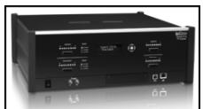  
Summit™ T3-16 Protocol Analyzer

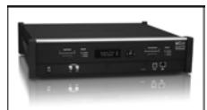  
Summit T3-8 Protocol Analyzer

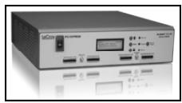  
Summit T2-16 Protocol Analyzer

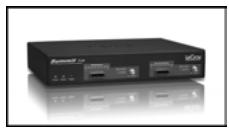  
Summit T28 Protocol Analyzer

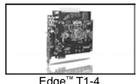  
Edge™ T1-4 Protocol Analyzer

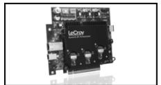

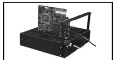  
Summit Z3-16 D i E l tev ce mu a or  
Summit Z3-16 H t E l tos mu a or

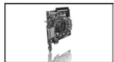

  
Gen2 Protocol T t C des ar

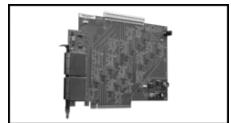  
SimPASS™ PE Simulation Analysis  
Gen3 x16 Active I tn erposer

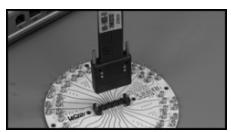  
MidBus Probe

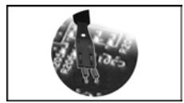  
Multi-lead Probe

  
AMC Interposer

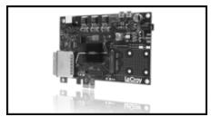  
MiniCard Interposer  
For many additional PCIe products and specialty probes, contact your local LeCroy representative or visit our website  
For more information on LeCroy protocol verification solutions, please contact your Regional Sales Engineer: 1-800-909-7211 or 408-653-1262; or PSGsales@lecroy.com

## MindShare Live Training and Self-Paced Training

<table><tr><td>Intel ArchitectureIntel Ivy Bridge ProcessorIntel 64 (x86) ArchitectureIntel QuickPath Interconnect (QPI)Computer Architecture</td><td>Virtualization TechnologyPC VirtualizationIO Virtualization</td></tr><tr><td>AMD ArchitectureAMD Opteron Processor (Bulldozer)AMD64 Architecture</td><td>IO BusesPCI Express 3.0USB 3.0 / 2.0xHCI for USB</td></tr><tr><td>Firmware TechnologyUEFI ArchitectureBIOS Essentials</td><td>Storage TechnologySAS ArchitectureSerial ATA ArchitectureNVMe Architecture</td></tr><tr><td>ARM ArchitectureARM Architecture</td><td>Memory TechnologyModern DRAM Architecture</td></tr><tr><td>Graphics ArchitectureGraphics Hardware Architecture</td><td>High Speed DesignHigh Speed DesignEMI/EMC</td></tr><tr><td>ProgrammingX86 Architecture ProgrammingX86 Assembly Language BasicsOpenCL Programming</td><td>Surface-Mount Technology (SMT)SMT ManufacturingSMT Testing</td></tr></table>

Are your company’s technical training needs being addressed in the most effective manner?

MindShare has over 25 years experience in conducting technical training on cutting‐edge technologies. We understand the challenges companies have when searching for quality, effective training which reduces the students’ time away from work and provides cost‐effective alternatives. MindShare offers many flexible solutions to meet those needs. Our courses are taught by highly‐skilled, enthusiastic, knowledgeable and experienced instructors. We bring life to knowledge through a wide variety of learning methods and delivery options.

MindShare offers numerous courses in a self‐paced training format (eLearning). We’ve taken our 25+ years of experience in the technical training industry and made that knowledge available to you at the click of a mouse.

MindShare Arbor is a computer system debug, validation, analysis and learning tool that allows the user to read and write any memory, IO or configuration space address. The data from these address spaces can be viewed in a clean and informative style as well as checked for configuration errors and non-optimal settings.

## View Reference Info

MindShare Arbor is an excellent reference tool to quickly look at standard PCI, PCI-X and PCIe structures. All the register and field definitions are up-to-date with the PCI Express 3.0. x86, ACPI and USB reference info will be coming soon as well.

## Decoding Standard and Custom Structures from a Live System

MindShare Arbor can perform a scan of the system it is running on to record the config space from all PCI-visible functions and show it in a clean and intuitive decoded format. In addition to scanning PCI config space, MindShare Arbor can also be directed to read any memory address space and IO address space and display the collected data in the same decoded fashion.

## Run Rule Checks of Standard and Custom Structures

In addition to capturing and displaying headers and capability structures from PCI config space, Arbor can also check the settings of each field for errors (e.g. violates the spec) and non-optimal values (e.g. a PCIe link trained to something less than its max capability). MindShare Arbor has scores of these checks built in and can be run on any system scan (live or saved). Any errors or warnings are flagged and displayed for easy evaluation and debugging. MindShare Arbor allows users to create their own rule checks to be applied to system scans. These rule checks can be for any structure, or set of structures, in PCI config space, memory space or IO space. The rule checks are written in JavaScript. (Python support coming soon.)

## Write Capability

MindShare Arbor provides a very simple interface to directly edit a register in PCI config space, memory address space or IO address space. This can be done in the decoded view so you see what the meaning of each bit, or by simply writing a hex value to the target location.

## Saving System Scans (XML)

After a system scan has been performed, MindShare Arbor allows saving of that system's scanned data (PCI config space, memory space and IO space) all in a single file to be looked at later or sent to a colleague. The scanned data in these Arbor system scan files (.ARBSYS files) are XML-based and can be looked at with any text editor or web browser. Even scans performed with other tools can be easily converted to the Arbor XML format and evaluated with MindShare Arbor.

# The Ultimate Tool to View, Edit and Verify Configuration Settings of a Computer

## Feature List

• Scan config space for all PCI-visible functions in system

• Run standard and custom rule checks to find errors and non-optimal settings

• Write to any config space location, memory address or IO address

• View standard and non-standard structures in a decoded format

• Import raw scan data from other tools (e.g. lspci) to view in Arbor’s decoded format

• Decode info included for standard PCI, PCI-X and PCI Express structures

• Decode info included for some x86-based structures and devicespecific registers

• Create decode files for structures in config space, memory address space and IO space

• Save system scans for viewing later or on other systems

• All decode files and saved system scans are XML-based and open-format

## COMING SOON

Decoded view of x86 structures (MSRs, ACPI, Paging, Virtualization, etc.)